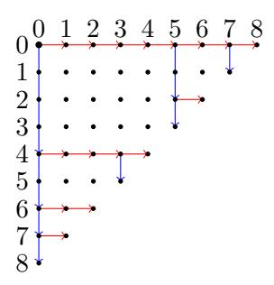
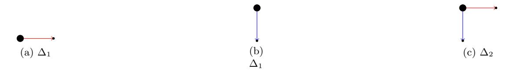
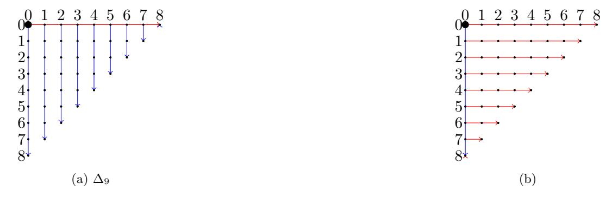
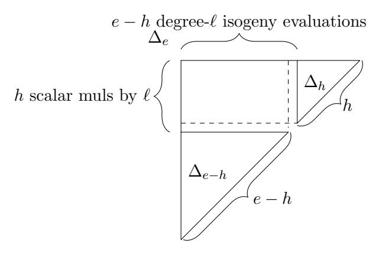
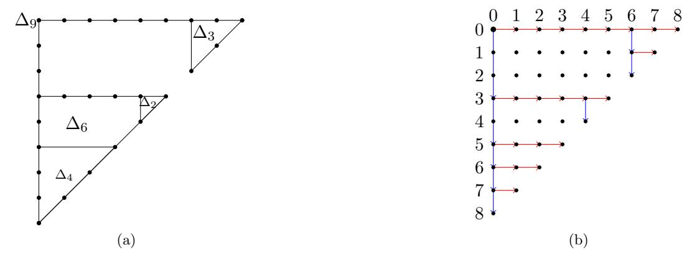
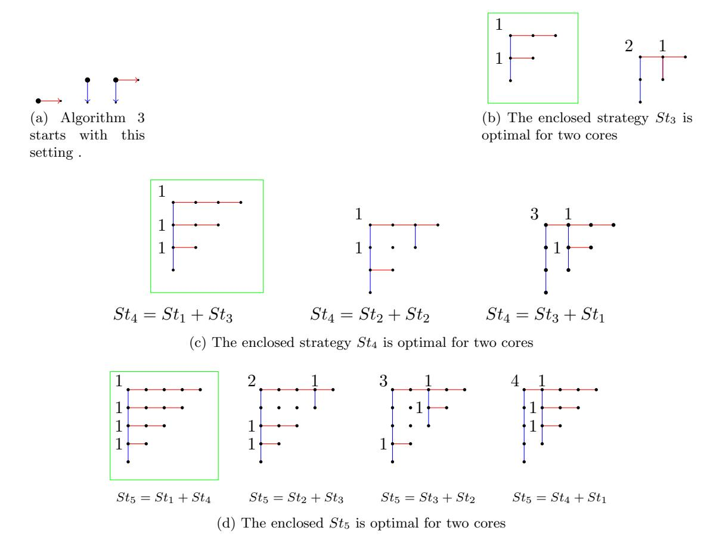
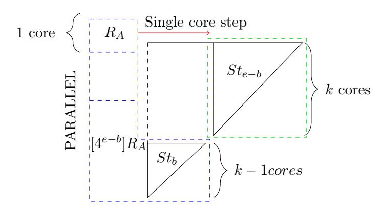
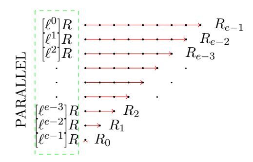

# Parallel strategies for SIDH: Towards computing SIDH twice as fast

Daniel Cervantes-V´azquez Jos´e-Eduardo Ochoa-Jim´enez Francisco Rodr´ıguez-Henr´ıquez

April 2020

#### Abstract

We present novel strategies and concrete algorithms for the parallel computation of the Supersingular Isogeny-based Diffie-Hellman key exchange (SIDH) protocol when executed on multi-core platforms. The most relevant design idea exploited by our approach is that of concurrently computing scalar multiplication operations along with a parallelized version of the strategies required for constructing and evaluating large smooth degree isogenies. We report experimental results showing that a three-core implementation of our parallel approach achieves an acceleration factor of 1.56 compared against a sequential implementation of the SIKE protocol.

## 1 Introduction

Isogeny-based cryptography was proposed by Couveignes in 1997. Complete details of his proposal were eventually reported in [\[7\]](#page-23-0). In 2006, Couveignes' protocol was independently rediscovered by Rostovtsev and Stolbunov in [\[16,](#page-23-1) [18\]](#page-24-0). Also in 2006, Charles-Lauter-Goren introduced in [\[4\]](#page-22-0) the hardness of path-finding in supersingular isogeny graphs and its application to the design of hash functions. Later in 2011, the Supersingular Isogeny-based Diffie-Hellman key exchange protocol (SIDH) was proposed by Jao and de Feo in [\[11\]](#page-23-2). More recently in 2017, the Supersingular Isogeny Key Encapsulation (SIKE) protocol, which can be seen as a descendant of SIDH, was submitted to the NIST post-quantum cryptography standardization project [\[1\]](#page-22-1). The isogeny-based protocol SIKE is one of the seventeen key-exchange schemes accepted for the second round of the NIST contest.

The two most costly computational tasks of SIDH are, (i) the computation of large smooth-degree isogenies of supersingular elliptic curves along with the evaluation of the image of elliptic curve points in those isogenies and; (ii) elliptic curve scalar multiplication computations via three-point Montgomery ladder procedures. For a typical software or hardware implementation of SIDH, the isogeny computations and associated point evaluations on one hand, along with the three-point Montgomery ladders on the other hand, may take 65-75% and 25-35% of the overall protocol's computational cost, respectively [\[2\]](#page-22-2). The optimal computation of large degree isogenies for single-core processors was presented and solved in [8]. Also, efficient algorithms for computing the SIDH three-point scalar multiplications can be found in [11, 9]. Several general ideas for a sensible improving of the SIDH performance were introduced in [6].

Let E be a supersingular elliptic curve defined over the quadratic extension field  $\mathbb{F}_{p^2}$ . Let  $S = \langle R_0 \rangle$  be an order- $\ell^e$  subgroup of  $E[\ell^e]$ , where  $R_0 \in E(\mathbb{F}_{p^2})$ , is a point of order  $\ell^e$ , e is a positive number, and  $\ell$  is a (power) of a small prime. Then there exists a degree- $\ell^e$  isogeny  $\phi: E \to E'$  having kernel S. The image curve E' is also a supersingular elliptic curve defined over  $\mathbb{F}_{p^2}$ . Moreover, #E = #E' [19, Theorem 1]. In this paper, the computational task of finding E' will be referred as isogeny construction. Furthermore, given a point  $P \in E(\mathbb{F}_{p^2})$  such that  $P \notin \text{Ker}(\phi)$ , a closely related problem is that of finding  $\phi(Q)$ , i.e., the image of the point Q over E'. We will refer to this computation as isogeny evaluation.

In [8], optimal strategy techniques were introduced to efficiently compute degree- $\ell^e$  isogenies at a cost of approximately  $\frac{e}{2}\log_2 e$  scalar multiplications by  $\ell$ ,  $\frac{e}{2}\log_2 e$  degree- $\ell$  isogeny evaluations, and e constructions of degree- $\ell$  isogenous curves. The strategies described in [8] are provable optimal for those architectures equipped with a single unit of processing, i.e., single-core platforms. Virtually all SI(DH/KE) implementations published as of today, compute degree- $\ell^e$  isogenies using optimal strategies.

In [2], optimal strategies were depicted as a weighted directed graph whose vertices are elliptic curve points and whose vertical and horizontal edges have as associated weight the cost of performing one scalar multiplication by  $\ell$  and one degree- $\ell$  isogeny, respectively. That weighted directed graph can be drawn as a right triangular lattice  $\Delta_e$  having  $\frac{e(e+1)}{2}$  points distributed in e columns and rows. A leaf is defined as the most bottom point of a given column in that lattice. All vertical edges must be computed sequentially, whereas all the horizontal edges can be computed in parallel. At the beginning of the isogeny computation, only the point  $R_0$  of order  $\ell^e$  is known. The isogeny computation is carried out by obtaining from left to right, each one of the leaves in  $\Delta_e$  until the farthest right one,  $R_{e-1}$ , is computed. Then,  $\phi: E \to E'$  can be found by calculating a degree- $\ell$  isogeny with kernel  $R_{e-1}$ .

An interesting consequence of the weighted directed graph representation is that one can abstract oneself from the cryptographic nature of the isogeny computation problem, and solely focus in the combinatorial structure associated to the graph.

As an illustrative example, consider the toy example depicted in Figure 1 using the parameters  $\ell^e = 4^9$ . In the event that that strategy is executed on a single-core platform, it would have an associated timing cost of thirteen scalar multiplications by 4 (corresponding to the thirteen vertical blue edges shown in the graph), plus sixteen degree-4 isogeny evaluations (corresponding to the sixteen horizontal red edges shown in the graph).<sup>2</sup> However, if one happens to have four cores available for performing this task, then the timing cost can be reduced to thirteen scalar multiplications by 4, plus

<span id="page-1-0"></span><sup>&</sup>lt;sup>1</sup>An analysis of the computational cost of small degree isogeny construction and evaluation can be found in [6, 5, 3].

<span id="page-1-1"></span><sup>&</sup>lt;sup>2</sup>The cost of computing the strategy shown in Figure 1 also includes ten degree- $\ell$  isogeny constructions not relevant for the discussion here.



<span id="page-2-0"></span>Figure 1: Strategy to compute a degree-` <sup>e</sup> = 4<sup>9</sup> isogeny. The root point at row and column zero, represents the elliptic curve point R<sup>0</sup> of order 4<sup>9</sup> . Each one of the nine leaves at the bottom of the columns represent elliptic curve points of order 4. The sequential cost of this strategy is of thirteen scalar multiplications by four plus sixteen degree-4 isogeny evaluations.

just eight degree-4 isogeny evaluations.

## Parallel computations of the SIDH protocol

The chief criticism pointed at the SIDH protocol, is that its latency is much higher than the ones associated to several other candidates in the NIST standardization project [\[15\]](#page-23-5). Motivated by this, numerous efforts to speedup the performance of the SIDH protocol both in software [\[6,](#page-22-3) [14,](#page-23-6) [9,](#page-23-4) [17,](#page-23-7) [2\]](#page-22-2), and in hardware [\[12,](#page-23-8) [13\]](#page-23-9), have been reported. Nonetheless, to our knowledge only the works presented in [\[12,](#page-23-8) [10,](#page-23-10) [2\]](#page-22-2), have attempted to exploit the rich opportunities for parallelism that SIDH has to offer.

In [\[12\]](#page-23-8), a hardware implementation of the SIDH protocol on an FPGA device was presented. Authors' architecture was able to concurrently process an average of four degree-4 isogeny evaluations. Using the 751-bit prime SIKEp<sup>751</sup> = 2<sup>372</sup> · 3 <sup>239</sup> − 1, [3](#page-2-1) these parallel calculations accounted for a saving of 36.5% in the number of clock cycles required for computing degree-4<sup>186</sup> isogenies over F<sup>p</sup> 2 .

The noticeable speedup reported in [\[12\]](#page-23-8) can however be considered sub-optimal, in the sense that for a degree-4<sup>186</sup> isogeny computation, the authors adapted a strategy originally conceived for a sequential execution (as opposed to explicitly designing a parallel strategy for that purpose). Pointing out this limitation, the authors in [\[10\]](#page-23-10) proposed the usage of strategies specifically conceived for the parallel computation of large degree isogenies in SIDH. From a careful theoretical analysis, the authors concluded that an optimal eight-core parallel execution of the SIDH isogeny computation should achieve a timing speedup of up to 55%. However, the authors of [\[10\]](#page-23-10) focused all their attention to the efficient parallelization of the isogeny computations required by the SIDH protocol, leaving out attempts for executing concurrently other SIDH computational tasks, such as three-point Montgomery ladders.

<span id="page-2-1"></span><sup>3</sup>A SIKE instantiation using the prime SIKEp751, achieves the NIST's category 5 security level [\[1\]](#page-22-1).

In [2], eSIDH, a variant of the SIDH protocol that permits to accelerate Bob's computations on single and multi-core platforms was presented. Comparing against a SIKE  $p_{751}$  sequential instantiation of SIDH, the authors reported an acceleration factor of 1.05, 1.30 and 1.41, when eSIDH was implemented on  $k = \{1, 2, 3\}$ -core processors, respectively. However, the approach proposed in [2] does not  $per\ se$  provide speedups for Alice SIDH computations. Moreover, as in [10], eSIDH does not attempt to compute concurrently three-point Montgomery ladders with large degree isogeny computations.

## Contributions and organization of this paper

The main contribution of this paper is the proposal of a concrete, efficient and practical strategy for a parallelized computation of the SIDH protocol. The strategies presented in this work strive for concurrently computing the two most prominent SIDH primitives, namely, the evaluation/construction of large degree isogenies and the computation of right-to-left three-point Montgomery ladders. We report experimental results showing that a three-core implementation of our parallel approach achieves an acceleration factor of 1.56 compared against a sequential implementation of the SIKE protocol (cf. Table 4).

The remainder of this paper is organized as follows. In §2 a brief description of the SIDH protocol is given. A general description of sequential and parallel strategies for computing large smooth-degree isogenies are presented in §3 and §4, respectively. In §5, it is observed that the multiples of Alice and Bob secret points, which are always required in any valid strategy for computing isogenies, can be calculated independently and concurrently. The performance implications of this trick are further discussed in §5. Estimates and experimental results are presented in §6. Finally, some concluding remarks are drawn in §7.

## 2 Background

### <span id="page-3-0"></span>SIDH protocol description

Let  $p = 4^{e_A}3^{e_B} - 1$  be a prime, so that  $4^{e_A} \approx 3^{e_B} \approx p^{1/2}$ . Let E be a supersingular elliptic curve defined over  $\mathbb{F}_{p^2}$  with  $\#E(\mathbb{F}_{p^2}) = (p+1)^2$ . In addition, let  $P_A, Q_A \in E[4^{e_A}]$  be two points of order  $4^{e_A}$ , and  $P_B, Q_B \in E[3^{e_B}]$  be two points of order  $3^{e_B}$  such that  $E[4^{e_A}] = \langle P_A, Q_A \rangle$  and  $E[3^{e_B}] = \langle P_B, Q_B \rangle$ . In SIDH,  $e_A$ ,  $e_B$ , p and E and the bases  $\{P_A, Q_A\}$  and  $\{P_B, Q_B\}$ , are all considered public domain parameters.

Alice begins the key generation phase by selecting her secret  $m_A \in_R [0, 4^{e_A} - 1]$ . Then she computes  $R_A = P_A + [m_A]Q_A$ . Thereafter, Alice constructs the isogeny  $\phi_A : E \to E/A$  and while computing E/A, simultaneously evaluates Bob's public points  $P_B, Q_B$ . Alice keeps secret,  $m_A$  and  $R_A$ . Then she transmits to Bob, E/A,  $\phi_A(P_B)$  and  $\phi_A(Q_B)$ .

Analogously, Bob selects  $m_B \in_R [0, 3^{e_B} - 1]$  to compute  $R_B = P_B + [m_B]Q_B$ . Bob then constructs the isogeny  $\phi_B : E \to E/B$ , and while computing E/B, simultaneously evaluates Alice's public points  $P_A, Q_A$ . He keeps secret,  $m_B$  and  $R_B$ . Then he transmits to Alice E/B,  $\phi_B(P_A)$  and  $\phi_B(Q_A)$ . This action ends the SIDH key generation phase.

Starting the SIDH shared secret phase, Alice computes  $\phi_B(R_A) = \phi_B(P_A) + [m_A]\phi_B(Q_A)$  and uses this point to construct  $(E/B)/\langle \phi_B(R_A) \rangle$ . Meanwhile, Bob computes  $\phi_A(R_B) = \phi_A(P_B) + [m_B]\phi_A(Q_B)$  and uses this point to construct  $(E/A)/\langle \phi_A(R_B) \rangle$ .

These two actions complete the secret shared phase. As a result, both of the compositions of isogenies  $E \to E/A \to (E/A)/\langle \phi_A(R_B) \rangle$  and  $E \to E/B \to (E/B)/\langle \phi_B(R_A) \rangle$ , have kernel  $\langle R_A, R_B \rangle$ . Hence, the elliptic curves computed by Alice and Bob are isomorphic over  $\mathbb{F}_{p^2}$ , and their shared secret is the j-invariant of these curves.

**Remark 1.** In the SIDH key exchange protocol, the key generation phase is always more expensive than the shared secret one. This is because in the former phase Alice and Bob must compute not only the isogenies  $\phi_A, \phi_B$ , but they also have to evaluate the other party's public points namely,  $(\phi_B(P_A), \phi_B(Q_A))$  and  $(\phi_A(P_B), \phi_A(Q_B))$ , respectively

**Remark 2.** In order to compute the points  $R_A$ ,  $\phi_B(R_A)$ ,  $R_B$  and  $\phi_A(R_B)$ , Alice and Bob must perform each, two three-point scalar multiplication procedures, which can be efficiently computed using a right-to-left Montgomery ladder procedure [9]. This Montgomery ladder has a per-step cost of one point addition and one point doubling. Due to the fact that these two operations are usually performed in the projective space  $\mathbb{P}^1$ , we will refer to them as the xADD and the xDBL operations, respectively.

<span id="page-4-2"></span>**Remark 3.** Since for current SIDH state-of-the-art implementations it is observed that the costs of xDBL and xADD are about the same, one can assume that the per-step computational cost of the three-point Montgomery ladder is essentially of two xDBL operations. It follows that the cost of computing  $R_A$  is of  $4e_A$  xDBL operations.

## <span id="page-4-0"></span>3 Sequential strategies for large smooth-degree isogenies

As mentioned in the introduction, any strategy that successfully constructs/evaluates a degree- $\ell^e$  isogeny can be associated with a subgraph  $St_e$  of a weighted directed graph  $\Delta_e$ . In this paper,  $\Delta_e$  is depicted as a right triangular lattice with e rows and columns. The triangular lattice  $\Delta_e$  has exactly  $\frac{e(e+1)}{2}$  points and e leaves, which are defined as the most bottom points in each one of the e columns of the lattice. For the sake of convenience, we will often refer to the directed graph  $\Delta_e$  as a triangle of size e. The points of  $\Delta_e$  represent elliptic curve points. The vertical lines indicate scalar multiplications by  $\ell$ , whereas the horizontal lines represent degree- $\ell$  isogeny evaluations that could in principle be computed in parallel.

Several basic definitions and other useful properties of the lattice  $\Delta_e$  are summarized in the following subsection.

### <span id="page-4-1"></span>3.1 Walking across $\Delta_e$

Aiming to find a strategy  $St_e$  able to compute degree- $\ell^e$  isogenies, the following navigation rules to walk across the triangular grid  $\Delta_e$  must be observed.

1. All the vertices of  $\Delta_e$  are represented as nodes (i,j), with  $0 \le i,j \le e-1$ . The root of  $St_e$  is the vertex (0,0) and represents a point  $R_0$  of order  $\ell^e$ .

- 2. All the nodes in a row i with  $i=0,1,\ldots,e-1$ , represent points belonging to different elliptic curves. Likewise, all the nodes in a column j with  $j=0,1,\ldots,e-1$ , represent points that belong to the same elliptic curve. All nodes having the same *Manhattan distance* to the vertex (0,0), represent points having the same order.
- 3. A Vertical edge corresponds to a scalar multiplication by  $\ell$ . For example in Figure 1, the edge [(2,0),(3,0)] indicates that starting from the node  $[\ell^2]R_0$ , one arrives to the node  $[\ell^3]R_0$ . Every vertical edge has the same weight  $p_\ell$ , which is the computational cost associated to one scalar multiplication by  $\ell$ .
- 4. A Horizontal edge corresponds to a degree- $\ell$  isogeny evaluation. For example in Figure 1, the edge [(3,0),(3,1)] indicates that starting from the node  $[\ell^3]R_0$  one arrives to the node  $\phi_0([\ell^3]R_0)$ . Every horizontal edge has the same weight  $q_\ell$ , which is the computational cost associated to one degree- $\ell$  isogeny evaluation.
- 5. The *depth* at column j for  $j \in [0, e-1]$ , defined as its number of vertices, is of e-1-j vertices.
- 6. One can only compute a horizontal edge [(i,j)(i,j+1)] with  $i \in [0,e-2]$  and  $j \in [0,e-i-2]$ , provided that one has previously reached the leave of the column j, represented by the vertex (e-j-1,j).
- <span id="page-5-1"></span>7. All horizontal edges [(i, j), (i, j + 1)] are independent of each other and therefore can be computed in parallel.
- 8. One can only compute the vertical edge [(i,j),(i+1,j)] for  $i \in [0,e-2]$  and  $j \in [0,e-i-2]$ , if either i=0 or the predecessor edge [(i-1,j),(i,j)] has already been visited. Thus, vertical edges in the same column have computational dependencies among them and in general must be computed sequentially.
- <span id="page-5-0"></span>9. A *split* node is a node that has both a vertical edge and a horizontal edge leaving from it. The weight of a split node is the number of nodes between it and either the next split node in the column or the leave in the column. There are always e-1 split nodes in any valid strategy.
- 10. By definition, there are two possible triangles  $\Delta_1$  of size one, but only one triangle  $\Delta_2$  of size two (cf. Figure 2).

### 3.2 Sequential strategies for computing large smooth-degree isogenies

Let  $\Delta_e$  be the upper-left right triangle of an  $e \times e$  grid, so that  $\Delta_e$  has  $\frac{e(e+1)}{2}$  points distributed in e rows and columns. The optimal strategy problem consists of finding a directed-rooted-weighted subtree  $St_e$ , such that  $\sum_{E \in \text{Edges}(St_e)} w(E)$  is minimum. Here  $w(E) \in \{p_\ell, q_\ell\}$  represents the weight of the edge  $E \in \text{Edges}(St_e)$ .

In the remaining of this subsection, we start by describing first two naive strategies, followed by an approach that finds optimal strategies as presented in [8]

<span id="page-6-1"></span><span id="page-6-0"></span>

<span id="page-6-3"></span><span id="page-6-2"></span>Figure 2: The three smallest triangles, Subfigure [2a](#page-6-1) shows a size-1 triangle consisting of its root and one horizontal edge. Subfigure [2b](#page-6-2) shows a size-1 triangle consisting of its root and one vertical edge. Subfigure [2c](#page-6-3) shows the only size-2 triangle having exactly two leaves.

<span id="page-6-6"></span><span id="page-6-4"></span>

<span id="page-6-5"></span>Figure 3: Two basic strategies for computing a degree-` isogeny. Subfigures [3a](#page-6-4)[-3b](#page-6-5) illustrate a multiplicative-oriented approach and an isogeny-oriented approach, respectively. Vertical blue lines indicate scalar multiplications by `, whereas horizontal red lines indicate degree-` isogeny evaluations.

#### <span id="page-7-0"></span>3.2.1 Two naive strategies

Two natural albeit naive strategies for computing a degree- $\ell^e$  isogeny can be summarized as follows.

Suppose that  $R \in E(\mathbb{F}_{p^2})$  has order  $\ell^e, e \geq 1$ . Then the isogeny  $\phi : E \to E/\langle R \rangle$  can be computed as follows. Define  $E_0 = E$  and  $R_0 = R$ . For  $j = 0, 1, \ldots, e-1$ , let  $\phi_j : E_j \to E_{j+1}$  be the degree- $\ell$  isogeny with kernel  $\langle \ell^{e-1-j}R_i \rangle$ , and let  $R_{j+1} = \phi_i(R_j)$ . Then  $\phi = \phi_{e-1} \circ \cdots \circ \phi_0$ . The computational cost associated to the multiplicative-oriented procedure described above is of  $\frac{e(e-1)}{2}$  scalar multiplications by  $\ell$ , e-1 isogeny evaluations and e isogeny constructions.

A second naive approach to compute a degree- $\ell^e$  isogeny can be formulated as follows. Define  $E_0 = E$ . For  $i = 0, 1, \ldots, e-1$ , compute and store all the e points  $R_i^0 = [\ell^i]R$ . Compute  $\phi_0 : E_0 \to E_1$  such that  $\operatorname{Ker}(\phi_0) = \left\langle R_{e-1}^0 \right\rangle$ . For  $j = 1, \ldots, e-1$  and for  $i = 0, \ldots, e-1-j$ , compute  $R_i^j = \phi_{j-1}(R_i^{j-1})$ ; followed by  $\phi_j : E_j \to E_{j+1}$  such that  $\operatorname{Ker}(\phi_j) = \left\langle R_{e-1-j}^j \right\rangle$ . The computational cost associated to the isogeny-oriented procedure described above is of  $\frac{e(e-1)}{2}$  isogeny evaluations, e-1 scalar multiplications by  $\ell$  and e isogeny constructions.

Instantiated for the computation of a degree- $\ell^9$  isogeny, Figure 3 illustrates the computations that one must perform for the two basic methods previously outlined.

However, we can do much better as discussed next.

## 3.2.2 Optimal strategies for SIDH

Optimal strategies as defined in [8] exploit the fact that a triangle  $\Delta_e$  can be optimally and recursively decomposed into two sub-triangles  $\Delta_h$  and  $\Delta_{e-h}$  as shown in Figure 4. Let us denote as  $\Delta_e^h$  the design decision of splitting a triangle  $\Delta_e$  at row h. Then, the sequential cost of walking across the strategy  $St_e$ , which is a direct subgraph of  $\Delta_e$ , is given as

$$C(St_e^h) = C(St_h) + C(St_{e-h}) + (e-h) \cdot q_\ell + h \cdot p_\ell.$$

We say that  $S_e^{\hat{h}}$  is optimal if  $C(St_e^{\hat{h}})$  is minimal among all  $St_e^h$  for  $h \in [1, e-1]$ .

Applying this strategy recursively leads to a procedure that computes a degree- $\ell^e$  isogeny at a cost of approximately  $\frac{e}{2}\log_2 e$  scalar multiplications by  $\ell$ ,  $\frac{e}{2}\log_2 e$  degree- $\ell$  isogeny evaluations, and e constructions of degree- $\ell$  isogenous curves.

As an illustrative example, consider the strategy shown in Figure 5. Assuming that all the vertical and horizontal edges costs 1 unit, then Subfigure 5a shows an optimal partition of  $\Delta_9$  into two subtriangles  $\Delta_6$  and  $\Delta_3$ , which can in turn be subdivided into two subtriangles  $\Delta_4$  and  $\Delta_2$ ; and  $\Delta_2$  and  $\Delta_1$ , respectively. The strategy shown in Subfigure 5b is optimal to traverse  $\Delta_9$  for single-core processor platforms.

#### 3.3 Linearizing strategies

In SIKE specification [1, §1.3.7], computational strategies  $St_e$  for constructing/evaluating isogenies are described by means of a full binary tree on e-1 nodes. The authors of [1]

<span id="page-8-0"></span>

Figure 4: Using an optimal SIDH strategy as in [8], a triangular lattice  $\Delta_e$  is processed by splitting it into two sub-triangles. After applying this splitting strategy recursively, the cost of computing  $\phi$  drops to approximately  $\frac{e}{2}\log_2 e$  scalar multiplications by  $\ell$ ,  $\frac{e}{2}\log_2 e$  degree- $\ell$  isogeny evaluations, and e constructions of degree- $\ell$  isogenous curves.

<span id="page-8-2"></span><span id="page-8-1"></span>

<span id="page-8-3"></span>Figure 5: Assuming that all the vertical and horizontal edges costs 1 unit, this figure shows an optimal strategy for traversing  $\Delta_9$  on single-core processor architectures.

represent such a tree using a so-called linear representation, which can be obtained by walking through the tree according to a depth-first left-first ordering and outputting the bifurcations as they are encountered. It is straightforward to apply the same linearization process to the right triangular lattices adopted in this paper. To this end, one just needs to record the weight of all the split nodes (see Rule 9 in §3.1) as they are encountered when combing the triangular lattice by columns from j = 0 to e - 2. This process is illustrated in the following examples.

**Example 1.** Referring to the strategies depicted in Figure 1 its linear representation is given by (4,2,1,1,1,2,1,1). The first column has four split nodes of weight 4,2,1,1,1 respectively. The other four split nodes are located in the columns three (one), five (two) and seven (one). all of these four split node have weight one, except the first split node of column 5, whose first split node has weight two.

**Example 2.** Referring to the strategies depicted in Figure 3, their linear representation is given as follows,

- Subfigure 3a: (8,7,6,5,4,3,2,1). Each one of the first eight columns of this strategy has only one split node of weight equal to 8-j, for  $j=0,\ldots,7$ .
- Subfigure 3b: (1,1,1,1,1,1). All the eight split nodes of this strategy have weight one and are located in the column zero.

**Example 3.** Referring to the strategies depicted in Figure 5 its linear representation is given by (3,2,1,1,1,1,1,1). The first column has five split nodes of weight 3,2,1,1,1, respectively. The other three split nodes are located in the columns four (one) and six (two) and all three of them have weight one.

### 3.3.1 Executing linearized strategies

A strategy specified as a vector of e-1 split nodes, can be processed as described in Algorithm 4. Algorithm 4 performs a non-recursive walk across the parallel strategy  $St_e$  for computing a degree- $\ell^e$  isogeny.<sup>4</sup> A general procedure for computing linearized strategies is described next.

- 1. Initialize the three counters i, j, k = 0. Also, initialize a stack *Points*, with the point  $R_0$ .
- 2. Process the element  $St_e[i]$  as follows
  - (a) Get the top element in *Points*, namely  $R_t$  and compute  $R'_t = [\ell^{St_e[i]}]R_t$ . Then store  $R'_t$  in *Points*.
  - (b) Assign  $j = j + St_e[i]$  and i = i + 1.
- 3. Repeat Step 2 until j=e-1-k. // The leaf node is reached when j=e-1-k.//

<span id="page-9-0"></span><sup>&</sup>lt;sup>4</sup>The interested reader is also referred to [1, Algorithm 19].

- 4. Construct a degree- $\ell$  isogeny  $\phi$  using the top element in Points, then remove that element.
- 5. Find the image of all the points stored in Points under the isogeny  $\phi$ . //This computes all the horizontal edges from column k to column k+1 that belong to the strategy  $St_e$ .//
- 6. Assign k = k + 1 and  $j = j St_e[i 1]$ .

  // This indicates the algorithm that a new column will start being processed. Now j indicates the position in the grid of the top element of *Points* corresponding to the vertex (j, k).
- 7. If  $k \le e-2$ , then repeat Step 2. If k=e-1 go to step 3 and then finish the procedure.

## <span id="page-10-0"></span>4 Parallel strategies for large smooth-degree isogenies

In this section, the problem of designing parallel strategies and associated criteria to decide when a parallel strategy is optimal are presented. We say that an strategy  $St_e$  is better than another strategy  $St'_e$ , if the cost of computing  $St_e$  is lesser than the cost of computing  $St'_e$  when executed on a k-core platform.

In a nutshell, our approach to parallelize isogeny computations exploits two main tricks: (i) As per Rule 7 of §3.1, one can make use of all of the k available cores to concurrently compute the horizontal edges associated to any given column; (ii) As it was done in the sequential setting in [8], one can use dynamic programming to translate the problem of optimizing a strategy  $\Delta_e$  to the simpler problem of optimizing the subtriangles  $T_{e-h}$  and  $T_h$ , for  $h \in \{1, 2, \ldots, e-1\}$ . This process must carefully consider the parallel computational cost of the strategy.

In the remaining of this Section, we describe in detail both of these two options.

#### 4.1 Exploiting the parallelism of the horizontal edges

In order to measure strategy costs the following proposition becomes useful.

<span id="page-10-1"></span>**Proposition 1.** Let  $q_{\ell}$  be the timing cost associated to the computation of a degree- $\ell$  isogeny. Let us define a set of horizontal edges for a fixed index  $j \in \{0, 1, ..., e-2\}$  by  $Col_j(St) = \{[(i, j), (i, j+1)] \in E(St_e) \mid i \in [0, e-j-2]\}$ . The timing cost of computing all horizontal edges in  $Col_j(St_e)$  using k cores is of

$$\left\lceil \frac{\#Col_j(St_e)}{k} \right\rceil \cdot q_{\ell}$$

*Proof.* Let us say that  $\#Col_j(St_e) = m$ . If  $k \ge m$  then one can compute all m edges in parallel at a cost of one isogeny evaluation  $q_\ell$ . Otherwise,  $a = \lceil \frac{m}{k} \rceil$  isogeny evaluations  $q_\ell$  suffice for computing all the horizontal edges in column j of strategy  $St_e$ .

Using the previous Proposition one can compute the cost of all the horizontal edges of St<sup>t</sup> using k cores, denoted by C k (Ste), by applying the following Lemma.

Lemma 1. Let us define the set of horizontal edges from the column j to the column j + 1 as in Proposition [1.](#page-10-1) The cost of all evaluations defined by St<sup>e</sup> using k cores is given by

$$\sum_{j=0}^{e-2} \left\lceil \frac{\#Col_j(St_e)}{k} \right\rceil \cdot q_{\ell}$$

Now the cost of evaluating St<sup>e</sup> using k cores is given as

$$C^{k}(St_{e}) = \sum_{j=0}^{e-1} \left[ \frac{\#Col_{j}(St_{e})}{k} \right] \cdot q_{\ell} + \#V(St_{e}) \cdot p_{\ell},$$

where V (Ste) is the set of all vertical edges in Ste, and as before p` and q` represent the costs of computing one scalar multiplication by ` and evaluating one degree-` isogeny.

Lemma 2. An e − 1-core platform can compute an ` e isogeny at a cost of e − 1 scalar multiplications by `, e degree-` isogeny evaluations and e degree-` isogeny constructions.

Proof. Using of the isogeny-oriented strategy described in § [3.2.1](#page-7-0) (cf. Subfigure [3b\)](#page-6-5), this cost can be justified as follows. Compute and store all vertices (0, i) for i = 0 to e − 1. This operation costs e − 1 scalar multiplications by `. Now, for i = 0 to e − 2 using e − 1 − i cores one can perform the isogeny evaluation of the per-column e − 1 − i points in parallel. Moreover, at each one of the e columns, one isogeny construction must be performed. The last degree-` isogeny with kernel given by the point in the vertex (0, e − 1) is computed using only one core.

## 4.2 Using Dynamic programming for finding parallel strategies

<span id="page-11-0"></span>Lemma 3. [\[8\]](#page-23-3) Given a triangle ∆<sup>e</sup> and its decomposition into ∆<sup>h</sup> and ∆e−h, the sequential cost of traversing St<sup>e</sup> using this particular decomposition is given as,

$$C^{1}(St_{e}^{h}) = C^{1}(St_{h}) + C^{1}(St_{e-h}) + (e-h) \cdot q_{\ell} + h \cdot p_{\ell}.$$

We say that St<sup>e</sup> is an optimal strategy if C 1 (St<sup>h</sup> e ) is minimal among all St<sup>h</sup> e for h ∈ [1, e − 1].

This lemma is illustrated in Figure [4.](#page-8-0) Lemma [3](#page-11-0) can be generalized in a natural way to k cores as follows.

<span id="page-11-2"></span>Lemma 4. The cost of traversing St<sup>h</sup> <sup>e</sup> using k cores is given as,

<span id="page-11-1"></span>
$$C^{k}(St_{e}^{h}) = C^{k}(St_{e-h}) + C^{k}(St_{h}) + \frac{(e-h) \cdot q_{\ell}}{k} + h \cdot p_{\ell},$$
(1)

We say that St<sup>h</sup> e is an optimal parallel strategy if C k (St<sup>h</sup> e ) is minimum among all St<sup>h</sup> e for h ∈ [1, e − 1].

The cost above can be justified by the fact that one can include the (e − h) extra degree-` isogeny evaluations into the computation of the horizontal edges of Ste−h. Since the cost C k (Sth) depends of two sets, namely, the set of all columns of St<sup>h</sup> and the set of all vertical edges V (Sth), a precise way to keep track of both sets must be put in place as discussed next.

## 4.2.1 Constructing and Traversing parallel strategies

Let us assume that the parameters e, k, p` , q` , corresponding to the size of the tree ∆e, the number of available cores, the cost of performing one scalar multiplication by ` and the cost of performing one degree-` isogeny, respectively, are all given. Then Algorithms [1,](#page-25-0) [2](#page-25-1) and Algorithm [3](#page-26-1) in Appendix [A,](#page-25-2) find an optimal parallel strategy for St<sup>e</sup> by using a bottom-up approach.

Algorithm [3](#page-26-1) is essentially the same as Algorithm 46 in [\[1,](#page-22-1) Appendix C]. In our case, Algorithm [3](#page-26-1) invokes Algorithm [2](#page-25-1) at Line 6. Algorithm [2](#page-25-1) iteratively finds the row h ∈ [1, e − 1] that produces a minimum cost strategy St<sup>e</sup> composed of the two sub-strategies Ste−<sup>h</sup> and St<sup>h</sup> (cf. Figure [4\)](#page-8-0). For this purpose, Algorithm [2](#page-25-1) invokes Algorithm [1,](#page-25-0) which uses Eq. [\(1\)](#page-11-1) to calculate the computational expenses associated to the strategies St<sup>h</sup> and Ste−h. Notice that Algorithm [2](#page-25-1) follows a bottom-up approach by constructing optimal parallel strategies of size 1, 2, . . . , e − 1, in that order. Algorithm [3](#page-26-1) produces as an output, a linear vector of the split nodes included in the optimal parallel strategy Ste. To illustrate the process outlined above consider the following toy example.

Example 4. Let us assume e = 5, p` = 1, q` = 1 and k = 2. Algorithm [3](#page-26-1) uses the following construction to discover an efficient parallel-strategy St5.

- 1. Figure [6a](#page-13-0) shows the initial setting of size-1 triangles.
- 2. Figure [6b](#page-13-1) shows the two size-3 strategies considered by algorithm [2](#page-25-1) for e = 3. The parallel cost of the left and right strategies is 4 and 5, respectively. Hence, the left one is chosen. The output vector S is set to S = [[], [1], [1, 1]].
- 3. Figure [6c](#page-13-2) shows the three size-4 strategies considered by algorithm [2](#page-25-1) for e = 4. The parallel cost of the first and second strategies is of 7 units. Algorithm [2](#page-25-1) chooses the first one because in Line 6 of this procedure there is a strict less condition. If one relaxes this condition to a strict less or equal comparison, then the second strategy would be used. Now the output vector is set to: S = [[], [1], [1, 1], [1, 1, 1]].
- 4. Figure [6d](#page-13-3) shows the four different size-5 strategies for n = 5. In this case, the first three strategies cost 10 units. Again, Algorithm [2](#page-25-1) chooses the first one. Now, the output vector is set to S = [[], [1], [1, 1], [1, 1, 1], [1, 1, 1, 1]] and the optimal parallel strategy output by Algorithm [2](#page-25-1) is completely defined by the linearized vector, St<sup>5</sup> = [1, 1, 1, 1].
- 5. The vector St<sup>5</sup> = [1, 1, 1, 1] as well as the base curve E and the order-` <sup>e</sup> point R ∈ E(Fq), are the input parameter required by Algorithm [4](#page-26-0) for computing a degree- ` e isogeny.

<span id="page-13-1"></span><span id="page-13-0"></span>

<span id="page-13-3"></span><span id="page-13-2"></span>Figure 6: A toy example of a parallel optimal-strategy search using dynamic programming, along with the parameter set e = 5, p` = 1, q` = 1 and k = 2. [3](#page-26-1)

# <span id="page-14-0"></span>5 Parallelizing the computation of the multiples of the point $R_0$

In this section, an interesting property of the Montgomery ladders will be exploited. This property will allow us to extract more parallelism opportunities from the SIDH main computations. For the sake of simplicity, optimization opportunities for Alice will be discussed first. Hence, the task of computing degree- $4^{e_A}$  isogenies will be the focus of most of this section. The combined savings of Alice and Bob will be considered at the end of this section.

Let us recall that in order to compute a scalar multiplication of the form P + [m]Q, the three-point Montgomery ladder used in SIDH has a per-step cost of 1 xADD and 1 xDBL [9]. The cost of this ladder (cf. Remark 3), is essentially of two xDBL operations per step, which implies that the computation of Alice's secret point  $R_A$  costs about  $4e_A$  xDBL operations.

In §3, it was discussed that starting from the root point  $R_A$  of order- $4^{e_a}$ , any strategy  $St_e$  must compute the multiples  $[4^i]R_A$  belonging to its first column, for  $i = 1, \ldots, e-1$ . Hence, a naive iterative computation of the point multiple  $[4^i]R_A$  would involve to obtain first the point  $R_A$ . From  $R_A$  the desired multiple can be obtained by performing 2i doubling operations. The computational cost of such approach is of about,

$$4e_A \text{ xDBL} + 2i \text{ xDBL} = (4e_A + 2i) \text{ xDBL}.$$

Note that this approach also finds as by-products the multiples,  $[4^j]R_A$  for  $j=1,\ldots,i-1$ . However as shown next, there exists a more efficient approach for computing any multiple of  $R_A$ .

<span id="page-14-1"></span>**Theorem 1.** Let  $P_A$ ,  $Q_A$ ,  $m_A$ ,  $R_A$  be the public and private keys of Alice where  $R_A = P_A + [m_A]Q_A$ , and  $Order(P_A) = Order(Q_A) = Order(R_A) = 4^{e_A}$ . Then the computation of the point  $[4^i]R_A$  costs  $2(e_A - i)$  xDBL.

*Proof.* Since  $P_A$  and  $Q_A$  are public parameters, one can pre-compute all the multiples  $[4^i]P_A$  and  $[4^i]Q_A$  for i=1 to  $e_A-1$ . From a direct manipulation one can write,

$$[4^i]R_A = [4^i]P_A + [m_A]([4^i]Q_A).$$

As  $[4^i]Q_A$  has order  $4^{e_A-i}$ , then  $m_A$  can be replaced by  $\bar{m_A}$  where  $\bar{m_A} = m_A \mod 4^{e_A-i}$ , which is a  $2(e_A - i)$ -bit long integer and compute

$$[4^i]R_A = [4^i]P_A + [m_A][4^i]Q_A,$$

using the fixed-point three-point Montgomery ladder of [9], at a cost of about 1 xDBL (xADD) per bit.  $\Box$ 

<span id="page-14-2"></span>**Theorem 2.** Let  $P_A$ ,  $Q_A$  be the public keys of Alice with  $Order(P_A) = Order(Q_A) = 4^{e_A}$ . Let  $\phi_B(P_A)$  and  $\phi_B(Q_A)$  be the public points that Alice receives from Bob, and let  $m_A$  be Alice's secret scalar. Then computing  $[4^i]\phi_B(R_A)$  costs  $(4e_A - 2i)$  xDBL. Proof. From a direct manipulation one can write,

$$[4^{i}]\phi_{B}(R_{A}) = [4^{i}](\phi_{B}(P_{A}) + [m_{A}]\phi_{B}(Q_{A})) = [4^{i}]\phi_{B}(P_{A}) + [m_{A}]([4^{i}]\phi_{B}(Q_{A})).$$

Similar to Theorem 1, the multiple  $[4^i]\phi_B(Q_A)$  has order  $4^{e_A-i}$ . Then, one can replace  $m_A$  by  $m_A$ , where  $m_A = m_A \mod 4^{e_A-i}$  which has  $2(e_A-i)$  bits. One can compute  $P_A+[m_A]Q_A$ ) using a three-point Montgomery ladder at a cost of  $4(e_A-i)$  xDBL. As  $\phi_B(P_A)$  and  $\phi_B(Q_A)$  both depend on Bob's secret key, it is not possible to pre-compute off-line anything relevant. Thus, one needs to compute  $[4^i](\phi_B(P_A) + [m_A]\phi_B(Q_A))$ , which can be done by repeatedly doubling  $\phi_B(P_A) + [m_A]\phi_B(Q_A)$ . This has a computational cost of 2i doublings. Adding this to the cost of the three-point ladder gives us the desire result of  $(4(e_A-i)+2i)=(4e_A-2i)$  xDBL.

Theorems 1 and 2 state that the computation of the points  $R_A$  and  $\phi_B(R_A)$ , is independent of computing the multiples  $[4^i]R_A$  and  $[4^i]\phi_B(R_A)$  for  $i \in 2, \ldots, e_A - 1$ , respectively. Therefore, during the Key Generation phase the point  $R_A$  and any of its multiples  $[4^i]R_A$ , for some  $i \in 1, 2, \ldots, e - 1$ , can be computed in parallel on a multi-core architecture. Similarly, during the Key Agreement phase, the point  $\phi_B(R_A)$  and any of its multiples  $[4^i]\phi_B(R_A)$  for some  $i \in 1, 2, \ldots, e - 1$ , can be computed concurrently.

<span id="page-15-1"></span>**Corollary 1.** For an e-core architecture, one can compute all multiples  $[4^i]R_A$  or  $[4^i]\phi_B(R_A)$ , for i = 0, 1, ..., e - 1, in parallel.

This gives us the possibility of computing a portion of vertical edges of the left-most column of a strategy  $St_e$ . Alternatively, one can perform isogeny evaluations associated to such strategy at the same time that another core is devoted to compute the points  $R_A$  (or  $\phi_B(R_A)$ ).

<span id="page-15-0"></span>**Proposition 2.** Let  $P_A$ ,  $Q_A$ , m,  $R_A$  be the public and private keys of Alice where  $R_A = P_A + [m]Q_A$ , and let k be the number of cores available to compute a  $4^{e_A}$ -isogeny. Let  $p_4$  be the cost of computing a point multiplication-by-4, and  $q_4$  be the cost of a degree-4 isogeny evaluation. Then, one can compute a  $4^b$ -isogeny by means of a parallel strategy  $St_b$  that uses k-1 cores, at the same time that one core is devoted to compute  $R_A$  (or  $\phi_B(R_A)$ ), where b is given as,

$$b = \max_{i:=1,2,\dots,\frac{e_A-1}{3}} \{i \mid C^{k-1}(St_i) + 2i \cdot p_4 + i \cdot q_4 \le 2e_A p_4 \}.$$

For the Key Generation phase; and

$$b = \max_{i:=1,2,\dots,\frac{e_A-1}{2}} \{i \mid C^{k-1}(St_i) + i \cdot p_4 + i \cdot q_4 \le 2e_A p_4 \}.$$

For the Key Agreement phase.

*Proof.* This result follows directly from Theorem 2. Here we have ignored the cost of isogeny construction, which are usually not taken into account fo assessing the strategy computational cost.  $\Box$ 

<span id="page-16-0"></span>

Figure 7: Representation of a k-core load for the parallel computation of the strategy St<sup>e</sup> as stated in Proposition [2.](#page-15-0) The left-most dash-enclosed computations occur in parallel during a first step. Then, a sequential step computes the image of the point R<sup>A</sup> to be used by the Second strategy Ste−b. This last strategy can be computed using all the k cores.

Figure [7](#page-16-0) illustrates Proposition [2](#page-15-0) showing a k-core load for computing a strategy St<sup>e</sup> in parallel.

In the following, Theorem [2](#page-14-2) is generalized to consider multiplications by ` different than 4.

Proposition 3. Let P, Q, R be points on an elliptic curve E, m, ` and e be integers such that Order(P) = Order(Q) = Order(R) = ` e , R = P + [m]Q, and m < `<sup>e</sup> . Then computing [` i ]R for i = 0 to e − 1, costs about (2e − i) log<sup>2</sup> (`) xDBL. This implies that computing the multiple [` i ]R for i = 1 to e − 1, costs less than the computation of the point R.

Proof. The cost of computing R is of about 2e log<sup>2</sup> (`) xDBL because m is at most an (e log<sup>2</sup> (`))-bit long integer. As in Theorem [2](#page-14-2) one has

$$[\ell^i]R = [\ell^i](P + [m \mod \ell^{e-i}]Q).$$

Here, m mod ` <sup>e</sup>−<sup>i</sup> has at most log<sup>2</sup> (` e−i ) bits. Then computing P + [m mod ` e−i ]Q costs 2(e − i) log<sup>2</sup> (`) xDBL. By adding i scalar multiplications by ` at a cost of ilog<sup>2</sup> (`), the claimed result is obtained.

<span id="page-16-1"></span>Remark 4. In fact the above result is an upper bound because for scalar multiplications by ` = 3, 4, 5, there exist formulas with a cost less than 1.5 log<sup>2</sup> (`) xDBL. Moreover, depending on the specific setting, one can pre-compute off-line point multiples that may lead to a further reduction of the computational cost given in Theorem [1.](#page-14-1)

By Corollary [1,](#page-15-1) if e cores are available for the computation of SIDH, then one can compute [` i ]R for i = 0 to e − 1 in parallel at the same cost of computing one threepoint-ladder of e log<sup>2</sup> (`)-bits. Then all vertices (0, i) for i = 0 to e−1 of a given strategy

<span id="page-17-2"></span>

Figure 8: If the hardware resources are plentiful enough, all multiples of R can be computed in parallel. Also, if there are e available cores, all isogeny evaluations can be computed in parallel.

can be computed at once. Let  $p_{\ell}, q_{\ell}$  and  $r_{\ell}$  be the cost of a multiplication-by- $\ell$ , and the cost of a degree- $\ell$  isogeny evaluation and construction, respectively. Now if  $r_{\ell} < p_{\ell}$  then the core that computes  $[\ell^{e-1}]R$  can also compute the first isogeny construction and from then on, this core can be dedicated to compute all remaining codomain curves. Since  $r_{\ell} < q_{\ell}$ , then,  $r_{\ell}$  is dominated by  $q_{\ell}$  and its associated cost vanishes as one can compute the codomain curve and evaluations in parallel. The assumptions  $r_{\ell} < q_{\ell}$  and  $r_{\ell} < p_{\ell}$  are true for  $\ell = 3.4^{5}$ 

In summary, if e cores are available for the computation of the SIDH protocol, then the computation of an  $\ell^e$  isogeny costs e-1  $\ell$ -isogeny evaluations plus one three-point ladder as illustrated in Figure 8.

## <span id="page-17-0"></span>6 Cost estimates and experimental results

In this section we present concrete cost estimates and experimental results associated to the execution of the SIDH and the SIKE protocols when they are instantiated with the SIKE primes  $p_{434}$  and  $p_{751}$ . We also include in our experiments the Extended-SIDH protocol presented in [2] instantiated with the primes eSIDH primes  $p_{443}$  and  $p_{765}$ .

We begin by given cost estimates for performing the key agreement phase of SIDH using the parallel tricks discussed in §§ 4-5. Then, we present experimental results for performing the key agreement phase of SIDH and the three main phases of the SIKE protocol, namely, Key generation, Encapsulation and Decapsulation.

We benchmarked our software on an Intel(R) Core(TM) i7-6700K processor at 4.00GHz supporting the Skylake micro-architecture. To guarantee the reproducibility of our measurements, the Intel Hyper-Threading and Intel Turbo Boost technologies were disabled. We used the OpenMP v4.5 API for parallel tasks and POSIX threads. Our source code was compiled using Clang v6.0 with the -03 optimization flag and using the options -mbmi2 -madx -fwrapv -fomit-frame-pointer -fopenmp -pthread. Our soft-

<span id="page-17-1"></span><sup>&</sup>lt;sup>5</sup>This assumption is true in general, but for  $\ell \geq 5$  there is an extra cost associated to kernel points generation because the kernel has more than one point.

ware library is freely available from,

#### <https://github.com/dcervantesv/eSIDH>

## 6.1 Cost estimates

The cost estimates and experimental results presented in this section focus in two case studies,

- 1. SIKE Prime p<sup>434</sup> = 41083 <sup>137</sup> − 1
  - e<sup>4</sup> = 107, p<sup>4</sup> = 5, 510, q<sup>4</sup> = 3, 756, r<sup>4</sup> = 1, 646 , F<sup>p</sup> 2 434 inversion = 76, 078.
- 2. SIKE Prime p<sup>751</sup> = 41863 <sup>239</sup> − 1.

• 
$$e_4 = 185, p_4 = 11,902, q_4 = 8,108, r_4 = 3,492, \mathbb{F}_{p_{751}^2}$$
 inversion = 310,512.

Where r<sup>4</sup> is the cost of constructing a degree-4 isogenous curve. All the costs above are given in Skylake clock cycles.

Tables [1](#page-19-0) and [2](#page-19-1) show our cost estimates for Alice's key generation phase when using the SIKE primes p<sup>434</sup> and p751, respectively. The data included in these two tables was organized as follows. The first column gives the number of cores considered by the parallel strategy. The second and third columns show the equivalent timing cost associated with the computation of degree-4 isogeny evaluations when using a single and k cores, respectively. The unit of measure for these costs are given in terms of equivalent isogeny evaluations. The fourth column indicates the number of scalar multiplications performed by both, the single-core and the multi-core processors. The fifth column reports the maximum value b that one can select. As defined in Proposition [2,](#page-15-0) this parameter indicates the height of the lower subtriangle in Figure [7.](#page-16-0) The sixth column reports the expected complete cost of Alice's key agreement phase (given in millions of Skylake clock cycles), including the expenses associated to walking across St<sup>107</sup> (resp. St186), the cost of obtaining the Montgomery constant for the curve E<sup>B</sup> (essentially one field inversion), the cost of evaluating φB(RA), computing 108 (resp. 186) degree-4 isogenies and the shared secret j(EB) (essentially one field inversion). Finally, the seventh column reports the Acceleration Factor (AF) achieved by the parallel strategy compared against the sequential one.

The estimates given in Table [1,](#page-19-0) predict that for the prime p<sup>434</sup> one can achieve an acceleration factor of two when using 29 cores and the parallel strategy reported in Appendix [B.1.](#page-27-0) Notice that when 69 cores are available, the minimum number of multiplications, which is 106, is achieved. The estimates given in Table [2,](#page-19-1) expect that an acceleration factor of two will be achieved when using 22 cores and the parallel strategy reported in Appendix [B.2.](#page-27-1) Moreover, a total of 122 cores would be needed to achieve the minimum number of multiplications-by-4 (184 multiplications). Notice also that the size of the lower subtriangle of Figure [7](#page-16-0) get stuck at 62 cores. This indicates that another strategy or scheduling must be adopted to further improve the parallelism in this setting.

<span id="page-19-0"></span>

|       | Evaluations |          |      |    |      |      |
|-------|-------------|----------|------|----|------|------|
| Cores | Serial      | Parallel | Muls | b  | Cost | AF   |
| 1     | 405         | —-       | 333  | —- | 5.12 | 1    |
| 2     | 433         | 278      | 259  | 21 | 3.83 | 1.34 |
| 3     | 497         | 217      | 234  | 23 | 3.46 | 1.48 |
| 4     | 563         | 192      | 214  | 26 | 3.24 | 1.58 |
| 8     | 834         | 153      | 176  | 29 | 2.90 | 1.77 |
| 29    | 2388        | 140      | 120  | 35 | 2.56 | 2.00 |
| 69    | 3151        | 107      | 106  | 36 | 2.36 | 2.17 |
| 106   | 3151        | 106      | 106  | 36 | 2.36 | 2.17 |
| 107   | 3151        | 106      | 106  | 36 | 2.36 | 2.17 |

Table 1: Estimate costs (in millions of clock cycles) of Alice's key agreement SIDH phase for the prime p<sup>434</sup> using the Section [5](#page-14-0) tricks except for Remark [4.](#page-16-1) The AF column gives the quotient of the Single core cost and the parallel cost using k cores. The parameter b is given as defined in Proposition [2](#page-15-0)

<span id="page-19-1"></span>

|       | Evaluations |          |      |    |       |      |
|-------|-------------|----------|------|----|-------|------|
| Cores | Serial      | Parallel | Muls | b  | Cost  | AF   |
| 1     | 784         | —-       | 636  | —- | 20.33 | 1    |
| 2     | 849         | 540      | 508  | 33 | 15.35 | 1.32 |
| 3     | 1006        | 436      | 445  | 37 | 13.76 | 1.48 |
| 4     | 1125        | 370      | 413  | 41 | 12.77 | 1.59 |
| 8     | 1723        | 303      | 331  | 48 | 11.26 | 1.80 |
| 22    | 3083        | 233      | 281  | 54 | 10.15 | 2.00 |
| 60    | 9099        | 245      | 187  | 62 | 9.26  | 2.20 |
| 122   | 9456        | 184      | 184  | 62 | 8.73  | 2.33 |
| 184   | 9456        | 184      | 184  | 62 | 8.73  | 2.33 |
| 185   | 9456        | 184      | 184  | 62 | 8.73  | 2.33 |

Table 2: Estimate costs (in millions of clock cycles) of Alice's key agreement SIDH phase for the prime p<sup>751</sup> using the Section [5](#page-14-0) tricks except for Remark [4.](#page-16-1) The AF column is the quotient of the Single core cost and the parallel cost using k cores. The parameter b is given as defined in Proposition [2](#page-15-0)

<span id="page-20-1"></span>

|            | Estimated Cost | Experimental timings |             |  |
|------------|----------------|----------------------|-------------|--|
|            |                | Strategy type        |             |  |
|            |                | Parallel             | Single core |  |
| # of cores | (including R   | (including R         |             |  |
| k          | in parallel)   | in parallel)         |             |  |
| 1          | 19.60 (19.60)  | 19.00 (19.00)        | 19.00       |  |
| 2          | 16.44 (14.73)  | 16.57 (15.17)        | 17.06       |  |
| 3          | 15.04 (13.21)  | 15.95 (13.82)        | 16.35       |  |
| 4          | 14.19 (12.25)  | 14.64 (13.51)        | 16.11       |  |

Table 3: Estimated Vs. experimental costs for the computation of the key agreement phase of the SIDH protocol instantiated with the prime p751. All estimates and experimental results are given in 10<sup>6</sup> clock cycles.

## 6.2 Experimental results

Table [3](#page-20-1) presents a comparison of estimated versus experimental costs on the computation of the key agreement phase of the SIDH protocol, instantiated with the prime p751. The data in this table was organized as follows. The first column reports the number k of cores. The second and third columns report the estimated and experimental SIDH key agreement costs using parallel strategies, with and without computing multiples of the secret point R in parallel, respectively. The last column reports the timing costs of the SIDH protocol using the sequential optimal strategies of [\[8\]](#page-23-3).

The relatively complex synchronization of the core loads, has so far prevented us to experimentally achieve the expected theoretical speedups for k = 2, 3, 4. Nonetheless, our experiments show that the parallel strategies reported in Appendix [B.2](#page-27-1) yields an acceleration factor of 1.15, 1.19 and 1.34 when using two, three and four cores, respectively. Including the trick of computing the multiples of R in parallel, provides an acceleration factor of 1.25, 1.38 and 1.41 when using two, three and four cores, respectively.

We also implemented the SIKE protocol instantiated with the SIKE prime p<sup>751</sup> [\[1\]](#page-22-1) and the eSIDH prime p<sup>765</sup> [\[2\]](#page-22-2), using the parallelization techniques discussed in §§[4-](#page-10-0)[5](#page-14-0) for Alice's key generation and key agreement phases. Compared against a sequential SIKE implementation instantiated with p751, Table [4](#page-21-0) reports an acceleration factor of 1.56 for a three-core implementation of SIKE instantiated with the prime p765. We also implemented SIDH protocol and we achieve an acceleration factor of about 1.57 when comparing the single core SIDH implementation using SIKE prime p<sup>751</sup> against the three-core implementation of eSIDH [\[2\]](#page-22-2) using eSIDH prime p<sup>765</sup> and the parallelization techniques discussed in §§[4-](#page-10-0)[5.](#page-14-0)

## <span id="page-20-0"></span>7 Conclusion

We presented a framework that permits to accelerate the execution of the SIDH and SIKE protocols on multi-core platforms by exploiting the concurrent computation of degree-` e isogenies and three-point Montgomery ladders. Our experiments shows that

<span id="page-21-0"></span>

|                | p751            | p765            |       |       |
|----------------|-----------------|-----------------|-------|-------|
|                | Number of cores | Number of cores |       |       |
| Phase          | 1               | 1               | 2     | 3     |
| Key Generation | 26.71           | 24.78           | 17.71 | 15.93 |
| Encapsulation  | 43.01           | 40.43           | 29.95 | 27.64 |
| Decapsulation  | 46.34           | 45.58           | 32.92 | 30.79 |
| Total          | 116.06          | 110.79          | 80.58 | 74.36 |

Table 4: SIKE protocol experimental timing for a SIKE prime p<sup>751</sup> and an eSIDH prime p<sup>765</sup> instantiation. All timings are given in 10<sup>6</sup> clock cycles measured on an Intel Skylake proccessor at 4.0 GHz. An acceleration factor of 1.56 was measured for a SIKE threecore implementation compared against a sequential SIKE instantiation using the prime p751.

|                         | p751            | p765            |       |       |
|-------------------------|-----------------|-----------------|-------|-------|
| Phase                   | Number of cores | Number of cores |       |       |
|                         | 1               | 1               | 2     | 3     |
| Alice<br>Key Generation | 23.59           | 22.27           | 15.93 | 14.80 |
| Bob<br>Key Generation   | 26.74           | 24.34           | 17.76 | 15.79 |
| Alice<br>Key Agreement  | 19.37           | 18.21           | 14.30 | 13.07 |
| Bob<br>Key Agreement    | 22.76           | 23.24           | 17.16 | 15.94 |
| Total                   | 92.46           | 88.05           | 65.15 | 59.06 |

Table 5: SIDH protocol experimental timing for a SIKE prime p<sup>751</sup> and an eSIDH prime p<sup>765</sup> instantiation. All timings are given in 10<sup>6</sup> clock cycles measured on an Intel Skylake proccessor at 4.0 GHz. An acceleration factor of about 1.57 was measured for a SIDH three-core implementation compared against a sequential SIDH instantiation using the prime p751.

compared against their sequential counterparts, our proposed SIDH and SIKE parallel variants achieve important acceleration factors.

It appears that there exist several other parallelization opportunities that were not considered in this work. For example, we did not consider the design decision of reserving k − 1 cores for the computation of the vertices (0, i) of the subtriangle ∆<sup>b</sup> in Figure [7.](#page-16-0) One can then compute in parallel the intermediate points of the strategy associated to ∆b, which would produce a reduction in its computational cost. Since this approach appears to be a non-trivial design task, we leave this option as a future work.

## Acknowledgements

This work was partially done while the first and third authors were visiting the University of Waterloo. The authors would like to thank Jes´us-Javier Chi-Dom´ınguez for his valuable comments, and Jos´e-Abraham Bernal for his useful comments and for allowing us to use his server.

## References

- <span id="page-22-1"></span>[1] R. Azarderakhsh, M. Campagna, C. Costello, L. D. Feo, B. Hess, A. Jalali, D. Jao, B. Koziel, B. LaMacchia, P. Longa, M. Naehrig, G. Pereira, J. Renes, V. Soukharev, and D. Urbanik. Supersingular isogeny key encapsulation. second round candidate of the nist's post-quantum cryptography standardization process, 2017. Available at: https://sike.org/.
- <span id="page-22-2"></span>[2] D. Cervantes-V´azquez, E. Ochoa-Jim´enez, and F. Rodr´ıguez-Henr´ıquez. eSIDH: the revenge of the SIDH. Cryptology ePrint Archive, Report 2020/021, 2020. [https:](https://eprint.iacr.org/2020/021) [//eprint.iacr.org/2020/021](https://eprint.iacr.org/2020/021).
- <span id="page-22-5"></span>[3] D. Cervantes-V´azquez and F. Rodr´ıguez-Henr´ıquez. A note on the cost of computing odd degree isogenies. Cryptology ePrint Archive, Report 2019/1373, 2019. [https:](https://eprint.iacr.org/2019/1373) [//eprint.iacr.org/2019/1373](https://eprint.iacr.org/2019/1373).
- <span id="page-22-0"></span>[4] D. Charles, E. Goren, and K. Lauter. Cryptographic hash functions from expander graphs. Cryptology ePrint Archive, Report 2006/021, 2006. [http://eprint.iacr.](http://eprint.iacr.org/2006/021) [org/2006/021](http://eprint.iacr.org/2006/021).
- <span id="page-22-4"></span>[5] C. Costello and H. Hisil. A simple and compact algorithm for SIDH with arbitrary degree isogenies. In T. Takagi and T. Peyrin, editors, Advances in Cryptology - ASIACRYPT 2017 - 23rd International Conference on the Theory and Applications of Cryptology and Information Security Part II, volume 10625 of Lecture Notes in Computer Science, pages 303–329. Springer, 2017.
- <span id="page-22-3"></span>[6] C. Costello, P. Longa, and M. Naehrig. Efficient algorithms for supersingular isogeny Diffie-Hellman. In M. Robshaw and J. Katz, editors, Advances in Cryptology - CRYPTO 2016 - Part I, volume 9814 of Lecture Notes in Computer Science, pages 572–601. Springer, 2016.

- <span id="page-23-0"></span>[7] J.-M. Couveignes. Hard homogeneous spaces. Cryptology ePrint Archive, Report 2006/291, 2006. <http://eprint.iacr.org/2006/291>.
- <span id="page-23-3"></span>[8] L. De Feo, D. Jao, and J. Plˆut. Towards Quantum-Resistant Cryptosystems from Supersingular Elliptic Curve Isogenies. Journal of Mathematical Cryptology, 8(3):209–247, Sept. 2014.
- <span id="page-23-4"></span>[9] A. Faz-Hern´andez, J. L. Hernandez, E. Ochoa-Jim´enez, and F. Rodr´ıguez-Henr´ıquez. A faster software implementation of the supersingular isogeny diffiehellman key exchange protocol. IEEE Trans. Computers, 67(11):1622–1636, 2018.
- <span id="page-23-10"></span>[10] A. Hutchinson and K. Karabina. Constructing canonical strategies for parallel implementation of isogeny based cryptography. In D. Chakraborty and T. Iwata, editors, Progress in Cryptology - INDOCRYPT 2018, volume 11356 of Lecture Notes in Computer Science, pages 169–189. Springer, 2018.
- <span id="page-23-2"></span>[11] D. Jao and L. D. Feo. Towards quantum-resistant cryptosystems from supersingular elliptic curve isogenies. In B. Yang, editor, Post-Quantum Cryptography - 4th International Workshop, PQCrypto 2011, volume 7071 of Lecture Notes in Computer Science, pages 19–34. Springer, 2011.
- <span id="page-23-8"></span>[12] B. Koziel, R. Azarderakhsh, and M. M. Kermani. Fast hardware architectures for supersingular isogeny diffie-hellman key exchange on FPGA. In O. Dunkelman and S. K. Sanadhya, editors, Progress in Cryptology - INDOCRYPT 2016, volume 10095 of Lecture Notes in Computer Science, pages 191–206, 2016.
- <span id="page-23-9"></span>[13] B. Koziel, R. Azarderakhsh, M. M. Kermani, and D. Jao. Post-quantum cryptography on FPGA based on isogenies on elliptic curves. IEEE Trans. on Circuits and Systems, 64-I(1):86–99, 2017.
- <span id="page-23-6"></span>[14] B. Koziel, A. Jalali, R. Azarderakhsh, D. Jao, and M. M. Kermani. NEON-SIDH: efficient implementation of supersingular isogeny diffie-hellman key exchange protocol on ARM. In S. Foresti and G. Persiano, editors, Cryptology and Network Security - 15th International Conference, CANS 2016, volume 10052 of Lecture Notes in Computer Science, pages 88–103, 2016.
- <span id="page-23-5"></span>[15] NIST. NIST Post-Quantum Cryptography Standardization Process. Second Round Candidates, 2017. Available at: https://csrc.nist.gov/projects/post-quantumcryptography/round-2-submissions.
- <span id="page-23-1"></span>[16] A. Rostovtsev and A. Stolbunov. Public-key cryptosystem based on isogenies. IACR Cryptology ePrint Archive, 2006:145, 2006.
- <span id="page-23-7"></span>[17] H. Seo, Z. Liu, P. Longa, and Z. Hu. SIDH on ARM: faster modular multiplications for faster post-quantum supersingular isogeny key exchange. IACR Trans. Cryptogr. Hardw. Embed. Syst., 2018(3):1–20, 2018.

- <span id="page-24-0"></span>[18] A. Stolbunov. Constructing public-key cryptographic schemes based on class group action on a set of isogenous elliptic curves. Adv. in Math. of Comm., 4(2):215–235, 2010.
- <span id="page-24-1"></span>[19] J. Tate. Endomorphisms of abelian varieties over finite fields. Inventiones Mathematicae, 22:134—-144, 1966.

# Appendices

## <span id="page-25-2"></span>A Dynamic Programming Algorithms

#### <span id="page-25-0"></span>Algorithm 1 Ev counts: Computes Eq.[\(1\)](#page-11-1) for a given partition St<sup>h</sup> e

Require: E0 and E1 are sets of horizontal edges counts, k is the number of cores available

Ensure: Ee: The new set of horizontal edges generated by E0 and E1. evs: The number of evaluations required to compute the set of edges Ee when k cores are available.

```
1: if E0 is empty then {Merging both strategies}
2: Ee := [1] cat [i : i in E1];
3: else
4: Ee := [i + 1 : i in E0] cat [1] cat E1;
5: end if
6: evs := 0;
7: if k = 1 then {getting the cost of Ee when k cores used}
8: evs := X
            e∈Ee
                 e;
9: else
10: for i in Ee do
11: if i ≤ k then {Using Lemma 4}
12: evs +:= 1;
13: else
14: evs +:= bi/kc + 1;
15: end if
16: end for
17: end if
18: return evs, Ee;
```

#### <span id="page-25-1"></span>Algorithm 2 get Min Parallel Strat: Finds an optimal St<sup>h</sup> <sup>e</sup> splitting

Require: C: Set of costs, E: Set of sets of horizontal edges, V : Set of Multiplication operations, e: number of leaves , p`: Cost of one scalar multiplication by `, q`: Cost of one evaluation by a degree-` isogeny, k: number of available cores.

Ensure: minC: The cost of the minimum strategy for e leaves using k cores. minEn: The new set of edges for the minimum strategy for e leaves using k cores. minM : The multiplication counts for the minimum strategy for e leaves using k cores.

```
1: minC := e
            2∗(p`+q`)
                    ;{just an upper bound}
2: for b := 1 to e-1 do
3: ev counts temp, St temp := Ev Counts(E[e-b], E[b], k);{Algorithm 1}
4: muls temp := (V[e-b] + V[b] + b);{number of multiplications on St temp}
5: cost temp := (ev counts temp * q`) + (muls temp * p`);
6: if cost temp < minC then
7: split := b;
8: minC := cost temp;
9: minEn := E temp;
10: minV := muls temp;
11: end if
12: end for;
13: return minC, split, minEn, minV;
```

## <span id="page-26-1"></span>Algorithm 3 get Parallel Strategy: Obtains the optimal parallel strategy for ∆<sup>e</sup> using k-cores

Require: e: the number of leaves, p`: Cost of the scalar multiplications by `, q`: the cost of a degree-` isogeny evaluation, K: number of available cores) Ensure: S: Strategy to traverse ∆e. 1: E := [[], [1]]; {Set of set of horizontal edges} 2: M := [0, 1];{Set of multiplication counts} 3: S := [[], [1]];{Set to keep the partial strategies} 4: C := [0, p` + q`];{Set to keep the cost of partial strategies}

```
5: for i in [3..(e + 1)] do
6: cost, h, Ei, muls := get Min Parallel Strat(C, E, M, i, p`, q`, K);{Algorithm 2}
7: Append(∼C, cost);{getting cost;}
8: Append(∼E, Ei);{updating the set of sets of horizontal edges}
9: Append(∼M, muls);{updating the set of Muls.}
10: Append(∼S, [b] cat S[i - b] cat S[b] );{building the new strategy}
11: end for
12: return S[e + 1];
```

## <span id="page-26-0"></span>Algorithm 4 Non-recursive walking across the Strategy Stn

Require: A strategy St<sup>e</sup> obtained from algorithm [3,](#page-26-1) Elliptic Curve E0, Point R ∈ E<sup>0</sup> of order ` e

```
Ensure: Elliptic Curve Ee such that there is a degree-`
                                                        e
                                                         -isogeny between E0 and Ee.
```

```
1: idx := 0;
2: i := 1;
3: points := [[R, 0]];
4: for row := 0 to e − 1 do
5: while idx< n - row do
6: Rt := [d
               St[i]]Rt;
7: idx +:= St[i];
8: Append(points, [Rt, idx]);
9: i +:=1;
10: end while
11: Compute φrow and Erow+1 using Erow and Rt.
12: Prune(points);
13: for j := 1 to #points do {PARALLEL FOR}
14: points[j, 1] := φrow(points[j, 1]);
15: end for
16: [Rt, idx] :=Pop(points);
17: end for
18: Compute φe−1 and Ee using Ee−1 and Rt.
19: return Ee;
```

## B Node split vectors for the parallel strategies

We report several parallel strategies generated using the algorithms presented in Appendix [A.](#page-25-2)

## <span id="page-27-0"></span>B.1 Strategies for the SIKE prime p<sup>434</sup>

```
• 2 cores [ 39, 21, 18, 10, 8, 4, 3, 2, 1, 1, 1, 1, 1, 1, 1, 1, 3, 2, 1,
 1, 1, 1, 1, 3, 3, 1, 1, 1, 1, 1, 1, 1, 8, 3, 3, 1, 1, 1, 1, 1, 1, 1,
 3, 2, 1, 1, 1, 1, 1, 8, 5, 3, 2, 1, 1, 1, 1, 1, 2, 1, 1, 1, 3, 2, 1,
 1, 1, 1, 1, 13, 8, 8, 3, 3, 1, 1, 1, 1, 1, 1, 1, 3, 2, 1, 1, 1, 1, 1,
 3, 2, 1, 1, 1, 1, 1, 5, 3, 2, 1, 1, 1, 1, 1, 2, 1, 1, 1 ]
```

```
• 9 cores [ 10, 10, 10, 10, 10, 10, 10, 10, 10, 1, 1, 1, 1, 1, 1, 1, 1,
 1, 1, 1, 1, 1, 1, 1, 1, 1, 1, 1, 1, 1, 1, 1, 1, 1, 1, 1, 1, 1, 1, 1,
 1, 1, 1, 1, 1, 1, 1, 1, 1, 1, 1, 1, 1, 1, 1, 1, 1, 1, 1, 1, 1, 1, 1,
 1, 1, 1, 1, 1, 1, 1, 1, 1, 1, 1, 1, 1, 1, 1, 1, 1, 1, 1, 1, 1, 1, 1,
 1, 1, 1, 1, 1, 1, 1, 1, 1, 1, 1, 1, 1, 1, 1, 1, 1, 1, 1, 1, 1 ]
```

```
• 55 cores [ 1, 1, 1, 1, 1, 1, 1, 1, 1, 1, 1, 1, 1, 1, 1, 1, 1, 1, 1, 1,
 1, 1, 1, 1, 1, 1, 1, 1, 1, 1, 1, 1, 1, 1, 1, 1, 1, 1, 1, 1, 1, 1, 1,
 1, 1, 1, 1, 1, 1, 1, 1, 1, 1, 1, 1, 1, 1, 1, 1, 1, 1, 1, 1, 1, 1, 1,
 1, 1, 1, 1, 1, 1, 1, 1, 1, 1, 1, 1, 1, 1, 1, 1, 1, 1, 1, 1, 1, 1, 1,
 1, 1, 1, 1, 1, 1, 1, 1, 1, 1, 1, 1, 1, 1, 1, 1, 1, 1 ]
```

The following strategies include the parallel computation of the multiples of RA:

```
• 2 cores [ 86, 10, 5, 3, 2, 1, 1, 1, 1, 2, 1, 1, 1, 5, 2, 1, 1, 1, 2, 1,
 1, 1, 28, 19, 13, 8, 8, 3, 3, 1, 1, 1, 1, 1, 1, 1, 3, 2, 1, 1, 1, 1,
 1, 3, 2, 1, 1, 1, 1, 1, 5, 3, 2, 1, 1, 1, 1, 1, 2, 1, 1, 1, 8, 4, 3,
 1, 1, 1, 1, 1, 1, 1, 1, 3, 2, 1, 1, 1, 1, 1, 8, 8, 4, 3, 2, 1, 1, 1,
 1, 1, 1, 1, 1, 3, 2, 1, 1, 1, 1, 1, 3, 2, 1, 1, 1, 1, 1 ]
```

```
• 20 cores [ 74, 1, 1, 1, 1, 1, 1, 1, 1, 1, 1, 1, 1, 1, 1, 1, 1, 1, 1, 1,
 1, 1, 1, 1, 1, 1, 1, 1, 1, 1, 1, 1, 1, 1, 21, 14, 1, 1, 1, 1, 1, 1, 1,
 1, 1, 1, 1, 1, 1, 1, 1, 1, 1, 1, 1, 1, 1, 1, 1, 1, 1, 1, 1, 1, 1, 1,
 1, 1, 1, 1, 1, 1, 1, 1, 1, 1, 1, 1, 1, 1, 1, 1, 1, 1, 1, 1, 1, 1, 1,
 1, 1, 1, 1, 1, 1, 1, 1, 1, 1, 1, 1, 1, 1, 1, 1, 1, 1 ]
```

## <span id="page-27-1"></span>B.2 Strategies for the SIKE prime p<sup>751</sup>

```
• 2 cores [57, 42, 28, 21, 12, 8, 8, 3, 3, 1, 1, 1, 1, 1, 1, 1, 3, 2, 1,
 1, 1, 1, 1, 3, 2, 1, 1, 1, 1, 1, 4, 3, 2, 1, 1, 1, 1, 1, 1, 1, 1, 8,
 5, 3, 2, 1, 1, 1, 1, 1, 2, 1, 1, 1, 3, 2, 1, 1, 1, 1, 1, 8, 8, 4, 3,
 2, 1, 1, 1, 1, 1, 1, 1, 1, 3, 2, 1, 1, 1, 1, 1, 3, 2, 1, 1, 1, 1, 1,
 14, 8, 8, 4, 3, 2, 1, 1, 1, 1, 1, 1, 1, 1, 3, 2, 1, 1, 1, 1, 1, 3, 2,
```

```
1, 1, 1, 1, 1, 6, 3, 2, 1, 1, 1, 1, 1, 3, 1, 1, 1, 1, 18, 13, 8, 8, 3, 3, 1, 1, 1, 1, 1, 1, 1, 1, 3, 2, 1, 1, 1, 1, 3, 2, 1, 1, 1, 1, 1, 5, 3, 2, 1, 1, 1, 1, 1, 2, 1, 1, 1, 8, 3, 3, 1, 1, 1, 1, 1, 1, 1, 3, 2, 1, 1, 1, 1, 1, 1]
```

- 9 cores[ 20, 18, 18, 18, 14, 10, 10, 10, 10, 10, 10, 10, 10, 1, 1, 1, 1, 1, 1, 1, 1, 1, 1, 1, 1, 1,
- 94 cores [ 1, 1, 1, 1, 1, 1, 1, 1, 1, 1, 1, 1, 1,

The following strategies include the parallel computation of the multiples of  $R_A$ :

- 2 cores [ 152, 16, 9, 4, 2, 1, 1, 1, 2, 1, 1, 4, 2, 1, 1, 1, 2, 1, 1, 7, 4, 2, 1, 1, 1, 2, 1, 1, 1, 3, 2, 1, 1, 1, 1, 44, 39, 21, 18, 10, 8, 4, 3, 2, 1, 1, 1, 1, 1, 1, 1, 1, 1, 1, 1, 1, 1,
- 22 cores[ 131, 14, 1, 1, 1, 1, 1, 1, 1, 1, 1, 1, 1, 1, 1,

```
• 62 cores [ 123, 1, 1, 1, 1, 1, 1, 1, 1, 1, 1, 1, 1, 1,
```