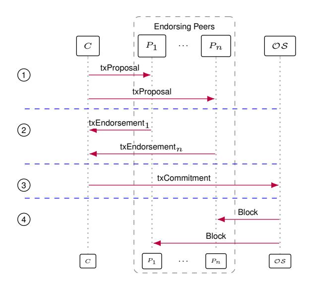
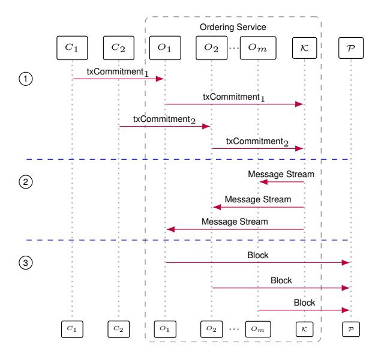
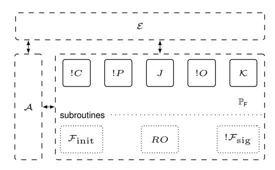

# <span id="page-0-0"></span>Accountability in a Permissioned Blockchain: Formal Analysis of Hyperledger Fabric (Full Version)

#### Ralf Kusters ¨

*Institute of Information Security University of Stuttgart Stuttgart, Germany ralf.kuesters@sec.uni-stuttgart.de*

#### Daniel Rausch

*Institute of Information Security University of Stuttgart Stuttgart, Germany daniel.rausch@sec.uni-stuttgart.de*

#### Mike Simon

*Institute of Information Security University of Stuttgart Stuttgart, Germany mike.simon@sec.uni-stuttgart.de*

*Abstract*—While accountability is a well-known concept in distributed systems and cryptography, in the literature on blockchains (and, more generally, distributed ledgers) the formal treatment of accountability has been a blind spot: there does not exist a formalization let alone a formal proof of accountability for any blockchain yet.

Therefore, in this work we put forward and propose a formal treatment of accountability in this domain. Our goal is to formally state and prove that if in a run of a blockchain a central security property, such as consistency, is not satisfied, then misbehaving parties can be identified and held accountable. Accountability is particularly useful for permissioned blockchains where all parties know each other, and hence, accountability incentivizes all parties to behave honestly.

We exemplify our approach for one of the most prominent permissioned blockchains: Hyperledger Fabric in its most common instantiation.

*Index Terms*—Accountability, Blockchain, Distributed Ledger, Distributed Systems, Security, Hyperledger Fabric

# 1. Introduction

Since the invention of the blockchain in 2008 [\[52\]](#page-14-0), interest in this concept in particular and distributed ledger technology in general has grown rapidly. Initially proposed as a solution for payment systems without a central authority, blockchains and distributed ledgers have evolved into multi-purpose distributed systems with strong security promises.

While there exists a wide range of established security notions and formal security analyses for blockchains [\[8\]](#page-13-0), [\[9\]](#page-13-1), [\[11\]](#page-13-2), [\[21\]](#page-13-3), [\[26\]](#page-13-4), [\[37\]](#page-14-1), [\[38\]](#page-14-2), [\[43\]](#page-14-3), [\[50\]](#page-14-4), [\[54\]](#page-14-5), there is an important blind spot in the formal security analysis of blockchains and distributed ledgers: *accountability* [\[44\]](#page-14-6). On a high level, accountability requires that if certain security goals of a protocol are violated, then misbehaving parties can be identified and held accountable for their misbehavior via undeniable cryptographic evidence, which incentivizes honest behavior.

Accountability itself is a well-known concept in distributed systems and cryptography that has already been applied to a wide variety of settings (see, e.g., [\[6\]](#page-13-5), [\[10\]](#page-13-6), [\[30\]](#page-14-7), [\[41\]](#page-14-8), [\[42\]](#page-14-9), [\[44\]](#page-14-6)–[\[46\]](#page-14-10), [\[49\]](#page-14-11), [\[62\]](#page-14-12)).

In the context of blockchains, accountability is often mentioned as a desirable property [\[12\]](#page-13-7), [\[20\]](#page-13-8), [\[24\]](#page-13-9), [\[35\]](#page-14-13), [\[55\]](#page-14-14) and some research papers on blockchains use the concept of accountability on an informal level [\[14\]](#page-13-10), [\[36\]](#page-14-15). However, there does not exist a formalization let alone a formal proof of accountability for any blockchain or distributed ledger yet (see also Section [7\)](#page-12-0).

Therefore, in this work we put forward and propose a formal treatment of accountability for blockchains, which we exemplify by a very prominent permissioned blockchain (see below). With this, we provide a new formal approach for designing and analyzing blockchains.

This approach is in fact *orthogonal* to established security notions for blockchains, such as consistency: these security notions [\[26\]](#page-13-4), [\[54\]](#page-14-5) require that security goals are always fulfilled under certain assumptions. For example, blockchains should always converge to a consistent state, typically under the assumption of a round-based network model with eventual message delivery and an honest majority of participants. In this sense, security (e.g., consistency) cannot be broken as long as certain assumptions are fulfilled. We call such security notions *strict* in what follows. In contrast, our accountabilitybased approach accepts that security goals can be violated. However, in such a case it is guaranteed that misbehaving parties can be identified and rightfully blamed for their misbehavior. Our approach can be used in two ways:

Accountability as a stand-alone property. On the one hand, accountability is an interesting stand-alone property that can be used instead of strict security notions to obtain (different) security guarantees. Particularly for permissioned blockchains, where parties know each other and often collaborate on a contractual basis, having the guarantee that if some central security goal breaks down, then misbehaving parties can be identified and held accountable will in many cases be considered a sufficiently strong property. As demonstrated in this paper and further detailed below, using accountability as a stand-alone property allows for new constructions of secure blockchains which can leverage one or more of the following features: *(i)* Accountability might already be achievable with weaker but more efficient components compared to what is needed for strict goals. For example, as illustrated in our case study, accountable blockchains can be built from efficient crash-fault tolerant consensus protocols instead of more complex Byzantine-fault tolerant consensus protocols in order to provide accountability w.r.t. consistency. That is, while a misbehaving party can break consistency, this party can then be identified and held accountable. *(ii)* In order to fulfill accountability properties one might need less assumptions. For example, in order to show accountability w.r.t. consistency in our case study, we do not require an honest majority or networks with eventual message delivery; strict security notions have not been proven in this setting for any blockchain yet. *(iii)* Accountability properties might be stronger in some aspects than strict security notions: as explained for our case study, for our notion of accountability w.r.t. consistency we require (and prove for the considered protocol) consistency not only for blockchains of honest parties but also of dishonest ones.

Accountability as an additional, orthogonal layer of defense. On the other hand, accountability can be used as an additional security requirement and another security layer on top of strict notions: Even in the strict setting, security can still be broken because the underlying assumptions, such as an honest majority, might not be fulfilled. In such a case, with the accountability property in place one can still identify and blame misbehaving parties. (As mentioned for the stand-alone case, in order for accountability to hold true one might need only weaker assumptions, e.g., a dishonest majority might be tolerated.) Such parties can then be excluded from future executions. Moreover, faced with the prospect of being held accountable, parties might refrain from misbehaving in the first place, making certain assumptions, such as honest majority, more likely to hold true.

Levels of accountability. We note that there are different levels of accountability (and hence levels of security) that a blockchain can provide. If, for example, for some violations of security goals only a group of parties, possibly from different companies collaborating on the same chain, can be identified to have misbehaved, but it is only clear that at least one of the parties within this group must have misbehaved, then this is an insufficient level of accountability: no individual party can for sure be held accountable, and hence, be blamed and punished. To be sufficient for practical purposes, it should be possible to hold at least one individual party accountable for misbehavior, a property called *individual accountability*.

Analyzing accountability for blockchains. Our approach for analyzing accountability for blockchains is based on a generic accountability framework from Kusters et al. [ ¨ [44\]](#page-14-6), which we slightly adjust. A key task for instantiating this framework for the analysis of blockchains is to formalize appropriate security goals, for which parties can be held accountability if they are violated. It seems difficult, if not impossible, to formulate such goals in a way that applies to all kinds of blockchains and distributed ledgers. The reason is that even established security goals, such as consistency, mean different things in different systems: for some consistency might mean that the complete chains of different parties are prefixes of each other, for other systems this might only be required for certain parts of the chains, e.g., possibly modulo the last T blocks and/or modulo certain meta-data (where the definitions of these parts again depend on the protocols at hand), and yet for others, such as Corda [\[13\]](#page-13-11), consistency might rather require that the combination of the partial states of different parties yields a consistent state.

We therefore chose to exemplify our approach on accountability for blockchains via a case study of one of the most important permissioned blockchains: Hyperledger Fabric [\[2\]](#page-13-12), [\[33\]](#page-14-16). Analyzing Fabric within the above mentioned framework involves instantiating the framework by carrying out the following main tasks: *(i)* build an appropriate system model, including a model of corruption, *(ii)* formalize the security goals to be achieved, including, among others, consistency, *(iii)* specify who is to be blamed if a security goal is violated, including a procedure for how to identify misbehaving parties, and *(iv)* use the resulting instantiation of the accountability framework to formally analyze accountability of Fabric with respect to the specified security goals.

While the details of the above steps are specific to the protocol at hand, the case study nevertheless illustrates general techniques and serves as a blueprint for the formal analysis of accountability of other blockchains as well as distributed ledgers.

Hyperledger Fabric. Hyperledger Fabric [\[2\]](#page-13-12), [\[33\]](#page-14-16), or short Fabric, is a success story in the blockchain sector for the Linux Foundation [\[59\]](#page-14-17). This permissioned business blockchain is widely used and accepted by the industry. Forbes includes more than 20 important companies using Fabric in the Forbes Blockchain 50 list [\[22\]](#page-13-13) — a list of leading companies that are implementing distributed ledger technology for production usage.

The driving reasons behind the increasing adoption of Fabric are several unique features tailored towards industrial contexts, such as a *execute-order-validate* architecture that allows for parallel executions of transactions and thus increases throughput in Fabric over other blockchains [\[23\]](#page-13-14), [\[29\]](#page-14-18) (cf. Section [2\)](#page-2-0). Moreover, Fabric introduced modularity to blockchain architectures, including a pluggable consensus mechanism, i.e., the consensus algorithm is defined via a "plugin". This plugin can be chosen depending on the specific requirements at hand to create a customized instantiation of Fabric. Out of the box, Hyperledger ships Apache Kafka [\[3\]](#page-13-15), [\[32\]](#page-14-19) (in short, Kafka) and, very recently, Raft [\[32\]](#page-14-19), [\[53\]](#page-14-20) as the only production ready consensus mechanisms for Fabric, both of which are only crash-fault tolerant.

Our approach of accountability in blockchains can in principle be applied to all possible instantiations of Fabric. In particular, accountability can add a second security layer to Fabric instantiations based on Byzantinefault tolerant consensus mechanisms (e.g., the prototype of the PBFT SMaRT-based consensus mechanism [\[18\]](#page-13-16), [\[57\]](#page-14-21)) which already provide strict security guarantees under certain assumptions. More interesting for this work, however, is an instantiation of Fabric using Apache Kafka: Not only is this the most widely used instantiation in production setups, it is, as mentioned, also based on a consensus mechanism that is only crash-fault tolerant, and hence, does not meet strict security notions in the presence of active attackers. Therefore, it is interesting to investigate in how far accountability as a stand-alone property can help to assess and possibly improve the security of this widely used instance of Fabric, for which the designers deliberately chose a crash-fault tolerant consensus mechanism.

In our analysis, we observe that Fabric using Kafka provides a certain weak level of accountability with respect to the most crucial security goal of blockchains: *consistency*. That is, if blockchains of different parties are inconsistent, one can blame a set of parties with the guarantee that at least of one of them misbehaved. However, that level of accountability, as already argued above, it insufficient for practice. Hence, we propose small modifications to Fabric with Kafka and show that this slightly modified version, which we call Fabric\*, indeed achieves *individual accountability w.r.t. consistency*. We also prove that Fabric\* achieves accountability w.r.t. further security goals from the literature [\[2\]](#page-13-12), [\[8\]](#page-13-0), [\[9\]](#page-13-1), [\[11\]](#page-13-2), [\[21\]](#page-13-3), [\[26\]](#page-13-4), [\[37\]](#page-14-1), [\[38\]](#page-14-2), [\[54\]](#page-14-5) (cf. Section [3](#page-5-0) and Appendix [D\)](#page-22-0). Given the importance of Fabric in practice, besides illustrating the formal treatment of accountability, we consider this result to be of independent interest.

Our case study perfectly illustrates the aforementioned features of accountability when used as a stand-alone concept: *(i)* We obtain reasonable security guarantees for a blockchain that is based on a crash-fault tolerant consensus algorithm. More generally, the concept of accountability enables new types of blockchain constructions that provide different, but reasonable forms of security guarantees. *(ii)* We obtain security results without assuming honest majorities and in a fully asynchronous network, including message loss, without assuming a round-based model or a global clock. Established strict security notions have not been proven in this setting for any blockchain: proofs typically rely on the assumptions that the majority of the parties is honest and that messages are delivered eventually; assumptions that do not always hold true in reality. *(iii)* We show accountability with respect to consistency even for chains held by malicious parties. In contrast, existing strict security notions for consistency can only be shown for chains of honest parties as malicious parties can trivially change their own chains to be inconsistent. This shows that accountability allows for enforcing new security goals that are not covered by existing security notions.

We emphasize that we do not propose that accountability should replace strict security notions. On the contrary, as mentioned, it is highly desirable to have blockchains fulfilling both strict security notions *and* accountability, as these are orthogonal and complement each other. But in some cases, such as typical deployments of permissioned blockchains, accountability when used as a stand-alone security property can offer an alternative approach to strict security notions with several advantages.

#### Summary of our contributions.

- We put forward a formal treatment of accountability for blockchains.
- We illustrate the use and features of accountability as a stand-alone property by Hyperledger Fabric, one of the most prominent and widely used (permissioned) blockchains in practice.
- We formally define accountability w.r.t. consistency and other central security goals for Fabric with Kafka.
- We identify individual accountability as the necessary degree of accountability for Fabric.

- We argue that this instantiation of Fabric does not provide individual accountability (w.r.t. consistency) and then formally prove that Fabric\*, a slight variant, satisfies individual accountability (w.r.t. consistency and other central security goals).
- Our case study, besides being interesting on its own right given the importance of Fabric, can serve as a blueprint for formally analyzing accountability of other blockchains.

Structure of the paper. We introduce the Fabric protocol, including the Kafka-based consensus mechanism, in Section [2.](#page-2-0) In Section [3,](#page-5-0) we explain why Fabric using Kafka does not achieve consistency in the presence of an active adversary. We also give a first intuition of individual accountability w.r.t. consistency and explain why Fabric fails to achieve this security notion. We then propose Fabric\*, obtained from slight modifications to Fabric, with a formal model of Fabric\* described in Section [4.](#page-7-0) In Section [5](#page-8-0) we introduce the accountability framework we use. Then, we formally define accountability w.r.t. consistency in Section [6](#page-10-0) and prove that Fabric\* satisfies this property. We also discuss other security notions besides consistency in Appendix [D,](#page-22-0) with more details provided in the appendix. We discuss related work in Section [7.](#page-12-0) We conclude in Section [8.](#page-12-1) Full details are available in the appendix.

# <span id="page-2-0"></span>2. Hyperledger Fabric

Fabric is designed as a *distributed operating system* [\[2\]](#page-13-12). Similar to Ethereum [\[61\]](#page-14-22), the Fabric blockchain allows distributed code execution: all transactions in Fabric are calls to code stored in the blockchain. There is not just a single global instance of Fabric but there are multiple separate instances running in parallel. Each instance has its own set of participants, chain, code, ledger state (derived from the chain), and parameters, thus allowing different (groups of) companies to run their own separated Fabric blockchains. Such instances are called *channels*. Fabric is a framework that can be instantiated with different consensus algorithms. As already mentioned in the introduction, we focus on Fabric using Kafka.

In this section, we first describe the general and abstract protocol of Fabric independently of specific consensus algorithms. We then explain the Apache Kafkabased consensus mechanism as one possible instance of a consensus algorithm. In our description of Fabric, we follow the terminology and presentation of Fabric by Androulaki et al. [\[2\]](#page-13-12), which differs slightly from Fabric's read-the-docs [\[34\]](#page-14-23).

#### 2.1. Roles in Fabric

In Fabric, all participants have a *role* and are assigned to an *organization*. One can think of an organization as a company that takes part in the Fabric blockchain. The central roles are the following:

*Membership Service Providers (MSP)* provide access to the Fabric blockchain. More specifically, MSPs issue certificates to participants, which include the participant's role, organization, and public key.

*Clients* initiate transactions. They typically obtain inputs for transactions from end users. Similar to other blockchains, clients do not keep a copy of the chain.

*Endorsing Peers or Peers* are essentially the "miners" and "full-nodes" of Fabric. They execute transactions from clients. They also verify and replicate the chain, i.e., they keep a copy of the full Fabric chain and allow clients to query data from the chain.

*An Ordering Service* is an abstract concept that provides a "consensus service" in Fabric. The ordering service is typically instantiated via a distributed protocol potentially using multiple different sub-roles, but it can also be implemented via a single centralized machine (cf. the *Solo* ordering service [\[32\]](#page-14-19)). This service is one of the major differences compared to other blockchains. With this service, consensus and transaction execution are separated and an *execute-order-validate architecture* is established. Transactions from clients are first executed by (some or all of the) peers; afterwards, transactions and execution results are forwarded by the clients to the ordering service. The ordering service forms blocks from the incoming transactions without re-executing transactions or checking validity. The service then distributes the blocks to all peers.

Besides these four central roles (MSP, client, peer, ordering service), there are some additional (sub-)roles in Fabric, namely administrators, leading peers, anchor peers, and committing peers. Administrators are allowed to, e.g., update smart contracts and to add organizations. The various peer types describe different peers with specific tasks. For example, leading peers directly receive blocks from the ordering service and then distribute these blocks to other peers. While, for simplicity of presentation, we subsume all peer subroles into a single peer role and omit administrators, all of our results also hold true when these (sub-)roles are taken into account.

# <span id="page-3-3"></span>2.2. The Fabric Protocol

We now describe the Fabric protocol in detail, including the precise interactions between the roles described above.

A set of organizations creates a new Fabric channel by first externally agreeing on a genesis block. The genesis block contains an initial setup of the Fabric channel, including a channel ID, organizations and thus participants that are allowed to access the channel. For simplicity of presentation, we also include in the genesis block an initial state of the channel, smart contracts available in the channel (i.e., deterministic programs which are called *chaincode* in Fabric), and a so-called endorsement policy for each chaincode; formally, all of this information is also agreed upon externally but would be installed separately from the genesis block. We explain endorsement policies in the protocol description below.

In what follows, we exemplify the execution of the Fabric protocol by following the path of a transaction from its initial creation until it becomes part of the blockchain. Figure [1](#page-3-0) depicts the corresponding message flow.

1. Transaction Proposal. To interact with the chain, e.g., to read from the chain or to change the state stored in the chain, a client calls a chaincode by initiating a *transaction proposal*. The proposal contains the client's identity, the chaincode the client wants to invoke, input data for the chaincode call, a sequence number, and the



<span id="page-3-0"></span>Figure 1. Example Message Flow in Fabric with Client C, (endorsing) peers P1, . . . , Pn, and ordering service OS.

client's signature over this data. The hash over all of this data (excluding the signature) is used as transaction ID. A client requests a subset of peers to execute her transaction proposal (cf. 1 in Figure [1\)](#page-3-0). The endorsement policy of the chaincode specifies, besides other things, which peers and/or how many peers have to execute a proposal. After having distributed the proposal, clients wait for the results of the executions from the peers, the so-called *endorsements*.

<span id="page-3-2"></span>2. Transaction Endorsement. Upon receiving a new transaction proposal, peers first check whether the client may actually call the chaincode from the proposal. This access control mechanism is also specified in the endorsing policy. If the proposal fulfills the policy, then peers execute the proposal, i.e., they run the chaincode with the input provided in the proposal. The execution of a proposal is bounded by a threshold computation time to ensure termination of executions. At the end of a successful execution, a peer generates an *endorsement*, which is a confirmation of the peer that the transaction and its results should become part of the blockchain. An endorsement contains the identity of the peer, the original transaction proposal,[1](#page-3-1) the data that was read from the ledger state (as defined by the blockchain held by the peer) during the execution of the transaction proposal (called *readset*), and the changes in the state caused by the execution of the transaction (called *writeset*). The endorsement is then sent to the client that initiated the proposal (cf. 2 in Figure [1\)](#page-3-0).

Note that peers do not apply the writesets to their chain/ledger state yet, i.e., in this phase the execution of a proposal does not change the local state of the peer. Also note that, since the ledger state of different peers may differ (e.g., because a peer has not received the most recent blocks yet), the writesets computed by different peers for the same proposal can differ as well.

#### 3. Transaction Commitment. The client receives the

<span id="page-3-1"></span>1. According to the specification of Fabric [\[34\]](#page-14-23), an endorsement *has to* contain the transaction ID of the proposal. The endorsement *should* contain the transaction proposal, which is what we assume in our model. However, all of our results also hold true if transaction proposals themselves are not part of endorsements.

endorsements. More specifically, she keeps collecting endorsements for her transaction proposal until she has a set of endorsements such that all of them include the same readset and writeset and the set of endorsements meets the endorsement policy (i.e., the set includes sufficiently many endorsements from the expected set of peers). Then, the client broadcasts the initial transaction proposal and the set of endorsements as a so-called *transaction commitment* to the ordering service (cf. 3 in Figure [1\)](#page-3-0). A transaction commitment where the set of endorsements does not meet the above mentioned requirements is considered invalid. While invalid transaction commitments sent to the ordering service can also be included in the chain (see the next step below), their validity will later be checked during block verification. Such invalid transaction commitments are then ignored for the purpose of deriving the ledger state from the chain. Hence, clients would typically not submit such commitments.

<span id="page-4-0"></span>4. Block Generation and Distribution. The ordering service is supposed to create blocks from the transaction commitments it receives. As mentioned before, for now we consider the ordering service to be a black box, with the most commonly used concrete instantiation based on Apache Kafka described in Section [2.4.](#page-5-1)

When an ordering service receives a transaction commitment, it stores the commitment for inclusion in an upcoming block. A block in Fabric consists of a block number (the ID of the block), a block body, i.e., an ordered sequence of transaction commitments (including all endorsements), the hash of the previous block, the identity of the participant of the ordering service that formed the block (recall that the ordering service is usually a distributed system consisting of different entities), and a signature of that participant over the full block (excluding the signature field). The hash of the previous block is computed over the previous block, excluding the block creator's identity and the signature. Blocks are created using sequential block numbers starting at 1. When a new block is created, the ordering service removes some of its transaction commitments from its storage, orders them, and then adds them to the body of a new block. The resulting block is then sent to the peers in the channel (cf. 4 in Figure [1\)](#page-3-0).

Importantly, to increase throughput, ordering services generally do not validate transactions. Thus invalid and malformed transactions can be part of a block in Fabric; these are filtered out in the next step.

<span id="page-4-1"></span>5. Block Validation and Ledger State Update. Upon receiving a new block, peers validate whether they accept the block, i.e., whether the block has the expected format, contains a valid signature from an orderer identity, and the block number is as expected (i.e., it increments the number of the previously accepted block by one). If peers accept a block, they update their local copy of the ledger state according to the new block. More specifically, peers sequentially process transactions from the new block. For each transaction, they first check validity of the transaction, i.e., whether it has the expected format and the transaction commitment meets the endorsing policy. Valid transactions are then applied to the local ledger state. In contrast to, e.g., Ethereum, this is not done by re-executing the transaction, but rather by using the precomputed readand writesets from the endorsements of the transactions. Peers first check whether the readsets match their current ledger state (if not, the transaction is marked as invalid and is not applied to the state) and then apply the changes from the writesets.

We emphasize the following fundamental differences between Fabric and other classical blockchains:

Firstly, the separation of *(i)* execution of transactions (Step [2.](#page-3-2)), *(ii)* transaction ordering and block generation (Step [4.](#page-4-0)), and *(iii)* transaction validation (Step [5.](#page-4-1)) is the core of the *execute-order-validate* paradigm. In contrast, typical blockchains use the *order-execute* paradigm where *(i)* miners order the transactions into blocks and propagate the blocks to all full-nodes and *(ii)* full-nodes validate and execute transactions if they accept a new block. The execute-order-validate paradigm enables a high throughput in Fabric compared to other blockchains [\[2\]](#page-13-12), [\[23\]](#page-13-14), [\[29\]](#page-14-18). Note that one of the reasons for the improved throughput is that peers in Fabric simply trust the writesets contained in a valid transaction commitment, instead of recomputing the correct output on their own. Hence, the endorsement policy should be specified in such a way that it is reasonable to assume that the set of peers endorsing a transaction proposal contains at least one honest peer. In this case, malicious peers cannot manipulate the outcome of a transaction.

Secondly, in contrast to, e.g., Bitcoin or Ethereum, there is no longest chain rule or a similar construct that allows for changing the current chain. Instead, chains of peers are final in the sense that they only extend their chains, but never remove/change previously accepted blocks.

This completes the description of the basic Fabric framework. Next, we first briefly describe Apache Kafka and then how Kafka is used in Fabric.

# 2.3. Apache Kafka

Apache Kafka [\[3\]](#page-13-15) is a so-called *streaming platform*. It is a crash fault-tolerant distributed system optimized for durability, high throughput, and reliable message distribution. In essence, Kafka provides an (atomic) broadcast channel: Kafka clients can send messages to the channel, which are then arranged into a total order. The resulting message stream can be accessed by the clients, allowing all clients to obtain the same sequence of messages. We give only a high-level overview of Kafka that is sufficient to follow our paper.

Kafka consists of two main components: *Kafka clients* and a *Kafka cluster*. Clients can publish messages in the Kafka message stream by sending those messages to the Kafka cluster, and clients can also retrieve the complete ordered message stream from the Kafka cluster. The Kafka cluster consists of several machines called *Kafka brokers*. One of the brokers is the so-called *Kafka leader*. The leader handles all requests from clients. That is, upon receiving a message from a client, the leader adds an incremental message ID (a counter), called *offset*, to the message and appends the message to the message stream. Clients can send a request to the leader to obtain the full message stream. All non-leading brokers provide redundancy by replicating the state of the leader. If the leader crashes, then the remaining brokers elect a new



<span id="page-5-2"></span>Figure 2. Ordering and Block Generation with clients C1, C2, orderers O1, . . . , Om, an Apache Kafka Cluster K, and (endorsing) peers P

leader (via Apache ZooKeeper [\[4\]](#page-13-17), [\[31\]](#page-14-24)) who then takes over the duties of the former leader. In practice, the whole Kafka cluster, including all broker machines, is usually run as a service in a data center operated by a single entity [\[56\]](#page-14-25), [\[60\]](#page-14-26).

# <span id="page-5-1"></span>2.4. Fabric with Kafka-based Ordering Service

In Fabric, a Kafka-based ordering service consists of two components: multiple *orderers* (which act as Kafka clients) and a *Kafka cluster*. Orderers are typically run by the various organizations that take part in a Fabric channel, while the Kafka cluster is, as mentioned, run by a single organization in a data center. Orderers provide the external interface of the ordering service to the clients and peers of the Fabric channel. They receive transaction commitments, use the Kafka cluster to establish a total order over the incoming commitments, cut blocks from this ordered sequence, and finally deliver the blocks to the peers. We describe each step in more detail in what follows; an example message flow of two clients submitting commitments is given in Figure [2.](#page-5-2)

- 1. Forward Transaction Commitments to Kafka Cluster. Upon receiving transaction commitments from clients (cf. 1 in Figure [2\)](#page-5-2), orderers forward the messages to the Kafka cluster. Note that orderers do not perform any checks, such as checking whether a commitment meets the endorsement policy.
- 2. Distribute Ordered Sequence of Transactions. The Kafka cluster orders the incoming transaction commitments and attaches a message ID to every transaction (cf. 2 in Figure [2\)](#page-5-2). All orderers then receive an ordered sequence of transaction commitments from the Kafka cluster.
- 3. Block Generation or Cutting. All orderers "cut" the sequence of transaction commitments into blocks via a deterministic block cutting algorithm CUTBLOCK. This algorithm creates new blocks depending on *(i)* the maximum number of transactions in a block, *(ii)* the maximum size of the resulting block, and *(iii)* time passed since

the last block. On a technical level, to ensure consistent block cuts for all orderers in the cases *(ii)* and *(iii)*, an orderer running into one of these cases first broadcasts a special cutting message via the Kafka cluster. This message contains the ID of the block that the orderer wants to create via a cut. The Kafka cluster puts this message into the message stream, just like other messages (in the context of Fabric those are typically transaction commitments). This cutting message then tells an orderer to cut a new block up to this cutting message if the ID in that cutting message matches their next block ID (otherwise the cutting message is ignored). The new block contains all transaction commitments as ordered by Kafka since the last block. The cutting messages themselves are not part of a block. In the improved version of Fabric presented in Section [3,](#page-5-0) this is different: blocks will contain more information.

Orderers then add their name to the new block and sign the whole block. Thus, blocks from different orderers are supposed to be equal content-wise but differ in some of the meta-data, i.e., block creator and signature. All orderers push the resulting blocks to peers (not necessary all peers, see next).

In a typical Fabric setup using a Kafka-based consensus algorithm, *(i)* every organization runs its own peers to keep a copy of the chain, *(ii)* all organizations participate in the distributed ordering service, i.e., all organizations run at least one orderer as part of this service, *(iii)* orderers usually push blocks to all peers in their own organization, and *(iv)* if clients need to retrieve data from the chain, they usually query peers within their own organization; as explained, a state change (via a transaction) might involve sending transaction proposals to several peers also outside of the own organization, depending on the endorsement policy.

#### <span id="page-5-0"></span>3. Accountability of Fabric with Kafka

To analyze accountability of Fabric with Kafka, we first have to state the security goals that we want to ensure via accountability. For this purpose, we first recall security goals of (public) blockchains from the literature, including consistency, the most important goal. It is quite obvious that, by construction, Fabric using Kafka does not satisfy consistency as a strict security goal (in the sense of the introduction). But, as we will observe in Section [3.2,](#page-6-0) Fabric also does not guarantee individual accountability w.r.t. consistency, i.e., while consistency might be broken, it might not be possible to blame individual parties for their misbehavior (only a set of parties, which is insufficient). We thus propose some slight modifications to Fabric with Kafka to improve accountability; we denote this modified version by Fabric\*. In Section [6,](#page-10-0) we then show that Fabric\* indeed provides individual accountability w.r.t. consistency as well as w.r.t. several other common security goals for blockchains, including those discussed next.

## <span id="page-5-3"></span>3.1. Security Goals of Blockchains

Garay et al. [\[26\]](#page-13-4) and Pass et al. [\[54\]](#page-14-5) established the following security notions for public blockchains: *consistency*, *chain-quality*, *chain-growth*, and *liveness*. In the following, we briefly recap all security goals and discuss their applicability to Fabric.

*Consistency* (also called *common-prefix*) states that the chains of honest participants share a common prefix. Consistency is the most essential security goal for blockchains as it is a necessary requirement for obtaining a shared global (ledger) state.

*Chain-quality* states that the percentage of blocks of a chain that were created by malicious miners is upper bounded. This notion assumes that each block of a chain has exactly one unique "creator" and can thus be considered as either honestly or maliciously created. This, however, is generally not true for Fabric, e.g., when using Kafka: all of the orderers create and sign a block for every block ID. Hence, the goal of chain-quality is not directly applicable to the setting of Fabric. Conceptually, chainquality is mainly used in public blockchains to argue that there is no censorship of transactions and thus to prove the security goal of liveness (see below).

*Chain-growth* states that, over time, a blockchain continues to grow. This is a necessary goal for blockchains which use the longest chain rule: If the blockchain stopped growing, it would allow for, e.g., 51%-attacks or long range attacks [\[27\]](#page-13-18), where an attacker tries to overwrite some history of the chain by creating a malicious fork that is longer than the current chain. However, since in Fabric peers only extend their chains without changing previous blocks (which implies so-called *finality*), Fabric is not vulnerable to this class of attacks.

*Liveness* states that transactions cast by honest clients will eventually be included in the blockchain. Liveness clearly is a desirable goal of blockchains.

*Other security goal.* In addition to the above standard security goals, the designers of Fabric want to achieve the following goals [\[2\]](#page-13-12): *(i) Hash chain integrity* states, roughly speaking, that all honest peers share the same hash chain (according to Fabric's block definition), *(ii) No skipping* states that honest peers do not have gaps in their chain (i.e., all blocks in the chain of a peer have sequential IDs), and *(iii) No creation* states that chains of honest peers always consist of transactions cast (and signed) by Fabric clients.

Since consistency is the most important and fundamental security goal of blockchains, in our presentation, we focus on this goal. Except for chain-quality, which is not directly applicable to Fabric using Kafka, we, however, also cover all other mentioned goals in our work (see Appendix [D\)](#page-22-0).

# <span id="page-6-0"></span>3.2. Security Goals of Fabric

As already mentioned earlier, Fabric using Kafka trivially does not provide consistency in the presence of misbehaving participants. For example, a corrupted Kafka cluster can distribute messages in different orders to different orderers. Hence, the blocks that orderers build from those transactions will also be different and in particular define different ledger states. Even if one were to assume that Kafka operates honestly, there would still be other issues. For example, corrupted orderers can deliver different blocks to different peers, again violating consistency.

While this would be devastating for any anonymous public blockchain, Fabric is a permissioned blockchain where the real identities of participants are known. So while consistency cannot be guaranteed in a strict sense, we put forward the idea of *(individual) accountability*, which so far has not been considered for blockchains. That is, if consistency is violated it should be possible to hold (individual) parties accountable for their misbehavior. More specifically, there should be cryptographic evidence that rightfully convinces all parties – parties who are part of the channel, but also external observers or an auditor – that one or more specific parties misbehaved. Such parties would then face punishment and image loss, which should deter them from misbehaving in the first place.

Therefore, our goal is to show *(individual) accountability w.r.t. consistency* for Fabric. This would then formally guarantee that consistency either holds true or we can blame at least one individual participant for breaking consistency. Unfortunately, we find that Fabric with Kafka does not achieve this goal either: there are cases where consistency is broken but one cannot uniquely identify a misbehaving party. For example, if there are two peers with different chains where each chain individually is valid (signatures verify etc.) but the two chains are inconsistent, say both contain a block with the same block number but the blocks contain different transactions, then it is not clear who misbehaved. It could, as mentioned above, be that the Kafka cluster has maliciously sent different transaction sequences to different orderers or it could be that a malicious orderer has not formed blocks correctly, given the transaction sequence received from the Kafka cluster. It is not clear who to blame, the data center running the Kafka cluster or some of the orderers. The orderers and the data center typically all belong to different organizations and companies, and hence could and would put the blame on one another. So, no individual party could be held accountable, which is insufficient in practice.

# <span id="page-6-1"></span>3.3. An Individually Accountable Fabric Protocol

In order to obtain individual accountability for Fabric with Kafka, we have to modify the protocol. In principle, one could add the PeerReview [\[30\]](#page-14-7) system on top of Fabric with Kafka: PeerReview is a generic protocol that can be added to an arbitrary (deterministic) protocol to make said protocol (individually) accountable. While this would improve accountability of Fabric with Kafka to the desired level, this approach comes with a few downsides: *(i)* PeerReview assumes eventual message delivery and loosely synchronized clocks, *(ii)* PeerReview runs in an additional layer on top of the actual protocol, requires complete message logs from all parties, and produces a communication overhead by requiring parties to broadcast information on their current state, and *(iii)* to identify misbehaving parties, PeerReview requires "auditors" to recalculate the full internal state of suspects. Hence, a simpler solution tailored specifically towards Fabric with Kafka and with less overhead is preferable. In particular, it should be possible to identify misbehaving parties solely based on blockchain data instead of requiring separate message logs.

Therefore, instead of using the generic PeerReview system, we rather propose some minor modifications to Fabric with Kafka; we denote this modified version by Fabric\*

Jumping ahead, we first note that Fabric\* indeed achieves individual accountability w.r.t. consistency solely based on blockchain data with small overhead. This result holds true for dynamically corruptible participants in fully asynchronous networks. In particular, we do not need additional assumptions such as honest majorities or networks with eventual message delivery, which are common assumptions in the analyses of other blockchains.

**Modifications to Fabric.** We obtain Fabric\* from Fabric with Kafka by two small changes.

Firstly, we essentially have the Kafka cluster sign each message it includes in its (ordered) message stream. Recall that the stream contains mostly transaction commitments, but also other messages such as cutting messages from orderers. We use Merkle trees [51] to make the signing process more efficient. More specifically, the resulting messages distributed by Kafka are of the following form: (id, pid, msg, mr, mp, s) where id is the message ID (i.e., the counter of the enumeration), pid is the identity of the Kafka leader that signed this message, msg is the message payload (usually a transaction commitment), mr is the root of the Merkle tree, mp is a Merkle proof that proves that (id, pid, msg) is a leaf of the Merkle tree with root mr, and  $s = SIGN_{sk(pid)}(mr)$  is a signature of the root mr from pid. Importantly, the signature on a message is also over the message's ID, which is a consecutive number that uniquely defines the order of all messages. In Appendix A, we provide a detailed specification of this change.

Secondly, we require that orderers cut blocks by including a complete consecutive section of the Kafka message stream, including all message IDs and valid signatures, without dropping any messages. In particular, there may be no gaps (according to the message IDs, which must be consecutive) within one block and across consecutive blocks. Note that this means that also messages which cannot be parsed as transactions, such as cutting messages, are included in blocks. This removes any ambiguity that might otherwise be present at different orderers, e.g., due to dropped messages on the network, and effectively changes the computation of the blocks to be a deterministic function on the same content across all orderers. Thus, all honest orderers generate the same (prefix of the) "correct" chain, allowing us to identify misbehaving orderers by comparing their outputs to this "correct" chain. Peers are changed accordingly, i.e., they now also check whether a new block meets the above criteria and reject those blocks that do not pass the check.

#### <span id="page-7-0"></span>4. Security Model of Fabric\*

We now describe the formal model that we use to analyze and show accountability of Fabric\* (formal definitions of all machines used in our model are presented in Figure 4 to 16 in Appendix B. Table 1 in Appendix B summarizes the structure of important message types). Our basic model is similar in spirit and inspired by those of Garay et al. [26], Pass et al. [54], and the recent work on the Ouroboros family [8], [21], [37], [38]. However, as already mentioned and further explained below, it differs in important aspects.



Figure 3. IITM Model of Fabric\*: the upper layer of machines in  $\mathbb{P}_F$  are connected via tapes to the environment  $\mathcal E$  and via tapes to the lower layer/subroutines  $\mathcal F_{\rm init}$ , RO, and  $\mathcal F_{\rm sig}$ . Furthermore, all machines in  $\mathbb{P}_F$  are connected via tapes to  $\mathcal A$ .

<span id="page-7-1"></span>We first explain a few high-level points of our modeling: We model Fabric\* in the *IITM model* [39], [48], a model for universal composability similar to the UC model [16]. We model a fully asynchronous setting, i.e., with message loss and without assuming rounds or a global clock. This is in contrast to most analyses of other blockchains, including the above mentioned works, which require networks with bounded message delay to show their security results and use rounds and/or clocks to model, e.g., limited access to computational resources. We also model full dynamic corruption of parties without assuming any limitations on, e.g., the number of corrupted participants. This is again in contrast to most analyses of other blockchains, which generally need assumptions on the number of honest parties such as, e.g., an honest majority. Furthermore, we provide a wide range of options to the adversary who is, for example, able to choose/change the Kafka leader arbitrarily and initiate block cutting messages at any point in the run. For simplicity of presentation, we model a static, but arbitrarily big number of participants that does not change throughout a run of a system.

**Modeling the Fabric\* Protocol.** In the following, we describe our model in detail. We start by giving a brief overview of the IITM model that is sufficient to understand our Fabric\* model and analysis.

IITMs are probabilistic Turing machines which can communicate via connected *input* and *output tapes*. A set of IITMs is called a *system*; in such a system, IITMs can be marked via a special so-called bang operator "!". For example,  $M_1 \mid !M_2$  is a system consisting of two IITMs  $M_1$  and  $M_2$ . In runs of a system  $\mathbb{Q}$ , written  $\mathbb{Q}(1^\eta)$  where  $\eta \in \mathbb{N}$  is the security parameter, there can be multiple instance of machines marked by "!", but only a single instance of each of the other machines. Only one instance is active at a time, which can send messages to other instances via a connected tape; that instance then becomes active. Different instances of one machine can be addressed by unique IDs. In our Fabric\* model, these IDs are party IDs of the participants.

We model our Fabric\* protocol via the following system of IITMs

$$\mathbb{P}_{\mathsf{F}} := !C \, | \, !P \, | \, !O \, | \, \mathcal{K} \, | \, J \, | \, \mathcal{F}_{\mathsf{init}} \, | \, !\mathcal{F}_{\mathsf{sig}} \, | \, RO$$

(cf. Figure 3). Here the machine C is a client, P is an (endorsing) peer, and O is an orderer. There can be multiple instance of these machines/roles (indicated by

"!"), where each instance models one participant with a unique participant ID (PID) running in that role. The machine K models the Kafka cluster, i.e., a single instance subsumes all Kafka brokers (see below). Finally, J is an IITM called judge, used for accountability, i.e., it has to render verdicts on misbehaving participants (cf. Section [5](#page-8-0) and Section [6.2\)](#page-11-0). All of these machines have three subroutines that they directly connect to, namely an ideal signature functionality Fsig (where each instance models one key pair of a participant), a random oracle *RO*, and an ideal initialization functionality Finit (which models system parameters including the genesis block). The protocol P<sup>F</sup> runs with a network attacker A, modeling (fully asynchronous) network communication, and an environment E that orchestrates the run. As usual, the runtimes of the different entities are defined in such a way that the combined system E | A | P<sup>F</sup> runs in polynomial time in the security parameter (cf. [\[48\]](#page-14-29)).

The initialization machine Finit is parameterized by chaincodes, endorsement policies, and the sets of PIDs of the participants for each role of the Fabric\* channel.[2](#page-8-1) At the start of the run, E triggers Finit which then retrieves public signature keys of all participants from Fsig; these keys are provided to other participants, modeling a (certificate based) public key infrastructure. We note that, while E is an arbitrary environment and can thus technically also trigger other machines first, P<sup>F</sup> is defined in such a way that nothing much would then happen. Afterwards, roles follow their specification according to our Fabric\* protocol (cf. Section [2.2](#page-3-3) and Section [3.3\)](#page-6-1) while using the subroutines Finit to obtain parameters, participant lists, and public keys, using Fsig to sign and verify messages, and using *RO* to compute hashes. More specifically, transaction proposals from clients are initiated by E, who provides the external input that is used in the transaction. We do not explicitly model a (global) clock, which is used in reality to decide when a block cutting message should be sent by an orderer; we instead allow the adversary A to issue such messages at arbitrary points (via an arbitrary orderer). All communication between the roles is done via an unprotected network, i.e., messages are sent to the network attacker A who is then free to modify, forward, or drop messages arbitrarily. Note that we do not include secure channels; while they can be desirable to protect privacy of the data in the blockchain, they are not needed for our results.

The Kafka cluster requires some additional explanation. We model Kafka via an IITM K which internally emulates all Kafka brokers. In particular, K signs incoming messages with the key of the current Kafka leader and then outputs a globally unique message stream. We allow the adversary A to choose and change the current leader of the Kafka cluster (who is the one that signs new incoming messages) arbitrarily at any point in the run. This safely over-approximates real behavior, where the leader might change, for example, due to crashes.

In addition to their regular protocol tasks, peers also forward all accepted blocks to the judge J via a directly connected tape. These blocks are used as evidence by the judge J to detect and blame misbehaving participants. In reality, this models that peers with, e.g., inconsistent chains would provide these chains to other parties (e.g., other peers or external observers) who would then figure out which participant caused the problem (cf. Section [6.2](#page-11-0) for a more detailed explanation).

Modeling Corruption. The adversary A can dynamically corrupt any instance of C, P, O, and K during the execution of the protocol. Upon corruption, the adversary obtains full control over the corrupted instance, i.e., the instance acts as a message forwarder for the adversary. This, for example, allows for signing messages via Fsig in the name of the corrupted instance or reporting arbitrary data to the judge in the name of a corrupted peer.

In the case of the roles C, P, and O, a corrupted instance models a single corrupted/malicious participant. In the case of K, corruption models that the entity that runs the Kafka cluster is corrupted and hence no longer ensures correct operation. As mentioned before, the whole cluster is typically run by a single entity. This entity should be accountable for any errors produced by the Kafka cluster.

The adversary may also dynamically corrupt arbitrary instances of Fsig. If an instance of Fsig is corrupted, this allows the adversary to forge signatures in the name of the corrupted instance, modeling that the adversary gained access to the signing key. Because this allows the adversary to impersonate the participant that owns this key, we also consider an instance of C, P, or O to be (implicitly) corrupted if the instance of Fsig that is used for signing is corrupted. Similarly, we consider K, which uses multiple instances of Fsig for multiple brokers, to be corrupted if at least one of these instances/signature keys is corrupted, again following the intuition that in this case the entity operating the Kafka cluster can no longer ensure correct operation.

We do not allow corruption of Finit, *RO*, or the judge J. Finit models trusted system parameters that all participants have externally agreed upon, as well as a trusted membership service provider; thus, Finit is a trusted component of the system. Similarly, *RO* models a secure hash function. The judge J is an abstract judging algorithm that identifies misbehaving participants. Such an algorithm must be run honestly to obtain meaningful results.

# <span id="page-8-0"></span>5. Accountability

Our formal definition of accountability w.r.t. consistency (and the other security goals mentioned in Section [3.1\)](#page-5-3), presented in Section [6,](#page-10-0) is based on the generic accountability framework by Kusters et al. [ ¨ [44\]](#page-14-6). We now recall and slightly adapt this framework, starting with some intuition.

#### 5.1. Intuition

In general, it is not necessary (or even possible) to penalize *every* type of misbehavior of a party. For example, a corrupted party might run different internal computations, which, however, yield outputs that are "as good" as outputs computed by an honest party.

Instead, one wants to capture that if certain (crucial) *security goals* are violated in a protocol run, then one

<span id="page-8-1"></span><sup>2.</sup> Thus, Finit not only models externally agreed upon parameters but also models the membership service provider of Fabric\*.

can hold some parties accountable for the violation. Such goals can be, e.g., correctness of the output in runs of an MPC protocol [10] or correctness of election results [44]. In this work, among others, one main goal is *consistency* of blockchains, which, as mentioned, we formalize in Section 6. Holding a party accountable is formalized via a so-called *judge*, as already mentioned in the previous section. A judge, also called a judging procedure, is a special algorithm that, throughout the protocol run, gathers data (evidence) from some or all of the participants and renders a verdict on a group of participants once it detects misbehavior. Intuitively, one requires that the judge renders a verdict once a goal is violated, and never blames a group where everyone was honestly following the protocol (these two properties are called completeness and fairness). In reality, such a judging algorithm can be used by protocol participants, external auditors, or real judges to determine misbehaving (groups of) parties.

In the general version of accountability, a judge is allowed to blame a group of parties where it is not clear which exact party/parties misbehaved (fairness of the judge only guarantees that at least one person in that group was misbehaving). As already discussed in the introduction, this is too weak in practice, which is why we aim for *individual accountability*, as mentioned before.

### 5.2. Formal Definition of Accountability

We now formalize the intuition given in the previous section. While we follow the accountability framework from [44], we slightly adapt and extend the framework to (i) allow the judge to render a verdict at any point of a run (instead of only at the end of a run) and to (ii) work for dynamic corruption (instead of only static corruption).

Let  $\mathbb Q$  be a system of IITMs that includes a judge IITM J and let A be a set of participants (sometimes called *agents*). Typically, participants  $p \in A$  are interpreted as PIDs, and p usually correspond to exactly one instance of a machine in a run of  $\mathbb Q$ .

A *verdict* of J is a boolean formula  $\psi$  built from propositions of the form  $\operatorname{dis}(p)$  where  $p \in A$ . A proposition  $\operatorname{dis}(p)$  of a judge expresses that p (supposedly) violated the protocol w.r.t. a goal. To illustrate verdicts, consider the following examples for  $p_1, p_2 \in A$ : If a judge renders the verdict  $\operatorname{dis}(p_1) \vee \operatorname{dis}(p_2)$ , then he claims at least one of the parties  $p_1, p_2$  has misbehaved; analogously, a verdict  $\operatorname{dis}(p_1) \wedge \operatorname{dis}(p_2)$  expresses the claim that both  $p_1$  and  $p_2$  misbehaved. We denote the set of all verdicts by  $\mathcal{V}$ .

The correctness of a verdict at some point in a run is defined as follows: Let  $\omega$  be a run of  $\mathbb Q$  and let  $\lfloor \omega \rfloor$  be some point in the the run  $\omega$ . We set  $\mathrm{dis}(p)$  to true at point  $\lfloor \omega \rfloor$  iff the party p exists and is corrupted at point  $\lfloor \omega \rfloor$ . This is extended to verdicts (boolean formulas) in the obvious way. We write  $\lfloor \omega \rfloor \models \psi$  to say that the verdict is true at  $\lfloor \omega \rfloor$ ; we write  $\lfloor \omega \rfloor \not\models \psi$  otherwise.

The "violation of a goal" of a protocol is formalized via *properties* of runs. Formally, a property  $\alpha$  of a protocol  $\mathbb Q$  is a subset of all runs of  $\mathbb Q$ . Intuitively,  $\alpha$  contains all runs of  $\mathbb Q$  where the desired property is violated; for example, we later consider a property  $\alpha$  that contains all runs where consistency of Fabric\* is violated. Every property  $\alpha$  is accompanied by a so-called *accountability* 

constraint, which formalizes minimal verdicts that are expected from the judge for runs in  $\alpha$ . Such constraints can be used to specify, e.g., that a judge should render a verdict on at least one specific party of the protocol. Formally, an accountability constraint  $\mathcal C$  of  $\mathbb Q$  is of the form  $\mathcal C:=(\alpha\Rightarrow\psi_1\mid\cdots\mid\psi_k)$  where  $\alpha$  is a property of  $\mathbb Q$  and  $\psi_1,\ldots,\psi_k\in\mathcal V$  are one or more verdicts. Such a constraint says that J, in a run from  $\alpha$ , should output a verdict  $\psi$  that (logically) implies at least one of the verdicts  $\psi_1,\ldots,\psi_k$ . Note that the judge is allowed to render stronger verdicts or verdicts that imply multiple verdicts. We say that J ensures  $\mathcal C$  in a run  $\omega$  of  $\mathbb Q$  if either  $\omega\notin\alpha$  or at some point of the run  $\omega$  the judge J states a verdict  $\psi$  that implies one of  $\psi_1,\ldots,\psi_k$ .

For example, for Fabric\* we later consider an accountability constraint of the form

 $\mathcal{C}:=(\alpha\Rightarrow \operatorname{dis}(p_1)|\dots|\operatorname{dis}(p_m)|\operatorname{dis}(o_1)|\dots|\operatorname{dis}(o_l)|\operatorname{dis}(\mathfrak{K}))$  for peers  $p_i$ , orderers  $o_i$ , and the Kafka cluster  $\mathfrak{K}$  where  $\alpha$  essentially contains all runs where consistency is violated. So  $\mathcal{C}$  requires that if consistency is violated in a run, the judge has to blame at least one of the mentioned parties individually in that run; by the fairness property of accountability (see below) it is guaranteed that this party indeed misbehaved. More technically, for example, a verdict  $\operatorname{dis}(o_1) \wedge \operatorname{dis}(\mathfrak{K})$  from the judge meets the requirement of  $\mathcal{C}$  as it implies  $\operatorname{dis}(o_1)$  as well as  $\operatorname{dis}(\mathfrak{K})$ , i.e., there are two individual parties that are blamed. In contrast, a verdict  $\operatorname{dis}(o_1) \vee \operatorname{dis}(\mathfrak{K})$  would not be sufficient.

An accountability constraint  $\mathcal{C}=(\alpha\Rightarrow\psi_1\mid\cdots\mid\psi_k)$  is said to achieve *individual accountability* if for every  $i\in\{1,\ldots,k\}$  there exists an identity p such that  $\psi_i$  implies  $\mathrm{dis}(p)$ . In other words, each  $\psi_i, i\in\{1,\ldots,k\}$  determines at least one misbehaving party. Clearly, the example constraint above achieves individual accountability.

A set  $\Phi$  of accountability constraints for a system  $\mathbb{Q}$  is called an  $accountability\ property$  of  $\mathbb{Q}$ . We write  $\Pr\left[\mathbb{Q}(1^{\eta})\mapsto \neg(J:\Phi)\right]$  to denote the probability that the judge J does not ensure  $\mathcal{C}$  for some  $\mathcal{C}\in\Phi$  in a run of  $\mathbb{Q}(1^{\eta})$ , where the probability is taken over the random coins of the run and  $1^{\eta}$  is the security parameter given to the IITMs. That is, intuitively, we would like to ensure all accountability constraints in  $\Phi$ . Furthermore, we denote by  $\Pr\left[\mathbb{Q}(1^{\eta})\mapsto \{(J:\psi)\mid\not\models\psi\}\right]$  the probability that the judge J states a verdict  $\psi$  at some point  $\lfloor\omega\rfloor$  of a run of  $\mathbb{Q}(1^{\eta})$  such that  $\lfloor\omega\rfloor\not\models\psi$ , i.e., the judge renders a false verdict.

**Definition 1** (Accountability). Let  $\mathbb{Q}$  be a system of IITMs that includes a judge J and let A be a set of agents. Let  $\Phi$  be an accountability property of  $\mathbb{Q}$ .

We say that J ensures  $\Phi$ -accountability for  $\mathbb Q$  (or  $\mathbb Q$  is  $\Phi$ -accountable w.r.t. J) iff

- 1. (fairness)  $\Pr\left[\mathbb{Q}(1^{\eta}) \mapsto \{(J:\psi) \mid \not\models \psi\}\right]$  is negligible as a function in  $\eta$ , and
- 2. (completeness)  $\Pr\left[\mathbb{Q}(1^{\eta}) \mapsto \neg(J:\Phi)\right]$  is negligible as a function in  $\eta$ .

<span id="page-9-0"></span><sup>3.</sup> A function  $f:\mathbb{N}\to [0,1]$  is negligible if, for every c>0, there exists  $\eta_0$  such that  $f(\eta)\leq \frac{1}{\eta^c}$ , for all  $\eta>\eta_0$ . A function f is overwhelming if 1-f is negligible.

#### <span id="page-10-0"></span>6. Security and Accountability of Fabric\*

In this section, we analyze security goals of Fabric\* using the concept of accountability. We start by formally defining *consistency*. We then propose the novel notion of *(individual) accountability w.r.t. consistency* and show that Fabric\* meets this notion. The remaining security goals from Section 3.1 are analyzed in Appendix D. We believe that all of our definitions and concepts should be easy to adapt to other (permissioned) blockchains as well.

#### 6.1. Defining Accountability w.r.t. Consistency

Standard definitions of consistency/common prefix of blockchains have been introduced in [26], [54]. These definitions essentially state that two *honest* participants that hold a blockchain always share the same chains, except for potentially the last T blocks. We will show that Fabric\* is accountable with respect to an even stronger definition of consistency: intuitively, we define consistency to hold true if, for every two participants, the chain of one participant is a prefix of the chain of the other participant. This definition is stronger in two aspects: Firstly, we do not have to allow for a potential divergence in the last T blocks. Secondly, our definition also includes dishonest participants.

In the following, we refer to what we call reported blocks to denote the blocks  $\mathcal{B} = (j, prevHash, B, pid, s)$  that peers send to the judge J where j is a block number, B is a block body, pid is the ID of the orderer that generated the block, prevHash is the hash over its predecessor block, and s is the orderer's signature over the block.

In order to define consistency, it is convenient to require that a chain at least follows the basic parsing and verification rules of the blockchain protocol. We call this goal *basic correctness* (see also the remark before Definition 3), which is somewhat similar to *chain-level validity* as introduced by [9]. With this, we can now define consistency of Fabric\*. We later enforce both consistency and basic correctness via accountability.

**Definition 2** (Consistency of Fabric\*). Consider a run  $\omega$  of the system  $\mathcal{E}|\mathcal{A}|\mathbb{P}_F$ , for some environment  $\mathcal{E}$  and some adversary  $\mathcal{A}$  that satisfies basic correctness. Let P be the set of peer identities (as specified as a parameter of  $\mathcal{F}_{\text{init}}$ ). Let  $\lfloor \omega \rfloor$  denote one point somewhere in the run  $\omega$ . Let  $p_1, p_2 \in P$  and let

$$\begin{aligned} \mathcal{B}_{i}^{i} &= (1, prevHash_{1}^{i}, B_{1}^{i}, pid_{1}^{i}, s_{1}^{i}), \ldots, \\ \mathcal{B}_{id_{i}}^{i} &= (id_{i}, prevHash_{id_{i}}^{i}, B_{id_{i}}^{i}, pid_{id_{i}}^{i}, s_{id_{i}}^{i}) \\ be \ all \ blocks \ reported \ by \ p_{i} \ up \ to \ point \ \lfloor \omega \rfloor \ for \ i \in \{1, 2\} \\ and \ id_{1}, id_{2} &\in \mathbb{N}. \ We \ say \ that \ p_{1} \ and \ p_{2} \ share \ a \ prefix \ at \\ point \ \lfloor \omega \rfloor \ if \ B_{i}^{i} &= B_{i}^{2} \ for \ all \ j = 1, \ldots, \min(id_{1}, id_{2}). \end{aligned}$$

The IITM system  $\mathcal{E}|\mathcal{A}|\mathbb{P}_F$  satisfies consistency in  $\omega$  iff all pairs of peers  $p_1, p_2 \in P$  share a prefix at every point during the run  $\omega$ .

In contrast to typical definitions of consistency, our consistency definition merely requires that peers agree on the order and contents of block bodies. There are three reasons for this difference: Firstly, agreement on block bodies is already sufficient for all peers to obtain an identical ledger state, so there is no reason to require agreement on other parts. Secondly, the construction of Fabric, resp. Fabric\*,

allows for the same block (ID) to be created and signed by different orderers, so it is not possible to show agreement on the full blocks. Thirdly, agreement of hashes (which do not include orderer IDs and signatures and hence should still be identical for different peers) is already covered separately by the security goal hash chain integrity; if desired, one could add agreement on hashes to be part of the consistency definition – this would not change our results.

For Fabric\*, we would like to show that every run provides either both basic correctness and consistency or we can hold someone accountable for misbehaving. This is captured in the notion of (individual) accountability w.r.t. consistency, which we define via  $\Phi$ -accountability. Note that in the following definition we specify three properties,  $\alpha_1$ ,  $\alpha_2$ , and  $\alpha_3$ , that each cover a violation of one of the requirements of basic correctness as well as a fourth property  $\alpha_4$  that captures a violation of consistency. In fact, formally we define basic correctness to be satisfied for a run if it does not belong to  $\alpha_1 \cup \alpha_2 \cup \alpha_3$ . Also,  $\alpha_4$  defines exactly those runs which satisfy basic correctness but violate consistency (see Lemma 1). We remark that all properties  $\alpha_1$ ,  $\alpha_2$ ,  $\alpha_3$ , and  $\alpha_4$  are defined to be disjoint sets of runs. This simplifies the security proof.

<span id="page-10-1"></span>**Definition 3** (Accountability w.r.t. Consistency). We consider runs of the IITM system  $\mathcal{E}|\mathcal{A}|\mathbb{P}_F$ , for some environment  $\mathcal{E}$  and some adversary  $\mathcal{A}$ . Let  $P = \{p_1, \ldots, p_m\}$  be the set of peers, let  $O = \{o_1, \ldots, o_l\}$  be the set of orderers, and let K be the set of Kafka brokers as specified in the parameters of  $\mathcal{F}_{\text{init}}$ . Let  $A = P \cup O \cup \{\mathfrak{K}\}$  be the set of identities that should be held accountable, where  $\mathfrak{K}$  is a special symbol that denotes the whole Kafka cluster. In the following, let  $msg_{\mathfrak{K}} := (id_{\mathfrak{K}}, pid_{\mathfrak{K}}, msg, mr, mp, s_{\mathfrak{K}})$  be a Kafka message and  $\mathcal{B} = (id_{\mathfrak{B}}, prevHash, \mathcal{B}, pid_{\mathfrak{B}}, s_{\mathfrak{B}})$  be a block. We now define the following four properties (predicates on runs):

 $\alpha_1$  (well-formed data):  $\alpha_1$  includes all runs where peers report data to the judge that violates any of the following four requirements: (i) Reported data can be parsed as a block  $\mathcal{B}$  and components of the block body  $\mathcal{B}$  have correct data types. (ii) The block body  $\mathcal{B}$  of a reported block  $\mathcal{B}$  can be parsed as a sequence of Kafka messages  $msg_{\mathfrak{K}}$ . (iii) The sequence of blocks that a single peer reports is in consecutive order without gaps (i.e., if a block with ID  $id_{\mathcal{B}}$  is reported, then the next reported block has ID  $id_{\mathcal{B}}+1$ ) and the first block has ID 1. (iv) The sequence of blocks that a single peer reports contains, in the block bodies, a consecutive sequence of Kafka messages  $msg_{\mathfrak{K}}$  without gaps such that the first message has ID 1.

 $\alpha_2$  (role compliance):  $\alpha_2$  includes all runs that are not in  $\alpha_1$  and where a peer reports a block  $\mathcal{B}$  such that (i)  $pid_{\mathcal{B}} \notin O$  or (ii) the block body B includes a Kafka message  $msg_{\mathfrak{K}}$  where  $pid_{\mathfrak{K}} \notin K$ .

 $\alpha_3$  (signature validity):  $\alpha_3$ includes runs that are not in  $\alpha_1 \cup \alpha_2$ and where peer reports a block  $\mathcal{B}$ such that (i)  $VERIFYSIG_{pk(pid_{\mathcal{B}})}((id_{\mathcal{B}}, prevHash, B), s_{\mathcal{B}}) = false$ (ii) the block body Bincludes orKafka message such that msg &

<span id="page-10-2"></span>4. We note that well-formed data includes the security goal of *no skipping* as defined by Androulaki et al. [2].

VERIFYMERKLEPROOF<sup>5</sup>( $(id_{\mathfrak{K}}, pid, msg), mr, mp$ ) = false or VERIFYSIG $_{pk(pid_{\mathfrak{K}})}(mr, s_{\mathfrak{K}}) = false$ .  $\alpha_4$  (consistency):  $\alpha_4$  contains all runs that are not in  $\bigcup_{i=1}^3 \alpha_i$  and where two peers report blocks  $\mathcal{B} = (id_{\mathcal{B}}, prevHash, B, pid_{\mathcal{B}}, s_{\mathcal{B}})$  and  $\overline{\mathcal{B}} = (id_{\mathcal{B}}, \overline{prevHash}, \overline{B}, \overline{pid}_{\mathcal{B}}, \overline{s}_{\overline{\mathcal{B}}})$  such that  $B \neq \overline{B}$ .

Overall, we set  $\alpha := \bigcup_{i=1}^{4} \alpha_i$ . We define an accountability constraint  $\mathcal{C}$  for  $\alpha$  as follows:

 $\mathcal{C} := (\alpha \Rightarrow \operatorname{dis}(p_1)|\dots|\operatorname{dis}(p_m)|\operatorname{dis}(o_1)|\dots|\operatorname{dis}(o_l)|\operatorname{dis}(\mathfrak{R})).$  That is, if basic correctness or consistency is violated, then the judge must blame at least one individual from the set A of participants. We define the accountability property  $\Phi := \{\mathcal{C}\}.$ 

We call  $\mathbb{P}_F$  (individually) accountable w.r.t. to consistency if for all environments  $\mathcal{E}$  and adversaries  $\mathcal{A}$  we have that  $\mathcal{E}|\mathcal{A}|\mathbb{P}_F$  achieves  $\Phi$ -accountability.

In Section 6.3, we prove that  $\mathbb{P}_F$  provides (individual) accountability w.r.t. to consistency.

Trivially, the above definition of accountability w.r.t. consistency indeed covers the expected security goals of basic correctness and consistency, i.e., runs where one of the properties is violated belong to  $\alpha$ .

<span id="page-11-1"></span>**Lemma 1.** Let  $\mathcal{E}$  be an environment and  $\mathcal{A}$  adversary. Let  $\Omega$  be the set of runs of  $\mathcal{E}|\mathcal{A}|\mathbb{P}_F$  that satisfy basic correctness and consistency. Let  $\alpha$  be as defined above. Then it holds true that  $\alpha$  is the complement of  $\Omega$ .

#### <span id="page-11-0"></span>6.2. The Judging Procedure

Before we can prove that Fabric\* achieves individual accountability w.r.t. consistency, we have to specify the judging procedure, i.e., by what evidence the judge blames which parties. The formal definition of J as an IITM can be found in Figures 13 and 14 in Appendix B. Before we specify the judging procedure, we discuss what the judge resembles in reality.

What the judge models in reality. Recall that, in our model, (honest) peers report blocks that they accept to the judge, who can then use this information to render verdicts. In reality, this corresponds to the situation where an error in the chain(s) of one or more peers was found, and those chains are then given to other parties (e.g., other peers or independent third parties) to determine who caused this error.

For example, if a client suspects that consistency is violated, say, because the data received upon a request from one peer is suspiciously inconsistent with the data received from another peer, the client would notify the organizations that take part in the Fabric\* channel about the inconsistency. The organizations would inspect the chains of both peers following the judging procedure to determine whether a party misbehaved. If one of the peers refuses to provide the requested data he is trivially guilty of disrupting the protocol. Note that this process indeed requires basic correctness: a peer should not be able to escape a verdict by providing malformed evidence. In addition to clients suspecting problems, peers might (be required to) exchange data from time to time to see whether there are inconsistencies.

Once an error has been detected and the judge has identified a misbehaving participant, organizations then agree out of band on the "correct" chain (e.g., by dropping all blocks after an inconsistency) and continue from there. Note that individual accountability acts as a strong deterrence and hence errors such as inconsistent chains should generally not occur in practice.

**Specification of the judging procedure.** At the start of a run, the judge J obtains basic information about the Fabric\* channel from  $\mathcal{F}_{\text{init}}$ , including the sets of identities of peers, orderers, and Kafka brokers. During the run, (honest) peers immediately report all blocks that they accept to J. The judge J first stores those reported blocks as evidence for verdicts. If no verdict has been issued so far, the judge then continues to check whether he has to issue a verdict due to the newly received block:

- **1. Basic Correctness.** The judge starts by checking whether basic correctness has been violated, i.e., whether the current run is in  $\bigcup_{i=1}^{3} \alpha_i$ . Note that this is indeed possible as all of those properties are defined over the evidence/blocks submitted to the judge. Further note that, according to their specification, honest peers also check those properties of blocks accordingly and will neither accept nor report a block that violates basic correctness (for their own chain). Thus, if a block causes a violation, then the judge blames the peer that reported that block.
- 2. Consistency. If basic correctness still holds true in the current run, then the judge checks whether consistency has been violated, i.e., whether the current run is in  $\alpha_4$ . As defined, this is the case iff there are two reported blocks  $\mathcal{B}_1, \mathcal{B}_2$  with the same ID but differing bodies (generated by two, not necessarily different orderers). The verdict is then computed as follows: The judge first checks whether there are two different Kafka messages with the same ID (and valid signatures) in  $\mathcal{B}_1$  and  $\bar{\mathcal{B}}_2$ . If so, then this inconsistency was caused by the Kafka cluster who is supposed to generate unique messages per ID, and hence the Kafka cluster is blamed. Otherwise, (at least) one of the orderers has cut the chain at a wrong point, i.e., the block ends too early or too late. To find the culprit, the judge checks whether  $\mathcal{B}_1$  follows the rules of the CUTBLOCK algorithm: That is,  $\mathcal{B}_1$  must (i) contain the maximum number of Kafka messages such that none of those messages is a valid cut message, or (ii) contain at most the maximum number of Kafka messages as well as a single valid cut message that is the last of the Kafka messages. If this check fails, the orderer who generated  $\mathcal{B}_1$  is blamed. Otherwise, the same checks are performed for  $\mathcal{B}_2$ , potentially resulting in a verdict on the orderer that generated  $\mathcal{B}_2$ .

#### <span id="page-11-2"></span>6.3. Proving Accountability

In this section, we present our main theorem: Fabric\* achieves (individual) accountability w.r.t. consistency, i.e.,  $\Phi$ -accountability. Together with Lemma 1 this theorem says that Fabric\* achieves basic correctness and consistency in the absence of a verdict of the judge J. Should basic correctness or consistency be violated at some point, the judge would rightly and individually blame at least one party.

Due to lack of space, we provide the formal analysis of the remaining security goals from Section 3.1 for Fabric\*, namely, *chain-growth*, *liveness*, *hash chain integrity*, and *no creation* in Appendix D.

<span id="page-12-2"></span>**Theorem 2** (Fabric\* achieves accountability w.r.t. consistency). Let  $\mathbb{P}_F$  be the Fabric\* protocol with arbitrary parameters for  $\mathcal{F}_{\text{init}}$  and the judge J defined as in Section 6.2. Then, it holds true that  $\mathbb{P}_F$  achieves individual accountability w.r.t. consistency.

We briefly discuss the core ideas of the proof, with the full proof given in Appendix C.

*Proof Idea.* We have to show two properties, fairness and completeness.

**Fairness.** Firstly, we prove that the judge J does not render a wrong verdict in a run of  $\mathcal{E} \mid \mathcal{A} \mid \mathbb{P}_F$ , i.e., verdicts must evaluate to true (except for a negligible set of runs). This mostly follows from the reasoning given in Section 6.2 and the fact that, by the definition of  $\mathcal{F}_{\rm sig}$ , an adversary cannot forge signatures for honest parties. Note that here we benefit from the construction of the block cutting algorithm CUTBLOCK, which allows for deterministically recomputing a block from the Kafka message stream contained in such a block. Thus, all blocks from an honest orderer will be the same as the re-computation of the judge. Hence, honest peers and orderers will not be blamed by accident.

There is, however, one special case that requires further attention: the Kafka cluster does not directly sign messages, but rather builds a Merkle tree and then signs its root. Thus, if an adversary finds a different message body and Merkle proof with the same Merkle root or if he can create a different Merkle proof for the same message body and Merkle root, he can re-use a signature of an honest Kafka cluster to create inconsistent Kafka stream messages and thus cause an incorrect verdict. However, one can reduce both cases to a collision in the random oracle (see, e.g., [19]). As collisions have only negligible probability for polynomial time systems, the judge issues a wrong verdict with at most negligible probability.

**Completeness.** We have to prove that if a run of  $\mathcal{E} \mid \mathcal{A} \mid \mathbb{P}_{\mathrm{F}}$  belongs to  $\alpha = \bigcup_{i=1}^4 \alpha_i$ , then the judge J renders a verdict that blames at least one of the peers, orderers, or the Kafka cluster. Observe that, according to the judging procedure, all verdicts of the judge blame an individual party or the Kafka cluster directly.

As explained in Section 6.2, if a run is in  $\bigcup_{i=1}^{3} \alpha_i$ , then the judge will notice this and blame the peer that caused the violation. If the run is in  $\alpha_4$ , i.e., consistency is violated while basic correctness holds true, then either the judge blames the Kafka cluster for distributing different messages, or we know the Kafka message stream in one conflicting block is a (real) prefix of the Kafka message stream of the other block. This essentially follows from basic correctness (in particular, this is where we need that there are no gaps in the Kafka message streams contained in the chains) and the fact that this is the first inconsistent block ID. Hence, the blocks are inconsistent only because they end at different points of the Kafka message stream. By definition of CUTBLOCK, both orderers should have cut the stream at the same endpoint (as they agree on the same prefix of the Kafka message stream). This implies

that the final check of the judge fails for at least one of the orderers, who is then blamed.  $\Box$ 

All of our security results are shown for an ideal signature functionality  $\mathcal{F}_{\rm sig}$ . In Appendix E, we show that all results carry over if  $\mathcal{F}_{\rm sig}$  is replaced by its realization  $\mathcal{P}_{\rm sig}$  (cf. Figure 17 and [47]) where signing is done using an EUF-CMA secure signature scheme (existential unforgeability under chosen message attacks). While this result uses that  $\mathcal{P}_{\rm sig}$  realizes  $\mathcal{F}_{\rm sig}$  in the usual UC sense (see e.g., [47]), the result does not follow immediately from UC composition theorems.

#### <span id="page-12-0"></span>7. Related Work

Most of the established literature on blockchain security (see, e.g., [8], [9], [11], [21], [26], [37], [38], [54]) does not use accountability or the closely related concept of covert adversaries [5], [7]. While there are several works that mention accountability as a concept for blockchains [12], [14], [20], [24], [25], [35], [36], [55], none of them formalizes let alone proves accountability. Perhaps the closest to our work is the work by Karame et al. [36], who suggest countermeasures against double-spending in Bitcoin by identifying misbehaving parties. While this work uses the underlying intuition of accountability — namely identifying a misbehaving participant — to show a formal statement about double-spending, they do not use the concept of accountability itself in a formal way.

As discussed in detail in Section 3.3, Haeberlen et al. [30] introduce PeerReview to add accountability on top of an arbitrary (deterministic) protocol. PeerReview has several drawbacks that typically make solutions tailored to the protocol at hand preferable (cf. Section 3.3). Furthermore, Haeberlen et al. do not provide a formal security proof for their system.

#### <span id="page-12-1"></span>8. Conclusion

In this paper, we put forward the formal treatment of accountability for (permissioned) blockchains and distributed ledgers. As an orthogonal property to strict security notions, on the one hand, accountability can serve as an additional security layer for blockchains and distributed ledgers. On the other hand, as a stand-alone property in its own right, accountability opens up alternative and interesting ways of analyzing and constructing secure blockchains and distributed ledgers with other, partly weaker assumptions (e.g., no eventual message delivery and no honest majorities) and security goals that in some aspects are stronger.

We successfully illustrated this approach by a rigorous analysis of an (improved) instance of Hyperledger Fabric, a very successful and widely used blockchain in the industry. In addition to the formal treatment of accountability, given the wide spread use of this blockchain, the results obtained in our case study are of independent interest. We expect this approach to also prove useful for the analysis of a wide range of existing (permissioned) blockchains and distributed ledgers, such as Tendermint-based blockchains [1] and Corda [13].

Altogether, the formal treatment of accountability is a powerful tool that opens up new options for blockchain (security) research. Our approach also provides a formal foundation for formalizing and proving the informal accountability claims that are commonly found in many blockchain specifications.

### Acknowledgements

This research was partially funded by the Ministry of Science of Baden-Württemberg, Germany, for the Doctoral Program "Services Computing". Several charts are generated with Annex.

#### References

- <span id="page-13-24"></span>[1] All In Bits, Inc., "Blockchain Consensus - Tendermint," https://tendermint.com/, 2019, (Accessed on 06/05/2019).
- <span id="page-13-12"></span>[2] E. Androulaki, A. Barger, V. Bortnikov, C. Cachin, K. Christidis, A. D. Caro, D. Enyeart, C. Ferris, G. Laventman, Y. Manevich, S. Muralidharan, C. Murthy, B. Nguyen, M. Sethi, G. Singh, K. Smith, A. Sorniotti, C. Stathakopoulou, M. Vukolic, S. W. Cocco, and J. Yellick, "Hyperledger fabric: a distributed operating system for permissioned blockchains," in *Proceedings of the Thirteenth EuroSys Conference, EuroSys 2018, Porto, Portugal, April 23-26, 2018.* ACM, 2018, pp. 30:1–30:15.
- <span id="page-13-15"></span>[3] Apache Software Foundation, "Apache Kafka," https://kafka. apache.org/, 2017, (Accessed on 04/01/2019).
- <span id="page-13-17"></span>[4] —, "Apache ZooKeeper," https://zookeeper.apache.org/, 2018, (Accessed on 04/01/2019).
- <span id="page-13-21"></span>[5] G. Asharov and C. Orlandi, "Calling Out Cheaters: Covert Security with Public Verifiability," in Advances in Cryptology - ASIACRYPT 2012 - 18th International Conference on the Theory and Application of Cryptology and Information Security, Beijing, China, December 2-6, 2012. Proceedings, ser. Lecture Notes in Computer Science, vol. 7658. Springer, 2012, pp. 681–698.
- <span id="page-13-5"></span>[6] N. Asokan, V. Shoup, and M. Waidner, "Asynchronous protocols for optimistic fair exchange," in *Proceedings of the IEEE Sym*posium on Research in Security and Privacy. IEEE Computer Society, 1998, pp. 86–99.
- <span id="page-13-22"></span>[7] Y. Aumann and Y. Lindell, "Security Against Covert Adversaries: Efficient Protocols for Realistic Adversaries," in *Proceedings of the* 4th Theory of Cryptography Conference, (TCC 2007), ser. Lecture Notes in Computer Science, S. P. Vadhan, Ed., vol. 4392. Springer, 2007, pp. 137–156.
- <span id="page-13-0"></span>[8] C. Badertscher, P. Gazi, A. Kiayias, A. Russell, and V. Zikas, "Ouroboros Genesis: Composable Proof-of-Stake Blockchains with Dynamic Availability," in Proceedings of the 2018 ACM SIGSAC Conference on Computer and Communications Security, CCS 2018, Toronto, ON, Canada, October 15-19, 2018. ACM, 2018, pp. 913–930.
- <span id="page-13-1"></span>[9] C. Badertscher, U. Maurer, D. Tschudi, and V. Zikas, "Bitcoin as a Transaction Ledger: A Composable Treatment," in Advances in Cryptology - CRYPTO 2017 - 37th Annual International Cryptology Conference, Santa Barbara, CA, USA, August 20-24, 2017, Proceedings, Part I, ser. Lecture Notes in Computer Science, vol. 10401. Springer, 2017, pp. 324–356.
- <span id="page-13-6"></span>[10] C. Baum, I. Damgård, and C. Orlandi, "Publicly Auditable Secure Multi-Party Computation," in Security and Cryptography for Networks - 9th International Conference, SCN 2014, Amalfi, Italy, September 3-5, 2014. Proceedings, ser. Lecture Notes in Computer Science, vol. 8642. Springer, 2014, pp. 175–196.
- <span id="page-13-26"></span><span id="page-13-25"></span><span id="page-13-2"></span>[11] I. Bentov, R. Pass, and E. Shi, "Snow White: Provably Secure Proofs of Stake," *IACR Cryptology ePrint Archive*, vol. 2016, p. 919, 2016.
  - 6. http://www.services-computing.de/
  - 7. https://github.com/gtrs/annexlang

- <span id="page-13-7"></span>[12] A. Boudguiga, N. Bouzerna, L. Granboulan, A. Olivereau, F. Quesnel, A. Roger, and R. Sirdey, "Towards Better Availability and Accountability for IoT Updates by Means of a Blockchain," in 2017 IEEE European Symposium on Security and Privacy Workshops, EuroS&P Workshops 2017, Paris, France, April 26-28, 2017. IEEE, 2017, pp. 50–58.
- <span id="page-13-11"></span>[13] M. Brown and R. G. Brown, "Corda: A distributed ledger," https:// www.r3.com/reports/corda-technical-whitepaper/, 2019, (Accessed on 11/11/2019).
- <span id="page-13-10"></span>[14] V. Buterin and V. Griffith, "Casper the Friendly Finality Gadget," CoRR, vol. abs/1710.09437, 2017.
- <span id="page-13-27"></span>[15] J. Camenisch, S. Krenn, R. Küsters, and D. Rausch, "iUC: Flexible Universal Composability Made Simple," in Advances in Cryptology - ASIACRYPT 2019 - 25th International Conference on the Theory and Application of Cryptology and Information Security, Kobe, Japan, December 8-12, 2019, Proceedings, Part III, ser. Lecture Notes in Computer Science, vol. 11923. Springer, 2019, pp. 191– 221, the full version is available at http://eprint.iacr.org/2019/1073.
- <span id="page-13-19"></span>[16] R. Canetti, "Universally Composable Security: A New Paradigm for Cryptographic Protocols," in *Proceedings of the 42nd Annual Symposium on Foundations of Computer Science (FOCS 2001)*. IEEE Computer Society, 2001, pp. 136–145.
- <span id="page-13-28"></span>[17] R. Canetti, A. Jain, and A. Scafuro, "Practical UC security with a Global Random Oracle," in *Proceedings of the 2014 ACM SIGSAC Conference on Computer and Communications Security, Scottsdale, AZ, USA, November 3-7, 2014.* ACM, 2014, pp. 597–608.
- <span id="page-13-16"></span>[18] M. Castro and B. Liskov, "Practical byzantine fault tolerance and proactive recovery," ACM Trans. Comput. Syst., vol. 20, no. 4, pp. 398–461, 2002.
- <span id="page-13-20"></span>[19] C. Coronado, "On the security and the efficiency of the Merkle signature scheme," *IACR Cryptology ePrint Archive*, vol. 2005, p. 192, 2005.
- <span id="page-13-8"></span>[20] G. D'Angelo, S. Ferretti, and M. Marzolla, "A Blockchain-based Flight Data Recorder for Cloud Accountability," in *Proceedings of* the 1st Workshop on Cryptocurrencies and Blockchains for Distributed Systems, CRYBLOCK@MobiSys 2018, Munich, Germany, June 15, 2018. ACM, 2018, pp. 93–98.
- <span id="page-13-3"></span>[21] B. David, P. Gazi, A. Kiayias, and A. Russell, "Ouroboros Praos: An Adaptively-Secure, Semi-synchronous Proof-of-Stake Blockchain," in Advances in Cryptology - EUROCRYPT 2018 -37th Annual International Conference on the Theory and Applications of Cryptographic Techniques, Tel Aviv, Israel, April 29 -May 3, 2018 Proceedings, Part II, ser. Lecture Notes in Computer Science, vol. 10821. Springer, 2018, pp. 66–98.
- <span id="page-13-13"></span>[22] M. del Castillo, "Blockchain 50: Billion dollar babies," https://www.forbes.com/sites/michaeldelcastillo/2019/04/16/ blockchain-50-billion-dollar-babies/, 2019, (Accessed on 05/01/2019).
- <span id="page-13-14"></span>[23] T. T. A. Dinh, J. Wang, G. Chen, R. Liu, B. C. Ooi, and K. Tan, "BLOCKBENCH: A Framework for Analyzing Private Blockchains," in *Proceedings of the 2017 ACM International* Conference on Management of Data, SIGMOD Conference 2017, Chicago, IL, USA, May 14-19, 2017. ACM, 2017, pp. 1085–1100.
- <span id="page-13-9"></span>[24] Ethereum Foundation, "Ethereum enterprise," https://www.ethereum.org/enterprise/, 2019, (Accessed on 11/13/2019).
- <span id="page-13-23"></span>[25] E. Funk, J. Riddell, F. Ankel, and D. Cabrera, "Blockchain technology: a data framework to improve validity, trust, and accountability of information exchange in health professions education," *Academic Medicine*, vol. 93, no. 12, pp. 1791–1794, 2018.
- <span id="page-13-4"></span>[26] J. A. Garay, A. Kiayias, and N. Leonardos, "The Bitcoin Backbone Protocol: Analysis and Applications," in Advances in Cryptology - EUROCRYPT 2015 - 34th Annual International Conference on the Theory and Applications of Cryptographic Techniques, Sofia, Bulgaria, April 26-30, 2015, Proceedings, Part II, ser. Lecture Notes in Computer Science, vol. 9057. Springer, 2015, pp. 281– 310.
- <span id="page-13-18"></span>[27] P. Gazi, A. Kiayias, and A. Russell, "Stake-Bleeding Attacks on Proof-of-Stake Blockchains," *IACR Cryptology ePrint Archive*, vol. 2018, p. 248, 2018.

- <span id="page-14-33"></span>[28] S. Goldwasser, S. Micali, and R. Rivest, "A digital signature scheme secure against adaptive chosen-message attacks," *SIAM Journal on Computing*, vol. 17, no. 2, pp. 281–308, 1988.
- <span id="page-14-18"></span>[29] C. Gorenflo, S. Lee, L. Golab, and S. Keshav, "FastFabric: Scaling Hyperledger Fabric to 20, 000 Transactions per Second," in *IEEE International Conference on Blockchain and Cryptocurrency, ICBC 2019, Seoul, Korea (South), May 14-17, 2019*. IEEE, 2019, pp. 455–463.
- <span id="page-14-7"></span>[30] A. Haeberlen, P. Kouznetsov, and P. Druschel, "Peerreview: practical accountability for distributed systems," in *Proceedings of the 21st ACM Symposium on Operating Systems Principles 2007, SOSP 2007*, T. C. Bressoud and M. F. Kaashoek, Eds. ACM, 2007, pp. 175–188.
- <span id="page-14-24"></span>[31] P. Hunt, M. Konar, F. P. Junqueira, and B. Reed, "ZooKeeper: Waitfree Coordination for Internet-scale Systems," in *2010 USENIX Annual Technical Conference, Boston, MA, USA, June 23-25, 2010*. USENIX Association, 2010.
- <span id="page-14-19"></span>[32] Hyperledger Project, "fabricdocs: The ordering service," [https://hyperledger-fabric.readthedocs.io/en/latest/orderer/](https://hyperledger-fabric.readthedocs.io/en/latest/orderer/ordering_service.html) ordering [service.html,](https://hyperledger-fabric.readthedocs.io/en/latest/orderer/ordering_service.html) 2018, (Accessed on 07/24/2019).
- <span id="page-14-16"></span>[33] ——, "Hyperledger Fabric," [https://www.hyperledger.org/projects/](https://www.hyperledger.org/projects/fabric) [fabric,](https://www.hyperledger.org/projects/fabric) 2018, (Accessed on 03/02/2019).
- <span id="page-14-23"></span>[34] ——, "fabricdocs: Architecture origins," [https://hyperledger-fabric.](https://hyperledger-fabric.readthedocs.io/en/latest/arch-deep-dive.html) [readthedocs.io/en/latest/arch-deep-dive.html,](https://hyperledger-fabric.readthedocs.io/en/latest/arch-deep-dive.html) 2019, (Accessed on 01/29/2019).
- <span id="page-14-13"></span>[35] IBM, "Hyperledger Fabric: What you need to know about the framework that powers IBM Blockchain," [https://www.ibm.com/blogs/blockchain/2018/08/hyperledger](https://www.ibm.com/blogs/blockchain/2018/08/hyperledger-fabric-what-you-need-to-know-about-the-framework-that-powers-ibm-blockchain/)[fabric-what-you-need-to-know-about-the-framework-that-powers](https://www.ibm.com/blogs/blockchain/2018/08/hyperledger-fabric-what-you-need-to-know-about-the-framework-that-powers-ibm-blockchain/)[ibm-blockchain/,](https://www.ibm.com/blogs/blockchain/2018/08/hyperledger-fabric-what-you-need-to-know-about-the-framework-that-powers-ibm-blockchain/) 8 2018, (Accessed on 11/11/2019).
- <span id="page-14-15"></span>[36] G. O. Karame, E. Androulaki, M. Roeschlin, A. Gervais, and S. Capkun, "Misbehavior in Bitcoin: A Study of Double-Spending and Accountability," *ACM Trans. Inf. Syst. Secur.*, vol. 18, no. 1, pp. 2:1–2:32, 2015.
- <span id="page-14-1"></span>[37] T. Kerber, M. Kohlweiss, A. Kiayias, and V. Zikas, "Ouroboros Crypsinous: Privacy-Preserving Proof-of-Stake," *IACR Cryptology ePrint Archive*, vol. 2018, p. 1132, 2018.
- <span id="page-14-2"></span>[38] A. Kiayias, A. Russell, B. David, and R. Oliynykov, "Ouroboros: A Provably Secure Proof-of-Stake Blockchain Protocol," in *Advances in Cryptology - CRYPTO 2017 - 37th Annual International Cryptology Conference, Santa Barbara, CA, USA, August 20-24, 2017, Proceedings, Part I*, ser. Lecture Notes in Computer Science, vol. 10401. Springer, 2017, pp. 357–388.
- <span id="page-14-28"></span>[39] R. Kusters, "Simulation-Based Security with Inexhaustible Interac- ¨ tive Turing Machines," in *Proceedings of the 19th IEEE Computer Security Foundations Workshop (CSFW-19 2006)*. IEEE Computer Society, 2006, pp. 309–320, see <http://eprint.iacr.org/2013/025/> for a full and revised version.
- <span id="page-14-32"></span>[40] R. Kusters and M. Tuengerthal, "Joint State Theorems for Public- ¨ Key Encryption and Digital Signature Functionalities with Local Computation," Cryptology ePrint Archive, Tech. Rep. 2008/006, 2008, available at <http://eprint.iacr.org/2008/006> with an updated version from 2013.
- <span id="page-14-8"></span>[41] R. Kusters and J. M ¨ uller, "Cryptographic Security Analysis of E- ¨ voting Systems: Achievements, Misconceptions, and Limitations," in *Electronic Voting - Second International Joint Conference, E-Vote-ID 2017, Bregenz, Austria, October 24-27, 2017, Proceedings*, ser. Lecture Notes in Computer Science, vol. 10615. Springer, 2017, pp. 21–41.
- <span id="page-14-9"></span>[42] R. Kusters, J. M ¨ uller, E. Scapin, and T. Truderung, "sElect: A ¨ Lightweight Verifiable Remote Voting System," in *IEEE 29th Computer Security Foundations Symposium (CSF 2016)*. IEEE Computer Society, 2016, pp. 341–354.
- <span id="page-14-3"></span>[43] R. Kusters and T. Truderung, "Security Analysis of Re-Encryption ¨ RPC Mix Nets," in *IEEE 1st European Symposium on Security and Privacy (EuroS&P 2016)*. IEEE Computer Society, 2016, pp. 227–242.
- <span id="page-14-6"></span>[44] R. Kusters, T. Truderung, and A. Vogt, "Accountability: Defini- ¨ tion and Relationship to Verifiability," in *Proceedings of the 17th ACM Conference on Computer and Communications Security (CCS 2010)*. ACM, 2010, pp. 526–535, the full version is available at [http://eprint.iacr.org/2010/236.](http://eprint.iacr.org/2010/236)

- [45] R. Kusters, T. Truderung, and A. Vogt, "Clash Attacks on the ¨ Verifiability of E-Voting Systems," in *33rd IEEE Symposium on Security and Privacy (S&P 2012)*. IEEE Computer Society, 2012, pp. 395–409.
- <span id="page-14-10"></span>[46] ——, "Formal Analysis of Chaumian Mix Nets with Randomized Partial Checking," in *35th IEEE Symposium on Security and Privacy (S&P 2014)*. IEEE Computer Society, 2014, pp. 343–358.
- <span id="page-14-30"></span>[47] R. Kusters and M. Tuengerthal, "Joint State Theorems for Public- ¨ Key Encryption and Digital Signature Functionalities with Local Computation," in *Proceedings of the 21st IEEE Computer Security Foundations Symposium (CSF 2008)*. IEEE Computer Society, 2008, pp. 270–284, the full version is available at [https://eprint.](https://eprint.iacr.org/2008/006) [iacr.org/2008/006.](https://eprint.iacr.org/2008/006)
- <span id="page-14-29"></span>[48] R. Kusters, M. Tuengerthal, and D. Rausch, "The IITM Model: ¨ a Simple and Expressive Model for Universal Composability," Cryptology ePrint Archive, Tech. Rep. 2013/025, 2013, available at [http://eprint.iacr.org/2013/025.](http://eprint.iacr.org/2013/025)
- <span id="page-14-11"></span>[49] B. W. Lampson, "Computer Security in the Real World," *IEEE Computer*, vol. 37, no. 6, pp. 37–46, 2004.
- <span id="page-14-4"></span>[50] J. Liedtke, R. Kusters, J. M ¨ uller, D. Rausch, and A. Vogt, "Ordinos: ¨ A Verifiable Tally-Hiding Electronic Voting Protocol," in *IEEE 5th European Symposium on Security and Privacy (EuroS&P 2020)*. IEEE Computer Society, 2020, to appear.
- <span id="page-14-27"></span>[51] R. C. Merkle, "A Certified Digital Signature," in *Advances in Cryptology - CRYPTO '89, 9th Annual International Cryptology Conference, Santa Barbara, California, USA, August 20-24, 1989, Proceedings*, ser. Lecture Notes in Computer Science, vol. 435. Springer, 1989, pp. 218–238.
- <span id="page-14-0"></span>[52] S. Nakamoto, "Bitcoin: A peer-to-peer electronic cash system," 2008, jan. 18, 2019 [https://bitcoin.org/bitcoin.pdf.](https://bitcoin.org/bitcoin.pdf)
- <span id="page-14-20"></span>[53] D. Ongaro and J. K. Ousterhout, "In Search of an Understandable Consensus Algorithm," in *2014 USENIX Annual Technical Conference, USENIX ATC '14, Philadelphia, PA, USA, June 19-20, 2014.* USENIX Association, 2014, pp. 305–319.
- <span id="page-14-5"></span>[54] R. Pass, L. Seeman, and A. Shelat, "Analysis of the Blockchain Protocol in Asynchronous Networks," in *Advances in Cryptology - EUROCRYPT 2017 - 36th Annual International Conference on the Theory and Applications of Cryptographic Techniques, Paris, France, April 30 - May 4, 2017, Proceedings, Part II*, ser. Lecture Notes in Computer Science, vol. 10211, 2017, pp. 643–673.
- <span id="page-14-14"></span>[55] R3, "R3 corda master documentation," [https://docs.corda.net/](https://docs.corda.net/head/corda-network/governance-structure.html) [head/corda-network/governance-structure.html,](https://docs.corda.net/head/corda-network/governance-structure.html) 2019, (Accessed on 11/13/2019).
- <span id="page-14-25"></span>[56] J. Rao, "Intra-cluster replication in apache kafka linkedin engineering," [https://engineering.linkedin.com/kafka/](https://engineering.linkedin.com/kafka/intra-cluster-replication-apache-kafka) [intra-cluster-replication-apache-kafka,](https://engineering.linkedin.com/kafka/intra-cluster-replication-apache-kafka) 2 2013, (Accessed on 11/28/2019).
- <span id="page-14-21"></span>[57] H. Sukhwani, J. M. Mart´ınez, X. Chang, K. S. Trivedi, and A. Rindos, "Performance Modeling of PBFT Consensus Process for Permissioned Blockchain Network (Hyperledger Fabric)," in *36th IEEE Symposium on Reliable Distributed Systems, SRDS 2017, Hong Kong, Hong Kong, September 26-29, 2017*. IEEE Computer Society, 2017, pp. 253–255.
- <span id="page-14-31"></span>[58] M. Szydlo, "Merkle Tree Traversal in Log Space and Time," in *Advances in Cryptology - EUROCRYPT 2004, International Conference on the Theory and Applications of Cryptographic Techniques, Interlaken, Switzerland, May 2-6, 2004, Proceedings*, ser. Lecture Notes in Computer Science, vol. 3027. Springer, 2004, pp. 541–554.
- <span id="page-14-17"></span>[59] The Linux Foundation, "The Linux Foundation," [https://www.](https://www.linuxfoundation.org/) [linuxfoundation.org/,](https://www.linuxfoundation.org/) 2019, (Accessed on 04/01/2019).
- <span id="page-14-26"></span>[60] G. Wang, J. Koshy, S. Subramanian, K. Paramasivam, M. Zadeh, N. Narkhede, J. Rao, J. Kreps, and J. Stein, "Building a Replicated Logging System with Apache Kafka," *PVLDB*, vol. 8, no. 12, pp. 1654–1655, 2015.
- <span id="page-14-22"></span>[61] G. Wood, "Ethereum: A secure decentralised generalised transaction ledger," [https://gavwood.com/paper.pdf,](https://gavwood.com/paper.pdf) 2014, (Accessed on 01/18/2019).
- <span id="page-14-12"></span>[62] J. Zhou and D. Gollmann, "A fair non-repudiation protocol," in *Proceedings of the IEEE Symposium on Research in Security and Privacy*. IEEE Computer Society, 1996, pp. 55–61.

# <span id="page-15-0"></span>Appendix A. Adding Signatures to Kafka

In this section, we detail our first change to Kafka for Fabric\* that was briefly discussed in Section [3.3.](#page-6-1)

Recall that, on the input side, a Kafka leader gets requests to add messages to the stream. On the output side, orderers and other Kafka brokers pull new messages from the Kafka leader. Now, for efficiency reasons, instead of having a Kafka leader sign each message it puts into the message stream, we use Merkle trees [\[51\]](#page-14-27) as follows. The Kafka leader collects incoming messages until the first request for delivering new messages arrives. For all newly collected messages, the Kafka leader then orders and enumerates the messages, forms a Merkle tree with theses messages, and signs the root of the tree. More specifically, the resulting messages are of the following form: (id, *pid*, *msg*, *mr*, *mp*,*s*) where id is the message ID (i.e., the counter of the enumeration), *msg* is the message payload (usually a transaction commitment), *pid* is the identity of the Kafka leader, *mr* is the root of the Merkle tree, *mp* is a Merkle proof that proves that (id, *pid*, *msg*) is a leaf of the Merkle tree with root *mr*, and *s* = SIGNsk(*pid*)(*mr*) is a signature of the root *mr* from *pid*. By this, only one signature is necessary for all messages in one Merkle tree. These messages are put into the message stream in the appropriate order and given to the entity who requested new messages. For messages that have already been ordered and delivered once before (and hence, for which a Merkle tree has already been formed), the leader simply reuses the messages that were sent before (including their Merkle root, Merkle proof, and signature).

We note that we include the Merkle proof in every message since messages from the same Merkle tree might be part of multiple different blocks.

# <span id="page-15-1"></span>Appendix B. An IITM Model for Fabric\*

Before we present full details of our Fabric\* modeling P<sup>F</sup> with formal specifications given in Figures [4](#page-19-0) to [17,](#page-31-0) we first have to recall some concepts and notation of the IITM model.

# B.1. The IITM Model

This section briefly recaps the general computational model of IITMs as initially presented by Kusters [ ¨ [39\]](#page-14-28). We rely on the revised version of the paper [\[48\]](#page-14-29).

In the IITM model, *inexhaustible interactive Turing machines* or short IITMs (probabilistic Turing machines) are connected to other IITMs via *tapes*. There are named *input* and *output* tapes. Every output tape connects to at most one input tape of the same name at a different IITM. If an IITM (instance) receives a message on an input tape, it first runs in mode CheckAddress to decide whether the currently active instance is the intended receiver of the incoming message (according to some specified deterministic polynomial time algorithm). If an IITM instance accepts a message (as it is the intended receiver of the message), that instance switches to mode Compute (see below) and processes the message. An IITM outputs at most one message on an output tape at the end of an activation; that message is then delivered to the input tape of the same name (if no such tape exists or the IITM does not output a message at the end of its activation, then the environment is activated with empty input).

A set of (connected) IITMs is called a *system of IITMs*. In a system, an IITM can be *in the scope of a bang*, i.e., marked with the bang operator "!". In a run of a system, there can be multiple instance of IITMs that are in the scope of a bang but at most one instance for other IITMs. The first IITM to be activated during a run is called *master IITM*; this is generally a machine of the environment. During a run, if an IITM M receives a message m on some input tape, the first instance of M (if any) is run in CheckAddress to determine whether it accepts the message; if it does, then it processes m in mode Compute. If the message is rejected, then the next instance of M runs in mode CheckAddress and so on, where instances are ordered by when they were initially created. If no existing instance of M accepts and M is in the scope a bang, or there is no instance of M yet, then a fresh instance is created and run in mode CheckAddress. If it accepts, then the fresh instance gets to process the message in mode Compute; otherwise the fresh instance is deleted and the master IITM (i.e., the environment) is activated with empty input.

The runtime notions of the IITM model requires that the overall runtime of IITM systems in mode Compute is bounded via a polynomial in the security parameter plus the length of the external input, but does not make any provisions on how the runtime is internally distributed between several instances/machines. Importantly, in both the CheckAddress and Compute modes the runtime of an IITM cannot be exhausted, i.e., it can always at least read incoming messages and perform a polynomial amount of work. Hence, the name inexhaustible interactive Turing machines.

# B.2. Notation in the IITM model

IITMs are specified in pseudo code. Most of our pseudo code notation follows the notation as introduced by Kusters [ ¨ [48\]](#page-14-29).

The description in mode Compute consists of blocks of the form **recv** h*msg*i **from** h*tape*i **s.t.** hconditioni:hcodei where h*msg*i is an input pattern, h*tape*i is an input tape and hconditioni is a condition on the input. hcodei is the (pseudo) code of this block. It is executed if an incoming message matches the pattern and the condition is satisfied. More specifically, h*msg*i defines the format of the message m that invokes this code block. Messages contain local variables, state variables, strings, and maybe special characters such as "?". To compare a message m to a message pattern *msg*, the values of all global and local variables (if defined) are inserted into the pattern. The resulting pattern p is then compared to m, where uninitialized local variables match with arbitrary parts of the message. If the message matches the pattern p and meets hconditioni of that block, then uninitialized local variables are initialized with the part of the message that they matched to and hcodei is executed; no other blocks are executed in this case. If m does not match p or  $\langle \text{condition} \rangle$  is not met, then m is compared with the next block. Usually a **recv from** block ends with a **send to** clause of form **send**  $\langle \overline{msg} \rangle$  **to**  $\langle \overline{tape} \rangle$  where  $\overline{msg}$  is a message that is send via output tape  $\overline{tape}$ .

If an IITM invokes another IITM, e.g., as a subroutine, IITMs may expect an immediate response. In this case, in a **recv from** block, a **send to** statement is directly followed by a **wait for** statement. We write **wait for**  $\langle \overline{msg} \rangle$  **from**  $\langle \overline{tape} \rangle$   $\langle condition \rangle$  to denote that the IITM stays in its current state and discards all incoming messages (in mode Compute) until it receives a message m matching the pattern  $\overline{msg}$  and fulfilling the **wait for** condition. Then the IITM continues the run where it left of, including all values of local variables.

### **B.3.** Formatting Conventions

To clarify the presentation and distinguish different types of variables, constants, strings, etc. we follow and extend the naming conventions of Camenisch et al. [15]:

- 1. (Internal) state variables are denoted by sans-serif fonts, e.g., a, b.
- 2. Local (i.e., ephemeral) variables are denoted in *italic font*.
- 3. Keywords are written in **bold font** (e.g., for operations such as sending or receiving).
- 4. Commands, procedure, and function names are written in SMALL CAPITALS.
- 5. Strings and constants are written in monospaced.

#### **B.4.** Message Formats and Functions in Fabric\*

Next, we define the structure of different messages and objects in Fabric\*. Furthermore, we introduce a set of (deterministic) algorithms that we use in the description of the Fabric\* model. Table 1 gives an overview over important messages in the Fabric\* model.

The formal specification of  $\mathbb{P}_F$  is presented in Figures 4 to 14.

<span id="page-16-0"></span>**B.4.1. Blockchain Related Objects.** In this section we give an intuitive as well as a formal description over the different blockchain related objects. Let  $\eta \in \mathbb{N}$  be the security parameter. Our following descriptions are based on the following parameters and inputs within a run  $\omega$  of  $\mathcal{E}|\mathcal{A}|\mathbb{P}_F$ . Let  $\mathbb{C}\subset\{0,1\}^*$  be the set of client identities,  $P \subset \{0,1\}^*$  be the set of peer identities,  $O \subset \{0,1\}^*$  be the set of orderer identities, and  $K \subset \{0,1\}^*$  be the set of Kafka broker identities as stored in  $\mathcal{F}_{\mathrm{init}}$  in run  $\omega$ . According to the specification of  $\mathbb{P}_{F}$ , it holds true that  $C \cap P \cap O \cap K = \emptyset$ . Further, we denote the channel ID by channel  $\in \mathbb{N}$  and by chaincodes  $\subset \mathbb{N}$  the set of available chaincodes in the channel (as stored in  $\mathcal{F}_{init}$  in run  $\omega$ ). Instead of the ideal functionalities that we use in the model, we describe the messages based on a cryptographic hash function  $h: \{0,1\}^* \to \{0,1\}^\eta$  (modeled via a random oracle in  $\mathbb{P}_{F}$ ) and a digital signature scheme  $(\{0,1\}^*, Gen(1^{\eta}), Sign, VerifySig)$  (modeled via an ideal signature functionality  $\mathcal{F}_{sig}$  in  $\mathbb{P}_F$ ). All identities are equipped with a verification/secret key pair and participants know the verification keys of other participants (according to the initialized data). We denote the secret key, resp. the verification key of a party pid by sk(pid), resp. pk(pid).

We denote by  $\cdot$  the wildcard symbol.

**Transaction Proposals.** We denote a message of the form (txid, pid, seaNum, channel, chaincodeId, txPayload, s) as transaction proposal where  $txid \in \{0,1\}^{\eta}$  is a transaction ID.  $pid \in C$  is a client identity,  $seqNum \in N$  is a clients transaction counter, *channel*  $\in \mathbb{N}$  is a Fabric\* channel ID.  $chaincodeId \in \mathbb{N}$  is an ID of an chaincode that should be invoked,  $txPayload \in \{0,1\}^*$  is a transaction payload that includes a specific function call and input data for the call, a signature  $s = SIGN_{sk(pid)}(pid, seqNum, channel,$ chaincodeId, txPayload) over the transaction proposal signed by pid. A transaction proposal is well-formed if txid = h(pid, segNum, channel, chaincodeId, txPayload,s), channel = channel, and chaincode  $Id \in chaincodes$ is an available chaincode in the channel. The transaction validation function W<sub>7</sub> outputs true if the above properties are fulfilled, otherwise false. Furthermore, we call a transaction proposal *correct* if it is well-formed,  $pid \in C$ , and s is a valid signature over the message signed by pid.

Transaction Endorsements. A transaction endorsement is a message of the form  $(txid_e, pid, seqNum,$ chaincodeIde, txProp, readset, writeset, s) where txide, seqNum, and chaincodeIde are defined as above. segNum is the endorsement counter of pid. Furthermore,  $pid \in \{0,1\}^*$  is the identity of an endorsing peer,  $txProp \in \{0,1\}^*$  is a transaction proposal (as defined above), readset  $\in \{0,1\}^*$  is a string (that represent the input from the channel state that is used to execute the transaction proposal), writeset  $\in \{0,1\}^*$  is a string (that represents the output of the execution of a transaction proposal), and  $s = SIGN_{sk(pid)}(txid_e, pid, seqNum,$ chaincodeIde, txProp, readset, writeset). We call an endorsement well-formed if txProp is well-formed, txide matches the txid in txProp, and chaincodeIde matches the chaincodeId in txProp. We call a transaction endorsement correct if it is well-formed, txProp is correct,  $pid \in P$ , and s is a valid signature signed by pid.

**Transaction Commitments.** A transaction commitment contains at the beginning the initial transaction proposal from the client followed by a sequence of transaction endorsements. Thus, it has the form  $(txProp, txEnd_1, txEnd_2, ...)$ . It is *well-formed*, resp. *correct* if txProp and  $txEnd_1, txEnd_2, ...$  are well-formed, resp. correct. The function  $W_{\mathfrak{TC}}$  output true if a transaction commitment is well-formed, otherwise false.

**Message Stream.** We usually call the sequence of messages  $\mathbb{K}$  (ordered by a Kafka cluster) a message stream. In our adapted Kafka protocol, an entry in the message stream includes actual message and some additional information. It is a sequence of entries of the form (n, pid, msg, mr, mp, s) where  $n \in \mathbb{N}$  denotes the offset or message number/ID,  $pid \in \{0,1\}^*$  the identity of the Kafka leader at message ID n,  $msg \in \{0,1\}^*$  an arbitrary message,  $mr \in \{0,1\}^\eta$  the root of a Merkle tree,  $mp \in \{0,1\}^*$  a Merkle proof proving that (n, pid, msg) is a leaf of the Merkle tree with root mr, and  $s = \text{SIGN}_{sk(pid)}(pid,$ 

| Name           | Message Structure                                                   | S | R | Description                    |
|----------------|---------------------------------------------------------------------|---|---|--------------------------------|
| Proposal       | $(PROPOSE, txid, c, n_T, channel, chaincodeld, txPayload, s_T)$     | C | P | Call of chaincode              |
| Endorsement    | $(Endorsed, p, txid, n_E, chaincodeld, tx, readset, writeset, s_E)$ | P | C | Vote for proposal              |
| Commitment     | $(COMMIT, c, txid, txProp, txEnd_1, txEnd_2,)$                      | C | 0 | Request transaction commitment |
| Block Delivery | $(Deliver, blockNumber, h, B, o, s_{\mathcal{B}})$                  | 0 | P | Block distribution             |
| Kafka Delivery | (Deliver, channel, startOffset, T')                                 | K | 0 | Stream segment distribution    |
| Chain Evidence | (EVIDENCE, blockNumber, $h, B, o, s_{\mathcal{B}}$ )                | P | J | Forward accepted blocks        |

S denotes the intended sending IITM, R denotes the intended receiving IITM, commands are not repeated in other message types

Variables: c is a client identity,  $n_T$  is a sequence number of c, txPayload specifies function call and input, tx = c, channel, chaincodeld. txPayload.  $s_T = S_{IGN_{sk(c)}}(tx)$ ,  $txid = H(tx, s_T)$ , where H is a collision resistant hash function, p is a peer identity,  $n_E$  is a sequence number of p,  $s_E = SIGN_{sk(p)}(p, txid, n_E, chaincodeld, x, readset, writeset)$ , txProp is a transaction proposal,  $txEnd_1, txEnd_2, \ldots$  are endorsements, o is an orderer identity, h is the previous block hash, B is a block body,  $s_{\mathcal{B}} = \text{SIGN}_{sk(o)}(blockNumber, h, B)$  startOffset is an offset number, T' is a segment of a Kafka message stream, T' starts at offset startOffset, and S is a state.

TABLE 1. IMPORTANT MESSAGES IN THE IITM FABRIC\* MODEL

<span id="page-17-0"></span>

mr) the signature of the Merkle root signed by pid.8 We call a message stream  $\mathbb{K}$  well-formed if the message number is strictly monotonously increasing from 1 without gaps. We call  $\mathbb{K}$  correct if it is well-formed, for all messages  $(i,pid_i,msg_i,mr_i,mp_i,s_i)$  occurring in  $\mathbb K$  it holds true that  $pid_i\in \mathsf K$ , the verification of the Merkle proof outputs true for every message ID, i.e., VerifyMerkleProof $(\langle i, pid_i, msg_i \rangle, mr_i, mp_i) =$ true,  $\forall i = 1, ..., |\mathbb{K}|$ , and for all message IDs the signature over  $mr_i$  is a valid signature of  $pid_i$ .

**Blocks.** A block  $\mathcal{B}$  in Fabric(\*) is an object of the form (blockNumber, prevHash, B, pid, s) where blockNumber  $\in$ N is a sequential number which denotes the position of a block in a chain,  $prevHash \in \{0,1\}^{\eta} \cup$  $\{\bot\}$  is the hash of the previous block in a chain or a hash over some initial state Sinit in case of  $blockNumber = 1, B \in \{0,1\}^*$  is the block body containing a subsequence of a message stream K, i.e., the block body B is of the form  $((n, pid_n, msg_n, s_n), (n +$  $1, pid_{n+1}, msg_{n+1}, s_{n+1}), \ldots$  (with variables as introduced above,  $pid \in \{0, 1\}^*$  denotes the identity of an orderer, and  $s = SIGN_{sk(pid)}(blockNumber, prevHash,$ B. pid) is a signature over the block signed by pid. We denote the set of blocks by  $\mathfrak{B}$ . We call a block  $\mathcal{B} \in \mathfrak{B}$  $\begin{array}{ll} \textit{well-formed} \ \ \text{according to} \ \ \textit{some} \ \ \textit{predecessor} \ \ \textit{block} \ \ \overline{\mathcal{B}} = \\ (\overline{\textit{blockNumber}}, \overline{\textit{prevHash}}, \overline{\textit{B}}, \overline{\textit{pid}}, \overline{\textit{s}}) \ \ \textit{or} \ \ \textit{initial state} \ \ \textbf{S}_{\textit{init}}, \end{array}$ if  $prevHash = h(\overline{B})$ ,  $blockNumber = \overline{blockNumber} + 1$ , resp.  $prevHash = h(S_{init})$  if blockNumber = 1, and B contains a consecutive subsequence of a well-formed message stream K starting at the highest message ID from  $\overline{B}$  or 1 in case of blockNumber = 1. We call a block correct if  $\mathcal{B}$  is well-formed regarding its predecessor,  $pid \in O$  and s needs to be a valid signature of pid.

Chain. A chain chain is a (consecutive) sequence of blocks, i.e., chain =  $(\mathcal{B}_0, \mathcal{B}_1, \ldots)$ . We call a chain wellformed if every block in chain is well-formed according to its predecessor block, resp. the initial state and the message stream in chain is a consecutive sequence of messages starting at message ID 1. A chain is correct if it includes solely correct blocks. We denote the set of chains by  $\mathfrak C$  including  $\varepsilon$  as the symbol for an empty chain.

B.4.2. Abbreviations and Fixed Algorithms. In the description of the Fabric\* model, we use several abbre-

<span id="page-17-1"></span>8. For details on Merkle trees, Merkle tree and proof generation and proof verification, we refer to [58]

viations and fixed algorithms. We explain them in this chapter.

Applicable Transaction - APPLICABLETX. On input a state S and a transaction commitment tx, the function APPLICABLETX outputs true if tx is applicable to S, i.e., the readset from the endorsements in tx are equal and can be extracted from S. Otherwise, APPLICABLETX outputs false.

**Block Validation - V\_{\mathfrak{B}}.** On input B, where B is a block body of a block  $\mathcal{B} \in \mathfrak{B}$ ,  $V_{\mathfrak{B}}$  outputs true if B is wellformed, false otherwise.

Extract Highest Message ID - EXTRACTMAXMSGID. On input a chain  $\in \mathfrak{C}$ , it outputs the highest message ID on the underlying message stream (extracted from all block bodies ind chain), otherwise  $\perp$ .

Extract Starting Message ID - EXTRACTMINMSGID. On input a segment on a message stream  $\mathbb{K}$  (i.e. a consecutive subsequence of a well-formed message stream  $\mathbb{K}$ ) or a block body B, it outputs the smallest message ID from  $\mathbb{K}'$ , otherwise  $\perp$ .

Get Public Key of party pid - pk(pid). Short form for "look for the public key of pid in your state". More precisely, the public key of identity pid in the relevant sets (C, P, O, K) and output it. We sometimes use a similar notation for handling a secret key sk(pid) of pid. However, in the formal model, handling of secret key is modeled via  $\mathcal{F}_{\mathrm{sig}}$  and not done explicitly.

**Append for sets and strings.** Let a be some element or a string, we write O.append(a) to denote  $O \leftarrow O \cup$  $\{a\}$  in case if O is an (ordered) set and O.append(a) denotes  $O \leftarrow O||a|$  in case that O and a are strings. If  $O = (o_1, \ldots, o_n)(n \in \mathbb{N})$  is a sequence, O.append(a) :=  $(o_1, \ldots, o_n, a).$ 

**Append verdicts.** This notation is only applicable to the variable verdicts. Let  $\psi$  be some verdict then verdicts.append( $\psi$ ) is a abbreviation for verdicts  $\leftarrow$ verdicts  $\wedge \psi$ .

**Read from verdicts.** If we write " $pid \in verdicts$ " for some pid that means we check whether an expression of the form dis(pid) is part of the verdicts string.

Apply Block to State - applyBlock. The deterministic polynomial time algorithm applyBlock is a parameter for the execution of our Fabric\* model. Let  $S \subset \{0,1\}^*$  be a state and  $\mathcal{B} = (n, \textit{prevHash}, B) \in \mathfrak{B}$  be a block. We write S.applyBlock(B) to denote  $S \overset{\$}{\leftarrow} \text{applyBlock}(S, B)$ .

**Extract Channel - EXTRACTCH.** Outputs the channel ID of different message types according to the messages specifications in Table 1.

Extract Channel Message ID - EXTRACTMESSAGEID. The algorithm EXTRACTMESSAGEID outputs the current message ID. On input a message stream  $\mathbb K$  it outputs the highest message ID in  $\mathbb K$ .

**Extract Transaction Proposal - EXTRACTPROP.** Outputs the transaction proposal *txProp* from transaction commitment (cf. Table 1)

**Extract Block Body - ExtractBody.** Let  $\mathcal{B} = (blockNumber, prevHash, B, pid, s) \in \mathfrak{B}$ . ExtractBody( $\mathcal{B}$ ) outputs B.

Merkle Proof Generation - GENMERKLEPROOF. The algorithm gets as input a sequence of messages and an index x. It outputs Merkle proof for the message at position x. Note that it is possible to generate a Merkle proof in  $O(\log(n))$  where n is the length of the input sequence. For a detailed specification, we refer to [58].

#### Merkle Proof Verification - VERIFYMERKLEPROOF.

The algorithm gets as input a message, a Merkle root, and a Merkle proof. It outputs true or false. Note that it is possible to evaluate a Merkle proof in O(n) where n is the size of the Merkle proof. For a detailed specification, we refer to  $\lceil 58 \rceil$ .

# <span id="page-18-0"></span>Appendix C. Accountability of Fabric\* w.r.t. the Judge -Proof

In this section, we present the full proof of accountability w.r.t. consistency for the Fabric\* (cf. Theorem 2).

*Proof.* Let  $\mathbb{P}_F$  be the Fabric\* protocol as required by the theorem, and let  $\mathcal{E}$  be an arbitrary environment and  $\mathcal{A}$  be an arbitrary adversary. We have to show that  $\mathcal{E} \mid \mathcal{A} \mid \mathbb{P}_F$  provides  $\Phi$ -accountability, where  $\Phi$  is the one from Definition 3.

Let us start with some general observations. We know that signatures of honest participants cannot be forged by the definition of  $\mathcal{F}_{\rm sig}$ . Furthermore, if we look at the common case occurring in runs where first a signature in a block is checked by an (honest) peer, then this block is reported, and finally the signatures in that block are checked again by the judge, then we have that the signature check outputs the same for all three points in time. This is because the validity check of  $\mathcal{F}_{\rm sig}$  is a deterministic function over the input (which is the same message) and the internal state of  $\mathcal{F}_{\rm sig}$  (which does not change

<span id="page-18-1"></span>9. As mentioned in Section 4, runtimes are defined in such a way that  $\mathcal{E} \mid \mathcal{A} \mid \mathbb{P}_F$  runs in polynomial time (see [48]).

between those three points; in particular, the adversary is not activated in-between and cannot change the corruption status).

We now show that  $\mathcal{E} \mid \mathcal{A} \mid \mathbb{P}_F$  provides  $\Phi$ -accountability by proving fairness and completeness.

**Fairness.** We have to show that  $\Pr\left[\mathbb{Q}(1^{\eta}) \mapsto \neg(J:\Phi)\right]$  is a negligible function in  $\eta$ , i.e., the judge's verdicts evaluate to false (when they are issued) in at most a negligible amount of cases.

Observe that, by the definition of J, all verdicts are of the form  $\operatorname{dis}(p)$  for a participant p of the protocol. Hence, it suffices to argue that, for every role r, the probability that J renders the verdict  $\operatorname{dis}(p)$  for some honest party p of role r is negligible (we denote this property by (\*) in what follows); this then immediately implies fairness.

*Clients:* There is never a verdict that contains a client. Hence, (\*) trivially holds true for clients.

**Peers:** Let p be an honest peer (in some run). The judge J outputs dis(p) as verdict if one of the basic correctness properties  $\alpha_1, \ldots, \alpha_3$  is violated by a block  $\mathcal{B}_1$  sent by p.

Observe that peers have a direct (authenticated) connection to the judge which guarantees that no other party can report data in the name of p. Hence, if the judge blames p due to a block  $\mathcal{B}_1$  that violates basic correctness, then this block was submitted by p itself. Since p is honest, he will only submit blocks that pass all of the following checks: (i) The block is well-formed  $(\alpha_1)$ , (ii) The block including the Kafka messages satisfies role compliance  $(\alpha_2)$ , (iii) and contains valid orderer signatures, Kafka broker signatures, and Merkle proofs  $(\alpha_3)$ . By this, we know that p never reports a block that violates either of the properties  $\alpha_1, \ldots, \alpha_3$  and thus  $\operatorname{dis}(p)$  is never part of a verdict. This implies (\*) for peers.

**Orderers:** Let o be an honest orderer (in some run). This implies that signatures of o are unforgeable.

The judge can potentially issue a verdict dis(o) only for the property  $\alpha_4$ . That is, dis(o) can only be part of a verdict if there are two inconsistent blocks  $\mathcal{B}_1, \mathcal{B}_2$  reported by peers such that at least one of the blocks has a valid signature from o.

If there are such two conflicting blocks, then exactly one of them was created by o (as signatures are unforgeable and honest orderers create unique blocks for each block ID). W.l.o.g., let  $\mathcal{B}_1$  be the block created by o. Now, J outputs the verdict  $\mathrm{dis}(o)$  only if  $\mathcal{B}_1$  was not created by using CUTBLOCK, i.e.,  $\mathcal{B}_1$  should contain the maximum number of Kafka messages that are allowed per block and no valid cut messages before the end, or it should end with the first (valid) cutting message contained in that block while not exceeding the maximum number of messages. Since o is honest, the block  $\mathcal{B}_1$  exactly follows those rules and hence o will not be blamed. This implies (\*) for orderers.

Kafka Cluster: Let  $\mathfrak K$  be an honest Kafka cluster (in some run). In particular, this implies that the signature keys of all Kafka Brokers in  $\mathcal F_{\rm sig}$  are still uncorrupted and hence signatures in the name of any broker/the whole cluster cannot be forged.

The judge only includes  $dis(\mathfrak{K})$  in a verdict if he finds two Kafka messages with the same ID, different message bodies, valid Merkle proofs, and valid signatures on the

```
Parameters:
                                                                                                                               {polynomial bounding the runtime of the algorithms provided by the adversary
   р
\textbf{Tapes:} \ \ \text{from/to IO}_{\mathcal{E}}^{C} \colon (\mathsf{io}_{\mathcal{E},C}^{\mathrm{in}},\mathsf{io}_{\mathcal{E},C}^{\mathrm{out}}); \ \text{from/to NET}^{C} \colon (\mathsf{net}_{\mathcal{A},C}^{\mathrm{in}},\mathsf{net}_{\mathcal{A},C}^{\mathrm{out}}); \ \text{from/to IO}_{\mathit{RO}}^{C} \colon (\mathsf{io}_{RO,C}^{\mathrm{in}},\mathsf{io}_{RO,C}^{\mathrm{out}});
             \text{from/to IO}_{\mathcal{F}_{\mathrm{sig}}}^{C} \colon (\mathsf{io}_{\mathcal{F}_{\mathrm{sig}},C}^{\mathrm{in}},\mathsf{io}_{\mathcal{F}_{\mathrm{sig}},C}^{\mathrm{out}}); \text{ from/to IO}_{\mathcal{F}_{\mathrm{init}}}^{C} \colon (\mathsf{io}_{\mathcal{F}_{\mathrm{init}},C}^{\mathrm{in}},\mathsf{io}_{\mathcal{F}_{\mathrm{init}},C}^{\mathrm{out}}); 
{Public address of the instance
                                                                                                                                                                          {Sequence number, replacement for the timestamp
   - \overline{\mathsf{P}_C} \subseteq \mathsf{P} \times \{0,1\}^*
                                                                                                                                   {The set of peers including their public key pk, P_C := \{p \mid (p, \cdot) \in \overline{P_C}\}
    -\overline{\mathsf{O}_C} \subseteq \mathsf{O} \times \{0,1\}^*
                                                                                                                                              {The set of orderers including their pk, O_C := \{o \mid (o, \cdot) \in \overline{O_C}\}
    - txPropSet \subset \{0,1\}^*, initially txPropSet = \emptyset
                                                                                                                                                                                          {The storage for transaction proposals
      endorsments \subseteq \{0,1\}^\eta \times \{0,1\}^*, initially endorsments =\emptyset chaincodes \subsetneq \mathbb{N}, channel \in \mathbb{N}
                                                                                                                                                                                                             {The endorsement storage
                                                                                                                                                          {The set of known chaincode ids and the current channel ID
   - V<sub>ep</sub>
                                                                                                                                                                {Algorithms check whether endorsement policies are met
                                                                                                                                                                                      {Indicates whether the client is corrupted
    - corrupted ∈ {true, false}
CheckAddress: accept input (\operatorname{pid}_C, x) on any tape.

Initialization: Upon receiving the first message (\operatorname{pid}_C, x) in mode Compute do:
       send (\operatorname{pid}_C, INITCLIENT) to \operatorname{IO}_{\mathcal{F}_{\operatorname{init}}}^C
(\operatorname{pid}_C, id, m) to \operatorname{IO}_{\mathcal{F}_{\operatorname{sig}}}^C".
    Corruption:
    HANDLECORRUPTION
                                                                                       {Corruption requests need to be handled first. Specification is moved to procedure HANDLECORRUPTION.
    Transaction Proposal:
       recv (pid<sub>C</sub>, channel, chaincodeId, txPayload) from IO_{\mathcal{E}}^{C} s.t. chaincodeId \in chaincodes:
                                                                                                                                                                                                             { E inititates a transaction
             seqNum \leftarrow seqNum + 1
             \mathbf{send} \; (\mathbf{S}_{\mathsf{IGN}}, \mathsf{pid}_C, \mathsf{seqNum}, \mathsf{channel}, \mathit{chaincodeId}, \mathit{txPayload}) \; \mathbf{to} \; \mathsf{IO}^{C}_{\mathcal{F}_{\mathsf{sig}}}[\mathsf{pid}_C]
                                                                                                                                                                                                             {Sign transaction proposal
             \begin{aligned} & \textbf{wait for } s \textbf{ from } \text{IO}_{\mathcal{F}_{\text{sig}}}^{C}[\text{pid}_{C}] \\ & \textit{txProp} \leftarrow (\text{pid}_{C}, \text{seqNum, channel}, \textit{chaincodeId}, \textit{txPayload}, s) \end{aligned}
             send (pid<sub>C</sub>, txProp) to IO_{RO}^{C}
wait for (pid<sub>C</sub>, txid) from IO_{RO}^{C}
                                                                                                                                                                                                               {Generate transaction id
             txProp \leftarrow (txid, txProp)

if W_{\mathfrak{T}}(txProp) = true:
                                                                                                                                                                             {Check well-formdness of generated transaction
                  msg \leftarrow \langle PROPOSE, txProp \rangle
                  txPropSet.append({txProp})
                  msg' \leftarrow \epsilon
                 for P \in P_C do:

msg' \leftarrow msg' \mid \mid (P, msg)
                                                                                                                                                                {For simplicity, broadcast tx proposal to all known peers
                  send msg' to NETC
                                                                                                                                                     {Broadcasting of transaction proposal is a duty of the adversary
   Receive a Transaction Endorsement From Peers:
       recv (pid<sub>C</sub>, ENDORSED, txEnd, s) from NET<sup>C</sup>:
            if txEnd = (pid_P, txid, seqNum_P, chaincodeld, txProp, readset, writeset) and txProp \in txPropSet and pid_P \in P_C and txid, chaincodeld match txid_{txProp}, chaincodeld txProp from txProp:
                  send (VerifySig, pk(pid_P), txEnd, s) to \mathsf{IO}_{\mathcal{F}_{\mathrm{Sig}}}^C[pid_P]
                                                                                                                                                                          \{pk(pid_P) \text{ denotes the pubkey of } pid_P \text{ from } \overline{P_C}
                  wait for b from \mathsf{IO}^C_{\mathcal{F}_{\mathrm{sig}}}[\mathit{pid}_P]
                  if b.
                                                                                                                                                                    {If the signature is valid, the endorsement is recorded
                       endorsments.append(\{(txid, txEnd, s)\})
                                                                                                                                                                                            { A inititates transaction commitment.
    Send commit request to orderer:
       recv (pid_C, COMMIT, pid_C, txid) from NET^C s.t. pid_C \in O_C and (txid, \cdot) \in txPropSet: T_{txid} \leftarrow \{(txid, txProp) \mid (txid, txProp) \in txPropSet\}
             Twid-uppend(\{(t, msg) \in \text{endorsments} \mid t = txid\}) if v_{ep}(T_{xid}) = \text{true} {If the transaction commitment } T_{xid} meets endorsement policy, request the ordering service to commit the transaction: send (pid_O, \langle \text{COMMIT}, txid, T_{xxid}) \rangle to \text{NET}^C
    Description of IITM C continues in Figure 5.
   a. Note that the endorsement verification procedure V_{ep} has two duties: V_{ep} allows clients to verify whether a planned transaction commit should
be accepted without having access to a state, Vep allows peers to verify whether they accept transaction during endorsement generation and state
generation
```

<span id="page-19-1"></span><span id="page-19-0"></span>Figure 4. The client IITM C (part 1)

```
Procedures and Functions:
       procedure HandleCorruption
   Corruption Request:
            recv (pid_C, CORR?) from IO_{\mathcal{E}}^C:
                 if ¬corrupted:
                      send CORR? to \mathsf{IO}_{\mathcal{F}_{\mathrm{sig}}}^{C}[\mathsf{pid}_{C}] wait for b from \mathsf{IO}_{\mathcal{F}_{\mathrm{sig}}}^{C}[\mathsf{pid}_{C}]
                                                                                                                                                                              {Check if pid_C's instance at \mathcal{F}_{\mathrm{sig}} is corrupted
                      wait for b from \mathsf{IO}_{\mathcal{F}_{\operatorname{sig}}}^{\check{C}^{\operatorname{Sig}}}
                      send (pid_C, b) to IO
                 else:
                      send (pid_C, corrupted) to IO_{\mathcal{E}}^C
   Corrupt IITM Instance:
            recv (pid_C, CORR) from NET^C:
                                                                                                                                                                                                                         {A corrupts pid
                 corrupted ← true
                 \mathbf{send}^{\cdot}(\mathsf{pid}_C,\mathsf{ACK})\;\mathbf{to}\;\mathsf{NET}^C
                                                                                                                                                                                                               {Acknowledge corroption
   Message Forwarding in Case of Corruption from A to others:
            \begin{array}{l} \text{recv} \; (\text{pid}_C, \text{Forward}, \text{IO}_r^C, \textit{msg}) \; \text{from} \; \text{IO}_{\text{NET}^C} \; \text{s.t.} \; \text{corrupted} = \text{true}, r \in \{\mathcal{E}, RO, \mathcal{F}_{\text{sig}}, \mathcal{F}_{\text{init}}\} \text{:} \\ \end{array}
                 if corrupted = true and r \neq \mathcal{F}_{\text{sig}}:
                      send (msg) to IO_n^C
                 else if corrupted = true and r = \mathcal{F}_{\text{sig}}:
                      if msg = (pid_1, pid_2, SIGN, x) and pid_2 = pid_C:
                                                                                                                                                        {The adversary is only allowed to create signatures for pid
                      send (msg) to \mathsf{IO}_{\mathcal{F}_{\mathrm{sig}}}^{C}, VERIFYSIG, x):
                            send (msg) to IO_{\mathcal{F}_{sig}}^C
                                                                                                                                                                                {The adversary is allowed to verify signatures
                      else:
                            \mathbf{send}\ (\mathsf{pid}_C,\mathsf{FORWARD},\bot)\ \mathbf{to}\ \mathsf{NET}^C
                 else:
                      send (pid<sub>C</sub>, FORWARD, \perp) to NET<sup>C</sup>
   Message Forwarding in Case of Corruption to A:
            recv msg from \mathsf{IO}_r^C s.t. corrupted = true, r \in \{\mathcal{E}, RO, \mathcal{F}_{\mathrm{sig}}, \mathcal{F}_{\mathrm{init}}\}:
                 if \mathit{msg} \neq (\mathsf{pid}_C, \mathsf{CORR}?) and r \neq \mathcal{E}:
                                                                                                                                                    {All messages excluding CORR? are handled by/forwarded to A
                      send (pid_C, FORWARD, msg) to NET^C
      end procedure
```

<span id="page-20-0"></span>Figure 5. The client IITM C (part 2)

Merkle roots. Since signatures are unforgeable and the honest Kafka cluster never outputs different messages with the same ID, the only way for this to occur is if the adversary manages to re-use a (correctly) signed Merkle root (either for a different message, or for a different proof on the same message). As, e.g., Coronado [19] showed, such a successful forgery of a Merkle proof can be reduced to the probability of a collision in the random oracle. Since we are using a random oracle that outputs hashes with length  $\eta$  (where  $\eta$  is the security parameter) and the whole system runs in polynomial time, the probability for collisions is negligible. Hence,  $\operatorname{dis}(\mathfrak{K})$  is part of a verdict only in a negligible number of cases, which gives (\*).

Completeness. For completeness, again observe that all verdicts of a judge are of the form  $\operatorname{dis}(p)$  (where p is a peer, an orderer, or the Kafka cluster). Note that those verdicts trivially imply one of the verdicts of the accountability constraint  $\mathcal C$  (which essentially states that there is at least one individual participant/the cluster that was at fault). Hence, to show that  $\Pr\left[\mathbb Q(1^\eta)\mapsto \neg(J:\Phi)\right]$  is negligible, we only have to show that the judge indeed outputs some verdict for all runs in  $\bigcup_{i\in\{1,\dots,4\}}\alpha_i$  (except for potentially a negligible probability). We do so by showing that for all  $i\in\{1,\dots,4\}$  the probability that a run is in  $\alpha_i$  but the judge does not output a verdict (written  $\Pr\left[\mathbb Q(1^\eta)\mapsto \neg(J:\alpha_i)\right]$  in what follows) is negligible. Completeness then directly follows.

On  $\alpha, i = 1, \ldots, 3$ : Each of the properties is defined in a deterministic way over the evidence that the judge obtains. Note in particular that, as discussed above, the validity of signatures is identical at the point of a run where a block is reported and at the point where the judge

checks the block. By its definition, the judge checks precisely these three properties and, if one of them is met, he always outputs a verdict that blames the peer that submitted the faulty block. Thus,  $\Pr\left[\mathbb{Q}(1^{\eta})\mapsto \neg(J:\alpha_i)\right]=0$ ,  $i\in\{1,\ldots,3\}$ .

On  $\alpha_4$ : In a run of  $\alpha_4$ , there are two conflicting blocks  $\mathcal{B}_1, \mathcal{B}_2$  with the same ID but differing block bodies (and arbitrary hashes, orderer IDs, and signatures) reported by some peers. Just as for the other properties, the judge can (and does) indeed check this property as it is defined deterministically over the evidence reported to the judge. However, unlike for the other properties, in this case there is no "default" output that always blames some party. Instead, the judge performs a series of checks and might potentially blame the Kafka cluster or an orderer. Thus, we have to show in what follows that at least one of the checks results in a verdict.

Let  $o_1$  and  $o_2$  be the orderers that signed blocks  $\mathcal{B}_1$ , resp.  $\mathcal{B}_2$ , reported by peer  $p_1$ , resp.  $p_2$ . The judge first checks whether there are two different Kafka messages with the same ID in the block bodies of  $\mathcal{B}_1$  and  $\mathcal{B}_2$ ; if so, then the Kafka cluster is blamed. Otherwise, we can conclude that the Kafka message stream included in one block is a prefix of the Kafka message stream of the other: Since  $\alpha_4$  is disjoint from  $\alpha_1, \ldots, \alpha_3$ , we know that the inconsistent chains of  $p_1$  and  $p_2$  contain a sequential (i.e., without gaps) message stream starting from ID 1. Since the chains have been consistent up to the block  $\mathcal{B}_1$ and  $\mathcal{B}_2$ , we hence know that both blocks start with the same Kafka message ID. As the blocks  $\mathcal{B}_1$  and  $\mathcal{B}_2$  also contain no gaps and agree on the contents of all Kafka messages with the same ID, their inconsistency can only be due to differing lengths. That is, w.l.o.g.  $\mathcal{B}_1$  ends at an earlier point of the Kafka message stream than  $\mathcal{B}_2$ .

```
Parameters:
      applyBlock
                                                                                                                                                                           {deterministic polynomial time algorithm that updates the ledger state on input a block
 \textbf{Tapes:} \ \ \text{from/to IO}^P_{\mathcal{E}}: (\mathsf{io}^{\mathrm{in}}_{\mathcal{E},P}, \mathsf{io}^{\mathrm{out}}_{\mathcal{E},P}); \ \text{from/to NET}^P: (\mathsf{net}^{\mathrm{in}}_{\mathcal{A},P}, \mathsf{net}^{\mathrm{out}}_{\mathcal{A},P}); \ \text{from/to IO}^P_{\mathit{RO}}: (\mathsf{io}^{\mathrm{in}}_{\mathit{RO},P}, \mathsf{io}^{\mathrm{out}}_{\mathit{RO},P});
                   \text{from/to } \mathsf{IO}^P_{\mathcal{F}_{\text{sig}}} \colon (\mathsf{io}^{\text{in}}_{\mathcal{F}_{\text{sig}},P}, \mathsf{io}^{\text{out}}_{\mathcal{F}_{\text{sig}},P}); \text{ from/to } \mathsf{IO}^P_{\mathcal{F}_{\text{init}}} \colon (\mathsf{io}^{\text{in}}_{\mathcal{F}_{\text{init}},P}, \mathsf{io}^{\text{out}}_{\mathcal{F}_{\text{init}},P}); \text{ from/to } \mathsf{IO}^P_J \colon (\mathsf{io}^{\text{in}}_{J,P}, \mathsf{io}^{\text{out}}_{J,P}) 
State: \underline{\phantom{a}} \operatorname{pid}_P \in \{0,1\}^{\eta}
-\overline{\mathsf{C}_P} \subseteq \mathsf{C} \times \{0,1\}^*
                                                                                                                                                                                                                                                                                                    {Public address of the instance
                                                                                                                                                                                                                       {The set of clients including their pk, C_P := \{c \mid (c, \cdot) \in \overline{C_P}\}
     - \overline{\mathsf{P}_P} \subseteq \mathsf{P} \times \{0,1\}^*
                                                                                                                                                                                                                          {The set of peers including their pk, P_P := \{p \mid (p, \cdot) \in \overline{P_P}\}
     \overline{\mathsf{O}_P} \subseteq \mathsf{O} \times \{0,1\}^*
                                                                                                                                                                                                                   {The set of orderers including their pk, O_P := \{o \mid (o, \cdot) \in \overline{O_P}\}
     -\overline{\mathsf{K}_P}\subseteq\mathsf{K}\times\{0,1\}^*
                                                                                                                                                                           { The set of Kafka broker (identities) including their pk, K_P := \{K \mid (K, \cdot) \in \overline{K_P}\}
                                                                                                                                                                                                                                                            {Sequence number, replacement for the timestamp
     - segNum \in \mathbb{N}, initially segNum = 0
      - chaincodes \subset \mathbb{N}, channel \in \mathbb{N}
                                                                                                                                                                                                                                            {The set of known chaincodes and the current channel id
     - chain \in \mathfrak{C}^a, blockNumber \in \mathbb{N}, initially chain = \bot, blockNumber = 0
                                                                                                                                                                                                                                                             {The blockchain and the "current" block number
     - prevHash \in \{0, 1\}^{\eta}, S \in \{0, 1\}^*
                                                                                                                                                                                                                                      The previous blocks hash and the state based on the chain

 v<sub>ep</sub><sup>b</sup>, simulateTx<sup>6</sup>

                                                                                                                                                                                                                      {Algorithms to endorsement policies and to simulate all chaincodes
      - txValidity \subseteq \mathbb{N} \times \{true, false\}, initially txValidity = \emptyset
                                                                                                                                                                                                                                                     {Stores whether pidp considers transactions as valid
                                                                                                                                                                                                                                                                                {Indicates whether the peer is corrupted
       corrupted ∈ {true, false}
 CheckAddress: accept input (pid_P, x) on any tape.
 Initialization: Upon receiving the first message (pid_P, x) in mode Compute do:
           send (\operatorname{pid}_P, \operatorname{INITPEER}) to \operatorname{IO}_{\mathcal{F}_{\operatorname{init}}}^P
           \textbf{wait for } (\mathsf{pid}_P, \langle \mathsf{INITPEER}, \overline{\mathsf{C}_P}, \overline{\mathsf{P}_P}, \overline{\mathsf{O}_P}, \overline{\mathsf{K}_P}, \mathsf{chaincodes}, \mathsf{channel}, \mathsf{prevHash}, \mathsf{S}, \mathsf{v}_{ep}, \mathsf{simulateTx}, \mathsf{corrupted} \rangle) \ \textbf{from } \mathsf{IO}_{\mathcal{F}_{\mathsf{init}}}^P, \mathsf{chaincodes}, \mathsf{channel}, \mathsf{prevHash}, \mathsf{S}, \mathsf{v}_{ep}, \mathsf{simulateTx}, \mathsf{corrupted} \rangle) \ \mathsf{from } \mathsf{IO}_{\mathcal{F}_{\mathsf{init}}}^P, \mathsf{chaincodes}, \mathsf{channel}, \mathsf{prevHash}, \mathsf{S}, \mathsf{v}_{ep}, \mathsf{chaincodes}, \mathsf{channel}, \mathsf{prevHash}, \mathsf{S}, \mathsf{v}_{ep}, \mathsf{chaincodes}, \mathsf{channel}, \mathsf{prevHash}, \mathsf{S}, \mathsf{v}_{ep}, \mathsf{chaincodes}, \mathsf{channel}, \mathsf{prevHash}, \mathsf{S}, \mathsf{v}_{ep}, \mathsf{chaincodes}, \mathsf{channel}, \mathsf{prevHash}, \mathsf{S}, \mathsf{v}_{ep}, \mathsf{chaincodes}, \mathsf{channel}, \mathsf{prevHash}, \mathsf{S}, \mathsf{v}_{ep}, \mathsf{chaincodes}, \mathsf{channel}, \mathsf{prevHash}, \mathsf{S}, \mathsf{v}_{ep}, \mathsf{chaincodes}, \mathsf{channel}, \mathsf{prevHash}, \mathsf{S}, \mathsf{v}_{ep}, \mathsf{chaincodes}, \mathsf{channel}, \mathsf{prevHash}, \mathsf{S}, \mathsf{v}_{ep}, \mathsf{chaincodes}, \mathsf{channel}, \mathsf{prevHash}, \mathsf{S}, \mathsf{v}_{ep}, \mathsf{chaincodes}, \mathsf{channel}, \mathsf{prevHash}, \mathsf{S}, \mathsf{v}_{ep}, \mathsf{chaincodes}, \mathsf{channel}, \mathsf{prevHash}, \mathsf{shaincodes}, \mathsf{chaincodes}, \mathsf{channel}, \mathsf{prevHash}, \mathsf{shaincodes}, \mathsf{channel}, \mathsf{prevHash}, \mathsf{shaincodes}, \mathsf{channel}, \mathsf{prevHash}, \mathsf{prevHash}, \mathsf{prevHash}, \mathsf{prevHash}, \mathsf{prevHash}, \mathsf{prevHash}, \mathsf{prevHash}, \mathsf{prevHash}, \mathsf{prevHash}, \mathsf{prevHash}, \mathsf{prevHash}, \mathsf{prevHash}, \mathsf{prevHash}, \mathsf{prevHash}, \mathsf{prevHash}, \mathsf{prevHash}, \mathsf{prevHash}, \mathsf{prevHash}, \mathsf{prevHash}, \mathsf{prevHash}, \mathsf{prevHash}, \mathsf{prevHash}, \mathsf{prevHash}, \mathsf{prevHash}, \mathsf{prevHash}, \mathsf{prevHash}, \mathsf{prevHash}, \mathsf{prevHash}, \mathsf{prevHash}, \mathsf{prevHash}, \mathsf{prevHash}, \mathsf{prevHash}, \mathsf{prevHash}, \mathsf{prevHash}, \mathsf{prevHash}, \mathsf{prevHash}, \mathsf{prevHash}, \mathsf{prevHash}, \mathsf{prevHash}, \mathsf{prevHash}, \mathsf{prevHash}, \mathsf{prevHash}, \mathsf{prevHash}, \mathsf{prevHash}, \mathsf{prevHash}, \mathsf{prevHash}, \mathsf{prevHash}, \mathsf{prevHash}, \mathsf{prevHash}, \mathsf{prevHash}, \mathsf{prevHash}, \mathsf{prevHash}, \mathsf{prevHash}, \mathsf{prevHash}, \mathsf{prevHash}, \mathsf{prevHash}, \mathsf{prevHash}, \mathsf{prevHash}, \mathsf{prevHash}, \mathsf{prevHash}, \mathsf{prevHash}, \mathsf{prevHash}, \mathsf{prevHash}, \mathsf{prevHash}, \mathsf{prevHash}, \mathsf{prevHash}, \mathsf{prevHash}, \mathsf{prevHash}, \mathsf{prevHash}, \mathsf{prevHash}, \mathsf{prevHash},
           Then, continue processing the first request in mode Compute.
 Compute: In the following, by "recv m from \mathsf{IO}^P_{\mathcal{F}_{\mathbf{s}i\sigma}}[id]" we denote "recv (\mathsf{pid}_P,id,m) from \mathsf{IO}^P_{\mathcal{F}_{\mathbf{s}i\sigma}}" and by "send m to \mathsf{IO}^P_{\mathcal{F}_{\mathbf{s}i\sigma}}[id]" we denote "send
      (\operatorname{pid}_P, id, m) to \operatorname{IO}_{\mathcal{F}_{\operatorname{eig}}}^P".
      Corruption:
                                                                                                                                 {Corruption requests need to be handled first. Specification is moved to procedure HANDLECORRUPTION.
      HANDLECORRUPTION
      Processing Blocks:
            \begin{array}{l} \textbf{recv} \; (\mathsf{pid}_P, \langle \mathsf{DELIVER}, \mathit{blockNumber}_B, \mathsf{prevHash}, B, \mathit{pid}_O, s \rangle) \; \textbf{from} \; \mathsf{NET}^P \; \textbf{s.t.} \; \mathit{pid}_O \in \mathsf{O}, \mathit{blockNumber}_B = \mathsf{blockNumber}_B = \mathsf{blockNumber}_B + 1 \\ \vdots \\ \end{array} 
                   if \mathsf{V}_{\mathfrak{B}}(B) = \mathsf{true} and \mathsf{EXTRACTCH}(B) = \mathsf{channel} and \mathsf{EXTRACTMAXMSGID}(\mathsf{chain}) = \mathsf{EXTRACTMINMSGID}(B) - 1: 
\begin{cases} \mathsf{Basic} \ \mathsf{checks} \ \mathsf{whether} \ \mathsf{the} \ \mathsf{new} \\ \mathsf{block} \ \mathsf{is} \ \mathsf{valid} \ \mathsf{and} \ \mathsf{whether} \ \mathsf{it} \\ \mathsf{block} \ \mathsf{is} \ \mathsf{valid} \ \mathsf{and} \ \mathsf{whether} \ \mathsf{it} \\ \mathsf{valid} \mathsf{ly} \ \mathsf{extends} \ \mathsf{the} \ \mathsf{chain} \end{cases}
wait for h from \mathsf{IO}^P = [\mathsf{rid}_-].
                           wait for b from IO_{\mathcal{F}_{aig}}^{P}[pid_{O}]
                                                                                                                                                                                                                                                                                                                          Disassemble B into
                                   ((n, \mathit{pid}_K^n, \mathit{msg}_n, \mathit{mr}_n, \mathit{mp}_n, s_n), \ldots, (n+m, \mathit{pid}_K^{n+m}, \mathit{msg}_{n+m}, \mathit{mr}_{n+m}, \mathit{mp}_{n+m}, s_{n+m})) \leftarrow B \\ \mathit{check} \leftarrow \mathit{true}; \mathit{txValidity} \leftarrow \emptyset, \mathit{S} \leftarrow \mathsf{S}
                                                                                                                                                                                                                                                                                                                          single messages
                                                                                                                                                                                                                                                                                 \begin{cases} \textit{Check wether } n+i, \textit{pid}_{K}^{n+i}, \textit{msg}_{n+i} \\ \textit{was part of the Merkle} \\ \textit{tree which root was signed} \end{cases}
                                   for i=0 to m do:
                                            v \leftarrow \mathsf{VerifyMerkleProof}^d(\langle n+i, \mathit{pid}_K^{n+i}, \mathit{msg}_{n+i} \rangle, \mathit{mr}_{n+i}, \mathit{mp}_{n+i})
                                           if v and pid_K^{n+i} \in K:
                                                   send (\text{VerifySig}, pk(pid_K^{n+i}), mr_{n+i}, s_{n+i}) to \text{IO}_{\mathcal{F}_{\text{Sig}}}^P[pid_K^{n+i}]
                                                   wait for b from \mathrm{IO}_{\mathcal{F}_{\mathrm{sig}}}^{P}[\operatorname{pid}_{K}^{n+i}]
                                                   check \leftarrow check \lor b
                                                   if \mathbf{w}_{\mathfrak{T}\mathfrak{C}}(\mathit{msg}_{n+i}):
                                                                                                                                                                                                                      \{\mathit{Check\ whether\ msg}_{n+i}\ \mathit{can\ be\ parsed\ as\ transaction\ commitment}\}
                                                                                                                                                                                                                                                                                                                    Sextract the tx proposal
                                                           (txid, seqNum_C, pid_C, channel, chaincodeId, txPayload, s) \leftarrow \texttt{EXTRACTPROP}^{\ell}(msg_{n \perp i})
                                                                                                                                                                                                                                                                                                                    from msg_{n+i}
                                                           \textbf{send} \ (\text{VerifySig}, \langle \textit{txid}, \textit{pid}_C, \textit{seqNum}_C, \text{channel}, \textit{chaincodeId}, \textit{txPayload} \rangle, s) \ \textbf{to} \ \mathsf{IO}^P_{\mathcal{F}_{circ}}[\textit{pid}_C]
                                                           wait for d from \mathsf{IO}^P_{\mathcal{F}_{\mathrm{sig}}}[\mathit{pid}_C]
                                                                                                                                                                                                                                                                                                                 {Check signature validity
                                                                                                                                                                                                                                                                      Mark tx as valid if signature is valid,
                                                           \textit{txValidity}. \textit{append}(n+i, d \land (\textit{pid}_C \in \mathsf{P}) \land \mathsf{V}_{ep}(\textit{msg}_{n+i}) \land \textit{APPLICABLETX}(S, \textit{msg}_{n+i}))) \\ \begin{cases} \textit{mark is as value } \textit{y signature is summy pid}_{\textit{C}} \textit{ is a client identity, endorsing policy is fullfilled, and the transaction fits into the current state.} \end{cases} 
                                                   else
                                                          txValidity.append(n+i,false)
                                          else:
                                                   check \leftarrow false
                                   if check:
                                                                                                                                                                                                                                                                                   {The received block is considered valid
                                            send (\operatorname{pid}_P, \langle \operatorname{EVIDENCE}, \operatorname{blockNumber}_B, \operatorname{prevHash}, B, \operatorname{pid}_O, s \rangle) to \operatorname{IO}_J^P
                                                                                                                                                                                                                                                                          {Forward an accepted block to the judge J
                                            wait for (pid_P, ACK) from IO_J^P
                                           \begin{aligned} & \text{chain.append}(blockNumber_B, \text{prevHash}, B); & \text{blockNumber} \leftarrow \text{blockNumber} + 1 \\ & \text{S.applyBlock}(B); & \text{txValidity.append}(txValidity) \end{aligned}
                                                                                                                                                                                                                                                                                                   {Apply updates to internal state
                                            \mathbf{send} \ (\mathsf{pid}_P, \langle \mathit{blockNumber}_B, \mathsf{prevHash}, B \rangle) \ \mathbf{to} \ \mathsf{IO}_{RO}^{\mathcal{F}_{\mathrm{init}}}
                                                                                                                                                                                                                                                         {PrevHash has as input the blockheader of a block
                                            wait for h from \mathsf{IO}_{RO}^{\mathcal{F}_{\mathrm{init}}} ; prevHash \leftarrow h
Description of IITM P continues in Figure 7.
      a. For a detailed definition of the set of chains \mathfrak{C}, see Section B.4.1. One can think of \mathfrak{C} as the set of sequences of (Fabric*) blocks.
      b. Note that V_{en} has two duties: V_{en} allows clients to verify whether a planned transaction commit should be accepted without having access to
a state, V_{ep} allows peers to verify whether they accept transaction during endorsement generation and state generation.
     c. simulateTx should include all chaincodes. It should output readset and writeset.
      d. VERIFYMERKLEPROOF gets as input a message, a Merkle root, and Merkle proof (cf. Section B.4.1). It outputs true or false. Note that
it is possible to evaluate a Merkle proof in O(n) where n is the size of the Merkle proof. Note that the function calls RO to verify hashes.
     e. According to the specification, msg_{n+i} should be a transaction commitment (which starts with the proposal). If the first part of msg_{n+i} does
 not fit the structure of a proposal, \operatorname{EXTRACTPROP}(\mathit{msg}_{n+i}) outputs \perp.
```

<span id="page-21-4"></span><span id="page-21-3"></span><span id="page-21-2"></span><span id="page-21-1"></span><span id="page-21-0"></span>Figure 6. The peer IITM P (part 1)

```
Compute (continuation): Transaction Proposals:
        recv (pid<sub>P</sub>, \langle PROPOSE, txid, pid_C, seqNum_C, channel, chaincodeld, txPayload, s \rangle) from NET<sup>P</sup> s.t. pid_C \in C, chaincodeld \in chaincodels:
             send (VerifySig, \langle txid, pid_C, seqNum_C, channel, chaincodeId, txPayload \rangle, s) to \mathsf{IO}_{\mathcal{F}_{sig}}^P[pid_C]
                                                                                                                                                                                                                     {Verify signatature of proposal
              wait for b from \mathsf{IO}_{\mathcal{F}_{\mathrm{sig}}}^P[\mathit{pid}_C]
             if b:
                   \textit{txProp} \leftarrow (\textit{txid}, \textit{seqNum}_C, \textit{pid}_C, \textit{channel}, \textit{chaincodeId}, \textit{txPayload}, \textit{s})
                   if v_{ep}(S, txProp) = true:
                                                                                                                                                                               {Check whether proposal matches the endorsing policy
                         (readset, writeset) \leftarrow simulateTx(S, txProp)
                                                                                                                                                                                                                  { "Execute" transaction proposal
                         \textit{txEnd} \leftarrow (\mathsf{pid}_P, \textit{txid}, \mathsf{seqNum}_P, \textit{chaincodeId}, \textit{txProp}, \textit{readset}, \textit{writeset})
                                                                                                                                                                                                              {Generate transaction endorsement
                         \begin{array}{l} \operatorname{seqNum}_P \leftarrow \operatorname{seqNum}_P + 1 \\ \operatorname{send} \ (\operatorname{Sign}, \mathit{txEnd}) \ \operatorname{to} \ \operatorname{IO}_{\mathcal{F}_{\operatorname{sig}}}^P[\operatorname{pid}_P] \end{array}
                         wait for s_{txEnd} from O_{\mathcal{F}_{sig}}^{P}[pid_{P}]

msg \leftarrow (ENDORSED, txEnd, s_{txEnd})
                                                                                                                                                                                                                                      {Construct response
                   else:
                         msg \leftarrow (Invalid, txid, Rejected)
                   send (pid_C, msg) to NET<sup>P</sup>
                                                                                                                                                                                                                 {Return execution result to client
Procedures and Functions:
       procedure HandleCorruption
    Corruption Status Request:
             \mathbf{recv}\ (\mathsf{pid}_P, \mathsf{CORR}?)\ \mathbf{from}\ \mathsf{IO}_{\mathcal{E}}^P :
                                                                                                                                                                                           {Check if \operatorname{\textit{pid}}_P's instance at \mathcal{F}_{\operatorname{sig}} is corrupted
                   if ¬corrupted:
                         send (CORR?) to IO_{\mathcal{F}_{\text{circ}}}^P[\mathsf{pid}_P]
                         wait for b from IO_{\mathcal{F}_{cit}}^P
                                                               [\overline{\mathsf{pid}}_P]
                         send (\operatorname{pid}_P,b) to \operatorname{IO}_{\mathcal{F}}^P
                   else:
                         send (\operatorname{pid}_P, corrupted) to \operatorname{IO}_{\mathcal{E}}^P
    Corrupt IITM Instance
             \mathbf{recv}\;(\mathsf{pid}_P,\mathsf{CORR})\;\mathbf{from}\;\mathsf{NET}^P\mathbf{:}
                   corrupted ← true
                   \mathbf{send}\ (\mathsf{pid}_P, \mathsf{ACK})\ \mathbf{to}\ \mathsf{NET}^P
                                                                                                                                                                                                                              {Acknowledge corroption
    Message Forwarding in Case of Corruption from \mathcal A to others: \mathbf{recv} \ (\mathsf{pid}_P, \mathsf{FORWARD}, \mathsf{IO}_P^P, \mathsf{msg}) \ \mathbf{from} \ \mathsf{NET}^P \ \mathbf{s.t.} \ \mathsf{corrupted} = \mathsf{true}, r \in \{\mathcal E, RO, J, \mathcal F_{\mathrm{sig}}, \mathcal F_{\mathrm{init}}\} \text{:}
                   if corrupted = true and r \notin \{J, \mathcal{F}_{\operatorname{sig}}\}:
                         send (msg) to IO^{I}
                   else if corrupted = true and r = \mathcal{F}_{\mathrm{sig}}:
                                                                                                                                                                    {The adversary is only allowed to create signatures for pidp
                         if msg = (pid_1, pid_2, SIGN, x) and pid_2 = pid_P:
                         send (msg) to IO_{\mathcal{F}_{sig}}^{\mathcal{P}} else if msg = (pid_1, pid_2, VerifySig, x):
                              send (\mathit{msg}) to \mathsf{IO}_{\mathcal{F}_{\mathrm{sig}}}^P
                                                                                                                                                                                            {The adversary is allowed to verify signatures
                              send (pid_P, FORWARD, \bot) to NET^P
                   else if corrupted = true and r = J:
                         send (pid_P, msg) to IO^I
                                                                                                                                         {Ensure that the adversary can only report on behalf of the corrupted instance
                         send (pid_P, Forward, \bot) to NET^P
    Message Forwarding in Case of Corruption to A:
             recv mag from \mathrm{IO}_r^P s.t. corrupted = \mathrm{true}, r \in \{\mathcal{E}, RO, \mathcal{F}_{\mathrm{sig}}, \mathcal{F}_{\mathrm{init}}\}: if msg \neq (\mathrm{pid}_P, \mathrm{CORR}?) and r \neq \mathcal{E}:
                                                                                                                                                                {All messages excluding CORR? are handled by/forwarded to A
                         send (pid_P, Forward, msg) to NET^P
       end procedure
```

<span id="page-22-1"></span>Figure 7. The peer IITM P (part 2)

The judge now checks whether  $\mathcal{B}_1$  was correctly cut from the message stream contained within. If not, then  $o_1$  is blamed. Otherwise, the cut of  $o_1$  was correct and we have to argue that  $o_2$  will be blamed for an incorrect cut. There are two cases:

- The block  $\mathcal{B}_1$  of  $o_1$  was correct because the block ends with the first (valid) cut message and does not exceed the maximum number of messages. Since the block  $\mathcal{B}_2$  also contains all Kafka messages from  $\mathcal{B}_1$  but ends at a later point, there is a cut message in the middle of  $\mathcal{B}_2$  that was ignored. Hence, the block  $\mathcal{B}_2$  was cut incorrectly and thus  $o_2$  is blamed.
- The block  $\mathcal{B}_1$  of  $o_1$  was correct because it does not contain a (valid) cut message and it contains the maximum number of transactions. Since the block  $\mathcal{B}_2$  is longer than  $\mathcal{B}_1$ , it contains more than the maximum number of transactions. Hence, the block  $\mathcal{B}_2$  was thus cut incorrectly and thus  $o_2$  is blamed.

We conclude that the judge always outputs a verdict

for runs in  $\alpha_4$ , i.e.,  $\Pr\left[\mathbb{Q}(1^{\eta}) \mapsto \neg(J:\alpha_4)\right] = 0$ . This concludes the proof.

# <span id="page-22-0"></span>Appendix D. Definition and Analysis of Further Goals of Fabric\*

We have already formally shown in Section 6 that Fabric\* is accountable with respect to consistency (which includes basic correctness and in particular no skipping). In this section, we first summarize and briefly discuss our results for the remaining security goals from Section 3.1 for the Fabric\* protocol, namely, chain-growth, liveness, hash chain integrity, and no creation. Then, we provide full details on the analysis of these goals.

1. Chain-growth and Liveness. In general, one cannot prove chain-growth and liveness in a network with

```
Tapes: from/to \mathsf{IO}_{\mathcal{E}}^O: (\mathsf{io}_{\mathcal{E},O}^{\mathrm{io}},\mathsf{io}_{\mathcal{E},O}^{\mathrm{out}}); from/to \mathsf{NET}^O: (\mathsf{net}_{\mathcal{A},O}^{\mathrm{in}},\mathsf{net}_{\mathcal{A},O}^{\mathrm{out}}); from/to \mathsf{IO}_{\mathit{RO}}^O: (\mathsf{io}_{\mathit{RO},O}^{\mathrm{in}},\mathsf{io}_{\mathit{RO},O}^{\mathrm{out}});
            from/to \mathsf{IO}^O_{\mathcal{F}_{\mathrm{sig}}}: (\mathsf{io}^{\mathrm{in}}_{\mathcal{F}_{\mathrm{sig}},O},\mathsf{io}^{\mathrm{out}}_{\mathcal{F}_{\mathrm{sig}},O}); from/to \mathsf{IO}^O_{\mathcal{F}_{\mathrm{init}}}: (\mathsf{io}^{\mathrm{in}}_{\mathcal{F}_{\mathrm{init}},O},\mathsf{io}^{\mathrm{out}}_{\mathcal{F}_{\mathrm{init}},O})
State: -\operatorname{pid}_{\Omega} \in \{0,1\}^{\eta}
                                                                                                                                                                                              {Public address or pid of the instance
   \overline{\mathsf{C}_O} \subset \mathsf{C} \times \{0,1\}^*
                                                                                                                                                    {The set of clients including their pk, C_O := \{c \mid (c, \cdot) \in \overline{C_O}\}
   - \overline{\mathsf{P}_O} \subseteq \mathsf{P} \times \{0,1\}^*
                                                                                                                                                     {The set of peers including their pk, P_O := \{p \mid (p, \cdot) \in \overline{P_O}\}
   -\overline{\mathsf{K}_O}\subseteq\mathsf{K}\times\{0,1\}^*
                                                                                                                     \{ \textit{The set of Kafka broker (identities) including their } pk, \, \mathsf{K}_O := \{ K \mid (K, \cdot) \in \overline{\mathsf{K}_O} \}
   - channel \in \mathbb{N}, prevHash \in \{0,1\}^{\eta}
                                                                                                                                                                                                                {The previous blocks hash
    - chain \in \mathfrak{C}, blockNumber \in \mathbb{N}, initially chain = \bot, blockNumber = 0
                                                                                                                                                                              {The blockchain and the "current" block number
    - \mathsf{Tx} \subset \{0,1\}^*, initially \mathsf{Tx} = \emptyset
                                                                                                                                                                                                         {The set of known transactions
                                                                                                                                                The ordered stream of transactions of the form (message ID, leader,
    - \ \mathbb{K} \subseteq \mathbb{N} \times \mathsf{K} \times \{0,1\}^* \times \{0,1\}^* \cup \{\bot\} \times \{0,1\}^* \cup \{\bot\} \times \{0,1\}^* \cup \{\bot\},
                                                                                                                                                 message, Merkle root, path for Merkle proof, signature)
        initially \mathbb{K} = \emptyset
                                                                                                                                            {The current Kafka leader and the set of peers connected to the orderer
    - K_1 \in K, P_{rec} \subseteq P_O
    - corrupted ∈ {true, false}
                                                                                                                                                                                       {Indicates whether the orderer is corrupted
CheckAddress: accept input (pid_{O}, x) on any tape.
Initialization: Upon receiving the first message (pid_{O}, x) in mode Compute do:
       send (pid_O, INITORDERER) to \mathsf{IO}_{\mathcal{F}_{\mathrm{init}}}^O
        wait for (pid_{\mathcal{O}}, \langle INITORDERER, \overline{C}, \overline{P}, \overline{K}, channel, prevHash, K_I, P_{rec}, corrupted \rangle) from IO_{\mathcal{F}_{init}}
        Then, continue processing the first request in mode Compute.
Compute: In the following, by "recv m from IO_{\mathcal{F}_{sig}}[id]" we denote "recv (pid_O, id, m) from IO_{\mathcal{F}_{sig}}" and by "send m to IO_{\mathcal{F}_{sig}}[id]" we denote "send
    (\mathsf{pid}_O, id, m) to \mathsf{IO}_{\mathcal{F}_{\mathrm{sig}}}".
    HANDLECORRUPTION
                                                                                        {Corruption requests need to be handled first. Specification is moved to procedure HANDLECORRUPTION.
    Forwarding of Commit Requests to Kafka:
        recv (\overrightarrow{pid}_O, Commit, T_{txid}) from NET^O:
             if T_{txid} \notin \mathsf{Tx}:
                  \mathsf{Tx}.\mathsf{append}(T_{txid})
                   send (K_I, COMMIT, T_{txid}, pid_O) to NET^O
                                                                                                                                                                                          {Forward commit request to Kafka leader
    Delivery of Messages and Block Dispatching:
       recv (\operatorname{pid}_{\mathcal{O}}, \langle \operatorname{DeLiver}, \operatorname{channel}, \operatorname{seqNum}, K' \rangle) from \operatorname{NET}^{\mathcal{O}}

s.t. \operatorname{seqNum} = \operatorname{EXTRACTMESSAGEID}(\mathbb{K}), \operatorname{chkKafkaDelivery}(K', \operatorname{seqNum}) = \operatorname{true}:
                                                                                                                                                                                            \{We\ set\ EXTRACTMESSAGEID(\emptyset) := 1
                                                                                                                                                                                                            Extract messages from
             ((n, \mathit{pid}_K^n, \mathit{msg}_n, \mathit{mr}_n, \mathit{mp}_n, s_n), \ldots, (n+m, \mathit{pid}_K^{n+m}, \mathit{msg}_{n+m}, \mathit{mr}_{n+m}, \mathit{mp}_{n+m}, s_{n+m})) \leftarrow \mathit{K}'
                                                                                                                                                                                                            the message stream segment
              check \leftarrow true
             for i = 0 to m do:
                  if pid_K^{n+i} \in K:
                                                                                                                                                                                {Messages need to be ordered by Kafka brokers
                        v \leftarrow \text{VerifyMerkleProof}^{a}(\langle n+i, pid_{K}^{n+i}, msg_{n+i} \rangle, mr_{n+i}, mp_{n+i})
                                                                                                                                                                             {Check Merkle proof for n+i, pid_K^{n+i}, msg_{n+i}
                             send (VerifySig, pk(pid_K^{n+i}), mr_{n+i}, s_{n+i}) to \mathsf{IO}_{\mathcal{F}_{sig}}^O[pid_K^{n+i}]
                              \begin{array}{l} \textbf{wait for } b \textbf{ from } \mathsf{IO}_{\mathcal{F}_{\mathrm{sig}}}^O[\mathit{pid}_K^{m+i}] \\ \mathit{check} \leftarrow \mathit{check} \lor b \end{array} 
                        else:
                             check \leftarrow check \lor v
                   else:
                        check \leftarrow \texttt{false}
             if check:
                                                                                                                                                                {The received message stream segment is considered valid
                   \mathbb{K}.append(K')
                                                                                                                                                                                           {Start generating and dispatching blocks
                   chain' \leftarrow CUTBLOCK(\mathbb{K})
                   B_1, \dots B_d \leftarrow \text{EXTRACTBODY}(\text{chain}); B_1, \dots, B_d, B_{d+1}, \dots, B_{d+g} \leftarrow \textit{chain}'
                                                                                                                                                                                         {Generate message to "broadcast" blocks
                   for i = 1 to g do:
                                                                                                                                                                        {Generate block related data and dispatch block-wise
                        blockNumber \leftarrow blockNumber + 1
                        chain.append(blockNumber, prevHash, B_{d+i})
                        \mathbf{send} \,\, (\mathsf{pid}_O, \langle \mathsf{blockNumber}, \mathsf{prevHash}, B_{d+i}^O \rangle) \,\, \mathbf{to} \,\, \mathsf{IO}_{\mathit{RO}}^O
                                                                                                                                                                                                                  {Generate hash for block
                        wait for h from IO_{RO}^{O}
                        prevHash \leftarrow h
                        send (Sign, blockNumber, prevHash, B_{d+i}, pid<sub>O</sub>) to IO<sup>O</sup><sub>\mathcal{F}_{\text{sign}}</sub> [pid<sub>O</sub>]
                                                                                                                                                                                                                                      {Sign block
                        \begin{aligned} & \textbf{wait for } s \textbf{ from } \mathsf{IO}_{\mathcal{F}_{\mathrm{Sig}}}^O[\mathsf{pid}_O] \\ & \mathsf{chain}.append(\mathsf{blockNumber}, \mathsf{prevHash}, B_{d+i}) \end{aligned}
                        msg \leftarrow (Deliver, blockNumber, prevHash, B_{d+i}, pid_{O}, s)
                        for all pid_P \in \mathsf{P}_{\mathsf{rec}} do:
                                                                                                                                                                                                                         {Send block to peers
                             \overline{\mathit{msg}}.append(\mathit{pid}_P, \mathit{msg},)
                   send \overline{msg} to NET^O
                                                                                                                                                                                        {Adversary is responsible for broadcasting
    Description of IITM O continues in Figure 9.
   a. VERIFYMERKLEPROOF gets as input a message, a Merkle root, and Merkle proof. It outputs true or false. Note that it is possible to
evaluate a Merkle proof in O(n) where n is the size of the Merkle proof. For a detailed specification, we refer to [58].
```

<span id="page-23-0"></span>Figure 8. The orderer IITM O (part 1)

```
Compute (continuation): Set New Kafka Leader:
        recv (pid<sub>O</sub>, \langle SETLEADER, channel, pid_K \rangle) from NET<sup>O</sup> s.t. pid_K \in K:
                                                                                                                                                                                                         {Adversary defines wich broker to be the leader
               K_1 \leftarrow pid_K
               send (pid_O, Ack) to NET^O
     "Cut Block" Request:
        \mathbf{recv}\ (\mathsf{pid}_O, \mathsf{TTC})\ \mathbf{from}\ \mathsf{NET}^O \mathbf{:}
                                                                                                                                                                        {Cut lock message as specified in the Kafka-based ordering service
              send (K_I, \langle TTC, channel, blockNumber, pid_O \rangle) to NET<sup>O</sup>
        \mathbf{recv} \; (\mathsf{pid}_O, \langle \mathsf{GENBLOCK}, \mathit{pid}_{K'} \rangle) \; \mathbf{from} \; \mathsf{NET}^O \text{:}
                                                                                                                                                                                           Extract message ID from locally stored message stream
               segNum \leftarrow extractMessageId(T)
               \textbf{send} \ (\mathsf{K}_\mathsf{I}, \langle \mathsf{PULL}, \mathsf{pid}_O, \mathsf{channel}, \mathsf{seqNum} \rangle) \ \textbf{to} \ \mathsf{NET}^O
    Definition of Block Receivers:
        \begin{array}{l} \text{recv } (\mathsf{pid}_{\mathcal{O}}, \langle \mathsf{SETBLOCKREC}, \overline{\mathsf{P}_{\mathsf{rec}}} \rangle) \text{ from } \mathsf{NET}^{\mathcal{O}} \text{ s.t. } \overline{\mathsf{P}_{\mathsf{rec}}} \subseteq \overline{\mathsf{P}^{\mathcal{O}}} \text{:} \\ \mathsf{P}_{\mathsf{rec}} \leftarrow \overline{\mathsf{P}_{\mathsf{rec}}} \end{array}
                                                                                                                                                                                {The adversary is allowed to update the list of block receivers
               \mathbf{send}\ (\mathsf{pid}_O,\mathsf{ACK})\ \mathbf{to}\ \mathsf{NET}^O
Procedures and Functions:
        procedure HandleCorruption
    Corruption Status Request:
               \mathbf{recv}\ (\mathsf{pid}_O, \check{\mathsf{Corr}}?)\ \mathbf{from}\ \mathsf{IO}_{\mathcal{E}}^O \mathbf{:}
                                                                                                                                                                                                          {Check if pid_O's instance at \mathcal{F}_{sig} is corrupted
                     if ¬corrupted:
                           send (CORR?) to IO_{\mathcal{F}_{sig}}^{O}[pid_{O}]
                          wait for b from \mathsf{IO}_{\mathcal{F}_{\mathrm{sig}}}^O send (\mathsf{pid}_O,b) to \mathsf{IO}_{\mathcal{E}}^O
                                                                     [pid_]
                     else:
                           send (\operatorname{pid}_O, corrupted) to \operatorname{IO}_{\mathcal{E}}^O
    Corrupt IITM Instance:
               recv (\operatorname{pid}_O,\operatorname{Corr}) from \operatorname{NET}^O:
                     corrupted ← true
                     \mathbf{send}\ (\mathsf{pid}_O, \mathsf{ACK})\ \mathbf{to}\ \mathsf{NET}^O
                                                                                                                                                                                                                                                {Acknowledge corroption
    Message Forwarding in Case of Corruption from \mathcal{A} to others: \mathbf{recv} \ (\mathsf{pid}_O, \mathsf{Forward}, \mathsf{IO}_O^P, \mathsf{msg}) \ \mathbf{from} \ \mathsf{NET}^O \ \mathbf{s.t.} \ \mathsf{corrupted} = \mathsf{true}, r \in \{\mathcal{E}, RO, \mathcal{F}_{\mathrm{sig}}, \mathcal{F}_{\mathrm{init}}\}:
                     if corrupted = true and r = \mathcal{F}_{sig}:
                           send (msg) to IO_{-}^{O}
                     else if corrupted = true and r = \mathcal{F}_{\mathrm{sig}}:
                           if msg = (pid_1, pid_2, Sign, x) and pid_2 = pid_Q:
                                                                                                                                                                                 {The adversary is only allowed to create signatures for pid_O
                           send (msg) to IO_{\mathcal{F}_{\mathrm{sig}}}^O
else if msg = (pid_1, pid_2, \mathrm{VerifySig}, x):
                                 send (msg) to IO_{\mathcal{F}_{\text{sig}}}^{P}
                                                                                                                                                                                                            {The adversary is allowed to verify signatures
                                 \mathbf{send}\ (\mathsf{pid}_O,\mathsf{FORWARD},\bot)\ \mathbf{to}\ \mathsf{NET}^O
                     else:
                           send (\operatorname{pid}_O, \operatorname{FORWARD}, \bot) to \operatorname{NET}^O
    Message Forwarding in Case of Corruption to \mathcal{A}:

recv msg from \mathsf{IO}_r^{\mathcal{O}} s.t. corrupted = \mathsf{true}, r \in \{\mathcal{E}, RO, \mathcal{F}_{\mathrm{sig}}, \mathcal{F}_{\mathrm{init}}\}:
                     if msg \neq (pid_O, CORR?) and r \neq \mathcal{E}:
                                                                                                                                                                             {All messages excluding CORR? are handled by/forwarded to A
                           send (pid<sub>O</sub>, FORWARD, msg) to NET<sup>O</sup>
        end procedure
```

<span id="page-24-0"></span>Figure 9. The orderer IITM O (part 2)

message loss for any blockchain. Hence, we adapt our model of Fabric\* to include a round-based network model with bounded message delay, as it is commonly used also for other blockchains. However, even when assuming such a network model, both goals can still be broken due to Fabric\*'s centralized structure: malicious orderers and in particular a malicious Kafka cluster can simply drop messages instead of forwarding them. Furthermore, culprits also cannot be held individually accountable for breaking these goals (based on data in the blockchain). Thus, formally one can only show that both goals hold true if (i) all peers, (ii) all orderers, and (iii) the Kafka cluster are honest.

We note that this formal lack of chain-growth and liveness is not that devastating in practice, unlike in many other common blockchains: Firstly, for chain-growth this has already been discussed in Section 3.1. Secondly, as shown above, neither liveness nor chain-growth are necessary to guarantee consistency, unlike in, e.g., blockchains relying on the longest chain rule. Thirdly, all participants

of Fabric, resp. Fabric\* know each other. So in a real world execution of Fabric\*, if peers, orderers, or the Kafka cluster do not receive updates from the channel, operators will report this issue to the organizations of the channel. The organizations can then monitor individual connections to identify where messages are dropped and whether this was caused by one of the participants or an unreliable network.

- **2.** Hash chain integrity. Intuitively, hash chain integrity states that for all pairs of peers  $p_1, p_2$ , if  $p_1$  accepts a block  $\mathcal{B}$  with ID id and  $p_1$  has accepted a block  $\mathcal{B}'$  with ID id-1, then the predecessor hash contained in  $\mathcal{B}$  is the hash of  $\mathcal{B}'$ . Analogously to consistency (which is a necessary requirement for hash chain integrity to hold true), we can enforce hash chain integrity for all peers, including dishonest ones, via accountability.
- **3. No creation.** Fabric\* provides a slight variant of *no creation* which we call *chain soundness*. This goal holds true for all honest peers and can be enforced for malicious peers via accountability.

```
\textbf{Tapes:} \ \ \text{from/to IO}_{\mathcal{E}}^{\mathcal{K}} \colon (\mathsf{io}_{\mathcal{E},\mathcal{K}}^{\mathrm{in}},\mathsf{io}_{\mathcal{E},\mathcal{K}}^{\mathrm{out}}); \ \text{from/to NET}^{\mathcal{K}} \colon (\mathsf{net}_{\mathcal{A},\mathcal{K}}^{\mathrm{in}},\mathsf{net}_{\mathcal{A},\mathcal{K}}^{\mathrm{out}}); \ \text{from/to IO}_{\mathit{RO}}^{\mathcal{K}} \colon (\mathsf{io}_{\mathit{RO},\mathcal{K}}^{\mathrm{in}},\mathsf{io}_{\mathit{RO},\mathcal{K}}^{\mathrm{out}});
                \text{from/to } \mathsf{IO}_{\mathcal{F}_{\operatorname{sig}}}^{\mathcal{K}} \colon (\mathsf{io}_{\mathcal{F}_{\operatorname{sig}},\mathcal{K}}^{\operatorname{in}}, \mathsf{io}_{\mathcal{F}_{\operatorname{sig}},\mathcal{K}}^{\operatorname{out}}); \text{from/to } \mathsf{IO}_{\mathcal{F}_{\operatorname{init}}}^{\mathcal{K}} \colon (\mathsf{io}_{\mathcal{F}_{\operatorname{init}},\mathcal{K}}^{\operatorname{in}}, \mathsf{io}_{\mathcal{F}_{\operatorname{init}},\mathcal{K}}^{\operatorname{out}}) 
                                                                                                                                                                                                        {The sets of "simulated" kafka brokers and the set of orderers
State: - K.O
     - pid_{\kappa} ∈ K, channel ∈ N
                                                                                                                                                                                                                 {Current "leader" of the Kafka cluster and the channel id

 seqNum ∈ N, initially seqNum = 0

                                                                                                                                                                                                                               {Sequence number, resp. message counter or offset
                                                                                                                                                                                                       The ordered stream of messages/transactions of the form
     - \mathbb{K} \subseteq \mathbb{N} \times \mathbb{K} \times \{0, 1\}^* \times \{0, 1\}^* \cup \{\bot\} \times \{0, 1\}^* \cup \{\bot\} \times \{0, 1\}^* \cup \{\bot\},
                                                                                                                                                                                                       (offset, leader, message, Merkle root, Merkle proof, signature)
          initially \mathbb{K} = \emptyset
                                                                                                                                                                                                                                  {Indicates whether the Kafka cluster is corrupted
      corrupted ∈ {true, false}
CheckAddress: accept input (pid, x) on any tape.
Initialization: Upon receiving the first message (pid, x) in mode Compute do:
         send (pid, INITKAFKA) to IO_{\mathcal{F}_{init}}^{\mathcal{K}}
          \textbf{wait for } (\mathit{pid}, \langle \mathtt{INITKAFKA}, \mathsf{O}, \mathsf{K}, \mathsf{channel}, \mathsf{K}, \mathsf{pid}_{\mathcal{K}}, \mathsf{corrupted} \rangle) \ \textbf{from } \ \mathsf{IO}_{\mathcal{F}_{\mathrm{init}}}^{\mathcal{K}}
          Then, continue processing the first request in mode Compute.
Compute: In the following, by "recv m from \mathsf{IO}_{\mathcal{F}_{\mathrm{sig}}}[id]" we denote "recv (\mathsf{pid}_{\mathcal{K}},id,m) from \mathsf{IO}_{\mathcal{F}_{\mathrm{sig}}}" and by "send m to \mathsf{IO}_{\mathcal{F}_{\mathrm{sig}}}[id]" we denote "send
     (\mathsf{pid}_{\mathcal{K}},id,m) to \mathsf{IO}_{\mathcal{F}_{\mathrm{sig}}} ".
     Corruption:
                                                                                                                                                                                                           Corruption requests need to be handled first.
     HANDLECORRUPTION
                                                                                                                                                                                                           Specification is moved to procedure HANDLECORRUPTION.
     Add and Order Messages
          \mathsf{recv}\ (\mathsf{pid}_{\mathcal{K}}, \mathsf{COMMIT}, \mathit{msg}, \mathit{pid}_O) \ \mathsf{from}\ \mathsf{NET}^{\mathcal{K}}\ \mathsf{s.t.}\ \mathit{pid}_O \in \mathsf{O}, \mathsf{EXTRACTCH}(\mathit{msg}) = \mathsf{channel:}
                                                                                                                                                                                                                       {Messages are ordered according to their arrival at K
                 seaNum \leftarrow seaNum + 1
                 \mathbb{K} \leftarrow \mathbb{K} \cup \{(\text{segNum}, \text{pid}_{\mathcal{K}}, msg, \bot, \bot, \bot)\}
                                                                                                                                                                                                                              {Merkle root and proof are generated upon request
          \mathbf{recv}\;(\mathsf{pid}_{\mathcal{K}}, \langle \mathsf{Pull}, \mathit{pid}_O, \mathsf{channel}, r \rangle)\; \mathbf{from}\; \mathsf{NET}^{\mathcal{K}}\; \mathbf{s.t.}\; \mathit{pid}_O \in \mathsf{O}, r \leq \mathsf{seqNum:}\;
                                                                                                                                                                                                                                                   {Orderer request messages with ID \ge r
                 \mathit{K}' \leftarrow \{(\mathit{seq}, \mathit{pid}, \mathit{msg}, \mathit{mr}, \mathit{mp}, \mathit{s}) \mid (\mathit{seq}, \mathit{pid}, \mathit{msg}, \mathit{s}) \in \mathbb{K} \text{ and } \mathit{seq} \geq r\}
                                                                                                                                                                                                                                                                    {Extract requested data from K
                if \exists (\cdot, \cdot, \cdot, \bot, \bot, \bot) \in K':

M \leftarrow \emptyset; N \leftarrow \emptyset
                                                                                                                                                                     {There were no Merkle proof/valid signatures attached to these messages before
                       j \leftarrow \min\{i \mid (i,\cdot,\cdot,\perp,\perp,\perp) \in \mathit{K}'\}; \ M \leftarrow \varepsilon; \ N \leftarrow \emptyset \\ \text{for } i = j \text{ to } |\mathit{K}'| \text{ do:}
                                                                                                                                                                                                                                                   {Generate Merkle proofs and signatures
                              \begin{array}{l} t = \int \omega \, |\Lambda| \, |\Delta U| \\ t \leftarrow (i, \operatorname{pid}_{\mathcal{K}}, \operatorname{msg}) \, \operatorname{s.t.} \, (i, \operatorname{pid}, \operatorname{msg}, \bot, \bot, \bot) \in K' \\ \overline{t} \leftarrow (i, \operatorname{pid}, \operatorname{msg}, \bot, \bot, \underline{\bot}) \, \operatorname{s.t.} \, (i, \operatorname{pid}, \operatorname{msg}, \bot, \bot, \bot) \in K' \end{array}
                               M.\operatorname{append}(t), N.\operatorname{append}(\overline{t})
                        U \leftarrow \text{PROCESSMSGReo}(M)
                                                                                                                                                                                                                                {See definition of PROCESSMSGREQ in Figure 11
                       \mathbb{K} \leftarrow \mathbb{K} \setminus N \cup UK' \leftarrow K' \setminus N \cup U
                                                                                                                                                                                                                                                                      {Add Merkle proofs to storage
                                                                                                                                                                                                                                                      {Add updated data in prepared answer
                 send (\mathit{pid}, \langle \mathsf{DELIVER}, \mathsf{channel}, r, \mathit{K}' \rangle) to \mathsf{NET}^{\mathcal{K}}
     Set a New Kafka Leader Identity
          \mathbf{recv}\ (\mathit{pid}, \langle \mathtt{SETLEADER}, \mathit{pid}_K, \mathtt{channel} \rangle) \ \mathbf{from}\ \mathtt{NET}^{\mathcal{K}}\ \mathbf{s.t.}\ \mathit{pid}, \mathit{pid}_K \in \mathsf{K} :
                 \mathsf{pid}_{K} \leftarrow \mathit{pid}_{K}
                 send (pid_{\mathcal{K}}, Ack) to NET^{\mathcal{K}}
                                                                                                                                                                                                                                                                                                       {Acknowledge
     Description of IITM K continues in Figure 11.
```

Figure 10. Model of an idealized Kafka cluster K (part 1)

#### D.1. Chain-growth and liveness

As already mentioned, it is well-known that one can obtain neither chain-growth nor liveness (as, e.g., defined by Garay et al. [26]) in a fully asynchronous network with message loss. Unlike for consistency, one also cannot use accountability to enforce both goals as, even if all participants are honest, the network is still able to drop messages.

Typically, chain-growth and liveness are shown for blockchains by assuming a network with bounded message delay where messages cannot be dropped. However, even using this assumption, formally Fabric\* does not provide any of the two goals in general: A corrupted Kafka cluster can simply drop incoming messages, thus preventing chain-growth and violating liveness. Furthermore, formally it is still not possible to address this issue using (individual) accountability: If a transaction is not included in the Kafka message stream, this can be either due to a malicious Kafka cluster dropping the message or due to malicious orderers that did not forward the message to the cluster in the first place. As already briefly discussed in the main part, in reality, however, if messages keep being dropped, one can of course investigate the problem

since all participants of Fabric\* know each other.

One can only formally show that chain-growth and liveness hold true for Fabric\* in a network with bounded message delay if orderers, peers, and the Kafka cluster are honest. On a technical level, to show this result one has to adapt our model from Section 4 by routing all network communication via a round based ideal broadcast or diffuse channel with  $\Delta$ -delays  $\mathcal{F}_{\Delta}$  (cf. [26]). In  $\mathcal{F}_{\Delta}$ , the adversary is allowed to delay a message for at most  $\Delta \in \mathbb{N}$  rounds, but he cannot drop or change any messages.

**Proposition 3** (Chain-growth and Liveness of Fabric\* - informal). Let  $\mathbb{P}_F$  be the Fabric\* protocol where network traffic is sent and received via  $\mathcal{F}_{\Delta}$ . Let  $\mathcal{E}$  and  $\mathcal{A}$  be an arbitrary environment and an arbitrary adversary for  $\mathbb{P}_F$  such that they do not corrupt any peer, orderer, or the Kafka cluster, resp. their instances at  $\mathcal{F}_{\text{sig}}$ . Then  $\mathbb{Q}$  achieves chain-growth and liveness.

*Proof.* The proof for both goals quite easily follows from the construction of  $\mathcal{F}_{\Delta}$  and  $\mathbb{P}_{F}$  as messages are eventually delivered after  $\Delta$  rounds.

#### D.2. Hash Chain Integrity

Formally, we define hash chain integrity as follows:

```
Procedures and Functions:
       procedure HandleCorruption
    Corruption Status Request:
             \textbf{recv} \; (\textit{pid}, \texttt{Corr}?) \; \textbf{from} \; \texttt{IO}^{\mathcal{K}}_{\mathcal{E}} \; \textbf{s.t.} \; \textit{pid} \in \texttt{K:}
                   if ¬corrupted:
                                                                                                                                                                         \{\mathcal{K} \text{ is corrupted as soon one of its identities is corrupted}\}
                        x \leftarrow \text{false}
                        for \overline{pid} \in K do:
                                                                                                                                                                        {Check if an instance of K, resp. K, at \mathcal{F}_{sig} is corrupted
                              send (CORR?) to IO_{\mathcal{F}_{sig}}^{\mathcal{K}}[\overline{pid}]
                                                                                                                                                                                  \begin{cases} \textit{If any instance of an identity from K is corrupted,} \\ \textit{we consider K corrupted} \end{cases}
                              wait for b from O_{\mathcal{F}_{\text{sig}}}^{\mathcal{K}}[\overrightarrow{pid}]; x \leftarrow x \vee b
                        send (pid, x) to \mathsf{IO}_{\mathcal{E}}^{\mathcal{K}}
                   else.
                        \mathbf{send}\ (pid_O, \mathsf{corrupted})\ \mathbf{to}\ \mathsf{IO}_{\mathcal{E}}^{\mathcal{K}}
    Corrupt IITM Instance
            recv (pid, CORR) from NET^{\mathcal{K}} s.t. pid \in K:
corrupted \leftarrow true
                   send (pid, ACK) to NET^{\mathcal{K}}
                                                                                                                                                                                                                            {Acknowledge corroption
    Message Forwarding in Case of Corruption from A to others:
              \begin{array}{l} \textbf{recv} \; (\mathsf{pid}_{\mathcal{K}}, \mathsf{Forward}, \mathsf{IO}_r^{\mathcal{K}}, \mathit{msg}) \; \textbf{from} \; \mathsf{IO}_{\mathsf{NET}\mathcal{K}} \; \textbf{s.t.} \; \mathsf{corrupted} = \mathtt{true}, r \in \{\mathcal{E}, \mathit{RO}, \mathcal{F}_{\mathrm{sig}}, \mathcal{F}_{\mathrm{init}}\} \\ \end{array} 
                   if corrupted = true and r \neq \mathcal{F}_{sig}:
                        send (msg) to IO_r^{\mathcal{K}}
                   else if corrupted = true and r = \mathcal{F}_{\mathrm{sig}}:
                                                                                                                                                                                                          The adversary is only allowed to
                        if \mathit{msg} = (\mathit{pid}_1, \mathit{pid}_2, \mathit{Sign}, x) and \mathit{pid}_2 \in \mathsf{K}:
                                                                                                                                                                                                            create signatures for Kafka brokers
                        send (msg) to O_{\mathcal{F}_{sig}}^{\mathcal{K}} else if msg = (pid_1, pid_2, \text{VerifySig}, x):
                              send (msg) to IO_{\mathcal{F}_{sig}}^{\mathcal{K}}
                                                                                                                                                                                           {The adversary is allowed to verify signatures
                        else:
                              send (pid_{\mathcal{K}}, Forward, \bot) to NET^{\mathcal{K}}
                   else:
                        send (pid_{\mathcal{K}}, Forward, \bot) to NET^{\mathcal{K}}
    Message Forwarding in Case of Corruption to A:
             recv \mathit{msg} from \mathsf{IO}_{\mathcal{K}}^{\mathcal{K}} s.t. \mathsf{corrupted} = \mathsf{true}, r \in \{\mathcal{E}, \mathit{RO}, \mathcal{F}_{\mathrm{sig}}, \mathcal{F}_{\mathrm{init}}\}: if \mathit{msg} \neq (\mathsf{pid}_{\mathcal{K}}, \mathsf{Corr}_{\mathcal{K}}) and r \neq \mathcal{E}:
                        send (pid_{\mathcal{K}}, Forward, msg) to NET^{\mathcal{K}}
                                                                                                                                                              {All messages excluding CORR? are handled by/forwarded to A
       function ProcessMsgReQ(M = (msg_1, msg_2, ...), msg_i \in \{0, 1\}^*)
             m \leftarrow |M|
             mr \leftarrow GenerateMerkleTreeRoot^a(M)
             send (\operatorname{Sign},\mathit{mr}) to \mathsf{IO}_{\mathcal{F}_{\operatorname{sig}}}^{\mathcal{K}}[\mathsf{pid}_{\mathcal{K}}]
                                                                                                                                                                                                                                      {Sign Merkle Root
             wait for s from \mathsf{IO}_{\mathcal{F}_{\mathrm{sig}}}^{\mathcal{K}}[\mathsf{pid}_{\mathcal{K}}]
             for i = 1 to m do:
                   mp_i \leftarrow \text{GENMERKLEPROOF}^b(M, i)
             \textbf{return} \ \{ (\textit{msg}_1, \textit{mr}, \textit{mp}_1, \textit{s}), \ldots, (\textit{msg}_m, \textit{mr}, \textit{mp}_m, \textit{s}) \}
       end function
   a. GENERATEMERKLETREEROOT gets as input a sequence of messages. It outputs the root of the Merkle tree over the input. Note that it is
possible to generate a Merkle root in O(\log(n)) where n is the length of the input sequence. For a detailed specification, we refer to [58].
   b. GENMERKLEPROOF gets as input a sequence of messages and an index x. It outputs Merkle proof for the message at position x. Note that
```

<span id="page-26-2"></span><span id="page-26-1"></span>it is possible to generate a Merkle proof in  $O(\log(n))$  where n is the length of the input sequence. For a detailed specification, we refer to [58]. Figure 11. Model of an idealized Kafka cluster  $\mathcal{K}$  (part 2)

**Definition 4** (Hash chain integrity). Consider a run  $\omega$  of the system  $\mathcal{E}|\mathcal{A}|\mathbb{P}_F$ , for some environment  $\mathcal{E}$  and some adversary  $\mathcal{A}$ , that satisfies basic correctness.

Let  $\mathcal{B}_1 = \langle id_1, prevHash_1, B_1, pid_1, s_1 \rangle$  be a reported block in  $\omega$ . We say that  $\mathcal{B}_1$  violates hash chain integrity if there is a reported block  $\mathcal{B}_2 = \langle id_2, prevHash_2, B_2, pid_2, s_2 \rangle$  in  $\omega$  such that  $id_1 = id_2 + 1$  and  $prevHash_1 \neq H(id_2, prevHash_2, B_2)$ , where H is a hash function. In addition, we also say that a block  $\langle 1, prevHash, B, pid, s \rangle$  violates hash chain integrity if  $prevHash \neq H(S_{init})$  (where  $S_{init}$  is the initial state modeling the genesis block).

The IITM system  $\mathcal{E}|\mathcal{A}|\mathbb{P}_F$  satisfies hash chain integrity in  $\omega$  if there is no reported block that violates hash integrity.

We can show that Fabric\* provides individual accountability w.r.t. hash chain integrity. Formally, this notion is defined by extending the definition of accountability w.r.t. consistency since consistency is a necessary re-

<span id="page-26-0"></span>quirement for hash chain integrity. That is, we add the following property to Definition 3:

 $\alpha_5$  (*Hash Chain Integrity*):  $\alpha_5$  contains all runs that are not in  $\alpha_i$ , i = 1, ..., 4 and where a peer reports a block that violates hash chain integrity.

Furthermore, the combined property  $\alpha$  from Definition 3 is extended to be  $\alpha:=\bigcup_{i\in\{1,\dots,5\}}\alpha_i$ . The accountability constraint for  $\alpha$  stays the same. These changes give the formal definition of (individual) accountability w.r.t. hash chain integrity.

To show accountability w.r.t. hash chain integrity, the judge has to be modified to also render verdicts whenever a run is in  $\alpha_5$ . Note that this is easy to check for the judge. If the property is violated, we blame the peer that reported the violating block. This judge is both fair and complete: Intuitively, all new blocks of an honest peer contain the correct hash of their respective previous block. Since the previous block is the same for all peers (due to consistency), an honest peer will never violate hash integrity and thus never be blamed. In contrast, once a

```
Parameters:
                                                                                                                                                                                                               {The set of clients, orderers, peers, and Kafka brokers such that C \cap P \cap O \cap K \neq \emptyset
       C, O, P, K
                                                                                                                                                                                                                                                                                                                                                      {The initial state of the blockchain
       prevHash \in \{0,1\}^{\eta}, initially prevHash = \bot
                                                                                                                                                                                                                                                                                                                                                                                                    {The hash of Sinit
       chaincodes \subset \mathbb{N}, channel \in \mathbb{N}
                                                                                                                                                                                                                                                                                               {The set of chaincodes/chaincodeIs and current channel
       O_C \subseteq O, P_C \subseteq P, \forall C \in C
                                                                                                                                                                                                                                                                                                                          {The orderers, resp. peers, each client knows.
                                                                                                                                                                                              {Algorithms check whether endorsement policies are fullfilled and to simulate all chaincodes
      v_{ep}, simulateTx
\textbf{Tapes:} \ \ \text{from/to IO}_{\mathcal{E}}^{\mathcal{F}_{\mathrm{init}}} \colon (\mathsf{io}_{\mathcal{E},\mathcal{F}_{\mathrm{init}}}^{\mathrm{in}},\mathsf{io}_{\mathcal{E},\mathcal{F}_{\mathrm{init}}}^{\mathrm{out}}); \ \text{from/to NET}^{\mathcal{F}_{\mathrm{init}}} \colon (\mathsf{net}_{\mathcal{A},\mathcal{F}_{\mathrm{init}}}^{\mathrm{in}},\mathsf{net}_{\mathcal{A},\mathcal{F}_{\mathrm{init}}}^{\mathrm{out}}); \ \text{from/to IO}_{\mathit{RO}}^{\mathcal{F}_{\mathrm{init}}} \colon (\mathsf{io}_{\mathit{RO},\mathcal{F}_{\mathrm{init}}}^{\mathrm{in}},\mathsf{io}_{\mathit{RO},\mathcal{F}_{\mathrm{init}}}^{\mathrm{out}});
                      \text{from/to IO}_{\mathcal{F}_{\text{sig}}}^{\mathcal{F}_{\text{init}}} \colon (\mathsf{io}_{\mathcal{F}_{\text{sig}},\mathcal{F}_{\text{init}}}^{\text{in}}, \mathsf{io}_{\mathcal{F}_{\text{sig}},\mathcal{F}_{\text{init}}}^{\text{out}}); \\ \text{from/to IO}_r \colon (\mathsf{io}_{\mathcal{F}_{\text{init}},r}^{\text{in}}, \mathsf{io}_{\mathcal{F}_{\text{init}},r}^{\text{out}}), \\ r \in \{C, P, K, J, \mathcal{K}\} \} 
State: – Identities, initially Identities = \emptyset.
                                                                                                                                                                                                                                                                    {The set of identities for connecting to \mathcal{F}_{sig} containing (pid, pk)
CheckAddress: \mathcal{F}_{\mathrm{init}} declines all incoming messages until it receives a INITCHANNEL message on tape \mathsf{IO}_{\mathcal{E}}^{\mathcal{F}_{\mathrm{init}}}. After \mathcal{F}_{\mathrm{init}} is initialized, it accepts all incoming
      messages.
Initialization:
            recv (INITCHANNEL) from IO_c^{\mathcal{F}_{init}}:
                       for all pid \in C \cup P \cup O \cup K do:
                                                                                                                                                                                                                                                                                                    {Initialize \mathcal{F}_{sig} instance and retrive all identities pks
                                send (\mathit{pid}, \mathit{pid}, \mathsf{GETPUBKEY}) to \mathsf{IO}_{\mathcal{F}_{-}}^{\mathcal{F}_{\mathrm{init}}}
                                wait for (pid, pid, pk) from \mathsf{IO}_{\mathcal{F}_{\mathrm{sig}}}^{\mathcal{F}_{\mathrm{init}}}
                                Identities.append(pid, pk)
                       send (1, \langle 0, \bot, S_{\text{init}} \rangle) to IO_{RQ}^{\mathcal{F}_{\text{init}}}
                                                                                                                                                                                                                                                                                                  {Generate hash of initial state instead of genesis block
                         wait for (1, h) from O_{RQ}^{\mathcal{F}_{init}}
                      prevHash \leftarrow h
Compute: Client Initialization:
            recv (INITCLIENT, pid_C) from IO_C s.t. pid_C \in C:
                      send (pid_C, INITCLIENT) to NET^{\mathcal{F}}_{init}
                                                                                                                                                                                                                                                                                                                                  {Request initialization information from A
                       \mathbf{wait} \ \ \mathbf{for} \ \ (\widecheck{\mathit{pid}}_C, \mathsf{INITCLIENT}, \mathit{corrupted}) \ \ \mathbf{from} \ \ \mathsf{NET}^{\mathcal{F}_{\mathrm{init}}} \ \ \mathbf{s.t.} \ \mathit{corrupted} \in \{\mathsf{true}, \mathsf{false}\}
                     \begin{array}{l} P_C^I \leftarrow \{(\textit{pid}, \textit{pk}) \in \textit{Identities} \mid \textit{pid} \in \textit{P}_C\} \\ O_C^I \leftarrow \{(\textit{pid}, \textit{pk}) \in \textit{Identities} \mid \textit{pid} \in \textit{O}_C\} \end{array}
                                                                                                                                                                                                                                                                                                                                   Client gets identities he should know and
                                                                                                                                                                                                                                                                                                                                  their public keys from Identities.
                      send (pid_C, \langle \text{INITCLIENT}, P_C^I, O_C^I, \text{chaincodes}, \text{channel}, \mathsf{v}_{ep}, \textit{corrupted} \rangle) to \mathsf{IO}_C
       Orderer Initialization:
            recv (INITORDERER, pid_O) from IO_O s.t. pid_O \in O:
                                                                                                                                                                                                                                                                                                                            Request initialization information from A:
                       send (pid_{O}, INITORDERER) to NET^{\mathcal{F}_{init}}
                                                                                                                                                                                                                                                                                                                            reported Kafka leader and corruption status
                       \textbf{wait for } (pid_O, \langle \text{INITORDERER}, corrupted, pid_K, P_{\text{rec}} \rangle) \textbf{ from } \text{NET}^{\mathcal{F}_{\text{init}}} \textbf{ s.t. } corrupted \in \{\text{true}, \text{false}\}, pid_K \in K, P_{\text{rec}} \subset P_{\text{rec}} \cap P_{\text{rec}} \cap P_{\text{rec}} \cap P_{\text{rec}} \cap P_{\text{rec}} \cap P_{\text{rec}} \cap P_{\text{rec}} \cap P_{\text{rec}} \cap P_{\text{rec}} \cap P_{\text{rec}} \cap P_{\text{rec}} \cap P_{\text{rec}} \cap P_{\text{rec}} \cap P_{\text{rec}} \cap P_{\text{rec}} \cap P_{\text{rec}} \cap P_{\text{rec}} \cap P_{\text{rec}} \cap P_{\text{rec}} \cap P_{\text{rec}} \cap P_{\text{rec}} \cap P_{\text{rec}} \cap P_{\text{rec}} \cap P_{\text{rec}} \cap P_{\text{rec}} \cap P_{\text{rec}} \cap P_{\text{rec}} \cap P_{\text{rec}} \cap P_{\text{rec}} \cap P_{\text{rec}} \cap P_{\text{rec}} \cap P_{\text{rec}} \cap P_{\text{rec}} \cap P_{\text{rec}} \cap P_{\text{rec}} \cap P_{\text{rec}} \cap P_{\text{rec}} \cap P_{\text{rec}} \cap P_{\text{rec}} \cap P_{\text{rec}} \cap P_{\text{rec}} \cap P_{\text{rec}} \cap P_{\text{rec}} \cap P_{\text{rec}} \cap P_{\text{rec}} \cap P_{\text{rec}} \cap P_{\text{rec}} \cap P_{\text{rec}} \cap P_{\text{rec}} \cap P_{\text{rec}} \cap P_{\text{rec}} \cap P_{\text{rec}} \cap P_{\text{rec}} \cap P_{\text{rec}} \cap P_{\text{rec}} \cap P_{\text{rec}} \cap P_{\text{rec}} \cap P_{\text{rec}} \cap P_{\text{rec}} \cap P_{\text{rec}} \cap P_{\text{rec}} \cap P_{\text{rec}} \cap P_{\text{rec}} \cap P_{\text{rec}} \cap P_{\text{rec}} \cap P_{\text{rec}} \cap P_{\text{rec}} \cap P_{\text{rec}} \cap P_{\text{rec}} \cap P_{\text{rec}} \cap P_{\text{rec}} \cap P_{\text{rec}} \cap P_{\text{rec}} \cap P_{\text{rec}} \cap P_{\text{rec}} \cap P_{\text{rec}} \cap P_{\text{rec}} \cap P_{\text{rec}} \cap P_{\text{rec}} \cap P_{\text{rec}} \cap P_{\text{rec}} \cap P_{\text{rec}} \cap P_{\text{rec}} \cap P_{\text{rec}} \cap P_{\text{rec}} \cap P_{\text{rec}} \cap P_{\text{rec}} \cap P_{\text{rec}} \cap P_{\text{rec}} \cap P_{\text{rec}} \cap P_{\text{rec}} \cap P_{\text{rec}} \cap P_{\text{rec}} \cap P_{\text{rec}} \cap P_{\text{rec}} \cap P_{\text{rec}} \cap P_{\text{rec}} \cap P_{\text{rec}} \cap P_{\text{rec}} \cap P_{\text{rec}} \cap P_{\text{rec}} \cap P_{\text{rec}} \cap P_{\text{rec}} \cap P_{\text{rec}} \cap P_{\text{rec}} \cap P_{\text{rec}} \cap P_{\text{rec}} \cap P_{\text{rec}} \cap P_{\text{rec}} \cap P_{\text{rec}} \cap P_{\text{rec}} \cap P_{\text{rec}} \cap P_{\text{rec}} \cap P_{\text{rec}} \cap P_{\text{rec}} \cap P_{\text{rec}} \cap P_{\text{rec}} \cap P_{\text{rec}} \cap P_{\text{rec}} \cap P_{\text{rec}} \cap P_{\text{rec}} \cap P_{\text{rec}} \cap P_{\text{rec}} \cap P_{\text{rec}} \cap P_{\text{rec}} \cap P_{\text{rec}} \cap P_{\text{rec}} \cap P_{\text{rec}} \cap P_{\text{rec}} \cap P_{\text{rec}} \cap P_{\text{rec}} \cap P_{\text{rec}} \cap P_{\text{rec}} \cap P_{\text{rec}} \cap P_{\text{rec}} \cap P_{\text{rec}} \cap P_{\text{rec}} \cap P_{\text{rec}} \cap P_{\text{rec}} \cap P_{\text{rec}} \cap P_{\text{rec}} \cap P_{\text{rec}} \cap P_{\text{rec}} \cap P_{\text{rec}} \cap 
                                                                                                                                                                                                                                                                                                            Order gets all peer and client identities, including their pks from Identities as input. Additionally,
                       C^I \leftarrow \{(pid, pk) \in \mathsf{Identities} \mid pid \in \mathsf{C}\}
                       P^I \leftarrow \{(pid, pk) \in \text{Identities} \mid pid \in P\}
                                                                                                                                                                                                                                                                                                           an orderer gets P<sub>rec</sub> to know which peers are directly connected to it.
                       K^I \leftarrow \{(pid, pk) \in \text{Identities } | pid \in K\}
                       \mathbf{send} \ (\mathit{pid}_O, \langle \mathsf{INITORDERER}, C^I, P^I, K^I, \mathsf{channel}, \mathsf{prevHash}, \mathit{pid}_\mathsf{K}, P_{\mathsf{rec}}, \mathit{corrupted} \rangle) \ \mathbf{to} \ \mathsf{IO}_O
             recv (INITPEER, pid_P) from IO<sub>P</sub> s.t. pid_P \in P:
                       send (pid_P, INITPEER) to NET^{\mathcal{F}_{\mathrm{init}}}
                                                                                                                                                                                                                                                                                                                                  {Request initialization information from A
                       \mathbf{wait} \ \mathbf{for} \ (\mathit{pid}_P, \mathtt{INITPEER}, \mathit{corrupted}) \ \mathbf{from} \ \mathtt{NET}^{\mathcal{F}_{\mathrm{init}}} \ \mathbf{s.t.} \ \mathit{corrupted} \in \{\mathtt{true}, \mathtt{false}\}
                      P^I \leftarrow \{(pid, pk) \in \mathsf{Identities} \mid pid \in \mathsf{P}\}
                                                                                                                                                                                                                                                                                                                                      Peer gets identities he should know and
                       O^I \leftarrow \{(pid, pk) \in \text{Identities} \mid pid \in O\}
                                                                                                                                                                                                                                                                                                                                      their public keys from Identities.
                                 \leftarrow \{(pid, pk) \in \mathsf{Identities} \mid pid \in \mathsf{C}\}
                       K^I \leftarrow \{(pid, pk) \in \text{Identities} \mid pid \in \mathsf{K}\}
                       \textbf{send} \; (\textit{pid}_{P}, \langle \texttt{INITPEER}, \textit{C}^{I}, \textit{P}^{I}, \textit{O}^{I}, \textit{K}^{I}, \texttt{chaincodes}, \texttt{channel}, \texttt{prevHash}, \texttt{S}_{\texttt{init}}, \texttt{v}_{ep}, \texttt{simulateTx}, \textit{corrupted} \rangle) \; \textbf{to} \; \texttt{IO}_{P}
       Kafka Initialization
             \begin{array}{l} \textbf{recv} \; (pid_{\mathcal{K}}, \text{INITKAFKA}) \; \textbf{from} \; \text{IO}_{\mathcal{K}} \; \textbf{s.t.} \; pid_{\mathcal{K}} \in \mathsf{K:} \\ \; \textbf{send} \; (pid_{\mathcal{K}}, \text{INITKAFKA}) \; \textbf{to} \; \text{NET}^{\mathcal{F}_{\text{init}}} \\ \end{array} 
                                                                                                                                                                                                                                                                                                                                  Request initialization information from A
                                                                                                                                                                                                                                                                                                                                  to get the initial Kafka leader
                       \textbf{wait for } (\mathit{pid}_{\mathcal{K}}, \mathsf{INITKAFKA}, \mathit{corrupted}, \mathit{pid}_{\mathsf{K}_l}) \ \textbf{from } \mathsf{NET}^{\mathcal{F}_{\mathrm{init}}} \ \textbf{s.t.} \ \mathit{corrupted} \in \{\mathtt{true}, \mathtt{false}\}, \mathit{pid}_{\mathsf{K}_l} \in \mathsf{K}_l \}
                       O^I \leftarrow \{(pid, pk) \in \mathsf{Identities} \mid pid \in \mathsf{O}\}
                                                                                                                                                                                                                                                                                                               { Kafka cluster gets identities he should know and their public keys from Identities.
                      K^{I} \leftarrow \{(pid,pk) \in \text{Identities} \mid pid \in \mathsf{K}\} \mathbf{send} \ (pid_{\mathsf{K}}, \langle \text{INITKAFKA}, O^{I}, K^{I}, \text{channel}, \mathsf{K}, pid_{\mathsf{K}_{\mathsf{I}}}, corrupted \rangle) \ \mathbf{to} \ \mathsf{IO}_{\mathsf{K}}
      Judge Initialization:
            recv (INITJUDGE) from IO_J:
                       C^I \leftarrow \{(pid, pk) \in \mathsf{Identities} \mid pid \in \mathsf{C}\}\
O^I \leftarrow \{(pid, pk) \in \mathsf{Identities} \mid pid \in \mathsf{O}\}\
                                                                                                                                                                                                                                                                             { Judge gets all identities and their public keys from Identities.
                       P^I \leftarrow \{(pid, pk) \in \text{Identities} \mid pid \in \mathsf{P}\}
                       K^I \leftarrow \{(pid, pk) \in \text{Identities} \mid pid \in K\};

send (\langle \text{INITJUDGE}, C^I, O^I, P^I, K^I, \text{channel}, S_{\text{init}}, \text{prevHash}) \rangle to \text{IO}_J
```

Figure 12. The initialization functionality  $\mathcal{F}_{\mathrm{init}}$ 

```
Parameters:
    applyBlock
                                                                                                                         {deterministic polynomial time algorithm that updates the ledger state on input a block
\textbf{Tapes:} \ \ \text{from/to IO}_{\mathcal{F}_{\mathrm{sig}}}^{J} : (\mathsf{io}_{\mathcal{F}_{\mathrm{sig}},J}^{\mathrm{in}}, \mathsf{io}_{\mathcal{F}_{\mathrm{sig}},J}^{\mathrm{out}}); \ \ \text{from/to IO}_{\mathcal{F}_{\mathrm{init}}}^{J} : (\mathsf{io}_{\mathcal{F}_{\mathrm{init}},J}^{\mathrm{in}}, \mathsf{io}_{\mathcal{F}_{\mathrm{init}},J}^{\mathrm{out}})
             from/to \mathsf{IO}^P_{_{\it{I}}}: (\mathsf{io}^{\mathrm{in}}_{_{\it{I}P}},\mathsf{io}^{\mathrm{out}}_{_{\it{I}P}}) ; from/to \mathsf{IO}^J_{\it{RO}}: (\mathsf{io}^{\mathrm{in}}_{RO,J},\mathsf{io}^{\mathrm{out}}_{RO,J})
                                                                                                                                                                          \begin{cases} \textit{The set of clients, resp. peers including their } pk, \\ C_J := \{c \mid (c, \cdot) \in \overline{C_J}\}, \ P_J := \{p \mid (p, \cdot) \in \overline{P_J}\} \end{cases} 
State: -\overline{C_J} \subset C \times \{0,1\}^*, \overline{P_J} \subset P \times \{0,1\}^*
   \overline{\mathsf{O}_J} \subseteq \mathsf{O} \times \{0,1\}^*
                                                                                                                                                      {The set of orderers including their pk, O_J := \{o \mid (o, \cdot) \in \overline{O_J}\}
    -\overline{\mathsf{K}_J}\subseteq\mathsf{K}\times\{0,1\}^*
                                                                                                                           {The set of Kafka broker (identities) including their pk, K_J := \{K \mid (K, \cdot) \in \overline{K_J}\}
                                                                                                                                                                                   {The current channel id, initial state, and its hash
    - channel \in \mathbb{N}, S_{init} \in \{0, 1\}^*, prevHash \in \{0, 1\}^{\eta}
                                                                                                                                                                          The set of evidence blocks, including reporter, creator, block number, hash, and signature

The collected Kafka messages including: offset, leader, msg, signature
    - \ \mathcal{W}_{\mathfrak{B}} \subseteq \mathsf{P} \times \mathsf{O} \times \mathbb{N} \times \{0,1\}^{\eta} \times \{0,1\}^* \times \{0,1\}^*, \text{ initially } \mathcal{W}_{\mathfrak{B}} = \emptyset.
    - \mathbb{K} \subset \mathbb{N} \times \mathbb{K} \times \{0,1\}^* \times \{0,1\}^*, initially \mathbb{K} = \emptyset
    - S \subseteq P \times \mathbb{N} \times \{0,1\}^*, initially S = \emptyset
                                                                                                                                                                       {The reported states by peer (peer, delivery number, state)
    - verdicts \in \{0,1\}^*, initially verdicts = \epsilon
                                                                                                                                                                                                              {Worktape for recording verdicts
CheckAddress: accept any input on any tape.
Initialization: Upon receiving the first message in mode Compute do:
        send (INITJUDGE) to IO
        wait for (INITJUDGE, \langle C, O, P, K, channel, S_{init}, \textit{prevHash} \rangle \rangle from IO_{\mathcal{F}_{init}}^{J}. Then, continue processing the first request in mode Compute.
Compute: In the following, by "recv m from \mathsf{IO}^J_{\mathcal{F}_{\mathrm{Sig}}}[id]" we denote "recv (id,id,m) from \mathsf{IO}^J_{\mathcal{F}_{\mathrm{Sig}}}" and by "send m to \mathsf{IO}^J_{\mathcal{F}_{\mathrm{Sig}}}[id]" we denote "send"
    (id, id, m) to \mathsf{IO}^J_{\mathcal{F}_{sig}}".
    No Further Processing in Case of a Rendered Verdict
        recv (pid, msg) from \mathsf{IO}_J^P s.t. verdicts \neq \epsilon:
send (pid, \mathsf{ACK}) to \mathsf{IO}_J^P
                                                                                                                                                                        {If there is a verdict, J does not produce further verdicts
                                                                                                                                                                           {Construction to ensure direct execution of the next step
    Process Evidence:
        recv (pid, \text{EVIDENCE}, \langle msg \rangle) from \text{IO}_{J}^{P} s.t. pid \in P:
              if msg \neq (blockNumber, prevHash, B, pid_o, s), s.t. blockNumber \in \mathbb{N}, prevHash \in \{0,1\}^{\eta}, EXTRACTCH(B) = channel and B, pid_o, s \in \{0,1\}^*: verdicts.append(dis(pid)) {Peers have to report well-formed evidence,
                                                                                                                                                                                       {Peers have to report well-formed evidence, \alpha_1
              else:
                   \textit{chain} \leftarrow \{\overline{B}|(\textit{pid},\cdot,\cdot,\cdot,\overline{B},\cdot) \in \mathcal{W}_{\mathfrak{B}}\}
                                                                                                                                                                                                                             {Reported chain of pid
                                                                                                                                                                                Orderers should produce well-formed blocks, peers
                   if v_{\mathfrak{B}}(B) = \text{false}:
                                                                                                                                                                                \begin{cases} \text{should not accept malformed block, } \alpha_1 \end{cases}
                         verdicts.append(dis(pid))
                                                                                                                                                                   EXTRACTMAXMSGID(\emptyset) = 0; lowest message ID in block body needs to be 1. Blocks, resp. the chain needs to be a
                   else if EXTRACTMAXMSGID(chain) \neq EXTRACTMINMSGID(B) - 1:
                         verdicts.append(dis(pid))
                                                                                                                                                                  sequence of consecutive Kafka messages, \alpha_1
                   else if pid_o \notin O:
                                                                                                                                                                                 {Peers should only accept blocks from orderers, \alpha_2
                        verdicts.append(dis(pid))
                   else:
                                                                                                                                                                                                            {Check whether signature is valid
                        \mathbf{send} \ (\text{VerifySig}, \ pk(\textit{pid}_o), \langle \textit{blockNumber}, \textit{prevHash}, B, \textit{pid}_o \rangle, s) \ \mathbf{to} \ \mathsf{IO}_{\mathcal{F}_{\mathtt{sig}}}^J[\textit{pid}_o]
                         wait for b from IO_{\mathcal{F}_{sig}}^{J}[pid_o]
                        if -b.
                                                                                                                                                                                               {Honest peers report valid signatures, \alpha_3
                              verdicts.append(dis(pid))
                        else:
                              ((n, \mathit{pid}_K^n, \mathit{msg}_n, \mathit{mr}_n, \mathit{mp}_n, s_n), \ldots, (n+m, \mathit{pid}_K^{n+m}, \mathit{msg}_{n+m}, \mathit{mr}_{n+m}, \mathit{mp}_{n+m}, s_{n+m})) \leftarrow B; \mathit{check} \leftarrow \mathsf{true}
                                                                                                                                    {Check whether Kafka messages are protected by a Merkle root and a signature
                                                                                                                                                                                       Check whether n+i, pid_K^{n+i}, msg_{n+i} was part of the Merkle tree which root was signed
                                    v \leftarrow \mathsf{VerifyMerkleProof}(\langle n+i, \mathit{pid}_K^{n+i}, \mathit{msg}_{n+i} \rangle, \mathit{mr}_{n+i}, \mathit{mp}_{n+i})
                                    if v and pid_K^{n+i} \in K:
                                          send (VerifySig, pk(pid_K^{n+i}), \langle mr_{n+1} \rangle, s_{n+i}) to \mathsf{IO}_{\mathcal{F}_{\mathrm{Sig}}}^P[pid_K^{n+i}]
                                          wait for a from \mathop{\rm IO}\nolimits_{\mathcal{F}_{\rm sig}}^P[\mathop{\it pid}\nolimits_K^{n+i}]
                                          check \leftarrow check \land a
                                               \mathbb{K} \leftarrow \mathbb{K} \cup \{(n+i, pid_K^{n+i}, msg_{n+i}, s_{n+i})\}
                                                                                                                                                                   {Record correctly signed messages from the message stream
                                    else:
                                          check \leftarrow \texttt{false}
                                                                                                                                                                         \begin{cases} \textit{Honest peers/rderers report consecutive blocks starting} \\ \textit{at 1 and do not report wrong signatures}, \ \alpha_1 \end{cases}
                              if \nexists(pid,\cdot,blockNumber-1,\cdot,\cdot,\cdot)\in\mathcal{W}_\mathfrak{B} and blockNumber\neq 1:
                                     verdicts.append(dis(pid))
                               else if -check
                                    verdicts.append(dis(pid))
                                                                                                                                                      {Orderers should build blocks from well-signed message streams, \alpha_3
                              else:
                                     \mathcal{W}_{\mathfrak{B}}.append(pid, pid_{o}, blockNumber, prevHash, <math>B, s)
                                                                                                                                                                                            {Record block that fullfills basic correctness
                                     if \exists (pid^1, pid_o^1, i, prevHash_1, B_1, s_1), (pid^2, pid_o^2, i, prevHash_2, B_2, s_2) \in \mathcal{W}_{\mathfrak{B}}, s.t. B_1 \neq B_2 \wedge pid_o^1, pid_o^2 \notin \text{verdicts} \wedge \mathfrak{K} \notin \text{verdicts}
                                          pid_r = \text{AnalyzeConflictingBlocks}[(pid^1, pid_o^1, i, prevHash_1, B_1, s_1), (pid^2, pid_o^2, i, prevHash_2, B_2, s_2)]
                                                                                                                                                                {See ANALYZECONFLICTINGBLOCKS specification for details
                                          verdicts.append(dis(pid_r))
                                                                                                                                                                          {Construction to ensure direct execution of the next step
                                          send (pid, ACK) to IO_{I}^{P}
    Description of IITM J continues in Figure 14.
```

<span id="page-28-0"></span>Figure 13. The judge IITM J (part 1)

```
Compute (continuation):
             function AnalyzeConflictingBlocks([(pid^1, pid^1_o, i, prevHash^1, B^1_i, s^1_i), (pid^2, pid^2_o, i, prevHash^2, B^2_i, s^2_i)])
                              \textbf{if} \ \exists (n,\widehat{pid}_K^1,\widehat{msg}^1,\widehat{mr}^1,\widehat{mp}^1,\widehat{s}^1) \neq (n,\widehat{pid}_K^2,\widehat{msg}^2,\widehat{mr}^2,\widehat{mp}^2,\widehat{s}^2) \ \textbf{s.t.} \ (n,\widehat{pid}_K^1,\widehat{msg}^1,\widehat{mr}^1,\widehat{mp}^1,\widehat{s}^1) \in B_i^1, (n,\widehat{pid}_K^2,\widehat{msg}^2,\widehat{mr}^2,\widehat{mp}^2,\widehat{s}^2) \in B_i^2 \colon (n,\widehat{pid}_K^2,\widehat{msg}^1,\widehat{mr}^1,\widehat{mp}^1,\widehat{s}^1) \in B_i^2, (n,\widehat{pid}_K^2,\widehat{msg}^2,\widehat{mr}^2,\widehat{mp}^2,\widehat{s}^2) \in B_i^2 \colon (n,\widehat{pid}_K^2,\widehat{msg}^1,\widehat{mr}^1,\widehat{mp}^1,\widehat{s}^1) \in B_i^2, (n,\widehat{pid}_K^2,\widehat{msg}^1,\widehat{mr}^1,\widehat{mp}^1,\widehat{s}^1) \in B_i^2, (n,\widehat{pid}_K^2,\widehat{msg}^1,\widehat{mr}^1,\widehat{mp}^1,\widehat{s}^1) \in B_i^2, (n,\widehat{pid}_K^2,\widehat{msg}^1,\widehat{mr}^1,\widehat{mp}^1,\widehat{s}^1) \in B_i^2, (n,\widehat{pid}_K^2,\widehat{msg}^1,\widehat{mr}^1,\widehat{mp}^1,\widehat{s}^1) \in B_i^2, (n,\widehat{pid}_K^2,\widehat{msg}^1,\widehat{mr}^1,\widehat{mp}^1,\widehat{s}^1) \in B_i^2, (n,\widehat{pid}_K^2,\widehat{msg}^1,\widehat{mr}^1,\widehat{mp}^1,\widehat{s}^1) \in B_i^2, (n,\widehat{pid}_K^2,\widehat{msg}^1,\widehat{mr}^1,\widehat{mp}^1,\widehat{s}^1) \in B_i^2, (n,\widehat{pid}_K^2,\widehat{msg}^1,\widehat{mr}^1,\widehat{mp}^1,\widehat{s}^1) \in B_i^2, (n,\widehat{pid}_K^2,\widehat{msg}^1,\widehat{mr}^1,\widehat{mp}^1,\widehat{s}^1) \in B_i^2, (n,\widehat{pid}_K^2,\widehat{msg}^1,\widehat{mr}^1,\widehat{mp}^1,\widehat{s}^1) \in B_i^2, (n,\widehat{pid}_K^2,\widehat{msg}^1,\widehat{mr}^1,\widehat{mp}^1,\widehat{s}^1) \in B_i^2, (n,\widehat{pid}_K^2,\widehat{msg}^1,\widehat{mr}^1,\widehat{mp}^1,\widehat{s}^1) \in B_i^2, (n,\widehat{pid}_K^2,\widehat{msg}^1,\widehat{mr}^1,\widehat{mp}^1,\widehat{s}^1) \in B_i^2, (n,\widehat{pid}_K^2,\widehat{msg}^1,\widehat{mr}^1,\widehat{mp}^1,\widehat{s}^1) \in B_i^2, (n,\widehat{pid}_K^2,\widehat{msg}^1,\widehat{mr}^1,\widehat{mp}^1,\widehat{s}^1) \in B_i^2, (n,\widehat{pid}_K^2,\widehat{msg}^1,\widehat{mr}^1,\widehat{mp}^1,\widehat{s}^1) \in B_i^2, (n,\widehat{pid}_K^2,\widehat{msg}^1,\widehat{mr}^1,\widehat{mp}^1,\widehat{s}^1) \in B_i^2, (n,\widehat{pid}_K^2,\widehat{msg}^1,\widehat{mr}^1,\widehat{mp}^1,\widehat{s}^1) \in B_i^2, (n,\widehat{pid}_K^2,\widehat{msg}^1,\widehat{mr}^1,\widehat{mp}^1,\widehat{s}^1) \in B_i^2, (n,\widehat{pid}_K^2,\widehat{msg}^1,\widehat{mr}^1,\widehat{msg}^1,\widehat{mr}^1,\widehat{msg}^1,\widehat{msg}^1,\widehat{msg}^1,\widehat{msg}^1,\widehat{msg}^1,\widehat{msg}^1,\widehat{msg}^1,\widehat{msg}^1,\widehat{msg}^1,\widehat{msg}^1,\widehat{msg}^1,\widehat{msg}^1,\widehat{msg}^1,\widehat{msg}^1,\widehat{msg}^1,\widehat{msg}^1,\widehat{msg}^1,\widehat{msg}^1,\widehat{msg}^1,\widehat{msg}^1,\widehat{msg}^1,\widehat{msg}^1,\widehat{msg}^1,\widehat{msg}^1,\widehat{msg}^1,\widehat{msg}^1,\widehat{msg}^1,\widehat{msg}^1,\widehat{msg}^1,\widehat{msg}^1,\widehat{msg}^1,\widehat{msg}^1,\widehat{msg}^1,\widehat{msg}^1,\widehat{msg}^1,\widehat{msg}^1,\widehat{msg}^1,\widehat{msg}^1,\widehat{msg}^1,\widehat{msg}^1,\widehat{msg}^1,\widehat{msg}^1,\widehat{msg}^1,\widehat{msg}^1,\widehat{msg}^1,\widehat{msg}^1,\widehat{msg}^1,\widehat{msg}^1,\widehat{msg}^1,\widehat{msg}^1,\widehat{msg}^1,\widehat{msg}^1,\widehat{msg}^1,\widehat{msg}^1,\widehat{msg}^1,\widehat{msg}^1,\widehat{msg}^1,\widehat{msg}^1,\widehat{msg}^1,\widehat
                                              pid \leftarrow \mathfrak{K}
                                                                                                                                                                                                                                                            \{\mathfrak{K}\ denotes\ the\ whole\ Kafka\ cluster.\ According\ to\ checks\ above:\ B_1,B_2\ are\ well-formed\ and\ validly\ signed.
                                                                                                                                                                                                                                                                                                                                                                                                                                                                                {Kafka cluster should send unambigous messages per offset, \alpha_4
                                               return pid
                                                                                                                                                                                                                                                                                                                                                                                                                         Check whether B<sub>1</sub> and B<sub>2</sub> where generated honestly, MAXTX denotes the
                              else:
                                                                                                                                                                                                                                                                                                                                                                                                                        maximum number of transactions in a block as specified in CUTBLOCK
                                               \textbf{if} \ \exists (n, pid_K, msg, mr, mp, \underline{s}) \in B_1 \ \textbf{s.t.} \ msg = \langle \mathsf{TTC}, \mathsf{channel}, i, \overline{pid_o} \rangle \ \land \ (\nexists (m, pid_K', msg', mr', mp', s') \in B_1 \ \textbf{s.t.} \ m < n \land (m, pid_K', msg', mr', mp', s') \in B_1 \ \textbf{s.t.} \ m < n \land (m, pid_K', msg', mr', mp', s') \in B_1 \ \textbf{s.t.} \ m < n \land (m, pid_K', msg', mr', mp', s') \in B_1 \ \textbf{s.t.} \ m < n \land (m, pid_K', msg', mr', mp', s') \in B_1 \ \textbf{s.t.} \ m < n \land (m, pid_K', msg', mr', mp', s') \in B_1 \ \textbf{s.t.} \ m < n \land (m, pid_K', msg', mr', mp', s') \in B_1 \ \textbf{s.t.} \ m < n \land (m, pid_K', msg', mr', mp', s') \in B_1 \ \textbf{s.t.} \ m < n \land (m, pid_K', msg', mr', mp', s') \in B_1 \ \textbf{s.t.} \ m < n \land (m, pid_K', msg', mr', mp', s') \in B_1 \ \textbf{s.t.} \ m < n \land (m, pid_K', msg', mr', mp', s') \in B_1 \ \textbf{s.t.} \ m < n \land (m, pid_K', msg', mr', mp', s') \in B_1 \ \textbf{s.t.} \ m < n \land (m, pid_K', msg', mr', mp', s') \in B_1 \ \textbf{s.t.} \ m < n \land (m, pid_K', msg', mr', mp', s') \in B_1 \ \textbf{s.t.} \ m < n \land (m, pid_K', msg', mr', mp', s') \in B_1 \ \textbf{s.t.} \ m < n \land (m, pid_K', msg', mr', mp', s') \in B_1 \ \textbf{s.t.} \ m < n \land (m, pid_K', msg', mr', mp', s') \in B_1 \ \textbf{s.t.} \ m < n \land (m, pid_K', msg', mr', mp', s') \in B_1 \ \textbf{s.t.} \ m < n \land (m, pid_K', msg', mr', mp', s') \in B_1 \ \textbf{s.t.} \ m < n \land (m, pid_K', msg', mr', mp', s') \in B_1 \ \textbf{s.t.} \ m < n \land (m, pid_K', msg', mr', mp', s') \in B_1 \ \textbf{s.t.} \ m < n \land (m, pid_K', msg', mr', mp', s') \in B_1 \ \textbf{s.t.} \ m < n \land (m, pid_K', msg', mr', mp', s') \in B_1 \ \textbf{s.t.} \ m < n \land (m, pid_K', msg', mr', mp', s') \in B_1 \ \textbf{s.t.} \ m < n \land (m, pid_K', msg', mr', mp', s') \in B_1 \ \textbf{s.t.} \ m < n \land (m, pid_K', msg', mr', mp', s') \in B_1 \ \textbf{s.t.} \ m < n \land (m, pid_K', msg', mr', mp', s') \in B_1 \ \textbf{s.t.} \ m < n \land (m, pid_K', msg', mr', mp', s') \in B_1 \ \textbf{s.t.} \ m < n \land (m, pid_K', msg', mr', mp', s') \in B_1 \ \textbf{s.t.} \ m < n \land (m, pid_K', msg', mr', mp', s') \in B_1 \ \textbf{s.t.} \ m < n \land (m, pid_K', msg', mr', mp', s') \in B_1 \ \textbf{s.t.} \ m < n \land (m, pid_K', msg', mr', mp', s') \in B_1 \ \textbf{s.t.} \ m < n \land (m, pid_K', msg', mr', mp', s') \in B_1 \ \textbf{s.t.} \ m < n \land (m, pid_K', msg', mr'
                                               msg' = \langle TTC, channel, i, \overline{pid_o}' \rangle) \land |B_1| < MAXTX:
                                                                                                                                                                                                                                                                                                                                                                                                                                                                                                                                                                      {Cut was created based on cut block message
                                                               if \exists (n+1, pid_K^*, msg^*, mr^*, mp^*, s^*) \in B_1:
                                                                                                                                                                                                                                                                                                                                                                                                                                                                                                                {Orderer did not use first cut message to create the block
                                                                                return pid_o^1
                                               else if |B_1| > \text{MAXTX}:
                                                                                                                                                                                                                                                                                                                                      {MAXTX denotes the maximum number of transactions in a block as specified in CUTBLOCK
                                                               return pid
                                               \textbf{else if } \exists (n,pid_K,\mathit{msg},\mathit{mr},\mathit{mp},s) \in B_2 \text{ s.t. } \mathit{msg} = \langle \mathsf{TTC},\mathsf{channel},i,\overline{pid_o} \rangle \ \land \ (\nexists (m,pid_K',\mathit{msg'},\mathit{mr'},\mathit{mp'},s') \in B_2 \text{ s.t. } m < n \land m < n \land m < n \land m < n \land m < n \land m < n \land m < n \land m < n \land m < n < n < n < n < n < n < n < n < n <
                                                                                                                                                                                                                                                                                                                                                                                                                                                                                                                                                                      {Cut was created based on cut block message
                                               msg' = \langle TTC, channel, i, \overline{pid_o}' \rangle) \wedge |B_2| < MAXTX:
                                                                                                                                                                                                                                                                                                                                                                                                                                                                                                                {Orderer did not use first cut message to create the block
                                                               if \exists (n+1, pid_K^*, msg^*, mr^*, mp^*, s^*) \in B_2:
                                                                                return pid2
                                               else if |B_2| > \text{MAXTX}: return pid_o^2
                                                                                                                                                                                                                                                                                                                                       {MAXTX denotes the maximum number of transactions in a block as specified in CUTBLOCK
            end function
```

<span id="page-29-1"></span>Figure 14. The judge IITM J (part 2)

```
Parameters: Tapes: from/to \mathsf{IO}^r_{\mathcal{R}O}: (\mathsf{io}^\mathsf{in}_{RO,r}, \mathsf{io}^\mathsf{out}_{RO,r}), r \in \{C, P, K, J, \mathcal{K}, J, \mathcal{E}\}; from/to NET: (\mathsf{net}^\mathsf{in}_{\mathcal{A}}, \mathsf{net}^\mathsf{out}_{\mathcal{A}}) State: - hashHistory \subseteq \{0, 1\}^* \times \{0, 1\}^n, initially hashHistory = \emptyset
```

Figure 15. The random oracle RO (cf. [17])

```
{number of I/O tape pairs
Parameters: -n > 0
                                                                                                                                  {polynomial bounding the runtime of the algorithms provided by adversary
\begin{array}{ll} & -p \\ & \text{Tapes:} & \text{from/to IO}_r \ (r \leq n): \ (\mathsf{io}_{\mathsf{sig}_r}^{\mathsf{in}}, \mathsf{io}_{\mathsf{sig}_r}^{\mathsf{out}}); \ \mathsf{from/to \ NET:} \ (\mathsf{net}_{\mathcal{F}_{\mathsf{sig}}}^{\mathsf{in}}, \mathsf{net}_{\mathcal{F}_{\mathsf{sig}}}^{\mathsf{out}}) \end{array}
State: - name \in \{0,1\}^* \cup \{\bot\}
- sig, ver, pk, sk \in \{0,1\}^* \cup \{\bot\}
                                                                                                                                                                                 {public/private key pair name; initially \bot
                                                                                                                                                           {algorithms, key pair (provided by adversary); initially \bot
   - H \subseteq \{0, 1\}^*
- corr \in \{false, true\}
                                                                                                                                                                                                {recorded messages; initially Ø
                                                                                                                                                                                           {corruption status; initially false
CheckAddress: Accept input m from IO_r iff m = (id, name, m') for some id, name, m' and (name = \bot \text{ or name} = name). Accept input m from NET iff
    m = (\text{name}, m') for some m'
Initialization: Upon receiving the first message (id, name, m') in mode Compute do:
                                                                                                                                             {record key pair name (used to address multiple instances of \mathcal{F}_{\mathrm{sig}})
       name \leftarrow name
       send (\mathsf{name}, \mathsf{INIT}) to \mathsf{NET}
                                                                                                                                                                                                         get algorithms and key pair from adversary,
       \textbf{recv} \; (\texttt{name}, corr, s, v, pk, sk) \; \textbf{from} \; \texttt{NET} \; \textbf{s.t.} \; corr \in \{\texttt{false}, \texttt{true}\}
       \mathsf{corr} \leftarrow \mathit{corr}; \mathsf{sig} \leftarrow s; \mathsf{ver} \leftarrow v; \mathsf{pk} \leftarrow \mathit{pk}; \mathsf{sk} \leftarrow \mathit{sk}
    Then, continue processing the first request in mode Compute.
Compute: In the following, by "recv m from IO_r[id]" we denote "recv (id, name, m) from IO_r" and by "send m to IO_r[id]" we denote "send (id, name, m)
                                                                                                                                                                                                                    { return public key
       recv \operatorname{GETPubKey} from \operatorname{IO}_r[id]: send \operatorname{pk} to \operatorname{IO}_r[id]
       recv (Sign, x) from IO<sub>r</sub>[id]:
             \sigma \stackrel{\$}{\leftarrow} \operatorname{sig}^{(p)}(\operatorname{sk}, x); b \leftarrow \operatorname{ver}^{(p)}(\operatorname{pk}, x, \sigma)
                                                                                                                                                                                                                 \{sign \ x \ (and \ verify)\}
             if \sigma = \bot \lor (b \neq \texttt{true} \land \mathsf{corr} = \texttt{false}): send \bot to \mathsf{IO}_r[id]
                                                                                                                                                                                    {error: signing or test verification failed
            add x to H: send \sigma to IO_m[id]
                                                                                                                                                                           {record x for verification and return signature
       recv (VerifySig, pk, x, \sigma) from IO_r[id]:
             b \leftarrow \mathsf{ver}^{(p)}(pk, x, \sigma)
                                                                                                                                                                                                    {verify signature 
{prevent forgery, return error
            \text{if corr} = \widehat{\text{false}} \land pk = \operatorname{pk} \land b = \operatorname{true} \land x \notin \operatorname{H:} \mathbf{send} \perp \mathbf{to} \ \operatorname{IO}_r[id]
             send b to IO_m[id]
                                                                                                                                                                                                         { return verification result
       recv CORR? from IO_r[id]: send corr to IO_r[id]
                                                                                                                                                                                                         {corruption status request
       recv (name, CORR) from NET: corr ← true; send (name, ACK) to NET
                                                                                                                                                                                                                {adaptive corruption
```

<span id="page-29-0"></span>Figure 16. The ideal digital signature functionality  $\mathcal{F}_{\mathrm{sig}}$  (cf. [40], [47])

violation is detected, then a single peer is blamed. We therefore obtain the following result:

**Proposition 4** (Fabric\* achieves accountability w.r.t. hash chain integrity). Let  $\mathbb{P}_F$  be the Fabric\* protocol with arbitrary parameters where the judge J is as above. Then it holds true that  $\mathbb{P}_F$  achieves individual accountability w.r.t. hash chain integrity.

*Proof.* Follows analogously to the proof of Theorem 2 using the intuition given above for completeness and fairness in the case of  $\alpha_5$ .

#### D.3. Chain soundness of Fabric\*

The authors of Fabric want to achieve the goal of *no creation*. This is essentially a form of access control which states that, if a peer accepts a block, then all transactions in that block were sent by a client before. Since orderers in Fabric\* must include all messages from the Kafka stream in their blocks, including transactions with potentially invalid signatures, the goal of no creation technically does not hold true for Fabric\*. However, we can show that Fabric\* provides accountability w.r.t. *chain soundness*, which is a similar goal proposed in this work that is "as good" for the purpose of access control: If a peer considers a transaction from a block as valid, i.e., applies the transactions to his ledger state, then this transaction was send by a client before (or the clients signature key is corrupted).

Chain soundness requires additional proofs to be reported to the judge, namely, lists of transactions txValidity that are considered valid by a peer for the current reported block. Formally, the property is then defined as follows:

**Definition 5** (Chain Soundness). *Consider a run*  $\omega$  *of the system*  $\mathcal{E}|\mathcal{A}|\mathbb{P}_F$ , *for an environment*  $\mathcal{E}$  *and an adversary*  $\mathcal{A}$ , *that satisfies basic correctness.* <sup>10</sup>

Let  $(\mathcal{B}, \mathsf{txValidity}_{\mathcal{B}})$  be a block and the corresponding list indicating the validity of each transaction in that block that are reported at a point  $\lfloor \omega \rfloor$  of the run  $\omega$ . Let  $\mathsf{tx}$  be a transaction commitment from client c in  $\mathcal{B}$  that is considered valid according to  $\mathsf{txValidity}_{\mathcal{B}}$ . We say that  $\mathsf{tx}$  violates chain soundness if, at point  $\lfloor \omega \rfloor$ , the client c is honest but has not sent the transaction proposal contained in  $\mathsf{tx}$  before.

We say  $\mathbb Q$  achieves chain soundness in a run  $\omega$  if there is no transaction commitment tx in  $\omega$  that violates chain soundness.

Individual accountability w.r.t. chain soundness is defined by modifying the definition of accountability w.r.t. consistency (cf. Definition 3) in the following way. Firstly, we change  $\alpha_1$  to also check that reported evidence include a well-formed txValidity that marks only well-formed transactions as valid. Secondly, we change  $\alpha_2$  to also check correct client identities. Thirdly, we add a new run property:

 $\alpha_6$  (Chain Soundness):  $\alpha_6$  contains all runs that are not in  $\alpha_i$ , i = 1, ..., 3 and where a peer reports

<span id="page-30-1"></span>10. Basic correctness is extended to require that reported blocks  $\mathcal B$  come with a list of valid transactions  $\mathsf{txValidity}_{\mathcal B}$  of the currently reported block, and all transactions that are well-formed, including a signature field, and an identity of a client  $c \in \mathsf C$ , where  $\mathsf C$  is part of the parameters of  $\mathcal F_{\mathrm{init}}$ .

 $(\mathcal{B}, \mathsf{txValidity} - \mathcal{B})$  such that  $\mathsf{txValidity}_{\mathcal{B}}$  marks a transaction commitment tx of an honest client c as valid such that c has not send the transaction proposal contained in tx before.

Fourthly, the run property  $\alpha$  is changed to be  $\alpha := \bigcup_{i \in \{1,\dots,3,6\}} \alpha_i$ , i.e., it includes the basic correctness properties and the new property that covers chain soundness. The accountability constraint for  $\alpha$  remains unchanged. These changes give the formal definition of (individual) accountability w.r.t. chain soundness.

To show accountability w.r.t. chain soundness, the judge J works as follows: It checks properties  $\alpha_1, \ldots, \alpha_3$ analogous to the judge given in Section 6.2. In addition, for  $\alpha_1$  and  $\alpha_2$  it also checks the additional change from above. By similar arguments as given in the proof of Theorem 2, one can show that fairness and completeness still hold. Finally, observe that  $\alpha_6$  cannot directly be checked by the judge since he has no list of past transactions of clients. Instead, the judge checks, for each reported block, whether there is a transaction commitment that is marked as valid but contains a transaction proposal with an invalid signature. If the judge finds such a transaction commitment, then the peer that reported the block is blamed. Fairness for this case follows from the fact that honest peers will mark transactions as invalid if they have an invalid signature. Completeness follows from the fact that, if the client is honest, then his signatures are unforgeable. Thus, transactions that violate chain soundness always contain an invalid signature, which is detected by the judge. Using this judge, we obtain the following result:

**Proposition 5** (Fabric\* achieves accountability w.r.t. chain soundness). Let  $\mathbb{P}_F$  be the Fabric\* protocol with arbitrary parameters where the judge J is as above. Then it holds true that  $\mathbb{P}_F$  achieves individual accountability w.r.t. chain soundness.

*Proof.* Follows analogously to the proof of Theorem 2 using the intuition given above for completeness and fairness.

# <span id="page-30-0"></span>**Appendix E. Transferring Ideal Results to Realizations**

All of our security results are shown for an ideal signature functionality  $\mathcal{F}_{\rm sig}$ . Here we show that if  $\mathcal{F}_{\rm sig}$  is replaced by its realization  $\mathcal{P}_{\rm sig}$  (cf. Figure 17) where signing is done using an EUF-CMA secure secure signature scheme  $\mathcal{P}_{\rm sig}$  (existential unforgeability under chosen message attacks), then all results still hold true. EUF-CMA is the standard security notion for signature schemes (see, e.g., [28]) and it is well-known that such schemes are (necessary and) sufficient to realize an ideal signature functionality (see, e.g., [40], [47]).

Let  $\mathbb{P}_F$  be the Fabric\* protocol and let  $\mathbb{P}_F^r$  be the system obtained from  $\mathbb{P}_F$  by replacing  $\mathcal{F}_{\mathrm{sig}}$  by  $\mathcal{P}_{\mathrm{sig}}$ . Informally speaking, the proposition below states that all our results indeed carry over to  $\mathbb{P}_F^r$ . We provide a proof sketch for the proposition, giving the general intuition, and then formally show this result for the property "accountability w.r.t. consistency"; all other properties follow analogously. We emphasize that while this result uses that  $\mathcal{P}_{\mathrm{sig}}$  realizes

```
\begin{array}{l} \hline \textbf{Parameters:} & n>0 \\ & -\Sigma = (\text{gen, sig, ver}) \\ \hline \textbf{Tapes:} & \text{from/to IO}_r \ (r\leq n) : \ (\text{io}_{\text{sig}_r}^{\text{in}}, \text{io}_{\text{sig}_r}^{\text{out}}); \ \text{from/to NET:} \ (\text{net}_{\mathcal{P}_{\text{sig}}}^{\text{in}}, \text{net}_{\mathcal{P}_{\text{sig}}}^{\text{out}}) \end{array}
                                                                                                                                                                                                                                                                                                                                                                                                                                                                                       {number of I/O tape pairs
                                                                                                                                                                                                                                                                                                                                                                                                                                                                                         {digital signature scheme
State: - name \in \{0,1\}^* \cup \{\bot\}  \{\text{public/private key pair name; initially }\bot\} \{\text{public and private key pair name; initially }\bot\} \{\text{public and private key pair name; initially }\bot\} \{\text{public and private key; initially }\bot\} \{\text{corruption status; initially }\bot\} \{\text{corruption status; initially }\bot\} \{\text{corruption status; initially }\bot\} \{\text{corruption status; initially }\bot\} \{\text{corruption status; initially }\bot\} \{\text{corruption status; initially }\bot\} \{\text{corruption status; initially }\bot\} \{\text{corruption status; initially }\bot\} \{\text{corruption status; initially }\bot\} \{\text{corruption status; initially }\bot\} \{\text{corruption status; initially }\bot\} \{\text{corruption status; initially }\bot\} \{\text{corruption status; initially }\bot\} \{\text{corruption status; initially }\bot\} \{\text{corruption status; initially }\bot\} \{\text{corruption status; initially }\bot\} \{\text{corruption status; initially }\bot\} \{\text{corruption status; initially }\bot\} \{\text{corruption status; initially }\bot\} \{\text{corruption status; initially }\bot\} \{\text{corruption status; initially }\bot\} \{\text{corruption status; initially }\bot\} \{\text{corruption status; initially }\bot\} \{\text{corruption status; initially }\bot\} \{\text{corruption status; initially }\bot\} \{\text{corruption status; initially }\bot\} \{\text{corruption status; initially }\bot\} \{\text{corruption status; initially }\bot\} \{\text{corruption status; initially }\bot\} \{\text{corruption status; initially }\bot\} \{\text{corruption status; initially }\bot\} \{\text{corruption status; initially }\bot\} \{\text{corruption status; initially }\bot\} \{\text{corruption status; initially }\bot\} \{\text{corruption status; initially }\bot\} \{\text{corruption status; initially }\bot\} \{\text{corruption status; initially }\bot\} \{\text{corruption status; initially }\bot\} \{\text{corruption status; initially }\bot\} \{\text{corruption status; initially }\bot\} \{\text{corruption status; initially }\bot\} \{\text{corruption status; initially }\bot\} \{\text{corruption status; initially }\bot\} \{\text{corruption status; initially }\bot\} \{\text{corruption status; initially }\bot\} \{\text{corruption status; initially }\bot\} \{\text{corruption status; initially }\bot\} \{\text{corruption status; initi
          m = (\text{name}, m') for some m'
 Initialization: Upon receiving the first message (id, name, m') in mode Compute do:
                 name \leftarrow name
                                                                                                                                                                                                                                                                                                                                         {record key pair name (used to address multiple instances of \mathcal{F}_{\mathrm{pke}})
                   send (name, INIT) to NET; recv (name, corr, pk, sk) from NET
                                                                                                                                                                                                                                                                                                                                                                                                                                                                         {ask adversary for corruption
                                                                                                                                                                                                                                                                                                                                                                                                                                                    {use key pair provided by adversary
                  if corr = true: corr \leftarrow true; pk \leftarrow pk; sk \leftarrow sk
                 \textbf{else:} \; (\mathsf{pk}, \mathsf{sk}) \xleftarrow{\$} \mathsf{gen}(1^{\eta})
                                                                                                                                                                                                                                                                                                                                                                                                                                                                                              {generate fresh key pair
Then, continue processing the first request in mode Compute. Compute: In the following, by "recv m from IO_r[id]" we denote "recv (id, name, m) from IO_r" and by "send m to IO_r[id]" we denote "send (id, name, m)
                  recv \operatorname{GetPubKey} from \operatorname{IO}_r[id] : send \operatorname{pk} to \operatorname{IO}_r[id]
                                                                                                                                                                                                                                                                                                                                                                                                                                                                                                                   {return public key
                 recv (Sign, x) from IO_r[id]: \sigma \stackrel{\$}{\leftarrow} sig(sk, x); send \sigma to IO_r[id]
                                                                                                                                                                                                                                                                                                                                                                                                                                                               {sign x with sk, return signature
                 recv (Verify, pk, x, \sigma) from \mathsf{IO}_r[id]: b \overset{\$}{\leftarrow} \mathsf{ver}(pk, x, \sigma); send b to \mathsf{IO}_r[id] recv \mathsf{CORR}? from \mathsf{IO}_r[id]: send corr to \mathsf{IO}_r[id] recv (name, \mathsf{CORR}) from NET: \mathsf{corr} \leftarrow \mathsf{true}; send (name, \mathsf{pk}, \mathsf{sk}) to NET
                                                                                                                                                                                                                                                                                                                                                                                                                                                                                                           {verify, return result
                                                                                                                                                                                                                                                                                                                                                                                                                                                                                       {corruption status request
                                                                                                                                                                                                                                                                                                                                                                                                                                                                                                         {adaptive corruption
```

<span id="page-31-0"></span>Figure 17. The realization  $\mathcal{P}_{\rm sig}$  of  $\mathcal{F}_{\rm sig}$  (cf. [40], [47]).

 $\mathcal{F}_{\rm sig}$  in the usual UC sense (see, e.g., [47]), the result does not follow from the UC composition theorems.

**Proposition 6** (Transferability of Security Properties - informal). Let  $\mathfrak{P}$  be one of the previous security properties that holds true for  $\mathbb{P}_F$ . If the signature scheme used by  $\mathcal{P}_{\text{sig}}$  is EUF-CMA secure, then  $\mathfrak{P}$  also holds true for  $\mathbb{P}_F^r$ .

Proof Sketch. The proof uses the fact that  $\mathcal{P}_{\mathrm{sig}}$  with a EUF-CMA secure signature scheme and  $\mathcal{F}_{\mathrm{sig}}$  with an appropriate simulator  $\mathcal{S}$  are indistinguishable for any polytime environment (cf. [47]). Suppose the security property  $\mathfrak{P}$  is violated with non-negligible probability in  $\mathcal{E}|\mathcal{A}|\mathbb{P}_{\mathrm{F}}^r$  (for some environment  $\mathcal{E}$  and adversary  $\mathcal{A}$ ). Then, we can build a distinguishing environment  $\mathcal{E}'$  for  $\mathcal{P}_{\mathrm{sig}}/\mathcal{F}_{\mathrm{sig}}$  by internally simulating  $\mathcal{E}|\mathcal{A}|\mathbb{P}_{\mathrm{F}}^r$  except for signing requests, which are handled using the external  $\mathcal{P}_{\mathrm{sig}}/\mathcal{F}_{\mathrm{sig}}$ . Since all security properties can be observed and checked by  $\mathcal{E}'$  in this (almost) full simulation of  $\mathcal{E}|\mathcal{A}|\mathbb{P}_{\mathrm{F}}^r$ ,  $\mathcal{E}'$  has a nonnegligible advantage of distinguishing between running with  $\mathcal{P}_{\mathrm{sig}}$  and running with  $\mathcal{S}$  and  $\mathcal{F}_{\mathrm{sig}}$ , in contradiction to the assumption that  $\mathcal{P}_{\mathrm{sig}}$  realizes  $\mathcal{F}_{\mathrm{sig}}$  with  $\mathcal{S}$ .

We now formally show the above proposition for accountability w.r.t. consistency:

**Theorem 7.** Let  $\mathcal{E}$  and  $\mathcal{A}$  be an environment and adversary such that  $\mathcal{E}|\mathcal{A}|\mathbb{P}_F^r$  is ppt and  $\mathbb{P}_F^r$  be the Fabric protocol using a real signature scheme as defined earlier.

If the signature scheme used in  $\mathcal{P}_{sig}$  is EUF-CMA secure, then  $\mathcal{E}|\mathcal{A}|\mathbb{P}_F^r$  is also accountable w.r.t. consistency.

*Proof.* Let the signature scheme used by  $\mathcal{P}_{\mathrm{sig}}$  be EUFCMA secure. Then, by the results from [40], [47], we know that there exists a simulator  $\mathcal{S}$  such that  $\mathcal{P}_{\mathrm{sig}}$  running with a dummy adversary  $\mathcal{A}_D$  is indistinguishable from  $\mathcal{F}_{\mathrm{sig}}$  running with the simulator  $\mathcal{S}$  for every (ppt) environment  $\mathcal{E}$ . That is, for all environments  $\mathcal{E}$  we have  $\mathcal{E} \mid \mathcal{A}_D \mid \mathcal{P}_{\mathrm{sig}} \equiv \mathcal{E} \mid \mathcal{S} \mid \mathcal{F}_{\mathrm{sig}}$ .

Assume by contradiction that  $\mathbb{P}^r_F$  does not provide accountability w.r.t. consistency. Then, there exist  $\mathcal{E}$  and  $\mathcal{A}$  such that  $\mathcal{E}|\mathcal{A}|\mathbb{P}^r_F$  runs in polynomial time and the judge violates fairness or completeness (of the accountability property for consistency) in a non-negligible set of runs. We define a new environment  $\tilde{\mathcal{E}}$  that connects to  $\mathcal{A}_D \mid \mathcal{P}_{\text{sig}}$ 

and internally simulates  $\mathcal{E} \mid \mathcal{A} \mid \mathbb{P}_F^r$ , except for using the external machine  $\mathcal{P}_{\mathrm{sig}}$  for signing requests. The simulation continues at most until the polynomial runtime bound of  $\mathcal{E} \mid \mathcal{A} \mid \mathbb{P}_F^r$ . has been reached. At the end of the simulation,  $\tilde{\mathcal{E}}$  checks whether the judge violated fairness or completeness. Note that  $\tilde{\mathcal{E}}$  can indeed observe a violation since this decision depends only on information that is available in the internal simulation and on the correctness of signatures, which can be checked by using  $\mathcal{P}_{\mathrm{sig}}$ . If a violation is detected, then  $\mathcal{E}$  outputs 1. Otherwise, the environment outputs 0. Note that  $\tilde{\mathcal{E}}$  is a ppt environment as it performs at most a polynomial number of steps, no matter which system it connects to.

Observe that  $\mathcal{E}|\mathcal{A}|\mathbb{P}_F^r$  and  $\tilde{\mathcal{E}}\mid\mathcal{A}_D\mid\mathcal{P}_{\mathrm{sig}}$  behave identical except for the computation of the overall output of the run. In particular, the runtime bound on the internal simulation of  $\tilde{\mathcal{E}}$  is never exceeded, i.e., the simulation never aborts early. Since the probability of violation of fairness/completeness in  $\mathcal{E}|\mathcal{A}|\mathbb{P}_F^r$  is non-negligible, we obtain that the system  $\tilde{\mathcal{E}}\mid\mathcal{A}_D\mid\mathcal{P}_{\mathrm{sig}}$  outputs 1 with nonnegligible probability. Furthermore, because  $\tilde{\mathcal{E}}$  is a ppt environment and due to the indistinguishability of  $\mathcal{A}_D\mid\mathcal{P}_{\mathrm{sig}}$  and  $\mathcal{S}\mid\mathcal{F}_{\mathrm{sig}}$ , we also have that the system  $\tilde{\mathcal{E}}\mid\mathcal{S}\mid\mathcal{F}_{\mathrm{sig}}$  outputs 1 with non-negligible probability.

Observe that the system  $\tilde{\mathcal{E}} \mid \mathcal{S} \mid \mathcal{F}_{\mathrm{sig}}$  behaves just as  $\mathcal{E} \mid (\mathcal{A} \mid \mathcal{S}) \mid \mathbb{P}_{\mathrm{F}}$  (where  $\mathcal{A} \mid \mathcal{S}$  is an attacker that internally runs both  $\mathcal{A}$  and  $\mathcal{S}$ ) except for the output, unless the internal runtime bound of the simulation in  $\tilde{\mathcal{E}}$  is exceeded. The runtime bound is exceeded with at most negligible probability by Lemma 8 from [48] (otherwise, one could distinguish  $\mathcal{A}_D \mid \mathcal{P}_{\mathrm{sig}}$  and  $\mathcal{S} \mid \mathcal{F}_{\mathrm{sig}}$ ). Since  $\tilde{\mathcal{E}} \mid \mathcal{S} \mid \mathcal{F}_{\mathrm{sig}}$  outputs 1 with non-negligible probability, this implies that the system  $\mathcal{E} \mid (\mathcal{A} \mid \mathcal{S}) \mid \mathbb{P}_{\mathrm{F}}$  violates fairness or completeness with non-negligible probability. We will use (\*) to refer to this observation in the following.

The runtime of  $\mathcal{E} \mid (\mathcal{A} \mid \mathcal{S}) \mid \mathbb{P}_{\mathrm{F}}$  is polynomial, except for a negligible set of runs. This also follows from Lemma 8 from [48] and the construction of  $\mathcal{S} \mid \mathcal{F}_{\mathrm{sig}}$  which runs in polynomial time when receiving overall inputs of at most polynomial length. Let p the polynomial that bounds the runtime of that system. We define  $\mathcal{E}^p$  and  $(\mathcal{A} \mid \mathcal{S})^p$  to be an environment and an adversary that simulate  $\mathcal{E}$ 

and  $\mathcal{A} \mid \mathcal{S}$ , respectively, for at most  $p(1^{\eta})$  steps, where  $\eta$  is the security parameter. By construction, the systems  $\mathcal{E} \mid (\mathcal{A} \mid \mathcal{S}) \mid \mathbb{P}_{F}$  and  $\mathcal{E}^{p} \mid (\mathcal{A} \mid \mathcal{S})^{p} \mid \mathbb{P}_{F}$  behave identical except for a negligible set of runs where the runtime bound p is reached. Hence, (\*) implies that  $\mathcal{E}^{p} \mid (\mathcal{A} \mid \mathcal{S})^{p} \mid \mathbb{P}_{F}$  also violates fairness/completeness with non-negligible probability. We use (\*\*) to refer to this result in what follows.

Note that the system  $\mathcal{E}^p \mid (\mathcal{A} \mid \mathcal{S})^p \mid \mathbb{P}_F$  runs in polynomial time (in particular, by definition  $\mathbb{P}_F$  runs in polynomial time of its inputs received by the environment and adversary). Thus, by the Theorem 2, the system provides accountability w.r.t. consistency, i.e., fairness and completeness are violated in at most a negligible set of runs. This contradicts (\*\*) and hence proves the proposition.