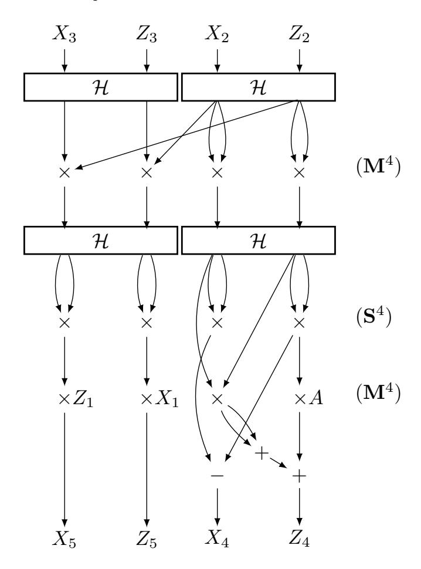

# Fast 4 way vectorized ladder for the complete set of Montgomery curves

Huseyin Hisil, Berkan Egrice, Mert Yassi

Yasar University, Izmir, Turkey {huseyin.hisil,berkan.egrice,mert.yassi}@yasar.edu.tr

#### Abstract

This paper introduces 4 way vectorization of Montgomery ladder on any Montgomery form elliptic curve. Our algorithm takes 2M<sup>4</sup> + 1S 4 (M<sup>4</sup> : A vector of four field multiplications, S 4 : A vector of four field squarings) per ladder step for variable-scalar variable-point multiplication. This paper also introduces new formulas for doing arithmetic over GF(2<sup>255</sup> − 19).

Keywords: Montgomery ladder, elliptic curves, genus 1, Kummer lines, Diffie-Hellman key exchange, public key cryptography.

### 1 Introduction

Elliptic curve cryptography was proposed by Miller [18] and Koblitz [16] in late 80s. In the past three decades, elliptic curves became one of the central objects in public key cryptography. The group law computations on elliptic curves are particularly interesting as they allow efficient arithmetic on computers. In addition, hard instances of discrete logarithm problem can be defined on elliptic curves over finite fields of fairly small size. These two properties of elliptic curves make them perfect candidates for many cryptographic primitives such as key exchange, key encapsulation mechanism, and digital signatures. In all of these primitives, the bottleneck operation is the multiplication of a point on an elliptic curve with a scalar. This operation is called scalar multiplication. Optimizing scalar multiplication is one of the main challenges in elliptic curve cryptography.

An elliptic curve can be represented in several different forms. One of these forms was introduced by Peter L. Montgomery in his celebrated article [19] in 1987. An elliptic curve in Montgomery form is written as

$$By^2 = x^3 + Ax^2 + x$$

with constants A and B satisfying B(A<sup>2</sup> − 4) 6= 0. Let P be a point on this curve. Let x(P) be the x-coordinate of P. Let k be a positive integer. Montgomery ladder algorithm which was also proposed in [19], computes x(kP) by accessing a single point doubling and a single point addition operation per iteration of its main loop. In this setting, Montgomery provides doubling formulas to compute x(2P) given x(P), and differential addition formulas to compute x(P + Q) given x(P), x(Q), and x(P − Q). The auxiliary value x(P − Q) is maintained naturally by the ladder. This regular structure of Montgomery ladder made it a perfect candidate to be used in elliptic curve cryptography.

In 2006, Bernstein [1] proposed an elliptic curve Diffie-Hellman key exchange function, Curve25519, which uses Montgomery ladder along with a twist-secure Montgomery curve over the field GF(2<sup>255</sup> − 19). Bernstein [1] also provided fast software which implements Curve25519, runs in constant-time, and can defend against timing-attacks. Bernstein's design is later re-specified by the Internet Research Task Force in RFC 7748 memorandum.

Montgomery ladder was also adapted to other elliptic curve forms. For example, Brier and Joye [5] presented formulas for any elliptic curve written in short Weierstrass form y <sup>2</sup> = x <sup>3</sup>+a4x+a<sup>6</sup> covering all elliptic curves over a field k with char(k) 6= 2, 3. Analogous formulas over a field of characteristic 2 were given by Lopez and Dahab [17].

Building on an earlier work of Chudnovsky and Chudnovsky [7], Gaudry introduced doubling and differential addition analogues on genus 2 Kummer surfaces in [10]. As a follow up work, Gaudry and Lubicz introduced genus 1 analogues of Kummer surfaces in [11]. Their study covers both odd and even characteristics. We refer to these Kummer lines as canonical Kummer lines in this work following the language of [23]. Explicit formulas for squared Kummer lines appeared in EFD<sup>1</sup> with credits to Gaudry [10] and Gaudry, Lubicz [11].

Emerging hardware trend in single-instruction multiple-data (SIMD) circuits led researchers develop vectorized implementations of ladders. A SIMD implementation of Gaudry-Schost squared Kummer surface [12] was introduced by Bernstein, Chuengsatiansup, Lange, and Schwabe [2]. Their implementation is currently the speed leader in the genus 2 setting. The genus 1 setting is actively in development. Chou [6, Alg. 3.1] put forward a 2 way vectorized implementation of Montgomery ladder using the inherent 2 way parallelism in the classic formulas. Chou's implementation uses the 2 way vectorized 32 × 32 → 64-bit multipliers on Sandy Bridge and Ivy Bridge. A 4 way vectorized implementation of squared Kummer lines were presented by Karati and Sarkar in [15]. Their implementation uses the 4 way vectorized 32×32 → 64-bit multipliers on Haswell and Skylake. Karati and Sarkar report that their implementation offers competitive performance in Kummer line based scalar multiplication for genus one curves over prime order fields using SIMD operations. Faz-Hern´andez and L´opez provided a 2 × 2 way implementation of Montgomery ladder on Haswell and Skylake. The arithmetic of the underlying field is 2 way vectorized in their implementation (hence the notation 2 × 2).

Putting the vectorization option of the underlying field a side (which is also an option for squared Kummer lines), the sequence of recent advances in ladder implementations may lead to the illusion that Montgomery curves are less vectorization-friendly than Kummer lines. In this work,

- we show that Montgomery curves are efficiently 4 way vectorizable. See Section 3.
- we provide timings for our 4 × 1 way vectorized implementation on AVX2. See Section 4.
- we propose a new 9 limb representation of field elements which has potential to be faster than the widely applied 10 limb representation, in implementations without using field level vectorization. See Section 4.
- we provide timings for our 4 × 2 way vectorized implementation on AVX-512. See Section 5. This implementation sets the new speed record in variable-scalar variable-point multiplication over the field GF(2<sup>255</sup> − 19).

Results are provided in Section 6. Source code related to this project is publicly available at

https://github.com/crypto-ninjaturtles/montgomery4x

since Feb 12, 2019.

A very recent paper by Nath and Sarkar [21] proposes three algorithms with the same aim in this paper. Their algorithms and implementation choices are much different than the ones in this work.

Acknowledgements: This work is funded by Yasar University Scientific Research Project SRP-057. We thank Erdem Alkım, Sedat Akleylek, and members of the Cyber Security and Cryptology Laboratory, Ondokuz Mayis University, for providing us access to OMU-i9, a Skylake i9-7900X machine. We developed the AVX-512 implementation on OMU-i9. All measurements were taken on OMU-i9.

## 2 Montgomery ladder

This section provides preliminaries on Montgomery ladder. We will skip detailed discussions on the group law, the pseudo-group structure, working solely on the x-line, point recovery etc. These are all very well understood and available in several texts in the literature, cf. [3, Chapter 4] and [8].

<sup>1</sup>http://www.hyperelliptic.org/EFD/ (last accessed 2019-05-20)

Our approach will be more implementation oriented. Therefore, the treatment in this section is far from being comprehensive.

The abscissa x(P) of a point P is represented in homogenous projective space  $\mathbb{P}$  in the form (x(P):1). In this projective representation,  $(X:Z)=(\lambda X:\lambda Z)$  for all non-zero  $\lambda\in\mathbb{K}$ . The point (1:0) is the pseudo-identity element. From now on, we update the definition of P and use the projective notation.

Given the points  $(X_3: Z_3)$ ,  $(X_2: Z_2)$ , and  $(X_1: Z_1) = (X_3: Z_3) - (X_2: Z_2)$ , we have  $(X_5: Z_5) = (X_3: Z_3) + (X_2: Z_2)$  and  $(X_4: Z_4) = 2(X_2: Z_2)$ . Montgomery provided the following explicit formulas in [19]:

$$(X_5: Z_5) = (Z_1(X_2X_3 - Z_2Z_3)^2 : X_1(X_2Z_3 - Z_2X_3)^2),$$
  

$$(X_4: Z_4) = ((X_2^2 - Z_2^2)^2 : 4X_2Z_2(X_2^2 + AX_2Z_2 + Z_2^2)).$$
(1)

These differential addition and doubling formulas are the building blocks of the Montgomery ladder. Before providing the ladder, we simplify our notation and define the functions DBLADD and SWAP. The function DBLADD inputs three points where the third is the difference of the first two, and outputs the sum of the two initial points and the double of the second input point. The output is overwritten to  $(X_3:Z_3)$  and  $(X_2:Z_2)$ , respectively. This is denoted as

$$\mathtt{DBLADD}\left((X_3:Z_3),(X_2:Z_2),(X_1:Z_1)\right).$$

The function SWAP inputs two points and a single bit. If swap is 0, then the output is identical to the input. If swap is 1, then the output is the swapped input points. The Montgomery ladder is provided succinctly in Algorithm 1.

#### Algorithm 1 Montgomery ladder

```
Input: P = (X : Z) \neq (1 : 0) and k = \sum_{i=0}^{\ell-1} k_i 2^i with k_{\ell-1} = 1, k_i \in \{0, 1\}.

Output: kP.

1: (X_3 : Z_3) \leftarrow P, (X_2 : Z_2) \leftarrow (1 : 0), (X_1 : Z_1) \leftarrow P

2: prevbit \leftarrow 0

3: for i = \ell - 1 down to 0 do

4: swap \leftarrow prevbit \oplus k[i]

5: prevbit \leftarrow k[i]

6: SWAP(swap, (X_3 : Z_3), (X_2 : Z_2))

7: DBLADD((X_3 : Z_3), (X_2 : Z_2), (X_1 : Z_1))

8: end for

9: SWAP(k[0], (X_3 : Z_3), (X_2 : Z_2))

10: return (X_2 : Z_2)
```

In cryptographic applications, the output of Algorithm 1 is typically normalized as  $X_2/Z_2$  in order to obtain a unique representative of the output. In addition,  $\ell$  is fixed in order to fix the number of iterations. Moreover, one can force k to be multiple of a small power of 2 to surpass active attacks exploiting the existence of small subgroups. Cryptographic applications which are required to run in constant-time must have each sub-operation run in constant-time. We refer to curve25519 specification for full detail, [1].

## 3 4 way Montgomery ladder

Montgomery's formulas (1) lie at the heart of curve25519. Several implementations of curve25519 are available in public domain. Karati and Sarkar [15] commented for the ladder step used in curve25519 specification [1, Appendix B]:

"The structure of this ladder is not as regular as the ladder step on the Kummer line. This makes it difficult to optimally group together the multiplications for SIMD implementation." In this work, we aim to show that a higher level of parallelism can be achieved with new tweaks on the ladder step, see Figure 1. In the figure, H stands for Hadamard transformation which inputs two coordinates X and Z and outputs X + Z and X − Z.



Figure 1: DBLADD: 4 way vectorized ladder step for the curve By<sup>2</sup> = x <sup>3</sup> + Ax<sup>2</sup> + x.

The point doubling side of Figure 1 is recognizably different than Bernstein's diagram. Specifically, the squaring step now utilizes all 4 channels in vectorized form. On the other hand, an inspection on Figure 1 reveals that the outputs X4, Z4, X5, and Z<sup>5</sup> agree with (1) up to a multiplication of the coordinates by a constant with no effect on the correctness of DBLADD routine.

The ladder step in Figure 1 takes 2M4+1S 4 . In comparison, Karati and Sarkar's 4 way vectorized ladder step [15, Fig. 1] takes 2M4+1S <sup>4</sup>+1d 4 (d 4 : A vector of four field multiplications by four small constants). There is a speed trade-off between these two approaches, which is not clear immediately from the high level operation counts:

- Multiplication with constants: A squared Kummer line requires one multiplication by [a <sup>2</sup> + b 2 , a<sup>2</sup> − b 2 , a<sup>2</sup> + b 2 , a<sup>2</sup> − b 2 ] followed by reduction (denoted d 4 ), per ladder step. Such a multiplication-reduction does not occur in Figure 1.
- Extra permutations: Data transfers between SIMD channels occur in Hadamard transform and constant-time conditional point swap operations in both types of ladder steps. Our algorithm requires additional transfers and linear operations following the second Hadamard transform.

These two items constitute a speed trade-off (even if a <sup>2</sup> + b <sup>2</sup> and a <sup>2</sup> − b <sup>2</sup> are extremely small). This trade-off depends heavily on the comparative throughput of SIMD multiplication and data transfer instructions, which can significantly vary depending on the micro-architecture. In any case, the overall timings can be expected to be close in optimized instantiations since neither of the operations is a speed bottleneck. On the other hand, Montgomery form is more advantageous with its larger coverage, see [13] and [14].

### 4 Implementation on AVX2

This section provides implementation details for 4 way vectorization of Montgomery ladder. Implementers are not limited to the specification of this section because Figure 1 is independent of choices made here. The same applies to Section 5.

We fix  $p=2^{255}-19$  and work over GF(p). We start by explaining field multiplication. The discussion is narrowed to a single field multiplication. On the other hand, the implementation computes 4 field multiplications simultaneously in vector form. We refer to [2] for a comprehensive explanation of the concept. We use core ideas from [4], [2], [6], and [15]. Yet, we made different implementation choices.

**Multiplication.** We represent reduced field elements in 9 limbs rather than 10 and keep unreduced products in 11 limbs rather than 10. We provide justifications for how intermediate values always fit into 64 bit registers, without producing any overflow. This is a hybridization of two commonly followed methods:

- $\bullet$  doing the  $255 \times 255 \to 510$  bit multiplication first and then reducing to 255 bits, cf. [15] and
- merging reduction with integer multiplication and keeping elements always in specified number of limbs, cf. [1].

Remark 1 One may question why we use 9 limb representation rather than 10. The answer is easy: for better speed. In order to show that our 9 limb strategy is faster in the context of our 4 way vectorized ladder, we also implemented our ladder with the 10 limb multiplication algorithm from [4] and [6]. See Section 6 for speed comparisons.

Remark 2 It would be interesting to observe the performance of

- $\bullet \ \ multiplication \ with \ using \ 9 \ limb \ method \ on \ older \ high-end \ processors \ without \ SIMD \ support,$
- 2 way Montgomery ladder using the 9 limb method on older high-end processors with SIMD support (e.g. Sandy Bridge and Ivy Bridge processors),
- multiplication with using 9 limb method on low-end processors without SIMD support (e.g. ARM Cortex-M3), and
- 2 way Montgomery ladder using the 9 limb method on low-end processors with 2 way SIMD support (e.g. ARM Cortex-A8 NEON 2x64).

These scenarios are not in the context of the 4 way ladder (Figure 1) and thus omitted in this work.

We designed a two-layer implementation to carry out field multiplications with a redundant representation of elements. Both layers use a 3 way splitting strategy. Therefore, a field element is represented by 9 limbs each of which can accommodate non-negative values smaller than  $2^{64}$ .

The higher layer is described as follows. A field element u is represented by integers  $u_0$ ,  $u_1$ , and  $u_2$  such that  $u = u_0 + 2^{85}u_1 + 2^{170}u_2$ . We note that this is not a unique representation. Let v be an integer also represented in the same way. We then have

```
\begin{array}{lll} uv \equiv & 2^0(& u_0v_0 + & 19u_1v_2 + & 19u_2v_1 &) + \\ & & 2^{85}(& u_0v_1 + & u_1v_0 + & 19u_2v_2 &) + \\ & & 2^{170}(& u_0v_2 + & u_1v_1 + & u_2v_0 &) & (\bmod \ p) \,. \end{array}
```

The congruence  $255 \equiv 0 \pmod 3$  helps greatly in obtaining simple formulas. The nine long multiplications in the form  $u_i v_j$  are reduced to six by three Karatsuba optimizations which are capable of sharing the sub-expressions  $u_i v_i$  as follows:

$$\begin{array}{lll} 2^0 (& u_0v_0 + 19((u_1+u_2)(v_1+v_2) - u_1v_1 - u_2v_2) ) + \\ 2^{85} (& 19u_2v_2 + & (u_0+u_1)(v_0+v_1) - u_0v_0 - u_1v_1 ) + \\ 2^{170} (& u_1v_1 + & (u_0+u_2)(v_0+v_2) - u_0v_0 - u_2v_2 ). \end{array}$$

This variant leads to an increased number of additions/subtractions some of which can be shared. We eliminated these repeating operations at the cost of using more registers in our implementation. The additions of the form  $u_i + u_j$  are 3-limb additions. All other additions and subtractions are 5-limb additions.

These high level operations do not provide low level details. For instance, we do not have hardware multipliers that can accommodate  $85 \times 85 \rightarrow 170$ -bit integer multiplications. Therefore, we further split each digit in the higher layer into three limbs:

$$\begin{array}{ll} u_0 = a_0 + 2^{29}a_1 + 2^{57}a_2, & v_0 = b_0 + 2^{29}b_1 + 2^{57}b_2, \\ u_1 = a_3 + 2^{29}a_4 + 2^{57}a_5, & v_1 = b_3 + 2^{29}b_4 + 2^{57}b_5, \\ u_2 = a_6 + 2^{29}a_7 + 2^{57}a_8, & v_2 = b_6 + 2^{29}b_7 + 2^{57}b_8. \end{array}$$

Now, for instance,  $u_0v_0$  can be computed with the following formulas

$$\begin{array}{lll} u_0v_0 = & 2^0(& a_0b_0 & & ) + \\ & 2^{29}(& a_0b_1 + & a_1b_0 & & ) + \\ & 2^{57}(& a_0b_2 + & a_2b_0 + & 2a_1b_1 & ) + \\ & 2^{86}(& a_1b_2 + & a_2b_1 & & ) + \\ & 2^{114}(& a_2b_2 & & ) & . \end{array}$$

These operations take 9 multiplications and 5 additions all of which can be directly carried out by the target hardware. Karatsuba optimization is not used here since the trade-off between multiplications and additions do not provide a practical speed-up at this level. The registers  $a_0$ ,  $a_1$ ,  $a_2$  are bounded carefully as to prevent overflowing of the 64 bit registers and allow the final carries to be delayed to the end of the field operation. More explicitly, the multiplication algorithm inputs 9-limb integers and produces the following 11 limbs

- $w_0 = a_0b_0 + 19(a_3b_6 + a_6b_3),$
- $w_1 = a_0b_1 + a_1b_0 + 19(a_3b_7 + a_4b_6 + a_6b_4 + a_7b_3),$
- $w_2 = a_0b_2 + 2a_1b_1 + a_2b_0 + 19(a_3b_8 + a_8b_3 + 2(a_4b_7 + a_7b_4) + a_5b_6 + a_6b_5),$
- $w_3 = a_0b_3 + a_3b_0 + 2(a_1b_2 + a_2b_1) + 19(a_6b_6 + 2(a_4b_8 + a_5b_7 + a_7b_5 + a_8b_4))$
- $w_4 = a_0b_4 + a_1b_3 + a_2b_2 + a_3b_1 + a_4b_0 + 19(a_5b_8 + a_6b_7 + a_7b_6 + a_8b_5)$ ,
- $w_5 = a_0b_5 + a_2b_3 + a_3b_2 + a_5b_0 + 2(a_1b_4 + a_4b_1) + 19(a_6b_8 + 2a_7b_7 + a_8b_6)$
- $w_6 = a_0b_6 + a_3b_3 + a_6b_0 + 2(a_1b_5 + a_2b_4 + a_4b_2 + a_5b_1 + 19(a_7b_8 + a_8b_7)),$
- $w_7 = a_0b_7 + a_1b_6 + a_2b_5 + a_3b_4 + a_4b_3 + a_5b_2 + a_6b_1 + a_7b_0 + 19a_8b_8$ ,
- $w_8 = a_0b_8 + a_2b_6 + a_3b_5 + a_5b_3 + a_6b_2 + a_8b_0 + 2(a_1b_7 + a_4b_4 + a_7b_1)$
- $w_9 = 2(a_1b_8 + a_2b_7 + a_4b_5 + a_5b_4 + a_7b_2 + a_8b_1)$ , and
- $\bullet \ w_{10} = a_2b_8 + a_5b_5 + a_8b_2$

which satisfy in turn the following congruence

$$uv \equiv w \equiv (w_0 + 2^{29}w_1 + 2^{57}w_2) + 2^{85}(w_3 + 2^{29}w_4 + 2^{57}w_5) + 2^{170}(w_6 + 2^{29}w_7 + 2^{57}w_8) + 2^{255}(w_9 + 2^{29}w_{10}) \pmod{2^{255} - 19}.$$

We do not perform all of these  $9 \times 9 = 81$  multiplications but just  $9 \times 6 = 54$ . This is due to the shared-Karatsuba approach explained earlier.

Input/output specification. We set important bounds

$$0 < a_0, a_3, a_6 < 2^{29} + k$$

$$0 \le a_1, a_2, a_4, a_5, a_7, a_8 < 2^{28} + k$$

for the input and output limbs. k=173 is a constant that will become clear in the reduction step. We always ensure the accuracy of these bounds after a reduction step which provide an easy-to-follow input/output specification.

The limbs  $w_i$  are displayed explicitly (in the item list) in order to help check the boundaries on the output easily. In particular, we need to show that these limbs cannot exceed  $2^{64}$ . Now, inputting the largest possible values for each limb of u and v and evaluating on the formulas provided in the item list, we get

$$\begin{array}{lll} w_0 < 2^{63.29}, & w_1 < 2^{63.29}, & w_2 < 2^{63.88}, \\ w_3 < 2^{63.91}, & w_4 < 2^{62.95}, & w_5 < 2^{62.98}, \\ w_6 < 2^{62.59}, & w_7 < 2^{61.05}, & w_8 < 2^{60.17}, \\ w_9 < 2^{59.59}, & w_{10} < 2^{57.59}. \end{array}$$

Clearly, all of these values can be accommodated without overflow in 64-bit registers  $w_i$ .

Even if we have computed all  $w_i$ , we are not quite done yet. We only have a semi-reduced w satisfying

$$w \equiv uv \pmod{2^{255} - 19}.$$
 (2)

We need to do the carries in order to get rid of  $w_9$ ,  $w_{10}$  and also match the output requirements

$$0 \le w_0, w_3, w_6 < 2^{29} + k,$$
  
$$0 \le w_1, w_2, w_4, w_5, w_7, w_8 < 2^{28} + k$$

which agree with the input specification of u and v.

Carries (Reduction after multiplication). This operation is composed of several steps. Each step transforms w towards satisfying the input/output specification without violating the congruence in display (2) and without producing an overflow. We go as follows:

```
Step 1: t \leftarrow \lfloor w_9/2^{29} \rfloor, w_9 \leftarrow w_9 \mod 2^{29}, w_{10} \leftarrow w_{10} + t,

Step 2: w_0 \leftarrow w_0 + 19w_9, w_9 \leftarrow 0,

Step 3: w_1 \leftarrow w_1 + 19w_{10}, w_{10} \leftarrow 0,

Step 4: t \leftarrow \lfloor w_0/2^{29} \rfloor, w_0 \leftarrow w_0 \mod 2^{29}, w_1 \leftarrow w_1 + t,

Step 5: t \leftarrow \lfloor w_1/2^{28} \rfloor, w_1 \leftarrow w_1 \mod 2^{28}, w_2 \leftarrow w_2 + t,

Step 6: t \leftarrow \lfloor w_2/2^{28} \rfloor, w_2 \leftarrow w_2 \mod 2^{28}, w_3 \leftarrow w_3 + t,

Step 7: t \leftarrow \lfloor w_3/2^{29} \rfloor, w_3 \leftarrow w_3 \mod 2^{29}, w_4 \leftarrow w_4 + t,

Step 8: t \leftarrow \lfloor w_4/2^{28} \rfloor, w_4 \leftarrow w_4 \mod 2^{28}, w_5 \leftarrow w_5 + t,

Step 9: t \leftarrow \lfloor w_5/2^{28} \rfloor, w_5 \leftarrow w_5 \mod 2^{28}, w_6 \leftarrow w_6 + t,

Step 10: t \leftarrow \lfloor w_6/2^{29} \rfloor, w_6 \leftarrow w_6 \mod 2^{29}, w_7 \leftarrow w_7 + t,

Step 11: t \leftarrow \lfloor w_7/2^{28} \rfloor, w_7 \leftarrow w_7 \mod 2^{28}, w_8 \leftarrow w_8 + t,

Step 12: t \leftarrow \lfloor w_8/2^{28} \rfloor, w_8 \leftarrow w_8 \mod 2^{28}, w_0 \leftarrow w_0 + 19t

Step 13: t \leftarrow \lfloor w_0/2^{29} \rfloor, w_0 \leftarrow w_0 \mod 2^{29}, w_1 \leftarrow w_1 + t.
```

In this sequence of operations, we are accumulating on registers  $w_i$  which contain values potentially very close to  $2^{64}$ . Once more, we need to justify that these additions do not constitute any overflow.

• Step 1:  $t = \lfloor w_9/2^{29} \rfloor < 2^{59.59-29} = 2^{30.59}$ . So,  $w_{10} + t < 2^{57.59} + 2^{30.59} < 2^{57.60}$ . Therefore, the updated value of  $w_{10}$  still fits into 64 bits. A bit of care is needed now to track the updated  $w_9$ . Although we computed  $w_9 \leftarrow w_9 \mod 2^{29}$  for maximum possible inputs, the updated value of  $w_9$  can still get values as large as  $2^{29} - 1$  for some other input. Therefore, we assume for the sake of our inspection that we take  $w_9 = 2^{29} - 1$  from here.

- Step 2: Now, we must have  $w_0 + 19w_9 < 2^{63.29} + 19(2^{29} 1) < 2^{63.30}$ . Multiplication by 19 here is performed with  $32 \times 32 \rightarrow 64$  bit multiplication instruction vpmuludq since both 19 and  $w_9$  are smaller than  $2^{32}$ .
- Step 3: Similarly, we must have  $w_1 + 19w_{10} < 2^{63.29} + 19(2^{57.60}) < 2^{63.75}$ . We note that  $19w_{10}$  is computed as  $19w_{10} = 16w_{10} + 2w_{10} + w_{10}$  by using vpaddq and vpsllq instructions because  $w_{10}$  can exceed  $2^{32}$ , and thus, is not suitable to be inputted to vpmuludq. We note that  $w_9 \leftarrow 0$  and  $w_{10} \leftarrow 0$  are displayed just for mathematical correctness.
- Steps 4-11: Repeating the same inspection by computing each step sequentially, we get  $w_{1,...,8} < 2^{64}$  after additions as expected. Limbs  $w_{0,...,7}$  obey the input/output specification after reducing  $w_{1,2,4,5,7}$  modulo  $2^{28}$  and  $w_{3,6}$  modulo  $2^{29}$ . Again, we assume for the sake of our inspection that  $w_{0,3,6} = 2^{29} 1$  and  $w_{1,2,4,5,7,8} = 2^{28} 1$  after the modular reductions are performed for these digits.
- Step 12: We get  $t = \lfloor w_8/2^{28} \rfloor < 2^{60.17-28} = 2^{32.17}$ . So,  $w_0 + 19t < (2^{29} 1) + 19(2^{32.17}) < 2^{36.43}$ . Now,  $w_8$  also obeys the input/output specification after being reduced modulo  $2^{28}$ . We note that 19t is computed as 19t = 16t + 2t + t since  $w_8$  can exceed  $2^{32}$ .
- Step 13: We get  $w_1 + t < (2^{28} 1) + (2^{36.43-29}) < 2^{28} + 173$ . This upper bound explains the value of k. We note that a lower upper bound can be found with an increased precision in calculations. Moreover, much larger values for k works without producing overflow in reduction<sup>2</sup> but 173 is adequate to test the stability of limbs.

Now, all  $w_i$  agrees with the input/output specification of  $u_i$  and  $v_i$ . We intentionally added k to all limbs in the input/output specification rather than adding just to  $w_1$  because

- this simplifies the notation, and
- we need such extra additions when designing parallel carry chains.

The reduction step can be summarized as  $h_9 \to h_{10}$  followed by the very long sequence

$$h_8 \rightarrow h_0 \rightarrow h_1 \rightarrow h_2 \rightarrow h_3 \rightarrow h_4 \rightarrow h_5 \rightarrow h_6 \rightarrow h_7 \rightarrow h_8 \rightarrow h_0 \rightarrow h_1$$
.

We do faster by computing two sequences

$$h_4 \longrightarrow h_5 \rightarrow h_6 \rightarrow h_7 \rightarrow h_8 \rightarrow h_0 \rightarrow h_1,$$
  
 $h_9 \rightarrow h_{10}, \quad h_0 \rightarrow h_1 \rightarrow h_2 \rightarrow h_3 \rightarrow h_4 \rightarrow h_5$ 

in parallel at processor's ports. We refer to [4] and [6] for similar optimizations.

In this parallel reduction, not only  $w_1$  but also  $w_5$  can exceed  $2^{28} - 1$  by k. But we have already relaxed  $w_5$  (like all other limbs) by additions of k in our inspection.

**Squaring.** Squaring can be explained as a simplified multiplication routine.

$$\begin{array}{cccc} 2^0 (& u_0^2 + & 19((u_1 + u_2)^2 - u_1^2 - u_2^2) &) + \\ 2^{85} (& 19u_2^2 + & (u_0 + u_1)^2 - u_0^2 - u_1^2 &) + \\ 2^{170} (& u_1^2 + & (u_0 + u_2)^2 - u_0^2 - u_2^2 &) \,. \end{array}$$

The nine long multiplications in the form  $u_i v_j$  are reduced now to six squares. In addition, the computation of  $u_0^2$  can be further optimized at the lower level in the form

$$u_i^2 = \begin{array}{cccc} 2^0 (& a_0^2 & & ) + \\ & 2^{29} (& (2a_0)a_1 & & ) + \\ & 2^{57} (& (2a_1)a_1 + & (2a_0)a_2 & ) + \\ & 2^{86} (& (2a_1)a_2 & & ) + \\ & 2^{114} (& a_2^2 & & ) \, . \end{array}$$

 $<sup>^{2}</sup>$ We reiterate that we use a redundant representation. Therefore, reduction does not produce a unique representative. Nevertheless, we still call it reduction since we can do arithmetic in this form.

Similar applies to the other squarings. Our implementation delays multiplication by twos and pushes them towards the higher layer.

**Squeeze/Unsqueeze.** A field element w satisfying the input/output specification can be squeezed from 9 limbs to 5 by computing

$$w_{i+4} \leftarrow w_{i+4} \oplus 2^{32} w_i$$
 for  $i = 0, 1, 2, 3$ .

Now, w is represented by  $w_4, w_5, w_6, w_7, w_8$  only. Linear operations such as (field) additions and subtractions can be handled in this form provided that computed values do not exceed  $2^{32} - 1$ . This is always the case in our implementation.

A squeezed field element is unsqueezed into the original form by computing

$$w_i \leftarrow w_{i+4}/2^{32}$$
 for  $i = 0, 1, 2, 3$  and  $w_{i+4} \leftarrow w_{i+4} \bmod 2^{32}$  for  $i = 0, 1, 2, 3$ 

at multiplication, squaring, and reduction moments. We note that we skip computing  $w_{i+4} \leftarrow w_{i+4} \mod 2^{32}$  before multiplication and squaring since the higher 32 bits are not taken into consideration by vpmuludq instruction. See also [2].

This squeeze/unsqueeze method is adapted from the software introduced in [2]. The difference is that we group together the limbs of a field element where Bernstein, Chuengsatiansup, Lange, and Schwabe group together points on a genus 2 Kummer surface.

Despite the added cost of squeezing and unsqueezing, linear operations in squeezed form can be done faster and save cycles in total.

**Double Hadamard.** This step can be put in 4 way vectorized form in modulus  $2^{255} - 19$  as follows;

$$(\mathcal{H} \times \mathcal{H})(X_3, Z_3, X_2, Z_2) =$$

$$(X_3 + Z_3, X_3 - Z_3, X_2 + Z_2, X_2 - Z_2) =$$

$$(X_3 + Z_3, X_3 + (3p - Z_3), X_2 + Z_2, X_2 + (3p - Z_2)).$$

The additions of 3p are to ensure that  $\mathcal{H} \times \mathcal{H}$  (double Hadamard) produces non-negative values for output limbs. We drop the word "double" for simplicity. This 3p needs to be prepared with some care as follows

$$\begin{split} & 2^0([3(2^{29}-19)] + 2^{29}[3(2^{28}-1)] + 2^{57}[3(2^{28}-1)]) + \\ & 2^{85}(\ [3(2^{29}-1)] + 2^{29}[3(2^{28}-1)] + 2^{57}[3(2^{28}-1)]) + \\ & 2^{170}(\ [3(2^{29}-1)] + 2^{29}[3(2^{28}-1)] + 2^{57}[3(2^{28}-1)]) \ . \end{split}$$

Observe that each  ${\rm limb^3}$  is greater than the corresponding maximum bound in the input/output specification.

All of the limbs of  $X_3 + Z_3$ ,  $X_3 + (3p - Z_3)$ ,  $X_2 + Z_2$ , and  $X_2 + (3p - Z_2)$  are always less than  $2^{32}$  after the first Hadamard operation in Figure 1. To show this, we concentrate to the linear operations appearing at the right of the bottom of the figure.

- $Z_4$  is computed as the sum of three values. In order to simplify our analysis, we assume that all inputs to these additions take largest possible values. Then,  $w_{0,3,6} = 3((2^{29} 1) + k) < 2^{31}$  and  $w_{1,2,4,5,7,8} = 3((2^{28} 1) + k) < 2^{30}$ .
- $X_4$  is computed as the difference of two values. We assume that minuend takes the largest and the subtrahend takes the smallest possible value. Then,  $w_{0,3,6} = ((2^{29}-1)+k)+(2(2^{29}-1)-0) < 2^{31}$  and  $w_{1,2,4,5,7,8} = ((2^{28}-1)+k)+(2(2^{28}-1)-0) < 2^{30}$ . Observe that we added 2p rather than 3p this time, which is adequate because  $2(2^{29}-1)>(2^{29}-1)+k$  and likewise  $2(2^{28}-1)>(2^{28}-1)+k$ . So, even if the subtrahend takes the maximum possible value, the limbs are still non-negative.

<sup>&</sup>lt;sup>3</sup>The value of each limb appears in square brackets.

Up to this point, we showed that  $w_i$  of both  $X_4$  and  $Z_4$  fit into 31 bits. We now feed these extreme values<sup>4</sup> to the first Hadamard operation. Clearly, we have  $0 \le w_i < 2^{32}$  for X + Z. Separately, assuming that  $w_i = 0$  for Z, we have  $0 \le w_i < 2^{32}$  for X + (3p - Z). Analyzing the second Hadamard is even simpler since its inputs are already reduced values.

Fast carries (Fast reduction after Hadamard). Following a Hadamard step, a reduction operation must be applied to the output to match the input/output specification. This time, reduction can be performed faster since we do not have limbs  $w_9$  and  $w_{10}$ . Therefore, fast reduction can be defined as a trimmed version of the reduction after multiplication as follows,

Step 1: 
$$t \leftarrow \lfloor w_0/2^{29} \rfloor$$
,  $w_0 \leftarrow w_0 \mod 2^{29}$ ,  $w_1 \leftarrow w_1 + t$ ,  
Step 2:  $t \leftarrow \lfloor w_1/2^{28} \rfloor$ ,  $w_1 \leftarrow w_1 \mod 2^{28}$ ,  $w_2 \leftarrow w_2 + t$ ,  
Step 3:  $t \leftarrow \lfloor w_2/2^{28} \rfloor$ ,  $w_2 \leftarrow w_2 \mod 2^{28}$ ,  $w_3 \leftarrow w_3 + t$ ,  
Step 4:  $t \leftarrow \lfloor w_3/2^{29} \rfloor$ ,  $w_3 \leftarrow w_3 \mod 2^{29}$ ,  $w_4 \leftarrow w_4 + t$ ,  
Step 5:  $t \leftarrow \lfloor w_4/2^{28} \rfloor$ ,  $w_4 \leftarrow w_4 \mod 2^{28}$ ,  $w_5 \leftarrow w_5 + t$ ,  
Step 6:  $t \leftarrow \lfloor w_5/2^{28} \rfloor$ ,  $w_5 \leftarrow w_5 \mod 2^{28}$ ,  $w_6 \leftarrow w_6 + t$ ,  
Step 7:  $t \leftarrow \lfloor w_6/2^{29} \rfloor$ ,  $w_6 \leftarrow w_6 \mod 2^{29}$ ,  $w_7 \leftarrow w_7 + t$ ,  
Step 8:  $t \leftarrow \lfloor w_7/2^{28} \rfloor$ ,  $w_7 \leftarrow w_7 \mod 2^{28}$ ,  $w_8 \leftarrow w_8 + t$ ,  
Step 9:  $t \leftarrow \lfloor w_8/2^{28} \rfloor$ ,  $w_8 \leftarrow w_8 \mod 2^{28}$ ,  $w_0 \leftarrow w_0 + 19t$   
Step 10:  $t \leftarrow \lfloor w_0/2^{29} \rfloor$ ,  $w_0 \leftarrow w_0 \mod 2^{29}$ ,  $w_1 \leftarrow w_1 + t$ .

We do better by computing these operations in squeezed form and computing

$$h_0 \to h_1 \to h_2 \to h_3 \longrightarrow h_4 \to h_5,$$
  
 $h_4 \to h_5 \to h_6 \to h_7 \to h_8 \to h_0 \to h_1$ 

in parallel on two 32 bit SIMD channels. We do not further exploit processor's port level parallelism since the sequence is short enough to produce low latency.

## 5 Implementation on AVX-512

AVX-512 provides 8 way SIMD multiplication with the vpmuludq instruction. This provides twice as much  $32 \times 32 \rightarrow 64$  bit multipliers in comparison to AVX2. Therefore it is reasonable to question whether the 4 way vectorized ladder can be computed faster on AVX-512. Since Figure 1 supports up to 4 way vectorization, additionally, we need to vectorize the field arithmetic in 8/4=2 way form to get a  $4 \times 2$  way ladder.

Although, our 9 limb multiplication fits nicely on  $4 \times 1$  ladder, it does not seem to be the best choice for its  $4 \times 2$  counterpart. Yet, there is room for research in finding a fast 2 way vectorization of 9 limb multiplication described in Section 5. We do not pursue this idea further here.

As a practical solution, we decided to use a 2 way vectorized version of the 10 limb multiplication algorithm using Radix-2<sup>25.5</sup> from [1]. This algorithm was previously used with minor modifications in [4] and [6]. Fortunately, we were able to reuse optimized codes freely available in public domain. In particular, we used the 2 way AVX2 targeted intmul and intsqr functions from

by Faz Hernández, López, Dahab <sup>5</sup> and have those functions run on AVX-512. Then, we applied the ladder step in Figure 1 to get a  $4 \times 2 = 8$  way vectorized implementation of Montgomery ladder over the field  $GF(2^{255} - 19)$ . The speed comparison is given in Section 6.

<sup>&</sup>lt;sup>4</sup>Noticed that all these operations can be performed in squeezed form.

<sup>&</sup>lt;sup>5</sup>https://github.com/armfazh/hp-ecc-vec (last accessed 2019-05-20)

### 6 Results

The final inversion. Our implementation reduces the output of scalar multiplication to a unique representative in the underlying field in radix 256. Therefore, we compute X2/Z<sup>2</sup> after the main loop. We integrated Nath and Sarkar's [20] freely available and optimized inversion software without further modification. In particular, we used

#### pmp-inv-master/p25519/SL-DCC/1

which requires BMI2 instruction set. Nath and Sarkar reports 9301 Skylake cycles for this inversion.

Measuring cycles. We measure cycles for variable-scalar variable-point multiplication only. Our code changes base point and scalar at each iteration and excludes extra cycles coming from this randomization. Our implementation chains the outputs to prevent the compiler removing portions of the code. Measured cycle counts are given in Table 1 along with selected results from literature. The table is limited to our results and recently published measurements available for the Skylake micro-architecture.

| ladder method  | instr. set | limbs | cycles (median)    |
|----------------|------------|-------|--------------------|
| sq.Kum., 4 × 1 | AVX2       | 10    | 123 102, [15]      |
| Montg., 4 × 1  | AVX2       | 10    | 116 654, this work |
| Montg., 1 × 1  | BMI2       | 4     | 113 874, [22]      |
| Montg., 2 × 2  | AVX2       | 5     | 99 400, [9]        |
| Montg., 4 × 1  | AVX2       | 9     | 98 484, this work  |
| Montg., 4 × 1  | AVX2       | 10    | 95 437, [21]       |
| Montg., 2 × 4  | AVX-512    | 5     | 81 600, [9]        |
| Montg., 4 × 2  | AVX-512    | 5     | 74 368, this work  |

Table 1: Skylake cycles for variable-scalar variable-point multiplication.

Table 1 justifies our motivation in proposing the 9 limb representation in Section 5. The 9 limb method is solidly faster than 10 in the context of our 4 way ladder. Table 1 also provides evidence that 9 limb method may be faster than 10 limb representation, see Remarks 1 and 2.

Our 9 & 10 limb implementations are both slower than the implementation in Nath and Sarkar's very recent work, although our 2M<sup>4</sup> + 1S 4 ladder step is expected to yield better speeds than their 2M<sup>4</sup> + 1S <sup>4</sup> + 1d <sup>4</sup> algorithm [21, Algorithm 14 at page 17]. An explanation to this situation is that Nath and Sarkar's ladder step is written in pure assembly language where our ladder step is written in C language with Intel intrinsics. Yet, more investigation is needed for further clarification.

Figure 1 shows its real potential in our AVX-512 implementation. The reported 74368 cycles sets the new record among curve25519 family of implementations, to the best of our knowledge.

Variable-scalar fixed-base multiplication. Our implementation can be used directly in a fixedbase multiplication without further modification. Nevertheless, one can make precomputation on fixed-base point to get additional speed up. In that case, we refer to Algorithm 5 of [22].

Apart from architecture dependent discussions, we expect that our 4 way ladder will gradually become even more useful if the current trend of increasing the level of SIMD parallelism in hardware continues. We reiterate that the speeds we achieve are common for all Montgomery curves; not specific to ones with small constants.

### References

[1] Daniel J. Bernstein. Curve25519: New Diffie-Hellman speed records. In Moti Yung, Yevgeniy Dodis, Aggelos Kiayias, and Tal Malkin, editors, Public Key Cryptography - PKC 2006, 9th

- International Conference on Theory and Practice of Public-Key Cryptography, New York, NY, USA, April 24-26, 2006, Proceedings, volume 3958 of Lecture Notes in Computer Science, pages 207–228. Springer, 2006.
- [2] Daniel J. Bernstein, Chitchanok Chuengsatiansup, Tanja Lange, and Peter Schwabe. Kummer strikes back: New DH speed records. In Palash Sarkar and Tetsu Iwata, editors, Advances in Cryptology - ASIACRYPT 2014 - 20th International Conference on the Theory and Application of Cryptology and Information Security, Kaoshiung, Taiwan, R.O.C., December 7-11, 2014. Proceedings, Part I, volume 8873 of Lecture Notes in Computer Science, pages 317–337. Springer, 2014.
- [3] Daniel J. Bernstein and Tanja Lange. Montgomery Curves and the Montgomery Ladder, pages 82–115. Cambridge University Press, 2017.
- [4] Daniel J. Bernstein and Peter Schwabe. NEON crypto. In Emmanuel Prouff and Patrick Schaumont, editors, Cryptographic Hardware and Embedded Systems – CHES 2012, volume 7428 of Lecture Notes in Computer Science, pages 320–339, Berlin, Heidelberg, 2012. Springer Berlin Heidelberg.
- [5] Eric Brier and Marc Joye. Weierstraß elliptic curves and side-channel attacks. In David Naccache and Pascal Paillier, editors, Public Key Cryptography, 5th International Workshop on Practice and Theory in Public Key Cryptosystems, PKC 2002, Paris, France, February 12-14, 2002, Proceedings, volume 2274 of Lecture Notes in Computer Science, pages 335–345. Springer, 2002.
- [6] Tung Chou. Sandy2x: New Curve25519 speed records. In Orr Dunkelman and Liam Keliher, editors, Selected Areas in Cryptography - SAC 2015 - 22nd International Conference, Sackville, NB, Canada, August 12-14, 2015, Revised Selected Papers, volume 9566 of Lecture Notes in Computer Science, pages 145–160. Springer, 2015.
- [7] David V. Chudnovsky and Gregory V. Chudnovsky. Sequences of numbers generated by addition in formal groups and new primality and factorization tests. Advances in Applied Mathematics, 7(4):385–434, 1986.
- [8] Craig Costello and Benjamin Smith. Montgomery curves and their arithmetic The case of large characteristic fields. J. Cryptographic Engineering, 8(3):227–240, 2018.
- [9] Armando Faz-Hern´andez, Julio L´opez, and Ricardo Dahab. High-performance implementation of elliptic curve cryptography using vector instructions. ACM Trans. Math. Softw., 45(3), July 2019.
- [10] Pierrick Gaudry. Fast genus 2 arithmetic based on Theta functions. Journal of Mathematical Cryptology (JMC), 1(3):243–265, 2007.
- [11] Pierrick Gaudry and David Lubicz. The arithmetic of characteristic 2 Kummer surfaces and of elliptic Kummer lines. Finite Fields and Their Applications, 15(2):246 – 260, 2009.
- [12] Pierrick Gaudry and Eric Schost. Genus 2 point counting over prime fields. ´ J. Symb. Comput., 47(4):368–400, 2012.
- [13] Huseyin Hisil and Joost Renes. On kummer lines with full rational 2-torsion and their usage in cryptography. Cryptology ePrint Archive, Report 2018/839, 2018. https://eprint.iacr.org/2018/839.
- [14] Huseyin Hisil and Joost Renes. On kummer lines with full rational 2-torsion and their usage in cryptography. ACM Trans. Math. Softw., 45(4), December 2019.
- [15] Sabyasachi Karati and Palash Sarkar. Kummer for genus one over prime order fields. In Takagi and Peyrin [24], pages 3–32.
- [16] Neal Koblitz. Elliptic curve cryptosystems. Mathematics of Computation, 48(177):203–209, January 1987.

- [17] Julio L´opez and Ricardo Dahab. Fast multiplication on elliptic curves over GF(2m) without precomputation. In C¸ etin Kaya Ko¸c and Christof Paar, editors, Cryptographic Hardware and Embedded Systems, First International Workshop, CHES'99, Worcester, MA, USA, August 12-13, 1999, Proceedings, volume 1717 of Lecture Notes in Computer Science, pages 316–327. Springer, 1999.
- [18] Victor S. Miller. Use of elliptic curves in cryptography. In CRYPTO'85, volume 218 of LNCS, pages 417–426. Springer, 1985.
- [19] Peter L. Montgomery. Speeding the Pollard and elliptic curve methods of factorization. Mathematics of computation, 48(177):243–264, 1987.
- [20] Kaushik Nath and Palash Sarkar. Efficient arithmetic in (pseudo-)mersenne prime order fields. Cryptology ePrint Archive, Report 2018/985, 2018. https://eprint.iacr.org/2018/985.
- [21] Kaushik Nath and Palash Sarkar. Efficient 4-way vectorizations of the Montgomery ladder. Cryptology ePrint Archive, Report 2020/378, 2020. https://eprint.iacr.org/2020/378.
- [22] Thomaz Oliveira, Julio L´opez, H¨useyin Hı¸sıl, Armando Faz-Hern´andez, and Francisco Rodr´ıguez-Henr´ıquez. How to (pre–)compute a ladder – improving the performance of X25519 and X448. In Carlisle Adams and Jan Camenisch, editors, Selected Areas in Cryptography - SAC 2017 - 24th International Conference, Ottawa, ON, Canada, August 16-18, 2017, Revised Selected Papers, volume 10719 of Lecture Notes in Computer Science, pages 172–191. Springer, 2017.
- [23] Joost Renes and Benjamin Smith. qDSA: small and secure digital signatures with curve-based Diffie-Hellman key pairs. In Takagi and Peyrin [24], pages 273–302.
- [24] Tsuyoshi Takagi and Thomas Peyrin, editors. Advances in Cryptology ASIACRYPT 2017 23rd International Conference on the Theory and Applications of Cryptology and Information Security, Hong Kong, China, December 3-7, 2017, Proceedings, Part II, volume 10625 of Lecture Notes in Computer Science. Springer, 2017.