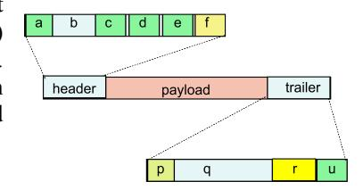
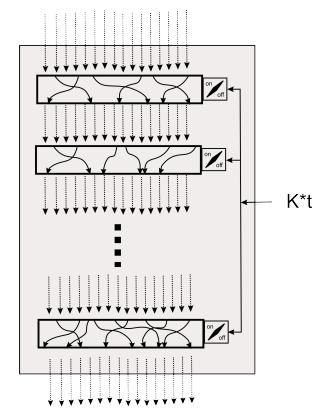
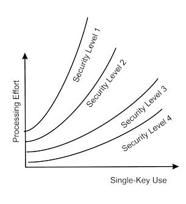

# A Unary Cipher with Advantages over the Vernam Cipher

# *VERNAM IS SHORTER BUT THE UNARY HIDES PATTERN OF USAGE*

#### Gideon Samid

## Gideon@BitMint.com

Keywords: Vernam cipher, unary encoding, transposition, mathematical secrecy, trans-Vernam ciphers.

## Regular Research Paper

*Abstract*: All mainstay ciphers share an underemphasized vulnerability: their ciphertext commits to its generating plaintext. This means that fast enough computers will cryptanalyze them, and so will an attacker smarter than their designers. By contrast, the Vernam One-Time-Pad cipher is free from these vulnerabilities, which is why it is the cipher of choice against such perceived threats. Alas, Vernam key management is very exacting and cumbersome, and it is also plagued by a serious authentication vulnerability. It is therefore of some interest to use a cipher that shares the mathematical secrecy delivered by Vernam, while overcoming its weaknesses. Such is the here proposed unary cipher. It uses the fundamental aspect of Vernam -- a very large key, and takes it even further -- an even larger key space. As a result the unary cipher exhibits good resilience to re-use of the same key (no resilience with Vernam), and it is also immunized to the Vernam authentication flaw. The unary cipher re-writes the plaintext in a unary alphabet, allows it to be mixed with contents-free bits, and then it transposes the resultant plaintext. Since it is possible to build the plaintext out of contents-free bits only, then use of the unary cipher successfully hides usage pattern. It is shown that the transposed message can be reverse-transposed to every plaintext up to a certain size. This plaintext variety is the same principle Vernam relies on to deliver its mathematical security. The unary cipher offers a disadvantage in the form of a larger ciphertext compared to Vernam, and so its practical use will have to be carefully evaluated.

#### I. INTRODUCTION

Transposition is arguably the most basic cryptographic primitive, it requires no alphabet, and its complexity is super-exponential. It lends itself to very efficient execution in hardware, which explains its popularity in most common cryptographic protocols. Herewith we investigate the premise that it may be a sufficient operation for purpose of security. We present Transposition Encryption Unary Alphabet Method, a cipher based on one round of transposition for generating secrecy. This Unary cipher is based on randomized at-will encoding of the plaintext so that its transposition will generate any desired measure of security.

A bit string b comprised of t bits, can be encoded in a format b\* through a string bv comprised of v+1 bits of identity "0" where v is the binary value interpretation of b, associated with a string b*r*, of r+1 bits of identity "0", where r represents the count of leading zeros in b.

Illustration: let b = 0001011. We write v = 11, r=3, and hence:

$$b^*$$
:  $\{b_v, b_r\} = \{v+1 \text{ "0"s, } r+1 \text{ "0"}\} = \{000\ 000\ 000\ 000,\ 0000\}$ 

There is clear bijection between b and b\*.

Let string b1 be so encoded to b\*1, and b2 so encoded to b\*2 only that for b\*2, we switch the bit identities from "0" to "1". . We write:

$$b_1 = \{v_1+1 "0", r_1+1 "0"\} b_2 = \{v_2+1 "1", r_2+1 "1"\}$$

We now express a concatenation between b1, and b2 as follows:

$$b_1||b_2 = \{b_{v1}||b_{v2}, b_{r1}||b_{r2}\}$$

Illustration: let b1 = 00101 and b2 = 0001000. Accordingly v1 = 5, r1 = 2, and v2 = 8, r2 = 3. And thus we write:

$$b_1 = \{v_1 + 1 "0", r_1 + 1 "0"\} = \{000 \ 000, 000\}$$

$$b_2 = \{v_2 + 1, r_2 + 1\} = \{111 \ 111 \ 111, 1111\}$$

$$\begin{array}{llllllllllllllllllllllllllllllllllll$$

Since bv2 is comprised of "1"s and br1 is comprised of "0"s we can concatenate without confusion:

$$b_1 || b_2 = \{b_{v1} || b_{v2}, b_{r1} || b_{r2}\} = b_{v1} || b_{v2} || b_{r1} || b_{r2}$$

Similarly for a string B comprised of arbitrary number, n, of subsections:  $B = b_1 || b_2, \dots, || b_n$  versus  $B^* = b^* || b^* ||_1 \dots || b^* ||_n$ . For an even value of i (i=1,2,...n) the  $b_{vi}$  and  $b_{ri}$  strings of  $b_i$  will be written with "1"s while for an odd value of i  $b_{vi}$  and  $b_{ri}$  will be written with :"0"s.

We now write:

$$\mathbf{B}^* = \{\mathbf{B}^*_{\mathbf{v}} = \mathbf{b}_{\mathbf{v}1} || \mathbf{b}_{2\mathbf{v}} || \dots \mathbf{b}_{\mathbf{n}\mathbf{v}}, \ \mathbf{B}^*_{\mathbf{r}} = \mathbf{b}_{\mathbf{r}1} || \mathbf{b}_{2\mathbf{r}} || \dots \mathbf{b}_{\mathbf{n}\mathbf{r}} \}$$

Further concatenating the two strings:

$$B^* = B^*_v || B^*_r = b_{v1} || b_{v2} || \dots b_{vn} || b_{r1} || b_{r2} || \dots b_{rn}$$

In order to mark where the bits of  $b_{vn}$  end, and the bits of  $b_{r1}$  begin, it is necessary that n will be divided by 4 ( n = 0 MOD 4). We shall see below that this requirement may be overcome, using the NULL entity.

We now define  $b_0$  = 'NULL' as the 'NULL' string which will be mapped to  $b^*_0$  with v=0, and r=0, namely:  $b^*_0 = \{v+1 \ "0", r+1 \ "0"\} = \{0,0\}$  or:  $b^*_0 = \{v+1 \ "1", r+1 \ "1"\} = \{1,1\}$  where we agree to switch bit identities for adjacent NULLs characters:  $b_0b_0 = \{0,0\}\{1,1\}$ , or  $\{1,1\}\{0,0\}$ , no  $\{00\}\{0,0\}\{1,1\}\{1,1\}$ .

One ready use of the NULL is to allow an arbitrary string B to be parceled out to any n number of subsections. Adding one, two, or three NULLs anywhere in B will make the total number of subsections  $n'=0\ MOD\ 4$  and will insure that the bit identity comprising  $b_{vn}$  will be opposite the bit identity comprising  $b_{r1}$  so there will be no confusion as to when  $b_{vn}$  ends and  $b_{r1}$  begins.

We can implant NULL characters throughout a bit-string:

$$B=b_1\parallel b_2\parallel..\parallel b_n=b_1\parallel b_2\parallel...\parallel b_i\parallel b_0\parallel b_0....\parallel b_0\parallel b_{i+1}\parallel b_{i+2}...\parallel b_n$$

and so:

$$B^* = b^*_1 \parallel b^*_2 \parallel ... \parallel b^*_n = b^*_1 \parallel b^*_2 \parallel .... \parallel b^*_i \parallel b^*_0 \parallel b^*_0 ... \parallel b^*_0 \parallel b^*_{i+1} \parallel b^*_{i+2} .... \parallel b^*_n$$

We shall regard the above described encoding of an arbitrary bit string as Unary-encoding, and the reverse process as Unary-decoding.

Let  $B^{*T}$  be an arbitrary transposition of  $B^*$  using a transposition key,  $K^T$ :  $B^{*T} = TP$  (  $B^*$ ,  $K^T$ ), and let  $|B^*| = |B^{*T}|$  be the bit count of either of these two strings.

Both  $B^{*T}$ , and  $B^*$  have the same number of '0' bits,  $0_c$ , and the same number of '1' bits,  $1_c$  where  $0_c + 1_c = |B^*| = |B^{*T}|$ . Let bit string  $B' \neq B$  be encoded into  $B'^*$  where  $0'_c = 0_c$ , and  $1'_c = 1_c$ . Accordingly there exists a transposition key  $K'_t$  such that  $B^{*T} = TP(B'^*, K'_t)$ . In other words, anyone with possession of  $B^{*T}$  without a possession of its generating transposition key,  $K_t$  will not be able to determine whether B or B' were used to generate it. Since B' is arbitrary, this means that all the bit strings that can be encoded to a string with  $0_c$  zeros and  $1_c$  ones -- are valid candidates for being the string that was transposed to  $B^{*T}$ . The larger the class of such B' string, the larger the equivocation -- up to perfect secrecy as defined by Claude Shannon.

We shall show now how to encode an arbitrary B' to B'\* with  $0'_c = 0_c$ , and  $1'_c = 1_c$ 

Step 1: parcel B' to m consecutive subsections of arbitrary sizes:  $b'_1 \| b'_2 \| \dots \| b'_m$ .

Step 2: Unary-encode B': Read  $b'_{1v}$  and  $b'_{1r}$  and construct  $b'_{1} = \{v'_{1} + 1 \ "0", \ r'_{1} + 1 \ "0"\}$ . Continue respectively with  $b'_{1}$  for i=1,2,...p where  $p \le m$ , as follows:

$$b'_i = \{v'_i + 1 \ "Q", r'_i + 1 \ "Q"\}$$

where 'Q' represent bits of identity '0' for odd i, and identity '1' for even i.

Step 3: Unary-Encode B' to B'\*, as above, then count the number of '0' bits in B'\*  $(0'_c)$ , and the number of '1' bits in B'\*  $(1_c)$ :

$$0'_{c} = \sum v'_{2i+1} + r'_{2i+1} + 2$$
 ...... for  $i=0,1,2,3...$  no higher than  $p/2$ .  
 $1'_{c} = \sum v'_{2i} + r'_{2i} + 2$  ..... for  $i=1,2,...$  no higher than  $p/2$  .

If  $0'_c > 0_c$ , or  $1'_c > 1_c$  then B' go to "oversize options". Otherwise:

Step 4: compute:

$$\Delta 0 = 0_{c} - 0'_{c}$$

$$\Delta 1 = 1_{c} - 1'_{c}$$

Add  $\Delta 0$  '0' bits as a header according to the set forth "header protocol", and add  $\Delta 1$  '1' bits as a trailer according to the set forth "trailer protocol.". The resultant header and trailer wrapped string B'\*  $\rightarrow$  B'\*<sub>w</sub> is comprised of 0<sub>c</sub> bits of identity '0' and 1<sub>c</sub> bits of identity '1', and hence B'\*<sub>w</sub> is a permutation of both B\* and B\*<sup>T</sup>. Namely, there exists a transposition key K'<sub>t</sub> such that:

$$B^{*T} = TP (B'^{*}_{w}, K'_{t})$$

Hence anyone holding B\*<sup>T</sup> without holding Kt cannot conclude that B\*<sup>T</sup> was generated from B\*, and not from B'\*. Every bit string sufficiently short will qualify as B' in the preceding analysis. This includes B' comprised of a string of 'NULLS'. In other words the size of B\*, |B\*|, and its Hamming weight, not its content, determines the range of candidate strings (B') that all qualify to be the string that generates B\*<sup>T</sup> . It is this vastness of this range that determines the security of the cipher.

When we combine this fact with the ability of the The cipher user to increase the size of the UNARY- encoded version, (B\*), of the original string B, at will (using as many NULL elements as desired, as well as wrapping the B with header and trailer as described ahead), we conclude that a transmitter of a message B using the UNARY cipher would be able to increase indefinitely the range of plaintext candidates that would encrypt to the transmitted ciphertext (B\*). This is a very strong statement. Which in effect makes it unnecessary to use any more algorithmic protection for data. Using the UNARY cipher, security is achieved through investing in greater computational effort in terms of executing transposition of large bits strings and through handling and transmitting large ciphertext. This resource investment is decided ad hoc by the user, not the cipher designer or builder. Such shift of responsibility for the security of transmitted data is far reaching.

# OVERSIZE OPTIONS

In the event that O'c > 0c, or 1'c > 1 c, then one can try a different way to parcel out B'. Otherwise, it is possible to increase the size of B through adding NULLs or through attaching larger headers and trailers. This can be done until 0c and 1c are high enough, implying that the UNARY encoder has full control over the degree of equivocation that protects their transmission.

## *A. Header/Trailer Wrapping*

The UNARY-encoded bit string B\* over bit string B, may be wrapped with a leading header, HDR, and a trailing trailer TRL: B\* → B\*w = HDR-B\*-TRL.

The header will be in the form 00.....1. Namely h '0' bits followed by '1', where h=1,2,.... open ended.

The trailer will be in the form 011.. 1. Namely *l* '1' bits following a single '0', where *l* = 1,2,.... open ended.

The values of h and *l* are arbitrary, and determined by the encoder.

As defined, the recipient of the wrapped string B\*w will readily strip the header and the trailer to recover the unwrapped version, B\*. To strip the header the recipient will remove all the leading zeros and the following '1'. To strip the trailer the recipient will remove all the trailing '1' and the preceding '0'.

Wrapping allows the UNARY encoder to add as many '0' and '1' bits to the pre-transposed string, in order to pack the transposed list with the same number of '1' an '0' bits, or any other ratio.

If headers and trailers are allowed then, at a minimum a single 0 added header and a single 1 added trailer will be needed to properly interpret the bit string.

## *B. Encoding Considerations*

UNARY encoding creates an encoded string B\* off a pre-encoded bit string B, such that the encoded size (bit count) is larger than the pre encoded size. We first examine this size-factoring.

It is readily seen that the smallest increase in size will happen for a string comprised of n "0" bits: 00....0. Encoded as a single section, it will register v=0, r=n. Hence: B\* = { 1 "Q", (n+1) "Q"} where Q is a bit of either identity "1" or identity "0". Since there is only one section we may have opposite identities for the v and the r. Alternatively we could add a NULL element. and keep both the r bits and the v bits of same identity.

So if B = 000000 then B\* = { 0000000, 1} = 00000001 or B\* = B\* NULL = 0000000101

In the first way the size of B\* is |B\*| = n + 2, and the latter way it is |B\*| = n + 2 + 2. Namely |B\*| ~ |B|.

The largest expansion happens for a string of n bits of identity "1": B =11......1. In the case where the string is referred to as a single section we have B\* = {2n - 1 "Q", 1 "Q"}. An exponential expansion: η = |B\*|/|B| = 2<sup>n</sup> /n.

The actual expansion, η, ranges between these two extremes:

$$1 < \eta \le 2^n$$

When an n-"1" bits string B is divided to s subsections of equal size then the encoded version, B\* counts: |B\*| = s \* 2 n/s bits where the size decreases with rising value of s.

To minimize the value of η for an arbitrary bit string, B, comprised of n bits, one should divide it to the maximum number of subsections: one-bit size each. We can write:

for b=0 we have v=0, r=1, and hence  $b^* = \{Q, QQ\}$  and for b=1 we have v=1, r=0, and hence  $b^* = \{QQ, Q\}$ 

where Q is a bit of either identity 1 or identity 0.

Accordingly b\* is three times the size of b:  $\eta = 3$ 

Analyzing subsections of size 2 bits:

```
b v r b*
-----
00 0 2 Q,QQQ
01 1 1 QQ,QQ
10 2 0 QQQ,Q
11 3 0 QQQQ,Q
```

This is average size increase of  $\eta = 4.25$ 

for |b| = 3 the  $\eta$  will range from 5, (for 000, 001, 010, 011) to 9 (for 111).

#### C. Subsection Strategy

The strategy for parceling the plaintext B to subsections is critical in determining the size increase of the ciphertext,  $B^* = B^{*T}$  over the plaintext B. We have seen above how large is this range. In practice the subsections may be of varying sizes. These size variety may be chosen through a randomization process, perhaps between two limits (upper and lower per subsection size). By using adhoc randomness the security of the operation vastly increases. Yet, it can also be chosen in some deterministic way. In fact the very choice of the subsection sizes may be used to deliver a secondary hidden message to the intended recipient.

#### D. Decoy Strategy

The transmitter of a UNARY message may increase security by using a high  $\eta$  value -- a large ciphertext compared to the un-encoded plaintext. They can use two ready methods to inflate the ciphertext, and add so called 'decoy bits'. One method is by peppering the message with NULL elements. A NULL element does not add anything to the message but it requires 2 bits to be expressed. With NULLs it is impossible to add at will more 0 bits than 1, or at will more 1 bits than 0. The alternative method is headers and trailers where both '1' bits and '0' bits can be added in any desires number.

The following string, E. is empty:

E = 000000000001010101010101010101010111111

because it is comprised a header, 10 NULLS, and a trailer: HDR NULL NULL NULL NULL NULL NULL NULL NUL

#### $E = 0000000000001 \ 0101010101010101010101 \ 01111111$

The transmitter may 'hide' a message M in a series of empty transmissions  $E_1,\,E_2,\,..,$ :

$$E_1 E_2$$
,.....  $E_i M E_{i+1}$ ,  $E_{i+2}$ ....,  $E_a$ 

By applying sufficient decoys the transmitter may protect his message with any desired measure of security.

## E. Comparing Unary to Vernam

Both the Unary and the Vernam ciphers offer mathematical secrecy to their users. And as such they stand in sharp contrast to the large array of ciphers which have one attribute in common: their ciphertext commits to their generating plaintext. These "committed ciphertexts" are shielded by their assumed (not proven) cryptanalytic burden of computation, and hence they are all vulnerable to super fast computers (e.g. quantum computers) and also vulnerable to a mathematician smarter than their designer. Both Vernam and the unary cipher are distinguished by not sharing this 'committed ciphertext' liability, securing their hidden message on proven mathematical grounds.

The NSA defines four security categories, Types I to IV, all relying on committed ciphertexts, but for top of the line security they reportedly resort to Vernam (e.g. The DIANA cipher). Should Vernam users switch to this unary cipher? One reason not to switch is the burden of dealing with a ciphertext that may be quite larger than the message it hides. Yet, this size disadvantage is temporary, applies only in the brief period of passing it from transmitter to recipient. There is no need to store the large ciphertext file. For text transmission in today's 5G era this size issue is a very small disadvantage.

On the other hand the unary cipher offers two substantial advantages over Vernam: (i) re-use resilience, (ii) authentication edge. If the Vernam cipher key is used twice, then right away the exposed ciphertexts become plaintext-committed, and Vernam loses its edge (as happened to the Russians when they stole the US atomic secrets). The unary cipher, by contrast, shows inherent resilience to such double use. This is because the unary key space is larger than the unary message space. Given an n bits long plaintext (after converting to the unary representation), the respective encryption key space is |K|= n!, however, there are only  $2^n$  possible n-bits messages, so each plaintext is associated with  $n!/2^n$  keys, which means that only if the same key is used  $n!/2^n$  times will the set of ciphertexts commit to their generating plaintext. In other

words, the Unary cipher shows much greater resilience to repeat use of the same key.

The other unary advantage is authentication. An attacker can send Alice a message, which he would expect her to encrypt using Vernam and send the ciphertext to Bob. The attacker intercepts the encrypted message, and since he knows the respective plaintext, he can extract the key, and use it to send Bob a false message. This will not work with the unary cipher because of two reasons: (i) there are n!/2<sup>n</sup> indistinguishable keys to choose from, and (ii) Alice uses ad-hoc unilateral randomness to break her message to subsections, keeping the attacker in the dark.

In summary, the unary cipher delivers the same mathematical secrecy delivered by Vernam, but it comes with distinct operational and security advantages.

## II. OPERATION

The transmitter of a UNARY enciphered message enjoys a great measure of control over the security of the sent message. The transmitter decides how much to pay, aware of how much security will be purchased. The price is rated with computational burden. Some of this burden may be alleviated through hardware, and some through communication channels and memory.

UNARY security is based on a shared transposition key and a single transposition round, on encoding variety, and on decoy strategy. The larger the transposition list, the better the security. This size, depending on implementation, may be non pre-shared, namely unilaterally determined by the transmitter on account of the desired security. Same for the encoding scheme, and the decoy management, which are also unilaterally determined and feed on ad-hoc randomness. That means the transmitter who is in the best position to appreciate the security needs for its transmission, is the right agent to determine which encoding scheme to use and the degree of decoy defense. This determination may be made for each transmission. So that when a single key must be used over and over again, it can each time, be used with more protection through more elaborate encoding and more extensive decoy management. This is an important distinction relative to mainstay ciphers where security is built in to the published algorithm and is threatened by unpublished attack scheme. The UNARY user relies on adhoc high quality randomness in desired quantities. Security shifts from the algorithm designer to the message transmitter; from well known cipher algorithm to unknown on-demand randomness.

#### *A. Unary Encoded Packaging*

The figure abreast shows how the payload (the ciphertext) is wrapped by a header and a trailer. The header has 6 elements: (a). message start signal, (b) sender id, time of transmission, open fields, (c) encoding data, (d) transposition key indicators, (e) payload size, (f) header end indicator. The trailer is identified with four elements: (p) trailer start indicator, (q) transmission history, (r). signature (payload hash / header hash), (u). end of trailer indicator.



#### *B. Transposition Options*

We consider two methods. One is based on US Patent 10608814, Equivoe-T, the other on hard-wired TSIC (Transposition Specific Integrated Circuits). Equivoe-T offers the advantage of having an integer as a key, which applies to any size of transposed list. This gives the UNARY user the advantage of choosing each time a different size of bit string to transpose. TSIC is much faster, but it is geared towards a fixed size bit string to be transposed. We will focus on the TSIC fixed size option.

#### *C. Fixed Size Transposition*

The advantage of fixed size transposition in hardware implementation is that it allows for hard wiring of the transposition operation to allow any permutation of nitems list to any other permutation of the same list. The issue here is that this transposition is fixed, and applies to a fixed size list.



Size variety can still be applied over a range from

some low threshold L, and high threshold H (bit count). Any size value X: L ≤ X ≤ H can be used for the payload, with the balance of H-X bits contributed through NULLs or through header or trailers, such that the pre-transposition size will always be H, which is the hard wired size.

It can be implemented over a fixed size input and output, of n item, where some t fixed transposition wiring units are listed in order: T1, T2,.... Tt. These t transposition rounds are combined into a single device. The input to the combined device includes a designation of which u transposition units (among the available t transposition operations) are to be applied over the input to generate the respective output. This list of u items is the 'secondary transposition key', K\*t. The first key is expressed in the hard-wired t units. This implies that a group can share the hard-wired device with t transposition units, but bilateral confidential communication within the group will be carried out via a secret shared secondary transposition key, which has a key space of 2<sup>t</sup> .

Every processing round in the device may involve a randomized selection of the next K\*t key, to be used in the next processing round in the device (the next application of the TSIC). Say the first payload P1 is comprised of the first message M1, and the secondary transposition key to be used for the next message: K\*t1: P1 = M1 - K\*t2. P1 will be transposed with the pre agreed first transposition key, K\*1:

$$P_1^T = TP ([M_1-K*_{t2}], K*_{t1})$$

and then:

$$P_2^T = TP ([M_2-K*_{t3}], K*_{t2})$$

and so on for i=1,2,...

$$P_i^T = TP ([M_i - K_{ti+1}], K_{ti})$$

There are 2<sup>t</sup> combinations to select active units among the available t, so the key space for the secondary key is: |K\*t| = 2<sup>t</sup> .

The transposition can be hard wired to operate on individual bits or on sub-strings of bits of equal size.

The device input string S0 will enter the first hard wired transposition unit, T1, and come out transposed, S1. This output string, S1, will then encounter a decision node. If T2 is listed in K\*t as a unit to be activated then S1 will be fed into T2 for another round of transposition. If T2 is not listed in K\*t then S1 will by pass the 2nd transposition unit and be routed to a similar decision before node T3. Every transposition unit will be preceded by a routing decision junction based on the value of K\*t.

The device will be built to allow for reverse transposition by simply reversing the input/output ports, using the same K\*t.

TSIC may feature, say, n=10<sup>6</sup> register bits, and t=1000 transposition units, which will allow this device to be used in 2<sup>1000</sup> different ways: |K\*t| = 2<sup>1000</sup> = 1.07 \* 10301.

## *D. Latchable UNARY cipher*

The transposition operation is the security hub of the UNARY operation. One may then implement it in a latchable device, to be bio-activated, and be latchable to a computer to provide specifically transposition and reverse transposition services only.

## *E. Decryption*

The recipient of the ciphertext (the transposed encoded message, B\*<sup>T</sup> ), will first reverse-transpose it, then decode it to extract the original message:

$$B^{*T} \rightarrow B^* \rightarrow B$$

## *F. UNARY hash*

Any bit string can be parceled out to substrings, such that each substring is comprised only of same identity bits. And if the number of such substrings divides by 4 then this string can be interpreted as UNARY-encoded off a smaller string. If the total number of such substrings does not divide by four then one could concatenate to it Q, QQ, or QQQ as required: " where Q is a bit of identity opposite the identity of the last bit in the string to which it is concatenated (or a similar solution). Hence if a string B is comprised of 37 strings and the last string is 111, then QQQ is needed to make the count of subsections divide by 4, namely QQQ = 010. This arbitrary string comprised of 4k same identity substrings (k=1,2,...) can be compressed to its UNARYdecoded version. The compressed encoding can be further compressed iteratively. This 'decoding' process is not reversible because the corresponding encoding involves an arbitrary division of the decoded string to substrings.

Let B0 be the original string, of size |B0|l bits. It can be compresses (as stated above, in a lossy way) to B1, which in turn can be compressed (decoded) to B2, and so on, string Bi may be compressed to string Bi+1 . This process may continue until a terminal string Bt comprised on NULLs. Unlike the typical hashing procedures, the UNARY hash does not end at a preset size, but it can be continued until the hash equals or is less than a threshold size. The resultant hash may be applied like the more common hash procedures.

We designate dB as the UNARY-decoded version of string B. And so we can write: Bi = dBi-1 = d<sup>j</sup> Bi-j = d<sup>i</sup> B0.

Illustration: Let B0 = 11100110010001. B0 is comprised of 7 same-bit-identity strings: 111 00 11 00 1 000 1. We need therefore to concatenate it with Q=0:

$$B'_0 = 111\ 00\ 11\ 00\ 1\ 000\ 1\ 0$$

So 
$$dB' = b_1 || b_2 || b_3 || b_4$$
, where:

$$b_1 = (v_1 = 2, r_1 = 0) = 10$$
  
 $b_2 = (v_2 = 1, r_2 = 2) = 001$   
 $b_3 = (v_3 = 1, r_3 = 0) = 1$ 

$$b_4 = (v_4 = 1, r_4 = 0) = 1$$

Thus:

$$dB' = b_1 \parallel b_2 \parallel b_3 \parallel b_4 = 10\ 001\ 1\ 1$$

The original string is comprised of 14 bits, and the decoded one is comprised of 7 bits.

Decoding again: dB' = 1 000 111 is comprised of 3 same-bit-identity subsections, so Q=0 will have to be added to create a number of subsections that divides by 4:

$$d(dB')' = d(1\ 000\ 111\ 0) = b_1 \parallel b_2$$

$$b_1 = (v_1 = 0, r_1 = 2) = 00$$
  
 $b_2 = (v_2 = 2, r_2 = 0) = 10$ 

And hence:

$$d(dB')' = d(1\ 000\ 111\ 0) = b_1 \parallel b_2 = 0010$$

To continue we need to add '1', and end up with a string with four subsections

$$d(d(dB')')' = d(00\ 1\ 0\ 1) = b_1 \parallel b_2$$

$$b_1 = (v_1 = 1, r_1 = 0) = 1$$
  
 $b_2 = (v_2 = 0, r_2 = 0) = NULL$ 

and hence:

$$d(d(dB')')' = d(00\ 1\ 0\ 1) = b_1 \parallel b_2 = 1$$

To continue, we must add QQQ = 010

$$d(d(d(dB')')')''' = d(1010) = b_1 \parallel b_2$$

$$b_1 = (v_1 = 0, r_1 = 0) = NULL$$
  
 $b_2 = (v_2 = 0, r_2 = 0) = NULL$ 

## *G. Transposed HASH*

Any string in the series B0, B1, .... may be transposed before it is decoded. When these transpositions are carried out with a secret key, they create a secret hash.

We write: 
$$B_i = H(B_{i-1}, K_t) = HB_{i-1}$$
 for  $i=1,2,...$ 

#### *H. Implementation*

The Unary cipher can be used generically wherever symmetric encryption is used. But it would be prominent for applications based on a latchable gadget fitted into a computer, and holding the TSIC chip. A similar chip will be useful for medical devices that are body implanted and are fine-tuned remotely. It is important to insure that these devices will not be mal-controlled. Alas, same devices use tiny battery and can't spare the energy to compute AES or alike.

## *I. UNARY Security*

While common ciphertexts commit to their generating plaintext, and given enough cryptanalysis will yield their secret, a UNARY cipher will challenge its attacker with irreducible equivocation, the extent of which is determined by its user. This is a strong security statement.

# CONTEXTUAL MATHEMATICAL SECRECY

Contextually an adversary aware of the fact that his opponent sent a ciphertext c of size |c| at a given moment of time, will be able to list some t candidates for the identity of the message encrypted into c: M = {m1, m2,.... mt}. The adversary, again contextually, will appraise a probability pi for



message mi (i=1,2,...t) to be the one encrypted into c, where P = {p1, p2, .... pt}. We now define Contextual Mathematical Secrecy as the case where knowledge of the content of c (not just its size) does not change the probability distribution over M: P|c| = Pc.

We propose to assume that the transmitter of a secret message m\* ∈ M will share the adversary's list, M (although not the probability distribution P), and hence will be able to encrypt m\* inflated enough (with NULLs, a header and a trailer) to insure that all members mi ∈ M will be associated with an equally likely reverse-transposition key ki that will decrypt c to mi. Thereby the transmitter unilaterally - without pre coordination with the recipient -- will insure contextual mathematical secrecy for their transmission.

We have seen that given a plaintext P, the transmitter thereto will be able to render an arbitrary different plaintext, P' ≠ P to be an equally likely candidate for the generating plaintext. To do so, the transmitter may have to inflate the number of transposable zeros (0c) and the number of transposable 1 bits (1c) to a sufficient level. From a practical point of view this feature is equivalent to mathematical secrecy as defined by Claude Shannon.

UNARY cipher equivocation security may be extended to repeat use of the same transposition key. Let a transmitter use the same transposition key, Kt, over q plaintext messages P1, P2, ..... Pq. For each transmission i ( i=1,2,...q) let an attacker have a list Li of plausible plaintexts for that transmission, where this list is compiled before the respective ciphertext is released. So a-priori the number of possible sets of q messages is: EQV = π |Li|. Since the transmitter can inflate the size of the pre-transposed string to any desired size, they can assure that given the q released ciphertext, there are likely to remain some desired number s, of transposition keys that will reduce the equivocation lists L1, L2, .... Lq to L'1, L'2,.....Lq, respectively where while for every i=l,2,...q there exists L'i < Li, the residual equivocation EQV'(s) = π |L'i| will be above a preset security threshold, S: EQV'(s) < S. In practice this implies that the user can control the security projection of their transmitted data.

## *J. Outlook*

In the post-Coronavirus universe we expect to experience a proliferation of work-from-home practice. Bankers and confidential workers of all sorts will find it necessary to routinely communicate highly confidential data among distributed locations. This will pose new challenges before cyber technology. Security responsibility will have to shift to the transmitters of sensitive information. Not only content, but pattern will have to be concealed to enable the emerging, lasting work configurations. The new wave of Trans Vernam ciphers is well prepared to meet that challenge, and the UNARY cipher fits right in.

## III. REFERENCE

- 1. US Patent 10,608,814 Equivoe-T: Transposition Equivocation Cryptography
- 2. US Patent 10,523,642 Skeleton Network
- 3. Samid "Randomness Rising The Decisive Resource in the Emerging Cyber Reality" 14th International Conference on Foundations of Computer Science (FCS'2018, Las Vegas, USA)
- 4. Samid "Shannon's Proof of Vernam Unbreakability" https://www.youtube.com/watch?v=cVsLW1WddVI
- 5. Shannon 1949: "Communication Theory of Secrecy Systems"
- http://netlab.cs.ucla.edu/wiki/files/shannon1949.pdf 6. Smart: "Cryptography Made Simple" , Springer.
- 7. Vernam, US Patent 1310719, 13 September 1918.
- 8. Williams 2002: "Introduction to Cryptography" Stallings Williams, http://williamstallings.com/Extras/Security-Notes/lectures/classical.html