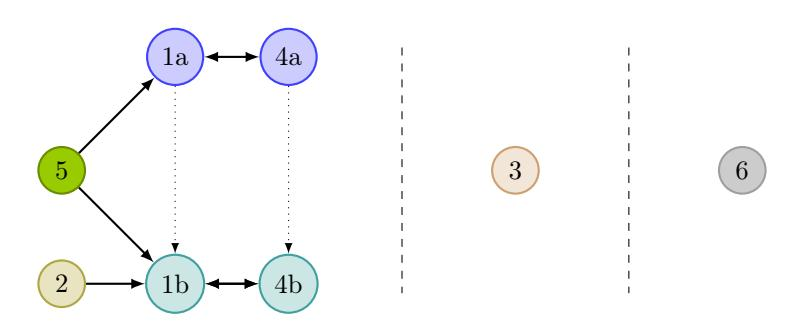
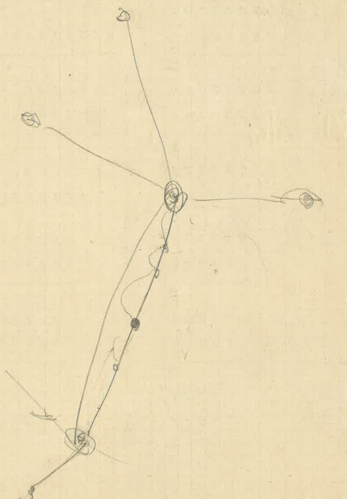

#### A French cipher from the late 19th century

Rémi Géraud-Stewart and David Naccache

Information Security Group, Département d'informatique de l'ÉNS, École normale supérieure, CNRS, PSL Research University, Paris, France. [first\\_name.family\\_name@ens.fr](first_name.family_name@ens.fr)

#### ARTICLE HISTORY

Compiled April 6, 2020

#### Abstract

The Franco-Prussian war (1870–1871) was the first major European conflict during which extensive telegraph use enabled fast communication across large distances. Field officers would therefore have to learn how to use secret codes. But training officers also raises the probability that defectors would reveal these codes to the enemy. Practically all known secret codes at the time could be broken if the enemy knew how they worked.

Under Kerckhoffs' impulsion, the French military thus developed new codes, meant to resist even if the adversary knew the encoding and decoding algorithms, but simple enough to be explained and taught to military personnel.

Many of these codes were lost to history. One of the designs however, due to Major H. D. Josse, has been recovered and this article describes the features, history, and role of this particular construction. Josse's code was considered for field deployment and underwent some experimental tests in the late 1800s, the result of which were condensed in a short handwritten report. During World War II, German forces got hold of documents describing Josse's work, and brought them to Berlin to be analyzed. A few years later these documents moved to Russia, where they have resided since.

#### KEYWORDS

Historical cipher, French cryptography, Hippolyte D. Josse

#### 1. Introduction

Since Kerckhoffs' works [\[Ker83\]](#page-9-0), it has become almost common sense to design, evaluate and implement cryptography in a transparent way, not merely for scientific but for very pragmatic reasons. But before this celebrated principle made its way into the mainstream, security by obscurity was the norm. As a result, early relics of cryptographic work are hard to unearth: They often lay in the shadows of military archive bunkers, despite the fact that most of the techniques described there were never implemented, let alone used in the field, and are in any case obsolete by today's standards.

It is thus very lucky, in a sense, that Major Josse's system attracted enough attention for the German army to take notice of it, and bring descriptions to Berlin for cryptanalysis. In hindsight this is itself a mystery: at the time the Germans seized documents, these were already more than 30 years old; and we have no evidence that this particular code was ever used at all. It is unclear then what exactly was their motivation; it may have been part of a systematic effort to search for and analyze every technique they could lay their hands on. Whether they picked this code in particular, or it was part of

a bundle, we do not know.

When East Germany fell to the Soviet army, documents relative to the Josse system were sent to Moscow, probably to undergo analysis as well. They have resided there until recently, when documents were brought back to France.

In this paper we analyse the corpus of documents that has been recovered, from a historical and cryptographic standpoint. Amongst these, only a few can be attributed with relative certainty to Major Josse's efforts, and constitute a credible cryptographic system which, although obsoleted by modern techniques, could very well have been of use in the late 1800s.

#### 2. The corpus

Because of its tortured history, being moved from one archiving place to the next across countries, it comes at some surprise that all documents in the bundle are in an excellent state, showing no more than stains due to aging paper and some degradation related to manipulation. This may indicate that these documents were not handled very much or only with extreme care.

As we discuss below, the bundle itself consists in several pages, the origin of which we investigate.

#### 2.1. Description of the corpus

The corpus consists in 17 unnumbered manuscript pages, including title pages and appendices. They were handwritten in French. The corpus, reproduced in appendix, is composed of several documents:

- (1) A main document, entitled "Projet de Cryptographie Militaire n◦3" (Military Cryptography Project Nr. 3 ). This document describes a cryptosystem's design goals, encryption and decryption procedures, and makes additional remarks on how to teach it. We will henceforth refer to this cryptosystem as Josse's system. This document appears twice (1a and 1b).
- (2) A second document, probably meant to follow the first one, entitled "Système cryptographique n◦3" (Cryptographic system Nr. 3 ). This document contains the result of training exercises with several officers on Josse's code, where accuracy and speed were recorded.
- (3) A newspaper article draft, which praises a "New cryptographic system" (without explicitly mentioning Josse's system).
- (4) An appendix to the main document (two copies, corresponding to the two versions), containing subtraction tables (4a and 4b).
- (5) A letter, signed by "S. Mounier" (or possibly Munier?) and dated June 29, 1889, addressed to Major Josse, mentioning the successfully copied version of the original draft. Indeed the first and second documents each appear in two versions: a draft version, with visible crossing-outs and additions; and a clean version. In all probability the clean version is the one mentioned by M(o)unier.
- (6) A leaflet, entitled "Méthode stéganographique Josse" (Josse steganographic method) followed by a poem.

We will refer to these documents by the numbers 1a, 1b, 2, 3, 4a, 4b, 5, and 6 in the following discussion. Note that all pages except the poem are of standard format (A3 double pages, or A4 single pages). The poem paper is lighter and of lesser quality, possibly removed from a notebook.

#### <span id="page-2-2"></span>2.2. Handwriting analysis

It is possible to use forensic handwriting analysis techniques on the documents to gather information about their authorship [\[ENF15\]](#page-8-0). In this context, there is no suspicion of simulation and we may assume that clear differences in writing correspond to different authors.

This analysis relies on identifying characteristic features of handwriting, such as letter shapes, word spacing, presence and nature of ligatures, connecting strokes, and line form (which indicates pressure). We are helped in this endeavor by the documents' length, and the relatively regular handwriting under scrutiny.

Analysis, summarized in Table [1,](#page-3-0) reveals that eight authors contributed to the corpus. In particular, the absence of stroke-through text and mistakes in Document 1b seems to indicate that it was copied after 1a (and similarly, 4b was probably copied from 4a). We mention in this table the key features that enable to distinguish one author from all the others.

Amongst these features we mention the writing style, when recognizable, used by the author. Indeed, official French documents were expected to be written in either of three authorised styles: ronde, coulée, and italienne-bâtarde [\[Gre15,](#page-8-1) [Mor09\]](#page-9-1). A middle ground is the copperplate style, considered more readable and therefore appropriate for formal exchanges in restricted circles.[1](#page-2-0) The use of other styles (or failure to adhere to a well-known calligraphic style) is then indication that the document was not meant for official communication.[2](#page-2-1)

Some documents (1b, 2, and 4b) are written in different calligraphic styles. This alone does not guarantee that they were written by different persons. However we take the conservative approach to give these authors different names. Document 6 is written in a style reminiscent of 1a, but exhibits key differences and is probably the work of an unrelated author.

#### 3. Content analysis

#### 3.1. Overview of inter-document relationships

Handwriting analysis (Section [2.2\)](#page-2-2) already gives some information about how the different documents are related. We completed this analysis by an in-depth examination of the corpus' contents and consistency. An overview of the relationships between documents is illustrated in Figure [1](#page-3-1) and detailed hereafter.

In particular, documents 3 and 6 do not seem to be related to the cryptographic system described in documents 1, 2, 4, 5. Document 6 bears a mention of Josse, and is thus not completely unrelated. However document 3 does not, and seems to be completely independent from the other documents.

<span id="page-2-0"></span><sup>1</sup>A variant of the copperplate style was the official style in the British Empire at that time [\[Grö07\]](#page-8-2).

<span id="page-2-1"></span><sup>2</sup>The specificities of these styles, along with their history and some examples, can be found in [\[Grö07\]](#page-8-2).

<span id="page-3-0"></span>Table 1. Handwriting analysis on the corpus.

| Doc. | Author(s) | Style        | Distinguishing features                                                                             | Comments                                                         |
|------|-----------|--------------|-----------------------------------------------------------------------------------------------------|------------------------------------------------------------------|
| 1a   | A1+A2     | -            | Connecting stroke in<br>que, t,<br>st, capital<br>S and P, digit<br>3                               | wrote<br>the<br>title<br>A1<br>page only.                        |
| 1b   | A3        | Danish ronde | Capital M and G, ff liga<br>ture, s and b, line form                                                | the<br>title<br>Including<br>page.                               |
| 2    | A4        | Copperplate  | Ligatures and final<br>s                                                                            | -                                                                |
| 3    | A5        | -            | Capital L, f, p, and<br>ff, dis<br>connected qu                                                     | Dated 188                                                        |
| 4a   | A2        | -            | Digits                                                                                              | -                                                                |
| 4b   | A3        | Danish ronde | Digits                                                                                              | -                                                                |
| 5    | A6        | -            | Capital M, R, and<br>S, line<br>form, character height-to<br>width ratio, spacing                   | S.<br>Mounier.<br>Signed<br>Dated 29 Jun 1889.                   |
| 6    | A7+A8     | -            | Trailing letters<br>e, s,t, slant,<br>Discon<br>final<br>ez<br>digraph.<br>nected ph, capital<br>J. | A8 wrote on the back<br>only. A7 bears some<br>similarity to A2. |



<span id="page-3-1"></span>Figure 1. Relationships between the documents. A thick arrow indicates that a document mentions another. A dotted line indicates that a document was used as source for another.

#### 3.2. The poem (document 6)

Let's start with a description and analysis of the ancillary documents, because their relationship to the cryptographic system is unclear and they can be treated independently.

While the leaflet bears the inscription "Méthode stéganographique Josse", the poem written on this page and reproduced in Appendix [A](#page-9-2) was widely known at the time. Indeed, the poem was quoted more or less in its entirety in several books published before Josse's death. We found an early mention in "Amusements philologiques ou variétés en tous genres" by Gabriel Peignot[3](#page-3-2) in 1808 [\[Pei08,](#page-9-3) p. 40], although there might be even earlier sources. According to Peignot,

<span id="page-3-2"></span><sup>3</sup>Étienne-Gabriel Peignot 1767–1849.

"These letters first present a meaning, when read as usual; but if we read the first line, the third, the fifth, etc. that is, every other line, we shall find a meaning opposite to the one a first reading suggested.[4](#page-4-0) "

In other terms, while the entire poem makes sense as it is, reading the even-numbered lines only (and skipping over the odd-numbered lines) reveals a message that completely contradicts it.

Peignot mentions several other examples of vers brisés (broken verses) in French literature, including the poem's continuation.

As such, the text itself seems to be an exercise in literary entertainment rather than a military steganographic method, and there is no mention of it in any of the other documents. The leaflet is not signed nor dated, and the different paper grade and format seem to indicate that it was not part of the original bundle.

Since the document is handwritten, the possibility remains that there is hidden information in the way words are written, in the placement of words on the paper, or non-word symbols (e.g. dots), or invisible ink.

Comparison to Peignot's version rules out steganography based on altering words. It is unlikely that inter-word spacing was engineered, and a quick statistical hypothesis test on a digital copy is consistent with a Gaussian distribution.

A German-style dot-based steganography is possible: the placement of dots and punctuation sign is rather free, and there are enough such marks (around 75) to encode a short message if using for instance a grid.

Inspection of the document under visible and near-UV light did not reveal nor indicate the use of special ink.

#### 3.3. The newspaper article (document 3)

The newspaper draft, written on Revue de Cavalerie Militaire letterhead and unsigned, praises the benefits of a "new cryptographic system" not otherwise made precise. The exact date of writing, or possible publication, is not written. We couldn't find a mention of a published version of this article in the École Militaire's Milindex document archive, which seems to start around 1892. Since the Revue was created in 1885 and the letterhead indicates 188... we can suspect that the draft was written during this period: 1885–1889, and most likely not before 1880. Since the draft refers to a previous issue[5](#page-4-1) we may assume that the author already wrote for the Revue before, in March of the same year.

A thorough read raises doubts on the idea that the cryptographic system mentioned in this draft is really Josse's. Indeed, it insists on the usage of two cryptographic keys (Josse's system, as we will see, only has one), and on the immunity of ciphertexts to alterations[6](#page-4-2) that seem to break ciphertexts generated by Josse's method. The encryption procedure seems different from Josse's[7](#page-4-3) , but is not described in enough details to be decisive.

Finally, the author admits that the system's security relies not on the key, or the

<span id="page-4-0"></span><sup>4</sup> "Ces lettres présentent d'abord un sens, étant lues à la manière accoutumée; mais si ensuite on ne lit que la première, la troisième, la cinquième ligne, etc. c'est-à-dire, toutes les lignes impaires, ou (sic!) y trouvera un sens opposé à celui qu'a présenté la première lecture."

<span id="page-4-1"></span><sup>5</sup> "(...) mise en évidence par l'essai publié dans la Revue de Cavalerie (livraison de mars)".

<span id="page-4-2"></span><sup>6</sup> "Un autre avantage particulier du système, c'est qu'il n'est pas troublé par la transposition ou la suppression de quelques lettres (...)".

<span id="page-4-3"></span><sup>7</sup> "(...) on efface chaque ligne au fur et à mesure qu'elle est transcrite (...)".

encryption grid, but on the cryptosystem's principle[8](#page-5-0) – a blatant violation of Kerckhoffs' design recommendations. As we shall see, this is at odds with Josse's system, which does not assume security by obscurity. In fact, as noted by Kahn [\[Kah67\]](#page-9-4), Josse was a fond admirer of Kerckhoffs:

"Josse quoted Kerckhoffs so often that he felt it necessary to insert an apologetic 'M. Kerckhoffs, whose name recurs so often in cryptography' after an especially heavy flurry of references."

Altogether, these elements seem to rule document 3 out, as a possibly contemporary account otherwise unrelated to Josse's system.

#### 3.4. Core documents

The remainder of the documents forms a densely connected and consistent set. Document 1a describes a cryptographic scheme, and is supplemented by Document 4a. Document 5 mentions that a copy was performed, which seems to refer to documents 1b and 4b. Finally, Document 2 relates field experiments (timing measurements) based on the cryptosystem.

If we are to believe Document 5, the cryptosystem under consideration was engineered by Josse, and Documents 1a and 4a would bear his very own writing.

#### 4. Josse's cryptographic system

#### 4.1. Major Josse

Publicly available information about Josse is only fragmentary.

Hippolyte Désiré Josse was born on July 14, 1852 in Montmartre (Seine) near Paris.[9](#page-5-1) His parents Jean Louis Désiré Josse (born 1820) and Cécile Amélie Denisia Dufeu (born 1832) had another child, Marie Emilie Eugénie (born 1860). Hippolyte Josse graduated from École polytechnique in 1872, and married Alix Amélie Hyvernat (born 1855) in 1881 in Paris.

Fighting in the 1870 war against Prussia, Josse was made Major and later knighted within the Ordre de la Légion d'Honneur (Matricule 61,140) on August 14, 1900.

Originally an artillery officer, Josse is the author of a single book, dedicated to military cryptography and published in 1885 [\[Jos85a\]](#page-8-3) (from which Kahn's citation is excerpted [\[Jos85a,](#page-8-3) p. 695]). The book actually gathers articles published that same year by Josse himself, essentially in the Revue Maritime et Coloniale [\[Jos85b,](#page-8-4) [Jos85c\]](#page-9-5).

He seems to have taken a prime role in the early organisation of French military cryptography[10](#page-5-2) along with fellow army officers Philippe, Munier, Delanne, Berthaut, Brun, Picquart, Legrand, and Straforello, issuing in particular field manuals related to telegraphic communications [\[Lau09\]](#page-9-6). One of these documents, known as the "Dictionnaire 1890", described a dual system relying on one cipher in wartime and another when in peace. It was amongst the codes that Bazeries broke while still an amateur.

This would be contemporary to the system described here, which seems to have been designed around 1889.

<span id="page-5-0"></span><sup>8</sup> "(...) pour presque toutes les méthodes, le principe est connu (...) pour la méthode nouvelle (...) il faut garder pour soi le principe".

<span id="page-5-1"></span><sup>9</sup>Archives nationales, reference LH/1375/17.

<span id="page-5-2"></span><sup>10</sup>Service historique de la défense – Archives de la Guerre (henceforth SHD-AG), 1 K 842, p. 5.

In 1900 Josse (at that time a colonel) participated in the French Ministry of War official commission on cryptography, along with Jean-Jules Brun, Henry-Marie-Auguste Berthaut, and François Cartier.

According to the records, Josse died on February 10, 1929, at the age of 76.

#### 4.2. Description of the cryptosystem

Josse's system works on a restricted subset of the Latin alphabet, without punctuation, numbers or spaces, and does not distinguish between upper and lower case. Interestingly, the letter W is also removed from this alphabet. As was very common at the time, letters are put in correspondence with their index in the alphabet:

$$\begin{array}{cccccccccccccccccccccccccccccccccccc$$

Both the plaintext, password, and ciphertext are written using this alphabet, and understood as a sequence of numbers between 1 and 25. The choice to drop W is not explained, but a possible motivation is that operations modulo 25 are somewhat simpler to perform with pen and paper than modulo 26, and W is a very rare letter in French so that its loss has minimal impact.

- Setup: Both the sender and the recipient agree beforehand on a "seed" P, which will be used to generate the substitution table used to both encode and decode messages. P is a short password, written in the alphabet discussed above.
- Key generation: To generate the key, duplicate letters are removed from P, which gives P <sup>0</sup> of length N. Then P 0 is spelled and put in the first row of a table with N columns. The rest of the letters follow, in alphabetical order. There are thus d25/Ne rows in the table. The table is then read column-wise to yield a shuffled alphabet, which is the secret key. We write S(a) to denote the position of the letter a in that new alphabet (with the convention that the first element is in position 1).
- Encryption: Let m = m<sup>1</sup> · · · m<sup>M</sup> be a message. If necessary, the message is padded with random letters[11](#page-6-0) so that M is a multiple of 5. First compute

$$r_i = S(m_i) + r_{i-1} \bmod 25$$

with the exception of the first, r<sup>1</sup> = 1 − S(m1) mod 25. The ciphertext is given by c<sup>i</sup> = S −1 (ri).

• Decryption: Given a ciphertext c = c<sup>1</sup> · · · c<sup>M</sup> we first construct

$$d_i = S(c_i) - S(c_{i-1}) \bmod 25$$

with the exception of the first, d<sup>1</sup> = 1 − S(c1) mod 25. The message is finally recovered as m<sup>i</sup> = S −1 (di).

Amongst other seemingly arbitrary tweaks, the different treatment regarding c<sup>1</sup> is justified by a desire that "the first letter of the ciphertext be different from the first letter of the message".

<span id="page-6-0"></span><sup>11</sup>The document is not explicit as to how these letters should be chosen.

Example (key generation). Let us use the secret password P = KANGAROO. Then P <sup>0</sup> = KANGRO with N = 6. We get a table

| K | A | N | G | R | O |
|---|---|---|---|---|---|
| B | C | D | E | F | H |
| I | J | L | M | P | Q |
| S | T | U | V | X | Y |
| Z |   |   |   |   |   |

which yields the shared secret key: KBISZ ACJTN DLUGE MVRFP XOHQY.

#### 4.3. Correctness

First note that d<sup>1</sup> = −S(c1) = −S(S −1 (1 − S(m1))) = 1 − S(m1) so that S −1 (d1) = S −1 (S(m1)) = m1. Then for every i > 1,

$$d_{i} = S(c_{i}) - S(c_{i-1})$$

$$= S(S^{-1}(r_{i})) - S(S^{-1}(r_{i-1}))$$

$$= r_{i} + 1 - r_{i-1} - 1 = r_{i} - r_{i-1}$$

$$= S(m_{i})$$

so that S −1 (di) = m<sup>i</sup> .

#### 5. Implementation remarks

Josse makes several remarks about the use of his cipher in the field, with details about how computing first S(mi) and using modular subtraction lookup tables make encryption faster and less error-prone.

Although it is not commented upon, a mistake during encryption causes the rest of the process to fail (which may be a serious concern when the operation is performed manually and on the battlefield).

#### 6. Cryptanalysis

Josse's system can essentially be seen as several protection layers added on top of a simple substitution cipher. The protections are threefold[12](#page-7-0):

- The first letter is encoded in a different way;
- Some form of "error propagation" mechanism is used, anticipating on the modern CBC mode of operation;
- The alphabet is scrambled in a key-dependent way.

A few observations can be made about this design:

• Encryption is linear: assume that we know a rotation of the key, i.e. the letters are in the correct sequence but shifted by an unknown amount s. Then during decryption all the d<sup>i</sup> are correct except d1, which is the correct value plus s.

<span id="page-7-0"></span><sup>12</sup>The padding does not really add any security, it is used to fit in a standard format.

Another consequence of linearity is that it is possible to perform the usual frequency analysis techniques on c<sup>i</sup> − ci−1.

- Encryption is deterministic: a chosen plaintext attack easily recovers the key.
- By design the key size is limited to 25 (after removing duplicate letters), which offers a choice of at most 25! ≈ 2 <sup>83</sup> keys. Using short passwords P, the number of possible keys drops substantially: for instance there are only 53310 keys generated from 5-letter passwords, and multiple passwords generate the same key (e.g. CATCH THE CAT and CATHE). If we consider that there are about 130000 words in French, there are realistically fewer than 2 <sup>17</sup> usable keys. This is well within reach of exhaustive search.[13](#page-8-5)
- The key derivation mechanism works by transposing an alphabet formed by appending unused letters to the password. If the password is to be short, then in fact most letters are in place. Let's assume for simplicity an empty password i.e. the key is obtained by transposing the plain alphabet using a grid of unknown size N, 1 ≤ N ≤ 25. Each possibility gives a scrambled alphabet. The closest candidate alphabet is only wrong by an offset between actual key letters, which enables recovery of the password length and (by subtracting the offsets) the password itself.

#### 7. Conclusion and remaining questions

This paper provides a concrete glimpse into the French military cryptographic universe during the late 1880s and in the early 1890s. As we could see, the proposed method was meant to be simple, as it was essential for officiers to understand it quickly, and to use it efficiently. The design itself builds from simples ideas, some of which have been independently introduced in other cryptographic constructions (such as chaining). Very little else is known about Josse's work in cryptography; this is supposedly his third attempt at a cryptographic design (if we are to believe the documents), but we do not know anything about any previous, or subsequent attempts. The inspirations and influences of this encryption method are also difficult to pinpoint, as Josse does not justify why this particular system was designed the way it was. It may well happen that more of his creations are waiting to be found in unexplored archives.

#### References

- <span id="page-8-0"></span>[ENF15] ENFSI. Best practice manual for the forensic examination of handwriting, ENFSI-BPM-FHX-01, 2015.
- <span id="page-8-1"></span>[Gre15] David C. Greetham. Textual scholarship: An introduction. Routledge, 2015.
- <span id="page-8-2"></span>[Grö07] B. Gröndal. Handwriting Models: An Icelandic Manual, 1883. Operina LLC, 2007.
- <span id="page-8-3"></span>[Jos85a] Hippolyte Désiré Josse. La Cryptographie et ses applications à l'art militaire. Librairie Militaire de L. Baudoin & Cie., 1885.
- <span id="page-8-4"></span>[Jos85b] Hippolyte Désiré Josse. La cryptographie et ses applications à l'art militaire. Revue Maritime et Coloniale, lxxxiv:391–432, February 1885.

<span id="page-8-5"></span><sup>13</sup>Based on Josse's own experiments a decryption attempt takes fewer than 5 minutes; assuming a clerk works 5 hours a day, this amounts to 60 keys per clerk per day. Therefore using a team of 200 clerks, each one would have to process 655 keys. Given the scheme's simplicity (as the intended audience is field officiers) it should be no issue to find enough people and train them to perform decryption. Thus in 11 days the correct key is sure to be found. It is also likely that computations using related keys (e.g. partially correct keys) speeds up this process substantially.

- <span id="page-9-5"></span>[Jos85c] Hippolyte Désiré Josse. La cryptographie et ses applications à l'art militaire. Revue Maritime et Coloniale, lxxxiv:640–699, March 1885.
- <span id="page-9-4"></span>[Kah67] David Kahn. The Codebreakers: The story of secret writing. MacMillan, 1967.
- <span id="page-9-0"></span>[Ker83] Auguste Kerckhoffs. La cryptographie militaire. Librairie militaire de L. Baudoin, 1883.
- <span id="page-9-6"></span>[Lau09] Sébastien-Yves Laurent. Politiques de l'ombre: L'Etat et le renseignement en France. Divers Histoire. Fayard, 2009.
- <span id="page-9-1"></span>[Mor09] Stanley Morison. Selected Essays Ont the History of Letter-forms in Manuscript and Print. Cambridge University Press, 2009.
- <span id="page-9-3"></span>[Pei08] Gabriel Peignot. Amusements philologiques: ou, Variétés en tous genres. A.A. Renouard, 1808.

#### <span id="page-9-2"></span>Appendix A. The poem (document 6) in extenso

We reproduce here the poem, with even lines coloured red, and odd lines coloured blue. The poem can be read in two ways: Either "normally", reading every line; or skipping the odd (red, slanted) lines. The two readings yield opposite meanings.

#### Mademoiselle,

Je m'empresse de vous écrire pour vous déclarer que vous vous trompez beaucoup si vous croyez que vous êtes celle pour qui je soupire Il est bien vrai que pour vous éprouver je vous ai fait mille aveux. Après quoi vous êtes devenue l'objet de ma raillerie. Ainsi ne doutez plus de ce qui vous dit ici celui qui n'a eu que de l'aversion pour vous et qui aimerait mieux mourir que de se voir obligé de vous épouser, et de changer le dessein qu'il a formé de vous haïr toute sa vie, bien loin de vous aimer, comme il vous l'a déclaré. Soyez donc désabusée, croyez-moi, et si vous êtes encore constante et persuadée que vous êtes aimée vous serez encore plus exposée à la rizée de tout le monde et particulièrement de celui qui n'a jamais été et ne sera jamais

Votre serviteur

#### Appendix B. Scan of the corpus

--------------------------------------

ÉTAT-MAJOR GÉNÉRAL

-9/80-0

DIRECTION

DE

Télégraphie Militaire

Mou Eskander,

7. ai l'hoaveur de vous adocus

l' jours , à titre de renseignement,

une copie du procés verbal de

mise a susi de crota suptime

de cryptographie.

Segge ctutusemmer divoni.

A. mouning

# 5, rue des Beaux-Arts

CAVALERIE

Note our un nouver mocide oughtographique

of auteur est absolument convernee de l'indéhiffubilité a de son oystems at exoit formemont, jusqu'à preuve du contravu,

gued que bout la nombre de dépietus tombéel entre les mains de l'en la question de la diduffracion n'en servet pas pour cota plus avance un avantage que ne préventent-pas les systèmes à double cleftes pl perfectionned, puisque chaque depiche interceptee augmente la probabil que l'on a de trestuire toutes les autres dépêctes duffices d'après la systeme. La gaille même, qui presente tougons un problème alleg and I offer pad cette gunantie mide on dividence par l'essai publice dans la de Cerolline (livraison de mand), à vavoir : que si la parmore ligne -

mene decemberge - de la depiche remastraen claims en mine temps que took duffer outre les mans de l'onnemie, il ne venant pas très-dufficile pouver tout be rester c'est à deire le ce construire le grille une fois pour t On pout juga of un certien point se rendon compte on cette inde bill en songeant que, Band le système, le même ligne de toute de hout the world chiffine I in nombre on qualque sorte undefiniden quesqu'elle ne soit consent déchasse que d'une seule. Et, si l'on on peut choisin ontre ces milliers d'orthographes différentes, celles qui Saint-lyn our des clefs de quetre ou cinq lettres, Eli n'empidoux pas

uns Bepiche wrive tranques amquites por exemple de ses deux premission lightly le sumplus n'en rette pos moins l'oible, chose qui n'amail le conespondent, nom non prévonce, de lois aussi facilement dans un h'est pur trouble par la tronsposition on la suppression de quelques chiffree Dans un system actre que lors simple clef. Paseillement, ti letters, exconstance qui rond prosque toujours Mille una defriche Consens I'm autre wenters, particular du système, c'est qu'il frent-the son analogu que dans les chiffraisons par dictionnaire, cas que dans un autre

from chiffer on dichiffren, il faut un peu plut de tenju que pour

differ on dichefren a mine texte sans un système à semple clef.

Comme respicate, on ne peut quere too wer mieux. C'est à peine 11,

qui est secrète; pour la methode nouvelle, l'application n'a aucun tigni. toutes les notthodes assessment, le principe est connu, et c'est l'application fiation, mais il faut garden pour soi le principe qui repose sur l'obsern vation d'un fait materiel of unique. Bout est dans la lete du chiffeeur bond les autris 440 temes, ca mot o'entend du materiel, c'est à dire at the sold than; bount I autic malacel qu'une ardoute pour levine Il est mai que le systems exige le secret; mais, tambis que, de la defel de l'apphabet, du dictionnaire et de la guille, ici, il resupplique qu'au principe même i on d'autres termes, pour prosque on to mem lettre consepond toujours a la même lettre.

qu'elle ext transcrute, me one celle pre coulour n'exte per indu possable, car l'ennemi, ben que possesseur d'un demblable docum n'en secont par beaucoup plus avance. Pour tout due, l'auteu a la conviction absolue que ce tecret, qui peut the livel, traki, pout on au cun cod the surpoist. C'ot pourquoi, dans se ponsee, un tot systems on severel par être utilise bour touler les depêters couran mais where from a consepondance sor quarteen-generaux; & for Terment sinds par l'intermediane d'un jetet nombre de pertin parfartement two, it deflicrait tooke interception of nothing beinen is Pepruson to patience of to respect ser plus Robelles Robelfour

Méthode Stigorographique May Tong of francis Sylmest was one in The his win you pour when spring Vary when decrease I shoped the view tradleries their agreement de comme telements and all extended to the who are springs must be ships was a thought desire quite former it may her tout is in the law to some disaborie, crays, mose; che vous its corner Conduct of provides on each oto some Then time order plan is horse : to were to lout I morde at part relationswife de " when you is formain the ch is now formans

moderna'selle Je m'enipreme de vans verire pair vans de clarer " que vaus vous trompey beaucoup t' vous crayes I que vous êtes celle pour yeige compine 11 Il of him was ger pour vous sprewer 5 je vava an fait mille aven apris que rows c'es devenue l'objet d'un railline ains 7 ne douter plus de ce que vaus dit ici celui que n'à cu que de l'aversion pour vous et 9 qui aimerait mier mouris que el changes I vais ablig de vous épouser, et de " Changer le dessein qu'il a forme de vous hair toute sa vis, bien lain de vaux 13 aimes, comme il vaus l'a déclane. Lays donc disabusic, crayy, mui, cheirous ites encone 15 Constante et premeadie que vaus êtes ainie Your serey ensure plus exposed i to risele 1) de tout de monde et particulièrement de alui qui n'a jamais èté ch ne un jamais y Vatre territeur

Projet de Système ryptographique metaire

```
Enposé de la Méthode
on écrit en mots sur un papier quadrillé en plaçant chaque lettre dans un carré
      Et a t maj or gen e val
On supprime les lettres rigortes, en allant de ganche à droite, il reste
et a mjor gn?
     On écrit au dessous, les autres lettres de l'alphabet dans l'onène normal, en allant de gandre à droite, et en formant autant d'higne, horizontales qu'il est nicesaire. On supprime la lettre W. On abtient ainsi:
      e tamjorque
     6 cdf Wikkg
    (uvxyz
                        On relive ensuite ces lettres par colonnes verticales, en commençant por la
     Colorne de gauche, et l'an obtient l'alphabet de 25 lettres suivant.
     e b u t el v a d x m s y j h z o i r kg p n g l s
que l'on numérate de gande à droite, de manien à aléterier l'alphabet eles.
                            { 1 2 3 4 5 6 7 8 9 10 11 12 13 14 15 16 17 18 19 28 21 22 23 24 25
     Alphabet-clef
iffrement d'un texte clair. - Soit à chiffrer le texte reivant, avec la clef "etat major général".
"Veney-vous prêt à attaquer l'ennemi demain matin"
En forme le tableau reivant:
tenez vous prétà attaquer le nnemi demainmatin
4 1 22 1 15 6 16 3 25 21 18 1 4 7 7 4 4 7 25 3 1 18 24 1 22 22 1 10 17 8 1 10 7 17 22 10 7 4 17 22
4 5 2 3 18 24 15 18 18 14 7 8 12 19 1 5 9 16 14 17 18 11 10 11 8 5 6 16 8 16 17 2 9 1 23 8 15 19 11 10
t c b u r l z r r h á d y k e c x o h i r f m f d c v o d o i b z e q d z k f m
  La ligne (1) renferme le texte clair écrèt en séparant les lettres.
  Daulle ligne (2), on inscrit au dersous de chaque lettre, la valeur numérique dans l'alphabet clef.
   Dans la ligne (3), on inverit des numbres obtenus de la manière univante.
       la 1º lettre t, du texte clair ent représentés porsa valeur 4, dans l'alphabet cles.
La 1º lettre e, entreprésentée par sa valeur dans l'alphabet cles, augmentée de la valeur de la
        lettre provident t=4. On a some 1+4=5
       La 3' lettre n, est représentée par la roume des values des lettres providents et de la neune
       Jumpre, don't elighabet clef. 1+4+22 = 27. 
L'alphabet employé n'ayant que l'o lettres, il faut retrancher 25 de cette somme: 27-25=2.
        On inserit ? dans le colombre correspondant à la lettre n.
              Et ains de wite, en remarquant qu'il ruffit d'ajouter à la valuer d'chaque lettre, le nombre inscrit dezi
dans la cologne verticale de gauche, sur la l'ope (3) et qui représent l'intat des opérations précédents.

L'opération terminée, en divise le crypto gramme en groupes uniformes de 5 lettres, en vermen sant par la gauche, et l'on a joute des lettres, mulles, s'il est récessaire, pour complétes l'dernière pour
         On obtient dinni, I texte without:
tebur-lzrrh-adyke-cxohi-rfmfd-cvodo-ibxeq-dzkfm.
afin d'éviter de commencer le cryptogramme por la même lettre que le teste clair, on convient de remplocer tette lettre por celle qui est représentée por l'emploment de sa valeur à 25. In inscrire donc 1 25-4 = 21 c'est à dire p, dans l'alphabet clef, au lieu de t, et le teste l'élimité descientes:
diffinitif deviendre:
pictur-lerrh-adyke-exohi-rfmfd-evodo-itaeq-dzkfm.
```

e'chiffrement d'un Cryptogramme. cly "Stat-major Général". Soit à déchiffrer le tente suivant, écrit avec la lgtga-dgvxb-nggse-kgiuk-yools-mihng-qvhte On form le tableau min ant: l q t q a d q v x b n q q s e k q i u k y o o l s m i h n y q v h t e 2425 4 26 7 8 25 6 g e 22 23 28 25 1 1g 26 1y 3 1y 121 16 16 24 25 10 1y 14 22 23 28 6 14 4 1 1 22 6 16 12 1 15 8 3 18 20 1 22 5 1 18 1 22 11 16 18 4 25 8 1 10 7 22 8 1 25 8 8 15 22 lenvoyezdurgencerenfortsdemandesddzn La ligne (1) renferme le texte chiffre, c'erit en réparant les tettres. Dans la ligne (2), on inscrit au dénous d'chaque lettre, sa valeur dans l'alphabet-clef Dans la lique (3), on inscrit des nombres obtenus de la manière minante. On soit que por convention, la promière lettre du texte chiffre doit être remplocée parcell qui correspond au complement de sa valeur à 24 dons l'alphabet. cles. 25-24=1. On évrit donc 1, à la ligne (3), dans la colonne verticale correspondante à la lettre l Le 2º nombre ent obtenu en retronchant de la valeur de la 2° lettre, la valeur de la lettre qui prévide. 23-1=28. En appliquant la vienne rigle pour la 3: lettre, on voit que l'opération est impossible. On ajoute en conséquence 25 au 31 notabre : 4+25-23=29-23=6 It aimi de wite. Longue dans le courant des apérations on rencontre une voustraction qui donnérait o pour vinultair on uniplace o par 25. C'est le con qui re produit pour les 22 et 23 lettre, du texte chiffre. La traduction cherchie ert: envoyen d'urgence renforts demandés. ddz n le arroupe d d z n représente des lettres mulles qui ent été ajoutées pour completerà 5, le numbre des lettres du dernier groupe Observations Tratiques. Sour d'viter toules chances d'erreurs dans le chiffrement, il convient de virifier les nombres obtenus, avant de les remplacer par les lettres qu'ils représentent ainsi, soit à chi ffrer, toujour avec le même cles "étal-major-général" l'tente univant: Partez demain matin. On dispose l'habban un 5 liques, comme il mit. Partezdemainmatinvkc On forme d'abord les liques (1) (2) et (3), pries dans la lique (5) un exicute l'apération de de dichiffrendent et l'en doit retrouver les différentes. 21 7 18 4 1 15 8 1 10 7 17 22 10 7 4 17 22 6 19 5 21 3 21 25 1 16 24 25 10 17 9 6 16 23 2 19 16 22 16 21 Pupse olsmix vog 6 Konop inscrit dons la ligne (2). 21 7 18 4 1 15 8 1 10 7 17 22 10 7 4 1722 6 19 5 Cette virification faite, on remplos dans le lique (4) les numbres, par les lettres qu'ils représentent. hiffir: tupse-ofsmi-xvogt-kunop. a fin d'évites toute enveux, il convient d'ajoutes les lettres rulles complimentaires, curtente, clair, et de les chiffrer comme le, autre,. La modification à apporter à le 1" lettre no se fait qu'en dernier lieu. Le travail plant être facilité por l'emplei d'un petit bareme des toustractions umblable à alui qui est a juint dépête montractions umblable à alui qui est a juint de dépête montre la prompe de seuves) et est configure de seuves de seuves de seuves de seuves de seuves de seuves de seuves de seuves de seuves de seuves de seuves de seuves de seuves de seuves de seuves de seuves de seuves de seuves de seuves de seuves de seuves de seuve de seuves de seuves de seuves de seuves de seuves de seuves de seuves de seuves de seuves de seuves de seuves de seuves de seuves de seuves de seuves de seuves de seuves de seuves de seuves de seuves de seuves de seuves de seuves de seuves de seuves de seuves de seuves de seuves de seuves de seuves de seuves de seuves de seuves de seuves de seuves de seuves de seuves de seuves de seuves de seuves de seuves de seuves de seuves de seuves de seuves de seuves de seuves de seuves de seuves de seuves de seuves de seuves de seuves de seuves de seuves de seuves de seuves de seuves de seuves de seuves de seuves de seuves de seuves de seuves de seuves de seuves de seuves de seuves de seuves de seuves de seuves de seuves de seuves de seuves de seuves de seuves de seuves de seuves de seuves de seuves de seuves de seuves de seuves de seuves de seuves de seuves de seuves de seuves de seuves de seuves de seuves de seuves de seuves de seuves de seuves de seuves de seuves de seuves de seuves de seuves de seuves de seuves de seuves de seuves de seuves de seuves de seuves de seuves de seuves de seuves de seuves de seuves de seuves de seuves de seuves de seuves de seuves de seuves de seuves de seuves de seuves de seuves de seuves de seuves de seuves de seuves de seuves de seuves de seuves de seuves de seuves de seuves de seuves de seuves de seuves de seuves de seuves de seuves de seuves de seuves de seuves de seuves de seuves de seuves de seuves de seuves de seuves de seuves de seuves de seuves de seuves de seuves de seuves de se

in the services

er 21



==

Projer de système
Cryptogræphique.
Militaire

# Exposé de la Methode.

```
Formation de l'alphabet. Clef. Soit "Étal Major Général", la clef adoptée on écrit ces moto sur un papier quadrille en plaçant chaque lettre dans un carré :
           état majorgénéral
           On oupprime les lettres répétées, en allant de ganche à droite ; il reste
            e tamjorgné
           On écrit au dessous, les antres lettres de l'alphabet dans l'ordre normal, on allant de ganche a droite, et en formant antant de lignes horizontales qu'il est nécessaire. On supprime la
           lettre W. On obtient airroi.
           letam jorgnt
           le cdfhikpqs
           un x y z
                 on releve monte ses lettres par colornes verticales, en commençant par la colonne de ganche
           et l'on obtient l'alphabet de 25 lettres onwant :
           que l'on numerate de gamelre à droite de man re à obtenir l'alphabet Clef.
          Alphabet Clef. {e finte vad x m f y j b zoi z k g p n g f s
  Chifpement d'un texte clair Soit à chifrer le texte sonvant, avec la clef "État Major General":
                         "Eenez-vous prêt à altaquer l'ennemi demain matin. "
                         On forme le tablean sinvant:
mitenezvonopretäattagnerlennemidemainmaten
(2) # 1 22 1 45 6 16 3 36 21 18 1 # 至 开 # 〒 23 3 1 18 24 1 20 22 1 10 17 8 1 10 7 17 22 10 7 4 17 28
13 H 5 2 3 18 24 15 18 18 14 7 8 12 19 1 6 9 16 14 17 18 11 10 11 8 6 6 16 8 16 17 2 9 1 18 8 16 19 11 10
(4) (teburlz rebady hecaobir fufdevodo i bzegdz k fm
          La ligne (1) renferme le toate clair écrit en ocparant les lettres.
          Ra higne (1) renserme le toate claire ecert en separant les lettres.
Dans la ligne (2) on inscrit an dessons de chaque lettre, sa valeur numerique dans l'alphabet. Clef.
          Dans la ligne (3), on inscrit des nombres obtenns de la manière onvante:
          La set lettre 1, du toate dans est representée par sa valeur st, dans l'alphabet Clef.
          La 2º lettre e, est représentée par sa valour dans l'alphabet. Clef, anginentée de la valour de la
           lattre precedente 1= H. Om a done 1+ H = 5.
          La 3º lettre 11, est représentée par la somme des valeurs des lettres précédentes et de la sienne
           propre, dans l'alphabet Clef: 1+4+22=27.
          L'alphabet employe n'ayant que 25 lettres, il fant retrancher 25 de cette somme: 27-25=2
          On inscrit 2 dans la colonne consopondant à la lettre n
Et ainsi de suite, en remarquant qu'il suffit d'ajonter à la valeur de chaque lettre, le
nombre inscrit doja dans la colonne serticale de ganche, sur la ligne (3) et qui représente le
           resultat des operations precedentes.
          L'opération terminée, on divise le cryptogramme en groupes uniformes de 5 lettres, en commencant par la ganche, et l'on ajoute des lettres milles, s'il est nécessaire pour compléter le dernier groupe.
           On obtient ansor le leste suvant:
           t c b u z - lzzz b-ady ke-exobi-zfmfd-cvodo-ibxeg-dzkfm.
```

Cafin d'eviter de commencer le cryptogramme par la même lettre que le texte clair, ou convient de remplecer cette lettre par celle qui cot représentée par le complément de sa valeur à 26.

On eviva donc 25-H= M, C'est à dire p, dans l'alphabet. Clef, an lien de 1

et le texte definitef deviendre:

le texte sinicant wit avec la Clef "Etat-Major General." Soit à décloifier

lgtga-dgvxb-nggse-kgink-yools-mibng-qobte. On forme le tableau suivant:

(1) | l q t g a dq væb n q g s e kg i n k y o o l s m i h n q q o b t e.
(1) | 34 33 4 to 7 8 23 6 9 2 32 13 10 25 1 19 10 17 3 19 12 16 16 24 26 10 17 14 12 13 13 6 14 4 1

(3) 1 22 6 16 12 1 16 8 3 18 20 1 22 6 1 18 1 20 11 16 18 4 25 8 1 10 7 30 8 4 26 8 18 15 CC 14) (envoyez dur gencer enfortodema in de sodzy

La ligne (1) renservae le texte chifré, cevit en opparant les lettres.

Dans la ligne (2), ou mount au dessons de chaque lettre, sa valem dans l'alphabet Clef. Dans le lique (3), on inscrit des nombres obtenns de la manière omvante:

On sait que par convention, la soi lettre du texte chifre doit être remplacée par celle

que correspond an complèment de sa valeur à 24 dans l'alphabet Clef.

25-24=1. On cerit done 1, à la ligne (3), dans la colonne verticale correspondante à la lettre l. Le 2 nombre est obterm en retrandsant de la valem de la 2 lettre, la valem de la lettre que precede 23-1=22.

En appliquant la même règle pour la 3º lettre, on voit que l'opération est impossible On ajonte en consequence 25 an 3º nombre: 4+25-23=29-23=6.

Et anni de smite. Lorsque dans le consant des opérations on rencontre une sonstraction qui donnérait o pour résultat, on remplace 0 par 26. C'est le cas qui se producit pour les 22 et 83 : lettres

Envoyez d'ungence renforts demandés. 229.

Le groupe ddz 9 représente des lettres unlles qui ont été ajoutées pour complèter à 5, le nombre des lettres du dernier groupe.

## Obsergations pratigues.

Som éviter toutes chances d'evens dans le chifrement, il convient de verifier les nombres abtenno, avant de les remplacer par les lettres qu'ils representent. Amoi soit à chifrer, tonjours avec la même clef "État-Major General, le texte suisant: Gartez demain matin. On dispose le tableau sur 5 hignes, comme il onit:

(1) (Sartezdemainmatinoke (1) 21 7 18 14 1 16 8 1 10 7 17 22 10 7 14 17 22 6 19 5 (3) 21 3 4 25 1 16 24 25 10 17 9 6 16 23 2 19 16 22 16 21 (4) 10 10 10 20 0 0 0 0 0 0 0 0 0 0 0 0 0 0

(5) N 7 18 H 1 15 8 + 10 7 17 22 10 7 H 17 22 6 19 5

On forme d'abord les lignes (1) (1) et (3) puro dans he ligne (5) on exeente les operations du déchique. ment et l'on doit retrouver beanombres inerit dans la ligne (2). Cette ven fication faite, on remplace dans be lique (4') les nombres par les letter qu'il, representent

### Exterbifie topoe - olomi - 2009 l - Konop.

Ofin d'eviter toute even, il convient d'ajonter les lettres milles complémentaires an texte clan et de les chifrer comme les antres.

La modification à apporter à la 10t lettre ne se fait qu'en dermier lien.

Le travail pent être facilité par l'emploi d'un petet barême des sonstractions, semblable à celui qui est ci joint.

Donn une déposebre de plus de la lettres, on la chifire par series de lo lettres (4 groupes de so lettres)

|                       | * =      |              |             |             |                | -         |                                         | 11                                                           | - 22 = 1<br>12 = 1 |
|-----------------------|----------|--------------|-------------|-------------|----------------|-----------|-----------------------------------------|--------------------------------------------------------------|--------------------|
|                       |          |              |             | 1           |                | 11        | 19 = 24                                 | 25 1 25<br>1 25<br>1 25<br>1 25<br>1 25<br>1 25<br>1 25<br>1 |                    |
|                       |          |              |             |             | 11             | 42 = 08   | 11                                      | il                                                           |                    |
|                       |          |              |             | fi          | 11             | ii -      | 11                                      | 11                                                           |                    |
|                       |          |              | Q.          | })          | ii             | D         | { <u>]</u>                              | 11                                                           |                    |
|                       | 2        | 0            | 13          | h           | il .           | it        | 11                                      | j)                                                           |                    |
| (2 = c2 - Ac + 23 = 1 | 10 - Au  | 24 = 24      | 62 - 06     | 2.M = 1.1   | 24 1 43        | n l       | 1 42 = 1                                | 24                                                           |                    |
| 30 02                 | 2.0      | 1            | t           | Fi.         | 1              | 11        | 11                                      | 11                                                           |                    |
|                       |          |              |             |             |                |           |                                         |                                                              |                    |
|                       |          |              |             |             |                | -         |                                         |                                                              |                    |
|                       |          |              |             |             |                | 17.0      |                                         |                                                              |                    |
|                       |          |              |             |             |                |           |                                         | R                                                            |                    |
|                       |          |              |             |             |                |           | <b>3</b> 0                              | -                                                            | 1 63               |
|                       |          |              |             |             |                |           | 9 =                                     | Ħ                                                            |                    |
|                       |          |              |             |             | 16             | H         | 10 1                                    | 1                                                            |                    |
|                       |          |              | L           | ţi.         | \$1            | H         | = 1                                     | H                                                            |                    |
|                       |          |              | 11          | 11          | (1             | ()        | 12 =                                    | ğ                                                            |                    |
| t                     | 3        | n 1          | # 1         | şi j        | 16 1           | 11 _ 1    | ٠<br>ا                                  | ĮĹ.                                                          |                    |
|                       | £ 5      | ı B          | if it       | (I (I       | 1 16           | i) 1      | ± = = = = = = = = = = = = = = = = = = = | ı ş                                                          |                    |
| μ                     | 16       | 16 = 22      |             | 16 1 20     | 16 = 10        | 10 = 18   | 16 = 19                                 | 16 - 15                                                      | 16                 |
| 28 11 =               | 17       | 11           | łl          | K           | Ąt.            | Ų         | 13                                      | N                                                            |                    |
| 2                     | Z        | y            | f!          | 1)          | 16             | 11        | ¥ =                                     | ij                                                           |                    |
| %                     | 91       | ji .         | Н           | P           | 11             | 5         | 19 =                                    | H                                                            |                    |
| <b>15</b>             | w        | Ð            | 11_         | t/          | I <sub>I</sub> | 11        | 200 =                                   | 15                                                           |                    |
| ž.                    | 2        | H            | N est       | 11          | H .            | €1<br>=   | 21 =                                    | ji                                                           |                    |
| 7                     | 62<br>10 | 11           | n           | pl          | Ħ              | 22        | 22 =                                    | ă                                                            | N S                |
| 16 23 = 1             | (° C)    | 11           | t1          | *           | Į1             | 23 m 11   | 23 =                                    | μ                                                            |                    |
| 15 24 =               |          | = 113        | 400         | И           | H              | 2 H = 10  | 34 =                                    | я                                                            | 4                  |
| 1                     | 39 - 25  | 58 - 25 = 13 | 37- 25 = 11 | 36 - 85 = m | 30 - 26 = 10   | 34-25 - 9 | 55 - 85 - 8                             | 32 - 25 = 2                                                  | * 6                |
|                       |          |              |             |             |                |           |                                         | A                                                            |                    |

# Système cryptographique 11:3.

I instruction relative à l'emploi du système 11:3 est remise aux officies avec les barênes of le papier quadrellé nécessaire A leur est remis également la dépiche 11'l à chifer avec ce système

|               |                          | - /              |       | /                               |
|---------------|--------------------------|------------------|-------|---------------------------------|
| Dépiche Nº 1. | Resultat des opirations. | Commence<br>ment | Fin.  | Opérature.                      |
|               | Ehrst de l'Instruction   | eh g             | 216   |                                 |
| 4             | Durie du chiffement      | 256              | 316   | Chairon                         |
|               |                          | 1                | 34 /7 | Safono?                         |
|               |                          |                  | 31 /9 | de Burny                        |
|               |                          |                  | 4:4   | Gafnir<br>de Busnj<br>de Cholet |
|               | Nombre de letter 10      | 10               |       | NF*                             |
|               |                          | ) / 0            | 0 /11 |                                 |

Divisé moyenne du Chiffement - 69' \ 1 à 2 letter far minut.
Deux dépiches exactes - Deux dépiches en partie erronnes.

| Depeche M. 2. | Resultat des opérations. | Commence | Tin  | Sperature. |
|---------------|--------------------------|----------|------|------------|
| /-            | Durée du Chiffement      | 2411     | 216  | Chairon    |
| ٠             |                          | /        | 216  | Salmi      |
|               | A                        |          | 31.2 | de chelet  |
|               |                          |          | 3410 | de Bussy.  |

Nombre de lettres - 100 } là 3 lettres far minute.

Une dépiche vronée (20 letter faunce).

| 2                 |                                                                     |                    |           |                       |
|-------------------|---------------------------------------------------------------------|--------------------|-----------|-----------------------|
| Dépêche 11.3.     | Résultat des opérations                                             |                    |           | 14                    |
|                   |                                                                     | Commonce-          | Fin       | sperature.            |
|                   | Duré du Chiffement                                                  |                    |           | Graph 1 (2)           |
|                   | - //                                                                | )                  | 3. /2     | Safrui<br>Chaviou     |
|                   |                                                                     |                    | 3. 17     | de Cholet             |
|                   |                                                                     |                    | 443       | de Cholet<br>de Busny |
|                   | Nombre de lettres                                                   | - 101              | CA        |                       |
|                   | Que'e moyinne du chiffrement                                        | 43                 | , Lad les | they parminu          |
|                   | Duré moyenne du chiffrement -<br>3 dépèches exactes - 1 dépèche con | ntenant            | deux erri | uno mais              |
| - N               | restant comprehensible.                                             |                    |           |                       |
|                   |                                                                     |                    |           |                       |
| Cryptogramme M.   | Kenetat de oférations.                                              |                    |           |                       |
|                   |                                                                     | Commence.<br>ment. |           | Operateurs.           |
|                   | Pure du déchiffremente -                                            | 9.8                | 1437      | Chairon<br>de Cholet  |
|                   | W/                                                                  |                    | 22.40     | de Cholet             |
|                   |                                                                     |                    | 1440      | lafout                |
|                   |                                                                     |                    | 3.7.      | lafour<br>de Bussy.   |
|                   | Aurènogeme du déchi frement. 3 dépéches fanc 3 lettors insiné       | 100                | 3 fetter  | law minute            |
|                   | Dure moyenne du dechiffrement.                                      | 38/1 20            | 1.11      |                       |
|                   | 3 depecher (avec 3 letters errone                                   | us) du             | utles;    |                       |
|                   | I depiche dont la fin at inci                                       | mprehe             | with.     |                       |
| PM no. C          | Peter III                                                           |                    |           | N.                    |
| oupragramme W. C. | Kerultat des operations.                                            | Commence           | Fin.      | Sperateurs            |
|                   | 0.111111                                                            |                    |           | 1                     |
|                   | Duré du déchiffement                                                | 3.11.              | 1         | Chairon               |
|                   |                                                                     |                    | 1134      | de Cholet             |
|                   |                                                                     |                    | 34.31     | Tafnul<br>de Busny    |
|                   |                                                                     |                    | 0-40.     | aevousy               |

Annhe de letter -- I delter 13 farminute.

Que innyenne du dichiffement 2003 letter 13 farminute.

Les 4 cryptogrammer sont hin déchiffeir, sauf un mote fassé dans l'un d'eux.