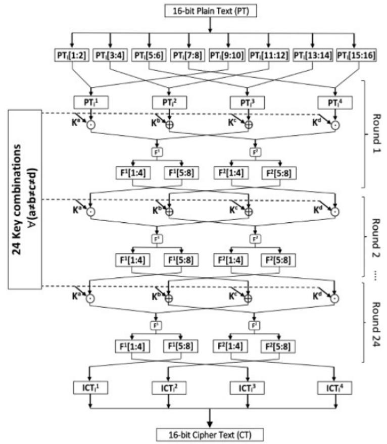

# <span id="page-0-0"></span>An argument on the security of LRBC, a recently proposed lightweight block cipher

Sadegh Sadeghi · Nasour Bagheri

Received: date / Accepted: date

Abstract LRBC is a new lightweight block cipher that has been proposed for resource-constrained IoT devices. The cipher is claimed to be secure against differential cryptanalysis and linear cryptanalysis. However, beside short state length which is only 16-bits, the structures of the cipher only use the linear operations, the its s-boxes, and this is a reason why the cipher is completely insecure against the mentioned attacks. we present a few examples to show that. Also, we show that the round function of LRBC has some structural problem and even if we fix them the cipher does not provide complete diffusion. Hence, even with replacement of the cipher s-boxes with proper s-boxes, the problem will not be fixed and it is possible to provide deterministic distinguisher for any number of round of the cipher. In addition, we show that for any fixed key, it is possible to create a full code book for the cipher with the complexity of 2n/<sup>2</sup> , which should be compared with 2<sup>n</sup> for any secure n-bit block cipher.

Keywords Differential Cryptanalysis · Linear Cryptanalysis · Full-codebook · LRBC

### 1 Introduction

Internet of Things (IoT) received a lot of attention during the last decade. In an IoT system, multiple objects interact and cooperate to provide different

Department of Mathematics, Faculty of Mathematical Sciences and Computer, Kharazmi University, Tehran, Iran E-mail: s.sadeghi.khu@gmail.com

#### N. Bagheri

Electrical Engineering Department, Shahid Rajaee Teacher Training University, Tehran 16788-15811, Iran

and School of Computer Science, Institute for Research in Fundamental Sciences (IPM), Tehran, Iran

E-mail: nbagheri@sru.ac.ir

S. Sadeghi

services and provide accessibility at any time from many points. Examples of the important application of IoT are Internet of Vehicles (IoV), Internet of Energy (IoE), Internet of Sensors (IoS) and Machine to Machine Communications (M2M) [\[12\]](#page-8-0). It is expected the worldwide number of connected devices to increase to 125 billion connected devices by 2030, while it was nearly 27 billion connected devices in 2017 [\[19,](#page-8-1) [20\]](#page-8-2) with a global market to reach US \$ 1,102.6 billion by 2026 [\[8\]](#page-8-3).

However, advances in IoT architectures and protocols are still necessary to make the vision of the IoT reality. More notably, designing a secure protocol for many IoT applications is still a challenge, given the constrained devices in the edge, e.g. RFID tags. To provide desired security, it is not always possible to use common solution based on conventional cryptographic primitives, because those primitives such as AES [\[1\]](#page-7-0) or SHA3 [\[22\]](#page-8-4) do not meet the resource limitation of RFID tags. Hence, many lightweight primitives have been proposed last decade, targeting such applications. To just name some of such lightweight primitives, we can mention SKINNY [\[4\]](#page-7-1), PRESENT [\[10\]](#page-8-5), MIBS [\[17\]](#page-8-6), SIMON [\[3\]](#page-7-2), SPECK [\[3\]](#page-7-2), LS-Designs [\[15\]](#page-8-7), ZORRO [\[14\]](#page-8-8) and Fides [\[7\]](#page-7-3), Quark [\[2\]](#page-7-4) and PHOTON [\[16\]](#page-8-9). In addition, recently NIST also initiated lightweight cryptography competition, targeting standardization of hash function and AEAD (authenticated encryption with associated data) for constrained environments which received 57 submissions for the first round and it is in the second round now [\[13\]](#page-8-10).

In this direction, Biswas et al. recently proposed a lightweight block cipher called LRBC [\[9\]](#page-8-11). Designers of this block cipher have investigated its security against the well known attacks include linear and differential cryptanalysis [\[21,](#page-8-12) [6\]](#page-7-5), impossible differential cryptanalysis [\[5,](#page-7-6) [18\]](#page-8-13), Zero-correlation linear cryptanalysis [\[11\]](#page-8-14), and etc. The goal of differential and linear cryptanalysis is to find the high-probability features of the plaintexts propagate to the ciphertexts, called distinguisher. If the probability of a distinguisher in the target block cipher is obviously higher than that of a completely random permutation operation, that block cipher can be distinguished from a random permutation. Impossible differential attack is one of the most popular cryptanalytic tools for block ciphers. Impossible differential cryptanalysis starts with finding an input difference which results in an output difference with probability 0. Zerocorrelation cryptanalysis is also a novel cryptanalytic approach, proposed by Bogdanov and Rijmen [\[11\]](#page-8-14). In contrast to conventional linear cryptanalysis which uses linear approximations with high correlation, zero-correlation linear cryptanalysis is based on linear approximations with a correlation exactly equal to zero for all keys.

LRBC is a lightweight block cipher proposed by Biswas et al. in 2020 [\[9\]](#page-8-11). The design takes both Feistel and SPN structure. The LRBC has been implemented using simple logical operations such as XOR operations (⊕), XNOR operations (), concatenation (||), transposition process. In this cipher, the long plaintext has been split into 16-bit blocks of data. In this paper, we analyze the security of this block cipher, which is its first third-party analysis to the best of our knowledge.

In the rest of the paper, in section 2 we describe LRBC briefly and also provide required preliminaries. In section 3 we provide our analysis of this cipher. Finally, the paper is concluded in section 4

#### <span id="page-2-0"></span>2 Preliminaries

<span id="page-2-1"></span>The encryption process of LRBC has been illustrated in Algorithm 1 and its F-Function is described in Algorithm 2. In these algorithms,  $\mathcal{X}[i]$  defines *i*-th bit of string  $\mathcal{X}$ .

```
Algorithm 1 LRBC Encryption [9]
      Input: Plaintext (PT)
 1. Read plaintext (PT) and extract the byte values.
 2. PT = PT_1 || \dots || Pt_n \text{ and } PT_i \in \{0, 1\}^{16}, \text{ for } 1 \leq i \leq n.
 3. Initialize r with value 1.
 4. Each PT_i is further su-divided into 4 equal length parts PT_i^k, 1 \leq k \leq
     4, 1 \le i \le n \ as,
           PT_i^1 = PT_i[1] \mid\mid PT_i[2] \mid\mid PT_i[9] \mid\mid PT_i[10]
           PT_i^2 = PT_i[3] || PT_i[4] || PT_i[11] || PT_i[12]
           PT_i^3 = PT_i[5] \parallel PT_i[6] \parallel PT_i[13] \parallel PT_i[14]

PT_i^4 = PT_i[7] \parallel PT_i[8] \parallel PT_i[15] \parallel PT_i[16]
 5. Compute intermediate round cipher blocks as (a \neq b \neq c \neq d),
          IC_{i}^{1} = PT_{i}^{1} \odot K^{a}
IC_{i}^{2} = PT_{i}^{2} \oplus K^{b}
IC_{i}^{3} = PT_{i}^{3} \oplus K^{c}
IC_{i}^{4} = PT_{i}^{4} \odot K^{d}
 6. Generate F-Function as,

F_i^1 = F\_Function(IC_i^1, IC_i^3)
F_i^2 = F\_Function(IC_i^2, IC_i^4)
 7. Generate input for next round as,
           PT_{i}^{1} = F_{i}^{1}[5:8]; PT_{i}^{2} = F_{i}^{2}[5:8] 
PT_{i}^{3} = F_{i}^{1}[1:4]; PT_{i}^{4} = F_{i}^{2}[1:4]
           r = r + 1
 8. If (r < 24)
           Go to step 5.
 9. Else
           Go to step 10.
10. ICT_i^k = PT_i^k, 1 \le k \le 4, 1 \le i \le n.
11. Generate Final Cipher as,
           CT = ICT_i^1 ||ICT_i^2||ICT_i^3||ICT_i^4.
Algorithm 2 F-Function [9]
      Input: Intermediate cipher blocks IC_i^1, IC_i^2, IC_i^3, IC_i^4.
      Output: 16-bit ciphertext.
```

<span id="page-2-2"></span>1. S-box computation,

```
IS_i^1 = IC_i^1 \odot IC_i^3
             IS_i^2 = IC_i^1 \oplus 1
             IS_i^3 = IC_i^2 \odot IC_i^4

IS_i^4 = IC_i^2 \oplus 0
2. P-box computation,
            \begin{split} P_i^1 &= IS_i^1[1]||IS_i^2[4]||IS_i^1[2]||IS_i^2[3]\\ P_i^2 &= IS_i^1[3]||IS_i^2[2]||IS_i^1[4]||IS_i^2[1]\\ P_i^3 &= IS_i^3[1]||IS_i^4[4]||IS_i^3[2]||IS_i^4[3]\\ P_i^4 &= IS_i^3[3]||IS_i^4[2]||IS_i^3[4]||IS_i^4[1] \end{split}
3. L-box computation,
             T_i[1] = (P_i^1[1] \oplus P_i^2[4]); X_i[1] = (P_i^1[1] \odot 0)

T_i[2] = (P_i^1[2] \odot P_i^2[3]); X_i[2] = (P_i^1[2] \oplus 1)
             T_i[3] = (P_i^1[3] \oplus P_i^2[2]); X_i[3] = (P_i^1[3] \odot 0)
             T_{i}[4] = (P_{i}^{1}[4] \odot P_{i}^{2}[1]); X_{i}[4] = (P_{i}^{1}[4] \oplus 1)
T_{i}[5] = (P_{i}^{3}[1] \oplus P_{i}^{4}[4]); X_{i}[5] = (P_{i}^{2}[1] \odot 0)
             T_i[6] = (P_i^3[2] \odot P_i^4[3]); X_i[6] = (P_i^2[2] \oplus 1)
             T_i[7] = (P_i^3[3] \oplus P_i^4[2]); X_i[7] = (P_i^2[3] \odot 0)
             T_i[8] = (P_i^3[4] \odot P_i^4[1]); X_i[8] = (P_i^2[4] \oplus 1)
      L_i(1) = T_i[1]||X_i[4]||T_i[2]||X_i[3]||T_i[3]||X_i[2]||T_i[4]||X_i[1]|
      L_i(2) = T_i[5]||X_i[8]||T_i[6]||X_i[7]||T_i[7]||X_i[6]||T_i[8]||X_i[5]|
      z = L_i(1)||L_i(2)|
4. End.
```

The key schedule process of LRBC also can be presented as  $K^1, K^2, K^3, K^4$  where  $K^i \in \{0,1\}^4$ ,  $i=1,\cdots,4$ . For encryption/decryption process of 24 rounds of LRBC, 24 number of possible combinations of keys can be used in each round. The design of the key combinations has been shown in Table 1.

<span id="page-3-1"></span>**Table 1** The key combinations of all rounds of LRBC cipher as  $K^i, K^j, K^k, K^l$ .

| Round | i | j | k | l | Round | i | j | k | l |
|-------|---|---|---|---|-------|---|---|---|---|
| 1     | 1 | 2 | 3 | 4 | 13    | 3 | 2 | 1 | 4 |
| 2     | 1 | 2 | 4 | 3 | 14    | 3 | 2 | 4 | 1 |
| 3     | 1 | 3 | 2 | 4 | 15    | 3 | 1 | 2 | 4 |
| 4     | 1 | 3 | 4 | 2 | 16    | 3 | 1 | 4 | 2 |
| 5     | 1 | 4 | 3 | 2 | 17    | 3 | 4 | 1 | 2 |
| 6     | 1 | 4 | 2 | 3 | 18    | 3 | 4 | 2 | 1 |
| 7     | 2 | 1 | 3 | 4 | 19    | 4 | 2 | 1 | 3 |
| 8     | 2 | 1 | 4 | 3 | 20    | 4 | 2 | 3 | 1 |
| 9     | 2 | 3 | 1 | 4 | 21    | 4 | 3 | 2 | 1 |
| 10    | 2 | 3 | 4 | 1 | 22    | 4 | 3 | 1 | 2 |
| 11    | 2 | 4 | 3 | 1 | 23    | 4 | 1 | 3 | 2 |
| 12    | 2 | 4 | 1 | 3 | 24    | 4 | 1 | 2 | 3 |

#### <span id="page-3-0"></span>3 Security analysis of LRBC

The designers of LRBC provided security analysis against differential and linear cryptanalysis [9]. According to their analysis, the LRBC is safe against these

attacks. However, based on the structure of the LRBC algorithm, all the operations used in this algorithm are linear, therefore this is the reason that shows the LRBC is vulnerable against known attacks such as the differential, linear, impossible differential, zero-correlation attacks and also other attacks. In the following, we give a few examples to illustrate the vulnerability of the LRBC algorithm to the attacks mentioned above. Before that we prove the F-Function of LRBC cipher (see Algorithm 2) is not a permutation.

Remark 1 Based on the Algorithm 1, Step 6,  $F_i^1$  and  $F_i^2$  generates from  $(IC_i^1, IC_i^3)$  and  $(IC_i^2, IC_i^4)$ , respectively. It shows  $F_i^1$  and  $F_i^2$  are independent. But according to Algorithm 2,  $F_i^2 (= L_i(2))$  is dependent to  $(IC_i^1, IC_i^2, IC_i^3, IC_i^4)$  and so this shows that the F-Function of LRBC cipher can not be a permutation and we prove it in the following property.

<span id="page-4-1"></span>Property 1 Let  $F:\{0,1\}^{16}\to\{0,1\}^{16}$  is F-Function of LRBC cipher. For any  $P\in\{0,1\}^{16}$ , and  $M\in\{0,1\}^4$ , we have  $F(P)=F(P\oplus OMOO)$ .

Proof For simplicity, in this proof, we use the same notation of Algorithm 2. We use the index i=1, and i=2 for the inputs  $P_1={\tt P}$  and  $P_2={\tt P}\oplus {\tt OMOO}$ , respectively and show  $F(P_1)=F(P_2)$ . Based on the notation of Algorithm 2,  $P_1=IC_1^1||IC_1^2||IC_1^3||IC_1^4$ , and  $P_2=IC_2^1||IC_2^2||IC_2^3||IC_2^4=IC_1^1||IC_1^2\oplus {\tt M}||IC_1^3||IC_1^4$ . Since, the only difference in  $P_1$  and  $P_2$  is in the second nible, so in the S-box computation phase the  $IS_2^1$  and  $IS_2^2$  for  $P_2$  will remain unchanged and equal with  $IS_1^1$  and  $IS_1^2$ , respectively. But the nibles  $IS_2^3$  and  $IS_2^4$  are changed as  $IS_2^3=IS_1^3\oplus {\tt M}$ , and  $IS_2^4=IS_1^4\oplus {\tt M}$ . In the P-box computation phase, only the  $P_2^3$  and  $P_2^4$  are affected by  $IS_2^3$  and  $IS_2^4$  and so we have  $({\tt M}=(m_1||m_2||m_3||m_4))$ :

$$\begin{split} P_2^3 &= IS_1^3[1] \oplus m_1 || IS_1^4[4] \oplus m_4 || IS_1^3[2] \oplus m_2 || IS_1^4[3] \oplus m_3, \\ P_2^4 &= IS_1^3[3] \oplus m_3 || IS_1^4[2] \oplus m_2 || IS_1^3[4] \oplus m_4 || IS_1^4[1] \oplus m_1. \end{split}$$

Since, in the P-box computation phase, the  $P_2^1$  and  $P_2^2$  did not change and are the same with  $P_1^1$  and  $P_1^2$ , respectively, hence in the L-box computation phase, the  $X_2[1]$  to  $X_2[8]$  and also,  $T_2[1]$  to  $T_2[4]$  will remain unchange and only the  $T_2[5]$  to  $T_2[8]$  will change as

$$T_{2}[5] = (P_{2}^{3}[1] \oplus P_{2}^{4}[4]) = (IS_{1}^{3}[1] \oplus m_{1} \oplus IS_{1}^{4}[1] \oplus m_{1}),$$

$$T_{2}[6] = (P_{2}^{3}[2] \odot P_{2}^{4}[3]) = (IS_{1}^{4}[4] \oplus m_{4} \oplus IS_{1}^{3}[4] \oplus m_{4}),$$

$$T_{2}[7] = (P_{2}^{3}[3] \oplus P_{2}^{4}[2]) = (IS_{1}^{3}[2] \oplus m_{2} \oplus IS_{1}^{4}[2] \oplus m_{2}),$$

$$T_{2}[8] = (P_{2}^{3}[4] \odot P_{2}^{4}[1]) = (IS_{1}^{4}[3] \oplus m_{3} \oplus IS_{1}^{3}[3] \oplus m_{3}),$$

Based on the above equations, we have  $T_2[5] = T_1[5]$ ,  $T_2[6] = T_1[6]$ ,  $T_2[7] = T_1[7]$ , and  $T_2[8] = T_1[8]$ . Thus,  $L_1(1)||L_1(2) = L_2(1)||L_2(2)$ , and hence  $F(P_1) = F(P_2)$ .

<span id="page-4-0"></span> $<sup>^1</sup>$  Hence, we have considered the step 6 of Algorithm 1 as  $(F_i^1,F_i^2)=F\_Function(IC_i^1,IC_i^2,IC_i^3,IC_i^4).$ 

Differential and Impossible Differential attack. Property 1 helps to creat differential characteristics with non-zero differential inputs to zero differential outputs with a probability of one for 24 rounds of LRBC algorithm. For a few examples, we can have the following characteristics ( $\Delta_{in}$  and  $\Delta_{out}$  shows the input and output differential, respectively).

$$\begin{aligned} \Delta_{in} &= 0001 \rightarrow \Delta_{out} = 0000, \ \Delta_{in} &= 0002 \rightarrow \Delta_{out} = 0000, \ \Delta_{in} &= 0003 \rightarrow \Delta_{out} = 0000, \ \Delta_{in} &= 0021 \rightarrow \Delta_{out} = 0000, \ \Delta_{in} &= 3133 \rightarrow \Delta_{out} = 0000, \end{aligned}$$

and two examples in case of non-zero input to non-zero output are as follows:

$$\Delta_{in} =$$
 0009  $\rightarrow \Delta_{out} =$  b525,  $\Delta_{in} =$  d3fb  $\rightarrow \Delta_{out} =$  4968.

Obviously, any differential characteristic that have the probability of one can lead to many impossible differential characteristic. For example, all differential characteristic as  $\Delta_{in} = 0001 \rightarrow (\Delta_{out} \neq 0) \in \{0,1\}^4$  are impossible differential characteristics for 24 rounds of LRBC and so on.

Linear and Zero correlation attack. We could not find a linear characteristic with the probability except  $\frac{1}{2}$  and so all characteristics that we searched have a bias equal to 0. Therefore, these characteristics can lead to a zero correlation attack. The following is a few examples of this type of characteristics.

$$\Gamma_{in} = 0002 \rightarrow \Gamma_{out} = 1000,$$
  $\Gamma_{in} = 105 \rightarrow \Gamma_{out} = 16 \rm ec,$   $\Gamma_{in} = 24 \rm al 1 \rightarrow \Gamma_{out} = 000 \rm f,$ 

where  $\Gamma_{in}$  and  $\Gamma_{out}$  shows the input and output linear masks, respectively.

#### 3.1 A discussion on LRBC structure

According to our analysis above, the design of this algorithm has obvious bugs. One of the most important drawbacks besides being linear is having a non-permutation function in its structure that this is due to the use of depended functions  $F^1$  and  $F^2$ . But, the designers also presented the graphical representation of encryption process of LRBC as shown in Fig. 1 (we borrowed this image from the original paper [9] intentionally). Based on this graphical representation, the  $F^1$  and  $F^2$  functions must be independent of each other. Hence, it shows there should be some typos in the Alg 2 of designers. In fact we guess the  $P_i^2$  that is used to generate  $X_i[5]$  to  $X_i[8]$  in the L-box computation phase of Algorithm 2, should be replace by  $P_i^3$ . Thus,  $X_i[5]$  to  $X_i[8]$  will be as  $X_i[5] = (P_i^3[1] \odot 0)$ ,  $X_i[6] = (P_i^3[2] \oplus 1)$ ,  $X_i[7] = (P_i^3[3] \odot 0)$ ,

Cryptanalysis ofLRBC 7

<span id="page-6-0"></span>

Fig. 1 Graphical representation of encryption process of LRBC [\[9\]](#page-8-11)

and X<sup>i</sup> [8] = (P 3 i [4] ⊕ 1). By applying these changes, the F-Function of LRBC cipher will be a permutation and the details of Algorithm [2](#page-2-2) can be the same as the graphical representation shown in Fig. [1.](#page-6-0)

Note that although correcting these typos causes to F-Function of LRBC be a permutation, the LRBC cipher remains insecure against the attacks mentioned above due to linearity of all operations that are used in the cipher. However, in the following we show that even by considering a nonlinear operation in the LRBC's F-Function, the structure of cipher will not have the necessary safety. The claim comes from that half the encrypted plaintext is encrypted independently of the other half. As it can be seen in the Fig. [1,](#page-6-0) the path that passes through the F 1 function is completely independent of the path that the F 2 function uses. Therefore, the time complexity of creating a code-book for LRBC is only 2<sup>8</sup> = 256 instead of 2<sup>16</sup>. Hence, we can create a full codebook only by query 256 chosen-ciphertext. For more details, it is enough to choose 256 chosen-ciphertext as CT = ICT<sup>1</sup> i ||ICT<sup>2</sup> i ||ICT<sup>3</sup> i ||ICT<sup>4</sup> <sup>i</sup> = ∗|| ∗ || || to obtain 256 corresponding plaintext P∗ with a fixed key, where ∗, ∈ {0, 1, · · · , f}. Now, for a given ciphertext as CT = k||l||m||n, the plaintext will be as < Pkm.f0f0 > ⊕ < Pln.0f0f > , where < ., . > shows the inner product.

# <span id="page-7-7"></span>4 Conclusion

In this work, we analyzed the security of LRBC block cipher and showed that the design of this cipher have some structural problems and since it does not use nonlinear operators, so it is insecure against the known attacks.It should be noted the message/key length in this cipher is only 16- bits. Hence even doing exhaustive search only costs 216. However, our analysis shows that the cipher insecurity is structural and for example one can not fix it by using changing the word length from 4 to 16 and replacing the 4-bit s-boxes by 16-bit perfect s-boxes. Even in that case the complexity of creating a full-code-book for the cipher will be 2<sup>32</sup> not 264. This study once again highlight the important of proper security analysis of any new primitive to avoid trivial attacks.

It should be noted, the designers have not made their reference-implementations publicly available. Hence, we put our implementation available at the end of this paper for any possible use. In addition, we have an implementation available at this link: [http://cpp.sh/6reup](#page-0-0)

## References

- <span id="page-7-0"></span>1. AES: AES: the Advanced Encryption Standard (1997). [http://competitions.cr.yp.](http://competitions.cr.yp.to/aes.html) [to/aes.html](http://competitions.cr.yp.to/aes.html)
- <span id="page-7-4"></span>2. Aumasson, J., Henzen, L., Meier, W., Naya-Plasencia, M.: Quark: A lightweight hash. J. Cryptology 26(2), 313–339 (2013). DOI 10.1007/s00145-012-9125-6. URL [https:](https://doi.org/10.1007/s00145-012-9125-6) [//doi.org/10.1007/s00145-012-9125-6](https://doi.org/10.1007/s00145-012-9125-6)
- <span id="page-7-2"></span>3. Beaulieu, R., Shors, D., Smith, J., Treatman-Clark, S., Weeks, B., Wingers, L.: The SIMON and SPECK lightweight block ciphers. In: Proceedings of the 52nd Annual Design Automation Conference, San Francisco, CA, USA, June 7-11, 2015, pp. 175:1– 175:6. ACM (2015)
- <span id="page-7-1"></span>4. Beierle, C., Jean, J., K¨olbl, S., Leander, G., Moradi, A., Peyrin, T., Sasaki, Y., Sasdrich, P., Sim, S.M.: The SKINNY family of block ciphers and its low-latency variant MANTIS. In: M. Robshaw, J. Katz (eds.) Advances in Cryptology - CRYPTO 2016 - 36th Annual International Cryptology Conference, Santa Barbara, CA, USA, August 14-18, 2016, Proceedings, Part II, Lecture Notes in Computer Science, vol. 9815, pp. 123–153. Springer (2016)
- <span id="page-7-6"></span>5. Biham, E., Biryukov, A., Shamir, A.: Cryptanalysis of skipjack reduced to 31 rounds using impossible differentials. In: International Conference on the Theory and Applications of Cryptographic Techniques, pp. 12–23. Springer (1999)
- <span id="page-7-5"></span>6. Biham, E., Shamir, A.: Differential cryptanalysis of des-like cryptosystems. Journal of CRYPTOLOGY 4(1), 3–72 (1991)
- <span id="page-7-3"></span>7. Bilgin, B., Bogdanov, A., Knezevic, M., Mendel, F., Wang, Q.: Fides: Lightweight authenticated cipher with side-channel resistance for constrained hardware. In: G. Bertoni, J. Coron (eds.) Cryptographic Hardware and Embedded Systems - CHES 2013 - 15th International Workshop, Santa Barbara, CA, USA, August 20-23, 2013. Proceedings, Lecture Notes in Computer Science, vol. 8086, pp. 142–158. Springer (2013)

- <span id="page-8-3"></span>8. BIS: Internet of things market analysis 2026. [https://www.fortunebusinessinsights.]( https://www.fortunebusinessinsights.com/industry-reports/internet-of-things-iot-market-100307) [com/industry-reports/internet-of-things-iot-market-100307]( https://www.fortunebusinessinsights.com/industry-reports/internet-of-things-iot-market-100307) (2019 - Last accessed on 23 march 2020)
- <span id="page-8-11"></span>9. Biswas, A., Majumdar, A., Nath, S., Dutta, A., Baishnab, K.: Lrbc: a lightweight block cipher design for resource constrained iot devices. Journal of Ambient Intelligence and Humanized Computing pp. 1–15 (2020)
- <span id="page-8-5"></span>10. Bogdanov, A., Knudsen, L.R., Leander, G., Paar, C., Poschmann, A., Robshaw, M.J.B., Seurin, Y., Vikkelsoe, C.: PRESENT: an ultra-lightweight block cipher. In: P. Paillier, I. Verbauwhede (eds.) Cryptographic Hardware and Embedded Systems - CHES 2007, 9th International Workshop, Vienna, Austria, September 10-13, 2007, Proceedings, Lecture Notes in Computer Science, vol. 4727, pp. 450–466. Springer (2007)
- <span id="page-8-14"></span>11. Bogdanov, A., Rijmen, V.: Linear hulls with correlation zero and linear cryptanalysis of block ciphers. Designs, codes and cryptography 70(3), 369–383 (2014)
- <span id="page-8-0"></span>12. Ferrag, M.A., Maglaras, L.A., Janicke, H., Jiang, J., Shu, L.: Authentication protocols for internet of things: A comprehensive survey. Security and Communication Networks 2017, 6562953:1–6562953:41 (2017). DOI 10.1155/2017/6562953. URL [https://doi.](https://doi.org/10.1155/2017/6562953) [org/10.1155/2017/6562953](https://doi.org/10.1155/2017/6562953)
- <span id="page-8-10"></span>13. fgs: Nist lightweight cryptography standardization process. In: adsgad, pp. 2–3. Springer (accessed 01 Novamber 2019). URL [https://csrc.nist.gov/projects/](https://csrc.nist.gov/projects/lightweight-cryptography) [lightweight-cryptography](https://csrc.nist.gov/projects/lightweight-cryptography)
- <span id="page-8-8"></span>14. G´erard, B., Grosso, V., Naya-Plasencia, M., Standaert, F.: Block ciphers that are easier to mask: How far can we go? In: G. Bertoni, J. Coron (eds.) Cryptographic Hardware and Embedded Systems - CHES 2013 - 15th International Workshop, Santa Barbara, CA, USA, August 20-23, 2013. Proceedings, Lecture Notes in Computer Science, vol. 8086, pp. 383–399. Springer (2013)
- <span id="page-8-7"></span>15. Grosso, V., Leurent, G., Standaert, F., Varici, K.: Ls-designs: Bitslice encryption for efficient masked software implementations. In: C. Cid, C. Rechberger (eds.) Fast Software Encryption - 21st International Workshop, FSE 2014, London, UK, March 3-5, 2014. Revised Selected Papers, Lecture Notes in Computer Science, vol. 8540, pp. 18–37. Springer (2014)
- <span id="page-8-9"></span>16. Guo, J., Peyrin, T., Poschmann, A.: The PHOTON family of lightweight hash functions. In: P. Rogaway (ed.) Advances in Cryptology - CRYPTO 2011 - 31st Annual Cryptology Conference, Santa Barbara, CA, USA, August 14-18, 2011. Proceedings, Lecture Notes in Computer Science, vol. 6841, pp. 222–239. Springer (2011)
- <span id="page-8-6"></span>17. Izadi, M., Sadeghiyan, B., Sadeghian, S.S., Khanooki, H.A.: MIBS: A new lightweight block cipher. In: J.A. Garay, A. Miyaji, A. Otsuka (eds.) Cryptology and Network Security, 8th International Conference, CANS 2009, Kanazawa, Japan, December 12- 14, 2009. Proceedings, Lecture Notes in Computer Science, vol. 5888, pp. 334–348. Springer (2009)
- <span id="page-8-13"></span>18. Knudsen, L.: Deal-a 128-bit block cipher. complexity 258(2), 216 (1998)
- <span id="page-8-1"></span>19. Markit, I.: Number of connected iot devices will surge to 125 billion by 2030. [https:](https://technology.informa.com/596542) [//technology.informa.com/596542](https://technology.informa.com/596542) (2017- Last accessed on 29 March 2020)
- <span id="page-8-2"></span>20. Markit, I.: The internet of things: a movement, not a market. Englewood, CO: IHS Markit. [https://cdn.ihs.com/www/pdf/IoT\\_ebook.pdf](https://cdn.ihs.com/www/pdf/IoT_ebook.pdf) 28, 2018 (2017, Last accessed on 23 march 2020)
- <span id="page-8-12"></span>21. Matsui, M.: Linear cryptanalysis method for des cipher. In: Workshop on the Theory and Application of of Cryptographic Techniques, pp. 386–397. Springer (1993)
- <span id="page-8-4"></span>22. SHA3: SHA-3: a Secure Hash Algorithm (2007). [http://competitions.cr.yp.to/sha3.](http://competitions.cr.yp.to/sha3.html) [html](http://competitions.cr.yp.to/sha3.html)

# A C++ source code for encryption process of LRBC block cipher

<sup>1</sup> // Enc ryp ti on p r o c e s s o f LRBC bl o c k ci p h e r <sup>2</sup> #include<i o s t re am> <sup>3</sup> #include <b i t s e t >

```
4 using namespace s t d ;
5 // the number o f rounds .
6 #def ine ROUNDS ( 2 4 )
8 // The F−f u n c ti o n based on the Alg 2 . Page 6 i n the LRBC paper .
9 void F Function ( int round , int IC1 [ ] [ 4 ] , int IC2 [ ] [ 4 ] , int IC3 [ ] [ 4 ] ,
10 int IC4 [ ] [ 4 ] , int F1 [ ] [ 8 ] , int F2 [ ] [ 8 ] ) ;
12 // S t r u c t u r e o f LRBC key s based on Fig . 2 Page 5 i n the LRBC paper .
13 void Ke y schedule ( int key , int ke y a [ ] [ 4 ] , int key b [ ] [ 4 ] ,
14 int k e y c [ ] [ 4 ] , int key d [ ] [ 4 ] ) ;
15 // Enc ryp ti on p r o c e s s f u n c ti o n
16 int E n c r y p ti o n P r o c e s s ( int p ali n t e x t , int key ) ;
17 #def ine Xnor ( a , b ) ( a ˆ b ˆ 1 ) // Ex−NOR f u n c ti o n
18 #def ine Xor ( a , b ) ( a ˆ b ) // Ex−OR f u n c ti o n
20 int main ( ) {
21 // re ad 16− b i t PLAINTEXT and KEY
22 int p a l i n t e x t = 0 x0021 ;
23 int key = 0 x 2 3 4 f ;
24 int c i p h e r t e x t = { 0 } ;
25 c i p h e r t e x t = E n c r y p ti o n P r o c e s s ( p ali n t e x t , key ) ;
26 // P ri n t Pl ai n t e x t
27 s t d : : c ou t << " Pl ai n t e x t : \ t " ;
28 s t d : : c ou t << hex << p a l i n t e x t ;
29 s t d : : c ou t << "\n" ;
30 // P ri n t key
31 s t d : : c ou t << "Key : \ t \ t " ;
32 s t d : : c ou t << hex << key ;
33 s t d : : c ou t << "\n" ;
34 // P ri n t c i p h e r t e x t
35 s t d : : c ou t << " Ci p h e r t e x t : \ t " ;
36 s t d : : c ou t << hex << c i p h e r t e x t ;
37 s t d : : c ou t << "\n" ;
38 return 0 ;
39 }
40 // F−f u n c ti o n based on the Alg 2 . o f Page 6 i n the LRBC paper .
41 void F Function ( int round , int IC1 [ ] [ 4 ] , int IC2 [ ] [ 4 ] , int IC3 [ ] [ 4 ] ,
42 int IC4 [ ] [ 4 ] , int L1 [ ] [ 8 ] , int L2 [ ] [ 8 ] ) {
43 //S−box computation
44 int IS1 [ 4 ] = { 0 } ;
45 int IS2 [ 4 ] = { 0 } ;
46 int IS3 [ 4 ] = { 0 } ;
47 int IS4 [ 4 ] = { 0 } ;
49 fo r ( int j = 0 ; j < 4 ; j++) {
50 IS1 [ j ] = Xnor ( IC1 [ round − 1 ] [ j ] , IC3 [ round − 1 ] [ j ] ) ;
52 i f ( j != 3 )
53 IS2 [ j ] = IC1 [ round − 1 ] [ j ] ;
54 e l s e
55 IS2 [ j ] = Xor ( IC1 [ round − 1 ] [ j ] , 1 ) ;
57 IS3 [ j ] = Xnor ( IC2 [ round − 1 ] [ j ] , IC4 [ round − 1 ] [ j ] ) ;
58 IS4 [ j ] = IC2 [ round − 1 ] [ j ] ;
59 }
60 // P−box computation
61 int P1 [ 4 ] = { 0 } ;
```

```
62 int P2 [ 4 ] = { 0 } ;
63 int P3 [ 4 ] = { 0 } ;
64 int P4 [ 4 ] = { 0 } ;
65 P1 [ 0 ] = IS1 [ 0 ] ;
66 P1 [ 1 ] = IS2 [ 3 ] ;
67 P1 [ 2 ] = IS1 [ 1 ] ;
68 P1 [ 3 ] = IS2 [ 2 ] ;
69 P2 [ 0 ] = IS1 [ 2 ] ;
70 P2 [ 1 ] = IS2 [ 1 ] ;
71 P2 [ 2 ] = IS1 [ 3 ] ;
72 P2 [ 3 ] = IS2 [ 0 ] ;
73 P3 [ 0 ] = IS3 [ 0 ] ;
74 P3 [ 1 ] = IS4 [ 3 ] ;
75 P3 [ 2 ] = IS3 [ 1 ] ;
76 P3 [ 3 ] = IS4 [ 2 ] ;
77 P4 [ 0 ] = IS3 [ 2 ] ;
78 P4 [ 1 ] = IS4 [ 1 ] ;
79 P4 [ 2 ] = IS3 [ 3 ] ;
80 P4 [ 3 ] = IS4 [ 0 ] ;
81 // l−box computation
82 int T[ 8 ] = { 0 } ;
83 int X[ 8 ] = { 0 } ;
84 T[ 0 ] = Xor (P1 [ 0 ] , P2 [ 3 ] ) ;
85 T[ 1 ] = Xnor (P1 [ 1 ] , P2 [ 2 ] ) ;
86 T[ 2 ] = Xor (P1 [ 2 ] , P2 [ 1 ] ) ;
87 T[ 3 ] = Xnor (P1 [ 3 ] , P2 [ 0 ] ) ;
88 T[ 4 ] = Xor (P3 [ 0 ] , P4 [ 3 ] ) ;
89 T[ 5 ] = Xnor (P3 [ 1 ] , P4 [ 2 ] ) ;
90 T[ 6 ] = Xor (P3 [ 2 ] , P4 [ 1 ] ) ;
91 T[ 7 ] = Xnor (P3 [ 3 ] , P4 [ 0 ] ) ;
92 X[ 0 ] = Xnor (P1 [ 0 ] , 0 ) ;
93 X[ 1 ] = Xor (P1 [ 1 ] , 1 ) ;
94 X[ 2 ] = Xnor (P1 [ 2 ] , 0 ) ;
95 X[ 3 ] = Xor (P1 [ 3 ] , 1 ) ;
96 X[ 4 ] = Xnor (P2 [ 0 ] , 0 ) ;
97 X[ 5 ] = Xor (P2 [ 1 ] , 1 ) ;
98 X[ 6 ] = Xnor (P2 [ 2 ] , 0 ) ;
99 X[ 7 ] = Xor (P2 [ 3 ] , 1 ) ;
100 // Output −−> L1 [ ] [ ] i s L( 1 ) and L2 [ ] [ ] i s L( 2 ) i n i n the LRBC paper .
101 L1 [ round − 1 ] [ 0 ] = T [ 0 ] ;
102 L1 [ round − 1 ] [ 1 ] = X [ 3 ] ;
103 L1 [ round − 1 ] [ 2 ] = T [ 1 ] ;
104 L1 [ round − 1 ] [ 3 ] = X [ 2 ] ;
105 L1 [ round − 1 ] [ 4 ] = T [ 2 ] ;
106 L1 [ round − 1 ] [ 5 ] = X [ 1 ] ;
107 L1 [ round − 1 ] [ 6 ] = T [ 3 ] ;
108 L1 [ round − 1 ] [ 7 ] = X [ 0 ] ;
109 L2 [ round − 1 ] [ 0 ] = T [ 4 ] ;
110 L2 [ round − 1 ] [ 1 ] = X [ 7 ] ;
111 L2 [ round − 1 ] [ 2 ] = T [ 5 ] ;
112 L2 [ round − 1 ] [ 3 ] = X [ 6 ] ;
113 L2 [ round − 1 ] [ 4 ] = T [ 6 ] ;
114 L2 [ round − 1 ] [ 5 ] = X [ 5 ] ;
115 L2 [ round − 1 ] [ 6 ] = T [ 7 ] ;
116 L2 [ round − 1 ] [ 7 ] = X [ 4 ] ;
117 }
118 /∗ S t r u c t u r e o f LRBC key based on the Fig . 2 o f Page 5
119 i n the LRBC paper . ∗/
```

```
120 void Ke y schedule ( int key , int ke y a [ ] [ 4 ] , int key b [ ] [ 4 ] ,
121 int k e y c [ ] [ 4 ] , int key d [ ] [ 4 ] ) {
122 int K[ 1 6 ] ;
123 fo r ( int j = 0 ; j < 1 6; j++) {
124 K[ ( 1 5 − j ) ] = b i t s e t <16>(key ) [ j ] ;
125 }
126 int k1 [ 4 ] , k2 [ 4 ] , k3 [ 4 ] , k4 [ 4 ] ;
127 fo r ( int j = 0 ; j < 1 6; j++) {
128 i f ( j < 4 )
129 k1 [ j ] = K[ j ] ;
130 e l s e i f ( 4 <= j && j < 8 )
131 k2 [ j − 4 ] = K[ j ] ;
132 e l s e i f ( 8 <= j && j < 1 2 )
133 k3 [ j − 8 ] = K[ j ] ;
134 e l s e i f ( 1 2 <= j && j < 1 6 )
135 k4 [ j − 1 2] = K[ j ] ;
136 }
137 fo r ( int j = 0 ; j < 4 ; j++) {
138 ke y a [ 0 ] [ j ] = k1 [ j ] ;
139 key b [ 0 ] [ j ] = k2 [ j ] ;
140 k e y c [ 0 ] [ j ] = k3 [ j ] ;
141 key d [ 0 ] [ j ] = k4 [ j ] ; // round 1
142 ke y a [ 1 ] [ j ] = k1 [ j ] ;
143 key b [ 1 ] [ j ] = k2 [ j ] ;
144 k e y c [ 1 ] [ j ] = k4 [ j ] ;
145 key d [ 1 ] [ j ] = k3 [ j ] ; // round 2
146 ke y a [ 2 ] [ j ] = k1 [ j ] ;
147 key b [ 2 ] [ j ] = k3 [ j ] ;
148 k e y c [ 2 ] [ j ] = k2 [ j ] ;
149 key d [ 2 ] [ j ] = k4 [ j ] ; // round 3
150 ke y a [ 3 ] [ j ] = k1 [ j ] ;
151 key b [ 3 ] [ j ] = k3 [ j ] ;
152 k e y c [ 3 ] [ j ] = k4 [ j ] ;
153 key d [ 3 ] [ j ] = k2 [ j ] ; // round 4
154 ke y a [ 4 ] [ j ] = k1 [ j ] ;
155 key b [ 4 ] [ j ] = k4 [ j ] ;
156 k e y c [ 4 ] [ j ] = k3 [ j ] ;
157 key d [ 4 ] [ j ] = k2 [ j ] ; // round 5
158 ke y a [ 5 ] [ j ] = k1 [ j ] ;
159 key b [ 5 ] [ j ] = k4 [ j ] ;
160 k e y c [ 5 ] [ j ] = k2 [ j ] ;
161 key d [ 5 ] [ j ] = k3 [ j ] ; // round 6
162 ke y a [ 6 ] [ j ] = k2 [ j ] ;
163 key b [ 6 ] [ j ] = k1 [ j ] ;
164 k e y c [ 6 ] [ j ] = k3 [ j ] ;
165 key d [ 6 ] [ j ] = k4 [ j ] ; // round 7
166 ke y a [ 7 ] [ j ] = k2 [ j ] ;
167 key b [ 7 ] [ j ] = k1 [ j ] ;
168 k e y c [ 7 ] [ j ] = k4 [ j ] ;
169 key d [ 7 ] [ j ] = k3 [ j ] ; // round 8
170 ke y a [ 8 ] [ j ] = k2 [ j ] ;
171 key b [ 8 ] [ j ] = k3 [ j ] ;
172 k e y c [ 8 ] [ j ] = k1 [ j ] ;
173 key d [ 8 ] [ j ] = k4 [ j ] ; // round 9
174 ke y a [ 9 ] [ j ] = k2 [ j ] ;
175 key b [ 9 ] [ j ] = k3 [ j ] ;
176 k e y c [ 9 ] [ j ] = k4 [ j ] ;
177 key d [ 9 ] [ j ] = k1 [ j ] ; // round 10
```

```
178 ke y a [ 1 0 ] [ j ] = k2 [ j ] ;
179 key b [ 1 0 ] [ j ] = k4 [ j ] ;
180 k e y c [ 1 0 ] [ j ] = k3 [ j ] ;
181 key d [ 1 0 ] [ j ] = k1 [ j ] ; // round 11
182 ke y a [ 1 1 ] [ j ] = k2 [ j ] ;
183 key b [ 1 1 ] [ j ] = k4 [ j ] ;
184 k e y c [ 1 1 ] [ j ] = k1 [ j ] ;
185 key d [ 1 1 ] [ j ] = k3 [ j ] ; // round 12
186 ke y a [ 1 2 ] [ j ] = k3 [ j ] ;
187 key b [ 1 2 ] [ j ] = k2 [ j ] ;
188 k e y c [ 1 2 ] [ j ] = k1 [ j ] ;
189 key d [ 1 2 ] [ j ] = k4 [ j ] ; // round 13
190 ke y a [ 1 3 ] [ j ] = k3 [ j ] ;
191 key b [ 1 3 ] [ j ] = k2 [ j ] ;
192 k e y c [ 1 3 ] [ j ] = k4 [ j ] ;
193 key d [ 1 3 ] [ j ] = k1 [ j ] ; // round 14
194 ke y a [ 1 4 ] [ j ] = k3 [ j ] ;
195 key b [ 1 4 ] [ j ] = k1 [ j ] ;
196 k e y c [ 1 4 ] [ j ] = k2 [ j ] ;
197 key d [ 1 4 ] [ j ] = k4 [ j ] ; // round 15
198 ke y a [ 1 5 ] [ j ] = k3 [ j ] ;
199 key b [ 1 5 ] [ j ] = k1 [ j ] ;
200 k e y c [ 1 5 ] [ j ] = k4 [ j ] ;
201 key d [ 1 5 ] [ j ] = k2 [ j ] ; // round 16
202 ke y a [ 1 6 ] [ j ] = k3 [ j ] ;
203 key b [ 1 6 ] [ j ] = k4 [ j ] ;
204 k e y c [ 1 6 ] [ j ] = k1 [ j ] ;
205 key d [ 1 6 ] [ j ] = k2 [ j ] ; // round 17
206 ke y a [ 1 7 ] [ j ] = k3 [ j ] ;
207 key b [ 1 7 ] [ j ] = k4 [ j ] ;
208 k e y c [ 1 7 ] [ j ] = k2 [ j ] ;
209 key d [ 1 7 ] [ j ] = k1 [ j ] ; // round 18
210 ke y a [ 1 8 ] [ j ] = k4 [ j ] ;
211 key b [ 1 8 ] [ j ] = k2 [ j ] ;
212 k e y c [ 1 8 ] [ j ] = k1 [ j ] ;
213 key d [ 1 8 ] [ j ] = k3 [ j ] ; // round 19
214 ke y a [ 1 9 ] [ j ] = k4 [ j ] ;
215 key b [ 1 9 ] [ j ] = k2 [ j ] ;
216 k e y c [ 1 9 ] [ j ] = k3 [ j ] ;
217 key d [ 1 9 ] [ j ] = k1 [ j ] ; // round 20
218 ke y a [ 2 0 ] [ j ] = k4 [ j ] ;
219 key b [ 2 0 ] [ j ] = k3 [ j ] ;
220 k e y c [ 2 0 ] [ j ] = k2 [ j ] ;
221 key d [ 2 0 ] [ j ] = k1 [ j ] ; // round 21
222 ke y a [ 2 1 ] [ j ] = k4 [ j ] ;
223 key b [ 2 1 ] [ j ] = k3 [ j ] ;
224 k e y c [ 2 1 ] [ j ] = k1 [ j ] ;
225 key d [ 2 1 ] [ j ] = k2 [ j ] ; // round 22
226 ke y a [ 2 2 ] [ j ] = k4 [ j ] ;
227 key b [ 2 2 ] [ j ] = k1 [ j ] ;
228 k e y c [ 2 2 ] [ j ] = k3 [ j ] ;
229 key d [ 2 2 ] [ j ] = k2 [ j ] ; // round 23
230 ke y a [ 2 3 ] [ j ] = k4 [ j ] ;
231 key b [ 2 3 ] [ j ] = k1 [ j ] ;
232 k e y c [ 2 3 ] [ j ] = k2 [ j ] ;
233 key d [ 2 3 ] [ j ] = k3 [ j ] ; // round 24
           }
    }
```

```
236 int E n c r y p ti o n P r o c e s s ( int p ali n t e x t , int key )
237 {
238 int START ROUNDS( 0 ) ;
239 // C onve r tin g p l a i n t e x t t o the PT a s a r r a y
240 int PT[ 1 6 ] = { 0 } ;
241 fo r ( int j = 0 ; j < 1 6; j++) {
242 PT[ ( 1 5 − j ) ] = b i t s e t <16>( p a l i n t e x t ) [ j ] ;
243 }
244 // D e fi n r V a ri a bl e s
245 int PT1[ROUNDS + 1 ] [ 4 ] = { 0 } ;
246 int PT2[ROUNDS + 1 ] [ 4 ] = { 0 } ;
247 int PT3[ROUNDS + 1 ] [ 4 ] = { 0 } ;
248 int PT4[ROUNDS + 1 ] [ 4 ] = { 0 } ;
249 int IC1 [ROUNDS] [ 4 ] = { 0 } ;
250 int IC2 [ROUNDS] [ 4 ] = { 0 } ;
251 int IC3 [ROUNDS] [ 4 ] = { 0 } ;
252 int IC4 [ROUNDS] [ 4 ] = { 0 } ;
253 int F1 [ROUNDS] [ 8 ] = { 0 } ;
254 int F2 [ROUNDS] [ 8 ] = { 0 } ;
255 int ke y a [ 2 4 ] [ 4 ] = { 0 } ;
256 int key b [ 2 4 ] [ 4 ] = { 0 } ;
257 int k e y c [ 2 4 ] [ 4 ] = { 0 } ;
258 int key d [ 2 4 ] [ 4 ] = { 0 } ;
259 // D e fi n e the Ke y schedule f u n c ti o n
260 Ke y schedule ( key , key a , key b , key c , key d ) ;
261 /∗ C onve r tin g PT t o the PTi ( i = 1 , 2 , 3 , 4 ) based on Step 4
262 o f the Alg 1 . i n page 6 i n the LRBC paper ∗/
263 PT1[START ROUNDS] [ 0 ] = PT [ 0 ] ;
264 PT1[START ROUNDS] [ 1 ] = PT [ 1 ] ;
265 PT1[START ROUNDS] [ 2 ] = PT [ 8 ] ;
266 PT1[START ROUNDS] [ 3 ] = PT [ 9 ] ;
267 PT2[START ROUNDS] [ 0 ] = PT [ 2 ] ;
268 PT2[START ROUNDS] [ 1 ] = PT [ 3 ] ;
269 PT2[START ROUNDS] [ 2 ] = PT[ 1 0 ] ;
270 PT2[START ROUNDS] [ 3 ] = PT[ 1 1 ] ;
271 PT3[START ROUNDS] [ 0 ] = PT [ 4 ] ;
272 PT3[START ROUNDS] [ 1 ] = PT [ 5 ] ;
273 PT3[START ROUNDS] [ 2 ] = PT[ 1 2 ] ;
274 PT3[START ROUNDS] [ 3 ] = PT[ 1 3 ] ;
275 PT4[START ROUNDS] [ 0 ] = PT [ 6 ] ;
276 PT4[START ROUNDS] [ 1 ] = PT [ 7 ] ;
277 PT4[START ROUNDS] [ 2 ] = PT[ 1 4 ] ;
278 PT4[START ROUNDS] [ 3 ] = PT[ 1 5 ] ;
279 // s t a r t rounds
280 fo r ( int r = 1 ; r <= ROUNDS; r++) {
281 // Step 5 o f Alg 1 . i n page 6 i n the LRBC paper
282 IC1 [ r − 1 ] [ 0 ] = Xnor (PT1[ r − 1 ] [ 0 ] , ke y a [ r − 1 ] [ 0 ] ) ;
283 IC1 [ r − 1 ] [ 1 ] = Xnor (PT1[ r − 1 ] [ 1 ] , ke y a [ r − 1 ] [ 1 ] ) ;
284 IC1 [ r − 1 ] [ 2 ] = Xnor (PT1[ r − 1 ] [ 2 ] , ke y a [ r − 1 ] [ 2 ] ) ;
285 IC1 [ r − 1 ] [ 3 ] = Xnor (PT1[ r − 1 ] [ 3 ] , ke y a [ r − 1 ] [ 3 ] ) ;
286 IC2 [ r − 1 ] [ 0 ] = Xor (PT2[ r − 1 ] [ 0 ] , key b [ r − 1 ] [ 0 ] ) ;
287 IC2 [ r − 1 ] [ 1 ] = Xor (PT2[ r − 1 ] [ 1 ] , key b [ r − 1 ] [ 1 ] ) ;
288 IC2 [ r − 1 ] [ 2 ] = Xor (PT2[ r − 1 ] [ 2 ] , key b [ r − 1 ] [ 2 ] ) ;
289 IC2 [ r − 1 ] [ 3 ] = Xor (PT2[ r − 1 ] [ 3 ] , key b [ r − 1 ] [ 3 ] ) ;
290 IC3 [ r − 1 ] [ 0 ] = Xor (PT3[ r − 1 ] [ 0 ] , k e y c [ r − 1 ] [ 0 ] ) ;
291 IC3 [ r − 1 ] [ 1 ] = Xor (PT3[ r − 1 ] [ 1 ] , k e y c [ r − 1 ] [ 1 ] ) ;
292 IC3 [ r − 1 ] [ 2 ] = Xor (PT3[ r − 1 ] [ 2 ] , k e y c [ r − 1 ] [ 2 ] ) ;
293 IC3 [ r − 1 ] [ 3 ] = Xor (PT3[ r − 1 ] [ 3 ] , k e y c [ r − 1 ] [ 3 ] ) ;
```

```
294 IC4 [ r − 1 ] [ 0 ] = Xnor (PT4[ r − 1 ] [ 0 ] , key d [ r − 1 ] [ 0 ] ) ;
295 IC4 [ r − 1 ] [ 1 ] = Xnor (PT4[ r − 1 ] [ 1 ] , key d [ r − 1 ] [ 1 ] ) ;
296 IC4 [ r − 1 ] [ 2 ] = Xnor (PT4[ r − 1 ] [ 2 ] , key d [ r − 1 ] [ 2 ] ) ;
297 IC4 [ r − 1 ] [ 3 ] = Xnor (PT4[ r − 1 ] [ 3 ] , key d [ r − 1 ] [ 3 ] ) ;
298 // D e fi n e F−f u n c ti o n ( Step 6 o f the Alg 1 . i n page 6 i n the LRBC paper )
299 F Function ( r , IC1 , IC2 , IC3 , IC4 , F1 , F2 ) ;
300 // Step 7 o f the Alg 1 . i n page 6 i n the LRBC paper
301 fo r ( int j = 0 ; j < 4 ; j++) {
302 PT1[ r ] [ j ] = F1 [ r − 1 ] [ j + 4 ] ;
303 PT2[ r ] [ j ] = F2 [ r − 1 ] [ j + 4 ] ;
304 PT3[ r ] [ j ] = F1 [ r − 1 ] [ j ] ;
305 PT4[ r ] [ j ] = F2 [ r − 1 ] [ j ] ;
306 }
307 }
308 // Step 10 o f the Alg 1 . i n page 6 i n the LRBC paper
309 int ICT [ 1 6 ] = { 0 } ;
310 fo r ( int j = 0 ; j < 4 ; j++) {
311 ICT [ j ] = PT1[ROUNDS] [ j ] ;
312 ICT [ j + 4 ] = PT2[ROUNDS] [ j ] ;
313 ICT [ j + 8 ] = PT3[ROUNDS] [ j ] ;
314 ICT [ j + 1 2] = PT4[ROUNDS] [ j ] ;
315 }
316 /∗ C onve r tin g ICT a r r a y t o Ci p h e r t e x t a s Hex fo rma t
317 and r e t u r n Ci p h e r t e x t ∗/
318 int c i p h e r t e x t = 0 ;
319 fo r ( int i = 0 ; i < 1 6; i++)
320 i f ( ICT [ i ] ) c i p h e r t e x t |= ( 1 << ( 1 5 − i ) ) ;
321 return c i p h e r t e x t ;
322 }
```