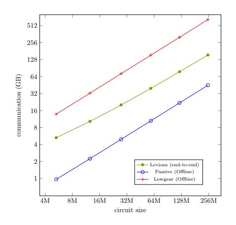

# LevioSA: Lightweight Secure Arithmetic Computation

Carmit Hazay Bar-Ilan University∗ Yuval Ishai Technion†

Antonio Marcedone Keybase Inc‡

Muthuramakrishnan Venkitasubramaniam University of Rochester§

April 7, 2020

#### Abstract

We study the problem of secure two-party computation of *arithmetic circuits* in the presence of active ("malicious") parties. This problem is motivated by privacy-preserving numerical computations, such as ones arising in the context of machine learning training and classification, as well as in threshold cryptographic schemes.

In this work, we design, optimize, and implement an *actively secure* protocol for secure two-party arithmetic computation. A distinctive feature of our protocol is that it can make a fully modular *blackbox* use of any *passively secure* implementation of oblivious linear function evaluation (OLE). OLE is a commonly used primitive for secure arithmetic computation, analogously to the role of oblivious transfer in secure computation for Boolean circuits.

For typical (large but not-too-narrow) circuits, our protocol requires roughly 4 invocations of passively secure OLE per multiplication gate. This significantly improves over the recent TinyOLE protocol (Dottling et al., ACM CCS 2017), which requires 22 invocations of ¨ *actively secure* OLE in general, or 44 invocations of a *specific* code-based passively secure OLE.

Our protocol follows the high level approach of the IPS compiler (Ishai et al., CRYPTO 2008, TCC 2009), optimizing it in several ways. In particular, we adapt optimization ideas that were used in the context of the practical zero-knowledge argument system Ligero (Ames et al., ACM CCS 2017) to the more general setting of secure computation, and explore the possibility of boosting efficiency by employing a "leaky" passively secure OLE protocol. The latter is motivated by recent (passively secure) lattice-based OLE implementations in which allowing such leakage enables better efficiency.

We showcase the performance of our protocol by applying its implementation to several useful instances of secure arithmetic computation. On "wide" circuits, such as ones computing a fixed function on many different inputs, our protocol is 5x faster and transmits 4x less data than the state-of-the-art Overdrive (Keller et al., Eurocrypt 2018). Our benchmarks include a general passive-to-active OLE compiler, authenticated generation of "Beaver triples", and a system for securely outsourcing neural network classification. The latter is the first actively secure implementation of its kind, strengthening the passive security provided by recent related works (Mohassel and Zhang, IEEE S&P 2017; Juvekar et al., USENIX 2018).

keywords. Secure Arithmetic Two-Party Computation; MPC-in-the-Head; Oblivious Linear Evaluation (OLE)

∗ carmit.hazay@biu.ac.il

† yuvali@cs.technion.ac.il

antonio@keyba.se, work done while at Cornell Tech.

§muthuv@cs.rochester.edu

# 1 Introduction

Secure two-party computation (2PC) allows two parties to perform a distributed computation while protecting, to the extent possible, the secrecy of the inputs and the correctness of the outputs. The vast body of research on 2PC has mostly focused on the goal of computing *Boolean circuits,* combining an oblivious transfer primitive with either garbled circuits [\[Yao86\]](#page-38-0) or a secret-sharing based approach [\[GMW87,](#page-36-0) [Kil88\]](#page-37-0). However, in many applications, the computation can be more naturally described by using arithmetic operations over integers, real numbers, or other rings. For such instances of *secure arithmetic computation*, general techniques for securely evaluating Boolean circuits (see, e.g., [\[MF06,](#page-37-1) [LP07,](#page-37-2) [NNOB12,](#page-37-3) [WRK17\]](#page-38-1) and references therein) incur a very significant overhead [\[KSS12\]](#page-37-4).

Some early examples of secure arithmetic computation arose in the contexts of distributed generation of cryptographic keys [\[BF01,](#page-35-0) [FMY98,](#page-36-1) [PS98,](#page-38-2) [Gil99\]](#page-36-2) and privacy-preserving protocols for statistics and data mining [\[CIK](#page-35-1)+01, [LP02\]](#page-37-5). More recently, secure arithmetic computation has been used as a tool for privacypreserving machine learning applications [\[MZ17,](#page-37-6) [LJLA17,](#page-37-7) [JVC18\]](#page-37-8). Generally speaking, secure arithmetic computation may provide the right tool for applications that involve numerical or algebraic computations over integers or bounded-precision reals. For such applications, standard secure computation techniques that apply to Boolean circuits are too inefficient.

Arithmetic computations may be conveniently represented using *arithmetic circuits*. An arithmetic circuit over a finite field F is similar to a Boolean circuit, except that the inputs and outputs are field elements and the gates perform addition, subtraction and multiplication operations over F. While this model may seem limited in its power, there are many techniques in the literature for reducing more general computation tasks to computation of arithmetic circuits over large fields. For instance, one can use techniques from approximation theory to approximate common real-valued functions (such as inverse, logarithm, or trigonometric functions) by small arithmetic circuits [\[LP02\]](#page-37-5) or use efficient bit-decomposition techniques for mixing Boolean and arithmetic computations [\[DFK](#page-36-3)+06, [MR18\]](#page-37-9). In light of these techniques, arithmetic circuits provide a broadly useful canonical model for representing secure computation tasks.

The main contribution of this work is the design and implementation of a concretely efficient secure two-party computation protocol for arithmetic circuits. Our protocol is *actively secure*, providing security against an active (malicious) adversary who corrupts one of the two parties, and yields significant efficiency improvements over previous protocols of this type. In particular, our protocol has similar performance to Overdrive [\[KPR18\]](#page-37-10) in its worst case scenario (i.e. narrow circuits), but is up to 5 times faster and transmits 4 times less bits when used on typical "wide" circuits (see Section [5.2](#page-25-0) for a discussion on wide circuits). The latter captures the commonly occurring goal of evaluating the same function on a big number of inputs.

A distinctive feature of our protocol is that it can make a fully modular *black-box* use of any *passively secure* implementation of oblivious linear function evaluation (OLE).[1](#page-1-0) This means that it can build on a variety of existing or future implementations of passively secure OLE, inheriting their security and efficiency features. To the best of our knowledge, *our work gives the first working implementation of a general "passive-to-active" compiler of any kind*.

Given the multitude of optimization goals, security requirements, and execution platforms, such a modular design can have major advantages. For instance, if the lattice-based passively secure OLE we use for our current implementation is improved in any way (e.g., by taking advantage of a GPU, by improving the FFT algorithm, or even by plugging in an entirely new additively homomorphic encryption scheme based on

1An OLE protocol is a secure two-party protocol for computing the function ax + b over F, where one party inputs a and b, and the other inputs x and obtains the output. OLE is a commonly used primitive for secure arithmetic computation, analogously to the role of oblivious transfer in secure Boolean computation [\[NP99,](#page-37-11) [IPS09,](#page-37-12) [ADI](#page-35-2)+17a].

new assumptions), our final protocol will automatically inherit the performance gain without requiring any modification. Finally, we demonstrate the usefulness of our compiler to construct actively secure computation based on weaker primitives. In particular, we construct actively secure OLE from passive OLE that are *imperfect* (i.e., have a statistical privacy/correctness error) but potentially more efficient. For example, imperfect OLEs can be instantiated more efficiently than passive OLEs by aggressively setting the parameters in lattice-based schemes.

### 1.1 Background and Related Work

We next provide some background on prior relevant works.

2PC in the OLE-hybrid. Oblivious linear function evaluation (OLE) can be viewed as an arithmetic generalization of oblivious transfer (OT). Recall that the OLE functionality computes ax + b, where x ∈ F is the input of one party, who also gets the output, and a, b ∈ F are the inputs of the other party. OLE serves as a natural building block for secure arithmetic computation. Indeed, when settling for passive security, any arithmetic circuit can be evaluated in the OLE-hybrid (namely, using an ideal OLE oracle) by using only 2 OLE calls per multiplication gate [\[GMW87,](#page-36-0) [IPS09\]](#page-37-12). Passively secure OLE (or "passive-OLE" for short) can be directly realized using any additively homomorphic encryption, which in turn can be based on either number theoretic assumptions or lattice assumptions (see [\[JVC18\]](#page-37-8) for a survey of such constructions). Alternatively, passive-OLE can also be efficiently realized under the assumption that noisy random codewords of a Reed-Solomon code (with a sufficiently high noise rate) are pseudorandom [\[NP99,](#page-37-11) [IPS09\]](#page-37-12).

Trying to extend the OLE-based approach to active security, one encounters two difficulties. First, upgrading passive-OLE to active-OLE typically involves a significant overhead. For a specific code-based passive-OLE construction from [\[IPS09\]](#page-37-12), the overhead has recently been reduced to 2x [\[GNN17\]](#page-36-4). However, the underlying technique is quite specialized and does not seem to apply to the *best* current passive-OLE protocols, such as the efficient lattice-based protocols from [\[JVC18\]](#page-37-8). A second difficulty is that even when given an ideal (actively secure) OLE, securely evaluating general arithmetic circuits is nontrivial. The recent TinyOLE protocol of Dottling et al. [ ¨ [DGN](#page-36-5)+17] tackles this problem via the following two-step approach: (1) use OLE to implement instances of an "authenticated Beaver triples" functionality [\[BDOZ11,](#page-35-3) [DPSZ12\]](#page-36-6); (2) use instances of this functionality to evaluate a general arithmetic circuit. The optimized implementation of this approach from [\[DGN](#page-36-5)+17] consumes 22 instances of active-OLE per multiplication gate. An alternative approach for OLE-based 2PC using so-called "AMD circuits" [\[GIP](#page-36-7)+14] has a similar overhead. Finally, the protocol from [\[IPS09\]](#page-37-12) also implies a similar asymptotic result, but with a big constant overhead that has not been optimized.

2PC in OT-hybrid. Another approach for arithmetic 2PC uses a bit decomposition for computing authenticated triples based on oblivious transfer (OT). The MASCOT protocol of Keller et al. [\[KOS16\]](#page-37-13) extends the passively secure multiplication protocol of Gilboa [\[Gil99\]](#page-36-2) using 15 log(|F|) active OTs per multiplication gate. In a more recent work [\[FPY18\]](#page-36-8), Frederiksen et al. extend this technique by employing additivelyhomomorphic commitments, and reduce the number of active OTs per gate to 6 log(|F|) for a field F of size O(2s ), for s bits of statistical security. Generally speaking, the OT-based approach is quite efficient in computation but involves a higher communication cost for secure arithmetic computation over large fields.

2PC based on semi-homomorphic encryption. Finally, the Overdrive protocol by Keller et al. [\[KPR18\]](#page-37-10) represents a third approach. Namely, it reduces the communication complexity of the MASCOT protocol for two parties by a factor of 20 using special-purpose lattice-based proofs of knowledge dedicated for creating authenticated triples.

Our protocol builds on the high level approach of the IPS compiler [\[IPS08,](#page-37-14) [IPS09\]](#page-37-12), that in turn generalizes the MPC-in-the-head paradigm of [\[IKOS09\]](#page-36-9). In particular, we further develop optimization ideas that were used in the context of the practical zero-knowledge argument system Ligero [\[AHIV17\]](#page-35-4) and extend them to the more general setting of secure two-party computation. We begin with a brief overview of the MPC-in-the-head paradigm.

The virtual MPC or MPC-in-the-head paradigm. The work of Ishai et al. [\[IKOS09\]](#page-36-9) introduced a novel paradigm that allows compilation of MPC protocols to zero-knowledge proofs in a modular way. Generalizing this technique from zero-knowledge to secure computation, the work of Ishai, Prabhakaran and Sahai [\[IPS08\]](#page-37-14) provided an implementation of a m-party active secure computation protocols in the dishonest majority setting for an arbitrary functionality F by making black-box use of the following two weaker ingredients: (1) a virtual honest-majority MPC protocol (referred to as an *outer protocol*) that securely realizes F with m clients and n servers, tolerating active corruption of a minority of the servers and an arbitrary subset of the clients, and (2) a passively secure m-party protocol (referred to as an *inner protocol*) for a "simpler" functionality tolerating an arbitrary number of corruptions.

This compiler, referred to as the "IPS compiler," has several important properties. In particular, it introduces a uniform framework that applies to both the two-party and multiparty settings, it implies excellent asymptotic efficiency in some settings, and enjoys the flexibility of being instantiated with different sub-protocols in a black-box way which implies different computation and communication overheads. Nevertheless, despite its appealing features, the concrete efficiency of the IPS compiler has not been well established. In fact, prior works argue bottlenecks in obtaining concretely efficient protocols based on this compiler [\[LOP11,](#page-37-15) [DGN](#page-36-5)+17]. The main drawback is the reliance on a large number of virtual servers in the outer MPC protocol [\[LOP11\]](#page-37-15) due to the implementation of the watchlist channels. This requirement is part of an innovative mechanism that adds privacy and correctness to the passive protocol. Still, it constitutes the main bottleneck towards making this compiler concretely efficient.

The practicality of MPC-in-the-head. With the aim of understanding the practicality of the IPS compiler, Lindell et al. [\[LOP11\]](#page-37-15) examined different practical aspects of this compiler. They introduced a tighter analysis which reduced the number of virtual servers from O(m2 · n) into O(m ·n), as well as improved the watchlists setup mechanism. Their analysis highlighted the bottlenecks of this compiler towards making it practical, arguing that the number of servers must be tightened to achieve better efficiency.

In the context of zero-knowledge protocols, the practicality of the MPC-in-the-head paradigm has been demonstrated in several recent works [\[GMO16,](#page-36-10) [CDG](#page-35-5)+17, [AHIV17,](#page-35-4) [KKW18\]](#page-37-16). More closely related to the present work, Ames et al. [\[AHIV17\]](#page-35-4) presented the first application of the paradigm that delivered a concretely efficient and sublinear argument protocol for NP. In slightly more detail, the work of [\[AHIV17\]](#page-35-4) designed an optimized honest-majority MPC protocols where the amortized computation and communication per party was minimized and applied a tightened version of the the compiler presented in [\[IKOS09\]](#page-36-9).

### 1.2 Our Contribution

In this paper, we design and implement a new actively secure two-party protocol for arithmetic circuits by following the high-level approach of the IPS compiler. The main novelty in our work consists of (1) *designing a concretely efficient outer protocol*, and (2) *providing a tighter analysis of the IPS compiler* to obtain concrete parameters, and providing an implementation with benchmarks. Indeed, our outer protocol has a similar high-level structure to the one implicit in Ligero [\[AHIV17\]](#page-35-4). However, the compilation from (information-theoretic) MPC to 2PC is quite different from the one required for zero-knowledge and requires a different analysis. In the case of zero-knowledge, soundness (for NO instances) and privacy (for YES instances) do not have to hold at the same time. When compiling for 2PC, we need soundness and privacy to hold simultaneously. This affects the concrete analysis as well as the proof of security.

Following the IPS compiler, we rely on two building blocks: (1) an outer MPC protocol Π with 2 clients (providing the inputs) and n servers (performing the computation) secure against an active corruption of a minority of the servers and at most one client (cf. Section [4.1\)](#page-13-0), and (2) an inner 2PC protocol secure against passive corruptions. In the compiled protocol, the desired arithmetic functionality is realized by the outer protocol, and the inner protocol is used to emulate the server's computation in the outer protocol. The two parties in the computation participate as clients in the outer protocol and use the inner protocol to securely emulate the computation and communication in the outer protocol. A major technical part of our protocol involves designing and optimizing a new outer protocol. For the inner protocol, we simply rely on the classic [\[GMW87\]](#page-36-0) protocol.

Optimizing the outer MPC protocol (Section [4.1\)](#page-13-0). In the IPS compiler, the outer protocol begins with the clients distributing its inputs via secret-sharing to the servers. The servers then compute the desired the functionality on the shared inputs and deliver the shares of the outputs back to the clients. In our optimized protocol, we rely on "share packing" (a.k.a packed secret-sharing) due to [\[FY92\]](#page-36-11). Packed secret sharing extends Shamir's secret sharing and allows sharing a block of w secrets within a single set of shares. We will assume that the circuit is arranged in layers that contain each all addition or all multiplication gates. In each phase of the protocol, the gates in a layer of the circuit are computed. At the beginning of each layer, the parties arrange (pack) the shared secrets corresponding to the input wire values of that layer into "left" and "right" blocks so that the left and right wire values of the gates are aligned in their corresponding blocks. Next, the protocol proceeds layer by layer. For layers comprising of only addition gates, the shares corresponding to their input blocks can be locally added by the servers. For multiplication gates, these shares can be locally multiplied by the servers, which doubles the degree size of the encoding polynomial. Therefore, a "degree reduction" step must be performed after each multiplication. Furthermore, the encoded values of every computation layer must be rearranged between layers. In typical honest majority MPC protocols, degree reduction and layer rearrangement with packed shares involve pairwise communication between the servers using verifiable secret sharing. We will instead have the servers send the shares (after masking the secret) to the two clients and have them perform the degree reduction / repacking. This reduces the communication from quadratic to linear in the number of servers. Furthermore, this will result in an outer protocol with no server-to-server communication which significantly simplifies the watchlist mechanism.

The IPS compiler requires the outer protocol to be secure against active corruptions. This means the servers need to make sure that the degree reduction and repacking are done correctly in each layer, and that the shares are valid. This is typically achieved through verifiable secret sharing that is expensive. Note that it is sufficient for the IPS compiler to rely on an outer protocol that is secure with abort. To protect against active adversaries in the outer protocol, we introduce three tests that need to be performed at the end before the outputs are revealed. The first "degree test" (because the shares lie on some k-degree polynomial) ensures that all the shares from all the layers are valid secret shares. The second "permutation test" ensures that repacking in each step is performed correctly and finally, the third "degree reduction test" ensures that the degree reduction step was performed correctly. These tests and ensuing analyses are inspired by analogous tests from the work of [\[AHIV17\]](#page-35-4).

Next, applying the IPS compiler, we combine our outer protocol with an inner protocol that is realized here by the passive GMW [\[GMW87\]](#page-36-0) protocol. This combination, yielding protocol Φ, is carried out by having the parties of the inner protocol emulate the corresponding roles of the clients from Π as well as emulating the virtual servers. As mentioned above, one of the simplifications of our outer protocol, which greatly improves its description, implies that the servers do not need to communicate via private channels and only communicate with the clients. Consequently, ensuring correctness via the watchlist mechanism is much simpler, where the goal of using this mechanism is to enforce correctness by allowing each party Pi to monitor the actions of the other party P1−i , making sure that P1−i follows the instructions of the outer protocol Π.

Note that the overhead of the inner protocol is dominated by the number of servers and the numbers of OLE calls, as these calls require interaction. By carefully optimizing the number of servers, we show that for sufficiently wide circuits, our protocol only requires 4 amortized passively secure OLE calls per multiplication gate.

Using imperfect OLE (Section [6\)](#page-28-0). Another feature of our compiler is that it can tolerate an *imperfect* passive OLE, namely one that has a non-negligible statistical privacy or correctness error. This security feature can be turned into an efficiency advantage. For example, imperfect OLE can be implemented more efficiently by aggressively setting the parameters in existing LWE-based OLE constructions.

Previous related privacy amplification results from the literature [\[MPR07,](#page-37-17) [IKO](#page-36-12)+11, [DDF19\]](#page-36-13) relied on a so-called "statistical-to-perfect lemma" to reduce a general leaky functionality to a simple one that leaks everything with small probability but otherwise leaks nothing. (This is akin to the notion of covert security in secure computation.) This simple kind of "zero-one" leakage is clearly tolerated by our compiler if the leakage probability is low. Unfortunately, the leakage probability promised by the statistical-to-perfect lemma grows linearly with the domain size of the functionality. In particular, when considering OLE protocols over large fields, the lemma can only provide a meaningful security guarantee when the statistical error is smaller than the inverse of the field size.

Towards better statistical error tolerance, we formulate a simple leaky OLE functionality that allows the adversary to choose a subset of field elements called an *exclusion set*. The functionality leaks to the adversary one bit of information specifying whether the honest party's secret input belongs to this set. For this model, we are able to prove that if the exclusion set is sufficiently small compared to the field size, the imperfection is indeed tolerated by our compiler. To this end, we extend the work of Benhamouda et al. [\[BDIR18\]](#page-35-6) and establish a new result on the leakage resilience of Shamir's secret sharing scheme in the exclusion set regime, where less than one bit is leaked from each share. We conjecture that our analysis for the simplified "exclusion set" model can be extended to general statistical leakage, in the sense that an arbitrary -secure passive OLE is no worse (for our compiler) than leaky OLE with exclusion set of fractional size O(). Proving or refuting this conjecture is left as an interesting question for future work.

Implementation. We implemented our main compiler and showcase its strength by benchmarking the applications described next. Our implementation relies on a recent lightweight passive OLE implementation due to de Castro et al. [\[dCJV,](#page-36-14) [Juv18\]](#page-37-18) that is based on the LWE assumption. We implemented the authenticated triples functionality and compared it with the recent work of Keller et al. [\[KPR18\]](#page-37-10), which is considered the state-of-the-art. We then give benchmarks for generating active OLE from passive OLE, as well as for randomly generated circuits designed to showcase our end-to-end performance. The final benchmark is a concrete use case that implements a simple secure neural network inference problem.

### 1.3 Applications

The protocol we design can be adapted and optimized for several use cases, which we present below.

Arithmetic 2PC with active security (Section [5.2\)](#page-25-0). First, our protocol can be efficiently instantiated to compute any functions expressed as an arithmetic circuit. Given an arbitrary passive OLE protocol, we provide two instantiations:

- (1) For sufficiently "wide" circuits, our protocol can be used directly, requiring only 4 passive OLE per multiplication gate in the computed circuit (in an amortized sense), where the OLE are used in a black-box way.
- (2) To compute arbitrary circuits, our protocol can be used (and further optimized) to realize the "authenticated triples" functionality from [\[DGN](#page-36-5)+17] (whose circuit is itself wide). These triples can then be "consumed" by the "online phase" of [\[DGN](#page-36-5)+17] to compute the original circuit. This combined protocol requires an amortized 16 passive OLE per multiplication gate.

Black-Box active OLE from passive OLE (Section [5.3\)](#page-26-0). Our second application is a concretely efficient protocol for achieving OLE with active security from actively secure oblivious-transfer and passively secure OLE in a black-box way where the computational and communication overheads are roughly twice of the passive OLE instantiation in the amortized setting.

Privacy-preserving secure neural network inference (Section [5.4\)](#page-27-0). In a concrete use case, we consider a scenario where a party PCL wishes to classify private data based on a private machine learning model trained by another party PML in an outsourced setting, with an untrusted set of cloud nodes performing the computation. More formally, we consider the two-server model in which a party PML distributes its trained model via additive secret sharing to two cloud nodes s1, s2. In the next classification phase, the servers obtain a shared input from PCL and securely compute the result of the classification algorithm. The security of the protocol is required to hold against any active adversary that corrupts at most one party and one server. This model (or similar variants) is popular for outsourcing privacy-preserving machine learning computations [\[MZ17,](#page-37-6) [LJLA17\]](#page-37-7). Our work is the first to demonstrate a protocol for privacy-preserving machine learning computation which achieves active security.

Providing security against active adversaries in this setting presents its own challenges beyond utilizing an active secure protocol for the underlying functionality. In more details, party PML needs to be ensured that the servers use the "right" inputs and do not abuse the valid input provided by PCL by adding to it a carefully chosen small adversarial perturbation with the aim to change the prediction [\[TV16,](#page-38-3) [KACK18\]](#page-37-19).[2](#page-6-0) These types of attacks can be devastating when correctness of computation is crucial to the application, such as in medical diagnosis and image classification for defense applications, and only arise in the presence of active adversaries. To prevent them, we must incorporate an authentication mechanism that will guarantee that the classification was obtained on the "right" inputs. To ensure this, we combine ideas originating from [\[DPSZ12,](#page-36-6) [GIP](#page-36-7)+14] to obtain a protocol that guarantees that either the answer is correct or indicates that one of the servers behaved maliciously. We demonstrate the practicality of our implementation by implementing a CNN with 3 layers with quadratic activation function as described in [\[JVC18\]](#page-37-8).

Another challenge induced in such a scenario is the abuse on PCL's side, which may choose its input in some "bad format" that may allow to infer information about the model. We note that our protocol does not provide this type of input certification and an additional mechanism must be provided. Furthermore, input certification is a different task from input authentication. Where the former is performed with respect to the input inserted by party PCL, whereas the later is performed with respect to the clouds' computations.

Recently, there has been extensive literature showcasing machine learning computation with passive security. For example, in [\[MZ17\]](#page-37-6) the authors introduce SecureML, a system for several privacy preserving machine learning training and classifications algorithms in the two-server model that run 2PC for arithmetic computation. In [\[LJLA17\]](#page-37-7), the authors develop MiniONN, a framework for transforming an existing neural network to an oblivious neural network which protects the privacy of the model (held by a cloud) and the client's input in the predication phase. In [\[RWT](#page-38-4)+18], Riazi et al. present Chameleon, a system that supports

2We emphasize that relying on general secure two-party computation does not prevent such an attack. Even if one of the servers is honest, the other server could perturb the input supplied by PCL.

| Table 1: Recent 2PC secure ML implementations. |  |
|------------------------------------------------|--|
|------------------------------------------------|--|

|              | security | model of    |             | activation |
|--------------|----------|-------------|-------------|------------|
| construction | level    | computation | methodology | function   |
|              |          |             | GC+GMW      |            |
| Chameleon    | passive  | mixed       | additive SS | non-linear |
|              |          |             |             | non-linear |
| Gazelle      | passive  | mixed       | FHE+GC      | & square   |
|              |          |             |             |            |
| SEALion      | passive  | arithmetic  | FHE         | non-linear |
|              |          |             | MPC         |            |
| LevioSA      | active   | arithmetic  | in-the-head | square     |

hybrid secure computation in the two-party setting, which combines arithmetic computation over rings for linear operations and Yao's garbled circuits [\[Yao86\]](#page-38-0) for the non-linear computation. Chameleon provides training and classification for deep and convolutional neural networks. Juvekar et al. [\[JVC18\]](#page-37-8) extends this paradigm in GAZELLE for classifying private images using a convolutional neural network, protecting the classification phase, and using homomorphic encryption scheme for carrying out the linear computation. Finally, in a recent work by Elsloo et al. [\[vEPI19\]](#page-38-5) the authors introduce SEALion, which is an improved framework for privacy preserving machine learning based on homomorphic encryption. In the setting with more than two parties, Wagh et al. [\[WGC18\]](#page-38-6) introduced SecureNN, a tool for training and predication in the three-party and four-party settings with honest majority. We summarize some of the recent implementations in the two-party setting in Table [1.](#page-7-0)

# 2 Preliminaries

Basic notations. We denote a security parameter by κ. We say that a function µ : N → N is *negligible* if for every positive polynomial p(·) and all sufficiently large κ's it holds that µ(κ) < 1 p(κ) . We use the abbreviation PPT to denote probabilistic polynomial-time and denote by [n] the set of elements {1, . . . , n} for some n ∈ N. We assume functions to be represented by an arithmetic circuit C (with addition and multiplication gates of fan-in 2), and denote the size of C by |C|. By default we define the size of the circuit to include the total number of gates including input gates.

### 2.1 Layered Arithmetic Circuits

An arithmetic circuit defined over a finite field F is a directed acyclic graph, where nodes (or *gates*) are labelled either as input gates, output gates or computation gates. Input gates have no incoming edges (or *wires*), while output gates have a single incoming wire and no outgoing wires. Computation gates are labelled with a field operations (either addition or multiplication),[3](#page-7-1) and have exactly two incoming wires, which we denote as the left and right wire. A circuit with i input gates and o output gates over a field F

3 Subtraction gates can be handled analogously to addition gates, and we ignore them here for simplicity.

#### Functionality F t:n OT

Functionality F t:n OT communicates with sender S and receiver R, and adversary S.

- 1. Upon receiving input (sid, v1, . . . , vn) from S where vi ∈ {0, 1} κ for all i ∈ [n], record (sid, v1, . . . , vn).
- 2. Upon receiving (sid, u1, . . . , ut) from R where ui ∈ {0, 1} log n for all i ∈ [t], send (vu1 , . . . vut ) to R. Otherwise, abort.

Figure 1: The oblivious transfer functionality.

#### Functionality FOLE

Functionality FOLE communicates with sender S and receiver R, and adversary S.

- 1. Upon receiving the input (sid,(a, b)) from S where a, b ∈ F, record (sid,(a, b)).
- 2. Upon receiving (sid, x) from R where x ∈ F, send a · x + b to R. Otherwise, abort.

Figure 2: The oblivious linear evaluation functionality.

represents a function f : F i → F o whose value on input x = x1, . . . , xi can be computed by assigning a value to each wire of the circuit.

In this work, we will exploit an additional structure of the circuit. Specifically, the gates of an arithmetic circuit can be partitioned into ordered layers l1, . . . , ld, such that i) a layer only consists of gates of the same type (i.e., addition, multiplication, input or output gates belonging to the same party), and ii) the incoming wires of all gates of layer i originate from gates in layers 0 to i − 1.

# 2.2 Oblivious Transfer

1-out-of-2 oblivious transfer (OT) is a fundamental functionality in secure computation that is engaged between a sender S and a receiver R where a receiver learns only one of the sender's inputs whereas the sender does not learn anything about the receiver's input. In this paper we consider a generalized version of t-out-of-n OT where the receiver learns t values and which will be useful in establishing the watchlist channels; see Figure [1](#page-8-0) for its formal description.

# 2.3 Oblivious Linear Evaluation

An extension of the oblivious transfer functionality for larger fields is the oblivious linear evaluation functionality (OLE). More concretely, OLE over a field F takes a field element x ∈ F from the receiver and a pair (a, b) ∈ F 2 from the sender and delivers ax + b to the receiver. Note that in the case of binary fields, OLE can be realized via a single call to standard (bit-) 1-out-of-2 OT functionality; see Figure [2](#page-8-1) for its formal description.

#### Functionality FCOM

Functionality FCOM communicates with with sender S and receiver R, and adversary S.

- 1. Upon receiving input (commit, sid, m) from S where m ∈ {0, 1} t , internally record (sid, m) and send message (sid, S, R) to the adversary. Upon receiving approve from the adversary send sid, to R. Ignore subsequent (commit, ., ., .) messages.
- 2. Upon receiving (reveal, sid) from S, where a tuple (sid, m) is recorded, send message m to adversary S and R. Otherwise, ignore.

Figure 3: The string commitment functionality.

## 2.4 Commitment Schemes

Commitment schemes are used to enable a party, known as the *sender* S, to commit itself to a value while keeping it secret from the *receiver* R (this property is called *hiding*). Furthermore, in a later stage when the commitment is opened, it is guaranteed that the "opening" can yield only a single value determined in the committing phase (this property is called *binding*). The formal description of functionality FCOM is depicted in Figure [3.](#page-9-0)

# 2.5 Secret-Sharing

A secret-sharing scheme allows distribution of a secret among a group of n players, each of whom in a *sharing phase* receive a share (or piece) of the secret. In its simplest form, the goal of secret-sharing is to allow only subsets of players of size at least t + 1 to reconstruct the secret. More formally a t + 1-out-of-n secret sharing scheme comes with a sharing algorithm that on input a secret s outputs n shares s1, . . . , sn and a reconstruction algorithm that takes as input ((si)i∈S, S) where |S| > t and outputs either a secret s 0 or ⊥. In this work, we will use the Shamir's secret sharing scheme [\[Sha79\]](#page-38-7) with secrets in F = GF(2κ ). We present the sharing and reconstruction algorithms below:

Sharing algorithm: For any input s ∈ F, pick a random polynomial p(·) of degree t in the polynomial-field F[x] with the condition that p(0) = s and output p(1), . . . , p(n).

Reconstruction algorithm: For any input (s 0 i )i∈S where none of the s 0 i are ⊥ and |S| > t, compute a polynomial g(x) such that g(i) = s 0 i for every i ∈ S. This is possible using Lagrange interpolation where g is given by

$$g(x) = \sum_{i \in S} s'_i \prod_{j \in S/\{i\}} \frac{x-j}{i-j} .$$

Finally the reconstruction algorithm outputs g(0).

Packed secret-sharing. The concept of packed secret-sharing was introduced by Franking and Yung in [\[FY92\]](#page-36-11) in order to reduce the communication complexity of secure multi-party protocols, and is an extension of standard secret-sharing. In particular, the authors considered Shamir's secret sharing with the difference that the number of secrets s1, . . . , s` is now ` instead of a single secret, evaluated by a polynomial p(·) on ` distinct points. To ensure privacy in case of t colluding corrupted parties, the random polynomial must have a degree at least t + `. Packed secret sharing inherits the linearity property from Shamir's secret sharing with the additional benefit that it supports batch (block-wise) multiplications, which is very useful to achieve secure computation with honest majority and constant amortized overhead [DI06]. For this reason we use this tool in our optimized honest majority MPC protocol  $\Pi$  from Section 4.1 and leverage its advantages in order to improve the overhead of  $\Pi$ .

#### 2.6 Secure Multiparty Computation (MPC)

Secure two-party computation. We use a standard stand-alone definition of secure two-party computation protocols. Following [HL10], we use two security parameters in our definition. We denote by  $\kappa$  a computational security parameter and by s a statistical security parameter that captures a statistical error of up to  $2^{-s}$ . We assume  $s \leq \kappa$ . We let  $\mathcal{F}$  be a two-party functionality that maps a pair of inputs of equal length to a pair of outputs over some field  $\mathbb{F}$ .

Let  $\Pi = \langle P_0, P_1 \rangle$  denote a two-party protocol, where each party is given an input  $(x \text{ for } P_0 \text{ and } y \text{ for } P_1)$  and security parameters  $1^s$  and  $1^\kappa$ . We allow honest parties to be PPT in the entire input length (this is needed to ensure correctness when no party is corrupted) but bound adversaries to time  $\operatorname{poly}(\kappa)$  (this effectively means that we only require security when the input length is bounded by  $\operatorname{some}$  polynomial in  $\kappa$ ). We denote by  $\operatorname{REAL}_{\Pi,\mathcal{A}(z),P_i}(x,y,\kappa,s)$  the output of the honest party  $P_i$  and the adversary  $\mathcal{A}$  controlling  $P_{1-i}$  in the real execution of  $\Pi$ , where z is the auxiliary input, x is  $P_0$ 's initial input, y is  $P_1$ 's initial input,  $\kappa$  is the computational security parameter and s is the statistical security parameter. We denote by  $\operatorname{IDEAL}_{\mathcal{F},\mathcal{S}(z),P_i}(x,y,\kappa,s)$  the output of the honest party  $P_i$  and the simulator  $\mathcal{S}$  in the ideal model where  $\mathcal{F}$  is computed by a trusted party. In some of our protocols the parties have access to ideal model implementation of certain cryptographic primitives such as ideal oblivious-transfer  $(\mathcal{F}_{\mathrm{OT}})$  and we will denote such an execution by  $\operatorname{REAL}_{\Pi,\mathcal{A}(z),P_i}^{\mathcal{F}_{\mathrm{OT}}}(x,y,\kappa,s)$ .

**Definition 1** A protocol  $\Pi = \langle P_0, P_1 \rangle$  is said to securely compute a functionality  $\mathcal F$  in the presence of active adversaries if the parties always have the correct output  $\mathcal F(x,y)$  when neither party is corrupted, and moreover the following security requirement holds. For any probabilistic  $\mathsf{poly}(\kappa)$ -time adversary  $\mathcal A$  controlling  $P_i$  (for  $i \in \{0,1\}$ ) in the real model, there exists a probabilistic  $\mathsf{poly}(\kappa)$ -time adversary (simulator)  $\mathcal S$  controlling  $P_i$  in the ideal model, such that for every non-uniform  $\mathsf{poly}(\kappa)$ -time distinguisher  $\mathcal D$  there exists a negligible function  $\nu(\cdot)$  such that the following ensembles are distinguished by  $\mathcal D$  with at most  $\nu(\kappa) + 2^{-s}$  advantage:

- $\{\mathbf{REAL}_{\Pi,\mathcal{A}(z),P_i}(x,y,\kappa,s)\}_{\kappa\in\mathbb{N},s\in\mathbb{N},x,y,z\in\{0,1\}^*}$
- $\bullet \ \{\mathbf{IDEAL}_{\mathcal{F},\mathcal{S}(z),P_i}(x,y,\kappa,s)\}_{\kappa \in \mathbb{N}, s \in \mathbb{N}, x,y,z \in \{0,1\}^*}$

Secure circuit evaluation. The above definition considers  $\mathcal{F}$  to be an infinite functionality, taking inputs of an arbitrary length. However, our protocols (similarly to other protocols from the literature) are formulated for a finite functionality  $\mathcal{F}: \mathbb{F}^{\alpha_1} \times \mathbb{F}^{\alpha_2} \to \mathbb{F}$  described by an arithmetic circuit C (where the computation is performed over a finite field  $\mathbb{F}$ ). Such protocols are formally captured by a polynomial-time *protocol compiler* that, given security parameters  $1^\kappa, 1^s$  and a circuit C, outputs a pair of circuits  $(P_0, P_1)$  that implement the next message function of the two parties in the protocol (possibly using oracle calls to a cryptographic primitive or an ideal functionality oracle). While the correctness requirement (when no party is corrupted) holds for any choice of  $\kappa, s, C$ , the security requirement only considers adversaries that run in time  $poly(\kappa)$ . That is, we require indistinguishability (in the sense of Definition 1) between

$$\bullet \ \{\mathbf{REAL}_{\Pi,\mathcal{A}(z),P_i}(\mathbf{C},x,y,\kappa,s)\}_{\kappa \in \mathbb{N}, s \in \mathbb{N}, \mathbf{C} \in \mathcal{C}, x,y,z \in \{0,1\}^*}$$

#### Functionality FTRIPLES

Initialize: On receiving (init) from parties P0 and P1, the functionality receives from the adversary S corrupting party Pi the value ∆i ∈ F, samples ∆1−i ← F and sends it to party Pi .

Prep: On receiving (Prep) from both parties, generate a multiplication triple as follows:

- Sample a, b ← F and compute c = a · b.
- For each x ∈ (a, b, c), authenticate x as follows:
  - 1. Receive corrupted party's share xi ∈ F from S.
  - 2. Sample honest party's share x1−i ← F subject to x0 + x1 = x.
  - 3. Run FAUTH(x0, x1), obtain ([x]0, [x]1) and forward to the corresponding parties.

Figure 4: The authenticated triples functionality.

• {IDEALF,S(z),Pi (C, x, y, κ, s)}κ∈N,s∈N,C∈C,x,y,z∈{0,1} ∗

where C is the class of arithmetic circuits that take two vectors of field elements as inputs and output a field element, x, y are of lengths corresponding to the inputs of C, F is the functionality computed by C, and the next message functions of the parties P0, P1 is as specified by the protocol compiler on inputs 1 κ , 1 s , C. We assume that C is arranged in d layers where each layer either contains multiplication or addition gates that are computed over some field F. The size of the circuit C is written as |C|, and it is defined to be the number of gates plus the number of wires. Its multiplicative depth refers to the number of multiplicative layers.

Secure multi-party computation. We will further consider multi-party protocols with honest majority. Our protocol in this setting is presented in the client-server model, where 2 clients C0 and C1 distribute the computation amongst n untrusted servers s1, . . . , sn such that only the clients have inputs and outputs. Our main theorem is proven in the presence of an active adversary that statically corrupts one of the parties P0 or P1. Nevertheless, our proof of the honest majority outer protocol (from Section [4.1\)](#page-13-0) utilizes an adversary that may adaptively and actively corrupt a subset of at most e servers, as well as statically and passively corrupt at most t of the servers.

Definition 2 (Consistent views) *We say that a pair of views* Vi , Vj *are consistent (with respect to a protocol* Π *and some public input* x*) if the outgoing messages implicit in* Vi *are identical to the incoming messages reported in* Vj *and vice versa.*

# 2.7 Omitted Functionalities

We specify the omitted functionalities for authenticated triples and batch OLE in Figures [4](#page-11-0) and [5,](#page-12-0) respectively.

# 3 An Overview of the IPS Compiler

The protocols presented in [\[IPS08\]](#page-37-14) were designed based on a novel compiler that achieves malicious security using the "MPC-in-the-head" paradigm. This powerful paradigm established (amongst other results) the first constant-rate two-party protocol in the OT-hybrid model (which also generalizes to a constant number

#### Functionality FAUTH

This subroutine of FTRIPLES uses the global MAC keys ∆0, ∆1 stored by the functionality.

On input (x0, x1), authenticate the share xi ∈ F, for each i ∈ {0, 1}, as follows:

For a corrupt Pi: receive a MAC mi ∈ F and a key ki ∈ F from S and compute the key k1−i = mi + xi · ∆1−i and the MAC m1−i = ki + x1−i · ∆i .

Finally, output (xi , {ki , mi} to party Pi for each i ∈ {0, 1}.

Figure 5: The authenticated strings functionality.

#### Functionality FBOLE

Functionality FBOLE communicates with sender S and receiver R, and adversary S, and is parameterized by an integer m.

- 1. Upon receiving the input (sid,(a1, b1), . . . ,(am, bm)) from S where ai , bi ∈ F for every i ∈ [m], record (sid,(b1, b1), . . . ,(am, bm)).
- 2. Upon receiving (sid, x1, . . . , xm) from R where xi ∈ F for every i ∈ [m], send aix + bi to R for all i ∈ [m]. Otherwise, abort.

Figure 6: The batch oblivious linear evaluation functionality.

of parties),[4](#page-12-1) as well as the first black-box constant round protocol with no honest majority. These generic protocols securely realize an arbitrary functionality F with active security, and while making black-box use of the following two ingredients: (1) an active MPC protocol which realizes F in the honest majority setting, and (2) a passive MPC protocol in the dishonest majority setting that realizes the next-message function ρ defined with respect to the players that participate in (1).

We briefly recall the details of the IPS compiler in the two-party case. We start with a multiparty protocol among 2 clients and n additional servers (s1, . . . , sn) that is information-theoretically secure when a majority of the servers are honest. This is referred to as the *outer protocol*. This outer protocol is simulated by the actual parties P0 and P1 via a two-party protocol secure against passive adversaries which is referred to as the *inner protocol*. The high-level approach is to make P0 and P1 engage in n sub-protocols ρ1, . . . , ρn where in ρj , the parties jointly compute the next message of server sj . In typical instantiations of this compiler the (simulated) servers do not have any input whereas the clients C0 and C1 share their inputs with the n servers via a verifiable secret sharing scheme. Then, P0 and P1 respectively emulate the roles of C0 and C1, and for every step in the computation of server sj , securely execute its next message function using ρj to produce the next message of sj , which is secret shared between the parties. In this work, this emulation can be carried out by invoking the OLE functionality. Moreover, each server's state is not available to any of the parties. Instead, it is shared amongst them using an additive secret sharing scheme, for which the parties keep updating via the two-party inner protocol ρj .

While the outer protocol is secure against active adversaries, the inner protocol is secure only against passive adversaries. Therefore, there needs to be a mechanism for a party to enforce honest behavior of the

4Where the communication complexity of this protocol is O(|C|) +poly(κ, d, |C|) for C the computed circuit with depth d and κ the computational security parameter.

other party. To handle this issue, a novel concept called *watchlists* was introduced by [\[IPS08\]](#page-37-14). In essence, each party gets to check the other party's behavior on a subset of the servers that are on its watched list. To do so, P0 and P1 generate each n keys, and party Pi uses key k i j throughout the protocol to encrypt the randomness it uses in ρj and send it to the other party. Each party Pi knows only t of the keys of the other party (for some parameter t that will be fixed later), and can thus check that the ρj was executed honestly for those t servers, by checking that the messages sent by P1−i as part of ρj are consistent with the encrypted randomness they received. In this work we implement this mechanism using actively secure t-out-of-n OT to exchange the keys between the parties. Note that the number of "watched" servers t should be carefully chosen as it should not be too high to avoid compromising the privacy of the outer protocol, whereas it cannot be too low to allow catching misbehavior of each party with sufficiently high probability. It was shown in [\[IPS08\]](#page-37-14) that in the two-party setting n = O(κ) servers is sufficient. In this work we provide a concrete analysis of this mechanism.

# 4 Actively Secure Arithmetic 2PC

In this section, we provide our main protocol that achieves secure two-party computation for arithmetic circuits against active adversaries. *Our protocol is an instantiation of the IPS compiler [\[IPS08\]](#page-37-14) with optimized components and a tighter analysis.* While the inner protocol can be typically instantiated with the classic GMW protocol [\[GMW87\]](#page-36-0) that employs any passively secure protocol for the OLE functionality (cf. Figure [2\)](#page-8-1), the outer protocol may be instantiated with different honest majority protocols that dominate the communication complexity of the combined protocol and introduce other properties. For the purpose of feasibility results, the classical BGW protocol [\[BGW88\]](#page-35-7) can be used as the outer protocol, whereas the instantiation with [\[DI06\]](#page-36-15) induces a constant-rate protocol for a constant number of clients. Another useful instance is obtained from the constant round protocol from [\[DI05\]](#page-36-17) that makes black-box access of the pseudorandom generator, yielding a dishonest majority protocol with the same features. In this work, we refine this approach by providing a concrete and optimized outer protocol for a slight variant of the IPS compiler with a tighter analysis while extending ideas from [\[AHIV17\]](#page-35-4).

# 4.1 Our Optimized Outer Protocol

In this section we present our optimized outer protocol in the honest majority setting which involves two clients C0 and C1 and n servers. We consider a protocol variant where we allow the servers in the outer protocol to have access to a coin-tossing oracle FCOIN which upon invocation can broadcast random values to all servers. When compiling this variant, this oracle is implemented via a coin-tossing protocol executed between the clients (cf. Figure [9\)](#page-23-0). A crucial ingredient in our construction is the use of Reed-Solomon codes as a packed secret sharing scheme [\[FY92\]](#page-36-11) (as defined in Section [2.5\)](#page-9-1). We start by providing our coding notations and related definitions.

Coding notation. For a code C ⊆ Σ n and vector v ∈ Σ n , denote by d(v, C) the minimal distance of v from C, namely the number of positions in which v differs from the closest codeword in C, and by ∆(v, C) the set of positions in which v differs from such a closest codeword (in case of a tie, take the lexicographically first closest codeword). We further denote by d(V, C) the minimal distance between a vector set V and a code C, namely d(V, C) = minv∈V {d(v, C)}.

Definition 3 (Reed-Solomon code) *For positive integers* n, k*, finite field* F*, and a vector* η = (η1, . . . , ηn)

**Parameters.** Public parameters of the protocol include the block width w, the soundness amplification parameter  $\sigma$ , a RS code  $L=\mathsf{RS}_{\mathbb{F},n,k,\eta}$  and a vector  $\zeta=(\zeta_1,\ldots,\zeta_w)$  used to encode/share blocks of values. Client  $C_0$ 's input is  $x=(x_1,\ldots,x_{\alpha_1})$  and client  $C_1$ 's input is  $y=(y_1,\ldots,y_{\alpha_2})$ . The clients and the n servers share a description of an arithmetic circuit  $C:\mathbb{F}^{\alpha_1}\times\mathbb{F}^{\alpha_2}\to\mathbb{F}^{\alpha_3}\times\mathbb{F}^{\alpha_4}$  that implements  $\mathcal{F}$ , partitioned into layers and blocks of gates.

**Invariant.** The execution maintains the invariant that, when evaluating blocks in layer i, the servers collectively know encodings of the blocks of values for the previous layers. Moreover, the two clients know each a 2-out-of-2 additive share of such blocks of values.

- 1. Input sharing. For each of their own input layers, the clients  $C_0$  and  $C_1$  arrange their input values into blocks of length at most w, and distribute L-encodings of such blocks among the servers. Moreover, each client generates additive shares of their own input values, send one share to the other party and keep the other one for themselves for the computation.
- **2. Evaluating computation layers.** The parties process blocks of gates layer by layer. To process a block of gates G in level i, they perform the following steps:
- **2.1 Generate encodings of the inputs of a block.** The clients generate additive shares of the block of values  $B_L^G = (v_1, \dots, v_w)$  which contains the values of the left wires of the gates in G. Since each such value  $v_j$  originates from a gate in a previous block, each client  $C_i$  already knows an additive sharing  $v_j^i$  of  $v_j$  (so that  $v_j^0 + v_j^1 = v_j$ ), and so can simply rearrange these additive shares according to the order of the wires in G. Each client then generates an L-encoding of its block  $(v_1^i, \dots, v_w^i)$  of additive shares, and distributes this encoding to the servers. Each server can sum the encodings received by each client, which gives a share of an L-encoding of  $B_L^G$ . Similarly, the servers obtain an encoding of  $B_R^G$ .
- 2.2a Addition/Subtraction. Blocks of addition/subtraction gates are handled without interaction. Namely, each server adds/subtracts its shares of left and right blocks to obtain an L-share of the block  $B_O^G$  of values of the gates in G. Clients can sum the additive shares of their blocks to obtain additive shares of the output as well.
- **2.2b Multiplication.** Each server  $s_Q$  multiplies its encodings  $l_Q$  and  $r_Q$  of  $B_L^G$  and  $B_R^G$  to obtain an encoding  $o_Q' = l_Q r_Q$  of  $B_O^G$ . If the original encodings belong to  $L = \mathsf{RS}_{\mathbb{F},n,k,\eta}$ , then the product of the encodings  $(o_1',\ldots,o_n') \in L' = \mathsf{RS}_{\mathbb{F},n,2\cdot k,\eta}$ . The parties then perform a *degree reduction*, so that the servers obtain a fresh L-encoding of  $B_O^G$ . In particular, each server generates a random additive share of  $o_Q'^G$ , by sampling  $a_Q^0$ ,  $a_Q^1$  such that  $a_Q^0 + a_Q^1 = o_Q'^G$ , and sends  $a_Q^0$  to  $C_0$  and  $a_Q^1$  to  $C_1$ . The clients treat the  $(a_0^i,\ldots,a_n^i)$  as an encoding in  $\mathsf{RS}_{\mathbb{F},n,n,\eta}$ , and decode it to obtain each an additive share of  $B_O^G$ . Then, the clients generate fresh L-encodings of these values and distribute them among the servers. The servers sum the two encodings received by each client to obtain an L-encoding of  $B_O^G$ .
- 3. Generate encodings of output blocks. The parties can obtain each an additive share or a share of an encoding of an output block analogously to how they do so for encodings of  $B_L^G$  in step 2.1.
- 4. Correctness tests. See Figure 8.
- **5. Output reconstruction.** Each server sends to each client its shares corresponding to the output blocks of that client. The clients decode (reconstruct) the output blocks and obtain the final outputs. If the received shares do not form a valid codeword in L, the client aborts.

Figure 7: **Optimized Outer Protocol**  $\Pi$ .

The parties perform each of the following tests  $\sigma$  times.

**Degree test.** This test verifies that all the L-encodings of the blocks collectively held by the servers are valid codewords, namely belong to L. We recall that, for multiplication gates, we do not consider the encodings  $(o'_1^G, \ldots, o'_n^G)$  directly resulting from the multiplication the servers perform (and before the degree reduction), as those encodings belong to L'.

The clients first distribute fresh L-encodings  $z^0=(z_1^0,\ldots,z_n^0)$  and  $z^1=(z_1^1,\ldots,z_n^1)$  of randomly sampled values among the servers. Let  $U\in L^{m+2}$  denote the matrix that contains  $z^0=(z_1^0,\ldots,z_n^0),\,z^1=(z_1^1,\ldots,z_n^1)$  as the first two rows and the m blocks  $B_2,\ldots,B_{m+1}$  to be tested as the remaining rows. The servers then receive a vector  $r\in\mathbb{F}^{m+2}$  of m+2 random field elements from the coin-tossing oracle  $\mathcal{F}_{\text{COIN}}$  and locally compute  $l=r^TU$ . That is, each server  $s_c$ , who holds the Q-th component of each encoding and therefore the column  $U_c$ , locally computes  $l_c=r^TU_c$  and broadcasts  $l_c$  to all other parties. The servers collect the vector  $l=(l_1,\ldots,l_n)$  and abort if  $l\not\in L$ .

**Permutation test.** This test ensures that the constraints between the L-encodings of different blocks held by the servers are respected (i.e. that steps 2.1 and 3 are performed honestly). In particular, the test verifies that the encodings of the left and right input blocks of each computation layer correctly encode the values from the previous layers (and similarly for the output blocks). Note that the set of constraints that the blocks of values have to satisfy can be expressed as a set of linear equations in at most nw equations and nw variables, where variable  $x_{i,j}$  represents the j-th value of the i-th block. (For example, if the circuit had a wire between the 3rd value of the 2nd block and the 5th value in the 3rd block the constraints would be  $x_{2,3}-x_{3,5}=0$ .) These linear equations can be represented in matrix form as  $Ax=0^{mw}$ , where  $A\in\mathbb{F}^{mw\times mw}$  is a public matrix which only depends on the circuit being computed. The test simply picks a random vector  $r\in\mathbb{F}^{mw}$  and checks that  $(r^TA)x=0$ . To check these constraints, the clients first distribute the vectors  $z^0=(z_1^0,\ldots,z_n^0)$  and  $z^1=(z_1^1,\ldots,z_n^1)$  that encode random blocks of values that sum to 0 in  $RS_{\mathbb{F},n,k+w,\eta}$ . The servers then receive a random vector  $r\in\mathbb{F}^{mw}$  plus two elements  $b_0,b_1$  from the coin-tossing oracle  $\mathcal{F}_{\text{COIN}}$  and compute

$$r^T A = (r_{11}, \dots, r_{1w}, \dots, r_{m1}, \dots, r_{mw}).$$

Now, let  $r_i(\cdot)$  be the unique polynomial of degree < w such that  $r_i(\zeta_c) = r_{ic}$  for every  $c \in [w]$  and  $i \in [m]$ . Then server  $s_c$  locally computes  $l_c = (r_1(\zeta_c), \dots, r_m(\zeta_c))^T U_c + b_0 z_c^0 + b_1 z_c^1$  and broadcasts it to the other servers (where  $U_Q$  is the vector which in position i has the Q-th component of the encoding of the i-th block being tested). The servers collect the values and abort if  $l = (l_1, \dots, l_n) \notin \mathsf{RS}_{\mathbb{F}, n, k+w, \eta}$  or  $x_1 + \dots + x_w \neq 0$  where  $x = (x_1, \dots, x_w) = \mathsf{Decode}_{\eta}(l)$ .

Equality test. In the equality test, the parties check that the degree reduction step was performed correctly. This procedure is similar to the permutation test but simpler. Namely, the clients distribute two vectors  $z^0, z^1$  which encode  $0^w$  in  $\mathsf{RS}_{\mathbb{F},n,k+w,\eta}$ . Then, the servers receive  $r \in \mathbb{F}^{mw}$ ,  $b_0,b_1$  from the coin-tossing oracle  $\mathcal{F}_{\text{COIN}}$  and compute the polynomials  $r_i(\cdot)$  that encode  $(r_{i1},\ldots,r_{iw})$  as above. Next, each server constructs two vectors  $U_Q$  and  $V_Q$  where  $U_Q$  contains the Q-th components of the encodings in  $(L')^m$  and  $V_Q$  contains the fresh encodings after the degree reduction, namely in  $L^m$ . Server  $s_c$  computes

$$l_c = (r_1(\zeta_c), \dots, r_m(\zeta_c))^T U_Q - (r_1(\zeta_c), \dots, r_m(\zeta_c))^T V_Q + b_0 z_c^0 + b_1 z_c^1$$

and broadcasts  $l_c$ . The servers then collect these values and abort if  $l \notin L'$  or if it does not encode the all 0s block.

Figure 8: Correctness Tests for Protocol  $\Pi$ 

 $\in \mathbb{F}^n$  of distinct field elements, the code  $\mathsf{RS}_{\mathbb{F},n,k,\eta}$  is the [n,k,n-k+1]-linear code5 over  $\mathbb{F}$  that consists of all n-tuples  $(p(\eta_1),\ldots,p(\eta_n))$  where p is a polynomial of degree < k over  $\mathbb{F}$ .

**Definition 4 (Encoded message)** Let  $L = \mathsf{RS}_{\mathbb{F},n,k,\eta}$  be an RS code and  $\zeta = (\zeta_1,\ldots,\zeta_w)$  be a sequence of distinct elements of  $\mathbb{F}$  for  $w \leq k$ . For  $u \in L$  we define the message  $\mathsf{Decode}_{\zeta}(u)$  to be  $(p_u(\zeta_1),\ldots,p_u(\zeta_w))$ , where  $p_u$  is the polynomial (of degree < k) corresponding to u. For  $U \in L^m$  with rows  $u^1,\ldots,u^m \in L$ , we let  $\mathsf{Decode}_{\zeta}(U)$  be the length mw vector  $x = (x_{11},\ldots,x_{1w},\ldots,x_{m1},\ldots,x_{mw})$  such that  $(x_{i1},\ldots,x_{iw}) = \mathsf{Decode}_{\zeta}(u^i)$  for  $i \in [m]$ . We say that u L-encodes x (or simply encodes x) if  $x = \mathsf{Decode}_{\zeta}(u)$ .

Moreover, we recall that  $\mathsf{Decode}_{\zeta}(\cdot)$  is a linear operation, i.e. for any  $a,b \in \mathbb{F}^n$  (even if a,b not in L),  $\mathsf{Decode}_{\zeta}(a+b) = \mathsf{Decode}_{\zeta}(a) + \mathsf{Decode}_{\zeta}(b)$ .

In this protocol, the computation will be performed by the servers by operating on multiple gates at a time. We assume that the parties agree on a way to split the gates in each layer of the arithmetic circuit into groups of at most w gates. We refer to each group as a block and to w as the block width. During the evaluation of the protocol on a specific input, we can associate to each block of gates G a vector (block) of w values  $B_O^G$ , which contains in position i the value that the i-th gate of the block is assigned with as part of the evaluation (or 0 if the block has less than w gates). Moreover, for blocks of computation gates, we can associate two additional blocks: the left block  $B_L^G$ , which contains in position i the value of the left predecessor of the i-th gate in the block, and the right block  $B_R^G$ , which contains the values of the right predecessors. In other words, the value of the i-th gate of a multiplication (resp. addition) block can be expressed as  $(B_O^G)_i = (B_L^G)_i(B_R^G)_i$  (resp.  $(B_O^G)_i = (B_L^G)_i + (B_R^G)_i$ ).

In the protocol, the servers will collectively compute on Reed Solomon encodings (packed secret shares) of these blocks. The protocol parameters include a description of  $L=\mathsf{RS}_{\mathbb{F},n,k,\eta}$  and a vector of elements  $\zeta=(\zeta_1,\ldots,\zeta_w)\in\mathbb{F}^n$  to be used for decoding. We say that the servers collectively hold shares of a block of values  $B\in\mathbb{F}^w$  to mean that server  $s_Q$  holds value  $l_Q$  in such a way that  $B=\mathsf{Decode}_\zeta(l_1,\ldots,l_n)$ . Analogously, saying that a client shares a block of values B among the servers means that the client samples a random codeword  $(l_1,\ldots,l_n)$  in L which encodes B and sends  $l_Q$  to server  $s_Q$ . This sampling is achieved by choosing a random polynomial  $p_B(\cdot)$  of degree smaller than k such that  $(p_B(\zeta_1),\ldots,p_B(\zeta_w))=B$ . We further say that a codeword  $l\in L$  encodes a block of secrets that sum up to 0 if  $(x_1,\ldots,x_w)=\mathsf{Decode}_\zeta(l)$  and  $\sum_i^w x_i=0$ . A codeword  $l\in L$  encodes the all 0's block if  $(0,\ldots,0)=\mathsf{Decode}_\zeta(l)$ .

A formal description of our protocol is given in Figures 7, 8.

**Theorem 1** Let k, t, e, w, n be positive integers such that  $k \geq t + e + w$ , e < d/3, and 2k + e < n, and let  $\mathcal{F}: \mathbb{F}^{\alpha_1} \times \mathbb{F}^{\alpha_2} \to \mathbb{F}^{\alpha_3} \times \mathbb{F}^{\alpha_4}$  be a two-party functionality, then protocol  $\Pi$  from Figure 7 securely computes  $\mathcal{F}$  between two clients and n servers, tolerating adaptive adversaries that actively corrupt at most one client, e servers and passively corrupt at most t servers, with statistical security of  $(d+2)/|\mathbb{F}|^{\sigma}$  where  $\sigma$  is a soundness amplification parameter and d = n - k + 1 is the distance of the underlying code.

**Proof:** Given an adversary A that corrupts one client and at most e servers, we describe our simulator S and argue security. Since the actions of the clients are symmetric, it suffices to provide the simulation for the case that A corrupts  $C_0$ .

A description of the simulator. To simulate the view of  $C_0$ , the simulator needs to generate all the messages received by  $C_0$  from the honest client  $C_1$  and the not-actively-corrupted servers. Recall that the adversary is allowed to adaptively corrupt up to t servers passively and e servers actively. Whenever a corruption occurs, the simulator is required to produce the current view of these servers.

 $^{5}$ We denote by [n, k, d]-linear code a linear code of length n, rank k and minimum distance d.

The simulator begins the simulation by setting the inputs of the honest client C1 to all 0's and simulates the actions of C1 and all the uncorrupted servers honestly up until the end of the degree, permutation and equality tests. Next, the simulator checks the following *correctness* conditions, and aborts if any of them is not satisfied:

- 1. Let Sdeg denote the set of servers that are honest at the end of the degree test. Consider the matrix USdeg which contains as rows the shares (encodings) of all the blocks collectively held by the (simulated) servers in Sdeg during the protocol execution, except for the ones obtained after processing multiplications (namely, in step 2.2b before the degree reduction). Note that USdeg is a sub-matrix of the one defined in the degree test. We require that this matrix is a valid codeword in Lˆm where Lˆ = RSF,|Sdeg|,k,ηSdeg . In particular, each row of this matrix can be decoded to a set of unique values which can be associated with gates in the computation of the circuit.
- 2. We require that the degree reduction step is performed correctly. In more detail, we require that condition 1 holds and that for each 3 rows u1, u2, u3 of USdeg which encode blocks of values v1, v2, v3 representing the left inputs, right inputs, and outputs of a block of multiplication gates respectively, it holds that v1 · v2 = v3 (where · denotes component-wise multiplication). Note that condition 1 guarantees that the encodings are valid and the values well defined.
- 3. We require that condition 1 holds, and that the relations between the gate/wire values induced by the circuit structure (described in figure [8](#page-15-0) as part of the permutation test) are respected by the values obtained by decoding the rows of USdeg .

If all the conditions are satisfied, the simulator proceeds to the output phase where the shares of the output encodings sent from the honest servers to C0 are altered. More precisely, the simulator obtains C0's inputs by decoding the vectors corresponding to the input blocks shared by C0 held by the servers in Sdeg. Since at this point all the vectors are valid codewords, valid input blocks can be decoded. The simulator sends C0's inputs to the ideal functionality and receives its output Y , which it then arranges in blocks of values y analogously to what is done in the protocol. Next, the simulator needs to provide the field elements transmitted by every honest server sc corresponding to each output block y. Let uSdeg be a row in USdeg corresponding to such output block for C0, which encodes a specific block of values x = Decodeζ (u) different from y (as the simulator simulated the view of the adversary using 0's as inputs for C1). The simulator computes z = y − x and a random codeword v ∈ L such that Decodeζ (v) = z where the entries in v that correspond to the currently (actively and passively) corrupted servers are set to 0. This is always possible because at most t + e servers are corrupted by the adversary and the dimension of the code is k ≥ t + e + w. Finally, the simulator sends vc + uc on behalf of a honest server sc as the component of the encoding that corresponds to y.

Proof of indistinguishability. We argue security by a sequence of hybrid arguments. Consider the following hybrid games:

- H0: This game is a real execution of the protocol.
- H1: In this hybrid, we introduce a simulator which simulates all honest parties as in H0, In addition, the simulator aborts the execution whenever all the 3 tests pass, but the 3 correctness conditions described above are not satisfied.
- H2a: This hybrid is defined as hybrid H1, except that the output of the degree test is simulated to make it independent from the rest of the protocol execution conditioned on being consistent with

the adversary's view up to this point. In particular, let  $S_h$  be the set of servers that were honest at the point of the degree test where  $\mathcal{F}_{\text{COIN}}$  is invoked, and let  $U_{S_h}$  be defined analogously to  $U_{S_{\text{deg}}}$  in correctness condition (1), but adding two extra rows at the bottom for the encodings of the two random blocks  $z^0, z^1$  sent by each of the clients at the beginning of the degree test. Note that  $S_{\text{deg}} \subseteq S_h$ . Recall that each row in the  $U_{S_h}$  matrix is obtained either directly from the client or is the sum of the vectors obtained from the clients. Therefore, we can write  $U_{S_h} = U_{S_h}^0 + U_{S_h}^1$ , where  $U_{S_h}^i$  contains the components of the values of  $U_{S_h}$  sent by client  $C_i$  to the honest servers. Moreover, the simulator also knows  $U^1$ , which extends  $U_{S_h}^1$  to include the shares sent by the simulator on behalf of the honest client to the corrupted servers. At the end of the degree test, instead of broadcasting  $l_c = r^T(U_{S_h})_c$  on behalf of each  $s_c$  in  $S_h$ , the simulator samples at random a codeword z in L (encoding random values) such that for each corrupted server  $s_j, z_j = (r^T U^1)_j$ . Then, the simulator broadcasts  $l_c = r^T(U_{S_h}^0)_c + z_c$  on behalf of each honest server  $s_c$ . Moreover, if the adversary later corrupts any additional server  $s_c$ , the shares  $z_c^1$  received by such server  $s_c$  from  $C_1$  as part of the degree test (i.e. the last entry in  $(U_{S_h}^0)_c)$  is updated to be  $z_c^1 = \frac{1}{r_{m+2}}(l_c - \sum_{i=j}^{m+1} r_j((U_{S_h})_c)_j)$ .

- $H_{2b}$ : This hybrid is defined as  $H_{2a}$ , except that the output of the permutation test is altered to make it independent from the rest of the protocol execution conditioned on being consistent with the adversary's view up to this point. This is done analogously to the previous hybrid, except that z is now an encoding of degree smaller than k+w of a block of random values that sum to 0.
- $H_{2c}$ : This hybrid is defined as  $H_{2b}$ , except that the output of the equality test is altered to make it independent from the rest of the protocol execution conditioned on being consistent with the adversary's view up to this point. This is done analogously to the previous hybrids, except that z is now an encoding of degree smaller than 2k of a block of 0s.
- $H_3$ : This hybrid is defined as  $H_{2c}$ , except that the shares of the output blocks sent by the honest servers to the malicious client follows the code of the actual simulation (as described above). In more details, the output of the function is first computed honestly based on the honest party's true input and the input for the malicious party extracted from the encodings of its input blocks. Then, the components of the encodings sent by the honest servers to the malicious parties are adapted accordingly to this output.
- $H_4$ : This hybrid is defined as  $H_3$ , but the protocol is executed using 0s as inputs for the honest client  $C_1$  (in the last step, the shares of the output blocks sent to the malicious client are still computed using  $C_0$ 's true input)
- $H_{5c}$ : This hybrid is defined as  $H_{5b}$ , except that the output of the equality test is altered analogously to the definition of  $H_{2c}$ .
- $H_{5b}$ : This hybrid is defined as  $H_{5a}$ , except that the output of the permutation test is altered analogously to the definition of  $H_{2b}$ .
- $H_{5a}$ : This hybrid is defined as  $H_6$ , except that the output of the degree test is altered analogously to the definition of  $H_{2a}$ .
- $H_6$ : This is an ideal execution of the protocol, where the simulator described above interacts with the adversary and the ideal functionality for  $\mathcal{F}$ .

To prove security, we need to argue that the outputs of  $H_0$  and  $H_6$  cannot be distinguished with probability better than  $(d+2)/|\mathbb{F}|$ , where d=n-k+1 is the minimum distance of L. We will do so by arguing that  $H_0$  and  $H_1$  cannot be distinguished with probability better than  $(d+2)/|\mathbb{F}|$ , and that all other hybrids are statistically indistinguishable.

 $\mathbf{H_0}$  and  $\mathbf{H_1}$  can be distinguished only if the simulator aborts when all the correctness tests pass but the correctness conditions are not satisfied. The probability of this happening can be bounded by  $(d+2)/|\mathbb{F}|$  based on the soundness properties of these tests, analogously to what is done in [AHIV17] and adapted to the two-party setting.

Condition 1: We will bound the probability that the degree test passes given that condition 1 is not satisfied. Consider the point of the execution before  $\mathcal{F}_{\text{COIN}}$  is invoked as part of the degree test. Let  $e_{\text{deg}'}$  be the number of actively corrupted servers at that point,  $S_{\text{deg}'}$  be the set of the remaining servers, and  $U_{S_{\text{deg}'}}$  be defined analogously to  $U_{S_{\text{deg}}}$  in correctness condition (1), but adding two extra rows at the bottom for the encodings of the two random blocks  $z^0, z^1$  sent by each of the clients at the beginning of the degree test. Note that  $S_{\text{deg}} \subseteq S_{\text{deg}'}$ . Moreover, note that even if the simulator does not know the values of the columns of  $U_{S_{\text{deg}'}}$  corresponding to passively corrupted parties, such values (and therefore the matrix) are well defined since these parties follow the protocol honestly. Moreover, let  $L_{S_{\text{deg}'}} = \mathsf{RS}_{|S_{\text{deg}'}|,k,\eta_{S_{\text{deg}'}}}$ , let  $e' = e - e_{\text{deg}'}$  be the number of servers the adversary can still actively corrupt, and let  $l = r^T U_{S_{\text{deg}'}}$  be the encoding (defined by  $U_{S_{\text{deg}'}}$  and by the output r of  $\mathcal{F}_{\text{COIN}}$ ) which the servers in  $S_{\text{deg}'}$  would broadcast at the end of the degree test. Since we know the degree test passes, this encoding l can be at most e' far from  $L_{S_{\text{deg}'}}$  (since otherwise the adversary will have to corrupt more than e' servers before such broadcast to make the degree test pass). We have two cases, depending on wether  $d(U_{S_{\text{deg}'}}, L_{S_{\text{deg}'}}^{m+2}) > e'$ . If  $d(U_{S_{\text{deg}'}}, L_{S_{\text{deg}'}}^{m+2}) > e'$ , then the following lemma (proven in [AHIV17]) can be used to bound the probability that  $d(l, L_{S_{\text{deg}'}}) \leq e'$  by  $d/|\mathbb{F}|$  (where d = n - k + 1). This also bounds the probability that the degree test passes.

**Lemma 1.1** [AHIV17] Let  $L = \mathsf{RS}_{\mathbb{F},n,k,\eta}$  and e a positive integer such that e < d/3, where d is the minimum distance of L. Suppose  $d(U,L^m) > e$  where U is as defined as above. Then, for a random  $l^*$  in the row-span of U, it holds that

$$\Pr[d(l^*, L) \le e] \le d/|\mathbb{F}|.$$

Consider the case where  $d(U_{S_{\text{deg}'}}, L_{S_{\text{deg}'}}^{m+2}) \leq e'$ . In this case, we prove that if  $i \in \Delta(U_{S_{\text{deg}'}}, L_{S_{\text{deg}'}}^{m+2})$ , then  $i \not\in S_{\text{deg}}$  (i.e., server i must have been corrupted to make the degree test pass) except with probability  $1/|\mathbb{F}|$ . Then by a union bound over the bad columns  $\Delta(U_{S_{\text{deg}'}}, L_{S_{\text{deg}'}}^{m+2})$  we have that except with probability  $e/|\mathbb{F}|$  condition 1 holds. Note first that  $e < \frac{d}{3}$  implies  $e' < \frac{d'}{2}$ , where d' is the minimum distance of  $L_{S_{\text{deg}'}}$ . Let W be the closest codeword to  $U_{S_{\text{deg}'}}$ , i.e.  $U_{S_{\text{deg}'}} = W + E$  where  $W \in L_{S_{\text{deg}'}}^{m+2}$  and E has at most e' non zero columns. We have that any random linear combination  $u := r^T U_{S_{\text{deg}'}}$  is at most e'-far from  $L_{S_{\text{deg}'}}$ , since  $r^T U_{S_{\text{deg}'}} = r^T W + r^T E$ ,  $w := r^T W$  is in  $L_{S_{\text{deg}'}}$  and  $r^T E$  has weight at most e'. Moreover, the above proves that w is the closest codeword to u, since  $e' < \frac{d'}{2}$  and there can be only be one codeword in  $L_{S_{\text{deg}'}}$  with distance smaller than d'/2 from u. This means that  $\Delta(u, L_{S_{\text{deg}'}})$  contains the columns corresponding to the non-zero components of u - w. If  $i \in \Delta(U_{S_{\text{deg}'}}, L_{S_{\text{deg}'}}^{m+2})$ , then for some j-th row  $u_j$  of  $U_{S_{\text{deg}'}}$  we have that  $i \in \Delta(u_j, L_{S_{\text{deg}'}})$ . As above, the j-th row  $w_j$  of W is the unique closest codeword to  $u_j$  and so the j-th row of E has a non zero i-th value  $E_{i,j}$ . Let  $u' := u - r_j u_j, w' := w - r_j w_j$ . We have that  $u - w = (u' - w') - r_j E_{i,j}$  (where u', w' are constant with respect to  $r_j$ ). It follows that there is at most one value of  $r_j$  that will make the i-th column of u - w vanish making  $i \notin \Delta(u, L_{S_{\text{deg}'}})$ , and this happens

with probability at most  $\frac{1}{|\mathbb{F}|}$  as  $r_j$  is uniformly sampled in  $\mathbb{F}$ . If  $i \in \Delta(u, L_{S_{\text{deg}'}})$ , the adversary must have corrupted  $s_i$  to make the degree test pass and correct the error, so  $i \notin S_{\text{deg}}$ .

Finally, since the two cases (defined on whether or not it holds that  $d(U_{S_{\text{deg'}}}, L_{S_{\text{deg'}}}^{m+2}) > e'$ ) are mutually exclusive, we can conclude that the probability that the degree test passes but condition 1 is not satisfied is at most  $d/|\mathbb{F}|$ .

Conditions 2 and 3: We will bound the probability that conditions 2 and 3 do not hold assuming condition 1 holds and the degree and equality tests pass, by  $2/|\mathbb{F}|$ . Since condition 1 holds, there is a set of columns  $S_{\text{deg}}$  such that  $U_{S_{\text{deg}}}$  contains valid codewords in each row.

Let u and v be the vectors of shares broadcasted as a result of the permutation and equality tests. Since these tests pass, these codewords must each belong to  $\mathsf{RS}_{\mathbb{F},n,k+w,\eta}$  and  $\mathsf{RS}_{\mathbb{F},n,2k,\eta}$  respectively and thus can each be decoded to a unique set of values. Call  $u_{S_{\text{deg}}}$  and  $v_{S_{\text{deg}}}$  the restrictions of u and v to servers in  $S_{\text{deg}}$ . The analysis in [AHIV17] shows that, if the columns of  $U_{S_{\text{deg}}}$  do not satisfy condition 3 then, except with probability  $\frac{1}{|\mathbb{F}|}$ ,  $u_{S_{\text{deg}}}$  will not decode to values that sum to 0 which would make the permutation test fail. Similarly, if the columns of  $U_{S_{\text{deg}}}$  do not satisfy condition 2 then, except with probability  $\frac{1}{|\mathbb{F}|}$ ,  $v_{S_{\text{deg}}}$  will not decode to all 0's values which would make the equality test fail. Note that the adversary cannot corrupt enough parties after  $\mathcal{F}_{\text{COIN}}$  is invoked in each test in order to change the values which u and v decode to and make the tests pass since the distance of the code is at least n-(k+w)+1>e. Therefore, the probability that condition 3 (or condition 2) is not satisfied given that condition 1 holds and the permutation test (the degree test resp.) passes can be bounded by  $\frac{1}{|\mathbb{F}|}$ .

Therefore, we can conclude using a union bound that the overall simulation error is at most  $(d+2)/|\mathbb{F}|$ .  $\mathbf{H_1}$  and  $\mathbf{H_{2a}}$  are statistically indistinguishable. To see why, note that the adversary's view is generated in the same way, except for the vector  $l_{S_h}$  consisting of the  $l_c$  values broadcasted by the honest servers in  $S_h$  at the end of the degree test (and the entries  $z_c^1$  of  $U_{S_{\text{deg}}}$  which might be updated if any server  $s_c$  is corrupted). To show that the two hybrids have the same distribution, one can notice that first sampling  $\hat{z}^1$  on behalf of  $C_1$  in  $H_{2a}$  (denoted here as the encoding shared at the end of the degree test which defines  $U^1$ ), and then sampling z to be random but consistent with the view of the malicious servers (in particular with  $U^1$ ), yields to the adversary the same view as sampling the following

$$z^1 = \frac{1}{r_{m+2}}((z + r^T U^0) - \sum_{i=j}^{m+1} r_j(U_{S_h})_j) = \frac{1}{r_{m+2}}(z - \sum_{i=j}^{m+1} r_j(U^1)_j)$$

in hybrid  $H_1$ . Since  $U^1$  consists of encodings generated by the honest client, the summation term is a fixed valid codeword in L. Furthermore, we know that  $z^1$  is sampled uniformly in  $H_1$ , and that z is uniformly sampled in  $H_{2a}$  conditioned on some components of  $r^TU^1$ , where these components are themselves uniformly randomized by the choice of  $\hat{z}^1$ . Therefore, the two distributions are statistically indistinguishable.

 $H_{2a}$ ,  $H_{2b}$  and  $H_{2c}$  can be proven statistically indistinguishable with an argument similar to the one above.

 $\mathbf{H_{2c}}$  and  $\mathbf{H_3}$  are statistically indistinguishable. The only difference between the two is in the output phase: if the simulator aborts (as defined in  $H_1$ ) or the honest parties abort due to a failed test before such phase, than the two hybrids are identical. Otherwise, the correctness conditions of  $H_1$  are satisfied, which we will prove implies that the encoding delivered to  $C_0$  by the non actively corrupted servers for each of  $C_0$ 's output blocks encode the same value in both hybrids. Let's focus on one such encoding, and prove the above by induction on the number of rows in  $U_{S_{deg}}$ . In other words, we want to prove that (in both hybrids, and assuming all correctness conditions hold) each row of  $U_{S_{deg}}$  (as defined in  $H_1$ ) decodes to the values corresponding to the trace of an honest execution of the circuit, generated using the true input of the

honest client and the input for the malicious client obtained by decoding its own input blocks in USdeg . As a base case, encodings of input blocks shared in step 1 encode the correct values by definition in the case of C0, and because of honest behavior in the case of C1 (it correctly encodes its own input and sends it to the servers). Now, assume that we are considering the encoding uj of a block vj , where the encodings of all previous rows USdeg are consistent with the trace. By condition 1, this encoding is in LSdeg and thus the block of values it encodes is well defined.

- If uj is an encoding of the (left or right) inputs of a set of gates (generated in step 2.1), then by condition 3 the values it encodes are the same as those of the trace (since the matrix A ensures the relationship induced by the wires in the circuit are respected, and the previous gates where the wires originate hold the correct values by the inductive hypothesis).
- If uj is the result of an addition of two other encodings (step 2.2a), then its decoded values are consistent with the trace by the additively homomorphic property of packed secret sharing.
- If uj is obtained while evaluating a block of multiplication gates (step 2.2b), then by condition (2) it decodes to the pointwise product of the values encoded by two previous rows of USdeg0 , which encode the left and right input values respectively by the inductive hypothesis. Therefore uj is consistent with the trace.
- Finally, the same argument for the encodings of a block of input wire values (step 2.1) can be used for encodings of output blocks in step 3 (for H2a). For H3, output blocks are consistent with the trace by definition.

It remains to argue that the two hybrids have the same distribution when assuming that the encodings of the output blocks delivered to C0 in both hybrids decode to the same blocks (as we have just argued). To prove that, it is sufficient to notice that the output encodings delivered to C0 are independent from the rest of the execution (conditioned on the values they encode being fixed and conditioned on the values held by the non honest servers). This is the case in H3 by construction, and in H2c due to the uniformly random encoding of its own additive shares of each output block generated by C1 in step 3 by C1 and sent to the servers.

H3 and H4 are statistically indistinguishable. This is because, intuitively, the adversary corrupts at most t+e servers throughout the execution and, by the privacy property of packed secret sharing, t+e shares give no information on the block they encode. Whenever corrupted servers receive information from the honest client, these are freshly generated encodings. Moreover, whenever the malicious client receives information from the other client (in step 1) or the honest servers (in step 2.2b), these are 2-out-of-2 fresh uniformly random additive shares which reveal no information of the value they are encoding. These properties are independent from the adversary's behavior. Moreover, the shares revealed in the correctness test have been simulated in a way that is independent from the encoding of the block held by the honest servers, and thus the adversary cannot learn from those either.

H4, H5c, H5b, H5a and H6 can be proven indistinguishable analogously to the arguments for H3, H2c, H2b, H2a and H1 respectively.

### 4.2 The Inner Protocol

Recall that in the IPS compiler, the inner protocol is a two-party protocol executed between the two parties P0 and P1 and security is required to hold only against corruption by a passive adversary. Furthermore, the functionalities considered are precisely the next message functions executed by the servers in the outer protocol. On a high-level, the state of each of server is maintained jointly by the parties where each holds a share. Emulating the internal computation of each server for our outer protocol boils down to securely updating the states of the servers based on the computation specified in Figures [7](#page-14-0) and [8.](#page-15-0) We remark that all computations performed by the servers are arithmetic computations over the same field. For the inner protocol and we will rely on the GMW protocol [\[GMW87\]](#page-36-0) described in the (passive) OLE-hybrid, where the OLE functionality can be instantiated with *any* passively secure protocol [\[NP99,](#page-37-11) [IPS09\]](#page-37-12).

### 4.3 The Combined Protocol

In this section we provide our complete two party protocol for realizing arithmetic functions over any field F that achieve security against active corruptions. This is obtained by compiling our outer protocol described in [4.1](#page-13-0) and the inner protocol instantiated using the GMW protocol [\[GMW87\]](#page-36-0) with a variant of the IPS compiler, introduced in Section [3.](#page-11-1) In more details, we instantiate the IPS compiler by using the honest majority protocol of section [4.1](#page-13-0) as the outer protocol, and implementing the FCOIN oracle calls made by such protocol with a simple commit and reveal coin-tossing protocol between the two parties (which can be proved to maliciously secure assuming a random oracle is used to implement the commitment scheme). The parties will also maintain additive shares of the state of the virtual servers of the outer protocol. The operations of the servers are implemented as follows:

- To implement a server adding two values, the parties simply sum the additive shares of those values they hold
- To implement a server multiplying two values and sending an additive share of the product to each client, we use the passively secure GMW protocol (in the passive OLE-hybrid), where the OLE functionality can be instantiated with *any* passively secure protocol [\[NP99,](#page-37-11) [IPS09\]](#page-37-12).
- To implement a server broadcasting a value, each party reveals its share of this value to the other party, and both parties consider the public value as part of the state of all servers.
- To implement a sever sending a value to a client, the other client sends its share of such value to the first client.
- To implement a client sending a value to a server, this client sets the value as its own share of the server's state, and the other clients sets 0 as a share.

A detailed description of the combined protocol is given in Figure [9.](#page-23-0) The work of [\[IPS08\]](#page-37-14) provides a formal proof of security for the combined protocol, however, their analysis provides only an asymptotic guarantee. In this work, we consider a concrete security analysis while taking statistical security parameters into account.

Theorem 2 *Let* Π *be an MPC protocol that computes a two-party functionality* F : F α1 ×F α2 → F α3 ×F α4 *between 2 clients and* n *servers, tolerating adaptive adversaries that actively corrupt at most one client and* e *servers, and passively corrupt at most* t *servers with statistical error* δ*. Assume in this protocol the servers only perform arithmetic operations over* F*, and that the protocol is described in the* FCOIN*-hybrid model. Let* FMULT *be the multiplication functionality, that takes additive shares as inputs from the parties and outputs additive shares of the product, and* ρ OLE *a two-party protocol that realizes* FMULT *in the OLE-hybrid setting, tolerating one passive corruption. Then, the protocol obtained by instantiating the IPS compiler,* **Setup.**  $P_0$ 's input is  $x=(x_1,\ldots,x_{\alpha_1})$  and  $P_1$ 's input is  $y=(y_1,\ldots,y_{\alpha_2})$ . The parties share a description of an arithmetic circuit  $C:\mathbb{F}^{\alpha_1}\times\mathbb{F}^{\alpha_2}\to\mathbb{F}^{\alpha_3}\times\mathbb{F}^{\alpha_4}$  that implements  $\mathcal{F}.$   $P_0$  and  $P_1$  simulate an execution of protocol  $\Pi$ , playing the roles of  $C_0$  and  $C_1$  respectively, and also simulating the actions of the n servers through the GMW protocol as follows:

Watchlists setup. To establish the watchlist,  $P_0$  and  $P_1$  run two instances of an actively secure t-out-of-n oblivious-transfer (OT) protocol (cf. Figure 1) where t is the privacy parameter of the outer protocol. In one instance  $P_0$  plays the role of the sender with n freshly sampled symmetric keys  $(k_1^0,\ldots,k_n^0)$  as input and  $P_1$  plays the receiver with an arbitrary t-subset of [n] as its watchlist. In the second instance, the parties execute the same protocol with the roles reversed. Each key  $k_Q^i$  will be used to encrypt (and send to  $P_{1-i}$ ) the state and randomness used by  $P_i$  to simulate server  $s_Q$ .

**Protocol emulation.**  $P_0$  and  $P_1$  play the roles of  $C_0$  and  $C_1$  in  $\Pi$ , simulating the n servers as follows. Over the execution, the two parties hold additive shares of the state of each server. Moreover, each party knows the additive shares of the state held by the other party for the t servers in its watchlist and can thus check that the simulation of those servers is performed correctly, aborting if any inconsistency is detected.

- **Distributing encodings among the servers.** Whenever a client  $C_i$  has to simulate distributing an encoding  $l=(l_1,\ldots,l_n)$  among the servers, such party computes  $m_j=Enc_{k_j^i}(l_j)$  for all j and sends  $c=(c_1,\ldots,c_n)$  to the other party (which can decrypt only t of those ciphertexts using the keys in its watchlist). Moreover,  $C_i$  now considers  $l_Q$  as part of  $s_Q$ 's state and, to maintain the invariant that the state has to be additively shared, the other party implicitly uses 0 as a share for  $l_Q$ .
- **Linear combinations.** Each time a server should sum two values, the two parties simply sum their additive shares of those values. Analogously, to simulate the server performing a linear combination of its values with public coefficients (as in the correctness tests), the client each perform this linear combination on their additive shares of those values.
- **Multiplications.** To simulate a server  $s_Q$  multiplying two values a,b and distributing additive shares of the product among the clients, the two parties invoke the GMW protocol. Each party uses as input their additive shares of the two values, and (consuming two OLE) obtains an additive share of the product. In addition, each party  $P_i$  encrypts the randomness used in GMW (i.e. to compute the OLE) under  $k_Q^i$  and sends it to the other party, which can thus check that the GMW execution is performed correctly for the servers in its watchlist.
- Coin tossing. Whenever  $\Pi$  invokes the coin-tossing oracle  $\mathcal{F}_{\text{COIN}}$ , the parties run a coin-tossing protocol using the commitment functionality  $\mathcal{F}_{\text{COM}}$  (cf. Figure 3). Namely,  $P_0$  commits to a random value  $r_0$ , then  $P_1$  samples a random value  $r_1$  and sends it to  $P_0$ , upon which  $P_0$  opens the commitment to  $r_0$  and the output of the coin-tossing is set as  $r = r_0 + r_1$ .
- Messages from the servers. Whenever a server  $s_Q$  sends a value to a client  $C_i$ , then party  $P_{1-i}$  sends  $P_i$  its additive share of that value, which  $P_i$  can then combine with its own share to reconstruct such value. Whenever a server broadcasts a value, the parties exchange their share of such value and consider the reconstructed value as common knowledge of all the servers. Moreover, each party checks that the shares sent on behalf of servers in its watchlist are consistent with the state of such server.

Figure 9: **The Combined Protocol**  $\Phi$ .

as described in Figure 9, using t as the watchlist size, securely realizes  $\mathcal{F}$  in the (passive OLE, active OT,  $\mathcal{F}_{\text{COIN}}$ )-hybrid model, tolerating one active (static) corruption, with statistical security  $\delta + (1 - e/n)^t$ .

**Proof sketch.** The security proof of our combined protocol follows essentially from [IPS08, IPS09], but here we are interested in concretely analyzing the statistical simulation error. In more detail, [IPS08] reduces the security of the combined protocol to the security of the outer protocol, where for every adversary  $\mathcal{A}$  corrupting a party  $P_i$  in the combined protocol, there exists an adversary  $\mathcal{A}'$  corrupting the corresponding client  $C_i$  in the outer protocol. In addition to corrupting one of the clients,  $\mathcal{A}'$  also (adaptively) corrupts a subset of the servers. The servers that are on the watchlist of the corrupted party are passively corrupted at the beginning of the computation. On the other hand, if  $\mathcal{A}$  deviates in the emulation of some server  $s_j$ , that server is adaptively corrupted by  $\mathcal{A}'$  (where the simulator knows whether a server is deviating as it can observe all the information exchanged over the watchlist channels, by extracting all the symmetric keys submitted by the adversary as inputs to the OT execution and decrypting all the communication channels). In order to argue that  $\mathcal{A}'$  will corrupt at most e of the servers, the IPS analysis proves that if  $\mathcal{A}$  deviates in the emulation of more than e servers, it will be caught except with a small statistical error  $(1 - e/n)^t$ . Therefore, we can conclude that except with this small error  $\mathcal{A}'$  corrupts at most e servers. This reduction from  $\mathcal{A}$  in the combined protocol to  $\mathcal{A}'$  in the outer protocol allows us to argue both privacy and correctness. Therefore, the overall error can be bounded using an union bound as

$$(1 - e/n)^t + \delta$$

where  $\delta$  is the statistical security error of the outer protocol. We note that the actual proof is more intricate as it allows  $\mathcal{A}$  to adaptively corrupt all clients involved in the inner protocol instance for emulating the computation of  $s_j$ , where these corruptions can take place in the presence of erasing the states of the clients (where this notion of security is much easier to achieve).

Applying this theorem to the outer protocol of section 4.1 yields protocol  $\Phi$ , described in Figure 9, whose concrete statistical security is  $(d+2)/|\mathbb{F}|^{\sigma} + (1-e/n)^t$  and communication complexity is:

$$\begin{array}{c} \underbrace{2 \cdot \operatorname{CC}_{t\text{-out-of-n OT}}}_{\text{watchlist setup}} + \underbrace{r \cdot n \cdot \operatorname{CC}_{\rho}}_{\text{passive invoc.}} + \underbrace{6 \cdot r \cdot n \cdot \log_{2} |\mathbb{F}|}_{\text{watchlist comm./ layer}} \\ + \underbrace{3 \cdot \kappa}_{\text{coin-toss}} + \underbrace{2 \cdot \sigma \cdot (t + e + w) \cdot \log_{2} |\mathbb{F}|}_{\text{degree test}} \\ + \underbrace{8 \cdot \sigma \cdot (t + e + w) \cdot \log_{2} |\mathbb{F}|}_{\text{perm./equality test}} \end{array}$$

where d=n-k+1, r is the number of multiplication layers,  ${\rm CC}_{\rho}$  is the communication complexity of  $\rho^{\rm OLE}$  and  $\sigma$  is a soundness amplification parameter. Finally, the number of OLE invocations of  $\Phi$  is  $r\cdot n\cdot r_{\rm OLE}^{\rho}$  where  $r_{\rm OLE}^{\rho}$  is the number of OLE invocations of  $\rho^{\rm OLE}$ .

# 5 Applications

In this section, we present our main applications as instantiations of our combined protocol.

&lt;sup>6More formally, in order to carry out such a corruption phase, [IPS08] requires that the inner protocol meets an additional property, denoted by a two-step passive corruption, where the second phase considers adaptive corruptions even in the erasing model. This property is met by most natural protocols that include a preprocessing that is an input-independent phase.

### 5.1 Choosing concrete parameters

Our combined protocol depends on different parameters. Below we discuss the constraints in order to optimize concrete performance. Let s be the statistical security parameter. The set of parameters includes the number of servers n, the block width w, the watchlist size t, the number of active corruptions in the outer protocol e and the parameters k, d for the Reed Solomon encodings subject to the following constraints: (1 − e/n) t + (d + 2)/|F| < 2 −s , k ≥ t + e + w, 2k + e < n, and e < d/3.

The dominating costs in the execution of this protocol is the computation of the OLE functionality and (to a minor extent) computing the Reed Solomon encodings. To optimize concrete efficiency, we first want to minimize the number of OLE calls. Note that for every block of w multiplication gates which is part of the circuit, the outer protocol requires each of the n servers to perform one multiplication, which is simulated in the combined protocol via the passive GMW protocol [\[GMW87\]](#page-36-0) using 2 OLE calls. Therefore, if all the blocks of w gates are "full", i.e. they all contain exactly w gates, then the protocol requires 2 · n/w OLE (amortized) calls per multiplication. Another useful optimization is setting k to be a power of two, as this greatly increases the encoding efficiency by allowing to use finite field FFT algorithms.

We provide a few examples of different sets of parameters in Table [2,](#page-25-1) where we consider 40 bits statistical security and where we additionally set k = t + w + e and d = n − k + 1. It can be inferred from the table that as w grows, n/w approaches 2, which translates to roughly 4 OLE calls per multiplication gate in the circuit. Note that, the higher the number of multiplication blocks with less than w gates within the circuit, the lesser "utilized" the OLE calls to evaluate that block, where the concrete number of OLE calls per multiplication is farther from 4. In general, given a circuit, finding a value of w that allows for a small ratio of OLE calls per multiplication is easier the more multiplications the circuit has and the wider the circuit is (i.e. the circuit has many multiplication gates condensed in few layers).

Table 2: Concrete parameters for our protocol with the overheads embedded within the parameter n/w (which captures the amortized number of OLE invocations per multiplication gate with 40 bits statistical security.)

| w      | e    | t    | n       | n/w  |
|--------|------|------|---------|------|
| 1317   | 272  | 459  | 4640    | 3.52 |
| 3065   | 362  | 669  | 8916    | 2.91 |
| 6749   | 509  | 934  | 17402   | 2.58 |
| 14332  | 690  | 1362 | 34147   | 2.38 |
| 29864  | 987  | 1917 | 67493   | 2.26 |
| 61386  | 1369 | 2781 | 133769  | 2.18 |
| 125195 | 1964 | 3913 | 265987  | 2.12 |
| 253781 | 2778 | 5585 | 529690  | 2.09 |
| 512404 | 3951 | 7933 | 1056213 | 2.06 |

### 5.2 Main Application: Arithmetic 2PC with Active Security

Our main result provides a concretely efficient two-party protocol for arbitrary arithmetic computations with active security against static corruptions. Given an arbitrary instantiation of a passive OLE protocol, we describe two instantiations:

- For "large and wide" arithmetic computations (in the sense explained in Section [5.1\)](#page-25-2), we design a protocol that makes 4 amortized black-box invocations of a passive OLE protocol per multiplication gate in the computation.
- For arbitrary arithmetic computations, we design a protocol that makes 16 amortized black-box invocations of a passive OLE per multiplication gate in the computation.

Variant 1: In our first variant we consider arithmetic circuits over an arbitrary field F for which we can pick a large value w such that each layer has a multiple of w gates (or is a few gates short of such a multiple). In these cases, the combined protocol of figure [9](#page-23-0) can be directly instantiated with the appropriate w and the parameters from table [2.](#page-25-1)

Common examples of wide computations include basic vector/matrix operations. Another concrete use case is when the same circuit is evaluated on several inputs in parallel, eg ML classification or nearestneighbor database search of many inputs [\[EFG](#page-36-18)+09] and [\[ADI](#page-35-8)+17b]. Arguably, most circuits that arise in real-life MPC applications are wide and shallow. Indeed, authenticated triples generation serves as a good example for a wide circuit.

Variant 2: In our second variant we will rely on the work of Dottling et al. [ ¨ [DGN](#page-36-5)+17] to yield a secure two-party protocol for general arithmetic circuits, which, in particular can have arbitrary few gates per layer. In more detail, this work shows how to reduce the design of secure arithmetic computation to realizing an input-independent offline arithmetic functionality. This functionality described in Figure [4](#page-11-0) essentially generates "authenticated" triples which are provided to the parties. We can instantiate their protocol by securely realizing the offline functionality using our first variant. Note that these authenticated triples can be computed using a wide circuit, where the width is proportional to the number of triples required in the computation of the original circuit, which equals the number of multiplication gates in such a circuit. This offline functionality requires 4 multiplications to be performed per triple. Furthermore, our first variant implies 4 passive OLE per multiplication for wide circuits. Hence, we obtain a protocol that consumes 16 passive OLE per multiplication gate.

This is in contrast to the work of Ghosh et al. [\[GNN17\]](#page-36-4) which provides a construction of actively secure OLE in the OT-hybrid based on noisy encoding and requires 44 passive OLE per multiplication gate based on this assumption.

## 5.3 Black-Box Active OLE from Passive OLE

Our second application is a concretely efficient protocol for achieving OLE with active security from active OT and passive OLE in a black-box way, where the overhead is roughly 2 passive OLE. This is obtained by instantiating our compiler with the batch (or parallel) OLE functionality as described in Figure [6.](#page-12-2) This overhead can be achieved by instantiating our compiler with parameters specified in Table [2.](#page-25-1)

We remark that, in general, our compiler invokes 2 calls to the passive OLE protocol per server per multiplication gate in the circuit. In order to realize w parallel invocations of the active OLE functionality naively, this would result in 2 · n calls to the passive OLE protocol, i.e. an amortized overhead of 2 · n/w. We now describe a simple optimization that can reduce this by a half to get an overhead of only n/w. Our optimization exploits the fact that all the multiplications computed within the OLE functionality are performed in the first layer, where the left input wires and the right input wires are respectively split between the parties. Therefore, the input sharing phase can be avoided. This implies that we need only one passive OLE call per server per multiplication and thus obtain an overhead of n/w calls which for large w results in roughly 2.

This protocol results in the following communication complexity.

$$\underbrace{\rho_{\text{t-out-of-n}}^{\text{OT}}}_{\kappa\text{-bits OT}} + \underbrace{n \cdot \text{CC}_{\rho}}_{\text{passive OLE}} + \underbrace{3 \cdot \kappa}_{\text{coin-toss}} + \underbrace{2 \cdot \sigma \cdot (t + e + w) \cdot \log_{2} |\mathbb{F}|}_{\text{degree test}}$$

Our construction naturally extends to the setting when the underlying passive OLE protocol is batched. This scenario is particularly interesting when instantiating our protocol with packed additively homomorphic encryption schemes based on LWE that allow for parallel passive OLE computations.

# 5.4 Privacy-Preserving Secure Neural Network Inference

We next describe a concrete use case of outsourcing arithmetic computation in the two-server setting. Such a model has already been considered by several works, focussing on machine learning computations [MZ17, LJLA17], which are heavily arithmetic in nature, where most previous works in this area only achieve passive security. In more detail, we consider two clients:  $C_0$  and  $C_1$  with private inputs, respectively x and y, that wish to securely outsource an arithmetic computation  $\mathcal{F}$  to two cloud servers  $s_1$  and  $s_2$ . This can be done by having the clients share their inputs with the servers that, upon receiving the inputs' shares, securely evaluate the function  $\mathcal{F}$  and return the result to the clients. We require that the protocol will be secure against an active corruption of at most one server and one client up to abort and employ our protocol from Section 4.3 for this goal. In order to ensure the authentication of the inputs we employ a simple MAC.

We begin with a slightly modified (randomized) functionality  $\mathcal{F}'$ . Roughly speaking,  $\mathcal{F}'$  takes as input MAC keys  $k_x$  and  $k_y$  and MACs  $m_x$  and  $m_y$ , in addition to the inputs x and y, and produces as output  $(f(x,y), \mathrm{flag})$ . The flag bit will be set to a random linear combination of the values  $d_x = m_x - \mathrm{MAC}_{k_x}(x)$  and  $d_y = m_y - \mathrm{MAC}_{k_y}(y)$ . The actual functionality  $\mathcal{F}$  computed by the servers will essentially be  $\mathcal{F}'$  with the exception that the inputs to  $\mathcal{F}'$  are additively shared between the two servers. In other words, the functionality takes the shares from the servers along with MACs and MAC keys, reconstructs the inputs and evaluates  $\mathcal{F}'$  on the outcomes. In the actual realization, the servers employ the protocol from Section 4.3 and return the results to the clients. If the flag bit is zero the clients accept the output, and reject it otherwise.

To formally argue security, we observe that a corrupted server can change the additive share received as input before entering the computation. This can be captured as an additive input-independent attack on the input of the protocol. We now have that if any corrupted server manipulates its input, the probability that either  $d_x$  or  $d_y$  is non-zero and the output flag bit is zero is at most  $\frac{1}{|\mathbb{F}|}$  by the security of the MAC. Therefore, the clients will reject the output with very high probability.

As a concrete instantiation of this framework, we implement a secure neural network (NN) inference problem and consider a neural network that is an arithmetic circuit friendly. Specifically, following Ghodsi et al., [GGG17], we consider the following neural network repeated verbatim from their work. Without loss of generality, a standard L layer neural network can be modeled as follows. The input to the network is  $x \in \mathbb{F}^{n_0 \times b}$  where  $n_0$  is the dimension of each input and b is the batch size. Layer  $i \in [1, L]$  has  $n_i$  output neurons, and is specified using a weight matrix  $w_{i-1} \in \mathbb{F}_p^{n_i \times n_{i-1}}$  and biases  $b_{i-1} \in \mathbb{F}_p^{n_i}$ . The output  $y_i \in \mathbb{F}_p^{n_i \times b}$  of Layer  $i \in [1, L]$  is defined by:

$$y_i = \sigma_{\text{quad}}(w_{i-1} \cdot y_{i-1} + b_{i-1}\mathbf{1}^T)$$
  
 $\forall i \in [1, L-1]; \ y_L = \sigma_{\text{out}}(w_{L-1} \cdot y_{L-1} + b_{L-1}\mathbf{1}^T)$ 

where  $\sigma_{\mathrm{quad}}(\cdot)$  is the quadratic activation function,  $\sigma_{\mathrm{out}}(\cdot)$  is the activation function of the output layer and  $\mathbf{1} \in \mathbb{F}_p^b$  is the vector of all ones. The final output layer uses the softmax activation. We consider a 3 layer

NN with quadratic activation function. The performance of such NN has been discussed in [\[GGG17\]](#page-36-19). We provide benchmark for this application in Section [7.](#page-32-0)

# 6 Active OLE from Imperfect OLE

In this section, we analyze the security of our compiler when applied to an *imperfect* passive OLE, which may have a non-negligible simulation error. This is particularly relevant to lattice-based OLE constructions, for which setting the parameters more aggressively can lead to better efficiency at the expense of such a simulation error. We show that our compiler can indeed tolerate an imperfect OLE in a natural "exclusion set" model described below.

We start by explaining why relevant techniques from the literature are insufficient for our purposes. One approach towards amplifying the security of an imperfect OLE is to show that it perfectly realizes a simple leaky OLE functionality that reveals the entire honest inputs to the adversary with small probability and otherwise leaks nothing. When this OLE is plugged into the IPS compiler we can amplify it to full security by increasing the security threshold t to be large enough to accommodate the leakage caused by a few faulty OLE. To employ such an argument one would need a strong "statistical-to-perfect" style lemma [\[MPR07,](#page-37-17) [IKO](#page-36-12)+11, [DDF19\]](#page-36-13). For example, Ishai et al. [\[IKO](#page-36-12)+11] proved that any implementation of functionality F with statistical error *perfectly* realizes a weakened functionality F 0 for 0 = · |X| · |Y | where X and Y are the respective domain and range of F, and where F 0 is equal to F with probability 1− 0 and reveals the inputs to the adversary with the probability 0 . For OLE over small fields, the statistical-to-perfect lemma gives good bounds. But for large fields, this lemma gives poor bounds that only apply when the statistical error is smaller than the inverse of the field size. In fact, as shown in [\[IKO](#page-36-12)+11] such a loss in a inherent for large domains in the worst case.

We consider the case of employing OLE over random inputs as this is what is needed for our compiler. Furthermore, we will focus on the case of OLE that is (fully) computationally secure against passive corruption of the sender and is -*statistically* secure against passive corruption of the receiver on *random inputs*. This will be sufficient to capture our OLE instantiations based on lattice assumptions. We start by defining the notion of -secure OLE over uniformly random inputs. Let Π = hP0, P1i denote a two-party protocol, where each party is given an input (x for P0 and y for P1). Denote by ViewPi (P0(x), P1(y)) the view of the party Pi in the real execution of Π where x is P0's initial input, y is P1's initial input.

Definition 5 (-secure OLE) *We say that a two party protocol* Π = (S, R) *is an -secure implementation of an OLE over* Fp *w.r.t the uniform distribution, if for every* x ∈ Fp *the statistical distance between the following two distributions is bounded by :*

- {(a, b, ViewR(S(a, b), R(x)))}
- {(a 0 , b0 , ViewR(S(a, b), R(x)))}

*over* a, b *sampled uniformly from* Fp *and* a 0 , b0 *sampled uniformly from* Fp *subject to* a 0x + b 0 = ax + b *over* Fp*.*

We conjecture that given an -secure OLE, our compiler from the previous section can compile it to a fully secure OLE. More formally:

Conjecture 1 *Let* Π *be an -secure implementation of an OLE over a field* F *of size* p*. Then, the protocol obtained by instantiating the IPS compiler with the MPC protocol from Theorem [1,](#page-16-1) where the calls to OLE* are replaced with protocol  $\Pi$  and using parameters k, e, t, w and  $\sigma$  such that  $k \geq w + e + t, e < d/3, 2k + e < n$ , securely realizes  $\mathcal{F}_{\text{OLE}}^w$  in the  $(\mathcal{F}_{\text{OT}}, \mathcal{F}_{\text{COIN}})$ -hybrid model, tolerating one active (static) corruption, with security  $(d+2)/|\mathbb{F}|^{\sigma} + (1-e/n)^t + p^{-k+1} \cdot O((\epsilon \cdot p)^{n-t-e})$ .

We leave the question of proving or disproving this conjecture as an interesting open problem. In this work we provide evidence supporting the conjecture by analyzing our compiler with an imperfect OLE that is an instance of an  $\epsilon$ -secure OLE. We consider an ideal OLE functionality that will ask the adversary to specify an exclusion set A and will leak to the adversary one bit of information on whether the honest party's input belongs to the exclusion set. For this model, we are able to prove that if the exclusion set is relatively small compared to the field size, we can amplify the security via the IPS compiler. On a highlevel, we will argue that, in the IPS compiler, even if the adversary learns all the shares in its watchlist and a little bit of leakage (via exclusion sets) in each of the remaining shares, the actual secret remains hidden. Recently, the leakage-resilience of Shamir's secret sharing scheme was studied in the work of Benhamouda et al. [BDIR18] who gave some parameter regimes under which the scheme is leakage resilient. However, their results are not strong enough for our setting as they consider the case where 2k > n such that k is the degree of the Shamir shares. We establish a new result on the leakage resilience of Shamir's secret sharing scheme that will allow us to argue security also when 2k < n. We remark that their work studied the leakage resilience where m bits of information were leaked on every share, while we will consider the exclusion-set model where less than one bit of information is leaked on each share. Our approach extends the analysis from [BDIR18] and sharpens the parameters. We remark that our bounds still look pessimistic and leave room for improved analysis.

Our leakage model follows the one from [BDIR18], where the adversary can first choose a subset  $\Gamma\subseteq [n]$  of the parties and obtain their entire shares, and then leak partial information from all the shares of the remaining parties. The information learned by the adversary is captured as follows: Leak $_{\Gamma,\overline{\tau}}=(\overline{s}^{(\Gamma)},(\tau^{(i)}(\overline{s}^{(\Gamma)},s^{(i)}))_{i\in[n]})$  where  $\overline{\tau}=(\tau^{(1)},\tau^{(2)},\ldots,\tau^{(n)})$  is a family of leakage predicates and  $\overline{s}^{(\Gamma)}=(s^{(j)})_{j\in\Gamma}$  are the complete shares of the corrupted parties. We allow the adversary to choose the functions  $\overline{\tau}$  arbitrarily. In the exclusion set model, we restrict the functions in  $\overline{\tau}$  to be predicates and bound the fraction of inputs on which the functions take the value 1. Next, we recall (a simplified variant of) the definition of local leakage resilient from [BDIR18].

**Definition 6** Let  $\Gamma \subseteq [n]$ . A secret sharing scheme (Share, Rec) is said to be  $(\Gamma, \mu)$ -local leakage resilient if for every leakage function family  $\overline{\tau} = (\tau^{(1)}, \tau^{(2)}, \dots, \tau^{(n)})$  where  $\tau^{(j)}$  is a predicate for every j, and for any pair of secretes  $s_0, s_1$  we have that the statistical distance between the following two distributions is at most  $\mu$ :

- $\{\overline{s} \leftarrow \mathsf{Share}(s_0) : \mathsf{Leak}_{\Gamma, \overline{\tau}}(\overline{s})\}$
- $\{\overline{s} \leftarrow \mathsf{Share}(s_1) : \mathsf{Leak}_{\Gamma, \overline{\tau}}(\overline{s})\}$

We next prove Theorem 3 where we focus on the case where the leakage functions are "exclusion-sets". Namely, there exists an  $\epsilon$  such that the leakage functions are predicates  $\tau$  and the fraction of inputs on which  $\tau$  returns 1 is bounded by  $\epsilon$ .

**Theorem 3** Let  $C = \mathsf{RS}_{\mathbb{F}_p,n,t,\eta}$  be an RS code. Let  $\overline{\tau} = (\tau^{(1)},\tau^{(2)},\ldots,\tau^{(n)})$  be any family of leakage predicates such that for all j,  $|\{x \leftarrow \mathbb{F}_p : \tau^{(j)}(x) = 1\}| \le \epsilon \cdot p$ , and let  $c_\epsilon = \frac{\sin(\epsilon \cdot \pi)}{p \cdot \sin(\pi/p)}$ . Then,

$$SD(\overline{\tau}(C), \overline{\tau}(U_n)) \le \frac{1}{2}(p-1)p^{-t}(1+2\cdot c_{\epsilon}\cdot p)^n.$$

**Proof:** We follow the proof strategy of [BDIR18], which relies on the Fourier analysis, and adapt it to our setting. We recall some basic definitions for the purpose of the analysis. Let  $\mathbb G$  be any finite Abelian group. A character is a homomorphism  $\chi:\mathbb G\to\mathbb C$  from the group  $\mathbb G$  to  $\mathbb C$ , i.e.  $\chi(a+b)=\chi(a)\cdot\chi(b)$  for all  $a,b\in\mathbb G$ . For functions  $f:\mathbb G\to\mathbb C$ , the Fourier basis is composed of the group  $\widehat{\mathbb G}$  of characters  $\chi:\mathbb G\to\mathbb C$ . The Fourier coefficient  $\widehat{f}(\chi)$  corresponding to a character  $\chi$  is defined as:

$$\widehat{f}(\chi) = E[x \leftarrow \mathbb{G} : f(x) \cdot \chi(x)].$$

We will be focusing on Reed-Solomon codes over  $\mathbb{F}_p$  and we can describe the Fourier characters by  $\chi_{\alpha}(x) = \omega^{\alpha \cdot x}$  where  $\omega = e^{-2\pi i/p}$  is a primitive p-th root of unity and  $\alpha \in \mathbb{F}_p$ . For ease of exposition we will sometimes write  $\widehat{f}(\chi_{\alpha})$  by  $\widehat{f}(\alpha)$ . We will rely on the following lemmas established in [BDIR18].

**Lemma 3.1** Let  $C \subset \mathbb{F}_p^n$  be an [n, t-1, n-t+1] linear code. Let  $\overline{\tau} = (\tau^{(1)}, \tau^{(2)}, \dots, \tau^{(n)})$  be a family of leakage predicates  $\tau^{(j)} : \mathbb{F}_p \to \{0, 1\}$ . We then have

$$SD(\overline{\tau}(C), \overline{\tau}(U_n)) = \frac{1}{2} \sum_{j=0}^{n} \left| \sum_{\overline{\alpha} \in C^{\perp} \setminus \{0\}} \prod_{j} \widehat{1}_{j}(\alpha_{j}) \right|$$

where  $1_j \equiv \tau^{(j)}$ ,  $C^{\perp}$  as the dual code of C and  $\overline{\alpha} = (\alpha_1, \dots, \alpha_n)$ .

**Lemma 3.2** Let  $c_{\epsilon} = \frac{\sin(\epsilon \cdot \pi)}{p \cdot \sin(\pi/p)}$ . Then for any set  $A \subseteq \mathbb{F}_p$  such that  $|A| \leq \epsilon \cdot p$ , we have:

$$|\widehat{1_A}(\alpha)| + |\widehat{1_{A^c}}(\alpha)| \le 2c_{\epsilon} \quad \text{if } \alpha \ne 0$$

$$|\widehat{1_A}(\alpha)| + |\widehat{1_{A^c}}(\alpha)| \le 1 \quad \text{if } \alpha = 0$$

We now proceed to prove Theorem 3. Applying triangle inequality to Lemma 3.1, we have

$$SD(\overline{\tau}(C), \overline{\tau}(U_n)) \le \frac{1}{2} \sum_{\overline{\alpha} \in C^{\perp} \setminus \{0\}} \sum_{j=0}^{n} \left| \prod_{j} \widehat{1}_{j}(\alpha_{j}) \right|$$

Using Lemma 3.2 and the fact that all the leakage function in  $\overline{\tau}$  satisfy that  $\Pr[x \in \mathbb{F}_p : \tau^{(j)} = 1] \le \epsilon$  we obtain

$$SD(\overline{\tau}(C), \overline{\tau}(U_n)) \leq \frac{1}{2} \sum_{\overline{\alpha} \in C^{\perp} \setminus \{0\}} (2 \cdot c_{\epsilon})^{\mathsf{HW}(\overline{\alpha})}$$

where  $HW(\overline{\alpha})$  denotes the hamming weight of  $\overline{\alpha}$ .

We now use the following fact about the hamming weight distribution of Reed-Solomon codes.

**Proposition 3.3** The number of codewords in a  $(n, n - t, t)_p$  Reed-Solomon code of hamming weight j is given by

$$\binom{n}{j}(p-1)\sum_{i=0}^{j-t}(-1)^{i}\binom{j-1}{i}p^{j-t-i}.$$

We can now bound  $\sum_{\overline{\alpha} \in C^{\perp} \setminus \{0\}} (2c_{\epsilon})^{\mathsf{HW}(\overline{\alpha})}$  as follows:

$$\begin{split} \sum_{\overline{\alpha} \in C^{\perp} \setminus \{0\}} (2 \cdot c_{\epsilon})^{\mathsf{HW}(\overline{\alpha})} &= \sum_{j=t}^{n} \binom{n}{j} (p-1) \sum_{i=0}^{j-t} (-1)^{i} \binom{j-1}{i} p^{j-t-i} (2 \cdot c_{\epsilon})^{j} \\ &\leq \sum_{j=t}^{n} \binom{n}{j} (p-1) p^{j-t} (2c_{\epsilon})^{j} \\ &\leq \frac{1}{2} (p-1) p^{-t} (1 + 2 \cdot c_{\epsilon} \cdot p)^{n} \end{split}$$

For small values of  $\epsilon$ , we can approximate  $c_{\epsilon} \approx \epsilon$ . Therefore, we have that

$$SD(\overline{\tau}(C), \overline{\tau}(U_n)) \le \frac{1}{2}(p-1)p^{-t}(1+2\cdot\epsilon\cdot p)^n.$$

We conclude by a simple hybrid argument that  $\mathsf{RS}_{\mathbb{F}_p,n,t,\eta}$  is  $(\Gamma,\mu)$  locally leakage resilient if for all j,  $|\{x\leftarrow\mathbb{F}_p:\tau^{(j)}(x)=1\}|\leq\epsilon\cdot p$  where  $\mu=\frac{1}{2}(p-1)p^{-t}(1+2\cdot\epsilon\cdot p)^n$ . By setting

$$\log_2(\epsilon) < -\frac{\log_2(p)}{2} - \frac{s}{n} \tag{1}$$

the statistical distance becomes  $2^{-O(s)}$ .

**Remark 3.4** We remark that the preceding analysis still seems pessimistic and can most likely be further tightened. For instance, the bound becomes worse as p increases but intuitively the leakage resilience should get better with larger p.

Concrete LWE parameters based on our conjecture. We provide a crude analysis that suggests a choice of parameters for *imperfect* LWE based OLE that our compiler can tolerate. To understand the leakage in standard Ring-LWE based schemes [LPR10], we recall some relevant parameters. Denote the plaintext modulus by p and the ciphertext modulus by q. Then the magnitude of the statistical error is bounded by  $\log_2(q) - \log_2(O(c \cdot p^2 \cdot \Phi))$  where  $c \equiv q \mod p$  (typically made small by choosing an appropriate q) and  $\Phi$  is the packing factor. In other words, the statistical distance between encryptions of different inputs is roughly  $c \cdot p^2 \cdot \Phi/q$ , which could be large when we set the parameters aggressively. Applying the standard implementation of (passive) OLE based on additively homomorphic encryption, instantiated with the Ring-LWE encryption with these parameters, will result in an imperfect OLE where the amount of entropy from the sender's inputs leaked to the receiver (on a random input) is roughly  $c \cdot p^2 \cdot \Phi/q$  bits. Our analysis only considers a simple leakage where the leakage functions are exclusion sets. We conjecture that this model is "complete" in the sense that (in the context of our IPS-style compiler) it captures a general leakage with the same amount of entropy, namely, by setting  $\log_2(\epsilon)$  as  $c \cdot p^2 \cdot \Phi/q$ .

In order to get a passive OLE, one needs the magnitude of this error to be at least the statistical parameter (eg, 40, 80 or 128). For example, if p is a 20-bit prime and  $\Phi=2^{13}$ , then a 127-bit modulus q gives a passive OLE with 64-bit security (where typically c and the constant behind O() are roughly  $2^5$ ). However, if we use a 88-bit modulus q, the statistical error will be roughly  $2^{-25}$ . For these parameters, the error is roughly  $1/\sqrt{p}$  which means Equation 1 is satisfied. Therefore, our compiler can amplify this to a fully secure OLE.

Since our compiler requires twice as many passive/imperfect OLEs, we can estimate the communication overhead of actively secure OLE protocol against the passive OLE protocol by 2 · 88/127 = 1.38 < 2.

For some parameter regimes (e.g., larger statistical security parameter), our construction of actively secure OLE is actually *more communication efficient* than a naive construction of passively secure OLE with a bigger security parameter. If we used the parameters described above but demanded 128-bit security, log2 (q) will be 184 and 85 respectively for passive and active and the overhead will be 2 · 85/184 = 0.924 < 1.

# 7 Implementation and Results

We implemented our protocol in C++ using Shoup's NTL library [\[Sho\]](#page-38-8) to perform arithmetic over finite fields, in particular vector linear operations and discrete Fast Fourier Transforms (which are used to efficiently perform encoding of Reed-Solomon code words). We ran all our experiments with 40 bits of statistical security, using the parameters of table [2](#page-25-1) and a 25 bit prime. We implemented our symmetric encryption by xoring our plaintexts with a pseudorandom mask generated by NTL's PRG implementation on input a 256 bit seed. In addition, we used the cryptoTools library [\[Rin13\]](#page-38-9) maintained by Peter Rindal for the commitment functionality, as well as network communication (which is, in turn, based on Boost Asio). We also used the libOTe library [\[OC13\]](#page-38-10) for implementing the t-out-of-n oblivious transfer functionality which is maintained by Rindal [\[Rin13\]](#page-38-9). We used the batched version of the (batched) passive OLE protocol due to de Castro et al. (discussed in Section 6 [\[Juv18\]](#page-37-18)). We point out that our protocol does not crucially rely on the underlying OLE implementation. One of the main advantages of our compiler is that we can plug in any passively secure implementation of OLE. The protocol of [\[Juv18\]](#page-37-18) (based on [\[dCJV\]](#page-36-14)) is a batch OLE implementation from a (batched) additively homomorphic encryption scheme based on the LWE hardness assumption.

All the operations were performed in a single thread, with the exception of network management which was handled by a separate thread. The parties in our experiments were executed on two Amazon EC2 machines, located in Ohio and N. Virginia. Both machines were Amazon EC2's "r4.8xlarge" instance (2.3 GHz Intel Xeon E5 Broadwell Processors, 244Gb RAM) running Ubuntu 16.08.

Online/offline tradeoffs. Our implementation allows to preprocess the OLE instances and setup the watchlist before the parties' inputs are known. In more detail, the protocol proceeds in two phases. In the first "offline" phase, the parties setup the watchlist by performing t-out-of-n OT to exchange random strings which will be used as PRG seeds to generate the randomness used for each of the servers. Moreover, they precompute many OLE instantiations on random inputs. In the "online" phase, the parties perform the actual computation, consuming the random OLE tuples to realize the OLE calls they need. Typically the offline phase is the most expensive one, and across our experiments the online phase took at most 25% of the overall running time.

Overdrive. We compare the performance of our protocol with the *Low Gear* protocol from Overdrive [\[KPR18\]](#page-37-10), which is considered the state-of-the-art. Low Gear generates authenticated triples in the two-party setting and, when combined with the SPDZ protocol, can be used to evaluate any two-party arithmetic functionality with active security. We compiled and executed Low Gear with parameters similar to the ones of our experiments. More precisely, we ran Low Gear on a single thread over a 25-bit prime field, 40-bit security. The complexity of Overdrive varies linearly and increasing the batch size beyond a certain point would not improve the per-triple costs significantly. On the other hand, our approach relies on packed secret sharing and increasing batch sizes improves our per-triple costs. We chose a 25-bit prime because the (current implementation of the) underlying OLE scheme could only support 25-bit primes and the packing needed for

Table 3: Communication and computation costs to generate authenticated triples.

| #triples | block width | triples/ms | bytes/triple |
|----------|-------------|------------|--------------|
| 1M       | 1317        | 1.90       | 5533         |
|          | 3065        | 2.12       | 5153         |
|          | 6749        | 2.20       | 4946         |
|          | 14332       | 2.48       | 4815         |
|          | 29864       | 2.49       | 4754         |
|          | 61386       | 2.35       | 4745         |
|          | 125195      | 2.86       | 2887         |
| 10M      | 14332       | 2.65       | 4006         |
|          | 29864       | 2.73       | 3929         |
|          | 61386       | 2.99       | 3877         |
|          | 125195      | 3.14       | 3851         |
|          | 253781      | 3.13       | 3850         |
|          | Low Gear    | 3.10       | 2800         |

our experiments. We instantiated Overdrive with a 25-bit prime and 40-bit security. Increasing to a larger prime (that fits in a long) should not affect our computation or communication overhead over the passive OLE protocol. We ran both the protocols on the same AWS instances located in the same two places: Ohio and N.Virginia. When generating about a third of a million authenticated triples, the Low Gear protocol produced 3.1k authenticated triples per second, with 2.80kB of data transmitted (overall) per triple.

Authenticated triples As a warmup, our first benchmark consists of computing SPDZ-style authenticated triples [\[DPSZ12\]](#page-36-6). Generating multiple authenticated triples in parallel can be implemented with a wide and low-depth circuit. We further optimize our protocol for this functionality by directly using the additive shares obtained by the outer protocol right before output reconstruction step, avoiding an additional sharing phase required by the functionality.

We ran our benchmark generating 1 million and 10 million authenticated triples at a time with the various block widths listed in Table [2,](#page-25-1) and report the computation time and communication per triple in Table [3,](#page-33-0) using Low Gear as a reference. As one can see, our performance is comparable to Low Gear both in terms of computation and communication, and increases for larger block widths.

Random "wide" circuits. While the above benchmark illustrates that we can match previous implementations for generating authenticated triples, the strength of our protocol comes in utilizing our combined IPS protocol instead of relying on a SPDZ online phase consuming such triples. To showcase the protocol's potential in this scenario, we executed it on synthetic circuits. Random circuits consist of 2 input layers (one per user) with g multiplication gates each, r multiplication layers (and 1 output layer). Furthermore, in each gate, the left and right wires originate from the output of two gates chosen at random from the previous layers. Figures [11](#page-34-0) and [10](#page-34-1) show the results for r = 4096 and various block widths. We highlight that the efficiency of our protocol is improved with the block width. In particular, for w = 61386, the protocol processed 15.7k multiplications per second at 662 bytes per multiplication. To compare this result with Low Gear, we need to consider the cost of generating authenticated triples for our synthetic circuit using the Low Gear protocol. When evaluating the performance of Low Gear, we ignore the costs of the online phase which utilizes the SPDZ [\[DPSZ12\]](#page-36-6) protocol. Our results show that our protocol is at least 5 times faster and

Table 4: Communication and computation costs to generate 10 million active OLE.

| block width | mult/ms | bytes/mult |
|-------------|---------|------------|
| 1317        | 17.32   | 715        |
| 3065        | 20.07   | 650        |
| 6749        | 21.93   | 614        |
| 14332       | 23.11   | 592        |

with 4 times less communication compared to using SPDZ with Low Gear.

On the other hand, we also compare our protocol execution to a passively secure protocol. In Figures [10](#page-34-1) and [11](#page-34-0) we plot the communication and running times for generating passive OLEs required for a GMWstyle passive protocol to evaluate the same circuit (where the passive OLE protocol is instantiated with the same OLE we used for our active protocol). We only plot the offline time (noting that the online time will not be significant). Our results show that our communication and running times are within 4x slower than the naive passive protocol.

4M 8M 16M 32M 64M 128M 256M 2m 4m 8m 16m 32m 1hr 2hr 4hr 8hr 16hr circuit size time Leviosa (end-to-end) Passive (Offline) Lowgear (Offline)

Figure 10: Communication for random circuits.

Figure 11: Running times for random circuits.

Passive to active OLE. We also benchmark our optimized active OLE protocol from section [5.3,](#page-26-0) and show the results in table [4.](#page-34-2) When generating 10 million active OLE we obtain the fastest time performance of 23k OLE/sec with 592 bytes/OLE with a block width w = 14332. The savings compared to other benchmarks are explained by the fact that we only consume n/w passive OLE per active one, compared to the 2n/w passive OLE per multiplication of generic circuits.

Actively secure neural-network inference. Last, we benchmark our system on a simple neural network inference problem. We use a network trained on the TIMIT speech recognition dataset with the network architecture described in [\[GGG17\]](#page-36-19). The neural network we used comprises of a four layer network with 3 hidden, fully connected layers with N neurons and quadratic activations. The input is encoded as an X components vector, and the output layer is fully connected with O output neurons and relies on the softmax activation. We do not perform the softmax activation function via a secure computation and delegate that computation back to the client. We assume that both the network and the input to be classified are shared among the two parties, who also hold MACs on these values which are verified as part of the computation as detailed in Section [5.4.](#page-27-0) We ran an experiment for X = 1845, N = 2000, O = 183 with a block width w = 6749, which results in a circuit with about 16.1 million multiplications. The entire computation took about 34.6 minutes and the total communication was 20.7GB. In comparison, evaluating the same functionality using lowgear would require 86 minutes and 45.14GB of communication (this estimate only takes into account offline authenticated triple generation and ignores the cost of the efficient lowgear online phase). To given an idea of the overhead over the passive protocol, the offline part of the passive protocol to compute the neural network would have required 6.2 minutes and 2.88GB.

Acknowledgement. We thank Leo de Castro, Chiraag Juvekar and Vinod Vaikuntanathan for helpful discussions and for sharing their code of their OLE implementation. We also thank the anonymous CCS reviewers for their helpful comments.

The first author was supported by the European Research Council under the ERC consolidators grant agreement n. 615172 (HIPS), by the BIU Center for Research in Applied Cryptography and Cyber Security in conjunction with the Israel National Cyber Bureau in the Prime Minister's Office and by ISF grant 1316/18. The second author was supported by ERC grant 742754 (project NTSC), ISF grant 1709/14, NSF-BSF grant 2015782, and a grant from the Ministry of Science and Technology, Israel and Department of Science and Technology, Government of India. The third author was supported by NSF Award CNS-1561209 and AFOSR Award FA9550-18-1-0267. The fourth author was supported by a Google Faculty Research Grant and NSF Award CNS-1618884.

# References

- [ADI+17a] Benny Applebaum, Ivan Damgard, Yuval Ishai, Michael Nielsen, and Lior Zichron. Secure arithmetic ˚ computation with constant computational overhead. In *CRYPTO*, pages 223–254, 2017.
- [ADI+17b] Benny Applebaum, Ivan Damgard, Yuval Ishai, Michael Nielsen, and Lior Zichron. Secure arithmetic ˚ computation with constant computational overhead. In *CRYPTO*, pages 223–254, 2017.
- [AHIV17] Scott Ames, Carmit Hazay, Yuval Ishai, and Muthuramakrishnan Venkitasubramaniam. Ligero: Lightweight sublinear arguments without a trusted setup. In *CCS*, pages 2087–2104, 2017.
- [BDIR18] Fabrice Benhamouda, Akshay Degwekar, Yuval Ishai, and Tal Rabin. On the local leakage resilience of linear secret sharing schemes. In *Advances CRYPTO*, pages 531–561, 2018.
- [BDOZ11] Rikke Bendlin, Ivan Damgard, Claudio Orlandi, and Sarah Zakarias. Semi-homomorphic encryption and ˚ multiparty computation. In *EUROCRYPT*, pages 169–188, 2011.
- [BF01] Dan Boneh and Matthew K. Franklin. Efficient generation of shared RSA keys. *J. ACM*, 48(4):702–722, 2001.
- [BGW88] Michael Ben-Or, Shafi Goldwasser, and Avi Wigderson. Completeness theorems for non-cryptographic fault-tolerant distributed computation (extended abstract). In *STOC*, pages 1–10, 1988.
- [CDG+17] Melissa Chase, David Derler, Steven Goldfeder, Claudio Orlandi, Sebastian Ramacher, Christian Rechberger, Daniel Slamanig, and Greg Zaverucha. Post-quantum zero-knowledge and signatures from symmetric-key primitives. In *CCS*, pages 1825–1842, 2017.
- [CIK+01] Ran Canetti, Yuval Ishai, Ravi Kumar, Michael K. Reiter, Ronitt Rubinfeld, and Rebecca N. Wright. Selective private function evaluation with applications to private statistics. In *PODC*, pages 293–304, 2001.

- [dCJV] Leo de Castro, Chiraag Juvekar, and Vinod Vaikuntanathan. Lightweight OLE implementation based on the LWE assumption. Personal Communication.
- [DDF19] Alexandre Duc, Stefan Dziembowski, and Sebastian Faust. Unifying leakage models: From probing attacks to noisy leakage. *J. Cryptology*, 32(1):151–177, 2019.
- [DFK+06] Ivan Damgard, Matthias Fitzi, Eike Kiltz, Jesper Buus Nielsen, and Tomas Toft. Unconditionally secure ˚ constant-rounds multi-party computation for equality, comparison, bits and exponentiation. In *TCC*, pages 285–304, 2006.
- [DGN+17] Nico Dottling, Satrajit Ghosh, Jesper Buus Nielsen, Tobias Nilges, and Roberto Trifiletti. TinyOLE: ¨ Efficient actively secure two-party computation from oblivious linear function evaluation. In *CCS*, pages 2263–2276, 2017.
- [DI05] Ivan Damgard and Yuval Ishai. Constant-round multiparty computation using a black-box pseudorandom ˚ generator. In *CRYPTO*, pages 378–394, 2005.
- [DI06] Ivan Damgard and Yuval Ishai. Scalable secure multiparty computation. In ˚ *CRYPTO*, pages 501–520, 2006.
- [DPSZ12] Ivan Damgard, Valerio Pastro, Nigel P. Smart, and Sarah Zakarias. Multiparty computation from some- ˚ what homomorphic encryption. In *CRYPTO*, pages 643–662, 2012.
- [EFG+09] Zekeriya Erkin, Martin Franz, Jorge Guajardo, Stefan Katzenbeisser, Inald Lagendijk, and Tomas Toft. Privacy-preserving face recognition. In *PETS*, pages 235–253, 2009.
- [FMY98] Yair Frankel, Philip D. MacKenzie, and Moti Yung. Robust efficient distributed rsa-key generation. In *STOC*, pages 663–672, 1998.
- [FPY18] Tore Kasper Frederiksen, Benny Pinkas, and Avishay Yanai. Committed MPC - maliciously secure multiparty computation from homomorphic commitments. In *PKC*, pages 587–619, 2018.
- [FY92] Matthew K. Franklin and Moti Yung. Communication complexity of secure computation (extended abstract). In *STOC*, pages 699–710, 1992.
- [GGG17] Zahra Ghodsi, Tianyu Gu, and Siddharth Garg. Safetynets: Verifiable execution of deep neural networks on an untrusted cloud. In *NIPS*, pages 4675–4684, 2017.
- [Gil99] Niv Gilboa. Two party RSA key generation. In *CRYPTO*, pages 116–129, 1999.
- [GIP+14] Daniel Genkin, Yuval Ishai, Manoj Prabhakaran, Amit Sahai, and Eran Tromer. Circuits resilient to additive attacks with applications to secure computation. In *STOC*, pages 495–504, 2014.
- [GMO16] Irene Giacomelli, Jesper Madsen, and Claudio Orlandi. Zkboo: Faster zero-knowledge for boolean circuits. In *USENIX*, pages 1069–1083, 2016.
- [GMW87] Oded Goldreich, Silvio Micali, and Avi Wigderson. How to play any mental game or A completeness theorem for protocols with honest majority. In *STOC*, pages 218–229, 1987.
- [GNN17] Satrajit Ghosh, Jesper Buus Nielsen, and Tobias Nilges. Maliciously secure oblivious linear function evaluation with constant overhead. In *ASIACRYPT*, pages 629–659, 2017.
- [HL10] Carmit Hazay and Yehuda Lindell. *Efficient Secure Two-Party Protocols - Techniques and Constructions*. Information Security and Cryptography. Springer, 2010.
- [IKO+11] Yuval Ishai, Eyal Kushilevitz, Rafail Ostrovsky, Manoj Prabhakaran, Amit Sahai, and Jurg Wullschleger. ¨ Constant-rate oblivious transfer from noisy channels. In *CRYPTO*, pages 667–684, 2011.
- [IKOS09] Yuval Ishai, Eyal Kushilevitz, Rafail Ostrovsky, and Amit Sahai. Zero-knowledge proofs from secure multiparty computation. *SIAM J. Comput.*, 39(3):1121–1152, 2009.

- [IPS08] Yuval Ishai, Manoj Prabhakaran, and Amit Sahai. Founding cryptography on oblivious transfer - efficiently. In *CRYPTO*, pages 572–591, 2008.
- [IPS09] Yuval Ishai, Manoj Prabhakaran, and Amit Sahai. Secure arithmetic computation with no honest majority. In *TCC*, pages 294–314, 2009.
- [Juv18] Chiraag Juvekar. *Hardware and Protocols for Authentication and Secure Computation*. PhD thesis, Massachusetts Institute of Technology, Massachusetts Institute of Technology, 6 2018.
- [JVC18] Chiraag Juvekar, Vinod Vaikuntanathan, and Anantha Chandrakasan. GAZELLE: A low latency framework for secure neural network inference. In *USENIX*, pages 1651–1669, 2018.
- [KACK18] Felix Kreuk, Yossi Adi, Moustapha Cisse, and Joseph Keshet. Fooling end-to-end speaker verification ´ with adversarial examples. In *IEEE International Conference on Acoustics, Speech and Signal Processing*, pages 1962–1966, 2018.
- [Kil88] Joe Kilian. Founding cryptography on oblivious transfer. In *STOC*, pages 20–31, 1988.
- [KKW18] Jonathan Katz, Vladimir Kolesnikov, and Xiao Wang. Improved non-interactive zero knowledge with applications to post-quantum signatures. *IACR Cryptology ePrint Archive*, 2018:475, 2018.
- [KOS16] Marcel Keller, Emmanuela Orsini, and Peter Scholl. MASCOT: faster malicious arithmetic secure computation with oblivious transfer. In *Proceedings of the 2016 ACM SIGSAC Conference on Computer and Communications Security, Vienna, Austria, October 24-28, 2016*, pages 830–842, 2016.
- [KPR18] Marcel Keller, Valerio Pastro, and Dragos Rotaru. Overdrive: Making SPDZ great again. In *EURO-CRYPT*, pages 158–189, 2018.
- [KSS12] Benjamin Kreuter, Abhi Shelat, and Chih-Hao Shen. Billion-gate secure computation with malicious adversaries. In *USENIX*, pages 285–300, 2012.
- [LJLA17] Jian Liu, Mika Juuti, Yao Lu, and N. Asokan. Oblivious neural network predictions via minionn transformations. In *CCS*, pages 619–631, 2017.
- [LOP11] Yehuda Lindell, Eli Oxman, and Benny Pinkas. The IPS compiler: Optimizations, variants and concrete efficiency. In *CRYPTO*, pages 259–276, 2011.
- [LP02] Yehuda Lindell and Benny Pinkas. Privacy preserving data mining. *J. Cryptology*, 15(3):177–206, 2002.
- [LP07] Yehuda Lindell and Benny Pinkas. An efficient protocol for secure two-party computation in the presence of malicious adversaries. In *EUROCRYPT*, pages 52–78, 2007.
- [LPR10] Vadim Lyubashevsky, Chris Peikert, and Oded Regev. On ideal lattices and learning with errors over rings. In *EUROCRYPT*, pages 1–23, 2010.
- [MF06] Payman Mohassel and Matthew K. Franklin. Efficiency tradeoffs for malicious two-party computation. In *PKC*, pages 458–473, 2006.
- [MPR07] Ueli M. Maurer, Krzysztof Pietrzak, and Renato Renner. Indistinguishability amplification. In *CRYPTO*, pages 130–149, 2007.
- [MR18] Payman Mohassel and Peter Rindal. ABY3: A mixed protocol framework for machine learning. *IACR Cryptology ePrint Archive*, 2018:403, 2018.
- [MZ17] Payman Mohassel and Yupeng Zhang. Secureml: A system for scalable privacy-preserving machine learning. In *IEEE Symposium on Security and Privacy*, pages 19–38, 2017.
- [NNOB12] Jesper Buus Nielsen, Peter Sebastian Nordholt, Claudio Orlandi, and Sai Sheshank Burra. A new approach to practical active-secure two-party computation. In *CRYPTO*, pages 681–700, 2012.
- [NP99] Moni Naor and Benny Pinkas. Oblivious transfer and polynomial evaluation. In *STOC*, pages 245–254, 1999.

- [OC13] OSU-Crypto. libOTe. <https://github.com/osu-crypto/libOTe>, 2013.
- [PS98] Guillaume Poupard and Jacques Stern. Generation of shared RSA keys by two parties. In *ASIACRYPT*, pages 11–24, 1998.
- [Rin13] P. Rindal. Cryptotools. <https://github.com/ladnir/cryptoTools>, 2013.
- [RWT+18] M. Sadegh Riazi, Christian Weinert, Oleksandr Tkachenko, Ebrahim M. Songhori, Thomas Schneider, and Farinaz Koushanfar. Chameleon: A hybrid secure computation framework for machine learning applications. In *AsiaCCS*, pages 707–721, 2018.
- [Sha79] Adi Shamir. How to share a secret. *Commun. ACM*, 22(11):612–613, 1979.
- [Sho] Victor Shoup. NTL library. http://www.shoup.net/ntl/.
- [TV16] Pedro Tabacof and Eduardo Valle. Exploring the space of adversarial images. In *International Joint Conference on Neural Networks*, pages 426–433, 2016.
- [vEPI19] Tim van Elsloo, Giorgio Patrini, and Hamish Ivey-Law. Sealion: a framework for neural network inference on encrypted data. *CoRR*, abs/1904.12840, 2019.
- [WGC18] Sameer Wagh, Divya Gupta, and Nishanth Chandran. Securenn: Efficient and private neural network training. *IACR Cryptology ePrint Archive*, 2018:442, 2018.
- [WRK17] Xiao Wang, Samuel Ranellucci, and Jonathan Katz. Authenticated garbling and efficient maliciously secure two-party computation. In *CCS*, pages 21–37, 2017.
- [Yao86] Andrew Chi-Chih Yao. How to generate and exchange secrets (extended abstract). In *FOCS*, pages 162–167, 1986.