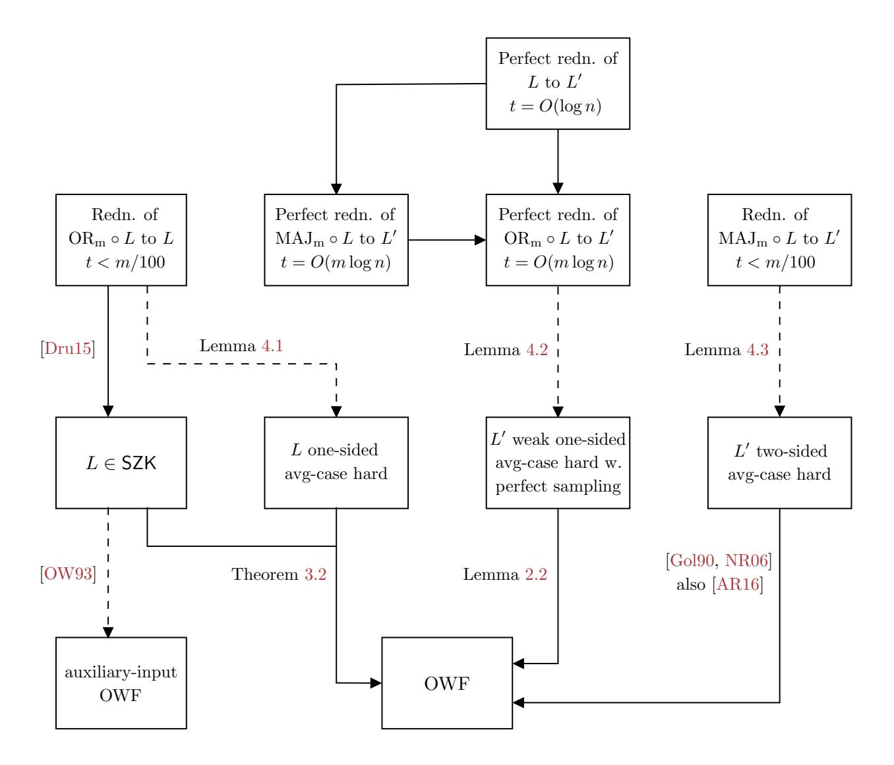

# Cryptography from Information Loss

| Marshall Ball       | Elette Boyle         | Akshay Degwekar | Apoorvaa Deshpande        |
|---------------------|----------------------|-----------------|---------------------------|
| Columbia University | IDC Herzliya         | MIT             | Brown University          |
| Alon Rosen          | Vinod Vaikuntanathan |                 | Prashant Nalini Vasudevan |
| IDC Herzliya        | MIT                  |                 | UC Berkeley               |

#### Abstract

Reductions between problems, the mainstay of theoretical computer science, efficiently map an instance of one problem to an instance of another in such a way that solving the latter allows solving the former.1 The subject of this work is "lossy" reductions, where the reduction loses some information about the input instance. We show that such reductions, when they exist, have interesting and powerful consequences for lifting hardness into "useful" hardness, namely cryptography.

Our first, conceptual, contribution is a definition of lossy reductions in the language of mutual information. Roughly speaking, our definition says that a reduction C is t-lossy if, for any distribution X over its inputs, the mutual information I(X; C(X)) ≤ t. Our treatment generalizes a variety of seemingly related but distinct notions such as worst-case to average-case reductions, randomized encodings (Ishai and Kushilevitz, FOCS 2000), homomorphic computations (Gentry, STOC 2009), and instance compression (Harnik and Naor, FOCS 2006).

We then proceed to show several consequences of lossy reductions:

1. We say that a language L has an f-reduction to a language L 0 for a Boolean function f if there is a (randomized) polynomial-time algorithm C that takes an m-tuple of strings X = (x1, . . . , xm), with each xi ∈ {0, 1} n, and outputs a string z such that with high probability,

$$L'(z) = f(L(x_1), L(x_2), \dots, L(x_m))$$

Suppose a language L has an f-reduction C to L 0 that is t-lossy. Our first result is that one-way functions exist if L is worst-case hard and one of the following conditions holds:

- f is the OR function, t ≤ m/100, and L 0 is the same as L
- f is the Majority function, and t ≤ m/100
- f is the OR function, t ≤ O(m log n), and the reduction has no error

This improves on the implications that follow from combining (Drucker, FOCS 2012) with (Ostrovsky and Wigderson, ISTCS 1993) that result in auxiliary-input one-way functions.

2. Our second result is about the stronger notion of t-compressing f-reductions – reductions that only output t bits. We show that if there is an average-case hard language L that has a t-compressing Majority reduction to some language for t = m/100, then there exist collision-resistant hash functions.

This improves on the result of (Harnik and Naor, STOC 2006), whose starting point is a cryptographic primitive (namely, one-way functions) rather than average-case hardness,

1Such reductions are called many-one or Karp reductions. To be sure, there are more general types of reductions, such as oracle reductions (or Cook reductions), which we do not deal with in this paper.

and whose assumption is a compressing OR-reduction of SAT (which is now known to be false unless the polynomial hierarchy collapses).

Along the way, we define a non-standard one-sided notion of average-case hardness, which is the notion of hardness used in the second result above, that may be of independent interest.

## Contents

| 1 | Introduction                                      | 1  |  |  |
|---|---------------------------------------------------|----|--|--|
|   | 1.1 Notation                                | 5  |  |  |
|   | 1.2 Outline of the Paper                    | 7  |  |  |
| 2 | Computational Hardness                            | 7  |  |  |
|   | 2.1 Reductions                              | 9  |  |  |
| 3 | Statistical Zero Knowledge                        | 11 |  |  |
| 4 | Lossy Reductions                                  | 13 |  |  |
|   | 4.1 Lossy Reductions and One-Way Functions  | 14 |  |  |
| 5 | Collision Resistance                              | 16 |  |  |
| 6 | Conclusion and Future Directions 19            |    |  |  |
| A | OWFs and One/Two-Sided Average-Case Hardness      | 26 |  |  |
|   | A.1 Proof of Lemma 2.2                   | 26 |  |  |
|   | A.2 Proof of Lemma 2.3                   | 27 |  |  |
|   | A.3 Proof of Lemma 2.4                   | 27 |  |  |
| B | Proofs for Section 4                           | 28 |  |  |
|   | B.1 Proof of Lemma B.2                   | 29 |  |  |

## 1 Introduction

Consider a polynomial-time reduction R from a language L to another L 0 . 2 That is, R takes as input x ∈ {0, 1} n for any n and produces an output y ∈ {0, 1} t(n) for some polynomial t such that x ∈ L if and only if y ∈ L 0 . Such a reduction relates the computational complexities of L and L 0 – its existence says that the complexity of L is at most the complexity of L 0 , upto some additional polynomial running time. In general, the reduction says little more than this. If the reduction has certain additional properties, however, it tells us more about the complexity of L and starts becoming more useful. This work is about an important such class of reductions, namely lossy reductions that forget information about the input instance.

Losing Information through Compression. One way to lose information about the input instance is by compressing it. Continuing the discussion above, if t(n) = O(log n), the reduction enables L to be decided in non-uniform polynomial-time. More generally, L can be decided on n-bit inputs by a circuit of size roughly 2t(n) . Such instance compressing reductions, those that have t(n) n, have been an important part of the study of fixed parameter tractable algorithms, where they are called kernelizations (see [\[DF13\]](#page-26-0) and the references therein). A classical example is the vertex cover problem on n-node graphs parameterized by the size of the cover k, where there is a poly(n)-time algorithm that takes the graph as input and outputs a smaller graph of size poly(k) which has a cover of size k if and only if the original graph does.

Harnik and Naor [\[HN10\]](#page-26-1) showed a variety of cryptographic applications of such compressing reductions. For example, assuming that the Boolean Satisfiability problem (SAT) has good enough instance compression, they showed how to construct a collision-resistant hash function starting from any one-way function, a task known to be impossible to do in a black-box manner [\[Sim98\]](#page-28-2). Furthermore, if this compression has some additional properties, they also show how to get publickey encryption schemes and oblivious transfer protocols from one-way functions. However, Fortnow and Santhanam [\[FS11\]](#page-26-2) and later Drucker [\[Dru12\]](#page-26-3) showed that, unless the polynomial hierarchy collapses, such instance compression algorithms for SAT cannot exist.

This Work: Losing Information without Compression. Compression is one way to lose information, but not the only one. In this paper, we study cryptographic implications of lossy reductions – randomized algorithms that forget information about the input instance but not necessarily by compressing them. Such reductions are abundant in the study of average-case complexity and cryptography.

An example is a reduction R(x) that outputs a sample from a distribution that is (almost) completely determined by whether x is contained in L (and, as before, R(x) ∈ L 0 if and only if x ∈ L). Such a reduction loses all information about x other than its membership in L. Thus, it relates the complexity of deciding L in the worst-case to the complexity of deciding L 0 on average over a specific distribution3 . In other words, a reduction that loses all information about its input except membership in L is a worst-case to average-case reduction from L to L 0 .

From a different vantage point, such reductions are equivalent to randomized encodings [\[IK00\]](#page-27-0), a powerful and versatile notion in cryptography (see the survey by Applebaum [\[App16\]](#page-25-0) and the

2Much of our discussion also applies to promise problems and search problems.

3The distribution is given by picking any xN 6∈ L and any xY ∈ L, and taking the equal convex combination of the distributions sampled by R(xN ) and R(xY ).

references therein). In particular, randomized encodings have been used to delegate computations [\[AIK10\]](#page-24-0), for secure computation [\[Yao86,](#page-28-3) [BMR90,](#page-25-1) [IK02\]](#page-27-1), for parallel cryptography [\[AIK04\]](#page-24-1), for key-dependent message security and much more.

Given this relevance to cryptography of reductions that lose all information except membership, both as average-case reductions and as randomized encodings, we ask whether anything similar can be said of reductions that are almost this way. That is, are reductions that lose almost all other information except membership useful for cryptography?

Lossy Reductions and Cryptography. Our first contribution is a definition of such lossy reductions through the lens of mutual information. For a function t : N → R +, we say that a reduction C from a language L to a language L 0 is t-lossy if for any random variable X over bit-strings of length n (capturing an input distribution), the mutual information I(X; C(X)) is at most t(n). Note that this definition does not fix an input distribution, but instead quantifies over all of them. In this sense, it is reminiscent of the prior-free information complexity definition of Braverman et al [\[BGPW13\]](#page-25-2). Roughly speaking, if X has little entropy, we don't care; if X has more than t(n) bits of entropy, we want the reduction to reveal at most t(n) of it.

Whereas Harnik and Naor showed that instance compression can be used to construct other cryptographic primitives from one-way functions, we investigate the possibility of using compression or information loss to construct one-way functions from simpler hardness properties. Some results along these lines are already known, or are implicit in prior work: (1) Drucker [\[Dru12\]](#page-26-3) showed that the existence of certain kinds of compressing reductions for a language L implies that L has a statistical zero-knowledge proof.4 Together with a result of Ostrovsky [\[Ost91\]](#page-27-2), this implies that if such a language is average-case hard, then one-way functions exist; (2) Replacing averagecase with worst-case hardness in the above gives us auxiliary input one-way functions, a weaker object [\[OW93\]](#page-27-3); (3) on the other hand, if the reduction is a randomized encoding, then replacing average-case with worst-case hardness in the above gives us one-way functions [\[AR16\]](#page-25-3).

We demonstrate a number of other similar sufficient conditions to elevate worst-case hardness to one-way functions. To give the reader a taste of what is to come, one of our results is a way to achieve the best of (1), (2) and (3) above, showing how to elevate worst-case hardness of L into one-way functions if L has a lossy reduction to L 0 .

Informal Theorem 1.1. Suppose there is a perfect reduction from L to L 0 that is O(log n)-lossy on n-bit inputs. If L is worst-case hard, then One-Way Functions exist.

The above follows as a corollary to Informal Theorem [1.4](#page-5-0) described later. As noted earlier, randomized encodings may be seen roughly as a 1-lossy reduction from L to some problem L 0 , and the worst-case hardness of a problem that has randomized encodings implies the existence of a one-way function. The above theorem says that it is in fact sufficient for the reduction to be O(log n)-lossy (rather than 1-lossy) for this conclusion to hold, if it has the additional property that it does not make any errors – that is, a YES (resp. NO) instance of L is never mapped to a NO (resp. YES) instance of L 0 . This may also be interpreted as saying that the implication to OWFs for randomized encodings still holds if the privacy guarantee of the encodings is much weaker, as long as the correctness is perfect.

4Drucker's results were stated for the stronger notion of compression in terms of bit-length, but his proofs imply the same results for the notion of lossy reductions as well.

f-Reductions and OWFs. Our main theorems are about the implications of lossy reductions for the composition of a simple Boolean function with membership in a language. Let  $f = \{f^n\}$  denote a family of (partial) Boolean functions, where for some polynomial m, the function  $f^n$  takes m(n) bits as input. We denote by  $f \circ L$  the composition of f with L – on m(n) inputs  $x_1, \ldots, x_{m(n)} \in \{0, 1\}^n$ , this function is computed as  $f(L(x_1), \ldots, L(x_{m(n)}))$ . We refer to a reduction from  $f \circ L$  to some problem as an f-reduction of L.

Such f-reductions that are also compressing (in terms of bit length) have been the subject of considerable past work in the study of parametrized complexity [HN10, BDFH09, FS11, Dru15] (see also further references in [Dru15]), especially for simple functions f like AND and OR. Most relevant to our work are the results of Drucker [Dru15], who showed that if there is a sufficiently compressing reduction from  $OR_m \circ L$  to any problem L', then L is contained in SZK (where m is some polynomial and  $OR_m$  is the family of OR functions on m(n) inputs). As noted earlier, this implied membership in SZK lets us lift the average-case hardness of L to a one-way function, or its worst-case hardness to an auxiliary-input OWF.

Our starting point is the observation that Drucker's proofs still work if the reduction were just lossy and not necessarily compressing. We prove the following theorems that show three different sufficient conditions for lossy reductions to be useful in lifting worst-case hardness directly to one-way functions. Each of the three imply OWFs by following different paths, as described briefly below. These paths and pointers to the relevant parts of the paper are presented in Fig. 1.

**Informal Theorem 1.2.** Suppose, for some polynomial m, and promise problem L, there is a reduction from  $OR_m \circ L$  to L that is (m(n)/100)-lossy on  $(n \cdot m(n))$ -bit inputs. If L is worst-case hard, then One-Way Functions exist.

We prove this by first showing that, given a compressing reduction from  $OR_m \circ L$  to L', Drucker's techniques actually imply a certain kind of worst-case to average-case reduction from L to L'. And if L is worst-case hard, then this reduction lets us conclude that L' is one-sided average-case hard, a notion explained later in this section. Thus, if L' is L itself, then it is both contained in SZK and is one-sided average-case hard. Finally, we show that the existence of any such problem implies the existence of a OWF.

The next theorem we prove is that a similarly lossy Majority-reduction from L lets us lift the worst-case hardness of L to a OWF, without any additional requirements on what it reduces to.

**Informal Theorem 1.3.** Suppose, for some polynomial m, and promise problem L, there is a reduction from  $MAJ_m \circ L$  to some problem that is (m(n)/100)-lossy on  $(n \cdot m(n))$ -bit inputs. If L is also worst-case hard, then One-Way Functions exist.

In this case, we extend Drucker's techniques to show that such a reduction from  $\text{MAJ}_m \circ L$  to some L' implies a two-sided average-case reduction from L to L' – where the YES and NO parts of the resulting distribution over instances of L' can be sampled separately. In different terms, this implies that L has statistical randomized encodings, and the conclusion follows from the fact that the worst-case hardness of a problem that has randomized encodings implies one-way functions [AR16].

Finally, the following theorem says that we can make do with  $OR_m$ -reductions that are not as lossy as before – only  $O(m(n)\log n)$ -lossy instead of m(n)/100 – if the reduction is perfect, meaning that it never maps YES (resp. NO) instances of  $OR_m \circ L$  to NO (resp. YES) instances of L'. Note that a reduction that is  $O(m(n)\log n)$ -lossy could still preserve some information about all of its  $O(m(n)\log n)$ -lossy could still preserve some information about all of its  $O(m(n)\log n)$ -lossy could still preserve some information about all of its  $O(m(n)\log n)$ -lossy could still preserve some information about all of its  $O(m(n)\log n)$ -lossy could still preserve some information about all of its  $O(m(n)\log n)$ -lossy could still preserve some information about all of its  $O(m(n)\log n)$ -lossy could still preserve some information about all of its  $O(m(n)\log n)$ -lossy could still preserve some information about all of its  $O(m(n)\log n)$ -lossy could still preserve some information about all of its  $O(m(n)\log n)$ -lossy could still preserve some information about all of its  $O(m(n)\log n)$ -lossy could still preserve some information about all of its  $O(m(n)\log n)$ -lossy could still preserve some information about all of its  $O(m(n)\log n)$ -lossy could still preserve some information about all of its  $O(m(n)\log n)$ -lossy could still preserve some information about all of its  $O(m(n)\log n)$ -lossy could still preserve some information about all of its  $O(m(n)\log n)$ -lossy could still preserve some information about all of its  $O(m(n)\log n)$ -lossy could still preserve some information about all of its  $O(m(n)\log n)$ -lossy could still preserve some information about all of its  $O(m(n)\log n)$ -lossy could still preserve some information about all of its  $O(m(n)\log n)$ -lossy could still preserve some information about all of its  $O(m(n)\log n)$ -lossy could still preserve some information about all of its  $O(m(n)\log n)$ -lossy could still preserve some information about all of its  $O(m(n)\log n)$ -lossy could still preserve some information about all of its  $O(m(n)\log n)$ -lossy c

Informal Theorem 1.4. Suppose, for some polynomial m, and promise problems L and L 0 , there is a perfect reduction from ORm ◦ L to L 0 that is O(m(n) log n)-lossy on (n · m(n))-bit inputs. If L is worst-case hard, then One-Way Functions exist.

We prove this by showing that a perfect reduction from ORm ◦ L implies a one-sided averagecase reduction that is perfect in the sense that the NO and YES distributions that are generated by the reduction are disjoint. On the other hand, the hardness that is implied by the reduction is quite weak due to it not being lossy enough – it only says that the NO distribution cannot be distinguished from some YES distribution with advantage better than (1 − 1/poly(n)) by a given algorithm. However, the perfectness lets us show that the sampler for the NO distribution itself is a weak one-way function (considering its random string to be the input to the OWF).

Collision-Resistance from Compression. Finally, we show that compressing reductions – where the output length is smaller than the input length – can be used to lift one-sided averagecase hardness to collision-resistant hash functions.

Informal Theorem 1.5. Suppose, for some polynomial m, and promise problem L, there is a perfect reduction from ORm ◦L to some problem that compresses (n · m(n))-bit inputs to m(n)/100 bits. If L is also one-sided average-case hard with perfect sampling5 , then Collision-Resistant Hash Functions exist.

Our construction builds directly on the construction of collision-resistant hash functions from homomorphic commitments by Ishai et al [\[IKO05\]](#page-27-4). In our construction, the keys of the hash function for hashing strings of length m correspond to a set of 2m instances (grouped into m pairs) sampled from the NO distribution. Each bit of an input x is used to select an instance from the corresponding pair, and the hash function is computed by running the compressing OR-reduction on this set.

The construction in [\[IKO05\]](#page-27-4) may be seen to use essentially the same approach, where instead of using a compressing OR-reduction for a hard problem, they use the homomorphism of a commitment scheme. The security of the commitment scheme there is the analogue of the one-sided average-case hardness of L, and our observation is that, while homomorphism is one way to compress (XOR-compression in their case), it is not necessary, and any compressing OR-reduction is sufficient to use with the construction.

One-Sided Average-Case Hardness. In the process of studying the implications of ORcompression of a problem to itself, we introduce the notion of one-sided average-case hardness, which we describe next. Recall that the worst-case hardness of a problem L says that for any polynomial-time algorithm A that attempts to decide L, there exists some input x on which it is wrong. Perhaps the simplest notion of average-case hardness flips the quantifiers here and says that there exists a (samplable) distribution over inputs such that any algorithm fails to decide L with large advantage when inputs are sampled from this distribution.

A stronger notion of average-case hardness that we call two-sided average-case hardness (and one that directly relates to one-way functions) says that there are two (samplable) distributions, one over the just the YES instances of L and another over just the NO instances, such that no

5The perfect sampling condition implies that the YES and NO distributions that come up in the definition of the hardness are contained completely within the YES and NO parts of the problem.

algorithm A can distinguish between them. One-sided average-case hardness is a notion between this and worst-case hardness, and says that there exists one samplable distribution N over (mostly) NO instances such that for any algorithm A, there exists a distribution YA over (mostly) YES instances such that A cannot distinguish between N and YA.

One-sided average-case hardness implies worst-case hardness, is implied by two-sided averagecase hardness, and does not seem to be related in this manner to plain average-case hardness. Ostrovsky [\[Ost91\]](#page-27-2) proved that plain average-case hardness of a problem in SZK implies OWFs. We prove the following theorem that, to our knowledge, is incomparable to it.

Informal Theorem 1.6. If there is a problem in SZK that is one-sided average-case hard, then One-Way Functions exist.

The theorem is proven using a reduction to (the complement of) the Statistical Difference problem that is complete for SZK [\[SV03\]](#page-28-4). We also show that the existence of an analogous notion of worst-case to average-case reduction – called one-sided average-case reduction – from a problem L to any other problem implies that L is contained in SZK. Thus, along with the worst-case hardness of L, they imply auxiliary-input OWFs similar to how two-sided average-case reductions imply OWFs. Such reductions are closely related to the notion of semi-private randomized encodings [\[AIK18\]](#page-25-5).

### 1.1 Notation

We will always deal with promise problems and partial functions rather than languages and total functions, as these come up naturally in our discussions, and are also more general. Given a promise problem L, we denote by LY and LN the corresponding sets of YES and NO inputs. Abusing notation, we also denote by L the partial function indicating membership in this promise problem. In the other direction, note that any partial Boolean function f : {0, 1, ⊥}n → {0, 1, ⊥} has a corresponding promise problem, which we also sometimes denote by f. The symbol ⊥ is set to be the output of a partial function on an input on which it is otherwise undefined. In general, we take US to be the random variable distributed uniformly over the set S, where S is clear from context we simply write U.

Random variables are capitalized (X), and algorithms are sans serif (A). A(X) denotes the random variable resulting from sampling x according to X and running A on it. H(X) is the Shannon entropy of X, and I (X; Y ) is the mutual information between X and Y . We take ∆(X; Y ) to denote the total variation distance between X and Y .

Unless otherwise specified, all algorithms in our work are non-uniform, and assumptions and claims of hardness are also against non-uniform algorithms. Further, we always use notions of hardness that are strong in the following sense – when we say, for instance, that a problem L is hard against polynomial-time algorithms, we mean that for any polynomial-time algorithm A, there is an nA ∈ Z such that for any n ≥ nA, the algorithm A fails to decide L correctly on some instance of size n. This is to be contrasted against the more standard notion of hardness, infinitely-often hardness, which would say that there is an infinite sequence of n's such that A fails to decide L on some instance of size n. All of our lemmas and theorems, however, may also be stated in terms of infinitely-often hardness and follow from the same proofs, resulting in infinitely-often cryptographic objects.

Figure 1: The many paths to One-Way Functions. L and L 0 are promise problems. The solid arrows denote implications, and the dashed arrows denote implication conditioned on the worstcase hardness of L. In all cases, m and t are polynomials in n, and the reductions lose all but t(n) bits of information on a set of m(n) inputs of size n – that is, t-lossy according to Definition [4.3](#page-15-1) (when reducing L to L 0 , m(n) is set to 1).

### 1.2 Outline of the Paper

In Section [2,](#page-9-1) we define the various kinds of computational hardness that we will be using, the corresponding reductions, and some lemmas relating the reductions, hardness, and one-way functions. In Section [3,](#page-13-0) we define the class SZK and prove that one-sided average-case hardness in SZK implies one-way functions, and some associated lemmas. In Section [4,](#page-15-0) we define our notion of lossy reductions, and prove that certain kinds of lossy reductions along with worst-case hardness imply one-way functions. In Section [5,](#page-18-0) we prove that one-sided average-case hardness and ORcompressing reductions imply collision-resistant hash functions. Finally, in Section [6,](#page-21-0) we conclude with a discussion of various questions that are raised by our work.

## 2 Computational Hardness

In this section, we define the various kinds of computational hardness of promise problems that we will be employing in later discussions, and also different kinds of reductions between problems that have implications for such hardness. The proofs of the lemmas in this section are in Appendix [A.](#page-28-0) We start by defining the weakest and simplest form of hardness.

Definition 2.1 (Worst-Case Hardness). A problem L is worst-case hard if, for any polynomialtime algorithm A and all large enough n, there is an input x ∈ (LY ∪ LN ) ∩ {0, 1} n such that Pr [A(x) = L(x)] < 2/3.

Worst-case hardness says that for any algorithm A (and large enough instance size n), there is an input x on which it is wrong. We next define perhaps the simplest form of average-case hardness, which mostly just swaps these quantifiers. It says that there is a distribution over inputs x such that any algorithm A is wrong on average over this distribution.

Definition 2.2 (Average-Case Hardness). A problem L is average-case hard if there is a polynomialtime sampling algorithm D such that:

• D mostly samples instances from LY and LN . That is, for all large enough n,

$$\Pr_{x \leftarrow \mathsf{D}(1^n)} \left[ x \not\in L_Y \cup L_N \right] \le 0.1$$

• The membership in L of most instances drawn from D is hard to decide. That is, for any polynomial-time algorithm A, for all large enough n,

$$\Pr_{\boldsymbol{x} \leftarrow \mathsf{D}(1^n)} \left[ \mathsf{A}(\boldsymbol{x}) = L(\boldsymbol{x}) \vee L(\boldsymbol{x}) = \bot \right] \leq \frac{1}{2} + 0.15$$

Note that the constant 2/3 in Definition [2.1](#page-9-2) is somewhat arbitrary – if there is an algorithm A that does in fact decide L in the worst-case with success probability bounded away from 1/2 for all n, this can be amplified by repetition to get an algorithm A 0 with success probability close to 1.

In Definition [2.2,](#page-9-3) however, the constants are not arbitrary, at least in this straighforward sense. There are known hardness amplification theorems (see [\[AB09,](#page-24-2) Chapter 19]) that can take a problem L that is somewhat average-case hard as above, and obtain another problem L 0 and a distribution under which L 0 is much harder, but these do not say that L itself is any harder than initially supposed. Our choice of the constants we use in our definitions are such that the hardness is mild enough to be implied by the hypotheses that we later start with, and are yet strong enough to have interesting implications for cryptography, as shown by our theorems.

We next define a stronger and natural notion of average-case hardness that is known to be closely related to One-Way Functions. It separates the hard distribution into YES and NO parts, and asks that each of these parts be efficiently samplable.

**Definition 2.3** (Two-Sided Average-Case Hardness). A problem L is two-sided average-case hard if there are two polynomial-time sampling algorithms Y and N such that:

• Y and N mostly sample instances from  $L_Y$  and  $L_N$ , respectively. That is, for all large enough n,

$$\Pr_{\substack{x \leftarrow \mathsf{Y}(1^n)}} \left[ x \not\in L_Y \right] \le 0.1$$

$$\Pr_{\substack{x \leftarrow \mathsf{N}(1^n)}} \left[ x \not\in L_N \right] \le 0.1$$

• The outputs of Y and N are computationally indistinguishable. That is, for any polynomial-time algorithm A, for all large enough n,

$$\left| \Pr_{x \leftarrow \mathsf{Y}(1^n)} \left[ \mathsf{A}(x) = 1 \right] - \Pr_{x \leftarrow \mathsf{N}(1^n)} \left[ \mathsf{A}(x) = 1 \right] \right| \le 0.3$$

It is known that any two-sided average-case hard problem implies the existence of a One-Way Function. This follows from the fact that such hardness implies the existence of a family of statistically far distributions that are computationally indistinguishable (N and Y). Goldreich [Gol90] showed that this is equivalent to the existence of OWFs if the indistinguishability was with negligible advantage, and this was later extended by Naor and Rothblum [NR06] to hold for weaker indistinguishability that covers the constants used above (see [BDRV19] for an alternative proof), leading to the following lemma. A theorem that is roughly equivalent to the combination of Lemmas 2.1 and 2.3 was also proven by Applebaum and Raykov [AR16].

**Lemma 2.1.** There is a problem that is two-sided average-case hard if and only if One-Way Functions exist.

Further, note that the existence of a OWF also implies (as can be seen by the PRG that can be constructed from it) that there is some language that is two-sided average-case hard, but with much stronger guarantees – with negligible functions (in n) in place of the constants 0.1 and 0.3 in Definition 2.3. In this sense, for the purposes of its relevance to cryptography, the constants in the definition above are also somewhat arbitrary.

Finally, we introduce a notion of average-case hardness that is intermediate between worst-case and two-sided average-case hardness and, to our knowledge, is incomparable to plain average-case hardness. Recall that average-case hardness was obtained by swapping the quantifiers in worst-case hardness, and two-sided average-case hardness then came out of separating and fixing the YES and NO parts. The following definition fixes just the NO distribution, and requires that for any algorithm A, there exists some YES distribution that it cannot distinguish from this fixed NO distribution.

**Definition 2.4** (One-Sided Average-Case Hardness). A problem L is one-sided average-case hard if there is a polynomial-time sampling algorithm  $\mathbb{N}$  such that:

• N mostly samples instances from  $L_N$ . That is, for all large enough n,

$$\Pr_{x \leftarrow \mathsf{N}(1^n)} \left[ x \not\in L_N \right] \le 0.1$$

- For any polynomial-time algorithm, there is some distribution that is mostly over  $L_Y$  that it cannot distinguish from the output of N. That is, for every polynomial-time algorithm A, there is a (possibly inefficient) sampler  $Y_A$  such that:
  - $Y_A$  mostly samples instances from  $L_Y$ . That is, for all large enough n,

$$\Pr_{x \leftarrow \mathsf{Y}_{\mathsf{A}}(1^n)} \left[ x \not\in L_Y \right] \le 0.1$$

- The outputs of N and  $Y_A$  are indistinguishable to A. That is, for all large enough n,

$$\left| \Pr_{x \leftarrow \mathsf{N}(1^n)} \left[ \mathsf{A}(x) = 1 \right] - \Pr_{x \leftarrow \mathsf{Y}_{\mathsf{A}}(1^n)} \left[ \mathsf{A}(x) = 1 \right] \right| \le 0.3$$

We say that the hardness is strong if the distinguishing advantage is negligible in n, and weak if it is only required to be less than  $(1-1/n^c)$  for some constant c. We say that L is one-sided average-case hard with  $perfect\ sampling$  if N and  $Y_A$  only output samples in  $L_N$  and  $L_Y$ , respectively.

This kind of hardness turns out to be somewhat related to a weaker kind of OWF called auxiliary-input OWF – see Corollary 3.1. We do not know how to amplify this kind of hardness, so the choice of constants in its definition is not arbitrary.

We consider separately the weak one-sided average-case hardness with perfect sampling, which requires that the YES and NO distribution be contained completely within the respective parts of the problem, but places a much weaker requirement on their indistinguishability. This variant implies the existence of OWFs, though following an approach different from that taken in Lemma 2.1.

**Lemma 2.2.** If there is a problem that is weak one-sided average-case hard with perfect sampling, then One-Way Functions exist.

#### 2.1 Reductions

Reductions relate the complexities of different problems, and while there are more involved forms of reductions that still do so, in our work we will be using the simple notion of Karp reductions. Roughly, a Karp reduction from L to L' takes an instance x and produces an instance x' whose membership in L' is completely determined by that of x in L. Later definitions below also ask for some additional properties.

**Definition 2.5** (Karp Reduction). A polynomial-time algorithm R is a *Karp reduction* from a problem L to a problem L' if for all large enough n:

$$x \in L_Y \cap \{0, 1\}^n \implies \Pr\left[\mathsf{R}(x) \in L_Y'\right] \ge 0.9$$
  
 $x \in L_N \cap \{0, 1\}^n \implies \Pr\left[\mathsf{R}(x) \in L_N'\right] \ge 0.9$ 

In this case, L is said to reduce to L'. If the above probabilities are both 1, then A is said to be a perfect Karp reduction.

A worst-case reduction like the one above from L to L 0 allows us to conclude that L 0 is worstcase hard if L is worst-case hard. Throughout the rest of this work, we will be drawing conclusions about the two-sided and one-sided average-case hardness of L 0 that follow from analogous notions of worst-to-average-case reductions defined below.

Definition 2.6 (Two-Sided Average-Case Karp Reduction). A polynomial-time algorithm R is a two-sided average-case Karp reduction from a problem L to a problem L 0 if there are two polynomialtime samplers Y and N such that the following hold for all large enough n:

• Y and N mostly sample instances from L 0 Y and L 0 N , respectively. That is,

$$\Pr_{\substack{x \leftarrow \mathsf{Y}(1^n)}} \left[ x \not\in L_Y' \right] \le 0.1$$

$$\Pr_{\substack{x \leftarrow \mathsf{N}(1^n)}} \left[ x \not\in L_N' \right] \le 0.1$$

• For any x ∈ LN ∩ {0, 1} n , the output of R(x) is close to that of N(1n ). That is, for such x,

$$\Delta\left(\mathsf{R}(x);\mathsf{N}(1^n)\right) \leq 0.1$$

• For any x ∈ LY ∩ {0, 1} n , the output of R(x) is close to that of Y(1n ). That is, for such x,

$$\Delta\left(\mathsf{R}(x);\mathsf{Y}(1^n)\right) \leq 0.1$$

A two-sided average-case reduction from L to L 0 allows us to conclude that L 0 is two-sided average-case hard if L is worst-case hard.

Lemma 2.3. Suppose there is a two-sided average-case Karp reduction from a language L to a language L 0 , and L is worst-case hard. Then, L 0 is two-sided average-case hard.

Finally, we define one-sided average-case reductions, which similarly relate one-sided averagecase hardness to worst-case hardness.

Definition 2.7 (One-Sided Average-Case Karp Reduction). A polynomial-time algorithm R is a one-sided average-case Karp reduction from a problem L to a problem L 0 if there is a polynomialtime sampler N such that the following hold for all large enough n:

• N mostly samples instances from L 0 N . That is,

$$\Pr_{x \leftarrow \mathsf{N}(1^n)} \left[ x \not\in L_N' \right] \le 0.1$$

• For any x ∈ LN ∩ {0, 1} n , the output of R(x) is close to that of N(1n ). That is, for such x,

$$\Delta\left(\mathsf{R}(x);\mathsf{N}(1^n)\right) \le 0.1$$

• For any x ∈ LY ∩ {0, 1} n , the output of R(x) is mostly contained in L 0 Y . That is, for such x,

$$\Pr_{x' \leftarrow \mathsf{R}(x)} \left[ x' \notin L_Y' \right] \le 0.1$$

The reduction is said to be *strong* if for any  $x \in L_N \cap \{0,1\}^n$ , the distance  $\Delta(R(x); N(1^n))$  is negligible in n, and is *weak* if this is at most  $1 - 1/n^c$  for some constant c. The reduction is said to have *perfect sampling* if the probability that the outputs of N or R(x) when  $x \in L_Y$  are not in  $L'_N$  and  $L'_Y$ , respectively, are 0.

**Lemma 2.4.** Suppose there is a one-sided average-case Karp reduction from a language L to a language L', and L is worst-case hard. Then, L' is one-sided average-case hard. Further, if the reduction is weak and has perfect sampling, then the hardness is also weak and has perfect sampling.

# 3 Statistical Zero Knowledge

One of the paths we take to showing the existence of OWFs is through a one-sided average-case hard problem that also has a statistical zero-knowledge proof. The class SZK of problems that have statistical zero-knowledge proofs has been widely studied in the past, partly owing to its connections to cryptography (see [Vad99] and discussions and references therein). Due to a completeness theorem of Sahai and Vadhan [SV03], we may equivalently define this class in the following manner that is more convenient for us.

**Definition 3.1** (Statistical Zero Knowledge [SV03]). Statistical Zero Knowledge (SZK) is the class of promise problems which have a perfect Karp reduction to the Statistical Difference problem (SD), which is defined over pairs of circuits  $(C_0, C_1)$ , as follows:

$$SD_Y = \{ (C_0, C_1) \mid \Delta(C_0(U)); C_1(U)) > 2/3 \}$$
  

$$SD_N = \{ (C_0, C_1) \mid \Delta(C_0(U)); C_1(U)) < 1/3 \}$$

where n is the output length of both  $C_0$  and  $C_1$ , and the U's above represent uniform distributions over the appropriate input domains.

We will also use the following two results regarding SZK.

**Lemma 3.1** (Polarization [SV03]). There exists an efficient procedure Polarize that when given two circuits  $C_0$ ,  $C_1$  and a parameter  $1^{\lambda}$  as input outputs  $C'_0$ ,  $C'_1$  such that

- If  $\Delta(C_0(U); C_1(U)) > 2/3$ , then  $\Delta(C'_0(U); C'_1(U)) > 1 2^{-\lambda}$ .
- If  $\Delta(C_0(U); C_1(U)) < 1/3$ , then  $\Delta(C_0(U); C_1(U)) < 2^{-\lambda}$ .

**Theorem 3.1** (SZK closed under complement [Oka00]). If  $\Pi = (\Pi_Y, \Pi_N) \in \mathsf{SZK}$ , then  $\overline{\Pi} = (\overline{\Pi}_Y, \overline{\Pi}_N) \in \mathsf{SZK}$  where  $\overline{\Pi}_Y = \Pi_N$  and  $\overline{\Pi}_N = \Pi_Y$ .

As noted in Lemma 2.1, two-sided average-case hardness of any problem implies the existence of OWFs. Ostrovsky [Ost91] showed that *plain* average-case hardness of any problem in SZK also implies the existence of OWFs. Furthermore, Ostrovsky and Wigderson [OW93] observe that the *worst-case* hardness of any problem in SZK implies the existence of *auxiliary-input* one-way functions.6 We show the following incomparable theorem.

&lt;sup>6Roughly, auxiliary-input one-way functions (against non-uniform adversaries) exist if there is polynomial p such that for every family of poly size circuits,  $\{A_n\}_{n\in\mathbb{N}}$  there is family of circuits of size p(n),  $\{F_n\}_{n\in\mathbb{N}}$ , such that  $A_n$  fails to invert  $F_n$  when given a description of  $F_n$  as an auxiliary input. Contrast this with the notion of non-uniform one-way functions we use throughout: a (fixed) family of poly-sized circuits,  $\{F_n\}_{n\in\mathbb{N}}$  is a non-uniform one-way function if for any poly-sized circuit family  $\{F_n\}$  is hard to invert. So far as we know, the latter is strictly stronger. Interestingly however, if one is concerned with security against uniform adversaries, the quantifiers can be switched via diagonalization arguments and the two notions are equivalent.

**Theorem 3.2.** If there is a problem in SZK that is one-sided average-case hard, then One-Way Functions exist.

*Proof.* We show that such hardness implies the existence of two samplable distributions that are  $\alpha$ -statistically far but  $\beta$ -computationally indistinguishable, where there is a noticeable gap between  $\alpha$  and  $\beta$ . (Here, we will take  $\alpha = 4/5 - \text{negl}(n)$  and  $\beta = 3/4$ .) The rest follows from the results of Goldreich and Naor-Rothblum [Gol90, NR06].

The completeness of the complement of Statistical Difference(by Theorem 3.1) implies that for any problem L in SZK, there is a reduction R that takes input x and outputs two circuits that sample distributions that are far if  $x \in L_N$ , and negligibly close if  $x \in L_Y$ . Let L be the one-sided average-case hard problem in SZK and let N be the sampler for its fixed NO distribution. The two distributions we want are sampled by the samplers  $D_0$  and  $D_1$  below given security parameter n:

- $\mathsf{D}_0(1^n)$ : Sample  $x \leftarrow \mathsf{N}(1^n)$ . Compute  $(C_0, C_1) \leftarrow \mathsf{R}(x)$ . Compute circuits  $(C_0', C_1') \leftarrow \mathsf{Polarize}(1^n, C_0, C_1)$ . Pick random r of appropriate length and output  $((C_0', C_1'), C_0(r))$ .
- $\mathsf{D}_1(1^n)$ : Same as above, but output  $((C_0',C_1'),C_1'(r))$  at the end.

By definition, the event that  $N(1^n)$  outputs something not in  $L_N$  happens with probability at most 1/10. By the definition of  $\overline{\text{SD}}$ , conditioned on this event not happening, for any fixed output  $C_0, C_1$  we have that  $\Delta(C_0(U); C_1(U)) > 2/3$ . If this is the case, it follows from Lemma 3.1 that  $\Delta(C'_0(U); C'_1(U)) > 1 - 2^{-n}$  It follows that, conditioned on this event not happening, we have  $\Delta(D_0(1^n); D_1(1^n)) > 1 - \text{negl}(n)$ . By standard manipulations7, we get that  $\Delta(D_0(1^n); D_1(1^n)) > 1 - \text{negl}(n)$ .

To see that these distributions are 3/4-computationally indistinguishable, consider any distinguisher A for them. Suppose A has more than 3/4 advantage in distinguishing  $\mathsf{D}_0(1^n)$  from  $\mathsf{D}_1(1^n)$ . But then consider A' that attempts to solve L by on input x running the reduction,R, and polarization procedure, Polarize $(1^n,\cdot,\cdot)$  to get  $C_0',C_1'$ , flipping a coin  $b\leftarrow U_{\{0,1\}}$ , and outputting 1 if  $\mathsf{A}(C_0',C_1',C_0'(U))=b$ . If A' is given inputs from  $N(1^n)$ , then what it feeds A is identically distributed to either  $D_0(1^n)$  (if b=0) or  $D_1(1^n)$  (if b=1). It follows from A's advantage that  $Pr[\mathsf{A}'(N(1^n))]>\frac{1+3/4}{2}=.875$ .

On the other hand, by virtue of the fact that L is one-sided average case hard there is a distribution  $\mathsf{Y}_{\mathsf{A}'}$  which is .3-indistinguishable from N to A'. Consider  $\mathsf{A}'(\mathsf{Y}_{\mathsf{A}'})$ . First of all  $\Pr[\mathsf{Y}_{\mathsf{A}'} \in L_Y] \geq .9$ . Moreover, for any such  $x \in L_Y$ ,  $\mathsf{R}(x) \in \overline{\mathrm{SD}}_N$ . In this case,  $\operatorname{Polarize}(1^n)$  will output  $(C'_0, C'_1)$  such that  $\Delta(C'_0(U); C'_1(U)) < 2^{-n}$ . Therefore, with probability at least .9, the two circuits  $\mathsf{A}'$  gives to A correspond to distributions with negligible distance from one another. It follows from standard manipulations that  $\mathsf{A}$ , regardless of efficiency, can distinguish with probability at most  $1 + \operatorname{negl}(n)$ . Thus,  $\Pr[\mathsf{A}'(\mathsf{Y}_{\mathsf{A}'}) = 1] \leq \frac{1+.15}{2} = .575$ .

.1 + negl(n). Thus,  $\Pr[\mathsf{A}'(\mathsf{Y}_{\mathsf{A}'}) = 1] \le \frac{1+.15}{2} = .575$ . But then  $\Pr[\mathsf{A}'(\mathsf{N}_{\mathsf{A}'}) = 1] - \Pr[\mathsf{A}'(\mathsf{Y}_{\mathsf{A}'}) = 1] > .3$ , which violates the assumption on  $\mathsf{Y}_{\mathsf{A}'}$  following from the average-case hardness of L.

The above theorem talks about the implication of a problem that is both one-sided hard and is in SZK. The following lemma, which was implicitly used by Drucker [Dru15], says that membership of a problem in SZK is implied by the existence of any one-sided average-case reduction *from* it. A stronger version of this lemma (in different terminology) was also proven by Applebaum and Raykov [AR16].

&lt;sup>7For any random variables X, Y, Z and any event  $E, \Delta(X; Y) \in [\Pr[Z \in E] \Delta(X|Z \in E; Y|Z \in E) \pm \Pr[Z \notin E]]$ .

Lemma 3.2. If there is a one-sided average-case Karp reduction from a problem L to any other problem, then L is in SZK.

Proof of Lemma [3.2.](#page-14-0) We show this by reduction to the Statistical Difference problem, and appealing to its completeness of SZK and the closure of the class under complement. Suppose R is the one-sided average-case Karp reduction and N is the canonical NO distribution from Definition [2.7.](#page-12-1) The reduction is, given input x for L, to output the pair of circuits (N(1n ; ·), R(x; ·)) – each of these takes the randomness for the respective algorithm as input and produces the corresponding output. The properties of the one-sided reduction guarantee that if x ∈ LN , then ∆ (N(1n ); R(x)) is at most 0.1, while if x ∈ LY , then this is at least 0.9.

Because worst-case hard languages in SZK imply auxiliary-input one-way functions [\[OW93\]](#page-27-3), the following is an immediate consequence of Lemma [3.2.](#page-14-0) We refer the reader to [\[OW93\]](#page-27-3) for the definition of auxiliary-input one-way functions.

Corollary 3.1. If L is worst-case hard and there is a one-sided average-case Karp reduction from L to any other problem, then auxiliary-input one-way functions exist.

Starting with a stronger hypothesis – a two-sided average-case reduction from L – we show membership in SRE, which is the class of problems that have statistical randomized encodings (and is a subset of SZK). We refer the reader to [\[AR16\]](#page-25-3) for the definitions of randomized encodings and this class.

Lemma 3.3. If there is a two-sided average-case Karp reduction from a problem L to any other problem, then L is in SRE.

This lemma is proven in the same way as Lemma [3.2,](#page-14-0) with the two fixed distributions of the randomized encodings taken to be Y and N from the two-sided average-case reduction (see Definition [2.6\)](#page-12-2).

# 4 Lossy Reductions

In this section, we define our notions of lossy reductions, and show their implications for OWFs. We start with a definition of what it means for a generic algorithm to lose information about its input. All algorithms in this section are randomized and non-uniform unless specified otherwise.

Definition 4.1 (Lossy Algorithm). An algorithm C is said to t-lossy on n-bit inputs for some n ∈ N and t ∈ R + if, for any random variable X over {0, 1} n ,

$$I(X; C(X)) \le t$$

Note that being t-lossy means, in a sense, that the algorithm loses (n−t(n)) bits of information. For convenience, we overload the above terminology for the following special cases of reductions.

Definition 4.2 (Lossy Reduction). For a function t : N → R +, a Karp reduction from a problem L to a problem L 0 is said to be t-lossy if, for every n ∈ N, it is t(n)-lossy on n-bit inputs.

For a polynomial m, consider a family of partial functions f = fn : {0, 1, ⊥}m(n) → {0, 1, ⊥} . Define the problem f ◦ L on inputs from {0, 1} n×m(n) as the composition of f with m(n) copies of L; that is, for x1, . . . , xm(n) ∈ {0, 1} n , define (f ◦ L)(x1, . . . , xm(n) ) = f(L(x1), . . . , L(xm(n) )). We also overload the terminology for reductions from such compositions as follows.

**Definition 4.3** (Lossy f-Reduction). Let  $m: \mathbb{N} \to \mathbb{N}$  and  $t: \mathbb{N} \to \mathbb{R}^+$  be polynomials, and  $f = \{f_n: \{0,1,\bot\}^{m(n)} \to \{0,1,\bot\}\}$  be a family of partial functions. For a problem L, a Karp reduction from  $f \circ L$  to a problem L' is said to be t-lossy if, for every  $n \in \mathbb{N}$ , it is t(n)-lossy on  $(n \cdot m(n))$ -bit inputs. We say in this case that L has a t-lossy f-reduction to L'.

In the last two definitions, the problem L is said to have a t-lossy self-reduction (or self-f-reduction) if L' is the same as L. During many of our discussions, the size parameter n will be fixed, and when it is, we will use just t and m to denote the numbers t(n) and m(n).

We first consider the family of OR functions – for some polynomial m, the family  $OR_m = \{OR^n : \{0,1,\bot\}^{m(n)} \to \{0,1,\bot\}\}_{n\in\mathbb{N}}$ , where  $OR^n$  is a function from  $\{0,1,\bot\}^{m(n)}$  to  $\{0,1,\bot\}$  that is the Boolean OR of its inputs if they are all from  $\{0,1\}$ , and is  $\bot$  if any of its inputs is  $\bot$ . Drucker [Dru15] showed that any problem that is  $OR_m$ -compressible to  $O(m(n)\log n)$  bits is contained in SZK, where his notion of compression to t bits was that the output length of the reduction is at most t bits (similar to Definition 5.2). We observe that his proof works almost as is for reductions that are lossy in the sense of Definition 4.3 (but that may not be compressing). We isolate the following lemma that is implicit in [Dru15], which will be useful for us, and state it in terms of average-case Karp reductions.

**Lemma 4.1.** Suppose, for some polynomial m and problems L, L', there is a reduction from  $OR_m \circ L$  to L'. If this reduction is (m/100)-lossy and m(n) > 100 for all large enough n, then there is a one-sided average-case Karp reduction from L to L'.

As noted above, Drucker shows membership in SZK as long as the compression (or loss) is to  $O(m \log n)$  bits, but the implication of the one-sided average-case reduction as in Lemma 4.1 seems to follow only if the loss is to somewhat less than m bits. In the case where the reduction from  $OR_m \circ L$  does not make any errors, however, we can recover a weak one-sided average-case reduction with perfect sampling even if the loss is only to  $O(m \log n)$  bits.

**Lemma 4.2.** Suppose, for some polynomial m and problems L, L', there is a perfect reduction from the problem  $OR_m \circ L$  to L'. If this reduction is  $O(m \log n)$ -lossy, then there is a weak one-sided average-case Karp reduction with perfect sampling from L to L'.

Define  $MAJ_m$  in the same way as  $OR_m$ , but with the Majority function. We extend Drucker's results and show the following stronger conclusion from lossy Majority-reduction – that it implies a two-sided average-case reduction (or a randomized encoding, following Lemma 3.3).

**Lemma 4.3.** Suppose, for some polynomial m and problems L, L', there is a reduction from the problem  $MAJ_m \circ L$  to L'. If this reduction is m/100-lossy and m(n) > 100 for all large enough n, then there is a two-sided average-case Karp reduction from L to L'.

The proofs of these lemmas are in Appendix B.

#### 4.1 Lossy Reductions and One-Way Functions

We now state and prove our main theorems, showing that certain lossy reductions for a problem L can be used to lift its worst-case hardness to a One-Way Function. Each of our three theorems is proven by following a different path, as explained in the respective proofs. The first says that good enough lossy self-OR-reduction implies a OWF.

Theorem 4.1. Suppose, for some polynomial m and a problem L, there is a reduction from ORm◦L to L that is (m/100)-lossy. If L is worst-case hard and m(n) > 100 for all large enough n, then One-Way Functions exist.

Proof of Theorem [4.1.](#page-16-4) This theorem is proven by showing that the hypothesis implies that L is both one-sided average-case hard and contained in SZK which, as seen in Section [3,](#page-13-0) implies a OWF. The proof is as follows:

- Lemma [4.1](#page-16-3) implies that there is a one-sided average-case reduction from L to itself.
- Lemma [3.2](#page-14-0) and the one-sided reduction imply that L ∈ SZK.
- Together with the worst-case hardness of L and the one-sided reduction, Lemma [2.4](#page-13-1) implies that L is one-sided average-case hard.
- Theorem [3.2,](#page-13-2) along with the above two conclusions, implies that OWFs exist.

Our second theorem uses an incomparable hypothesis – that there is a lossy MAJ-reduction, but not necessarily to L itself.

Theorem 4.2. Suppose, for some polynomial m and a problem L, there is a reduction from MAJm◦ L to some problem that is (m/100)-lossy. If L is worst-case hard and m(n) > 100 for all large enough n, then One-Way Functions exist.

Proof of Theorem [4.2.](#page-17-0) This theorem is proven by showing that such a reduction implies the existence of a two-sided average-case reduction from L, and using this to go from worst-case hardness of L to OWFs. Suppose the reduction is to a problem L 0 . The proof is as follows:

- Lemma [4.3](#page-16-2) implies that there is a two-sided average-case reduction from L to L 0 .
- Together with the worst-case hardness of L and the two-sided reduction, Lemma [2.3](#page-12-0) implies that L 0 is two-sided average-case hard.
- Lemma [2.1,](#page-10-0) along with the above two-sided hardness, implies that OWFs exist.

The third theorem also uses a hypothesis incomparable to the other two – it assumes that the lossy reduction is perfect, but works even if the loss is to more bits than the number of instances it takes as input.

Theorem 4.3. Suppose, for a polynomial m and a problem L, there is a perfect reduction from ORm ◦ L to some problem that is O(m log n)-lossy. If L is also worst-case hard, then One-Way Functions exist.

We draw the following interesting corollaries of this theorem, both of which follow from a direct implication of lossy perfect OR-reduction by their respective hypotheses. The first is a statement along the lines of Lemma [2.1,](#page-10-0) but incomparable to it. Lemma [2.1](#page-10-0) may be rephrased as saying that a 1-lossy reduction from a worst-case hard language implies OWFs, and Corollary [4.1](#page-17-1) relaxes the requirement to O(log n)-lossiness, but requires the reduction to be perfect.

**Corollary 4.1.** Suppose there is a perfect reduction from a problem L to another problem that is  $O(\log n)$ -lossy. If L is also worst-case hard, then One-Way Functions exist.

The second corollary is the analogue of Theorem 4.3 for Majority reductions.

Corollary 4.2. Suppose, for a polynomial m and a problem L, there is a perfect reduction from  $MAJ_m \circ L$  to some problem that is  $O(m \log n)$ -lossy. If L is also worst-case hard, then One-Way Functions exist.

Proof of Theorem 4.3. This theorem is proven by showing that a perfect lossy OR-reduction leads to a weak one-sided average-case reduction with perfect sampling, which along with worst-case hardness leads to OWFs. Suppose the reduction is to a problem L'. The proof is as follows:

- Lemma 4.2 implies that there is a weak one-sided average-case reduction from L to L' with perfect sampling.
- Together with the worst-case hardness of L and the above reduction, Lemma 2.4 implies that L' is weak one-sided average-case hard with perfect sampling.

• Lemma 2.2, along with the above hardness, implies that OWFs exist.

### 5 Collision Resistance

In this section, we show that that one-sided average-case hardness of a language L combined with compressibility of  $OR_m \circ L$  (in the standard sense of compressed output length), implies the existence of collision-resistant hash functions.

The reduction builds directly on the construction of collision-resistant hash functions from homomorphic encryption due to Ishai, Kushilevitz, and Ostrovsky [IKO05] (more generally, from any one-round private information retrieval (PIR) protocol, or homomorphic one-way commitments). Indeed, these cryptographic notions can be viewed precisely as providing compressing reductions for related languages whose average-case hardness is implied by security: e.g., additively homomorphic encryption corresponds directly to self-compression from (XORm  $\circ$  L) to L, for the (average-case hard) language L where  $L_Y$  is the set of ciphertexts encrypting the bit 1, and  $L_N$  is the set of ciphertexts of 0.

We begin by formally defining collision-resistant hash function families and the required form of output-length compression.

**Definition 5.1.** Collision-resistant hash functions exist if there exist  $\ell, \ell' : \mathbb{N} \to \mathbb{N}$  with  $\ell(n) > \ell'(n)$ , an index set  $I \subseteq \{0,1\}^*$ , and probabilistic polynomial-time algorithms of the form:

- $Gen(1^n)$ , which outputs an index  $s \in I$ ,
- Eval(s, y), which given index  $s \in I$  and input  $y \in \{0, 1\}^{\ell(n)}$ , outputs  $h_s(y) \in \{0, 1\}^{\ell'(n)}$ ,

for which finding collisions is computationally hard. That is, for every polynomial-time (non-uniform) A, there exists a negligible function  $\nu$  for which

$$\Pr_{\substack{s \leftarrow \mathsf{Gen}(1^n) \\ (y,y') \leftarrow \mathsf{A}(s)}} \left[ (y \neq y') \land \left( \mathsf{Eval}(s,y) = \mathsf{Eval}(s,y') \right) \right] \leq \nu(n).$$

**Definition 5.2** (Compressing Reduction). An algorithm C is said to *compress* n-bit inputs to t bits for some  $n, t \in \mathbb{N}$  if for any  $x \in \{0, 1\}^n$  the output bit length is  $|\mathsf{C}(x)| \leq t$ .

For a function  $t : \mathbb{N} \to \mathbb{N}$ , a Karp reduction from a problem L to a problem L' is said to t-compressing if, for every  $n \in \mathbb{N}$ , it is t(n)-compressing on n-bit inputs.

We now present the main theorem of the section. Note for simplicity, we present the reduction with respect to a *perfect* compressing reduction of  $OR_m \circ L$  (see Definition 2.5), as well as assuming *perfect* sampling for the one-sided average-case hard language L (that is, for any polynomial-time A, the probability that the outputs of N or  $Y_A$  are not in  $L_N$  and  $L_Y$ , respectively, are set to 0).

**Theorem 5.1.** Suppose, for some polynomial m and a problem L, there is a perfect reduction from  $OR_m \circ L$  to L' that compresses to m/100 bits. If L is strongly one-sided average-case hard with perfect sampling and m(n) > 100 for all large enough n, then Collision-Resistant Hash Functions exist.

Recall that existence of a compressing reduction from  $(MAJ_{2m+1} \circ L)$  to L', or from  $(AND_m \circ L)$  to L', each directly imply equivalent compressing reduction from  $(OR_m \circ L)$  to L', up to constant factors of compression. This yields the following corollary.

Corollary 5.1. The following variations of Theorem 5.1 additionally hold. Let m be polynomial and L a problem. Then collision-resistant hash functions exist assuming existence of a compressing reduction of the following corresponding kinds (to m/100 bits), in addition to the specified hardness requirements on L:

- 1. If there is a compressing reduction from  $MAJ_m \circ L$  to L' and L is strongly one-sided average-case hard with perfect sampling.
- 2. If there is a compressing reduction from  $AND_m \circ L$  to L' and the complement language coL is strongly one-sided average-case hard with perfect sampling.

At a high level, the construction mirrors the approach of [IKO05], as follows. Each hash function in the family will be keyed by a collection s of 2m randomly sampled no-instances of L (via N). The corresponding hash function  $\text{Eval}(s,\cdot)$  takes as input a bit-string  $y \in \{0,1\}^m$ , and outputs the m/100-bit instance of L' generated by applying the compressing reduction on the  $(OR_m \circ L)$  instance defined by the m no-instances selected by the bits of y. A successful collision-finder can be used to gain contradictorily high advantage in deciding L (more specifically, in distinguishing a sample of N from the (possibly inefficient)  $Y_A$ ), by embedding the challenge instance x into a random location  $i^* \in [m]$  of the key, and seeing whether the colliding inputs  $y \neq y'$  differ in this index  $i^*$ . If x was sampled from N, then the concocted key is properly distributed, independent of  $i^*$ , and thus y, y' must differ in position  $i^*$  with noticeable probability. On the other hand, if x was sampled from  $Y_A$ , then any  $(OR_m \circ L)$  instance containing x is a yes instance, whereas any instance not containing x is (by construction) a no instance; by perfect correctness of the compressing reduction, it thus cannot be the case that any two such inputs y, y' that differ in position  $i^*$  could collide to an identical output in L'.

Proof of Theorem 5.1. Given such a pair of languages L, L', we construct the desired collision-resistant hash function family.

Denote by R the weakly compressing reduction from  $(OR_m \circ L)$  to L'. By one-sided average-case hardness of L (as per Definition 2.4), there exists a polynomial-time sampling algorithm N which

samples instances from  $L_N$ . Let  $\ell(n) = m$  and  $\ell'(n) = m/100$  be the input and (compressed) output length of the hash function. Consider the following algorithms.

- Gen(1n): Independently sample  $\ell(n) = m$  instances from N. That is, for  $(i,b) \in [m] \times \{0,1\}$ , let  $x_{i,b} \leftarrow \mathsf{N}(1^n)$ . Output  $s = (x_{i,b})_{i \in [m], b \in \{0,1\}}$ .
- Eval(s, y): Parse  $s = (x_{i,b})_{i \in [m], b \in \{0,1\}}$  and  $y = (y_1, \dots, y_m) \in \{0,1\}^m$ . Output the R-compression of the  $OR_m \circ L$  instance selected by y. That is, output  $R\left((x_{i,y_i})_{i \in [\ell]}\right) \in \{0,1\}^{m/100}$ .

We prove that the above constitutes a collision-resistant hash function family, by showing that any successful collision finder would violate one-sided average-case hardness of L.

Suppose there exists a (non-uniform) polynomial-time algorithm A for which

$$\Pr_{\substack{s \leftarrow \mathsf{Gen}(1^n) \\ (y,y') \leftarrow \mathsf{A}(s)}} \left[ (y \neq y') \land (\mathsf{Eval}(s,y) = \mathsf{Eval}(s,y')) \right] = \epsilon.$$

Consider the following associated algorithm A', which receives as input a bit string  $x \in \{0,1\}^n$  and outputs a bit (corresponding to a prediction for  $x \in L_Y$  or  $L_N$ ). Intuitively, A' embeds the input x into a random index of the hash function description, runs the collision-finder A, and outputs 1 if A successfully finds a collision which differs in the embedded index.

Algorithm A'(x):

- 1. Select a random index  $(i^*, b^*) \leftarrow [m] \times \{0, 1\}$ ; let  $x_{i^*, b^*} := x$ . For every  $(i, b) \neq (i^*, b^*)$ , sample  $x_{i, b} \leftarrow \mathsf{N}$ . Set  $s = (x_{i, b})_{i \in [m], b \in \{0, 1\}}$ .
- 2. Execute  $(y, y') \leftarrow \mathsf{A}(s)$ .
- 3. If it holds that: (1)  $y \neq y'$ , (2)  $\mathsf{Eval}(s,y) = \mathsf{Eval}(s,y')$ , and (3)  $y_{i^*} \neq y'_{i^*}$ , then output 1. Else, output a randomly selected bit  $c \leftarrow \{0,1\}$ .

By the strong one-sided average-case hardness of L, there exists a negligible function  $\nu'$  and (possibly inefficient) sampler algorithm  $Y_{A'}$  corresponding to A', for which

$$\left| \Pr_{x \leftarrow \mathsf{N}(1^n)} \left[ \mathsf{A}'(x) = 1 \right] - \Pr_{x \leftarrow \mathsf{Y}_{\mathsf{A}'}(1^n)} \left[ \mathsf{A}'(x) = 1 \right] \right| \le \nu'(n). \tag{1}$$

Claim 1:  $\Pr_{x \leftarrow \mathsf{N}(1^n)}[\mathsf{A}'(x) = 1] \geq \epsilon/m$ . Given  $x \leftarrow \mathsf{N}(1^n)$ , the value of s as generated by  $\mathsf{A}'$  is identically distributed to that of  $\mathsf{Gen}(1^n)$ , independent of the selected choice of  $i^* \in [m]$ . This implies that

$$\begin{split} \Pr_{x \leftarrow \mathsf{N}(1^n)} \left[ \mathsf{A}'(x) = 1 \right] &= \Pr_{\substack{s \leftarrow \mathsf{Gen}(1^n) \\ (y,y') \leftarrow \mathsf{A}(s)}} \left[ (y \neq y') \land (\mathsf{Eval}(s,y) = \mathsf{Eval}(s,y')) \land (y_{i^*} \neq y'_{i^*}) \right] \\ &\geq \Pr_{\substack{s \leftarrow \mathsf{Gen}(1^n) \\ (y,y') \leftarrow \mathsf{A}(s)}} \left[ (y \neq y') \land (\mathsf{Eval}(s,y) = \mathsf{Eval}(s,y')) \right] \cdot \frac{1}{m} = \frac{\epsilon}{m}. \end{split}$$

Claim 2:  $\Pr_{x \leftarrow \mathsf{Y}_{\mathsf{A}'}(1^n)} [\mathsf{A}'(x) = 1] = 0$ . Assuming perfect correctness  $\Pr_{x \leftarrow \mathsf{Y}_{\mathsf{A}'}} [x \in L_Y] = 1$  and  $\Pr_{x \leftarrow \mathsf{N}} [x \in L_N] = 1$ , then the embedded instance satisfies  $x_{i^*,b^*} \in L_Y$ , whereas the ambient

instances are in  $x_{i,b} \in L_N$  for  $(i,b) \neq (i^*,b^*)$ . This means for any  $y,y' \in \{0,1\}^m$  in which  $y_{i^*} \neq y'_{i^*}$ , the corresponding selected  $OR_m \circ L$  instances necessarily disagree:  $(x_{i,y_i})_{i \in [m]} \in (OR_m \circ L)_Y$  and  $(x_{i,y_i'})_{i \in [m]} \in (OR_m \circ L)_N$ , or vice versa. However, by perfect correctness of the compression algorithm R, this implies  $R((x_{i,y_i})_{i \in [m]}) \neq R((x_{i,y_i'})_{i \in [m]})$ . Thus, for any  $y,y' \in \{0,1\}^m$  with  $y_{i^*} \neq y'_{i^*}$ , it must be the case that  $Eval(s,y) \neq Eval(s,y')$ .

Combining the two above claims together with Eq. (1) implies that the collision-finding success probability  $\epsilon$  of A must be bounded above by a negligible value. The theorem follows.

### 6 Conclusion and Future Directions

At a high level, there are two ways in which the results and work in this paper may be viewed. The first is as an investigation into interesting properties of an interesting class of reductions, which is how they were introduced in Section 1. The second is as an exploration of sufficient conditions to elevate the computational hardness of problems to cryptographic objects. We discuss the questions arising from each of these in turn.

**Information Loss and SZK.** As shown by Drucker [Dru12] (and following as a corollary of Lemmas 3.2 and 4.1), a sufficiently lossy reduction from OR  $\circ$  L to any other problem implies that  $L \in \mathsf{SZK}$ . A natural question to ask then is whether the converse is true.

**Question 6.1:** Is there an (m/100)-lossy reduction from  $OR_m \circ L$  for some polynomial m and some problem L that is complete for SZK? Or even an L that is complete for NISZK?

In fact, even an  $O(m \log n)$ -lossy reduction would be interesting if the error it has is low enough (that is, low enough so that the outcome of Lemma B.1 meaningful). Above, NISZK is the class of problems that have non-interactive SZK proofs. Similar to the Statistical Difference problem that is complete for SZK, the class NISZK also has natural complete problems, such as Statistical Difference from Uniform, which asks whether a distribution sampled by a given circuit is close to uniform or not [GSV99].

A seemingly more structured (and thus perhaps more amenable to lossy reductions) problem that is complete for a related class is (the decision version of) Polynomial Entropy Approximation (PEA). In PEA of degree d, denoted PEAd, we deal with a set of m polynomials  $\{p_i : \mathbb{F}^n \to \mathbb{F}\}$ , all of which are defined on a set of n variables  $(x_1, \ldots, x_n)$  over a finite field  $\mathbb{F}$ , and which are all of degree at most d. An instance of PEAd consists of such a set of polynomials and a real number k, and the task is then to decide whether the Shannon entropy of the mapping computed by this set of polynomials is more than k+1 or less than k-1. It was shown by Dvir et al [DGRV11] that PEA3 is complete for the class of problems that have NISZK proofs where the verifier and simulator are logspace machines, which already contains several problems of interest.

**Question 6.2:** Is there an (m/100)-lossy reduction from  $OR_m \circ PEA_3$  for some polynomial m?

If affirmative answers to some or all of the above questions seem difficult to find, perhaps the difficulty can be explained in terms of other existing beliefs from complexity theory, or by some other form of evidence. Perhaps it is the case that problems that have lossy reductions are contained not just in SZK, but also in another class that is not believed to contain SZK-complete problems, such as, for instance, the class PP (which is known to not contain SZK in the presence of certain oracles [BCH+17]).

**Question 6.3:** Are there any consequences of lossy reductions for SZK-complete problems that are unlikely to be true? Is there an oracle separation between SZK and the class of problems that have lossy reductions?

**Information Loss and Cryptogaphy.** Cryptography is rooted in hardness with structure. To construct any cryptographic object, from the simplest one-way functions to the most sophisticated forms of functional encryption, one needs a hard problem that has sufficient structure.8 While "hardness" of a problem is easier to grasp – it could mean worst-case hardness, average-case hardness, or at most a couple of other notions – "structure" is much more ambiguous and problems could be "structured" in various ways. This raises the following broad question: What structure is sufficient to lift hardness to cryptography?

In other words, what properties, when possessed by a problem, make the hardness of the problem useful for cryptography? Over the past few decades there has been considerable work that addresses this question, directly or otherwise, and forms of structure that we have been able to use include the possibility of statistical zero-knowledge proofs [Ost91, OW93, BDRV18] and randomized encodings [AR16], low-degree polynomial representations [BRSV18], etc.. Our work may be seen as providing yet another set of answers to this question, in terms of compressing and lossy reductions.

This perspective immediately raises the question of whether our theorems can be used to obtain cryptographic objects from hard problems that we have so far not been able to use in this manner. One candidate for such a hard problem is the Gap Shortest Vector Problem (GapSVP) for lattices. For a function  $\gamma: \mathbb{N} \to \mathbb{R}$ , an instance of GapSVP with gap  $\gamma$ , denoted GapSVP $_{\gamma}$ , consists of a matrix  $B \in \mathbb{R}^{n \times n}$ . The problem is then to determine whether the lattice that has B as a basis contains a non-zero vector of length at most 1, or whether all of its non-zero vectors have length at least  $\gamma(n)$ . It is known that the worst-case hardness of GapSVP $_{\gamma}$  for some  $\gamma = \tilde{\Theta}(n)$  can be used to construct one-way functions [MR07], and that for some  $\gamma = O(\sqrt{n/\log n})$ , the problem is contained in SZK [GG00] (but is not known to be complete for it).

There remains the intriguing question of whether one-way functions may be obtained from the worst-case hardness of  $\operatorname{GapSVP}_{\gamma}$  for  $\gamma$  that is o(n), which would be a weaker assumption to start from. Following Theorem 4.1, if we could show a lossy reduction from such  $\operatorname{GapSVP}_{\gamma}$  to itself, this would give us such a conclusion. We believe this is an interesting candidate to study for this purpose due to the preponderence of "structure" possessed by lattices that has engendered their extensive application in cryptography so far.

**Question 6.4:** Is there an (m/100)-lossy reduction from  $OR_m \circ GapSVP_{\gamma}$  to itself for some  $\gamma = o(n)$  and some polynomial m?

Again, even an  $O(m \log n)$ -lossy reduction would be sufficient if the error it has is low enough for the outcome of Lemma B.1 to be meaningful. More generally, one could ask the above question for one-sided average-case reductions rather than lossy reductions, which would still be sufficient to get one-way functions from worst-case hardness as described above.

&lt;sup>8Of course, the kind of structure needed for a one-way function is typically much weaker than that needed for functional encryption. It may even be argued that one-way functions are rather unstructured objects – see, for instance, the discussions in [Bar17].

Information Loss and Randomized Encodings. There is, however, another avenue for connections between such reductions and cryptography that we have not studied here. As noted in Section [1,](#page-3-0) lossy reductions may be seen as a generalization of randomized encodings, which have found considerable use in cryptographic constructions. This raises the following question.

Question 6.5: Can lossy reductions replace randomized encodings in any of their applications?

An affirmative answer to the above question would be interesting if the parameters for the relevant lossy reductions make them significantly weaker than randomized encodings. For instance, in the study of low-depth cryptographic primitives, a useful fact is that functions computable in ⊕L/poly have randomized encodings that can be computed in NC0 [\[AIK04\]](#page-24-1). This allows one to obtain, say, one-way functions computable in NC0 generically from any one-way function computable in ⊕L/poly. In the past fifteen years, however, we have not been able to construct such low-depth randomized encodings for classes larger than ⊕L/poly, and consequently this generic transformation has not been improved. This leads to the following pair of questions.

Question 6.6: Is it possible to have NC0 -computable lossy reductions for all problems in a class larger than ⊕L/poly, say even NC2 ? Or, more generally, reductions for any other interesting class computable in a smaller class?

Question 6.7: Can such low-depth lossy reductions be used to obtain generic depth-reduction for one-way functions, pseudorandom generators, or other basic cryptographic primitives?

The aforementioned generic depth-reduction transformations work essentially by noting that the output of a randomized encoding of a function does not reveal anything other than the output of the function on the same input, and so a randomized encoding of a one-way function is also a one-way function. Lossy reductions, however, could reveal some information about the input other than the output. Perhaps the concept of "leakage-resilient" OWFs or PRGs (see, for instance, [\[DHLW10\]](#page-26-9)) may be useful in dealing such issues.

Note, however, that certain impossibility results on compressibility of certain functions by AC0 circuits are known [\[CS12\]](#page-26-10) that may present barriers to this approach.

Other Questions. Finally, there are a number of questions that arise naturally when considering various aspects of our work that, while apparently detached from current areas of study (and rather vague as stated below), seem fundamental enough that they would be worth asking and answering in the hope that they will find use eventually.

Question 6.8: Is there a meaningful and useful computational notion of compression or information loss?

Question 6.9: Is there a meaningful notion of a compressing or lossy reduction that preserves information about a class of problems, as opposed to just membership in a single problem?

At first glance, this last concept seems related, perhaps distantly, to differentially private summarization algorithms, whose outputs approximately convey the values of several functions on an input database while losing some information about any single row in the database. Is this relationship only in appearance, or are there formal connections to be drawn?

Question 6.10: Does the notion of interactive compression [\[CS12\]](#page-26-10) lend itself to considerations similar to those in our work? Is there a meaningful and useful notion of "interactive randomized encodings"?

Question 6.11: Is compression or lossy reduction related to batch verification as considered by Reingold et al [\[RRR18\]](#page-27-8)?

# Acknowledgements

Marshall Ball is supported by an IBM Research PhD Fellowship. This research is based upon work supported in part by the Office of the Director of National Intelligence (ODNI), Intelligence Advanced Research Projects Activity (IARPA) via Contract No. 2019-1902070006. Elette Boyle is supported in part by ISF grant 1861/16 and AFOSR Award FA9550-17-1-0069. Akshay Degwekar is supported in part by ISF grant 1861/16, AFOSR Award FA9550-17-1-0069, NSF Grants CNS-1413920 and CNS-1350619, and by the Defense Advanced Research Projects Agency (DARPA) and the U.S. Army Research Office under contracts W911NF-15-C-0226 and W911NF-15-C-0236. Alon Rosen is supported by ISF grant No. 1399/17 and via Project PROMETHEUS (Grant 780701). Vinod Vaikuntanathan is supported in part by NSF Grants CNS-1350619, CNS-1718161 and CNS-1414119, an MIT-IBM grant, a Microsoft Faculty Fellowship and a DARPA Young Faculty Award. Prashant Vasudevan is supported in part from AFOSR Award FA9550-19-1-0200, AFOSR YIP Award, NSF CNS Award 1936826, DARPA and SPAWAR under contract N66001-15-C-4065, a Hellman Award and research grants by the Okawa Foundation, Visa Inc., and Center for Long-Term Cybersecurity (CLTC, UC Berkeley).

This work was done when Akshay Degwekar and was a student at MIT, and in part while Marshall Ball, Akshay Degwekar, Apoorvaa Deshpande, and Prashant Vasudevan were visiting the FACT Center in IDC Herzliya. The views and conclusions contained herein are those of the authors and should not be interpreted as necessarily representing the official policies, either express or implied, of ODNI, IARPA, the U.S. Government, or other funding agencies. The U.S. Government is authorized to reproduce and distribute reprints for governmental purposes notwithstanding any copyright annotation therein.

## References

- [AB09] Sanjeev Arora and Boaz Barak. Computational Complexity - A Modern Approach. Cambridge University Press, 2009.
- [AIK04] Benny Applebaum, Yuval Ishai, and Eyal Kushilevitz. Cryptography in nc0. In 45th Symposium on Foundations of Computer Science (FOCS 2004), 17-19 October 2004, Rome, Italy, Proceedings, pages 166–175. IEEE Computer Society, 2004.
- [AIK10] Benny Applebaum, Yuval Ishai, and Eyal Kushilevitz. From secrecy to soundness: Efficient verification via secure computation. In Samson Abramsky, Cyril Gavoille, Claude Kirchner, Friedhelm Meyer auf der Heide, and Paul G. Spirakis, editors, Automata, Languages and Programming, 37th International Colloquium, ICALP 2010, Bordeaux, France, July 6-10, 2010, Proceedings, Part I, volume 6198 of Lecture Notes in Computer Science, pages 152–163. Springer, 2010.

- [AIK18] Benny Applebaum, Yuval Ishai, and Eyal Kushilevitz. Minimizing locality of one-way functions via semi-private randomized encodings. J. Cryptology, 31(1):1–22, 2018.
- [App16] Benny Applebaum. Cryptographic hardness of random local functions - survey. Computational Complexity, 25(3):667–722, 2016.
- [AR16] Benny Applebaum and Pavel Raykov. On the relationship between statistical zeroknowledge and statistical randomized encodings. In Matthew Robshaw and Jonathan Katz, editors, Advances in Cryptology - CRYPTO 2016 - 36th Annual International Cryptology Conference, Santa Barbara, CA, USA, August 14-18, 2016, Proceedings, Part III, volume 9816 of Lecture Notes in Computer Science, pages 449–477. Springer, 2016.
- [Bar17] Boaz Barak. The complexity of public-key cryptograph. Electronic Colloquium on Computational Complexity (ECCC), 24:65, 2017.
- [BCH+17] Adam Bouland, Lijie Chen, Dhiraj Holden, Justin Thaler, and Prashant Nalini Vasudevan. On the power of statistical zero knowledge. In Chris Umans, editor, 58th IEEE Annual Symposium on Foundations of Computer Science, FOCS 2017, Berkeley, CA, USA, October 15-17, 2017, pages 708–719. IEEE Computer Society, 2017.
- [BDFH09] Hans L. Bodlaender, Rodney G. Downey, Michael R. Fellows, and Danny Hermelin. On problems without polynomial kernels. J. Comput. Syst. Sci., 75(8):423–434, 2009.
- [BDRV18] Itay Berman, Akshay Degwekar, Ron D. Rothblum, and Prashant Nalini Vasudevan. From laconic zero-knowledge to public-key cryptography - extended abstract. In Hovav Shacham and Alexandra Boldyreva, editors, Advances in Cryptology - CRYPTO 2018 - 38th Annual International Cryptology Conference, Santa Barbara, CA, USA, August 19-23, 2018, Proceedings, Part III, volume 10993 of Lecture Notes in Computer Science, pages 674–697. Springer, 2018.
- [BDRV19] Itay Berman, Akshay Degwekar, Ron D. Rothblum, and Prashant Nalini Vasudevan. Statistical difference beyond the polarizing regime. Electronic Colloquium on Computational Complexity (ECCC), 26:38, 2019.
- [BGPW13] Mark Braverman, Ankit Garg, Denis Pankratov, and Omri Weinstein. From information to exact communication. In Dan Boneh, Tim Roughgarden, and Joan Feigenbaum, editors, Symposium on Theory of Computing Conference, STOC'13, Palo Alto, CA, USA, June 1-4, 2013, pages 151–160. ACM, 2013.
- [BMR90] Donald Beaver, Silvio Micali, and Phillip Rogaway. The round complexity of secure protocols (extended abstract). In Harriet Ortiz, editor, Proceedings of the 22nd Annual ACM Symposium on Theory of Computing, May 13-17, 1990, Baltimore, Maryland, USA, pages 503–513. ACM, 1990.
- [BRSV18] Marshall Ball, Alon Rosen, Manuel Sabin, and Prashant Nalini Vasudevan. Proofs of work from worst-case assumptions. In Hovav Shacham and Alexandra Boldyreva, editors, Advances in Cryptology - CRYPTO 2018 - 38th Annual International Cryptology Conference, Santa Barbara, CA, USA, August 19-23, 2018, Proceedings, Part I, volume 10991 of Lecture Notes in Computer Science, pages 789–819. Springer, 2018.

- [CS12] Arkadev Chattopadhyay and Rahul Santhanam. Lower bounds on interactive compressibility by constant-depth circuits. In 53rd Annual IEEE Symposium on Foundations of Computer Science, FOCS 2012, New Brunswick, NJ, USA, October 20-23, 2012, pages 619–628. IEEE Computer Society, 2012.
- [DF13] Rodney G. Downey and Michael R. Fellows. Fundamentals of Parameterized Complexity. Texts in Computer Science. Springer, 2013.
- [DGRV11] Zeev Dvir, Dan Gutfreund, Guy N. Rothblum, and Salil P. Vadhan. On approximating the entropy of polynomial mappings. In Bernard Chazelle, editor, Innovations in Computer Science - ICS 2010, Tsinghua University, Beijing, China, January 7-9, 2011. Proceedings, pages 460–475. Tsinghua University Press, 2011.
- [DHLW10] Yevgeniy Dodis, Kristiyan Haralambiev, Adriana L´opez-Alt, and Daniel Wichs. Cryptography against continuous memory attacks. In 51th Annual IEEE Symposium on Foundations of Computer Science, FOCS 2010, October 23-26, 2010, Las Vegas, Nevada, USA, pages 511–520. IEEE Computer Society, 2010.
- [Dru12] Andrew Drucker. New limits to classical and quantum instance compression. In 53rd Annual IEEE Symposium on Foundations of Computer Science, FOCS 2012, New Brunswick, NJ, USA, October 20-23, 2012, pages 609–618, 2012.
- [Dru15] Andrew Drucker. New limits to classical and quantum instance compression. SIAM J. Comput., 44(5):1443–1479, 2015.
- [FS11] Lance Fortnow and Rahul Santhanam. Infeasibility of instance compression and succinct pcps for NP. J. Comput. Syst. Sci., 77(1):91–106, 2011.
- [GG00] Oded Goldreich and Shafi Goldwasser. On the limits of nonapproximability of lattice problems. J. Comput. Syst. Sci., 60(3):540–563, 2000.
- [GIL+90] Oded Goldreich, Russell Impagliazzo, Leonid A. Levin, Ramarathnam Venkatesan, and David Zuckerman. Security preserving amplification of hardness. In FOCS, pages 318– 326. IEEE Computer Society, 1990.
- [Gol90] Oded Goldreich. A note on computational indistinguishability. Inf. Process. Lett., 34(6):277–281, 1990.
- [Gol01] Oded Goldreich. The Foundations of Cryptography - Volume 1: Basic Techniques. Cambridge University Press, 2001.
- [GSV99] Oded Goldreich, Amit Sahai, and Salil P. Vadhan. Can statistical zero knowledge be made non-interactive? or on the relationship of SZK and NISZK. In Michael J. Wiener, editor, Advances in Cryptology - CRYPTO '99, 19th Annual International Cryptology Conference, Santa Barbara, California, USA, August 15-19, 1999, Proceedings, volume 1666 of Lecture Notes in Computer Science, pages 467–484. Springer, 1999.
- [HN10] Danny Harnik and Moni Naor. On the compressibility of NP instances and cryptographic applications. SIAM J. Comput., 39(5):1667–1713, 2010.

- [IK00] Yuval Ishai and Eyal Kushilevitz. Randomizing polynomials: A new representation with applications to round-efficient secure computation. In 41st Annual Symposium on Foundations of Computer Science, FOCS 2000, 12-14 November 2000, Redondo Beach, California, USA, pages 294–304, 2000.
- [IK02] Yuval Ishai and Eyal Kushilevitz. Perfect constant-round secure computation via perfect randomizing polynomials. In Peter Widmayer, Francisco Triguero Ruiz, Rafael Morales Bueno, Matthew Hennessy, Stephan Eidenbenz, and Ricardo Conejo, editors, Automata, Languages and Programming, 29th International Colloquium, ICALP 2002, Malaga, Spain, July 8-13, 2002, Proceedings, volume 2380 of Lecture Notes in Computer Science, pages 244–256. Springer, 2002.
- [IKO05] Yuval Ishai, Eyal Kushilevitz, and Rafail Ostrovsky. Sufficient conditions for collisionresistant hashing. In Joe Kilian, editor, Theory of Cryptography, Second Theory of Cryptography Conference, TCC 2005, Cambridge, MA, USA, February 10-12, 2005, Proceedings, volume 3378 of Lecture Notes in Computer Science, pages 445–456. Springer, 2005.
- [LY94] Richard J. Lipton and Neal E. Young. Simple strategies for large zero-sum games with applications to complexity theory. In Frank Thomson Leighton and Michael T. Goodrich, editors, Proceedings of the Twenty-Sixth Annual ACM Symposium on Theory of Computing, 23-25 May 1994, Montr´eal, Qu´ebec, Canada, pages 734–740. ACM, 1994.
- [MR07] Daniele Micciancio and Oded Regev. Worst-case to average-case reductions based on gaussian measures. SIAM J. Comput., 37(1):267–302, 2007.
- [NR06] Moni Naor and Guy N. Rothblum. Learning to impersonate. In William W. Cohen and Andrew Moore, editors, Machine Learning, Proceedings of the Twenty-Third International Conference (ICML 2006), Pittsburgh, Pennsylvania, USA, June 25-29, 2006, volume 148 of ACM International Conference Proceeding Series, pages 649–656. ACM, 2006.
- [Oka00] Tatsuaki Okamoto. On relationships between statistical zero-knowledge proofs. J. Comput. Syst. Sci., 60(1):47–108, 2000.
- [Ost91] Rafail Ostrovsky. One-way functions, hard on average problems, and statistical zeroknowledge proofs. In Proceedings of the Sixth Annual Structure in Complexity Theory Conference, Chicago, Illinois, USA, June 30 - July 3, 1991, pages 133–138, 1991.
- [OW93] Rafail Ostrovsky and Avi Wigderson. One-way fuctions are essential for non-trivial zero-knowledge. In Second Israel Symposium on Theory of Computing Systems, ISTCS 1993, Natanya, Israel, June 7-9, 1993, Proceedings, pages 3–17. IEEE Computer Society, 1993.
- [RRR18] Omer Reingold, Guy N. Rothblum, and Ron D. Rothblum. Efficient batch verification for UP. In Rocco A. Servedio, editor, 33rd Computational Complexity Conference, CCC 2018, June 22-24, 2018, San Diego, CA, USA, volume 102 of LIPIcs, pages 22:1–22:23. Schloss Dagstuhl - Leibniz-Zentrum fuer Informatik, 2018.

- [Sim98] Daniel R. Simon. Finding collisions on a one-way street: Can secure hash functions be based on general assumptions? In Kaisa Nyberg, editor, Advances in Cryptology - EUROCRYPT '98, International Conference on the Theory and Application of Cryptographic Techniques, Espoo, Finland, May 31 - June 4, 1998, Proceeding, volume 1403 of Lecture Notes in Computer Science, pages 334–345. Springer, 1998.
- [SV03] Amit Sahai and Salil P. Vadhan. A complete problem for statistical zero knowledge.  $J.\ ACM,\ 50(2):196-249,\ 2003.$
- [Vad99] Salil Pravin Vadhan. A study of statistical zero-knowledge proofs. PhD thesis, Massachusetts Institute of Technology, 1999.
- [Yao82] Andrew Chi-Chih Yao. Theory and applications of trapdoor functions (extended abstract). In *FOCS*, pages 80–91. IEEE Computer Society, 1982.
- [Yao86] Andrew Chi-Chih Yao. How to generate and exchange secrets (extended abstract). In 27th Annual Symposium on Foundations of Computer Science, Toronto, Canada, 27-29 October 1986, pages 162–167. IEEE Computer Society, 1986.

# A OWFs and One/Two-Sided Average-Case Hardness

In this section, we restate and prove the lemmas stated in Section 2 about average-case hardness and reductions, and their connections to one-way functions.

### A.1 Proof of Lemma 2.2

**Lemma 2.2.** If there is a problem that is weak one-sided average-case hard with perfect sampling, then One-Way Functions exist.

*Proof.* Let L be weak one-sided average-case hard with perfect sampling, and N the poly-time sampling algorithm, such that there is a constant c such that for any poly-time distinguisher D there is  $Y_D$  such that for almost all n,  $|\Pr_r[D(N(1^n;r)) = 1] - \Pr[Y_D(1^n;r) = 1]| < 1 - 1/n^c$ . Moreover,  $\operatorname{Supp}(N) \subseteq L_N$  and  $\operatorname{Supp}(Y) \subseteq L_Y$ .

Let F be defined for output length n as  $F_n(x) := N(1^n; x)$ . We will show that F is a weak-one-way function. The lemma then follows from classical results. [Yao82, GIL+90, Gol01]

Suppose, for the sake of contradiction, there exists an efficient A that can invert  $F_n$  with probability  $> 1 - 1/n^c$ , for infinitely many n. Then, consider the (efficient) distinguisher D that simply checks if A was successful. In particular, D on input x simply:

- 1.  $y \leftarrow \mathsf{A}(x)$
- 2. If  $F_n(y) = x$ , output 1. Otherwise, output 0.

Because A has advantage  $1 - 1/n^c$  on  $F_n$ ,  $\Pr_r[A(N(1^n;r)) = 1] > 1 - 1/n^c$ , for infinitely many n. Now by our assumption on L, there exists  $\mathsf{Y}_D$  such that  $|\Pr_r[\mathsf{D}(\mathsf{N}(1^n;r)) = 1] - \Pr_r[\mathsf{D}(\mathsf{Y}_D(1^n;r)) = 1]| < 1 - 1/n^c$  and  $\operatorname{Supp}(\mathsf{Y}_D) \cap \operatorname{Supp}(\mathsf{N}) = \emptyset$ , for almost all n. It follows from the latter condition that A will never find preimages (under F) for outputs from  $\mathsf{Y}_D$ , because they don't exist. It follows that  $\Pr_r[\mathsf{D}(\mathsf{Y}_D(1^n;r))] = 0$ .

But then,  $\Pr[\mathsf{D}(\mathsf{N})=1]-\Pr[\mathsf{D}(\mathsf{Y}_D)=1]>1-1/n^c$  for infinitely many n, which contradicts the weak one-sided average-case hardness of L.

#### A.2 Proof of Lemma 2.3

**Lemma 2.3.** Suppose there is a two-sided average-case Karp reduction from a language L to a language L', and L is worst-case hard. Then, L' is two-sided average-case hard.

Let Y, N be the samplers guaranteed by the two-sided-ness of the reduction from L to L', R. Let Y, N denote the random variable distributed according to Y and N evaluated on random inputs, respectively.

It suffices to show that for every efficient A,  $|\Pr[A(Y) = 1] - \Pr[A(Y) = 1]| \le 3/10$  (for almost all n).

Suppose not, and let A be a counter-example to the above in that  $\Delta(A(Y); A(N)) > 3/10$  for infinitely many n. Moreover, suppose without loss of generality that  $\Pr[A(Y) = 1] > \Pr[A(N) = 1]$ . Then define A' to be the algorithm for L that on input x: (i) runs the reduction to get  $z \leftarrow R(x)$ , then (ii) runs  $b \leftarrow A(z)$ , and finally (iii) outputs b. Let  $R_x$  be the random variable distributed according to R(x). By definition, it is the case that  $\Delta(R_x; Y) \leq 1/10$  for all  $x \in L_Y$  and similarly  $\Delta(R_x; N) \leq 1/10$  for all  $x \in L_N$ . It follows that  $\Delta(A(R_x); A(N)) \leq 1/10$  for all  $x \in L_Y$  and similarly  $\Delta(A(R_x); A(Y)) \leq 1/10$  for all  $x \in L_N$ .

Consequently,

$$x \in L_Y \implies \Pr[A'(x) = 1] = \Pr[A(R_x) = 1] \ge \Pr[A(Y) = 1] - 1/10$$
  
 $x \in L_N \implies \Pr[A'(x) = 1] = \Pr[A(R_x) = 1] \le \Pr[A(N) = 1] + 1/10 \le \Pr[A(Y) = 1] - 2/10.$ 

It follows from standard amplification that L is not worst-case hard, contradicting our assumption on L.

#### A.3 Proof of Lemma 2.4

**Lemma 2.4.** Suppose there is a one-sided average-case Karp reduction from a language L to a language L', and L is worst-case hard. Then, L' is one-sided average-case hard. Further, if the reduction is weak and has perfect sampling, then the hardness is also weak and has perfect sampling.

Let R be the one-sided average-case Karp reduction from L to L' with a corresponding NO-instance sampler N. In order to show that L' is one-sided average-case hard, we need to show a NO-instance sampler for L' and, for any polynomial-time A, a YES-distribution  $Y_A$  that it cannot distinguish from it. Our NO-instance sampler will be the N from the reduction itself, which satisfies the property that its samples are in  $L'_N$  except with probability 0.1.

Given a polynomial-time algorithm A, we claim that, for all large enough n, there exists an  $x_y \in L_Y \cap \{0,1\}^n$  such that A cannot distinguish between  $R(x_y)$  and  $N(1^n)$  with advantage more than 0.3. If this were not the case, that is, if for every  $x \in L_Y \cap \{0,1\}^n$ , the algorithm A could distinguish between R(x) and  $N(1^n)$  with advantage more than 0.3, then the algorithm A' that, on input x, estimates the probability that A(R(x)) = 1 up to error say 0.01 could be used to decide L on all instances  $x \in (L_Y \cup L_N) \cap \{0,1\}^n$ , as for all  $x \in L_N$ , the reduction promises that R(x) is at most 0.1-far from  $N(1^n)$ . The distribution  $Y_A(1^n)$  is simply  $R(x_y)$  for such an  $x_y$ , and the reduction guarantees that  $R(x_y)$  is contained in  $L_Y$  except with probability 0.1, as necessary.

Note that if R is a weak one-sided average-case reduction with perfect sampling, then for any  $x \in L_Y$ ,  $\Pr[\mathsf{R}(x) \notin L_Y'] = 0$ ,  $\Pr[\mathsf{N}(1^n) \notin L_N'] = 0$ , and there is a constant c such that for any  $x \in L_N$ ,  $\Delta(\mathsf{N}(1^n);\mathsf{R}(x)) \leq 1 - n^{-c}$ . Then, again, for any efficient A it follows that  $\Delta(\mathsf{A}(\mathsf{N}(1^n));\mathsf{A}(\mathsf{R}(x))) \leq 1$ 

 $1-n^{-c}$ , for any  $x\in L_Y$ . Now, we can modify the A' above to approximate  $\Pr[\mathsf{A}(\mathsf{R}(x))=1]$  to within a  $\frac{1}{2n^c}$  factor. We claim, as above, that there is some  $x_y\in L_Y$   $\Delta(\mathsf{A}(\mathsf{R}(x));\mathsf{A}(\mathsf{N}(1^n)))\leq 1-\frac{1}{4n^c}$ . If not then for every  $x\in L_Y\cup L_N$ ,  $\Delta(\mathsf{A}(\mathsf{R}(x));\mathsf{A}(\mathsf{N}(1^n)))>1-\frac{1}{4n^c}$  and A' will output such that  $\mathsf{A}'(x)=L(x)$  with overwhelming probability. It follows that such an  $x_y$  exists and again we can take  $\mathsf{Y}_A(1^n)=\mathsf{R}(x_y)$ . Because  $x\in L_Y,\Pr[\mathsf{R}(x)\notin L_Y']=0$ , it follows that  $\Pr[\mathsf{Y}_A(1^n)\notin L_Y']=0$ .

### B Proofs for Section 4

In this section, we restate and prove the lemmas used in Section 4. The proofs of Lemmas 4.1 and 4.2 are based on the following lemma that is implicit in [Dru15], in particular following from the proofs of Theorem 7.1 and Claim 7.2 there. While the statement there is in terms of the compression (where the output length of the reduction itself is restricted to t bits), it may be verified that the proof only uses lossiness as in Definitions 4.1 and 4.3.

**Lemma B.1** ([Dru15]). Suppose, for some polynomials  $m : \mathbb{N} \to \mathbb{N}$  and  $t : \mathbb{N} \to \mathbb{R}$ , a problem L has a t-lossy  $OR_m$ -reduction to a problem L', and the reduction has error  $\epsilon(n) < 0.5$ . Let

$$\delta(n) = \min \left\{ \sqrt{\frac{\ln 2}{2} \cdot \frac{t(n) + 1}{m(n)}}, 1 - 2^{-\frac{t(n)}{m(n)} - 3} \right\}$$

Then, for any constant c, there are polynomial-time algorithms A and B such that:

- $\Pr\left[\mathsf{A}(1^n) \notin L_N'\right] \le \epsilon$
- For any  $x \in L_N \cap \{0,1\}^n$ ,  $\Delta(A(1^n); B(x)) \le \delta(n) + n^{-c}$
- For any  $x \in L_Y \cap \{0,1\}^n$ ,  $\Pr[\mathsf{B}(x) \notin L_Y'] \le \epsilon$

We now use this to prove the following lemmas.

**Lemma 4.1.** Suppose, for some polynomial m and problems L, L', there is a reduction from  $OR_m \circ L$  to L'. If this reduction is (m/100)-lossy and m(n) > 100 for all large enough n, then there is a one-sided average-case Karp reduction from L to L'.

Proof of Lemma 4.1. The reduction from the hypothesis has error at most 0.1, and is t-lossy for t = m/100. Applying Lemma B.1 with c = 1 gives us algorithms A and B as in its statement, with  $\delta(n) < \sqrt{\ln 2/100}$  for large enough n. We get a one-sided Karp reduction from L to L' with the algorithm B as the reduction and A the corresponding NO-instance sampler.

**Lemma 4.2.** Suppose, for some polynomial m and problems L, L', there is a perfect reduction from the problem  $OR_m \circ L$  to L'. If this reduction is  $O(m \log n)$ -lossy, then there is a weak one-sided average-case Karp reduction with perfect sampling from L to L'.

Proof of Lemma 4.2. Here, the reduction has error 0, and is t-lossy for  $t = c'm \log n$  for some constant c'. Applying Lemma B.1 with c = c' + 2, we get  $\delta(n) = 1 - 2^{-(c' \log n + 3)}$ , which is less than  $1 - 1/n^{c-1}$  for large enough n. We get a weak-perfect one-sided reduction from L to L' with the algorithm B as the reduction and A as the corresponding NO-instance sampler.

Closely along the lines of Drucker [Dru15], we show the following analogue of Lemma B.1 for Majority reductions, and use it to prove Lemma 4.3. We defer the proof of this lemma to Appendix B.1.

**Lemma B.2.** Suppose, for some polynomials  $m : \mathbb{N} \to \mathbb{N}$  and  $t : \mathbb{N} \to \mathbb{R}$ , a problem L has a t-lossy  $\text{MAJ}_m$ -reduction to a problem L', and the reduction has error  $\epsilon(n) < 0.5$ . Let

$$\delta(n) = \min\left\{\sqrt{\frac{(t+1)\ln 2}{m+1}}, 1 - 2^{-\frac{2t}{m+2} - 3}\right\}$$

Then, for any constant c, there are polynomial-time algorithms Y, N and R such that:

- $\Pr\left[\mathsf{N}(1^n) \notin L_N'\right] \le \epsilon$
- $\Pr[\mathsf{Y}(1^n) \notin L_Y'] \le \epsilon$
- For any  $x \in L_N \cap \{0,1\}^n$ ,  $\Delta(N(1^n); R(x)) \leq \delta(n) + n^{-c}$
- For any  $x \in L_Y \cap \{0,1\}^n$ ,  $\Delta(Y(1^n); R(x)) \leq \delta(n) + n^{-c}$

**Lemma 4.3.** Suppose, for some polynomial m and problems L, L', there is a reduction from the problem  $MAJ_m \circ L$  to L'. If this reduction is m/100-lossy and m(n) > 100 for all large enough n, then there is a two-sided average-case Karp reduction from L to L'.

Proof of Lemma 4.3. The reduction we start with has error 0.1 and is t-lossy for t = m/100 bits. Applying Lemma B.2 with c = 1, we get algorithms R, Y and N with  $\delta < \sqrt{\ln 2/100}$  for all large enough n. We get a two-sided Karp reduction from L to L' with the algorithm Y as the YES-instance sampler, N as the NO-instance sampler, and R as the reduction.

#### B.1 Proof of Lemma B.2

Throughout this subsection, we will be concerned with a (possibly randomized) mapping  $\mathsf{F}$ :  $(\{0,1\}^n)^m \to \{0,1\}^*$  for some odd m and  $n \in \mathbb{N}$ . The following notation will be useful in our discussions. Suppose  $D_0$  and  $D_1$  are distributions over  $\{0,1\}^n$ . By  $\mathsf{F}(D_0^k,D_1^\ell)$ , we denote the execution of  $\mathsf{F}$  on m inputs, k of which are sampled from  $D_0$ , and  $\ell$  from  $D_1$ , and the whole set of samples is randomly permuted before being input to  $\mathsf{F}$ . For an  $x \in \{0,1\}^n$ ,  $\mathsf{F}(D_0^k,D_1^\ell,x)$  is similar, except along with the  $(k+\ell)$  samples, x is also inserted. We will use the following concept of distributional stability that is similar to the one used by Drucker [Dru15], but specialised for pairs of distirbutions.

**Definition B.1.** Let  $m, n, k \in \mathbb{N}$ , with m = 2k + 1, and  $\delta \in [0, 1]$ . A (possibly randomized) mapping  $F : (\{0, 1\}^n)^m \to \{0, 1\}^*$  is said to be  $\delta$ -distributionally stable (denoted  $\delta$ -DS) over a pair of distributions  $(D_0, D_1)$  over  $\{0, 1\}^n$  if the following holds:

$$\underset{x \leftarrow D_0}{\mathbb{E}} \left[ \Delta \left( \mathsf{F}(D_0^k, D_1^k, x); \mathsf{F}(D_0^{k+1}, D_1^k) \right) \right] \leq \delta$$

The proof of Lemma B.2 follows from the following propositions.

**Proposition B.1.** Let  $m, n, k \in \mathbb{N}$ , and  $t \in \mathbb{R}^+$ , with m = 2k + 1. Any (possibly randomized) mapping  $F: (\{0,1\}^n)^m \to \{0,1\}^*$  that is t-lossy on nm-bit inputs is  $\delta$ -distributionally stable over any pair of distributions  $(D_0, D_1)$  over  $\{0,1\}^n$ , where  $\delta = \min \left\{ \sqrt{\frac{(t+1)\ln 2}{m+1}}, 1 - 2^{-\frac{2t}{m+2} - 3} \right\}$ .

**Proposition B.2.** Let  $m, n, k \in \mathbb{N}$ , with m = 2k + 1. Suppose  $F : (\{0, 1\}^n)^m \to \{0, 1\}^*$  is  $\delta$ -DS over all pairs of distributions over  $\{0, 1\}^n$ . For any pair of disjoint sets  $S_0, S_1 \subseteq \{0, 1\}^n$ , any  $\ell > 0$ , and any  $\nu \in (0, 1)$ , there exists a distribution K over  $S_0^{\ell} \times S_1^{\ell}$  such that:

- K is samplable in time  $poly(n, \ell, 1/\nu^2)$
- For any  $x \in S_0$ ,

$$\underset{(T_0,T_1)\leftarrow K}{\mathbb{E}}\left[\Delta\left(\mathsf{F}(U^k_{T_0},U^k_{T_1},x);\mathsf{F}(U^{k+1}_{T_0},U^k_{T_1})\right)\right] \leq \delta + 2m/\ell + \nu$$

• For any  $x \in S_1$ ,

$$\underset{(T_0,T_1)\leftarrow K}{\mathbb{E}}\left[\Delta\left(\mathsf{F}(U^k_{T_1},U^k_{T_0},x);\mathsf{F}(U^{k+1}_{T_1},U^k_{T_0})\right)\right] \leq \delta + 2m/\ell + \nu$$

where  $U_T$  is the uniform distribution over the multiset T.

Proof of Lemma B.2. Given a reduction A from  $MAJ_m \circ L$  to L' that is t-lossy and the constant c, we construct the algorithms Y, N, and R as required by the lemma. Fix a value of n and, for convenience, denote m(n) and t(n) by just m (= 2k + 1) and t.

First, we apply Proposition B.1 to A, which tells us that it is  $\delta$ -DS over any pair of distributions over  $\{0,1\}^n$ , with  $\delta$  as in the statement. This lets us apply Proposition B.2 taking the sets  $S_0$  and  $S_1$  to be  $L_N \cap \{0,1\}^n$  and  $L_Y \cap \{0,1\}^n$ , respectively, and with  $\ell = 4mn^c$  and  $\nu = 1/2n^c$  there. Proposition B.2 then gives us a samplable distribution K over  $L_N^\ell \times L_Y^\ell$ .

The algorithm N, on input  $1^n$ , samples  $(T_0, T_1)$  from the K obtained as above, and outputs a sample from  $\mathsf{A}(U^{k+1}_{T_0}, U^k_{T_1})$ . The algorithm R is the same, except it outputs  $\mathsf{A}(U^{k+1}_{T_1}, U^k_{T_0})$ . The algorithm R, on input x, similarly samples  $(T_0, T_1)$  and outputs  $\mathsf{A}(U^k_{T_0}, U^k_{T_1}, x)$ .

That the outputs of  $N(1^n)$  and  $Y(1^n)$  are contained in  $L'_N$  except with error  $\epsilon$  follows from the fact that  $T_0 \subseteq L_N$ ,  $T_1 \subseteq L_Y$ , and A has error at most  $\epsilon$ .

Next, for any  $x \in L_N \cap \{0,1\}^n$ , we are interested in the following distance:

$$\begin{split} \Delta\left(\mathsf{N}(1^n);\mathsf{R}(x)\right) &= \Delta\left(\mathsf{A}(U_{T_0}^{k+1},U_{T_1}^k);\mathsf{A}(U_{T_0}^k,U_{T_1}^k,x)\right) \\ &\leq \Delta\left((T_0,T_1,\mathsf{A}(U_{T_0}^{k+1},U_{T_1}^k));(T_0,T_1,\mathsf{A}(U_{T_0}^k,U_{T_1}^k,x))\right) \\ &= \underset{(T_0,T_1)\leftarrow K}{\mathbb{E}}\left[\Delta\left(\mathsf{A}(U_{T_0}^{k+1},U_{T_1}^k);\mathsf{A}(U_{T_0}^k,U_{T_1}^k,x)\right)\right] \\ &\leq \delta + 2m/\ell + \nu = \delta + 3/4n^c \end{split}$$

where the first inequality follows from the data processing inequality, and the second from Proposition B.2. The analogous guarantee for  $x \in L_Y \cap \{0,1\}^n$  and  $\mathsf{Y}(1^n)$  is shown in the same way. This proves the lemma.

Proof of Proposition B.1. We prove this by reduction to the simpler distributional stability lemma proved by Drucker [Dru15]. Recall that  $F(D_0^{k+1}, D_1^k)$  is computed by sampling  $x_1, \ldots, x_{k+1} \leftarrow D_0$  and  $y_1, \ldots, y_k \leftarrow D_1$ , and a random permutation  $\pi$  over [2k+1], and then computing the output as  $F(\pi(x_1, \ldots, x_{k+1}, y_1, \ldots, y_k))$ . Alternatively, we can write this as the random variable  $F(\Pi(\overline{X}, \overline{Y}))$ . Similarly, we can write  $F(D_0^k, D_1^k, x)$  as  $F(\Pi(x, \overline{X'}, \overline{Y'}))$ . The distance we are interested in is now:

$$\Delta\left(\mathsf{F}(\Pi(\overline{X},\overline{Y}));\mathsf{F}(\Pi(x,\overline{X'},\overline{Y}))\right)$$

We split the process of sampling  $\Pi$  into two parts. First, we sample the part of the permutation that maps the last k inputs (corresponding to  $\overline{Y}$ ) to get an intermediate random variable  $\widehat{\Pi}$ , which is uniform over the set of permutations that all map their last k inputs to the same places, and then sample the final permutation  $\pi$  from this variable. We have:

$$\begin{split} \Delta\left(\mathsf{F}(\Pi(\overline{X},\overline{Y}));\mathsf{F}(\Pi(x,\overline{X'},\overline{Y}))\right) &\leq \Delta\left((\widehat{\Pi},\mathsf{F}(\Pi(\overline{X},\overline{Y})));(\widehat{\Pi},\mathsf{F}(\Pi(x,\overline{X'},\overline{Y})))\right) \\ &= \underset{\widehat{\pi}\leftarrow\widehat{\Pi}}{\mathbb{E}}\left[\Delta\left(\mathsf{F}(\Pi_{\widehat{\pi}}(\overline{X},\overline{Y}));\mathsf{F}(\Pi_{\widehat{\pi}}(x,\overline{X'},\overline{Y}))\right)\right] \end{split}$$

where the first inequality is by the data processing inequality, and in the last expectation  $\Pi_{\widehat{\Pi}}$  represents  $\Pi$  sampled conditioned on the last k inputs being mapped according to  $\widehat{\pi}$ .

For any  $\widehat{\pi}$  sampled from  $\widehat{\Pi}$ , define the mapping  $\mathsf{G}_{\widehat{\pi}}$  on input  $(x_1,\ldots,x_{k+1})$  as the one obtained by sampling  $(y_1,\ldots,y_k)\leftarrow \overline{Y}$ , and running  $\mathsf{F}$  with the  $y_i$ 's in the positions assigned by  $\widehat{\pi}$ , and the  $x_i$ 's in lexicographic order in the rest. We can now apply [Dru15, Lemma 6.2], which is paraphrased below, to the quantity inside the first expectation with  $\mathsf{G}_{\widehat{\pi}}$  as the mapping to get the proposition.

**Proposition B.3** ([Dru15, Lemma 6.2]). Let  $m, n \in \mathbb{N}$ , and  $t \in \mathbb{R}^+$ . Any (possibly randomized) mapping  $F : (\{0,1\}^n)^m \to \{0,1\}^*$  that is t-lossy on nm-bit inputs satisfies the following for any distribution D over  $\{0,1\}^n$ :

$$\mathop{\mathbb{E}}_{x \leftarrow D} \left[ \Delta \left( \mathsf{F}(D^k, x); \mathsf{F}(D^{k+1}) \right) \right] \leq \delta$$

where 
$$\delta = \min\left\{\sqrt{\frac{\ln 2}{2} \cdot \frac{t+1}{m}}, 1 - 2^{-\frac{t}{m} - 3}\right\}$$
.

While the lemma in [Dru15] was stated for compression as measured by output length, it may be verified that its proof there only uses lossiness.

In order to prove Proposition B.2, we need the following proposition that is proven in the same way as [Dru15, Lemma 6.3].

**Proposition B.4.** Suppose F is  $\delta$ -DS over all pairs of distributions over  $\{0,1\}^n$ . For a pair of distributions  $(D_0, D_1)$ , denote by  $\widehat{D}_{0,\ell}$  (respectively  $\widehat{D}_{1,\ell}$ ) the empirical distribution formed by taking  $\ell$  samples from  $D_0$  (respectively  $D_1$ ). (Note that these are themselves random variables.) Then,

$$\underset{\substack{\widehat{D}_{0,\ell},\,\widehat{D}_{1,\ell}\\x\;\leftarrow\;D_0}}{\mathbb{E}} \left[ \Delta \left( \mathsf{F}(\widehat{D}_{0,\ell}^k,\widehat{D}_{1,\ell}^k,x); \mathsf{F}(\widehat{D}_{0,\ell}^{k+1},\widehat{D}_{1,\ell}^k) \right) \right] \leq \delta + 2m/\ell$$

*Proof of Proposition B.2.* We proceed by considering the following two-player zero-sum game:

• Player 1 chooses a pair of multisets  $T_0 \subseteq S_0$  and  $T_1 \subseteq S_1$ , both of size  $\ell$ 

- Player 2 chooses a string x ∈ S0 ∪ S1
- If x ∈ S0, Player 2 gets a payoff of ∆ F(U k T0 , Uk T1 , x); F(U k+1 T0 , Uk T1 ) , and if x ∈ S1, it gets a payoff of ∆ F(U k T1 , Uk T0 , x); F(U k+1 T1 , Uk T0 )

The rest of the proof follows that of [\[Dru15,](#page-26-4) Lemmas 6.4 and 6.5]. For any randomized strategy of Player 2, which is a distribution X over S0 ∪ S1, consider the randomized strategy of Player 1 (T0, T1) where each element of T0 (respectively T1) is sampled from the distribution X restricted to S0 (respectively S1), denoted X|S0 (denoted X|S1 ). In the case where X is not supported in S0 (respectively S1), the set T0 is chosen arbitrarily from S0 (respectively T1 from S1). The payoff of this strategy for Player 2 is calculated as follows:

$$\begin{split} \Pr_{x \leftarrow X} \left[ x \in S_0 \right] \mathop{\mathbb{E}}_{x \leftarrow X|_{S_0}, T_0, T_1} \left[ \Delta \left( \mathsf{F}(U^k_{T_0}, U^k_{T_1}, x); \mathsf{F}(U^{k+1}_{T_0}, U^k_{T_1}) \right) \right] \\ + \Pr_{x \leftarrow X} \left[ x \in S_1 \right] \mathop{\mathbb{E}}_{x \leftarrow X|_{S_1}, T_0, T_1} \left[ \Delta \left( \mathsf{F}(U^k_{T_1}, U^k_{T_0}, x); \mathsf{F}(U^{k+1}_{T_1}, U^k_{T_0}) \right) \right] \end{split}$$

Noting that the elements of T0 and T1 are sampled from X|S0 and X|S1 , respectively, and that F is δ-DS over all pairs of distributions over {0, 1} n , Proposition [B.4](#page-33-0) implies that both the expectations above are at most δ + 2m/`.

Thus, for any strategy of Player 2, there is a strategy of Player 1 such that Player 2's payoff is at most δ+2m/`. By the minimax theorem, there is a randomized strategy of Player 1 – a distribution over multisets (T0, T1) – such that for every move x ∈ S0 ∪ S1 of Player 2, its payoff is at most δ + 2m/`. Further, by the results of Lipton and Young [\[LY94,](#page-27-9) Theorem 2], there is a randomized strategy of Player 1 that corresponds to uniformly sampling from a set of pure strategies of size O(n/ν2 ) and restricts Player 2's payoff to δ + 2m/` + ν. This proves the proposition.