# **Improving Non-Profiled Side-Channel Attacks using Autoencoder-based Preprocessing**

Donggeun Kwon<sup>1</sup> , HeeSeok Kim<sup>2</sup> , Seokhie Hong<sup>1</sup>

<sup>1</sup> Graduate School of Information Security and Institute of Cyber Security & Privacy (ICSP), Korea University, Seoul 02841, Republic of Korea

[donggeun.kwon@gmail.com,shhong@korea.ac.kr](mailto:donggeun.kwon@gmail.com, shhong@korea.ac.kr)

<sup>2</sup> Department of Cyber Security, College of Science and Technology, Korea University, Sejong 30019, Republic of Korea [80khs@korea.ac.kr](mailto:80khs@korea.ac.kr)

**Abstract.** In recent years, deep learning-based side-channel attacks have established their position as mainstream. However, most deep learning techniques for cryptanalysis mainly focused on classifying side-channel information in a profiled scenario where attackers can obtain a label of training data. In this paper, we introduce a novel approach with deep learning for improving side-channel attacks, especially in a non-profiling scenario. We also propose a new principle of training that trains an autoencoder through the noise from real data using noise-reduced labels. It notably diminishes the noise in measurements by modifying the autoencoder framework to the signal preprocessing. We present convincing comparisons on our custom dataset, captured from ChipWhisperer-Lite board, that demonstrate our approach outperforms conventional preprocessing methods such as principal component analysis and linear discriminant analysis. Furthermore, we apply the proposed methodology to realign de-synchronized traces that applied hiding countermeasures, and we experimentally validate the performance of the proposal. Finally, we experimentally show that we can improve the performance of higher-order side-channel attacks by using the proposed technique with domain knowledge for masking countermeasures.

**Keywords:** Side-channel attack · Non-profiled attack · Autoencoder · Deep learning · Preprocessing

## **1 Introduction**

Side-channel analysis, which exploits physical leakage from a cryptographic device, was introduced by Kocher in 1996 [\[Koc96\]](#page-17-0). For successful side-channel attacks against cryptographic devices, the attack generally consists of three steps. Collecting side-channel information, such as power consumption or electromagnetic radiation, from the target cryptographic device, is the first step, which is highly dependent on the performance of measuring instruments. Second, preprocessing steps, such as noise reduction, trace alignment, dimensionality reduction, and feature selection, are required to extract meaningful information in the measurements. Finally, modeling and exploiting secret information on the preprocessed information are performed to recover the correct key.

However, in the real world, an attacker could fail to extract secret information, e.g., cryptographic key, from the power traces obtained from the actual device, even if the side-channel attack techniques were performed correctly. Such cases occur mainly because of noise and misalignment in measurements. In the context of side-channel analysis, several methods have been applied to preprocess the leakages for reducing the attack complexity in terms of the number of necessary measurements. To briefly review the commonly used preprocessing techniques, averaging method, Singular Spectrum Analysis (SSA) [\[MDPS15\]](#page-17-1), Principal Component Analysis (PCA) [\[BHvW12\]](#page-15-0) and Linear Discriminant Analysis (LDA) [\[SA08\]](#page-17-2) are used as preprocessing methods for denoising. To realign the desynchronized traces, cross-correlation for a matching pattern with sliding window [\[MOP08\]](#page-17-3) and elastic alignment [\[vWWB11\]](#page-18-0), which is based on Dynamic Time Warping (DTW), are introduced in the side-channel context.

These methods have shortcomings that depend on the attacker's capability and require many parameters to be searched manually. To overcome these difficulties, end-to-end deep learning-based side-channel attacks have been well investigated in recent years. The attacks have the advantage of obtaining similar (or better) results without requiring any preprocessing processes, whose performances depended on the attacker's ability in the conventional attack. Early research based on deep learning with regression analysis attempted to characterize the power model by Yang *et al.* [\[YZLC11\]](#page-18-1). Subsequently, deep learning-based attacks were mainly studied for solving the classification problem. In this case, we assume the profiling attack scenario, that the attacker can obtain a template device, which is similar to the target device. The attacker trains a deep neural network through the profiling device's measurements and then uses the network as the classifier to distinguish the traces from the target device. With this deep learning technique, the attacker easily analyzes the measurements with high performances and finds secret information like the conventional attack [\[MMT15\]](#page-17-4).

Maghrebi *et al.* [\[MPP16\]](#page-17-5) showed that the preprocessing performed by deep learning includes not only signal preprocessing, but also preprocessing such as a combining function to be performed in higher-order side-channel attacks. Maghrebi's results confirm that profiling attacks with deep neural networks such as Multi-Layer Perceptron (MLP), Convolutional Neural Network (CNN), Stacked Autoencoder (SAE), and Long Short-Term Memory (LSTM) can be analyzed regardless of whether a masking countermeasure is applied or not. Also, Cagli *et al.* [\[CDP17\]](#page-16-0) show that the secret information can be recovered merely through deep learning-based side-channel attacks without performing alignment preprocessing techniques when we use the deep neural network with convolutional layers, even if hiding countermeasures are applied in the measurements. Hettwer et al. [\[HGG18\]](#page-16-1) introduced a new architecture of the convolutional neural network, and it shows that additional input, Domain Knowledge (DK) neurons, which are concatenated with the output of a flatten layer, can improve the performance of deep learning-based attacks. While most of the studies focused on applying deep learning to perform profiling attacks, Differential Deep Learning Analysis (DDLA), which can use the power of deep learning in the non-profiled context, is proposed by Timon [\[Tim19\]](#page-17-6). DDLA is a method that uses deep learning as a distinguisher, and it shows that different trends of training metrics, such as loss, accuracy, sensitivity, appear depending on the key guessed label. Using the trends, the attacker distinguishes the right key guessed label from the wrong key label in the non-profiling context. Timon's study has shown that deep learning-based side-channel attacks can be performed in non-profiling attack scenarios.

One of the current methods related to this paper's work is Correlation Optimization, proposed by Robyns et al. [\[RQL18\]](#page-17-7), which improves the performance of the conventional correlation analysis, such as correlation power analysis and correlation electromagnetic analysis. Correlation Optimization is a novel approach that improves the conventional sidechannel attacks by encoding the leakage to maximize the correlation coefficients. Another similar to our own proposed technique that preprocesses side-channel measurements using denoising autoencoders, was proposed [\[WP20\]](#page-18-2). However, this technique used a convolutional autoencoder in the profiling attack scenario, and is limited because it merely applies the autoencoder, which is usually applied in computer vision.

Due to the limitation of supervised learning, which cannot be performed without the label corresponding to the measurements, profiled deep learning-based side-channel attacks are limited to research in the profiled context where training data and its labels can be obtained. In this paper, therefore, we propose a novel approach for improving the performance of side-channel analysis that can be applied even in a non-profiling environment that does not require a strong assumption that the attacker has a template device.

## **1.1 Our Contributions**

Our main contributions of this paper can be summarized as follows.

#### • **Introducing a new approach of deep learning-based techniques to improve non-profiled side-channel attacks.**

To the best of our knowledge, Differential Deep Learning Analysis (DDLA), proposed by Timon [\[Tim19\]](#page-17-6), is the only a deep learning technique that applied in the non-profiled side-channel attacks. DDLA is a new non-profiling attack framework using deep learning, not a method for improving the performance of side-channel attacks. It is limited in that it is difficult to compare its performance with conventional attacks. We propose a new autoencoder architecture that can reduce the noise by modifying a training principle to the context of side-channel analysis. Our proposal can improve the performance of not only deep learning techniques but also conventional non-profiling attacks. Our experimental results demonstrate that the proposed method outperforms conventional preprocessing methods.

#### • **Extending the proposed method to realign de-synchronized traces with convolutional autoencoder.**

In side-channel attacks, not only the noise reduction but also the alignment of the measurements, which is caused by hiding countermeasure techniques, are also required through preprocessing. We show that the proposed technique used in noise reduction can be extended and applied to the alignment that counterbalances the hiding technique such as random delay, jitter. While maintaining the same strategy, we achieve meaningful results in alignment by merely changing the label setting method. We experimentally show that it outperforms not only without the requirement for preprocessing measurements but also traces the application of the conventional methods, the sliding window method and the dynamic time warping based elastic alignment.

#### • **Proposing the autoencoder with Domain Knowledge (DK) to denoise implementations protected by masking countermeasures.**

The above-described techniques improved the performance of the non-profiled attack by preprocessing the label data of the autoencoder from the additional information (plaintext, ciphertext) that can be additionally obtained from the non-profiling attack scenario different from the unsupervised learning scenario. We propose a new autoencoder framework that directly transmits the additional information to the autoencoder by using the DK technique, rather than preprocessing the measurements with the information. Significant results were obtained in the classification model using this technique in previous research [\[HGG18\]](#page-16-1). In this paper, we experimentally show that the DK approach can also be applied to the autoencoder and that the proposed method can be performed to the masking countermeasure technique through experiments on ASCAD, which is mainly used as a benchmarking dataset in side-channel attacks.

#### 1.2 Organization

The structure of this paper is organized as follows. Section 2 briefly describes non-profiled side-channel attacks, deep learning, autoencoder, and denoising autoencoder. In section 3, we introduce our novel approach for improving side-channel attacks with the autoencoder, and propose new methods that preprocess the measurements by modifying the autoencoder framework to the context of non-profiled side-channel analysis. Section 4 compares the performance of noise reduction and alignment between the classic preprocessing techniques and the proposed method from experiments performed on traces obtained from ChipWhisperer-Lite, and the datasets that applied the random delays countermeasure and first-order masking countermeasure database. Finally, section 5 concludes this paper with a conclusion and future works.

#### 2 Preliminaries

#### 2.1 Non-Profiled Side-Channel Attack

A non-profiled attack is a part of side-channel attacks performed in a non-profiled context where measurements can be collected only from a target device with a fixed key. Depending on the number of traces, there are Simple Power Analysis (SPA) [Koc96], which analyzes through one or a few traces, and Differential Power Analysis (DPA) [KJJ99] and Correlation Power Analysis (CPA) [BCO04], which perform statistical analysis through numerous traces. Especially, CPA, originally proposed by Brier et al. in 2004, is a power analysis using the correlation between the power consumption, which is obtained from the target device when it performs cryptographic operations, and the hypothetical power consumption value to be calculated. The leakage model is defined as the following:

<span id="page-3-0"></span>
$$Power = \delta + HW(Data) + Noise \tag{1}$$

Where  $\delta$  is a fixed constant offset,  $HW(\cdot)$  is the Hamming Weight function, and *Noise* is the gaussian random noise centered on zero with a standard deviation of  $\sigma$ . In order to perform CPA, the first step is that the attacker measures the power consumption of the target device while calculating the cryptographic operations, and then calculates the hypothetical consumption with the guessing key and calculates the correlation between the hypothesis and power consumption. The correlation coefficient between these two values is calculated as follows:

$$\rho(X,Y) = \frac{Cov[X,Y]}{\sqrt{Var[X] \cdot Var[Y]}}$$

$$= \frac{\sum_{i=1}^{n} (x_i - \bar{x})(y_i - \bar{y})}{\sqrt{\sum_{i=1}^{n} (x_i - \bar{x})^2} \sqrt{\sum_{i=1}^{n} (y_i - \bar{y})^2}}$$
(2)

It can be deduced that the hypothetical value, which has the largest correlation coefficient with the measurements, is the hypothetical power consumption, which is calculated by the right key. Thus, the attacker can recover the correct key. Since the statistical analysis techniques are affected by the noise of the data, noise reduction is required for successful side-channel attacks.

#### 2.2 Deep Learning

Deep Learning is a subset of machine learning that approximates a function using a neural network and is used in various fields such as computer vision [HZRS16], natural language [DCLT18], and recommender systems [CAS16]. Training is a process of modifying the trainable parameters to approximate the neural network with the desired function. If a

label, which is the output of the function that the attacker wants to approximate, is given, it is called supervised learning, and if not, it is called unsupervised learning [\[GBC16\]](#page-16-6). When the neural network is a function *f*(*x*) and the desired approximation function is *f* ∗ (*x*), then *f*(*X*; *θ*) is the output of the neural network for the input *X* with trainable parameters *θ*. To approximate the function *f* ∗ (*x*) means that it minimizes the difference between the output of the neural network *f*(*x*; *θ*) and the output of the actual function *y*(= *f* ∗ (*x*)), called label. The difference, called loss (or cost, error), is described as:

<span id="page-4-0"></span>
$$Loss(X,Y) = L(f(X;\theta),Y)$$
(3)

In equation [\(3\)](#page-4-0), *L*(·) is a loss function, which is also called the error function, and usually uses Mean Squared Error or Cross Entropy. In the training process, the neural network searches the parameters *θbest* that minimize loss through the training and thereby determines the optimal parameters *θbest* that satisfy [4.](#page-4-1)

<span id="page-4-1"></span>
$$\theta_{best} = \underset{\theta}{argmin}(L(Y, f(X; \theta))) \tag{4}$$

We usually use a gradient descent method to find the optimal parameters that minimize the loss, where *α* is a learning rate that decides how much to change the parameters of the neural network with respect to the gradient. Various methods such as RMSProp and Adam optimizer can be used to schedule the learning rate [\[GH14,](#page-16-7) [KB14\]](#page-16-8).

A neural network is represented by composing three different type functions, called layers, which are organized into three types: an input layer corresponding to the input of data, an output layer corresponding to the output of the network, and the remaining hidden layer. The input layer and output layer have several neurons corresponding to the dimension of the training data and the label, respectively, and are fixed according to the training data. In the case of the hidden layer, the attacker sets parameters, which are called hyperparameters, such as the number of hidden layers, the activation function, and the number of each hidden layer's neurons. These hyperparameters are not trainable parameters in the neural network, so that the attacker must carefully set them to optimize the results.

#### **2.2.1 Multi-Layer Perceptron**

Multi-Layer Perceptron (MLP), also called Artificial Neural Network (ANN), is a basic model of the deep neural network. Each hidden layer of MLP consists of a linear function and a nonlinear function. MLP consists of multiple hidden layers, and can be expressed as follows:

$$f(x) = s \circ \lambda \circ \sigma \circ \lambda \circ \cdots \circ \sigma \circ \lambda(x) \tag{5}$$

*λ* is called a fully-connected layer and is the linear function that is calculated as *W X* + *b*, where *W* and *b* are the trainable parameters, called weight and bias, respectively. *σ* is called an activation layer and is the nonlinear function that usually uses sigmoid, ReLU(Rectified Linear Unit), SELU(Scaled Exponential Linear Unit), or Hyperbolic Tangent. *s* is a classification layer that is slightly different from the activation layer, which is used to re-normalize the output. It usually uses a softmax function when the neural network is a multi-class classifier. According to universal approximation theorem, it shows that an MLP with a single hidden layer can approximate arbitrary continuous functions [\[Cyb89,](#page-16-9) [Hor91\]](#page-16-10).

#### **2.2.2 Convolutional Neural Network**

Convolutional Neural network (CNN) is a particularized class of neural networks containing convolutional layers and pooling layers. Convolutional layers are linear layers that share weights and apply convolution operation to the input. The convolutional layer's weights are called kernels or filters, which can detect a feature in the input. The kernels are also optimized by the gradient descent method. Like the MLP, convolution layers have an activation function, which is a nonlinear operation followed by convolution operations.

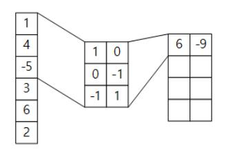

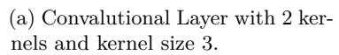

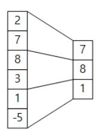

(b) Max Pooling Layer with pooling size 2.

Figure 1: Example of (a) Convolutional Layer and (b) Pooling Layer.

The other kind of layer, the pooling layer is usually performed after the convolution layers. Pooling layers perform down-sampling on the input dimension to output the reduced volume by averaging the local or sub-sampling maximum. By pooling steps, small changes in input do not have a large effect on the feature extraction. For example, eyes, ears, and mouth positions vary slightly among people, but this difference will not have a significant impact on recognizing them when using max pooling.

## **2.3 Basic Autoencoder**

An Autoencoder is an unsupervised learning model of neural networks in which the output of the neural network is similar to the input. It is used for pre-training the neural network, compression of input data, and denoising the image. In earlier studies, where training about the deep layers was difficult, the autoencoder was usually used to initialize and pre-train the network's parameters. After learning each layer's weights by pre-learning using the stacked autoencoder, the network is learned by adjusting the overall weight through fine-tuning. However, it is not well used nowadays due to the inconvenience of training time and design, and new initialization techniques have been proposed, such as Xavier and He initializer [\[GB10,](#page-16-11) [HZRS15\]](#page-16-12).

Secondly, an autoencoder can be used to reduce the dimensions of input data. An autoencoder used for dimensionality reduction basically consists of an encoder part for compressing the input data's dimension and a decoder part for reconstructing the compressed data through the encoder into the original input data. Figure [2](#page-5-0) shows the basic architecture of the autoencoder.

<span id="page-5-0"></span>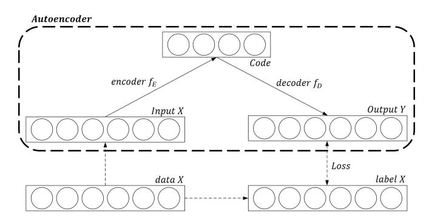

Figure 2: Basic Architecture of Autoencoder

In Fig. 2,  $X = (x_1, x_2, ..., x_n) \in \mathbb{R}^n$  is the input of the autoencoder,  $Z = (z_1, z_2, ..., z_t) \in \mathbb{R}^t$  is called Code that is data compressed by the encoder of autoencoder, and  $Y = (y_1, y_2, ..., y_n) \in \mathbb{R}^n$  is the output of the autoencoder. A neural network consisting of hidden layers between input and Code is called the encoder. Also, a neural network consisting of hidden layers between Code and output is called the decoder. Generally, the dimension of the code t is smaller than the dimension of the input n, and if the autoencoder satisfies the condition, it is called an undercomplete autoencoder. If not, it is called an overcomplete autoencoder. The operation of autoencoder in which the encoder and decoder are each composed of one layer is calculated as follows:

$$z_{i} = \sigma\left(\sum_{j=1}^{n} weight_{(j,i)}^{enc} x_{j} + bias_{i}^{enc}\right)$$

$$\tag{6}$$

$$y_i = \sigma(\sum_{j=1}^t weight_{(j,i)}^{dec} z_j + bias_i^{dec})$$
 (7)

<span id="page-6-0"></span>
$$Loss_{AE} = L(X, f_D(f_E(X; \theta)))$$
(8)

$$\theta_{bestAE} = \underset{\theta}{argmin}(L(X, f_D(f_E(X; \theta))))$$
(9)

When the encoder is a function  $f_E()$  and the decoder is a function  $f_D()$ , the loss of autoencoder is defined as (8). If training is successful and the output Y is the same as the input X, then  $X = f_D(f_E(X)) = f_D(Z)$ ,  $X = f_D(Z) : \mathbb{R}^t \to \mathbb{R}^n$ . This means that the compressed data, code can be reconstructed to the original through the decoder function g, while the dimension of the compressed data is smaller than the dimension of input data. Therefore, the code has all of the features of the input but is also low-dimensional data.

#### 2.4 Denoising Autoencoder

An autoencoder that reduces the noise, called a Denoising Autoencoder (DAE), was originally proposed by Vincent *et al.* [VLBM08] in 2008. DAE's structure is the same as the traditional autoencoder, but the main difference lies in training input data. Unlike an autoencoder that uses input data as it is, DAE is trained through randomly added noise by an attacker. Fig. 3 shows the basic architecture of DAE.

<span id="page-6-1"></span>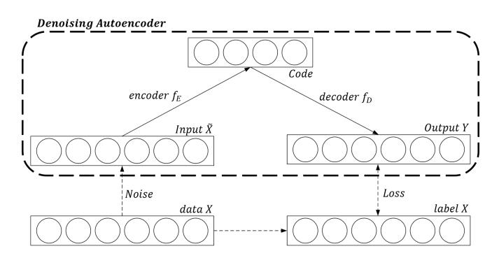

Figure 3: Denoising Autoencoder Architecture

As shown in Fig. 3, the attacker adds random noise to data X, which is collected, to generate new data  $\widetilde{X}$  and use it as training data. The learning is performed to minimize the loss, which is calculated as the difference with the output of the neural network Y, and the original data X before adding the noise. It trains noisy data to recover the original

undistorted input, and the new training principle for an autoencoder enables the neural network to remove the noise.

<span id="page-7-0"></span>
$$Loss_{DAE} = L(X, f_D(f_E(\widetilde{X}; \theta)))$$
(10)

Equation [\(10\)](#page-7-0) represents the loss of the DAE. There are two ways to add noise to input data in the DAE: adding gaussian noise to the data or zeroing some elements of the data randomly. By adding random noise, the neural network learns with *<sup>X</sup>*<sup>e</sup> to project them back into the original *X*, and it can make to decide the data in the close range as the same data. By setting some elements to zero, the model can learn about the whole data, rather than merely focusing on specific parts of the data. With this framework, the autoencoder can be trained to output noise-reduced data.

## **3 Side-Channel Preprocess based on Deep Learning**

## **3.1 Conventional Methods and Traditional Autoencoders in Side-Channel Analysis**

PCA and LDA-based noise reduction methods are usually used in the side-channel attacks. In terms of dimensional reduction, PCA and LDA are the methods that project data to a linear hyperplane, whereas an autoencoder projects data to a non-linear hyperplane, like Isomap [\[TDSL00\]](#page-17-9), and is the deep learning-based technique with the advantage that the more data, the higher the dimension, and the better the performance. It is well known that if *t* is smaller than *n*, the decoder is the linear layer, and the loss function is mean squared error, then an autoencoder learns to span the same subspace as PCA [\[Pla18,](#page-17-10) [GBC16\]](#page-16-6). Therefore, conventional techniques can theoretically be replaced by autoencoder. For similar reasons, a DAE is applicable, and according to previous studies, better performance can be expected when applying the DAE.

However, there are two disadvantages to using the DAE in the side-channel attacks due to differences from the field of image processing. First, noise from the collection already existed in the raw trace. Suppose the attacker adds more noise to the collected power traces, which are used as training data. That makes class classification more difficult and prevents the training of the neural network. Furthermore, hiding countermeasures make it harder to apply the DAE. Assuming that the power model is Equation [\(1\)](#page-3-0) as described above, Equation [\(11\)](#page-7-1) is the DAE's loss when the input data are the power traces.

<span id="page-7-1"></span>
$$Loss_{DAE} = L(f_D(f_E(\tilde{X}; \theta), X))$$

$$= L(f_D(f_E(\delta + HW(D) + Noise + Noise')),$$

$$\delta + HW(D) + Noise)$$
(11)

Where *Noise* is noise from the collection, and *Noise*<sup>0</sup> is noise from the attacker. If the value of *Noise* is low, it is not necessary to remove the noise for the measurements. On the contrary, when the value of *Noise* is high, the weight of total noise in the training data *δ* + *HW*(*D*) + *Noise* + *Noise*<sup>0</sup> becomes heavier than before. Thus, added noise makes it challenging to train the network with high accuracy. To solve the problem, if the attacker sets the *Noise*<sup>0</sup> too low to train the network, the DAE will only train about low noise, reducing the effect of noise reduction. When *Noise*<sup>0</sup> is close to zero, it is not the DAE; it is just the autoencoder.

In computer vision, when we classify an image that is a cat or a dog, our decision is not dependent on a few pixels at certain points on the image. However, in the context of side-channel attacks, the cryptographic operations targeted by the adversary are performed only at a few points in the encryption. When training data are generated with random sample points of 0, the training data may be generated in which the sample related to the secret key is excluded. Therefore, this method is not suitable for the side-channel analysis environment. These problems make it difficult to apply the approach of the DAE framework. In this paper, we propose a new autoencoder framework modified to solve the problems in the side-channel attacks.

## **3.2 Side-Channel Autoencoder for Noise Reduction**

In this section, we introduce our approaches to preprocess the measurements by modifying the training principle of the autoencoder into the context of side-channel analysis. Figure [4](#page-8-0) shows the basic architecture of the autoencoder proposed in this paper, which is called Side-Channel Autoencoder (SCAE). The proposed model is similar to the basic structure of the autoencoder. However, unlike the DAE, the input data are used as training data. Also, using preprocessed data as the label, the autoencoder can be trained about the real noise to output noise-reduced traces.

<span id="page-8-0"></span>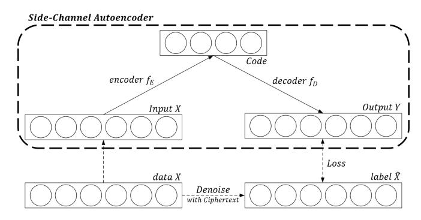

Figure 4: Side-Channel Autoencoder Architecture

As shown in Fig. [4,](#page-8-0) input *X* is used as the input of the autoencoder, and denoise trace *X*ˆ is used as the label for the input data. The loss of the proposed autoencoder is as follows.

$$Loss_{SCAE} = L(\delta + HW(D), f_D(f_E(\delta + HW(D) + Noise)))$$
(12)

In the conventional autoencoder, which denoises, the network is trained to remove the newly added noise, which is added by the attacker, but the proposal is trained to remove the noise in the collected traces. In contrast to the loss of the DAE in Equation [\(11\)](#page-7-1), we calculate the loss as the difference between output *Y* obtained by inputting *X* and denoise trace *X*ˆ.

Many methods can be used to preprocess the side-channel traces to perform the proposed method, but we use the most straightforward and reasonable approach, i.e., *average*. By maximum likelihood estimation in equation [\(1\)](#page-3-0), the expectation value is an average value of the traces with the same intermediate value [\[Bis06\]](#page-15-2). If the key *K* is a fixed value, the intermediate value *D* = *Sbox*(*P* ⊕ *K*) is determined according to the plaintext *P*, so that the traces performed with the same plaintext *P* have the same intermediate value *D*. Since the average trace for the same plaintext is the average trace for the same intermediate value, the proposed preprocessing technique can be performed even in a non-profiling attack environment in which the intermediate value is not known. The label for each trace can be set to the average trace corresponding to the plaintext of the trace. Algorithm [1](#page-9-0) summarizes the proposed method to perform with the averaging technique. After the preprocessing step, the secret key can be exploited by applying side-channel attacks such as DPA, CPA, and DDLA.

#### <span id="page-9-0"></span>**Algorithm 1** Label preprocessing for noise reduction

```
Require: Traces (Tn)0≤n≤N with corresponding plaintexts (Pn)0≤n≤N , when 0 ≤ Pn ≤ p.
Ensure: Label traces Y
 1: // Denoising Step
 2: for i = 0...p do
 3: // Grouping traces with corresponding plaintexts
 4: Gi ← {Tn|Pn = i}
 5: // Calculate reference traces with the averaging method
 6: Ri ← 1
            |Gi|
               Pl
                  j=0 Gi
                        [j], when l is the length of the trace.
 7: end for
 8: // Labeling Step
 9: for i = 0...N do
10: // Setting a label with corresponding the trace
11: Yi ← RPi
12: end for
13: return Labels (Yn)0≤n≤N with corresponding traces (Tn)0≤n≤N
```

Although it is difficult to perform this method in an image processing context, it can be done due to differences in data in the context of side-channel analysis. For example, in an image processing implementation that classifies handwritten digits like the MNIST database, 10 classes must be classified by the attacker, and the samples that the attacker must analyze are separated into several samples in 784 (28 × 28) samples. Therefore, two different data of the same class can have some features at different points in the samples. Thus, the average value of the image with the same digit is meaningless. We easily expect that if we use the method with mean trace, the traces for a particular plaintext are always output as the same trace (label trace). Nevertheless, such a situation does not easily occur, except in the case of overfitting.

#### **3.3 Side-Channel Autoencoder for Hiding Countermeasures**

When the alignment of the traces is disturbed by side-channel countermeasures such as random delay and jitter, the point of the samples as the attack target is different for every trace. This makes it difficult to obtain the noise-reduced traces through the averaging and to apply the above-described proposed method. In this case, preprocessing is required to align the de-synchronized traces rather than the noise reduction in order to apply the conventional side-channel attack. In this subsection, by modifying the proposed labeling technique, we propose a simple labeling algorithm to encode the traces into the aligned data.

In the previous description, we described the method to obtain representative, noisereduced traces. The following description is a method for collecting an aligned representative trace of each class (intermediate value). Algorithm [2](#page-10-0) summarizes the labeling method to obtain the realigned traces in de-synchronized traces.

Similar to the method used for noise reduction, a representative label for each plaintext is selected in the de-synchronized traces having the same intermediate value. First, one traces is selected at random in some plaintext (like 0), and the correlation coefficient is calculated with traces having different plaintexts (1 to 255). Next, one of the traces with the highest correlation coefficient is selected for each plaintext set and used as a label trace of each set. Thereafter, additional alignment can be performed using a conventional

#### <span id="page-10-0"></span>**Algorithm 2** Label preprocessing for alignment

```
Require: Traces (Tn)0≤n≤N with corresponding plaintexts (Pn)0≤n≤N , when 0 ≤ Pn ≤ p.
Ensure: Label traces Y
 1: Set a reference trace R0 ← Ti where Pi = 0.
 2: for i = 0...p do
 3: // Find reference traces
 4: Ri ← Tj where j = argmax
                            k
                                 (corr(R0, Tk)), when k ∈ {n|Pn = i}
 5: end for
 6: // Labeling Step
 7: for i = 0...N do
 8: // Setting a label with corresponding the trace
 9: Yi ← RPi
10: end for
11: return Labels (Yn)0≤n≤N with corresponding traces (Tn)0≤n≤N
```

alignment technique for 256 traces. In this way, it is possible to obtain labels by not performing the alignment, or by performing the alignment only on a small number of traces, i.e., 255.

## **3.4 Side-Channel Autoencoder for Masking Countermeasures**

In the implementation applied a masking countermeasure, then the intermediate values are changed by the masking value, which is the unknown, so that the proposed methods described above cannot be used. Therefore, we introduce a new autoencoder with domain knowledge (DK) neurons. The DK neurons, which were originally proposed by Hettwer *et al.* [\[HGG18\]](#page-16-1) in 2018, provide the plaintext or ciphertext as additional information into a neural network to learn the leakage in regard to the secret key. Hettwer et al. 's research shows that better results can be obtained when using side-channel traces with DK. We also get better results when using the DK neurons in the autoencoder.

Although, we use one byte of the plaintext as the domain knowledge in our experiments. Nevertheless, we encode the plaintext into bit-encoding, not one-hot encoding. Bit-encoding represents the plaintext as a vector of 8 variables like binary representation, where one-hot encoding encodes the plaintext into a vector of 256 variables. The bit-encoding can represent data in a smaller dimension than one-hot encoding, and also represent the vector of binary variables. The basic architecture of the autoencoder with DK is shown in Fig. [5.](#page-11-0)

The methods described in sections 3.1, and 3.2 are similar to an autoencoder with domain knowledge. When the domain knowledge technique provides additional information to the input directly into the middle of the autoencoder, the methods described above are the methods that insert information by preprocessing the label trace. In the case of masking countermeasures, the average method cannot be applied without a side-channel attak combining function. Conventional techniques, such as SSA, PCA, and LDA, could be used, but we expected the DK technique to be more suitable for autoencoders.

# **4 Experiment Results**

In this section, we experimentally validate the performance of the proposed methods. All experiments were performed with TensorFlow (Version 1.13.1) [\[AAB](#page-15-3)<sup>+</sup>15] and Keras

<span id="page-11-0"></span>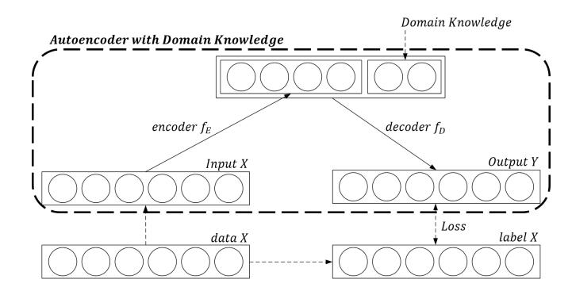

Figure 5: Architecture of Autoencoder with Domain Knowledge

(Version 2.2.4-tf) [C <sup>+</sup>[15\]](#page-15-4) library on a single NVIDIA GeForce GTX 1080 8GB, and an Intel(R) Core(TM) i7-8700K CPU.

## **4.1 Implementation Result for Unprotected AES (CW-Lite)**

In order to analyze the noise reduction performance of the proposed approach, we capture the power traces of the AES-128 implementation without side-channel countermeasures. We gather 10,000 side-channel traces from the first round of the software AES implementation on the ChipWhisperer-Lite platform [\[New\]](#page-17-11). The target board is an Atmel XMEGA128 with a fixed clock frequency of 7.37MHz. The power consumption traces, which contain 800 samples, are captured with a 29.538 MS/s sampling rate, which means 4 points-per-cycle.

<span id="page-11-1"></span>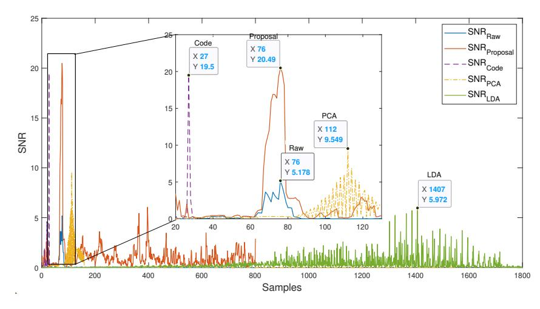

Figure 6: Comparison of signal-to-noise ratio results for preprocessing methods

To validate the performance of the proposed method, we compared the Signal-to-Noise Ratio (SNR) of the traces according to the preprocessing methods. The results are shown in Fig. [6.](#page-11-1) In our implementation, PCA with the sliding window technique showed the best results in window size 24, components 2, and LDA showed in window size 23, components 21. The maximum values of both SNR results, 9*.*5489, and 5*.*9725, are higher than the original traces' result, 5*.*1782. However, as presented in Fig. [6,](#page-11-1) the maximum value of SNR is 20*.*4902 in *SNRproposal*. These experiments indicate that the proposed method can outperform the classic preprocessing methods of PCA, and LDA.

# 4.2 Implementation Result for AES Protected by Hiding Countermeasures (RandomDelay)

In order to validate the performance of Realignment, we used the protected software AES implementation obtained from an 8-bit Atmel ATmega16 AVR microcontroller. The implementation of AES is protected by a random delay countermeasure, which was originally proposed by Coron *et al.* [CK09]. The measurements were performed with a LeCroy WaveRunner 104MXi DSO equipped with a ZS1000 active probe, and the details of the measurement setup and the implementation are in [Kiz11]  $^1$ . We normalize the traces by min-max scaling  $X_{new} = \frac{X - X_{min}}{X_{max} - X_{min}}$ . The dataset contains 50,000 traces of 3,500 samples each, but we only use 25,000 traces as a training set.

<span id="page-12-2"></span><span id="page-12-1"></span>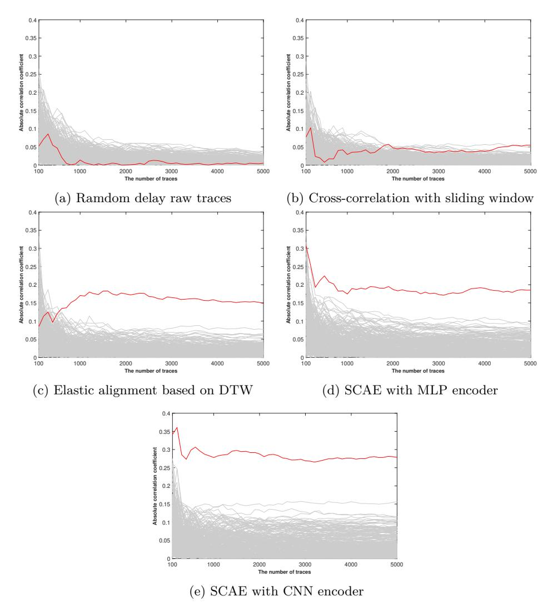

Figure 7: Comparison of absolute correlation coefficients for preprocessing methods

To validate the performance of the alignment of the proposed method, we compared the absolute correlation coefficient of the traces according to the preprocessing methods. The results of the absolute correlations are illustrated in Fig. 7. In Fig. 6, the x-axis presents

<span id="page-12-0"></span><sup>&</sup>lt;sup>1</sup>The Coron's RandomDelay dataset is available at http://github.com/ikizhvatov/randomdelays-traces

the number of traces used in the correlation attack, the y-axis presents the absolute correlation coefficient, and the results of the attack are shown. The gray lines are the correlation coefficient for the wrong key, and the red line is the correlation coefficient for the correct key. Our experiment is firstly performed with 100 traces, and then repeated with increments of 100 traces each time. The absolute correlation coefficient was calculated up to 5000 traces. An SCAE with CNN encoder means that the convolutional layers are used in the encoder part of the autoencoder. As shown in Fig. 7a, the CPA on the raw traces failed. The maximum value of the absolute correlation coefficient is in the SCAE with CNN encoder, but the noise level is highest. However, considering the number of traces required for CPA, the attack can succeed with the fewest traces using the proposed technique. These results indicate that the proposed methods can perform the alignment of the measurements.

In order to visually confirm the results, the 100 traces according to the alignment technique are shown in Fig. 8. The simple power analysis results cannot be demonstrated exactly, but we can observe that it is clearly evident that the raw traces and cross-correlation with sliding window-based realigned traces did not align well. The DTW-based realigned traces 8c and the proposed method-based realigned traces 8d are better aligned than the previous two results of 8a and 8b. Despite the difficulty in clearly comparing the conventional techniques, the proposed technique is superior to the original measurements.

<span id="page-13-4"></span><span id="page-13-3"></span><span id="page-13-0"></span>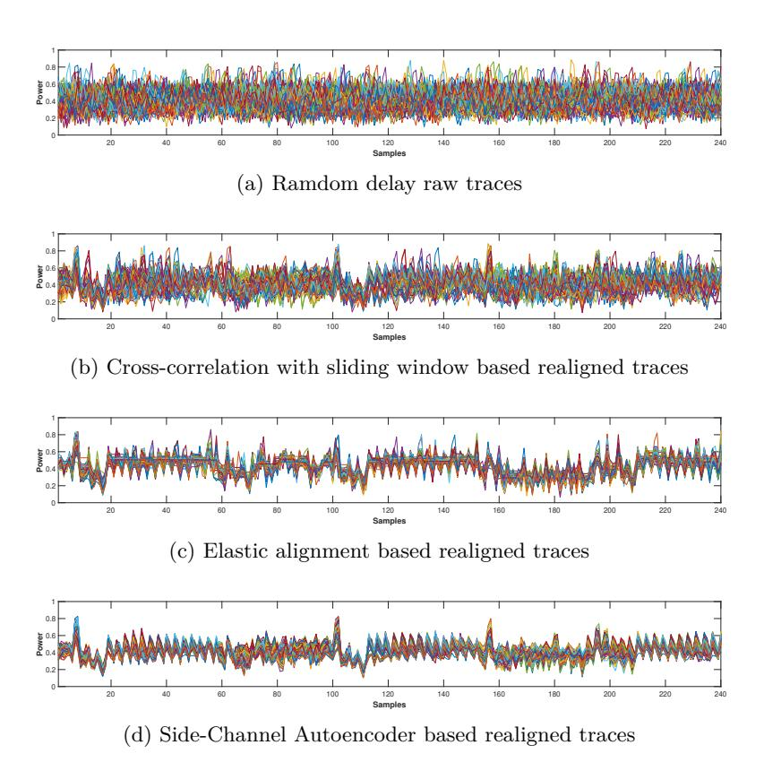

<span id="page-13-2"></span><span id="page-13-1"></span>Figure 8: Comparison of Simple Power Analysis results for preprocessing methods

## **4.3 Implementation Result for AES Protected by Masking Countermeasures (ASCAD)**

In order to analyze the performance of proposed method, we use a software Masked AES implementation obtained from an ATMega8515 device. The dataset called ASCAD (ANSSI SCA Database[2](#page-14-0) ) is introduced by Prouff *et al.* [\[BPS](#page-15-5)<sup>+</sup>20] to provide a benchmarking reference in side-channel analysis, like the MNIST database in machine learning. The ASCAD dataset contains 60,000 traces of 700 samples each, but we only use 50,000 traces as the training set. The implement of AES is protected by the masking countermeasure with a different masking value for each byte. We also normalize the traces by feature scaling, and newly add gaussian random noise centered in zero with a standard deviation 0*.*1 for noise reduction experiments.

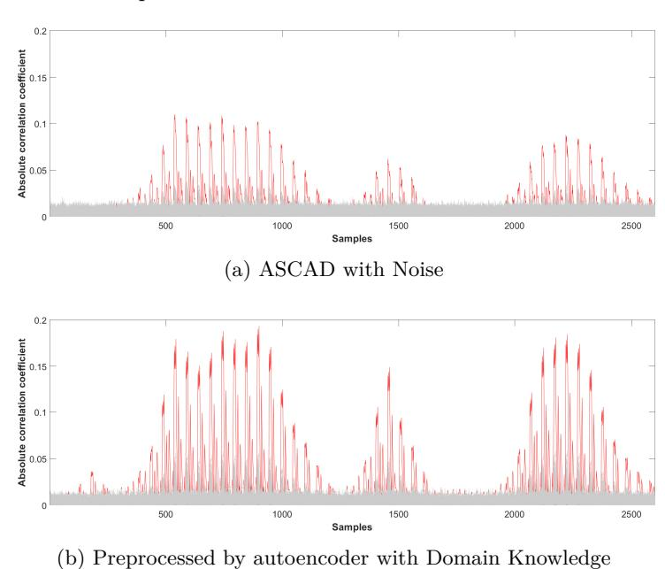

<span id="page-14-1"></span>Figure 9: Comparison of Second-Order Correlation Power Analysis results

In our experiments, we perform a second-order correlation power analysis with the product combining function [\[PRB09\]](#page-17-12):

$$C_{prod}(L(t_1), L(t_2)) = (L(t_1) - E[L(t_1)]) \times (L(t_2) - E[L(t_2)])$$
(13)

We combine points at the 140 to 190 positions as a masking value into *t*<sup>1</sup> and the 490 to 540 points as the Subbytes value into *t*2, and the length of the combined traces is 2601. In the result of the raw traces, the maximum value of the absolute correlation coefficient is 0*.*109672 at 539 point, and the maximum value of the difference between the correlation of the correct key and the highest correlation in the wrong keys is 0*.*076478. On the other hand, the maximum value of the correlation with our proposal is 0*.*193304 at 900 point, and the maximum value of the difference between the correlation of the correct key and the highest correlation in wrong keys is 0*.*136384, which is roughly twice the result of the raw traces in Fig. [9b.](#page-14-1) Also, we cannot confirm the leakage at the result from the raw traces at 180 point, but the correlation of the correct key is higher than all the correlations of the wrong key in the result of the proposal. These results show that the proposed methods can improve the conventional side-channel analysis, even if the masking countermeasure is applied in the implementations.

<span id="page-14-0"></span><sup>2</sup>ASCAD is available at https://github.com/ANSSI-FR/ASCAD.

## **5 Conclusion**

One of the reasons why the study on the deep learning-based side-channel attacks attract attention is that it is possible to analyze without performing the preprocessing step that is required in the conventional side-channel attacks, regardless of whether or not the countermeasures are applied. However, end-to-end deep learning-based attacks that simultaneously perform preprocessing and analysis steps can only be performed when the attacker already knows the intermediate values of the traces. This limits such methods to being performed only in the profiling attack context, because otherwise training is required as many times as the predicted number of a secret key, like DDLA. The present study has demonstrated the performance of side-channel analysis using deep learning in non-profiling attacks and the profiling attack environment by separating the preprocessing step from the attack step. Furthermore, the proposed method can improve the performance of conventional side-channel analysis, as was experimentally demonstrated. In this paper, we only focused on side-channel analysis in the non-profiling attack environment, but we expect that the performance of the profiling attacks can be improved through the proposed techniques. Although, the proposed training principle of the autoencoder model is not applicable in all situations, it can nevertheless improve the performance of side-channel attacks without compromising the constraints in the non-profiling context. In addition, the proposed techniques can be used to develop a new approach for the application of deep learning to side-channel analysis, rather than merely classifying side-channel information.

## **References**

- <span id="page-15-3"></span>[AAB<sup>+</sup>15] Martín Abadi, Ashish Agarwal, Paul Barham, Eugene Brevdo, Zhifeng Chen, Craig Citro, Greg S. Corrado, Andy Davis, Jeffrey Dean, Matthieu Devin, Sanjay Ghemawat, Ian Goodfellow, Andrew Harp, Geoffrey Irving, Michael Isard, Yangqing Jia, Rafal Jozefowicz, Lukasz Kaiser, Manjunath Kudlur, Josh Levenberg, Dandelion Mané, Rajat Monga, Sherry Moore, Derek Murray, Chris Olah, Mike Schuster, Jonathon Shlens, Benoit Steiner, Ilya Sutskever, Kunal Talwar, Paul Tucker, Vincent Vanhoucke, Vijay Vasudevan, Fernanda Viégas, Oriol Vinyals, Pete Warden, Martin Wattenberg, Martin Wicke, Yuan Yu, and Xiaoqiang Zheng. TensorFlow: Large-scale machine learning on heterogeneous systems, 2015. Software available from tensorflow.org.
- <span id="page-15-1"></span>[BCO04] Eric Brier, Christophe Clavier, and Francis Olivier. Correlation power analysis with a leakage model. In *International workshop on cryptographic hardware and embedded systems - CHES 2004*, pages 16–29. Springer, 2004.
- <span id="page-15-0"></span>[BHvW12] Lejla Batina, Jip Hogenboom, and Jasper GJ van Woudenberg. Getting more from pca: first results of using principal component analysis for extensive power analysis. In *Cryptographers' track at the RSA conference*, pages 383–397. Springer, 2012.
- <span id="page-15-2"></span>[Bis06] Christopher M Bishop. *Pattern recognition and machine learning*. springer, 2006.
- <span id="page-15-5"></span>[BPS<sup>+</sup>20] Ryad Benadjila, Emmanuel Prouff, Rémi Strullu, Eleonora Cagli, and Cécile Dumas. Deep learning for side-channel analysis and introduction to ascad database. *Journal of Cryptographic Engineering*, 10(2):163–188, 2020.
- <span id="page-15-4"></span>[C<sup>+</sup>15] François Chollet et al. Keras. <https://keras.io>, 2015.

- <span id="page-16-5"></span>[CAS16] Paul Covington, Jay Adams, and Emre Sargin. Deep neural networks for youtube recommendations. In *Proceedings of the 10th ACM conference on recommender systems*, pages 191–198, 2016.
- <span id="page-16-0"></span>[CDP17] E. Cagli, C. Dumas, and E. Prouff. Convolutional neural networks with data augmentation against jitter-based countermeasures. In *International Workshop on Cryptographic Hardware and Embedded Systems - CHES 2017*, pages 45–68, Springer, Cham, 2017.
- <span id="page-16-13"></span>[CK09] Jean-Sébastien Coron and Ilya Kizhvatov. An efficient method for random delay generation in embedded software. In *International Workshop on Cryptographic Hardware and Embedded Systems - CHES 2009*, pages 156–170. Springer, 2009.
- <span id="page-16-9"></span>[Cyb89] George Cybenko. Approximation by superpositions of a sigmoidal function. *Mathematics of control, signals and systems*, 2(4):303–314, 1989.
- <span id="page-16-4"></span>[DCLT18] Jacob Devlin, Ming-Wei Chang, Kenton Lee, and Kristina Toutanova. Bert: Pre-training of deep bidirectional transformers for language understanding. *arXiv preprint arXiv:1810.04805*, 2018.
- <span id="page-16-11"></span>[GB10] Xavier Glorot and Yoshua Bengio. Understanding the difficulty of training deep feedforward neural networks. In *Proceedings of the thirteenth international conference on artificial intelligence and statistics*, pages 249–256, 2010.
- <span id="page-16-6"></span>[GBC16] Ian Goodfellow, Yoshua Bengio, and Aaron Courville. *Deep Learning*. MIT Press, 2016. <http://www.deeplearningbook.org>.
- <span id="page-16-7"></span>[GH14] Kevin Swersky Geoffrey Hinton, Nitish Srivastava. Lecture 6e rmsprop: Divide the gradient by a running average of its recent magnitude. *CSC321 Lecture Slide*, 2014.
- <span id="page-16-1"></span>[HGG18] Benjamin Hettwer, Stefan Gehrer, and Tim Güneysu. Profiled power analysis attacks using convolutional neural networks with domain knowledge. In *International Conference on Selected Areas in Cryptography - SAC 2018*, pages 479–498. Springer, 2018.
- <span id="page-16-10"></span>[Hor91] Kurt Hornik. Approximation capabilities of multilayer feedforward networks. *Neural networks*, 4(2):251–257, 1991.
- <span id="page-16-12"></span>[HZRS15] Kaiming He, Xiangyu Zhang, Shaoqing Ren, and Jian Sun. Delving deep into rectifiers: Surpassing human-level performance on imagenet classification. In *Proceedings of the IEEE international conference on computer vision*, pages 1026–1034, 2015.
- <span id="page-16-3"></span>[HZRS16] Kaiming He, Xiangyu Zhang, Shaoqing Ren, and Jian Sun. Deep residual learning for image recognition. In *Proceedings of the IEEE conference on computer vision and pattern recognition*, pages 770–778, 2016.
- <span id="page-16-8"></span>[KB14] Diederik P Kingma and Jimmy Ba. Adam: A method for stochastic optimization. *arXiv preprint arXiv:1412.6980*, 2014.
- <span id="page-16-14"></span>[Kiz11] Ilya Kizhvatov. *Physical Security of Cryptographic Algorithm Implementations*. PhD thesis, University of Luxembourg, 2011.
- <span id="page-16-2"></span>[KJJ99] Paul Kocher, Joshua Jaffe, and Benjamin Jun. Differential power analysis. In *Advances in Cryptology - CRYPTO '99*, pages 388–397. Springer, 1999.

- <span id="page-17-0"></span>[Koc96] Paul C Kocher. Timing attacks on implementations of diffie-hellman, rsa, dss, and other systems. In *Advances in Cryptology - CRYPTO '96*, pages 104–113. Springer, 1996.
- <span id="page-17-1"></span>[MDPS15] Santos Merino Del Pozo and François-Xavier Standaert. Blind source separation from single measurements using singular spectrum analysis. In Tim Güneysu and Helena Handschuh, editors, *Cryptographic Hardware and Embedded Systems – CHES 2015*, pages 42–59, Berlin, Heidelberg, 2015. Springer Berlin Heidelberg.
- <span id="page-17-4"></span>[MMT15] Zdenek Martinasek, Lukas Malina, and Krisztina Trasy. *Profiling Power Analysis Attack Based on Multi-layer Perceptron Network*, pages 317–339. Springer International Publishing, Cham, 2015.
- <span id="page-17-3"></span>[MOP08] Stefan Mangard, Elisabeth Oswald, and Thomas Popp. *Power analysis attacks: Revealing the secrets of smart cards*, volume 31. Springer Science & Business Media, 2008.
- <span id="page-17-5"></span>[MPP16] H. Maghrebi, T. Portigliatti, and E. Prouff. Breaking cryptographic implementations using deep learning techniques. In *International Conference on Security, Privacy, and Applied Cryptography Engineering - SPACE 2016*, pages 3–26, Springer, Cham, 2016.
- <span id="page-17-11"></span>[New] NewAE. Chipwhisperer-lite. [https://wiki.newae.com/CW1173\\_](https://wiki.newae.com/CW1173_ChipWhisperer\protect \discretionary {\char \hyphenchar \font }{}{}Lite) [ChipWhisperer\protect\discretionary{\char\hyphenchar\](https://wiki.newae.com/CW1173_ChipWhisperer\protect \discretionary {\char \hyphenchar \font }{}{}Lite) [font}{}{}Lite](https://wiki.newae.com/CW1173_ChipWhisperer\protect \discretionary {\char \hyphenchar \font }{}{}Lite).
- <span id="page-17-10"></span>[Pla18] Elad Plaut. From principal subspaces to principal components with linear autoencoders. *arXiv preprint arXiv:1804.10253*, 2018.
- <span id="page-17-12"></span>[PRB09] E. Prouff, M. Rivain, and R. Bevan. Statistical analysis of second order differential power analysis. *IEEE Transactions on Computers*, 58(6):799–811, June 2009.
- <span id="page-17-7"></span>[RQL18] Pieter Robyns, Peter Quax, and Wim Lamotte. Improving cema using correlation optimization. *IACR Transactions on Cryptographic Hardware and Embedded Systems - CHES 2018*, 2019(1):1–24, Nov. 2018.
- <span id="page-17-2"></span>[SA08] François-Xavier Standaert and Cédric Archambeau. Using subspace-based template attacks to compare and combine power and electromagnetic information leakages. In *International Workshop on Cryptographic Hardware and Embedded Systems*, pages 411–425. Springer, 2008.
- <span id="page-17-9"></span>[TDSL00] Joshua B Tenenbaum, Vin De Silva, and John C Langford. A global geometric framework for nonlinear dimensionality reduction. *science*, 290(5500):2319– 2323, 2000.
- <span id="page-17-6"></span>[Tim19] Benjamin Timon. Non-profiled deep learning-based side-channel attacks with sensitivity analysis. *IACR Transactions on Cryptographic Hardware and Embedded Systems - CHES 2018*, 2019(2):107–131, Feb. 2019.
- <span id="page-17-8"></span>[VLBM08] Pascal Vincent, Hugo Larochelle, Yoshua Bengio, and Pierre-Antoine Manzagol. Extracting and composing robust features with denoising autoencoders. In *Proceedings of the 25th international conference on Machine learning - ICML 2008*, pages 1096–1103. ACM, 2008.

- <span id="page-18-0"></span>[vWWB11] Jasper GJ van Woudenberg, Marc F Witteman, and Bram Bakker. Improving differential power analysis by elastic alignment. In *Cryptographers' Track at the RSA Conference*, pages 104–119. Springer, 2011.
- <span id="page-18-2"></span>[WP20] Lichao Wu and Stjepan Picek. Remove some noise: On pre-processing of side-channel measurements with autoencoders. *IACR Transactions on Cryptographic Hardware and Embedded Systems*, pages 389–415, 2020.
- <span id="page-18-1"></span>[YZLC11] Shuguo Yang, Yongbin Zhou, Jiye Liu, and Danyang Chen. Back propagation neural network based leakage characterization for practical security analysis of cryptographic implementations. In *International Conference on Information Security and Cryptology - ICISC 2011*, pages 169–185. Springer, 2011.

## **A Experiments over Hyperparameters**

## **A.1 Experiments over number of hidden layer's node using our method**

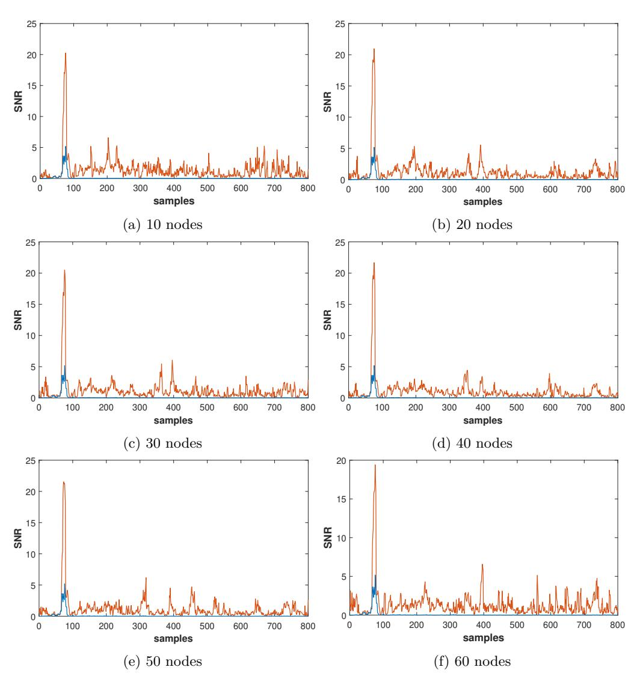

Figure 10: Result of SNR over number of hidden layer's node using our method (1)

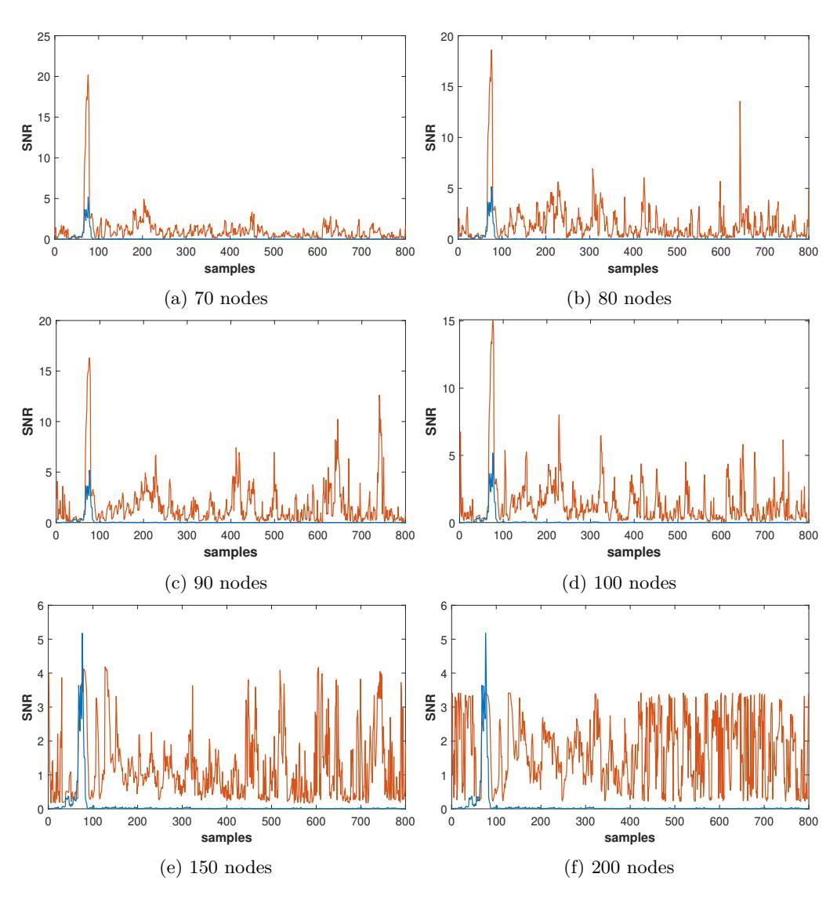

Figure 11: Result of SNR over number of hidden layer's node using our method (2)

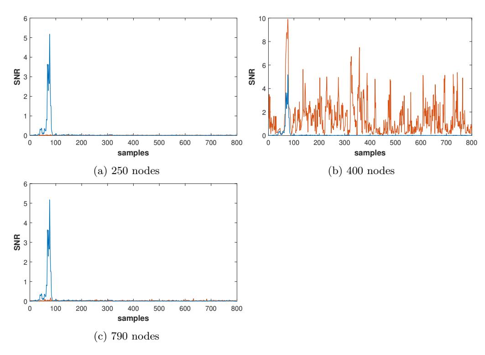

Figure 12: Result of SNR over number of hidden layer's node using our method (3)

#### **A.2 Experiments over hidden layer's activation function using our method**

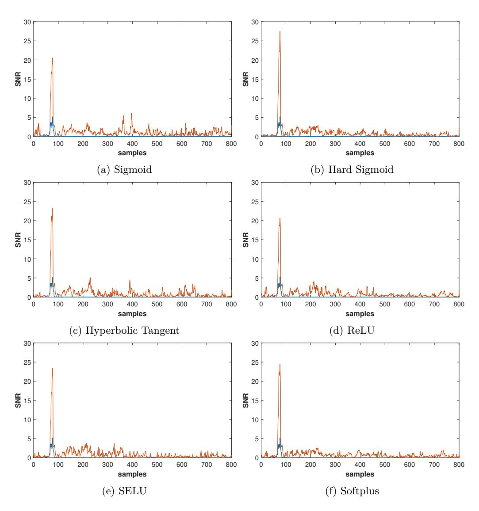

Figure 13: Result of SNR over hidden layer's activation function using our method

#### **A.3 Experiments over each byte using our method**

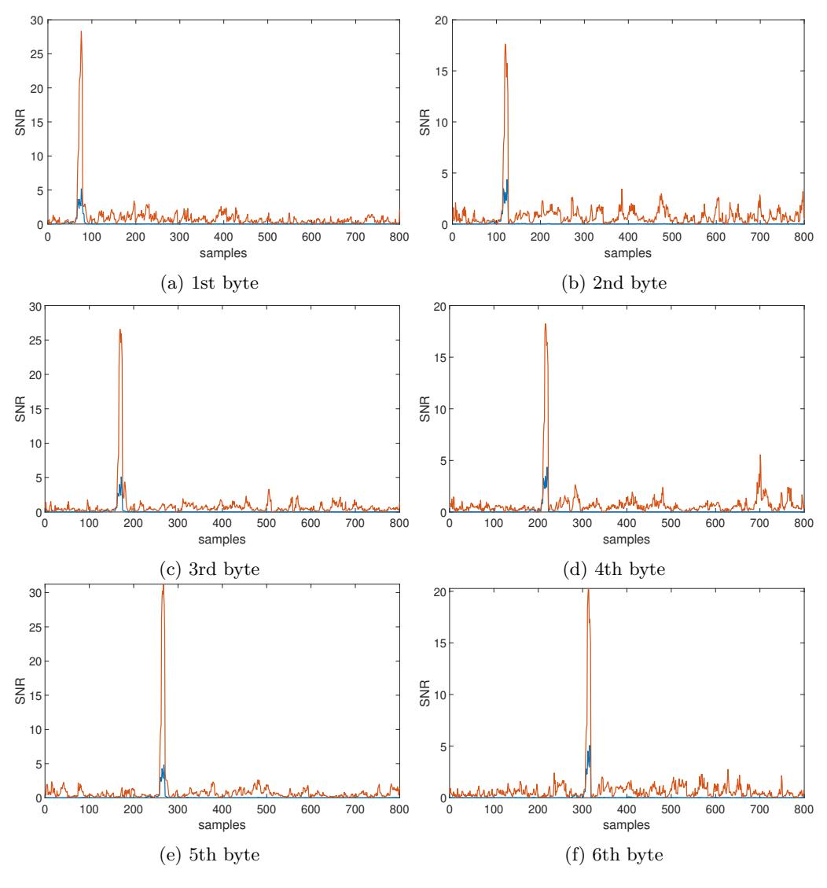

Figure 14: Results of SNR over each byte using our method (1 6)

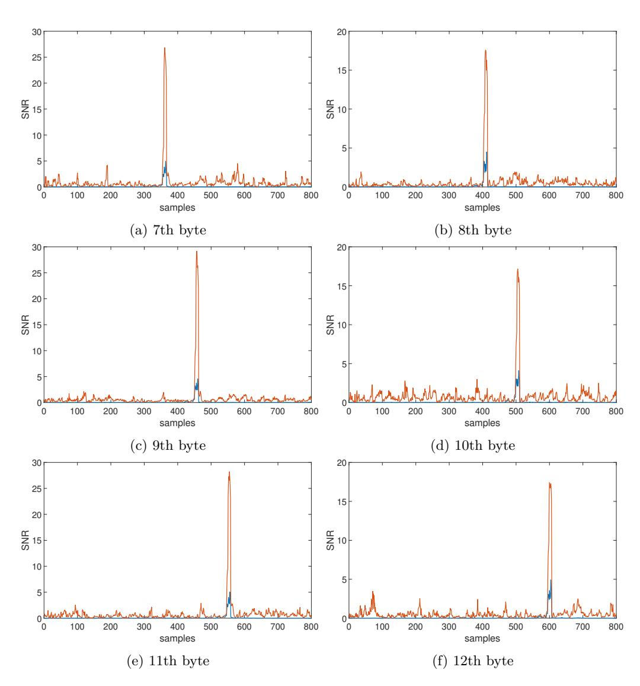

Figure 15: Results of SNR over each byte using our method (7 12)

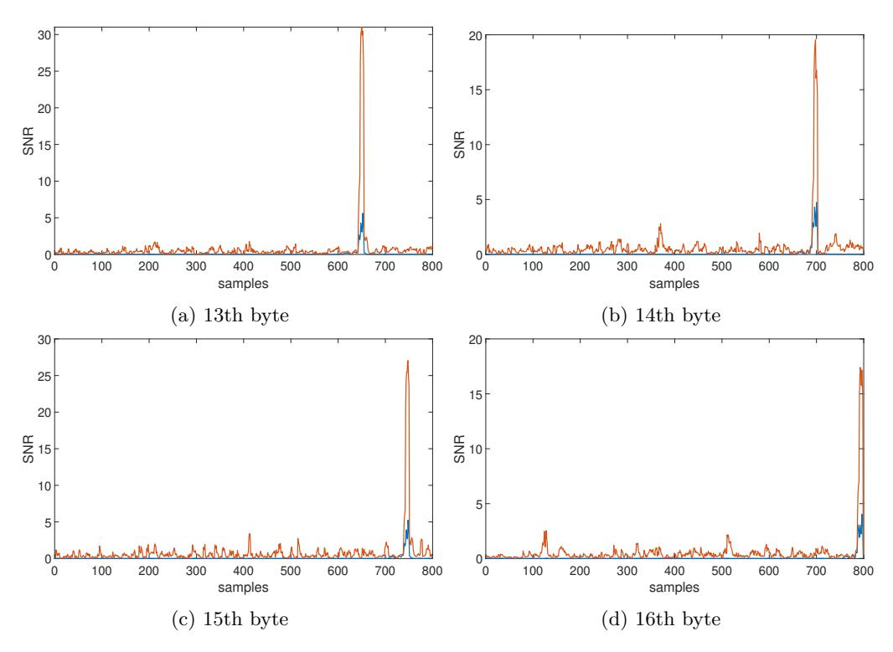

Figure 16: Results of SNR over each byte using our method (13 16)

# **B** Performances of Dimensionality Reduction

In order to compare the performance of dimensionality reduction, SNR results are performed according to the preprocessing techniques, proposed methods with code size 30, PCA and LDA with component 30.

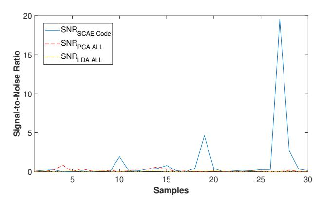

Figure 17: Comparison of compressed traces of signal-to-noise ratio results