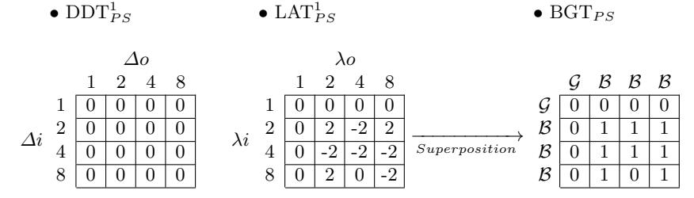
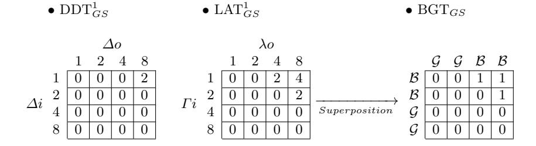
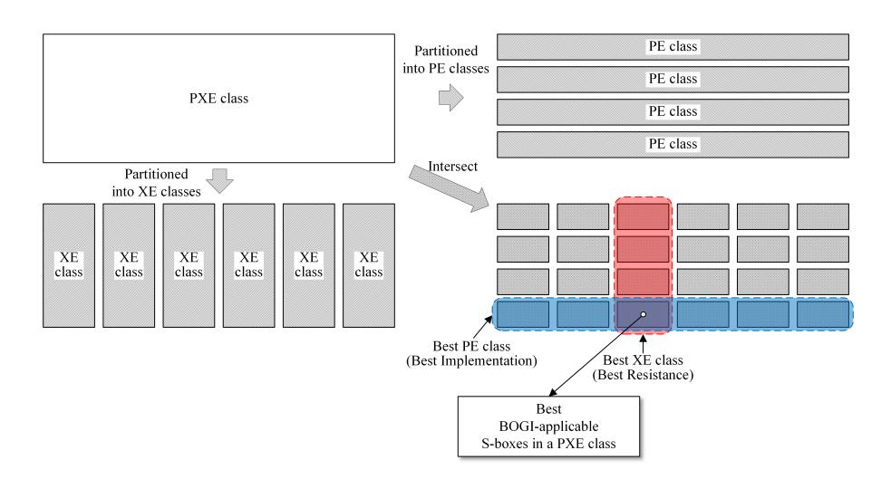

# Classification of 4-bit S-boxes for BOGI-permutation

Seonggyeom Kim<sup>1</sup> , Deukjo Hong<sup>2</sup> , Jaechul Sung<sup>3</sup> , and Seokhie Hong<sup>1</sup>

- 1 Institute of Cyber Security & Privacy (ICSP), Korea University, Korea jeffgyeom@korea.ac.kr, shhong@korea.ac.kr
- <sup>2</sup> Department of Information Technology & Engineering, Chonbuk National University, Korea deukjo.hong@jbnu.ac.kr
- <sup>3</sup> Department of Mathematics, University of Seoul, Korea jcsung@uos.ac.kr

Abstract. In this paper, we present all 4-bit S-boxes which are able to support BOGI logic. We exhaustively show that only 2,413 PXE classes of 4-bit S-box are BOGI-applicable among the 142,090,700 PXE classes. We evaluate the whole BOGI-applicable S-boxes in terms of the security and implementation costs. The security evaluation includes security strength of the S-boxes themselves, and how they affect the resistance of GIFT-64 against differential and linear cryptanalysis(DC and LC). The security evaluation shows that all the BOGI-applicable S-boxes fulfill the security criteria of GIFT designers as long as they have the differential uniformity and linearity as 6 and 8, respectively. It will also be shown that the security of GIFT-64 against DC and LC can be improved only by changing the S-box. Moreover, we evaluate the implementation costs of the BOGI-applicable S-boxes by finding their optimal implementation. The results show that GIFT S-box is well-chosen considering existence of fixed-points, and suggest a set of S-boxes providing the same implementation cost as GIFT S-box. Finally, we suggest a set of potentially better S-boxes for GIFT-64 based on our investigations.

Keywords: lightweight implementation· BOGI · S-box · equivalent class ·

### 1 Introduction

Bit-permutation is one of the popular choices for the lightweight diffusion layer. Among the various bit-permutation based block ciphers, GIFT presented in [6] outperforms other bit-permutation based block ciphers and is widely used as a building block of various candidates of NIST lightweight crypto standardization process round-2[3, 25, 5, 4, 26]. The main novelty of GIFT is BOGI(Bad Output must go Good Input) logic. The logic prevents differential and linear trails with only one active S-box in each round by revealing 1 - 1 bit DDT(Differential Distribution Table) and LAT(Linear Approximation Table). This makes GIFT more resistant against differential and linear cryptanalysis despite of the less number of rounds than PRESENT. However, not every S-box can interplay with BOGI logic as the BOGi-applicable S-boxes have to satisfy special conditions on both of 1 - 1 bit DDT and LAT. Especially, for 4-bit S-boxes, it was already shown that "Optimal S-boxes" in [23] cannot adopt BOGI logic. This shows that previous related works[29, 10] concentrating the optimal S-boxes might not support BOGI logic.

As the main non-linear component of modern SPN ciphers, S-box has been analysed with various aspects. The aspects are mainly related to the security and performance such as showing the set of optimal S-boxes with several security requirements[19, 23, 12] or implementation cost[28], and finding the optimal implementation of a given S-box[24, 17, 7]. Those studies well success especially in 4-bit S-boxes and present optimal S-boxes satisfying each aspect. Introducing equivalent relations to showing exhaustively the best of 4-bit S-boxes is the common way since the relations make the exhaustive way more practical. The well-known relations to group 16!(≈ 2 <sup>44</sup>.<sup>25</sup>) 4-bit S-boxes into larges equivalent classes are AE(Affine-Equivalent), PXE(Permutation-Xor Equivalent) and PE(Permutation Equivalent) classes. In [20, 16], the numbers of AE, PXE and PE classes on 4-bit S-boxes are deduced as 302, 142,090,700(≈ 2 <sup>27</sup>.08) and 36,325,278,240(≈ 2 <sup>35</sup>.08), respectively. Since most of the security measures of S-box are preserved in an AE class, considering only small number of AE classes is enough to find a 4-bit S-box satisfying the security criteria. On the contrary, as the implementation cost is preserved only in a PE class, finding the most optimal choice of S-box satisfying every design criteria, which include efficient implementation, is still infeasible. As well as the intensive search space, finding optimal implementation of a given S-box is regarded as a hard problem and time-consuming task. Due to the difficulties, the common approach to choose an optimal S-boxes considers security first, namely security-then-implementation. In the approach, gathering all of S-boxes satisfying desire design criteria precedes considering the implementation costs. The approach is also applied when GIFT designers choose the current S-box. However, the approach cannot show the overall structure of BOGI-applicable S-boxes.

Although the designers of GIFT already presented security-implementation trade-offs, they showed only results of checking some PXE clsses. As BOGIapplicability is preserved in a PXE(Permutation-Xor Equivalent) class, and the number of PXE classes is relatively feasible to analyze, we present the analysis of BOGI-applicable S-boxes in detail. Our analysis includes security strength of the S-boxes themselves, and how they affect the resistance of GIFT-64 against differential and linear cryptanalysis(DC and LC). Partitioning the BOGI-applicable PXE classes in to PE classes, we also analyze implementation costs.

### 1.1 Our Contributions

- 1. We conduct exhaustive search to investigate all BOGI-applicable PXE Classes, and deduce the number of 4-bit BOGI-applicable S-boxes.
- 2. We analyze the BOGI-applicable PXE classes with respect to two main aspects. The first aspect concentrates the security evaluation of the BOGIapplicable PXE classes themselves and the whole resistance against differ-

ential and linear cryptanalysis fixing the bit-permutation as GIFT-64 bit-permutation. The second aspect concentrates implementation costs both in software and hardware.

- 3. We suggest a way of finding optimal BOGI-applicable S-boxes in each PXE class considering security evaluation and implementation results.
- 4. We study in detail the trade-offs between security evaluation and implementation results.
- 5. Finally, we suggest potentially better S-boxes for GIFT-64. We expect that our results can easily be extended to choose the optimal S-boxes for GIFT-128 as well.

## 2 Preliminary

#### 2.1 Notations

In this paper we only concentrate  $4\times4$  invertible S-boxes. The following notations are used through the paper.

- DDT<sub>S</sub>: DDT(Differential Distribution Table) of an S-box S. The element DDT<sub>S</sub>( $\Delta i, \Delta o$ ) in row  $\Delta i$  and column  $\Delta o$  is  $|\{x \in \mathbb{F}_2^4 | S(x) \oplus S(x \oplus \Delta i) = \Delta o\}|$ .
- LAT<sub>S</sub>: LAT(Linear Approximation Table) of an S-box S. The element LAT<sub>S</sub>( $\lambda i, \lambda o$ ) in row  $\lambda i$  and column  $\lambda o$  is  $|\{x \in \mathbb{F}_2^4 \mid \lambda i \cdot x = \lambda o \cdot S(x)\}| 8$ , where "·" denotes the inner product on  $\mathbb{F}_2^4$ .
- -wt(x): the Hamming weight of a binary vector x.

### 2.2 BOGI Logic

In [6], BOGI logic is first presented and successfully applied to the bit-permutation based block cipher GIFT. The logic reveals 1 - 1 bit DDT(LAT) and makes "Bad Output must go Good Input" by using a bit-permutation well-matching a given S-box. Due to the consideration, GIFT can prevent differential and linear trails from having only one active S-box in each round. The prevention technique causes GIFT to be more resistant against differential and linear cryptanalysis than PRESENT even with less number of rounds. Before describing BOGI logic, we first introduce 1-1 bit DDT(LAT), which is a partial table of DDT(LAT).

**Definition 1.** 1-1 bit DDT of a 4-bit S-box S, denoted by DDT<sub>S</sub><sup>1</sup>, is the partial  $4 \times 4$  table consisting of Hamming weight 1 to Hamming weight 1 differential transitions in the corresponding DDT<sub>S</sub>.

**Definition 2.** 1-1 bit LAT of a 4-bit S-box S, denoted by LAT<sub>S</sub><sup>1</sup>, is the partial  $4 \times 4$  table consisting of Hamming weight 1 to Hamming weight 1 linear transitions in the corresponding LAT<sub>S</sub>.

Table 1. The S-boxes PS, GS of PRESENT and GIFT in hexadecimal notation.

| x     | 0 | 1 | 2 | 3 | 4 | 5 | 6 | 7 | 8 | 9 | a | b | с | d | e | f |
|-------|---|---|---|---|---|---|---|---|---|---|---|---|---|---|---|---|
| PS(x) | С | a | d | 3 | 9 | 0 | a | d | 3 | е | f | 8 | 4 | 7 | 1 | 2 |
| GS(x) | 1 | a | 4 | С | 6 | f | 0 | 3 | 9 | 2 | d | b | 7 | 5 | 0 | е |

**Table 2.**  $DDT_{PS}^1$ ,  $LAT_{PS}^1$ , and  $BGT_{PS}$ 



**Table 3.**  $DDT_{GS}^1$ ,  $LAT_{GS}^1$ , and  $BGT_{GS}$ 



Let PS and GS be the 4-bit S-boxes used in PRESENT and GIFT, respectively (described in Table 1). The corresponding 1-1 bit DDT and LAT are given in Table 2 and Table 3.

For differential and linear cryptanalysis, differential uniformity  $\mathcal{U}(S)[21]$  and linearity  $\mathcal{L}(S)[22]$  of an S-box S are considered to be the most significant security measures. Indeed, in [19], "Optimal 4-bit S-boxes" are defined to have the smallest values for the each security criterion as follows.

**Definition 3.** [19] A 4-bit S-box S is called an Optimal S-box if it fulfills the 3 conditions:

- 1. S is bijective.
- 2. U(S) = 4.
- 3.  $\mathcal{L}(S) = 8$ .

However, those criteria cannot guarantee the resistance of ciphers against differential and linear cryptanalysis especially when bit-permutation is used for the diffusion layer. Zhang et al. considered the number of non-zero entries in  $\mathrm{DDT}_S^1$  and  $\mathrm{LAT}_S^1[29]$ .

**Definition 4.** [29]  $CarD1_S$  and  $CarL1_S$  denote the non-zero entries in  $DDT_S^1$  and  $LAT_S^1$ , respectively.

This is because the single bit differential (linear) transitions in  $DDT_S^1(LAT_S^1)$ may cause the differential (linear) trails of ciphers to have only one single active S-box in each round. Indeed, such linear trails are utilized to allow multidimensional linear cryptanalysis on PRESENT up to 26 rounds out of 31 rounds. The straightforward mitigation for the weakness is to use S-boxes which have only zero entries both in  $DDT_S^1$  and  $LAT_S^1$ . Unfortunately, according to the study of [12], none of non-linear 4-bit S-boxes have all-zero entries both in  $\mathrm{DDT}^1_S$  and  $LAT_S^1$  (i.e.,  $(CarD1_S, CarL1_S) = (0, 0)$ ). However, Zhang et al. suggest a set of potentially better S-boxes for each bit-permutation of each bit-permutation of PRESENT, RECTANGLE and SPONGENT<sub>88</sub>, which prevent only short iterative trails having single active S-box in each round. With the potentially better S-boxes, each variant scheme of PRESENT, RECTANGLE and SPONGENT<sub>88</sub> provides better resistance against differential and linear cryptanalysis. While the effort only considers to substitute each S-box with fixed bit-permutation, GIFT designers tweak bit-permutation as well, and present BOGI logic. The logic restricts that output of a single bit differential(linear) transitions in an S-box must go input of non single bit transition. To do so, not only the proper bit-permutations are required but also an S-box which satisfy additional conditions in  $DDT_S^1$  and  $LAT_S^1$  is required. Since the additional conditions are satisfied both in  $DDT_S^1$ and LAT $_{S}^{1}$ , we introduce BOGI table for checking the BOGI-applicability of an S-box easily.

**Definition 5.** The BOGI Table of 4-bit S-box S, denoted by BGT<sub>S</sub>, is a  $4 \times 4$  table where each coefficient is 0 when the corresponding coefficients of DDT<sup>1</sup><sub>S</sub> and LAT<sup>1</sup><sub>S</sub> are both 0, else it is 1.

One can check the BOGI-applicability of a 4-bit S-box S by checking  $\mathrm{BGT}_S$  with the following lemma presented in [6].

**Lemma 1.** [6] In order to apply BOGI logic to a given 4-bit S-box S,  $BGT_S$  consists of equal or more than 4 all-zero rows and columns.

If BOGI logic can be applied to an S-box, we denote that the S-box is BOGI-applicable. As seen in Table 2, PS is not BOGI-applicable since the S-box consists of only one all-zero row and column each. On the other hand, GS has exactly 4 all-zero rows and columns in  $BGT_{GS}$  (Table 3), and thus GS is BOGI-applicable. Once an S-box is BOGI-applicable, one can deduce bit-permutations which can interplay with the S-box. For the details of the BOGI permutation, we refer the reader to [6].

#### 2.3 Equivalence Relations over S-box

There are various equivalence relations to analyze the S-boxes. The well-studied equivalence relations are XE(Xor Equivalence), PE(Permutation Equivalence), PXE(Permutation-XOR Equivalence), LE(Linear Equivalence), AE(Affine Equivalence) and CCZ relations. In this paper, we mainly deal with four of them as XE, PE, PXE, and AE relations over 4-bit invertible S-boxes.

**Definition 6.** If an S-box S' can be defined from S as

$$S'(x) = S((x \oplus c_{in})) \oplus c_{out}$$

for some  $c_{in}$  and  $c_{out}$  two vectors over  $\mathbb{F}_2^4$ , S and S' are XOR equivalent.

**Definition 7.** If an S-box S' can be defined from S as

$$S'(x) = P_{out}S(P_{in}(x \oplus c_{in})) \oplus c_{out}$$

for some two bit-permutation matrices  $P_{in}$  and  $P_{out}$  over  $\mathbb{F}_2^{4\times 4}$ , S and S' are Permutation equivalent.

**Definition 8.** [23] If an S-box S' can be defined from S as

$$S'(x) = P_{out}S(P_{in}(x \oplus c_{in})) \oplus c_{out}$$

for some two bit-permutation matrices  $P_{in}$  and  $P_{out}$  over  $\mathbb{F}_2^{4\times 4}$ , and  $c_{in}$  and  $c_{out}$  two vectors over  $\mathbb{F}_2^4$ , S and S' are Permutation-XOR equivalent.

**Definition 9.** If an S-box S' can be defined from S as

$$S'(x) = P_{out}S(P_{in}(x \oplus c_{in})) \oplus c_{out}$$

for some two non-singular matrices  $L_{in}$  and  $L_{out}$  over  $\mathbb{F}_2^{4\times 4}$ , and  $c_{in}$  and  $c_{out}$  two vectors over  $\mathbb{F}_2^4$ , S and S' are Affine equivalent.

Note that two permutation equivalent S-boxes S and S' are not always XOR equivalent. With the above equivalence relations, one can split the 4-bit S-boxes into equivalence classes, namely XE, PE, PXE or AE classes, respectively.

In [23], an algorithm is first presented to analyze PXE classes over 4-bit S-boxes. While the algorithm was improved in [12], it was shown that every PXE class consists of 384 times number of 4-bit S-boxes. The improved(and former) algorithm can provide each representative of PXE classes and their size.

Since PXE relations affect BGT only in terms of row(column)-wise permutations, following proposition can naturally be deduced.

**Proposition 1.** [6] Under a PXE class, BOGI-applicability is preserved. i.e., if S(x) is BOGI-applicable,  $S'(x) = P_{out}S(P_{in}(x \oplus c_{in})) \oplus c_{out}$  for all bit-permutation matrices  $P_{in}$ ,  $P_{out}$  and vectors  $c_{in}$ ,  $c_{out}$  over  $\mathbb{F}_2^4$  is also BOGI-applicable.

## 3 BOGI-Applicable S-boxes

In this section, we exhaustively check all the BOGI-applicable S-boxes. Since the BOGI-applicability is preserved in a PXE class as Proposition 1 presents, we only check the BOGI-applicability of 142,090,700 PXE classes. In order to split 4-bit S-boxes in to the PXE classes, we refer the improved algorithm in [12]. The partition process only takes almost 20 mins on a personal computer.

### 3.1 Distribution of BOGI-applicable PXE Classes

Since the search space(142,090,700(≈ 2 <sup>27</sup>.08)) becomes somewhat practical to analyze, we conduct the exhaustive search and can deduce that the number of BOGI-applicable PXE classes is only 2,413. For the brief look of security evaluation, we introduce differential uniformity U and linearity L of each PXE class. Note that the measures are also preserved in a PXE class. Table 4 shows the distribution of the BOGI-applicable PXE classes.

Table 4. Distribution of 4-bit BOGI-applicable PXE classes : U and L denote the differential uniformity and linearity, respectively. The total number of the PXE classes is 2,413.

| U\L | 2 | 4 | 6 | 8   | 10 | 12 | 14 | 16    |
|-----|---|---|---|-----|----|----|----|-------|
| 2   | 0 | 0 | 0 | 0   | 0  | 0  | 0  | 0     |
| 4   | 0 | 0 | 0 | 0   | 0  | 0  | 0  | 0     |
| 6   | 0 | 0 | 0 | 20  | 0  | 95 | 0  | 0     |
| 8   | 0 | 0 | 0 | 106 | 0  | 26 | 0  | 604   |
| 10  | 0 | 0 | 0 | 0   | 0  | 0  | 0  | 0     |
| 12  | 0 | 0 | 0 | 0   | 0  | 20 | 0  | 538   |
| 14  | 0 | 0 | 0 | 0   | 0  | 0  | 0  | 0     |
| 16  | 0 | 0 | 0 | 0   | 0  | 0  | 0  | 1,004 |

Note that as presented in [6], there do not exist PXE classes(S-boxes) which have U ≤ 4, and (U,L) = (6, 8) seems the optimal choice in terms of security strength.

Proposition 2. The optimal choice (U,L) BG opt of 4-bit BOGI-applicable S-boxes is (6, 8).

Based on Proposition 2, we define optimally BOGI-applicable S-box in the similar way as Definition 3.

Definition 10. A 4-bit S-box S is called an Optimally BOGI-applicable S-box if it fulfills the 4 conditions:

- 1. S is bijective.
- 2. S is BOGI-applicable.
- 3. U(S) = 6.
- 4. L(S) = 8.

Since each PXE class has the distinct size, distribution of the 4-bit S-boxes are different from distribution of the PXE classes. Table 5 shows the distributions of BOGI-applicable S-boxes. The number of BOGI-applicable S-boxes amounts only to 186, 392, 448(≈ 2 <sup>27</sup>.<sup>47</sup>) out of all 4-bit S-boxes(≈ 2 <sup>44</sup>.<sup>25</sup>). It means that BOGI-applicable S-boxes appear rather frequently when conducting the random

Table 5. Distribution of 4-bit S-boxes which are BOGI-applicable : U and L denote the differential uniformity and linearity, respectively. The total number of the BOGIapplicable S-boxes is 186,392,448.

| U\L | 8                  | 12                 | 16                  |
|-----|--------------------|--------------------|---------------------|
| 6   | 2,654,208 (1.42%)  | 14,008,320 (7.52%) | 0                   |
| 8   | 11,354,112 (6.09%) | 3,538,944 (1.9%)   | 59,609,088 (31.98%) |
| 12  | 0                  | 1,474,560 (0.79%)  | 58,896,384 (31.6%)  |
| 16  | 0                  | 0                  | 34,856,832 (18.7%)  |

search of 4-bit S-boxes. Furthermore, BOGI-applicable S-boxes with (U,L) BG opt account approximately 1.42% of BOGI-applicable S-boxes.

Since the distribution of all-zero vectors in the row-side and column-side of BGT<sup>S</sup> determines the corresponding BOGI-permutation, the distribution could be an interest. We introduce BOGI-spectrum in order to investigate the distribution.

Definition 11. The BOGI-spectrum BG(S) of an S-box S denotes a tuple (R0, C0) where R<sup>0</sup> and C<sup>0</sup> denote the number of all-zero row vectors and column vectors in BGTS, respectively.

Table 6. BG of the BOGI-applicable PXE Classes : Each result shows the number of the BOGI-applicable PXE classes with the corresponding BG. For example, 20 optimally BOGI-applicable PXE classes have the BG as (2, 2).

| (U, L)   | BG of the BOGI-applicable PXE Classes                                       |
|----------|-----------------------------------------------------------------------------|
| (6, 8)   | (2, 2): 20                                                                  |
| (6, 12)  | (1, 3): 3, (2, 2): 76, (2, 3): 6, (3, 1): 3, (3, 2): 6, (3, 3): 1           |
| (8, 8)   | (1, 3): 3, (2, 2): 88, (2, 3): 6, (3, 1): 3, (3, 2): 6                      |
| (8, 12)  | (2, 2): 26                                                                  |
| (8, 16)  | (1, 3): 54, (2, 2): 377, (2, 3): 59, (3, 1): 54, (3, 2): 59, (3, 3): 1      |
| (12, 12) | (2, 2): 16, (2, 3): 2, (3, 2): 2                                            |
| (12, 16) | (1, 3): 54, (2, 2): 215, (2, 3): 85, (3, 1): 54, (3, 2): 85, (3, 3): 45     |
| (16, 16) | (1, 3): 39, (2, 2): 414, (2, 3): 101, (3, 1): 39, (3, 2): 101, (3, 3): 238, |
|          | (4, 4): 72                                                                  |

As seen in Table 2 and 3, BG(P S) = (1, 1) and BG(GS) = (2, 2). Note that BOGI-spectrum is preserved in a PXE class. The distribution of BG is presented in Table 6. From the results, one can conclude that the BG of the optimally BOGI-applicable 4-bit S-boxes is always (2, 2).

Proposition 3. Optimally BOGI-applicable 4-bit S-boxes have BG as (2, 2). This means that there exist only four distinct π maps[6] for optimally BOGIapplicable 4-bit S-boxes.

### 3.2 Criteria considered by GIFT designers

In this subsection, we traverse every BOGI-applicable S-box satisfying criteria related to security requirements suggested in [6]. Except for the consideration of the implementation cost, the following conditions are considered by GIFT designers.

- Condition 1 (GC1) : An S-box S is BOGI-applicable.
- Condition 2 (GC2) : U values in DDT<sup>S</sup> appear smaller than 3 times.
- Condition 3 (GC3) : wt(∆i) + wt(∆o) ≥ 4 for DDTS(∆i)(∆o) = U.

GC2 and GC3 are additionally considered to reduce the occurrence of sub-optimal differential transition with BOGI-permutation in [6].

Since the above conditions are preserved in a PXE class, we can check the additional conditions(GC2, 3) only with the 2,413 BOGI-applicable PXE classes. Table 7 and 8 present the distributions of PXE classes and 4-bit S-boxes fulfilling the conditions GC1-3, respectively. Only 363 PXE classes satisfy all of the conditions resulting only 43,118,592 S-boxes are left.

Table 7. Distribution of 4-bit BOGI-applicable PXE classes satisfying GC2 and GC3. : U and L denote the differential uniformity and linearity, respectively. The total number of the PXE classes satisfying GC2 and GC3 is 363.

| U\L | 8      | 12    | 16      |
|-----|--------|-------|---------|
| 6   | 20/20  | 0/95  | -       |
| 8   | 24/106 | 16/26 | 24/604  |
| 12  | -      | 20/20 | 259/538 |
| 16  | -      | -     | 0/1,004 |

Table 8. Distribution of 4-bit S-boxes which are BOGI-applicable and satisfy GC2 and GC3. : U and L denote the differential uniformity and linearity, respectively. The total number of the S-boxes is 43,118,592.

| U\L | 8                 | 12                | 16                  |
|-----|-------------------|-------------------|---------------------|
| 6   | 2,654,208 (6.16%) | -                 | -                   |
| 8   | 2,506,752 (5.81%) | 2,211,840 (5.13%) | 3,391,488 (7.87%)   |
| 12  | -                 | 1,474,560 (3.42%) | 30,879,744 (71.62%) |

Surprisingly, all of the 20 optimally BOGI-applicable PXE classes satisfy the conditions. It means that an S-box satisfies the three conditions(GC1-3) as long as the S-box is optimally BOGI-applicable.

Proposition 4. If an S-box is optimally BOGI-applicable, the S-box always satisfies the conditions GC2 and GC3.

**Table 9.** The details of the 20 optimally BOGI-applicable PXE classes.  $B_0$  includes GIFT S-box and  $B_1$  includes GIFT inverse S-box.

| PXE<br>Class | Representative                                         | # Included<br>S-boxes | Inverse  |
|--------------|--------------------------------------------------------|-----------------------|----------|
| $B_0$        | (0, 7, 3, 4, 5, 2, 14, 13, 9, 12, 6, 11, 15, 10, 8, 1) | 147,456               | $B_1$    |
| $B_1$        | (0, 3, 5, 6, 7, 12, 8, 1, 11, 4, 13, 10, 14, 9, 2, 15) | 147,456               | $B_0$    |
| $B_2$        | (0, 7, 3, 4, 5, 2, 10, 9, 13, 8, 6, 15, 11, 14, 12, 1) | 147,456               | $B_3$    |
| $B_3$        | (0, 3, 5, 6, 7, 8, 10, 1, 14, 4, 9, 15, 13, 11, 2, 12) | 147,456               | $B_2$    |
| $B_4$        | (0, 7, 3, 4, 5, 8, 10, 15, 11, 2, 12, 9, 13, 14, 6, 1) | 147,456               | $B_5$    |
| $B_5$        | (0, 3, 7, 12, 5, 10, 8, 15, 13, 4, 2, 9, 11, 6, 14, 1) | 147,456               | $B_4$    |
| $B_6$        | (0, 3, 7, 8, 4, 13, 15, 2, 9, 6, 10, 5, 14, 11, 1, 12) | 147,456               | $B_7$    |
| $B_7$        | (0, 3, 5, 6, 7, 8, 9, 14, 10, 13, 12, 1, 15, 4, 2, 11) | 147,456               | $B_6$    |
| $B_8$        | (0, 7, 3, 8, 4, 15, 13, 2, 14, 1, 11, 12, 9, 10, 6, 5) | 73,728                | $B_9$    |
| $B_9$        | (0, 3, 5, 13, 6, 15, 10, 8, 11, 4, 14, 2, 9, 12, 7, 1) | 73,728                | $B_8$    |
| $B_{10}$     | (0, 3, 5, 6, 7, 12, 8, 1, 9, 4, 14, 11, 15, 10, 2, 13) | 147,456               | $B_{11}$ |
| $B_{11}$     | (0, 7, 3, 4, 5, 2, 14, 11, 9, 15, 6, 8, 10, 12, 13, 1) | 147,456               | $B_{10}$ |
| $B_{12}$     | (0, 3, 5, 6, 7, 8, 10, 1, 15, 4, 12, 11, 9, 14, 2, 13) | 147,456               | $B_{13}$ |
| $B_{13}$     | (0, 7, 3, 4, 5, 2, 12, 9, 11, 13, 6, 10, 8, 14, 15, 1) | 147,456               | $B_{12}$ |
| $B_{14}$     | (0, 3, 7, 13, 5, 11, 10, 12, 15, 4, 9, 2, 8, 14, 6, 1) | 147,456               | $B_{15}$ |
| $B_{15}$     | (0, 7, 3, 4, 5, 9, 8, 14, 12, 2, 11, 13, 15, 10, 6, 1) | 147,456               | $B_{14}$ |
| $B_{16}$     | (0, 3, 5, 6, 7, 8, 10, 15, 11, 14, 12, 1, 13, 4, 2, 9) | 147,456               | $B_{17}$ |
| $B_{17}$     | (0, 3, 7, 12, 5, 10, 11, 4, 6, 15, 9, 2, 8, 13, 14, 1) | 147,456               | $B_{16}$ |
| $B_{18}$     | (0, 3, 7, 12, 4, 13, 15, 10, 11, 6, 8, 5, 14, 9, 1, 2) | 73,728                | $B_{19}$ |
| $B_{19}$     | (0, 3, 5, 12, 7, 13, 10, 2, 8, 6, 11, 15, 14, 9, 1, 4) | 73,728                | $B_{18}$ |

### 4 Evaluations of BOGI-applicable S-boxes

In this section, we evaluate BOGI-applicable S-boxes in terms of security strength, and implementation cost in more details than the primary conditions considered by GIFT designers. As already shown, the optimal  $(\mathcal{U}, \mathcal{L})$  of 4-bit BOGI-applicable S-boxes is (6, 8). Considering the resistance against differential and linear cryptanalysis, we concentrate the optimally BOGI-applicable 20 PXE classes. Table 9 details the 20 classes. Hereafter, we denote each of the 20 PXE classes as  $B_i$  with the corresponding index i. Although most of properties we evaluate are preserved in a PXE class, we sometimes partition each PXE class into the corresponding PE, XE classes for the properties which may be distinct in a PXE class.

### 4.1 Extra Security Evaluations of S-box

In this subsection, we consider extra security evaluations of the 20 optimally BOGI-applicable PXE classes which were not considered by GIFT designers. Although all the optimally BOGI-applicable satisfies GIFT designers' criteria as Proposition 4 presents, our extra security evaluations show the differences between the PXE classes.

Differential Spectrum and Walsh Spectrum of an S-box Differential spectrum of an S-box with is related to GC2. As well as the frequency of differential uniformity in DDT, the frequency of other values in DDT may affect resistance against differential attacks. Thus differential spectrum should be considered. The differential spectrum Dspec is defined as follows.

Definition 12. [9, 11] The differential spectrum of an S-box S : F n <sup>2</sup> → F m 2 is the multiset

$$\mathcal{D}_{spec}(S) := \{ \mathrm{DDT}_{S}(\Delta i, \Delta o) \mid \Delta i \in \mathbb{F}_{2}^{n} - \{0\}, \Delta o \in \mathbb{F}_{2}^{n} \}.$$

The Walsh spectrum of an S-box was not included in the primary conditions(GC1-3). However, the frequency of maximal values may affect resistance against linear attacks. For the consideration, we evaluate the extended Walsh spectrum |L|spec. The (extended) Walsh spectrum of a boolean fucntion can be generalized for an S-box as follows.

Definition 13. [11] The Walsh spectrum of an S-box S : F n <sup>2</sup> → F m 2 is the mutliset

$$\mathcal{L}_{spec}(S) := \{2^{n+1} \times \mathrm{LAT}_{S}(\lambda i, \lambda o) \mid \lambda i \in \mathbb{F}_{2}^{n}, \lambda o \in \mathbb{F}_{2}^{n} - \{0\}\}.$$

Moreover, the extended Walsh spectrum of an S-box (|L|spec(S)) defined as the multi-set of the absolute of values in Lspec(S).

Since Dspec and |L|spec are invariant in an AE class, we first computed AE classes which include the 20 optimally BOGI-applicable PXE classes. Table 10 presents the AE classes. We refer [14] to index the AE classes. Only 4 distinct AE classes include the 20 BOGI-applicable PXE classes(5 each). Surprisingly, the 4 AE classes have the same differential, extended Walsh spectrum.

Proposition 5. If an S-box is optimally BOGI-applicable, the corresponding differential spectrum Dspec and extended Walsh spectrum |L|spec are

$$\mathcal{D}_{spec} = \{0: 142, \ 2: 78, \ 4: 18, \ 6: 2\} \ and \ |\mathcal{L}|_{spec} = \{0: 108, \ 4: 96, \ 8: 36\}.$$

Although the optimal 4-bit S-boxes except for G0, G1, G2, G<sup>8</sup> presented in [19] have better extended Walsh spectrum as

$$|\mathcal{L}|_{spec} = \{0:96, \ 4:112, \ 8:32\} \text{ or } \{0:90, \ 4:120, \ 8:30\},$$

the extended Walsh spectrum of BOGI-applicable S-boxes equals to the extended Walsh spectrum of S-boxes in 4-bit S-box based block ciphers(e.g., PRESENT, LBlock, PICCOLO, RECTANGLE, and so on). These imply that the optimally BOGIapplicable S-boxes provide compatible security strength in terms of non-linearity.

**Table 10.** AE classes including the 20 optimally BOGI-applicable PXE classes.  $*(B_0)$  includes GIFT S-box and  $**(B_1)$  includes GIFT inverse S-box.

| AE class | PXE   | AE class | PXE   | AE class | PXE      | AE class | PXE      |
|----------|-------|----------|-------|----------|----------|----------|----------|
| index    | class | index    | class | index    | class    | index    | class    |
|          | $B_0$ |          | $B_1$ |          | $B_{10}$ |          | $B_{11}$ |
|          | $B_2$ | 1        | $B_3$ | 1        | $B_{12}$ |          | $B_{13}$ |
| 25*      | $B_4$ | 26**     | $B_5$ | 28       | $B_{14}$ | 29       | $B_{15}$ |
|          | $B_6$ |          | $B_7$ |          | $B_{16}$ |          | $B_{17}$ |
|          | $B_8$ | 1        | $B_9$ | 1        | $B_{18}$ |          | $B_{19}$ |

Algebraic Degree of Component Boolean Functions The algebraic degree  $\deg(f)$  of a Boolean function f is the degree of the maximum term in the corresponding algebraic normal form. The algebraic degree can be generalized for an S-box(vectorial Boolean function) S as

$$\deg(S) = \max_{a \in \mathbb{F}_2^n - \{0\}} \deg(S_a)$$

where  $S_a = a \cdot S$ . Moreover, the multiset

$$\deg_{spec}(S) = \{\deg(S_a) | a \in \mathbb{F}_2^n - \{0\}\}\$$

can be of interest. Since  $\deg_{spec}$  is invariant under affine equivalence, we again utilize the results in Table 10 in order to investigate  $\deg_{spec}$  of all the optimally BOGI-applicable S-boxes. Each of the AE classes has the same algebraic degree spectrum as presented Proposition 6.

**Proposition 6.** If an S-box is optimally BOGI-applicable, the corresponding algebraic degree spectrum  $\deg_{spec}(S)$  is

$$\deg_{spec}(S) = \{2:3, \ 3:12\}.$$

Hamming Weight on Differential Transition With 6 uniform Related to GC3,  $wt(\Delta i)+wt(\Delta o)$  of an S-box S for  $\mathrm{DDT}_S(\Delta i,\Delta o)=6$  should be considered in order to prevent sub-optimal differential transition as the differential uniformity is not optimal for BOGI-applicability. As the hamming weights preserve in a PXE class, we compute the following multi-set  $\mathcal{HW}_{D6}$  in order to investigate the diffusion of the differential transition with 6 uniform in details.

$$\mathcal{HW}_{D6}(S) := \{ wt(\Delta i) + wt(\Delta i) \mid DDT_S(\Delta i, \Delta o) = 6 \}.$$

Note that all the optimally BOGI-applicable PXE classes have only the 2 entries with the differential uniformity 6 as presented in Proposition 5. As seen in Table 11, all the optimally BOGI-applicable PXE classes satisfy GC2. Moreover, it is noted that there are more proper PXE classes than  $B_0$  and  $B_1$ , which include GIFT S-box and inverse S-box, respectively. Indeed,  $\mathcal{HW}_{D6}$  of  $B_4$  -  $B_7$  and  $B_{14}$  -  $B_{17}$  is  $\{4:1,5:1\}$ , and  $\mathcal{HW}_{D6}$  of  $B_8$ ,  $B_9$ ,  $B_{18}$  and  $B_{19}$  is  $\{5:2\}$ .

**Table 11.**  $\mathcal{HW}_{D6}$  of the 20 optimally BOGI-applicable PXE classes. \* includes GIFT S-box and \*\* includes GIFT inverse S-box.

| PXE class | $\mathcal{HW}_{D6}$ | PXE class | $\mathcal{HW}_{D6}$ | index    | $\mathcal{HW}_{D6}$ | index    | $\mathcal{HW}_{D6}$ |
|-----------|---------------------|-----------|---------------------|----------|---------------------|----------|---------------------|
| $B_0$     | 4:2                 | $B_5$     | 4:1,5:1             | $B_{10}$ | 4:2                 | $B_{15}$ | 4:1,5:1             |
| $B_1$     | 4:2                 | $B_6$     | 4:1,5:1             | $B_{11}$ | 4:2                 | $B_{16}$ | 4:1,5:1             |
| $B_2$     | 4:2                 | $B_7$     | 4:1,5:1             | $B_{12}$ | 4:2                 | $B_{17}$ | 4:1,5:1             |
| $B_3$     | 4:2                 | $B_8$     | 5:2                 | $B_{13}$ | 4:2                 | $B_{18}$ | 5:2                 |
| $B_4$     | 4:1,5:1             | $B_9$     | 5:2                 | $B_{14}$ | 4:1,5:1             | $B_{19}$ | 5:2                 |

Since the bigger hamming weight has the entry with the differential uniformity the more resistance against differential cryptanalysis the bit-permutation based block cipher can be expected, GIFT S-box may be worse than the others with respect to the prevention of sub-optimal differential transitions.

**Table 12.** The number of non-zero entries in 1-1 bit DDT(LAT).  $B_0$  includes GIFT S-box and  $B_1$  includes GIFT inverse S-box. CarBG denotes the number of non-zero entries in the corresponding BGT.

| PXE class | CarD1 | CarL1 | CarBG | PXE class | CarD1 | CarL1 | CarBG |
|-----------|-------|-------|-------|-----------|-------|-------|-------|
| $B_0$     | 1     | 3     | 3     | $B_{10}$  | 1     | 3     | 3     |
| $B_1$     | 1     | 3     | 3     | $B_{11}$  | 1     | 3     | 3     |
| $B_2$     | 1     | 4     | 4     | $B_{12}$  | 1     | 4     | 4     |
| $B_3$     | 1     | 4     | 4     | $B_{13}$  | 1     | 4     | 4     |
| $B_4$     | 2     | 3     | 3     | $B_{14}$  | 2     | 3     | 3     |
| $B_5$     | 2     | 3     | 3     | $B_{15}$  | 2     | 3     | 3     |
| $B_6$     | 2     | 3     | 3     | $B_{16}$  | 2     | 3     | 3     |
| $B_7$     | 2     | 3     | 3     | $B_{17}$  | 2     | 3     | 3     |
| $B_8$     | 4     | 2     | 4     | $B_{18}$  | 4     | 2     | 4     |
| $B_9$     | 4     | 2     | 4     | $B_{19}$  | 4     | 2     | 4     |

### The differential (extended Walsh) spectrum restricted in 1-1 DDT(LAT)

Although the differential, extended Walsh spectrum of the 20 optimally BOGI-applicable PXE classes equal, the differential(extended Walsh) spectrum restricted in DDT<sup>1</sup> and LAT<sup>1</sup>, denoted as  $\mathcal{D}_{spec}^1$  and  $|\mathcal{L}|_{spec}^1$  may be distinct. Table 12 and Table 13 presents the number of the non-zero entries and the spectrum, respectively. It is noted that there exist  $\mathcal{D}_{spec}^1$ - $\mathcal{L}_{spec}^1$  trade-off. Indeed,  $B_4$ ,  $B_5$ ,  $B_{14}$  and  $B_{15}$  discard 4 in the LAT<sup>1</sup> while DDT<sup>1</sup> adds a new non-zero entry with 2 compared to  $B_0$  and  $B_1$ . Thus one cannot easily determine the best result considering only those measures.

**Table 13.** The differential (extended Walsh) spectrum restricted in 1-1 DDT(LAT).  $B_0$  includes GIFT S-box and  $B_1$  includes GIFT inverse S-box.

| PXE class | $\mathcal{D}^1_{spec}$ | $ \mathcal{L} _{spec}^{1}$ | PXE class | $\mathcal{D}^1_{spec}$ | $ \mathcal{L} _{spec}^{1}$ |
|-----------|------------------------|----------------------------|-----------|------------------------|----------------------------|
| $B_0$     | 0: 15, 2: 1            | 0: 13, 2: 2, 4: 1          | $B_{10}$  | 0: 15, 2: 1            | 0: 13, 2: 2, 4: 1          |
| $B_1$     | 0: 15, 2: 1            | 0: 13, 2: 2, 4: 1          | $B_{11}$  | 0: 15, 2: 1            | 0: 13, 2: 2, 4: 1          |
| $B_2$     | 0: 15, 2: 1            | 0: 12, 2: 3, 4: 1          | $B_{12}$  | 0: 15, 2: 1            | 0: 12, 2: 3, 4: 1          |
| $B_3$     | 0: 15, 2: 1            | 0: 12, 2: 3, 4: 1          | $B_{13}$  | 0: 15, 2: 1            | 0: 12, 2: 3, 4: 1          |
| $B_4$     | 0: 14, 2: 2            | 0: 13, 2: 3                | $B_{14}$  | 0: 14, 2: 2            | 0: 13, 2: 3                |
| $B_5$     | 0: 14, 2: 2            | 0: 13, 2: 3                | $B_{15}$  | 0: 14, 2: 2            | 0: 13, 2: 3                |
| $B_6$     | 0: 14, 2: 2            | 0: 13, 2: 3                | $B_{16}$  | 0: 14, 2: 2            | 0: 13, 2: 3                |
| $B_7$     | 0: 14, 2: 2            | 0: 13, 2: 3                | $B_{17}$  | 0: 14, 2: 2            | 0: 13, 2: 3                |
| $B_8$     | 0: 12, 2: 4            | 0: 14, 2: 2                | $B_{18}$  | 0: 12, 2: 4            | 0: 14, 2: 2                |
| $B_9$     | 0: 12, 2: 4            | 0: 14, 2: 2                | $B_{19}$  | 0: 12, 2: 4            | 0: 14, 2: 2                |

### 4.2 Maximum Differential/Linear Characteristic

Even though S-boxes mainly affect the whole resistances against differential and linear cryptanalysis, S-box cannot solely determine the resistances of the whole ciphers[11]. We search the best differential(linear) trails substituting only S-box with the fixed bit-permutation of GIFT-64. In order not to change the original bit-permutation of GIFT, we need to filter the S-boxes with the proper BGT. Considering  $\mathcal{BG}_{spec}$  is always (2,2) as shown in Proposition 3, we filter the S-boxes which have BGT as follows.

**Table 14.** The structure of BGT which can interplay with  $\mathtt{GIFT-64}$  bit-permutation. The notations "?" can be "0" or "1".

|               | ${\cal G}$ | ${\cal G}$ | $\mathcal{B}$ | $\mathcal{B}$ |
|---------------|------------|------------|---------------|---------------|
| $\mathcal{B}$ | 0          | 0          | ?             | ?             |
| $\mathcal{B}$ | 0          | 0          | ?             | ?             |
| B<br>B<br>G   | 0          | 0          | 0             | 0             |
| ${\cal G}$    | 0          | 0          | 0             | 0             |

The number of the optimally BOGI-applicable S-boxes which have BGT as presented in is 73,728. Since the trail searching is computationally intensive, we decrease the search space by introducing XOR equivalence relation. If S and S' are XOR equivalent, the corresponding  $\mathrm{DDT}_S$  and  $\mathrm{DDT}_{S'}$  equal. Moreover, since the squared LAT (absolute LAT) of an S-box S can be deduced from  $\mathrm{DDT}_S$  with Walsh transform as

$$(LAT_S(a,b))^2 = \frac{1}{4} \sum_{x,y} (-1)^{a \cdot x \oplus b \cdot y} DDT_S(x,y)$$
 [15],

and Walsh transform is bijective, the absolute LAT of S and S' are distinct if the corresponding DDT are distinct, and vice-versa. From those results, one can

deduce that the DDT and |LAT|(the table consisting of the absolute of values in LAT) are invariant in an XE class, and thus the best differential and linear trails considered to be invariant in an XE class on the whole by ignoring the sign of the correlation of the linear trails. It should be also noted that the whole 10,368 BOGI-applicable XE classes have distinct DDT, |LAT|. Among them, only 288 XE classes can interplay with GIFT bit-permutation(i.e., their BGT has the distributions of  $\mathcal{G}$  and  $\mathcal{B}$  presented in Table 4.2).

**Proposition 7.** Optimally BOGI-applicable 4-bit S-boxes have one of 10,368 distinct DDTs. Moreover, among the DDTs, only 288 distinct DDTs can interplay with the bit-permutation of GIFT.

Due to those reasons, we can only consider the 288 variants of GIFT-64 with the representative of the 288 optimally BOGI-applicable XE classes. We denote the variants as VARGIFT-64. Table 4.2 shows the XE classes included in each optimally BOGI-applicable PXE classes.

**Table 15.** Optimally BOGI-applicable XE classes and the XE classes which can interplay with the bit-permutation of GIFT.

| PXE class | # Included<br>XE classes | VARGIFT-64 | PXE class | # Included<br>XE classes | VARGIFT-64 |
|-----------|--------------------------|------------|-----------|--------------------------|------------|
| $B_0$     | 576                      | 16         | $B_{10}$  | 576                      | 16         |
| $B_1$     | 576                      | 16         | $B_{11}$  | 576                      | 16         |
| $B_2$     | 576                      | 16         | $B_{12}$  | 576                      | 16         |
| $B_3$     | 576                      | 16         | $B_{13}$  | 576                      | 16         |
| $B_4$     | 576                      | 16         | $B_{14}$  | 576                      | 16         |
| $B_5$     | 576                      | 16         | $B_{15}$  | 576                      | 16         |
| $B_6$     | 576                      | 16         | $B_{16}$  | 576                      | 16         |
| $B_7$     | 576                      | 16         | $B_{17}$  | 576                      | 16         |
| $B_8$     | 288                      | 8          | $B_{18}$  | 288                      | 8          |
| $B_9$     | 288                      | 8          | $B_{19}$  | 288                      | 8          |

The best differential/linear trails of 64-bit block version of GIFT are investigated in [30]. The result shows that more than 13 rounds are needed considering the differential probability and correlation potential of best trail of each round. Indeed, 13-round GIFT-64 has best differential trails with the probability  $2^{-62}$ . This means GIFT-64 requires at least 14-round to prevent single-trail differential cryptanalysis. This knowledge corresponds to the measure  $r_{min}$  presented in [29]. Thus we check if the best differential and linear trails of 13-round VARGIFT-64s can be improved with the following measures.

 $\mathsf{DR}_i$ : The probability of best differential trails of *i*-round in  $log_2$  scale.  $\mathsf{LR}_i$ : The correlation potential of best linear trails of *i*-round in  $log_2$  scale.

We searched the best trails based on Branch&Bound technique presented in [2], which is relatively fast when bit-permutation is used. Table 16 shows the

best differential probability and correlation potential of 13-round trails. One can easily see that 40 XE classes can provide  $DR_{13}$  and  $LR_{13} < 2^{-64}$  despite of only using 13 rounds while the original GIFT-64 has ( $DR_{13}$ ,  $LR_{13}$ ) as ( $2^{-62}$ ,  $2^{-68}$ ). The most improved results of ( $DR_{13}$ ,  $LR_{13}$ ) may become ( $2^{-68.4}$ ,  $2^{-72}$ ) and ( $2^{-70}$ ,  $2^{-68}$ ). Table 19 shows ( $DR_{13}$ ,  $LR_{13}$ ) provided by the XE classes in each PXE class. It is noted that only  $B_4$ ,  $B_5$ ,  $B_6$ ,  $B_7$ ,  $B_{12}$ ,  $B_{13}$ ,  $B_{16}$ , and  $B_{17}$  PXE class can provide  $DR_{13}$  and  $LR_{13} < 2^{-64}$  only with 13 rounds. Moreover, the most improved results ( $2^{-68.4}$ ,  $2^{-72}$ ) and ( $2^{-70}$ ,  $2^{-68}$ ) can be provided by  $B_{4-5}$  and  $B_{12-13}$ , respectively.

**Table 16.** Best differential probability and correlation potential of 13-round VARGIFT-64 in  $log_2$  scale. The cell (DR<sub>13</sub>, LR<sub>13</sub>) = (-62.0, -68.0) includes the result of GIFT-64. The grey-colored cells present XE-classes which can improve the original GIFT-64 in terms of resistance against single-trail differential and linear cryptanalysis.

|                             | T = 0.0 | <b>F</b> 0.0 | 00.0  | 00.0  | 0.4.0 | 00.0  | 00.0  | =0.0  | =0.0  |
|-----------------------------|---------|--------------|-------|-------|-------|-------|-------|-------|-------|
| $DR_{13} \setminus LR_{13}$ | -52.0   | -58.0        | -60.0 | -62.0 | -64.0 | -66.0 | -68.0 | -70.0 | -72.0 |
| -50.8                       | 8       | -            | -     | -     | -     | -     | 4     | 4     | -     |
| -52.0                       | -       | -            | -     | -     | 4     | -     | 4     | -     | -     |
| -60.8                       | 16      | -            | 4     | 4     | -     | 8     | 20    | 4     | -     |
| -61.8                       | 4       | -            | -     | -     | -     | -     | 8     | -     | -     |
| -62.0                       | 4       | -            | 12    | -     | 4     | -     | 16*   | -     | -     |
| -62.4                       | 4       | -            | -     | -     | -     | -     | -     | -     | -     |
| -62.8                       | 32      | 4            | 12    | -     | -     | 8     | -     | 4     | -     |
| -63.4                       | 4       | -            | -     | -     | -     | -     | -     | -     | -     |
| -64.0                       | 8       | -            | -     | -     | -     | -     | -     | 8     | -     |
| -64.4                       | 4       | -            | -     | -     | -     | -     | -     | -     | -     |
| -66.4                       | -       | -            | -     | 4     | -     | -     | -     | 8     | -     |
| -66.8                       | 4       | 4            | 8     | -     | -     | -     | 4     | 4     | -     |
| -67.8                       | -       | -            | 4     | -     | -     | -     | 4     | -     | -     |
| -68.0                       | 4       | -            | -     | -     | -     | 4     | -     | -     | -     |
| -68.4                       | -       | -            | -     | -     | -     | -     | 4     | 4     | 4     |
| -70.0                       | -       | -            | -     | -     | -     | -     | 4     | -     | -     |
| -71.8                       | 4       | -            | -     | -     | -     | -     | -     | -     | -     |

#### 4.3 Implementation Evaluations

We utilize PEIGEN[7], which is based on LIGHTER[17] for getting the optimal implementation, to compare software/hardware implementation cost of each S-boxes. Since the implementations are equivalent under PE relation, we first partition each of the 20 optimally BOGI-applicable PXE classes into the corresponding PE classes. As shown in Table 4, each PXE class is partitioned into the different number of PE classes. The whole PE classes amount to 4,608. As the corresponding inverse S-box of an S-box has the exactly same implementation complexity as the S-box due to the searching way of PEIGEN, we only consider the half of the whole PE classes(i.e., 2,304).

Table 17. Best Differential Probability and Correlation Potential(DR13, LR13) of 13- Round VARGIFT-64 in each PXE class. The original GIFT-64 has the underlined result (-62.0, -68.0) while highlighted results can provide the resistance against single-trail differential and linear cryptanalysis despite of using only 13 rounds. The bold results can provide the best resistance against DC or LC in each PXE class.

| PXE   | Best Differential Probability and Correlation Potential (DR13, LR13)        |
|-------|-----------------------------------------------------------------------------|
| class | of 13-Round VARGIFT-64                                                      |
| B0    | (-62.8, -66.0): 2, (-62.8, -52.0): 2, (-62.0, -68.0): 4, (-60.8, -68.0): 4, |
|       | (-52.0, -64.0): 2, (-50.8, -52.0): 2                                        |
| B1    | (-62.8, -66.0): 2, (-62.8, -52.0): 2, (-62.0, -68.0): 4, (-60.8, -68.0): 4, |
|       | (-52.0, -64.0): 2, (-50.8, -52.0): 2                                        |
| B2    | (-62.8, -70.0): 2, (-62.8, -52.0): 2, (-62.0, -68.0): 2, (-62.0, -64.0): 2, |
|       | (-60.8, -70.0): 2, (-60.8, -66.0): 2, (-52.0, -68.0): 2, (-50.8, -70.0): 2  |
| B3    | (-62.8, -70.0): 2, (-62.8, -52.0): 2, (-62.0, -68.0): 2, (-62.0, -64.0): 2, |
|       | (-60.8, -70.0): 2, (-60.8, -66.0): 2, (-52.0, -68.0): 2, (-50.8, -70.0): 2  |
| B4    | (-68.4, -72.0): 2, (-68.4, -68.0): 2, (-68.0, -66.0): 2, (-68.0, -52.0): 2, |
|       | (-67.8, -68.0): 2, (-67.8, -60.0): 2, (-62.8, -66.0): 2, (-62.8, -52.0): 2  |
| B5    | (-68.4, -72.0): 2, (-68.4, -68.0): 2, (-68.0, -66.0): 2, (-68.0, -52.0): 2, |
|       | (-67.8, -68.0): 2, (-67.8, -60.0): 2, (-62.8, -66.0): 2, (-62.8, -52.0): 2  |
| B6    | (-66.8, -68.0): 2, (-66.8, -58.0): 2, (-64.0, -70.0): 4, (-62.8, -60.0): 4, |
|       | (-62.8, -52.0): 4                                                           |
| B7    | (-66.8, -68.0): 2, (-66.8, -58.0): 2, (-64.0, -70.0): 4, (-62.8, -60.0): 4, |
|       | (-62.8, -52.0): 4                                                           |
| B8    | (-62.4, -52.0): 2, (-61.8, -52.0): 2, (-60.8, -60.0): 2, (-60.8, -52.0): 2  |
| B9    | (-62.4, -52.0): 2, (-61.8, -52.0): 2, (-60.8, -60.0): 2, (-60.8, -52.0): 2  |
| B10   | (-62.0, -68.0): 2, (-62.0, -60.0): 2, (-61.8, -68.0): 2, (-60.8, -68.0): 2, |
|       | (-60.8, -62.0): 2, (-60.8, -52.0): 4, (-50.8, -52.0): 2                     |
| B11   | (-62.0, -68.0): 2, (-62.0, -60.0): 2, (-61.8, -68.0): 2, (-60.8, -68.0): 2, |
|       | (-60.8, -62.0): 2, (-60.8, -52.0): 4, (-50.8, -52.0): 2                     |
| B12   | (-70.0, -68.0): 2, (-62.0, -60.0): 2, (-61.8, -68.0): 2, (-60.8, -68.0): 4, |
|       | (-60.8, -66.0): 2, (-60.8, -52.0): 2, (-50.8, -68.0): 2                     |
| B13   | (-70.0, -68.0): 2, (-62.0, -60.0): 2, (-61.8, -68.0): 2, (-60.8, -68.0): 4, |
|       | (-60.8, -66.0): 2, (-60.8, -52.0): 2, (-50.8, -68.0): 2                     |
| B14   | (-66.8, -60.0): 4, (-66.8, -52.0): 2, (-62.8, -60.0): 2, (-62.8, -52.0): 4, |
|       | (-62.0, -60.0): 2, (-62.0, -52.0): 2                                        |
| B15   | (-66.8, -60.0): 4, (-66.8, -52.0): 2, (-62.8, -60.0): 2, (-62.8, -52.0): 4, |
|       | (-62.0, -60.0): 2, (-62.0, -52.0): 2                                        |
| B16   | (-71.8, -52.0): 2, (-68.4, -70.0): 2, (-66.8, -70.0): 2, (-66.4, -70.0): 4, |
|       | (-66.4, -62.0): 2, (-64.4, -52.0): 2, (-62.8, -58.0): 2                     |
| B17   | (-71.8, -52.0): 2, (-68.4, -70.0): 2, (-66.8, -70.0): 2, (-66.4, -70.0): 4, |
|       | (-66.4, -62.0): 2, (-64.4, -52.0): 2, (-62.8, -58.0): 2                     |
| B18   | (-64.0, -52.0): 4, (-63.4, -52.0): 2, (-62.8, -52.0): 2                     |
| B19   | (-64.0, -52.0): 4, (-63.4, -52.0): 2, (-62.8, -52.0): 2                     |

The implementation searching tool Peigen(LIGHTER) can get the optimal(not always best) implementation of a given S-box within the invertible instructions(set B). The searching method is based on Bi-directional dijkstra algorithm[1], and expands the two sub graphs until their vertices match or the expansion limit. Showing the best implementation depends on how big the sub graphs can be expanded. Considering our available resources(especially, RAM), we restrict the expansion limit. Therefore, some of results here might not be the best implementation results(Only some results of hardware implementation in B8, B<sup>14</sup> and B18).

Tweaking the set B, we can get the optimal implementations of S-boxes in different environments. For more details, we refer the readers to [7].

Software Implementation As a measure of complexity of software implementation, BGC(Bitslice Gate Complexity)[24] is mainly used. Since BGC denotes the number of instructions used, BGC affects directly the required cycles and code size for bit-slice implementing an S-box. The set B includes invertible operations which consist of only software bitwise instructions{AND, XOR, OR, NOT and ANDN}. We use the expansion option(λ in the paper[17] and -l in the corresponding tool) as "8", which means each sub graph can be expanded until the sizes become 8. Since all the optimal implementation costs are smaller than 15, all the implementations can be proved to be the best.

Hardware Implementation As a measure of complexity of hardware implementation, Gate Equivalent Complexity(GEC)[24] is mainly used. GEC affects directly the logic size for an S-box in hardware implementation. The set B includes invertible operations which consist of logics supported by UMC180nm cell library. We apply the expansion option(λ in the paper[17] and -l in the corresponding tool) as "12" or "13", which means each sub graph can be expanded until the sizes become 12 or 13. The smaller expansion option(12) is applied to B8−9, B14−<sup>15</sup> and B18−<sup>19</sup> while the bigger expansion option(13) is applied to the other PXE classes resulting in their best implementations.

## 5 Potentially Better than GIFT S-box

### 5.1 Choosing the best S-boxes of a BOGI-applicable PXE class

In this subsection, we present the best BOGI-applicable S-boxes in each of the optimally BOGI-applicable PXE classes in terms of resistance against singletrail differential and linear cryptanalysis and implementation costs based on the analysis results in subsection and . Since there always exists a non-empty intersection of an XE class and PE class as long as they are included in a PXE class according to Proposition 8, one can choose the best BOGI-applicable Sboxes, which can provide the best (DR13, LR13) and (BGC, GEC) in each PXE class.

Proposition 8. There always exist S-boxes which are included in a given XE class and PE class at the same time as long as the XE class and PE class are included in a PXE class. Moreover, we denote the non-empty intersection as XE-PE intersection.

Table 18. Optimal(not always best) implementation costs. The cell (BGC, GEC) = (11, 16) includes the result of GIFT S-box(including the inverse).

| BGC \GEC | 16  |                         |    | 16.33 16.66 16.67 16.99             |     | 17  |                         | 17.32 17.33 |
|----------|-----|-------------------------|----|-------------------------------------|-----|-----|-------------------------|-------------|
| 10       | -   | -                       | 6  | 16                                  | -   | 16  | 2                       | 10          |
| 11       | 18* | 34                      | 50 | 146                                 | 34  | 198 | 2                       | 76          |
| 12       | -   | 24                      | 20 | 36                                  | 6   | 74  | 4                       | 46          |
| 13       | -   | -                       | -  | -                                   | -   | -   | -                       | -           |
| 14       | -   | -                       | -  | -                                   | -   | -   | -                       | -           |
| 15       | -   | -                       | -  | -                                   | -   | -   | -                       | -           |
| BGC \GEC |     | 17.34 17.66 17.67       |    | 18                                  |     |     | 18.33 18.66 18.67 18.99 |             |
| 10       | 12  | -                       | 2  | -                                   | -   | -   | -                       | -           |
| 11       | 106 | 6                       | 22 | 4                                   | 20  | 20  | 32                      | 14          |
| 12       | 34  | 2                       | 16 | 78                                  | 212 | 250 | 430                     | 60          |
| 13       | -   | -                       | -  | 26                                  | 56  | 56  | 116                     | 22          |
| 14       | -   | -                       | -  | -                                   | -   | -   | -                       | -           |
| 15       | -   | -                       | -  | -                                   | -   | -   | -                       | -           |
| BGC \GEC | 19  |                         |    | 19.32 19.33 19.34 19.66 19.67 19.99 |     |     |                         | 20          |
| 10       | -   | -                       | -  | -                                   | -   | -   | -                       | -           |
| 11       | 32  | -                       | 4  | 6                                   | -   | -   | -                       | -           |
| 12       | 326 | 4                       | 98 | 36                                  | 6   | 10  | 8                       | 10          |
| 13       | 118 | 2                       | 70 | 10                                  | 76  | 124 | 54                      | 242         |
| 14       | 6   | -                       | 8  | -                                   | 6   | 6   | 6                       | 14          |
| 15       | -   | -                       | -  | -                                   | -   | -   | -                       | -           |
| BGC \GEC |     |                         |    | 20.32 20.33 20.34 20.66 20.67 20.99 |     |     | 21                      | 21.32       |
| 10       | -   | -                       | -  | -                                   | -   | -   | -                       | -           |
| 11       | -   | -                       | -  | -                                   | -   | -   | -                       | -           |
| 12       | 2   | 18                      | 8  | 12                                  | 6   | -   | -                       | -           |
| 13       | 8   | 212                     | 84 | 66                                  | 104 | 16  | 36                      | 2           |
| 14       | -   | 18                      | 6  | 16                                  | 28  | 4   | 28                      | -           |
| 15       | -   | -                       | -  | -                                   | -   | -   | -                       | -           |
| BGC \GEC |     | 21.33 21.66 21.67 21.99 |    |                                     | 22  |     |                         |             |
| 10       | -   | -                       | -  | -                                   | -   |     |                         |             |
| 11       | -   | -                       | -  | -                                   | -   |     |                         |             |
| 12       | -   | -                       | -  | -                                   | -   |     |                         |             |
| 13       | 4   | 8                       | 2  | 2                                   | -   |     |                         |             |
| 14       | 64  | 72                      | 40 | 22                                  | 20  |     |                         |             |
| 15       | -   | 2                       | 2  | -                                   | -   |     |                         |             |

Proof. Assume that there exist a non-empty PE class P and a XE class X in a PXE class PX such that P ∩ X = ø. Let S<sup>P</sup> ∈ P and S<sup>X</sup> ∈ X . Since S<sup>P</sup> and S<sup>X</sup> ∈ PX , it is followed that

$$S_{\mathcal{X}}(x) = P_o S_{\mathcal{P}}(P_i(x \oplus c_i)) \oplus c_o$$

for some P<sup>i</sup> , Po, c<sup>i</sup> and co. Let S <sup>X</sup> be an S-box satisfying

$$S_{\mathcal{X}}(x) = S'_{\mathcal{X}}(x \oplus c_i) \oplus c_o.$$

Since  $S'_{\mathcal{X}}(x \oplus c_i) \oplus c_o = P_o S_{\mathcal{P}}(P_i(x \oplus c_i)) \oplus c_o$ , and thus  $S'_{\mathcal{X}}(y) = P_o S_{\mathcal{P}}(P_i(y))$  where  $y = x \oplus c_i$ , it is followed that  $S'_{\mathcal{X}} \in \mathcal{X}$  and  $S'_{\mathcal{X}} \in \mathcal{P}$ . This contradicts the assumption that  $\mathcal{P} \cap \mathcal{X} = \emptyset$ .

Note that there is no need to consider non-best options due to Proposition 8. Figure 1 describes how to get the best S-boxes in a PXE class.



Fig. 1. The best BOGI-applicable S-boxes in a PXE class.

Based on the results in Table 16 and Table 18, we deduce the best options in terms of implementation cost and the resistance against differential and linear cryptanalysis. Since the bit-permutation of GIFT-64 is not involutory, an S-box S and the inverse  $S^{-1}$  do not always have the same (DR<sub>13</sub>, LR<sub>13</sub>). However, despite of the asymmetry, a PXE class and the inverse PXE class have the same results of (DR<sub>13</sub>, LR<sub>13</sub>) on the whole. The best options in each PXE class are presented in Table 20. The best BOGI-applicable S-boxes satisfying each of the combinations of the best options are presented in Appendix A. Note that the best XE-PE intersections consist of only 1 or 2 S-boxes depending on the PXE class.

#### 5.2 Get them all together

Trade-offs: As presented in Table 20, there obviously exist trade-offs between  $(DR_{13}, LR_{13})$  and (BGC, GEC). The  $B_0$  and  $B_1$  can provide the most optimal (BGC, GEC) while providing less optimal  $(DR_{13}, LR_{13})$  than the  $B_4$  and  $B_5$ .

The best security strength : Although the B<sup>4</sup> and B<sup>5</sup> provide the best (DR13, LR13) = (-68.4, 72.0), all the corresponding S-boxes have fixed-points with (BGC, GEC) = (11, 18.33). The fixed-points may cause the whole block cipher to be vulnerable to Invariant Attacks[27, 18]. Although the weakness can be mitigated by using proper round constants as presented in [8], providing the proper round constants could be another burden to designers. Fortunately, giving up BGC into 12, we could suggest the following S-boxes providing (DR13, LR13) = (-68.4, 72.0) without fixed points.

```
(12, 2, 4, 9, 11, 7, 1, 14, 3, 5, 15, 10, 0, 8, 6, 13)[2, 14]
(12, 8, 1, 6, 3, 15, 10, 5, 7, 2, 11, 13, 0, 9, 4, 14)[2, 14]
(3, 11, 4, 0, 8, 13, 7, 14, 6, 12, 9, 15, 1, 2, 10, 5)[2, 14]
(3, 8, 7, 0, 9, 6, 12, 15, 4, 11, 14, 13, 2, 5, 1, 10)[2, 14]
```

The first 2 S-boxes are included in the B<sup>4</sup> while the others are included in the B5. Note that all of the above S-boxes consist of two sub-cycles of length 2 or 14, and do not have any non-trivial nonlinear invariants with linear structure.

Potentially Better than GIFT S-box : Despite of the above trade-offs, one can easily see that the B<sup>2</sup> and B<sup>3</sup> can provide better (DR13, LR13) than GIFT S-box within the same (BGC, GEC) = (11, 16). The better S-boxes without fixed points as follows.

```
(1, 8, 12, 6, 11, 2, 7, 13, 10, 15, 3, 5, 4, 9, 0, 14)[5, 11]
(2, 12, 4, 9, 5, 3, 15, 10, 7, 11, 1, 14, 8, 0, 6, 13)[5, 11]
(2, 11, 15, 5, 8, 1, 4, 14, 9, 12, 0, 6, 7, 10, 3, 13)[5, 11]
(1, 15, 7, 10, 6, 0, 12, 9, 4, 8, 2, 13, 11, 3, 5, 14)[5, 11]
(7, 8, 3, 4, 10, 1, 12, 15, 0, 11, 13, 14, 5, 2, 6, 9)[5, 11]
(11, 3, 4, 8, 0, 14, 7, 13, 5, 12, 2, 15, 10, 9, 1, 6)[5, 11]
(5, 2, 6, 9, 0, 11, 13, 14, 10, 1, 12, 15, 7, 8, 3, 4)[5, 11]
(10, 9, 1, 6, 5, 12, 2, 15, 0, 14, 7, 13, 11, 3, 4, 8)[5, 11]
```

The first 4 are included in the B<sup>2</sup> while the others are included in B3. Note that all of the above S-boxes do not have any non-trivial nonlinear invariants with linear structure as GIFT does not.

However, we do not insist that GIFT designers should have used the above S-boxes. As presented in Table 12, CarL1 of B<sup>2</sup> and B<sup>3</sup> is worse than B<sup>0</sup> and B1. As the weak point of PRESENT presented in [13], the more number of single bits transitions may cause the more linear single-bit transitions, and make the whole the block cipher venerable to multidimensional cryptanalysis. Thus, although the (DR13, LR13) is improved to (-62.8, -70.0) from the original (-62.0, -68), thorough analyses are needed in order to "well-subsitute" the original GIFT S-box.

### 6 Conclusion

We conducted the exhaustive search for 4-bit BOGI-applicable S-boxes. By partitioning the S-boxes into the 20 PXE classes, we evaluated the S-boxes while presenting related propositions which have not been analyzed before. Moreover, we suggested the best BOGI-applicable S-boxes considering implementation cost and resistance against single-trail differential and linear cryptanalysis in each BOGI-applicable PXE class. Lastly we suggested several S-boxes which could be potentially better for GIFT-64. Although we only concentrate the 64-bit block version of GIFT here, we believe that our study can be the base for the extension into the 128-bit version.

Table 19. Available Implementation Costs(BGC, GEC) of the optimally BOGIapplicable PXE classes. The implementation cost of GIFT S-box is deduced as (BGC, GEC) = (11, 16). The bold results can provide the best implementations in software or hardware in each PXE class.

| PXE    |                                                                                                                                                                                                                                                                                                                                                                                                                                                                    |
|--------|--------------------------------------------------------------------------------------------------------------------------------------------------------------------------------------------------------------------------------------------------------------------------------------------------------------------------------------------------------------------------------------------------------------------------------------------------------------------|
| class  | The optimal implementations(BGC, GEC)                                                                                                                                                                                                                                                                                                                                                                                                                              |
| B0−1   | (10, 16.66): 1, (10, 16.67): 4, (10, 17): 5, (10, 17.33): 2, (10, 17.34): 4,<br>(11, 16): 4, (11, 16.33): 9, (11, 16.66): 11, (11, 16.67): 39, (11, 16.99): 10,<br>(11, 17): 46, (11, 17.33): 17, (11, 17.34): 28, (11, 17.66): 2, (11, 17.67): 7,<br>(11, 18): 1,(12, 16.33): 5, (12, 16.66): 6, (12, 16.67): 8, (12, 17): 21,<br>(12, 17.32): 2, (12, 17.33): 14, (12, 17.34): 6, (12, 17.66): 1, (12, 17.67): 3                                                 |
| B2−3   | (10, 16.66): 2, (10, 16.67): 4, (10, 17): 3, (10, 17.32): 1, (10, 17.33): 3,<br>(10, 17.34): 2, (10, 17.67): 1, (11, 16): 5, (11, 16.33): 8, (11, 16.66): 14,<br>(11, 16.67): 34, (11, 16.99): 7, (11, 17): 53, (11, 17.32): 1, (11, 17.33): 21,<br>(11, 17.34): 25, (11, 17.66): 1, (11, 17.67): 4, (11, 18): 1, (12, 16.33): 7,<br>(12, 16.66): 4, (12, 16.67): 10, (12, 16.99): 3, (12, 17): 16,(12, 17.33): 9,<br>(12, 17.34): 11, (12, 17.67): 5, (12, 18): 1 |
| B4−5   | (11, 18.33): 2, (11, 18.66): 3, (11, 18.67): 3, (11, 18.99): 1, (11, 19): 6,<br>(11, 19.34): 1, (12, 18): 8, (12, 18.33): 19, (12, 18.66): 26, (12, 18.67): 53,<br>(12, 18.99): 9, (12, 19): 48, (12, 19.32): 1, (12, 19.33): 14, (12, 19.34): 2,<br>(13, 18): 2, (13, 18.33): 7, (13, 18.66): 5, (13, 18.67): 21, (13, 18.99): 3,<br>(13, 19): 18, (13, 19.32): 1, (13, 19.33): 2, (13, 19.34): 1                                                                 |
| B6−7   | (11, 18.33): 2, (11, 18.66): 2, (11, 18.67): 2, (11, 18.99): 3, (11, 19): 5,<br>(11, 19.33): 1, (11, 19.34): 1, (12, 18): 4, (12, 18.33): 21, (12, 18.66): 27,<br>(12, 18.67): 44, (12, 18.99): 6, (12, 19): 45, (12, 19.32): 1, (12, 19.33): 15,<br>(12, 19.34): 11, (13, 18): 5, (13, 18.33): 5, (13, 18.66): 4, (13, 18.67): 19,<br>(13, 18.99): 3, (13, 19): 20, (13, 19.33): 8, (13, 19.34): 2                                                                |
| B8−9   | (12, 20.33): 4, (12, 20.66): 1, (12, 20.67): 3, (13, 20): 9, (13, 20.33): 19,<br>(13, 20.66): 16, (13, 20.67): 27, (13, 20.99): 4, (13, 21): 14, (13, 21.32): 1,<br>(14, 20): 1, (14, 20.33): 3, (14, 20.66): 7, (14, 20.67): 13, (14, 20.99): 2,<br>(14, 21): 4                                                                                                                                                                                                   |
| B10−11 | (11, 18.33): 2, (11, 18.66): 2, (11, 18.67): 7, (11, 18.99): 2, (11, 19): 2,<br>(11, 19.34): 1, (12, 18): 15, (12, 18.33): 36, (12, 18.66): 34, (12, 18.67): 52,<br>(12, 18.99): 8, (12, 19): 39, (12, 19.33): 11, (12, 19.34): 1, (13, 18): 2,<br>(13, 18.33): 8, (13, 18.66): 13, (13, 18.67): 10, (13, 18.99): 2, (13, 19): 6,<br>(13, 19.33): 2, (13, 19.34): 1                                                                                                |
| B12−13 | (11, 18.33): 4, (11, 18.66): 3, (11, 18.67): 4, (11, 18.99): 1, (11, 19): 3,<br>(11, 19.33): 1, (12, 18): 11, (12, 18.33): 30, (12, 18.66): 38, (12, 18.67): 66,<br>(12, 18.99): 7, (12, 19): 31, (12, 19.33): 9, (12, 19.34): 4, (13, 18): 4,<br>(13, 18.33): 8, (13, 18.66): 6, (13, 18.67): 8, (13, 18.99): 3, (13, 19): 12,<br>(13, 19.33): 2, (13, 19.34): 1                                                                                                  |
| B14−15 | (12, 19.99): 1, (12, 20): 1, (12, 20.32): 1, (12, 20.33): 4, (12, 20.34): 4,<br>(12, 20.66): 5, (13, 19.33): 4, (13, 19.66): 7, (13, 19.67): 18, (13, 19.99): 4,<br>(13, 20): 49, (13, 20.32): 1, (13, 20.33): 59, (13, 20.34): 34, (13, 20.66): 17,<br>(13, 20.67): 25, (13, 20.99): 4, (13, 21): 4, (14, 19.66): 1, (14, 19.99): 1,<br>(14, 20): 2, (14, 20.33): 4, (14, 20.34): 3, (14, 20.66): 1, (14, 20.67): 1,<br>(14, 21): 1                               |
| B16−17 | (12, 19.66): 3, (12, 19.67): 5, (12, 19.99): 3, (12, 20): 4, (12, 20.33): 1,<br>(13, 19): 3, (13, 19.33): 17, (13, 19.66): 31, (13, 19.67): 44, (13, 19.99): 23,<br>(13, 20): 63, (13, 20.32): 3, (13, 20.33): 28, (13, 20.34): 8, (14, 19): 3,<br>(14, 19.33): 4, (14, 19.66): 2, (14, 19.67): 3, (14, 19.99): 2, (14, 20): 4,<br>23<br>(14, 20.33): 2                                                                                                            |
| B18−19 | (13, 21.33): 2, (13, 21.66): 4, (13, 21.67): 1, (13, 21.99): 1, (14, 21): 9,<br>(14, 21.33): 32, (14, 21.66): 36, (14, 21.67): 20, (14, 21.99): 11, (14, 22): 10,<br>(15, 21.66): 1, (15, 21.67): 1                                                                                                                                                                                                                                                                |

Table 20. The best options of (DR13, LR13) and (BGC, GEC) and the number of the corresponding XE, PE classes

|          | Optimal                 | Optimal                |  |  |  |
|----------|-------------------------|------------------------|--|--|--|
| PXE      | (DR13, LR13)            | (BGC, GEC)             |  |  |  |
| class    | and # the corresponding | and # the correponding |  |  |  |
|          | XE classes              | PE classes             |  |  |  |
|          | (-62.8, -66.0): 2       | (10.0, 16.66): 1       |  |  |  |
| B0, B1   | (-62.0, -68.0): 4       | (11.0, 16.0): 4        |  |  |  |
|          |                         | (10.0, 16.66): 2       |  |  |  |
| B2, B3   | (-62.8, -70.0): 2       | (11.0, 16.0): 5        |  |  |  |
|          |                         | (11.0, 18.33): 2       |  |  |  |
| B4, B5   | (-68.4,-72.0): 2        | (12.0, 18.0): 8        |  |  |  |
|          | (-66.8, -68.0): 2       | (11.0, 18.33): 2       |  |  |  |
| B6, B7   | (-64.0, -70.0): 4       | (12.0, 18.0): 4        |  |  |  |
|          | (-62.4, -52.0): 2       | (12.0, 20.33): 4       |  |  |  |
| B8, B9   | (-60.8, -60.0): 2       | (13.0, 20.0): 9        |  |  |  |
|          |                         | (11.0, 18.33): 2       |  |  |  |
| B10, B11 | (-62.0, -68.0): 2       | (12.0, 18.0): 15       |  |  |  |
|          |                         | (11.0, 18.33): 4       |  |  |  |
| B12, B13 | (-70.0, -68.0): 2       | (12.0, 18.0): 11       |  |  |  |
|          |                         | (12.0, 19.99): 1       |  |  |  |
| B14, B15 | (-66.8, -60.0): 4       | (13.0, 19.33): 4       |  |  |  |
|          | (-71.8, -52.0): 2       | (12.0, 19.66): 3       |  |  |  |
| B16, B17 | (-68.4, -70.0): 2       | (13.0, 19.0): 3        |  |  |  |
|          |                         | (13.0, 21.33): 2       |  |  |  |
| B18, B19 | (-64.0, -52.0): 4       | (14.0, 21.0): 9        |  |  |  |
|          |                         |                        |  |  |  |

# References

- [1] Andrew V. Goldberg, Chris Harrelson, H.K.R.F.W.: Efficient Pointto-Point Shortest Path Algorithms. https://www.cs.princeton.edu/ courses/archive/spr06/cos423/Handouts/EPP%20shortest%20path% 20algorithms.pdf, [Online; accessed 15-Mar-2020]
- [2] Arnaud, B., Nicolas, B., Eric, F.: Automatic search for a maximum probability differential characteristic in a substitution-permutation network. In: 2015 48th Hawaii International Conference on System Sciences. pp. 5165– 5174. IEEE (2015)
- [3] Avik Chakraborti, Nilanjan Datta, A.J.C.M.L.M.N.Y.S.: ESTATE. https: //csrc.nist.gov/CSRC/media/Projects/lightweight-cryptography/ documents/round-2/spec-doc-rnd2/estate-spec-round2.pdf (2019), [Online; accessed 10-Feb-2020]
- [4] Avik Chakraborti, Nilanjan Datta, A.J.C.M.L.M.N.Y.S.: LOTUS-AEAD and LOCUS-AEAD. https://csrc.nist.gov/CSRC/media/Projects/ lightweight-cryptography/documents/round-2/spec-doc-rnd2/ lotus-locus-spec-round2.pdf (2019), [Online; accessed 10-Feb-2020]
- [5] Avik Chakraborti, Nilanjan Datta, A.J.M.N.: HYENA. https: //csrc.nist.gov/CSRC/media/Projects/lightweight-cryptography/ documents/round-2/spec-doc-rnd2/hyena-spec-round2.pdf (2019), [Online; accessed 10-Feb-2020]
- [6] Banik, S., Pandey, S.K., Peyrin, T., Sasaki, Y., Sim, S.M., Todo, Y.: Gift: a small present. In: International Conference on Cryptographic Hardware and Embedded Systems. pp. 321–345. Springer (2017)
- [7] Bao, Z., Guo, J., Ling, S., Sasaki, Y.: Peigen–a platform for evaluation, implementation, and generation of s-boxes. IACR Transactions on Symmetric Cryptology pp. 330–394 (2019)
- [8] Beierle, C., Canteaut, A., Leander, G., Rotella, Y.: Proving resistance against invariant attacks: How to choose the round constants. In: Annual International Cryptology Conference. pp. 647–678. Springer (2017)
- [9] Blondeau, C., Canteaut, A., Charpin, P.: Differential properties of power functions. In: 2010 IEEE International Symposium on Information Theory. pp. 2478–2482. IEEE (2010)
- [10] Blondeau, C., Nyberg, K.: Links between truncated differential and multidimensional linear properties of block ciphers and underlying attack complexities. In: Annual International Conference on the Theory and Applications of Cryptographic Techniques. pp. 165–182. Springer (2014)
- [11] Canteaut, A., Rou´e, J.: On the behaviors of affine equivalent sboxes regarding differential and linear attacks. In: Annual International Conference on the Theory and Applications of Cryptographic Techniques. pp. 45–74. Springer (2015)

- [12] Cheng, L., Zhang, W., Xiang, Z.: A new cryptographic analysis of 4-bit sboxes. In: International Conference on Information Security and Cryptology. pp. 144–164. Springer (2015)
- [13] Cho, J.Y.: Linear cryptanalysis of reduced-round present. In: Cryptographers' Track at the RSA Conference. pp. 302–317. Springer (2010)
- [14] De Canni`ere, C.: Analysis and design of symmetric encryption algorithms. Doctoral Dissertaion, KULeuven (2007)
- [15] Dunkelman, O., Huang, S.: Reconstructing an s-box from its difference distribution table. IACR Transactions on Symmetric Cryptology pp. 193–217 (2019)
- [16] Harrison, M.A.: On the classification of boolean functions by the general linear and affine groups. Journal of the Society for industrial and applied mathematics 12(2), 285–299 (1964)
- [17] Jean, J., Peyrin, T., Sim, S.M., Tourteaux, J.: Optimizing implementations of lightweight building blocks. IACR Transactions on Symmetric Cryptology pp. 130–168 (2017)
- [18] Leander, G., Abdelraheem, M.A., AlKhzaimi, H., Zenner, E.: A cryptanalysis of printcipher: the invariant subspace attack. In: Annual Cryptology Conference. pp. 206–221. Springer (2011)
- [19] Leander, G., Poschmann, A.: On the classification of 4 bit s-boxes. In: International Workshop on the Arithmetic of Finite Fields. pp. 159–176. Springer (2007)
- [20] Lorens, C.S.: Invertible boolean functions. IEEE Transactions on Electronic Computers (5), 529–541 (1964)
- [21] Nyberg, K.: Differentially uniform mappings for cryptography. In: Workshop on the Theory and Application of of Cryptographic Techniques. pp. 55–64. Springer (1993)
- [22] Nyberg, K.: S-boxes and round functions with controllable linearity and differential uniformity. In: International Workshop on Fast Software Encryption. pp. 111–130. Springer (1994)
- [23] Saarinen, M.J.O.: Cryptographic analysis of all 4× 4-bit s-boxes. In: International Workshop on Selected Areas in Cryptography. pp. 118–133. Springer (2011)
- [24] Stoffelen, K.: Optimizing s-box implementations for several criteria using sat solvers. In: International Conference on Fast Software Encryption. pp. 140–160. Springer (2016)
- [25] Subhadeep Banik, Avik Chakraborti, T.I.K.M.M.N.T.P.Y.S.S.M.S.Y.T.: GIFT-COFB v1.0. https://csrc.nist.gov/CSRC/media/Projects/ lightweight-cryptography/documents/round-2/spec-doc-rnd2/ gift-cofb-spec-round2.pdf (2019), [Online; accessed 10-Feb-2020]
- [26] Subhadeep Banik, Andrey Bogdanov, T.P.Y.S.S.M.S.E.T.Y.T.: SUNDAE-GIFT v1.0. https://csrc.nist.gov/CSRC/media/Projects/ lightweight-cryptography/documents/round-2/spec-doc-rnd2/ SUNDAE-GIFT-spec-round2.pdf (2019), [Online; accessed 10-Feb-2020]
- [27] Todo, Y., Leander, G., Sasaki, Y.: Nonlinear invariant attack. In: International Conference on the Theory and Application of Cryptology and Information Security. pp. 3–33. Springer (2016)

- [28] Ullrich, M., De Canniere, C., Indesteege, S., K¨u¸c¨uk, O., Mouha, N., Pre- ¨ neel, B.: Finding optimal bitsliced implementations of 4× 4-bit s-boxes. In: SKEW 2011 Symmetric Key Encryption Workshop, Copenhagen, Denmark. pp. 16–17 (2011)
- [29] Zhang, W., Bao, Z., Rijmen, V., Liu, M.: A new classification of 4-bit optimal s-boxes and its application to present, rectangle and spongent. In: International Workshop on Fast Software Encryption. pp. 494–515. Springer (2015)
- [30] Zhou, C., Zhang, W., Ding, T., Xiang, Z.: Improving the milp-based security evaluation algorithm against differential/linear cryptanalysis using a divideand-conquer approach. IACR Transactions on Symmetric Cryptology pp. 438–469 (2019)

## A Appendix

|F P| denotes the number of fixed points of an S-box.

### The optimal BOGI-applicable S-boxes in the 0 PXE class.

```
– (DR13, LR13) = (-62.8, -66.0), (BGC, GEC) = (10.0, 16.66)
  : 2(2 × 1) XE-PE intersections include 1 S-box each(totally 2 S-boxes)
   1. (0, 8, 5, 14, 15, 3, 6, 9, 7, 13, 2, 11, 12, 10, 1, 4), |F P| = 4
   2. (0, 10, 4, 13, 11, 1, 14, 7, 15, 9, 3, 6, 12, 2, 5, 8), |F P| = 4
– (DR13, LR13) = (-62.8, -66.0), (BGC, GEC) = (11.0, 16.0)
  : 8(2 × 4) XE-PE intersections include 1 S-box each(totally 8 S-boxes)
   1. (1, 4, 15, 9, 14, 7, 8, 2, 12, 3, 6, 10, 11, 0, 13, 5), |F P| = 0
   2. (2, 15, 8, 6, 12, 9, 3, 5, 13, 4, 11, 1, 7, 14, 0, 10), |F P| = 0
   3. (2, 4, 12, 9, 5, 15, 3, 10, 11, 7, 1, 14, 0, 8, 6, 13), |F P| = 0
   4. (1, 12, 8, 6, 7, 2, 11, 13, 10, 3, 15, 5, 0, 9, 4, 14), |F P| = 0
   5. (1, 10, 4, 12, 2, 13, 11, 7, 6, 15, 3, 9, 5, 0, 8, 14), |F P| = 1
   6. (2, 8, 5, 12, 9, 3, 15, 6, 1, 7, 14, 11, 10, 4, 0, 13), |F P| = 1
   7. (1, 13, 8, 7, 14, 6, 11, 0, 2, 4, 15, 10, 9, 3, 12, 5), |F P| = 0
   8. (2, 4, 14, 11, 1, 15, 8, 5, 13, 7, 9, 0, 6, 12, 3, 10), |F P| = 0
– (DR13, LR13) = (-62.0, -68.0), (BGC, GEC) = (10.0, 16.66)
  : 4(4 × 1) XE-PE intersections include 1 S-box each(totally 4 S-boxes)
   1. (0, 8, 6, 13, 7, 14, 1, 11, 15, 3, 5, 10, 12, 9, 2, 4), |F P| = 2
   2. (0, 10, 4, 13, 15, 9, 3, 6, 11, 1, 14, 7, 12, 2, 5, 8), |F P| = 2
   3. (0, 9, 4, 14, 15, 10, 3, 5, 11, 2, 13, 7, 12, 1, 6, 8), |F P| = 2
   4. (0, 8, 5, 14, 7, 13, 2, 11, 15, 3, 6, 9, 12, 10, 1, 4), |F P| = 2
– (DR13, LR13) = (-62.0, -68.0), (BGC, GEC) = (11.0, 16.0)
  : 16(4 × 4) XE-PE intersections include 1 S-box each(totally 16 S-boxes)
   1. (2, 4, 15, 10, 12, 3, 5, 9, 13, 7, 8, 1, 11, 0, 14, 6), |F P| = 1
   2. (2, 15, 8, 6, 13, 4, 11, 1, 12, 9, 3, 5, 7, 14, 0, 10), |F P| = 1
   3. (1, 15, 8, 5, 14, 4, 11, 2, 12, 10, 3, 6, 7, 13, 0, 9), |F P| = 1
   4. (1, 4, 15, 9, 12, 3, 6, 10, 14, 7, 8, 2, 11, 0, 13, 5), |F P| = 1
   5. (1, 4, 12, 10, 11, 7, 2, 13, 6, 15, 3, 9, 0, 8, 5, 14), |F P| = 0
   6. (1, 12, 8, 6, 10, 3, 15, 5, 7, 2, 11, 13, 0, 9, 4, 14), |F P| = 0
   7. (2, 12, 8, 5, 9, 3, 15, 6, 7, 1, 11, 14, 0, 10, 4, 13), |F P| = 0
   8. (2, 4, 12, 9, 11, 7, 1, 14, 5, 15, 3, 10, 0, 8, 6, 13), |F P| = 0
   9. (2, 9, 4, 12, 5, 15, 3, 10, 1, 14, 11, 7, 6, 0, 8, 13), |F P| = 0
  10. (2, 8, 5, 12, 1, 7, 14, 11, 9, 3, 15, 6, 10, 4, 0, 13), |F P| = 0
  11. (1, 8, 6, 12, 2, 7, 13, 11, 10, 3, 15, 5, 9, 4, 0, 14), |F P| = 0
  12. (1, 10, 4, 12, 6, 15, 3, 9, 2, 13, 11, 7, 5, 0, 8, 14), |F P| = 0 [GIFT S-box]
  13. (2, 14, 8, 7, 1, 4, 15, 9, 13, 5, 11, 0, 10, 3, 12, 6), |F P| = 0
  14. (2, 4, 14, 11, 13, 7, 9, 0, 1, 15, 8, 5, 6, 12, 3, 10), |F P| = 0
  15. (1, 4, 13, 11, 14, 7, 10, 0, 2, 15, 8, 6, 5, 12, 3, 9), |F P| = 0
  16. (1, 13, 8, 7, 2, 4, 15, 10, 14, 6, 11, 0, 9, 3, 12, 5), |F P| = 0
```

#### The optimal BOGI-applicable S-boxes in the 1 PXE class.

```
– (DR13, LR13) = (-62.8, -66.0), (BGC, GEC) = (10.0, 16.66)
  : 2(2 × 1) XE-PE intersections include 1 S-box each(totally 2 S-boxes)
   1. (0, 15, 4, 3, 11, 8, 13, 6, 10, 9, 7, 12, 5, 2, 14, 1), |F P| = 4
   2. (0, 8, 15, 3, 5, 11, 6, 12, 7, 14, 4, 9, 10, 13, 1, 2), |F P| = 4
– (DR13, LR13) = (-62.8, -66.0), (BGC, GEC) = (11.0, 16.0)
  : 8(2 × 4) XE-PE intersections include 1 S-box each(totally 8 S-boxes)
   1. (7, 4, 9, 2, 0, 15, 12, 11, 13, 10, 14, 1, 6, 5, 3, 8), |F P| = 0
   2. (11, 6, 8, 1, 14, 13, 5, 2, 0, 12, 15, 7, 9, 3, 10, 4), |F P| = 0
   3. (3, 4, 7, 8, 10, 1, 12, 15, 0, 11, 13, 14, 9, 6, 2, 5), |F P| = 0
   4. (3, 11, 8, 4, 0, 14, 7, 13, 5, 12, 2, 15, 6, 1, 9, 10), |F P| = 0
   5. (7, 8, 11, 12, 0, 3, 14, 5, 1, 2, 4, 15, 10, 13, 9, 6), |F P| = 1
   6. (11, 7, 4, 12, 2, 8, 1, 15, 0, 13, 3, 10, 5, 6, 14, 9), |F P| = 1
   7. (13, 6, 8, 11, 0, 15, 3, 4, 2, 5, 14, 1, 7, 12, 9, 10), |F P| = 0
   8. (14, 4, 9, 7, 1, 13, 10, 2, 0, 3, 15, 8, 11, 6, 12, 5), |F P| = 0
– (DR13, LR13) = (-62.0, -68.0), (BGC, GEC) = (10.0, 16.66)
  : 4(4 × 1) XE-PE intersections include 1 S-box each(totally 4 S-boxes)
   1. (0, 15, 4, 3, 11, 8, 14, 5, 9, 10, 7, 12, 6, 1, 13, 2), |F P| = 2
   2. (0, 8, 15, 3, 6, 11, 5, 12, 7, 13, 4, 10, 9, 14, 2, 1), |F P| = 2
   3. (0, 8, 15, 3, 7, 13, 4, 10, 6, 11, 5, 12, 9, 14, 2, 1), |F P| = 2
   4. (0, 15, 4, 3, 9, 10, 7, 12, 11, 8, 14, 5, 6, 1, 13, 2), |F P| = 2
– (DR13, LR13) = (-62.0, -68.0), (BGC, GEC) = (11.0, 16.0)
  : 16(4 × 4) XE-PE intersections include 1 S-box each(totally 16 S-boxes)
   1. (7, 4, 10, 1, 0, 15, 12, 11, 14, 9, 13, 2, 5, 6, 3, 8), |F P| = 1
   2. (11, 5, 8, 2, 13, 14, 6, 1, 0, 12, 15, 7, 10, 3, 9, 4), |F P| = 1
   3. (11, 5, 8, 2, 0, 12, 15, 7, 13, 14, 6, 1, 10, 3, 9, 4), |F P| = 1
   4. (7, 4, 10, 1, 14, 9, 13, 2, 0, 15, 12, 11, 5, 6, 3, 8), |F P| = 1
   5. (3, 4, 7, 8, 9, 2, 12, 15, 0, 11, 14, 13, 10, 5, 1, 6), |F P| = 0
   6. (3, 11, 8, 4, 0, 13, 7, 14, 6, 12, 1, 15, 5, 2, 10, 9), |F P| = 0
   7. (3, 11, 8, 4, 6, 12, 1, 15, 0, 13, 7, 14, 5, 2, 10, 9), |F P| = 0
   8. (3, 4, 7, 8, 0, 11, 14, 13, 9, 2, 12, 15, 10, 5, 1, 6), |F P| = 0
   9. (7, 8, 11, 12, 0, 3, 13, 6, 2, 1, 4, 15, 9, 14, 10, 5), |F P| = 0
  10. (11, 7, 4, 12, 1, 8, 2, 15, 0, 14, 3, 9, 6, 5, 13, 10), |F P| = 0
  11. (11, 7, 4, 12, 0, 14, 3, 9, 1, 8, 2, 15, 6, 5, 13, 10), |F P| = 0
  12. (7, 8, 11, 12, 2, 1, 4, 15, 0, 3, 13, 6, 9, 14, 10, 5), |F P| = 0
  13. (14, 5, 8, 11, 0, 15, 3, 4, 1, 6, 13, 2, 7, 12, 10, 9), |F P| = 0
  14. (13, 4, 10, 7, 2, 14, 9, 1, 0, 3, 15, 8, 11, 5, 12, 6), |F P| = 0
  15. (13, 4, 10, 7, 0, 3, 15, 8, 2, 14, 9, 1, 11, 5, 12, 6), |F P| = 0
  16. (14, 5, 8, 11, 1, 6, 13, 2, 0, 15, 3, 4, 7, 12, 10, 9), |F P| = 0
```

### The optimal BOGI-applicable S-boxes in the 2 PXE class.

```
– (DR13, LR13) = (-62.8, -70.0), (BGC, GEC) = (10.0, 16.66)
  : 4(2 × 2) XE-PE intersections include 1 S-box each(totally 4 S-boxes)
   1. (0, 9, 12, 6, 10, 3, 7, 13, 15, 2, 11, 5, 1, 4, 8, 14), |F P| = 1
   2. (0, 12, 6, 9, 15, 7, 1, 10, 5, 11, 3, 14, 2, 4, 8, 13), |F P| = 1
   3. (0, 9, 14, 4, 10, 3, 5, 15, 7, 2, 13, 11, 1, 12, 6, 8), |F P| = 2
   4. (0, 13, 6, 8, 11, 14, 1, 7, 5, 10, 3, 15, 2, 9, 12, 4), |F P| = 2
– (DR13, LR13) = (-62.8, -70.0), (BGC, GEC) = (11.0, 16.0)
  : 10(2 × 5) XE-PE intersections include 1 S-box each(totally 10 S-boxes)
   1. (1, 8, 12, 6, 11, 2, 7, 13, 10, 15, 3, 5, 4, 9, 0, 14), |F P| = 0
   2. (2, 12, 4, 9, 5, 3, 15, 10, 7, 11, 1, 14, 8, 0, 6, 13), |F P| = 0
   3. (2, 8, 12, 5, 9, 3, 6, 15, 1, 7, 11, 14, 10, 4, 13, 0), |F P| = 1
   4. (1, 12, 4, 10, 2, 7, 11, 13, 6, 9, 3, 15, 5, 14, 8, 0), |F P| = 1
   5. (1, 4, 11, 13, 7, 10, 0, 14, 6, 15, 8, 2, 12, 5, 3, 9), |F P| = 1
   6. (2, 7, 8, 14, 9, 4, 15, 1, 11, 0, 5, 13, 12, 3, 10, 6), |F P| = 1
   7. (2, 11, 15, 5, 8, 1, 4, 14, 9, 12, 0, 6, 7, 10, 3, 13), |F P| = 0
   8. (1, 15, 7, 10, 6, 0, 12, 9, 4, 8, 2, 13, 11, 3, 5, 14), |F P| = 0
   9. (1, 15, 5, 8, 2, 4, 11, 14, 6, 12, 10, 3, 13, 7, 0, 9), |F P| = 1
  10. (2, 10, 15, 4, 9, 5, 12, 3, 1, 7, 8, 13, 14, 0, 11, 6), |F P| = 1
```

### The optimal BOGI-applicable S-boxes in the 3 PXE class.

```
– (DR13, LR13) = (-62.8, -70.0), (BGC, GEC) = (10.0, 16.66)
  : 4(2 × 2) XE-PE intersections include 1 S-box each(totally 4 S-boxes)
   1. (0, 7, 11, 4, 9, 2, 12, 15, 3, 8, 13, 14, 10, 5, 6, 1), |F P| = 1
   2. (0, 7, 11, 8, 3, 14, 4, 13, 6, 12, 1, 15, 5, 9, 10, 2), |F P| = 1
   3. (0, 15, 12, 11, 9, 2, 7, 4, 3, 8, 6, 5, 10, 13, 1, 14), |F P| = 2
   4. (0, 12, 15, 7, 3, 9, 4, 10, 6, 11, 1, 8, 5, 2, 14, 13), |F P| = 2
– (DR13, LR13) = (-62.8, -70.0), (BGC, GEC) = (11.0, 16.0)
  : 10(2 × 5) XE-PE intersections include 1 S-box each(totally 10 S-boxes)
   1. (7, 8, 3, 4, 10, 1, 12, 15, 0, 11, 13, 14, 5, 2, 6, 9), |F P| = 0
   2. (11, 3, 4, 8, 0, 14, 7, 13, 5, 12, 2, 15, 10, 9, 1, 6), |F P| = 0
   3. (15, 8, 11, 4, 0, 3, 6, 13, 1, 2, 12, 7, 10, 5, 9, 14), |F P| = 1
   4. (15, 7, 4, 8, 2, 12, 1, 11, 0, 9, 3, 14, 5, 6, 10, 13), |F P| = 1
   5. (6, 5, 8, 3, 13, 10, 1, 14, 0, 15, 11, 12, 7, 4, 2, 9), |F P| = 1
   6. (9, 4, 10, 3, 0, 7, 15, 12, 14, 2, 5, 13, 11, 1, 8, 6), |F P| = 1
   7. (5, 2, 6, 9, 0, 11, 13, 14, 10, 1, 12, 15, 7, 8, 3, 4), |F P| = 0
   8. (10, 9, 1, 6, 5, 12, 2, 15, 0, 14, 7, 13, 11, 3, 4, 8), |F P| = 0
   9. (7, 12, 10, 9, 2, 5, 1, 14, 0, 15, 4, 3, 13, 6, 11, 8), |F P| = 1
  10. (11, 5, 12, 6, 0, 8, 15, 3, 1, 2, 10, 13, 14, 7, 9, 4), |F P| = 1
```

### The optimal BOGI-applicable S-boxes in the 4 PXE class.

```
– (DR13, LR13) = (-68.4, -72.0), (BGC, GEC) = (11.0, 18.33)
  : 4(2 × 2) XE-PE intersections include 1 S-box each(totally 4 S-boxes)
   1. (0, 11, 5, 13, 7, 2, 8, 14, 3, 12, 10, 6, 4, 9, 15, 1), |F P| = 2
   2. (0, 10, 7, 14, 3, 5, 12, 9, 11, 4, 1, 13, 8, 15, 6, 2), |F P| = 2
   3. (0, 8, 6, 13, 3, 5, 15, 10, 11, 7, 1, 14, 12, 2, 4, 9), |F P| = 3
   4. (0, 9, 4, 14, 7, 2, 11, 13, 3, 15, 10, 5, 12, 8, 1, 6), |F P| = 3
– (DR13, LR13) = (-68.4, -72.0), (BGC, GEC) = (12.0, 18.0)
  : 16(2 × 8) XE-PE intersections include 1 S-box each(totally 16 S-boxes)
   1. (4, 12, 2, 9, 7, 1, 11, 14, 15, 3, 5, 10, 8, 6, 0, 13), |F P| = 1
   2. (8, 1, 12, 6, 15, 10, 3, 5, 11, 7, 2, 13, 4, 0, 9, 14), |F P| = 1
   3. (15, 1, 7, 10, 8, 4, 2, 13, 0, 6, 12, 9, 3, 11, 5, 14), |F P| = 1
   4. (15, 11, 2, 5, 0, 12, 9, 6, 4, 1, 8, 14, 3, 10, 7, 13), |F P| = 1
   5. (12, 1, 4, 10, 9, 6, 3, 15, 7, 2, 11, 13, 14, 5, 8, 0), |F P| = 1
   6. (12, 8, 2, 5, 11, 7, 1, 14, 6, 3, 9, 15, 13, 4, 10, 0), |F P| = 1
   7. (4, 15, 1, 9, 3, 6, 12, 10, 7, 8, 14, 2, 0, 13, 11, 5), |F P| = 1
   8. (8, 2, 15, 6, 11, 13, 4, 1, 3, 12, 9, 5, 0, 7, 14, 10), |F P| = 1
   9. (13, 8, 1, 7, 4, 15, 2, 10, 6, 11, 14, 0, 3, 12, 9, 5), |F P| = 1
  10. (14, 2, 4, 11, 9, 13, 7, 0, 8, 1, 15, 5, 3, 6, 12, 10), |F P| = 1
  11. (12, 2, 4, 9, 11, 7, 1, 14, 3, 5, 15, 10, 0, 8, 6, 13), |F P| = 0
  12. (12, 8, 1, 6, 3, 15, 10, 5, 7, 2, 11, 13, 0, 9, 4, 14), |F P| = 0
  13. (3, 6, 12, 10, 4, 15, 1, 9, 0, 13, 11, 5, 7, 8, 14, 2), |F P| = 2
  14. (3, 12, 9, 5, 0, 7, 14, 10, 8, 2, 15, 6, 11, 13, 4, 1), |F P| = 2
  15. (7, 2, 8, 14, 0, 11, 5, 13, 4, 9, 15, 1, 3, 12, 10, 6), |F P| = 1
  16. (11, 4, 1, 13, 8, 15, 6, 2, 0, 10, 7, 14, 3, 5, 12, 9), |F P| = 1
```

### The optimal BOGI-applicable S-boxes in the 5 PXE class.

```
– (DR13, LR13) = (-68.4, -72.0), (BGC, GEC) = (11.0, 18.33)
  : 4(2 × 2) XE-PE intersections include 1 S-box each(totally 4 S-boxes)
   1. (0, 6, 3, 9, 10, 5, 13, 14, 15, 11, 4, 12, 1, 8, 2, 7), |F P| = 2
   2. (0, 3, 9, 6, 15, 8, 7, 12, 5, 14, 10, 13, 2, 1, 4, 11), |F P| = 2
   3. (0, 8, 7, 3, 11, 14, 4, 13, 5, 15, 10, 12, 2, 1, 9, 6), |F P| = 3
   4. (0, 11, 4, 3, 10, 5, 15, 12, 7, 8, 13, 14, 1, 6, 2, 9), |F P| = 3
– (DR13, LR13) = (-68.4, -72.0), (BGC, GEC) = (12.0, 18.0)
  : 16(2 × 8) XE-PE intersections include 1 S-box each(totally 16 S-boxes)
   1. (7, 3, 0, 8, 4, 13, 11, 14, 10, 12, 5, 15, 9, 6, 2, 1), |F P| = 1
   2. (11, 0, 3, 4, 5, 10, 12, 15, 8, 7, 14, 13, 6, 1, 9, 2), |F P| = 1
   3. (1, 2, 10, 5, 6, 12, 9, 15, 8, 13, 7, 14, 3, 11, 4, 0), |F P| = 1
   4. (2, 5, 1, 10, 4, 11, 14, 13, 9, 6, 12, 15, 3, 8, 7, 0), |F P| = 1
   5. (15, 7, 4, 0, 9, 12, 10, 3, 8, 2, 11, 13, 6, 5, 1, 14), |F P| = 1
   6. (15, 8, 11, 0, 4, 7, 1, 14, 6, 5, 12, 3, 9, 2, 10, 13), |F P| = 1
   7. (3, 9, 0, 6, 13, 14, 10, 5, 4, 12, 15, 11, 2, 7, 1, 8), |F P| = 1
   8. (3, 0, 6, 9, 8, 15, 12, 7, 14, 5, 13, 10, 1, 2, 11, 4), |F P| = 1
   9. (13, 8, 2, 11, 6, 14, 1, 5, 4, 7, 15, 0, 3, 9, 12, 10), |F P| = 1
  10. (14, 1, 4, 7, 8, 15, 11, 0, 9, 2, 13, 10, 3, 12, 6, 5), |F P| = 1
  11. (3, 11, 4, 0, 8, 13, 7, 14, 6, 12, 9, 15, 1, 2, 10, 5), |F P| = 0
  12. (3, 8, 7, 0, 9, 6, 12, 15, 4, 11, 14, 13, 2, 5, 1, 10), |F P| = 0
  13. (1, 11, 2, 4, 15, 12, 8, 7, 6, 14, 13, 9, 0, 5, 3, 10), |F P| = 2
  14. (2, 1, 7, 8, 9, 14, 13, 6, 15, 4, 12, 11, 0, 3, 10, 5), |F P| = 2
  15. (2, 4, 1, 11, 8, 7, 15, 12, 13, 9, 6, 14, 3, 10, 0, 5), |F P| = 1
  16. (1, 2, 8, 7, 14, 9, 6, 13, 4, 15, 11, 12, 3, 0, 5, 10), |F P| = 1
```

#### The optimal BOGI-applicable S-boxes in the 6 PXE class.

```
– (DR13, LR13) = (-66.8, -68.0), (BGC, GEC) = (11.0, 18.33)
  : 4(2 × 2) XE-PE intersections include 1 S-box each(totally 4 S-boxes)
   1. (0, 11, 5, 13, 15, 2, 6, 8, 3, 4, 14, 10, 12, 9, 1, 7), |F P| = 3
   2. (0, 10, 7, 14, 3, 13, 8, 5, 15, 9, 1, 4, 12, 2, 6, 11), |F P| = 3
   3. (0, 14, 10, 7, 5, 13, 3, 8, 15, 9, 1, 4, 2, 6, 12, 11), |F P| = 2
   4. (0, 5, 13, 11, 15, 2, 6, 8, 10, 3, 14, 4, 1, 12, 9, 7), |F P| = 2
– (DR13, LR13) = (-66.8, -68.0), (BGC, GEC) = (12.0, 18.0)
  : 8(2 × 4) XE-PE intersections include 1 S-box each(totally 8 S-boxes)
   1. (5, 8, 15, 1, 12, 7, 10, 2, 14, 11, 0, 6, 3, 4, 13, 9), |F P| = 0
   2. (10, 15, 4, 2, 13, 0, 7, 9, 12, 5, 11, 1, 3, 14, 8, 6), |F P| = 0
   3. (10, 2, 15, 4, 9, 7, 0, 13, 1, 5, 12, 11, 14, 8, 3, 6), |F P| = 1
   4. (5, 15, 1, 8, 2, 12, 10, 7, 6, 0, 11, 14, 13, 3, 4, 9), |F P| = 1
   5. (10, 7, 0, 14, 3, 8, 5, 13, 1, 4, 15, 9, 12, 11, 2, 6), |F P| = 1
   6. (5, 0, 11, 13, 2, 15, 8, 6, 3, 10, 4, 14, 12, 1, 7, 9), |F P| = 1
   7. (5, 13, 0, 11, 6, 8, 15, 2, 14, 10, 3, 4, 1, 7, 12, 9), |F P| = 0
   8. (10, 0, 14, 7, 13, 3, 5, 8, 9, 15, 4, 1, 2, 12, 11, 6), |F P| = 0
– (DR13, LR13) = (-64.0, -70.0), (BGC, GEC) = (11.0, 18.33)
  : 8(4 × 2) XE-PE intersections include 1 S-box each(totally 8 S-boxes)
   1. (0, 11, 6, 14, 15, 1, 5, 8, 3, 4, 13, 9, 12, 10, 2, 7), |F P| = 2
   2. (0, 7, 10, 14, 15, 1, 9, 4, 3, 8, 13, 5, 12, 6, 2, 11), |F P| = 2
   3. (0, 9, 7, 13, 3, 14, 8, 6, 15, 10, 2, 4, 12, 1, 5, 11), |F P| = 2
   4. (0, 5, 11, 13, 3, 14, 4, 10, 15, 6, 2, 8, 12, 1, 9, 7), |F P| = 2
   5. (0, 13, 9, 7, 6, 14, 3, 8, 15, 10, 2, 4, 1, 5, 12, 11), |F P| = 1
   6. (0, 13, 5, 11, 10, 14, 3, 4, 15, 6, 2, 8, 1, 9, 12, 7), |F P| = 1
   7. (0, 6, 14, 11, 15, 1, 5, 8, 9, 3, 13, 4, 2, 12, 10, 7), |F P| = 1
   8. (0, 10, 14, 7, 15, 1, 9, 4, 5, 3, 13, 8, 2, 12, 6, 11), |F P| = 1
– (DR13, LR13) = (-64.0, -70.0), (BGC, GEC) = (12.0, 18.0)
  : 16(4 × 4) XE-PE intersections include 1 S-box each(totally 16 S-boxes)
   1. (6, 8, 15, 2, 12, 7, 9, 1, 13, 11, 0, 5, 3, 4, 14, 10), |F P| = 1
   2. (10, 4, 15, 2, 12, 11, 5, 1, 13, 7, 0, 9, 3, 8, 14, 6), |F P| = 1
   3. (9, 15, 4, 1, 14, 0, 7, 10, 12, 6, 11, 2, 3, 13, 8, 5), |F P| = 1
   4. (5, 15, 8, 1, 14, 0, 11, 6, 12, 10, 7, 2, 3, 13, 4, 9), |F P| = 1
   5. (9, 1, 15, 4, 10, 7, 0, 14, 2, 6, 12, 11, 13, 8, 3, 5), |F P| = 2
   6. (5, 1, 15, 8, 6, 11, 0, 14, 2, 10, 12, 7, 13, 4, 3, 9), |F P| = 1
   7. (6, 15, 2, 8, 1, 12, 9, 7, 5, 0, 11, 13, 14, 3, 4, 10), |F P| = 2
   8. (10, 15, 2, 4, 1, 12, 5, 11, 9, 0, 7, 13, 14, 3, 8, 6), |F P| = 1
   9. (9, 7, 0, 13, 3, 8, 6, 14, 2, 4, 15, 10, 12, 11, 1, 5), |F P| = 2
  10. (5, 11, 0, 13, 3, 4, 10, 14, 2, 8, 15, 6, 12, 7, 1, 9), |F P| = 1
  11. (6, 0, 11, 14, 1, 15, 8, 5, 3, 9, 4, 13, 12, 2, 7, 10), |F P| = 2
  12. (10, 0, 7, 14, 1, 15, 4, 9, 3, 5, 8, 13, 12, 2, 11, 6), |F P| = 1
  13. (6, 14, 0, 11, 5, 8, 15, 1, 13, 9, 3, 4, 2, 7, 12, 10), |F P| = 1
  14. (10, 14, 0, 7, 9, 4, 15, 1, 13, 5, 3, 8, 2, 11, 12, 6), |F P| = 0
  15. (9, 0, 13, 7, 14, 3, 6, 8, 10, 15, 4, 2, 1, 12, 11, 5), |F P| = 1
  16. (5, 0, 13, 11, 14, 3, 10, 4, 6, 15, 8, 2, 1, 12, 7, 9), |F P| = 0
```

#### The optimal BOGI-applicable S-boxes in the 7 PXE class.

```
– (DR13, LR13) = (-66.8, -68.0), (BGC, GEC) = (11.0, 18.33)
  : 4(2 × 2) XE-PE intersections include 1 S-box each(totally 4 S-boxes)
   1. (0, 6, 13, 3, 11, 8, 7, 12, 5, 9, 14, 10, 2, 15, 4, 1), |F P| = 3
   2. (0, 14, 9, 3, 10, 13, 6, 5, 7, 11, 4, 12, 1, 8, 15, 2), |F P| = 3
   3. (0, 14, 13, 11, 10, 1, 6, 5, 3, 7, 8, 4, 9, 12, 15, 2), |F P| = 2
   4. (0, 14, 13, 7, 3, 4, 11, 8, 5, 9, 2, 10, 6, 15, 12, 1), |F P| = 2
– (DR13, LR13) = (-66.8, -68.0), (BGC, GEC) = (12.0, 18.0)
  : 8(2 × 4) XE-PE intersections include 1 S-box each(totally 8 S-boxes)
   1. (10, 7, 4, 1, 12, 0, 15, 11, 13, 14, 9, 2, 3, 5, 6, 8), |F P| = 0
   2. (5, 8, 11, 2, 14, 6, 13, 1, 12, 15, 0, 7, 3, 9, 10, 4), |F P| = 0
   3. (9, 12, 7, 10, 2, 6, 1, 13, 4, 15, 0, 3, 11, 5, 14, 8), |F P| = 1
   4. (6, 11, 12, 5, 8, 0, 15, 3, 1, 2, 9, 14, 7, 13, 10, 4), |F P| = 1
   5. (8, 6, 5, 3, 2, 9, 14, 13, 11, 15, 0, 12, 1, 4, 7, 10), |F P| = 1
   6. (4, 10, 9, 3, 7, 0, 15, 12, 1, 13, 6, 14, 2, 11, 8, 5), |F P| = 1
   7. (8, 14, 5, 11, 3, 0, 15, 4, 13, 1, 6, 2, 10, 7, 12, 9), |F P| = 0
   8. (4, 10, 13, 7, 14, 9, 2, 1, 3, 15, 0, 8, 5, 12, 11, 6), |F P| = 0
– (DR13, LR13) = (-64.0, -70.0), (BGC, GEC) = (11.0, 18.33)
  : 8(4 × 2) XE-PE intersections include 1 S-box each(totally 8 S-boxes)
   1. (0, 6, 13, 3, 5, 9, 14, 10, 11, 8, 7, 12, 2, 15, 4, 1), |F P| = 2
   2. (0, 13, 6, 3, 5, 14, 9, 10, 11, 7, 8, 12, 2, 4, 15, 1), |F P| = 2
   3. (0, 9, 14, 3, 7, 4, 11, 12, 10, 6, 13, 5, 1, 15, 8, 2), |F P| = 2
   4. (0, 14, 9, 3, 7, 11, 4, 12, 10, 13, 6, 5, 1, 8, 15, 2), |F P| = 2
   5. (0, 14, 13, 11, 3, 7, 8, 4, 10, 1, 6, 5, 9, 12, 15, 2), |F P| = 1
   6. (0, 13, 14, 11, 3, 8, 7, 4, 10, 6, 1, 5, 9, 15, 12, 2), |F P| = 1
   7. (0, 13, 14, 7, 5, 2, 9, 10, 3, 11, 4, 8, 6, 12, 15, 1), |F P| = 1
   8. (0, 14, 13, 7, 5, 9, 2, 10, 3, 4, 11, 8, 6, 15, 12, 1), |F P| = 1
– (DR13, LR13) = (-64.0, -70.0), (BGC, GEC) = (12.0, 18.0)
  : 16(4 × 4) XE-PE intersections include 1 S-box each(totally 16 S-boxes)
   1. (10, 7, 4, 1, 13, 14, 9, 2, 12, 0, 15, 11, 3, 5, 6, 8), |F P| = 1
   2. (10, 4, 7, 1, 13, 9, 14, 2, 12, 15, 0, 11, 3, 6, 5, 8), |F P| = 1
   3. (5, 11, 8, 2, 12, 0, 15, 7, 14, 13, 6, 1, 3, 10, 9, 4), |F P| = 1
   4. (5, 8, 11, 2, 12, 15, 0, 7, 14, 6, 13, 1, 3, 9, 10, 4), |F P| = 1
   5. (9, 12, 7, 10, 4, 15, 0, 3, 2, 6, 1, 13, 11, 5, 14, 8), |F P| = 2
   6. (9, 7, 12, 10, 4, 0, 15, 3, 2, 1, 6, 13, 11, 14, 5, 8), |F P| = 1
   7. (6, 12, 11, 5, 1, 9, 2, 14, 8, 15, 0, 3, 7, 10, 13, 4), |F P| = 1
   8. (6, 11, 12, 5, 1, 2, 9, 14, 8, 0, 15, 3, 7, 13, 10, 4), |F P| = 2
   9. (8, 6, 5, 3, 11, 15, 0, 12, 2, 9, 14, 13, 1, 4, 7, 10), |F P| = 2
  10. (8, 5, 6, 3, 11, 0, 15, 12, 2, 14, 9, 13, 1, 7, 4, 10), |F P| = 1
  11. (4, 9, 10, 3, 1, 6, 13, 14, 7, 15, 0, 12, 2, 8, 11, 5), |F P| = 1
  12. (4, 10, 9, 3, 1, 13, 6, 14, 7, 0, 15, 12, 2, 11, 8, 5), |F P| = 2
  13. (8, 14, 5, 11, 13, 1, 6, 2, 3, 0, 15, 4, 10, 7, 12, 9), |F P| = 1
  14. (8, 5, 14, 11, 13, 6, 1, 2, 3, 15, 0, 4, 10, 12, 7, 9), |F P| = 0
  15. (4, 13, 10, 7, 3, 0, 15, 8, 14, 2, 9, 1, 5, 11, 12, 6), |F P| = 0
  16. (4, 10, 13, 7, 3, 15, 0, 8, 14, 9, 2, 1, 5, 12, 11, 6), |F P| = 1
```

### The optimal BOGI-applicable S-boxes in the 8 PXE class.

```
– (DR13, LR13) = (-62.4, -52.0), (BGC, GEC) = (12.0, 20.33)
  : 8(2 × 4) XE-PE intersections include 2 S-box each(totally 16 S-boxes)
   1. (0, 8, 14, 5, 11, 15, 1, 6, 3, 13, 7, 10, 4, 2, 12, 9), |F P| = 1
   2. (0, 14, 4, 9, 7, 1, 15, 10, 3, 11, 13, 6, 8, 12, 2, 5), |F P| = 1
   3. (0, 8, 13, 6, 3, 14, 7, 9, 11, 15, 2, 5, 4, 1, 12, 10), |F P| = 1
   4. (0, 13, 4, 10, 3, 11, 14, 5, 7, 2, 15, 9, 8, 12, 1, 6), |F P| = 1
   5. (0, 4, 9, 14, 7, 15, 10, 1, 13, 11, 6, 3, 2, 12, 5, 8), |F P| = 1
   6. (0, 5, 8, 14, 11, 6, 15, 1, 13, 10, 7, 3, 2, 9, 12, 4), |F P| = 1
   7. (0, 6, 8, 13, 14, 9, 7, 3, 11, 5, 15, 2, 1, 10, 12, 4), |F P| = 1
   8. (0, 4, 10, 13, 14, 11, 5, 3, 7, 15, 9, 2, 1, 12, 6, 8), |F P| = 1
   9. (0, 11, 13, 5, 3, 4, 10, 14, 15, 2, 8, 6, 12, 9, 7, 1), |F P| = 2
  10. (0, 13, 7, 9, 3, 6, 8, 14, 15, 4, 2, 10, 12, 11, 5, 1), |F P| = 2
  11. (0, 14, 7, 10, 15, 4, 1, 9, 3, 5, 8, 13, 12, 11, 6, 2), |F P| = 2
  12. (0, 11, 14, 6, 15, 1, 8, 5, 3, 4, 9, 13, 12, 10, 7, 2), |F P| = 2
  13. (0, 6, 8, 13, 7, 9, 3, 14, 15, 11, 5, 2, 4, 12, 10, 1), |F P| = 1
  14. (0, 4, 10, 13, 11, 3, 5, 14, 15, 9, 7, 2, 8, 6, 12, 1), |F P| = 2
  15. (0, 5, 8, 14, 15, 11, 6, 1, 7, 10, 3, 13, 4, 12, 9, 2), |F P| = 2
  16. (0, 4, 9, 14, 15, 10, 7, 1, 11, 3, 6, 13, 8, 5, 12, 2), |F P| = 1
– (DR13, LR13) = (-62.4, -52.0), (BGC, GEC) = (13.0, 20.0)
  : 18(2 × 9) XE-PE intersections include 2 S-box each(totally 36 S-boxes)
   1. (2, 10, 15, 4, 5, 1, 12, 11, 7, 9, 0, 13, 8, 14, 3, 6), |F P| = 1
   2. (2, 15, 6, 8, 9, 12, 1, 7, 11, 0, 5, 13, 4, 3, 14, 10), |F P| = 2
   3. (1, 9, 15, 4, 7, 10, 0, 14, 6, 2, 12, 11, 8, 13, 3, 5), |F P| = 2
   4. (1, 15, 5, 8, 11, 0, 6, 14, 10, 12, 2, 7, 4, 3, 13, 9), |F P| = 1
   5. (8, 5, 15, 1, 11, 14, 0, 6, 7, 12, 10, 2, 4, 3, 13, 9), |F P| = 1
   6. (4, 15, 9, 1, 7, 0, 14, 10, 11, 6, 12, 2, 8, 13, 3, 5), |F P| = 1
   7. (8, 6, 15, 2, 7, 12, 9, 1, 11, 13, 0, 5, 4, 3, 14, 10), |F P| = 1
   8. (4, 15, 10, 2, 11, 5, 12, 1, 7, 0, 13, 9, 8, 14, 3, 6), |F P| = 1
   9. (2, 5, 8, 12, 13, 6, 3, 11, 15, 10, 7, 1, 4, 9, 0, 14), |F P| = 0
  10. (2, 4, 9, 12, 13, 3, 10, 7, 15, 11, 6, 1, 8, 0, 5, 14), |F P| = 1
  11. (1, 6, 8, 12, 15, 9, 7, 2, 14, 5, 3, 11, 4, 10, 0, 13), |F P| = 1
  12. (1, 4, 10, 12, 15, 11, 5, 2, 14, 3, 9, 7, 8, 0, 6, 13), |F P| = 0
  13. (15, 9, 7, 2, 8, 6, 12, 1, 0, 4, 10, 13, 11, 3, 5, 14), |F P| = 1
  14. (15, 11, 5, 2, 4, 12, 10, 1, 0, 6, 8, 13, 7, 9, 3, 14), |F P| = 1
  15. (15, 10, 7, 1, 0, 4, 9, 14, 8, 5, 12, 2, 11, 3, 6, 13), |F P| = 1
  16. (15, 11, 6, 1, 0, 5, 8, 14, 4, 12, 9, 2, 7, 10, 3, 13), |F P| = 1
  17. (11, 0, 6, 14, 8, 15, 1, 5, 4, 9, 3, 13, 7, 2, 12, 10), |F P| = 1
  18. (7, 10, 0, 14, 4, 1, 15, 9, 8, 3, 5, 13, 11, 12, 2, 6), |F P| = 2
  19. (11, 0, 5, 13, 4, 10, 3, 14, 8, 15, 2, 6, 7, 1, 12, 9), |F P| = 2
  20. (7, 9, 0, 13, 8, 3, 6, 14, 4, 2, 15, 10, 11, 12, 1, 5), |F P| = 1
  21. (8, 6, 12, 1, 15, 9, 7, 2, 11, 3, 5, 14, 0, 4, 10, 13), |F P| = 0
  22. (4, 12, 10, 1, 15, 11, 5, 2, 7, 9, 3, 14, 0, 6, 8, 13), |F P| = 1
  23. (8, 5, 12, 2, 11, 3, 6, 13, 15, 10, 7, 1, 0, 4, 9, 14), |F P| = 1
```

```
24. (4, 12, 9, 2, 7, 10, 3, 13, 15, 11, 6, 1, 0, 5, 8, 14), |F P| = 0
  25. (12, 8, 6, 1, 7, 15, 9, 2, 3, 5, 11, 14, 4, 10, 0, 13), |F P| = 0
  26. (12, 10, 4, 1, 11, 5, 15, 2, 3, 7, 9, 14, 8, 0, 6, 13), |F P| = 1
  27. (12, 9, 4, 2, 3, 7, 10, 13, 11, 6, 15, 1, 8, 0, 5, 14), |F P| = 0
  28. (12, 8, 5, 2, 3, 6, 11, 13, 7, 15, 10, 1, 4, 9, 0, 14), |F P| = 1
  29. (12, 9, 4, 2, 7, 10, 3, 13, 1, 6, 11, 15, 14, 5, 0, 8), |F P| = 0
  30. (12, 8, 5, 2, 11, 3, 6, 13, 1, 7, 10, 15, 14, 0, 9, 4), |F P| = 2
  31. (12, 10, 4, 1, 2, 5, 11, 15, 7, 9, 3, 14, 13, 6, 0, 8), |F P| = 2
  32. (12, 8, 6, 1, 2, 7, 9, 15, 11, 3, 5, 14, 13, 0, 10, 4), |F P| = 0
  33. (13, 0, 9, 7, 6, 3, 14, 8, 4, 15, 10, 2, 11, 12, 1, 5), |F P| = 1
  34. (13, 5, 0, 11, 10, 14, 3, 4, 8, 6, 15, 2, 7, 1, 12, 9), |F P| = 1
  35. (14, 6, 0, 11, 8, 5, 15, 1, 9, 13, 3, 4, 7, 2, 12, 10), |F P| = 1
  36. (14, 0, 10, 7, 4, 15, 9, 1, 5, 3, 13, 8, 11, 12, 2, 6), |F P| = 1
– (DR13, LR13) = (-60.8, -60.0), (BGC, GEC) = (12.0, 20.33)
  : 8(2 × 4) XE-PE intersections include 2 S-box each(totally 16 S-boxes)
   1. (0, 14, 4, 9, 3, 11, 13, 6, 7, 1, 15, 10, 8, 12, 2, 5), |F P| = 1
   2. (0, 8, 14, 5, 3, 13, 7, 10, 11, 15, 1, 6, 4, 2, 12, 9), |F P| = 1
   3. (0, 8, 13, 6, 11, 15, 2, 5, 3, 14, 7, 9, 4, 1, 12, 10), |F P| = 1
   4. (0, 13, 4, 10, 7, 2, 15, 9, 3, 11, 14, 5, 8, 12, 1, 6), |F P| = 1
   5. (0, 4, 9, 14, 13, 11, 6, 3, 7, 15, 10, 1, 2, 12, 5, 8), |F P| = 3
   6. (0, 5, 8, 14, 13, 10, 7, 3, 11, 6, 15, 1, 2, 9, 12, 4), |F P| = 1
   7. (0, 6, 8, 13, 11, 5, 15, 2, 14, 9, 7, 3, 1, 10, 12, 4), |F P| = 3
   8. (0, 4, 10, 13, 7, 15, 9, 2, 14, 11, 5, 3, 1, 12, 6, 8), |F P| = 1
   9. (0, 11, 13, 5, 15, 2, 8, 6, 3, 4, 10, 14, 12, 9, 7, 1), |F P| = 3
  10. (0, 13, 7, 9, 15, 4, 2, 10, 3, 6, 8, 14, 12, 11, 5, 1), |F P| = 2
  11. (0, 11, 14, 6, 3, 4, 9, 13, 15, 1, 8, 5, 12, 10, 7, 2), |F P| = 2
  12. (0, 14, 7, 10, 3, 5, 8, 13, 15, 4, 1, 9, 12, 11, 6, 2), |F P| = 3
  13. (0, 4, 10, 13, 15, 9, 7, 2, 11, 3, 5, 14, 8, 6, 12, 1), |F P| = 1
  14. (0, 6, 8, 13, 15, 11, 5, 2, 7, 9, 3, 14, 4, 12, 10, 1), |F P| = 2
  15. (0, 5, 8, 14, 7, 10, 3, 13, 15, 11, 6, 1, 4, 12, 9, 2), |F P| = 1
  16. (0, 4, 9, 14, 11, 3, 6, 13, 15, 10, 7, 1, 8, 5, 12, 2), |F P| = 2
– (DR13, LR13) = (-60.8, -60.0), (BGC, GEC) = (13.0, 20.0)
  : 18(2 × 9) XE-PE intersections include 2 S-box each(totally 36 S-boxes)
   1. (2, 10, 15, 4, 7, 9, 0, 13, 5, 1, 12, 11, 8, 14, 3, 6), |F P| = 1
   2. (2, 15, 6, 8, 11, 0, 5, 13, 9, 12, 1, 7, 4, 3, 14, 10), |F P| = 1
   3. (1, 15, 5, 8, 10, 12, 2, 7, 11, 0, 6, 14, 4, 3, 13, 9), |F P| = 1
   4. (1, 9, 15, 4, 6, 2, 12, 11, 7, 10, 0, 14, 8, 13, 3, 5), |F P| = 1
   5. (4, 15, 9, 1, 11, 6, 12, 2, 7, 0, 14, 10, 8, 13, 3, 5), |F P| = 1
   6. (8, 5, 15, 1, 7, 12, 10, 2, 11, 14, 0, 6, 4, 3, 13, 9), |F P| = 0
   7. (4, 15, 10, 2, 7, 0, 13, 9, 11, 5, 12, 1, 8, 14, 3, 6), |F P| = 0
   8. (8, 6, 15, 2, 11, 13, 0, 5, 7, 12, 9, 1, 4, 3, 14, 10), |F P| = 1
   9. (2, 5, 8, 12, 15, 10, 7, 1, 13, 6, 3, 11, 4, 9, 0, 14), |F P| = 1
  10. (2, 4, 9, 12, 15, 11, 6, 1, 13, 3, 10, 7, 8, 0, 5, 14), |F P| = 2
  11. (1, 6, 8, 12, 14, 5, 3, 11, 15, 9, 7, 2, 4, 10, 0, 13), |F P| = 2
```

```
12. (1, 4, 10, 12, 14, 3, 9, 7, 15, 11, 5, 2, 8, 0, 6, 13), |F P| = 1
13. (15, 9, 7, 2, 0, 4, 10, 13, 8, 6, 12, 1, 11, 3, 5, 14), |F P| = 1
14. (15, 11, 5, 2, 0, 6, 8, 13, 4, 12, 10, 1, 7, 9, 3, 14), |F P| = 1
15. (15, 10, 7, 1, 8, 5, 12, 2, 0, 4, 9, 14, 11, 3, 6, 13), |F P| = 1
16. (15, 11, 6, 1, 4, 12, 9, 2, 0, 5, 8, 14, 7, 10, 3, 13), |F P| = 1
17. (7, 10, 0, 14, 8, 3, 5, 13, 4, 1, 15, 9, 11, 12, 2, 6), |F P| = 0
18. (11, 0, 6, 14, 4, 9, 3, 13, 8, 15, 1, 5, 7, 2, 12, 10), |F P| = 2
19. (11, 0, 5, 13, 8, 15, 2, 6, 4, 10, 3, 14, 7, 1, 12, 9), |F P| = 0
20. (7, 9, 0, 13, 4, 2, 15, 10, 8, 3, 6, 14, 11, 12, 1, 5), |F P| = 2
21. (4, 12, 10, 1, 7, 9, 3, 14, 15, 11, 5, 2, 0, 6, 8, 13), |F P| = 0
22. (8, 6, 12, 1, 11, 3, 5, 14, 15, 9, 7, 2, 0, 4, 10, 13), |F P| = 1
23. (4, 12, 9, 2, 15, 11, 6, 1, 7, 10, 3, 13, 0, 5, 8, 14), |F P| = 1
24. (8, 5, 12, 2, 15, 10, 7, 1, 11, 3, 6, 13, 0, 4, 9, 14), |F P| = 0
25. (12, 8, 6, 1, 3, 5, 11, 14, 7, 15, 9, 2, 4, 10, 0, 13), |F P| = 1
26. (12, 10, 4, 1, 3, 7, 9, 14, 11, 5, 15, 2, 8, 0, 6, 13), |F P| = 0
27. (12, 8, 5, 2, 7, 15, 10, 1, 3, 6, 11, 13, 4, 9, 0, 14), |F P| = 0
28. (12, 9, 4, 2, 11, 6, 15, 1, 3, 7, 10, 13, 8, 0, 5, 14), |F P| = 1
29. (12, 9, 4, 2, 1, 6, 11, 15, 7, 10, 3, 13, 14, 5, 0, 8), |F P| = 0
30. (12, 8, 5, 2, 1, 7, 10, 15, 11, 3, 6, 13, 14, 0, 9, 4), |F P| = 0
31. (12, 10, 4, 1, 7, 9, 3, 14, 2, 5, 11, 15, 13, 6, 0, 8), |F P| = 0
32. (12, 8, 6, 1, 11, 3, 5, 14, 2, 7, 9, 15, 13, 0, 10, 4), |F P| = 0
33. (13, 0, 9, 7, 4, 15, 10, 2, 6, 3, 14, 8, 11, 12, 1, 5), |F P| = 1
34. (13, 5, 0, 11, 8, 6, 15, 2, 10, 14, 3, 4, 7, 1, 12, 9), |F P| = 0
35. (14, 0, 10, 7, 5, 3, 13, 8, 4, 15, 9, 1, 11, 12, 2, 6), |F P| = 0
36. (14, 6, 0, 11, 9, 13, 3, 4, 8, 5, 15, 1, 7, 2, 12, 10), |F P| = 1
```

### The optimal BOGI-applicable S-boxes in the 9 PXE class.

```
– (DR13, LR13) = (-62.4, -52.0), (BGC, GEC) = (12.0, 20.33)
  : 8(2 × 4) XE-PE intersections include 2 S-box each(totally 16 S-boxes)
   1. (0, 8, 3, 7, 5, 15, 12, 10, 11, 14, 13, 4, 2, 1, 6, 9), |F P| = 1
   2. (0, 3, 4, 11, 9, 12, 15, 6, 7, 13, 14, 8, 2, 10, 1, 5), |F P| = 1
   3. (0, 3, 4, 11, 7, 14, 13, 8, 10, 12, 15, 5, 1, 9, 2, 6), |F P| = 1
   4. (0, 8, 3, 7, 11, 13, 14, 4, 6, 15, 12, 9, 1, 2, 5, 10), |F P| = 1
   5. (0, 4, 15, 7, 13, 11, 8, 2, 3, 10, 9, 12, 14, 1, 6, 5), |F P| = 1
   6. (0, 15, 8, 11, 13, 4, 7, 2, 3, 5, 6, 12, 14, 10, 1, 9), |F P| = 1
   7. (0, 4, 15, 7, 3, 9, 10, 12, 14, 11, 8, 1, 13, 2, 5, 6), |F P| = 1
   8. (0, 15, 8, 11, 3, 6, 5, 12, 14, 4, 7, 1, 13, 9, 2, 10), |F P| = 1
   9. (0, 5, 10, 3, 15, 12, 7, 8, 6, 14, 9, 13, 1, 11, 4, 2), |F P| = 2
  10. (0, 6, 9, 3, 15, 11, 12, 4, 10, 5, 14, 13, 1, 8, 7, 2), |F P| = 2
  11. (0, 6, 9, 3, 5, 13, 10, 14, 15, 12, 7, 8, 2, 11, 4, 1), |F P| = 2
  12. (0, 5, 10, 3, 9, 6, 13, 14, 15, 11, 12, 4, 2, 8, 7, 1), |F P| = 2
  13. (0, 3, 8, 7, 15, 10, 5, 12, 14, 4, 11, 13, 9, 1, 6, 2), |F P| = 1
  14. (0, 4, 3, 11, 15, 9, 6, 12, 14, 7, 8, 13, 5, 10, 1, 2), |F P| = 2
  15. (0, 3, 8, 7, 13, 4, 11, 14, 15, 9, 6, 12, 10, 2, 5, 1), |F P| = 2
  16. (0, 4, 3, 11, 13, 7, 8, 14, 15, 10, 5, 12, 6, 9, 2, 1), |F P| = 1
– (DR13, LR13) = (-62.4, -52.0), (BGC, GEC) = (13.0, 20.0)
  : 18(2 × 9) XE-PE intersections include 2 S-box each(totally 36 S-boxes)
   1. (6, 3, 12, 5, 9, 10, 1, 14, 0, 8, 15, 11, 7, 13, 2, 4), |F P| = 2
   2. (10, 12, 3, 9, 5, 1, 6, 14, 0, 15, 4, 7, 11, 2, 13, 8), |F P| = 1
   3. (9, 12, 3, 10, 0, 15, 4, 7, 6, 2, 5, 13, 11, 1, 14, 8), |F P| = 2
   4. (5, 3, 12, 6, 0, 8, 15, 11, 10, 9, 2, 13, 7, 14, 1, 4), |F P| = 1
   5. (9, 3, 0, 6, 12, 4, 15, 11, 14, 13, 10, 5, 7, 2, 1, 8), |F P| = 1
   6. (5, 0, 3, 10, 12, 15, 8, 7, 14, 6, 13, 9, 11, 1, 2, 4), |F P| = 1
   7. (10, 3, 0, 5, 13, 14, 9, 6, 12, 4, 15, 11, 7, 1, 2, 8), |F P| = 1
   8. (6, 0, 3, 9, 13, 5, 14, 10, 12, 15, 8, 7, 11, 2, 1, 4), |F P| = 1
   9. (11, 3, 8, 12, 14, 4, 7, 1, 0, 5, 6, 15, 9, 10, 13, 2), |F P| = 0
  10. (7, 4, 3, 12, 14, 11, 8, 1, 0, 10, 9, 15, 5, 13, 6, 2), |F P| = 1
  11. (7, 4, 3, 12, 0, 9, 10, 15, 13, 11, 8, 2, 6, 14, 5, 1), |F P| = 0
  12. (11, 3, 8, 12, 0, 6, 5, 15, 13, 4, 7, 2, 10, 9, 14, 1), |F P| = 1
  13. (2, 1, 10, 5, 13, 8, 7, 14, 12, 6, 9, 15, 11, 3, 4, 0), |F P| = 1
  14. (2, 6, 1, 9, 13, 11, 4, 14, 12, 5, 10, 15, 7, 8, 3, 0), |F P| = 1
  15. (1, 5, 2, 10, 12, 6, 9, 15, 14, 11, 4, 13, 7, 8, 3, 0), |F P| = 1
  16. (1, 2, 9, 6, 12, 5, 10, 15, 14, 8, 7, 13, 11, 3, 4, 0), |F P| = 1
  17. (8, 1, 2, 7, 5, 10, 13, 14, 11, 15, 4, 12, 6, 0, 3, 9), |F P| = 2
  18. (4, 2, 1, 11, 9, 13, 6, 14, 7, 8, 15, 12, 10, 3, 0, 5), |F P| = 1
  19. (8, 2, 1, 7, 11, 15, 4, 12, 6, 9, 14, 13, 5, 0, 3, 10), |F P| = 1
  20. (4, 1, 2, 11, 7, 8, 15, 12, 10, 14, 5, 13, 9, 3, 0, 6), |F P| = 2
  21. (3, 0, 11, 4, 12, 9, 6, 15, 13, 7, 8, 14, 10, 2, 5, 1), |F P| = 1
  22. (3, 7, 0, 8, 12, 10, 5, 15, 13, 4, 11, 14, 6, 9, 2, 1), |F P| = 0
  23. (3, 7, 0, 8, 14, 4, 11, 13, 12, 9, 6, 15, 5, 10, 1, 2), |F P| = 1
```

```
24. (3, 0, 11, 4, 14, 7, 8, 13, 12, 10, 5, 15, 9, 1, 6, 2), |F P| = 0
  25. (11, 3, 4, 0, 12, 6, 9, 15, 13, 8, 7, 14, 2, 1, 10, 5), |F P| = 0
  26. (7, 8, 3, 0, 12, 5, 10, 15, 13, 11, 4, 14, 2, 6, 1, 9), |F P| = 1
  27. (7, 8, 3, 0, 14, 11, 4, 13, 12, 6, 9, 15, 1, 5, 2, 10), |F P| = 0
  28. (11, 3, 4, 0, 14, 8, 7, 13, 12, 5, 10, 15, 1, 2, 9, 6), |F P| = 1
  29. (7, 15, 4, 0, 2, 8, 11, 13, 12, 9, 10, 3, 5, 6, 1, 14), |F P| = 2
  30. (11, 8, 15, 0, 2, 7, 4, 13, 12, 6, 5, 3, 9, 1, 10, 14), |F P| = 0
  31. (11, 8, 15, 0, 12, 5, 6, 3, 1, 7, 4, 14, 10, 2, 9, 13), |F P| = 2
  32. (7, 15, 4, 0, 12, 10, 9, 3, 1, 8, 11, 14, 6, 5, 2, 13), |F P| = 0
  33. (4, 2, 13, 7, 11, 15, 8, 0, 14, 1, 10, 9, 5, 12, 3, 6), |F P| = 1
  34. (8, 13, 2, 11, 7, 4, 15, 0, 14, 6, 1, 5, 9, 3, 12, 10), |F P| = 1
  35. (4, 1, 14, 7, 13, 2, 9, 10, 11, 15, 8, 0, 6, 12, 3, 5), |F P| = 1
  36. (8, 14, 1, 11, 13, 5, 2, 6, 7, 4, 15, 0, 10, 3, 12, 9), |F P| = 1
– (DR13, LR13) = (-60.8, -60.0), (BGC, GEC) = (12.0, 20.33)
  : 8(2 × 4) XE-PE intersections include 2 S-box each(totally 16 S-boxes)
   1. (0, 3, 4, 11, 10, 12, 15, 5, 7, 14, 13, 8, 1, 9, 2, 6), |F P| = 1
   2. (0, 8, 3, 7, 6, 15, 12, 9, 11, 13, 14, 4, 1, 2, 5, 10), |F P| = 1
   3. (0, 8, 3, 7, 11, 14, 13, 4, 5, 15, 12, 10, 2, 1, 6, 9), |F P| = 1
   4. (0, 3, 4, 11, 7, 13, 14, 8, 9, 12, 15, 6, 2, 10, 1, 5), |F P| = 1
   5. (0, 4, 15, 7, 14, 11, 8, 1, 3, 9, 10, 12, 13, 2, 5, 6), |F P| = 3
   6. (0, 15, 8, 11, 14, 4, 7, 1, 3, 6, 5, 12, 13, 9, 2, 10), |F P| = 1
   7. (0, 4, 15, 7, 3, 10, 9, 12, 13, 11, 8, 2, 14, 1, 6, 5), |F P| = 1
   8. (0, 15, 8, 11, 3, 5, 6, 12, 13, 4, 7, 2, 14, 10, 1, 9), |F P| = 3
   9. (0, 5, 10, 3, 15, 11, 12, 4, 9, 6, 13, 14, 2, 8, 7, 1), |F P| = 2
  10. (0, 6, 9, 3, 15, 12, 7, 8, 5, 13, 10, 14, 2, 11, 4, 1), |F P| = 3
  11. (0, 6, 9, 3, 10, 5, 14, 13, 15, 11, 12, 4, 1, 8, 7, 2), |F P| = 3
  12. (0, 5, 10, 3, 6, 14, 9, 13, 15, 12, 7, 8, 1, 11, 4, 2), |F P| = 2
  13. (0, 3, 8, 7, 15, 9, 6, 12, 13, 4, 11, 14, 10, 2, 5, 1), |F P| = 2
  14. (0, 4, 3, 11, 15, 10, 5, 12, 13, 7, 8, 14, 6, 9, 2, 1), |F P| = 1
  15. (0, 4, 3, 11, 14, 7, 8, 13, 15, 9, 6, 12, 5, 10, 1, 2), |F P| = 2
  16. (0, 3, 8, 7, 14, 4, 11, 13, 15, 10, 5, 12, 9, 1, 6, 2), |F P| = 1
– (DR13, LR13) = (-60.8, -60.0), (BGC, GEC) = (13.0, 20.0)
  : 18(2 × 9) XE-PE intersections include 2 S-box each(totally 36 S-boxes)
   1. (5, 3, 12, 6, 10, 9, 2, 13, 0, 8, 15, 11, 7, 14, 1, 4), |F P| = 1
   2. (9, 12, 3, 10, 6, 2, 5, 13, 0, 15, 4, 7, 11, 1, 14, 8), |F P| = 1
   3. (6, 3, 12, 5, 0, 8, 15, 11, 9, 10, 1, 14, 7, 13, 2, 4), |F P| = 1
   4. (10, 12, 3, 9, 0, 15, 4, 7, 5, 1, 6, 14, 11, 2, 13, 8), |F P| = 1
   5. (6, 0, 3, 9, 12, 15, 8, 7, 13, 5, 14, 10, 11, 2, 1, 4), |F P| = 1
   6. (10, 3, 0, 5, 12, 4, 15, 11, 13, 14, 9, 6, 7, 1, 2, 8), |F P| = 0
   7. (5, 0, 3, 10, 14, 6, 13, 9, 12, 15, 8, 7, 11, 1, 2, 4), |F P| = 0
   8. (9, 3, 0, 6, 14, 13, 10, 5, 12, 4, 15, 11, 7, 2, 1, 8), |F P| = 1
   9. (11, 3, 8, 12, 13, 4, 7, 2, 0, 6, 5, 15, 10, 9, 14, 1), |F P| = 1
  10. (7, 4, 3, 12, 13, 11, 8, 2, 0, 9, 10, 15, 6, 14, 5, 1), |F P| = 2
  11. (7, 4, 3, 12, 0, 10, 9, 15, 14, 11, 8, 1, 5, 13, 6, 2), |F P| = 1
```

```
12. (11, 3, 8, 12, 0, 5, 6, 15, 14, 4, 7, 1, 9, 10, 13, 2), |F P| = 2
13. (1, 2, 9, 6, 14, 8, 7, 13, 12, 5, 10, 15, 11, 3, 4, 0), |F P| = 1
14. (1, 5, 2, 10, 14, 11, 4, 13, 12, 6, 9, 15, 7, 8, 3, 0), |F P| = 1
15. (2, 6, 1, 9, 12, 5, 10, 15, 13, 11, 4, 14, 7, 8, 3, 0), |F P| = 1
16. (2, 1, 10, 5, 12, 6, 9, 15, 13, 8, 7, 14, 11, 3, 4, 0), |F P| = 1
17. (8, 2, 1, 7, 6, 9, 14, 13, 11, 15, 4, 12, 5, 0, 3, 10), |F P| = 0
18. (4, 1, 2, 11, 10, 14, 5, 13, 7, 8, 15, 12, 9, 3, 0, 6), |F P| = 2
19. (4, 2, 1, 11, 7, 8, 15, 12, 9, 13, 6, 14, 10, 3, 0, 5), |F P| = 0
20. (8, 1, 2, 7, 11, 15, 4, 12, 5, 10, 13, 14, 6, 0, 3, 9), |F P| = 2
21. (3, 0, 11, 4, 12, 10, 5, 15, 14, 7, 8, 13, 9, 1, 6, 2), |F P| = 0
22. (3, 7, 0, 8, 12, 9, 6, 15, 14, 4, 11, 13, 5, 10, 1, 2), |F P| = 1
23. (3, 7, 0, 8, 13, 4, 11, 14, 12, 10, 5, 15, 6, 9, 2, 1), |F P| = 0
24. (3, 0, 11, 4, 13, 7, 8, 14, 12, 9, 6, 15, 10, 2, 5, 1), |F P| = 1
25. (7, 8, 3, 0, 12, 6, 9, 15, 14, 11, 4, 13, 1, 5, 2, 10), |F P| = 0
26. (11, 3, 4, 0, 12, 5, 10, 15, 14, 8, 7, 13, 1, 2, 9, 6), |F P| = 1
27. (11, 3, 4, 0, 13, 8, 7, 14, 12, 6, 9, 15, 2, 1, 10, 5), |F P| = 0
28. (7, 8, 3, 0, 13, 11, 4, 14, 12, 5, 10, 15, 2, 6, 1, 9), |F P| = 1
29. (7, 15, 4, 0, 1, 8, 11, 14, 12, 10, 9, 3, 6, 5, 2, 13), |F P| = 0
30. (11, 8, 15, 0, 1, 7, 4, 14, 12, 5, 6, 3, 10, 2, 9, 13), |F P| = 0
31. (7, 15, 4, 0, 12, 9, 10, 3, 2, 8, 11, 13, 5, 6, 1, 14), |F P| = 0
32. (11, 8, 15, 0, 12, 6, 5, 3, 2, 7, 4, 13, 9, 1, 10, 14), |F P| = 0
33. (4, 1, 14, 7, 11, 15, 8, 0, 13, 2, 9, 10, 6, 12, 3, 5), |F P| = 1
34. (8, 14, 1, 11, 7, 4, 15, 0, 13, 5, 2, 6, 10, 3, 12, 9), |F P| = 0
35. (8, 13, 2, 11, 14, 6, 1, 5, 7, 4, 15, 0, 9, 3, 12, 10), |F P| = 1
36. (4, 2, 13, 7, 14, 1, 10, 9, 11, 15, 8, 0, 5, 12, 3, 6), |F P| = 0
```

### The optimal BOGI-applicable S-boxes in the 10 PXE class.

```
– (DR13, LR13) = (-62.0, -68.0), (BGC, GEC) = (11.0, 18.33)
  : 4(2 × 2) XE-PE intersections include 1 S-box each(totally 4 S-boxes)
   1. (0, 6, 8, 15, 3, 13, 5, 10, 11, 1, 7, 12, 4, 2, 14, 9), |F P| = 2
   2. (0, 4, 9, 15, 7, 11, 2, 12, 3, 10, 14, 5, 8, 13, 1, 6), |F P| = 2
   3. (0, 10, 12, 7, 15, 9, 5, 2, 11, 13, 3, 4, 8, 6, 14, 1), |F P| = 2
   4. (0, 12, 5, 11, 7, 3, 14, 8, 15, 10, 6, 1, 4, 13, 9, 2), |F P| = 2
– (DR13, LR13) = (-62.0, -68.0), (BGC, GEC) = (12.0, 18.0)
  : 30(2 × 15) XE-PE intersections include 1 S-box each(totally 30 S-boxes)
   1. (2, 12, 5, 10, 9, 15, 0, 7, 13, 11, 6, 1, 14, 4, 3, 8), |F P| = 1
   2. (1, 10, 12, 5, 14, 9, 7, 2, 6, 0, 15, 11, 13, 3, 8, 4), |F P| = 1
   3. (15, 8, 7, 1, 2, 13, 4, 10, 0, 11, 12, 6, 9, 14, 3, 5), |F P| = 0
   4. (15, 11, 4, 2, 0, 12, 7, 9, 1, 8, 14, 5, 6, 3, 13, 10), |F P| = 0
   5. (3, 4, 10, 12, 6, 9, 1, 15, 0, 11, 13, 7, 5, 2, 14, 8), |F P| = 1
   6. (3, 5, 8, 12, 0, 14, 7, 11, 9, 2, 6, 15, 10, 13, 1, 4), |F P| = 1
   7. (7, 9, 0, 15, 12, 10, 5, 2, 8, 14, 3, 4, 11, 1, 6, 13), |F P| = 1
   8. (11, 0, 6, 15, 4, 3, 13, 8, 12, 10, 5, 1, 7, 9, 2, 14), |F P| = 1
   9. (15, 0, 8, 6, 10, 13, 3, 5, 12, 11, 7, 1, 9, 2, 4, 14), |F P| = 0
  10. (15, 4, 0, 9, 12, 11, 7, 2, 5, 3, 14, 10, 6, 8, 1, 13), |F P| = 0
  11. (13, 7, 1, 10, 2, 4, 8, 15, 6, 0, 14, 9, 5, 11, 3, 12), |F P| = 0
  12. (14, 2, 11, 5, 9, 13, 0, 6, 1, 4, 8, 15, 10, 3, 7, 12), |F P| = 0
  13. (3, 13, 5, 10, 0, 6, 8, 15, 4, 2, 14, 9, 11, 1, 7, 12), |F P| = 0
  14. (3, 10, 14, 5, 8, 13, 1, 6, 0, 4, 9, 15, 7, 11, 2, 12), |F P| = 0
  15. (7, 0, 12, 10, 2, 9, 15, 5, 4, 11, 3, 13, 1, 6, 8, 14), |F P| = 0
  16. (11, 12, 0, 5, 8, 3, 7, 14, 1, 15, 6, 10, 2, 4, 9, 13), |F P| = 0
  17. (15, 9, 4, 3, 12, 6, 1, 10, 0, 14, 7, 8, 11, 13, 2, 5), |F P| = 2
  18. (15, 8, 6, 3, 0, 11, 13, 4, 12, 2, 9, 5, 7, 1, 14, 10), |F P| = 2
  19. (6, 13, 10, 0, 15, 8, 5, 3, 9, 14, 1, 7, 4, 11, 2, 12), |F P| = 0
  20. (9, 5, 14, 0, 6, 2, 13, 11, 15, 10, 4, 3, 8, 1, 7, 12), |F P| = 0
  21. (6, 8, 0, 15, 5, 3, 13, 10, 1, 7, 11, 12, 14, 4, 2, 9), |F P| = 0
  22. (9, 0, 4, 15, 2, 7, 11, 12, 10, 14, 3, 5, 13, 1, 8, 6), |F P| = 0
  23. (3, 8, 15, 5, 10, 13, 0, 6, 12, 11, 4, 2, 1, 14, 7, 9), |F P| = 0
  24. (3, 15, 4, 10, 12, 8, 7, 1, 5, 0, 14, 9, 2, 11, 13, 6), |F P| = 0
  25. (15, 9, 5, 2, 0, 10, 12, 7, 8, 6, 14, 1, 11, 13, 3, 4), |F P| = 3
  26. (15, 10, 6, 1, 4, 13, 9, 2, 0, 12, 5, 11, 7, 3, 14, 8), |F P| = 3
  27. (7, 12, 10, 0, 2, 5, 9, 15, 4, 3, 13, 11, 1, 14, 6, 8), |F P| = 2
  28. (11, 5, 12, 0, 8, 14, 3, 7, 1, 6, 10, 15, 2, 9, 13, 4), |F P| = 2
  29. (2, 9, 15, 5, 7, 0, 12, 10, 1, 6, 8, 14, 4, 11, 3, 13), |F P| = 0
  30. (1, 15, 6, 10, 2, 4, 9, 13, 11, 12, 0, 5, 8, 3, 7, 14), |F P| = 0
```

### The optimal BOGI-applicable S-boxes in the 11 PXE class.

```
– (DR13, LR13) = (-62.0, -68.0), (BGC, GEC) = (11.0, 18.33)
  : 4(2 × 2) XE-PE intersections include 1 S-box each(totally 4 S-boxes)
   1. (0, 3, 8, 14, 6, 9, 15, 5, 7, 4, 13, 11, 1, 10, 2, 12), |F P| = 2
   2. (0, 4, 3, 13, 11, 14, 8, 7, 9, 15, 6, 10, 2, 1, 5, 12), |F P| = 2
   3. (0, 14, 3, 8, 15, 9, 5, 6, 13, 7, 4, 11, 10, 12, 2, 1), |F P| = 2
   4. (0, 3, 13, 4, 14, 8, 11, 7, 15, 10, 6, 9, 5, 1, 12, 2), |F P| = 2
– (DR13, LR13) = (-62.0, -68.0), (BGC, GEC) = (12.0, 18.0)
  : 30(2 × 15) XE-PE intersections include 1 S-box each(totally 30 S-boxes)
   1. (9, 7, 15, 4, 14, 8, 1, 2, 0, 10, 12, 3, 11, 13, 6, 5), |F P| = 1
   2. (6, 15, 11, 8, 0, 12, 5, 3, 13, 2, 4, 1, 7, 9, 14, 10), |F P| = 1
   3. (2, 9, 4, 10, 12, 15, 3, 5, 1, 14, 13, 7, 11, 8, 6, 0), |F P| = 0
   4. (1, 8, 6, 5, 2, 14, 13, 11, 12, 3, 15, 10, 7, 9, 4, 0), |F P| = 0
   5. (2, 4, 15, 12, 9, 3, 5, 10, 7, 1, 8, 11, 0, 14, 6, 13), |F P| = 1
   6. (1, 15, 8, 12, 11, 4, 2, 7, 6, 10, 3, 5, 0, 9, 13, 14), |F P| = 1
   7. (8, 14, 2, 1, 7, 9, 4, 15, 13, 11, 5, 6, 10, 0, 3, 12), |F P| = 1
   8. (4, 1, 13, 2, 14, 10, 7, 9, 11, 8, 6, 15, 5, 3, 0, 12), |F P| = 1
   9. (4, 11, 8, 2, 14, 13, 3, 5, 7, 12, 1, 15, 9, 10, 6, 0), |F P| = 0
  10. (8, 4, 7, 1, 11, 2, 12, 15, 13, 3, 14, 10, 6, 9, 5, 0), |F P| = 0
  11. (6, 5, 9, 15, 8, 3, 14, 0, 1, 2, 12, 10, 11, 4, 7, 13), |F P| = 0
  12. (9, 6, 10, 15, 2, 12, 1, 5, 4, 13, 3, 0, 7, 11, 8, 14), |F P| = 0
  13. (1, 2, 9, 15, 7, 8, 14, 4, 6, 5, 12, 10, 0, 11, 3, 13), |F P| = 0
  14. (2, 6, 1, 15, 9, 12, 10, 5, 11, 13, 4, 8, 0, 3, 7, 14), |F P| = 0
  15. (4, 2, 11, 8, 3, 13, 5, 14, 1, 7, 12, 15, 10, 0, 6, 9), |F P| = 0
  16. (8, 7, 1, 4, 2, 12, 11, 15, 3, 10, 14, 13, 5, 9, 0, 6), |F P| = 0
  17. (2, 8, 14, 1, 9, 15, 4, 7, 11, 5, 13, 6, 12, 10, 3, 0), |F P| = 2
  18. (1, 13, 4, 2, 7, 14, 10, 9, 6, 8, 15, 11, 12, 3, 5, 0), |F P| = 2
  19. (12, 3, 5, 15, 10, 9, 2, 4, 11, 0, 8, 6, 13, 14, 7, 1), |F P| = 0
  20. (12, 10, 3, 15, 7, 4, 0, 9, 5, 1, 6, 8, 14, 11, 13, 2), |F P| = 0
  21. (8, 7, 4, 14, 2, 1, 15, 9, 11, 0, 13, 3, 5, 6, 10, 12), |F P| = 0
  22. (4, 8, 11, 13, 7, 14, 0, 3, 1, 15, 2, 6, 10, 5, 9, 12), |F P| = 0
  23. (9, 10, 4, 2, 3, 12, 15, 5, 14, 13, 1, 7, 0, 11, 6, 8), |F P| = 0
  24. (6, 8, 5, 1, 13, 2, 14, 11, 3, 15, 12, 10, 0, 9, 7, 4), |F P| = 0
  25. (1, 15, 2, 9, 14, 8, 4, 7, 12, 6, 5, 10, 11, 13, 3, 0), |F P| = 3
  26. (2, 1, 15, 6, 12, 10, 9, 5, 13, 8, 4, 11, 7, 3, 14, 0), |F P| = 3
  27. (12, 2, 15, 4, 3, 5, 9, 10, 1, 11, 8, 7, 6, 0, 14, 13), |F P| = 2
  28. (12, 15, 1, 8, 2, 4, 7, 11, 3, 6, 10, 5, 9, 13, 0, 14), |F P| = 2
  29. (5, 3, 10, 9, 2, 12, 4, 15, 0, 6, 13, 14, 11, 1, 7, 8), |F P| = 0
  30. (10, 5, 3, 6, 0, 14, 9, 13, 1, 8, 12, 15, 7, 11, 2, 4), |F P| = 0
```

### The optimal BOGI-applicable S-boxes in the 12 PXE class.

```
– (DR13, LR13) = (-70.0, -68.0), (BGC, GEC) = (11.0, 18.33)
  : 8(2 × 4) XE-PE intersections include 1 S-box each(totally 8 S-boxes)
   1. (0, 15, 8, 6, 13, 10, 3, 5, 11, 12, 7, 1, 2, 9, 4, 14), |F P| = 1
   2. (0, 4, 15, 9, 7, 11, 12, 2, 14, 3, 5, 10, 1, 8, 6, 13), |F P| = 1
   3. (0, 10, 7, 12, 15, 9, 2, 5, 11, 13, 4, 3, 8, 6, 1, 14), |F P| = 1
   4. (0, 11, 5, 12, 7, 8, 14, 3, 15, 1, 6, 10, 4, 2, 9, 13), |F P| = 1
   5. (0, 7, 12, 10, 9, 2, 15, 5, 11, 4, 3, 13, 6, 1, 8, 14), |F P| = 1
   6. (0, 12, 11, 5, 7, 3, 8, 14, 6, 15, 1, 10, 9, 4, 2, 13), |F P| = 1
   7. (0, 6, 15, 8, 3, 13, 10, 5, 11, 1, 12, 7, 4, 2, 9, 14), |F P| = 1
   8. (0, 15, 9, 4, 7, 12, 2, 11, 3, 5, 14, 10, 8, 6, 1, 13), |F P| = 1
– (DR13, LR13) = (-70.0, -68.0), (BGC, GEC) = (12.0, 18.0)
  : 22(2 × 11) XE-PE intersections include 1 S-box each(totally 22 S-boxes)
   1. (7, 0, 10, 12, 2, 9, 5, 15, 4, 11, 13, 3, 1, 6, 14, 8), |F P| = 1
   2. (11, 5, 0, 12, 8, 14, 7, 3, 1, 10, 6, 15, 2, 13, 9, 4), |F P| = 1
   3. (15, 0, 6, 8, 10, 13, 5, 3, 12, 11, 1, 7, 9, 2, 14, 4), |F P| = 1
   4. (15, 9, 0, 4, 12, 2, 7, 11, 5, 10, 14, 3, 6, 13, 1, 8), |F P| = 1
   5. (9, 15, 5, 2, 10, 0, 12, 7, 6, 8, 14, 1, 13, 11, 3, 4), |F P| = 1
   6. (6, 10, 15, 1, 9, 13, 4, 2, 5, 12, 0, 11, 14, 3, 7, 8), |F P| = 1
   7. (6, 0, 8, 15, 13, 3, 5, 10, 1, 11, 7, 12, 2, 4, 14, 9), |F P| = 1
   8. (9, 4, 0, 15, 2, 11, 7, 12, 14, 10, 3, 5, 1, 13, 8, 6), |F P| = 1
   9. (3, 12, 10, 4, 6, 1, 9, 15, 0, 7, 13, 11, 5, 14, 2, 8), |F P| = 1
  10. (3, 5, 12, 8, 0, 14, 11, 7, 9, 6, 2, 15, 10, 1, 13, 4), |F P| = 1
  11. (15, 9, 0, 7, 12, 2, 5, 10, 4, 14, 3, 8, 11, 13, 6, 1), |F P| = 1
  12. (15, 0, 6, 11, 8, 3, 13, 4, 12, 10, 1, 5, 7, 9, 14, 2), |F P| = 1
  13. (10, 12, 5, 2, 9, 7, 0, 15, 1, 11, 6, 13, 14, 8, 3, 4), |F P| = 0
  14. (5, 10, 12, 1, 2, 9, 7, 14, 6, 0, 11, 15, 13, 3, 4, 8), |F P| = 0
  15. (13, 3, 5, 10, 6, 0, 8, 15, 2, 4, 14, 9, 1, 11, 7, 12), |F P| = 0
  16. (14, 10, 3, 5, 1, 13, 8, 6, 9, 4, 0, 15, 2, 11, 7, 12), |F P| = 0
  17. (3, 4, 12, 10, 6, 9, 15, 1, 0, 11, 7, 13, 5, 2, 8, 14), |F P| = 0
  18. (3, 12, 8, 5, 0, 11, 7, 14, 9, 15, 6, 2, 10, 4, 1, 13), |F P| = 0
  19. (7, 13, 1, 10, 4, 2, 8, 15, 0, 6, 14, 9, 11, 5, 3, 12), |F P| = 1
  20. (11, 2, 14, 5, 0, 13, 9, 6, 8, 4, 1, 15, 7, 3, 10, 12), |F P| = 1
  21. (10, 0, 12, 7, 9, 15, 5, 2, 13, 11, 3, 4, 6, 8, 14, 1), |F P| = 1
  22. (5, 12, 0, 11, 14, 3, 7, 8, 6, 10, 15, 1, 9, 13, 4, 2), |F P| = 1
```

### The optimal BOGI-applicable S-boxes in the 13 PXE class.

```
– (DR13, LR13) = (-70.0, -68.0), (BGC, GEC) = (11.0, 18.33)
  : 8(2 × 4) XE-PE intersections include 1 S-box each(totally 8 S-boxes)
   1. (0, 11, 8, 6, 14, 13, 7, 1, 3, 12, 5, 15, 9, 10, 2, 4), |F P| = 1
   2. (0, 4, 7, 9, 3, 10, 12, 15, 13, 11, 14, 2, 6, 1, 5, 8), |F P| = 1
   3. (0, 10, 3, 12, 11, 13, 5, 6, 9, 7, 4, 15, 14, 8, 2, 1), |F P| = 1
   4. (0, 3, 5, 12, 6, 8, 11, 15, 7, 10, 14, 9, 13, 1, 4, 2), |F P| = 1
   5. (0, 6, 11, 8, 7, 13, 1, 14, 5, 3, 12, 15, 10, 4, 2, 9), |F P| = 1
   6. (0, 7, 9, 4, 10, 12, 3, 15, 11, 2, 14, 13, 5, 1, 8, 6), |F P| = 1
   7. (0, 3, 12, 10, 6, 13, 11, 5, 7, 4, 9, 15, 1, 14, 2, 8), |F P| = 1
   8. (0, 12, 3, 5, 11, 6, 8, 15, 9, 7, 14, 10, 2, 1, 13, 4), |F P| = 1
– (DR13, LR13) = (-70.0, -68.0), (BGC, GEC) = (12.0, 18.0)
  : 22(2 × 11) XE-PE intersections include 1 S-box each(totally 22 S-boxes)
   1. (4, 2, 15, 12, 3, 9, 5, 10, 1, 7, 8, 11, 14, 0, 6, 13), |F P| = 1
   2. (8, 15, 1, 12, 2, 4, 11, 7, 3, 10, 6, 5, 13, 9, 0, 14), |F P| = 1
   3. (4, 15, 12, 2, 10, 9, 3, 5, 7, 8, 1, 11, 13, 14, 6, 0), |F P| = 1
   4. (8, 12, 15, 1, 11, 2, 4, 7, 5, 3, 6, 10, 14, 9, 13, 0), |F P| = 1
   5. (5, 15, 6, 9, 14, 8, 0, 3, 12, 2, 1, 10, 11, 13, 7, 4), |F P| = 1
   6. (10, 9, 15, 6, 12, 2, 1, 5, 13, 0, 4, 3, 7, 11, 14, 8), |F P| = 1
   7. (4, 7, 8, 14, 2, 9, 15, 1, 3, 0, 13, 11, 5, 10, 6, 12), |F P| = 1
   8. (8, 4, 11, 13, 3, 14, 0, 7, 1, 15, 6, 2, 10, 9, 5, 12), |F P| = 1
   9. (2, 12, 15, 4, 5, 3, 9, 10, 11, 1, 8, 7, 0, 6, 14, 13), |F P| = 1
  10. (1, 15, 12, 8, 7, 4, 2, 11, 10, 6, 3, 5, 0, 13, 9, 14), |F P| = 1
  11. (8, 2, 14, 1, 15, 9, 4, 7, 5, 11, 13, 6, 10, 12, 3, 0), |F P| = 1
  12. (4, 13, 1, 2, 10, 14, 7, 9, 15, 8, 6, 11, 5, 3, 12, 0), |F P| = 1
  13. (9, 15, 7, 4, 2, 8, 1, 14, 12, 10, 0, 3, 11, 5, 6, 13), |F P| = 0
  14. (6, 11, 15, 8, 12, 0, 5, 3, 1, 2, 4, 13, 7, 9, 10, 14), |F P| = 0
  15. (5, 6, 9, 15, 3, 8, 14, 0, 2, 1, 12, 10, 4, 11, 7, 13), |F P| = 0
  16. (10, 6, 9, 15, 1, 12, 2, 5, 3, 13, 4, 0, 8, 11, 7, 14), |F P| = 0
  17. (2, 4, 11, 8, 13, 3, 5, 14, 7, 1, 12, 15, 0, 10, 6, 9), |F P| = 0
  18. (1, 7, 8, 4, 11, 12, 2, 15, 14, 10, 3, 13, 0, 9, 5, 6), |F P| = 0
  19. (2, 1, 9, 15, 8, 7, 14, 4, 5, 6, 12, 10, 11, 0, 3, 13), |F P| = 1
  20. (1, 6, 2, 15, 10, 12, 9, 5, 4, 13, 11, 8, 7, 3, 0, 14), |F P| = 1
  21. (4, 14, 7, 8, 15, 9, 1, 2, 13, 3, 0, 11, 10, 12, 6, 5), |F P| = 1
  22. (8, 11, 13, 4, 14, 0, 3, 7, 15, 2, 6, 1, 5, 9, 12, 10), |F P| = 1
```

### The optimal BOGI-applicable S-boxes in the 14 PXE class.

```
– (DR13, LR13) = (-66.8, -60.0), (BGC, GEC) = (12.0, 19.99)
  : 4(4 × 1) XE-PE intersections include 1 S-box each(totally 4 S-boxes)
   1. (0, 15, 11, 6, 3, 4, 12, 9, 14, 5, 8, 1, 13, 2, 7, 10), |F P| = 1
   2. (0, 7, 15, 9, 13, 4, 10, 2, 3, 12, 8, 6, 14, 11, 1, 5), |F P| = 1
   3. (0, 11, 15, 6, 14, 8, 5, 1, 3, 12, 4, 9, 13, 7, 2, 10), |F P| = 1
   4. (0, 15, 7, 9, 3, 8, 12, 6, 13, 10, 4, 2, 14, 1, 11, 5), |F P| = 1
– (DR13, LR13) = (-66.8, -60.0), (BGC, GEC) = (13.0, 19.33)
  : 16(4 × 4) XE-PE intersections include 1 S-box each(totally 16 S-boxes)
   1. (11, 4, 1, 12, 8, 3, 14, 7, 5, 2, 10, 15, 6, 9, 13, 0), |F P| = 2
   2. (7, 2, 8, 12, 10, 5, 1, 15, 4, 13, 3, 11, 9, 14, 6, 0), |F P| = 2
   3. (11, 1, 4, 12, 5, 10, 2, 15, 8, 14, 3, 7, 6, 13, 9, 0), |F P| = 3
   4. (7, 8, 2, 12, 4, 3, 13, 11, 10, 1, 5, 15, 9, 6, 14, 0), |F P| = 3
   5. (15, 2, 7, 8, 4, 13, 0, 11, 12, 9, 1, 6, 3, 14, 10, 5), |F P| = 2
   6. (15, 11, 1, 4, 12, 2, 6, 9, 8, 0, 14, 7, 3, 5, 13, 10), |F P| = 2
   7. (15, 7, 2, 8, 12, 1, 9, 6, 4, 0, 13, 11, 3, 10, 14, 5), |F P| = 3
   8. (15, 1, 11, 4, 8, 14, 0, 7, 12, 6, 2, 9, 3, 13, 5, 10), |F P| = 3
   9. (10, 1, 12, 5, 9, 6, 3, 14, 4, 11, 15, 2, 7, 0, 8, 13), |F P| = 1
  10. (5, 12, 2, 10, 8, 15, 7, 1, 6, 3, 9, 13, 11, 4, 0, 14), |F P| = 1
  11. (10, 12, 1, 5, 4, 15, 11, 2, 9, 3, 6, 14, 7, 8, 0, 13), |F P| = 1
  12. (5, 2, 12, 10, 6, 9, 3, 13, 8, 7, 15, 1, 11, 0, 4, 14), |F P| = 1
  13. (6, 15, 2, 9, 13, 0, 5, 10, 1, 12, 8, 7, 14, 11, 3, 4), |F P| = 1
  14. (9, 1, 15, 6, 2, 4, 12, 11, 14, 10, 0, 5, 13, 3, 7, 8), |F P| = 1
  15. (6, 2, 15, 9, 1, 8, 12, 7, 13, 5, 0, 10, 14, 3, 11, 4), |F P| = 1
  16. (9, 15, 1, 6, 14, 0, 10, 5, 2, 12, 4, 11, 13, 7, 3, 8), |F P| = 1
```

### The optimal BOGI-applicable S-boxes in the 15 PXE class.

```
– (DR13, LR13) = (-66.8, -60.0), (BGC, GEC) = (12.0, 19.99)
  : 4(4 × 1) XE-PE intersections include 1 S-box each(totally 4 S-boxes)
   1. (0, 5, 10, 9, 14, 6, 13, 3, 7, 12, 15, 2, 1, 11, 8, 4), |F P| = 1
   2. (0, 5, 10, 6, 11, 15, 12, 1, 13, 14, 9, 3, 2, 4, 7, 8), |F P| = 1
   3. (0, 10, 5, 9, 7, 15, 12, 2, 14, 13, 6, 3, 1, 8, 11, 4), |F P| = 1
   4. (0, 10, 5, 6, 13, 9, 14, 3, 11, 12, 15, 1, 2, 7, 4, 8), |F P| = 1
– (DR13, LR13) = (-66.8, -60.0), (BGC, GEC) = (13.0, 19.33)
  : 16(4 × 4) XE-PE intersections include 1 S-box each(totally 16 S-boxes)
   1. (15, 4, 1, 12, 8, 2, 7, 11, 6, 3, 10, 9, 5, 13, 0, 14), |F P| = 2
   2. (15, 2, 8, 12, 9, 5, 3, 6, 4, 11, 1, 7, 10, 0, 14, 13), |F P| = 2
   3. (15, 1, 4, 12, 6, 10, 3, 9, 8, 7, 2, 11, 5, 0, 13, 14), |F P| = 3
   4. (15, 8, 2, 12, 4, 1, 11, 7, 9, 3, 5, 6, 10, 14, 0, 13), |F P| = 3
   5. (9, 1, 12, 2, 10, 15, 6, 5, 4, 14, 11, 7, 3, 8, 13, 0), |F P| = 2
   6. (6, 12, 2, 1, 8, 7, 13, 11, 5, 9, 15, 10, 3, 14, 4, 0), |F P| = 2
   7. (9, 12, 1, 2, 4, 11, 14, 7, 10, 6, 15, 5, 3, 13, 8, 0), |F P| = 3
   8. (6, 2, 12, 1, 5, 15, 9, 10, 8, 13, 7, 11, 3, 4, 14, 0), |F P| = 3
   9. (7, 2, 11, 8, 4, 12, 1, 15, 14, 5, 0, 13, 9, 3, 6, 10), |F P| = 1
  10. (11, 7, 1, 4, 13, 0, 10, 14, 8, 2, 12, 15, 6, 9, 3, 5), |F P| = 1
  11. (7, 11, 2, 8, 14, 0, 5, 13, 4, 1, 12, 15, 9, 6, 3, 10), |F P| = 1
  12. (11, 1, 7, 4, 8, 12, 2, 15, 13, 10, 0, 14, 6, 3, 9, 5), |F P| = 1
  13. (5, 15, 10, 6, 2, 9, 12, 1, 8, 0, 13, 3, 11, 14, 7, 4), |F P| = 1
  14. (10, 5, 15, 9, 4, 14, 0, 3, 1, 12, 6, 2, 7, 11, 13, 8), |F P| = 1
  15. (5, 10, 15, 6, 8, 13, 0, 3, 2, 12, 9, 1, 11, 7, 14, 4), |F P| = 1
  16. (10, 15, 5, 9, 1, 6, 12, 2, 4, 0, 14, 3, 7, 13, 11, 8), |F P| = 1
```

### The optimal BOGI-applicable S-boxes in the 16 PXE class.

```
– (DR13, LR13) = (-71.8, -52.0), (BGC, GEC) = (12.0, 19.66)
  : 6(2 × 3) XE-PE intersections include 1 S-box each(totally 6 S-boxes)
   1. (0, 5, 14, 9, 3, 15, 8, 6, 7, 10, 13, 2, 12, 4, 11, 1), |F P| = 2
   2. (0, 13, 10, 6, 11, 14, 5, 1, 3, 4, 15, 9, 12, 7, 8, 2), |F P| = 2
   3. (0, 14, 9, 5, 15, 8, 3, 6, 7, 13, 2, 10, 4, 11, 12, 1), |F P| = 1
   4. (0, 6, 13, 10, 11, 1, 14, 5, 15, 3, 4, 9, 8, 12, 7, 2), |F P| = 1
   5. (0, 15, 10, 7, 6, 12, 1, 9, 3, 4, 13, 8, 5, 11, 14, 2), |F P| = 2
   6. (0, 5, 15, 11, 3, 14, 8, 4, 9, 2, 12, 6, 10, 13, 7, 1), |F P| = 2
– (DR13, LR13) = (-71.8, -52.0), (BGC, GEC) = (13.0, 19.0)
  : 6(2 × 3) XE-PE intersections include 1 S-box each(totally 6 S-boxes)
   1. (7, 9, 14, 2, 8, 15, 4, 1, 0, 10, 5, 13, 3, 12, 11, 6), |F P| = 0
   2. (11, 13, 6, 1, 0, 10, 5, 14, 4, 8, 15, 2, 3, 7, 12, 9), |F P| = 0
   3. (3, 9, 4, 12, 5, 10, 15, 2, 0, 14, 11, 7, 6, 1, 8, 13), |F P| = 0
   4. (3, 8, 6, 12, 0, 7, 13, 11, 10, 15, 5, 1, 9, 4, 2, 14), |F P| = 0
   5. (3, 12, 9, 4, 5, 15, 2, 10, 0, 7, 14, 11, 6, 8, 13, 1), |F P| = 1
   6. (3, 6, 12, 8, 0, 13, 11, 7, 10, 1, 15, 5, 9, 14, 4, 2), |F P| = 1
– (DR13, LR13) = (-68.4, -70.0), (BGC, GEC) = (12.0, 19.66)
  : 6(2 × 3) XE-PE intersections include 1 S-box each(totally 6 S-boxes)
   1. (0, 10, 13, 6, 11, 5, 14, 1, 3, 15, 4, 9, 12, 8, 7, 2), |F P| = 3
   2. (0, 14, 5, 9, 3, 8, 15, 6, 7, 13, 10, 2, 12, 11, 4, 1), |F P| = 3
   3. (0, 13, 6, 10, 11, 14, 1, 5, 15, 4, 3, 9, 8, 7, 12, 2), |F P| = 1
   4. (0, 9, 14, 5, 15, 3, 8, 6, 7, 2, 13, 10, 4, 12, 11, 1), |F P| = 1
   5. (0, 15, 5, 11, 3, 8, 14, 4, 9, 12, 2, 6, 10, 7, 13, 1), |F P| = 1
   6. (0, 10, 15, 7, 6, 1, 12, 9, 3, 13, 4, 8, 5, 14, 11, 2), |F P| = 1
– (DR13, LR13) = (-68.4, -70.0), (BGC, GEC) = (13.0, 19.0)
  : 6(2 × 3) XE-PE intersections include 1 S-box each(totally 6 S-boxes)
   1. (11, 6, 13, 1, 0, 5, 10, 14, 4, 15, 8, 2, 3, 12, 7, 9), |F P| = 1
   2. (7, 14, 9, 2, 8, 4, 15, 1, 0, 5, 10, 13, 3, 11, 12, 6), |F P| = 1
   3. (3, 6, 8, 12, 0, 13, 7, 11, 10, 5, 15, 1, 9, 2, 4, 14), |F P| = 0
   4. (3, 4, 9, 12, 5, 15, 10, 2, 0, 11, 14, 7, 6, 8, 1, 13), |F P| = 0
   5. (3, 12, 6, 8, 0, 11, 13, 7, 10, 15, 1, 5, 9, 4, 14, 2), |F P| = 2
   6. (3, 9, 12, 4, 5, 2, 15, 10, 0, 14, 7, 11, 6, 13, 8, 1), |F P| = 2
```

### The optimal BOGI-applicable S-boxes in the 17 PXE class.

```
– (DR13, LR13) = (-71.8, -52.0), (BGC, GEC) = (12.0, 19.66)
  : 6(2 × 3) XE-PE intersections include 1 S-box each(totally 6 S-boxes)
   1. (0, 7, 9, 3, 15, 4, 12, 10, 14, 13, 6, 8, 1, 2, 11, 5), |F P| = 2
   2. (0, 6, 11, 3, 13, 9, 14, 4, 15, 12, 8, 5, 2, 7, 1, 10), |F P| = 2
   3. (0, 3, 5, 11, 15, 12, 8, 6, 10, 13, 14, 4, 9, 2, 7, 1), |F P| = 1
   4. (0, 10, 3, 7, 5, 13, 14, 8, 15, 4, 12, 9, 6, 11, 1, 2), |F P| = 1
   5. (0, 6, 14, 5, 9, 3, 13, 10, 15, 1, 8, 11, 2, 12, 7, 4), |F P| = 2
   6. (0, 13, 9, 10, 15, 4, 2, 7, 6, 14, 3, 5, 1, 11, 12, 8), |F P| = 2
– (DR13, LR13) = (-71.8, -52.0), (BGC, GEC) = (13.0, 19.0)
  : 6(2 × 3) XE-PE intersections include 1 S-box each(totally 6 S-boxes)
   1. (2, 9, 1, 7, 13, 10, 4, 14, 12, 15, 6, 8, 3, 0, 11, 5), |F P| = 0
   2. (1, 2, 6, 11, 12, 9, 15, 4, 14, 8, 5, 13, 3, 7, 0, 10), |F P| = 0
   3. (2, 8, 11, 12, 7, 1, 4, 15, 13, 3, 5, 6, 0, 14, 10, 9), |F P| = 0
   4. (1, 7, 4, 12, 14, 10, 3, 9, 11, 8, 2, 15, 0, 5, 13, 6), |F P| = 0
   5. (2, 12, 7, 4, 15, 1, 8, 11, 9, 3, 13, 10, 0, 6, 14, 5), |F P| = 1
   6. (1, 11, 12, 8, 6, 14, 3, 5, 15, 4, 2, 7, 0, 13, 9, 10), |F P| = 1
– (DR13, LR13) = (-68.4, -70.0), (BGC, GEC) = (12.0, 19.66)
  : 6(2 × 3) XE-PE intersections include 1 S-box each(totally 6 S-boxes)
   1. (0, 11, 5, 3, 15, 8, 12, 6, 14, 13, 10, 4, 1, 2, 7, 9), |F P| = 3
   2. (0, 10, 7, 3, 13, 5, 14, 8, 15, 12, 4, 9, 2, 11, 1, 6), |F P| = 3
   3. (0, 3, 9, 7, 15, 12, 4, 10, 6, 13, 14, 8, 5, 2, 11, 1), |F P| = 1
   4. (0, 6, 3, 11, 9, 13, 14, 4, 15, 8, 12, 5, 10, 7, 1, 2), |F P| = 1
   5. (0, 10, 14, 9, 5, 3, 13, 6, 15, 1, 4, 7, 2, 12, 11, 8), |F P| = 1
   6. (0, 13, 5, 6, 15, 8, 2, 11, 10, 14, 3, 9, 1, 7, 12, 4), |F P| = 1
– (DR13, LR13) = (-68.4, -70.0), (BGC, GEC) = (13.0, 19.0)
  : 6(2 × 3) XE-PE intersections include 1 S-box each(totally 6 S-boxes)
   1. (2, 5, 1, 11, 13, 6, 8, 14, 12, 15, 10, 4, 3, 0, 7, 9), |F P| = 1
   2. (1, 2, 10, 7, 12, 5, 15, 8, 14, 4, 9, 13, 3, 11, 0, 6), |F P| = 1
   3. (2, 4, 7, 12, 11, 1, 8, 15, 13, 3, 9, 10, 0, 14, 6, 5), |F P| = 0
   4. (1, 11, 8, 12, 14, 6, 3, 5, 7, 4, 2, 15, 0, 9, 13, 10), |F P| = 0
   5. (2, 12, 11, 8, 15, 1, 4, 7, 5, 3, 13, 6, 0, 10, 14, 9), |F P| = 2
   6. (1, 7, 12, 4, 10, 14, 3, 9, 15, 8, 2, 11, 0, 13, 5, 6), |F P| = 2
```

### The optimal BOGI-applicable S-boxes in the 18 PXE class.

```
– (DR13, LR13) = (-64.0, -52.0), (BGC, GEC) = (13.0, 21.33)
  : 8(4 × 2) XE-PE intersections include 2 S-box each(totally 16 S-boxes)
   1. (0, 11, 4, 14, 3, 6, 13, 9, 7, 8, 15, 1, 12, 5, 10, 2), |F P| = 2
   2. (0, 8, 7, 14, 3, 13, 10, 5, 11, 15, 4, 1, 12, 6, 9, 2), |F P| = 2
   3. (0, 4, 11, 13, 7, 15, 8, 2, 3, 14, 5, 10, 12, 9, 6, 1), |F P| = 2
   4. (0, 7, 8, 13, 11, 4, 15, 2, 3, 9, 14, 6, 12, 10, 5, 1), |F P| = 3
   5. (0, 4, 11, 14, 3, 13, 6, 9, 7, 15, 8, 1, 12, 10, 5, 2), |F P| = 3
   6. (0, 7, 8, 14, 3, 10, 13, 5, 11, 4, 15, 1, 12, 9, 6, 2), |F P| = 2
   7. (0, 8, 7, 13, 11, 15, 4, 2, 3, 14, 9, 6, 12, 5, 10, 1), |F P| = 2
   8. (0, 11, 4, 13, 7, 8, 15, 2, 3, 5, 14, 10, 12, 6, 9, 1), |F P| = 2
   9. (0, 11, 5, 15, 13, 8, 2, 6, 3, 12, 10, 4, 14, 7, 9, 1), |F P| = 2
  10. (0, 9, 7, 15, 13, 2, 4, 10, 3, 6, 12, 8, 14, 5, 11, 1), |F P| = 1
  11. (0, 6, 11, 15, 3, 9, 12, 4, 14, 1, 8, 5, 13, 10, 7, 2), |F P| = 1
  12. (0, 7, 10, 15, 3, 12, 5, 8, 14, 4, 1, 9, 13, 11, 6, 2), |F P| = 1
  13. (0, 5, 11, 15, 13, 2, 8, 6, 3, 10, 12, 4, 14, 9, 7, 1), |F P| = 1
  14. (0, 7, 9, 15, 13, 4, 2, 10, 3, 12, 6, 8, 14, 11, 5, 1), |F P| = 1
  15. (0, 11, 6, 15, 3, 12, 9, 4, 14, 8, 1, 5, 13, 7, 10, 2), |F P| = 1
  16. (0, 10, 7, 15, 3, 5, 12, 8, 14, 1, 4, 9, 13, 6, 11, 2), |F P| = 2
– (DR13, LR13) = (-64.0, -52.0), (BGC, GEC) = (14.0, 21.0)
  : 36(4 × 9) XE-PE intersections include 2 S-box each(totally 72 S-boxes)
   1. (15, 4, 10, 0, 2, 7, 13, 9, 12, 3, 5, 11, 1, 8, 6, 14), |F P| = 1
   2. (15, 6, 8, 0, 2, 13, 11, 5, 12, 9, 3, 7, 1, 10, 4, 14), |F P| = 1
   3. (15, 9, 4, 0, 12, 6, 3, 11, 1, 14, 7, 10, 2, 5, 8, 13), |F P| = 0
   4. (15, 8, 5, 0, 12, 3, 10, 7, 1, 11, 14, 6, 2, 4, 9, 13), |F P| = 1
   5. (15, 10, 4, 0, 2, 13, 7, 9, 12, 5, 3, 11, 1, 6, 8, 14), |F P| = 1
   6. (15, 8, 6, 0, 2, 11, 13, 5, 12, 3, 9, 7, 1, 4, 10, 14), |F P| = 0
   7. (15, 5, 8, 0, 12, 10, 3, 7, 1, 14, 11, 6, 2, 9, 4, 13), |F P| = 1
   8. (15, 4, 9, 0, 12, 3, 6, 11, 1, 7, 14, 10, 2, 8, 5, 13), |F P| = 1
   9. (11, 2, 12, 4, 6, 9, 15, 1, 8, 13, 7, 3, 5, 14, 0, 10), |F P| = 1
  10. (7, 12, 2, 8, 10, 15, 5, 1, 4, 11, 13, 3, 9, 0, 14, 6), |F P| = 2
  11. (11, 12, 1, 4, 8, 7, 14, 3, 5, 15, 10, 2, 6, 0, 13, 9), |F P| = 1
  12. (7, 1, 12, 8, 4, 14, 11, 3, 9, 6, 15, 2, 10, 13, 0, 5), |F P| = 3
  13. (11, 12, 2, 4, 6, 15, 9, 1, 8, 7, 13, 3, 5, 0, 14, 10), |F P| = 3
  14. (7, 2, 12, 8, 10, 5, 15, 1, 4, 13, 11, 3, 9, 14, 0, 6), |F P| = 1
  15. (7, 12, 1, 8, 4, 11, 14, 3, 9, 15, 6, 2, 10, 0, 13, 5), |F P| = 1
  16. (11, 1, 12, 4, 8, 14, 7, 3, 5, 10, 15, 2, 6, 13, 0, 9), |F P| = 2
  17. (15, 0, 6, 8, 2, 11, 5, 13, 12, 7, 9, 3, 1, 4, 14, 10), |F P| = 1
  18. (15, 10, 0, 4, 2, 9, 7, 13, 12, 5, 11, 3, 1, 14, 8, 6), |F P| = 0
  19. (15, 0, 9, 4, 12, 11, 6, 3, 1, 7, 10, 14, 2, 8, 13, 5), |F P| = 2
  20. (15, 5, 0, 8, 12, 10, 7, 3, 1, 6, 11, 14, 2, 13, 4, 9), |F P| = 1
  21. (15, 6, 0, 8, 2, 5, 11, 13, 12, 9, 7, 3, 1, 14, 4, 10), |F P| = 2
  22. (15, 0, 10, 4, 2, 7, 9, 13, 12, 11, 5, 3, 1, 8, 14, 6), |F P| = 1
  23. (15, 9, 0, 4, 12, 6, 11, 3, 1, 10, 7, 14, 2, 13, 8, 5), |F P| = 1
```

```
24. (15, 0, 5, 8, 12, 7, 10, 3, 1, 11, 6, 14, 2, 4, 13, 9), |F P| = 0
25. (15, 1, 6, 9, 12, 4, 11, 2, 0, 10, 5, 14, 7, 3, 8, 13), |F P| = 1
26. (15, 10, 1, 5, 12, 7, 8, 2, 0, 9, 6, 14, 11, 4, 3, 13), |F P| = 1
27. (15, 2, 9, 6, 0, 5, 10, 13, 12, 8, 7, 1, 11, 3, 4, 14), |F P| = 1
28. (15, 5, 2, 10, 0, 6, 9, 13, 12, 11, 4, 1, 7, 8, 3, 14), |F P| = 1
29. (15, 1, 10, 5, 12, 8, 7, 2, 0, 6, 9, 14, 11, 3, 4, 13), |F P| = 1
30. (15, 6, 1, 9, 12, 11, 4, 2, 0, 5, 10, 14, 7, 8, 3, 13), |F P| = 1
31. (15, 2, 5, 10, 0, 9, 6, 13, 12, 4, 11, 1, 7, 3, 8, 14), |F P| = 1
32. (15, 9, 2, 6, 0, 10, 5, 13, 12, 7, 8, 1, 11, 4, 3, 14), |F P| = 1
33. (11, 2, 13, 5, 0, 15, 8, 6, 4, 1, 10, 14, 7, 12, 3, 9), |F P| = 1
34. (7, 13, 2, 9, 0, 4, 15, 10, 8, 6, 1, 14, 11, 3, 12, 5), |F P| = 2
35. (11, 14, 1, 6, 4, 9, 2, 13, 0, 8, 15, 5, 7, 3, 12, 10), |F P| = 1
36. (7, 1, 14, 10, 8, 2, 5, 13, 0, 15, 4, 9, 11, 12, 3, 6), |F P| = 1
37. (11, 13, 2, 5, 0, 8, 15, 6, 4, 10, 1, 14, 7, 3, 12, 9), |F P| = 1
38. (7, 2, 13, 9, 0, 15, 4, 10, 8, 1, 6, 14, 11, 12, 3, 5), |F P| = 1
39. (7, 14, 1, 10, 8, 5, 2, 13, 0, 4, 15, 9, 11, 3, 12, 6), |F P| = 1
40. (11, 1, 14, 6, 4, 2, 9, 13, 0, 15, 8, 5, 7, 12, 3, 10), |F P| = 2
41. (7, 2, 8, 12, 10, 1, 15, 5, 4, 13, 3, 11, 9, 6, 0, 14), |F P| = 1
42. (11, 4, 2, 12, 6, 15, 1, 9, 8, 3, 13, 7, 5, 0, 10, 14), |F P| = 2
43. (7, 8, 1, 12, 4, 3, 14, 11, 9, 15, 2, 6, 10, 0, 5, 13), |F P| = 1
44. (11, 1, 4, 12, 8, 14, 3, 7, 5, 2, 15, 10, 6, 9, 0, 13), |F P| = 2
45. (7, 8, 2, 12, 10, 15, 1, 5, 4, 3, 13, 11, 9, 0, 6, 14), |F P| = 2
46. (11, 2, 4, 12, 6, 1, 15, 9, 8, 13, 3, 7, 5, 10, 0, 14), |F P| = 1
47. (7, 1, 8, 12, 4, 14, 3, 11, 9, 2, 15, 6, 10, 5, 0, 13), |F P| = 2
48. (11, 4, 1, 12, 8, 3, 14, 7, 5, 15, 2, 10, 6, 0, 9, 13), |F P| = 1
49. (9, 12, 6, 2, 4, 15, 1, 11, 10, 3, 13, 5, 7, 8, 14, 0), |F P| = 2
50. (5, 10, 12, 2, 8, 1, 15, 7, 6, 13, 3, 9, 11, 14, 4, 0), |F P| = 1
51. (10, 5, 12, 1, 9, 14, 3, 6, 4, 2, 15, 11, 7, 13, 8, 0), |F P| = 2
52. (6, 12, 9, 1, 5, 3, 14, 10, 8, 15, 2, 7, 11, 4, 13, 0), |F P| = 1
53. (9, 6, 12, 2, 4, 1, 15, 11, 10, 13, 3, 5, 7, 14, 8, 0), |F P| = 1
54. (5, 12, 10, 2, 8, 15, 1, 7, 6, 3, 13, 9, 11, 4, 14, 0), |F P| = 2
55. (6, 9, 12, 1, 5, 14, 3, 10, 8, 2, 15, 7, 11, 13, 4, 0), |F P| = 2
56. (10, 12, 5, 1, 9, 3, 14, 6, 4, 15, 2, 11, 7, 8, 13, 0), |F P| = 1
57. (11, 15, 4, 1, 12, 6, 9, 2, 0, 8, 7, 14, 3, 13, 10, 5), |F P| = 1
58. (7, 8, 15, 1, 12, 5, 10, 2, 0, 11, 4, 14, 3, 6, 13, 9), |F P| = 1
59. (11, 4, 15, 2, 0, 7, 8, 13, 12, 10, 5, 1, 3, 9, 14, 6), |F P| = 1
60. (7, 15, 8, 2, 0, 4, 11, 13, 12, 9, 6, 1, 3, 14, 5, 10), |F P| = 1
61. (7, 15, 8, 1, 12, 10, 5, 2, 0, 4, 11, 14, 3, 13, 6, 9), |F P| = 1
62. (11, 4, 15, 1, 12, 9, 6, 2, 0, 7, 8, 14, 3, 10, 13, 5), |F P| = 1
63. (11, 15, 4, 2, 0, 8, 7, 13, 12, 5, 10, 1, 3, 14, 9, 6), |F P| = 1
64. (7, 8, 15, 2, 0, 11, 4, 13, 12, 6, 9, 1, 3, 5, 14, 10), |F P| = 1
65. (13, 9, 3, 6, 4, 14, 0, 11, 10, 2, 12, 5, 15, 1, 7, 8), |F P| = 1
66. (13, 3, 5, 10, 8, 0, 14, 7, 6, 12, 2, 9, 15, 11, 1, 4), |F P| = 1
67. (14, 3, 10, 5, 9, 12, 1, 6, 4, 0, 13, 11, 15, 7, 2, 8), |F P| = 1
68. (14, 6, 3, 9, 5, 1, 12, 10, 8, 13, 0, 7, 15, 2, 11, 4), |F P| = 1
69. (13, 5, 3, 10, 8, 14, 0, 7, 6, 2, 12, 9, 15, 1, 11, 4), |F P| = 1
```

- 70. (13, 3, 9, 6, 4, 0, 14, 11, 10, 12, 2, 5, 15, 7, 1, 8), |F P| = 1
- 71. (14, 3, 6, 9, 5, 12, 1, 10, 8, 0, 13, 7, 15, 11, 2, 4), |F P| = 1
- 72. (14, 10, 3, 5, 9, 1, 12, 6, 4, 13, 0, 11, 15, 2, 7, 8), |F P| = 1

### The optimal BOGI-applicable S-boxes in the 19 PXE class.

```
– (DR13, LR13) = (-64.0, -52.0), (BGC, GEC) = (13.0, 21.33)
  : 8(4 × 2) XE-PE intersections include 2 S-box each(totally 16 S-boxes)
   1. (0, 8, 6, 3, 14, 7, 13, 9, 15, 5, 11, 12, 1, 2, 4, 10), |F P| = 2
   2. (0, 10, 4, 3, 14, 13, 11, 5, 15, 7, 9, 12, 1, 8, 2, 6), |F P| = 2
   3. (0, 4, 9, 3, 15, 10, 7, 12, 13, 11, 14, 6, 2, 1, 8, 5), |F P| = 2
   4. (0, 5, 8, 3, 15, 11, 6, 12, 13, 14, 7, 10, 2, 4, 1, 9), |F P| = 3
   5. (0, 9, 4, 3, 15, 7, 10, 12, 13, 14, 11, 6, 2, 8, 1, 5), |F P| = 2
   6. (0, 8, 5, 3, 15, 6, 11, 12, 13, 7, 14, 10, 2, 1, 4, 9), |F P| = 2
   7. (0, 4, 10, 3, 14, 11, 13, 5, 15, 9, 7, 12, 1, 2, 8, 6), |F P| = 3
   8. (0, 6, 8, 3, 14, 13, 7, 9, 15, 11, 5, 12, 1, 4, 2, 10), |F P| = 2
   9. (0, 9, 14, 10, 15, 7, 4, 1, 5, 6, 13, 3, 2, 8, 11, 12), |F P| = 1
  10. (0, 14, 5, 6, 15, 8, 11, 1, 9, 13, 10, 3, 2, 7, 4, 12), |F P| = 2
  11. (0, 13, 10, 9, 6, 14, 5, 3, 15, 4, 7, 2, 1, 11, 8, 12), |F P| = 1
  12. (0, 6, 13, 5, 10, 9, 14, 3, 15, 11, 8, 2, 1, 4, 7, 12), |F P| = 1
  13. (0, 10, 13, 9, 6, 5, 14, 3, 15, 7, 4, 2, 1, 8, 11, 12), |F P| = 2
  14. (0, 13, 6, 5, 10, 14, 9, 3, 15, 8, 11, 2, 1, 7, 4, 12), |F P| = 1
  15. (0, 14, 9, 10, 15, 4, 7, 1, 5, 13, 6, 3, 2, 11, 8, 12), |F P| = 1
  16. (0, 5, 14, 6, 15, 11, 8, 1, 9, 10, 13, 3, 2, 4, 7, 12), |F P| = 1
– (DR13, LR13) = (-64.0, -52.0), (BGC, GEC) = (14.0, 21.0)
  : 36(4 × 9) XE-PE intersections include 2 S-box each(totally 72 S-boxes)
   1. (12, 4, 7, 2, 3, 10, 13, 9, 1, 11, 8, 15, 6, 5, 14, 0), |F P| = 1
   2. (12, 11, 8, 2, 3, 13, 6, 5, 1, 4, 7, 15, 10, 14, 9, 0), |F P| = 1
   3. (12, 8, 11, 1, 2, 7, 4, 15, 3, 5, 14, 6, 9, 10, 13, 0), |F P| = 0
   4. (12, 7, 4, 1, 2, 8, 11, 15, 3, 14, 9, 10, 5, 13, 6, 0), |F P| = 1
   5. (12, 4, 7, 1, 2, 11, 8, 15, 3, 9, 14, 10, 5, 6, 13, 0), |F P| = 1
   6. (12, 11, 8, 1, 2, 4, 7, 15, 3, 14, 5, 6, 9, 13, 10, 0), |F P| = 1
   7. (12, 7, 4, 2, 3, 13, 10, 9, 1, 8, 11, 15, 6, 14, 5, 0), |F P| = 0
   8. (12, 8, 11, 2, 3, 6, 13, 5, 1, 7, 4, 15, 10, 9, 14, 0), |F P| = 1
   9. (7, 2, 12, 4, 13, 9, 3, 10, 8, 15, 1, 11, 14, 0, 6, 5), |F P| = 2
  10. (11, 12, 2, 8, 13, 3, 5, 6, 4, 1, 15, 7, 14, 10, 0, 9), |F P| = 1
  11. (11, 1, 12, 8, 4, 15, 2, 7, 14, 6, 3, 5, 13, 0, 9, 10), |F P| = 3
  12. (7, 12, 1, 4, 8, 2, 15, 11, 14, 3, 10, 9, 13, 5, 0, 6), |F P| = 1
  13. (7, 1, 12, 4, 8, 15, 2, 11, 14, 10, 3, 9, 13, 0, 5, 6), |F P| = 1
  14. (11, 12, 1, 8, 4, 2, 15, 7, 14, 3, 6, 5, 13, 9, 0, 10), |F P| = 2
  15. (7, 12, 2, 4, 13, 3, 9, 10, 8, 1, 15, 11, 14, 6, 0, 5), |F P| = 3
  16. (11, 2, 12, 8, 13, 5, 3, 6, 4, 15, 1, 7, 14, 0, 10, 9), |F P| = 1
  17. (8, 12, 11, 2, 3, 6, 5, 13, 1, 15, 4, 7, 14, 9, 10, 0), |F P| = 0
  18. (4, 7, 12, 2, 3, 9, 10, 13, 1, 8, 15, 11, 14, 6, 5, 0), |F P| = 1
  19. (4, 12, 7, 1, 2, 15, 8, 11, 3, 9, 10, 14, 13, 6, 5, 0), |F P| = 2
  20. (8, 11, 12, 1, 2, 4, 15, 7, 3, 6, 5, 14, 13, 9, 10, 0), |F P| = 1
  21. (8, 12, 11, 1, 2, 15, 4, 7, 3, 5, 6, 14, 13, 10, 9, 0), |F P| = 1
  22. (4, 7, 12, 1, 2, 8, 15, 11, 3, 10, 9, 14, 13, 5, 6, 0), |F P| = 0
  23. (8, 11, 12, 2, 3, 5, 6, 13, 1, 4, 15, 7, 14, 10, 9, 0), |F P| = 2
```

```
24. (4, 12, 7, 2, 3, 10, 9, 13, 1, 15, 8, 11, 14, 5, 6, 0), |F P| = 1
25. (2, 5, 11, 1, 4, 10, 12, 15, 13, 8, 6, 14, 7, 3, 9, 0), |F P| = 1
26. (2, 7, 9, 1, 8, 12, 6, 15, 13, 10, 4, 14, 11, 5, 3, 0), |F P| = 1
27. (1, 11, 6, 2, 14, 5, 8, 13, 4, 12, 9, 15, 7, 10, 3, 0), |F P| = 1
28. (1, 10, 7, 2, 14, 4, 9, 13, 8, 5, 12, 15, 11, 3, 6, 0), |F P| = 1
29. (1, 6, 11, 2, 14, 8, 5, 13, 4, 9, 12, 15, 7, 3, 10, 0), |F P| = 1
30. (1, 7, 10, 2, 14, 9, 4, 13, 8, 12, 5, 15, 11, 6, 3, 0), |F P| = 1
31. (2, 9, 7, 1, 8, 6, 12, 15, 13, 4, 10, 14, 11, 3, 5, 0), |F P| = 1
32. (2, 11, 5, 1, 4, 12, 10, 15, 13, 6, 8, 14, 7, 9, 3, 0), |F P| = 1
33. (1, 5, 2, 11, 10, 15, 12, 4, 8, 6, 13, 14, 7, 0, 3, 9), |F P| = 2
34. (1, 2, 9, 7, 6, 12, 15, 8, 4, 13, 10, 14, 11, 3, 0, 5), |F P| = 1
35. (2, 10, 1, 7, 4, 9, 14, 13, 5, 15, 12, 8, 11, 0, 3, 6), |F P| = 1
36. (2, 1, 6, 11, 8, 14, 5, 13, 9, 12, 15, 4, 7, 3, 0, 10), |F P| = 1
37. (2, 1, 10, 7, 4, 14, 9, 13, 5, 12, 15, 8, 11, 3, 0, 6), |F P| = 2
38. (2, 6, 1, 11, 8, 5, 14, 13, 9, 15, 12, 4, 7, 0, 3, 10), |F P| = 1
39. (1, 2, 5, 11, 10, 12, 15, 4, 8, 13, 6, 14, 7, 3, 0, 9), |F P| = 1
40. (1, 9, 2, 7, 6, 15, 12, 8, 4, 10, 13, 14, 11, 0, 3, 5), |F P| = 1
41. (7, 4, 2, 12, 9, 3, 13, 10, 8, 1, 11, 15, 6, 14, 0, 5), |F P| = 2
42. (11, 2, 8, 12, 5, 13, 3, 6, 4, 7, 1, 15, 10, 0, 14, 9), |F P| = 1
43. (11, 8, 1, 12, 4, 2, 7, 15, 6, 3, 14, 5, 9, 13, 0, 10), |F P| = 2
44. (7, 1, 4, 12, 8, 11, 2, 15, 10, 14, 3, 9, 5, 0, 13, 6), |F P| = 1
45. (11, 1, 8, 12, 4, 7, 2, 15, 6, 14, 3, 5, 9, 0, 13, 10), |F P| = 2
46. (7, 4, 1, 12, 8, 2, 11, 15, 10, 3, 14, 9, 5, 13, 0, 6), |F P| = 1
47. (7, 2, 4, 12, 9, 13, 3, 10, 8, 11, 1, 15, 6, 0, 14, 5), |F P| = 2
48. (11, 8, 2, 12, 5, 3, 13, 6, 4, 1, 7, 15, 10, 14, 0, 9), |F P| = 1
49. (15, 1, 7, 4, 9, 14, 0, 10, 12, 8, 2, 11, 6, 3, 13, 5), |F P| = 2
50. (15, 11, 1, 8, 5, 0, 14, 6, 12, 2, 4, 7, 10, 13, 3, 9), |F P| = 1
51. (15, 7, 2, 4, 12, 1, 8, 11, 10, 0, 13, 9, 5, 14, 3, 6), |F P| = 1
52. (15, 2, 11, 8, 12, 4, 1, 7, 6, 13, 0, 5, 9, 3, 14, 10), |F P| = 2
53. (15, 2, 7, 4, 12, 8, 1, 11, 10, 13, 0, 9, 5, 3, 14, 6), |F P| = 1
54. (15, 11, 2, 8, 12, 1, 4, 7, 6, 0, 13, 5, 9, 14, 3, 10), |F P| = 2
55. (15, 1, 11, 8, 5, 14, 0, 6, 12, 4, 2, 7, 10, 3, 13, 9), |F P| = 1
56. (15, 7, 1, 4, 9, 0, 14, 10, 12, 2, 8, 11, 6, 13, 3, 5), |F P| = 2
57. (2, 8, 6, 1, 12, 15, 9, 7, 13, 5, 11, 14, 3, 10, 0, 4), |F P| = 1
58. (2, 10, 4, 1, 12, 5, 15, 11, 13, 7, 9, 14, 3, 0, 6, 8), |F P| = 1
59. (1, 5, 8, 2, 14, 11, 6, 13, 12, 10, 15, 7, 3, 0, 9, 4), |F P| = 1
60. (1, 4, 9, 2, 14, 10, 7, 13, 12, 15, 6, 11, 3, 5, 0, 8), |F P| = 1
61. (1, 8, 5, 2, 14, 6, 11, 13, 12, 15, 10, 7, 3, 9, 0, 4), |F P| = 1
62. (1, 9, 4, 2, 14, 7, 10, 13, 12, 6, 15, 11, 3, 0, 5, 8), |F P| = 1
63. (2, 4, 10, 1, 12, 15, 5, 11, 13, 9, 7, 14, 3, 6, 0, 8), |F P| = 1
64. (2, 6, 8, 1, 12, 9, 15, 7, 13, 11, 5, 14, 3, 0, 10, 4), |F P| = 1
65. (5, 15, 1, 6, 11, 8, 14, 0, 10, 2, 12, 9, 4, 13, 7, 3), |F P| = 1
66. (9, 1, 15, 10, 7, 14, 4, 0, 6, 12, 2, 5, 8, 11, 13, 3), |F P| = 1
67. (6, 2, 15, 5, 9, 12, 1, 10, 11, 13, 8, 0, 4, 7, 14, 3), |F P| = 1
68. (10, 15, 2, 9, 5, 1, 12, 6, 7, 4, 13, 0, 8, 14, 11, 3), |F P| = 1
69. (10, 2, 15, 9, 5, 12, 1, 6, 7, 13, 4, 0, 8, 11, 14, 3), |F P| = 1
```

- 70. (6, 15, 2, 5, 9, 1, 12, 10, 11, 8, 13, 0, 4, 14, 7, 3), |F P| = 1
- 71. (9, 15, 1, 10, 7, 4, 14, 0, 6, 2, 12, 5, 8, 13, 11, 3), |F P| = 1
- 72. (5, 1, 15, 6, 11, 14, 8, 0, 10, 12, 2, 9, 4, 7, 13, 3), |F P| = 1