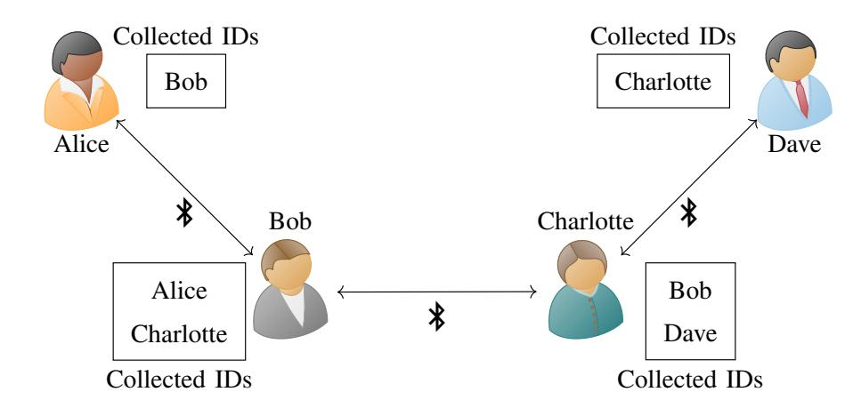
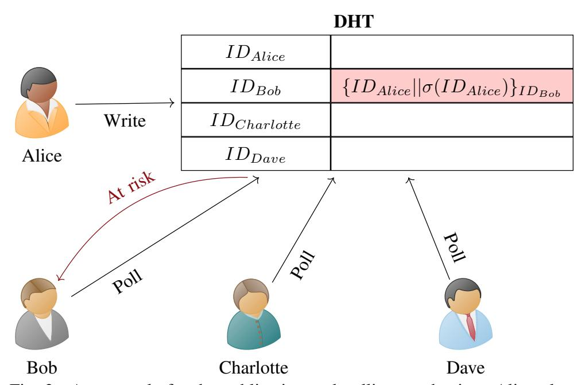

{0}------------------------------------------------

# CAUDHT: Decentralized Contact Tracing Using a DHT and Blind Signatures

Samuel Brack\*, Leonie Reichert\*, Björn Scheuermann\*†
\*Humboldt University of Berlin, Department of Computer Science
{samuel.brack,leonie.reichert,scheuermann}@informatik.hu-berlin.de
†Alexander von Humboldt Institute for Internet and Society, Berlin

Abstract—Contact tracing is a promising approach to combat the COVID-19 pandemic. Various systems have been proposed to automatise the process. Many designs rely heavily on a centralised server or reveal significant amounts of private data to health authorities. We propose CAUDHT, a decentralized peer-to-peer system for contact tracing. The central health authority can focus on providing and operating tests for the disease while contact tracing is done by the system's users themselves. We use a distributed hash table to build a decentral messaging system for infected patients and their contacts. With blind signatures, we ensure that messages about infections are authentic and unchanged. A strong privacy focus enables data integrity, confidentiality, and privacy.

Index Terms—COVID-19, Contact Tracing, Privacy-enhancing technologies, DHT, Blind Signatures

### I. Introduction

The current COVID-19 pandemic shows that our modern globalized world can be heavily affected by a quickly spreading, highly infectious, deadly virus in a matter of weeks. It became apparent that manual contact tracing and quarantining of suspects can only be effective in the first days of the spread before the exponential growth overwhelms the health authorities. Shutdowns of entire countries thus are a popular and drastic method to slow down infection rates in order to not overwhelm emergency capacities. While such shutdowns are effective, they also severely impact social and economical life in the affected areas. By automating tracing processes and quarantining everyone who came in contact with infected people, as well as arriving travelers, it should be possible to slow down the disease. Bluetooth has emerged as the most suitable technology for tracing close contacts for airborne diseases such as COVID-19. Singapore was first to implement a scheme for automatic contact tracing(ACT), allowing the government to identify possible infections and forcing people into quarantine [1]. Due to privacy concerns and data protection laws initiatives worldwide aim to build more privacypreserving systems. There have been calls for decentralization and demands regarding properties which privacy-preserving ACT systems should fulfill [2].

To approach this, we propose CAUDHT (Contact tracing Application Using a Distributed Hash Table), a system for distributed automatic contact tracing using privacy-preserving direct messaging. Our main contributions are:

An identification and formulation of privacy risks of ACT.

• The design and analysis of a decentralized privacypreserving approach to ACT.

To build an efficient and scalable decentralized ACT system we use a distributed hash table (DHT) operated by all users. The DHT allows us to implement a messaging service for encrypted and signed messages between users to inform each other about infection statuses. Additionally, infected patients are able to prove their infection status without revealing their history of contacts by requesting a *blind signature* from the health authority (HA). This measure ensures that users can be sure an infection warning was not generated by a malicious party trying to spread misinformation. Also users can proof that they are at risk, for example, to get tested.

### II. RELATED WORK

Contact tracing is the process of identifying potentially infected people by analyzing a patient's history of social contacts. For it to be effective, the number of identified cases has to grow faster than the number of new infections. With increasing amounts of new patients this process needs to be automated to stop the spreading [3]. Bluetooth and its energy-efficient variant Bluetooth Low Energy (BLE) as technologies have been widely used for proximity detection in literature [4], [5]. Various BLE based systems for ACT have been implemented and rolled out in the past few months. The app called *TraceTogether* [1], released by the government of Singapore, has been the first officially running system. Here, users broadcast time-dependent IDs using Bluetooth while continuously scanning their surroundings. The scan history is stored locally. IDs are assigned by the server. When a person falls ill, user upload their history. The server can then determine who had an encounter with this individual and needs to be warned by searching for IDs from the history in their database. Unlike TraceTogether and similar server-based ACT systems, CAUDHT does not leak information to the HA about who is infected or which users interacted with one another. An orthogonal approach to TraceTogether was proposed by the DP-3T [6] initiative. In this so-called decentralized approach IDs are derived locally. When a person is infected their used IDs are published to a virtual blackboard for all users to see. The API implemented by Google and Apple [7] builds on this idea. CAUDHT is different to DP-3T and similar broadcastbased systems as communication is more direct. Only users that have been seen by the infected person are warned. This

{1}------------------------------------------------

stops for example passive eavesdroppers that listen to IDs sent via BLE from finding out who is infected. A large variety of ACT systems have been proposed in the research context. Most notable for CAUDHT is the idea of Cho et al. [8] to use private messaging for warning users at risk. Messages containing the infection status are sent to a private mailbox located on a central server via a proxy. Users regularly query all mailboxes corresponding to their past IDs for new messages. Messages have to be sent even when the sender is not infected for cover traffic. The authors do not discuss scalability issues of their idea. Unlike CAUDHT, this system does not provide any authenticity check for users who receive a warning.

# III. ATTACKER MODEL

To understand the security requirements, we discuss several threats to a naive ACT system. The *health authority* (HA) conducts medical tests to find out if people are infected. It can try to deanonymize users' IDs to trace possible new infections without respecting users' privacy. It can also try to link the IDs submitted by a single infected person with those of other people to identify common contacts (and thus location history). *Infected users* can try to spread panic and report random IDs as past contacts, even though they have not met. *Healthy users* can try to identify infected patients using their history of seen IDs.

# IV. SYSTEM DESIGN

Manual contact tracing and centralized approaches to ACT require the contact history of infected people to be revealed to the HA in order to trace and inform possible disease carriers. This allows a malicious HA (or an attacker gaining access to the HA's collected data) to derive some information from the transmitted contacts by correlating IDs reported by several infected patients so as to narrow down social or local interconnections. We propose to limit the HA's responsibility to confirming results of positively tested individuals with blind signatures and thus minimize the amount of data a centralized actor can derive from the protocol. Blind signatures are used by infected people to compose messages for users they need to warn. Messages are uploaded to the recipients' postboxes. Storage of postboxes is decentralized by distributing work between the users of the ACT system using peer-to-peer technology.

# *A. Distributed Hash Tables*

Conventional ACT schemes require servers to facilitate communication between users, infected individuals and the HA. To replace this central instance and reduce privacy risks we propose to use a *Distributed Hash Table* (DHT). Control and operation of the storage is shifted from the HA toward the entirety of the user base. DHTs like Chord [9] or Kademlia [10] can be operated by a set of Internet-connected *nodes* and are stable even in cases of nodes leaving and joining in the system. In CAUDHT, every participating user also acts as a node in the DHT. However, instances where a more active HA participates in the messaging system can still be secure,

Fig. 1. During contact collection, each user stores the IDs of all devices that are in proximity. These IDs can be used to notify close contacts in case of a subsequently detected infection.

as long as the majority of nodes is not operated by the HA. Storage is provided in the form of a key-value store with the ability for every participating node to store and retrieve data. Our DHT will act as a "postbox" for users. Infected individuals can store information about their health status in the DHT using the observed ID of a past contact as key. Each user periodically queries the database using their past IDs as keys. The DHT can retrieve data for a key if a message has been placed there.

# *B. Blind Signatures*

Blind signatures [11] allow a central entity to issue valid signatures without learning the content of the message it signs. Alice wants to retrieve a signature for message m from the HA. First, she *blinds* m by multiplying the ID with a unique random number c e . Alice transmits the blinded message b(m) to the HA, who signs it with their private key. The associated public key is universally known and has to be accessible by everyone. The HA then returns the corresponding signature σ(b(m)) back to Alice who *unblinds* it by multiplying it with the inverse of c e . After that, Alice holds a valid signature σ(m) for m. The HA has learned neither the message m nor its signature σ(m).

# *C. Protocol Mechanisms*

CAUDHT consists of several mechanisms. A *contact collection mechanism* runs continuously on every user's end device. It collects IDs of users close by. If user Alice is tested positively, she announces her infection status to the system using the *publication mechanism*. For this purpose she retrieves signatures for her past IDs from the HA and uses these to publish messages for the users she has met at the corresponding location in the DHT. Users regularly check for messages using the *polling procedure*.

*1) Contact Collection Mechanism:* To get reliable information about contacts with infected users, it is necessary to monitor the surroundings for other users and collect IDs. As seen in the related work, the most promising approach for this purpose is using Bluetooth Low Energy (BLE). Each device can advertise an ID over BLE, which is stored by others when picking up a signal from that device. To prevent an attacker from tracking a user's locations over time, it is required 

{2}------------------------------------------------

to renew the advertised ID periodically. For CAUDHT, a 256 bit ID is required. This is not supported by default by the corresponding BLE data field, so a part of the ID has to be advertised as sensor data. Sensor scans are done automatically for BLE devices in Android and iOS [12]. To ensure that the device's MAC address changes with the advertised ID, support by the operating system is needed on both platforms. Also, Apples iOS does by default not allow applications to use BLE while running in the background.

We propose to generate IDs from an asymmetric key pair. The secret key is stored on the device while the 256 bit public key pku will be used as ID and broadcast to everyone in close proximity. Simultaneously, the system has collected a set of public keys pk1, · · · , pkn. If one side of this key "exchange" is diagnosed as infected later, the recorded key can be used to warn the person at risk. The person at risk can use its recorded keys to verify that a contact with an infected person has indeed occurred. A user sees approximately 140k different IDs per week [6], so they require 35.84 MB of local storage for seen IDs.

*2) Publication Mechanism:* To combat COVID-19 effectively, an infected user needs to spread the news quickly to all contacts they met while being contagious (maximum the last 14 days). In order to not reveal her contact (and by that location) history to the HA, an infected user Alice does not provide her recorded IDs to the HA. Instead, she retrieves a blind signature for each of the IDs she used in the last two weeks. Assume Alice wants to notify Bob. Since each ID is a public key, Alice encrypts the ID that she advertised during the encounter and the corresponding HA's signature with the recorded ID of Bob. To immediately notify Bob, Alice stores the encrypted message at the DHT address corresponding to Bob's ID. For example, if she encountered IDb while her own ID was IDa, she will store {IDa|σ(IDa)}IDb as value1 at key position IDb. Alice will notify all her other contacts from the relevant time period following this pattern. Figure 2 shows

1{X}K means that X is encrypted using public key K.

Fig. 2. An example for the publication and polling mechanism. Alice places a notification for her previous contact Bob who can retrieve it by polling for his own ID in the DHT.

how Alice places a message for Bob in the DHT.

*3) Polling Mechanism:* CAUDHT works like a postbox service, where each user can get messages delivered by polling their own previous IDs in the DHT. Bob will only learn that he is at risk by searching for IDb. It is important that potential contacts are warned quickly in case of a confirmed infection. Therefore, every user should poll their postboxes at least once every few hours.

Having received Alice's message Bob can decrypt it using the private key corresponding to IDb. This gives him Alice's IDa as well as the signature from the HA regarding this ID. The signature confirms to him that Alice's test result was indeed positive. By looking up IDa in his own history he can also confirm that he has encountered Alice in the past. Without this lookup, a malicious positively tested patient Eve could claim to have seen many IDs causing random users to believe they have been exposed.

# V. DISCUSSION

CAUDHT provides security against several attack vectors that were identified in the attacker model in Section III. Defense mechanisms against various attack vectors are discussed in the following.

# *A. Attack Mitigations*

The *HA* is not able to learn anything about infected patients' contact histories. Even if several infected patients have seen the same ID, the HA will not be able to link them together because these values are not transmitted. An *infected user* is not able to spread panic and misinformation as users check their local contact history for the infected patient's ID for validation. A non-infected person Eve can not claim to be infected since users will not accept a message lacking the HA's signature. That signature is only provided for people that have tested positively for the disease, e.g. by providing tokens with the positive result. An *uninfected user* Bob learns the ID of the infected patient Alice, when decrypting his messages. So he will know that a user with this ID is now sick. This pseudonymous information is leaked intentionally so Bob can check if a contact with Alice was indeed recorded. This tradeoff can be reversed by not providing the infected patient's ID in the message to the user's postbox.

The DHT is operated by all system users. A malicious participant Eve could request IDs she has seen. However, only a user holding the private key to the IDs can decrypt the message. Even though Eve cannot decrypt an answer message, the fact that a message was returned can already leak information. If messages are only placed in the DHT when an infection is confirmed, Eve can conclude that the holder of the requested ID has been in contact with an infected individual. To prevent this, postboxes can hold more than one message and users occasionally write random messages into their own (or other user's) postboxes to provide cover traffic. Such messages will not contain readable content or a signature from the HA and will be discarded by the recipient. To ensure non-linkability cover traffic can be anonymized 

{3}------------------------------------------------

through an anonymization service such as Tor [13]. This way an eavesdropper can not tell if cover traffic or a real message is written to the DHT. It also stops the HA from determining who is at risk and who has been in contact by observing the DHT. Assuming the number of infected patients is large enough so that timing correlations of DHT write operations are masked by a steady stream of updates the HA can also not derive which signatures correspond to which messages in the DHT. A general problem of DHTs are Sybil attack where one entity joins with many different nodes. The attacker can check who writes and reads data to the postboxes under their control. They can also surrounded single nodes to separate them from the rest of the network. CAPTCHAs and remote attestation [6] can be used to ensure that only real users with a untamperd application can join the network.

# *B. Security Enhancements by using a DHT and Blind Signatures*

Both the DHT and blind signatures solve different security problems in our decentralized design. First, the DHT solves the problem of distributing the data about infections. Theoretically, a central database could be accessed using anonymizing proxies like Tor [13] to hide the requesting user's identity. However, systems like Tor are not as scalable as a DHT where every user participates as a node automatically. In contrast to a centralized approach where infection messages are provided by a database (or broadcasts) operated by a third party such as the HA, our system relies on infected patients messaging their contacts. It should be noted that the DHT has to be operated with enough redundancy so that high numbers of disappearing nodes (e. g., due to high hospitalization rates of node operators) do not impact the DHT itself. To prevent misinformation about infection statuses the blind signatures ensure that only infected patients are able to inform their contacts about an infection. These two building blocks are necessary to operate CAUDHT in a scalable and trustworthy manner.

# *C. Scalability*

When evaluating a decentralized algorithm, it is always important to consider if a large-scale installation of the system can still run efficiently. Additional attention should be given to data traffic created by the DHT. Many users will interact with the DHT while on metered mobile connections. To ensure that the DHT does not overflow with outdated data, entries need to be deleted once they are no longer useful. Because contact information is only interesting for 14–21 days in case of COVID-19, entries that are older should be deleted. Each DHT node ensures that all values stored at keys for which it is responsible are up-to-date. This can be achieved by adding a timestamp to each message specifying when it can be safely deleted. DHT values (i. e., postbox messages) bearing timestamps older than three weeks are not used anymore and can be discarded. Growth of the DHT itself is no major scalability problem. Each new potential postbox user is also part of the DHT's set of nodes and helps storing the data. In the long term, the amount of data stored per user is constant regardless of the number of participants. Let's assume 1 million people participate in the system. Each user sends about 3000 warnings and 1000 people upload their data per day. Then there are 42 million messages (each 516 Byte) in the system and every user has to store 2.71 KB of DHT data. The number of messages from users checking their mailbox that each node has to process is 16,128 per day if the polling cycle is 12 hours.

# VI. CONCLUSION AND FUTURE WORK

In this paper we introduced several privacy-preserving additions to BLE-based ACT approaches for COVID-19. Our main contributions are:

- Using blind signatures for allowing the infection status of an ID to be verifiable while keeping the HA oblivious.
- A distributed approach to ACT where only the disease testing is conducted centrally.
- A DHT-based postbox system where users can communicate directly with each other.
- Defense against different attack vectors, including malicious actors that target on spreading misinformation.

Future work amounts to further evaluate our ideas and to fully implement them. The success of ACT apps relies on cooperation of the population, so we are convinced that proper user education about why and how their private data is protected is a key element in fighting this disease.

# REFERENCES

- [1] Government of Singapore, "TraceTogether," last access: 06. April 2020. [Online]. Available: www.tracetogether.gov.sg
- [2] Chaos Computer Club, "10 requirements for the evaluation of "contact tracing" apps." [Online]. Available: www.ccc.de/en/updates/2020/contact-tracing-requirements
- [3] L. Ferretti *et al.*, "Quantifying SARS-CoV-2 transmission suggests epidemic control with digital contact tracing," *Science*, 2020.
- [4] S. Liu, Y. Jiang, and A. Striegel, "Face-to-face proximity estimation using bluetooth on smartphones," *IEEE T MOBILE COMPUT*, vol. 13, no. 4, pp. 811–823, 2013.
- [5] S. Bertuletti, A. Cereatti, U. D. Della, M. Caldara, and M. Galizzi, "Indoor distance estimated from bluetooth low energy signal strength: Comparison of regression models," in *SAS*. IEEE, 2016, pp. 1–5.
- [6] C. Troncoso *et al.*, "Decentralized Privacy-Preserving Proximity Tracing," last access: 08. April 2020. [Online]. Available: www.github.com/DP-3T/documents
- [7] Google and Apple, "Privacy-preserving contact tracing," last access: 15. September 2020. [Online]. Available: www.apple.com/covid19/contacttracing
- [8] H. Cho, D. Ippolito, and Y. W. Yu, "Contact tracing mobile apps for COVID-19: privacy considerations and related trade-offs," *CoRR*, vol. abs/2003.11511, 2020.
- [9] I. Stoica, R. T. Morris, D. R. Karger, M. F. Kaashoek, and H. Balakrishnan, "Chord: A scalable peer-to-peer lookup service for internet applications," pp. 149–160, 2001.
- [10] P. Maymounkov and D. Mazieres, "Kademlia: A peer-to-peer informa- ` tion system based on the XOR metric," in *IPTPS*, ser. Lecture Notes in Computer Science, vol. 2429. Springer, 2002, pp. 53–65.
- [11] D. Chaum, "Blind signatures for untraceable payments," in *CRYPTO*. Plenum Press, New York, 1982, pp. 199–203.
- [12] Argenox Technologies LLC., "BLE Advertising Primer," last access: 05. April 2020. [Online]. Available: www.argenox.com/library/bluetoothlow-energy/ble-advertising-primer
- [13] R. Dingledine, N. Mathewson, and P. F. Syverson, "Tor: The secondgeneration onion router," in *USENIX Security Symposium*. USENIX, 2004, pp. 303–320.