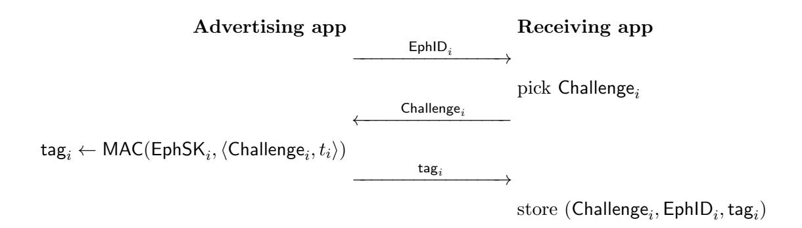
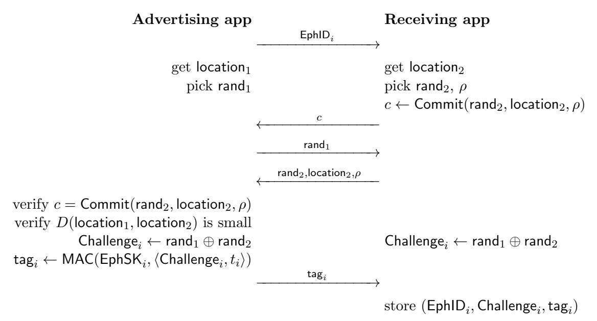

# **Analysis of DP3T Between Scylla and Charybdis**

Serge Vaudenay 2020, April 8th

EPFL, Lausanne, Switzerland

**Abstract.** To help fighting the COVID-19 pandemic, the Pan-European Privacy-Preserving Proximity Tracing (PEPP-PT) project proposed a Decentralized Privacy-Preserving Proximity Tracing (DP3T) system. This helps tracking the spread of SARS-CoV-2 virus while keeping the privacy of individuals safe. In this report, we analyze the security and the privacy protection of DP3T. Without questioning how effective it could be against the pandemic, we show that it may introduce severe risks to society. Furthermore, we argue that some privacy protection measurements by DP3T may have the opposite affect of what they were intended to. Specifically, sick and reported people may be deanonymized, private encounters may be revealed, and people may be coerced to reveal the private data they collect.

### **1 Introduction**

In 2019–20, the COVID-19 pandemic has completely changed the world. The impressive spread of the disease imposed global confinement measures all around the world. The severe economical impact of this global confinement is unknown at the moment, but is likely to be listed as one of the top historical events that damaged economy. To reduce the cost, technological tools were introduced to monitor the spread of SARS-CoV-2 and relax the confinements measures by keeping them local. Those tools often require an authority to track people and see when, how long, and at what distance they encounter. Under normal circumstances, these tools would be considered as violation of individual's basic privacy. Nevertheless, as a reaction to COVID-19, some research projects investigated how to trace proximity while keeping a high level of privacy.

The Pan-European Privacy-Preserving Proximity Tracing (PEPP-PT) project proposed a Decentralized Privacy-Preserving Proximity Tracing (DP3T) system. This proposal requires no central storage of location of people and minimizes the data which is stored. PEPP-PT was announced on 1st of April, 2020 as a Swiss-based organization with "more than 130 members across eight European countries". On 3rd of April, 2020 a white paper describing the DP3T system was released [1]. Implementations were announced for the following week. Deployment is likely to follow.

The DP3T system offers interesting properties but also some potential threats which have not sufficiently been addressed. Designers, as well as many other researchers, seem to take for granted that such system should be decentralization because centralization is inherently bad for privacy (the D in DP3T stands for "decentralized"). A natural scientific question is to wonder if this dogmatic approach is well founded.

Current telecommunication infrastructures already enables network operators to track people by their cell phones and to identify proximity. This means that billions of people currently use devices by which they can be tracked. Network operators are just forbidden by law to keep or disclose this information. Feeling safe about one's privacy requires assuming that network operators do not betray the law. Since people will not stop using cell phones with DP3T, this assumption remains unchanged with DP3T. Besides, DP3T introduces storage of data in private smartphones and make them advertise their presence all the time. We show in this report that it offers tracking vectors for any individual. First of all, having Bluetooth turned on already creates privacy issues. Second, broadcasting ephemeral identifiers enables a group of malicious people to organize themselves in militia to track infected people. Finally, having a proximity history stored on the local renders users vulnerable to coercion attacks. Consequently, in addition to trusting the network operators, we also need to trust individuals.

Although based on honorable goals, the DP3T system is opening a Pandora box which uncovers severe privacy threats. In the present report, we wish to alert on the risks and invite for corrective measures.

# **2 Overview on DP3T**

We briefly describe the DP3T infrastructure as it is specified in the current version [1]. The participants of the DP3T system are

- **–** users holding a communication device;
- **–** a backend server;
- **–** a (health) authority.

The communication device is a Bluetooth-equipped smartphone running the DP3T app. The backend server acts as a repository for some data to be pushed by smartphones upon authorization by the authority.

At setup, the app creates a key SK0. (The length is not specified but it is suggested that it could be an HMAC-SHA256 key.) Periodically (presumably, every day), the key expires and is replaced by a new one which is computed by

$$\mathsf{SK}_t = H(\mathsf{SK}_{t-1})$$

for *t* = 1*,* 2*, . . .* The duration between the time SK*t* is created and its expiration is called the cryptoperiod of SK*t* herein. These keys are kept in memory, and erased after a while (for instance, 14 days after they expired). The choice of the hash function *H* is not specified.

Each secret key generates *n* ephemeral identifiers EphID*i* of 128 bits by

$$\mathsf{EphID}_1 \| \cdots \| \mathsf{EphID}_n = \mathsf{PRG}\left(\mathsf{PRF}(\mathsf{SK}_t, \text{``broadcast key''})\right)$$

PRF is suggested to be HMAC-SHA256 while PRG could be AES-CTR or Salsa20. During the cryptoperiod of SK*t* , the ephemeral identifiers are used in sequence, following a random order. Each EphID*i* becomes the current one during one *n*-th of the cryptoperiod of SK*t* .

The app regularly broadcasts the current EphID*i* , as a beacon, via Bluetooth interface. The range of Bluetooth is limited and the strength of the signal indicates the proximity. The frequency of broadcast is not specified.

Conversely, the app stores received beacons together with extra information such as the time, the proximity (as inferred from the signal strength), and other metadata which are not detailed. One principle of DP3T is to minimize the data to store, for privacy reasons. Another principle is that data collection happens locally in the user's device instead of happening in a central server.

Upon authorization by the authority, the server is fed by apps with pairs consisting of SK*t* 's and their time of validity. They correspond to keys which were used by the app held by a user who was reported by the authority (because of infection). New pairs are added every day, and retrieved by the apps every day. With each pair, the app can re-generate the *n* ephemeral identifiers and check if they have been stored at the corresponding time. Based on that, the app can see how long and at which distance the infected person has been encountered, and can compute a risk. If the risk is above threshold, an alert is raised by the app.

How the alert is treated remains open. Typically, the user would contact the health authority. The health authority would then decide to authorize for the recent SK*t* of the app to be uploaded on the server. Again, how this would be done is open. We can expect that users would have to "volunteer" to contact the authorities and to agree to disclose their SK*t* , but this will depend on the policy of the country. The policy may vary from one country to another, and also change with time.

DP3T is aimed at being used in several countries. It suggests that each country would have its server and authority. This means that the app would connect to the server of the current country as well as the ones of recently visited ones. Reporting would be done by one authority and transmitted to others. This implies that the app also stores the list of recently visited countries and discloses it to the authority if needed.

Users can volunteer to share data with epidemiologists. According to the DP3T document, sharing data only occurs when an alert is raised.

# **3 Communication between Participants**

The DP3T paper does not specify how communication is made between participants nor what security is needed.

*Server-to-app channel.* The server plays the role of a bulletin board, indirectly fed by the authority. It is important that apps can be convinced that what is read on the bulletin board is correct. Otherwise, an adversary could make them receive rogue keys or make them missing some. If the server is trusted, this can be achieved by standard secure communication between the app and the server (the server being authenticated). Encryption is not necessary.

The DP3T document [1] is ambiguous as for whether the server should be trusted:

*This backend server is trusted to not add or remove information shared by the users and to be available. However, it is untrusted with regards to privacy (i.e., collecting and processing of personal data). In other words, the privacy of the users in the system does not depend on the actions of this server. Even if the server is compromised or seized, privacy remains intact.*

Since adding or removing information on the server has privacy consequences, we deduce the server should *not* be trusted.

Depending on how the authorization to upload SK*t* is implemented, we could live without any trust assumption on the server. Indeed, the authorization could come with an authentication by means of a digital signature. To make sure that no SK*t* is maliciously erased, we could use a blockchain. This all depends on the "authorization scheme" by the authority to publish SK*t* . The way this scheme is made is crucial for security.

A simpler solution would be to have the authority to regularly upload a signed list of new SK*t* but it would require an infrastructure change: the server would be populated by the authority directly instead of the apps.

*App-to-authority channel.* When an app contacts the authority, it is also important that communication is secured to protect the privacy of the user. For this, communication must be encrypted and the authority must be authenticated. Additionally, the authority must be convinced that whatever is reported by the app is genuine. Otherwise, an adversary could forge an alert report. As discussed later, this verification requires a tedious human verification (e.g. a medical diagnosis) or to have the app authenticated by a Trusted Platform Module (TPM).1

*App-to-app channel.* Finally, the communication between the apps should also be protected. We will see next a series of attacks exploiting the lack of authentication in this channel. We can also imagine a denial of service (DoS) attack which consists in flooding a target app with a huge amount of rogue EphID broadcasts. One goal of this attack could be to drain the battery or to fill up the memory. Protection measures against DoS exist.

# **4 False Alert Injection Attacks**

In the attack scenario of this section, the goal of the malicious adversary is to make the app of a target victim raise false alerts. It could be disturbing and stressful for users to receive an alert. They could also be severely blamed by their neighborhood or partner for being careless. In some countries, people with an alerting app (such as a barcode with a wrong color, or a "score" which is too high) can be discriminated too.

The adversary could get an advantage in disturbing his competitors. We could imagine that the adversary is a competitor of the victim(s) in a sport event, in a business opportunity, in a job application, etc. More simply, the motivation of the adversary could simply be to harass his victim for any reason.

One way to make a target user raise false alerts is either to send his smartphone some EphID*i* of infected people or to make his smartphone receive an SK*t* which derive one of the already received EphID*i* . We consider several possible situations, each of them depends on how exactly DP3T is implemented.

*Note.* The current white paper of PEPP-PT project [1] mentions "fake contact events" as possible threats. The present attack scenario falls into this category.

#### **4.1 Backend Impersonation**

The adversary can proceed as follows:

- 1. pick a random SK*t* ;
- 2. derive an EphID*i* ;
- 3. get close to the victim;
- 4. send EphID*i* to the victim (same as the app would do);
- 5. (later) impersonate the backend server to send SK*t* to the victim.

*Mitigation.* Having a proper secure communication between the app and the server defeats this attack. However, it is not enough for the next one.

1 The use of a TPM is already given as a possible evolution in the DP3T document [1].

### **4.2 False Report**

Instead of impersonating the backend server or the authority, the adversary could report his infection case and reveal the random SK*t* from the previous attack, as follows:

- 1. pick a random SK*t* ;
- 2. derive an EphID*i* ;
- 3. get close to the victim;
- 4. send EphID*i* to the victim (same as the app would do);
- 5. (later) report SK*t* to the server

*Mitigation.* We see here that the authorization scheme by the authority is crucial. Clearly, the outcome of this scheme must be that the list of SK*t* is authenticated. However, authorization must be given only if the case is serious. The authority could perform a tedious medical verification on the user to eliminate fake reports. Without such tedious human verification, the technological solution is more complicated. It requires a proper verification of a high risk, which can only be done if the app is trusted. Here, the only way is to have the app run on a Trusted Platform Module (TPM). Solutions are not perfect tough. (The DP3T document [1] mentions such approach in another context.)

### **4.3 Replay of Released Cases**

Since the backend server releases a list of SK*t* , anyone can derive the EphID*i* and broadcast them close to target people. The adversary could do that too. He could proceed as follows:

- 1. watch at the backend releases to catch any new SK*t* ;
- 2. as soon as a new SK*t* is released, continue;
- 3. derive an EphID*i* from this SK*t* ;
- 4. get close to the victim;
- 5. send EphID*i* to the victim (same as the app would do).

At the time the present report is written, it is not clear how releases and communication is done with the app. We make the assumption that SK*t* comes together with the date when the key was active and that the app computes the risk score by trying, for every date, to match every collected EphID in that date with the ones generated by the SK*t* of the same date. This means that in the above attack, the adversary should only reuse an SK*t* which is still considered as active. On the date the reporting infected user discloses his keys, he still has an active one. If reporting spreads to the server and to the apps on the same day, this situation can occur: the still-active SK*t* can be reused.

We can wonder if an app will continue to verify if an EphID which has just been received matches a still-active SK*t* which has already been downloaded from the server. If this is the case, the above attack always works. If not, the attack only works if the adversary was faster than the target app to retrieve SK*t* .

*Mitigation.* When an app reports its SK*t* , it generates a completely new key so it should not send EphID*i* coming from SK*t* any more. Hence, the implementation of the app should verify the date of validity of SK*t* and consider that retrieved SK*t* are no longer valid. This is enough to defeat many attack situations. What remains is the case where SK*t* are not immediately retrieved by the app. This can be defeated with the same method as the next attack scenario.

### **4.4 Replay Attack**

The next step consists of collecting existing EphID*i* and anticipating that they will be reported. This attack requires a collection phase.

- 1. collect several EphID*i* and make a pool;
- 2. get close to the victim;
- 3. send one (or several) of the EphID*i* from the pool to the victim (same as the app would do);
- 4. expect that the corresponding SK*t* will be reported.

To increase the probability of success of this attack, it is crucial to collect EphID*i* 's of people who are likely to be contaminated. There may be places with higher probabilities to meet infected people (like hospitals).

The collection phase may be tedious but could easily be distributed. Just as there exist stolen lists of credit card numbers which we can buy on the darknet, there could be a list of EphID*i* available. Those lists could be populated by malicious users who could sell all the EphID*i* they collect.

At a first glance, having a black market of EphID*i* looks unrealistic, because anyone can generate EphID*i* 's at random for free. What makes an EphID*i* valuable is to be released by a case of infection. After release, the attack essentially falls back to the previous one. However, there could by an economic model, enforced by a smart contract in a blockchain, by which collectors would post their collected EphID*i* and later get a substantial reward if it happens to be in a released event. To avoid people posting EphID*i* at random, posting an EphID*i* could come with a tiny fee. This principle of stick and carrot could give enough incentives to develop a black market for EphID*i* of infected people. Crypto currencies and anonymity could help the black market to escape from all legal protections.

Of course, one terrible side effect of such a black market is that people in the need may take risks to meet as many infected people as possible.

*Mitigation.* When the EphID*i* 's are generated from SK*t* , they are permuted at random and each EphID*i* is aimed at being used at a coarse time *τi* of the day. We could at the same time generate some tags

$$\mathsf{tag}_i = \mathsf{MAC}(\mathsf{SK}_t, \langle \mathsf{EphID}_i, t_i \rangle)$$

with a message authentication code MAC which could be rather short. Broadcast would then send EphID*i* together with tag*i* and would be stored together with the current coarse time *τi* . The tag would be verified if a match occurs. With this protection, only replay in the same coarse time period would still be feasible.

To avoid replay attacks during the same coarse time period, we could drastically modify the DP3T infrastructure and have an interactive protocol instead of beacons: the app could derive

$$\mathsf{EphSK}_1 \| \cdots \| \mathsf{EphSK}_n = \mathsf{PRG} \left( \mathsf{PRF} (\mathsf{SK}_t, \text{``secret key''}) \right)$$

together with EphID*i* , send EphID*i* , get a challenge Challenge*i* , and reply with

$$\mathsf{tag}_i = \mathsf{MAC}(\mathsf{EphSK}_i, \langle \mathsf{Challenge}_i, t_i \rangle)$$

The receiving app would store the triplet

$$(\mathsf{EphID}_i, \mathsf{Challenge}_i, \mathsf{tag}_i)$$

instead of EphID*i* alone. This triplet can be verified once SK*t* is disclosed. The protocol is depicted as follows:

Of course, such modification has a much higher cost, because the two apps now need to interact instead of using the broadcast mode. Computationally, this change in DP3T remains extremely cheap.

This protocol could also create a privacy risk by disclosing digital evidence. Having a tag relatively small would reduce the risk and mitigate enough replay attacks.

## **4.5 Relay Attack**

Instead of replaying an EphID*i* which could be rejected by the above protection, we could passively relay a current EphID*i* as follows:

- 1. a partner of the adversary gets close to a (potentially) infected person;
- 2. the adversary gets close to the victim;
- 3. the adversary and partner relay all communication between the infected person and the victim (including the EphID*i* of the infected person);
- 4. expect that the corresponding SK*t* will be reported.

This attack is harder to implement but still feasible at a low cost.

*Mitigation.* The only way to defeat this type of attack is to use some form of a distancebounding protocol. Pure distance-bounding protocols are hard to implement. As an alternative, we could try to exploit the geographic location (may it be GPS or based on a mobile network) but storing the geographic location induces an additional privacy threat which goes against the principle of data minimization of DP3T. Hence, one challenge is to design a protocol based on the location which does not create a new privacy risk.

The above interactive protocol can be enriched as follows.

We use here a binding commitment scheme Commit for secure coin-flipping, the location of both participants, and the geographic distance D. The protocol assumes a reliable way to determine the location. The protocol is made with plausible deniability of the geographic location: the advertising app only "signs" a random challenge. If both participants are honest, no relay attack over a long distance is possible. However, this protocol should not be taken as a proof of small distance because either participant could cheat with its own location.

The computational cost of such protocol is really small. The only difficulty is to replace the broadcast model by a two-party interactive protocol.

#### 5 A New Tool for Tracking People

A curious adversary A can use a lot of available information:

- a list of  $SK_t$  of infected people with dates;
- when these  $SK_t$  were reported;
- the content of his own smartphone;
- data shared by other people;
- other data obtained by other channels.

One possible side channel is the information that a user B had an alert raised by his app. This information may be observed, for instance, because B is noticeably panicking.

The adversary may perform a passive attack based on the above information. The adversary may also perform active reaction attacks in the entire system. He could for instance send some chosen EphIDi's to a target and later observe the impact on information at disposal.

#### 5.1 Using the Bluetooth Beacon

Many people turn Bluetooth off on their smartphone for various reasons:

- to reduce electro-smog;2

&lt;sup>2 At the time of writing, many people associate 5G electro-smog to the spread of pandemic. Some claim that electro-smog creates health problems and therefore reduce the immune system, even through this is not proven. Some even go further with more exotic claims and conspiration theories.

- **–** to save the battery;
- **–** for privacy reasons.

Indeed, as Bluetooth is turned on and broadcasting messages all the time, anyone can see a Bluetooth device is around. We can boost a normal Bluetooth received with a good antenna to be able to watch Bluetooth devices in a large area.

It is possible to check if a present Bluetooth device has a given MAC address.3 This means that if the MAC address of a Bluetooth device is known and fixed, it can be recognized. Additionally, devices with Bluetooth on often advertise themselves explicitly (e.g. "iPhone of Serge"). A simple scanning experience in an apartment building showed that 10% of Bluetooth devices are explicitly identifiable (about 100 self-advertising devices collected in 20 minutes).

Given that, on the one hand, we can recognize a user by his Bluetooth smartphone, and on the other hand, that this smart phone broadcasts DP3T ephemeral identifiers, we can easily keep a local mapping to deanonymize the target user. By watching the release on the backend server, we can later check if this target user was reported as infected or not.

This type of attack can be done passively (i.e. without performing any malicious communication) with little equipment.

*Mitigation?* It seems that keeping Bluetooth in DP3T creates several worries about privacy. As Bluetooth have inherent privacy concerns, one reasonable approach is first to make sure that Bluetooth is correctly configured. This implies advertising no explicit device name and enforcing the rotation of the MAC address. However, having a rotating MAC address and a rotating EphID at the same time creates an leakage, by interference. One solution could be to use the MAC address in lieu of EphID, and to broadcast it with a tag which requires SK*t* .

In any case, keeping Bluetooth broadcasting will always reveal the presence of a smartphone using the DP3T app.

#### **5.2 Deanonymizing Known Reported Users**

If an adversary A encounters a user B, A can listen to the EphID*i* broadcast then associate this EphID*i* as belonging to B. If later B has its SK*t* disclosed, A can deanonymize this key and learn that B was infected.

*Occasional disclosure.* When a user A has its app raising an alert, he may be stressed and behave randomly. He could be curious to inspect his phone to figure out why it is raising an alert. If he knows DP3T enough, or if he finds a tool to do it for him, he would realize the alert is raised because of a series of EphID*i* which were collected on the same coarse time on a given date. A could assume that it comes from those EphID*′ i s* come from the same user and that their number indicate a duration of encounter. It may be enough for A to remember about B and therefore deanonymize B.

*Paparazzi attack.* A needs not to closely encounter B to deanonymize. Using a Bluetooth receiver with a good antenna, A can catch the EphID*i* broadcast by B from far away. We could easily imagine a paparazzo A trying to collect EphID*i* of public people this way and waiting for one to be reported to sell this information to popular newspapers. Collecting a single EphID*i* is enough to recognize B from the released SK*t* .

3 Some Bluetooth devices have MAC address rotation for privacy reasons but it is not always the case and alignment with the EphID*i* rotation is tricky.

*Nerd attack.* The DP3T app collects as little information as possible by design, but operates with an open protocol. This means that anyone can develop his own DP3T-like client, and possibly decide to collect more data than what DP3T meant. There could be "enriched apps" which collect more information for each encounter such as the geographic location, the exact time, more information about the Bluetooth message. The app would make its best effort to link changing EphID*i* , which would not be too hard from Bluetooth metadata and signal strength if there are not many neighbors in proximity and they are all static. The app could further invite the user to enter more data such as if he knows the person, their gender, approximate age, visible ethnicity, etc, or in which circumstance this encounter occurred (e.g. in bus line *x*, in the elevator of building *y*). The enriched app could easily create a huge database. With this, an isolated malicious user could start identifying many reported cases.

*Militia attack.* The previous attack allows individuals to collect lots of information. Collected information could also be sold, or shared within a community of people which organizes itself as a militia. History shows that a militia could threaten sick people and force them to isolate in an asylum.

*Mitigation?* The DP3T architecture inherently makes sure that reported users can be recognized by the apps of their encounters. Based on that, the only way to mitigate this attack is to deny the same privileges as the apps to individuals. This would require to run the apps on a TPM. In the nerd and militia attacks, the users are malicious and can run their own enriched app, outside of the TPM. To defeat this approach, genuine apps must exchange their EphID in a way which is unusable by other apps. Typically, they could encrypt it with a rotating key which is shared by all apps. Deploying such infrastructure would be a challenge.

### **5.3 Disclosing Private Encounters**

Here is an active attack by which an adversary A can check if a user B has met another user C in a close enough distance and long enough duration:

- 1. make one of the false alert injection attacks from Section 4 on target C until C reports an alert and has its SK*t* reported
- 2. observe if B raises an alert as soon as the key of C was reported

In the second step, seeing an alert for B as soon as C is reported supports the hypothesis that B and C met.

The first step is an active attack to force C to be reported. We can also consider a passive attack and assume that C was reported and identified (by any of the previously seen attacks in Section 5.2).

Without seeing the alert occurring for B, A observing that B was reported soon after C (assuming that A succeeded to deanonymize them) is also leaking information on their possible encounter.

*Mitigation?* Clearly, uploading reported keys as soon as they are identified and showing when they are retrieved eventually leads to the above attacks. We could think of delaying releases, but this would be a loss of time against the propagation of the virus. We could also populate releases with fake keys to introduce noise, but this would increase the running time and would not be so effective.

### **5.4 Coercion Threats**

The existence of collected data on the smartphone of B could be a threat against B in itself. An adversary A could force B to reveal its content. A could be anyone who could abuse of some power on B (the police, an employer, a violent husband, etc), someone who could steal/borrow the smartphone of B, or a malware in the smartphone of B. This way, A would retrieve some private information:

- **–** A could first see the list of the countries visited by B in the last 14 days.
- **–** A could directly see how many EphID*i* were collected by B during each coarse time, and at which distance. Assuming that a given EphID*i* is broadcast *k* times before it is rotated, a same EphID*i* value repeated *k* times in the record by *B* means that *B* encountered someone for long enough. A could see in the same coarse time how many EphID*i* have exactly *k* occurrences and deduce that some come from the same person which has been encountered for long.
- **–** A could also match the EphID*i* collected by B and the ones generated by reported SK*t* to compute the infection risk of B by himself (and apply a lower threshold to ban B if it finds the threshold by the authority too loose).
- **–** A could also use some databases created in the previous attacks to try to identify the encounters of B. If EphID*i* is often rotating, the likelihood that B and a militia member D have seen the same EphID*i* from C is the same as the likelihood that B, C, and D were all together. Equivalently, D could have reported that B encountered C without using the DP3T leakage. Hence, this type of leakage is mitigated by a frequent rotation of EphID*i* .

Having a militia of coercing A's would amplify this threat. Indeed, the SK*t* of many B's would become known to the militia and every B would become automatically identifiable from and EphID*i* .

Clearly, the minimal information collected by the DP3T app reveals quite a lot. It threatens users of being forced to disclose it. Depending on the attack scenario, a legal protection may not be enough.

*Mitigation.* To fix this situation, the only way is to make sure that the honest user cannot read his collected data. Here, running the DP3T in a TPM would be a perfect solution.

### **6 Conclusion**

Proximity tracing systems are of paramount importance to control the COVID-19 pandemic. At the same time, they come with severe privacy threats. DP3T was motivated by fundamental ethical, security, and privacy concerns.

We discussed the security needed in communication between participants. Except for the app-to-app channel, all these protections can be easily made with standard public-key cryptography.

As for the app-to-app channel, adding security is too hard. This enables replay/relay attacks, which could induce fake contact events. Replay attacks could be mitigating to some extend by changing a bit the DP3T design. Without giving up with the broadcast communication model, replay during the same coarse time will always be possible. Better mitigations would require interactive protocols between apps but would still be feasible at a small cost.

Regarding privacy, several elements, which are supposed to strengthen privacy, have the opposite effect:

- **–** the use of Bluetooth and constant broadcast;
- **–** the local storage of data.

It is actually surprising that decentralization creates more privacy threats than it solves. Indeed, sick people who are anonymously reported can be deanonymized, private encountered can be uncovered, and people may be coerced to reveal their private data. We discussed possible mitigation. Keeping Bluetooth would always reveal the presence of a device but could not create any more threat if used with great care. At the time of writing, the usage of a TPM seems to be unavoidable.

### **References**

1. Carmela Troncoso, Mathias Payer, Jean-Pierre Hubaux, Marcel Salath, James Larus, Edouard Bugnion, Wouter Lueks, Theresa Stadler, Apostolos Pyrgelis, Daniele Antonioli, Ludovic Barman, Sylvain Chatel, Kenneth Paterson, Srdjan Capkun, David Basin, Dennis Jackson, Bart Preneel, Nigel Smart, Dave Singelee, Aysajan Abidin, Seda Guerses, Michael Veale, Cas Cremers, Reuben Binns, Thomas Wiegand. Decentralized Privacy-Preserving Proximity Tracing. Version: 3rd April 2020. PEPP-PT. https://github.com/DP-3T/documents