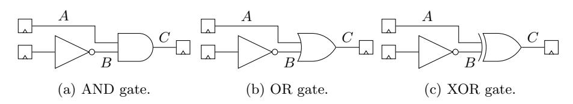
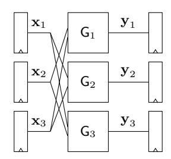
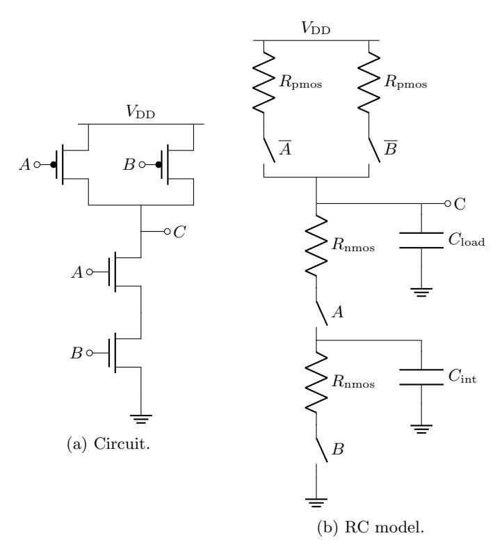
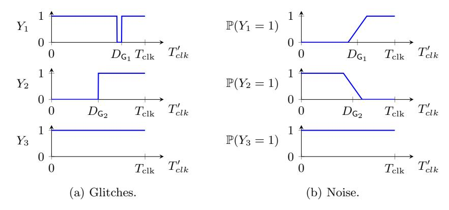
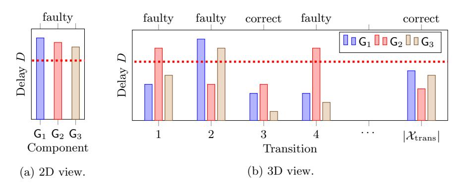
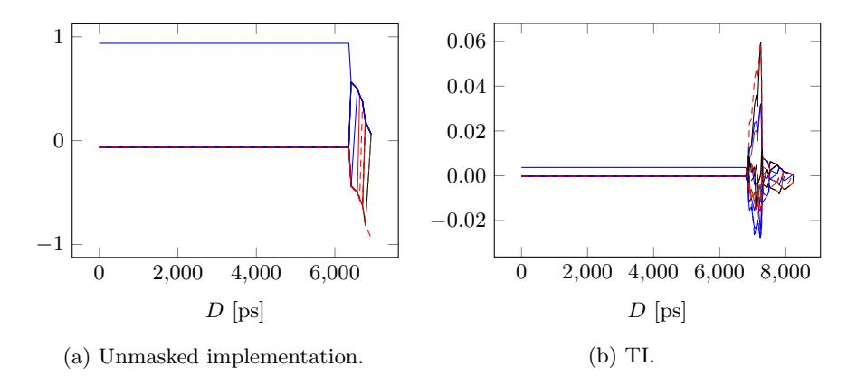
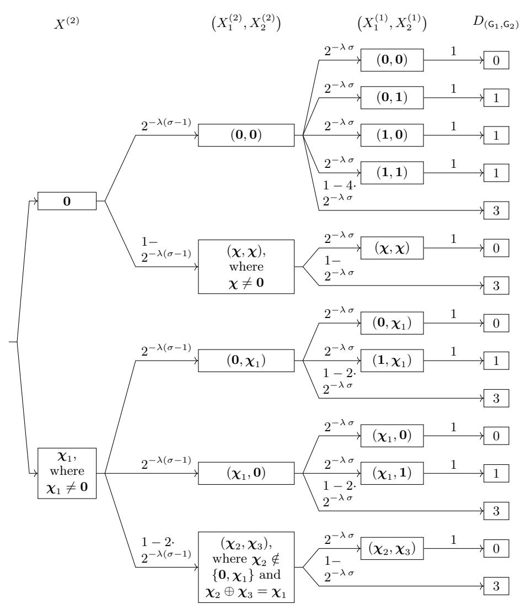

# Threshold Implementations Are Not Provably Secure Against Fault Sensitivity Analysis

Jeroen Delvaux[0000−0003−0684−8427]

Open Security Research (OSR), Room 29–31, Floor 8, Building 12B, Shenzhen Bay Tech-Eco Park, 518000 Shenzhen, China jeroen.delvaux@osr-tech.com

Abstract. In an article presented at FDTC 2018, Arribas, De Cnudde, and Sijaˇci´c prove under mild conditions that ˇ threshold implementations (TIs) are secure against fault sensitivity analysis (FSA). Later in 2018, in the PhD thesis of De Cnudde, additional assumptions were imposed to provably withstand FSA, thereby increasing the required number of random bits. We point out that even under the latter, stronger conditions, the proof is incorrect.

Keywords: Threshold implementations · Fault sensitivity analysis · Provable security

# 1 Introduction

Even for a cryptographic algorithm that is unbreakable in a purely mathematical sense, its implementation on an electronic device might be vulnerable to physical attacks. Measurable physical quantities leaked by a device, such as its power consumption and its electromagnetic emissions, depend on the secret intermediate variables that are being processed. To impede secrets from being retrieved through such side channels, masking schemes randomize computations such that leaked physical signals are independent of internal secrets up to a certain statistical moment, which is referred to as the order. Threshold implementations (TIs) [\[4,](#page-21-0)[17\]](#page-22-0) are a popular masking method as few assumptions about the underlying hardware are made in their security proofs.

Unfortunately, an attacker is not limited to being a passive observer and might actively induce faults into a computation, e.g., by manipulating the clock signal or the supply voltage. As faulty algorithm outputs are exploitable through, e.g., a differential fault analysis (DFA) [\[3\]](#page-20-0), ciphers are often implemented in a redundant way such that faulty outputs can be detected and subsequently suppressed. In its simplest form, the algorithm is run twice; different outcomes imply that a fault must have occurred. Sadly, several types of fault attacks, including a statistical ineffective fault attack (SIFA) [\[8\]](#page-21-1) and a fault sensitivity analysis (FSA) [\[13\]](#page-21-2), do not necessarily require faulty outputs; correct outputs and/or knowledge of whether the outputs are correct or faulty might suffice. Ironically, redundant implementations with output suppression conveniently provide the latter one bit of correctness information to the attacker. In an attempt to fill two needs with one deed, Arribas et al. [\[2\]](#page-20-1) prove that TIs, which were previously known to only resist side-channel analysis, also resist FSA. One coauthor, De Cnudde [\[7\]](#page-21-3), later imposed additional conditions for the proof to hold, thereby significantly increasing a TI's intake of random bits.

### 1.1 Contribution

We argue that the FSA-resistance proof, both in its original form by Arribas et al. [\[2\]](#page-20-1) and in its revised from by De Cnudde [\[7\]](#page-21-3), contains a fatal mathematical error. To strengthen our claim, we specify instances of TIs that succumb to FSA. We also point out that both versions of the proof are built on questionable abstractions of physical phenomena that occur in static complementary metal– oxide–semiconductor (CMOS) logic, i.e., several abstractions that are acceptable for the original side-channel-resistance proof cause anomalies in the case of FSA.

### 1.2 Structure

The remainder of this article is structured as follows. Section [2](#page-1-0) provides preliminaries. Section [3](#page-6-0) refutes the FSA-resistance proof. Section [4](#page-20-2) concludes this work.

# <span id="page-1-0"></span>2 Preliminaries

Section [2.1](#page-1-1) introduces the notation. Section [2.2](#page-1-2) and Section [2.3](#page-3-0) introduce the fundamentals of FSA and TIs respectively. Section [2.4](#page-5-0) recapitulates the FSAresistance proof.

### <span id="page-1-1"></span>2.1 Notation

Variables and constants are denoted by characters from the Latin and Greek alphabets respectively. A random variable is denoted by an uppercase character, e.g., X. Binary vectors are denoted by a bold-faced, lowercase character, e.g., x. The all-zeros vector is denoted by 0; the all-ones vector is denoted by 1. The set of all λ-bit vectors is denoted by {0, 1} λ . Functions are printed in a sans-serif font, e.g., G.

#### <span id="page-1-2"></span>2.2 Fault Sensitivity Analysis

The propagation delay D of a function G implemented as combinational logic depends on the value of its input data. Li et al. [\[14\]](#page-21-4) illustrate this data dependency for the three types of two-input gates shown in Fig. [1,](#page-2-0) while assuming that gate propagation delays can accurately be described by a single constant δ. Input B arrives later than input A due to, for example, an additional inverter. If for the AND gate, A = 0, the output quickly settles to C = 0, whereas for A = 1, more time is needed until the output C = B is determined. This difference is formalized in Eq. [\(1\)](#page-2-1), and similarly for the OR gate. The XOR gate does not exhibit any data dependency: the delay is a constant D = δNOT + δXOR.

<span id="page-2-0"></span>

Fig. 1: AND and OR gates induce data-dependent delays; XOR gates do not.

<span id="page-2-1"></span>
$$D = \begin{cases} \delta_{\text{AND}} & \text{, if } A = 0\\ \delta_{\text{NOT}} + \delta_{\text{AND}} & \text{, otherwise,} \end{cases} \quad D = \begin{cases} \delta_{\text{OR}} & \text{, if } A = 1\\ \delta_{\text{NOT}} + \delta_{\text{OR}} & \text{, otherwise.} \end{cases}$$
(1)

Also for larger circuits, such as a substition box (S-box) G : X → Y of a symmetric-key cipher where the input X and the output Y are stored in registers, the propagation delay D for settling Y depends on X. Consequentially, the register that stores Y has a sensitivity to setup-time violations that depends on X. In the original FSA by Li et al. [\[14\]](#page-21-4), this sensitivity is measured by fixing X to a constant value and repeatedly evaluating G such that the fault intensity, i.e., the intensity level of a fault injection tool, is gradually increased until Y becomes erroneous. For example, an attacker can progressively decrease the time difference Tclk between two consecutive rising edges of the clock signal. Alternatively, the clock signal is unmodified, but propagation delays D are progressively increased, either by increasing the temperature or by decreasing the supply voltage [\[19\]](#page-22-1). Faulty outputs Y are not necessarily required for the attack to succeed, but can significantly improve its spatial locality. For example, for a layer of parallel S-boxes in the last round of an encryption function that is subjected to a global fault injection method such as under-powering, the correctness of individual S-box outputs Y can be assessed rather than the correctness of the complete ciphertext.

In its original form by Li et al. [\[14\]](#page-21-4), FSA requires a mathematical model of the data-dependent fault sensitivity, i.e., knowledge of the circuit or even the layout is required. Several variations of FSA, which we subdivide into two categories, avoid this burden. The first category of variations as initiated by Li et al. [\[12\]](#page-21-5) exploits that for an S-box-like subcircuit that receives two identical inputs in subsequent clock cycles, the propagation delay is zero in the second clock cycle, i.e., occurrences of this exceptionally low fault sensitivity are easy to spot. Similarly, Mischke et al. [\[15\]](#page-21-6) exploit that for certain S-box implementations, the pair (X, Y ) = (0, 0) evaluates with an exceptionally low propagation delay. For a second category of variations proposed by Li et al. [\[13\]](#page-21-2) and Moradi et al. [16], it suffices that identical subcircuits, e.g., two S-boxes, have similar data-dependent fault sensitivities such that subkey relations can be established by finding collisions.

FSA is not to be confused with differential fault intensity analysis (DFIA) [11]. Both techniques require changes of the fault intensity, but the interval of interest differs: FSA exploits the boundary between correct and faulty outputs Y, whereas DFIA exploits boundaries between faulty outputs Y having  $1, 2, 3, \cdots$  erroneous bits. Another, implied difference is that DFIA requires knowledge of Y, whereas FSA might not.

### <span id="page-3-0"></span>2.3 Threshold Implementations

In additive Boolean masking schemes, secrets  $\mathbf{x} \in \{0,1\}^{\lambda}$  are randomly and uniformly split into  $\sigma$  shares according to Definition 1, thereby achieving the provable property given in Lemma 1 [17]. One way to meet Definition 1 is to first select  $(\sigma-1)$  masks  $\mathbf{m}$  randomly, uniformly, and independently from  $\{0,1\}^{\lambda}$ , followed by the computation in Eq. (3).

<span id="page-3-1"></span>**Definition 1 (Uniformity).** A secret  $\mathbf{x} \in \{0,1\}^{\lambda}$  is randomly and uniformly split into  $\sigma$  shares, i.e.,  $\mathbf{x}_1, \mathbf{x}_2, \dots, \mathbf{x}_{\sigma} \in \{0,1\}^{\lambda}$ , if and only if the probability mass function *(PMF)* of  $(X_1, X_2, \dots, X_{\sigma})$  given X is given in (2).

$$\mathbb{P}((X_1, X_2, \cdots, X_{\sigma}) = (\mathbf{x}_1, \mathbf{x}_2, \cdots, \mathbf{x}_{\sigma}) \mid X = \mathbf{x}) = \begin{cases} 2^{-\lambda(\sigma - 1)} & \text{if } \mathbf{x}_1 \oplus \mathbf{x}_2 \oplus \cdots \oplus \mathbf{x}_{\sigma} = \mathbf{x} \\ 0 & \text{otherwise.} \end{cases}$$
(2)

<span id="page-3-4"></span><span id="page-3-2"></span>**Lemma 1 (Subset of Shares).** For a secret X that is randomly and uniformly split into  $\sigma$  shares according to Definition 1, it holds that any tuple of at most  $\sigma - 1$  shares is independent of X.

<span id="page-3-3"></span>
$$\mathbf{x}_1 = \mathbf{m}_1, \mathbf{x}_2 = \mathbf{m}_2, \cdots, \mathbf{x}_{\sigma-1} = \mathbf{m}_{\sigma-1}, \mathbf{x}_{\sigma} = \mathbf{x} \oplus \mathbf{m}_1 \oplus \mathbf{m}_2 \oplus \cdots \oplus \mathbf{m}_{\sigma-1}. \quad (3)$$

<span id="page-3-5"></span>For a function of the form  $G: \{0,1\}^{\lambda} \to \{0,1\}^{\eta}$ , a TI [4,17] of G transforms  $\sigma_{\text{in}}$  shares of G's input  $\mathbf{x}$  into  $\sigma_{\text{out}}$  shares of G's output  $\mathbf{y} \triangleq G(\mathbf{x})$ , and consists of  $\sigma_{\text{out}}$  component functions  $G_i: \{0,1\}^{\lambda} \times \{0,1\}^{\lambda} \times \cdots \times \{0,1\}^{\lambda} \to \{0,1\}^{\eta}$  such that the correctness and  $\gamma^{\text{th}}$ -order incompleteness requirements in Definition 2 and Definition 3 respectively are met. A TI where  $\gamma = 1$  and  $\sigma_{\text{in}} = \sigma_{\text{out}} = 3$ , which Arribas et al. [2,7] use as an example to develop their FSA-resistance proof, may involve computations  $\mathbf{y}_1 \triangleq G_1(\mathbf{x}_2, \mathbf{x}_3)$ ,  $\mathbf{y}_2 \triangleq G_2(\mathbf{x}_1, \mathbf{x}_3)$ , and  $\mathbf{y}_3 \triangleq G_3(\mathbf{x}_1, \mathbf{x}_2)$  as shown in Fig. 2. As implied by Theorem 1, such a TI is only guaranteed to exist if G's algebraic degree  $\tau \leq 2$ . For affine functions G, i.e.,  $\tau = 1$ , TIs are trivially constructed by setting  $\sigma_{\text{in}} = \sigma_{\text{out}} = 2$  and letting  $G_1(\mathbf{x}_1) \triangleq G(\mathbf{x}_1)$  and  $G_2(\mathbf{x}_2) \triangleq G(\mathbf{x}_2)$ .

**Definition 2 (Correctness).** The list of component functions, i.e.,  $\mathsf{G}_1, \mathsf{G}_2, \cdots, \mathsf{G}_{\sigma_{\mathrm{out}}}$ , is correct if and only if it holds for all tuples of shares  $(\mathbf{x}_1, \mathbf{x}_2, \cdots, \mathbf{x}_{\sigma_{\mathrm{in}}}) \in \{0, 1\}^{\lambda} \times \{0, 1\}^{\lambda} \times \cdots \times \{0, 1\}^{\lambda}$  that  $\mathsf{G}_1(\mathbf{x}_1, \mathbf{x}_2, \cdots, \mathbf{x}_{\sigma_{\mathrm{in}}}) \oplus \mathsf{G}_2(\mathbf{x}_1, \mathbf{x}_2, \cdots, \mathbf{x}_{\sigma_{\mathrm{in}}}) \oplus \cdots \oplus \mathsf{G}_{\sigma_{\mathrm{out}}}(\mathbf{x}_1, \mathbf{x}_2, \cdots, \mathbf{x}_{\sigma_{\mathrm{in}}}) = \mathsf{G}(\mathbf{x}_1 \oplus \mathbf{x}_2 \oplus \cdots \oplus \mathbf{x}_{\sigma_{\mathrm{in}}}) = \mathsf{G}(\mathbf{x}).$ 

<span id="page-4-1"></span><span id="page-4-0"></span>**Definition 3 (Incompleteness).** The list of component functions, i.e.,  $\mathsf{G}_1, \mathsf{G}_2, \cdots, \mathsf{G}_{\sigma_{\mathrm{out}}}$ , is incomplete to the  $\gamma^{\mathrm{th}}$  order if and only if any out of  $\binom{\sigma_{\mathrm{out}}}{\gamma}$  combinations of component functions  $\mathsf{G}_i$  does not depend on at least one input share  $X_i$ .



Fig. 2: A first-order TI.

<span id="page-4-2"></span>**Theorem 1 (Number of shares).** For any function G having algebraic degree  $\tau \in \mathbb{N}_0$  and for any security order  $\gamma \in \mathbb{N}_0$ , there exist a TI having  $\sigma_{in} \geq \tau \gamma + 1$  input shares and  $\sigma_{out} \geq \binom{\sigma_{in}}{\tau}$  output shares.

To resist side-channel attacks of a certain nature, e.g., electromagnetic emissions, it is crucial that the corresponding physical leakages  $L_{\mathsf{G}_i}$  of each component function  $\mathsf{G}_i$  independently contribute to the total leakage L. For a TI where the  $\mathsf{G}_i$ 's are evaluated in parallel, as previously shown in Fig. 2, the total leakage L observed by the attacker then becomes linear in the componentwise leakages  $L_{\mathsf{G}_i}$ , thereby allowing Theorem 2 to be proven [4,17]. In practice, the assumption of independent leakages might only be approximately correct [5]: electric wires belonging to different  $\mathsf{G}_i$ 's can exhibit capacitive or inductive couplings, for example. Nevertheless, compared to preexisting masking schemes, in which similar independency assumptions are made, TIs have the advantage of not imposing constraints on the internals of each individual  $\mathsf{G}_i$ . Most notably, the scheme tolerates glitches [19], i.e., imbalanced propagation delays may cause circuit nodes to exhibit multiple transitions in a single clock cycle before settling to the correct logic level.

<span id="page-4-3"></span>Theorem 2 (Security of a TI with parallel components). For a TI having order  $\gamma \in \mathbb{N}_0$  and operating on a secret X that is randomly and uniformly split into  $\sigma_{\mathrm{in}}$  shares, it holds for any physically leaked variable of the form  $L = L_{\mathsf{G}_1} + L_{\mathsf{G}_2} + \cdots + L_{\mathsf{G}_{\sigma_{\mathrm{out}}}}$  that the  $\gamma^{th}$  statistical moment of L is independent of X.

For a composition of two functions,  $G \circ F$ , TIs of G and F cannot simply be put in series. First, a register layer should separate both TIs [17,18] to avoid violating the incompleteness requirement given in Definition 3. Second, to ensure that Theorem 2 applies to the TI of G, the output shares of the TI of F should be uniform according to Definition 1. This requirement can be met either through imposing additional design constraints on the component functions  $F_i$  [17,18] or through a form of remasking [6]. Such measures are indispensable for block ciphers, which can be understood as a composition of identical round functions, i.e.,  $G \circ G \circ ... \circ G$ .

#### <span id="page-5-0"></span>2.4 FSA-Resistance Proof

The original and the revised version of the FSA-resistance proof are recapitulated below.

Original Version Despite a demonstration by Moradi et al. [16] that several masking schemes are vulnerable to FSA, Arribas et al. [2] argue that TIs are provably secure thanks to their incompleteness property. The proof further considers an isolated TI, given that standard rules for function composition still apply. The correctness/faultiness of the chip's output is assumed to solely depend on this isolated TI, i.e., control logic and other faultable hardware components are made abstraction of. Assuming all TI-inherent requirements are met, which includes uniformity of the input shares but excludes uniformity of the output shares, Assumption 1 and Assumption 2 are made to resist FSA. Assumption 1 is supplemented with a summary of the original FSA by Li et al. [14] where the fault intensity is gradually increased until an erroneous output appears.

<span id="page-5-1"></span>Assumption 1 FSA relies on the measurement of propagation delays.

<span id="page-5-2"></span>**Assumption 2** The component functions  $G_1, G_2, \dots, G_{\sigma}$  operate in parallel and independently of one another, as depicted in Fig. 2.

The security proof is elaborated for a TI of order  $\gamma=1$  that operates on  $\sigma_{\rm in}=\sigma_{\rm out}=3$  shares, but can trivially be generalized to cover other parameter values. Arribas et~al.~[2] adopt the same view of data-dependent propagation delays as Li et~al.~[14], which was illustrated in Eq. (1), and let  $D_{\mathsf{G}_1}(X_2,X_3,Y_1)$ ,  $D_{\mathsf{G}_2}(X_1,X_3,Y_2)$ , and  $D_{\mathsf{G}_3}(X_1,X_2,Y_3)$  denote the largest propagation delays in their respective component functions  $\mathsf{G}_i$  for given input shares  $(X_1,X_2,X_3)$  and given output shares  $(Y_1,Y_2,Y_3)$ . In this notation, the authors implicitly assume that (i) the register storing  $(X_1,X_2,X_3)$  has previously been reset to a known constant, e.g.,  $(\chi_1,\chi_2,\chi_3)\triangleq(\mathbf{0},\mathbf{0},\mathbf{0})$ , and (ii) the output shares  $(Y_1,Y_2,Y_3)$  are the result of evaluating this constant, i.e.,  $Y_1\triangleq\mathsf{G}_1(\chi_2,\chi_3)$ , given that the inclusion of  $Y_1\triangleq\mathsf{G}_1(X_2,X_3)$  would be redundant, and similarly for  $Y_2$  and  $Y_3$ . Without loss of generality, Arribas et~al.~[2] assume that  $D_{\mathsf{G}_1}\geq D_{\mathsf{G}_2}\geq D_{\mathsf{G}_3}$ . In this case,  $\mathsf{G}_1$  is the first component function to produce an erroneous output share, and  $\mathsf{G}_2$  and  $\mathsf{G}_3$  supposedly do not affect the fault sensitivity of the TI as

a whole. Stated otherwise, the attacker knows whether or not G<sup>1</sup> failed, but it cannot be measured or inferred whether or not G<sup>2</sup> and G<sup>3</sup> failed as well. As G<sup>1</sup> is independent of input share X1, Lemma [1](#page-3-2) implies that the attacker obtains no information about the unmasked secret X = X<sup>1</sup> ⊕ X<sup>2</sup> ⊕ X3, which ends the proof.

Revised Version In the revised version of the proof, De Cnudde [\[7\]](#page-21-3) additionally imposes Assumption [3](#page-6-1) and Assumption [4,](#page-6-2) using block-cipher terminology. A specifically mentioned scenario satisfying Assumption [3](#page-6-1) is redundancybased fault detection with output suppression, which is a typical countermeasure against DFA. In this scenario, an attacker only learns whether the output is correct or not. Assumption [4](#page-6-2) is made to preclude the aforementioned FSA variation by Mischke et al. [\[15\]](#page-21-6) where identical inputs in subsequent clock cycles are spotted. The proof itself remains the same, except for notational differences that make DG<sup>1</sup> , DG<sup>2</sup> , and DG<sup>3</sup> dependent on the randomly selected reset value. The exact nature of this dependency is underspecified.

<span id="page-6-1"></span>Assumption 3 The attacker does not exploit faulty ciphertexts.

<span id="page-6-2"></span>Assumption 4 Before every encryption, the state is set to a value that is selected uniformly at random.

# <span id="page-6-0"></span>3 Analysis of FSA-Resistance Proof

Our analysis of the FSA-resistance proof escalates as follows. Section [3.1](#page-6-3) argues that the attacker model is ill-defined and physically implausible. Section [3.2](#page-9-0) points out that the proof makes abstraction of three physical phenomena that can only justifiably be made abstraction of in the original side-channel-resistance setting. Section [3.3](#page-13-0) identifies a fatal mathematical error in the reasoning behind the proof. Section [3.4](#page-14-0) provides examples of TIs that succumb to FSA.

### <span id="page-6-3"></span>3.1 Ill-Defined and Physically Implausible Attacker Model

The attacker model, which underlies the proof, is ill-defined. Our main concern is that many variations of FSA exist [\[12–](#page-21-5)[16,](#page-22-2) [20\]](#page-22-4), and it is unclear which variations are covered by the proof. Arribas et al. [\[2,](#page-20-1) [7\]](#page-21-3) supplemented Assumption [1](#page-5-1) with a summary of the original FSA by Li et al. [\[14\]](#page-21-4), but vaguely tag it as an "explanation of the validity of Assumption [1"](#page-5-1). Therefore, the reader cannot distinguish whether it concerns either an example of a covered FSA or the one and only covered FSA. When we forwarded an initial draft of our article to Arribas, De Cnudde, and Sijaˇci´c on April 9, 2020, ˇ Sijaˇci´c stated that the proof solely covers ˇ the original FSA by Li et al. [\[14\]](#page-21-4), and reiterated this point in his PhD thesis in October 2020 [\[21\]](#page-22-5). The provided evidence is that Arribas et al. [\[2\]](#page-20-1) only simulate the FSA by Li et al. [\[14\]](#page-21-4) in their experiments, albeit in an implicitly and drastically altered form. We consider this evidence as inconclusive: apart from the alteration, by default, experiments in a paper comprise a small subset of the infinitely large set of all possible test cases. Also if numerous FSA variations are covered, it would be impractical to test them all. Furthermore, a few editorial clues suggest that several FSA variations are intended to be covered:

- Arribas et al. [\[2](#page-20-1)[,7\]](#page-21-3) explicitly use the term "FSA" to refer to several variations of the attack [\[14–](#page-21-4)[16\]](#page-22-2) and claim resistance to "FSA" in key places such as the Title, the Abstract, the Introduction, and the Conclusion, without imposing any constraint. Hence, if the scope of the term "FSA" remains consistent across the text, the proposed defence has a wide coverage.
- Arribas et al. [\[2,](#page-20-1) [7\]](#page-21-3) motivate their work by describing how Moradi et al. [\[16\]](#page-22-2) successfully attack non-glitch-resistant masking schemes, which do not meet the incompleteness requirement in Definition [3,](#page-4-0) and then suggest that TIs provide a solution. Based on this motivation, one would expect the FSA by Moradi et al. [\[16\]](#page-22-2) to be covered.
- De Cnudde [\[7\]](#page-21-3) explicitly states that the FSA by Mischke et al. [\[15\]](#page-21-6) is covered, without changing the supplement to Assumption [1.](#page-5-1) Hence, the supplement does not restrict the attacker model to the original FSA by Li et al. [\[14\]](#page-21-4).

More important than the above editorial inconsistencies is that the attacker model becomes physically implausible: the original FSA by Li et al. [\[14\]](#page-21-4), which is the only covered FSA variation according to Sijaˇci´c [\[21\]](#page-22-5), was developed for ˇ unmasked implementations and cannot readily be applied to TIs. This type of FSA assumes that the fault sensitivity is constant for a given algorithm input such that repeated evaluations can be used to precisely measure the fault sensitivity. For TIs, however, the fault sensitivity changes with every evaluation due to the random masks M<sup>i</sup> . It would thus be pointless for an attacker to gradually increase the fault intensity until an erroneous output appears, i.e., the physical quantity that the attacker is trying the measure continuously changes while it is being measured. A cryptosystem is, obviously and by default, secure against an inapplicable attack; no security proof is needed to confirm this. Hence, the proof based on incompleteness lacks existential motivation. To draw an analogy: just like no paper is needed to prove that a cryptosystem with an immutable key is secure against related-key attacks, no paper is needed to prove that TIs are secure against the original FSA by Li et al. [\[14\]](#page-21-4). Moreover, non-glitch-resistant masking schemes also exhibit ever-changing fault sensitivities, thereby rendering the original FSA by Li et al. [\[14\]](#page-21-4) equally inapplicable. Hence, the suggested notion that TIs are superior to non-glitch-resistant masking schemes is unsupported.

Arribas et al. [\[2,](#page-20-1)[7\]](#page-21-3) do not acknowledge that the original FSA by Li et al. [\[14\]](#page-21-4) is inapplicable to TIs and other masking schemes. In fact, the opposite is suggested. In their experiments, Arribas et al. [\[2\]](#page-20-1) are able to (unsuccessfully) attack TIs using a simulated version of the FSA by Li et al. [\[14\]](#page-21-4). This simulated version is mentioned to be unrealistically in favor of the attacker, who receives exact, noiseless values of the maximum propagation delay D(G1,G2,G3) , max(D<sup>G</sup><sup>1</sup> , D<sup>G</sup><sup>2</sup> , D<sup>G</sup><sup>3</sup> ) for given input shares (X1, X2, X3) rather than noisy estimates. The part about omitting noise is reasonable: the only drawback of noise is typically that more measurements are needed for an identical attack to succeed. However, arguably the most unrealistic aspect is unacknowledged: in actual, real-world attacks, not even a noisy estimate of  $D_{(\mathsf{G}_1,\mathsf{G}_2,\mathsf{G}_3)}$  could be obtained owing to the ever-changing fault sensitivities. For given input shares  $(X_1,X_2,X_3)$ , only the binary outcome of a single comparison  $D_{(\mathsf{G}_1,\mathsf{G}_2,\mathsf{G}_3)} \leq D'$ , where D' relates to the fault intensity, is obtainable. Given that Arribas *et al.* [2] drastically alter the physical reality of the FSA by Li *et al.* [14], the attacker model of Šijačić [21] becomes hard to grasp: it is counterintuitive to implicitly cover an artificial, physics-defying alteration but at the same time exclude less disruptive FSA variations [12,13,15,16] that abide physical laws.

In our analysis, we try to work around the above problem. Initially, in Sections 3.2 to 3.3, the only FSA variation we consider to be covered is the original one by Li et al. [14], even though applying this technique to TIs is physically impossible. Upon pointing out a fatal mathematical error in the proof and providing an example of a TI that succumbs to FSA within this physically impossible context, we consider the proof to be officially refuted. Stated otherwise, by following the implicit, physics-defying alteration of Arribas et al. [2] where an attacker is not bothered by the ever-changing masks  $M_i$ , TIs that were inherently secure against the FSA by Li et al. [14] are demonstrated to become insecure. Afterwards, in Section 3.4, we examine FSA variations of which the application to TIs is physically plausible [12,15]. Even though the capabilities of an attacker are weakened, i.e., the single-bit outcome of a comparison  $D_{(G_1,G_2,G_3)} \leq D'$  is less informative than the complete value  $D_{(G_1,G_2,G_3)}$ , the mathematical error continues to exist and examples of TIs that succumb to FSA are once again provided. According to Sijačić [21], the attacks in Section 3.4 were not meant to be covered, but we provide them anyway: in our estimation, members of academia and industry are primarily interested in attacks that have implications to the real world. It should be noted that all the aforementioned FSA variations [12–16] are approximately equally difficult to perform from a technological perspective, i.e., differences lie in query strategies and the data processing rather than in the cost of the equipment. Therefore, any proposed FSA countermeasure should provide a broad coverage in order to be adequate for industrial adoption. Our analysis shows that TIs are unpromising in this regard.

Lastly, we identify one ambiguity for each assumption made in Section 2.4. In contrast to the previous complications regarding physical plausibility, all four ambiguities can easily be mitigated by making a conservative assumption. For Assumption 1, the notion of propagation delays D being "measured" is open to interpretation. Through fault-injection methods such as heating and underpowering, propagation delays D are not only measured but also increased in possibly complex, non-linear ways. To be conservative, we further only consider reductions of the clock period  $T_{\rm clk}$ , as D then remains unaltered. For Assumption 2, it is unclear whether the suggested notion of parallelism is in conflict with local fault-injection methods. Schellenberg et al. [20] previously performed FSA using a laser, for example. Again, we are conservative by only considering reductions of the clock period  $T_{\rm clk}$ , i.e., a global fault-injection method. For Assumption 3, De Cnudde [7] does not comment on undetectable faults.

Hence, the consequences of, for example, identical faults in a duplicated cipher implementation are unclear. Depending on the chosen comparison method, the same concern applies to fault injections that result in erroneous output shares (y<sup>1</sup> ⊕ e1, y<sup>2</sup> ⊕ e2, y<sup>3</sup> ⊕ e3) such that e<sup>1</sup> ⊕ e<sup>2</sup> ⊕ e<sup>3</sup> = 0. To be conservative, we consider every single bit flip as detectable. For Assumption [4,](#page-6-2) it is unspecified whether the randomly selected value is secret or not. To be conservative, we consider it a secret.

#### <span id="page-9-0"></span>3.2 Deficiencies of The Physical Model

As mentioned earlier-on, the strength of TIs is that few assumptions about the underlying hardware are made: physical phenomena such as glitches, noise, and data-dependent propagation delays can easily be made abstraction of when proving resistance to side-channel attacks [\[4,](#page-21-0) [17\]](#page-22-0) as claimed in Theorem [2.](#page-4-3) Arribas et al. [\[2,](#page-20-1) [7\]](#page-21-3) continue this tradition by making almost equally strong abstractions in their FSA-resistance proof, but the result is less convincing. For static CMOS logic in particular, we argue that basic physical properties of gate propagation delays cause anomalies in the proof. First of all, we show that the componentwise delay functions DG<sup>i</sup> as defined in Section [2.4](#page-5-0) should be redefined in order to capture unforeseen data dependencies. Subsequently, we point out that in the presence of glitches and noise, the constraint DG<sup>1</sup> ≥ DG<sup>2</sup> ≥ DG<sup>3</sup> does not preclude DG<sup>2</sup> and DG<sup>3</sup> from being measured. Hence, the independence of input share X<sup>1</sup> cannot be enforced. To avoid three-share dependencies, a collaborating attacker is required, which is not usually how such a person or organization behaves in the real world. Although the described anomalies will be overshadowed in Section [3.3](#page-13-0) by an unrelated, purely mathematical flaw that refutes the proof single-handedly, we still forewarn potential follow-up works that physical abstractions are not without pitfalls.

<span id="page-9-1"></span>Data-Dependent Propagation Delays Are Everywhere The problem of data-dependent propagation delays is more severe than Li et al. [\[14\]](#page-21-4) and Arribas et al. [\[2\]](#page-20-1) assume. In addition to data dependencies caused by an unbalanced network of gates, as discussed in Section [2.2,](#page-1-2) data dependencies also arise within a single, isolated gate, given that gate propagation delays cannot accurately be described by a single parameter δ. For static CMOS logic, the latter dependencies are unforgiving. Consider, for example, a two-input NAND gate, of which the circuit and a resistor–capacitor (RC) model are shown in Fig. [3.](#page-10-0) Simulation results of Rabaey et al. [\[19,](#page-22-1) Chapter 6], which are repeated here in Table [1,](#page-11-0) show that all six possible transitions that invert the value of the output C are characterized by distinct propagation delays. These delay differences are significant and thus measurable: most notably, the largest delay is approximately twice as large as the smallest delay. The transition in row four is particularly fast because the load capacitor Cload is charged through two parallel paths, having an equivalent resistance Req = Rpmos/2. The transition in row five is particularly slow because an uncharged internal capacitor Cint adds to the load. Note that although inputs A and B are interchangeable on a functional level, this symmetry does not hold on the circuit level: the order of the serialized nMOS transistors matters. For all ten possible transitions where the value of the output C remains unchanged, propagation delay D = 0.

<span id="page-10-0"></span>

Fig. 3: A two-input NAND gate in static CMOS technology [\[19,](#page-22-1) Chapter 6]. (a) The circuit, which consists of two nMOS transistors in series and two pMOS transistors in parallel. (b) An RC model, where the load capacitance Cload comprises an aggregate of all gates driven by the NAND gate.

The above RC model demonstrates that the common distinction between insecure AND/NAND/OR/NOR gates and secure XOR/XNOR gates [\[2,](#page-20-1) [10,](#page-21-10) [13\]](#page-21-2) is over-simplistic. All gates, including NOT gates, have data-dependent propagation delays. Note also that the data dependencies given in Eq. [\(1\)](#page-2-1) are semiaccurate at best: if the output of the AND/OR gate remains unchanged, D = 0 irrespective of the value of input A. For the FSA-resistance proof of Arribas et al. [\[2\]](#page-20-1), the following problem emerges: the componentwise delay functions D<sup>G</sup><sup>1</sup> (X2, X3, Y1), D<sup>G</sup><sup>2</sup> (X1, X3, Y2), and D<sup>G</sup><sup>3</sup> (X1, X2, Y3) cannot capture all possible delay dependencies. As component functions G<sup>i</sup> are usually non-injective, distinct reset values (χ<sup>2</sup> , χ<sup>3</sup> ) can map to the same Y<sup>1</sup> , G1(χ<sup>2</sup> , χ<sup>3</sup> ), yet result

<span id="page-11-0"></span>Table 1: Data-dependent propagation delays of the two-input NAND gate shown in Fig. 3, as simulated by Rabaey et~al.~[19,~Chapter~6] for CMOS transistors having a channel length of  $0.25~\mu m$ . Although this technology is now obsolete, the delay differences originate from unavoidable circuit asymmetries and, therefore, still exist today in similar proportions.

| Input $A$         | Input $B$         | Output $C$        | Delay D         |
|-------------------|-------------------|-------------------|-----------------|
| $0 \rightarrow 1$ | $0 \rightarrow 1$ | $1 \rightarrow 0$ | $69\mathrm{ps}$ |
| 1                 | $0 \rightarrow 1$ | $1 \rightarrow 0$ | $62\mathrm{ps}$ |
| $0 \rightarrow 1$ | 1                 | $1 \rightarrow 0$ | $50\mathrm{ps}$ |
| $1 \rightarrow 0$ | $1 \rightarrow 0$ | $0 \rightarrow 1$ | $35\mathrm{ps}$ |
| 1                 | $1 \rightarrow 0$ | $0 \rightarrow 1$ | $76\mathrm{ps}$ |
| $1 \rightarrow 0$ | 1                 | $0 \rightarrow 1$ | $57\mathrm{ps}$ |

in different charges on the internal circuit nodes and thus different propagation delays  $D_{\mathsf{G}_1}$ , and similarly for  $\mathsf{G}_2$  and  $\mathsf{G}_3$ . To solve this problem, we redefine the componentwise delay functions in Eq. (4), where superscripts (1) and (2) refer to previously and newly stored values by the input registers respectively. For the revised proof of De Cnudde [7], it suffices to alter Eq. (4) such that the reset value is uniformly distributed rather than constant.

<span id="page-11-1"></span>
$$D_{\mathsf{G}_{1}}\left(X_{2}^{(1)}, X_{3}^{(1)}, X_{2}^{(2)}, X_{3}^{(2)}\right),$$

$$D_{\mathsf{G}_{2}}\left(X_{1}^{(1)}, X_{3}^{(1)}, X_{1}^{(2)}, X_{3}^{(2)}\right), \quad \text{where } \left(X_{1}^{(1)}, X_{2}^{(1)}, X_{3}^{(1)}\right) \triangleq (\boldsymbol{\chi}_{1}, \boldsymbol{\chi}_{2}, \boldsymbol{\chi}_{3}). \quad (4)$$

$$D_{\mathsf{G}_{3}}\left(X_{1}^{(1)}, X_{2}^{(1)}, X_{1}^{(2)}, X_{2}^{(2)}\right),$$

The Danger of Glitches Consider a three-share TI with single-bit outputs  $Y_i$  that respond to a given transition of the input shares  $X_i$  as shown in Fig. 4a. As assumed in the FSA-resistance proof,  $D_{\mathsf{G}_1} \geq D_{\mathsf{G}_2} \geq D_{\mathsf{G}_3}$ . For simplicity, we chose  $D_{\mathsf{G}_3} = 0$  and do not further consider the corresponding output node. More importantly, the output node of component function  $\mathsf{G}_1$  exhibits a glitch consisting of two transitions such that the output  $Y_1$  is correct in an interval around  $D_{\mathsf{G}_2}$ . Hence, the attacker can measure not only  $D_{\mathsf{G}_1}$  but also  $D_{\mathsf{G}_2}$ , thereby utilizing a three-share dependency that potentially reveals information on the unshared secret  $X \triangleq X_1 \oplus X_2 \oplus X_3$ . This is under the implicit assumption of Arribas et al. [2,7] that an attacker is not bothered by the ever-changing masks  $M_i$ , which was argued to be physically impossible in Section 3.1.

An attacker who is kind enough to execute the original FSA by Li et al. [14] such that the clock period  $T'_{clk}$  is decreased in (infinitely) small steps starting from the nominal value  $T_{clk}$ , evidently, only obtains  $D_{\mathsf{G}_1}$ . Note that in a more efficient binary search for  $D_{\mathsf{G}_1}$ , an attacker might accidentally overshoot the glitch of  $Y_1$  and end up with a measurement of  $D_{\mathsf{G}_2}$ . Even more problematic, a real-world attacker does not make gestures of goodwill and would measure both  $D_{\mathsf{G}_1}$  and  $D_{\mathsf{G}_2}$  on purpose. Forsaking support for glitches is not a satisfactory solution to this problem: TIs are specifically advertised as a glitch-resistant masking

<span id="page-12-0"></span>

Fig. 4: A three-share TI with (a) glitches or (b) noise.

scheme [\[4,](#page-21-0) [17\]](#page-22-0) and thus lose their competitive edge over other masking schemes for logic that is devoid of glitches. Also remark that for FSA variations in which the fault intensity is not gradually increased, in case these are covered as previously discussed in Section [3.1,](#page-6-3) propagation delays cannot unambiguously be defined using a single variable D. For an output node that exhibits a glitch, not only the last transition but also one or more earlier transitions then impact the security, and the meaning of the proof becomes unclear. This ambiguity becomes increasingly unsustainable with an increasing number of edges that constitute the glitch.

Noise and Time-Variant Fault Sensitivity Unfortunately, electronic circuits are subject to noise [\[19\]](#page-22-1), which we define as irreproducible deviations from the nominal behavior caused by randomly moving particles. For example, the resistive elements in Fig. [3b](#page-10-0) exhibit Johnson–Nyquist noise, which is the thermal agitation of charge carriers. Hence, electrical signals such as currents and voltages as a function of time are not deterministic but stochastic in nature. On gate level, these noisy signals manifest as the following two phenomena, both of which result in a time-variant fault sensitivity. First, for a combinatorial circuit that responds to a given input transition X(1) → X(2), the propagation delay D of an output node is more accurately described by a Gaussian-like distribution than by constant. Second, if the setup and/or hold time of a flip-flop that samples an output bit Y is violated, it enters a metastable state that eventually resolves to either 0 or 1 depending on noise sources within this flip-flop.

For the FSA-resistance proof, the lack of a clear-cut threshold D<sup>G</sup><sup>i</sup> separating correct and faulty outputs results in the following anomaly. Consider a threeshare TI with single-bit outputs Y<sup>i</sup> that respond to a given transition of the input shares X<sup>i</sup> as shown in Fig. [4b.](#page-12-0) Again, D<sup>G</sup><sup>1</sup> ≥ D<sup>G</sup><sup>2</sup> ≥ D<sup>G</sup><sup>3</sup> and D<sup>G</sup><sup>3</sup> = 0. For the first two output nodes, the probability of registering a 1 has sloped edges due to noise. For simplicity, these slopes are drawn as straight lines; more accurate curves [\[19\]](#page-22-1) do not change the following worrisome fact. An attacker is not precluded from measuring the probability of sampling a correct output  $(Y_1, Y_2, Y_3)$ , i.e.,  $P_{\text{correct},\mathsf{G}_1,\mathsf{G}_2,\mathsf{G}_3} \triangleq \prod_{i=1}^3 P_{\text{correct},\mathsf{G}_i}$ , which results in a three-share dependency for some intervals of the reduced clock period  $T'_{clk}$ . Again, cooperation from the attacker is required to resist the original FSA by Li et al. [14], under the implicit assumption of Arribas et al. [2,7] that the ever-changing masks  $M_i$  are not a problem. Furthermore, due to the slopes, propagation delays D are hard to define using a single variable. Hence, the meaning of the proof becomes unclear when noise is taken into consideration.

### <span id="page-13-0"></span>3.3 The Incompleteness Fallacy

We now disregard the physical deficiencies in Section 3.2, *i.e.*, we follow Arribas et al. [2,7] by making abstraction of glitches and noise, and assess the FSA-resistance proof from a purely mathematical perspective. A first peculiarity of the proof is that the made assumptions are not explicitly incorporated. For example, Assumption 4 stipulates that the initial state value should be selected uniformly at random, but this particular probability distribution never comes back in the actual proof, e.g., through a formal derivation making use of probability theory. Not surprisingly for a proof in which such formalizations are missing as a stepping stone, a fatal flaw arises.

For now, we still assume that an attacker can obtain the exact value of a TI's propagation delay  $D_{(\mathsf{G}_1,\mathsf{G}_2,\mathsf{G}_3)}$  for any given transition of the input shares  $(X_1,X_2,X_3)$ . As argued in Section 3.1, this is physically impossible, but it complies with the experiments of Arribas  $et\ al.$  [2] and the reasoning behind their proof. The backbone of the proof is that the correctness of the output  $(Y_1,Y_2,Y_3)$  supposedly only depends on one component function  $\mathsf{G}_i$ , thereby preserving the secrecy of the input X through the incompleteness property. This reasoning is wrong: the maximum propagation delay  $D_{(\mathsf{G}_1,\mathsf{G}_2,\mathsf{G}_3)} \triangleq \max(D_{\mathsf{G}_1},D_{\mathsf{G}_2},D_{\mathsf{G}_3})$  depends on all three input shares and thus also reveals information on all three input shares. Even though the value of  $D_{(\mathsf{G}_1,\mathsf{G}_2,\mathsf{G}_3)}$  is taken from a single component function  $\mathsf{G}_i$ , e.g.,  $D_{(\mathsf{G}_1,\mathsf{G}_2,\mathsf{G}_3)} = D_{\mathsf{G}_1}$  if  $D_{\mathsf{G}_1} \geq D_{\mathsf{G}_2} \geq D_{\mathsf{G}_3}$ , the three-share dependency remains present. For componentwise delays as defined in Eq. (4), it can be seen in Eq. (5) that constraints involving all three input shares  $X_i$  are implied, thereby possibly revealing information on the unshared secret  $X \triangleq X_1 \oplus X_2 \oplus X_3$ .

<span id="page-13-1"></span>
$$D_{\mathsf{G}_{1}}(X_{2}^{(1)}, X_{3}^{(1)}, X_{2}^{(2)}, X_{3}^{(2)}) \in [0, \alpha],$$

$$D_{\mathsf{G}_{2}}(X_{1}^{(1)}, X_{3}^{(1)}, X_{1}^{(2)}, X_{3}^{(2)}) \in [0, \alpha],$$

$$D_{\mathsf{G}_{3}}(X_{1}^{(1)}, X_{2}^{(1)}, X_{1}^{(2)}, X_{2}^{(2)}) \in [0, \alpha].$$
(5)

Consider, for example, a Hamming weight (HW) model of the componentwise delays  $D_{\mathsf{G}_i}$  as specified in Eq. (6). We let the input shares  $X_i$  initially be zero, which is a typical reset value for registers. The unit of measurement of the  $D_{\mathsf{G}_i}$ 's is arbitrary and is, therefore, omitted. Also the function  $\mathsf{G}(X)$  and its associated component functions  $\mathsf{G}_1(X_2,X_3)$ ,  $\mathsf{G}_2(X_1,X_3)$ , and  $\mathsf{G}_3(X_1,X_2)$  are arbitrary and thus unspecified. As it turns out, the expected value  $\mathbb{E}[D_{(\mathsf{G}_1,\mathsf{G}_2,\mathsf{G}_3)}]$  depends on the unmasked characteristic  $\mathsf{HW}(X^{(2)})$ . For a nibble size  $\lambda=2$ , it holds that

 $\mathbb{E}[D_{(\mathsf{G}_1,\mathsf{G}_2,\mathsf{G}_3)}]$  equals 2.625, 2.5625, and 2.5 if  $\mathsf{HW}(X^{(2)})$  equals 0, 1, and 2 respectively. These numbers can be derived by exhaustively evaluating all  $2^{\sigma\lambda} = 64$  possible input transitions, as shown in the Python script in Appendix A. Note that in a proof-of-concept of the original FSA by Li *et al.* [14], a similar HW exploit is used. Also remark that this refutation can be made applicable to the revised proof of De Cnudde [7] by removing the constraint on the reset value in Eq. (6).

<span id="page-14-1"></span>
$$\begin{array}{ll} D_{\mathsf{G}_1}\big(X_2^{(1)},X_3^{(1)},X_2^{(2)},X_3^{(2)}\big) \triangleq \mathsf{HW}\big(X_2^{(2)}\big) + \mathsf{HW}\big(X_3^{(2)}\big), & \text{where} \\ D_{\mathsf{G}_2}\big(X_1^{(1)},X_3^{(1)},X_1^{(2)},X_3^{(2)}\big) \triangleq \mathsf{HW}\big(X_1^{(2)}\big) + \mathsf{HW}\big(X_3^{(2)}\big), & X_1^{(1)} \triangleq X_2^{(1)} \triangleq \\ D_{\mathsf{G}_3}\big(X_1^{(1)},X_2^{(1)},X_1^{(2)},X_2^{(2)}\big) \triangleq \mathsf{HW}\big(X_1^{(2)}\big) + \mathsf{HW}\big(X_2^{(2)}\big), & X_3^{(1)} \triangleq \mathbf{0}. \end{array} \tag{6}$$

#### <span id="page-14-0"></span>3.4 Physically Plausible Attacks

We now consider the FSA-resistance proof [2, 7] in the context of physically plausible attacks [12,15]. Although such attacks were not intended to be covered by the proof according to a post-refutation statement by Šijačić [21], we solidify that the proof provides no security guarantees even for a weaker attacker who is bothered by the ever-changing masks  $M_i$ . First, we show that the incompleteness fallacy from Section 3.3 still applies to this weaker attacker model. Subsequently, we specify an instance of the componentwise delays  $D_{G_i}$  in Eq. (4) that succumbs to FSA, both for the original proof by Arribas  $et\ al.$  [2] and for the hardened proof by De Cnudde [7], in which Assumption 4 respectively does not and does exist. As noise and glitches cannot adequately be captured by Eq. (4), as argued in Section 3.2, we still make abstraction of these phenomena just like Arribas  $et\ al.$  [2,7].

The Incompleteness Flaw Revisited Recall from Section 3.1 that for any given transition of the input shares  $(X_1, X_2, X_3)$  in a physically plausible FSA, only the binary outcome of a single comparison  $D_{(G_1,G_2,G_3)} \leq D'$  can be observed, where D' relates to the fault intensity. Although the single-bit result of this comparison is less informative than the complete value  $D_{(G_1,G_2,G_3)}$ , the three-share dependency remains present. Consider the set  $\mathcal{X}_{\text{trans}}$  of all possible shared input transitions. For Arribas et al. [2], the cardinality  $|\mathcal{X}_{\text{trans}}| = 2^{\sigma \lambda}$ ; for De Cnudde [7],  $|\mathcal{X}_{\text{trans}}| = 4^{\sigma \lambda}$ . As illustrated in Fig. 5, for any given fault-sensitivity threshold D', the set  $\mathcal{X}_{\text{trans}}$  can be partitioned into the two subsets that are defined in Eq. (7). For each evaluation, the attacker knows in which of the two sets the actual transition resides. Hence, unless the condition in Eq. (8) is true, which is unlikely to be the case in practice, the TI is vulnerable to FSA. Note that if Eq. (8) is true, a similar condition for  $\mathcal{X}_{\text{trans,faulty}}(D')$  is also true.

<span id="page-15-1"></span>
$$\mathcal{X}_{\text{trans,correct}}(D') \triangleq \left\{ \left( X_{1}^{(1)}, X_{2}^{(1)}, X_{3}^{(1)}, X_{1}^{(2)}, X_{2}^{(2)}, X_{3}^{(2)} \right) \in \mathcal{X}_{\text{trans}} \mid \left( D_{\mathsf{G}_{1}} \left( X_{2}^{(1)}, X_{3}^{(1)}, X_{2}^{(2)}, X_{3}^{(2)} \right) < D' \right) \wedge \left( D_{\mathsf{G}_{2}} \left( X_{1}^{(1)}, X_{3}^{(1)}, X_{1}^{(2)}, X_{3}^{(2)} \right) < D' \right) \wedge \left( D_{\mathsf{G}_{3}} \left( X_{1}^{(1)}, X_{2}^{(1)}, X_{1}^{(2)}, X_{2}^{(2)} \right) < D' \right) \right\}, \\
\left( \mathcal{X}_{\text{trans,faulty}}(D') \triangleq \mathcal{X}_{\text{trans}} \setminus \mathcal{X}_{\text{trans,correct}}(D'). \right)$$

<span id="page-15-2"></span>
$$\forall D' \in [0, T_{\text{clk}}], \forall X \in \{0, 1\}^{\lambda},$$

$$\left| \left\{ \left( X_1^{(1)}, X_2^{(1)}, X_3^{(1)}, X_1^{(2)}, X_2^{(2)}, X_3^{(2)} \right) \in \mathcal{X}_{\text{trans,correct}}(D') \mid X_1^{(2)} \oplus X_2^{(2)} \oplus X_3^{(2)} = X \right\} \right| = \left| \mathcal{X}_{\text{trans,correct}}(D') \right| / 2^{\lambda}.$$
(8)

<span id="page-15-0"></span>

Fig. 5: The longest propagation delay D in each component function G<sup>i</sup> . (a) The static, two-dimensional view of Arribas et al. [\[2,](#page-20-1) [7\]](#page-21-3). (b) A more dynamic, threedimensional view. A fault sensitivity threshold D<sup>0</sup> , which relates to the fault intensity, is represented by the red dotted line.

Counterexample Excluding Assumption [4](#page-6-2) Consider an arbitrary invertible, quadratic function G : {0, 1} <sup>λ</sup> → {0, 1} λ , which can be thought of as an S-box. For its arbitrary TI, let the componentwise delays D<sup>G</sup><sup>1</sup> , D<sup>G</sup><sup>2</sup> , and D<sup>G</sup><sup>3</sup> be zero if the respective function outputs remain unchanged, as specified in Eq. [\(9\)](#page-16-0). This behavior is consistent with static CMOS logic, as previously discussed for the NAND gate in Fig. [3.](#page-10-0) If the output of a G<sup>i</sup> changes, let the delay be equal to an arbitrary strictly positive constant. In practice, this condition is approximately true for TIs where each G<sup>i</sup> is realized as a lookup table (LUT). Such realizations require a total of 3 · 2 <sup>λ</sup> λ hardwired bits and are thus area-inefficient for typical values of λ, e.g., λ ∈ {4, 8}, but we are free to adopt any piece of hardware that complies with the terms of the proof.

<span id="page-16-0"></span>
$$D_{\mathsf{G}_{1}} \triangleq \begin{cases} 0 & \text{, if } \mathsf{G}_{1}\big(X_{2}^{(2)}, X_{3}^{(2)}\big) = \mathsf{G}_{1}(\mathbf{0}, \mathbf{0}) \\ 3 & \text{, otherwise,} \end{cases}$$

$$D_{\mathsf{G}_{2}} \triangleq \begin{cases} 0 & \text{, if } \mathsf{G}_{2}\big(X_{1}^{(2)}, X_{3}^{(2)}\big) = \mathsf{G}_{2}(\mathbf{0}, \mathbf{0}) \\ 3 & \text{, otherwise,} \end{cases} \quad \text{where } X_{1}^{(1)} \triangleq X_{2}^{(1)} \triangleq X_{3}^{(1)} \triangleq \mathbf{0}.$$

$$D_{\mathsf{G}_{3}} \triangleq \begin{cases} 0 & \text{, if } \mathsf{G}_{3}\big(X_{1}^{(2)}, X_{2}^{(2)}\big) = \mathsf{G}_{3}(\mathbf{0}, \mathbf{0}) \\ 3 & \text{, otherwise,} \end{cases}$$

$$(9)$$

Due to the independency of component functions, D(G1,G2,G3) , max(DG<sup>1</sup> , DG<sup>2</sup> , DG<sup>3</sup> ). Hence, we obtain Eq. [\(10\)](#page-16-1) from Eq. [\(9\)](#page-16-0).

$$D_{(\mathsf{G}_{1},\mathsf{G}_{2},\mathsf{G}_{3})} = \begin{cases} 0 & \text{, if } \left(X_{1}^{(2)},X_{2}^{(2)},X_{3}^{(2)}\right) \in \mathcal{D}_{0} \\ 3 & \text{, otherwise,} \end{cases}$$
where  $\mathcal{D}_{0} = \left\{ (X_{1},X_{2},X_{3}) \mid \left(\mathsf{G}_{1}(X_{2},X_{3}) = \mathsf{G}_{1}(\mathbf{0},\mathbf{0})\right) \land \left(\mathsf{G}_{2}(X_{1},X_{3}) = \mathsf{G}_{2}(\mathbf{0},\mathbf{0})\right) \land \left(\mathsf{G}_{3}(X_{1},X_{2}) = \mathsf{G}_{3}(\mathbf{0},\mathbf{0})\right) \right\}.$ 

$$(10)$$

<span id="page-16-1"></span>A necessary but insufficient condition for D(G1,G2,G3) = 0 is derived in Eq. [\(11\)](#page-16-2). The last step, Eq. [\(11d\)](#page-16-2), holds because G is assumed to be invertible. From the condition X(2) = 0, it follows that |D0| ≤ 2 <sup>λ</sup>(σ−1). As (0, 0, 0) ∈ D0, it also holds that |D0| ≥ 1. The exact value of |D0| ∈ [1, 2 <sup>λ</sup>(σ−1)] can easily be computed for a given TI. If the output shares Y<sup>i</sup> are uniform according to Definition [1,](#page-3-1) it holds that |D0| = 1, given that the TI then realizes a permutation of the set {0, 1} λ σ .

<span id="page-16-2"></span>
$$(X_1^{(2)}, X_2^{(2)}, X_3^{(2)}) \in \mathcal{D}_0$$
 (11a)

$$\implies \mathsf{G}_{1}\big(X_{2}^{(2)}, X_{3}^{(2)}\big) \oplus \mathsf{G}_{2}\big(X_{1}^{(2)}, X_{3}^{(2)}\big) \oplus \mathsf{G}_{3}\big(X_{1}^{(2)}, X_{2}^{(2)}\big) \tag{11b}$$

$$= \mathsf{G}_1(\mathbf{0}, \mathbf{0}) \oplus \mathsf{G}_2(\mathbf{0}, \mathbf{0}) \oplus \mathsf{G}_3(\mathbf{0}, \mathbf{0}) \tag{11c}$$

$$\Longrightarrow \mathsf{G}(X^{(2)}) = \mathsf{G}(\mathbf{0}) \implies X^{(2)} = \mathbf{0}.$$
 (11d)

If the attacker reduces the clock period Tclk such that D(G1,G2,G3) = 2 is the threshold between a correct and a faulty computation, the data-dependent statistic in Eq. [\(12\)](#page-17-0) arises. The constant 2 is to be understood as an arbitrary value in the open interval (0, 3). A correct output implies that X(2) = 0, i.e., a secret value is revealed in its entirety. Observe that the presented attack is similar to the aforementioned FSA variation where identical inputs in subsequent clock cycles are spotted [\[12,](#page-21-5) [15\]](#page-21-6); the difference lies in the additional complexity of component functions G<sup>i</sup> being non-injective. Note also that the specification of the componentwise delays in Eq. [\(9\)](#page-16-0) can be relaxed to accommodate a more realistic attack. For the 'otherwise' cases in Eq. (9),  $D_{G_i}$  is not necessarily constant and may depend on noise, process variations, and both shares of  $X^{(2)}$  as long as all  $D_{G_i}$ 's exceed a predefined threshold.

<span id="page-17-0"></span>
$$\mathbb{P}(D_{(\mathsf{G}_1,\mathsf{G}_2,\mathsf{G}_3)} < 2) = \begin{cases} |\mathcal{D}_0|/2^{\lambda(\sigma-1)} & \text{, if } X^{(2)} = \mathbf{0} \\ 0 & \text{, otherwise.} \end{cases}$$
 (12)

To further quantify the practicality of the above attack, we simulate the timing behavior of a TI of a quadratic, invertible,  $4 \times 4$  S-box that is mapped to a Xilinx Spartan-6 field-programmable gate array (FPGA) with a 1 ps resolution. Specifications of the original function G(X) and the first component function of its TI,  $G_1(X_2, X_3)$ , are taken from Poschmann et al. [18] and are repeated here in Eq. (13) and Eq. (14) respectively. Similarly,  $G_2(X_1, X_3) \triangleq G_1(X_3, X_1)$  and  $\mathsf{G}_3(X_1,X_2) \triangleq \mathsf{G}_1(X_1,X_2)$ . In Xilinx Integrated Synthesis Environment (ISE), we created a test bench that applies all  $2^{\lambda}$  and  $2^{3\lambda}$  possible input transitions to  $\mathsf{G}$  and its TI respectively, where  $\mathbf{0}$  is the reset value. By feeding a post-place  $\mathscr{E}$ route model into ISE Simulator (ISim), all respective propagation delays  $D_{\mathsf{G}}$  and  $D_{(\mathsf{G}_1,\mathsf{G}_2,\mathsf{G}_3)}$  are obtained. Except for the  $\mathbf{0}\to\mathbf{0}$  transition, all delays are in the 6 ns to 8 ns interval; no glitches are observed. In Fig. 6a, we plot the difference of probabilities  $\mathbb{P}((D_{\mathsf{G}} \leq D)|X) - \mathbb{P}(D_{\mathsf{G}} \leq D)$  as a function of D for all  $X \in \{0,1\}^{\lambda}$ , and similarly for  $D_{(\mathsf{G}_1,\mathsf{G}_2,\mathsf{G}_3)}$  in Fig. 6b. Instead of  $2^{\lambda}=16$  coinciding curves, as in the FSA-secure case, substantially differing curves appear in each plot. The  $\mathbf{0} \to \mathbf{0}$  transition in the 0 ns to 6 ns interval is the most easily exploitable as neither a precise delay model nor precise control over the reduced clock period  $T'_{clk}$  nor a noiseless environment is required to succeed, yet the whole 6 ns to 8 ns interval is worrisome as well.

<span id="page-17-1"></span>
$$y_{3} \triangleq x_{2} \oplus x_{1} \oplus x_{0} \oplus x_{3} x_{0},$$

$$y_{2} \triangleq x_{3} \oplus x_{1} x_{0},$$

$$y_{1} \triangleq x_{2} \oplus x_{1} \oplus x_{3} x_{0},$$

$$y_{0} \triangleq x_{1} \oplus x_{2} x_{0}.$$

$$(13)$$

<span id="page-17-2"></span>
$$y_{3,1} \triangleq x_{2,2} \oplus x_{1,2} \oplus x_{0,2} \oplus x_{3,2} x_{0,2} \oplus x_{3,2} x_{0,3} \oplus x_{3,3} x_{0,2},$$

$$y_{2,1} \triangleq x_{3,2} \oplus x_{1,2} x_{0,2} \oplus x_{1,2} x_{0,3} \oplus x_{1,3} x_{0,2},$$

$$y_{1,1} \triangleq x_{2,2} \oplus x_{1,2} \oplus x_{3,2} x_{0,2} \oplus x_{3,2} x_{0,3} \oplus x_{3,3} x_{0,2},$$

$$y_{0,1} \triangleq x_{1,2} \oplus x_{2,2} x_{0,2} \oplus x_{2,2} x_{0,3} \oplus x_{2,3} x_{0,2}.$$

$$(14)$$

Counterexample Including Assumption 4 Consider an arbitrary invertible, affine function  $G: \{0,1\}^{\lambda} \to \{0,1\}^{\lambda}$ . Its TI operates on  $\sigma_{\rm in} = \sigma_{\rm out} = 2$  shares and is constructed as follows:  $G_1(\mathbf{x}_1) \triangleq G(\mathbf{x}_1)$  and  $G_2(\mathbf{x}_2) \triangleq G(\mathbf{x}_2)$ . The componentwise delays  $D_{G_i}$  are given in Eq. (15), where the initial value of the state is drawn uniformly at random for each evaluation. As  $G_1$  and  $G_2$  are identical, we assume that  $D_{G_1}$  and  $D_{G_2}$  are identical as well. As  $G \triangleq G_1 \triangleq G_2$  is injective, it

<span id="page-18-0"></span>

Fig. 6: Simulated delay characteristics of the 4 × 4 S-box in Eq. [\(13\)](#page-17-1) mapped to a Xilinx Spartan-6 FPGA. To be FSA-secure, all 2<sup>4</sup> = 16 curves should coincide with the horizontal axis, i.e., a constant zero.

is reasonable to assume that DG<sup>i</sup> = 0 if and only if input share X<sup>i</sup> remains unchanged. Furthermore, for one particular nonvoid transition, the strictly positive delay is particularly small.

$$D_{\mathsf{G}_{1}} \triangleq \begin{cases} 0 & \text{, if } X_{1}^{(1)} = X_{1}^{(2)} \\ 1 & \text{, if } X_{1}^{(1)} = \mathbf{1} \text{ and } X_{1}^{(2)} = \mathbf{0} \\ 3 & \text{, otherwise,} \end{cases}$$

$$D_{\mathsf{G}_{2}} \triangleq \begin{cases} 0 & \text{, if } X_{2}^{(1)} = X_{2}^{(2)} \\ 1 & \text{, if } X_{2}^{(1)} = \mathbf{1} \text{ and } X_{2}^{(2)} = \mathbf{0} \\ 3 & \text{, otherwise.} \end{cases}$$

$$(15)$$

<span id="page-18-1"></span>Due to the independency of component functions, D(G1,G2) , max(DG<sup>1</sup> , DG<sup>2</sup> ). Again, the attacker reduces the clock period Tclk such that D(G1,G2) = 2 is the threshold between a correct and a faulty computation. Through the tree diagram in Fig. [7,](#page-19-0) we obtain the compromising statistic in Eq. [\(16\)](#page-18-2), i.e., the probability that the output is correct is slightly higher if X(2) = 0. To independently verify the correctness of Eq. [\(16\)](#page-18-2), for all λ ∈ [1, 6], we let a Python script given in Appendix [A](#page-22-6) evaluate Eq. [\(15\)](#page-18-1) and D(G1,G2) for all 4σ λ possible input transitions.

<span id="page-18-2"></span>
$$\mathbb{P}\left(D_{(\mathsf{G}_{1},\mathsf{G}_{2})} < 2\right) = \begin{cases} 2^{-\lambda\sigma} \left(1 + 3 \cdot 2^{-\lambda(\sigma-1)}\right) & \text{,if } X^{(2)} = \mathbf{0} \\ 2^{-\lambda\sigma} \left(1 + 2 \cdot 2^{-\lambda(\sigma-1)}\right) & \text{,otherwise.} \end{cases}$$
(16)

Admittedly, Eq. [\(16\)](#page-18-2) is solely a theoretical refutation, i.e., the attack is not as practically viable as for the original proof in Eq. [\(12\)](#page-17-0). Nevertheless, we showed that increasing a TI's intake of random bits is not necessarily worth its associ-

<span id="page-19-0"></span>

Fig. 7: Tree diagram representing the distribution of D(G1,G2) , max(D<sup>G</sup><sup>1</sup> , D<sup>G</sup><sup>2</sup> ), where D<sup>G</sup><sup>1</sup> and D<sup>G</sup><sup>2</sup> are defined in Eq. [\(15\)](#page-18-1). Note that σ = 2.

ated cost, and suggest spending precious resources on countermeasures against physical attacks that are supported by a correct security proof.

# <span id="page-20-2"></span>4 Concluding Remarks

After we shared our refutation of the FSA-resistance proof with Arribas, De Cnudde, and Sijaˇci´c on April 9, 2020 and held a discussion that ended on April ˇ 27, 2020, the proof was disseminated twice more in a practically unchanged form. First in the PhD thesis of Arribas [\[1\]](#page-20-3) in May 2020, and subsequently in PhD thesis of Sijaˇci´c [\[21\]](#page-22-5) in October 2020. The latter PhD thesis cites our findings and ˇ acknowledges that the physically plausible attacks in Section [3.4](#page-14-0) are valid. The author still claims, however, that the security proof is both correct and relevant when applied to the original FSA by Li et al. [\[14\]](#page-21-4). More precisely, there is no mentioning of our argument in Section [3.1](#page-6-3) that this type of FSA is inapplicable to TIs due to the ever-changing masks, which removes the need for a proof. It is also unacknowledged that when the FSA by Li et al. [\[14\]](#page-21-4) is made more powerful by disregarding the reality of ever-changing masks, as implicitly assumed in the proof and the experiments of Arribas et al. [\[2\]](#page-20-1), that the fatal three-share dependency in Section [3.3](#page-13-0) arises. Sijaˇci´c also rejects that noise sources (and ˇ glitches) pose a security problem, as argued in Section [3.2.](#page-9-0)

To conclude this article, we set forth three best practices for future work. First, mathematical proofs should be formal in order to protect oneself from wishful thinking. If Arribas et al. [\[2,](#page-20-1) [7\]](#page-21-3) would try to complement the informal proof in Section [2.4](#page-5-0) with equations, they would run into the fatal three-share dependency in Eq. [\(5\)](#page-13-1) themselves, and they would probably be more open to the fact that there is an actual problem. Second, attacker/fault models should be explicitly specified, preferably in a dedicated section of the paper. This way, discussions as in Section [3.1](#page-6-3) are avoided. Third, physical abstractions should not be taken for granted. Several FSA countermeasures that rely on the balancing of gate depth levels [\[9,](#page-21-11) [10,](#page-21-10) [13\]](#page-21-2) are seemingly insecure in light of the data-dependent gate propagation delays in Section [3.2;](#page-9-1) the case D = 0 is particularly worrisome.

# References

- <span id="page-20-3"></span>1. Victor Arribas. Design and Verification of Side-Channel and Fault Attacks Countermeasures. PhD thesis, KU Leuven, 2020.
- <span id="page-20-1"></span>2. Victor Arribas, Thomas De Cnudde, and Danilo Sijaˇci´c. Glitch-resistant masking ˇ schemes as countermeasure against fault sensitivity analysis. In Workshop on Fault Diagnosis and Tolerance in Cryptography (FDTC 2018), pages 27–34. IEEE, September 2018.
- <span id="page-20-0"></span>3. Eli Biham and Adi Shamir. Differential fault analysis of secret key cryptosystems. In Burton S. Kaliski Jr., editor, Advances in Cryptology - CRYPTO '97, 17th Annual International Cryptology Conference, volume 1294 of Lecture Notes in Computer Science, pages 513–525. Springer, August 1997.

- <span id="page-21-0"></span>4. Beg¨ul Bilgin, Benedikt Gierlichs, Svetla Nikova, Ventzislav Nikov, and Vincent Rijmen. Higher-order threshold implementations. In Palash Sarkar and Tetsu Iwata, editors, Advances in Cryptology - ASIACRYPT 2014 - 20th International Conference on the Theory and Application of Cryptology and Information Security, volume 8874 of Lecture Notes in Computer Science, pages 326–343. Springer, December 2014.
- <span id="page-21-8"></span>5. Thomas De Cnudde, Maik Ender, and Amir Moradi. Hardware masking, revisited. IACR Transactions on Cryptographic Hardware and Embedded Systems (CHES 2018), 2018(2):123–148, 2018.
- <span id="page-21-9"></span>6. Joan Daemen. Changing of the guards: A simple and efficient method for achieving uniformity in threshold sharing. In Wieland Fischer and Naofumi Homma, editors, 19th Conference on Cryptographic Hardware and Embedded Systems (CHES 2017), volume 10529 of Lecture Notes in Computer Science, pages 137–153. Springer, September 2017.
- <span id="page-21-3"></span>7. Thomas De Cnudde. Cryptography Secured Against Side-Channel Attacks. PhD thesis, KU Leuven, 2018.
- <span id="page-21-1"></span>8. Christoph Dobraunig, Maria Eichlseder, Thomas Korak, Stefan Mangard, Florian Mendel, and Robert Primas. SIFA: Exploiting ineffective fault inductions on symmetric cryptography. IACR Transactions on Cryptographic Hardware and Embedded Systems, 2018(3):547–572, 2018.
- <span id="page-21-11"></span>9. Hassan Eldib, Meng Wu, and Chao Wang. Synthesis of fault-attack countermeasures for cryptographic circuits. In Swarat Chaudhuri and Azadeh Farzan, editors, 28th International Conference on Computer Aided Verification (CAV 2016), volume 9780 of Lecture Notes in Computer Science, pages 343–363. Springer, July 2016.
- <span id="page-21-10"></span>10. Nahid Farhady Ghalaty, Aydin Aysu, and Patrick Schaumont. Analyzing and eliminating the causes of fault sensitivity analysis. In Gerhard P. Fettweis and Wolfgang Nebel, editors, Design, Automation & Test in Europe Conference & Exhibition (DATE 2014), pages 1–6. IEEE, March 2014.
- <span id="page-21-7"></span>11. Nahid Farhady Ghalaty, Bilgiday Yuce, Mostafa M. I. Taha, and Patrick Schaumont. Differential fault intensity analysis. In Assia Tria and Dooho Choi, editors, Workshop on Fault Diagnosis and Tolerance in Cryptography (FDTC 2014), pages 49–58. IEEE Computer Society, 2014.
- <span id="page-21-5"></span>12. Yang Li, Kazuo Ohta, and Kazuo Sakiyama. An extension of fault sensitivity analysis based on clockwise collision. In Miroslaw Kutylowski and Moti Yung, editors, 8th Conference on Information Security and Cryptology (Inscrypt 2012), volume 7763 of Lecture Notes in Computer Science, pages 46–59. Springer, November 2012.
- <span id="page-21-2"></span>13. Yang Li, Kazuo Ohta, and Kazuo Sakiyama. New fault-based side-channel attack using fault sensitivity. IEEE Transactions on Information Forensics and Security, 7(1):88–97, February 2012.
- <span id="page-21-4"></span>14. Yang Li, Kazuo Sakiyama, Shigeto Gomisawa, Toshinori Fukunaga, Junko Takahashi, and Kazuo Ohta. Fault sensitivity analysis. In Stefan Mangard and Fran¸cois-Xavier Standaert, editors, 12th Workshop on Cryptographic Hardware and Embedded Systems (CHES 2010), volume 6225 of Lecture Notes in Computer Science, pages 320–334. Springer, August 2010.
- <span id="page-21-6"></span>15. Oliver Mischke, Amir Moradi, and Tim G¨uneysu. Fault sensitivity analysis meets zero-value attack. In Assia Tria and Dooho Choi, editors, Workshop on Fault Diagnosis and Tolerance in Cryptography (FDTC 2014), pages 59–67. IEEE, September 2014.

- <span id="page-22-2"></span>16. Amir Moradi, Oliver Mischke, Christof Paar, Yang Li, Kazuo Ohta, and Kazuo Sakiyama. On the power of fault sensitivity analysis and collision side-channel attacks in a combined setting. In Bart Preneel and Tsuyoshi Takagi, editors, Cryptographic Hardware and Embedded Systems – CHES 2011, volume 6917 of Lecture Notes in Computer Science, pages 292–311. Springer, September 2011.
- <span id="page-22-0"></span>17. Svetla Nikova, Vincent Rijmen, and Martin Schl¨affer. Secure hardware implementation of nonlinear functions in the presence of glitches. Journal of Cryptology, 24(2):292–321, 2011.
- <span id="page-22-3"></span>18. Axel Poschmann, Amir Moradi, Khoongming Khoo, Chu-Wee Lim, Huaxiong Wang, and San Ling. Side-channel resistant crypto for less than 2,300 GE. Journal of Cryptology, 24(2):322–345, 2011.
- <span id="page-22-1"></span>19. Jan M. Rabaey, Anantha Chandrakasan, and Borivoje Nikolic. Digital Integrated Circuits. Pearson, second edition, 2003.
- <span id="page-22-4"></span>20. Falk Schellenberg, Markus Finkeldey, Nils Gerhardt, Martin Hofmann, Amir Moradi, and Christof Paar. Large laser spots and fault sensitivity analysis. In William H. Robinson, Swarup Bhunia, and Ryan Kastner, editors, Symposium on Hardware Oriented Security and Trust (HOST 2016), pages 203–208. IEEE, May 2016.
- <span id="page-22-5"></span>21. Danilo Sijacic. Design Time Evaluation for Side-Channel Attack Resistant Cryptographic Implementations. PhD thesis, KU Leuven, 2020.

# <span id="page-22-6"></span>A Python Code

Listing 1.1: Proof refutation using Eq. [\(6\)](#page-14-1).

```
def hamming_weight ( x ):
    return bin ( x ). count ("1")
def delay_G1 ( x2 , x3 ):
    return hamming_weight ( x2 ) + hamming_weight ( x3 )
def delay_G2 ( x1 , x3 ):
    return hamming_weight ( x1 ) + hamming_weight ( x3 )
def delay_G3 ( x1 , x2 ):
    return hamming_weight ( x1 ) + hamming_weight ( x2 )
def delay_G1_G2_G3 ( x1 , x2 , x3 ):
    delays = [ delay_G1 ( x2 , x3 ) , delay_G2 ( x1 , x3 ) , \
                delay_G3 ( x1 , x2 )]
    return max ( delays )
nibble_size = 2
hamming_weight_x = []
expected_delays = []
for x in range (0 ,2** nibble_size ):
    hamming_weight_x . append ( hamming_weight ( x ))
    expected_delay = 0
    for x1 in range (0 ,2** nibble_size ):
         for x2 in range (0 ,2** nibble_size ):
              x3 = x1 ^ x2 ^ x
              expected_delay += delay_G1_G2_G3 ( x1 , x2 , x3 )
```

```
expected_delay /= 4** nibble_size
    expected_delays . append ( expected_delay )
print ( hamming_weight_x )
print ( expected_delays )
# Output :
# [0 , 1 , 1 , 2]
# [2.625 , 2.5625 , 2.5625 , 2.5]
```

Listing 1.2: Proof refutation using Eq. [\(15\)](#page-18-1).

```
nibble_size = 2 # or 1 or 3 or 4 or 5 or 6
a = 4** nibble_size
b = 2** nibble_size
probability0 = (1 + 3/ b )/ a
probability1 = (1 + 2/ b )/ a
def delay_G1 ( x11 , x12 ):
    if x11 == x12 :
         return 0
    elif x11 == 2** nibble_size - 1 and x12 == 0:
         return 1
    else :
         return 3
def delay_G2 ( x21 , x22 ):
    return delay_G1 ( x21 , x22 )
def delay_G1_G2 ( x11 , x12 , x21 , x22 ):
    return max ( delay_G1 ( x11 , x12 ) , delay_G2 ( x21 , x22 ))
probabilities = []
for x2 in range (0 ,2** nibble_size ):
    probability = 0
    for x11 in range (0 ,2** nibble_size ):
         for x21 in range (0 ,2** nibble_size ):
              for x12 in range (0 ,2** nibble_size ):
                  x22 = x12 ^ x2
                  if delay_G1_G2 ( x11 , x12 , x21 , x22 ) < 2:
                       probability += 1
    probability /= 8** nibble_size
    probabilities . append ( probability )
print ( probability0 )
print ( probability1 )
print ( probabilities )
# Output :
# 0.109375
# 0.09375
# [0.109375 , 0.09375 , 0.09375 , 0.09375]
```