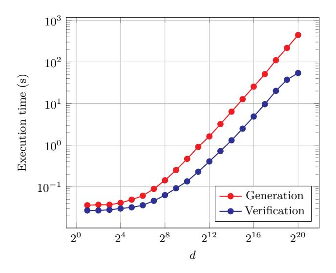
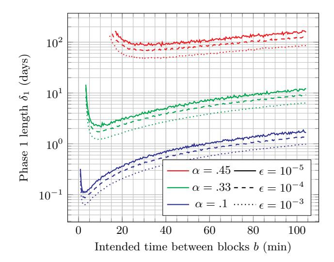
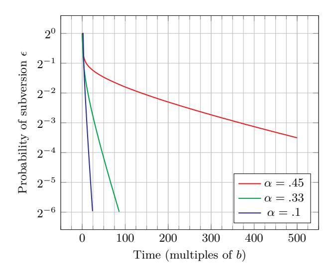

# **Mining for Privacy: How to Bootstrap a Snarky Blockchain**

Thomas Kerber, Aggelos Kiayias, and Markulf Kohlweiss

The University of Edinburgh and IOHK [papers@tkerber.org](mailto:papers@tkerber.org) [akiayias@ed.ac.uk](mailto:akiayias@ed.ac.uk) [mkohlwei@ed.ac.uk](mailto:mkohlwei@ed.ac.uk)

**Abstract.** Non-interactive zero-knowledge proofs, and more specifically succinct non-interactive zero-knowledge arguments (zk-SNARKs), have been proven to be the "Swiss army knife" of the blockchain and distributed ledger space, with a variety of applications in privacy, interoperability and scalability. Many commonly used SNARK systems rely on a *structured reference string*, the secure generation of which turns out to be their Achilles heel: If the randomness used for the generation is known, the soundness of the proof system can be broken with devastating consequences for the underlying blockchain system that utilises them. In this work we describe and analyse, for the first time, a blockchain mechanism that produces a secure SRS with the characteristic that security is shown under comparable conditions to the blockchain protocol itself. Our mechanism makes use of the recent discovery of *updateable* structured reference strings to perform this secure generation in a fully distributed manner. In this way, the SRS emanates from the normal operation of the blockchain protocol itself without the need of additional security assumptions or off-chain computation and/or verification. We provide concrete guidelines for the parameterisation of this setup which allows for the completion of a secure setup in a reasonable period of time. We also provide an incentive scheme that, when paired with the update mechanism, properly incentivises participants into contributing to secure reference string generation.

## **1 Introduction**

In the domain of distributed ledgers, non-interactive zero-knowledge proofs have many interesting applications. In particular, they have been successfully used to introduce privacy into these inherently public peer-to-peer systems. Most notably, Zerocash [\[4\]](#page-20-0) demonstrates their usefulness in the creation of private currencies. Beyond this, there are numerous suggestions [\[28,](#page-22-0) [24,](#page-22-1) [33\]](#page-23-0) to apply the same technology to smart contracts for increased privacy. Beyond privacy, other applications of zero knowledge include blockchain interoperability, e.g., [\[20\]](#page-22-2), and scalability, e.g., [\[11\]](#page-21-0).

For the practical efficiency of these designs, two things are paramount: The succinctness of proofs, and the speed of verifying these proofs. The distributed nature of the ledgers mandates that a large number of users store and verify each proof made, rendering many zero-knowledge proof systems not fit for purpose.

Research into so-called zk-SNARKs [\[30,](#page-23-1) [21,](#page-22-3) [23,](#page-22-4) [22,](#page-22-5) [29\]](#page-22-6) aims at optimising exactly these features, with proof sizes typically under a kilobyte, and verification times in the milliseconds. It is a well-known fact that non-interactive zero-knowledge requires some shared randomness, or a *common reference string*. For many succinct systems [\[30,](#page-23-1) [21,](#page-22-3) [23,](#page-22-4) [22,](#page-22-5) [29\]](#page-22-6), a stronger property is necessary: Not only is a shared random value needed, but it must adhere to a specific *structure*. Such structured reference strings (or SRS) typically consist of related group elements: *g x i* for all *i* ∈ Z*n*, for instance.

The obvious way of sampling such a reference string from public randomness reveals the exponents used – and knowledge of these values breaks the soundness of the proof system itself. To make matters worse, the security of these systems typically relies (among others) on *knowledge of exponent* assumptions, which state that to create group elements related in such a way *requires* knowing the underlying exponents and hence any SRS sampler will have to "know" the exponents used and be trusted to erase them, becoming effectively a single point of failure for the underlying system. While secure multi-party computation can be, and has been, used to reduce the trust placed on such a setup process [\[35\]](#page-23-2), the selection of the participants for the secure computation and the verification of the generation of the SRS by the MPC protocol retain an element of centralisation. Using an MPC setup remains a controversial element in the setup of a decentralised system that requires SNARKs.

Recent work has found succinct zero-knowledge proof systems with *updateable* reference strings [\[22,](#page-22-5) [29\]](#page-22-6). In these systems, given a reference string, it is possible to produce an updated reference string, such that knowing the trapdoor of the new string requires both knowing the trapdoor of the old string, *and* knowing the randomness used in the update. [\[22\]](#page-22-5) conjectured that a blockchain protocol may be used to securely generate such a reference string. Nevertheless, the exact blockchain mechanism that produces the SRS and the description of the security guarantees it can offer has, so far, remained elusive.

## **1.1 Our Contributions**

In this work we describe and analyse, for the first time, a blockchain mechanism that produces a secure SRS with the characteristic that security is shown for similar conditions under which the blockchain protocol is proven to be secure. Notably different, we make implicit use of secure erasure, and require honest majority only during a specific initialisation period. The SRS then emanates from the normal operation of the blockchain protocol itself without the need of additional security assumptions or off-chain computation and/or verification.

We rely primarily on the *chain quality* property of "Nakamoto-style" ledgers [\[17\]](#page-21-1) – distributed ledgers in which a randomised process selects which user may append a block to an already established chain. Such ledgers rely on an honest majority of hashing power (or some other resource) – and can be shown to guarantee a chain quality property which suggests that any sufficiently long chain segment will have some blocks created by an honest user, cf. [\[17,](#page-21-1) [31,](#page-23-3) [18\]](#page-22-7).

Our construction, described in [Section 3](#page-5-0) integrates reference string updates into the block creation process, but we face additional difficulties due to update calculation being a computationally heavy operation (albeit, contrary to brute-force hashing, useful). The issues arising from this are two fold. Firstly, an adversarial party can take shortcuts by supplying a low amount of entropy in their updates, and try to utilise this additional mining power to subvert the reference string which potentially has a large benefit for the adversary. Secondly, even non-colluding rational block creators may be incentivised to use bad randomness which would reduce or remove any security benefits of the updates. Our work addresses both of these issues.

We prove formally that our mechanism produces a secure reference string in [Appendix F](#page-33-0) by providing an analysis in the universal composition framework [\[12\]](#page-21-2). Furthermore, in [Section 4,](#page-9-0) we demonstrate via experimental analysis how to concretely parameterise a proof-of-work ledger to ensure that an adversary which takes shortcuts (while honest users do not) will still fail in subverting the reference string. The concrete results provided in our experimental section can be used to inform the selection of parameters in order to run our reference string generation mechanism in live blockchain systems.

We further introduce an incentive scheme in [Section 5,](#page-15-0) which ensures that rational participants in the protocol, who intend to maximise their profits, will avoid low-entropy attacks. In short, the incentive mechanism mandates that a random fraction of update contributors in the final chain will be asked to reveal their trapdoor, which will be verified to be the output of a random oracle by the underlying ledger rules. Only if a user can demonstrate that their update is indeed random do they receive a suitably determined reward for their effort. Careful choice of the reward assignment enables us to demonstrate that rational participants will utilise high entropy exponents, thus contributing to the SRS computation.

## **1.2 Related Work**

Beyond the obvious relation to the works introducing updateable reference strings in [\[22,](#page-22-5) [29\]](#page-22-6) (most notably Sonic [\[29\]](#page-22-6), which we follow closely in our instantiation in [Appendix A\)](#page-23-4), there have been attempts of practically answering the question of how to securely generate reference strings. These have been in a setting where the string is *not* updateable.

Notably [\[7\]](#page-21-3) describes the mechanism used by Sprout, the first version of Zcash, during the initial setup of the cryptocurrency's SRS. It uses multi-party computation to generate a reference string, with a root of trust on the initial group of people participating. Due to performance constraints on the MPC protocol, the set of parties participating is relatively small, although only the honesty of a single participating party is required.

For the Sapling version of Zcash, a different approach was used when their reference string was replaced (due to an upgrade of the zero-knowledge statement, and proof system used). Their second CRS generation mechanism, described in [\[8\]](#page-21-4) uses a multiple-phase round-robin mechanism to generate a reference string for Groth's zk-SNARK [\[21\]](#page-22-3). They utilise a random beacon to ensure the uniform distribution of the result, and a coordinator to perform deterministic auxiliary computations.

A great deal of work has also gone into the design of non-interactive zeroknowledge which does not require structure in it's references, such as DARK [\[10\]](#page-21-5), STARKs [\[3\]](#page-20-1), and Bulletproofs [\[9\]](#page-21-6). While these pose a promising alternative which does not require the techniques used in this work, leveraging updatability of reference strings may permit greater efficiency without additional security assumptions, and may be useful in instantiating generic constructions, such as the polynomial commitments-based Halo Infinite [\[5\]](#page-20-2).

# **2 Updateable Structured Reference Strings**

While updateable structured reference strings (uSRSs) are modelled in the works we are building on [\[29,](#page-22-6) Section 3.2], we model their security in the setting of universal composability (UC) [\[12\]](#page-21-2). Here, a uSRS is a reference string with an underlying trapdoor *τ* , which has had a structure function *S* imposed on it. *S*(*τ* ) is the reference string itself, while *τ* is not revealed to the adversary. In [Appendix A,](#page-23-4) we prove that Sonic [\[29\]](#page-22-6) (with small modifications for extraction, as described in [Subsection 2.2\)](#page-4-0), satisfies all the properties we require in this section. Our main proof is independent of the Sonic protocol however, and applies to any updateable reference string scheme satisfying the properties laid out in the rest of this section.

## **2.1 Standard Requirements**

A uSRS scheme S consists of a trapdoor domain *T*, an initial trapdoor *τ*0, a set *P* of permissible (and invertible) permutations over *T* (i.e. bijective functions whose domain and codomain is *T*), and a structure function *S* with the domain *T*. We require *P* to include the identity function id, and to be closed under function composition: ∀*p*1*, p*<sup>2</sup> ∈ *P* : *p*<sup>1</sup> ◦ *p*<sup>2</sup> ∈ *P*. An efficient permutation lifting † should exist, such that for any permutation *p* ∈ *P* and *τ* ∈ *T*, *p* † (*S*(*τ* )) = *S*(*p*(*τ* )). Finally, there must exist algorithms *ρ* ← ProveUpd(*S*(*τ* )*, p*) and *b* ← VerifyUpd(*S*(*τ* )*, ρ, S*(*p*(*τ* ))) for creating and verifying update proofs respectively. The format of these update proofs is not specified, however the following constraints must be met:

- 1. **Correctness.** Applying an honestly generated update proof will verify: ∀*p* ∈ *P, τ* ∈ *T* : VerifyUpd(*S*(*τ* )*,* ProveUpd(*S*(*τ* )*, p*)*, S*(*p*(*τ* ))).
- 2. **Structure preservation.** Applying *any* valid update is equivalent to applying *some* permutation *p* ∈ *P* on the trapdoor: ∀*ρ, τ,*srs<sup>0</sup> : VerifyUpd(*S*(*τ* )*, ρ,*srs<sup>0</sup> ) =⇒ ∃*p* ∈ *P* : srs<sup>0</sup> = *S*(*p*(*τ* )).
- 3. **Update uniformity.** Applying a random permutation is equivalent to selecting a new random trapdoor: Let *D* be the uniform distribution over *T*, and for all *τ* ∈ *T*, let *D<sup>τ</sup>* be the uniform distribution over the multiset { *p*(*τ* ) | *p* ∈ *P* }. Then ∀*τ* ∈ *T* : *D* = *D<sup>τ</sup>* .

We define a corresponding UC functionality FuSRS, which provides a reference string *S*(*p*(*τ*H)), which the adversary can influence by providing the permutation *p* ∈ *P*, given only *S*(*τ*H) as input, for a randomly sampled *τ*<sup>H</sup> ∈ *T*.

# **Functionality** FuSRS

The updateable structured reference string functionality FuSRS allows the adversary to update a reference string by applying a permutation from a set of permissible permutations *P*.

The functionality is parameterised by a trapdoor domain *T*, a structure function *S*, and a set of permissible permutations *P* over *T*.

```
State variables and initialisation values:
Variable Description
τH := ⊥ The honest part of the trapdoor
 τ := ⊥ The trapdoor
When receiving a message honest-srs from A:
  if τH = ⊥ then let τH
                         R←− T
  return S(τH)
When receiving a message srs from a party φ:
  query A with (permute, φ) and receive the reply p
  if τ = ⊥ then
     assert p ∈ P ∧ τH 6= ⊥
     let τ ← p(τH)
  return S(τ )
```

We believe this functionality to be of independent interest, and it is not explicitly tied to our implementation. Notably, while we use a distributed ledger as a weak form of a broadcast channel, other broadcasts can be considered without modification to this functionality. While, as presented, the functionality does not dictate any specific usage, we conjecture that when parameterised with an appropriate structure function and permutation set it can be used to securely instantiate updateable SRS-based SNARKs, such as Sonic [\[29\]](#page-22-6), Marlin [\[13\]](#page-21-7), or Plonk [\[16\]](#page-21-8). Due to the UC setting, this would require additional lifting to enable UC knowledge extraction, such as that of C∅C∅ [\[27\]](#page-22-8).

## <span id="page-4-0"></span>**2.2 Simulation Requirements**

In addition to the basic properties of correctness, structure preservation, and update uniformity, any simulator wishing to help realise FuSRS via updates will need to have access to two additional properties:

1. **Update proof simulation.** From an initial SRS *S*(*τ* ) for which the simulator knows the trapdoor, it can produce a valid update to any (correctly structured) SRS. Formally: ∃S*ρ*∀*τ*1*, τ*<sup>2</sup> ∈ *T* : VerifyUpd(*S*(*τ*1)*,* S*ρ*(*τ*1*, S*(*τ*2))*, S*(*τ*2)), where S*<sup>ρ</sup>* is a PPT algorithm.

2. **Permutation extraction.** The simulator must be capable of extracting the permutation *p* underlying any valid adversarial update proof.

The most natural method to achieve permutation extraction would be using white-box extractors, as the updates themselves typically rely on some form of knowledge assumption, such as knowledge-of-exponent. However, white-box extractors cannot be used in UC proofs. Instead, we will assume that the update proof is proven to correspond to a specific trapdoor through a lower-level NIZK. Crucially, this lower-level NIZK should not require a *structured* reference string, and rely only on a common random string, or a random oracle. Fortunately, it is not subject to stringent efficiency requirements as [Section 4](#page-9-0) demonstrates.

Specifically, we assume that the basic update proof *ρ* is a statement in a NIZK relation R where the witness is an encoding of the corresponding permutation *p*. We require each update proof to have one and only one corresponding permutation, formally expressed by requiring R to be a bijection. This results in a straightforward modification to the ProveUpd and VerifyUpd algorithms that permits the extraction of the underlying permutations even in the UC setting: ProveUpd also creates a NIZK proof *π* of (*ρ, p*), and returns (*ρ, π*), While VerifyUpd returns true only if this newly embedded NIZK proof also verifies.

The addition of this NIZK trivially preserves all security properties including correctness, due to the definition of R:

**Definition 1.** *A uSRS scheme is permutation extractable if the relation*

$$\mathcal{R} := \{ (\mathsf{ProveUpd}(S(\tau), p), p) \mid \tau \in T, p \in P \}$$

*is a bijection, and in NP.*

We show in [Appendix A](#page-23-4) that the relation required for the case of Sonic [\[29\]](#page-22-6) can be efficiently constructed, and leave the question of how to achieve extraction without the reliance on a further NIZK to future work.

# <span id="page-5-0"></span>**3 Building uSRS from Chain Quality**

This section shows how to securely initialise a uSRS using a distributed ledger by requiring block creators to perform updates on an evolving uSRS during an initial setup period. After waiting for agreement on the final uSRS, it can be safely used. To formally model this approach, we discuss the ideal and real worlds used in our simulation proof. Both worlds have access to a ledger, however the ideal world's ledger is independent of the reference string (which is instead provided by the independent FuSRS functionality), while the real world's ledger is programmed to generate it using updates.

#### **3.1 High-Level Overview**

This basic premise of this paper relies on Nakamoto-style ledgers' basic means of operation: Different users can extend a chain of blocks if they can satisfy some condition, with this condition being associated with a type of hardness which ensures attackers are limited in the number of extensions they can perform. Given such a structure, we associate a uSRS update with each block prior to a time  $\delta_1$ . This time is selected such that the security properties of the ledger ensure at least one of the blocks is honest in each competitive chain at this point.

In our modelling, we construct this from a ledger functionality with an additional leadership state, which is derived from information miners embed in their blocks. Specifically for our case, these encode uSRS updates. We leave this sufficiently general to allow other uses as well. The basic idea is to show that a ledger which performs uSRS updates in its leadership state is equivalent to one which doesn't, but is accompanied by the  $\mathcal{F}_{uSRS}$  functionality. They make up our real and ideal worlds respectively. After time  $\delta_1$ , users wait a further time period  $\delta_2$  until common prefix ensures that all parties agree on the reference string.

While ledger functionalities are often treated as global, our approach effectively constructs one ledger from another – the ledger is not a dependency of our protocol, but a component. In this context, globality is irrelevant, as the environment already has direct access to the functionality. We expect protocols building on the ledger to use it in a global fashion, however. The same is not true for the uSRS – most usages will likely rely on the simulator being able to extract its trapdoor.

## 3.2 Our Ledger Abstraction

Our construction of the updateable structured reference string functionality relies heavily on the properties of *common prefix*, *chain quality*, and *chain growth* defined in the "Bitcoin backbone" analysis by Garay et al. [17], for Nakamotostyle consensus algorithms. Despite our use in the section title, we make use of all three properties, not just that of chain quality. We emphasise chain quality, as it is the property central to ensuring an honest update has occurred. We briefly and informally restate the three properties:

- Common prefix. Given the current chains  $\Pi_1$  and  $\Pi_2$  of two parties, and removing k blocks from the first, it is a prefix of the second:  $\Pi_1^{\lceil k} \prec \Pi_2$ .
- Chain quality. For any party's current chain  $\Pi$ , any consecutive l blocks in this chain will include  $\mu$  blocks created by an honest party.
- Chain growth. If a party's chain is of length c, then s time slots later, it will be at least of length  $c + \gamma$ .

These parameters determine the length of the two phases of our protocol. In the first phase, we construct the reference string itself from the liveness parameter (assuming  $\mu \geq 1$ ), and in the second phase, we wait until this reference string has propagated to all users. The length of the first phase is at least  $\delta_1 \geq \lceil l\gamma^{-1} \rceil s$ , and that of the second at least  $\delta_2 \geq \lceil k\gamma^{-1} \rceil s$ . Combined, they make up the total uSRS generation delay  $\delta \geq (\lceil l\gamma^{-1} \rceil + \lceil k\gamma^{-1} \rceil)s$ .

We assume a ledger which guarantees the backbone properties, formally described in Appendix B.1. While we do not prove any specific existing proof-of-work ledger (or those based on a different leader-selection mechanism) formally

UC-realise this specific formalisation, we argue all ledgers with "Nakamoto-style" (as opposed to BFT-style) consensus do so. in Appendix B.2 Our functionality further depends on a *global clock*  $\mathcal{G}_{clock}$ , defined in Appendix E.1. For the purposes of this paper, it is sufficient that this is a beacon providing monotonically increasing values representing the current time to any party requesting them.

In addition to this, we assume each block created can contain additional information, provided by its creator (the "miner"), which can be aggregated to construct a "leader state". Each created block is associated with an update~a, and the ledger is parameterised by two procedures, Gen, and Apply, which describe the honest selection of updates, and the semantics of updates respectively. Looking forward, these utilise ProveUpd and VerifyUpd internally, although the formalism is sufficiently general to allow usage of the leader state for other, parallel purposes. The exact parameters differ in our ideal and real world, with the ideal world "hiding" the uSRS updates. Additionally, the real world adds time-sensitivity: It does nothing to the SRS after the setup period. Gen is randomised, takes a leader state  $\sigma$  and the current time t as inputs, and produces an update t0. Apply takes a leader state t0, an update t1, and an update time t2, and returns a successor state t2 and t3. For a chain, the leader state may be computed by sequentially applying all updates in the chain, starting from an initial state t2.

The adversary controls when and which party creates a new block, as well as the transactions each new block contains (provided it does not violate the backbone properties). For transactions created by a corrupted party, the adversary can further control the block's timestamp (within the reasonable limits of not being in the future, and being after the previous block), and the desired update a itself. For honest parties updates, Gen is used instead.

The UC interfaces our ledger provides are:

- SUBMIT. Submitting new transactions for the ledger.
- READ. Reading the confirmed sequence of transactions.
- PROJECTION. Reading the current chain's sequence of (potentially unconfirmed) transactions.
- LEADER-STATE. Reading the confirmed leader state.
- ADVANCE. The adversary switches a party to a longer chain.
- EXTEND. The adversary instructs a party to create a block.

While this ledger abstraction is not the focus of this paper, we believe it to be of independent interest in cases where finer control over miner's actions, or better access to the competing chains is desired.

#### <span id="page-7-0"></span>3.3 The Ideal World

Our ideal world consists of two functionalities, composed in parallel (by which we mean: the environment may address either, and they do not interact). The first is a variant of  $\mathcal{F}_{uSRS}$ , with the modification that it cannot be addressed by honest parties before  $\delta$  time slots have passed. Formally, this modification is made with a wrapper functionality  $\mathcal{W}_{delay}(\mathcal{F},\delta)$ , described in Appendix E.4.

The second is the Nakamoto-style ledger functionality, parameterised with arbitrary leader-state generation and application procedures which are also partially used in the hybrid world:  $\mathsf{Gen} = \mathsf{GenIdeal}$  and  $\mathsf{Apply} = \mathsf{ApplyIdeal}$ , and the following ledger parameters:

- 1. A common prefix parameter k.
- 2. Chain quality parameters  $\mu$  and l.
- 3. Chain growth parameters  $\gamma$  and s.

Formally then, our ideal world consists of the pair  $(W_{delay}(\delta, \mathcal{F}_{uSRS}), \mathcal{F}_{nakLedger}^{ideal})$ , as well as the global functionality  $\mathcal{G}_{clock}$ .

## <span id="page-8-0"></span>3.4 The Hybrid World

In our hybrid world, we use a uSRS scheme  $\mathcal{S}$ , with algorithms ProveUpd, VerifyUpd, the structure function S, permissible permutations P, permutation lifting  $\dagger$ , initial trapdoor  $\tau_0$ . The hybrid world consists of a separate Nakamotostyle ledger  $\mathcal{F}^{\text{real}}_{\text{nakLedger}}$ , a NIZK functionality  $\mathcal{F}^{\mathcal{R}}_{\text{NIZK}}$ , and the global clock  $\mathcal{G}_{\text{clock}}$ . The ledger is then parameterised by the same chain parameters as those in the ideal world, and the following leader-state procedures:

```
 \begin{aligned} & \textbf{procedure Apply}((\textbf{srs}, \sigma^{\textbf{ideal}}), ((\textbf{srs}', \rho, \pi, a^{\textbf{ideal}}), t)) \\ & \textbf{if srs} = \varnothing \textbf{ then let srs} \leftarrow S(\tau_0) \\ & \textbf{if } t \leq \delta_1 \wedge \textbf{VerifyUpd}(\textbf{srs}, \rho, \textbf{srs}') \textbf{ then} \\ & \textbf{send } (\textbf{VERIFY}, \rho, \pi) \textbf{ to } \mathcal{F}^{\mathcal{R}}_{\textbf{NIZK}} \textbf{ and receive the reply } b \\ & \textbf{if } b \textbf{ then} \\ & \textbf{let srs} \leftarrow \textbf{srs}' \\ & \textbf{return } (\textbf{srs}, \textbf{ApplyIdeal}(\sigma^{\textbf{ideal}}, a^{\textbf{ideal}}, t)) \\ & \textbf{procedure Gen}((\textbf{srs}, \sigma^{\textbf{ideal}}), t) \\ & \textbf{if } t > \delta_1 \textbf{ then} \\ & \textbf{return } (\epsilon, \epsilon, \epsilon, \textbf{GenIdeal}(\sigma^{\textbf{ideal}}, t)) \\ & \textbf{else} \\ & \textbf{let } p \overset{\mathcal{R}}{\leftarrow} P; \rho \leftarrow \textbf{ProveUpd}(\textbf{srs}, p) \\ & \textbf{send } (\textbf{PROVE}, \rho, p) \textbf{ to } \mathcal{F}^{\mathcal{R}}_{\textbf{NIZK}} \textbf{ and receive the reply } \pi \\ & \textbf{return } (p^{\dagger}(\textbf{srs}), \rho, \pi, \textbf{GenIdeal}(\sigma^{\textbf{ideal}}, t)) \end{aligned}
```

Note that these parameterising algorithms use  $\mathcal{F}_{\mathsf{NIZK}}^{\mathcal{R}}$ , and are therefore the reason the ledger depends on this hybrid functionality.

Key here is that once a block is received after the initial chain quality period, any reference string update it may declare is no longer carried out – at this point the uSRS is not necessarily stable, as the chain may still be reorganised, but should not change for this particular chain. Further, these procedures always mimic the ideal-world behaviour, extending it rather than replacing it. This demonstrates the composability of allowing block leaders to produce updates: One system using updates for security does not impact other parallel uses of the leadership state.

There is little additional work to be done to UC-emulate the ideal-world behaviour, besides ensuring that queries are routed appropriately, especially how the reference string is queried in the hybrid world. We describe this with a

small "adaptor" protocol in Appendix C, LEDGER-ADAPTOR. This forwards most queries, and treats uSRS queries as querying the appropriate part of the leader state after time  $\delta$ , and by ignoring them before. Formally, our real world consists of the global clock  $\mathcal{G}_{clock}$ , and the system LEDGER-ADAPTOR( $\delta$ ,  $\mathcal{F}_{nakLedger}^{real}(\mathcal{F}_{NIZK}^{\mathcal{R}})$ ).

# 3.5 Alternative Usage of $\mathcal{G}_{clock}$

In both worlds,  $\mathcal{G}_{\text{clock}}$  is used to determine the cutoff point after which the reference string is deemed secure. A simple alternative to this usage of the clock is to instead rely on the length of the chain for this purpose. We did not make this choice as it complicates the ideal world: The delay wrapper would have to communicate with the ideal world ledger, and query it for the length of parties' chains. We do not regard a clock as a significant additional assumption, however little of the remainder of this paper differs if chain lengths are used instead. Even in this case, a clock is present to guarantee liveness, although it is used only to constrain the adversary.

#### 3.6 UC Emulation

Our security is derived through UC-emulation, stated in the following theorem:

<span id="page-9-1"></span>**Theorem 1.** For any updateable reference string scheme S, satisfying correctness, structure preservation, update uniformity, update simulation with  $S_{\rho}$ , and permutation extraction, LEDGER-ADAPTOR (in the ( $\mathcal{F}^{\text{real}}_{\text{nakLedger}}, \mathcal{F}^{\mathcal{R}}_{\text{NIZK}}$ )-hybrid world, parameterised as in Subsection 3.4) UC-emulates the pair of functionalities ( $\mathcal{F}^{\text{ideal}}_{\text{nakLedger}}, \mathcal{W}_{\text{delay}}(\delta, \mathcal{F}_{\text{uSRS}})$ ), parameterised as in Subsection 3.3, in the presence of the global clock functionality  $\mathcal{G}_{\text{clock}}$ , with the simulator  $\mathcal{S}_{\text{LEDGER-ADAPTOR}}$ .

A full security proof of Theorem 1 may be found in Appendix F, and the simulator  $\mathcal{S}_{\text{LEDGER-ADAPTOR}}$  may be found in Appendix D.

## <span id="page-9-0"></span>4 Implementation and Parameter Selection

We have implemented [25] Sonic's update mechanism (described in Appendix A), and using this provide performance estimates for SRS generation in a live block-chain network. Further, we simulate the optimal adversarial attack strategy, and demonstrate how this may be used to select optimal parameters for the secure generation of reference strings. We demonstrate that for currently typical applications, these parameters are practical for real-world usage.

While we have not modified a full blockchain client to utilise this extended consensus, we discuss the impact it would have on each of the following points:

- block verification
- block generation
- chain reorganisation
- network usage

#### **–** local storage

While the Bitcoin backbone paper [\[17\]](#page-21-1) provides bounds on chain parameters in given situations, these have three main drawbacks in the context of this paper:

- 1. The bounds are not tight.
- 2. The criteria for security is stricter than required: It asserts liveness and persistence are never violated, while this paper only requires them in a few select cases.
- 3. The analysis is in the synchronous model while the generation and verification of reference strings can take a significant amount of time.

To obtain sensible parameters to generate reference strings, we measure the time taken for computing and verifying updates, and factor this processing overhead into a simulation of the optimal adversarial strategy to subvert the SRS generation procedure.

The implementation and numbers provided for execution time and storage use the commonly used BLS12-381 curve pair. Circuits which have been practically deployed tend to require a depth of at most half a million, so we will often assume a Sonic uSRS depth of 500,000. All data shown is available at [\[25\]](#page-22-9), and may be reproduced with the provided source code.

## **4.1 Execution Time of uSRS Operations**

We tested our implementation of the uSRS generation mechanism on an AMD Ryzen 7 2700X 8-core processor with hyper-threading enabled. This processor is a standard consumer-grade CPU – in proof-of-work mining it is likely that miners will have access to better hardware. All operations have been parallelised, and the verification operation has been additionally optimised to use less pairing operations. The workload, especially for uSRS generation, is also highly parallelisable (consisting of primarily a large number of group exponentiations), suggesting further improvements by utilising GPUs and clusters of machines are possible. If such improvements are applied, the total time *delay* required for the secure generation procedure, as well as the optimal intended block time could be reduced proportionally to the increase in parallelisation; assuming paralellisation across 10 machines could reduce both by an order of magnitude, for instance.

We measured the time taken for create and verify a uSRS update in relation to the uSRS depth in [Figure 1.](#page-11-0) For our NIZK, we use a UC-secure Fischlin proof, described in [Appendix A.3.](#page-26-1) We measure the overhead of these proofs to be 23.956ms for proving and 1.567ms for verifying (a Fiat-Shamir proof of the same type was measured to 0.921ms and 0.870ms respectively), using SHA-3 in place of a random oracle. For larger dimensions of reference strings, neither have much impact on the total runtime.

Finally, we implemented *aggregate updates*: The bulk of Sonic's update verification procedure is concerned with verifying the structure of the reference string, while a few parts of it verify that it is an exponentiation of the previous string. By retaining only the latter parts, a series of updates can be verified almost as quickly as a single update. The verification of aggregate proofs has an overhead of 1.634ms per update included in the aggregate. The bulk of this cost arises from the verification of the Fischlin proof. This allows for even large chain reorganisations to be quickly verified.



<span id="page-11-0"></span>**Fig. 1.** The time taken to produce and verify uSRS updates.

## <span id="page-11-1"></span>**4.2 Simulating the Optimal Attack Strategy**

The mechanism we have presented in this paper operates in two phases. In the first phase, the adversary has the chance to *subvert* the reference string, while in the second phase it can carry out a denial of service attack, potentially convincing users that an incorrect (but not subverted) reference string is the canonical one.

For the first phase, the adversary's optimal strategy is to mine entirely independently from any honest activity: the adversary cannot adopt any honest block – doing so would break the subversion of its reference string. Further, the adversary has no reason to share any of its own blocks except if it reached the threshold of having a fully valid subverted reference string – it only gives the honest network a chance to catch up, in the case that the adversary is ahead. This allows for a straightforward simulation of the consensus protocol: The probability of either honest parties, or the adversary creating an individual block is exponentially distributed. In addition to this, honest parties have a fixed processing overhead before they may start mining: This may include a networking delay, but more crucially it includes the time taken to verify a newly received block's uSRS update, and to produce the subsequent update. We assume that the adversary can bypass large parts of this overhead, by virtue of network dominance, by skipping verification, and by producing reference string updates with small (and therefore insecure) exponents.

The overhead manifests as shifting the honest party's exponential distribution for block generation by a fixed constant. More precisely, we parameterise each experiment by:

- **–** The intended time between blocks *b*
- **–** The combined networking, and update overhead *d*
- **–** The fraction of adversarial mining power *α*

Of these three, *d* can be seen as fixed, depending on the depth of the uSRS being generated, and the corresponding speed of verification and update generation. For simplicity, we assume a uSRS depth of 500,000, which corresponds to *d* being approximately 250 seconds on our single-CPU setup.

We draw the time of the next adversarial block from the exponential distribution with *λ* = *α/b*, and the next honest block from the exponential distribution with *λ* = (1 − *α*)*/b*, shifted to the right by *d* (i.e. the probability density is 0 for *x < d*). The simulation is then advanced to the lesser of the two times, which is resampled from the same distribution. The number of times the adversary or the honest parties have extended their chain is counted, and the honest parties win at any point if and only if the honest chain is longer than the adversarial chain.

We run one million experiments in parallel, either up to a fixed end time, or until a large enough fraction of the experiments end in honest victory. We refer to the probability of an adversarial success as the probability of subversion . [Figure 2](#page-13-0) demonstrates that for a fixed *d*, a tradeoff exists between the target time between blocks *b*, and the time until any given subversion threshold is met.

A practical limit of this simulation approach is that it cannot by itself determine the length of time needed to wait until is negligible for most typical security parameters. We can however observe that for fixed parameters, decreases approximately exponentially as time passes, as seen in [Figure 3,](#page-13-1) outside of a brief initial window.

While the second phase – that where the adversary attempts to create disagreement as to which reference string is the canonical one – may initially seem different, its optimal strategy is identical, as it essentially wishes to create as long as possible a fork, starting one block prior to the end of the first phase (to select a different reference string). As creating the longest fork *forking at this point* does not allow the adversary to accept honest blocks after it, nor gives the adversary a reason to share its blocks, the adversarial strategy – and this analysis – is the same.

## **4.3 Storage and Network Usage**

A Sonic reference string consists of 4*d*+ 1 elements in G<sup>1</sup> and 4*d*+ 2 elements in G2. For the commonly used BLS12-381 curve pair, G<sup>1</sup> elements have a storage



<span id="page-13-0"></span>**Fig. 2.** The time required to generate a secure uSRS, as a function of the intended time between blocks. This depends on the proportion of adversarial mining power *α*, and the bound on the probablity of subversion. Each data point represents the time until at most a fraction of of one million parallel experiments ended in adversarial victory. Values are given assuming *d* = 250*s*, and both axes scale linearly to *d*.



<span id="page-13-1"></span>**Fig. 3.** The probability of the reference string being subverted , as a function of the time passed, in multiples of the intended time between blocks *b*. This depends on the proportion of adversarial mining power *α*, and the compound overhead *d*. *b* is selected to be approximately at the minimum seen in [Figure 2,](#page-13-0) with *d* = *.*15*b*, *d* = *.*4*b*, and *d* = 2*b* for the *α* = *.*45, *.*33, and *.*1 respectively.

requirement of 48 bytes each, and  $\mathbb{G}_2$  elements of 96 bytes each. An update proof includes an additional two  $\mathbb{G}_1$  elements, and a Fischlin proof, which itself consists of twelve iterations, each with 2 elements in  $\mathbb{F}_q^*$  (each of which requires 32 bytes to store), two elements of  $\mathbb{G}_1$ , and a 16-bit nonce. Each part of an aggregate update has an additional two  $\mathbb{G}_2$  elements.

As it is not necessary to retain intermediate reference strings, and aggregate updates are sufficient, for a chain of length l, and with an uSRS depth of d, this is a storage requirement of 576d + 288 bytes for the uSRS itself, and  $l \cdot (2 \cdot 48 + 2 \cdot 96 + 12 \cdot (2 \cdot 32 + 2 \cdot 48 + 2)) = 2,232l$  bytes for storing updates.

For 500,000 gates and chains of length 20,000, this corresponds to a total storage requirement of 318MiB, with the reference string itself being the largest part, at 275MiB. Although this is quite manageable as a storage requirement, it must be considered that the SRS itself (and a single update of around 2KiB) has to be re-transmitted with each block. While at the common home-internet upload speed of 10Mb/s, a block would take slightly under 4 minutes to transmit, it is reasonable to assume that miners would invest in high-grade connections to offset the chance of their block being replaced with a competitors. Speeds up to 10Gb/s are commercially available, which would reduce the transmission time to under a second.

One remaining issue is that of denial-of-service. The receipt and verification of a reference string is costly, and should therefore only be done *after* a block's proof-of-work has been received, which should depend on a commitment to the subsequently sent reference string – such as the update proof itself. An attacker can still perform a limited denial of service attack with blocks they legitimately mined – however this uses no more resources in verification than a legitimate block would.

#### 4.4 Conclusion

Figure 2 provides insight into the space of tradeoffs which can be made for the secure generation of reference strings. While the secure generation of a reference string is possible even for a small honest majority, the time required to do so is much higher than for a more relaxed setting, with  $\delta_1$  being approximately three months for  $\alpha=.45$ , in contrast to around two days for  $\alpha=.33$ . The full setup is double this: six months for  $\alpha=.45$ , and four days for  $\alpha=.33$ . Perhaps surprisingly, the desired probability of subversion  $\epsilon$  has a more muted effect on the required setup time.

The minima observed for  $\delta_1$  suggest that simply deploying this system on existing blockchain systems as they are currently parameterised is unwise: Most blockchains emphasise small values of b to enable transactions to settle quickly, with even notoriously slow chains such as Bitcoin having values on the lower end of our scale. This is directly linked to the compound overhead of verification and update generation – when b is small, the adversary can better use its advantage of bypassing large parts of the verification and update procedure. As previously noted, there is a lot of room for speedup by assuming miners use greater com-

putation power – if each miner used ten machines, even the  $\alpha = .45$  case would be reduced to under a month in total.

# <span id="page-15-0"></span>5 Low-Entropy Update Mitigation

While our analysis indicates that in a Byzantine, honest majority setting, our protocol produces a trustworthy reference string, it also asks participants to dedicate computational resources to updates. It follows that in a rational setting, players need to be properly incentivised to follow the protocol. We emphasise that the rational setting is not the focus of this paper, and optimistically, in a setting where the majority of miners are rational and a small fraction honest, the few honest blocks are sufficient to eliminate the issue described in this section.

For Sonic, a protocol deviation exists that breaks the security of the reference string: By choosing the exponent in a specific low-entropy fashion, (e.g.,  $y=2^l$ ) the computation of the update, which primarily relies on repeated squaring, can be done significantly faster. More generally, some permutations in P may be more efficiently computable. In more detail, instead of using a random permutation p, a specific choice is made that eases the computation of  $\operatorname{srs}'$  – in the most extreme case, for any uSRS scheme, the update for  $p=\operatorname{id}$  is trivial.

## 5.1 Proposed Construction

In order to facilitate a mitigation for this class of attacks, we will need to assume an additional property of the underlying ledger, in particular it must provide a "resettable" randomness beacon: With each ADVANCE operation (where adversary must be restricted in how often it may do such ADVANCE queries), a random beacon value is sampled in a variable bcn and is associated with the corresponding block. Beacons of this kind are often easily available, for instance by hashing the proof-of-work [6], and are inherent in many proof-of-stake designs. Prior work [14] demonstrates that such beacon values allow for the adversary to bias them only by "resetting" it at most a certain number of times, say t, before they are fixed by entering the ledger's confirmed state, with the exact value of t depending on the chain parameters.

We can then amend Gen to derive its random values from the random oracle, by sending the query (bcn, nonce) to  $\mathcal{F}_{RO}$ , where nonce is a randomly selected nonce, and bcn is the previous block's beacon value. The response is used to index the set of trapdoor permutations P, choosing the result p, and the nonce is stored by miners locally, and kept private. We adapt the Phase 1 period  $\delta_1$  so that at least  $l' := l(1-\theta)^{-1} + c$  blocks will be produced, where  $\theta$  and c are new security parameters (to be discussed below). Next, after Phase 2 ends, we can be sure that the beacon value associated with the end of Phase 1 has been reset at most t times.

We extract from bcn l' biased coins, each with probability  $\theta$ . For each block, if the corresponding coin is 1, it is required to reveal its randomness within a period of time at least as long as the liveness parameter. Specifically, a party

which created one of the selected blocks may reveal its nonce. If its update matches this nonce, the party receives an additional reward of value *R* times the standard block reward.

While this requires a stricter chain quality property, with the ledger functionality instead enforcing that one of these *l* non-opened updates are honest, we sketch why this property still holds in the next section.

## **5.2 Security Intuition**

Consider now a rational miner with hashing power *α*. We know that, at best, using an underlying blockchain like Bitcoin, the relative rewards such a miner may expect are at most *α/*(1 − *α*) in expectation; this assumes a selfish mining strategy that wins all network races against the other rational participants. Now consider a miner who uses low entropy exponents to save on computational power on created blocks and, as a result, boosts their hashing power *α* to an increased relative hashing power of *α* <sup>0</sup> *> α*. The attacker can further try to influence the blockchain by forking and selectively disclosing blocks which has the effect of resetting the bcn value to a preferred one. To see that the impact of this is minimal, we prove the following lemma.

<span id="page-16-0"></span>**Lemma 1.** *Consider a mapping ρ* 7→ {0*,* 1} *l that generates l* 0 *independent biased coin flips, each with probability θ, when ρ is uniformly selected. Consider any fixed n* ≤ *l* <sup>0</sup> *positions and suppose an adversary gets to choose any one out of t independent draws of the mapping's random input with the intention to increase the number of successes in the n positions. The probability of obtaining more than n*(1 + )*θ successes is* exp(−*Ω*( 2 *θn*) + ln *t*)*.*

*Proof.* In case *t* = 1, result follows from a Chernoff bound on the event *E* defined as obtaining more than *n*(1 + )*θ* successes, and has probability exp(−*Ω*( 2 *θn*)). Given that each reset is an independent draw of the same experiment, by applying a union bound we obtain the lemma's statement. ut

The optimal strategy of a miner utilising low-entropy attacks is to minimise the number of blocks of other miners are chosen, to increase its relative reward. [Lemma 1](#page-16-0) demonstrates that at most a factor of (1+) <sup>−</sup><sup>1</sup> damage can be done in this way. Regardless of whether a miner utilises low-entropy attacks or not, their optimal strategy beyond this is selfish mining, in the low-entropy attack mining in expectation *l* 0*α* <sup>0</sup>*/*(1 − *α* 0 ) blocks [\[17\]](#page-21-1). A rational miner utilising low-entropy attacks will not gain any additional rewards, while a miner not doing so will gain at least *l* <sup>0</sup>*α/*(1−*α*)(1+) −1 *θR* rewards from revealing their randomness, by [Lemma 1.](#page-16-0) It follows that for a rational miner, this strategy can be advantageous to plain selfish mining only in case:

$$\frac{\alpha'}{1-\alpha'} > (1+\theta(1+\epsilon)^{-1}R)\frac{\alpha}{1-\alpha'}$$

If we assume a miner can increase their effective hash rate by a factor of *c*, using low-entropy exponents, then their advantage in the low entropy case is *α* <sup>0</sup> = *αc/*(*αc* + *β*), where *β* = 1 − *α* is the relative mining power of all other miners. If follows that the miner benefits if and only if:

$$\begin{array}{l} \frac{\alpha c}{\alpha c + \beta} \cdot \frac{\alpha c + \beta}{\beta} > (1 + \theta (1 + \epsilon)^{-1} R) \frac{\alpha}{\beta} \\ \iff c > 1 + \theta (1 + \epsilon)^{-1} R \end{array}$$

If we adopt a sufficiently large intended time interval between blocks it is possible to bound the relative savings of a selfish miner using low-entropy exponents; following the parameterisation of [Subsection 4.2,](#page-11-1) if a selfish miner using such exponents can improve their hashing power by at most a multiplicative factor *c* then we can mitigate such attack by setting *R* to (*c* − 1)*/*(*θ*(1 + ) −1 ).

# **6 Discussion**

While the clean generation of a new reference string from a ledger protocol is itself useful, real-world situations are likely to be more complex. In this section we discuss practical adjustments that may be made.

## <span id="page-17-0"></span>**6.1 Upgrading Reference Strings**

As distributed ledgers are typically long-lived, and may well outlive any reference string used within it – or have been running before a reference string was needed. Indeed, the Zcash protocol has seen upgrades in its reference string. A reference string being replaced with a new one is innocuous without further context, however it is important to consider how they are usually used in zero-knowledge proofs. If the proof they are used in is stateless, upgrading from an insecure to a secure reference string behaves as one may naively expect: It ensures that after the upgrade, security properties hold.

In the example of Zcash, which runs a variant of the Zerocash [\[4\]](#page-20-0) protocol, the situation is more muddy. Zerocash makes *stateful* zero-knowledge proofs. Suppose a user is sceptical of the security of the initial setup – and there is good reason to be [\[34\]](#page-23-5) – but is convinced the second reference string is secure. Is such a user able to use Zcash with confidence in its security?

Had Zcash not had safeguards in place, the answer would be no. While the protocol may operate as intended currently, and the user can be convinced of that, due to the stateful nature of the proofs, the user cannot be convinced of the correctness of this state. The Zcash cryptocurrency did employ similar safeguards to those we outline below. We stress the importance of such here, as not every project may have the same foresight.

Specifically, for a Zerocash-based system, an original reference string's backdoor could have been used to create mismatched transactions, and to effectively "mint" large coins illicitly. This process is undetectable at the time, and the minted coins would persist across a reference string upgrade. Our fictitious user may therefore be rightfully suspicious as to the value of any coins he is sold – they may be a part of an almost infinite pool!

Such an attack, once carried out (especially against a currency) is hard to recover from – it is impossible to identify "legitimate" owners of the currency, even if the private transaction history were deanonymised, and the culprit identified. The culprit may have traded whatever he created already. Simply invalidating the transaction would therefore harm those he traded with, not himself. In an extreme case, if he traded one-to-one with legitimate owners of the currency, he would succeed in effectively stealing the honest users funds. If such an attack is identified, the community has two unfortunate options: Annul the funds of potentially legitimate users, or accept a potentially large amount of inflation.

We may assume a less grim scenario however: Suppose we are *reasonably confident* in the security of our old reference string, but we are *more confident* of the new one. Is it possible to convince users that we have genuinely upgraded our security? We suggest the usage of a type of *firewalling* property. Such properties are common in the domain of cross-chain transfers [\[20\]](#page-22-2), and are designed to prevent a catastrophic failure on one chain damaging another.

For monetary transfers, the firewall would guarantee an upper-bound of funds was not exceeded. Proving the firewall property is preserved is easy if a small loss of privacy is accepted – each private coin being re-minted before it can be used after the upgrade, during which time its value must be declared. Assuming everything operates fine, and the firewall property is not violated, users interacting with the post-firewall state can be confident as to the upper bound of funds available. Further, attacks on the system can be identified: If an attacker mints too many coins, eventually the firewall property will be violated, indicating that too many coins were in circulation – bringing the question of how to handle this situation with it. We believe that a firewall property does however give peace of mind to users of the system, and is a practical means to assuage concerns about the security of a system which once had a questionable reference string.

In Zcash, a soft form of such firewalling is available, in that funds are split across several "pools", each of which uses a different proving mechanism. The total value of each pool can be observed, and values under zero would be considered a cause for alarm, and rejected. Zcash use the terminology "turnstiles" [\[36\]](#page-23-6), and no attacks have been observed through them.

A further consideration for live systems is that as [Subsection 4.2](#page-11-1) shows, the time required strongly depends on the frequency between blocks. This may conflict with other considerations for selecting the block time – a potential solution for this is to only perform updates on "superblocks": blocks which meet a higher proof-of-work (or other selection mechanism) criteria than usual.

## **6.2 The Root of Trust**

An important question for all protocols in the distributed ledger setting is whether a user entering the system at some point during its runtime can be convinced to trust in its security. Early proof-of-stake protocols, such as [\[26\]](#page-22-10), did poorly at this, and were subject to "stake-bleeding" attacks [\[19\]](#page-22-11) for instance – effectively meaning new users could not safely join the network.

For reference strings, if a newly joining user is prepared to accept that the honest majority assumption holds, they may trust the security of the reference string, as per [Theorem 1.](#page-9-1) There is a curious difference to the security of the consensus protocol however: to trust the consensus – at least for proof-of-work based protocols – it is most important to trust a *current* honest majority, as these protocols are assumed to be able to recover from dishonest majorities at some point in their past. The security of the reference string on the other hand only relies on assuming honest majority during the initial *δ* time units. This may become an issue if a large period of time passes – why should someone trust the intentions of users during a different age?

In practice, it may make sense to "refresh" a reference string regularly to renew faith in it. It is tempting to instead continuously perform updates, however as noted in [Subsection 6.1,](#page-17-0) this does not necessarily increase faith in a stateful system, although is can remove the "historical" part from the honest majority requirement when used with stateless proofs.

Most subversion attacks are detectable – they require lengthy forks which are unlikely to occur during a legitimate execution. In an optimistic case, where no attack is attempted, this may provide an additional level of confirmation: if there are no widespread claims of large forks during the initial setup, then the reference string is likely secure (barring large-scale out-of-band censorship). A flip side to this is that it may be a lot easier to sow doubt, however, as there is no way to *prove* this: A malicious actor could create a fork long after the initial setup, and claim that it is evidence of an attack to undermine the credibility of the system.

## **6.3 Applications to Non-Updateable SNARKs**

Updateable SNARK schemes have two distinct advantages which our protocol makes use of: First, they have an explicit update procedure which allows a party *φ* to replace a reference string whose security depends on some assumption *A*, with one whose security depends on *A* ∨ (*φ* is honest). Second, they can survive with a partially biased reference string, a fact which we don't use directly in this paper, however the functionality FuSRS we provide permits rejection sampling, encoding it into the ideal world.

The lack of an update algorithm can be resolved for some zk-SNARKs, such as [\[21\]](#page-22-3), by the existence of a weaker property: In two phases, the reference string can be constructed with (potentially different) parties performing roundrobin updates (also group exponentiations) in each phase. This approach is also detailed in [\[8\]](#page-21-4), and it implies a natural translation to our protocol, in which the first phase is replaced with two phases of the same length, performing the first and second phase updates respectively.

The security of partially biased references strings has not been sufficiently analysed for non-updateable SNARKs, however this weakness can be mitigated. Following [\[8\]](#page-21-4), it is possible to use a pure random beacon (as opposed to the resettable one used in [Section 5\)](#page-15-0) to create a "pure" reference string from the "impure" one presented so far. To sketch the design: The random beacon would be queried after time *δ*, and the randomness used to select a trapdoor permutation over the reference string. This would then be applied by each party independently, arriving at the same – randomly distributed – reference string.

As this is not required for updateable SRS schemes, we did not perform this analysis in depth. However the approach to the simulation would be to perform the SRS generation identically, and then program the random beacon to invert all permutations applied to the honest reference string. Since this includes the one honest permutation applied on every honest update, this is indistinguishable from a random value to the adversary. It is worth noting that the requirement of a random beacon is on the stronger side of requirements, especially as it should itself not allow adversarial influence to provide the desired advantage. Approaches using block hashes for randomness introduce exactly the limited influence which we are attempting to remove!

# **7 Acknowledgements**

The second and third author were partially supported by the EU Horizon 2020 project PRIVILEDGE #780477. We thank Eduardo Morais for providing data on the required depth of reference strings for Zcash's Sapling protocol.

# **Bibliography**

- <span id="page-20-3"></span>[1] Christian Badertscher, Peter Gazi, Aggelos Kiayias, Alexander Russell, and Vassilis Zikas. Ouroboros genesis: Composable proof-of-stake blockchains with dynamic availability. In David Lie, Mohammad Mannan, Michael Backes, and XiaoFeng Wang, editors, *ACM CCS 2018*, pages 913–930. ACM Press, October 2018.
- <span id="page-20-4"></span>[2] Christian Badertscher, Ueli Maurer, Daniel Tschudi, and Vassilis Zikas. Bitcoin as a transaction ledger: A composable treatment. In Jonathan Katz and Hovav Shacham, editors, *CRYPTO 2017, Part I*, volume 10401 of *LNCS*, pages 324–356. Springer, Heidelberg, August 2017.
- <span id="page-20-1"></span>[3] Eli Ben-Sasson, Iddo Bentov, Yinon Horesh, and Michael Riabzev. Scalable, transparent, and post-quantum secure computational integrity. Cryptology ePrint Archive, Report 2018/046, 2018. [https://eprint.iacr.org/2018/](https://eprint.iacr.org/2018/046) [046](https://eprint.iacr.org/2018/046).
- <span id="page-20-0"></span>[4] Eli Ben-Sasson, Alessandro Chiesa, Christina Garman, Matthew Green, Ian Miers, Eran Tromer, and Madars Virza. Zerocash: Decentralized anonymous payments from bitcoin. In *2014 IEEE Symposium on Security and Privacy*, pages 459–474. IEEE Computer Society Press, May 2014.
- <span id="page-20-2"></span>[5] Dan Boneh, Justin Drake, Ben Fisch, and Ariel Gabizon. Halo infinite: Recursive zk-snarks from any additive polynomial commitment scheme. Cryptology ePrint Archive, Report 2020/1536, 2020. [https://eprint.iacr.](https://eprint.iacr.org/2020/1536) [org/2020/1536](https://eprint.iacr.org/2020/1536).

- <span id="page-21-9"></span>[6] Joseph Bonneau, Jeremy Clark, and Steven Goldfeder. On bitcoin as a public randomness source. Cryptology ePrint Archive, Report 2015/1015, 2015. <http://eprint.iacr.org/2015/1015>.
- <span id="page-21-3"></span>[7] Sean Bowe, Ariel Gabizon, and Matthew D. Green. A multi-party protocol for constructing the public parameters of the pinocchio zk-SNARK. In Aviv Zohar, Ittay Eyal, Vanessa Teague, Jeremy Clark, Andrea Bracciali, Federico Pintore, and Massimiliano Sala, editors, *FC 2018 Workshops*, volume 10958 of *LNCS*, pages 64–77. Springer, Heidelberg, March 2019.
- <span id="page-21-4"></span>[8] Sean Bowe, Ariel Gabizon, and Ian Miers. Scalable multi-party computation for zk-SNARK parameters in the random beacon model. Cryptology ePrint Archive, Report 2017/1050, 2017. <http://eprint.iacr.org/2017/1050>.
- <span id="page-21-6"></span>[9] Benedikt Bünz, Jonathan Bootle, Dan Boneh, Andrew Poelstra, Pieter Wuille, and Greg Maxwell. Bulletproofs: Short proofs for confidential transactions and more. In *2018 IEEE Symposium on Security and Privacy*, pages 315–334. IEEE Computer Society Press, May 2018.
- <span id="page-21-5"></span>[10] Benedikt Bünz, Ben Fisch, and Alan Szepieniec. Transparent SNARKs from DARK compilers. In Anne Canteaut and Yuval Ishai, editors, *EU-ROCRYPT 2020, Part I*, volume 12105 of *LNCS*, pages 677–706. Springer, Heidelberg, May 2020.
- <span id="page-21-0"></span>[11] Vitalik Buterin. On-chain scaling to potentially 500 tx/sec through mass tx validation. [https://ethresear.ch/t/on-chain-scaling-to]( https://ethresear.ch/t/on-chain-scaling-to-potentially-500-tx-sec-through-mass-tx-validation/3477 )[potentially-500-tx-sec-through-mass-tx-validation/3477]( https://ethresear.ch/t/on-chain-scaling-to-potentially-500-tx-sec-through-mass-tx-validation/3477 ).
- <span id="page-21-2"></span>[12] Ran Canetti. Universally composable security: A new paradigm for cryptographic protocols. In *42nd FOCS*, pages 136–145. IEEE Computer Society Press, October 2001.
- <span id="page-21-7"></span>[13] Alessandro Chiesa, Yuncong Hu, Mary Maller, Pratyush Mishra, Noah Vesely, and Nicholas P. Ward. Marlin: Preprocessing zksnarks with universal and updatable SRS. In Anne Canteaut and Yuval Ishai, editors, *Advances in Cryptology - EUROCRYPT 2020 - 39th Annual International Conference on the Theory and Applications of Cryptographic Techniques, Zagreb, Croatia, May 10-14, 2020, Proceedings, Part I*, volume 12105 of *Lecture Notes in Computer Science*, pages 738–768. Springer, 2020.
- <span id="page-21-10"></span>[14] Bernardo David, Peter Gazi, Aggelos Kiayias, and Alexander Russell. Ouroboros praos: An adaptively-secure, semi-synchronous proof-of-stake blockchain. In Jesper Buus Nielsen and Vincent Rijmen, editors, *EURO-CRYPT 2018, Part II*, volume 10821 of *LNCS*, pages 66–98. Springer, Heidelberg, April / May 2018.
- <span id="page-21-11"></span>[15] Marc Fischlin. Communication-efficient non-interactive proofs of knowledge with online extractors. In Victor Shoup, editor, *CRYPTO 2005*, volume 3621 of *LNCS*, pages 152–168. Springer, Heidelberg, August 2005.
- <span id="page-21-8"></span>[16] Ariel Gabizon, Zachary J. Williamson, and Oana Ciobotaru. Plonk: Permutations over lagrange-bases for oecumenical noninteractive arguments of knowledge. Cryptology ePrint Archive, Report 2019/953, 2019. [https:](https://eprint.iacr.org/2019/953) [//eprint.iacr.org/2019/953](https://eprint.iacr.org/2019/953).
- <span id="page-21-1"></span>[17] Juan A. Garay, Aggelos Kiayias, and Nikos Leonardos. The bitcoin backbone protocol: Analysis and applications. In Elisabeth Oswald and Marc

- Fischlin, editors, *EUROCRYPT 2015, Part II*, volume 9057 of *LNCS*, pages 281–310. Springer, Heidelberg, April 2015.
- <span id="page-22-7"></span>[18] Juan A. Garay, Aggelos Kiayias, and Nikos Leonardos. The bitcoin backbone protocol with chains of variable difficulty. In Jonathan Katz and Hovav Shacham, editors, *CRYPTO 2017, Part I*, volume 10401 of *LNCS*, pages 291–323. Springer, Heidelberg, August 2017.
- <span id="page-22-11"></span>[19] Peter Gaži, Aggelos Kiayias, and Alexander Russell. Stake-bleeding attacks on proof-of-stake blockchains. Cryptology ePrint Archive, Report 2018/248, 2018. <https://eprint.iacr.org/2018/248>.
- <span id="page-22-2"></span>[20] Peter Gazi, Aggelos Kiayias, and Dionysis Zindros. Proof-of-stake sidechains. In *2019 IEEE Symposium on Security and Privacy*, pages 139– 156. IEEE Computer Society Press, May 2019.
- <span id="page-22-3"></span>[21] Jens Groth. On the size of pairing-based non-interactive arguments. In Marc Fischlin and Jean-Sébastien Coron, editors, *EUROCRYPT 2016, Part II*, volume 9666 of *LNCS*, pages 305–326. Springer, Heidelberg, May 2016.
- <span id="page-22-5"></span>[22] Jens Groth, Markulf Kohlweiss, Mary Maller, Sarah Meiklejohn, and Ian Miers. Updatable and universal common reference strings with applications to zk-SNARKs. In Hovav Shacham and Alexandra Boldyreva, editors, *CRYPTO 2018, Part III*, volume 10993 of *LNCS*, pages 698–728. Springer, Heidelberg, August 2018.
- <span id="page-22-4"></span>[23] Jens Groth and Mary Maller. Snarky signatures: Minimal signatures of knowledge from simulation-extractable SNARKs. In Jonathan Katz and Hovav Shacham, editors, *CRYPTO 2017, Part II*, volume 10402 of *LNCS*, pages 581–612. Springer, Heidelberg, August 2017.
- <span id="page-22-1"></span>[24] Ari Juels, Ahmed E. Kosba, and Elaine Shi. The ring of Gyges: Investigating the future of criminal smart contracts. In Edgar R. Weippl, Stefan Katzenbeisser, Christopher Kruegel, Andrew C. Myers, and Shai Halevi, editors, *ACM CCS 2016*, pages 283–295. ACM Press, October 2016.
- <span id="page-22-9"></span>[25] Thomas Kerber. Implementations to accompany "mining for privacy". GitHub, 2020. <https://github.com/tkerber/pistis-impl>.
- <span id="page-22-10"></span>[26] Aggelos Kiayias, Alexander Russell, Bernardo David, and Roman Oliynykov. Ouroboros: A provably secure proof-of-stake blockchain protocol. In Jonathan Katz and Hovav Shacham, editors, *CRYPTO 2017, Part I*, volume 10401 of *LNCS*, pages 357–388. Springer, Heidelberg, August 2017.
- <span id="page-22-8"></span>[27] Ahmed Kosba, Zhichao Zhao, Andrew Miller, Yi Qian, Hubert Chan, Charalampos Papamanthou, Rafael Pass, abhi shelat, and Elaine Shi. C∅c∅: A framework for building composable zero-knowledge proofs. Cryptology ePrint Archive, Report 2015/1093, 2015. [https://eprint.iacr.org/](https://eprint.iacr.org/2015/1093) [2015/1093](https://eprint.iacr.org/2015/1093).
- <span id="page-22-0"></span>[28] Ahmed E. Kosba, Andrew Miller, Elaine Shi, Zikai Wen, and Charalampos Papamanthou. Hawk: The blockchain model of cryptography and privacypreserving smart contracts. In *2016 IEEE Symposium on Security and Privacy*, pages 839–858. IEEE Computer Society Press, May 2016.
- <span id="page-22-6"></span>[29] Mary Maller, Sean Bowe, Markulf Kohlweiss, and Sarah Meiklejohn. Sonic: Zero-knowledge SNARKs from linear-size universal and updatable structured reference strings. In Lorenzo Cavallaro, Johannes Kinder, XiaoFeng

- Wang, and Jonathan Katz, editors, *ACM CCS 2019*, pages 2111–2128. ACM Press, November 2019.
- <span id="page-23-1"></span>[30] Bryan Parno, Jon Howell, Craig Gentry, and Mariana Raykova. Pinocchio: Nearly practical verifiable computation. In 2013 IEEE Symposium on Security and Privacy, pages 238–252. IEEE Computer Society Press, May 2013.
- <span id="page-23-3"></span>[31] Rafael Pass, Lior Seeman, and abhi shelat. Analysis of the blockchain protocol in asynchronous networks. In Jean-Sébastien Coron and Jesper Buus Nielsen, editors, EUROCRYPT 2017, Part II, volume 10211 of LNCS, pages 643–673. Springer, Heidelberg, April / May 2017.
- <span id="page-23-8"></span>[32] Claus-Peter Schnorr. Efficient identification and signatures for smart cards. In Gilles Brassard, editor, *CRYPTO'89*, volume 435 of *LNCS*, pages 239–252. Springer, Heidelberg, August 1990.
- <span id="page-23-0"></span>[33] Samuel Steffen, Benjamin Bichsel, Mario Gersbach, Noa Melchior, Petar Tsankov, and Martin T. Vechev. zkay: Specifying and enforcing data privacy in smart contracts. In Lorenzo Cavallaro, Johannes Kinder, XiaoFeng Wang, and Jonathan Katz, editors, ACM CCS 2019, pages 1759–1776. ACM Press, November 2019.
- <span id="page-23-5"></span>[34] Josh Swihart, Benjamin Winston, and Sean Bowe. Zcash counterfeiting vulnerability successfully remediated. ECC Blog, February 2019. https://electriccoin.co/blog/zcash-counterfeiting-vulnerability-successfully-remediated/.
- <span id="page-23-2"></span>[35] Zcash. Parameter generation. https://z.cash/technology/paramgen/, 2018.
- <span id="page-23-6"></span>[36] Zcash. Address and value pools in Zcash. https://zcash.readthedocs.io/en/latest/rtd\_pages/addresses.html#turnstiles, 2019.

# <span id="page-23-4"></span>A The Sonic uSRS

Sonic's uSRS [29, Section 4.3] consists of a series of exponentiations of group elements in pairing groups  $\mathbb{G}_1$  and  $\mathbb{G}_2$  of prime order q, where a bilinear pairing  $e: \mathbb{G}_1 \times \mathbb{G}_2 \to \mathbb{G}_T$  exists. Specifically, given generators  $g \in \mathbb{G}_1, h \in \mathbb{G}_2$  and a depth parameter  $d \in \mathbb{Z}_q$ , the SRS has a trapdoor of  $(\alpha, x) \in \mathbb{F}_q^{*2}$ , with  $\tau_0 = (1, 1)$ . The corresponding structure function is defined as:

$$S((\alpha,x)) := \left(\left\{g^{x^i}, h^{x^i}, h^{\alpha x^i}\right\}_{i=-d}^d, \left\{g^{\alpha x^i}\right\}_{i=-d, i \neq 0}^d\right)$$

## <span id="page-23-7"></span>A.1 Specification of Sonic Updates

We omit the  $e(g, h^{\alpha})$  term presented in Sonic, as this can be computed from the rest of the SRS, and is therefore immaterial to the update procedure. The permitted trapdoor permutations are field multiplications:

$$P := \{ (\alpha, x) \mapsto (\alpha\beta, xy) \mid (\beta, y) \in \mathbb{F}_q^{*2} \}.$$

Correspondingly, † exponentiates group elements:

$$\begin{split} p &= (\alpha, x) \mapsto (\alpha \beta, xy) \implies \\ p^{\dagger} &= \left( \left\{ G_i, H_i, H_i' \right\}_{i=-d}^d, \left\{ G_i' \right\}_{i=-d, i \neq 0}^d \right) \\ &\mapsto \left( \left\{ G_i^{y^i}, H_i^{y^i}, H_i'^{\beta y^i} \right\}_{i=-d}^d, \left\{ G_i'^{\beta y^i} \right\}_{i=-d, i \neq 0}^d \right) \end{split}$$

Observe that field multiplications over  $\alpha$  or x can efficiently be applied to the corresponding structure through exponentiation:  $g^{(\alpha x^i)\beta y^i} = (g^{\alpha x^i})^{\beta y^i}$ . The full update proof procedure is as follows:

```
\begin{array}{c} \mathbf{procedure} \ \mathsf{ProveUpd}(\mathsf{srs}, p) \\ \mathbf{let} \ (\beta, y) \leftarrow p((1, 1)) \\ \mathbf{return} \ (g^y, g^{\beta y}, \pi) \end{array}
```

The verification procedure ensures correct computation by checking the consistency of various pairing computations:

```
\begin{array}{l} \mathbf{procedure} \ \mathsf{VerifyUpd}(\mathsf{srs}, \rho, \mathsf{srs}') \\ \mathbf{let} \ (\{G_i, H_i, H_i'\}_{i=-d}^d, \{G_i'\}_{i=-d, i \neq 0}^d) \leftarrow \mathsf{srs} \\ \mathbf{let} \ (\{I_i, J_i, J_i'\}_{i=-d}^d, \{I_i'\}_{i=-d, i \neq 0}) \leftarrow \mathsf{srs}' \\ \mathbf{let} \ (A, B, \pi) \leftarrow \rho \\ \mathbf{if} \ e(I_1', h) \neq e(B, H_1') \lor e(g, J_1') \neq e(B, H_1') \lor e(I_1, h) \neq e(A, H_1) \lor e(g, J_1) \neq e(A, H_1) \lor I_0 \neq g \lor J_0 \neq h \ \mathbf{then} \\ \mathbf{return} \ 0 \\ \mathbf{for} \ i = -d \ \mathbf{to} \ d \ \mathbf{do} \\ \mathbf{if} \ \neg (i = d \lor e(I_i, J_1) = e(I_1, J_i) = e(I_{i+1}, h) = e(g, J_{i+1})) \lor \neg (e(I_i, J_0') = e(g, J_1')) \lor \\ (i \neq 0 \land \neg e(I_i, J_0') = e(I_1', h)) \ \mathbf{then} \\ \mathbf{return} \ 0 \\ \mathbf{return} \ 1 \end{array}
```

## A.2 Satisfaction of Security Properties

**Theorem 2.** Sonic, as described in Appendix A.1, is an updatable reference string scheme, satisfying correctness, structure preservation, update uniformity, update extraction, permutation extraction, and permutation lifting.

*Proof.* We prove each property individually.

Correctness. Follows from all pairing checks being satisfied.  $\Box$ 

Structure preservation. Suppose a structured input  $S(\tau)$ , and an update proof  $\rho$ , and a new SRS srs', where:

$$\begin{split} S(\tau) &= \left(\left\{g^{x^i}, h^{x^i}, h^{\alpha x^i}\right\}_{i=-d}^d, \left\{g^{\alpha x^i}\right\}_{i=-d, i \neq 0}^d\right) \\ \operatorname{srs'} &= \left(\left\{g^{k_i}, h^{m_i}, h^{n_i}\right\}_{i=-d}^d, \left\{g^{l_i}\right\}_{i=-d, i \neq 0}^d\right) \\ \rho &= (g^y, g^{\beta y}) \end{split}$$

If VerifySRS returns 1, we know all of the following hold, due to the conditions checked:

```
\begin{array}{l} -e(g^{l_1},h)=e(g,h^{n_1})=e(g^{\beta y},h^{\alpha x})\\ -e(g^{k_1},h)=e(g,h^{m_1})=e(g^y,h^x)\\ -\forall i\in [-d,d):e(g^{k_i},h^{m_1})=e(g^{k_1},h^{m_i})=e(g^{k_{i+1}},h)=e(g,h^{m_{i+1}})\\ -\forall i\in [-d,d]:e(g^{k_i},h^{n_0})=e(g,h^{n_i})\\ -\forall i\in [-d,d]\setminus \{0\}:e(g^{k_i},h^{n_0})=e(g^{l_i},h) \end{array}
```

As e(g,h) is a generator over  $\mathbb{G}_T$ , and each of the above can be expressed as an equality of exponentiations of the form  $e(g,h)^a = e(g,h)^b$ , we simplify these to equalities within  $\mathbb{F}_q^*$  of their exponents:

```
-l_1 = n_1 = \alpha \beta xy 

-k_1 = m_1 = xy 

-\forall i \in [-d, d) : k_i m_1 = k_1 m_i = k_{i+1} = m_{i+1} 

-\forall i \in [-d, d] : k_i n_0 = n_i 

-\forall i \in [-d, d] \setminus \{0\} : k_i n_0 = l_i
```

It follows directly that  $n_0 = \alpha \beta$ ,  $k_i = m_i = (xy)^i$ , and  $l_i = n_i = \alpha \beta(xy)^i$ . As a result, srs' matches exactly the structured reference string  $S((\alpha \beta, xy)) = p^{\dagger}(S(\tau))$ .

Update uniformity. Let  $\tau=(\alpha,x)$ .  $p\overset{R}{\leftarrow}P$  is defined by a multiplication with two uniformly sampled field elements in  $\beta,y\overset{R}{\leftarrow}\mathbb{F}_q^*$ , such that the trapdoor  $p(\tau)=(\alpha\beta,xy)$ . Due to multiplication in prime fields with a fixed element (here  $\alpha$  and x) being a bijective functions, the result  $(\alpha\beta,xy)$  is also distributed uniformly at random in  $\mathbb{F}_q^{*2}$ , therefore being indistinguishable from a new, randomly sampled trapdoor.

Update proof simulation. We present the following simulation algorithm:

```
\begin{array}{c} \mathbf{procedure} \ \mathcal{S}_{\rho}((\alpha,x),\mathsf{srs}) \\ (\{G_i,H_i,H_i'\}_{i=-d}^d,\{G_i'\}_{i=-d,i\neq 0}^d) \leftarrow \mathsf{srs} \\ \mathbf{return} \ \left(G_1^{\left(x^{-1}\right)},G_1^{\prime\left(x^{-1}\right)\left(\alpha^{-1}\right)}\right) \end{array}
```

This utilises only a small number of efficient group operations, and is therefore PPT. As the VerifyUpd pairing checks all succeed, the returned update proof will verify.

Permutation Extraction. Observe that

$$\mathcal{R}((A,B),p) \iff \text{let } (a,b) = p((1,1)) \text{ in } A = q^a \wedge B = q^b.$$

A straightforward encoding of p is the pair of field elements (a, b). This relation is clearly in NP, and is also a bijection due to the relation of  $\mathbb{G}_1$  and  $\mathbb{F}_q^*$ .

#### <span id="page-26-1"></span>**A.3 Instantiating F<sup>R</sup> NIZK**

We can employ Fischlin's transform [\[15\]](#page-21-11) in combination with a simple sigma protocol to prove knowledge of pairs of exponents. Specifically, we propose the parallel composition of two Schnorr proofs of knowledge of exponent [\[32\]](#page-23-8). It is important to treat these as a single proof, and not two separate proofs, as the latter would enable the adversary to create proofs which are only partially extractable. We posit that these would still allow for simulation, however the simulator would be tasked with a more difficult, and implementation specific book-keeping.

# **B The Nakamoto Ledger**

The basic functionality of this ledger allows the submission of transactions, and retrieving each of the following:

- **–** A confirmed prefix of the ledger state.
- **–** A "projection" of the ledger state i.e. what the local state will approach, if there is no chain reorganisation.
- **–** The confirmed "leader state", which models the mechanism used for the SRS generation.

When any of these values is queried, the functionality ensures that liveness and chain quality properties still hold. The adversary further has the power to instruct the creation of a new block on behalf of any party, and to instruct any party to adopt a different chain. In both cases, the functionality ensures that the common prefix property is preserved. The adversary has full control over the contents of both honest and adversarial blocks, as well as their order.

## <span id="page-26-0"></span>**B.1 Functionality Definition**

## **Functionality** FnakLedger

A ledger following a Nakamoto-style consensus, with each party having a *projected* chain, a prefix of which is common to all parties. Common prefix, chain quality and chain growth are guaranteed.

*State variables and initialisation values:*

```
Variable Description
Π := φ 7→  Mapping of parties to projected ledger states
    T := ∅ Multiset of submitted transactions
```

hon := ∅ Mapping of block ids to 1 if they are honest, or 0 if not

*When receiving a message* (submit*,*tx) *from a party φ:*

```
send read to Gclock and receive the reply t
let T ← T ∪ {(tx, t)}
query A with (transaction,tx, t)
```

*When receiving a message* read *from a party φ:*

```
assert liveness(\phi) \wedge chainQuality(\phi)
    return map(proj<sub>1</sub>, txs(\Pi(\phi)^{\lceil k}))
When receiving a message PROJECTION from a party \phi:
    assert liveness(\phi) \wedge chainQuality(\phi)
    return map(proj_1, txs(\Pi(\phi)))
When receiving a message LEADER-STATE from a party \phi:
    assert liveness(\phi) \wedge chainQuality(\phi)
   let \vec{a} \leftarrow \text{map}(\lambda(\cdot, a, \cdot, t) : (a, t), \Pi(\phi)^{\lceil k})
   return foldl(Apply, \emptyset, \vec{a})
When receiving a message (extend, \phi, B, t, a) from A:
   send READ to \mathcal{G}_{\mathsf{clock}} and receive the reply t'
   let id \stackrel{R}{\leftarrow} \{0,1\}^{\kappa}
   if \phi \in \mathcal{H} then
          let \vec{a} \leftarrow \mathsf{map}(\lambda(\cdot, a, \cdot, t) : (a, t), \Pi(\phi))
          let \sigma \leftarrow \mathsf{foldl}(\mathsf{Apply}, \varnothing, \vec{a})
          let a \stackrel{R}{\leftarrow} \text{Gen}(\sigma, t')
          let t \leftarrow t' let hon(id) \leftarrow 1
    else
          \mathbf{let}\ \mathsf{hon}(\mathsf{id}) \leftarrow 0
          if t' < t then let t \leftarrow t'
          else if \exists t'' : (\cdot, \cdot, \cdot, t'') = \mathsf{last}(\Pi(\phi)) \land t'' > t then let t \leftarrow t''
    let \Pi(\phi) \leftarrow \Pi(\phi) \parallel (B, a, \mathsf{id}, t)
   assert \forall \phi' \in \mathcal{P} : \Pi(\phi)^{\lceil k} \prec \Pi(\phi')
    return (B, a, id, t)
 When receiving a message (ADVANCE, \phi, \Sigma') from A:
    assert \exists \phi' \in \mathcal{P} : \Sigma' \prec \Pi(\phi')
    assert \forall \phi' \in \mathcal{P} : \Sigma'^{\lceil k} \prec \Pi(\phi') \land \Pi(\phi')^{\lceil k} \prec \Sigma'
   let \Pi(\phi) \leftarrow \Sigma'
Helper procedures:
    function txs(\Pi_{\phi})
          let \vec{B} \leftarrow \mathsf{map}(\mathsf{proj}_1, \Pi_{\phi})
          return concat(\vec{B})
    \mathbf{procedure} liveness(\phi)
          send READ to \mathcal{G}_{\mathsf{clock}} and receive the reply t
          if \exists t_0 < t : |[t_b \mid (\cdot, \cdot, \cdot, t_b) \in \Pi(\phi), t_0 - s \le t_b < t_0]|
               <\gamma \wedge t_0 - s \ge 0 then
                return \perp
          return \forall (\mathsf{tx}, t') \in T : t' + \lceil (l+k)\gamma^{-1} \rceil s > t \ \lor (\mathsf{tx}, t') \in \mathsf{txs}(\Pi(\phi)^{\lceil k})
    procedure chainQuality(\phi)
          let \vec{\mathsf{id}} \leftarrow \mathsf{map}(\mathsf{proj}_3, \Pi(\phi)^{\lceil k})
         \mathbf{return} \ \forall i \in \mathbb{Z}_{|\vec{a}|-l} : \left(\sum_{j \in \mathbb{Z}_l} \mathsf{ids}(\vec{\mathsf{id}}_{i+j})\right) \geq \mu l
```

In order to judge chain growth, this functionality needs access to a simple global clock, given in Appendix E.1.

## <span id="page-28-0"></span>**B.2 Relation to Existing Protocols**

Existing UC treatments of Nakamoto-style ledgers, such as [\[1,](#page-20-3) [2\]](#page-20-4) already provide functionalities which provide persistence and liveness guarantees. Moreover, the protocols used in their implementation have been independently shown to satisfy the properties of common prefix, chain quality, and chain growth.

Given similar assumptions, such as a limited random oracle, and a synchronous or semi-synchronous network, these protocols will also fit the FnakLedger functionality presented above. Notably the UC-proof of these ledgers relies on first proving these three chain properties, then proving persistence and liveness, and finally concluding that these satisfy their ledger functionality.

FnakLedger exposes more of the internals of the protocol – the fact that there is a chain selection process, and that this is subject to the constraints of common prefix, chain quality, and chain growth – but otherwise does not greatly change the ideal world behaviour.

Due to this strengthened functionality being designed to merely expose more of the well-understood protocol properties, we conjecture that UC implementations which have a proof relying on the three Nakamoto chain properties can be used to realise FnakLedger, with a large part of the proof applying directly.

# <span id="page-28-1"></span>**C The Adaptor Protocol**

We provide a small protocol which adapts the honest interface of the Nakamoto ledger to match that of the ideal world – specifically ensuring the leadership state seen matches the ideal world's, and that the SRS is read only if sufficient time has passed.

# **Protocol** ledger-adaptor

The protocol adaptor fits the interface of F real nakLedger to match those of FuSRS and F ideal nakLedger. It operates in the (F real nakLedger*,* Gclock)-hybrid world.

```
When receiving a message (submit,tx) from a party φ:
  send (submit,tx) to F
                         real
                         nakLedger
When receiving a message read from a party φ:
  send read to F
                   real
                   nakLedger and receive the reply txs
  return txs
When receiving a message projection from a party φ:
  send projection to F
                          real
                         nakLedger and receive the reply txs
  return txs
When receiving a message leader-state from a party φ:
  send leader-state to F
                            real
                            nakLedger and receive the reply (·, σideal)
  return σ
           ideal
When receiving a message srs from a party φ:
  send read to Gclock and receive the reply t
```

```
if t < \delta then return \bot else send LEADER-STATE to \mathcal{F}^{\text{real}}_{\text{nakLedger}} and receive the reply (srs, \cdot) return srs

Forward SUBMIT, READ, and PROJECTION queries to \mathcal{F}^{\text{real}}_{\text{nakLedger}}
```

#### <span id="page-29-0"></span>D The Simulator

# Simulator $\mathcal{S}_{\text{LEDGER-ADAPTOR}}$ The simulator between the protocol adaptor over $\mathcal{F}^{real}_{nakLedger}$ , and $\mathcal{F}^{ideal}_{nakLedger}$ and $\mathcal{F}_{uSRS}$ . It operates in the $\mathcal{G}_{clock}$ -hybrid world. State variables and initialisation values: Variable Description $\mathcal{F}_{\mathsf{nakLedger}}^{\mathsf{simul}}$ A simulation of the hybrid-world ledger $\mathcal{F}_{\mathsf{NIZK}}^{\mathcal{R}}|$ A simulation of the low-level NIZK functionality $A := \varnothing |_{\text{Map from honest updates to the applied permutation}}$ When receiving a message (TRANSACTION, tx, t) from $\mathcal{F}_{nakLedger}^{ideal}$ : simulate sending (SUBMIT, tx) to $\mathcal{F}_{nakLedger}^{simul}$ When receiving a message (SUBMIT, tx) from $\mathcal{A}$ for $\mathcal{F}^{real}_{nakLedger}$ : send (SUBMIT, tx) to $\mathcal{F}_{nakLedger}^{ideal}$ When receiving a message (PERMUTE, $\phi$ ) from $\mathcal{F}_{uSRS}$ : simulate sending LEADER-STATE to $\mathcal{F}_{\mathsf{nakLedger}}^{\mathsf{simul}}$ **through** $\phi$ and receive the reply $(srs, \cdot)$ $\mathbf{let}\ \vec{a} \leftarrow \mathsf{map}(\mathsf{proj}_2, \mathcal{F}^{\mathsf{simul}}_{\mathsf{nakLedger}}.\Pi(\phi))$ return $\mathcal{X}_p(\vec{a})$ When receiving a message (EXTEND, $\phi$ , B, t, a) from A for $\mathcal{F}_{\mathsf{nakLedger}}^{\mathsf{real}}$ : send READ to $\mathcal{G}_{\mathsf{clock}}$ and receive the reply t'if $\phi \in \mathcal{H} \wedge t' \leq \lceil l \gamma^{-1} \rceil s$ then $\mathbf{let} \ \vec{a} \leftarrow \mathsf{map}(\mathsf{proj}_2, \mathcal{F}^{\mathsf{simul}}_{\mathsf{nakLedger}}.\Pi(\phi))$ let $(srs, \cdot) \leftarrow foldl(Apply, \varnothing, \vec{a})$ let $p \leftarrow \mathcal{X}_p(\vec{a})$ if $p^{-1\dagger}(srs) \neq S(\tau_0)$ then // We cannot extract a trapdoor; // the SRS is already secure let $p' \stackrel{R}{\leftarrow} P; \rho \leftarrow \mathsf{ProveUpd}(\mathsf{srs}, p')$ let $\operatorname{srs}' \leftarrow p'^{\dagger}(\operatorname{srs})$ simulate sending (PROVE, $\rho$ , p') to $\mathcal{F}_{NIZK}^{\mathcal{R}}$ and receive the reply $\pi$ else

```
// We produce an update to match a
                     // random "initial" SRS
                     let \tau \leftarrow p(\tau_0)
                     let p' \stackrel{R}{\leftarrow} P
                     \mathbf{send} Honest-Srs to \mathcal{F}_{uSRS} and
                             receive the reply srs_{\mathcal{H}}
                     let \operatorname{srs}' \leftarrow p'^{\dagger}(\operatorname{srs}_{\mathcal{H}})
                     let \rho \leftarrow \mathcal{S}_{\rho}(p(\tau), \mathsf{srs}')
                     query A with (PROVE, \rho) and receive the reply \pi,
                             satisfying \pi \neq \bot \land (\rho, \pi) \notin \mathcal{F}_{\mathsf{NIZK}}^{\mathcal{R}}.\overline{\Pi} \land (\cdot, \pi) \notin \mathcal{F}_{\mathsf{NIZK}}^{\mathcal{R}}.\Pi, else sampling
                             from \{0,1\}^{\kappa}
                     let \mathcal{F}_{\mathsf{NIZK}}^{\mathcal{R}}.\Pi \leftarrow \mathcal{F}_{\mathsf{NIZK}}^{\mathcal{R}}.\Pi \cup \{(\rho,\pi)\}
                     let A(\rho) \leftarrow p
             \mathbf{let}\ a^{\mathsf{ideal}} \leftarrow \bot
     else if \phi \in \mathcal{H} then
            let \operatorname{srs}', \rho, \pi \leftarrow \epsilon
            let a^{\mathsf{ideal}} \leftarrow \bot
     \mathbf{else}\ \mathbf{let}\ (\mathsf{srs'}, \rho, \pi, a^{\mathsf{ideal}}) \leftarrow a
     \mathbf{send}~(\mathtt{EXTEND}, \phi, B, t, a^{\mathsf{ideal}})~\mathbf{to}~\mathcal{F}^{\mathsf{ideal}}_{\mathsf{nakLedger}} and
             receive the reply (B, a^{ideal}, id, t)
     if \phi \in \mathcal{H} then
             \mathbf{let} \,\, \mathcal{F}^{\text{simul}}_{\text{nakLedger}}. \text{hon(id)} \leftarrow 1
            \mathbf{let}\ \mathcal{F}^{\mathsf{simul}}_{\mathsf{nakLedger}}.\mathsf{hon}(\mathsf{id}) \leftarrow 0
     \mathbf{let}\ \mathcal{F}^{\mathsf{simul}}_{\mathsf{nakLedger}}.\Pi(\phi) \leftarrow \mathcal{F}^{\mathsf{simul}}_{\mathsf{nakLedger}}.\Pi(\phi) \parallel (B, (\mathsf{srs}', \rho, \pi, a^{\mathsf{ideal})}, \mathsf{id}, t)
     \mathbf{assert} \ \forall \phi' \in \mathcal{P} : \mathcal{F}_{\mathsf{nakLedger}}^{\mathsf{simul}}.\Pi(\phi)^{\lceil k} \prec \mathcal{F}_{\mathsf{nakLedger}}^{\mathsf{simul}}.\Pi(\phi')
     \mathbf{return}\ (B, (\mathsf{srs}', \rho, \pi, a^{\mathsf{ideal}}), \mathsf{id}, t)
 When receiving a message (ADVANCE, \phi, \Sigma') from \mathcal{A} for \mathcal{F}_{\mathsf{nakLedger}}^{\mathsf{real}}:
     simulate sending (ADVANCE, \phi, \Sigma') to \mathcal{F}_{nakl,edgel}^{simul}
     // Remove SRS updates from \Sigma'
    \mathbf{let}\ \underline{\Sigma'} \leftarrow \mathsf{map}(\lambda(B,(\cdot,\cdot,\cdot,a^{\mathsf{ideal}}),t):(B,a^{\mathsf{ideal}},t),\underline{\Sigma})
     send (ADVANCE, \phi, \Sigma') to \mathcal{F}_{\mathsf{nakLedger}}^{\mathsf{ideal}}
Forward requests to \mathcal{F}_{\mathsf{NIZK}}^{\mathcal{R}}, and all other adversarial messages for \mathcal{F}_{\mathsf{nakLedger}}^{\mathsf{real}} to
\mathcal{F}_{\mathsf{nakLedger}}^{\mathsf{simul}}
Helper procedures:
     procedure \mathcal{X}_p(\vec{a})
            let p \leftarrow id
             let srs = S(\tau_0)
             for (\operatorname{srs}', \rho, \pi, \cdot) in \vec{a} do
                     // Skip invalid updates
                     if \neg VerifyUpd(srs, \rho, srs') \lor (\rho, \pi) \notin \mathcal{F}_{NIZK}^{\mathcal{R}}.\Pi then continue
                     \mathbf{let}\ \mathsf{srs} \leftarrow \mathsf{srs}'
                     if (\rho, \pi) \in \mathcal{F}_{\mathsf{NIZK}}^{\mathcal{R}}.W then
                             let p \leftarrow \mathcal{F}_{\mathsf{NIZK}}^{\mathcal{R}}.W((\rho,\pi)) \circ p
                     else if \rho \in A then
```

```
// The update is honest.
      // Start with its permutation.
      let p ← A(ρ)
   else
      // A witness-less adversarial update
      // was encountered.
      abort
return p
```

# **E Minor UC Functionalities**

# <span id="page-31-0"></span>**E.1 The Global Clock**

# **Functionality** Gclock The global clock allows parties to agree on some discrete notion of time. *State variables and initialisation values:* Variable Description *t* := 0 Current time *T* := ∅ Timekeepers *A* := ∅ Agreements to advance *When receiving a message* register *from a party φ:* **let** *T* ← *T* ∪ {*φ*} *When receiving a message* deregister *from a party φ:* **let** *T* ← *T* \ {*φ*} *When receiving a message* update *from a party φ:* **let** *A*(*φ*) ← > **if** ∀*φ* ∈ *T* : *A*(*φ*) **then let** *t* ← *t* + 1; *A* ← *λφ* : ⊥ **query** A **with** tick-tock *When receiving a message* read *from a party φ:*

## **E.2 Non-Interactive Zero-Knowledge**

**return** *t*

#### **Functionality** F R NIZK

The (malleable) non-interactive zero-knowledge functionality F R NIZK allows proving of statements in an NP relation R.

```
State variables and initialisation values:
Variable Description
W := ∅ Mapping of statement/proof pairs to witnesses
 Π := ∅ Set of statement/proof pairs
 Π := ∅ Set of known invalid statement/proof pairs
When receiving a message (prove, x, w) from a party φ:
  if ¬xRw then
     return ⊥
  query A with (prove, x) and receive the reply π,
     satisfying π 6= ⊥ ∧ (x, π) ∈/ Π ∧ (·, π) ∈/ Π, else sampling from {0, 1}
                                                                           κ
  let Π ← Π ∪ {(x, π)}; W(x, π) ← w
  return π
When receiving a message (maul, x, π, π0
                                       ) from A:
  if (x, π) ∈ Π then
     let Π ← Π ∪ {(x, π0
                         )}
     let W(x, π0
                ) ← W(x, π)
When receiving a message (verify, x, π) from a party φ:
  if (x, π) ∈/ Π ∪ Π ∧ π 6= ⊥ then
     query A with (verify, x, π)
     // The adversary has been given a chance to
     // prove the statement. It didn't take it.
     if (x, π) ∈/ Π ∪ Π then
        let Π ← Π ∪ (x, π)
  return (x, π) ∈ Π
```

# <span id="page-32-1"></span>**E.3 Random Oracle**

## **Functionality** FRO

The random oracle functionality FRO returns a uniform random value in {0*,* 1} *κ* for each input.

*State variables and initialisation values:*

```
Variable Description
```

*H* := ∅ A map from inputs to (fixed) outputs

*When receiving a message* (query*, x*) *from a party φ:*

```
if x /∈ H then let H(x)
                         R←− {0, 1}
                                  κ
return H(x)
```

## <span id="page-32-0"></span>**E.4 Delay Wrapper**

# **Functionality** Wdelay(*δ,* F)

The wrapper functionality Wdelay(*δ,* F) of F accepts *honest* inputs only after *δ* time slots.

```
When receiving a message M from a party φ:
  send read to Gclock and receive the reply t
  if t < δ ∧ φ ∈ H then return ⊥
  else
     send M to F and receive the reply y
     return y
```

# <span id="page-33-0"></span>**F Security Analysis**

As for any UC proof, we require a simulator which ensures the ideal world behaves indistinguishably from the real world. Our simulator, Sledger-adaptor, is formally described in [Appendix D.](#page-29-0) Intuitively, this simulator ensures that the real and ideal world's ledgers are equivalent, and that the real world uSRS is equal to the uSRS produced in the ideal world.

In order to achieve this, the simulator ensures that the initial honest reference string provided by FuSRS is the basis of the uSRS of a simulated execution of the real-world protocol. Doing so relies primarily on three things: First, the simulator's ability to extract the permutation from any adversarial reference string update. Second, the simulator's ability to, given the adversarial trapdoors, then produce a valid "honest" update which ensures the reference string is a random permutation of the ideal-world honest string *S*(*τ*H). And finally, the simulator's knowledge that the final reference string in its simulation will have at least one honest update.

The simulator observes each of the competing chains, and when the first honest update occurs in each, coerces the simulated update into a permutation of the ideal honest reference string. For each subsequent honest update, the simulator performs the update normally, remembering the randomness used. Combined with extracting from adversarial updates, the simulator either knows the *entire* trapdoor of the reference string (if there was no honest update), or all except for the first honest update. By the backbone properties enforced by FnakLedger, the simulator knows that the first case will not apply, and that only one prefix of valid updates will exist, after *δ* time has passed. As a result, the simulator knows exactly which permutation to apply to the honest ideal reference string to match the real world's result.

As FuSRS only provides a single honest SRS, the simulator applies a random permutation to this for each initial honest update, ensuring that the updates of different chains remain unlinkable.

We will prove UC-emulation, and will therefore refer to the ideal and real worlds frequently throughout the proof. Beyond this, the simulator locally simulates the NIZK functionality and the ledger functionality. To be clear which functionality we are talking about at any point, we will use  $\mathcal{F}_{\mathsf{nakLedger}}^{\mathsf{ideal}}$ ,  $\mathcal{F}_{\mathsf{nakLedger}}^{\mathsf{simul}}$ , and  $\mathcal{F}_{\mathsf{nakLedger}}^{\mathsf{real}}$  to refer to the ideal, simulated, and real ledgers respectively. We refer to the real-world NIZK functionality as  $\mathcal{F}_{\mathsf{NIZK}}^{\mathcal{R}}$ , and the simulted NIZK as  $\mathcal{S}_{\mathsf{LEDGER-ADAPTOR}}$ .  $\mathcal{F}_{\mathsf{NIZK}}^{\mathcal{R}}$ . The notation  $\mathcal{F}.x$  is used to mean "the variable x within the functionality  $\mathcal{F}$ " – it is also used to refer to the ideal trapdoor  $\mathcal{F}_{\mathsf{uSRS}}.\tau_{\mathcal{H}}$ .

Our simulator, which we assume is provided with the update simulation algorithm  $S_p$ , and can extract permutations from adversarial updates via a simulated NIZK, is equipped with a helper function  $\mathcal{X}_p$ . Given a series of updates,  $\mathcal{X}_p$  computes the permutation applied to the reference string's trapdoor as far back as possible. It receives as inputs the sequence of updates  $\vec{a}$ , and has access to a mapping W from NIZK statements and proofs to corresponding witnesses (as far as the simulator knows them), and a mapping A from honest updates to the permutation applied to the honest SRS. It returns a permutation in P, which can be applied either to the initial trapdoor  $\tau_0$ , or the initial honest trapdoor  $\tau_H$ , to create the same SRS as the sequence of updates. We prove this in the following auxiliary lemma that will be used in the proof of our main theorem.

<span id="page-34-0"></span>**Lemma 2.** In the ideal-world execution of  $S_{\text{LEDGER-ADAPTOR}}$ ,  $\mathcal{X}_p(\vec{a})$  outputs a permutation  $p \in P$ , such that its inverse, applied to the underlying trapdoor of the SRS generated from the given sequence of updates  $\vec{a}$ , is either the initial trapdoor  $\tau_0$ , or the honest trapdoor  $\tau_H$ .

Proof. The output of  $\mathcal{X}_p$  is either id, a permutation in the mapping A, a permutation recorded by the simulated NIZK, or a series of function compositions of the above. As only permutations in P are stored in A, id  $\in P$ , and as P is closed under composition, the returned permutation is in P. The permutation applied corresponds directly to how the underlying trapdoor of the uSRS is updated by longest suffix of updates in  $\vec{a}$  for which the trapdoor is known – i.e. the trapdoor permutation is recorded in  $\mathcal{F}_{\mathsf{NIZK}}^{\mathcal{R}}.W$ , or a permutation of the honest trapdoor is recorded in A. When this isn't the case, the update is skipped, and the trapdoor reset, ensuring that any trapdoors preceeding a non-extractable value are ignored. The case that the trapdoors are known for all of the updates is trivial; as by definition inverting this permutation will result in the initial trapdoor  $\tau_0$ .

If, however, at any point the trapdoor is not recorded in  $\mathcal{F}_{\mathsf{NIZK}}^{\mathcal{R}}.W$  (despite VerifyUpd succeeding), at this point the trapdoor must be honestly generated: As this update was not skipped, the NIZK proofs associated with it must verify. The only way for the proofs to verify, and the NIZK functionality *not* to have recorded the corresponding witnesses, however, is that the simulator added the proof manually to the NIZK's set of valid proofs. This only happens at one point – when creating simulated NIZK proofs to accompany simulated update proofs, which is used *only* for random permutations applied to the honest reference string. While (if the adversary is capable of inverting the structure function) multiple honest updates may exist in the same chain, if at least one of them is a replayed update, the last such effectively "resets" the reference string to a known permutation of the honest reference string.

Finally, we note that for this witness-less update, the remaining trapdoor defines a permutation of  $\mathcal{F}_{\mathsf{uSRS}}.\tau_{\mathcal{H}}$ . Algorithm  $\mathcal{X}_p$  extracts the trapdoors from all subsequent updates to compute the permutation applied to this honest trapdoor – ensuring precisely that inverting this permutation results in  $\mathcal{F}_{\mathsf{uSRS}}.\tau_{\mathcal{H}}$ .

Proof (of Theorem 1). If the environment can distinguish between these worlds, there must exist a minimal series of interactions the environment, combined with its adversary, can make to cause the other UC ITMs to behave sufficiently differently to allow distinguishing. We will show that for any interaction the environment makes, it will not learn enough information to distinguish the two worlds, and therefore that across all (polynomially many) interactions it also cannot distinguish. First, we consider what actions the adversary/environment pair can take. The interactions fall into the following categories:

- 1. Honest or adversarial SUBMIT, READ, LEADER-STATE, or PROJECTION queries
- 2. Interactions with  $\mathcal{F}_{\mathsf{NIZK}}^{\mathcal{R}}$ , or  $\mathcal{G}_{\mathsf{clock}}$
- 3. Advance queries
- 4. Extend queries
- 5. SRS queries

We will establish the following invariants throughout the execution of the UC security game:

- $\mathcal{G}_{\mathsf{clock}}$  has the same internal state in both the real and ideal worlds.
- $-\mathcal{S}_{\text{LEDGER-ADAPTOR}}.\mathcal{F}_{\text{NIZK}}^{\mathcal{R}}$  has the same internal state as the real-world  $\mathcal{F}_{\text{NIZK}}^{\mathcal{R}}$ , except that it does not know the witnesses for honestly generated proofs or their mauled variants.
- $S_{\text{LEDGER-ADAPTOR}}$ .  $\mathcal{F}_{\text{nakLedger}}^{\text{simul}}$  has the same internal state as the real-world ledger  $\mathcal{F}_{\text{nakLedger}}^{\text{real}}$ , and differs from the ideal-world ledger  $\mathcal{F}_{\text{nakLedger}}^{\text{ideal}}$  only in that all state updates contain an addition SRS update term.

Ledger reads and submissions. Given these invariants, it is clear that the environment cannot distinguish given the results of READ and PROJECTION queries — they must return the same value! Further, as the adaptor protocol strips the SRS component from the leader state, and the ideal world's leader state is precisely defined as being without this component, it is clear that also LEADER-STATE queries will be indistinguishable (even if made directly by the adversary, since these are answered by  $\mathcal{F}_{\text{nakLedger}}^{\text{simul}}$ ). For SUBMIT queries by either the environment or the adversary, both worlds will add the transaction, with the current timestamp, to their ledger's submitted transactions, and will notify the adversary once, and return the transaction together with the timestamp. This does not reveal any information to the environment which could be used to distinguish.

Queries to other functionalities. Likewise,  $\mathcal{F}_{\mathsf{NIZK}}^{\mathcal{R}}$  queries clearly will not permit the environment to distinguish, or invalidate the above mentioned invariants – they do not go beyond the NIZK functionality, and this does not read – only update – the witness map. Similarly for  $\mathcal{G}_{\mathsf{clock}}$ , as this exists in both worlds, and is not manipulated by the simulator (or any other entity), beyond read-only operations, it will behave identically.

ADVANCE queries. The simulator first simulates advancing a specified party's ledger state on  $\mathcal{F}_{nakLedger}^{simul}$ . If this succeeds, the simulator knows that the advancement will succeed in the ideal world as well, where the ledger state is less constrained. It removes the SRS updates from the ledger state being switched to, and issues a corresponding advance query to  $\mathcal{F}_{nakLedger}^{ideal}$ . If the simulated ADVANCE does not succeed, it will also have failed in the real world execution, both of which will abort. If the update succeeds, the invariant between the various ledger states is preserved – up to the lack of SRS updates in the ideal world, they are the same. If the update fails, both worlds terminate execution.

(EXTEND,  $\phi$ , B, t, a) queries. Let us first detail the function of EXTEND queries. Called by the adversary, if the party parameter  $\phi$  represents an honest party, the query runs  $\operatorname{\mathsf{Gen}}$  to generate a new update a to apply to this party's view of the leadership state. If the party is adversarial on the other hand, an adversary-supplied update parameter a is used instead. With the timestamp t (or the accurate time for honestly created blocks), block content B, state update a, and a randomly sampled ID, a new block is created, and appended to  $\phi$ 's projected chain. Finally, it is asserted that the common prefix property still holds.

Once the simulator intercepts such a query, it needs to ensure not only that the same EXTENDs are carried out in the simulated and ideal ledgers, but also that honest SRS updates are (when necessary) sourced from the  $\mathcal{F}_{uSRS}$  functionality. In the case that the party extending the chain is adversarial, this is simple – split the adversarial real world update a into an SRS update and an ideal-world update (it is worth noting that these need not be valid), and forward only the ideal-world update in an EXTEND query to  $\mathcal{F}_{nakLedger}^{ideal}$ . This already results in the real and ideal ledgers satisfying the invariant, leaving the simulated ledger. For this, the simulator manually inserts the ID returned from the ideal-world ledger, inserts the new block, and asserts the same common prefix condition as the real world does, ensuring these two ledgers are in the same state and – crucially – abort under the same conditions. The returned value is identical to that returned in the real world.

For honest updates, things are more complex. If the current time is after when honest SRS updates are performed, the honest SRS update is set to  $\epsilon$ , as in the real world. Otherwise, the SRS is reconstructed from the party's current projected ledger view, and the simulator attempts to extract the trapdoor permutation from this SRS. If it succeeds in extracting the entire trapdoor, the simulator ensures it is updated such that it can no longer do so: It updates the uSRS to a permutation of the honest uSRS  $\mathcal{F}_{uSRS}.\tau_{\mathcal{H}}$ , by first applying a fresh permutation to it, recording this in the map A, and creating the corresponding update proof using  $\mathcal{S}_{\rho}$ .

By the update uniformity property, this is indistinguishable from the result of Gen, which the environment expects. In case the full trapdoor cannot be extracted, Gen is used to generate the "honest" SRS update, ensuring the simulator knows the trapdoor for this update as well (as it retains the NIZK witness used). Finally, the ideal ledger is sent an EXTEND query, with  $a^{\rm ideal}$  set to  $\bot$ . Execution proceeds as in the adversarial case, with the SRS part of the update being

distributed equally in the real and simulated ledgers, and the ideal-world component being generated directly by the ideal world functionality (and therefore also being distributed the same as in the real world, which samples from the same distribution).

srs *queries.* Finally, a user may query the SRS. If this happens before time *δ*, both worlds return ⊥ – the delay wrapper does so in the ideal world, and the adaptor protocol does so in the real world. Otherwise, the real world reconstructs the leadership state, and returns only the SRS component, while the ideal world queries the simulator for a trapdoor permutation, and, if the SRS is not yet finalised, applies it to the honest SRS.

Recall that after every extension, FnakLedger ensures that the common prefix property holds. Further, once a party's projected ledger state has some common prefix, this is only ever extended – either by extending the whole projection (in extend), or by switching to a different one with the same prefix (in advance). After time *δ*, if chain quality and liveness hold, we can split each party's projected chain into two parts: Blocks with a timestamp at or before the time *δ*1, and those with a timestamp after it. As extend enforces timestamps to be monotonically increasing, these concatenate to form the entire chain. By the chain growth property, and as it is at least time *δ*, we know that the first part contains at least *l* blocks, and the second at least *k* blocks. Chain quality ensures that the first part contains at least *µ* honest blocks, while Apply ignores updates with a timestamps after *δ*1. Combined, these facts imply that, for any party, the valid SRS updates, taken from their stable chain, are identical.

After the first SRS query, both the ideal and real worlds will not change what value they return, the former because it has then recorded the final trapdoor, and the latter because the common prefix containing valid reference string updates cannot change. The first query is therefore the most interesting.

From [Lemma 2,](#page-34-0) we know that the permutation *p* extracted by the simulator when it is queried for the SRS permutation will, inverted and applied to the SRS' underlying trapdoor, either result in *τ*0, or FuSRS*.τ*H. From the above we know that the SRS the simulator is extracting from matches that which honest parties generate – containing at least one honest update (by chain quality). As the first honest update in any chain is extracted from a FuSRS-provided reference string, (and, by the correctness property, it *is* valid) it cannot be *τ*0. Therefore, the simulator, by providing *p* to FuSRS, satisfies its requirements of a permissible permutation in *P*, and ensures that once the permutation is applied, the same SRS is returned: *S*(*p*(*τ*H)) = *S*(*p*(*p* −1 (*τ* ))) = *S*(*τ* ).

In the above we have brushed aside the issue of aborts, however these are also simple to deal with. FuSRS aborts if given an invalid permutation, which the simulator does not do. In the real world, if liveness or chain quality are violated, FnakLedger aborts. In each query, the simulator ensures that the same query is run against the simulated ledger, ensuring that both will abort under the same conditions. This is the primary purpose for which FuSRS asks for a permutation on each invocation, despite only using it on the first, as well as why it supplies the identity of the calling party. ut As it is possible to construct (non-succinct) non-interactive zero-knowledge from a random oracle, we can remove the requirement on  $\mathcal{F}_{\text{NIZK}}^{\mathcal{R}}$  and instead rely on a random oracle  $\mathcal{F}_{\text{RO}}$  (formally described in Appendix E.3). As almost all constructions of Nakamoto-style ledgers are in the random oracle model, our usage of a low-level NIZK is not a major additional assumption.

Corollary 1. For any updateable reference string scheme  $\mathcal{S}$ , it is possible to realise the pair of functionalities  $(\mathcal{F}_{\mathsf{nakLedger}}^{\mathsf{ideal}}, \mathcal{W}_{\mathsf{delay}}(\delta, \mathcal{F}_{\mathsf{uSRS}}))$  in the  $(\mathcal{F}_{\mathsf{nakLedger}}^{\mathsf{real}}, \mathcal{F}_{\mathsf{RO}})$ -hybrid world, and in the presence of  $\mathcal{G}_{\mathsf{clock}}$ .