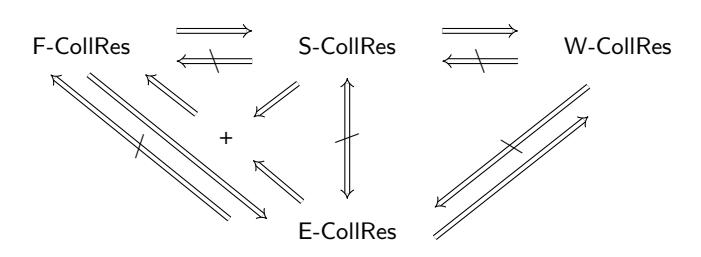

# Bringing Order to Chaos: The Case of Collision-Resistant Chameleon-Hashes

David Derler<sup>1</sup> , Kai Samelin<sup>2</sup> , and Daniel Slamanig<sup>3</sup>

> <sup>1</sup> DFINITY, Zurich, Switzerland [david@dfinity.org](mailto:david@dfinity.org?subject=Question About Your Paper ) 2 Independent, Hamburg, Germany [kaispapers@gmail.com](mailto:kaispapers@gmail.com?subject=Question About Your Paper )

<sup>3</sup> Research Institute CODE, Universitat der Bundeswehr M ¨ unchen, Munich, Germany ¨ [daniel.slamanig@unibw.de](mailto:daniel.slamanig@ait.ac.at?subject=Question About Your Paper )

Abstract. Chameleon-hash functions, introduced by Krawczyk and Rabin (NDSS'00), are trapdoor collision-resistant hash-functions parametrized by a public key. If the corresponding secret key is known, arbitrary collisions for the hash-function can be found efficiently. Chameleon-hash functions have prominent applications in the design of cryptographic primitives, such as lifting non-adaptively secure signatures to adaptively secure ones. Recently, this primitive also received a lot of attention as a building block in more complex cryptographic applications, ranging from editable blockchains to advanced signature and encryption schemes.

We observe that, in latter applications, various different notions of collision-resistance are used, and it is not always clear if the respective notion really covers what seems intuitively required by the application. Therefore, we revisit existing collision-resistance notions in the literature, study their relations, and by means of selected applications discuss which practical impact different notions of collision-resistance might have. Moreover, we provide a stronger, and arguably more desirable, notion of collision-resistance than what is known from the literature (which we call full collision-resistance). Finally, we present a surprisingly simple, and efficient, black-box construction of chameleon-hash functions achieving this strong notion of full collision-resistance.

# 1 Introduction

A chameleon-hash function (CH) is a trapdoor collision-resistant hash function parametrized by a public key. If the corresponding secret key is known, arbitrary collisions for the hash function, i.e., distinct messages m ̸= m′ yielding the same hash value h, can be efficiently found. Over the years, they have proven to be a very useful tool in theory, as well as in practice. Exemplary, CHs have been suggested by Shamir and Tauman [\[ST01\]](#page-33-0) to construct online/offline signatures [\[EGM89,](#page-33-1) [EGM96,](#page-33-2) [CZSM07\]](#page-32-0) (cf. also Sect. [6\)](#page-29-0). Moreover, Shamir and Tauman in [\[ST01\]](#page-33-0) showed that CHs can be used to generically lift non-adaptively secure signature schemes to adaptively secure ones, which has subsequently been used for instance by Hohenberger and Waters [\[HW09\]](#page-33-3) to obtain short signatures under the RSA assumption in the standard model. If CHs are tightly secure, they can be used to generically construct tightly secure signatures [\[BKKP15\]](#page-32-1). Likewise, CHs are used to generically construct strong one-time signatures as shown by Mohassel [\[Moh10\]](#page-33-4), inspired by a concrete construction by Groth [\[Gro06\]](#page-33-5). Zhang [\[Zha07\]](#page-34-0) shows how to construct IND-CCA secure public-key encryption from tag-based encryption (TBE) or identity-based encryption (IBE) and CHs. Bellare and Ristov [\[BR08,](#page-32-2) [BR14\]](#page-32-3) made the interesting discovery that chameleon-hashes in the sense of Krawczyk and Rabin [\[KR00\]](#page-33-6) are equivalent to Σ-protocols, i.e., three round public-coin honest-verifier zero-knowledge proofs of knowledge. CHs are also used to construct sanitizable signatures [\[ACdMT05,](#page-31-0) [BFF](#page-32-4)<sup>+</sup>09, [CDK](#page-32-5)<sup>+</sup>17], i.e., signatures where a designated entity can modify certain parts of a signed message without invalidating the respective signature under controlled conditions. Furthermore, CHs have been used by Steinfeld et al. [\[SWP04\]](#page-34-1) to extend Schnorr and RSA signatures to the universal designatedverifier setting [\[SBWP03\]](#page-33-8). Also, different flavors of chameleon-hashing such as (hierarchical) identity-based [\[AdM04a,](#page-31-1) [BDD](#page-32-6)+11] or policy-based chameleon-hash functions [\[DSSS19,](#page-33-9) [SS20\]](#page-33-10) have been studied.

In a more applied setting, CHs have shown to be valuable to construct integrity measurement and remote attestation mechanisms (denoted chameleon attestation) [\[ADK10\]](#page-31-2), and are used in vehicular ad-hoc networks (VANETs) [\[GZX14\]](#page-33-11) or handover authentication in mobile networks [\[CJ10\]](#page-32-7). More recently, CHs have been used as a means to rewrite blocks in blockchains by replacing the hash function to chain blocks and/or to hash transactions by chameleon-hashes [\[AMVA17,](#page-32-8) [DSSS19\]](#page-33-9), to which we come back in Sect. [6.](#page-29-0) This brief discussion already shows that chameleon-hashes are used in a wide spectrum of different applications requiring different strength of the respective chameleon-hash. Consequently, authors often introduce some ad-hoc notion of collision-resistance for their applications, or even ignore that applications might require a stronger notion. Subsequently, we briefly discuss the different notions which are most commonly found in the literature.

Formalizing Chameleon-Hashes. The concept of chameleon-hashing dates back to the notion of trapdoor commitments introduced by Brassard et al. [\[BCC88\]](#page-32-9), and was firstly coined chameleonhashing by Krawczyk and Rabin [\[KR00\]](#page-33-6) with an instantiation based on the well-known trapdoorcommitment scheme by Pedersen [\[Ped91\]](#page-33-12). Later, Ateniese and de Medeiros [\[AdM04b\]](#page-32-10) observed that the initial collision-resistance notion (which we denote W-CollRes) is rather weak (it does not give the adversary access to any collisions), and, more importantly, it is also satisfied by chameleon-hashes suffering from the key-exposure problem. Namely, when seeing a single collision for some hash h, it allows to publicly extract the secret trapdoor. Thus, any further guarantees are lost. While this is a desirable property for the initial use in chameleon signatures [\[KR00\]](#page-33-6), and is also sufficient for the lifting compiler to adaptively-secure signatures [\[ST01\]](#page-33-0) (as no collision is ever revealed), it is too weak for many other applications. The key-exposure freeness definition by Ateniese and de Medeiros [\[AdM04b\]](#page-32-10) is for the specific case of public-coin chameleon-hashing (where verifying the chameleon-hash is essentially re-computing it). To address this, Ateniese et al. [\[AMVA17\]](#page-32-8) introduced a related notion called enhanced collision-resistance (which we denote E-CollRes) for the generalized case of secret-coin chameleon-hashing (which is the setting that we also consider). The latter notion allows the adversary to see collisions, but it is not allowed to see any collision for the target hash, i.e., the hash corresponding to the collision it computes. Hence, once a single collision for a hash h is seen, an adversary can potentially find arbitrary collisions for that particular hash h. Recently, Khalili et al. [\[KDS20\]](#page-33-13) have pointed out issues regarding the practicality of the concrete random-oracle model instantiation[4](#page-1-0) , proposed by Ateniese et al. in [\[AMVA17\]](#page-32-8), and propose alternative constructions in the standard model. In another work, Camenisch et al. [\[CDK](#page-32-5)<sup>+</sup>17] proposed an alternative collision-resistance notion which allows the adversary to see arbitrary collisions also for the target hash, but not for the target message, i.e., the message used in the collision output by the adversary has never been queried. In other words, once a collision for a message m is seen, an adversary is allowed to find arbitrary other hashes h ′ with the queried messages. Arguably, this notion seems more realistic as it is better compatible with practical applications (e.g., one can often make the messages unique by appending a tag/nonce), and thus we denote it as standard collision-resistance (or S-CollRes).

Motivation and Contribution. The previous discussion already illustrates that there are many different collision-resistance notions. While this does not necessarily point to an issue, we observe that it is not always clear whether the respective notion does really cover what is required by

<span id="page-1-0"></span><sup>4</sup> The requirement for an invertible encoding into the group introduces an enormous efficiency penalty, and thus their instantiation is incomplete. Moreover, it was only recently shown that the proposed chameleonhash fulfills our stronger definition [\[Cin20\]](#page-32-11).

the respective application. Moreover, it is not clear if the last notion discussed above (S-CollRes) is already the most desirable notion, or, if even stronger notions are achievable, and do have practical relevance. Motivated by these observations, we provide the following contributions:

Relations among Properties. We discuss the different security notions of chameleon-hashes, and rigorously study relations among them. Most importantly, we, for the first time, clarify the picture of existing collision-resistance notions by showing implications, and separations, (cf. Fig. [1](#page-2-0) for an overview). In the course of showing separations, we also provide a construction of a chameleon-hash satisfying the E-CollRes notion, but which clearly demonstrates weaknesses of this notion.

<span id="page-2-0"></span>

Fig. 1. Relations between CH collision-resistance properties

Stronger Notion. We find that the strongest existing collision-resistance notions, i.e., E-CollRes and S-CollRes (which are incomparable), might still be too weak for practical applications, see, e.g., Sect. [6.](#page-29-0) In particular, even if S-CollRes is satisfied, the hash values might still be malleable leaving space for potential real-world attacks. Consequently, we propose a stronger notion coined full collision-resistance (or F-CollRes for short), which enforces that the adversary cannot (except with negligible probability) output *any* new collisions and covers what one intuitively expects from collision-resistance.

Black-Box Construction. We present a simple, yet elegant, black-box construction of a chameleon-hash function satisfying this strong F-CollRes notion. Considering the complexity of existing constructions in [\[AMVA17,](#page-32-8) [KDS20\]](#page-33-13), this is somewhat surprising. To recall, the construction from Ateniese et al. [\[AMVA17\]](#page-32-8) starts from a public-coin chameleon-hash function that satisfies W-CollRes, uses an IND-CPA-secure encryption-scheme to encrypt the randomness of the chameleon-hash and then uses a true-simulation extractable (tSE) NIZK [\[DHLW10\]](#page-32-12) [5](#page-2-1) , which is, in turn, based on a NIZK and an IND-CCA secure public-key encryption scheme, to prove that the ciphertext is an encryption of the randomness. The constructions by Khalili et al. [\[KDS20\]](#page-33-13), which avoid the aforementioned issues with [\[AMVA17\]](#page-32-8), are based on another new public-coin chameleon-hash function that satisfies W-CollRes and then either uses Groth-Sahai NIZK proofs [\[GS08\]](#page-33-14) and the IND-CCA secure Cramer-Shoup encryption scheme [\[CS98\]](#page-32-13) or a succinct non-interactive argument of knowledge (SNARK). Both constructions by Khalili et al. [\[KDS20\]](#page-33-13) basically follow the generic template in [\[AMVA17\]](#page-32-8). In contrast, our blackbox construction of a F-CollRes chameleon-hash is constructed from perfectly correct (multichallenge) IND-CPA secure encryption, e.g., ElGamal encryption, and a simulation-sound extractable non-interactive zero-knowledge proof (SSE-NIZK), e.g., applying the compiler of Faust et al. [\[FKMV12\]](#page-33-15) to a Fiat-Shamir transformed Σ-protocol. The basic idea is that the chameleonhash is the encryption c of the message m and the randomness of the chameleon-hash is a NIZK proof s.t. either c correctly encrypts m under the pk of CH *or* one knows the secret key sk

<span id="page-2-1"></span><sup>5</sup> In true-simulation extractability the simulator can only be used for statements inside the language.

corresponding to pk. Interestingly, already a perfectly-binding commitment (without any hiding) is sufficient to achieve the F-CollRes notion, but instead a multi-challenge IND-CPA secure encryption scheme as a perfectly-binding commitment is used to additionally achieve the indistinguishability property of the CH, i.e., that fresh and adapted hashes are indistinguishable, a notion that is considered standard for chameleon-hashes.

Applications. We discuss how our stronger notion allows to strengthen the security of existing applications. In particular, in Sect. [6](#page-29-0) we discuss what problems may be caused by different notions of collision-resistance within recent applications to redactable blockchains [\[AMVA17,](#page-32-8) [DSSS19\]](#page-33-9). Here, either the hash function to chain blocks in a blockchain or the hash functions to aggregate transactions within single blocks (usually by means of a Merkle-tree) are replaced by a chameleon-hash function. Moreover, we take a second look at online/offline signatures and discuss how chameleon-hashes providing a stronger collision-resistance notion than the W-CollRes notion used by Shamir and Tauman in [\[ST01\]](#page-33-0) allows to re-use offline signatures and add more robustness at the cost of a more expensive offline phase and a slightly more costly online phase.

Differences to the Conference Version. Compared to the conference version published at IACR PKC 2020 [\[DSS20\]](#page-33-7), this version in Sect. [3.3](#page-11-0) includes a more complete treatment of indistinguishability and in particular stronger indistinguishability notions and their relations. Moreover, in Sect. [4.1](#page-13-0) it includes examples of existing chameleon-hashes providing the W-CollRes and S-CollRes notions, and, in Sect. [4.2](#page-14-0) the full proofs of our construction providing E-CollRes. Finally, in Sect. [6.2](#page-30-0) as an additional application we discuss the use of chameleon-hashes with stronger collision-resistance notions in online/offline signatures.

Follow-up Work. Derler et al. in SCN'20 [\[DKSS20\]](#page-32-14) show how to remove the requirement to rely on public-key encryption from the approach presented in this paper. In particular, they show how to construct fully collision-resistant chameleon-hashes based on SSE NIZKs and noninteractive commitment schemes. They then present an instantiation from the discrete logarithm (DL) problem and a concrete construction from the learning parity with noise (LPN) problem. Latter yields the first chameleon-hash from post-quantum assumptions that provides a collisionresistance notion stronger than W-CollRes (as, e.g., the lattice-based chameleon-hash by Cash et al. from EC'10 [\[CHKP10\]](#page-32-15)). In PKC'24, Li and Liu [\[LL23\]](#page-33-16) introduce a lattice-based F-CollRes chameleon-hash without resorting to random oracles or NIZK proofs by relying on the new notion of tagged chameleon hashes. Very recently, Bellare, Riepel and Shea [\[BRS24\]](#page-32-16) initiated the formal study of backdoored hash functions, which are closely related to chameleon-hashes, and introduce a notion of F-CollRes for such hash functions.

# 2 Preliminaries

Notation. With λ ∈ N we denote our security parameter. All algorithms implicitly take 1 λ as an additional input. We write a ←\$ A(x) if the output of a probabilistic algorithm A with input x is assigned to a and use a ← A(x) if A is deterministic. An algorithm is efficient, if it runs in probabilistic polynomial time (PPT) in the length of its input. All algorithms are PPT, if not explicitly mentioned otherwise. If we want to make the random coins used by an algorithm A explicit, we use the notation a ←\$ A(x; ξ). We write (a; ξ) ←\$ A(x), if we need to access the random coins ξ internally drawn by A. Most algorithms may return a special error symbol ⊥ ∈ { / 0, 1} ∗ , denoting an exception. Returning output ends execution of an algorithm or an oracle. To make the presentation in the security proofs more compact, we occasionally use (a, ⊥) ←\$ A(x) to indicate that the second output is either ignored or not returned by A. If S is a finite set, we write a ←\$ S to denote that a is chosen uniformly at random from S. M denotes a message space of a scheme, and we generally assume that M is derivable from the scheme's public parameters or its public key. For a list we require that there is an injective, and efficiently reversible, encoding, that maps the list to {0, 1} ∗ . A function ν : N → R<sup>≥</sup><sup>0</sup> is negligible, if it vanishes faster than every inverse polynomial, i.e.,  $\forall k \in \mathbb{N}, \exists n_0 \in \mathbb{N} \text{ such that } \nu(n) \leq n^{-k}, \forall n > n_0.$ 

### 2.1 Building Blocks

We now present the building blocks we require. These include key-verifiable multi-challenge IND-CPA (mcIND-CPA) secure public-key encryption schemes  $\Omega$ , digital signature schemes  $\Sigma$ , and non-interactive zero-knowledge proofs  $\Pi$ .

Public-Key Encryption Schemes. Subsequently, we define public-key encryption schemes.

**Definition 1** (Public-Key Encryption Scheme). A public-key encryption scheme  $\Omega$  consists of five algorithms  $\{PG_{\Omega}, KG_{\Omega}, Enc, Dec, KVf_{\Omega}\}$ , such that:

 $\mathsf{PG}_\Omega$ . The algorithm  $\mathsf{PG}_\Omega$  outputs the public parameters of the scheme:

$$\mathsf{pp}_{\Omega} \leftarrow_{\$} \mathsf{PG}_{\Omega}(1^{\lambda}).$$

It is assumed that  $pp_{\Omega}$  is an implicit input to all other algorithms.  $KG_{\Omega}$ . The algorithm  $KG_{\Omega}$  outputs the key pair, on input  $pp_{\Omega}$ :

$$(\mathsf{sk}_{\Omega}, \mathsf{pk}_{\Omega}) \leftarrow_{\$} \mathsf{KG}_{\Omega}(\mathsf{pp}_{\Omega}).$$

Enc. The algorithm Enc gets as input the public key  $pk_{\Omega}$ , and a message  $m \in \mathcal{M}$  to encrypt. It outputs a ciphertext c:

$$c \leftarrow_{\$} \mathsf{Enc}(\mathsf{pk}_{\mathsf{O}}, m).$$

Dec. The deterministic algorithm Dec outputs a message  $m \in \mathcal{M} \cup \{\bot\}$  on input  $\mathsf{sk}_\Omega$ , and a ciphertext c:

$$m \leftarrow \mathsf{Dec}(\mathsf{sk}_{\Omega}, c).$$

 $\mathsf{KVf}_\Omega$ . The deterministic algorithm  $\mathsf{KVf}_\Omega$  decides whether a given public key  $\mathsf{pk}_\Omega$  corresponds to a given secret key  $\mathsf{sk}_\Omega$ :

$$d \leftarrow \mathsf{KVf}_{\Omega}(\mathsf{pk}_{\Omega}, \mathsf{sk}_{\Omega}).$$

```
\begin{split} \mathbf{Exp}_{\mathcal{A},\Omega}^{\text{mc-IND-CPA}}(\lambda) &: \\ \mathsf{pp}_{\Omega} \leftarrow_{\$} \mathsf{PG}_{\Omega}(1^{\lambda}) \\ &(\mathsf{sk}_{\Omega}, \mathsf{pk}_{\Omega}) \leftarrow_{\$} \mathsf{KG}_{\Omega}(\mathsf{pp}_{\Omega}) \\ b \leftarrow_{\$} \{0, 1\} \\ a \leftarrow_{\$} \mathcal{A}^{\mathsf{Enc'}(\mathsf{pk}_{\Omega}, \cdot, \cdot, b)}(\mathsf{pk}_{\Omega}) \\ &\text{where Enc' on input } \mathsf{pk}_{\Omega}, m_0, m_1, b : \\ &\text{If } m_0 \notin \mathcal{M} \vee m_1 \notin \mathcal{M} \vee |m_0| \neq |m_1| : \\ & c \leftarrow \bot \\ &\text{Else:} \\ & c \leftarrow_{\$} \mathsf{Enc}(\mathsf{pk}_{\Omega}, m_b) \\ &\text{return } c \\ &\text{return } 1, \text{ if } a = b \\ &\text{return } 0 \end{split}
```

<span id="page-4-0"></span>Fig. 2. Multi-Challenge IND-CPA Security

**Definition 2** (Correctness). A public key encryption scheme  $\Omega$  is called correct, if for all security parameters  $\lambda \in \mathbb{N}$ , for all  $\mathsf{pp}_\Omega \leftarrow_\$ \mathsf{PG}_\Omega(1^\lambda)$ , for all  $(\mathsf{sk}_\Omega, \mathsf{pk}_\Omega) \leftarrow_\$ \mathsf{KG}_\Omega(\mathsf{pp}_\Omega)$ , for all  $m \in \mathcal{M}$ , for all  $c \leftarrow_\$ \mathsf{Enc}(\mathsf{pk}_\Omega, m)$ , we have that  $m = \mathsf{Dec}(\mathsf{sk}_\Omega, c)$  and that for all  $\mathsf{sk}_\Omega'$  we have that  $\mathsf{KVf}_\Omega(\mathsf{pk}_\Omega, \mathsf{sk}_\Omega') = 1 \implies m = \mathsf{Dec}(\mathsf{sk}_\Omega', c)$ .

**Definition 3** (Multi-Challenge IND-CPA Security). A public-key encryption scheme  $\Omega$  is multi-challenge IND-CPA secure (mcIND-CPA), if for any PPT adversary A there exists a negligible function  $\nu$  such that:

$$\left|\Pr\left[\mathbf{Exp}_{\mathcal{A},\Omega}^{\mathsf{mcIND-CPA}}(\lambda) = 1\right] - 1/2\right| \leq \nu(\lambda).$$

The corresponding experiment is depicted in Fig. 2.

Bellare et al. have shown, via a hybrid argument, that mcIND-CPA is equivalent to standard, i.e., "single-message", IND-CPA [BBM00]. We opted for using mcIND-CPA, because it allows writing our proofs down more compactly, improving readability.

Digital Signature Schemes. Subsequently, we define signature schemes.

**Definition 4 (Digital Signatures).** A digital signature scheme  $\Sigma$  consists of four algorithms  $\{\mathsf{PG}_{\Sigma},\mathsf{KG}_{\Sigma},\mathsf{Sgn}_{\Sigma},\mathsf{Vrf}_{\Sigma}\}$  such that:

 $\mathsf{PG}_\Sigma$ . The algorithm  $\mathsf{PG}_\Sigma$  outputs the public parameters

$$pp_{\Sigma} \leftarrow_{\$} PG_{\Sigma}(1^{\lambda}).$$

We assume that  $pp_{\Sigma}$  is implicit input to all other algorithms.

 $\mathsf{KG}_{\Sigma}$ . The algorithm  $\mathsf{KG}_{\Sigma}$  outputs the public and private key of the signer, where  $\lambda$  is the security parameter:

$$(\mathsf{sk}_\Sigma, \mathsf{pk}_\Sigma) \leftarrow_{\$} \mathsf{KG}_\Sigma(\mathsf{pp}_\Sigma).$$

 $\mathsf{Sgn}_{\Sigma}$ . The algorithm  $\mathsf{Sgn}_{\Sigma}$  gets as input the secret key  $\mathsf{sk}_{\Sigma}$  and the message  $m \in \mathcal{M}$  to sign. It outputs a signature:

$$\sigma \leftarrow_{\$} \mathsf{Sgn}_{\Sigma}(\mathsf{sk}_{\Sigma}, m).$$

 $\mathsf{Vrf}_{\Sigma}$ . The deterministic algorithm  $\mathsf{Vrf}_{\Sigma}$  outputs a decision bit  $d \in \{0,1\}$ , indicating if the signature  $\sigma$  is valid, w.r.t.  $\mathsf{pk}_{\Sigma}$  and m:

$$d \leftarrow \mathsf{Vrf}_{\Sigma}(\mathsf{pk}_{\Sigma}, m, \sigma).$$

**Definition 5** (Correctness). A digital signature scheme  $\Sigma$  is called correct, if for all security parameters  $\lambda \in \mathbb{N}$ , for all  $\mathsf{pp}_{\Sigma} \leftarrow_{\$} \mathsf{PG}_{\Sigma}(1^{\lambda})$ , for all  $(\mathsf{sk}_{\Sigma}, \mathsf{pk}_{\Sigma}) \leftarrow_{\$} \mathsf{KG}_{\Sigma}(\mathsf{pp}_{\Sigma})$ , for all  $m \in \mathcal{M}$ ,  $\mathsf{Vrf}_{\Sigma}(\mathsf{pk}_{\Sigma}, m, \mathsf{Sgn}_{\Sigma}(\mathsf{sk}_{\Sigma}, m)) = 1$  is true.

We require existential unforgeability under adaptively chosen message attacks (eUNF-CMA security). In a nutshell, unforgeability requires that an adversary  $\mathcal A$  cannot (except with negligible probability) come up with a signature for a message  $m^*$  for which the adversary did not see any signature before, even if the adversary  $\mathcal A$  is allowed to adaptively query for signatures on messages of its own choice.

**Definition 6** (Unforgeability). We say a digital signature scheme  $\Sigma$  scheme is unforgeable, if for every PPT adversary A, there exists a negligible function  $\nu$  such that:

$$\Pr\left[\mathbf{Exp}_{\mathcal{A},\Sigma}^{\mathsf{eUNF-CMA}}(\lambda) = 1\right] \leq \nu(\lambda).$$

The corresponding experiment is depicted in Fig. 3.

For Const. 3, we require that the size of signatures is independent of the size of the signed messages.

```
\begin{split} \mathbf{Exp}_{\mathcal{A},\Sigma}^{\text{eUNF-CMA}}(\lambda) \\ pp_{\Sigma} \leftarrow_{\$} \mathsf{PG}_{\Sigma}(1^{\lambda}) \\ (\mathsf{sk}_{\Sigma},\mathsf{pk}_{\Sigma}) \leftarrow_{\$} \mathsf{KG}_{\Sigma}(\mathsf{pp}_{\Sigma}) \\ \mathcal{Q} \leftarrow \emptyset \\ (m^*,\sigma^*) \leftarrow_{\$} \mathcal{A}^{\mathsf{Sgn}'_{\Sigma}(\mathsf{sk}_{\Sigma},\cdot)}(\mathsf{pk}_{\Sigma}) \\ \text{where } \mathsf{Sgn}'_{\Sigma} \text{ on input } \mathsf{sk}_{\Sigma} \text{ and } m \colon \\ \sigma \leftarrow_{\$} \mathsf{Sgn}_{\Sigma}(\mathsf{sk}_{\Sigma},m) \\ \text{set } \mathcal{Q} \leftarrow \mathcal{Q} \cup \{m\} \\ \text{return } \sigma \\ \end{split}
```

Fig. 3. Unforgeability

<span id="page-6-0"></span>**Non-Interactive Proof Systems.** Let L be an NP-language with associated witness relation R, i.e., such that  $L = \{x \mid \exists w : R(x, w) = 1\}$ . A non-interactive proof system allows to prove membership of some statement x in the language L. More formally, such a system is defined as follows.

**Definition 7** (Non-Interactive Proof System). A non-interactive proof system  $\Pi$  for language L consists of three algorithms  $\{PG_{\Pi}, Prf_{\Pi}, Vfy_{\Pi}\}$ , such that:

 $PG_{\Pi}$ . The algorithm  $PG_{\Pi}$  outputs public parameters of the scheme, where  $\lambda$  is the security parameter:

$$\operatorname{crs}_{\Pi} \leftarrow_{\$} \mathsf{PG}_{\Pi}(1^{\lambda}).$$

 $\operatorname{Prf}_{\Pi}$ . The algorithm  $\operatorname{Prf}_{\Pi}$  outputs the proof  $\pi$ , on input of the CRS  $\operatorname{crs}_{\Pi}$ , statement x to be proven, and the corresponding witness w:

$$\pi \leftarrow_{\$} \mathsf{Prf}_{\Pi}(\mathsf{crs}_{\Pi}, x, w).$$

Vfy<sub> $\Pi$ </sub>. The deterministic algorithm Vfy<sub> $\Pi$ </sub> verifies the proof  $\pi$  by outputting a bit  $d \in \{0,1\}$ , w.r.t. to some CRS crs<sub> $\Pi$ </sub> and some statement x:

$$d \leftarrow \mathsf{Vfy}_\Pi(\mathsf{crs}_\Pi, x, \pi).$$

**Definition 8 (Correctness).** A non-interactive proof system is called correct, if for all  $\lambda \in \mathbb{N}$ , for all  $\operatorname{crs}_{\Pi} \leftarrow_{\$} \operatorname{PG}_{\Pi}(1^{\lambda})$ , for all  $x \in L$ , for all w such that R(x,w) = 1, for all  $\pi \leftarrow_{\$} \operatorname{Prf}_{\Pi}(\operatorname{crs}_{\Pi}, x, w)$ , it holds that  $\operatorname{Vfy}_{\Pi}(\operatorname{crs}_{\Pi}, x, \pi) = 1$ .

In the context of (zero-knowledge) proof-systems, correctness is sometimes also referred to as completeness. In addition, we require two standard security notions for zero-knowledge proofs of knowledge: zero-knowledge and simulation-sound extractability. We define them analogously to the definitions given in [DS19].

Informally speaking, zero-knowledge says that the receiver of the proof  $\pi$  does not learn anything except the validity of the statement.

<span id="page-6-1"></span>**Definition 9** (**Zero-Knowledge**). A non-interactive proof system  $\Pi$  for language L is zero-knowledge, if for any PPT adversary A, there exists an PPT simulator  $SIM = (SIM_1, SIM_2)$  such that there exist negligible functions  $\nu_1$  and  $\nu_2$  such that

$$\begin{split} \left| \Pr \left[ \mathsf{crs}_{\Pi} \leftarrow_{\$} \mathsf{PG}_{\Pi}(1^{\lambda}) \ : \ \mathcal{A}(\mathsf{crs}_{\Pi}) = 1 \right] - \\ & \quad \left| \Pr \left[ (\mathsf{crs}_{\Pi}, \tau) \leftarrow_{\$} \mathsf{SIM}_{1}(1^{\lambda}) \ : \ \mathcal{A}(\mathsf{crs}_{\Pi}) = 1 \right] \right| \leq \nu_{1}(\lambda), \end{split}$$

```
\begin{split} \mathbf{Exp}_{\mathcal{A},\Pi,\mathrm{SIM}}^{\mathsf{Zero-Knowledge}}(\lambda) \\ & (\mathsf{crs}_\Pi,\tau) \leftarrow_{\$} \mathsf{SIM}_1(1^\lambda) \\ & b \leftarrow_{\$} \{0,1\} \\ & b^* \leftarrow_{\$} \mathcal{A}^{P_b(\cdot,\cdot)}(\mathsf{crs}_\Pi) \\ & \text{where } P_0 \text{ on input } x,w: \\ & \text{return } \pi \leftarrow_{\$} \mathsf{Prf}_\Pi(\mathsf{crs}_\Pi,x,w), \text{ if } R(x,w) = 1 \\ & \text{return } \bot \\ & \text{and } P_1 \text{ on input } x,w: \\ & \text{return } \pi \leftarrow_{\$} \mathsf{SIM}_2(\mathsf{crs}_\Pi,\tau,x), \text{ if } R(x,w) = 1 \\ & \text{return } \bot \\ & \text{return } 1, \text{ if } b^* = b \\ & \text{return } 0 \end{split}
```

Fig. 4. Zero-Knowledge

<span id="page-7-0"></span>and that

$$\left|\Pr\left[\mathbf{Exp}_{\mathcal{A},\Pi,\mathsf{SIM}}^{\mathsf{Zero-Knowledge}}(\lambda) = 1\right] - 1\!/\!2\right| \leq \nu_2(\lambda),$$

where the corresponding experiment is depicted in Fig. 4.

Simulation-sound extractability says that every adversary who is able to come up with a proof  $\pi^*$  for a statement must know the witness, even when seeing simulated proofs for adaptively chosen statements potentially not in L. Clearly, this implies that the proofs output by a simulation-sound extractable proof-systems are non-malleable. Note that the definition of simulation-sound

```
\begin{split} \mathbf{Exp}_{\mathcal{A},\Pi,\mathcal{E}}^{\mathsf{SimSoundExt}}(\lambda) \\ & (\mathsf{crs}_\Pi,\tau,\zeta) \leftarrow_{\$} \mathcal{E}_1(1^\lambda) \\ & \mathcal{Q} \leftarrow \emptyset \\ & (x^*,\pi^*) \leftarrow_{\$} \mathcal{A}^{\mathsf{SIM}(\cdot)}(\mathsf{crs}_\Pi) \\ & \text{where SIM on input } x: \\ & \text{obtain } \pi \leftarrow_{\$} \mathsf{SIM}_2(\mathsf{crs}_\Pi,\tau,x) \\ & \mathcal{Q} \leftarrow \mathcal{Q} \cup \{(x,\pi)\} \\ & \text{return } \pi \\ & w^* \leftarrow_{\$} \mathcal{E}_2(\mathsf{crs}_\Pi,\zeta,x^*,\pi^*) \\ & \text{return } 1, \text{ if } \mathsf{Vfy}_\Pi(x^*,\pi^*) = 1 \ \land \ R(x^*,w^*) = 0 \ \land \ (x^*,\pi^*) \notin \mathcal{Q} \\ & \text{return } 0 \end{split}
```

Fig. 5. Simulation Sound Extractability

<span id="page-7-1"></span>extractability of [Gro06] is stronger than ours in the sense that the adversary also gets the trapdoor  $\zeta$  as input. However, in our context this weaker notion (previously also used, e.g., in [ADK<sup>+</sup>13, DHLW10]) suffices.

**Definition 10 (Simulation-Sound Extractability).** A zero-knowledge non-interactive proof system  $\sqcap$  for language L is said to be simulation-sound extractable, if for any PPT adversary A,

there exists a PPT extractor  $\mathcal{E} = (\mathcal{E}_1, \mathcal{E}_2)$ , such that

$$\begin{split} \left| \Pr \left[ (\mathsf{crs}_{\Pi}, \tau) \leftarrow_{\$} \mathsf{SIM}_{1}(1^{\lambda}) \ : \ \mathcal{A}(\mathsf{crs}_{\Pi}, \tau) = 1 \right] - \\ & \quad \left| \Pr \left[ (\mathsf{crs}_{\Pi}, \tau, \zeta) \leftarrow_{\$} \mathcal{E}_{1}(1^{\lambda}) \ : \ \mathcal{A}(\mathsf{crs}_{\Pi}, \tau) = 1 \right] \right| = 0, \end{split}$$

and that there exist a negligible function  $\nu$  so that

$$\Pr\left[\mathbf{Exp}_{\mathcal{A},\Pi,\mathcal{E}}^{\mathsf{SimSoundExt}}(\lambda)\right] = 1 \leq \nu(\lambda),$$

where  $SIM = (SIM_1, SIM_2)$  is as in Definition 9 and the corresponding experiment is depicted in Fig. 5.

# 3 Chameleon-Hashes, Revisited

In this section, we present the formal framework for chameleon-hashes, their security properties with a special focus on the collision-resistance notion, and then show relations and separations between the security properties.

#### 3.1 Framework

We now present the framework for chameleon-hashes. We rely on the most recent comprehensive framework by Camenisch et al. [CDK<sup>+</sup>17], which is, in turn, based upon work done by Ateniese et al. and Brzuska et al. [AMVA17, BFF<sup>+</sup>09].

**Definition 11.** A chameleon-hash CH is a tuple of five PPT algorithms (CHPG, CHKG, CHash, CHCheck, CHAdapt), such that:

CHPG. The algorithm CHPG, on input a security parameter  $\lambda$  outputs public parameters of the scheme:

$$\mathsf{pp}_{\mathsf{ch}} \leftarrow_{\$} \mathsf{CHPG}(1^{\lambda}).$$

We assume that ppch is implicit input to all other algorithms.

CHKG. *The algorithm* CHKG, *on input the public parameters* pp<sub>ch</sub> *outputs the private and public keys of the scheme:* 

$$(\mathsf{sk}_\mathsf{ch}, \mathsf{pk}_\mathsf{ch}) \leftarrow_{\$} \mathsf{CHKG}(\mathsf{pp}_\mathsf{ch}).$$

CHash. The algorithm CHash gets as input the public key  $pk_{ch}$ , and a message m to hash. It outputs a hash h, and some randomness r:

$$(h,r) \leftarrow_{\$} \mathsf{CHash}(\mathsf{pk}_{\mathsf{ch}},m).$$

CHCheck. The deterministic algorithm CHCheck gets as input the public key  $pk_{ch}$ , a message m, randomness r, and a hash h. It outputs a bit  $d \in \{0,1\}$ , indicating whether the hash h is valid:

$$d \leftarrow \mathsf{CHCheck}(\mathsf{pk_{ch}}, m, r, h).$$

CHAdapt. The algorithm CHAdapt on input of a secret key  $sk_{ch}$ , the message m, new message m', randomness r, and hash h outputs new randomness r':

$$r' \leftarrow_{\$} \mathsf{CHAdapt}(\mathsf{sk}_{\mathsf{ch}}, m, m', r, h).$$

**Definition 12** (Correctness). A chameleon-hash is called correct, if for all security parameters  $\lambda \in \mathbb{N}$ , for all  $\mathsf{pp}_{\mathsf{ch}} \leftarrow_{\$} \mathsf{CHPG}(1^{\lambda})$ , for all  $(\mathsf{sk}_{\mathsf{ch}}, \mathsf{pk}_{\mathsf{ch}}) \leftarrow_{\$} \mathsf{CHKG}(\mathsf{pp}_{\mathsf{ch}})$ , for all  $m \in \mathcal{M}$ , for all  $(h,r) \leftarrow_{\$} \mathsf{CHash}(\mathsf{pk}_{\mathsf{ch}}, m)$ , for all  $m' \in \mathcal{M}$ , we have for all  $r' \leftarrow_{\$} \mathsf{CHAdapt}(\mathsf{sk}_{\mathsf{ch}}, m, m', r, h)$ , that  $1 = \mathsf{CHCheck}(\mathsf{pk}_{\mathsf{ch}}, m, r, h) = \mathsf{CHCheck}(\mathsf{pk}_{\mathsf{ch}}, m', r', h)$ .

<span id="page-8-0"></span> $<sup>^{6}</sup>$  We note that the randomness r is also sometimes called "check value" [AMVA17].

```
\mathbf{Exp}_{\mathcal{A},\mathsf{CH}}^{\mathsf{W-CollRes}}(\lambda)
                                                                                                                     \mathbf{Exp}_{\mathcal{A},\mathsf{CH}}^{\mathsf{E-CollRes}}(\lambda)
                                                                                                                           \mathsf{pp}_{\mathsf{ch}} \leftarrow_{\$} \mathsf{CHPG}(1^{\lambda})
     \mathsf{pp}_{\mathsf{ch}} \leftarrow_{\$} \mathsf{CHPG}(1^{\lambda})
                                                                                                                           (\mathsf{sk}_\mathsf{ch}, \mathsf{pk}_\mathsf{ch}) \leftarrow_\$ \mathsf{CHKG}(\mathsf{pp}_\mathsf{ch})
     (\mathsf{sk}_\mathsf{ch}, \mathsf{pk}_\mathsf{ch}) \leftarrow_{\$} \mathsf{CHKG}(\mathsf{pp}_\mathsf{ch})
                                                                                                                             \mathcal{Q} \leftarrow \emptyset
                                                                                                                           (m^*, r^*, m'^*, r'^*, h^*) \leftarrow_{\$} \mathcal{A}
     (m^*,r^*,m'^*,r'^*,h^*) \leftarrow_{\$} \mathcal{A}(\mathsf{pk}_{\mathsf{ch}}
                                                                                                                                where CHAdapt' on input sk_{ch}, m, m', r, h:
                                                                                                                                      \text{return} \perp, \text{if} \ \mathsf{CHCheck}(\mathsf{pk}_{\mathsf{ch}}, m, r, h) \neq 1
                                                                                                                                      r' \leftarrow_{\$} \mathsf{CHAdapt}(\mathsf{sk}_{\mathsf{ch}}, m, m', r, h)
                                                                                                                                      If r' = \bot, return \bot
                                                                                                                                        \mathcal{Q} \leftarrow \mathcal{Q} \cup \{h\}
                                                                                                                                      return r
                                                                                                                          \begin{array}{c} \text{return 1, if CHCheck}(\mathsf{pk}_{\mathsf{ch}}, m^*, r^*, h^*) = 1 \land \\ \underline{\mathsf{CHCheck}}(\mathsf{pk}_{\mathsf{ch}}, m'^*, r'^*, h^*) = 1 \land \end{array}
     \begin{array}{l} \text{return 1, if CHCheck}(\mathsf{pk}_{\mathsf{ch}}, m^*, r^*, h^*) = 1 \land \\ \mathsf{CHCheck}(\mathsf{pk}_{\mathsf{ch}}, m'^*, r'^*, h^*) = 1 \land \end{array}
            m^* \neq m'^*
                                                                                                                                 m^* \neq m'^* \wedge h^* \notin \mathcal{Q}
     return 0
                                                                                                                          return 0
\mathbf{Exp}^{\operatorname{S-CollRes}}_{\mathcal{A},\operatorname{CH}}(\lambda)
                                                                                                                                        \mathbf{Exp}^{\mathsf{F-CollRes}}_{\mathcal{A},\mathsf{CH}}(\lambda)
                                                                                                                                             \mathsf{pp}_{\mathsf{ch}} \leftarrow_{\$} \mathsf{CHPG}(1^{\lambda})
     \mathsf{pp}_{\mathsf{ch}} \leftarrow_{\$} \mathsf{CHPG}(1^{\lambda})
     (\mathsf{sk}_\mathsf{ch}, \mathsf{pk}_\mathsf{ch}) \leftarrow_{\$} \mathsf{CHKG}(\mathsf{pp}_\mathsf{ch})
                                                                                                                                             (\mathsf{sk}_\mathsf{ch}, \mathsf{pk}_\mathsf{ch}) \leftarrow_{\$} \mathsf{CHKG}(\mathsf{pp}_\mathsf{ch})
       \mathcal{Q} \leftarrow \emptyset
                                                                                                                                               \mathcal{Q} \leftarrow \emptyset
     (m^*, r^*, m'^*, r'^*, h^*) \leftarrow_{\$} \mathcal{A}
                                                                                                                        (\mathsf{pk}_\mathsf{ch})
                                                                                                                                             (m^*, r^*, m'^*, r'^*, h^*) \leftarrow_{\$} \mathcal{A}
           where CHAdapt' on input sk_{ch}, m, m', r, h:
                                                                                                                                                   where CHAdapt' on input sk_{ch}, m, m', r, h:
                \text{return } \bot, \text{if CHCheck}(\mathsf{pk}_{\mathsf{ch}}, m, r, h) \neq 1
                                                                                                                                                         return \perp, if CHCheck(pk<sub>ch</sub>, m, r, h) \neq 1
                                                                                                                                                         r' \leftarrow_{\$} \mathsf{CHAdapt}(\mathsf{sk}_{\mathsf{ch}}, m, m', r, h)
                 r' \leftarrow_{\$} \mathsf{CHAdapt}(\mathsf{sk}_{\mathsf{ch}}, m, m', r, h)
                If r' = \bot, return \bot
                                                                                                                                                         If r' = \bot, return \bot
                  \mathcal{Q} \leftarrow \mathcal{Q} \cup \{m, m'\}
                                                                                                                                                          Q \leftarrow Q \cup \{(h, m), (h, m')\}
                return r'
                                                                                                                                                         return r
     return 1, if CHCheck(\mathsf{pk}_{\mathsf{ch}}, m^*, r^*, h^*) = 1 \land
                                                                                                                                             return 1, if CHCheck(\mathsf{pk}_{\mathsf{ch}}, m^*, r^*, h^*) = 1 \land
           \mathsf{CHCheck}(\mathsf{pk}_{\mathsf{ch}}, m'^*, r'^*, h^*) = 1 \land
                                                                                                                                                   \mathsf{CHCheck}(\mathsf{pk}_{\mathsf{ch}}, m'^*, r'^*, h^*) = 1 \land
                                                                                                                                                    m^* \neq m'^* \wedge (h^*, m^*) \notin \mathcal{Q}
            m^* \neq m'^* \wedge m^* \notin \mathcal{Q}
     return 0
                                                                                                                                             return 0
```

<span id="page-9-0"></span>**Fig. 6.** The  $\mathbf{Exp}_{A,CH}^{X-CollRes}$  experiment with  $X \in \{W, E, S, F\}$ .

### 3.2 Collision-Resistance, Revisited

In this section we revisit existing collision-resistance notions, introduce a stronger and more desirable notion of collision-resistance dubbed *full collision-resistance* (or F-CollRes for short) and discuss how these notions differ. The main idea behind collision-resistance in general is to argue that an adversary that has no access to the secret key  $\mathsf{sk}_{\mathsf{ch}}$  cannot find any collisions, i.e., pairs (m,r) and (m',r') and hash value h s.t.  $\mathsf{CHCheck}(\mathsf{pk}_{\mathsf{ch}},m,r,h) = \mathsf{CHCheck}(\mathsf{pk}_{\mathsf{ch}},m',r',h) = 1$ . In the weakest case, the adversary has no access to any other collisions, whereas in stronger notions the adversary is explicitly allowed to obtain collisions for arbitrary hashes via a  $\mathsf{CHAdapt}'$  oracle (we indicate these by using boxes). We present all the different notions in Fig. 6, where we indicate the differences in the winning conditions by using boxes. In all the experiments the challenger generates a key pair  $(\mathsf{sk}_{\mathsf{ch}},\mathsf{pk}_{\mathsf{ch}})$  honestly (along with some public parameters) and the adversary is then initialized with  $\mathsf{pk}_{\mathsf{ch}}$ . We now discuss the differences of the single collision resistance notions, where in the weakest case the adversary has no access to an  $\mathsf{CHAdapt}'$  oracle (which allows the adversary to adaptively ask for collisions with messages and hashes of its own choice), but in all other cases the adversary does. To vertically align the

experiments, we insert boxes for lines which are missing in one experiment but are present in the other.

Weak Collision-Resistance (W-CollRes) [\[KR00\]](#page-33-6). The adversary A wins, if it can come up with a collision for the given public key.

Enhanced Collision-Resistance (E-CollRes) [\[AMVA17\]](#page-32-8). The adversary gets access to a collisionfinding oracle CHAdapt′ , which outputs a collision for adversarially chosen hashes, but also keeps track of each queried *hash* h using the list Q. The adversary wins, if it comes up with a collision for the given public key for an adverserially chosen hash h <sup>∗</sup> never input to CHAdapt′ .

Standard Collision-Resistance (S-CollRes) [\[CDK](#page-32-5)+17]. The adversary gets access to a collisionfinding oracle CHAdapt′ , which outputs a collision for the adversarially chosen hash, but also keeps track of each of the queried *messages* m and m′ , using the list Q. The adversary wins, if it comes up with a collision for the given public key for an adversarially chosen h ∗ for which the message m<sup>∗</sup> output by the adversary was never queried to the collision-finding oracle.

Full Collision-Resistance (F-CollRes). The adversary gets access to a collision-finding oracle CHAdapt′ , which outputs a collision for the adversarially chosen hash, but also keeps track of each of the queried *hash/message pair* (h, m) and (h, m′ ), using the list Q. The adversary wins, if it comes up with a hash/message *pair* (h ∗ , m<sup>∗</sup> ), for the given public key, never queried to or output from the collision-finding oracle.[7](#page-10-0)

Now, we formally define security with respect to all the collision-resistance notions.

Definition 13 (X Collision-Resistance). *A chameleon-hash* CH *offers X collision-resistance with* X ∈ {W, E, S, F}*, if for any PPT adversary* A *there exists a negligible function* ν *such that*

$$\Pr[\mathbf{Exp}_{\mathcal{A},\mathsf{CH}}^{\mathsf{X-CollRes}}(\lambda) = 1] \leq \nu(\lambda),$$

*where the corresponding experiment is depicted in Fig. [6.](#page-9-0)*

Discussion of the Notions. W-CollRes is the notion introduced in the first work on chameleonhashes by Krawczyk and Rabin [\[KR00\]](#page-33-6) and essentially represents the binding notion of a trapdoorcommitment scheme. Note that due to not giving access to a collision-finding oracle it gives no guarantees whatsoever if the adversary sees a single collision for any hash computed for the given public key.[8](#page-10-1) The E-CollRes notion has been introduced by Ateniese et al. [\[AMVA17\]](#page-32-8) and we note that there exists a definition in the setting of public-coin chameleon hashes, i.e., where the CHCheck algorithm simply re-runs the CHash, which is called key-exposure freeness [\[AdM04b,](#page-32-10) [CZK04\]](#page-32-18). It captures requirements similar to the ones captured by E-CollRes, but it is not directly comparable as we are considering the more general secret-coin setting. We note that the E-CollRes notion allows the adversary to come up with arbitrary collisions for hashes it has seen a collision for. The S-CollRes notion has been introduced by Camenisch et al. [\[CDK](#page-32-5)<sup>+</sup>17], and it captures all of the intuitive requirements of real-world applications of chameleon-hashes. Yet, it still allows the hash itself to be malleable which might still be problematic in certain applications. Finally, our new F-CollRes notion enforces that the adversary cannot (except with negligible probability) output any new collisions and seems to be the most desirable notion for collision-resistance.

<span id="page-10-0"></span><sup>7</sup> In the case (h ′∗, m′∗) is the new hash/message pair, simply switch names.

<span id="page-10-1"></span><sup>8</sup> A slightly stronger notion has been proposed by Zhang in [\[Zha07\]](#page-34-0) where the adversary sees a hash on a random message and is then given a single collision on a message of its choice. We do not cover this notion here as it seems to be tailored to the specific applications in [\[Zha07\]](#page-34-0) and all notions stronger than W-CollRes considered here cover more general cases.

### <span id="page-11-0"></span>3.3 Indistinguishability, Revisited

In a nutshell, indistinguishability requires that an adversary cannot decide whether randomness was obtained through CHash or CHAdapt.

We present the respective formal security games in Fig. 7. We highlight differences by using boxes, and missing parts using boxes.

(Normal) Indistinguishability (N-Ind). Normal Indistinguishability (we sometimes refer to this notion simply as "Indistinguishability", as this is the standard name in the literature) requires that the randomness r does not reveal if it was obtained through CHash or CHAdapt.

Upon setup, the challenger generates a key pair  $(\mathsf{sk}_\mathsf{ch}, \mathsf{pk}_\mathsf{ch})$  for CH (along with some public parameters  $\mathsf{pp}_\mathsf{ch}$ ), and draws a bit  $b \leftarrow_\$ \{0,1\}$ . The challenger initializes the adversary with the  $\mathsf{pk}_\mathsf{ch}$  and gives the adversary access to a HashOrAdapt oracle, which allows the adversary to submit two messages m, m'. Depending on the bit b, the challenger then either hashes m' directly (b=0), or first hashes m, and then adapts m to m' (b=1). The resulting hash/randomness pair (h,r) (or (h',r'') resp.) is the oracle's output to the adversary. The adversary's objective is to guess the bit b. Note that all keys are generated honestly. The adversary gets access to a collision-finding oracle CHAdapt for arbitrary hashes, meaning that the adversary may also input hashes generated by the HashOrAdapt-oracle.

Samelin and Slamanig recently introduced full indistinguishability [SS20], which, in turn, generalizes the notion of strong indistinguishability by Derler et al. [DSSS19]. In their notion, the adversary is even allowed to generate the keys which are used for hashing and adapting (in the strong version, the adversary only knows all keys, but cannot generate them). See below for more information. Finally, we introduce an additional notion, dubbed enhanced indistinguishability, where the adversary not only receives the secret key generated, but the randomness r used for generation. This notion may be useful in context where randomness leaks to the adversary.

**Strong Indistinguishability** (S-Ind). Strong indistinguishability requires that a randomness r does not reveal whether it was generated using CHash or CHAdapt, even if the adversary  $\mathcal A$  additionally receives the generated secret key. This also means that the collision-finding oracle can be dropped, as the adversary can find collisions on its own.

**Enhanced Indistinguishability** (E-Ind). Enhanced indistinguishability requires that a randomness r does not reveal whether it was generated using CHash or CHAdapt, even if the adversary  $\mathcal A$  knows the randomness  $\xi$  used to generate the secret key. Again, this also means that the collision-finding oracle can be dropped, as the adversary can find collisions on its own.

**Full Indistinguishability** (F-Ind). Full indistinguishability requires that a randomness r does not reveal whether it was generated using CHash or CHAdapt, even if the adversary  $\mathcal{A}$  controls all values, but the public parameters. Once more, this also means that the collision-finding oracle can be dropped, as the adversary can find collisions on its own.

**Definition 14** (X **Indistinguishability**). A chameleon-hash CH offers X indistinguishability with  $X \in \{N, S, E, F\}$ , if for any PPT adversary A there exists a negligible function  $\nu$  such that

$$\left|\Pr[\mathbf{Exp}_{\mathcal{A},\mathsf{CH}}^{\mathsf{X-Ind}}(\lambda)=1]-{}^{1\!/2}\right|\leq \nu(\lambda).$$

The corresponding experiments are depicted in Fig. 7.

We only consider normal indistinguishability as fundamental for chameleon-hashes, but examine stronger notions to achieve a more complete picture of the relations. We also stress that there may be scenarios where some sort of indistinguishability is not required or even hindering.

<span id="page-11-1"></span><sup>&</sup>lt;sup>9</sup> Lifting this definition to also cover those parameters is straightforward.

```
\mathbf{Exp}_{\mathcal{A},\mathsf{CH}}^{\mathsf{S-Ind}}(\lambda)
\mathbf{Exp}^{\mathsf{N-Ind}}_{\mathcal{A},\mathsf{CH}}(\lambda)
                                                                                                                      \mathsf{pp}_\mathsf{ch} \leftarrow_{\$} \mathsf{CHPG}(1^\lambda)
    \mathsf{pp}_{\mathsf{ch}} \leftarrow_{\$} \mathsf{CHPG}(1^{\lambda})
                                                                                                                      (\mathsf{sk}_\mathsf{ch}, \mathsf{pk}_\mathsf{ch}) \leftarrow_{\$} \mathsf{CHKG}(\mathsf{pp}_\mathsf{ch})
    (\mathsf{sk}_\mathsf{ch}, \mathsf{pk}_\mathsf{ch}) \leftarrow_{\$} \mathsf{CHKG}(\mathsf{pp}_\mathsf{ch})
                                                                                                                      b \leftarrow_\$ \{0,1\}
    b \leftarrow_{\$} \{0, 1\}
                                                                                                                      b^* \leftarrow_{\$} \mathcal{A}^{\mathsf{HashOrAdapt}(\mathsf{sk}_{\mathsf{ch}},\cdot,\cdot,b)}
    a \leftarrow_{\$} \mathcal{A}^{\mathsf{HashOrAdapt}(\mathsf{sk}_{\mathsf{ch}},\cdot,\cdot,b),\mathsf{CHAdapt}(\mathsf{sk}_{\mathsf{ch}},\cdot,\cdot,\cdot,\cdot)}(\mathsf{pk}_{\mathsf{ch}})
          where HashOrAdapt on input sk_{ch}, m, m', b:
                                                                                                                          where HashOrAdapt on input \overline{\mathsf{sk}_{\mathsf{ch}}, m, m'}, b:
               (h,r) \leftarrow \mathsf{CHash}(\mathsf{pk}_\mathsf{ch}, m')
                                                                                                                                (h,r) \leftarrow_{\$} \mathsf{CHash}(\mathsf{pk}_{\mathsf{ch}},m')
               (h',r') \leftarrow \mathsf{CHash}(\mathsf{pk}_\mathsf{ch},m)
                                                                                                                                (h',r') \leftarrow_{\$} \mathsf{CHash}(\mathsf{pk}_{\mathsf{ch}},m)
               r'' \leftarrow \mathsf{CHAdapt}(\mathsf{sk}_\mathsf{ch}, m, m', r', h')
                                                                                                                                r'' \leftarrow_{\$} \mathsf{CHAdapt}(\mathsf{sk}_{\mathsf{ch}}, m, m', r', h')
              If r = \bot \lor r^{''} = \bot, return \bot
                                                                                                                                return \perp, if r'' = \perp \lor r' = \perp \lor r = \perp
              if b = 0: return (h, r)
                                                                                                                                if b = 0, return (h, r)
              if b = 1: return (h', r'')
                                                                                                                                if b = 1, return (h', r'')
    return 1, if a = b
                                                                                                                      return 1, if b^* = b
    return 0
                                                                                                                      return 0
\mathbf{Exp}_{\mathcal{A},\mathsf{CH}}^{\mathsf{E-Ind}}(\lambda)
                                                                                                          \mathbf{Exp}^{\mathsf{F-Ind}}_{\mathcal{A},\mathsf{CH}}(\lambda)
    \mathsf{pp}_\mathsf{ch} \leftarrow_{\$} \mathsf{CHPG}(1^\lambda)
                                                                                                               \mathsf{pp}_{\mathsf{ch}} \leftarrow_{\$} \mathsf{CHPG}(1^{\lambda})
    (\mathsf{sk}_\mathsf{ch}, \mathsf{pk}_\mathsf{ch};  \xi) \leftarrow_{\$} \mathsf{CHKG}(\mathsf{pp}_\mathsf{ch})
                                                                                                               b \leftarrow_{\$} \{0, 1\}
    b \leftarrow_{\$} \{0, 1\}
    b^* \leftarrow_{\$} \mathcal{A}^{\mathsf{HashOrAdapt}(\mathsf{sk}_{\mathsf{ch}},\cdot,\cdot,b)}
                                                                                                                    where HashOrAdapt on input \overline{\mathsf{sk}_{\mathsf{ch}},\mathsf{pk}_{\mathsf{ch}}},m,m',b:
          where HashOrAdapt on input \overline{\mathsf{sk}_{\mathsf{ch}}}, m, m', b:
               (h,r) \leftarrow_{\$} \mathsf{CHash}(\mathsf{pk}_{\mathsf{ch}},m')
                                                                                                                         (h,r) \leftarrow_{\$} \mathsf{CHash}(\mathsf{pk}_{\mathsf{ch}},m')
               (h', r') \leftarrow_{\$} \mathsf{CHash}(\mathsf{pk}_{\mathsf{ch}}, m)
                                                                                                                         (h',r') \leftarrow_\$ \mathsf{CHash}(\mathsf{pk}_\mathsf{ch},m)
              r'' \leftarrow_{\$} \mathsf{CHAdapt}(\mathsf{sk}_{\mathsf{ch}}, m, m', r', h')
                                                                                                                        r'' \leftarrow_{\$} \mathsf{CHAdapt}(\mathsf{sk}_{\mathsf{ch}}, m, m', r', h')
              return \perp, if r'' = \perp \lor r' = \perp \lor r = \perp
                                                                                                                        return \perp, if r'' = \perp \lor r' = \perp \lor r = \perp
              if b = 0, return (h, r)
                                                                                                                         if b = 0, return (h, r)
               if b = 1, return (h', r'')
                                                                                                                         if b = 1, return (h', r'')
    return 1, if b^* = b
                                                                                                               return 1, if b^* = b
    return 0
                                                                                                              return 0
```

<span id="page-12-0"></span>Fig. 7. The  $\mathbf{Exp}^{X\text{-Ind}}_{\mathcal{A},CH}$  experiment with  $X \in \{N,S,E,F\}$ .

### 3.4 Uniqueness

Camenisch et al. [CDK $^+$ 17] defined a property called uniqueness. Uniqueness requires that for each hash/message pair, exactly one randomness can be found, even if the adversary  $\mathcal A$  controls all values, but the public parameters.  $^{10}$ 

```
\begin{aligned} \mathbf{Exp}_{\mathcal{A},\mathsf{CH}}^{\mathsf{Uniqueness}}(\lambda) \\ \mathsf{pp}_{\mathsf{ch}} \leftarrow_{\mathsf{S}} \mathsf{CHPG}(1^{\lambda}) \\ (\mathsf{pk}^*, m^*, r^*, r'^*, h^*) \leftarrow_{\mathsf{S}} \mathcal{A}(\mathsf{pp}_{\mathsf{ch}}) \\ \mathsf{return} \ 1, \mathsf{if} \ \mathsf{CHCheck}(\mathsf{pk}^*, m^*, r^*, h^*) &= \mathsf{CHCheck}(\mathsf{pk}^*, m^*, r'^*, h^*) = 1 \ \land \ r^* \neq r'^* \\ \mathsf{return} \ 0 \end{aligned}
```

Fig. 8. Uniqueness

<span id="page-12-2"></span><span id="page-12-1"></span> $<sup>^{10}</sup>$  Lifting this definition to also cover those parameters is straightforward.

Definition 15 (Uniqueness). *A chameleon-hash* CH *is unique, if for any PPT adversary* A *there exists a negligible function* ν *such that*

$$\Pr[\mathbf{Exp}_{\mathcal{A},\mathsf{CH}}^{\mathsf{Uniqueness}}(\lambda) = 1] \leq \nu(\lambda).$$

*The corresponding experiment is depicted in Fig. [8.](#page-12-2)*

We do not consider uniqueness as a fundamental property, as there are only very few applications requiring this notion [\[CDK](#page-32-5)+17, [SS20\]](#page-33-10). However, to obtain a more complete picture with respect to the relations of the security properties, we also investigate uniqueness.

# <span id="page-13-2"></span>4 Relationships between Properties of Chameleon-Hashes

Below we show relations and separations between the security properties of chameleon-hashes. Before doing so, we recall in Sect. [4.1](#page-13-0) examples of chameleon-hashes providing the W-CollRes and S-CollRes notions, respectively.

### <span id="page-13-0"></span>4.1 Existing Constructions of Chameleon-Hashes

Instantiation of a Weakly Collision-Resistant CH. We recall the initial CH construction by Krawczyk and Rabin [\[KR00\]](#page-33-6) in Const. [1.](#page-13-1) Note that a collision-resistant hash-function is applied

CHPG(1<sup>λ</sup> ) : Outputs the public parameters (G, g, q, H), where (G, g, q) ← GGen(1<sup>λ</sup> ) is a group G of prime order q generated by g and H : {0, 1} <sup>∗</sup> → Z ∗ <sup>q</sup> is a hash function chosen uniformly at random from a family of collision resistant hash functions.

CHKG(ppch) : Parse ppch as (G, g, q, H) and return (skch, pkch) ← (x, g<sup>x</sup> ), where

$$x \leftarrow_{\$} \mathbb{Z}_q^*$$
.

CHash(pkch, m) : Return (h, r), where

$$r \leftarrow_{\$} \mathbb{Z}_q^*$$
, and  $h \leftarrow g^{H(m)} \mathsf{pk}_{\mathsf{ch}}^r$ .

CHCheck(pkch, m, h, r) : Return 1 if the following holds, and 0 otherwise:

$$h=g^{H(m)}\mathsf{pk}^r_\mathsf{ch}.$$

CHAdapt(skch, m, m′ , h, r) : Output ⊥, if CHCheck(pkch, m, h, r) ̸= 1. Otherwise return r ′ , where

$$r' \leftarrow \frac{H(m) + xr - H(m')}{x}$$
.

Const. 1: DL-based chameleon-hash

<span id="page-13-1"></span>to the message prior to chameleon-hashing to extend the domain, which is a standard technique. Seeing a collision (if not resulting from the collision-resistant hash-function) allows to extract the skch by computing x ← (H(m)−H(m′ ))/(<sup>r</sup> ′−r) mod q.

Instantiation of a Standard Collision-Resistant CH. We recall a construction by Camenisch et al. from [\[CDK](#page-32-5)<sup>+</sup>17] in Const. [2.](#page-14-1) Before we do so, we recall some background on the setup the scheme requires: Let (N, p, q, e, d) ←\$ RSAKG(1<sup>λ</sup> ) be an instance generator which returns an RSA modulus N = pq, where p and q are distinct primes, e > 1 is an integer co-prime to φ(n), and de ≡ 1 mod φ(n). The scheme requires that RSAKG always outputs moduli of the same bit-length, based on λ, and that the one-more RSA assumption holds [\[BNPS03\]](#page-32-19).

Const. 2: RSA-based Chameleon-Hash

### <span id="page-14-1"></span><span id="page-14-0"></span>4.2 Collision-Resistance Properties

<span id="page-14-2"></span>We start by analyzing how the various collision-resistance notions are related.

**Theorem 1.** Standard collision-resistance is strictly stronger than weak collision-resistance.

*Proof.* We first prove that standard collision-resistance implies weak collision-resistance. Then we give a counterexample showing that the other direction of the implication does not hold.

S-CollRes  $\Longrightarrow$  W-CollRes: Assume  $\mathcal A$  to be an adversary who breaks weak collision-resistance. We now construct an adversary  $\mathcal B$  which breaks standard collision-resistance. In particular,  $\mathcal B$  proceeds as follows. It receives  $\operatorname{pp}_{\operatorname{ch}}$  and  $\operatorname{pk}_{\operatorname{ch}}$  from its own challenger, and uses both to initialize  $\mathcal A$ . Whenever  $\mathcal A$  outputs a winning tuple  $(m^*, r^*, m'^*, r'^*, h^*)$ ,  $\mathcal B$  returns that tuple to its own challenger. As the collision-finding oracle was never queried, that tuple also makes  $\mathcal B$  win the standard collision-resistance game with the same probability  $\mathcal A$  wins the weak collision-resistance game.

W-CollRes  $\implies$  S-CollRes: The CH by Krawczyk and Rabin [KR00] provides a counterexample: it is weakly collision-resistant, but does not offer standard collision-resistance. Observe that it is possible to trivially extract the secret key from a collision. That collision is obtained from the collision-finding oracle in the standard collision-resistance game (cf. Sect. 4.1 for more details).

**Theorem 2.** Enhanced collision-resistance is strictly stronger than weak collision-resistance.

*Proof.* The proof is identical to the one of Theorem 1.

<span id="page-14-3"></span>**Theorem 3.** Full collision-resistance is strictly stronger than standard collision-resistance.

*Proof.* We first prove that full collision-resistance implies standard collision-resistance and then give a counterexample showing that the other direction of the implication does not hold.

F-CollRes: Assume  $\mathcal{A}$  to be an adversary who breaks standard collision-resistance. Now we construct an adversary  $\mathcal{B}$  which breaks full collision-resistance. In particular,  $\mathcal{B}$  proceeds as follows. It receives  $\operatorname{pp_{ch}}$  and  $\operatorname{pk_{ch}}$  from its own challenger, and uses both to initialize  $\mathcal{A}$ . All queries to the collision-finding oracle are relayed to  $\mathcal{B}$ 's own oracle. Whenever  $\mathcal{A}$  outputs a winning tuple  $(m^*, r^*, m'^*, r'^*, h^*)$ ,  $\mathcal{B}$  returns that tuple to its own challenger. As  $m^* \neq m'^*$  must be true, and  $m^*$  was never queried to  $\mathcal{A}$ 's collision-finding oracle, this also means that  $(h^*, m^*)$  was never queried to  $\mathcal{B}$ 's oracle, thus meeting the winning condition.

S-CollRes  $\implies$  F-CollRes: The scheme by Camenisch et al. [CDK+17] (See Const. 2) provides a counterexample: it offers standard collision-resistance, but does not offer full collision-resistance. In particular, their construction is re-randomizable (cf. Sect. 4.1 for more details). In more detail, to show that this construction is not fully collision-resistant, consider the following strategy: Receive  $\mathsf{pk}_{\mathsf{ch}} = (N, H)$  and  $\mathsf{pp}_{\mathsf{ch}} = e$ . Compute  $(h, r) \leftarrow_{\$}$  CHash( $\mathsf{pk}_{\mathsf{ch}}, m$ ), with m random. Then, ask for an adaption (h, r, m) to (h, r', m'), for some random  $m' \neq m$ . Then, compute  $h^* \leftarrow h2^e \mod N$ ,  $r_1^* \leftarrow 2r \mod N$ , and  $r_2^* \leftarrow 2r' \mod N$ . Because no collision for  $h^*$  was computed, this construction cannot be fully collision-resistant. Note, this works, as  $H(m)(2r)^e \equiv h2^e \pmod N$  for any input. Also note that the attack above also breaks enhanced collision-resistance (we will later use this to derive a corollary).

<span id="page-15-0"></span>**Theorem 4.** Full collision-resistance is strictly stronger than enhanced collision-resistance.

Before we provide the proof of Theorem 4, we provide a novel construction of a chameleon-hash satisfying the E-CollRes notion that is used to separate the notions F-CollRes and E-CollRes.

**Construction.** Our CH presented below provides E-CollRes, but allows to efficiently find arbitrary collisions for a given hash, once a single collision was seen. However, it is not possible to find collisions for any other hash. The main idea is to encrypt a message m using a mcIND-CPA secure encryption scheme  $\Omega$  and use the ciphertext as the hash. The randomness r of the chameleon-hash is the public key  $\mathsf{pk}_\Omega'$  of a freshly sampled key-pair  $(\mathsf{sk}_\Omega', \mathsf{pk}_\Omega')$  of  $\Omega$ , the encryption c' of a signature  $\sigma$  under  $\mathsf{pk}_\Omega'$  and a SSE NIZK  $\pi$  for the following language:

$$\begin{split} L \coloneqq \{ (\mathsf{pk}_{\Omega}, \mathsf{pk}_{\Sigma}, h, m) \mid \exists \; (\sigma, \xi) \; : \\ h &= \mathsf{Enc}(\mathsf{pk}_{\Omega}, m; \; \xi) \; \vee \; \mathsf{Vrf}_{\Sigma}(\mathsf{pk}_{\Sigma}, h, \sigma) = 1 \}. \end{split} \tag{1}$$

<span id="page-15-1"></span>Informally, this language requires the prover to show that it either knows the randomness  $\xi$  attesting that h is a well-formed encryption of m, or a valid signature  $\sigma$  for h. The basic idea of the construction is that when computing a hash, the witness  $\xi$  is used. The randomness includes an encryption of the signature (initially one on 0) under the public key  $\mathsf{pk}_\Omega'$ . Note that the trick is that for adaption one computes a signature  $\sigma$  for h, uses  $\sigma$  as a witness, and includes an encryption of  $\sigma$  under  $\mathsf{pk}_\Omega'$  in the randomness. Clearly, now seeing a single collision allows to compute arbitrary collisions for the hash h.

This CH can be instantiated by instantiating  $\Sigma$  as structure-preserving signatures (SPS) in type-III bilinear groups (assuming SXDH), e.g., Groth's SPS [Gro15]. Thus,  $\Omega$  can be ElGamal [Gam84] in one of the base-groups. The algorithm KVf $\Omega$  is simply checking whether  $g^{\text{sk}_{\Omega}} = g^x = \text{pk}_{\Omega}$ , while for  $\Pi$ , a suitable instantiation is a Fiat-Shamir transformed  $\Sigma$ -protocol in the random-oracle model [FS86], which also works very well with ElGamal encryption and Groth's signature scheme.

Subsequently, we use frameboxes and  $\rightsquigarrow$  to highlight the changes we make in the algorithms throughout a sequence of games (and we only show the changes).

**Theorem 5.** If  $\Omega$ ,  $\Sigma$ , and  $\Pi$  are correct, then Const. 3 is correct.

Correctness follows from inspection and the (perfect) correctness of the used primitives.

While indistinguishability is technically not needed for proving the separation we are after in this section, we nevertheless prove it here for completeness.

**Theorem 6.** *If*  $\Omega$  *is mcIND-CPA secure and*  $\Pi$  *is zero-knowledge, then Const. 3 is indistinguishable* (N-Ind).

*Proof.* To prove indistinguishability, we use a sequence of games:

**Game 0:** The original indistinguishability game.

```
CHPG(1λ
          ) : Fix a public-key encryption scheme Ω, a signature scheme Σ, and a compatible NIZK proof
    system for language L in (1). Return ppch = (ppΩ, ppΣ, crsΠ), where
                       ppΩ ←$ PGΩ(1λ
                                        ), ppΣ ←$ PGΣ(1λ
                                                           ), and crsΠ ←$ PGΠ(1λ
                                                                                   ).
CHKG(ppch) : Return (skch, pkch) = ((skΩ,skΣ),(ppch, pkΩ, pkΣ, σ0)), where
              (skΩ, pkΩ) ←$ KGΩ(ppΩ),(skΣ, pkΣ) ←$ KGΣ(ppΣ), and σ0 ←$ SgnΣ(skΣ, 0).
    0 is considered some special invalid hash value for CH.
CHash(pkch, m) : Parse pkch as ((ppΩ, crsΠ), pkΩ), and return (h, r) = (c,(π, c′
                                                                               , pkΩ
                                                                                    ′
                                                                                     )), where
              (c; ξ) ←$ Enc(pkΩ, m),(skΩ
                                           ′
                                            , pkΩ
                                                 ′
                                                 ) ←$ KGΩ(ppΩ), c
                                                                    ′ ←$ Enc(pkΩ
                                                                                   ′
                                                                                   , σ0), and
                                 π ←$ PrfΠ(crsΠ,(pkΩ, pkΣ, c, m),(⊥, ξ))
CHCheck(pkch, m, r, h) : Parse pkch as ((ppΩ, crsΠ), pkΩ) and r as (π, c′
                                                                         , pkΩ
                                                                              ′
                                                                               ), and return 1 if the fol-
    lowing holds, and 0 otherwise:
                             m ∈ M ∧ VfyΠ
                                              (crsΠ,(pkΩ, pkΣ, h, m), π) = 1.
CHAdapt(skch, m, m′
                     , r, h) : Parse skch as skΩ. Verify that m′ ∈ M, CHCheck(pkch, m, r, h) = 1, and
    return ⊥ if not. Otherwise, return r
                                      ′ = (π
                                             ′
                                              , c′′
                                                 , pkΩ
                                                      ′
                                                       ), where
                               σ ←$ SgnΣ(skΣ, h), c
                                                     ′′ ←$ Enc(pkΩ
                                                                    ′
                                                                    , σ), and
```

Const. 3: Enhanced Collision-Resistant Chameleon-Hash

),(σ, ⊥)).

′ ←\$ PrfΠ(crsΠ,(pkΩ, pkΣ, h, m′

π

<span id="page-16-0"></span>Game 1: As Game 0, but we modify the algorithms CHPG, CHash, and CHAdapt used within the game as follows:

```
CHPG′
      (1λ) :
                                crsΠ ←$ PGΠ(1λ
                                                 ) ⇝ (crsΠ, τ) ←$ SIM1(1λ) .
CHash′
       (pkch, m) :
              π ←$ PrfΠ(crsΠ, (pkΩ, pkΣ, h, m), (⊥, ξ)) ⇝ π ←$ SIM2(crsΠ, τ, (pkΩ, pkΣ, h, m))
CHAdapt′
         (skch, m, m′
                     , r, h) :
            π
             ′ ←$ PrfΠ(crsΠ, (pkΩ, pkΣ, h, m′
                                              ), (σ, ⊥)) ⇝ π
                                                              ′ ←$ SIM2(crsΠ, τ, (pkΩ, pkΣ, h, m′
                                                                                                 )).
```

*Transition - Game 0* → *Game 1:* We bound the probability for an adversary to detect this game change by presenting a hybrid game, which, depending on a zero-knowledge challenger C zk , either produces the distribution in Game 0 or Game 1, respectively. In particular, assume the following changes:

$$\begin{split} & \underbrace{\mathsf{CHPG''}(1^\lambda)} : \\ & (\mathsf{crs}_\Pi, \tau) \leftarrow_\$ \mathsf{SIM}_1(1^\lambda) \leadsto \boxed{\mathsf{crs}_\Pi \leftarrow_\$ \mathcal{C}^{\mathsf{zk}}}. \\ & \underbrace{\mathsf{CHash''}(\mathsf{pk}_{\mathsf{ch}}, m)} : \\ & \pi \leftarrow_\$ \mathsf{SIM}_2(\mathsf{crs}_\Pi, \tau, (\mathsf{pk}_\Omega, \mathsf{pk}_\Sigma, h, m)) \leadsto \boxed{\pi \leftarrow_\$ \mathcal{C}^{\mathsf{zk}}.P_b((\mathsf{pk}_\Omega, \mathsf{pk}_\Sigma, h, m), (\bot, \xi))}. \\ & \underbrace{\mathsf{CHAdapt''}(\mathsf{sk}_{\mathsf{ch}}, m, m', \tau, h)} : \\ & \pi' \leftarrow_\$ \mathsf{SIM}_2(\mathsf{crs}_\Pi, \tau, (\mathsf{pk}_\Omega, \mathsf{pk}_\Sigma, h, m')) \leadsto \boxed{\pi' \leftarrow_\$ \mathcal{C}^{\mathsf{zk}}.P_b((\mathsf{pk}_\Omega, \mathsf{pk}_\Sigma, h, m'), (\sigma, \bot))}. \end{split}$$

Clearly, if the challenger's internal bit is 0, we simulate the distribution in Game 0, whereas we simulate the distribution in Game 1 otherwise. We have that |Pr[S0]−Pr[S1]| ≤ νzk(λ). Game 2: As Game 1, but we further modify the CHash algorithm as follows:

$$\frac{\mathsf{CHash'''}(\mathsf{pk}_{\mathsf{ch}}, m)}{(c; \xi) \leftarrow_{\$} \mathsf{Enc}(\mathsf{pk}_{\Omega}, m) \leadsto \boxed{(c; \xi) \leftarrow_{\$} \mathsf{Enc}(\mathsf{pk}_{\Omega}, 0)}.$$

*Transition - Game* 1 → *Game* 2*:* We bound the probability for an adversary to distinguish between two consecutive games by introducing a hybrid game which uses a mcIND-CPA challenger to interpolate between two consecutive games:

$$\begin{split} \underline{\mathsf{CHKG}(\mathsf{pp}_\mathsf{ch})'} : \ \, \mathsf{Return} \, (\mathsf{sk}_\mathsf{ch}, \mathsf{pk}_\mathsf{ch}) &= ((\bot, \mathsf{sk}_\Sigma), (\mathsf{pp}_\mathsf{ch}, \mathsf{pk}_\Omega, \mathsf{pk}_\Sigma, \sigma_0)), \mathsf{where} \\ &\qquad \qquad (\mathsf{sk}_\Omega, \mathsf{pk}_\Omega) \leftarrow_\$ \mathsf{KG}_\Omega(\mathsf{pp}_\Omega) \leadsto \boxed{\mathsf{pk}_\Omega \leftarrow_\$ \mathcal{C}^\mathsf{mc-cpa}}, \\ &\qquad \qquad (\mathsf{sk}_\Sigma, \mathsf{pk}_\Sigma) \leftarrow_\$ \mathsf{KG}_\Sigma(\mathsf{pp}_\Sigma), \mathsf{and} \, \sigma_0 \leftarrow_\$ \mathsf{Sgn}_\Sigma(\mathsf{sk}_\Sigma, 0). \\ &\qquad \qquad 0 \, \mathsf{is} \, \mathsf{considered} \, \mathsf{some} \, \mathsf{special} \, \mathsf{invalid} \, \mathsf{hash} \, \mathsf{value} \, \mathsf{for} \, \mathsf{CH}. \\ &\qquad \qquad (c; \xi) \leftarrow_\$ \, \mathsf{Enc}(\mathsf{pk}_\Omega, 0) \leadsto \boxed{(c; \bot) \leftarrow_\$ \, \mathcal{C}^\mathsf{mc-cpa}. \mathsf{Enc}'(m, 0)}. \end{split}$$

Now, depending on the challenger's bit, we either simulate Game 1 or Game 2. Thus, we have that |Pr[S1] − Pr[S2]| ≤ νmc-cpa(λ)

Game 3<sup>i</sup> (1 ≤ i ≤ q): As Game 3i−<sup>1</sup> (resp. Game 2 if i = 0) but we modify the HashOrAdapt as follows. We let q be an upper bound on the queries to the HashOrAdapt oracle. Up to query number i, we do the following:

$$\frac{\mathsf{HashOrAdapt''''}(\mathsf{sk_{ch}}, m, m', b)}{c' \leftarrow_\$ \mathsf{Enc}(\mathsf{pk}_\Omega{}', \sigma_0) \leadsto} \underbrace{c' \leftarrow_\$ \mathsf{Enc}(\mathsf{pk}_\Omega{}', 0)}_{c' \leftarrow_\$ \mathsf{Enc}(\mathsf{pk}_\Omega{}', 0)}.$$
 and in CHAdapt 
$$c' \leftarrow_\$ \mathsf{Enc}(\mathsf{pk}_\Omega{}', \sigma) \leadsto \underbrace{c' \leftarrow_\$ \mathsf{Enc}(\mathsf{pk}_\Omega{}', 0)}_{c' \leftarrow_\$ \mathsf{Enc}(\mathsf{pk}_\Omega{}', 0)}.$$

For every query after query i we simulate HashOrAdapt as in Game 2.

*Transition - Game* 3<sup>i</sup> → *Game* 3i+1 *(resp. Game* 2 → 31*):* We bound the probability for an adversary to distinguish between two consecutive games by introducing a hybrid game which interpolates between to subsequent games. Then, up to query number i − 1, we do the following:

$$\frac{\mathsf{HashOrAdapt''''}(\mathsf{sk_{ch}}, m, m', b)}{c' \leftarrow_\$ \mathsf{Enc}(\mathsf{pk}_\Omega{}', \sigma_0) \leadsto} \underbrace{c' \leftarrow_\$ \mathsf{Enc}(\mathsf{pk}_\Omega{}', 0)}_{c' \leftarrow_\$ \mathsf{Enc}(\mathsf{pk}_\Omega{}', 0)}.$$
 and in CHAdapt 
$$c' \leftarrow_\$ \mathsf{Enc}(\mathsf{pk}_\Omega{}', \sigma) \leadsto \underbrace{c' \leftarrow_\$ \mathsf{Enc}(\mathsf{pk}_\Omega{}', 0)}_{c' \leftarrow_\$ \mathsf{Enc}(\mathsf{pk}_\Omega{}', 0)}.$$

In query number i we do the following:

$$\begin{split} &\underbrace{\mathsf{HashOrAdapt'''''}}(\mathsf{sk}_{\mathsf{ch}}, m, m', b) : \\ & (\mathsf{sk}_\Omega{}', \mathsf{pk}_\Omega{}') \leftarrow_{\$} \mathsf{KG}_\Omega(\mathsf{pp}_\Omega) \leadsto \boxed{(\bot, \mathsf{pk}_\Omega{}') \leftarrow_{\$} \mathcal{C}^{\mathsf{mc-cpa}}}. \end{split}$$
 In CHash 
$$c' \leftarrow_{\$} \mathsf{Enc}(\mathsf{pk}_\Omega{}', 0) \leadsto \boxed{c' \leftarrow_{\$} \mathcal{C}^{\mathsf{mc-cpa}}. \mathsf{Enc}'(\sigma_0, 0)}.$$
 and in CHAdapt 
$$c' \leftarrow_{\$} \mathsf{Enc}(\mathsf{pk}_\Omega{}', 0) \leadsto \boxed{c' \leftarrow_{\$} \mathcal{C}^{\mathsf{mc-cpa}}. \mathsf{Enc}'(\sigma, 0)}.$$

For every query after query i we simulate HashOrAdapt as in Game 2. Now, depending on the challenger's bit, we either simulate Game i or Game i + 1. Thus, we have that |Pr[S2] − Pr[S3<sup>q</sup> ]| ≤ q · νmc-cpa(λ), where q is the overall number of queries to HashOrAdapt. [11](#page-18-0)

Now, the indistinguishability game is independent of the bit b, proving indistinguishability. ⊓⊔

Theorem 7. *If* Ω *is perfectly correct,* Σ *is unforgeable, and* Π *is zero-knowledge as well as simulation-sound extractable, then Const. [3](#page-16-0) provides enhanced collision-resistance.*

*Proof.* To prove enhanced collision-resistance, we use a sequence of games.

Game 0: The original enhanced collision-resistance game.

Game 1: As Game 0, but we modify the CHPG and the CHAdapt as follows:

$$\begin{split} & \underbrace{\mathsf{CHPG}'(1^\lambda)} : \\ & \mathsf{crs}_\Pi \leftarrow_\$ \mathsf{PG}_\Pi(1^\lambda) \leadsto \boxed{ (\mathsf{crs}_\Pi, \tau) \leftarrow_\$ \mathsf{SIM}_1(1^\lambda) } . \\ \\ & \underbrace{\mathsf{CHAdapt}'(\mathsf{sk}_\mathsf{ch}, m, m', r, h)} : \\ & \pi' \leftarrow_\$ \mathsf{Prf}_\Pi(\mathsf{crs}_\Pi, (\mathsf{pk}_\Omega, \mathsf{pk}_\Sigma, h, m'), (\sigma, \bot)) \leadsto \boxed{\pi' \leftarrow_\$ \mathsf{SIM}_2(\mathsf{crs}_\Pi, \tau, (\mathsf{pk}_\Omega, \mathsf{pk}_\Sigma, h, m')).} \end{split}$$

*Transition - Game 0* → *Game 1:* We bound the probability for an adversary to detect this game change by presenting a hybrid game, which, depending on a zero-knowledge challenger C zk , either produces the distribution in Game 0 or Game 1, respectively.

$$\begin{split} & \underbrace{\mathsf{CHPG''}(1^\lambda)} : \\ & (\mathsf{crs}_\Pi, \tau) \leftarrow_{\$} \mathsf{SIM}_1(1^\lambda) \leadsto \boxed{\mathsf{crs}_\Pi \leftarrow_{\$} \mathcal{C}^{\mathsf{zk}}}. \\ & \underline{\mathsf{CHAdapt''}(\mathsf{sk}_{\mathsf{ch}}, m, m', r, h)} : \\ & \pi' \leftarrow_{\$} \mathsf{SIM}_2(\mathsf{crs}_\Pi, \tau, (\mathsf{pk}_\Omega, \mathsf{pk}_\Sigma, h, m')) \leadsto \boxed{\pi' \leftarrow_{\$} \mathcal{C}^{\mathsf{zk}} . P_b((\mathsf{pk}_\Omega, \mathsf{pk}_\Sigma, h, m'), \sigma)}. \end{split}$$

Clearly, if the challenger's internal bit is 0, we simulate the distribution in Game 0, whereas we simulate the distribution in Game 1 otherwise. We have that |Pr[S0]−Pr[S1]| ≤ νzk(λ). Game 2: As Game 1, but we further modify the CHPG algorithm as follows:

$$\frac{\mathsf{CHPG'''}(1^\lambda)}{(\mathsf{crs}_\Pi,\tau) \leftarrow_\$ \mathsf{SIM}_1(1^\lambda) \leadsto \boxed{(\mathsf{crs}_\Pi,\tau,\zeta) \leftarrow_\$ \mathcal{E}_1(1^\lambda)}.$$

*Transition - Game 1* → *Game 2:* Under simulation-sound extractability, Game 1 and Game 2 are indistinguishable. That is, |Pr[S1] − Pr[S2]| = 0.

Game 3: As Game 2, but we keep a list Q of all hashes h previously submitted to the collisionfinding oracle which are accepted by the CHCheck algorithm.

*Transition - Game 2* → *Game 3:* This change is conceptual, and thus, we have |Pr[S2]−Pr[S3]| = 0.

Game 4: As Game 3, but for every valid collision (m<sup>∗</sup> , r<sup>∗</sup> , m′∗, r′∗, h<sup>∗</sup> ) output by the adversary we observe that either (h ∗ , m<sup>∗</sup> , r<sup>∗</sup> ) or (h ∗ , m′∗, r′∗) must be a "fresh" collision, i.e., h <sup>∗</sup> ∈/ Q. We assume, without loss of generality, that (m′∗, r′∗) is the "fresh" collision. We run (sk′ , σ′ ) ←\$ E2(crsΠ, ζ,(pkΩ, h<sup>∗</sup> , m′∗), r′∗) and abort if the extraction fails. We call this event E1.

*Transition - Game 3* → *Game 4:* Game 3 and Game 4 proceed identically, unless E<sup>1</sup> occurs. Assume, toward contradiction, that event E<sup>1</sup> occurs with non-negligible probability. We now construct an adversary B which breaks the simulation-sound extractability property of the NIZK proof system with non-negligible probability. We engage with a simulation-sound extractability challenger C sse and modify the algorithms as follows:

<span id="page-18-0"></span><sup>11</sup> Note, if unrolled, using the bounds of Bellare et al. [\[BBM00\]](#page-32-17), |Pr[S2]−Pr[S<sup>3</sup><sup>q</sup> ]| ≤ 2q ·νcpa(λ) follows.

```
 \begin{split} & \underbrace{\mathsf{CHPG}''''(1^\lambda)} : \\ & \qquad \qquad (\mathsf{crs}_\Pi, \tau, \zeta) \leftarrow_{\$} \mathcal{E}_1(1^\lambda) \leadsto \boxed{\mathsf{crs}_\Pi \leftarrow_{\$} \mathcal{C}^\mathsf{sse}}. \end{split}   & \underbrace{\mathsf{CHAdapt}'''(\mathsf{sk}_\mathsf{ch}, m, m', r, h)} : \\ & \qquad \qquad \pi' \leftarrow_{\$} \mathsf{SIM}_2(\mathsf{crs}_\Pi, \tau, (\mathsf{pk}_\Omega, \mathsf{pk}_\Sigma, h, m')) \leadsto \boxed{\pi' \leftarrow_{\$} \mathcal{C}^\mathsf{sse}. \mathsf{SIM}((\mathsf{pk}_\Omega, \mathsf{pk}_\Sigma, h, m'))}. \end{split}
```

In the end, we output  $((\mathsf{pk}_{\Sigma}, h^*, m'^*), r'^*)$  to the challenger. This shows that we have  $|\Pr[S_3] - \Pr[S_4]| \leq \nu_{\mathsf{sse}}(\lambda)$ .

**Reduction to eUNF-CMA:** We are now ready to construct an adversary  $\mathcal{B}$  which breaks the unforgeability of the underlying  $\Sigma$ . Our adversary  $\mathcal{B}$  proceeds as follows. It receives  $\mathsf{pp}_\Sigma$  and  $\mathsf{pk}_\Sigma$  from its own challenger. To generate  $\sigma_0$ ,  $\mathcal{B}$  simply queries its signature oracle to obtain it on the message 0. It embeds them straightforwardly inside  $\mathsf{pp}_{\mathsf{ch}}$  and  $\mathsf{pk}_{\mathsf{ch}}$  to initialize  $\mathcal{A}$ . For adaption, a new signature  $\sigma'$  must be generated and encrypted. Those signatures are also obtained by querying the signature oracle. Now we know that we have extracted two witnesses  $(\mathsf{sk}, \sigma)$  as well as  $(\mathsf{sk}'', \sigma'')$  where one attests membership of  $(\mathsf{pk}_\Sigma, h^*, m'^*)$  in L, and one attests membership of  $(\mathsf{pk}_\Sigma, h^*, m'')$  for some fresh  $h^*$  in L. By the perfect correctness of the signature scheme, we know that at most one of them must be signature for  $h^*$ . However, as the signature was never queried,  $(h^*, \sigma)$  (or  $(h^*, \sigma'')$  resp.) must be a validating signature, breaking the unforgeability of the used  $\Sigma$ . Now, we have that  $\Pr[S_4] \leq \nu_{\mathsf{eunf-cma}}(\lambda)$ . This concludes the proof.

We are now ready to present the proof of Theorem 4.

*Proof.* We first prove that full collision-resistance implies enhanced collision-resistance and then give a counterexample showing that the other direction of the implication does not hold.

F-CollRes  $\Longrightarrow$  E-CollRes: Assume  $\mathcal A$  to be an adversary who breaks the enhanced collision-resistance. We can then construct an adversary  $\mathcal B$  which breaks the full collision-resistance. In particular,  $\mathcal B$  proceeds as follows. It receives  $\operatorname{pp}_{\operatorname{ch}}$  and  $\operatorname{pk}_{\operatorname{ch}}$  from its own challenger, and uses both to initialize  $\mathcal A$ . All queries to the collision-finding oracle are relayed to  $\mathcal B$ 's own oracle. Whenever  $\mathcal A$  outputs a winning tuple  $(m^*, r^*, m'^*, r'^*, h^*)$ ,  $\mathcal B$  returns that tuple to its own challenger. As  $m^* \neq m'^*$  must be true, and  $h^*$  was never queried to  $\mathcal A$ 's collision-finding oracle, this also means that  $(h^*, m^*)$  was never queried to  $\mathcal B$ 's oracle, thus meeting the winning condition.

E-CollRes  $\implies$  F-CollRes: The scheme presented in Const. 3 gives a counterexample: it allows finding arbitrarily many collisions for a given hash h, if it sees a single one, but for no other  $h' \neq h$ . In more detail, to show that this construction is not fully collision-resistant, consider the following strategy. Receive  $\mathsf{pk}_{\mathsf{ch}} = (\mathsf{pk}_{\Omega}, \mathsf{pk}_{\Sigma})$  and  $\mathsf{pp}_{\mathsf{ch}} = (\mathsf{pp}_{\Omega}, \mathsf{crs}_{\Pi}, \mathsf{pp}_{\Sigma})$ . Compute  $(h, r) \leftarrow_{\$} \mathsf{CHash}(\mathsf{pk}_{\mathsf{ch}}, m)$ , with m random. Also store the secret key  $\mathsf{sk}_{\Omega}'$ . Then, ask for an adaption (h, r, m) to (h, r', m'), where  $r' = (\pi, c'', \mathsf{pk}_{\Omega}')$ , for some random m'. Then, compute  $\sigma \leftarrow \mathsf{Dec}(\mathsf{sk}_{\Omega}', c'')$ . Then arbitrary collisions for h are generated by executing CHAdapt in a similar way the owner of  $\mathsf{pk}_{\mathsf{ch}}$  does for finding collisions, due to the knowledge of  $\sigma$  for h. Because such collisions can only be generated for already seen collisions w.r.t. h, enhanced collision-resistance holds, but full collision-resistance does not. Also note that standard collision-resistance does not hold for Const. 3 for the same reason (we will later use this to derive a corollary).

**Theorem 8.** Enhanced collision-resistance and standard collision-resistance together imply full collision-resistance.

*Proof.* The theorem above is proven using a sequence of games.

Game 0: The original full collision-resistance game.

Game 1: As Game 0, we abort, if the adversary A outputs (m<sup>∗</sup> , r<sup>∗</sup> , m′∗, r′∗, h<sup>∗</sup> ) such that the winning conditions are met, but h <sup>∗</sup> was never queried to the collision-finding oracle.

*Transition - Game 0* → *Game 1:* If this is the case, we build an adversary B which breaks the enhanced collision-resistance of the underlying scheme. Namely, B receives pkch and uses it to initialize A. Every adaption query by A is answered by B using its own oracle. Once A outputs (m<sup>∗</sup> , r<sup>∗</sup> , m′∗, r′∗, h<sup>∗</sup> ), B returns (m<sup>∗</sup> , r<sup>∗</sup> , m′∗, r′∗, h<sup>∗</sup> ) to its own challenger. As h ∗ was never seen, B wins its own game. |Pr[S0] − Pr[S1]| ≤ νenh-collres(λ) follows.

Game 2: As Game 1, we abort, if the adversary A outputs (m<sup>∗</sup> , r<sup>∗</sup> , m′∗, r′∗, h<sup>∗</sup> ) such that the winning conditions are met, but m<sup>∗</sup> was never queried to the collision-finding oracle.

*Transition - Game 1* → *Game 2:* If this is the case, we build an adversary B which breaks the standard collision-resistance of the underlying scheme. Namely, B receives pkch and uses it to initialize A. Every adaption query by A is answered by B using its own oracle. Once A outputs (m<sup>∗</sup> , r<sup>∗</sup> , m′∗, r′∗, h<sup>∗</sup> ), B returns (m<sup>∗</sup> , r<sup>∗</sup> , m′∗, r′∗, h<sup>∗</sup> ) to its own challenger. As m<sup>∗</sup> was never seen, B wins its own game. |Pr[S1] − Pr[S2]| ≤ νst-collres(λ) follows.

In Game 2, the adversary can no longer win the full collision-resistance game. This proves the theorem. ⊓⊔

The corollary below follows from the constructions used in the proofs of Theorem [3](#page-14-3) and Theorem [4,](#page-15-0) which provide standard collision-resistance but not enhanced collision-resistance, and vice versa.

Corollary 1. *Standard collision-resistance and enhanced collision-resistance are independent.*

### 4.3 Relations Between Indistinguishability Notions.

We formally prove that full indistinguishability is strictly stronger than enhanced indistinguishability. Enhanced indistinguishability is strictly stronger than strong indistinguishability, which, in turn, is strictly stronger than indistinguishability (cf. Fig. [9](#page-20-0) for an overview).

F-Ind 
$$\stackrel{\Longrightarrow}{\longleftarrow}$$
 E-Ind  $\stackrel{\Longrightarrow}{\longleftarrow}$  S-Ind  $\stackrel{\longleftarrow}{\longleftarrow}$  N-Ind

<span id="page-20-0"></span>Fig. 9. Relations between CH indistinguishability properties

Theorem 9. *Full Indistinguishability is strictly stronger than Enhanced Indistinguishability.*

*Proof.* We first prove that full indistinguishability implies enhanced indistinguishability and then give a counterexample showing that the other direction of the implication does not hold.

F-Ind =⇒ E-Ind: Assume A to be an adversary who wins the full indistinguishability game with some probability (non-negligibly) larger than <sup>1</sup>/2. Now, we construct an adversary B which wins the enhanced indistinguishability game with the same probability. In particular, B proceeds as follows. It receives ppch from its own challenger, generates (skch, pkch; ξ) honestly, and uses ppch and ξ to initialize A. All queries to the collision-finding oracle are answered by querying B's own oracle (with the honestly generated keys). Whenever A outputs a bit a, B returns that bit to its own challenger. As the simulation is perfect, B's winning probability equals the one of A.

E-Ind  $\Rightarrow$  F-Ind: Let CH := (CHPG, CHKG, CHash, CHCheck, CHAdapt) be a fully indistinguishable chameleon-hash. We define a chameleon-hash CH' := (CHPG', CHKG', CHash', CHCheck', CHAdapt'), which internally uses CH as presented in Const. 4.

The basic idea is that in case particular random coins  $\xi$  are drawn, at each adaption, the message in question is augmented with a bit indicating that an adaption happened. As this particular randomness ( $\xi=0$ ) is never drawn with overwhelming probability, knowing the randomness does not help – being able to choose it, however, makes creating a distinguisher trivial.

```
 \frac{\mathsf{CHPG}'(1^\lambda): \ \mathsf{Return} \ \mathsf{pp}_\mathsf{ch} \leftarrow_\$ \ \mathsf{CHPG}(1^\lambda).}{\mathsf{CHKG}'(\mathsf{pp}_\mathsf{ch}): \ \mathsf{Draw} \ \xi \leftarrow_\$ \{0,1\}^\lambda. \ \mathsf{Let} \ (\mathsf{sk}_\mathsf{ch},\mathsf{pk}_\mathsf{ch}') \leftarrow_\$ \ \mathsf{CHKG}(\mathsf{pp}_\mathsf{ch}). \ \mathsf{Return} \ (\mathsf{sk}_\mathsf{ch}, (\mathsf{pk}_\mathsf{ch}', 1)), \ \mathsf{if} \ \xi = 0, \\ \hline \mathsf{and} \ (\mathsf{sk}_\mathsf{ch}, (\mathsf{pk}_\mathsf{ch}', 0)) \ \mathsf{otherwise}. \\ \hline \mathsf{CHash}(\mathsf{pk}_\mathsf{ch}, m): \ \mathsf{Parse} \ \mathsf{pk}_\mathsf{ch} \ \mathsf{as} \ (\mathsf{pk}_\mathsf{ch}', x). \ \mathsf{Return} \ (h, (r, 0)), \ \mathsf{where} \ (h, r) \leftarrow_\$ \ \mathsf{CHash}(\mathsf{pk}_\mathsf{ch}', (m, 0)). \\ \hline \hline \mathsf{CHCheck}(\mathsf{pk}_\mathsf{ch}, m, r, h): \ \mathsf{Parse} \ r \ \mathsf{as} \ (r', x) \ \mathsf{and} \ \mathsf{pk}_\mathsf{ch} \ \mathsf{as} \ (\mathsf{pk}_\mathsf{ch}', y). \ \mathsf{Return} \ \mathsf{CHCheck}(\mathsf{pk}_\mathsf{ch}', (m, x), r', h). \\ \hline \hline \mathsf{CHAdapt}(\mathsf{sk}_\mathsf{ch}, m, m', r, h): \ \mathsf{Parse} \ r \ \mathsf{as} \ (r', x) \ \mathsf{and} \ \mathsf{pk}_\mathsf{ch} \ \mathsf{as} \ (\mathsf{pk}_\mathsf{ch}', y). \ \mathsf{If} \ y = 1, \ \mathsf{let} \ r'' \leftarrow_\$ \ \mathsf{CHAdapt}(\mathsf{sk}_\mathsf{ch}, (m, 0), (m', 0), r', h). \\ \hline \ (m, x), (m', 1), r', h). \ \mathsf{Return} \ (r'', 1). \ \mathsf{Otherwise}, \ \mathsf{let} \ r'' \leftarrow_\$ \ \mathsf{CHAdapt}(\mathsf{sk}_\mathsf{ch}, (m, 0), (m', 0), r', h). \\ \hline \ \mathsf{Return} \ (r'', 0). \\ \hline \ \mathsf{Return} \ (r'', 0). \\ \hline \ \mathsf{Return} \ (r'', 0). \\ \hline \ \mathsf{Return} \ (r'', 0). \\ \hline \ \mathsf{Return} \ \mathsf{Chadapt}(\mathsf{sk}_\mathsf{ch}, (m, 0), (m', 0), r', h). \\ \hline \ \mathsf{Return} \ \mathsf{Chadapt}(\mathsf{sk}_\mathsf{ch}, (m, 0), (m', 0), r', h). \\ \hline \ \mathsf{Return} \ \mathsf{Chadapt}(\mathsf{sk}_\mathsf{ch}, (m, 0), (m', 0), r', h). \\ \hline \ \mathsf{Return} \ \mathsf{Chadapt}(\mathsf{sk}_\mathsf{ch}, (m, 0), (m', 0), r', h). \\ \hline \ \mathsf{Return} \ \mathsf{Chadapt}(\mathsf{sk}_\mathsf{ch}, (m, 0), (m', 0), r', h). \\ \hline \ \mathsf{Return} \ \mathsf{Chadapt}(\mathsf{sk}_\mathsf{ch}, (m, 0), (m', 0), r', h). \\ \hline \ \mathsf{Return} \ \mathsf{Chadapt}(\mathsf{sk}_\mathsf{ch}, (m, 0), (m', 0), r', h). \\ \hline \ \mathsf{Chadapt}(\mathsf{sk}_\mathsf{ch}, (m, 0), (m', 0), r', h). \\ \hline \ \mathsf{Chadapt}(\mathsf{sk}_\mathsf{ch}, (m, 0), (m', 0), r', h). \\ \hline \ \mathsf{Chadapt}(\mathsf{sk}_\mathsf{ch}, (m, 0), (m', 0), r', h). \\ \hline \ \mathsf{Chadapt}(\mathsf{sk}_\mathsf{ch}, (m, 0), (m', 0), r', h). \\ \hline \ \mathsf{Chadapt}(\mathsf{sk}_\mathsf{ch}, (m, 0), (m', 0), r', h). \\ \hline \ \mathsf{Chadapt}(\mathsf{sk}_\mathsf{ch}, (m, 0), (m', 0), r', h). \\ \hline \ \mathsf{Chadapt}(\mathsf{sk}_\mathsf{ch}, (m, 0), (m', 0), r', h). \\ \hline \ \mathsf{Chadapt}(\mathsf{sk}_\mathsf{ch}, (m, 0), (m', 0), r', h). \\ \hline \ \mathsf{C
```

Const. 4: E-Ind ⇒ F-Ind

<span id="page-21-0"></span>Clearly, if all parties generate their keys honestly (and thus a 0 is appended to the public key with overwhelming probability), the last bit appended to the randomness is always 0 after adaption, is never appended at hashing, and is independent of the message hashed. If, however, the adversary can choose randomness  $\xi$ , it can generate a  $\mathsf{pk}_\mathsf{ch}$  with an appended 1, thus making adaption append a 1, while hashing still appends a 0. This trivially breaks full indistinguishability.

**Theorem 10.** Enhanced Indistinguishability is strictly stronger than Strong Indistinguishability.

*Proof.* We first prove that enhanced indistinguishability implies strong indistinguishability and then give a counterexample showing that the other direction of the implication does not hold.

E-Ind  $\Longrightarrow$  S-Ind: Assume  $\mathcal A$  to be an adversary who wins the strong indistinguishability game with non-negligible probability. Using  $\mathcal A$  we construct an adversary  $\mathcal B$  which wins the enhanced indistinguishability game with the same probability:  $\mathcal B$  receives  $\mathsf{pp_{ch}}$  and r from its own challenger, generating  $(\mathsf{sk_{ch}},\mathsf{pk_{ch}}) \leftarrow_{\$} \mathsf{CHKG}(\mathsf{pp_{ch}};\xi)$ . It uses  $(\mathsf{sk_{ch}},\mathsf{pk_{ch}})$  to initialize  $\mathcal A$ . All queries to the collision-finding oracle are answered by querying  $\mathcal B$ 's own oracle. Whenever  $\mathcal A$  outputs a bit a,  $\mathcal B$  returns that bit to its own challenger. As the simulation is perfect,  $\mathcal B$ 's winning probability equals the one of  $\mathcal A$ .

S-Ind  $\implies$  E-Ind: Let CH := (CHPG, CHKG, CHash, CHCheck, CHAdapt) be chameleon-hash with enhanced indistinguishability. We define a chameleon-hash CH' := (CHPG', CHKG', CHash', CHCheck', CHAdapt'), which internally uses CH as presented in Const. 5. The basic idea is that at key generation a key pair  $(sk_{\Omega}, pk_{\Omega})$  for an encryption scheme is generated. The secret key  $sk_{\Omega}$  is discarded and thus not part of  $sk_{ch}$ . At each hashing, the message is also encrypted using the public key  $pk_{\Omega}$  and the ciphertext is attached to the randomness. Assuming the security of the encryption scheme, this does not leak any information about the message (and notice that no decryption oracle is provided, thus IND-CPA suffices), even if the secret key  $sk_{ch}$  is known. If, however, the random coins used to generate the key material become known, an adversary can simply generate  $sk_{\Omega}$  and decrypt the ciphertexts and compare the content with the message in question.

```
\begin{array}{l} \underline{\mathsf{CHPG'}(1^\lambda)}: \ \mathsf{Let} \ \mathsf{pp}_\mathsf{ch} \leftarrow_\$ \mathsf{CHPG}(1^\lambda) \ \mathsf{and} \ \mathsf{pp}_\Omega \leftarrow_\$ \mathsf{PG}_\Omega(1^\lambda). \ \mathsf{Return} \ (\mathsf{pp}_\mathsf{ch}, \mathsf{pp}_\Omega). \\ \underline{\mathsf{CHKG'}(\mathsf{pp}_\mathsf{ch})}: \ \mathsf{Let} \ (\mathsf{sk}_\Omega, \mathsf{pk}_\Omega) \ \leftarrow_\$ \ \mathsf{KG}_\Omega(\mathsf{pp}_\Omega), \ \mathsf{and} \ (\mathsf{sk}_\mathsf{ch}, \mathsf{pk}'_\mathsf{ch}) \ \leftarrow_\$ \ \mathsf{CHKG}(\mathsf{pp}_\mathsf{ch}). \ \mathsf{Return} \\ \underline{(\mathsf{sk}_\mathsf{ch}, (\mathsf{pk}'_\mathsf{ch}, \mathsf{pk}_\Omega)).} \\ \underline{\mathsf{CHash}(\mathsf{pk}_\mathsf{ch}, m)}: \ \mathsf{Parse} \ \mathsf{pk}_\mathsf{ch} \ \mathsf{as} \ (\mathsf{pk}'_\mathsf{ch}, \mathsf{pk}_\Omega). \ \mathsf{Let} \ c \leftarrow_\$ \ \mathsf{Enc}(\mathsf{pk}_\Omega, m). \ \mathsf{Compute} \ (h, r) \leftarrow_\$ \ \mathsf{CHash}(\mathsf{pk}'_\mathsf{ch}, (m, c)). \\ \underline{\mathsf{CHCheck}(\mathsf{pk}_\mathsf{ch}, m, r, h)}: \ \mathsf{Parse} \ \mathsf{pk}_\mathsf{ch} \ \mathsf{as} \ (\mathsf{pk}'_\mathsf{ch}, \mathsf{pk}_\Omega), \ \mathsf{and} \ r \ \mathsf{as} \ (r', c). \ \mathsf{Return} \ \mathsf{CHCheck}(\mathsf{pk}'_\mathsf{ch}, (m, c), r', h). \\ \underline{\mathsf{CHAdapt}(\mathsf{sk}_\mathsf{ch}, m, m', r, h)}: \ \mathsf{Parse} \ r \ \mathsf{as} \ (r', c), \ \mathsf{compute} \ r'' \leftarrow_\$ \ \mathsf{CHAdapt}(\mathsf{sk}_\mathsf{ch}, (m, c), (m', c), r', h) \\ \underline{\mathsf{and} \ \mathsf{return} \ (r'', c).} \\ \end{array}
```

Const. 5: S-Ind ⇒ E-Ind

<span id="page-22-0"></span>Clearly, in the S-Ind experiment,  $\mathsf{sk}_\Omega$  is discarded at key generation and is thus not given to the adversary. If, however, the adversary knows the randomness used to generate the keys, it can re-create  $\mathsf{sk}_\Omega$ . Consequently, E-Ind is trivially broken by decrypting c contained in r.  $\square$ 

Theorem 11. Strong Indistinguishability is strictly stronger than (Normal) Indistinguishability.

*Proof.* We first prove that full indistinguishability implies indistinguishability and then give a counterexample showing that the other direction of the implication does not hold.

S-Ind  $\Longrightarrow$  Ind: Assume  $\mathcal A$  to be an adversary who wins the indistinguishability game with non-negligible probability. Using  $\mathcal A$  we construct an adversary  $\mathcal B$  which wins the strong indistinguishability game with the same probability:  $\mathcal B$  receives  $\mathsf{pp}_\mathsf{ch}$  from its own challenger, receiving  $(\mathsf{sk}_\mathsf{ch},\mathsf{pk}_\mathsf{ch})$ , and uses  $\mathsf{pp}_\mathsf{ch}$  and  $\mathsf{pk}_\mathsf{ch}$  to initialize  $\mathcal A$ . All queries to the collision-finding oracle are answered by querying  $\mathcal B$ 's own oracle. Whenever  $\mathcal A$  outputs a bit  $a, \mathcal B$  returns that bit to its own challenger. As the simulation is perfect,  $\mathcal B$ 's winning probability equals the one of  $\mathcal A$ .

Ind  $\implies$  S-Ind: Our scheme given in Const. 9 provides a suitable counterexample. In particular, due to the used encryption, knowledge of the secret key allows extracting the original message m. In more detail, to show that this construction is not strongly indistinguishable, consider the following strategy. The key pair  $(\mathsf{sk}_\mathsf{ch}, \mathsf{pk}_\mathsf{ch})$  is generated by the challenger, but (according to the game) known to the adversary. Obtain a challenge tuple  $(h, r) \leftarrow_\$$  HashOrAdapt( $\mathsf{pk}_\mathsf{ch}, \mathsf{sk}_\mathsf{ch}, m, m'$ ), where  $m \neq m'$  are random messages. Then, let  $m'' \leftarrow \mathsf{Dec}(\mathsf{sk}_\mathsf{ch}, h)$ . If m = m'', return 0. Otherwise, return 1. Clearly, this strategy always allows learning the challenger's bit.

#### 4.4 Additional Separations

We now prove some additional separations. We note that indistinguishability is strictly weaker than full indistinguishability (as formally shown in Sect. 3.3).

**Theorem 12.** Even full indistinguishability and uniqueness together do not imply weak collision-resistance.

*Proof.* Consider the contrived construction given in Const. 6. The basic idea is to only make one randomness valid for all messages.

Clearly, this construction is fully indistinguishable and unique. Finding collisions, however, is a trivial task.

**Theorem 13.** Even full collision-resistance and uniqueness together do not imply indistinguishability.

```
CHPG(1λ
         ) : Return ∅.
CHKG(ppch) : Return ∅.
CHash(pkch, m) : Return (∅, ∅).
CHCheck(pkch, m, r, h) : Return 1, if h = ∅ ∧ pkch = ∅ ∧ r = ∅. Return 0.
CHAdapt(skch, m, m′
                     , r, h) : Return ∅, if h = ∅ ∧ pkch = ∅ ∧ r = ∅. Return ⊥.
```

Const. 6: Contrived Construction 1

<span id="page-23-0"></span>*Proof.* Assume CH := (CHPG, CHKG, CHash, CHCheck, CHAdapt) to be a fully collisionresistant, unique, and fully indistinguishable chameleon-hash. In Const. [7,](#page-23-1) we construct a CH′ which offers full collision-resistance and uniqueness, but is not indistinguishable. The basic idea is to manipulate the hash to contain additional information about whether an adaption took place by appending the message itself.

```
CHPG′
       (1λ
           ) : Return CHPG(1λ
                                ).
CHKG′
       (ppch) : Return CHKG(ppch).
CHash(pkch, m) : Let (h, r) ←$ CHash(pkch,(m, m)). Return ((h, m), r).
CHCheck(pkch, m, r, h) : Parse h as (h
                                        ′
                                         , mˆ ). Return CHCheck(pkch,(m, m, r, h ˆ
                                                                                 ′
                                                                                  ).
CHAdapt(skch, m, m′
                      , r, h) : Parse h as (h
                                            ′
                                            , mˆ ). Return CHAdapt(skch,(m, mˆ ),(m′
                                                                                      , mˆ ), r′
                                                                                              , h′
                                                                                                 )).
```

Const. 7: Contrived Construction 2

<span id="page-23-1"></span>Clearly, CH′ is still fully collision-resistant and unique, but looking at the appended messages allows deciding whether an adaption has occurred. ⊓⊔

Theorem 14. *Even full collision-resistance and full indistinguishability together do not imply uniqueness.*

*Proof.* Assume CH := (CHPG, CHKG, CHash, CHCheck, CHAdapt) to be a fully collisionresistant, unique, and fully indistinguishable chameleon-hash. We construct CH′ as given in Construction [8.](#page-23-2) The basic idea is to append a random bit to the randomness r which is ignored during verification.

```
CHPG′
       (1λ
          ) : Return CHPG(1λ
                                ).
CHKG′
       (ppch) : Return CHKG(ppch).
CHash(pkch, m) : Let (h, r) ←$ CHash(pkch, m). Return (h,(r, 0)).
CHCheck(pkch, m, r, h) : Parse r as (r
                                       ′
                                        , x). Return CHCheck(pkch, m, r′
                                                                         , h).
CHAdapt(skch, m, m′
                      , r, h) : Parse r as (r
                                           ′
                                           , x). Return CHAdapt(skch, m, m′
                                                                             , r′
                                                                                 , h)).
```

Const. 8: Contrived Construction 3

<span id="page-23-2"></span>Clearly, CH′ is still fully collision-resistant and fully indistinguishable, but changing the bit in the randomness r is trivial, breaking uniqueness. ⊓⊔

# 5 Fully Collision-Resistant Chameleon-Hashes

We are now ready to present our black-box construction of fully collision-resistant chameleonhashes.

### <span id="page-24-1"></span>5.1 Construction

The main idea of our construction is to encrypt a message m using an mcIND-CPA secure encryption scheme and use the ciphertext as the hash, i.e., it is very close to our "contrived" construction providing enhanced collision-resistance given in Const. [3.](#page-16-0) However, it has some important, and subtle, differences.

Namely, the randomness r is a SSE NIZK attesting membership of a tuple containing the public key used for encryption, the hash, as well as the hashed message in the following NPlanguage:

$$L\coloneqq \{(\mathsf{pk}_\Omega,h,m)\mid \exists \; (\mathsf{sk}_\Omega,\xi) \; : \; h=\mathsf{Enc}(\mathsf{pk}_\Omega,m;\;\xi) \; \vee \; \mathsf{KVf}_\Omega(\mathsf{pk}_\Omega,\mathsf{sk}_\Omega)=1\}.$$

Informally, this language requires the prover to demonstrate that it either knows the randomness ξ attesting that h is a well-formed encryption of m under the CH key pkΩ, *or* it knows a secret key sk<sup>Ω</sup> corresponding to pkΩ, instead of encrypting a signature and proving the verification relation. Our construction of a fully collision-resistant CH is presented as Const. [9.](#page-24-0) We note that compared to Ateniese et al. [\[AMVA17\]](#page-32-8) we cannot use true-simulation extractable NIZKs (tSE-NIZKs) [\[DHLW10\]](#page-32-12) and need SSE NIZKs.

CHPG(1<sup>λ</sup> ) : Fix a public-key encryption scheme Ω and a compatible NIZK proof system for language L in [\(5.1\)](#page-24-1). Return ppch = (ppΩ, crsΠ), where

$$\mathsf{pp}_{\Omega} \leftarrow_{\$} \mathsf{PG}_{\Omega}(1^{\lambda}), \text{ and } \mathsf{crs}_{\Pi} \leftarrow_{\$} \mathsf{PG}_{\Pi}(1^{\lambda}).$$

CHKG(ppch) : Return (skch, pkch) = (skΩ,(ppch, pkΩ)), where

$$(\mathsf{sk}_{\Omega}, \mathsf{pk}_{\Omega}) \leftarrow_{\$} \mathsf{KG}_{\Omega}(\mathsf{pp}_{\Omega}).$$

CHash(pkch, m) : Parse pkch as ((ppΩ, crsΠ), pkΩ), and return (h, r) = (c, π), where

$$(c;\xi) \leftarrow_{\$} \mathsf{Enc}(\mathsf{pk}_{\Omega},m) \text{, and } \pi \leftarrow_{\$} \mathsf{Prf}_{\Pi}(\mathsf{crs}_{\Pi},(\mathsf{pk}_{\Omega},h,m),(\bot,\xi)).$$

CHCheck(pkch, m, r, h) : Parse pkch as ((ppΩ, crsΠ), pkΩ), and r as π. Return 1, if the following holds, and 0 otherwise:

$$m \in \mathcal{M} \wedge \mathsf{Vfy}_{\mathsf{\Pi}}(\mathsf{crs}_{\mathsf{\Pi}},(\mathsf{pk}_{\Omega},h,m),\pi) = 1.$$

<span id="page-24-0"></span>CHAdapt(skch, m, m′ , r, h) : Parse skch as skΩ. Verify whether m′ ∈ M, and CHCheck(pkch, m, r, h) = 1. Return ⊥, if not. Otherwise, return r ′ = π ′ , where

$$\pi' \leftarrow_{\$} \mathsf{Prf}_{\Pi}(\mathsf{crs}_{\Pi}, (\mathsf{pk}_{\Omega}, h, m'), (\mathsf{sk}_{\Omega}, \bot)).$$

Const. 9: Our Construction of a Fully Collision-Resistant CH

### 5.2 Security

Subsequently, we prove the security of our CH in Const. [9.](#page-24-0)

Theorem 15. *If* Ω *is correct and* Π *is complete, then* CH *in Const. [9](#page-24-0) is correct.*

Correctness follows from inspection and the (perfect) correctness of the used primitives.

Theorem 16. *If* Ω *is mcIND-CPA secure, and* Π *is zero-knowledge, then* CH *in Const. [9](#page-24-0) is indistinguishable (*N*-*Ind*).*

In the proof, we use frameboxes and ⇝ to highlight the changes we make in the algorithms throughout a sequence of games (and we only show the changes).

*Proof.* To prove indistinguishability, we use a sequence of games:

Game 0: The original indistinguishability game.

Game 1: As Game 0, but we modify the algorithms CHPG, CHash, and CHAdapt used inside the game:

$$\begin{split} & \underbrace{\mathsf{CHPG'}(1^\lambda)} : \\ & \mathsf{crs}_\Pi \leftarrow_\$ \mathsf{PG}_\Pi(1^\lambda) \leadsto \boxed{(\mathsf{crs}_\Pi, \tau) \leftarrow_\$ \mathsf{SIM}_1(1^\lambda)}. \\ \\ & \underbrace{\mathsf{CHash'}(\mathsf{pk}_\mathsf{ch}, m)} : \\ & \pi \leftarrow_\$ \mathsf{Prf}_\Pi(\mathsf{crs}_\Pi, (\mathsf{pk}_\Omega, h, m), (\bot, \xi)) \leadsto \boxed{\pi \leftarrow_\$ \mathsf{SIM}_2(\mathsf{crs}_\Pi, \tau, (\mathsf{pk}_\Omega, h, m))} \\ \\ & \underbrace{\mathsf{CHAdapt'}(\mathsf{sk}_\mathsf{ch}, m, m', \tau, h)} : \\ & \pi' \leftarrow_\$ \mathsf{Prf}_\Pi(\mathsf{crs}_\Pi, (\mathsf{pk}_\Omega, h, m'), (\mathsf{sk}_\Omega, \bot)) \leadsto \boxed{\pi' \leftarrow_\$ \mathsf{SIM}_2(\mathsf{crs}_\Pi, \tau, (\mathsf{pk}_\Omega, h, m')).} \end{split}$$

*Transition - Game 0* → *Game 1:* We bound the probability for an adversary to detect this game change by presenting a hybrid game, which, depending on a zero-knowledge challenger C zk , either produces the distribution in Game 0 or Game 1, respectively. In particular, assume that we use the following changes:

$$\begin{split} & \underbrace{\mathsf{CHPG''}(1^\lambda)} : \\ & \underbrace{\mathsf{CHash''}(\mathsf{pk}_\mathsf{ch}, m)} : \\ & \underbrace{\pi \leftarrow_{\$} \mathsf{SIM}_2(\mathsf{crs}_\Pi, \tau, (\mathsf{pk}_\Omega, h, m))} \leadsto \boxed{\pi \leftarrow_{\$} \mathcal{C}^\mathsf{zk} \cdot P_b((\mathsf{pk}_\Omega, h, m), (\bot, \xi))} \,. \\ \\ & \underbrace{\mathsf{CHAdapt''}(\mathsf{sk}_\mathsf{ch}, m, m', r, h)} : \\ & \underbrace{\pi' \leftarrow_{\$} \mathsf{SIM}_2(\mathsf{crs}_\Pi, \tau, (\mathsf{pk}_\Omega, h, m'))} \leadsto \boxed{\pi' \leftarrow_{\$} \mathcal{C}^\mathsf{zk} \cdot P_b((\mathsf{pk}_\Omega, h, m'), (\mathsf{sk}_\Omega, \bot))} \,. \end{split}$$

Clearly, if the challenger's internal bit is 0, we simulate the distribution in Game 0, whereas we simulate the distribution in Game 1 otherwise. We have that |Pr[S0]−Pr[S1]| ≤ νzk(λ). Game 2: As Game 1, but we further modify the CHash algorithm as follows:

$$\frac{\mathsf{CHash}'''(\mathsf{pk}_{\mathsf{ch}}, m)}{(c; \xi) \leftarrow_{\$} \mathsf{Enc}(\mathsf{pk}_{\Omega}, m) \leadsto \boxed{(c; \xi) \leftarrow_{\$} \mathsf{Enc}(\mathsf{pk}_{\Omega}, 0)}.$$

*Transition - Game* 1 → *Game* 2*:* We bound the probability for an adversary to distinguish between two consecutive games by introducing a hybrid game which uses a multi-challenge IND-CPA challenger to interpolate between two consecutive games.

$$\begin{split} \underline{\mathsf{CHKG}(\mathsf{pp}_\mathsf{ch})''}: \ \ \mathsf{Return} \ (\bot, \mathsf{pk}_\mathsf{ch}) &= (\bot, (\mathsf{pp}_\mathsf{ch}, \mathsf{pk}_\Omega)), \mathsf{where} \\ \\ & (\mathsf{sk}_\Omega, \mathsf{pk}_\Omega) \leftarrow_{\$} \mathsf{KG}_\Omega(\mathsf{pp}_\Omega) \leadsto \boxed{\mathsf{pk}_\Omega \leftarrow_{\$} \mathcal{C}^\mathsf{mc-cpa}}. \\ \\ \underline{\mathsf{CHash}''''(\mathsf{pk}_\mathsf{ch}, m)}: \\ \\ & (c; \xi) \leftarrow_{\$} \mathsf{Enc}(\mathsf{pk}_\Omega, 0) \leadsto \boxed{(c; \bot) \leftarrow_{\$} \mathcal{C}^\mathsf{mc-cpa}.\mathsf{Enc}'(m, 0)}. \end{split}$$

Now, depending on the challenger's bit, we either simulate Game 1 or Game 2. Thus, we have that  $|\Pr[S_1] - \Pr[S_{2_i}]| \le \nu_{\mathsf{mc-cpa}}(\lambda)$ 

Now, the indistinguishability game is independent of the bit b, proving indistinguishability.  $\Box$ 

**Theorem 17.** If  $\Omega$  is perfectly correct and mcIND-CPA secure and  $\Pi$  is zero-knowledge as well as simulation-sound extractable, then CH in Const. 9 is fully collision-resistant.

*Proof.* To prove full collision-resistance, we use a sequence of games.

**Game 0:** The original full collision-resistance game.

Game 1: As Game 0, but we modify the CHPG and the CHAdapt algorithm as follows:

$$\begin{split} \frac{\mathsf{CHPG}'(1^\lambda)}{\mathsf{crs}_\Pi \leftarrow_\$ \mathsf{PG}_\Pi(1^\lambda) \leadsto \boxed{(\mathsf{crs}_\Pi, \tau) \leftarrow_\$ \mathsf{SIM}_1(1^\lambda)}. \\ \\ \frac{\mathsf{CHAdapt}'(\mathsf{sk}_\mathsf{ch}, m, m', r, h)}{\pi' \leftarrow_\$ \mathsf{Prf}_\Pi(\mathsf{crs}_\Pi, (\mathsf{pk}_\Omega, h, m'), (\mathsf{sk}_\Omega, \bot)) \leadsto \boxed{\pi' \leftarrow_\$ \mathsf{SIM}_2(\mathsf{crs}_\Pi, \tau, (\mathsf{pk}_\Omega, h, m')).} \end{split}$$

Transition - Game  $0 \to Game\ 1$ : We bound the probability for an adversary to detect this game change by presenting a hybrid game, which, depending on a zero-knowledge challenger  $\mathcal{C}^{\mathsf{zk}}$ , either produces the distribution in Game 0 or Game 1, respectively.

$$\begin{split} & \underbrace{\mathsf{CHPG''}(1^\lambda)} : \\ & \qquad \qquad (\mathsf{crs}_\Pi, \tau) \leftarrow_\$ \mathsf{SIM}_1(1^\lambda) \leadsto \boxed{\mathsf{crs}_\Pi \leftarrow_\$ \mathcal{C}^{\mathsf{zk}}}. \\ & \underbrace{\mathsf{CHAdapt''}(\mathsf{sk}_{\mathsf{ch}}, m, m', r, h)} : \\ & \qquad \qquad \pi' \leftarrow_\$ \mathsf{SIM}_2(\mathsf{crs}_\Pi, \tau, (\mathsf{pk}_\Omega, h, m')) \leadsto \boxed{\pi' \leftarrow_\$ \mathcal{C}^{\mathsf{zk}}.P_b((\mathsf{pk}_\Omega, h, m'), \mathsf{sk}_\Omega)}. \end{split}$$

Clearly, if the challenger's internal bit is 0, we simulate the distribution in Game 0, whereas we simulate the distribution in Game 1 otherwise. We have that  $|\Pr[S_0] - \Pr[S_1]| \le \nu_{\mathsf{zk}}(\lambda)$ . **Game 2:** As Game 1, but we further modify the CHPG algorithm as follows:

$$\frac{\mathsf{CHPG'''}(1^\lambda)}{(\mathsf{crs}_\Pi,\tau) \leftarrow_\$ \mathsf{SIM}_1(1^\lambda) \leadsto \boxed{(\mathsf{crs}_\Pi,\tau,\zeta) \leftarrow_\$ \mathcal{E}_1(1^\lambda)}.$$

Transition - Game  $1 \to \text{Game } 2$ : Under simulation-sound extractability, Game 1 and Game 2 are indistinguishable. That is,  $|\Pr[S_1] - \Pr[S_2]| = 0$ .

**Game 3:** As Game 2, but we keep a list  $\mathcal{Q}$  of all tuples (h, r, m) previously submitted to the collision-finding oracle which are accepted by the CHCheck algorithm, where h was never submitted to the collision-finding oracle before.

Transition - Game 2  $\rightarrow$  Game 3: This change is conceptual, i.e.,  $|\Pr[S_2] - \Pr[S_3]| = 0$ .

**Game 4:** As Game 3, but for every valid collision  $(m^*, r^*, m'^*, r'^*, h^*)$  output by the adversary we observe that either  $(m^*, r^*)$  or  $(m'^*, r'^*)$  must be a "fresh" collision, i.e., one that was never output by the collision-finding oracle. We assume, without loss of generality, that  $(m'^*, r'^*)$  is the "fresh" collision. We run  $(\mathsf{sk}', \xi') \leftarrow_{\$} \mathcal{E}_2(\mathsf{crs}_\Pi, \zeta, (\mathsf{pk}_\Omega, h^*, m'^*), r'^*)$  and abort if the extraction fails. We call this event  $E_1$ .

Transition - Game  $3 \to Game \ 4$ : Game 3 and Game 4 proceed identically, unless  $E_1$  occurs. Assume, toward contradiction, that event  $E_1$  occurs with non-negligible probability. We now construct an adversary  $\mathcal B$  which breaks the simulation-sound extractability property of the NIZK proof system with non-negligible probability. We engage with a simulation-sound extractability challenger  $\mathcal C^{\mathsf{sse}}$  and modify the algorithms as follows:

```
\begin{split} & \underbrace{\mathsf{CHPG''''}(1^\lambda)} : \\ & \qquad \qquad (\mathsf{crs}_\Pi, \tau, \zeta) \leftarrow_{\$} \mathcal{E}_1(1^\lambda) \leadsto \boxed{\mathsf{crs}_\Pi \leftarrow_{\$} \mathcal{C}^\mathsf{sse}}. \\ \\ & \underbrace{\mathsf{CHAdapt'''}(\mathsf{sk}_\mathsf{ch}, m, m', r, h)} : \\ & \qquad \qquad \pi' \leftarrow_{\$} \mathsf{SIM}_2(\mathsf{crs}_\Pi, \tau, (\mathsf{pk}_\Omega, h, m')) \leadsto \boxed{\pi' \leftarrow_{\$} \mathcal{C}^\mathsf{sse}. \mathsf{SIM}(\mathsf{pk}_\Omega, h, m')}. \end{split}
```

In the end, we output  $((\mathsf{pk}_{\Omega}, h^*, m'^*), r'^*)$  to the challenger. This shows that we have  $|\Pr[S_3] - \Pr[S_4]| \leq \nu_{\mathsf{sse}}(\lambda)$ .

**Game 5:** As Game 4, but we observe that if  $(m^*, r^*)$  does not correspond to a fresh collision for  $h^*$  in the above sense, then we will have an entry  $(h^*, r, m) \in \mathcal{Q}$  where (m, r) is a "fresh" collision, i.e., one computed by the adversary. We run the extractor for the fresh collision, i.e., either obtain  $(\mathsf{sk}'', \xi'') \leftarrow_{\$} \mathcal{E}_2(\mathsf{crs}_\Pi, \zeta, (\mathsf{pk}_\Omega, h^*, m^*), r^*)$  or  $(\mathsf{sk}'', \xi'') \leftarrow_{\$} \mathcal{E}_2(\mathsf{crs}_\Pi, \zeta, (\mathsf{pk}_\Omega, h^*, m), r)$ , respectively. In case the extraction fails, we abort. We call the abort event  $E_2$ .

Transition - Game 4  $\rightarrow$  Game 5: Analogously to the transition between Game 3 and Game 4, we argue that Game 4 and Game 5 proceed identically unless  $E_2$  occurs which is why we do not restate the reduction to simulation-sound extractability here. We have that  $|\Pr[S_4] - \Pr[S_5]| \leq \nu_{\text{sse}}(\lambda)$ .

**Reduction to mcIND-CPA:** We are now ready to construct an adversary  $\mathcal{B}$  which breaks the mcIND-CPA security of the underlying  $\Omega$ . Our adversary  $\mathcal{B}$  proceeds as follows. It receives  $\operatorname{pp}_{\Omega}$  and  $\operatorname{pk}_{\Omega}$  from its own challenger. It embeds them straightforwardly as  $\operatorname{pp}_{\operatorname{ch}}$  and  $\operatorname{pk}_{\operatorname{ch}}$  to initialize  $\mathcal{A}$ . Now we know that we have extracted two witnesses  $(\operatorname{sk}, \xi)$  as well as  $(\operatorname{sk}'', \xi'')$  where one attests membership of  $(\operatorname{pk}_{\Omega}, h^*, m'^*)$  in L and one attests membership of  $(\operatorname{pk}_{\Omega}, h^*, m'')$  for some  $m'' \neq m'^*$  in L. By the perfect correctness of the encryption scheme, we know that at most one of them can be consistent with the ciphertext contained in  $h^*$ , which implies that either  $\operatorname{sk}$  or  $\operatorname{sk}''$  will be the key for the underlying encryption scheme (which of them we figure out by using  $\operatorname{KVf}_{\Omega}$ ). With knowledge of the key,  $\mathcal B$  trivially breaks the mcIND-CPA security of the underlying  $\Omega$  by randomly sending two distinct messages to its own challenger (for encryption), simply decrypting the returned ciphertext, and answering with the correct bit. We have that  $\operatorname{Pr}[S_5] \leq \nu_{\operatorname{mc-cpa}}(\lambda)$ . This concludes the proof.

#### <span id="page-27-1"></span>5.3 Concrete Instantiation

A suitable instantiation for  $\Omega$  is ElGamal [Gam84]. The algorithm  $\mathsf{KVf}_\Omega$  is simply checking whether  $g^{\mathsf{sk}_\Omega} = g^x = \mathsf{pk}_\Omega$ . Note that for  $\Pi$  we only need to extract a bounded number of times (i.e., twice). To this end one may use Fiat-Shamir transformed  $\Sigma$ -protocols for DLOG relations in the random-oracle model [FS86] when additionally applying the compiler by Faust et al. [FKMV12]. In particular, Faust et al. show that such proofs are simulation-sound extractable when additionally including the statement x upon hashing in the challenge computation and if the  $\Sigma$ -protocol provides a property called quasi-unique responses. The latter is straightforward for the statements which need to be proven in our context. See, e.g., [DS18], for a detailed discussion of this transformation.

For the sake of completeness and to demonstrate how efficiently our approach can be instantiated, we provide this concrete instantiation as Const. 10. Therefore, let  $(\mathbb{G},g,q)\leftarrow_{\$} \mathsf{GGen}(1^{\lambda})$  be an instance generator which returns a prime-order, and multiplicatively written, group  $\mathbb{G}$  where the DDH problem is hard, along with a generator g such that  $\langle g \rangle = \mathbb{G}$ . Note that an SSE NIZK for the required L in (2) can easily be obtained as an *equality* proof of two discrete logarithms together with an or composition of a proof of a discrete logarithm [CDS94] of Fiat-Shamir transformed  $\Sigma$ -protocols discussed above.

<span id="page-27-0"></span>
$$L := \{ (y, h, m) \mid \exists (x, \xi) : h = (g^{\xi}, m \cdot y^{\xi}) \lor y = g^{x} \}.$$
 (2)

 $\frac{\mathsf{CHPG}(1^\lambda): \text{ Outputs the public parameters } \mathsf{pp}_\mathsf{ch} = (\mathbb{G}, g, q, H), \text{ where } (\mathbb{G}, g, q) \leftarrow_\$ \mathsf{GGen}(1^\lambda) \text{ is a group } \mathbb{G} \text{ of prime order } q \text{ generated by } g, \text{ and } H: \{0,1\}^* \to \mathbb{Z}_q \text{ is a hash function (which we assume to behave like a random oracle and to be implicitly available to all algorithms below).}$ 

 $\mathsf{CHKG}(\mathsf{pp}_\mathsf{ch}): \ \mathsf{Return} \ (\mathsf{sk}_\mathsf{ch}, \mathsf{pk}_\mathsf{ch}) = (x,y), \ \mathsf{where} \ x \leftarrow_\$ \mathbb{Z}_q \ \mathsf{and} \ y \leftarrow g^x.$ 

 $\frac{\mathsf{CHash}(\mathsf{pk}_{\mathsf{ch}}, m)}{g^{s_2} \cdot y^{-e_2}, e \leftarrow H((y, h, m), (u_{1,1}, u_{1,2}, u_2)) \text{ and } e_1 \leftarrow e - e_2 \bmod q. \text{ Then compute } s_1 \leftarrow k_1 + e_1 \xi \bmod q \text{ and finally, return } (h, r) = (c, \pi), \text{ where}$ 

$$c \leftarrow (c_1, c_2) = (g^{\xi}, m \cdot y^{\xi})$$
, and  $\pi \leftarrow (e_1, e_2, s_1, s_2)$ .

 $\frac{\mathsf{CHCheck}(\mathsf{pk}_{\mathsf{ch}}, m, r, h)}{\mathsf{lowing holds, and } \ 0} \colon \mathsf{Parse } \ \mathsf{pk}_{\mathsf{ch}} \ \mathsf{as} \ y \ \mathsf{and} \ r \ \mathsf{as} \ (e_1, e_2, s_1, s_2), \ \mathsf{and} \ h \ \mathsf{as} \ (c_1, c_2). \ \mathsf{Return} \ 1 \ \mathsf{if} \ \mathsf{the following holds, and} \ 0$ 

$$m \in \mathbb{G} \wedge e_1 + e_2 = H((y, h, m), (g^{s_1} \cdot c_1^{-e_1}, y^{s_1} \cdot (c_2/m)^{-e_1}, g^{s_2} \cdot y^{-e_2})).$$

 $\frac{\mathsf{CHAdapt}(\mathsf{sk}_\mathsf{ch}, m, m', r, h)}{\mathsf{CHCheck}(\mathsf{pk}_\mathsf{ch}, m, r, h)} : \text{Parse } \mathsf{sk}_\mathsf{ch} \text{ as } x, \text{ and } h \text{ as } (c_1, c_2). \text{ Verify whether } m' \in \mathbb{G}, \text{ and } \frac{\mathsf{CHCheck}(\mathsf{pk}_\mathsf{ch}, m, r, h)}{\mathsf{CHCheck}(\mathsf{pk}_\mathsf{ch}, m, r, h)} = 1. \text{ Return } \bot \text{ if not. Otherwise, choose } (k_2, e_1, s_1) \leftarrow_{\$} \mathbb{Z}_q^3, \text{ set } u_{1,1} \leftarrow g^{s_1} \cdot c_1^{-e_1}, \ u_{1,2} \leftarrow g^{s_1} \cdot (c_2/m')^{-e_1}, \ u_2 \leftarrow g^{k_2}, \ e \leftarrow H((y, h, m'), (u_{1,1}, u_{1,2}, u_2)), \text{ and } e_2 \leftarrow e - e_1 \mod q. \text{ Finally compute } s_2 \leftarrow k_2 + e_2 x \mod q, \text{ and return } r' = \pi', \text{ where } \frac{\mathsf{CHCheck}(\mathsf{pk}_\mathsf{ch}, m, r, h)}{\mathsf{CHCheck}(\mathsf{pk}_\mathsf{ch}, m, r, h)} = 1. \text{ Return } \frac{\mathsf{CHCheck}(\mathsf{pk}_\mathsf{ch}, m, r, h)}{\mathsf{CHCheck}(\mathsf{pk}_\mathsf{ch}, m, r, h)} = 1. \text{ Return } \frac{\mathsf{CHCheck}(\mathsf{pk}_\mathsf{ch}, m, r, h)}{\mathsf{CHCheck}(\mathsf{pk}_\mathsf{ch}, m, r, h)} = 1. \text{ Return } \frac{\mathsf{CHCheck}(\mathsf{pk}_\mathsf{ch}, m, r, h)}{\mathsf{CHCheck}(\mathsf{pk}_\mathsf{ch}, m, r, h)} = 1. \text{ Return } \frac{\mathsf{CHCheck}(\mathsf{pk}_\mathsf{ch}, m, r, h)}{\mathsf{CHCheck}(\mathsf{pk}_\mathsf{ch}, m, r, h)} = 1. \text{ Return } \frac{\mathsf{CHCheck}(\mathsf{pk}_\mathsf{ch}, m, r, h)}{\mathsf{CHCheck}(\mathsf{pk}_\mathsf{ch}, m, r, h)} = 1. \text{ Return } \frac{\mathsf{CHCheck}(\mathsf{pk}_\mathsf{ch}, m, r, h)}{\mathsf{CHCheck}(\mathsf{pk}_\mathsf{ch}, m, r, h)} = 1. \text{ Return } \frac{\mathsf{CHCheck}(\mathsf{pk}_\mathsf{ch}, m, r, h)}{\mathsf{CHCheck}(\mathsf{pk}_\mathsf{ch}, m, r, h)} = 1. \text{ Return } \frac{\mathsf{CHCheck}(\mathsf{pk}_\mathsf{ch}, m, r, h)}{\mathsf{CHCheck}(\mathsf{pk}_\mathsf{ch}, m, r, h)} = 1. \text{ Return } \frac{\mathsf{CHCheck}(\mathsf{pk}_\mathsf{ch}, m, r, h)}{\mathsf{CHCheck}(\mathsf{pk}_\mathsf{ch}, m, r, h)} = 1. \text{ Return } \frac{\mathsf{CHCheck}(\mathsf{pk}_\mathsf{ch}, m, r, h)}{\mathsf{CHCheck}(\mathsf{pk}_\mathsf{ch}, m, r, h)} = 1. \text{ Return } \frac{\mathsf{CHCheck}(\mathsf{pk}_\mathsf{ch}, m, r, h)}{\mathsf{CHCheck}(\mathsf{pk}_\mathsf{ch}, m, r, h)} = 1. \text{ Return } \frac{\mathsf{CHCheck}(\mathsf{pk}_\mathsf{ch}, m, r, h)}{\mathsf{CHCheck}(\mathsf{pk}_\mathsf{ch}, m, r, h)} = 1. \text{ Return } \frac{\mathsf{CHCheck}(\mathsf{pk}_\mathsf{ch}, m, r, h)}{\mathsf{CHCheck}(\mathsf{pk}_\mathsf{ch}, m, r, h)} = 1. \text{ Return } \frac{\mathsf{CHCheck}(\mathsf{pk}_\mathsf{ch}, m, r, h)}{\mathsf{CHCheck}(\mathsf{pk}_\mathsf{ch}, m, r, h)} = 1. \text{ Return } \frac{\mathsf{CHCheck}(\mathsf{pk}_\mathsf{ch}, m, r, h)}{\mathsf{CHCheck}(\mathsf{pk}_\mathsf{ch}, m, r, h)} = 1. \text{ Return } \frac{\mathsf{CHCheck}(\mathsf{pk}_\mathsf{ch}, m, r, h)}{\mathsf{CHCheck}(\mathsf{pk}_\mathsf{ch}, m, r, h)}$ 

$$\pi' \leftarrow (e_1, e_2, s_1, s_2).$$

Const. 10: Concrete instantiation of a Fully Collision-Resistant CH

#### <span id="page-28-0"></span>5.4 Comparison

Subsequently, in Table 1 we compare existing constructions of chameleon-hashes providing the W-CollRes, E-CollRes and S-CollRes notions with instantiations of our approach (in the random oracle and standard model) providing the stronger F-CollRes notion. Here E denotes an exponentiation in the respective algebraic structure, "?" denotes that it is unclear how efficient this can be realized due to requirement of an invertible onto mapping into the used group (cf. the discussion in [KDS20]). SM and RO denote the standard and the random oracle model respectively. Furthermore, DDH, SXDH, PKoE, and OM-RSA denote the decisional Diffie-Hellman,

| Scheme                | CR | h               | $ h _{\mathrm{bit}}$ | r                                  | $ r _{\mathrm{bit}}$ | CHash                | CHAdapt                      | Ass.   | Model |
|-----------------------|----|-----------------|----------------------|------------------------------------|----------------------|----------------------|------------------------------|--------|-------|
| [KR00]                | W  | 1G              | 256                  | $1\mathbb{Z}_q$                    | 256                  | $2E_{\mathbb{G}}$    | $0E_{\mathbb{G}}$            | DLOG   | SM    |
| [AMVA17] (1)          | Ε  | $1\mathbb{G}$   | 256                  | $12\mathbb{G}+7\mathbb{Z}_q$       | 4876                 | $17E_{\mathbb{G}}$   | ?                            | DDH    | ROM   |
| [AMVA17] (2)          | Ε  | $1\mathbb{G}_1$ | 382                  | $6\mathbb{G}_1$ + $13\mathbb{G}_2$ | 12211                | $51E_{\mathbb{G}_1}$ | ?                            | SXDH   | SM    |
| [KDS20] (1)           | Ε  | $1\mathbb{G}_1$ | 382                  | $9\mathbb{G}_1$ + $4\mathbb{G}_2$  | 6490                 | $25E_{\mathbb{G}_1}$ | $1\mathbf{E}_{\mathbb{Z}_q}$ | SXDH   | SM    |
| [KDS20] (2)           | Ε  | $1\mathbb{G}_1$ | 382                  | $3\mathbb{G}_1$                    | 1164                 | $6E_{\mathbb{G}_1}$  | $1\mathbf{E}_{\mathbb{Z}_q}$ | PKoE   | SM    |
| [CDK <sup>+</sup> 17] | S  | $1\mathbb{Z}_N$ | 3072                 | $1\mathbb{Z}_N$                    | 3072                 | $1E_{\mathbb{Z}_N}$  | $1E_{\mathbb{Z}_N}$          | OM-RSA | ROM   |
| Ours                  | F  | $2\mathbb{G}$   | 514                  | $4\mathbb{Z}_q$                    | 1024                 | $6E_{\mathbb{G}}$    | $5E_{\mathbb{G}}$            | DDH    | ROM   |
| Ours                  | F  | $2\mathbb{G}_1$ | 764                  | $\approx 1-2k \mathbb{G}_{1/2}$    | -                    | -                    | -                            | SXDH   | SM    |

<span id="page-28-1"></span>**Table 1.** Comparison of different chameleon-hash functions.  $|\cdot|_{\text{bit}}$  refers to the bit size of the respective value which is currently believed to provide 128 bit security. We use 256bit elliptic curves for standard known order groups ( $|\mathbb{G}| = 257, |\mathbb{Z}_q| = 256$ ), 3072bit RSA modulus for the RSA setting ( $|\mathbb{Z}_N| = 3072$ ), and 381bit BLS12 curves for the SXDH setting ( $|\mathbb{G}_1| = 382, |\mathbb{G}_2| = 763, |\mathbb{Z}_q| = 256$ ).

the symmetric DDH, the power knowledge of exponent [HT98], and the one-more RSA inversion [BNPS03] assumptions. We also stress that for constructions relying on SXDH, for typical

instantiations of type-III bilinear groups, we have that  $|\mathbb{G}_2| = 2(|\mathbb{G}_1|-1)+1$  (where  $|\cdot|$  denotes the size of the representation of a group element). Regarding our construction in the standard model, e.g., using SSE NIZKs based on Groth-Sahai NIZKs, one can use the compiler in [DS19] to efficiently achieve simulation-sound extractability. We, however, note that a naive instantiation of our template in the standard model would still require to include bit-wise proofs of the parts of the witness which are in  $\mathbb{Z}_q$ , which would, all in all, require a number of group elements in the order of 1k-2k (a very rough estimate; thus we also omit the remaining costs which is indicated by "-" in Table 1). It seems that switching to a variant of ElGamal in the target group (and maybe some other tweaks) would help to work around the requirement of having bit-wise proofs. While we are not able to provide a more efficient instantiation, we hope that future work will be able to do so. Finally, we note that we omit comparing our scheme given in Const. 3 as it is contrived and its sole purpose is to prove a separation result.

### <span id="page-29-0"></span>6 Applications

In this section we discuss (stronger) collision-resistance notions of chameleon-hashes in context of two applications, namely redactable blockchains as well as online/offline signatures.

#### 6.1 Redactable Blockchains

While one of the major goals of blockchains is their immutability and in particular their use as an immutable append-only log, recently, starting with the work of Ateniese et al. [AMVA17], there has been an increasing interest in blockchains that allow some controlled after-the-fact modification of their content. This is motivated by illegal content that was shown to be included into the Bitcoin blockchain [MHH<sup>+</sup>18], which represents a significant challenge for law enforcement agencies [Tzi18], as well as legislations like the European General Data Protection Regulation (GDPR) and the associated "right to be forgotten". Solutions to this problem may either be for the permissioned- or permissionless-blockchain setting and cryptographic in nature [AMVA17, DSSS19, SS20] or non-cryptographic, where in the latter case it is based on the consensus layer of the blockchain [DMT19].

We are considering the former and focus on block-level rewriting (change entire blocks) of blockchains instead of transaction-level rewriting (change single transactions within a block) in a permissionless setting (such as Bitcoin), as this illustrates the problem with much wider implications. In the following we are using the notation used in [AMVA17], and describe a block as triple of the form  $B = \langle s, x, \text{ctr} \rangle$ , where  $s \in \{0,1\}^{\lambda}$ ,  $x \in \{0,1\}^*$  and  $\text{ctr} \in \mathbb{N}$  and a block is valid if

$$\mathbf{validblock}_q^D(B) := (H(\mathtt{ctr}, G(s, x)) < D) \ \land \ (\mathtt{ctr} < q) = 1.$$

Here,  $H:\{0,1\}^* \to \{0,1\}^{2\lambda}$  and  $G:\{0,1\}^* \to \{0,1\}^{2\lambda}$  are collision-resistant hash functions, and the parameters  $D\in\mathbb{N}$  and  $q\in\mathbb{N}$  are the difficulty level of the block and the maximum number of hash queries that a user is allowed to make in any given round of the protocol, respectively. The chaining of blocks is now done by requiring that when attaching a (valid) block  $B'=\langle s',x',\mathtt{ctr'}\rangle$  we have that  $s'=H(\mathtt{ctr},G(s,x))$ . Now to make blocks redactable, one changes the description of blocks to  $B=\langle s,x,\mathtt{ctr},(h,r)\rangle$  where the new component is a chameleon-hash (h,r) and the validation predicate changes to

$$\label{eq:validblock} \begin{aligned} \mathbf{validblock}_q^D(B) := & (H(\mathtt{ctr},h) < D) \ \land \ \mathsf{CHCheck}(\mathsf{pk_{ch}},(s,x),r,h) = 1 \ \land \\ & (\mathtt{ctr} < q) = 1. \end{aligned}$$

Chaining is now done by requiring that when attaching a (valid) block  $B' = \langle s', x', \text{ctr'} \rangle$  we have that s' = H(ctr, h). Observe that now computing a collision in the chameleon-hash gives very much power as it basically allows to rewrite the entire history of the blockchain.

Ateniese et al. in [AMVA17] discuss different ways to control this power to actually compute collisions (i.e., run CHAdapt) where 1) either  $\mathsf{sk}_\mathsf{ch}$  may be available to some fully trusted single party only, or 2)  $\mathsf{sk}_\mathsf{ch}$  is generated using a multi-party computation (MPC) protocol and CHAdapt is also performed in a distributed way by some set of parties. We will discuss the implications of different collision-resistance notions to this setting, which is independent of which of these two approaches is going to be used.

We recall that Ateniese et al. [AMVA17], who introduced this application, rely on E-CollRes and Derler et al. in more recent work in [DSSS19] rely on S-CollRes. Now, note that in such a permissionless setting as discussed above, where everybody is allowed to participate, it is reasonable to assume that an adversary sees the collisions computed for any blocks over some time in the system (as they will be broadcasted). Now let us discuss the single notions:

- Weak Collision-Resistance (W-CollRes). A chameleon-hash providing this notion of collision-resistance provides absolutely no guarantees, as after seeing a single collision all guarantees are lost. A prime example is the Pedersen CH due to Krawczyk and Rabin [KR00] (cf. Sect. 4.1), where a single seen collision exposes the secret key sk<sub>ch</sub> to everybody. Clearly, this has significant consequences in the above scenario as then everybody can arbitrarily alter the blockchain.
- **Enhanced Collision-Resistance** (E-CollRes). Recall that an adversary, when attacking some hash  $h^*$ , must have never input  $h^*$  to CHAdapt'. Now, this means that if an adversary targets a specific hash and then happens to see a collision for this hash (for some reason), suddenly all guarantees are lost and arbitrary collisions could be computed. Note that our construction in Sect. 4 clearly demonstrates potential problems with CHs only satisfying this notion. This still represents a significant problem with this application.
- **Standard Collision-Resistance** (S-CollRes). Recall, that an adversary is only restricted to not query message  $m^*$  (which is associated to the computed collision  $h^*$ ) was never queried to the collision-finding oracle. While this still might be problematic in the redactable blockchain setting, messages can very likely be made unique by perpending a large enough random tag/nonce (note that in this could easily be done in the block format of e.g., the Bitcoin block structure). So, this notion seems suitable if the aforementioned constrained may, under certain circumstances, be guaranteed to be met, but is far away from being ideal.
- Full Collision-Resistance (F-CollRes). We recall that, here, only the collision  $(h^*, m^*)$  was not generated by the collision-finding oracle, but there is no other restriction whatsoever. Consequently, this collision-resistance notion seems the "right" notion as no issues on higher levels need to be considered and very strong guarantees are already provided by the notion itself.

### <span id="page-30-0"></span>6.2 Online/Offline Signatures

Online/offline signatures (OOS) [EGM89, EGM96] are signatures which run in two phases, a potentially computationally expensive offline phase and a more efficient online phase. Latter clearly should be more efficient than the full signing algorithm. Thus, if the online phase is then run by a resource constrained signer, this allows such signers to compute signatures even if it might be too expensive to run the full signing algorithm of the respective signature scheme.

**Hash-sign-switch OOS.** In [ST01], Shamir and Tauman introduced the so called hash-sign-switch paradigm for OOS. Here, the key pair of *any* signature scheme is extended by the key pair of a chameleon-hash. The offline phase represents computing a signature on a chameleon hash value h of a random message m' (the hash part). The online phase then represents computing a collision for h with the message m to be signed (the switch part). Shamir and Tauman in [ST01] propose (among an instantiation based on factoring) the use of the W-CollRes by Krawczyk and Rabin [KR00]. Note that this requires that for every offline signature, a new signature for a fresh chameleon-hash needs to be computed. Otherwise, due to the key-exposure of the chameleon-hash the so obtained OOS gets insecure, i.e., one can forge signatures for arbitrary messages after seeing two signatures.

Key-exposure in OOS. Chen et al. in [\[CZSM07\]](#page-32-0) observe that this key-exposure problem in OOS following this "hash-sign-switch" paradigm might impose a huge storage overhead due to the number of precomputed signatures in the offline phase. They then suggest to fix this problem by introducing a special double-trapdoor hash family based on the discrete logarithm assumption combined with a one-time trapdoor/hash key pair for each message signing. Although this removes a part of the problem, this is still not entirely generic and imposes an additional overhead.

We want to stress, that besides the storage overhead pointed out by Chen et al. [\[CZSM07\]](#page-32-0), constructing such OOS using a chameleon-hash providing only W-CollRes might be even more problematic when it comes to what we informally call robustness. Imagine that due to a fault or some behavior triggered by an adversary, one of the signatures precomputed in the offline phase gets reused in the online phase. Then, the OOS is immediately completely broken. Note that this is somewhat reminiscent of the problem of secret key leakage when reusing the randomness in Schnorr-type signatures as repeatedly seen in case of ECDSA in practice (cf. [\[JSSS20\]](#page-33-25)).

F-CollRes CH in OOS. Now, when instantiating OOS on the "hash-sign-switch" paradigm based on a F-CollRes chameleon-hash instead, this immediately resolves the above robustness issue and yields a completely generic solution. More so, in the offline phase only a *single* signature needs to be precomputed, which can be reused for all online signing operations while allowing the adversary to query signatures for arbitrary messages. Clearly, when it comes to concrete efficiency, it needs to be guaranteed that the online part remains more efficient than the signing operation of the underlying signature scheme. Taking for instance the concrete instantiation in Sect. [5.3,](#page-27-1) precomputing all the message-independent values of the Adapt algorithm except for u<sup>2</sup> (which is critical to robustness) in the offline phase, then the online phase requires two exponentiations. So while this does not yield a benefit when building OOS on Schnorr-type signatures, it will so for instance when using the BLS signature scheme [\[BLS01\]](#page-32-21) (where an estimate of signing including the hashing to the curve [\[WB19\]](#page-34-3) requires a cost of strictly more than two exponentiations).[12](#page-31-4)

Relying on a F-CollRes chameleon-hash thus provides a fully generic construction of OOS with this robustness feature (in contrast to [\[CZSM07\]](#page-32-0) which is based on the discrete logarithm assumption), and using the recent results in [\[DKSS20\]](#page-32-14) even immediately yields a construction from post-quantum assumptions.

Acknowledgements. We want to thank the anonymous reviewers for their helpful feedback. The work of D.S. was done while with AIT Austrian Institute of Technology. This work was supported by the EU's Horizon 2020 ECSEL Joint Undertaking under grant agreement n◦783119 (SECREDAS), from the European Union's Horizon 2020 research and innovation programme under grant agreement n◦871473 (KRAKEN) and by the Austrian Science Fund (FWF) and netidee SCIENCE under grant agreement P31621-N38 (PROFET).

## References

- <span id="page-31-0"></span>ACdMT05. G. Ateniese, D. H. Chou, B. de Medeiros, and G. Tsudik. Sanitizable signatures. In *ESORICS*, pages 159–177, 2005.
- <span id="page-31-2"></span>ADK10. S. Alsouri, O. Dagdelen, and S. Katzenbeisser. Group-based attestation: Enhancing privacy ¨ and management in remote attestation. In *Trust*, pages 63–77, 2010.
- <span id="page-31-3"></span>ADK<sup>+</sup>13. M. Abe, B. David, M. Kohlweiss, R. Nishimaki, and M. Ohkubo. Tagged one-time signatures: Tight security and optimal tag size. In *PKC*, pages 312–331, 2013.
- <span id="page-31-1"></span>AdM04a. G. Ateniese and B. de Medeiros. Identity-based chameleon hash and applications. In *FC*, pages 164–180, 2004.

<span id="page-31-4"></span><sup>12</sup> We note that even without any precomputation for the chameleon-hash and only using pre-computation tables for the static generator g<sup>1</sup> and public key y of 16 G<sup>1</sup> elements each (as used in libraries such as RELIC [\[AGM](#page-32-22)<sup>+</sup>]) and multi-base scalar multiplications this amounts to the cost of three exponentiations. Finally, one could even reduce the cost to a single exponentiation, but then one needs to ensure that the precomputed u<sup>2</sup> value never gets reused.

- <span id="page-32-10"></span>AdM04b. G. Ateniese and B. de Medeiros. On the key exposure problem in chameleon hashes. In *SCN*, pages 165–179, 2004.
- <span id="page-32-22"></span>AGM<sup>+</sup>. D. F. Aranha, C. P. L. Gouvea, T. Markmann, R. S. Wahby, and K. Liao. RELIC is an Efficient ˆ LIbrary for Cryptography. <https://github.com/relic-toolkit/relic>.
- <span id="page-32-8"></span>AMVA17. G. Ateniese, B. Magri, D. Venturi, and E. R. Andrade. Redactable blockchain - or - rewriting history in bitcoin and friends. In *EuroS&P*, pages 111–126, 2017.
- <span id="page-32-17"></span>BBM00. M. Bellare, A. Boldyreva, and S. Micali. Public-key encryption in a multi-user setting: Security proofs and improvements. In *Eurocrypt*, pages 259–274, 2000.
- <span id="page-32-9"></span>BCC88. G. Brassard, D. Chaum, and C. Crepeau. Minimum disclosure proofs of knowledge. ´ *J. Comput. Syst. Sci.*, 37(2):156–189, 1988.
- <span id="page-32-6"></span>BDD<sup>+</sup>11. Feng Bao, Robert H. Deng, Xuhua Ding, Junzuo Lai, and Yunlei Zhao. Hierarchical identitybased chameleon hash and its applications. In *ACNS*, pages 201–219, 2011.
- <span id="page-32-4"></span>BFF<sup>+</sup>09. C. Brzuska, M. Fischlin, T. Freudenreich, A. Lehmann, M. Page, J. Schelbert, D. Schroder, ¨ and F. Volk. Security of sanitizable signatures revisited. In *PKC*, pages 317–336, 2009.
- <span id="page-32-1"></span>BKKP15. O. Blazy, S. A. Kakvi, E. Kiltz, and J. Pan. Tightly-secure signatures from chameleon hash functions. In *PKC*, pages 256–279, 2015.
- <span id="page-32-21"></span>BLS01. Dan Boneh, Ben Lynn, and Hovav Shacham. Short signatures from the weil pairing. In Colin Boyd, editor, *Advances in Cryptology - ASIACRYPT 2001, 7th International Conference on the Theory and Application of Cryptology and Information Security, Gold Coast, Australia, December 9-13, 2001, Proceedings*, volume 2248 of *Lecture Notes in Computer Science*, pages 514–532. Springer, 2001.
- <span id="page-32-19"></span>BNPS03. M. Bellare, C. Namprempre, D. Pointcheval, and M. Semanko. The one-more-rsa-inversion problems and the security of chaum's blind signature scheme. *J. Cryptology*, 16(3):185–215, 2003.
- <span id="page-32-2"></span>BR08. M. Bellare and T. Ristov. Hash functions from sigma protocols and improvements to VSH. In *Asiacrypt*, pages 125–142, 2008.
- <span id="page-32-3"></span>BR14. M. Bellare and T. Ristov. A characterization of chameleon hash functions and new, efficient designs. *J. Cryptology*, 27(4):799–823, 2014.
- <span id="page-32-16"></span>BRS24. Mihir Bellare, Doreen Riepel, and Laura Shea. Highly-effective backdoors for hash functions and beyond. Cryptology ePrint Archive, Paper 2024/536, 2024. [https://eprint.iacr.](https://eprint.iacr.org/2024/536) [org/2024/536](https://eprint.iacr.org/2024/536).
- <span id="page-32-5"></span>CDK<sup>+</sup>17. J. Camenisch, D. Derler, S. Krenn, H. C. Pohls, K. Samelin, and D. Slamanig. Chameleon- ¨ hashes with ephemeral trapdoors - and applications to invisible sanitizable signatures. In *PKC*, pages 152–182, 2017.
- <span id="page-32-20"></span>CDS94. R. Cramer, I. Damgard, and B. Schoenmakers. Proofs of partial knowledge and simplified ˚ design of witness hiding protocols. In *Crypto*, pages 174–187, 1994.
- <span id="page-32-15"></span>CHKP10. David Cash, Dennis Hofheinz, Eike Kiltz, and Chris Peikert. Bonsai trees, or how to delegate a lattice basis. In *Advances in Cryptology - EUROCRYPT 2010, 29th Annual International Conference on the Theory and Applications of Cryptographic Techniques, Monaco / French Riviera, May 30 - June 3, 2010. Proceedings*, pages 523–552, 2010.
- <span id="page-32-11"></span>Cin20. Alessandro Cingolani. Bitcoin as an ideal redactable transaction ledger. Master's thesis, Sapienza University of Rome, 2020.
- <span id="page-32-7"></span>CJ10. J. Choi and S. Jung. A handover authentication using credentials based on chameleon hashing. *IEEE Communications Letters*, 14(1):54–56, 2010.
- <span id="page-32-13"></span>CS98. R. Cramer and V. Shoup. A practical public key cryptosystem provably secure against adaptive chosen ciphertext attack. In *Crypto*, pages 13–25, 1998.
- <span id="page-32-18"></span>CZK04. X. Chen, F. Zhang, and K. Kim. Chameleon hashing without key exposure. In *ISC*, pages 87–98, 2004.
- <span id="page-32-0"></span>CZSM07. X. Chen, F. Zhang, W. Susilo, and Y. Mu. Efficient generic on-line/off-line signatures without key exposure. In *ACNS*, pages 18–30, 2007.
- <span id="page-32-12"></span>DHLW10. Y. Dodis, K. Haralambiev, A. Lopez-Alt, and D. Wichs. Efficient public-key cryptography in ´ the presence of key leakage. In *Asiacrypt*, pages 613–631, 2010.
- <span id="page-32-14"></span>DKSS20. David Derler, Stephan Krenn, Kai Samelin, and Daniel Slamanig. Fully collision-resistant chameleon-hashes from simpler and post-quantum assumptions. In Clemente Galdi and Vladimir Kolesnikov, editors, *Security and Cryptography for Networks - 12th International Conference, SCN 2020, Amalfi, Italy, September 14-16, 2020, Proceedings*, volume 12238 of *Lecture Notes in Computer Science*, pages 427–447. Springer, 2020.

- <span id="page-33-24"></span>DMT19. Dominic Deuber, Bernardo Magri, and Sri Aravinda Krishnan Thyagarajan. Redactable blockchain in the permissionless setting. In *IEEE S&P*, pages 124–138, 2019.
- <span id="page-33-21"></span>DS18. David Derler and Daniel Slamanig. Highly-efficient fully-anonymous dynamic group signatures. In *AsiaCCS*, pages 551–565, 2018.
- <span id="page-33-17"></span>DS19. D. Derler and D. Slamanig. Key-homomorphic signatures: definitions and applications to multiparty signatures and non-interactive zero-knowledge. *Des. Codes Cryptogr.*, 87(6):1373– 1413, 2019.
- <span id="page-33-7"></span>DSS20. David Derler, Kai Samelin, and Daniel Slamanig. Bringing order to chaos: The case of collision-resistant chameleon-hashes. In Aggelos Kiayias, Markulf Kohlweiss, Petros Wallden, and Vassilis Zikas, editors, *Public-Key Cryptography - PKC 2020*, pages 462–492, 2020.
- <span id="page-33-9"></span>DSSS19. D. Derler, K. Samelin, D. Slamanig, and C. Striecks. Fine-grained and controlled rewriting in blockchains: Chameleon-hashing gone attribute-based. In *NDSS*, 2019.
- <span id="page-33-1"></span>EGM89. Shimon Even, Oded Goldreich, and Silvio Micali. On-line/off-line digital schemes. In Gilles Brassard, editor, *Advances in Cryptology - CRYPTO '89, 9th Annual International Cryptology Conference, Santa Barbara, California, USA, August 20-24, 1989, Proceedings*, volume 435 of *Lecture Notes in Computer Science*, pages 263–275. Springer, 1989.
- <span id="page-33-2"></span>EGM96. S. Even, O. Goldreich, and S. Micali. On-line/off-line digital signatures. *J. Cryptology*, 9(1):35–67, 1996.
- <span id="page-33-15"></span>FKMV12. S. Faust, M. Kohlweiss, G. A. Marson, and D. Venturi. On the non-malleability of the fiatshamir transform. In *Indocrypt*, pages 60–79, 2012.
- <span id="page-33-20"></span>FS86. A. Fiat and A. Shamir. How to prove yourself: Practical solutions to identification and signature problems. In *Crypto*, pages 186–194, 1986.
- <span id="page-33-19"></span>Gam84. T. El Gamal. A public key cryptosystem and a signature scheme based on discrete logarithms. In *Crypto*, pages 10–18, 1984.
- <span id="page-33-5"></span>Gro06. J. Groth. Simulation-sound NIZK proofs for a practical language and constant size group signatures. In *Asiacrypt*, pages 444–459, 2006.
- <span id="page-33-18"></span>Gro15. J. Groth. Efficient fully structure-preserving signatures for large messages. In *Asiacrypt*, pages 239–259, 2015.
- <span id="page-33-14"></span>GS08. J. Groth and A. Sahai. Efficient non-interactive proof systems for bilinear groups. In *Eurocrypt*, pages 415–432, 2008.
- <span id="page-33-11"></span>GZX14. S. Guo, D. Zeng, and Y. Xiang. Chameleon hashing for secure and privacy-preserving vehicular communications. *IEEE Trans. Parallel Distrib. Syst.*, 25(11), 2014.
- <span id="page-33-22"></span>HT98. S. Hada and T. Tanaka. On the existence of 3-round zero-knowledge protocols. In *Crypto*, pages 408–423, 1998.
- <span id="page-33-3"></span>HW09. S. Hohenberger and B. Waters. Short and stateless signatures from the RSA assumption. In *Crypto*, pages 654–670, 2009.
- <span id="page-33-25"></span>JSSS20. Jan Jancar, Vladimir Sedlacek, Petr Svenda, and Marek Sys. Minerva: The curse of ECDSA ´ nonces systematic analysis of lattice attacks on noisy leakage of bit-length of ECDSA nonces. *IACR Trans. Cryptogr. Hardw. Embed. Syst.*, 2020(4):281–308, 2020.
- <span id="page-33-13"></span>KDS20. M. Khalili, M. Dakhilalian, and W. Susilo. Efficient chameleon hash functions in the enhanced collision resistant model. *Inf. Sci.*, 510:155–164, 2020.
- <span id="page-33-6"></span>KR00. H. Krawczyk and T. Rabin. Chameleon signatures. In *NDSS*, pages 143–154, 2000.
- <span id="page-33-16"></span>LL23. Yiming Li and Shengli Liu. Tagged chameleon hash from lattices and application to redactable blockchain. Cryptology ePrint Archive, Paper 2023/774 (to appear at PKC 2024), 2023. <https://eprint.iacr.org/2023/774>.
- <span id="page-33-23"></span>MHH<sup>+</sup>18. R. Matzutt, J. Hiller, M. Henze, J. H. Ziegeldorf, D. Mullmann, O. Hohlfeld, and K. Wehrle. ¨ A quantitative analysis of the impact of arbitrary blockchain content on bitcoin. In *FC*, pages 420–438, 2018.
- <span id="page-33-4"></span>Moh10. P. Mohassel. One-time signatures and chameleon hash functions. In *SAC*, pages 302–319, 2010.
- <span id="page-33-12"></span>Ped91. T. P. Pedersen. Non-interactive and information-theoretic secure verifiable secret sharing. In *Crypto*, pages 129–140, 1991.
- <span id="page-33-8"></span>SBWP03. R. Steinfeld, L. Bull, H. Wang, and J. Pieprzyk. Universal designated-verifier signatures. In *Asiacrypt*, pages 523–542, 2003.
- <span id="page-33-10"></span>SS20. K. Samelin and D. Slamanig. Policy-based sanitizable signatures. In *CT-RSA*, pages 538–563, 2020.
- <span id="page-33-0"></span>ST01. A. Shamir and Y. Tauman. Improved online/offline signature schemes. In *Crypto*, pages 355– 367, 2001.

- <span id="page-34-1"></span>SWP04. R. Steinfeld, H. Wang, and J. Pieprzyk. Efficient extension of standard schnorr/rsa signatures into universal designated-verifier signatures. In *PKC*, pages 86–100, 2004.
- <span id="page-34-2"></span>Tzi18. Giannis Tziakouris. Cryptocurrencies - A forensic challenge or opportunity for law enforcement? an INTERPOL perspective. *IEEE S&P*, 16(4), 2018.
- <span id="page-34-3"></span>WB19. Riad S. Wahby and Dan Boneh. Fast and simple constant-time hashing to the BLS12-381 elliptic curve. *IACR Trans. Cryptogr. Hardw. Embed. Syst.*, 2019(4):154–179, 2019.
- <span id="page-34-0"></span>Zha07. R. Zhang. Tweaking TBE/IBE to PKE transforms with chameleon hash functions. In *ACNS*, pages 323–339, 2007.