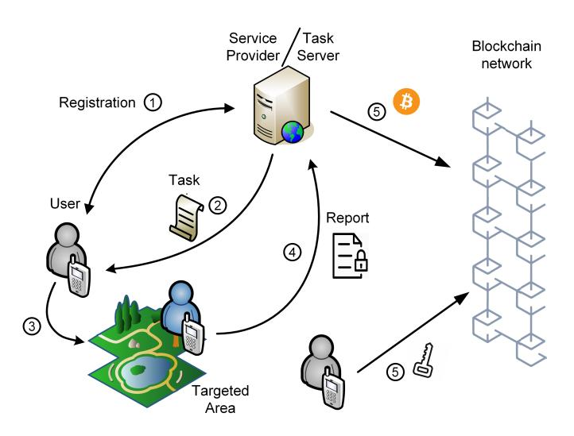

# From Zebras to Tigers<sup>∗</sup> : Incentivizing participation in Crowd-sensing applications through fair and private Bitcoin rewards

Tassos Dimitriou, *Senior Member, IEEE* tassos.dimitriou@ieee.org

*Abstract*—In this work we develop a rewarding framework that can be used as a building block in crowd-sensing applications. Although a core requirement of such systems is user engagement, people may be reluctant to participate as sensitive information about them may be leaked or inferred from submitted data. Thus monetary incentives could help attract a large number of participants, thereby increasing not only the amount but also the quality of sensed data. Our first contribution in this work is to ensure that users can submit data and obtain Bitcoin payments in a privacy-preserving manner, preventing curious providers from linking the data or the payments back to the user. At the same time, we thwart malicious user behavior such as doubleredeeming attempts where a user tries to obtain rewards for multiple submissions of the same data. More importantly, we ensure the fairness of the exchange in a completely trustless manner; by relying on the Blockchain, we eliminate the trust placed on third parties in traditional fair exchange protocols. Finally, our system is highly efficient as most of the protocol steps do not utilize the Blockchain network. When they do, we only rely on simple Bitcoin transactions as opposed to prior works that are based on the use of highly complex smart contracts.

*Index Terms*—Crowd-sensing, Participatory sensing, Security and Privacy, Data reporting, Incentives, Rewarding mechanisms, zkSNARKs, Bitcoin, Blockchain.

#### I. INTRODUCTION

The proliferation of sensor-enabled smart devices gave rise to crowdsensing, a new sensing model where participants use their mobile devices to collect data at a larger scale thus enabling a number of innovative people-centric applications such as environmental monitoring, assistive healthcare, intelligent transportation, and so on [1].

In a typical crowdsensing application, a service provider administers the data sharing infrastructure and recruits the people who will start gathering data for the advertised sensing tasks. The collected data are then analyzed and made available to the users or the broader public. It is this lack of a fixed sensing infrastructure and the ubiquitousness of WiFi and mobile Internet connectivity that gives crowdsensing its unique advantage over traditional sensing paradigms.

<sup>∗</sup>The title of the paper is inspired by the one in [9]. According to the authors of this work, the delicate anonymity offered in their system is an analog of the way stripes are used in zebras; as a way to camouflage against predators but also as a way to identify peers. A tiger is another animal with stripes, however a level up in the food hierarchy. We believe our rewarding framework achieves the goals of anonymity, accountability and fairness in a much more efficient way than the one described in [9].

For up-to-date contact information please visit http://tassosdimitriou.com.

From the viewpoint of the service providers, the key factor to the success of crowdsensing is user participation. However, collecting information from user devices has important privacy implications since contributed data may be strongly related to user activities and daily routines [2]. For example, sensed data may include visited locations or even personal data such as photos and videos. This in turn may have a negative impact on participation as users may be reluctant to endanger their personal lives without immediate benefits [3]. To this effect, monetary incentives could help attract a larger number of participants, thereby increasing the amount and the quality of sensed data. Hence incentivizing users by means of *rewards* can be the only way to motivate user engagement and improve the quality of collected information.

Although many incentive schemes have been proposed in the literature (for a survey see [4]), the problem of incentivizing user participation has been overshadowed by other design challenges such as accountability and fairness. Rewarding is a challenging problem as only authenticated users should be able to submit data and obtain rewards. Authentication is required in order to prevent malicious users from submitting multiple data using fake IDs (an instance of a Sybil attack). On the other hand, if the identity of the user is not protected, task submissions and other contextual information like location data and participation history may result in serious loss of privacy and hence lack of motivation to participate in the sensing process.

A last remaining issue that complicates things further is to ensure the *fairness* of exchanging crowd-sensed data for a payment. In particular, when a user submits her data, nothing prevents a malicious collector of obtaining the data and refusing to pay the user. For the same reason, a provider cannot reward the user first as the user may refuse to submit the data afterwards. Thus, in the absence of a centralized authority that monitors the exchange of goods and is responsible for resolving any conflicts that may arise due to failures or fraud, both parties can cheat the other. We solve this conundrum in an elegant manner using the blockchain network, without requiring the existence of a trusted third party as in traditional fair exchange protocols [5].

*Contributions:* In this work<sup>1</sup> , we propose a data-forbitcoins rewarding system that uses the blockchain network to ensure strong fairness of the exchange. Apart from an initial registration phase, our protocol ensures that users remain anonymous in all phases of the protocol; from data submission to payment verification. We place no trust in third parties or the service provider, thus ensuring both unlinkability of user submissions as well as unlinkability of rewards. More importantly, our protocol guarantees the fairness of the exchange, ensuring that data is delivered *if and only if* an appropriate bitcoin payment is received,

Our work can easily be integrated in existing crowd-sensing frameworks, making sure that an unlinkable bitcoin reward can be credited to a user's untraceable address. Contrary to prior works, the majority of the protocol steps take place *offchain*. Additionally, we only rely on simple Bitcoin transactions to perform the payment instead of complex smart contracts as in prior works, thus further contributing to the efficiency of the protocol. Finally, we have analyzed the security aspects of our proposal showing that both submission and rewarding mechanisms are indeed privacy-preserving.

*Organization:* In the next section, we review related work in the context of crowd-sensing. In Section III, we present the system model, threat model, security assumptions and define the properties we expect from a secure data rewarding system. Section IV highlights the cryptographic primitives used in our proposal, while details of our protocol are presented in Section V. The protocol's security, privacy and efficiency aspects are discussed in Section VI, while Section VII concludes the paper.

#### II. RELATED WORK

There is already a number of works in the literature that attempt to use the blockchain as a medium to exchange data and rewards. Tanas *et al*. [7] developed a framework that uses the blockchain as a rewarding mechanism. The scheme focuses mostly on the anonymity of payments since user data are sent in the clear to the data collector who must first perform a validation test on the data before payment. This may compromise fairness as a malicious collector may refuse to reward users once data are sent.

CrowdBC [8] is a smart contract based solution which can be used by a requester to solicit a number of workers to solve a particular task. However, the system is neither private nor anonymous since the collected data and the user identities can leak to the blockchain network. In particular, miners in CrowdBC play a central role in collecting and evaluating user submitted data. This can also affect fairness as a malicious miner may easily collude with the collector and leak user sensitive information as well as the data themselves.

Lu *et al*. [9] developed ZebraLancer, a system similar to CrowdBC that tries to overcome data leakage and identity breach. The smart contract handles both worker submissions and payments by the collector, preventing dishonest behavior by either party. However, in the case of a cheating collector, the smart contract will distribute the budget evenly among users thus violating fairness since some users may have contributed more than others. Furthermore, as all information (both user data and payments) goes through the smart contract this essentially turns the system into a centralized one.

The work of Duan *et al*. [10] is also based on smart contracts bearing monetary rewards along with hardwareassisted transparent enclaves to ensure correctness of data aggregation and sanitization of data. The system consists of consumers who post the sensing tasks as a smart contract, workers who send the data to the contract, and providers who perform data sanitization. Unfortunately, the threat model is very limited as the authors assume that data consumers and the service provider do not collude with each other since otherwise data confidentiality and user privacy is lost.

A characteristic of all smart contract-based solutions is that all data go through the smart contract, resulting in rather inefficient systems. Additionally, smart contract transactions induce direct monetary costs to the collector, thus affecting the practicality of large scale solutions. Our work overcomes these issues by having most of the protocol steps taking place *offchain*. Only the actual payment transaction uses the blockchain network, thus making the system highly efficient. Additionally, we do not rely on the blockchain network or the miners to store and verify data submissions as in past works. Doing so paves the way to collusion attacks in which malicious miners can collaborate with the collector to steal data or compromise user privacy.

A recent work that avoids the use of smart contracts is [11]. While the authors use rather simple blockchain transactions, both the workers and the collector have to go through many rounds of submissions in the blockchain, seriously affecting the efficiency of the protocol. More importantly, the collector obtains the data before the actual rewarding phase, thus violating fairness. Wang *et al*. [12] proposed another incentive mechanism to reward users. Miners first verify the quality of the sensed data conforming to assessment criteria published by the server, then reward the users accordingly. However, since the miners get the data first, a malicious miner may forward these to the server thus undermining the fairness of the process. Finally, Delgado-Segura *et al.* [13] describe a protocol for fair data trading. However, fairness is only probabilistically enforced and the actual protocol follows a cut and choose approach: in order to convince the buyer that the required data is correct, a portion of it has to be revealed first. This increases the communication overhead of the protocol. Additionally, there is no way for the buyer to be sure about the utility of the data beforehand. Both issues are taken care by our protocol.

In this work, the blockchain will be used to ensure the fair exchange between the submitted answers and their corresponding rewards, eliminating the possibility of cheating by any party. Previous works on fairness using blockchain focus on fair purchase operations of a product. For example, Bentov

<sup>1</sup>This paper extends and improves our prior work [6] that has appeared in the IEEE International Conference on Decentralized Applications and Infrastructures (DAPPS2020).



Fig. 1. System Model - Data submission and rewarding phases.

and Kumaresan [14] use Bitcoin to enforce proper behavior of participants by means of a penalty mechanism, while Heilman *et al.* [15] design an unlinkable payment hub that allows participants to make fast, anonymous, off-blockchain payments through an untrusted intermediary. Campanelli *et al.* [16] achieve strong fairness for the case where a seller wants to be paid after proving that a service has been rendered, as opposed to selling a secret in Zero Knowledge contingent payments [17]. Our work is similar to those in the sense that the "secret" to be sold is the user data. However, care has to be taken to ensure that only authenticated users can benefit from the existence of rewards.

For token-based mechanisms that do not use the blockchain to reward users, the reader is referred to [18], [19] and the references therein.

#### III. SYSTEM MODEL

Our base architecture consists mainly of two entities: *users* that participate in sensing tasks and a *service provider* that collects data and rewards users for the data they provide. Users install sensing applications in their mobile devices and gather sensor readings which might include location, accelerometer data, pictures, sound samples, environmental data like temperature and pollution levels, and so on. Once they have data to report, they contact the application server which collects the results and organizes them in appropriate form for display to the general public or locally to the user devices.

A snapshot of this architecture is shown in Figure 1. The core operation governing the structure of such a system consists of a user U transmitting sensed data to a service provider P that has initiated the specific data collection campaign. However, before users engage in participatory sensing, they must register first (Step 1). This role is typically assumed by a separate registration authority (RA) that verifies user identities and issues credentials bound to these identities. From a security point of view it does not really matter whether the RA is different from P as these two entities may collude to break user privacy during sensing and reporting. Hence we treat them as one.

When the provider needs to collect data about a particular sensing task, it has to advertise the task to the users. Typically, this procedure is handled by a task server (T S) which is contacted by users wishing to engage in some sensing activity. Here, again, we will not distinguish between the service provider, the task server or even the reporting server as is customary in participatory sensing applications [2] since these servers may collude with each other to recover user information. So, we will just assume that the user is in possession of an authentic task (Step 2) and then moves to the target area (Step 3) to start collecting data.

In the main operational phase of our protocol, users submit data (Step 4) and collect bitcoin payments (Step 5). However to prevent the provider from getting the data and refuse to reward the user, the data is sent encrypted with a key that will be released if the provider pays the user. However, a user may also act maliciously, i.e. get the money and refuse to release the key that unlocks the data. Thus, Step 5 is using the Blockchain network to make sure that no party can cheat the other (strong fairness). Our protocol ensures that data is delivered *if and only if* an appropriate payment is made.

However, since the provider does not have access to the data beforehand, he also needs to be sure that (i) data is worthy of some value val according to an established rewarding policy R(), and (ii) that no user can obtain another reward for the same data. This chicken-and-egg situation is resolved by our protocol in a very methodical manner thus achieving the required balance between anonymity and accountability. These steps take place *offchain* thus further contributing to the efficiency of the protocol. The only part that uses the Blockchain network is the key-for-money exchange in Step 5 that helps ensure fairness.

In the following we define the various operations expected from our system. For simplicity, only a high-level system interface is presented, not listing every single input which may be required by the parties to execute the protocols. These operations enable users to register, submit data, receive payments, and so on.

- Setup(1<sup>κ</sup> ) is a probabilistic algorithm executed by P to setup the data reporting and payment system. On input a security parameter 1 κ it generates P's public and private key (pk<sup>P</sup> , sk<sup>P</sup> ) and a public common reference string CRS to be used in the more advanced operations of the system.
- Register(U,P) is an interactive protocol executed between a user U and the provider P. As output, U obtains a long term public/private key pair (pk<sup>U</sup> , sk<sup>U</sup> ). P registers U's public key and identity information to prevent the user from trying to obtain multiple rewards for the same data.

A second outcome of this protocol is an *ephemeral* key pair (pk<sup>e</sup> U , sk<sup>e</sup> U ). The private key sk<sup>e</sup> <sup>U</sup> will be used by U

to submit sensing data and sign bitcoin transactions. The public key  $pk_{\mathcal{U}}^e$  (essentially a bitcoin address) will act as an *authorization* credential allowing only authorized users to receive payments in a privacy-preserving manner. However, none of these keys can be linked to the long term public key of the user which is known to  $\mathcal{P}$ .

- IdentDR $(taskID, \mathcal{DB}_{\mathcal{P}})$  is an algorithm executed by  $\mathcal{P}$  to check if there exist two different submissions by the same user for a given task. This is to prevent *double-redemption* attempts in which users try to obtain more than one payments for the same sensing task.
- Submit( $\mathcal{U}$ ) is a protocol executed between a user  $\mathcal{U}$  and  $\mathcal{P}$ .  $\mathcal{U}$  encrypts the sensed data with a one-time symmetric key K and sends the encrypted data C and the hash  $h_K$  of the key to the provider through an anonymizing network like TOR.  $\mathcal{U}$  also produces a proof  $\pi$  that demonstrates knowledge of the key K and that encrypted data worth val bitcoins according to the rewarding function  $\mathcal{R}()$ . The data sent are signed with the user's ephemeral signing key  $sk_{\mathcal{U}}^e$  to produce a signature  $\sigma_e$ .
- Verify $(\mathcal{P}, \sigma_e, C, h_K, \pi)$ . This protocol is executed by the provider to check the validity of the signature  $\sigma_e$  and the proof  $\pi$ . The signature attests to the fact that the user is authorized. If the proof  $\pi$  also verifies,  $\mathcal{P}$  posts a transaction  $T_{\mathcal{P} \to \mathcal{U}}$  to the Bitcoin network that promises to pay val bitcoins to whoever presents a key that hashes to K. This is the only place where an actual bitcoin transaction takes place. This operation also uses IdentDR to check for double-redemption attempts.
- Release( $\mathcal{U}, K$ ). This is executed by  $\mathcal{U}$  once the user confirms that transaction  $T_{\mathcal{P} \to \mathcal{U}}$  has been posted on the blockchain network. The user posts a transaction  $T_{\mathcal{U} \to \mathcal{P}}$  that releases the key K.  $T_{\mathcal{U} \to \mathcal{P}}$  is signed with the private ephemeral key of the user to prevent *forwarding* attacks in which the user broadcasts K to the blockchain network and a malicious miner (or anyone else) sees K and uses it to claim  $\mathcal{P}$ 's funds.

All the above algorithms should meet the following correctness definition:

Definition 1: (Correctness) A rewarding scheme composed from the above algorithms is called correct if all of the following properties hold for all system parameters  $\mathcal{CRS}$  and  $\mathcal{P}$ 's public and private key pair created from  $\operatorname{Setup}(1^k)$ ,  $\mathcal{U}$ 's secret identity  $sk_{\mathcal{U}}$ , public identity  $pk_{\mathcal{U}}$  and ephemeral keys  $\langle pk_{\mathcal{U}}^k, sk_{\mathcal{U}}^k \rangle$  created from  $\operatorname{Register}(\mathcal{U}, \mathcal{P})$ , and entities  $\mathcal{U}$  and  $\mathcal{P}$  honestly following the protocols.

- Correctness of issuing and verifications. When issued in Register and used in Submit and Verify, all ephemeral keys can pass verification.
- Correctness of payment. All data m worth value val under some rewarding function  $\mathcal{R}()$ , can be redeemed successfully under operations Submit, Verify and Release.

#### A. Security and privacy model

In this section, we discuss what kind of adversaries and attacks are covered by our security and privacy models. Our

threat model contains both malicious providers and users. Malicious providers may try to collect data without rewarding users. Additionally, they may try to infer private user information. A malicious user on the other hand may try to get a "free ride" by receiving rewards for useless or even already submitted data. To prevent this we will demand that only authorized users can access the system, without however risking user privacy. Thus, a careful design is required in order to ensure that users remain anonymous, their actions unlinkable and yet they cannot misbehave. The necessary requirements are listed below:

- Authorization. Only authenticated users should be able to submit sensed data. The provider should be able to verify the origin of this data as coming from a legitimate, registered user. However, this must be done in a way to ensure that user privacy is not violated.
- Confidentiality and integrity. The interactions between a\nuser and the provider should be protected from anyone
  who is not authorized to have access to this data. Reported
  data should be protected against eavesdroppers or malicious entities who want to read/modify this information.
  Additionally, blockchain transactions should not reveal
  any information about the sensed data or the link between
  the user and the submitted data.
- Anonymity/unlinkability. Neither the provider nor other users of the system should be able to learn anything about the identity of a user during the data reporting and payment phases of the protocol. Additionally, different sessions between the user and the provider should also be unlinkable to each other.
- Protection against malicious providers. In addition to the usual adversarial behavior where the provider tries to break user privacy, users should be protected from providers who deny to pay for submitted data. Thus, it should not be possible for a provider to obtain the data for free or, more generally, in a price smaller than the one advertised by the rewarding function  $\mathcal{R}$ .
- Protection against double redemption attacks and malicious user behavior. Similarly, providers should be protected against malicious users who might (i) obtain a reward and refuse to release the promised data, (ii) release data whose value is less than the promised one, or (iii) try to obtain more than one rewards for the same data.

Remark 1: At the network level, we assume that data submissions take place through anonymizing connections which can be used to hide the network identities of the communicating devices. We also assume that the nature of the tasks does not leak information about the users accepting these tasks. For example, if only a few users are willing to accept a task, the anonymity set is reduced thus making it easier to de-anonymize these users, even if anonymous reporting is enforced by other techniques. Such selective tasking attacks [2] are outside the scope of this work. Finally, we don't consider data pollution attempts. While we prevent malicious user

behavior, we have no control over users that report *falsified* sensor data. One approach to this problem is attesting to the correct operation of the actual sensors as described in [20]. Another approach would be to use reputation frameworks that can penalize users that submit erroneous data [21].

The above set of properties will be defined by means of experiments using a probabilistic polynomial time adversary  $\mathcal{A}$ . The adversary may control a set of malicious colluding users or may eavesdrop on honest users.  $\mathcal{A}$  will play the role of the user, may interact with an honest provider an arbitrary number of times but may not follow protocol specifications. Additionally,  $\mathcal{A}$  is assumed to receive all the messages exchanged in the scope of the protocols but may manipulate the messages sent during protocol runs of malicious users.  $\mathcal{A}$ 's behavior will be captured by the set of oracles defined below:

- Register\*( $\mathcal{U}$ ) lets  $\mathcal{A}$  initiate the Register protocol with an honest  $\mathcal{P}$  provided there is no pending or successful Register\* call for  $\mathcal{U}$  yet. We assume that the secret keys  $sk_{\mathcal{U}}$  and  $sk_{\mathcal{U}}^{\mathcal{E}}$  are unique and unknown to the adversary.
- Submit\*( $\mathcal{U}$ ) lets  $\mathcal{A}$  initiate the Submit protocol with an honest  $\mathcal{P}$  for some data  $m_1, \ldots, m_n$ .
- Verify\*(val) is used by the adversary to initiate the Verify protocol with  $\mathcal{P}$  for input val.
- Release\* $(\mathcal{U}, val)$  lets  $\mathcal{A}$  initiate the Release protocol with an honest  $\mathcal{P}$  with an input val.

Now we consider adversarial goals against the properties of authorization, balance between value of data and payments, and double-redemption detection. The first property ensures that only authorized users can submit data and obtain rewards.

Definition 2: (Authorization) A data submission and rewarding scheme holds the Authorization property if for any PPT adversary  $\mathcal A$  in the experiment  $\mathsf{Exp}^\mathsf{Auth}_{\mathcal A}(\kappa)$  below, the advantage of  $\mathcal A$  is negligible in  $\kappa$ .

### Experiment $Exp_A^{Auth}$

Let  $(CRS, (pk_{\mathcal{P}}, sk_{\mathcal{P}})) \leftarrow \mathsf{Setup}(1^{\kappa})$ . Then run  $\mathcal{A}^{\mathsf{Register}^\star, \, \mathsf{Submit}^\star, \, \mathsf{Verify}^\star, \, \mathsf{Release}^\star} \, (pk_{\mathcal{U}}^e, \, pk_{\mathcal{P}})$ . The experiment outputs 1 iff

- 1)  $\mathcal{A}$  holds a valid authorization credential  $(pk_{\mathcal{U}}^e, sk_{\mathcal{U}}^e)$  that is not an output from any Register\* query; or
- 2)  $\mathcal A$  makes successful calls to Submit\*, Verify\*,Release\* such that the honest  $\mathcal P$  is convinced that the calls involve a valid public-key  $pk_{\mathcal U}^e$  for which there has not been a successful execution of Register\* up to this call.

The property of Double-redeeming Detection (DrD), ensures that two transactions leading to the same redeeming tag must have been initiated by the same user.

Definition 3: (Double-redeeming Detection) A data submission and rewarding scheme holds the Double-redeeming detection property if for any PPT adversary  $\mathcal{A}$  in the exper-

iment  $\operatorname{Exp}^{\operatorname{DrD}}_{\mathcal{A}}(\kappa)$  below, the advantage of  $\mathcal{A}$  is negligible in  $\kappa$ .

# Experiment $\mathsf{Exp}_{\mathcal{A}}^{\mathsf{DrD}}$

Let  $(CRS, (pk_{\mathcal{P}}, sk_{\mathcal{P}})) \leftarrow \text{Setup}(1^{\kappa})$ . Then run  $\mathcal{A}^{\text{Register}^{\star}, \text{Submit}^{\star}, \text{Verify}^{\star}, \text{Release}^{\star}(pk_{\mathcal{P}})$ . The experiment returns 1 iff  $\mathcal{A}$  makes two successful Submit or Release queries to the same data, which implies double-redeeming, however, using the IdentDR algorithm, at least one of the following conditions is satisfied:

- The user public-keys extracted from the queries are  $pk_{\mathcal{U}}^1$  and  $pk_{\mathcal{U}}^2$ , with  $pk_{\mathcal{U}}^1 \neq pk_{\mathcal{U}}^2$  or
- The double-redeeming tags shown in these two queries are  $t_1$  and  $t_2$  respectively, with  $t_1 \neq t_2$  or
- IdentDR with these two transactions outputs 0.

We next consider the provider balance property (BaP). This property ensures that the amount redeemed for data  $m_1, \ldots, m_n$  cannot exceed  $\mathcal{R}(m_1, \ldots, m_n)$ , the value returned by the application of the rewarding function  $\mathcal{R}$  on data  $m_i$ . This also suggests that an adversarial user cannot obtain a reward and release no data, or redeem more than one rewards for the same data. Thus this property is used to model adversaries who want to gain more than what they actually deserve for the data submitted to an honest provider.

Definition 4: (Provider Balance) A data submission and rewarding scheme holds the Provider Balance property if for any PPT adversary  $\mathcal A$  in the experiment  $\mathsf{Exp}^\mathsf{BaP}_{\mathcal A}(\kappa)$  below, the advantage of  $\mathcal A$  is negligible in  $\kappa$ .

# Experiment $\mathsf{Exp}_{\mathcal{A}}^{\mathsf{BaP}}$

Let  $(CRS, (pk_{\mathcal{P}}, sk_{\mathcal{P}})) \leftarrow \mathsf{Setup}(1^{\kappa})$ . Then run  $\mathcal{A}^{\mathsf{Register}^{\star}, \, \mathsf{Submit}^{\star}, \, \mathsf{Verify}^{\star}, \, \mathsf{Release}^{\star}(pk_{\mathcal{P}})$ . The experiment outputs 1 iff

- 1)  $\mathcal{A}$  managed to extract a valid authorization credential  $(pk_{\mathcal{U}}^e, sk_{\mathcal{U}}^e)$  which can spend it by signing a new bitcoin transaction using  $sk_{\mathcal{U}}^e$ ; or
- 2)  $\mathcal{A}$  claims a payment that is larger than the value  $\mathcal{R}(m_1,\ldots,m_n)$  of previously submitted data with  $pk_{\mathcal{U}}^e$ ; or
- 3)  ${\cal A}$  claims another payment for the same data and IdentDR outputs zero.

Similarly, the user balance property (BaU) ensures that a malicious provider  $\mathcal A$  cannot cheat the user in paying less than the data's worth.

Definition 5: (User Balance) A data submission and rewarding scheme holds the User Balance property if for any PPT adversary  $\mathcal A$  in the experiment  $\mathsf{Exp}^\mathsf{BaU}_{\mathcal A}(\kappa)$  below, the advantage of  $\mathcal A$  is negligible in  $\kappa$ .

# Experiment $Exp_{\mathcal{A}}^{BaU}$

Let  $(CRS,(pk_{\mathcal{P}},sk_{\mathcal{P}})) \leftarrow \mathsf{Setup}(1^{\kappa})$ . Then run  $\mathcal{A}^{\mathsf{Register}^\star,\,\mathsf{Submit}^\star,\mathsf{Verify}^\star,\,\mathsf{Release}^\star(pk_{\mathcal{U}}^e,pk_{\mathcal{P}})$ . The experiment outputs 1 iff

- 1)  $\mathcal{A}$  managed to extract a valid authorization credential  $(pk_{\mathcal{U}}^e, sk_{\mathcal{U}}^e)$  which can spend it by signing a new bitcoin transaction using  $sk_{\mathcal{U}}^e$ ; or
- 2)  $\mathcal{A}$  makes a payment that is smaller than the value  $\mathcal{R}(m_1, \ldots, m_n)$  of previously submitted data with  $pk_U^e$ .
- 3) A extracts the key K and recovers the encrypted data.

We next turn our attention to privacy. Here we consider an adversarial provider  $\mathcal{A}$  whose goal is to identify the user behind a sequence of protocol runs or try to link certain protocol runs. In general, data submissions and payments (even by the same user) should not be linkable to the user, and the actions of one user should not be distinguishable from the actions of another user. To formalize the behavior of the adversary, we let  $\mathcal{A}$  use an additional oracle Corrupt( $\mathcal{U}$ ) which lets  $\mathcal{A}$  interfere (corrupt) an honest user  $\mathcal{U}$  and obtain  $\mathcal{U}$ 's secret key  $sk_{\mathcal{U}}$ .

Definition 6: (Privacy) A data submission and rewarding scheme is user private if for any PPT adversary  $\mathcal A$  in the experiment  $\operatorname{Exp}_{\mathcal A}^{\operatorname{Priv}}(\kappa)$  below, the advantage of  $\mathcal A$  is negligibly close to 1/2.

# Experiment Exp<sup>Priv</sup>

Let  $(CRS, (pk_{\mathcal{P}}, sk_{\mathcal{P}})) \leftarrow \mathsf{Setup}(1^{\kappa})$ . The experiment consists of the following phases which are run one after the other.

- Learning phase: A may ask any number of users to Register\*, Submit\*, Release\* data multiple times. A may also Corrupt any number of users except two that will be used in the challenge phase.
- Challenge phase:  $\mathcal{A}$  picks two honest users  $\mathcal{U}_1$  and  $\mathcal{U}_2$  whose key material has not been corrupted in the previous phase. The challenge oracle selects at random a bit  $b \in \{0,1\}$  and sets user  $\mathcal{U}_L$  equal to  $\mathcal{U}_b$  and  $\mathcal{U}_R$  equal to  $\mathcal{U}_{1-b}$ .  $\mathcal{A}$  chooses data  $m_1,\ldots,m_n$  and may execute the following steps:
  - Ask users  $\mathcal{U}_L$  or  $\mathcal{U}_R$  to submit data using Submit\*.
  - Ask users  $\mathcal{U}_L$  or  $\mathcal{U}_R$  to receive payments using Release\*.
- Post-Challenge phase: A may ask both users to further Submit\*, Release\* data multiple times and concurrently.

 $\mathcal{A}$  outputs a guess b' for b. The experiment returns 1 if b' = b.

#### IV. Tools

In what follows we describe the main tools we will be using in our proposal. *zkSNARks*: Our protocol is based on the security of zero-knowledge Succinct Non-interactive ARguments of Knowledge (*zkSNARKs*) as developed in [22]. *zkSNARKs* allow a prover to convince a verifier about the validity of an NP statement by constructing a small size proof  $\pi$ .

zkSNARKs consist of three algorithms setup, prove and verify. The setup algorithm, given a security parameter  $\kappa$  and an NP language L corresponding to a relation  $R=\{x,w\}$  where w is a witness that  $x\in L$ , outputs a common reference string  $\mathcal{CRS}$  consisting of a public evaluation key for proving that w is a witness for x and a public verification key used in the verification of such statements. Prove is an algorithm that, given  $\mathcal{CRS}, x$  and w, produces a proof  $\pi$  that w is a valid witness for x. Verify is an algorithm that given  $\mathcal{CRS}, x, \pi$  outputs either 'Accept' or 'Reject' depending on the validity of the proof.

The properties expected by zkSNARKs are: (i) completeness, that for  $(x,w) \in R$  the prover can produce a proof  $\pi$  that passes the verification test; (ii) soundness, that no malicious prover can generate a proof  $\pi$  for  $x \notin L_Q$  that fools the verifier to accept  $(x,\pi)$ ; and (iii) zero-knowledge, that no information leaks about the witness, i.e. there exists a (randomized) polynomial simulator S, such that for any  $x \in L_Q$  S a proof can be generated that is computationally indistinguishable from a honestly generated one. We say a zkSNARK is secure if all the above properties hold [22].

Remark 2: zkSNARKs require a trusted party to generate the common reference string  $\mathcal{CRS}$  for the production and the verification of the proofs. This is typically assumed to be generated honestly. However, a malicious verifier (e.g. the service provider) can provide a  $\mathcal{CRS}$  that allows it to break the ZK property and learn information about the user's secret parameters. This attack can be prevented if the user checks that the  $\mathcal{CRS}$  is correctly formed. Hence no trust is really placed on the service provider. Another possibility is to use the notion of Subversion-NIZK [23], where the zero-knowledge property is preserved even when a (possibly malicious) verifier chooses the  $\mathcal{CRS}$ .

Bitcoin and Blockchain: A blockchain is an open, distributed ledger that can be used to record transactions in a transparent and verifiable manner. It is a linked-list data structure consisting of blocks of transactions, where each block contains a cryptographic hash value of the previous block in the list. Thus attempting to modify an existing transaction will result in a chain of updates all the way until the last block; however this cannot happen without consensus by the majority of the peers maintaining the ledger. This property gives the blockchain its immutable (and transparent) character.

In this work the provider will be using the blockchain as the means to transfer Bitcoin payments for the data submitted by the user. Payments can be sent (or received) to bitcoin addresses which can be thought as user pseudonyms. Each such address is bound to a public key (more precisely to the hash of the public key) and a transaction is considered valid when it is signed by the corresponding private key. Thus nobody can act on behalf of another user unless they know the corresponding private key. To transfer bitcoins, a transaction must be created with one or more input addresses from which the money will be taken and one or more output addresses to which the money will be sent.

One such important transaction is the *Pay-to-Script-Hash* (P2SH) [24] shown below.

```
ScriptPubKey: OP_HASH160 <redeemScriptHash>
              OP_EQUAL
ScriptSig: <sig><pubKey><redeemScript>
```

To spend bitcoins sent via P2SH, the recipient must provide a script matching the script hash and data which makes the script evaluate to true. We will be using this transaction to exchange sensed data with bitcoins of appropriate value. The user will first sent *offchain* the encrypted data along with a hash of the key K used to decrypt the data. The provider will then include the hash of the key in a P2HS transaction which can be redeemed only when the user signs the transaction and releases the secret key K used to encrypt the data (this is called the fulfilment condition).

However, to ensure that the bitcoins of the provider are not locked forever if the user denies to release the key, the provider can make the transaction a *time-locked* one by using the CheckLockTimeVerify or CheckSequenceVerify opcodes. In such a time-locked transaction, the provider can claim back its money, if the user does not release the key within a specified time interval.

This exchange 'key-for-bitcoins' is the only place where the blockchain network is used thus contributing to the efficiency of the protocol. In the next section, we describe the specifics of our protocol most of which takes place offchain.

#### V. PROTOCOL DETAILS

*Overview:* In the main operational phase of our protocol, a user U wants to receive a payment from a service provider P for data m1, . . . , m<sup>n</sup> sensed with her smart device. The data worths some value val which can be computed by the application of a rewarding function R(). R() is announced by the provider and its purpose is to capture the value of the data for attributes set forth by P for the given task such as location, sensing time, sampling frequency, type of sensor used, and so on.

The utility val = R(m1, . . . , mn) is calculated locally at the mobile device, as all necessary information is already available to the user. However, the data cannot be released to the provider as P may act maliciously and refuse to pay the user. Hence the data is sent encrypted using a one-time key K. This key will be released only when the provider posts a time-locked transaction offering val bitcoins in exchange for K. However, before the provider posts this transaction, it must be convinced that the encrypted data worth value val and have not been submitted before by U. This is an NP statement and can be implemented efficiently using a *zkSNARK* proof π. Once this proof is verified, the key-for-money transaction takes place.

This ensures that none of the parties can cheat the other. The provider is certain that nobody can claim the money unless they present a key K within a specific time period that matches the key used to encrypt the data in the proof π. Similarly, the user is sure that she will get her money when she posts the decryption key K. The above approach ensures that either both parties will get what they deserve or none can be in disadvantage, guaranteeing the *fairness* property of our scheme (see also [16], [17] for similar assumptions).

One subtle issue that we need to take care is that the user's transaction must be signed with her secret key to be valid. However to ensure unlinkability and prevent P associating the signing key with multiple submissions of data from U, this key has to be an *one-time, ephemeral* key. But while this ephemeral key will not be tied to a particular user, we need to ensure that only authorized users can submit data. This tension between unlinkability and accountability will be the focus of subsequent sections.

#### *A. Setup*

The system is initialized with a call to Setup(1<sup>κ</sup> ), where κ is the security parameter. This method creates the public common reference string CRS used in the *zkSNARKs* operations and generates the provider's public and private key (pk<sup>P</sup> , sk<sup>P</sup> ).

#### *B. Registration*

One of the key requirements of our protocol is that a user cannot claim more than one reward for the data they provide (double-redemption also known as double-spending). A simple way to prevent this is to embed information in the submitted data so that the user is either prevented or identified if she tries to double-redeem. This information will have the form of a *redeeming tag* τ that will be *unique* for the sensing task the user is responding to. Thus, if a user attempts to reap multiple rewards for a given task, she will be prevented from doing so. However, this must be carefully done to ensure that the user remains anonymous when she follows the protocol.

To this respect, before a user is allowed to participate in the crowd-sourcing application, she must register first. Thus she generates a public-private key pair (pk<sup>U</sup> , sk<sup>U</sup> ) and registers pk<sup>U</sup> with the Service Provider P. P signs the user's public key and produces a certificate cert<sup>U</sup> for the authenticity of pk<sup>U</sup> . The provider ensures that pk<sup>U</sup> is unique and stores it in its database along with any other useful information about the user. We define operation CertVerify<sup>P</sup> (cert<sup>U</sup> ) that returns 1 if the public key of U is indeed signed by P. This can be used to test the authenticity of the public key contained in cert<sup>U</sup> .

It is important to note here that this registration step correctly binds each user identity to a *unique* credential. This is to ensure accountability by preventing Sybil attacks, guaranteeing that only authenticated users participate in the system, and eventually, preventing double-redemptions of data. However, as we will see later on this step does not have any effects on user privacy since we make sure that users remain anonymous in all subsequent phases of the protocol. The user's key pair can now be used to establish an *ephemeral* bitcoin address that will be used in the actual rewarding phase to provide for unlinkability between the reported data and the rewards.

To this respect,  $\mathcal{U}$  generates a new public-private key pair  $(pk_{\mathcal{U}}^e, sk_{\mathcal{U}}^e)$  and asks the provider to blindly sign  $pk_{\mathcal{U}}^e$  using any secure blind signature scheme. For example, if the provider possesses an RSA key pair  $(e_{\mathcal{P}}, d_{\mathcal{P}})$ , the user can first send  $r^{e_{\mathcal{P}}}H(pk_{\mathcal{U}}^e)$  to the provider, where r is some blinding factor chosen by the user and H a secure hash function. After signing with  $\mathcal{P}$ 's private key, the user obtains a signature  $r(H(pk_{\mathcal{U}}^e)^{d_{\mathcal{P}}})$ , which after removal of r, is a signature on the hash of the ephemeral key  $pk_{\mathcal{U}}^e$ . Thus, when the provider sees such a bitcoin address, it knows it is coming from an authenticated user but cannot tell which user it is due to the security of the blind signature scheme. When all these steps are performed, the user is consider authorized and can participate in the crowd-sensing task.

Notice that every time the user needs to participate in a new task, she has to use a *new* ephemeral bitcoin address to avoid linkability. It is necessary to use different ephemeral keys to collect rewards in order to provide unlinkability between these rewards. The user may have as many ephemeral keys authenticated as she likes simply by asking the provider to blindly sign a collection of such keys as described above. However, if the provider is not willing to sign multiple keys, new ephemeral keys can be obtained on the fly at the time of data submission. Section V-D describes how this can be done in an unlinkable way.

#### C. Task advertising

When the provider needs to collect data about a particular sensing task, it has to advertise the task to the users. As mentioned in Section III, this is typically the job of a task server which users may contact. Here, however, we will not distinguish between the service provider and the task server.

Each sensing task may look for user data or other useful information based on various criteria (region, sampling frequency, etc.). Tasks can be either downloaded by users (*pull* model) or sent to them when the provider has a new sensing task (*push* model). The tasking and downloading processes may endanger the privacy of the participants in several ways (recall the *selective tasking* attack mentioned in Remark 1). These attacks are out of the scope of this work as our main focus is on rewarding, however we must insist that users communicate with the service provider through *anonymizing* networks like TOR.

An example of a task published by  $\mathcal{P}$  is shown below. In this task participants have to report 5 min temperature readings in London for a duration of one day.

```
s = \langle & taskID = \#53621, \\ & Location = London, \\ & sensingType = getTemperature, \\ & Frequency = 5 min, \\ & Start = December 1, 2019, \\ & Duration = 24 \ h \ \rangle
```

Such a task will be unique as indicated by its *taskID* and must be *signed* by the provider to be valid. Thus any user downloading such a task will know that is an authentic one. The uniqueness of the task will come into play later on as it will be crucial to ensure that no user can double-redeem, i.e. obtain more than one reward for the same task.

In addition to the task, the provider will publish its rewarding function  $\mathcal{R}()$ . Users can use this function to compute the amount of reward they will get for the data they provide. The reward val for data  $m_1, \ldots, m_n$  will result from the application of this function on the data and some auxiliary variables  $a_i$ , i.e.  $val = \mathcal{R}(a_1, \ldots, a_k, m_1, \ldots, m_n)$ . The rewarding function is also public information and is known to the users.

#### D. Responding to a sensing task

Let  $m_1, \ldots, m_n$  be the measurements to be reported to  $\mathcal{P}$ . The user applies the rewarding function to compute the value  $val = \mathcal{R}(m_1, \ldots, m_n)$  of the data. Now the user has to convince  $\mathcal{P}$  about the utility of the data, however without sending the data as is. To do so, the user engages in the following steps:

- 1)  $\mathcal{U}$  encrypts the data with a one-time symmetric key K to produce a ciphertext  $C = E_K(m_1, \ldots, m_n)$ . Both C and the hash  $h_K$  of K will be sent to  $\mathcal{P}$  along with a proof  $\pi$  that proves knowledge of K and the valuation val of the data. In addition to C, the user constructs and sends a double-redeeming tag  $\tau = H(taskID, sk_{\mathcal{U}})$ , where  $sk_{\mathcal{U}}$  denotes the  $long\ term$  private key of the user. The role of  $\tau$  is to prevent the user from redeeming the same data twice for the given task.
- 2) Given public information  $\langle taskID, C, h_K, val, \tau \rangle$ , the user constructs a *zkSNARK* proof  $\pi$  that demonstrates it knows  $(m_1, \ldots, m_n, K, cert_{\mathcal{U}}, sk_{\mathcal{U}})$  such that:
  - a) K was used for the encryption of the data and  $H(K)=h_K$
  - b)  $\tau = H(taskID, sk_{\mathcal{U}})$
  - c)  $cert_{\mathcal{U}}$  is a valid certificate signed by  $\mathcal{P}$
  - d)  $val = \mathcal{R}(m_1, \dots, m_n)$ .

More formally, if  $\mathcal{R}$  is the rewarding function, we define the NP language  $\mathcal{L}_R$  for the *zkSNARK*-proof system to be the set of the following NP statements:

$$\mathcal{L}_R = \left\{ \langle taskID, C, h_K, \tau, val \rangle \right. \left. \begin{array}{l} \exists \; \{m_i\}_{i=1}^n, K, cert_{\mathcal{U}}, sk_{\mathcal{U}} : \\ h_K = H(K) \\ C = E_K(m_1, \ldots, m_n) \\ \tau = H(taskID, sk_{\mathcal{U}}) \\ \mathsf{CertVerify}_{\mathcal{P}}(cert_{\mathcal{U}}) \\ \mathsf{GenVerify}(pk_{\mathcal{U}}, sk_{\mathcal{U}}) = 1 \\ val = \mathcal{R}(m_1, m_2, \ldots, m_n) \end{array} \right\}.$$

where operation  $\operatorname{GenVerify}(pk_{\mathcal{U}}, sk_{\mathcal{U}})$  returns 1 if  $(pk_{\mathcal{U}}, sk_{\mathcal{U}})$  is a valid public-private key pair. This is needed to ensure that the user created the redeeming tag with its long term key, thus linking  $sk_{\mathcal{U}}$  with the public key in  $cert_{\mathcal{U}}$ . For example, if x is the user's secret key and  $y = g^x$  her public key for some

User  $\mathcal{U}$ Provider P

#### Data submission (offchain)

Prepare sensed data  $m_1, m_2, \ldots, m_n$ Compute value  $val = \mathcal{R}(m_1, m_2, \dots, m_n)$ Pick one-time symmetric key KCompute  $h_K = H(K)$ Let  $C = E_K(m_1, m_2, ..., m_n)$ Set  $\tau = H(taskID, sk_{\mathcal{U}})$ Set  $\sigma_e = \operatorname{Sig}_{sk_{ij}^e}(Enc_{\mathcal{P}}(C), h_K, val, \tau)$ Compute zkSNARK proof  $\pi$  $\frac{Enc_{\mathcal{P}}(C), h_K, val, \tau, pk_{\mathcal{U}}^e, \mathsf{Sig}_{\mathcal{P}}(pk_{\mathcal{U}}^e), \sigma_e, \pi}{{}_{ANON}}$ Verify signature  $\sigma_e$ Verify proof  $\pi$ 

#### Blockchain transactions

If  $T_{\mathcal{P} \to \mathcal{U}}$  posted correctly, post transaction  $T_{\mathcal{U}\to\mathcal{P}}$ 

If both tests succeed, post transaction  $T_{\mathcal{P} \to \mathcal{U}}$ 

Fig. 2. Data submission and rewarding. The offchain part consists of a single message from  $\mathcal U$  to  $\mathcal P$ .

generator g, then GenVerify simply checks that  $y = g^x$  and returns 1 if the test succeeds.

At this point, the user sends the following message to  $\mathcal{P}$ .

$$\mathcal{U} \xrightarrow{Anon} \mathcal{P}: Enc_{\mathcal{P}}(C), h_K, val, \tau, \pi, pk_{\mathcal{U}}^e, Sig_{\mathcal{P}}(pk_{\mathcal{U}}^e), \sigma_e$$
(1)

This message is signed with  $\mathcal{U}$ 's ephemeral key  $sk_{\mathcal{U}}^{e}$  to produce a signature  $\sigma_e$  and is sent through an anonymizing network connection. The ciphertext C is encrypted with P's public key to prevent third parties from accessing the data in C once the key K is posted to the blockchain by U. Thus only  $\mathcal{P}$  can obtain the data. This message takes place *offchain*.

Notice that  $\mathcal U$  also sends its ephemeral public key  $pk_{\mathcal U}^e$  that was blindly signed during the registration phase.  $Sig_{\mathcal{P}}(pk_{\mathcal{U}}^e)$  is the associated signature that can be used to verify the validity of the key. This ephemeral key (bitcoin address) will be used by the provider to pay for the data during the onchain phase of the protocol.

1) Obtaining a new ephemeral key: We mentioned in the registration phase that the ephemeral key is blindly signed by the provider. Hence the first key of the user is authenticated but the provider cannot link it to the user's ID. Once this key has been used to receive a payment, a new one must be generated to avoid linking payments with the same key.

A new ephemeral key can be piggybacked on Message 1 as follows. The user picks a new ephemeral key  $pk_{\mathcal{U}}^{e'}$ , computes its hash  $h_{e'}$  and sends a blinded version  $r^{e_{\mathcal{P}}}h_{e'}$  along with the rest of the components in the message. The provider knows this is coming from an authenticated user but cannot tell which one due to the security of the blind signature. When the provider signs  $r^{e_{\mathcal{P}}} h_{e'}$  with its RSA key, the user obtains a new ephemeral key that can be used for the next submission of data. Thus, a series of signed ephemeral keys can be generated on the fly that are all unlinkable to each other.

#### E. Getting paid for the data

Once  $\mathcal{P}$  obtains Message 1, it first verifies the signature  $\sigma_e$ as coming from an authenticated ephemeral key  $pk_{\mathcal{U}}$  (recall the blind signature during registration) by checking  $Sig_{\mathcal{P}}(pk_{\mathcal{U}}^e)$ . Then it verifies whether the proof  $\pi$  is correct.

If everything checks out, it posts to the blockchain a timelocked transaction  $T_{\mathcal{P} \to \mathcal{U}}$  which says that  $\mathcal{P}$  offers val bitcoins to  $\mathcal{U}$  under the condition that " $\mathcal{U}$  must present a pre-image Kto the hash value  $h_K$  as well as a signature within some time window t"; if the conditions are not satisfied the bitcoins return to  $\mathcal{P}$ . More precisely, the transaction  $T_{\mathcal{P} \to \mathcal{U}}$  has an output of val bitcoins that can be redeemed by a (future) transaction Tif one of the following is true:

- 1) T is signed by  $\mathcal{U}$  and contains a valid pre-image of  $h_K$ ,
- 2) T is signed by  $\mathcal{P}$  and the time window t has expired.

The transaction  $T_{\mathcal{P}\to\mathcal{U}}$  is satisfied if  $\mathcal{U}$  posts a transaction  $T_{\mathcal{U}\to\mathcal{P}}$  that contains K. This would satisfy condition 1 of  $T_{\mathcal{P} \to \mathcal{U}}$  and so val bitcoins are transferred to  $\mathcal{U}$ . If  $\mathcal{U}$  does not act within the time window t, then  $\mathcal{P}$  can sign and post a transaction T that returns the val bitcoins back to him, thus satisfying the second condition of  $T_{\mathcal{P} \to \mathcal{U}}$ . If  $T_{\mathcal{P} \to \mathcal{U}}$  is posted with the wrong amount,  $\mathcal{U}$  simply aborts and does not release K.

This concludes the *onchain* phase and the description of the protocol. A summary of the protocol steps is shown in Figure 2. Contrary to prior works, only one offchain message needs to be sent from the user to the provider greatly contributing to the efficiency of the protocol.

#### VI. ANALYSIS

In this section we analyze the security, privacy and efficiency aspects of the protocol.

#### A. System security

We prove the following theorem:

Theorem 1: If the signature schemes used to create the ephemeral key are unforgeable, the proposed scheme holds the authorization property as defined in Definition 2. The proposed scheme holds the property of double-redeeming detection as defined in Definition 3. Additionally, if the *zkSNARK* scheme is secure, and the hash function is one way, the proposed scheme holds the user and provider balance properties as defined in Definitions 4 and 5. Finally, if the blind signature and the *zkSNARK* schemes are secure, the proposed scheme holds the privacy property as defined in Definition 6. *Proof*:

a) Authorization: By Definition 2, the adversary  $\mathcal{A}$  can win the authorization game if  $\mathcal{A}$  holds a valid ephemeral key that is not an output from any Register\* query in which  $\mathcal{P}$  authenticates the user and then signs the blinded ephemeral key. If this is possible, it means that  $\mathcal{A}$  either knows the secret key of  $\mathcal{U}$ , or can forge a key without the involvement of  $\mathcal{P}$ . Both conditions contradict the assumption that the signature schemes used in our proposed scheme are secure.

Alternatively,  $\mathcal{A}$  can make successful calls to Submit\*, Verify\*, and Release\* queries such that  $\mathcal{P}$  believes that these calls involve a valid ephemeral key that is not the result of Register\* up to this moment. But this is not possible since  $\mathcal{A}$  could not have generated the signature without knowledge of the secret ephemeral key. The security of the signing algorithms ensures that this cannot happen.

- b) Double-redeeming Detection: Each double-redeeming  $\tan \tau = H(taskID, sk_{\mathcal{U}})$  is bound to a unique user identity (as is expressed by  $sk_{\mathcal{U}}$ ). The security of the hash function and the security of the zkSNARK argument ensures that the tag cannot be modified without being detected. Additionally, a user cannot generate a tag without knowledge of the corresponding secret key. This is ensured by the security of the authorization procedure discussed previously. Thus each user can only redeem once, since the data is associated with a specific task and  $sk_{\mathcal{U}}$ . Finally,  $\mathcal{A}$  cannot use the tag of a user to get a reward for a different user as the ZK proof will fail due to the appearance of an invalid certificate for the public key matching the secret key in the tag.
- c) Balance: Since both the authorization and double-redeeming properties hold, to win the user balance game the adversary must extract a valid signing ephemeral key  $sk_{\mathcal{U}}^e$  and sign a new bitcoin transaction, sending the money to a bitcoin address owned by  $\mathcal{A}$ . This can be done by either getting  $sk_{\mathcal{U}}^e$  from  $pk_{\mathcal{U}}^e$ , which would make the underlying public key cryptosystem insecure, or extracting  $sk_{\mathcal{U}}^e$  from the zkSNARK which would make the proof not zero-knowledge. Similarly, obtaining a larger reward than the one embedded in the zkSNARK through the computation of  $\mathcal{R}()$  is also

infeasible as this would break the soundness property of the proof system. Thus in both cases user balance is preserved.

For the same reasons as above, a malicious provider cannot recover a valid signing ephemeral key  $sk_{\mathcal{U}}^e$  and use it to sign a bitcoin transaction to himself. Neither can he post a transaction containing a smaller reward as the user would abort and not post the transaction that releases the encryption key K. Finally, the one-wayness of the hash function and the zero-knowledge property of the zkSNARK ensures that a malicious provider cannot obtain K from the received H(K) or the proof  $\pi$ .

d) Privacy: An adversary  $\mathcal{A}$  can win the privacy game by either breaking the security of the blind signature scheme or the ZK property of the proof  $\pi$ . If there was an adversary  $\mathcal{A}$  that could distinguish the ephemeral keys of the two users  $\mathcal{U}_1$  and  $\mathcal{U}_2$  this would imply an adversary that could break the blindness property of the underlying signature scheme. The second adversary would simply use  $\mathcal{A}$ 's guesses for the ephemeral keys of  $\mathcal{U}_1$  and  $\mathcal{U}_2$  to answer the challenge of the corresponding blind signature game. Alternatively,  $\mathcal{A}$  can win the privacy game, by recovering the secret ephemeral key of each user from the proof  $\pi$ . However this is infeasible under the security of the zkSNARK proof system.

#### B. Efficiency aspects

In this section, we start by reporting the time and memory requirements to generate and verify the zkSNARK proof  $\pi$  (recall Section V-D). The proof attests to the validity of the key used to encrypt the data, the correctness of the evaluation using function  $\mathcal{R}$  as well as the application of the user's ephemeral signing key in the construction of the redeeming tag.

The experiment was run on a machine with an 1.90GHz i7-8650U CPU processor with 8GB of RAM. For the zkSNARK, we choose the construction of libsnark from [25]. The rewarding function on data m was given by  $R(m) = \max\left(u_{min}, \min\left(a_1m + a_0, u_{max}\right)\right)$ , for some constants  $u_{min}, u_{max}, a_0, a_1$ . Typically, the reward can be a fixed amount for user submissions, however here we used a more complicated expression to stress test the zkSNARK generator. The user data m was set to 1KB as if responding to a task that asked for 5 min temperature readings for a duration of more than one day.

Our findings show that the time to generate the proof  $\pi$  is 25.3 seconds on the user side, however the time to verify it is only 4.8ms. This is important from the provider's point of view as the work per user is negligible. Thus, a provider can handle a large number of users with minimal overhead. Additionally, the proof size is fixed (288 bytes), ensuring that the communication overhead is dominated by the encrypted data C which had to be sent anyway (in either encrypted or plain form). To see this consider the message send from  $\mathcal U$  to  $\mathcal P$  (recall Figure 2):

$$\langle Enc_{\mathcal{P}}(C), h_K, val, \tau, \pi, pk_{\mathcal{U}}^e, Sig_{\mathcal{P}}(pk_{\mathcal{U}}^e), \sigma_e \rangle.$$

Both  $h_K$  and  $\tau$  are hash outputs so they can be taken to be equal to 160 bits or 20 bytes each. The value val of the data can fit in a 64-bit word, so this contributes another 8

bytes to the total. Bitcoin is based on the use of elliptic curve cryptography (secp256k1 curve) and in particular the ECDSA algorithm for signing. Thus the size of the public key pk<sup>e</sup> U is 33 bytes, while the size of the resulting signature σ<sup>e</sup> is bounded by 73 bytes. Using RSA as our blind signature scheme, the signature Sig<sup>P</sup> (pk<sup>e</sup> U ) of the provider contributes another 128 bytes (however elliptic curve variants or less expensive blind schemes can be used instead). Thus, without considering the size of the encrypted data, the user must send 570 bytes, which also includes the size of the *zkSNARK* proof π.

The remaining overhead comes from Enc<sup>P</sup> (C). However, instead of encrypting C with the provider's public key one can encrypt a symmetric key and use this to encrypt the remaining data. Thus, public key encryption can be reduced to encrypting just a single key instead of the remaining data. As the data has to be sent anyway, the overhead of encryption is minimal.

The above findings establish the viability of our approach in the practical settings envisioned by crowd-sensing applications.

#### VII. CONCLUSIONS

In this work, we proposed a privacy-preserving mechanism that can be used to incentivize and increase user participation in crowdsensing applications. With the help of our framework users can submit data collected with their smart devices and obtain *rewards* in the form of bitcoin payments. Our protocol guarantees the anonymity of submissions without sacrificing accountability. Indeed one of the key requirements in our work is to prevent *double-redeeming* attacks in which a user may attempt to obtain multiple rewards for the same data. Our proposal prevents this malicious behavior without giving up anonymity of transactions. Thus user submissions cannot be distinguished and rewards remain unlinkable. More importantly, our protocol guarantees the *fairness* of the exchange as neither the user nor the provider can cheat each other. Finally, our protocol is highly efficient as most of the steps take place *offchain* and only the actual bitcoins-for-data exchange uses the blockchain network. Additionally, we only rely on simple *Pay-to-Script-Hash* transactions as opposed to complex smart contracts used in prior works, thus ensuring the viability of our approach in realistic deployment settings.

### REFERENCES

- [1] Georgios Chatzimilioudis, Andreas Konstantinidis, Christos Laoudias, and Demetrios Zeinalipour-Yazti. "Crowdsourcing with smartphones." IEEE Internet Computing 16, no. 5, 36–44, 2012.
- [2] Delphine Christin. "Privacy in mobile participatory sensing: Current trends and future challenges." Journal of Systems and Software 116, 57–68, 2016.
- [3] Ioannis Krontiris, Felix C. Freiling, and Tassos Dimitriou. "Location privacy in urban sensing networks: research challenges and directions". In IEEE Wireless Communications 17, 5, 2010.
- [4] Francesco Restuccia, Sajal K. Das, and Jamie Payton. "Incentive mechanisms for participatory sensing: Survey and research challenges." In ACM Transactions on Sensor Networks 12, no. 2, 13, 2016.

- [5] N. Asokan, V. Shoup, and M. Waidner. "Optimistic fair exchange of digital signatures." IEEE Journal on Selected Areas in Communications, 18(4):593-610, 2000.
- [6] Tassos Dimitriou. "Fair and private Bitcoin rewards: Incentivizing participation in Crowd-sensing applications." In IEEE International Conference on Decentralized Applications and Infrastructures (DAPPS), 2020.
- [7] C. Tanas, S. Delgado-Segura, and J. Herrera-Joancomart, "An integrated reward and reputation mechanism for MCS preserving users privacy," in International Workshop on Data Privacy Management and Security Assurance, 2015.
- [8] M. Li, J. Weng, A. Yang, W. Lu, Y. Zhang, L. Hou, J.N. Liu, Y. Xiang, and R. H. Deng. "CrowdBC: A blockchain-based decentralized framework for crowdsourcing." IEEE Transactions on Parallel and Distributed Systems 30, no. 6 (2018): 1251– 1266.
- [9] Yuan Lu, Qiang Tang, and Guiling Wang. "Zebralancer: Private and anonymous crowdsourcing system atop open blockchain." In 38th International Conference on Distributed Computing Systems (ICDCS), pp. 853–865, 2018.
- [10] Huayi Duan, Yifeng Zheng, Yuefeng Du, Anxin Zhou, Cong Wang, and Man Ho Au. "Aggregating Crowd Wisdom via Blockchain: A Private, Correct, and Robust Realization." In IEEE International Conference on Pervasive Computing and Communications (PerCom2019), 2019.
- [11] Junwei Zhang, Wenxuan Cui, Jianfeng Ma, and Chao Yang. "Blockchain-based secure and fair crowdsourcing scheme." In International Journal of Distributed Sensor Networks 15, no. 7, 2019.
- [12] Jingzhong Wang, Mengru Li, Yunhua He, Hong Li, Ke Xiao, and Chao Wang. "A blockchain based privacy-preserving incentive mechanism in crowdsensing applications." In IEEE Access 6, 2018.
- [13] S. Delgado-Segura, C. Prez-Sol, G. Navarro-Arribas, and J. Herrera-Joancomarti. "A fair protocol for data trading based on Bitcoin transactions." In Future Generation Computer Systems, 2017.
- [14] Iddo Bentov and Ranjit Kumaresan. "How to use bitcoin to design fair protocols." In CRYPTO 2014.
- [15] Ethan Heilman, Leen Alshenibr, Foteini Baldimtsi, Alessandra Scafuro, and Sharon Goldberg. "Tumblebit: An untrusted bitcoin-compatible anonymous payment hub." In Network and Distributed System Security Symposium (NDSS), 2017.
- [16] M. Campanelli, R. Gennaro, S. Goldfeder, and L. Nizzardo. "Zero-knowledge contingent payments revisited: Attacks and payments for services." In ACM CCS, 2017.
- [17] G. Maxwell. "Zero knowledge contingent payment", 2015. https://en.bitcoin.it/wiki/ Zero Knowledge Contingent Payment.
- [18] Tassos Dimitriou. "Privacy-respecting reward generation and accumulation for participatory sensing applications." In Pervasive and Mobile Computing 49: 139–152, 2018.
- [19] Tassos Dimitriou, Thanassis Giannetsos, Liqun Chen. "RE-WARDS: Privacy-preserving rewarding and incentive schemes for the smart electricity grid and other loyalty systems." In Computer Communications 137: 1–14, 2019.
- [20] Stefan Saroiu and Alec Wolman. "I am a sensor, and I approve this message." In Proceedings of the Eleventh Workshop on Mobile Computing Systems & Applications, 2010.
- [21] Ujwal Gadiraju, Ricardo Kawase, Stefan Dietze, and Gianluca Demartini. "Understanding malicious behavior in crowdsourcing platforms: The case of online surveys." In CHI, 2015.
- [22] B. Parno, J. Howell, C. Gentry, and M. Raykova. "Pinocchio: Nearly practical verifiable computation." IEEE Symposium on Security and Privacy, 2013.

- [23] M. Bellare, G. Fuchsbauer, and A. Scafuro. "NIZKs with an untrusted CRS: security in the face of parameter subversion." In ASIACRYPT 2016.
- [24] https://en.bitcoinwiki.org/wiki/Pay-to-Script\_Hash
- [25] E. Ben-Sasson, A. Chiesa, E. Tromer, and M. Virza."Succinct non-interactive zero knowledge for a von neumann architecture." In the 23rd USENIX Conference on Security Symposium, SEC'14, 2014