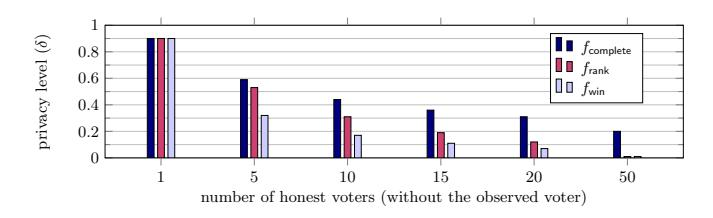
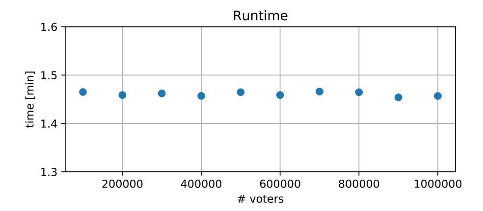
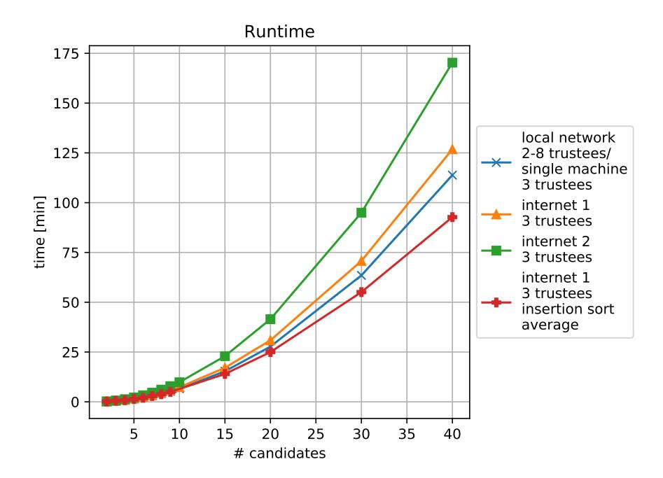
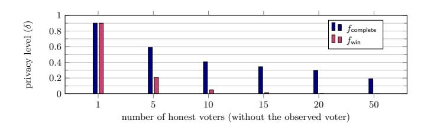
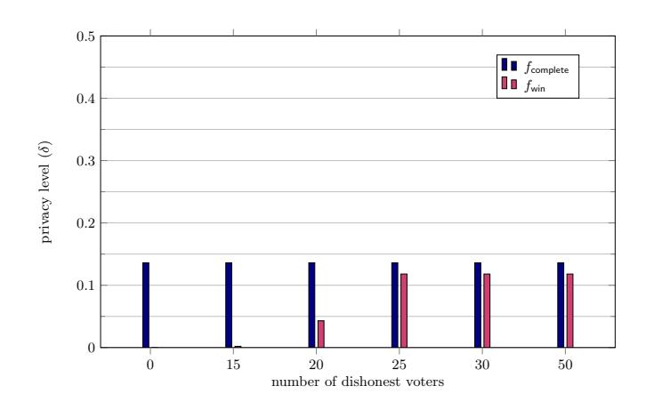
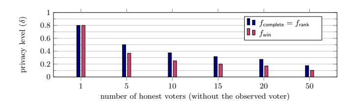

# Ordinos: A Verifiable Tally-Hiding E-Voting System

Ralf K¨usters<sup>1</sup> , Julian Liedtke<sup>1</sup> , Johannes M¨uller<sup>2</sup> , Daniel Rausch<sup>1</sup> , and Andreas Vogt<sup>3</sup>

<sup>1</sup> University of Stuttgart, Germany firstname.secondname@sec.uni-stuttgart.de <sup>2</sup> SnT/University of Luxembourg, Luxembourg firstname.secondname@uni.lu <sup>3</sup> University of Applied Sciences and Arts Northwestern Switzerland, Switzerland firstname.secondname@fhnw.ch

Abstract. Modern electronic voting systems (e-voting systems) are designed to provide not only vote privacy but also (end-to-end) verifiability. Several verifiable e-voting systems have been proposed in the literature, with Helios being one of the most prominent ones.

Almost all such systems, however, reveal not just the voting result but also the full tally, consisting of the exact number of votes per candidate or even all single votes. There are several situations where this is undesirable. For example, in elections with only a few voters (e.g., boardroom or jury votings), revealing the complete tally leads to a low privacy level, possibly deterring voters from voting for their actual preference. In other cases, revealing the complete tally might unnecessarily embarrass some candidates. Often, the voting result merely consists of a single winner or a ranking of candidates, so revealing only this information but not the complete tally is sufficient. This property is called tally-hiding and it offers completely new options for e-voting.

In this paper, we propose the first provably secure end-to-end verifiable tally-hiding e-voting system, called Ordinos. We instantiated our system with suitable cryptographic primitives, including an MPC protocol for greater-than tests, implemented the system, and evaluated its performance, demonstrating its practicality. Moreover, our work provides a deeper understanding of tally-hiding in general, in particular in how far tally-hiding affects the levels of privacy and verifiability of e-voting systems.

# <span id="page-0-0"></span>1 Introduction

E-voting systems are widely used both for national, state-wide, and municipal elections all over the world with several hundred million voters so far. Beyond such high-stake elections, e-voting is also becoming very common for elections within companies, associations, political parties, non-profit organizations, and religious institutions (see, e.g., [\[1–](#page-27-0)[4,](#page-27-1)[52\]](#page-31-0)). In order to meet this increasing demand for e-voting solutions, many IT companies offer their services [\[5\]](#page-27-2), including, for example, Microsoft [\[6\]](#page-28-0).

There are roughly two types of e-voting systems: those where the voter has to go to a polling station in order to cast her vote using a voting machine and those that allow the voter to cast her vote remotely over the Internet (remote e-voting), using her own device. The latter type of e-voting is the main focus of this paper.

Since e-voting systems are complex software and hardware systems, programming errors are unavoidable and deliberate manipulation of such systems is often hard or virtually impossible to detect. Hence, there is a high risk that votes are not counted correctly and that the published election result does not reflect how voters actually voted (see, e.g., [\[35,](#page-29-0) [58,](#page-31-1) [60\]](#page-31-2)).

Therefore, there has been intensive and ongoing research to design e-voting systems which provide what is called (end-to-end) verifiability (see, e.g., [\[7,](#page-28-1) [12,](#page-28-2) [17,](#page-28-3) [22–](#page-29-1)[24,](#page-29-2) [41,](#page-30-0) [44,](#page-30-1) [45,](#page-30-2) [47\]](#page-30-3)), where voters and external observers are able to check whether votes were actually counted and whether the published election result is correct, even if voting devices and servers have programming errors or are outright malicious. Several of such systems have already been deployed in real binding elections (see, e.g., [\[7,](#page-28-1) [8,](#page-28-4) [18,](#page-28-5) [22,](#page-29-1) [29,](#page-29-3) [36\]](#page-29-4)), with Helios [\[7\]](#page-28-1) being one of the most prominent (remote) e-voting systems. In Switzerland and Norway, for example, e-voting systems for national and local elections and referendums are even required to provide verifiability [\[34,](#page-29-5) [38\]](#page-30-4).

Tally-hiding e-voting. In the real world, there are numerous voting methods that differ in the form of the final result and the rules to determine it. For example, one of the most widely used ones is plurality voting in which the candidate with the highest number of votes is elected. For some elections, a more refined version of plurality voting with two rounds is used: if a candidate receives the absolute majority of votes in the first round, she wins; otherwise, there is a runoff between the two best candidates of the first round. In both cases, the final result of the voting method merely consists of the winner. Another popular voting method is to allocate k seats of a board or commission to the k candidates with the highest number of votes. In this case, the final result of the voting method merely consists of the set of elected candidates.

Given this variety of voting methods, how do existing (electronic or paperbased) voting protocols realize a given voting method? Essentially all of them first reveal the full tally, i.e., the number of votes per candidate/party or even all single votes, as an intermediate step that is then used to compute the actual election result, e.g., the winner. For traditional, fully paper-based voting, it seems practically infeasible to follow a different approach without having to sacrifice verifiability.

As demonstrated in this paper, electronic voting can, fortunately, offer completely new options for elections in that beyond the necessary final result no further information is revealed. Strictly realizing the given voting method without revealing any unnecessary information, such as intermediate results, provides several advantages, for example, in the following situations:

- (i) As mentioned above, some elections have several rounds. In particular, they might involve runoff elections. In order to get unbiased voters' opinions, one might not want to reveal intermediate election tallys, except for the information which candidates move on to the runoff elections. For example, if no candidate received the absolute majority, one might want to reveal only the two best candidates (without their vote counts and without revealing their ranking), who then move on to the runoff election.
- (ii) Elections are often carried out among a small set of voters (e.g., in boardroom or jury votings). Even in an ideal voting system, revealing the full tally in such a setting leads to a low level of privacy because a single voter's vote is "hidden" behind only a low number of other votes. Therefore, even if, say, it is only interesting who won the election, a voter might not vote for her actual preference knowing that nevertheless the full tally is revealed, and hence, her vote does not really remain private.
- (iii) In some elections, for example, within companies, student associations, or in boardroom elections, it might be unnecessarily embarrassing for the losing candidates to publish the (possibly low) number of votes they received. For example, the German Informatics Society as well as the German Research Foundation do not always publish the full tally for this reason.

These examples illustrate that, for some situations, it is desirable to not publish the full tally as part of the tallying procedure but to only publish the pure election result, e.g., only the winner of an election with or without the number of votes he/she has received, only the set of the first k candidates, who win seats, only the set of the last k candidates, which might be excluded from a runoff election, or only a ranking of candidates, without the number of votes each of them has received.

Following [\[59\]](#page-31-3), we call e-voting systems that compute an election result without revealing any additional information, such as the full tally, tally-hiding. So, while tally-hiding e-voting is desirable in many situations, as to the best of our knowledge, only four tally-hiding e-voting systems have been proposed in the literature to date: a quite old one by Benaloh [\[13\]](#page-28-6), one by Hevia and Kiwi [\[39\]](#page-30-5), and two more recent ones by Szepieniec and Preneel [\[59\]](#page-31-3) and by Canard et al. [\[19\]](#page-28-7). As further discussed in Section [9,](#page-25-0) among other shortcomings, none of these systems come with a rigorous cryptographic security proof and only one of these systems has been implemented. As also discussed in Section [9,](#page-25-0) current generic MPC protocols also do not seem to directly provide suitable solutions for practical tally-hiding and verifiable e-voting.

Hence, it remains an open problem to develop and implement a provably secure end-to-end verifiable tally-hiding e-voting system for (remote) elections. Solving this open problem is the main goal of this paper, where we also want our system to be of practical use. Furthermore, we provide a deeper understanding of tally-hiding in general, in particular how tally-hiding affects verifiability and privacy properties.

By making e-voting systems not only tally-hiding but also verifiable, the feature of tally-hiding will become more attractive in the future: as mentioned above, in classical paper-based elections hiding the full tally, even if only part of it is really needed, seems infeasible without losing trust in the final result. In contrast, as demonstrated in this paper, it is possible to build provably secure verifiable tally-hiding e-voting systems. Such systems allow for detecting manipulation and therefore establish trust in the final result (e.g., the winner or the ranking of candidates) even without publishing the full tally. Altogether, this opens up completely new kinds of elections that were not possible before.

Our Contribution. We present Ordinos, the first provably secure tally-hiding and verifiable (remote) e-voting system.

Conceptually, Ordinos follows the general structure of the Helios remote evoting system, at least in its first phase, but strictly extends Helios' functionality: Helios always reveals the full tally, no matter what the actual desired election result is. In contrast, Ordinos (see Section [2\)](#page-4-0) supports several election result functions[4](#page-3-0) in a tally-hiding fashion. That is, as explained above, beyond the result of the election according to the election result function, Ordinos does not reveal any further information. In particular, Ordinos, unlike Helios, does not reveal the full tally (e.g., the number of votes per candidate) if not required by the result function. Among others, Ordinos supports tally-hiding elections for the following result functions: revealing only the winner of an election, the k best/worst candidates (with or without ranking), or the overall ranking, optionally with or without disclosing the number of votes for some or all candidates.

Compared to Helios, Ordinos uses different (instantiations of) cryptographic primitives and also additional primitives, in particular, a suitable MPC component, in order to obtain a tally-hiding system.

We carry out a detailed cryptographic analysis proving that Ordinos provides privacy (Section [5\)](#page-12-0) and verifiability (Section [4\)](#page-9-0): We show that Ordinos preserves the same level of verifiability as Helios under the same trust assumptions (namely that the verification devices and the bulletin board are not corrupted), independently of the result function considered. More generally, this demonstrates that the common definition of verifiability can be achieved independently of whether a result function is computed in a tally-hiding way. Conversely, the level of privacy Ordinos provides can be much better than for Helios, e.g., if only the winner or the ranking of candidates is to be published.

To study privacy for tally-hiding voting more generally, we derive privacy results for an ideal tally-hiding voting protocol for various result functions in order to compare the privacy levels (Section [6\)](#page-16-0). We then show that the privacy of Ordinos can be reduced to the ideal protocol (Section [5\)](#page-12-0). These general results about properties of tally-hiding voting systems are of independent interest.

We note that Ordinos even provides accountability, a security property that is stronger than just verifiability. That is, roughly speaking, Ordinos guarantees that if the published election result does not match how voters actually voted, then this is not only detected (as required for verifiability), but misbehaving

<span id="page-3-0"></span><sup>4</sup> Given individual votes of voters or the number of votes per candidate/choice, an (election) result function returns the final result of the election, e.g., the winner of the election or the k best candidates (with or without a ranking of these candidates).

parties can even be identified and blamed for their misbehavior. Due to space limitations, our presentation in this paper concentrates on verifiability. However, as discussed in Section [4.2,](#page-11-0) we actually prove accountability, from which verifiability follows immediately.

Our cryptographic analysis of Ordinos (for privacy and verifiability/ accountability) is based on generic properties of the employed cryptographic primitives, and hence, is quite general and does not rely on specific instantiations. In order to obtain a workable system, we carefully crafted one instantiation (Section [7\)](#page-18-0) using, among others, Paillier encryption [\[54\]](#page-31-4), an MPC protocol for greater-than by Lipmaa and Toft [\[53\]](#page-31-5), as well as NIZKPs by Schoenmakers and Veeningen [\[57\]](#page-31-6). We provide a proof-of-concept implementation of Ordinos based on this instantiation and evaluate its performance, demonstrating its practicability (Section [8\)](#page-22-0).

Further details are provided in the appendix. The implementation and detailed benchmarks are available upon request.

# <span id="page-4-0"></span>2 Description of Ordinos

In this section, we present the Ordinos voting protocol on the conceptual level. We start with the cryptographic primitives that we use. Instead of relying on specific primitives, the security of Ordinos can be guaranteed under certain assumptions these primitives have to satisfy. In particular, they can later be instantiated with the most appropriate primitives available.

As already mentioned, Ordinos extends the prominent Helios e-voting protocol. While in Helios the complete election result is published (the number of votes per candidate/choice), Ordinos supports tally-hiding elections. More specifically, the generic version of Ordinos, which we prove secure, supports arbitrary result functions evaluated over the aggregated votes per candidate and computes these result functions in a tally-hiding way. Our concrete instantiation (see Section [7\)](#page-18-0) then realizes many such practically relevant functions.

In a nutshell, Ordinos works as follows: Voters encrypt their votes and send their ciphertexts to a bulletin board. The ciphertexts are homomorphically aggregated to obtain ciphertexts that encrypt the number of votes per candidate. Then, by an MPC protocol, trustees evaluate the desired result function on these ciphertexts and publish the election result.

Cryptographic primitives. For Ordinos, we use the following cryptographic primitives: A homomorphic, IND-CPA-secure (t, ntrustees)-threshold public-key encryption scheme E = (KeyShareGen, PublicKeyGen, Enc, DecShare, Dec), e.g., exponential ElGamal or Paillier. A non-interactive zero-knowledge proof (NIZKP) π Enc for proving knowledge and correctness of a plaintext vector given a ciphertext vector, a public key, and a predicate which specifies valid choices (see below); a NIZKP π KeyShareGen for proving knowledge and correctness of a private key share given a public key share (see Appendix [F](#page-39-0) for details). A multi-party computation (MPC) protocol PMPC that takes as input a ciphertext vector of encrypted integers (encrypted using E from above) and securely evaluates a given function ftally over the plain integers and outputs the result on a bulletin board. For example,

a function ftally that outputs the index(s) of the ciphertext(s) with the highest integer would be used to determine and publish the winner of an election. The exact security properties PMPC has to satisfy to achieve privacy and verifiability for the overall system, Ordinos, are made precise in the following sections. Finally, we use an EUF-CMA-secure signature scheme S.

Protocol participants. The Ordinos protocol is run among the following participants: a voting authority Auth, (human) voters V1, . . . , Vnvoters , voter supporting devices VSD1, . . . , VSDnvoters , voter verification devices VVD1, . . . , VVDnvoters , trustees T1, . . . , Tntrustees , an authentication server AS, and an append-only bulletin board B.

As further described below, the role of each (untrusted) voter supporting device VSD is to generate and submit the voter's ballot, whereas the (trusted) voter verification device VVD checks that the VSD behaved correctly. The role of the trustees is to tally the voters' ballots. In order to avoid that a single trustee knows how each single voter voted, the secret tallying key is distributed among all of them so that t out of ntrustees trustees need to collaborate to tally the ballots.

We assume the existence of the following authenticated channels:[5](#page-5-0) First, all parties have unilaterally authenticated channels to the bulletin board B, ensuring that all parties have the same view on the bulletin board. Second, for all VSD<sup>i</sup> , an authenticated channel between this device and the authentication server AS, allowing AS to ensure that only eligible voters are able to cast their ballots. Third, authenticated channels between each voter V<sup>i</sup> and her VSD<sup>i</sup> as well as her VVD<sup>i</sup> , modeling direct interaction.

Protocol overview. A protocol run consists of the following phases: In the setup phase, parameters and key shares are fixed/generated, and the public key shares are published. In the voting phase, voters pick their choices, encrypt them, and then either audit or submit their ballots. Now or later, in the voter verification phase, voters verify that their ballots have been published by the authentication server. In the tallying phase, the trustees homomorphically aggregate the ballots, run PMPC in order to secretly compute, and publish the election result according to the result function ftally so that not even the trustees learn anything beyond the final result (which guarantees tally-hiding). Finally, in the public verification phase, everyone can verify that the trustees tallied correctly.

Setup phase. In this phase, all election parameters are fixed and posted on the bulletin board by the voting authority Auth: the list id of eligible voters, opening and closing times, the election ID idelection, etc. as well as the set C ⊆ {0, . . . , nvpc} <sup>n</sup>option of valid choices where noption denotes the number of options/ candidates, nvpc the number of allowed votes per option/candidate, and abstain

We now explain each phase in more detail.

models that a voter abstains from voting. For example, if each voter can vote

<span id="page-5-0"></span><sup>5</sup> By assuming such authenticated channels, we abstract away from the exact method the voters use to authenticate; in practice, several methods can be used, such as one-time codes, passwords, or external authentication services.

for at most one candidate, then  $n_{\text{vpc}} = 1$  and every vector in C contains at most one 1-entry.

The authentication server AS and each trustee  $\mathsf{T}_k$  run the key generation algorithm of the digital signature scheme  $\mathcal{S}$  to generate their public/private (verification/signing) keys. The verification keys are published on the bulletin board B. In what follows, we implicitly assume that whenever the authentication server AS or a trustee  $\mathsf{T}_k$  publish information, they sign this data with their signing keys.

Every trustee  $\mathsf{T}_k$  runs the key share generation algorithm of the public-key encryption scheme  $\mathcal{E}$  to generate its public/private (encryption/decryption) key share pair  $(\mathsf{pk}_k, \mathsf{sk}_k)$ . Additionally, each trustee  $\mathsf{T}_k$  creates a NIZKP  $\pi_k^{\mathsf{KeyShareGen}}$  to prove knowledge of  $\mathsf{sk}_k$  and validity of  $(\mathsf{pk}_k, \mathsf{sk}_k)$ . Each trustee  $\mathsf{T}_k$  then posts  $(\mathsf{pk}_k, \pi_k^{\mathsf{KeyShareGen}})$  on the bulletin board B. With PublicKeyGen, everyone can then compute the (overall) public key  $\mathsf{pk}$ .

**Voting phase.** In this phase, every voter  $V_i$  can decide to abstain from voting or to vote for some choice  $\mathsf{ch} \in \mathsf{C} \subseteq \{0,\ldots,n_{\mathsf{vpc}}\}^{n_{\mathsf{option}}}$ . In the latter case, the voter inputs  $\mathsf{ch}$  to her voter supporting device  $\mathsf{VSD}_i$  which proceeds as follows. First,  $\mathsf{VSD}_i$  encrypts each entry of  $\mathsf{ch}$  separately under the public key  $\mathsf{pk}$  and obtains a ciphertext vector  $\mathsf{c}_i$ . That is, the j-th ciphertext in  $\mathsf{c}_i$  encrypts the number of votes assigned by voter  $\mathsf{V}_i$  to candidate/option j. After that, in addition to  $\mathsf{c}_i$ ,  $\mathsf{VSD}_i$  creates a NIZKP  $\pi_i^{\mathsf{Enc}}$  in order to prove that it knows which choice  $\mathsf{ch}$  the vector  $\mathsf{c}_i$  encrypts and that  $\mathsf{ch} \in \mathsf{C}$ . Finally,  $\mathsf{VSD}_i$  sends a message to  $\mathsf{V}_i$  to indicate that a ballot  $\mathsf{b}_i = (\mathsf{id}, \mathsf{c}_i, \pi_i^{\mathsf{Enc}})$  is ready for submission, where  $\mathsf{id} \in \mathsf{id}$  is the voter's identifier. Upon receiving this message, the voter  $\mathsf{V}_i$  can decide to either audit or submit the ballot  $\mathsf{b}_i$  (Benaloh challenge [14]), as described in what follows.

If  $V_i$  wants to audit  $b_i$ ,  $V_i$  inputs an audit command to  $VSD_i$  who is supposed to reveal all the random coins that it had used to encrypt  $V_i$ 's choice and to generate the NIZKPs. After that,  $V_i$  forwards this data and her choice ch to her verification device  $VVD_i$  which is supposed to check the correctness of the ballot, i.e., whether ch chosen by  $V_i$  and the revealed randomness by  $VSD_i$  yield  $b_i$ . Audited ballots cannot be cast. The voter is therefore asked to vote again.

If  $V_i$  wants to submit  $b_i$ ,  $V_i$  inputs a cast command to  $VSD_i$ , which is supposed to send  $b_i$  to the authentication server AS on an authenticated channel. If AS receives a ballot in the correct format (i.e.,  $id \in id$  and id belongs to  $V_i$ , and  $b_i$  is tagged with the correct election ID  $id_{election}$ ) and the NIZKP  $\pi_i^{Enc}$  is valid, then AS responds with an acknowledgement consisting of a signature on the ballot  $b_i$ ;

<span id="page-6-0"></span><sup>&</sup>lt;sup>6</sup> We note that, beyond Benaloh challenges, there exist several techniques in the literature (e.g., verification codes) to enable human voters to verify whether their ballots were cast by the voting devices as intended. Since these techniques are (typically) independent from whether the full tally is revealed or hidden, Ordinos could also be equipped with a different cast-as-intended mechanism than Benaloh challenges.

otherwise, it does not output anything.[7](#page-7-0) After that, VSD<sup>i</sup> forwards the ballot b<sup>i</sup> as well as the acknowledgement to VVD<sup>i</sup> for verification purposes later on. If the voter tried to re-vote and AS already sent out an acknowledgement, then AS returns the old acknowledgement only and does not accept the new vote. If VVD<sup>i</sup> does not receive a correct acknowledgement from AS via VSD<sup>i</sup> , it outputs a message to V<sup>i</sup> who then tries to re-vote, and, if this does not succeed, files an authentication complaint on the bulletin board.[8](#page-7-1)

When the voting phase is over, AS creates the list of valid ballots b that have been submitted. Then AS removes all ballots from b that are duplicates w.r.t. the pair (c, πEnc) only keeping the first one in order to protect against replay attacks, which jeopardize vote privacy [\[27\]](#page-29-6). Afterwards, AS signs b and publishes it on the bulletin board.

Voter verification phase. After the list of ballots b has been published, each voter V<sup>i</sup> can use her VVD<sup>i</sup> to check whether (i) her ballot b<sup>i</sup> appears in b in the case she voted (if not, V<sup>i</sup> can publish the acknowledgement she received from AS on the bulletin board which serves as binding evidence that AS misbehaved), or (ii) none of the ballots in b contain her id in the case she abstained. In the latter case, the dispute cannot be resolved without further means: Did V<sup>i</sup> vote but claims that she did not or did V<sup>i</sup> not vote but AS used her id dishonestly?[9](#page-7-2)

In both cases, however, it is well-known that, realistically, not all voters are motivated enough to perform these verification procedures, and even if they are, they often fail to do so (see, e.g., [\[42\]](#page-30-6)). In our security analysis of Ordinos, we therefore assume that voters perform the verification procedures with a certain probability. In order to increase verification rates, fully automated verification, as deployed in the sElect voting system [\[47\]](#page-30-3) turned out to be helpful and could be implemented in Ordinos as well.

Tallying phase. The list of ballots b posted by AS is the input to the tallying phase, which works as follows.

1. Homomorphic aggregation. Each trustee T<sup>k</sup> reads b from the bulletin board B and verifies its correctness (i.e., whether duplicates and invalid ballots were removed). If this check fails, T<sup>k</sup> aborts since AS should guarantee this. Otherwise, T<sup>k</sup> homomorphically aggregates all vectors c<sup>i</sup> in b entrywise and obtains a

<span id="page-7-0"></span><sup>7</sup> Just as for Helios, variants of the protocol are conceivable where the voter's ID is not part of the ballot and not put on the bulletin board or at least not next to her ballot (see, e.g., [\[50\]](#page-30-7)).

<span id="page-7-1"></span><sup>8</sup> If such a complaint is posted, it is in general impossible to resolve the dispute and decide exactly who is to be blamed: (i) AS who might not have replied as expected (but claims, for instance, that the ballot was not cast), or (ii) VSD<sup>i</sup> who might not have submitted a ballot or forwarded the (correct) acknowledgement to VVDi, or (iii) the voter who might not have cast a ballot but nevertheless claims that she has. Note that this is a very general problem which applies to virtually any remote voting protocol. In practice, the voter could ask the voting authority Auth to resolve the problem.

<span id="page-7-2"></span><sup>9</sup> Variants of the protocol are conceivable where a voter is supposed to sign her ballot and the authentication server presents such a signature in the case of a dispute (see, e.g., [\[24\]](#page-29-2)). This also helps in preventing so-called ballot stuffing.

ciphertext vector  $\mathbf{c}_{\text{unsorted}}$  with  $n_{\text{option}}$  entries each of which encrypts the number of votes of the respective candidate/option.

2. Secure function evaluation. The trustees  $\mathsf{T}_1,\ldots,\,\mathsf{T}_{n_{\mathsf{trustees}}}$  run the MPC protocol  $\mathsf{P}_{\mathsf{MPC}}$  with input  $\mathsf{c}_{\mathsf{unsorted}}$  to securely evaluate the result function  $f_{\mathsf{tally}}$ . They then output the election result according to  $f_{\mathsf{tally}}$ , together with a NIZKP of correct evaluation  $\pi^{\mathsf{MPC}}$ . 10

**Public verification phase.** In this phase, every participant, including the voters or external observers, can verify the correctness of the tallying procedure, in particular, the correctness of all NIZKPs.

Instantiation and implementation. As already mentioned, in Section 7 we show how to efficiently instantiate Ordinos with concrete primitives. In particular, we provide an efficient realization of a relevant class of result functions which can be computed in a tally-hiding fashion, e.g., for publishing only the winner of an election or certain subsets or rankings of candidates. In Section 8, we describe our implementation and provide benchmarks. Our model and security analysis of Ordinos, presented in the following sections are, however, more general and apply to arbitrary instantiations of Ordinos as long as certain assumptions are met.

### <span id="page-8-3"></span>3 Model

In this section, we formally model the Ordinos voting protocol. This model is the basis for our security analysis of Ordinos carried out in the following sections. Our model of Ordinos is based on a general computational model proposed in [25]. This model introduces the notions of processes, protocols, instances, and properties, which we recall in Appendix A.

Modeling of Ordinos. The Ordinos voting protocol can be modeled in a straightforward way as a protocol  $P_{\text{Ordinos}}(n_{\text{voters}}, n_{\text{trustees}}, \mu, p_{\text{verify}}, p_{\text{audit}}, f_{\text{tally}})$  in the above sense, as described next (see Appendix D and I for full technical details). By  $n_{\text{voters}}$  we denote the number of voters  $V_i$  and by  $n_{\text{trustees}}$  the number of trustees  $T_k$ . By  $\mu$  we denote a probability distribution on the set of choices C, including abstention. An honest voter makes her choice according to this distribution. This choice is called the *actual choice* of the voter. By  $p_{\text{verify}} \in [0,1]$  we denote the probability that an honest voter  $V_i$  performs the checks described in Section 2, voter verification phase. We denote the probability that a given (arbitrary) ballot is audited by an honest voter by  $p_{\text{audit}} \in [0,1]$ . As before, with  $f_{\text{tally}}$  we denote the result function.

<span id="page-8-0"></span> $<sup>\</sup>overline{^{10} \pi^{\mathsf{MPC}}}$  will typically consist of several NIZKPs, e.g., NIZKPs of correct decryption, etc. See also our instantiation in Section 7.

<span id="page-8-1"></span><sup>&</sup>lt;sup>11</sup> This in particular models that adversaries know this distribution. In reality, the adversary might not know this distribution precisely. This, however, makes our security results only stronger.

<span id="page-8-2"></span>Following [50], one could as well consider a sequence of audit probabilities to model that the probability of the voter auditing a ballot decreases with the number of audits she has performed. Furthermore, one could assign different verification probabilities

In our model of Ordinos, the voting authority Auth is part of an additional agent, the scheduler S. Besides playing the role of the authority, S schedules all other agents in a run according to the protocol phases. We assume S and the bulletin board B to be honest, i.e., they are never corrupted. While S is merely a virtual entity, in reality, B should be implemented in a distributed way (see, e.g., [\[30,](#page-29-8) [43\]](#page-30-8)). As usual, we also require that the verification devices, VVD<sup>i</sup> , are honest.

# <span id="page-9-0"></span>4 End-to-End Verifiability

In this section, we formally establish the level of (end-to-end) verifiability provided by Ordinos. We show that Ordinos inherits the level of verifiability from the original Helios voting protocol. In particular, this implies that this level is independent of ftally, and hence, the degree to which ftally hides the tally. This might be a bit surprising at first since less information being published might mean that a system provides less verifiability.

Our analysis of Ordinos in terms of verifiability uses the generic verifiability framework by K¨usters et al. (the KTV framework, originally presented in [\[48\]](#page-30-9) with some refinements in [\[25\]](#page-29-7)). We briefly recall this framework in Section [4.1](#page-9-1) along with some instantiation needed for our analysis of Ordinos. Beyond its expressiveness, the KTV framework is particularly suitable to analyze Ordinos because (i) it does not make any specific assumptions on the result function of the voting protocol, and (ii) it can, as illustrated here, also be applied to MPC protocols. The results of our verifiability analysis of Ordinos are then presented in Section [4.2.](#page-11-0)

### <span id="page-9-1"></span>4.1 Verifiability Framework

In a nutshell, an e-voting system provides verifiability if the probability that the published result is not correct but no one complains and no checks fail, i.e., no misbehavior is observed, is small (bounded by some small δ ∈ [0, 1]).

Judge. More specifically, the KTV verifiability definition assumes a judge J whose role is to accept or reject a protocol run by writing accept or reject on a dedicated channel decisionJ. To make a decision, the judge runs a so-called judging procedure, which performs certain checks (depending on the protocol specification), such as the verification of all zero-knowledge proofs in Ordinos and taking voter complaints into account. Intuitively, J accepts a run if the protocol run looks as expected. The input to the judge is solely public information, including all information and complaints (e.g., by voters) posted on the bulletin board. Therefore, the judge can be thought of as a "virtual" entity: the judging procedure can be carried out by any party, including external observers and even voters themselves. The specification of the judging procedure for Ordinos follows

for different voters. However, both refinements would result in a fairly complicated analysis that is not specific to Ordinos and its tally-hiding property.

quite easily from the description in Section 2 and it is provided with full details in Appendix G.

**Goal.** The KTV verifiability definition is centered around the notion of a *goal* of a protocol P, such as Ordinos or an MPC protocol. Formally, a goal  $\gamma$  is simply a set of protocol runs. The goal  $\gamma$  specifies those runs which are "correct" in some protocol-specific sense. For e-voting, the goal would contain those runs where the announced election result corresponds to the actual choices of the voters.

In what follows, we describe the goal  $\gamma(k,\varphi)$  that we use to analyze end-to-end verifiability of Ordinos. This goal has already been applied in [50] to the original Helios protocol, where here we use a slightly improved version suggested in [25]. The parameter  $\varphi$  is a Boolean formula that describes which protocol participants are assumed to be honest in a run, i.e., not corrupted by the adversary. For Ordinos, we set  $\varphi = \text{hon}(S) \wedge \text{hon}(J) \wedge \text{hon}(B) \wedge \bigwedge_{i=1}^{n_{\text{voters}}} \text{hon}(\text{VVD}_i)$ , i.e., the scheduler S, the judge J, the bulletin board B, and all of the voters' verification devices VVD are assumed to be honest. On a high level, the parameter k denotes the maximum number of choices made by honest voters the adversary is allowed to manipulate. So, roughly speaking, altogether the goal  $\gamma(k,\varphi)$  contains all those runs of a (voting or MPC) protocol P where either (i) at least one of the parties S, J, B, or some VVD<sub>i</sub> have been corrupted (i.e.,  $\varphi$  is false) or (ii) where none of them have been corrupted (i.e.,  $\varphi$  holds true) and where the adversary has manipulated at most k votes/inputs of honest voters/input parties. We formally define the goal  $\gamma(k,\varphi)$  in Appendix E.

Verifiability. Now, the idea behind the verifiability definition is very simple. The judge J should accept a run only if the goal  $\gamma$  is met: as discussed, if  $\gamma = \gamma(k,\varphi)$ , then this essentially means that the published election result corresponds to the actual choices of the voters up to k votes of honest voters. More precisely, the definition requires that the probability (over the set of all protocol runs) that the goal  $\gamma$  is not satisfied but the judge nevertheless accepts the run is  $\delta$ -bounded: A function f is  $\delta$ -bounded if, for every c>0, there exists  $\ell_0$  such that  $f(\ell) \leq \delta + \ell^{-c}$  for all  $\ell > \ell_0$ . Although  $\delta = 0$  is desirable, this would be too strong for almost all e-voting protocols. For example, typically not all voters check whether their ballot appears on the bulletin board, giving an adversary A the opportunity to manipulate or drop some ballots without being detected. Therefore,  $\delta = 0$  cannot be achieved in general in e-voting protocols. The parameter  $\delta$  is called the verifiability tolerance of the protocol.

By  $\Pr[\pi^{(\ell)} \mapsto \neg \gamma, (\mathsf{J} : \mathsf{accept})]$  we denote the probability that  $\pi$ , with security parameter  $1^{\ell}$ , produces a run which is not in  $\gamma$  but nevertheless accepted by  $\mathsf{J}$ .

<span id="page-10-1"></span>**Definition 1 (Verifiability**<sup>13</sup>). Let P be a protocol with the set of agents  $\Sigma$ . Let  $\delta \in [0,1]$  be the tolerance,  $J \in \Sigma$  be the judge, and  $\gamma$  be a goal. Then, we say

<span id="page-10-0"></span><sup>&</sup>lt;sup>13</sup> We note that the original definition in [48] also captures soundness/fairness: if the protocol runs with a benign adversary, which, in particular, would not corrupt parties, then the judge accepts all runs. This kind of fairness/soundness can be considered to be a sanity check of the protocol, including the judging procedure, and is typically easy to check. For brevity of presentation, we omit this condition here.

that the protocol P is  $(\gamma, \delta)$ -verifiable by the judge J if for all adversaries  $\pi_A$  and  $\pi = (\hat{\pi}_P || \pi_A)$ , the probability  $\Pr[\pi^{(\ell)} \mapsto \neg \gamma, (J: accept)]$  is  $\delta$ -bounded as a function of  $\ell$ .

### <span id="page-11-0"></span>4.2 End-to-End Verifiability of Ordinos

We are now able to precisely state and prove the verifiability level offered by Ordinos according to Definition 1. The level depends on the voter verification rate  $p_{\text{verify}}$  and the voter auditing rate  $p_{\text{audit}}$ , as described in Section 3.

**Assumptions.** We prove the verifiability result for Ordinos for the goal  $\gamma(k,\varphi)$ , with  $\gamma(k,\varphi)$  as defined in Section 4.1, and under the following assumptions:

- (V1) The public-key encryption scheme  $\mathcal{E}$  is correct (for verifiability, IND-CPA-security is not needed),  $\pi^{\mathsf{KeyShareGen}}$  and  $\pi^{\mathsf{Enc}}$  are NIZKPs, and the signature scheme  $\mathcal{S}$  is EUF-CMA-secure.
- (V2) The scheduler S, the bulletin board B, the judge J, and all voter verification devices  $VVD_i$  are honest, i.e.,  $\varphi = \mathsf{hon}(\mathsf{S}) \wedge \mathsf{hon}(\mathsf{J}) \wedge \mathsf{hon}(\mathsf{B}) \wedge \bigwedge_{i=1}^{n_{\mathsf{voters}}} \mathsf{hon}(\mathsf{VVD}_i)$ .
- (V3) The MPC protocol  $\mathsf{P}_{\mathsf{MPC}}$  is  $(\gamma(0,\varphi),0)$ -verifiable, meaning that if the output of  $\mathsf{P}_{\mathsf{MPC}}$  does not correspond to its input, then this can always be detected publicly.

**Verifiability.** The judging procedure performed by J essentially involves checking signatures and NIZKPs. If one of these checks fails, the judge rejects the protocol run and hence the result. Also, J takes care of voter complaints as discussed in Section 2.

Intuitively, the following theorem states that the probability that in a run of Ordinos more than k votes of honest voters have been manipulated but the judge J nevertheless accepts the run is bounded by  $\delta_k(p_{\mathsf{verify}}, p_{\mathsf{audit}})$ .

<span id="page-11-1"></span>**Theorem 1 (Verifiability).** Under the assumptions (V1) to (V3) stated above, the protocol  $\mathsf{P}_{\mathsf{Ordinos}}(n_{\mathsf{voters}}, n_{\mathsf{trustees}}, \mu, p_{\mathsf{verify}}, p_{\mathsf{audit}}, f_{\mathsf{tally}})$  is  $(\gamma(k, \varphi), \delta_k(p_{\mathsf{verify}}, p_{\mathsf{audit}}))$ -verifiable by the judge  $\mathsf{J}$  where

$$\delta_k(p_{\mathrm{verify}}, p_{\mathrm{audit}}) = \max{(1 - p_{\mathrm{verify}}, 1 - p_{\mathrm{audit}})^{\lceil \frac{k+1}{2} \rceil}} \,.$$

The intuition and reasoning behind this theorem is as follows: In order to break  $\gamma(k,\varphi)$ , the adversary has to manipulate more than k votes of honest voters (actually less, see below). Due to the NIZKPs and signatures employed, we can show that such a manipulation is not detected only if none of the affected honest voters perform their auditing or verification procedure. The probability for this is  $\max (1 - p_{\text{verify}}, 1 - p_{\text{audit}})^{\lceil \frac{k+1}{2} \rceil}$ : the exponent is not k+1, as one might expect, but  $\lceil \frac{k+1}{2} \rceil$  because, according to the formal definition of  $\gamma(k,\varphi)$ , if the adversary changes one vote of an honest voter from one choice to another, the distance between the actual result and the manipulated one increases by two.

Observe that assumption (V2), in particular that all voter verification devices are honest, is necessary for the verifiability result of Ordinos. In fact, if for a

given voter V<sup>i</sup> both her VSD<sup>i</sup> and her VVD<sup>i</sup> colluded, then VSD<sup>i</sup> could replace the chosen candidate by a different one and VVD<sup>i</sup> could incorrectly claim that VSD<sup>i</sup> behaved honestly. This is a general property of Benaloh challenges which applies, for example, to Helios, too.

Note that, possibly surprisingly, our results show that the level of verifiability provided by Ordinos is independent of the result function ftally, and hence, independent of how much of the full tally is hidden by the desired output of ftally: less information might give the adversary more opportunities to manipulate the result without being detected. Roughly speaking, the reason is that the goal γ(k, ϕ) is concerned with the actual input to the voting protocol (as provided by the voters) rather than its output (e.g., the complete result or only the winner).

The correctness of Theorem [1](#page-11-1) follows immediately from an even stronger result. In fact, Ordinos even provides accountability which is a stronger form of verifiability as demonstrated in [\[48\]](#page-30-9). For verifiability, one requires only that, if some goal of the protocol is not achieved (e.g., the election outcome does not correspond to how the voters actually voted), then the judge does not accept such a run (more precisely, he accepts it with a small probability only). The judge, however, is not required to blame misbehaving parties. Conversely, accountability requires that misbehaving parties are blamed, an important property in practice as misbehavior should be identifiable and have consequences: accountability serves as a deterrent. Now, analogously to the verifiability result presented above, Ordinos has the same level of accountability as Helios. Due to space limitations, we formally state accountability of Ordinos in Appendix [H](#page-42-1) and provide a complete proof in Appendix [H.3.](#page-46-0)

# <span id="page-12-0"></span>5 Privacy

In this section, we carry out a rigorous analysis of the vote privacy of Ordinos. We show that the privacy level of Ordinos is essentially ideal assuming the strongest possible class of adversaries, as explained next.

Observe that if the adversary controls the authentication server, say, and does not care at all about being caught cheating, then he could drop all ballots except for one. Hence, the final result would only contain a single choice so that the respective voter's privacy is completely broken. This privacy attack applies to virtually all remote e-voting systems, including Helios, as already observed in [\[47\]](#page-30-3), and later further investigated in [\[26\]](#page-29-9).

Therefore, in general, a voting protocol can only provide vote privacy if an adversary does not drop or replace "too many" ballots prior to the tallying phase; this is necessary to ensure that a single voter's choice is "hidden" behind sufficiently many other votes. This class of adversaries is the strongest one for which privacy can still be guaranteed under realistic assumptions.[14](#page-12-1) Now, for

<span id="page-12-1"></span><sup>14</sup> We note that there are privacy results where the class of adversaries considered is not restricted (see, e.g., [\[16\]](#page-28-9)), but these results essentially assume that manipulations are not possible or manipulations are abstracted away in the modeling of the protocols (see also the discussions in [\[26,](#page-29-9) [47\]](#page-30-3)).

this class of adversaries, we show that the privacy level of Ordinos coincides with the privacy level of an ideal voting protocol, where merely the election result according to the result function considered is published.

To better understand the relationship between the privacy level of a voting protocol and the result function used, in Section [6](#page-16-0) we study the level of privacy of the ideal voting protocol in depth parameterized by the result function, which then also precisely captures the level of privacy of Ordinos.

We first introduce the class of adversaries as sketched above, and present the privacy definition we use. We then state the privacy result for Ordinos.

## 5.1 Risk-Avoiding Adversaries

The privacy definition we use (see Section [5.2\)](#page-14-0) requires that, except with a small probability, the adversary should not be able to distinguish whether some voter (called the voter under observation) voted for ch<sup>0</sup> or ch<sup>1</sup> when she runs her honest program. Now, an adversary who controls the authentication server, say, could drop or replace all ballots except for the one of the voter under observation. The final result would then contain only the vote of the voter under observation, and hence, the adversary could easily tell how this voter voted, which breaks privacy.

However, such an attack is extremely risky: recall that the probability of being caught grows exponentially in the number k of honest votes that are dropped or changed (see Section [4\)](#page-9-0). Thus, in the above attack where k is big, the probability of the adversary to get caught would be very close to 1. In the context of e-voting, where misbehaving parties that are caught have to face severe penalties or loss of reputation, this attack seems completely unreasonable.

A more reasonable adversary would possibly consider dropping some small number of votes, for which the risk of being caught is not too big, in order to weaken privacy to some degree. To analyze this trade-off, we use the notion of k-risk-avoiding adversaries that was originally introduced in [\[47\]](#page-30-3) and adjust it to our setting. (In [\[47\]](#page-30-3), such adversaries are called k-semi-honest. However, this term is misleading since these adversaries do not have to follow the protocol.)

Intuitively, a k-risk-avoiding adversary would not manipulate too many votes of honest voters. More specifically, he would produce runs in which the goal γ(k, ϕ) holds true. From the (proof of the) verifiability result obtained in Section [4,](#page-9-0) we know that whenever an adversary decides to break γ(k, ϕ) his risk of being caught is at least 1 − δk(pverify, paudit): Consider a run in which γ(k, ϕ) does not hold true and in which all random coins are fixed except for the ones that determine which honest voters perform their verification procedure. Then, the probability taken over these random coins that the adversary gets caught is at least 1 − δk(pverify, paudit). That is, such an adversary knows upfront that he will be caught with a probability of at least 1 − δk(pverify, paudit) which converges exponentially fast to 1 in k. Therefore, an adversary not willing to take a risk of being caught higher than 1 − δk(pverify, paudit) would never cause γ(k, ϕ) to be violated, and hence, manipulate too many votes.

This motivates the following definition: an adversary is k-risk-avoiding in a run of a protocol P if the goal  $\gamma(k,\varphi)$  is satisfied in this run. An adversary (of an instance  $\pi$  of P) is k-risk-avoiding if he is k-risk-avoiding with overwhelming probability (over the set of all runs of  $\pi$ ).

### <span id="page-14-0"></span>5.2 Definition of Privacy

For our privacy analysis of Ordinos, we use the privacy definition for e-voting protocols proposed in [49]. This definition allows us to *measure* the level of privacy a protocol provides, unlike other definitions (see, e.g., [15]).

As briefly mentioned above, privacy of an e-voting protocol is formalized as the inability of an adversary to distinguish whether some voter  $V_{obs}$  (the voter under observation), who runs her honest program, voted for  $\mathsf{ch}_0$  or  $\mathsf{ch}_1$ .

To define this notion formally, we first introduce the following notation. Let P be an e-voting protocol (in the sense of Section 3 with voters, authorities, result function, etc.). Given a voter  $V_{obs}$  and  $ch \in C$ , we now consider instances of P of the form  $(\hat{\pi}_{V_{obs}}(ch) || \pi^* || \pi_A)$  where  $\hat{\pi}_{V_{obs}}(ch)$  is the honest program of the voter  $V_{obs}$  under observation who takes ch as her choice,  $\pi^*$  is the composition of programs of the remaining parties in P, and  $\pi_A$  is the program of the adversary. In the case of Ordinos,  $\pi^*$  would include the scheduler, the bulletin board, the authentication server, all other voters, and all trustees.

Let  $\Pr[(\hat{\pi}_{V_{obs}}(\mathsf{ch}) \| \pi^* \| \pi_A)^{(\ell)} \mapsto 1]$  denote the probability that the adversary writes the output 1 on some dedicated channel in a run of  $(\hat{\pi}_{V_{obs}}(\mathsf{ch}) \| \pi^* \| \pi_A)$  with security parameter  $\ell$  and some  $\mathsf{ch} \in \mathsf{C}$ , where the probability is taken over the random coins used by the parties in  $(\hat{\pi}_{V_{obs}}(\mathsf{ch}) \| \pi^* \| \pi_A)$ .

Now, similarly to [49], we can define vote privacy. The definition is w.r.t. a mapping  $\mathcal{A}$  which maps an instance  $\pi$  of a protocol (excluding the adversary) to a set of admissible adversaries; for Ordinos, for example, only k-risk-avoiding adversaries are admissible.

<span id="page-14-1"></span>**Definition 2 (Privacy).** Let P be a voting protocol,  $V_{obs}$  be the voter under observation,  $\mathcal{A}$  be a mapping as explained above, and  $\delta \in [0,1]$ . Then, P achieves  $\delta$ -privacy (w.r.t.  $\mathcal{A}$ ), if the difference between the probabilities  $\Pr[(\hat{\pi}_{V_{obs}}(\mathsf{ch}_0) \| \pi^* \| \pi_A)^{(\ell)} \mapsto 1]$  and  $\Pr[(\hat{\pi}_{V_{obs}}(\mathsf{ch}_1) \| \pi^* \| \pi_A)^{(\ell)} \mapsto 1]$  is  $\delta$ -bounded as a function of the security parameter  $1^\ell$ , for  $\pi^*$  as defined above, for all choices  $\mathsf{ch}_0, \mathsf{ch}_1 \in \mathsf{C} \setminus \{\mathsf{abstain}\}$  and adversaries  $\pi_A$  that are admissible for  $\hat{\pi}_{V_{obs}}(\mathsf{ch}) \| \pi^*$  for all possible choices  $\mathsf{ch} \in \mathsf{C}$ , i.e.,  $\pi_A \in \bigcap_{\mathsf{ch} \in \mathsf{C}} \mathcal{A}(\hat{\pi}_{V_{obs}}(\mathsf{ch}) \| \pi^*)$ .

The requirement  $\mathsf{ch}_0, \mathsf{ch}_1 \neq \mathsf{abstain}$  says that we allow the adversary to distinguish whether or not a voter voted at all.

Since  $\delta$  often depends on the number  $n_{\text{voters}}^{\text{honest}}$  of honest voters, privacy is typically formulated w.r.t. this number: the bigger the number of honest voters, the smaller  $\delta$  should be, i.e., the higher the level of privacy. Note that even for an ideal e-voting protocol, where voters privately enter their votes and the adversary sees only the election outcome, consisting of the number of votes per candidate say,  $\delta$  cannot be 0: there may, for example, be a non-negligible

chance that all honest voters, including the voter under observation, voted for the same candidate, in which case the adversary can clearly see how the voter under observation voted. Hence, it is important to also take into account the probability distribution used by the honest voters to determine their choices; as already mentioned in Section 3, we denote this distribution by  $\mu$ . Moreover, the level of privacy, also of an ideal voting protocol, will depend on the result function, i.e., the information contained in the published result, as further investigated in Section 6.

### <span id="page-15-0"></span>5.3 Privacy of Ordinos

We now prove that Ordinos provides a high level of privacy w.r.t. k-risk-avoiding adversaries and in the case that at most t-1 trustees are dishonest, where t is the decryption threshold of the underlying encryption scheme: clearly, if t trustees were dishonest, privacy cannot be guaranteed because an adversary could simply decrypt every ciphertext in the list of ballots. By "high level of privacy" we mean that Ordinos provides  $\delta$ -privacy for a  $\delta$  that is very close to the ideal one.

More specifically, the formal privacy result for Ordinos is formulated w.r.t. an ideal voting protocol  $\mathcal{I}_{\text{voting}}(f_{\text{res}}, n_{\text{voters}}, n_{\text{voters}}^{\text{honest}}, \mu)$ . In this protocol, honest voters pick their choices according to the distribution  $\mu$ . In every run, there are  $n_{\text{voters}}^{\text{honest}}$  many honest voters and  $n_{\text{voters}}$  voters overall. The ideal protocol collects the votes of the honest voters and the dishonest ones (where the latter ones are independent of the votes of the honest voters) and outputs the result according to the result function  $f_{\text{res}}$ . In Section 6, we analyze the privacy level  $\delta_{(n_{\text{voters}},n_{\text{voters}}^{\text{honest}},\mu)}^{\text{deal}}(f_{\text{res}})$  this ideal protocol has depending on the given parameters.

**Assumptions.** To prove that the privacy level of Ordinos is essentially the ideal one, we make the following assumptions about the primitives we use (see also Section 2):

- (P1) The public-key encryption scheme  $\mathcal{E}$  is IND-CPA-secure, the signatures are EUF-CMA-secure, and  $\pi^{\mathsf{KeyShareGen}}$  and  $\pi^{\mathsf{Enc}}$  are NIZKPs.
- (P2) The MPC protocol  $P_{\mathsf{MPC}}$  realizes (in the sense of universal composability [20,46]) an ideal MPC protocol which essentially takes as input a vector of ciphertexts and returns  $f_{\mathsf{tally}}$  evaluated on the corresponding plaintexts (see Appendix I).

The level of privacy of Ordinos clearly depends on the number of ballots cast by honest voters. In our analysis, to have a guaranteed number of votes by honest voters, we assume that honest voters do not abstain from voting. Note that the adversary would anyway know which voters abstained and which did not. Technically, we define:

- (P3) The probability of abstention is 0 in  $\mu$ .
- (P4) For each instance  $\pi$  of  $\mathsf{P}_{\mathsf{Ordinos}}$ , the set  $\mathcal{A}(\pi)$  of admissible adversaries for  $\pi$  is defined as follows. An adversary  $\pi_{\mathsf{A}}$  belongs to  $\mathcal{A}(\pi)$  iff it satisfies the following conditions: (i)  $\pi_{\mathsf{A}}$  is k-risk-avoiding for  $\pi$ , (ii) the probability that  $\pi_{\mathsf{A}}$  corrupts more than t-1 trustees in a run of  $\pi \parallel \pi_{\mathsf{A}}$  is negligible, (iii) the probability that  $\pi_{\mathsf{A}}$  corrupts more than  $n_{\mathsf{voters}}^{\mathsf{honest}}$  voters in a run of  $\pi \parallel \pi_{\mathsf{A}}$  is negligible, and

(iv) the probability that  $\pi_A$  corrupts an honest voter's supporting or verification device is negligible.<sup>15</sup>

Now, the privacy theorem for Ordinos says that the level of privacy of Ordinos for this class of adversaries is the same as the one for the ideal protocol with  $n_{\text{voters}}^{\text{honest}} - k$  honest voters.

<span id="page-16-3"></span>**Theorem 2 (Privacy).** Under the assumptions (P1) to (P4) stated above and with the mapping  $\mathcal{A}$  as defined above, the voting protocol  $\mathsf{POrdinos}(n_{\mathsf{voters}}, n_{\mathsf{trustees}}, \mu, p_{\mathsf{verify}}, p_{\mathsf{audit}}, f_{\mathsf{tally}})$  achieves a privacy level of  $\delta^{\mathsf{ideal}}_{(n_{\mathsf{voters}}, n_{\mathsf{voters}}^{\mathsf{lonest}} - k, \mu)}(f_{\mathsf{res}})$  w.r.t.  $\mathcal{A}$  where  $f_{\mathsf{res}}$  first counts the number of votes per candidate and then evaluates  $f_{\mathsf{tally}}$ .

The proof is provided in Appendix M, where we reduce the privacy game for Ordinos with  $n_{\text{voters}}^{\text{honest}}$  honest voters, as specified in Definition 2, to the privacy game for the ideal voting protocol with  $n_{\text{voters}}^{\text{honest}} - k$  voters, by a sequence of games.

As discussed, since the risk of being caught cheating increases exponentially with k, the number of changed votes k will be rather small in practice. But then the privacy theorem tells us that manipulating just a few votes of honest voters does not buy the adversary much in terms of weakening privacy. In fact, as illustrated in Section 6, even with only 15 honest voters the level of privacy does not decrease much when the adversary changes the honest votes by only a few. Conversely, the result function can very well have a big effect on the level of privacy of a tally-hiding system: whether only the winner of an election is announced or the complete result typically has a big effect on privacy.

# <span id="page-16-0"></span>6 Privacy of the Ideal Protocol

As discussed in Section 5.2, the level  $\delta$  of privacy is bigger than zero for virtually every voting protocol, as some information is always leaked by the result of the election. In order to have a lower bound on  $\delta$  for all tallying-hiding voting protocols (where the results are of the form considered below), including Ordinos, we now determine the optimal value of  $\delta$  for the ideal (tally-hiding) voting protocol.

We have already sketched the ideal voting protocol  $\mathcal{I}_{\text{voting}}(f_{\text{res}}, n_{\text{voters}}, n_{\text{voters}}^{\text{honest}}, \mu)$  in Section 5. We now formally analyze how the privacy level  $\delta_{(n_{\text{voters}}, n_{\text{voters}}^{\text{honest}}, \mu)}^{\text{ideal}}(f_{\text{res}})$  of the ideal voting protocol depends on the specific result function  $f_{\text{res}}$  in relation to the number of voters  $n_{\text{voters}}$ , the number of honest voters  $n_{\text{voters}}^{\text{honest}}$ , and

<span id="page-16-1"></span>We note that, in principle, the following privacy result also holds true if the honest voters' verification devices are dishonest. This is because, in our model, an honest voter chooses a "fresh" candidate according to  $\mu$  each time after having audited her ballot. If, however, an honest voter always used her actual candidate when auditing her ballot, then the verification device needs to be honest for vote privacy, too.

<span id="page-16-2"></span>Recall that in Ordinos, the tallying function  $f_{\text{tally}}$  is evaluated over the homomorphically aggregated votes, i.e., the vector that encrypts the total number of votes for each candidate. Conversely, the more general result function  $f_{\text{res}}$  of the ideal voting protocol receives the voters' choices as input. Hence,  $f_{\text{res}}$  needs to first aggregate the votes and then apply  $f_{\text{tally}}$ .

the probability distribution  $\mu$  according to which the honest voters select their choices.

We developed a formula for the optimal level of privacy  $\delta_{n_{\text{voters}},n_{\text{voters}}^{\text{ideal}},\mu}^{\text{ideal}}(f_{\text{res}})$  for the the ideal voting protocol  $\mathcal{I}_{\text{voting}}(f_{\text{res}},n_{\text{voters}}^{\text{honest}},\mu)$ . The following theorem shows that the level  $\delta_{n_{\text{voters}},n_{\text{voters}}^{\text{honest}},\mu}^{\text{ideal}}(f_{\text{res}})$  is indeed optimal (see Appendix L for the precise formula and for the proof of the theorem as well as further results on privacy).

<span id="page-17-0"></span>**Theorem 3.** The ideal protocol  $\mathcal{I}_{\text{voting}}(f_{\text{res}}, n_{\text{voters}}, n_{\text{voters}}^{\text{honest}}, \mu)$  achieves a privacy level of  $\delta_{n_{\text{voters}}, n_{\text{voters}}^{\text{honest}}, \mu}^{\text{honest}}(f_{\text{res}})$ . Moreover, it does not achieve  $\delta'$ -privacy for any  $\delta' < \delta_{n_{\text{voters}}, n_{\text{voters}}^{\text{honest}}, \mu}^{\text{honest}}(f_{\text{res}})$ .

Impact of hiding the tally. In the following, we compare the levels of privacy of the ideal protocol for some practically relevant result functions (computed in a tally-hiding fashion), namely  $f_{\text{rank}}$  where the ranking of all candidates is published (but not the number of votes per candidate),  $f_{\text{win}}$  where only the winner of the election is published (again, no number of votes), and  $f_{\text{complete}}$  where the whole result of the election is published, i.e., the number of votes per candidate (as in almost all verifiable e-voting systems, including, e.g., Helios). We denote the corresponding privacy levels by  $\delta_{\text{rank}}^{\text{ideal}}$ ,  $\delta_{\text{win}}^{\text{ideal}}$ , and  $\delta_{\text{complete}}^{\text{ideal}}$ , respectively.

denote the corresponding privacy levels by  $\delta_{\rm rank}^{\rm ideal}$ ,  $\delta_{\rm win}^{\rm ideal}$ , and  $\delta_{\rm complete}^{\rm ideal}$ , respectively. In general, more information means less privacy. Depending on the distribution on the candidates, in general  $\delta_{\rm complete}^{\rm ideal}$  is bigger than  $\delta_{\rm rank}^{\rm ideal}$  which in turn is bigger than  $\delta_{\rm win}^{\rm ideal}$ ; see Figure 1 for an example.

Revealing the complete result can lead to much worse privacy. This is demonstrated already by Figure 1. Another, more extreme example is given in Appendix L.1, Figure 6.

The balancing attack. As just mentioned, the difference between  $\delta_{\rm win}^{\rm ideal}$  and  $\delta_{\rm complete}^{\rm ideal}$  can be very big if one choice has a bigger probability. We now illustrate that sufficiently many dishonest voters can help to cancel out the advantage of tally-hiding functions in terms of the privacy of single voters. We call this the balancing attack. More specifically, the adversary can use dishonest voters to balance the probabilities for candidates. For illustration purposes consider the case of ten honest voters and two candidates, where the first candidate has a probability of 0.9. Now, if eight dishonest voters are instructed to vote for the second candidate, the expected total number of votes for each candidate is nine. Hence, the choice of the voter under observation is indeed relatively often crucial for the outcome of  $f_{\rm win}$ , given this distribution. As the number of dishonest voters is typically small in comparison to the number of honest voters, this balancing attack is not effective for big elections, but it might be in small elections, with a few voters and a few candidates; the latter is illustrated by Figure 7 in Appendix L.1.

Sometimes ranking is not better than the complete result. If candidates are distributed uniformly, it is easy to show that  $\delta_{\text{complete}}^{\text{ideal}} = \delta_{\text{rank}}^{\text{ideal}}$ . The reason is that the best strategy for the adversary to decide whether the observed voter voted for i or j is to choose i if i gets more votes than j, and this strategy is

applicable even if only the ranking is published. We note that  $f_{\sf win}$  is still better, i.e.,  $\delta_{\sf win}^{\sf ideal} < \delta_{\sf complete}^{\sf ideal} = \delta_{\sf rank}^{\sf ideal}$ . A concrete example is given in Appendix L.1, Figure 8.

We finally note that due to Theorem 2, these results directly carry over to Ordinos. Also, they yield a lower bound for privacy of tally-hiding systems in general.

<span id="page-18-1"></span>

Fig. 1: Level of privacy ( $\delta$ ) for the ideal protocol with three candidates,  $p_1 = 0.6$ ,  $p_2 = 0.3$ ,  $p_3 = 0.1$  and no dishonest voters.

### <span id="page-18-0"></span>7 Instantiation of Ordinos

In this section, we provide an instantiation of the generic Ordinos protocol with concrete cryptographic primitives; in Section 8, we then describe our implementation of this instantiation of Ordinos and provide several benchmarks, demonstrating its practicability.

Result functions supported by our instantiation. Our instantiation can be used to realize many different practically relevant result functions which are computed in a tally-hiding way. They all have in common that they reveal chosen parts of the final candidates' ranking (with or without the number of votes a candidate received), for example, the complete ranking, only the winner of the election, the ranking or the set of the best/worst k candidates, only the winner under the condition that she received at least, say, fifty percent of the votes, etc. We describe how to realize these different variants below.

Cryptographic primitives. For our instantiation we use the standard threshold variant of the Paillier public-key encryption scheme [54] as the  $(t, n_{\mathsf{trustees}})$ -threshold public-key encryption scheme  $\mathcal{E}$ . The main reason for choosing Paillier instead of exponential ElGamal [37] (as in the original Helios protocol) is that for the MPC protocol below the decryption algorithm  $\mathsf{Dec}$  of  $\mathcal{E}$  needs to be efficient. This is not the case for exponential ElGamal, where decryption requires some brute forcing in order to obtain the plaintext.

The NIZKP  $\pi^{\mathsf{Enc}}$  that the voters have to provide for proving knowledge and well-formedness of the chosen  $\mathsf{ch} \in \mathsf{C}$  can be based on a standard proof of plaintext knowledge for homomorphic encryption schemes, as described in [57], in combination with [28].

The NIZKP  $\pi^{\mathsf{KeyShareGen}}$  depends on the way public/private keys are shared among the trustees. One could, for example, employ the protocol by Algesheimer et al. [9], which includes a NIZKP  $\pi^{\mathsf{KeyShareGen}}$ . Also, solutions based on trusted hardware are conceivable. Note that setting up key shares for the trustees is done offline, before the election starts, and hence, this part is less time critical. For simplicity, in our implementation (see Section 8), we generate key shares centrally for the trustees, essentially playing the role of a trusted party in this respect.

As for the signature scheme S, any EUF-CMA-secure can be used.

The most challenging part of the instantiating of Ordinos is to construct an efficient MPC protocol  $P_{\mathsf{MPC}}$  for evaluating practically relevant result functions in a tally-hiding way, which at the same time satisfies the conditions for verifiability (see Section 4.2) as well as privacy (see Section 5.3). We now describe such a construction.

**Overview of**  $\mathsf{P}_{\mathsf{MPC}}$ . The cornerstone of our instantiation of  $\mathsf{P}_{\mathsf{MPC}}$  is a secure MPC protocol  $\mathsf{P}_{\mathsf{MPC}}^{\mathsf{gt}}$  that takes as input two secret integers x,y and outputs a secret bit b that determines whether  $x \geq y$ , i.e.,  $b = (x \geq y)$ .

We instantiate P<sup>gt</sup><sub>MPC</sub> with the "greater-than" MPC protocol by Lipmaa and Toft [53] which has been proposed for an arbitrary arithmetic blackbox (ABB), which in turn we instantiate with the Paillier public-key encryption scheme, equipped with NIZKPs from [57]. Lipmaa and Toft demonstrated that their protocol is secure in the malicious setting. Due to the NIZKPs this protocol employs, it provides verifiability in our specific instantiation, i.e., if the outcome of the protocol is incorrect, this is detected.<sup>17</sup> Importantly, the protocol by Lipmaa and Toft comes with sublinear online complexity which is superior to all other "greater-than" MPC protocols to the best of our knowledge. This is confirmed by our benchmarks which show that the communication overhead is quite small (see Section 8). Similarly, we also use the secure MPC protocol P<sup>eq</sup><sub>MPC</sub> by Lipmaa and Toft [53] which secretly evaluates equality of two secret integers.

Now,  $P_{MPC}$  is carried out in two phases in Ordinos. In the first phase, given the vector  $\mathbf{c}_{unsorted}$  of the encrypted number of votes per candidate (see Section 2), the trustees collaboratively run several instances of the greater-than-test  $P_{MPC}^{gt}$  in order to obtain a ciphertext vector  $\mathbf{c}_{rank}$  which encrypts the overall ranking of the candidates. In the second phase, the resulting ciphertext vector (plus possibly  $\mathbf{c}_{unsorted}$ ) is used to realize the desired result function in a tally-hiding way.

These two phases are described in more detail in what follows.

First phase: Computing the secret ranking. Recall that in Ordinos each ballot b is a tuple (id,  $\mathbf{c}$ ,  $\pi^{\mathsf{Enc}}$ ), where id is the voter's id,  $\mathbf{c} = (\mathsf{c}[1], \dots, \mathsf{c}[n_{\mathsf{option}}])$  is a ciphertext vector that encrypts the voter's choice, and  $\pi^{\mathsf{Enc}}$  is a NIZKP for proving knowledge of the choice/plaintexts and well-formedness of the ciphertext vector (e.g., for proving that exactly a single  $\mathsf{c}[i] \in \mathbf{c}$  encrypts 1, while all other ciphertexts in  $\mathbf{c}$  encrypt 0, if a voter can give only one vote to one candidate/option). The input to the tallying phase consists of the ballots with valid NIZKPs  $\pi^{\mathsf{Enc}}$ .

<span id="page-19-0"></span><sup>&</sup>lt;sup>17</sup> It even provides individual accountability (see Appendix J).

In the first step of the tallying phase, the ciphertext vectors  $\mathbf{c}$  of all valid ballots are homomorphically summed up to obtain a ciphertext vector  $\mathbf{c}_{\mathsf{unsorted}} = (\mathbf{c}_{\mathsf{unsorted}}[1], \dots, \mathbf{c}_{\mathsf{unsorted}}[n_{\mathsf{option}}])$  where  $\mathbf{c}_{\mathsf{unsorted}}[i]$  encrypts the total number of votes for the ith candidate.

In the second step, we essentially apply the direct sorting algorithm [21] to  $\mathbf{c}_{\mathsf{unsorted}}$ . More precisely, in what follows we denote by  $\mathsf{Dec}(\mathsf{c})$  the distributed decryption of a ciphertext  $\mathsf{c}$  by the trustees. Now, for each pair of candidates/options, say i and j, the trustees run the equality test  $\mathsf{P}^{\mathsf{eq}}_{\mathsf{MPC}}$  with input  $(\mathbf{c}_{\mathsf{unsorted}}[i], \mathbf{c}_{\mathsf{unsorted}}[j])$  and output  $\mathsf{c}_{\mathsf{eq}}[i,j]$  which decrypts to 1 if  $\mathsf{Dec}(\mathsf{c}_{\mathsf{unsorted}}[i]) = \mathsf{Dec}(\mathsf{c}_{\mathsf{unsorted}}[j])$  and to 0 otherwise. Clearly, the trustees need to run the protocol  $\mathsf{P}^{\mathsf{eq}}_{\mathsf{MPC}}$  only  $\frac{(n_{\mathsf{option}}-1)n_{\mathsf{option}}}{2}$  many times because  $\mathsf{c}_{\mathsf{eq}}[i,i]$  always decrypts to 1 and  $\mathsf{c}_{\mathsf{eq}}[i,j] = \mathsf{c}_{\mathsf{eq}}[j,i]$ . In fact, this step (which comes with almost no communicational and computational overhead) will be used to speed up the following step.

For each pair of candidates/options, say i and j, the trustees now run the greater-than protocol  $\mathsf{P}^{\mathsf{gt}}_{\mathsf{MPC}}$  with input  $(\mathbf{c}_{\mathsf{unsorted}}[i], \mathbf{c}_{\mathsf{unsorted}}[j])$  and output  $\mathsf{c}_{\mathsf{gt}}[i,j]$  which decrypts to 1 if and only if  $\mathsf{Dec}(\mathbf{c}_{\mathsf{unsorted}}[i]) \geq \mathsf{Dec}(\mathbf{c}_{\mathsf{unsorted}}[j])$  and to 0 otherwise. Thanks to the previous step, the trustees need to run the  $\mathsf{P}^{\mathsf{gt}}_{\mathsf{MPC}}$  protocol only  $\frac{(n_{\mathsf{option}}-1)n_{\mathsf{option}}}{2}$  many times because  $\mathsf{c}_{\mathsf{gt}}[i,i]$  always decrypts to 1 and  $\mathsf{c}_{\mathsf{gt}}[j,i]$  can easily be computed from  $\mathsf{c}_{\mathsf{gt}}[i,j]$  because  $\mathsf{c}_{\mathsf{gt}}[j,i] = \mathsf{Enc}(1) - \mathsf{c}_{\mathsf{gt}}[i,j] + \mathsf{c}_{\mathsf{eq}}[i,j]$ .

All of these ciphertexts are stored in an  $n_{\sf option} \times n_{\sf option}$  comparison matrix  $M_{\sf rank}$ :

$$\begin{bmatrix} \mathsf{c}_{\mathsf{gt}}[1,1] & \mathsf{c}_{\mathsf{gt}}[2,1] & \dots & \mathsf{c}_{\mathsf{gt}}[n_{\mathsf{option}},1] \\ \mathsf{c}_{\mathsf{gt}}[1,2] & \mathsf{c}_{\mathsf{gt}}[2,2] & \dots & \mathsf{c}_{\mathsf{gt}}[n_{\mathsf{option}},2] \\ \vdots & \vdots & \vdots & \vdots \\ \mathsf{c}_{\mathsf{gt}}[1,n_{\mathsf{option}}] \, \mathsf{c}_{\mathsf{gt}}[2,n_{\mathsf{option}}] & \dots & \mathsf{c}_{\mathsf{gt}}[n_{\mathsf{option}},n_{\mathsf{option}}] \end{bmatrix}$$

Based on this matrix, everyone can compute an encrypted overall ranking of the candidates: for each column i of  $M_{\mathsf{rank}}$ , the homomorphic sum  $\mathbf{c}_{\mathsf{rank}}[i] = \sum_{j=1}^{n_{\mathsf{option}}} \mathbf{c}_{\mathsf{gt}}[i,j]$  encrypts the total number of pairwise "wins" of the ith candidate against the other candidates, including i itself. For example, if the ith candidate is the one which has received the fewest votes, then  $\mathsf{Dec}(\mathbf{c}_{\mathsf{rank}}[i]) = 1$  because  $\mathsf{Dec}(\mathbf{c}_{\mathsf{gt}}[i,i]) = 1$ , and if it has received the most votes, then  $\mathsf{Dec}(\mathbf{c}_{\mathsf{rank}}[i]) = n_{\mathsf{option}}$ . We collect all of these ciphertexts in a  $\mathsf{ranking}\ \mathsf{vector}\ \mathbf{c}_{\mathsf{rank}} = (\mathbf{c}_{\mathsf{rank}}[1], \ldots, \mathbf{c}_{\mathsf{rank}}[n_{\mathsf{option}}])$ .

Second phase: Calculating the election result. First note that, for example,  $Dec(\mathbf{c}_{rank}) = (6, 6, 6, 3, 3, 3)$  is a possible plaintext ranking vector, which says that the first three candidates are the winners, they are on position 1. As a result, no one is on position 2 or 3 (following common conventions). The last three candidates are on position 4; no one is on position 5 or 6. Note that, for example,  $Dec(\mathbf{c}_{rank}) = (6, 6, 6, 3, 3, 2)$  is not a possible plaintext ranking vector.

Using  $\mathbf{c}_{\mathsf{rank}}$  and  $\mathbf{c}_{\mathsf{unsorted}}$ , we can, for example, realize the following families of result functions in a tally-hiding way and combinations thereof.

Revealing the candidates on the first n positions only. There are three variants:

- (i) Without ranking, i.e., the set of these candidates: For all candidates i, the trustees run the greater-than test  $\mathsf{P}^{\mathsf{gt}}_{\mathsf{MPC}}$  with input  $(\mathsf{c}_{\mathsf{rank}}[i], \mathsf{Enc}(n_{\mathsf{option}} n + 1))$  and decrypt the resulting ciphertext. Candidate i belongs to the desired set iff the decryption yields 1. The case n=1 means that only the winner(s) is/are revealed.
- (ii) With ranking: For all candidates i, the trustees execute the equality-test  $\mathsf{P}^{\mathsf{eq}}_{\mathsf{MPC}}$  with input  $(\mathsf{c}_{\mathsf{rank}}[i], \mathsf{Enc}(n_{\mathsf{option}}-k+1))$  for all  $1 \leq k \leq n$  and decrypt the resulting ciphertext. Then, candidate i is on the k-th position iff for k the test returns 1. If no test returns 1, i is not among the candidates on the first n positions.
- (iii) Including the number of votes: The trustees decrypt the ciphertext  $\mathbf{c}_{\mathsf{unsorted}}[i]$  of each candidate i that has been output in the previous variant.

Revealing the candidates on the last n positions. Observe that we can construct a less-than test  $\mathsf{P}^{\mathsf{lt}}_{\mathsf{MPC}}$  from the results of the equality tests  $\mathsf{P}^{\mathsf{eq}}_{\mathsf{MPC}}$  and the greater-than tests  $\mathsf{P}^{\mathsf{gt}}_{\mathsf{MPC}}$  for free:  $\mathsf{c_{lt}}[i,j] = \mathsf{Enc}(1) - \mathsf{c_{gt}}[i,j] + \mathsf{c_{eq}}[i,j]$ . Now, replace all  $\mathsf{c_{gt}}[i,j]$  in the encrypted comparison matrix  $M_{\mathsf{rank}}$  with  $\mathsf{c_{lt}}[i,j]$ . Then, the same procedures as described for the n best positions above yield the desired variants for the n worst positions.

Threshold tests. For a given threshold  $\tau$ , the trustees run the greater-than test  $\mathsf{P}^{\mathsf{gt}}_{\mathsf{MPC}}$  with input  $(\mathbf{c}_{\mathsf{unsorted}}[i], \mathsf{Enc}(\tau))$  for all candidates i. For example, with  $\tau$  being half of the number of votes, the trustees can check whether there is a candidate who wins the absolute majority of votes.

Example of a combination. Coming back to an example already mentioned in Section 1, consider an election that is carried out in two rounds. In the first round, there are several candidates. If one of them wins the absolute majority of votes, she is the winner. If not, there is a second round between the candidates on the first two positions. The winner of the second round wins the election. Using our instantiation, no unnecessary information needs to be leaked to anybody in any round of such an election.

In what follows, we denote (tally-hiding) results functions realized as described above by  $f_{\sf Ordinos}$ .

Security of our instantiation of Ordinos. We have chosen the cryptographic primitives in our specific instantiation of Ordinos such that all assumptions for the verifiability result of the general Ordinos protocol (Theorem 1) are achieved. In particular, our instantiation inherits the verifiability level of Ordinos, as stated next.

<span id="page-21-0"></span>Corollary 1 (Verifiability). Let  $\varphi = \mathsf{hon}(\mathsf{S}) \land \mathsf{hon}(\mathsf{J}) \land \mathsf{hon}(\mathsf{B}) \land \bigwedge_{i=1}^{n_{\mathsf{voters}}} \mathsf{hon}(\mathsf{VVD}_i)$ . Then, the instantiation of  $\mathsf{P}_{\mathsf{Ordinos}}(n_{\mathsf{voters}}, n_{\mathsf{trustees}}, \mu, p_{\mathsf{verify}}, p_{\mathsf{audit}}, f_{\mathsf{Ordinos}})$  presented above is  $(\gamma(k, \varphi), \delta_k(p_{\mathsf{verify}}, p_{\mathsf{audit}}))$ -verifiable by the judge  $\mathsf{J}$  where

$$\delta_k(p_{\mathsf{verify}}, p_{\mathsf{audit}}) = \max{(1 - p_{\mathsf{verify}}, 1 - p_{\mathsf{audit}})^{\lceil \frac{k+1}{2} \rceil}} \ .$$

Similarly, our instantiation inherits the privacy level of the general Ordinos protocol (Theorem 2).

Corollary 2 (Privacy). The above instantiation of the protocol  $P_{\text{Ordinos}}(n_{\text{voters}}, n_{\text{trustees}}, \mu, p_{\text{verify}}, p_{\text{audit}}, f_{\text{Ordinos}})$  with  $n_{\text{voters}}^{\text{honest}}$  honest voters achieves  $\delta_{(n_{\text{voters}}-k,\mu)}^{\text{ideal}}$  ( $f_{\text{res}}$ ) privacy w.r.t. the mapping  $\mathcal A$  to sets of admissible adversaries, with  $\mathcal A$  and  $f_{\text{res}}$  as in Theorem 2.

We elaborate on why all necessary assumptions for the above results are achieved in Appendix J.

**Optimizations.** We note that for some specific result functions, the performance of the tallying procedure of the instantiation of **Ordinos** described above can be improved. For example, if we want to realize a result function that reveals (at least) the full ranking without the number of votes in a tally-hiding way, then we can also use "classical" sorting algorithms (e.g., Quicksort or Insertion Sort). To realize such algorithms, in which intermediate comparison results determine the remaining sorting process, we run  $P_{\text{MPC}}^{\text{gt}}$  and immediately decrypt its output: while the decryption reveals information about the ranking of candidates, this information was not supposed to be kept secret. By this, average-case runtime can (asymptotically) be reduced from  $\mathcal{O}(n_{\text{cand}}^2)$  to  $\mathcal{O}(n_{\text{cand}} \cdot \log n_{\text{cand}})$ , and in the best case the runtime might even be close to linear. Hence, as demonstrated in Section 8, performance can significantly be improved. Observe, however, that we cannot use such sorting algorithms if we want to reveal less than the complete ranking, e.g., only the winner.

# <span id="page-22-0"></span>8 Implementation

We provide a proof-of-concept implementation of Ordinos according to Section 7. The main purpose of our implementation was to be able to evaluate the performance of the system in the tallying phase (after the verified ciphertexts were homomorphically aggregated), which is the most time critical part. Our benchmarks therefore concentrate on the tallying phase. In particular, we generated the offline material for  $\mathsf{P}_{\mathsf{MPC}}^{\mathsf{eq}}$  and  $\mathsf{P}_{\mathsf{MPC}}^{\mathsf{gt}}$  in a trusted way (see Section 7 for alternatives).

Recall that the tallying phase consists of two parts. In the first part, the trustees generate  $\mathbf{c}_{\mathsf{rank}}$  for input  $\mathbf{c}_{\mathsf{unsorted}}$ . In the second part, the trustees evaluate a specific result function with input  $\mathbf{c}_{\mathsf{rank}}$  (and possibly  $\mathbf{c}_{\mathsf{unsorted}}$ ). The first part accounts for the vast communication and computation complexity. We provide several benchmarks for running the first part depending on the number of voters, trustees, and candidates for the scenarios where the trustees (i) run on one machine, (ii) communicate over a local network, or (iii) over the Internet. We also demonstrate that the second part (evaluating a specific result function) is negligible in terms of runtime.

Our implementation is written in Python, extended with the gmpy2 module to accelerate modular arithmetic operations. The key length of the underlying

<span id="page-23-1"></span>

Fig. 2: Three trustees on a local network and five candidates; 32-bit integers for vote counts.

Paillier encryption scheme is 2048 bits. We ran the protocol on standard Desktop computers and laptops.  $^{18}\,$ 

We first note that the length of encrypted integers to be compared by  $\mathsf{P}^{\mathsf{gt}}_{\mathsf{MPC}}$  determines the number of recursive calls of  $\mathsf{P}^{\mathsf{gt}}_{\mathsf{MPC}}$  from [53]. This protocol, in a nutshell, splits the inputs in an upper and lower half and calls itself with one of those halves, depending on the output of the previous comparison. Hence, we use powers of 2 for the bit length of the integers. On a high level, this is also the reason for the logarithmic online complexity of  $\mathsf{P}^{\mathsf{gt}}_{\mathsf{MPC}}$ . For our implementation, we assume that each voter has one vote for each candidate. Therefore, we use  $2^{16}$  bit integers for less than  $2^{32}$  voters.

In summary, the benchmarks illustrate that our implementation is quite practical, even for an essentially unlimited number of voters and several trustees independently of whether the implementation runs over a local network or the Internet. The determining factor in terms of performance is the number of candidates. More specifically, in what follows we first present our benchmarks for the first part of the tallying phase (computing  $\mathbf{c}_{\mathsf{rank}}$ ) and then briefly discuss the second part.

First phase: computing  $c_{rank}$ . Figure 2 demonstrates that the running time is independent of any specific number of voters (as long as it is smaller than the maximum number allowed, in this case less than  $2^{32} - 1$  voters).

The blue graph (the second from below) in Figure 3 shows that the running time of our implementation is essentially independent of the number of trustees: The time difference for the different numbers of trustees (two to eight on a local

<span id="page-23-0"></span> $<sup>^{18}</sup>$  ESPRIMO Q957 (64bit, i5-7500T CPU @ 2.70GHz, 16 GB RAM), Intel Pentium G4500 (64bit, 2x3.5 GHz Dualcore, 8 GB RAM), and Intel Core i7-6600U (CPU @ 2.60GHz, 2801 Mhz, 2 Cores 8 GB RAM).

<span id="page-24-0"></span>

Fig. 3: Trustees on a single machine, local network and on the Internet; 16-bit integers for vote counts.

network) are less than three seconds, and hence, not visible in this figure. This is due to the logarithmic online complexity of  $\mathsf{P}^{\mathsf{gt}}_{\mathsf{MPC}}$ .

Figure 3 also demonstrates that the parameter that determines the running time is the number of candidates, as  $\mathsf{P}^{\mathsf{gt}}_{\mathsf{MPC}}$  needs to be invoked  $\mathcal{O}(n_{\mathsf{cand}}^2)$  times to construct  $M_{\mathsf{rank}}$  (see Section 7).

Furthermore, Figure 3 shows that the running time is quite independent of the specific networks over which the trustees communicate. In the local network with up to eight trustees, the running time is essentially the same as in the case of running three trustees on three different cores of the same machine (they differ by at most two seconds). In the setting Internet 1, we have used the same machines and connected them with a VPN running on a server in a different city so that the trustees effectively communicate over the Internet (via a VPN node in a different city). The setting Internet 2 is more heterogeneous: we used different machines for the trustees, located in different cities (and partly countries), with two connected to the Internet via Wifi routers in home networks. They were all connected over the Internet to the same VPN as in Internet 1. Importantly, the difference between Internet 1 and Internet 2 is due to two factors: (i) The slowest machine dictates the overall performance since the other machines have to wait for the messages of this machine. While the fastest machine in our setup performs a greater-than test locally in about 8.5 seconds, the slowest one needs

10.5 seconds. (ii) The Internet connections from the home networks are slower than those in Internet 1.

Second phase: computing a specific result function. In order to obtain an upper bound for the runtime of the second phase, we benchmarked the most costly result function in the tally-hiding setting among the functions listed in Section [7,](#page-18-0) namely the one which reveals the set (without ranking) of the candidates on the first n positions. Note that the runtime of this function does not depend on n. For 40 candidates, we needed about 6.33 minutes for this function, with three trustees and 16-bit integers for vote counts, which is two orders of magnitude less than what is needed for the first part of the tallying phase. Hence, the runtime for the second phase is negligible. Since this part needs a linear number of greater-than operations in the number of candidates and the first part is quadratic, this was to be expected.

Optimizations. As described at the end of Section [7,](#page-18-0) if we want to reveal the full ranking (without the number of votes), we can improve the overall runtime. To illustrate this, we provide benchmarks of Insertion Sort in the setting Internet 1 with three trustees (see red line in Figure [3\)](#page-24-0).[19](#page-25-1) As the runtime of Insertion Sort depends on the degree to which its input is already sorted, we simulated many different runs of Insertion Sort by distributing votes among the candidates uniformly at random. For example, as can be seen from Figure [3,](#page-24-0) compared to the general approach (in the same setting), Insertion Sort improves the runtime by more than 15% for elections with 30 candidates and 25% for elections with 40 candidates; clearly, the improvement increases with the number of candidates. Altogether, this demonstrates that for some specific result functions efficiency can be further improved compared to the general approach.

# <span id="page-25-0"></span>9 Related Work

In this section, we compare Ordinos with the only four tally-hiding voting protocols [\[13,](#page-28-6) [19,](#page-28-7) [39,](#page-30-5) [59\]](#page-31-3) that have been proposed so far, and another voting protocol [\[55\]](#page-31-8) that employs secure MPC for improving privacy and coercion-resistance, but without being fully tally-hiding. We also discuss general-purpose secure MPC for building a secure tally-hiding e-voting protocols.

Benaloh [\[13\]](#page-28-6) introduced the idea of tally-hiding e-voting and designed the first protocol for tally-hiding more than thirty years ago. In contrast to modern e-voting systems, in which trust is distributed among a set of trustees, Benaloh's protocol assumes a single trusted authority which also learns how each single voter voted. Ordinos, in contrast, distributes trust among a set of trustees. As we have proven, none of the trustees gains more information about a voter's choice than what can be derived from the final published (tally-hiding) result. It seems

<span id="page-25-1"></span><sup>19</sup> We note that we also applied Quicksort for these numbers of candidates (≤ 40) where it was outperformed by Insertion Sort. For elections with many candidates (say ≥ 100), Quicksort would, however, be a reasonable alternative due to its asymptotically better average-case runtime.

infeasible to improve Benaloh's protocol in this respect. Additionally, the system lacks a security proof and also has not been implemented.

Hevia and Kiwi [\[39\]](#page-30-5) designed a tally-hiding Helios-like e-voting system for the case of jury votings, i.e., where 12 voters can either vote yes or no (0 or 1). While this e-voting protocol seems to be a reasonable solution for this specific setting (very few voters, only yes/no votes), its computational complexity crucially depends on the number of voters, and it seems infeasible to generalize it to handle several candidates. Furthermore, Hevia and Kiwi have neither analyzed the security of their e-voting protocol nor implemented it.

Szepieniec and Preneel [\[59\]](#page-31-3) proposed a tally-hiding voting protocol for which they develop a specific greater-than MPC protocol. Unfortunately, this MPC protocol is insecure, it leaks some information. The authors discuss some mitigations but do not solve the problem (see [\[59\]](#page-31-3), Appendix A for details). Just as the previous two protocols, this protocol has not been implemented.

Canard et al. [\[19\]](#page-28-7) have recently proposed a tally-hiding e-voting protocol for a different kind of election than considered here: in their system, the voters rank candidates and the winner of the election is calculated according to specific rules. The focus of their work was on designing and implementing the MPC aspects of the tallying phase. They do not design a complete e-voting protocol (including the voting phase, etc.). In particular, modeling a complete protocol (with e2e-verifiability) and analyzing its security was not in the scope of the paper. In Appendix [K,](#page-51-0) we compare the performance of our implementation with theirs but we note again that Canard et al. tackle a different kind of elections, making a fair comparison hard.

Also very recently, Culnane et al. [\[55\]](#page-31-8) proposed an instant-runoff voting (IRV) protocol in which the voters encrypt their personal ranking and the trustees run a secure MPC protocol in order to evaluate the winner without decrypting the single voters' encrypted rankings. The focus of this work was on mitigating socalled Italian attacks. We note that the protocol by Culnane et al. has not been designed to hide the tally completely: some information about the ranking of candidates always leaks.

In principle, alternatively to the approach taken here, one could also try to employ a generic secure MPC protocol (e.g., [\[33\]](#page-29-13)) as a tally-hiding e-voting protocol. In order to be useful on the same level as Ordinos, such a protocol should satisfy the following properties in terms of MPC terminology: Firstly, the MPC protocol has to fit to the client-server model [\[32\]](#page-29-14) in which the input parties (i.e., voters) are not required to actively participate in computing the result (i.e., tallying the ballots). Secondly, the correctness of the computation must be publicly verifiable [\[10\]](#page-28-12) so that every external observer, and not only the computing parties, can check that the election outcome is valid. Thirdly, in order to provide accountability, the MPC protocol must provide identifiable abort [\[11,](#page-28-13) [40\]](#page-30-13). Fourthly, the previous properties should also be guaranteed even if all computing parties are malicious.[20](#page-27-3) While there are solutions for each of these single properties (e.g., [\[10,](#page-28-12) [11,](#page-28-13) [32,](#page-29-14) [40\]](#page-30-13)), we are not aware of a (practical) MPC protocol that combines all of these properties. Developing such a protocol will be interesting future work.

# 10 Conclusion

With Ordinos, we proposed the first provably secure (remote) tally-hiding evoting system. For the generic version of this protocol, we showed that it provides privacy and verifiability (even accountability). More specifically, we proved that the level of verifiability Ordinos provides does not depend on the result function the system realizes. We also obtained general results for the level of privacy an ideal voting protocol provides parameterized by the result function, and showed that Ordinos enjoys the same level of privacy as the ideal protocol. Besides proving the security of Ordinos, these results also give a deeper understanding of tally-hiding voting systems in general.

We demonstrated how the generic version of Ordinos can be instantiated for computing practically relevant classes of result functions in a tally-hiding way. We implemented Ordinos for these result functions and evaluated its performance, illustrating that our implementation is quite practical, for several trustees and independently of the number of voters.

It would be interesting to enhance the set of result functions that can be computed by (instantiations of) Ordinos in a tally-hiding way and to further improve the efficiency of Ordinos.

Acknowledgements. We thank the anonymous reviewers for their constructive feedback. We also thank Peter B. Rønne and Ben Smyth for helpful remarks. This work was supported by the Deutsche Forschungsgemeinschaft (DFG) through grant KU 1434/11-1 and by the Luxembourg National Research Fund (FNR) through the INTER project SURCVS (Number 11747298).

# References

- <span id="page-27-0"></span>1. <https://www.scytl.com/en/customers/> (accessed 06.08.2019).
- 2. <https://www.iacr.org/elections/eVoting/> (accessed 06.08.2019).
- 3. <https://www.debian.org/vote/> (accessed 06.08.2019).
- <span id="page-27-1"></span>4. <https://www.polyas.com/churches/church-council-elections/case-study> (accessed 06.08.2019).
- <span id="page-27-2"></span>5. [https://www.forbes.com/sites/rebeccaheilweil1/2017/12/02/]( https://www.forbes.com/sites/rebeccaheilweil1/2017/12/02/eight-companies-that-wa nt-to-revolutionize-voting-technology/#29da2b3712c1) [eight-companies-that-want-to-revolutionize-voting-technology/]( https://www.forbes.com/sites/rebeccaheilweil1/2017/12/02/eight-companies-that-wa nt-to-revolutionize-voting-technology/#29da2b3712c1) [#29da2b3712c1]( https://www.forbes.com/sites/rebeccaheilweil1/2017/12/02/eight-companies-that-wa nt-to-revolutionize-voting-technology/#29da2b3712c1) (accessed 06.08.2019).

<span id="page-27-3"></span><sup>20</sup> In particular, protocols which mainly aim at verifiable computation (e.g., [\[31\]](#page-29-15)) where, unlike in our setting, each trustee learns how individual voters voted, do not achieve this requirement.

- <span id="page-28-0"></span>6. [https://blogs.microsoft.com/on-the-issues/2019/09/24/]( https://blogs.microsoft.com/on-the-issues/2019/09/24/electionguard-available-tod ay-to-enable-secure-verifiable-voting/) [electionguard-available-today-to-enable-secure-verifiable-voting/]( https://blogs.microsoft.com/on-the-issues/2019/09/24/electionguard-available-tod ay-to-enable-secure-verifiable-voting/) (accessed 29.10.2019).
- <span id="page-28-1"></span>7. B. Adida. Helios: Web-based Open-Audit Voting. In USENIX 2008, pages 335–348, 2008.
- <span id="page-28-4"></span>8. Ben Adida, Olivier de Marneffe, Olivier Pereira, and Jean-Jaques Quisquater. Electing a University President Using Open-Audit Voting: Analysis of Real-World Use of Helios. In USENIX/ACCURATE Electronic Voting Technology (EVT 2009), 2009.
- <span id="page-28-11"></span>9. Joy Algesheimer, Jan Camenisch, and Victor Shoup. Efficient Computation Modulo a Shared Secret with Application to the Generation of Shared Safe-Prime Products. In Advances in Cryptology - CRYPTO 2002, Proceedings, pages 417– 432, 2002.
- <span id="page-28-12"></span>10. Carsten Baum, Ivan Damg˚ard, and Claudio Orlandi. Publicly Auditable Secure Multi-Party Computation. In Security and Cryptography for Networks - 9th International Conference, SCN 2014. Proceedings, pages 175–196, 2014.
- <span id="page-28-13"></span>11. Carsten Baum, Emmanuela Orsini, and Peter Scholl. Efficient Secure Multiparty Computation with Identifiable Abort. In Theory of Cryptography - 14th International Conference, TCC 2016-B, Proceedings, Part I, pages 461–490, 2016.
- <span id="page-28-2"></span>12. Susan Bell, Josh Benaloh, Mike Byrne, Dana DeBeauvoir, Bryce Eakin, Gail Fischer, Philip Kortum, Neal McBurnett, Julian Montoya, Michelle Parker, Olivier Pereira, Philip Stark, Dan Wallach, and Michael Winn. STAR-Vote: A Secure, Transparent, Auditable, and Reliable Voting System. USENIX Journal of Election Technology and Systems (JETS), 1:18–37, August 2013.
- <span id="page-28-6"></span>13. J. D. Benaloh. Improving Privacy in Cryptographic Elections (technical report). Technical report, 1986.
- <span id="page-28-8"></span>14. Josh Benaloh. Ballot Casting Assurance via Voter-Initiated Poll Station Auditing. In 2007 USENIX/ACCURATE Electronic Voting Technology Workshop, EVT'07, Boston, MA, USA, August 6, 2007, 2007.
- <span id="page-28-10"></span>15. D. Bernhard, V. Cortier, D. Galindo, O. Pereira, and B. Warinschi. SoK: A Comprehensive Analysis of Game-Based Ballot Privacy Definitions. In S&P 2015, pages 499–516, 2015.
- <span id="page-28-9"></span>16. David Bernhard, Olivier Pereira, and Bogdan Warinschi. How Not to Prove Yourself: Pitfalls of the Fiat-Shamir Heuristic and Applications to Helios. In Xiaoyun Wang and Kazue Sako, editors, Advances in Cryptology - ASIACRYPT 2012 - 18th International Conference on the Theory and Application of Cryptology and Information Security, Proceedings, volume 7658 of Lecture Notes in Computer Science, pages 626–643. Springer, 2012.
- <span id="page-28-3"></span>17. Xavier Boyen, Thomas Haines, and Johannes M¨uller. A Verifiable and Practical Lattice-Based Decryption Mix Net with External Auditing. IACR Cryptology ePrint Archive, 2020:115, 2020.
- <span id="page-28-5"></span>18. Craig Burton, Chris Culnane, James Heather, Thea Peacock, Peter Y. A. Ryan, Steve Schneider, Vanessa Teague, Roland Wen, Zhe Xia, and Sriramkrishnan Srinivasan. Using Prˆet `a Voter in Victoria State Elections. In J. Alex Halderman and Olivier Pereira, editors, 2012 Electronic Voting Technology Workshop / Workshop on Trustworthy Elections, EVT/WOTE '12, Bellevue, WA, USA, August 6-7, 2012. USENIX Association, 2012.
- <span id="page-28-7"></span>19. S´ebastien Canard, David Pointcheval, Quentin Santos, and Jacques Traor´e. Practical Strategy-Resistant Privacy-Preserving Elections. In Computer Security - 23rd European Symposium on Research in Computer Security, ESORICS 2018, pages 331–349, 2018.

- <span id="page-29-10"></span>20. R. Canetti. Universally Composable Security: A New Paradigm for Cryptographic Protocols. In Proceedings of the 42nd Annual Symposium on Foundations of Computer Science (FOCS 2001), pages 136–145. IEEE Computer Society, 2001.
- <span id="page-29-12"></span>21. Gizem S. C¸ etin, Yarkin Dor¨oz, Berk Sunar, and Erkay Savas. Depth Optimized Efficient Homomorphic Sorting. In Progress in Cryptology - LATINCRYPT 2015, Proceedings, pages 61–80, 2015.
- <span id="page-29-1"></span>22. D. Chaum, R. Carback, J. Clark, A. Essex, S. Popoveniuc, R. L. Rivest, P. Y. A. Ryan, E. Shen, and A. T. Sherman. Scantegrity II: End-to-End Verifiability for Optical Scan Election Systems using Invisible Ink Confirmation Codes. In EVT 2008.
- 23. M. R. Clarkson, S. Chong, and A. C. Myers. Civitas: Toward a Secure Voting System. In S&P 2008, pages 354–368, 2008.
- <span id="page-29-2"></span>24. V. Cortier, D. Galindo, S. Glondu, and M. Izabach`ene. Election Verifiability for Helios under Weaker Trust Assumptions. In ESORICS 2014, pages 327–344, 2014.
- <span id="page-29-7"></span>25. V. Cortier, D. Galindo, R. K¨usters, J. M¨uller, and T. Truderung. SoK: Verifiability Notions for E-Voting Protocols. In S&P 2016, pages 779–798, 2016.
- <span id="page-29-9"></span>26. V´eronique Cortier and Joseph Lallemand. Voting: You Can't Have Privacy without Individual Verifiability. In Proceedings of the 2018 ACM SIGSAC Conference on Computer and Communications Security, CCS 2018, pages 53–66, 2018.
- <span id="page-29-6"></span>27. V´eronique Cortier and Ben Smyth. Attacking and Fixing Helios: An Analysis of Ballot Secrecy. In Proceedings of the 24th IEEE Computer Security Foundations Symposium, CSF, 2011, pages 297–311, 2011.
- <span id="page-29-11"></span>28. Ronald Cramer, Ivan Damg˚ard, and Berry Schoenmakers. Proofs of Partial Knowledge and Simplified Design of Witness Hiding Protocols. In Advances in Cryptology - CRYPTO '94, Proceedings, pages 174–187, 1994.
- <span id="page-29-3"></span>29. Chris Culnane, Peter Y. A. Ryan, Steve A. Schneider, and Vanessa Teague. vVote: A Verifiable Voting System. ACM Trans. Inf. Syst. Secur., 18(1):3, 2015.
- <span id="page-29-8"></span>30. Chris Culnane and Steve A. Schneider. A Peered Bulletin Board for Robust Use in Verifiable Voting Systems. In IEEE 27th Computer Security Foundations Symposium, CSF, 2014, pages 169–183, 2014.
- <span id="page-29-15"></span>31. Edouard Cuvelier and Olivier Pereira. Verifiable Multi-party Computation with Perfectly Private Audit Trail. In Applied Cryptography and Network Security - 14th International Conference, ACNS 2016. Proceedings, volume 9696 of Lecture Notes in Computer Science, pages 367–385. Springer, 2016.
- <span id="page-29-14"></span>32. Ivan Damg˚ard, Kasper Damg˚ard, Kurt Nielsen, Peter Sebastian Nordholt, and Tomas Toft. Confidential Benchmarking Based on Multiparty Computation. In Financial Cryptography and Data Security - 20th International Conference, FC 2016, Revised Selected Papers, pages 169–187, 2016.
- <span id="page-29-13"></span>33. Ivan Damg˚ard, Valerio Pastro, Nigel P. Smart, and Sarah Zakarias. Multiparty Computation from Somewhat Homomorphic Encryption. In Advances in Cryptology - CRYPTO 2012. Proceedings, pages 643–662, 2012.
- <span id="page-29-5"></span>34. Der Bundesrat. Das Portal der Schweizer Regierung. E-Voting – Wie wird die Sicherheit gehandhabt?, 2018. [https://www.bk.admin.ch/bk/de/](https://www.bk.admin.ch/bk/de/home/politische-rechte/e-voting/sicherheit-beim-e-voting.html) [home/politische-rechte/e-voting/sicherheit-beim-e-voting.html](https://www.bk.admin.ch/bk/de/home/politische-rechte/e-voting/sicherheit-beim-e-voting.html) (accessed 22.11.2018).
- <span id="page-29-0"></span>35. Jeremy Epstein. Weakness in Depth: A Voting Machine's Demise. IEEE Security & Privacy, 13(3):55–58, 2015.
- <span id="page-29-4"></span>36. David Galindo, Sandra Guasch, and Jordi Puiggali. 2015 Neuchˆatel's Cast-as-Intended Verification Mechanism. In Rolf Haenni, Reto E. Koenig, and Douglas Wikstr¨om, editors, E-Voting and Identity - 5th International Conference, VoteID

- 2015, Bern, Switzerland, September 2-4, 2015, Proceedings, volume 9269 of Lecture Notes in Computer Science, pages 3–18. Springer, 2015.
- <span id="page-30-12"></span>37. Taher El Gamal. A Public Key Cryptosystem and a Signature Scheme Based on Discrete Logarithms. In Advances in Cryptology, Proceedings of CRYPTO '84, pages 10–18, 1984.
- <span id="page-30-4"></span>38. Kristian Gjøsteen. The Norwegian Internet Voting Protocol. In E-Voting and Identity - Third International Conference, VoteID 2011, Tallinn, Estonia, September 28-30, 2011, Revised Selected Papers, volume 7187 of Lecture Notes in Computer Science, pages 1–18. Springer, 2011.
- <span id="page-30-5"></span>39. Alejandro Hevia and Marcos A. Kiwi. Electronic Jury Voting Protocols. In LATIN 2002: Theoretical Informatics, 5th Latin American Symposium, Cancun, Mexico, April 3-6, 2002, Proceedings, pages 415–429, 2002.
- <span id="page-30-13"></span>40. Yuval Ishai, Rafail Ostrovsky, and Vassilis Zikas. Secure Multi-Party Computation with Identifiable Abort. In Advances in Cryptology - CRYPTO 2014 - 34th Annual Cryptology Conference, Proceedings, Part II, pages 369–386, 2014.
- <span id="page-30-0"></span>41. A. Juels, D. Catalano, and M. Jakobsson. Coercion-Resistant Electronic Elections. In Proceedings of Workshop on Privacy in the Eletronic Society (WPES 2005), pages 61–70. ACM Press, 2005.
- <span id="page-30-6"></span>42. F. Karayumak, M. M. Olembo, M. Kauer, and M. Volkamer. Usability Analysis of Helios - An Open Source Verifiable Remote Electronic Voting System. In EVT/WOTE '11, 2011.
- <span id="page-30-8"></span>43. Aggelos Kiayias, Annabell Kuldmaa, Helger Lipmaa, Janno Siim, and Thomas Zacharias. On the Security Properties of e-Voting Bulletin Boards. In Security and Cryptography for Networks - 11th International Conference, SCN 2018, Proceedings, pages 505–523, 2018.
- <span id="page-30-1"></span>44. Aggelos Kiayias, Thomas Zacharias, and Bingsheng Zhang. DEMOS-2: Scalable E2E Verifiable Elections without Random Oracles. In Indrajit Ray, Ninghui Li, and Christopher Kruegel, editors, Proceedings of the 22nd ACM SIGSAC Conference on Computer and Communications Security, Denver, CO, USA, October 12-6, 2015, pages 352–363. ACM, 2015.
- <span id="page-30-2"></span>45. Aggelos Kiayias, Thomas Zacharias, and Bingsheng Zhang. End-to-End Verifiable Elections in the Standard Model. In Advances in Cryptology - EUROCRYPT 2015, volume 9057 of Lecture Notes in Computer Science, pages 468–498. Springer, 2015.
- <span id="page-30-11"></span>46. R. K¨usters. Simulation-Based Security with Inexhaustible Interactive Turing Machines. In Proceedings of the 19th IEEE Computer Security Foundations Workshop (CSFW-19 2006), pages 309–320. IEEE Computer Society, 2006. See <http://eprint.iacr.org/2013/025/> for a full and revised version.
- <span id="page-30-3"></span>47. R. K¨usters, J. M¨uller, E. Scapin, and T. Truderung. sElect: A Lightweight Verifiable Remote Voting System. In CSF 2016, pages 341–354, 2016.
- <span id="page-30-9"></span>48. R. K¨usters, T. Truderung, and A. Vogt. Accountability: Definition and Relationship to Verifiability. In CCS 2010, pages 526–535, 2010.
- <span id="page-30-10"></span>49. R. K¨usters, T. Truderung, and A. Vogt. Verifiability, Privacy, and Coercion-Resistance: New Insights from a Case Study. In S&P 2011, pages 538–553, 2011.
- <span id="page-30-7"></span>50. R. K¨usters, T. Truderung, and A. Vogt. Clash Attacks on the Verifiability of E-Voting Systems. In S&P 2012, pages 395–409, 2012.
- <span id="page-30-14"></span>51. R. K¨usters, Max Tuengerthal, and Daniel Rausch. The IITM Model: a Simple and Expressive Model for Universal Composability. Technical Report 2013/025, Cryptology ePrint Archive, 2013. Available at [http://eprint.iacr.org/2013/](http://eprint.iacr.org/2013/025) [025](http://eprint.iacr.org/2013/025). To appear in the Journal of Cryptology.

- <span id="page-31-0"></span>52. Ralf K¨usters, Tomasz Truderung, Melanie Volkamer, Bernhard Beckert, Achim Brelle, R¨udiger Grimm, Nicolas Huber, Michael Kirsten, J¨orn M¨uller-Quade, Maximilian Noppel, Kai Reinhard, Jonas Schwab, Rebecca Schwerdt, and Cornelia Winter. GI Elections with POLYAS: a Road to End-to-End Verifiable Elections. In Fourth International Joint Conference on Electronic Voting (E-Vote-ID 2019), 2019.
- <span id="page-31-5"></span>53. Helger Lipmaa and Tomas Toft. Secure Equality and Greater-Than Tests with Sublinear Online Complexity. In Automata, Languages, and Programming - 40th International Colloquium, ICALP 2013, Proceedings, Part II, pages 645–656, 2013.
- <span id="page-31-4"></span>54. Pascal Paillier. Public-Key Cryptosystems Based on Composite Degree Residuosity Classes. In Advances in Cryptology - EUROCRYPT '99, Proceeding, pages 223– 238, 1999.
- <span id="page-31-8"></span>55. Kim Ramchen, Chris Culnane, Olivier Pereira, and Vanessa Teague. Universally Verifiable MPC and IRV Ballot Counting. In Financial Cryptography and Data Security - 23rd International Conference, FC 2019, Frigate Bay, St. Kitts and Nevis, February 18-22, 2019, Revised Selected Papers, pages 301–319, 2019.
- <span id="page-31-9"></span>56. Berry Schoenmakers and Pim Tuyls. Efficient Binary Conversion for Paillier Encrypted Values. In Advances in Cryptology - EUROCRYPT 2006, Proceedings, pages 522–537, 2006.
- <span id="page-31-6"></span>57. Berry Schoenmakers and Meilof Veeningen. Universally Verifiable Multiparty Computation from Threshold Homomorphic Cryptosystems. In Applied Cryptography and Network Security, ACNS 2015, Revised Selected Papers, pages 3–22, 2015.
- <span id="page-31-1"></span>58. D. Springall, T. Finkenauer, Z. Durumeric, J. Kitcat, H. Hursti, M. MacAlpine, and J. A. Halderman. Security Analysis of the Estonian Internet Voting System. pages 703–715, 2014.
- <span id="page-31-3"></span>59. Alan Szepieniec and Bart Preneel. New techniques for electronic voting. In USENIX Journal of Election Technology and Systems (JETS), 2015.
- <span id="page-31-2"></span>60. S. Wolchok, E. Wustrow, J. A. Halderman, H. K. Prasad, A. Kankipati, S. K. Sakhamuri, V. Yagati, and R. Gonggrijp. Security Analysis of India's electronic Voting Machines. pages 1–14, 2010.

# <span id="page-31-7"></span>A General Computational Model

In this section, we explain our computational model (Section [3\)](#page-8-3) in more detail.

Process. A process is a set of probabilistic polynomial-time interactive Turing machines (ITMs, also called programs) which are connected via named tapes (also called channels). Two programs with a channel of the same name but opposite directions (input/output) are connected by this channel. A process may have external input/output channels, those that are not connected internally. At any time of a process run, one program is active only. The active program may send a message to another program via a channel. This program then becomes active and after some computation can send a message to another program, and so on. Each process contains a master program, which is the first program to be activated and which is activated if the active program did not produce output (and hence, did not activate another program). If the master program is active but does not produce output, a run stops.

We write a process π as π = p1k · · · kp<sup>l</sup> , where p1, . . . , p<sup>l</sup> are programs. If π<sup>1</sup> and π<sup>2</sup> are processes, then π1kπ<sup>2</sup> is a process, provided that the processes are connectible: two processes are connectible if common external channels, i.e., channels with the same name, have opposite directions (input/output); internal channels are renamed, if necessary. A process  $\pi$  where all programs are given the security parameter  $1^{\ell}$  is denoted by  $\pi^{(\ell)}$ . In the processes we consider, the length of a run is always polynomially bounded in  $\ell$ . Clearly, a run is uniquely determined by the random coins used by the programs in  $\pi$ .

**Protocol.** Typically, a protocol P contains a *scheduler* S as one of its participants which acts as the master program of the protocol process (see below). The task of the scheduler is to trigger the protocol participants and the adversary in the appropriate order. For example, in the context of e-voting, the scheduler would trigger protocol participants according to the phases of an election, e.g., i) register, ii) vote, iii) tally, iv) verify.

The honest programs of the agents of P are typically specified in such a way that the adversary A can corrupt the programs by sending the message corrupt. Upon receiving such a message, the agent reveals all or some of its internal state to the adversary and from then on is controlled by the adversary. Some agents, such as the scheduler, will typically not be corruptible, i.e., they would ignore corrupt messages. Also, agents might only accept corrupt messages upon initialization, modeling static corruption. In our security analysis of Ordinos, we assume static corruption.

We say that an agent a is honest in a protocol run r if the agent has not been corrupted in this run, i.e., has not accepted a corrupt message throughout the run. We say that an agent a is honest if for all adversarial programs  $\pi_A$  the agent is honest in all runs of  $\hat{\pi}_P \| \pi_A$ , i.e., a always ignores all corrupt messages.

**Property.** A property  $\gamma$  of P is a subset of the set of all runs of P.<sup>21</sup> By  $\neg \gamma$  we denote the complement of  $\gamma$ .

### B Threshold Homomorphic Encryption

Threshold Public-Key Encryption Scheme. Let  $n_{\mathsf{trustees}}$  be the number of trustees  $\mathsf{T}_k$  and t be a threshold. Let  $\mathsf{prm}$  be the parameters including the security parameter  $1^\ell.^{22}$  A  $(n_{\mathsf{trustees}},t)$ -threshold public-key encryption scheme is a tuple of polynomial-time algorithms  $S = (\mathsf{KeyShareGen}, \mathsf{PublicKeyGen}, \mathsf{Enc}, \mathsf{DecShare}, \mathsf{Dec})$  such that we have:

- KeyShareGen (which is run by a single trustee  $\mathsf{T}_k$ ) is probabilistic and outputs two keys  $(\mathsf{pk}_k, \mathsf{sk}_k)$ , called the *public-key share*  $\mathsf{pk}_k$  and the *secret-key share*  $\mathsf{sk}_k$ ,
- PublicKeyGen is deterministic and takes as input  $n_{\mathsf{trustees}}$  public-key shares  $\mathsf{pk}_1, \dots, \mathsf{pk}_{n_{\mathsf{trustees}}}$ , and outputs a public key  $\mathsf{pk}$ ; this algorithm may fail (output  $\bot$ ) if the public-key shares are invalid,

<span id="page-32-0"></span><sup>&</sup>lt;sup>21</sup> Recall that the description of a run r of P contains the description of the process  $\hat{\pi}_{\mathsf{P}} \| \pi_{\mathsf{A}}$  (and hence, in particular the adversary) from which r originates. Therefore,  $\gamma$  can be formulated independently of a specific adversary.

<span id="page-32-1"></span><sup>&</sup>lt;sup>22</sup> We implicitly assume that all algorithms have prm as input.

- Enc is probabilistic and takes as input a public key pk and a message m, and outputs a ciphertext c,
- DecShare (which is run by a single trustee Tk) is probabilistic and takes as input a ciphertext c and a secret-key share skk, and outputs a decryption share deck,
- Dec is deterministic and takes as input a tuple of decryption shares and returns a message m or ⊥, in the case that decryption fails.

Furthermore, the following correctness condition has to be guaranteed. Let (pk<sup>k</sup> ,skk) be generated by KeyShareGen for all k ∈ {1, . . . , ntrustees} and let pk be generated by the key generation algorithm PublicKeyGen(pk<sup>1</sup> , . . . , pkntrustees ). Let c be an output of Enc(pk, m) and dec<sup>k</sup> be an output of DecShare(c,skk) for k ∈ I, where I ⊆ {1, . . . , ntrustees}. Then, we have

$$\operatorname{Dec}(\{\operatorname{dec}_k\}_{k\in I}) = \begin{cases} \mathsf{m} & \text{if } |I| \geq t \\ \bot & \text{otherwise} \end{cases}$$

.

IND-CPA Security. Let C = (KeyShareGen, PublicKeyGen, Enc, DecShare, Dec) be a (ntrustees, t)-threshold public-key encryption scheme.

Let ChEnc be a ppt algorithm, called a challenger, which takes as input a bit b and a public key pk and serves the following challenge queries: For a pair of messages (m0, m1) of the same length, return Enc(mb, pk) if pk 6= ⊥, or ⊥ otherwise.

Let A = (A1, A2, A3) be an adversary, where A1, A2, A<sup>3</sup> share state and A<sup>3</sup> has oracle access to ChEnc .

Let ExpA(b) be defined as follows:

- 1. I ← A1() where I ⊆ {1, . . . , ntrustees} and |I| ≥ t
- 2. (pk<sup>i</sup> ,ski) ← KeyShareGen() for i ∈ I
- 3. pk<sup>j</sup> ← A2({pki}i∈<sup>I</sup> ) for j ∈ {1, . . . , ntrustees} \ I
- 4. pk ← PublicKeyGen(pk<sup>1</sup> , . . . , pkntrustees )
- 5. b <sup>0</sup> ← A ChEnc(b,pk) 3 ()
- 6. output b 0

We say that the (ntrustees, t)-threshold public-key encryption scheme is IND-CPA secure if for all (polynomially bounded) adversaries A = (A1, A2, A3)

$$\Pr(\mathsf{Exp}_\mathsf{A}(0) \text{ outputs } 1) - \Pr(\mathsf{Exp}_\mathsf{A}(1) \text{ outputs } 1)$$

is negligible as a function in the security parameter `.

### C Digital Signatures

Signature schemes. A digital signature scheme consists of a triple of algorithms (KeyGen, Sign, Verify), where

- 1. KeyGen, the key generation algorithm, is a probabilistic algorithm that takes a security parameter ` and returns a pair (verify,sign) of matching secret signing and public verification keys.
- 2. Sign, the signing algorithm, is a (possibly) probabilistic algorithm that takes a private signing key sign and a message x ∈ {0, 1} ∗ to produce a signature σ.
- 3. Verify, the verification algorithm, is a deterministic algorithm which takes a public verification key verify, a message x ∈ {0, 1} <sup>∗</sup> and a signature σ to produce a boolean value.

We require that for all key pairs (verify,sign) which can be output by KeyGen(1` ), for all messages x ∈ {0, 1} ∗ , and for all signatures σ that can be output by Sign(sign, x), we have that Verify(verify, x, σ) = true. We also require that KeyGen, Sign and Verify can be computed in polynomial time.

EUF-CMA-secure. Let S = (KeyGen, Sign, Verify) be a signature scheme with security parameter `. Then S is existentially unforgeable under adaptive chosenmessage attacks (EUF-CMA-secure) if for every probabilistic (polynomial-time) algorithm A who has access to a signing oracle and who never outputs tuples (x, σ) for which x has previously been signed by the oracle, we have that

$$\begin{split} \Pr((\mathsf{verify}, \mathsf{sign}) &\leftarrow \mathsf{KeyGen}(1^\ell); \\ (x, \sigma) &\leftarrow \mathsf{A}^{\mathsf{Sign}(\mathsf{sign}, \cdot)}(1^\ell, \mathsf{verify}); \\ \mathsf{Verify}(\mathsf{verify}, x, \sigma) &= \mathsf{true}) \end{split}$$

is negligible as a function in `.

# <span id="page-34-0"></span>D Formal Protocol Model of Ordinos

In this section, we precisely define the honest programs of all agents in Ordinos.

Set of agents in Ordinos. The set of agents of POrdinos consists of all agents described in Section [2,](#page-4-0) i.e., the bulletin board B, nvoters (human) voters V1, . . . , Vnvoters , voter supporting devices VSD1, . . . , VSDnvoters , voter verification devices VVD1, . . . , VVDnvoters , the authentication server AS, ntrustees trustees T1, . . . , Tntrustees , and in addition, a scheduler S. The latter party plays the role of the voting authority Auth and schedule all other agents in a run according to the protocol phases. Also, it is the master program in every instance of POrdinos. All agents are connected via channels with all other agents; honest agents will not use all of these channels, but dishonest agents might. The honest programs ˆπ<sup>a</sup> of honest agents a are defined in the obvious way according to the description of the agents in Section [2.](#page-4-0) We assume that the scheduler S and the bulletin board B are honest. All other agents can possibly be dishonest. These agents can run arbitrary probabilistic (polynomial-time) programs. We note that the scheduler is only a modeling tool. It does not exist in real systems. The assumption that the bulletin board is honest is common; Helios makes this assumption too, for

example. In reality, the bulletin board should be implemented in a distributed way (see, e.g., [\[30,](#page-29-8) [43\]](#page-30-8)).

Scheduler S. In every instance of POrdinos, the honest program ˆπ<sup>S</sup> of S plays the role of the master program. We assume that it is given information about which agents are honest and which are dishonest in order to be able to schedule the agents in the appropriate way. In what follows, we implicitly assume that the scheduler triggers the adversary (any dishonest party) at the beginning of the protocol run and at the end of this run. Also, the adversary is triggered each time an honest party finishes its computations (after being triggered by the scheduler in some protocol step). This keeps the adversary up to date and allows it to output its decision at the end of the run. By this, we obtain stronger security guarantees. Similarly, we assume that the judge is triggered each time any other party (honest or dishonest) finishes its computation (after being triggered by the scheduler). This gives the judge the chance to output its verdict after each protocol step. If the judge posts a message on the bulletin board B which indicates to stop the whole protocol, then the scheduler triggers once more the adversary (to allow it to output its decision) and then halts the whole system. This means that no participants are further triggered. We also let the scheduler create common reference strings (CRSs) for all the required NIZKPs, by calling the setup algorithm of the non-interactive zero-knowledge proof systems used in the protocol, and provide them to all parties.

In the remaining part of the section, we precisely describe the honest program of the scheduler depending on the voting phase.

Scheduling the setup phase. At the beginning of the election, the scheduler determines the set of possible choices defined as C ⊆ {0, . . . , nvpc} <sup>n</sup>option∪{abstain} of valid choices where noption denotes the number of options/candidates, nvpc the number of admissible votes per option/candidate, and abstain models that a voter abstains from voting. Then, the scheduler generates a random number idelection, the election identifier, with the length of the security parameter ` and sends it to the bulletin board B which publishes idelection and C. [23](#page-35-0)

After that, the scheduler first triggers all honest trustees Tk, which are supposed to generate their verification/signing key pairs (verify<sup>k</sup> ,sign<sup>k</sup> ) and publish the public (verification) keys verify<sup>k</sup> on the bulletin board B, and then all the dishonest ones. In what follows, we implicitly assume that each trustee T<sup>k</sup> is supposed to sign all of its messages to the bulletin board under sign<sup>k</sup> .

Afterwards, the scheduler triggers all honest trustees, and then all dishonest ones, in order to run the key share generation algorithm KeyShareGen of the public-key encryption scheme scheme E. As a result, each trustee publishes a public key share pk<sup>k</sup> (together with a NIZKP of correctness and knowledge of

<span id="page-35-0"></span><sup>23</sup> Whenever we say that a party computes a signature on some message m, this implicitly means that the signature is computed on the tuple (idelection,tag, m) where idelection is an election identifier (different for different elections) and tag is a tag different for signatures with different purposes (for example, a signature on a list of voters uses a different tag than a signature on a list of ballots).

the respective secret key share skk), so that the public key pk can be obtained by running PublicKeyGen on the published public key shares.

Scheduling the voting phase. The scheduler first triggers all the honest voters and then the dishonest ones, allowing them to cast their ballots to the authentication server AS. After each such step (when the computations of a voter and the authentication server are finished), the scheduler triggers the voter again in order to allow the voter to post a complaint, if she does not get a valid acknowledgement from the authentication server. As specified below, the authentication server AS is modeled in such a way that it provides all collected ballots (even before AS publishes them on the bulletin board B) to an arbitrary participant who requests these ballots. Afterwards, the scheduler triggers the authentication server which is supposed to publish the list of ballots b (containing the (first) valid ballot cast by each eligible voter) on the bulletin board B.

Scheduling the voter verification phase. Similarly to the voting phase, the scheduler triggers first the honest voters who are supposed to verify (with probability pverify) the input to the tallying phase. See below for details. Afterwards, the scheduler triggers all the dishonest voters.

Scheduling the tallying phase. The scheduler runs the scheduling procedure of the given MPC protocol.

Authentication Server AS. The authentication server AS, when triggered by the scheduler S in the key generation phase for the signature scheme, runs the key generation algorithm KeyGen of S to obtain a verification/signing key pair (verifyAS,signAS). Then, the authentication server sends the verification key to the bulletin board B.

When the authentication server AS receives a ballot b<sup>i</sup> from an eligible voter V<sup>i</sup> via an authenticated channel, the server checks whether (i) the received ballot is tagged with the correct election identifier, (ii) the voter id belongs to the authenticated voter and has not been used before, (iii) the ciphertext c<sup>i</sup> has not been submitted before, and (iv) the NIZKPs are correct. If this holds true, then the authentication server AS is supposed to respond with an acknowledgement consisting of a signature under signAS on the ballot b<sup>i</sup> ; otherwise, it does not output anything. The authentication server adds b<sup>i</sup> together with the voter id to the (initially empty) list of ballots b. If a voter tried to re-vote and AS already sent out an acknowledgement, then AS returns the old acknowledgement only and does not take into account the new vote.

When the authentication server is triggered by the scheduler S at the end of the voting phase, AS signs the list b with signAS, and sends it, together with the signature, to the bulletin board.

Furthermore, in order to model the assumption that the channel from the voter to AS is authenticated but not (necessarily) secret, the authentication server AS is also supposed to provide all ballots collected so far to any requesting agent (even before AS published them on the bulletin board B).

Bulletin Board B. Running its honest program, the bulletin board B accepts messages from all agents. If the bulletin board B receives a message via an authenticated channel, it stores the message in a list along with the identifier of the agent who posted the message. Otherwise, if the message is sent anonymously, it only stores the message. On request, the bulletin board sends its stored content to the requesting agent.

Voter Vi. A voter V<sup>i</sup> , when triggered by the scheduler S in the voting phase, picks ch<sup>i</sup> from C according to the probability distribution µ. A choice may be either a distinct value abstain, which expresses abstention from voting, or an integer vector from {0, . . . , nvpc} <sup>n</sup>option . If ch<sup>i</sup> = abstain, then the voter program stops. Otherwise, if ch<sup>i</sup> = (mi,1, . . . , mi,noption ) ∈ ({0, . . . , nvpc} <sup>n</sup>option ∩C), the voter enters ch<sup>i</sup> to her voter supporting device VSD<sup>i</sup> . The voter expects a message from VSD<sup>i</sup> indicating that a ballot b<sup>i</sup> is ready for submission. After that, the voter decides (with a certain probability paudit) whether she wants to audit or to submit the ballot b<sup>i</sup> .

If V<sup>i</sup> decides to submit b<sup>i</sup> , she enters a message to her VSD indicating submission. The voter expects to get back an acknowledgement from the authentication server AS via VSD<sup>i</sup> . After that, the voter enters the acknowledgement to her verification device VVD<sup>i</sup> which checks its correctness. If the voter did not obtain an acknowledgement or if VVD<sup>i</sup> reports that the obtained acknowledgement is invalid, the voter posts a complaint on the bulletin board via her authenticated channel. Note that the program of the voter may not get any response from VSD<sup>i</sup> in case AS or VSD<sup>i</sup> are dishonest. To enable the voter in this case to post a complaint on the bulletin board, the scheduler triggers the voter again (still in the voting phase).

If V<sup>i</sup> decides to audit b<sup>i</sup> , she enters a message to her VSD indicating auditing. The voter expects to get back a list of random coins from VSD<sup>i</sup> . After that, the voter enters her choice ch<sup>i</sup> , the ballot b<sup>i</sup> , and the list of random coins to her verification device VVD<sup>i</sup> which checks its correctness. If VVD<sup>i</sup> returns that verification was not successful, then the voter posts a complaint on the bulletin board via her authenticated channel. In any case, the voter program goes back to the start of the voting phase.

The voter V<sup>i</sup> , when triggered by the scheduler S in the verification phase, carries out the following steps with probability pverify. If ch<sup>i</sup> was abstain, the voter verifies that her id is not listed in the list of ballots b output by the authentication server. She files a complaint if this is not the case. If ch<sup>i</sup> 6= abstain, the voter checks that her id and her ballot b<sup>i</sup> appear in the list of ballots b, output by the authentication server. As before, she files a complaint if this is not the case.

Voter supporting device VSDi. If the voter supporting device obtains ch<sup>i</sup> = (mi,1, . . . , mi,noption ) ∈ ({0, . . . , nvpc} <sup>n</sup>option ∩ C) from V<sup>i</sup> , then VSD<sup>i</sup> encrypts each integer mi,j under the public key pk to obtain a ciphertext ci,j . Afterwards, the voter creates a NIZKP π Enc of knowledge and correctness for the noption-ary relation over the plaintext space which holds true if and only if (m1, . . . , m<sup>n</sup>option ) ∈ C \ {abstain}. The voter supporting device VSD<sup>i</sup> stores all the random coins it has used for encrypting the vote and for creating the NIZKP. After that, VSD<sup>i</sup> creates the ballot

$$\mathsf{b}_i = \left(\mathsf{id}_i, (\mathsf{c}_{i,1}, \dots, \mathsf{c}_{i,n_{\mathsf{option}}}), \pi_i^{\mathsf{Enc}}\right),$$

and returns a message to V<sup>i</sup> indicating that her ballot b<sup>i</sup> is ready for submission. The VSD expects a message from the voter which either indicates submission or auditing. If the voter wants to submit  $b_i$ , then  $VSD_i$  sends  $b_i$  to the authentication server AS.  $VSD_i$  expects to get back an acknowledgement (a signature of AS on the submitted ballot) which it returns to  $V_i$ . If the voter wants to audit  $b_i$ , then  $VSD_i$  returns all the random coins that it used to create  $b_i$  and removes them from its internal storage afterwards.

**Voter verification device**  $VVD_i$ . If the voter verification device  $VVD_i$  gets as input a choice  $ch_i$ , a ballot  $b_i$ , and a list of random coins, then  $VVD_i$  verifies whether  $ch_i$  together with these random coins yield  $b_i$ . After that,  $VVD_i$  returns the result of this check.

If the voter verification device  $\mathsf{VVD}_i$  gets as input an acknowledgement and a ballot  $\mathsf{b}_i$  from  $\mathsf{V}_i$ , it checks whether the acknowledgement is valid for  $\mathsf{b}_i$  (i.e., that the acknowledgement is a valid signature by  $\mathsf{AS}$  for  $\mathsf{b}_i$ ). After that,  $\mathsf{VVD}_i$  returns the result of this check.

**Trustee**  $T_k$ . A trustee  $T_k$ , when triggered by the scheduler S in the key generation phase for the signature scheme, runs the key generation algorithm KeyGen of S to obtain a verification/signing key pair (verify<sub>k</sub>, sign<sub>k</sub>). Then, the trustee sends the verification key to the bulletin board B.

When triggered by the scheduler S in the key generation phase for the encryption scheme, the trustee  $\mathsf{T}_k$  runs the key share generation algorithm KeyShareGen of  $\mathcal E$  to obtain a secret key share  $\mathsf{sk}_k$  and a public key share  $\mathsf{pk}_k$ . Then, the trustee  $\mathsf{T}_k$  creates a NIZKP  $\pi_k^{\mathsf{KeyShareGen}}$  for proving correctness of the public key share  $\mathsf{pk}_k$  including knowledge of an adequate secret key share  $\mathsf{sk}_k$ . The trustee signs  $(\mathsf{pk}_k, \pi_k^{\mathsf{KeyShareGen}})$  with the signing key  $\mathsf{sign}_k$  and sends it, together with signature, to the bulletin board B.

When triggered by the scheduler S in the tallying phase, the trustee  $T_k$  reads the list of ballots **b** published and signed by the authentication server AS from the bulletin board B. If no such list exists or if the signature is not correct or if the list is not correct (see above), the trustee aborts. Otherwise,  $T_k$  calculates

$$\mathbf{c}_{\mathsf{unsorted}} \leftarrow \left(\sum_i \mathsf{ch}_{i,1}, \dots, \sum_i \mathsf{ch}_{i,n_{\mathsf{option}}} \right),$$

where  $\sum_{i} \mathsf{ch}_{i,j}$  encrypts the total number of valid votes for candidate j. Up to this step, Ordinos is completely identical to Helios.

Then, the trustees run the MPC protocol  $P_{MPC}$  with the input  $\mathbf{c}_{unsorted}$ . The output of  $P_{MPC}$  is the overall election result of Ordinos, plus some NIZKP of correct evaluation  $\pi^{MPC}$ .

Judge J. See Appendix G.

# <span id="page-38-0"></span>E Formal Definition of Goal $\gamma(k,\varphi)$

In this section, we formally define the goal  $\gamma(k,\varphi)$  which we have described on a high level in Section 4.1.

Goal  $\gamma(k,\varphi)$ . In order to define the number of manipulated votes, we consider a specific distance function d. In order to define d, we first define a function  $f_{\text{count}} \colon \mathsf{C}^* \to \mathbb{N}^\mathsf{C}$  which, for a vector  $(\mathsf{ch}_1, \dots, \mathsf{ch}_l) \in \mathsf{C}^*$  (representing a multiset of voters' choices), counts how many times each choice occurs in this vector. For example,  $f_{\text{count}}(B, C, C)$  assigns 1 to B, 2 to C, and 0 to all the remaining choices. Now, for two vectors of choices  $\mathbf{c}_0$ ,  $\mathbf{c}_1$ , the distance function d is defined by

$$d(\mathbf{c}_0,\mathbf{c}_1) = \sum_{\mathsf{ch} \in \mathsf{C}} \left| f_{\mathsf{count}}(\mathbf{c}_0)[\mathsf{ch}] - f_{\mathsf{count}}(\mathbf{c}_1)[\mathsf{ch}] \right|.$$

For example, d((B, C, C), (A, C, C, C)) = 3.

Now, let  $f_{\mathsf{res}} \colon \mathsf{C}^* \to \{0,1\}^*$  be a result function, and, for a given protocol run r, let  $(\mathsf{ch}_i)_{i \in I_{\mathsf{honest}}}$  be the vector of choices made by the honest voters  $I_{\mathsf{honest}}$  in  $r.^{24}$  Then, the goal  $\gamma(k,\varphi)$  is satisfied in r (i.e., r belongs to  $\gamma(k,\varphi)$ ) if either (a) the trust assumption  $\varphi$  does not hold true in r, or (b)  $\varphi$  holds true in r and there exist valid choices  $(\mathsf{ch}'_i)_{i \in I_{\mathsf{dishonest}}}$  (representing possible choices of the dishonest voters  $I_{\mathsf{dishonest}}$  in r) and choices  $\mathbf{c}_{\mathsf{real}} = (\mathsf{ch}^{\mathsf{real}}_{i})_{i \leq n_{\mathsf{voters}}}$  such that:

- (i) an election result is published in r and this result is equal to  $f_{\mathsf{res}}(\mathbf{c}_{\mathsf{real}})$ , and (ii)  $d(\mathbf{c}_{\mathsf{ideal}}, \mathbf{c}_{\mathsf{real}}) \leq k$ ,
- where  $\mathbf{c}_{\mathsf{ideal}}$  consists of the actual choices  $(\mathsf{ch}_i)_{i \in I_{\mathsf{honest}}}$  made by the honest voters (recall the notion of actual choices from Section 3) and the possible choices  $(\mathsf{ch}_i')_{i \in I_{\mathsf{dishonest}}}$  made by the dishonest voters.

We note that for Ordinos we consider tallying functions  $f_{\mathsf{tally}}$  which work on aggregated votes, i.e., vectors encoding for each choice/candidate the number of votes for this choice. That is, we consider result functions  $f_{\mathsf{res}}$  of the form  $f_{\mathsf{res}}(c) = f_{\mathsf{tally}}(f_{\mathsf{count}}(c))$ .

# <span id="page-39-0"></span>F Non-Interactive Zero-Knowledge Proofs

### F.1 Definitions

**Non-Interactive Proof Systems.** Let R be an efficiently computable binary relation. For pairs  $(x, w) \in R$ , x is called the *statement* and w is called the *witness*. Let  $L_R = \{x \mid \exists w \colon (x, w) \in R\}$ . A *non-interactive proof system* for the language  $L_R$  is a tuple of probabilistic polynomial-time algorithms (Setup, Prover, Verifier), where

– Setup (the common reference string generator) takes as input a security parameter  $1^{\ell}$  and the statement length n and produces a common reference string  $\sigma \leftarrow \mathsf{Setup}(n),^{25}$ 

<span id="page-39-1"></span> $<sup>^{24}</sup>$  Recall that the set of honest/dishonest parties is determined at the beginning of each protocol run.

<span id="page-39-2"></span><sup>&</sup>lt;sup>25</sup> For simplicity of notation, we omit the security parameter in the notation, also for the prover and the verifier.

- Prover takes as input the security parameter 1` , a common reference string σ, a statement x, and a witness w and produces a proof π ← Prover(σ, x, w),
- Verifier takes as input the security parameter 1` , a common reference string σ, a statement x, and a proof π and outputs 1/0 ← Verifier(σ, x, w) depending on whether it accepts π as a proof of x or not,

such that the following conditions are satisfied:

– (Computational) Completeness: Let n = ` <sup>O</sup>(1) and A be an adversary that outputs (x, w) ∈ R with |x| = n. Then, the probability

$$\begin{split} \Pr(\sigma \leftarrow \mathsf{Setup}(n); (x, w) \leftarrow \mathsf{A}(\sigma); \\ \pi \leftarrow \mathsf{Prover}(\sigma, x, w); b \leftarrow \mathsf{Verifier}(\sigma, x, \pi) \colon b = 1) \end{split}$$

is overwhelming (as a function of the security parameter 1` ). In other words, this condition guarantees that an honest prover should always be able to convince an honest verifier of a true statement (which can be chosen by the adversary A).

– (Computational) Soundness: Let n = ` <sup>O</sup>(1) and A be a non-uniform polynomial time adversary. Then, the probability

$$\Pr(\sigma \leftarrow \mathsf{Setup}(n); (x, \pi) \leftarrow \mathsf{A}(\sigma); \\ b \leftarrow \mathsf{Verifier}(\sigma, x, \pi) \colon b = 1 \text{ and } x \notin L_R)$$

is negligible (as a function of the security parameter 1` ). In other words, this condition guarantees that it shoud be infeasible for an adversary to come up with a proof π of a false statement x that is nevertheless accepted by the verifier.

Zero-Knowledge. We say that a non-interactive proof system (Setup, Prover, Verifier) is zero-knowledge (NIZKP) if the following condition is satisfied.

Let n = ` <sup>O</sup>(1). There exists a polynomial-time simulator Sim = (Sim1, Sim2) such that for all stateful, interactive, non-uniform polynomial-time adversaries A = (A1, A2) that output (x, w) ∈ R with |x| = n, we have

$$\begin{split} \Pr(\sigma \leftarrow \mathsf{Setup}(n); (x, w) \leftarrow \mathsf{A}_1(\sigma); \\ \pi \leftarrow \mathsf{Prover}(\sigma, x, w); b \leftarrow \mathsf{A}_2(\pi) \colon b = 1) \\ \approx \Pr((\sigma, \tau) \leftarrow \mathsf{Sim}_1(n); (x, w) \leftarrow \mathsf{A}_1(\sigma); \\ \pi \leftarrow \mathsf{Sim}_2(\sigma, x, \tau); b \leftarrow \mathsf{A}_2(\pi) \colon b = 1) \end{split}$$

(where ≈ means that the difference between the two probabilities is negligible as a function of the security parameter).

We use here the single-theorem variant of the zero-knowledge property, where the common reference string is used to produce (and verify) only one ZK proof, as opposed to the (general) multi-theorem variant of the zero-knowledge property, where the same common reference string can be used to produce many proofs. This suffices for our application, because, in the voting protocol we consider, the number of ZK-proofs is bounded, which corresponds to the case, where A can only submit a bounded number of queries. In such a case, the single-theorem variant of the zero-knowledge property implies the multi-theorem variant (the length of σ can be expanded by a factor of M, where M is the bound on the number of ZKPs).

Proof of Knowledge. We say that a non-interactive proof system (Setup, Prover, Verifier) produces a proof of knowledge if the following condition is satisfied.

There exists a knowledge extractor Extr = (Extr1, Extr2) such that for n = ` <sup>O</sup>(1), the following conditions hold true:

– For all non-uniform polynomial-time adversaries A, we have that

$$\begin{split} & \Pr(\sigma \leftarrow \mathsf{Setup}(n); b \leftarrow \mathsf{A}(\sigma) \colon b = 1) \\ & \approx \Pr((\sigma, \tau) \leftarrow \mathsf{Extr}_1(n); b \leftarrow \mathsf{A}(\sigma) \colon b = 1). \end{split}$$

– For all non-uniform polynomial-time adversaries A, we have that the probability

$$\begin{split} \Pr((\sigma,\tau) \leftarrow \mathsf{Extr}_1(n); (x,\pi) \leftarrow \mathsf{A}(\sigma); \\ w \leftarrow \mathsf{Extr}_2(\sigma,\tau,x,\pi); \\ b \leftarrow \mathsf{Verifier}(\sigma,x,\pi) \colon b = 0 \text{ or } (x,w) \in R) \end{split}$$

is overwhelming (as a function of the security parameter).

Note that (computational) knowledge extraction implies the existence of a witness and, therefore, it implies (computational) adaptive soundness.

### F.2 (NIZK) Proofs used in the Protocol

Let (KeyShareGen,KeyGen, Enc, DecShare, Dec) be a (threshold) public-key encryption scheme. Then, the zero-knowledge proofs used in the voting protocol are formally defined as follows:

– NIZKP π KeyShareGen of knowledge and correctness of the private key share. For a given public key pk<sup>i</sup> , the statement is:

$$\exists \mathsf{sk}_i \ \exists r \colon (\mathsf{pk}_i, \mathsf{sk}_i) \leftarrow \mathsf{KeyShareGen}(r)$$

– NIZKP π Enc of knowledge and correctness of plaintext(s). Let R<sup>m</sup> be an n-ary relation over the plaintext space. For (c1, . . . , cn, pk), the statement is:

$$\exists (\mathsf{m}_1,\ldots,\mathsf{m}_n) \in R_\mathsf{m} \ \forall i \ \exists \mathsf{r}_i \colon \mathsf{c}_i = \mathsf{Enc}(\mathsf{pk},\mathsf{m}_i;\mathsf{r}_i).$$

### <span id="page-42-0"></span>G Judging Procedure

In this section, we describe the judging procedure of Ordinos.

Judge J. We assume that J is honest. We note that the honest program ˆπ<sup>J</sup> of J, as defined below, uses only publicly available information, and therefore every party, including the voters as well as external observers, can run the judging procedure.

The program ˆπJ, whenever triggered by the scheduler S, reads data from the bulletin board and verifies its correctness, including correctness of posted complaints. The judge outputs verdicts (as described below) on a distinct tape. More precisely, the judge outputs verdict in the following situations:

- (J1) If a party a deviates from the protocol specification in an obvious way, then J blames a individually by outputting the verdict dis(a). This is the case if the party a, for example, (i) does not publish data when expected, or (ii) publishes data which is not in the expected format, or (iii) publishes a NIZKP which is not correct, etc.
- (J2) If a voter V<sup>i</sup> posts an authenticated complaint in the voting phase that she has not received a valid acknowledgement from the authentication server AS, then the judge outputs the verdict dis(Vi)∨dis(VSDi)∨dis(AS), which means that (the judge believes that) one of the parties V<sup>i</sup> , VSD<sup>i</sup> , AS is dishonest but cannot determine which of them.
- (J3) If a voter V<sup>i</sup> posts an authenticated complaint claiming that she did not vote, but her name was posted by the authentication server AS in one of the ballots in b, the judge outputs the verdict dis(AS) ∨ dis(Vi).
- (J4) If, in the verification phase, a valid complaint is posted containing an acknowledgement of AS, i.e., the complaint contains a signature of AS on a ballot which is not in the list of ballots b published by AS, then the judge blames AS individually by outputting the verdict dis(AS).
- (J5) During the execution of PMPC the judge runs the judging procedure JMPC of PMPC. If JMPC outputs a verdict, then J also outputs this verdict.
- (J6) If, in the submission phase, a voter V<sup>i</sup> posts an authenticated complaint claiming that her VSD<sup>i</sup> did not produce a correct ballot b<sup>i</sup> for her chosen input, then the judge outputs the verdict dis(Vi) ∨ dis(VSDi), which means that (the judge believes that) either V<sup>i</sup> or VSD<sup>i</sup> is dishonest but cannot determine which of them.

If none of these situations occur, the judge J outputs accept on a distinct tape.

# <span id="page-42-1"></span>H Accountability

In this section, we first recall the accountability framework and definition that has been introduced in [\[48\]](#page-30-9). Then we apply this definition to analyze accountability of Ordinos.

### H.1 Accountability Framework

To specify accountability in a fine-grained way, the notions of verdicts, constraints and accountability properties are used.

Verdicts. A verdict can be output by the judge (on a dedicated output channel) and states which parties are to be blamed (that is, which ones, according to the judge, have misbehaved). In the simplest case, a verdict can state that a specific party misbehaved (behaved dishonestly). Such an atomic verdict is denoted by dis(a) (or ¬hon(a)). It is also useful to state more fine grained or weaker verdicts, such as "a or b misbehaved". Therefore, in the general case, we will consider verdicts which are boolean combinations of atomic verdicts.

More formally, given a run r of a protocol P (i.e., a run of some instance πˆPkπ<sup>A</sup> of P), we say that a verdict ψ is true in r, if and only if the formula ψ evaluates to true with the proposition dis(a) set to false if party a is honest in r, i.e., party a runs ˆπ<sup>a</sup> in r and has not been (statically) corrupted in r. For the following, recall that the instance ˆπPkπ<sup>A</sup> is part of the description of r. By this, we can talk about sets of runs of different instances.

In fact, in our formal analysis of Ordinos, we use in some cases verdicts of the form dis(Vi) ∨ dis(AS) stating that either the i-th voter V<sup>i</sup> or the authentication server AS misbehaved (but the verdict leaves open, as it might not be clear, which one of them).

Accountability constraints. Who should be blamed in which situation is expressed by a set of accountability constraints. Intuitively, for each undesired situation, e.g., when the goal γ(k, ϕ) is not met in a run of POrdinos, we would like to describe who to blame.

More formally, an accountability constraint is a tuple (α, ψ1, . . . , ψk), written (α ⇒ ψ<sup>1</sup> | · · · | ψk), where α is a property of P (recall that, formally, this is a set of runs of P) and ψ1, . . . , ψ<sup>k</sup> are verdicts. Such a constraint covers a run r if r ∈ α. Intuitively, in a constraint Γ = (α ⇒ ψ<sup>1</sup> | · · · | ψk) the set α contains runs in which some desired goal of the protocol is not met (due to the misbehavior of some protocol participant). The formulas ψ1, . . . , ψ<sup>k</sup> are the possible (minimal) verdicts that are supposed to be stated by J in such a case; J is free to state stronger verdicts. Formally, for a run r, J ensures Γ in r, if either r /∈ α or J states a verdict ψ in r that implies one of the verdicts ψ1, . . . , ψ<sup>k</sup> (in the sense of propositional logic).

Accountability property. A set Φ of accountability constraints for a protocol P is called an accountability property of P. An accountability property Φ should be defined in such a way that it covers all relevant cases in which a desired goal is not met, i.e., whenever some desired goal of P is not satisfied in a given run r due to some misbehavior of some protocol participant, then there exists a constraint in Φ which covers r. In particular, in this case the judge is required to state a verdict.

Notation. Let P be a protocol with the set of agents Σ and an accountability property Φ of P. Let π be an instance of P and J ∈ Σ be an agent of P. We write Pr[π (`) 7→ ¬(J: Φ)] to denote the probability that π, with security parameter 1` , produces a run such that J does not ensure Γ in this run for some Γ ∈ Φ.

Definition 3 (Accountability). Let P be a protocol with the set of agents Σ. Let δ ∈ [0, 1] be the tolerance, J ∈ Σ be the judge, and Φ be an accountability property of P. Then, the protocol P is (Φ, δ)-accountable w.r.t. the judge J if for all adversaries π<sup>A</sup> and π = (ˆπPkπA), the probability Pr[π (`) 7→ ¬(J: Φ)] is δ-bounded as a function of `.

Similarly to the verifiability definition, we also require that the judge J is computationally fair in P, i.e., for all instances π of P, the judge J states false verdicts only with negligible probability. For brevity of presentation, this is omitted here (see [\[48\]](#page-30-9) for details). This condition is typically easy to check. In particular, it is easy to check that the judging procedure for Ordinos does not blame honest parties.

Individual accountability. In practice, so-called individual accountability is highly desirable in order to deter parties from misbehaving. Formally, (α ⇒ ψ<sup>1</sup> | · · · | ψk) provides individual accountability if for every i ∈ {1, . . . , k} there exists a party a such that ψ<sup>i</sup> implies dis(a). In other words, each ψ1, . . . , ψ<sup>k</sup> determines at least one misbehaving party.

## H.2 Accountability of Ordinos

We are now able to precisely analyze the accountability level provided by Ordinos. For this, we first define the accountability constraints and property of Ordinos. Then, we state and prove the accountability theorem.

Accountability constraints. In the case of Ordinos, we have the following accountability constraints.

Let χ<sup>i</sup> denote the set of runs of an instance of POrdinos where voter V<sup>i</sup> complains that she did not get a receipt from AS via VSD<sup>i</sup> . In such runs, the judge cannot be sure who to blame individually: (i) AS who might not have replied as expected (but claims, for instance, that the ballot was not cast), or (ii) VSD<sup>i</sup> who might not have submitted a ballot or forwarded the (correct) acknowledgement to VVD<sup>i</sup> , or (iii) the voter who might not have cast a ballot but nevertheless claims that she has.[26](#page-44-0) This is captured by the accountability constraint χ<sup>i</sup> ⇒ dis(Vi) ∨ dis(VSDi) ∨ dis(AS). Recall that we say that the judge J ensures this constraint in a run r, if r 6∈ χ<sup>i</sup> or the verdict output by the J in r implies dis(Vi) ∨ dis(VSDi) ∨ dis(AS) in the sense of propositional logic.

Let χ 0 i contain all runs of POrdinos where the voter V<sup>i</sup> complains that she did not vote but her name is contained in a ballot in b published by AS. Then, the accountability constraint for this situation is χ 0 <sup>i</sup> ⇒ dis(Vi) ∨ dis(AS).

<span id="page-44-0"></span><sup>26</sup> Note that this is a very general problem which applies to virtually any remote voting protocol. In practice, the voter could ask the voting authority Auth to resolve the problem.

Let  $\chi_i''$  contain all runs of  $\mathsf{P}_{\mathsf{Ordinos}}$  where the voter  $\mathsf{V}_i$  complains that the ballot auditing was not successful. Then, the accountability constraint for this situation is  $\chi_i'' \Rightarrow \mathsf{dis}(\mathsf{V}_i) \vee \mathsf{dis}(\mathsf{VSD}_i)$ .

The accountability theorem for Ordinos (see below) states that if the adversary breaks the goal  $\gamma(k,\varphi)$  in a run of  $\mathsf{P}_{\mathsf{Ordinos}}$  but neither  $\chi_i,\chi_i'$  nor  $\chi_i''$  occur (for some voter  $\mathsf{V}_i$ ), then (at least) one misbehaving party can be blamed individually (with a certain probability). The accountability constraint for this situation is

$$\neg \gamma(k, \varphi) \land \neg \chi \Rightarrow \mathsf{dis}(\mathsf{AS})|\mathsf{dis}(\mathsf{T}_1)| \dots |\mathsf{dis}(\mathsf{T}_{n_{\mathsf{trustees}}}),$$

where  $\chi = \bigcup_{i \in \{1,\dots,n_{\text{voters}}\}} (\chi_i \cup \chi_i' \cup \chi_i'')$ . Now, the judge J ensures this constraint in a run r if  $r \notin \neg \gamma(k,\varphi) \land \neg \chi$  or the verdict output by J in r implies  $\mathsf{dis}(\mathsf{a})$  for some party  $\mathsf{a}$  mentioned in the constraint.

Accountability property. For  $\mathsf{P}_{\mathsf{Ordinos}}$  and the goal  $\gamma(k,\varphi)$ , we define the accountability property  $\Phi_k$  to consist of the constraints mentioned above for the cases  $\chi_i, \chi_i', \chi_i''$  (for all  $i \in \{1, \ldots, n_{\mathsf{voters}}\}$ ), and  $\neg \gamma(k,\varphi) \land \neg \chi$ . Clearly, this accountability property covers  $\neg \gamma(k,\varphi)$  by construction, i.e., if  $\gamma(k,\varphi)$  is not satisfied, these constraints require the judge J to blame some party. Note that in the runs covered by the last constraint of  $\Phi_k$  all verdicts are atomic. This means that  $\Phi_k$  requires that except for the cases where  $\chi$  occurs, whenever the goal  $\gamma(k,\varphi)$  is violated, an individual party is blamed, so-called *individual accountability*. This is due to the NIZKPs and signatures used in Ordinos.

For the accountability theorem, we make the same assumptions (V1) to (V3) as for the verifiability theorem (see Section 4), with the following refinement. Since, in general, verifiability does not imply accountability, we need to assume the MPC protocol not only provides verifiability but also accountability. Hence, we refine the verifiability assumption (V3) (Section 4) as follows so that Ordinos guarantees accountability.

(V3) The MPC protocol  $\mathsf{P}_{\mathsf{MPC}}$  enjoys individual accountability (w.r.t. the goal  $\gamma(0,\varphi)$  and accountability level 0), meaning that if the outcome of the protocol does not correspond to  $f_{\mathsf{tally}}$ , then at least one of the trustees can always be blamed individually, because in this case the NIZKP  $\pi^{\mathsf{MPC}}$  mentioned in Section 2 fails. (Our instantiation presented in Section 7 fulfills this assumption.)

Now, the following theorem states the accountability result of Ordinos.

<span id="page-45-0"></span>**Theorem 4 (Accountability).** Under the assumptions (V1) to (V3) stated above and the mentioned judging procedure run by the judge J,  $P_{Ordinos}(n_{voters}, n_{trustees}, \mu, p_{verify}, p_{audit}, f_{tally})$  is  $(\Phi_k, \delta_k(p_{verify}, p_{audit}))$ -accountable w.r.t. the judge J where

$$\delta_k(p_{\mathsf{verify}}, p_{\mathsf{audit}}) = \max\left(1 - p_{\mathsf{verify}}, 1 - p_{\mathsf{audit}}\right)^{\lceil\frac{k+1}{2}\rceil}.$$

The full proof is provided in Appendix H.3. We note that it would be a bit more accurate to split up  $p_{\text{verify}}$  into two probabilities because it is more likely that a voter who voted checks whether her ballot appears on the bulletin board than that a voter who did not vote checks whether her ID does not appear.

This has, for example, been taken into account in the security analysis of the Helios protocol [\[50\]](#page-30-7). We could do the same for Ordinos, but for simplicity and in order to concentrate more on the tally-hiding aspects, we do not distinguish these two cases here. Also, checks by voters who abstained are mainly about preventing ballot stuffing, which can be dealt with by other means as well (see also Footnote [9\)](#page-7-2). Similarly for paudit, the result could be generalized, as mentioned in Footnote [12.](#page-8-2)

### <span id="page-46-0"></span>H.3 Accountability Proof

In this section, we prove the accountability result for Ordinos (Theorem [4\)](#page-45-0) which, as described in Section [4,](#page-9-0) implies the verifiability result (Theorem [1\)](#page-11-1).

Recall that, in order to prove Theorem [4,](#page-45-0) we need to prove that the judging procedure in Ordinos is fair and complete.

Lemma 1 (Fairness). Under the assumptions (V1) to (V3) stated in Section [4](#page-9-0) and the mentioned judging procedure run by the judge J, the judge J is computationally fair in POrdinos(nvoters, ntrustees, µ, pverify, paudit, ftally).

Proving fairness follows immediately from the correctness of the encryption scheme, the signature scheme, the MPC protocol, and all the NIZKPs invoked.

Lemma 2 (Completeness). Under the assumptions (V1) to (V3) stated in Section [4](#page-9-0) and the mentioned judging procedure run by the judge J, for the voting protocol POrdinos(nvoters, ntrustees, µ, pverify, paudit, ftally) we have that

$$\Pr[\pi(1^{\ell}) \mapsto \neg(\mathsf{J} \colon \mathsf{\Phi}_k)] \leq \delta_k(p_{\mathsf{verify}}, p_{\mathsf{audit}})$$

with overwhelming probability as a function of `.

Proof. In order to prove the lemma, we have to show that the probabilities

$$\begin{split} \Pr[\pi(1^{\ell}) &\mapsto (\chi_i \wedge \neg \mathsf{dis}(\mathsf{V}_i) \wedge \neg \mathsf{dis}(\mathsf{VSD}_i) \wedge \neg \mathsf{dis}(\mathsf{AS}))] \\ \Pr[\pi(1^{\ell}) &\mapsto (\chi_i' \wedge \neg \mathsf{dis}(\mathsf{V}_i) \wedge \neg \mathsf{dis}(\mathsf{AS}))] \\ \Pr[\pi(1^{\ell}) &\mapsto (\chi_i'' \wedge \neg \mathsf{dis}(\mathsf{V}_i) \wedge \neg \mathsf{dis}(\mathsf{VSD}_i))] \\ \Pr[\pi(1^{\ell}) &\mapsto (\neg \gamma(k, \varphi) \wedge \neg \chi \wedge \neg \mathsf{dis}(\mathsf{AS}) \wedge \neg \mathsf{dis}(\mathsf{T}_1) \wedge \ldots \wedge \neg \mathsf{dis}(\mathsf{T}_{n_{\mathsf{trustees}}}))] \end{split}$$

are δk(pverify, paudit)-bounded for every i ∈ {1, . . . , nvoters}.

By the definition of the honest programs (in particular, of the judge J, of the bulletin board B, of the voter V<sup>i</sup> and of her VSDi), the first three probabilities are equal to 0. Hence, to complete the proof, we need to show that the probability of the event

$$X = \neg \gamma(k, \varphi) \land \neg \chi \land \neg \mathsf{IB}$$

is  $\delta_k(p_{\mathsf{verify}}, p_{\mathsf{audit}})$ -bounded as a function of  $\ell$ , where

$$\mathsf{IB} = \mathsf{dis}(\mathsf{AS}) \vee \mathsf{dis}(\mathsf{T}_1) \vee \ldots \vee \mathsf{dis}(\mathsf{T}_{n_{\mathsf{trustees}}}).$$

In other words,  $\neg IB$  describes the event that none of the trustees T or the authentication server AS is individually blamed by the judge J.

Let us first consider the case that an election outcome res is announced. This implies that all NIZKPs that are supposed to be published have in fact been published.

Now, if  $\neg \mathsf{IB}$  holds true, then all NIZKPs  $\pi_k^{\mathsf{KeyShareGen}}$  published by the trustees  $\mathsf{T}_k$  are valid. Thus, by the computational completeness of the NIZKPs, it follows that for all  $k \in \{1, \ldots, n_{\mathsf{trustees}}\}$  the published public key share  $\mathsf{pk}_k$  is valid, i.e., there exists a secret key share  $\mathsf{sk}_k$  such that  $(\mathsf{pk}_k, \mathsf{sk}_k)$  is a valid public/secret key pair.

Furthermore, if  $\neg \mathsf{IB}$  holds true, then for all ballots  $\mathsf{b}_i \in \mathbf{b}$  published by AS the NIZKPs  $\pi_i^\mathsf{Enc}$  are valid (which are supposed to prove that each voter  $\mathsf{V}_i$  votes for exactly one possible choice). Thus, by the computational completeness of the NIZKPs, it follows that for all  $\mathsf{b}_i \in \mathbf{b}$  containing a ciphertext vector  $(\mathsf{c}_{i,1},\ldots,\mathsf{c}_{i,n_{\mathsf{option}}})$ , there exist plaintexts  $\mathsf{m}_{i,1}^\mathsf{real},\ldots,\mathsf{m}_{i,n_{\mathsf{option}}}^\mathsf{real}$  such that  $\mathsf{c}_{i,j}$  encrypts  $\mathsf{m}_{i,j}^\mathsf{real}$  under  $\mathsf{pk}$  for all  $j \in \{1,\ldots,n_{\mathsf{option}}\}$  and that  $(\mathsf{m}_{i,1}^\mathsf{real},\ldots,\mathsf{m}_{i,n_{\mathsf{option}}}^\mathsf{real}) \in \mathsf{C}$  holds true (recall that  $\mathsf{C} \subseteq \{0,\ldots,n_{\mathsf{vpc}}\}^{n_{\mathsf{option}}}$  is the set of possible choices).

Since we have assumed that the MPC protocol  $P_{\mathsf{MPC}}$  provides individual accountability for the goal  $\gamma_{\mathsf{MPC}}(\varphi)$ , it follows that if  $\neg \mathsf{IB}$  holds true, then the overall NIZKP  $\pi^{\mathsf{MPC}}$  of the MPC protocol, which has been run among the trustees, is valid. Recall that the goal  $\gamma_{\mathsf{MPC}}(\varphi)$  contains all runs in which for the input to  $P_{\mathsf{MPC}}$ , which equals to

$$\mathsf{Enc}\left(\sum_{i=1}^{n_{\mathsf{ballots}}}\mathsf{m}^{\mathsf{real}}_{i,1}\right),\ldots,\mathsf{Enc}\left(\sum_{i=1}^{n_{\mathsf{ballots}}}\mathsf{m}^{\mathsf{real}}_{i,n_{\mathsf{option}}}\right)$$

in this case, it is guaranteed that the output

$$f_{\mathsf{tally}}\left(\sum_{i=1}^{n_{\mathsf{ballots}}}\mathsf{m}^{\mathsf{real}}_{i,1},\ldots,\sum_{i=1}^{n_{\mathsf{ballots}}}\mathsf{m}^{\mathsf{real}}_{i,n_{\mathsf{option}}}\right)$$

of  $P_{MPC}$ , and hence of  $P_{Ordinos}$ , is correct (with overwhelming probability as a function of  $\ell$ ).

Let  $\mathsf{ch}_1, \dots, \mathsf{ch}_{n_{\mathsf{voters}}^{\mathsf{honest}}}$  be the actual choices made by the honest voters. Now, if the goal  $\gamma(k,\varphi)$  is not met, then  $\varphi$  holds true so that, in particular, the bulletin board B is honest. Thus, for all possible valid  $\mathsf{ch}_1', \dots, \mathsf{ch}_{n_{\mathsf{voters}}'}'$  made by the dishonest voters, we have that the distance d, as measured in Section 4.1, between  $(\mathsf{ch}_1, \dots, \mathsf{ch}_{n_{\mathsf{voters}}'}', \mathsf{ch}_1', \dots, \mathsf{ch}_{n_{\mathsf{voters}}'}')$  and  $(\mathsf{ch}_1^{\mathsf{real}}, \dots, \mathsf{ch}_{n_{\mathsf{ballots}}}')$  is at least k+1.

The honest choices  $(\mathsf{ch}_1, \dots, \mathsf{ch}_{n_{\mathsf{voters}}^{\mathsf{honest}}})$  are the input to the respective VSDs supposed to be submitted, whereas  $(\mathsf{ch}_1^{\mathsf{real}}, \dots, \mathsf{ch}_{n_{\mathsf{ballots}}}^{\mathsf{real}})$  is encrypted in the list of ballots published by the authentication server AS. Since the goal  $\gamma(k,\varphi)$  is

not met, we can conclude that at least d k+1 2 e honest inputs were manipulated after being submitted to the respective VSD and before being homomorphically aggregated. This can either be because the respective VSD or the authentication server AS manipulated/dropped these honest voters' choices. Now, under the assumption that all honest voters perform their verification/auditing procedure independently from each other, the probability that none of the betrayed honest voters complains is bounded by δk(pverify, paudit). Thus, we can conclude that the probability of the event X is δk(pverify, paudit)-bounded as a function of `.

In the case that no election outcome res is announced, the judging procedure (J1) ensures that the authentication server AS or one of the trustees T<sup>k</sup> are individually blamed.

# <span id="page-48-0"></span>I Secure Multiparty Computation

An MPC protocol is run among a set of trustees T1, . . . , Tntrustees in order to evaluate a given function fMPC over secret inputs. Some of these trustees may be corrupted by the adversary A. We are interested in the case that the adversary is allowed to let the corrupted parties actively deviate from their honest protocol specification, i.e., that corrupted trustees can run arbitrary ppt programs. Such adversaries are called malicious (in contrast to the weaker notion of honest-butcurious or passive adversaries). We assume that, before a protocol run starts, the set of corrupted parties is already determined and does not change throughout the run. Such adversaries are called static (in contrast to the stronger notion of dynamic adversaries).

In this section, we specify the security properties for the protocols that can be used in Ordinos. We can model each MPC protocol in the formal protocol model presented in Section [3.](#page-8-3) More precisely, each protocol PMPC is run among the set of trustees, a scheduler SMPC, a bulletin board BMPC and a judge JMPC. The roles of the latter parties are the same as for the voting protocol, in particular, they are all assumed honest (recall Section [3\)](#page-8-3).

Typically, PMPC is split into a setup or offline protocol in which the trustees generate key material, special randomness, etc., and a computing or online protocol in which the trustees secretly evaluate fMPC over some secret inputs. In what follows, we are only interested in the online protocol and assume that the offline protocol has been executed honestly.

On a high level, the input to the (online) protocol consists of a vector of plaintexts (m1, . . . , mm), each of which is encrypted under the public key pk of a (t, ntrustees)-threshold public-key encryption scheme E. Each trustee T<sup>k</sup> holds a secret key share sk<sup>k</sup> relating to the public key pk. If at least t trustees are honest, the (correct) output of is fMPC(m1, . . . , mm), where fMPC is the given function to be secretly evaluated.

In what follows, we precisely define the security properties, privacy and individual accountability, that PMPC is supposed to guarantee so that Ordinos provides privacy and accountability (Theorem [4](#page-45-0) and [2\)](#page-16-3).

```
IMPC(E, fMPC)
Parameters:
 – A (t, ntrustees)-threshold public-key encryption scheme
    E = (KeyShareGen, PublicKeyGen, Enc, DecShare,
    Dec)
 – Function fMPC : {0, 1}
                           ∗ → {0, 1}
                                      ∗
 – Number of honest trustees n
                                   honest
                                   trustees
 – K ← ∅ (initially)
On (getKeyShare, k) from S do:
 1. If k /∈ {1, . . . , nhonest
                    trustees}, return ⊥.
 2. (pkk
         ,skk) ← KeyShareGen
 3. K ← K ∪ {k}
 4. Store skk and return pkk
                                to S
On (setKeyShare, k,sk) from S do:
 1. If k /∈ {n
              honest
              trustees + 1, . . . , ntrustees}, return ⊥.
 2. Store skk ← sk
 3. K ← K ∪ {k}
 4. Return success
On (compute, b, c1, . . . , cm) from S do:
 1. If b = 0, return ⊥.
 2. ∀i ∈ {1, . . . , m}:
    (a) ∀k ∈ K : deci,k ← DecShare(ci,skk)
    (b) mi ← Dec(deci,1, . . . , deci,ntrustees )
    (c) If mi = ⊥, return ⊥.
 3. Return res ← fMPC(m1, . . . , mm) to S.
```

Fig. 4: Ideal MPC protocol.

### I.1 Privacy

On a high level, an MPC protocol provides privacy if the adversary only learns the outcome of the MPC protocol but nothing else if he corrupts less than t trustees. We formally define this idea with an ideal MPC protocol as follows. We say that PMPC provides ideal privacy if it realizes the ideal MPC functionality IMPC = IMPC(E, fMPC) (Fig. [4\)](#page-49-0), in the usual sense of universal composability [\[20,](#page-29-10) [46\]](#page-30-11), i.e., there exists an adversarial program S (the simulator) such that for all programs E (the environment), it holds that E|PMPC and E|S|IMPC are indistinguishable.[27](#page-49-1)

<span id="page-49-1"></span><sup>27</sup> Here we use the security notion of strong simulatability, which has been shown in [\[51\]](#page-30-14) to be equivalent to the security notion of universal composability, which involves a real adversary instead of just the simulator.

### I.2 Individual Accountability

We require that if the real outcome of  $P_{MPC}$  does not correspond to its input, then  $P_{MPC}$  provides evidence to individually blame (at least) one misbehaving trustee  $T_k$ . More precisely, we require that the protocol  $P_{MPC}$  provides individual accountability for the goal  $\gamma_{MPC}(\varphi)$ , where the trust assumption is

$$\varphi = \mathsf{hon}(\mathsf{S}_\mathsf{MPC}) \wedge \mathsf{hon}(\mathsf{B}_\mathsf{MPC}) \wedge \mathsf{hon}(\mathsf{J}_\mathsf{MPC}),$$

and goal  $\gamma_{\mathsf{MPC}}(\varphi)$  is the goal  $\gamma(0,\varphi)$  w.r.t. the input plaintexts  $(\mathsf{m}_1,\ldots,\mathsf{m}_m)$  to the MPC protocol (recall Section 4 for details). Formally, the accountability property  $\Phi$  of  $\mathsf{P}_{\mathsf{MPC}}$  consists of the constraint

$$\neg \gamma_{\mathsf{MPC}}(\varphi) \Rightarrow \mathsf{dis}(\mathsf{T}_1) | \dots | \mathsf{dis}(\mathsf{T}_{n_{\mathsf{trustees}}}),$$

and accountability level 0. In other words, if the adversary tries to change the outcome, at least one of the corrupted trustees will be identified with overwhelming probability.

### <span id="page-50-0"></span>J Instantiation

In this section, we further elaborate on the verifiability and privacy of our instantiation of Ordinos (Section 7).

Accountability of our Instantiation of Ordinos. In order to describe why our instantiation of Ordinos inherits the verifiability level of the general Ordinos protocol (Corollary 1), we show that our instantiation even inherits its accountability level (Theorem 4). Since accountability implies verifiability [48], the correctness of Corollary 1 will follow.

Our instantiations of  $P_{MPC}^{gt}$  and  $P_{MPC}^{eq}$  provide individual accountability, i.e., everyone can tell whether a trustee misbehaved, mainly due to the NIZKPs employed. More precisely, in  $P_{MPC}^{gt}$  and  $P_{MPC}^{eq}$ , the trustees only exchange shared decryptions (of some intermediate ciphertexts) each of which is equipped with a NIZKP of correct decryption. Hence, the output of the MPC protocols can only be false if one of the shared decryptions is false, and in this case, the responsible trustee can be identified. This implies that our protocol  $P_{MPC}$  provides individual accountability w.r.t. the goal  $\gamma(0,\varphi)$  and accountability tolerance 0 up to the point where  $\mathbf{c}_{rank}$  is computed (with  $\varphi = hon(S) \wedge hon(J) \wedge hon(B)$  as before). In the second phase of  $P_{MPC}$ , again  $P_{MPC}^{gt}$  and  $P_{MPC}^{eq}$  are used as well as distributed verifiable decryption (which anyway is part of  $P_{MPC}^{gt}$  and  $P_{MPC}^{eq}$ ). This phase therefore also provides individual accountability w.r.t. the goal  $\gamma(0,\varphi)$  and accountability tolerance 0. Altogether, we obtain the following theorem.

**Theorem 5 (Accountability).** Let  $\varphi = \mathsf{hon}(\mathsf{S}) \wedge \mathsf{hon}(\mathsf{J}) \wedge \mathsf{hon}(\mathsf{B})$ . Then, the protocol  $\mathsf{P}_{\mathsf{MPC}}$ , as defined in Section 7, provides individual accountability for the goal  $\gamma(0,\varphi)$  and accountability level 0.

With this, assumption (V3) for Theorem 4 is satisfied. Since the distributed Paillier public-key encryption scheme is correct, the signature scheme  $\mathcal{S}$  is EUF-CMA-secure, and the proof  $\pi^{\mathsf{Enc}}$  is a NIZKP, also assumption (V1) is satisfied. With the judge J defined analogously to the one of the generic Ordinos system, we can therefore conclude that our instantiation enjoys the same level of accountability level as the generic Ordinos system.

Corollary 3 (Accountability). The instantiation of  $\mathsf{P}_{\mathsf{Ordinos}}(n_{\mathsf{voters}}, n_{\mathsf{trustees}}, \mu, p_{\mathsf{verify}}, f_{\mathsf{Ordinos}})$  as described above provides  $(\Phi_k, \delta_k(p_{\mathsf{verify}}))$ -accountability w.r.t. the judge  $\mathsf{J}$  where we have  $\delta_k(p_{\mathsf{verify}}) = (1 - p_{\mathsf{verify}})^{\lceil \frac{k+1}{2} \rceil}$ .

From this result, Corollary 1 follows.

**Privacy of our Instantiation of Ordinos.** Lipmaa and Toft [53] showed that  $P_{\text{MPC}}^{\text{gt}}$  and  $P_{\text{MPC}}^{\text{eq}}$  are secure MPC protocols in a completely malicious setting under the assumption that the underlying ABB is realized correctly. In our instantiation, the ABB is correctly realized by the (standard) NIZKPs from [57] and under the assumption that at least the threshold of t trustees are honest.

Now, in the first part of the tallying phase (with input  $\mathbf{c}_{unsorted}$  and output  $\mathbf{c}_{rank}$ ), merely  $\mathsf{P}^{eq}_{\mathsf{MPC}}$  and  $\mathsf{P}^{\mathsf{gt}}_{\mathsf{MPC}}$  are applied to  $\mathbf{c}_{unsorted}$  so that we can replace them with their respective ideal MPC protocols and simulate them accordingly towards the adversary. The output  $\mathbf{c}_{rank}$  encrypts the overall position of each candidate in the final ranking. Hence, we can conclude that the first part provides the same privacy level as an ideal MPC protocol that takes as input the (encrypted) number of votes per candidate and outputs the (encrypted) overall candidate ranking and be simulated towards the adversary accordingly.

In the second part of the tallying phase (with input  $\mathbf{c}_{\mathsf{rank}}$ ), the specific result function is evaluated in a tally-hiding fashion. Again, depending on the specific function, we use  $\mathsf{P}_{\mathsf{MPC}}^{\mathsf{eq}}$  or  $\mathsf{P}_{\mathsf{MPC}}^{\mathsf{gt}}$  and also verifiable decryption in the form of a standard NIZKP  $\pi^{\mathsf{Dec}}$ . Now, for all result functions that are defined in Section 7, it is easy to see that the outcome of the second part reveals exactly what is required by the respective result function. Taking this together with the fact that  $\mathsf{P}_{\mathsf{MPC}}^{\mathsf{eq}}$  and  $\mathsf{P}_{\mathsf{MPC}}^{\mathsf{gt}}$  provide ideal privacy, and that  $\pi^{\mathsf{Dec}}$  can be simulated, we can conclude that the second part also provides ideal privacy for each such result function.

Finally, we can conclude that for all instantiations defined in Section 7, the complete tallying phase provides ideal privacy.

### <span id="page-51-0"></span>K Comparison to Canard et al.

In Table 1, we briefly compare the performance of our implementation with theirs, using the only available benchmarks published in [19], where the tallying is done on a single machine, i.e., all trustees run on a "single computer with physical CPU cores (i5-4300U)". For the purpose of this comparison, we run our implementation also only on a single machine, using the same key size as Canard et al., namely 2048 bits. However, we note again that Canard et al.

<span id="page-52-1"></span>

|              | 3 candidates |               | 5 candidates |               |
|--------------|--------------|---------------|--------------|---------------|
|              |              | Ordinos       | L J          | Ordinos       |
|              |              | 0.26 (16 bit) |              |               |
|              |              | 0.30 (32 bit) |              |               |
| $2^{20} - 1$ | 8.53         | 0.30 (32 bit) | 19.05        | 1.36 (32 bit) |

Table 1: Comparison to [19] (three trustees, time in minutes).

tackle a different kind of elections, making a fair comparison hard. Having said this, as can been seen from Table 1, our implementation is 5 to 13 times faster than the one by Canard et al. Note that the runtime difference of Ordinos for different numbers of voters is due to different bit lengths of integers. For  $2^{10}$  voters we use 16-bit integers and for  $2^{20}$  we use 32-bit integers. Since the round complexity of the MPC protocol [56] that is used by Canard et al. is much higher than the one of the MPC protocol that we implemented, we conjecture that the differences would further increase when the trustees in [19] would actually be connected over a network. As demonstrated in Section 8, in our case a network does in fact not cause much overhead.

### <span id="page-52-0"></span>L Ideal Privacy

We now describe the formula  $\delta_{n_{\text{voters}},n_{\text{voters}}^{\text{honest}},\mu}^{\text{ideal}}(f_{\text{res}})$  for which Theorem 3 states that this level is indeed ideal. More precisely, we will show in Appendix L.2 that an ideal voting protocol achieves  $\delta_{n_{\text{voters}},n_{\text{voters}}}^{\text{ideal}}(f_{\text{res}})$ -privacy and this privacy level is ideal, namely there exists no  $\delta < \delta_{n_{\text{voters}},n_{\text{voters}}}^{\text{honest}}(f_{\text{res}})$  such that the ideal protocol achieves  $\delta$ -privacy.

Recall that privacy is defined w.r.t. an honest voter, called the voter under observation, for which the adversary has to decide whether this voter voted for ch', for any choices  $ch_0$  and  $ch_1$ .

Let  $A_{\mathsf{res}}^{i,R}$  denote the probability that the choices made by the honest voters yield the output  $\mathsf{res}$  of the result function  $f_{\mathsf{res}}$  (e.g., only the winner of the election or some ranking of the candidates), given that the voter under observation picks choice  $i \in \mathsf{C}$  and the dishonest voters vote according the choice vector  $\mathbf{R} = (\mathsf{ch}_i)_{i \in I_{\mathsf{dishonest}}}$ . (Clearly,  $A_{\mathsf{res}}^{i,R}$  depends on  $\mu$ . However, we omit this in the notation.) Furthermore, let  $A_{r}^{i}$  denote the probability that the choices made by the honest voters yield the choice vector  $\mathbf{r} = (\mathsf{ch}_i)_{i \in I_{\mathsf{honest}}}$  given that the voter under observation chooses choice i. (Again,  $A_{r}^{i}$  depends on  $\mu$ , which we omit in the notation.) In what follows, we write  $\mathbf{r} + \mathbf{R}$  to denote a vector of integers indicating the number of votes each choice in  $\mathsf{C}$  got according to  $\mathbf{r}$  and  $\mathbf{R}$ .

It is easy to see that

$$A_{\mathsf{res}}^{i,\boldsymbol{R}} = \sum_{\boldsymbol{r}:\ f_{\mathsf{res}}(\boldsymbol{r}+\boldsymbol{R}) = \mathsf{res}} A_{\boldsymbol{r}}^i$$

$$A_{\boldsymbol{r}}^i \ = \ \frac{n!}{r_1! \cdots r_{n_{\text{option}}}!} \cdot p_1^{r_1} \dots p_k^{r_{n_{\text{option}}}} \cdot \frac{r_i}{p_i}$$

where  $(p_1, \dots, p_{n_{\text{option}}})$  is the probability distribution of the honest voters on the possible choices C defined by  $\mu$ , where now we simply enumerate all choices and set  $C = \{1, \ldots, n_{\text{option}}\}.$ 

Moreover, let  $M^*_{j,j',\mathbf{R}} = \{\text{res: } A^{j,\mathbf{R}}_{\mathsf{res}} \leq A^{j',\mathbf{R}}_{\mathsf{res}}\}$ . Now, the intuition behind the definition of  $\delta_{n_{\text{voters}},n_{\text{voters}}^{\text{lonest}},\mu}^{\text{ideal}}(f_{\text{res}})$  is as follows: If the observer, given an output res, wants to decide whether the observed voter voted for choice j or j', the best strategy of the observer is to opt for j' if  $res \in M^*_{j,j',\mathbf{R}}$ , i.e., the output is more likely if the voter voted for candidate j'. This leads to the following definition:

$$\delta_{n_{\text{output}}, n_{\text{honest}}, \mu}^{\text{ideal}}(f_{\text{res}}) \tag{1}$$

$$\delta_{n_{\text{voters}},n_{\text{voters}}^{\text{ideal}},\mu}^{\text{ideal}}(f_{\text{res}})$$

$$= \max_{j,j' \in \{1,...,n_{\text{option}}\}} \max_{\mathbf{R}} \sum_{\text{res} \in M_{j,j',\mathbf{R}}^*} (A_{\text{res}}^{j',\mathbf{R}} - A_{\text{res}}^{j,\mathbf{R}})$$

$$(2)$$

In what follows, we first give some more examples to illustrate the effect of hiding the tally on the ideal privacy level. Finally, we prove that the derived formula is indeed ideal.

#### <span id="page-53-0"></span>L.1Further Examples

In this section, we give some more examples that illustrate the impact of computing different result functions in a tally-hiding fashion on the level of privacy.

- 1. Revealing the complete result can lead to much worse privacy. In Figure 6, we consider two candidates (where clearly  $\delta_{\text{win}}^{\text{ideal}} = \delta_{\text{rank}}^{\text{ideal}}$ ). If one candidate has a bigger probability, this candidate will win regardless of the vote of the voter under observation. Hence, there is no chance for telling the two choices of the voter under observation apart.
- 2. The balancing attack. Figure 7 shows that dishonest voters could be used to cancel out the advantage of tally-hiding functions in terms of the privacy of single voters.
- 3. Sometimes ranking is not better than the complete result. If the candidates are distributed uniformly, we have  $\delta_{\sf win}^{\sf ideal} < \delta_{\sf complete}^{\sf ideal} = \delta_{\sf rank}^{\sf ideal}$ . This is illustrated in Figure 8.

#### <span id="page-53-1"></span>Proof of Theorem 3

Our goal is to prove that  $\mathcal{I}_{\text{voting}}(f_{\text{tally}}, n_{\text{voters}}, n_{\text{voters}}^{\text{honest}}, \mu)$  achieves  $\delta$ -privacy where  $\delta = \delta_{n_{\text{voters}}, n_{\text{voters}}, \mu}^{\text{honest}}(f_{\text{res}})$ . We begin with some auxiliary definitions and facts.

For a protocol instantiation  $P^*$ , we denote by  $\Omega = C^{n_{\text{voters}}}$  the set of all possible combinations of choices made by the honest voters with the corresponding

```
\mathcal{I}_{\mathrm{voting}}(f_{\mathrm{res}}, \mu, n_{\mathrm{voters}}, n_{\mathrm{voters}}^{\mathrm{honest}})
Parameters:
   - Function f_{res}: \{0,1\}^* \to \{0,1\}^*
   - Probability distribution \mu over C
   - Number of voters n_{\mathsf{voters}}
   - Number of honest voters n_{\text{voters}}^{\text{honest}}
   -I \leftarrow \emptyset (initially)
On (init, honest) from S do:
  1. \forall i \in \{1, \dots, n_{\text{voters}}^{\text{honest}}\}: store \mathsf{ch}_i \leftarrow_{\mu} \mathsf{C}
  2. I \leftarrow I \cup \{1, \dots, n_{\mathsf{voters}}^{\mathsf{honest}}\}
  3. Return success
On (setChoice, i, ch) from S do:
  1. If i \notin \{n_{\text{voters}}^{\text{honest}} + 1, \dots, n_{\text{voters}}\}, return \perp.
  2. If ch \notin C, return \perp.
  3. Store \mathsf{ch}_i \leftarrow \mathsf{ch}
  4. I \leftarrow I \cup \{i\}
  5. Return success
On (compute, b) from S do:
  1. If b = 0, return \perp.
  2. Return res \leftarrow f_{res}((\mathsf{ch}_i)_{i \in I})
```

Fig. 5: Ideal privacy functionality for voting protocol.

probability distribution  $\mu$ . All other random bits used by ITMs in an instance of  $P^*$ , i.e., all other random bits used by dishonest voters as well as all random bits used by honest authorities, the observer, and the voter under observation, are uniformly distributed. We take  $\mu'$  to be this distribution over the space  $\Omega'$  of random bits. Formally, this distribution depends on the security parameter. We can, however, safely ignore it in the notation without causing confusion. We define  $\Omega^* = \Omega \times \Omega'$  and  $\mu^* = \mu \times \mu'$ , i.e.,  $\mu^*$  is the product distribution obtained from  $\mu$  and  $\mu'$ .

For an event  $\varphi$ , we will write  $\mathsf{Pr}_{\omega,\omega'\leftarrow\Omega^*}[\varphi]$ ,  $\mathsf{Pr}_{\omega,\omega'}[\varphi]$ , or simply  $\mathsf{Pr}[\varphi]$  to denote the probability  $\mu^*\{(\omega,\omega')\in\Omega^*\colon\varphi(\omega,\omega^*)\}$ ). Similarly,  $\mathsf{Pr}_{\omega\leftarrow\Omega}[\varphi]$ , or simply  $\mathsf{Pr}_{\omega}[\varphi]$  will stand for  $\mu(\{\omega\in\Omega\colon\varphi(\omega)\})$ ; analogously for  $\mathsf{Pr}_{\omega'\leftarrow\Omega'}[\varphi]$ .

Let

<span id="page-54-0"></span>
$$\Delta_{ij}^{\mathbf{R}} = \sum_{\mathsf{res} \in M_{i,j,\mathbf{R}}^*} (A_{\mathsf{res}}^{j,\mathbf{A}} - A_{\mathsf{res}}^{i,\mathbf{R}}). \tag{3}$$

So, we have

$$\delta_{n_{\text{voters}},n_{\text{voters}}^{\text{honest}},\mu}^{\text{ideal}}(f_{\text{res}}) = \max_{\pmb{R}} \max_{i,j \in \{1,\dots,n_{\text{option}}\}} \varDelta_{ij}^{\pmb{R}}.$$

<span id="page-55-0"></span>

Fig. 6: Level of privacy (δ) for the ideal protocol with two candidates and no dishonest voters. Probability for abstention: 0.3, p<sup>1</sup> = 0.1, p<sup>2</sup> = 0.6.

<span id="page-55-1"></span>

Fig. 7: Level of privacy (δ) for the ideal protocol with two candidates and n = 100 honest voters. Probability for abstention: 0.3, p<sup>1</sup> = 0.1, p<sup>2</sup> = 0.6

<span id="page-55-2"></span>

Fig. 8: Level of privacy (δ) for the ideal protocol with 5 candidates and a uniform distribution on the candidates.

By  $\operatorname{res}(\omega,i)$ , where  $\omega\in\Omega$  and  $i\in\{1,\ldots,n_{\operatorname{option}}\}$ , we denote the result of the election (which indicates, for every possible choice, the number of votes for that choice) obtained when the honest voters vote according to  $\omega$  and the voter under observation votes for i. Therefore, we have

$$A_{\text{res}}^{i,\mathbf{R}} = \Pr_{\omega}[f_{\text{res}}(\text{res}(\omega, i) + \mathbf{R}) = \text{res}].$$

By definition of  $M_{i,j\mathbf{R}}^*$ , it is easy to see that for every  $i, j \in \{1, \dots, n_{\mathsf{option}}\}$  and every subset M of possible outputs of the election, the following inequality holds:

<span id="page-56-0"></span>
$$\sum_{\mathsf{res} \in M} \left( A_{\mathsf{res}}^{j,\mathbf{R}} - A_{\mathsf{res}}^{i,\mathbf{R}} \right) \le \sum_{\mathsf{res} \in M_{i,j,\mathbf{R}}^*} \left( A_{\mathsf{res}}^{j,\mathbf{R}} - A_{\mathsf{res}}^{i,\mathbf{R}} \right) = \Delta_{ij}^{\mathbf{R}}. \tag{4}$$

Let  $\pi_o$  be an arbitrary observer process and M be the set of views accepted by  $\pi_o$ . Note that the view of the observer in a run of the system consists only of his random coins  $\omega' \in \Omega'$  and the output of the election. Therefore, each element of M can be represented as  $(\omega', \text{res})$ , where  $\omega' \in \Omega'$  and res is the election output.

Let  $R(\omega')$  denote the result produced by the dishonest voters. For  $\omega' \in \Omega'$ , we define  $M^{\omega'}$  to be {res:  $(\omega', \text{res}) \in M$ }. With this, we obtain:

$$\begin{split} &\Pr[(\pi_{o} \parallel \hat{\pi}_{\mathsf{V}}(j) \parallel \mathbf{e})^{(\ell)} \mapsto 1] - \Pr[(\pi_{o} \parallel \hat{\pi}_{\mathsf{V}}(i) \parallel \mathbf{e})^{(\ell)} \mapsto 1] \\ &= \Pr[(\omega', f_{\mathsf{res}}(\mathrm{res}(\omega, j) + R(\omega'))) \in M] - \\ &\Pr[(\omega', f_{\mathsf{res}}(\mathrm{res}(\omega, i) + R(\omega'))) \in M] \\ &= \sum_{\omega' \in \Omega'} \mu'(\omega') \Pr_{\omega}[(\omega', f_{\mathsf{res}}(\mathrm{res}(\omega, j) + R(\omega'))) \in M] - \\ &\mu'(\omega') \Pr_{\omega}[(\omega', f_{\mathsf{res}}(\mathrm{res}(\omega, i) + R(\omega'))) \in M] \\ &= \sum_{\omega' \in \Omega'} \left( \mu'(\omega') \cdot \Pr_{\omega}[f_{\mathsf{res}}(\mathrm{res}(\omega, j) + R(\omega')) \in M^{\omega'}] - \\ &\mu'(\omega') \cdot \Pr_{\omega}[f_{\mathsf{res}}(\mathrm{res}(\omega, i) + R(\omega')) \in M^{\omega'}] \right) \\ &= \sum_{\omega' \in \Omega'} \mu'(\omega') \sum_{\mathsf{res} \in M^{\omega'}} \left( \Pr_{\omega}[f_{\mathsf{res}}(\mathrm{res}(\omega, j) + R(\omega')) = \mathrm{res}] - \\ &\Pr_{\omega}[f_{\mathsf{res}}(\mathrm{res}(\omega, i) + R(\omega')) = \mathrm{res}] \right) \\ &= \sum_{\omega' \in \Omega'} \mu'(\omega') \cdot \sum_{\mathsf{res} \in M^{\omega'}} \left( A_{\mathsf{res}}^{j,R(\omega')} - A_{\mathsf{res}}^{i,R(\omega')} \right) \\ \stackrel{\text{(by (4))}}{\leq \sum_{\omega' \in \Omega'}} \mu'(\omega') \cdot \sum_{\mathsf{res} \in M^{\omega'}} \left( A_{\mathsf{res}}^{j,R(\omega')} - A_{\mathsf{res}}^{i,R(\omega')} \right) \\ \stackrel{\text{(by (5)}}{= \sum_{\omega' \in \Omega'}} \mu'(\omega') \cdot \Delta_{i,j}^{R(\omega')} \\ &\leq \sum_{\omega' \in \Omega'} \mu'(\omega') \cdot \max_{R} \Delta_{i,j}^{R} \\ &\leq \max_{i,j \in \{1,...,n_{\mathsf{option}}\}} \max_{R} \Delta_{i,j}^{R} = \delta_{\mathsf{ideal}}^{\mathsf{ideal}} \\ &\leq \max_{i,j \in \{1,...,n_{\mathsf{option}}\}} \max_{R} \Delta_{i,j}^{R} = \delta_{\mathsf{ideal}}^{\mathsf{ideal}} \right) \\ &\leq \sum_{i,j \in \{1,...,n_{\mathsf{option}}\}} \max_{R} \Delta_{i,j}^{R} = \delta_{\mathsf{ideal}}^{\mathsf{ideal}} \right)$$

This implies that

$$\Pr[(c \parallel \hat{\pi}_{\mathsf{V}}(j) \parallel \mathsf{e})^{(\ell)} \mapsto 1] - \Pr[(c \parallel \hat{\pi}_{\mathsf{V}}(i) \parallel \mathsf{e})^{(\ell)} \mapsto 1]$$

is  $\delta$ -bounded, for  $\delta = \delta_{n_{\text{voters}}, n_{\text{bonest}}, \mu}^{\text{ideal}}(f_{\text{res}})$ .

It remains to show that  $\delta$  is optimal. As in the above inequalities, we maximize  $(\mathbf{R}, i \text{ and } j)$  over finite sets, there is an observer program  $\pi_{\mathsf{o}} = \pi_{\mathsf{o}}^*$  such that

$$\left| \mathsf{Pr}[(\pi_{\mathsf{o}} \parallel \hat{\pi}_{\mathsf{V}}(j) \parallel \mathsf{e})^{(\ell)} \mapsto 1] - \mathsf{Pr}[(\pi_{\mathsf{o}} \parallel \hat{\pi}_{\mathsf{V}}(i) \parallel \mathsf{e})^{(\ell)} \mapsto 1] \right|$$

equals  $\delta$ , and therefore S does not achieve  $\delta'$ -privacy, for any  $\delta' < \delta$ .

(This  $\pi_o^*$  chooses the votes  $\mathbf{R}$  for the dishonest voters in an optimal way and, for i, j, accepts a run only if the output res in his view belongs to  $M_{i,j,\mathbf{R}}^*$  and for i, j such that  $\Delta_{i,j}^{\mathbf{R}} = \max_{l,l' \in \{1,\dots,n_{\text{option}}\}} \Delta_{l,l'}^{\mathbf{R}}$ .)

# <span id="page-58-0"></span>M Privacy Proof

In this section, we prove Theorem 2 which establishes the privacy level of Ordinos which can be expressed using the privacy level  $\delta_{n_{\text{voters}},n_{\text{voters}}^{\text{lodeal}},\mu}^{\text{ideal}}(f_{\text{res}})$  of the protocol  $\mathcal{I}_{\text{voting}}(f_{\text{res}},\mu,n_{\text{voters}},n_{\text{voters}}^{\text{honest}})$  with ideal privacy (see Fig. 5).

Overview of the proof. Recall that, in order to prove the theorem for the protocol Ordinos with  $n_{\text{voters}}$  voters,  $n_{\text{trustees}}$  trustees, voting distribution  $\mu$ , verification rate  $p_{\text{verify}} \in [0, 1]$ , and voter under observation  $V_{\text{obs}}$ , we have to show that

$$|\Pr[(\hat{\pi}_{\mathsf{V}_{\mathsf{obs}}}(\mathsf{ch}_0) \| \pi^*) \mapsto 1] - \Pr[(\hat{\pi}_{\mathsf{V}_{\mathsf{obs}}}(\mathsf{ch}_1) \| \pi^*) \mapsto 1]|$$

is  $\delta_{(n_{\text{voters}}, n_{\text{voters}}^{\text{ideal}} - k, \mu)}^{\text{ideal}}(f_{\text{res}})$ -bounded as a function of the security parameter  $\ell$ , for all  $\mathsf{ch}_0, \mathsf{ch}_1 \in \mathsf{C}$  ( $\mathsf{ch}_0, \mathsf{ch}_1 \neq \mathsf{abstain}$ ), all programs  $\pi^*$  of the remaining parties such that at least  $n_{\text{voters}}^{\text{honest}}$  voters are honest in  $\pi^*$  (excluding the voter under observation  $\mathsf{V}_{\mathsf{obs}}$ ), such that at most t-1 trustees are dishonest in  $\pi^*$ , and such that the adversary (the dishonest parties in  $\pi^*$ ) is k-risk-avoiding.

We can split up the composition  $\pi^*$  in its honest and its (potentially) dishonest part. Let HV be the set of all honest voters (without the voter under observation) and  $\hat{\pi}_{\text{HV}}$  be the composition of their honest programs. Recall that the judge J, the scheduler S, the bulletin board B, the voting authority Auth, and  $n_{\text{trustees}}^{\text{honest}} = n_{\text{trustees}} - t + 1$  out of  $n_{\text{trustees}}$  trustees are honest (w.l.o.g., we assume that the first  $n_{\text{trustees}}^{\text{honest}}$  trustees are honest). Therefore, the honest part, which we denote by

$$\hat{\pi}_{\mathsf{H}} = \hat{\pi}_{\mathsf{J}} \|\hat{\pi}_{\mathsf{Auth}} \|\hat{\pi}_{\mathsf{B}} \|\hat{\pi}_{\mathsf{S}} \|\hat{\pi}_{\mathsf{T}_1} \| \dots \|\hat{\pi}_{\mathsf{T}_{n_{\mathsf{true}\mathsf{sees}}}^{\mathsf{honest}}} \|\hat{\pi}_{\mathsf{HV}},$$

consists of the honest programs  $\hat{\pi}_J$ ,  $\hat{\pi}_{Auth}$ ,  $\hat{\pi}_B$ ,  $\hat{\pi}_S$ ,  $\hat{\pi}_{T_k}$ ,  $\hat{\pi}_{HV}$  of the judge J, the voting authority Auth, the bulletin board B, the scheduler S, the trustees  $T_k$ , and the honest voters HV, respectively. By  $\hat{\pi}_H(ch)$  we will denote the composition of all honest programs including the program of the voter under observation  $V_{obs}$ , i.e.,  $\hat{\pi}_H(ch) = \hat{\pi}_H \|\hat{\pi}_{V_{obs}}(ch)$ . All remaining parties are subsumed by the adversarial process  $\pi_A$ . This means that we can write  $\hat{\pi}_{V_{obs}}(ch) \|\pi^*$  as  $\hat{\pi}_H(ch) \|\pi_A$ . Recall that, by assumption, the adversary  $\pi_A$  is k-risk-avoiding.

In order to prove the result, we use a sequence of games. We fix  $\mathsf{ch} \in \mathsf{C}$  and start with Game 0 which is simply the process  $\hat{\pi}_\mathsf{H}(\mathsf{ch}) \| \pi_A$ . Step by step, we transform Game 0 into Game 7 which is the composition  $\hat{\pi}_\mathsf{H}^7(\mathsf{ch}) \| \pi_A$  for some process  $\hat{\pi}_\mathsf{H}^7(\mathsf{ch})$  and the same adversarial process  $\pi_A$ . Game 7 will be proven indistinguishable from Game 0 from the adversary's point of view, which means that

$$\left|\Pr[(\hat{\pi}_{\mathsf{H}}^{0}(\mathsf{ch}) \| \pi_{A}) \mapsto 1] - \Pr[(\hat{\pi}_{\mathsf{H}}^{7}(\mathsf{ch}) \| \pi_{A}) \mapsto 1]\right|$$

is negligible for a fixed  $\mathsf{ch} \in \mathsf{C}$  (as a function of the security parameter). On the other hand, it will be straightforward to show that in Game 7 for arbitrary  $\mathsf{ch}_0, \mathsf{ch}_1 \in \mathsf{C} \setminus \{\mathsf{abstain}\}$ , the distance

$$\left|\Pr[(\hat{\pi}_{\mathsf{H}}^{7}(\mathsf{ch}_{0})\|\pi_{A})\mapsto 1] - \Pr[(\hat{\pi}_{\mathsf{H}}^{7}(\mathsf{ch}_{1})\|\pi_{A})\mapsto 1]\right|$$

is bounded by  $\delta_{(n_{\text{voters}}, n_{\text{voters}}^{\text{honest}} - k, \mu)}^{\text{ideal}}(f_{\text{res}})$  because  $\hat{\pi}_{\text{H}}^{7}(\mathsf{ch}_{0})$  and  $\hat{\pi}_{\text{H}}^{7}(\mathsf{ch}_{0})$  use the ideal voting protocol for  $n_{\text{voters}}^{\text{honest}} - k$  honest voters. Using the triangle inequality, we can therefore deduce that

$$|\Pr[(\hat{\pi}_{\mathsf{H}}(\mathsf{ch}_0) \| \pi_A) \mapsto 1] - \Pr[(\hat{\pi}_{\mathsf{H}}(\mathsf{ch}_1) \| \pi_A) \mapsto 1]|$$

is  $\delta_{(n_{\text{voters}},n_{\text{voters}}^{\text{lonest}}-k,\mu)}^{\text{ideal}}(f_{\text{res}})$ -bounded for all  $\mathsf{ch}_0,\mathsf{ch}_1\in\mathsf{C}$  (as a function of the security parameter).

**Game 0.** In what follows, we write  $\hat{\pi}_{\mathsf{H}}^{0}(\mathsf{ch})$  for  $\hat{\pi}_{\mathsf{H}}(\mathsf{ch})$  and consider  $\hat{\pi}_{\mathsf{H}}^{0}(\mathsf{ch})$  as one atomic process (one program) and not as a composition of processes.<sup>28</sup> Now, Game 0 is the process  $\hat{\pi}_{\mathsf{H}}^{0}(\mathsf{ch}) \| \pi_{A}$ .

In the next step, the scheduler  $\mathsf{S}$  modifies the CRSs for the NIZKPs used by the dishonest trustees for proving knowledge and correctness of the key shares in such a way that he can later extract all of these secret key shares.

**Game 1.** For Game 1, we modify  $\hat{\pi}_{H}^{0}(\mathsf{ch})$  in the following way to obtain  $\hat{\pi}_{H}^{1}(\mathsf{ch})$ . Apart from the modifications below,  $\hat{\pi}_{H}^{0}(\mathsf{ch})$  and  $\hat{\pi}_{H}^{1}(\mathsf{ch})$  are identical.

Modified CRSs for  $\pi_k^{\mathsf{KeyShareGen}}$ . Instead of using the (honest) setup algorithm to generate common reference strings  $\sigma_k^{\mathsf{KeyShareGen}}$  for NIZKPs of knowledge and correctness of the secret key shares  $\mathsf{sk}_k$  corresponding to the published public key shares  $\mathsf{pk}_k$  of the dishonest trustees, the modified scheduler (as a subprocess of  $\hat{\pi}_\mathsf{H}^1(\mathsf{ch})$ ) uses (the first component of) an extractor algorithm (that exists by the computational knowledge extraction property) to generate  $\sigma_k^{\mathsf{KeyShareGen}}$  (which is given to the adversary) along with a trapdoor  $\tau_k^{\mathsf{KeyShareGen}}$ .

In the next step, the scheduler S modifies the CRSs for the NIZKPs used by the *honest* trustees for proving knowledge and correctness of the key shares in such a way that he can later simulate these NIZKPs without actually knowing the secret key shares.

**Game 2.** For Game 2, we modify  $\hat{\pi}_{H}^{1}(\mathsf{ch})$  in the following way to obtain  $\hat{\pi}_{H}^{2}(\mathsf{ch})$ . Apart from the modifications below,  $\hat{\pi}_{H}^{1}(\mathsf{ch})$  and  $\hat{\pi}_{H}^{2}(\mathsf{ch})$  are identical.

Modified CRSs for  $\pi_k^{\mathsf{KeyShareGen}}$ . Instead of using the (honest) setup algorithm to generate common reference strings  $\sigma_k^{\mathsf{KeyShareGen}}$  for NIZKPs of knowledge and correctness of the secret key shares  $\mathsf{sk}_k$  corresponding to the published public key shares  $\mathsf{pk}_k$  of the honest trustees, the modified scheduler (as a subprocess of  $\hat{\pi}_\mathsf{H}^1(\mathsf{ch})$ ) uses (the first component of) an extractor algorithm (that exists by the computational knowledge extraction property) to generate  $\sigma_k^{\mathsf{KeyShareGen}}$  (which is given to the adversary) along with a trapdoor  $\tau_k^{\mathsf{KeyShareGen}}$ .

In the next step, the scheduler S modifies the CRSs for the NIZKPs used by the *dishonest* voters for proving knowledge and correctness of their ballots in such a way that he can later extract these choices.

**Game 3.** For Game 3, we modify  $\hat{\pi}_{\mathsf{H}}^2(\mathsf{ch})$  in the following way to obtain  $\hat{\pi}_{\mathsf{H}}^3(\mathsf{ch})$ . Apart from the modifications below,  $\hat{\pi}_{\mathsf{H}}^2(\mathsf{ch})$  and  $\hat{\pi}_{\mathsf{H}}^3(\mathsf{ch})$  are identical.

<span id="page-59-0"></span><sup>&</sup>lt;sup>28</sup> This is w.l.o.g. since every (sub-)process can be simulated by a single program.

Modified CRSs for  $\pi_i^{\sf Enc}$ . Instead of using the (honest) setup algorithm to generate common reference strings  $\sigma_i^{\sf Enc}$  for NIZKPs of knowledge and correctness of  $\operatorname{ch}_i$  to be used by the dishonest voters  $V_i$ , the modified scheduler (as a subprocess of  $\hat{\pi}_{\sf H}^3(\mathsf{ch})$ ) uses (the first component of) an extractor algorithm (that exists by the computational knowledge extraction property) to generate  $\sigma_i^{\sf Enc}$  (which is given to the adversary) along with a trapdoor  $\tau_i^{\sf Enc}$ .

In the next step, the scheduler S modifies the CRSs for the NIZKPs used by the *honest* voters for proving knowledge and correctness of their ballots in such a way that he can later simulate these NIZKPs without actually knowing the honest choices.

**Game 4.** For Game 4, we modify  $\hat{\pi}_{H}^{3}(\mathsf{ch})$  in the following way to obtain  $\hat{\pi}_{H}^{4}(\mathsf{ch})$ . Apart from the modifications below,  $\hat{\pi}_{H}^{3}(\mathsf{ch})$  and  $\hat{\pi}_{H}^{4}(\mathsf{ch})$  are identical.

Modified CRSs for  $\pi_i^{\sf Enc}$ . Instead of using the (honest) setup algorithm to generate common reference strings  $\sigma_i^{\sf Enc}$  for NIZKPs of knowledge and correctness of  ${\sf ch}_i$  to be used by the honest voters  ${\sf V}_i$ , the modified scheduler (as a subprocess of  $\hat{\pi}_{\sf H}^{\sf H}({\sf ch})$ ) uses a simulator algorithm (that exists by the computational zero-knowledge property) to generate  $\sigma_i^{\sf Enc}$  along with a trapdoor  $\tau_i^{\sf Enc}$ .

In the next step, we exploit the fact that the adversary is k-risk-avoiding which means that the adversary does not manipulate or drop more than k honest votes unless the voting protocol aborts before the final result is published. For Ordinos, this leads to the situation that the adversary can only manipulate or drop honest votes before the tallying has started because the tallying procedure itself provides perfect verifiability.

**Game 5.** For Game 5, we modify  $\hat{\pi}_{H}^{4}(\mathsf{ch})$  in the following way to obtain  $\hat{\pi}_{H}^{5}(\mathsf{ch})$ . Apart from the modifications below,  $\hat{\pi}_{H}^{4}(\mathsf{ch})$  and  $\hat{\pi}_{H}^{5}(\mathsf{ch})$  are identical.

The process  $\hat{\pi}_{H}^{5}(\mathsf{ch})$  halts if there are less than  $n_{\text{voters}}^{\text{honest}} - k$  ballots submitted by the honest voters in the list of ballots being output by the authentication server AS. In this case,  $\hat{\pi}_{H}^{5}(\mathsf{ch})$  halts if it is triggered the first time after the ballots have been published.

In the next step, we will exploit the fact that the MPC protocol in Ordinos provides privacy so that the honest part of the voting protocol can "internally" replace the real MPC protocol with the ideal one and simulate it towards the adversary. In order to do this, the ideal MPC protocol requires the secret key shares of the dishonest trustees which can be extracted from the dishonest trustees' NIZKPs with the trapdoors that have been introduced in Game 1. Furthermore, the ideal MPC protocol does not reveal the secret key shares of the honest trustees so that the simulator has to simulate their NIZKPs without knowing the secret key shares. This can be done with the trapdoors introduced in Game 2.

**Game 6.** For Game 6, we modify  $\hat{\pi}_{H}^{5}(\mathsf{ch})$  in the following way to obtain  $\hat{\pi}_{H}^{6}(\mathsf{ch})$ . Apart from the modifications below,  $\hat{\pi}_{H}^{5}(\mathsf{ch})$  and  $\hat{\pi}_{H}^{6}(\mathsf{ch})$  are identical.

Simulating key generation. Each time, an honest trustee  $\mathsf{T}_k$  is triggered to generate its key shares  $(\mathsf{pk}, \mathsf{sk})$ , the simulator does the following. Instead of letting  $\mathsf{T}_k$  run KeyShareGen, the simulator invokes the ideal MPC protocol  $\mathcal{I}_{\mathsf{MPC}}$  for generating the public/secret key shares  $(\mathsf{pk}_k, \mathsf{sk}_k)$  and outputting the public

key share pk (recall that the secret key share sk is not revealed by  $\mathcal{I}_{MPC}$ ). Then, the simulator uses the trapdoor  $\tau_k^{\mathsf{KeyShareGen}}$  from Game 2 to generate a simulated NIZKP  $\pi_k^{\mathsf{KeyShareGen}}$  (without actually knowing the secret key share  $sk_k$ ).

Extracting dishonest key shares. After the authentication server has published the list of ballots, the simulator uses the trapdoors  $\tau_k^{\mathsf{KeyShareGen}}$  from Game 1 to extract the secret key shares  $\mathsf{sk}_k$  of the dishonest trustees  $\mathsf{T}_k$ . The simulator forwards these secret key shares to the ideal MPC protocol  $\mathcal{I}_{\mathsf{MPC}}$ .

Secure tallying. The simulator simulates the computing phase of the real MPC protocol  $P_{MPC}$  with the ideal MPC protocol  $\mathcal{I}_{MPC}$ .

In the next and final step, the complete Ordinos protocol will be replaced by the ideal voting protocol. In order to do this, the ideal voting protocol requires the choices of the dishonest voters which can be extracted from the dishonest voters' NIZKPs with the trapdoors that have been introduced in Game 3. Furthermore, the ideal voting protocol does not reveal the choices of the honest voters so that the simulator has to simulate their NIZKPs without knowing the choices. This can be done with the trapdoors introduced in Game 4.

**Game 7.** For Game 7, we modify  $\hat{\pi}_{H}^{6}(\mathsf{ch})$  in the following way to obtain  $\hat{\pi}_{H}^{7}(\mathsf{ch})$ . Apart from the modifications below,  $\hat{\pi}_{H}^{6}(\mathsf{ch})$  and  $\hat{\pi}_{H}^{7}(\mathsf{ch})$  are identical.

Simulating ballot generation. Each time, an honest voter  $V_i$  (including the voter under observation) is triggered to pick  $\mathsf{ch}_i$  according to  $\mu$  and create her ballot  $\mathsf{b}_i$ , the simulator does the following. The simulator sets  $\mathsf{ch}_i = 0^{n_{\mathsf{option}}}$  and encrypts it to obtain  $\mathsf{c}_i$ . Then, the simulator uses the trapdoor  $\tau_i^{\mathsf{Enc}}$  from Game 4 to generate a simulated NIZKP  $\pi_i^{\mathsf{Enc}}$ .

Extracting dishonest choices. After the authentication server has published the list of ballots, the simulator uses the trapdoors  $\tau_i^{\sf Enc}$  from Game 1 to extract  $\mathsf{ch}_i$  of each published ballot  $\mathsf{b}_i$  that belongs to a dishonest voter  $\mathsf{V}_i$ .

Secure tallying. The simulator replaces the ideal MPC protocol  $\mathcal{I}_{\mathsf{MPC}}$  with the ideal voting protocol  $\mathcal{I}_{\mathsf{voting}}(f_{\mathsf{res}}, \mu, n_{\mathsf{voters}}, n_{\mathsf{voters}}^{\mathsf{honest}} - k')$  where the  $n_{\mathsf{voters}}^{\mathsf{honest}} - k'$  is the number of ballots submitted in the list of ballots being output by the authentication server AS. By  $\mathcal{I}_{\mathsf{voting}}(f_{\mathsf{res}}, \mu, n_{\mathsf{voters}}, n_{\mathsf{voters}}^{\mathsf{honest}} - k')$  (ch), we denote the protocol  $\mathcal{I}_{\mathsf{voting}}(f_{\mathsf{res}}, \mu, n_{\mathsf{voters}}, n_{\mathsf{voters}}^{\mathsf{honest}} - k')$  in which the choice  $n_{\mathsf{voters}}^{\mathsf{honest}} - k' + 1$  is set as ch. Now, the simulator first triggers  $\mathcal{I}_{\mathsf{voting}}(f_{\mathsf{res}}, \mu, n_{\mathsf{voters}}, n_{\mathsf{voters}}^{\mathsf{honest}} - k')$  (ch) in order to (internally) determine the choices of the  $n_{\mathsf{voters}}^{\mathsf{honest}} - k'$  honest votes. Then, the simulator triggers  $\mathcal{I}_{\mathsf{voting}}(f_{\mathsf{res}}, \mu, n_{\mathsf{voters}}, n_{\mathsf{voters}}^{\mathsf{honest}} - k')$  (ch) to set the choices of the dishonest voters as extracted above. The output of  $\mathcal{I}_{\mathsf{voting}}(f_{\mathsf{res}}, \mu, n_{\mathsf{voters}}, n_{\mathsf{voters}}^{\mathsf{honest}} - k')$  (ch) will be the output of the tallying phase.

**Lemma 3.** For all  $i \in \{0, 1, 2, 3\}$ , Game i and Game i + 1 are computationally indistinguishable, i.e., we have that

$$\left|\Pr[(\hat{\pi}_{\mathsf{H}}^{i}(\mathsf{ch}) \| \pi_{\mathsf{A}}) \mapsto 1] - \Pr[(\hat{\pi}_{\mathsf{H}}^{i+1}(\mathsf{ch}) \| \pi_{\mathsf{A}}) \mapsto 1]\right|$$

is negligible (as a function of the security parameter).

*Proof.* This follows from the fact that  $\pi^{\mathsf{KeyShareGen}}$  and  $\pi^{\mathsf{Enc}}$  are proofs of knowledge (recall Section F for details).

**Lemma 4.** For all  $i \in \{1, 2, 3, 4\}$ , the adversary is k-risk-avoiding in Game i (meaning that with overwhelming probability a run of the protocol does not stop before the final result is published and there are at least  $n_{\text{voters}}^{\text{honest}} - k$  choices by honest voters in the final result).

*Proof.* If the adversary was not k-risk-avoiding in Game i+1 for some  $i \in \{0,1,2,3\}$ , it would be possible to construct a ppt algorithm that distinguishes between Game i and Game i+1. This would contradict the previous Lemma.

**Lemma 5.** The probability that in a run of the process  $\hat{\pi}_{H}^{4}(\mathsf{ch}) \| \pi_{\mathsf{A}}$ , there are at least  $n_{\mathsf{voters}}^{\mathsf{honest}} - k$  ciphertexts associated to the honest voters in the input of the tallying phase is overwhelming.

*Proof.* Assume that less than  $n_{\text{voters}}^{\text{honest}} - k$  ciphertexts associated to the honest voters were in the input of the MPC protocol in Game 4. Due to the correctness of the MPC protocol, the output of the MPC protocol would be different from any election result in which at most k honest choices have been manipulated. This contradicts the fact that the adversary is k-risk-avoiding in Game 4, as we have seen in the previous Lemma.

**Lemma 6.** Game 4 and Game 5 are computationally indistinguishable, i.e., we have that

$$\left|\Pr[(\hat{\pi}_{\mathsf{H}}^4(\mathsf{ch}) \| \pi_{\mathsf{A}}) \mapsto 1] - \Pr[(\hat{\pi}_{\mathsf{H}}^5(\mathsf{ch}) \| \pi_{\mathsf{A}}) \mapsto 1]\right|$$

is negligible (as a function of the security parameter).

*Proof.* Recall that Game 5 halts if there are less than  $n_{\text{voters}}^{\text{honest}} - k$  ballots submitted by the honest voters in the list of ballots being output by the authentication server AS. Since this probability is negligible, as we have seen in the previous Lemma, Game 4 and Game 5 are indistinguishable.

**Lemma 7.** Game 5 and Game 6 are computationally indistinguishable, i.e., we have that

$$\left|\Pr[(\hat{\pi}_{\mathsf{H}}^{5}(\mathsf{ch})\|\pi_{\mathsf{A}})\mapsto 1] - \Pr[(\hat{\pi}_{\mathsf{H}}^{6}(\mathsf{ch})\|\pi_{\mathsf{A}})\mapsto 1]\right|$$

is negligible (as a function of the security parameter).

*Proof.* This follows from the fact that  $\pi^{\mathsf{KeyShareGen}}$  is a proof of knowledge and that  $\mathsf{P}_{\mathsf{MPC}}$  realizes the ideal MPC protocol  $\mathcal{I}_{\mathsf{MPC}}$ .

**Lemma 8.** Game 6 and Game 7 are perfectly indistinguishable, i.e., we have that

$$\left|\Pr[(\hat{\pi}_{\mathsf{H}}^{6}(\mathsf{ch})\|\pi_{\mathsf{A}})\mapsto 1] - \Pr[(\hat{\pi}_{\mathsf{H}}^{7}(\mathsf{ch})\|\pi_{\mathsf{A}})\mapsto 1]\right|$$

is negligible (as a function of the security parameter).

*Proof.* This follows from the fact that  $\pi^{\sf Enc}$  is a proof of knowledge and that the remaining difference between Game 6 and Game 7 is purely syntactical.