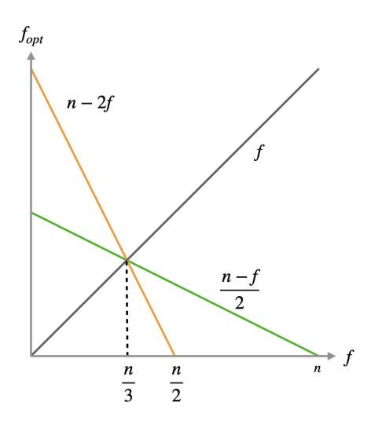
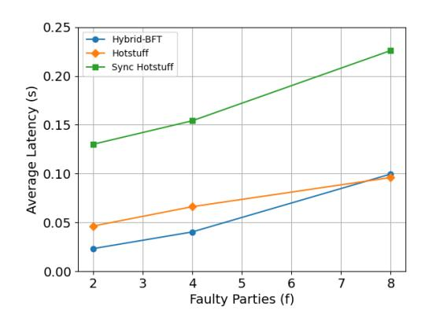
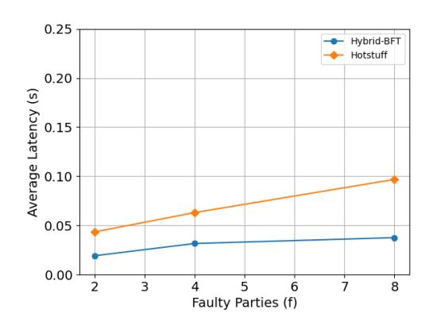

# Hybrid-BFT: Optimistically Responsive Synchronous Consensus with Optimal Latency or Resilience

Atsuki Momose *Nagoya University / SNAPSHOT* momose@sqlab.jp

Jason Paul Cruz *Osaka University* jpmcruz@ymail.com

Yuichi Kaji *Nagoya University* kaji@icts.nagoya-u.ac.jp

*Abstract*—Optimistic responsiveness was introduced to shorten the latency of a synchronous Byzantine consensus protocol that is inherently lower bounded by the pessimistic bound on the network delay ∆. It states that a protocol makes a decision with latency on the order of actual network delay δ if the number of actual faults is significantly smaller than f, which is the worst-case allowed. In this paper, we investigate if a Byzantine consensus can simultaneously achieve (i) optimistic responsiveness, and (ii) optimal latency of ∆ + O(δ) in the presence of f faults. To do this, we provide a tight upper bound on the number of actual faults by showing matching feasibility and infeasibility results. Furthermore, we present a simple leaderbased Byzantine fault-tolerant (BFT) replication protocol as a practical application. Even while being able to rotate leaders after every decision, our protocol simultaneously achieves average latency of (i) 3δ under optimistic condition and (ii) 1.5∆ + O(δ) (or 3∆ + O(δ)) in the presence of f faults, which is more than a factor of two better than current state-of-the-art rotating-leader BFT protocols.

*Index Terms*—BFT, broadcast, Byzantine consensus, optimistic responsiveness

#### I. INTRODUCTION

Byzantine consensus1 is a fundamental building block of fault-tolerant distributed systems and cryptography [1]. Roughly speaking, Byzantine consensus is a problem of n parties agreeing on a value in the presence of up to f (called *resilience*) parties that behave arbitrarily (called Byzantine faults). Byzantine consensus in a synchronous network model has inherently higher resilience than in an asynchronous or partial synchronous model, which has a well-known upper bound of f < n/3 [2], [3]. However, under f ≥ n/3, the latency is lower bounded by the upper bound on the network delay ∆ known a priori. That means reaching an agreement with latency on the order of the actual network delay δ unknown to the parties – the property is called *responsiveness* – is impossible [4], [5]. This drawback hinders synchronous protocols from making a fast decision even if the actual network delay is smaller than a prior estimation. To make matters worse, ∆ is often overestimated in practice, making the latency significantly long.

To circumvent this bound, Thunderella [6] introduced *optimistic responsiveness*, which states that if the number

1We use the term "consensus" to refer to all variants of consensus problems. Specifically, we focus on broadcast and replication.

of actual faults is significantly small (less than (n − f)/2), then it is possible to reach an agreement responsively even with f ≥ n/3. For example, if f < n/2, then the protocol can make a decision responsively if the number of actual faults is less than n/4. However, in the presence of f faults, the protocol incurs O(κ∆) (κ is a security parameter) or O(f∆) latency, which is far from optimal. To provide strong availability, the latency should also be as short as possible in the presence of f faults. Without optimistic responsiveness, some protocols incur latency that is close to optimal ∆+O(δ) [7] or nearly optimal 2∆ + O(δ) [5]. Thus, the following question naturally arises:

*Can a Byzantine consensus protocol simultaneously achieve optimistic responsiveness as well as optimal* ∆+O(δ) *latency in the presence of* f *faults?*

In this paper, we answer this question in the affirmative. Note that δ is significantly smaller than ∆ in general. Based on this premise, when we consider the latency of O(∆) + O(δ), we ignore the O(δ) part in this paper. Thus, ∆ + O(δ) is the optimal latency in the presence of f faults.

(1) Theoretical bound (infeasibility). Before introducing the possible solutions, we first look at a negative aspect. Here, we provide the result for *broadcast*, a well-known singleshot consensus primitive that allows a designated party called *sender* to multicast a value in a consistent manner. For the infeasibility, we show the result for the easiest variant of broadcast primitive called Byzantine consistent broadcast. Our first result is an upper bound on the number of actual faults to achieve optimistic responsiveness while achieving an optimal ∆ + O(δ) latency in the presence of f faults. Specifically, we provide the following result:

Theorem 1 (Optimistic Resilience Upper Bound for Optimal Synchronous Latency – Informal). *There does not exist a Byzantine consistent broadcast protocol that simultaneously achieves (i)* O(δ) *latency in the presence of* n−2f *faults and (ii)* ∆ + O(δ) *latency in the presence of* f *faults.*

The upper bound n − 2f is always smaller than (n − f)/2 when f ≥ n/3. Thus, if we allow the largest possible number of actual faults, i.e., less than (n−f)/2, to achieve optimistic responsiveness, then the latency in the presence of f faults is lower bounded by α∆ + O(δ) with α > 1. This implies that there is an inherent trade-off between latency and resilience.

(2) Theoretical bound (feasibility). As a second result, we provide the tightness of the bound described above. Note that, on the feasibility, we show the results for the hardest variant of broadcast primitive called Byzantine broadcast.

Theorem 2 (Byzantine Broadcast with Optimal Synchronous Latency – Informal). *There exists a Byzantine broadcast protocol that simultaneously achieves (i)* O(δ) *latency in the presence of less than* n − 2f *faults and (ii)* ∆ + O(δ) *latency in the presence of* f *faults.*

The key idea behind the solution is a "hybrid decision path," i.e., two decision paths corresponding to the responsive and synchronous decisions run concurrently. The hybrid decision path allows the protocol to make a decision with optimal ∆ + O(δ) latency even when the responsive decision path fails. The consistency between the two paths is provided by a novel *quorum intersection* argument. Roughly speaking, the two decision paths do not make conflicting decisions unless a non-faulty party votes for two conflicting values, which cannot occur.

We also show that there is a protocol with a nearly optimal 2∆ + O(δ) latency in the presence of f faults allowing the largest possible number of actual faults, i.e., less than (n − f)/2, to achieve optimistic responsiveness.

Theorem 3 (Byzantine Broadcast with Optimal Optimistic Resilience – Informal). *There exists a Byzantine broadcast protocol that simultaneously achieves (i)* O(δ) *latency in the presence of less than* (n − f)/2 *faults and (ii)* 2∆ + O(δ) *latency in the presence of* f *faults.*

The quorum intersection argument in the solution to Theorem 2 does not hold here. Instead, an extra ∆ time-out helps detect inconsistent values relying on synchronous communication.

Fast termination. Both protocols above can not only decide but also terminate with the desired latency. The challenge here is how to guarantee eventual consistent decisions by parties left behind in the absence of some parties terminated earlier. Note that Byzantine broadcast requires *liveness*, i.e., all non-faulty parties must decide and terminate eventually. To this end, when a party fails to make a decision within a certain time, it runs another protocol called fallback agreement protocol, which is similar to a Byzantine agreement protocol with slight modifications. This fallback process guarantees eventual consistent decisions while achieving fast termination when the sender is non-faulty.

(3) BFT replication with immediate leader-rotation. As a practical application, we utilize the core technique in the broadcast protocol to construct a Byzantine fault-tolerant replication (BFT for short) protocol. At a high level, a BFT protocol provides a way for parties to agree on a sequence of client requests [8], [9]. Intuitively, it is achieved by running multiple instances of the broadcast protocol with each different sender (who act as a leader). Naturally, the minimum latency necessary to decide on a request is O(δ) under optimistic condition as well as optimal ∆ + O(δ) or nearly optimal 2∆ + O(δ) in the presence of f faults. However, the major bottleneck of such a leader-full BFT protocol is the leader-rotation process (or view-change), which often incurs additional rounds of communication or synchronous O(∆) time-outs, making the average latency longer. One way to circumvent the latency overhead from the leader-rotation is to have a stable leader that is changed only if it is faulty and other parties fail to make decisions. However, such a *stable-leader* protocol is not favorable in terms of fairness and censorship resistance. We address this problem with a novel "immediate" leader-rotation process. Using this process, each party can change leader immediately upon making a decision without any additional communication rounds under non-faulty leaders. This process naturally makes the leader-rotation optimistically responsive. Moreover, even more surprisingly, the leader-rotation is also immediate even in the presence of f faults. Indeed, some previous synchronous BFT protocols suffer from O(∆) overhead for the leader-rotation process in the presence of f faults [5], [7], [10]. Our immediate leader-rotation makes the *rotating-leader* protocol, i.e., changing leader every broadcast instance, practical under synchronous model. Our protocol achieves, on average, 3δ latency in the optimistic case and 1.5∆ + O(δ) (or 3∆ + O(δ)) latency in the presence of f faults, which is more than a factor of two better than current state-of-the-art rotating-leader BFT protocols [10], [11]. We also give an experimental evaluation that shows better latency than Hotstuff [11] and Sync Hotstuff [5]. Our protocol can potentially be used in certain cases, such as replicated service in a data center or consortium blockchain [12], [13].

Summary of contributions. In this paper, we provide the following contributions:

- 1) An upper bound n − 2f on the number of actual faults to achieve optimistic responsiveness while achieving an optimal ∆ + O(δ) latency in the presence of f faults.
- 2) A Byzantine broadcast protocol that simultaneously achieves (i) O(δ) latency in the presence of less than n − 2f faults, and (ii) optimal ∆ + O(δ) latency in the presence of f faults.
- 3) A Byzantine broadcast protocol that simultaneously achieves (i) O(δ) latency in the presence of less than (n−f)/2 faults (optimal for optimistic responsiveness), and (ii) nearly optimal 2∆+O(δ) latency in the presence of f faults.
- 4) A rotating-leader BFT replication protocol with (i) 3δ latency in optimistic cases, and (ii) 1.5∆+O(δ) (or 3∆+ O(δ)) latency in the presence of f faults, on average.

Organization. The rest of the paper is organized as follows. In Section II, we introduce some definitions and notations. In Section III, we provide the upper bound on the number of actual faults to achieve both optimistic responsiveness as well as optimal synchronous latency. In Section IV, we present a Byzantine broadcast protocol that achieves both optimistic responsiveness and optimal or nearly optimal synchronous latency. In Section V, we extend the broadcast protocol into a practical rotating-leader BFT replication protocol. In Section VI, we present an experimental evaluation of our BFT protocol. Finally, we introduce some related works in Section VII, and conclude with a summary and a future direction in Section VIII.

# II. PRELIMINARIES

# *A. Execution Model*

We define a protocol as an algorithm for a set of parties. Each protocol execution proceeds in an atomic time step. There are n parties, out of which at most f < n are Byzantine faulty. As in other Byzantine consensus protocols, we assume f = Ω(n). We assume adaptive corruption and parties can be corrupted into being faulty at any time during execution. A party that is not faulty throughout the execution is considered to be honest and faithfully executes the protocol. Later in this paper, we also deal with a *crash* fault. A crashing party stops execution and leaves the network permanently, i.e., it also stops all computations and communications. Note that f does not include the number of crashing parties. Except when explicitly mentioned, we assume there are no crashing parties. Communications between parties are synchronous. If an honest party r sends a message x to another party r 0 at time t, r 0 receives x by time t+δ if r 0 is honest. The delay parameter δ is upper bounded by ∆. The upper bound ∆ is known, but δ is unknown, to all parties. Thus, δ can be regarded as an actual delay in the real-world network, while ∆ is an estimated bound on the delay selected by the protocol designer. We assume the use of a cryptographic hash function H, digital signatures, and a public-key infrastructure (PKI). We use hxir to denote a message x signed by a party r. For simplicity, we assume that the signature scheme provides an ideal function such that all signatures cannot be forged by other parties.

# *B. Broadcast and Replication*

*Broadcast* is a problem for a party to multicast a value in a consistent manner [14]. More formally, there is a party designated as a *sender* denoted by rs with an input value vin, and all honest parties try to decide vin. The broadcast problem has three variants with ordered difficulties. The hardest variant is called Byzantine Broadcast (BB), which requires every honest party to make a decision even if the sender is faulty. A slightly weaker variant is called Byzantine Reliable Broadcast (BRB), which requires every honest party to make a decision only when some honest parties have made decisions. The weakest variant is called Byzantine Consistent Broadcast (BCB), which allows the case where some parties make a decision but others do not. In this paper, we use BCB to show infeasibility results and use BB to show feasibility results. The formal requirements of BCB and BB are as follows.

Definition 1 (Byzantine Consistent Broadcast (BCB)). *A Byzantine consistent broadcast protocol must provide the following properties for all executions.*

- 1) Consistency. *If two honest parties decide* v *and* v 0 *, respectively, then* v = v 0 *.*
- 2) Validity. *If the sender* rs *is honest, then every honest party decides the input value* vin *and terminates.*

Definition 2 (Byzantine Broadcast (BB)). *A Byzantine broadcast protocol must provide the following properties for all executions.*

- 1) Consistency. *Same as in BCB.*
- 2) Validity. *Same as in BCB.*
- 3) Liveness. *Every honest party eventually decides a value and terminates.*

Here, we briefly review a consensus variant called Byzantine agreement. In the Byzantine agreement, every party has an input value and agree on the same value following the requirements below. Later in this paper, we introduce a similar primitive to get our main results. However, we note that our results are on broadcast and replication, and BA is not the focus of this paper.

Definition 3 (Byzantine Agreement (BA)). *A Byzantine agreement protocol must provide the following properties for all executions.*

- 1) Consistency. *Same as in BB.*
- 2) Liveness. *Same as in BB.*
- 3) Validity. *If all honest parties have the same input value* v*, then every honest party eventually decides* v*.*

A broadcast protocol is often utilized to achieve a more practical primitive called replication. A replication protocol achieves replicated state machine that helps build a faulttolerant service. In a replication protocol, clients send requests to all parties, and all honest parties agree on a totally-ordered sequence of requests called a *log*. Replication in a Byzantine fault model is called Byzantine fault-tolerant replication (BFT for short). The formal requirements of BFT are described below. Note that broadcast protocols need to not only decide but also to terminate, while BFT does not terminate and thus runs indefinitely.

Definition 4 (Byzantine Fault-Tolerant Replication (BFT)). *A Byzantine fault-tolerant replication protocol must provide the following properties for all executions.*

- 1) Safety. *If two requests* c *and* c 0 *are decided in the same log position, then* c = c 0 *.*
- 2) Liveness. *All requests are eventually decided by all honest parties.*

# III. THEORETICAL BOUND ON THE INFEASIBILITY

In this section, we show an upper bound on the number of actual faults to achieve optimistic responsiveness as well as an optimal ∆ + O(δ) latency in the presence of f faults, simultaneously.

#### *A. Definitions*

Before discussing the results, we formally define optimistic responsiveness of a broadcast protocol. We first define two latency metrics of a broadcast protocol – one for the normal case, i.e., in the presence of f faults, and another for the optimistic case. Note that the latency we define is "goodcase latency" [5], [7], i.e., the latency when the sender is honest. The "worst-case latency," which is also known as round complexity in the literature, is the maximum latency even when the sender is faulty and is often used as a latency metric in the literature. However, our central focus is the shortest possible latency, and thus the worst-case latency is out of the scope of our interest.

Definition 5 (Synchronous Latency). *The synchronous latency of a broadcast protocol is* T *if the following condition holds: if the sender* rs *is honest, then every honest party decides the input value* vin *and terminates by time* T*.*

Definition 6 (Optimistic Latency). *The* fopt*-optimistic latency of a broadcast protocol is* T *if the following condition holds: if the sender* rs *is honest and the number of actual faults is up to* fopt > 0*, then every honest party decides the input value* vin *and terminates by time* T*.*

We call fopt *optimistic resilience* to distinguish it from resilience f. Next, we define the optimistic responsiveness of a broadcast protocol. In the definition of optimistic responsiveness in [6], the optimistic latency is described by a polynomial for versatility. However, most responsive protocols [9], [11] have latency of some constant factor of δ, and thus we follow this definition for simplicity and practicality.

Definition 7 (Optimistic Responsiveness). *A broadcast protocol is* fopt*-optimistically responsive if its* fopt*-optimistic latency is expressed by* O(δ)*.*

#### *B. Trade-off between Latency and Resilience*

We now show the infeasibility result. It was shown in [6] that it is possible to achieve fopt-optimistic responsiveness if and only if fopt < (n − f)/2 ( [6] proved it in the context of replication, but it is trivially extended for broadcast). However, we show that there is an inherent smaller upper bound on fopt to achieve optimal synchronous latency ∆ + O(δ) and fopt-optimistic responsiveness simultaneously. Thus, our result implies that there is an inherent trade-off between latency and resilience, which we will show formally in Theorem 4.

Remark on termination. Note that although the definition of latency requires honest parties to not only decide but also to terminate, we show the infeasibility in a strong sense, i.e., the result holds even if honest parties are allowed to not terminate.

Theorem 4 (Optimistic Resilience Upper Bound for Optimal Synchronous Latency). *For all* fopt ≥ n − 2f*, there does not* *exist a Byzantine consistent broadcast protocol that simultaneously achieves synchronous latency expressed by* ∆ + O(δ) *and* fopt*-optimistic responsiveness.*

*Proof.* Suppose for the sake of contradiction that there exists a protocol that simultaneously achieves synchronous latency expressed by ∆ + C1 · δ and fopt-optimistic latency expressed by C2 · δ for some constant C1, C2 and fopt ≥ n − 2f. Then, there exist values δ1, δ2 ≤ ∆ that satisfy δ1 < C1 · δ1 < δ2 < C2 · δ2 < ∆ < ∆ + δ1 < ∆ + C1 · δ1 < ∆ + δ2. We consider three executions where each honest party runs the protocol to decide a value. In each execution, there are three sets of parties P, Q, and R with size |P| = f, |Q| = n − f − fopt ≤ f, and |R| = fopt. A sender rs belongs to Q.

In the first execution (W1), only P is faulty and δ = δ1. The sender rs has an input value v1. P executes honestly by time δ2 except that it ignores all messages from Q, and stops execution after δ2. From the assumption, R decides v1 at time t = ∆ + C1 · δ1.

In the second execution (W2), only R is faulty and δ = δ2. The sender rs has an input value v2. R does not send any message. From the assumption, P decides v2 at time t = C2 · δ2.

In the third execution (W3), only Q is faulty. Messages are delivered with delay δ1 between Q and R, with δ2 between Q and P, and with ∆ between P and R (thus, δ = ∆). Q communicates with R and P as in W1 and W2, respectively. Then, before ∆+C1 ·δ1 < ∆+δ2, R cannot receive messages that P sends after the time when P receives the first message from Q (i.e., t = δ2). Thus, R cannot distinguish W1 and W3 and decides v1 at ∆ + C1 · δ1. On the other hand, P cannot receive any messages from R before C2 · δ2 < ∆. Thus, P cannot distinguish W2 and W3 before C2 · δ2 and decides v2 at C2·δ2. Therefore, P and R decide different values, violating the consistency, which is a contradiction.

Summarizing the theorems above, we can see, as in Figure 1, the inherent gap between the optimal fopt to achieve optimistic responsiveness (the green line), and the optimal fopt to achieve optimistic responsiveness and optimal ∆ + O(δ) synchronous latency (the yellow line). We can also see as a corollary that optimal synchronous latency and optimistic resilience can be achieved only when f = n/3. Therefore, when we assume f > n/3 and optimal optimistic resilience, the optimal synchronous latency is α∆ + O(δ) for α > 1. Furthermore, it can be seen that it is impossible to achieve optimistic responsiveness and optimal synchronous latency when f ≥ (n − 1)/2.

# IV. THEORETICAL BOUND ON THE FEASIBILITY

In the previous section, we provided the upper bound on fopt to achieve optimal synchronous latency ∆ + O(δ) and fopt-optimistic responsiveness, simultaneously. In this section, we will show that this bound is tight, i.e., there exists a broadcast protocol that achieves both properties with fopt < n−2f as formally argued in Theorem 5. We show the results with

Fig. 1. The upper bound on each optimistic resilience  $f_{opt}$ . The green line is the optimal resilience to achieve optimistic responsiveness, and the yellow line is the optimal resilience to achieve optimistic responsiveness and optimal synchronous latency.

Byzantine broadcast (BB), which is the hardest among the broadcast primitives.

**Theorem 5** (Byzantine Broadcast with Optimal Synchronous Latency). Assuming  $n/3 \le f < (n-1)/2$  and  $0 < f_{opt} < n-2f$ , there exists a Byzantine broadcast protocol with synchronous latency expressed by  $\Delta + O(\delta)$  and  $f_{opt}$ -optimistic responsiveness.

As shown in the previous section, when we assume f>n/3 and optimal  $f_{opt}<(n-f)/2$  to achieve optimistic responsiveness, the optimal synchronous latency is  $\alpha\Delta+O(\delta)$  for  $\alpha>1$ . We show that the nearly optimal synchronous latency  $2\Delta+O(\delta)$  is possible, as formally argued in Theorem 6.

**Theorem 6** (Byzantine Broadcast with Optimal Optimistic Resilience). Assuming  $n/3 \le f < n/2$  and  $0 < f_{opt} < (n-f)/2$ , there exists a Byzantine broadcast protocol with synchronous latency expressed by  $2\Delta + O(\delta)$  and  $f_{opt}$ -optimistic responsiveness.

To complete these theorems, we construct two BB protocols that favor latency (for Theorem 5) and resilience (for Theorem 6), respectively. These two protocols are special cases of a unified protocol in which the differences are all absorbed into the protocol parameters. We introduce the unified BB protocol BB, parameterized by a constant  $\alpha$ , optimistic resilience  $f_{opt}$ , and resilience f. The constant  $\alpha$  directly determines the synchronous latency of BB, that is, it has  $\alpha\Delta + O(\delta)$  synchronous latency. The protocol description is in detail in Figure 2.

Overview of the unified protocol (BB). The key idea behind the protocol is to have a "hybrid decision path" that concurrently runs a (i) responsive decision path, which can

decide a value with latency of  $O(\delta)$  if the number of actual faults is up to  $f_{opt}$  (Responsive phase in the description), and a (ii) synchronous decision path, which can decide a value with latency of  $\alpha\Delta + O(\delta)$  if the number of actual faults is larger than  $f_{opt}$  (Synchronous phase). Thus, if the number of actual faults is greater than  $f_{opt}$  and the responsive decision path fails to make a decision, then the synchronous decision path makes a decision as an automatic fallback with minimum latency. We briefly give an overview of both decision paths.

At the start of the protocol, the sender  $r_s$  multicasts propose for an input value v. Upon receiving the proposal, each party runs two concurrent decision paths. In the Responsive phase, a party multicasts resp-vote for v. If the number of actual faults is up to  $f_{opt}$  and  $r_s$  is honest, then at least  $n - f_{opt}$ resp-vote for the value v should be sent. We call a set of  $n-f_{opt}$  resp-vote for a value v as *certificate* for a value v, denoted by C(v). In the Synchronous phase, a party waits for  $\alpha\Delta$  and then multicasts sync-vote for v. Since there is up to f faults, at least n-f sync-vote for the value v should be sent. Again we call it *certificate* for a value vand denoted by C(v). A certificate plays an important role in achieving consistency — two conflicting certificates C(v) and  $\mathcal{C}(v')$  cannot be created. Then, upon receiving the first  $\mathcal{C}(v)$ by time  $3\Delta$ , the party multicasts the certificate and decide for v and then decides v (in the Decide phase), which means no conflicting decision will be made by any other party. To prevent two conflicting certificates from being created, upon receiving two proposals for different values from  $r_s$ , which is a clear Byzantine behavior often called equivocation, the party immediately stops voting in both the Responsive and Synchronous phases (in the Equivocation phase). Note that all of these processes are non-blocking, i.e., they concurrently run upon each event without waiting for execution results from other phases.

We now introduce two parameter settings  $(\alpha, f_{opt}, f) = (i)$  (1, n-2f-1, f) — latency-favoring, and (ii)  $(2, \lceil \frac{n-f}{2} - 1 \rceil, f)$  — resilience-favoring, which correspond to Theorems 5 and 6, respectively. Here, the remaining challenge is how to prevent two concurrent decision paths from producing conflicting certificates. We will explain how the two parameter settings described above solve the challenge.

Latency-favoring setting. We first introduce the latency-favoring setting  $(\alpha, f_{opt}, f) = (1, n-2f-1, f)$  which achieves optimal synchronous latency  $\Delta + O(\delta)$  and  $f_{opt}$ -optimistic responsiveness with matching limit  $f_{opt} < n-2f$  given in the previous section. This setting gives *quorum intersection* at one honest party, which is a powerful guarantee often utilized in the literature. We have two types of *quorum*, i.e., number of votes, to make a certificate, namely, (i)  $n-f_{opt}$  to make a certificate from resp-vote, and (ii) n-f to make a certificate from sync-vote. Suppose we have two certificates for different values produced by two types of quorum. Let S and S' be a set of parties that made resp-vote and sync-vote, respectively. Then, the intersection of  $S \cap S'$  includes more than f parties given that  $(n-f)+(n-f_{opt})-n>f$ , at

Let  $r_s$  be the designated sender and r be a party. C(v) is (i) a set of n-f sync-vote for a value v, or (ii) a set of  $n-f_{opt}$  resp-vote for a value v. Sender  $r_s$  multicasts the input value v in the form of  $\langle \text{propose}, v \rangle_{r_s}$ . Party r executes the following processes:

- 1) **Responsive.** Upon receiving  $\langle \text{propose}, v \rangle_{r_s}$ , multicast  $\langle \text{resp-vote}, v \rangle_r$ .
- 2) **Synchronous.** Upon receiving  $\langle \text{propose}, v \rangle_{r_*}$ , multicast it, wait for  $\alpha \Delta$ , and multicast  $\langle \text{sync-vote}, v \rangle_{r_*}$ .
- 3) **Decide.** Upon receiving the first C(v) by time  $3\Delta$ , multicast it and  $\langle \text{decide}, v \rangle_r$ , and then decide v.
- 4) **Equivocation.** Upon receiving two proposals for different values from  $r_s$ , multicast them and stop voting.

At time  $4\Delta$ , if r has not terminated, then r stops all processes above and starts executing  $\mathsf{FA}(f)$ , where the input value of  $\mathsf{FA}$  is a certified value (if there is no certificate, the input is the empty value  $\bot$ ). When  $\mathsf{FA}(f)$  decides a value v, r decides v and multicasts  $\langle \mathsf{decide}, v \rangle_r$ . At any time, upon receiving more than  $f \langle \mathsf{decide}, v \rangle_*$ , r multicasts them, decides v, and terminates (stops  $\mathsf{FA}$ ).

Fig. 2. Byzantine broadcast with  $f_{opt}$ -optimistic responsiveness and  $\alpha\Delta$  synchronous latency that tolerates up to f Byzantine faults.

least one of them is honest. This implies that an honest party votes for different values, which cannot occur.

Resilience-favoring setting. We now introduce the resiliencefavoring setting  $(\alpha, f_{opt}, f) = (2, \lceil \frac{n-f}{2} - 1 \rceil, f)$ . We cannot rely on the quorum intersection here because the  $f_{opt} < n-2f$ in the latency-favoring setting is the upper limit that guarantees quorum intersection at an honest party. Therefore, we need another way to detect sender's equivocation before voting. A natural way to detect equivocation is to rely on the network synchrony, which introduces another  $\Delta$  waiting time in the Synchronous phase. The  $2\Delta$  waiting time allows honest parties to detect equivocation interactively. Suppose an honest party r receives a value v at time t and starts waiting for  $2\Delta$  in the synchronous decision path. If another honest party r' in a responsive decision path votes for a different value v', then we can consider two cases: r' votes before or after  $t + \Delta$ . Considering the former case, v' is received by r before  $t + 2\Delta$ , preventing r from voting for v. The latter case cannot occur because v should be received by r' before  $t + \Delta$ , preventing r' from voting for v'. Thus, in both cases either r or r' does not vote.

**Liveness and early stopping.** So far, we have introduced the way to achieve consistency and validity. However, another remaining concern that we need to solve is liveness. A naive solution to guarantee liveness is to run a Byzantine agreement (BA) protocol [15], [16] with a certificate  $\mathcal{C}(v)$  as its input after  $4\Delta$  (the time required for every honest party to make a decision if the sender is honest). The liveness of BB is achieved in a straightforward manner by the liveness of BA. Moreover, if an honest party decides a value v before running BA, then every honest party receives  $\mathcal{C}(v)$ . Therefore, every honest party decides v by the validity of BA, and the consistency of the protocol is also maintained. However, such a solution cannot achieve fast latency because every honest party

cannot terminate until BA stops. Recall that the optimistic and synchronous latency requires honest parties to not only decide but also to terminate. In other words, BB needs to achieve early stopping [17]. In BB, upon deciding a value v, a party multicasts decide for v. Then, at any time during execution, upon receiving more than f decide for v, the party multicasts it and terminates. Thus, even if an honest party terminates and does not participate in the execution after  $4\Delta$ , every honest party eventually receives more than f decide for v, decides v, and terminates. The challenge here is maintaining the consistency of the protocol.

To this end, we introduce a primitive called fallback agreement similar to BA. Intuitively, in a fallback agreement protocol, a set of honest parties agrees on a value under the situation where the honest parties have the same input value or empty input at the beginning and honest parties can adaptively crash. We first define the fault model. During execution, at most f parties can adaptively be corrupted into being a Byzantine fault and at most n parties can adaptively crash. A party that crashes once can no longer rejoin and participate in the execution. A party that is neither Byzantine fault nor crash fault at time t is said to be so-far-honest at time t. A party that is so-far-honest at all time in the execution is said to be forever-honest. Next, we define the problem. At the beginning of execution, there is an input value  $v_{in}$  such that every so-far-honest party r has the input  $v_r \in \{v_{in}, \bot\}$ . The empty value  $\bot$  means the party has no input. Then, every so-far-honest party tries to make a decision following the requirements below.

**Definition 8** (Fallback Agreement). A fallback agreement protocol provides the following properties for all executions.

- 1) Consistency. If so-far-honest parties r and r' decide values v and v' at time t and t', respectively, then v = v'.
- 2) Validity. If every so-far-honest party r at the beginning of execution has an input value  $v_r = v_{in}$ , for all time t every so-far-honest party r' at t does not decide a

- *different value* v 0 6= vin*.*
- 3) Liveness. *If there are no crash parties throughout the execution, then every forever-honest party decides a value and terminates.*

At time 4∆, parties start running a fallback agreement protocol FA(f) with the same resilience f. A party sets its input to a certified value v if it observes C(v), otherwise, no input. Since there is no conflicting certificate C(v 0 ), each party can set its input to the same value or no input, which satisfies the assumption of the fallback agreement. Intuitively, the crashing party in FA corresponds to the honest party in BB that terminates before or during the execution of FA. If an honest party decides a value v before running FA, then it must have received C(v) by 3∆ and multicasts it. Then, every honest party who has not yet terminated at 4∆ sets the input of FA to v. Thus, by the validity of FA, every honest party cannot decide a different value v 0 , which guarantees the consistency. Moreover, if all honest parties could not decide a value before 4∆, then they run FA. Thus, by the liveness and consistency of FA, all honest parties eventually decide the same value and terminate. The concrete construction of FA is described in Appendix A.

# *A. Correctness of the Protocol*

We prove the correctness of the protocol BB for the two parameter settings described above.

Latency-favoring protocol. We first show that, assuming n/3 ≤ f < (n − 1)/2, the protocol BB(1, n − 2f − 1, f) satisfies consistency, validity, and liveness. The validity is trivial, and thus we do not show the proof in detail.

Lemma 1 (Certified without Equivocation). *If two certificates* C(v) *and* C(v 0 ) *are created, then* v = v 0 *.*

*Proof.* Suppose a certificate is created, we can consider two cases: the certificate is from (i) sync-vote or (ii) resp-vote. Thus, we consider four cases consisting of the two cases for v and v 0 . We prove by contradiction supposing each case occurs.

Case (1) — (i) for both v and v 0 . If a certificate for a value is created, then at least one honest party must vote for the value. Let t and t 0 be the time when the first honest party r and r 0 votes for v and v 0 , respectively. Without loss of generality, we assume t ≤ t 0 . Since honest parties wait for ∆ before voting, r must have received the value v and multicast it at t − ∆. Thus, r 0 must have received v by t ≤ t 0 . This would prevent r 0 from voting for v 0 at t 0 , which is a contradiction.

Case (2) — (i) for v and (ii) for v 0 . Let S and S 0 be a set of parties who did sync-vote for v and resp-vote for v 0 to make C(v) and C(v 0 ), respectively. Then, at least one honest party must have voted for both v and v 0 because the intersection of the two sets S ∩S 0 contains more than f parties (|S| + |S 0 | − n ≤ (n − f) + (n − fopt) − n > f), at least one of them is honest. This is a contradiction. Here, Case (3) — (ii) for v and (i) for v 0 , is proved in the same way.

Case (4) — (ii) for both v and v 0 . Let S and S 0 be a set of parties who did resp-vote for v and v 0 to make C(v) and C(v 0 ), respectively. Here, the number of resp-vote to make a certificate is greater than the number of sync-vote. Thus, the same argument as in Case (2) holds, which is a contradiction.

Considering the four cases above, two certificates for different values v and v 0 cannot be created.

Here, we say a party directly decides a value v if it decides v by (i) receiving C(v) by time 3∆ or (ii) deciding the value v in FA. On the other hand, we say a party indirectly decides a value v if it decides v by receiving more than f decide for v.

Theorem 7 (Consistency). *If two honest parties decide* v *and* v 0 *, respectively, then* v = v 0 *.*

*Proof.* Suppose an honest party directly decides a value v, then there are two cases: (i) it receives C(v) by time 3∆ or (ii) it decides the value v in FA. Let us first consider case (i). By Lemma 1, any certificate C(v 0 ) for a different value v 0 cannot be created. Moreover, every honest party who has not terminated receives the certificate C(v) by 4∆ and sets the input of FA to v. Thus, by the validity of FA, every honest party does not directly decide a different value v 0 .

We now consider case (ii). Suppose an honest party decides the value v in FA. Then, by the consistency of FA, every honest party does not decide a different value v 0 in FA. Furthermore, every honest party could not have decided a different value v 0 by receiving C(v 0 ) by time 3∆. Thus, every honest party does not directly decide a different value v 0 .

Suppose an honest party indirectly decides a value v, then at least one honest party must have directly decided the value v. Therefore, every honest party does not directly decide a different value v 0 . If every honest party does not directly decide a value v 0 , then more than f decide for v 0 cannot be sent. Thus, every honest party does not decide a different value v 0 either directly or indirectly.

Theorem 8 (Liveness). *Every honest party eventually decides a value and terminates.*

*Proof.* Suppose an honest party terminates, then it must have received more than f decide for a value v and multicast them. Then, every honest party receives them, decides v, and terminates. Thus, if an honest party fails to terminate permanently, then every honest party must also fail to terminate permanently. Suppose for the sake of contradiction that if all honest parties fail to terminate permanently, then they all run FA. By the liveness and consistency of FA, all honest parties decide the same value v and multicast decide for v. Thus, every honest party receives more than f decide for a value v and terminates, which is a contradiction.

Finally, we show that the protocol BB(1, n − 2f − 1, f) achieves both optimal synchronous latency ∆+O(δ) and foptoptimistic responsiveness.

Theorem 9 (Latency). *The synchronous latency is* ∆ + 3δ*, and the optimistic latency is* 3δ*.*

*Proof.* If the sender  $r_s$  is honest, then it multicasts propose for the input value v. Then, every honest party receives n-f sync-vote for v, decides v, and multicasts decide for v. Thus, every honest party terminates by  $\Delta+3\delta$ . Moreover, if at most  $f_{opt}$  parties are faulty, then every honest party receives  $n-f_{opt}$  resp-vote for v, decides v, and multicasts decide for v. Thus, every honest party terminates by  $3\delta$ .

**Resilience-favoring protocol.** We show that assuming  $n/3 \le f < n/2$ , the protocol BB $(2, \lceil \frac{n-f}{2} - 1 \rceil, f)$  satisfies consistency, validity, and liveness. Here, validity and liveness can be proven in a straightforward manner as in the latency-favoring protocol. Thus, we do not show the proofs in detail. For the proof of consistency, Theorem 7 can be easily extended by applying Lemma 2 which has the same argument as Lemma 1.

**Lemma 2** (Certified without Equivocation). *If two certificates* C(v) *and* C(v') *are created, then* v = v'.

*Proof.* Suppose a certificate is created, we can consider two cases: the certificate is from (i) sync-vote or (ii) resp-vote. Thus, we consider four cases consisting of the two cases for v and v'. We prove by contradiction supposing each case occurs.

Case (1) — (i) for v and (ii) for v'. If a certificate for a value is created, then at least one honest party must vote for the value. Let t and t' be the time when the first honest party r and r' votes for v and v', respectively. Then, r must have received propose for v at  $t-2\Delta$ . Suppose r' voted for v' before  $t-\Delta$ , then r must have received v' before t. That would prevent r from voting for v. On the other hand, r' could not have voted for v' after  $t-\Delta$  because r' must have received v by  $t-\Delta$ . Thus, in either case v' could not have voted for v', which is a contradiction. Here, Case (2) — (ii) for v and (i) for v', is proved in the same way.

The remaining cases, Case (3) — (i) for both v and v', and Case (4) — (ii) for both v and v', are proved in the same way as in Lemma 1. Considering the four cases above, two certificates for different values v and v' cannot be created.  $\square$ 

Finally, we show that the protocol BB $(2, \lceil \frac{n-f}{2} - 1 \rceil, f)$  achieves both nearly optimal synchronous latency  $2\Delta + O(\delta)$  and  $f_{opt}$ -optimistic responsiveness.

**Theorem 10** (Latency). The synchronous latency is  $2\Delta + 3\delta$ , and the optimistic latency is  $3\delta$ .

*Proof.* This is similar to the latency-favoring setting except for an additional waiting time of  $\Delta$  in the Synchronous phase. Thus, if the sender is honest, then every honest party decides the input value and terminates by  $2\Delta + 3\delta$ . If at most  $f_{opt}$  parties are faulty, then every honest party terminates by  $3\delta$ .

# V. BFT REPLICATION WITH IMMEDIATE LEADER-ROTATION

In the previous section, we introduced the core technique to construct a "single-shot" broadcast protocol that achieves both optimistic responsiveness and optimal or nearly optimal synchronous latency. In this section, towards a more practical application, we extend this technique to construct a BFT replication protocol with the same latency level. Our protocol has "leader-full" construction. At a high level, a party selected as a leader proposes a set of client requests to append to the current log, and all parties agree on the new log. Thus, the technique used in the broadcast protocol is naturally applied when the leader replaces the sender. However, BFT replication is multishot, i.e., it needs to decide client requests sequentially. This means our protocol runs multiple instances of the broadcast protocol. Here, to consider fairness and censorship resistance, the leader should be rotated among the parties. However, leader-rotation generally includes a complicated mechanism to guarantee consistency across multiple instances of a broadcast protocol, making it a bottleneck for a fast decision. Thus, the challenge we tackle in this section is how to change leaders fast while maintaining the consistency.

#### A. Latency Metrics

Before describing the protocol, we define two latency metrics, namely, synchronous latency and optimistic latency. The definition of latency for a broadcast protocol relies on the condition that the sender is honest. Thus, we naturally define the latency of a BFT protocol using the condition that the leaders are honest. Note that the notion of leader is not included in the definition of BFT replication. However, because the leader-full construction is a mainstream in BFT protocols and we do not compare our protocol with "leaderless" protocols in this paper, we use the notion of leader to make the definition simple and intuitive. The synchronous latency, optimistic latency, and optimistic responsiveness are defined below. Here, the latency to decide a client request is the time lag from the point when all honest parties receive the request to the point when the request is decided by all honest parties.

**Definition 9** (Synchronous Latency). The synchronous latency of a BFT protocol is  $[T_{min}, T_{max}]$  if the following condition holds: the latency T to decide a client request is  $T_{min} \leq T \leq T_{max}$  if leaders are honest.

**Definition 10** (Optimistic Latency). The  $f_{opt}$ -optimistic latency of a BFT protocol is  $[T_{min}, T_{max}]$  if the following condition holds: the latency T to decide a client request is  $T_{min} \leq T \leq T_{max}$  if leaders are honest and the number of actual faults is up to  $f_{opt} > 0$ .

**Definition 11** (Optimistic Responsiveness). A BFT protocol is  $f_{opt}$ -optimistically responsive if its  $f_{opt}$ -optimistic latency is expressed by  $O(\delta)$ .

The difference between the minimum latency  $T_{min}$  and the maximum latency  $T_{max}$  is an important metric to measure the speed of leader-rotation. When a request is received by the leader just before the leader proposes a new log, the request is decided with the minimum latency  $T_{min}$ . However, when a request is received by the leader just after the proposal, the request needs to wait for the next leader to be decided.

At the beginning of execution, the first leader L1 multicasts hpropose, B1, C0(B0), 1iL1 . Each party r starts timer1. Upon receiving the first proposal, r executes Steady-State(B1).

# Steady-State(Bk):

- 1) Responsive. At the beginning of view i, multicast hresp-vote, Bk, iir
- 2) Synchronous. At the beginning of view i, wait for α∆ and then multicast hsync-vote, Bk, iir.
- 3) Decide. Upon receiving Ci(Bk), multicast it and then decide Bk and all its ancestors.
- 4) Equivocation. Upon receiving two different proposals from Li , multicast them and stop voting in view i.

Fig. 3. BFT replication with fopt-optimistic responsiveness and α∆ synchronous latency that tolerates up to f Byzantine faults (steady-state).

✒ ✑

#### ✓ BFT(α, fopt, f).view-change ✏

Let i be the current view number, and Li be the leader of view i. Let timerj be a timer in view j initialized with 0 and counts up every single time after starting. At the beginning of execution, party r executes the following three processes:

Normal-Path: Upon receiving Cj (Bk) for j ≥ i, set the current view i to j + 1 and start the following view-change process of view j.

- 1) Lock. Multicast Cj (Bk), stop Steady-State of view l ≤ j, set lockl,r of all views l ≤ j that have not been set to Cj (Bk), send lockj,r to Lj+1, and start timerj+1.
- 2) Propose. After timerj+1 starts, Lj+1 multicasts hpropose, Bk+1, Cj (Bk), j + 1iLj+1 , where Bk+1 = (bk+1, H(Bk)) and bk+1 is a batch of client requests.
- 3) New-View. Upon receiving a first valid proposal hpropose, Bk+1, Cj (Bk), j + 1iLj+1 of view j + 1, multicast it and then start Steady-State(Bk+1) of view j + 1.

Fallback-Path: Upon receiving B(j) for j ≥ i, set the current view i to j + 1 and start the following view-change process of view j.

- 1) Lock. Multicast B(j), stop Steady-State of view l ≤ j, wait for 2∆ (4∆ if r = Lj+1), set lockl,r of all views l ≤ j that have not been set to a highest certificate, and send lockj,r to Lj+1. Wait for ∆ (0 if r = Lj+1) and then start timerj+1.
- 2) Propose. After timerj+1 starts, Lj+1 multicasts hpropose, Bk+1, Cl(Bk), j + 1iLj+1 , where Cl(Bk) is a highest certificate, Bk+1 = (bk+1, H(Bk)), and bk+1 is a batch of client requests.
- 3) New-View. Upon receiving a first valid proposal hpropose, Bk+1, Cl(Bk), j + 1iLj+1 of view j + 1, where Cl(Bk) is as high as lockj,r, multicast it and then start Steady-State(Bk+1) of view j + 1.

# Blame:

1) Timeout. When timerj for j ≥ i reaches (7 + α)∆, stop all timerl for l ≤ j, multicast hblame, jir, and stop Steady-State of view j.

✒ ✑

Fig. 4. BFT replication with fopt-optimistic responsiveness and α∆ synchronous latency that tolerates up to f Byzantine faults (view-change).

Therefore, Tmax should be 2Tmin + Trot, where Trot is the extra time for leader-rotation. In general, the parties receive client requests at each time uniformly at random. Therefore, the average latency should be (Tmin +Tmax)/2, which is also affected by Trot.

#### *B. Protocol Description*

We introduce our BFT protocol BFT which is parameterized by a constant α that determines synchronous latency, optimistic resilience fopt, and resilience f. The protocol description is in Figures 3 and 4. Following mainstream BFT protocols, BFT has bi-modal construction consisting of *steady-state* and *view-change*. Parties decide the new log proposed by the leader in the steady-state, and the leader is replaced in the view-change. BFT proceeds in iterations of these two processes.

Definitions and notations. The reign of the leader is called *view*. Each view is identified by an increasing number i ≥ 1. The leader of each view is selected in a round-robin manner. The leader of a view i is denoted by Li . At the beginning of each view, the leader proposes a *block* of requests. In addition to a set of client requests, a block contains a hash of another block, which works as a reference to the block. The references with a common end, which is called a *genesis-block* that is hard-coded in the protocol, construct a chain of blocks or a so called *blockchain*. A *height* of a block is the number of ancestors in the chain. A block of height k is denoted by Bk = (bk, hk−1), which consists of a batch of client requests bk that are totally-ordered, and a hash hk−1 = H(Bk−1) of the parent block Bk−1. The genesis-block is denoted by B0 = (⊥, ⊥). Thus, the log is naturally determined by first following the total-order of blocks starting from the genesis-block and then the total-order of requests defined within each block. We say a block B *extends* B0 if B = B0 or B is a descendant of B0 . If two blocks B and B0 do not extend one another, we say B and B0 *conflict* with each other. We say a block Bk is *valid* if the parent block Bk−1 is valid, or Bk is the genesis-block.

As in the broadcast protocol, the key artifact used to agree on a block is a *certificate* for a block. A certificate Ci(Bk) for a block Bk in a view i is (i) a set of n − f sync-vote for Bk in the view i or (ii) a set of n − fopt resp-vote for Bk in the view i. We say a block Bk is certified in a view i if there is a certificate Ci(Bk). The genesis-block B0 is certified from the beginning and the certificate C0(B0) is shared in advance. A certificate is ranked by its view number. For example, Ci+1(B) is higher than Ci(B0 ). We use B(i) to denote a set of f + 1 blame messages for i, which is used to trigger view-change. We say hpropose, Bk+1, Cl(Bk), iiLi is *valid* if both Bk+1 and Bk are valid, and Bk+1 refers to Bk.

Operations under honest leaders. Let us first consider the operations when leaders are honest. In this case, the operations are simple. Each party r, upon receiving a propose for a block Bk from the leader Li , starts the steady-state of view i by running Steady-State(Bk). The operations in the steadystate are almost identical to those in BB (before 4∆). Party r concurrently runs both responsive and synchronous decision paths and decides Bk upon receiving a certificate Ci(Bk).

Next, upon making a decision, r starts a leader-rotation process in Normal-Path. The leader Li+1 of the next view i+ 1 immediately multicasts propose for the next block Bk+1 referring to Bk. And then, upon receiving the proposal, r starts the steady-state of the view i + 1 by running Steady-State(Bk+1). To summarize simply, the protocol proceeds in iterations of just two rounds of communication: (i) upon receiving a certificate Ci(Bk), the next leader Li+1 proposes a block Bk+1 referring to the block Bk, and (ii) parties vote for Bk to make the next certificate Ci+1(Bk+1) that triggers the next proposal. These simple operations make leader-rotation "immediate", i.e., Trot = 0. That is, the protocol changes leaders without any additional rounds of communication in the leader-rotation. This naturally means that the leader-rotation is also optimistically responsive, i.e., multiple leaders are changed within O(δ) time if up to fopt parties are faulty. Furthermore, the leader-rotation is also immediate even when f parties are faulty and steady-state necessarily incurs Tmin = O(∆) latency. Most previous synchronous BFT protocols in literature, even those that achieve optimistically responsive leader-rotation [10], incur Trot = O(∆) time for a leaderrotation in the presence of f faults [5], [7].

Why is immediate leader-rotation possible? First, the complicated leader-rotation mechanism comes from the *locking* mechanism, which is commonly used in BFT protocols to maintain consistency across different views [11], [18], [19]. Roughly speaking, each party r "locks" on the highest block B that may have been decided by other honest parties by using certificates as clues at the end of each view. Consider a typical example where r locks on the highest certified block [5], [7]. In latter views, r does not vote for any block conflicting with B if it refers to a certified block lower than B. Therefore, if all blocks conflicting with a decided block cannot be certified in the same view, then conflicting decisions cannot be made across different views. However, in some BFT protocols, a leader can propose multiple blocks in the same view. Moreover, some protocols allow two conflicting certificates to be created in the same view [5], [20] when the leader is faulty. Therefore, at the end of each view, honest parties need to synchronize to learn which is the highest block to lock on. Such a synchronization phase introduces additional rounds of communication or synchronous O(∆) waiting.

In contrast, our protocol allows a leader to propose only one block in a view. Furthermore, even if the leader is faulty, conflicting certificates cannot be created in the same view. Thus, when a party receives a certificate Ci(B) in a view i, it knows that B is the highest block to lock on. Therefore, the additional synchronization is no longer needed, which makes it possible to enter the next view immediately.

Operations under a faulty leader. When a leader is faulty and honest parties fail to make a decision, honest parties do not know which block to lock on. In this case, each party r changes the view through Fallback-Path, which is a typical synchronous locking mechanism. Fallback-Path is triggered by time-out. In both the Normal-path and Fallback-Path of each view i, a counting-up timer of the next view i + 1 denoted by timeri+1 is started. When the timer timeri of view i expires, r multicasts blame for the view i and stops steady-state of the view i (in Blame). Upon receiving f + 1 blame for the view i, denoted by B(i), r starts Fallback-Path of the view i.

Upon entering Fallback-Path of a view i by receiving B(i), r waits for 2∆ to collect certified blocks. Then, r locks on the highest certificate Cj (Bk) by setting a variable locki,r to the certificate. After waiting for additional ∆, upon receiving a first valid proposal of view i + 1, r starts the steady-state of view i + 1. Here, r does not start the steady-state if the proposed block B refers to a certificate lower in rank than locki,r. Moreover, if an honest party decides a block in view i, r locks on the block or its descendant due to the 3∆ waiting (See V-C for details). Therefore, if a faulty leader of a latter view proposes a block conflicting with a decided block, then every honest party does not start the steady-state and the block cannot be decided. This guarantees the consistency across different views.

**Latency.** As in the broadcast protocol, our protocol has two parameter settings: (i) latency-favoring:  $\mathsf{BFT}(1,n-2f-1,f)$  and (ii) resilience-favoring:  $\mathsf{BFT}(2,\lceil\frac{n-f}{2}-1\rceil,f)$ . We show the latency of both settings below.

If leaders are honest, then every honest party makes a decision in the steady-state of every view and rotates leaders in the Normal-path. Thus, a client request is decided by all honest parties within two views. Therefore, the synchronous latency is  $[\Delta+2\delta,2\Delta+4\delta]$  for (i) and  $[2\Delta+2\delta,4\Delta+4\delta]$  for (ii), and the optimistic latency is  $[2\delta,4\delta]$  for both (i) and (ii). On average, the synchronous latency is  $1.5\Delta+3\delta$  (or  $3\Delta+3\delta$ ) and the optimistic latency is  $3\delta$ . The average latency of our protocol is better than that of state-of-the-art rotating-leader BFT protocols, such as Hotstuff ( $7\delta$  latency) and OptSync ( $7\delta$  optimistic latency and  $5.5\Delta+O(\delta)$  synchronous latency). A detailed comparison of the protocols is in Section VII.

#### C. Correctness of our Protocol

We prove the safety and liveness of BFT. We provide the proof for the latency-favoring protocol BFT(1,n-2f-1,f), assuming  $n/3 \leq f < (n-1)/2$ . The proof is easily extended to the resilience-favoring protocol BFT $(2, \lceil \frac{n-f}{2} - 1 \rceil, f)$ , assuming  $n/3 \leq f < n/2$ .

**Lemma 3** (Certified without Equivocation). *If two certificates*  $C_i(B)$  and  $C_i(B')$  are created in the same view i, then B = B'.

*Proof.* The proof is a straightforward extension of that of the Byzantine broadcast protocol (Lemma 1).  $\Box$ 

Here, we say an honest party r directly decides a block B in view i if r has not decided its descendants at the time r decides B.

**Lemma 4.** If an honest party r directly decides a block  $B_k$  in view i, then for all views  $j \ge i$ , if a block B is certified in view j, then B extends  $B_k$ .

*Proof.* We prove it by induction on the view number. The base case (j = i) is clear from Lemma 3. Before proving for the inductive step, we first prove another lemma: every honest party h locks on a certificate  $C_i(B_{k'})$  in view i, i.e.  $lock_{i,h} = C_i(B_{k'})$ , where  $B_{k'}$  extends  $B_k$  and  $j \ge i$ . Let t be the time when r directly decides the block  $B_k$  in view i. Then, all honest parties must have received  $C_i(B_k)$  by time  $t + \Delta$ . If an honest party p sets locki,p in view i, there are two possible cases: p sets its lock in the Normal-Path or the Fallback-Path. (i) – If p sets its lock in the Normal-Path, then it must have received a certificate for a block B in view i (denoted by  $C_i(B)$ ). Since there is no conflicting certificate in the same view,  $B = B_k$ . (ii) – If p sets its lock in the Fallback-Path, then it must have set its lock after  $t + \Delta$ . Otherwise, p must have received and multicast  $\mathcal{B}(i)$ , i.e., f+1 blame for view i, before  $t-\Delta$ , and all honest parties must have received it before t and stopped all processes in the steady-state of view i. That would prevent r from deciding  $B_k$ . Therefore,  $lock_{i,p}$  must be as high as  $\mathcal{C}_i(B_k)$ . Let t' be the time p sets  $\mathsf{lock}_{i,p}$ . Suppose for the sake of contradiction that  $\mathsf{lock}_{i,p}$  is a certificate for a block  $B_{k''}$  in view j > i conflicting with  $B_k$ . Then, at least an honest party must have voted for  $B_{k''}$  in view j > i. That means there are two blocks  $B_{k_0}$  and  $B_{k_1}$  certified in views  $j_0$  and  $j_1$  ( $j_0 < i < j_1$ ), respectively,  $B_{k''}$  extends  $B_{k_1}$ , and  $B_{k_1}$  refers to  $B_{k_0}$ . Then, at least an honest party  $h_1$  must have started the steady-state of view  $j_1$  through the Fallback-Path before t'. Then,  $h_1$  must have received  $\mathcal{B}(j_1-1)$  before  $t'-3\Delta$ , and p must have received it before  $t'-2\Delta$  and set  $\mathsf{lock}_{i,p}$  before t', which is a contradiction.

Next, we prove for the inductive step (i.e., view j+1). The inductive hypothesis is that there is no certificate  $\mathcal{C}_{j'}(B'')$  in view  $i \leq j' \leq j$  conflicting with  $B_k$ . Since all honest parties lock on a block extending  $B_k$  in view i, the inductive hypothesis implies they still lock on a block extending  $B_k$  in view j. Thus, for all honest parties, the rank of lock $_j$ , is not less than i. Suppose for the sake of contradiction that there is a certificate  $\mathcal{C}_{j+1}(B)$  conflicting with  $B_k$ , then at least an honest party must have voted for B in view j+1. By the inductive hypothesis, the certificate of the previous block of B denoted by  $\mathcal{C}_{j''}(B^{-1})$  must be lower than i. Then, all honest parties could not have voted for B because  $\mathcal{C}_{j''}(B^{-1})$  is lower than lock $_j$ , which is a contradiction.

**Theorem 11** (Safety). If two requests c and c' are decided in the same log position, then c = c'.

*Proof.* We first prove that if two blocks  $B_k$  and  $B'_k$  are decided at the same height k, then  $B_k = B'_k$ . Suppose these are the results of direct decisions of  $B_l$  and  $B_{l'}$ . Without loss of generality, we assume  $l \leq l'$ . Note that all directly decided blocks are certified. Then, by Lemma 4,  $B_{l'}$  extends  $B_l$ . Therefore,  $B_k = B'_k$ .

Since all requests in a block are totally-ordered, two different requests cannot be decided in the same log position.  $\Box$ 

**Lemma 5.** If a leader  $L_i$  of view i is honest, then all honest parties decide a block in view i.

*Proof.* In each view i, every honest party either (i) receives a certificate  $\mathcal{C}_i(B)$  or (ii) incurs time-out, multicasts blame, and receives  $\mathcal{B}(i)$ . In both cases, a party starts view-change of view i+1. Thus, every honest party permanently proceeds views without being stacked. Moreover, all honest parties enter into either Normal-Path or Fallback-Path with maximum time lag of  $\Delta$  because every honest party multicasts  $\mathcal{C}_i(B)$  and  $\mathcal{B}(i)$  when it receives them. Let t be the time when the first honest party enters into Normal-Path or Fallback-Path in view i-1. Let N and F denote a set of honest parties that enters into Normal-Path and Fallback-Path, respectively. There are two cases to be considered: the leader  $L_i$  enters into (a) Normal-Path or (b) Fallback-Path in view i-1.

Suppose  $L_i$  enters into Normal-Path. Then,  $L_i$  proposes a block  $B_{k+1}$  extending  $B_k$  by  $t+\Delta$ . All parties in N receive the proposal and start the steady-state of view i within  $[t, t+2\Delta]$ . All parties in F enter into Fallback-Path within  $[t, t+\Delta]$ , wait

for 3∆, and receive the proposal. Since the proposal extends a highest certificate Ci−1(Bk), all parties in F start the steadystate of view i within [t+ 3∆, t+ 4∆]. Thus, all honest parties can decide a block Bk+1 in view i by time t + 6∆ without time-out.

Suppose Li enters into Fallback-Path. Then, Li proposes a block B within [t + 4∆, t + 5∆]. Since all parties in F set their lock and send it to Li within [t + 2∆, t + 3∆], and all parties in N send Ci−1(Bk) within [t, t + ∆], Li sets its lock to a certificate as high as every honest party's lock before proposing B. Then, every honest party starts the steady-state of view i by t + 6∆. Thus, all honest parties can decide the block B by time t + 8∆ without time-out.

Therefore, in both cases, every honest party decides a block in view i.

Theorem 12 (Liveness). *All requests are eventually decided by all honest parties.*

*Proof.* Suppose all honest parties receive a request in view i. Since at most f parties are faulty, at least in view i + f, the honest leader Li+f proposes a block containing the request. By Lemma 5, all honest parties decide the block.

#### VI. EXPERIMENTAL EVALUATION

We implemented our BFT protocol and compared its latency with Hotstuff [11] and Sync Hotstuff [5]. Our implementation is based on the open-source implementation of Hotstuff and Sync Hotstuff that share the same code base. We use secp256k1 for digital signatures and a certificate consists of an array of signatures. We conducted the experiment with Amazon EC2 t2.large instances. Each party and client has 2vCPUs with 8GB memory. The network bandwidth is up to 5Gbps. A client continuously sends commands with zero-byte payload to all parties. We measured the latency from the client with multiple values of f. We used the latency-favoring setup and the network size of n = 5f /2 (i.e., up to 40% faults), and thus fopt = n/5 − 1. Note that we used n = 3f + 1 for Hotstuff and n = 2f + 1 for Sync Hotstuff. Figure 5 shows the average latency of each protocol.

Comparison with Sync Hotstuff. We first compare our protocol with Sync Hotstuff, a non-responsive synchronous BFT protocol with average latency of 2∆ + O(δ). We used ∆ = 50ms, and thus, the latency of Sync Hotstuff is greater than 100ms. In contrast, our protocol shows significantly better latency than Sync Hotstuff due to the optimistic responsiveness. Note that Sync Hotstuff is a stable-leader protocol, while our protocol is a rotating-leader protocol. Nonetheless, the latency of our protocol is better due to the immediate leader-rotation. If Sync Hotstuff takes a rotating-leader policy, then it should incur a much longer latency.

Comparison with Hotstuff. Next, we compare our protocol with Hotstuff, a current state-of-the-art rotating-leader BFT protocol under a partial synchronous model. Our protocol shows better latency than Hotstuff when f = 2 and 4. This is because the latency of Hotstuff is 7δ (see Section VII for details) while the latency of our protocol is 3δ. However, when f = 8, the latency of our protocol exceeds that of Hotstuff. We consider that this is due to the communication overhead of certificates. In our protocol, in every view, each party multicasts a certificate that consists of a linear number of signatures. As a result, our protocol incurs quadratic communication for each party and lacks scalability. To verify our consideration, we evaluate the latency of our protocol and Hotstuff using a dummy signature scheme for both protocols. Here, a certificate has the same size as an individual signature. Figure 6 shows the latency comparison of our protocol and Hotstuff. Compared with Figure 5, Hotstuff shows almost the same results, while our protocol shows better scalability as expected. In practice, we expect that our protocol can enjoy the same level of scalability as in Figure 6 by using a threshold signature scheme for certificates [11], [15], [21]. A threshold signature scheme can combine a set of signatures for the same message into one signature with the same size as an individual signature [22], [23].

# VII. RELATED WORKS

The *responsiveness* property, which was first formalized in Hybrid Consensus [4] to improve the latency of the Nakamoto Consensus [24]–[26], allows a protocol to make a decision with the actual network speed. It is also shown in [4] that responsiveness can be achieved if and only if f < n/3, which is the same bound for asynchronous or partial synchronous protocol. This implies that the latency of a synchronous protocol naturally tolerating f ≥ n/3 is inherently lower bounded by the pessimistic delay bound ∆. To enjoy both higher resilience and lower latency, a number of works have studied *optimistic responsiveness*. We will briefly review these works and compare them with our work.

Thunderella. Thunderella [6] introduced optimistic responsiveness and showed that a protocol can make a decision responsively if and only if the number of actual faults is less than (n − f)/2. Thunderella presented a stable-leader BFT protocol with optimistic responsiveness that achieves 2δ minimum optimistic latency by running multiple instances of a broadcast protocol with a stable leader. Since the leader is not rotated every decision, the stable leader proposes a new log upon receiving a client request without waiting for the decision on the previous log. Thus, the average optimistic latency is also 2δ. However, the stable-leader protocol is not favorable in terms of fairness. On the other hand, in the presence of f faults, the underlying Nakamoto Consensus or classical Dolev-Strong protocol [27] detect failure and make decisions as a fallback. Thus, Thunderella incurs O(κ∆) or O(f∆) synchronous latency, which is far from optimal.

PiLi. PiLi [20] presented a rotating-leader BFT protocol with optimistic responsiveness. The protocol proceeds in "epochs," and a leader of each epoch proposes a block. The protocol

Fig. 5. The latency with varying resilience f. Fig. 6. The latency without signatures.

decides 5 blocks after 13 blocks of consecutive epochs are certified ("notarized" in the paper). Therefore, optimistic latency is 16δ at the minimum. On the other hand, in the presence of f faults, each epoch lasts for 5∆. Thus, the synchronous latency is at least 40∆. Moreover, the protocol cannot decide a block with the minimum latency when at least one of the leaders of these 13 epochs is faulty. In contrast, our protocol decides a block within a single view and achieves significantly better latency in both optimistic and synchronous cases.

Sync Hotstuff. Sync Hotstuff [5] presented a stable-leader BFT protocol with nearly optimal 2∆ + O(δ) synchronous latency. The protocol also has a responsive mode. However, in each view, at least one block must be decided with synchronous latency to switch to the responsive path, which is not responsive in essence. On the other hand, our protocol responsively decides a block immediately after entering a new view. Moreover, Sync Hotstuff cannot decide a block synchronously in each view once it switches to the responsive mode. Therefore, Sync Hotstuff cannot decide blocks in a view if the number of actual faults is f but the faulty parties first behave honestly until the protocol switches to the responsive mode and crash after that. In contrast, our protocol can decide blocks even in the presence of f faults with optimal or nearly optimal latency, while being optimistically responsive at the same time.

OptSync. A concurrent and independent work called OptSync [10] presented a similar theoretical bound in the context of Byzantine broadcast on the infeasibility. OptSync presents a stable-leader BFT protocol on the feasibility, but our results are stronger because our BB protocol also achieves fast termination. The BFT protocol of OptSync uses a similar approach to our BB protocol and thus it naturally achieves 3δ optimistic latency and 2∆ + O(δ) synchronous latency, on average. However, the stable leader approach is not favorable in terms of fairness and censorship resistance. OptSync also shows a rotating-leader protocol that achieves optimistically responsive view-change. However, the view-change is complicated and

requires additional communication rounds or O(∆) waiting time. As a result, the optimistic latency is [3δ, 11δ] and the synchronous latency is [3∆ + O(δ), 8∆ + O(δ)]. Thus, on average, the optimistic latency is 7δ and the synchronous latency is 5.5∆ + O(δ). In contrast, our protocol achieves 3δ optimistic latency and 1.5∆ + O(δ) (or 3∆ + O(δ)) synchronous latency. Lastly, OptSync also presents a protocol with optimal ∆ + O(δ) minimum synchronous latency, but it is optimistically responsive only when all parties are honest. On the other hand, our protocol achieves ∆ + O(δ) minimum synchronous latency while achieving optimistic responsiveness even in the presence of a certain fraction (less than n − 2f) of faults.

Hotstuff. Hotstuff [11], [28] presented a rotating-leader BFT replication protocol with optimistic responsiveness. The protocol assumes a partial synchronous model, and thus tolerates up to f < n/3 faults. The optimistic case always holds in terms of the number of faults (See Figure 1), and thus the protocol is always responsive when leaders are honest. In contrast, our protocol tolerates up to f < n/2 faults. In Hotstuff, a leader of each view proposes a block, and a block is decided after 3 blocks of consecutive views are certified. Each view consists of 2 rounds of communication. As a result, the latency is [6δ, 8δ] and the average latency is 7δ. In contrast, our protocol achieves 3δ average latency in the optimistic case, which is more than a factor of two faster than Hotstuff.

# VIII. CONCLUSION

In this work, we provided a tight upper bound of n−2f on the number of actual faults to achieve optimistic responsiveness as well as optimal ∆ +O(δ) synchronous latency, simultaneously. On the feasibility, we also showed that optimistic responsiveness in the presence of less than (n−f)/2 faults and nearly optimal 2∆+O(δ) synchronous latency can be achieved simultaneously. As a practical application, we presented a simple rotating-leader BFT replication protocol with optimistic responsiveness. Our protocol achieves on average 3δ optimistic latency and 1.5∆+O(δ) (or 3∆+O(δ)) synchronous latency, which is more than a factor of two better than current stateof-the-art rotating-leader BFT protocols. Our protocol assumes strong network synchrony that requires every honest party to be online. As future work, we will investigate solutions under weaker synchrony that still achieve short latency.

Acknowledgement. We would like to thank the engineering team of SNAPSHOT Inc. for their support and for providing the environment for our experiments.

# REFERENCES

- [1] L. Lamport, R. Shostak, and M. Pease, "The byzantine generals problem," *ACM Transactions on Programming Languages and Systems*, vol. 4, no. 3, pp. 382–401, 1982.
- [2] C. Dwork, N. Lynch, and L. Stockmeyer, "Consensus in the presence of partial synchrony," *Journal of the ACM*, vol. 35, no. 2, pp. 288–323, 1988.
- [3] I. Abraham, D. Malkhi, and A. Spiegelman, "Validated asynchronous byzantine agreement with optimal resilience and asymptotically optimal time and word communication," *arXiv preprint arXiv:1811.01332*, 2018.
- [4] R. Pass and E. Shi, "Hybrid consensus: Efficient consensus in the permissionless model," in *International Symposium on Distributed Computing (DISC)*. Schloss Dagstuhl-Leibniz-Zentrum fuer Informatik, 2017.
- [5] I. Abraham, D. Malkhi, K. Nayak, L. Ren, and M. Yin, "Sync hotstuff: Simple and practical synchronous state machine replication," in *IEEE Symposium on Security and Privacy (S&P)*. IEEE, 2020, pp. 106–118.
- [6] R. Pass and E. Shi, "Thunderella: Blockchains with optimistic instant confirmation," in *Annual International Conference on the Theory and Applications of Cryptographic Techniques (EUROCRYPT)*. Springer, 2018, pp. 3–33.
- [7] I. Abraham, K. Nayak, L. Ren, and Z. Xiang, "Optimal good-case latency for byzantine broadcast and state machine replication," *arXiv preprint arXiv:2003.13155*, 2020.
- [8] F. B. Schneider, "Implementing fault-tolerant services using the state machine approach: A tutorial," *ACM Computing Surveys (CSUR)*, vol. 22, no. 4, pp. 299–319, 1990.
- [9] M. Castro, B. Liskov *et al.*, "Practical byzantine fault tolerance," in *3rd Symposium on Operating Systems Design and Implementation (OSDI)*. USENIX, 1999, pp. 173–186.
- [10] I. Abraham, K. Nayak, L. Ren, and N. Shrestha, "On the optimality of optimistic responsiveness," *IACR Cryptology ePrint Archive, Report 2020/458*, 2020, https://eprint.iacr.org/2020/458.
- [11] M. Yin, D. Malkhi, M. K. Reiter, G. G. Gueta, and I. Abraham, "Hotstuff: Bft consensus with linearity and responsiveness," in *ACM Symposium on Principles of Distributed Computing (PODC)*. ACM, 2019, pp. 347–356.
- [12] M. Baudet, A. Ching, A. Chursin, G. Danezis, F. Garillot, Z. Li, D. Malkhi, O. Naor, D. Perelman, and A. Sonnino, "State machine replication in the libra blockchain."
- [13] E. Androulaki, A. Barger, V. Bortnikov, C. Cachin, K. Christidis, A. De Caro, D. Enyeart, C. Ferris, G. Laventman, Y. Manevich *et al.*, "Hyperledger fabric: a distributed operating system for permissioned blockchains," in *Thirteenth EuroSys Conference*. ACM, 2018, p. 30.
- [14] C. Cachin, R. Guerraoui, and L. Rodrigues, *Introduction to reliable and secure distributed programming*. Springer Science & Business Media, 2011.
- [15] I. Abraham, S. Devadas, D. Dolev, K. Nayak, and L. Ren, "Synchronous byzantine agreement with expected o(1) rounds, expected o(n 2 ) communication, and optimal resilience," in *Financial Cryptography and Data Security (FC)*. Springer, 2019, pp. 320–334.
- [16] A. Momose and L. Ren, "Optimal communication complexity of byzantine consensus under honest majority," *arXiv preprint arXiv:2007.13175*, 2020.
- [17] D. Dolev, R. Reischuk, and H. R. Strong, "Early stopping in byzantine agreement," *Journal of the ACM (JACM)*, vol. 37, no. 4, pp. 720–741, 1990.
- [18] L. Lamport, "The part-time parliament," in *Concurrency: the Works of Leslie Lamport*, 2019, pp. 277–317.
- [19] E. Buchman, "Tendermint: Byzantine fault tolerance in the age of blockchains," Ph.D. dissertation, 2016.

- [20] T.-H. H. Chan, R. Pass, and E. Shi, "Pili: An extremely simple synchronous blockchain." *IACR Cryptology ePrint Archive, Report 2018/980*, 2018, https://eprint.iacr.org/2018/980.
- [21] C. Cachin, K. Kursawe, F. Petzold, and V. Shoup, "Secure and efficient asynchronous broadcast protocols," in *Annual International Cryptology Conference (CRYPTO)*. Springer, 2001, pp. 524–541.
- [22] D. Boneh, B. Lynn, and H. Shacham, "Short signatures from the weil pairing," in *Annual International Conference on the Theory and Application of Cryptology and Information Security (ASIACRYPT)*. Springer, 2001, pp. 514–532.
- [23] V. Shoup, "Practical threshold signatures," in *Annual International Conference on the Theory and Applications of Cryptographic Techniques (EUROCRYPT)*. Springer, 2000, pp. 207–220.
- [24] S. Nakamoto *et al.*, "Bitcoin: A peer-to-peer electronic cash system," 2008.
- [25] J. Garay, A. Kiayias, and N. Leonardos, "The bitcoin backbone protocol: Analysis and applications," in *Annual International Conference on the Theory and Applications of Cryptographic Techniques (EUROCRYPT)*. Springer, 2015, pp. 281–310.
- [26] R. Pass, L. Seeman, and A. Shelat, "Analysis of the blockchain protocol in asynchronous networks," in *Annual International Conference on the Theory and Applications of Cryptographic Techniques (EUROCRYPT)*. Springer, 2017, pp. 643–673.
- [27] D. Dolev and H. R. Strong, "Authenticated algorithms for byzantine agreement," *SIAM Journal on Computing*, vol. 12, no. 4, pp. 656–666, 1983.
- [28] M. Yin, D. Malkhi, M. K. Reiter, G. G. Gueta, and I. Abraham, "Hotstuff: Bft consensus in the lens of blockchain," *arXiv preprint arXiv:1803.05069*, 2018.

#### APPENDIX A FALLBACK AGREEMENT PROTOCOL

In this section, we provide the concrete construction of the fallback agreement protocol FA.

#### *A. Protocol Description*

We now introduce the protocol FA, which is described in detail in Figure 7. FA proceeds in iterations identified by an increasing number i ≥ 1. Each iteration consists of five lockstep rounds. A round t in an iteration i is the time [(5(i − 1) + t − 1)∆,(5(i − 1) + t)∆] in the execution. In lockstep execution, at the beginning of each round, each sofar-honest party does its local computation according to all messages it received and then sends messages. Thus, if a sofar-honest party at the beginning of round t sends a message x, a so-far-honest recipient at the beginning of the next round t + 1 receives x. In each round i, a party Li is selected as a leader. The leader selection is performed in a round-robin manner. As in other protocols in this paper, FA has a leaderfull construction. At a high level, in each round i, the leader Li proposes a value consistent with the decisions in the iterations before i, and each non-leader party safely votes for the value. Here, a set of n − f vote for a value v is called a *certificate* for v in iteration i and is denoted by Ci(v). We say a value v is certified in iteration i if there is Ci(v). All certificates are ranked by their iteration number. For example, Ci+1(v) is higher than Ci(v 0 ). An empty value ⊥ is certified from the beginning and has the lowest rank 0. Each party processes the leader's proposal in rounds 2 and 3 if the proposal is valid. A proposal hpropose, v, P, iiLi from the leader Li is *valid* if (i) P =⊥, or (ii) P = Cj (v) in an iteration j.

Let  $L_i$  be the leader of iteration i and r be a party.  $C_i(v)$  is a set of n-f vote for a value v in iteration i. Let  $v_r \in \{v_{in}, \bot\}$  be the input value of r. At the beginning of execution, r sets  $\mathsf{lock}_{0,r}$  to  $\bot$ . Party r executes the following processes for iteration  $1 \le i \le n$  and terminates:

- **Round 1** (**Propose**).  $L_i$  multicasts  $\langle \text{propose}, v, \text{lock}_{i-1,L_i}, i \rangle_{L_i}$ . Here, v is selected following the validity conditions below.
  - a) If  $lock_{i-1,L_i} = \perp$  and  $v_r = \perp$ , pick freely.
  - b) Else if  $lock_{i-1,L_i} = \perp$ ,  $v = v_{in}$ .
  - c) Else v is the value of  $lock_{i-1,L_i}$ .
- Round 2 (Echo). If r receives a valid proposal from  $L_i$ , then r multicasts it.
- Round 3 (Vote). If r echoed only one valid  $\langle \text{propose}, v, P, i \rangle_{L_i}$  in round 2, and P is as high as  $\text{lock}_{i-1,r}$  and satisfies the two conditions below, then r multicasts  $\langle \text{vote}, v \rangle_r$ .
  - a)  $P \neq \perp$ .
  - b)  $v_r = \perp$  or  $v = v_{in}$ , if  $P = \perp$ .
- Round 4 (Decide). If r receives  $C_i(v)$ , then r multicasts it and decides v.
- **Round 5 (Lock).** r sets  $lock_{i,r}$  to the highest  $C_j(v)$ , and sends it to the next leader  $L_{i+1}$ . At the end of round 5, the next leader  $L_{i+1}$  sets  $lock_{i,L_{i+1}}$  to the highest  $C_j(v)$ .

Fig. 7. Fallback agreement protocol that tolerates up to f Byzantine faults.

#### B. Correctness of the Protocol

We prove the correctness of the protocol  $\mathsf{FA}(f)$  for f < n/2.

**Lemma 6.** If  $C_i(v)$  and  $C_i(v')$  are created in the same iteration i, then v = v'.

*Proof.* Suppose  $C_i(v)$  is created in iteration i, then at least an honest party must have multicast vote for v in round 3 in iteration i. Then, the party must have received propose for v by the beginning of round 2 in iteration i and multicasts it. Thus, every so-far-honest honest party must have received the propose for v by the beginning of round 3 in iteration i. Then, every party that is not a Byzantine fault does not send vote for a different value v'. Therefore,  $C_i(v')$  for a different value v' cannot be created in the same iteration i.

**Lemma 7.** If a so-far-honest party decides a value v in iteration i, then for all iterations  $j \ge i$ ,  $C_j(v')$  for a different value v' cannot be created.

*Proof.* We prove by induction on the iteration number. The base case (j=i) is clear from Lemma 6. Here, we prove that every so-far-honest party r at the beginning (if  $r=L_{i+1}$ , at the end of) round 5 in the iteration i sets  $\operatorname{lock}_{i,r}$  to  $\mathcal{C}_i(v)$ . Suppose a so-far-honest party decides a value v in iteration i, then it must have multicast  $\mathcal{C}_i(v)$  in round 4 in iteration i. Thus, every so-far-honest party must have received  $\mathcal{C}_i(v)$  by the beginning of round 5 and set its  $\operatorname{lock}_{i,r}$  to  $\mathcal{C}_i(v)$ .

Next, we prove for the inductive step (the iteration j+1). The inductive hypothesis is that there is no  $\mathcal{C}_{j'}(v')$  for a different value v' in iteration  $i \leq j' \leq j$ . Since all so-farhonest parties lock on  $\mathcal{C}_i(v)$  in iteration i, they still lock on

 $\mathcal{C}_{j'}(v)$  if they remain so-far-honest. Suppose for the sake of contradiction that  $\mathcal{C}_{j+1}(v')$  for a different value v' is created, then at least a so-far-honest party (say p) must have sent vote for v' in iteration j+1. Then, the propose for v' in iteration j+1 must include  $P=\mathcal{C}_l(v')$  where  $l\geq i$ , since otherwise, P is lower than lock $_{j,p}$ . However, it contradicts the inductive hypothesis.

**Theorem 13** (Consistency). If so-far-honest parties r and r' decide values v and v' at time t and t', respectively, then v = v'.

*Proof.* Suppose r and r' who are so-far-honest at time t and t' decide values v and v' at the time in views i and i', respectively. Then, r and r' must have received  $\mathcal{C}_i(v)$  and  $\mathcal{C}_{i'}(v')$ , respectively. Without loss of generality, we assume  $i \leq i'$ . Then, by Lemma 7, v = v'.

**Theorem 14** (Liveness). If there are no crash parties throughout the execution, then every forever-honest party decides a value and terminates.

*Proof.* Suppose all forever-honest parties have  $\bot$  as input value, and a leader  $L_i$  of an iteration i is forever-honest. Since every forever-honest party r sets  $\mathsf{lock}_{i-1,r}$  to a highest certificate in round 5 in the previous iteration i-1 and sends it to  $L_i$ ,  $L_i$  receives it by the end of round 5 in iteration i-1 and sets  $\mathsf{lock}_{i-1,L_i}$  to a certificate as high as every forever-honest party's  $\mathsf{lock}_{i-1,}$ . Thus, every forever-honest party can vote for the value v proposed by  $L_i$  in iteration i. Since there are at least n-f forever-honest parties,  $\mathcal{C}_i(v)$  is created and every forever-honest party decides v. Suppose there is a forever-honest party p such that its input value  $v_p$  is  $v_{in}$ . Since all

honest parties have ⊥ or vin as input value, if p is a leader of an iteration i, then p proposes vin and every forever-honest party votes for vin and decides the value in iteration i. Since all parties, thus including p, are assigned to an iteration as a leader, every forever-honest party decides the value vin. Finally, every forever-honest party terminates after the final iteration n.

Theorem 15 (Validity). *If every so-far-honest party* r *at the beginning of execution has an input value* vr = vin*, for all time* t *every so-far-honest party* r 0 *at* t *does not decide a different value* v 0 6= vin*.*

*Proof.* We first prove that a certificate Cj (v 0 ) cannot be created in all iterations 1 ≤ j ≤ n by induction on the iteration number. For the base case, suppose for the sake of contradiction that C1(v 0 ) is created. Then, at least a so-far-honest party (say p) must have received a valid proposal hpropose, v0 , ⊥, 1iL1 and voted for v 0 . This cannot occur because v 0 6= vin = vp, which is a contradiction.

Next, we prove for the inductive step (iteration j + 1). Suppose for the sake of contradiction that Cj+1(v 0 ) is created. Then, at least a so-far-honest party (say p 0 ) must have received a valid proposal hpropose, v0 , P, j + 1iLj+1 and voted for v 0 . By the inductive hypothesis, P =⊥. This cannot occur because v 0 6= vin = vp0 , which is a contradiction.

Since a certificate Cj (v 0 ) cannot be created in all iterations 1 ≤ j ≤ n, every so-far-honest party cannot decide a different value v 0 .