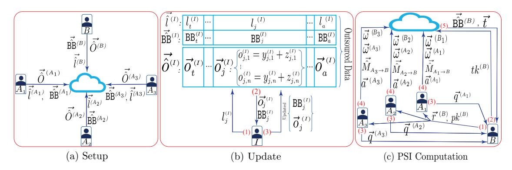
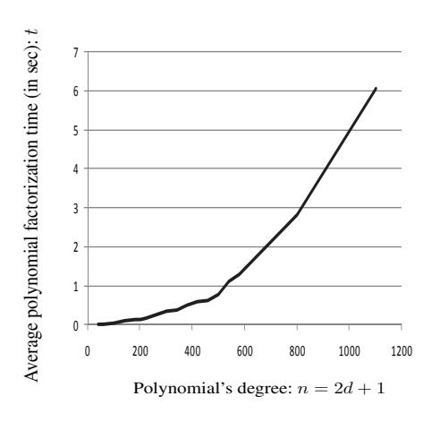
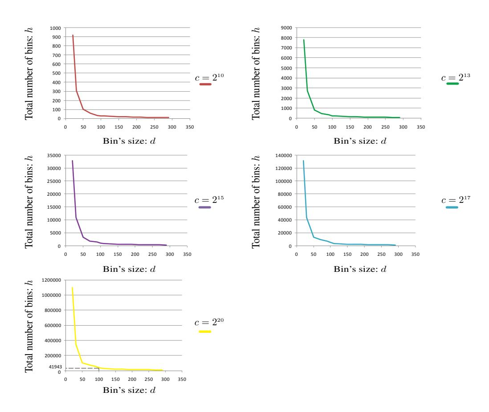
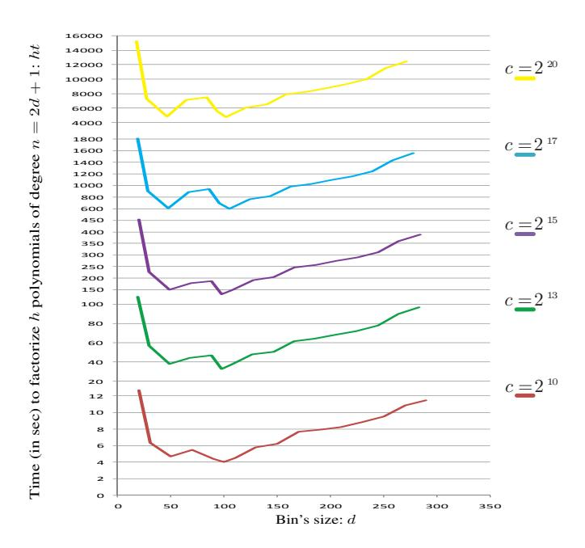
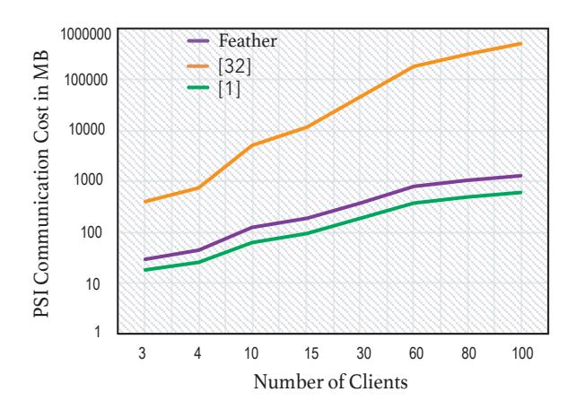
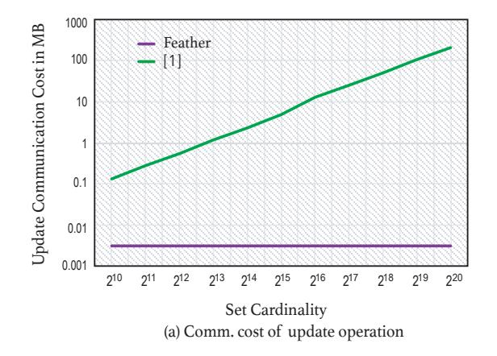
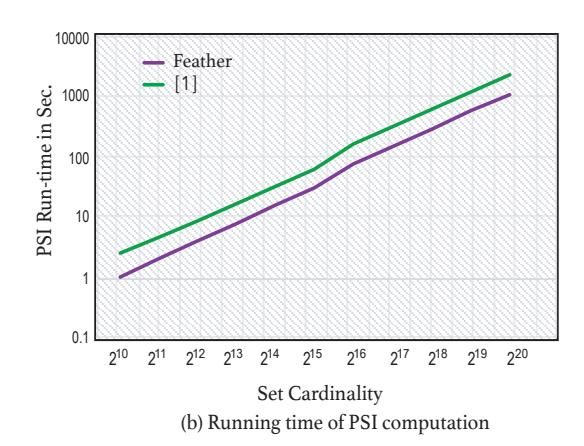
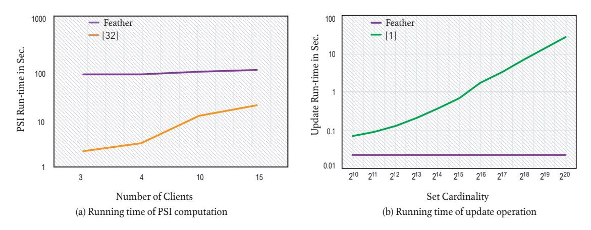

# Feather: Lightweight Multi-party Updatable Delegated Private Set Intersection

Aydin Abadi? , Sotirios Terzis??, and Changyu Dong? ? ?

University of Edinburgh, University of Strathclyde and University of Newcastle

Abstract. With the growth of cloud computing, the need arises for Private Set Intersection (PSI) protocols that can operate on outsourced data and delegate computation to cloud servers. One limitation of existing delegated PSI protocols is that they are all designed for static data and do not allow efficient update on outsourced data. Another limitation is that they cannot efficiently support PSI among multiple clients, which is often needed in practice. This paper presents "Feather", the *first* delegated PSI protocol that supports *efficient data updates and scalable multi-party PSI* computation on outsourced datasets. It lets clients independently prepare and upload their private data to the cloud once, then delegate the computation an unlimited number of times. The update operation has very low communication and computation complexity, and this is achieved without sacrificing PSI efficiency and security. Feather does not use public key cryptography, that makes it more scalable. We have implemented a prototype and compared the concrete performance against the state of the art. The evaluation indicates that Feather does achieve better performance in both update and PSI computation.

## 1 Introduction

Private Set Intersection (PSI) is a cryptographic protocol that allows parties to compute the intersection of their private datasets without revealing anything about the datasets beyond the intersection [16]. Over the years, due to their many potential applications (see [11, 1]), PSI protocols have received a lot of attention in the literature [37, 39, 13, 28, 25, 1]. Traditionally, PSI protocols were designed for parties who have datasets locally to jointly compute the intersection, e.g. [16, 37, 39, 13]. Recently, significant interest has arisen for delegated PSI protocols in which the parties outsource their datasets to a cloud and let the cloud compute the intersection. One reason for this trend is of course because cloud computing has become mainstream. RightScale's survey [15], conducted in 2019 on 786 companies, suggests the cloud adoption has been growing, so is the amount of business investment on it. Public cloud spend is quickly becoming a significant new line item in IT budgets, especially among larger companies. This growing popularity of cloud computing has spurred an interest in PSI protocols that can be delegated to cloud servers and operate on outsourced data, e.g. [28, 25, 1]. Another, perhaps more important reason, is that the cloud can serve as a data hub that facilitates collaborations among its clients and enables large scale data analytics by pooling their data together. Each client may not have enough data to generate meaningful results, but when isolated and partitioned data is connected together, the clients can discover new knowledge that could provide new insights into their business.

However, there are two major limitations to existing delegated PSI protocols. The first is that they are all designed for static datasets and do not allow efficient update of outsourced data. For application areas involving very large private datasets that are frequently updated, like fintech (e.g. stock portfolio valuations or stock market trend analysis [42]), e-commerce (e.g. consumer behaviour prediction [43]), or e-health (e.g. cancer research on genomic datasets1 ), the cost of updating the data with these protocols becomes prohibitive. Hence, there is a need for delegated PSI protocols allowing efficient updates of outsourced private data. Another limitation is that they cannot efficiently scale to multiple clients. Yet, PSI among more than two parties is often needed as it creates opportunities for much richer data sharing than what was possible with two-party PSI. For example, several companies (e.g. a supermarket chain, a consumer product company, an advertiser and third-party data provider) may wish to jointly launch an ad campaign and they want to identify the target audience; or multiple ISPs who have private audit logs want to identify the source of network attacks. While the features are much needed, it is challenging to design protocols with these features because they need to satisfy multiple functionality, security and efficiency constraints.

? aydinabadi@glos.ac.uk

?? sotirios.terzis@strath.ac.uk

? ? ? changyu.dong@newcastle.ac.uk

1 https://www.cancerresearchuk.org/funding-for-researchers/research-features/2020-07-15-the-power-of-genomic-cancer-data

In this paper, we present Feather, the first delegated scalable multi-party PSI protocol. Feather allows clients to securely update their outsourced private datasets efficiently without the need to download the whole dataset. Feather encodes the dataset into a permuted hash table and uses a unique combination of permutation mapping, labels and resettable counters so that one can update the dataset by downloading only one bin of the hash table. Feather also ensures the security of PSI computation, revealing nothing to the cloud and only the intersection to the result recipient. It supports efficient multi-party PSI that utilises outsourced datasets from multiple clients. We started the investigation from the most efficient two-party delegated PSI [1]. The protocol is not scalable in the multi-party setting as the cloud has to perform very high number of polynomial evaluations when the number of clients is high, which leads to a bottleneck. To remove the bottleneck, we let the clients send to the cloud the y-coordinates of random polynomials that they compute locally. This means the cloud does not need to re-evaluate the random polynomials yielding a significant performance improvement at the cloud-side.

Complexity-wise, Feather has *very low* communication and computation costs, i.e. linear with only one bin's size, for the update operation, while keeping PSI computation and communication complexity *linear*. To ensure high practical efficiency, Feather uses *no public key encryption*, and we have incorporated multiple optimisations, e.g. we used a novel data representation that is more compact, we utilised more efficient polynomial evaluation method than previous work and we substituted previous schemes' padding techniques with a more efficient error detecting mechanism. Feather has some other desirable properties, such as clients can independently prepare and upload their data to the cloud, and clients can delegate the computation an unlimited number of times after uploading their data. The Feather security model is formally defined and its security is proven in the standard simulation-based paradigm. We implemented Feather and the performance evaluation shows that updates on large datasets can be over 800 times, and PSI computation 2−2.5 times faster than the fastest delegated PSI protocol. Also, the update communication cost in Feather is O(d), which is much better than the current best delegated PSI in which the cost is linear to the size of the whole dataset.

In the rest of the paper, section 2 surveys related work. Section 3 provides preliminaries and section 4 defines the security model. Section 5 presents a more efficient error detecting mechanism and the design of Feather and its extensions. Section 6 presents Feather's security proof. Section 7 compares Feather to the closest work and provides asymptotic cost analysis, while section 8 provides a concrete cost evaluation. Section 9 concludes the paper and identifies directions for future work.

## 2 Related Work

Since their introduction in [16], many PSI protocols have been designed. PSI protocols can be broadly divided into *traditional* and *delegated* ones. PSI protocols can be designed using a generic circuit-based multi-party computation protocols (usually less efficient) or from scratch using a combination of customised techniques.

In *traditional* PSI protocols like [37, 38, 10, 18, 36], data owners interactively compute the result using their local data. To date, the protocols in [37, 38] are the fastest two-party PSI, where the former uses oblivious transfer and permutation-based hashing and the latter is based on a generic circuit-based multi-party computation, cuckoo hashing, oblivious programmable pseudorandom function. The latter one improves both communication and computation of previous circuit-based PSI protocols. Also, [10, 18] propose PSI protocols that mainly focus on improving the communication cost. The protocol in [10] has very low communication cost only in the case of highly asymmetric set sizes, it utilises a fully homomorphic encryption and batching technique to achieve its goal, while [18] focuses on a variant of PSI, threshold PSI. The protocol is based on additive homomorphic encryption, oblivious linear function evaluation, polynomial arithmetics and intersection cardinality testing technique. Furthermore, [36] proposes a PSI that has a more balance between communication and computation. It is mainly based on a new variant of oblivious transfer and polynomial arithmetics. Since all the above *efficient* PSI protocols support only two parties, researcher extended them to a more generic setting where more than two parties, multi-party, can engage in the protocol, e.g. [32, 21, 22]. The semi-honest PSI protocol in [22] is mainly based on garbled Bloom filter, while the one in [21] uses threshold additive homomorphic encryption (computationally expensive) and polynomial evaluation. In the latter protocol, one can use either El Gamal, or Paillier threshold encryption. To date, the fastest traditional multi-party PSI is [32] that mainly utilises symmetric key primitives, e.g. cuckoo hashing and programmable oblivious pseudorandom function. Nevertheless, as we will discuss later, this protocol has a high communication cost for an average number of clients, e.g. 15, and even its performance gets worse for a (relatively) large number of clients.

Delegated PSI protocols utilise the cloud computing for computation and/or storage. They can be divided further into protocols that support *one-off* and *repeated* delegation of PSI computation. The former like [29, 25, 45] cannot reuse their outsourced encrypted data, and require clients to re-encode their data locally for each intersection computation. The most efficient such protocol is [25], which is based on pseudorandom permutations, however it has been designed (and implemented) only for two-party setting. In contrast, the latter (i.e. repeated PSI delegation ones) allow clients to outsource their encrypted data to the cloud only once, and then with the data owner's consent run any number of PSI's. Consequently, these protocols do not require clients to keep a local copy of the data or to download and re-encode them.

Looking more closely at the *repeated PSI delegation* protocols, the efficient protocol in [34] uses a hash function and symmetric key encryption, while the one in [40] uses public key encryption and hash functions. The protocol in [46] supports also verification and is based on cryptographic accumulators and proxy re-encryption. Nevertheless, [34, 40, 46] are not fully secure and are susceptible to several attacks, as illustrated in [2, 1]. In contrast, the protocols in [2, 3, 44, 1] are secure. The protocols in [2, 3, 44] use public key encryption and represent the entire set as a blinded polynomial outsourced to the cloud. The protocol in [1] is more efficient than [2, 3, 44]. It uses a hash table to improve the performance of PSI computation. Note, all these four protocols have been designed (and implemented) for two-party setting and only support static datasets. Even though, the authors in [2, 3, 1] explain how their two-party protocols can be modified to support multi-party, the extensions are computationally expensive, i.e. impose a bottleneck to the cloud-side, and they do not provide an empirical computation and communication evaluation for their modified protocols. Moreover, in these protocols, in order for parties to securely update their datasets and avoid serious data leakage, they need to re-encode their entire outsourced dataset, thus incurring computation and communication costs linear to the dataset cardinality.

### 3 Preliminaries

#### 3.1 Pseudorandom Functions and Permutation

Informally, a pseudorandom function is a deterministic function that takes a key of length  $\Lambda$  and an input; and outputs a value indistinguishable from that of a truly random function with the same input. In this paper, we use two pseudorandom functions:  $\operatorname{PRF}: \{0,1\}^* \times \{0,1\}^{\Lambda} \to \mathbb{F}_p$  and  $\operatorname{PRF}': \{0,1\}^* \times \{0,1\}^{\Lambda} \to \{0,1\}^{\Psi}$ , where  $|p| = \Omega$  and  $\Lambda, \Psi, \Omega$  are the security parameters. A pseudorandom permutation,  $\pi(k, \overrightarrow{v})$ , is a deterministic function that permutes the elements of vector  $\overrightarrow{v}$ , where  $|\overrightarrow{v}| = m$ , pseudorandomly using a secret key k, and the output vector has the same size, m. A formal definition of a pseudorandom function and permutation can be found in [27]. Fisher-Yates shuffle algorithm [31] can permute a vector of m elements in O(m).

### 3.2 Hash Tables

In this paper, a hash table is utilised for two reasons; to achieve *efficiency* when (a) computing PSI, and (b) updating data. We set the table's parameters appropriately to ensure the number of elements in each bin does not exceed a predefined capacity. Given the maximum number of elements c and the bin's maximum size d, we can determine the number of bins by analysing hash tables under the balls into bins model [5].

**Theorem 1.** (Upper Tail in Chernoff Bounds) Let  $X_i$  be a random variable defined as  $X_i = \sum_{i=1}^c Y_i$ , where  $Pr[Y_i = 1] = p_i$ ,  $Pr[Y_i = 0] = 1 - p_i$ , and all  $Y_i$  are independent. Let the expectation be  $\mu = \mathbb{E}[X_i] = \sum_{i=1}^b p_i$ , then

$$Pr[X_i > d = (1+\sigma) \cdot \mu] < \left(\frac{e^{\sigma}}{(1+\sigma)^{(1+\sigma)}}\right)^{\mu}, \forall \sigma > 0$$

In this model, the expectation is  $\mu = \frac{c}{h}$ , where c is the number of balls and h is the number of bins. The above inequality provides the probability that bin i gets more than  $(1 + \sigma) \cdot \mu$  balls. Since there are h bins, the probability that at least one of them is overloaded is bounded by the union bound:

$$Pr[\exists i, X_i > d] \le \sum_{i=1}^h Pr[X_i > d] = h \cdot \left(\frac{e^{\sigma}}{(1+\sigma)^{(1+\sigma)}}\right)^{\frac{c}{h}} \tag{1}$$

Thus, for a hash table of length h = O(c), there is always an *almost constant* expected number of elements, d, mapped to the same bin with a high probability [35], e.g.  $1 - 2^{-40}$ .

#### 3.3 Horner's Method

Horner's method [14] is an efficient way of evaluating polynomials at a given point, e.g.  $x_0$ . In particular, given a degree-n polynomial of the form:  $\tau(x) = a_0 + a_1x + a_2x^2 + ... + a_nx^n$  and a point:  $x_0$ , one can efficiently evaluate the polynomial at the point iteratively from inside-out, in the following fashion:

$$\tau(x_0) = a_0 + x_0(a_1 + x_0(a_2 + \dots + x_0(a_{n-1} + x_0a_n)\dots)))$$

Evaluating a degree-n polynomial naively requires at most n additions and  $\frac{(n^2+n)}{2}$  multiplications, whereas using Horner's method the evaluation requires only n additions and n multiplications. This method is used throughout the paper and in our prototype implementation.

#### 3.4 Bloom Filter

A Bloom filter [7] is a compact data structure for probabilistic efficient the set membership checking. It is an array of m bits (initially all set to zero), that represents n elements. It is accompanied with k independent hash functions. To insert an element, all the hash values of the element are computed and their corresponding bits in the filter are set to 1. To check an element membership, all its hash values are re-computed and checked whether all are set to one in the filter. If all the corresponding bits are one, then the element is probably in the filter; otherwise, it is not. In Bloom filters false positives are possible, i.e. it is possible that an element is not in the set, but the membership query indicates it is. According to [9], the upper bound of the false positive probability is:  $q = p^k (1 + O(\frac{k}{p} \sqrt{\frac{\ln m - k \ln p}{m}}))$ , where p is the probability that a particular bit in the filter is set to 1 and calculated as:  $p = 1 - (1 - \frac{1}{m})^{kn}$ . The efficiency of a Bloom filter depends on m and k. The lower bound of m is  $n \log_2 e \cdot \log_2 \frac{1}{q}$ , where e is the base of natural logarithms, while the optimal number of hash functions is  $\log_2 \frac{1}{q}$ , when m is optimal. In this paper, we only use optimal k and m. In practice, we would like to have a predefined acceptable upper bound on false positive probability, e.g.  $q = 2^{-40}$ . Thus, given q and n, we can determine the rest of the parameters.

### 3.5 Representing Sets by Polynomials

Freedman  $et\ al.$  in [16] put forth the idea of using a polynomial to represent a set elements and it has been widely used since, e.g. [30, 12, 33]. In this representation, set elements are represented as elements in a finite field  $\mathcal{R} = \mathbb{F}_p$  and the set  $S = \{s_1, ..., s_d\}$  is represented as a polynomial over the field,  $\rho(x) = \prod_{i=1}^d (x - s_i)$ , where  $\rho(x) \in \mathcal{R}[x]$  and  $\mathcal{R}[x]$  is the polynomial ring. As shown in [30, 8], for two sets  $S^{(A)}$  and  $S^{(B)}$  represented by polynomials  $\rho^{(A)}$  and  $\rho^{(B)}$  respectively, polynomial  $\rho^{(A)} \cdot \rho^{(B)}$  represents the set union, also the greatest common divisor  $\gcd(\rho^{(A)}, \rho^{(B)})$  represents the set intersection. For two degree-d polynomials  $\rho^{(A)}$  and  $\rho^{(B)}$ , and two degree-d random polynomials  $\gamma^{(A)}$  and  $\gamma^{(B)}$  whose coefficients are picked uniformly at random from the field, it is proven in [30, 8] that:  $\theta = \gamma^{(A)} \cdot \rho^{(A)} + \gamma^{(B)} \cdot \rho^{(B)} = \mu \cdot \gcd(\rho^{(A)}, \rho^{(B)})$ , where  $\mu$  is a uniformly random polynomial, and polynomial  $\theta$  contains only information about  $S^{(A)} \cap S^{(B)}$  and no information about other elements in  $S^{(A)}$  or  $S^{(B)}$ .

In order to find the intersection, one must extract the roots of polynomial  $\theta$ , and then be able to distinguish between the roots of  $\mu$  and  $gcd(\rho^{(A)},\rho^{(B)})$ , the elements of the intersection. To do so, [30] uses a padding scheme. In this scheme every element  $u_i$  in the set universe  $\mathcal{U}$ , becomes  $s_i=u_i||\mathsf{G}(u_i)$ , where  $\mathsf{G}$  is a cryptographic hash function with sufficiently large output size. Given a field's arbitrary element,  $s\in\mathbb{F}_p$ , and  $\mathsf{G}$ 's output size, we can parse s into a and b, such that s=a||b and  $|b|=|\mathsf{G}(.)|$ . Then, we check  $b\stackrel{?}{=}\mathsf{G}(a)$ . If  $b=\mathsf{G}(a)$ , then s is an element of the intersection; otherwise, it is not. Polynomials can be represented in the point-value form that has already been used in PSI protocols like [2,1]. A degree-d polynomial  $\rho(x)$  can be represented as a set of m (m>d) point-value pairs  $\{(x_1,y_1),...,(x_m,y_m)\}$  such that all  $x_i$  are distinct non-zero values and  $y_i=\rho(x_i)$  for all  $i,1\leq i\leq m$ . If  $x_i$  are fixed, then we can represent polynomials as a vector  $\overrightarrow{y}=[y_1,...,y_m]$ . A polynomial in this form can be converted into coefficient form by polynomial interpolation, e.g. using improved Lagrange formula [4,6] whose complexity is O(d). Furthermore, we can add or multiply two polynomials, in point-value form, by adding or multiplying their corresponding y-coordinates.

#### 3.6 Notations

We summarise our notations used in Feather's protocols in Table 1.

| Setting | Symbol                                                            | *                                                            | Setting         | Symbol                                                    | Description                                                               |  |  |  |  |
|---------|-------------------------------------------------------------------|--------------------------------------------------------------|-----------------|-----------------------------------------------------------|---------------------------------------------------------------------------|--|--|--|--|
|         | c                                                                 | Set cardinality upper bound                                  | عد              | pk                                                        | $\pi$ key used to permute a vector                                        |  |  |  |  |
|         | h                                                                 | The total number of bins                                     | Generic         | lk, k                                                     | PRF keys used to gen. labels, and blind $y$ 's                            |  |  |  |  |
|         | d                                                                 | A bin's capacity                                             |                 |                                                           | Element s is inserted to X                                                |  |  |  |  |
|         | n                                                                 | n = 2d + 1                                                   | Setup           | $S^{(I)}$                                                 | Client I's set                                                            |  |  |  |  |
|         | $e^{(I)}$                                                         | Value $e$ belongs to client $I$                              |                 | h .                                                       | B i 's most recent blinding factor                             |  |  |  |  |
|         | $\mathtt{HT}_j$                                                   | j-th bin of hash table: HT                                   | Update          | $B_i'$                                                    | Updated Bloom filter                                                      |  |  |  |  |
| ر ا  | $\mathtt{B}_{j}$                                                  | Bloom filter allocated to $\mathtt{HT}_j$                    | Ore             | $\vec{\vec{u}}_i$                                         | (Updated) y-coordinates of HT i                                |  |  |  |  |
| ieri    | $\mathtt{BB}_j$                                                   | Blinded $B_j$                                                |                 | J                                                         | Client $A_{\sigma}$ <i>g</i> -th bin in the permuted hash table           |  |  |  |  |
| Generic | $z_{j,i}$                                                         | The most recent $i$ -th PR value assigned to $\mathtt{HT}_j$ |                 | $\overrightarrow{t}$                                      | Cloud result, vector of combined bins                                     |  |  |  |  |
|         | $l_{\underline{j}}$                                               | PR label of $HT_j$                                           | utio            | $\overrightarrow{\hat{M}}_{{\scriptscriptstyle{A\to B}}}$ | <u>'</u>                                                                  |  |  |  |  |
|         | $\hat{\bm{v}}$                                                    | After (elements of) $\vec{v}$ is permuted                    | uta             | $IVI_{A \rightarrow B}$                                   | Permuted mapping vector                                                   |  |  |  |  |
|         | $\overrightarrow{\hat{o}}^{(I)}$                                  | Client I outsourced blinded y-coordinates                    | du              | $m_g$                                                     | An element of $\hat{\boldsymbol{M}}_{\scriptscriptstyle A \rightarrow B}$ |  |  |  |  |
|         | $\vec{\hat{o}}^{(I)}$ $\vec{\hat{o}}^{(I)}$ $\vec{\hat{l}}^{(I)}$ | Client I outsourced labels                                   | PSI Computation | $r_{g,i}^{(B)}$                                           | Masked blinding factor                                                    |  |  |  |  |
|         | $\overrightarrow{BB}^{(I)}$                                       | Client I outsourced blinded B i 's                | ISc             | $\omega_g$                                                | Random polynomial                                                         |  |  |  |  |
|         | ₹                                                                 | A vector of resettable counters: $c_i$                       | ~               | $\overrightarrow{\bm{q}}^{(A)}$                           | A vector of blinding factor removers: $q_{e,i}^{(A)}$                     |  |  |  |  |
|         | bk                                                                | PRF' key used to blind $B_j$ 's                              |                 | $\overrightarrow{f_e}$                                    | An unblinded combined bin                                                 |  |  |  |  |

Table 1: Notation table.

### 4 Security Definition

In this section, we provide the security definition for our protocol. Similar to the majority of previous PSI's, we consider the semi-honest model. In particular, we consider a static semi-honest adversary who controls one of the parties at a time, i.e. non-colluding semi-honest adversaries [19, 24]. For the sake of simplicity, we consider three kinds of party, cloud C and clients  $A_{\sigma} \in \{A_1, ..., A_{\varepsilon}\}$ , and B engage in the protocol, where each  $A_{\sigma}$  authorizes the computation and client B is interested in the result. We assume parties use a secure communication channel. Similar to the security model of searchable encryption [26], in our security model we allow some information, i.e. query and access patterns, to be leaked to the cloud. This is an inevitable tradeoff if we want to retain efficiency, because to hide those patterns we would have to use primitives such as ORAM [41], which would make the protocol inefficient. Informally, we say the protocol is secure as long as the cloud does not learn anything about the computation inputs and output beyond the allowed leakage and clients do not learn anything beyond the intersection about the other clients' set elements. The leakage includes query and access patterns. The protocol involves two types of operations: dataset update: Upd, and delegated PSI computation: D-PSI.

Query Pattern. Intuitively, in the protocol clients need to explicitly ask the cloud for a certain operation it wants to perform on its outsourced data. Therefore, the cloud learns, whether the client's  $i^{th}$  query is for update or PSI computation. In other words, the query pattern includes a list of clients' queries, that includes update and PSI computation queriers, sent to the cloud. Formally, we define the query pattern  $\overrightarrow{T}$  as a vector of strings where every element of the vector is defined as  $T_i \in \{\mathsf{Upd}_t^{(I)}, \mathsf{PSI-Com}\}$ , where  $1 \le t \le \beta$ , and value  $\beta$  is the total number of update queries issued by each client  $I \in \{A_1, ..., A_\xi, B\}$ . Also,  $|\overrightarrow{T}| = poly(\lambda) = \Upsilon$ , where  $\lambda$  is a security parameter.

Access Pattern. The access pattern is more complex. In our protocol, a dataset is encoded as a hash table and each bin of the hash table is tagged with a unique deterministic label, in a form of pseudorandom binary string of length l, where l is a security parameter. Without loss of generality, we assume in each update query only one element is inserted/removed to/from the set. Each update query always involves the client sending a label to the cloud, receiving the bin (tagged with the label), and then rewriting the contents of the bin. Thus, in the update process the cloud can see what part of the outsourced data is updated. But, it cannot associate that part with the sets elements. In particular, given a sequence of client's queries, the cloud can see that a bin is updated but it does not learn the original address of the bin because the bins are pseudorandomly permuted. Also, it cannot figure out whether the update is an insertion or a deletion.

**Definition 1.** (Access Pattern) Let  $\operatorname{HT}^{(I)}$  be client I's hash table containing h bins where each bin,  $\operatorname{HT}_i^{(I)}$ , is tagged with a unique label  $l_i^{(I)}$ . Also, let  $\overrightarrow{o}'^{(I)} = \pi(k^{(I)}, \overrightarrow{o}^{(I)})$  be shuffled data, where  $k^{(I)}$  is a secret key and

 $\vec{\sigma}^{(I)} = [(\operatorname{HT}_1^{(I)}, l_1^{(I)}), ..., (\operatorname{HT}_h^{(I)}, l_h^{(I)})].$  The access pattern, for the shuffled data, induced by  $\beta$ -update queries is a symmetric binary matrix  $\mathcal{M}^{(I)}$  such that for  $1 \leq i, j \leq \beta$ , the element in the  $i^{th}$  row and  $j^{th}$  column is  $1, \mathcal{M}_{i,j}^{(I)} = 1$ , if the  $i^{th}$  query equals  $j^{th}$  query (i.e. both queries have the same label) and 0 otherwise (where  $I \in \{A_1, ..., A_{\varepsilon}, B\}$ ).

The multi-party delegated PSI protocol, D-PSI, computes a function that maps the inputs to some outputs. We define this function as:

$$F: \bot \times \underbrace{2^{u} \times ... \times 2^{u}}_{f+1} \to \bot \times ... \times \bot \times f_{\cap}$$

where  $\bot$  denotes the empty string,  $2^{\mathcal{U}}$  denotes the powerset of the set universe and  $f_{\cap}$  denotes the set intersection function. For inputs  $\bot$ ,  $S^{(A_1)}$ , ...,  $S^{(A_{\ell})}$  and  $S^{(B)}$  belonging to C,  $A_1$ , ...,  $A_{\xi}$  and B respectively, the function outputs nothing to C,  $A_1$ , ...,  $A_{\xi}$ , but outputs  $f_{\cap}(S^{(A_1)}, ..., S^{(A_{\ell})}, S^{(B)}) = S^{(A_1)} \cap ... \cap S^{(A_{\ell})} \cap S^{(B)}$  to B. Note, for PSI computation we do not have any data leakage. In the security model, we define the leakage function as leak( $\overrightarrow{o}'^{(I)}$ ,  $\overrightarrow{upd}^{(I)}$ ) =  $[\mathcal{M}^{(I)}, \overrightarrow{T}]$  that captures precisely what is being leaked by the update operation. The function takes as input clients' outsourced data, and  $\beta$  update queries. It outputs two different types of information; namely, the access pattern (i.e. the matrix) and the query pattern of the clients.

We say the protocol is secure if (1) nothing beyond the leakage is revealed to the cloud; (2) whatever can be computed by a client in the protocol can be obtained from its input and output only. This is formalized by the simulation paradigm. We require a client's view during an execution of D-PSI to be simulatable given its input and output. As one client's update pattern is not leaked to the other client, the scheme is secure as long as the PSI computation result does not leak any information to the client. Also, we require that the cloud's view of the both operations, i.e. Feather = (Upd, D-PSI), can be simulated given the leakage. The party I's view on input tuple (x,y,z) is denoted by  $VIEW_I^t(x,y,z)$ , and equals  $(w,r^{(i)},m_1^{(i)},...,m_g^{(i)})$ , where if  $I\in\{A_1,...,A_\xi,B\}$ , then  $\mathbf{t}$ : D-PSI, if I=C, then  $\mathbf{t}$ : Feather,  $w\in(x,y,z)$  is the input of I,  $r^{(i)}$  is the outcome of  $i^{th}$  internal coin tosses and  $m_i^{(i)}$  is the  $j^{th}$  message it received.

**Definition 2.** Let  $\mathbf{S} = \{S^{(A_1)}, ..., S^{(A_{\ell})}\}$  and also Feather = (Upd, D-PSI) be the scheme defined above. We say that Feather is secure at the client-side in the presence of static semi-honest adversaries if there exist probabilistic polynomial-time algorithms  $\mathrm{SIM}_{A_{\sigma}}$  and  $\mathrm{SIM}_{B}$  that given the input and output of a client, can simulate a view that is computationally indistinguishable from the client's view in the protocol:

$$\begin{split} \left\{ \mathit{SIM}_{A_{\boldsymbol{\sigma}}} \big(S^{(A_{\boldsymbol{\sigma}})}, \bot \big) \right\}_{\mathbf{S}, S^{(B)}} &\stackrel{c}{\equiv} \left\{ \mathit{VIEW}_{A_{\boldsymbol{\sigma}}}^{\mathit{D-PSI}} \big(\bot, \mathbf{S}, S^{(B)} \big) \right\}_{\mathbf{S}, S^{(B)}} \\ \left\{ \mathit{SIM}_{B} \big(S^{(B)}, f_{\cap} \big(\mathbf{S}, S^{(B)} \big) \big) \right\}_{\mathbf{S}, S^{(B)}} &\stackrel{c}{\equiv} \left\{ \mathit{VIEW}_{B}^{\mathit{D-PSI}} \big(\bot, \mathbf{S}, S^{(B)} \big) \right\}_{\mathbf{S}, S^{(B)}}, \end{split}$$

where D-PSI was defined above and  $A_{\sigma} \in \{A_1, ..., A_{\xi}\}$ . Also, Feather is secure, at the cloud-side, in the presence of static semi-honest adversaries if there exists probabilistic polynomial-time algorithm SIMC that given the leakage function, can simulate a view that is computationally indistinguishable from the cloud's view in the protocol:

$$\{\mathit{SIM}^{\mathit{leak}()}_{C}(\bot,\bot)\}_{\mathbf{S},S^{(B)}} \stackrel{c}{\equiv} \{\mathit{VIEW}^{\mathit{Feather}}_{C}(\bot,\mathbf{S},S^{(B)})\}_{\mathbf{S},S^{(B)}}$$

## 5 Feather: Lightweight Multi-party Updatable Delegated PSI

In this section, we first provide a technique that further reduces the cost of Feather. Then, we provide Feather's three protocols: setup, update and PSI computation, followed by Feather's extensions. Fig. 1 outlines parties' interaction in Feather' protocols.

### 5.1 More Efficient Error Detecting Technique

As described in section 3.5, each set element is padded to allow the result recipient to identify actual set elements, this was used in many previous work, e.g. [3, 2, 1, 30]. A closer look reveals that the minimum bit-size of the padding is t+c (due to the union bound), where  $2^t$  is the total number of roots and  $2^{-c}$  is the maximum probability that at least one invalid root has a set element structure, e.g.  $c \ge 40$ . So, this padding scheme increases element size, and requires a larger field. This has a considerable effect on the performance

Fig. 1: Interaction between parties in Feather protocols

of (all arithmetic operations in the field and) polynomial factorisation whose complexity is bounded by the polynomial's degree and the logarithm of the number of elements in the field, i.e.  $O(n^a \log_2 2^{|p|})$  or  $O(n^a|p|)$ , where  $1 < a \le 2$ , n is polynomial's degree and |p| is the field bit size [17]. We observed that to improve efficiency, the padding scheme can be replaced by Bloom filters. At a high-level, each client generates a Bloom filter that encodes all its set elements, blinds and then sends the blinded Bloom filter (BBF) along with other data to the cloud. For PSI computation, the result recipient gets the result along with its own BBF. After it extracts the result, i.e. polynomials' roots, it checks if the roots are already in the Bloom filter and only accepts those in it. The use of BBF reduces an element size and requires a smaller field which improves the performance of all arithmetic operations in the field. Here, we highlight only the improvement in the factorisation performance, as it dominates the protocol's cost. After the modification, the factorisation complexity is reduced from  $O(n^a(|p|+t+c))$  to  $O(n^a|p|)$ . For instance, for a set of e elements,  $e \in [2^{10}, 2^{20}]$ , and the error probability  $2^{-40}$ , we get a factor of 1.5 - 2.5 lower run-time, when  $|p| \in [40, 100]$ . In general, this improvement is at least a factor of 2, when  $|p| \le t + c$ . The smaller element and field size also reduces the communication and cloud-side storage costs. This technique can also be used in [1], to improve its overall efficiency by almost the same margin.

## **5.2** Feather Setup Protocol

At this phase, each client constructs a hash table whose parameters are published by the cloud. Then, it maps its set elements into the hash table bins and represents each bin elements as a blinded polynomial. It assigns a Bloom filter to each bin such that a bin's Bloom filter encodes the bin set elements. It then blinds each filter. The client assigns a unique label to each bin. It pseudorandomly permutes the bins (containing the blinded polynomials), blinded Bloom filters, and labels. The client retains the label-to-bin mapping and the permutation. Next, it sends the permuted: bins, Bloom filters and labels to the cloud. Specifically, the setup protocol is as follows.

**Cloud Setup:** Sets c as an upper bound of sets' size, and sets a hash table's parameters, i.e. table length: h, hash function: H and bin's capacity: d. It picks pseudorandom functions PRF and PRF', and a pseudorandom permutation:  $\pi$ . It also chooses a vector  $\vec{x} = [x_1, ..., x_n]$  of n = 2d + 1 distinct non-zero values. It publishes the parameters.

**Client Setup:** Let client  $I \in \{A_1, ... A_{\varepsilon}, B\}$  have set:  $S^{(l)}, |S^{(l)}| < c$ . Each client I:

- 1. Gen. a hash table and Bloom filters: Builds a hash table  $\operatorname{HT}^{(l)}$  and inserts its elements into it.  $\forall s_i^{(l)} \in S^{(l)}$ :  $\operatorname{H}(s_i^{(l)}) = j$ , then  $s_i^{(l)} \to \operatorname{HT}_j^{(l)}$ . It pads every bin with random elements to d elements (if needed). Then, for every j-th bin, it generates a polynomial representing the bin's elements:  $\prod_{l=1}^d (x e_l^{(l)})$ , and evaluates each polynomial at every element  $x_i \in \vec{x}$ , where  $e_l^{(l)}$  is either a set element or a dummy value. This yields a vector of n y-coordinates:  $y_{j,i}^{(l)} = \prod_{l=1}^d (x_i e_l^{(l)})$ , for that bin. It allocates a Bloom filter:  $\operatorname{BF}_j^{(l)}$  to bin  $\operatorname{HT}_j^{(l)}$ , and inserts only the set elements of the bin in the filter.  $\forall s_i^{(l)}, s_i^{(l)} \in S^{(l)}$  and  $s_i^{(l)} \in \operatorname{HT}_j^{(l)} : s_i^{(l)} \to B_j^{(l)}$ .
- 2. Blind Bloom filters: Blinds every Bloom filter, by picking a secret key:  $bk^{(i)}$ , extracting h pseudorandom values and using each value to blind each Bloom filter. In particular,  $\forall j, 1 \leq j \leq h$ :  $\mathtt{BB}_i^{(i)} = \mathtt{B}_i^{(i)} \oplus$

 $PRF'(bk^{(i)}, j)$ , where  $\oplus$  denotes XOR operator. Thus, a vector of blinded Bloom filters is computed:  $\overrightarrow{BB}^{(i)} = [BB_1^{(i)}, ..., BB_h^{(i)}]$ 

- 3. Blind bins: To blind every  $y_{j,i}^{(l)}$ , it assigns a key to each bin by picking a master secret key  $k^{(l)}$ , and generating h pseudorandom keys:  $\forall j, 1 \leq j \leq h$ :  $k_j^{(l)} = \text{PRF}(k^{(l)}, j)$ . Next, it uses each  $k_j^{(l)}$  to generate n pseudorandom values  $z_{j,i}^{(l)} = \text{PRF}(k_j^{(l)}, i)$ . Then, for each bin, it computes n blinded y-coordinates as follows.  $\forall i, 1 \leq i \leq n : o_{j,i}^{(l)} = y_{j,i}^{(l)} + z_{j,i}^{(l)}$ . So, d elements in each  $\text{HT}_j^{(l)}$  are represented as  $\overrightarrow{o}_j^{(l)} : [o_{j,1}^{(l)}, \ldots, o_{j,n}^{(l)}]$
- 4. *Gen. labels:* Assigns a pseudorandom label to each bin, by picking a fresh secret key:  $lk^{(l)}$  and then computing h values.  $\forall j, 1 \leq j \leq h : l_i^{(l)} = \mathtt{PRF}(lk^{(l)}, j)$ .
- 5. Shuffle: Pseudorandomly permutes the labeled hash table, by choosing a fresh secret key:  $pk^{(l)}$  for  $\pi$ , and then carrying out:  $\vec{o}^{(l)} = \pi(pk^{(l)}, \vec{o}^{(l)}), \vec{l}^{(l)} = \pi(pk^{(l)}, \vec{l}^{(l)}),$  where  $\vec{o}^{(l)} = [\vec{o}_1^{(l)}, ..., \vec{o}_h^{(l)}]$  and  $\vec{l}^{(l)}$  contains the labels generated in step 4. Also, it pseudorandomly permutes  $\vec{B}\vec{B}^{(l)}$  as:  $\vec{B}\vec{B}^{(l)} = \pi(pk^{(l)}, \vec{B}\vec{B}^{(l)})$
- 6. *Gen. resettable counters:* Builds and maintains a vector:  $\vec{c}^{(i)}$  of (small sized) counters  $c_i^{(i)}$  initially set to zero, where each counter  $c_i^{(i)}$  keeps track of the number of times a bin  $\mathrm{HT}_i^{(i)}$  in the outsourced hash table is retrieved by the client for an update. The counters allow the client to efficiently regenerate the most recent blinding factors.

**Outsourcing:** every client  $I \in \{A_1, ...A_{\xi}, B\}$  sends the permuted labeled hash table:  $(\hat{\boldsymbol{o}}^{(l)}, \hat{\boldsymbol{l}}^{(l)})$  along with the permuted blinded Bloom filters:  $\mathring{\mathrm{BB}}^{(l)}$  to the cloud. Each client can delete their local dataset (including the hash table) after that.

## 5.3 Feather Update Protocol

For client I to insert/delete an element,  $s^{(i)}$ , to/from its outsourced dataset, it asks the cloud to send to it a bin and its corresponding blinded Bloom filter. To do that, it first determines to which bin the element belongs. It recomputes the bin label, sends the label to the cloud who sends the bin (tagged with that label) and related blinded Bloom filter to it. Given the bin, the client uses the counter and a secret key to remove the most recent blinding factors from the bin content, applies the update, re-encodes the bin and filter and refreshes their blinding factors. It sends the updated bin and filter to the cloud.

The efficiency of Feather update protocol stems from three pivotal factors: (a) the ability of a client to (securely) access and update only one bin of its outsourced hash table, that leads to very low complexities, (b) the use of an efficient error detecting technique (explained in section 5.1) that yields a factor of 1.5-2.5 further (communication and computation) cost reduction, and (c) the use of the local counters that yields client-side storage cost reduction. In the following, we provide the update protocol in detail.

- 1. *Fetch a bin and its Bloom filter:* Recomputes the label for the bin to which element  $s^{(i)}$  belongs, by generating the bin's index:  $H(s^{(i)}) = j$ , and computing the label:  $l_j^{(i)} = PRF(lk^{(i)}, j)$ . It sends  $l_j^{(i)}$  to the cloud who sends back the bin:  $\overrightarrow{\sigma}_i^{(i)}$ , and the blinded Bloom filter:  $BB_i^{(i)}$
- 2. *Unblind*: Removes the blinding factors from  $\vec{o}_{j}^{(l)}$  and  $BB_{j}^{(l)}$  as follows.
  - a. **Regen. blinding factors:** To regenerate the blinding factors of the bin and its Bloom filter, it first regenerates the key for that bin, as  $k_j^{(l)} = PRF(k^{(l)}, j)$ . Then, it uses  $k_j^{(l)}$ ,  $bk^{(l)}$ , and  $c_j^{(l)}$  to regenerate the bin's masks:
    - If the bin has never been fetched, i.e.  $c_j^{(l)}=0$ , then  $b_j^{(l)}=\mathrm{PRF}'(bk^{(l)},j)$  and  $\forall i,1\leq i\leq n: z_{j,i}^{(l)}=\mathrm{PRF}(k_j^{(l)},i)$
    - Otherwise, i.e.  $c_i^{(l)} \neq 0$ , computes:

$$b_i^{(l)} = \text{PRF}'(\text{PRF}'(bk^{(l)}, j), c_i^{(l)})$$
 and  $\forall i, 1 \leq i \leq n : z_{i,i}^{(l)} = \text{PRF}(\text{PRF}(k_i^{(l)}, c_i^{(l)}), i)$ 

b. Unblind: Removes the blinding factors from the bin and its blinded Bloom filter, as follows.

$$\begin{split} \mathbf{B}_{j}^{\!\!\!(l)} &= \mathbf{B} \mathbf{B}_{j}^{\!\!\!(l)} \oplus b_{j}^{\!\!\!(l)} \\ \forall i, 1 \leq i \leq n : y_{\scriptscriptstyle j,i}^{\!\!\!(l)} = o_{\scriptscriptstyle j,i}^{\!\!\!(l)} - z_{\scriptscriptstyle j,i}^{\!\!\!(l)} \end{split}$$

The result is a Bloom filter:  $\mathbf{B}_{j}^{(l)}$  and a vector:  $\overrightarrow{\boldsymbol{y}}_{j}^{(l)} = \{y_{j,1}^{(l)},...,y_{j,n}^{(l)}\}$ 

- 3. *Update the counter:* Increments the corresponding counter by one:  $c_i^{(l)} = c_i^{(l)} + 1$ .
- 4. Update the bin's content:
  - If update: element insertion

- \* if the element, to be inserted, is not in the bin's Bloom filter, i.e.  $s^{(l)} \notin B_i^{(l)}$ , then it uses the n pairs of  $(y_{i,i}^{(j)}, x_i)$  to interpolate a polynomial:  $\psi_j(x)$  and considers valid roots of  $\psi_j(x)$  as the set elements in that bin. Then, it constructs a polynomial:  $\prod_{m=0}^{d} (x - s_m^{\prime(l)})$ , where its roots,  $s_m^{\prime(l)}$ , consist of valid roots of  $\psi_j(x)$ ,  $s^{(l)}$ , and some random elements to pad the bin. After that, it evaluates the polynomial at every  $x_i \in \overrightarrow{\boldsymbol{x}}$ , i.e.  $u_{j,i}^{(l)} = \prod_{j=1}^d (x_i - s_m^{(l)})$ . This yields  $\overrightarrow{\boldsymbol{u}}_j^{(l)} = [u_{j,1}^{(l)}, ..., u_{j,n}^{(l)}]$ . It discards  $\mathbf{B}_j^{(l)}$  and builds a fresh one:  $B_j^{(l)}$  encoding  $\overset{m=1}{s^{(l)}}$  and valid roots of  $\psi_j(x)$ . \* otherwise, i.e. if  $s^{(l)} \in B_j^{(l)}$ , it sets  $\overrightarrow{\boldsymbol{u}}_j^{(l)} = \overrightarrow{\boldsymbol{y}}_j^{(l)}$  and  $B_j^{(l)} = B_j^{(l)}$ , where  $\overrightarrow{\boldsymbol{y}}_j^{(l)}$  and  $B_j^{(l)}$  were computed in step
- 2.b. Note, in this case the element already exists in the set, so no element insertion is required.
- If update: element deletion
  - \* if the element, to be deleted, is not in the bin's Bloom filter, i.e.  $s^{(l)} \notin B_s^{(l)}$ , then it sets  $\vec{u}_s^{(l)} = \vec{y}_s^{(l)}$  and  $B_{s}^{(l)} = B_{s}^{(l)}$ , where  $\vec{y}_{s}^{(l)}$  and  $B_{s}^{(l)}$  were computed in step 2.b. It means the element does not exist in the set, so no deletion is needed.
  - \* otherwise, if  $s^{(l)} \in \mathbb{B}_{i}^{(l)}$ , it uses pairs  $(y_{i,i}^{(l)}, x_i)$  to interpolate a polynomial:  $\psi_j(x)$ . It constructs a polynomial:  $\prod_{m=0}^{d} (x-s_{m}^{\prime(l)})$ , where its roots,  $s_{m}^{\prime(l)}$ , comprise valid roots of  $\psi_{j}(x)$ , excluding  $s^{(l)}$ , and some random elements to pad the bin (if required). Then, it evaluates the polynomial at every  $x_i \in \vec{x}$ , i.e.  $u_{j,i}^{(l)} = \prod_{m=1}^d (x_i - s_m^{(l)})$ . This yields  $\vec{u}_j^{(l)} = [u_{j,1}^{(l)}, ..., u_{j,n}^{(l)}]$ . Also, it discards  $B_j^{(l)}$  and builds a fresh one:  $B_i^{\prime (l)}$  that encodes valid roots of  $\psi_i(x)$  excluding  $s^{(l)}$ .
- 5. **Blind**: Blinds the updated bin:  $\vec{u}_{i}^{(l)}$  and Bloom filter:  $B_{i}^{(l)}$  as follows
  - a. generates fresh blinding factors:

$$b_{j}^{\scriptscriptstyle (l)} = \mathtt{PRF'}(\mathtt{PRF'}(bk^{\scriptscriptstyle (l)},j),c_{j}^{\scriptscriptstyle (l)}) \ \forall i,1 \leq i \leq n: z_{j,i}^{\scriptscriptstyle (l)} = \mathtt{PRF}(\mathtt{PRF}(k_{j}^{\scriptscriptstyle (l)},c_{j}^{\scriptscriptstyle (l)}),i)$$

b. blinds the bin's content and Bloom filter, using the fresh blinding factors.

$$BB_{j}^{(l)} = B_{j}^{(l)} \oplus b_{j}^{(l)}$$
 and  $\forall i, 1 \leq i \leq n : o_{j,i}^{(l)} = u_{j,i}^{(l)} + z_{j,i}^{(l)}$ 

 $\mathsf{BB}_j^{(l)} = \mathsf{B}_j^{(l)} \oplus b_j^{(l)} \quad \text{and} \quad \forall i, 1 \leq i \leq n : o_{j,i}^{(l)} = u_{j,i}^{(l)} + z_{j,i}^{(l)}$  6. Send an update query: Sends  $\overrightarrow{o}_j^{(l)} = [o_{j,1}^{(l)}, ..., o_{j,n}^{(l)}], \mathsf{BB}_j^{(l)}, \mathsf{and}\ l_j^{(l)}$  along with an "Update" message to the cloud who replaces the bin contents and its blinded Bloom filter with the new ones.

Remark 1. Recall, in Feather access pattern means the cloud can see how many times a certain bin is accessed by a client in the update phase. But, this is the only information it can learn from it. The reason is that the client (in setup) sends to the cloud pseudorandomly permuted bins. This prevents the cloud from learning which set element is updated, when a bin is accessed, as it does not know the bin's original index. Also, each bin is tagged with a pseudorandom label, which means the label does not leak any information about the bin's index either. Furthermore, since every time a client fetches a bin, it refreshes its blinding factors (and pads it if needed), the cloud cannot learn if the update is insertion or deletion. Thus, the access pattern itself leaks nothing about set elements to the cloud. There is a different research line focuses on symmetric searchable encryption (SSE) schemes [26, 20] that allow a client to outsource the storage of its private document to a server in a private manner, while maintaining the ability to selectively search over it. In these schemes, to achieve efficiency, an access pattern is allowed to be leaked to the server, where at a high level the access pattern is an encryption of the document keywords encrypted via a deterministic encryption scheme. Researchers have shown given some background knowledge on keywords' distribution of the underlying document (e.g. knowing the popularity of certain words in a text), the adversary who obverse the access pattern long enough can learn some private keywords of the document [23]. However, unlike SSE schemes, in Feather the access pattern is the index of a bin in the permuted hash table and no deterministic encryption scheme is used. That means such attacks cannot be mounted on Feather. In Feather, if the server (a) for a long time observers that a certain bin is accessed more often than the rest of the bins, and (b) has sufficient background knowledge (e.g. a certain client has a specific set containing an element that is more interesting to it and is inserted/deleted more often than the rest of elements of the set) then it can figure out the bin's original index. In other words, for the server to learn a bin's original index, it has to have adequate background knowledge of the set and needs to be able to correlate that background knowledge to the access pattern. Knowing that information will only let the server infer that one of the elements that can be mapped to that bin is being updated, when the client accesses that bin for an update. Even in this case, it cannot tell which element exactly it is and if the update is deletion or insertion. We emphasize that Feather's PSI computation does *not leak anything*.

Remark 2. In Feather, if multiple elements are updated at once, then multiple bins need to be accessed by a client (with a certain probability). This means the efficiency gap between Feather and the fasted delegated PSI [1] in update phase will reduce depending on the number of bins retrieved. To alleviate it, the client can use the lazy update technique, in the sense that it waits and buffers enough elements locally until some of them end up in the same bin. Then, it fetches the related bins and updates them. In this case, the client retrieves a lower number of bins and has less computation and communication overheads than the naive scheme where it updates the elements immediately. In general, when m elements are supposed to be updated in one go, the probability that a certain bin will receive less than a certain number of elements, say d', can be calculated via the lower tail in Chernoff bounds:  $Pr[X_i < d' = (1-\sigma) \cdot \mu] < \left(\frac{e^{-\sigma}}{(1-\sigma)^{(1-\sigma)}}\right)^{\mu}$ , where  $\sigma \in (0,1]$  and  $\mu = \frac{m}{h}$ . The rest of the parameters are the same as those defined in Section 3.2

#### 5.4 Feather PSI Protocol

To let the cloud compute PSI correctly, clients need to tell it how to combine the bins of their hash tables, each of which permuted using a different key, without revealing the bins' original order to the cloud. Also, as the blinding factors of some of the bins get refreshed (when updated), each client needs to efficiently regenerate the most recent ones in PSI delegation and update phases. To address those issues, we use two novel techniques; permutation mapping, and resettable counter, respectively. Now we explain, at a highlevel, how the clients delegate the computation to the cloud. When client B wants the intersection of its set and clients  $A_{\sigma} \in \{A_1, ..., A_{\xi}\}$  sets, it sends a message to each client  $A_{\sigma}$  to obtain its permission. If client  $A_{\sigma}$  agrees, it generates two sets of messages, with the help of the counter, one for client B and one for the cloud. It sends unblinding vectors to client B, and a message including a permutation map to the cloud. The vectors help client B to unblind the cloud's response. The map lets the cloud associate client  $A_{\sigma}$ bins to client B bins. The cloud uses clients  $A_{\sigma}$  messages and the outsourced datasets to compute the result that contains a set of blinded polynomials. It sends them to client B who unblinds them and retrieves the intersection. In the following, we provide the PSI computation's protocol in more detail.

- 1. **Computation Delegation:** Initiated by B interested in the intersection.
- a. Gen. a permission query: Client B performs as follows.
  - i. Regen. blinding factors: regenerates the most recent blinding factors:  $\vec{z}^{(B)} = [\vec{z}_1^{(B)}, ..., \vec{z}_h^{(B)}]$ . Then, it pseudorandomly shuffles the vector:  $\pi(pk^{\scriptscriptstyle (B)}, \vec{z}^{\scriptscriptstyle (B)})$ .
  - ii. Mask blinding factors: to mask the shuffled vector, it picks a fresh temporary key:  $tk^{(B)}$ , uses it to allocate a key to each bin,  $\forall g, 1 \leq g \leq h : tk_g^{(B)} = PRF(tk^{(B)}, g)$ . Then, using each key, it generates fresh pseudorandom values and utilises them to blind the vector's elements.

$$\forall g, 1 \leq g \leq h, \ \forall i, 1 \leq i \leq n : r_{q,i}^{^{(B)}} = z_{q,i}^{^{(B)}} + \mathtt{PRF}(tk_q^{^{(B)}},i)$$

Let  $\overrightarrow{r}_g^{(B)} = [r_{g,1}^{(B)},...,r_{g,n}^{(B)}]$ . Note,  $\overrightarrow{z}_a^{(B)}$  at index a  $(1 \leq a \leq h)$  in  $\overrightarrow{z}^{(B)}$  moved to index g after it was shuffled in the previous step.

- iii. Send off secret values: sends  $lk^{(B)}$ ,  $pk^{(B)}$ ,  $\vec{r}^{(B)}$  =  $[\vec{r}_1^{(B)}, ..., \vec{r}_b^{(B)}]$ , and its id:  $lD^{(B)}$ , to every client  $A_{\sigma}$ . Also, it sends  $tk^{\scriptscriptstyle{(B)}}$  to the cloud.
- b. Grant the computation: Run by each client  $A_{\sigma} \in \{A_1, ..., A_{\varepsilon}\}$ 
  - i. Gen. a mapping: computes a mapping vector that will allow the cloud to match client  $A_{\sigma}$ 's bins to client B's ones. To do so, it first generates  $\overrightarrow{M}_{A_{a\rightarrow B}}$  whose elements,  $m_q$ , are computed as follows.

$$\forall g, 1 \leq g \leq h: \ l_a^{^{(A_\sigma)}} = \mathtt{PRF}(lk^{^{(A_\sigma)}}, g), l_a^{^{(B)}} = \mathtt{PRF}(lk^{^{(B)}}, g), m_g = (l_a^{^{(A_\sigma)}}, l_a^{^{(B)}})$$

- It randomly permutes the elements of  $\overrightarrow{M}_{A_{\sigma}\to B}$ . This yields mapping vector  $\overrightarrow{M}_{A_{\sigma}\to B}$  ii. *Regen. blinding factors:* regenerates the most recent blinding factors:  $\overrightarrow{Z}^{(A_{\sigma})} = [\overrightarrow{Z}_{1}^{(A_{\sigma})}, ..., \overrightarrow{Z}_{h}^{(A_{\sigma})}]$  where
- each  $\vec{z}_g^{(A_s)}$  contains n blinding factors. After that, it pseudorandomly permutes the vector as:  $\pi(pk^{(A_s)}, \vec{z}^{(A_s)})$  iii. *Gen. random masks and polynomials:* assigns n fresh random values:  $a_{g,i}^{(A_s)}$  and two random degree-dpolynomials:  $\omega_a^{(A_\sigma)}$  and  $\omega_a^{(B_\sigma)}$  to each bin:  $\mathrm{HT}_g$ .
- iv. Gen. mask removers: generates  $\vec{q}^{(A_{\sigma})}$  that will assist client B to remove the blinding factors from the result provided by the cloud. To do that, it first multiplies each element at position g in  $\pi(pk^{\scriptscriptstyle (A)}, \vec{z}^{\scriptscriptstyle (A)})$ and in  $\overrightarrow{r}^{\scriptscriptstyle{(B)}}$ , by  $\omega_a^{\scriptscriptstyle{(A_\sigma)}}$  and  $\omega_a^{\scriptscriptstyle{(B_\sigma)}}$ , respectively.  $\forall g,1\leq g\leq h$  and  $\forall i,1\leq i\leq n$ :

$$v_{g,i}^{^{(A_\sigma)}} = \omega_{g,i}^{^{(A_\sigma)}} \cdot z_{j,i}^{^{(A_\sigma)}} \quad \text{and} \quad v_{g,i}^{^{(B_\sigma)}} = \omega_{g,i}^{^{(B_\sigma)}} \cdot r_{g,i}^{^{(B_\sigma)}} = \omega_{g,i}^{^{(B_\sigma)}} \cdot \left( z_{a,i}^{^{(B)}} + \mathtt{PRF}(tk_g^{^{(B)}},i) \right)$$

Then, given permutation keys:  $pk^{\scriptscriptstyle (A_\sigma)}$  and  $pk^{\scriptscriptstyle (B_\sigma)}$ , for each value  $v_{g,i}^{\scriptscriptstyle (A_\sigma)}$  it finds its matched value:  $v_{e,i}^{\scriptscriptstyle (B_\sigma)}$ , such that the blinding factors  $z_{j,i}^{\scriptscriptstyle (A_\sigma)}$  and  $z_{j,i}^{\scriptscriptstyle (B)}$  of the two values belong to the same bin,  $\operatorname{HT}_j$ . Specifically, for each  $v_{g,i}^{\scriptscriptstyle (A_\sigma)}=\omega_{g,i}^{\scriptscriptstyle (A_\sigma)}\cdot z_{j,i}^{\scriptscriptstyle (A_\sigma)}$  it finds  $v_{e,i}^{\scriptscriptstyle (B_\sigma)}=\omega_{e,i}^{\scriptscriptstyle (B_\sigma)}\cdot (z_{j,i}^{\scriptscriptstyle (B_\sigma)}+\operatorname{PRF}(tk_e^{\scriptscriptstyle (B)},i))$ . Next, it combines and blinds the matched values.  $\forall g,1\leq g\leq h$  and  $\forall i,1\leq i\leq n$ :

$$\begin{split} q_{e,i}^{(A_{\sigma})} &= - (v_{g,i}^{(A_{\sigma})} + v_{e,i}^{(B_{\sigma})}) + a_{g,i}^{(A_{\sigma})} \\ &= - (\omega_{g,i}^{(A_{\sigma})} \cdot z_{j,i}^{(A_{\sigma})} + \omega_{e,i}^{(B_{\sigma})} \cdot (z_{j,i}^{(B)} + \mathtt{PRF}(tk_e^{(B)}, i))) + a_{g,i}^{(A_{\sigma})} \end{split}$$

- v. Send off values: sends  $\overrightarrow{q}^{\scriptscriptstyle (A_{\sigma})} = [\overrightarrow{q_1}^{\scriptscriptstyle (A_{\sigma})},...,\overrightarrow{q_h}^{\scriptscriptstyle (A_{\sigma})}]$  to client B, where each  $\overrightarrow{q_e}^{\scriptscriptstyle (A_{\sigma})}$  contains  $q_{e,i}^{\scriptscriptstyle (A_{\sigma})}$ . It sends to the cloud  $D^{\scriptscriptstyle (B)}$ ,  $D^{\scriptscriptstyle (A_{\sigma})}$ ,  $\overrightarrow{M}_{A_{\sigma}\to B}$ , the blinding factors:  $a_{g,i}^{\scriptscriptstyle (A_{\sigma})}$ , and random polynomials' y-coordinates, i.e. all  $\omega_{g,i}^{\scriptscriptstyle (A_{\sigma})}$ ,  $\omega_{g,i}^{\scriptscriptstyle (B_{\sigma})}$ , with "Compute" message.
- 2. *Cloud-side Result Computation*: The cloud uses each mapping vector:  $\overrightarrow{M}_{A_c \to B}$  to match clients  $A_\sigma$  and B bins. In particular, for each e-th bin in  $\overrightarrow{o}^{(B)}$  it finds  $g_\sigma$ -th bin in  $\overrightarrow{o}^{(A_\sigma)}$ , such that both bins would have the same index, e.g. j, before they were permuted. Next, it generates the elements of  $\overrightarrow{t}_e$ .  $\forall e, 1 \le e \le h$  and  $\forall i, 1 \le i \le n$ :

$$t_{e,i} = (\sum\limits_{\sigma=1}^{\xi} \omega_{e,i}^{^{(B_{\sigma})}}) \cdot \left(o_{e,i}^{^{(B)}} + \mathtt{PRF}(tk_e^{^{(B)}},i)\right) - \sum\limits_{\sigma=1}^{\xi} a_{g_{\sigma},i}^{^{(A_{\sigma})}} + \sum\limits_{\sigma=1}^{\xi} \omega_{g_{\sigma,i}}^{^{(A_{\sigma})}} \cdot o_{g_{\sigma},i}^{^{(A_{\sigma})}}$$

where  $o_{g_s,i}^{(A_s)} \in \overrightarrow{o}_{g_s}^{(A_s)} \in \overrightarrow{\widehat{o}}_{g_s}^{(A_s)}$ . The cloud sends to client B its blinded Bloom filters:  $\overrightarrow{BB}^{(B)}$  and the result:  $\overrightarrow{t} = [\overrightarrow{t_1}, ..., \overrightarrow{t_h}]$ , where each  $\overrightarrow{t_e}$  contains values  $t_{e,i}$ .

3. Client-side Result Retrieval: Client B unblinds the permuted Bloom filters using the key  $bk^{(B)}$ , this yields a vector of permuted Bloom filters  $\overrightarrow{\mathbf{B}}^{(B)}$ . Then, it utilises the elements of vectors  $\overrightarrow{\mathbf{q}}^{(A_e)}$  to remove the blinding from the result sent by the cloud.  $\forall e, 1 \leq e \leq h$  and  $\forall i, 1 \leq i \leq n$ :

$$f_{e,i} = t_{e,i} + \sum_{\sigma=1}^{\xi} q_{e,i}^{\scriptscriptstyle (A_\sigma)} = (\sum_{\sigma=1}^{\xi} \omega_{e,i}^{\scriptscriptstyle (B_\sigma)}) \cdot (u_{j,i}^{\scriptscriptstyle (B)}) + \sum_{\sigma=1}^{\xi} \omega_{g_{\sigma,i}}^{\scriptscriptstyle (A_\sigma)} \cdot u_{j,i}^{\scriptscriptstyle (A_\sigma)}$$

Given vectors  $\overrightarrow{f_e}$  and  $\overrightarrow{x}$ , it interpolates h polynomials:  $\phi_e(x)$ , for all  $e, 1 \leq e \leq h$ . Then, it extracts the roots of each polynomial. It considers the roots encoded in  $B_e^{(B)} \in \widehat{B}^{(B)}$  as valid, and the union of all valid roots as the sets' intersection.

Remark 3. In the following, we outline the reason the result's correctness holds above, i.e. in step 3 in the Feather's PSI protocol. For the sake of simplicity, first we consider the two-client setting, where only client  $A_1$  and B engage in the protocol. In this case, it holds that  $f'_{e,i} = t_{e,i} + q^{(A_1)}_{e,i} = \omega^{(B_1)}_{e,i} \cdot u^{(A_1)}_{g_{1,i}} \cdot u^{(A_1)}_{g_{1,i}} \cdot u^{(A_1)}_{g_{1,i}} \cdot u^{(A_1)}_{g_{1,i}}$  where  $u^{(B)}_{j,i}$  and  $u^{(A_1)}_{j,i}$  are (y-coordinates of) polynomial representation of clients B and  $A_1$  sets respectively, while  $\omega^{(B_1)}_{e,i}$  and  $\omega^{(A_1)}_{g_{1,i}}$  are (y-coordinates of) two random polynomials of degree d. As stated in Section 3.5, the result,  $f'_{e,i}$ , is (y-coordinates of) a polynomial that encodes the intersection of the two parties' sets. The same holds if there are  $\xi$  clients , i.e.  $f''_{e,i} = \omega^{(B_2)}_{e,i} \cdot u^{(B)}_{j,i} + \sum_{\sigma=1}^{\xi} \omega^{(A_2)}_{g_{\sigma,i}} \cdot u^{(A_2)}_{j,i}$ . The only difference between  $f''_{e,i}$  and  $f_{e,i}$ , in terms of presentation, is that in the former,  $u^{(B)}_{j,i}$  is multiplied by only one random polynomial of degree d while in the latter,  $u^{(B)}_{j,i}$  is multiplied by the sum of  $\xi$  polynomials of degree at most d. We know that the sum of  $\xi$  random polynomials of degree d is a random polynomial of degree d. Thus, the result in step 3,  $f_{e,i}$ , encodes the intersection of the parties' set elements.

Remark 4. Another reason that Feather PSI scales better than [1] is that it removes a bottleneck from the cloud by requiring clients to send their evaluated random polynomials to it in step 1(b.)v. This relieves the cloud of re-evaluating them, and improves the cloud performance by up to 34 times. Table 6 depicts it in detail.

*Remark 5.* Since the client, in the update phase, refreshes the blinding factors each time it retrieves a bin, the cloud cannot figure out whether it inserts or deletes an element. Also, as the original index of each bin is hidden from the cloud, it cannot learn which element has been updated in the bin.

Remark 6. In the protocol, the client does not need to recompute the hash table as long as each client's set cardinality remains smaller than the upper bound: c, irrespective of the number of updates performed on its outsourced data. Only in the case where a bin exceeds its capacity the client would need to recompute the table. However, as shown in section 3.2, given c, we can set the hash table parameters (i.e. total number of bins and bin capacity) in such a way that a bin overflows only with a negligibly small probability.

Remark 7. In Feather's PSI computation, each authorizer client  $A_{\sigma}$  does not have to be online to grant the computation; instead it can further delegate granting the computation to a semi-honest third party without leaking any information about the set elements (we refer readers to Section 5.5 for more detail) and after that it can remain off-line. Note, also Feather is suitable/secure for the cases where parties are corrupted by passive adversaries. Significant changes are required to (maintain the same level of efficiency and) secure the protocol against active adversaries, e.g. who may tamper with outsourced data, not correctly compute the PSI, or not apply the update honestly.

*Remark 8.* The bit-size of the field's elements are different from the bit-size of bloom filters. Therefore, to mask them we needed two different pseudorandom functions (i.e. PRF and PRF') with appropriate output size.

Strawman Approaches. One might be tempted to use an efficient traditional two-party PSI instead of Feather, such that clients store their data in the cloud, then for each PSI, they download the data and each of them runs a two-party PSI locally with the result recipient at a time. To record updates, a client encrypts the element (to be updated) and stores it at the cloud. In this setting, each time the client downloads the data to run PSI, it also downloads the update records, applies the change locally and uploads the entire data updated to the cloud. However, this approach has serious security issues in PSI computation, as it leaks more information than the intersection to the result recipient, e.g. pair-wise intersection. Also, this approach for update introduces additional cost: (a) the size of outsourced data grows with the number of update queries (even if the update is deletion) and (b) the client may store multiple copies of an item in the cloud, as there is no efficient way for it to figure out whether the set element exists in its outsourced set. Alternatively, one may use traditional multi-party PSI, to address the above security issues. In this case, a client might want to still use the above naive technique to update data. But, as shown in Sections 7 and 8, this approach will: (a) have much higher communication cost than Feather's, (b) have a slower run-time than Feather's, for a large number of clients, and (c) inherit the same issues stated above for update.

#### 5.5 Extensions

Authorizer Storage Space Reduction. There are cases where the clients who authorise the computation have only access to a device with very limited storage capacity, e.g. mobile phone or tablet. In the following, we show how we can slightly adjust the PSI protocol, to allow those kinds of authoriser to grant the computation too. The main idea is that client B sends only one bin at a time to each client  $A_{\sigma}$  when they want to delegate the computation. Then, client  $A_{\sigma}$  can work on only one bin, and generate the corresponding messages to be sent to client B and the cloud. In step 1(a.)i, client B for each vector  $\vec{z}_{j}^{(B)} \in \vec{z}^{(B)}$ , finds index e that is the index of vector  $\vec{z}_{j}^{(B)}$  after  $\vec{z}^{(B)}$  is pseudorandomly permuted. Next, in step 1(a.)ii, for each  $\vec{z}_{j}^{(B)}$  it computes  $\vec{r}_{e}^{(B)}$  whose elements are computed as follows:

$$\forall i, 1 \leq i \leq n : r_{e,i}^{(B)} = z_{i,i}^{(B)} + PRF(tk_e^{(B)}, i).$$

Then, it constructs a vector of h tuples  $(\overrightarrow{\boldsymbol{r}}_{e}^{(B)},j,e)$  (where  $1\leq e,j\leq h$ ), and randomly permutes the vector. Client B, in step 1(a.)iii sends  $lk^{(B)},pk^{(B)}$  and  $\mathbf{D}^{(B)}$  to client  $A_{\sigma}$ . Then, in the same step, it sends each tuple:  $(\overrightarrow{\boldsymbol{r}}_{e}^{(B)},j,e)$  in the permuted vector to client  $A_{\sigma}$ . Therefore, in this process, instead of sending the entire vector,  $\overrightarrow{\boldsymbol{r}}^{(B)}=[\overrightarrow{\boldsymbol{r}}_{1}^{(B)},...,\overrightarrow{\boldsymbol{r}}_{h}^{(B)}]$ , it sends a tuple (including one of the vectors in  $\overrightarrow{\boldsymbol{r}}^{(B)}$ ) at a time. In step 1(b.)ii, client  $A_{\sigma}$  finds index g the position where a value at index j (after permutation) would move to, when client  $A_{\sigma}$  is permutation key is used. Then, it regenerates vector  $\overrightarrow{\boldsymbol{z}}_{j}^{(A_{\sigma})}$ . Next, in step 1(b.)iv, it computes values  $v_{g,i}^{(A_{\sigma})}$  and  $v_{e,i}^{(B)}$  as follows.  $\forall i,1\leq i\leq n$ :

$$v_{g,i}^{\scriptscriptstyle (A_\sigma)} = \omega_g^{\scriptscriptstyle (A_\sigma)}(x_i) \cdot z_{j,i}^{\scriptscriptstyle (A_\sigma)}$$

$$v_{e,i}^{^{(B)}} = \omega_e^{^{(B)}}\!\!\left(x_i\right) \cdot r_{e,i}^{^{(B)}} = \omega_e^{^{(B)}}\!\!\left(x_i\right) \cdot \left(z_{j,i}^{^{(B)}} + \mathtt{PRF}\!\left(tk_e^{^{(B)}},i\right)\right)$$

Also, client  $A_{\sigma}$  in the same step, computes vector  $\overrightarrow{\boldsymbol{q}}_{e}^{\scriptscriptstyle (A_{\sigma})}$  whose elements are computed as:  $\forall i,1\leq i\leq n: q_{e,i}=-(v_{g,i}^{\scriptscriptstyle (A_{\sigma})}+v_{e,i}^{\scriptscriptstyle (B)})+a_{g,i}^{\scriptscriptstyle (A_{\sigma})}$ . In step 1(b.)v, it sends  $\overrightarrow{\boldsymbol{q}}_{e}^{\scriptscriptstyle (A_{\sigma})}$  to client B. In the same step, client  $A_{\sigma}$  computes

 $(l_j^{(A_\sigma)}, l_j^{(B)})$  and sends this tuple (and their ids) to the cloud. Note, client B sends the tuples in a random order to client  $A_\sigma$ , therefore the tuples that the cloud receives, i.e.  $(l_j^{(A_\sigma)}, l_j^{(B)})$ , are also in a random order. So, the above modification reduces the required storage size at the client-side from O(hd) to a bin's size d, with a complexity: O(d).

Counter Reset. To rest its counter, i.e. set all counters  $c_j^{(I)}$  to zero, the client  $I \in \{A_1, ...A_\xi, B\}$  regenerates  $\vec{z}^{(I)} = [\vec{z}_1^{(I)}, ..., \vec{z}_{h,}^{(I)}]$  where each vector  $\vec{z}_j^{(I)}$  contains the most recent blinding factors used to blind the client's y-coordinates. Also, it picks a fresh master key  $k'^{(I)}$  and generates  $\vec{z}'^{(I)} = [\vec{z}_1'^{(I)}, ..., \vec{z}_h'^{(I)}]$  such that each vector  $\vec{z}_j'^{(I)}$  contains n fresh pseudorandom values  $z_{j,i}'^{(I)}$  generated the same way as the ones in step 3, with the difference that here  $k'^{(I)}$  is used. After that, it computes vector  $\vec{z}_j''^{(I)} = [\vec{z}_1''^{(I)}, ..., \vec{z}_h''^{(I)}]$  where the elements of each vector  $\vec{z}_j''^{(I)}$  are computed as follows.  $\forall j, 1 \leq j \leq h, \ \forall i, 1 \leq i : z_{j,i}''^{(I)} = z_{j,i}'^{(I)} - z_{j,i}'^{(I)}$ . It sends  $\vec{b}^{(I)} = \pi(pk^{(I)}, \vec{z}_j''^{(I)})$  to the cloud and asks it to sum (component-wise) each elements in the vector with the elements in the outsourced dataset. The cloud performs as follows:  $\forall g, 1 \leq g \leq h, \forall i, 1 \leq i \leq n : o_{g,i}^{(I)} + b_{g,i}^{(I)} = u_{g,i}^{(I)} + z_{g,i}'^{(I)}$ . The client keeps  $k'^{(I)}$ , discards  $k^{(I)}$ , and sets its entire counter to zero. Note, although the number of counters is at most h and equals the hash table length, each counter's bit-size is independent of and smaller than the bit-size of each element in the table.

Authorizer Delegation. In Feather's PSI computation, each authorizer client  $A_{\sigma}$  can further delegate granting the computation to a semi-honest third party without leaking any information about the set elements. As in step 1.b., when the authorizers grant the computation, they do not need to access their outsourced data. Therefore, as long as the third parties do not collude with the cloud, they cannot learn anything about the outsourced set elements. But, the traditional (multi-party) PSI protocols cannot directly and efficiently offer this feature, as the data has to be encoded by each client locally every time PSI is run.

Further Communication Cost Reduction. The communication (and computation) cost of Feather, in PSI computation, can be further reduced in the case where a subset of authorizer clients  $A_{\sigma}$  run multiple instances of PSI computation, e.g.  $\beta$  times, with client B at different points in time. In this case, each  $A_{\sigma}$  can compute and send to the cloud the mapping vector:  $\widehat{M}_{A_{\sigma}\to B}$ , only once, and ask the cloud to store it. Then, for any subsequent PSI invocation, the cloud reuses that mapping vector. For instance, when there are  $\xi$  authorizer clients, this technique results in  $2h(\beta-1)\xi$  total reduction in the communication cost.

## 6 Feather Security Proof

In this section, we sketch Feather's security proof in the presence of static semi-honest adversaries. We conduct the security analysis for the three cases where one of the parties is corrupted at a time.

**Theorem 2.** If PRF and PRF' are pseudorandom functions, and  $\pi$  is a pseudorandom permutation, then Feather is secure in the presence of (a) a semi-honest cloud, or (b) semi-honest clients where all but one clients collude with each other.

*Proof.* We will prove the theorem by considering in turn the case where each of the parties has been corrupted. In each case, we invoke the simulator with the corresponding party's input and output. Our focus is on the case where party  $A_{\sigma}$  wants to engage in the computation of the intersection, i.e. it authorizes the computation. If party  $A_{\sigma}$  does not want to proceed with the protocol, the views can be simulated in the same way up to the point where the execution stops.

Case 1: Corrupted Cloud. We show that given the leakage function (output) we can construct a simulator  $SIM_C$  that can produce a view computationally indistinguishable from the one in the real model. In the real execution, the cloud's view is:

$$\mathrm{VIEW}^{\mathrm{Feather}}_{C}(\bot,\mathbf{S},S^{(\mathit{B})}) = \{\bot,r_{C},\overrightarrow{\hat{o}},\overrightarrow{\hat{l}},\overrightarrow{\mathrm{BB}},\overrightarrow{\hat{o}}^{(\mathit{B})},\overrightarrow{\hat{l}}^{(\mathit{B})},\overrightarrow{\mathrm{BB}}^{(\mathit{B})},(Q_{1},...,Q_{\varUpsilon}),\bot\}.$$

In the above view,  $\mathbf{S}$  is authorizer clients' sets (i.e.  $\mathbf{S} = \{S^{(A_1)},...,S^{(A_{\ell})}\}$ ) and  $r_C$  is the outcome of internal random coins of the cloud. Moreover,  $\overrightarrow{\hat{o}} = \{\overrightarrow{\hat{o}}^{(A_1)},...,\overrightarrow{\hat{o}}^{(A_{\ell})}\}$ ,  $\overrightarrow{\hat{l}} = \{\overrightarrow{\hat{l}}^{(A_1)},...,\overrightarrow{\hat{l}}^{(A_{\ell})}\}$ , and  $\overrightarrow{\mathrm{BB}} = \{\overrightarrow{\widehat{\mathbf{BB}}}^{(A_1)},...,\overrightarrow{\mathbf{BB}}^{(A_{\ell})}\}$ , where  $\overrightarrow{\hat{o}}^{(l)}$ ,  $\overrightarrow{\hat{l}}^{(l)}$ , and  $\overrightarrow{\mathrm{BB}}^{(l)}$  are client I's outsourced permuted blinded y-coordinates, permuted labels, and permuted blinded Bloom filters respectively, where  $I \in \{A_1,...A_{\xi},B\}$ . In the case where the PSI computation is delegated to the cloud,  $Q_b$   $(1 \leq b \leq \varUpsilon)$  has the form:

$$Q_{\scriptscriptstyle b} = \{ \overrightarrow{\bm{a}}, \overrightarrow{\bm{\omega}}^{\scriptscriptstyle (A)}, \overrightarrow{\bm{\omega}}^{\scriptscriptstyle (B)}, tk^{\scriptscriptstyle (B)}, {\it ID}, {\it ID}^{\scriptscriptstyle (B)}, \overrightarrow{\hat{\bm{M}}}, \text{``Compute"}\},$$

otherwise (i.e. if client I sends an update query),

 $Q_b = \{\overrightarrow{\sigma}_g^{(l)}, l_g^{(l)}, \operatorname{BB}_g^{(l)}, \text{``Update''}\}$  Note that for PSI delegation,  $\overrightarrow{a} = \{\overrightarrow{a}_{A_1 \to B}^{(A_1)}, ..., \overrightarrow{a}_{A_c \to B}^{(A_c)}\}$ ,  $\overrightarrow{\omega}^{(A)} = \{\overrightarrow{\omega}^{(A_1)}, ..., \overrightarrow{\omega}^{(A_c)}\}$ ,  $\overrightarrow{\omega}^{(B)} = \{\overrightarrow{\omega}^{(B_1)}, ..., \overrightarrow{\omega}^{(B_c)}\}$ ,  $lD = \{lD^{(A_1)}, ..., lD^{(A_c)}\}$ , and  $\overrightarrow{M} = \{\overrightarrow{M}_{A_1 \to B}, ..., \overrightarrow{M}_{A_c \to B}\}$ . Also, each  $\overrightarrow{a}^{(A_s)} \in \overrightarrow{a}$  contains  $h \cdot n$  random elements:  $a_{g,i}^{(A_s)}$ ; each  $\overrightarrow{\omega}^{(A_s)} \in \overrightarrow{\omega}^{(A)}$  and  $\overrightarrow{\omega}^{(B_s)} \in \overrightarrow{\omega}^{(B)}$  contains  $h \cdot n$  y-coordinates:  $a_{g,i}^{(A_s)} = a_{g,i}^{(A_s)}$  of random polynomials, respectively  $(\forall g, i, 1 \le i \le n \text{ and } 1 \le g \le h)$ . Furthermore, each  $\overrightarrow{M}_{A_s \to B} \in \overrightarrow{M}$  contains h tuples of the form:  $(l_g^{(A_s)}, l_g^{(B)})$ . Recall that when the query is update,  $\overrightarrow{\sigma}_g^{(l)}$  contains n values blinded by fresh blinding factors,  $l_g^{(l)}$  is a bin's label and  $lD_g^{(l)}$  is a Bloom filter blinded by a fresh blinding factor, where  $1 \le g \le h$ . Now we construct the simulator  $lD_g^{(l)}$  in the ideal model.

#### 1. Simulate clients' outsourced data.

- (a) Simulate hash tables: It uses the public parameters and the hash function to construct  $\xi+1$  hash tables:  $\operatorname{HT}^{\prime(A_i)},...,\operatorname{HT}^{\prime(A_{\ell})},\operatorname{HT}^{\prime(B)}$ . It fills each bin of the hash tables with n uniformly random values picked from  $\mathbb{F}_p$ . So, each bin  $\operatorname{HT}^{\prime(B)}_j$  contains a vector  $\overrightarrow{o}^{\prime(l)}_j$  of n random values. Also, it creates an empty view and appends  $\bot$  and uniformly random coin  $r'_C$  to the view.
- (b) Simulate labels and blinded Bloom filters: Assigns a pseudorandom label to each bin  $\mathrm{HT}_j^{\prime(i)}$ . So, it picks fresh label-keys,  $lk^{\prime(i)}$ , and computes the labels as  $\forall I,I\in\{A_1,...,A_{\varepsilon},B\}$  and  $\forall j,1\leq j\leq h:$   $l_j^{\prime(i)}=\mathrm{PRF}(lk^{\prime(i)},j)$ . Also, it allocates a random bit string of length  $\varPsi$ , as a blinded Bloom filter:  $\mathrm{BB}_j^{\prime(i)}$ , to each bin.
- (c) Simulate permuted outsourced dataset: For each client, it pairs every bin with its label and blinded Bloom filter and then randomly permutes the pairs. To do that, for each client, it constructs vector:  $[(\vec{\sigma}_1'^{(l)}, l_1'^{(l)}, \mathsf{BB}_1'^{(l)}), ..., (\vec{\sigma}_h'^{(l)}, l_h'^{(l)}, \mathsf{BB}_h'^{(l)})]$ . Then, it randomly permutes the vector. Next, it inserts each element  $\vec{\sigma}_g'^{(l)}$  ( $\forall g, 1 \leq g \leq h$ ) of the permuted vector into  $\vec{\delta}_g'^{(l)}$ . Also, it inserts each element  $l_g'^{(l)}$  and  $l_g'^{(l)}$  of the permuted vector into  $l_g'^{(l)}$  and  $l_g'^{(l)}$  respectively. For each client, it appends the three vectors, (i.e.  $\vec{\delta}_g'^{(l)}$ ,  $\vec{l}_g'^{(l)}$  and  $l_g'^{(l)}$ ) to the view. Note that, the three vectors are the simulation of each client's outsourced data in the real world.
- 2. Simulate labels' vector used for update queries. As defined in Section 4, for each client, a leakage:  $[\mathcal{M}^{(i)}, \vec{T}]$  includes access pattern: matrix  $\mathcal{M}^{(i)}$ , and query pattern:  $\vec{T}$ . Recall that in the real world, a client fetches a bin by sending to the cloud the bin's label and it may happen multiple times. As a result, in total a vector of labels is sent to the cloud for the updates. In the ideal world, the simulator, given the matrix and the outsourced data (generated above), needs to simulate a labels vector:  $\vec{v}^{(i)}$  that will contain a set of labels  $l^{\prime(i)} \in \vec{l}^{\prime(i)}$ , and the vector has the same access pattern as the one indicated by the matrix. The technique used here has resemblance to the one utilised in searchable encryption schemes. To generate the vector, the simulator first constructs vector  $\vec{v}^{(i)}$  of zeros, where  $|\vec{v}^{(i)}| = \beta$ . Then, for every row i ( $1 \le i \le \beta$ ) of the matrix  $\mathcal{M}^{(i)}$ , it performs the following:
  - (a) If there exists at least one element set to 1 in the row and if the  $i^{th}$  element in the vector  $\vec{\boldsymbol{v}}^{(i)}$  is zero, then it finds a set G such that  $\forall g \in G: \mathcal{M}^{(i)}_{i,g} = 1$ . Next, it picks a label  $l^{\prime(i)} \in \vec{l}^{\prime(i)}$  and inserts it into all  $i^{th}, g^{th}$  positions of the vector  $\vec{\boldsymbol{v}}^{(i)}$ . The label must be distinct from the ones used for the previous rows i', where i' < i. Otherwise, if the  $i^{th}$  element in the vector is non-zero, it moves on to the next row.
  - (b) If all the elements in the row are zero and if the  $i^{th}$  element in the vector  $\overrightarrow{\boldsymbol{v}}^{\scriptscriptstyle (l)}$  is zero, then it picks a label  $l^{\scriptscriptstyle t(l)} \in \overrightarrow{l^{\scriptscriptstyle l}}^{\scriptscriptstyle (l)}$  and inserts it at position  $i^{th}$  of the vector, where the label is distinct from the ones used for the previous rows i', where i' < i. Otherwise, i.e. if  $i^{th}$  element in the vector is non-zero, it moves on to the next row.
- 3. Simulate clients queries. Uses the query pattern:  $\vec{T}$ , to generate a set of queries depending on the *type* of each query in  $\vec{T}$ , i.e. for PSI computation or update. Specifically, it checks  $T_b \in \vec{T}$  ( $\forall b, 1 \leq b \leq \Upsilon$ ), and performs as follows:
  - Simulate clients queries for PSI computation: if  $T_b = \text{PSI-Com}$ , then constructs  $\overrightarrow{a}' = \{\overrightarrow{a}'^{(A_1)}, ..., \overrightarrow{a}'^{(A_{\xi})}\}$  where each  $\overrightarrow{a}'^{(A_s)}$  contains n random elements:  $a_{g,i}^{(A_s)}$  of the field,  $\mathbb{F}_p$ . Also, it constructs  $\overrightarrow{\omega}'^{(A)} = \{\overrightarrow{\omega}'^{(A_1)}, ..., \overrightarrow{\omega}'^{(A_{\xi})}\}$  and  $\overrightarrow{\omega}'^{(B)} = \{\overrightarrow{\omega}'^{(B_1)}, ..., \overrightarrow{\omega}'^{(B_{\xi})}\}$ , where each  $\overrightarrow{\omega}'^{(A_s)} \in \overrightarrow{\omega}'^{(A)}$  and  $\overrightarrow{\omega}'^{(B_s)} \in \overrightarrow{\omega}'^{(B)}$  contains  $n \in \mathbb{F}_p$  coordinates:  $n \in \mathbb{F}_p$  and  $n \in \mathbb{F}_p$  and  $n \in \mathbb{F}_p$  and  $n \in \mathbb{F}_p$  and  $n \in \mathbb{F}_p$  and  $n \in \mathbb{F}_p$  and  $n \in \mathbb{F}_p$  and  $n \in \mathbb{F}_p$  and  $n \in \mathbb{F}_p$  and  $n \in \mathbb{F}_p$  and  $n \in \mathbb{F}_p$  and  $n \in \mathbb{F}_p$  and  $n \in \mathbb{F}_p$  and  $n \in \mathbb{F}_p$  and  $n \in \mathbb{F}_p$  and  $n \in \mathbb{F}_p$  and  $n \in \mathbb{F}_p$  and  $n \in \mathbb{F}_p$  and  $n \in \mathbb{F}_p$  and  $n \in \mathbb{F}_p$  and  $n \in \mathbb{F}_p$  and  $n \in \mathbb{F}_p$  and  $n \in \mathbb{F}_p$  and  $n \in \mathbb{F}_p$  and  $n \in \mathbb{F}_p$  and  $n \in \mathbb{F}_p$  and  $n \in \mathbb{F}_p$  and  $n \in \mathbb{F}_p$  and  $n \in \mathbb{F}_p$  and  $n \in \mathbb{F}_p$  and  $n \in \mathbb{F}_p$  and  $n \in \mathbb{F}_p$  and  $n \in \mathbb{F}_p$  and  $n \in \mathbb{F}_p$  and  $n \in \mathbb{F}_p$  and  $n \in \mathbb{F}_p$  and  $n \in \mathbb{F}_p$  and  $n \in \mathbb{F}_p$  and  $n \in \mathbb{F}_p$  and  $n \in \mathbb{F}_p$  and  $n \in \mathbb{F}_p$  and  $n \in \mathbb{F}_p$  and  $n \in \mathbb{F}_p$  and  $n \in \mathbb{F}_p$  and  $n \in \mathbb{F}_p$  and  $n \in \mathbb{F}_p$  and  $n \in \mathbb{F}_p$  and  $n \in \mathbb{F}_p$  and  $n \in \mathbb{F}_p$  and  $n \in \mathbb{F}_p$  and  $n \in \mathbb{F}_p$  and  $n \in \mathbb{F}_p$  and  $n \in \mathbb{F}_p$  and  $n \in \mathbb{F}_p$  and  $n \in \mathbb{F}_p$  and  $n \in \mathbb{F}_p$  and  $n \in \mathbb{F}_p$  and  $n \in \mathbb{F}_p$  and  $n \in \mathbb{F}_p$  and  $n \in \mathbb{F}_p$  and  $n \in \mathbb{F}_p$  and  $n \in \mathbb{F}_p$  and  $n \in \mathbb{F}_p$  and  $n \in \mathbb{F}_p$  and  $n \in \mathbb{F}_p$  and  $n \in \mathbb{F}_p$  and  $n \in \mathbb{F}_p$  and  $n \in \mathbb{F}_p$  and  $n \in \mathbb{F}_p$  and  $n \in \mathbb{F}_p$  and  $n \in \mathbb{F}_p$  and  $n \in \mathbb{F}_p$  and  $n \in \mathbb{F}_p$  and  $n \in \mathbb{F}_p$  and  $n \in \mathbb{F}_p$  and  $n \in \mathbb{F}_p$  and  $n \in \mathbb{F}_p$  and  $n \in \mathbb{F}_p$  and  $n \in \mathbb{F}_p$  and  $n \in \mathbb{F}_p$  and  $n \in \mathbb{F}_p$  and  $n \in \mathbb{F}_p$  and  $n \in \mathbb{F}_p$  and  $n \in \mathbb{F}_p$  and  $n \in \mathbb{F}_p$  and  $n \in \mathbb{F}_p$  and  $n \in \mathbb{F}_p$  and  $n \in \mathbb{F}_p$  and  $n \in \mathbb{F}_p$  and  $n \in \mathbb{F}_p$  and  $n \in \mathbb{F}_p$  and  $n \in \mathbb{F}_p$  and  $n \in$

 $\overrightarrow{\hat{M}}'_{A_o \to B} \text{ contains } h \text{ tuples of the form: } (l_g^{\prime(A_o)}, l_g^{\prime(B)}). \text{ It picks a random key: } tk^{\prime(B)}. \text{ It computes } l \!\!\!\!\!\!\!\!\!\!\!\!\!\!\!\!\!\!\!\!\!\!\!\!\!\!\!\!\!\!\!\!\!\!$ 

• Simulate a client's query for update: if  $T_b = \mathsf{Upd}_t^{(l)}$ , then sets:  $Q_b' = \{ \overrightarrow{o}'^{(l)}, l_t'^{(l)}, \mathsf{BB}'^{(l)}, \text{``Update''} \},$  where  $\overrightarrow{o}'^{(l)}$  contains n fresh random values,  $l_t'^{(l)}$  is the  $t^{th}$  element in the vector  $\overrightarrow{v}^{(l)}$ , and  $\mathsf{BB}'^{(l)}$  is a fresh random string. After that, it appends  $Q_t'$  to the view.

## 4. Appends $\perp$ to its view and outputs the view.

We are ready now to show why the two views are indistinguishable. Briefly, in the following, we argue that (a) the outsourced data, (b) clients' queries for PSI computation, and (c) clients' queries for the update, in real and ideal models are indistinguishable (with the use of the leakage).

Outsourced data indistinguishability: In both views, the input and output parts (i.e.  $\bot$ ) are identical and the random coins are both uniformly random, so they are indistinguishable. In the real world, each vector  $\vec{\sigma}_g^{(l)} \in \vec{\delta}^{(l)}$  ( $1 \le g \le h$ ) contains n values blinded with fresh pseudorandom values, the outputs of a pseudorandom function; each blinded Bloom filter:  $BB_j^{(l)} \in \vec{BB}^{(l)}$  is also masked with a fresh pseudorandom value of length  $\Psi$ . In the ideal world, each vector  $\vec{\sigma}_j^{(l)} \in \vec{\delta}_j^{(l)}$  ( $1 \le j \le h$ ) contains n fresh random values sampled uniformly from the same field and each  $BB_j^{(l)} \in \vec{BB}^{(l)}$  contains a  $\Psi$ -bit long fresh random string. Since the blinded values and random values are not distinguishable, the elements of vectors  $\vec{\delta}_j^{(l)}$  and  $\vec{BB}^{(l)}$  are indistinguishable either. Also, labels  $l_j^{(l)} \in \vec{l}_j^{(l)}$  and  $l_j^{(l)} \in \vec{l}_j^{(l)}$  are the outputs of a pseudorandom function and they are indistinguishable. Therefore, the elements of vectors  $\vec{l}_j^{(l)}$  and  $\vec{l}_j^{(l)}$  are indistinguishable. Furthermore, since a pseudorandom permutation is indistinguishable from a random permutation, permuted vectors  $\vec{\delta}_j^{(l)}$ ,  $\vec{BB}^{(l)}$  and  $\vec{l}_j^{(l)}$ , in the real model, and permuted vectors  $\vec{\delta}_j^{(l)}$ ,  $\vec{BB}^{(l)}$  and  $\vec{l}_j^{(l)}$ , in the ideal model, are indistinguishable respectively.

Now we show that  $Q_b$  is indistinguishable from  $Q_b'$ ,  $(\forall b, 1 \leq b \leq \Upsilon)$ . Note that, since sequence  $Q_1', ..., Q_T'$ , in the ideal model, is generated given the leakage function, its access and query patterns are identical to the access and query patterns of  $Q_1, ..., Q_T$ , in the real model.

Indistinguishability of clients' queries in PSI: We consider the case where  $T_b = \text{PSI-Com}$ . In this case, each  $\vec{a}^{(A_o)} \in \vec{a}$  contains  $h \cdot n$  random elements, so does each vector  $\vec{a}'^{(A_o)} \in \vec{a}'$ ; therefore, elements of vectors  $\vec{a}$  and  $\vec{a}'$  are indistinguishable. Moreover, each vector  $\vec{\omega}^{(A_o)} \in \vec{\omega}^{(A)}$ ,  $\vec{\omega}^{(B_o)} \in \vec{\omega}^{(B)}$ ,  $\vec{\omega}'^{(A_o)} \in \vec{\omega}'^{(A)}$ , and  $\vec{\omega}'^{(B_o)} \in \vec{\omega}'^{(A)}$  contains  $h \cdot n$  y-coordinates of h random d-degree polynomials picked from the same field and evaluated at the same set of values. Thus, vectors  $\vec{\omega}^{(A)}$  and  $\vec{\omega}^{(B)}$  in the real world are indistinguishable from vectors:  $\vec{\omega}'^{(A)}$  and  $\vec{\omega}'^{(B)}$  in the ideal world, respectively. Also, keys  $tk^{(B)}$  and  $tk'^{(B)}$  are random values, so they are indistinguishable. Messages ID, ID(B) and "Compute" are identical in both views. In the real model, each pair in each  $\vec{M}_{A_o \to B} \in \vec{M}$  has the form  $(l_g^{(A_o)}, l_g^{(B)})$ , where  $l_g^{(I)} \in \vec{l}^{(I)}$  and each  $l_g^{(I)}$  is a pseudorandom string  $(1 \le g \le h \text{ and } I \in \{A_1, ..., A_\xi, B\})$ . In the ideal model, each pair in randomly permuted vector:  $\vec{M}'_{A_o \to B} \in \vec{M}'$  has the form  $(l_{g'}^{(I)}, l_{g'}^{(B)})$  where  $l_{g'}^{(I)} \in \vec{l}^{(I)}$  and each  $l_{g'}^{(I)}$  is a pseudorandom string; so  $\vec{M}$  and  $\vec{M}'$  are indistinguishable. We conclude that  $Q_b$  is indistinguishable from  $Q_b'$ .

Indistinguishability of client's query in update: Now we move on to the case where  $T_b = \operatorname{Upd}_t^{(I)}$ . In the real model,  $\overrightarrow{o}_g^{(I)}$  contains n elements blinded with fresh pseudorandom values; while in the ideal model,  $\overrightarrow{o}_g^{(I)}$  comprises n random values sampled uniformly from the same field. Since the random values and blinded values are indistinguishable,  $\overrightarrow{o}_g^{(I)}$  and  $\overrightarrow{o}_g^{(I)}$  are indistinguishable. In the real model,  $l_j^{(I)}$  is a pseudorandom string and is an element of vector  $\overrightarrow{l}_g^{(I)}$ . In the ideal model,  $l_j^{(I)}$  is a pseudorandom string and is an element of vector  $\overrightarrow{l}_g^{(I)}$ . So, the labels have the same distribution and are indistinguishable. In the real model, blinded Bloom filter:  $\mathrm{BB}_g^{(I)}$  has been masked with a fresh pseudorandom blinding factor of length  $\Psi$ ; in the ideal model,  $\mathrm{BB}_g^{(I)}$  is a fresh random string of the same length; therefore,  $\mathrm{BB}_g^{(I)}$  and  $\mathrm{BB}_g^{(I)}$  are indistinguishable. Also, message "Update" is identical in both models. Thus,  $Q_b'$  and  $Q_b$  are indistinguishable in this case too.

From the above, we conclude that the views are indistinguishable.

Case 2: Corrupted Client B. In the real execution client B's view is defined as:

$$\mathrm{VIEW}_{\scriptscriptstyle B}^{\mathrm{D-PSI}}(\bot,\mathbf{S},S^{\scriptscriptstyle (B)}) = \{S^{\scriptscriptstyle (B)},r_{\scriptscriptstyle B},\overrightarrow{\pmb{q}},\overrightarrow{\pmb{f}},\overrightarrow{\hat{\mathbf{B}}}^{\scriptscriptstyle (B)},f_{\scriptscriptstyle \cap}(\mathbf{S},S^{\scriptscriptstyle (B)})\}$$

where  $\mathbf{S} = \{S^{(A_1)},...,S^{(A_{\xi})}\}$ ,  $\overrightarrow{q} = \{\overrightarrow{q}^{(A_1)},...,\overrightarrow{q}^{(A_{\xi})}\}$  and  $\overrightarrow{\hat{\mathbf{B}}}^{(B)}$  is a set of Bloom filters pseudorandomly permuted. The simulator  $\mathsf{SIM}_B$  who receives  $pk^{(B)}, lk^{(B)}, S^{(B)}$  and  $f_{\cap}(\mathbf{S}, S^{(B)})$  performs as follows:

- 1. Simulate clients inputs. Creates an empty view, appends  $S^{(B)}$  and uniformly at random chosen coins  $r'_B$  to it. It chooses the following arbitrary sets:  $\mathbf{S}' = \{S'^{(A_1)}, ..., S'^{(A_{\zeta})}\}$  and  $S'^{(B)} = S^{(B)}$  such that  $\mathbf{S}' \cap S'^{(B)} = S^{(B)}$  $f_{\cap}(\mathbf{S}, S^{(B)})$  and  $|S'^{(A_{\sigma})}|, |S'^{(B)}| \leq c$ , where c is a set cardinality's upper bound and  $1 \leq \sigma \leq \xi$ . It uses the table parameters to construct  $\xi + 1$  hash tables:  $HT'^{(A_1)}, ..., HT'^{(A_{\xi})}, HT'^{(B)}$ . Next, it maps the elements in  $S'^{(I)}$  to the bins of  $\operatorname{HT}'^{(I)}$ , where  $I \in \{A_1, ..., A_{\xi}, B\}$ ; i.e.  $\forall I : \operatorname{H}(s_i'^{(I)}) = j$ , then  $s_i'^{(I)} \to \operatorname{HT}_j'^{(I)}$ , where  $s_i'^{(I)} \in S'^{(I)}$  and  $1 \leq j \leq h$ . It assigns to each bin  $\operatorname{HT}_j'^{(B)} \in \operatorname{HT}'^{(B)}$  a Bloom filter:  $B_j'^{(B)}$  that encodes the set elements in the bin. Note, in total we have a set of Bloom filters:  $\overrightarrow{B'}^{(B)} = \{B_1'^{(B)}, ..., B_h'^{(B)}\}$ . It builds a polynomial representing the d elements of each bin. If a bin contains less than d elements first it is padded.  $\forall I$  and  $\forall j, 1 \leq j \leq h$ :  $\tau_j^{\prime(I)}(x) = \prod_{m=1}^d (x - e_m^{(I)})$ , where  $e_m^{(I)} \in \mathrm{HT}_j^{\prime(I)}$ .
- 2. Simulate cloud's result. Assigns a random polynomial:  $\omega_i^{\prime(A_\sigma)}$  of degree d to each bin  $\mathrm{HT}_i^{\prime(A_\sigma)}$ , where  $1 \le \sigma \le \xi$ . Also, it assigns  $\xi$  random polynomials of degree d to each bin  $\mathrm{HT}_i^{\prime (B)}$ . Next, it constructs vector  $\vec{f}' = [\vec{f}'_1, ..., \vec{f}'_h]$  where elements of each vector  $\vec{f}'_j$  are computed as follows.  $\forall j, 1 \leq j \leq h$ and  $\forall i, 1 \leq i \leq n$ :

$$f_{j,i}' = (\sum_{\sigma=1}^{\xi} \omega_j'^{(B_\sigma)}(x_i)) \cdot (\tau_j'^{(B))}(x_i)) + \sum_{\sigma=1}^{\xi} \omega_j'^{(A_\sigma)}(x_i) \cdot \tau_j'^{(A_\sigma)}(x_i) - v_{j,i}$$

- where  $v_{j,i}$  is a fresh random element of the field. Then, it permutes  $\vec{f}'$  as:  $\vec{f}'' = \pi(pk^{(B)}, \vec{f}')$ .

  3. Simulate authorizer clients queries. Generates vector  $\vec{q}' = [\vec{q}'_1, ..., \vec{q}'_h]$  where each vector  $\vec{q}'_j$  contains n elements of the form:  $q'_{j,i} + v_{j,i}$  such that  $q'_{j,i}$  is a fresh random value and  $v_{j,i}$  was generated in the previous step. Next, it permutes  $\vec{q}'$  as  $\vec{q}'' = \pi(pk^{(B)}, \vec{q}')$ .

  4. It appends  $\vec{q}''$ ,  $\vec{f}''$ ,  $\vec{B}'' = \pi(pk^{(B)}, \vec{B}^{(B)})$ ,  $f_{\cap}(\mathbf{S}, S^{(B)})$  to the view and outputs it.

Now we show that the two views are computationally indistinguishable. In short, in the following, we argue the (a) authoriser clients' queries, (b) cloud's result in real and ideal models are indistinguishable, and (c) the result recipient only learns the intersection from the final result.

*Indistinguishability of authorizer clients queries:* In the real model, the elements in  $\vec{q}_j$  are blinded with fresh pseudorandom values. In the ideal model, the elements in  $\vec{q}_{i}^{"}$  are fresh random values drawn uniformly from the same field. Moreover, both  $\vec{q}$  and  $\vec{q}''$  are permuted in the same way. Hence, the vectors  $\vec{q}$  and  $\vec{q}''$  are computationally indistinguishable. Also, the entries  $S^{(B)}$  and  $\perp$  are identical in both views.

*Indistinguishability of cloud's result:* Both vectors  $\vec{B}''$  and  $\vec{B}$  are permuted in the same way and encode the elements of the same set, i.e.  $S^{(B)}$ , so they are indistinguishable. In the real model, the elements in  $\vec{t}_j$  are blinded with fresh pseudorandom values. In the ideal model, the elements in  $\vec{f}_i''$  are fresh random values drawn uniformly from the same field. Moreover, both vectors  $\vec{t}$  and  $\vec{f}''$  are permuted in the same way. Hence, the vectors  $\vec{t}$  and  $\vec{f}''$  are computationally indistinguishable.

*Indistinguishability of the final result:* In the real model, given each  $\overline{f}_j$ , the adversary interpolates a 2d-degree polynomial that has form:

$$\phi_j(x) = (\sum_{\sigma=1}^{\xi} \omega_j^{(B_\sigma)}(x)) \cdot (\tau_j^{(B)}(x)) + \sum_{\sigma=1}^{\xi} \omega_{g_\sigma}^{(A_\sigma)}(x) \cdot \tau_j^{(A_\sigma)}(x) = \mu_j \cdot \gcd(\tau_j^{(A_1)}(x), ..., \tau_j^{(A_\xi)}(x), \tau_j^{(B)}(x))$$
 where polynomial  $\gcd(\tau_j^{(A_1)}(x), ..., \tau_j^{(A_\xi)}(x), \tau_j^{(B)}(x))$  represents intersection of the sets in the correspond-

ing bin, HTi. Similarly, in the ideal model, after unblinding each bin (i.e. summing  $\vec{f}_i''$  with  $\vec{q}_i''$  componentwise) the adversary uses the unblinded y-coordinates to interpolate a 2d-degree polynomial:  $\phi'_i(x)$  that has

$$\phi_j'(x) = (\sum_{\sigma=1}^{\xi} \omega_j'^{(B_\sigma)}(x)) \cdot (\tau_j'^{(B)}(x)) + \sum_{\sigma=1}^{\xi} \omega_j'^{(A_\sigma)}(x) \cdot \tau_j'^{(A_\sigma)}(x) = \mu_j' \cdot gcd(\tau_j'^{(A_1)}(x) \ , ..., \tau_j'^{(A_{\xi})}(x), \tau_j'^{(B)}(x))$$

 $\phi_j'(x) = (\sum_{\sigma=1}^\xi \omega_j'^{(B_\sigma)}(x)) \cdot (\tau_j'^{(B)}(x)) + \sum_{\sigma=1}^\xi \omega_j'^{(A_\sigma)}(x) \cdot \tau_j'^{(A_\sigma)}(x) = \mu_j' \cdot \gcd(\tau_j'^{(A_1)}(x) \ , ..., \tau_j'^{(A_\xi)}(x), \tau_j'^{(B)}(x)),$  where polynomial  $\gcd(\tau_j'^{(A_1)}(x) \ , ..., \tau_j'^{(A_\xi)}(x), \tau_j'^{(B)}(x))$  represents intersection of the sets in the corresponding bin:  $\operatorname{HT}_j'$ . As stated in section 3.5,  $\mu_j$  and  $\mu_j'$  are uniformly random polynomials and the probability that their roots represent set elements is negligible, thus  $\phi_i(x)$  and  $\phi'_i(x)$  only contain information about the set intersection and have the same distribution in both models [30,8]. Note, even if client B colludes with  $\xi-1$ clients, it cannot learn anything about the non-colluding client's set elements. Because, as proven in [30],

polynomial  $\sum_{i=1}^{s} \omega_{j}^{(B_{r})}(x)$  is always a random polynomial even if only one of the polynomials, e.g.  $\omega_{j}^{(B_{r})}(x)$ ,

is contributed by an honest client and is a uniformly random polynomial not known to client B. Also, since the same hash table parameters are used, the same elements would reside in the same bins in both models, therefore polynomials  $gcd(\tau_j^{(A_i)}(x),...,\tau_j^{(A_i)}(x),\tau_j^{(B)}(x))$  and  $gcd(\tau_j^{\prime(A_i)}(x),...,\tau_j^{\prime(A_i)}(x),\tau_j^{\prime(B)}(x))$  represent the set elements of the intersection for that bin. Also, the output:  $f_{\cap}(\mathbf{S},S^{(B)})$  is identical in both views.

Thus, we conclude that the two views are computationally indistinguishable.

Case 3: Corrupted Client  $A_{\sigma}$ . In the real execution, the view of each client  $A_{\sigma} \in \{A_1, ..., A_{\xi}\}$  is defined as:

$$\mathrm{VIEW}^{\mathrm{D-PSI}}_{A_\sigma}(\bot,\mathbf{S},S^{^{(B)}})=\{S^{^{(A_\sigma)}},r_{A_\tau},lk^{^{(B)}},pk^{^{(B)}},\overrightarrow{r}^{^{(B)}},\mathrm{ID}^{^{(B)}},\bot\}.$$

The simulator,  $\text{SIM}_A$ , who receives  $S^{(A_\sigma)}$  performs as follows. It constructs an empty view, and adds  $S^{(A_\sigma)}$  and uniformly at random chosen coins  $r'_{A_\sigma}$  to the view. It simulates client B's queries by picking two random keys  $lk'^{(B)}$ ,  $pk'^{(B)}$  and constructing  $\overrightarrow{r}'^{(B)} = [\overrightarrow{r}_1'^{(B)}, ..., \overrightarrow{r}_h'^{(B)}]$ , where each vector  $\overrightarrow{r}_j'^{(B)}$  contains n random values picked from the field. It appends the two keys,  $\overrightarrow{r}'^{(B)}$ ,  $|\mathbf{p}|^{(B)}$  and  $\perp$  to the view and outputs the view.

In the following, we will explain why the two views are indistinguishable. In brief, we show that all messages, i.e. queries, it receives is indistinguishable in the real and ideal models. In both views,  $S^{(A_\sigma)}$ ,  $\mathrm{ID}^{(B)}$  and  $\bot$  are identical. Also  $r_{A_\sigma}$  and  $r'_{A_\sigma}$  are chosen uniformly at random so they are indistinguishable. Moreover,  $lk^{(B)}$ ,  $pk^{(B)}$ ,  $lk'^{(B)}$  and  $pk'^{(B)}$  are the keys picked uniformly at random, so they are indistinguishable. In the real model, each vector  $\overrightarrow{r}^{(B)}_i$  contains n values blinded with fresh pseudorandom values. In the ideal model, each vector  $\overrightarrow{r}^{(B)}_i$  has n fresh random elements of the field. Since the random values and blinded values are indistinguishable,  $\overrightarrow{r}^{(B)}$  are indistinguishable. Note, no client  $A_\sigma$  gets any set (representation) of other clients, therefore even if all  $A_\sigma \in \{A_1,...,A_\xi\}$  collude with each other, they cannot learn anything about client B's set elements. We conclude, the two views are indistinguishable.

## 7 Asymptotic Cost Analysis

In this section, we analyse and compare the communication and computation complexity of Feather with other delegated and traditional PSI protocols that support multi-client in the semi-honest model. In Table 2, we summarize the comparison results. Note, we do not take the update cost of the multi-party traditional PSI protocols: [32, 21, 22], into account, as they are designed for the cases where parties are supposed to maintain locally their set elements and these protocols do not (need to) support remote data update.

Table 2: Comparison of the properties and asymptotic costs of multi-party PSI protocols. Note, c: set cardinality upper bound,  $\xi + 1$ : total number of clients, d = 100, and all costs are in O().

|                                 |            | ,          |              |              | ()           |                 |                      |                 |
|---------------------------------|------------|------------|--------------|--------------|--------------|-----------------|----------------------|-----------------|
| Property                        | Feather    | [1]        | [2]          | [3]          | [44]         | [32]            | [21]                 | [22]            |
| Repeated Delegated PSI          | <b>√</b>   | ✓          | ✓            | ✓            | ✓            | ×               | ×                    | ×               |
| Supporting Multi-party          | ✓          | ✓          | ✓            | ✓            | ✓            | ✓               | ✓                    | ✓               |
| Mainly Symmetric Key Primitives | <b>√</b>   | ✓          | ×            | ×            | ×            | ✓               | ×                    | ✓               |
| Total PSI Comm. Complexity      | $c\xi$     | $c\xi$     | $c\xi$       | $c\xi$       | $c\xi$       | $c\xi^2$        | $c\xi$               | $c\xi^2$        |
| Total PSI Comp. Complexity      | $c\xi + c$ | $c\xi + c$ | $c\xi + c^2$ | $c\xi + c^2$ | $c\xi + c^2$ | $c\xi^2 + c\xi$ | $c\xi + c\xi \log c$ | $c\xi^2 + c\xi$ |
| Update Comm. Complexity         | d          | c          | c            | c            | c            | -               | -                    | -               |
| Update Comp. Complexity         | $d^2$      | c          | c            | c            | c            | ı               | -                    | -               |

## 7.1 Communication Complexity

In PSI Computation. To compute PSI in Feather, client B, in step 1(a.)iii, sends  $tk^{(B)}$  to the cloud, also it sends to each client  $A_{\sigma}$ , two values:  $pk^{(B)}$  and  $lk^{(B)}$ , and vector  $\overrightarrow{r}^{(B)}$  of h bins. So, in total, client B's communication cost is  $\xi(2hd+h+2)+1$  or  $O(c\xi)$ . In step 1(b.)v, each client  $A_{\sigma}$  sends to the cloud  $tk^{(A)}$ , vector  $\overrightarrow{M}_{A_{\sigma}\to B}$  containing 2h elements, hn blinding factors:  $a_{g,i}^{(A_{\sigma})}$ , and in total 2hn y-coordinates, i.e.  $\omega_g^{(A_{\sigma})}(x_i)$  and  $\omega_g^{(B_{\sigma})}(x_i)$ . In the same step, it sends  $\overrightarrow{q}^{(A_{\sigma})}$  containing h bins to client B. So, client  $A_{\sigma}$  total communication cost is 2h(4d+3) or O(c). The cloud communication cost is h(3d+1) or h(a) as in step 2, it sends to

client B, vector  $\overrightarrow{t}$  of h bins and h Bloom filters:  $BB_j^{(i)}$ , where  $|BB_j^{(i)}| \approx d$  and d = 100. Thus, Feather's total PSI communication is  $O(c\xi)$ .

The total communication cost of each protocol in [2,3,44,1] is  $O(c\xi)$ , where the majority of the messages in [2,3,44] are the output of a public key encryption scheme, whereas those in [1] and Feather, are random elements of a finite field, that have much shorter bit-length. Moreover, the traditional PSI protocol in [21] has  $O(c\xi)$  communication complexity where all messages are the output of a public key encryption scheme. Also, each scheme in [32,22] has  $O(c\xi^2)$  communication cost where most of the messages in these protocols have shorter bit-length, i.e. 128-bit, than in [21]. Nevertheless, the total number of messages exchanged in [32] is less than the one in [22].

In Update. In Feather, for a client to update an element, it sends to the cloud two labels, one in each of steps 1 and 6. Moreover, in step 6, it sends to the cloud a vector of 2d+1 elements and a Bloom filter:  $\mathsf{BB}_j^{(l)}$ , where  $|\mathsf{BB}_j^{(l)}| \approx d$ . So, in total its communication cost is 3(d+1) or O(d). The cloud in step 1 sends a vector of 2d+1 elements and a Bloom filter to the client. Therefore, the cloud's communication cost is 3d+1 or O(d). Also, the update in each protocol in [2,44,3,1] has O(c) communication complexity.

## 7.2 Computation Complexity

Note that in our computation analysis, we do not count the pseudorandom and hash functions invocation cost, as they are fast operations and their costs are dominated by the other operations, e.g. modular arithmetic, shuffling and factorization.

In PSI Computation. To compute PSI in Feather, client B, in step 1(a.)i, shuffles a vector of h elements that costs O(c). It performs nh and  $h(n+n\xi+1)$  modular additions in steps 1(a.)ii and 3 respectively. In step 3, it interpolates h polynomials where each costs O(d). As stated in section 3.2, for a fixed bin's capacity: d, and fixed overflow probability, the hash table length: h, is linear with the set cardinality upper bound: c, i.e.  $h=(1+\sigma)\frac{c}{d}$ , where  $\sigma\geq 1$  and for different values of c we have d=100. In step 3, client B factorizes h polynomials where each costs  $O(d^2)$ . In total, client B's computation cost is  $O(c+201h\xi+10302h)$  which is  $O(c\xi+c)$ . Note, client B performs only inexpensive modular additions linear with  $c\xi$  while other operations cost is linear with c. Each client  $A_{\sigma}$  in each step 1(b.)i and 1(b.)ii shuffles a vector of h elements that costs O(2h) in total. In step 1(b.)iv, it performs 2hnd multiplications and 2hnd additions to evaluate the polynomials. In this step, to generate values  $v_{g,i}^{(A_{\sigma})}$ ,  $v_{g,i}^{(B_{\sigma})}$ , it performs 2hn multiplications, it permutes two vectors of h elements and carries out 2hn additions to generate vectors  $\overrightarrow{q}_e^{(A_{\sigma})}$ . In total, it performs O(81208h) or O(c) modular operations. The cloud in step 2, performs  $3hn(\xi+1)$  additions and  $hn(\xi+1)$  multiplications to generate values  $t_{e,i}$ . In total, the cloud's computation cost involves  $804h(\xi+1)$  or  $O(c\xi+c)$  modular operations. Hence, Feather's computation complexity of PSI is  $O(c\xi+c)$ .

In the delegated PSI in [2, 3, 44], set elements are represented as a single polynomial whose degree is linear to the set cardinality, c. In these protocols, the cost of computing PSI, for each client, is dominated by public key encryption operations, with complexity O(c), and polynomial factorization, for client B, with complexity  $O(c^2)$ . Therefore, their total computation cost is  $O(c\xi+c^2)$ . The delegated PSI protocol in [1] uses a hash table and encodes set elements into a set of polynomials of degree d, and this leads to  $O(c\xi+c)$  for computing PSI. Now we turn our attention to the traditional PSI protocols [32, 21, 22]. The computation cost of the protocol in [21] is dominated by threshold additive homomorphic encryption operations. In this protocol, there is a leader party who interacts with other parties to compute a set of values, then all parties interact with each other again to compute the final result. In the protocol, the leader's computation complexity involves  $O(c^2)$  exponentiations, while each of the other parties' cost involves O(c) exponentiations. Therefore, the protocol's total computation cost involves  $O(c\xi+c^2)$  exponentiations. The authors also provide a variant of the protocol that uses a hash table to reduce the computation cost to  $O(c\xi+c\xi\log c)$ . The protocols in [32, 22] also have a leader client with the same role as above, with a difference that the number of public key operations in these protocols are much lower. The total computation cost of both protocols in [32, 22] is  $O(c\xi^2+c\xi)$ , but [32] has a better performance than [22].

In Update. To update an element in Feather, a client performs 2d+2 additions in step 2, and interpolates a polynomial in step 4 that costs O(d). In this step, it extracts a bin set elements that costs  $O(d^2)$ , and performs nd multiplications and nd additions to evaluate the polynomial. In step 2, the client performs n+1 additions to blind the values sent to the cloud. So, the client total computation cost is  $O(2n+2nd+2+d+d^2)$  or  $O(d^2)$ , recall d=100. To update an element in [2,44], a client needs to encode the element as a polynomial, evaluate the polynomial on 2c+1 elements and perform 2c+1 modular multiplications, to blind the evaluated values. Also, the cloud needs to perform the same number of multiplications to apply

the update. Therefore, each protocol's update complexity is O(c). However, in [3] due to the way each outsourced value is blinded, the client has to download the entire dataset, remove the blinding factors and apply the change locally that also costs it O(c). In the protocol proposed in [1], if a client naively updates only one bin, then the cloud would be able to learn which elements have been updated with a non-negligible probability. The reason is that the bins are in their original order, and each bin's address is the hash value of an element in the bin. If the client retrieves a bin, then the cloud would be able to figure out what element is being updated with a non-negligible probability when the set universe is not big. So, for the client to securely update its data, it has to locally re-encode the entire outsourced data that costs O(c) too.

## **8** Concrete Cost Evaluation

In this section, we first show how in Feather optimal parameters of a hash table can be calculated. Then, we provide a concrete communication and computation evaluation of three protocols: Feather and [32, 1]. The reason we only consider [32, 1] is that [32] is the fastest *traditional* PSI while [1] is the fastest *delegated* PSI among the protocols studied in section 7. We consider the semi-honest model where all but one clients can collude with each other. The protocol in [1] was mainly designed and implemented for the two-client setting; however, in theory, it is capable of supporting multi-client. Thus, for the sake of fair comparison, we include it in our analysis.

#### 8.1 Choice of Parameters

In Feather, with the right choice of parameters, the cloud can keep the overall costs optimal, while keeping bins' overflow probability negligibly small, e.g.  $2^{-40}$ . In this section, we show how a hash table parameters can be chosen. As before, let c be the upper bound of the set cardinality, d be the bin size, and h be the number of bins. Recall that in our protocol, as we have shown, the overall (computation, communication and storage) cost depends on the product, hd (i.e. the total number of elements, including set elements and random values stored in the hash table). Furthermore, the computation cost is dominated by factorizing h polynomials of degree n=2d+1. In order for the cloud to keep the costs optimal, given c, it uses inequality 1, in Section 3.2, to find the right balance between parameters d and h, in the sense that the cost of factorizing a polynomial of degree n=2d+1 is minimal, while hd is close to c.

Fig. 2: The average time taken to factorize polynomials of degree n defined over  $\mathbb{F}_p$ , where p is a 64-bit prime number.

At a high level, we do the following to find the right parameters. First, we measure the average time, t, taken to factorize a degree n=2d+1 polynomial for different values of n (see Fig. 2). Then, for each c, we compute h for different values of d (see Fig. 3). Next, for each d we compute ht, after that for each c we find minimal d whose ht is at the lowest level (see Fig. 4). In the experiments, the number of set elements upper bound ranges over  $[2^{10}, 2^{20}]$ , and the bit length of set elements is 64. First, we determine the running time of polynomial factorization, t. To calculate the running time, we factorize random polynomials of degree

n=2d+1, for different values of n, where  $n \in [20, 1000]$ , so n can have small and large values. The result of the experiment  $^2$  is depicted in Fig 2.

Fig. 3: The relation between the number of bins, h, and the size of each bin, d, for different set size upper bounds, c.

As we can see in the figure, when n>600 the time grows rapidly. This means, if we put so many elements in a bin, it would take too long to factorize a bin's polynomial. So we set n<600 (i.e. d<300). Second, for each value of  $c\in\{2^{10},2^{13},2^{15},2^{17},2^{20}\}$ , and  $d\in[20,290]$ , we use the inequality to find their corresponding number of bins, h; while keeping the probability (of bin overloading) below  $2^{-40}$ . The result is depicted in Fig 3. Interestingly, as it is evident in the figure, (for all  $c\in\{2^{10},2^{13},2^{15},2^{17},2^{20}\}$ ) h grows rapidly when d<50 decreases; however, such growth is much slower when d>100 reduces. Third, given t and h, for each c we calculate the time of factorizing h polynomial of degree h0 degree h1 for different h1. The result is illustrated in Fig 4. It is evident in the figure that, for all h2, when h3 decomposition cost is at the lowest level, so we set h4 100. In this case, as can be seen in figure 3, h4 decomposition cost is at the lowest level, so we set h5 decomposition cost is at the bottom left of the figure (i.e. h2 can be seen in figure 3, h3 decomposition cost is at the lowest level, so we set h5 decomposition cost is at the bottom left of the figure (i.e. h5 decomposition cost is at the lowest level, so we set h5 decomposition cost is at the lowest level, so we set h5 decomposition cost is at the lowest level, so we set h5 decomposition cost is at the lowest level, so we set h5 decomposition cost is at the lowest level, so we set h6 decomposition cost is at the lowest level, so we set h6 decomposition cost is at the lowest level, so we set h6 decomposition cost is at the lowest level, so we set h6 decomposition cost is at the lowest level, so we set h6 decomposition cost is at the lowest level, so we set h6 decomposition cost is at the lowest level, so we set h7 decomposition cost is at the lowest level, so we set h7 decomposition cost is at the lowest level, so we set h7 decompositi

In conclusion, in the protocol, the cloud can set d=100 for all values of c. In this setting, hd is at most 4c and only with negligibly small probability,  $2^{-40}$ , a bin may receive more than d elements.

&lt;sup>2 The experiment is implemented in C++, and conducted All experiments were conducted on a macOS laptop, with an Intel i5@2.3 GHz CPU, and 16 GB RAM. We use the NTL library for factorizing the polynomials defined over a field,  $\mathbb{F}_p$ , where p is an 64-bit prime number. Furthermore, to obtain the average time, for each polynomial's degree, n, we run the experiment 100 times using distinct random polynomials whose coefficients are picked uniformly at random from the field.

Fig. 4: The average time taken to factorize h polynomials of degree n=2d+1, for different set size upper bounds, c. The polynomials are defined over the field  $\mathbb{F}_p$ , where p is an 64-bit prime number.

## 8.2 Concrete Communication Cost Analysis

**In PSI Computation**. In short, Feather has from 8 to 496 times lower communication cost than [32], while it has from 1.6 to 2.2 times higher communication cost than [1]. As shown in Fig 5, the communication cost of [32] is much higher than the other two protocols and grows much faster when the number of clients increases3. The reason is that the number of rounds and messages exchanged between parties in [32] is much higher.

Fig. 5: Communication comparison between Feather and [1, 32] for PSI computation.

In particular, the total number of bits: b, exchanged in [32] is *quadratic* with the number of clients, i.e.  $b = (\xi + 1)(\xi - 1)(l(m_1\beta_1 + m_2\beta_2) + 500(m_1 + m_2))$ . For instance, in [32], when an element's size is 40-bit and set cardinality is  $2^{16}$ , the total communication cost in MB ranges in [407, 505658] when the number of clients in the range [3, 100]. Nevertheless, in Feather and [1], the total number of bits: b, is *linear* 

&lt;sup>3 The x-axes, in the figures provided in this paper, are on a logarithmic scale.

with the number of clients, i.e. in Feather, b = u((ξ − 1)(10hd + 7h + 2) + h(2d + 1) + 1) + 5771h and in [1], b = u 0 ξ(h(2d + 1)) + 256(ξ − 1). For example, for the same parameters as above, the total communication cost (in MB) of Feather is in the range [30, 1311], while that cost is in the range [18, 625] for [1]. In the above equations, ξ + 1 refers to the total number of clients, l is the bit-length of oblivious programmable pseudorandom function's (OPRF) output, such that l ≥ 128, and mi , βi are parameters of Cuckoo hashing, defined in Table 2 in [32], and 500 refers to the amortized communication cost of each OPRF instance in bits. Moreover, u and u 0 are bit-length of a set's element in Feather and [1] respectively, such that u 0 ≥ 2u + 15. Also, h and d = 100 refer to a hash table length and bin's capacity respectively.

The main reason why our protocol has slightly higher communication cost than [1] is that in our protocol we allow each client Aσ to send to the cloud 2hn y-coordinates of random polynomials; instead, similar to [1], we could have let each client send to the cloud only single key for a pseudorandom function with which all pseudorandom polynomials and their y-coordinates would be re-computed. However, we observed that this would add significant computation cost to the cloud, especially when the number of clients is high, as the cloud would have to evaluate the random polynomials 2ξhn times. Therefore, we tolerate about 2x added communication cost to achieve much higher computation improvement at the cloud-side. We provide a detailed concrete communication comparison between the three protocols in Table 3, and detailed communication cost, breakdown by party, in Feather in Table 4.

Table 3: Concrete total communication cost comparison of multi-party PSI protocols (in MB)

|         |                      |                            |   | Set's Cardinality | Number of Clients |                       |                                |                        |                |  |  |  |
|---------|----------------------|----------------------------|---|-------------------|-------------------|-----------------------|--------------------------------|------------------------|----------------|--|--|--|
|         | Protocols Elem. size | 12 2 16 20 2 2 |   |                   | 3                 | 4                     | 10                             | 15                     | 100            |  |  |  |
| [32]    |                      | X                          |   |                   | 24.41             | 45.67                 | 300.37                         |                        | 679.13 30278.2 |  |  |  |
|         | 40, 64-bit           |                            | X |                   | 407.63            | 762.6                 |                                | 5015.96 11341.2 505658 |                |  |  |  |
|         |                      |                            |   | X                 |                   | 6719.36 12571.5 82697 |                                |                        | 186984 8335520 |  |  |  |
|         |                      | X                          |   |                   | 0.87              | 1.16                  | 2.91                           | 4.36                   | 29.12          |  |  |  |
|         | 40-bit               |                            | X |                   | 18.76             | 25.02                 | 62.56                          | 93.84                  | 625.6          |  |  |  |
| [1]     |                      |                            |   | X                 | 300.33            |                       | 400.45 1001.13 1501.69 10011.3 |                        |                |  |  |  |
|         | 64-bit               | X                          |   |                   | 1.31              | 1.75                  | 4.38                           | 6.57                   | 43.83          |  |  |  |
|         |                      |                            | X |                   | 28.25             | 37.66                 | 94.16                          | 141.25                 | 941.69         |  |  |  |
|         |                      |                            |   | X                 | 452.08            |                       | 602.78 1506.96 2260.44 15069.6 |                        |                |  |  |  |
|         |                      | X                          |   |                   | 1.43              | 2.05                  | 5.73                           | 8.81                   | 61.02          |  |  |  |
|         | 40-bit               |                            | X |                   | 30.92             | 44.12                 | 123.3                          | 189.28                 | 1311           |  |  |  |
| Feather |                      |                            |   | X                 | 494.77            | 705.96                |                                | 1973.1 3028.97 20979.5 |                |  |  |  |
|         |                      | X                          |   |                   | 2.24              | 3.23                  | 9.12                           | 14.04                  | 97.58          |  |  |  |
|         | 64-bit               |                            | X |                   | 48.33             | 69.45                 | 196.14                         |                        | 301.71 2096.47 |  |  |  |
|         |                      |                            |   | X                 | 773.48            | 1111.4                | 3138.7                         |                        | 4828.2 33549.1 |  |  |  |

In Update. In [1], in order for a client to securely update its outsourced data, it has to download the entire set, locally update and upload the data. Via this approach, the update's total communication cost (for both the client and cloud), in MB, will be in the range [0.13, 210] when the set size is in the range [210 , 2 20] and each element bit-size is 40. But, in Feather a client needs to download and upload only one bin, that makes its total communication cost of update 0.003 MB for all set sizes (for the same element bit size as above). Thus, Feather's communication cost is from 45 to 70254 times lower than [1], as indicated in Fig. 6(a).

| Table 4: Feather's concrete communication cost (in M | ИB): | : breakdown by party | ٧. |
|------------------------------------------------------|------|----------------------|----|
|------------------------------------------------------|------|----------------------|----|

| Party            | Setting    | Field-size | $2^{10}$ | $2^{11}$ | $2^{12}$ | $2^{13}$ | $2^{14}$ | $2^{15}$ | $2^{16}$ | $2^{17}$ | $2^{18}$ | $2^{19}$ | $2^{20}$ |
|------------------|------------|------------|----------|----------|----------|----------|----------|----------|----------|----------|----------|----------|----------|
|                  | Į.         | 40-bit:    | 0.05     | 0.1      | 0.21     | 0.42     | 0.84     | 1.69     | 4.52     | 9.04     | 18.1     | 36.2     | 72.4     |
|                  | 2-Client   | 64-bit:    | 0.06     | 0.14     | 0.28     | 0.57     | 1.14     | 2.28     | 6.1      | 12.21    | 24.42    | 48.84    | 97.7     |
|                  | 2-         | 128-bit:   | 0.11     | 0.24     | 0.48     | 0.96     | 1.93     | 3.87     | 10.31    | 20.63    | 41.28    | 82.57    | 165.14   |
|                  | nt         | 40-bit:    | 0.08     | 0.16     | 0.33     | 0.66     | 1.34     | 2.68     | 7.15     | 14.31    | 28.63    | 57.27    | 114.56   |
|                  | 3-Client   | 64-bit:    | 0.11     | 0.24     | 0.48     | 0.96     | 1.93     | 3.87     | 10.31    | 20.63    | 41.28    | 82.57    | 165.14   |
| l ti  | 3-         | 128-bit:   | 0.21     | 0.43     | 0.87     | 1.75     | 3.51     | 7.03     | 18.74    | 37.49    | 75       | 150.01   | 300.03   |
| Result Recipient | nt         | 40-bit:    | 0.14     | 0.28     | 0.57     | 1.16     | 2.32     | 4.66     | 12.42    | 24.85    | 49.71    | 99.43    | 198.86   |
| Rec              | 5-Client   | 64-bit:    | 0.21     | 0.43     | 0.87     | 1.75     | 3.51     | 7.03     | 18.74    | 37.49    | 75       | 150      | 300      |
| esuli            | 5-6        | 128-bit:   | 0.4      | 0.82     | 1.65     | 3.32     | 6.67     | 13.35    | 35.6     | 71.21    | 142.44   | 284.89   | 569.81   |
| <u>×</u>         | 10-Client  | 40-bit:    | 0.29     | 0.59     | 1.19     | 2.39     | 4.79     | 9.6      | 25.59    | 51.19    | 102.4    | 204.81   | 409.63   |
|                  |            | 64-bit:    | 0.45     | 0.92     | 1.85     | 3.72     | 7.46     | 14.93    | 39.82    | 79.64    | 159.3    | 318.62   | 637.25   |
|                  |            | 128-bit:   | 0.89     | 1.8      | 3.61     | 7.26     | 14.56    | 29.16    | 77.75    | 155.5    | 311.04   | 622.11   | 1244.26  |
|                  | ent        | 40-bit:    | 3        | 6.11     | 12.22    | 24.55    | 49.2     | 98.51    | 262.66   | 525.33   | 1050.77  | 2101.64  | 4203.38  |
|                  | 100-Client | 64-bit:    | 4.79     | 9.75     | 19.51    | 39.18    | 78.51    | 157.19   | 419.13   | 838.26   | 1676.69  | 3353.54  | 6707.25  |
|                  | 100        | 128-bit:   | 9.57     | 19.46    | 38.93    | 78.18    | 156.68   | 313.68   | 836.37   | 1672.75  | 3345.82  | 6691.96  | 13384.2  |
| ser              |            | 40-bit     | 0.12     | 0.24     | 0.49     | 0.98     | 1.97     | 3.96     | 10.56    | 21.12    | 42.25    | 84.51    | 169.0    |
| Authoriser       |            | 64-bit:    | 0.19     | 0.39     | 0.78     | 1.57     | 3.16     | 6.33     | 16.9     | 33.8     | 67.6     | 135.22   | 270.44   |
| Aut              |            | 128-bit:   | 0.38     | 0.78     | 1.57     | 3.15     | 6.33     | 12.67    | 33.8     | 67.6     | 135.21   | 270.44   | 540.89   |
|                  |            | 40-bit     | 0.03     | 0.06     | 0.12     | 0.24     | 0.49     | 0.98     | 2.63     | 5.26     | 10.53    | 21.07    | 42.15    |
| Cloud            |            | 64-bit:    | 0.04     | 0.09     | 0.19     | 0.39     | 0.78     | 1.58     | 4.21     | 8.42     | 16.85    | 33.72    | 67.44    |
|                  |            | 128-bit:   | 0.09     | 0.19     | 0.39     | 0.78     | 1.57     | 3.16     | 8.42     | 16.85    | 33.71    | 67.44    | 134.88   |

Fig. 6: Cost comparison between Feather and [1]

### 8.3 Concrete Computation Cost Analysis

In this section, we provide an empirical computation evaluation of Feather using a prototype implementation developed in C++. Feather's source code includes about 2000 lines of code (counted by cloc4), is available on a GitHub public repository5. We compare the concrete computation cost of Feather against the two protocols in [1,32]. Our prototype implementations utilise GMP6, Cryptopp7, NTL8 and Bloom Filter9 libraries for big-integer arithmetics, cryptographic primitives, polynomial factorization and element

4 https://github.com/AlDanial/cloc

5 https://github.com/anonymous-02020/Feather/tree/master/Implementation

6 https://gmplib.org

https://www.cryptopp.com

8 https://www.shoup.net/ntl

http://www.partow.net/programming/bloomfilter/index.html

membership checks respectively. All experiments were conducted on a macOS laptop, with an Intel i5@2.3GHz CPU, and 16 GB RAM. We do not take advantage of parallelization even though our protocol is highly parallelizable. In the experiments, we use randomly generated 40 or 64 bits integers as set elements, and set size in the range  $[2^{10}, 2^{20}]$ . The probability of bin overflow in the hash table, for the three protocols, and false-positive in the Bloom filters, for Feather, is  $2^{-40}$ . Similarly, the probability of bin overflow in [1] is set to  $2^{-40}$ . The error probability in the padding scheme, for [1], is also set to  $2^{-40}$  that results in padding size in the range [52, 63] for the above set size range. To achieve optimal performance, as discussed in Section 8.1, we set bin capacity to d=100. These choices of hash table parameters lead to a hash table length in the range [30, 41943]. Accordingly, in Feather, a Bloom filter's parameters is set as follows, total number of elements: 100, false positive probability:  $2^{-40}$ , optimal number of hash functions: 40, and optimal bit-length of Bloom filter: 5771. We also use two different field sizes for Feather: 40 and 64 bits.

Fig. 7: Cost comparison between Feather and [32, 1]

In PSI Computation. First, we compare the run-time of Feather and [1]; to do that we run the latter protocol on the same machine specified above. As the protocol in [1] has been designed and implemented for the two-client setting, we compare the performance of Feather and [1] in that setting. As indicated in Fig. 6(b), Feather performance is better than [1]. In particular, Feather is 2-2.5 times faster than [1]. The main reason is that Feather avoids using the padding technique, so it can operate on smaller field size; wheres, the protocol in [1] uses the padding that negatively affects all operations, particularly polynomial factorization, the dominant operation in both protocols. Tables 5 and 6 compare the two protocols' performance at setup and PSI computation respectively.

|                      | Table 5: Client-side setup run-time comparison (in sec.) |            |          |          |          |          |          |          |          |          |          |          |          |
|----------------------|----------------------------------------------------------|------------|----------|----------|----------|----------|----------|----------|----------|----------|----------|----------|----------|
| Phase                | Protocols                                                | Elem. size | $2^{10}$ | $2^{11}$ | $2^{12}$ | $2^{13}$ | $2^{14}$ | $2^{15}$ | $2^{16}$ | $2^{17}$ | $2^{18}$ | $2^{19}$ | $2^{20}$ |
| Client-side Setup | Feather [1]                                              | 40-bit     | 0.11     | 0.22     | 0.45     | 0.9      | 1.8      | 3.53     | 10.17    | 20.42    | 40.06    | 81.35    | 163.01   |
|                      |                                                          | 64-bit     | 0.11     | 0.23     | 0.45     | 0.9      | 1.81     | 3.54     | 10.24    | 20.44    | 40.74    | 81.6     | 163.13   |
|                      |                                                          | 40-bit     | 0.16     | 0.33     | 0.65     | 1.31     | 2.6      | 5.18     | 13.87    | 27.49    | 55.56    | 113.48   | 233.79   |
|                      |                                                          | 64-bit     | 0.16     | 0.33     | 0.65     | 1.32     | 2.61     | 5.24     | 14.27    | 27.65    | 55.95    | 119.1    | 234.78   |

Toble 5. Client -: 1- ----- ---- ---- (:--

As Table 5 illustrates, client-side setup run-time in Feather is up to 1.4 times lower than that in [1]. This Feather's improvement, stems from two main factors, (a) using efficient error detecting mechanism that allows parties to work on a smaller field, and (b) utilising more efficient polynomial evaluation method. Moreover, as shown in Table 6, the cloud-side performance, in Feather is 26 - 34 times faster than [1] and the gap will increase if more clients participate. The reason is that Feather allows each client to send y-coordinates of random polynomials to the cloud. Therefore, unlike [1], the cloud does not need to re-

Table 6: Two-client delegated PSI computation run-time comparison: breakdown by step (in sec.)

| Phases                                   |         | Protocols Elem. size | Set's Cardinality |           |           |                            |                   |             |                            |         |               |                                                        |                |  |
|------------------------------------------|---------|----------------------|-------------------|-----------|-----------|----------------------------|-------------------|-------------|----------------------------|---------|---------------|--------------------------------------------------------|----------------|--|
|                                          |         |                      | 10 2           | 11 2   | 12 2   | 13 2                    | 14 2           | 15 2     | 16 2                    | 17 2 | 18 2       | 19 2                                                | 20 2        |  |
| Client-side Computation Delegation |         | 40-bit               | 0.08 0.21         |           | 0.38      | 0.8                        | 1.63              | 3.41        | 9                          | 16.8    | 34.1          | 73.2                                                   | 145.57         |  |
|                                          | Feather | 64-bit               | 0.09              |           | 0.21 0.42 | 0.83                       | 1.66              | 3.42        | 9.01                       | 18.06   | 35.18         | 73.62                                                  | 147.09         |  |
|                                          |         | 40-bit               | 0.35 0.71         |           | 1.44      | 2.87                       | 5.78              | 11.46       | 30.82                      | 60.26   | 121.83        | 244.44                                                 | 488.14         |  |
|                                          | [1]     | 64-bit               | 0.36 0.72         |           | 1.45      | 2.88                       | 5.98              | 11.49       | 31.47                      | 60.88   | 122.22        | 256.01                                                 | 490.04         |  |
| Cloud-side Computation                | Feather | 40-bit               | 0.01 0.02         |           | 0.04      | 0.1                        | 0.2               | 0.43        | 1.08                       | 2.15    | 4.42          | 9.04                                                   | 17.78          |  |
|                                          |         | 64-bit               | 0.01 0.02         |           | 0.05      | 0.1                        | 0.21              | 0.43        | 1.1                        | 2.17    | 4.8           | 9.1                                                    | 17.9           |  |
|                                          |         | 40-bit               | 0.34 0.68         |           | 1.36      | 2.74                       | 5.49              | 10.95       | 29.24                      | 58.67   | 116.43        | 233.36                                                 | 469.79         |  |
|                                          | [1]     | 64-bit               |                   | 0.34 0.69 | 1.36      | 2.75                       |                   | 5.59 10.99  | 30.12                      | 58.7    | 116.64        | 244.27                                                 | 470.5          |  |
| Client-side Result                    | Feather | 40-bit               | 0.9               |           | 1.79 3.59 | 7.31                       | 15.02             | 29.1        | 74.68                      |         | 150.58 297.07 |                                                        | 640.63 1208.99 |  |
|                                          |         | 64-bit               | 1.23              | 2.54      | 5         | 9.5                        |                   | 20.23 39.63 | 102.5                      |         | 200.26 411.27 |                                                        | 806.49 1636.61 |  |
| Retrieval                                | [1]     | 40-bit               | 1.82 3.33         |           | 6.28      |                            | 12.47 24.55 49.43 |             | 130.5                      |         |               | 265.67 519.31 1041.26 2081.19                          |                |  |
|                                          |         | 64-bit               | 2.39              |           | 4.01 7.66 |                            |                   |             |                            |         |               | 14.92 29.63 58.72 162.53 313.42 620.69 1293.42 2479.55 |                |  |
| Total                                    | Feather | 40-bit               | 0.99              |           | 2.02 4.01 |                            | 8.21 16.85 32.94  |             | 84.76                      |         | 169.53 335.59 |                                                        | 722.87 1372.34 |  |
|                                          |         | 64-bit               |                   | 1.33 2.77 | 5.47      | 10.43                      | 22.1              |             | 43.48 112.61 220.49 451.25 |         |               | 889.21                                                 | 1801.6         |  |
|                                          |         | 40-bit               |                   | 2.51 4.72 | 9.08      |                            |                   |             | 18.08 35.82 71.84 190.56   | 384.6   |               | 757.57 1519.06 3039.12                                 |                |  |
|                                          | [1]     | 64-bit               |                   |           |           | 3.09 5.42 10.47 20.55 41.2 |                   | 81.2        | 224.12                     | 433     |               | 859.55 1793.7 3440.09                                  |                |  |

evaluate the polynomials and this yields saving computation cost at the cloud-side (with the penalty of doubling the overall communication cost). Otherwise, this computation cost would be a bottleneck at the cloud, particularly when the number of clients is (relatively) high.

Now, we compare the run-time of Feather and [32]. For the latter protocol's run-time, we use the values reported in [32]. For Feather, we measure the total run-time of three phases: client-side PSI delegation (that includes both clients), cloud-side result computation and client-side result retrieval. We highlight that in Feather all parties use single thread and core; whereas, in [32] the leader client deals with all other clients' queries in parallel using multiple cores which leads to lower run-time at the leader-side. Moreover, the experiment in [32] took advantage of 16 times bigger RAM than ours. Similar to the other two protocols, we assume each client upon receiving a message, starts performing computations on it. As illustrated in Fig. 7(a), the performance of [32] is better than Feather especially for a small number of clients, see Table 7 for a detailed comparison. The main reason is that Feather utilises polynomial factorization to extract the set elements from outsourced data. This operation makes Feather's performance slower than [32] which does not need to use it, as the clients keep their data locally. Hence, this is the added cost of our protocol to achieve data outsourcing where the clients can delete their data after outsourcing it. To provide concrete values here, for instance, when set cardinality is 2 16 and element bit-size is 40, [32] is from 40 to 4 times faster than Feather when the number of clients is 3 and 15 respectively. However, the performance of the protocol in [32] *significantly* becomes worse when the number of clients increases. The main reason is that the protocol's total computation cost is quadratic with the number of clients.

Nonetheless, in Feather, the run-time *gradually* grows when the number of clients increases, as its total computation cost is linear with the number of clients; see Table 7 for a detailed run-time comparison between the two protocols. We highlight that, [32] has not reported the run-time for more than 15 clients; but, it is not hard to see that for a (relatively) large number of clients, e.g. 100 − 150, our protocol will outperform [32]. We have also conducted experiments for the case where a very large number of clients participate in our protocol, i.e. up to 16000 clients. To provide a concrete value here, our protocol only takes 4.7 seconds to run PSI on 1000 clients each of which has 2 11 elements. See Table 8 for more details.

In Update. Note that the protocol and implementation in [1] does not explicitly provide any mechanism for data update, but we have developed a prototype implementation of this protocol10 that allows clients to securely update their outsourced data by downloading and unblinding its entire outsourced data; updating

10 The update simulation for [1] is available at https://github.com/anonymous-02020/Update-Simulation

Table 7: Total computation cost comparison of multi-party PSI protocols

| Protocols Elem. size |            |           |    | Set's Cardinality | Number of Clients |                                 |        |        |  |  |  |
|----------------------|------------|-----------|----|-------------------|-------------------|---------------------------------|--------|--------|--|--|--|
|                      |            | 12 2 2 | 16 | 20 2           | 3                 | 4                               | 10     | 15     |  |  |  |
| [32]                 | 40, 64-bit | X         |    |                   | 0.3               | 0.34                            | 1.01   | 1.85   |  |  |  |
|                      |            |           | X  |                   | 2.14              | 3.16                            | 12.33  | 20.61  |  |  |  |
|                      |            |           |    | X                 | 41.64             | 52.25                           | 182.8  | 304    |  |  |  |
| Feather              | 40-bit     | X         |    |                   | 4.29              | 4.32                            | 4.45   | 4.64   |  |  |  |
|                      |            |           | X  |                   | 86.56             | 87.38                           | 88.14  | 88.78  |  |  |  |
|                      |            |           |    | X                 |                   | 1383.79 1414.39 1639.94 1945.24 |        |        |  |  |  |
|                      | 64-bit     | X         |    |                   | 5.32              | 5.43                            | 5.49   | 6.3    |  |  |  |
|                      |            |           | X  |                   | 111.08            | 113.51                          | 114.31 | 116.11 |  |  |  |
|                      |            |           |    | X                 |                   | 1817.5 1835.51 2143.33 2443.61  |        |        |  |  |  |

Table 8: Feather's PSI run-time for different number of clients (in sec.). Elements size: 40-bit

|         | Protocol Set's Cardinality | Number of Clients |   |  |                  |       |  |  |                                                             |  |  |
|---------|----------------------------|-------------------|---|--|------------------|-------|--|--|-------------------------------------------------------------|--|--|
|         |                            | 10                |   |  | 20 100 1000 5000 |       |  |  | 6000 7000 10000 15000 16000                                 |  |  |
| Feather | 10 2                    | 0.99              | 1 |  | 1.13 2.28        | 21.09 |  |  | 37.41 51.45 119.94 286.08 328.85                            |  |  |
|         | 11 2                    |                   |   |  |                  |       |  |  | 2.06 2.04 2.27 4.75 107.65 158.2 214.5 406.41 891.04 909.46 |  |  |

a bin; re-encoding the elements of it; re-blinding the entire dataset; and uploading it to the cloud. For the update operation in Feather, we measure the total run-time of four phases at the client-side: (a) computing an update query, (b) unblinding and decoding a bin, (c) applying the update, and (d) encoding and re-blinding the bin. For the update in [1], we measure the total time when a client starts unblinding its dataset until it finishes re-blinding it. Fig. 7(b) depicts the performance comparison between the two protocols for the update. As evident, the update run-time for Feather is much lower than for [1], especially for a larger set size. We provide a detailed update run-time comparison between the two protocols in Table 9.

Table 9: Update run-time comparison (in sec.)

|         | Protocols Elem. size 2 | 10   | 11 2                  | 12 2 2           | 13 2 | 14 | 15 2   | 16 2 2 | 17 2 | 18 | 19 2                    | 20 2 |
|---------|------------------------|------|--------------------------|---------------------|------|----|-----------|-----------|------|----|----------------------------|---------|
| [1]     | 40-bit                 |      | 0.07 0.09 0.13 0.21 0.37 |                     |      |    | 0.68      |           |      |    | 1.72 3.41 6.88 13.75 27.2  |         |
|         | 64-bit                 | 0.08 |                          | 0.11 0.14 0.22 0.38 |      |    | 0.69      |           |      |    | 1.76 3.43 7.12 13.94 28.15 |         |
| Feather | 40-bit                 |      |                          |                     |      |    | ← 0.023 → |           |      |    |                            |         |
|         | 64-bit                 |      |                          |                     |      |    | ← 0.035 → |           |      |    |                            |         |

As Table 9 indicates, the update run-time for [1], for 40-bit elements, grows from 0.07 to 27 seconds when the set size increases from 2 10 to 2 20; whereas for Feather, the update run-time remains 0.023 seconds for all set sizes. Hence, the update in Feather is from 3 to 1182 times faster than [1], for 40-bit elements. The reason for this huge difference in the performance is that in [1] the client needs to unblind and re-blind all the bins in the hash table, but in Feather such operations are carried out only on one bin.

## 9 Conclusions

Due to their potential applications, PSI protocols have received a lot of attention in literature. For application areas involving very large private datasets that are frequently updated, like fintech, e-commerce and ehealth, cloud computing can address their computation and storage needs. Besides, the cloud has created an opportunity where many parties can pool their private data and run a PSI protocol on the pool. So, there is a demand for an efficient protocol that operates securely on multiple private outsourced datasets updated frequently. In this paper, we presented Feather, the first efficient protocol that allows multiple clients to securely store their private data in the cloud, efficiently perform data updates, and securely compute PSI on the outsourced data. Clients can independently prepare and upload their data to the cloud once, then delegate PSI computation an unlimited number of times. Feather has very low update computation and communication complexity, while PSI computation costs are linear. It does not use public key encryption operations making it scalable. A performance study showed that updates on large datasets can be over 800 times, and PSI computation 2 − 2.5 times faster than the state of the art. Moreover, the update operation in Feather has much lower bandwidth cost than the state of the art. We formally defined the security model of the protocol and proved its security in the standard simulation-based paradigm.

Data integrity is also a major concern in cloud computing. In the future, we would like to design an efficient protocol that allows clients to detect whether the cloud has tampered with the outsourced data and/or the computation result. We are also interested in extending our protocol to other set operations, beyond set intersection.

## Acknowledgments

Aydin Abadi is partially supported by a EPSRC funded project: OxChain (EP/N028198/1).

## References

- 1. Abadi, A., Terzis, S., Metere, R., Dong, C.: Efficient delegated private set intersection on outsourced private datasets. IEEE Transactions on Dependable and Secure Computing (2018)
- 2. Abadi, A., Terzis, S., Dong, C.: O-PSI: delegated private set intersection on outsourced datasets. In: IFIP SEC. pp. 3–17 (2015)
- 3. Abadi, A., Terzis, S., Dong, C.: VD-PSI: verifiable delegated private set intersection on outsourced private datasets. In: FC. pp. 149–168 (2016)
- 4. Aho, A.V., Hopcroft, J.E.: The Design and Analysis of Computer Algorithms (1974)
- 5. Berenbrink, P., Czumaj, A., Steger, A., Vocking, B.: Balanced allocations: the heavily loaded case. In: STOC. pp. ¨ 745–754 (2000)
- 6. Berrut, J., Trefethen, L.N.: Barycentric lagrange interpolation. SIAM Review (2004)
- 7. Bloom, B.H.: Space/time trade-offs in hash coding with allowable errors. Commun. (1970)
- 8. Boneh, D., Gentry, C., Halevi, S., Wang, F., Wu, D.J.: Private database queries using somewhat homomorphic encryption. In: ACNS. pp. 102–118 (2013)
- 9. Bose, P., Guo, H., Kranakis, E., Maheshwari, A., Morin, P., Morrison, J., Smid, M.H.M., Tang, Y.: On the falsepositive rate of bloom filters. Inf. Process. Lett. (2008)
- 10. Chen, H., Laine, K., Rindal, P.: Fast private set intersection from homomorphic encryption. In: ACM CCS. pp. 1243–1255 (2017)
- 11. Cristofaro, E.D., Kim, J., Tsudik, G.: Linear-complexity private set intersection protocols secure in malicious model. In: ASIACRYPT. pp. 213–231 (2010)
- 12. Dong, C., Chen, L., Camenisch, J., Russello, G.: Fair private set intersection with a semi-trusted arbiter. In: DBSec. pp. 128–144 (2013)
- 13. Dong, C., Chen, L., Wen, Z.: When private set intersection meets big data: an efficient and scalable protocol. In: ACM CCS. pp. 789–800 (2013)
- 14. Dorn, W.S.: Generalizations of horner's rule for polynomial evaluation. IBM Journal of Research and Development 6(2), 239–245 (1962)
- 15. Flexera: RightScale 2019 state of the cloud report from flexera. Forbes (2019), www.forbes.com/sites/janakirammsv/2019/03/03/10-key-takeaways-from-rightscale-2019-state-of-the-cloudreport-from-flexera
- 16. Freedman, M.J., Nissim, K., Pinkas, B.: Efficient private matching and set intersection. In: EUROCRYPT. pp. 1–19 (2004)
- 17. von zur Gathen, J., Panario, D.: Factoring polynomials over finite fields: A survey. J. Symb. Comput. 31(1/2), 3–17 (2001)
- 18. Ghosh, S., Simkin, M.: The communication complexity of threshold private set intersection. In: CRYPTO 2019, USA, 2019, Proceedings, Part II. pp. 3–29 (2019)
- 19. Goldreich, O.: The Foundations of Cryptography Volume 2, Basic Applications (2004)
- 20. Hahn, F., Kerschbaum, F.: Searchable encryption with secure and efficient updates. In: ACM CCS. pp. 310–320 (2014)
- 21. Hazay, C., Venkitasubramaniam, M.: Scalable multi-party private set-intersection. In: Public-Key Cryptography PKC 2017, Proceedings, Part I. pp. 175–203 (2017)

- 22. Inbar, R., Omri, E., Pinkas, B.: Efficient scalable multiparty private set-intersection via garbled bloom filters. In: SCN 2018, Proceedings. pp. 235–252 (2018)
- 23. Islam, M.S., Kuzu, M., Kantarcioglu, M.: Access pattern disclosure on searchable encryption: Ramification, attack and mitigation. In: NDSS
- 24. Kamara, S., Mohassel, P., Raykova, M.: Outsourcing multi-party computation. ePrint (2011)
- 25. Kamara, S., Mohassel, P., Raykova, M., Sadeghian, S.: Scaling private set intersection to billion-element sets. In: FC. pp. 863–874 (2014)
- 26. Kamara, S., Papamanthou, C.: Parallel and dynamic searchable symmetric encryption. In: FC (2013)
- 27. Katz, J., Lindell, Y.: Introduction to Modern Cryptography. CRC Press (2007)
- 28. Kerschbaum, F.: Collusion-resistant outsourcing of private set intersection (2012)
- 29. Kerschbaum, F.: Outsourced private set intersection using homomorphic encryption. In: ASIACCS. pp. 85–86 (2012)
- 30. Kissner, L., Song, D.X.: Privacy-preserving set operations. In: CRYPTO. pp. 241–257 (2005)
- 31. Knuth, D.E.: The Art of Computer Programming, Volume II: Seminumerical Algorithms, 2nd Edition. Addison-Wesley (1981)
- 32. Kolesnikov, V., Matania, N., Pinkas, B., Rosulek, M., Trieu, N.: Practical multi-party private set intersection from symmetric-key techniques. In: CCS 2017. pp. 1257–1272 (2017)
- 33. Kosba, A.E., Papadopoulos, D., Papamanthou, C., Sayed, M.F., Shi, E., Triandopoulos, N.: TRUESET: faster verifiable set computations. In: USENIX Security. pp. 765–780 (2014)
- 34. Liu, F., Ng, W.K., Zhang, W., Giang, D.H., Han, S.: Encrypted set intersection protocol for outsourced datasets. In: IC2E. pp. 135–140 (2014)
- 35. Papamanthou, C., Tamassia, R., Triandopoulos, N.: Authenticated hash tables (2008)
- 36. Pinkas, B., Rosulek, M., Trieu, N., Yanai, A.: Spot-light: Lightweight private set intersection from sparse OT extension. In: CRYPTO 2019, Proceedings, Part III. pp. 401–431 (2019)
- 37. Pinkas, B., Schneider, T., Segev, G., Zohner, M.: Phasing: Private set intersection using permutation-based hashing. In: USENIX Security. pp. 515–530 (2015)
- 38. Pinkas, B., Schneider, T., Tkachenko, O., Yanai, A.: Efficient circuit-based PSI with linear communication. In: EUROCRYPT 2019, Proceedings, Part III (2019)
- 39. Pinkas, B., Schneider, T., Weinert, C., Wieder, U.: Efficient circuit-based PSI via cuckoo hashing. In: EURO-CRYPT. pp. 125–157 (2018)
- 40. Qiu, S., Liu, J., Shi, Y., Li, M., Wang, W.: Identity-based private matching over outsourced encrypted datasets. IEEE Transactions on Cloud Computing pp. 1–1 (2018)
- 41. Stefanov, E., van Dijk, M., Shi, E., Fletcher, C.W., Ren, L., Yu, X., Devadas, S.: Path oram: an extremely simple oblivious ram protocol. In: ACM CCS. pp. 299–310 (2013)
- 42. Tsai, C.F., Hsiao, Y.C.: Combining multiple feature selection methods for stock prediction: Union, intersection, and multi-intersection approaches. Decis. Support Syst. (2010)
- 43. Varma Citrin, A., Sprott, D.E., Silverman, S.N., Stem Jr, D.E.: Adoption of internet shopping: the role of consumer innovativeness. Industrial management & data systems (2000)
- 44. Yang, X., Luo, X., Wang, X.A., Zhang, S.: Improved outsourced private set intersection protocol based on polynomial interpolation. Concurrency and Computation (2018)
- 45. Zhao, Y., Chow, S.S.M.: Can you find the one for me? privacy-preserving matchmaking via threshold PSI. IACR Cryptology ePrint Archive 2018, 184 (2018)
- 46. Zheng, Q., Xu, S.: Verifiable delegated set intersection operations on outsourced encrypted data. In: IC2E. pp. 175–184 (2015)