1

# Supersingular Isogeny Key Encapsulation (SIKE) Round 2 on ARM Cortex-M4

Hwajeong Seo, Mila Anastasova, Amir Jalali, and Reza Azarderakhsh

**Abstract**—We present the first practical software implementation of Supersingular Isogeny Key Encapsulation (SIKE) round 2, targeting NIST's 1, 2, 3, and 5 security levels on 32-bit ARM Cortex-M4 microcontrollers. The proposed library introduces a new speed record of all SIKE Round 2 protocols with reasonable memory consumption on the low-end target platform. We achieved this record by adopting several state-of-the-art engineering techniques as well as highly-optimized hand-crafted assembly implementation of finite field arithmetic. In particular, we carefully redesign the previous optimized implementations of finite field arithmetic on the 32-bit ARM Cortex-M4 platform and propose a set of novel techniques which are explicitly suitable for SIKE primes. The benchmark result on STM32F4 Discovery board equipped with 32-bit ARM Cortex-M4 microcontrollers shows that entire key encapsulation and decapsultation over SIKEp434 take about 184 million clock cycles (i.e. 1.09 seconds @168MHz). In contrast to the previous optimized implementation of the isogeny-based key exchange on low-end 32-bit ARM Cortex-M4, our performance evaluation shows feasibility of using SIKE mechanism on the target platform. In comparison to the most of the post-quantum candidates, SIKE requires an excessive number of arithmetic operations, resulting in significantly slower timings. However, its small key size makes this scheme as a promising candidate on low-end microcontrollers in the quantum era by ensuring the lower energy consumption for key transmission than other schemes.

**Index Terms**—ARM assembly, finite field, isogeny-based cryptosystems, key encapsulation mechanism, post-quantum cryptography. ✦

# **1 Introduction**

The hard problems of traditional PKC (e.g. RSA and ECC) can be easily solved by using Shor's algorithm [30] and its variant on a quantum computer. The traditional PKC approaches cannot be secure anymore against quantum attacks. A number of post-quantum cryptography algorithms have been proposed in order to resolve this problem. Among them, Supersingular Isogeny Diffie-Hellman key exchange (SIDH) protocol proposed by Jao and De Feo is considered as a premier candidate for post-quantum cryptosystems [21]. Its security is believed to be secure even for quantum computers. SIDH is the basis of the Supersingular Isogeny Key Encapsulation (SIKE) protocol [3], which is currently under consideration by the National Institute of Standards and Technology (NIST) for inclusion in a future standard for post-quantum cryptography [31]. One of the attractive features of SIDH and SIKE is their relatively small public keys which are, to date, the most compact ones among well-established quantum-resistant algorithms. In spite of this prominent advantage, the "slow" speed of these protocols has been a sticking point which hinders them from acting like the post-quantum cryptography. Therefore, speeding up SIDH and SIKE has become a critical issue as it judges the practicality of these isogenybased cryptographic schemes. In CANS'16, Koziel et al. presented first SIDH implementations on 32-bit ARM CortexA processors [26]. In 2017, Jalali et al. presented first SIDH implementations on 64-bit ARM Cortex-A processors [20]. In SPACE'18, Jalali et al. suggested SIKE implementations on 32-bit ARM Cortex-A processor [19]. In CHES'18, Seo et al. improved previous SIDH and SIKE implementations on highend 32/64-bit ARM Cortex-A processors [29]. At the same time, the implementations of SIDH on Intel and FPGA are also successfully evaluated [11], [4], [23], [25]. Afterward, in 2018, first implementation of SIDH on low-end 32-bit ARM Cortex-M4 micro-controller was suggested [24]. The paper shows that an ephemeral key exchange (i.e. SIDHp751) on a 32-bit ARM Cortex-M4@120MHz requires 18.833 seconds to perform - too slow to use on low-end micro-controllers.

In this work, we challenge to the practicality of SIKE round 2 protocols for NIST PQC competition (i.e. SIKEp434, SIKEp503, SIKEp610, and SIKEp751) on low-end microcontrollers. We present new optimized implementation of modular arithmetic for the case of low-end 32-bit ARM Cortex-M4 microcontroller. The proposed modular arithmetic, which is implemented on top of the SIKE round 2 reference implementation [2], demonstrates that the supersingular isogeny-based protocols are practical on 32-bit ARM Cortex-M4 microcontrollers.

# **2 SIDH and SIKE**

In this section, we briefly review the SIDH protocol and the required steps for Alice and Bob to generate a shared secret. Furthermore, we describe the SIKE, a post-quantum key encapsulation mechanism from isogenies of supersingular elliptic curves, which was submitted to NIST's PQC standardization competition. We refer the readers to [21], [3] for further details.

*H. Seo is with the College of IT Engineering at Hansung University, Seoul, Republic of Korea. E-mail:*

*A. Jalali is with the Information Security Group at LinkedIn Corporation, Sunnyvale, CA, USA. Email: ajalali@linkedin.com*

*M. Anastasova and R. Azarderakhsh are with the Department of Computer, Electrical Engineering and Computer Science at Florida Atlantic University, Boca Raton, FL, USA. Emails: {manastasova2017, razarderakhsh}@fau.edu*

#### 2.1 SIDH key exchange

In 2011, Jao and De Feo [21] proposed the SIDH, a quantum resistant key exchange protocol from isogenies of supersingular elliptic curves. Similar to classical Diffie-Hellman key exchange, SIDH protocol is constructed over some public parameters which are agreed upon by communication parties prior to key exchange.

# 2.1.1 Public parameters

Fix a prime p of the form  $p = \ell_A^{e_A} \cdot \ell_B^{e_B} \cdot f \pm 1$  where  $\ell_A$  and  $\ell_B$  are small primes,  $e_A$  and  $e_B$  are positive integers, and f is a very small cofactor. We define a based supersingular elliptic curve E over  $\mathbb{F}_{p^2}$  with cardinality  $\#E = (\ell_A^{e_A} \cdot \ell_B^{e_B} \cdot f \mp 1)^2$ , and base points  $\{P_A, Q_A\}$  and  $\{P_B, Q_B\}$  from the torsion subgroups  $E[\ell_A^{e_A}]$  and  $E[\ell_B^{e_B}]$  respectively, such that  $\langle P_A, Q_A \rangle = E[\ell_A^{e_A}]$  and  $\langle P_B, Q_B \rangle = E[\ell_A^{e_B}]$ .

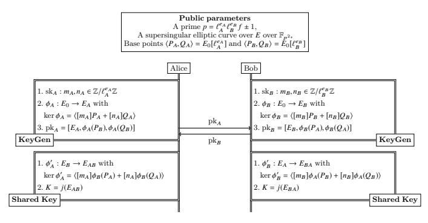

Fig. 1: SIDH key exchange protocol.

#### 2.1.2 Key exchange protocol

Alice randomly chooses two integers  $m_A, n_A \in \mathbb{Z}/\ell_A^{e_A}\mathbb{Z}$ , not both divisible by  $\ell_A$  as her secret key and computes an isogeny  $\phi_A: E \to E_A$  using kernel  $R_A:=\langle [m_A]P_A+[n_A]Q_A\rangle$ . Alice also computes the image points  $\{\phi_A(P_B),\phi_A(Q_B)\}\subset E_A$  by applying her secret isogeny  $\phi_A$  to the public basis  $P_B$  and  $Q_B$ . She sends  $\phi_A(P_B),\phi_A(Q_B)$  and  $E_A$  to Bob as her public key. Bob also selects random elements  $m_B,n_B\in\mathbb{Z}/\ell_B^{e_B}\mathbb{Z}$ , not both divisible by  $\ell_B$  and computes a secret isogeny  $\phi_B:E\to E_B$  from kernel  $R_B:=\langle [m_B]P_B+[n_B]Q_B\rangle$ , along with image points  $\{\phi_B(P_A),\phi_B(Q_A)\}\subset E_B$ . He sends his public key, i.e.,  $\phi_B(P_A),\phi_B(Q_A)$  and  $E_B$  to Alice.

In the second round of key exchange, Alice uses Bob's public key  $(\phi_B(P_A), \phi_B(Q_A), E_B)$  and computes an isogeny  $\phi_A'$ :  $E_B \to E_{AB}$  from kernel equal to  $\langle [m_A]\phi_B(P_A) + [n_A]\phi_B(Q_A) \rangle$ ; Similarly, Bob computes an isogeny  $\phi_B'$ :  $E_A \to E_{BA}$  having kernel  $\langle [m_B]\phi_A(P_B) + [n_B]\phi_A(Q_B) \rangle$  using Alice's public key. Since the common j-invariant of  $E_{AB}$  and  $E_{BA}$  are equal, they use this value to form a secret shared key. The entire SIDH key exchange protocol is illustrated in Figure 1.

#### 2.2 SIKE mechanism

SIKE mechanism is constructed by applying a transformation of Hofheinz, Hövelmanns, and Kiltz [16] to the supersingular isogeny Public Key Encryption (PKE) scheme described in [21]. It is an actively secure key encapsulation mechanism (IND-CCA KEM) which addresses the static key vulnerability of SIDH due to active attacks in [13].

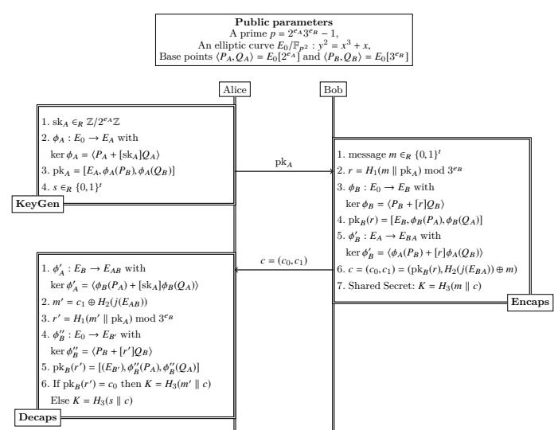

Fig. 2: SIKE mechanism.

## 2.2.1 Public parameters

Similar to SIDH, SIKE can be defined over a prime of the form  $p = \ell_A^{e_A} \cdot \ell_B^{e_B} \cdot f \pm 1$ . However, for efficiency reasons,  $\ell_A = 2, \ell_B = 3$ , and f = 1 are fixed, thus the SIKE prime has the form of  $p = 2^{e_A} \cdot 3^{e_B} - 1$ . The starting supersingular elliptic curve  $E_0/\mathbb{F}_{p^2}$ :  $y^2 = x^3 + x$  with cardinality equal to  $(2^{e_A} \cdot 3^{e_B})^2$ , along with base points  $\langle P_A, Q_A \rangle = E_0[2^{e_A}]$  and  $\langle P_B, Q_B \rangle = E_0[3^{e_B}]$  are defined as public parameters.

#### 2.2.2 Key encapsulation mechanism

The key encapsulation mechanism can be divided into three main operations: Alice's key generation, Bob's key encapsulation, and Alice's key decapsulation. We describe each operation in the following. Figure 2 presents the entire key encapsulation mechanism in a nutshell.

2.2.2.1 Key generation.: Alice randomly chooses an integer  $\operatorname{sk}_A \in \mathbb{Z}/2^{e_A}\mathbb{Z}$  and by applying an isogeny  $\phi_A: E_0 \to E_A$  with kernel  $R_A:=\langle P_A+[\operatorname{sk}_A]Q_A\rangle$  to the base points  $\{P_B,Q_B\}$ , computes her public key  $\operatorname{pk}_A=[E_A,\phi_A(P_B),\phi_A(Q_B)]$ . Moreover, she generates an t-bit<sup>1</sup> random sequence  $s\in_R\{0,1\}^t$ .

2.2.2.2 Encapsulation.: Bob generates an t-bit random message m  $\in_R \{0,1\}^t$ , concatenates it with Alice's public key  $\operatorname{pk}_A$  and computes an  $(e_B \log_2 3)$ -bit hash value r using cSHAKE256 hash function  $H_1$ , taking  $m \parallel \operatorname{pk}_A$  as the input. Using r, he applies a secret isogeny  $\phi_B: E_0 \to E_B$  to the base points  $\{P_A, Q_A\}$  and forms his public key  $\operatorname{pk}_B(r) = [E_B, \phi_B(P_A), \phi_B(Q_A)]$ . Bob also computes the common j-invariant of curve  $E_{BA}$  by applying another isogeny  $\phi_B': E_A \to E_{BA}$  using Alice's public key. Bob forms a ciphertext  $c = (c_0, c_1)$ , such that:

$$c = (c_0, c_1) = (\operatorname{pk}_B(r), H_2(j(E_{BA})) \oplus m),$$

where  $H_2$  is a cSHAKE256 hash with a custom length output and a defined initialization parameter. Finally, Bob computes the shared secret as  $K = H_3(m \parallel c)$  and sends c to Alice.

1. The value of t is defined by the implementation parameters.

2.2.2.3 Decapsulation.: Upon receipt of c, Alice computes the common j-invariant of  $E_{AB}$  by applying her secret isogeny to  $E_B$ . She computes  $m' = c_1 \oplus H_2(j(E_{AB}))$  and  $r' = H_1(m \parallel \mathrm{pk}_A)$ . Finally, she validates Bob's public key by computing  $\mathrm{pk}_B(r')$  and comparing it with  $c_0$ . She generates the same shared secret  $K = H_3(m' \parallel c)$  if the public key is valid, otherwise she outputs a random value  $K = H_3(s \parallel c)$  to be resistant against active attacks.

### 3 ARM Cortex-M4 Architecture

With over 100 billion ARM-based chips shipped worldwide as of 2017 [1], ARM is the most popular instruction set architecture (ISA), in terms of quantity. In this work, we target the popular low-end 32-bit ARM Cortex-M4 microcontrollers, which belong to the "microcontroller" profile implemented by cores from the Cortex-M series. The ARM Cortex-M architecture is a reduced instruction set computer (RISC) using a load-store architecture. The ARM Cortex-M4 microcontrollers support a three-stage pipeline, and memory accesses involving 1 register and n registers take 2 cycles and n+1 cycles, respectively.

As other traditional 32-bit ARM architectures, the ARM Cortex-M4 ISA is equipped with 16 32-bit registers (R0~R15), from which 15 (R0~R12, R13 (SP), R14 (LR)) are available. R13, R14, and R15 registers are reserved for stack pointer, link register, and program counter, respectively. The R13 and R14 registers can be freed up by saving it in slower memory and retrieving it after the register has been used.

Since the maximum capacity of the 15 registers is of only 480 bits (32×15), efficient use of the available registers to minimize the number of memory accesses is a critical strategy for optimized implementations of multi-precision multiplications (i.e. 512-bit and 768-bit). The ARM Cortex-M4 provides an instruction set supporting 32-bit operations or, in the case of Thumb and Thumb2, a mix of 16- and 32-bit operations. The instruction set is comprised of standard instructions for basic arithmetic (i.e. addition and addition with carry operations) and logic operations. However, in contrast to other lower processor classes, the ARM Cortex-M4 supports for the so-called DSP instructions, which include unsigned multiplication with double accumulation UMAAL instruction.

The UMAAL instruction performs a  $32 \times 32$ -bit multiplication followed by accumulations with two 32-bit values. This instruction achieves the same latency (i.e. 1 clock cycle) and throughput of the unsigned multiplication instruction, which means that accumulation (i.e. two 32-bit addition operations) is virtually executed for free. The detailed descriptions of multiplication operations are as follows:

- UMULL (unsigned multiplication): UMULL R0, R1, R2, R3 computes (R1  $\parallel$  R0)  $\leftarrow$  R2  $\times$  R3.
- UMLAL (unsigned multiplication with accumulation):
   UMLAL RO, R1, R2, R3 computes (R1 || RO) ← (R1 || RO) + R2 × R3.
- UMAAL (unsigned multiplication with double accumulation):

UMAAL RO, R1, R2, R3 computes (R1  $\parallel$  RO)  $\leftarrow$  R1 + RO + R2  $\times$  R3.

The popularity of ARM Cortex-M4 microcontrollers in different applications introduced a post-quantum cryptography software library (pqm4) which targets this family of micro-controllers [22]. The pqm4 library provides a framework for benchmarking and testing, started as a result of the PQCRYPTO project funded by the European Commission in the H2020 program. The library currently contains implementations of 10 post-quantum key-encapsulation mechanisms and 3 post-quantum signature schemes targeting the ARM Cortex-M4 family of microcontrollers. In particular, pqm4 targets the STM32F4 Discovery board, featuring an ARM Cortex-M4 CPU@168MHz, 1MB of Flash, and 192KB of RAM. The library offers a simple build system that generates an individual static library for each implementation for each scheme. After compilation, the library provides automated benchmarking for speed and stack usage. As a result, we chose to evaluate the performance of our proposed library with pqm4 framework to provide a fair and valid comparison with other PQC schemes.

In the following Section, we describe the proposed engineering techniques for designing highly-optimized arithmetic libraries, targeting different security levels of SIKE schemes on 32-bit ARM Cortex-M4 microcontrollers.

# 4 Optimized SIKE on ARM Cortex-M4

## 4.1 Multi-precision Multiplication

In this work, we describe the multi-precision multiplication method in multiplication structure and rhombus form.

Figure 3, 4, and 5 illustrate different strategies for implementing 256-bit multiplication on 32-bit ARM Cortex-M4 micro-controller. Let A and B be operands of length m bits each. Each operand is written as A = (A[n-1], ..., A[1], A[0]) and B = (B[n-1], ..., B[1], B[0]), where  $n = \lceil m/w \rceil$  is the number of words to represent operands, and w is the computer word size (i.e. 32-bit). The result  $C = A \cdot B$  is represented as C = (C[2n-1], ..., C[1], C[0]). In the rhombus form, the lowest indices (i, j = 0) of the product appear at the rightmost corner, whereas the highest indices (i, j = n - 1) appear at the leftmost corner. A black arrow over a point indicates the processing of a partial product. The lowermost points represent the results C[i] from the rightmost corner (i = 0) to the leftmost corner (i = 2n - 1).

There are several works in the literature that studied the use of UMAAL instructions to implement multi-precision multiplication or modular multiplication on 32-bit ARM Cortex-M4 microcontrollers [9], [10], [12], [27], [24], [15]. Among them, Fujii et al. [12], Haase et al. [15], and Koppermann et al. [24] provided the most relevant optimized implementations to this work, targeting Curve25519 and SIDHp751 by using optimal modular multiplication and squaring methods.

In [12], authors combine the UMAAL instruction with (Consecutive) Operand Caching (OC) method for Curve25519 (i.e. 256-bit multiplication). The UMAAL instruction handles the carry propagation without additional costs in the Multiplication ACcumulation (MAC) routine. The detailed descriptions are given in Figure 3. The size of operand caching is 3, which needs three rows (3 = [8/3]) for 256-bit multiplication on 32-bit ARM Cortex-M4. The multiplication starts from initial block and performs rows 1 and 2, sequentially. The inner loop follows column-wise (i.e. Product-Scanning) multiplication.

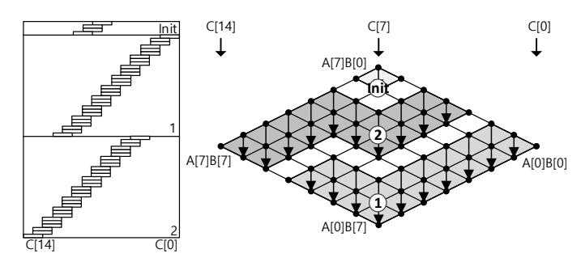

Fig. 3: 256-bit Operand Caching multiplication at the word-level where e is 3 on ARM Cortex-M4 [12], (initial block;  $\bigcirc$   $\rightarrow$   $\bigcirc$ ): order of rows.

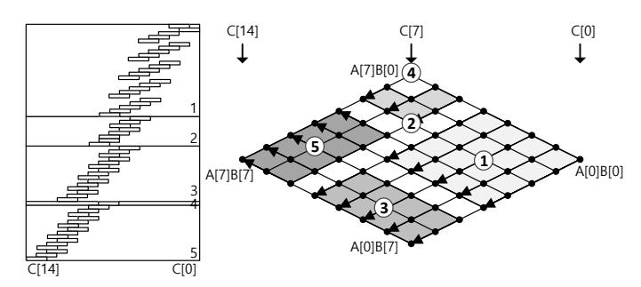

Fig. 4: 256-bit Operand Scanning multiplication at the word-level on ARM Cortex-M4 [15], ①  $\rightarrow$  ②  $\rightarrow$  ③  $\rightarrow$  ④  $\rightarrow$  ⑤ : order of rows.

In [15], a highly-optimized usage of registers and the partial products are performed with the Operand Scanning (OS) method, targeting Curve25519 (i.e. 256-bit multiplication). The detailed descriptions are given in Figure 4. In particular, the order of partial products has an irregular pattern which only works for the target operand length (i.e. 256-bit multiplication) due to the extremely compact utilization of available registers in each partial product. However, for a larger length integer multiplication, this greedy approach is not suitable since the number of register is not enough to cache sufficient operands and intermediate results to achieve the optimal performance.

In [24], authors proposed an implementation of 1-level additive Karatsuba multiplication with Comba method (i.e. Product Scanning) as the underlying multiplication strategy, targeting 768-bit multiplication. They integrated their arithmetic library into SIDHp751 and reported the first optimized implementation of SIDH on ARM Cortex-M4 microcontrollers. However, the product scanning is inefficient with the UMAAL instruction, since all the intermediate results for long integer multiplication cannot be stored into the small number of available registers. In order to improve their results, we studied the performance evaluation of 448/512/640/768bit multiplication by replacing the Comba method with OC method, using the 1-level additive/subtractive Karatsuba multiplication. However, we realized that the Karatsuba approach is slower than original OC method with UMAAL instruction for large integer multiplication on Cortex-M4, due to the excessive number of number of addition, subtraction, bit-wise exclusive-or, and loading/storing intermediate results inside Karatsuba method. Furthermore, 32-bit ARM Cortex-M4 mi-

TABLE 1: Comparison of multiplication methods, in terms of memory-access complexity. The parameter d defines the number of rows within a processed block.

| Method                              | Load                                                  | Store                         |
|-------------------------------------|-------------------------------------------------------|-------------------------------|
| Operand Scanning                    | $2n^{2} + n$                                          | $n^2 + n$                     |
| Product Scanning [6]                | $2n^2$                                                | 2n                            |
| Hybrid Scanning [14]                | $2\lceil n^2/d\rceil$                                 | 2n                            |
| Operand Caching [18]                | $2\lceil n^2/e\rceil$                                 | $\lceil n^2/e \rceil + n$     |
| Refined Operand Caching (This work) | $2\lceil n^2/(e+1)\rceil + 3(\lfloor n/(e+1)\rfloor)$ | $\lceil n^2/(e+1) \rceil + n$ |

crocontroller provides same latency (i.e. 1 clock cycle) for both 32-bit wise unsigned multiplication with double accumulation (i.e. UMAAL) and 32-bit wise unsigned addition (i.e. ADD).

We acknowledge that on low-end devices, such as 8bit AVR microcontrollers, Karatsuba method is one of the most efficient approaches for multi-precision multiplication. In these platforms, the MAC routine requires at least 5 clock cycles [17]. This significant overhead is efficiently replaced with relatively cheaper 8-bit addition/subtraction operation (i.e. 1) clock cycle). However, UMAAL instruction in ARM Cortex-M4 microcontroller can perform the MAC routine within 1 clock cycle. For this reason, it is hard to find a reasonable tradeoff between MAC (i.e. 1 clock cycle) and addition/subtraction (i.e. 1 clock cycle) on the ARM Cortex-M4 microcontroller. Following the above analysis, we adopted the OC method for implementing multiplication in our proposed implementation. Moreover, in order to achieve the most efficient implementation of SIKE protocol on ARM Cortex-M4, we proposed three distinguished improvements to the original method which result in significant performance improvement compared to previous works. We describe these techniques in the following.

## 4.1.1 Efficient register utilization

The OC method follows the product-scanning approach for inner loop but it divides the calculation (i.e. outer loop) into several rows [18]. The number of rows directly affects the overall performance, since the OC method requires to load the operands and load/store the intermediate results by the number of rows<sup>2</sup>. Table 1 presents the comparison of memory access complexity depending on the multiplication techniques. Our optimized implementation (i.e. Refined Operand Caching) is based on the original OC method but we optimized the available registers and increased the operand caching size from e to e+1. In the equation, the number of memory load by  $3(\lfloor n/(e+1) \rfloor)$  indicates the operand pointer access in each row.

Moreover, larger bit-length multiplication requires more memory access operations. Table 2 presents the number of memory access operations in OC method for different multiprecision multiplication size. In this table, our proposed R-OC method requires the least number memory access for different length multiplication. In particular, in comparison with original OC implementation, our proposed implementation reduces the total number of memory accesses by 19.8 %, 19.7 %, 20.6 %, and 21 % for 448-bit, 512-bit, 640-bit, and 768-bit, respectively  $^3$ . The performance enhancements increase as the

<sup>2.</sup> The number of rows is  $r = \lfloor n/e \rfloor$ , where the number of needed words  $(n = \lceil m/w \rceil)$ , the word size of the processor (w) (i.e. 32-bit), the bit-length of operand (m), and operand caching size (e) are given.

<sup>3.</sup> Compared with original OC implementation, we reduce the number of row by 1  $(4 \rightarrow 3)$ , 2  $(5 \rightarrow 3)$ , 2  $(6 \rightarrow 4)$ , and 2  $(7 \rightarrow 5)$  for 448-bit, 512-bit, 640-bit, and 768-bit, respectively.

TABLE 2: Comparison of multiplication methods for different Integer sizes, in terms of the number of memory access on 32-bit ARM Cortex-M4 microcontroller. The parameters d and e are set to 2 and 3, respectively.

| Method |      | 448-bit |       | 512-bit |       | 640-bit |      | 768-bit |       |      |       |       |
|--------|------|---------|-------|---------|-------|---------|------|---------|-------|------|-------|-------|
| Method | Load | Store   | Total | Load    | Store | Total   | Load | Store   | Total | Load | Store | Total |
| OS     | 406  | 210     | 616   | 528     | 272   | 800     | 820  | 420     | 1240  | 1176 | 600   | 1776  |
| PS     | 392  | 28      | 420   | 512     | 32    | 544     | 800  | 40      | 840   | 1152 | 48    | 1200  |
| HS     | 196  | 28      | 224   | 256     | 32    | 288     | 400  | 40      | 440   | 576  | 48    | 624   |
| OC     | 132  | 80      | 212   | 172     | 102   | 274     | 268  | 154     | 422   | 384  | 216   | 600   |
| R-OC   | 107  | 63      | 170   | 140     | 80    | 220     | 215  | 120     | 335   | 306  | 168   | 474   |

TABLE 3: Comparison of register utilization of the proposed method with previous works.

| Registers | Fujii et al. [12]    | Haase et al. [15]    | This work            |
|-----------|----------------------|----------------------|----------------------|
| RO        | Result pointer       | Temporal pointer     | Temporal pointer     |
| R1        | Operand A pointer    | Operand A #1         | Temporal register #1 |
| R2        | Operand $B$ pointer  | Operand B #1         | Operand A #1         |
| R3        | Result #1            | Operand B #2         | Operand A #2         |
| R4        | Result #2            | Operand $B \# 3$     | Operand A #3         |
| R5        | Result #3            | Operand $B \# 4$     | Operand A #4         |
| R6        | Operand $A \# 1$     | Operand $B \# 5$     | Operand $B \# 1$     |
| R7        | Operand A #2         | Result #1            | Operand B #2         |
| R8        | Operand A #3         | Result #2            | Operand B #3         |
| R9        | Operand $B \# 1$     | Result #3            | Operand B #4         |
| R10       | Operand $B \# 2$     | Result #4            | Result #1            |
| R11       | Operand B #3         | Result #5            | Result #2            |
| R12       | Temporal register #1 | Temporal register #1 | Result #3            |
| R13; SP   | Stack pointer        | Stack pointer        | Stack pointer        |
| R14; LR   | Temporal register #2 | Temporal register #2 | Result #4            |
| R15; PC   | Program counter      | Program counter      | Program counter      |

operand length is getting longer.

In order to increase the size of operand caching (i.e. e) by 1, we need at least 3 more registers to retain two 32-bit operand limbs and one 32-bit intermediate result value. To this end, we redefine the register assignments inside our implementation. We saved one register for the result pointer by storing the intermediate results into stack. Moreover, we observed that in the OC method, both operand pointers are not used at the same time in the row. Therefore, we don't need to maintain both operand pointers in the registers during the computations. Instead, we store them to the stack and load one by one on demand. In total, we used 2n + 3 bytes of stack for implementation.

Using the above techniques, we saved three available registers and utilized them to increase the size of operand caching by 1. In particular, three registers are used for operand A, operand B, and intermediate result, respectively. We state that our utilization technique imposes an overhead in memory access for operand pointers. However, since in each row, only three memory accesses are required, the overall overhead is negligible to the obtained performance benefit. We provide a detailed comparison of register assignments of this work with previous implementations in Table 3.

#### 4.1.2 Optimized front parts

As it is illustrated in Figure 5, our R-OC method starts from an initialization block (Init section). In the Init section, both operands are loaded from memory to registers and the partial products are computed. From the row1, only one operand pointer is required in each column. The front part (i.e. I-F and 1-F) requires partial products by increasing the length of column to 4.

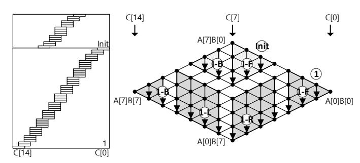

Fig. 5: Proposed 256-bit Refined Operand Caching multiplication at the word-level where e is 4 on ARM Cortex-M4, (m)it: initial block; (m): order of rows; (m): front part; (m): middle left part; (m): back part.

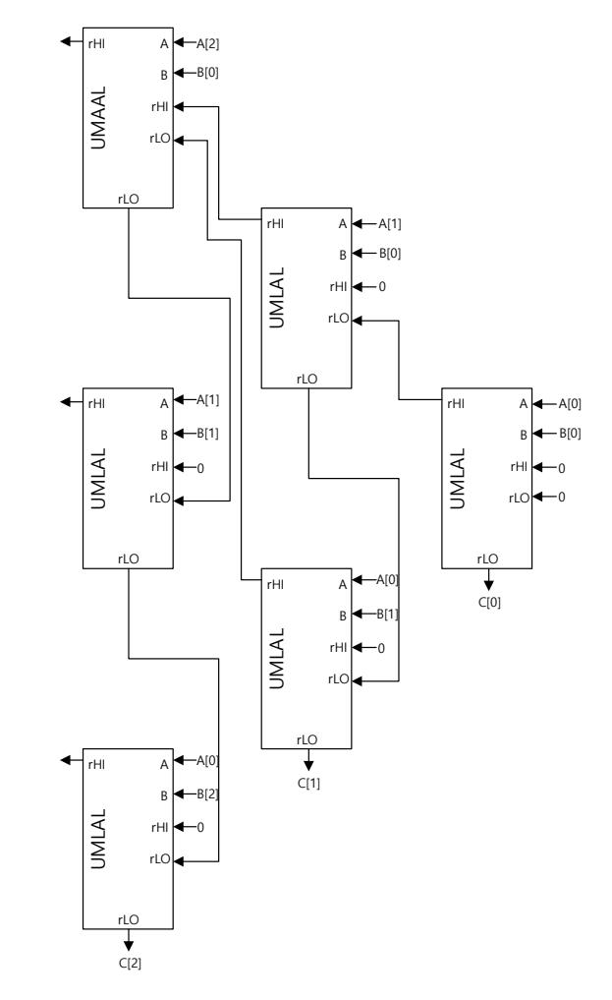

Fig. 6: 3-word integers with the product scanning approach using the UMLAL and UMAAL instructions for front part of OC method [12].

Fujii et al. [12] implemented the front parts using carryless MAC routines. In their approach, they initialized up to two registers to store the intermediate results in each column. Figure 6 illustrates their approach. Since the UMLAL and UMAAL instructions need to update current values inside the registers, the initialized registers are required.

In order to optimize the explicit register initialization, we redesign the front part with product scanning. In contrast to

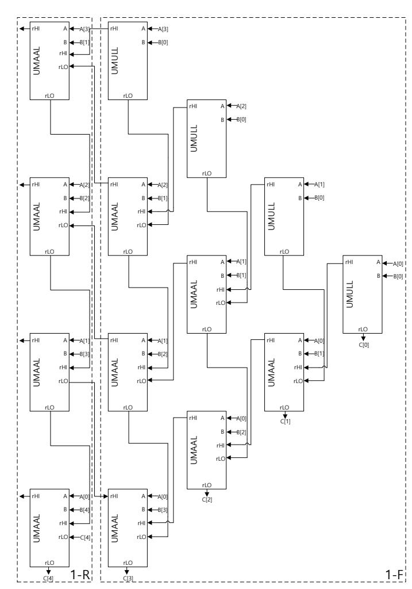

Fig. 7: 4-word integers with the product scanning approach using the UMULL and UMAAL instructions for front part of OC method.

Fujii's approach, we used UMULL and UMAAL instructions. As a result, the register initialization is performed together with unsigned multiplication (i.e. UMULL). This technique improves the overall clock cycles since each instruction directly assigns the results to the target registers. In particular, we are able to remove all the register initialization routines, which is 9 clock cycles for each front part compared to [12]. Moreover, the intermediate results are efficiently handled with carryless MAC routines by using the UMAAL instructions. Figure 7 presents our 4-word strategy in further details.

## 4.1.3 Efficient instruction ordering

ARM Cortex-M4 microcontrollers are equipped with 3-stage pipeline in which the instruction fetch, decode, and execution are performed in order. As a result, any data dependency between consecutive instructions imposes pipeline stalls and degrades the overall performance considerably. In addition to the previous optimizations, we reordered the MAC routine instructions in a way which removes data dependency between instructions, resulting in minimum pipeline stalls. The proposed approach is presented in Figure 7 (1-R section). In this Figure, the operand and intermediate result are loaded from

TABLE 4: Comparison results of 256-bit multiplication on ARM Cortex-M4 microcontrollers.

| Methods           | Timings $[cc]$ | Scalability | Bit length |
|-------------------|----------------|-------------|------------|
| Fujii et al. [12] | 239            | ✓           | 256        |
| Haase et al. [15] | 212            | Х           | 256        |
| This work         | 196            | ✓           | 256        |

memory and partial products are performed column-wise as follows:

```
LDR
         R6, [R0, #4*4]
                           //Loading operand B[4] from memory
LDR.
         R1, [SP, #4*4]
                           //Loading result C[4] from memory
UMAAL
         R14, R10, R5, R7
                           //Partial product (B[1]*A[3])
UMAAL
         R14, R11, R4, R8
                           //Partial product (B[2]*A[2])
UMAAL
         R14, R12, R3, R9
                           //Partial product (B[3]*A[1])
UMAAL
         R1, R14, R2, R6
                           //Partial product (B[4]*A[0])
```

The intermediate result (C[4]) is loaded to the R1 register. At this point, updating R1 register in the next instruction results in pipeline stall. To avoid this situation, first, we updated the intermediate results into other registers (R10, R11, R12, R14), while R1 register was updated during the last step of MAC. We followed a similar approach in 1-L section, where operand (A) pointer is loaded to a temporary register, and then the column-wise multiplications are performed with the operands (A[4], A[5], A[6], and A[7]). In the back part (i.e. 1-B), the remaining partial products are performed without operand loading. This is efficiently performed without carry propagation by using the UMAAL instructions.

To compare the efficiency of our proposed techniques with previous works, we evaluated the performance of our 256-bit multiplication with the most relevant works on Cortex-M4 platform. To obtain a fair and uniform comparison, we benchmarked the proposed implementations in [12], [15] $^{4,5}$  with our implementation on our development environment.

Table 4 presents the performance comparison of our library with previous works in terms of clock cycles. We observe that our proposed multiplication implementation method is faster than previous optimized implementation on the same platform. Furthermore, in contrast to the compact implementation of 256-bit multiplication in [15], our approach provides scalability to larger integer multiplication without any significant overhead.

In Figure 8, the detailed descriptions of proposed multiplication for SIKEp434, SIKEp503, SIKEp610, and SIKEp751 are given. The multiplications for SIKEp434, SIKEp503, SIKEp610, and SIKEp751 consists of 4, 4, 5, and 6 rows, respectively. The width of row (e) is set to 4. Only the row1 of multiplication for SIKEp434 is set to 2.

## 4.2 Multiprecision Squaring

Most of the optimized implementations of cryptography libraries use optimized multiplication for computing the square of an element. However, squaring can be implemented more efficiently since using one operand reduces the overall number of

```
4. Fujii et al. https://github.com/hayatofujii/curve25519-cortex-m4
```

<sup>5.</sup> Haase et al. https://github.com/BjoernMHaase/fe25519

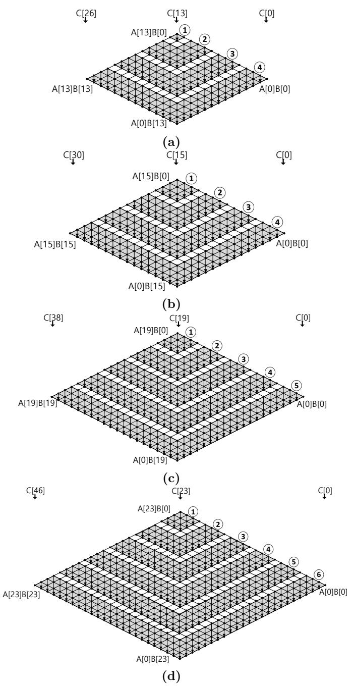

Fig. 8: Proposed multiplication for (a) SIKEp434, (b) SIKEp503, (c) SIKEp610, (d) SIKEp751, respectively.

memory accesses by half, while many redundant partial products can be removed (i.e.  $A[i] \times A[j] + A[j] \times A[i] = 2 \times A[i] \times A[j]$ ).

Similar to multiplication, squaring implementation consists of partial products of the input operand limbs. These products can be divided into two parts: the products which have two operands with the same value and the ones in which two different values are multiplied. Computing the first group is straightforward and it is only computed once for each limb of operand. However, computing the latter products with different values and doubling the result can be performed in two different ways: doubled-result and doubled-operand. In doubled-result technique, partial products are

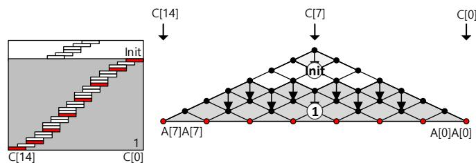

Fig. 9: 256-bit Sliding Block Doubling squaring at the word-level on ARM Cortex-M4, (it: initial block; (I): order of rows [12].

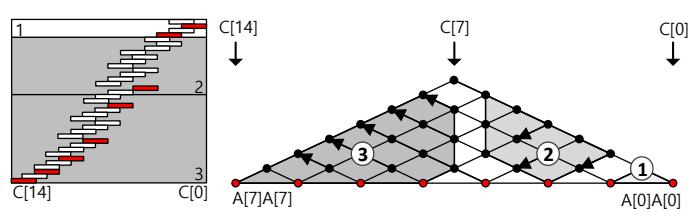

Fig. 10: 256-bit Operand Scanning squaring at the word-level on ARM Cortex-M4,  $(\mathbb{I}) \to (2) \to (3)$ : order of rows [15].

computed first and the result is doubled afterwards  $(A[i] \times A[j] \to 2 \times A[i] \times A[j])$ , while in doubled-operand, one of the operands is doubled and then multiplied to the other value  $(2 \times A[i] \to 2 \times A[i] \times A[j])$ .

In the previous works [12], [15], authors adopted the doubled-result technique inside squaring implementation. Figure 9 and 10 show their techniques for implementing optimized squaring on Cortex-M4 platform. The red parts in the figures present the partial products where the input values are the same and the black dots with gray background represent the doubled-result products.

Figure 9 demonstrates Sliding Block Doubling (SBD) based squaring method in [12]. This method is based on the product scanning approach. The squaring consists of two routines: initialization and row1 computation. The intermediate results are doubled column-wise as the row1 computations are performed.

Figure 10 presents the Operand Scanning (OS) based squaring method in [15]. In contrast to previous method, computations are performed row-wise. However, the intermediate results are doubled in each column. Note that in this method, the order of computation is designed explicitly for 256-bit operand to maximize the operand caching. Similar to their multiplication implementation, the proposed method does not provide scalability to larger bit-length multiplications.

In this work, we proposed a hybrid approach for implementing a highly-optimized squaring operation which is explicitly suitable for SIKE protocols. In general, doubling operation may result in one bit overflow which requires an extra word to retain. However, in the SIKE settings, moduli are smaller than multiple of 32-bit word (434-bit, 503-bit, 610-bit, and 751-bit) which provide an advantage for optimized arithmetic design. Taking advantage of this fact, we designed our squaring implementation based on doubled-operand approach. We divided our implementation into three parts: one sub-multiplication and two sub-squaring operations. We used R-OC for sub-multiplication and SBD for sub-squaring

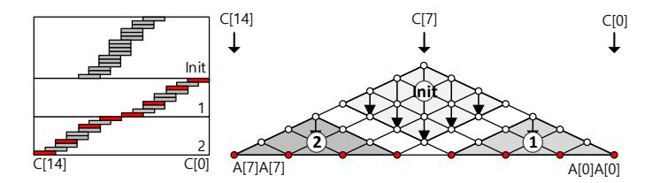

Fig. 11: 255-bit proposed squaring at the word-level on ARM Cortex-M4, Mit: initial block;  $\text{(1)} \rightarrow \text{(2)}$ : order of rows.

TABLE 5: Comparison results of 255/256-bit squaring on ARM Cortex-M4 micro-controllers.

| Methods           | Timings $[cc]$ | Scalability | Bit length |  |
|-------------------|----------------|-------------|------------|--|
| Fujii et al. [12] | 218            | ✓           | 256        |  |
| Haase et al. [15] | 141            | Х           | 256        |  |
| This work         | 136            | ✓           | 255        |  |

operations. Figure 11 illustrates our hybrid method in detail. First, the input operand is doubled and stored into the stack memory. Taking advantage of doubled-operand technique, we perform the initialization part by using R-OC method.

Second, the remaining rows 1 and 2 are computed based on SBD methods. In contrast to previous SBD method, all the doubling operations on intermediate results are removed during MAC routines. This saves several registers to double the intermediate results since doubled-results have been already computed. Furthermore, our proposed method is fully scalable and can be simply adopted to larger integer squaring.

In order to verify the performance improvement of our proposed approach, we benchmarked our 255-bit squaring implementation with the most optimized available implementations in the literature. Table 5 presents the performance comparison of our method with previous implementations on our target platform.

Our hybrid method outperforms previous implementations of 256-bit squaring, while in contrast to [15], it is scalable to larger parameter sets. In particular, it enabled us to implement the same strategy for computing SIKE arithmetic over larger finite fields.

In Figure 12, detailed descriptions of proposed squaring implementations for SIKEp434, SIKEp503, SIKEp610, and SIKEp751 are described. The initial blocks of SIKEp434/SIKEp503 are ① and ②, which are performed in beginning. Afterward, the remaining blocks including ③ and ④ are performed. For cases of SIKEp610 and SIKEp751, the initial blocks (① and ②) are performed. In particular, the initial blocks are formed in a special shape to cover doubled product areas. Afterward, the remaining blocks including ③, ④, and ⑤ are performed.

#### 4.3 Modular Reduction

Modular multiplication is a performance-critical building block in SIKE protocols. One of the most well-known techniques used for its implementation is Montgomery reduction [28]. We adapt the implementation techniques described in sections 4.1 and 4.2 to implement modular multiplication and squaring operations. Specifically, we target the parameter sets based on the primes SIKEp434, SIKEp503, SIKEp610, and SIKEp751 for SIKE round 2 protocol [7], [2]. Montgomery

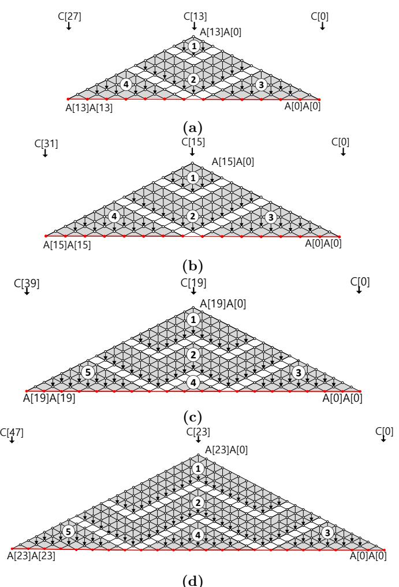

Fig. 12: Proposed squaring for (a) SIKEp434, (b) SIKEp503, (c) SIKEp610, (d) SIKEp751, respectively.

multiplication can be efficiently exploited and further simplified by taking advantage of so-called "Montgomery-friendly" modulus, which admits efficient computations, such as *all-zero* words for lower part of the modulus.

The efficient optimizations for the modulus were first pointed out by Costello et al. [7] in the setting of SIDH when using modulus of the form  $2^x \cdot 3^y - 1$  (referred to as "SIDH-friendly" primes) are exploited by the SIDH library [8].

In CHES'18, Seo et al. suggested the variant of Hybrid-Scanning (HS) for "SIDH-friendly" Montgomery reduction on ARM Cortex-A15 [29]. Similar to OC method, the HS method also changes the operand pointer when the row is changed. By using the register utilization described in Section 4.1, we increase the parameter d by 1 (3  $\rightarrow$  4. Moreover, the initial block is also optimized to avoid explicit register initialization and the MAC routine is implemented in the pipeline-friendly approach. Compared with integer multiplication, the Montgomery reduction requires fewer number of registers to be reserved. Since the intermediate result pointer and operand Q pointer are identical value (i.e. stack), we only need to maintain one address pointer to access both values. Furthermore, the modulus for SIKE (i.e. operand M; SIKEp434, SIKEp503, SIKEp610, and SIKEp751) is a static

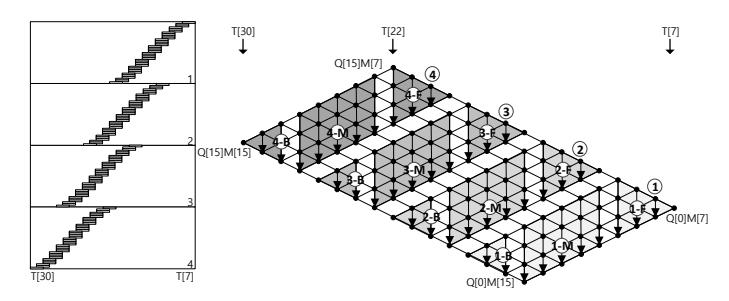

Fig. 13: 503-bit "SIDH-friendly" Montgomery reduction at the word-level, where d is 4 on ARM Cortex-M4, ①  $\rightarrow$  ②  $\rightarrow$  ③  $\rightarrow$  ④: order of rows; ⑤: front part; Ø: middle part; Ø: back part; where M, R, T, and Q are modulus, Montgomery radix, intermediate results, and quotient  $(Q \leftarrow T \cdot M' \mod R)$ .

value. As a result, instead of obtaining values from memory, we assign the direct values to the registers. This step can be performed with the two instructions, such as MOVW and MOVT. The detailed 32-bit value assignment (e.g. 0x87654321) to register R1 is given as follows:

```
: MOVW R1,#0x4321 //R1 = #0x4321 MOVT R1,#0x8765 //R1 = #0x8765 \ll 16 | R1 :
```

In Figure 13, the 503-bit "SIDH-friendly" Montgomery reduction on ARM Cortex-M4 microcontroller is described. The Montgomery reduction starts from row 1, 2, 3, to 4.

In the front of row 1 (i.e. 1–F), the operand Q is loaded from memory and the operand M is directly assigned using a constant value. The multiplication accumulates the intermediate results from memory using the operand Q pointer and stored them into the same memory address. In the middle of row 1 (i.e. 1–M), the operand Q is loaded and the intermediate results are also loaded and stored, sequentially. In the back of row 1 (i.e. 1–B), the remaining partial products are computed. Furthermore, the intermediate carry values are stored into stack and used in the following rows.

Using the above techniques, we are able to reduce the number of row by 1 (5  $\rightarrow$  4), 2 (6  $\rightarrow$  4), 2 (7  $\rightarrow$  6), and 2 (8  $\rightarrow$  6) for 448-bit, 512-bit, 640-bit, and 768-bit, respectively, compared to original implementation of HS based Montgomery reduction.

The back part is further optimized to handle the carry bit. Unlike front and middle parts, the back part generates carry bit when multiplication results  $(T \leftarrow A \times B)$  and intermediate results  $(R \leftarrow M \times Q)$  are added. This carry bit can be maintain in the register but it is quite waste of 31-bit out of 32-bit. We maintain the carry bit in the status register, which is only updated when the instruction is ended with (S) symbol. After 1-B part, 2-I and 2-M parts should be performed before 2-B part. In order to maintain the carry bit in the status register, we removed all instructions, which influence the status register. With this approach, we optimized one register and many additions for carry bit accumulation. The detailed flows are given in Figure 14. In the beginning, we cleared the carry bit by adding two zeros. Afterward, carry bit is propagated from T[16] to T[31] with ADCS instruction.

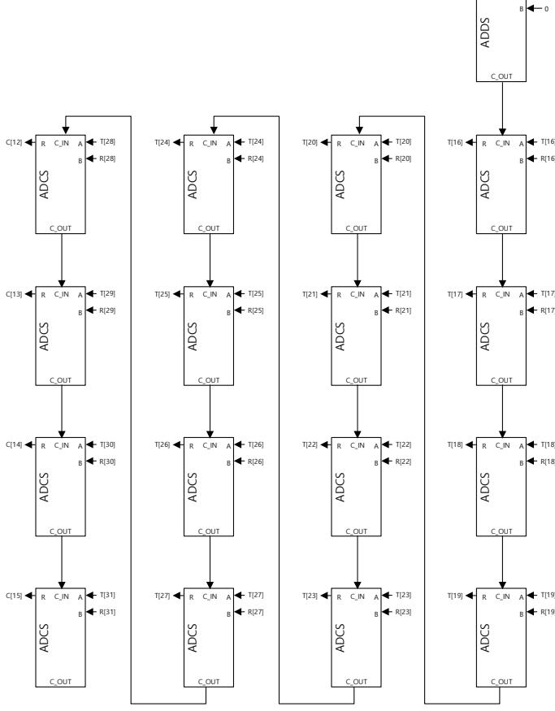

Fig. 14: Back part optimization for 503-bit "SIDH-friendly" Montgomery reduction on ARM Cortex-M4,

The Montgomery multiplication consists of multiplication and Montgomery reduction operations. In the engineering view, multiplication and reduction are implemented in separated functions. Current SIDH 3.2 library and Koppermann et al.'s work [24] implement the Montgomery reduction in this way. In the finite field multiplication function, multiplication and reduction functions are called in order. However, this approach requires three function calls. We implemented Montgomery multiplication in an integrated way, which requires only one function call. The loading and storing the intermediate result are also finely scheduled to reduce the number of memory access. The detailed descriptions of SIKEp503 Montgomery multiplication are given in Figure 15. The multiplication results  $(T[0] \sim T[30])$  are stored into the 1024-bit stack. Afterward, the results are loaded in the reduction. The rows 5 and 6 load and store the intermediate results to the stack. The front part of row 7 (green area;  $T[16] \sim T[18]$ ) loads the intermediate result from stack and stores the results directly to the output memory address. Whole area of row 8 loads the intermediate result from stack and stores the results directly to the output memory address.

Recently, Bos et al. [5] and Koppermann et al. [24] proposed highly optimized techniques for implementation of modular multiplication. They utilized the product-scanning methods for modular reduction. However, our proposed method outperforms both implementations in terms of clock cycles. In particular, our proposed method provides much

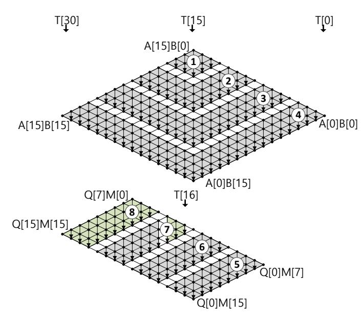

Fig. 15: 503-bit "SIDH-friendly" Montgomery multiplication at the word-level on ARM Cortex-M4,

TABLE 6: Comparison results of modular multiplication and squaring for SIKE on 32-bit ARM Cortex-M4 microcontrollers.

| Methods                |                    | Timings [          | cc]       | Modulus                     | Processor       |  |
|------------------------|--------------------|--------------------|-----------|-----------------------------|-----------------|--|
| Methods                | $\mathbb{F}_p$ mul | $\mathbb{F}_p$ sqr | reduction | Modulus                     | 1 Tocessor      |  |
| SIDH v3.2 [8]          | 19757              | -                  | -         | 2216 . 3137 - 1             | ARM Cortex-M4   |  |
| This work              | 1011               | 889                | -         | 2 0 -1                      | Antim Cortex-M4 |  |
| SIDH v3.2 [8]          | 25395              | _                  | -         | 2250 . 3159 - 1             | ARM Cortex-M4   |  |
| This work              | 1254               | 1060               | -         | 2 .0 -1                     |                 |  |
| SIDH v3.2 [8]          | 38855              | _                  | -         | 2305 . 3192 - 1             | ARM Cortex-M4   |  |
| This work              | 1898               | 1573               | -         | 2 .0 -1                     | ARM Cortex-M4   |  |
| Bos et al. [5]         | -                  | -                  | 3738      |                             | ARM Cortex-A8   |  |
| SIDH v3.2 [8]          | 55202              | _                  | -         | $2^{372} \cdot 3^{239} - 1$ |                 |  |
| Koppermann et al. [24] | 7573               | -                  | 3254      |                             | ARM Cortex-M4   |  |
| This work              | 2617               | 2115               | _         |                             |                 |  |

faster result compared to Bos et al. [5], while the benchmark results in [5] were obtained on the high-end ARMv7 Cortex-A8 processors which is equipped with 15 pipeline stages and is dual-issue super-scalar. Table 6 shows the detailed performance comparison of multiplication, squaring, and reduction over SIKE primes in terms of clock cycles. We state that, the benchmark results for [8] are based on optimized C implementation and they are presented solely as a comparison reference between portable and target-specific implementations.

In Figure 16, the implementations of proposed modular reduction for SIKEp434, SIKEp503, SIKEp610, and SIKEp751 are given. The width of row is set to 4. Only the last row of SIKEp434 is set to 2.

#### 4.4 Modular Addition and Subtraction

Modular addition operation is performed as a long integer addition operation followed by a subtraction from the prime. To have a fully constant-time arithmetic implementation, the final reduction is performed using a masked bit. In this case, even if the addition result is inside the field, a redundant subtraction is performed, so the secret values cannot be retrieved using power and timing attacks. The detailed operations are presented in the following:

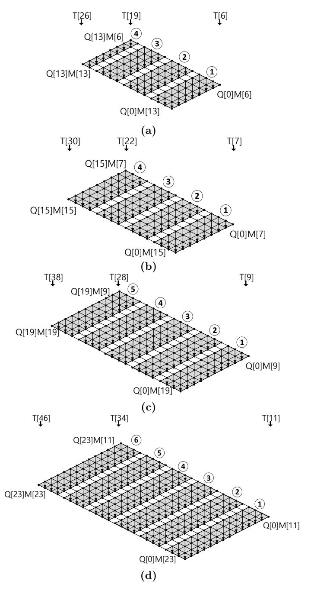

Fig. 16: Proposed modular reduction for (a) SIKEp434, (b) SIKEp503, (c) SIKEp610, (d) SIKEp751, respectively.

TABLE 7: Comparison results of modular addition and subtraction for SIKE on ARM Cortex-M4 microcontrollers.

| Methods                | Timir                                 | ngs [cc] | Modulus                     | Processor          |  |  |  |
|------------------------|---------------------------------------|----------|-----------------------------|--------------------|--|--|--|
| Withous                | $\mathbb{F}_p$ add $\mathbb{F}_p$ sub |          | Modulus                     | 11000301           |  |  |  |
| SIDH v3.2 [8]          | 947                                   | 650      | $2^{216} \cdot 3^{137} - 1$ | ARM Cortex-M4      |  |  |  |
| This work              | 253                                   | 207      | 2 .3 -1                     | Artivi Cortex-1014 |  |  |  |
| SIDH v3.2 [8]          | 1077                                  | 739      |                             |                    |  |  |  |
| Seo et al. [29]        | 326                                   | 236      | $2^{250} \cdot 3^{159} - 1$ | ARM Cortex-M4      |  |  |  |
| This work              | 274                                   | 227      |                             |                    |  |  |  |
| SIDH v3.2 [8]          | 1336                                  | 915      | 2305 . 3192 - 1             | ARM Cortex-M4      |  |  |  |
| This work              | 331                                   | 272      | 2 .31                       | AILM COLLEX-M4     |  |  |  |
| SIDH v3.2 [8]          | 1,596                                 | 1,091    |                             |                    |  |  |  |
| Koppermann et al. [24] | 559                                   | 419      | $2^{372} \cdot 3^{239} - 1$ | ARM Cortex-M4      |  |  |  |
| Seo et al. [29]        | 466                                   | 333      | 2 .3 -1                     | ARM Cortex-M4      |  |  |  |
| This work              | 387                                   | 318      |                             |                    |  |  |  |

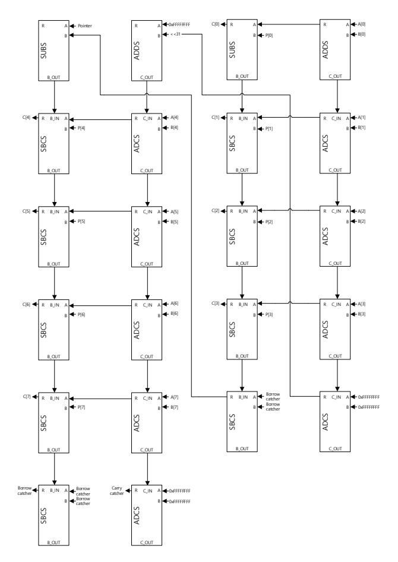

Fig. 17: Initial part of step ① in 512-bit modular addition on ARM Cortex-M4 (i.e. A [0~7] +B [0~7] -P [0~7]).

- Modular addition: (A+B) mod P
  - (1) C $\leftarrow$ A+B
  - ② {M,C}←C-P
  - (3) C←C+(P&M).
- Modular subtraction: (A-B) mod P
  - (1) {M,C} $\leftarrow$ A-B
  - (2) C $\leftarrow$ C+(P&M).

Previous optimized implementations of modular addition on Cortex-M4 [29], [24], provided the simple masked technique using hand-crafted assembly. However, in this work, we optimized this approach further by introducing three techniques:

• Proposed modular addition: (A+B) mod P 
$$(1) \{M,C\} \leftarrow A+B-P$$
  $(2) C \leftarrow C+(P\&M)$ .

First, we take advantage of the special shape of SIDH-friendly primes which have multiple words equal to OxFFFFFFFFF. Since this value is the same for multiple limbs, we load it once inside a register and use it for multiple single-precision subtraction. This operand re-using technique reduces the number of memory access by n and  $\frac{n}{2}$  for modular addition and modular subtraction, where the number of needed words  $(n = \lceil m/w \rceil)$ , the word size of the processor (w) (i.e. 32-bit), and the bit-length of operand (m) are given, respectively.

Second, we combine Step ① (addition) and ② (subtraction) into one operation ( $\{M,C\}\leftarrow A+B-P$ ). In order to combine both steps, we catch both intermediate carry and borrow,

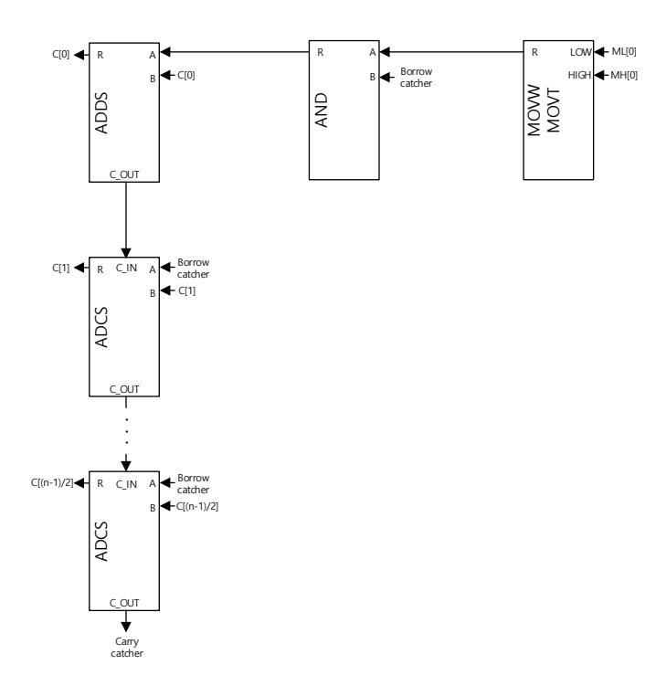

Fig. 18: Initial part of of step ② in 512-bit modular addition/subtraction on ARM Cortex-M4 (i.e.  $C[0\sim(n-1)/2]+(P[0\sim(n-1)/2]\&M)$ ).

while we perform the combined addition and subtraction operation.

Figure 17 illustrates the proposed technique in details. In this Figure, first, 4-word addition operations  $(A[0 \sim 3] + B[0 \sim 3])$  compute the addition result. Subsequently, a single register is set to constant (i.e. 0xFFFFFFFFFFFFFFFFFFFFFFFFFFFFFFFFFFFF

This addition operation stores the carry bit to the first bit of carry catcher register. The carry value in carry catcher register is used for the following addition steps (second column in the Figure 17).

The stored carry in the first bit is shifted to the 32nd bit by using the barrel-shifter module. Afterward, the value is added to the constant (i.e. 0xFFFFFFFFFFFFFFFFFFFFFFFFFFFFFFFFFFFF

Similarly, we obtained the borrow bit. The results of 4-word addition operations  $(A[0 \sim 3] + B[0 \sim 3])$  are subtracted by modulus  $(P[0 \sim 3])$  in the third column. When the borrow happens from fourth word subtraction (i.e. A[3] + B[3] - P[3] - BORROW), the borrow catcher register is set to  $2^{32} - 1$  (i.e. 0xffffffffffffffffffffffffffffffffffff

- 0x00000000). The borrow bit in borrow catcher register is used for the following subtraction steps. To obtain the borrow bit, the zero constant is subtracted by the borrow catcher register. For one constant register optimization, we used the address pointer instead of zero constant.

Since the address pointer of 32-bit ARM Cortex-M4 micro-controller is aligned by 4-byte (i.e. 32-bit), the address is always ranging from 0 (i.e. 0x00000000) to 2 <sup>32</sup> − 4 (0xFFFFFFFC). When the borrow catcher register is set, we can get the borrow bit through subtraction (e.g. Pointer - 0xFFFFFFFF where pointer is ranging from 0 to 2 <sup>32</sup> − 4). Otherwise, no borrow happens. The combined modular addition routine reduces the number of memory access by 2*n* since we can avoid both loading and storing the intermediate results.

In addition to the above techniques, the masked addition routine is also optimized. This is shown as Step 2 of modular addition and subtraction. When the mask value is set to 0xFFFFFFFF, the lower part of SIDH modulus is also 0xFFFFFFFF. Otherwise, both values are set to zero. We optimized the modulus setting (MOVW/MOVT) and masking operation (AND) for lower part of SIDH modulus. The detailed descriptions for initial part of step 2 in 512-bit modular addition/subtraction are given in Figure 18.

Using the above optimization techniques, we are able to reduce the number of memory access for modular addition and subtraction by 3*n* (9*n* → 6*n*) and *n*/2 (6*n* → 11*n*/2), respectively.

We benchmarked the proposed optimized addition and subtraction implementations on our target platform. We provide the performance evaluation of this work and previous works over different security levels in Table 7. Compared to previous works, the proposed method improved the performance by 15.9 % and 4.5 % for modular addition and subtraction, respectively. The other big integer addition and subtraction operations are also optimized in assembly language.

# **5 Performance Evaluation**

In this section, we present the performance evaluation of our proposed SIKE implementations on 32-bit ARM Cortex-M4 microcontrollers. We implemented highly-optimized arithmetic, targeting SIKE round 2 primes adapting our optimized techniques for multiplication, squaring, reduction, and addition/subtraction. We integrate our arithmetic libraries to the SIKE round 2 reference implementation [2] to evaluate the feasibility of adopting this scheme on low-end Cortex-M4 microcontrollers.

All the arithmetic is implemented in ARM assembly and the libraries are compiled with GCC with optimization flag set to -O3. The timing is measured in two frequencies (i.e. 24MHz and 168MHz). Since the timing under 24MHz setting reduces the impact of memory delay, the execution timing is slightly lower than 168MHz setting.

Table 8 presents the comparison of our proposed library with highly optimized implementations in the literature over different security levels. The optimized C implementation timings by Costello et al. [8] and the reference C implementation of SIKE [2] illustrate the importance of targetspecific implementations of SIKE low-end microcontrollers such as 32-bit ARM Cortex-M4. In particular, compared to optimized C Comba based implementation in SIDH v3.2, the proposed modular multiplication for 434-bit, 503-bit, 610-bit, and 751-bit provide 19.54x and 20.25x, 20.47x, and 21.09x improvements, respectively.

The significant achieved performance improvement in this work is the result of our highly-optimized arithmetic library. Specifically, our tailored modular multiplication/squaring minimize pipeline stalls on ARM Cortex-M4 3-stage pipeline, resulting in remarkable timing improvement compared to previous works.

Moreover, the proposed implementation achieved 184, 257, 493, and 770 million clock cycles for total key encapsulation and decapsulation of SIKEp434, SIKEp503, SIKEp610, and SIKEp751, respectively. The results are improved by 13.20x, 14.23x, 15.05x, and 15.93x for SIKEp434, SIKEp503, SIKEp610 and SIKEp751, respectively.

The memory consumption is also important metric under low-end microcontrollers. Target microcontroller equips 1MB of FLASH memory and 192KB RAM. The RAM should be considered more than FLASH memory. In the analysis, we focused on the peak consumption of RAM. The peak is observed in decapsulation parts. The percentage of consumption for target processor is described in last column of Table 8. The percentage of consumption is 3.57%, 3.89%, 5.80%, and 6.54% for SIKEp434, SIKEp503, SIKEp610, and SIKEp751, respectively. This amount of RAM consumption is reasonable for practical implementation.

The real world timing can be calculated with operating frequency and required clock cycles. In the middle of Table 8, the comparison of SIKE round 2 protocols on ARM Cortex-M4 is given. The slow frequency (24MHz) achieved 7.54, 10.45, 20.19, and 31.51 seconds for SIKEp434, SIKEp503, SIKEp610, and SIKEp751, respectively. This can be useful for low-power processors. The fast frequency (168MHz) achieved 1.09, 1.53, 2.94, and 4.58 seconds for SIKEp434, SIKEp503, SIKEp610, and SIKEp751, respectively. These results show that SIKE is practically fast enough under limited resources.

Finally, prior to this work, supersingular isogeny-based cryptography was assumed to be unsuitable to use on low-end devices due to the nonviable performance evaluations [24]<sup>6</sup> . However, in contrast to benchmark results in [24], our SIKE implementations for NIST's 1, 2, 3, and 5 security levels are practical and can be used in real world cryptography. The proposed implementation of SIKEp434 only requires 1.09 second, which shows that the quantum-resistant key encapsulation and decapsulation from isogeny of supersingular elliptic curve is a practical solution on low-power microcontrollers.

## **6 Conclusion**

In this work, we presented highly optimized implementations of SIKE protocols on low-end 32-bit ARM Cortex-M4 microcontrollers. We proposed a new set of implementation techniques, taking advantage of Cortex-M4 capabilities. In particular, we proposed a new implementation method for finite field arithmetic implementation.

We integrated the proposed modular arithmetic implementations into SIKE reference implementations, targeting NIST's 1, 2, 3, and 5 security levels. Our library significantly

6. Authors reported 18 seconds to key exchange on the ARM Cortex-M4 @120 MHz processor

TABLE 8: Comparison of SIKE round 2 protocols on ARM Cortex-M4 microcontrollers. Timings are reported in terms of clock cycles and seconds. Total includes encapsulation and decapsulation. Memory consumption is reported in terms of bytes. Koppermann et al. [24] does not provide results on SIKE implementations.

|                 | Implementation Security Level Language |     | Timings [cc] |        |        | Timings [cc × 106] |      |                             | Timings [sec] |       |               |        | Memory [bytes] |        |       |       |       |                                 |
|-----------------|----------------------------------------|-----|--------------|--------|--------|--------------------|------|-----------------------------|---------------|-------|---------------|--------|----------------|--------|-------|-------|-------|---------------------------------|
|                 |                                        |     | Fp add       | Fp sub | Fp mul |                    |      | Fp sqr KeyGen Encaps Decaps |               | Total | KeyGen Encaps |        | Decaps         | Total  |       |       |       | KeyGen Encaps Decaps Target (%) |
| SIKEp434@24MHz  |                                        |     |              |        |        |                    |      |                             |               |       |               |        |                |        |       |       |       |                                 |
| SIDH v3.2 [8]   | 1 (AES-128)                            | C   | 947          | 650    | 19663  | 19663              | 713  | 1168                        | 1246          | 2414  | 29.73         | 48.66  | 51.92          | 100.58 | 6580  | 6916  | 7260  | 3.78                            |
| This work       | 1 (AES-128)                            | ASM | 253          | 207    | 1011   | 889                | 54   | 87                          | 94            | 181   | 2.23          | 3.64   | 3.90           | 7.54   | 6188  | 6516  | 6860  | 3.57                            |
|                 | SIKEp503@24MHz                         |     |              |        |        |                    |      |                             |               |       |               |        |                |        |       |       |       |                                 |
| SIDH v3.2 [8]   | 2 (SHA3-256)                           | C   | 1077         | 739    | 25302  | 25302              | 1072 | 1766                        | 1878          | 3644  | 44.65         | 73.59  | 78.25          | 151.84 | 6204  | 6588  | 6972  | 3.63                            |
| This work       | 2 (SHA3-256)                           | ASM | 274          | 227    | 1221   | 1024               | 74   | 121                         | 129           | 251   | 3.08          | 5.06   | 5.39           | 10.45  | 6700  | 7084  | 7468  | 3.89                            |
|                 | SIKEp610@24MHz                         |     |              |        |        |                    |      |                             |               |       |               |        |                |        |       |       |       |                                 |
| SIDH v3.2 [8]   | 3 (AES-192)                            | C   | 1336         | 915    | 38753  | 38753              | 2004 | 3688                        | 3710          | 7398  | 83.51         | 153.68 | 154.58         | 308.26 | 9628  | 10052 | 10524 | 5.48                            |
| This work       | 3 (AES-192)                            | ASM | 331          | 272    | 1869   | 1535               | 131  | 241                         | 243           | 484   | 5.48          | 10.06  | 10.13          | 20.19  | 10244 | 10668 | 11140 | 5.80                            |
| SIKEp751@24MHz  |                                        |     |              |        |        |                    |      |                             |               |       |               |        |                |        |       |       |       |                                 |
| SIDH v3.2 [8]   | 5 (AES-256)                            | C   | 1596         | 1091   | 55096  | 55096              | 3637 | 5900                        | 6337          | 12236 | 151.56        | 245.83 | 264.02         | 509.85 | 11116 | 11260 | 11852 | 6.17                            |
| This work       | 5 (AES-256)                            | ASM | 387          | 318    | 2577   | 2066               | 225  | 365                         | 392           | 756   | 9.38          | 15.19  | 16.32          | 31.51  | 11852 | 11996 | 12564 | 6.54                            |
| SIKEp434@168MHz |                                        |     |              |        |        |                    |      |                             |               |       |               |        |                |        |       |       |       |                                 |
| SIDH v3.2 [8]   | 1 (AES-128)                            | C   | 947          | 650    | 19757  | 19757              | 718  | 1175                        | 1254          | 2429  | 4.27          | 6.99   | 7.46           | 14.46  | 6580  | 6916  | 7260  | 3.78                            |
| This work       | 1 (AES-128)                            | ASM | 253          | 207    | 1011   | 889                | 54   | 89                          | 95            | 184   | 0.32          | 0.53   | 0.56           | 1.09   | 6188  | 6516  | 6860  | 3.57                            |
| SIKEp503@168MHz |                                        |     |              |        |        |                    |      |                             |               |       |               |        |                |        |       |       |       |                                 |
| SIDH v3.2 [8]   | 2 (SHA3-256)                           | C   | 1077         | 739    | 25395  | 25395              | 1076 | 1773                        | 1886          | 3659  | 6.40          | 10.56  | 11.22          | 21.78  | 6204  | 6588  | 6972  | 3.63                            |
| This work       | 2 (SHA3-256)                           | ASM | 274          | 227    | 1254   | 1060               | 76   | 125                         | 133           | 257   | 0.45          | 0.74   | 0.79           | 1.53   | 6700  | 7084  | 7468  | 3.89                            |
| SIKEp610@168MHz |                                        |     |              |        |        |                    |      |                             |               |       |               |        |                |        |       |       |       |                                 |
| SIDH v3.2 [8]   | 3 (AES-192)                            | C   | 1336         | 915    | 38855  | 38855              | 2011 | 3701                        | 3722          | 7423  | 11.97         | 22.03  | 22.16          | 44.18  | 9628  | 10052 | 10524 | 5.48                            |
| This work       | 3 (AES-192)                            | ASM | 331          | 272    | 1898   | 1573               | 134  | 246                         | 248           | 493   | 0.80          | 1.46   | 1.47           | 2.94   | 10244 | 10668 | 11140 | 5.80                            |
|                 | SIKEp751@168MHz                        |     |              |        |        |                    |      |                             |               |       |               |        |                |        |       |       |       |                                 |
| SIDH v3.2 [8]   | 5 (AES-256)                            | C   | 1596         | 1091   | 55202  | 55202              | 3647 | 5915                        | 6353          | 12267 | 21.71         | 35.21  | 37.81          | 73.02  | 11116 | 11260 | 11852 | 6.17                            |
| This work       | 5 (AES-256)                            | ASM | 387          | 318    | 2617   | 2115               | 229  | 371                         | 399           | 770   | 1.36          | 2.21   | 2.37           | 4.58   | 11852 | 11996 | 12564 | 6.54                            |

outperforms the previous state-of-the-art implementations of integer arithmetic on our target platform, providing faster results compared to the only available optimized implementation of SIDHp751 on Cortex-M4 in the literature.

We hope the proposed implementation techniques motivate more engineering efforts on the optimized implementation of SIKE mechanism on different embedded platforms. We plan to adopt the same strategy in designing efficient software libraries, targeting different families of microcontrollers in the future.

# **References**

- [1] ARM Holdings. Q1 2017 roadshow slides. https: //www.arm.com/company/-/media/arm-com/company/ Investors/Quarterly%20Results%20-%20PDFs/Arm\_SB\_Q1\_ 2017\_Roadshow\_Slides\_Final.pdf, 2017.
- [2] R. Azarderakhsh, M. Campagna, C. Costello, L. D. Feo, B. Hess, A. Jalali, D. Jao, B. Koziel, B. LaMacchia, P. Longa, M. Naehrig, G. Pereira, J. Renes, V. Soukharev, and D. Urbanik. Supersingular Isogeny Key Encapsulation – Submission to the NIST's post-quantum cryptography standardization process, round 2, 2019. Available at https://csrc.nist.gov/projects/ post-quantum-cryptography/round-2-submissions/SIKE.zip.
- [3] R. Azarderakhsh, M. Campagna, C. Costello, L. D. Feo, B. Hess, A. Jalali, D. Jao, B. Koziel, B. LaMacchia, P. Longa, M. Naehrig, J. Renes, V. Soukharev, and D. Urbanik. Supersingular Isogeny Key Encapsulation – Submission to the NIST's post-quantum cryptography standardization process, 2017. Available at https://csrc.nist.gov/CSRC/media/ Projects/Post-Quantum-Cryptography/documents/round-1/ submissions/SIKE.zip.
- [4] J. Bos and S. Friedberger. Arithmetic considerations for isogeny based cryptography. *IEEE Transactions on Computers*, 2018.
- [5] J. W. Bos and S. Friedberger. Faster modular arithmetic for isogeny based crypto on embedded devices. *IACR Cryptology ePrint Archive*, 2018:792, 2018.
- [6] P. G. Comba. Exponentiation cryptosystems on the IBM PC. *IBM systems journal*, 29(4):526–538, 1990.
- [7] C. Costello, P. Longa, and M. Naehrig. Efficient algorithms for supersingular isogeny Diffie-Hellman. In M. Robshaw and J. Katz, editors, *Advances in Cryptology - CRYPTO 2016*, volume 9814 of *Lecture Notes in Computer Science*, pages 572– 601. Springer, 2016.

- [8] C. Costello, P. Longa, and M. Naehrig. SIDH Library. https: //github.com/Microsoft/PQCrypto-SIDH, 2016–2018.
- [9] W. de Groot. *A Performance Study of X25519 on Cortex-M3 and M4*. PhD thesis, Ph. D. thesis, Eindhoven University of Technology (Sep 2015), 2015.
- [10] F. De Santis and G. Sigl. Towards side-channel protected X25519 on ARM Cortex-M4 processors. *Proceedings of Software performance enhancement for encryption and decryption, and benchmarking, Utrecht, The Netherlands*, pages 19–21, 2016.
- [11] A. Faz-Hernández, J. López, E. Ochoa-Jiménez, and F. Rodríguez-Henríquez. A faster software implementation of the supersingular isogeny diffie-hellman key exchange protocol. *IEEE Transactions on Computers*, 67(11):1622–1636, 2018.
- [12] H. Fujii and D. F. Aranha. Curve25519 for the Cortex-M4 and beyond. *Progress in Cryptology-LATINCRYPT*, 35:36–37, 2017.
- [13] S. D. Galbraith, C. Petit, B. Shani, and Y. B. Ti. On the security of supersingular isogeny cryptosystems. In *Advances in Cryptology - ASIACRYPT 2016 - 22nd International Conference on the Theory and Application of Cryptology and Information Security,*, pages 63–91, 2016.
- [14] N. Gura, A. Patel, A. Wander, H. Eberle, and S. C. Shantz. Comparing elliptic curve cryptography and RSA on 8-bit CPUs. In *International workshop on cryptographic hardware and embedded systems*, pages 119–132. Springer, 2004.
- [15] B. Haase and B. Labrique. AuCPace: Efficient verifier-based PAKE protocol tailored for the IIoT. *IACR Transactions on Cryptographic Hardware and Embedded Systems*, pages 1–48, 2019.
- [16] D. Hofheinz, K. Hövelmanns, and E. Kiltz. A modular analysis of the fujisaki-okamoto transformation. In *Theory of Cryptography - 15th International Conference, TCC 2017,*, pages 341–371, 2017.
- [17] M. Hutter and P. Schwabe. Multiprecision multiplication on AVR revisited. *Journal of Cryptographic Engineering*, 5(3):201– 214, 2015.
- [18] M. Hutter and E. Wenger. Fast multi-precision multiplication for public-key cryptography on embedded microprocessors. In *International Workshop on Cryptographic Hardware and Embedded Systems*, pages 459–474. Springer, 2011.
- [19] A. Jalali, R. Azarderakhsh, and M. M. Kermani. NEON SIKE: supersingular isogeny key encapsulation on ARMv7. In *International Conference on Security, Privacy, and Applied Cryptography Engineering*, pages 37–51. Springer, 2018.
- [20] A. Jalali, R. Azarderakhsh, M. M. Kermani, and D. Jao. Supersingular isogeny Diffie-Hellman key exchange on 64-bit ARM. *IEEE Transactions on Dependable and Secure Computing*, 2017.

- [21] D. Jao and L. D. Feo. Towards quantum-resistant cryptosystems from supersingular elliptic curve isogenies. In B. Yang, editor, *Post-Quantum Cryptography (PQCrypto 2011)*, volume 7071 of *Lecture Notes in Computer Science*, pages 19–34. Springer, 2011.
- [22] M. J. Kannwischer, J. Rijneveld, P. Schwabe, and K. Stoffelen. PQM4: Post-quantum crypto library for the ARM Cortex-M4. https://github.com/mupq/pqm4.
- [23] S. Kim, K. Yoon, J. Kwon, S. Hong, and Y.-H. Park. Efficient isogeny computations on twisted Edwards curves. *Security and Communication Networks*, 2018, 2018.
- [24] P. Koppermann, E. Pop, J. Heyszl, and G. Sigl. 18 seconds to key exchange: Limitations of supersingular isogeny diffie-hellman on embedded devices. Cryptology ePrint Archive, Report 2018/932, 2018. https://eprint.iacr.org/2018/932.
- [25] B. Koziel, R. Azarderakhsh, and M. Mozaffari-Kermani. Fast hardware architectures for supersingular isogeny Diffie-Hellman key exchange on FPGA. In *International Conference in Cryptology in India*, pages 191–206. Springer, 2016.
- [26] B. Koziel, A. Jalali, R. Azarderakhsh, D. Jao, and M. Mozaffari-Kermani. NEON-SIDH: efficient implementation of supersingular isogeny Diffie-Hellman key exchange protocol on ARM. In *International Conference on Cryptology and Network Security (CANS 2016)*, pages 88–103. Springer, 2016.
- [27] Z. Liu, P. Longa, G. Pereira, O. Reparaz, and H. Seo. FourQ on embedded devices with strong countermeasures against sidechannel attacks. In *International Conference on Cryptographic Hardware and Embedded Systems-CHES2017*, pages 665–686, 2017.
- [28] P. L. Montgomery. Modular multiplication without trial division. *Mathematics of Computation*, 44(170):519–521, 1985.
- [29] H. Seo, Z. Liu, P. Longa, and Z. Hu. SIDH on ARM: faster modular multiplications for faster post-quantum supersingular isogeny key exchange. *IACR Transactions on Cryptographic Hardware and Embedded Systems*, pages 1–20, 2018.
- [30] P. W. Shor. Algorithms for quantum computation: Discrete logarithms and factoring. In *Foundations of Computer Science, 1994 Proceedings., 35th Annual Symposium on*, pages 124–134. IEEE, 1994.
- [31] The National Institute of Standards and Technology (NIST). Post-quantum cryptography standardization, 2017–2018. https://csrc.nist.gov/projects/post-quantum-cryptography/ post-quantum-cryptography-standardization.


**Hwajeong Seo** received the B.S.E.E., M.S. and Ph.D degrees in Computer Engineering at Pusan National University. He is currently an assistant professor in Hansung university. His research interests include Internet of Things and information security.


**Mila Anastasova** graduated in Computer Science and Engineering from University Carlos III of Madrid, Spain in 2019. She is currently forming part of the Institute for Sensing and Embedded Network Systems Engineering (I-SENSE) at Florida Atlantic University, USA where she is working towards her Master degree in Computer Engineering. She is researching in the area of isogeny-based quantum secure cryptography.


**Amir Jalali** received his Ph.D. in Computer Engineering at the Department of Computer, Electrical Engineering and Computer Science at Florida Atlantic University, USA in 2018. He is currently with the Information Security Group at LinkedIn Corporation. His current research interests include Applied cryptography, post-quantum cryptography, and homomorphic encryption.


**Reza Azarderakhsh** (M'12) received the Ph.D. degree in electrical and computer engineering from Western University, in 2011. He was a recipient of the NSERC post-doctoral research fellowship working in the Center for Applied Cryptographic Research and the Department of Combinatorics and Optimization, University of Waterloo. Currently, he is an assistant professor in the Department of Electrical and Computer Engineering, Florida Atlantic University. His current research interest include finite field and its

applications, elliptic curve cryptography, pairing based cryptography, and post-quantum cryptography. He is serving as an associate editor of the IEEE Transactions on Circuits and Systems. He is the member of IEEE.