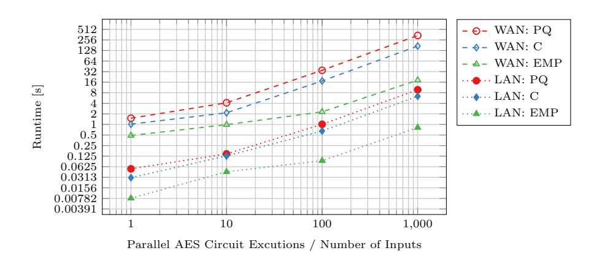
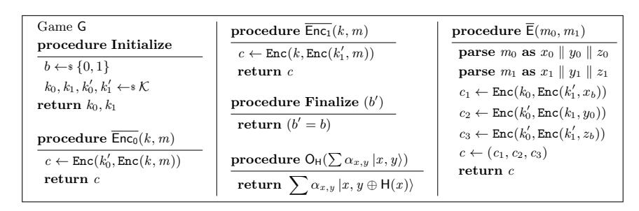

A preliminary version of this paper appears in the proceedings of the 18th International Conference on Applied Cryptography and Network Security (ACNS 2020). This is the full version.

# Secure Two-Party Computation in a Quantum World

Niklas B¨uscher<sup>1</sup> , Daniel Demmler<sup>2</sup> , Nikolaos P. Karvelas<sup>1</sup> , Stefan Katzenbeisser<sup>3</sup> , Juliane Kr¨amer<sup>4</sup> , Deevashwer Rathee<sup>5</sup> , Thomas Schneider<sup>6</sup> , and Patrick Struck<sup>4</sup>

> <sup>1</sup> SecEng, Technische Universit¨at Darmstadt, Germany {buescher,karvelas}@seceng.informatik.tu-darmstadt.de <sup>2</sup> SVS, Universit¨at Hamburg, Germany demmler@informatik.uni-hamburg.de <sup>3</sup> Universit¨at Passau, Germany stefan.katzenbeisser@uni-passau.de <sup>4</sup> QPC, Technische Universit¨at Darmstadt, Germany {juliane.kraemer,patrick.struck}@tu-darmstadt.de <sup>5</sup> Department of Computer Science, IIT (BHU) Varanasi, India deevashwer.student.cse15@iitbhu.ac.in <sup>6</sup> ENCRYPTO, Technische Universit¨at Darmstadt, Germany schneider@encrypto.cs.tu-darmstadt.de

Abstract. Secure multi-party computation has been extensively studied in the past years and has reached a level that is considered practical for several applications. The techniques developed thus far have been steadily optimized for performance and were shown to be secure in the classical setting, but are not known to be secure against quantum adversaries. In this work, we start to pave the way for secure two-party computation in a quantum world where the adversary has access to a quantum computer. We show that post-quantum secure two-party computation has comparable efficiency to their classical counterparts. For this, we develop a lattice-based OT protocol which we use to implement a post-quantum secure variant of Yao's famous garbled circuits (GC) protocol (FOCS'82). Along with the OT protocol, we show that the oblivious transfer extension protocol of Ishai et al. (CRYPTO'03), which allows running many OTs using mainly symmetric cryptography, is post-quantum secure. To support these results, we prove that Yao's GC protocol achieves post-quantum security if the underlying building blocks do.

Keywords: Post-quantum security · Yao's GC protocol · Oblivious transfer · Secure two-party computation · Homomorphic encryption

### 1 Introduction

In light of recent advances in quantum computing, it seems that we are not far from the time that Shor's algorithm [\[54\]](#page-19-0) can be executed on a real quantum computer. There are several experts that estimate that quantum computers with the required performance and features will be available within the next one or two decades [\[8,](#page-17-0) [42\]](#page-19-1). Recently Google researchers claimed to have achieved quantum-supremacy, i.e., being able to perform a specific type of computation on a quantum computer, that is infeasible on conventional supercomputers [\[6\]](#page-17-1). This will give rise to the so-called quantum era [\[13\]](#page-17-2), in which one of the parties involved in a cryptographic protocol might be able to perform local quantum computation during the protocol run whereas the communication between the parties remains classical. It is therefore necessary to analyse the security of cryptographic protocols against quantum adversaries. Some industrial security review processes already mandate post-quantum security for building blocks that are used in secure systems, which shows that the security threat posed by quantum computers is getting attention even outside of academia. The development of post-quantum secure cryptographic primitives such as [\[2,](#page-17-3) [21,](#page-18-0) [34,](#page-18-1) [41\]](#page-19-2) in the past years shows the importance that the cryptographic community attributes to the problem. However, more complex cryptographic protocols have not yet been extensively studied, even though Canetti's UC framework [\[17\]](#page-17-4) and Unruh's quantum lifting [\[57\]](#page-19-3) provide the necessary theoretical foundations for achieving this task. One such complex cryptographic protocol is secure two-party computation. In recent years, Yao's general solution for secure computation, the so-called 'Yao's Garbled Circuits' (GC) protocol [\[60\]](#page-19-4), emerged from a theoretical idea to a powerful and versatile privacy-enhancing technology. Extensive research on the adversarial model, e.g., security against malicious adversaries [\[37,](#page-18-2) [58\]](#page-19-5), and several protocol optimizations made GCs practical for many use cases in the last decade. Protocol optimizations such as Garbled Row Reduction [\[44,](#page-19-6) [48\]](#page-19-7), the free-XOR technique [\[35\]](#page-18-3), fixed-key garbling [\[10\]](#page-17-5), the half-gates approach [\[62\]](#page-20-0), OT extension [\[7,](#page-17-6) [33\]](#page-18-4), and also the use of hardware instructions such as AES-NI or parallelization improved the runtime of the protocol by orders of magnitude.

Despite its maturity and efficiency, e.g., being a constant round protocol using mostly symmetric cryptographic primitives, the security of Yao's GC protocol has only been studied against classical adversaries. Unruh showed that multi-party computation is achievable from commitments in a fully-quantum setting [\[57\]](#page-19-3). In their setting quantum computers are ubiquitous, in the post-quantum setting we consider only the adversary has quantum computing power. However, the gap between the highly optimized GC solution used as a privacy-enhancing technology today and this theoretical construction in the fully-quantum case, makes the transition from the classical to the post-quantum case challenging. Therefore, securing Yao's GC protocol against quantum adversaries is of high practical and theoretical interest. A prominent example is the standardization process on post-quantum cryptographic primitives initiated by the NIST [\[46\]](#page-19-8).

Our Contributions. In this paper, we extend the line of research for secure computation to the post-quantum setting, combining theory and practice. On the practical side, we complement the theoretical results by showing that postquantum secure two-party computation achieves performance that is close to existing classical implementations. On the theoretical side, we pave the way for

post-quantum secure two-party computation by proving security of Yao's GC protocol and OT extension. Our contributions are detailed below.

- 1) In Section [3,](#page-5-0) we develop an efficient post-quantum secure OT protocol based on the ring learning with errors (RLWE) problem. The protocol is based on an additively homomorphic encryption scheme. The general method to do this is well-known, but we show how to implement this very efficiently. In particular, we use batching to compute a large number of OTs at the cost of one, while maximizing the packing efficiency and the parallelism we get from homomorphic single instruction multiple data (SIMD) operations. Additionally, we show that OT extension introduced by Ishai et al. [\[33\]](#page-18-4) is secure against quantum adversaries.
- 2) We implement our OT protocol in C++ using the Microsoft SEAL homomorphic encryption library [\[53\]](#page-19-9). In Section [4](#page-9-0) we show that our implementation achieves a throughput of 89k PQ-OTs per second, thus being a promising replacement for existing classical OT protocols. Furthermore, we implement a post-quantum secure version of Yao's GC protocol using our OT implementation and compare its performance with implementations secure in the classical setting. While a performance loss is expected, our results show that it is in fact tolerable. Our implementations are open-source software under the permissive MIT license and are available online at <https://encrypto.de/code/pq-mpc>.
- 3) In Section [5,](#page-14-0) we strengthen our practical results by proving that Yao's GC protocol can be hardened to withstand quantum attackers by replacing the underlying components with post-quantum-secure variants. We do so by showing that the classical proof by Lindell and Pinkas [\[36\]](#page-18-5) also holds in the post-quantum setting. In addition, we give a security proof for double encryption security in the post-quantum setting adapted to the quantum random oracle model (QROM). While these results sound very natural, we stress that they have not been formally proven thus far.

Related Work. There are several works related to Yao's protocol, oblivious transfer and post-quantum security. We give a brief overview of results that are relevant for our work. There are several implementations available, that show practical performance for Yao's garbled circuits protocol [\[20,](#page-18-6) [59,](#page-19-10) [61\]](#page-20-1), that could benefit from incorporating security against quantum adversaries. A full proof of classical security for Yao's garbled circuits protocol was given in [\[36\]](#page-18-5). In [\[18\]](#page-17-7), the free-XOR optimization [\[35\]](#page-18-3) of Yao's protocol was proven secure under a weaker assumption than the random oracle model. The point-and-permute optimization was introduced and implemented in [\[9,](#page-17-8) [39\]](#page-19-11). A formally verified software stack for Yao's garbled circuits was presented in [\[4\]](#page-17-9). Known instantiations for postquantum secure OT protocols are either based on the code-based McEliece crypto system [\[23\]](#page-18-7) or on the learning with errors (LWE) problem [\[15\]](#page-17-10). In [\[40\]](#page-19-12), the authors build OT extension from post-quantum secure primitives, but do not prove it post-quantum secure.

### <span id="page-3-0"></span>2 Preliminaries

Within this section we give the mandatory background regarding notation, encryption schemes, oblivious transfer, and Yao's protocol for our paper. Additional background on the quantum random oracle model and the additively homomorphic encryption scheme is given in Appendix A.

### 2.1 Notation

We denote the modulus reduction in the symmetric interval [-q/2, q/2) by  $[\cdot]_q$ , and the modulus reduction of an integer a in the positive interval [0,q) by  $a \mod q$ . The set of integers  $\{1,\ldots,n\}$  is denoted by [n]. We use bold case letters for vectors, e.g., a, and identify the i-th entry of a vector a by  $(a_i)$ . In a secure two-party computation protocol, two parties with corresponding inputs x and y want to compute  $\mathcal{F}(x,y)$  for a function  $\mathcal{F}$  known by both parties. We use statistical security parameter  $\sigma = 40$  bit, the symmetric security parameter  $\kappa$ , and the public-key security parameter  $\lambda$ .

In our proofs we use the code-based game playing framework by Bellare and Rogaway [12]. At the start of the game, the initialize procedure is executed and its output is given as the input to the adversary. The output of the game is the output of the finalize procedure which takes as input whatever the adversary outputs. In between, the adversary has oracle access to all other procedures described in the game. For a game G and an adversary  $\mathcal{A}$ , we write  $\mathcal{A}^{\mathsf{G}} \to y$  for the event that the output of  $\mathcal{A}$  is y when interacting with G. Likewise, we denote the event that the G outputs y when interacting with  $\mathcal{A}$  by  $\mathsf{G}^{\mathcal{A}} \to y$ . For simplicity, we assume that for any table f[] its entries are initialized to  $\bot$  at the start of the game. We denote homomorphic addition and subtraction as  $\boxplus$  and  $\boxminus$ , respectively. Homomorphic multiplication with a plaintext is denoted by  $\boxdot$ . The detailed description of an additively homomorphic encryption scheme is given in Appendix A.2. We assume the reader is familiar with the fundamental concepts of quantum computation like the Dirac notation and measurements. For a more thorough discussion we refer to [45].

#### 2.2 Encryption

A secret key encryption scheme  $E_S$  is a pair of efficient algorithms Enc and Dec for encryption and decryption, where  $\text{Enc}(k,m) \to c$  and  $\text{Dec}(k,c) \to m$  for message m, ciphertext c, and key k.

A basic security notion for secret key encryption schemes is *indistinguishability* under chosen plaintext attacks (IND-CPA) which asks an adversary to distinguish between the encryption of two adversarial chosen messages. Below we formally define the corresponding post-quantum security notion, that is, pq-IND-CPA, for secret key encryption schemes in the QROM. Note that the security notion allows for multiple challenges which is an important requirement in the security proof of Yao's protocol.

**Definition 1.** Let  $E_S = (Enc, Dec)$  be a secret key encryption scheme and let the game pq-INDCPA be defined as in Fig. 1. We say that  $E_S$  is pq-IND-CPA-secure if the following term is negligible for any quantum adversary A:

$$\mathbf{Adv}^{\mathrm{pq\text{-}ind\text{-}cpa}}_{\mathrm{E}_{S}}(\mathcal{A}) = 2 \operatorname{Pr} \left[ \mathsf{INDCPA}^{\mathcal{A}} \to \mathrm{true} \right] - 1 \,.$$

|                                                                                                        | $\frac{\text{procedure } E(m_0, m_1)}{c \leftarrow s  Enc(k, m_b)}$ $\text{return } c$                                          |
|--------------------------------------------------------------------------------------------------------|---------------------------------------------------------------------------------------------------------------------------------|
| $ \frac{ \mathbf{procedure} \; Enc(m) }{ c \; \leftarrow \! s \; Enc(k,m) } $ $ \mathbf{return} \; c $ | $\frac{\textbf{procedure O}_{H}(\sum \alpha_{x,y} \ket{x,y})}{\textbf{return } \sum \alpha_{x,y} \ket{x,y} \oplus H(x)\rangle}$ |
| $ \frac{ \textbf{procedure Finalize} \; (b') }{ \textbf{return} \; (b' = b) } $                        |                                                                                                                                 |

<span id="page-4-0"></span>Fig. 1. Game to define pq-IND-CPA security for secret key encryption schemes.

#### 2.3 Oblivious Transfer

An oblivious transfer (OT) protocol is a protocol in which a sender transfers one of multiple messages to a receiver, but it remains oblivious as to which message has been transferred. At the same time, the receiver can only select a single message to be retrieved. We focus on 1-out-of-2 OTs, where the sender inputs two  $\ell$ -bit strings  $m_0, m_1$  and the receiver inputs a choice bit  $b \in \{0, 1\}$ . At the end of the protocol, the receiver obliviously receives only  $m_b$ . OT guarantees that the sender learns nothing about the choice bit b, and that the receiver learns nothing about the other message  $m_{1-b}$ . OT protocols require public key cryptography as shown in [32], and were assumed to be very costly in the past. However, in 2003 Ishai et al. [33] presented the idea of OT extension, which significantly reduces the computational costs of OTs for many interesting applications of MPC by extending a small number of 'real' base OTs to a large number of OTs using only symmetric cryptographic primitives.

### <span id="page-4-1"></span>2.4 Description of Yao's Protocol

Yao's garbled circuits protocol [60] is a fundamental secure two-party computation protocol. The protocol consists of two cryptographic primitives: a secret key encryption scheme and an OT protocol. It is executed by two parties, the *garbler*  $\mathcal{G}$  and the *evaluator*  $\mathcal{E}$  with corresponding inputs x and y. At the end of the protocol, both parties want to obtain  $\mathcal{F}(x,y)$  for a deterministic function  $\mathcal{F}$ . At the start of the protocol, both parties agree on a Boolean circuit that evaluates  $\mathcal{F}$ .

For symmetric security parameter  $\kappa$ , the garbler  $\mathcal{G}$  starts by choosing two keys  $k_i^0$  and  $k_i^1$  of length  $\kappa$  bits for each wire  $w_i$  in the circuit, which represent the possible values 0 and 1. For a gate  $g_j$ , let l, r, and o denote the indices of the left input wire, right input wire, and output wire, respectively.  $k_o^{g_j(x,y)}$  denotes the output key for gate j corresponding to the plaintext inputs x and y. Then  $\mathcal{G}$  generates the garbled table

$$\begin{split} c_0 &\leftarrow \text{Enc}(k_l^0, \text{Enc}(k_r^0, k_o^{g_j(0,0)})) & c_1 \leftarrow \text{Enc}(k_l^0, \text{Enc}(k_r^1, k_o^{g_j(0,1)})) \\ c_2 &\leftarrow \text{Enc}(k_l^1, \text{Enc}(k_r^0, k_o^{g_j(1,0)})) & c_3 \leftarrow \text{Enc}(k_l^1, \text{Enc}(k_r^1, k_o^{g_j(1,1)})) \end{split}$$

for each gate  $g_j$  in the circuit. Following this,  $\mathcal{G}$  sends the garbled tables (permuted using a secret random permutation), called the garbled circuit  $G(\mathcal{C})$ , along with the keys corresponding to its input x to  $\mathcal{E}$ . That is, if its input bit on wire  $w_i$  is 1 it sends  $k_i^1$ , otherwise, it sends  $k_i^0$ . Next,  $\mathcal{E}$  obliviously receives the keys corresponding to its inputs from  $\mathcal{G}$  by executing an OT protocol. For every gate  $g_j$ ,  $\mathcal{E}$  knows two out of the four input keys, which allows to decrypt exactly one entry of the garbled table and yields the corresponding output key. After evaluating the circuit,  $\mathcal{E}$  obtains the keys assigned to the labels of the output wires of the circuit. In the final step,  $\mathcal{G}$  sends over a mapping from the circuit output keys to the actual bit values and  $\mathcal{E}$  shares the result with  $\mathcal{G}$ .

In the description, it is required that  $\mathcal{E}$  can decrypt exactly one entry from the garbled table per gate, which is ensured by the properties elusive and efficiently verifiable range, defined below, followed by the correctness of Yao' GC protocol.

Definition 2 (Elusive and Efficiently Verifiable Range [36]). Let  $E_S$  be a secret key encryption scheme with algorithms (Enc, Dec) and define the range of a key as  $\mathsf{Range}_n(k) = \{\mathsf{Enc}(k,m)\}_{m \in \{0,1\}^n}$ .

- 1. We say that  $E_S$  has an elusive range, if for any algorithm A it holds that  $\Pr[c \in \mathsf{Range}_n(k) | \mathcal{A}(1^n) \to c] \leq \operatorname{negl}(n)$ , probability taken over the keys
- 2. We say that  $E_S$  has an efficiently verifiable range, if there exists a probabilistic polynomial time machine M s.t.  $M(k, c) \to 1$  if and only if  $c \in \mathsf{Range}_n(k)$ .

<span id="page-5-1"></span>**Theorem 1 (Correctness of Yao's GC Protocol** [36]). We assume w.l.o.g. that  $x = x_1, \ldots, x_n$  and  $y = y_1, \ldots, y_n$  are two n-bit inputs for a Boolean circuit C. Let  $k_1, \ldots, k_n$  be the labels of the circuit-input wires corresponding to x, and  $k_{n+1}, \ldots, k_{2n}$  the labels of the circuit-input wires corresponding to y. Assume that the encryption scheme used to construct the garbled circuit G(C) has an elusive and efficiently verifiable range. Then given G(C), and the strings  $k_1^{x_1}, \ldots, k_n^{x_n}, k_{n+1}^{y_1}, \ldots, k_{2n}^{y_n}$ , it is possible to compute C(x, y), except with negligible probability.

### <span id="page-5-0"></span>3 Post-Quantum Secure Oblivious Transfer

Yao's protocol requires oblivious transfer (OT) for privately transferring the input labels from the garbler to the evaluator. In the following we give a PQ-secure construction for OT from AHE (cf. Section 3.1) and prove OT extension post-quantum secure (cf. Section 3.2).

### <span id="page-6-0"></span>3.1 Post-Quantum Secure OT from AHE

We use a natural construction for a 1-out-of-2 OT protocol based on homomorphic encryption, that follows closely the design of the OT protocol from [1, Section 5], and works as follows:

- 1. The receiver encrypts its choice bit  $c_b = \text{Enc}(pk, b)$  and sends it to the sender.
- 2. The sender complements the bit under encryption  $c_{\bar{b}} = 1 \boxminus c_b$ , computes  $c_{m_b} = (m_0 \boxdot c_{\bar{b}}) \boxplus (m_1 \boxdot c_b)$ , and sends it back to the receiver.
- 3. The receiver then decrypts the ciphertext to get  $m_b = \text{Dec}(sk, c_{m_b})$ .

We instantiate it using the PQ-secure BFV homomorphic encryption scheme [24] in the implementation provided by Microsoft's SEAL library [53]. To substantially improve performance, we adapt this protocol to exploit the single instruction multiple data (SIMD) operations of the AHE scheme. Let the message length in the OT protocol be  $\ell$  bits. In order to achieve maximum parallelism in the homomorphic operations of the AHE scheme (cf. Appendix A.2), we can choose a plaintext modulus p of more than  $\ell$  bits, such that  $p \equiv 1 \mod x$ , i.e.,  $d = \operatorname{ord}_{\mathbb{Z}_x^*}(p) = 1$ . This choice of p provides the maximum number of slots (i.e.,  $n = \varphi(x)$ ) for a particular x. Then the receiver can encrypt n choice bits at once, and similarly the sender can pack n messages at once into a single plaintext, thereby performing n OTs at the cost of one.

However, for large  $\ell$  such as  $\ell=2\kappa=256$  bits for keys in PQ-Yao, having a plaintext modulus of more than 256 bits will lead to a very inefficient instantiation of the scheme. We would require a very large ciphertext modulus q to contain the noise, and consequently a very large n to maintain security. Although the number of slots will increase linearly with n, the complexity of the individual operations in the scheme will increase quasi-linearly as well, making the scheme operations very inefficient. Thus, we restrict our choice of p to less than 60 bits, as do the most popular libraries for HE [31, 53].

In order to pack large  $\ell$ -bit messages with a plaintext modulus  $p < 2^{\ell}$ , where  $\alpha = \lfloor \log_2(p) \rfloor$ , we can use one of the following two approaches:

**Span Multiple Slots.** The first option is to have maximal slots  $(n = \varphi(x))$  and  $p \equiv 1 \mod x$ , and have the message packed across multiple slots. Given a message  $m = (m_1 \parallel \ldots \parallel m_\beta) \in \{0,1\}^\ell$ , where each component  $m_i \in \{0,1\}^\alpha$ , we can pack the message by storing its components in  $\beta = \lceil \ell/\alpha \rceil$  different slots. Accordingly, the choice bit for that message is replicated in the corresponding slots. The mapping used is defined as follows:

$$\psi: \left\{ \begin{array}{c} \{0,1\}^{\ell} & \longrightarrow (\{0,1\}^{\alpha})^{\beta} \\ (m_1 \parallel \dots \parallel m_{\beta}) & \longmapsto & (m_i)_{i \in [\beta]} \end{array} \right.$$

Using this approach, we can pack  $\gamma = \lfloor n/\beta \rfloor$  messages into a single plaintext. The interface functions PackM, UnpackM, and PackB for this packing method are

defined as follows:

$$\begin{split} \left(\psi \left(m_{\lfloor (i-1)/\beta \rfloor + 1}\right)_{(i-1) \bmod \beta + 1}\right)_{i \in [n]} \leftarrow & \operatorname{PackM}((m_i)_{i \in [\gamma]}) \,, \\ \left(\psi^{-1} \left((m_{(i-1)\cdot\beta + j})_{j \in [\beta]}\right)\right)_{i \in [\gamma]} & \leftarrow & \operatorname{UnpackM}((m_i)_{i \in [n]}) \,, \\ \left(b_{\lfloor (i-1)/\beta \rfloor + 1}\right)_{i \in [n]} & \leftarrow & \operatorname{PackB}((b_i)_{i \in [\gamma]}) \,. \end{split}$$

**Higher Degree Slots.** Alternatively, instead of restricting ourselves to p of order 1, we consider p of higher order  $\beta = d = \operatorname{ord}_{\mathbb{Z}_x^*}(p) \geq 1$ . As a result, we can embed a polynomial of degree  $\beta - 1$  in each slot, and use its higher order coefficients as well to pack a message. Hence, an  $\ell = \alpha \cdot \beta$  bit message  $m = (m_1 \parallel \ldots \parallel m_\beta)$ , where  $m_i \in \{0,1\}^{\alpha}$ , can be packed in a single slot with the following mapping:

$$\omega: \left\{ \begin{array}{ccc} \{0,1\}^{\ell} & \longrightarrow & \mathbb{F}_{p^{\beta}} \\ (m_1 \parallel \ldots \parallel m_{\beta}) & \longmapsto m_1 + \cdots + m_{\beta} X^{\beta-1} \end{array} \right.$$

Consequently, we can pack up to  $\gamma=n=\varphi(x)/d$  messages of  $\ell$  bits into a plaintext. The interface functions PackM, UnpackM, and PackB are defined as follows:

$$\begin{array}{lll} (\omega(m_i))_{i \in [n]} & \leftarrow & \mathtt{PackM}((m_i)_{i \in [\gamma]}) \,, \\ (\omega^{-1}(\mathbf{m}_i))_{i \in [\gamma]} & \leftarrow & \mathtt{UnpackM}((\mathbf{m}_i)_{i \in [n]}) \,, \\ (b_i)_{i \in [n]} & \leftarrow & \mathtt{PackB}((b_i)_{i \in [\gamma]}) \,. \end{array}$$

The Final Protocol. The final OT protocol  $\Pi_{\rm AHE}^{\rm OT}$  is described in Fig. 2. The protocol is divided into two phases, namely the setup phase and the OT phase. The setup phase is cheap ( $\approx 20\,\rm ms$  in a LAN network, cf. Section 4.2) and needs to be performed only once between a set of parties. The OT phase runs on a batch of a maximum of  $\gamma$  inputs at a time. In practice, the OT phase can be iterated over (in parallel) with different batches of inputs to perform arbitrary number of OTs.

The protocol can be instantiated with either of the packing techniques. Note that both the techniques provide equal parallelism, which is  $\gamma = \lfloor \varphi(x)/\beta \rfloor$  messages of  $\ell$  bits per plaintext. An advantage of using the 'Span Multiple Slots' technique is that it is more flexible. It allows to double the message length  $\ell$  without changing the scheme parameters by simply halving the batch size  $\gamma$ , and it is trivial to find the parameters for most efficient packing for larger values of  $\ell$ . In the 'High Degree Slots' technique, x has to be chosen such that  $\beta = \lceil \ell/\alpha \rceil$  is a divisor of  $\varphi(x)$  for the most efficient packing, which makes the parameter selection very restrictive and non-trivial.

For smaller values, i.e.,  $\ell < \log_2 x$ , it is not possible to get maximal slots. In such situations, using higher degree slots might be the better option. Thus, packing the message across multiple slots is more suitable for larger values of  $\ell$  as in the case of Yao, and is the technique we have implemented in our benchmarks.

<span id="page-7-0"></span>**Theorem 2.** The  $\Pi_{\text{AHE}}^{\text{OT}}$  protocol (cf. Fig. 2) securely performs  $\gamma$  OTs of length  $\ell$  in the presence of semi-honest adversaries, providing computational security against a corrupted sender and statistical security against a corrupted receiver.

```
Sender S
                                                                                            Receiver R
                .....................................
Input: m_0 = (m_{0,i})_{i \in [\gamma]} \in (\mathbb{Z}_{2^{\ell}})^{\gamma}
                                                                                           Input: b = (b_i)_{i \in [\gamma]} \in (\{0, 1\})^{\gamma}
              \boldsymbol{m}_1 = (m_{1,i})_{i \in [\gamma]} \in (\mathbb{Z}_{2^\ell})^{\gamma}
                       ..... Setup Phase .....
                                                                        pk
                                                                                            (pk, sk) \leftarrow \mathtt{KGen}(\mathbb{P})
\mathbf{1} \leftarrow \mathtt{PackB}((1)_{i \in [\gamma]})
                                        ..... OT Phase ...
\bm{m}_0' \leftarrow \mathtt{PackM}(\bm{m}_0)
                                                                                            b' \leftarrow \text{PackB}(b)
m_1' \leftarrow \texttt{PackM}(m_1)
                                                                                            c_b \leftarrow \text{Enc}(pk, \mathbf{b}')
c_{\bar{b}} \leftarrow \mathbf{1} \boxminus c_b
c_0 \leftarrow m_0' \boxdot c_{\bar{b}}, c_1 \leftarrow m_1' \boxdot c_b
       \leftarrow c_0 \boxplus c_1
                                                                                            m_b' \leftarrow \text{Dec}(sk, c_{m_b})
                                                                                            \bm{m}_b \leftarrow \mathtt{UnpackM}(\bm{m}_b')
                                                                                            Output: m_b = (m_{b_i,i})_{i \in [\gamma]}
```

<span id="page-8-1"></span>Fig. 2. Ring-LWE based OT protocol  $\varPi_{\mathrm{AHE}}^{\mathrm{OT}}.$ 

The proof follows straightforwardly from the pq-IND-CPA security and the circuit privacy of the AHE scheme (cf. Appendix A.4), and can be found in Appendix B.1. We describe the parameter selection for the scheme in Appendix C.

### <span id="page-8-0"></span>3.2 Post-Quantum Secure Oblivious Transfer Extension

In this section we show that OT extension works also in the post-quantum setting. This concept has been introduced by Ishai et al. [33] and allows to obtain many OTs using only a few actual OTs as base OTs and fast symmetric cryptographic operations for each OT. As Yao's GC protocol requires an OT for every bit of the evaluator's input, OT extension can be used to improve performance of Yao's GC protocol with many evaluator inputs. OT extension makes use of random oracles. As described in Section 2, this entails that the post-quantum security proof has to be conducted in the QROM instead of the ROM.

Our result is of interest even beyond Yao's protocol for other applications that use many OTs and could be proven to be post-quantum secure in future work, e.g., the GMW protocol [28] or Private Set Intersection [47, 49, 50].

<span id="page-8-2"></span>In the following theorem, we show that OT extension [33] is post-quantum secure. The full proof is given in Appendix B.2.

**Theorem 3.** The OT extension protocol from [33] shown in Fig. 3 is post-quantum secure against malicious sender and semi-honest receiver in the quantum random oracle model.

To instantiate post-quantum secure OT extension, it is sufficient to double the security parameter by doubling the output length of the hash function, using SHA-512 instead of SHA-256. This corresponds to the speed-up achieved by

```
Input of S: \tau pairs (x_{i,0}, x_{i,1}) of l-bit strings, 1 \leq i \leq \tau

Input of R: \tau selection bits \mathbf{r} = (r_1, \dots, r_\tau)

Common Input: a security parameter \kappa

Oracle: a random oracle H: [\tau] \times \{0,1\}^{\kappa} \to \{0,1\}^{l}

Cryptographic Primitive: An ideal OT primitive

1. S initializes a random vector \mathbf{s} \leftarrow \mathbf{s} \{0,1\}^{\kappa} and R a random matrix \mathbf{T} \leftarrow \mathbf{s} \{0,1\}^{\tau \times \kappa}

2. The parties invoke the OT primitive, where S acts as the receiver with input \mathbf{s} and R acts as the sender with input (\mathbf{t}^i, \mathbf{r} \oplus \mathbf{t}^i), 1 \leq i \leq \kappa

3. Let \mathbf{Q} denote the matrix of values received by S. Note that \mathbf{q}_j = (r_j \mathbf{s}) \oplus \mathbf{t}_j.

For 1 \leq j \leq \tau, S sends (y_{j,0}, y_{j,1}) where y_{j,0} \leftarrow x_{j,0} \oplus \mathsf{H}(j, \mathbf{q}_j) and y_{j,1} \leftarrow x_{j,1} \oplus \mathsf{H}(j, \mathbf{q}_j \oplus \mathbf{s}).

4. For 1 \leq j \leq \tau, R outputs z_j \leftarrow y_{j,r_j} \oplus \mathsf{H}(j, \mathbf{t}_j).
```

<span id="page-9-1"></span>Fig. 3. OT extension protocol from [33].

Grover's algorithm [29]. Hence, for PQ-security of OT extension the security parameter  $\kappa$  is set to 256 instead of 128 in the classical setting. This is in line with the recommendations provided at https://keylength.com.

### <span id="page-9-0"></span>4 Implementation and Performance Evaluation

In this section we describe our concrete instantiation and implementation of the PQ-secure protocols that we described in the previous sections. We benchmarked all implementations on two identical machines using an Intel Core i9-7960X CPU with  $2.80\,\mathrm{GHz}$  and  $128\,\mathrm{GiB}$  RAM. We compare the performance in a (simulated) WAN network ( $100\,\mathrm{Mbit/s}$ ,  $100\,\mathrm{ms}$  round trip time) and a LAN network ( $10\,\mathrm{Gbit/s}$ ,  $0.2\,\mathrm{ms}$  round trip time). All benchmarks run with a single thread. We instantiate all primitives to achieve the equivalent of  $128\mathrm{-bit}$  classical security.

### 4.1 Post-Quantum Yao Implementation and Performance

We used the code of the EMP toolkit [58, 59] as foundation for our implementation and comparison. We compare 3 variants of Yao's protocol in order to assess the impact of post-quantum security on the concrete efficiency (cf. Table 1 for an overview):

1. PQ: a post-quantum version of Yao's protocol with  $2\kappa=256$  bit wire labels. For obliviously transferring the evaluator's input labels, we use our PQ-OT protocol from Section 3. Garbling is done using the wire labels as keys for AES-256 as follows:

```
\begin{split} \mathsf{table}[e] &= \mathtt{Enc}(k_l, \mathtt{Enc}(k_r, k_o)) \\ &= k_o \oplus (\mathtt{Enc^{AES-256}}(k_l, T \parallel 0 \parallel 0) \parallel \mathtt{Enc^{AES-256}}(k_l, T \parallel 0 \parallel 1)) \\ &\oplus (\mathtt{Enc^{AES-256}}(k_r, T \parallel 1 \parallel 0) \parallel \mathtt{Enc^{AES-256}}(k_r, T \parallel 1 \parallel 1)) \,, \end{split}
```

where  $k_o$  is the output label of gate with ID j,  $k_l$  is its left input label,  $k_r$  its right input label, and  $T = j \parallel e$  is the tweak. We use the point-and-permute

optimization [9, 39], which reduces the number of decryptions per gate to a single one by appending a random signal bit to every label. This approach merely prevents decryption of the wrong entries in the garbled table. Since the signal bits are chosen at random, it has clearly no effect on the security of the scheme itself, which makes it a suitable optimization also in the post-quantum setting. 2. C: an implementation of the classical Yao's protocol with the same instantiations as PQ, but using  $\kappa = 128$ -bit wire labels and AES-128. Specifically, garbling is done as follows in this implementation:

$$\begin{split} \mathsf{table}[e] &= \mathsf{Enc}(k_l, \mathsf{Enc}(k_r, k_o)) \\ &= k_o \oplus \mathsf{Enc}^{\mathsf{AES-128}}(k_l, T \parallel 0) \oplus \mathsf{Enc}^{\mathsf{AES-128}}(k_r, T \parallel \ 1) \,. \end{split}$$

3. EMP: the original EMP implementation [59] of the classical Yao's protocol with state-of-the-art optimizations: free-XOR [35], fixed-key AES-128 garbling [10], and half-gates [62] on  $\kappa=128$ -bit wire labels.

<span id="page-10-0"></span>Table 1. Overview of our implementations and the used parameters and optimizations.

|                       | PQ                   | С                    | EMP [59]               |
|-----------------------|----------------------|----------------------|------------------------|
| PQ-Secure             | ✓                    | Х                    | Х                      |
| OT                    | PQ-OT (Section 3)    | OT extension [33]    | OT extension [33]      |
| Point&Permute [9, 39] | <b>✓</b>             | 1                    | ✓                      |
| Free-XOR [35]         | X                    | X                    | ✓                      |
| Half-Gates [62]       | X                    | X                    | ✓                      |
| Garbling              | Variable-Key AES-256 | Variable-Key AES-128 | Fixed-Key AES-128 [10] |

The circuits we benchmarked are described in Table 2.

<span id="page-10-1"></span>Table 2. Boolean Circuits used to benchmark Yao's protocol in Section 4.

| Circuit | Description          | Garbler Inputs | Evaluator Inputs | ANDs | XORs  | NOTs |
|---------|----------------------|----------------|------------------|------|-------|------|
| aes     | AES-128              | 128            | 128              | 6800 | 25124 | 1692 |
| add     | 32-bit Adder         | 32             | 32               | 127  | 61    | 187  |
| mult    | 32x32-bit Multiplier | 32             | 32               | 5926 | 1069  | 5379 |

The benchmark results are given in Table 3 for a LAN connection and in Table 4 for a WAN connection. As the implementation of the EMP toolkit uses pipelining and interleaves circuit garbling and evaluation, we only report the time until the circuit evaluation finishes, which includes the circuit garbling. We note that this time is marginally larger than the sole garbling time, i.e., the garbling time makes up almost all of the reported total evaluation time.

The runtime of PQ-Yao is on average  $1.5\times$  and  $2\times$  greater than the runtime of classical unoptimized Yao in the LAN and the WAN setting, respectively. The performance difference gets more prominent in the WAN setting, because

<span id="page-11-0"></span>**Table 3.** Performance comparison of our PQ-Yao protocol, with a classical unoptimized Yao protocol (C), and the classical optimized EMP version [59] in a LAN network.

|       |       | Input Sharing |                           |      |      |     |                       | Garbling & Evaluation |      |      |         |         |       |  |  |
|-------|-------|---------------|---------------------------|------|------|-----|-----------------------|-----------------------|------|------|---------|---------|-------|--|--|
|       |       | R             | Runtime [s]   Comm. [MiB] |      |      |     | Runtime [s] Comm. [Mi |                       |      |      |         | 3]      |       |  |  |
| Circ. | Batch | PQ            | С                         | EMP  | PQ   | C.  | EMP                   | PQ                    | C    | EMP  | PQ      | . C     | EMP   |  |  |
| aes   | 1     | 0.05          | 0.03                      | 0.02 | 0.6  | 0.3 | 0.3                   | 0.05                  | 0.03 | 0.01 | 3.9     | 1.9     | 0.2   |  |  |
| aes   | 10    | 0.06          | 0.02                      | 0.02 | 1.4  | 0.3 | 0.3                   | 0.15                  | 0.13 | 0.04 | 39.0    | 19.5    | 2.1   |  |  |
| aes   | 100   | 0.22          | 0.04                      | 0.03 | 10.0 | 0.9 | 0.5                   | 1.01                  | 0.65 | 0.09 | 389.7   | 194.8   | 20.8  |  |  |
| aes   | 1,000 | 1.67          | 0.13                      | 0.10 | 97.9 | 7.9 | 4.0                   | 9.75                  | 6.36 | 0.82 | 3,897.0 | 1,948.5 | 207.5 |  |  |
| add   | 1     | 0.05          | 0.03                      | 0.02 | 0.6  | 0.3 | 0.3                   | 0.00                  | 0.00 | 0.00 | 0.0     | 0.0     | 0.0   |  |  |
| add   | 10    | 0.05          | 0.02                      | 0.02 | 0.6  | 0.3 | 0.3                   | 0.01                  | 0.01 | 0.00 | 0.2     | 0.1     | 0.0   |  |  |
| add   | 100   | 0.10          | 0.03                      | 0.03 | 3.0  | 0.4 | 0.3                   | 0.04                  | 0.03 | 0.01 | 2.3     | 1.1     | 0.4   |  |  |
| add   | 1,000 | 0.62          | 0.07                      | 0.05 | 24.9 | 2.0 | 1.0                   | 0.11                  | 0.07 | 0.05 | 22.9    | 11.5    | 3.9   |  |  |
| mult  | 1     | 0.05          | 0.02                      | 0.02 | 0.6  | 0.3 | 0.3                   | 0.03                  | 0.02 | 0.01 | 0.9     | 0.4     | 0.2   |  |  |
| mult  | 10    | 0.05          | 0.03                      | 0.02 | 0.6  | 0.3 | 0.3                   | 0.07                  | 0.05 | 0.04 | 8.5     | 4.3     | 1.8   |  |  |
| mult  | 100   | 0.10          | 0.02                      | 0.03 | 3.0  | 0.4 | 0.3                   | 0.26                  | 0.17 | 0.08 | 85.4    | 42.7    | 18.1  |  |  |
| mult  | 1,000 | 0.44          | 0.06                      | 0.04 | 24.9 | 2.0 | 1.0                   | 2.19                  | 1.48 | 0.38 | 853.9   | 426.9   | 180.8 |  |  |



<span id="page-11-1"></span>**Fig. 4.** Comparison of implementations of our PQ-Yao, with the classical, unoptimized Yao protocol (C), and the classical, optimized EMP version in a LAN and WAN network. Evaluation time for parallel executions of an AES circuit.

PQ-Yao requires twice as much communication as the classical unoptimized version due to the doubled length of the wire labels. Nevertheless, even the  $2\times$  slowdown is reasonable for achieving PQ security. The difference in the runtime and communication for the input sharing phase stems from the cost of the PQ-OT. For a batch of 1,000 parallel 32-bit multiplications, our PQ-Yao implementation performs 2.7M (88k) gates/s, while a classical unoptimized Yao version achieves 4.8M (179k) gates/s; the fully optimized classical implementation can perform 16.8M (404k) gates/s in the LAN (WAN) setting. This accounts only for AND and XOR gates, since NOT gates can be evaluated for free in all three versions.

In Fig. 4, we plot the evaluation time (including garbling time) of parallel AES circuits evaluated with the three versions of Yao's protocol for different batch sizes and show that it scales linearly.

We could not evaluate the concrete performance of the implementation of [30], since their code is not publicly available. Based on experimental results in [30], we expect the performance to be similar to that of the optimized, classical implementation using all state-of-the-art optimizations (EMP).

<span id="page-12-1"></span>**Table 4.** Performance comparison of our PQ-Yao protocol, with a classical unoptimized Yao protocol (C), and the classical optimized EMP version [59] in a WAN network.

|       | Input Sharing |                  |                 |      |       |             |     |        | Garbling & Evaluation |       |         |             |       |  |  |
|-------|---------------|------------------|-----------------|------|-------|-------------|-----|--------|-----------------------|-------|---------|-------------|-------|--|--|
|       |               | Rι               | $_{\rm intime}$ | ſŝÌ  | l Cor | Comm. [MiB] |     |        | untime [s             |       |         | Comm. [MiB] |       |  |  |
| Circ. | Batch         | $_{\mathrm{PQ}}$ | C               | ÉMP  | PQ    | C,          | EMP | PQ     | $\mathbf{C}_{r}$      | EMP   | PQ      | , C         | EMP   |  |  |
| aes   | 1             | 1.40             | 0.81            | 0.81 | 0.6   | 0.3         | 0.3 | 1.51   | 1.02                  | 0.48  | 3.9     | 1.9         | 0.2   |  |  |
| aes   | 10            | 1.73             | 0.92            | 0.90 | 1.4   | 0.3         | 0.3 | 4.14   | 2.15                  | 0.99  | 39.0    | 19.5        | 2.1   |  |  |
| aes   | 100           | 2.83             | 1.22            | 1.12 | 10.0  | 0.9         | 0.5 | 34.85  | 17.33                 | 2.28  | 389.7   | 194.8       | 20.8  |  |  |
| aes   | 1,000         | 13.05            | 2.57            | 2.04 | 97.9  | 7.9         | 4.0 | 342.91 | 171.25                | 18.32 | 3,897.0 | 1,948.5     | 207.5 |  |  |
| add   | 1             | 1.03             | 0.71            | 0.61 | 0.6   | 0.3         | 0.3 | 0.20   | 0.11                  | 0.10  | 0.0     | 0.0         | 0.0   |  |  |
| add   | 10            | 1.22             | 0.72            | 0.61 | 0.6   | 0.3         | 0.3 | 0.90   | 0.50                  | 0.21  | 0.2     | 0.1         | 0.0   |  |  |
| add   | 100           | 2.44             | 1.10            | 0.80 | 3.0   | 0.4         | 0.3 | 1.87   | 0.90                  | 0.31  | 2.3     | 1.1         | 0.4   |  |  |
| add   | 1,000         | 4.07             | 1.51            | 1.20 | 24.9  | 2.0         | 1.0 | 2.79   | 1.50                  | 0.63  | 22.9    | 11.5        | 3.9   |  |  |
| mult  | 1             | 1.02             | 0.71            | 0.61 | 0.6   | 0.3         | 0.3 | 0.68   | 0.52                  | 0.41  | 0.9     | 0.4         | 0.2   |  |  |
| mult  | 10            | 1.02             | 0.71            | 0.61 | 0.6   | 0.3         | 0.3 | 1.67   | 1.10                  | 0.80  | 8.5     | 4.3         | 1.8   |  |  |
| mult  | 100           | 2.27             | 1.10            | 0.80 | 3.0   | 0.4         | 0.3 | 8.13   | 4.12                  | 2.12  | 85.4    | 42.7        | 18.1  |  |  |
| mult  | 1,000         | 4.03             | 1.51            | 1.20 | 24.9  | 2.0         | 1.0 | 75.68  | 37.60                 | 16.14 | 853.9   | 426.9       | 180.8 |  |  |

#### <span id="page-12-0"></span>4.2 Post-Quantum OT Implementation and Performance

We implement our PQ-OT protocol from Section 3 using the Microsoft SEAL library [53]. We use the implementation from the EMP toolkit [59] for the classical OTs. In our experiments, we compare the following three 1-out-of-2 OT protocols:

- PQ: our implementation of PQ-OT on 256-bit inputs (cf. Section 3).
- NP: classical Naor-Pinkas (NP)-OT [43] on 128-bit inputs, from EMP.
- OTe: classical semi-honest OT extension of [33] on 128-bit inputs, from the implementation in EMP. It uses NP-OT [43] to perform the base OTs.

We provide performance results for running batches of N OTs in Table 5.

It is evident from the benchmarks that computation is the bottleneck for NP-OT, while communication is the bottleneck for both PQ-OT and OT extension.

The network setting affects PQ-OT significantly, but not as much as it affects OT extension, since OT extension is computationally very efficient.

<span id="page-13-0"></span>**Table 5.** 1-out-of-2 OT measured in a LAN and WAN network, comparing our PQ-OT on 256-bit inputs (cf. Section 3) with the classical Naor-Pinkas (NP)-OT [43] and classical OT extension (OTe) implementation on 128-bit inputs from the EMP toolkit.

|          |                                       | Cotum Di     |     | Online Phase |                            |       |      |      |      |     |             |         |            |
|----------|---------------------------------------|--------------|-----|--------------|----------------------------|-------|------|------|------|-----|-------------|---------|------------|
|          | Setup Phase Runtime [s]   Comm. [KiB] |              |     |              | Runtime [s]  <br>LAN   WAN |       |      |      |      |     | Comm. [KiB] |         |            |
| #OTs     |                                       | PQ OTe       | PQ  | OTe          | $_{\mathrm{PQ}}$           |       | ОТе  |      | NP   |     | PQ          | NP      | OTe        |
|          | 0.03 0.04                             | 0.5 0.15     | 256 | 21.3         | 0.04                       | 0.03  | 0.01 | 0.7  | 0.2  | 0.4 | 384         | 0       | 256        |
| $2^2$    | $0.02\ 0.03$                          | 0.5 0.15     | 256 | 21.3         | 0.04                       | 0.03  | 0.01 | 0.7  | 0.2  | 0.4 | 384         | 1       | 256        |
| $2^{4}$  | $0.02\ 0.03$                          | $0.5 \ 0.14$ | 256 | 21.3         | 0.04                       | 0.03  | 0.01 | 0.7  | 0.2  | 0.4 | 384         | 3       | 257        |
| $2^{6}$  | $0.02 \ 0.04$                         | 0.5 0.15     | 256 | 21.3         | 0.04                       | 0.03  | 0.01 | 0.7  | 0.2  | 0.4 | 384         | 11      | 258        |
| $2^{8}$  | $0.02\ 0.03$                          | $0.5 \ 0.14$ | 256 | 21.3         | 0.04                       | 0.05  | 0.01 | 0.7  | 0.4  | 0.4 | 384         | 43      | 264        |
|          | $0.02 \ 0.03$                         |              |     | 21.3         | 0.05                       | 0.12  | 0.01 | 1.2  | 0.7  | 0.5 | 768         | 170     | 288        |
| $2^{12}$ | 0.03 0.04                             | 0.5 0.15     | 256 | 21.3         | 0.10                       | 0.29  | 0.02 | 2.0  | 2.0  | 0.7 | 3,073       | 680     | 384        |
| $2^{14}$ | 0.02 0.03                             | 0.5 0.15     | 256 | 21.3         | 0.26                       | 1.23  | 0.03 | 2.4  | 3.3  | 0.9 | 12,293      | 2,720   | 768        |
|          | 0.02 0.03                             |              |     | 21.3         | 0.87                       | 5.55  | 0.07 | 5.0  | 6.4  | 1.3 | 49,173      | 10,880  | 3,072      |
| $2^{18}$ | 0.02 0.03                             | 0.5 0.15     | 256 | 21.3         | 3.07                       | 22.85 | 0.12 | 17.7 | 22.6 | 2.8 | 196,690     | 43,520  | 12,288     |
| $2^{20}$ | $0.02\ 0.03$                          | 0.5 0.14     | 256 | 21.3         | 11.77                      | 91.38 | 0.18 | 68.6 | 91.3 | 5.3 | 786,760     | 174,080 | $49,\!152$ |

Comparison with PK-based OT. PQ-OT provides better performance than NP-OT for most practical cases  $(N \ge 2^8)$  in the LAN setting. It reaches a maximum throughput of  $\approx 89 \mathrm{k} \, \mathrm{OT/s}$  for  $N=2^{20}$ , while NP-OT only reaches a maximum of  $\approx 14 \mathrm{k} \, \mathrm{OT/s}$  for  $N=2^{12}$ . In the WAN setting, PQ-OT outperforms NP-OT for  $N \geq 2^{12}$  OTs. We also compared PQ-OT with an instantiation of the OT construction by Gertner et al. [27] with Kyber-1024 (AVX2 optimized 90s variant) [52] and found it to be less efficient than our scheme, achieving a maximum throughput of 50kOT/s, even though Kyber is already among the fastest PKE schemes in the NIST standardization process. Therefore, we do not expect this situation to change significantly with other instantiations. Even for smaller number of OTs, the performance between the two is comparable in the WAN setting, even though with PQ-OT we achieve PQ security and are dealing with inputs that are twice as long. For  $N=2^8$  in the WAN setting, the throughput of NP-OT is 640 OT/s, while the throughput of PQ-OT is 365 OT/s. While NP-OT does not have a setup phase, PQ-OT requires to share a public key in the setup phase. It is negligible in the LAN setting and dominated by the communication in the WAN setting. It is relatively expensive for a small number of OTs, but only needs to be run once with a particular party, independently of the inputs. Thus, PQ-OT is a suitable candidate to replace NP-OT as the protocol for base OT in the post-quantum setting at  $\approx 4.5 \times$  the communication cost of NP-OT for large batch sizes. On the one hand, we show that our implementation of PQ-OT achieves similar performance compared to NP-OT for a small number of OTs, which is common for Yao's protocol with a moderate number of client

input bits. On the other hand, our implementation clearly outperforms classical NP-OT for larger batches, especially in fast networks.

Comparison with OT extension. OT extension outperforms the two publickey based OT protocols, in both computation and communication, for practical number of OTs, reaching a maximum throughput of ≈ 5.7M (199k) OT/s in the LAN (WAN) setting. The runtime and communication not growing linearly for N ≤ 2 <sup>14</sup> OTs is an artefact of the EMP implementation of OT extension. While there is approximately one order of magnitude difference between classical OT extension and our PQ-OT, there is room for significant improvement by implementing post-quantum secure OT extension, as described in Section [3.2,](#page-8-0) which we leave as future work.

# <span id="page-14-0"></span>5 Post-Quantum Security of Yao's Garbled Circuits

In this section, we prove that Yao's garbled circuits protocol (cf. Section [2.4\)](#page-4-1) achieves post-quantum security if each of the underlying building blocks is replaced with a post-quantum secure variant. As this seems intuitive, we stress that a simple switch to post-quantum secure building blocks is not always sufficient [\[25\]](#page-18-15). An example for this is the Fiat-Shamir transformation. Simply constructing a signature scheme based on a quantum hard problem is not sufficient, due to the switch from the ROM to the QROM. For the signature scheme qTESLA [\[2\]](#page-17-3), for instance, the post-quantum security has been proven directly.

The classical security of Yao's protocol is due to Lindell and Pinkas [\[36\]](#page-18-5). They showed that a secure OT protocol and a secret key encryption scheme which is secure under double encryption (a security notion they introduced) are sufficient to prove Yao's protocol secure against semi-honest adversaries. Concerning the security under double encryption, they show that, classically, IND-CPA security implies security under double encryption. We show that both proofs can be lifted against quantum adversaries. Regarding the proof for the protocol, this is relatively straightforward, by arguing about the different steps from the classical proof. As for the security under double encryption, we directly prove the post-quantum security since the classical proof is merely sketched. Furthermore, we conduct the proof in the QROM whereas the classical proof sketch does not consider random oracles. This is relevant when one wants to use encryption scheme where the proof is naturally in the QROM, like sponge-based constructions. Examples for this are the encryption schemes deployed in Isap [\[22\]](#page-18-16) and Slae [\[19\]](#page-18-17).[7](#page-14-1)

Protocol Security. In this section, we prove that Yao's protocol is post-quantum secure against semi-honest quantum adversaries. In this setting, the adversary can perform local quantum computations and tries to obtain additional information while genuinely running the protocol.

<span id="page-14-1"></span><sup>7</sup> Note, however, that both schemes have yet to be proven post-quantum secure.

The restriction to local quantum computations is due to the post-quantum setting, in which only the adversary has quantum power while all other parties, in this case the protocol partner, remain classical. By restricting the adversary to be semi-honest, we ensure that it does not deviate from the protocol specification. This models a typical scenario of an adversary which tries to obtain additional information without being noticed by the other party. One can think of a computer virus affecting one of the protocol participants, which tries to be unnoticed.

The theorem below states the post-quantum security of Yao's GC protocol given that both the OT and the encryption scheme are post-quantum secure. The proof appears in Appendix [B.3.](#page-26-0)

<span id="page-15-1"></span>Theorem 4 (Post-Quantum Security of Yao's GC Protocol). Let F be a deterministic function. Suppose that the oblivious transfer protocol is post-quantum secure against semi-honest adversaries, the encryption scheme is pq-2Enc-secure[8](#page-15-0) , and the encryption scheme has an elusive and efficiently verifiable range. Then the protocol described in Section [2.4](#page-4-1) securely computes F in the presence of semi-honest quantum adversaries.

Double Encryption Security. To securely instantiate Yao's protocol, an encryption scheme which is secure under double encryption is required. In the classical setting, Lindell and Pinkas [\[36\]](#page-18-5) provide a short sketch that the standard security notion for encryption schemes (IND-CPA) implies security under double encryption. In this section, we show that the same argument holds in the postquantum setting, i.e., pq-IND-CPA security implies post-quantum security under double encryption (pq-2Enc). Furthermore, we extend the result to the QROM. This allows to cover a wider class of encryption schemes compared to the proof sketch from [\[36\]](#page-18-5) which does not consider random oracles.

We start by introducing the post-quantum variant of the double encryption security game in the QROM (cf. Fig. [5\)](#page-16-0). Similar to the pq-INDCPA game (cf. Fig. [1\)](#page-4-0), the adversary has to distinguish between the encryption of messages of its choice. The main difference is that there are four secret keys involved in the game, from which two are given to the adversary. As challenge messages, the adversary provides three pairs of messages. For each pair, one message is encrypted twice using two different keys from which at least one is unknown to the adversary. The adversary wins the game if it can distinguish which messages have been encrypted. The adversary is granted access to two learning oracles which encrypt messages under a combination of a key given by the adversary and one of the unknown keys. There are two differences between our notion and the (classical) one given in [\[36\]](#page-18-5). First, we allow for multiple challenge queries from the adversary while [\[36\]](#page-18-5) allow merely one. Second, the two known keys are honestly generated by the challenger and then handed over to the adversary. In [\[36\]](#page-18-5), the adversary chooses these keys by itself. Since these keys correspond to the keys that the garbler generates honestly and obliviously sends to the evaluator, this

<span id="page-15-0"></span><sup>8</sup> We formally define post-quantum security under double encryption (pq-2Enc security) in Definition [3.](#page-16-1)

change in the security notion models the actual scenario very well. In fact, the proof of Yao's protocol only requires the adversary to know two of the keys but not being able to generate them at will.

<span id="page-16-1"></span>Definition 3 (Post-Quantum Security under Double Encryption). Let  $E_S = (Enc, Dec)$  be a secret key encryption scheme and let the game pq2enc be defined as in Fig. 5. Then for any quantum adversary A its advantage against the double encryption security is defined as:

$$\mathbf{Adv}^{\mathsf{pq2enc}}_{\mathrm{E}_S}(\mathcal{A}) = 2\Pr\left[\mathsf{pq2enc}^{\mathcal{A}} \to \mathrm{true}\right] - 1\,.$$

We say that  $E_S$  is pq-2Enc-secure if  $\mathbf{Adv}_{E_S}^{\mathsf{pq2enc}}(\mathcal{A})$  is negligible.

|                                                              |                                                                                                                                | $ \begin{array}{ c c c c } \hline \textbf{procedure } \overline{\mathbb{E}}(m_0, m_1) \\ \hline \hline \textbf{parse } m_0 \text{ as } x_0 \parallel y_0 \parallel z_0 \\ \hline \textbf{parse } m_1 \text{ as } x_1 \parallel y_1 \parallel z_1 \\ \hline c_1 \leftarrow Enc(k_0, Enc(k_1', x_b)) \\ c_2 \leftarrow Enc(k_0', Enc(k_1, y_b)) \\ \hline c_3 \leftarrow Enc(k_0', Enc(k_1', z_b)) \\ \hline c \leftarrow (c_1, c_2, c_3) \\ \hline \end{array} $ |
|--------------------------------------------------------------|--------------------------------------------------------------------------------------------------------------------------------|-----------------------------------------------------------------------------------------------------------------------------------------------------------------------------------------------------------------------------------------------------------------------------------------------------------------------------------------------------------------------------------------------------------------------------------------------------------------|
| $c \leftarrow \text{Enc}(k'_0, \text{Enc}(k, m))$ return $c$ | $\frac{\text{procedure O}_{H}(\sum \alpha_{x,y}   x, y \rangle)}{\text{return } \sum \alpha_{x,y}   x, y \oplus H(x) \rangle}$ | return c                                                                                                                                                                                                                                                                                                                                                                                                                                                        |

<span id="page-16-0"></span>Fig. 5. Game pq2enc to define post-quantum security under double encryption.

The theorem below states that pq-IND-CPA security implies pq-2Enc security. The proof is given in Appendix B.4.

**Theorem 5.** Let  $E_S = (Enc, Dec)$  be a secret key encryption scheme. Then for any quantum adversary A against the post-quantum security under double encryption security of  $E_S$ , there exists a quantum adversary  $\overline{A}$  against the pq-IND-CPA security of  $E_S$  such that:

<span id="page-16-2"></span>
$$\mathbf{Adv}^{\mathsf{pq2enc}}_{\mathrm{E}_S}(\mathcal{A}) \leq 3\,\mathbf{Adv}^{\mathrm{pq-ind-cpa}}_{\mathrm{E}_S}(\overline{\mathcal{A}})\,.$$

### Acknowledgements

This work was co-funded by the Deutsche Forschungsgemeinschaft (DFG) — SFB 1119 CROSSING/236615297 and GRK 2050 Privacy & Trust/251805230, by the German Federal Ministry of Education and Research and the Hessen State Ministry for Higher Education, Research and the Arts within ATHENE, and by the European Research Council (ERC) under the European Union's Horizon 2020 research and innovation program (grant agreement No. 850990 PSOTI).

### References

- <span id="page-17-12"></span>1. W. Aiello, Y. Ishai, O. Reingold: "Priced Oblivious Transfer: How to Sell Digital Goods". In: EUROCRYPT 2001. LNCS, pp. 119–135. Springer (2001)
- <span id="page-17-3"></span>2. E. Alkim, N. Bindel, J.A. Buchmann, O. Dagdelen, E. Eaton, G. Gutoski, J. Kr¨amer, ¨ F. Pawlega: "Revisiting TESLA in the Quantum Random Oracle Model". In: Post-Quantum Cryptography - 8th International Workshop, PQCrypto 2017, pp. 143–162. Springer (2017)
- <span id="page-17-16"></span>3. E. Alkim, L. Ducas, T. P¨oppelmann, P. Schwabe: "Post-quantum Key Exchange - A New Hope". In: USENIX Security 2016, pp. 327–343. USENIX Association (2016)
- <span id="page-17-9"></span>4. J.B. Almeida, M. Barbosa, G. Barthe, F. Dupressoir, B. Gr´egoire, V. Laporte, V. Pereira: "A Fast and Verified Software Stack for Secure Function Evaluation". In: ACM CCS 2017, pp. 1989–2006. ACM Press (2017)
- <span id="page-17-15"></span>5. A. Ambainis, M. Hamburg, D. Unruh: "Quantum Security Proofs Using Semiclassical Oracles". In: CRYPTO 2019, pp. 269–295 (2019)
- <span id="page-17-1"></span>6. F. Arute, K. Arya, R. Babbush, D. Bacon, J.C. Bardin, R. Barends, R. Biswas, S. Boixo, F.G. Brandao, D.A. Buell: "Quantum supremacy using a programmable superconducting processor". Nature 574(7779), 505–510 (2019)
- <span id="page-17-6"></span>7. G. Asharov, Y. Lindell, T. Schneider, M. Zohner: "More Efficient Oblivious Transfer Extensions". Journal of Cryptology 30(3), 805–858 (2017)
- <span id="page-17-0"></span>8. B. Bauer, D. Wecker, A.J. Millis, M.B. Hastings, M. Troyer: "Hybrid quantumclassical approach to correlated materials". (2015)
- <span id="page-17-8"></span>9. D. Beaver, S. Micali, P. Rogaway: "The Round Complexity of Secure Protocols (Extended Abstract)". In: 22nd ACM STOC, pp. 503–513. ACM Press (1990)
- <span id="page-17-5"></span>10. M. Bellare, V.T. Hoang, S. Keelveedhi, P. Rogaway: "Efficient Garbling from a Fixed-Key Blockcipher". In: 2013 IEEE Symposium on Security and Privacy, pp. 478–492. IEEE Computer Society Press (2013)
- <span id="page-17-14"></span>11. M. Bellare, P. Rogaway: "Random Oracles are Practical: A Paradigm for Designing Efficient Protocols". In: ACM CCS 93, pp. 62–73. ACM Press (1993)
- <span id="page-17-11"></span>12. M. Bellare, P. Rogaway: "The Security of Triple Encryption and a Framework for Code-Based Game-Playing Proofs". In: EUROCRYPT 2006. LNCS, pp. 409–426. Springer (2006)
- <span id="page-17-2"></span>13. D.J. Bernstein, J. Buchmann, E. Dahmen: "Post-Quantum Cryptography". Springer (2009)
- <span id="page-17-13"></span>14. D. Boneh, O. Dagdelen, M. Fischlin, A. Lehmann, C. Schaffner, M. Zhandry: ¨ "Random Oracles in a Quantum World". In: ASIACRYPT 2011. LNCS, pp. 41–69. Springer (2011)
- <span id="page-17-10"></span>15. Z. Brakerski, N. D¨ottling: "Two-Message Statistically Sender-Private OT from LWE". In: TCC 2018, Part II. LNCS, pp. 370–390. Springer (2018)
- <span id="page-17-17"></span>16. B. B¨unz, J. Bootle, D. Boneh, A. Poelstra, P. Wuille, G. Maxwell: "Bulletproofs: Short Proofs for Confidential Transactions and More". In: 2018 IEEE Symposium on Security and Privacy, pp. 315–334. IEEE Computer Society Press (2018)
- <span id="page-17-4"></span>17. R. Canetti: "Universally Composable Security: A New Paradigm for Cryptographic Protocols". In: 42nd Annual Symposium on Foundations of Computer Science, FOCS 2001, 14-17 October 2001, Las Vegas, Nevada, USA, pp. 136–145. IEEE Computer Society (2001)
- <span id="page-17-7"></span>18. S.G. Choi, J. Katz, R. Kumaresan, H.-S. Zhou: "On the Security of the "Free-XOR" Technique". In: TCC 2012. LNCS, pp. 39–53. Springer (2012)

- <span id="page-18-17"></span>19. J.P. Degabriele, C. Janson, P. Struck: "Sponges Resist Leakage: The Case of Authenticated Encryption". In: ASIACRYPT 2019, Part II. LNCS, pp. 209–240. Springer (2019)
- <span id="page-18-6"></span>20. D. Demmler, T. Schneider, M. Zohner: "ABY - A Framework for Efficient Mixed-Protocol Secure Two-Party Computation". In: NDSS 2015. The Internet Society (2015)
- <span id="page-18-0"></span>21. J. Ding, D. Schmidt: "Rainbow, a New Multivariable Polynomial Signature Scheme". In: ACNS 05. LNCS, pp. 164–175. Springer (2005)
- <span id="page-18-16"></span>22. C. Dobraunig, M. Eichlseder, S. Mangard, F. Mendel, T. Unterluggauer: "ISAP – Towards Side-Channel Secure Authenticated Encryption". IACR Trans. Symm. Cryptol. 2017(1), 80–105 (2017)
- <span id="page-18-7"></span>23. R. Dowsley, J. van de Graaf, J. M¨uller-Quade, A.C.A. Nascimento: "Oblivious Transfer Based on the McEliece Assumptions". In: ICITS 08. LNCS, pp. 107–117. Springer (2008)
- <span id="page-18-9"></span>24. J. Fan, F. Vercauteren: "Somewhat Practical Fully Homomorphic Encryption", Cryptology ePrint Archive, Report 2012/144 (2012). [http://eprint.iacr.org/](http://eprint.iacr.org/2012/144) [2012/144](http://eprint.iacr.org/2012/144). 2012.
- <span id="page-18-15"></span>25. T. Gagliardoni: "Quantum Security of Cryptographic Primitives". Darmstadt University of Technology, Germany (2017).
- <span id="page-18-19"></span>26. C. Gentry: "Fully homomorphic encryption using ideal lattices". In: 41st ACM STOC, pp. 169–178. ACM Press (2009)
- <span id="page-18-14"></span>27. Y. Gertner, S. Kannan, T. Malkin, O. Reingold, M. Viswanathan: "The Relationship between Public Key Encryption and Oblivious Transfer". In: 41st FOCS, pp. 325– 335. IEEE Computer Society Press (2000)
- <span id="page-18-11"></span>28. O. Goldreich, S. Micali, A. Wigderson: "How to Play any Mental Game or A Completeness Theorem for Protocols with Honest Majority". In: 19th ACM STOC, pp. 218–229. ACM Press (1987)
- <span id="page-18-12"></span>29. L.K. Grover: "A Fast Quantum Mechanical Algorithm for Database Search". In: 28th ACM STOC, pp. 212–219. ACM Press (1996)
- <span id="page-18-13"></span>30. S. Gueron, Y. Lindell, A. Nof, B. Pinkas: "Fast Garbling of Circuits Under Standard Assumptions". Journal of Cryptology 31(3), 798–844 (2018)
- <span id="page-18-10"></span>31. S. Halevi, V. Shoup: "HElib-An Implementation of homomorphic encryption", Cryptology ePrint Archive, Report 2014/039. <http://eprint.iacr.org/2014/039>.
- <span id="page-18-8"></span>32. R. Impagliazzo, S. Rudich: "Limits on the Provable Consequences of One-Way Permutations". In: 21st Annual ACM Symposium on Theory of Computing, May 14-17, 1989, Seattle, Washigton, USA, pp. 44–61 (1989)
- <span id="page-18-4"></span>33. Y. Ishai, J. Kilian, K. Nissim, E. Petrank: "Extending Oblivious Transfers Efficiently". In: CRYPTO 2003. LNCS, pp. 145–161. Springer (2003)
- <span id="page-18-1"></span>34. D. Jao, L. De Feo: "Towards Quantum-Resistant Cryptosystems from Supersingular Elliptic Curve Isogenies". In: Post-Quantum Cryptography - 4th International Workshop, PQCrypto 2011, pp. 19–34. Springer (2011)
- <span id="page-18-3"></span>35. V. Kolesnikov, T. Schneider: "Improved Garbled Circuit: Free XOR Gates and Applications". In: ICALP'08, pp. 486–498 (2008)
- <span id="page-18-5"></span>36. Y. Lindell, B. Pinkas: "A Proof of Security of Yao's Protocol for Two-Party Computation". Journal of Cryptology 22(2), 161–188 (2009)
- <span id="page-18-2"></span>37. Y. Lindell, B. Pinkas: "An Efficient Protocol for Secure Two-Party Computation in the Presence of Malicious Adversaries". In: EUROCRYPT'07, pp. 52–78 (2007)
- <span id="page-18-18"></span>38. V. Lyubashevsky, C. Peikert, O. Regev: "On Ideal Lattices and Learning with Errors over Rings". In: EUROCRYPT 2010. LNCS, pp. 1–23. Springer (2010)

- <span id="page-19-11"></span>39. D. Malkhi, N. Nisan, B. Pinkas, Y. Sella: "Fairplay - Secure Two-Party Computation System". In: USENIX Security 2004, pp. 287–302. USENIX Association (2004)
- <span id="page-19-12"></span>40. D. Masny, P. Rindal: "Endemic Oblivious Transfer". In: ACM CCS 2019, pp. 309– 326. ACM Press (2019)
- <span id="page-19-2"></span>41. R.J. McEliece: "A Public-Key Cryptosystem Based On Algebraic Coding Theory". DSN Progress Report (1978)
- <span id="page-19-1"></span>42. M. Mosca: "Cybersecurity in an Era with Quantum Computers: Will We Be Ready?" IEEE Security & Privacy 16(5), 38–41 (2018)
- <span id="page-19-17"></span>43. M. Naor, B. Pinkas: "Efficient Oblivious Transfer Protocols". In: 12th SODA, pp. 448–457. ACM-SIAM (2001)
- <span id="page-19-6"></span>44. M. Naor, B. Pinkas, R. Sumner: "Privacy preserving auctions and mechanism design". In: ACM Conference on Electronic Commerce, pp. 129–139 (1999)
- <span id="page-19-13"></span>45. M.A. Nielsen, I.L. Chuang: "Quantum Computation and Quantum Information: 10th Anniversary Edition". Cambridge University Press (2011)
- <span id="page-19-8"></span>46. NIST: "PQ Cryptography Standardization Process", (2017). 2017.
- <span id="page-19-14"></span>47. B. Pinkas, T. Schneider, G. Segev, M. Zohner: "Phasing: Private Set Intersection Using Permutation-based Hashing". In: USENIX Security 2015, pp. 515–530. USENIX Association (2015)
- <span id="page-19-7"></span>48. B. Pinkas, T. Schneider, N.P. Smart, S.C. Williams: "Secure Two-Party Computation Is Practical". In: ASIACRYPT'09, pp. 250–267 (2009)
- <span id="page-19-15"></span>49. B. Pinkas, T. Schneider, M. Zohner: "Faster Private Set Intersection Based on OT Extension". In: USENIX Security 2014, pp. 797–812. USENIX Association (2014)
- <span id="page-19-16"></span>50. B. Pinkas, T. Schneider, M. Zohner: "Scalable Private Set Intersection Based on OT Extension". ACM TOPS 21(2), 7:1–7:35 (2018)
- <span id="page-19-21"></span>51. T. Poppelmann, E. Alkim, R. Avanzi, J. Bos, L. Ducas, A. d.l. Piedra, P. Schwabe, D. Stebila: "NewHope". Tech. rep., available at [https://csrc.nist.gov/projects/](https://csrc.nist.gov/projects/post-quantum-cryptography/round-1-submissions) [post-quantum-cryptography/round-1-submissions](https://csrc.nist.gov/projects/post-quantum-cryptography/round-1-submissions). National Institute of Standards and Technology (2017)
- <span id="page-19-18"></span>52. P. Schwabe, R. Avanzi, J. Bos, L. Ducas, E. Kiltz, T. Lepoint, V. Lyubashevsky, J.M. Schanck, G. Seiler, D. Stehl´e: "CRYSTALS-KYBER". Tech. rep., available at [https://csrc.nist.gov/projects/post- quantum- cryptography/round- 2](https://csrc.nist.gov/projects/post-quantum-cryptography/round-2-submissions) [submissions](https://csrc.nist.gov/projects/post-quantum-cryptography/round-2-submissions). National Institute of Standards and Technology (2019)
- <span id="page-19-9"></span>53. "Microsoft SEAL (release 3.3)", <https://github.com/Microsoft/SEAL> (2019). Microsoft Research, Redmond, WA. 2019.
- <span id="page-19-0"></span>54. P.W. Shor: "Algorithms for Quantum Computation: Discrete Logarithms and Factoring". In: FOCS (1994)
- <span id="page-19-20"></span>55. N. Smart, F. Vercauteren: "Fully Homomorphic SIMD Operations", Cryptology ePrint Archive, Report 2011/133 (2011). <http://eprint.iacr.org/2011/133>. 2011.
- <span id="page-19-19"></span>56. D. Unruh: "Revocable Quantum Timed-Release Encryption". J. ACM 62(6), 49:1– 49:76 (2015)
- <span id="page-19-3"></span>57. D. Unruh: "Universally Composable Quantum Multi-party Computation". In: EUROCRYPT 2010. LNCS, pp. 486–505. Springer (2010)
- <span id="page-19-5"></span>58. X. Wang: "A New Paradigm for Practical Maliciously Secure Multi-Party Computation". University of Maryland (College Park, Md.) (2018).
- <span id="page-19-10"></span>59. X. Wang, A.J. Malozemoff, J. Katz: "EMP-toolkit: Efficient MultiParty computation toolkit", <https://github.com/emp-toolkit> (2016). 2016.
- <span id="page-19-4"></span>60. A.C.-C. Yao: "Protocols for Secure Computations (Extended Abstract)". In: 23rd FOCS, pp. 160–164. IEEE Computer Society Press (1982)

- <span id="page-20-1"></span>61. S. Zahur, D. Evans: "Obliv-C: A Language for Extensible Data-Oblivious Computation", Cryptology ePrint Archive, Report 2015/1153 (2015). [http://eprint.](http://eprint.iacr.org/2015/1153) [iacr.org/2015/1153](http://eprint.iacr.org/2015/1153). 2015.
- <span id="page-20-0"></span>62. S. Zahur, M. Rosulek, D. Evans: "Two Halves Make a Whole - Reducing Data Transfer in Garbled Circuits Using Half Gates". In: EUROCRYPT 2015, Part II. LNCS, pp. 220–250. Springer (2015)
- <span id="page-20-4"></span>63. M. Zhandry: "How to Record Quantum Queries, and Applications to Quantum Indifferentiability". In: CRYPTO 2019, Part II. LNCS, pp. 239–268. Springer (2019)

# <span id="page-20-2"></span>A Additional Preliminary Material

### A.1 Quantum Random Oracle Model

The quantum random oracle model (QROM) introduced by Boneh et al. [\[14\]](#page-17-13) is the adaptation of the random oracle model (ROM) by Bellare and Rogaway [\[11\]](#page-17-14) for the quantum world. In the ROM, every party, including the adversary, is granted access to a random oracle H. In the QROM, on the other hand, parties with quantum computing power have access to a quantum random oracle |Hi, which upon being queried on |x , yi returns |x , y ⊕ H(x )i. Boneh et al. [\[14\]](#page-17-13) point out that the ROM is inappropriate when considering quantum adversaries, hence post-quantum security proofs should always be conducted in the QROM.

Below we state the one-way to hiding (O2H) Lemma by Unruh [\[56\]](#page-19-19), albeit using the recent reformulation by Ambainis et al. [\[5\]](#page-17-15) adapted to our case. The lemma gives a bound on the advantage that an adversary can distinguish between two random oracles, when given superposition access to these.

Lemma 1 (One-way to hiding (O2H) [\[5\]](#page-17-15)). Let G, H: X → Y be random functions, let z be a random value, and let S ⊂ X be a random set such that ∀x /∈ S, G(x) = H(x). (G, H, S, z) may have arbitrary joint distribution. Furthermore, let A |Hi <sup>q</sup> be a quantum oracle algorithm which queries |Hi at most q times. Let Ev be an arbitrary classical event. Define an oracle algorithm B |Hi <sup>q</sup> as follows: Pick i ←\$ [q]. Run A |Hi <sup>q</sup> (z) until just before its i-th round of queries to |Hi. Measure the query in the computational basis, and output the measurement outcome. Let

<span id="page-20-5"></span>
$$\begin{split} P_{left} &\coloneqq \Pr[\mathsf{Ev} \colon \mathcal{A}_q^{|\mathsf{H}\rangle}(z)], \\ P_{right} &\coloneqq \Pr[\mathsf{Ev} \colon \mathcal{A}_q^{|\mathsf{G}\rangle}(z)], \\ P_{guess} &\coloneqq \Pr[x \in \mathcal{S} \colon \mathcal{B}_q^{|\mathsf{H}\rangle}(z) \to x] \,. \end{split}$$

Then it holds that

$$|P_{left} - P_{right}| \le 2q\sqrt{P_{guess}}$$
.

### <span id="page-20-3"></span>A.2 RLWE-based Additively Homomorphic Encryption

In this section, we describe an abstract Additively Homomorphic Encryption (AHE) scheme based on the Ring-LWE problem [\[38\]](#page-18-18). The concrete details

of the scheme are given in Appendix A.3, and the pq-IND-CPA security and Circuit privacy provided by the scheme are discussed in Appendix A.4.

The plaintext space parameters are x and p, where x is a positive integer and p is a prime plaintext modulus. The plaintext space  $\mathcal{P}$  is defined as  $(\mathbb{F}_{p^d})^n$ , where d is the order of p in  $\mathbb{Z}_x^*$  and  $n = \varphi(x)/d$ . The elements of  $\mathcal{P}$  are vectors of size n, where each entry corresponds to a plaintext slot and the arithmetic, denoted by + and  $\cdot$ , is performed entry-wise on the vectors.

The scheme is defined using the following algorithms:

Parameter Generation.  $\mathbb{P} \cup \{\bot\} \leftarrow \mathsf{PGen}(1^{\lambda}, C_{\mathsf{AHE}}, x, p)$ : For security parameter  $\lambda$ , the class of permitted arithmetic circuits  $C_{\mathsf{AHE}}$ , and the plaintext space parameters x and p, it outputs context  $\mathbb{P}$  if parameters exist that allow evaluation of circuits in  $C_{\mathsf{AHE}}$  while maintaining a security of at least  $\lambda$  bits, and  $\bot$  else.

Key Generation.  $(pk, sk) \leftarrow s \text{ KGen}(\mathbb{P})$ : This randomized algorithm takes a context  $\mathbb{P}$  as input and outputs a public/secret key-pair (pk, sk).

Encryption.  $c \leftarrow \operatorname{sEnc}(pk, \boldsymbol{m})$ : This randomized algorithm outputs a ciphertext  $c \in \mathcal{C}$ , given a public key pk and a message  $\boldsymbol{m} \in \mathcal{P}$ .  $\operatorname{Enc}(pk, \cdot)$  is a homomorphism from  $(\mathcal{P}, +)$  to  $(\mathcal{C}, \boxplus)$ , and this also implies scalar multiplication, i.e.,  $\boxdot : \mathcal{P} \times \mathcal{C} \to \mathcal{C}$ . Homomorphic subtraction, denoted by  $\boxminus$ , can be performed as:  $c_1 \boxminus c_2 = c_1 \boxplus (-1 \boxdot c_2)$ , where  $-1 \in \mathcal{P}$  is a vector with -1 in each slot. We remark that  $\boxplus$  and  $\boxminus$  also operate on pairs of plaintext and ciphertext.

Decryption.  $\mathbf{m} \cup \{\bot\} \leftarrow \mathsf{Dec}(sk,c)$ : Given are a secret key sk and a ciphertext  $c = \widehat{f}(\pi_1, \dots, \pi_{I(f)}) \in \mathcal{C}$ , where  $\widehat{f}$  is the circuit induced by replacing the +, -, and  $\cdot$  operators in f with  $\boxplus$ ,  $\boxminus$  and  $\boxdot$  respectively, I(f) is the number of inputs to the circuit f, and  $\pi_i = \mathsf{Enc}(pk, \mathbf{m}_i) \in \mathcal{C}$  or  $\pi_i = \mathbf{m}_i \in \mathcal{P}$ . If pk corresponds to sk and  $f \in C_{\mathsf{AHE}}$ ,  $\mathsf{Dec}$  outputs  $\mathbf{m} = f(\mathbf{m}_1, \dots, \mathbf{m}_{I(f)})$ , else it outputs  $\bot$ .

### <span id="page-21-0"></span>A.3 The concrete AHE Scheme

In this section, we describe a subset of the BFV scheme [24], which we are referring to as the AHE scheme. The scheme is defined over the polynomial ring  $R = \mathbb{Z}[X]/\Phi_x$ , where  $\Phi_x$  is the x-th cyclotomic polynomial. In addition to x, there are two other parameters p and q, which determine the plaintext space  $\mathcal{P}$  and the ciphertext space  $\mathcal{C}$  respectively. Each ciphertext in this scheme has a noise component associated with it, which grows as we perform arithmetic operations (homomorphically) on a ciphertext. For decryption to work, the noise has to be smaller than a certain threshold determined by the scheme parameters. Therefore, the AHE scheme can only evaluate a limited class of arithmetic circuits, which we denote by  $C_{\text{AHE}}$ .

Plaintext Space. The AHE scheme natively operates on  $R_p = \mathbb{Z}_p[X]/\Phi_x$ , where the plaintext modulus p is a prime and  $R_p$  consists of polynomials of degree  $\varphi(x) - 1$  with coefficients in  $\mathbb{Z}_p$ . Let d be the order of p in  $\mathbb{Z}_x^*$ . Under modulo prime p,  $\Phi_x$  factors into  $n = \varphi(x)/d$  irreducible polynomials each of degree d such that  $\Phi_x = \prod_{i=1}^n \mathsf{F}_i \pmod{p}$ . Each factor  $\mathsf{F}_i$  of  $\Phi_x$  corresponds to the finite field  $\mathbb{Z}_p[X]/\mathsf{F}_i \simeq \mathbb{F}_{p^d}$ , and the following isomorphism holds:

$$R_p \simeq \mathbb{Z}_p[X]/\mathsf{F}_1 \times \cdots \times \mathbb{Z}_p[X]/\mathsf{F}_n \simeq \mathbb{F}_{p^d} \times \cdots \times \mathbb{F}_{p^d}.$$

Let  $\mathcal{P}$  denote the plaintext space defined by the direct product of n finite fields  $(\mathbb{F}_{p^d})^n$ . We refer to each independent field  $\mathbb{F}_{p^d}$  as a plaintext slot. The elements of  $\mathcal{P}$  can be thought of as vectors of size n, where each entry corresponds to a plaintext slot and the arithmetic is performed entry-wise on the vectors. The authors in [55] exploited the isomorphism between  $\mathcal{P}$  and  $R_p$  to construct isomorphic mappings  $\mathrm{Encode}: (\mathbb{F}_{p^d})^n \to R_p$  and  $\mathrm{Decode}: R_p \to (\mathbb{F}_{p^d})^n$ . Thus, given polynomial encodings  $\mathsf{a} = \mathrm{Encode}((a_i)_{i \in [n]})$  and  $\mathsf{b} = \mathrm{Encode}((b_i)_{i \in [n]})$ , we have:

$$\begin{aligned} \operatorname{Decode}(\mathbf{a} + \mathbf{b} \bmod (p, \Phi_x)) &= (a_i + b_i \bmod (p, \mathsf{F}_i))_{i \in [n]} \,, \\ \operatorname{Decode}(\mathbf{a} \cdot \mathbf{b} \bmod (p, \Phi_x)) &= (a_i \cdot b_i \bmod (p, \mathsf{F}_i))_{i \in [n]} \,, \end{aligned}$$

where a mod  $(p, \mathsf{F})$  denotes (a mod  $\mathsf{F})$  mod p. Therefore, even though the scheme natively operates on polynomials in  $R_p$ , we can use the Encode and Decode mappings to operate on vectors in  $\mathcal{P}$ . This technique allows us to exploit the SIMD operations [55], and is called batching.

Ciphertext Space. The ciphertext space is defined as  $C = (R_q)^2$ , where  $R_q = \mathbb{Z}_q[X]/\Phi_x$ . The ciphertext modulus q is taken as a product of k distinct primes  $q_i$  (also called the modulus chain), where each  $q_i \equiv 1 \mod x$ .

**Description of the Scheme.** The scheme is defined as the tuple AHE = (PGen, KGen, Enc, Dec) of algorithms, which are described as follows:

Parameter Generation.  $\mathbb{P} \cup \{\bot\} \leftarrow \mathsf{PGen}(1^\lambda, C_{\mathsf{AHE}}, x, p)$ : On the basis of x and p, this function first constructs the Encode and Decode mappings. It then chooses an appropriate error distribution  $\chi = \chi(\lambda)$ . Finally, it finds a large enough q to allow homomorphic evaluation of the circuits in  $C_{\mathsf{AHE}}$  and also provide circuit privacy (cf. Section A.4), while maintaining the upper bound on q, which is a function of x and  $\lambda$  required to maintain security. If such a q does not exist, the function outputs  $\bot$ , else it outputs the context  $\mathbb{P} = (x, p, q, \chi, \mathsf{Encode}, \mathsf{Decode})$ . For concise representation, we omit the Encode and Decode mappings from the context  $\mathbb{P}$  for the rest of the paper.

Key Generation.  $(pk, sk) \leftarrow s KGen(\mathbb{P})$ : Given the context  $\mathbb{P}$  as input, KGen samples  $\mathsf{a} \overset{R}{\leftarrow} R_q$  and  $\mathsf{s}, \mathsf{e} \leftarrow \chi$ . It then sets  $pk = (\mathsf{a}, \mathsf{b} = [\mathsf{a} \cdot \mathsf{s} + \mathsf{e}]_q)$  and  $sk = \mathsf{s}$ , and outputs the key-pair (pk, sk). We assume that both the keys implicitly contain the context  $\mathbb{P}$ .

Encryption.  $c \leftarrow s \operatorname{Enc}(pk, \boldsymbol{m})$ : Given the public key  $pk = (\mathsf{a}, \mathsf{b}) \in (R_q)^2$  and a message  $\boldsymbol{m} \in (\mathbb{F}_{p^d})^n$  as inputs, Enc first maps  $\boldsymbol{m}$  to an element  $m = \operatorname{Encode}(\boldsymbol{m}) \in R_p$ . Let  $\mu : R_p \to R_q$  be a function defined as  $\mu(m) = \lfloor q/p \rfloor \cdot m$ . Enc then samples  $\mathsf{u}, \mathsf{e}', \mathsf{e}'' \leftarrow \chi$ , and outputs the ciphertext  $c = (\mathsf{c}_0 = [\mathsf{a} \cdot \mathsf{u} + \mathsf{e}']_q, \mathsf{c}_1 = [\mathsf{b} \cdot \mathsf{u} + \mathsf{e}'' + \mu(m)]_q) \in (R_q)^2$ .

Decryption.  $m \cup \{\bot\} \leftarrow \text{Dec}(sk,c)$ : Given the secret key  $sk = s \in R_q$  and a ciphertext  $c = (c_0, c_1) \in (R_q)^2$ , Dec computes  $t = \frac{p}{q}[c_1 - c_0 \cdot s]_q = m + v + p \cdot k$ , where  $v \in R \otimes \mathbb{Q}$  is the polynomial with smallest inifinity norm for some  $k \in R$ .

Dec outputs  $\perp$  if  $\|\mathbf{v}\|_{\infty} \geq 1/2$ , else it computes  $m = [\lfloor \mathbf{t} \rceil]_q$  and outputs  $m = \mathsf{Decode}(m) \in (\mathbb{F}_{p^d})^n$ . PGen ensures that q is large enough to keep the infinity norm of the noise polynomial  $\mathbf{v}$  smaller than 1/2 for the circuits in  $C_{\mathrm{AHE}}$ .

### <span id="page-23-0"></span>A.4 Security of the AHE scheme

The security of the AHE scheme relies on the Decision-RLWE problem [38], which is conjectured to be hard even in the presence of quantum adversaries. Below, we first define the decisional ring learning with error (DRLWE) problem followed by the theorem that states the pq-IND-CPA security of the scheme. Finally, we discuss circuit privacy, which ensures privacy of the private inputs of the evaluator.

Definition 4 (Decisional Ring Learning With Errors Problem). Let  $\Phi_x$  be the x-th cyclotomic polynomial and  $q \geq 2$  be an integer, that define  $R = \mathbb{Z}[X]/\Phi_x$  and  $R_q = R/qR$ , and let  $\chi$  be an error distribution over R. For  $s \leftarrow s R_q$ , the decision-RLWE problem  $\mathrm{DRLWE}_{M,x,q,\chi}$  is to distinguish M samples either all of the form  $(\mathsf{a},\mathsf{b}) = [\mathsf{a} \cdot \mathsf{s} + \mathsf{e}]_q)$ , where  $\mathsf{a} \leftarrow s R_q$  and  $\mathsf{e} \leftarrow \chi$ , or of the form  $(\mathsf{a},\mathsf{b})$ , where  $\mathsf{a},\mathsf{b} \leftarrow s (R_q)^2$ . The advantage of an adversary  $\mathcal A$  in solving the  $\mathrm{DRLWE}_{M,x,q,\chi}$  problem is defined as  $\mathbf{Adv}_{M,m,q,\chi}^{\mathrm{DRLWE}}(\mathcal A)$ .

<span id="page-23-3"></span>Theorem 6 (IND-CPA security of the AHE scheme). Let x and q be integers, and  $\chi$  be an error distribution on  $R_q$ . For any quantum adversary  $\mathcal{A}$  against the pq-IND-CPA security of the AHE scheme, there exist quantum adversaries  $\mathcal{R}_1$  and  $\mathcal{R}_2$  against the DRLWE problem such that:

$$\mathbf{Adv}_{\mathrm{AHE}(x,q,\chi)}^{\mathrm{IND-CPA}}(\mathcal{A}) \leq \mathbf{Adv}_{1,x,q,\chi}^{\mathrm{DRLWE}}(\mathcal{R}_1) + \mathbf{Adv}_{2,x,q,\chi}^{\mathrm{DRLWE}}(\mathcal{B}_2).$$

The proof of the theorem follows the standard security proof for LWE-based encryption schemes using two game hops which are bound by the DRLWE advantage, which is why we omit the formal proof.

<span id="page-23-2"></span>Circuit Privacy. There are situations where the evaluator introduces secret inputs to the circuit. In such cases, the decryptor can compute the noise component of the output ciphertext and learn information about the secret inputs of the evaluator. To get around this problem, we use the "noise-flooding" technique introduced in [26]. This involves adding an encryption of zero (to randomize the ciphertext) with noise super-polynomially larger (specifically,  $\sigma$  bits larger for statistical security parameter  $\sigma$ ) than the noise in the output ciphertext, to hide any statistical differences created by the private inputs of the evaluator.

### **B** Postponed Proofs

#### <span id="page-23-1"></span>B.1 Proof of Theorem 2

Correctness is immediate from the homomorphic properties of the AHE scheme, and thus, we proceed directly to the construction of simulators for corrupted sender and corrupted receiver.

Corrupted Sender. We construct a simulator  $S_{\rm S}$  that outputs a view computationally indistinguishable from the view of the sender in  $\Pi_{\rm AHE}^{\rm OT}$ . The view of the sender in the protocol is  $(\boldsymbol{m}_0, \boldsymbol{m}_1, \rho, pk, c_b)$ , where  $\rho$  is the random tape of the sender. The simulator  $S_{\rm S}$  has access to the input  $(\boldsymbol{m}_0, \boldsymbol{m}_1)$  of the sender in the protocol.

At the start  $S_S$  runs KGen to obtain a key pair (pk, sk). It chooses a random tape  $\rho$ , a random message m, computes the ciphertext  $c \leftarrow \text{Enc}(pk, m)$ , and outputs  $(m_0, m_1, \rho, pk, c)$ .

The view between the real view and the simulated view are computationally indistinguishable, which follows directly from the pq-IND-CPA security of the encryption scheme (cf. Theorem 6).

Corrupted Receiver. We construct a simulator  $\mathcal{S}_{R}$  that outputs a view statistically indistinguishable from the view of the receiver in  $\Pi_{AHE}^{OT}$ . The view of the receiver in the protocol is  $(\boldsymbol{b}, \rho, c_{m_b})$ , where  $\rho$  is the random tape of the receiver. The input to  $\mathcal{S}_{R}$  are the input  $\boldsymbol{b}$  and output  $\boldsymbol{m}$  of the receiver in the protocol.

The simulator  $\mathcal{S}_{R}(\boldsymbol{b}, \boldsymbol{m})$  proceeds as follows: It chooses a random tape  $\rho$ , runs KGen to obtain a key pair (pk, sk), and computes the ciphertext  $c \leftarrow \text{Enc}(pk, \boldsymbol{m})$ . It then floods c with noise sampled from the same distribution as the extra noise used to drown the noise component of the output ciphertext in the real execution (cf. Appendix A.4). Finally, the simulator outputs  $(\boldsymbol{b}, \rho, c)$ .

It remains to show that c is distributed statistically close to the ciphertext  $c_{m_b}$  in the real execution ( $\boldsymbol{b}$  and  $\rho$  are obviously distributed identically as in the real execution). The noise components in c and  $c_{m_b}$  are statistically indistinguishable. This is owed to the noise flooding technique (cf. Appendix A.4) used in the real execution by the Sender on  $c_{m_b}$ , and in the ideal execution by the simulator on c. Since c and  $c_{m_b}$  are encryptions of the same message, their statistical indistinguishability follows directly from the statistical indistinguishability of their noise components. This implies statistical indistinguishability of the views in the real and ideal execution.

#### <span id="page-24-0"></span>B.2 Proof of Theorem 3

To prove the theorem, we show that there exists a simulator which can simulate the view of the corrupted party, which is either the sender or the receiver. The simulator has access to an ideal functionality which securely implements the OT extension protocol. Then the security follows if the adversary is unable to differentiate a real execution from a simulated one.

Recall that the communication between the parties remains classical in the post-quantum setting, even though the corrupted party has access to a quantum computer. This entails that the real view of the malicious (quantum) parties in the protocol remains the same, which allows to use the same simulators given in the classical proof. Now the main challenge lies in proving that the additional quantum computing power does not help in distinguishing between the real and simulated view. The additional quantum computing power is modelled by granting the adversary access to a quantum random oracle.

The proof is divided into two cases. In the first, the sender is assumed to be malicious, in the second, the receiver is assumed to be semi-honest. We show that translating the first case to the QROM is not an obstacle. For the second case, the situation is much more involved. The reason is that the classical proof keeps a list of the adversary's random oracle queries. To translate this into the QROM, we have to work around the no-cloning theorem which prevents simply copying the superposition queries by the adversary. In fact, this was widely believed to be an insurmountable barrier to lift such a proof. A workaround might be to use the compressed oracles technique, recently developed by Zhandry [\[63\]](#page-20-4), which allows to keep a list of superposition queries, to some extent at least. However, we show that keeping such a list is not required for the proof. Instead we reduce the problem of distinguishing between different random oracles to distinguishing between the real and simulated view. This enables us to use the O2H lemma (cf. Lemma [1](#page-20-5) on p. [21\)](#page-20-5), resulting in a much simpler post-quantum security proof.

Malicious Sender. The simulator for a malicious sender S proceeds as follows. It runs S on a uniformly random input ρ. The input of S to the OT primitive in step 2 (cf. Fig. [3\)](#page-9-1) is denoted by s ∗ . The simulator sends the columns of a randomly generated matrix Q as the output of OT to S. The simulator invokes the trusted party with inputs x ∗ j,<sup>0</sup> ← y ∗ j,<sup>0</sup> ⊕ H(j, q<sup>j</sup> ) and x ∗ j,<sup>1</sup> ← y ∗ j,<sup>1</sup> ⊕ H(j, q<sup>j</sup> ⊕ s ∗ ), where y ∗ j,0 and y ∗ j,1 are the messages sent by S in step 3. Finally, the simulator outputs whatever S outputs.

The crucial observation made in [\[33\]](#page-18-4) is that this simulator is perfect even for an arbitrary number of random oracle calls. That is, a distinguisher which queries the whole random oracle (or receives a full description of it) can still not distinguish between the real and the ideal process. Intuitively, the reason is that the view of the sender is just a set of random values obtained from the OT protocol in step 2. In the QROM, the adversary can query the random oracle on several inputs in superposition per query. However, it can by no means obtain more information than a classical adversary which queries the random oracle on all possible inputs. Hence, we conclude that the protocol is perfectly post-quantum secure with respect to a malicious sender.

Semi-honest Receiver. The simulator for a semi-honest receiver R proceeds as follows. It invokes the trusted party on input r to obtain outputs z1, . . . , z<sup>τ</sup> . It simulates the protocol between R and S, where it substitutes the known inputs of S, that is xj,r<sup>j</sup> , with z<sup>j</sup> and the unknown inputs, that is xj,1−r<sup>j</sup> , with 0<sup>l</sup> . Finally, it outputs the entire view of R.

The difference between the real execution and the simulation is that in the latter, the simulator sets half of the inputs of S to 0<sup>l</sup> instead of random values. To detect the simulation, R has to obtain one of these values. By construction, however, these inputs are masked by XORing them with H(j, tj⊕s) before sending them to R, for s unknown to R. To unmask such a value the distinguisher has to query the random oracle on (j, t<sup>j</sup> ⊕ s), which is called an offending query [\[33\]](#page-18-4). A bound on the probability of making an offending query is therefore also a bound on detecting the simulation. In the ROM this is straightforward, since the

random oracle can be queried on exactly one input per query. In the QROM, on the other hand, the situation is more complicated. The main issue is to determine whether the adversary has made an offending query. Consider that the adversary makes an equal superposition over the domain of the random oracle. It is not obvious whether this query is offending or not.

To circumvent this issue, we do the following Let S be the set of offending queries and define, based on the random oracle H, the random oracle HS→⊥, where

$$\mathsf{H}_{\mathcal{S}\to\perp}(a) = \begin{cases} \bot & \text{, if } a \in \mathcal{S}, \\ \mathsf{H}(a) & \text{, else}. \end{cases}$$

Assume that the adversary is given access to HS→⊥ instead of H. Then it is not able to detect the simulation since all offending queries result in ⊥, which prevents it from unmasking the unknown inputs. The very same holds in the QROM, where the adversary has access to |HS→⊥i instead of |Hi.

It remains to bound the probability of the adversary to distinguish whether it is given access to |Hi or |HS→⊥i. This is where we make use of the O2H lemma Note that the O2H lemma (cf. Lemma [1](#page-20-5) on p. [21\)](#page-20-5) allows to analyse the behaviour of the adversary when interacting with either |Hi or |HS→⊥i even when we can only simulate the oracle |Hi. For the remaining part, let q denote the number of queries that A makes to its quantum random oracle (|Hi or |HS→⊥i). By applying the O2H lemma, using that A has no information about s, |S| = τ , and |Dom(H)| = τ2 <sup>κ</sup> we obtain

$$\begin{split} \Pr[\mathcal{A} \text{ detects simulation}] & \leq |\Pr[\mathcal{A}^{|\mathsf{H}\rangle} \to 1] - \Pr[\mathcal{A}^{|\mathsf{H}_{\mathcal{S} \to \perp}\rangle} \to 1]| \\ & \leq 2q \sqrt{\Pr[x \in \mathcal{S} \, |\, \mathcal{B}^{|\mathsf{H}\rangle} \to x]} \leq 2q \sqrt{\frac{\tau}{\tau 2^{\kappa}}} = 2q \sqrt{2^{-\kappa}} \,. \end{split}$$

This does not conclude the proof for a semi-honest receiver yet. The reason is that the receiver also invokes the random oracle during the protocol (step 4). At this point we make use of the fact that R is semi-honest, that is, it invokes the random oracle (classically) on input (j, t<sup>j</sup> ) for j ∈ [τ ]. These queries are offending if and only if s = 0. Since s is sampled honestly from {0, 1} <sup>κ</sup> by S this happens with probability 2<sup>−</sup><sup>κ</sup> . Combined with the bound above, we conclude that a semi-honest (quantum) receiver, making q queries to the quantum random oracle, can differentiate between the real execution and the simulated one with probability at most 2<sup>−</sup><sup>κ</sup> + 2q √ 2<sup>−</sup><sup>κ</sup>. Combining the result with the result for the first case concludes the proof.

### <span id="page-26-0"></span>B.3 Proof of Theorem [4](#page-15-1)

We show that the classical proof by Lindell and Pinkas [\[36\]](#page-18-5) carries over to the post-quantum setting. The proof is divided into two cases, one for a semi-honest garbler and one for a semi-honest evaluator. For each of these, the classical proof constructs a simulator which simulates the view of the corrupted party solely based on its input and output. Then the proof is based on a hybrid argument showing that the simulated view and the real view are computationally indistinguishable. Note that the real view remains the same when switching to the post-quantum setting, i.e., a quantum adversary. This is due to the fact that the adversary runs the protocol with an honest classical party. The mere difference is that the adversary can perform local quantum computation in order to break the security of the protocol.

Garbler  $\mathcal{G}$  corrupted. The view of the garbler  $\mathcal{G}$  consists of its view from the OTs and the message (the circuit output) it obtains from the evaluator  $\mathcal{E}$  at the end of the protocol.

Simulator  $S_{\mathcal{G}}$  for a corrupted garbler receives as input (x, f(x, y)) and outputs  $(x, r, \mathcal{S}_{\mathcal{G}}^{OT}(k_{n+1}^0, k_{n+1}^1), \dots, \mathcal{S}_{\mathcal{G}}^{OT}(k_{2n}^0, k_{2n}^1), f(x, y))$ , where r is a random tape that  $S_{\mathcal{G}}$  uses to generate the garbled circuit and  $\mathcal{S}_{\mathcal{G}}^{OT}(k_{n+i}^0, k_{n+i}^1)$  is the simulator for the i-th OT execution, which exists by the post-quantum security of the OT protocol.

To prove that the simulated view is computationally indistinguishable from the real view, the classical proof uses a sequence of hybrid distributions  $H_0, \ldots, H_n$ . In hybrid  $H_i$ , the first i OT executions are real while the remaining n-i OT executions are simulated. Lindell and Pinkas show that a distinguisher  $\mathcal{D}$  for any two consecutive hybrids  $H_{i-1}$  and  $H_i$  can be transformed into an adversary  $\mathcal{A}$  that distinguishes between the real view of the OT protocol and the simulated one. In our case,  $\mathcal{D}$  is quantum which entails that  $\mathcal{A}$  is quantum. Given that the OT protocol is post-quantum secure, we conclude that the hybrids  $H_0$  and  $H_n$  are indistinguishable as every consecutive hybrid  $H_{i-1}$  and  $H_i$  are indistinguishable. Note that  $H_n$  is not yet the real view of the protocol, since the simulator uses f(x,y) to simulate the message that the evaluator sends to the garbler at the end of the protocol. The indistinguishability between the real view and  $H_n$  follows from the correctness of the protocol (cf. Theorem 1), regardless of the post-quantum setting.

Based on this, we conclude that the real view is indistinguishable from the output of  $\mathcal{S}_{G}$ .

Evaluator  $\mathcal{E}$  corrupted. The view of the evaluator  $\mathcal{E}$  consists of a garbled circuit and n keys, which it receives from the garbler, as well as its view from the OTs.

The simulator  $S_{\mathcal{E}}$  for a corrupted evaluator receives as input  $(y, \mathcal{F}(x, y))$  and outputs  $(y, \widetilde{G}(C), k_1, \ldots, k_n, \mathcal{S}_{\mathcal{E}}^{OT}(y_1, k_{n+1}), \ldots, \mathcal{S}_{\mathcal{E}}^{OT}(y_n, k_{2n}))$ , where  $\widetilde{G}(C)$  is the 'fake' garbled circuit which evaluates to  $\mathcal{F}(x, y)$  irrespectively of the used keys,  $k_1, \ldots, k_n$  are randomly sampled keys, and  $\mathcal{S}_{\mathcal{E}}^{OT}(y_i, k_{n+i})$  is the simulator for the *i*-th OT execution, which exists by the post-quantum security of the OT protocol.

The same argument as above yields that the output of  $\mathcal{S}_{\mathcal{E}}$  is computationally indistinguishable from  $H_0$ , where the OT executions are replaced with the real view, since the OT protocol is post-quantum secure. The difference between the real view of  $\mathcal{E}$  and  $H_0$  is that the latter contains the 'fake' garbled circuit  $\widetilde{G}(C)$ . To show these are computationally indistinguishable, another sequence of hybrids

 $H_0, \ldots, H_{|C|}$  is introduced, where the first i gates correspond to the 'fake' garbled circuit  $\widetilde{G}(C)$ , while the remaining |C| - i gates correspond to the real garbled circuit G(C). Lindell and Pinkas show that any distinguisher  $\mathcal{D}$  between hybrids  $H_{i-1}$  and  $H_i$  can be transformed into an adversary  $\mathcal{A}$  against the security of the encryption scheme. Given that the encryption scheme is pq-2Enc-secure, this yields that such a distinguisher does not exist.

Combined with the result above, this concludes the proof.

#### <span id="page-28-0"></span>B.4 Proof of Theorem 5

Intuitively, the game pq2enc (cf. Fig. 5) looks very much akin to pq-INDCPA, except that more keys are involved and each challenge query consists of several message pairs. However, simply reducing the pq-IND-CPA advantage of  $\mathbf{E}_S$  to the winning game pq2enc does not work. The issue is that every message part is encrypted using a different combination of keys. Consider the following reduction which uses the game pq-INDCPA to simulate encryptions under key  $k_1'$ . For every challenge  $(x_0,y_0,z_0),(x_1,y_1,z_1)$ , the adversary forwards  $(x_0,x_1)$  and  $(z_0,z_1)$  to its challenge oracle from the pq-INDCPA game and encrypts the result using  $k_0$  and  $k_0'$  which it samples by itself. In order to simulate the correct challenge oracle for the adversary, it has to encrypt  $y_b$  under keys  $k_1$  and  $k_0'$ . While the reduction knows both keys, it is unaware of the message it has to encrypt, as this would trivially allow to win the pq-INDCPA game.

To circumvent this issue, we introduce another game  $\mathsf{G}$  (cf. Fig. 6). In this game, the second ciphertext part  $c_2$  always contains the encryption of  $y_0$ , irrespectively of the secret bit b. By removing the issue described above, this allows to transform any adversary against  $\mathsf{G}$  into an adversary against  $\mathsf{pq\text{-INDCPA}}$ . It remains to bound the game advantage between  $\mathsf{pq2enc}$  and  $\mathsf{G}$ , which, in turn, can also be bound by the  $\mathsf{pq\text{-IND-CPA}}$  security of  $\mathsf{E}_S$ . Let  $\mathcal A$  be a quantum adversary against



<span id="page-28-2"></span>Fig. 6. Game G used in the proof of Theorem 5.

pq2enc. A simple reformulation yields

$$\mathbf{Adv}^{\mathsf{pq2enc}}(\mathcal{A}) = 2\,\mathbf{Adv}\left(\mathsf{pq2enc}^{\mathcal{A}},\mathsf{G}^{\mathcal{A}}\right) + \mathbf{Adv}^{\mathsf{G}}(\mathcal{A})\,.$$

<span id="page-28-1"></span><sup>&</sup>lt;sup>9</sup> Using a topological ordering for the gates in the circuit.

We first bound the game advantage between pq2enc and G. A simple reformulation yields

$$2\,\mathbf{Adv}\left(\mathsf{pq2enc}^{\mathcal{A}},\mathsf{G}^{\mathcal{A}}\right) = \Pr[\mathcal{A}^{\mathsf{pq2enc}} \to 1\,|\,b=1] - \Pr[\mathcal{A}^{\mathsf{G}} \to 1\,|\,b=1]\,.$$

Now we construct a quantum reduction  $\mathcal{R}_1$  playing the pq-INDCPA game using  $\mathcal{A}$ as a subroutine. It samples three keys  $k_0$ ,  $k_1$ , and  $k'_1$ , and sends the former two to the adversary  $\mathcal{A}$ . For every query (k, m) that  $\mathcal{A}$  makes to  $\overline{\mathsf{Enc}_1}$ ,  $\mathcal{R}_1$  answers with the ciphertext obtained by first encrypting m using key  $k'_1$  and then encrypting the result using key k. For queries (k, m) to  $\mathsf{Enc}_0$ ,  $\mathcal{R}_1$  invokes its own oracle  $\mathsf{Enc}$ on Enc(k, m) and forwards the response to A. For challenge queries  $(m_0, m_1)$ ,  $\mathcal{R}_1$  first parses  $m_0$  as  $x_0 \parallel y_0 \parallel z_0$  and  $m_1$  as  $x_1 \parallel y_1 \parallel z_1$ . The ciphertext  $c_1$  is computed locally by encrypting  $x_1$  using keys  $k'_1$  and  $k_0$ . For the ciphertext  $c_3$ ,  $\mathcal{R}_1$  encrypts  $z_1$  using  $k'_1$ , queries its own oracle Enc on the result, and sets  $c_3$  to the response. As for  $c_2$ ,  $\mathcal{R}_1$  encrypts both  $y_0$  and  $y_1$  using  $k_1$ , invokes its own challenge oracle E on the two ciphertexts, and assigns the response to  $c_2$ . For each of the above queries,  $\mathcal{R}_1$  invokes its own quantum random oracle whenever the local simulation of the encryption algorithm requires it. Queries  $\sum \alpha_{x,y} |x,y\rangle$ to the quantum random oracle by  $\mathcal{A}$  are answered by forwarding the query to the quantum random oracle from the pq-INDCPA game and sending the response  $\sum \alpha_{x,y} | x, y \oplus \mathsf{H}(x) \rangle$  back to  $\mathcal{A}$ . When  $\mathcal{A}$  outputs a bit b',  $\mathcal{R}_1$  simply forwards b'as its own output.

It is easy to see that  $\mathcal{R}_1$  perfectly simulates pq2enc and G conditioned on b=1 and b=0, respectively, where b is the secret bit from the pq-INDCPA game. This yields

$$\begin{split} 2\,\mathbf{Adv}\left(\mathsf{pq2enc}^{\mathcal{A}},\mathsf{G}^{\mathcal{A}}\right) &= \Pr[\mathcal{A}^{\mathsf{pq2enc}} \to 1 \,|\, b = 1] - \Pr[\mathcal{A}^{\mathsf{G}} \to 1 \,|\, b = 1] \\ &\leq \Pr[\mathcal{R}_1^{\mathsf{pq-INDCPA}} \to 1 \,|\, b = 1] - \Pr[\mathcal{R}_1^{\mathsf{pq-INDCPA}} \to 1 \,|\, b = 0] \\ &= \mathbf{Adv}^{\mathsf{pq-INDCPA}}(\mathcal{R}_1)\,. \end{split}$$

Next, we show that any quantum adversary  $\mathcal{A}$  against  $\mathsf{G}$  can be transformed into an adversary  $\mathcal{R}_2$  against  $\mathsf{pq}\text{-INDCPA}$ . The idea is as follows:  $\mathcal{R}_2$  samples all keys but  $k_1'$  by itself. Encryptions using key  $k_1'$  are simulated using its own oracles  $\mathsf{Enc}$  and  $\mathsf{E}$  while all other encryptions are performed locally.

At the start of the game,  $\mathcal{R}_2$  chooses three keys  $k_0$ ,  $k_1$ , and  $k'_0$  and sends  $k_0$  and  $k_1$  to  $\mathcal{A}$ . Queries (k, m) to  $\overline{\mathsf{Enc_0}}$  can be simulated using only the quantum random oracle, as  $\mathcal{R}_2$  knows both k and  $k'_0$ . Queries (k, m) to  $\overline{\mathsf{Enc_1}}$  require to first invoke the oracle  $\mathsf{Enc}$  on m before encrypting the response using key k, again querying the quantum random oracle as required by the encryption algorithm. For the challenge queries  $(m_0, m_1)$ ,  $\mathcal{R}_2$  first parses  $m_0$  and  $m_1$  as  $x_0 \parallel y_0 \parallel z_0$  and  $x_1 \parallel y_1 \parallel z_1$ , respectively. Recall that in  $\mathsf{G}$  the value  $y_1$  is never encrypted. Hence, the second ciphertext is computed locally, only invoking the quantum random oracle, by encrypting  $y_0$  using the keys  $k'_0$  and  $k_1$ . As for the other challenge messages  $(x_0, x_1, z_0, z_1)$ ,  $\mathcal{R}_2$  invokes its own challenge oracle  $\mathsf{E}$  twice, namely on  $(x_0, x_1)$  and  $(z_0, z_1)$ . The first response is encrypted using key  $k_0$ , the second using key  $k'_0$ . Finally, the ciphertexts are sent back to  $\mathcal{A}$ . Just as in the first part,

queries  $\sum \alpha_{x,y} | x,y \rangle$  that  $\mathcal{A}$  makes to its quantum random oracle are forwarded to the quantum random oracle from the pq-INDCPA game, as is the response  $\sum \alpha_{x,y} | x,y \oplus \mathsf{H}(x) \rangle$ . Whenever  $\mathcal{A}$  outputs a bit b',  $\mathcal{R}_2$  simply outputs the same bit.

It is easy to see that  $\mathcal{R}_2$  perfectly simulates  $\mathsf{G}$  for  $\mathcal{A}$ , where the secret key from the  $\mathsf{pq}\text{-INDCPA}$  games corresponds to the key  $k_1'$  in  $\mathsf{G}$ . By forwarding the output of  $\mathcal{A}$ , we end up with

$$\mathbf{Adv}^{\mathsf{G}}(\mathcal{A}) \leq \mathbf{Adv}^{\mathsf{pq\text{-}INDCPA}}(\mathcal{R}_2)\,.$$

The statement of Theorem 5 follows by collecting the bounds above and defining  $\overline{\mathcal{A}}$  to be the adversary from  $\mathcal{R}_1$  and  $\mathcal{R}_2$  with the higher pq-IND-CPA advantage

Remark. By removing the quantum random oracle from the games pq2enc and G and restricting  $\mathcal{A}$  to be classical, we obtain a classical security proof for the security under double encryption, yielding essentially the detailed security proof based on the proof sketch of [36].

### <span id="page-30-0"></span>C Parameter Selection for PQ-secure OT.

The parameters of the AHE scheme used in our experiments are as follows:  $p = 65537, q = 1099510054913 \cdot 1152921504606584833, x = 16384, \text{ and } s = 3.2$ ( $\chi$  is a discrete Gaussian distribution with standard deviation s). Consequently, we get  $\alpha = 16$ , and  $\gamma = 512$  for  $\ell = 256$ . We use the conservative analysis (from the point of view of the key owner) of the hardness of the decision Ring-LWE (DRLWE) problem from NewHope [3] to estimate the post-quantum security for our AHE scheme. The security of their PKE scheme has an identical reduction to the DRLWE problem as our AHE scheme. Thus, their analysis applies directly to our case as well. Using the script (scripts/PQsecurity.py) provided by the authors of NewHope [51], the post-quantum security for these parameters comes out to be 258 bits. This is greater than the post-quantum security of NewHope1024 (233 bits), which is being considered for category V security in the NIST post-quantum cryptography standardization process [46]. According to NIST, category V security guarantees a greater effort in breaking the scheme than the effort required for key search on AES-256. Thus, the addition of post-quantum OT does not lower the security of the scheme, and the security of AES-256 is still the lower bound on security of the post-quantum Yao protocol.

Our choice of parameters has been optimized for using PQ-OT as a base-OT in OT extension [33], which we prove to be post-quantum secure (cf. Section 3.2). Specifically, exactly half of the plaintext slots are utilised for performing  $2\kappa = 256$  OTs on 256-bit messages, which is the requirement for the base-OT.

The justification for concrete parameters is as follows: Microsoft's SEAL [53], on which our implementation of AHE is based, restricts x to be a power of 2 for efficiency purposes. Accordingly, we choose p=65537 as our plaintext modulus, which is the smallest prime that satisfies  $p\equiv 1 \mod x$  for practical values of x. Consequently, we required a q of 100 bits to allow evaluation of the

circuit employed in ΠOT AHE, and ensure circuit privacy with statistical security of σ = 40 bits. For these parameters, the smallest value of x that provides more than 128-bit PQ security is 16384. Choosing x = 8192 would lead to perfect utilization of slots for performing 256 OTs on 256-bit messages, but it only provides PQ security of 111 bits according to the rather pessimistic analysis in [\[3\]](#page-17-16). We believe that a less conservative analysis will allow x = 8192, and expect this change to double the efficiency of the scheme in performing the base-OTs.

We discuss possible security against malicious adversaries in Appendix [D.](#page-31-0)

### <span id="page-31-0"></span>D PQ-OT with Malicious Receivers

The protocol that we describe in Section [3](#page-5-0) is only secure against semi-honest adversaries. In practice it is desirable to achieve security against malicious adversaries. While we did not implement this stronger form of security in our instantiation, we want to provide an overview of possibilities that achieve security against active adversaries. An obvious attack on our 1-out-of-2 OT that could be performed by a malicious receiver is setting the choice bit b to a value that is neither 0 nor 1. Thereby the receiver would receive a superposition of both sender messages. To mitigate this issue, we propose adding a range proof, e.g., using [\[16\]](#page-17-17) with which the verifier can obliviously show that his choice bit is indeed either 0 or 1. Along with a range proof, we would also require a Zero-Knowledge Proof of Knowledge (ZKPoK), which will ensure that the noise in a ciphertext is less than a known bound.

When running multiple OTs at the same time, choice bit replication would need an additional proof of equality of all replicated choice bits. In that case higher degree slots are beneficial, as this additional proof is not needed.

An alternative construction that offers security against malicious receivers and can be instantiated with post-quantum secure primitives is provided in [\[40\]](#page-19-12). Their solution circumvents the above-described problem by not explicity encrypting the coice bit, but instead encoding it by chosing a message at the desired index according to the protocol specification.