# **Fixslicing: A New GIFT Representation**

#### **Fast Constant-Time Implementations of GIFT and GIFT-COFB on ARM Cortex-M**

Alexandre Adomnicai<sup>1</sup>*,*<sup>2</sup> , Zakaria Najm<sup>1</sup>*,*2*,*<sup>3</sup> and Thomas Peyrin<sup>1</sup>*,*<sup>2</sup>

> <sup>1</sup> Nanyang Technological University, Singapore <sup>2</sup> Temasek Laboratories, Singapore <sup>3</sup> TU Delft, Netherlands

> > [firstname.lastname@ntu.edu.sg](mailto:firstname.lastname@ntu.edu.sg)

**Abstract.** The GIFT family of lightweight block ciphers, published at CHES 2017, offers excellent hardware performance figures and has been used, in full or in part, in several candidates of the ongoing NIST lightweight cryptography competition. However, implementation of GIFT in software seems complex and not efficient due to the bit permutation composing its linear layer (a feature shared with PRESENT cipher).

In this article, we exhibit a new non-trivial representation of the GIFT family of block ciphers over several rounds. This new representation, that we call *fixslicing*, allows extremely efficient software bitsliced implementations of GIFT, using only a few rotations, surprisingly placing GIFT as a very efficient candidate on micro-controllers. Our constant time implementations show that, on ARM Cortex-M3, 128-bit data can be ciphered with only about 800 cycles for GIFT-64 and about 1300 cycles for GIFT-128 (assuming pre-computed round keys). In particular, this is much faster than the impressive PRESENT implementation published at CHES 2017 that requires 2116 cycles in the same setting, or the current best AES constant time implementation reported that requires 1617 cycles. This work impacts GIFT, but also improves software implementations of all other cryptographic primitives directly based on it or strongly related to it.

**Keywords:** GIFT · implementation · bitslice · lightweight cryptography

## **1 Introduction**

In parallel to the rise of pervasive computing and IoT, lightweight cryptography has naturally been a very hot topic in the past decade. Many new primitives have been proposed, from block ciphers to hash functions and authenticated encryption schemes, for various goals such as minimization of area, energy or power consumption, latency, etc. One can remark that there is no single algorithm that is more efficient than all others on every possible platform. Even though designers try to produce a primitive aiming at a particular class of platforms while maintaining good performance otherwise, we can generally observe that hardware-oriented ciphers tend to be less efficient on software and vice-versa. For example, the NSA did not propose only a single lightweight block cipher, but two of them [\[BSS](#page-21-0)<sup>+</sup>15]: one oriented for constrained hardware platforms (SIMON) and one oriented for constrained software platforms (SPECK).

In hardware, it seems that the community is reaching a limit in terms of performances, with recent schemes [\[BSS](#page-21-0)<sup>+</sup>15, [BJK](#page-21-1)<sup>+</sup>16, [BPP](#page-21-2)<sup>+</sup>17] that can be implemented efficiently using a very small data-path (minimizing area and power), while allowing also efficient trade-offs for fast and low-energy implementations. Yet, constrained software platforms such as small

micro-controllers will play a very important role in the future. Even though hardwareoriented designs use a very small total number of bitwise operations when compared to classical designs such as AES, their situation in software is not so bright: many of these ciphers use hardware-friendly diffusion layers and an important number of cycles will be required to move these bits around, without much possibility to benefit from vectorization. This is especially true for ciphers using bit permutation such as PRESENT [\[BKL](#page-21-3)<sup>+</sup>07] or GIFT [\[BPP](#page-21-2)<sup>+</sup>17]. Since this bit permutation is basically free in hardware (it consists of simple wirings), designers concentrated on how to maximize security when choosing this permutation layer. For example, GIFT permutation layer has been chosen with security as the only criterion (more precisely, maximizing its resistance against differential and linear attacks).

When high parallelism can be achieved in the operating mode where the primitive will be placed, one can always use highly bitsliced implementations (see performances of SIMON, SKINNY and GIFT on recent Intel processors with AVX2 instructions [\[BPP](#page-21-2)<sup>+</sup>17]) that can lead to excellent performance: these ciphers again use a very small number of bitwise operations and the high parallelism will allow to strongly reduce the cycles wasted in moving bits around by unrolling the implementation. However, this strategy will not be applicable in the case of constrained micro-controllers, as these devices will not offer enough registers to perform such highly bitsliced implementations efficiently. These highly bitsliced implementations will also not be possible for serial operating modes, which are quite widespread in practice and are even more relevant for lightweight cryptography as it can save some area.

It remains rather unexplored how efficient hardware-oriented ciphers can be in software. Yet, this topic is quite important with the ongoing NIST LightWeight Cryptography (NIST LWC) competition, that started in 2018, with the goal of selecting the future authenticated encryption standard(s) for constrained environments. A first answer was given at CHES 2017, with a new very efficient implementation of PRESENT cipher on various micro-controllers [\[RAL17\]](#page-22-0). It is based on a decomposition of the permutation layer over two consecutive rounds, resulting in a more software-friendly representation.

However, PRESENT has a rather low security margin with regards to linear cryptanalysis and its advanced extensions. It also has the disadvantage to only come in a 64-bit block version, which is to be avoided [\[BL16\]](#page-21-4) unless a Beyond-Birthday-Bound (BBB) operating mode can be used (generally much more costly). Actually, one can observe that none of the NIST LWC candidates use PRESENT as internal primitive, even though it is widely considered as one of the first lightweight ciphers. Recently, at CHES 2017, the GIFT family of block ciphers was proposed to correct these two issues with PRESENT. GIFT has a 128-bit version and provides a much stronger resistance against linear cryptanalysis than PRESENT, thanks to a careful choice of its S-box, its diffusion layer and how they operate together. It has actually been used as a basic block for several NIST LWC candidates, such as ESTATE [\[CDJ](#page-21-5)<sup>+</sup>19a], GIFT-COFB [\[BCI](#page-21-6)<sup>+</sup>19], HYENA [\[CDJN19\]](#page-22-1), LOTUS-AED [\[CDJ](#page-21-7)<sup>+</sup>19b], LOCUS-AED [\[CDJ](#page-21-7)<sup>+</sup>19b], SIMPLE [\[GL19\]](#page-22-2), SUNDAE-GIFT [\[BBP](#page-21-8)<sup>+</sup>19] and TGIF [\[IKM](#page-22-3)<sup>+</sup>19]. The problem is that software performance of GIFT is believed to be poor on microcontrollers, because even using table-based implementations, moving the bits around for the diffusion layer will cost many expensive rotations, shifts, masks, exclusive-ORs, etc. To the best of our knowledge, no micro-controller implementation has been previously reported for GIFT.

**Our Contributions.** In this article, we propose a new non-trivial representation of both versions of the GIFT cipher over several rounds. More precisely, we show how the seemingly-complex bit permutation of GIFT-64 can be rewritten over 4 consecutive rounds, using only a few simple operations. This new very clean representation, that we named *fixslicing*, allows an efficient bitsliced implementation of GIFT-64 on ARM Cortex-M3, requiring only about 800 cycles to cipher two 64-bit input blocks. Our setting assumes

that round keys are precomputed, but we also provide an efficient implementation of the GIFT-64 key schedule.

The situation is more difficult for GIFT-128, as its bit permutation operates on twice as many bits. Yet, a more systematic search approach led to a new representation of GIFT-128 over 5 rounds, again using only a few simple operations. This new very clean representation allows an efficient bitsliced implementation of GIFT-128 on ARM Cortex-M3, requiring only about 1300 cycles to encrypt one single 128-bit input block.

Our implementations show that GIFT is very efficient in software, as they are much faster than the impressive PRESENT implementation published at CHES 2017 that requires 2116 cycles in the same setting, or the current best AES constant time implementation reported that requires 1617 cycles. This work impacts GIFT, but also all other cryptographic primitives directly based on it or strongly related to it. In particular, we benchmarked that GIFT-COFB runs at 79 cycles per byte on ARM Cortex-M3 for long messages, placing this scheme as a very fast candidate.

## <span id="page-2-0"></span>2 The GIFT family of block ciphers

In this section, we will describe the  $\mathsf{GIFT}$  family of block ciphers but refer to  $[\mathsf{BPP}^+17]$  for the full specifications.

 $\mathsf{GIFT}$  is a family of lightweight block ciphers, with two members:  $\mathsf{GIFT}\text{-}64$  and  $\mathsf{GIFT}\text{-}128$  which have a block size of 64 and 128 bits respectively. They are composed of a Substitution-Permutation Network (SPN) with a key length of 128-bit. They are 28-round and 40-round iterative block ciphers respectively, with identical round function.

There are different ways to perceive  $\mathsf{GIFT}\text{-}64$  and  $\mathsf{GIFT}\text{-}128$ . The classical one is to represent it with an SPN view (see Section 2 of  $[\mathsf{BPP}^+17]$  for a graphical representation), which looks like a  $\mathsf{PRESENT}$ -like cipher with 16 (or 32) 4-bit S-boxes and a 64-bit (or 128-bit) bit permutation (see Figure 1 that illustrates 2 rounds of  $\mathsf{GIFT}\text{-}64$ ). Since we will be proposing new bitsliced implementations, we will be using the bitsliced description instead, which is similar to Appendix A of the  $\mathsf{GIFT}$  paper.

Instead of collecting the input stream S-box per S-box, we can also consider that the data arrives already in bitsliced ordering. This changes absolutely nothing to the quality of the cipher, as a bit permutation is simply applied at the start (plaintext) and at the end (ciphertext) of the encryption process (to compensate for the state bitslice packing/unpacking). We note that such ciphers have been already used in some NIST LWC candidates such as GIFT-COFB [BCI<sup>+</sup>19]. We will denote GIFTb-64 and GIFTb-128 the bitsliced-input versions of GIFT-64 and GIFT-128 respectively.

#### 2.1 Round function

Each round of  $\mathsf{GIFT}\text{-}\mathsf{64}$  (or  $\mathsf{GIFT}\text{-}\mathsf{128})$  consists of 3 steps: SubCells, PermBits, and AddRoundKey.

Initialization. The 64-bit (or 128-bit) plaintext is loaded into the cipher state S which will be expressed as 4 16-bit (or 32-bit) segments. In the perspective of a 2-dimensional array, the bit ordering is from top-down, then right to left. Namely, for GIFT-64, we have:

$$S = \begin{bmatrix} S_0 \\ S_1 \\ S_2 \\ S_3 \end{bmatrix} \leftarrow \begin{bmatrix} b_{60} & \cdots & b_8 & b_4 & b_0 \\ b_{61} & \cdots & b_9 & b_5 & b_1 \\ b_{62} & \cdots & b_{10} & b_6 & b_2 \\ b_{63} & \cdots & b_{11} & b_7 & b_3 \end{bmatrix}.$$

<span id="page-3-0"></span>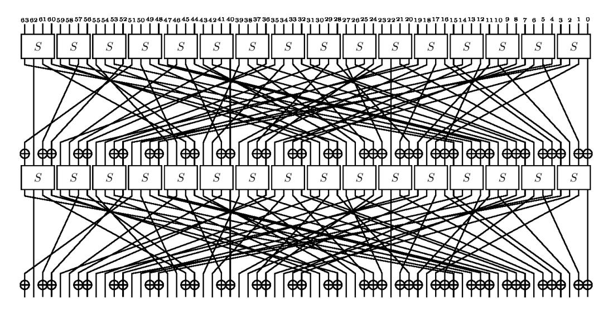

Figure 1: 2 rounds of GIFT-64 (from https://www.iacr.org/authors/tikz/).

while for GIFT-128 we have:

$$S = \begin{bmatrix} S_0 \\ S_1 \\ S_2 \\ S_3 \end{bmatrix} \leftarrow \begin{bmatrix} b_{124} & \cdots & b_8 & b_4 & b_0 \\ b_{125} & \cdots & b_9 & b_5 & b_1 \\ b_{126} & \cdots & b_{10} & b_6 & b_2 \\ b_{127} & \cdots & b_{11} & b_7 & b_3 \end{bmatrix}.$$

The 128-bit secret key is loaded into the key state KS partitioned into 8 16-bit words. In the perspective of a 2-dimensional array, the bit ordering is from right to left, then bottom-up.

$$KS = \begin{bmatrix} W_0 & \parallel & W_1 \\ W_2 & \parallel & W_3 \\ W_4 & \parallel & W_5 \\ W_6 & \parallel & W_7 \end{bmatrix} \leftarrow \begin{bmatrix} b_{127} & \cdots & b_{112} & \parallel & b_{111} & \cdots & b_{98} & b_{97} & b_{96} \\ b_{95} & \cdots & b_{80} & \parallel & b_{79} & \cdots & b_{66} & b_{65} & b_{64} \\ b_{63} & \cdots & b_{48} & \parallel & b_{47} & \cdots & b_{34} & b_{33} & b_{32} \\ b_{31} & \cdots & b_{16} & \parallel & b_{15} & \cdots & b_2 & b_1 & b_0 \end{bmatrix}$$

 $\underline{\text{SubCells.}}$  The substitution layer of 16 (or 32) identical 4-bit S-boxes can be applied in parallel with the following operations.

$$S_{1} \leftarrow S_{1} \oplus (S_{0} \wedge S_{2})$$

$$S_{0} \leftarrow S_{0} \oplus (S_{1} \wedge S_{3})$$

$$S_{2} \leftarrow S_{2} \oplus (S_{0} \vee S_{1})$$

$$S_{3} \leftarrow S_{3} \oplus S_{2}$$

$$S_{1} \leftarrow S_{1} \oplus S_{3}$$

$$S_{3} \leftarrow \neg S_{3}$$

$$S_{2} \leftarrow S_{2} \oplus (S_{0} \wedge S_{1})$$

$$\{S_{0}, S_{1}, S_{2}, S_{3}\} \leftarrow \{S_{3}, S_{1}, S_{2}, S_{0}\},$$

where  $\wedge$ ,  $\vee$  and  $\neg$  are logical AND, OR and NOT operation respectively.

<u>PermBits.</u> The bit permutation of GIFT has the special property that each bit located in a slice i remains in the same slice through this permutation. Now, different 16-bit (or

32-bit) permutations are applied to each *S<sup>i</sup>* independently. They map a bit located at position *j* in slice *i* to position *Pi*(*j*) in the same slice *i*. We provide in Tables [1](#page-4-0) and [2](#page-4-1) the *Pi*(*j*) values for GIFT-64 and GIFT-128 respectively.

<span id="page-4-0"></span>

| j     | 0  | 1  | 2  | 3  | 4  | 5  | 6  | 7  | 8  | 9  | 10 | 11 | 12 | 13 | 14 | 15 |
|-------|----|----|----|----|----|----|----|----|----|----|----|----|----|----|----|----|
| P0(j) | 0  | 12 | 8  | 4  | 1  | 13 | 9  | 5  | 2  | 14 | 10 | 6  | 3  | 15 | 11 | 7  |
| P1(j) | 4  | 0  | 12 | 8  | 5  | 1  | 13 | 9  | 6  | 2  | 14 | 10 | 7  | 3  | 15 | 11 |
| P2(j) | 8  | 4  | 0  | 12 | 9  | 5  | 1  | 13 | 10 | 6  | 2  | 14 | 11 | 7  | 3  | 15 |
| P3(j) | 12 | 8  | 4  | 0  | 13 | 9  | 5  | 1  | 14 | 10 | 6  | 2  | 15 | 11 | 7  | 3  |

Table 2: Specifications of GIFT-128 bit permutation.

<span id="page-4-1"></span>

| 1  | 2  | 3  | 4  | 5  | 6  | 7  | 8  | 9  | 10 | 11 | 12 | 13 | 14 | 15 |
|----|----|----|----|----|----|----|----|----|----|----|----|----|----|----|
| 24 | 16 | 8  | 1  | 25 | 17 | 9  | 2  | 26 | 18 | 10 | 3  | 27 | 19 | 11 |
| 0  | 24 | 16 | 9  | 1  | 25 | 17 | 10 | 2  | 26 | 18 | 11 | 3  | 27 | 19 |
| 8  | 0  | 24 | 17 | 9  | 1  | 25 | 18 | 10 | 2  | 26 | 19 | 11 | 3  | 27 |
| 16 | 8  | 0  | 25 | 17 | 9  | 1  | 26 | 18 | 10 | 2  | 27 | 19 | 11 | 3  |
|    |    |    |    |    |    |    |    |    |    |    |    |    |    |    |
| 17 | 18 | 19 | 20 | 21 | 22 | 23 | 24 | 25 | 26 | 27 | 28 | 29 | 30 | 31 |
| 28 | 20 | 12 | 5  | 29 | 21 | 13 | 6  | 30 | 22 | 14 | 7  | 31 | 23 | 15 |
| 4  | 28 | 20 | 13 | 5  | 29 | 21 | 14 | 6  | 30 | 22 | 15 | 7  | 31 | 23 |
| 12 | 4  | 28 | 21 | 13 | 5  | 29 | 22 | 14 | 6  | 30 | 23 | 15 | 7  | 31 |
| 20 | 12 | 4  | 29 | 21 | 13 | 5  | 30 | 22 | 14 | 6  | 31 | 23 | 15 | 7  |
|    |    |    |    |    |    |    |    |    |    |    |    |    |    |    |

AddRoundKey. This step consists of adding the round key and round constant. Two 16-bit (or 32-bit) segments *U, V* are extracted from the key state as the round key: *RK* = *U*k*V* . Then, for the addition of round key, *U* and *V* are XORed to *S*<sup>1</sup> and *S*<sup>0</sup> of the cipher state respectively for GIFT-64, or *S*<sup>2</sup> and *S*<sup>1</sup> of the cipher state respectively for GIFT-128:

$$S_1 \leftarrow S_1 \oplus U, \quad S_0 \leftarrow S_0 \oplus V \quad \text{ for GIFT-64}$$
  
 $S_2 \leftarrow S_2 \oplus U, \quad S_1 \leftarrow S_1 \oplus V \quad \text{ for GIFT-128}.$ 

For the addition of round constant, *S*<sup>3</sup> is updated as follows:

$$S_3 \leftarrow S_3 \oplus 0$$
x80XY for GIFT-64  
 $S_3 \leftarrow S_3 \oplus 0$ x800000XY for GIFT-128

where the byte XY = 00*c*5*c*4*c*3*c*2*c*1*c*0.

#### **2.2 Key schedule and round constants**

The key schedule and round constants are the same for both versions of GIFT, the only difference is the round key extraction. A round key is *first* extracted from the key state before the key state update. For GIFT-64, two 16-bit words of the key state are extracted as the round key *RK* = *U*k*V*

$$U \leftarrow W_6, \ V \leftarrow W_7,$$

while for GIFT-128, four 16-bit words of the key state are extracted as the round key RK = U||V|.

$$U \leftarrow W_2 || W_3, \ V \leftarrow W_6 || W_7.$$

The key state is then updated as follows,

$$\begin{bmatrix} W_0 & \parallel & W_1 \\ W_2 & \parallel & W_3 \\ W_4 & \parallel & W_5 \\ W_6 & \parallel & W_7 \end{bmatrix} \leftarrow \begin{bmatrix} W_6 \gg 2 & \parallel & W_7 \gg 12 \\ W_0 & \parallel & W_1 \\ W_2 & \parallel & W_3 \\ W_4 & \parallel & W_5 \end{bmatrix},$$

where  $\gg$  i is an i bits right rotation within the 16-bit word.

The round constants are generated using a 6-bit affine LFSR, whose state is denoted as  $c_5c_4c_3c_2c_1c_0$ . Its update function is defined as:

$$c_5 \|c_4\|c_3\|c_2\|c_1\|c_0 \leftarrow c_4 \|c_3\|c_2\|c_1\|c_0\|c_5 \oplus c_4 \oplus 1$$
.

The six bits are initialized to zero, and updated *before* being used in a given round. The values of the constants for each round are given in the table below, encoded to byte values for each round, with  $c_0$  being the least significant bit.

| Rounds            | Constants                                                                                          |
|-------------------|----------------------------------------------------------------------------------------------------|
| 1 - 16<br>17 - 32 | 01,03,07,0F,1F,3E,3D,3B,37,2F,1E,3C,39,33,27,0E<br>1D,3A,35,2B,16,2C,18,30,21,02,05,0B,17,2E,1C,38 |
| 33 - 48           | 31,23,06,0D,1B,36,2D,1A,34,29,12,24,08,11,22,04                                                    |

## <span id="page-5-0"></span>3 Naive bitsliced implementation of GIFT

Naive bitsliced implementations of the GIFT family of block ciphers can be achieved by following straightforwardly the specifications. First, in the case of GIFT-64 and GIFT-128, one has to rearrange the inputs in their bitsliced representation. This can be done using the SWAPMOVE technique [MPC00]:

$$\begin{aligned} \mathsf{SWAPMOVE}(A,B,M,n): \\ T &= (B \oplus (A \gg n)) \ \land \ M \\ B &= B \oplus T \\ A &= A \oplus (T \ll n) \end{aligned}$$

which consists in swapping the bits in B masked by M with the bits in A masked by  $(M \ll n)$ . Regarding the substitution layer, the 4-bit S-boxes can be computed in parallel in only 13 operations as described in Section 2. The main difficulty lies in the diffusion layer as it refers to the least bitslice-friendly operation. For the sake of clarity, let us consider the case of GIFT-64. In order to apply the 16-bit permutation  $P_0$  to  $S_0$ , a basic approach would be to move the bits using masks and shifts, resulting in the following operations:

$$\begin{split} P_0(S_0) &= (S_0 \wedge 0 \text{x} 0401) & \vee \ ((S_0 \wedge 0 \text{x} 0008) \ll 1) & \vee \\ & ((S_0 \wedge 0 \text{x} 2000) \ll 2) & \vee \ ((S_0 \wedge 0 \text{x} 0040) \ll 3) & \vee \\ & ((S_0 \wedge 0 \text{x} 0200) \ll 5) & \vee \ ((S_0 \wedge 0 \text{x} 0004) \ll 6) & \vee \\ & ((S_0 \wedge 0 \text{x} 0020) \ll 8) & \vee \ ((S_0 \wedge 0 \text{x} 0002) \ll 11) & \vee \\ & ((S_0 \wedge 0 \text{x} 1000) \gg 9) & \vee \ ((S_0 \wedge 0 \text{x} 8000) \gg 8) & \vee \\ & ((S_0 \wedge 0 \text{x} 0100) \gg 6) & \vee \ ((S_0 \wedge 0 \text{x} 0800) \gg 5) & \vee \\ & ((S_0 \wedge 0 \text{x} 4010) \gg 3) & \vee \ ((S_0 \wedge 0 \text{x} 00080) \gg 2) \end{split}$$

which requires about 27 cycles on ARM Cortex-M processors. In the same way, *P*1*, P*<sup>2</sup> and *P*<sup>3</sup> can be implemented in approximately 14, 27 and 18 cycles, respectively. Therefore, the diffusion layer requires about 100 cycles for a single round. This highlights why ciphers using bit permutation are generally considered inappropriate for software implementations on micro-controllers.

Still, it is possible to minimize the impact on performances by operating on several blocks in parallel for 32-bit (and above) architectures. In order to give some insights on how GIFT performs on ARM Cortex-M3 and M4 using the naive bitsliced implementation, we benchmarked a code fully written in C language, compiled by arm-none-eabi-gcc 9.2.1 using the flag -O3 for optimized speed results, on the STM32L100C and STM32F407VG development boards. Note that our benchmark simply measures the execution time to expand the key and to encrypt 128-bit data, without any operating mode. Implementation results are listed in Table [3.](#page-6-0) For encryption functions, the data in ROM refers to precomputed round constants while under RAM usage, I/O refers to the amount of memory needed to store the input and ouput plus the temporary variables (excluding the round keys).

| Algorithm           | Parallel |       | Speed (cycles/block) |       | ROM (bytes) | RAM (bytes) |       |  |  |  |  |  |
|---------------------|----------|-------|----------------------|-------|-------------|-------------|-------|--|--|--|--|--|
|                     | Blocks   | M3    | M4                   | Code  | Data        | I/O         | Stack |  |  |  |  |  |
| GIFT-64 key exp.    | -        | 2 296 | 2 304                | 668   | 0           | 112         | 24    |  |  |  |  |  |
| GIFTb-64 encryption | 2        | 2 091 | 2 097                | 1 172 | 28          | 52          | 48    |  |  |  |  |  |
| GIFT-64 encryption  | 2        | 2 141 | 2 138                | 1 608 | 28          | 52          | 48    |  |  |  |  |  |
| GIFT-128 key exp.   | -        | 3 433 | 3 476                | 644   | 0           | 360         | 24    |  |  |  |  |  |

GIFTb-128 encryption 1 8 456 8 375 1 508 40 52 48 GIFT-128 encryption 1 8 644 8 573 1 996 40 52 48

<span id="page-6-0"></span>Table 3: Naive bitsliced implementation results on ARM Cortex-M3 and M4 for various versions of GIFT.

As expected, the result is that GIFT is not well suited for software bitsliced implementations on micro-controllers. While our C implementation requires about 4 000 cycles to encrypt 128-bit data using GIFT-64, twice as much are required when using GIFT-128. This gap is due to the fact that, on top of having more rounds than GIFT-64, the slice permutations *P*0*,* · · · *, P*<sup>3</sup> of GIFT-128 operate on 32 bits instead of 16, increasing the number of masks and shifts to compute. However, the next section introduces a new GIFT representation which challenges this conclusion.

# **4 A new GIFT representation**

### **4.1 GIFT-64**

Let us consider a bitsliced representation of the cipher state: for each nibble, bit 0 is placed in the slice 0, bit 1 in slice 1, bit 2 in slice 2 and bit 3 in slice 3. For ease of description, a slice can be placed in matrix form, as shown in the top row of Figure [3.](#page-8-0) During the SubCells application, when each slice is stored in independent words, all the 16 S-boxes are implemented in parallel in bitslice manner, as seen in Figure [2.](#page-7-0) Then, according to the GIFT designers [\[BPP](#page-21-2)<sup>+</sup>17], the bit permutation can be implemented as follows:

- Take the transpose of each individual slice matrix
- Apply the following row swaps:

- **–** Slice 0 matrix: swap row 1 with 3
- **–** Slice 1 matrix: swap row 0 with 1, and swap row 2 with 3
- **–** Slice 2 matrix: swap row 0 with 2
- **–** Slice 3 matrix: swap row 0 with 3, and swap row 1 with 2

<span id="page-7-0"></span>We give a graphical representation of 4 rounds of this process in Figure [3.](#page-8-0)

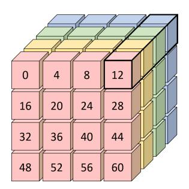

Figure 2: Cubic representation of the main state of GIFT-64. Each color refer to a slice matrix while the black cuboid is where an S-box is applied.

As explained in Section [3,](#page-5-0) the diffusion layer requires bits to be moved around individually in the slice (and not entire chunks of the slice), resulting in a significant overhead. In order to avoid these issues, we propose a new way to represent GIFT-64. The idea is to fix the first slice matrix to never move and find the easiest operations that could keep the bits of other slice matrices synchronised after application of the linear layer (so that the S-box computation that comes after will indeed involve the proper bits). This representation is given in Figure [4](#page-9-0) and one can see that even though the bit positions are different, each S-box will have exactly the same bits indexes involved when compared to the classical representation given in Figure [3.](#page-8-0) For example, after one round, the classical representation will have bits 16/21/26/31 in row 0 and column 1 and we can see that the exact same quartet will appear as well in the new representation, but in row 1 and column 0 instead. The fact that this quartet appears in a different row/column has no impact on the actual computation of the S-box right after, since the computation is bitsliced.

The very nice property of this new representation is that it requires very few operations: each round, we only apply a row or column rotation to the three last slice matrices, while the first slice matrix is never moved. More precisely, for a round *i*:

- if i%4=0, rotate slice *j* matrix by *j* columns to the left
- if i%4=1, rotate slice *j* matrix by *j* rows to the top
- if i%4=2, rotate slice *j* matrix by *j* columns to the right
- if i%4=3, rotate slice *j* matrix by *j* rows to the bottom

This entire process, which applies different functions for each 4 consecutive rounds, will be much less costly in software than having to transpose and then swap rows around. Even better: the new and the classical representations are naturally fully synchronised again after applying these 4 rounds, which avoids any representation correction to be applied at the end of the cipher (since GIFT-64 has 28 rounds, which is a multiple of 4). This is due to the fact that *P* 4 *<sup>i</sup>* = *Id* for all *i*. Therefore, no matter which slice matrix is fixed, the new and the classical representations will be fully synchronised after 4 rounds anyway.

<span id="page-8-0"></span>

| slice 0 |    |    |    |  |    | slice 1 |    |    |  |    | slice 2 |    |    |  |    | slice 3 |    |    |  |  |
|---------|----|----|----|--|----|---------|----|----|--|----|---------|----|----|--|----|---------|----|----|--|--|
| 0       | 4  | 8  | 12 |  | 1  | 5       | 9  | 13 |  | 2  | 6       | 10 | 14 |  | 3  | 7       | 11 | 15 |  |  |
| 16      | 20 | 24 | 28 |  | 17 | 21      | 25 | 29 |  | 18 | 22      | 26 | 30 |  | 19 | 23      | 27 | 31 |  |  |
| 32      | 36 | 40 | 44 |  | 33 | 37      | 41 | 45 |  | 34 | 38      | 42 | 46 |  | 35 | 39      | 43 | 47 |  |  |
| 48      | 52 | 56 | 60 |  | 49 | 53      | 57 | 61 |  | 50 | 54      | 58 | 62 |  | 51 | 55      | 59 | 63 |  |  |
|         |    |    |    |  |    |         |    |    |  |    |         |    |    |  |    |         |    |    |  |  |
| 0       | 16 | 32 | 48 |  | 5  | 21      | 37 | 53 |  | 10 | 26      | 42 | 58 |  | 15 | 31      | 47 | 63 |  |  |
| 12      | 28 | 44 | 60 |  | 1  | 17      | 33 | 49 |  | 6  | 22      | 38 | 54 |  | 11 | 27      | 43 | 59 |  |  |
| 8       | 24 | 40 | 56 |  | 13 | 29      | 45 | 61 |  | 2  | 18      | 34 | 50 |  | 7  | 23      | 39 | 55 |  |  |
| 4       | 20 | 36 | 52 |  | 9  | 25      | 41 | 57 |  | 14 | 30      | 46 | 62 |  | 3  | 19      | 35 | 51 |  |  |
|         |    |    |    |  |    |         |    |    |  |    |         |    |    |  |    |         |    |    |  |  |
| 0       | 12 | 8  | 4  |  | 21 | 17      | 29 | 25 |  | 42 | 38      | 34 | 46 |  | 63 | 59      | 55 | 51 |  |  |
| 48      | 60 | 56 | 52 |  | 5  | 1       | 13 | 9  |  | 26 | 22      | 18 | 30 |  | 47 | 43      | 39 | 35 |  |  |
| 32      | 44 | 40 | 36 |  | 53 | 49      | 61 | 57 |  | 10 | 6       | 2  | 14 |  | 31 | 27      | 23 | 19 |  |  |
| 16      | 28 | 24 | 20 |  | 37 | 33      | 45 | 41 |  | 58 | 54      | 50 | 62 |  | 15 | 11      | 7  | 3  |  |  |
|         |    |    |    |  |    |         |    |    |  |    |         |    |    |  |    |         |    |    |  |  |
| 0       | 48 | 32 | 16 |  | 17 | 1       | 49 | 33 |  | 34 | 18      | 2  | 50 |  | 51 | 35      | 19 | 3  |  |  |
| 4       | 52 | 36 | 20 |  | 21 | 5       | 53 | 37 |  | 38 | 22      | 6  | 54 |  | 55 | 39      | 23 | 7  |  |  |
| 8       | 56 | 40 | 24 |  | 25 | 9       | 57 | 41 |  | 42 | 26      | 10 | 58 |  | 59 | 43      | 27 | 11 |  |  |
| 12      | 60 | 44 | 28 |  | 29 | 13      | 61 | 45 |  | 46 | 30      | 14 | 62 |  | 63 | 47      | 31 | 15 |  |  |
|         |    |    |    |  |    |         |    |    |  |    |         |    |    |  |    |         |    |    |  |  |
| 0       | 4  | 8  | 12 |  | 1  | 5       | 9  | 13 |  | 2  | 6       | 10 | 14 |  | 3  | 7       | 11 | 15 |  |  |
| 16      | 20 | 24 | 28 |  | 17 | 21      | 25 | 29 |  | 18 | 22      | 26 | 30 |  | 19 | 23      | 27 | 31 |  |  |
| 32      | 36 | 40 | 44 |  | 33 | 37      | 41 | 45 |  | 34 | 38      | 42 | 46 |  | 35 | 39      | 43 | 47 |  |  |
| 48      | 52 | 56 | 60 |  | 49 | 53      | 57 | 61 |  | 50 | 54      | 58 | 62 |  | 51 | 55      | 59 | 63 |  |  |

Figure 3: Classical representation of the GIFT-64 round function during 4 rounds. Each cell represents a bit, and the numbers in the cells then denote the actual index of that particular bit in the state. Slice 0 (resp. 1/2/3) depicted in red (resp. yellow/green/blue) represents all the bits at position 0 (resp. 1/2/3) of the S-boxes of the cipher state.

We call this technique *fixslicing*. Note that it is close to the software optimization of PRESENT in [\[RAL17\]](#page-22-0) which consists in decomposing the permutation over 2 rounds, as our new representation can be seen as a decomposition of *P*0*,* · · · *, P*<sup>3</sup> over 4 rounds. Actually, the fixslicing technique is a particular case for permutations which ensures that, from a bitsliced perspective, all bits within a slice remain in the same one through the permutation. Therefore, it can be applied to all permutations that verify this property, and the number of rounds to consider for the decomposition equals *min*(order(*Pi*)) for all *i*.

<span id="page-9-0"></span>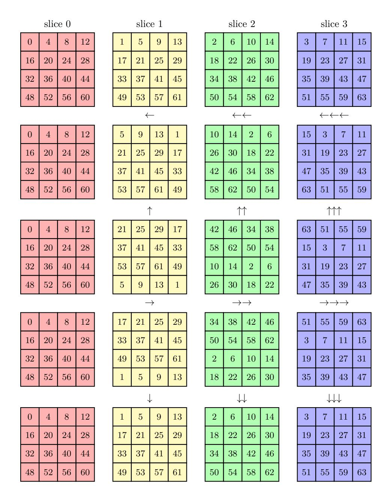

Figure 4: New representation of the GIFT-64 round function during 4 rounds. Each cell represents a bit, and the numbers in the cells then denote the actual index of that particular bit in the state. Slice 0 (resp. 1/2/3) depicted in red (resp. yellow/green/blue) represents all the bits at position 0 (resp. 1/2/3) of the S-boxes of the cipher state.

The other side of the coin of this new representation is that the round keys and round constants have to be adapted to fit the new way the bits are positioned. While this is not an issue for the round constants by using a precomputed look-up table, adapting the key schedule might result in some computational overhead. The naive approach would be to run the key schedule using the classical representation, before rearranging bits for all round keys. However, one can take advantage of the fact that after 4 rounds all key words are back in the same position within the key state (yet the words themselves will be rotated because of the rotation operations in the key schedule). In other terms, because  $RK^i = U^i ||V^i||$  and  $RK^{i+4} = U^i \gg 2||V^i|| \gg 12$ , each key word has to go through the same bit reordering every 4 rounds. Therefore a more efficient approach is to rearrange bits for the first 4 round keys only, and to adapt the key schedule accordingly. More details on how to compute the key schedule in the fixsliced representation are given in Appendix A.1.

#### <span id="page-10-1"></span>4.2 GIFT-128

<span id="page-10-0"></span>As for GIFT-64, we consider a bitsliced representation of the cipher state. For ease of description, a slice i can be represented as a pair of matrices  $i_L$  and  $i_R$ , as shown in the top row of Figure 6. During the SubCells application, when each slice is stored in independent words, all the 32 S-boxes are implemented in parallel in a bitsliced manner, as seen in Figure 5.

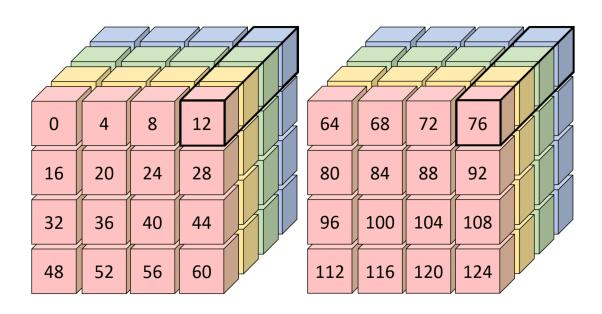

Figure 5: Cubic representation of the main state of GIFT-128. The black cuboid is where an S-box is applied for both matrices.

Then, according to the GIFT designers [BPP<sup>+</sup>17], the bit permutation can be implemented as follows:

- Take the transpose of each individual slice matrix
- Shuffle the left and right matrices of each slice (i.e. shuffle  $i_L$  and  $i_R$  for all i).
- Apply the following row swaps:
  - Slice 0: swap the 2 bottom halves
  - Slice 1: swap the top and bottom halves of the slices independently
  - Slice 2: swap the 2 top halves
  - Slice 3: cross swap the top and bottom halves

We give a graphical representation of 5 rounds of this process in Figure 6.

As for GIFT-64, one can see that the process will be very costly in software, with lots of transpositions, shuffle and swaps. We therefore propose a new way to represent GIFT-128, thanks to the fixslicing technique. However, unlike GIFT-64, note that the classical and the new representation will not be synchronised anymore after 4 rounds since  $P_i^4 \neq Id$  for all i. For GIFT-128 we have  $P_0^{31} = P_1^{10} = P_2^{31} = P_3^5 = Id$ . In other terms, by fixing the fourth slice to never move, we can define a routine so that the classical and new representation are naturally synchronised after 5 rounds. Since GIFT-128 has 40 rounds (which is a multiple of 5), it avoids any correction to be applied at the end of the cipher. This representation is depicted in Figure 7. Additional illustrations are also provided in Appendix B.

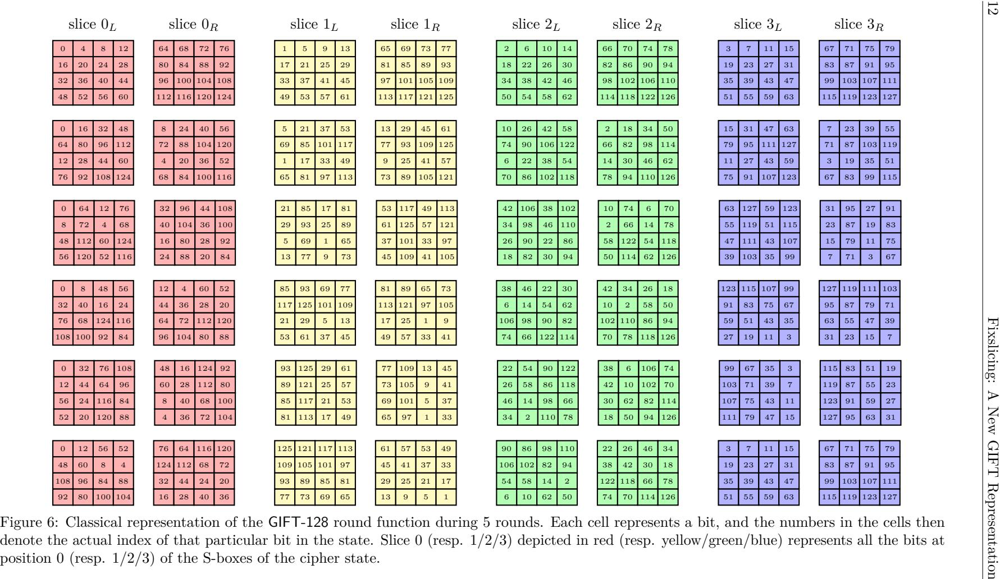

<span id="page-11-0"></span>

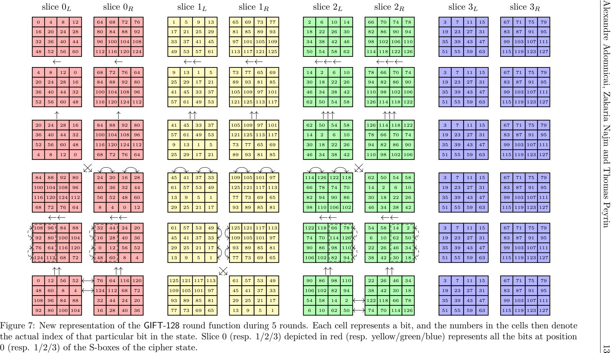

<span id="page-12-0"></span>

One can again see that even though the bit positions are different, each S-box will have exactly the same bit indexes involved when compared to the classical representation given in Figure [6.](#page-11-0) We recall that this representation implies that the key schedule and constant addition have to be adapted to fit the new way the bits are positioned.

The first 2 rounds are similar to the ones used for GIFT-64. Namely, in the first round, we simply rotate each matrix of each slice *i* (thus *i<sup>L</sup>* and *i<sup>R</sup>* for all *i*) by *i* columns to the left. In the second round, we simply rotate each matrix of each slice *i* (thus *i<sup>L</sup>* and *i<sup>R</sup>* for all *i*) by *i* rows to the top. For the third round, we swap the matrices *i<sup>L</sup>* and *i<sup>R</sup>* for *i* ∈ {0*,* 2} before swapping the first and third columns with the second and fourth ones respectively, for matrixes 0*R,* 1*L,* 1*<sup>R</sup>* and 2*L*. During the fourth round, we swap the first and third rows with the second and fourth ones respectively, for each matrix of slice 1. Then, for each matrix of slice 0 (resp. slice 2), we rotate by 2 columns to the left before swapping rows of the left-half block (resp. right-half block). Finally, the fifth round consists in swapping 1*<sup>L</sup>* with 1*R*, rotating *i<sup>L</sup>* and *i<sup>R</sup>* by 2 rows to the top for *i* ∈ {0*,* 2} and swapping the first and second rows of each matrix for slice 0, while swapping the third and fourth rows of each matrix for slice 2. All these operations are illustrated in Figure [7](#page-12-0) for greater clarity.

The above mentioned method to adapt the key schedule for GIFT-64 cannot be straightforwardly applied to GIFT-128. Indeed, the new and the classical representations of the state are synchronised after 5 rounds, but the key schedule part is almost synchronised after 4 rounds (the key word will return to its original position after 4 rounds, albeit rotated). Thus, it looks like the synchronisation will happen only every 4 × 5 = 20 rounds. However, one can remark that twice as much subkey material is used for GIFT-128 compared to GIFT-64, and there the key words used every two rounds are the same (albeit rotated, and for different part of the internal state). Thus, we have an almost synchronisation that will happen only every 2 × 5 = 10 rounds instead. In other terms, each key word has to match every new representation of the state at some point. Instead of applying the naive approach for all round keys, which consists in running the key schedule using the classical representation and then rearranging bits, we suggest to apply it only for the first 10 round keys. At this stage, all key words will be expressed in each representation, allowing to adapt the key schedule for each of them, without reordering bits. More details on how to compute the key schedule in the fixsliced representation are given in Appendix [A.2.](#page-23-0)

# <span id="page-13-0"></span>**5 Efficient software implementations of GIFT**

This section shows how to take advantage of the fixslicing technique to achieve efficient implementations of GIFT on ARM Cortex-M processors. We also briefly discuss the gap for other platforms that do not come with an inline barrel shifter or rotate instruction.

#### **5.1 GIFT-64**

In the case of GIFT-64, thanks to our new fixsliced representation, the linear layer consists in rotating either rows or columns depending on the round number. Depending on how the bits are arranged within the slices (i.e. row-wise or column-wise bitsliced representation), these operations refer to either half-word (16-bit) or nibble (4-bit) rotations. In the rest of this section we consider a row-wise bitsliced representation. The ARM Cortex-M being a 32-bit architecture (and since we have 4 slices in GIFT-64), two 64-bit blocks *B* and *B*<sup>0</sup> can be processed at a time. Instead of simply concatenating 16-bit slices of both blocks within a 32-bit words, we suggest to interleave the nibbles as follows:

```
S0 ←b60 b56 b52 b48 b
                             0
                             60 b
                                   0
                                   56 b
                                        0
                                        52 b
                                             0
                                             48 · · · b12 b8 b4 b0 b
                                                                        0
                                                                        12 b
                                                                             0
                                                                             8
                                                                                b
                                                                                 0
                                                                                 4
                                                                                    b
                                                                                     0
                                                                                     0
S1 ←b61 b57 b53 b49 b
                             0
                             61 b
                                   0
                                   57 b
                                        0
                                        53 b
                                             0
                                             49 · · · b13 b9 b5 b1 b
                                                                        0
                                                                        13 b
                                                                             0
                                                                             9
                                                                                b
                                                                                 0
                                                                                 5
                                                                                    b
                                                                                     0
                                                                                     1
S2 ←b62 b58 b54 b50 b
                             0
                             62 b
                                   0
                                   58 b
                                        0
                                        54 b
                                             0
                                             50 · · · b14 b10 b6 b2 b
                                                                          0
                                                                          14 b
                                                                               0
                                                                               10 b
                                                                                    0
                                                                                    6
                                                                                       b
                                                                                        0
                                                                                        2
S3 ←b63 b59 b55 b51 b
                             0
                             63 b
                                   0
                                   59 b
                                        0
                                        55 b
                                             0
                                             51 · · · b15 b11 b7 b3 b
                                                                          0
                                                                          15 b
                                                                               0
                                                                               11 b
                                                                                    0
                                                                                    7
                                                                                       b
                                                                                        0
                                                                                        3
```

so that 16-bit rotations are now 32-bit rotations, which can be implemented in a single cycle using the ror instruction. Actually, it can be computed for free by taking advantage of the inline barrel shifter, since instructions can shift or rotate one of their operands without any additional cost. Therefore, the implementation cost of the linear layer is now equivalent to 42 nibble rotations (3 have to be computed every 2 rounds). Such rotations can be computed in 3 cycles on ARM Cortex-M processors assuming that the required masks are already loaded in some general purpose registers, resulting in a total of 42 × 3 = 126 cycles. The following calls to the SWAPMOVE routine lead to the above mentioned row-wise nibble-interleaved bitsliced representation.

```
S0 ← b31 · · · b0 S1 ← b
                      0
                      31 · · · b
                             0
                             0 S2 ← b63 · · · b32 S3 ← b
                                                            0
                                                            63 · · · b
                                                                   0
                                                                   32
SWAPMOVE(S0, S0, 0x0a0a0a0a, 3); SWAPMOVE(S1, S1, 0x0a0a0a0a, 3);
SWAPMOVE(S2, S2, 0x0a0a0a0a, 3); SWAPMOVE(S3, S3, 0x0a0a0a0a, 3);
SWAPMOVE(S0, S0, 0x00cc00cc, 6); SWAPMOVE(S1, S1, 0x00cc00cc, 6);
SWAPMOVE(S2, S2, 0x00cc00cc, 6); SWAPMOVE(S3, S3, 0x00cc00cc, 6);
SWAPMOVE(S0, S0, 0x0000ff00, 8); SWAPMOVE(S1, S1, 0x0000ff00, 8);
SWAPMOVE(S2, S2, 0x0000ff00, 8); SWAPMOVE(S3, S3, 0x0000ff00, 8);
SWAPMOVE(S0, S1, 0x0f0f0f0f, 4); SWAPMOVE(S2, S3, 0x0f0f0f0f, 4);
SWAPMOVE(S0, S2, 0x0000ffff, 16); SWAPMOVE(S1, S3, 0x0000ffff, 16);
```

Although a bitsliced representation without interleaving the nibbles could be built for 12 SWAPMOVE instead of 16, each half-word rotation would require at least 3 cycles, therefore doubling the cost of the linear layer to at least 252 cycles. Regarding the non-linear layer, it is possible to save 1 instruction by omitting the NOT operation. Indeed, this operation applies to a slice that will be then exclusive-ORed with the round key. Therefore, we suggest to compute the NOT on the corresponding round keys. Moreover, because the key schedule is completely linear, one can simply apply the logical negation to the right chunks of the key:

$$k_{127}\cdots k_{112}\,\overline{k_{111}\cdots k_{96}}\,k_{95}\cdots k_{80}\,\overline{k_{79}\cdots k_{64}}\,k_{63}\cdots k_{48}\,\overline{k_{47}\cdots k_{32}}\,k_{31}\cdots k_{16}\,\overline{k_{15}\cdots k_{00}}$$

before computing the key schedule. Note that this can be done once, when the encryption key is being derived and/or stored on the device, therefore saving 28 cycles per 128-bit data encryption.

On the other hand, a nibble-interleaved bitsliced representation requires twice as much memory to store the round keys and constants in order to avoid extra computations on the fly. It would still be possible to store these variable as 16-bit words but one would have to pay extra cycles to expand them into 32-bit words, nibble-interleaved with theirselves. As a matter of efficiency, we did not consider this option for our implementations. The round keys and constants are stored in 32-bit words, leading to a memory requirement of 112 and 224 bytes for all the round constants and the round keys, respectively.

#### **5.2 GIFT-128**

Regarding GIFT-128, because only a single block can be processed at a time on 32-bit processors, we consider a row-wise bitsliced representation without any interleaving. Unlike

GIFT-64, it is not possible to distinguish only 2 but 5 kind of operation since each step of the new representation requires different slice transformations. At steps 1, 2, 4 and 5, these transformations can be implemented by means of nibble, half-word, byte and full-word rotations, respectively. The third step does not clearly refer to any *n*-bit rotation but can be simply computed using the SWAPMOVE process. Again, full-word rotations can be implemented for free on ARM thanks to the inline barrel shifter. Even though the nibble, byte and half-word rotations can be implemented in at least 3 cycles, our implementation requires 5 cycles as 2 additional cycles are spent in loading the appropriate masks into registers. This is due to the fact that, unlike GIFT-64, it is not possible to keep all the masks in registers during the entire encryption routine as 12 different ones are needed. The same statement also applies to SWAPMOVE calculations, leading to a cost of 5 cycles per process. As a result, the linear layer of GIFT-128 can be implemented in about 12 × 5 × 8 = 480 cycles in total, according to our new representation.

Note that row ordering matters to match with this interpretation of the new representation. Our GIFT-128 implementations use a row ordering from top-down, which can be achieved using the 14 following calls to the SWAPMOVE process:

```
S0 ← b79 · · · b64 b15 · · · b0 S1 ← b95 · · · b80 b31 · · · b16
  S2 ← b111 · · · b96 b47 · · · b32 S3 ← b127 · · · b112 b63 · · · b48
SWAPMOVE(S0, S0, 0x0a0a0a0a, 3); SWAPMOVE(S1, S1, 0x0a0a0a0a, 3);
SWAPMOVE(S2, S2, 0x0a0a0a0a, 3); SWAPMOVE(S3, S3, 0x0a0a0a0a, 3);
SWAPMOVE(S0, S0, 0x00cc00cc, 6); SWAPMOVE(S1, S1, 0x00cc00cc, 6);
SWAPMOVE(S2, S2, 0x00cc00cc, 6); SWAPMOVE(S3, S3, 0x00cc00cc, 6);
SWAPMOVE(S0, S1, 0x000f000f, 4); SWAPMOVE(S0, S2, 0x000f000f, 8);
SWAPMOVE(S0, S3, 0x000f000f, 12); SWAPMOVE(S1, S2, 0x00f000f0, 4);
SWAPMOVE(S1, S3, 0x00f000f0, 8); SWAPMOVE(S2, S3, 0x0f000f00, 4);
```

Regarding the non-linear layer, contrary to GIFT-64, it is not possible to get rid of the NOT operation within the S-box computation as the round keys are not exclusively-ORed to *S*0. Therefore, our implementation of the non-linear layer follows straightforwardly the specification and requires 13 × 40 = 520 cycles in total.

### **5.3 Without rotate instruction**

Thanks to the inline barrel shifter, our fixsliced implementations fit very well the ARM architecture since the linear layer can be computed for free every 2 and 5 rounds for GIFTb-64 and GIFTb-128, respectively. However, one could ask oneself how it would perform on platforms that do not come with an inline barrel shifter and/or rotate instructions. For instance, RISC-V has no rotate instruction without an appropriate extension (e.g., Bitmanip [\[Wol20\]](#page-22-6)). In this case, one rotation can be computed by means of 2 shifts and 1 OR, resulting in at least 3 cycles. Therefore, instead of having the linear layer for free every 2 and 5 rounds, it would require at least 4 × 3 = 12 cycles, leading to a minimum overhead of 12 × 14 = 168 and 12 × 8 = 96 cycles for GIFTb-64 and GIFTb-128, respectively. Moreover, nibble, byte and half-word rotations on RISC-V cannot be computed in 3 but 5 cycles because the barrel shifter is not inlined, resulting in an additional overhead of 2 × 4 × 14 = 112 for GIFT-64. On the other hand, this should not affect GIFT-128 since our implementation spends 5 cycles for all these rotations because 2 additional cycles are spent to load the appropriate masks in registers. While ARM Cortex-M processors only have 14 general purpose registers, RISC-V has 32 such registers, so all the masks can be kept in registers during the entire encryption process. Finally, the SWAPMOVE process would require 6 cycles instead of 4, increasing the cost to pack the input and unpack the output

to 16 × 4 = 64 and 14 × 4 = 56 cycles for GIFT-64 and GIFT-128, respectively. Note that it would also add (6 − 5) × 3 × 8 = 24 cycles to GIFTb-128 since it relies on 3 SWAPMOVE calls in order to compute the linear layer every 5 rounds.

As a result, on platforms without inline barrel shifter or rotate instruction, we estimate a total overhead of 168 + 112 = 280 (i.e. 140 per block) and 96 + 24 = 120 cycles for our fixsliced implementations of GIFTb-64 and GIFTb-128, respectively. Taking into account the overhead to pack/unpack the data would lead to a total overhead of and 280 + 64 = 344 (i.e. 172 per block) and 120 + 56 = 176 cycles for GIFT-64 and GIFT-128, respectively. Overall, this means a penalty of around 40% cycles for GIFT-64 and 15% cycles for GIFT-128. Therefore, fixslicing is still of interest on such platforms compared to the classical representation, although the ARM architecture allows to boost its performance.

# **6 Results**

### **6.1 The GIFT block ciphers**

Our GIFT implementations, which are written in ARM assembly, are put into the public domain and available at <https://github.com/aadomn/gift>. Results for various lightweight block ciphers including GIFT are provided in Table [4.](#page-17-0)

The implementations of RECTANGLE-64/128, SIMON-64/128 and SPECK-64/128 are the ones from scenario 2 - Best execution time - of the FELICS framework [\[DCK](#page-22-7)<sup>+</sup>19]. In this scenario, the key schedule is not taken into account as the round keys are assumed to be precomputed and stored in RAM. The benchmark consists in measuring the time required to encrypt 128-bit data using the CTR mode. We followed the same approach for our GIFT implementations to ensure a fair comparison. The results for PRESENT-64/128 are taken from [\[RAL17\]](#page-22-0) and were obtained using the same methodology. Regarding the key schedule, results from the FELICS framework were extracted from the scenario 0, which consists in a simple benchmark of the key schedule and a block encryption/decryption. Except for RECTANGLE, for which implementations are written in ARM assembly, note that the results for the other above mentioned ciphers come from C codes. Therefore, better results can be expected for these algorithms by considering assembly implementations. Table [4](#page-17-0) also includes results for the current best AES constant-time implementation from [\[SS16\]](#page-22-8). Note that, as in Table [3,](#page-6-0) RAM usage for encryption functions does not take into account the memory required for the round keys to be compliant with the results from the FELICS framework.

As expected, our new GIFT fixsliced representation allows extremely efficient software bitsliced implementations, requiring at best 766 and 838 cycles to encrypt 128-bit data for GIFTb-64 and GIFT-64, respectively. Note that this is about 5 times more efficient than our naive bitsliced implementations written in C reported in Table [3.](#page-6-0) On the other hand, the amount of memory to store the round keys is increased by a factor 2. GIFT-64 outperforms all other 64-bit ciphers listed in Table [4,](#page-17-0) except SPECK-64/128 which is well known for its outstanding performances thanks to its ARX structure. Especially, our implementation of the GIFT-64 key schedule according to the new representation outperforms all the other ones. GIFT-64 key exp. refers to the key schedule including the rearrangement of the encryption key to match the fixsliced representation, while GIFTb-64 key exp. assumes a key already in the right representation as input. Note that rearranging the encryption key can be done only once, when this latter is being derived and/or stored on the device, at the same time that the S-box optimization described in Section [5.](#page-13-0)

Regarding GIFT-128, we observe a factor of 1*.*6 in terms of performance compared to GIFT-64. Considering that the factor in terms of rounds is about 1*.*4, it is a remarkable

46

628

254

132

36

12

 $\mathbf{24}$ 

24

<span id="page-17-0"></span>Table 4: Constant-time implementation results on ARM Cortex-M3 and M4 for various versions and representations of GIFT, as well as other lightweight block ciphers. For encryption routines, speed is expressed in cycles per block. Emboldened (resp. italic) results refer to speed (resp. code size) oriented implementations.

| A 1 24 1                        | D . C                 | Parallel   Speed (cycles)   ROM (bytes |      |      | (bytes) | RAN  | (bytes) |           |  |  |  |
|---------------------------------|-----------------------|----------------------------------------|------|------|---------|------|---------|-----------|--|--|--|
| ${\bf Algorithm}$               | Ref                   | Blocks                                 | М3   | M4   | Code    | Data | I/O     | Stack     |  |  |  |
| 64-bit ciphers with 128-bit key |                       |                                        |      |      |         |      |         |           |  |  |  |
| GIFTb-64 key exp.               |                       |                                        | 339  | 338  | 972     | 0    | 224     | 52        |  |  |  |
| dii 1b-04 key exp.              |                       | _                                      | 381  | 383  | 226     | 0    | 224     | 56        |  |  |  |
| GIFTb-64 encryption             |                       | 2                                      | 383  | 383  | 2666    | 0    | 40      | 48        |  |  |  |
| Sir ib or eneryption            | Ours                  | 2                                      | 415  | 415  | 756     | 112  | 40      | 52        |  |  |  |
| GIFT-64 key exp.                | Ours                  | _                                      | 488  | 487  | 1575    | 0    | 224     | <b>52</b> |  |  |  |
| uп 1-0 <del>4</del> ксу схр.    |                       | _                                      | 530  | 533  | 828     | 0    | 224     | 56        |  |  |  |
| GIFT-64 encryption              |                       | 2                                      | 419  | 419  | 2962    | 0    | 40      | 48        |  |  |  |
| on 1-04 eneryption              |                       |                                        | 458  | 456  | 1058    | 112  | 40      | 52        |  |  |  |
| PRESENT key exp.                | [RAL17]               | -                                      | 5043 | 3464 | •       | •    | •       | •         |  |  |  |
| PRESENT encryption              | [IMLII]               | 2                                      | 1058 | 800  | 2476    | •    | •       | •         |  |  |  |
| RECTANGLE key exp.              | [DCK <sup>+</sup> 19] | _                                      | 1106 |      | 15      | 7    | 232     | 44        |  |  |  |
| NECTANGLE key exp.              |                       |                                        | 1106 |      | 15      | 7    | 232     | 44        |  |  |  |
| RECTANGLE encryption            |                       | 1                                      | 854  |      | 80      | 0    | 76      | 24        |  |  |  |
| RECTANGLE energytion            |                       |                                        | 1185 | •    | 44      | 0    | 52      | 24        |  |  |  |
| SIMON 64 key eyr                | [DCIV+10]             |                                        | 1195 |      | 11      | 2    | 200     | 8         |  |  |  |
| SIMON-64 key exp.               |                       | _                                      | 1202 | •    | 10      | 18   | 200     | 12        |  |  |  |
| SIMON-64 encryption             | [DCK <sup>+</sup> 19] | 1                                      | 650  | _    | 45      | 6    | 48      | 24        |  |  |  |
| ShviOiv-04 encryption           |                       |                                        | 1281 | •    | 33      | 6    | 40      | 24        |  |  |  |
| SPECK-64 key eyp                |                       |                                        | 475  |      | 40      | 6    | 132     | 12        |  |  |  |

#### 128-bit ciphers with 128-bit key

[DCK+19]

SPECK-64 key exp.

SPECK-64 encryption

| AES-128 key exp.     | [SS16] | - | 1028 | 1034 | 3384  | 1036 | 368 | 188 |
|----------------------|--------|---|------|------|-------|------|-----|-----|
| AES-128 encryption   | [0310] | 2 | 1617 | 1618 | 12120 | 12   | 48  | 108 |
| GIFT-128 key exp.    |        | - | 966  | 969  | 3510  | 0    | 320 | 48  |
| Gii 1-120 key exp.   |        |   | 1813 | 1812 | 1100  | 0    | 320 | 56  |
| CIETA 100 enemention | Ours   | 1 | 1169 | 1172 | 4250  | 0    | 48  | 56  |
| GIFTb-128 encryption | Ours   |   | 1297 | 1279 | 834   | 160  | 48  | 64  |
| CIFT 100             |        | 1 | 1316 | 1319 | 4868  | 0    | 48  | 56  |
| GIFT-128 encryption  |        |   | 1444 | 1427 | 1332  | 160  | 48  | 64  |

484

285

518

1

result since its new representation is slightly more complex. However, the cost of the key schedule is more than doubled due to the fact that the optimization for GIFT-64 does not apply to GIFT-128 as stated in Section 5. Still, it allows a slightly better performance than the AES key schedule. Note that, unlike for GIFT-64, we do not make a distinction between GIFTb-128 key exp. and GIFT-128 key exp. as our adapted key schedule starts from the key in its classical representation anyway. For encryption routines, it results that our GIFT-128 implementations largely outperforms the current best AES one reported in

the literature, with GIFTb-128 saving about 28% cycles on AES-128, for a code size 2.9 times smaller when loops are fully unrolled. It requires 1169 and 1316 cycles for GIFTb-128 and GIFT-128, respectively, which is about 7 times more efficient than our naive bitsliced implementations reported in Table [3.](#page-6-0) Moreover, note that these AES results benefit from being averaged over 4096 bytes encryption, versus 16 bytes for GIFT-128.

### **6.2 Adding first-order masking**

On top of running in constant-time, secure embedded cryptographic implementations should integrate countermeasures against power based side-channel analysis since they are typical targets for these kind of attacks. A well-known approach to overcome such attacks is the masking countermeasure [\[CJRR99\]](#page-22-9), which consists in splitting intermediate values in statistically independent shares by means of random masks. Thereafter, we report implementation results when applying first-order masking (i.e. splitting all intermediate values in two shares).

<span id="page-18-0"></span>Table 5: Masked constant-time implementation results of GIFT and AES on ARM Cortex-M4. For encryption routines, speed is expressed in cycles per block. Emboldened (resp. italic) results refer to speed (resp. code size) oriented implementations.

| Algorithm | Ref | Parallel | Speed (cycles) | ROM (bytes) |      | RAM (bytes) |       |
|-----------|-----|----------|----------------|-------------|------|-------------|-------|
|           |     | Blocks   |                | Code        | Data | I/O         | Stack |

#### **64-bit ciphers with 128-bit key**

| GIFTb-64 key exp.   |      | - | 641 (+196)              | 1950        | 0      | 448       | 68       |
|---------------------|------|---|-------------------------|-------------|--------|-----------|----------|
|                     | Ours |   | 723 (+196)<br>911 (+98) | 360<br>6646 | 0<br>0 | 448<br>40 | 68<br>64 |
| GIFTb-64 encryption |      | 2 | 1014 (+98)              | 1516        | 112    | 40        | 72       |
| GIFT-64 key exp.    |      | - | 965 (+196)              | 3160        | 0      | 448       | 68       |
|                     |      |   | 993 (+196)              | 944         | 0      | 448       | 68       |
| GIFT-64 encryption  |      | 2 | 940 (+98)               | 6942        | 0      | 40        | 64       |
|                     |      |   | 1051 (+98)              | 1722        | 112    | 40        | 72       |

#### **128-bit ciphers with 128-bit key**

| AES-128 encryption   | [SS16] | 2 | 5290 (+2133) | 39916 | 12  | 48  | 1588 |
|----------------------|--------|---|--------------|-------|-----|-----|------|
| GIFT-128 key exp.    |        | - | 1994 (+196)  | 6816  | 0   | 640 | 64   |
|                      |        |   | 2202 (+196)  | 2168  | 0   | 640 | 72   |
| GIFTb-128 encryption | Ours   | 1 | 2815 (+196)  | 10266 | 0   | 48  | 64   |
|                      |        |   | 3049 (+196)  | 1532  | 160 | 48  | 72   |
| GIFT-128 encryption  |        | 1 | 2972 (+196)  | 10906 | 0   | 48  | 64   |
|                      |        |   | 3203 (+196)  | 2172  | 160 | 48  | 72   |

While linear operations can be simply computed on both shares independently, nonlinear operations are more challenging to compute securely. In the case of GIFT, the only non-linear gates are 1 OR and 3 AND during the S-box computation. Our masked implementations rely on the secure AND and OR operations introduced in [\[BDLCU18\]](#page-21-9), which run in 6 cycles on ARM Cortex-M processors and do not require any additional randomness. Table [5](#page-18-0) reports implementation results for GIFT and AES on ARM Cortex-M4 as the STM32F407VG incorporates a random number generator. Because the number of clock cyles required to generate random numbers is platform dependent, it is enclosed in

parentheses separately. Our GIFT implementations only require 4 32-bit random words to mask the internal state at the beginning of the algorithm. Regarding the key schedules, the same amount of randomness is required to mask the initial key. For both GIFT-64 and GIFT-128, the internal state fits in 4 registers. Therefore, it is possible to handle the state and the masks in 8 registers, avoiding any additional memory access during the encryption routine.

When taking first-order masking into consideration, the advantage of GIFT-128 over AES-128 is even more significant since the number of non-linear operations to secure is smaller. However, note that the reported results for AES do not take advantage of the optimized AND gate from [\[BDLCU18\]](#page-21-9) and therefore bear the cost of additional operations and randomness generation. Compared to our unmasked implementation results reported in Table [4,](#page-17-0) we observe a penalty factor about 2.5 in terms of execution time, showing that GIFT is well suited for software masked implementations thanks to our fixsliced representation.

#### **6.3 The GIFT-COFB authenticated cipher**

Since GIFTb-128 defines the underlying block cipher of GIFT-COFB, we can easily have a look at the benefits of our fixsliced representation when applied to this authenticated cipher. To do so, our GIFT-COFB implementation computes the COFB mode using C code while calls to the GIFTb-128 primitive are handled by our assembly implementation. Tables [6](#page-19-0) and [7](#page-20-0) summarize our implementation results for GIFT-COFB and Ascon [\[DEMS19\]](#page-22-10), another submission to the NIST LWC competition. For both versions of Ascon, namely Ascon-128 and Ascon-128a, we consider the ARM optimized implementations bi32\_arm, available online at <https://github.com/ascon>. We believe this is a fair comparison since the core function is written in assembly in a fully unrolled manner, while the rest of the algorithm is handled by C code, just like our GIFT-COFB implementation.

<span id="page-19-0"></span>Table 6: Constant-time implementation results on ARM Cortex-M3 and M4 for GIFT-COFB and Ascon to secure 16 bytes of message along with 16 bytes of additional data. Emboldened (resp. italic) results refer to speed (resp. code size) oriented implementations.

| Algorithm       | Ref  | Speed (cycles) | ROM (bytes) |       | RAM (bytes) |     |       |  |  |  |
|-----------------|------|----------------|-------------|-------|-------------|-----|-------|--|--|--|
|                 |      | M3             | M4          | Code  | Data        | I/O | Stack |  |  |  |
| Without masking |      |                |             |       |             |     |       |  |  |  |
| GIFT-COFB       | Ours | 4827           | 4893        | 10092 | 0           | 428 | 92    |  |  |  |

|            |                          | 4827 | 4893 | 10092 | 0   | 428 | 92  |
|------------|--------------------------|------|------|-------|-----|-----|-----|
| GIFT-COFB  | Ours                     | 6028 | 6082 | 4240  | 160 | 428 | 100 |
| Ascon-128  | https://github.com/ascon | 4203 | 4276 | 12348 | 0   | 124 | 36  |
| Ascon-128a | (Our measurements)       | 3862 | 3990 | 15200 | 0   | 140 | 36  |

| With 1st-order masking (including randomness generation) |  |  |  |  |  |
|----------------------------------------------------------|--|--|--|--|--|
|----------------------------------------------------------|--|--|--|--|--|

| GIFT-COFB | Ours | • | 10978 (+579) | 19808 | 0   | 732 | 108 |
|-----------|------|---|--------------|-------|-----|-----|-----|
|           |      | • | 11928 (+579) | 5096  | 160 | 732 | 100 |

According to our benchmark, fixslicing makes GIFT-COFB a very efficient authenticated cipher, running at 79 cycles per byte for long messages, versus 58 and 42 cycles per byte under the same setting for Ascon-128 and Ascon-128a, respectively. However, because the considered Ascon implementation are highly speed-optimized, their code size are bigger than our fully unrolled implementation by a factor 1.2 and 1.5 for Ascon-128 and Ascon-128a, respectively. We observe that our first-order masked implementation of GIFT-COFB requires about thrice as much cycles as Ascon-128, taking into account the randomness generation on the STM32F407VG micro-controller. Although it is unclear how Ascon-128

would perform compared to our fixsliced implementations when taking first-order masking into account, we expect it to be more efficient for messages composed of several blocks since masking can be restricted to the initialization and finalization phases as done in [\[AFM18\]](#page-21-10).

<span id="page-20-0"></span>Table 7: Running time (cycles) of constant-time speed-oriented implementations of GIFT-COFB and Ascon on ARM Cortex-M4 for different message sizes along with 16 bytes of additional data.

| Algorithm                                                | Ref                                            | Message size (bytes) |        |        |         |         |           |
|----------------------------------------------------------|------------------------------------------------|----------------------|--------|--------|---------|---------|-----------|
|                                                          |                                                | 16                   | 64     | 256    | 1024    | 4096    | 16384     |
| Without masking                                          |                                                |                      |        |        |         |         |           |
| GIFT-COFB                                                | Ours                                           | 4 893                | 8 725  | 23 929 | 84 701  | 327 581 | 1 299 101 |
| Ascon-128                                                | https://github.com/ascon<br>(Our measurements) | 4 276                | 7 073  | 18 246 | 62 886  | 241 446 | 955 686   |
| Ascon-128a                                               |                                                | 3 990                | 6 028  | 14 171 | 46 715  | 176 891 | 697 595   |
| With 1st-order masking (including randomness generation) |                                                |                      |        |        |         |         |           |
| GIFT-COFB                                                | Ours                                           | 11 557               | 20 824 | 57 773 | 205 572 | 796 733 | 3 161 412 |

### **7 Conclusion**

In this article, we proposed a new representation for the GIFT family of lightweight block ciphers called fixslicing, and showed how it can be used to obtain extremely fast implementations on micro-controllers, making GIFT a very efficient candidate on these platforms. Especially, our fixsliced representation fits very well the ARM architecture as the inline barrel shifter allows to compute the linear layer for free every 2 and 5 rounds for GIFT-64 and GIFT-128, respectively. Our implementations, available online at <https://github.com/aadomn/gift> to validate our overall strategy, run in constant-time since they are bitsliced in essence. This result directly provides efficient implementations of GIFT-COFB, a submission to the NIST LWC competition, placing it as a very promising candidate on micro-controllers.

We also report implementation results for GIFT and GIFT-COFB when adding first-order masking and observe a penalty factor about 2.5 and 2.1, respectively. According to our benchmark, GIFT-COFB masked at first-order requires about thrice as much cycles than Ascon-128 without masking. Further work should be conducted to draw a clear picture when comparing both algorithms regarding masked implementations.

More generally, we believe that the approach of not following the classical cipher representation for a few rounds might be applicable to other designs. Especially, bitsliced implementations can take advantage of the fixslicing technique as long as each bit located in a slice remains in the same one through the linear layer, as is the case for GIFT. From a design point of view, considering a permutation with a low order for the linear layer might be of interest, since it allows to define a compact routine to resynchronise the slices. Furthermore, the key schedule should be designed accordingly to avoid any additional calculations due to round keys adjustment.

# **Acknowledgements**

The authors would like to thank the anonymous reviewers for their helpful comments. The authors are supported by a Temasek Labs grant (DSOCL16194) and a joint WASP/NTU grant.

## **References**

- <span id="page-21-10"></span>[AFM18] Alexandre Adomnicai, Jacques J.A. Fournier, and Laurent Masson. Masking the Lightweight Authenticated Ciphers ACORN and Ascon in Software. Cryptology ePrint Archive, Report 2018/708, 2018.
- <span id="page-21-8"></span>[BBP<sup>+</sup>19] Subhadeep Banik, Andrey Bogdanov, Thomas Peyrin, Yu Sasaki, Siang Meng Sim, Elmar Tischhauser, and Yosuke Todo. SUNDAE-GIFT v1.0. Submission to the NIST Lightweight Cryptography project, 2019.
- <span id="page-21-6"></span>[BCI<sup>+</sup>19] Subhadeep Banik, Avik Chakraborti, Tetsu Iwata, Kazuhiko Minematsu, Mridul Nandi, Thomas Peyrin, Yu Sasaki, Siang Meng Sim, and Yosuke Todo. GIFT-COFB v1.0. Submission to the NIST Lightweight Cryptography project, 2019.
- <span id="page-21-9"></span>[BDLCU18] Alex Biryukov, Daniel Dinu, Yann Le Corre, and Aleksei Udovenko. Optimal First-Order Boolean Masking for Embedded IoT Devices. In Thomas Eisenbarth and Yannick Teglia, editors, *Smart Card Research and Advanced Applications*, pages 22–41. Springer International Publishing, 2018.
- <span id="page-21-1"></span>[BJK<sup>+</sup>16] Christof Beierle, Jérémy Jean, Stefan Kölbl, Gregor Leander, Amir Moradi, Thomas Peyrin, Yu Sasaki, Pascal Sasdrich, and Siang Meng Sim. The SKINNY Family of Block Ciphers and Its Low-Latency Variant MANTIS. In *CRYPTO (2)*, volume 9815 of *Lecture Notes in Computer Science*, pages 123–153. Springer, 2016.
- <span id="page-21-3"></span>[BKL<sup>+</sup>07] Andrey Bogdanov, Lars R. Knudsen, Gregor Leander, Christof Paar, Axel Poschmann, Matthew J. B. Robshaw, Yannick Seurin, and C. Vikkelsoe. PRESENT: An Ultra-Lightweight Block Cipher. In *Cryptographic Hardware and Embedded Systems - CHES 2007, 9th International Workshop, Vienna, Austria, September 10-13, 2007, Proceedings*, pages 450–466, 2007.
- <span id="page-21-4"></span>[BL16] Karthikeyan Bhargavan and Gaëtan Leurent. On the Practical (In-)Security of 64-bit Block Ciphers. In *ACM CCS 2016 - 23rd ACM Conference on Computer and Communications Security*, pages 456–467. ACM, 2016.
- <span id="page-21-2"></span>[BPP<sup>+</sup>17] Subhadeep Banik, Sumit Kumar Pandey, Thomas Peyrin, Yu Sasaki, Siang Meng Sim, and Yosuke Todo. GIFT: A Small Present - Towards Reaching the Limit of Lightweight Encryption. In *Cryptographic Hardware and Embedded Systems - CHES 2017 - 19th International Conference, Taipei, Taiwan, September 25-28, 2017, Proceedings*, volume 10529 of *Lecture Notes in Computer Science*, pages 321–345. Springer, 2017.
- <span id="page-21-0"></span>[BSS<sup>+</sup>15] Ray Beaulieu, Douglas Shors, Jason Smith, Stefan Treatman-Clark, Bryan Weeks, and Louis Wingers. The SIMON and SPECK lightweight block ciphers. In *Proceedings of the 52nd Annual Design Automation Conference, San Francisco, CA, USA, June 7-11, 2015*, pages 175:1–175:6, 2015.
- <span id="page-21-5"></span>[CDJ<sup>+</sup>19a] Avik Chakraborti, Nilanjan Datta, Ashwin Jha, Cuauhtemoc Mancillas Lopez, Mridul Nandi, and Yu Sasaki. ESTATE. Submission to the NIST Lightweight Cryptography project, 2019.
- <span id="page-21-7"></span>[CDJ<sup>+</sup>19b] Avik Chakraborti, Nilanjan Datta, Ashwin Jha, Cuauhtemoc Mancillas Lopez, Mridul Nandi, and Yu Sasaki. LOTUS-AEAD and LOCUS-AEAD. Submission to the NIST Lightweight Cryptography project, 2019.

- <span id="page-22-1"></span>[CDJN19] Avik Chakraborti, Nilanjan Datta, Ashwin Jha, and Mridul Nandi. HYENA. Submission to the NIST Lightweight Cryptography project, 2019.
- <span id="page-22-9"></span>[CJRR99] Suresh Chari, Charanjit S. Jutla, Josyula R. Rao, and Pankaj Rohatgi. Towards Sound Approaches to Counteract Power-Analysis Attacks. In Michael Wiener, editor, *Advances in Cryptology — CRYPTO' 99*, pages 398–412, Berlin, Heidelberg, 1999. Springer Berlin Heidelberg.
- <span id="page-22-7"></span>[DCK<sup>+</sup>19] Daniel Dinu, Yann Le Corre, Dmitry Khovratovich, Léo Perrin, Johann Großschädl, and Alex Biryukov. Triathlon of lightweight block ciphers for the Internet of things. *J. Cryptographic Engineering*, 9(3):283–302, 2019.
- <span id="page-22-10"></span>[DEMS19] Christoph Dobraunig, Maria Eichlseder, Florian Mendel, and Martin Schläffer. Ascon v1.2. Submission to Round 1 of the NIST Lightweight Cryptography project, 2019.
- <span id="page-22-2"></span>[GL19] Shay Gueron and Yehuda Lindell. Simple: a simple AEAD scheme. Submission to the NIST Lightweight Cryptography project, 2019.
- <span id="page-22-3"></span>[IKM<sup>+</sup>19] Tetsu Iwata, Mustafa Khairallah, Kazuhiko Minematsu, Thomas Peyrin, Yu Sasaki, Siang Meng Sim, and Ling Sun. Thank Goodness It's Friday (TGIF). Submission to the NIST Lightweight Cryptography project, 2019.
- <span id="page-22-4"></span>[MPC00] Lauren May, Lyta Penna, and Andrew Clark. An Implementation of Bitsliced DES on the Pentium MM*XTM* Processor. In E. P. Dawson, A. Clark, and Colin Boyd, editors, *Information Security and Privacy*, pages 112–122. Springer, 2000.
- <span id="page-22-0"></span>[RAL17] Tiago B. S. Reis, Diego F. Aranha, and Julio López. PRESENT runs fast efficient and secure implementation in software. In *Cryptographic Hardware and Embedded Systems - CHES 2017 - 19th International Conference, Taipei, Taiwan, September 25-28, 2017, Proceedings*, pages 644–664, 2017.
- <span id="page-22-8"></span>[SS16] Peter Schwabe and Ko Stoffelen. All the AES You Need on Cortex-M3 and M4. In *Selected Areas in Cryptography - SAC 2016*, pages 180–194, 2016.
- <span id="page-22-6"></span>[Wol20] Claire Wolf. RISC-V Bitmanip Extension, 2020.

# **A Key schedule in the fixsliced representation**

#### <span id="page-22-5"></span>**A.1 GIFT-64**

The first step of our proposed key schedule is to rearrange the bits of the first 4 round keys so that they match the fixsliced representation of the internal state for the first 4 rounds. We recall that it can be done only once, when the encryption key is being derived and/or stored on the device. Afterwards, we adjust the key schedule according to the 4 new representations. Because there are 4 different representations depending on the round number, there are 4 different ways to update the key. The new round key representations from rounds 0 to 3 and the corresponding key update functions are depicted in Figure [8.](#page-23-1) Note that our adjusted key update functions can basically be computed by means of nibble-wise and word-wise rotations.

<span id="page-23-1"></span>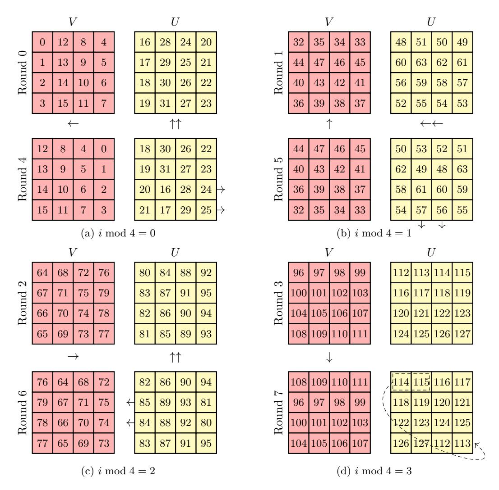

Figure 8: GIFT-64 key update functions from round *i* to *i* + 4, according to the different fixsliced representations over 4 rounds. Each cell represents a bit, and the numbers in the cells then denote the actual index of that particular bit in the 16-bit key word. Note that *i* mod 4 = 3 refers to the classical representation. The cell colors match the corresponding slice for the add round key operation.

#### <span id="page-23-0"></span>**A.2 GIFT-128**

In the case of GIFT-128, adjusting the key schedule according to fixslicing is more tricky since the new and the classical representations of the state are synchronised after 5 rounds, while the key words will return to their original positions after 4 rounds. We suggest to compute the key schedule in the classical representation for the first 10 round before rearranging them in order to match the fixsliced representation of the state. At this stage, all key words will be expressed in each representation, allowing to adapt the key schedule for each of them, without reordering bits. As stated in Section [4.2,](#page-10-1) each key word will be exclusive-ORed to the state in the same representation every 10 rounds. After 10 rounds, 2 out of 4 key words will have been updated thrice while the two others will have been

updated twice, as detailed in Table 8. Therefore, our adapted key schedule relies on double and triple update functions for each representation, which are illustrated in Figure 9.

<span id="page-24-0"></span>Table 8: Round keys' representations depending on the round number. Exponents refer to the number of times the key words have been updated. Blue and red arrows refer to double and triple key updates, respectively.

| Permanentation # | Dound # | Roun             | d key            |   |
|------------------|---------|------------------|------------------|---|
| Representation # | Round # | U                | V                |   |
| 0                | 0       | $W_{2}  W_{3}  $ | $W_6    W_7$     |   |
| 1                | 1 ,     | $W_0 \  W_1$     | $W_4    W_5$     |   |
| 2                | 2       | $(W_6  W_7)^1$   | $ W_2  W_3$      | 1 |
| 3                | 3       | $(W_4  W_5)^1$   | $W_0 \  W_1$     | 1 |
| 4                | 4       | $(W_2  W_3)^1$   | $(W_6    W_7)^T$ |   |
| 0                | 5       |                  | $(W_4  W_5)^1$   |   |
| 1                | 6       | $(W_6  W_7)^2$   | 1                |   |
| 2                | 7       | $(W_4  W_5)^2$   | $(W_0  W_1)^1$   | X |
| 3                | 8       | $(W_2  W_3)^2$   | $(W_6  W_7)^2$   | ' |
| 4                | 9 \     | $(W_0  W_1)^2$   | $(W_4  W_5)^2$   | 1 |
| 0                | 10      | $(W_6  W_7)^3$   | \ \              |   |
| 1                | 11 /    | $(W_4  W_5)^3$   | $(W_0  W_1)^2$   | V |
| 2                | 12      | $(W_2  W_3)^3$   | $(W_6  W_7)^3$   | Ì |
| 3                | 13      | $(W_0  W_1)^3$   | $(W_4  W_5)^3$   | ] |
| 4                | 14      | $(W_6  W_7)^4$   |                  |   |
| 0                | 15      |                  | $-(W_0  W_1)^3$  |   |
| 1                | 16      | $(W_2   W_3)^4$  |                  |   |
| 2                | 17      | $(W_0  W_1)^4$   | $(W_4  W_5)^4$   | 1 |
| 3                | 18      | $(W_6  W_7)^5$   | $(W_2  W_3)^4$   |   |
| 4                | 19      | $(W_4  W_5)^5$   | $(W_0  W_1)^4$   | 1 |
| 0                | 20      | $(W_2  W_3)^5$   | $(W_6  W_7)^{5}$ |   |
| :                | :       | :                | :                |   |

<span id="page-25-0"></span>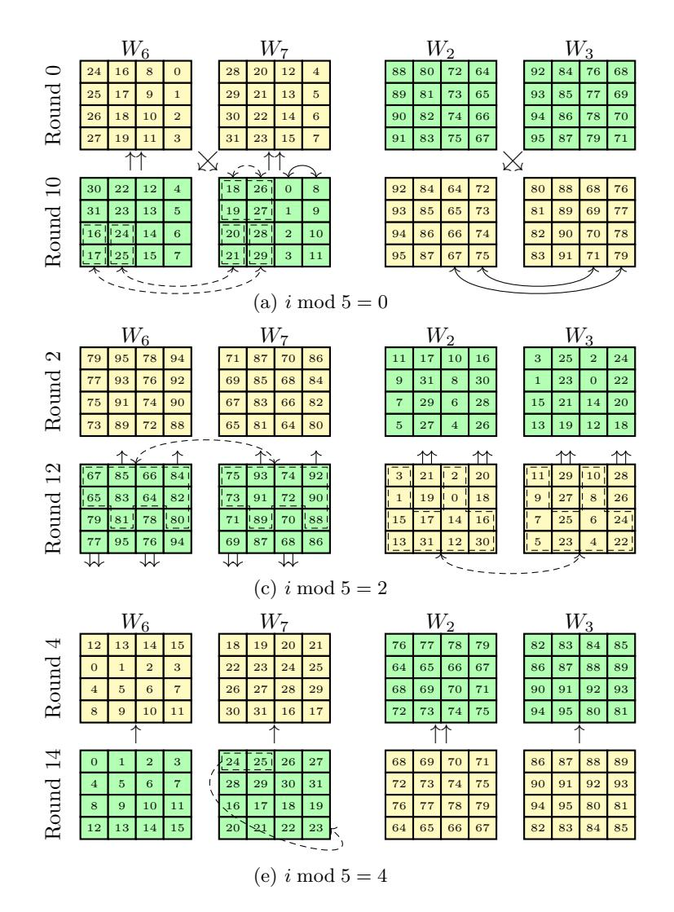

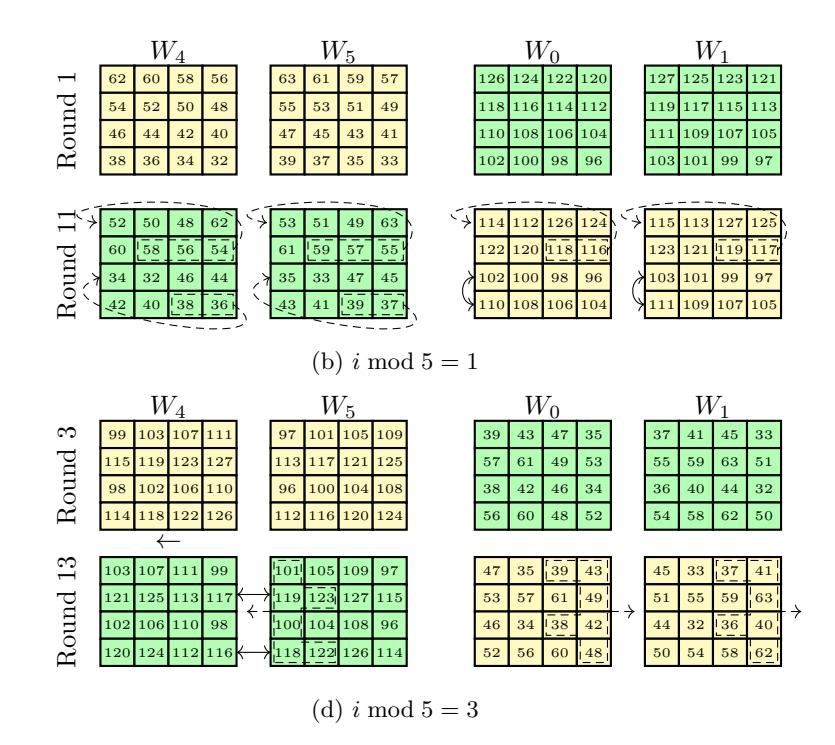

Figure 9: GIFT-128 double/triple key update functions from round i to i+10, according to the different fixsliced representations over 5 rounds. Each cell represents a bit, and the numbers in the cells then denote the actual index of that particular bit in the 16-bit key word. Note that  $i \mod 5 = 4$  refers to the classical representation. The cell colors match the corresponding slice for the add round key operation.

### <span id="page-26-0"></span>**B** Additional illustrations

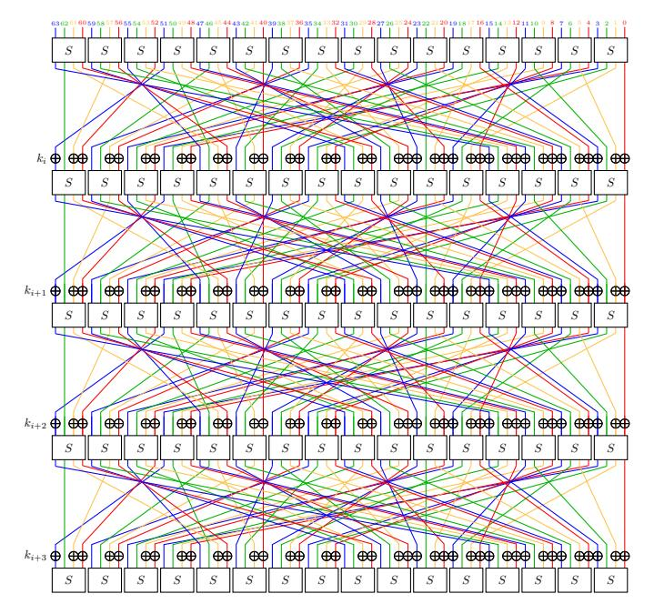

Figure 10: Classical representation of GIFT-64 over 4 rounds. Each color refers to a slice.

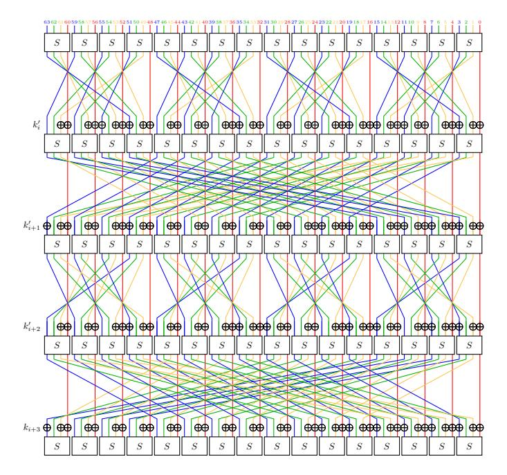

Figure 11: Fixsliced representation of GIFT-64 over 4 rounds. Each color refers to a slice.

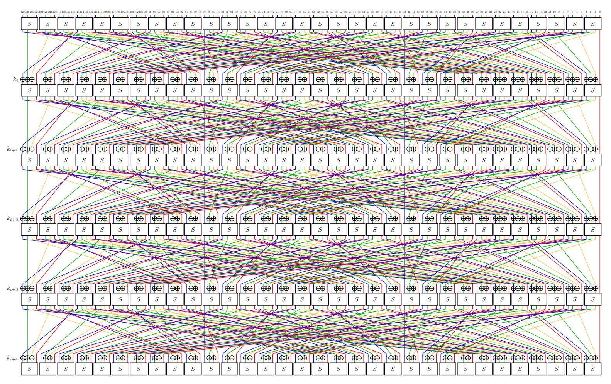

Figure 12: Classical representation of GIFT-128 over 5 rounds. Each color refers to a slice.

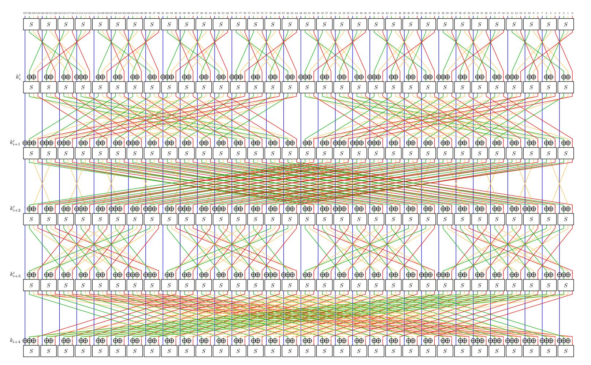

Figure 13: Fixsliced representation of GIFT-128 over 5 rounds. Each color refers to a slice.