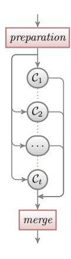
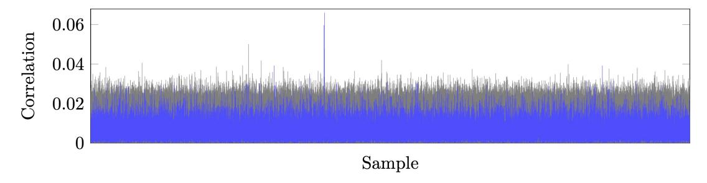
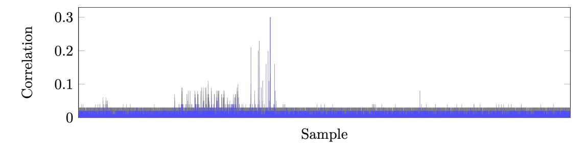
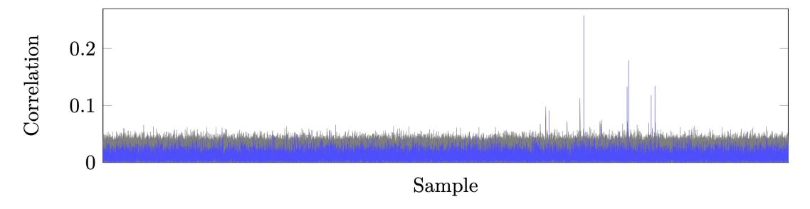

# **Defeating State-of-the-Art White-Box Countermeasures with Advanced Gray-Box Attacks**

Louis Goubin<sup>4</sup> , Matthieu Rivain<sup>1</sup> and Junwei Wang<sup>1</sup>*,*2*,*<sup>3</sup>

 CryptoExperts, Paris, France [{firstname.lastname}@cryptoexperts.com](mailto:matthieu.rivain@cryptoexperts.com,junwei.wang@cryptoexperts.com) University of Luxembourg, Esch-sur-Alzette, Luxembourg University Paris 8, Saint-Denis, France Université Paris-Saclay, UVSQ, CNRS, Laboratoire de Mathématiques de Versailles, Versailles, France [louis.goubin@uvsq.fr](mailto:louis.goubin@uvsq.fr)

**Abstract.** The goal of white-box cryptography is to protect secret keys embedded in a cryptographic software deployed in an untrusted environment. In this article, we revisit state-of-the-art countermeasures employed in white-box cryptography, and we discuss possible ways to combine them. Then we analyze the different gray-box attack paths and study their performances in terms of required traces and computation time. Afterward, we propose a new paradigm for the gray-box attack against white-box cryptography, which exploits the data-dependency of the target implementation. We demonstrate that our approach provides substantial complexity improvements over the existing attacks. Finally, we showcase this new technique by breaking the three winning AES-128 white-box implementations from WhibOx 2019 white-box cryptography competition.

**Keywords:** white-box cryptography · linear masking · non-linear masking · shuffling · data-dependency

# **1 Introduction**

A cryptographic software deployed in an untrusted execution environment faces risks of secret key extraction by malicious parties that might grant (full) access to the software. These security threats are captured by the *white-box model*. Apart from physical side-channel leakages [\[Koc96\]](#page-23-0), a white-box adversary in this setting is capable of observing every execution detail of the cryptographic implementation, *e.g.*, accessed memory and registers, and she also has the power of interfering the execution by, for example, injecting faults. Recently, more and more cryptographic software is deployed in execution environments that cannot be fully trusted, such as smartphones, IoT devices, smart wearables, and smart home systems, resulting in particular interest for *white-box cryptography*.

White-box cryptography was initially proposed by Chow *et al.* to counter this kind of threat in the context of DRM [\[CEJv03\]](#page-22-0). Since then, the competition between white-box designers and attackers has become once again a cat-and-mouse race, and white-box cryptography has been a long-standing open problem for nearly 20 years. The research community has observed many candidate constructions of white-box implementations for block ciphers [\[CEJv03,](#page-22-0) [CEJvO02,](#page-22-1) [BCD06,](#page-21-0) [XL09,](#page-24-0) [Kar11\]](#page-23-1), as well as their subsequent destruction by structural analysis shortly after or even years later [\[BGEC04,](#page-21-1) [GMQ07,](#page-22-2) [MGH09,](#page-23-2) [DRP13,](#page-22-3) [LRD](#page-23-3)<sup>+</sup>14].

In the situation where no provably secure white-box implementation has been discovered, the industry is constrained to deploy *home-made* white-box implementations, the designs of which are kept secret. Although these implementations might not be secure against a well-informed adversary, the security of their designs can make them practically hard to break since known structural attacks do not apply as is.

At CHES 2016, Bos *et al.* proposed to use *differential computation analysis* (DCA) to attack white-box implementations in a gray-box fashion [\[BHMT16\]](#page-21-2). DCA is mainly an adaptation of the *differential power analysis* (DPA) techniques [\[KJJ99\]](#page-23-4) to the white-box context. It exploits the fact that the variables appearing in the computation in some unknown encoded form might have a strong linear correlation with the original plain values. It works by first collecting some *computation traces*, which are composed of the runtime computed values over several executions through a dynamic instrumentation tool, such as Intel PIN. One then makes a key guess and predicts the value of a (supposedly) computed intermediate variable, then computes the correlation between this prediction and each sample of the computation trace. The key guess with the highest peak in the obtained correlation trace is selected as the key candidate. The power of DCA comes from the fact that the attacker does not need to know the underlying implementation details. This approach has been shown especially effective to break many publicly available (obscure) white-box implementations [\[BHMT16\]](#page-21-2). Rivain and Wang extensively analyzed when and why the widely-used *internal encoding* countermeasure is vulnerable to DCA, and they further proposed improvements of gray-box attacks against this kind of countermeasures [\[RW19\]](#page-23-5).

To prevent DCA-like passive gray-box attacks, it is natural to consider classic side-channel countermeasures, *i.e.*, *linear masking* and *shuffling* [\[BRVW19\]](#page-22-4). Roughly speaking, linear masking (a.k.a. Boolean masking) splits any sensitive intermediate variable into multiple linear shares and processes them in a way that ensures the correctness of the computation while preventing sensitive information leakage to some extent. The principle of shuffling is to randomly permute the order of several independent operations (possibly including dummy operations) in order to increase the noise in the instantaneous leakage on a sensitive variable. It was shown that an implementation solely protected with linear masking is vulnerable to a *linear decoding analysis* (LDA), which is able to recover the locations of shares by solving a linear system [\[GPRW18,](#page-22-5) [GPRW20,](#page-22-6) [BU18\]](#page-22-7). The authors of [\[BRVW19\]](#page-22-4) analyze the combination of linear masking and shuffling and show that it can achieve some level of resistance against advanced gray-box attacks.

At Asiacrypt 2018, Biryukov and Udovenko [\[BU18\]](#page-22-7) introduced the notion of *algebraically-secure* non-linear masking to protect white-box implementations against LDA (formalized as *algebraic attacks* in [\[BU18\]](#page-22-7)). Non-linear masking ensures that applying any linear function to the intermediate variables of the protected implementation should not compute a *predictable* variable with probability (close to) 1. However, the non-linear encoding is vulnerable to the DCA attack because the encoded sensitive variable is still linearly correlated of some shares in the non-linear encodings. It was then suggested by the authors to combine linear and non-linear masking, which was conjectured to be able to counter DCA-like and LDA-like attacks at the same time since the adversary is neither able to build predictable variable by a low-degree function over the computation traces nor able to locate a low number of shares (*i.e.*, lower than the linear masking order) from which she can extract sensitive information.

We remark that randomness plays an important role in implementing all mentioned countermeasures. It is well-known that a white-box adversary could tamper with the commutation channel between a white-box implementation and its external world, including the external random source. Hence, the effective randomness in a white-box implementation is pseudorandomness derived from the input. In this work, each time we refer to randomness in the described countermeasures, we mean pseudorandomness derived from the input.

The state-of-the-art of white-box implementation puts to use all countermeasures mentioned above, as well as mixed with a layer of obfuscation. The security of the implementations relies on the (weak) security properties achieved by the employed countermeasures as well as on the obscurity of the overall design (including obfuscation). The main purpose of these implementations is to thwart automatic gray-box attacks, hence constraining the potential adversaries to invest costly and uncertain reverse engineering efforts.

**WhibOx Competitions.** In this context, the WhibOx 2017 competition was organized to give a playground for "researchers and practitioners to confront their (secretly designed) white-box implementations to state-of-the-art attackers" [\[whia\]](#page-23-6). In a nutshell, the participants of this contest were divided into two categories: the *designers* who submit the source codes of AES-128 [\[DR13\]](#page-22-8) with freely chosen key, and the *breakers* who try to reveal the hidden keys in the submitted implementations. The anonymous participants were not expected to reveal their underlying designing or attacking techniques. A valid implementation must fulfill several performance requirements, such as source/binary code size, memory consumption, and execution time. A score system was designed to reward long-surviving submission designers and breakers.

In the end, 194 players participated the contest and submitted 94, only 13 of which survived for more than 24 hours, and DCA was able to break most of them. These results once again demonstrate that the attackers prevail in the current cat-and-mouse game. The strongest implementation in terms of survival time, named Adoring Poitras, was due to Biryukov and Udovenko.[1](#page-1-0) The only attack (to our knowledge)

<span id="page-1-0"></span><sup>1</sup>Source code available at <https://whibox-contest.github.io/2017/candidate/777>.

against this implementation was performed by Goubin, Paillier, Rivain and, Wang with a heavy reverse engineering effort and the so-called *linear decoding analysis* (LDA) attack [\[GPRW18,](#page-22-5) [GPRW20\]](#page-22-6).

Owing to the success of the first edition, WhibOx 2019 was organized to further promote the public knowledge in this paradigm of white-box cryptography. The new rules encourage designers to submit "smaller" and "faster" implementation due to a factor of performance, as recalled in [Appendix A.](#page-24-1) The contest had attracted 63 players and received 27 implementations in the end. The resistance of several submissions in terms of living time was significantly improved over the first edition of the competition, which shows evidence of refinement of the underlying white-box techniques. Three implementations (all due to Biryukov and Udovenko) were still alive at the deadline of the contest but were broken a few days or weeks afterward.[2](#page-2-0) As explained in this paper, all three winning implementations were based on state-of-the-art white-box countermeasures, including a mix of linear and non-linear masking [\[BU18\]](#page-22-7) together with shuffling and additional obfuscation. In this article, we give a thorough explanation of how we managed to break all three implementations with advanced gray-box attacks and our novel data-dependency analytic techniques (as well as a "lightweight" de-obfuscation). To the best of our knowledge, this is the only technical report that breaks all the three implementations.

**Our Contribution.** In this article, our contribution is fourfold:

- 1. **Review of state-of-the-art white-box countermeasures.** We revisit the state-of-the-art countermeasures, namely linear and non-linear masking and shuffling, used in bitsliced-type whitebox implementations (such as the winning implementations of WhibOx 2019).
- 2. **Comprehensive study of advanced gray-box attacks.** We recall the advanced gray-box attacks which can be used to break white-box implementations in this context, including higherdegree decoding analysis, (integrated) higher-order DCA. We analyze their (in)effectiveness against state-of-the-art countermeasures and exhibit their trace and time complexities.
- 3. **New data-dependency attack.** We propose a new data-dependency gray-box attack which achieves significant complexity improvements in different attack scenarios by precisely locating the target shares within a computation trace and avoiding the standard combinatorial explosion. We show that our approach can efficiently break several combinations of linear and non-linear masking in the presence of shuffling and obfuscation.
- 4. **Application to break real implementations.** We apply our new data-dependency DCA, together with advanced gray-box attacks, to break the three winning implementations from WhibOx 2019.

**Organization.** The rest of the paper is organized as follows. In [Section 2,](#page-2-1) we describe the state-of-the-art white-box countermeasures in a bitsliced implementation setting, namely, linear masking, non-linear masking and shuffling, and we discuss different ways to combine them. Then we revisit advanced gray-box attack techniques and comprehensively analyze their (in)effectiveness and complexities against the considered countermeasures in [Section 3.](#page-7-0) After that, we introduce our *data-dependency* attack in [Section 4](#page-10-0) and demonstrate how it can efficiently break these countermeasures. Finally, we present our practical attacks against three winning implementations of WhibOx 2019 in [Section 5.](#page-15-0)

# <span id="page-2-1"></span>**2 Combination of Countermeasures**

In this work, we consider a white-box implementation in the paradigm of a randomized Boolean circuit with a hard-coded key represented in software as a bitsliced program. Bitslicing is a common technique to derive efficient software implementation of a cipher from its Boolean circuit representation [\[Bih97,](#page-22-9) [RSD06\]](#page-23-7). The main idea is to manipulate several data slots in parallel by making the most of bitwise and/or SIMD instructions on modern CPU. Bitslicing has been in particular applied as a strategy to design efficient implementations in the presence of higher-order masking [\[GR17,](#page-22-10) [JS17,](#page-23-8) [GJS](#page-22-11)<sup>+</sup>19, [BBB](#page-21-3)<sup>+</sup>19]. In the context of white-box cryptography, this approach has also been empowered (with additional layers of obfuscation and virtualization) to design implementations with a good level of resistance in practice. In particular, the

<span id="page-2-0"></span><sup>2</sup>See [https://www.cryptolux.org/index.php/Whitebox\\_cryptography#WhibOx\\_2019\\_Competition](https://www.cryptolux.org/index.php/Whitebox_cryptography#WhibOx_2019_Competition).

winning implementations of the two editions of the WhibOx competition, due to Biryukov and Udovenko, were based on this principle [\[whia,](#page-23-6) [whib\]](#page-24-2).

# **2.1 Linear Masking**

Linear masking, a.k.a. Boolean masking, is a widely-deployed countermeasure against side-channel attacks [\[GP99,](#page-22-12) [RP10\]](#page-23-9). A linear masking scheme of order *n* − 1 splits each sensitive variable *x* in a cryptographic computation into *n* shares satisfying

<span id="page-3-1"></span>
$$x = x_1 \oplus x_2 \oplus \dots \oplus x_n \tag{1}$$

(where ⊕ denote the bitwise addition). Then, the computation must be handled on those *n* shares in a way that ensures the correctness of the computation while achieving some security property. Roughly speaking, one must ensure that any combination of less than *n* intermediate variables does not reveal any information about the original sensitive variable. The notion is formalized in a circuit computation model as the *probing security*: an *n*-th order probing secure circuit ensures that any observation of *n* wires (so-called *probes*) can be perfectly simulated without knowledge of the sensitive variables [\[ISW03\]](#page-22-13). A modular approach in probing security is first to design *n*-th order probing secure *gadgets* which compute elementary operations, then to compose these gadgets in a way that preserves the *n*-th order security of the full circuit [\[BBD](#page-21-4)<sup>+</sup>16, [BGR18\]](#page-21-5).

**ISW Gadgets.** Without loss of generality, [\[ISW03\]](#page-22-13) only describes *n*-th order masking gadgets for Boolean NOT and AND gates, which can be composed to defeat b *n* 2 c-th order probing attacks. However, they can be composed to achieve *n*-th order probing secure circuit by carefully placing some refresh gadgets, as shown in the application on AES [\[RP10,](#page-23-9) [CPRR14\]](#page-22-14). In this work, we recall the secure AND gadget for linear masking in [Algorithm 1.](#page-3-0) A secure NOT gadget merely puts a NOT gate on the output wire of one share, and a secure XOR gate simply applies an XOR gate sharewisely. Refresh gadget can be achieved by applying a secure AND gadget between the shares to be refreshed and (1*,* 0*,* · · · *,* 0).

```
Algorithm 1 AND gadget for linear masking [ISW03]
Input: linear sharing (xi)1≤i≤n s.t. L
                                     1≤i≤n
                                           xi = x, linear sharing (yi)1≤i≤n s.t. L
                                                                               1≤i≤n
                                                                                     yi = y,
   randomness (ri,j )1≤i<j≤n
Output: (zi)1≤i≤n satisfying L
                               1≤i≤n
                                     zi = xy
 1: for i ← 1, · · · , n do
 2: for j ← i + 1, · · · , n do
 3: rj,i ← ri,j ⊕ xiyj ⊕ xjyi
 4: end for
 5: end for
 6: for i ← 1, · · · , n do
 7: zi ← xiyi
 8: for j ← 1, · · · , n do
 9: if j 6= i then
10: zi ← zi ⊕ ri,j
11: end if
12: end for
13: end for
```

**Vulnerability of Linear Masking in The White-Box Context.** The soundness of linear masking countermeasure in noisy-leakage model comes from the fact that the computation complexity exponentially grows with the order of masking countermeasure [\[PR13\]](#page-23-10). However, in the white-box context, the adversary is able to record the values of arbitrary intermediate variables without any noise. Although the exact location of the shares might not be obvious for the adversary because of some obfuscation or obscurity in the implementation structure, linear masking can be completely smashed using a simple gray-box attack. The so-called *linear decoding analysis* (LDA) was formally introduced in [\[GPRW18,](#page-22-5) [GPRW20\]](#page-22-6)

–and also independently discussed in [\[BU18\]](#page-22-7)– as an effective way to break linear masking (or any other linear encoding scheme) in white-box model.

Let (*v*1*, v*<sup>2</sup> · · · *, vw*) denote a computation trace, among which there are *n* linear shares (at unknown positions) of some sensitive variable *x*. There exists a constant vector (*a*1*, a*2*,* · · · *, aw*) ∈ {0*,* 1} *<sup>w</sup>* such that

$$\bigoplus_{i=1}^{w} a_i \cdot v_i = x .$$

As explained in [\[GPRW18,](#page-22-5) [GPRW20\]](#page-22-6), the adversary is able to recover (*a*1*, a*2*,* · · · *, aw*) by recording the values of (*v*1*, v*<sup>2</sup> · · · *, vw*) for *w* + O(1) random inputs, guessing the corresponding values of *x* w.r.t. some key guess and then trying to solve the underlying linear system. If the system is solvable, then the key guess is (most likely) correct. The complexity of LDA is O |K| · *w* 2*.*8 for K being the key space. Notably, it is independent of the masking order *n*, as long as all the shares of the target variable appear in the computation trace. This attack was applied to break *Adoring Poitras*, the winning implementation of the WhibOx 2017 competition [\[GPRW20\]](#page-22-6).

## **2.2 Non-linear masking**

At Asiacrypt 2018, Biryukov and Udovenko [\[BU18\]](#page-22-7) introduced the notion of *algebraically-secure* non-linear masking to protect white-box implementations against LDA (formalized as *algebraic attacks* in [\[BU18\]](#page-22-7)). A *d*-th degree algebraically-secure non-linear masking ensures that applying any function of up to *d* degree to the intermediate variables of the protected implementation should not compute a "predictable" variable with probability (close to) 1. By ensuring such a property, one guarantees that LDA cannot be applied to a first-degree secure implementation since any linear function of the intermediate variables is not "predictable".

Simple non-linear masking being vulnerable to higher-order DCA *per se*, Biryukov and Udovenko also suggested using a combination of non-linear masking together with classic (higher-order) linear masking in order to resist both categories of attacks.

**First-Degree Secure Non-Linear Masking.** The authors of [\[BU18\]](#page-22-7) introduce a non-linear masking satisfying first-degree algebraic security. Their scheme is based on the minimalist 3-share encoding (*a, b, c*) for a sensitive variable *x* such that

<span id="page-4-1"></span>
$$x = ab \oplus c , \qquad (2)$$

where *a* and *b* are uniform random bits and *c* is computed as *c* = *x* ⊕ *ab*. This encoding ensures immunity against LDA by its non-linearity. In order to perform computation on encoded variables, the authors further define an XOR gadget and an AND gadget. Those gadgets are depicted in [Algorithm 2](#page-4-0) and [Algorithm 3](#page-5-0) respectively. For both of them, the input encodings must be *refreshed* which is performed by applying a Refresh gadget described in [Algorithm 4.](#page-5-1)

#### <span id="page-4-0"></span>**Algorithm 2** XOR gadget for minimalist quadratic masking [\[BU18\]](#page-22-7)

**Input:** *a, b, c, d, e, f* satisfying *ab* ⊕ *c* = *x* and *de* ⊕ *f* = *y*, and randomness *ra, rb, rc, rd, re, r<sup>f</sup>* **Output:** *h, i, j* satisfying *hi* ⊕ *j* = *x* ⊕ *y*

- 1: *a, b, c* ← Refresh(*a, b, c, ra, rb, rc*) 2: *d, e, f* ← Refresh(*d, e, f, rd, re, r<sup>f</sup>* ) 3: *h* ← *a* ⊕ *d*
- 4: *i* ← *b* ⊕ *e*
- 5: *j* ← *c* ⊕ *f* ⊕ *ae* ⊕ *bd*

```
Algorithm 3 AND gadget for minimalist quadratic masking [BU18]
```

```
Input: a, b, c, d, e, f satisfying ab \oplus c = x and de \oplus f = y, and randomness r_a, r_b, r_c, r_d, r_e, r_f
Output: h, i, j satisfying hi \oplus j = xy

1: a, b, c \leftarrow \text{Refresh}(a, b, c, r_a, r_b, r_c)
2: d, e, f \leftarrow \text{Refresh}(d, e, f, r_d, r_e, r_f)
3: m_a \leftarrow bf \oplus r_c e
4: m_d \leftarrow ce \oplus r_f b
5: h \leftarrow ae \oplus r_f
6: i \leftarrow bd \oplus r_c
7: j \leftarrow am_a \oplus dm_d \oplus r_c r_f \oplus cf
```

#### <span id="page-5-1"></span>Algorithm 4 Refresh gadget for minimalist quadratic masking [BU18]

```
Input: a, b, c satisfying ab \oplus c = x and randomness r_a, r_b, r_c

Output: a', b', c' satisfying a'b' \oplus c' = x

1: m_a = r_a(b \oplus r_c)

2: m_b = r_b(a \oplus r_c)

3: r'_c = m_a \oplus m_b \oplus (r_a \oplus r_c)(r_b \oplus r_c) \oplus r_c

4: a' = a \oplus r_a
```

**Vulnerability of Non-Linear Masking Alone.** A DCA adversary can easily break an implementation protected by non-linear masking only. For instance, if the minimalist quadratic masking scheme from [BU18] is applied without additional linear masking, a simple first-order DCA is sufficient to break the scheme. Indeed, by definition, the shares a and b are uniformly picked at random which implies that the share  $c = x \oplus ab$  is correlated to x. Precisely, we have  $Cor(ab \oplus c, c) = \frac{1}{2}$ . A more detailed analysis of (higher-order) DCA against non-linear masking (possibly combined with linear masking) is given in Section 3.2.

#### <span id="page-5-2"></span>2.3 Combination of Linear and Non-Linear Masking

5:  $b' = b \oplus r_b$ 6:  $c' = c \oplus r'_c$ 

As suggested in [BU18], a combination of linear masking and non-linear masking is empirically secure against both DCA and LDA attacks of order/degree lower than the respective linear masking order and non-linear masking degree. The intuition behind is two-fold: on one hand, an algebraically-secure countermeasure mixed with linear masking should not decrease the algebraic degree to construct a predictable value; on the other hand, the biased non-linear shares are further linearly masked and only DCA of order n can be used to break a linear masking of order n.

From [BU18] it is not clear how to combine linear and non-linear masking. In order to discuss the possible attack path, we suggest hereafter three natural ways to combine them. Analyzing the security properties of the resulting combined masking is beyond the scope of this article.

In the first two ways, we simply apply one masking scheme on top of the other. Taking the quadratic encoding example in Equation 2, the first way is to apply a linear masking on top of a non-linear masking

$$x = (a_1 \oplus a_2 \oplus \cdots \oplus a_n)(b_1 \oplus b_2 \oplus \cdots \oplus b_n) \oplus (c_1 \oplus c_2 \oplus \cdots \oplus c_n), \qquad (3)$$

and the second way is to apply a non-linear masking on top of a linear masking

<span id="page-5-3"></span>
$$x = (a_1b_1 \oplus c_1) \oplus (a_2b_2 \oplus c_2) \oplus \cdots \oplus (a_nb_n \oplus c_n). \tag{4}$$

The combined masking gadget can be simply derived from the original gadgets of both schemes. For the 1<sup>st</sup> combination, one starts from the linear masking gadgets then non-linearly shares each variable and replaces each gate by the corresponding non-linear masking gadget. For the 2<sup>nd</sup> combination, one starts

from the non-linear masking gadgets then linearly shares each variable and replaces each gate by the corresponding linear masking gadget.

The third way is to merge the two maskings into a new encoding achieving the two features (high order security and prediction security). Also taking as an example the quadratic encoding from [\[BU18\]](#page-22-7), the new encoding would be

$$x = ab \oplus c_1 \oplus c_2 \oplus \cdots \oplus c_n \ . \tag{5}$$

There are two interpretations of this new encoding. On one hand, the linear part of the non-linear masking in [Equation 2](#page-4-1) is linearly encoded by [Equation 1](#page-3-1)

$$x = ab \oplus (c_1 \oplus c_2 \oplus \cdots \oplus c_n) ,$$

on the other hand, the first share *x*<sup>1</sup> from linear encoding in [Equation 1](#page-3-1) is non-linearly masked by [Equation 2](#page-4-1)

$$x = (ab \oplus c_1) \oplus c_2 \oplus \cdots \oplus c_n .$$

It is not clear how to derive secure gadgets for such encoding. One could probably mix linear masking and non-linear masking gadgets. For instance, one could use the non-linear masking gadgets and replace the appearance of *c* in by *n* linear shares for which one would involve the corresponding linear masking gadgets. The exact description and security analysis of these mixed gadgets are beyond the scope of the present paper.

# **2.4 Shuffling, Parallelization and Dummy Operations**

Operation shuffling is another widely applied countermeasure to protect cryptographic implementations against side-channel attacks [\[VMKS12\]](#page-23-11). The principle is to randomly shuffle the order of several independent operations (possibly with dummy operations) in order to increase the noise in the instantaneous leakage on a sensitive variable.

Shuffling can be combined together with higher-order masking as studied in [\[RPD09\]](#page-23-12) in the context of side-channel attacks. The authors of [\[BRVW19\]](#page-22-4) further insight that a white-box adversary could reorder a computation trace w.r.t. two dimensions, namely *time* and *memory*, implying that in the white-box context one should shuffle both the order of operations and the memory locations of the variables. In the bitsliced paradigm, shuffling can be implemented in two possible ways, namely *horizontally* and *vertically* shuffling.

**Horizontal vs. Vertical Shuffling.** In horizontal shuffling, the data slots in a bitslice computation are shuffled. By default, horizontal shuffling only randomizes the computation in the dimension of memory (since all the slots are processed at the same time).

<span id="page-6-0"></span>In vertical shuffling, several computation instances are done sequentially, the good one is randomly shuffled among the instances and retrieved afterward through a selection process. Vertical shuffling implements both the time and memory shuffling. As an illustration in [Figure 1,](#page-6-0) a sequential circuit is compromised by *t* sub-circuits (C*i*)1≤*i*≤*<sup>t</sup>* that share the same inputs from a preparation stage, and from which one output will be selected as the good one after a merge process.



**Figure 1:** Illustration for vertical shuffling.

Note that these *t* sub-circuits (C*i*)1≤*i*≤*<sup>t</sup>* might be interleaved and share some computation to increase the difficulty in analyzing the overall structure.

Horizontal and vertical shuffling can be combined in a lot of ways. As a natural example, whenever the number of bitslice slots is larger than the word-length of the target architecture, a full bitslicing consists of several copies of the word-length bitslicing. In this case, the desired computations manipulated in different copies are vertically shuffled both in time and memory dimensions.

**Nature of the Dummy Computation.** For both kinds of shuffling, the values computed in a dummy slot/instance can be of different nature:

- they are pseudo-randomness derived from the plaintext and acting like noise,
- they are genuine intermediate values corresponding to the input plaintext but for some dummy key,
- they are genuine intermediate values corresponding to right input round state but for some dummy key,
- they are redundant intermediate values of another slot (either dummy slot or right slot).

For the first three cases, the effect is to add noise in the computation trace. The second and third cases provide additional protection against DCA-type attacks by introducing dummy key candidates in the attack results. The last case might be used to defeat fault attacks but it also reduces the noise if some redundancy is used for the right slot.

# <span id="page-7-0"></span>**3 Advanced Gray-Box Attacks**

In this section, we analyze different advanced gray-box attacks against the combinations of countermeasures described in the previous section.

**Target Implementation.** We assume that the target implementation is protected by an *n*-th order linear masking and a *d*-th degree non-linear masking in one of the three possible composition ways discussed in [Section 2.3.](#page-5-2) We will optionally consider the application of shuffling on top of this combination of masking and denote *t* the shuffling degree (meaning that the target shares are each shuffled among *t* possible locations). Finally, we shall assume that the attacker is able to locate a *w*-large window in the computation trace for which she knows that it contains the shares of the target encoding. The complexity of the attack discussed in this section shall hence be expressed with respect to the parameters *n*, *d*, *t*, *w*, as well as the size of the key space |K| of the target variable.

#### **3.1 Higher-Degree Decoding Analysis**

In this section, we first consider a target implementation with combined masking only and then extend HDDA to deal with shuffling.

Let (*v*1*, v*2*,* · · · *, vw*) denote the computation trace corresponding to the *w*-large target window. By definition of the linear and non-linear masking, we know that there exists *d*-th degree decoding function *f* such that *x* = *f*(*v*1*, v*2*,* · · · *, vw*), where *x* denotes the target sensitive variable. This function *f* can be recovered by an HDDA as follows. The principle is first to extend probed traces into higher-degree traces up to degree *d* by multiplying all the *d*-tuples, then apply the LDA decoding analysis on the higher-degree traces. Precisely, for each computation trace (*v*1*, v*2*,* · · · *, vw*), the adversary computes a higher-degrees trace compromised by all at most *d*-degree multiplicative combinations *v<sup>i</sup>*<sup>1</sup> · *v<sup>i</sup>*<sup>2</sup> · *. . .* · *v<sup>i</sup><sup>j</sup>* where 1 ≤ *i*<sup>1</sup> ≤ *i*<sup>2</sup> ≤ · · · ≤ *i<sup>j</sup>* ≤ *w* and 1 ≤ *j* ≤ *d*. Since a *d*-th degree decoding function *f* can be decomposed to a linear combination of several (at most *d*-degree) monomials, an LDA attack on the higher-order traces should recover all monomials of *f*. The higher-degree traces contain O *w d* samples, then the computation complexity of HDDA is O |K| · *w* 2*.*8 *d* and it requires O *w d* computation traces [\[GPRW18,](#page-22-5) [GPRW20\]](#page-22-6).

**HDDA** in the Presence of Shuffling. If the shuffling countermeasure is applied together with the combination of two masking countermeasures, HDDA would not work in general because there would not exist a decoding function that could recover the predictable values for all different inputs. However, we remark that the HDDA is able to bypass certain shuffling methods. For instance, if there exist t different sensitive variables

$$s_1 = g(v_1^{(i_1)}, \dots, v_w^{(i_1)})$$

$$s_2 = g(v_1^{(i_2)}, \dots, v_w^{(i_2)})$$

$$\vdots$$

$$s_t = g(v_1^{(i_t)}, \dots, v_w^{(i_t)})$$

for some decoding function g, and  $(i_1, i_2, \dots, i_t)$  is a permutation of  $(1, 2, \dots, t)$  depending on the randomness (i.e., the computation order of  $s_1, s_2, \dots, s_t$  is shuffled correspondingly), there exists a decoding function

$$f(v_1^{(1)}, \cdots, v_w^{(1)}, v_1^{(2)}, \cdots, v_w^{(2)}, \cdots, v_1^{(t)}, \cdots, v_w^{(t)})$$

$$= g(v_1^{(i_1)}, \cdots, v_w^{(i_1)}) \oplus g(v_1^{(i_2)}, \cdots, v_w^{(i_2)}) \oplus \cdots \oplus g(v_1^{(i_t)}, \cdots, v_w^{(i_t)})$$

$$= s_1 \oplus \cdots \oplus s_t$$

over an enlarged attacking trace window  $(v_1^{(1)}, \cdots, v_w^{(1)}, v_1^{(2)}, \cdots, v_w^{(2)}, \cdots, v_1^{(t)}, \cdots, v_w^{(t)})$ . Assuming one  $s_j, 1 \leq j \leq t$  contains the real execution and the others are simply identical computation except with shuffled constant plaintext, we have  $s_1 \oplus \cdots \oplus s_t = s_j + cst$  where cst denotes some unknown constants depending upon the constant plaintext used to compute  $(s_{j'})_{j'\neq j}$ . In this case, we can still recover function f and the sub-function f and the sub-function f and the sub-function f and the sub-function f are the first round s-box output, we can make them constant by fixing some plaintext bytes.

# <span id="page-8-0"></span>3.2 Higher-Order DCA

The principle of a higher-order DCA (HO-DCA) is to exploit joint leakage of several independent variables. It consists of a pre-processing step similar to HDDA followed by a standard DCA. Given a computation trace  $(v_1, v_2, \dots, v_w)$ , the pre-processing step in an n-th order DCA outputs an n-th order computation trace consisting in  $q = {w \choose n}$  items formed in  $v_{i_1} \oplus v_{i_2} \dots \oplus v_{i_n}$  where  $1 \le i_1 \le i_2 \le \dots \le i_n \le w$ . Then the adversary predicts some sensitive variables based on some key guess and computes the correlations between the predicted values and higher-order trace samples. If there exists a distinguishable significant peak for a key guess from the other key guesses in the correlation traces, it is very likely that this key guess is the good key candidate.

**Correlation Scores.** We analyze hereafter the expected correlation scores for an HO-DCA against the considered combination of linear and non-linear masking. Our analysis is based on the following simple lemma.

<span id="page-8-1"></span>**Lemma 1.** Let X,  $A_1$ ,  $B_1$ , ...,  $A_n$ ,  $B_n$  be mutually independent uniform random variables over  $\{0,1\}$ . We have

$$\operatorname{Cor}\left(X, X \oplus \bigoplus_{i=1}^{n} A_i \cdot B_i\right) = \frac{1}{2^n} \ .$$
 (6)

*Proof.* For two balanced n-ary Boolean function f and g, their Pearson's correlation is

$$Cor(f+g) = \frac{1}{2^n}B(f+g)$$

where  $B(f) = 2^n - 2 \cdot |f|$  is the bias (or imbalance) of a Boolean function f and |f| is the weight of f. Since X and  $X \oplus \bigoplus_{i=1}^n A_i \cdot B_i$  are both balanced,

$$\operatorname{Cor}\left(X, X \oplus \bigoplus_{i=1}^{n} A_{i} \cdot B_{i}\right) = \operatorname{Cor}\left(0, \bigoplus_{i=1}^{n} A_{i} \cdot B_{i}\right) = 1 - \frac{1}{2^{2n-1}} \left| \bigoplus_{i=1}^{n} A_{i} \cdot B_{i}\right|.$$

It is obvious that the weight of a 2-ary function  $A_1 \cdot B_1$  is  $|A_1 \cdot B_1| = 2^{1-1}(2^1 - 1) = 1$ . Now we assume the weight of a (2n)-ary function  $\bigoplus_{i=1}^n A_i \cdot B_i$  is

$$\left| \bigoplus_{i=1}^{n} A_i \cdot B_i \right| = 2^{n-1} (2^n - 1) ,$$

then by induction, the weight of a (2n+2)-ary function  $\bigoplus_{i=1}^{n+1} A_i \cdot B_i$  is

$$\left| \bigoplus_{i=1}^{n+1} A_i \cdot B_i \right| = \left( 2^{n-1} (2^n - 1) \right) * 3 + \left( 2^{2n} - 2^{n-1} (2^n - 1) \right) * 1 = 2^n (2^{n+1} - 1) .$$

All in all, 
$$Cor(X, X \oplus \bigoplus_{i=1}^{n} A_i \cdot B_i) = 1 - \frac{1}{2^{2n-1}} \cdot 2^{n-1}(2^n - 1) = \frac{1}{2^n}$$
.

Based on this lemma, we can derive the correlation scores for the different types of combinations. In each case, an HO-DCA targeting the n shares  $c_1, \ldots, c_n$  is possible.

• For Combination 1 (linear masking on top of non-linear masking), we have  $c_1 \oplus \cdots \oplus c_n = x \oplus a \cdot b$  with  $a = a_1 \oplus \cdots \oplus a_n$  and  $b = b_1 \oplus \cdots \oplus b_n$  which from Lemma 1 implies

$$Cor(x, c_1 \oplus \cdots \oplus c_n) = \frac{1}{2}.$$

• For Combination 2 (non-linear masking on top of linear masking), we have  $c_1 \oplus \cdots \oplus c_n = x \oplus a_1 \cdot b_1 \oplus \cdots \oplus a_n \cdot b_n$  which from Lemma 1 implies

$$Cor(x, c_1 \oplus \cdots \oplus c_n) = \frac{1}{2^n}$$
.

• For Combination 3 (merged linear and non-linear masking), we have  $c_1 \oplus \cdots \oplus c_n = x \oplus a \cdot b$  which from Lemma 1 implies

$$Cor(x, c_1 \oplus \cdots \oplus c_n) = \frac{1}{2}.$$

We observe that the second combination (non-linear on top of linear) provides stronger resistance against HO-DCA since the correlation score is exponentially low with respect to the linear masking order. For the two other options, we always obtain a  $\frac{1}{2}$  correlation.

Now suppose shuffling is applied on top of the combination of masking. The impact on the correlation score can be simply analyzed thanks to the following lemma.

<span id="page-9-1"></span>**Lemma 2.** Let  $(X_i)_{i \in [t]}$  be t mutually independent and identically distributed random variables. Let  $j \in \{1, \ldots, t\}$ . Let Y be a random variable such that  $Cor(Y, X_j) = \rho$  and Y is mutually independent of  $(X_i)_{i \in [t] \setminus \{j\}}$ . Let  $X^*$  be the random variable defined by picking  $i^*$  uniformly at random over [t] and setting  $X^* = X_{i^*}$ . We have

<span id="page-9-0"></span>
$$Cor(Y, X^*) = \frac{1}{t} \cdot Cor(Y, X_j) = \frac{\rho}{t} . \tag{7}$$

*Proof.* By definition we have  $\sigma^2(X^*) = \sigma^2(X_i)$  and

$$Cov(Y, X^*) = (1 - \frac{1}{t}) \cdot Cov(Y, X_{i^* \neq j}) + \frac{1}{t} Cov(Y, X_j) = \frac{1}{t} Cov(Y, X_j)$$
,

which directly yields Equation 7.

According to Lemma 2, a shuffling of degree t implies a reduction of the correlation score by a factor t. In case of a combination of horizontal shuffling (of degree  $t_h$ ) and vertical shuffling (of degree  $t_v$ ), the overall shuffling degree is the product of the degrees i.e.,  $t = t_h \cdot t_v$ .

**Number of Traces.** The sampling distribution of a Pearson correlation  $\rho$  can be measured by its Fisher transformation  $z=\frac{1}{2}\log\frac{1+\rho}{1-\rho}$ , which is approximately a normal distribution with  $\mu_z=\rho$  and  $\delta_z=\frac{1}{\sqrt{N-3}}$ , where N denotes the number of measurements (which might be small). As argued in several previous works on DPA/DCA [Man04, SPRQ06, RW19], the number of traces necessary to achieve some (high) success rate, is then given by  $N=c\cdot\frac{1}{\rho^2}$  where c is a constant factor (which depends on the success rate and the key space size  $|\mathcal{K}|$ ). Empirically, c is around 10 if the success rate is 0.9 and  $|\mathcal{K}|=256$ .

In summary, the number of traces necessary for a successful HO-DCA in presence of combined masking and shuffling is

$$N_1 = N_3 = 4 c t^2$$

for Combinations 1 and 3, and

$$N_2 = c 4^n t^2$$

for Combination 2.

Complexity. The time complexity of the HO-DCA attack is

$$\mathcal{O}(N \, w^n \, |\mathcal{K}|) = \begin{cases} \mathcal{O}\left(w^n \, t^2 \, |\mathcal{K}|\right) & \text{for Combinations 1 and 3,} \\ \mathcal{O}\left((4w)^n \, t^2 \, |\mathcal{K}|\right) & \text{for Combinations 2.} \end{cases}$$

## 3.3 Integrated Higher-Order DCA

Suppose the attacker is able to locate the shuffling and in consequence splits the computation trace into t subtraces (each of size w) such that the target encoding appears in one of these subtraces (of some random index). She can then apply a so-called integrated attack [CCD00, RPD09]. The principle is to compute the correlation between the prediction and the sum (over the integers) of the combined samples for the t subtraces.

The penalty implied by the shuffling after integration is reduced to the square root of its degree t as formally stated in the following lemma.

<span id="page-10-1"></span>**Lemma 3.** Let  $(X_i)_{i \in [t]}$  be t mutually independent and identically distributed random variables. Let Y be a random variable such that  $Cor(Y, X_j) = \rho$  for some  $j \in \{1, ..., t\}$  and Y is mutually independent of  $(X_i)_{i \in [t] \setminus \{j\}}$ . We have

$$\operatorname{Cor}(Y, \sum_{i} X_{i}) = \frac{1}{\sqrt{t}} \operatorname{Cor}(Y, X_{j}) = \frac{\rho}{\sqrt{t}}.$$

*Proof.* On one hand, we have  $\text{Cov}(Y, \sum_i X_i) = \text{Cov}(Y, X_j)$ , and on the other hand, we have  $\sigma^2(\sum_i X_i) = t\sigma^2(X_j)$ .

If such an integration HO-DCA can be applied, then the number of traces scales down to  $N_1 = N_2 = 4ct$  and  $N_2 = c \, 4^n \, t$  and the complexities to  $\mathcal{O}(w^n \, t \, |\mathcal{K}|)$  for Combinations 1 and 3, and  $\mathcal{O}((4w)^n \, t \, |\mathcal{K}|)$  for Combinations 2.

**Partial Integration Attack.** In the bitslicing circuit-based model considered here, the horizontal shuffling can be easily defeated by applying an integration attack over the different bitslice slots while the vertical shuffling might be harder to remove. In such a case, the shuffling factor in the number of traces becomes  $t_h \cdot t_v^2$ . And the attack complexity is finally given by

$$\mathcal{O}(N w^{n} |\mathcal{K}|) = \begin{cases} \mathcal{O}\left(w^{n} t_{h} t_{v}^{2} |\mathcal{K}|\right) & \text{for Combinations 1 and 3,} \\ \mathcal{O}\left((4w)^{n} t_{h} t_{v}^{2} |\mathcal{K}|\right) & \text{for Combinations 2.} \end{cases}$$

# <span id="page-10-0"></span>4 Data-Dependency HO-DCA

In the previous sections, we have analyzed state-of-the-art gray-box attacks against a combination of linear and non-linear masking, possibly strengthened with some shuffling. We have seen that HDDA has complexity at least  $\mathcal{O}\left(|\mathcal{K}| \ w^{2.8 \ d}\right)$ , that is at least  $\mathcal{O}\left(|\mathcal{K}| \ w^{5.6}\right)$  with a simple quadratic masking and assuming that shuffling can be defeated (which might not be trivial). On the other hand, HO-DCA has

complexity at least O |K| *w n t* 2 , which can be improved to O |K| *w <sup>n</sup> tht* 2 *v* by a partial integration attack in the bitslicing paradigm, where *t* = *t<sup>h</sup>* · *t<sup>v</sup>* (horizontal shuffling and vertical shuffling). For a typical white-box implementation including some level of obfuscation, the window size *w* that needs to be considered in practice might range from 10<sup>4</sup> to 10<sup>6</sup> , which makes the above attacks very heavy in computation. This motivated us to investigate new attack techniques to overcome this barrier.

In this section, we develop what we shall call *data-dependency* HO-DCA. By exploiting the data dependency graph of the computation, this attack can bypass the exponential factor O(*w <sup>n</sup>* ) brought by the linear masking. The basic principle of our technique relies on the fact that for the considered combination of masking, all the linear shares *c*1, . . . , *c<sup>n</sup>* of some sensitive variable can be recovered by looking at all the multipliers of a particular intermediate variable, *i.e.*, all the co-operands to this variable through an AND instruction.

## **4.1 Data-Dependency Traces**

In our exposition, we consider the target implementation as a (possibly bitsliced) Boolean circuit C. A circuit is a directed acyclic graph (DAG) in which the vertices are *gates* and the edges between two nodes are *wires*. A gate might either be an operation gate (fan-in 2) which outputs the XOR or AND of the input wires, or a constant gate (fan-in 0) which outputs a constant value (0 or 1). The output of a gate might be the input to several gates which means that each gate has arbitrary fan-out. The output of each gate *g* can be associated with a variable *v<sup>g</sup>* which is a deterministic (Boolean) function of the input plaintext.

We denote the co-operands of a gate *g* for operation ◦ by Θ◦(*g*), which is composed of the set of gates *g* 0 for which (*vg, v<sup>g</sup>* <sup>0</sup> ) enters a subsequent ◦ gate, where ◦ ∈ {⊕*,* ⊗}. For instance, the set of co-operands for a gate *g* for an AND operation is denoted by Θ⊗(*g*). Deriving the set of co-operands for all the gates in a circuit C can be done in a single pass on the circuit as described in [Algorithm 5.](#page-11-0) In this algorithm, we first declare an empty associative array *M*, which maps a gate in the input circuit C to a set of gates in C. *M*[*g*] hence denotes a lookup operation in *M*, resulting in the set of gates associated to *g*. To construct *M*, we visit all the gates of the circuit, and for each gate with incoming gates *g*<sup>1</sup> and *g*2, we add *g*<sup>1</sup> to *M*[*g*2] (the set of co-operands of *g*2) and we add *g*<sup>2</sup> to *M*[*g*1] (the set of co-operands of *g*1). At the end of the algorithm, for every gate *g*, *M*[*g*] contains the co-operands of *g*, *i.e.*, Θ◦(*g*).

```
Algorithm 5 DetectCoOperands(C, ◦)
Input: A Boolean circuit C and an operator ◦ ∈ {⊕, ⊗}
Output: An associative array M mapping a gate in C to a set of gates in C
 1: M ← empty associative array
 2: for g ∈ Gates(C) do
 3: if g is an ◦ gate then
 4: g1, g2 ← the two incoming gates of g
 5: if M does not have key g1 then
 6: M[g1] ← ∅
 7: end if
 8: if M does not have key g2 then
 9: M[g2] ← ∅
10: end if
11: M[g1] ← M[g1] ∪ {g2}
12: M[g2] ← M[g2] ∪ {g1}
13: end if
14: end for
```

As mentioned above, we intuit that the combination of masking can be defeated by targeting the shares contained in a set of multipliers of some intermediate variables. We, therefore, produce a new computation trace composed of the bitwise sum of each set, as depicted in [Algorithm 6.](#page-12-0) For clarity, we abuse the notation by denoting |*M*| the number of mappings in an associative array *M* and by denoting *v<sup>g</sup>* the sample output by gate *g* in a computational trace *T*. If the intuition is correct, the linear masking

# <span id="page-12-0"></span>Algorithm 6 TraceProcessing( $T, \mathcal{C}$ ) Input: A Boolean circuit $\mathcal{C}$ and a computational trace $T = (v_1, \dots, v_t)$ Output: A new computational trace $T' = (v'_1, \dots, v'_{|M|})$ 1: $M \leftarrow \text{DetectCoOperand}(\mathcal{C}, \otimes)$ 2: for each g exists in M do 3: $\mathcal{G} \leftarrow M[g]$ 4: $v'_g \leftarrow \bigoplus_{g' \in \mathcal{G}} v_{g'}$ 5: end for

should be removed in the new computation trace, leaving non-linear masking and shuffling as the only remaining protections.

"Polluted" multipliers. A trivial method to counter the previous attack is to pollute the set of multipliers M[g] for the sensitive gates g by adding "random" AND gates on the premise that the functionality and underlying security assumptions are not affected. In this case, if the sum of random wires is biased, we can still exploit the vulnerability as analyzed in the coming discussion. Alternatively, we could consider summing up all the subsets of cardinality n since there always exists a subset of M[g] with n elements, where n is the linear masking order and the subset contains all the linear shares of a sensitive variable. This variant computing the sum of a subset of multipliers is presented in Algorithm 7, where the linear masking order is expected to be at most n.

```
Algorithm 7 TraceProcessingSubset(T, C, n)
Input: A Boolean circuit C, a computational trace T = (v_1, \ldots, v_t), and an integer n
Output: A new computational trace T'

1: T' \leftarrow \varnothing
2: M \leftarrow \text{DetectCoOperand}(C, \otimes)
3: for each g exists in M do
4: \mathcal{G} \leftarrow M[g]
5: T' \leftarrow T' \cup \left\{ \bigoplus_{g \in \mathcal{G}'} v_g : \mathcal{G}' \subset \mathcal{G}, |\mathcal{G}'| \leq n \right\}
6: end for
```

#### 4.2 Application to Combined Masking

**Effectiveness against Combinations 1 & 3.** We demonstrate hereafter that our attack can break two out of three combinations of linear masking and non-linear (quadratic) masking. In a linear masking scheme, AND gates only appear in secure AND gadgets, and the set of multipliers of each linear share is the set of all the shares of the co-operand. In quadratic minimalist masking [BU18], AND gates appear in all gadgets. We enumerate in Table 1 the set of multipliers of each variable appearing in the AND gadget. For each set of operands, we further give the non-zero correlation between the sum over the set of multipliers or any subset and one of the sensitive operand (either  $x = ab \oplus c$  or  $y = de \oplus f$ ).

For Combination 1 (linear masking on top of non-linear masking), the correlations exhibited Table 1 hold for any arbitrarily high linear-masking order n. Let us, for instance, consider the case of the variable c which is multiplied with both e and f. In the presence of linear masking, we get a sharing  $(c_1, \ldots, c_n)$  of c which is multiplied by with a sharing  $(e_1, \ldots, e_n)$  of e and a sharing  $(f_1, \ldots, f_n)$  of f. By definition of the linear-masking AND gadget, this means that each share  $c_j$  shall be multiplied with all the shares  $(e_i)_i$  and all the shares  $(f_i)_i$ . For every  $j \in [n]$ , the sum of the multipliers of  $c_j$  hence equals  $\bigoplus_i e_i \oplus \bigoplus_j f_i = e \oplus f$  which is correlated to g. In the same way, all the correlations reported in Table 1 are persistent to the application of linear masking.

| <b>Table 1:</b> Multipliers for each | n variable in AND gadget of [BU18]. |
|--------------------------------------|-------------------------------------|
|--------------------------------------|-------------------------------------|

<span id="page-13-0"></span>

| variable       | multipliers   | correlation (full set)               | correlation (subset)                           |
|----------------|---------------|--------------------------------------|------------------------------------------------|
| $\overline{a}$ | $\{e,m_a\}$   | $Cor(y, e \oplus m_a) = \frac{1}{4}$ | $Cor(y, m_a) = \frac{1}{4}$                    |
| b              | $\{d,f,r_f\}$ | _                                    | $Cor(y, f) = Cor(y, d \oplus f) = \frac{1}{2}$ |
| c              | $\{e,f\}$     | $Cor(y, e \oplus f) = \frac{1}{2}$   | $Cor(y, f) = \frac{1}{2}$                      |
| d              | $\{b,m_d\}$   | $Cor(x, b \oplus m_d) = \frac{1}{4}$ | $Cor(x, m_d) = \frac{1}{4}$                    |
| e              | $\{a,c,r_c\}$ | _                                    | $Cor(x,c) = Cor(x, a \oplus c) = \frac{1}{2}$  |
| f              | $\{b,c\}$     | $Cor(x, b \oplus c) = \frac{1}{2}$   | $Cor(x,c) = \frac{1}{2}$                       |
| $m_a$          | $\{a\}$       | _                                    | _                                              |
| $r_c$          | $\{e, r_f\}$  | _                                    | _                                              |
| $m_d$          | $\{d\}$       | _                                    | _                                              |
| $r_f$          | $\{b,r_c\}$   | _                                    | _                                              |

Note that applying refresh gadgets at the linear masking level would not fix this kind of flaw. Indeed assume that the sharing  $(c_1,\ldots,c_n)$  would be refreshed between the multiplication with  $(e_1,\ldots,e_n)$  and that with  $(f_1, \ldots, f_n)$ . Then every share of the refresh sharing would be multiplied with all the shares of  $(f_1,\ldots,f_n)$  giving rise to f as a sum of multipliers (which is correlated to y).

For Combination 3 (merged linear and non-linear masking), the analysis above for Combination 1 applies similarly. Let us once again consider that the variable c is linearly shared. Then a sharing  $(c_1,\ldots,c_n)$  of c is multiplied by the variable e and a sharing  $(f_1,\ldots,f_n)$  of f. By definition of the linear-masking AND gadget, this means that each share  $c_i$  shall be multiplied with e and all the shares  $(f_i)_i$ . For every  $j \in [n]$ , the sum of the multipliers of  $c_j$  hence equals  $e \oplus \bigoplus_i f_i = e \oplus f$  which is correlated to y. In the same way, all the correlations reported in Table 1 are persistent to the application of linear masking. Here as well, the application of refresh gadgets at the linear masking level would not fix this kind of flaw.

**Ineffectiveness against Combination 2.** We demonstrate that the previous attack is ineffective if a non-linear masking is applied on top of a linear masking. Two sensitive intermediate variables x and yare encoded as

$$x = (a_1b_1 \oplus c_1) \oplus (a_2b_2 \oplus c_2) \oplus \cdots \oplus (a_nb_n \oplus c_n)$$

and

$$y = (d_1e_1 \oplus f_1) \oplus (d_2e_2 \oplus f_2) \oplus \cdots \oplus (d_ne_n \oplus f_n)$$

respectively in Combination 2. Since in an AND gadget for linear masking, each linear share of one variable is required to multiply with all linear shares of another variable, the secure multiplication gadget for xymust consist of applying AND gadget for non-linear masking between non-linear encodings  $(a_i, b_i, c_i)$  and  $(d_i, e_i, f_i)$  for all  $1 \le i, j \le n$ . However, as shown in Algorithm 3, the first step in an AND gadget for non-linear masking is to refresh the input non-linear encodings. As a consequence, there exist n different refreshed  $c_i$  and  $f_i$ , denoted by  $(c_i^{(j)})_{1 \leq j \leq n}$  and  $(f_i^{(j)})_{1 \leq j \leq n}$  for all  $1 \leq i \leq n$ . Obviously,  $c_i^{(j)} \cdot f_j^{(i)}$  is calculated for all  $1 \le i, j \le n$  in the overall secure gadget. Without loss of generality,  $c_i^{(j)}$ 's multipliers are  $e_j^{(i)}$  and  $f_j^{(i)}$ , and  $\operatorname{Cor}(y, e_j^{(i)} \oplus f_j^{(i)}) = 0$ . In Section 4.3, we generalize the attack to an advanced one and exhibit its ability to defeat Combination

2.

# <span id="page-13-1"></span>**Generalized Data-Dependency HO-DCA**

The outcomes of a gate g for an operation  $\circ$  is denoted by  $\Psi_{\circ}(g)$ , which is the set of gates computing  $v_g \circ v_{g'}$  for another gate g'. Deriving the set of co-operands and the set of outcomes for all the gates in a circuit can both be done in a single pass on the circuit as described in Algorithm 5 and Algorithm 8 respectively.

#### <span id="page-14-0"></span>**Algorithm 8** DetectOutcome( $\mathcal{C}, \circ$ )

```
Input: A Boolean circuit \mathcal{C} and an operator \circ \in \{\oplus, \otimes\}
Output: An associative array N mapping a gate in C to a set of gates in C
```

```
1: N \leftarrow \text{empty associative array}
 2: for g \in GATES(\mathcal{C}) do
 3:
         if g is an \circ gate then
              g_1, g_2 \leftarrow the two incoming gates of g
 4:
              if N does not have key g_1 then
 5:
                   N[g_1] \leftarrow \varnothing
 6:
              end if
              if N does not have key g_2 then
 8:
                   N[g_2] \leftarrow \varnothing
 9:
              end if
10:
              N[g_1] \leftarrow N[g_1] \cup \{g\}
11:
              N[q_2] \leftarrow N[q_2] \cup \{q\}
19.
         end if
13.
14: end for
```

We generalize the trace pre-processing step in Algorithm 9, in which we first derive the outcomes  $\Psi_{\circ}(q)$  of each gate q for operation  $\circ$  and the "secondary" co-operands for operands  $\star$  (which is the union of the  $\Theta_{\star}(g')$  for all  $g' \in \Theta_{\circ}(g)$ ). The adversary has the flexibility to choose  $\circ$ ,  $\star$ , and the expected linear masking order n. Finally, she applies the HO-DCA on the pre-processed traces according to data-dependency.

**Effectiveness against Combination 2.** We show that if choosing  $(\circ, \star) = (\oplus, \otimes)$  in the attack described above, the Combination 2 is vulnerable. Here, we consider again a share  $c_i$  in Equation 4, then  $c_i$  have nrefreshed version  $(c_i^j)_{1 \leq j \leq n}$  and  $\{c_i^j: 1 \leq j \leq n\} \subset \Psi_{\oplus}(c_i)$  for  $1 \leq i \leq n$ . As already addressed in last section  $\Theta_{\otimes}(c_i^j) = \{e_j^{(i)}, f_j^{(i)}\}$ , the union  $\bigcup_{i=1}^n \Theta_{\otimes}(c_i^j)$  contains all  $\{e_1^{(i)}, f_1^{(i)}, e_2^{(i)}, f_2^{(i)}, \cdots, e_n^{(i)}, f_n^{(i)}\}$  and

$$Cor(y, e_1^{(i)} \oplus f_1^{(i)} \oplus e_2^{(i)} \oplus f_2^{(i)} \oplus \cdots \oplus e_n^{(i)} \oplus f_n^{(i)}) = \frac{1}{2^n}$$

by Lemma 3, implying that the HO-DCA bias is still exploitable.

```
Algorithm 9 GENERALIZED TRACEPROCESSING (T, \mathcal{C}, \circ, \star, n)
```

```
Input: A Boolean circuit \mathcal{C}, a computational trace T = (v_1, \dots, v_t), and two operators
    \circ, \star \in \{\oplus, \otimes\}, and an integer n
```

**Output:** A new computational trace T'

```
1: N_{\circ} \leftarrow \text{DetectOutcome}(\mathcal{C}, \circ)
2: M_{\star} \leftarrow \text{DETECTCoOperands}(\mathcal{C}, \star)
3: T' \leftarrow \emptyset
4: for each q exists in N_{\circ} do
             \mathcal{G} \leftarrow N_{\circ}[g]
             \mathcal{G}' \leftarrow \bigcup_{g \in \mathcal{G}} M_{\star}[g]
             T' \leftarrow T' \cup \left\{ \bigoplus_{g \in \mathcal{G}''} v_g : \mathcal{G}'' \subset \mathcal{G}', |\mathcal{G}''| \le n \right\}
8: end for
```

**Further Improvements.** The principle of our data-dependency attack can be used in many additional ways. Essentially, our technique enables to derive a cluster of intermediate variables related to each gate in a circuit. By targeting close neighbors of a gate from a gadget processing the encoding of some target intermediate variable, we might succeed in getting all the shares in a small cluster. By doing this, we essentially prevent the exponential explosion of the window size *w* which could be leveraged in any kind of gray-box attack (such as LDA or HDDA for instance). In fact, the explosion still exists in some attacks but over localized small windows of traces instead of the full trace. There are many possible ways to extend the attack above by playing with [Algorithm 5,](#page-11-0) [Algorithm 8](#page-14-0) and [Algorithm 9.](#page-14-1) In the trace pre-processing algorithm, we can for instance iteratively apply the data-dependency algorithm a few times, such that the new trace encompasses a relevant cluster of intermediate variables.

# <span id="page-15-0"></span>**5 Practical Attacks**

This section reports practical attack experiments from white-box implementations (a.k.a. *challenges*) submitted to the WhibOx 2019 competition [\[whib\]](#page-24-2). Specifically, we exhibit successful key recovery attacks against the three wining challenges due to Biryukov and Udovenko. We first describe the three implementations and explain how we partially de-obfuscated them. Then we present the results of our data-dependency higher-order DCA that could break the three implementations. To reproduce our attacks, we open source some crucial components in our attacks in the following git repository

<https://github.com/CryptoExperts/breaking-winning-challenges-of-whibox2019> .

#### **5.1 Challenges and De-Obfuscation**

The three winning white-box implementations of the WhibOx 2019 competition are #100 (hopeful\_kirch), #111 (elegant\_turing), and #115 (goofy\_lichterman).[3](#page-15-1) As we will see, these three implementations are protected with a combination of linear and non-linear masking together with additional obfuscation and shuffling (for two of them). We summarize the performances achieved by the three implementations according to our (desktop computer) measurements in [Table 2.](#page-15-2) The *performance score* is a parameter derived from the code size, RAM consumption and execution time, and which weights the points score by an implementation (while being unbroken) over the time. We recall its exact formula in [Appendix A.](#page-24-1)

<span id="page-15-2"></span>**Table 2:** Performances of the winning implementations measured under iMac (27-inch, late 2012) with a 3.4 GHz Intel Core i7 processor and macOS Mojave Version 10.14.6.

|                            | #100  | #111  | #115  |
|----------------------------|-------|-------|-------|
| Source Code Size (MB)      | 17.42 | 49.10 | 48.42 |
| Binary Size (MB)           | 16.29 | 8.34  | 11.08 |
| RAM (MB)                   | 16.28 | 9.16  | 11.90 |
| Execution Time (s)         | 0.352 | 0.052 | 0.068 |
| Performance Score (us)     | 3.03  | 7.65  | 6.49  |
| Performance Score (whibox) | 3.07  | 7.73  | 6.50  |

#### **5.1.1 De-Obfuscation**

We explain hereafter the reverse engineering effort we had to take in order to obtain implementations that we could easily target with gray box attacks.

**Formatting.** The three implementations are one-liner programs with an additional optimization directive for GCC in the comment (first line of the source file). We first write a script to turn the one-liner program into a several-line program by inserting a line break in front of each void and unsigned char, or after each semicolon (;) and brace ({}). This has to be done carefully since C language keywords are used in

<span id="page-15-1"></span><sup>3</sup>See <https://whibox-contest.github.io/2019/dashboard>

string variables and inserting a line break for these cases would break the integrity of the program. We believe this is used as an anti-de-obfuscation countermeasure. Then we re-indent the code for further readability. The total number of lines in #100, #111, and #115 are about 21 thousand, 19 thousand, and 20 thousand respectively.

At this step, one can observe that #111 and #115 are two very similar implementations while #100 is slightly different from them. As a matter of fact, #111 and #115 were submitted the same day (right before the deadline) with a two-hour gap while #100 was submitted three days earlier.

**Renaming Symbols, Removing Dummies and Duplicates.** After formatting the source code, we could observe that all symbols (including variable names, function names, parameter names) were in the form of a random combination of three words connected by underscore characters. For illustration, hereafter are a few lines of the source code of #100:

```
1 unsigned int *suricata_stanford_hypertext;
2 unsigned int orthography_automation_parallel;
3 void associativity_differential_discrete(void) {
4 nineteen_algorithms_gardening = 0ULL;
5 }
6 void AES_128_encrypt(char *polyalphabetic_set_cyberdating,
7 char *netzine_vocab_foundationer ) {
8 inscription_shape_writing((unsigned char *)netzine_vocab_foundationer,
9 (unsigned char *)polyalphabetic_set_cyberdating);
10 return;
11 }
```

At this point, based on our understanding of the code, we rename all symbols in a meaningful way. At the same time, we remove all dummy operations (which are never used) and we merge duplicated functionalities. As shown in [Table 2,](#page-15-2) both source codes of #111 and #115 are close to 50 MB, but their binaries are much smaller. We notice that there exist many long strings representing valid C source code in which the symbols have the same three-word format which makes it hard to distinguish between the inside and the outside of strings. Nevertheless, as we could deduce, these strings are useless and removed at compilation, so that one can safely remove them.

**Virtual Machine.** At this point, we have a human-readable source code and we can observe that it includes a wide array. This array is used both as a read-only bytecode interpreted by a virtual machine and as the program memory to write and read intermediate variables. The memory location in the array is dynamic and depends on the plaintext and the usage. However, we could realize the dependency of the memory location in the array on the plaintext and the usage is breakable. Hence, we isolate the memory for each usage (*i.e.*, each piece of bytecode) from the long array.

The virtual machine of #100 is pretty simple as shown below. Three types of instructions are implemented: group of bitwise XORs, group of bitwise ANDs (whose inputs are possibly flipped), and rewinding the memory. The operand width is fixed as 64 bit. The memory is used sequentially and it is rewound until it is fully used by the third instruction. Hence, we can easily transform the bytecode into its *single static assignment* (SSA) using a large memory.

```
1 void vm_for_100(u64 * memory, int steps) {
2 u64 * ptr = memory + 136;
4 while (step--) {
5 if (read_a_bit() == 0) {
6 // execute a certain number of bitwise XORs
7 u32 offset1 = read_18_bits();
9 int counter = 1;
10 while (read_a_bit() == 0) {
11 counter++;
12 }
13
```

```
14 while (counter--) {
15 u32 offset2 = read_18_bits();
16 *ptr++ = memory[offset1] ^ memory[offset2];
17 pos++;
18 }
19 } else {
20 u8 b2 = read_a_bit();
21 if (b2 == 0) {
22 // execute number of bitwise (x & y) or (x & ~y) or (~x & y) or (~x & ~y)
23 u32 offset1 = read_18_bits();
24 u64 mask1 = read_a_bit() ? 0xffffffffffffffff : 0;
25
26 counter = 1;
27 while (read_a_bit() == 0) {
28 counter++;
29 }
30 while (counter--) {
31 u32 offset2 = read_18_bits();
32 u64 mask2 = read_a_bit() ? 0xffffffffffffffff : 0;
33 *ptr++ = (memory[offset1] ^ mask1) & (memory[offset2] ^ mask2);
34 pos++;
35 }
36 } else {
37 // rewind the memory
38 ptr = memory + read_18_bits();
39 }
40 }
41 }
42 }
```

The virtual machines in #111 and #115 are similar to that in #100, except that the operands can be either 16-bit or 32-bit depending on the bytecode. Besides, #100 only has one bytecode whereas #111 and #115 have 4 different bytecodes. In the following, we will discuss these bytecodes separately.

#### <span id="page-17-0"></span>**5.1.2 Structure of #100**

The bytecode in #100 is sequentially interpreted 4 times on the same plaintext and different constants inputs. At the end of the program, the outputs of the 4 interpretations are merged. Obviously, we have four instances of a 64-bit bitslice program which makes 256 independent instances of the same Boolean circuit. This circuit takes as input a variable part obtained by applying a Boolean circuit to the plaintext at the beginning of the program and a constant part (hard-coded in the implementation). The variable part is the same for the 256 instances while the constant part is different for each instance. The output of each instance is hence of the form *f*(*p, i*) for some function *f* where *p* is the input plaintext and *i* ∈ {0*, . . . ,* 255} represents the constant index. All the outputs are then XOR-ed together and input to a final Boolean circuit which produces

$$AES_k(p) = h\left(\bigoplus_{i=0}^{255} f(p,i)\right)$$
,

where *h* denotes the function computed by the final Boolean circuit. Our intuition is that, in the *i*th slot, the *f*-circuit computes AES*<sup>k</sup><sup>i</sup>* (*p*) for some key *k<sup>i</sup>* , as well as some further function *µ*(*p, i*). Then for some plaintext-dependent index *i* = *g*(*p*), the key *k<sup>i</sup>* matches the right key and a selection process (at the end of the circuit) ensures

$$f(p,i) = \begin{cases} AES_k(p) + \mu(p,i) & \text{if } i = g(p) \\ \mu(p,i) & \text{otherwise} \end{cases}$$

Then XOR-ing everything, one gets something like

$$\bigoplus_{i=0}^{255} f(p,i) = AES_k(p) \oplus \underbrace{\bigoplus_{i=0}^{255} \mu(p,i)}_{\mu'(p)}$$

and the h function merely removes  $\mu'(p)$ .

We also assume that some error detection mechanism is implemented in the f-circuit. A detectable fault injection could trigger the program to choose a wrong slot (i.e., not indexed by g(p)) as the final result or merge the result from many wrong slots.

A difference between #100 and Adoring Poitras is that the slot chosen for correct execution in the former is fixed for any inputs while the good slot in the latter is determined pseudorandomly by the input.

#### 5.1.3 Structure of #111 and #115

The sketches of #111 and #115 are described in Algorithm 10 below, in which each BYTECODEX is an interpretation of a bytecode giving rise to a bitslice program with 16 or 32 slots. Specifically, BYTECODEBEGIN is only used at the beginning of the program and BYTECODEEND is only used at the end of the program, while BYTECODEMIDDLEA followed by BYTECODEMIDDLEB are sequentially used 9 times in the middle of the program afterward BYTECODEMIDDLEA is repeated twice. Only BYTECODEMIDDLEB uses 32 slots while the others use 16 slots.

```
Algorithm 10 AES(pt)

Input: : plaintext pt and constants cst[11]

Output: : ciphertext ct

1: state \leftarrow BYTECODEBEGIN(pt)

2: for i \in \{1, \dots, 9\} do

3: state \leftarrow BYTECODEMIDDLEA(state, cst[i-1])

4: state \leftarrow BYTECODEMIDDLEB(state)

5: end for

6: state \leftarrow BYTECODEMIDDLEA(state, cst[9])

7: state \leftarrow BYTECODEMIDDLEA(state, cst[10])

8: ct \leftarrow BYTECODEEND(state)
```

Based on these observations, we assume that BytecodeMiddleA performs the round key addition and the 16 s-boxes (in parallel) while BytecodeMiddleB performs the linear layer (*i.e.*, ShiftRows and MixColumns). Since the intermediate values transmitted and rearranged between two bytecode interpretations and no value merged from different slots, we also guess that each slot in BytecodeMiddleA corresponds to one s-box computation so that there is no horizontal shuffling implemented.

#### **5.2 Attacking #100**

As explained in Section 5.1.2, #100 supposedly implements a bitsliced circuit where the correct execution is carried by a single bit slot which is pseudorandomly shuffled (based on the input plaintext) among the 256 bit slots. In other words, #100 is protected with horizontal shuffling of degree 256. One could try to directly apply the data-dependency HO-DCA on binary samples but, according to the analysis of Section 3.2, the shuffling would imply a reduction of the target correlation score by a factor  $\frac{1}{256}$  and hence an increase of the number of traces by a factor  $2^{16}$ .

**Locating the Slot for Correct Execution.** In order to avoid paying this price, we tried to locate the good slot for each execution. To do so, we tried to locate a gate in the Boolean circuit for which flipping only one of the 256 bit slots in the output would affect the final AES ciphertext. After a few trials, we could locate such a gate, which allowed us to record a set of plaintexts for which we knew the good slot *i.e.*, the value of g(p). For this set of plaintexts, we could hence record single-slot traces and hence completely defeat the horizontal shuffling countermeasure. As a side effect of this shuffling removal, we also discarded the correlation scores corresponding to dummy keys  $k_i$  with  $i \neq g(p)$ .

**Trace Recording.** Since we have access to the (formatted) source code, we can easily record computational traces. The full computation trace is momentarily stored in RAM and directly used to derive a data-dependency computation trace (using Algorithm 6). This requires a preliminary detection of multipliers (through Algorithm 5) but this can be done a single time per implementation.

**Correct Slot Attack.** The results of the correct slot data-dependency HO-DCA are illustrated in [Figure 2.](#page-19-0) The target variable is the 1st bit of the 3rd s-box in the initial round. The correlation trace for the good key candidate (plotted in blue) is clearly distinguishable from other candidates (in gray). This attack used 767 traces limited to the first 18% of the circuit (as we assumed the first round should occur in that range). Using this attack, we could recover 7 of the 16 key bytes.

<span id="page-19-0"></span>

**Figure 2:** Correlation score when targeting the 1st bit in the 3rd s-box when fixing attacking correct slot.

We further applied our data-dependency attack for subsets of the set of multipliers. Specifically, for some target subset cardinality *n* (presumably corresponding to the linear masking order), we derive a sample (by XOR-ing all the elements) for each *n*-cardinality subset of each set of multipliers. Using this attack we could recover 8 more key bytes. The last key byte could then be recovered by exhaustive search. [Table 3](#page-19-1) hereafter summarizes the key byte that could be recovered by our data-dependency attack with respect to the target bit and the cardinality of the multiplier (sub)set.

<span id="page-19-1"></span>**Table 3:** Which bit is vulnerable to each of 16 bytes either in a **correct slot attack** (by 767 plaintexts) or in an **integrated** attack (by 15 thousand plaintexts) with a **full** set of multipliers or a subset of multipliers with cardinality **2** or **3** or **4**. The underlined bit means the good key guess ranked first in the correlation score, but the advantage is not significantly high. The blank cell means no bit was vulnerable in the corresponding attack.

|    |      | integrated |       |       |         |
|----|------|------------|-------|-------|---------|
|    | full | 2          | 3     | 4     | full    |
| 1  |      | 7,8        | 7     | 1     | 8       |
| 2  |      | 6          | 6     | 5     | 6,8     |
| 3  | 1    | 1,5        | 1,4   | 1     | 1,4,5,6 |
| 4  | 5,8  | 1,4,5,7,8  | 4,5,8 | 4,5,7 | 4,5,8   |
| 5  |      | 1          | 1     |       | 3,5, 6  |
| 6  | 7    | 1,7,8      | 1,7   |       | 1,2,3,7 |
| 7  |      | 5          | 5     |       |         |
| 8  | 4,5  | 4,5        | 4,5   | 4,5   | 4,5,8   |
| 9  |      | 3,7,8      |       |       | 3,5,7,8 |
| 10 | 1    | 1,6,7,8    | 1,7   | 1,7   | 1,2,6   |
| 11 | 6    | 6,7        | 7     | 7     | 6       |
| 12 |      | 4,5        | 4,5   |       | 8       |
| 13 |      | 4,5,6      | 4,5   |       | 4,5     |
| 14 | 1    | 1,2        | 1     |       | 1,2,6   |
| 15 |      | 1,6,8      | 6     |       | 8       |
| 16 |      | 5,6        |       |       | 7       |

**Integrated Attack.** Although for our break, we managed to remove shuffling by detecting the good slot, we could alternately have used the integration attack. According to the analysis of [Section 3.2,](#page-8-0) using integration against shuffling degree 256, we expect to increase the number of traces by a factor 256 (instead of 2 <sup>16</sup> without integration). We validated that we could break #100 with data-dependency integrated HO-DCA using 15,000 traces. For this attack, the target traces are generated in two steps:

- derive data-dependency traces (using [Algorithm 6\)](#page-12-0) made of 256-bit samples which are computed by XOR-ing the set of multipliers for each gate,
- derive integrated traces whose samples are the Hamming weights of the original samples.

The attack results are depicted in [Figure 3](#page-20-0) for the 1st bit of the 3rd s-box of the initial round. We observe that we can clearly distinguish the good key guess (in blue) from incorrect key guesses (in gray).

<span id="page-20-0"></span>

**Figure 3:** Correlation score when targeting at the 1st bit in the 3rd s-box with data-dependency integrated HO-DCA. The gray line is for the correct key byte 0xb3 and the blue lines are for the incorrect key guesses.

## **5.3 Attack #111 and #115**

As explained above, implementations #111 and #115 are very similar and we could break them using the exact same attack path. In the following, we hence only present our attack results on #115.

Recall our hypothesis is that BytecodeMiddleA implements the s-box and each bit slot corresponds to one s-box computation within one round. We target the first invocation in order to recover the first round key. However, while applying our (integrated) data-dependency attack in this context, we observe a lot of correlation peaks corresponding to many key candidates, implying that the target computation somehow includes dummy keys (probably through vertical shuffling).

In order to bypass dummy keys, a possibility is to target deeper rounds but this implies dealing with an increased computation complexity since the key space is substantially larger. We rather suggest attacking the s-box inputs in the last round which each depends on a key byte of the last round key. The target variable is hence a function of the right ciphertext and it is unlikely that dummy keys appear in this context since that would mean that the implementation first computes the right ciphertext and then goes somehow backward to make appear *e.g.*, s-box inverse with the right ciphertext and dummy last round key. Using our data-dependency integrated HO-DCA on the last round, we could recover the full (last round) keys of #111 and #115. [Figure 4](#page-20-1) gives an illustration of the obtained correlation traces. We can see that the good candidate is clearly distinguishable.

<span id="page-20-1"></span>

**Figure 4:** Correlation score when targeting at the 2nd bit in the first s-box in the last round with data-dependency integrated HO-DCA using 5 thousand traces where the duplicated samples have been reduced. The blue curve is for the correct key guess and the gray curves are for the incorrect key guesses.

# **6 Conclusion**

In this paper, we have revisited state-of-the-art countermeasures employed in practical white-box cryptography, namely, linear masking, non-linear masking and shuffling, and particularly discussed possible ways to combine them. We have analyzed different advanced gray-box attack paths against the combined countermeasures and study their performances in terms of required traces and computation time. Afterward, we have proposed a new gray-box attack technique against white-box cryptography which exploits the data-dependency of the target implementation. We demonstrate that our approach provides substantial complexity improvements over the existing attacks. Finally, we have showcased this new technique by breaking the three winning AES-128 white-box implementations from WhibOx 2019 white-box cryptography competition.

The principle of our data-dependency attack is to derive a cluster of intermediate variables related to each gate in a circuit computation model. By targeting close neighbors of a gate, such a technique can catch all the shares of an encoded target variable in a small cluster, which essentially prevents the exponential explosion of the window size *w* which could be leveraged in any kind of gray-box attack (such as LDA or HDDA for instance). There are many different possible ways to extend this attack by adapting the proposed algorithms to further contexts. Our results stress the essential role played by circuit obfuscation techniques in the security of white-box implementations.

# **Acknowledgements**

The authors would like to thank Wieland Fischer and the anonymous referees for their valuable comments. This work was partially supported by the French FUI AAP25 IDECYS+ project.

# **References**

- <span id="page-21-3"></span>[BBB<sup>+</sup>19] Davide Bellizia, Francesco Berti, Olivier Bronchain, Gaëtan Cassiers, Sébastien Duval, Chun Guo, Gregor Leander, Gaëtan Leurent, Itamar Levi, Charles Momin, Olivier Pereira, Thomas Peters, François-Xavier Standaert, and Friedrich Wiemer. Spook: Sponge-based leakageresistant authenticated encryption with a masked tweakable block cipher. 2019.
- <span id="page-21-4"></span>[BBD<sup>+</sup>16] Gilles Barthe, Sonia Belaïd, François Dupressoir, Pierre-Alain Fouque, Benjamin Grégoire, Pierre-Yves Strub, and Rébecca Zucchini. Strong non-interference and type-directed higherorder masking. In Edgar R. Weippl, Stefan Katzenbeisser, Christopher Kruegel, Andrew C. Myers, and Shai Halevi, editors, *ACM CCS 2016*, pages 116–129. ACM Press, October 2016.
- <span id="page-21-0"></span>[BCD06] Julien Bringer, Hervé Chabanne, and Emmanuelle Dottax. Perturbing and protecting a traceable block cipher. In Herbert Leitold and Evangelos P. Markatos, editors, *Communications and Multimedia Security, 10th IFIP TC-6 TC-11 International Conference, CMS 2006, Heraklion, Crete, Greece, October 19-21, 2006, Proceedings*, volume 4237 of *Lecture Notes in Computer Science*, pages 109–119. Springer, 2006.
- <span id="page-21-1"></span>[BGEC04] Olivier Billet, Henri Gilbert, and Charaf Ech-Chatbi. Cryptanalysis of a white box AES implementation. In Helena Handschuh and Anwar Hasan, editors, *SAC 2004*, volume 3357 of *LNCS*, pages 227–240. Springer, Heidelberg, August 2004.
- <span id="page-21-5"></span>[BGR18] Sonia Belaïd, Dahmun Goudarzi, and Matthieu Rivain. Tight private circuits: Achieving probing security with the least refreshing. In Thomas Peyrin and Steven Galbraith, editors, *ASIACRYPT 2018, Part II*, volume 11273 of *LNCS*, pages 343–372. Springer, Heidelberg, December 2018.
- <span id="page-21-2"></span>[BHMT16] Joppe W. Bos, Charles Hubain, Wil Michiels, and Philippe Teuwen. Differential computation analysis: Hiding your white-box designs is not enough. In Benedikt Gierlichs and Axel Y. Poschmann, editors, *CHES 2016*, volume 9813 of *LNCS*, pages 215–236. Springer, Heidelberg, August 2016.

- <span id="page-22-9"></span>[Bih97] Eli Biham. A fast new DES implementation in software. In Eli Biham, editor, *FSE'97*, volume 1267 of *LNCS*, pages 260–272. Springer, Heidelberg, January 1997.
- <span id="page-22-4"></span>[BRVW19] Andrey Bogdanov, Matthieu Rivain, Philip S. Vejre, and Junwei Wang. Higher-order DCA against standard side-channel countermeasures. In Ilia Polian and Marc Stöttinger, editors, *COSADE 2019*, volume 11421 of *LNCS*, pages 118–141. Springer, Heidelberg, April 2019.
- <span id="page-22-7"></span>[BU18] Alex Biryukov and Aleksei Udovenko. Attacks and countermeasures for white-box designs. In Thomas Peyrin and Steven Galbraith, editors, *ASIACRYPT 2018, Part II*, volume 11273 of *LNCS*, pages 373–402. Springer, Heidelberg, December 2018.
- <span id="page-22-15"></span>[CCD00] Christophe Clavier, Jean-Sébastien Coron, and Nora Dabbous. Differential power analysis in the presence of hardware countermeasures. In Çetin Kaya Koç and Christof Paar, editors, *CHES 2000*, volume 1965 of *LNCS*, pages 252–263. Springer, Heidelberg, August 2000.
- <span id="page-22-0"></span>[CEJv03] Stanley Chow, Philip A. Eisen, Harold Johnson, and Paul C. van Oorschot. White-box cryptography and an AES implementation. In Kaisa Nyberg and Howard M. Heys, editors, *SAC 2002*, volume 2595 of *LNCS*, pages 250–270. Springer, Heidelberg, August 2003.
- <span id="page-22-1"></span>[CEJvO02] Stanley Chow, Philip A. Eisen, Harold Johnson, and Paul C. van Oorschot. A white-box DES implementation for DRM applications. In Joan Feigenbaum, editor, *Security and Privacy in Digital Rights Management, ACM CCS-9 Workshop, DRM 2002, Washington, DC, USA, November 18, 2002, Revised Papers*, volume 2696 of *Lecture Notes in Computer Science*, pages 1–15. Springer, 2002.
- <span id="page-22-14"></span>[CPRR14] Jean-Sébastien Coron, Emmanuel Prouff, Matthieu Rivain, and Thomas Roche. Higher-order side channel security and mask refreshing. In Shiho Moriai, editor, *FSE 2013*, volume 8424 of *LNCS*, pages 410–424. Springer, Heidelberg, March 2014.
- <span id="page-22-8"></span>[DR13] Joan Daemen and Vincent Rijmen. *The design of Rijndael: AES-the advanced encryption standard*. Springer Science & Business Media, 2013.
- <span id="page-22-3"></span>[DRP13] Yoni De Mulder, Peter Roelse, and Bart Preneel. Cryptanalysis of the Xiao-Lai white-box AES implementation. In Lars R. Knudsen and Huapeng Wu, editors, *SAC 2012*, volume 7707 of *LNCS*, pages 34–49. Springer, Heidelberg, August 2013.
- <span id="page-22-11"></span>[GJS<sup>+</sup>19] Dahmun Goudarzi, Jérémy Jean Jean, Kölbl Stefan, Peyrin Thomas, and Rivain Matthieu. Pyjamask. 2019.
- <span id="page-22-2"></span>[GMQ07] Louis Goubin, Jean-Michel Masereel, and Michaël Quisquater. Cryptanalysis of white box DES implementations. In Carlisle M. Adams, Ali Miri, and Michael J. Wiener, editors, *SAC 2007*, volume 4876 of *LNCS*, pages 278–295. Springer, Heidelberg, August 2007.
- <span id="page-22-12"></span>[GP99] Louis Goubin and Jacques Patarin. DES and differential power analysis (the "duplication" method). In Çetin Kaya Koç and Christof Paar, editors, *CHES'99*, volume 1717 of *LNCS*, pages 158–172. Springer, Heidelberg, August 1999.
- <span id="page-22-5"></span>[GPRW18] Louis Goubin, Pascal Paillier, Matthieu Rivain, and Junwei Wang. How to reveal the secrets of an obscure white-box implementation. Cryptology ePrint Archive, Report 2018/098, 2018. <https://eprint.iacr.org/2018/098>.
- <span id="page-22-6"></span>[GPRW20] Louis Goubin, Pascal Paillier, Matthieu Rivain, and Junwei Wang. How to reveal the secrets of an obscure white-box implementation. *J. Cryptographic Engineering*, 10(1):49–66, 2020.
- <span id="page-22-10"></span>[GR17] Dahmun Goudarzi and Matthieu Rivain. How fast can higher-order masking be in software? In Jean-Sébastien Coron and Jesper Buus Nielsen, editors, *EUROCRYPT 2017, Part I*, volume 10210 of *LNCS*, pages 567–597. Springer, Heidelberg, April / May 2017.
- <span id="page-22-13"></span>[ISW03] Yuval Ishai, Amit Sahai, and David Wagner. Private circuits: Securing hardware against probing attacks. In Dan Boneh, editor, *CRYPTO 2003*, volume 2729 of *LNCS*, pages 463–481. Springer, Heidelberg, August 2003.

- <span id="page-23-8"></span>[JS17] Anthony Journault and François-Xavier Standaert. Very high order masking: Efficient implementation and security evaluation. In Wieland Fischer and Naofumi Homma, editors, *CHES 2017*, volume 10529 of *LNCS*, pages 623–643. Springer, Heidelberg, September 2017.
- <span id="page-23-1"></span>[Kar11] Mohamed Karroumi. Protecting white-box AES with dual ciphers. In Kyung Hyune Rhee and DaeHun Nyang, editors, *ICISC 10*, volume 6829 of *LNCS*, pages 278–291. Springer, Heidelberg, December 2011.
- <span id="page-23-4"></span>[KJJ99] Paul C. Kocher, Joshua Jaffe, and Benjamin Jun. Differential power analysis. In Michael J. Wiener, editor, *CRYPTO'99*, volume 1666 of *LNCS*, pages 388–397. Springer, Heidelberg, August 1999.
- <span id="page-23-0"></span>[Koc96] Paul C. Kocher. Timing attacks on implementations of Diffie-Hellman, RSA, DSS, and other systems. In Neal Koblitz, editor, *CRYPTO'96*, volume 1109 of *LNCS*, pages 104–113. Springer, Heidelberg, August 1996.
- <span id="page-23-3"></span>[LRD<sup>+</sup>14] Tancrède Lepoint, Matthieu Rivain, Yoni De Mulder, Peter Roelse, and Bart Preneel. Two attacks on a white-box AES implementation. In Tanja Lange, Kristin Lauter, and Petr Lisonek, editors, *SAC 2013*, volume 8282 of *LNCS*, pages 265–285. Springer, Heidelberg, August 2014.
- <span id="page-23-13"></span>[Man04] Stefan Mangard. Hardware countermeasures against DPA – A statistical analysis of their effectiveness. In Tatsuaki Okamoto, editor, *CT-RSA 2004*, volume 2964 of *LNCS*, pages 222–235. Springer, Heidelberg, February 2004.
- <span id="page-23-2"></span>[MGH09] Wil Michiels, Paul Gorissen, and Henk D. L. Hollmann. Cryptanalysis of a generic class of white-box implementations. In Roberto Maria Avanzi, Liam Keliher, and Francesco Sica, editors, *SAC 2008*, volume 5381 of *LNCS*, pages 414–428. Springer, Heidelberg, August 2009.
- <span id="page-23-10"></span>[PR13] Emmanuel Prouff and Matthieu Rivain. Masking against side-channel attacks: A formal security proof. In Thomas Johansson and Phong Q. Nguyen, editors, *EUROCRYPT 2013*, volume 7881 of *LNCS*, pages 142–159. Springer, Heidelberg, May 2013.
- <span id="page-23-9"></span>[RP10] Matthieu Rivain and Emmanuel Prouff. Provably secure higher-order masking of AES. In Stefan Mangard and François-Xavier Standaert, editors, *CHES 2010*, volume 6225 of *LNCS*, pages 413–427. Springer, Heidelberg, August 2010.
- <span id="page-23-12"></span>[RPD09] Matthieu Rivain, Emmanuel Prouff, and Julien Doget. Higher-order masking and shuffling for software implementations of block ciphers. In Christophe Clavier and Kris Gaj, editors, *CHES 2009*, volume 5747 of *LNCS*, pages 171–188. Springer, Heidelberg, September 2009.
- <span id="page-23-7"></span>[RSD06] Chester Rebeiro, A. David Selvakumar, and A. S. L. Devi. Bitslice implementation of AES. In David Pointcheval, Yi Mu, and Kefei Chen, editors, *CANS 06*, volume 4301 of *LNCS*, pages 203–212. Springer, Heidelberg, December 2006.
- <span id="page-23-5"></span>[RW19] Matthieu Rivain and Junwei Wang. Analysis and improvement of differential computation attacks against internally-encoded white-box implementations. *IACR TCHES*, 2019(2):225– 255, 2019. <https://tches.iacr.org/index.php/TCHES/article/view/7391>.
- <span id="page-23-14"></span>[SPRQ06] O. . Standaert, E. Peeters, G. Rouvroy, and J. . Quisquater. An overview of power analysis attacks against field programmable gate arrays. *Proceedings of the IEEE*, 94(2):383–394, Feb 2006.
- <span id="page-23-11"></span>[VMKS12] Nicolas Veyrat-Charvillon, Marcel Medwed, Stéphanie Kerckhof, and François-Xavier Standaert. Shuffling against side-channel attacks: A comprehensive study with cautionary note. In Xiaoyun Wang and Kazue Sako, editors, *ASIACRYPT 2012*, volume 7658 of *LNCS*, pages 740–757. Springer, Heidelberg, December 2012.
- <span id="page-23-6"></span>[whia] CHES 2017 Capture the Flag Challenge - The WhibOx Contest - An ECRYPT White-Box Cryptography Competition. <https://whibox-contest.github.io/2017/>.

- <span id="page-24-2"></span>[whib] CHES 2019 Capture the Flag Challenge - The WhibOx Contest Edition 2. [https://](https://whibox-contest.github.io/2019/) [whibox-contest.github.io/2019/](https://whibox-contest.github.io/2019/).
- <span id="page-24-0"></span>[XL09] Y. Xiao and X. Lai. A secure implementation of white-box aes. In *2009 2nd International Conference on Computer Science and its Applications*, pages 1–6, Dec 2009.

# <span id="page-24-1"></span>**A Performance Score of a Challenge**

The performance score of a challenge is measured by the SYSTEM when validating its consistency at posting time. Challenges with a higher performance score collect STRAWBERRY and CARROT points faster. The score is assigned as follows.

Execution time. The SYSTEM measures the average CPU time consumed by the challenge program and determines the fraction

$$f_{\text{time}} = \frac{\text{average time}}{1 \text{ second}}.$$

Code size. The SYSTEM measures the size of the executable and determines the fraction

$$f_{\text{size}} = \frac{\text{binary size}}{20 \text{ MB}}.$$

RAM usage. The SYSTEM measures the average RAM consumption of the executable and determines the fraction

$$f_{\text{memory}} = \frac{\text{avarage RAM}}{20 \text{ MB}}.$$

The performance score of the challenge is evaluated as

$$\log_2 \left( \frac{2}{f_{\text{time}} \cdot f_{\text{size}} \cdot f_{\text{memory}}} \right).$$

Note that the performance score of a challenge that meets the allowed maximal limits is equal to 1 . Challenges that are either smaller, faster or less memory-consuming get a higher perfomance score.