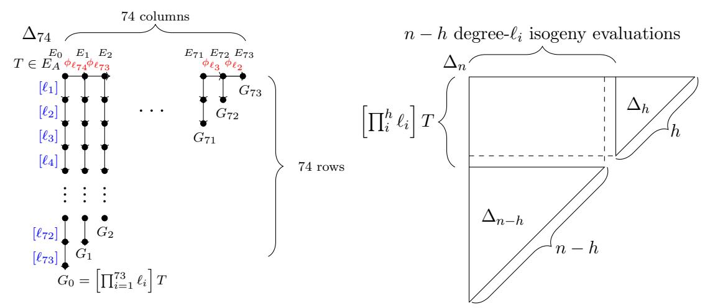
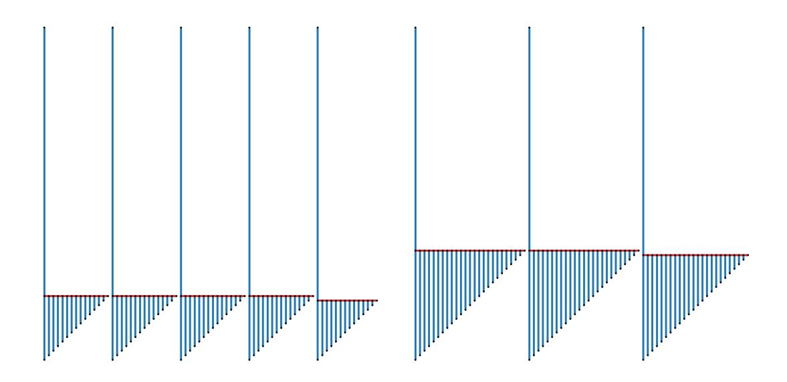
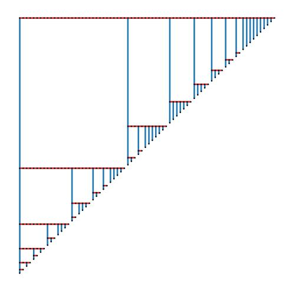
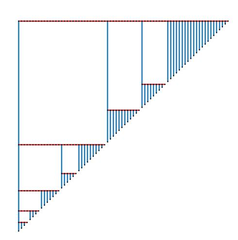
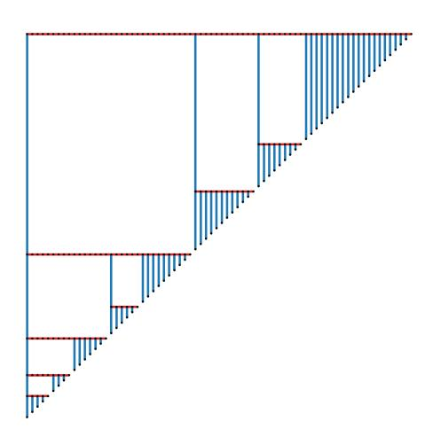

## Optimal strategies for CSIDH

Jes´us-Javier Chi-Dom´ınguez <sup>∗</sup> <sup>1</sup> and Francisco Rodr´ıguez-Henr´ıquez †<sup>2</sup>

<sup>1</sup>Tampere University, Tampere, Finland <sup>2</sup>Computer Science Department, Cinvestav IPN, Mexico City, Mexico

August 5, 2020

#### Abstract

Since its proposal in Asiacrypt 2018, the commutative isogeny-based key exchange protocol (CSIDH) has spurred considerable attention to improving its performance and re-evaluating its classical and quantum security guarantees. In this paper we discuss how the optimal strategies employed by the Supersingular Isogeny Diffie-Hellman (SIDH) key agreement protocol can be naturally extended to CSIDH. Furthermore, we report a software library that achieves moderate but noticeable performance speedups when compared against state-of-the-art implementations of CSIDH-512, which is the most popular CSIDH instantiation. We also report an estimated number of field operations for larger instantiations of this protocol, namely, CSIDH-1024 and CSIDH-1792.

### 1 Introduction

In late 2018, Castryck, Lange, Martindale, Panny, and Renes presented the isogenybased key exchange protocol CSIDH [\[6\]](#page-23-0). CSIDH can be seen as a fast variant of the Couveignes-Rostovtsev-Stolbunov scheme [\[11,](#page-24-0) [24,](#page-25-0) [23\]](#page-25-1), by exploiting the ideas presented in [\[13\]](#page-24-1), but this time operating on supersingular curves defined over prime fields.

One especially attractive feature of CSIDH is that it supports efficient public-key validation, which implies that this scheme can be used as a non-interactive (staticstatic) key exchange protocol. This is a unique feature that none of the post-quantum cryptographic schemes in the NIST contest enjoys [\[20\]](#page-24-2). On the negative side, CSIDH is one order of magnitude slower than its cousin, the SIKE protocol [\[1\]](#page-23-1). Indeed, running on a high-end x64 Intel processor, a constant-time implementation of CSIDH requires more than four hundred fifty million clock cycles to compute a shared secret (cf. Table [5\)](#page-20-0). For comparison, the SIKE protocol instantiated with a 434-bit prime, requires some twenty million clock cycles [\[16\]](#page-24-3).

<sup>∗</sup> jesus.chidominguez@tuni.fi

<sup>†</sup> francisco@cs.cinvestav.mx

The first constant-time implementation of CSIDH was reported by Bernstein, Lange, Martindale, and Panny in [3]. However, the authors of [3] focused their analysis on assessing the quantum security level provided by CSIDH.

Jalali, Azarderakhsh, Kermani, and Jao in [15]; and Meyer, Campos, and Reith in [17], independently presented constant-time instantiations of CSIDH. The authors of [17] introduced several ingenious algorithmic tricks, including the adoption of the Elligator 2 map of [2], splitting isogeny computations into multiple batches (SIMBA), and sampling the secret exponents using different interval bounds depending on the the CSIDH small prime factors  $\ell_i$ .

Later, the CSIDH implementation of [17] was further improved by Onuki, Aikawa, Yamazaki, and Takagi in [22], by keeping track of two points to evaluate the action of an ideal: one in  $E(\mathbb{F}_p)$ , and one in  $E(\mathbb{F}_{p^2})$  with its x-coordinate in  $\mathbb{F}_p$ . Moreover, Moriya, Onuki and Takagi [19], and Cervantes-Vázquez et al. in [7], performed more efficient CSIDH isogeny computations using the twisted Edwards model of elliptic curves. The authors of [7] proposed a more computationally demanding dummy-free variant of CSIDH, which in exchange, is arguably better suited to resist attacks from stronger adversaries.

The group action algorithm proposed in the original CSIDH protocol of [6], relied on a multiplication-based approach for constructing and evaluating isogenies. It was first stated in [3, §8] that this multiplication-based procedure could possibly be improved by adapting the SIDH optimal strategy approach introduced by deFeo, Jao and Plût in [12].

Shortly after [3], Hutchinson, LeGrow, Koziel and Azarderakhsh presented in [14] several improvements for achieving faster constant-time implementations of CSIDH. The algorithmic improvements proposed in [14] included a formal framework that permits to adapt to CSIDH, the SIDH optimal strategies presented in [12]; a more efficient reordering of the CSIDH small prime factors  $\ell_i$ ; and a procedure to find optimal bounds for the CSIDH exponents.

However, when optimizing the CSIDH-512 variant proposed in [22], the best strategy reported by [14] corresponds to the multiplication-based SIMBA approach of [17]. In spite of its outstanding performance, this result is unsatisfactory in the sense that the main contribution of [14] was to introduce optimal strategies other than the multiplication-based one already proposed and utilized in [17]. In practice it appears as if in this setting, the approach of [14] strictly reduces to finding optimal CSIDH public parameters, namely, optimal bound vectors and SIMBA partitions. Furthermore, the authors of [14] also claim a 12.77% speedup over the publicly available software library of [17], this time using optimal strategies different than multiplication-based ones.

**Our contributions:** This is a follow-up paper of previous work presented in [7]. Here, we present a detailed discussion of how to adapt SIDH strategies for the efficient group action evaluation of CSIDH. Let  $L := [\ell_1, \ell_2, \dots, \ell_{74}]$  be the list of small odd prime numbers such that  $p = 4 \cdot \prod_{i=1}^{n} \ell_i - 1$  is the prime number used in CSIDH.

One can find CSIDH optimal strategies for each possible ordering of the set of primes L. However, since dealing with all such orderings is clearly computationally unfeasible,

in this work we heuristically assume that an arrangement of the set L from the smallest to the largest  $\ell_i$ , is close to the global optimal. For this fixed ordering, we present a procedure that finds an optimal strategy with cubic complexity with respect to n.

The main difference of our procedure with the framework presented in [14], is that the strategies proposed in this paper do not rely on the SIMBA approach of [17], but rather, they are an intuitive generalization of how the SIDH strategies can be applied to CSIDH. We note that our approach never declares a multiplication-based strategy as an optimal strategy. Moreover, the CSIDH optimal strategies proposed here comply with the same codification utilized by the SIDH protocol. Additionally, we report constant-time C-code implementations of three instantiations of the CSIDH protocol, namely, MCR [17], OAYT [22], and the dummy-free [7] variants. Our experimental results achieve performance speedups of 12.09%, 3.36% and 10.58% compared with the MCR, OAYT and dummy-free styles as presented in [7].

For a fair comparison with the implementation results reported in [14], we executed in our server the Octave script provided by the authors of [14], for finding OAYT CSIDH-512 optimal public parameters. This script produces a header and C files that should be executed using the C software library of [7]; in particular, we verified that the outputs from their scripts corresponds with the provided ones in their GitHub repository. It was experimentally found that the field arithmetic operation and clock cycle associated to the script of [14] for the OAYT CSIDH-512 computation, is 0.7% cheaper and 0.43% faster than the ones corresponding to our work for this CSIDH variant, respectively.

We stress that this comparison was made between our optimal strategies à la SIDH against a SIMBA multiplication-based approach as proposed in [17] boosted with optimized public parameters found by [14]. The latter setting does not use a non multiplicative-based strategy.

Finally, we also report estimated field arithmetic operation costs of the CSIDH instantiations CSIDH-1024 and CSIDH-1792. Our software library is freely available at,

https://github.com/JJChiDguez/csidh\_withstrategies.

**Note:** Let E and E' be two supersingular elliptic curves defined over  $\mathbb{F}_p$  for which there exists a separable degree- $\ell$  isogeny  $\phi: E \to E'$  defined over  $\mathbb{F}_p$ . Quite recently was presented in [4] a new approach for finding at a cost of only  $O(\sqrt{\ell})$  operations, the co-domain elliptic curve E' and  $\phi(Q)$  and the image of a point  $Q \in E(\mathbb{F}_p)$  with  $P \notin \text{Ker}(\phi)$ . We note that the main contribution presented in [4] is largely orthogonal to the contributions in this paper. Therefore, we leave as a future work to adopt the findings of [4] to further reduce the computational costs of the CSIDH variants reported here.

Organization. In §2 several background algorithmic concepts related to the CSIDH group action computation are given. In §3 an introduction to the efficient computation of the CSIDH class group action is given. Additionally, the usage of optimal strategies for CSIDH is also presented in this section. In §4 additional algorithmic tricks for the computation of three CSIDH variants are given. In §5 experimental results and

comparison with related works are reported. Finally, in  $\S 6$  we draw some concluding remarks.

**Notation.** M, S, and A denote the cost of computing a single multiplication, squaring, and addition (or subtraction) in  $\mathbb{F}_p$ , respectively. We assume that a constant-time equality test isequal(X,Y) is defined, returning 1 if X=Y and 0 otherwise. We also assume that a constant-time conditional swap cswap(X,Y,b) is defined, exchanging (X,Y) if b=1 (and not if b=0).

### <span id="page-3-0"></span>2 Preliminaries

### 2.1 Differential addition chains for Montgomery ladders

In the CSIDH protocol, any given scalar k is the product of a subset of the collection of the 74 small primes  $\ell_i$  dividing  $\frac{p+1}{4}$ . Hence, one can simply compute the scalar multiplication operation [k]P as the composition of the shortest differential addition chains for each prime  $\ell$  dividing k. Note that all those shortest additions chains can be precomputed off-line. Montgomery ladders using differential addition chains can perform the scalar multiplication operation [k]P with an average length of about  $1.5\lceil\log_2(k)\rceil$  steps [7]. Each Montgomery ladder step involves the computation of one differential point addition and differential point doubling at a cost of  $4\mathbf{M} + 2\mathbf{S} + 6\mathbf{A}$  and  $4\mathbf{M} + 2\mathbf{S} + 4\mathbf{A}$ , respectively.

Table 1 reports the field arithmetic expenses associated with the computation of  $[\ell]P$ , where  $\ell = 2d + 1$ .

### <span id="page-3-1"></span>2.2 Isogeny constructions and evaluations

Let p be an odd prime number and let  $\ell$  be an odd number  $\ell = 2d + 1$ , with  $d \geq 1$ . Let E and E' be two supersingular elliptic curves defined over  $\mathbb{F}_p$  for which there exists a separable degree- $\ell$  isogeny  $\phi: E \to E'$  defined over  $\mathbb{F}_p$ . This implies that there must exist an  $\ell$ -order point  $P \in E(\mathbb{F}_p)$  such that  $\operatorname{Ker}(\phi) = \{\infty, \pm P, \pm [2]P, \dots, \pm [d]P\}$ . Given the domain elliptic curve E and an  $\ell$ -order point  $P \in E(\mathbb{F}_p)$ , we are interested in the problem of computing the co-domain elliptic curve E'. Furthermore, given a point  $Q \in E(\mathbb{F}_p)$  such that  $Q \notin \operatorname{Ker}(\phi)$ , a closely related problem is that of finding  $\phi(Q)$ , i.e., the image of the point Q over E'. In the remainder of this paper, these two tasks will be called isogeny construction and isogeny evaluation computations, respectively.

It has become customary to perform these two tasks by using three main building blocks, namely, KPS, CODOM and PEVAL. Let us define KPS as the task of computing the first d multiples of the point P, namely, the set  $R = \{P, [2]P, \ldots, [d]P\}$ . Using KPS as a building block, the module CODOM computes the per-field constants that define the codomain curve E' over  $\mathbb{F}_p$ . Also, using KPS as a building block, PEVAL computes the image point  $\phi(Q)$ . Note that KPS becomes more expensive than PEVAL starting from  $\ell \geq 11$ . When  $\ell \leq 7$ , the block KPS is considerably cheaper or even free of cost for the case  $\ell = 3$ .

<span id="page-4-0"></span>

| Primitive | M           | S        | A              |            |
|-----------|-------------|----------|----------------|------------|
|           |             |          | Montgomery[10] | Edwards[7] |
| [`]P [7]  | 12λ         | 6λ       | 15λ            | −          |
| KPS       | 4(d − 1)    | 2(d − 1) | 6d − 2         | 6d − 2     |
| PEVAL     | 4d          | 2        | 6d             | 2d + 4     |
| CODOM [9] | ` + 2λ¯ + 1 | 2(λ + 2) | −              | 0          |

Table 1: Costs for computing prime degree-` isogenies with ` = 2d + 1 using the KPS, PEVAL and CODOM building blocks. Field multiplication (M) and squaring (S) costs are taken from [\[10,](#page-23-6) [7,](#page-23-4) [9\]](#page-23-7). The cost of performing one scalar multiplication [`]P using differential addition chains as in [\[7\]](#page-23-4), is also presented. The computational costs associated to the point addition and point doubling operations is of 4M + 2S + 6A and 4M + 2S + 4A , respectively. We define λ = dlog<sup>2</sup> `e and λ¯ ≈ log<sup>2</sup> (d 8 e) 3 .

Observe also that since CODOM and PEVAL show no dependencies between them, once that the kernel points have been computed, it is possible to compute CODOM and PEVAL in parallel. Furthermore, when evaluating an arbitrary number of points in E that do not belong to the Ker(φ) subgroup, KPS must be computed only once. This implies that the computational cost associated to KPS gets amortized when computing the image of two or more points.

Table [1](#page-4-0) summarizes the field arithmetic costs associated to the KPS and PEVAL operations. Note that KPS is a straightforward computation that can be performed at the cost of one point doubling and k − 2 point additions. Efficient formulas for computing PEVAL can be found in [\[10\]](#page-23-6) and [\[7\]](#page-23-4) for Montgomery and twisted Edwards curves, respectively.

<span id="page-4-1"></span>As a numerical example consider the cost of computing isogeny evaluations and constructions for the prime ` = 2 · 64 + 1 = 127.

Example 1 Let us consider the case for the prime ` = 2 · 64 + 1 = 127. Then, according to Table [1](#page-4-0) the computational expenses associated with the computation of the KPS, PEVAL and CODOM primitives and the scalar multiplication [127]T, for some point T ∈ E(Fp), is shown in Table [2.](#page-5-1) It can be seen that constructing and evaluating a degree-127 isogeny is 4.34 and 5.03 times more expensive than computing the scalar multiplication [127]T, respectively. Note that any extra isogeny evaluation can reuse the KPS computation and therefore it is only two times more expensive than finding the multiple [127]T.

In the remainder of this paper we assume that given a curve E specified in Montgomery form, a point G in E(Fp) and an odd integer ` = 2d + 1, the procedure QuotientIsogeny invoking both the KPS and CODOM primitives, computes the degree-` quotient isogeny φ : E → E<sup>0</sup> ∼= E/hGi, returning (E<sup>0</sup> , R), where R = {G, [2]G, . . . , [d]G}.

| Primitive | М   | s   | Total Cost |                              |  |  |
|-----------|-----|-----|------------|------------------------------|--|--|
| 1 mmuve   | IVI | ۵   | S = M      | $\mathbf{S} = 0.8\mathbf{M}$ |  |  |
| $\ell$    | 84  | 42  | 126        | 118                          |  |  |
| KPS       | 252 | 126 | 378        | 352                          |  |  |
| PEVAL     | 256 | 2   | 256        | 256                          |  |  |
| CODOM     | 151 | 18  | 169        | 166                          |  |  |

<span id="page-5-1"></span>Table 2: Approximate arithmetic costs for computing prime degree- $\ell$  isogenies with  $\ell=2d+12\cdot 64+1=127$ , using the KPS, PEVAL and CODOM primitives. The cost of computing the scalar multiplication [127]T is also reported.

### <span id="page-5-0"></span>3 Computing the CSIDH class group action

In this section, an introduction to the efficient computation of the CSIDH class group action is given. We start giving a simplified view of the CSIDH algorithm, which is followed by several algorithmic refinements.

### 3.1 Setting

Let  $\ell_1, \ldots, \ell_n \in \mathbb{Z}$  be small odd prime numbers such that  $p = 4 \prod_{i=1}^n \ell_i - 1$  is also a prime number. We work with the 511-bit prime proposed in [6], using the following labeling:  $\ell_{74} = 3, \ell_{73} = 5, \ldots, \ell_2 = 373$ , given by the first 73 odd primes, and  $\ell_1 = 587$ . Let  $E/\mathbb{F}_p$  be a supersingular elliptic curve given in Montgomery form as,

$$E/\mathbb{F}_p \colon y^2 = x^3 + Ax^2 + x;$$
 (1)

It follows that  $\#E(\mathbb{F}_p) = (p+1) = 4 \prod_{i=1}^n \ell_i$ . Additionally, let  $\pi \colon (x,y) \mapsto (x^p,y^p)$  be the Frobenius map and  $N \in \mathbb{Z}$  be a positive integer. Then,  $E[N] \coloneqq \{P \in E(\mathbb{F}_p) \colon [N]P = \mathcal{O}\}$  denotes the N-torsion subgroup of  $E/\mathbb{F}_p$ . Similarly,  $E[\pi-1] \coloneqq \{P \in E(\mathbb{F}_p) \colon (\pi-1)P = \mathcal{O}\}$  and  $E[\pi+1] \coloneqq \{P \in E(\mathbb{F}_{p^2}) \colon (\pi+1)P = \mathcal{O}\}$  denote the subgroups of  $\mathbb{F}_p$ -rational and zero-trace points, respectively. In particular, any point  $P \in E[\pi+1]$  is of the form (x,iy) where  $x,y \in \mathbb{F}_p$  and  $i = \sqrt{-1}$  so that  $i^p = -1$ .

### 3.2 A simplified constant-time CSIDH group action evaluation

The most demanding computational task of CSIDH is the evaluation of the class group action, which is dominated by the cost of performing a number of degree- $\ell_i$  isogeny constructions. This action takes as input a secret integer vector  $e = (e_1, \ldots, e_n)$  such that  $e_i \in [0, m]$ , and then constructs isogenies with kernel generated by  $P \in E_A[\ell_i] \cap E[\pi-1]$  for exactly  $e_i$  iterations.

For constant-time implementation of CSIDH, the group action evaluation starts by constructing isogenies with kernel generated by  $P \in E_A[\ell_i] \cap E[\pi - 1]$  for  $e_i$  iterations, and then performs dummy isogeny constructions for  $(m - e_i)$  iterations.

Algorithm 1 shows a simplified and idealized computation of the CSIDH group action as explained next. The procedure consists of two main loops. At the beginning of the

**Algorithm 1:** Simplified constant-time CSIDH class group action for supersingular curves over  $\mathbb{F}_p$ , where  $p = 4 \prod_{i=1}^n \ell_i - 1$ . The ideals  $\mathfrak{l}_i = (\ell_i, \pi - 1)$ , where  $\pi$  maps to the p-th power Frobenius endomorphism on each curve. This algorithm computes exactly m isogenies for each ideal  $\mathfrak{l}_i$ .

```
Input: A supersingular curve E_A over \mathbb{F}_p, and an exponent vector (e_1, \ldots, e_n) with each
                e_i \in [0, m]), m a positive number.
    Output: E_B = \mathfrak{l}_1^{e_1} * \cdots * \mathfrak{l}_n^{e_n} * E_A.
 1 E_0 \leftarrow E_A;
 2 // Outer loop: Each \ell_i prime f. is processed m times
 3 for i \in \{1, ..., m\} do
                                                                                                       // T \in E_n[\pi-1]
// Now T \in E_n\left[\prod_i \ell_i\right]
          T \leftarrow \texttt{ObtainFullTorsionPoint}(E_0);
 4
          T \leftarrow [4]T;
 5
          // Inner loop: processing each prime factor \ell_i|(p+1);
 6
          for j \in \{0, 1, \dots, n-1\} do
 7
                G_i \leftarrow T;
  8
                for k \in \{1, ..., n-1-j\} do
  9
                 G_j \leftarrow [\ell_k]G_j
10
                if e_i \neq 0 then
11
                     (E_{(j+1) \bmod n}, R) \leftarrow \mathtt{QuotientIsogeny}(E_j, G_j, \ell_{n-j}) ;
12
                     T \leftarrow \texttt{PEVAL}(T, R);
                    e_j \leftarrow e_j - 1;
                else
15
                     QuotientIsogeny(E_j,G_j,\ell_{n-j});\;\phi(T);
                                                                                                        // Dummy operations
16
                    T \leftarrow [\ell_{n-j}]T;
E_{j+1 \bmod n} \leftarrow E_j;
19 return E_0
```

<span id="page-6-9"></span><span id="page-6-8"></span><span id="page-6-4"></span>procedure in Step 1, the constants of the input parameter  $E_A$  are assigned to  $E_0$ . At Step 4 of the outer loop of Steps 3-18, a full order point  $T \in E_0$  (i.e., a point having order  $\frac{p+1}{4}$ ), is computed. For the sake of simplicity it has been assumed that the function in Step 4 must always output a full torsion point belonging to  $E_n[\pi - 1]$ .

Thereafter, the inner loop of Steps 7-18 constructs and evaluates a degree- $\ell_i$  isogeny for each one of the n prime factors  $\ell_j$  dividing p+1, using  $G_j$  as a subgroup kernel generator. At each iteration, an isogenous elliptic curve  $E_j$  is computed. When the inner loop completes its computation, the constants defining the elliptic curve  $E_0$  are used in Step 4 to find a new full order point  $T \in E_0$ . The outer loop of Steps 3-18 simply repeat the execution of the inner loop in order to complete exactly m evaluations. At the end of the procedure, the constants defining the curve  $E_0$  (corresponding to the m-th evaluation of the inner loop) is returned. As long as the computations in Steps 11-14 and Steps 15-18 are carefully balanced, and the conditional statements are substituted by conditional swaps (see Algorithm 2), this procedure computes the group action in constant time. Hence, the running time of Algorithm 2 does not depend on the secret

<span id="page-6-5"></span><sup>&</sup>lt;sup>1</sup>Note that in practice the time required for finding a full-torsion point is relatively expensive. Hence, one normally relax this condition and works with points whose order does not necessarily include all the prime factors of p + 1. however, this leads to extracomputational steps not shown in Algorithm 1.

**Algorithm 2:** Simplified constant-time CSIDH class group action for supersingular curves over  $\mathbb{F}_p$ , where  $p = 4 \prod_{i=1}^n \ell_i - 1$ . The ideals  $\mathfrak{l}_i = (\ell_i, \pi - 1)$ , where  $\pi$  maps to the p-th power Frobenius endomorphism on each curve. This algorithm computes exactly m isogenies for each ideal  $\mathfrak{l}_i$ . (Low level version)

```
Input: A supersingular curve E_A over \mathbb{F}_p, and an exponent vector (e_1, \ldots, e_n) with each
              e_i \in [0, m]), m a positive number.
    Output: E_B = \mathfrak{l}_1^{e_1} * \cdots * \mathfrak{l}_n^{e_n} * E_A.
 1 E_0 \leftarrow E_A;
 2 // Outer loop: Each \ell_i prime f. is processed m times
 3 for i \in \{1, ..., m\} do
         T \leftarrow \texttt{ObtainFullTorsionPoint}(E_0);
                                                                                                     // T \in E_n[\pi - 1]
                                                                                                // Now T \in E_n \left[ \prod_i \ell_i \right]
         T \leftarrow [4]T;
 5
         // Inner loop: processing each prime factor \ell_i|(p+1);
 6
         for j \in \{0, 1, \dots, n-1\} do
 7
              G_j \leftarrow T;
 8
              for k \in \{1, ..., n-1-j\} do
                G_j \leftarrow [\ell_k]G_j
10
              b \leftarrow \mathtt{isequal}(e_{n-j}, 0);
11
              (E_{(j+1) \bmod n}, R) \leftarrow QuotientIsogeny(E_j, G_j, \ell_{n-j});
                                                                                          // degree-\ell_{n-i} isogeny
12
              T' \leftarrow [\ell_{n-i}]T;
13
              T \leftarrow \texttt{PEVAL}(T, R);
                                                                       // Evaluate T on degree-\ell_{n-j} isogeny
14
              cswap(E_j, E_{(j+1) \bmod n}, b);
                                                                                                 // undo if e_{n-i} = 0
15
              cswap(T', T, b);
                                                                                                 // undo if e_{n-j} = 0
16
              e_{n-j} \leftarrow e_{n-j} - ((b+1) \mod 2);
18 return E_0
```

<span id="page-7-1"></span>kev vector e.

The computational cost of Algorithm 1 is dominated by the computation of n degree- $\ell_i$  isogeny evaluations and constructions plus a total of  $\frac{n(n+1)}{2}$  scalar multiplications by the prime factors  $\ell_i$ , for  $i=1,\ldots,n$ .

<span id="page-7-2"></span>**Remark 1** A natural instantiation of Algorithm 1 uses the 511-bit CSIDH prime with 74 prime factors dividing p+1. In order to guarantee a 128-bit classical security level, it is required to choose m=10, so that the private key space has a size of about  $11^{74} \approx 2^{256}$  different keys.

Algorithm 2 presents a low-level constant-time version of Algorithm 1, where all the conditional statements have been implemented as conditional swaps statements.

**Remark 2** Notice that the scalar multiplication required in Step 13 of algorithm 2, can be performed by invoking the QuotientIsogeny() procedure using as input parameter the point T, instead of the point  $G_j$ . Let R be the array of n-j points  $\{T, [2]T, \ldots, [d_{n-j}]T\}$ , and

$$\begin{split} [l_{n-j}]T &\coloneqq [2d_{n-j}+1]T = [d_{n-j}]T + [d_{n-j}+1]T \\ &= R[d_{n-j}] + [d_{n-j}+1]T = R[d_{n-j}] + \left(R[d_{n-j}] + R[1]\right) \end{split}$$

<span id="page-8-0"></span>

- (a) The multiplicative strategy for computing the CSIDH group action as given in Algorithm 1
- (b) Optimal strategies à la SIDH for CSIDH

Figure 1: Subfigure 1a shows a discrete triangle used to compute the inner loop of the CSIDH group action Algorithm 1. The main goal of this task is to find the field constants that define the elliptic curve  $E_B$ . As stated in Algorithm 1, the discrete triangle of Subfigure 1a must be computed exactly m times. Using an optimal strategy as in [12], a discrete triangle  $\Delta_n$  is processed by splitting it into two sub-triangles as shown in Subfigure 1b.

can be computed with two additions. Thus, the points T and  $G_j$  must be swapped before the QuotientIsogeny() procedure is invoked.

### 3.3 A multiplicative-based Strategy for CSIDH

In order to efficiently compute the group action of Algorithm 1, one can adapt the canonical strategies for traversing a weighted directed graph presented in [12], which is represented as a discrete right triangle  $\Delta_n$  of side n having  $\frac{n(n+1)}{2}$  vertices distributed in n columns and rows (See Figure 1a).

The vertices of  $\Delta_n$  represent elliptic curve points and its vertical and horizontal edges have as associated weight  $p_{\ell_i}$  and  $q_{\ell_i}$ , defined as the cost of performing one scalar multiplication by  $\ell_i$  and evaluating a degree- $\ell_i$  isogeny, respectively. The j-th column of the triangle contains exactly n-j vertices representing elliptic curve points belonging to the isogenous elliptic curve  $E_j$ , for  $j=0,\ldots,n-1$ . A leaf is defined as the most bottom point in a given column of the triangle. The set of n leaves define the hypotenuse of  $\Delta_n$ . A ramification (or split) vertex is defined as a vertex having both horizontal and vertical edges leaving from it. The weight of a split vertex is the number of vertices between it and either the next split vertex in the column, or the leave in the column. Each one of the n columns of  $\Delta_n$  corresponds to an isogenous supersingular elliptic curve  $E_j$ , for  $j=n,1,2\ldots,n-1$ .

**Remark 3** As a mechanism to obtain a constant-time implementation of the group action, the procedure shown in Algorithm 1, as well as most constant-time implementations of CSIDH, make an abundant use of dummy computations. Hence, it may occur that  $E_k = E_l$  with  $0 \le k < l \le n - 1$ .

At the beginning of the group action evaluation, only the base elliptic curve  $E_A = E_0$  is known. Then, a point  $T \in E_A$  (ideally) with order  $\frac{p+1}{4} = \prod_i \ell_i$  must be found. This torsion point can be descended by performing a scalar multiplication with each one of the n prime factors of p+1 (see the first column of Figure 1a).

The leaf of the first column represents the point  $G_0 = \left[\prod_i \ell_{i=1}^{n-1}\right] T$ . If  $G_0$  is finite, then it has to have order  $\ell_n$  and can be used to generate the subgroup corresponding to the kernel of the isogeny  $\phi_{\ell_n}$ . The leaf  $G_1$  is defined as,

<span id="page-9-0"></span>
$$G_{1} = \begin{cases} \left[ \prod_{i} \ell_{i=1}^{n-2} \right] \phi_{\ell_{n}}(T) & \text{if } e_{n} \neq 0; \\ \left[ \prod_{i} \ell_{i=1}^{n-2} \right] ([\ell_{n}]T) & \text{if } e_{n} = 0. \end{cases}$$
 (2)

Provided that T is a full order point, the point  $G_1$  is guaranteed to be finite and of order  $\ell_{n-1}$ . In general, if the exponents  $e_j \neq 0$  for  $j = n, n-1, \ldots, 3, 2$ . Then

$$G_{n-(j-1)} = \left[ \prod_{i} \ell_{i=1}^{j-2} \right] \phi_{\ell_j} (\dots (\phi_{\ell_n}(T)) \dots).$$
 (3)

If some  $e_k = 0$ , then the corresponding isogeny evaluation  $\phi_{\ell_k}$  of Eq. (3) must be substituted by the scalar multiplication  $[\ell_k]T$ .

The goal of the group action computation is thus seen as the task of obtaining, one by one, all the leaves  $G_j \in \Delta_n$  for  $j=1,2,\ldots,n$ , until the farthest right one,  $G_{n-1}$ , has been calculated. Then, the elliptic curve  $E_B$  determined by  $\phi_{\ell_n}: E_{n-1} \to E_n$ , can be obtained by simply constructing a degree- $\ell_n$  isogeny with kernel  $G_{n-1}$ , which coincides with the domain or image of  $\phi_{\ell_n}$  depending if  $e_1 = 0$  or not, respectively.

The naive strategy followed by Algorithm 1 is depicted in Figure 1a, instantiated for the CSIDH prime  $p_{512}$  with 74 prime factors  $\ell_i$  such that  $\ell_i|(p+1)$ . The computation of the triangle  $\Delta_n$  shown in Figure 1a represents one full execution of the inner loop of Steps 7-18. This computation should be repeated m=10 times in order to complete the CSIDH group action (cf. Remark 1). From Figure 1a, it can be seen that Algorithm 1 follows a pure multiplicative strategy, where  $\frac{n(n+1)}{2}=2775$  scalar multiplications by the scalars  $\ell_i$  for  $i=1,\ldots,74$ , are performed; plus the construction and evaluation of only 74 degree- $\ell_i$  isogenies.

Assuming that in average, one scalar multiplication computation  $[\ell]T$  is at least five times less expensive than a degree- $\ell$  isogeny construction or evaluation, one can see that there is room for optimizing the multiplicative strategy followed by Algorithm 1.<sup>2</sup> In the following we briefly review optimal strategies as they were presented in [12].

<span id="page-9-1"></span><sup>&</sup>lt;sup>2</sup>Another computational reason for considering other approaches, is that a multiplicative strategy is eminently sequential. Alternative strategies exploiting the inherent parallelism of the isogeny evaluation computations can be much more attractive for multi-core platforms.

#### <span id="page-10-0"></span>3.4 Optimal strategies for CSIDH

Let  $L = [\ell_1, \ell_2, \dots, \ell_n]$  be the list of small odd prime numbers such that  $p = 4 \cdot \prod_{i=1}^n \ell_i - 1$  is a prime number. A CSIDH strategy is a weighted subgraph  $S_n(L)$  contained into a discrete rectangular triangle  $\Delta_n$  of side n. Any strategy  $S_n(L)$  has an associated cost defined as,

$$C(S_n) = \sum_{x \in \mathbf{edges}(S_n(L))} \omega(x) + \sum_{j=0}^n \nu((n-1-j,j)), \tag{4}$$

where  $\omega(x)$  and  $\nu((n-1-j,j))$  denote the weights of the edge x and leaf (n-1-j,j), respectively.

In addition,  $S_n(L)$  is called optimal if for any different strategy  $S'_n(L)$  the inequality  $C_n(S_n(L)) < C_n(S'_n(L))$  holds. Optimal strategies were defined in [12] within the context of the SIDH protocol. In [12] the fact that a triangle  $\Delta_n$  can be optimally and recursively decomposed into two sub-triangles  $\Delta_h$  and  $\Delta_{n-h}$  was exploited as shown in Figure 1b. Let us denote as  $\Delta_n^h$  the design decision of splitting a triangle  $\Delta_n$  at row h. The sequential cost of walking across the strategy  $S_n(L)$ , which is a subgraph of  $\Delta_n^h$ , is given as

$$C(S_n^h(L)) = C(S_h(L_h)) + C(S_{n-h}(L_{n-h})) + \sum_{i=1}^{n-h} q_{\tilde{\ell}_i} + \sum_{i=0}^{h-1} p_{\tilde{\ell}_{n-i}},$$

where  $L_h = [\tilde{\ell}_{n-h+1}, \dots, \tilde{\ell}_n]$  and  $L_{n-h} = [\tilde{\ell}_1, \dots, \tilde{\ell}_{n-h}]$  are two disjoint sublists of L and have size h and n-h, respectively. We say that  $S_n^{\hat{h}}(L)$  is optimal if  $C(S_n^{\hat{h}}(L))$  is minimal among all  $S_n^h(L)$  for  $h \in [1, n-1]$ . Applying this strategy recursively leads to a procedure that computes the CSIDH group action at an optimal cost. The associated number of scalar multiplications is reduced at the price of increasing the total number of isogeny evaluations and constructions.

In the context of SIDH, optimal strategies tend to balance the number of isogeny evaluations and scalar multiplications to  $O(n \log (n))$ . However, CSIDH optimal strategies are expected to be largely multiplicative, *i.e.*, optimal strategies will tend to favor the computation of more scalar multiplications. This is due to the fact that these operations are several times cheaper than isogeny evaluations for a sufficiently large prime degree  $\ell$  (cf. Example 1).

On the other hand, since evaluating/constructing an odd degree- $\ell$  isogeny with  $\ell \in \{3,5,7\}$  has a cheaper cost than a scalar multiplication by  $\ell$  (see for example [9][Table 3]), one can easily show that any multiplicative-based strategy containing any of these three small degree isogenies could never be optimal.

As proposed in [12], optimal strategies can be obtained using dynamic programming (see [1, 8] for concrete algorithms). In [14][§3.1], the cost of adapting the optimal strategies of [12] to the CSIDH setting was presented.

A brief description of our process to finding optimal strategies for CSIDH is given next.

#### 3.4.1 Finding Optimal strategies for CSIDH

Notice that the computation of SIDH strategies are a very special case of CSIDH strategies, where  $q_{\ell_i}$  (resp.  $p_{\ell_j}$ ) have the same fixed value. Hence, the required number of different weighted sub-triangles is given as  $\sum_{i=1}^{n-1} i = \frac{(n-1)n}{2}$ .

This is not the case for CSIDH, where each pair of sub-triangles  $\Delta_h$  and  $\Delta_{n-h}$  requires different (and disjoint) sub-lists  $L_h$  and  $L_{n-h}$  chosen from  $L := [\ell_1, \ell_2, \dots, \ell_n]$ . Additionally, since the ordering of each sub-list impacts on the cost of any strategy in  $\Delta_h$  and  $\Delta_{n-h}$ , the search space of different weighted sub-triangles to be considered is exceedingly large, given as,  $\sum_{i=1}^{n-1} i! \cdot \binom{n}{i} \gg 2^n$ . Therefore, searching for an optimal strategy and ordering of the small prime factors in L, become infeasible.

Heuristically, one can expect that the optimal ordering of prime factors  $\ell_i \in L$ , has a computational cost quite close to the one associated to processing the isogenies from the smallest to the the largest. Besides, processing the  $\ell_i$  primes in the above order favors the usage of non multiplicative-based strategies. This assumption can be informally justified as follows.

Referring to Figure 1a, the isogeny maps required to move from column 0 to column 73 of the right triangle  $\Delta_{74}$ , will start from the smallest degree-3 isogeny  $\phi_{\ell_{74}}$ , all the way until the costly degree-373 isogeny  $\phi_{\ell_2}$  must be computed to move from column 72 to column 73. We stress that in the case of dealing with the OAYT-style, two isogeny evaluations must be performed.

Swapping the primes  $\ell_i$  and  $\ell_j$  for i < j, produces a small computational saving due to the fact that the scalar multiplication associated to  $\ell_j$  has a cheaper cost that the one associated to  $\ell_i$ . However, this swap also implies evaluating earlier the isogeny  $\phi_{\ell_i}$ , which is more expensive than  $\phi_{\ell_j}$ . We note that for almost all the trail of an optimal strategy, there will be more degree- $\ell_j$  isogeny evaluations than degree- $\ell_i$  isogeny evaluations. Moreover, each one of these two isogeny evaluations are more expensive than the cost associated to scalar multiplications by  $\ell_i$  and  $\ell_j$ . Of course, there might be some few pairs  $\ell_i$  and  $\ell_j$ , whose swapping may lead to costly reductions. For example, this will happen when the number of degree- $\ell_j$  isogeny evaluations is smaller than the number of degree- $\ell_i$  isogeny evaluations. However, even in this scenario, the difference of costs between the two arrangements is expected to be very small.

Under the above assumption, it is enough to compute optimal strategies for each sub-list of ordered small odd primes (starting from the smallest). This implies that the search space of different weighted sub-triangles gets reduced to a space of cubic complexity since

$$n + \sum_{j=2}^{n-1} (n+1-j)(j-1) = n + n \sum_{j=2}^{n-1} (j-1) - \sum_{j=2}^{n-1} (j-1)^2 = n + n \sum_{j'=1}^{n-2} j' - \sum_{j'=1}^{n-2} (j')^2$$

$$= n + n \left( \frac{(n-2)(n-1)}{2} \right) - \left( \frac{(n-2)(n-1)(2n-3)}{6} \right)$$

$$= n + \frac{(n-2)(n-1)}{6} \left( 3n - (2n-3) \right)$$

$$= n + \frac{(n-2)(n-1)(n+3)}{6}.$$

Notice also that any CSIDH strategy can be encoded following the linearized representation used in [\[1\]](#page-23-1). In [\[1\]](#page-23-1), a strategy is described as a list of exactly (n − 1) positive integers smaller than n, such that each entry determines the number of vertical edges before a ramification or a leaf is reached. For example, the multiplicative-based strategy of Algorithm [1,](#page-6-0) can be coded as Sn(L) := [n − 1, n − 2, . . . , 2, 1].

Based on the approach described in [\[1\]](#page-23-1), the following cubic complexity procedure outlines how to obtain a CSIDH optimal strategy. This procedure outputs a vector of (n−1) positive integers smaller than n. For k, j positive integers, let us define a sub-list of prime factors Nk,j := [`j+1, `j+2, . . . , `j+k] ∈ L. Then,

- 1. For each j := 0, 1 . . . , n − 1, the optimal stragegy for each N1,n−1−<sup>j</sup> is S1(N1,n−1−<sup>j</sup> ) = [] and has a cost equal to C<sup>1</sup> S1(N1,n−1−<sup>j</sup> ) = ν (n − 1 − j, j) .
- 2. For each k := 2, 3, . . . , n and j := 0, 1 . . . , n − k, the optimal strategy is

$$S_k(\mathbf{N}_{k,j}) = [s] \operatorname{cat} S_{k-s}(\mathbf{N}_{k-s,j+s}) \operatorname{cat} S_s(\mathbf{N}_{s,j})$$

and has a cost equal to Ck(S<sup>k</sup> Nk,j ) = min h α, where s = arg min h α, and

$$\alpha = \left\{ C_{k-h}(S_{k-h}(\mathbf{N}_{k-h,h+j})) + C_h(S_h(\mathbf{N}_{h,j})) + \omega([(0,0),(h,0)]) + \omega([(0,0),(0,k-h)]) : h = 1, 2, \dots, k-1 \right\}.$$

Here, ω [(0, 0),(0, h)] and ω [(0, 0),(k − h, 0)] represent a vertical segment and a horizontal segment of length h and k − h, respectively. It has been assumed that the root vertex (0, 0) corresponds with the root of the sub-triangle ∆k, associated with the sub-list of prime factors Nk,j . See Figure [1b](#page-8-0) for an illustration of the first level of this recursive process with k = n.

The remaining task is to figure out how to evaluate a CSIDH optimal strategy Sn(L) as obtained in the above procedure. We discuss this problem in the next section.

# <span id="page-13-0"></span>4 Additional algorithmic refinements for constant-time group action evaluation

In this section, we focus our attention to the algorithmic tricks presented by three recent CSIDH variants, namely, the Meyer–Campos–Reith constant-time algorithm of [17], the Onuki–Aikawa–Yamazaki–Takagi constant-time algorithm of [22], and the dummy-free algorithm of [7].

### <span id="page-13-1"></span>4.1 One torsion point with dummy isogeny constructions (MCR-style)

Meyer, Campos and Reith proposed in [17] several ingenious optimizations that compared to Algorithm 1, lead to a much faster constant-time CSIDH group action computation.

One of the optimizations introduced in [17], was to sample a point using the Elligator 2 map of [2] and [3]. Typically, the Elligator 2 mapping does not return a full order point. Let  $T \in E(\mathbb{F}_p)$ , with  $p = 4 \prod_{i=1}^n \ell_i - 1$ . As pointed out in [7], under reasonable heuristics assumptions experimentally verified in [3], it is observed that

$$\Pr\left[\left\lceil \frac{p+1}{\ell_i}\right\rceil T = \mathcal{O}\right] = \frac{1}{\ell_i}, \text{ for } i = 1, \dots, n.$$

In the event that the Elligator 2 procedure outputs a point T that is not of full order, then extra points must be sampled in order to repair the missing prime factors.

A second optimization in [17], dubbed SIMBA- $\sigma$ - $\kappa$ , consisted of splitting the processing of the prime factors  $\ell_i$  as defined above, into  $\sigma$  disjoint sets (batches) of size  $\frac{n}{\sigma}$ . Afterwards, a multiplicative strategy is applied to each batch. Each multiplicative strategy is evaluated  $\kappa$  times.

Finally as in [18], instead of using a fixed interval [0, 10] for all the isogeny computations, the authors of [17] proposed to define a customized interval per each entry in the secret vector e. Thus, a vector m is defined such that  $0 \le e_i \le m_i$ , for i = 1, ..., n. The missing prime factors are repaired using a multiplicative strategy, until all the  $m_i$  degree- $\ell_i$  isogeny constructions have been performed.

In this work, we adopted the Elligator 2 procedure for point sampling, plus the definition of a vector m with a customized interval per each entry in the secret vector e. However, we dismiss the usage of the SIMBA approach.

In the remaining of this paper we will refer to this approach, which uses one torsion point and dummy isogeny constructions, as the MCR-style CSIDH group action evaluation. The details of how to execute an optimal strategy using this approach are given in Appendix B.1.

# 4.2 Two torsion point with dummy isogeny constructions (OAYT-style)

Onuki, Aikawa, Yamazaki and Takagi proposed a faster constant-time version of CSIDH in [22]. Their key idea is to use two points to evaluate the action of an ideal, one in

ker(π − 1) (i.e., in E(Fp)) and one in ker(π + 1) (i.e., in E(F<sup>p</sup> <sup>2</sup> ) with the x-coordinate in Fp). This allows them to avoid timing attacks, while keeping the same primes and exponent range [−5, 5] as in the original CSIDH algorithm of [\[6\]](#page-23-0). Their algorithm also employs dummy isogenies to mitigate some power analysis attacks, as in [\[17\]](#page-24-5). With these improvements, the authors achieve a considerable speed-up compared to [\[17\]](#page-24-5). The saving comes from the fact that the procedure proposed by [\[22\]](#page-25-2) performs approximately five isogeny constructions (as opposed to the ten constructions in [\[17\]](#page-24-5)) and ten isogeny evaluations per `<sup>i</sup> . Algorithm [3](#page-26-0) of Appendix [A](#page-26-1) summarizes the main idea proposed by Onuki et al. [\[22\]](#page-25-2).

In the remaining of this paper we will refer to this approach, which uses two torsion points and dummy isogeny constructions, as the OAYT-style CSIDH group action evaluation. We stress that OAYT-style studied in this work considers both, the Elligator 2 procedure for sampling points and a customized bound vector m, but does not make use of the SIMBA strategy (cf. §[4.1\)](#page-13-1). The details of how to execute an optimal strategy using OAYT-style can be found in Appendix [B.2.](#page-28-0)

### <span id="page-14-0"></span>4.3 Two torsion point without dummy isogeny constructions (Dummyfree style)

A constant-time CSIDH group action computation that does not use dummy computations, thus making every computation essential for a correct final result was proposed in [\[7\]](#page-23-4). This yields some natural resistance to fault attacks, at the cost of approximately a twofold slowdown. For the approach in [\[7\]](#page-23-4), the exponents e<sup>i</sup> are uniformly sampled from sets

$$S(m_i) = \{e \mid e = m_i \text{ mod 2 and } |e| \le m_i\},\$$

i.e., centered intervals containing only even or only odd integers. The action of vectors drawn from S(m) n can be computed by interpreting the coefficients e<sup>i</sup> as,

$$|e_i| = \underbrace{1 + 1 + \dots + 1}_{e_i \text{ times}} + \underbrace{(1 - 1) - (1 - 1) + (1 - 1) - \dots}_{m_i - e_i \text{ times}},$$

i.e., the algorithm starts by acting by l sign(ei) i for e<sup>i</sup> iterations, then alternates between l<sup>i</sup> and l −1 i for m<sup>i</sup> − e<sup>i</sup> iterations. Algorithm [4](#page-27-1) of of Appendix [A](#page-26-1) describes the approach presented in [\[7\]](#page-23-4).

In the remaining of this paper we will refer to this approach, which uses two torsion points without dummy isogeny constructions, as the Dummy-free-style CSIDH group action evaluation. We stress that Dummy-free-style considers both, the Elligator 2 procedure for sampling points and a customized bound vector m, but does not make use of the SIMBA strategy (cf. §[4.1\)](#page-13-1). The details of how to execute an optimal strategy using Dummy-free-style can be found in Appendix [B.3.](#page-30-0)

### <span id="page-15-0"></span>4.4 Finding an optimal bound vector for the CSIDH group action

All three of the MCR-, OAYT- and Dummy-free styles previously described in this section, use a bound vector  $m = (m_1, m_2, \ldots, m_n)$ . The bound vector m specifies the intervals where each secret exponent  $e_i$  associated to each degree- $\ell_i$  isogeny with  $i = 1, \ldots, n$ , must be sampled. Given a bound vector m, the computational cost of the CSIDH group action is a complex function that must take into consideration not only the expenses associated to the number of isogeny constructions/evaluations and scalar multiplications, but also the costs of repairing missing prime factors due to the probabilistic nature of the Elligator 2 procedure (cf. 4.1).

A heuristic solution to the optimization problem of finding a vector m such that the computational cost of the group action evaluation is minimized while its classical security level is preserved (cf. Remark 1), can be found by means of a greedy algorithm.

Let us assume that an initial vector  $m = (m_1, m_2, ..., m_n)$  that achieves  $\lambda$ -bits of classical security is given, where all  $m_i$  for i = 1, ..., n are positive integers. Then, one first proceeds by reducing one of the entries of the vector m by one, while increasing one or more other entries, until the perturbed vector m provides a classical security of  $\lambda$ -bits, but hopefully a lesser computational cost for the group action. If the modified vector has a smaller cost than the initial one, then the vector m is updated accordingly. Let us use  $\delta = 2$  if the group action evaluation is performed using OAYT-style, and  $\delta = 1$  if MCR- or Dummy-free styles are chosen. Then, a greedy algorithm that finds an optimal vector m achieving  $\lambda$ -bits of classical security can be summarized as follows:

- 0. Initial bound  $(m_1, m_2, ..., m_n)$  that yields  $\lambda$ -bits of classical security for the group action. In other words,  $\lfloor \sum_{i=1}^n \log_2(\delta \cdot m_i + 1) \rfloor = 2\lambda$ ;
- 1. For each  $i := 1, 2, \dots, n$ :
  - (a) Set  $\vec{m} = (m_1, m_2, \dots, m_n);$
  - (b) Decrease the *i*-th coordinate of  $\overrightarrow{m}$  by one unit;
  - (c) Compute

$$\mu_i = \left\{ \tilde{m} = \overrightarrow{m} + \Delta \colon \Delta \in (\mathbb{Z}_+ \cup \{0\})^n, \ \Delta_i = 0, \ \left[ \sum_{j=1}^n \log_2(\delta \cdot \tilde{m}_j + 1) \right] = 2\lambda \right\}$$

- (d) Select the local optimal element  $\hat{m}$  of  $\mu_i$  that minimizes the cost;
- (e) If  $\hat{m}$  has a smaller cost than the initial bound  $(m_1, m_2, \dots, m_n)$ , then replace each  $m_i$  by  $\hat{m}_i$ .
- 2. Output  $(m_1, m_2, \ldots, m_n)$ .

For our Python script experiments, we set the initial bound vector as  $(m_1, m_2, \ldots, m_n)$  with  $m_i = \frac{10}{\delta}$  for each  $i := 1, 2, \ldots, n$ . Additionally, in order to ensure that at least one degree- $\ell_i$  isogeny construction will be performed for each small odd prime  $\ell_i$  (i.e. that all

the entries in the bound vector are strictly greater than 0), the above greedy method was applied iteratively  $(\frac{10}{\delta} - 1)$  times. We heuristically found out that setting  $m_n = \frac{3}{2} \cdot \frac{10}{\delta}$ , tends to obtain better bound vectors. A Python-script implementation of the above greedy procedure found the following bounds,

$$\overrightarrow{m}_{MCR} = (3, 4, 4, 4, 4, 4, 4, 4, 4, 4, 4, 4, 4, 4,$$

for MCR, OAYT, and dummy-free styles, respectively. Let us recall that each entry of these bound vectors corresponds with the number of degree- $(\ell_i)$  isogeny constructions to be performed, with  $\ell_1 = 587 > \ell_2 > \cdots > \ell_n = 3$ .

## 4.5 Number of optimal strategies required for a group action computation

Let  $\gamma$  and  $\Gamma$  be equal to the minimum and maximum entries in the integer bound vector m, respectively. Once again, let  $L = [\ell_1, \ell_2, \dots, \ell_n]$  be the list of small odd prime numbers such that  $p = 4 \cdot \prod_{i=1}^n \ell_i - 1$  is a prime number. Then as discussed in 3.4, one can find a strategy  $S_n(L)$  that performs an optimal number of isogeny constructions/evaluations with degrees equal to each one of the n prime factors in L. The strategy  $S_n(L)$  must be executed  $\gamma$  times. At this point with high probability all the degree- $\ell_i$  isogenies having entries  $m_i = \lambda$  for  $i = 1, \dots, n$ , do not need to be considered any further. Additionally one still needs to process L' isogenies, where L' is a subset of L such that its corresponding entries in the bound vector m are strictly greater than  $\lambda$ . To proceed forward, all the entries of m must be subtracted by  $\lambda$ , disregarding the zero entries.

<span id="page-16-0"></span><sup>&</sup>lt;sup>3</sup>In fact the probability of having completed all the degree- $\ell_i$  isogenies whose entries  $m_i = \lambda$  for i = 1, ..., n, depend on the order of the points output by the Elligator 2 procedure as discussed in §4.1.

Then, a new minimum entry  $\lambda'$  is computed and a new strategy  $S_{n'}(L')$  must be found and executed  $\lambda'$  times with n' = #L'. This procedure is repeated until there are no more isogenies to be processed. In fact, after  $\Gamma$  rounds, the estimated number of missing degree- $\ell_i$  isogeny constructions is  $\approx \left(\frac{m_i}{\ell_i}\right)$ . A simple multiplicative strategy can be executed to repair those missing isogeny constructions/evaluations. We formalize the preceding discussion as follows.

We require to find and execute t strategies, where  $t \leq n$  is the number of different integer entries in the bound vector m. Let  $m^{(k)}$  be a multiset of bound vector with length  $n_k$  for k = 1, ..., t. Let  $\gamma_k = \min m^{(k)}$ . By definition,  $m^{(1)} = m$ ,  $n_1 = n$  and  $\gamma_1 = \gamma$ . Then, the k-th strategy must be executed  $\gamma_k$  times, where

$$m^{(1)} = \{m_1, m_2, \dots, m_n\},\$$

$$m^{(2)} = \{m_1^{(1)} - \gamma_1, \dots, m_{n_1}^{(1)} - \gamma_1\} \setminus \{0\},\$$

$$m^{(3)} = \{m_1^{(2)} - \gamma_2, \dots, m_{n_2}^{(2)} - \gamma_2\} \setminus \{0\},\$$

$$\vdots$$

$$m^{(t)} = \{m_1^{(t-1)} - \gamma_{t-1}, \dots, m_{n_{t-1}}^{(t-1)} - \gamma_{t-1}\} \setminus \{0\}.$$

The k-th strategy must be optimal with respect to the list  $L_k$ , defined as follows:

$$L_{1} = [\ell_{1}, \ell_{2}, \dots, \ell_{n}],$$

$$L_{2} = [\ell_{i} \in L_{1} : L_{i}^{(1)} > \gamma_{1}],$$

$$L_{3} = [\ell_{i} \in L_{2} : L_{i}^{(2)} > \gamma_{2}],$$

$$\vdots$$

$$L_{t} = [\ell_{i} \in L_{t-1} : L_{i}^{(t-1)} > \gamma_{t-1}].$$

The cost of the final multiplicative strategy to account for the missing isogenies can be skipped or at least minimized. Suppose that the group action is evaluated by considering the following adjusted bounds,

$$m_i' \coloneqq \left\lfloor m_i \cdot \left( \frac{\ell_i}{\ell_i - 1} \right) \right\rceil \text{ for } i = 1, \dots, n.$$

In particular, using  $m_i'$  instead of  $m_i$ , the expected number of degree- $\ell_i$  isogeny constructions to be performed is  $m_i$ . To be more precise, we propose "to use"  $m_i'$  times each  $\ell_i$  in order to reach all the  $m_i$  degree- $\ell_i$  isogeny constructions.

The interested reader can see in Appendix D, the eleven optimal strategies that were found and used for performing the OAYT-style CSIDH-512 instantiation.

**Remark 4** Our analysis only depends on the cost of isogeny evaluations and scalar multiplications, and thus it can be easily applied to the work of Castryck and Decru [5] (CSURF).

### <span id="page-18-0"></span>5 Experiments and comparisons

In this section, we report the CSIDH-512 group action evaluation considering the three strategies discussed in §4, namely, i) MCR-style, ii) OAYT-style, and ii) Dummy-free-style. We adopt the bound vectors presented in §4.4, and present a comparison of our results versus the SIMBA-based methods that use the exponent bounds m as reported in [7, §5.2].<sup>4</sup> Additionally, we replicated the experiments of Hutchinson et al. in [14], by using their publicly available files addc.h, simba\_withdummy\_2.c in combination with the software library by [7].

All of our experiments were executed on a Intel(R) Core(TM) i7-6700K CPU 4.00GHz machine with 16GB of RAM, with Turbo boost disabled and using gcc version 5.5. Our software library is freely available from,

https://github.com/JJChiDguez/csidh\_withstrategies.

# 5.1 A comparison of SIMBA multiplicative-based approach Versus optimal strategies

In Table 3, we report the expected field arithmetic counts for computing the CSIDH-512 group action using several combinations of the SIMBA-based method along with strategies. These estimates correspond to the output of a Python-script that interprets the algorithms and code presented by Cervantes  $et\ al.$  in [7] as they apply to the following settings:<sup>5</sup>

- 1. SIMBA- $\sigma$ - $\kappa$  method with the configuration proposed in [17] and [22]. In other words, this corresponds with a Python-code version of the C-code implementation presented in [7]
- 2.  $SIMBA-\sigma-\kappa$  method with strategies. This is a SIMBA- $\sigma-\kappa$  method but using optimal strategies on each batch. At each batch, an optimal strategy process isogenies starting from the largest to the smallest.
- 3. The improvements presented in this work with the following bound vectors:
  - (a) The ones proposed in Meyer-Campos-Reith [17] and Onuki et al. [22], and
  - (b) The ones presented in section 4.4.

The last column in Table 3 gives the expected speedups for MCR- OAYT- and Dummy-free- styles using as a baseline the field arithmetic counts for multiplicative-based SIMBA-5-11 for MCR and dummy-free -styles, and SIMBA-3-8 for OAYT-style.<sup>6</sup>

<span id="page-18-1"></span><sup>&</sup>lt;sup>4</sup>The subsets of small odd primes and optimal strategies implemented, can be easily extracted from our library.

<span id="page-18-2"></span><sup>&</sup>lt;sup>5</sup>Let us recall that the SIMBA- $\sigma$ - $\kappa$  method splits the set of n small odd primes  $\ell_i$  into  $\sigma$  disjoint sets (batches) of size  $\frac{n}{\sigma}$ . Then it applies a multiplicative strategy on each batch. Each multiplicative strategy is evaluated  $\kappa$  times. Finally, it performs a multiplicative strategy on the set of unprocessed small odd primes until all the  $m_i$  degree- $\ell_i$  isogeny construction have been performed (See §4.1 for more details).

<span id="page-18-3"></span><sup>&</sup>lt;sup>6</sup>Notice that the cost of validating the public key was omitted from these estimates. However, as shown in the last row of Table 3, the computational cost of this task is negligible.

The last three rows in Table 3 report the highest speedups. Notice that these three rows correspond with the last three rows in Table 4. Interestingly, applying optimal strategies for the SIMBA-based approach shows the same costs as a multiplicative-based SIMBA method. This similarity between these two approaches, nicely corresponds to the results reported by [14], where a SIMBA multiplicative-based strategy was found as the most economical.

A graphical view of several of these CSIDH strategies can be found in Figures  $\, 2 \,$  and  $\, 3 \,$  of Appendix C.

Table 3 also showcases that the application of optimal strategies without the SIMBA approach, produces different integer vector bounds and competitive speedups compared with the work presented in [14].

<span id="page-19-0"></span>

| Algorithm             | Strategy       | Bounds: $\overrightarrow{m}$ | Group action evaluation | M     | s     | a     | Speedup (%) |
|-----------------------|----------------|------------------------------|-------------------------|-------|-------|-------|-------------|
|                       | multiplicative | as given in [17]             | MCR-style               | 0.900 | 0.297 | 0.939 | _           |
| SIMBA-5-11            | optimal        |                              |                         | 0.900 | 0.296 | 0.939 | 0.00        |
| SIMDA-5-11            | multiplicative |                              | dummy-free              | 1.309 | 0.392 | 1.324 | _           |
|                       | optimal        |                              |                         | 1.308 | 0.392 | 1.322 | 0.00        |
| SIMBA-3-8             | multiplicative | as given in [22]             | OAYT-style              | 0.642 | 0.198 | 0.661 | _           |
| DIMDA-5-0             | optimal        |                              | OAT 1-style             | 0.642 | 0.198 | 0.661 | 0.00        |
| SIMBA-5-11            | Multiplicative | as given in section 4.4      | MCR-style               | 0.881 | 0.310 | 0.956 | 0.50        |
| 51MDA-9-11            |                |                              | dummy-free              | 1.280 | 0.415 | 1.353 | 0.35        |
| SIMBA-3-8             |                |                              | OAYT-style              | 0.632 | 0.202 | 0.663 | 0.71        |
| This work             | optimal        | as given in [17]             | MCR-style               | 0.930 | 0.242 | 0.851 | 2.09        |
|                       |                |                              | dummy-free              | 1.378 | 0.335 | 1.249 | -0.71       |
|                       |                | as given in [22]             | OAYT-style              | 0.670 | 0.173 | 0.626 | -0.36       |
| This work             | optimal        | as given in section 4.4      | MCR-style               | 0.835 | 0.231 | 0.784 | 10.94       |
|                       |                |                              | dummy-free              | 1.244 | 0.322 | 1.158 | 7.94        |
|                       |                |                              | OAYT-style              | 0.642 | 0.172 | 0.610 | 3.10        |
| Public key validation |                | _                            |                         | 0.021 | 0.010 | 0.030 |             |

Table 3: Expected number of field operation for the constant-time CSIDH-512 group action evaluation. Counts are given in millions of operations, averaged over 1024 random experiments. The Speedup is computed using the multiplicative version of SIMBA- $\sigma$ - $\kappa$  as a baseline, by only considering multiplication and squaring operations, and assuming  $\mathbf{M} = \mathbf{S}$ . The last three rows in this table report the highest speedups. Adding the public key validation cost to these three rows, get the last three rows in Table 4. Public key validation was separately measured, and presented in the last row of the table.

### 5.2 Experimental results and comparison with related work

Tables 4–5, report the field arithmetic counting and clock cycles timings obtained for three CSIDH-512 constant-time group action variants, averaged over 1024 random experiments. The three speedup figures given in the last column are calculated with respect to the MCR, OAYT and Dummy-free using the SIMBA approach as they were reported in [7]. It can be seen that our approach produces noticeable savings compared against the MCR and Dummy-free SIMBA-based implementation of [7]. In the case of our OAYT-style implementation, the savings are more modest. Concretely, optimal strategies as

<span id="page-20-1"></span>

| Implementation               | Group action evaluation | M     | S     | a     | Speedup (%) |
|------------------------------|-------------------------|-------|-------|-------|-------------|
|                              | MCR-style               | 0.900 | 0.310 | 0.964 | —           |
| Cervantes-V´azquez<br>et al. | OAYT-style              | 0.658 | 0.210 | 0.691 | —           |
| [7]                          | dummy-free-style        | 1.319 | 0.423 | 1.389 | —           |
| Hutchinson et al.<br>[14]    | OAYT-style              | 0.637 | 0.212 | 0.712 | 2.19        |
|                              | MCR-style               | 0.862 | 0.255 | 0.866 | 7.69        |
| This work                    | OAYT-style              | 0.666 | 0.189 | 0.691 | 1.50        |
|                              | dummy-free-style        | 1.273 | 0.346 | 1.280 | 7.06        |

Table 4: Field operation counts for constant-time CSIDH-512 group action evaluation. Counts are given in millions of operations, averaged over 1024 random experiments. The three speedups given in the last column are calculated with respect to the MCR, OAYT and dummy-free using the SIMBA approach as they were reported in [\[7\]](#page-23-4). We only considered multiplication and squaring operations, and assumed M = S.

<span id="page-20-0"></span>

| Implementation                   | Group action evaluation | Mcycles | Speedup (%) |
|----------------------------------|-------------------------|---------|-------------|
|                                  | MCR-style               | 339     | —           |
| Cervantes-V´azquez et al.<br>[7] | OAYT-style              | 238     | —           |
|                                  | dummy-free              | 482     | —           |
| Hutchinson et al.<br>[14]        | OAYT-style              | 229     | 3.78        |
|                                  | MCR-style               | 298     | 12.09       |
| This work                        | OAYT-style              | 230     | 3.36        |
|                                  | dummy-free-style        | 431     | 10.58       |

Table 5: Clock cycle timings for constant-time CSIDH-512 group action evaluation, averaged over 1024 runs. The speedups given in the last column are calculated with respect to the MCR, OAYT and dummy-free using the SIMBA approach as they were reported in [\[7\]](#page-23-4).

applied to the MCR- OAYT- and Dummy-free- styles implementations yield a 12.09%, 3.36% and 10.58% speedup over [\[7\]](#page-23-4), respectively (See Table [5\)](#page-20-0). Furthermore, Tables [4](#page-20-1) and [5](#page-20-0) show that our results are highly competitive with respect to the ones reported in [\[14\]](#page-24-8). We found that the field arithmetic operation and clock cycle associated to the script of [\[14\]](#page-24-8) for the OAYT-style CSIDH-512 computation, is 0.7% cheaper and 0.43% faster than the ones corresponding to our work for this CSIDH variant, respectively.

### 5.3 Expected field arithmetic costs for larger CSIDH instantiations

Using our Python3-code implementation of the CSIDH protocol, we report in Table [6](#page-21-1) the expected number of field operations for the OAYT-style CSIDH-1024 instantiation. It can be seen that the number of field operations is about the same as in the case of CSIDH-512. Likewise, Table [7](#page-21-2) reports the expected cost of a group action evaluation of a OAYT-style CSIDH-1792 instantiation, where the 1790-bit prime p, is determined by the product of the first 207 small odd primes `<sup>i</sup> 's different from 149, equal to <sup>p</sup>+1 4 . In both cases, we found suitable bounds based on the approach described in §[4.4.](#page-15-0)

Notice that for the case of the OAYT-style CSIDH-1792, one requires exactly one degree- $\ell_i$  isogeny construction for each  $\ell_i$ , and thus only one optimal strategy must be applied. Moreover, by precomputing an integer  $u \in \mathbb{F}_p$  such that the Elligator 2 procedure with inputs u and Montgomery curve coefficient A, returns two full torsion points, one can achieve a group action evaluation with a random-free fixed running time. This comes at the cost of increasing the public key size to the double by adding the parameters (A, u). In fact, CSIDH-1792 with OAYT-style ensures that Elligator 2 is always invoked using public parameters.

<span id="page-21-1"></span>

| Group action evaluation | $ $ $\mathbf{M}$ | S     | a     | Cost  |
|-------------------------|------------------|-------|-------|-------|
| MCR-style               | 0.776            | 0.191 | 0.695 | 0.967 |
| dummy-free              | 1.152            | 0.259 | 1.011 | 1.411 |
| OAYT-style              | 0.630            | 0.152 | 0.576 | 0.782 |
| Public key validation   | 0.046            | 0.023 | 0.067 | 0.069 |

Table 6: Expected number of field operation for the constant-time CSIDH-1024 group action evaluation. Counts are given in millions of operations, averaged over 1024 random experiments. For computing the Cost column, it is assumed that  $\mathbf{M} = \mathbf{S}$  and all addition costs are ignored. Public key validation was separately measured, and presented in the last row of the table.

<span id="page-21-2"></span>

| Group action evaluation    | $ \mathbf{M} $ | $\mathbf{S}$ | a     | Cost  |
|----------------------------|----------------|--------------|-------|-------|
| MCR-style                  | 1.040          | 0.239        | 0.910 | 1.279 |
| dummy-free                 | 1.557          | 0.327        | 1.337 | 1.884 |
| OAYT-style                 | 1.364          | 0.252        | 1.104 | 1.616 |
| Full torsion points search | 1.571          | 0.785        | 2.295 | 2.356 |
| Public key validation      | 0.089          | 0.044        | 0.130 | 0.133 |

Table 7: Expected number of field operation for the constant-time CSIDH-1792 group action evaluation. Counts are given in millions of operations, averaged over 1024 random experiments. For computing the Cost column, it is assumed that  $\mathbf{M} = \mathbf{S}$  and all addition costs are ignored. Public key validation and full torsion point search were separately measured, and presented in the last rows of the table. The OAYT-style CSIDH group action reported in this table uses full torsion points and executes in a fixed running-time.

### <span id="page-21-0"></span>6 Conclusions

The computational cost of the CSIDH group action evaluation, directly depends on the number and degree of the isogenies to be processed, which are determined by the n prime factors of  $\frac{p+1}{4}$ . Another influential factor in the cost of this operation is given by the bound vector, which specifies the number of times that each one of those isogenies

must be processed. In this work, we have given further evidence that the application of optimal strategies to the CSIDH group action computation can provide a noticeable performance speedup.

In the context of CSIDH, optimal strategies can be used to speedup the SIMBA method proposed in [\[17\]](#page-24-5), which roughly speaking, corresponds to the framework reported by Hutchinson et al. in [\[14\]](#page-24-8). In this work, we dismiss the usage of the SIMBA method by employing optimal strategies as an intuitive generalization of the way that this technique is applied to SIDH. When optimal strategies `a la SIDH are applied to CSIDH, they tend to exploit the cheap cost of isogeny evaluations with smaller degrees.

By following this approach, we proposed an efficient deterministic algorithm for computing optimal strategies for CSIDH. We report constant-time C-code implementations of three CSIDH variants: MCR-, OAYT-, and Dummy-free styles. As shown in Table [5,](#page-20-0) our experimental results achieve performance speedups of 12.09%, 3.36% and 10.58% compared with the MCR, OAYT and dummy-free SIMBA-based implementations reported in [\[7\]](#page-23-4). Furthermore, Tables [4](#page-20-1) and [5](#page-20-0) show that our results are highly competitive with respect to the ones reported in [\[14\]](#page-24-8).

As a future work, we would like to explore the approach presented in [\[21\]](#page-24-10), for finding optimized bound vector for CSIDH protocol variants.

Acknowledgements. This work was partially done while the second author was visiting the University of Waterloo. The authors would like to thank Daniel Cervantes-V´azquez for his valuable comments that helped to improve the technical material of this paper. This project has received funding from the European Research Council (ERC) under the European Union's Horizon 2020 research and innovation programme (grant agreement No 804476).

### References

- <span id="page-23-1"></span>[1] R. Azarderakhsh, M. Campagna, C. Costello, L. D. Feo, B. Hess, A. Jalali, D. Jao, B. Koziel, B. LaMacchia, P. Longa, M. Naehrig, G. Pereira, J. Renes, V. Soukharev, and D. Urbanik. "Supersingular isogeny key encapsulation". second round candidate of the NIST's post-quantum cryptography standardization process, 2017. Available at: <https://sike.org/>.
- <span id="page-23-3"></span>[2] D. J. Bernstein, M. Hamburg, A. Krasnova, and T. Lange, "Elligator: ellipticcurve points indistinguishable from uniform random strings". In 2013 ACM SIGSAC Conference on Computer and Communications Security, CCS'13, Berlin, Germany, November 4-8, 2013, pages 967–980, 2013.
- <span id="page-23-2"></span>[3] D. J. Bernstein, T. Lange, C. Martindale, and L. Panny, "Quantum Circuits for the CSIDH: Optimizing Quantum Evaluation of Isogenies", Advances in Cryptology — EUROCRYPT 2019, LNCS 11477 (2019), 409–441.
- <span id="page-23-5"></span>[4] D. J. Bernstein, L. De Feo, A. Leroux, and B. Smith. Faster computation of isogenies of large prime degree. Cryptology ePrint Archive, Report 2020/341, 2020. Available at: <https://eprint.iacr.org/2020/341>,
- <span id="page-23-9"></span>[5] W. Castryck and T. Decru, "CSIDH on the surface", Cryptology ePrint Archive, Report 2019/1404, Available at <https://eprint.iacr.org/2019/1404>.
- <span id="page-23-0"></span>[6] W. Castryck, T. Lange, C. Martindale, L. Panny, and J. Renes, "CSIDH: An Efficient Post-Quantum Commutative Group Action", Advances in Cryptology — ASI-ACRYPT 2018, LNCS 11274 (2018), 395–427.
- <span id="page-23-4"></span>[7] D. Cervantes-V´azquez, M. Chenu, J.-J. Chi-Dom´ınguez, L. De Feo, F. Rodr´ıguez-Henr´ıquez, and Benjamin Smith, Stronger and Faster Side-Channel Protections for CSIDH, Progress in Cryptology - LATINCRYPT 2019. LNCS 11774 (2019), 173-193
- <span id="page-23-8"></span>[8] D. Cervantes-V´azquez and E. Ochoa-Jim´enez and F. Rodr´ıguez-Henr´ıquez Parallel strategies for SIDH: Towards computing SIDH twice as fast, Cryptology ePrint Archive, Report 2020/383, 2020. Available at: [https://eprint.iacr.org/2020/](https://eprint.iacr.org/2020/383) [383](https://eprint.iacr.org/2020/383).
- <span id="page-23-7"></span>[9] D. Cervantes-V´azquez and F. Rodr´ıguez-Henr´ıquez. A note on the cost of computing odd degree isogenies. Cryptology ePrint Archive: Report 2019/1373, 2019. Available at: <https://eprint.iacr.org/2019/1373>.
- <span id="page-23-6"></span>[10] C. Costello and H. Hisil, "A simple and compact algorithm for SIDH with arbitrary degree isogenies", In T. Takagi and T. Peyrin, editors, Advances in Cryptology - ASIACRYPT 2017 - 23rd International Conference on the Theory and Applications of Cryptology and Information Security Part II, volume 10625 of Lecture Notes in Computer Science, pages 303–329. Springer, 2017.

- <span id="page-24-0"></span>[11] J.-M. Couveignes. Hard homogeneous spaces. Cryptology ePrint Archive, Report 2006/291, 2006. Available at: <http://eprint.iacr.org/2006/291>.
- <span id="page-24-7"></span>[12] L. De Feo, D. Jao and J. Plˆut, "Towards quantum-resistant cryptosystems from supersingular elliptic curve isogenies", Journal of Mathematical Cryptology, 8 (2014), 209–247.
- <span id="page-24-1"></span>[13] L. De Feo, J. Kieffer, and B. Smith, "Towards Practical Key Exchange from Ordinary Isogeny Graphs", Advances in Cryptology — ASIACRYPT 2018, LNCS 11274 (2018), 365–394.
- <span id="page-24-8"></span>[14] A. Hutchinson, J. LeGrow, B. Koziel, and R. Azarderakhsh. Further Optimizations of CSIDH: A Systematic Approach to Efficient Strategies, Permutations, and Bound Vectors. Cryptology ePrint Archive: Report 2019/1121, 2019. Available at [http:](http://eprint.iacr.org/2019/1121) [//eprint.iacr.org/2019/1121](http://eprint.iacr.org/2019/1121).
- <span id="page-24-4"></span>[15] A. Jalali, R. Azarderakhsh, M. Kermani, and D. Jao, "Towards Optimized and Constant-Time CSIDH on Embedded Devices", Constructive Side-Channel Analysis and Secure Design — COSADE 2019, LNCS 11421 (2019), 215–231.
- <span id="page-24-3"></span>[16] P. Longa. Practical quantum-resistant key exchange from supersingular isogenies and its efficient implementation. Latincrypt 2019 Invited Talk. Available at: [https://latincrypt2019.cryptojedi.org/slides/](https://latincrypt2019.cryptojedi.org/slides/latincrypt2019-patrick-longa.pdf) [latincrypt2019-patrick-longa.pdf](https://latincrypt2019.cryptojedi.org/slides/latincrypt2019-patrick-longa.pdf)
- <span id="page-24-5"></span>[17] M. Meyer, F. Campos, and S. Reith, "On Lions and Elligators: An Efficient Constant-Time Implementation of CSIDH", Post-Quantum Cryptography — PQCrypto 2019, LNCS 11505 (2019), 307–325.
- <span id="page-24-9"></span>[18] M. Meyer and S. Reith, "A Faster Way to the CSIDH", Progress in Cryptology — INDOCRYPT 2018, LNCS 11356 (2018), 137–152.
- <span id="page-24-6"></span>[19] T. Moriya, H. Onuki, and T. Takagi. How to Construct CSIDH on Edwards Curves. Cryptology ePrint Archive: Report 2019/843, 2019. Available at [http://eprint.](http://eprint.iacr.org/2019/843) [iacr.org/2019/843](http://eprint.iacr.org/2019/843).
- <span id="page-24-2"></span>[20] National Institute of Standards and Technology, "Submission requirements and evaluation criteria for the post-quantum cryptography standardization process", December 2016. Available from [https://csrc.](https://csrc.nist.gov/csrc/media/projects/post-quantum-cryptography/documents/call-for-proposals-final-dec-2016.pdf) [nist.gov/csrc/media/projects/post-quantum-cryptography/documents/](https://csrc.nist.gov/csrc/media/projects/post-quantum-cryptography/documents/call-for-proposals-final-dec-2016.pdf) [call-for-proposals-final-dec-2016.pdf](https://csrc.nist.gov/csrc/media/projects/post-quantum-cryptography/documents/call-for-proposals-final-dec-2016.pdf).
- <span id="page-24-10"></span>[21] K. Nakagawa, H. Onuki, A. Takayasu, and T. Takagi. L1-Norm Ball for CSIDH: Optimal Strategy for Choosing the Secret Key Space. Cryptology ePrint Archive, Report 2020/181, 2020. Available at <https://eprint.iacr.org/2020/181>.

- <span id="page-25-2"></span>[22] H. Onuki, Y. Aikawa, T. Yamazaki, and T. Takagi. A Faster Constant-time Algorithm of CSIDH keeping Two Torsion Points. Cryptology ePrint Archive: Report 2019/353, 2019. Available at <https://eprint.iacr.org/2019/353>.
- <span id="page-25-1"></span>[23] A. Rostovtsev and A. Stolbunov. Public-key cryptosystem based on isogenies. Cryptology ePrint Archive, Report 2006/145, 2006.
- <span id="page-25-0"></span>[24] A. Stolbunov. Constructing public-key cryptographic schemes based on class group action on a set of isogenous elliptic curves. Advances in Mathematics of Communication, 4(2), 2010.

# <span id="page-26-1"></span>A Constant-time Algorithms for computing the CSIDH group action

**Algorithm 3:** OAYT style from [22]. Simplified constant-time CSIDH class group action for supersingular curves over  $\mathbb{F}_p$ , where  $p=4\prod_{i=1}^n\ell_i-1$ . The ideals  $\mathfrak{l}_i=(\ell_i,\pi-1)$  and  $\mathfrak{l}_i^{-1}=(\ell_i,\pi+1)$ , where  $\pi$  maps to the p-th power Frobenius endomorphism on each curve. This algorithm computes exactly m isogenies for each ideal  $\mathfrak{l}_i$  (or  $\mathfrak{l}_i^{-1}$ ).

```
Input: A supersingular curve E_A over \mathbb{F}_p, and an exponent vector (e_1,\ldots,e_n) with each
               e_i \in [-m, m]), m a positive number.
    Output: E_B = \mathfrak{l}_1^{e_1} * \cdots * \mathfrak{l}_n^{e_n} * E_A.
 1 E_0 \leftarrow E_A;
 2 // Outer loop: Each \ell_i prime f. is processed m times
 з for i \in \{1, ..., m\} do
          T_+, T_- \leftarrow \texttt{ObtainFullTorsionPoint}(E_0);
                                                                                                       // T_{\pm} \in E_n[\pi \mp 1]
 4
          T_+, T_- \leftarrow [4]T_+, [4]T_-;
                                                                                             // Now T_+, T_- \in E_n \left[ \prod_i \ell_i \right]
 5
          // Inner loop: processing each prime factor \ell_i|(p+1);
 6
          for j \in \{0, 1, \dots, n-1\} do
               s \leftarrow \mathtt{isequal}(\mathtt{sign}(e_j), -1);
                                                                                      // swap ideals l_{n-i} and l_{n-i}^{-1}
               cswap(T_+, T_-, s);
               G_i \leftarrow T_+;
10
               for k \in \{1, ..., n-1-j\} do
11
                G_j \leftarrow [\ell_k]G_j
12
               b \leftarrow \mathtt{isequal}(e_{n-j}, 0);
13
               (E_{(j+1) \bmod n}, R) \leftarrow QuotientIsogeny(E_j, G_j, \ell_{n-j});
                                                                                               // degree-\ell_{n-j} isogeny
14
               T'_+ \leftarrow [\ell_{n-j}]T_+ ;
15
               T_+ \leftarrow \text{PEVAL}(T_+, R):
                                                                        // Evaluate T_+ on degree-\ell_{n-j} isogeny
16
               T_- \leftarrow \text{PEVAL}(T_-, R):
                                                                        // Evaluate T_- on degree-\ell_{n-j} isogeny
17
               \operatorname{cswap}(E_j, E_{(j+1) \bmod n}, b) ;
                                                                                                     // undo if e_{n-j}=0
18
               cswap(T'_+, T_+, b);
                                                                                                     // undo if e_{n-j}=0
19
               cswap(T'_-, T_-, b);
                                                                                                     // undo if e_{n-i}=0
               T_- \leftarrow [\ell_{n-j}]T_-;
               cswap(T_+, T_-, s):
                                                                                      // swap ideals \mathfrak{l}_{n-j} and \mathfrak{l}_{n-j}^{-1}
22
               e_{n-j} \leftarrow e_{n-j} - ((b+1) \mod 2);
23
24 return E_0
```

## B Executing optimal strategies for CSIDH

In this appendix, we give explicit details of how an optimal strategy can be executed in constant-time using the MCR, OAYT and Dummy-free approaches as described in §§4.1 4.3.

**Algorithm 4:** Dummy-free Style from [7]. Simplified constant-time CSIDH class group action for supersingular curves over  $\mathbb{F}_p$ , where  $p=4\prod_{i=1}^n\ell_i-1$ . The ideals  $\mathfrak{l}_i=(\ell_i,\pi-1)$  and  $\mathfrak{l}_i^{-1}=(\ell_i,\pi+1)$ , where  $\pi$  maps to the p-th power Frobenius endomorphism on each curve. This algorithm computes exactly m isogenies for each ideal  $\mathfrak{l}_i$  (or  $\mathfrak{l}_i^{-1}$ ).

```
Input: A supersingular curve E_A over \mathbb{F}_p, and an exponent vector (e_1, \ldots, e_n) with each
               e_i \in \mathcal{S}(m)), m a positive number.
     Output: E_B = \mathfrak{l}_1^{e_1} * \cdots * \mathfrak{l}_n^{e_n} * E_A.
 1 E_0 \leftarrow E_A;
 2 // Outer loop: Each \ell_i prime f. is processed m times
 s for i \in \{1, \ldots, m\} do
                                                                                               // T_{\pm} \in E_n[\pi \mp 1] // Now T_+, T_- \in E_n\left[\prod_i \ell_i\right]
          T_+, T_- \leftarrow \texttt{ObtainFullTorsionPoint}(E_0);
          T_+, T_- \leftarrow [4]T_+, [4]T_- ;
          // Inner loop: processing each prime factor \ell_i|(p+1)
 6
          for j \in \{0, 1, \dots, n-1\} do
 7
               s \leftarrow \mathtt{isequal}(\mathtt{sign}(e_j), -1) ;
                                                                                        // swap ideals l_{n-j} and l_{n-j}^{-1}
               cswap(T_+, T_-, s);
               G_i \leftarrow T_+;
10
               for k \in \{1, ..., n-1-j\} do
11
                 G_j \leftarrow [\ell_k]G_j
                (E_{(j+1) \bmod n}, R) \leftarrow \mathsf{QuotientIsogeny}(E_j, G_j, \ell_{n-j});
                                                                                                // degree-\ell_{n-j} isogeny
13
                                                                         // Evaluate T_+ on degree-\ell_{n-j} isogeny
               T_+ \leftarrow \texttt{PEVAL}(T_+, R);
14
               T_- \leftarrow \texttt{PEVAL}(T_-, R);
                                                                          // Evaluate T_{-} on degree-\ell_{n-j} isogeny
15
               T_- \leftarrow [\ell_{n-j}]T_- \; ;
16
                                                                                         // swap ideals l_{n-i} and l_{n-i}^{-1}
               cswap(T_+, T_-, s);
17
            e_{n-j} \leftarrow e_{n-j} - 1;
19 return E_0
```

# <span id="page-27-0"></span>B.1 Using one torsion point and dummy isogeny constructions (MCR-style)

The vertices of  $S_n(L)$  are labeled as the pair of integers (i,j), where  $0 \le j < n$  and  $0 \le i < (n-j)$ . The vertex (i,j) determines a single torsion- $(\prod_{k=i}^{n-j} \ell_k)$  point  $T_{i,j} \in E_j(\mathbb{F}_p)$ . The root of  $S_n(L)$  is (0,0), its leaves are the vertices of the form (n-1-j,j), and two vertices of the form (i,j) and (k,j) determines rational elliptic curve points on the same curve  $E_j$ . Now, for each  $\ell_i$  let us define

$$b_{n-j-1} := \left\{ \begin{array}{ll} 1 & \mbox{if a dummy degree-}\ell_{n-j} \mbox{ isogeny construction is required,} \\ 0 & \mbox{otherwise.} \end{array} \right.$$

The navigation rules to walk across  $\Delta_n$  are described as follows:

- 1. There are two types of edges: horizontal and vertical edges. Any horizontal edge [(i,j),(i,j+1)] can be computed if and only if the leaf (n-1-j,j) has been reached. Additionally, vertical edges of the form [(i,j),(i+1,j)] are allowed for  $0 \le i < n-1-j$ .
- 2. A ramification is a vertex having both horizontal and vertical edges.

3. At leaf (n-1-j,j), the following computations and constant-time swaps take place:

$$T_{0,j}, T_{n-1-j,j} \leftarrow \mathbf{cswap}(T_{0,j}, T_{n-1-j,j}, b_{n-1-j}),$$

$$E_{j+1}, R \leftarrow \mathbf{QuotientIsogeny}(E_j, T_{n-1-j,j}, \ell_{n-j}),$$

$$E_j, E_{j+1} \leftarrow \mathbf{cswap}(E_j, E_{j+1}, b_{n-1-j}), \text{ and }$$

$$T_{0,j}, T_{n-1-j,j} \leftarrow \mathbf{cswap}(T_{0,j}, T_{n-1-j,j}, b_{n-1-j}).$$

Here, **QuotientIsogeny** $(E_j, T_{n-1-j,j,\ell_{n-j}})$  is performed by assuming that  $T_{n-1-j,j}$  has order- $(\ell_{n-j})$ , and its second output is a list of the multiples  $R_k := [k]T_{n-1-j,j}$ , for  $k = 1, \ldots, d_{n-j}$  with  $\ell_{n-j} = 2d_{n-j} + 1$  (cf. §2.2).

- 4. A horizontal edge corresponds to a decrement in the order of the current point by a factor  $\ell_j$ . To be more precise, the edge [(i,j),(i,j+1)] means that the following computations must be performed:
  - (a) If i = 0:  $R_{(d_{n-i}+1)} \leftarrow R_{d_{n-i}} + R_1$  and  $T_{i,j} \leftarrow R_{d_{n-i}} + R_{(d_{n-i}+1)} = [\ell_{n-i}]R_1$ .
  - (b) Otherwise:  $T_{i,j} \leftarrow [\ell_{n-j}]T_{i,j}$ .

In both cases, the following evaluation and constant-time swap have also been performed

$$T_{i,j+1} \leftarrow \mathbf{EvaluateIsogeny}(T_{i,j}, R), \text{ and } T_{i,j}, T_{i,j+1} \leftarrow \mathbf{cswap}(T_{i,j}, T_{i,j+1}, b_{n-j-1}).$$

5. A vertical edge corresponds to a decrease in the order of the current point by a scalar multiplication. In othe words, the edge [(i,j),(i+1,j)] means that  $T_{i+1,j} \leftarrow [\ell_i]T_{i,j}$  has been performed.

# <span id="page-28-0"></span>B.2 Using two torsion points and dummy isogeny constructions (OAYT-style)

The vertices of  $S_n(L)$  are labeled by a integer pair (i,j) where  $0 \le j < n$  and  $0 \le i < (n-j)$ . The vertex (i,j) determines a pair of torsion- $\left(\prod_{k=i}^{n-j} \ell_k\right)$  points  $T_{+,i,j} \in E_i[\pi-1]$  and  $T_{-,i,j} \in E_i[\pi+1]$ . The root of  $S_n(L)$  is (0,0), its leaves are the vertices of the form (n-1-j,j), and two vertices of the form (i,j) and (k,j) determines rational elliptic curve points on the same curve  $E_j$ . Now, for each  $\ell_i$  let us define,

$$b_{n-1-j} := \begin{cases} 1 & \text{if dummy degree-} \ell_{n-j} \text{ isogeny construction is required,} \\ 0 & \text{otherwise;} \end{cases}$$

and

$$s_{n-1-j} := \begin{cases} 1 & \text{if } T_{-,i,j} \text{ is required,} \\ 0 & \text{if } T_{+,i,j} \text{ is required.} \end{cases}$$

Then, the navigation rules to walk across ∆<sup>n</sup> are described as follows:

- 1. There are two types of edges: horizontal and vertical edges. Any horizontal edge -(i, j),(i, j + 1) can be computed if and only if the leaf (n − 1 − j, j) has been reached. Additionally, vertical edges -(i, j),(k, j) are only allowed when i < k.
- 2. A ramification is a vertex having both horizontal and vertical edges.
- 3. At leaf (n − 1 − j, j), the following computations and constant-time swaps are perform:

$$\begin{split} T_{+,0,j}, T_{-,0,j} \leftarrow \mathbf{cswap}(T_{+,0,j}, T_{-,0,j}, s_{n-1-j}), \\ T_{+,n-1-j,j}, T_{-,n-1-j,j} \leftarrow \mathbf{cswap}(T_{+,n-1-j,j}, T_{-,n-1-j,j}, s_{n-1-j}), \\ T_{+,0,j}, T_{n-1-j,j} \leftarrow \mathbf{cswap}(T_{+,0,j}, T_{+,n-1-j,j}, b_{n-1-j}), \\ E_{j+1}, R \leftarrow \mathbf{QuotientIsogeny}(E_j, T_{+,n-1-j,j}), \\ E_j, E_{j+1} \leftarrow \mathbf{cswap}(E_j, E_{j+1}, b_{n-1-j}), \\ T_{+,0,j}, T_{n-1-j,j} \leftarrow \mathbf{cswap}(T_{+,0,j}, T_{+,n-1-j,j}, b_{n-1-j}), \\ T_{+,n-1-j,j}, T_{-,n-1-j,j} \leftarrow \mathbf{cswap}(T_{+,n-1-j,j}, T_{-,n-1-j,j}, s_{n-1-j}), \text{ and } \\ T_{+,0,j}, T_{-,0,j} \leftarrow \mathbf{cswap}(T_{+,0,j}, T_{-,0,j}, s_{n-1-j}). \end{split}$$

Here, QuotientIsogeny(E<sup>j</sup> , T+,n−1−j,j ) is performed by assuming that T+,n−1−j,j has order-(`n−<sup>j</sup> ), and its second output is a list of the multiples R<sup>k</sup> := [k]T+,n−1−j,j for k = 1, . . . , dn−<sup>j</sup> with `n−<sup>j</sup> = 2dn−<sup>j</sup> + 1 (cf. §[2.2\)](#page-3-1).

4. A horizontal edge corresponds to a decrease in the order of the current point by a factor of `n−<sup>j</sup> . To be more precise, the edge -(i, j),(i, j + 1) means that the following computations have been performed:

$$T_{+,i,j}, T_{-,i,j} \leftarrow \mathbf{cswap}(T_{+,i,j}, T_{-,i,j}, s_{n-1-j}), \text{ and}$$

- (a) If i = 0: R(dn−j+1) ← Rdn−<sup>j</sup> + R<sup>1</sup> and T+,i,j ← Rdn−<sup>j</sup> + R(dn−j+1) = [2dn−<sup>j</sup> + 1]R1.
- (b) Otherwise: T+,i,j ← [`n−<sup>j</sup> ]T+,i,j .

In both cases, the following evaluation and constant-time swap have also been performed

$$T_{-,i,j} \leftarrow [\ell_{n-j}]T_{-,i,j},$$

$$T_{+,i,j+1} \leftarrow \mathbf{EvaluateIsogeny}(T_{+,i,j},R),$$

$$T_{-,i,j+1} \leftarrow \mathbf{EvaluateIsogeny}(T_{-,i,j},R),$$

$$T_{+,i,j},T_{+,i,j+1} \leftarrow \mathbf{cswap}(T_{+,i,j},T_{+,i,j+1},b_{n-1-j}),$$

$$T_{-,i,j},T_{-,i,j+1} \leftarrow \mathbf{cswap}(T_{-,i,j},T_{-,i,j+1},b_{n-1-j}), \text{ and }$$

$$T_{+,i,j+1},T_{-,i,j+1} \leftarrow \mathbf{cswap}(T_{+,i,j+1},T_{-,i,j+1},s_{n-1-j})$$

- 5. A vertical edge corresponds to a decrease in the order of the current point by a scalar multiplication. In othe words, the edge [(i,j),(i+1,j)] means that the following operations has been performed:
  - (a) If there are no ramifications between the vertices (i, j) and (n 1 j, j):

$$T_{+,i,j}, T_{-,i,j} \leftarrow \mathbf{cswap}(T_{+,i,j}, T_{-,i,j}, s_{n-1-j}),$$

$$T_{+,i+1,j} \leftarrow [\ell_i] T_{+,i,j},$$

$$T_{+,i+1,j}, T_{-,i+1,j} \leftarrow \mathbf{cswap}(T_{+,i+1,j}, T_{-,i+1,j}, s_{n-1-j}), \text{ and }$$

$$T_{+,i,j}, T_{-,i,j} \leftarrow \mathbf{cswap}(T_{+,i,j}, T_{-,i,j}, s_{n-1-j}).$$

(b) Otherwise:

$$T_{+,i+1,j} \leftarrow [\ell_i] T_{+,i,j}$$
, and  $T_{-,i+1,j} \leftarrow [\ell_i] T_{-,i,j}$ .

# <span id="page-30-0"></span>B.3 Using two torsion point without dummy isogeny constructions (Dummy-free style)

The vertices of  $S_n(L)$  are labeled by a integer pair (i,j) where  $0 \le j < n$  and  $0 \le i < (n-j)$ . The vertex (i,j) determines a pair of torsion- $\left(\prod_{k=i}^{n-j} \ell_k\right)$  points  $T_{+,i,j} \in E_i[\pi-1]$  and  $T_{-,i,j} \in E_i[\pi+1]$ . The root of  $S_n(L)$  is (0,0), its leaves are the vertices of the form (n-1-j,j), and two vertices of the form (i,j) and (k,j) determines rational elliptic curve points on the same curve  $E_j$ . Now, for each  $\ell_i$  let's define

$$s_{n-1-j} := \begin{cases} 1 & \text{if } T_{-,i,j} \text{ is required,} \\ 0 & \text{if } T_{+,i,j} \text{ is required;} \end{cases}$$

then, the navigation rules to walk across  $\Delta_n$  are described as follows:

1. There are two types of edges: horizontal and vertical edges. Any horizontal edge [(i,j),(i,j+1)] can be computed if and only if the leaf (n-1-j,j) has been reached. Additionally, vertical edges [(i,j),(k,j)] are only allowed when i < k.

- 2. A ramification is a vertex having both horizontal and vertical edges.
- 3. At leaf (n − 1 − j, j), the following computations and constant-time swaps are perform:

$$\begin{split} T_{+,n-1-j,j}, T_{-,n-1-j,j} &\leftarrow \mathbf{cswap}(T_{+,n-1-j,j}, T_{-,n-1-j,j}, s_{n-1-j}), \\ E_{j+1}, R &\leftarrow \mathbf{QuotientIsogeny}(E_j, T_{+,n-1-j,j}), \\ E_j, E_{j+1} &\leftarrow \mathbf{cswap}(E_j, E_{j+1}, b_{n-1-j}), \text{ and} \\ T_{+,n-1-j,j}, T_{-,n-1-j,j} &\leftarrow \mathbf{cswap}(T_{+,n-1-j,j}, T_{-,n-1-j,j}, s_{n-1-j}). \end{split}$$

Here, QuotientIsogeny(E<sup>j</sup> , T+,n−1−j,j ) is performed by assuming that T+,n−1−j,j has order-(`n−<sup>j</sup> ), and its second output is a list of the multiples R<sup>k</sup> := [k]T+,n−1−j,j for k = 1, . . . , dn−<sup>j</sup> with `n−<sup>j</sup> = 2dn−<sup>j</sup> + 1 (cf. §[2.2\)](#page-3-1).

4. A horizontal edge corresponds to a decrease in the order of the current point by a factor of `n−<sup>j</sup> . To be more precise, the edge -(i, j),(i, j + 1) means that the following computations and constnat-time swaps have been performed:

$$T_{+,i,j}, T_{-,i,j} \leftarrow \mathbf{cswap}(T_{+,i,j}, T_{-,i,j}, s_{n-1-j}),$$

$$T_{-,i,j} \leftarrow [\ell_{n-j}]T_{-,i,j},$$

$$T_{+,i,j+1} \leftarrow \mathbf{EvaluateIsogeny}(T_{+,i,j}, R),$$

$$T_{-,i,j+1} \leftarrow \mathbf{EvaluateIsogeny}(T_{-,i,j}, R), \text{ and }$$

$$T_{+,i,j}, T_{-,i,j} \leftarrow \mathbf{cswap}(T_{+,i,j}, T_{-,i,j}, s_{n-1-j}).$$

- 5. A vertical edge corresponds to a decrease in the order of the current point by a scalar multiplication. In othe words, the edge -(i, j),(i + 1, j) means that the following operations has been performed:
  - (a) If there are no ramifications between the vertices (i, j) and (n − 1 − j, j):

$$T_{+,i,j}, T_{-,i,j} \leftarrow \mathbf{cswap}(T_{+,i,j}, T_{-,i,j}, s_{n-1-j}),$$

$$T_{+,i+1,j} \leftarrow [\ell_i] T_{+,i,j},$$

$$T_{+,i+1,j}, T_{-,i+1,j} \leftarrow \mathbf{cswap}(T_{+,i+1,j}, T_{-,i+1,j}, s_{n-1-j}), \text{ and }$$

$$T_{+,i,j}, T_{-,i,j} \leftarrow \mathbf{cswap}(T_{+,i,j}, T_{-,i,j}, s_{n-1-j}).$$

(b) Otherwise:

$$T_{+,i+1,j} \leftarrow [\ell_i] T_{+,i,j}$$
, and  $T_{-,i+1,j} \leftarrow [\ell_i] T_{-,i,j}$ .

### <span id="page-32-1"></span>C A graphical view of CSIDH strategies

<span id="page-32-0"></span>

SIMBA-5-11: MCR style SIMBA-3-8: OAYT style

Figure 2: Two variants of the CSIDH group action evaluation: MCR style as proposed in [17] and OAYT style as proposed in [22]. Each one of the two approaches depicted in this figure, computes a group action using the SIMBA- $\sigma$ - $\kappa$  method, constructing isogenies of prime degree grouped in  $\sigma$  batches. Each round must be repeated  $\kappa$  times. A final repair round applies a multiplicative strategy to process the prime factors not covered during the  $\kappa$  rounds. Horizontal edges (in red) and vertical edges (in blue) represent isogeny evaluations  $q_{\ell_i}$ , and scalar multiplications  $p_{\ell_i}$ , respectively.

# D Strategies à la SIDH adapted to OAYT-style CSIDH 512

Here, we present eleven optimal strategies that were found for performing the OAYT-style CSIDH 512 instantiation. We first found an optimal strategy for all the seventy four prime factors of  $\frac{p+1}{4}$ . This strategy completed the required number of group actions for just one of those seventy-four prime factors. Thereafter, we found a second strategy for the remaining seventy-three prime factors. In the third iteration, a strategy for sixty-three remainding prime factors was found. And so on so forth, until all the last remaining twenty-one prime factors were processed by the eleventh strategy.

1. Strategy à la SIDH for 74 primes: [43, 16, 7, 4, 3, 2, 1, 3, 2, 1, 6, 5, 4, 3, 2, 1, 10, 5, 4, 3, 2, 1, 9, 8, 7, 6, 5, 4, 3, 2, 1, 31, 11, 10,

<span id="page-33-0"></span>



- (a) Simplified MCR-style: requires 10 rounds. (b) Simplified OAYT-style: requires 5 rounds.



(c) Simplified Dummy-free style: requires 10 rounds.

Figure 3: A graphical view of the strategies followed by three variants of the CSIDH group action evaluation: MCR style as presented in [\[17\]](#page-24-5), OAYT style as proposed in [\[22\]](#page-25-2) and dummy-free style as presented in [\[7\]](#page-23-4). Horizontal edges (in red) and vertical edges (in blue) represent isogeny evaluations q`<sup>i</sup> , and scalar multiplications p`<sup>i</sup> , respectively.

- 9, 8, 7, 6, 5, 4, 3, 2, 1, 22, 8, 7, 6, 5, 4, 3, 2, 1, 21, 20, 19, 18, 17, 16, 15, 14, 13, 12, 11, 10, 9, 8, 7, 6, 5, 4, 3, 2, 1];
- 2. Strategy `a la SIDH for 73 primes: [42, 16, 7, 4, 3, 2, 1, 3, 2, 1, 6, 5, 4, 3, 2, 1, 10, 5, 4, 3, 2, 1, 9, 8, 7, 6, 5, 4, 3, 2, 1, 30, 11, 10, 9, 8, 7, 6, 5, 4, 3, 2, 1, 21, 8, 7, 6, 5, 4, 3, 2, 1, 20, 19, 18, 17, 16, 15, 14, 13, 12, 11, 10, 9, 8, 7, 6, 5, 4, 3, 2, 1];
- 3. Strategy `a la SIDH for 63 primes: [38, 11, 7, 4, 2, 1, 3, 2, 1, 6, 5, 4, 3, 2, 1, 10, 9, 8, 7, 6, 5, 4, 3, 2, 1, 27, 10, 9, 8, 7, 6, 5, 4, 3, 2, 1, 19, 7, 6, 5, 4, 3, 2, 1, 18, 17, 16, 15, 14, 13, 12, 11, 10, 9, 8, 7, 6, 5, 4, 3, 2, 1];
- 4. Strategy `a la SIDH for 45 primes: [24, 10, 6, 4, 3, 2, 1, 5, 4, 3, 2, 1, 9, 8, 7, 6, 5, 4, 3, 2, 1, 15, 8, 7, 6, 5, 4, 3, 2, 1, 14, 13, 12, 11, 10, 9, 8, 7, 6, 5, 4, 3, 2, 1];
- 5. Strategy `a la SIDH for 37 primes: [20, 8, 5, 3, 2, 1, 4, 3, 2, 1, 7, 6, 5, 4, 3, 2, 1, 13, 6, 5, 4, 3, 2, 1, 12, 11, 10, 9, 8, 7, 6, 5, 4, 3, 2, 1];
- 6. Strategy `a la SIDH for 33 primes: [18, 7, 4, 3, 2, 1, 3, 2, 1, 6, 5, 4, 3, 2, 1, 11, 6, 5, 4, 3, 2, 1, 10, 9, 8, 7, 6, 5, 4, 3, 2, 1];
- 7. Strategy `a la SIDH for 31 primes: [16, 7, 4, 3, 2, 1, 3, 2, 1, 6, 5, 4, 3, 2, 1, 10, 5, 4, 3, 2, 1, 9, 8, 7, 6, 5, 4, 3, 2, 1];
- 8. Strategy `a la SIDH for 27 primes: [14, 6, 4, 2, 1, 3, 2, 1, 5, 4, 3, 2, 1, 9, 4, 3, 2, 1, 8, 7, 6, 5, 4, 3, 2, 1];
- 9. Strategy `a la SIDH for 25 primes: [1, 1, 6, 4, 2, 1, 3, 2, 1, 5, 4, 3, 2, 1, 10, 9, 8, 7, 6, 5, 4, 3, 2, 1];
- 10. Strategy `a la SIDH for 22 primes: [10, 6, 3, 2, 1, 2, 1, 5, 4, 3, 2, 1, 9, 8, 7, 6, 5, 4, 3, 2, 1];
- 11. Strategy `a la SIDH for 21 primes: [10, 5, 3, 2, 1, 2, 1, 4, 3, 2, 1, 9, 8, 7, 6, 5, 4, 3, 2, 1];