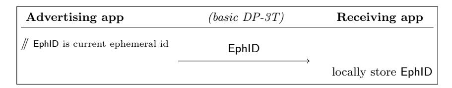
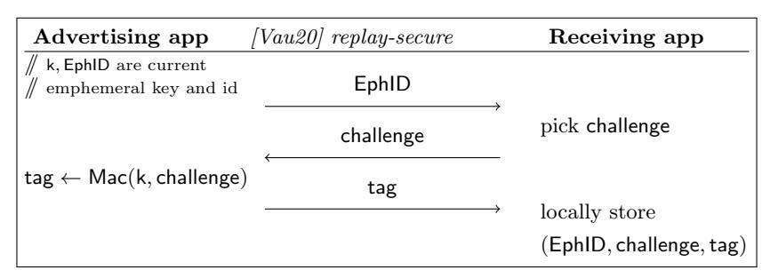
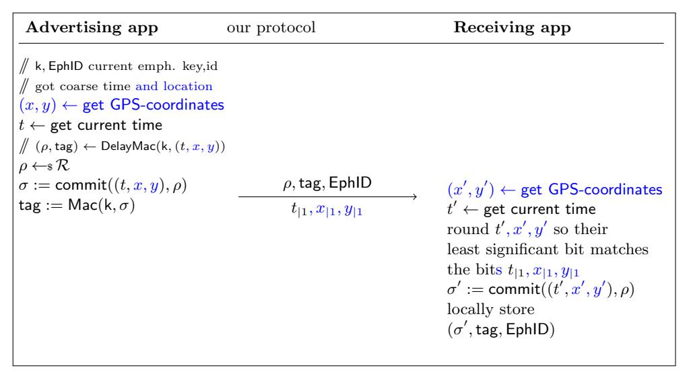

# Delayed Authentication: Preventing Replay and Relay Attacks in Private Contact Tracing

Krzysztof Pietrzak∗

IST Austria pietrzak@ist.ac.at

April 13, 2020 (revised April 20, 2020)

#### Abstract

Currently several projects (including DP-3T, east and west coast PACT, Covid watch) aim at designing and implementing protocols for privacy preserving automated contact tracing to help fight the current pandemic. Those proposal are very similar, and in their most basic from basically propose an app for mobile phones which broadcasts frequently changing pseudorandom identifiers via (low energy) Bluetooth, and at the same time, the app stores IDs broadcast by phones in its proximity. Only if a user is tested positive, their IDs of the last 14 days are published so other users can check if they have stored them locally and thus were close to an infected person.

Vaudenay [eprint 2020/399] observes that this basic scheme (he considers the DP-3T proposal) succumbs to relay and even replay attacks, and proposes more complex interactive schemes which prevent those attacks without giving up too many privacy aspects. Unfortunately interaction is problematic for this application for efficiency and security reasons. In this note propose a simple non-interactive variant of the basic protocol that

- (security) Provably prevents replay and relay attacks.
- (privacy) The data of all parties (even jointly) reveals no information on the location or time where encounters happened.
- (efficiency) The broadcasted message can fit into 128 bits and uses simple crypto (commitments and secret key authentication).

Towards this end we introduce the concept of "delayed authentication", which basically is a message authentication code where verification can be done in two steps, where the first doesn't require the key, and the second doesn't require the message.

∗This project has received funding from the European Research Council (ERC) under the European Union's Horizon 2020 research and innovation programme (682815 - TOCNeT)

### 1 Introduction

Proximity tracing aims to simplify and accelerate the process of identifying people who have been in contact with the SARS-CoV-2 virus. There are several similar projects, including east [ePA, CTV20] and west coast PACT [CGH+20], Covid Watch [CW] and the European DP-3T [TPH+20], which stands for Decentralized Privacy-Preserving Proximity Tracing, and which for concreteness we'll consider in this note.

Figure 1: The basic DP-3T protocol. If at some point a user is reported sick the app will learn (the keys required to recompute) its EphID's of the last 14 days. If it locally stored one of those EphID's this means they were likely close to an infected user.

In the DP-3T proposal users are assumed to have a mobile phone or another Bluetooth capable device with their application installed. At setup the app samples a random key SK0. This key is updated every day as SKi = H(SKi−1) using a cryptographic hash function H. Each key defines n Ephemeral IDentifiers (EphID) derived from SKi using a pseudorandom generator and function as

$$\mathsf{EphID}_1 \| \mathsf{EphID}_2 \| \dots \| \mathsf{EphID}_n := \mathsf{Prg}(\mathsf{Prf}(\mathtt{SK}_i, \texttt{``broadcast key''}))$$

Those EphID's are used in a random order during the day, each for 24 · 60/n minutes (say 30 minutes if we set n = 48). The current EphID is broadcast using Bluetooth in regular intervals to potential users in its proximity.

Phones locally store the EphID's they receive as well as their own SKi 's of the last 14 days. If a user tests positive the health authority can upload the user's SKi key from 14 days ago to the backend server, which will distribute it to all users. From this key, one can recompute all the EphID's the infected user broadcasted in the last 14 days, and so other users can check if there's a match with any of their locally stored EphID's. If yes, it means they've presumably been in proximity to an infected person in the last two weeks and should self isolate (this description is oversimplifying several aspects that are not relevant for this note). Important aspects of this protocol are its simplicity, in particular the fact that the protocol is non-interactive as illustrated in Figure 1, and its privacy properties. Even the combined information stored by all honest users reveals which encounters happened, but no location or time (apart from the day). But once we take into account malicious actors, this scheme has serious issues with its privacy and robustness properties.

#### 2 Replay and Relay Attacks

Vaudeny [Vau20] discusses potential attacks on this scheme including replay and relay attacks. As an illustration of a **replay attack** consider an adversary who collects EphID's in an environment where it's likely infections will occur (like a hospital), and then broadcast those EphID's to users at another location, say a competing company it wants to hurt. Later, when a user from the high risk location gets tested positive, the people in the company will be instructed to self isolate.

Figure 2: Vaudenay's protocol secure against replay attacks. Apart from ephemeral IDs EphID (as in DP-3T) also ephemeral keys k are generated from SK. When later the user of the receiving app gets keys of infected users they will check for every tuple (k, EphID') derived from those keys if they locally store a triple (EphID, challenge, tag) with EphID = EphID'. If yes, they will check whether  $tag \stackrel{?}{=} Mac(k, challenge)$  and only if this check verifies, assume they were close to an infected party.

Vaudenay suggest an extension of the basic DP-3T protocol, shown in Figure 2, which is secure against replay attacks, but it comes at the prize of using interaction. For efficiency and security reasons, the current DP-3T proposal uses Bluetooth low energy beacons, which makes interaction problematic (we refer to  $[TPH^+20]$  for more details). To see that this protocol is secure against a replay attack consider an adversary who re-sends the received EphID at a later time-point. The receiving party will send a random challenge' which is almost certainly different from all the challenge values that were send when EphID was originally broadcast. The standard security notion for message authentication codes implies that the adversary, who does not know k, will almost certainly not be able to compute the right tag Mac(k, challenge') for this challenge. Should the adversary still answer with a authenticator tag', the receiving user will reject the triple (EphID, challenge, tag') once k becomes published as tag'  $\neq Mac(k, challenge')$ .

A **relay attack** is a more sophisticated attack (than a replay attack). Here the adversary relays the messages from one location (e.g., the hospital) to another (e.g., the company it wants to hurt) in real time. The protocol from Figure 2 is not secure against relay attacks. Vaudenay also suggests a protocol

which thwarts relay attacks assuming both devices know their location (using GPS) and with an additional round of interaction. Our relay secure protocol also requires location data, but achieves security against relay attacks without interaction.

Replay and relay attacks are listed as one of the main security aspects in the Mobile applications to support contact tracing in the EU's fight against COVID-19 document [eu20]

Identifier relay/replay prevention safeguards should be implemented to prevent those attacks, meaning that User A should not be able to record an identifier of User B and, afterwards, send User B's identifier as his/her own.

It's actually easy to construct a non-interactive protocol secure against replay and even relay attacks: broadcast a tag that authenticates the current time (and if security against relay attacks is required also location) together with the EphID. This message/tag pair must be stored, and if the sender later reports sick, the ephemeral key used for authentication becomes public, and the tag can be verified.

This protocol has terrible privacy properties for sender and receiver, as the time and location of encounters are locally stored by the receiving parties. In this note we show a protocol that is almost as simple as the one just described, but preserves privacy. We will show how parties can authenticate the current time and their location without interaction and without storing this data inbetween the time of the encounter (when location and time are known) and the time when the authentication key becomes available (i.e., when the sender reports positive).

# 3 Delayed Authentication

The main tool in our protocols is the concept of "delayed authentication". By combining a (weak) commitment scheme commit : ρ × R → Y and a standard message authentication code Mac : K×M → T we get a new (randomized) message authentication code DelayMac which allows for a two step authentication process, where the first doesn't require the key, and the second is independent of the authenticated message. We need the following security from commit

(weak, computationally) binding: It must be hard to find a tuple (m, ρ),(m0 , ρ0 ) where m 6= m0 but commit(m0 , ρ0 ) = commit(m, ρ).

This is the standard (computationally) binding property for commitment schemes, but we'll actually just need a weaker binding property, where the adversary first must choose an m and gets a random ρ. And for this pair (m, ρ) must output a (m0 , ρ0 ) where m 6= m0 but commit(m0 , ρ0 ) = commit(m, ρ). In §5 we'll exploit the fact that just this weaker notion is required to reduce communication.

(statistically) hiding: For any  $m \in \mathcal{M}$  and a uniformly random  $\rho \leftarrow \mathcal{R}$  the commitment commit $(m, \rho)$  is close to uniform given m.

In practice we can expect a well designed cryptographic hash function H to satisfy the above, i.e., use  $\mathsf{commit}(m,\rho) \stackrel{\mathsf{def}}{=} H(m\|\rho)$ , if the range of H is sufficiently smaller than the length  $|\rho|$  of  $\rho$ .

We define the following randomized message authentication code DelayMac

$$(\rho,\mathsf{Mac}(\mathsf{k},\sigma)) \leftarrow \mathsf{DelayMac}(\mathsf{k},m) \ \ \mathsf{where} \ \ \rho \leftarrow_{\hspace{-1pt} \mathtt{s}} \hspace{-1pt} \mathcal{R}, \sigma := \mathsf{commit}(m,\rho)$$

We can verify such a message/tag pair  $m, (\rho, \mathsf{tag})$  in two steps.

- 1. Compute  $\sigma := \mathsf{commit}(m, \rho)$ , then store  $\sigma$  and delete  $m, \rho$ . Note that this step does not require  $\mathsf{k}$ , we call  $(\sigma, \mathsf{tag})$  the delayed tag.
- 2. Later, should the key k become available, authenticate the delayed tag checking tag  $\stackrel{?}{=}$  Mac(k,  $\sigma$ ).

The security of DelayMac as a standard message authentication code follows easily from the standard security of Mac and the weak binding property of commit. Moreover the hiding property of commit implies the delayed authentication tag  $(\sigma, \mathsf{tag})$  is almost independent of the authenticated message.

### 4 Our Protocol

Let us illustrate how we use delayed authentication in our protocol which is given if Figure 3. As in [Vau20], apart from the EphlD's,

$$\mathsf{EphID}_1 \| \mathsf{EphID}_2 \| \dots \| \mathsf{EphID}_n := \mathsf{Prg}(\mathsf{Prf}(\mathtt{SK}_i, \text{``broadcast key''}))$$

the app additionally computes an ephemeral secret key  $k_i$  with each EphIDi

$$k_1 || k_2 || \dots || k_n = \mathsf{Prg}(\mathsf{Prf}(\mathsf{SK}_i, \text{``secret key''}))$$

Our protocol will use the current time, which must be measured rather coarse so that the advertizing and receiving applications have the same time, or are at most off by one unit. The time shouldn't be too coarse as a replay attack will be possible within two units of time. In practice measuring time in full minutes seems reasonable. The replay secure protocol know works as follows

- (broadcast) In regular intervals a message is broadcast which is computed as follows. Let EphID, k be the current ephemeral ID and key and t denote the coarse current time. Compute  $(\rho, \mathsf{tag}) \leftarrow \mathsf{DelayMac}(\mathsf{k}, t)$  and broadcast  $(\rho, \mathsf{tag})$ , EphID,  $t_{|1}$  where  $t_{|1}$  is the least significant bit of t.
- (receive broadcast message) If the app receives a message  $(\rho, \mathsf{tag})$ ,  $\mathsf{EphID}, t_{|1}$  it gets its current time t'. If  $t'_{|1} \neq t_{|1}$  then round t' to the nearest value so the least significant bit matches  $t_{|1}$ . Compute  $\sigma' := \mathsf{commit}(t', \rho)$  and locally store  $(\sigma', \mathsf{tag}, \mathsf{EphID})$ . Note that the stored  $\sigma'$  will match the  $\sigma$  used by the sender if their measured times are off by at most one unit (i.e., one minute).

Figure 3: Our non-interactive proximity tracing protocol that is secure against relay attacks. By ignoring the blue text we get a protocol that is only secure against replay attacks but doesn't require location data, which might not always be available or due to security reasons not desired. If later a user gets sick and the app gets its (k, EphID') pairs, it will check if it has stored a triple  $(\sigma, tag, EphID)$  with EphID = EphID', and if so, finish verification by checking the delayed tag  $Mac(k, \sigma) \stackrel{?}{=} tag$  to detect potential replay or relay attacks.

• (receive message from backend server) If the app learns ephemeral ID/key tuples (EphID', k) of infected parties from the backend server, it checks if it stored a tuple ( $\sigma'$ , tag, EphID) where EphID = EphID'. For every such tuple it checks if Mac(k,  $\sigma'$ )  $\stackrel{?}{=}$  tag, and only if the check passes, it assumes it was close to an infected party.

To see how this approach prevents replay attacks, consider an adversary who records a broadcasted message  $(\rho, \mathsf{tag}, \mathsf{EphID})$  at time t, and later at time  $t^* > t+1$  rebroadcasts a potentially altered message  $(\rho^*, \mathsf{tag}^*, \mathsf{EphID})$ . The receiving party will ultimately reject the tag because  $\mathsf{tag}^* \neq \mathsf{Mac}(\mathsf{k}, \sigma^*), \sigma^* = \mathsf{commit}(t^*, \rho^*)$  unless the adversary either manages to break the commitment scheme and finds a  $\rho^*$  such that  $\mathsf{commit}(t, \rho) = \mathsf{commit}(t^*, \rho^*)$  or he breaks the Mac and finds a forgery  $\mathsf{tag}^* = \mathsf{Mac}(\mathsf{k}, \sigma^*)$  for the new message  $\sigma^*$ .

If we additionally authenticate the location like this, as shown in blue in Figure 3, we achieve security against relay attacks. Again the location must be coarse enough so that the sending and receiving parties x and y coordinates are off by at most one unit, while they shouldn't be too coarse as a replay attack within neighbouring coordinates is possible. What an appropriate choice

is depends on how precise GPS works, units of 50 meters seems reasonable.

### 5 Fitting the Broadcast Message into 128 Bits

In the current DP-3T proposal the ephemeral identifiers EphID which are broadcast are 128 bits long, in this section we outline how our protocol can potentially achieve reasonable security and robustness while also just broadcasting 128 bits, but having more wiggle room would certainly be better. We need 3 bits for the time and location least significant bits t|1, x|1, y|1, and distribute the remaining 125 bits by setting the length of the remaining 3 broadcasted values to

$$|\rho| = 80, |\mathsf{tag}| = 35, |\mathsf{EphID}| = 10$$

In a nutshell, that gives us |ρ| = 80 bits computational security for the commitment, |tag| = 35 bits of statistical security for the authenticator while the probability of a false positive for a locally stored encounter with a reported key/identifier is 2−|tag|−|EphID| = 2−45, we elaborate on this below.

|ρ| = 80 (security of commit): We suggest to implement the commitment using a standard cryptographic hash function commit(m, ρ) def = H(mkρ). It is important to specify how long the commitment should be, i.e., where we truncate the output of H. A conservative choice would be a length of |H(mkρ)| = 256 bits, but then the hiding property of the commitment would only be computational (while the binding would be statistical). In practice this means a computationally unbounded adversary can break privacy (by finding the message/randomness in the locally stored commitment).

If statistical hiding is required (due to legal or other reasons), we need to send the output length to 80 bits (or slightly shorter). Due to birthday attacks, that would be way too short to achieve binding as a collision for commit could be found with just √ 2 80 = 240 queries. As discussed in §3, we only need to satisfy a weak binding property where the adversary must find a preimage for a given output not just any collision, and for this notion we can get 80 bits security even with short 80 bit commitments.

When doing this, one should harden the scheme against multi-instance attacks, where an adversary tries to find a ρ ∗ s.t. commit((t, x, y), ρ∗ ) = σi for one from many previously intercepted σ1, . . . , σn's in order to replay it. This can be done by adding the EphID to the commitment, i.e., specify that it's computed as commit((EphID, t, x, y), ρ). This way only broadcast messages with the same EphID can be simultaneously attacked.

|tag| = 35 (security of Mac): While we can choose strong ephemeral keys k for the Mac, say 128 bit keys, the fact that tag is only 35 bits means a random tag will verify with probability one in 235 ≈ 34 billions. This seems good enough to discourage replay or really attack attempts.

 $|\mathsf{EphID}| + |\mathsf{tag}| = 45$  (probability of false positives): A stored encounter  $(\sigma', \mathsf{tag}, \mathsf{EphID})$  will match a unrelated identifier/key  $(\mathsf{k}^*, \mathsf{EphID}^*)$  pair from the backend server by pure chance if  $\mathsf{EphID} = \mathsf{EphID}^*$  and  $\mathsf{tag} = \mathsf{Mac}(\mathsf{k}^*, \sigma')$ , which happens with probability  $2^{-(|\mathsf{k}| + |\mathsf{EphID}|)} = 2^{-45}$ . If we assume that  $\mathsf{EphID}$ 's are rotated every 30 minutes, so we have 48 per day, the probability of a false positive for encounters in any given day, assuming we have n users of which m will be reported sick in the next 14 days, is  $\frac{m \cdot n \cdot 48}{2^{-45}}$ . For 10 million users and 10000 cases that's one false positive per week in total.

 $|\mathsf{EphID}|=10$  (efficiency of verifying messages from backend server): The discussion so far suggests one should set  $|\mathsf{EphID}|=0$  and instead use those 10 bits to increase  $|\mathsf{tag}|$ . The reason to keep a non-empty  $\mathsf{EphID}$  is for efficiency reasons. For every locally stored encounter  $(\sigma',\mathsf{tag},\mathsf{EphID})$  and every identifier/key  $(\mathsf{k}^*,\mathsf{EphID}^*)$  (computed from keys received) from the backend server we need to compute the  $\mathsf{tag} = \mathsf{Mac}(\mathsf{k}^*,\sigma')$  whenever  $\mathsf{EphID} = \mathsf{EphID}^*$ , thus for a  $2^{-|\mathsf{EphID}|}$  fraction of such pairs. With  $|\mathsf{EphID}|=10$  the unnecessary computation due to such identifier collisions should be small compared to the computation required to expand the keys received from the backendserver to the identifier/key pairs.

# 6 Digital Evidence

The main design goal the presented protocol is security against replay and relay attacks, but there are also other issues with CP3T and similar protocols discussed in  $[TPH^+20]$  and [Vau20] which our scheme does not solve.

There also is at least one privacy aspect that is aggravated by our protocol compared to the basic CP3T: for parties deviating from the protocol, it's easier to produce *digital evidence* when and where an encounter took place. While we feel this is a minor issue compared to replay and relay attacks, one needs to be aware of such trade-offs.

#### 6.1 Malicious Receiver

A malicious receiver can produce digital evidence about the advertizing user. This is also the case for Vaudenay's protocols (and already mentioned in [Vau20]). As a concrete example, the receiver can put a hash of the entire transcript (for our protocol that would mean the broadcast message, time and location) on a blockchain to timestamp it. Later, should the advertizing user test positive and his keys being released, this transcript serves as evidence about when and where the encounter took place. Timestamping is necessary here, as once the keys are released everyone can produce arbitrary transcripts. To actually break privacy of an individual, one of course also needs to somehow link the released keys to that person.

#### 6.2 Malicious Sender

If the sending party stores the randomness ρ it broadcasts (together with the current location and time), it can later prove that it met a receiving user at time t and location (x, y) by providing the opening information (t, x, y, ρ) for a commitment σ = commit((t, x, y), ρ) stored by the receiver. Note that unlike in the malicious receiver case discussed above, the commitments σ are never supposed to leave the phone, even if the receiving user reports being sick. Thus this privacy break requires a successful attack on the receiver's phone or the receiver must be forced to reveal this data.

# Acknowledgements

I'd like to thank Serge Vaudenay and Dario Fiore for comments on an the first version of this note, in particular, both suggested how to improve the length of the messages to be broadcast https://github.com/DP-3T/documents/issues/ 179.

# References

- [CGH+20] Justin Chan, Shyam Gollakota, Eric Horvitz, Joseph Jaeger, Sham M. Kakade, Tadayoshi Kohno, John Langford, Jonathan Larson, Sudheesh Singanamalla, Jacob E. Sunshine, and Stefano Tessaro. PACT: privacy sensitive protocols and mechanisms for mobile contact tracing. CoRR, abs/2004.03544, 2020.
- [CTV20] Ran Canetti, Ari Trachtenberg, and Mayank Varia. Anonymous collocation discovery: Taming the coronavirus while preserving privacy. CoRR, abs/2003.13670, 2020.
- [CW] Covid watch. https://www.covid-watch.org/.
- [ePA] Pact: Private automated contact tracing. https://pact.mit.edu/,.
- [eu20] Mobile applications to support contact tracing in the eu's fight against covid-19. https://ec.europa.eu/health/sites/health/ files/ehealth/docs/covid-19\_apps\_en.pdf, 2020. Version 1.0, 15.04.2020.
- [TPH+20] Carmela Troncoso, Mathias Payer, Jean-Pierre Hubaux, Marcel Salath, James Larus, Edouard Bugnion, Wouter Lueks, Theresa Stadler, Apostolos Pyrgelis, Daniele Antonioli, Ludovic Barman, Sylvain Chatel, Kenneth Paterson, Srdjan Capkun, David Basin, Dennis Jackson, Bart Preneel, Nigel Smart, Dave Singelee, Aysajan Abidin, Seda Guerses, Michael Veale, Cas Cremers, Reuben Binns, and Thomas Wiegand. Dp3t: Decentralized privacy-preserving proximity tracing, 2020. https://github.com/DP-3T.

[Vau20] Serge Vaudenay. Analysis of dp3t. Cryptology ePrint Archive, Report 2020/399, 2020. https://eprint.iacr.org/2020/399.