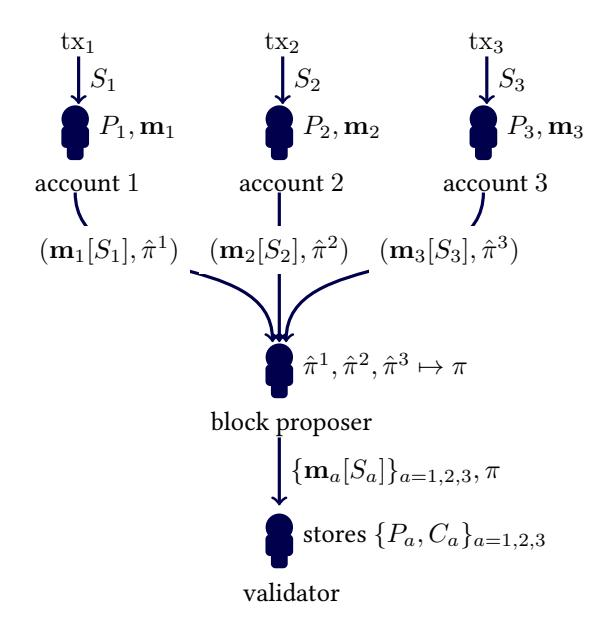
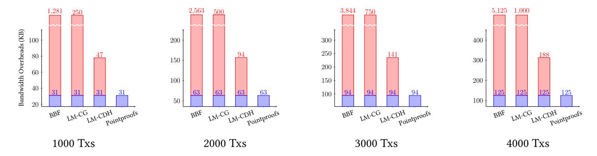
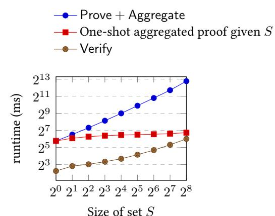
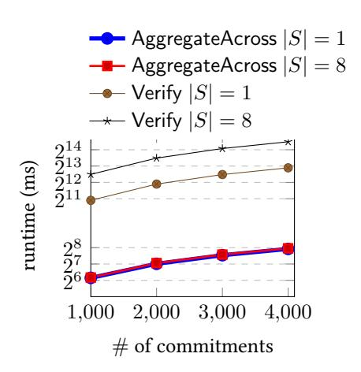

# Pointproofs: Aggregating Proofs for Multiple Vector Commitments

Sergey Gorbunov2 , Leonid Reyzin1,3, Hoeteck Wee4,5, and Zhenfei Zhang1

> 1Algorand University of Waterloo Boston University CNRS, ENS, PSL NTT Research

> > August 25, 2020

#### Abstract

Vector commitments enable a user to commit to a sequence of values and provably reveal one or many values at specic positions at a later time. In this work, we construct Pointproofs— a new vector commitment scheme that supports non-interactive aggregation of proofs across multiple commitments. Our construction enables any third party to aggregate a collection of proofs with respect to dierent, independently computed commitments into a single proof represented by an elliptic curve point of 48-bytes. In addition, our scheme is hiding: a commitment and proofs for some values reveal no information about the remaining values.

We build Pointproofs and demonstrate how to apply them to blockchain smart contracts. In our example application, Pointproofs reduce bandwidth overheads for propagating a block of transactions by at least 60% compared to prior state-of-art vector commitments.

Pointproofs are also ecient: on a single-thread, it takes 0.08 seconds to generate a proof for 8 values with respect to one commitment, 0.25 seconds to aggregate 4000 such proofs across multiple commitments into one proof, and 23 seconds (0.7 ms per value proven) to verify the aggregated proof.

# 1 Introduction

Vector commitments [\[LY10,](#page-25-0) [CF13\]](#page-24-0) allow a commier to commit to a vector of N values and then selectively reveal elements of the commied vector, proving that they correspond to the original commitment. Vector commitments are used to reduce storage costs in a variety of applications, described in more detail below: instead of storing a vector of values, one can store only the commitment and receive the values together with their proofs as needed. Vector commitments allow applications to trade o storage (of all values) for bandwidth (taken up by revealed values and proofs).

To make the tradeo between storage and bandwidth more aractive, we need to reduce the proof size. Because individual proofs need to be cryptographically hard to forge, their sizes cannot be reduced too far. Instead, the savings come from having a single short proof for multiple revealed values. e shortest such proofs in the literature are provided by the so-called subvector commitments of Lai and Malavolta [\[LM19,](#page-25-1)

| reference          | pp       | opening           | group       | Same-Commitment | Cross-Commitment |
|--------------------|----------|-------------------|-------------|-----------------|------------------|
|                    |          |                   |             | Aggregatable    | Aggregatable     |
| [LM19, Fig 1]      | O(N)     | 256 B             | class group |                 |                  |
| [LM19, Fig 2]      | $O(N^2)$ | 48 B              | bilinear    |                 |                  |
| [BBF19]            | O(1)     | 1312 B            | class group | $\checkmark$    |                  |
| $[CFG^{+}20, 5.1]$ | O(1)     | $1024~\mathrm{B}$ | class group | $\checkmark$    |                  |
| $[CFG^{+}20, 5.2]$ | O(1)     | 512 B             | class group | $\checkmark$    |                  |
| $[TAB^+20]$        | O(N)     | 48 B              | bilinear    | $\checkmark$    |                  |
| this work          | O(N)     | 48 B              | bilinear    | $\checkmark$    | $\checkmark$     |

Table 1: Summary of subvector commitments with constant-size commitments and openings to subvectors at 128-bit security level. (See Table 3 for an explanation of the numbers.)

Section 5.2]: a proof takes up only 48 bytes (for typical parameter values at conjectured 128-bit security) *regardless* of how many elements of the vector are being revealed.1

In many distributed applications, the commitments, values, and proofs come from multiple sources that are not even aware of each other's data. This presents two problems that are not solved by subvector commitments:

- there is no single entity that can produce a single proof for all the values;
- proofs need to be with respect to multiple different commitments.

For instance, consider a blockchain that contains information on multiple accounts. Each account, controlled by a different user, is associated with a memory that consists of multiple variables. The memory may, for example, store the values of variables in a smart contract. To validate each block, participants in the blockchain protocol (so-called "validators") need to have access to the variables used during the relevant transactions. One solutions is to have validators store all the variables locally. However, to save on storage, we may instead apply commitments, and ask account holders to commit to the values of their variables. During the relevant transaction, account holders would produce proofs for the relevant values. Our goal is to save on bandwidth required for these proofs to reach validators, while enabling solutions that do not rely on central parties or additional interaction.

We construct Pointproofs—an efficient commitment scheme with small commitments and proofs. Using Pointproofs, a user can independently commit to her variables and provide short proofs for any subset of them. Moreover, any third party can non-interactively aggregate multiple proofs with respect to different commitments into a single short proof.

We note that dynamic aggregation for a *single* commitment gives, in particular, subvector commitments. Such same-commitment aggregation was explored by Boneh, Bünz, and Fisch [BBF19] and (in work independent of ours) by Tomescu et al. [TAB+20], who showed how to aggregate proofs for elements of a vector into a single proof for a subvector. Aggregation of [BBF19] was extended to incremental aggregation (which allows aggregation of already aggregated proofs) by Campanelli et al. [CFG+20]. To the best of our knowledge, there have been no schemes that can aggregate proofs across multiple commitments; see Table 1 for a summary of prior constructions.

&lt;sup>1Observe that the length of 48 bytes is very close to the information-theoretic minimum of 32 bytes necessitated by the birthday bound for 128-bit security.

### 1.1 Our Contributions

First, we formalize aggregatable vector commitments in the cross-commitment seing (Section [3\)](#page-7-0). For functionality, we require that proofs for individual elements of a single vector commitment can be aggregated by any third party into a single proof for the subvector, and proofs for subvectors of multiple commitments can be aggregated by any third party into a single proof for the multiple subvectors. We also consider hiding while still supporting the aggregation property.

Next, we add same-commitment and cross-commitment aggregation to the vector commitments of [\[LY10\]](#page-25-0) to construct Pointproofs (Section [4\)](#page-9-0). Our proof is a single point on a pairing-friendly curve (48 bytes at 128-bit security), whether for a single value, a subvector of values for a single commitment, or a set of subvectors for multiple commitments. Our construction easily extends to support full hiding of the commied values at the cost of an additional exponentiation and no increase in commitment or proof sizes. While the authors of [\[CF13,](#page-24-0) Section 3] point out that hiding in vector commitments can be achieved generically by adding an inner layer of hiding commitments to individual values, this approach does not automatically extend to aggregatable vector commitments, because proofs for the inner layer are not automatically aggregatable.

We provide a design overview for applying Pointproofs to reduce storage requirements for blockchains (Section [5\)](#page-17-0). We specically focus on smart contracts. Consider a smart contract with multiple variables. e current values (m1, . . . , mN ) of all the variables in a given contract are commied to a single vector commitment C, one commitment per contract. To transact with the contract, one provides a 48-byte proof πˆ of the current values of the variables needed for the transaction, which are then (optionally) updated as a result of the transaction. When there are multiple smart contracts, cross-commitment aggregation allows us to compress multiple proofs πˆ1, . . . , πˆ` into a single 48-byte proof π. is essentially eliminates the bandwidth overhead due to proofs in a proposed block, which, depending on the seing, can take up more bandwidth than the values being proven.

When applied to smart contracts storage, Pointproofs can be used to reduce validators' storage requirements to 4.5 GB for 108 accounts while adding only 31 KB per block overhead for 1000 transactions (assuming one open value per transaction). Alternative approaches to smart contracts require either (a) extensive storage from validators (TBs), (b) a central entity to generate proofs for all users, or (c) introduce at least an additional 60% bandwidth overhead per block. (See Section [5.2](#page-19-0) for a more detailed comparison.)

We implement Pointproofs and show that Pointproofs are ecient to produce, aggregate, verify, and update for real-time use. We release our code to open source under the MIT license on GitHub [\[Alg20b\]](#page-23-1). In our benchmarks for a commitment for 1000 variables of a smart contract at 128-bit security level, a user can produce a subvector proof for an arbitrary subset of variables (touched by a particular transaction) in 54-123ms; a block proposer can cross-commitment aggregate all these proofs, at the cost of about .07ms per proof; a validator who stores commitments can verify the aggregated proofs in a block at the cost of 0.7–1.9ms per value veried, and update commitments to reect new values of the variables (which change in response to the transaction execution) at the cost of .0.2–0.3ms per variable updated (numerical ranges are due to variations in the number of commitments and values proven per commitment).

#### Summary of Contributions. To summarize, our contributions are as follows:

- We formalize aggregatable vector commitments in the cross-commitment seing. We also formalize the hiding property while also supporting aggregation.
- We construct Pointproofs based on bilinear groups and prove their security (in the algebraic group and random oracle models).

- We show how to apply Pointproofs to smart-contract-based transactions on blockchains and evaluate them compared to alternative solutions.
- We build Pointproofs and evaluate their performance for various parameters.

We envisage that there will be multiple possible applications for cross-commitment aggregation of proofs. Just like signature aggregation can be benecial to compress multiple signatures produced by dierent users into a short signature—with applications ranging from sensor networks [\[AGH10\]](#page-23-2) to internet routing [\[BGR12\]](#page-24-2) to consensus [\[DGNW20\]](#page-25-2)—proof aggregation can help whenever multiple commied values produced by dierent users are revealed. One can imagine many seings in which multiple users or entities independently commit to their databases of records (e.g., public keys, healthcare records, transactions, etc.) and concurrently produce proofs to reveal several commied values. Cross-commitment aggregation can be applied to save on bandwidth in such seings.

## 1.2 Related Work

e idea of using commitments to trade storage for bandwidth in the context of blockchains has appeared in multiple works in varying levels of detail, including [\[ST99,](#page-26-1) [Mil12,](#page-26-2) [Whi15,](#page-26-3) [Tod16,](#page-26-4) [But17,](#page-24-3) [Dra17,](#page-25-3) [RMCI17,](#page-26-5) [CPZ18,](#page-24-4) [BBF19\]](#page-23-0). e improvement of puing multiple proofs together to save bandwidth in this context has also appeared in a number of works, including [\[RMCI17,](#page-26-5) [LM19,](#page-25-1) [BBF19,](#page-23-0) [CFG](#page-24-1)+20]. ird-party aggregation in blockchains has been explored more for signatures than for commitments [\[DGNW20\]](#page-25-2). Aggregating commitment proofs is a natural counterpart to aggregating signatures.

ere is a long line of work on authenticated data structures in general (going back at least to [\[Mer88\]](#page-25-4)) and vector commitments specically (rst formalized in [\[LY10,](#page-25-0) [CF13\]](#page-24-0)). Constant-size proofs for a subvector of values were also achieved in [\[KZG10,](#page-25-5) [a19\]](#page-26-6); unfortunately, the binding notion dened in [\[KZG10,](#page-25-5) Section 3.4] is not strong enough to preclude openings to two inconsistent subvectors (this work was later extended by [\[TAB](#page-26-0)+20] to achieve the necessary binding notion).

In Table [1,](#page-1-1) we compare our scheme to other subvector commitment commitments. Because of our focus on constant-size proofs for multiple values, we omit vector commitment schemes that do not have this feature [\[LY10,](#page-25-0) [CF13,](#page-24-0) [LRY16,](#page-25-6) [CPZ18\]](#page-24-4).[2](#page-3-0)

e starting point for our commitments is the scheme of Libert and Yung [\[LY10\]](#page-25-0). We simply augment it with aggregation algorithms for proofs within the same commitment and across multiple commitments. Our scheme, like the scheme of [\[LY10\]](#page-25-0), requires public parameters whose size is linear in the size of the commied vector. Our public parameters are easy to keep short because of cross-commitment aggregation: we can split up a long vector into shorter ones and simply aggregate the proofs (although this approach increases the total size of the commitments, which cannot be aggregated).

Like the scheme of [\[LY10\]](#page-25-0), our scheme relies on a q-type assumption. In order to prove security of aggregation, we have to work in the algebraic group model and the random oracle model (see Section [2\)](#page-6-0). We can reduce these assumptions by lowering eciency and/or security requirements (see Appendices [A](#page-27-0) and [B\)](#page-28-0).

Following the work of Libert and Yung, there has been a long line of work on pairing-based vector commitments, including [\[CF13,](#page-24-0) [LRY16,](#page-25-6) [LM19\]](#page-25-1), and a parallel line of work on polynomial commitments (starting with [\[KZG10\]](#page-25-5); see [\[BM](#page-24-5)+19] for an overview). None of these address aggregation. In Appendix [C](#page-29-0)

2We note that Libert et al. [\[LRY16\]](#page-25-6) describe an accumulator with a constant-size membership witnesses for multiple values; in order to convert such an accumulator to a subvector commitment (using the conversion of [\[BBF19\]](#page-23-0)), it would need to also support constant-size nonmembership witnesses for multiple values.

we show that recent (independent of ours) construction of polynomial commitments with batch opening by Boneh et al. [BDFG20] also gives vector commitments with aggregation, but with lower efficiency than our construction.

In a recent (and independent of ours) work, Campanelli et al. [CFG+20] introduced incremental aggregation for proofs, which allows unbounded aggregation of already aggregated proofs (effectively making aggregation an associative operation). They achieve it for same-commitment aggregation by modifying hidden-order group constructions of [LM19, BBF19]. Our aggregation is not associative.3 In another recent (and independent of ours) work, Tomescu et al. [TAB+20] proposed pairing-based commitments with same-commitment aggregation based on the work of [KZG10]; in their scheme, public parameters needed to verify and update proofs are short.

#### 1.3 Technical Overview of Our Scheme

Our starting point is a pairing-based vector commitment of Libert and Yung [LY10]; the novelty of our work lies in the aggregation algorithms.

Let  $(\mathbb{G}_1, \mathbb{G}_2, \mathbb{G}_T)$  be a bilinear group of prime order p, along with a pairing  $e: \mathbb{G}_1 \times \mathbb{G}_2 \to \mathbb{G}_T$  and generators  $g_1, g_2, g_T = e(g_1, g_2)$  for  $\mathbb{G}_1, \mathbb{G}_2, \mathbb{G}_T$  respectively. Let  $\alpha \in \mathbb{Z}_p$  be a secret value (known to no one after the initial generation of public parameters). The public parameters are given by 2N-1 values in  $\mathbb{G}_1$ , N values in  $\mathbb{G}_2$ , and one value in  $\mathbb{G}_T$  (which can be easily computed from the others):

$$g_1^{\alpha}, \dots, g_1^{\alpha^N}, g_1^{\alpha^{N+2}}, \dots, g_1^{\alpha^{2N}}; \ g_2^{\alpha}, \dots, g_2^{\alpha^N}; \ g_T^{\alpha^{N+1}}.$$

It is important that  $g_1^{\alpha^{N+1}}$  is missing in the public parameters.

A commitment to a vector  $\mathbf{m} = (m_1, \dots, m_N) \in \mathbb{Z}_p^N$  is given by raising  $g_1$  to a polynomial with coefficients given by  $\mathbf{m}$  (no constant term), evaluated at  $\alpha$ :

$$C := g_1^{\sum_{i=1}^N m_i \alpha^i}$$

To reveal  $m_i$ , the committer computes a proof, which has a similar polynomial, but without  $m_i$ , and with a shift so that  $m_i$ , if it were present, would be the coefficient of  $\alpha^{N+1}$  instead of  $\alpha^i$ :

$$\pi_i := g_1^{\sum_{j \neq i} m_j \alpha^{N+1-i+j}} = \left(C/g_1^{m_i \alpha^i}\right)^{\alpha^{N+1-i}}$$

The proof can be verified using

$$e(C, g_2^{\alpha^{N+1-i}}) \stackrel{?}{=} e(\pi_i, g_2) \cdot g_T^{\alpha^{N+1} m_i}$$

Indeed, Libert and Yung [LY10] show that under a q-type assumption, the scheme is binding: namely, it is hard to find a commitment C along with proofs  $(m_i^0, \pi^0), (m_i^1, \pi^1)$  with  $m_i^0 \neq m_i^1$  satisfying the above verification equation. The intuition for binding is quite simple. Note that the adversary does not get  $g_1^{\alpha^{N+1}}$ , and therefore the coefficient of  $\alpha^{N+1}$  in the exponent of  $\pi$ , even if adversarially produced, should be 0. Comparing coefficients of  $g_T^{\alpha^{N+1}}$  on both sides of the verification equation, we have that  $m_i$  on the right-hand-side of the verification equation must match  $m_i$  in C.

&lt;sup>3It may be possible to augment our scheme to allow aggregation of already-aggregated proofs for both same-commitment and cross-commitment cases, using the same hash-and-exponentiate approach as described below for aggregation (this would require a careful choice of hash inputs and a new security proof). This approach, even if secure, would not quite achieve associativity, as the verifier would need to know the sequence of aggregations.

**Aggregation:** first idea. Now, suppose the committer would like to reveal multiple values  $\{m_i : i \in S\}$  (where  $S \subseteq [N]$ ) for a single commitment C via a very short proof  $\pi_S$ . A natural idea is to take

$$\pi_S = \prod_{i \in S} \pi_i$$

which can in turn be verified using

$$e\left(C, \prod_{i \in S} g_2^{\alpha^{N+1-i}}\right) \stackrel{?}{=} e(\pi_S, g_2) \cdot g_T^{\alpha^{N+1} \sum_{i \in S} m_i}$$

It is easy to see that this scheme is insecure, in that an adversary can commit to  $(m_1, m_2) = (1, 3)$  and then provide a valid proof revealing  $(m_1, m_2) = (2, 2)$  for  $S = \{1, 2\}$ . Indeed, if we compare the coefficients of  $g_T^{\alpha^{N+1}}$  on both sides of the verification equation, it is easy to see that the adversary is only bound to  $\sum_{i \in S} m_i$  and not all of the values  $\{m_i : i \in S\}$ . More generally, we need to prevent attacks against inconsistent reveals for possibly two different sets, so that an adversary cannot, for example, "prove" that  $(m_1, m_2)$  is (1, 3) and  $(m_2, m_3)$  is (2, 1).

**Handling same-commitment aggregation.** To get around these attacks, we introduce additional "random" scalars  $t_i$  into the verification equation:

$$e\left(C, \prod_{i \in S} g_2^{\alpha^{N+1-i}t_i}\right) \stackrel{?}{=} e(\pi_S, g_2) \cdot g_T^{\alpha^{N+1} \sum_{i \in S} m_i t_i}$$

and compute the aggregate proof  $\pi_S$  by  $\pi_S = \prod_{i \in S} \pi_i^{t_i}$ . The scalars  $t_i$  are computed by applying a hash function H on some carefully chosen inputs depending on  $C, S, \{m_i : i \in S\}$ . We note that a similar idea appears in the context of aggregating signatures [BDN18].

To get an intuition for how introducing random scalars yields binding, let us once again look at the coefficient of  $g_T^{\alpha^{N+1}}$  on both sides of the verification equation. Now, the adversary is bound to  $\sum_{i \in S} m_i t_i$ . A standard argument tells us that for any  $\{m_i : i \in S\} \neq \{m_i' : i \in S\}$ , we have

$$\Pr\left[\sum_{i\in S} m_i t_i = \sum_{i\in S} m_i' t_i'\right] = 1/p$$

where the probability is over random  $t_i \leftarrow \mathbb{Z}_p$ . Therefore, if the  $t_i$ 's are indeed random, then the adversary is also bound to  $\{m_i : i \in S\}$ .

To formalize this intuition, we first need to model the hash function H as a random oracle [BR93] so that we can carry out the above probabilistic argument. Furthermore, we need to restrict the adversary to the so-called algebraic group model [FKL18] (see Section 2 for details), so that we can express adversarially generated commitments C in terms of public parameters.

**Handling cross-commitment aggregation.** Now, suppose we have a collection of commitments  $C_j$  to  $\mathbf{m}_j = (m_{j,1}, \dots, m_{j,N})$ , along with proofs  $\hat{\pi}_j$  for  $\mathbf{m}_j[S_j]$ , each satisfying

$$e\left(C_{j}, g_{2}^{\sum_{i \in S_{j}} \alpha^{N+1-i} t_{j,i}}\right) = e(\hat{\pi}_{j}, g_{2}) \cdot g_{T}^{\alpha^{N+1} \sum_{i \in S_{j}} m_{j,i} t_{j,i}}$$

We can again multiply these equations together to obtain:

$$\prod_{j} e\left(C_{j}, g_{2}^{\sum_{i \in S_{j}} \alpha^{N+1-i} t_{j,i}}\right) = e\left(\prod_{j} \hat{\pi}_{j}, g_{2}\right) \cdot g_{T}^{\alpha^{N+1} \sum_{j} \sum_{i \in S_{j}} m_{j,i} t_{j,i}}$$

For the same reason as before, this approach alone does not yield a secure scheme. Instead, we will need to introduce additional random scalars  $t'_i$  and use the following aggregate verification equation:

$$\prod_{j} e\left(C_{j}, g_{2}^{\sum_{i \in S_{j}} \alpha^{N+1-i} t_{j,i}}\right)^{t_{j}'} \stackrel{?}{=} e(\pi, g_{2}) \cdot g_{T}^{\alpha^{N+1} \sum_{j} \sum_{i \in S_{j}} m_{j,i} t_{j,i} t_{j}'}$$

where the aggregated proof  $\pi := \prod_j \hat{\pi}_j^{t_j'}.$ 

### 2 Preliminaries

**Notation** Given a (column) vector  $\mathbf{v} = (v_1, \dots, v_N)$ , we use  $\mathbf{v}[S] := (v_i, i \in S)$  to denote the subvector indexed by S, and  $\mathbf{v}[-i]$  to denote  $\mathbf{v}[[N] \setminus \{i\}]$ , i.e.,  $\mathbf{v}$  with  $v_i$  deleted. For a positive integer N, we denote the set  $\{1, \dots, N\}$  by [N].

The Algebraic Group Model (AGM) The algebraic group model [FKL18] lies between the standard model and the widely-used generic group model. In AGM, we consider only so-called *algebraic adversaries*. Such adversaries have direct access to group elements and, in particular, can use their bit representation, like in the standard model. However, these adversaries are assumed to output new group elements only by applying the group operation to received group elements (like in the generic group model). This requirement is formalized as follows. Suppose an adversary is given group elements  $X_1, \ldots, X_N \in \mathbb{G}_1$ . Then, for every group element  $Z \in \mathbb{G}_1$  that the adversary outputs, it must also output  $z_1, \ldots, z_N \in \mathbb{Z}_p$  such that  $Z = \prod_{i=1}^N X_i^{z_i}$ .

**Security Assumption** Let  $\mathbb{G}_1, \mathbb{G}_2, \mathbb{G}_T$  be multiplicative groups of prime order p with a nondegenerate bilinear pairing  $e: \mathbb{G}_1 \times \mathbb{G}_2 \to \mathbb{G}_T$ . Fix generators  $g_1, g_2$ , and  $g_T := e(g_1, g_2)$  for the three groups.

We assume that the following variant of weak bilinear Diffie-Hellman exponent problem  $\ell$ -wBDHE\* (see [BBG05, BGW05, CKS09] for similar problems for symmetric pairings) is hard:

$$\begin{array}{c} \text{Input: } g_1^{\alpha} \ , \ g_1^{(\alpha^2)} \ , \ \dots \ , \ g_1^{(\alpha^\ell)} \ , \\ g_1^{(\alpha^{\ell+2})} \ , \ \dots \ , \ g_1^{(\alpha^{3\ell})} \ , \\ g_2^{\alpha} \ , \ g_2^{(\alpha^2)} \ , \ \dots \ , \ g_2^{(\alpha^\ell)} \ , \\ \text{for } \alpha \overset{\$}{\leftarrow} \mathbb{Z}_p \\ \\ \text{Compute: } g_1^{(\alpha^{\ell+1})} \end{array}$$

The advantage  $\mathbf{Adv}_{\mathbb{G}_1 \times \mathbb{G}_2}^{\ell\text{-wBDHE}^*}(\mathcal{A})$  of an adversary  $\mathcal{A}$  is defined as its probability in solving this problem. As shown in [BBG05] (for a slight variant), the assumption holds in the generic bilinear group model. Concretely, for the BLS12-381 pairing-friendly curve with  $\ell=32$ , the best attack has complexity  $2^{112}$  [Che06] (more generally, roughly  $\sqrt{p/\ell}$ ).

**The Random Oracle Model (ROM)** Our security proofs are in the random oracle model, formalized in [BR93]: we model a cryptographic hash function as a truly random function, accessible to all parties only via oracle queries. We will use two random oracles H and H', both with output space  $\mathbb{Z}_p$ .

### 3 Defining Vector Commitments with Aggregation

We define aggregatable vector commitments in two steps: first, we consider aggregation of proofs for a single commitment; then, we discuss aggregating such same-commitment aggregated proofs into a single cross-commitment proof.

#### 3.1 Same-Commitment Aggregation

A vector commitment with same-commitment aggregation for message space  $\mathcal{M}$  consists of the following polynomial-time algorithms Setup, Commit, UpdateCommit, Aggregate, Verify:

- pp  $\leftarrow$  Setup $(1^{\lambda},1^N)$ . Outputs public parameters that will be used by all parties to commit to message vectors of length N (inputs are given in unary to allow for running time polynomial in  $\lambda$  and N). The public parameters will be provided as an implicit input to the remaining algorithms, including the adversary in the security definition. Even though the parameters are public, their generation may involve secret randomness that should not be known to the adversary. How to generate parameters in a trustworthy manner (which is crucial for security) depends on the application.
- $C \leftarrow \mathsf{Commit}(\mathbf{m}; r)$ . Takes as input a vector  $\mathbf{m} \in \mathcal{M}^N$  along with randomness r and outputs a commitment C.
- $C' \leftarrow \mathsf{UpdateCommit}(C, S, \mathbf{m}[S], \mathbf{m}'[S])$ . Takes as input a commitment C and updates the positions in S from  $\mathbf{m}[S]$  to  $\mathbf{m}'[S]$  to produce a new commitment C'.
- $\pi_i \leftarrow \mathsf{Prove}(i, \mathbf{m}, r)$ . Takes as input an index  $i \in [N]$  and  $(\mathbf{m}, r)$  used in Commit and outputs a proof  $\pi_i$ .
- $\hat{\pi} \leftarrow \mathsf{Aggregate}(C, S, \mathbf{m}[S], \{\pi_i : i \in S\})$ . Takes as input a commitment C, a set of indices  $S \subseteq [N]$  with the corresponding proofs  $\{\pi_i : i \in S\}$  (computed using Prove) and outputs an aggregated proof  $\hat{\pi}$ .
- $b \leftarrow \mathsf{Verify}(C, S, \mathbf{m}[S], \hat{\pi})$ . Takes as input a commitment C, a set of indices  $S \subseteq [N]$  along with an aggregated proof  $\hat{\pi}$ , and outputs whether C is a commitment to a message vector consistent with  $\mathbf{m}[S]$ .

For simplicity of presentation and without loss of generality, we assume that Verify always operates on aggregated proofs, even for a set of size 1. It should be noted that there may be more efficient ways to compute an aggregated proof than via several invocations of Prove followed by a single Aggregate; these efficiency improvements, while helpful for performance, do not affect our definitions. Similarly, there may be more efficient ways than invoking Prove to update existing proofs when commitments are updated; we do not formally define proof updates as a separate algorithm here.

**Correctness of opening.** For all  $\lambda, N, \mathbf{m} \in \mathcal{M}^N, S \subseteq [N]$ , we have

 $\Pr \left[ \begin{array}{l} \mathsf{pp} \leftarrow \mathsf{Setup}(1^{\lambda}, 1^N) \\ C \leftarrow \mathsf{Commit}(\mathbf{m}; r) \\ \pi_i \leftarrow \mathsf{Prove}(i, \mathbf{m}, r), \forall i \in S \\ \pi \leftarrow \mathsf{Aggregate}(C, S, \mathbf{m}[S], \{\pi_i : i \in S\}) \\ \mathsf{Verifv}(C, S, \mathbf{m}[S], \hat{\pi}) = 1 \end{array} \right] = 1$ 

Correctness of updates. For all  $\lambda, N, \mathbf{m}, \mathbf{m}' \in \mathcal{M}^N, S \subseteq [N], r$  such that  $\mathbf{m}[[N] \setminus S] = \mathbf{m}'[[N] \setminus S']$ , we have:

$$\mathsf{UpdateCommit}(\mathsf{Commit}(\mathbf{m};r),S,\mathbf{m}[S],\mathbf{m'}[S]) = \mathsf{Commit}(\mathbf{m'};r)$$

Note that in our definition, updates are deterministic. Other definitions are also possible. See Section 3.3 for further discussion.

**Binding.** For every N and every adversary running in time polynomial in  $\lambda$ , the probability of finding

$$C, (\hat{\pi}^0, S^0, \mathbf{m}^0[S^0]), (\hat{\pi}^1, S^1, \mathbf{m}^1[S^1])$$

such that

- Verify $(C,S^b,\mathbf{m}^b[S^b],\hat{\pi}^b)=1$  for both b=0 and b=1;
- $\mathbf{m}^0[S^0 \cap S^1] \neq \mathbf{m}^1[S^0 \cap S^1]$

(assuming parameters generated by  $\mathsf{Setup}(1^\lambda, 1^N)$ ) is negligible in  $\lambda$ .

One can also consider a weaker notion of binding, in which the commitment C must be honestly computed by Commit (on some, possibly adversarially chosen, messages) rather than chosen arbitrarily by the adversary. This notion often suffices in blockchain applications. See Appendix B for details.

### 3.2 Cross-commitment aggregation

Cross-commitment aggregation adds two algorithms to aggregate proofs across  $\ell$  commitments :

- $\pi \leftarrow \operatorname{AggregateAcross}(\{C_j, S_j, \mathbf{m}_j[S_j], \hat{\pi}_j\}_{j \in [\ell]})$  Takes as input a collection  $(\{C_j, S_j, \mathbf{m}_j[S_j]\}_{j \in [\ell]})$  along with the corresponding same-commitment-aggregated proofs  $\{\hat{\pi}_j\}_{j \in [\ell]}$  (computed using Aggregate) and outputs an aggregated proof  $\pi$ .
- $b \leftarrow \text{VerifyAcross}(\{C_j, S_j, \mathbf{m}_j[S_j]\}_{j \in [\ell]}, \pi)$ . Takes as input a collection  $(\{C_j, S_j, \mathbf{m}_j[S_j]\}_{j \in [\ell]})$  along with a cross-commitment-aggregated proof  $\pi$ , and checks that  $C_j$  is a commitment to a message vector consistent with  $\mathbf{m}_j[S_j]$  for all  $j \in [\ell]$ .

We require the same correctness of opening as before, extended to cross-commitment aggregation in a natural way.

The binding property also extends naturally: to win, the adversary now needs to find

$$\{\,C_j^b\,\}_{j\in[\ell^b]}$$
 and  $(\pi^b,\{\,S_j^b,\mathbf{m}^b[S_j^b]\,\}_{j\in[\ell^b]})$  for  $b=0$  and  $b=1$ 

such that

- 1. VerifyAcross( $\{C_i^b, S_i^b, \mathbf{m}_i^b[S_i^b]\}_{i \in [\ell^b]}, \pi^b$ ) = 1 for both b=0 and b=1
- $2. \ \exists j^0 \in [\ell^0], j^1 \in [\ell^1]: \mathbf{m}^0_{j^0}[S^0_{j^0} \cap S^1_{j^1}] \neq \mathbf{m}^1_{j^1}[S^0_{j^0} \cap S^1_{j^1}] \ \text{and} \ C^0_{i^0} = C^1_{j^1}.$

As a sanity check, observe that for the special case  $\ell^0=\ell^1=1$ , the winning condition stipulates that  $j^0=j^1=1$  and  $C_1^0=C_1^1$ , matching same-commitment binding, except with VerifyAcross in place of Verify.

As part of binding, we also need to make sure that a cross-commitment aggregated proof cannot be used to prove an opening that is inconsistent with a same-commitment opening. Formally, this means this that for the case of  $\ell^0=1$ , we allow the adversary to win also if  $\mathsf{Verify}(C_1^0,S_1^0,\mathbf{m}_1^0[S_1^0],\pi^0)=1$ , even if  $\mathsf{VerifyAcross}(\{C_1^0,S_1^0,\mathbf{m}_1^0[S_1^0]\},\pi^0)=0$ .

#### 3.3 Hiding

Vector commitments optionally include the hiding property, which we now define. For this paper, we consider simulation-based statistical security, which stipulates that there exists an efficient randomized simulator (Setup\*, Commit\*, Prove\*) with the following properties. Setup\* outputs pp and a trapdoor td. Commit\*(; r) takes no inputs except randomness, and outputs a random fake commitment C. Prove\*, given the trapdoor, an r used to produce a fake C, an index i, and a value  $m_i$ , produces a fake proof  $\pi$ . The main idea of the definition is that fake proofs are statistically indistinguishable from real ones, even given the commitments, and even if the committed messages are chosen adversarially. This indistinguishability is defined below. The intuition is that since fake committing and fake proving doesn't involve any messages but the one being proven, it follows that fake commitments and proofs leak no information about other messages, and therefore, by indistinguishability, neither do real ones. This intuition is formalized below via a standard oracle-based definition.

Let a stateful real oracle  $\mathcal{O}$ -real(pp) take two types of queries: a query  $\mathbf{m}_j$  chooses a random  $r_j$  and returns  $\mathsf{Commit}(\mathbf{m}_i, r_j)$ , while a query (j, i) returns  $\mathsf{Prove}(i, m_j, r_j)$ . Let a stateful simulated oracle  $\mathcal{O}$ -sim(pp, td) respond to the same types of queries as follows: a query  $\mathbf{m}_j$  chooses a random  $r_j$  and runs  $\mathsf{Commit}^*(; r_j)$  to get a random fake commitment, while a query (j, i) returns  $\mathsf{Prove}^*(\mathsf{td}, r_j, i, (\mathbf{m}_j)_i)$ . Crucially for the hiding property,  $\mathsf{Commit}^*$  gets no information about  $\mathbf{m}_j$ , while  $\mathsf{Prove}^*$  gets  $(\mathbf{m}_j)_i$  but no information about  $\mathbf{m}_j[-i]$ .

The hiding property states that for every stateful computationally unbounded adversary A, the following two distributions are at most negligibly far:

$$\left[\begin{array}{c}\mathsf{pp} \leftarrow \mathsf{Setup}(1^\lambda, 1^N);\\\mathsf{output}\ \mathcal{A}^{\mathcal{O}\text{-}\mathsf{real}(\mathsf{pp})}\end{array}\right], \left[\begin{array}{c}(\mathsf{pp}, \mathsf{td}) \leftarrow \mathsf{Setup}^*(1^\lambda, 1^N);\\\mathsf{output}\ \mathcal{A}^{\mathcal{O}\text{-}\mathsf{sim}(\mathsf{pp}, \mathsf{td})}\end{array}\right]$$

Note that even though the hiding definition does not explicitly refer to aggregated proofs as computed using Aggregate, it does imply a meaningful security guarantee for aggregated proofs, because they are results of public computations on existing proofs. For example, an adversary who sees  $m_2, m_3$  along with an aggregated proof  $\pi_{\{2,3\}}$  learns nothing about  $m_1, m_4$ , because the inputs to the aggregation algorithm include only  $\pi_2, \pi_3, m_2$ , and  $m_3$ .

Our updates are defined to be deterministic, and thus reveal the relationship between the pre- and postupdate committed vectors. One can additionally define a rerandomization algorithm that, when performed after a deterministic update, will hide this relationship. Our scheme supports such rerandomization (see Section 4.5). We do not formally address this hiding property.

#### 4 Our Construction

Understanding intuition behind our scheme, described in Section 1.3, will help make sense of the formal details presented in this section. We use the notation (including pairing groups of order p and random oracles H, H') from Section 2.

Our message space  $\mathcal{M}$  is  $\mathbb{Z}_p$ ; we can handle general message spaces  $\{0,1\}^*$  by hashing to  $\mathbb{Z}_p$  using a collision-resistant hash function.

#### 4.1 Same-Commitment Aggregation

Here, both Commit and Prove are deterministic.

• Setup $(1^{\lambda}, 1^{N})$ . Samples  $\alpha \leftarrow \mathbb{Z}_p$  and outputs

$$g_1^{\mathbf{a}} = (g_1^{\alpha}, \dots, g_1^{\alpha^N}),$$

$$g_1^{\alpha^N \mathbf{a}[-1]} = (g_1^{\alpha^{N+2}}, \dots, g_1^{\alpha^{2N}}),$$

$$g_2^{\mathbf{a}} = (g_2^{\alpha}, \dots, g_2^{\alpha^N})$$

where

$$\mathbf{a} := (\alpha, \alpha^2, \dots, \alpha^N)$$

In fact, it is sufficient for the prover to hold  $g_1^{\mathbf{a}}, g_1^{\alpha^N \mathbf{a}[-1]}$  and for the verifier to hold  $g_2^{\mathbf{a}}, g_T^{\alpha^{N+1}} = e(g_1^{\alpha}, g_2^{\alpha^N})$ .

Note that  $\alpha$  must never be known to the adversary.

• Commit $(\mathbf{m})$ , for  $\mathbf{m} \in \mathbb{Z}_p^N$ . Outputs

$$C := g_1^{\mathbf{m}^{\mathsf{T}} \mathbf{a}} = g_1^{\sum_{i \in [N]} m_i \alpha^i}$$

- UpdateCommit $(C, S, \mathbf{m}[S], \mathbf{m}'[S])$ . Outputs

$$C' := C \cdot g_1^{(\mathbf{m}'[S] - \mathbf{m}[S])^{\top} \mathbf{a}[S]} = C \cdot g_1^{\sum_{i \in S} (m_i' - m_i)\alpha^i}$$

• Prove $(i, \mathbf{m})$ . Outputs

$$\pi_i := g_1^{\alpha^{N+1-i}\mathbf{m}[-i]^{\top}\mathbf{a}[-i]} = g_1^{\sum_{j \in [N] - \{i\}} m_j \alpha^{N+1-i+j}}$$

Note that anyone can compute  $g_1^{\alpha^{N+1-i}\mathbf{a}[-i]}$  for all  $i\in[N]$  given pp. If a value  $m_j$  at index  $j\neq i$  changes  $m_j'$ , a proof can be updated in a way similar to a commitment:  $\pi':=\pi\cdot g_1^{(m_j'-m_j)\alpha^{N+1-i+j}}$ . If  $m_i$  changes, then the proof  $\pi$  need not be updated (but the commitment C does).

- Aggregate $(C,S,\mathbf{m}[S],\{\pi_i:i\in S\})$ . Outputs

$$\hat{\pi} := \prod_{i \in S} \pi_i^{t_i}$$

where

$$t_i = H(i, C, S, \mathbf{m}[S])$$

• Verify $(C, S, \mathbf{m}[S], \hat{\pi})$ . Checks that

$$e\left(C, g_2^{\sum_{i \in S} \alpha^{N+1-i} t_i}\right) \stackrel{?}{=} e(\hat{\pi}, g_2) \cdot g_T^{\alpha^{N+1} \sum_{i \in S} m_i t_i}$$

where  $t_i$  is the same as in Aggregate.

**Implementation and Efficiency.** We now discuss a few implementation details. We summarize the performance of our scheme (including algorithms from Section 4.2) in Table 2.

- Setup can be performed securely and efficiently via a large-scale distributed computation, similar to [BGM17], but simpler because of the structure of the parameters [Suh19]. The first party chooses  $\alpha_1$  and generates its own public parameters according to Setup; each subsequent party i, in sequence, chooses a secret  $\alpha_i$  and raises each element of the public parameters generated so far to the appropriate power of  $\alpha_i$ ; at the end, we will use  $\alpha_s$  generated by a public random beacon for one final rerandomization, so that the final  $\alpha = \alpha_s \cdot \prod_i \alpha_i$ . Furthermore, each party will prove knowledge of  $\alpha_i$ , and each party will use the output of the previous party only if this proof of knowledge is consistent with first elements of the  $g_1^{\bf a}$  and  $g_2^{\bf a}$  vectors, and if the appropriate pairing relationships between the various group elements hold (to ensure the remaining elements of the parameters are computed correctly).
- Commit takes  $nz(\mathbf{m})$   $\mathbb{G}_1$ -exponentiations and Prove takes one fewer, where  $nz(\mathbf{m})$  is the number of non-zero entries in the vector  $\mathbf{m}$ . We note that products of exponentiations are considerably more efficient than separate exponentiations—via, for example, Pippenger's algorithm [Pip80].
- When producing a proof  $\hat{\pi}$  for  $\mathbf{m}[S]$  where S is known in advance, it is faster to compute the proof directly using the formula

$$\hat{\pi} = \prod_{k=2}^{N} g_1^{c_k \alpha^k} \cdot \prod_{k=1}^{N-1} g_1^{c_{N+1+k} \alpha^{N+1+k}}$$

where

$$c_k = \sum_{i \in S, i \ge N - k + 2} m_{k+i-N-1} t_i$$
$$c_{N+1+k} = \sum_{i \in S, i \le N - k} m_{k+i} t_i$$

instead of running Prove multiple times followed by Aggregate. The cost of this computation is a product of  $\min(2N-2,|S|\cdot \mathsf{nz}(\mathbf{m}))$   $\mathbb{G}_1$ -exponentiations (to be more precise, the 2N-2 term can be replaced with  $N+\max(S)-\min(S)-1$ , because  $c_2,\ldots,c_{N+1-\max(S)},\,c_{N+1}$ , and  $c_{2N-\min(S)+2},\ldots,c_{2N}$  are 0).

• For Verify, because operations in  $\mathbb{G}_1$  are typically faster than in  $\mathbb{G}_2$ , which are faster than in  $\mathbb{G}_T$ , it is more efficient to compute  $r = (\sum_{i \in S} m_i t_i)^{-1} \mod p$  (the special case when the inverse does not exist needs to be handled separately) and check

$$e\left(C, g_2^{r\sum_{i\in S}\alpha^{N+1-i}t_i}\right)\cdot e\left(\hat{\pi}^{-r}, g_2\right) \stackrel{?}{=} g_T^{\alpha^{N+1}}$$

Note that a product of two pairings can be computed considerably faster than two separate pairings (because the time-consuming final exponentiation needs to be performed only once). Note also that if |S|=1 and we set  $t_i=1$  for the sole  $i\in S$ , as discussed above, then it is more efficient to move exponentiation to  $\mathbb{G}_1$  and compute the first term as  $(C^r,g_2^{\alpha^{N+1-i}})$ .

• For |S| = 1, we could set ti = 1 for the single i ∈ S (this leing πˆ = πi and eliminating the need for Aggregate) to save work. All the proofs go through unchanged, because all ti values (except 0, which occurs with probability 1/p) are functionally equivalent to ti = 1, via raising the verication equation to 1/ti . It may be worthwhile to create a special case for |S| = 1 in an implementation to save on Aggregate, depending on how frequent this case is.

| Operation        | Time                                                      |
|------------------|-----------------------------------------------------------|
| Commit           | nz(m)-exp1                                                |
| Prove            | nz(m)-exp1                                                |
| Aggregate        | S -exp1                                                   |
| Same-Aggr. Prove | min(2N − 2,  S  · nz(m))-exp1                 |
| Verify           | 1-exp1+ S -exp2 + 2-pp                                 |
| AggregateAcross  | `-exp1                                                    |
| VerifyAcross     | P ( Sj  -exp2) (`+1)-pp 1-exp1 + + j |

Table 2: Concrete eciency of our scheme, ignoring costs of hashing and Zp operations. Here, nz(m) denotes the number of non-zero entries in the vector m, k-expi denotes a product of k exponentiations in Gi , and k-pp denotes a product of k parings.

Proof of correctness. First, we show that for all i ∈ [N], πi = Prove(i, m) = g αN+1−im[−i]>a[−i] 1 satises:

$$e(C, g_2^{\alpha^{N+1-i}}) = e(\pi_i, g_2) \cdot g_T^{\alpha^{N+1} m_i}$$
 (1)

Observe that

$$\mathbf{m}^{\top} \mathbf{a} = \mathbf{m}[-i]^{\top} \mathbf{a}[-i] + \alpha^{i} m_{i}$$

Multiplying both sides by α N+1−i yields

$$(\mathbf{m}^{\top}\mathbf{a})\alpha^{N+1-i} = \alpha^{N+1-i}\mathbf{m}[-i]^{\top}\mathbf{a}[-i] + \alpha^{N+1}m_i$$

and thus

$$e(g_1^{\mathbf{m}^{\intercal}\mathbf{a}},g_2^{\alpha^{N+1-i}}) = e(g_1^{\alpha^{N+1-i}\mathbf{m}[-i]^{\intercal}\mathbf{a}[-i]},g_2) \cdot g_T^{\alpha^{N+1}m_i}$$

and [\(1\)](#page-12-1) holds. To show correctness of aggregated proofs, we rst raise both sides of [\(1\)](#page-12-1) to the power ti , to get

$$e(C, g_2^{\alpha^{N+1-i}t_i}) = e(\pi_i^{t_i}, g_2) \cdot g_T^{\alpha^{N+1}m_i t_i}$$

Multiplying these equations for all i ∈ S yields

$$e\left(C, g_2^{\sum_{i \in S} \alpha^{N+1-i} t_i}\right) = e\left(\prod_{i \in S} \pi_i^{t_i}, g_2\right) \cdot g_T^{\alpha^{N+1} \sum_{i \in S} m_i t_i}$$

Correctness for updates follows readily from the equality:

$$\mathbf{m'}^{\mathsf{T}} \mathbf{a} = (\mathbf{m'}[S] - \mathbf{m}[S])^{\mathsf{T}} \mathbf{a}[S] + \mathbf{m}^{\mathsf{T}} \mathbf{a}$$

#### 4.2 Cross-Commitment Aggregation

We describe the following additional algorithms:

AggregateAcross( $\{C_j, S_j, \mathbf{m}_j[S_j], \hat{\pi}_j\}_{j \in [\ell]}$ ). Outputs

$$\pi := \prod_{j=1}^\ell \hat{\pi}_j^{t_j'}$$

where

$$t'_j = H'(j, \{C_j, S_j, \mathbf{m}_j[S_j]\}_{j \in [\ell]})$$

VerifyAcross( $\{C_j, S_j, \mathbf{m}_j[S_j]\}_{j \in [\ell]}, \pi$ ). Checks that

$$\prod_{j=1}^{\ell} e\left(C_{j}, g_{2}^{\sum_{i \in S_{j}} \alpha^{N+1-i} t_{j,i}}\right)^{t'_{j}} \stackrel{?}{=} e(\pi, g_{2}) \cdot g_{T}^{\alpha^{N+1} \sum_{j \in [\ell], i \in S_{j}} m_{j,i} t_{j,i} t'_{j}}$$

where

$$t_{j,i} = H(i, C_j, S_j, \mathbf{m}_j[S_j]),$$
  
 $t'_j = H'(j, \{C_j, S_j, \mathbf{m}_j[S_j]\}_{j \in [\ell]}),$   
 $\mathbf{m}_j = (m_{j,1}, \dots, m_{j,N})$ 

Implementation and Efficiency. Recall that a summary of computational costs is given in Table 2.

• Similarly to Verify, it is faster to implement VerifyAcross by computing  $r = (\sum_{j \in [\ell], i \in S_j} m_{j,i} t_{j,i} t'_j)^{-1}$  mod p (with a special case for the inverse does not exist) and checking that

$$e(\pi^{-r}, g_2) \cdot \prod_{j=1}^{\ell} e\left(C_j, g_2^{rt_j' \sum_{i \in S_j} \alpha^{N+1-i} t_{j,i}}\right) \stackrel{?}{=} g_T^{\alpha^{N+1}}$$

• We note that when  $\ell=1$ , we could set  $t_1=1$ , thus eliminating the need for AggregateAcross and setting VerifyAcross = Verify. This modification is similar to the case of |S|=1 for same-commitment aggregation and works for the same reason.

**Proof of correctness.** By correctness of  $\hat{\pi}_j$ , each  $\hat{\pi}_j$  satisfies its verification equation. Raising jth verification equation to  $t'_j$  and multiplying over all  $j \in [\ell]$  yields the desired equality.

#### 4.3 Proof of binding for same-commitment aggregation

Our scheme satisfies binding for same-commitment aggregation in the AGM+ROM model under the  $\ell$ -wBDHE\* assumption (as described in Section 2).

**Proof intuition.** Suppose the adversary computes  $C=g_1^{\mathbf{z}^{\top}\mathbf{a}}$  and provides an accepting proof  $\hat{\pi}$  for  $(S,\mathbf{m}[S])$  where  $\mathbf{m}[S]\neq\mathbf{z}[S]$ . Note that the adversary does not get  $g_1^{\alpha^{N+1}}$ , and so the coefficient of  $\alpha^{N+1}$ 

in  $\log_{g_1} \hat{\pi}$  should be 0. Comparing coefficients of  $g_T^{\alpha^{N+1}}$  on both sides of the verification equation, we therefore have

$$\mathbf{z}[S]^{\top}\mathbf{t} \equiv_{p} \mathbf{m}[S]^{\top}\mathbf{t} ,$$

where  $\mathbf{t} = (H(i, C, S, \mathbf{m}[S]), i \in S)$ . Now, suppose  $\mathbf{t} \leftarrow \mathbb{Z}_p^{|S|}$  is chosen uniformly at random after  $(S, \mathbf{z}[S], \mathbf{m}[S])$  are fixed, in which case

$$\Pr_{\mathbf{t}} [\mathbf{z}[S] \not\equiv_p \mathbf{m}[S] \text{ and } \mathbf{z}[S]^{\top} \mathbf{t} \equiv_p \mathbf{m}[S]^{\top} \mathbf{t}] = 1/p.$$

To ensure the uniform choice of  ${\bf t}$  for any fixed  $(S, {\bf z}[S], {\bf m}[S])$ , we note that C determines  ${\bf z}$  in AGM and that C, S, and  ${\bf m}[S]$  are input to the random oracle  $H(i, \cdot, \cdot, \cdot)$ , which produces  $t_i$ .

On the necessity of inputting S and m[S] to H. The attacker wins if

$$\sum_{i \in S} z_i t_i \equiv_p \sum_{i \in S} m_i t_i \tag{2}$$

(as long as  $z_i \neq m_i$  for some  $i \in S$ ). Thus, if  $t_i$  can be determined without  $m_i$ , the attacker could simply fix all values but a single  $m_i$  and solve for the remaining  $m_i$ . Moreover, even if we hash the actual messages first (and thus  $m_i$  values are random, rather than under the attacker's control), Wagner's attack [Wag02] yields a  $2^{\sqrt{\log p}}$  algorithm that given  $\{z_it_i, m_it_i\}_{i\in[N]}$ , computes a set S of size  $2^{\sqrt{\log p}}$  such that (2) holds. This yields a  $2^{\sqrt{\log p}}$  attack if we set  $t_i = H(i, C)$  instead of  $H(i, C, S, \mathbf{m}[S])$ . At 128-bit security level for the curve (i.e.,  $\log p \approx 256$ ), we have  $2^{\sqrt{\log p}} \approx 2^{16}$ , which makes for a very practical attack! It seems plausible that the attack also extends to the setting of  $t_i = H(i, C, S)$ : it would suffice to extend Wagner's algorithm to finding values that sum to a given constant, because the values of the elements of S are not committed, and thus, although  $\sum_{i \in S} z_i t_i$  is fixed, the attacker can choose from a list of random  $m_i$  for each  $i \in S$ .

**Analysis.** The formal analysis proceeds in two steps.

Step 1: bounding "lucky" queries. Consider any query  $(\star, C, S, \mathbf{m}[S])$  that an algebraic adversary (on input pp) makes to H. Since the adversary is algebraic, it must output  $\mathbf{z} \in \mathbb{Z}_p^N, \mathbf{y} \in \mathbb{Z}_p^{N-1}$  such that

$$C = g_1^{\mathbf{z}^{\top} \mathbf{a} + \alpha^N \mathbf{y}^{\top} \mathbf{a}[-1]} = g_1^{\sum_{i \in [N]} z_i \alpha^i + \sum_{j \in [N-1]} y_j \alpha^{N+1+j}}$$

We say that the query is "H-lucky" if

$$\mathbf{m}[S] \not\equiv_p \mathbf{z}[S] \text{ and } (\mathbf{m}[S] - \mathbf{z}[S])^{\top} \mathbf{t}) \equiv_p 0$$

where  $\mathbf{t} = (H(i, C, S, \mathbf{m}[S]) : i \in S)$ . Note that a query is H-lucky with probability at most 1/p. Here we use the fact that the query to H fixes  $(S, \mathbf{m}[S], \mathbf{z}[S])$ .

By the union bound, the probability that an adversary makes an H-lucky query is at most  $q_H/p$ , where  $q_H$  is the number of queries to H. Below, we assume this never happens.

Step 2: extracting  $g_1^{\alpha^{N+1}}$ . Now, we will show that a winning algebraic adversary can be used to compute  $g_1^{\alpha^{N+1}}$ , contradicting  $\ell$ -wBDHE\*.

Consider the output of a winning algebraic adversary

$$C, \{S^b, \mathbf{m}^b[S^b], \hat{\pi}^b\}_{b=0,1}$$

together with  $\mathbf{z}, \mathbf{y}$  such that  $C = g_1^{\mathbf{z}^{\top}\mathbf{a} + \alpha^N\mathbf{y}^{\top}\mathbf{a}[-1]}$ . Since  $\mathbf{m}^0[S^0 \cap S^1] \neq \mathbf{m}^1[S^0 \cap S^1]$ , it must be the case that either  $\mathbf{m}^0[S_0] \neq \mathbf{z}[S_0]$  or  $\mathbf{m}^1[S_1] \neq \mathbf{z}[S_1]$ . Let  $(S^*, \mathbf{m}^*, \hat{\pi}^*)$  be such that

$$\mathbf{m}^*[S^*] \neq \mathbf{z}[S^*]$$
 and  $\mathsf{Verify}(C,S^*,\mathbf{m}^*[S^*],\hat{\pi}^*) = 1$ 

Since  $\hat{\pi}^*$  is an accepting proof, we have:

$$e(C, g_2^{\sum_{i \in S^*} \alpha^{N+1-i} t_i}) = e(\hat{\pi}^*, g_2) \cdot g_T^{\alpha^{N+1} \mathbf{m}^* [S^*]^\top \mathbf{t}}$$

where  $t_i = H(i, C, S^*, \mathbf{m}^*[S^*])$ . This implies

$$C^{\sum_{i \in S^*} \alpha^{N+1-i} t_i} = \hat{\pi}^* \cdot g_1^{\alpha^{N+1} \mathbf{m}^* [S^*]^\top \mathbf{t}}$$

We can write the LHS as a product of terms that involve  $g_1^{\alpha^{N+1}}$  and terms that do not, namely

$$(g_1^{\alpha^{N+1}\mathbf{z}[S^*]^{\top}\mathbf{t}}) \cdot (\underbrace{g_1^{\sum_{i \in S^*} \alpha^{N+1-i}\mathbf{z}[-i]^{\top}\mathbf{a}[-i]t_i}}_{\text{depends on } g_1^{\alpha^2}, \dots, g_1^{\alpha^N}, g_1^{\alpha^{N+2}}, \dots, g_1^{\alpha^{2N}}}) \cdot (\underbrace{g_1^{\alpha^N\mathbf{y}^{\top}\mathbf{a}[-1]\sum_{i \in S^*} \alpha^{N+1-i}t_i}}_{\text{depends on } g_1^{\alpha^{N+3}}, \dots, g_1^{\alpha^{3N}}})$$

Moving the terms involving  $g_1^{\alpha^{N+1}}$  to the RHS, we obtain

$$\left(g_{1}^{\sum_{i \in S^{*}} \alpha^{N+1-i} \mathbf{z}[-i]^{\top} \mathbf{a}[-i]t_{i}}\right) \cdot \left(g_{1}^{\alpha^{N} \mathbf{y}^{\top} \mathbf{a}[-1] \sum_{i \in S^{*}} \alpha^{N+1-i} t_{i}}\right) \cdot (\hat{\pi}^{*})^{-1} = g_{1}^{\alpha^{N+1} (\mathbf{m}^{*}[S^{*}] - \mathbf{z}[S^{*}])^{\top} \mathbf{t}}$$

Now, recall that  $\mathbf{m}^*[S^*] \neq \mathbf{z}[S^*]$  and that there are no H-lucky queries, so we must have  $(\mathbf{m}^*[S^*] - \mathbf{z}[S^*])^{\top}\mathbf{t} \not\equiv_p 0$ , and therefore we can compute its inverse r modulo p and raise both sides of the preceding equation to the power r to get  $g_1^{\alpha^{N+1}}$  on the RHS. Since the LHS is something we can compute given the output of the adversary and  $g_1^{\mathbf{a}}, g_1^{\alpha^{N}\mathbf{a}[-1]}, g_1^{\alpha^{2N}\mathbf{a}}$ , we can compute  $g_1^{\alpha^{N+1}}$ .

### 4.4 Proof of binding for cross-commitment aggregation

Our scheme satisfies binding for cross-commitment aggregation under the same models and assumptions as for same-commitment aggregation.

Step 1: bounding "H-lucky" queries This step is the same as for same-commitment aggregation.

Step 2: bounding "H'-lucky" queries Consider any query  $(\star, \{C_j, S_j, \mathbf{m}_j[S_j]\}_{j \in [\ell]})$  that an algebraic adversary makes to H'. Since the adversary is algebraic, it must output  $\{\mathbf{z}_j, \mathbf{y}_j\}_{j \in [\ell]}$  such that

$$C_j = g_1^{\mathbf{z}_j^{\top} \mathbf{a} + \alpha^N \mathbf{y}_j^{\top} \mathbf{a}[-1]}$$

We say that the query is "H'-lucky" if

$$\exists j: (\mathbf{m}_j[S_j] - \mathbf{z}_j[S_j])^\top \mathbf{t}_j \not\equiv_p 0 \quad \text{and} \quad \sum_{j=1}^{\ell} (\mathbf{m}_j[S_j] - \mathbf{z}_j[S_j])^\top \mathbf{t}_j t_j' \equiv_p 0$$

where  $\mathbf{t}_j = (H(i, C_j, S_j, \mathbf{m}[S_j]), i \in S_j)$ . A query is H'-lucky with probability at most 1/p. Here we use the fact that the query to H' fixes  $\{(S_j, \mathbf{m}_j[S_j], \mathbf{z}_j[S_j])\}_{j \in [\ell]}$ .

Step 3: extracting  $g_1^{\alpha^{N+1}}$ . Consider the output of a winning adversary. It contains  $\{C_j^b\}_{j\in[\ell^b]}$  for b=0,1; because the adversary is algebraic, it also contains  $\mathbf{z}_j^b, \mathbf{y}_j^b$  such that  $C_j^b = g_1^{\mathbf{z}_j^b^{\top} \mathbf{a} + \alpha^N \mathbf{y}_j^{b^{\top}} \mathbf{a} [-1]}$ . The winning conditions specifies  $j^0$  and  $j^1$  such that  $C_{j^0}^0 = C_{j^1}^1$ ; regardless of what the adversary outputs, we will set  $\mathbf{z}_{j^1}^1 = \mathbf{z}_{j^0}^0$  and  $\mathbf{y}_{j^1}^1 = \mathbf{y}_{j^0}^0$ . This allows to us to apply the same reasoning as in the same-commitment case to argue that either  $\mathbf{m}_{j^0}^0$  or  $\mathbf{m}_{j^1}^1$  is distinct from  $\mathbf{z}_{j^0}^0 = \mathbf{z}_{j^1}^1$ . That is, for \* equal to either 0 or 1,

$$\begin{split} \mathbf{m}_{j^*}^*[S_{j^*}^*] \neq \mathbf{z}_{j^*}^*[S_{j^*}^*] \text{ and} \\ (\text{VerifyAcross}(\set{C_j^*, S_j^*, \mathbf{m}_j^*[S_j^*]}_{j \in [\ell^*]}, \pi^*) = 1 \\ \text{or } (\ell^* = 1 \text{ and Verify}(C_1^*, S_1^*, \mathbf{m}_1^*[S_1^*], \pi^*) = 1)) \,. \end{split}$$

If  $\mathsf{Verify}(\cdots) = 1$ , we use the argument for same-commitment aggregation. If  $\mathsf{VerifyAcross}(\cdots) = 1$ , then via a similar calculation we deduce that

$$g_1^{\sum_{j=1}^{\ell^*} \sum_{i \in S_j^*} \alpha^{N+1-i} \mathbf{z}_j^* [-i]^\top \mathbf{a}[-i]t_{j,i}t_j'} \cdot \left(g_1^{\sum_{j=1}^{\ell^*} \alpha^N \mathbf{y}_j^\top \mathbf{a}[-1] \sum_{i \in S^*} \alpha^{N+1-i} t_{j,i}t_j'}\right) \cdot (\pi^*)^{-1} = g_1^{\alpha^{N+1} \sum_{j=1}^{\ell^*} (\mathbf{m}_j^* [S_j^*] - \mathbf{z}_j^* [S_j^*])^\top \mathbf{t}_j t_j'}$$

The LHS of the equation above does not depend on  $g_1^{\alpha^{N+1}}$ . Since there are no H-lucky queries, it must be the case that

$$(\mathbf{m}_{j^*}^*[S_{j^*}^*] - \mathbf{z}_{j^*}^*[S_{j^*}^*])^{\top} \mathbf{t}_{j^*} \not\equiv_p 0.$$

Moreover, since there are no H'-lucky queries, we have

$$\sum_{j=1}^{\ell^*} (\mathbf{m}_j^*[S_j^*] - \mathbf{z}_j^*[S_j^*])^\top \mathbf{t}_j t_j' \not\equiv_p 0.$$

We can then compute  $g_1^{\alpha^{N+1}}$  the same way as for the same-commitment case.

#### 4.5 Adding hiding

The technique is identical to the one of Libert and Yung [LY10]. We will introduce a random coordinate into the exponent vector used by Commit, so that the commitment itself becomes uniformly distributed and thus leaks no information about  $\mathbf{m}$ . This small change suffices to get hiding, because proofs do not leak additional information. Specifically, an accepting proof  $\pi_i$  for  $m_i$  is uniquely determined given  $C, m_i$ , and therefore leaks no additional information about  $\mathbf{m}$  apart from  $C, m_i$ , thus providing information-theoretic privacy for  $\mathbf{m}[-i]$ . The same holds for aggregated proofs, which use no information except for the commitments, the proofs, and the messages being opened.

**Scheme.** Let  $(\mathsf{Setup}_0, \mathsf{Commit}_0, \mathsf{Prove}_0, \mathsf{Aggregate}_0, \mathsf{Verify}_0)$  denote our non-private scheme. Our private scheme is as follows:

 $\mathsf{Setup}(1^\lambda,1^{N-1}). \ \, \mathsf{Run} \, \, \mathsf{Setup}_0(1^\lambda,1^N).$ 

 $\mathsf{Commit}(\mathbf{m}; r \leftarrow \mathbb{Z}_p)$ . Run  $\mathsf{Commit}_0(\mathbf{m} || r)$ .

 $\mathsf{Prove}(i, \mathbf{m}, r)$ . Run  $\mathsf{Prove}_0(i, \mathbf{m} || r)$ .

The remaining algorithms Verify and Aggregate are exactly as before.

**Proof of binding.** Follows from binding of the underlying scheme.

**Proof of privacy.** We construct the simulator as follows:

Setup\* $(1^{\lambda}, 1^{N-1})$ . Same as Setup with td =  $(\alpha)$ .

 $\mathsf{Commit}^*(; r \leftarrow \mathbb{Z}_p)$ . Outputs  $C \leftarrow g_1^r$ .

Prove\* $(\alpha, r, i, m_i)$ . Computes  $C \leftarrow g_1^r$  and outputs

$$\pi_i = C^{\alpha^{N+1-i}} \cdot g_1^{-\alpha^{N+1} m_i}$$

This simulator is perfect, in the sense that the real and the simulated distributions are identical, rather than merely close, as can be seen by the following simple hybrid argument:

- First, we replace (Setup, Prove) with (Setup\*, Prove\*). Here, we think of Prove\* as taking input the commitment C (as output by Commit) instead of r. This follows from the fact that Setup, Setup\* are identically distributed, and the output of Prove\* is identical to the output of Prove for every given pp, C, i,  $m_i$  (because it is the only input that will pass verification).
- Next, we replace Commit with Commit\*. This follows from the fact that the output of each Commit is a uniformly random group element in  $\mathbb{G}_1$ ; this extends readily to the setting with multiple commitments.

**Rerandomization** Note that a commitment can be rerandomized via multiplication by  $(g_1^{\alpha^N})^{r'}$ . This procedure will allow us, in particular, to hide the fact that a pre- and a post-update commitment are related.

# 5 Pointproofs in Blockchains

In this section, we describe how Pointproofs can result in significant efficiency improvements in blockchain applications and empirically evaluate their performance.

**Background on Blockchains** For our purposes, a blockchain is an append-only public ledger that consists of blocks, with every block containing some number of transactions. The fundamental problem in blockchains is to agree on a new block. Regardless of how this problem is solved, this agreement involves someone proposing a block, and then multiple parties, whom we will call validators, verifying that the transactions included in the proposed block are valid. Who these validators are is not essential for our purposes: they may be chosen by some selection method (as is often the case in the proof-of-stake blockchains) or self-selected (as in the proof-of-work blockchains). Similarly, the underlying consensus protocol may be randomized and select a committee to certify each block of transactions (as in Algorand [GHM+17], Ouroboros [DGKR18], Snow White [DPS19], Thunderella [PS18]) or mine based on the heuristic longest-chain rule (as in Bitcoin [Nak09] and Ethereum [But14]).

Simple transactions send money from one account to another. More complex transactions may be verified by a complicated piece of code, known as a smart contract. Execution of the smart contract may also depend on its memory. For example, a smart contract may implement the rules of a securities exchange, and its memory may be used to store the holdings of various entities in the exchange. A transaction may be valid or invalid depending on the values stored in some of the memory locations; it may also modify memory locations upon successful execution.

Thus, to validate transactions, validators need to know the current state of the account balances, or, more generally, of the values stored in the memory of various smart contracts. Some participants (so-called "archival nodes") may choose to maintain the entire state of all balances and smart contracts and perhaps even provide access to it as a service. However, maintaining this state increases the memory requirements on transaction validators, making participation in the consensus protocol more costly. We would like to permit participation by some validators who are not archival node and thus do not incur the high storage cost.

To reduce the amount of storage required of validators, many authors (including [ST99, Mil12, Whi15, Tod16, But17, Dra17, RMCI17, CPZ18, BBF19]) proposed that validators instead store commitments to vectors of relevant values instead of the values themselves. (These proposals are sometimes referred to as "stateless clients" or "stateless blockchains.") Transactions would then include the values on which they depend, together with the proofs of correctness of these values with respect to the commitments stored by the validators (which the validators would update after successful transactions). This approach suggests a natural tradeoff between storage, bandwidth, and computation. Ideal commitment schemes for this application would have small commitments and proof sizes and add little computation and bandwidth overheads to the validators.

#### 5.1 Accounts with large memory for smart contracts

We now focus on smart-contract-based transactions. We abstract the model of computation and describe how to apply Pointproofs to save on storage and bandwidth requirements. Subsequently, in Section 5.2, we compare our application of Pointproofs in smart contracts with alternative designs.

**Modeling smart contracts** We abstract smart contracts using the following model.

- The system has multiple accounts. Each account a is associated with a smart contract  $P_a$  (a predicate) and account memory  $\mathbf{m}_a = (m_1, \dots, m_N)$  (a sequence of values).
- A transaction T involves one or more accounts. If it involves account a, it may need to read and perhaps modify  $\mathbf{m}_a$  at some locations  $S \subseteq [N]$ , changing those entries from  $\mathbf{m}_a[S]$  to  $\mathbf{m}'_a[S]$ . The transaction T is valid only if  $P_a(T, \mathbf{m}_a[S]) = 1$ ; if so, the transaction computes possibly new values for  $\mathbf{m}'_a[S]$ .

In a basic implementation without commitments, each validator would store account memory  $\mathbf{m}_a$  for every account a in order to be able to validate the transactions; the validators would update this memory whenever a transaction modifies it.

**Using Pointproofs in smart contracts.** We can use Pointproofs to reduce validator storage as follows (see Figure 1):

- The public parameters are generated as discussed in Section 4.1 and either hard-coded into the software or posted on the blockchain.
- The owner of account a holds  $(P_a, \mathbf{m}_a)$  and generates a commitment  $C_a$  to  $\mathbf{m}_a$  using Commit.
- Each validator stores  $(P_a, C_a)$  instead of  $(P_a, \mathbf{m}_a)$ . Here we assume the predicate  $P_a$  is small and can be stored on-chain or hardcoded in the blockchain platform and called by "reference". (Alternatively, it may be included in the memory of the account  $\mathbf{m}_a$ .)

Figure 1: Using Pointproofs for smart-contract-based transactions txa.

- A transaction T that reads and/or modies ma at locations S must be submied with (S, ma[S]) and the proof πˆ for these values (computed using Prove and Aggregate). is proof can be generated by the owner of a (or the computation may be delegated to someone else).
- A block proposer generates a block B of ` transactions, and cross-commitment aggregates all ` proofs into a single proof π by running AggregateAcross algorithm. (If transactions need to be veried before being included in a block—for example, to protect against denial of service aacks this is done by using Verify to check the correctness of ma[S], and then running P.) e block B includes {T, S, ma[S]} and the single aggregated proof π, but single-commitment proofs πˆ are omied. e block is then passed to the validators specied by the consensus.
- Each validator receives ({T, S, ma[S]}, π) and checks the correctness of all ma[S] values using the aggregate proof π by calling VerifyAcross. Each validator then veries all individual transactions T in the block using the relevant smart contracts Pa and the already veried values ma[S].
- Once the block is agreed upon (whatever consensus mechanism is used), validators update the commitments for all accounts aected by the transactions in the block, by running the transactions to gure out the new memory values m0 a [S] and using UpdateCommit.

### 5.2 Alternative Approaches

We briey summarize how our design compares with two alternative designs for smart contracts.

• Naive Approach: all validators store cleartext data ma for all accounts. e main advantage of this approach is that there are zero bandwidth and computation overheads. In this design, the validators' storage grows signicantly with the total number of accounts. In Table [4,](#page-21-0) we show an example with the total storage for 108 accounts at almost 3 TB.

• One global commitment: in this design, all validators store a single commitment for all accounts memories: C = Commit({ma}). Also, there is a single entity (or a collection of entities) that is responsible for generating proofs for individual transactions. at is, when a user of an account a wants to submit a transaction T that depends on ma[S], the user requests a proof π from the central entity and submits the tuple (T, ma[S], S, π) to the network. e validators check the transaction and update the global commitment. One could use a variety of commitment schemes, such as Merkle Trees, [\[LM19\]](#page-25-1) or [\[BBF19\]](#page-23-0) commitments. e advantage of this design is the minimal storage requirements from the validators: they store one short commitment to the entire state of the system. However, a major drawback of this design is that it relies on a central entity to generate proofs for all users. In the solution we described above, where validators store one commitment per account, we already reduce the validators' storage to a few gigabytes (4.5 GB using Pointproofs for 108 accounts), which is small enough for most modern computers. We believe it is not justied to reduce this storage even further at the expense of introducing a central entity to the system that must be trusted for data availability.

# 5.3 Evaluation

We implemented Pointproofs in Rust [\[Alg20b\]](#page-23-1) and evaluated their performance. Our timing benchmarks were on Ubuntu running on Intel(R) Xeon(R) CPU E5-2686 v4 at 2.30 GHz. Our implementation is singlethreaded, but all functions can easily be parallelized over multiple threads. For algebraic operations we enhanced [\[Alg20a\]](#page-23-7) the Rust pairing library [\[ZkC19\]](#page-26-12). More recent implementation of pairings (such as [\[SL20\]](#page-26-13) and [\[Sup20\]](#page-26-14)) are likely to provide a noticeable speed-up to our benchmarks.

Storage. We start by evaluating the storage savings introduced, applying Pointproofs to commit to accounts memory as described in Section [5.1.](#page-18-0) In all experiments, we assume every account memory holds N = 1000 variables. Each variable stores a 32 bytes value. We compare the schemes of Lai and Malavolta [\[LM19\]](#page-25-1) over pairing and class-groups (LM-CDH, LM-CG), scheme of Boneh, Bunz, ¨ and Fisch [\[BBF19\]](#page-23-0) based on RSA (BBF), and Pointproofs. For LM-CDH and Pointproofs, we place the commitment and proofs in G1, since that results in smaller commitments and proof sizes. Table [3](#page-20-0) shows the sizes of commitments, openings, and public parameters of various schemes. For class groups, we use a 2048-bit group. For pairing groups, we use BLS12-381.

Table [4](#page-21-0) shows the storage requirements for storing all data in the clear vs. replacing it with a

| Scheme                  | Opening size | Commitment size | Public parameters                                         |
|-------------------------|--------------|-----------------|-----------------------------------------------------------|
| Merkle Tree             | 320          | 32              | –                                                         |
| BBF [BBF19]             | 1312         | 256             | 2 · 256 = 512                                       |
| LM-CG [LM19, Fig 1]     | 256          | 256             | 103 1002 · 256 ≈ 257 ×                  |
| LM-CDH [LM19, Fig 2]    | 48           | 48              | 10002 106 · 48 + 1000 · 96 ≈ 48 × |
| Pointproofs (this work) | 48           | 48              | 103 1999 · 48 + 1000 · 96 ≈ 192 × |

Table 3: Concrete lengths (in bytes) at 128-bit security for N = 1000 and 256-bit messages. For class groups, we use a 2048-bit group. (A BBF proof consists of 5 group elements [\[BBF19,](#page-23-0) Section 1.1] and a 256-bit integer [\[BBF18,](#page-23-8) Section 3.3].) We omit eis from LM-CG parameters, as they can be reconstructed by anyone. For pairing groups, we use BLS12-381. For Merkle Trees we assume paths of length 10 and 256-bit hashes.

| Scheme                 | $10^6$ accounts | $10^7$ accounts | $10^8$ accounts | savings |
|------------------------|-----------------|-----------------|-----------------|---------|
| Plaintext              | 29.8            | 298.0           | 2980.2          | _       |
| BBF and LM-CG          | 0.2             | 2.4             | 23.8            | 99.2%   |
| LM-CDH and Pointproofs | 0.04            | 0.45            | 4.5             | 99.8%   |

Table 4: Storage requirements (in GB) for storing plaintext data vs. commitments for various number of accounts in the system. Each account memory has N=1000 locations storing 32-bytes values.

commitment per account. In a naive solution, users store

# accounts  $\,\cdot\,1000$  variables  $\cdot\,32$  bytes.

With commitments, the storage requirements are reduced to

$$\#$$
 accounts  $\cdot |C|$ ,

where |C| is the size of a commitment. All commitment schemes reduce storage requirements significantly (over 99%).

**Bandwidth.** Figure 2 measures block bandwidth overheads for stateless blockchain model for subvector openings of size 1 with respect to each commitment (i.e.,  $|S_a|=1$ ). Assuming there are  $\ell$  transactions in a block, applying a commitment scheme that supports subvector openings (such as LM-CDH, LM-CG, or BBF) results in overheads of

$$\ell \cdot |\pi| + \ell \cdot |\mathbf{m}_a[S_a]| \cdot |S_a|.$$

Pointproofs result in the smallest overheads since  $\ell$  proofs across transactions can be aggregated into a single proof.

Figure 2: Per block bandwidth overhead between a block proposer and validators in stateless blockchain for retrieving  $\mathbf{m}_a[S_a]$  and corresponding proofs, assuming  $|S_a|=1$ . The four plots represent a different number of transactions in a block  $\ell$ . The bottom part of each graph (blue) corresponds to cleartext overheads for transmitting  $\mathbf{m}_a[S_a]$ , and the top part (red) corresponds to overheads for proofs. Pointproofs add only 48 bytes to the cleartext data that must be transmitted (and hence are invisible on the plots). Note that if  $|S_a|$  grows, the blue bar will grow proportionately as the amount of transmitted cleartext data increases, while the red bar will remain the same, thus reducing the relative cost of proofs.

**Computation.** We now turn our attention to running times (as already mentioned, more recent implementations of the underlying algebra, such as [SL20], will likely provide a noticeable speed-up).

Figure 3: Total runtime for proving (separately followed by aggregation, or all at once) and verification algorithms with respect to a single commitment for various sizes of S. The runtime of the first and last algorithms grows roughly linearly with |S|, while for all-at-once proving it does not grow much.

Figure 4: Total runtime of cross-commitment aggregation AggregateAcross and Verify algorithms for the various number of commitments  $\ell$  (= # transactions in a block). The plots for AggregateAcross function for |S|=1 and |S|=8 overlap since its runtime is independent of the size of S.

- The initial Commit to 1000 values representing the memory  ${\bf m}$  of a single account (done by the account owner) runs in 54 ms.
- The combined cost of Prove and Aggregate to produce  $\hat{\pi}$  for  $\mathbf{m}_a[S]$  for |S|=1 (done during submission of the transaction) is 54 ms. For |S|=8, it goes up to 280 ms, which means the per-value cost goes down to 35 ms. The cost of computing a same-commitment aggregated proof all at once (instead of separate invocations of Prove followed by Aggregate) is only 83ms for |S|=8. See Figure 3 for more details.
- If verification of  $\hat{\pi}$  is desired before aggregation, it can be done in 4.7ms for |S|=1 and 9.9 ms (1.2 ms per value proven) for |S|=8 (Figure 3).
- The block proposer can aggregate proofs across multiple commitment  $\hat{\pi}^1,\ldots,\hat{\pi}^\ell$  into a single proof  $\pi$  using AggregateAcross at the cost 0.06–0.07 ms per proof, with the per-proof cost decreasing as the number of proofs in a block grows. Aggregation is highly parallelizable because the main cost is one exponentiation per the commitment. See Figure 4 for more details.
- A validator can verify the aggregated proof  $\pi$  using VerifyAcross at the cost of 1.9ms per commitment for |S|=1 and 5.7ms per commitment (0.72ms per value proven) for |S|=8. The per commitment cost does not change noticeably as the number of commitments grows from 1000 to 5000. Verification is highly parallelizable because the main cost is the per-commitment Miller loop of one pairing operation. See Figure 4 for more details.

Applied in the Algorand blockchain, for instance, a 64-thread parallelized version of the Verify algorithm would add 0.45 seconds (or 70%) to the block verification time for 5000 transactions (Figure 5, plot "5000 txs; Pixel" [DGNW20]).

• Anyone storing the commitments can update them with the new values in m0 a [S] at the cost of 0.3 ms per proof for |S| = 1 and 0.2 ms per proof for |S| = 8. One-time precomputation on the public parameters (storing 256 values per parameter) can speed this up by a factor of 3–5.

#### Acknowledgments.

We thank Derek Leung and Nickolai Zeldovich for numerous insightful discussions on using vector commitments on the blockchain; Shai Halevi, Craig Gentry, and Ariel Gabizon for conversations on polynomial commitments; Adam Suhl for insights into parameter generation; and Dario Fiore for help understanding the parameters of prior work. is work was done while HW and SG were at Algorand.

# References

- [AGH10] Jae Hyun Ahn, Mahew Green, and Susan Hohenberger. Synchronized aggregate signatures: new denitions, constructions and applications. In Ehab Al-Shaer, Angelos D. Keromytis, and Vitaly Shmatikov, editors, ACM CCS 2010, pages 473–484. ACM Press, October 2010.
- [Alg20a] Algorand. Pairing plus library, 2020. [https://github.com/algorand/](https://github.com/algorand/pairing-plus) [pairing-plus](https://github.com/algorand/pairing-plus).
- [Alg20b] Algorand. Source code for pointproofs, 2020. [https://github.com/algorand/](https://github.com/algorand/pointproofs) [pointproofs](https://github.com/algorand/pointproofs).
- [BBF18] Dan Boneh, Benedikt Bunz, and Ben Fisch. A survey of two veriable delay functions. ¨ Cryptology ePrint Archive, Report 2018/712, 2018. [https://eprint.iacr.org/](https://eprint.iacr.org/2018/712) [2018/712](https://eprint.iacr.org/2018/712).
- [BBF19] Dan Boneh, Benedikt Bunz, and Ben Fisch. Batching techniques for accumulators with ¨ applications to IOPs and stateless blockchains. In Alexandra Boldyreva and Daniele Micciancio, editors, CRYPTO 2019, Part I, volume 11692 of LNCS, pages 561–586. Springer, Heidelberg, August 2019.
- [BBG05] Dan Boneh, Xavier Boyen, and Eu-Jin Goh. Hierarchical identity based encryption with constant size ciphertext. In Ronald Cramer, editor, EUROCRYPT 2005, volume 3494 of LNCS, pages 440–456. Springer, Heidelberg, May 2005.
- [BDFG20] Dan Boneh, Justin Drake, Ben Fisch, and Ariel Gabizon. Ecient polynomial commitment schemes for multiple points and polynomials. Cryptology ePrint Archive, Report 2020/081, 2020.
- [BDN18] Dan Boneh, Manu Drijvers, and Gregory Neven. Compact multi-signatures for smaller blockchains. In omas Peyrin and Steven Galbraith, editors, ASIACRYPT 2018, Part II, volume 11273 of LNCS, pages 435–464. Springer, Heidelberg, December 2018.
- [BGM17] Sean Bowe, Ariel Gabizon, and Ian Miers. Scalable multi-party computation for zk-SNARK parameters in the random beacon model. Cryptology ePrint Archive, Report 2017/1050, 2017. <http://eprint.iacr.org/2017/1050>.

- [BGR12] Kyle Brogle, Sharon Goldberg, and Leonid Reyzin. Sequential aggregate signatures with lazy verication from trapdoor permutations - (extended abstract). In Xiaoyun Wang and Kazue Sako, editors, ASIACRYPT 2012, volume 7658 of LNCS, pages 644–662. Springer, Heidelberg, December 2012.
- [BGW05] Dan Boneh, Craig Gentry, and Brent Waters. Collusion resistant broadcast encryption with short ciphertexts and private keys. In Victor Shoup, editor, CRYPTO 2005, volume 3621 of LNCS, pages 258–275. Springer, Heidelberg, August 2005.
- [BM+19] Benedikt Bunz, Mary Maller, , Pratyush Mishra, and Noah Vesely. Proofs for inner pairing ¨ products and applications. Cryptology ePrint Archive, Report 2019/1177, 2019. [https:](https://eprint.iacr.org/2019/1177) [//eprint.iacr.org/2019/1177](https://eprint.iacr.org/2019/1177).
- [BR93] Mihir Bellare and Phillip Rogaway. Random oracles are practical: A paradigm for designing ecient protocols. In Dorothy E. Denning, Raymond Pyle, Ravi Ganesan, Ravi S. Sandhu, and Victoria Ashby, editors, ACM CCS 93, pages 62–73. ACM Press, November 1993.
- [But14] Vitalik Buterin. Ethereum: A next-generation smart contract and decentralized application platform, 2014.
- [But17] Vitalik Buterin. e stateless client concept. Ethereum Blog, 2017. [https://](https://ethresear.ch/t/the-stateless-client-concept/172) [ethresear.ch/t/the-stateless-client-concept/172](https://ethresear.ch/t/the-stateless-client-concept/172).
- [CF13] Dario Catalano and Dario Fiore. Vector commitments and their applications. In Kaoru Kurosawa and Goichiro Hanaoka, editors, PKC 2013, volume 7778 of LNCS, pages 55–72. Springer, Heidelberg, February / March 2013.
- [CFG+20] Maeo Campanelli, Dario Fiore, Nicola Greco, Dimitris Kolonelos, and Luca Nizzardo. Vector commitment techniques and applications to veriable decentralized storage. Cryptology ePrint Archive, Report 2020/149, 2020. <https://eprint.iacr.org/2020/149>.
- [Che06] Jung Hee Cheon. Security analysis of the strong Die-Hellman problem. In Serge Vaudenay, editor, EUROCRYPT 2006, volume 4004 of LNCS, pages 1–11. Springer, Heidelberg, May / June 2006.
- [CKS09] Jan Camenisch, Markulf Kohlweiss, and Claudio Soriente. An accumulator based on bilinear maps and ecient revocation for anonymous credentials. In Stanislaw Jarecki and Gene Tsudik, editors, PKC 2009, volume 5443 of LNCS, pages 481–500. Springer, Heidelberg, March 2009.
- [CPZ18] Alexander Chepurnoy, Charalampos Papamanthou, and Yupeng Zhang. Edrax: A cryptocurrency with stateless transaction validation. Cryptology ePrint Archive, Report 2018/968, 2018. <https://eprint.iacr.org/2018/968>.
- [DGKR18] Bernardo David, Peter Gazi, Aggelos Kiayias, and Alexander Russell. Ouroboros praos: An adaptively-secure, semi-synchronous proof-of-stake blockchain. In Jesper Buus Nielsen and Vincent Rijmen, editors, EUROCRYPT 2018, Part II, volume 10821 of LNCS, pages 66–98. Springer, Heidelberg, April / May 2018.

- [DGNW20] Manu Drijvers, Sergey Gorbunov, Gregory Neven, and Hoeteck Wee. Pixel: Multi-signatures for consensus. In USENIX Security, 2020. <https://eprint.iacr.org/2019/514>.
- [DPS19] Phil Daian, Rafael Pass, and Elaine Shi. Snow white: Robustly recongurable consensus and applications to provably secure proof of stake. In Ian Goldberg and Tyler Moore, editors, FC 2019, volume 11598 of LNCS, pages 23–41. Springer, Heidelberg, February 2019.
- [Dra17] Justin Drake. History, state, and asynchronous accumulators in the stateless model. Ethereum Blog, 2017. [https://ethresear.ch/t/](https://ethresear.ch/t/history-state-and-asynchronous-accumulators-in-the-stateless-model/287) [history-state-and-asynchronous-accumulators-in-the-stateles](https://ethresear.ch/t/history-state-and-asynchronous-accumulators-in-the-stateless-model/287)s-model/ [287](https://ethresear.ch/t/history-state-and-asynchronous-accumulators-in-the-stateless-model/287).
- [FKL18] Georg Fuchsbauer, Eike Kiltz, and Julian Loss. e algebraic group model and its applications. In Hovav Shacham and Alexandra Boldyreva, editors, CRYPTO 2018, Part II, volume 10992 of LNCS, pages 33–62. Springer, Heidelberg, August 2018.
- [Gab20] Ariel Gabizon. Private communication, April 2020.
- [GHM+17] Yossi Gilad, Rotem Hemo, Silvio Micali, Georgios Vlachos, and Nickolai Zeldovich. Algorand: Scaling byzantine agreements for cryptocurrencies. In Proceedings of the 26th Symposium on Operating Systems Principles, 2017.
- [GWC19] Ariel Gabizon, Zachary J. Williamson, and Oana Ciobotaru. PLONK: Permutations over lagrange-bases for oecumenical noninteractive arguments of knowledge. Cryptology ePrint Archive, Report 2019/953, 2019. <https://eprint.iacr.org/2019/953>.
- [KZG10] Aniket Kate, Gregory M. Zaverucha, and Ian Goldberg. Constant-size commitments to polynomials and their applications. In Masayuki Abe, editor, ASIACRYPT 2010, volume 6477 of LNCS, pages 177–194. Springer, Heidelberg, December 2010.
- [LM19] Russell W. F. Lai and Giulio Malavolta. Subvector commitments with application to succinct arguments. In Alexandra Boldyreva and Daniele Micciancio, editors, CRYPTO 2019, Part I, volume 11692 of LNCS, pages 530–560. Springer, Heidelberg, August 2019.
- [LRY16] Benoˆıt Libert, Somindu C. Ramanna, and Moti Yung. Functional commitment schemes: From polynomial commitments to pairing-based accumulators from simple assumptions. In Ioannis Chatzigiannakis, Michael Mitzenmacher, Yuval Rabani, and Davide Sangiorgi, editors, ICALP 2016, volume 55 of LIPIcs, pages 30:1–30:14. Schloss Dagstuhl, July 2016.
- [LY10] Benoˆıt Libert and Moti Yung. Concise mercurial vector commitments and independent zeroknowledge sets with short proofs. In Daniele Micciancio, editor, TCC 2010, volume 5978 of LNCS, pages 499–517. Springer, Heidelberg, February 2010.
- [MBKM19] Mary Maller, Sean Bowe, Markulf Kohlweiss, and Sarah Meiklejohn. Sonic: Zero-knowledge SNARKs from linear-size universal and updatable structured reference strings. In Lorenzo Cavallaro, Johannes Kinder, XiaoFeng Wang, and Jonathan Katz, editors, ACM CCS 2019, pages 2111–2128. ACM Press, November 2019.
- [Mer88] Ralph C. Merkle. A digital signature based on a conventional encryption function. In Carl Pomerance, editor, CRYPTO'87, volume 293 of LNCS, pages 369–378. Springer, Heidelberg, August 1988.

- [Mil12] Andrew Miller. Storing UTXOs in a balanced Merkle tree (zero-trust nodes with O(1) storage), 2012. [https://bitcointalk.org/index.php?topic=101734.](https://bitcointalk.org/index.php?topic=101734.msg1117428) [msg1117428](https://bitcointalk.org/index.php?topic=101734.msg1117428).
- [Nak09] Satoshi Nakamoto. Bitcoin: A peer-to-peer electronic cash system, 2009.
- [Pip80] Nicholas Pippenger. On the evaluation of powers and monomials. SIAM J. Comput., 9(2):230– 250, 1980.
- [PS18] Rafael Pass and Elaine Shi. underella: Blockchains with optimistic instant conrmation. In Jesper Buus Nielsen and Vincent Rijmen, editors, EUROCRYPT 2018, Part II, volume 10821 of LNCS, pages 3–33. Springer, Heidelberg, April / May 2018.
- [RMCI17] Leonid Reyzin, Dmitry Meshkov, Alexander Chepurnoy, and Sasha Ivanov. Improving authenticated dynamic dictionaries, with applications to cryptocurrencies. In Aggelos Kiayias, editor, FC 2017, volume 10322 of LNCS, pages 376–392. Springer, Heidelberg, April 2017.
- [SL20] SCIPR-Lab. Zexe, 2020. <https://github.com/scipr-lab/zexe>.
- [ST99] Tomas Sander and Amnon Ta-Shma. Auditable, anonymous electronic cash. In Michael J. Wiener, editor, CRYPTO'99, volume 1666 of LNCS, pages 555–572. Springer, Heidelberg, August 1999.
- [Suh19] Adam Suhl. Private communication, 2019. [https://github.com/algorand/](https://github.com/algorand/pointproofs-paramgen/blob/master/consistencycheck.pdf) [pointproofs-paramgen/blob/master/consistencycheck.pdf](https://github.com/algorand/pointproofs-paramgen/blob/master/consistencycheck.pdf).
- [Sup20] Supranational. blst, 2020. <https://github.com/supranational/blst>.
- [TAB+20] Alin Tomescu, Iai Abraham, Vitalik Buterin, Justin Drake, Dankrad Feist, and Dmitry Khovratovich. Aggregatable subvector commitments for stateless cryptocurrencies. Cryptology ePrint Archive, Report 2020/527, 2020. [https://eprint.iacr.org/](https://eprint.iacr.org/2020/527) [2020/527](https://eprint.iacr.org/2020/527).
- [a19] Steve akur. Batching non-membership proofs with bilinear accumulators. Cryptology ePrint Archive, Report 2019/1147, 2019. <https://eprint.iacr.org/2019/1147>.
- [Tod16] Peter Todd. Making UTXO set growth irrelevant with low-latency delayed TXO commitments, 2016. <https://petertodd.org/2016/delayed-txo-commitments>.
- [Wag02] David Wagner. A generalized birthday problem. In Moti Yung, editor, CRYPTO 2002, volume 2442 of LNCS, pages 288–303. Springer, Heidelberg, August 2002.
- [Whi15] Bill White. A theory for lightweight cryptocurrency ledgers. Available at [http://](http://qeditas.org/lightcrypto.pdf) [qeditas.org/lightcrypto.pdf](http://qeditas.org/lightcrypto.pdf), 2015.
- [ZkC19] ZkCrypto. Pairing library, 2019. <https://github.com/zkcrypto/pairing>.

# A Same-Commitment Aggregation from CDH-like Assumption

We sketch a same-commitment aggregation scheme with  $O(N^2)$ -size public parameters from the following CDH-like static assumption: given  $g_1^u, g_1^v, g_2^v$ , it is hard to compute  $g_T^{uv^2}$ . The efficiency and underlying hardness assumption of this scheme matches that of LM-CDH ([LM19, Fig 2]), while additionally supporting aggregation.

The scheme. Here, both Commit and Prove are deterministic.

• Setup $(1^{\lambda}, 1^{N})$ . Samples  $u_i, v_i \leftarrow \mathbb{Z}_p$  for  $i = 1, \dots, N$  and outputs

$$\{g_1^{u_i}, g_2^{v_i}\}_{i \in [N]}, \{g_1^{u_j v_i}\}_{i \neq j}$$

• Commit(m). Outputs

$$C := g_1^{\sum_{i \in [N]} m_i u_i}$$

• UpdateCommit $(C, S, \mathbf{m}[S], \mathbf{m}'[S])$ . Outputs

$$C' := C \cdot g_1^{\sum_{i \in S} (m_i' - m_i)u_i}$$

• Prove $(i, \mathbf{m})$ . Outputs

$$\pi_i := g_1^{\sum_{j \neq i} m_j u_j v_i}$$

• Aggregate $(C, S, \mathbf{m}[S], \{\pi_i : i \in S\})$ . Outputs

$$\hat{\pi} := \prod_{i \in S} \pi_i$$

• Verify $(C, S, \mathbf{m}[S], \hat{\pi})$ . Checks that

$$e(C, g_2^{\sum_{i \in S} v_i}) \stackrel{?}{=} e(\hat{\pi}, g_2) \cdot g_T^{\sum_{i \in S} m_i u_i v_i}$$

**Comparison with LM-CDH** We do not know how to support aggregation in LM-CDH (which corresponds to the special case  $u_i = v_i$ ) [LM19, Fig 2]. In particular, the verification equation there is given by:

$$e(C, g_2^{\sum_{i \in S} v_i}) \stackrel{?}{=} e(\hat{\pi}, g_2) \cdot g_T^{(\sum_{i \in S} m_i u_i)(\sum_{i \in S} v_i)}$$

An earlier version of [LM19] claims security from CDH, but we found a mistake in the proof of binding, where they incorrectly assume that  $e(C, g_2^{\sum_{i \in S^0} v_i}) = e(C, g_2^{\sum_{i \in S^1} v_i})$ . The mistake has since been fixed.

**Proof of correctness.** Follows readily from

$$\left(\sum_{j\in[N]} m_j u_j\right) \cdot v_i = m_i u_i v_i + \sum_{j\neq i} m_j u_j v_i$$

and then summing over  $i \in S$ .

Proof of binding. Now, consider the output of a winning adversary

$$C, \{S^b, \mathbf{m}^b[S^b], \hat{\pi}^b\}_{b=0,1}$$

along with  $i^*$  such that  $m_{i^*}^0 \neq m_{i^*}^1$ . The reduction proceeds as follows: embeds u,v from the computational problem into  $u_{i^*}, v_{i^*}$ , and samples  $u_i, v_i \leftarrow \mathbb{Z}_p, i \neq i^*$  (formally, the reduction picks a random  $i^* \leftarrow \mathbb{Z}_N$  and aborts if  $m_{i^*}^0 = m_{i^*}^1$ ). Simulating pp is straight-forward since we know  $g_1^{u_{i^*}}, g_1^{v_{i^*}}$ .

Next, let us write  $v_S := \sum_{i \in S} v_i$ . Raising the verification equations to  $v_{S^0}, v_{S^1}$  respectively and using  $e(C, g_2^{v_{S^0}})^{v_{S^1}} = e(C, g_2^{v_{S^1}})^{v_{S^0}}$ , we have:

$$e(\hat{\pi}^0, g_2^{v_{S^1}}) \cdot g_T^{v_{S^1} \sum_{i \in S^0} m_i^0 u_i v_i} = e(\hat{\pi}^1, g_2^{v_{S^0}}) \cdot g_T^{v_{S^0} \sum_{i \in S^1} m_i^1 u_i v_i}$$

Rearranging the terms so that  $g_T^{\,u_{i^*}v_{i^*}^2}$  appears on the RHS,

$$\begin{split} &e(\hat{\pi}^0, g_2^{v_{S^1}}) \cdot e(\hat{\pi}^1, g_2^{v_{S^0}})^{-1} \\ &\cdot g_T^{v_{i^*} \sum_{i \in S^0 \backslash \{i^*\}} m_i^0 u_i v_i} \cdot g_T^{-v_{i^*} \sum_{i \in S^1 \backslash \{i^*\}} m_i^1 u_i v_i} \\ &\cdot g_T^{(v_{S^1} - v_{i^*}) \sum_{i \in S^0} m_i^0 u_i v_i} \cdot g_T^{-(v_{S^0} - v_{i^*}) \sum_{i \in S^1} m_i^1 u_i v_i} \\ &= g_T^{(m_{i^*}^1 - m_{i^*}^0) u_{i^*} v_{i^*}^2} \end{split}$$

We can now extract  $g_T^{u_{i^*}v_{i^*}^2}$  using the fact that  $m_{i^*}^1-m_{i^*}^0\neq 0$ , since we can compute the terms on the LHS given  $\hat{\pi}^0,\hat{\pi}^1,g_1^{u_{i^*}},g_2^{v_{i^*}}$  and  $\{u_i,v_i\}_{i\neq i^*}$ .

# B Weak binding

In this section, we describe a weaker notion of binding, in which the commitment C must be honestly computed by Commit (on some, possibly adversarially chosen, messages) rather than chosen arbitrarily by the adversary. This notion often suffices in blockchain applications. We then sketch how our scheme achieves this notion without the restriction to algebraic adversaries.

Weak binding. For every N and every adversary running in time polynomial in  $\lambda$ , the probability of finding

$$C, \mathbf{m}, r, (\hat{\pi}, S, \mathbf{m}^*[S])$$

such that

- $C = \mathsf{Commit}(\mathbf{m}; r);$
- Verify $(C, S, \mathbf{m}^*[S], \hat{\pi}) = 1$ :
- $\mathbf{m}[S] \neq \mathbf{m}^*[S]$

(assuming parameters generated by  $\mathsf{Setup}(1^\lambda, 1^N)$ ) is negligible in  $\lambda$ .

**Realizing weak binding.** To establish weak binding, it suffices to show that any efficient adversary wins the following game with negligible probability:

1. challenger sends  $g^{\alpha}, \dots, g^{\alpha^N} \in \mathbb{G}$ 

- 2. adversary sends  $C \in \mathbb{G}, S, \{m_i^*\}_{i \in S}$
- 3. challenger sends  $t_1, \ldots, t_N \leftarrow \mathbb{Z}_p$
- 4. adversary sends  $m_1, \ldots, m_N$

Adversary wins if

$$C = g^{\sum \alpha^i m_i} \bigwedge \sum_{i \in S} (m_i - m_i^*) t_i = 0 \bigwedge \exists i^* \in S, m_{i^*} \neq m_{i^*}^*$$

If adversary wins game with probability  $\epsilon$ , then it breaks strong DH with probability  $\epsilon^2/4 - 1/p$ . **Proof sketch.** By an averaging argument, w.p.  $\epsilon/2$  over steps 1,2, the adversary wins with probability  $\epsilon/2$  over steps 3,4 (conditioned on steps 1,2). We run the adversary on steps 1,2,3,4 to get some winning  $t_i$ ,  $m_i$  and then rewind steps 3,4 to get another winning  $t_i'$ ,  $m_i'$ . We proceed via a case analysis:

• if  $(m'_1, \ldots, m'_N) = (m_1, \ldots, m_N)$ , then we have as before

$$\Pr_{t_1',\dots,t_N'} \left[ \sum m_i t_i' = 0 \right] \le 1/p$$

this step uses the fact that  $t'_1, \ldots, t'_N$  are independent of  $m_1, \ldots, m_N$ .

• if  $(m'_1,\ldots,m'_N)\neq (m_1,\ldots,m_N)$ , then we have

$$g^{\sum \alpha^i (m_i' - m_i)} = 1$$

This yields a non-trivial univariate polynomial equation in  $\alpha$ , which we can use to solve for  $\alpha$ .

# C Cross-Commitment Aggregation from Polynomial Commitments

We sketch how the recent and independent work of Boneh, Drake, Fisch, and Gabizon [BDFG20] on polynomial commitments (building upon [KZG10, MBKM19]) also yields a vector commitment that supports cross-commitment aggregation. The scheme we present below is the same as the scheme in [BDFG20, Section 3] with the Fiat-Shamir transform and the following additional changes applied. First, a commitment to a polynomial P of degree N-1 can be thought of as commitment to the vector  $(P(1),\ldots,P(N))$ . Second, we explicitly show both a same-commitment and a cross-commitment aggregation mechanism; that is, we show how to decompose the batch opening algorithm of [BDFG20] into single openings followed by aggregation. Third, we modify the verification equation in the cross-commitment case to use independent random  $t_j$  values rather than powers of a single random value  $\gamma$ , for consistency with our scheme (note that we could, instead, have used powers of a single random value in our scheme, too, with slight changes to the proof and exact security bounds; see [GWC19, footnote 5]).

Although polynomial commitments were not initially designed for efficient updates, as pointed out to us by Gabizon [Gab20], updates can made as efficient as in our scheme with a bit of precomputation (see the Setup and UpdateCommit algorithms below). Other efficiency parameters are comparable (up to constant factors), except VerifyAcross, which can take up to  $\Theta(\ell N)$  more exponentiations depending on the exact subsets being aggregated.

Unfortunately, the more efficient scheme presented in [BDFG20, Section 4] does not seem to support cross-commitment aggregation, because the second element of the proof (denoted W' in [BDFG20]) depends on a random value that itself depends on the first element of the aggregated proof (denote  $\pi$  the description of AggregateAcross below and W in [BDFG20]).

**Overview.** Given  $\mathbf{m}=(m_1,\ldots,m_N)$  and a subset  $S\subseteq [N]$ , let  $\phi_S$  is the unique polynomial of degree at most |S|-1 such that  $\phi_S(i)=m_i$  for all  $i\in [S]$ . Let  $\phi=\phi_{[N]}$ . Observe that the polynomial

$$\phi(X) - \phi_S(X)$$

evaluates to 0 at all  $i \in [S]$ , and is therefore divisible by  $z_S(X) := \prod_{j \in S} (X - j)$ . We will let  $\phi(\alpha)$  (in the exponent) be the commitment and the fraction

$$\frac{\phi(\alpha) - \phi_S(\alpha)}{z_S(\alpha)}$$

(again, in the exponent) be the proof for S.

Same-commitment aggregation.

- Setup $(1^{\lambda}, 1^{N})$ . Samples  $\alpha \leftarrow \{N+1, \ldots, p\}$  and outputs

$$(g_1, g_1^{\alpha}, \dots, g_1^{\alpha^{N-1}}), (g_2, g_2^{\alpha}, \dots, g_2^{\alpha^{N-1}})$$

In addition, if desired to enable fast UpdateCommit, precomputes and outputs values  $u_i = g_1^{\phi_i(\alpha)}$  for  $i \in [N]$ , where  $\phi_i$  is the unique degree N-1 polynomial such that  $\phi_i(i) = 1$  and  $\phi(j) = 0$  for all  $j \in [N] - \{i\}$ . This one-time precomputation can be done easily in time  $O(N^2)$ ; it can also be done in time  $O(N \log N)$  using Fast Fourier Transform (FFT). It is faster if  $\alpha$  is available, but can be done with just pp.

•  $Commit(\mathbf{m})$ . Outputs

$$C := g_1^{\phi(\alpha)}$$

where  $\phi$  is the unique degree N-1 polynomial such that  $\phi(i)=m_i$  for all  $i\in[N]$ .

- UpdateCommit( $C, S, \mathbf{m}[S], \mathbf{m}'[S]$ ). Outputs

$$C' := C \cdot \prod_{i \in S} u_i^{m_i' - m_i}$$

• Prove $(i, \mathbf{m})$ . Outputs

$$\pi_i := g_1^{\frac{\phi(\alpha) - m_i}{\alpha - i}}$$

where  $\phi$  is the same as for Commit.

• Aggregate $(C, S, \mathbf{m}[S], \{\pi_i : i \in S\})$ . Outputs

$$\hat{\pi} := \prod_{i \in S} \pi_i^{\lambda_i}$$

where

$$\lambda_i := \prod_{j \in S \setminus \{i\}} \frac{1}{i - j}$$

are the Langrangian coefficients (see Proof of Correctness, below, for an explanation).

• Verify(C, S, m[S], πˆ). Checks that

$$e\left(C \cdot g_1^{-\phi_S(\alpha)}, g_2\right) \stackrel{?}{=} e\left(\hat{\pi}, g_2^{\prod_{i \in S}(\alpha - i)}\right)$$

Cross-commitment aggregation. We describe the following additional algorithms:

AggregateAcross({ Cj , Sj , mj [Sj ], πˆj }j∈[`] ). Outputs

$$\pi := \prod_{j=1}^\ell \hat{\pi}_j^{t_j}\,,$$

where

$$t_j = H(j, \{C_j, S_j, \mathbf{m}_j[S_j]\}_{j \in [\ell]}).$$

VerifyAcross({ Cj , Sj , mj [Sj ] }j∈[`] , π). Checks that

$$\prod_{j} e\left(C_{j} \cdot g_{1}^{-\phi_{j,S_{j}}(\alpha)}, g_{2}^{t_{j} \cdot z_{T \setminus S_{j}}(\alpha)}\right) \stackrel{?}{=} e\left(\pi, g_{2}^{z_{T}(\alpha)}\right)$$

where T = ∪jSj and φj,S is the unique degree |S| − 1 polynomial such that φj,S(i) = mj,i for all i ∈ [S].

Proof of correctness. Recall the denition zS(X) = Q j∈S (X − j) and observe that λi = 1/zS\{i} (i). We claim that πˆ output by Aggregate is equal to

$$g_1^{\frac{\phi(\alpha)-\phi_S(\alpha)}{z_S(\alpha)}}$$

is claim immediately shows the correctness of Verify, because both sides, by bilinearity, are equal to g φ(α)−φS(α) T .

e claim follows from the following relation:

$$\sum_{i \in S} \lambda_i \cdot \frac{\phi(X) - m_i}{X - i} = \frac{\phi(X) - \phi_S(X)}{z_S(X)}.$$

e relation can be shown by the following two steps. First,

$$\sum_{i \in S} \lambda_i \cdot \frac{1}{X - i} = \frac{1}{z_S(X)},$$

which is true because, when we bring the fractions to a common denominator, we obtain

$$\sum_{i \in S} \lambda_i \cdot \frac{1}{X - i} = \frac{\sum_{i \in S} \lambda_i \cdot z_{S \setminus \{i\}}(X)}{z_S(X)},$$

and the numerator of the right-hand side is a polynomial of degree at most |S| − 1 that evaluates to 1 at all i ∈ S and therefore must be the constant 1. Second,

$$\sum_{i \in S} \lambda_i \cdot \frac{m_i}{X - i} = \frac{\phi_S(X)}{z_S(X)},$$

which is true because

$$\sum_{i \in S} \lambda_i \cdot \frac{m_i}{X - i} = \frac{\sum_i \lambda_i \cdot m_i \cdot z_{S \setminus \{i\}}(X)}{z_S(X)},$$

and the numerator of the right-hand side is a polynomial of degree at most |S|-1 that evaluates to  $m_i$  at all  $i \in S$  and therefore must be the constant  $\phi_S(X)$ .

For the correctness of VerifyAcross, observe that we can obtain the verification equation by (1) raising the  $\mathbb{G}_2$  element on both sides of the jth-commitment verification equation to the power  $z_{T\backslash S_j}(\alpha)$ ; (2) raising the  $\mathbb{G}_2$  element on the left-hand side and the  $\mathbb{G}_1$  element on the right-hand side of each resulting equation to the power  $t_j$ ; (3) multiplying all  $\ell$  resulting equations together.

**Proof of binding.** Binding holds under a q-type assumption in the AGM+ROM model as shown in [BDFG20, Section 3].