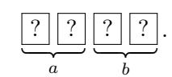
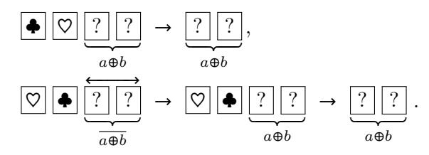

# Practical Card-Based Protocol for Three-Input Majority

Kenji Yasunaga Osaka University yasunaga@ist.osaka-u.ac.jp

April 21, 2020

#### **Abstract**

We present a card-based protocol for computing a three-input majority using six cards. The protocol essentially consists of performing a simple XOR protocol two times. Compared to the existing protocols, our protocol does not require private operations other than choosing cards.

#### **1 Introduction**

Card-based protocols provide secure multiparty computation using cards. A five-card protocol for computing AND (logical conjunction) was first proposed by den Boer [[1](#page-5-0)]. The protocol is simple and easy to understand, and thus is useful for pedagogical purposes.

Mizuki and Sone [\[2\]](#page-5-1) proposed a practical four-card protocol for the two-input XOR function. Although the protocol itself is simple, the XOR function may not be impressive for a general audience who are unfamiliar with computer science. Thus, practical protocols for computing familiar functions are beneficial.

In this work, we present a six-card protocol for the three-input majority function. Since the majority decision is widely used in our daily life, the protocol is appealing to a general audience. Our protocol essentially consists of sequential executions of the XOR protocol of [[2](#page-5-1)] two times.

There exist several card-based protocols for the three-input majority. Nishida et al. [[4](#page-5-2)] proposed an eight-card protocol using random bisection cuts. Nakai et al. [[3\]](#page-5-3) present a four-card protocol by introducing private operations. Then, by further incorporating private operations, Watanabe et al. [[5](#page-5-4)] constructed a three-card protocol. Compared to the existing protocols, our protocol does not require private operations other than choosing cards. Note that operations of privately choosing cards are necessary for all card-based protocols to receive each player's input, although the initial input is not usually considered private operations. See Section [3](#page-1-0) for the detailed comparison. Since our protocol does not require complicated private operations, people who experienced den Boer's AND protocol can play it smoothly.

## **2 Two-Input XOR Protocol of [\[2](#page-5-1)]**

We review the four-card protocol for computing the two-input XOR function proposed by [\[2\]](#page-5-1). There are two types of cards ♣ and ♡ with the same backs ? . Two inputs *a, b* ∈ {0*,* 1} are represented using the two-card encoding

$$\blacksquare$$
  $\heartsuit$  = 0 and  $\heartsuit$   $\blacksquare$  = 1.

1. Arrange two inputs  $a, b \in \{0, 1\}$  as

2. Swap the second and the third cards:

3. Randomly swap the two left and two right cards:

4. Swap the second and the third cards:

5. Face the two leftmost cards. Then we have either

For the latter case, swap the third and the forth cards. Then, we obtain  $a \oplus b$  in the committed form.

We describe the correctness of this protocol. We denote by  $(A_0, A_1)$  and  $(B_0, B_1)$  the card representations of a and b, respectively, where  $a, b \in \{0, 1\}$  and  $A_0, A_1, B_0, B_1 \in \{\bullet, |\nabla|\}$ . At Step 1, we have  $(A_0, A_1, B_0, B_1)$ , which is rearranged to  $(A_0, B_0, A_1, B_1)$  by Step 2. After Step 3, we have  $(A_r, B_r, A_{1\oplus r}, B_{1\oplus r})$  for random  $r \in \{0, 1\}$ . By Step 4, it will become  $(A_r, A_{1\oplus r}, B_r, B_{1\oplus r})$ . At this point, the left two cards represent  $a \oplus r$ , and the right two  $b \oplus r$ . Also, we have the relation that  $a \oplus b$  is  $b \oplus r$  if  $a \oplus r = 0$ , and is  $\overline{b \oplus r}$  otherwise. Hence, the protocol correctly works.

For secrecy, the players obtain the information only in Step 5, in which  $(A_r, A_{1\oplus r})$  are faced. They reveal no information on input a or b as long as  $r \in \{0, 1\}$  is random.

## 3 Three-Input Majority Protocol

First, we provide another way of describing the correctness of the XOR protocol in the previous section, which is a key observation for constructing our protocol. For  $a \in \{0,1\}$  and  $B,C \in \{\blacksquare, \boxed{\heartsuit}\}$ , define the function

$$\mathsf{choose}^a(B,C) = \begin{cases} B & \text{if } a = 0 \\ C & \text{if } a = 1 \end{cases}.$$

Let  $(A_0, A_1, B_0, B_1)$  be the arrangement in Step 1 of the XOR protocol, where  $A_0, A_1, B_0, B_1 \in \{ \bullet, [\nabla] \}$ , and the pairs  $(A_0, A_1)$  and  $(B_0, B_1)$  represent  $a \in \{0, 1\}$  and  $b \in \{0, 1\}$ , respectively. We demonstrate that the protocol implicitly implements the computation of  $\mathsf{choose}^a(B_0, B_1)$ , where  $a \in \{0, 1\}$  is encoded with  $(A_0, A_1)$ . Let  $(A_r, A_{1 \oplus r}, B_r, B_{1 \oplus r})$  be the arrangement after Step 4, where

 $r \in \{0,1\}$  is a random bit. When  $A_r = \clubsuit$ , there are two cases, (a,r) = (0,0) and (a,r) = (1,1). It is not difficult to see that in both cases  $\mathsf{choose}^a(B_0,B_1) = B_r$ . When  $A_r = \heartsuit$ , there are also two cases, (a,r) = (0,1) and (a,r) = (1,0). In both cases,  $\mathsf{choose}^a(B_0,B_1) = B_{1\oplus r}$ . Thus we have that

$$\mathsf{choose}^a(B_0,B_1) = \begin{cases} B_r & \text{if } A_r = \boxed{\spadesuit} \\ B_{1\oplus r} & \text{if } A_r = \boxed{\heartsuit} \end{cases}.$$

Namely, given the arrangement  $(A_r, A_{1\oplus r}, B_r, B_{1\oplus r})$  after Step 4, we can implement choose  $^a(B_0, B_1)$  by choosing  $B_r$  if  $A_r = \boxed{\bullet}$ , and  $B_{1\oplus r}$  if  $A_r = \boxed{\heartsuit}$ . Since conditions  $A_r = \boxed{\bullet}$  and  $A_r = \boxed{\heartsuit}$  are equivalent to  $a \oplus r = 0$  and  $a \oplus r = 1$ , respectively, it holds that

choosea
$$(B_0, B_1) = \begin{cases} B_0 & \text{if } a = 0 \\ B_1 & \text{if } a = 1 \end{cases}$$
 (1)

The actual output of the protocol is  $(B_r, B_{1\oplus r})$  if  $A_r = \bigoplus$ , and is  $(B_{1\oplus r}, B_r)$  if  $A_r = \bigcirc$ . This means that the output is  $b \oplus r$  if  $a \oplus r = 0$ , and is  $b \oplus r \oplus 1$  if  $a \oplus r = 1$ , implying that the protocol outputs  $a \oplus b$ .

Next, we describe our three-input majority protocol. For  $a,b,c\in\{0,1\}$ , the majority function is defined to be

$$\mathsf{majority}(a,b,c) = \begin{cases} 1 & \text{if } a+b+c \geq 2 \\ 0 & \text{otherwise} \end{cases}.$$

We have the useful fact that

$$\mathsf{majority}(a,b,c) = \begin{cases} a & \text{if } a \oplus b = 0 \\ c & \text{if } a \oplus b = 1 \end{cases}.$$

It follows from (1) that  $\mathsf{majority}(a,b,c)$  can be implemented by arranging  $(X_0,X_1,A,C)$  and performing  $\mathsf{choose}^{a\oplus b}(A,C)$ , where  $(X_0,X_1)$  is the two-card encoding of  $a\oplus b$ , and  $A,C\in\{\blacksquare,\bigtriangledown\}$  are the one-card encoding  $\bullet$  = 0 and  $\bigtriangledown$  = 1 for a and c, respectively.

Hence, we can implement the three-input majority by performing the XOR protocol twice. The first one is for computing the committed form of  $a \oplus b$ , and the second one is for implementing  $\mathsf{choose}^{a \oplus b}(A, C)$ . Before performing the second XOR protocol, we need to privately choose cards A and C for the one-card encoding of a and c.

We give a formal description.

1. Arrange two inputs  $a, b \in \{0, 1\}$  as

$$\underbrace{???}_{a}\underbrace{???}_{b}$$

using the encoding of  $| \bullet | | \heartsuit | = 0$  and  $| \heartsuit | | \bullet | = 1$ .

2. Swap the second and the third cards:

3. Randomly swap the two left and the two right cards:

4. Swap the second and the third cards:

5. Face the two leftmost cards. If they are  $\bigcirc$   $\bigcirc$ , leave the two rightmost card, and if they are  $\bigcirc$ , do the same after swapping the third and the fourth cards:

6. Arrange two inputs  $a, c \in \{0, 1\}$  as

$$\begin{array}{c|c}
? ? ? ? ?
\\
\hline
 a \oplus b & a & c
\end{array}$$

using the one-card encoding of  $\blacksquare$  = 0 and  $\heartsuit$  = 1.

7. Swap the second and the third cards:

8. Randomly swap the two left and the two right cards:

$$[??|??].$$

9. Swap the second and the third cards:

10. Face the leftmost card. If it is  $\spadesuit$ , the third card is the one-card encoding of majority (a, b, c), and otherwise, the fourth card is:

Table 1: Three-input majority protocols

| References          | # Priv. Ops. | # Cards | Desk Space | Private Operations              |
|---------------------|--------------|---------|------------|---------------------------------|
| Nishida et al. [4]  | 0            | 8       | 6 cards    | _                               |
| Nakai et al. [3]    | 2            | 4       | 2 cards    | Choose and arrange cards        |
| Watanabe et al. [5] | 4            | 3       | 3 cards    | Choose, arrange, and swap cards |
| Protocol 1          | 1            | 6       | 4 cards    | Choose cards                    |
| Protocol 2          | 0            | 8       | 6 cards    | _                               |

Correctness follows from the discussion above. Regarding secrecy, we claim that each player learns no information on the other players' inputs by assuming that all the players follow the protocol. In our protocol, the players obtain the information on cards only in Steps 5 and 10, both of which correspond to Step 5 of the XOR protocol. Thus, as long as swapping cards randomly in Steps 3 and 8, each player obtains no information on the other players' inputs.

For efficient implementation, our protocol requires private operations in Step 6. Namely, the two cards for a and c should be prepared privately. Although the cards for c can be prepared at the first step, we need those of a in Step 6 as well as Step 1. Note that the other steps except for the first one can be done publicly. Thus, our protocol can be performed with six cards, three  $\bigcirc$ 's and three  $\bigcirc$ 's.

We can avoid private operations by using the copy protocol for a. That is, after arranging the input cards, two copies of a are generated, and each one is used in Step 1 and Step 6. The copy protocol can be simply implemented by the XOR protocol in which b is set to be 0 (cf. [2]). To generate two copies, we prepare two duplicate cards for b = 0 and perform the XOR protocol in which the duplicate cards for b are treated as one card. Although this procedure needs four additional cards, we can reuse two cards as input cards for c after generating two copies of a. Thus, the resulting protocol needs eight cards in total. Interestingly, this majority protocol consists of three XOR protocols.

We compare our protocols with existing work in Table 1. In comparison, we do not consider the initial placing of input cards as private operations. More specifically, each player is allowed to place his input cards without duplication. Note that in [5] the initial placing was counted as private operations. The desk space is a necessary space for playing the protocol, and we do not assume that all the input cards are on the desk at the beginning of the protocol. Protocol 1 is our three-input majority protocol, and Protocol 2 is the modified one in which the private action is replaced with the copy protocol. Compared to the protocol of [4], Protocol 1 reduces the number of cards by adding simple private operations and requires only four-card desk space. The private action in Protocol 1 is just choosing a card corresponding to the input value. This private operation is quite limited compared to other three-input majority protocols [3, 5]. Although Protocol 2 has the same parameters as that of [4] in the table, our protocol has a modular structure. Namely, it is easier to understand the meanings of each procedure. Protocol 2 first generates two copies of a, then compute  $a \oplus b$ , and finally compute majority(a, b, c) by implementing choose  $a \oplus b$  where each of the three procedures is performed by the XOR protocol of [2].

### **Acknowledgments**

This work was supported in part by JSPS Grant-in-Aid for Scientific Research Numbers 16H01705 and 17H01695.

## **References**

- [1] B. den Boer. More efficient match-making and satisfiability: *The Five Card Trick*. In J. Quisquater and J. Vandewalle, editors, *Advances in Cryptology - EUROCRYPT '89, Workshop on the Theory and Application of of Cryptographic Techniques, Houthalen, Belgium, April 10-13, 1989, Proceedings*, volume 434 of *Lecture Notes in Computer Science*, pages 208–217. Springer, 1989.
- [2] T. Mizuki and H. Sone. Six-card secure AND and four-card secure XOR. In X. Deng, J. E. Hopcroft, and J. Xue, editors, *Frontiers in Algorithmics, Third International Workshop, FAW 2009, Hefei, China, June 20-23, 2009. Proceedings*, volume 5598 of *Lecture Notes in Computer Science*, pages 358–369. Springer, 2009.
- [3] T. Nakai, S. Shirouchi, M. Iwamoto, and K. Ohta. Four cards are sufficient for a card-based three-input voting protocol utilizing private permutations. In J. Shikata, editor, *Information Theoretic Security - 10th International Conference, ICITS 2017, Hong Kong, China, November 29 - December 2, 2017, Proceedings*, volume 10681 of *Lecture Notes in Computer Science*, pages 153–165. Springer, 2017.
- [4] T. Nishida, Y. Hayashi, T. Mizuki, and H. Sone. Securely computing three-input functions with eight cards. *IEICE Transactions*, 98-A(6):1145–1152, 2015.
- [5] Y. Watanabe, Y. Kuroki, S. Suzuki, Y. Koga, M. Iwamoto, and K. Ohta. Card-based majority voting protocols with three inputs using three cards. In *International Symposium on Information Theory and Its Applications, ISITA 2018, Singapore, October 28-31, 2018*, pages 218–222. IEEE, 2018.