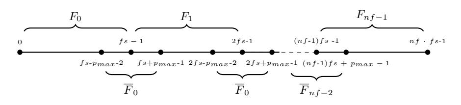
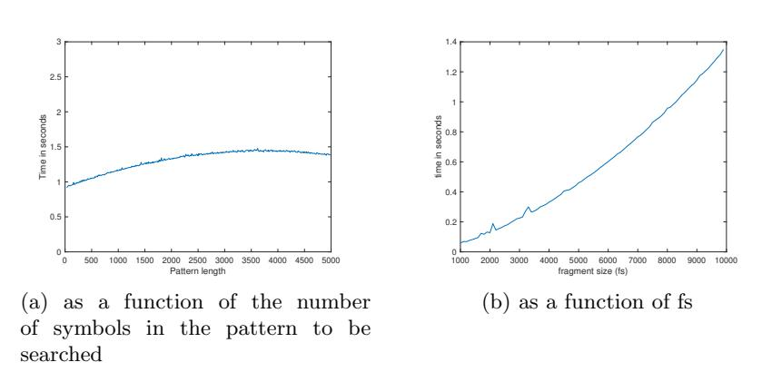
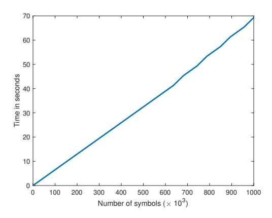
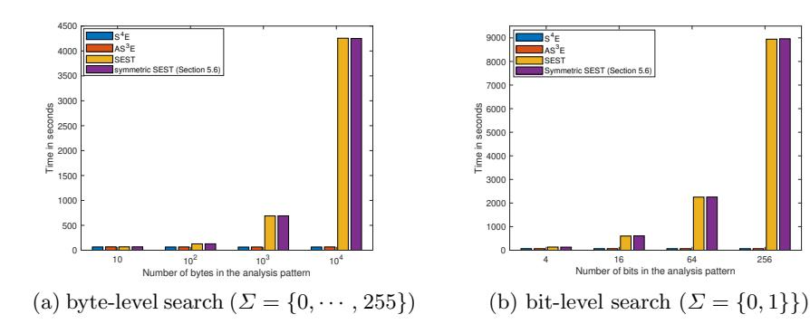

# Pattern Matching on Encrypted Data

Anis Bkakria<sup>1</sup> , Nora Cuppens1,<sup>2</sup> , and Frdric Cuppens1,<sup>2</sup>

> 1 IMT Atlantique, Rennes, France <sup>2</sup> Polytechnique Montral, Montral, Canada

Abstract. Pattern matching is one of the most fundamental and important paradigms in several application domains such as digital forensics, cyber threat intelligence, or genomic and medical data analysis. While it is a straightforward operation when performed on plaintext data, it becomes a challenging task when the privacy of both the analyzed data and the analysis patterns must be preserved. In this paper, we propose new provably correct, secure, and relatively efficient (compared to similar existing schemes) public and private key based constructions that allow arbitrary pattern matching over encrypted data while protecting both the data to be analyzed and the patterns to be matched. That is, except the pattern provider (resp. the data owner), all other involved parties in the proposed constructions will learn nothing about the patterns to be searched (resp. the data to be inspected). Compared to existing solutions, the constructions we propose has some interesting properties: (1) the size of the ciphertext is linear to the size of plaintext and independent of the sizes and the number of the analysis patterns; (2) the sizes of the issued trapdoors are constant on the size of the data to be analyzed; and (3) the search complexity is linear on the size of the data to be inspected and is constant on the sizes of the analysis patterns. The conducted evaluations show that our constructions drastically improve the performance of the most efficient state of the art solution.

Keywords: Searchable encryption · Pattern Matching

# 1 Introduction

In several application domains such as deep-packet inspection and genomic data analysis, learning the presence of specific patterns as well as their positions in the data are essential. In the previous two use cases, pattern searches are often performed by entities that are not fully trusted by data owners. For instance, in the case of deep-packet inspection (DPI), a company that aims to outsource its network traces to a third party forensic scientist to find indictors of compromise might not be comfortable revealing the full contents of its traces to the forensic scientist. Similarly, in the case of genomic data analysis, a patient that wants to check whether its genome contains particular patterns representing a genetic predisposition to specific diseases might not be comfortable revealing the full contents of its genome to the laboratory that performs the analysis.

Existing solutions that may be used to overcome the previous problem rely mainly on searchable encryption based techniques [1–7, 21]. Unfortunately, these techniques suffer from at least one of the following limitations. First, the lack of support for pattern-matching with evolving patterns, such as virus signatures which are updated frequently (case of symmetric searchable encryption [2–5, 21]); second, the lack of support for variable pattern lengths (e.g., tokenization-based techniques such as BlindBox [6]); third, the incompleteness of pattern detection methods which yield false negatives (case of BlindIDS [7]); and fourth, the disclosure of detection patterns (case of searchable encryption with shiftable trapdoors [1]). We provide a full comparison with related literature in Section 2.

In this paper, we propose two technically sound constructions: S4E supporting pattern matching of adaptively chosen and variable (upper bounded) lengths patterns on secret key encrypted streams, and AS3E supporting pattern matching of adaptively chosen and variable (upper bounded) lengths patterns on public key encrypted streams. Both S4E and AS3E ensure that (1) both the data owner and the third-party entity performing pattern matching operations will learn nothing about the searched patterns except their lengths, (2) both the pattern provider and the third-party entity that is going to perform pattern matching will learn nothing about the data to be analyzed except the presence or the absence of the set of unknown patterns (i.e., the third-party entity will not have access to patterns plaintexts), (3) the third-party entity will be able to perform pattern matching correctly over the data to be analyzed. From a practical point of view, our construction has some interesting properties. First, the size of the ciphertext depends only on the size of the plaintext (it is independent of the sizes and the number of analysis patterns). Second, the size of the issued trapdoors is independent of the size of the data to be analyzed. Third, the search complexity depends only on the size of the data to be analyzed and is constant on the size of the analysis patterns. The two constructions we propose in this paper are – to our knowledge – the first constructions to provide all previously mentioned properties without using costly and complex cryptographic scheme such as fully homomorphic encryption. The evaluations conducted in this paper show that the two proposed constructions improve by up to four orders of magnitude the performance of the most efficient state of the art solution SEST [1].

The paper is organized as follows. Section 2 reviews related work and details the main contributions of our work. Section 3 presents the assumptions under which our schemes achieve provable security. The intuition behind the proposed constructions is presented in Section 4. Section 5 and 6 formalize our S<sup>4</sup>E and AS<sup>3</sup>E primitives and provide their security results. In Sections 7 and 8, we discuss the complexity of our constructions and provide experimental results. Finally, section 9 concludes.

# 2 Related Work

One possible solution for pattern matching over encrypted traffic is to use techniques that allow evaluation of functions over encrypted data. Generic approaches such as fully homomorphic encryption (FHE) [8, 10] and functional encryption (FE) [9] are currently impractical due to their very high complexities.

Several searchable encryption (SE) techniques have been proposed for keyword searching over encrypted data [5, 3, 4, 2, 21]. The main idea is to associate a trapdoor with each keyword to allow searching for these keywords within a given encrypted data. Ideally, an entity which does not have access to the plaintext and encryption key should learn nothing about the plaintext except the presence or the absence of the keyword. For most existing SE techniques, searches are performed on keywords that have been pre-chosen by the entity encrypting the data. Such approaches are more suitable for specific types of searches, such as database searches in which records are already indexed by keywords, or in the case of emails filtering in which flags such as "urgent" are used. Unfortunately, SE techniques become useless when the set of keywords cannot be known before encryption. This is usually the case for messaging application and Internet browsing traffic where keywords can include expressions that are not sequences of words per se (e.g., /chamjavanv.inf?aapf/login.jsp?=). The two constructions we propose in this paper offer better search flexibility as, even after the plaintext has been encrypted, they can allow arbitrarily chosen keywords to be searched without re-encryption.

To overcome the previous limitations, tokenization-based approaches have been proposed. In [6], the authors propose BlindBox, an approach that splits the data to be encrypted into fragments of the same size l and encrypts each of those fragments using a searchable encryption scheme where each fragment will represent a keyword. Nevertheless, this solution suffers from two limitations: (1) it is useful only if all the searchable keywords have the same length l. obviously the previous condition is seldom satisfied in real-world applications that requires pattern matching (e.g., DPI). If we want to use this approach with keyword of different lengths L, we should for each l<sup>i</sup> ∈ L, split the data to be encrypted into fragments of size l<sup>i</sup> and encrypt them, which quickly becomes bulky. (2) The proposed approach may easily cause false negatives since, even if the keyword is of size l (the size of each fragment), it cannot be detected if it straddles two fragments. Recently, In [7], Canard et al. proposed BlindIDS – a public key variant of the BlindBox approach [6] that additionally ensures keywords indistinguishability. That is, the entity that is going to search over the encrypted data will lean nothing about the keywords. Unfortunately, BlindIDS suffers from the same limitations as BlindBox. The two constructions we propose in this paper address the main drawbacks of these tokenization-based techniques since they allow for arbitrary trapdoors to be matched against the encrypted data, without false negatives or false positives.

Several approaches [11–13] proposed solutions for substring search over encrypted data based on secure multi-party computation. Unfortunately, to offer pattern matching operation, these solutions require often several interactions between the searcher and the data encrypter.

As pointed out in [1], anonymous predicate encryption (e.g., [14]) or hidden vector encryption [15] may provide a convenient solution for pattern matching over encrypted data. However, in order to search a pattern p of length l on a data of length n, the searcher should obtain n − l keys to be able to check the presence of p on every possible offset of the data, which is clearly a problem when dealing with large datasets.

One of the most interesting techniques for pattern matching over encrypted traffic is the searchable encryption with shiftable trapdoor (SEST) [1]. The proposed construction relies on public-key encryption and bilinear pairings to overcome most of the limitations of previously mentioned techniques. It allows for patterns of arbitrary lengths to be matched against the encrypted data, without false negatives or false positives. This improvement comes at the cost of the practicability of the technique. In fact, the proposed schema requires a public key of size linear to the size of the data to be encrypted (a public key of ' 8000 GB is required for encrypting 1GB of data). Moreover, the trapdoor generation technique used by the SEST leaks many information (such as, the number of different characters, the maximum number of occurrences of a character) about the patterns to be searched. Furthermore, the number of pairings needed for testing the presence of a keyword in an offset of the data depends on the maximum number of occurrences of the characters contained in the keyword. This makes the proposed technique quite inefficient when used for bit level matching. By contrast, for testing the presence of a pattern in encrypted data, our constructions require a constant number of pairings in the size of the pattern (see Section 7 for more details). This makes our constructions more efficient when matching long keywords at bit level.

As we have seen, many different approaches can be used to address pattern matching over encrypted data. To give better understanding of the benefits of the two approaches we propose in this paper compared to existing ones, we provide in Table 1 a comparative overview of their asymptotic complexities, and their ability to ensure the security properties we are aiming to provide. Note that we only consider BlindBox (a symmetric searchable encryption-based solution), BlindIDS (an asymmetric searchable encryption-based solution), Predicate Encryption/Hidden Vector Encryption and the SEST approach. Other approaches, as explained before, require data re-encryption each time a new keyword is considered [5, 3, 4, 2, 21], induce higher complexity [9, 8, 10], require interactivity [11–13] or ensure weaker privacy level [5].

According to the Table 1, the two constructions we propose in this paper (S<sup>4</sup>E and AS<sup>3</sup>E) are the only primitives that simultaneously enable arbitrary trapdoors (with upper bounded keyword size), provides a correct keyword detection, and ensures the privacy of the used trapdoors.

In Table 1, (✓) is used to denote that a property is provided under specific conditions. AS<sup>3</sup>E ensures trapdoor's privacy for patterns of high-min entropy (see Section 6 for more details). In addition, both S<sup>4</sup>E and AS<sup>3</sup>E support pattern matching of arbitrary but upper bounded lengths patterns. As we show in Section 7, we stress that in both S<sup>4</sup>E and AS<sup>3</sup>E, increasing the upper bound size of patterns affects only the size of the trapdoor generated for each pattern. The size of later increases linearly with the increase of the size of the former.

|                        | Primitives        |                |                |                                      |                     |                     |
|------------------------|-------------------|----------------|----------------|--------------------------------------|---------------------|---------------------|
|                        | BlindBox          | BlindIDS       | PE/HVE         | SEST                                 | $S^4E$              | $AS^3E$             |
| Number of Trapdoors    | $O(s \cdot q)$    | O(q)           | $O(n \cdot q)$ | O(q)                                 | O(q)                | O(q)                |
| Public Parameters size | O(1)              | O(1)           | O(1)           | O(1)                                 | $O(l_i)$            | O(1)                |
| encryption keys size   | O(1)              | O(1)           | O(n)           | O(n)                                 | $O(l_i)$            | $O(l_i)$            |
| Ciphertext size        | $O(n \cdot L)$    | $O(n \cdot L)$ | O(n)           | O(n)                                 | O(n)                | O(n)                |
| Search complexity      | $q \cdot \log(q)$ | q              | $q \cdot n$    | $2 \times \prod_{1}^{q} l_i \cdot n$ | $2 \cdot q \cdot n$ | $2 \cdot q \cdot n$ |
|                        | comparisons       | pairings       | pairings       | pairings                             | pairings            | pairings            |
| Arbitrary trapdoors    | Х                 | Х              | ✓              | ✓                                    | <b>(</b> ✓)         | <b>(</b> ✓)         |
| Trapdoor's privacy     | Х                 | <b>(✓</b> )    | ×              | Х                                    | 1                   | (✔)                 |
| Correctness            | Х                 | ×              | 1              | <b>✓</b>                             | 1                   | 1                   |
| (no false positives)   |                   |                |                |                                      |                     |                     |

Table 1: Complexity and ensured security properties comparison between related work and our primitive. The scalars  $n, q, l_i, L, s$  denotes respectively the length of the traffic to encrypt, the number of pattern to be searched, the length of each pattern, the number of different lengths among the q patterns to be searched and the number of data encrypters. We used  $(\checkmark)$  to denote that the property is provided under specific conditions.

The two constructions we propose do not require very large public parameters, secret key or very large public keys as SEST and PE/HVE. Moreover, their search complexities is lower than SEST by a factor of  $l_i$  (the length of the pattern  $w_i$  to be searched), since they are constant in the size of the pattern to be searched. Therefore, the proposed constructions are an interesting middle way which provides the best of PE/HVE and SEST while ensuring patterns' privacy. Their only limitation compared to PE/HVE and SEST is the upper bounded size of patterns to be searched that should be fixed before the data encryption, which we believe to be a reasonable price to pay to achieve all the other features.

## 3 Security Assumption

In this section, we describe the security assumptions under which our two constructions  $S^4E$  and  $AS^3E$  achieve provable security.

**Definition 1 (Bilinear Maps).** Let  $\mathbb{G}_1, \mathbb{G}_2, \mathbb{G}_T$  be three finite cyclic groups of large prime order p. We assume that there is an asymmetric bilinear map  $e: \mathbb{G}_1 \times \mathbb{G}_2 \to \mathbb{G}_T$  such that, for all  $a, b \in \mathbb{Z}_p$  the following conditions hold:

- For all  $g \in \mathbb{G}_1$ ,  $\widetilde{g} \in \mathbb{G}_2$ ,  $e(g^a, \widetilde{g}^b) = e(g, \widetilde{g})^{a \cdot b}$ - For all  $g \in \mathbb{G}_1$ ,  $\widetilde{g} \in \mathbb{G}_2$ ,  $e(g^a, \widetilde{g}^b) = 1$  iff a = 0 or b = 0
- $-e(\cdot,\cdot)$  is efficiently computable

As in [1], the security of the proposed constructions hold as long as  $\mathbb{G}_1 \neq \mathbb{G}_2$  and no efficiently computable homomorphism exists between  $\mathbb{G}_1$  and  $\mathbb{G}_2$  in either directions. In the sequel, the tuple  $(\mathbb{G}_1, \mathbb{G}_2, \mathbb{G}_T, p, e(\cdot, \cdot <))$  is referred to as a bilinear environment.

Some of the security proofs of the proposed constructions, given in Appendix A, rely partially on showing that given a number of pattern trapdoors, the adversary will be unable to distinguish a new valid trapdoor from a random element. Thus, the leakage can be bounded only by considering the adversary's query to the issuing oracle. Hence, either we considerably reduce the maximum length of the patterns to be searched ( $\leq 30$ ), which allow to define a GDH instance providing all public parameters, the trapdoors for all possible patterns, and the challenge elements. Or we use an interactive variant of the GDH assumption to offer flexibility to the simulator by allowing the elements  $g^{R^{(i)}(x_1,\dots,x_c)}$ ,  $\tilde{g}^{S^{(i)}(x_1,\dots,x_c)}$ , and  $e(g,\tilde{g})^{T^{(i)}(x_1,\dots,x_c)}$  of the GDH assumption [20] to be queried to specific oracles.

So, we prove the security of the proposed constructions under an interactive assumption. That is, we use a slightly modified General Diffie-Hellman (GDH) problem assumption [20] to allow the adversary to request the set of values on which the reduction will break the GDH assumption. This interactive aspect of the GDH instance we are considering reduces slightly the security of the construction we are proposing. However, this interactive assumption makes possible the definition of quite efficient constructions with interesting properties. First, the size of the ciphertext depends only on the size of the plaintext (it is independent of the sizes and the number of the analysis patterns). Second, the size of the issued trapdoors is independent of the size of the data to be searched. Third, the search complexity depends only on the size of the data and is constant on the sizes of the patterns to be matched. Attaining all previously mentioned properties while protecting both the data to be analyzed and the patterns to be matched and being able to handle arbitrary analysis pattern query is not obvious and may justify the use of such an interactive assumption.

**Definition 2 (independence [20]).** Let p be some large prime, r, s, t, c, and k be five positive integers and  $R \in \mathbb{F}_p[X_1, \cdots, X_c]^r$ ,  $S \in \mathbb{F}_p[X_1, \cdots, X_c]^s$ , and  $T \in \mathbb{F}_p[X_1, \cdots, X_c]^t$  be three tuples of multivariate polynomials over  $\mathbb{F}_p$ . Let  $R^{(i)}$ ,  $S^{(i)}$  and  $T^{(i)}$  denote respectively the i-th polynomial contained in R, S, and T. For any polynomial  $f \in \mathbb{F}_p[X_1, \cdots, X_c]$ , we say that f is dependent on R, R, R if there exist constants  $\{v_j^{(a)}\}_{j=1}^s$ ,  $\{v_{i,j}^{(b)}\}_{i=1,j=1}^{i=r,j=s}$ ,  $\{v_k^{(c)}\}_{k=1}^t$  such that

$$f \cdot (\sum_j \vartheta_j^{(a)} \cdot S^{(j)}) = \sum_{i,j} \vartheta_{i,j}^{(b)} \cdot R^{(i)} \cdot S^{(j)} + \sum_k \vartheta_k^{(c)} T^{(k)}$$

We say that f is independent of  $\langle R, S, T \rangle$  if f is not dependent on  $\langle R, S, T \rangle$ .

**Definition 3 (i-GDH assumption).** Let p be some large prime, r, s, t, c, and k be five positive integers and  $R \in \mathbb{F}_p[X_1, \dots, X_c]^r$ ,  $S \in \mathbb{F}_p[X_1, \dots, X_c]^s$ , and  $T \in \mathbb{F}_p[X_1, \dots, X_c]^t$  be three tuples of multivariate polynomials over  $\mathbb{F}_p$ . Let  $\mathcal{O}^r$ , (resp.  $\mathcal{O}^s$  and  $\mathcal{O}^t$ ) be oracle that, on input  $\{\{a_{i_1,\dots,i_c}^{(k)}\}_{i_j=0}^{d_k}\}_k$ , adds the polynomials  $\{\sum_{i_1,\dots,i_r}a_{i_r,i_r}^{(k)}\}_{i_r}^{(k)}\}_k$  to R (resp. S and T).

 $\{\sum_{i_1,\cdot,i_c}a^{(k)}_{i_1,\cdot,i_c}\prod_jX^{i_j}_j\}_k \ to \ R \ (resp.\ S \ and \ T).$  Let  $(x_1,\cdots,x_c)$  be secret vector and  $q_r$  (resp.  $q_s$ ) (resp.  $q_t$ ) be the number of queries to  $\mathcal{O}^r$  (resp.  $\mathcal{O}^s$ ) (resp.  $\mathcal{O}^t$ ). The i-GDH assumption states that, given  $\{g^{R^{(i)}(x_1,\cdots,x_c)}\}_{i=1}^{r+k\cdot q_r}, \{\widetilde{g}^{S^{(i)}(x_1,\cdots,x_c)}\}_{i=1}^{s+k\cdot q_s}, \ and$   $\{e(g,\widetilde{g})^{T^{(i)}(x_1,\cdots,x_c)}\}_{i=1}^{t+k\cdot q_t}, \ it \ is \ hard \ to \ decide \ whether \ (i) \ U = g^{f(x_1,\cdots,x_c)} \ or \ U \ is \ random \ and \ (ii) \ U' = \widetilde{g}^{f(x_1,\cdots,x_c)} \ or \ U' \ is \ random \ if \ f \ is \ independent \ of < R, S, T >.$ 

As argued in [1], The hardness of the i-GDH problem depends on the same argument as the GDH problem which has already been proven in the generic group model [20]. That is, as long as the challenge polynomial that we denote f is independent of < R, S, T >, an adversary cannot distinguish  $g^{f(x_1, \dots, x_c)}$  (resp.  $\tilde{g}^{f(x_1, \dots, x_c)}$ ) from a random element of  $\mathbb{G}_1$  (resp.  $\mathbb{G}_2$ ). The definition method of the content of the sets R, S, and T (by assumption or by the queries to oracles) does not fundamentally change the proof.

### 4 The intuition

The intuition behind the proposed constructions relies on two observations. First, the number of analysis patterns is often very small compared to the quantity of data that are going to be analyzed, e.g., in a deep packet inspection scenario, the number of patterns provided by the SNORT intrusion detection system is 3734 [22]. Second, the sizes of the detection patterns are also very small compared to the size of the traces to be analyzed (e.g., the largest pattern size used by Snort is 364 Bytes).

For a data with alphabet  $\Sigma$ , the proposed constructions associate each element  $\sigma$  of  $\Sigma$  with a secret encoding  $(\alpha'_{\sigma}, \alpha_{\sigma})$ . They fragment the sequence of symbols that represents the data  $\mathcal{B}$  as described in the Figure 1 in which fs represents the number of symbols (i.e., the size) of each fragment and  $p_{max}$  represents the largest number of symbols in a pattern. To allow the matching of patterns at any possible offset of the data to be searched, in the proposed constructions, we require that  $fs \geq 2 \cdot (p_{max} - 1)$ . In the rest of the paper, we will use  $\{x_i\}_{i=a}^{i=b}$  to denote the set of elements  $x_i$ ,  $i \in [a,b]$  and  $|\mathcal{B}|$  to denote the number of symbol (i.e., the size) that compose  $|\mathcal{B}|$ .



Fig. 1: Fragmentation approach

As illustrated by the Figure 1, the sequence of symbols  $\mathcal{B}$  is fragmented into  $2 \times nf - 1$  fragments  $\{F_i, \overline{F}_j\}_{i=0,j=0}^{i=nf-1,j=nf-2}$  where  $nf = |\mathcal{B}|/fs$  (for simplicity we will suppose that  $|\mathcal{B}|$  is a multiple of fs). Each  $F_i, i \in [0, nf-1]$ , contains the symbols at indexes  $[i \cdot fs, (i+1) \cdot fs - 1]$ , while  $\overline{F}_i, i \in [0, nf-2]$ , contains the symbols at indexes  $[(i+1) \cdot fs - p_{max} - 1, (i+1) \cdot fs + p_{max} - 1]$  of  $\mathcal{B}$ .

Given an  $i \in [0, |\mathcal{B}|-1]$ , in the rest of this paper, we will denote by  $i_F$  the index of i inside the fragment F where  $F \in \{F_0, \dots, F_{nf-1}, \overline{F}_0, \dots, \overline{F}_{nf-2}\}$ . If  $i \notin F$ ,  $i_F$  is not defined. Formally, assuming that F = [a, b]:

$$i_F = \begin{cases} i \bmod a & \text{if } i \in F \\ \text{not defined} & \text{otherwise} \end{cases}$$

A trapdoor for a pattern  $w = \sigma_{w,0} \cdot \sigma_{w,l-1}$  will be associated with a set of polynomials  $\{V_i = v_i \sum_{k=0}^{l-1} \alpha'_{\sigma_{w,k}} \cdot \alpha^{k+i}_{\sigma_{w,k}} \cdot z^k\}_{i=0}^{i=fs-l}$  where  $v_i$  is a random secret scalar used to prevent new trapdoor forgeries and z a random scalar belonging to the secret key  $\mathcal{K}_s$ . The trapdoor generated for w consists then in the elements  $\{\widetilde{g}^{V_i}, \widetilde{g}^{v_i}\}_{i=0}^{i=fs-l}$ . Each of the previous elements will be used to check the presence of w at a specific index of the previously constructed fragments.

Meanwhile, the encryption of each symbol  $\sigma_i$  is the tuple  $C_i = \{C_i, C'_i, \overline{C}_i, \overline{C'}_i\}$  that depends on the fragment in which the index i of  $\sigma_i$  in  $\mathcal{B}$  belongs. If it belongs to  $F_{\epsilon}$  (resp.  $\overline{F}_{\epsilon}$ ) then  $C_i$  and  $C'_i$  (resp.  $\overline{C}_i$  and  $\overline{C'}_i$ ) contain the encryption of  $\sigma_i$  regarding the index  $i_{\overline{F}_i}$  of i in  $F_{\epsilon}$  (resp. the index  $i_{\overline{F}_i}$  of i in  $\overline{F}_{\epsilon}$ ).

Then, if we want to test the presence of w at the index  $i_{F_{\epsilon}}$  of i in  $F_{\epsilon}$  (resp. the index  $i_{\overline{F}_{\epsilon}}$  of i in  $\overline{F}_{\epsilon}$ ). Then, if we want to test the presence of w at the index i, if i belongs to  $F_{\epsilon}$  (resp.  $\overline{F}_{\epsilon}$ ), then we compare the bilinear mapping results of the elements  $C_{i_{F_{\epsilon}}}$ ,  $\widetilde{g}^{v_{i_{F_{\epsilon}}}}$  (resp.  $\overline{C}_{i_{\overline{F}_{\epsilon}}}$ ,  $\widetilde{g}^{v_{i_{\overline{F}_{\epsilon}}}}$ ) and  $C'_{i_{F_{\epsilon}}}$ ,  $\widetilde{g}^{V_{i_{F_{\epsilon}}}}$  (resp.  $\overline{C'}_{i_{\overline{F}_{\epsilon}}}$ ,  $\widetilde{g}^{V_{i_{\overline{F}_{\epsilon}}}}$ ). If w is not present, then the bilinear mapping results will be random-looking elements of  $\mathbb{G}_T$  which will be useless to the adversary for learning any information about the plaintext and/or the content of the tested pattern.

## 5 S<sup>4</sup>E Construction

In this section, we propose  $S^4E$ , a construction that supports pattern matching of adaptively chosen and variable (upper bounded) lengths patterns on secret key encrypted streams. Before formalizing  $S^4E$ , we present a use-case scenario on which  $S^4E$  can be useful.

## 5.1 Usage Scenario

To cope with new and sophisticated cybercrime threats, new threat intelligence platforms such as [19] are relying on the collaboration between different involved entities that include, on one side, companies, organizations, and individuals that are targeted by cyber attacks, and on the other, security editors that are in charge of defining and providing strategies for effectively detect and prevent cyber attacks. To be useful, such platforms should, on one hand, be fueled by data owners, i.e., companies, organizations, and individuals that agree to share the traces (e.g., network and operating system traces) of the cyber attacks that they have suffered. On the other hand, the platform should allow the security editors to analyze (e.g., search specific patterns) and correlate the traces that are shared by the data owners. The considered threat intelligence platform is often managed by non-fully trusted third-party service provider (SP) which provides the required storage space and computation power with affordable cost.

Unfortunately, both data owners (i.e., attack traces owners) and security editors are still very reluctant for adopting such kind of threat intelligence platforms because of two main reasons. First, the traces to be shared contain often highly sensitive information that may raise serious security and/or business threats when disclosed to non-fully trusted third parties (e.g, SP). Second, the shared traces analysis rely mainly on techniques that use pattern matching for inspecting and detecting malicious behaviors. Those analysis patterns are the result of extensive threat intelligence conducted by security editors. They are often put forward as a key competitive differentiator arguing that they can cover a wider set of malicious behaviors. Thus, security editors are typically reluctant to share their analysis patterns with non-fully trusted thirdparties.

The S4E construction can be used to overcome the previous two limitations by building a platform that is (1) market compliant meaning that both the data owner and the third-party entity performing the pattern matching operations will learn nothing about the patterns that will be used by security editors for analyzing the shared traces (as proved by Theorem 4), and (2) privacy-friendly, signifying that (2.1) the third-party entity performing pattern matching will learn nothing about the shared data except the presence or the absence of a set of unknown analysis patterns, and (2.2) the pattern provider will learn no more than the indexes on which the searched pattern exists (as proved by Theorem 2).

### 5.2 Considered Architecture

The architecture considered for the S4E construction involves three parties: the data owner (DO) representing the entity that holds the data to be analyzed (e.g., the network traces in the case of DPI), the pattern provider (PP) representing the entity that supplies the patterns that will be matched, and the service provider (SP) are stakeholders that offer computation infrastructures that will be used to perform the pattern matching operations on the data to be analyzed. To test the presence of a pattern on DO's data, PP starts by generating collaboratively with DO a trapdoor for the pattern to be matched. Then, PP sends the generated trapdoor to SP who performs the matching operation and notifies the PP with the results (i.e., the presence of the patterns as well as their corresponding positions in the DO's data).

### 5.3 Security Requirements and Considered Hypothesis

PP, DO, and SP are considered in S4E as Honest-but-curious entities. First, we expect PP to provide valid patterns allowing an effective analysis of DO's shared data. This a fairly reasonable assumption since a pattern provider (e.g., a security editor in the case of DPI or a laboratory in the case of genomic data analysis) will not defile its reputation by issuing incorrect or misleading analysis patterns. Otherwise, this will result in many false positives, which may considerably degrade the quality of the analyses that will be provided to the DO. Nevertheless, we expect the PP to be curious: it may try to derive information about the analyzed data by accessing the data analyzed by the SP and/or the pattern matching results returned by the SP.

Second, we suppose that SP will perform the pattern matching operations honestly over the DO's data using the analysis patterns provided by PP. However, we suppose that SP may try to learn additional information about either or both the DO's outsourced data and the analysis patterns provided by PP. In addition, we assume that the SP that may try to create values by analyzing other third-parties data using the set of patterns provided by PP for the analysis of DO's outsourced data.

Third, we suppose DO to follow honestly the S4E protocol. However, we expect that he/she may try to learn additional information about the patterns provided by PP for analyze his/her data.

In addition, we suppose that (i) SP and PP will not collude to learn more information about the traffic, and (ii) SP and DO will not collude to learn more information about the patterns to be searched. We believe that these two last assumptions are fairly reasonable since, in a free market environment, an open dishonest behavior will result in considerable damages for involved entities.

Finally, we require S<sup>4</sup>E to provide correct results. That is, (1) any part of DO's data that matches one of PP's patterns when not encrypted must be matched by S<sup>4</sup>E (no false negatives), and (2) we require that for any traffic that does not match any of the PP's analysis patterns when not encrypted, the probability that S<sup>4</sup>E returns a false positive is negligible.

## 5.4 Syntax of S<sup>4</sup>E

S <sup>4</sup>E is defined using five algorithms that we denote Setup, Keygen, Encrypt, Issue, and Test. The first three algorithms are performed by DO, the Issue algorithm is performed collaboratively by DO and PP, and the Test algorithm is performed by SP.

- Setup( $1^{\lambda}$ , fs,  $p_{max}$ ) is a probabilistic algorithm that takes an input a security parameter  $\lambda$ , the fragmentation size to be used fs, and the maximum size of a pattern  $p_{max}$ . It returns the public parameters
- **Keygen**( $params, \Sigma$ ) is a probabilistic key generation algorithm that takes as input the public parameters params and a finite set  $\Sigma$  representing the alphabet to be used for representing the data to be searched and the pattern to be matched. It outputs a secret key  $K_s$  and a trapdoor generation key  $K_t$ . The latter will be sent to PP using a secure channel.
- **Encrypt**( $params, \mathcal{K}_s, \mathcal{B}$ ) is a probabilistic algorithm that takes as input the public parameters params, the secret key  $\mathcal{K}_s$ , and a finite sequence (string) of elements  $\mathcal{B}$  of  $\Sigma$  of size n. it returns a ciphertext  $\mathcal{C}$ .
- Issue(params,  $K_s$ ,  $K_t$ , w) is a probabilistic algorithm executed interactively between PP and DO. It takes as input the public parameters params, the secret key  $K_s$ , the trapdoor generation key  $K_t$ , and w – a sequence of elements of  $\Sigma$  of length smaller of equal to  $p_{max}$ , and returns a trapdoor  $td_w$ .
- $Test(params, \mathcal{C}, td_w)$  is a deterministic algorithm that takes as input the public parameters params, a ciphertext  $\mathcal{C}$  encrypting a sequence of m elements  $\mathcal{B} = \sigma_0 \cdots \sigma_{m-1}$  of  $\Sigma$ , and the trapdoor  $td_w$  for the sequence of  $\Sigma$ 's elements of length  $l, w = \sigma_{w,0} \cdots \sigma_{w,l-1}$ . This algorithm is executed interactively between PP and SP. The former provides the trapdoor  $tp_w$  and the latter executes the algorithm and returns the set of indexes  $\mathcal{I} \subset \{0, m-l-1\}$  where for each  $i \in \mathcal{I}$ ,  $\sigma_i \cdots \sigma_{i+l-1} = \sigma_{w,0} \cdots \sigma_{w,l-1}$  to PP.

We note that the sizes of the elements defined in the previous algorithms, i.e., the size of the data to be analyzed  $\mathcal{B}$ , the size of the pattern to be searched w, and the largest analysis pattern size  $p_{max}$  refer to the number of symbols of  $\Sigma$  that compose each element. In addition, we note that S<sup>4</sup>E does not consider a decryption algorithm since there is no need for decrypting the outsourced data. However, we stress that a decryption feature can be straightforwardly performed by issuing a trapdoor for all characters  $\sigma \in \Sigma$  and running the Test algorithm on the encrypted data for each of them.

### S<sup>4</sup>E's security requirements

As said in Section 5.3, there are mainly 4 security requirements that should be satisfied by our construction: Trace indistinguishability for both PP and SP, pattern indistinguishability for both DO and SP, trapdoor usefulness (i.e., the trapdoors are useful only to search DO's data), and the correctness property.

In the following, we use the game-based security definition proposed in [1] for trace indistinguishability by adapting the standard notion of IND-CPA which requires that no adversary A (e.g., PP or SP), even with an access to an oracle  $\mathcal{O}^s$  that issues a trapdoor  $td_{p_i}$  for any adaptively chosen pattern  $p_i$ , can decide whether an encrypted trace contains  $T_0$  or  $T_1$  as long as the trapdoors  $\{td_{p_i}\}$  issued by  $\mathcal{O}^s$  do not allow trivial distinction of the traces  $T_0$  and  $T_1$ . We note that we consider the quite standard selective security notion [17]. This notion requires the adversary to choose and commit  $T_0$  and  $T_1$  at the beginning of the experiment, before seeing params.

**Definition 4** (Trace indistinguishability). Let  $\lambda$  be the security parameter,  $\Sigma$  be the alphabet to be used,  ${\mathcal A}$  be the adversary and  ${\mathfrak C}$  be the challenger. We consider the following game that we denote  $Exp_{{\mathcal A},\beta}^{S^4E\_D\_IND\_CPA}$ :

- (1) Setup:  $\mathfrak{C}$  executes  $Setup(1^{\lambda}, fs, p_{max})$  to generate params and the algorithm  $Keygen(params, \Sigma)$  to generate the keys  $K_s$  and  $K_t$ . Then it sends params to the adversary.
- (2) Query: A can adaptively ask  $\mathcal{O}^s$  for the trapdoor  $td_{w_i}$  for any pattern  $w_i = \sigma_{i,0} \cdots \sigma_{i,l_i-1}$  where  $\sigma_{i,j} \in \Sigma$ . We denote W the set of patterns submitted by A to  $O^s$  in this phase.
- (3) Challenge: Once  $\mathcal{A}$  decides that Phase (2) is over, it chooses two data streams  $T_0 = \sigma_{0,0}^* \cdots \sigma_{0,m-1}^*$  and  $T_1 = \sigma_{1,0}^* \cdots \sigma_{1,m-1}^*$  and sends them to  $\mathfrak{C}$ . (a) If  $\exists w = \sigma_0 \cdots \sigma_{l_i} \in \mathcal{W}, k \in \{0,1\}, and j \text{ such that:}$

$$\sigma_{k,j}^* \cdots \sigma_{k,j+l_i}^* = \sigma_0 \cdots \sigma_{l_i} \neq \sigma_{1-k,j}^* \cdots \sigma_{1-k,j+l_i}^*$$
 then return 0.

- (b)  $\mathcal{C}$  chooses a random  $\beta \in \{0,1\}$ , creates  $\mathcal{C} = Encrypt(param, \mathcal{K}_s, T_\beta)$ , and sends it to  $\mathcal{A}$ .
- (4) Guess. A outputs the guess  $\beta'$ .
- (5) Return  $(\beta = \beta')$ .

We define  $\mathcal{A}$ 's advantage by  $Adv^{Exp_{\mathcal{A},\beta}^{S^4E.D.IND.CPA}}(\lambda) = |Pr[\beta = \beta'] - 1/2|$ .  $S^4E$  is said to be trace indistinguishable if  $Adv^{Exp_{\mathcal{A},\beta}^{S^4E.D.IND.CPA}}(\lambda)$  is negligible.

We note that in the previous definition, the restriction used in phase (3)(a) ensures that if one of the data streams  $T_k$  contains a pattern  $w_i \in \mathcal{W}$  in the position j, then this is also the case for  $T_{1-k}$ . If such a restriction is not used,  $\mathcal{A}$  will trivially win the game by running  $Test(params, \mathcal{C}, td_{w_i})$ .

We want to be able to evaluate the advantage of the SP for using the issued trapdoors to analyze other third-parties' data (i.e., data that are not provided and encrypted by DO). Since encrypted data and trapdoors should be created using the same secret key  $\mathcal{K}_s$  (the trapdoor generation key  $\mathcal{K}_t$  is created using  $\mathcal{K}_s$ ), such an advantage is equivalent to the ability of the SP to forge valid DO's encrypted data.

**Definition 5** (Encrypted Data Forgery). Let  $\lambda$  be a security parameter,  $\Sigma$  be the alphabet to be used, Abe the adversary, C be the challenger,  $\mathcal{O}^s$  be an oracle that issues a trapdoor for any adaptively chosen pattern, and  $\mathcal{O}^r$  be an oracle that encrypts any adaptively chosen data. We consider the following  $Exp_{\mathcal{A}}^{S^4E-EDF}$  game:

- (1) Setup:  $\mathfrak{C}$  executes  $Setup(1^{\lambda}, fs, p_{max})$  to generate params and the algorithm  $Keygen(params, \Sigma)$  to generate the keys  $K_s$  and  $K_t$ . Then it sends params to the adversary.
- - $\mathcal{A}$  can ask  $\mathcal{O}^s$  for issuing the trapdoor  $td_{w_i}$  for any adaptively chosen pattern  $w_i = \sigma_{i,1} \cdots \sigma_{i,l_i}$  where  $\sigma_{i,j} \in \Sigma$ . We denote W the set of patterns submitted by A to  $\mathcal{O}^s$  in this phase.

- $\mathcal{A}$  can adaptively ask  $\mathcal{O}^r$  to create  $\mathcal{C}^T = Encrypt(params, \mathcal{K}_s, T)$ . We denote  $\mathcal{T}$  the set of datasets encrypted by the  $\mathcal{O}^r$ .
- (3) Forgery: The adversary chooses the dataset  $T^* \notin \mathcal{T}$  such that  $T^*$  contains w ( $w \in \mathcal{W}$ ) at index i and forges the encrypted dataset  $C^{T^*}$  of  $T^*$ .

We define  $\mathcal{A}$ 's advantage of winning the game  $Exp_{\mathcal{A}}^{S^4E\_EDF}$  by  $Adv^{Exp_{\mathcal{A}}^{S^4E\_EDF}}(\lambda) = Pr[i \in Test(params, C^{T^*}, td_w)]$ .  $S^4E$  is said to be encrypted data forgery secure if  $Adv^{Exp_{\mathcal{A}}^{S^4E\_EDF}}(\lambda)$  is negligible.

The following definition formalizes the patterns indistinguishability property for SP. That is, we evaluate the advantage of the SP to decide whether a trapdoor encrypts the pattern  $w_0^*$  or  $w_1^*$  even with an access to an oracle  $\mathcal{O}^s$  that issues a trapdoor for any adaptively chosen pattern.

**Definition 6 (Pattern Indistinguishability to SP).** Let  $\lambda$  be the security parameter,  $\Sigma$  be the alphabet to be used,  $\mathcal{A}$  be the adversary and  $\mathcal{C}$  the challenger. We consider the following game that we denote  $Exp_{A_{SP},\beta}^{S^4E\_P\_IND\_CPA}$ :

- (1) Setup:  $\mathfrak{C}$  executes  $Setup(1^{\lambda}, fs, p_{max})$  to generate params and the algorithm  $Keygen(params, \Sigma)$  to generate the keys  $K_s$  and  $K_t$ . Then it sends params to the adversary.
- (2) Observation: A may observe the ciphertext  $C^{T_i}$  of a set of (unknown) traces  $T_i \in \mathcal{T}$ .
- (3) Query: A can adaptively ask  $\mathcal{O}^s$  for the trapdoor  $td_{w_i}$  for any pattern  $w_i = \sigma_{i,1} \cdots \sigma_{i,l_i}$  where  $\sigma_{i,j} \in \Sigma$ . We denote by W the set of patterns submitted by A to  $\mathcal{O}^s$  in this phase.
- (4) Challenge: Once  $\mathcal{A}$  decides that Phase (2) is over, it chooses two patterns  $w_0^* = \sigma_{0,0}^* \cdots \sigma_{0,l}^*$  and  $w_1^* = \sigma_{1,0}^* \cdots \sigma_{1,l}^*$  such that  $w_0^*, w_1^* \notin \mathcal{W}$  and sends them to  $\mathcal{C}$ . If  $\exists T \in \mathcal{T}$  such that  $w_0^* \in T$  or  $w_1^* \in T$  then return 0. Otherwise,  $\mathcal{C}$  chooses a random  $\beta \in \{0,1\}$ , creates  $td_{w_{\beta}^*}$ , and sends it to  $\mathcal{A}$ .
- (5) Guess:
  - A may try to forge the ciphertext of chosen date and uses the Test algorithm to try to find out the chosen value of  $\beta$ .
  - A outputs the guess  $\beta'$ .
- (6) Return  $(\beta = \beta')$ .

We define the advantage of the adversary  $\mathcal{A}$  for winning  $Exp_{\mathcal{A}_{SP},\beta}^{S^4E\_P\_IND\_CPA}$  by  $Adv_{\mathcal{A}_{SP},\beta}^{Exp_{\mathcal{A}_{SP},\beta}^{S^4E\_P\_IND\_CPA}}(\lambda) = |Pr[\beta' = \beta] - 1/2|$ .  $S^4E$  is said to be pattern indistinguishable to SP if  $Adv_{\mathcal{A}_{SP},\beta}^{Exp_{\mathcal{A}_{SP},\beta}^{S^4E\_P\_IND\_CPA}}(\lambda)$  is negligible.

In addition, we aim to evaluate the advantage of DO for deciding whether a trapdoor encrypts the patterns  $w_0^*$  or  $w_1^*$  even with an access to an oracle  $\mathcal{O}^s$  that plays the role of PP and perform the issue algorithm for any adaptively chosen pattern. The following definition formalizes the pattern indistinguishably property for DO.

**Definition 7 (Pattern Indistinguishability to DO).** Let  $\lambda$  be the security parameter,  $\Sigma$  be the alphabet to be used,  $\mathcal{A}$  be the adversary and  $\mathcal{C}$  the challenger. We consider the following game that we denote  $Exp_{\mathcal{A}_{DO},\beta}^{S^4E\_P\_IND\_CPA}$ :

- (1) Setup:  $\mathfrak{C}$  executes  $Setup(1^{\lambda}, fs, p_{max})$  to generate params and the algorithm  $Keygen(params, \Sigma)$  to generate the keys  $K_s$  and  $K_t$ . Then it sends params to the adversary.
- (2) Query: A can ask  $\mathcal{O}^s$  to play the role of PP in the issue algorithm for any adaptively chosen pattern  $w_i = \sigma_{i,1} \cdots \sigma_{i,l_i}$  where  $\sigma_{i,j} \in \Sigma$ . We denote by W the set of patterns chosen by A in this phase.
- (3) Challenge: Once  $\mathcal{A}$  decides that Phase (2) is over, it chooses two patterns  $w_0^* = \sigma_{0,0}^* \cdots \sigma_{0,l}^*$  and  $w_1^* = \sigma_{1,0}^* \cdots \sigma_{1,l}^*$  such that  $w_0^*, w_1^* \notin \mathcal{W}$  and sends them to  $\mathcal{C}$ . The latter chooses a random  $\beta \in \{0,1\}$ , and plays the role of PP in the issue algorithm to generate a trapdoor for  $w_\beta^*$ .
- (4) Guess: A outputs the guess  $\beta'$ .
- (5) Return  $(\beta = \beta')$ .

We define the advantage of the adversary  $\mathcal{A}$  for winning  $Exp_{\mathcal{A}_{DO},\beta}^{S^4E\_P\_IND\_CPA}$  by  $Adv_{\mathcal{A}_{DO},\beta}^{Exp_{\mathcal{A}_{DO},\beta}^{S^4E\_P\_IND\_CPA}}(\lambda) = |Pr[\beta' = \beta] - 1/2|$ .  $S^4E$  is said to be pattern indistinguishable to DO if  $Adv_{\mathcal{A}_{DO},\beta}^{Exp_{\mathcal{A}_{DO},\beta}^{S^4E\_P\_IND\_CPA}}(\lambda)$  is negligible.

We say that  $S^4E$  provides pattern indistinguishability if it is pattern indistinguishable to both DO and SP.

**Definition 8 (S<sup>4</sup>E Correctness).** Let  $\mathcal{B} = \sigma_0, \dots \sigma_{m-1}$  and  $w = \sigma_{w,0}, \dots \sigma_{w,l-1}$  be respectively the data to be analyzed and the pattern to be matched. S<sup>4</sup>E is correct iff the following conditions hold:

- (i)  $Pr[i \in Test(params, Encrypt(params, \mathcal{B}, \mathcal{K}_s), Issue(params, \mathcal{K}_s, \mathcal{K}_t, w))] = 1$  if  $\mathcal{B}$  contains p at index i.
- (ii)  $Pr[i \in Test(params, Encrypt(params, \mathcal{B}, \mathcal{K}_s), Issue(params, \mathcal{K}_s, \mathcal{K}_t, w))]$  is negligible if  $\mathcal{B}$  does not contain w at index i.

Condition (i) of the previous definition ensures that the Test algorithm used by S<sup>4</sup>E produces no false negatives. Condition (ii) ensures that false positives (i.e., the case in which Test algorithm returns i notwithstanding the fact that  $\sigma_i \cdots \sigma_{i+l-1} \neq \sigma_{w,0} \cdots \sigma_{w,l-1}$ ) only occur with negligible probability.

### A trivial Protocol

A trivial attempt for defining a construction that ensures all of the security requirements we defined in Section 5.3 would consist of modifying the most efficient state of the art solution SEST [1] towards a secret key based-construction as described in the following algorithms. The Setup, Keygen, and Encrypt algorithms are to be performed by the DO. The Issue algorithm will be performed collaboratively by the DO and the PP, while the Test algorithm will be performed by the SP.

- **Setup**( $1^{\lambda}$ , n): Let ( $\mathbb{G}_1$ ,  $\mathbb{G}_2$ ,  $\mathbb{G}_T$ , p,  $e(\cdot, \cdot)$ ) be a bilinear environment. This algorithm selects  $g \stackrel{\$}{\leftarrow} \mathbb{G}_1$ ,  $\widetilde{g} \stackrel{\$}{\leftarrow}$  $\mathbb{G}_2$  and returns  $params \leftarrow (\mathbb{G}_1, \mathbb{G}_2, \mathbb{G}_T, p, e(\cdot, \cdot), g, \widetilde{g}, n)$ .
- **Keygen**(params,  $\Sigma$ ): On input of the alphabet  $\Sigma$ , this algorithm selects  $z \stackrel{\$}{\leftarrow} \mathbb{Z}_p$  and  $\{\alpha_\sigma \stackrel{\$}{\leftarrow} \mathbb{Z}_p\}_{\sigma \in \Sigma}$ , computes and adds  $\{g^{z^i}\}_{i=0}^{i=n-1}$  to params (required for proving the trace indistinguishability property). It returns the secret key  $\mathcal{K}_s = \{z, \{\alpha_\sigma\}_{\sigma \in \Sigma}\}$ .
- **Encrypt**(params,  $\mathcal{B}, \mathcal{K}_s$ ): To encrypt  $\mathcal{B} = \sigma_1 \cdots \sigma_n$ , this algorithm chooses  $a \stackrel{\$}{\leftarrow} \mathbb{Z}_p$  and returns  $\mathcal{C} = \{C_i, C_i'\}_{i=0}^{n-1}$  where  $C_i = g^{a \cdot z^i}$  and  $C_i' = g^{a \cdot \alpha_{\sigma_i} \cdot z^i}$ .
- Issue(params,  $w, \mathcal{K}_s$ ) issues a trapdoor  $td_w$  for a pattern  $w = \sigma_{w,0}, \cdots, \sigma_{w,l-1}$  of length  $l \leq n$  as described in Algorithm 1. We denote by L the array that will be used to store random scalars that will be used to encode each symbol of the pattern w, and by  $\mathcal{I}$  the array of sets representing the indices of symbols in w that are encoded using the same random scalar. Actually, a random scalars can be re-used as long as it has not been used to encode the same symbol. That is, L[i] is the random scalar to use with the (imperatively distinct) symbols at indices  $\mathcal{I}_i$  of w.

```
Input: \mathcal{K}_s, params, w = \sigma_{w,0}, \cdots \sigma_{w,l-1}
   Output: td_w
   td_w = \emptyset, V = 0, c = 0
   L[i] = 0 \text{ for all } i \in [0, l-1]
   Ind[\sigma] = 0 for all \sigma \in \Sigma
\begin{split} Ind[\sigma] &= 0 \text{ for all } \sigma \in \mathcal{L} \\ \textbf{foreach } i \in [0,l-1] \textbf{ do} \\ & \quad | \textbf{ if } L[Ind[\sigma_{w,i}]] = 0 \textbf{ then} \\ & \quad | \mathcal{L}[c] \overset{\$}{\leftarrow} \mathbb{Z}_p, \mathcal{I}_c = \{i\}, \ c = c+1 \\ & \quad | \textbf{ else} \\ & \quad | \mathcal{I}_{Ind[\sigma_{w,i}]} = \mathcal{I}_{Ind[\sigma_{w,i}]} \cup \{i\} \\ & \quad | \textbf{ end} \\ & \quad | V = V + z^i \cdot \alpha_{\sigma_{w,i}} \cdot L[Ind[\sigma_{w,i}]] \\ & \quad | Ind[\sigma_{w,i}] = Ind[\sigma_{w,i}] + 1 \end{split}
  td_w = \{c, \{\mathcal{I}_j\}_{j=0}^{j=c-1}, \{\widetilde{g}^{L[j]}\}_{j=0}^{j=c-1}, \widetilde{g}^V\}
Algorithm 1: Iss
```

- **Test**(params,  $\mathcal{C}$ ,  $td_w$ ) checks whether the encrypted data  $\mathcal{C}$  contains w by parsing  $td_w$  as  $\{c, \{\mathcal{I}_j\}_{j=0}^{j=c-1}\}$  $, \{\widetilde{g}^{L[j]}\}_{j=0}^{j=c-1}, \widetilde{g}^V\} \text{ and } \mathcal{C} \text{ as } \{C_i, C_i'\}_{i=0}^{n-1}, \text{ and checking for all } j \in [0, n-l] \text{ if the following equation holds: } 1 \leq c_i \leq c_i \leq c_i \leq c_i \leq c_i \leq c_i \leq c_i \leq c_i \leq c_i \leq c_i \leq c_i \leq c_i \leq c_i \leq c_i \leq c_i \leq c_i \leq c_i \leq c_i \leq c_i \leq c_i \leq c_i \leq c_i \leq c_i \leq c_i \leq c_i \leq c_i \leq c_i \leq c_i \leq c_i \leq c_i \leq c_i \leq c_i \leq c_i \leq c_i \leq c_i \leq c_i \leq c_i \leq c_i \leq c_i \leq c_i \leq c_i \leq c_i \leq c_i \leq c_i \leq c_i \leq c_i \leq c_i \leq c_i \leq c_i \leq c_i \leq c_i \leq c_i \leq c_i \leq c_i \leq c_i \leq c_i \leq c_i \leq c_i \leq c_i \leq c_i \leq c_i \leq c_i \leq c_i \leq c_i \leq c_i \leq c_i \leq c_i \leq c_i \leq c_i \leq c_i \leq c_i \leq c_i \leq c_i \leq c_i \leq c_i \leq c_i \leq c_i \leq c_i \leq c_i \leq c_i \leq c_i \leq c_i \leq c_i \leq c_i \leq c_i \leq c_i \leq c_i \leq c_i \leq c_i \leq c_i \leq c_i \leq c_i \leq c_i \leq c_i \leq c_i \leq c_i \leq c_i \leq c_i \leq c_i \leq c_i \leq c_i \leq c_i \leq c_i \leq c_i \leq c_i \leq c_i \leq c_i \leq c_i \leq c_i \leq c_i \leq c_i \leq c_i \leq c_i \leq c_i \leq c_i \leq c_i \leq c_i \leq c_i \leq c_i \leq c_i \leq c_i \leq c_i \leq c_i \leq c_i \leq c_i \leq c_i \leq c_i \leq c_i \leq c_i \leq c_i \leq c_i \leq c_i \leq c_i \leq c_i \leq c_i \leq c_i \leq c_i \leq c_i \leq c_i \leq c_i \leq c_i \leq c_i \leq c_i \leq c_i \leq c_i \leq c_i \leq c_i \leq c_i \leq c_i \leq c_i \leq c_i \leq c_i \leq c_i \leq c_i \leq c_i \leq c_i \leq c_i \leq c_i \leq c_i \leq c_i \leq c_i \leq c_i \leq c_i \leq c_i \leq c_i \leq c_i \leq c_i \leq c_i \leq c_i \leq c_i \leq c_i \leq c_i \leq c_i \leq c_i \leq c_i \leq c_i \leq c_i \leq c_i \leq c_i \leq c_i \leq c_i \leq c_i \leq c_i \leq c_i \leq c_i \leq c_i \leq c_i \leq c_i \leq c_i \leq c_i \leq c_i \leq c_i \leq c_i \leq c_i \leq c_i \leq c_i \leq c_i \leq c_i \leq c_i \leq c_i \leq c_i \leq c_i \leq c_i \leq c_i \leq c_i \leq c_i \leq c_i \leq c_i \leq c_i \leq c_i \leq c_i \leq c_i \leq c_i \leq c_i \leq c_i \leq c_i \leq c_i \leq c_i \leq c_i \leq c_i \leq c_i \leq c_i \leq c_i \leq c_i \leq c_i \leq c_i \leq c_i \leq c_i \leq c_i \leq c_i \leq c_i \leq c_i \leq c_i \leq c_i \leq c_i \leq c_i \leq c_i \leq c_i \leq c_i \leq c_i \leq c_i \leq c_i \leq c_i \leq c_i \leq c_i \leq c_i \leq c_i \leq c_i \leq c_i \leq c_i \leq c_i \leq c_i \leq c_i \leq c_i \leq c_i \leq c_i \leq c_i \leq c_i \leq c_i \leq c_i \leq c_i \leq c_i \leq c_i \leq c_i \leq c_i \leq c_i \leq c_i \leq c_i \leq c_i \leq c_i \leq c_i \leq c_i \leq c_i \leq c_i \leq c_i \leq c_i \leq c_i \leq c_i \leq c_i \leq c_i \leq c_i \leq c_i \leq c_i \leq c_i \leq c_i \leq c_i \leq c_i \leq c_i \leq c_i \leq c_i \leq c_i \leq c_i \leq c_i \leq c_i \leq c_i \leq c_i \leq c_i \leq c_i \leq c_i \leq c_i \leq c_i \leq c_i \leq c_i \leq c_i \leq c_i \leq c_i \leq c_i \leq c_i \leq c_i \leq c_i \leq c_i \leq c_i \leq c_i \leq$ 

$$\prod_{t=0}^{c-1} e(\prod_{i \in \mathcal{I}_t} C'_{j+i}, \widetilde{g}^{L[t]}) = e(C_j, \widetilde{g}^V)$$

We can prove the correctness, the data indistinguishability, and encrypted data unforgeability properties by following the same strategies as in Appendices A.1, A.2, and A.3. Unfortunately, this construction inherits the three main limitations of the SEST construction. First, the size of the public parameters params is linear to the size of the data to be analyzed (which may be very large). Second, the pattern indistinguishability requirement cannot be satisfied since the Issue algorithm (Algorithm 1) leaks many information (such as, the number of different symbols and the maximum number of occurrences of a symbol) about the pattern to be matched. Third, searching the presence of a pattern w is linear to the maximum number of occurrences of each symbol in w, which makes this construction impractical for matching small alphabet based patterns (e.g., bit, or hexadecimal patterns).

## The S<sup>4</sup>E's Protocol

- Setup $(1^{\lambda}, p_{max})$ : Let  $(\mathbb{G}_1, \mathbb{G}_2, \mathbb{G}_T, p, e(\cdot, \cdot))$  be a bilinear environment. This algorithm selects  $g \stackrel{\$}{\leftarrow}$  $\mathbb{G}_1, \widetilde{g} \overset{\$}{\leftarrow} \mathbb{G}_2$ , chooses fs such that  $fs \geq 2 \cdot (p_{max} - 1)$ , and returns  $params \leftarrow (\mathbb{G}_1, \mathbb{G}_2, \mathbb{G}_T, p, e(\cdot, \cdot), g, \widetilde{g}, p_{max}, g(\cdot, \cdot))$
- **Keygen**(params,  $\Sigma$ ): On input of the alphabet  $\Sigma$ , this algorithm selects  $z \stackrel{\$}{\leftarrow} \mathbb{Z}_p$ ,  $\{\alpha'_{\sigma} \stackrel{\$}{\leftarrow} \mathbb{Z}_p, \alpha_{\sigma} \stackrel{\$}{\leftarrow} \mathbb{Z}_p\}_{\sigma \in \Sigma}$ ,  $r \stackrel{\$}{\leftarrow} \mathbb{Z}_p$ , and computes and adds  $\{g^{z^i}\}_{i=0}^{i=fs-1}$  to params. It returns the secret key  $\mathcal{K}_s = \{r, z, \{\alpha'_{\sigma}, \alpha_{\sigma}\}_{\sigma \in \Sigma}\}$  and the trapdoor generation key  $\mathcal{K}_t = \{\widetilde{g}^{r \cdot \alpha'_{\sigma} \cdot \alpha^i_{\sigma} \cdot z^j}\}_{i=0,j=0,\sigma \in \Sigma}^{i=fs-1,j=p_{max}-1}$  which will be sent to PP using a secure channel.
- Encrypt(params,  $\mathcal{B}, \mathcal{K}_s$ ): it starts by fragmenting  $\mathcal{B} = \sigma_0, \dots \sigma_{m-1}$  into  $\{F_i, \overline{F}_j\}_{i=0, j=0}^{i=nf-1, j=nf-2}$  where  $F_i = [i \cdot fs, (i+1) \cdot fs - 1] \text{ and } \overline{F}_j = [(j+1) \cdot fs - p_{max} - 2, (j+1) \cdot fs + p_{max} - 1]. \text{ It chooses } a_k \overset{\$}{\leftarrow} \mathbb{Z}_p \text{ for each } k \in [0, nf - 1] \text{ and } \overline{a}_k \overset{\$}{\leftarrow} \mathbb{Z}_p \text{ for each } k \in [0, nf - 2] \text{ and returns } \mathcal{C} = \{C_i, \overline{C}_i, C'_i, \overline{C'}_i\}_{i=0}^{m-1} \text{ as } \{C_i, \overline{C}_i, C'_i, \overline{C'}_i\}_{i=0}^{m-1} \}$ described in the following algorithm.

```
\begin{array}{l} \textbf{Input: } params, \mathcal{B} = \sigma_0, \cdots \sigma_{m-1}, \, \mathcal{K}_s, \, \{F_i, a_i, \overline{F}_j, \overline{a}_j\}_{i=0,j=0}^{i=nf-1,j=nf-2} \\ \textbf{Output: } \mathcal{C} = \{C_i, \overline{C}_i, C_i', \overline{C'}_i\}_{i=0}^{m-1} \\ \mathcal{C} \leftarrow \emptyset \\ \textbf{for each } i \in [0, m-1] \ \textbf{do} \\ & \quad | \quad \epsilon \leftarrow i/fs \ \# \text{find the fragment } F_\epsilon \ \text{to which i belongs} \\ & \quad C_i \leftarrow g^{a_\epsilon \cdot \alpha'_{\sigma_i} \cdot (\alpha_{\sigma_i} \cdot z)^{i_{F_\epsilon}}}, \, C_i' \leftarrow g^{a_\epsilon \cdot z^{i_{F_\epsilon}}} \\ & \quad \textbf{if } \epsilon > 0 \ \textit{and } i \in \overline{F}_{\epsilon-1} \ \textbf{then} \\ & \quad | \quad \overline{C}_i \leftarrow g^{\overline{a}_{\epsilon-1} \cdot \alpha'_{\sigma_i} \cdot (\alpha_{\sigma_i} \cdot z)^{i_{\overline{F}_\epsilon-1}}}, \, \overline{C'}_i \leftarrow g^{\overline{a}_{\epsilon-1} \cdot z^{i_{\overline{F}_\epsilon-1}}} \\ & \quad \textbf{else if } \epsilon < nf - 1 \ \textit{and } i \in \overline{F}_\epsilon \ \textbf{then} \\ & \quad | \quad \overline{C}_i \leftarrow g^{\overline{a}_\epsilon \cdot \alpha'_{\sigma_i} \cdot (\alpha_{\sigma_i} \cdot z)^{i_{\overline{F}_\epsilon}}}, \, \overline{C'}_i \leftarrow g^{\overline{a}_\epsilon \cdot z^{i_{\overline{F}_\epsilon}}} \\ & \quad \textbf{else} \\ & \quad | \quad \overline{C}_i \leftarrow \text{Null}, \, \overline{C'}_i \leftarrow \text{Null} \\ & \quad \textbf{end} \\ & \quad \mathcal{C} \leftarrow \mathcal{C} \cup \{C_i, C_i', \overline{C}_i, \overline{C'}_i\} \\ & \quad \textbf{end} \\ \end{array}
```

Algorithm 2: Encrypt

- **Issue**(params,  $\mathcal{K}_s$ ,  $\mathcal{K}_t$ , w) issues a trapdoor  $td_w$  for the sequence of symbols  $w = \sigma_{w,0}, \dots, \sigma_{w,l-1}$  of length  $l < p_{max}$  as described in the following:
  - PP generates  $\{v_i \stackrel{\$}{\leftarrow} \mathbb{Z}_p\}_{i=0}^{i=fs-l-1}$ , uses  $\mathcal{K}_t$  to compute

$$\left\{\left(\prod_{j=0}^{l-1}\widetilde{g}^{r\cdot\alpha'_{\sigma_{w,j}}\cdot\alpha_{\sigma_{w,j}}^{i+j}\cdot z^j}\right)^{v_i}\right\}_{i=0}^{fs-l-1} = \left\{\widetilde{\widetilde{g}}^{v_i\cdot r\sum\limits_{j=0}^{l-1}\alpha'_{\sigma_{w,j}}\cdot\alpha_{\sigma_{w,j}}^{i+j}\cdot z^j}\right\}_{i=0}^{fs-l-1}$$

and sends it to DO.

• DO computes

$$\left\{ \left( \widetilde{\widetilde{g}}^{v_i \cdot r \sum\limits_{j=0}^{l-1} \alpha'_{\sigma_{w,j}} \cdot \alpha^{i+j}_{\sigma_{w,j}} \cdot z^j} \right)^{-r} \right\}_{i=0}^{fs-l-1} = \left\{ \widetilde{\widetilde{g}}^{v_i \sum\limits_{j=0}^{l-1} \alpha'_{\sigma_{w,j}} \cdot \alpha^{i+j}_{\sigma_{w,j}} \cdot z^j} \right\}_{i=0}^{fs-l-1}$$

and sends it to PP.

- PP computes  $td_w = \{\widetilde{g}^{V_i}, \widetilde{g}^{v_i}\}_{i=0}^{fs-l-1}$  with  $V_i = v_i \sum_{j=0}^{l-1} \alpha'_{\sigma_{w,j}} \cdot \alpha_{\sigma_{w,j}}^{i+j} \cdot z^j$
- **Test**( $params, C, td_w$ ) tests whether the encrypted data C contains w using the following algorithm. It returns the set  $\mathcal{I}$  of indexes i in which w exists in C.

```
 \begin{array}{|c|c|c|} \textbf{Input: } \mathcal{C} = \{C_i, \overline{C}_i, C_i', \overline{C'}_i\}_{i=0}^{m-1}, td_w = \{V_i, v_i\}_{i=0}^{i=fs-l-1} \\ \textbf{Output: } \mathcal{I} \\ \mathcal{I} \leftarrow \emptyset \\ \textbf{foreach } i \in [0, m-1] \textbf{ do} \\ & & \epsilon \leftarrow i/fs \ \# \text{find the fragment } F_\epsilon \ \text{to which i belongs} \\ & \textbf{ if } i \in F_\epsilon \cap \overline{F}_\epsilon \ \textbf{ then} \\ & & & \textbf{ if } e(\prod_{j=0}^{l-1} \overline{C}_{i+j}, \widetilde{g}^{v_{i_{\overline{F}_\epsilon}}}) = e(\overline{C'}_i, \widetilde{g}^{V_{i_{\overline{F}_\epsilon}}}) \ \textbf{ then} \\ & & & & end \\ & \textbf{ else} \\ & & & & \textbf{ if } e(\prod_{j=0}^{l-1} C_{i+j}, \widetilde{g}^{v_{i_{F_\epsilon}}}) = e(C'_i, \widetilde{g}^{V_{i_{F_\epsilon}}}) \ \textbf{ then} \\ & & & & & & end \\ & & & & end \\ & & & & end \\ & & & & end \\ \end{array}
```

Algorithm 3: Test

We note here that the size of the ciphertext produced by the Encrypt algorithm does not depend on the set of patterns to be used but depends only on the size of data to be encrypted. In addition, our Issue and Test algorithms allow to search an arbitrary (upper bounded size) and unforgeable (without the knowledge of the secret key  $\mathcal{K}_s$ ) patterns. The sizes of those trapdoors do not depend on the size of the data to be encrypted but only on the size of the data fragment (around the double of the maximum size of a pattern). Finally, we underline that the elements  $\{\tilde{g}^{v_i}\}_{i=0}^{fs-l-1}$  of a trapdoor  $tp_w$  will not be accessible to the DO, since the trapdoor is to be used only between PP and SP in the Test algorithm to match the pattern w on the encrypted data.

## 5.8 S<sup>4</sup>E's Security Results

In this section, we prove that the  $S^4E$  construction described in Section 5.7 provides the security requirements we described in Section 5.3. The proofs of the following theorems are given in the supporting material provided with the paper.

Theorem 1. S <sup>4</sup>E is correct.

Theorem 2. S <sup>4</sup>E is trace indistinguishable under the i-GDH assumption.

Theorem 3. S <sup>4</sup>E is encrypted data forgery secure under the i-GDH assumption.

Theorem 4. S <sup>4</sup>E is pattern indistinguishable under the i-GDH assumption.

# 6 AS<sup>3</sup>E Construction

The S4E construction, introduced in Section 5, allows for pattern matching on symmetrically encrypted data. In this section we show that the data fragmentation approach we propose in Section 4 can also be used to build AS3E: a pattern matching of upper bounded length keywords on asymmetrically encrypted stream. In particular, we show in Section 7 that considering the same system and threat model as the most efficient state of the art solution SEST [1], AS3E is far more practical than SEST as it reduces (1) considerably the size of public keys and (2) slightly the search complexity while increasing the size of ciphertext only by a factor of 2.

### 6.1 Considered Architecture

AS3E involves four roles: Pattern Provider (PP), Service Provider (SP), a sender, and a receiver. PP and SP are the same two entities we used in the S4E construction. That is, (PP) is the entity that supplies the patterns that will be searched, and the Service Provider (SP) are stakeholders that offer computation infrastructures that will be used to perform pattern matching operations on the data to be analyzed. The role sender is used to represents the entities that are going to generate the data that is going to be analyzed (e.g., a website that provides web contents). The role receiver represents the entities that will receive and process the traffic sent by the sender. The receiver and the sender roles are interchangeable. That is, within the same secure network connection session, each end-point may play both the sender and the receiver roles. In this context, we suppose that the receiver want to analyze the data (e.g., to detect malicious contents) to be sent by the sender before using it. In AS3E, we require that the sender and the receiver will not collaborate together, otherwise, they could use a secure channel that is out of reach for the SP. This scenario should not be considered as a limitation of AS3E since, in such scenario pattern matching cannot be provided by SP even in the context of a plaintext traffic.

## 6.2 Security Requirements and Hypothesis

We consider the same hypothesis for the two entities PP and SP as in our S4E construction. That is, PP and SP are considered to be honest-but-curious entities. Specifically, PP is supposed to provide valid patterns that allow SP to effectively analyze the data generated by the sender while SP is supposed to perform correctly the matching between the patterns provided by PP and the sender 's data. Nevertheless, we expect PP and SP to be curious as the former may try to learn information about the sender's data and the latter may try to get additional information about both the patterns provided by PP and the sender's data.

Moreover, we expect the receiver to be honest-but-curious. That is, he/she will correctly follow AS3E's protocol. However, he/she may try to learn more information about the patterns that are provided by PP.

In addition, we suppose that the receiver and SP will not collude to learn more information about the patterns provided by PP. Otherwise, they could easily mount a dictionary attack. Again, we believe that this last assumption is fairly reasonable since an open dishonest behavior will result in considerable damages for both entities.

Finally, as in S4E, the pattern matching functionality provided by AS3E should be correct in a way that (1) any traffic that matches a least one of the analysis patterns provided by PP when not encrypted must be detected as malicious traffic by our construction, and (2) the probability that our construction returns a false positive for any traffic that does not match any of the PP's analysis patterns when not encrypted is negligible.

## 6.3 Syntax

Similarly to the S4E construction, we used five algorithms to define our construction: Setup, Keygen, Encrypt, Issue, and Test. The algorithms Setup and Keygen are performed by the entity playing receiver role. The Issue algorithm is performed collaboratively by the receiver and the PP. The Encrypt algorithm is performed by the sender while the Test algorithm is performed by SP.

- Setup(1<sup>λ</sup> , fs, pmax) is a probabilistic algorithm that takes as input a security parameter λ, the fragmentation size to be used fs, and the maximum size of a pattern pmax. It returns the public parameters params which will be an implicit input to all other algorithms.
- Keygen(Σ) is a probabilistic algorithm that takes as input a finite set of symbols Σ representing the alphabet (e.g., bit symbols, byte symbols) used to represent the data to be analyzed. It returns the keys Ks, Kp, and Kt, where K<sup>s</sup> is private and known only to the receiver, K<sup>t</sup> is know only to PP, and K<sup>p</sup> is pubic.
- Encrypt(B, Kp) is a probabilistic algorithm that takes as input the data to be encrypted B along with the public key K<sup>p</sup> and returns a ciphertext C.
- Issue(Ks, Kt, w) is a probabilistic algorithm performed collaboratively by the receiver and the PP. It takes as input the receiver 's private key Ks, the trapdoor generation key Kt, and a pattern w of length l (l ≤ pmax) and returns a trapdoor tdw.

 $\mathbf{Test}(\mathcal{C}, td_w)$  is a deterministic algorithm that takes as input a ciphertext  $\mathcal{C}$  encrypting a data stream  $\mathcal{B}$ along with a trapdoor  $td_w$  for a pattern w and returns the set of indexes at which the pattern w occurs

Similarly to the S<sup>4</sup>E construction, we omit the decryption algorithm in the previous description since we focus mainly on providing arbitrary universal <sup>3</sup> pattern matching over encrypted traffic. The decryption functionality can be easily added by encrypting the data stream  $\mathcal B$  under a conventional encryption scheme.

#### Security Model 6.4

For the AS<sup>3</sup>E construction, there are mainly three security requirements that should be satisfied: the traffic indistinguishability to SP and PP, the pattern indistinguishability to SP and the receiver, and the correct detection requirements. We note that, similarly to our S<sup>4</sup>E construction, we consider the selective security notion [17]. In the following, we denote by  $\mathcal{O}^s$  a trapdoor-issuing oracle that can be queried to create a trapdoor for any pattern.

The following definition states that it is not feasible for the SP or PP to learn any information about the content of the traffic more than the presence or the absence of the patterns to be matched.

**Definition 9** (Data indistinguishability). Let  $\lambda$  be the security parameter,  $\Sigma$  be the alphabet to be used, Abe the adversary and  $\mathcal{C}$  be the challenger. We consider the following game that we denote  $Exp_{A,\beta}^{AS^3}$   $E_{-}^{T_{-}IND_{-}CPA}$ :

- (1) Setup:  $\mathfrak{C}$  executes  $Setup(1^{\lambda}, fs, p_{max})$  to generate params and  $Keygen(\Sigma)$  to generate  $\mathcal{K}_s$ ,  $\mathcal{K}_t$ , and  $\mathcal{K}_p$ . Then it sends params,  $\mathcal{K}_p$ , and  $\mathcal{K}_t$  to  $\mathcal{A}$ .
- (2) Query: A can adaptively query  $\mathcal{O}^s$  to create a trapdoor  $td_{w_i}$  for any adaptively chosen pattern  $w_i =$  $\sigma_{i,0}\cdots\sigma_{i,l_i-1}$  where  $\sigma_{i,j}\in\Sigma$ . We denote W the set of patterns submitted by A to  $\mathcal{O}^s$  in this phase.
- (3) Challenge: Once A decides that Phase (2) is over, it chooses two data streams  $T_0 = \sigma_{0,0}^* \cdots \sigma_{0,m-1}^*$  and  $T_1 = \sigma_{1,0}^* \cdots \sigma_{1,m-1}^*$  and sends them to  $\mathbb{C}$ . (a) If  $\exists w = \sigma_0 \cdots \sigma_l \in \mathcal{W}, k \in \{0,1\}, and j \text{ such that:}$

$$\sigma_{k,j}^* \cdots \sigma_{k,j+l}^* = \sigma_0 \cdots \sigma_l \neq \sigma_{1-k,j}^* \cdots \sigma_{1-k,j+l}^*$$
 then return 0.

- (b) C chooses a random  $\beta \in \{0,1\}$ , creates  $C = Encrypt(T_{\beta}, \mathcal{K}_p)$ , and sends it to A.
- (4) Guess. A outputs the guess  $\beta'$ .
- (5) Return  $(\beta = \beta')$ .

We define  $\mathcal{A}$ 's advantage by  $Adv^{Exp_{\mathcal{A},\beta}^{AS^3E.T.IND.CPA}}(\lambda) = |Pr[\beta = \beta'] - 1/2|$ .  $AS^3E$  is data indistinguishable if  $Adv^{Exp_{\mathcal{A},\beta}^{AS^3E.T.IND.CPA}}(\lambda)$  is negligible.

The pattern indistinguishability property informally requires that it is not feasible for an adversary (the SP or the receiver) to learn any information about the detection patterns. Since our construction is a publickey based schema, we need to take into consideration the fact that an adversary can create any traffic of its choice using the public key  $\mathcal{K}_p$ . In this case, an adversary can mount a brute force attack on PP's patterns by adaptively creating as much traffic as needed to understand the logic behind them. However, a pattern matching-based solution over plaintext or public-key encryption ciphertext cannot resist such an attack, and therefore, it should not be considered in the security model of AS<sup>3</sup>E. Hence, for AS<sup>3</sup>E, the pattern in distinguishability property requires that the adversary  $\mathcal{A}$  will not learn more information than what is provided as output to the Test algorithm. Formally, we use the high-min entropy property [18] which informally states that  $\mathcal{A}$  cannot obtain the patterns "by chance".

**Definition 10 (min-entropy).** Given a set of detection patterns W, and a random bit  $\beta \in \{0,1\}$ . A probabilistic adversary  $\mathcal{A} = (\mathcal{A}_f, \mathcal{A}_g)$  has min-entropy  $\mu$  if

$$\forall \lambda \in \mathbb{N}, \forall w \in \mathcal{W}, \forall \beta : \Pr[w' \leftarrow \mathcal{A}(\lambda, \beta) : w = w'] \le 2^{-\mu(\lambda)}$$

A is said to have high-min entropy if it has min-entropy  $\mu$  with  $\mu(\lambda) \in \omega(\log(\lambda))$ .

In the experiment  $Exp_{\mathcal{A}_{SP}=(\mathcal{A}_f,\mathcal{A}_g),\beta}^{AS^3E\_P\_IND}$  (Definition 11), we define the security notion  $AS^3E\_P\_IND$  for an adversary  $\mathcal{A}_{SP}=(\mathcal{A}_f,\mathcal{A}_g)$  ( $\mathcal{A}_f$  and  $\mathcal{A}_g$  are non colluding entities, as in e.g., [18,7]) with high-min entropy, that can create any traffic of its choice.

Definition 11 (Pattern indistinguishability to SP). Let  $\lambda$  be the security parameter,  $\Sigma$  be the alphabet to be used,  $A_{SP} = (A_f, A_g)$  be the adversary and  $\mathcal{C}$  be the challenger. We consider the following game that we denote  $Exp_{A_{SP}=(A_f,A_g),\beta}^{AS^3E\_P\_IND}$ :

- (1) Setup:  $\mathfrak{C}$  executes  $Setup(1^{\lambda}, fs, p_{max})$  to generate params and  $Keygen(\Sigma)$  to generate  $K_s$ ,  $K_t$ , and  $K_p$ . Then it sends params and  $\mathcal{K}_p$  to  $\mathcal{A}_{SP}$ .
- (2) Query:  $A_{SP}$  can adaptively query  $\mathcal{O}^s$  to create a trapdoor  $td_{w_i}$  for any pattern  $w_i = \sigma_{i,1} \cdots \sigma_{i,l_i}$  where  $\sigma_{i,j} \in \Sigma$ . We denote by W the set of patterns submitted by  $\mathcal{A}_{SP}$  to  $\mathcal{O}^s$  in this phase.
- (3) Challenge: Once  $\mathcal{A}_{SP}$  decides that Phase (2) is over,  $\mathcal{A}_f$  chooses two patterns  $w_0^* = \sigma_{0,0}^* \cdots \sigma_{0,l}^*$  and  $w_1^* = \sigma_{1,0}^* \cdots \sigma_{1,l}^*$  such that  $w_0^*, w_1^* \notin \mathcal{W}$  and sends them to  $\mathcal{C}$ .  $\mathcal{C}$  chooses a random  $\beta \in \{0,1\}$ , creates  $td_{w_g^*}$ , and sends it to  $\mathcal{A}_g$ .
- (4) Guess:  $A_g$  outputs the guess  $\beta'$ .

 $<sup>\</sup>overline{\ }^3$  The trapdoor generated collaboratively by the receiver and PP can be used to analyze any sender's data that is sent to the receiver

(5) Return  $(\beta = \beta')$ .

We define  $\mathcal{A}$ 's advantage by  $Adv^{Exp_{ASP}^{AS^3}E.P.IND}(\lambda) = |Pr[\beta = \beta'] - 1/2|$ .  $AS^3E$  is said to be trace indistinguishable to SP if for any probabilistic polynomial-time  $\mathcal{A}_{SP} = (\mathcal{A}_f, \mathcal{A}_g)$  having high-min entropy,  $Adv^{Exp_{ASP}^{AS^3}E.P.IND}(\lambda)$  is negligible.

In addition, since the Issue algorithm is performed interactively between the *receiver* and PP, we aim to evaluate the advantage of the *receiver* to decide whether a trapdoor encrypts  $w_0^*$  or  $w_1^*$  even with an access to an oracle  $O^s$  that plays the role of a PP and performs the Issue algorithm for any adaptively chosen pattern. The following definition formalizes the pattern indistinguishability property for the *receiver*.

**Definition 12 (Pattern Indistinguishability to the** receiver). Let  $\lambda$  be the security parameter,  $\Sigma$  be the alphabet to be used, A be the adversary and  $\mathfrak C$  the challenger. We consider the following game that we denote  $Exp_{A_R,\beta}^{AS^3}$  E-P-IND-CPA:

- (1) Setup:  $\mathfrak{C}$  executes  $Setup(1^{\lambda}, fs, p_{max})$  to generate params and  $Keygen(\Sigma)$  to generate  $K_s$ ,  $K_p$ , and  $K_t$ .

  Then it sends params,  $K_s$ ,  $K_p$ , and  $K_t$  to the adversary.
- (2) Query: A can use  $\mathcal{O}^s$  as a PP in the Issue algorithm to create a trapdoor for any adaptively chosen pattern  $w_i = \sigma_{i,1} \cdots \sigma_{i,l_i}$  where  $\sigma_{i,j} \in \Sigma$ . We denote by W the set of patterns chosen by A in this phase.
- (3) Challenge: Once  $\mathcal{A}$  decides that  $\tilde{P}$ hase (2) is over, it chooses two patterns  $w_0^* = \sigma_{0,0}^* \cdots \sigma_{0,l}^*$  and  $w_1^* = \sigma_{1,0}^* \cdots \sigma_{1,l}^*$  such that  $w_0^*, w_1^* \notin \mathcal{W}$  and sends them to  $\mathcal{C}$ .  $\mathcal{C}$  chooses a random  $\beta \in \{0,1\}$ , and plays the role of PP in the issue algorithm to generate collaboratively with  $\mathcal{A}$  a trapdoor for  $w_{\beta}^*$ .
- (4) Guess: A outputs the guess  $\beta'$
- (5) Return  $(\beta = \dot{\beta}')$ .

We define the advantage of the adversary  $\mathcal{A}$  for winning  $Exp_{A_R,\beta}^{AS^3E\_P\_IND\_CPA}$  by  $Adv^{Exp_{A_R,\beta}^{AS^3E\_P\_IND\_CPA}}(\lambda) = |Pr[\beta' = \beta] - 1/2|$ .  $AS^3E$  is said to be pattern indistinguishable for the receiver if  $Adv^{Exp_{A_R,\beta}^{AS^3E\_P\_IND\_CPA}}(\lambda)$  is negligible.

Finally, the pattern matching correctness property is formally defined in the following Definition.

**Definition 13 (Correctness).** Given a data stream T and a pattern w.  $AS^3E$  is correct iff the following conditions hold:

- (i)  $Pr[i \in Test(Encrypt(T, \mathcal{K}_p), Issue(\mathcal{K}_s, \mathcal{K}_t, w))] = 1 \text{ if } T \text{ contains } w \text{ at index } i.$
- (ii)  $Pr[i \in Test(Encrypt(T, \mathcal{K}_p), Issue(\mathcal{K}_s, \mathcal{K}_t, w))]$  is negligible if T does not contain w at index i.

### 6.5 The protocol

- **Setup**( $1^{\lambda}$ ,  $p_{max}$ ): Let  $(\mathbb{G}_1, \mathbb{G}_2, \mathbb{G}_T, p, e(\cdot, \cdot))$  be a bilinear environment. This algorithm selects  $g \leftarrow \mathbb{G}_1, \widetilde{g} \leftarrow \mathbb{G}_2$  and returns  $params \leftarrow (\mathbb{G}_1, \mathbb{G}_2, \mathbb{G}_T, p, e(\cdot, \cdot), q, \widetilde{g}, p_{max})$ .
- $\mathbb{G}_{1}, \widetilde{g} \overset{\$}{\leftarrow} \mathbb{G}_{2} \text{ and returns } params \leftarrow (\mathbb{G}_{1}, \mathbb{G}_{2}, \mathbb{G}_{T}, p, e(\cdot, \cdot), g, \widetilde{g}, p_{max}).$   $\mathbf{Keygen}(\Sigma): \text{ On input of the alphabet } \Sigma, \text{ this algorithm chooses } fs \text{ such that } fs \geq 2 \cdot (p_{max} 1),$   $\text{selects } z \overset{\$}{\leftarrow} \mathbb{Z}_{p}, \{\alpha'_{\sigma} \overset{\$}{\leftarrow} \mathbb{Z}_{p}, \alpha_{\sigma} \overset{\$}{\leftarrow} \mathbb{Z}_{p}\}_{\sigma \in \Sigma}, \text{ and } r \overset{\$}{\leftarrow} \mathbb{Z}_{p}, \text{ computes and sets the public key } \mathcal{K}_{p} = \{g^{z^{i}}, g^{\alpha'_{\sigma} \cdot (\alpha_{\sigma} \cdot z)^{i}}\}_{i=0,\sigma \in \Sigma}^{i=fs-1}, \text{ the private key } \mathcal{K}_{s} = \{r, \alpha_{\sigma}, \alpha'_{\sigma}, z\}_{\sigma \in \Sigma}, \text{ and the trapdoor generation key } \mathcal{K}_{t} = \{\widetilde{g}^{r \cdot \alpha'_{\sigma} \cdot \alpha^{i}_{\sigma} \cdot z^{j}}\}_{i=0,j=0,\sigma \in \Sigma}^{i=fs-1,j=p_{max}-1}. \text{ It send } \mathcal{K}_{t} \text{ to PP.}$
- Encrypt $(\mathcal{B}, \mathcal{K}_p)$  fragments  $\mathcal{B} = \sigma_1, \dots \sigma_m$  into  $\{F_i, \overline{F}_j\}_{i=0,j=0}^{i=nf-1, j=nf-2}$  where  $F_i = [i \cdot fs + 1, (i+1) \cdot fs]$  and  $\overline{F}_j = [(j+1) \cdot fs p_{max} 1, (j+1) \cdot fs + p_{max}]$ . It chooses  $a_k \stackrel{\$}{\leftarrow} \mathbb{Z}_p$  for each  $k \in [0, nf-1]$  and  $\overline{a}_k \stackrel{\$}{\leftarrow} \mathbb{Z}_p$  for each  $k \in [0, nf-2]$  and returns  $\mathcal{C} = \{C_i, \overline{C}_i, C'_i, \overline{C'}_i\}_{i=1}^m$  as described in the following algorithm.

```
Input: \mathcal{B} = \sigma_1, \cdots \sigma_m, \mathcal{K}_p, \{F_i, a_i, \overline{F}_j, \overline{a}_j\}_{i=0,j=0}^{i=nf-1, j=nf-2}
Output: \mathcal{C} = \{C_i, \overline{C}_i, C'_i, \overline{C'}_i\}_{i=1}^m
\mathcal{C} \leftarrow \emptyset
foreach i \in [1, m] do
\begin{matrix} \epsilon \leftarrow i/fs \ \# \text{find the fragment } F_\epsilon \text{ to which i belongs} \\ C_i \leftarrow g^{a_\epsilon \cdot \alpha'_{\sigma_i} \cdot (\alpha_{\sigma_i} \cdot z)^{i_{F_\epsilon}}}, \ C'_i \leftarrow g^{a_\epsilon \cdot z^{i_{F_\epsilon}}} \\ \# g^{\alpha'_{\sigma_i} \cdot (\alpha_{\sigma_i} \cdot z)^{i_{F_\epsilon}}} \text{ and } g^{z^{i_F}} \text{ are retrived from } \mathcal{K}_p \\ \textbf{if } \epsilon > 0 \ \textbf{and } i \in \overline{F}_{\epsilon-1} \ \textbf{then} \\ \middle| \ \overline{C}_i \leftarrow g^{\overline{a}_{\epsilon-1} \cdot \alpha'_{\sigma_i} \cdot (\alpha_{\sigma_i} \cdot z)^{i_{\overline{F}_\epsilon}-1}}, \ \overline{C'}_i \leftarrow g^{\overline{a}_{\epsilon-1} \cdot z^{i_{\overline{F}_\epsilon}-1}} \\ \textbf{else if } \epsilon < nf - 1 \ \textbf{and } i \in \overline{F}_\epsilon \ \textbf{then} \\ \middle| \ \overline{C}_i \leftarrow g^{\overline{a}_\epsilon \cdot \alpha'_{\sigma_i} \cdot (\alpha_{\sigma_i} \cdot z)^{i_{\overline{F}_\epsilon}}}, \ \overline{C'}_i \leftarrow g^{\overline{a}_\epsilon \cdot z^{i_{\overline{F}_\epsilon}}} \\ \textbf{else} \\ \middle| \ \overline{C}_i \leftarrow \text{Null}, \ \overline{C'}_i \leftarrow \text{Null} \\ \textbf{end} \\ \mathcal{C} \leftarrow \mathcal{C} \cup \{C_i, C'_i, \overline{C}_i, \overline{C'}_i\} \\ \textbf{end} \end{matrix}
```

Algorithm 4: Encrypt

- **Issue**( $\mathcal{K}_s, \mathcal{K}_t, w$ ) issues a trapdoor  $td_w$  for the sequence of symbols  $w = \sigma_{w,0}, \cdots, \sigma_{w,l-1}$  of length  $l < p_{max}$ . AS<sup>3</sup>E uses the same Issue algorithm as S<sup>4</sup>E except that DO will be replaced by the receiver.
- $\mathbf{Test}(\mathcal{C}, td_w)$  tests whether the encrypted traces  $\mathcal{C}$  contains the sequence of symbols w. It returns the set  $\mathcal{I}$  of indexes i in which w exists in  $\mathcal{C}$ . The Test algorithm is the same as described for the S<sup>4</sup>E construction (Algorithm 3).

### 6.6 AS<sup>3</sup>E Security Results

This section presents the security results of  $AS^3E$ . The proofs of the following theorems are given in the supporting material provided with the paper.

Theorem 5.  $AS^3E$  is correct.

**Theorem 6.**  $AS^3E$  is trace indistinguishable under the i-GDH assumption.

**Theorem 7.**  $AS^3E$  is pattern-indistinguishable to SP for patterns of high min-entropy under the i-GDH assumption.

**Theorem 8.**  $AS^3E$  is pattern-indistinguishable to the receiver under the i-GDH assumption.

## 7 The complexity

We evaluate the practicability of  $S^4E$  and  $AS^3E$  regarding several properties: the sizes of the public parameters for  $S^4E$ , public keys for  $AS^3E$ , the trapdoor generation key, the ciphertext, the trapdoor, and the encryption and search complexities. Let fs be the size of a fragment,  $p_{max}$  be the maximum size of a pattern, n be the total number of symbols in the data to be analyzed. Note that  $S^4E$  and  $AS^3E$  share the same sizes for the ciphertext, the trapdoor generation key, the trapdoors, and the same complexities for trapdoor generation, encryption, and search operations.

The size of the public parameters used in  $S^4E$ : The public parameters params used in the  $S^4E$  construction contain fs elements of  $\mathbb{G}_1$  which represents  $32 \times fs$  bytes using Barreto-Naehrig (BN) [16].

The size of the public keys used in AS<sup>3</sup>E: The public key  $\mathcal{K}_p$  used in the S<sup>4</sup>E construction contains  $2 \times fs$  elements of  $\mathbb{G}_1$  which represents  $64 \times fs$  bytes using Barreto-Naehrig (BN) [16]. We underline that the size of the required public key is independent of the size of the data to be analyzed n and depends only on the maximum size of a pattern  $p_{max}$  ( $n \gg fs \ge 2 \times (p_{max} - 1)$ ). Hence, compared to the most efficient state of the art solution SEST, AS<sup>3</sup>E reduces considerably the size of the required public key. To illustrate, if we suppose that 1G of data is to be analyzed using a set of patterns, each composed of at most 10000 bytes, SEST requires a public key of size  $32 \times (1 + 256) \times 10^9$  bytes  $\simeq 8000$  GB while AS<sup>3</sup>E requires a public key of size  $20000 \times 64$  bytes  $\simeq 1.20$  MB.

The size of the pattern generation key  $\mathcal{K}_t$ : For both S<sup>4</sup>E and AS<sup>3</sup>E,  $\mathcal{K}_t$  contains  $fs \times p_{max} \times |\mathcal{L}|$  elements of  $\mathbb{G}_2$ . A key allowing to generate trapdoors for a binary pattern of length  $l \leq 1000$  will have a size equals to 128 MB.

The size of the ciphertext: In the worst case (i.e.,  $fs = 2 \times (p_{max} - 1)$ ), each symbol will be represented by 4 elements of  $\mathbb{G}_1$ . Therefore, encrypting n symbols requires  $128 \times n$  bytes, while SEST produces a ciphertext of size  $64 \times n$  bytes using BN.

**Trapdoor's size**: A trapdoor is composed of  $2 \times (fs - p_{max})$  elements of  $\mathbb{G}_2$  which represents  $64 \times (fs - p_{max})$  bytes using BN.

**Trapdoor generation complexity.** Generating a trapdoor for a pattern of length l ( $l \leq p_{max}$ ), as described in the Issue algorithm, requires  $(fs-l) \times (2l+2)$  exponentiations and 4l(fs-l) multiplications in  $\mathbb{G}_2$ .

The upper bound size of patterns: The upper bound size  $p_{max}$  of the patterns that can be searched by S<sup>4</sup>E and AS<sup>3</sup>E depends fs ( $p\_max = fs/2 - 1$ ). Increasing  $p\_max$  will increase linearly the trapdoor's sizes and generation complexity. However, it will not affect any of the other properties of S<sup>4</sup>E and AS<sup>3</sup>E.

Encryption complexity According to the Encrypt algorithm (Algorithm 2), in the worst case (i.e.,  $fs = 2 \times (p_{max} - 1)$ ), encrypting a sequence of n symbols using S<sup>4</sup>E requires  $10 \times n$  exponentiations in  $\mathbb{G}_1$ . In case in which n is large (i.e.,  $n \gg fs$  and  $n \gg |\Sigma|$ ), the previous complexity can be reduced by precomputing  $\{g^{\alpha'_{\sigma}\cdot(\alpha_{\sigma}\cdot z)^i}, g^{z^i}\}_{i=0,\sigma\in\Sigma}^{i=fs-1}$ . Then for each symbol to encrypt, the encryptor needs only to perform four exponentiations:  $(g^{\alpha'_{\sigma}\cdot(\alpha_{\sigma}\times z)^iF_{\epsilon}})^{a_{\epsilon}}, (g^{z^iF_{\epsilon}})^{a_{\epsilon}}, (g^{\alpha'_{\sigma}\cdot(\alpha_{\sigma}\times z)^iF_{\epsilon}})^{\overline{a}_{\epsilon}}$ , and  $(g^{z^i\overline{F}_{\epsilon}})^{\overline{a}_{\epsilon}}$  which reduces the overall complexity to  $fs \times |\Sigma| + 4 \times n$  exponentiations in  $\mathbb{G}_1$ . As for AS<sup>3</sup>E, encrypting a sequence of n symbols requires  $2 \times n$  exponentiations in  $\mathbb{G}_1$ .

Search complexity: According to the Test algorithm (Algorithm 3), searching a pattern of size l on a sequence of symbols of size n requires  $nl-l^2$  multiplications on the group  $\mathbb{G}_1$  and  $2\times (n-l)$  pairings. In fact, the Test algorithm verifies the presence of a pattern (using its associated trapdoor) in each possible offset in the data to be analyzed. Let us denote by  $s_0$  and  $s_1$  the two sequences of symbols of length l to be analyzed to check the presence of a pattern in offsets 0 and 1 respectively of the fragment  $F_i$  (resp.  $\overline{F_i}$ ). Checking the presence of the pattern in the offset 0 requires the computation of  $\prod_{i=0}^{l-1} C_i$  (resp.  $\prod_{i=0}^{l-1} \overline{C_i}$ ) while checking the presence of the pattern in offset 1 requires the computation of  $\prod_{i=0}^{l-1} C_{i+1}$  (resp.  $\prod_{i=0}^{l-1} \overline{C_i}$ ). Obviously, for the offset 1, we can avoid the recomputation of  $\prod_{i=1}^{l-1} C_i$  since it has already been computed for the offset 0. Following the previous observation, searching a pattern of length l on a sequence of symbols of length l requires only l multiplications and l divisions on the group l0, and l1 pairings. Considering the fact that  $l \ll n$ , we can upper bound the search complexity by l1 multiplications, l2 divisions and l3 pairings. Finally, we note that pairing operations can be implemented very efficiently [23] and that our Test procedure is highly parallelizable.

## 8 Empirical Evaluation

In this section, we experimentally evaluate the performance of S<sup>4</sup>E and AS<sup>3</sup>E <sup>4</sup>. We implement the two constructions using the RELIC cryptographic library [23] over the 254-bits Barreto-Naehrig curve. For all conducted experiments, we used real network traces as the data to be encrypted and analyzed, and we (pseudo) randomly generated the analysis patterns to be searched. In addition, since in both S<sup>4</sup>E and AS<sup>3</sup>E, the encryption and the trapdoor generation algorithms are to be performed by entities (data owners in case of S<sup>4</sup>E or data sender in case of AS<sup>3</sup>E) which may not have a large computation power, we run both the trapdoor generation and the encryption algorithms tests on an Amazon EC2 instance (a1.2xlarge) running Linux with an Intel Xeon E5-2680 v4 Processor with 8 vCPU and 16 GB of RAM. In contrast, as the search operations are performed by SP which is supposed to have a large computation power, we run search experiments on an Amazon EC2 instance (m5.24xlarge) running Linux with an Intel Xeon E5-2680 v4 Processor with 96 vCPU and 64 GB of RAM.

In our empirical evaluation, we aim to quantify the following characteristics of the proposed constructions:

- The time required to generate a trapdoor and its corresponding size as a function of the size of the largest analysis pattern  $p_{max}$  that can be searched.
- The time taken to encrypt a data stream as a function of its size (i.e. the size of the sequence of symbols that composed the data to be encrypted), the fragmentation size fs and the size of the considered alphabet.
- The time needed to perform a pattern matching query as a function of the size of the data to be queried and the size of the patterns to be searched.



Fig. 2: Trapdoor generation time

**Trapdoor generation.** Fig. 2 describes the time required for issuing a trapdoor for a pattern w as a function of its length (Fig. 2 (a)) as well as the size fs of data a data fragment (Fig. 2 (b)). According to our experiments, issuing a trapdoor for a pattern of 5000 symbols take 1.4 second. In addition, the sizes of the generated trapdoors are relatively small (256 KB for a pattern of 4000 symbols and a fragmentation size of 10000 symbols).

**Encryption time.** According to Section 7, the duration of an encryption operation depends mainly on the number of symbols in the data to be encrypted n but also on the fragmentation size fs and the size  $|\Sigma|$  of the considered alphabet  $\Sigma$ . Table 2 reports the time needed to encrypt a data stream fragmented in chunks, each containing 1000 bits (fs = 1000 and  $\Sigma = \{0, 1\}$ ), as a function of the data stream length n.<sup>5</sup>.

As we noted in Section 4, the fragmentation size fs and the considered alphabets are important parameters in our construction. The former directly influences the size of the largest analysis pattern that can be searched over the encrypted data since the bigger the size of the fragments are, the bigger the size of the supported analysis patterns could be. The latter parameter determines the type of search that can be performed by our construction. In Fig. 3, we compute the time required for the encryption of a data stream composed of  $10^5$  symbols as a function of the fragmentation size fs and the type of the considered symbols. We consider three types of alphabets: binary, hexadecimal, and base 256 (i.e., ASCII alphabet) where each symbol is represented respectively in 1, 4 and 8 bits. For fs, we consider 3 different fragment sizes:  $10^3$ ,  $10^4$ , and  $10^5$  symbols.

As illustrated in Fig. 3, the time required for encrypting a dataset composed of  $10^5$  symbols increases only by a factor of 0.02 (from 3,04 to 3,2 seconds) when increasing the size of the fragments by a factor of 100 (from  $10^3$  to  $10^5$ ) and increasing the size of the considered alphabet by a factor of 128 (from a base 2 alphabet where  $\Sigma = \{0, 1\}$  to a base 256 alphabet where  $\Sigma = \{0, 1, \cdots, 255\}$ ). The previous results show that the increase of the size of supported patterns and the size of the considered alphabet affects very little the encryption time required by the proposed constructions.

Search time. As shown in Section 7, the complexity of the search operation depends mainly on the number of encrypted symbols n that compose the data to be analyzed. Fig. 4 describes the time required for searching a pattern as a function of the number of encrypted symbols in the data to be analyzed.

<sup>&</sup>lt;sup>4</sup> We note that the goals of this section is to (1) provide a more concrete estimations of the different operations used by S<sup>4</sup>E and AS<sup>3</sup>E and (2) show that S<sup>4</sup>E and AS<sup>3</sup>E are more practical than SEST. Particularly, we do not claim that S<sup>4</sup>E and AS<sup>3</sup>E are practical enough to perform pattern matching on very large data streams.

<sup>&</sup>lt;sup>5</sup> Encryption time would be roughly 8 times slower with a single-threaded execution.

| data length | Time        |  |  |  |
|-------------|-------------|--|--|--|
| (bytes)     | ( seconds ) |  |  |  |
| 1000        | 0.031       |  |  |  |
| 3000        | 0.097       |  |  |  |
| 5000        | 0.158       |  |  |  |
| 10000       | 0.371       |  |  |  |
| 30000       | 1.01        |  |  |  |
| 100000      | 3.0355      |  |  |  |

Binary alphabet
Hexadicinal alphabet
ASCII alphabet

3.5

9

1.5

1

0.5

1

10<sup>3</sup>

Fragment size (ts)

Table 2: Encrypting time as a function of the size of the data to be encrypted n

Fig. 3: Time required for encrypting  $10^5$  symbols as a function of fs and  $\Sigma$ 



Fig. 4: Time required for searching a pattern as a function of the number of encrypted symbols in the data to be analyzed

The conducted evaluations show that the average search throughput of our construction is 139078 symbols per second with a multi-threaded implementation <sup>6</sup>. Thus, if an ASCII (resp. binary) alphabet is considered, the search throughput is 139 KB (resp. Kb) per second.



Fig. 5: Timing comparison for testing the presence of a pattern in a string of  $10^7$  symbols as a function of the pattern size

Fig. 5 (a) (resp. Fig. 5 (b)) compares the time needed for both our and the SEST (both its asymmetric [1] and symmetric (Section 5.6) variants) constructions to test the presence of a pattern of bytes (resp. of bits) in a 10 MB (resp. Mb) dataset as a function of the length of the pattern to be searched. In both bit and byte searches, our construction drastically reduces the search time compared to SEST. This is because that our Test algorithm is constant on the size and on the content of the searched pattern which is not the case for SEST.

## 9 Conclusion

In this work, we introduced two new provably correct and secure constructions S<sup>4</sup>E and AS<sup>3</sup>E. S<sup>4</sup>E (resp. AS<sup>3</sup>E) supporting pattern matching of adaptively chosen and variable (upper bounded) lengths patterns on secret key (resp. public key) encrypted streams. The proposed constructions have several interesting properties. First, they ensure data and pattern indistinguishability meaning that the entity that is going to perform pattern matching will learn nothing about the patterns to be searched as well as the data to be

 $<sup>^{6}</sup>$  search time would be roughly 96 times slower with a single-threaded execution.

inspected, except the presence or the absence of a set of "unknown" patterns (since the entity charged to perform pattern matching will not have access to the patterns plaintexts). Second, the size of the ciphertext is linear to the size of the plaintext and is constant on the sizes and the number of analysis patterns. Third, the size of the issued trapdoors is constant on the size of the data to be analyzed. Finally, the search complexity is linear to the size of the trace and is constant on the size of the analysis patterns. The proposed constructions can be useful for other application scenarios such as subtrees search and searching of structured data.

To prove the security of the two proposed schemes, we used a slightly modified GDH assumption where the adversary is allowed to choose on which input to play the GDH instance. This relatively minor modification of the GDH assumption allow to define constructions that offer an interesting compromise between the secure and quite costly solutions and the fast and unsecure solution where the data has to be decrypted by the third-party entity that performs the pattern matching.

## References

- 1. Desmoulins, N., Fouque, P. A., Onete, C., & Sanders, O. (2018, December). Pattern Matching on Encrypted Streams. In International Conference on the Theory and Application of Cryptology and Information Security (pp. 121-148). Springer, Cham.
- 2. Moataz, T., Justus, B., Ray, I., Cuppens-Boulahia, N., Cuppens, F., & Ray, I. (2014, July). Privacy-preserving multiple keyword search on outsourced data in the clouds. In IFIP Annual Conference on Data and Applications Security and Privacy (pp. 66-81). Springer, Berlin, Heidelberg.
- 3. Curtmola, R., Garay, J., Kamara, S., & Ostrovsky, R. (2011). Searchable symmetric encryption: improved definitions and efficient constructions. Journal of Computer Security, 19(5), 895-934.
- 4. Kamara, S., Moataz, T., & Ohrimenko, O. (2018, August). Structured encryption and leakage suppression. In Annual International Cryptology Conference (pp. 339-370). Springer, Cham.
- 5. Chase, M., & Shen, E. (2015). Substring-searchable symmetric encryption. Proceedings on Privacy Enhancing Technologies, 2015(2), 263-281.
- 6. Sherry, J., Lan, C., Popa, R. A., & Ratnasamy, S. (2015). Blindbox: Deep packet inspection over encrypted traffic. ACM SIGCOMM Computer communication review, 45(4), 213-226.
- 7. Canard, S., Diop, A., Kheir, N., Paindavoine, M., & Sabt, M. (2017, April). Blindids: Market-compliant and privacy-friendly intrusion detection system over encrypted traffic. In Proceedings of the 2017 ACM on Asia Conference on Computer and Communications Security (pp. 561-574). ACM.
- 8. Gentry, C., & Boneh, D. (2009). A fully homomorphic encryption scheme (Vol. 20, No. 09). Stanford: Stanford University.
- 9. Boneh, D., Sahai, A., & Waters, B. (2011, March). Functional encryption: Definitions and challenges. In Theory of Cryptography Conference (pp. 253-273). Springer, Berlin, Heidelberg.
- 10. Lauter, K., Lpez-Alt, A., & Naehrig, M. (2014, September). Private computation on encrypted genomic data. In International Conference on Cryptology and Information Security in Latin America (pp. 3-27). Springer, Cham.
- 11. Hazay, C., & Lindell, Y. (2010). Efficient protocols for set intersection and pattern matching with security against malicious and covert adversaries. Journal of cryptology, 23(3), 422-456.
- 12. Gennaro, R., Hazay, C., & Sorensen, J. S. (2016). Automata evaluation and text search protocols with simulationbased security. Journal of Cryptology, 29(2), 243-282.
- 13. Troncoso-Pastoriza, J. R., Katzenbeisser, S., & Celik, M. (2007, October). Privacy preserving error resilient DNA searching through oblivious automata. In Proceedings of the 14th ACM conference on Computer and communications security (pp. 519-528). ACM.
- 14. Katz, J., Sahai, A., & Waters, B. (2013). Predicate encryption supporting disjunctions, polynomial equations, and inner products. Journal of cryptology, 26(2), 191-224.
- 15. Boneh, D., & Waters, B. (2007, February). Conjunctive, subset, and range queries on encrypted data. In Theory of Cryptography Conference (pp. 535-554). Springer, Berlin, Heidelberg.
- 16. Barreto, P. S., & Naehrig, M. (2005, August). Pairing-friendly elliptic curves of prime order. In International Workshop on Selected Areas in Cryptography (pp. 319-331). Springer, Berlin, Heidelberg.
- 17. Canetti, R., Halevi, S., & Katz, J. (2003, May). A forward-secure public-key encryption scheme. In International Conference on the Theory and Applications of Cryptographic Techniques (pp. 255-271). Springer, Berlin, Heidelberg.
- 18. Bellare, M., Boldyreva, A., & ONeill, A. (2007, August). Deterministic and efficiently searchable encryption. In Annual International Cryptology Conference (pp. 535-552). Springer, Berlin, Heidelberg.
- 19. MISP Open Source Threat Intelligence Platform & Open Standards For Threat Information Sharing, https://www.misp-project.org/, 23 12 2011.
- 20. Xavier Boyen. The uber-assumption family. In International Conference on Pairing-Based Cryptography, pages 39–56. Springer, 2008.
- 21. Dawn Xiaoding Song, David Wagner, and Adrian Perrig. Practical techniques for searches on encrypted data. In Proceeding 2000 IEEE Symposium on Security and Privacy. S&P 2000, pages 44–55. IEEE, 2000.
- 22. Snort Rules. https://www.snort.org/, Accessed: 2019-08-35.
- 23. D. F. Aranha and C. P. L. Gouvˆea. RELIC is an Efficient LIbrary for Cryptography. https://github.com/relictoolkit/relic.

## A Appendix: Security Proofs

## A.1 Proof of Theorem 1

Let us suppose that B = σ<sup>0</sup> · · · σm−<sup>1</sup> contains w = σw,<sup>0</sup> · · · σw,l−1(l < pmax,l < m) at index i. Thus, ∀j ∈ [0, l − 1] : σi+<sup>j</sup> = σw,j . Let us suppose that i ∈ F( ∈ [0, nf − 1]). According to the Test algorithm (Algorithm 3), 2 cases should be considered:

– Case 1: < nf − 1 and i ∈ F ∩ F

$$\begin{split} e(\prod_{j=0}^{l-1}\overline{C}_{i+j},\widetilde{g}^{v_{i}}_{\overline{F}_{\epsilon}}) &= e(\prod_{j=0}^{l-1}g^{\overline{a}_{\epsilon}\cdot\alpha'_{\sigma_{i+j}}\cdot(\alpha_{\sigma_{i+j}}\cdot z)^{(i}\overline{F}_{\epsilon}+j)},\widetilde{g}^{v_{i}}_{\overline{F}_{\epsilon}})\\ &= e(g^{\overline{a}_{\epsilon}\cdot\sum_{j=0}^{l-1}\alpha'_{\sigma_{i+j}}\cdot(\alpha_{\sigma_{i+j}}\cdot z)^{(i}\overline{F}_{\epsilon}+j)},\widetilde{g}^{v_{i}}_{\overline{F}_{\epsilon}})\\ &= e(g^{\overline{a}_{\epsilon}\cdot z^{i}}_{\overline{F}_{\epsilon}},\widetilde{g}^{v_{i}}_{\overline{F}_{\epsilon}}\cdot\sum_{j=0}^{l-1}\alpha'_{\sigma_{i+j}}\cdot\alpha'_{\sigma_{i+j}}\cdot\alpha'_{\sigma_{i+j}}^{i},z^{j}) \end{split}$$

By replacing  $\alpha'_{\sigma_{i+j}}$  by  $\alpha'_{\sigma_{w,j}}$  and  $\alpha_{\sigma_{i+j}}$  by  $\alpha_{\sigma_{w,j}}$  we get:

$$e(\prod_{j=0}^{l-1} \overline{C}_{i+j}, \widetilde{g}^{v_{i_{\overline{F}_{\epsilon}}}}) = e(\overline{C'}_{i}, \widetilde{g}^{V_{i_{\overline{F}_{\epsilon}}}})$$

- Case 2:  $i \in F_{\epsilon} \backslash \overline{F}_{\epsilon}$ 

$$\begin{split} e(\prod_{j=0}^{l-1}C_{i+j},\widetilde{g}^{v_{i_{F_{\epsilon}}}}) &= e(\prod_{j=0}^{l-1}g^{a_{\epsilon}\cdot\alpha'_{\sigma_{i+j}}\cdot(\alpha_{\sigma_{i+j}}\cdot z)^{(i_{F_{\epsilon}}+j)}},\widetilde{g}^{v_{i_{F_{\epsilon}}}})\\ &= e(g^{a_{\epsilon}\cdot\sum_{j=0}^{l-1}\alpha'_{\sigma_{i+j}}\cdot(\alpha_{\sigma_{i+j}}\cdot z)^{(i_{F_{\epsilon}}+j)}},\widetilde{g}^{v_{i_{F_{\epsilon}}}})\\ &= e(g^{a_{\epsilon}\cdot z^{i_{F_{\epsilon}}}},\widetilde{g}^{v_{i_{F_{\epsilon}}}\cdot\sum_{j=0}^{l-1}\alpha'_{\sigma_{i+j}}\cdot\alpha^{i_{F_{\epsilon}}+j}}\cdot z^{j}) \end{split}$$

Again, by replacing  $\alpha'_{\sigma_{i+j}}$  by  $\alpha'_{\sigma_{w,j}}$  and  $\alpha_{\sigma_{i+j}}$  by  $\alpha_{\sigma_{w,j}}$  we get:

$$e(\prod_{j=0}^{l-1} C_{i+j}, \widetilde{g}^{v_{i_{F_{\epsilon}}}}) = e(C'_{i}, \widetilde{g}^{V_{i_{F_{\epsilon}}}})$$

As a result in both previous cases, the probability that the **Test** algorithm returns a set containing i is 1.

For the second part of the proof, we assume that the set of indexes returned by **Test** contains i despite that  $\sigma_i \cdots \sigma_{i+l-1} \neq \sigma_{w,0} \cdots \sigma_{w,l-1}$ . We should consider the following two cases:

- Case 1:  $\epsilon < nf - 1$  and  $i \in F_{\epsilon} \cap \overline{F}_{\epsilon}$ . Let us denote by  $\mathcal{K}_{\neq}$  the non-empty set of indexes k in which  $\sigma_{i+k} \neq \sigma_{w,k}$   $(k \in [0,l-1])$ . Since i has been returned by **Test**, then we have:

$$e(\prod_{j=0}^{l-1} \overline{C}_{i+j}, \widetilde{g}^{v_{i}}_{\overline{F}_{\epsilon}}) = e(\overline{C'}_{i}, \widetilde{g}^{V_{i}}_{\overline{F}_{\epsilon}})$$

$$\Leftrightarrow e(g^{\overline{a}_{\epsilon} \cdot \sum_{k=0}^{l-1} \alpha'_{\sigma_{i+k}} \cdot (\alpha_{\sigma_{i+k}} \cdot z)^{(i_{\overline{F}_{\epsilon}} + k)}}, \widetilde{g}^{v_{i}}_{\overline{F}_{\epsilon}})$$

$$= e(g^{\overline{a}_{\epsilon} \cdot z^{i_{\overline{F}_{\epsilon}}}}, \widetilde{g}^{v_{i}}_{\overline{F}_{\epsilon}} \cdot \sum_{k=0}^{l-1} \alpha'_{\sigma_{i+k}} \cdot \alpha^{i_{\overline{F}_{\epsilon}} + k}}, z^{k})$$

$$\Leftrightarrow e(g, \widetilde{g})^{\overline{a}_{\epsilon} \cdot v_{i}}_{\overline{F}_{\epsilon}} \cdot \sum_{k=0}^{l-1} \alpha'_{\sigma_{i+k}} \cdot (\alpha_{\sigma_{i+k}} \cdot z)^{(i_{\overline{F}_{\epsilon}} + k)}}$$

$$= e(g, \widetilde{g})^{\overline{a}_{\epsilon} \cdot v_{i}}_{\overline{F}_{\epsilon}} \cdot \sum_{k=0}^{l-1} \alpha'_{\sigma_{w,k}} \cdot (\alpha_{\sigma_{w,k}} \cdot z)^{(i_{\overline{F}_{\epsilon}} + k)}}$$

$$\Leftrightarrow \sum_{k=0}^{l-1} \alpha'_{\sigma_{i+k}} \cdot (\alpha_{\sigma_{i+k}} \cdot z)^{(i_{\overline{F}_{\epsilon}} + k)}$$

$$\Leftrightarrow \sum_{k=0}^{l-1} \alpha'_{\sigma_{w,k}} \cdot (\alpha_{\sigma_{w,k}} \cdot z)^{(i_{\overline{F}_{\epsilon}} + k)}}$$

$$\Leftrightarrow \sum_{k\in\mathcal{K}_{\neq}} (\alpha'_{\sigma_{i+k}} \cdot \alpha'_{\sigma_{i+k}} - \alpha'_{\sigma_{w,k}} \cdot \alpha'_{\sigma_{w,k}}) \cdot z^{i_{\overline{F}} + k} = 0$$

Since  $\sigma_{w,k} \neq \sigma_{i+k}, \forall k \in \mathcal{K}_{\neq}$ , then the probability that the previous equation holds is equivalent to the probability that a random scalar z is a root of a non-zero polynomial of degree at most l-1. As a result, the probability that **Test** returns a false positive is at most  $\frac{l-1}{p}$  which is negligible (since p is a large prime).

- Case 2:  $i \in F_{\epsilon} \setminus \overline{F_{\epsilon}}$  This can be proved using the same strategy as in the previous case. We need just to replace  $\overline{C_i}$  by  $C_i$ ,  $\overline{C'_i}$  by  $C'_i$ , and  $i_{\overline{F_{\epsilon}}}$  by  $i_{F_{\epsilon}}$ .

### A.2 Proof of Theorem 2

To prove the trace indistinguishability property of our construction, we use the same strategy as in [1]. Let  $G_0^{\beta}$  be the  $Exp_{\mathcal{A},\beta}^{S^4E\_D\_IND\_CPA}$  as define in Definition 4. We will use a sequence of games  $G_j^{(\beta)}$  for  $j \in [1,n]$  to show that the advantage of the adversary  $\mathcal{A}$  for winning  $Exp_{\mathcal{A},\beta}^{S^4E\_D\_IND\_CPA}$  is negligible.

Let us suppose that  $T_0 = \sigma_{0,1}^* \cdots \sigma_{0,m-1}^*$  and  $T_1 = \sigma_{1,1}^* \cdots \sigma_{1,m-1}^*$  are the two traces chosen by  $\mathcal{A}$  in

Let us suppose that  $T_0 = \sigma_{0,1}^* \cdots \sigma_{0,m-1}^*$  and  $T_1 = \sigma_{1,1}^* \cdots \sigma_{1,m-1}^*$  are the two traces chosen by  $\mathcal{A}$  in  $Exp_{\mathcal{A},\beta}^{S^4E\_D\_IND\_CPA}$  (Definition 4). We denote by  $\mathcal{I}_{\neq}$  the set of indexes j in which  $\sigma_{0,i}^* \neq \sigma_{1,i}^*$  and by  $\mathcal{I}_{\neq}^{(j)}$  the subset containing the first j indexes of  $\mathcal{I}_{\neq}$  (if  $j < |\mathcal{I}_{\neq}|$ , then  $\mathcal{I}_{\neq}^{(j)} = \mathcal{I}_{\neq}$ ). In this proof, we rely on a standard hybrid argument in which an element of the challenge ciphertext is randomized at each game hop. That is, for  $j \in [1, n]$ , the game  $G_j^{(\beta)}$  modifies  $G_0^{(\beta)}$  by changing, for all  $i \in \mathcal{I}_{\neq}^{(j)}$ , the elements  $C_i$  and  $\overline{C}_i$  of the challenge ciphertext to random elements of  $\mathbb{G}_1$ . This means that the last game  $G_n^{\beta}$ , the challenge cipertext

does not contain any useful information about  $\sigma_{\beta,i} \forall i \in \mathcal{I}_{\neq}$ . As a result, the adversary cannot distinguish whether it plays  $G_n^{(0)}$  or  $G_n^{(1)}$ .

Following the same reasoning as in [1], We can bound  $Adv^{Exp_{A,\beta}^{S^4E_LD_LIND_LCPA}}(\lambda)$  as following:

$$Adv^{Exp_{A,\beta}^{S^{4}E-D-IND-CPA}}(\lambda)$$

$$= \left| Pr[Exp_{A,0}^{S^{4}E-D-IND-CPA}] - Pr[Exp_{A,1}^{S^{4}E-D-IND-CPA}] \right|$$

$$= \left| G_{0}^{(0)}(\lambda) - G_{0}^{(1)}(\lambda) \right|$$

$$\leq \sum_{j=0}^{n-1} \left| G_{j}^{(0)}(\lambda) - G_{j+1}^{(0)}(\lambda) \right| + \sum_{j=0}^{n-1} \left| G_{j+1}^{(1)}(\lambda) - G_{j}^{(1)}(\lambda) \right|$$

$$+ \left| G_{n}^{(0)}(\lambda) - G_{n}^{(1)}(\lambda) \right|$$

$$\leq \sum_{j=1}^{n-1} \left| G_{j}^{(0)}(\lambda) - G_{j+1}^{(0)}(\lambda) \right| + \sum_{j=1}^{n-1} \left| G_{j+1}^{(1)}(\lambda) - G_{j}^{(1)}(\lambda) \right|$$

$$(1)$$

Therefore, in order to show that  $Adv^{Exp_{\mathcal{A},\beta}^{S^4E\_D\_IND\_CPA}}(\lambda)$  is negligible, we need to show that for all  $j \in [0,n-1]$ , for all  $\beta \in \{0,1\}, |Pr[G_j^{\beta}(\lambda)=1] - Pr[G_{j+1}^{\beta}(\lambda)=1]|$  is negligible.

To prove the previous, we consider the case in which  $j < |\mathcal{I}_{\neq}|$ , since otherwise,  $\mathcal{I}_{\neq}^{(j)} = \mathcal{I}_{\neq}^{(j+1)}$ . This means that  $G_j^{\beta} = G_{j+1}^{\beta}$  are exactly the same and there is nothing to prove.

Let  $i^*$  be the (j+1)st index in  $\mathcal{I}_{\neq}$ ,  $\epsilon \in [0, m/fs]$ ,  $g_{i,F} = g^{a_k \cdot z^i}$ , and  $g_{i,\overline{F}} = g^{\overline{a}_k \cdot z^i}$ . From the i-GDH challenge containing  $\{g^{z^i}, g^{a_k \cdot z^i}, g^{\overline{a}_k \cdot z^i}\}$  the simulator starts by defining  $g^{z^i} = g^{z^{n-i^*+i}}$  and  $g_{i,\overline{F}}$  and  $g_{i,\overline{F}}$ according to the following three cases:

- $\begin{array}{l} -\text{ C1.1: } i^* \in \overline{F}_{\epsilon-1} \text{ and } \epsilon > 0 \text{: The simulator defines } g_{i,\overline{F}} = g^{\overline{a}_{\epsilon-1} \cdot z}^{n+i_{\overline{F}_{\epsilon-1}} i^*_{\overline{F}_{\epsilon-1}}} \\ -\text{ C1.2: } i^* \in \overline{F}_{\epsilon} \text{: The simulator defines } g_{i,\overline{F}} = g^{\overline{a}_{\epsilon} \cdot z}^{n+i_{\overline{F}_{\epsilon}} i^*_{\overline{F}_{\epsilon}}} \end{array}$
- C1.3: otherwise  $(i^* \in F_{\epsilon})$ : The simulator defines  $g_{i,F} = g^{a_{\epsilon} \cdot z^{n+i_{F_{\epsilon}} i_{F_{\epsilon}}^*}}$

Once the simulator receives a query for issuing a trapdoor for the pattern  $w = \sigma_{w,0}, \cdots, \sigma_{w,l_w-1}$ , it start by checking that w satisfies the condition defined in the step 3(a) of  $Exp_{\mathcal{A},\beta}^{S^4E\_D\_IND\_CPA}$  (Definition 4). Then, it uses the simulator  $\mathcal{O}^s$  to generate a valid trapdoor for w. One can easily check at this level that  $\forall j \in [max(0, i^* + l_w - n), min(i^*, l_w - 1)] : \sigma_{w,0}, \dots, \sigma_{w,l_w - 1} \neq \sigma^*_{\beta,i^* - j} \dots \sigma^*_{\beta,i^* - j + l_w - 1}$ . If the previous formula is not satisfied, we end up with

$$\sigma_{1-\beta,i^*-j}^* \cdots \sigma_{1-\beta,i^*-j+l_w-1}^* = \sigma_{w,0}, \cdots, \sigma_{w,l_w-1} \neq \sigma_{\beta,i^*-j}^* \cdots \sigma_{\beta,i^*-j+l_w-1}^*$$

which is in contradiction with  $i^* \in \mathcal{I}_{\neq}$ .

The simulator then creates the challenge  $\mathcal{C} = \{C'_i, C_i, \overline{C'}_i, \overline{C}_i\}_{i=0}^{i=m-1}$  according to the following three cases:

- $\begin{array}{l} \text{ C2.1: } i \in F_{\epsilon} \cap \overline{F}_{\epsilon-1} \text{:} \\ \bullet \ C'_i = g^{a_{\epsilon} z^{n+i} F_{\epsilon}^{-i} F_{\epsilon}^*} \ \text{and} \ \overline{C'}_i = g^{\overline{a}_{\epsilon-1} z^{n+i} \overline{F}_{\epsilon-1}^{-i} F_{\epsilon-1}^*} \end{array}$ 
  - $\forall i \in \mathcal{I}^{(j)} : C_i, \overline{C}_i \xleftarrow{\$} \mathbb{G}_1$
  - $\forall i \notin \mathcal{I}^{(j+1)}$  the simulator uses the oracle  $\mathcal{O}^r$  to get valid  $C_i$  and  $\overline{C}_i$  and sets  $U \in \{C_{i^*}, \overline{C}_{i^*}\}$
- $C2.2: i \in F_{\epsilon} \cap \overline{F}_{\epsilon}:$   $C'_{i} = g^{a_{\epsilon}z^{n+i}F_{\epsilon}-i^{*}F_{\epsilon}}$  and  $\overline{C'}_{i} = g^{\overline{a}_{\epsilon}z^{n+i}\overline{F}_{\epsilon}-i^{*}F_{\epsilon}}$ 
  - $\forall i \in \mathcal{I}^{(j)} : C_i, \overline{C}_i \xleftarrow{\$} \mathbb{G}_1$
  - $\forall i \notin \mathcal{I}^{(j+1)}$  the simulator uses the oracle  $\mathcal{O}^r$  to get valid  $C_i$  and  $\overline{C}_i$  and sets  $U \in \{C_{i^*}, \overline{C}_{i^*}\}$
- C2.3:  $i \in F_{\epsilon} \setminus (\overline{F}_{\epsilon-1} \cup \overline{F}_{\epsilon})$ :  $C'_{i} = g^{a_{\epsilon} z^{n+i} F_{\epsilon} i^{*} F_{\epsilon}}$  and  $\overline{C'}_{i} = \emptyset$ 
  - $\forall i \in \mathcal{I}^{(j)} : C_i \stackrel{\$}{\leftarrow} \mathbb{G}_1 \text{ and } \overline{C}_i = \emptyset$
  - $\forall i \notin \mathcal{I}^{(j+1)}$  the simulator uses the oracle  $\mathcal{O}^r$  to get valid  $C_i$  and sets  $U = C_{i^*}$  (since  $\overline{C}_{i^*}$  is not defined)

Then, by considering  $\epsilon^* = i^*/fs$ , if

$$U = \begin{cases} \overline{C}_{i^*} = g^{\overline{a}_{\epsilon^*-1} \cdot \alpha'_{\sigma_{i^*}} \cdot \alpha_{\sigma_{i^*}}^{i^*} \cdot \alpha_{\sigma_{i^*}}^{i^*} \cdot z^n} \\ C_{i^*} = g^{a_{\epsilon^*} \cdot \alpha'_{\sigma_{i^*}} \cdot \alpha_{\sigma_{i^*}}^{i^*} \cdot z^n} \end{cases} \text{ or }$$
 if C2.1 
$$U = \begin{cases} \overline{C}_{i^*} = g^{\overline{a}_{\epsilon^*} \cdot \alpha'_{\sigma_{i^*}} \cdot \alpha_{\sigma_{i^*}}^{i^*} \cdot z^n} \\ \overline{C}_{i^*} = g^{\overline{a}_{\epsilon^*} \cdot \alpha'_{\sigma_{i^*}} \cdot \alpha_{\sigma_{i^*}}^{i^*} \cdot z^n} \\ C_{i^*} = g^{a_{\epsilon^*} \cdot \alpha'_{\sigma_{i^*}} \cdot \alpha_{\sigma_{i^*}}^{i^*} \cdot z^n} \end{cases}$$
 if C2.2 
$$C_{i^*} = g^{a_{\epsilon^*} \cdot \alpha'_{\sigma_{i^*}} \cdot \alpha_{\sigma_{i^*}}^{i^*} \cdot z^n}$$
 if C2.3

then the simulator is playing the game  $G_j^{(\beta)}$ . Otherwise U is random and the simulator is playing  $G_{j+1}^{(\beta)}$ .

Then an adversary  $\mathcal{A}$  able to distinguish  $G_j^{(\beta)}$  and  $G_{j+1}^{(\beta)}$  will be able to win  $Exp_{\mathcal{A},\beta}^{S^4E.D.IND.CPA}$  with non negligible advantage. Hence, in order to prove that  $\mathcal{A}$  cannot distinguish  $G_j^{(\beta)}$  and  $G_{j+1}^{(\beta)}$ , we need to prove that no adversary can break the i-GDH assumption (Definition 3), meaning that for all  $f \in \{\overline{a}_{\epsilon^*-1} \cdot \alpha'_{\sigma^*} \cdot \alpha^{i^*}_{\sigma^*} \cdot z^n, a_{\epsilon^*} \cdot \alpha'_{\sigma^*} \cdot \alpha^{i^*}_{\sigma^*} \cdot z^n, \overline{a}_{\epsilon^*} \cdot \alpha'_{\sigma^*} \cdot \alpha^{i^*}_{\sigma^*} \cdot z^n\}$ , f is independent of the sets R,S, and T after q queries to  $\mathcal{O}^s$  and 1 query to  $\mathcal{O}^r$  which will be proved in Lemma 1.

Let us now focus on the content of the sets R, S, and T. Each pattern  $w_t = \sigma_{t,0}, \cdots, \sigma_{t,l_t-1}$  submitted to  $\mathcal{O}^s$  will add the polynomials  $\sum_{s=0}^{fs-l_t-1} v_{t,s} \cdot \sum_{k=0}^{l_t-1} \alpha'_{\sigma_{t,k}} (\alpha_{\sigma_{t,k}} \cdot z)^{k+s}$  and  $\sum_{s=0}^{fs-l_t-1} v_{t,s}$  to S. In addition, a query to the oracle  $\mathcal{O}^r$  will add  $\forall i \in [0, m-1] \setminus \{i^*\}$ 

$$\begin{cases}
\overline{a}_{\epsilon-1} \cdot \alpha'_{\sigma_i^*} \cdot \alpha_{\sigma_i^*}^{i_{\overline{F}_{\epsilon}-1}} \cdot z^{n-i^*+i} & \text{if } i \in F_{\epsilon} \cap \overline{F}_{\epsilon-1} \\
\overline{a}_{\epsilon} \cdot \alpha'_{\sigma_i^*} \cdot \alpha_{\sigma_i^*}^{i_{\overline{F}_{\epsilon}}} \cdot z^{n-i^*+i} & \text{if } i \in F_{\epsilon} \cap \overline{F}_{\epsilon} \\
a_{\epsilon} \cdot \alpha'_{\sigma_i^*} \cdot \alpha_{\sigma_i^*}^{i_{\overline{F}_{\epsilon}}} \cdot z^{n-i^*+i} & \text{if } i \in F_{\epsilon}
\end{cases} \tag{2}$$

to R.

With this new notations, R initially contains  $\{z^i, a_\epsilon \cdot z^i, \overline{a}_\epsilon \cdot z^i\}_{i=0,k=0}^{i=2n-1,k=nf}$ , S initially contains  $\{r \cdot \alpha'_\sigma \cdot \alpha'_\sigma \cdot z^i\}_{i=0,j=0,\sigma \in \Sigma}^{i=fs-1,j=p_{max}-1}$  (the elements of  $\mathcal{K}_t$ ), and T is empty.

**Lemma 1.** Let R,S, and T be the sets defines above after q queries to  $\mathcal{O}^s$  and 1 query to  $\mathcal{O}^r$ . If  $\forall t \in [1,q]$ , the pattern  $w_t = \sigma_{t,0}, \cdots, \sigma_{t,l_t-1}$  submitted to  $\mathcal{O}^s$  differs for all  $j \in [\max(0,i^*+l_t-n),\min(i^*,l_t-1)]$  form  $\sigma_{\beta,i^*-j}^* \cdots \sigma_{\beta,i^*-j+l_t-1}^*$ , then  $\forall f \in \{\overline{a}_{\epsilon^*-1} \cdot \alpha'_{\sigma_{i^*}^*} \cdot \alpha_{\sigma_{i^*}^*}^{i^*} \cdot z^n, a_{\epsilon^*} \cdot \alpha'_{\sigma_{i^*}^*} \cdot z^n, \overline{a}_{\epsilon^*} \cdot \alpha'_{\sigma_{i^*}^*} \cdot \alpha_{\sigma_{i^*}^*}^{i^*} \cdot z^n\}$ , f is independent of < R, S, T >.

*Proof.* According to Definition 2, to prove that f is independent of  $\langle R, S, T \rangle$ , we need to prove that  $\forall a \in \{\overline{a}_{\epsilon^*-1}, a_{\epsilon^*}, \overline{a}_{\epsilon^*}\}$ , there is no combination of polynomials from R,S, and T such that

$$\left(a \cdot \alpha'_{\sigma_{i*}^*} \cdot \alpha_{\sigma_{i*}^*}^{i^*} \cdot z^n\right) \left(\sum_{j} u_j^a \cdot S^{(j)}\right) = \sum_{i,j} u_{i,j}^b \cdot R^{(i)} \cdot S^{(j)} + \sum_{k} u_k^{(c)} T^{(t)} \tag{3}$$

First, we remark that the factor a appears only in the elements  $\{a_{\epsilon}\cdot z^i, \overline{a}_{\epsilon}\cdot z^i\}_{i=0,k=0}^{i=2n-1,k=nf}$  of R and in the output of the oracle  $\mathcal{O}^r$  (Formula 2). Thus, the elements of R that are not multiple of a cannot be part of Equation (3). In addition, the last sum of Equation (3) can be omitted since T is empty. So, let  $\{\vartheta_{t,s}^{(a)}, \vartheta_{t,s}^{(b)}, \vartheta_{t,s}^{(c)}, \vartheta_{t,s}^{(c)}, \vartheta_{t,s}^{(c)}, \vartheta_{t,s}^{(c)}, \vartheta_{t,s}^{(d)}, \vartheta_{\sigma,s,k}^{(d)}, \vartheta_{\sigma,s,k}^{(h)}\}_{i=0,j=0,t=1,s=0,\sigma\in\Sigma}^{i=2n-1,t=q,s=fs-1,j=p_{max}-1}$  be constants such that

$$a \cdot \alpha'_{\sigma_{i^*}} \cdot \alpha_{\sigma_{i^*}}^{i^*} \cdot z^n \left( \sum_{t=1}^q \sum_{s=0}^{fs-l_t-1} (\vartheta_{t,s}^{(a)} \cdot V_{t,s} + \vartheta_{t,s}^{(b)} \cdot v_{t,s}) \right)$$

$$+ \sum_{\sigma \in \Sigma} \sum_{s=0}^{fs-1} \sum_{k=0}^{p_{max}-1} \vartheta_{\sigma,s,k}^{(g)} \cdot r \cdot \alpha'_{\sigma} \cdot \alpha_{\sigma}^{s} \cdot z^k$$

$$= \sum_{j=0}^{2n-1} a \cdot \vartheta_{j}^{(c)} \cdot z^j \left( \sum_{t=1}^q \sum_{s=0}^{fs-l_t-1} (\vartheta_{t,s}^{(d)} \cdot V_{t,s} + \vartheta_{t,s}^{(e)} \cdot v_{t,s}) \right)$$

$$+ \sum_{\sigma \in \Sigma} \sum_{s=0}^{fs-1} \sum_{k=0}^{p_{max}-1} \vartheta_{\sigma,s,k}^{(h)} \cdot r \cdot \alpha'_{\sigma} \cdot \alpha_{\sigma}^{s} \cdot z^k$$

$$+ \left( \sum_{i=0, i \neq i^*}^{\delta-1} a \cdot \vartheta_{i}^{(f)} \cdot \alpha'_{\sigma_{i}^*} \cdot \alpha_{\sigma_{i}^*}^{i} \cdot z^{n-i^*+i} \times \right)$$

$$+ \left( \sum_{t=1}^q \sum_{s=0}^{fs-l_t-1} (\vartheta_{t,s}^{(a)} \cdot V_{t,s} + \vartheta_{t,s}^{(b)} \cdot v_{t,s}) \right)$$

$$+ \sum_{\sigma \in \Sigma} \sum_{s=0}^{fs-1} \sum_{k=0}^{p_{max}-1} \vartheta_{\sigma,s,k}^{(g)} \cdot r \cdot \alpha'_{\sigma} \cdot \alpha_{\sigma}^{s} \cdot z^k )$$

where  $\delta = fs$  if  $a = a_{\epsilon^*}$  (i.e, there are at most fs elements in the fragments in which  $a_{\epsilon^*}$  is used) and  $\delta = 2p_{max} - 2$  if  $a = \overline{a}_{\epsilon^*}$  or  $a = \overline{a}_{\epsilon^*-1}$  (i.e, there are at most  $2p_{max} - 2$  elements in the fragments in which  $\overline{a}_{\epsilon^*}$  is used).

To conclude the proof, we should show that  $\vartheta_{t,s}^{(a)} = \vartheta_{t,s}^{(b)} = \vartheta_{\sigma,s',k}^{(g)} = 0$  for any  $s \in [0, fs - l_t - 1], t \in [1, q], \sigma \in \Sigma, s' \in [0, fs - 1], \text{ and } k \in [0, p_{max} - 1].$ 

We start by showing that  $\vartheta_{\sigma,s,k}^{(g)} = 0$  for any  $\sigma \in \Sigma$ ,  $s \in [0, fs-1]$ , and  $k \in [0, p_{max}-1]$ . Let us consider each member of Equation (4) as a polynomial in the variable r, we regroup the different monomials according to their degree in r to get the following equations:

$$a \cdot \alpha'_{\sigma_{i*}^{*}} \cdot \alpha_{\sigma_{i*}^{*}}^{i*} \cdot z^{n} \left( \sum_{\sigma \in \Sigma} \sum_{s=0}^{fs-1} \sum_{k=0}^{p_{max}-1} \vartheta_{\sigma,s,k}^{(g)} \cdot r \cdot \alpha'_{\sigma} \cdot \alpha_{\sigma}^{s} \cdot z^{k} \right) =$$

$$\sum_{j=0}^{2n-1} a \cdot \vartheta_{j}^{(c)} \cdot z^{j} \left( \sum_{\sigma \in \Sigma} \sum_{s=0}^{fs-1} \sum_{k=0}^{p_{max}-1} \vartheta_{\sigma,s,k}^{(h)} \cdot r \cdot \alpha'_{\sigma} \cdot \alpha_{\sigma}^{s} \cdot z^{k} \right) +$$

$$\left( \sum_{i=0,i \neq i^{*}}^{\delta-1} a \cdot \vartheta_{i}^{(f)} \cdot \alpha'_{\sigma_{i}^{*}} \cdot \alpha_{\sigma_{i}^{*}}^{i*} \cdot z^{n-i^{*}+i} \right) \times$$

$$\left( \sum_{\sigma \in \Sigma} \sum_{s=0}^{fs-1} \sum_{k=0}^{p_{max}-1} \vartheta_{\sigma,s,k}^{(g)} \cdot r \cdot \alpha'_{\sigma} \cdot \alpha_{\sigma}^{s} \cdot z^{k} \right)$$

$$a \cdot \alpha'_{\sigma_{i*}^{*}} \cdot \alpha_{\sigma_{i*}^{*}}^{i*} \cdot z^{n} \left( \sum_{t=1}^{q} \sum_{s=0}^{fs-l_{t}-1} (\vartheta_{t,s}^{(a)} \cdot V_{t,s} + \vartheta_{t,s}^{(b)} \cdot v_{t,s}) \right)$$

$$= \sum_{j=0}^{2n-1} a \cdot \vartheta_{j}^{(c)} \cdot z^{j} \left( \sum_{t=1}^{q} \sum_{s=0}^{fs-l_{t}-1} (\vartheta_{t,s}^{(d)} \cdot V_{t,s} + \vartheta_{t,s}^{(e)} \cdot v_{t,s}) \right)$$

$$+ \left( \sum_{i=0,i \neq i^{*}}^{\delta-1} a \cdot \vartheta_{i}^{(f)} \cdot \alpha'_{\sigma_{i}^{*}} \cdot \alpha_{\sigma_{i}^{*}}^{i*} \cdot z^{n-i^{*}+i} \right) \times$$

$$\left( \sum_{t=1}^{q} \sum_{s=0}^{fs-l_{t}-1} (\vartheta_{t,s}^{(a)} \cdot V_{t,s} + \vartheta_{t,s}^{(b)} \cdot v_{t,s}) \right)$$

$$\left( \sum_{t=1}^{q} \sum_{s=0}^{fs-l_{t}-1} (\vartheta_{t,s}^{(a)} \cdot V_{t,s} + \vartheta_{t,s}^{(b)} \cdot v_{t,s}) \right)$$

Let us focus on Equation (5) and consider each member as a polynomial in the variable  $\{\alpha'_{\sigma}\}_{{\sigma}\in\Sigma}$ . We regroup the different monomials according to their degree in  $\{\alpha'_{\sigma}\}_{{\sigma}\in\Sigma}$  to get the following Equations (7) and (8):

$$a \cdot \alpha'_{\sigma_{i^*}^*} \cdot \alpha_{\sigma_{i^*}^*}^{i^*} \cdot z^n \left( \sum_{\sigma \in \Sigma} \sum_{s=0}^{fs-1} \sum_{k=0}^{p_{max}-1} \vartheta_{\sigma,s,k}^{(g)} \cdot r \cdot \alpha'_{\sigma} \cdot \alpha_{\sigma}^s \cdot z^k \right) =$$

$$\left( \sum_{i=0, i \neq i^*}^{\delta-1} a \cdot \vartheta_i^{(f)} \cdot \alpha'_{\sigma_i^*} \cdot \alpha_{\sigma_i^*}^i \cdot z^{n-i^*+i} \right) \times$$

$$\left( \sum_{\sigma \in \Sigma} \sum_{s=0}^{fs-1} \sum_{k=0}^{p_{max}-1} \vartheta_{\sigma,s,k}^{(g)} \cdot r \cdot \alpha'_{\sigma} \cdot \alpha_{\sigma}^s \cdot z^k \right)$$

$$\sum_{i=0}^{2n-1} a \cdot \vartheta_i^{(c)} \cdot z^i \left( \sum_{\sigma \in \Sigma} \sum_{s=0}^{fs-1} \sum_{k=0}^{p_{max}-1} \vartheta_{\sigma,s,k}^{(h)} \cdot r \cdot \alpha'_{\sigma} \cdot \alpha_{\sigma}^s \cdot z^k \right) = 0$$

$$(8)$$

In Equation (7), by defining  $\vartheta_{i^*}^{(f)} = -1$ , we can merge the two sides of the equation as following:

$$\left(\sum_{i=0}^{\delta-1} a \cdot \vartheta_i^{(f)} \cdot \alpha_{\sigma_i^*}' \cdot \alpha_{\sigma_i^*}^i \cdot z^{n-i^*+i}\right) \times \left(\sum_{\sigma \in \Sigma} \sum_{s=0}^{fs-1} \sum_{k=0}^{p_{max}-1} \vartheta_{\sigma,s,k}^{(g)} \cdot r \cdot \alpha_{\sigma}' \cdot \alpha_{\sigma}^s \cdot z^k\right) = 0$$
(9)

The previous equation gives:

(a) 
$$\sum_{i=0}^{\delta-1} a \cdot \vartheta_i^{(f)} \cdot \alpha_{\sigma_i^*}' \cdot \alpha_{\sigma_i^*}^i \cdot z^{n-i^*+i} = 0 \text{ or}$$
(b) 
$$\sum_{\sigma \in \Sigma} \sum_{s=0}^{fs-1} \sum_{k=0}^{p_{max}-1} \vartheta_{\sigma,s,k}^{(g)} \cdot r \cdot \alpha_{\sigma}' \cdot \alpha_{\sigma}^s \cdot z^k = 0$$

We now show that the probability that Equation (a) holds is negligible. Equation (a) holds if one of the following condition hold:

- for all  $i \in [0, \delta 1]$ :  $\vartheta_i^{(f)} = 0$ . This condition does not hold since  $\vartheta_{i^*}^{(f)} = -1$
- -a=0 which holds with a negligible probability of 1/p, since  $a \stackrel{\$}{\leftarrow} \mathbb{Z}_p$  with p is a large prime
- $-\alpha'_{\sigma_i^*}=0$  which holds with a negligible probability of at most 1/p since  $\alpha'_{\sigma_i^*} \stackrel{\$}{\leftarrow} \mathbb{Z}_p$   $-\alpha_{\sigma_i^*}$  is a root of non-zero polynomial of degree at most  $\delta-1$  ( $\delta \leq fs$ ) which holds with a negligible
- probability of at most fs-1/p since  $\alpha_{\sigma_i^*} \stackrel{\$}{\leftarrow} \mathbb{Z}_p$ . -z is a root of non-zero polynomial of of degree at most  $\delta-1$  ( $\delta \leq fs$ ) which holds with a negligible probability of at most fs - 1/p since  $z \stackrel{\$}{\leftarrow} \mathbb{Z}_p$ .

Therefore, Equation (9) implies (b) with overwhelming probability. Considering the fact that  $r \stackrel{\$}{\leftarrow} \mathbb{Z}_p, z \stackrel{\$}{\leftarrow} \mathbb{Z}_p$  $\alpha'_{\sigma} \stackrel{\$}{\leftarrow} \mathbb{Z}_p$ , and  $\alpha_{\sigma} \stackrel{\$}{\leftarrow} \mathbb{Z}_p$  for all  $\sigma \in \Sigma$ , then we can use similar reasoning as above to show that Equation (b) implies that  $\forall \sigma \in \Sigma, \forall s \in [0, fs-1], \forall k \in [0, p_{max}-1]: \vartheta_{\sigma, s, k}^{(g)} = 0$  with overwhelming probability. To conclude the proof, it remains to show that  $\vartheta_{t, s}^{(a)} = \vartheta_{t, s}^{(b)} = 0$  for any  $s \in [0, fs-l_t-1], t \in [1, q]$ . So, let

us focus on Equation (6) and consider each member as a polynomial in the variable  $\{\alpha'_{\sigma}\}_{{\sigma}\in\Sigma}$ . We regroup the different monomials according to their degree and we divide each member by a:

$$\begin{array}{l} \text{(i)} \ \ \sum_{j=0}^{2n-1} \vartheta_{j}^{(c)} \cdot z^{j} (\sum_{t=1}^{q} \sum_{s=0}^{fs-l_{t}-1} \vartheta_{t,s}^{(e)} \cdot v_{t,s}) = 0 \\ \text{(ii)} \ \ \alpha_{\sigma_{i^{*}}^{*}}^{\prime} \cdot \alpha_{\sigma_{i^{*}}^{*}}^{i^{*}} \cdot z^{n} (\sum_{t=1}^{q} \sum_{s=0}^{fs-l_{t}-1} \vartheta_{t,s}^{(b)} \cdot v_{t,s}) = \sum_{j=0}^{2n-1} \vartheta_{j}^{(c)} \cdot z^{j} (\sum_{t=1}^{q} \sum_{s=0}^{fs-l_{t}-1} \vartheta_{t,s}^{(d)} \cdot V_{t,s}) + (\sum_{i=0,i\neq i^{*}}^{\delta-1} \vartheta_{i}^{(f)} \cdot \alpha_{\sigma_{i^{*}}^{*}}^{\prime} \cdot \alpha_{\sigma_{i^{*}}^{*}}^{i^{*}} \cdot z^{n-i^{*}+i}) (\sum_{t=1}^{q} \sum_{s=0}^{fs-l_{t}-1} \vartheta_{t,s}^{(b)} \cdot v_{t,s}) \\ \text{(iii)} \ \ \alpha_{\sigma_{i^{*}}^{*}}^{\prime} \cdot \alpha_{\sigma_{i^{*}}^{*}}^{i^{*}} \cdot z^{n} (\sum_{t=1}^{q} \sum_{s=0}^{fs-l_{t}-1} \vartheta_{t,s}^{(a)} \cdot V_{t,s}) = (\sum_{i=0,i\neq i^{*}}^{\delta-1} \vartheta_{i}^{(f)} \cdot \alpha_{\sigma_{i^{*}}^{*}}^{\prime} \cdot \alpha_{\sigma_{i^{*}}^{*}}^{i^{*}} \cdot z^{n-i^{*}+i}) (\sum_{t=1}^{q} \sum_{s=0}^{fs-l_{t}-1} \vartheta_{t,s}^{(a)} \cdot V_{t,s}) \\ \end{array}$$

(iii) 
$$\alpha'_{\sigma_{i*}^*} \cdot \alpha_{\sigma_{i*}^*}^{i^*} \cdot z^n (\sum_{t=1}^q \sum_{s=0}^{fs-l_t-1} \vartheta_{t,s}^{(a)} \cdot V_{t,s}) = (\sum_{i=0, i \neq i^*}^{\delta-1} \vartheta_i^{(f)} \cdot \alpha'_{\sigma_i^*} \cdot \alpha_{\sigma_i^*}^{i} \cdot z^{n-i^*+i}) (\sum_{t=1}^q \sum_{s=0}^{fs-l_t-1} \vartheta_{t,s}^{(a)} \cdot V_{t,s}) = (\sum_{i=0, i \neq i^*}^{\delta-1} \vartheta_{i}^{(f)} \cdot \alpha'_{\sigma_i^*} \cdot \alpha_{\sigma_i^*}^{i} \cdot z^{n-i^*+i}) (\sum_{t=1}^q \sum_{s=0}^{fs-l_t-1} \vartheta_{t,s}^{(a)} \cdot V_{t,s}) = (\sum_{i=0, i \neq i^*}^{\delta-1} \vartheta_{i}^{(s)} \cdot \alpha_{\sigma_i^*}^{i} \cdot \alpha_{\sigma_i^*}^{i} \cdot z^{n-i^*+i}) (\sum_{t=1}^q \sum_{s=0}^{fs-l_t-1} \vartheta_{t,s}^{(a)} \cdot V_{t,s}) = (\sum_{t=0, i \neq i^*}^{\delta-1} \vartheta_{i}^{(s)} \cdot \alpha_{\sigma_i^*}^{i} \cdot \alpha_{\sigma_i^*}^{i} \cdot z^{n-i^*+i}) (\sum_{t=0, i \neq i^*}^q \sum_{t=0}^{fs-l_t-1} \vartheta_{t,s}^{(a)} \cdot V_{t,s}) = (\sum_{t=0, i \neq i^*}^{\delta-1} \vartheta_{i}^{(s)} \cdot \alpha_{\sigma_i^*}^{i} \cdot \alpha_{\sigma_i^*}^{i} \cdot z^{n-i^*+i}) (\sum_{t=0, i \neq i^*}^q \sum_{t=0}^{fs-l_t-1} \vartheta_{t,s}^{(a)} \cdot V_{t,s}) = (\sum_{t=0, i \neq i^*}^{\delta-1} \vartheta_{i}^{(s)} \cdot \alpha_{\sigma_i^*}^{i} \cdot \alpha_{\sigma_i^*}^{i} \cdot z^{n-i^*+i}) (\sum_{t=0, i \neq i^*}^q \sum_{t=0}^{fs-l_t-1} \vartheta_{t,s}^{(a)} \cdot V_{t,s}) = (\sum_{t=0, i \neq i^*}^{\delta-1} \vartheta_{i}^{(s)} \cdot \alpha_{\sigma_i^*}^{i} \cdot \alpha_{\sigma_i^*}^{i} \cdot z^{n-i^*+i}) (\sum_{t=0, i \neq i^*}^q \sum_{t=0}^{fs-l_t-1} \vartheta_{i,s}^{(a)} \cdot V_{t,s}) = (\sum_{t=0, i \neq i^*}^{\delta-1} \vartheta_{i,s}^{(a)} \cdot z^{n-i^*+i}) (\sum_{t=0, i \neq i^*}^q \sum_{t=0}^{fs-l_t-1} \vartheta_{i,s}^{(a)} \cdot z^{n-i^*+i}) (\sum_{t=0, i \neq i^*}^q \sum_{t=0}^{fs-l_t-1} \vartheta_{i,s}^{(a)} \cdot V_{t,s}) = (\sum_{t=0, i \neq i^*}^{\delta-1} \vartheta_{i,s}^{(a)} \cdot z^{n-i^*+i}) (\sum_{t=0, i \neq i^*}^q \sum_{t=0}^{fs-l_t-1} \vartheta_{i,s}^{(a)} \cdot V_{t,s}) = (\sum_{t=0, i \neq i^*}^q \sum_{t=0}^{fs-l_t-1} \vartheta_{i,s}^{(a)} \cdot V_{t,s}) = (\sum_{t=0, i \neq i^*}^q \sum_{t=0}^{fs-l_t-1} \vartheta_{i,s}^{(a)} \cdot V_{t,s}) = (\sum_{t=0, i \neq i^*}^q \sum_{t=0}^q \sum_{t=0}^q \sum_{t=0}^q \sum_{t=0}^q \sum_{t=0}^q \sum_{t=0}^q \sum_{t=0}^q \sum_{t=0}^q \sum_{t=0}^q \sum_{t=0}^q \sum_{t=0}^q \sum_{t=0}^q \sum_{t=0}^q \sum_{t=0}^q \sum_{t=0}^q \sum_{t=0}^q \sum_{t=0}^q \sum_{t=0}^q \sum_{t=0}^q \sum_{t=0}^q \sum_{t=0}^q \sum_{t=0}^q \sum_{t=0}^q \sum_{t=0}^q \sum_{t=0}^q \sum_{t=0}^q \sum_{t=0}^q \sum_{t=0}^q \sum_{t=0}^q \sum_{t=0}^q \sum_{t=0}^q \sum_{t=0}^q \sum_{t=0}^q \sum_{t=0}^q \sum_{t=0}^q \sum_{t=0}^q \sum_{t=0}^q \sum_{t=0}^q \sum_{t=0}^q \sum_{t=0}^q \sum_{t=0}^q \sum_{t=0}^q \sum_{t=0}^q \sum_{t=0}^q \sum_{t=0}^q \sum_{t=0}^q \sum_{t=0}^q \sum_{t$$

In Equation (iii), since  $V_{t,s} = v_{t,s} \cdot \sum_{k=0}^{l_t-1} \alpha'_{\sigma_{t,i}} \alpha^{s+k}_{\sigma_{t,i}} \cdot z^k$  and  $\forall t, t' \in [1, q], \forall s, s' \in [0, fs - l_t - 1] : v_{t,s} \neq v_{t',s'}$  with overwhelming probability (in the Issue algorithm (Algorithm 2),  $v_{t,s}$  is chosen randomly from  $\mathbb{Z}_p$ ), we have  $\forall t \in [1, q], \forall s \in [0, fs - l_t - 1]$ :

$$\alpha'_{\sigma_{i^*}^*} \cdot \alpha_{\sigma_{i^*}^*}^{i^*} \cdot z^n \cdot \vartheta_{t,s}^{(a)} \cdot V_{t,s} = \sum_{i=0, i \neq i^*}^{\delta-1} \vartheta_i^{(f)} \cdot \alpha'_{\sigma_i^*} \cdot \alpha_{\sigma_i^*}^{i} \cdot z^{n-i^*+i} \cdot \vartheta_{t,s}^{(a)} \cdot V_{t,s}$$

We can remove  $V_{t,s}$  in each member of the previous equation to get:

$$\alpha'_{\sigma_{i^*}} \cdot \alpha^{i^*}_{\sigma_{i^*}} \cdot z^n \cdot \vartheta^{(a)}_{t,s} = \sum_{i=0, i \neq i^*}^{\delta-1} \vartheta^{(f)}_i \cdot \alpha'_{\sigma^*_i} \cdot \alpha^i_{\sigma^*_i} \cdot z^{n-i^*+i} \cdot \vartheta^{(a)}_{t,s}$$

We note that we cannot get a monomial of degree n in z in the right member of the last equation which means that  $\vartheta_{t,s}^{(a)} = 0$ ,  $\forall t \in [1,q]$  and  $\forall s \in [0,fs-l_t-1]$ . It then only remains to prove that  $\forall t \in [1,q], \forall s \in [1,q]$  $[0, fs - l_t - 1] : \vartheta_{t,s}^{(b)} = 0.$ 

In Equation (ii), let us define  $\vartheta_{i^*}^{(f)} = -1$ . Since  $\forall t, t' \in [1, q], \forall s, s' \in [0, fs - l_t - 1] : v_{t,s} \neq v_{t',s'}$  with overwhelming probability, we can merge the left member with the last sum of the right member to get  $\forall t \in [1, q], \forall s \in [0, fs - l_t - 1] :$ 

$$\sum_{j=0}^{2n-1} \vartheta_j^{(c)} \cdot z^j \cdot \vartheta_{t,s}^{(d)} \cdot V_{t,s} =$$

$$-(\sum_{i=0}^{\delta-1} \vartheta_i^{(f)} \cdot \alpha'_{\sigma_i^*} \cdot \alpha_{\sigma_i^*}^i \cdot z^{n-i^*+i})(\vartheta_{t,s}^{(b)} \cdot v_{t,s})$$

Now, by replacing  $V_{t,s}$  by  $v_{t,s} \cdot \sum_{k=0}^{l_t-1} \alpha'_{\sigma_{t,k}} \alpha^{s+k}_{\sigma_{t,k}} \cdot z^k$  we have:

$$\begin{split} \sum_{j=0}^{2n-1} \vartheta_j^{(c)} \cdot z^j \cdot \vartheta_{t,s}^{(d)} \cdot \sum_{k=0}^{l_t-1} \alpha_{\sigma_{t,k}}' \alpha_{\sigma_{t,k}}^{s+k} \cdot z^k = \\ -\sum_{i=0}^{\delta-1} \vartheta_i^{(f)} \cdot \alpha_{\sigma_i^*}' \cdot \alpha_{\sigma_i^*}^i \cdot z^{n-i^*+i} \cdot \vartheta_{t,s}^{(b)} \end{split}$$

By regrouping z elements in the left side we get:

$$\sum_{j=0}^{2n+l_{t}-2} z^{j} \sum_{k=0}^{l_{t}-1} \vartheta_{j-k}^{(c)} \cdot \vartheta_{t,s}^{(d)} \cdot \alpha_{\sigma_{t,k}}' \cdot \alpha_{\sigma_{t,k}}^{s+k} =$$

$$-\sum_{i=0}^{\delta-1} \vartheta_{i}^{(f)} \cdot \alpha_{\sigma_{i}^{*}}' \cdot \alpha_{\sigma_{i}^{*}}^{i} \cdot z^{n-i^{*}+i} \cdot \vartheta_{t,s}^{(b)}$$

$$(10)$$

where  $\vartheta_{i-k}^{(c)}=0$  if  $i\geq 2n$ . So if we consider the monomial of degree n in z we get:  $\sum_{k=0}^{l_t-1}\vartheta_{n-k}^{(c)}\cdot\vartheta_{t,s}^{(d)}\cdot\alpha_{\sigma_{t,k}}'\cdot\alpha_{\sigma_{t,k}}^{s+k}=$   $\vartheta_{i^*}^{(f)}\cdot\alpha_{\sigma_{i^*}}'\cdot\alpha_{\sigma_{i^*}}^{s}\cdot\alpha_{\sigma_{i^*}}^{s}\cdot\vartheta_{t,s}^{(b)}$ . Since by definition  $\vartheta_{i^*}^{(f)}=-1$ , then to show that  $\vartheta_{t,s}^{(b)}$ , we will show that  $\vartheta_{n-k}^{(c)}\cdot\vartheta_{t,s}^{(d)}=0$ for all  $k \in [0, l_t - 1]$ .

By definition, we have for all  $j \in [max(0, i^* + l_t - n), min(i^*, l_t - 1)] : \sigma_{t,0}, \dots, \sigma_{t,l_t-1} \neq \sigma^*_{\beta,i^*-j} \dots \sigma^*_{\beta,i^*-j+l_t-1}$ . Thus,  $\forall i \in [max(0, i^* - l_t + 1), min(\delta - l_t, i^*)], \exists \bar{i} \in [0, l_t - 1]$  such that  $\sigma^*_{i+\bar{i}} \neq \sigma_{\bar{i}}$ . Let us now consider the coefficient associated with the monomial of degree  $n-i^*+i+\bar{i}$  in z. Then  $\forall i \in [max(0,i^*-l_t+1),min(\delta-l_t,i^*)]$ we have:

$$\sum_{k=0}^{l_t-1} \vartheta_{n-i^*+i+\overline{i}-k}^{(c)} \cdot \vartheta_{t,s}^{(d)} \cdot \alpha_{\sigma_{t,k}}' \cdot \alpha_{\sigma_{t,k}}^{s+k} = \vartheta_{i+\overline{i}}^{(f)} \cdot \alpha_{\sigma_{i+\overline{i}}}' \cdot \alpha_{\sigma_{i+\overline{i}}}^{i+\overline{i}} \cdot \vartheta_{t,s}^{(b)}$$

Since  $\sigma_{t,\bar{i}} \neq \sigma_{i+\bar{i}}^* \Leftrightarrow \alpha_{\sigma_{t,\bar{i}}} \neq \alpha_{\sigma_{i+\bar{i}}}^*$ , we have:

$$\sum_{k=0,\sigma_{t,k}=\sigma_{t,\overline{i}}}^{l_t-1} \vartheta_{n-i^*+i+\overline{i}-k}^{(c)} \cdot \vartheta_{t,s}^{(d)} \cdot \alpha_{\sigma_{t,k}}' \cdot \alpha_{\sigma_{t,k}}^{s+k} = 0$$

which means that  $\vartheta_{n-i^*+i+\bar{i}-k}^{(c)} \cdot \vartheta_{t,s}^{(d)}$  for all k such that  $\sigma_{t,k} = \sigma_{t,\bar{i}}$ , and in particular  $k = \bar{i}$ . This is means that  $\vartheta_{n-i^*+i}^{(c)} \cdot \vartheta_{t,s}^{(d)} = 0$  for all  $i \in [max(0, i^* - l_t + 1), min(\delta - l_t, i^*)]$ , which implies that  $\vartheta_{n-k}^{(c)} \cdot \vartheta_{t,s}^{(d)} = 0$  for all  $k \in [i^* - min(\delta - l_t, i^*), i^* - max(0, i^* - l_t + 1)]$ . As a result, we have:

- If  $min(i^*, \delta l_t) = i^*$  and  $max(0, i^* l_t + 1) = i^* l_t + 1$  then  $\vartheta_{n-k}^{(c)} \cdot \vartheta_{t,s}^{(d)} = 0$  for all  $k \in [0, l_t 1]$  which equivalent to  $\vartheta_{t,s}^{(b)} = 0$ , and thus the independence of  $a \cdot \alpha'_{\sigma_{i^*}^*} \cdot \alpha_{\sigma_{i^*}^*}^{i^*} \cdot z^n$ .
- If  $i^* > \delta l_t$ : In this case we must prove that  $\vartheta_{n-k}^{(c)} \cdot \vartheta_{t,s}^{(d)} = 0$  for any  $k \in [0, i^* + l_t \delta 1]$ . Proof is by contradiction. So, let us assume that there is  $\overline{k} \in [0, i^* + l_t \delta 1]$  such that  $\vartheta_{n-\overline{k}}^{(c)} \cdot \vartheta_{t,s}^{(d)} \neq 0$ . So, let us consider the monomials of degree  $n - \overline{k} + l_t - 1$  in z of Equation (10). The coefficient of its left member is  $\sum_{k=0}^{l_t-1} \vartheta_{n-\overline{k}+l_t-1-k}^{(c)} \cdot \vartheta_{t,s}^{(d)} \cdot \alpha_{\sigma_{t,k}}' \cdot \alpha_{\sigma_{t,k}}^k$  and in the right member is 0, since the degree of the right member is at most  $n+\delta-i^*-1$ . Or  $\overline{k} \leq i^*+l_t-\delta-1 \Leftrightarrow n-\overline{k}+l_t-1 \geq n-i^*+\delta$ . So,

$$\sum_{k=0}^{l_t-1} \vartheta_{n-\overline{k}+l_t-1-k}^{(c)} \cdot \vartheta_{t,s}^{(d)} \cdot \alpha_{\sigma_{t,k}}' \cdot \alpha_{\sigma_{t,k}}^{s+k} = 0.$$

which means that  $\vartheta_{n-\overline{k}+l_t-1-k}^{(c)} \cdot \vartheta_{t,s}^{(d)} = 0$  for all  $k \in [0, l_t-1]$  and in particular  $k = l_t - 1$ . However, this contradicts our assumption  $\vartheta_{n-\overline{k}}^{(c)} \cdot \vartheta_{t,s}^{(d)} \neq 0$ . Thus,  $\vartheta_{n-k}^{(c)} \cdot \vartheta_{t,s}^{(d)} = 0$  for any  $k \in [0, i^* + l_t - \delta - 1]$ .

The contradicts our assumption  $\vartheta_{n-\overline{k}}^{(c)} \cdot \vartheta_{t,s} \neq 0$ . Thus,  $\vartheta_{n-k} \cdot \vartheta_{t,s} = 0$  for any  $k \in [0, t^* + l_t - \theta - 1]$ .

- If  $i^* < l_t - 1$ : Here we must prove that  $\vartheta_{n-k}^{(c)} \cdot \vartheta_{t,s}^{(d)} = 0$  for any  $k \in [i^* + 1, l_t - 1]$ . Proof is by contradiction. We again assume that  $\exists \overline{k} \in [i^* + 1, l_t - 1]$  such that  $\vartheta_{n-\overline{k}}^{(c)} \cdot \vartheta_{t,s}^{(d)} \neq 0$ . Let us consider the monomials of degree  $n - \overline{k}$  in z of Equation (10). The coefficient of its left member is  $\sum_{k=0}^{l_t - 1} \vartheta_{n-\overline{k}-k}^{(c)} \cdot \vartheta_{t,s}^{(d)} \cdot \alpha_{\sigma_{t,k}}' \cdot \alpha_{\sigma_{t,k}}^k$  and in the right member is 0, since the degree of the right member is at least  $n - i^*$  and  $\overline{k} > i^* + 1 \Leftrightarrow n - \overline{k} \leq n - i^* - 1$ . Therefore we have:

$$\sum_{k=0}^{l_t-1} \vartheta_{n-\overline{k}-k}^{(c)} \cdot \vartheta_{t,s}^{(d)} \cdot \alpha_{\sigma_{t,k}}' \cdot \alpha_{\sigma_{t,k}}^{s+k} = 0.$$

which means that  $\vartheta_{n-\overline{k}-k}^{(c)} \cdot \vartheta_{t,s}^{(d)} = 0$  for all  $k \in [0, l_t-1]$  and in particular k=0. However, this contradicts our assumption  $\vartheta_{n-\overline{k}}^{(c)} \cdot \vartheta_{t,s}^{(d)} \neq 0$ . Thus,  $\vartheta_{n-k}^{(c)} \cdot \vartheta_{t,s}^{(d)} = 0$  for any  $k \in [i^*+1, l_t-1]$ , which conclude the

### A.3 Proof of Theorem 3

To prove Theorem 3, we need to show that the advantage of winning the game  $Exp_A^{S^4E\_EDF}$  (Definition 5) is negligible. According to Theorem 2, despite the fact that an adversary  $\mathcal{A}$  is able to adaptively query the oracle negngible. According to Theorem 2, despite the fact that an adversary  $\mathcal{A}$  is able to adaptively query the oracle  $\mathcal{O}^s$  to issue trapdoors for a finite set of patterns  $\mathcal{W}$ , our construction is proved to be trace indistinguishable. This means that, in  $Exp_{\mathcal{A}}^{S^4E\_EDF}$  game, the adversary will not be able to get any information about the ciphertext  $C^{T^*}$  of the trace  $T^*$  out of  $C^T, T \in \mathcal{T}$  (since  $T^* \notin \mathcal{T}$ ).

So let us suppose that  $T^* = \sigma_{T^*,0} \cdots \sigma_{T^*,n-1}$ ,  $w_t = \sigma_{w_t,0} \cdots \sigma_{w_t,l-1}$ , and that  $\mathcal{A}$  forges  $C^{T^*}$  using the key  $\mathcal{K}_s^* = \{z^*, \{\alpha_\sigma^*, \alpha_\sigma'^*\}_{\sigma \in \Sigma}\}$  in such a way that  $\exists i \in [0, |T|-1] : i \in Test(C^{T^*}, td_{w_t})$  and that  $td_{w_t} = \{V_j, v_j\}_{j=0}^{j=fs-l-2}$ . Again, two cases should be considered:

- Case 1:  $\epsilon < nf - 1$  and  $i \in F_{\epsilon} \cap \overline{F}_{\epsilon}$ 

$$e(\prod_{j=0}^{l-1}\overline{C^{T^*}}_{i+j},\widetilde{\boldsymbol{g}}^{v_{i_{\overline{F}_{\epsilon}}}}) = e(\overline{C^{T^{*'}}}_{i},\widetilde{\boldsymbol{g}}^{V_{i_{\overline{F}_{\epsilon}}}})$$

By using the same transformation as in the proof of Theorem 1, we get

$$\sum_{k=0}^{l-1} \alpha'^*_{\sigma_{T^*,i+k}} \cdot (\alpha^*_{\sigma_{T^*,i+k}} \cdot z^*)^{(i_{\overline{F}_{\epsilon}}+k)} = \sum_{k=0}^{l-1} \alpha'_{\sigma_{w_t,k}} \cdot (\alpha_{\sigma_{w_t,k}} \cdot z)^{(i_{\overline{F}_{\epsilon}}+k)}$$

Since,  $T^*$  contains  $w_t$  at index i, then  $\forall k \in [0, l-1], \sigma_{T^*, i+k} = \sigma_{w_t, k}$  The previous equation only holds if  $z = z^*$ ,  $\alpha'^*_{\sigma_{w_t,k}} = \alpha'_{\sigma_{w_t,k}}$ , and  $\alpha_{\sigma_{w_t,k}} = \alpha_{\sigma_{w_t,k}}$ . Since  $z \stackrel{\$}{\leftarrow} \mathbb{Z}_p$ ,  $\forall \sigma \in \Sigma : \alpha_{\sigma} \stackrel{\$}{\leftarrow} \mathbb{Z}_p$  and  $\alpha'_{\sigma} \stackrel{\$}{\leftarrow} \mathbb{Z}_p$ , and  $z, \alpha_{\sigma}, \alpha'_{\sigma}$  are not known to  $\mathcal{A}$ , then the probability that the adversary  $\mathcal{A}$  to win  $Exp_{\mathcal{A}}^{S^4E\_EDF}$  is at most

- Case 2:  $i \in F_{\epsilon} \setminus \overline{F}_{\epsilon}$ : we use the same strategy as in case 1 to show that the advantage of  $\mathcal{A}$  to win  $Exp_{\mathcal{A}}^{S^4E\_EDF}$  is at most  $\frac{1}{p^3}$  which is negligible.

### A.4 Proof of Theorem 4

Pattern indistinguishability to SP As defined in Definition 6, to show that S<sup>4</sup>E is pattern indistinguishable to SP, we need to show that the advantage of the adversary  $\mathcal{A}$  of winning the game  $Exp_{\mathcal{A}_{SP},\beta}^{S^4E\_P\_IND\_CPA}$ , is negligible. So, let  $\mathcal{T}$  be the set of (unknown) trace ciphertexts observed in the step 2 of the game  $Exp_{\mathcal{A}_{SP},\beta}^{S^4E.P.IND.CPA}$ . Let us first note that since the adversary  $\mathcal{A}$  will not have the ability to create valid encrypted traces of his choice (as we showed in Theorem 3),  $\mathcal{A}$  will not be able to brute force the trapdoors by creating a lot of (random) traffics to guess the logic behind them. In addition, according to the Theorem 2, our construction is trace indistinguishable, this means that, since  $\forall T \in \mathcal{T}, w_{\beta}^* \notin T$ .  $\mathcal{A}$  will not learn any information out of the encrypted traces  $\mathcal{T}$ , and therefore, the observation of  $\mathcal{T}$  will not give  $\mathcal{A}$  any advantage in guessing  $\beta$ . As a result, the only solution left to  $\mathcal{A}$  is to use the trapdoors provided by  $\mathcal{O}^s$  in the query phase of  $Exp_{A_{SP},\beta}^{S^4E\_P\_IND\_CPA}$ . In the following we will show that guessing the pattern  $w_{\beta}^*$  out of the adaptively chosen patterns  $w_i$  and their issued trapdoors  $td_{w_i}$  is hard under the i-GDH assumption.

Let fs be the size of fragment we will used in our construction. Suppose that the two challenge patterns chosen by  $\mathcal{A}$  are  $w_0^* = \sigma_{0,0}^* \cdots \sigma_{0,l-1}^*$  and  $w_1^* = \sigma_{1,0}^* \cdots \sigma_{1,l-1}^*$ . Let  $G_0^{(\beta)}$  denotes the  $Exp_{\mathcal{A}_{SP},\beta}^{S^4E\_P\_IND\_CPA}$  game, we will use a sequence of games  $G_j^{(\beta)}, j \in [0, fs-1]$  to show that  $\mathcal{A}$ 's advantage is negligible. As in the we will use a sequence of games  $G_j^{-\gamma}$ ,  $j \in [0, js-1]$  to show that  $\mathcal{A}$ 's advantage is negligible. As in the proof of Theorem 2, we rely on a standard hybrid argument in which an element of the challenge trapdoor is randomized at each game hop. That is, for  $j \in [1, fs-1]$ , the game  $G_j^{(\beta)}$  modifies  $G_0^{(\beta)}$  by changing, for all  $i \in [0, j]$ , the element  $V_i$  of the challenge trapdoor to a random element of  $\mathbb{G}_2$ . This means that the last game  $G_{fs-1}^{\beta}$ , the challenge trapdoor does not contain any useful information about  $w_{\beta}^*$ . As a result, the adversary cannot distinguish whether it plays  $G_{fs-1}^{(0)}$  or  $G_{fs-1}^{(1)}$ . As a result, similarly to Equation (1), we can bound the adventage of A as following: the advantage of  $\mathcal{A}$  as following:

$$Adv^{Exp_{A_{SP},\beta}^{A_{E,P,IND\_CPA}}}(\lambda) \le \sum_{j=1}^{fs-1} |G_j^{(1)}(\lambda) - G_{j+1}^{(1)}(\lambda)| + \sum_{j=1}^{fs-1} |G_{j+1}^{(0)}(\lambda) - G_j^{(0)}(\lambda)|$$

According to the standard hybrid argument strategy we described before, in each  $G_{j+1}^{\beta}$ , to answer  $\mathcal{A}$ 's challenge, the simulator uses the oracle  $\mathcal{O}^s$  to get a valid trapdoor  $td_{w_{\beta}^*} = \{\tilde{g}^{V_s^*}, \tilde{g}^{v_s^*}\}_{s=0}^{fs-l-2}$  for  $w_{\beta}^*$ . It replaces  $\widetilde{g}^{V_i^*}, i \in [0, j]$  by random elements of  $\mathbb{G}_2$  and sets  $\widetilde{g}^{V_{j+1}^*}$  as U. Then, if  $U = v_{j+1}^* \cdot \sum_{k=0}^{l-1} \alpha'_{\sigma_{\beta,k}^*} \cdot \alpha_{\sigma_{\beta,k}^*}^{j+k+1} \cdot z^k$ then the simulator is playing  $G_{j+1}^{(\beta)}$ . Otherwise, U is random and the simulator is playing the  $G_j^{(\beta)}$ . Then if  $\mathcal{A}$  is able to distinguish  $G_j^{(\beta)}$  and  $G_{j+1}^{(\beta)}$  he/she will be able to win  $Exp_{\mathcal{A}_{SP},\beta}^{S^4E\_P\_IND\_CPA}$  with non negligible advantage. According to Definition 3, in order to prove that  $\mathcal{A}$  cannot distinguish  $G_j^{(\beta)}$  and  $G_{j+1}^{(\beta)}$  under i-GDH assumption, we need to prove that for  $f = v_{j+1}^* \cdot \sum_{k=0}^{l-1} \alpha'_{\sigma_{\beta,k}^*} \cdot \alpha_{\sigma_{\beta,k}^*}^{j+k+1} \cdot z^k$  is independent of the sets R,S, and T after q queries to  $\mathcal{O}^s$ .

First let us note that each query issued to  $\mathcal{O}^s$  and associated which the pattern  $w_i = \sigma_{i,0}, \cdots \sigma_{i,l-1}$ , adds, according to the Issue algorithm of our construction,  $\{v_{t,s} \cdot \sum_{k=0}^{l-1} \alpha'_{\sigma_{t,k}} \cdot \alpha^{s+k}_{\sigma_{t,k}} \cdot z^k, v_{t,s}\}_{t=1,s=0}^{t=q,s=fs-l-1}$  to the set S. Moreover, the challenge query adds  $\{v_s^* \cdot \sum_{k=0}^{l-1} \alpha'_{\sigma_k^*} \cdot \alpha^{s+k}_{\sigma_k^*} \cdot z^k, v_{t,s'}^*\}_{s=0,s\neq j+1,s'=0}^{t=fs-l-1}$ . As we mentioned before,  $\mathcal{A}$  will not be able to create a valid ciphertext for chosen trace, then the set R will contain only the elements of  $\mathbb{G}_1$  that are provided in params. Therefore  $R = \{z^i\}_{i=0}^{i=fs-1}$ . Consequently, S contains  $\{v_{t,s} \cdot \sum_{k=0}^{l-1} \alpha'_{\sigma_{t,k}} \cdot \alpha^{s+k}_{\sigma_{t,k}} \cdot z^k, v_{t,s}, v_s^* \cdot \sum_{k=0}^{l-1} \alpha'_{\sigma_k^*} \cdot \alpha^{s+k}_{\sigma_k^*} \cdot z^k, v_s^*\}_{t=1,s=0,s'=0,s'\neq j+1}^{t=q,s'=s=fs-l-1}$ .

R contains  $\{z^i\}_{i=0}^{i=fs-1}$ , and T is empty. Then to prove that  $Adv^{Exp_{A_{SP,\beta}}^{S^4E-P-IND\_CPA}}(\lambda)$  is negligible, we should prove that  $\mathcal A$  cannot distinguish  $G_j^{(\beta)}$ and  $G_{i+1}^{(\beta)}$  which is stated by the following Lemma.

**Lemma 2.** After performing q queries to  $\mathcal{O}^s$ , for  $j \in [0, fs-1], \beta \in \{0, 1\}$ ,  $|Adv^{G_j^{(\beta)}}(\lambda) - Adv^{G_{j+1}^{(\beta)}}(\lambda)|$  is negligible under the i-GDH assumption where  $f = v_{j+1}^* \cdot \sum_{k=0}^{l-1} \alpha'_{\sigma_{\beta,k}} \cdot \alpha_{\sigma_{\beta,k}}^{j+k+1} \cdot z^k$ ,  $S = \{v_{t,s} \cdot \sum_{k=0}^{l-1} \alpha'_{\sigma_{t,k}} \cdot \alpha_{\sigma_{t,k}}^{s+k} \cdot z^k, v_{t,s}, v_s^* \cdot \sum_{k=0}^{l-1} \alpha'_{\sigma_k} \cdot \alpha_{\sigma_k}^{s+k} \cdot z^k, v_s^* \}_{t=1,s=0,s'=0,s'\neq j+1}^{t=q,s'=s=fs-l-1}$ ,  $R = \{z^i\}_{i=0}^{i=fs-1}$ , and  $T = \emptyset$ .

Proof. According to Definition 2, the goal is to prove that one cannot find a combination of polynomials from R, S and T such that

$$(v_{j+1}^* \cdot \sum_{k=0}^{l-1} \alpha'_{\sigma_{\beta,k}^*} \cdot \alpha_{\sigma_{\beta,k}^*}^{j+k+1} \cdot z^k) (\sum_i u_i^a \cdot R^{(i)}) = \sum_{i,j} u_{i,j}^b \cdot R^{(i)} \cdot S^{(j)} + \sum_t u_t^{(c)} T^{(t)}$$

$$(11)$$

First let us note that the factor  $v_{j+1}^*$  only appears in the last element of the set S. Since  $\forall t_1, t_2 \in$  $[1,q], \forall s_1, s_2, s_3 \in [0, fs-1], v_{t_1,s_1} \neq v_{t_2,s_2} \neq v_{s_3}^*$  with overwhelming probability, then only the element  $v_{j+1}^*$  of the last element of S will be involved in Equation 11. Moreover, since T is empty, the last sum of the Equation 11 can be omitted. Let  $\{\vartheta_i^{(a)}, \vartheta_i^{(b)}\}_{i=0}^{i=fs-1}$  be constant scalars such that

$$(v_{j+1}^* \cdot \sum_{k=0}^{l-1} \alpha'_{\sigma_{\beta,k}^*} \cdot \alpha_{\sigma_{\beta,k}^*}^{j+k+1} \cdot z^k) (\sum_{i=0}^{fs-1} \vartheta_i^{(a)} \cdot z^i) = v_{j+1}^* (\sum_{i=0}^{fs-1} \vartheta_i^{(b)} \cdot z^i)$$
(12)

So, in order to prove the independence of  $v_{j+1}^* \cdot \sum_{k=0}^{l-1} \alpha'_{\sigma^*_{\beta,k}} \cdot \alpha^{j+k+1}_{\sigma^*_{\beta,k}} \cdot z^k$  we must prove that  $\forall i \in [0, fs-1]$ 1],  $\vartheta_i^{(a)} = 0$ . For that reason, let us consider the monomial of degree j+1 in  $\alpha_{\sigma_{\beta,k}^*}$ . In the left member of Equation 12, the coefficient is  $\sum_{k=0}^{l-1} \alpha'_{\sigma^*_{\beta,k}} \cdot \sum_{i=0}^{fs-1} \vartheta^{(a)}_i \cdot z^i$  and in its right member the coefficient is 0. Therefore, we have

$$\sum_{k=0}^{l-1} \alpha'_{\sigma^*_{\beta,k}} \cdot \sum_{i=0}^{fs-1} \vartheta_i^{(a)} \cdot z^i = 0$$

Since  $\forall \sigma \in \Sigma : \alpha'_{\sigma} \stackrel{\$}{\leftarrow} \mathbb{Z}_p$  and  $z \stackrel{\$}{\leftarrow} \mathbb{Z}_p$ , then the last equation implies, with overwhelming probability, that  $\forall i \in [0, fs - 1], \vartheta_i^{(a)} = 0$  which concludes the proof.

Pattern indistinguishability to DO We use the same strategy as for showing S<sup>4</sup>E's pattern indistinguishability to SP. So, let fs be the size of fragment we will used in our construction. Suppose that the two challenge patterns chosen by  $\mathcal{A}$  are  $w_0^* = \sigma_{0,0}^* \cdots \sigma_{0,l-1}^*$  and  $w_1^* = \sigma_{1,0}^* \cdots \sigma_{1,l-1}^*$ . Let  $G_0^{(\beta)}$  denotes the  $Exp_{\mathcal{A}_{DO},\beta}^{S^4E.P.IND.CPA}$  game (Definition 7), we will use a sequence of games  $G_j^{(\beta)}$ ,  $j \in [0, fs-1]$  to show that  $\mathcal{A}$ 's advantage for winning  $Exp_{\mathcal{A}_{DO},\beta}^{S^4E.P.IND.CPA}$  is negligible. Again, we rely on a standard hybrid argument in which an element of the challenge trapdoor is randomized at each game hop. That is, for  $j \in [1, fs-1]$ , the game  $G_j^{(\beta)}$  modifies  $G_0^{(\beta)}$  by changing, for all  $i \in [0, j]$ , the element  $V_i$  of the challenge trapdoor to a random element of  $\mathbb{G}_2$ .

This means that the last game  $G_{fs-1}^{\beta}$ , the challenge trapdoor does not contain any useful information about  $w_{\beta}^*$ . As a result, the adversary cannot distinguish whether it plays  $G_{fs-1}^{(0)}$  or  $G_{fs-1}^{(1)}$ . As a result, we can bound the advantage of  $\mathcal{A}$  as following:

$$\begin{split} Adv^{Exp_{A_{DO},\beta}^{S^4E_*P_*IND_*CPA}}(\lambda) \leq \\ \sum_{j=1}^{fs-1} |G_j^{(1)}(\lambda) - G_{j+1}^{(1)}(\lambda)| + \sum_{j=1}^{fs-1} |G_{j+1}^{(0)}(\lambda) - G_j^{(0)}(\lambda)| \end{split}$$

Then to prove that  $Adv^{Exp_{A_{DO},\beta}^{S^4E\_P\_IND\_CPA}}(\lambda)$  is negligible, we should prove that  $\mathcal{A}$  cannot distinguish  $G_j^{(\beta)}$  and  $G_{j+1}^{(\beta)}$ .

According to the standard hybrid argument strategy, in each  $G_{j+1}^{\beta}$ , to answer  $\mathcal{A}$ 's challenge the simulator uses the oracle  $\mathcal{O}^s$  to get a valid trapdoor  $td_{w_{\beta}^*} = \{\tilde{g}^{V_s^*}, \tilde{g}^{v_s^*}\}_{s=0}^{fs-l-1}$  for  $w_{\beta}^*$ . It replaces  $\tilde{g}^{V_i^*}, i \in [0, j]$  by random elements of  $\mathbb{G}_2$  and sets  $\tilde{g}^{V_{j+1}^*}$  as U. Then, if  $U = v_{j+1}^* \cdot \sum_{k=0}^{l-1} \alpha'_{\sigma_{\beta,k}^*} \cdot \alpha^{j+k+1}_{\sigma_{\beta,k}^*} \cdot z^k$  then the simulator is playing  $G_{j+1}^{(\beta)}$ . Otherwise, U is random and the simulator is playing the  $G_j^{(\beta)}$ . Then if  $\mathcal{A}$  is able to distinguish  $G_j^{(\beta)}$  and  $G_{j+1}^{(\beta)}$  he/she will be able to win  $Exp_{A_{DO,\beta}}^{S^4E_-P_-IND_-CPA}$  with non negligible advantage. According to Definition 3, in order to prove that  $\mathcal{A}$  cannot distinguish  $G_j^{(\beta)}$  and  $G_{j+1}^{(\beta)}$  under i-GDH assumption, we need to prove that for  $f = v_{j+1}^* \cdot \sum_{k=0}^{l-1} \alpha'_{\sigma_{\beta,k}^*} \cdot \alpha^{j+k+1}_{\sigma_{\beta,k}^*} \cdot z^k$  is independent of the sets R, S, and T after q queries to  $\mathcal{O}^s$ .

Let us now focus on the content of the sets R,S and T. Since the adversary is playing the role of DO in the Issue algorithm, he will not have access to  $\{\widetilde{g}^{v_s}\}_{s=0}^{fs-l-2}$  (The latter will be used only between PP and SP). Therefore, each issue query to  $\mathcal{O}^s$  associated with the pattern  $w_i = \sigma_{i,0}, \cdots \sigma_{i,l-1}$ , adds, according to the Issue algorithm of S<sup>4</sup>E,  $\{v_{t,s} \cdot \sum_{k=0}^{l-1} \alpha'_{\sigma_{t,k}} \cdot \alpha^{s+k}_{\sigma_{t,k}} \cdot z^k\}_{t=1,s=0}^{t=q,s=fs-l-1}$  to the set S. Moreover, the challenge query adds  $\{v_s^* \cdot \sum_{k=0}^{l-1} \alpha'_{\sigma_{s,k}^*} \cdot \alpha^{s+k}_{\sigma_{s,k}^*} \cdot z^k\}_{s=0,s\neq j+1}^{s=fs-l-1}$ . In addition, since  $\mathcal{A}$  will have access to  $z, \alpha_{\sigma}$ , and  $\alpha'_{\sigma}$  (the elements of  $\mathcal{K}_s$ ), for all  $\sigma \in \mathcal{L}$ , he/she can compute any element of the set  $\{g^{z^i}, g^{\alpha'_{\sigma} \cdot z^i}, g^{\alpha'_{\sigma} \cdot \alpha^{i'_{\sigma} \cdot z^i}}, \widetilde{g}^{\alpha'_{\sigma} \cdot \alpha^{i'_{\sigma} \cdot z^i}}\}_{i=0,i'=0,\sigma\in\mathcal{L}}^{i=fs-1}$ . Therefore, S contains  $\{v_{t,s} \cdot \sum_{k=0}^{l-1} \alpha'_{\sigma_{t,k}} \cdot \alpha^{s+k}_{\sigma_{t,k}} \cdot z^k\}_{t=1,s=0,s'=0,s'\neq j+1,i=0}^{t=1}$ , R contains  $\{z^i, \alpha'_{\sigma} \cdot z^i, \alpha'_{\sigma} \cdot \alpha^{i'_{\sigma} \cdot z^i}\}_{i=i'=j'=0}^{i=i'=fs-1}$ , and T is empty.

**Lemma 3.** After performing q queries to  $\mathcal{O}^s$ , for  $j \in [0, fs-1], \beta \in \{0, 1\}, |Adv^{G_j^{(\beta)}}(\lambda) - Adv^{G_{j+1}^{(\beta)}}(\lambda)|$  is negligible under the i-GDH assumption where  $f = v_{j+1}^* \cdot \sum_{k=0}^{l-1} \alpha'_{\sigma_{\beta,k}^*} \cdot \alpha_{\sigma_{\beta,k}^*}^{j+k+1} \cdot z^k$ ,  $S = \{v_{t,s} \cdot \sum_{k=0}^{l-1} \alpha'_{\sigma_{t,k}} \cdot \alpha_{\sigma_{t,k}^*}^{s+k} \cdot z^k, v_{s'}^* \cdot \sum_{k=0}^{l-1} \alpha'_{\sigma_{\beta,k}^*} \cdot \alpha_{\sigma_{\beta,k}^*}^{s'+k} \cdot z^k, z^s, \alpha'_{\sigma} \cdot z^s, \alpha'_{\sigma} \cdot \alpha_{\sigma}^i \cdot z^s\}_{t=1,s=0,s'=0,s'\neq j+1,i=0}^{t=q,s'=s=fs-l-1,i=fs-1}, R = \{z^i, \alpha'_{\sigma} \cdot z^i, \alpha'_{\sigma} \cdot \alpha_{\sigma}^i \cdot z^i\}_{i=i'=0}^{t=i'=fs-1}, and <math>T = \emptyset$ .

Proof. To prove the previous Lemma, according to Definition 2, we should prove that no combination of polynomials from R, S, and T can be found such that the following equation holds.

$$(v_{j+1}^* \cdot \sum_{k=0}^{l-1} \alpha'_{\sigma_{\beta,k}^*} \cdot \alpha_{\sigma_{\beta,k}^*}^{j+k+1} \cdot z^k) (\sum_i u_i^a \cdot R^{(i)}) = \sum_{i,j} u_{i,j}^b \cdot R^{(i)} \cdot S^{(j)} + \sum_t u_t^{(c)} T^{(t)}$$

$$(13)$$

Fist, since T is empty, the last sum of Equation 13 can be omitted. Second, since  $\forall s \in [0, fs], \forall t \in [1, q] : v_{t,s} \stackrel{\$}{\leftarrow} \mathbb{Z}_p$ , then  $\forall s \in [0, fs], \forall t \in [1, q] : v_{t,s} \neq v_{j+1}^*$  with overwhelming probability. Therefore the factor  $v_{j+1}^*$  will not appear in any element of R and S. As a result the first sum of the right side of Equation (13) can also be omitted. We then get

$$(v_{j+1}^* \cdot \sum_{k=0}^{l-1} \alpha'_{\sigma_{\beta,k}^*} \cdot \alpha_{\sigma_{\beta,k}^*}^{j+k+1} \cdot z^k) (\sum_i u_i^a \cdot R^{(i)}) = 0$$
(14)

Let  $\{\vartheta_s^{(a)}, \vartheta_{s,\sigma}^{(b)}, \vartheta_{s,\sigma,i}^{(c)}\}_{i=s=0,\sigma\in\Sigma}^{s=i=fs-1}$  be constants such that

$$\begin{split} & \left( \boldsymbol{v}_{j+1}^* \cdot \sum_{k=0}^{l-1} \boldsymbol{\alpha}_{\sigma_{\beta,k}^*}' \cdot \boldsymbol{\alpha}_{\sigma_{\beta,k}^*}^{j+k+1} \cdot \boldsymbol{z}^k \right) \times \\ & \left( \sum_{s=0}^{fs-1} \boldsymbol{\vartheta}_s^{(a)} \cdot \boldsymbol{z}^s + \sum_{s=0}^{fs-1} \sum_{\sigma \in \Sigma} \boldsymbol{\vartheta}_{s,\sigma}^{(b)} \cdot \boldsymbol{\alpha}_{\sigma}' \cdot \boldsymbol{z}^s + \sum_{s=0}^{fs-1} \sum_{i=0}^{fs-1} \sum_{\sigma \in \Sigma} \boldsymbol{\vartheta}_{s,\sigma,i}^{(c)} \cdot \boldsymbol{\alpha}_{\sigma}' \cdot \boldsymbol{\alpha}_{\sigma}^i \cdot \boldsymbol{z}^s \right) = 0 \end{split}$$

To conclude the proof, we should show that  $\vartheta_s^{(a)} = \vartheta_{s,\sigma}^{(b)} = \vartheta_{s,\sigma,i}^{(c)}$  for all  $s, i \in [0, fs-1]$  and  $\sigma \in \Sigma$ . Since  $v_{j+1}^* \stackrel{\$}{\leftarrow} \mathbb{Z}_p, z \stackrel{\$}{\leftarrow} \mathbb{Z}_p$  and  $\alpha_\sigma' \stackrel{\$}{\leftarrow} \mathbb{Z}_p, \alpha_\sigma \stackrel{\$}{\leftarrow} \mathbb{Z}_p$  for all  $\sigma \in \Sigma$ ,  $v_{j+1}^* \cdot \sum_{k=0}^{l-1} \alpha_{\sigma_{\beta,k}^*}' \cdot \alpha_{\sigma_{\beta,k}^*}^{j+k+1} \cdot z^k \neq 0$  with overwhelming probability which means that

$$\sum_{s=0}^{fs-1} \vartheta_s^{(a)} \cdot z^s + \sum_{s=0}^{fs-1} \sum_{\sigma \in \varSigma} \vartheta_{s,\sigma}^{(b)} \cdot \alpha_\sigma' \cdot z^s + \sum_{s=0}^{fs-1} \sum_{i=0}^{fs-1} \sum_{\sigma \in \varSigma} \vartheta_{s,\sigma,i}^{(c)} \cdot \alpha_\sigma' \cdot \alpha_\sigma^i \cdot z^s = 0$$

We now consider each member of the previous equation as a polynomial in  $\alpha'_{\sigma}$  and regroup the different monomials according to their degree in  $\alpha'_{\sigma}$  to get

(i) 
$$\sum_{s=0}^{f_s-1} \vartheta_s^{(a)} \cdot z^s = 0$$

(ii) 
$$\sum_{s=0}^{s=0} \sum_{\sigma \in \Sigma} \vartheta_{s,\sigma}^{(b)} \cdot \alpha_{\sigma}' \cdot z^s + \sum_{s=0}^{fs-1} \sum_{i=0}^{fs-1} \sum_{\sigma \in \Sigma} \vartheta_{s,\sigma,i}^{(c)} \cdot \alpha_{\sigma}' \cdot \alpha_{\sigma}^i \cdot z^s = 0$$

From Equation (i), and based on the fact that  $z \stackrel{\$}{\leftarrow} \mathbb{Z}_p$ , we can deduce that  $\forall s \in [0, fs - 1] : \vartheta_s^{(a)} = 0$  with overwhelming probability.

Now let as consider Equation (ii) as a polynomial in  $\alpha_{\sigma}$ . We regroup the different monomials according to their degree in  $\alpha_{\sigma}$  to get

(a) 
$$\sum_{s=0}^{fs-1} \sum_{\sigma \in \Sigma} \vartheta_{s,\sigma}^{(b)} \cdot \alpha_{\sigma}' \cdot z^s = 0$$

(b) 
$$\sum_{s=0}^{fs-1} \sum_{i=0}^{fs-1} \sum_{\sigma \in \Sigma} \vartheta_{s,\sigma,i}^{(c)} \cdot \alpha_{\sigma}' \cdot \alpha_{\sigma}^{i} \cdot z^{s} = 0$$

Since  $z \stackrel{\$}{\leftarrow} \mathbb{Z}_p$  and  $\forall \sigma \in \Sigma : \alpha'_{\sigma} \stackrel{\$}{\leftarrow} \mathbb{Z}_p$  and  $\alpha_{\sigma} \stackrel{\$}{\leftarrow} \mathbb{Z}_p$ , then with overwhelming probability, Equation (a) implies that  $\forall s \in [0, fs-1], \forall \sigma \in \Sigma : \vartheta_{s,\sigma,i}^{(b)} = 0$  while Equation (b) implies that  $\forall s, i \in [0, fs-1], \forall \sigma \in \Sigma : \vartheta_{s,\sigma,i}^{(c)} = 0$ which conclude the proof.

### A.5 Proof of Theorem 5

We can use the same strategy as in the proof of Theorem 1 (Section A.1) to prove that the AS<sup>3</sup>E construction is correct.

### Proof of Theorem 6

To prove the previous theorem, we use the same strategy as in the proof of Theorem 2. That is, we use a sequence of games  $G_j^{(\beta)}$  for  $j \in [1, n]$  where  $G_0^{\beta}$  represents the game  $Exp_{\mathcal{A}, \beta}^{AS^3} E_-D_-IND_-CPA$  as defined in Definition 9. The idea is to show that the advantage of the adversary  $\mathcal{A}$  for winning  $Exp_{\mathcal{A},\beta}^{AS^3E-D-IND-CPA}$ (i.e.,  $G_0^{\beta}$ ) is negligible.

By supposing that  $T_0 = \sigma_{0,1}^* \cdots \sigma_{0,m-1}^*$  and  $T_1 = \sigma_{1,1}^* \cdots \sigma_{1,m-1}^*$  are the two traces chosen by  $\mathcal{A}$  in  $Exp_{A,\beta}^{AS^3E\_D\_IND\_CPA}$  (Definition 9) and by following the same reasoning as in the proof of Theorem 2, we prove in the following Lemma that for all  $j \in [0, n-1]$ , for all  $\beta \in \{0, 1\}$ ,  $|Pr[G_j^{\beta}(\lambda) = 1] - Pr[G_{j+1}^{\beta}(\lambda) = 1]|$ is negligible, which prove that  $Adv^{Exp_{A,\beta}^{AS^3}E_{-D\_IND\_CPA}}(\lambda)$  is negligible.

we are mainly considering the case in which  $j < |\mathcal{I}_{\neq}|$ , since otherwise,  $\mathcal{I}_{\neq}^{(j)} = \mathcal{I}_{\neq}^{(j+1)}$ . This means that  $G_i^{\beta} = G_{i+1}^{\beta}$  are exactly the same and there is nothing to prove.

Let  $i^*$  be the (j+1)st index in  $\mathcal{I}_{\neq}$ ,  $\epsilon \in [0,m/fs]$ ,  $g_{i,F} = g^{a_k \cdot z^i}$ , and  $g_{i,\overline{F}} = g^{\overline{a}_k \cdot z^i}$ . From the s-GDH challenge containing  $\{g^{z^i}, g^{\alpha'_{\sigma} \cdot (\alpha_{\sigma} \cdot z)^i}, g^{a_k \cdot z^i}, g^{\overline{a}_k \cdot z^i}\}_{i=0,\sigma \in \Sigma}^{i=2n-1}$  the simulator starts by generating the public key pk by defining  $g^{z^i} = g^{z^{n-i^*+i}}$  (i.e.,  $g^{z^{i^*}} = g^{z^n}$ ),  $g^{\alpha'_{\sigma} \cdot (\alpha_{\sigma} \cdot z)^i} = g^{\alpha'_{\sigma} \cdot (\alpha_{\sigma} \cdot z)^{n-i^*+i}}$ . Then it defines  $g_{i,F}$  and  $g_{i,\overline{F}}$  according to the following three cases: according to the following three cases:

- C1.1:  $i^* \in \overline{F}_{\epsilon-1}$ : The simulator defines  $g_{i,\overline{F}} = g^{\overline{a}_{\epsilon-1} \cdot z}^{n+i_{\overline{F}_{\epsilon-1}} i^*_{\overline{F}_{\epsilon-1}}}$
- C1.2:  $i^* \in \overline{F}_{\epsilon}$ : The simulator defines  $g_{i,\overline{F}} = g^{\overline{a}_{\epsilon} \cdot z^{n+i_{\overline{F}_{\epsilon}} i_{\overline{F}_{\epsilon}}^*}}$
- C1.3: otherwise  $(i^* \in F_{\epsilon})$ : The simulator defines  $g_{i,F} = g^{a_{\epsilon} \cdot z^{n+i}F_{\epsilon} i^*F_{\epsilon}}$

Once the simulator receive an issue query for the pattern  $w = \sigma_{w,0}, \cdots, \sigma_{w,l_w-1}$ , it start by checking that w satisfies the condition defined in the step 3a of  $Exp_{\mathcal{A},\beta}^{AS^3}E_{-D,IND,CPA}$  (Definition 9). Then, it uses the simulator  $\mathcal{O}^s$  to generate a valid trapdoor for w. One can easily check at this level that  $\forall j \in [max(0, i^* + l_p - l_p)]$ 

 $[n), min(i^*, l_p - 1)] : \sigma_{w,0}, \cdots, \sigma_{w}, l_w - 1 \neq \sigma^*_{\beta,i^* - j} \cdots \sigma^*_{\beta,i^* - j + l_p - 1}.$  If the previous formula is not satisfied, we end up with

$$\sigma_{1-\beta,i^*-j}^* \cdots \sigma_{1-\beta,i^*-j+l_p-1}^* = \sigma_{w,0}, \cdots, \sigma_{w,l_w-1} \neq \sigma_{\beta,i^*-j}^* \cdots \sigma_{\beta,i^*-j+l_p-1}^*$$

which is in contradiction with  $i^* \in \mathcal{I}_{\neq}$ .

The simulator then creates the challenge  $\mathcal{C} = \{C'_i, C_i, \overline{C'}_i, \overline{C}_i\}_{i=0}^{i=m-1}$  according to the following three

- $\begin{array}{l} \text{ C2.1: } i \in F_{\epsilon} \cap \overline{F}_{\epsilon-1}\text{:} \\ \bullet \ C_i' = g^{a_{\epsilon}z^{n+i}F_{\epsilon}-i^*_{F_{\epsilon}}} \text{ and } \overline{C'}_i = g^{\overline{a}_{\epsilon-1}z^{n+i}\overline{F}_{\epsilon-1}-i^*_{\overline{F}_{\epsilon-1}}} \end{array}$
- $\forall i \in \mathcal{I}^{(j)} : C_i, \overline{C}_i \stackrel{\$}{\leftarrow} \mathbb{G}_1$   $\forall i \notin \mathcal{I}^{(j+1)}$  the simulator uses the oracle  $\mathcal{O}^r$  to get valid  $C_i$  and  $\overline{C}_i$  and sets U to be in  $\{C_{i^*}, \overline{C}_{i^*}\}$  $- \text{ C2.2: } i \in F_{\epsilon} \cap \overline{F}_{\epsilon}$ :
  - $C'_i = q^{a_{\epsilon}z^{n+i}F_{\epsilon}^{-i}F_{\epsilon}^*}$  and  $\overline{C'}_i = q^{\overline{a}_{\epsilon}z^{n+i}F_{\epsilon}^{-i}F_{\epsilon}^*}$
  - $\forall i \in \mathcal{I}^{(j)} : C_i, \overline{C}_i \stackrel{\$}{\leftarrow} \mathbb{G}_1$
- $\forall i \notin \mathcal{I}^{(j+1)}$  the simulator uses the oracle  $\mathcal{O}^r$  to get valid  $C_i$  and  $\overline{C}_i$  and sets U to be in  $\{C_{i^*}, \overline{C}_{i^*}\}$  C2.3:  $i \in F_{\epsilon} \setminus (\overline{F}_{\epsilon-1} \cup \overline{F}_{\epsilon})$ :
    $C'_i = g^{a_{\epsilon}z^{n+i}F_{\epsilon}-i^*F_{\epsilon}}$  and  $\overline{C'}_i = \emptyset$ 

  - $\forall i \in \mathcal{I}^{(j)}: C_i \stackrel{\$}{\leftarrow} \mathbb{G}_1 \text{ and } \overline{C}_i = \emptyset$   $\forall i \notin \mathcal{I}^{(j+1)}$  the simulator uses the oracle  $\mathcal{O}^r$  to get valid  $C_i$  and sets  $U = C_{i^*}$

Then, by considering  $\epsilon^* = i^*/fs$  if

$$U = \begin{cases} \overline{C}_{i^*} = g^{\overline{a}_{\epsilon^*-1} \cdot \alpha'_{\sigma_{i^*}} \cdot \alpha_{\sigma_{i^*}} \cdot \alpha_{\sigma_{i^*}} \cdot z^n} \\ C_{i^*} = g^{a_{\epsilon^*} \cdot \alpha'_{\sigma_{i^*}} \cdot \alpha_{\sigma_{i^*}} \cdot z^n} \end{cases} \text{ or } \begin{cases} \text{if C2.1} \\ C_{i^*} = g^{\overline{a}_{\epsilon^*} \cdot \alpha'_{\sigma_{i^*}} \cdot \alpha_{\sigma_{i^*}} \cdot z^n} \end{cases} \\ \overline{C}_{i^*} = g^{\overline{a}_{\epsilon^*} \cdot \alpha'_{\sigma_{i^*}} \cdot \alpha_{\sigma_{i^*}} \cdot z^n} \\ C_{i^*} = g^{a_{\epsilon^*} \cdot \alpha'_{\sigma_{i^*}} \cdot \alpha_{\sigma_{i^*}} \cdot z^n} \end{cases} \text{ or } \begin{cases} \text{if C2.2} \\ C_{i^*} = g^{a_{\epsilon^*} \cdot \alpha'_{\sigma_{i^*}} \cdot \alpha_{\sigma_{i^*}} \cdot z^n} \end{cases} \end{cases}$$
 if C2.3

then the simulator is playing the game  $G_{j+1}^{(\beta)}$ . Otherwise U is random and the simulator is playing  $G_{j}^{(\beta)}$ . Then an adversary  $\mathcal{A}$  able to distinguish  $G_{j}^{(\beta)}$  and  $G_{j+1}^{(\beta)}$  will be able to win  $Exp_{\mathcal{A},\beta}^{AS^3E\_D\_IND\_CPA}$  with non negligible advantage.

Let us now focus on the content of the sets R, S, and T. Each pattern  $w_t = \sigma_{t,0}, \dots, \sigma_{t,l_t-1}$  submitted to  $\mathcal{O}^s$  will add the polynomials  $\sum_{s=0}^{fs-l_t-1} v_{t,s} \cdot \sum_{s=0}^{l_t-1} \alpha'_{\sigma_{t,k}} (\alpha_{\sigma_{t,k}} \cdot z)^{k+s}$  and  $\sum_{s=0}^{fs-l_t-1} v_{t,s}$  to S. In addition, a query to the oracle  $\mathcal{O}^r$  will add  $\forall i \in [0, m-1] \setminus \{i^*\}$ 

$$\begin{cases}
\overline{a}_{\epsilon-1} \cdot \alpha'_{\sigma_i^*} \cdot \alpha_{\sigma_i^*}^{i_{\overline{F}_{\epsilon-1}}} \cdot z^{n-i^*+i} & \text{if } i \in F_{\epsilon} \cap \overline{F}_{\epsilon-1} \\
\overline{a}_{\epsilon} \cdot \alpha'_{\sigma_i^*} \cdot \alpha_{\sigma_i^*}^{i_{\overline{F}_{\epsilon}}} \cdot z^{n-i^*+i} & \text{if } i \in F_{\epsilon} \cap \overline{F}_{\epsilon} \\
a_{\epsilon} \cdot \alpha'_{\sigma_i^*} \cdot \alpha_{\sigma_i^*}^{i_{F_{\epsilon}}} \cdot z^{n-i^*+i} & \text{if } i \in F_{\epsilon}
\end{cases} \tag{15}$$

to R.

Therefore, initially, R contains  $\{z^i, a_{\epsilon} \cdot z^i, \overline{a}_{\epsilon} \cdot z^i\}_{i=0,k=0}^{i=2n-1,k=nf}$ , S contains  $\{r \cdot \alpha'_{\sigma} \cdot \alpha^i_{\sigma} \cdot z^j\}_{i=0,j=0,\sigma \in \Sigma}^{i=fs-1,j=p_{max}-1}$ (the elements of  $\mathcal{K}_t$ ), and T is empty.

Then an adversary  $\mathcal{A}$  able to distinguish  $G_j^{(\beta)}$  and  $G_{j+1}^{(\beta)}$  will be able to win  $Exp_{\mathcal{A},\beta}^{AS^3E\_D\_IND\_CPA}$  with non negligible advantage. Hence, in order to prove that  $\mathcal{A}$  cannot distinguish  $G_j^{(\beta)}$  and  $G_{j+1}^{(\beta)}$ , we need to prove that for all  $f \in \{\overline{a}_{\epsilon^*-1} \cdot \alpha'_{\sigma^*} \cdot \alpha^{i^*}_{\sigma^*} \cdot z^n, a_{\epsilon^*} \cdot \alpha'_{\sigma^*} \cdot \alpha^{i^*}_{\sigma^*} \cdot z^n, \overline{a}_{\epsilon^*} \cdot \alpha'_{\sigma^*} \cdot \alpha^{i^*}_{\sigma^*} \cdot z^n\}$ , f is independent of the sets R,S, and T after q queries to  $\mathcal{O}^s$  and 1 query to  $\mathcal{O}^r$  which has already been proved by Lemma 1.

## A.7 Proof of Theorem 7

According to Definition 11,  $\mathcal{A}_{SP} = (\mathcal{A}_f, \mathcal{A}_g)$  is supposed to have access to the public parameters params and the public key  $pk = \{g^{z^i}, g^{\alpha'_{\sigma} \cdot (\alpha_{\sigma} \cdot z)^i}\}_{i=0, \sigma \in \Sigma}^{i=f_{s-1}}$ . Following a high min-entropy distribution (Definition 10), the part  $\mathcal{A}_f$  of the adversary  $\mathcal{A}_{SP}$  chooses two patterns  $w_0^*$  and  $w_1^*$ . The challenger choose randomly  $\beta \in \{0, 1\}$  and creates  $td_{w_{\beta}^*} = \{\tilde{g}^{v_i}, \tilde{g}^{V_i}\}_{i=0}^{i=f_{s-1}-2}$  with  $V_i = v_i \cdot \sum_{k=0}^{l-1} \alpha'_{\sigma_{w_{\beta}^*,k}} \cdot \alpha_{\sigma_{w_{\beta}^*,k}}^{k+i} \cdot z^k$  and k is number of symbols in  $w_{\beta}^*$ . The trapdoor  $td_{w_{\beta}^*}$  is given to  $\mathcal{A}_g$ . We require  $\mathcal{A}_f$  and  $\mathcal{A}_g$  not to collude, since that would allow them to trivially break the rule indistinguishability property.

 $\mathcal{A}_g$  is allowed to create any arbitrary chosen encrypted traffic using any pattern w. If the encrypted traffic contains  $w_i^*$ , then  $A_g$  can use the bilinear map e to easily determine whether  $\beta = 1$  or  $\beta = 0$ , however, this can happen only with negligible probability equal to  $2^{-\mu(\lambda)}$ , with  $\mu(\lambda) \in \omega(\log(\lambda))$ , since the pattern set has high-min entropy. Moreover, according to Theorem 6, AS<sup>3</sup>E is trace indistinguishable meaning that since  $\forall T \in \mathcal{T}, w_{\beta}^* \notin T$ ,  $\mathcal{A}$  will not learn any information out of the encrypted traces  $\mathcal{T}$ , and therefore, the observation of  $\mathcal{T}$  will not give  $\mathcal{A}_{SP}$  any advantage in guessing  $\beta$ . Thus, the adversary  $\mathcal{A}_g$  has to distinguish between  $td_{w_{\beta}^*}$ ,  $\beta \in \{0,1\}$  based on the content of the public key pk, the issued trapdoors  $td_w$ ,  $w \in \mathcal{P}$  (Query phase of Definition 11). We show in the following that its hard under i-GDH assumption for  $\mathcal{A}_g$  to distinguish  $td_{w_0^*}$  and  $td_{w_1^*}$ .

We use the same strategy as in the proof of Theorem 4. Let  $G_0^{(\beta)}$  denotes the  $Exp_{A_{SP}=(A_f,A_g),\beta}^{AS^3E\_P\_IND}$  game (Definition 11), we will use a sequence of games  $G_j^{(\beta)}$ ,  $j \in [0, fs-1]$  to show that  $\mathcal{A}_g$ 's advantage fro winning  $Exp_{A_{SP}=(A_f,A_g),\beta}^{AS^3E\_P\_IND}$  is negligible. As in the proof of Theorem 4, we rely on a standard hybrid argument in which an element of the challenge trapdoor is randomized at each game hop. That is, for  $j \in [1, fs-1]$ , the game  $G_j^{(\beta)}$  modifies  $G_0^{(\beta)}$  by changing, for all  $i \in [0,j]$ , the element  $V_i$  of the challenge trapdoor to a random element of  $\mathbb{G}_2$ . This means that the last game  $G_{fs-1}^{\beta}$ , the challenge trapdoor does not contain any useful information about  $w_\beta^*$ . As a result, the adversary cannot distinguish whether it plays  $G_{fs-1}^{(0)}$  or  $G_{fs-1}^{(1)}$ . As a result, we can bound the advantage of  $\mathcal{A}_g$  as following:

$$\begin{split} Adv^{Exp_{A_{SP}=(A_{f},A_{g}),\beta}^{AS^{3}E_{-P\_IND}}(\lambda)} \leq \\ \sum_{j=1}^{fs-1} |G_{j}^{(1)}(\lambda) - G_{j+1}^{(1)}(\lambda)| + \sum_{j=1}^{fs-1} |G_{j+1}^{(0)}(\lambda) - G_{j}^{(0)}(\lambda)| \end{split}$$

Then to prove that  $Adv^{Exp_{ASP}^{AS^3}E_{-P}IND}(\lambda)$  is negligible, we should prove that  $\mathcal{A}$  cannot distinguish  $G_j^{(\beta)}$  and  $G_{j+1}^{(\beta)}$ .

Let us consider fs to be the size of the fragment used by the AS<sup>3</sup>E construction, and R, S, and T to be the three polynomial sets that are used in Definition 2. Let us suppose that the set of patterns  $\mathcal{W}$  issued by  $\mathcal{A}_{SP}$  to  $\mathcal{O}^s$  contains  $n_w$  patterns, and that the set  $\mathcal{T}$  contains  $n_t$  traffics. According to the Issue algorithm of AS<sup>3</sup>E, each issue query for the pattern  $w_i = \sigma_{i,0} \cdots \sigma_{i,l-1}$  adds  $\{v_{i,s} \cdot \sum_{k=0}^{l_i-1} \alpha'_{\sigma_{i,k}} \cdot \alpha^{s+k}_{\sigma_{i,k}} \cdot z^k, v_{i,s}\}_{i=0,s=0}^{i=q,s=fs-l_i-1}$  to the set S while the challenge query adds  $\{v_s^* \cdot \sum_{k=0}^{l-1} \alpha'_{\sigma_k^*} \cdot \alpha^{s+k}_{\sigma_k^*} \cdot z^k, v_{s'}\}_{s=0,s\neq j+1,s'=0}^{s=s'=fs-l-1}$ . The set R will contain the elements of  $\mathbb{G}_1$  that are provided in the public key pk. Thus  $R = \{z^i, \alpha'_{\sigma} \cdot (\alpha_{\sigma} \cdot z)^i\}_{i=0,\sigma \in \Sigma}^{i=fs-1}$ .

Therefore, to prove that  $|Adv^{G_j^{(\beta)}}(\lambda) - Adv^{G_{j+1}^{(\beta)}}(\lambda)|$  is negligible under the i-GDH assumption, we should prove that one cannot find a combination of polynomials from R,S and T such that

$$(v_{j+1}^* \cdot \sum_{k=0}^{l-1} \alpha'_{\sigma_{\beta,k}^*} \cdot \alpha_{\sigma_{\beta,k}^*}^{j+k+1} \cdot z^k) (\sum_i \vartheta_i^a \cdot R^{(i)}) = \sum_{i,j} \vartheta_{i,j}^b \cdot R^{(i)} \cdot S^{(j)} + \sum_t \vartheta_t^{(c)} T^{(t)}$$
(16)

with constants  $\vartheta_i^a$  and  $\vartheta_{i,j}^a$  are constants.

First, we remark that the last sum in equation 16 can be remove since T is empty. Let  $\{\vartheta^{(a)},\vartheta^{(b)},\vartheta^{(c)},\vartheta^{(d)},\vartheta^{(e)},\vartheta^{(f)},\vartheta^{(g)},\vartheta^{(f)},\vartheta^{(g)},\vartheta^{(f)},\vartheta^{(g)},\vartheta^{(f)},\vartheta^{(g)},\vartheta^{(g)},\vartheta^{(g)},\vartheta^{(g)},\vartheta^{(g)},\vartheta^{(g)},\vartheta^{(g)},\vartheta^{(g)},\vartheta^{(g)},\vartheta^{(g)},\vartheta^{(g)},\vartheta^{(g)},\vartheta^{(g)},\vartheta^{(g)},\vartheta^{(g)},\vartheta^{(g)},\vartheta^{(g)},\vartheta^{(g)},\vartheta^{(g)},\vartheta^{(g)},\vartheta^{(g)},\vartheta^{(g)},\vartheta^{(g)},\vartheta^{(g)},\vartheta^{(g)},\vartheta^{(g)},\vartheta^{(g)},\vartheta^{(g)},\vartheta^{(g)},\vartheta^{(g)},\vartheta^{(g)},\vartheta^{(g)},\vartheta^{(g)},\vartheta^{(g)},\vartheta^{(g)},\vartheta^{(g)},\vartheta^{(g)},\vartheta^{(g)},\vartheta^{(g)},\vartheta^{(g)},\vartheta^{(g)},\vartheta^{(g)},\vartheta^{(g)},\vartheta^{(g)},\vartheta^{(g)},\vartheta^{(g)},\vartheta^{(g)},\vartheta^{(g)},\vartheta^{(g)},\vartheta^{(g)},\vartheta^{(g)},\vartheta^{(g)},\vartheta^{(g)},\vartheta^{(g)},\vartheta^{(g)},\vartheta^{(g)},\vartheta^{(g)},\vartheta^{(g)},\vartheta^{(g)},\vartheta^{(g)},\vartheta^{(g)},\vartheta^{(g)},\vartheta^{(g)},\vartheta^{(g)},\vartheta^{(g)},\vartheta^{(g)},\vartheta^{(g)},\vartheta^{(g)},\vartheta^{(g)},\vartheta^{(g)},\vartheta^{(g)},\vartheta^{(g)},\vartheta^{(g)},\vartheta^{(g)},\vartheta^{(g)},\vartheta^{(g)},\vartheta^{(g)},\vartheta^{(g)},\vartheta^{(g)},\vartheta^{(g)},\vartheta^{(g)},\vartheta^{(g)},\vartheta^{(g)},\vartheta^{(g)},\vartheta^{(g)},\vartheta^{(g)},\vartheta^{(g)},\vartheta^{(g)},\vartheta^{(g)},\vartheta^{(g)},\vartheta^{(g)},\vartheta^{(g)},\vartheta^{(g)},\vartheta^{(g)},\vartheta^{(g)},\vartheta^{(g)},\vartheta^{(g)},\vartheta^{(g)},\vartheta^{(g)},\vartheta^{(g)},\vartheta^{(g)},\vartheta^{(g)},\vartheta^{(g)},\vartheta^{(g)},\vartheta^{(g)},\vartheta^{(g)},\vartheta^{(g)},\vartheta^{(g)},\vartheta^{(g)},\vartheta^{(g)},\vartheta^{(g)},\vartheta^{(g)},\vartheta^{(g)},\vartheta^{(g)},\vartheta^{(g)},\vartheta^{(g)},\vartheta^{(g)},\vartheta^{(g)},\vartheta^{(g)},\vartheta^{(g)},\vartheta^{(g)},\vartheta^{(g)},\vartheta^{(g)},\vartheta^{(g)},\vartheta^{(g)},\vartheta^{(g)},\vartheta^{(g)},\vartheta^{(g)},\vartheta^{(g)},\vartheta^{(g)},\vartheta^{(g)},\vartheta^{(g)},\vartheta^{(g)},\vartheta^{(g)},\vartheta^{(g)},\vartheta^{(g)},\vartheta^{(g)},\vartheta^{(g)},\vartheta^{(g)},\vartheta^{(g)},\vartheta^{(g)},\vartheta^{(g)},\vartheta^{(g)},\vartheta^{(g)},\vartheta^{(g)},\vartheta^{(g)},\vartheta^{(g)},\vartheta^{(g)},\vartheta^{(g)},\vartheta^{(g)},\vartheta^{(g)},\vartheta^{(g)},\vartheta^{(g)},\vartheta^{(g)},\vartheta^{(g)},\vartheta^{(g)},\vartheta^{(g)},\vartheta^{(g)},\vartheta^{(g)},\vartheta^{(g)},\vartheta^{(g)},\vartheta^{(g)},\vartheta^{(g)},\vartheta^{(g)},\vartheta^{(g)},\vartheta^{(g)},\vartheta^{(g)},\vartheta^{(g)},\vartheta^{(g)},\vartheta^{(g)},\vartheta^{(g)},\vartheta^{(g)},\vartheta^{(g)},\vartheta^{(g)},\vartheta^{(g)},\vartheta^{(g)},\vartheta^{(g)},\vartheta^{(g)},\vartheta^{(g)},\vartheta^{(g)},\vartheta^{(g)},\vartheta^{(g)},\vartheta^{(g)},\vartheta^{(g)},\vartheta^{(g)},\vartheta^{(g)},\vartheta^{(g)},\vartheta^{(g)},\vartheta^{(g)},\vartheta^{(g)},\vartheta^{(g)},\vartheta^{(g)},\vartheta^{(g)},\vartheta^{(g)},\vartheta^{(g)},\vartheta^{(g)},\vartheta^{(g)},\vartheta^{(g)},\vartheta^{(g)},\vartheta^{(g)},\vartheta^{(g)},\vartheta^{(g)},\vartheta^{(g)},\vartheta^{(g)},\vartheta^{(g)},\vartheta^{(g)},\vartheta^{(g)},\vartheta^{(g)},\vartheta^{(g)},\vartheta^{(g)},\vartheta^{(g)},\vartheta^{(g)},\vartheta^{(g)},\vartheta^{(g)},\vartheta^{(g)},\vartheta^{(g)},\vartheta^{(g)},\vartheta^{(g)},\vartheta^{(g)},\vartheta^{(g)},\vartheta^{(g)},\vartheta^{(g)},\vartheta^{(g)},\vartheta^{(g)},\vartheta^{(g)},\vartheta^{(g)},\vartheta^{(g)},\vartheta^{(g)},\vartheta^{(g)},\vartheta^{(g)},\vartheta^{(g)},\vartheta^{(g)},\vartheta^{$ 

$$\begin{split} v_{j+1}^* \sum_{k=0}^{l-1} \alpha_{\sigma_{\beta,k}^*}' \cdot \alpha_{\sigma_{\beta,k}^*}^{j+k+1} \cdot z^k \Big( \sum_{s=0}^{fs-1} (\vartheta_s^{(a)} \cdot z^s + \sum_{\sigma \in \varSigma} \vartheta_{s,\sigma}^{(b)} \ \alpha_{\sigma}' \cdot (\alpha_{\sigma} \cdot z)^s ) \Big) = \\ \Big( \sum_{t=0}^q \sum_{s=0}^{fs-l_t-1} (\vartheta_{t,s}^{(c)} \cdot v_{t,s} \sum_{k=0}^{l_t-1} \alpha_{\sigma_{t,s+k}}' \cdot \alpha_{\sigma_{t,s+k}}^{s+k} \cdot z^k) \ + \vartheta_{t,s}^{(d)} \cdot v_{t,s} \Big) \cdot \\ \Big( \sum_{t=0}^{fs-1} \vartheta_i^{(e)} \cdot z^i + \sum_{\sigma \in \varSigma} \vartheta_{i,\sigma}^{(f)} \cdot \alpha_{\sigma}' \cdot (\alpha_{\sigma} \cdot z)^i \Big) + \\ \Big( \sum_{s=0,s \neq j+1}^{fs-l-1} (\vartheta_s^{(g)} \cdot v_s^* \sum_{k=0}^{l-1} \alpha_{\sigma_{s+k}}' \cdot \alpha_{\sigma_{s+k}}^{s+k} \cdot z^k) + \sum_{s=0}^{fs-l-1} \vartheta_s^{(h)} \cdot v_s^* \Big) \cdot \\ \Big( \sum_{i=0}^{fs-1} \vartheta_{s,i}^{(a)} \cdot z^i + \sum_{\sigma \in \varSigma} \vartheta_{s,\sigma}^{(b)} \cdot \alpha_{\sigma}' \cdot (\alpha_{\sigma} \cdot z)^i \Big) \end{split}$$

our goal is then to show that (i)  $\forall s \in [0, fs-1]: \vartheta_s^{(a)} = 0$  and (ii)  $\forall s \in [0, fs-1], \forall \sigma \in \Sigma: \vartheta_{s,\sigma}^{(b)} = 0$ Now, let us consider the previous each member of the previous equation as a polynomial in the variable  $v_{j+1}^*$ , we group the different monomials according to their degree in  $v_{j+1}^*$ .

$$\begin{split} v_{j+1}^* \sum_{k=0}^{l-1} \alpha_{\sigma_{\beta,k}^*}' \cdot \alpha_{\sigma_{\beta,k}^*}^{j+k+1} \cdot z^k (\sum_{s=0}^{fs-1} (\vartheta_s^{(a)} \cdot z^s + \sum_{\sigma \in \varSigma} \vartheta_{s,\sigma}^{(b)} \ \alpha_\sigma' \cdot (\alpha_\sigma \cdot z)^s)) = \\ \vartheta_{j+1}^{(h)} \cdot v_{j+1}^* \cdot (\sum_{i=0}^{fs-1} \vartheta_i^{(a)} \cdot z^i + \sum_{\sigma \in \varSigma} \vartheta_{i,\sigma}^{(b)} \cdot \alpha_\sigma' \cdot (\alpha_\sigma \cdot z)^i) \end{split}$$

We now consider each member in the previous equation as a polynomial in the variable  $\alpha'$ . Then, we group the different monomials according to their degree in  $\alpha'$ .

$$\begin{aligned} &1. \ \ \vartheta_{j+1}^{(h)} \cdot v_{j+1}^* \cdot \sum_{i=0}^{fs-1} \vartheta_i^{(a)} \cdot z^i = 0 \\ &2. \ \ v_{j+1}^* \sum_{k=0}^{l-1} \alpha_{\sigma_{\beta,k}^*}' \cdot \alpha_{\sigma_{\beta,k}^*}^{j+k+1} \cdot z^k \cdot \sum_{s=0}^{fs-1} \vartheta_s^{(a)} \cdot z^s = \vartheta_{j+1}^{(h)} \cdot v_{j+1}^* \cdot \sum_{i=0}^{fs-1} \sum_{\sigma \in \Sigma} \vartheta_{i,\sigma}^{(b)} \cdot \alpha_{\sigma}' \cdot (\alpha_{\sigma} \cdot z)^i \\ &3. \ \ v_{j+1}^* \sum_{k=0}^{l-1} \alpha_{\sigma_{\beta,k}^*}' \cdot \alpha_{\sigma_{\beta,k}^*}^{j+k+1} \cdot z^k \cdot \sum_{s=0}^{fs-1} \sum_{\sigma \in \Sigma} \vartheta_{s,\sigma}^{(b)} \ \alpha_{\sigma}' \cdot (\alpha_{\sigma} \cdot z)^s = 0 \end{aligned}$$

From Equation (3.), since  $\alpha'_{\sigma}, \alpha_{\sigma}, z, v^*_{j+1}$  are random scalars  $(\forall \sigma \in \Sigma)$ , then  $v^*_{j+1} \sum_{k=0}^{l-1} \alpha'_{\sigma^*_{\beta,k}} \cdot \alpha^{j+k+1}_{\sigma^*_{\beta,k}} \cdot z^k \neq 0$  and  $\sum_{s=0}^{f_{s-1}} \sum_{\sigma \in \Sigma} \vartheta^{(b)}_{s,\sigma} \alpha'_{\sigma} \cdot (\alpha_{\sigma} \cdot z)^s = 0$  with overwhelming probability. From the latter we can deduce that  $\forall \sigma \in \Sigma, \forall s \in [0, f_{s-1}], \vartheta^{(b)}_{s,\sigma} = 0$  which proved (ii).

Now, let us focus on Equation (2.). Since we already proved (ii), The right size of equation (2.) is equal to 0 which gives

$$v_{j+1}^* \sum_{k=0}^{l-1} \alpha'_{\sigma_{\beta,k}^*} \cdot \alpha_{\sigma_{\beta,k}^*}^{j+k+1} \cdot z^k \cdot \sum_{s=0}^{fs-1} \vartheta_s^{(a)} \cdot z^s = 0$$

again, since  $\alpha'_{\sigma}$ ,  $\alpha_{\sigma}$ , z,  $v^*_{j+1}$  are random scalars ( $\forall \sigma \in \Sigma$ ), then  $v^*_{j+1} \sum_{k=0}^{l-1} \alpha'_{\sigma^*_{\beta,k}} \cdot \alpha^{j+k+1}_{\sigma^*_{\beta,k}} \cdot z^k \neq 0$  and  $\sum_{s=0}^{fs-1} \vartheta^{(a)}_s \cdot z^s = 0$  with overwhelming probability. From the latter, we can deduce that  $\forall s \in [0, fs-1] : \vartheta^{(a)}_s = 0$  with overwhelming probability which prove (i) and conclude the proof.

### A.8 Proof of Theorem 8

First, let us note that the two games  $Exp_{A_{DO},\beta}^{S^4E\_P\_IND\_CPA}$  (Definition 7) and  $Exp_{A_R,\beta}^{AS^3E\_P\_IND\_CPA}$  (Definition 12) are the very similar <sup>7</sup>. Second, the adversaries in  $Exp_{A_{DO},\beta}^{S^4E\_P\_IND\_CPA}$  (i.e., DO in S<sup>4</sup>E) and in  $Exp_{A_R,\beta}^{AS^3E\_P\_IND\_CPA}$  (i.e., the receiver entity in AS<sup>3</sup>E) have access to the same information (the elements of  $\mathcal{K}_s$ ,  $\mathcal{K}_p$ , and  $\mathcal{K}_t$ )<sup>8</sup>. Therefore, we can use the same proof (Section A.4) to prove Theorem 8.

<sup>&</sup>lt;sup>7</sup> Except that in step 1 of  $Exp_{\mathcal{A}_{R},\beta}^{AS^3E\_P\_IND\_CPA}$ , the challenger additionally generates  $\mathcal{K}_p$ 

<sup>8</sup> The DO can compute all elements of  $\mathcal{K}_p$