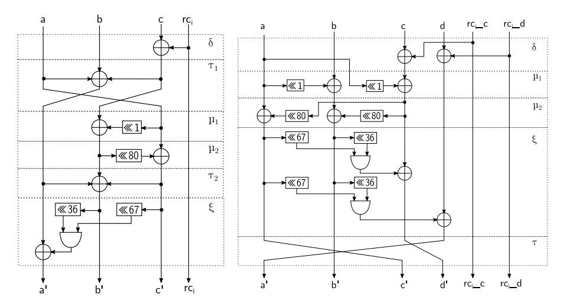
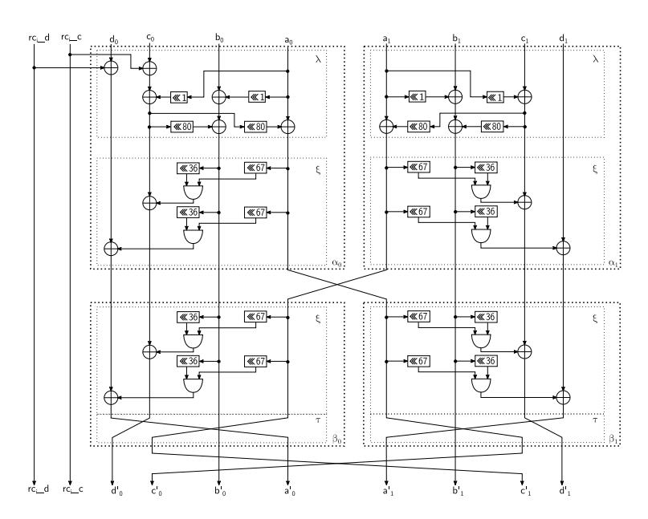
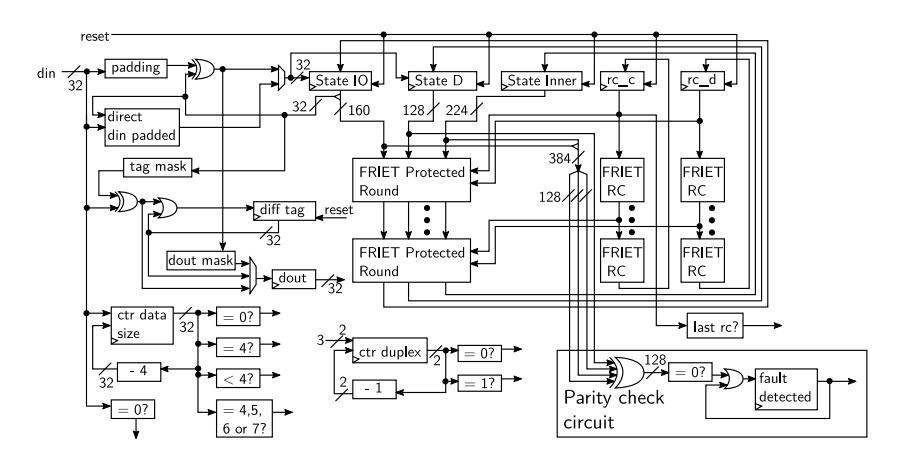
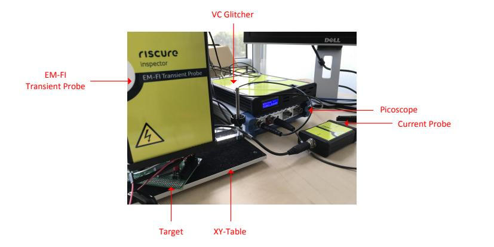
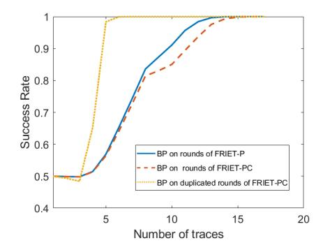

# Friet: an Authenticated Encryption Scheme with Built-in Fault Detection

Thierry Simon1,<sup>4</sup> , Lejla Batina<sup>1</sup> , Joan Daemen<sup>1</sup> , Vincent Grosso1,<sup>2</sup> , Pedro Maat Costa Massolino<sup>1</sup> , Kostas Papagiannopoulos1,<sup>5</sup> , Francesco Regazzoni<sup>3</sup> , and Niels Samwel<sup>1</sup>

<sup>1</sup> Digital Security Group, Radboud University {lejla,joan,P.Massolino,k.papagiannopoulos,n.samwel}@cs.ru.nl <sup>2</sup> CNRS/Univ. Lyon, Laboratoire Hubert Curien UMR 5516 vincent.grosso@univ-st-etienne.fr <sup>3</sup> ALaRI, University of Lugano regazzoni@alari.ch <sup>4</sup> STMicroelectronics thierry.simon.13@gmail.com <sup>5</sup> NXP Semiconductors Hamburg

Abstract. In this work we present a duplex-based authenticated encryption scheme Friet based on a new permutation called Friet-P. We designed Friet-P with a novel approach for cryptographic permutations and block ciphers that takes fault-attack resistance into account and that we introduce in this paper.

In this method, we build a permutation f<sup>C</sup> to be embedded in a larger one, f. First, we define f as a sequence of steps that all abide a chosen error-correcting code C, i.e., that map C-codewords to C-codewords. Then, we embed f<sup>C</sup> in f by first encoding its input to an element of C, applying f and then decoding back from C. This last step detects a fault when the output of f is not in C.

We motivate the design of the permutation we use in Friet and report on performance in soft- and hardware. We evaluate the fault-detection capabilities of the software and simulated hardware implementations with attacks. Finally, we perform a leakage evaluation.

Our code is available at <https://github.com/thisimon/Friet.git>.

Keywords: design of cryptographic primitives, fault injection countermeasures, side channel attack, lightweight implementations

# 1 Introduction

Our daily routine relies on bank and transportation cards, car keys, phones and other mobile and embedded devices. Many of these should consume little energy and their continuous shrinking puts firm constraints on area and memory size.

These devices may be exposed to side channel attacks that exploits physical leakage such as response time, power consumption or electromagnetic radiation to extract cryptographic keys or other secrets. Another vulnerability are fault injection attacks, where an attacker provokes faults in the cryptographic computation and uses the (faulty) outputs to recover the key. Side channel and fault injection attacks have led to an active research field where the main challenge is to come up with affordable and effective countermeasures.

The need for lightweight cryptography resistant to side channel and fault injection attacks has been partially addressed by the cryptographic community with many designs for (tweakable) block ciphers with small block sizes. The concept of building efficient (authenticated) encryption schemes from a cryptographic permutation such as proposed by the Bertoni et al. [\[7\]](#page-28-0) has led to the emergence of several lightweight solutions. Despite their larger width, the overhead for permutation-based modes is smaller than that of block cipher-based modes and the total solution often takes significantly less resources than a block cipher-based solution.

At the primitive level, side channel attack countermeasures have been taken into account by adopting a round function of algebraic degree 2, ideal for masking. This includes the Keccak-f permutation, Ascon [\[18\]](#page-28-1), Gimli [\[4\]](#page-27-0) and Xoodoo [\[13\]](#page-28-2).

#### 1.1 Related Work

Here we mention some related previous works that are proposing certain modifications to crypto algorithms to defend against side channel and fault attacks. Intra-Instruction Redundancy [\[24\]](#page-29-0) and Internal Redundancy Countermeasure [\[23\]](#page-28-3) are generic countermeasures that can be applied to any cipher and they imply interleaving k copies of the plaintext with some fixed data. While the method can detect up to k faults, it is also quite expensive.

Some other approaches aim at combining resistance against both fault and side channel attacks. Schneider et al. [\[29\]](#page-29-1) introduce a countermeasure for cryptographic hardware implementations that combines the concept of threshold implementation with an error detecting approach. Similarly to this, Reparaz et al. [\[27\]](#page-29-2) propose a countermeasure that claims security against higher-order SCA, multiple-shot DFA and also combined attacks.

Craft [\[3\]](#page-27-1) is a cipher designed to be used in conjunction with various linear codes which aims at implementations resistant against fault attacks. Craft differs from the approaches mentioned above because the technique is not applied to existing ciphers as an add-on, but takes into account fault attack resistance in the design phase.

Our approach goes one step further as we design a permutation for a specific linear code. This allows us to build the permutation from the most efficient step functions for that code, resulting in a very lightweight round function.

## 1.2 Our Contributions

The main contributions of this paper are our novel design method for ciphers with efficient fault-detecting implementations and the concrete authenticated encryption scheme Friet implemented with a new permutation Friet-P designed with our method. Moreover, we provide a design rationale for the permutation, performance evaluations in software and hardware including comparison with other relevant permutations, results of fault detection experiments and an evaluation of the impact of our method on leakage.

#### 1.3 Organization of this Paper

The remainder of paper is organized as follows. In Sect. 2 we explain our method. The new authenticated encryption scheme Friet is presented in Sect. 3 where we also discuss its properties and provide a security claim. The scheme is based on a permutation called Friet-P and its embedding Friet-PC that we present in Sect. 4. We provide rationale for the design choices in Friet-PC in Sect. 5. Sect. 6 reports on our implementation results. In Sect. 7 and Sect. 8 we present fault resistance and leakage evaluation results respectively. Sect. 9 concludes the paper and gives directions for future work.

# <span id="page-2-0"></span>2 Code-abiding Permutations

## 2.1 Permutations Abiding Some Error-detecting Code

A (block) code C with block length n and message length k, with k < n, represents k-symbol messages with n-symbol codewords. The symbols belong to an alphabet whose size is denoted by  $\alpha$ . The  $\alpha^k$  codewords form a subset of the set of all  $\alpha^n$  n-symbol vectors. With some abuse of notation, we denote the set of codewords by C. The Hamming distance between two codewords is the number of positions at which the corresponding symbols are different. The distance d of a code is the minimum of the Hamming distance over all pairs of its codewords. Often codes are characterized by their dimension parameters in the following notation:  $[n, k, d]_{\alpha}$ .

We can now define a code-abiding permutation.

**Definition 1.** A permutation f on the set of n-symbol vectors is code-abiding for code C if f(C) = C.

#### 2.2 Protecting Against Faults by Permutation Embedding

As each codeword represents a message word, f induces a permutation over the space of all k-symbol vectors. We denote this permutation by  $f_C$ . We can express  $f_C$  as the composition of three steps:  $f_C = \text{dec}_C \circ f \circ \text{enc}_C$  with  $\text{enc}_C$  encoding the k-symbol input as a n-symbol codeword in C and  $\text{dec}_C$  decoding the resulting n-symbol to a k-symbol output. We call  $f_C$  the embedding of f by C.

In general, the decoding  $\operatorname{dec}_C$  of the output of f to a k-symbol message word can fail: it only succeeds if the output of f is in C. It follows that if there is a fault in the computation of f, it is likely that decoding fails. As a matter of fact, the probability that a random fault is undetected is  $\alpha^{k-n}$ . Concretely, if f is g bits wider than f<sub>C</sub>, this probability is  $2^{-g}$ .

Hence, we can build a fault-resistant k-symbol permutation f<sup>C</sup> by choosing a code C, designing a permutation f that abides C and embedding f<sup>C</sup> in f by C. We call this design approach code embedding. Note that the datapath and key (or tweakey) schedule of block ciphers are also permutations and can therefore be designed with the code embedding approach.

# 2.3 Step Functions Abiding a Linear Code

The question is now: how do we choose a suitable code C and how do we define a permutation f that abides that code? The latter problem is the easier to break down: we define it as the iteration of a round function that abides C. That round function can in turn be defined as a sequence of steps that abide C.

We target permutations that can be efficiently implemented in hardware and in software using bitwise Boolean instructions and (cyclic) shifts. With this in mind, we target codes that are linear over GF(2). In a linear [n, k, d]2-code, a codeword satisfies n − k linear binary equations, the so-called parity equations. Encoding simply consists in taking the k-bit message and appending n − k bits so that the result satisfies the parity equations. We call the appended bits the parity bits. Decoding consists in verifying whether the n-bit vector satisfies the parity equations and if so, truncating to the first k bits. If the parity equations are not satisfied, decoding will return an error message.

We consider permutations having a state of b bits. To allow some flexibility in our choice of step functions, we apply a small code in parallel to parts of the state. We call those parts slices. Each slice is n bits wide and has n − k bits of redundancy, i.e., its bits satisfy the n − k parity equations. We denote the first k bits of a slice as its native part and its last n − k bits as the parity part. We index the slices by j from 0 to b/n − 1 and denote their number b/n by `, typically a power of two. Orthogonal to the slices, we partition the state in n equally sized limbs. A limb is an array of ` bits that are indexed by j from 0 to ` − 1. In short, we arrange the b bits of the state in a two-dimensional array consisting of n limbs by ` slices. As a consequence, we call the first k limbs the native ones and the last n − k limbs the parity ones.

We propose two types of step functions for the round function:

limb adaptation This modifies a native limb, say with index j, by bitwise adding to it a function φ of the state. It also adds the function φ to each parity limb that depends on native limb j. This is code-abiding as each parity equation remains satisfied. This operation is not inherently invertible and care must be taken in the function φ and the part of the state it operates on. For fault detection it is important to freshly compute φ for every adapted limb. Indeed, if φ would be computed once for all adapted limbs, one fault in its computation could lead to an incorrect output that decodes successfully.

limb transposition This is a re-ordering of the limbs, with a possible correcting adaptation to leave the parity equations invariant. We distinguish between native and non-native limb transpositions. In the former case, two native limbs swap and in the latter a native limb swaps places with a parity limb. In many implementations, swapping two limbs as such has no cost: in software it can be dealt with at indexing level, in a combinatorial circuit in dedicated hardware, it is merely re-wiring. The correcting adaptation depends on the code C and the indices of the limbs being swapped. Typically, this cost is lower than the cost of a limb adaptation. For the simple code used in our permutation Friet-P there is no correcting adaptation and in Appendix [A,](#page-29-3) we give an example of a limb transposition that costs an additional bitwise limb addition.

A round function of a modern cipher consists of four types of operations. Each of these can be implemented with our two types of step functions:

- non-linearity, as in AES SubBytes [\[15\]](#page-28-4), with limb adaptation with a nonlinear function φ,
- mixing, as in AES MixColumns, with limb adaptation with a linear function φ and a non-native limb transposition,
- shuffling, as in ShiftRows, with native limb transposition,
- round constant (or key) addition, as in AES AddRoundKey, with limb adaptation where φ consists of a mere round constant or key.

# 2.4 Fault Detection Capacity of Code-abiding permutations

The protection offered by code embedding is that faults in the computation of the permutation are likely to lead to a decoding error. A decoding error implies that a fault occurred, but the converse is not necessarily true. If faults lead to an incorrect output that decodes successfully, we speak of undetected faults.

In order to analyze more precisely the fault detection capacity of code-abiding permutations, we use a single-limb fault model. A single-limb fault, also simply called single fault, is a fault that modifies the value of only one limb. If implemented correctly, a single fault in the computation of a code-abiding permutation is guaranteed to give a decoding error. To establish this, we analyze what happens when single faults are injected in a limb adaptation and transposition.

A limb transposition either involves no computation at all or a correcting adaptation. In the latter case a single fault would only modify the value of one parity limb, while leaving the native limbs unchanged. The corresponding parity equation would then be not satisfied and decoding would fail.

In a limb adaptation, fresh computations of φ are added to a native limb and one or more parity limbs. If the input of the limb adaptation is correct, it can only lead to an incorrect output that decodes successfully if at least d limbs are computed incorrectly, i.e. in the presence of d single faults, with d the distance of the code. At first sight, this is an argument for taking C with high distance d. However, this comes at a computational cost: limb adaptation adapts a single native limb at a cost that is a d-fold of that.

So far, we have only treated the case of a single step starting from a correct state. However, faults may be injected in different steps. As a fault in a single limb may, and typically will, propagate to other limbs, in principle a fault may be compensated by another fault some steps later and result in an erroneous state that decodes successfully. To prevent this, one may do intermediate checks of the parity equations in between the steps. However, the fault will typically propagate in a hard to predict way and compensating a fault becomes harder and harder as computation continues. This makes it an uninteresting attack path and we believe that intermediate parity checks are not worth their cost. Therefore, we think that a single parity check at the end of the permutation gives the best tradeoff between performances and fault detection.

Besides single faults, there are other types of faults that are not covered by the code embedding and must be countered with other means. For example, skipping a full step, round or number of rounds, will not lead to unsuccessful decoding. Another example are faults in the decoding operation itself, e.g., just faulting the reporting of the outcome from false to true. Clearly, implementations must have some redundancy in the control flow logic for the handling of the steps and the decoding operation. For an implementation to offer resistance against fault attacks, it must additionally have mechanisms to detect such faults.

A recently introduced type of fault attack, coined statistical ineffective fault attacks (SIFA) [\[17\]](#page-28-5), can retrieve secrets even in the presence of fault checks. Here, one inject faults in repeated computations and the only information the attacker needs is the knowledge whether a fault occurred or not. Clearly, in the presence of a fault detection countermeasure such as code embedding, this information is available to the attacker. Using SIFA one can determine (secret) bits of the state if the probability that a fault occurs depends on their value. The simplest example is a fault in the computation of a multiplication in GF(2), say c = a · b with a, b and c bits. Let us assume the adversary can inject faults in a. These faults will propagate to c if and only if b = 1. Such an attack would require knowledge of implementation details and on top of that the accurate injection of single-bit fault in a. However, using statistical techniques one can relax the latter requirement at the cost of more fault attempts. In Section [5.6](#page-19-0) we present an architecture for a specific permutation that results in resistance against SIFA.

#### 2.5 Our Approach: the Parity Check Code

Due to the fact that the computation cost of limb adaptation grows linearly with the distance of the code, we choose for the simple parity check code [n, n−1, 2]2. This code has a single parity limb that is the sum of all n − 1 native limbs.

Adopting such a code simplifies limb adaptation and transpositions as follows:

- Limb adaptation modifies a limb and the parity limb. Its computation cost is twice as large as if it was computed on the native state alone.
- None of the n! possible limb transpositions requires a correcting adaptation, as all limbs are in the (single) parity equation. Paradoxically, as a nonnative limb transposition on the parity check code has no computation cost, it is cheaper to compute it than do the equivalent embedded mapping that requires n − 2 bitwise limb additions.

The primary goal of our approach is the guaranteed detection of any single-limb fault in the computation. The secondary goal is that it should be hard to enforce two or more compensating faults in the computation or in the registers. The easiest attack on limb adaptation would be to inject two compensating faults in the two  $\phi$  computations. In this respect it is a good idea in software implementations to use different computation sequences and/or different registers so that the attacker has to induce two different faults for them to be compensating. For the same reason, in dedicated hardware implementations one shall not use the same combinatorial circuit for both  $\phi$ . Instead of attacking the computation, an attacker could attack the registers and inject compensating faults on two limbs. To be successful, such attacks would require knowledge of the implementation details and the ability to inject faults very precisely.

The parity check code offers fault detection capabilities that are close to duplication. It detects any single-limb fault instead of any single fault, but not multiple faults. On the other hand, it can be implemented much more efficiently thanks to the cheap limb transpositions and uses less memory, since the state size increases only by 1/(n-1) instead of 2.

# <span id="page-6-0"></span>3 The Authenticated Encryption Scheme Friet

We showcase the practicality of code embedding with a lightweight authenticated encryption (AE) scheme, called Friet. It is permutation-based and uses SpongeWrap [7], a mode on top of the duplex [7] construction, similar to CAE-SAR candidate Ketje [8] NIST lightweight competition submissions Ascon [18], Gimli [4] and Xoodyak [11].

The permutation underlying our AE scheme is called FRIET-PC and it is the result of embedding a code on a permutation FRIET-P. We do not see FRIET (and FRIET-P) as the ultimate fault-attack resistant design but rather as a proof of concept, quite competitive with modern AE schemes (and permutations).

In this section we specify the mode and provide its security claim.

## 3.1 The Permutation AE Mode SpongeWrap

We adopt the AE mode proposed in the paper that introduced the duplex construction and its modes [7], namely SpongeWrap. SpongeWrap has the nice property that it supports AE in sessions. A session AE scheme converts sequences of messages, each consisting of (optional) associated data AD and plaintext P, both bit strings of arbitrary length, into a sequences of cryptograms, each consisting of possible associated data, ciphertext C (the enciphered plaintext) and a tag T. The session aspect is related to the tag T: this is not only computed on the associated data and ciphertext of its own cryptogram, but the full sequence of cryptograms that were generated since the start of the session. In other words, a session AE scheme is stateful. One can see session AE as support for intermediate tags.

```
Algorithm 1 SpongeWrap[f, ρ, τ ], with permutation f, block length ρ and tag
length τ .
```

```
Interface: T ← start(K, D)
  s ← 0
        ∗
         (State s is a persistent data element during the session)
  absorb(K, none)
  absorb(D, encrypt)
  T ← squeeze(τ )
  return T
Interface: (C, T) ← wrap(AD, P)
  absorb(AD, none)
  C ← absorb(P, encrypt)
  T ← squeeze(τ )
  return (C, T)
Interface: P ← unwrap(AD, C, T)
  absorb(AD, none)
  P ← absorb(C, decrypt)
  T
   0 ← squeeze(τ )
  if (T
       0
        6= T) then return error
  return P
Internal interface: Y ← absorb(X, op) with op ∈ {none, encrypt, decrypt}
  Let x[n] be X split in ρ-bit blocks, with n > 0 and last block possibly shorter
  Y ← 
  for all blocks of x[n] do
     if (op = none) then b ← 0 else b ← 1
     if (this is the last block) then b ← b + 1
     if op = decrypt then
         temp ← x[i] + (s truncated to |x[i]|)
         Y ← Y ktemp
         duplex(tempkb)
     else if op = encrypt then
         temp ← x[i] + (s truncated to |x[i]|)
         Y ← Y ktemp
         duplex(x[i]kb)
     else
         duplex(x[i]kb)
  return Y
Internal interface: Z ← squeeze(`) with ` the requested length of the output Z
  Z ← 
  while |Z| < ` do
     Z ← Zk(s truncated to ρ bits)
     duplex(0)
  return Z truncated to ` bits
Internal interface: duplex(σ) with |σ| ≤ ρ
  s ← s + σk1k0
                ∗
  s ← f(s)
```

We do not take SpongeWrap [\[7\]](#page-28-0) as such, but make three minor modifications. First, in the session startup we absorb a dedicated non-secret diversifier D that should be a nonce for sessions started with the same key K. Second, we have the session startup return a tag. Third, we allow for tag lengths longer than the sponge rate. We specify the SpongeWrap mode, with the duplex construction integrated, in Algorithm [1.](#page-7-0) Here, all parameters are arbitrary-length bit strings with |X| denoting the length of a string X in bits.

SpongeWrap has a b-bit state, with b the width of the underlying permutation f. It has a block length ρ and all input strings are first split up into ρ-bit blocks, with the last block possibly shorter. Before a block is absorbed in the state, SpongeWrap appends a domain separation bit to indicate whether the next output will be used as keystream (1) or as tag or not at all (0). Then the block is padded with a single 1 followed by zeroes. The so-called duplex rate r is the size of the part of the state that is directly affected by absorbing, the outer part. Due to the domain separation bit and the first bit of the padding, we have r = ρ + 2. The remaining part of the state is called the inner part and its size is called the capacity c. We have c = b − r = b − ρ − 2.

The encryption of a message simply consists of splitting AD and P in blocks, padding each block, adding it to the state s and performing the permutation f. Concurrently, each plaintext block is encrypted by bitwise adding to it the outer part of the state at that point. Finally, SpongeWrap squeezes the tag T from the state with a (number of) duplex call(s). Decryption is very similar. After a message has been encrypted or decrypted, one can continue the session with more messages.

The state is initialized by absorbing first the key K and then the diversifier D. For confidentiality the couple (K, D) must be unique per session.

Because it uses the duplex construction, SpongeWrap lends itself quite well to the use of a code-embedded permutation f<sup>C</sup> . Actually, we just have to instantiate duplex with the code-abiding permutation f and make some minor modifications:

- The state initialization must set the state to the codeword that encodes the all-0 vector. For linear codes, this is just the all-0 vector.
- When absorbing σ, it must first be converted to a valid codeword. If σ is one limb (as it turn out in Friet-PC), it suffices to (bitwise) add it to one limb and the parity limbs that depend on it.
- Before using the outer part of the state as tag or keystream, one must check whether the state is a valid codeword and return an error if not.

## 3.2 Exposure of Friet to Cryptanalysis and Side Channel Attacks

During a session, the outer state serves for in- and output and the inner state remains secret. A feature setting duplex apart from block cipher modes is the absence of a fixed key during operation. The state does depend on the key K, but evolves. Doing statistical (side channel) attacks, such as differential and linear cryptanalysis or DPA, require starting many sessions. If diversifier uniqueness is respected, these attacks are limited to absorbing of the diversifier D.

In typical use cases, Friet would secure communication between devices that may both be accessible to attackers, such as IoT devices. We assume the two devices share a secret key K and can keep track of a session counter that serves as diversifier when a new session needs to be started. Whenever a session is started, one device (master) initiates the session and determines the session counter D and the other device (slave) follows and just must accept the session counter D. Consequently, the slave can be forced in starting a session multiple times with the same diversifier D. The slave can only be sure the session request comes from a valid device when verifying the session startup tag. If this tag is invalid, it can be a part of a denial of service attack, a statistical attack, or just corrupt due to a noisy communication channel. One typically offers protection against such attacks by having the slave keep track of two counters. The first of these two is the session counter and the slave only accepts session startup requests that have a higher session counter than any previously successful session. The second is a session retry counter. A successful session startup increments the session counter by 1 and resets the session retry counter to 0. An unsuccessful session startup just increments the session retry counter. If the session retry counter reaches some limit, the slave device refuses to use the key any longer. This limit shall be set to a value small enough to prevent an adversary to collect enough traces to conduct a statistical attack but large enough to still keep the session robust in the presence of noise communication.

Another attack vector on the slave device is a fault attack. In such an attack, an adversary forces a slave to start multiple sessions with the same diversifier D and injects faults in at least one of it. She can then mount a differential fault attacks to extract information about the secret inner state from a single faultless output and faulted ones. This is where our fault detection capability comes in. As soon as the slave device detects a fault, it will immediately abort the computation and with that the session.

## 3.3 Dimension Parameters and Security Claim for Friet

The permutation in Friet is called Friet-PC and it has a width b of 384 bits, similar to the permutations Gimli [\[4\]](#page-27-0) and Xoodoo [\[13\]](#page-28-2).

A bound for the resistance of the keyed duplex construction against generic attacks was proven in [\[14\]](#page-28-8) and it is mostly determined by the capacity c, the length of the key k = |K| and the ability of an attacker to manipulate inputs.

Without access restrictions, and assuming c > r, the advantage of an attacker to distinguish the output of m keyed duplex instances from random bits, assuming the underlying permutation is randomly chosen, can be simplified to:

<span id="page-9-0"></span>
$$\frac{mN}{2^k} + \frac{MN}{2^c} \ , \tag{1}$$

with N the computational complexity and M the data complexity, expressed in the number of executions of Friet-PC, respectively offline and online.

From this advantage and the tag length τ , the integrity and confidentiality security of SpongeWrap built on top of this duplex object follows immediately:

- Integrity is determined by forgery attacks, where forgery is the successful decryption of a cryptogram by a slave where the cryptogram was not created by the master. For generic attacks, this is upper bounded by (1) plus  $q2^{-\tau}$  where q is the number of forgery attempts.
- Confidentiality is broken if keystream, i.e., keyed duplex output, can be predicted or successful decryption of a cryptogram by a slave where the cryptogram was not created by the master can be performed. For generic attacks, this is the same bound as for forgery.

In FRIET we choose a block length  $\rho=128$ , implying a rate  $r=\rho+2=130$  and a capacity c=b-r=254. We limit the key length to  $k\geq 160$  and take as tag length  $\tau=128$ . If we would assume that the underlying permutation FRIET-PC would be strong enough so that there are no attacks better than generic ones, we could just take as as security claim (1) plus  $q2^{-\tau}$ . We take some safety margin by using in our claim a smaller value for the parameter c, namely c=192.

Claim. The success probability of forgery or breaking confidentiality of FRIET is upper bounded by:

$$\frac{mN}{2^k} + \frac{MN}{2^{192}} + \frac{q}{2^{128}} \ ,$$

with m the number of instances under attack, N the computational complexity, M the data complexity, q the number of decryption attempts and k ( $\leq$  160) the key length. We assume independent and uniformly random k-bit keys.

Clearly, this is a claim for 128-bit security. In our claim we assume that the adversary respects the nonce requirement for the diversifier and does not get access to deciphered ciphertext of cryptograms with an invalid tag.

#### 3.4 Rationale for the Mode and Dimensions

After the publication of SpongeWrap, many variants were published with each specific advantages We opted for a slight SpongeWrap variant with large capacity for the following reasons. First, the bounds obtained in the security proofs assume ideal permutations and there may be better attacks that exploit specific properties of the permutation. The difference between claim capacity 192 and actual FRIET capacity 254 leaves safety margin. Second, in the duplex construction side channel leakage can be modeled as an increase of rate and hence a reduction of capacity. Also here this margin is advantageous.

# <span id="page-10-0"></span>4 Specification of the Permutations Friet-PC and Friet-P

In this section, we specify FRIET-P, the permutation implemented in FRIET. Besides, we specify FRIET-PC, its embedding by the linear code [4, 3, 2]<sub>2</sub> with parity bit the sum of the 3 native bits. As the propagation properties of FRIET-PC are most relevant, we introduce FRIET-PC first and FRIET-P second.

#### 4.1 The Permutation Friet-PC

FRIET-PC has width 384 and has a round function  $R_i$  operating on three limbs denoted as a, b and c. We index the bits of a limb by i ranging from 0 to 127. Limb a and the bits of limb b with indices 0 and 1 form the outer part. The nominal number of rounds is 24 and the round function  $R_i$  has 6 steps:

- two non-native limb transpositions  $\tau_1$  and  $\tau_2$ ,
- a round constant addition  $\delta_i$  that is a limb adaptation,
- $\bullet$  two mixing steps  $\mu_1$  and  $\mu_2$  that are limb adaptations,
- a non-linear step  $\xi$ , also a limb adaptation.

We specify the Friet-PC permutation in Algorithm 2 using following notation:

- $x \oplus y$ , the exclusive or (XOR) of limbs x and y,
- $x \wedge y$ , the bitwise logical AND of limbs x and y,
- $x \ll n$ , the cyclic shift to the left by offset n of limb x. We assume the bits with low indices at the right, so if  $y \leftarrow x \ll n$ , then  $y_n = x_0$

The round constants are in Table 1 and the FRIET-PC round function Figure 1.

# Algorithm 2 FRIET-PC

```
Input: a, b, c \in \{0, 1\}^{128}
Output: (a', b', c') \leftarrow \text{Friet-PC}(a, b, c)
for Round index i from 0 to 23 do
(a, b, c) \leftarrow \text{R}_i(a, b, c)
return (a, b, c)
```

Here  $R_i$  is specified by the following sequence of steps:

```
\begin{array}{lll} c & \leftarrow c \oplus \mathrm{rc}_i & \delta_i \\ (a,b,c) \leftarrow (a \oplus b \oplus c,c,a) & \tau_1 \\ b & \leftarrow b \oplus (c \lll 1) & \mu_1 \\ c & \leftarrow c \oplus (b \lll 80) & \mu_2 \\ (a,b,c) \leftarrow (a,a \oplus b \oplus c,c) & \tau_2 \\ a & \leftarrow a \oplus ((b \lll 36) \wedge (c \lll 67)) & \xi \end{array}
```

<span id="page-11-1"></span>**Table 1.** Round constants  $rc_i$  in hexadecimal notation, omitting the leading zero digits

| i | $\mathrm{rc}_i$ | i | $\mathrm{rc}_i$ | i  | $\mathrm{rc}_i$ | i  | $\mathrm{rc}_i$ | i  | $\mathrm{rc}_i$ | i  | $\mathrm{rc}_i$ |
|---|-----------------|---|-----------------|----|-----------------|----|-----------------|----|-----------------|----|-----------------|
| 0 | 1111            | 4 | 101             | 8  | 1001            | 12 | 1               | 16 | 1110            | 20 | 1011            |
| 1 | 11100000        | 5 | 10110000        | 9  | 100000          | 13 | 110000          | 17 | 11010000        | 21 | 1100000         |
| 2 | 1101            | 6 | 110             | 10 | 100             | 14 | 111             | 18 | 1010            | 22 | 1100            |
| 3 | 10100000        | 7 | 11000000        | 11 | 10000000        | 15 | 11110000        | 19 | 1010000         | 23 | 10010000        |



Fig. 1. Round of FRIET-PC

<span id="page-12-1"></span><span id="page-12-0"></span>Fig. 2. Round of FRIET-P

## 4.2 The Round Function of Code-abiding Permutation Friet-P

We build a code-abiding permutation FRIET-P such that its embedding by the parity code  $[4,3,2]_2$  is FRIET-PC. FRIET-P has width 512, i.e., 4 limbs.

We denote the parity limb d and after any step the parity equation  $d=a\oplus b\oplus c$  should be satisfied. It is now straightforward to derive the round function of FRIET-P from the round specification in Algorithm 2 by substituting  $(a\oplus b\oplus c)$  by d in limb transpositions steps and duplicating all limb adaptations in d. This results in:

$$\begin{array}{lll} c \leftarrow c \oplus \operatorname{rc}_i & d \leftarrow d \oplus \operatorname{rc}_i & \delta_i \\ (a,b,c,d) \leftarrow (d,c,a,b) & \tau_1 \\ b \leftarrow b \oplus (c \lll 1) & d \leftarrow d \oplus (c \lll 1) & \mu_1 \\ c \leftarrow c \oplus (b \lll 80) & d \leftarrow d \oplus (b \lll 80) & \mu_2 \\ (a,b,c,d) \leftarrow (a,d,c,b) & \tau_2 \\ a \leftarrow a \oplus ((b \lll 36) \wedge (c \lll 67)) & d \leftarrow d \oplus ((b \lll 36) \wedge (c \lll 67)) & \xi \end{array}$$

We transfer limb transpositions  $\tau_1$  and  $\tau_2$  to the end and merge them, yielding:

$$\begin{array}{lll} c \leftarrow c \oplus \mathrm{rc}_i & d \leftarrow d \oplus \mathrm{rc}_i & \delta_i \\ b \leftarrow b \oplus (a \lll 1) & c \leftarrow c \oplus (a \lll 1) & \mu_1 \\ a \leftarrow a \oplus (c \lll 80) & b \leftarrow b \oplus (c \lll 80) & \mu_2 \\ c \leftarrow c \oplus ((a \lll 67) \wedge (b \lll 36)) & d \leftarrow d \oplus ((a \lll 67) \wedge (b \lll 36)) & \xi \\ (a, b, c, d) \leftarrow (d, b, a, c) & \tau \end{array}$$

This sequence of steps is depicted in Figure 2 of the FRIET-P round function.

## <span id="page-13-0"></span>5 Design Rationale of Friet-PC

An earlier version of the Friet-PC permutation, called Frit appeared on eprint in a paper by the same authors as this one [30]. This was soon followed by attacks exploiting weaknesses of Frit in the form of slow increase of algebraic degree through the rounds, by Dobraunig et al. [19]. While these attacks did not assume the target use case of authenticated encryption in a duplex-based mode, an attack that was published somewhat later by Qin et al. did [25]. The Friet-PC permutation has been designed taking into account these attacks. In this section, we give a rationale for the design choices in Friet-PC: its structure, number of rounds, shift offsets and round constants. For the concrete choice of the step functions and their order, we considered the following propagation properties of iteration of the round function in forward and backward direction:

- increase in algebraic degree,
- diffusion properties: full diffusion and (strict) avalanche criterion ((S)AC),
- existence of exploitable invariants.

The non-native limb transpositions  $\tau_1$  and  $\tau_2$  are attractive, requiring no computation in FRIET-P while still achieving intra-slice mixing. Additionally,  $\tau_1$  shuffles the limbs between the rounds. To complement this, a very simple way to obtain mixing between slices consist in bitwise adding (XOR) to a limb the cyclic shift of another, as done by mixing steps  $\mu_1$  and  $\mu_2$ . The simplest invertible non-linear function is the addition to a limb of the bitwise multiplication (AND) of two limbs. To avoid destructive intra-slice interaction with the limb transposition steps, we opted for integrating cyclic shifts in  $\xi$ . Finally, round constant addition  $\delta_i$  breaks the shift-invariance of the round function.

Furthermore, all steps of the round function except  $\tau_1$  are involutions. As a consequence, the inverse round function is  $\delta_i \circ \tau_1^{-1} \circ \mu_1 \circ \mu_2 \circ \tau_2 \circ \xi$ . The similarity with the forward round function simplifies the analysis of the diffusion and algebraic properties of FRIET-PC in the backward direction.

We see Friet-PC as a permutation dedicated for use in Friet and hence its propagation analysis shall be seen in that light. Namely, an adversary does not have full access to the input and output of the Friet-PC permutation in Friet. She can only apply chosen or known inputs to the outer state and observe the outer part of the state at the output of Friet-PC. For the input, in most attack scenario's the full input is secret and the adversary can only add (bitwise) a known or chosen value to the outer part of the state. If the implementation permits, the adversary can do this repeatedly for the same state and conduct statistical attacks or apply higher order differential techniques such as cube attacks [16]. In any case, she is limited to inject only r=130 bits to the state or extract only 128 bits from it. Moreover, if the implementation of Friet imposes that diversifier uniqueness is respected and does not release deciphered ciphertext prior to tag validation, the adversary's access is even much less. In our analysis we have anticipated the worst case.

## 5.1 Algebraic Degree

Permutations with low algebraic degree are vulnerable to attacks that make use of higher order differentials, such as cube attacks [16]. Therefore, it is important to verify that the algebraic degree of FRIET-PC and its inverse is not too small.

Let f(r, x, i) be the Boolean function defined by the restriction of r rounds of FRIET-PC to output bit  $x_i$ , where  $x \in \{a, b, c\}$  denotes the limb. This output bit can be expressed as a polynomial over  $\mathbb{F}_2$  in the input bits of f(r, x, i), which is the algebraic normal form (ANF) of the boolean function. The algebraic degree of f(r, x, i) is defined as the degree of its ANF. Similarly, we define  $f_{inv}(r, x, i)$  for r inverse rounds of FRIET-PC. We will study the algebraic degree of these Boolean functions in terms of the number of rounds r.

Both the round function and its inverse have algebraic degree 2. Hence the functions f(r, x, i) and  $f_{inv}(r, x, i)$  can have at most degree  $2^r$ . Since limbs b and c are not modified by the linear operation  $\xi$  in the last round of the round-reduced FRIET-PC, f(r, b, i) and f(r, c, i) can be further bounded by  $2^{r-1}$ . Moreover, as the round function is invertible, the maximum degree, irrespective of r, is 383.

These are just upper bounds and the actual algebraic degrees of f(r,x,i) and  $f_{inv}(r,x,i)$  can be lower. Indeed, the structure of the round function does not exclude possible cancellations in the terms of high degrees. The occurrence of such cancellations depends on the values of the cyclic offsets. If the resulting algebraic degree after  $24 - \epsilon$  rounds is well below 130, then FRIET may be vulnerable to cube attacks. Here  $\epsilon$  accounts for the 1 or possibly 2 rounds that may be skipped by carefully choosing the cube variables as in [31]. This is what happened in our previous design and was exploited in [19] and [25].

To avoid that, we verified that the theoretical upper bound on the degree for FRIET-PC and its inverse was satisfied up to 4 rounds by finding maximum degree monomials for all bit positions. For 5 rounds, we identified monomials of degree 32 for f(5, a, 0) and  $f_{inv}(5, a, 0)$  given respectively by

 $b_9b_{10}b_{12}b_{26}b_{27}b_{29}b_{40}b_{57}b_{59}b_{76}b_{77}b_{89}b_{106}b_{107}b_{110}b_{127}c_{16}c_{26}c_{27}c_{29}c_{43}c_{44}c_{46}c_{57}c_{74}c_{76}c_{93}c_{94}c_{106}c_{123}c_{124}c_{127}\ ,$   $b_0b_{27}b_{28}b_{29}b_{30}b_{45}b_{187}b_{59}b_{77}b_{78}b_{79}b_{106}b_{109}b_{123}b_{124}b_{125}c_{14}c_{28}c_{44}c_{46}c_{47}c_{48}c_{75}c_{78}c_{92}c_{93}c_{94}c_{97}c_{124}c_{125}c_{126}c_{127}\ .$ 

We conclude from this analysis that it is extremely unlikely that FRIET is vulnerable to attacks using higher order differentials.

## 5.2 Diffusion Analysis

A property that is very informative about the vulnerability of a cryptographic primitive against structural distinguishers such as impossible differentials, integral cryptanalysis or truncated differentials is diffusion. We say a cryptographic permutation achieves  $full\ diffusion$  if every output bit depends on every input bit. Often one takes the rule of thumb that a permutation achieving full diffusion in r rounds is unlikely to have exploitable structural distinguishers covering more than 2r rounds. We evaluated FRIET-PC with respect to 3 avalanche-related diffusion metrics introduced in [13] by Daemen  $et\ al.$ 

Let  $T: \mathbb{F}_2^b \to \mathbb{F}_2^b$  be a cryptographic primitive and  $\Delta$  be an input difference of Hamming weight 1. Daemen *et al.* define the *avalanche probability vector*  $P_{\Delta T}$ 

as the vector where component i is the probability that bit i of the output of T flips due to input difference  $\Delta$ . They then propose the three following metrics:

Avalanche dependence Number of output bits that may flip due to  $\Delta$ :

$$D_{\mathrm{av}}(T, \Delta) = b - \sum_{i=0}^{b-1} \delta(P_{\Delta T}[i]),$$

with  $\delta(x)=1$  if x=0 and 0 otherwise. Full diffusion means  $D_{\rm av}(T,\Delta)=b$  for all choices of  $\Delta$ .

**Avalanche weight** Expected number of bits that flip due to  $\Delta$ :

$$\overline{w}_{\mathrm{av}}(T,\Delta) = \sum_{i=0}^{n-1} P_{\Delta T}[i].$$

AC is satisfied if  $\overline{w}_{\rm av}(T,\Delta)\approx b/2$  for all choices of  $\Delta$ .

**Avalanche entropy** The uncertainty about whether output bits flip due to input difference  $\Delta$ :

$$H_{\text{av}}(T, \Delta) = \sum_{i=0}^{n-1} (-P_{\Delta T}[i] \log_2(P_{\Delta T}[i]) - (1 - P_{\Delta T}[i]) \log_2(1 - P_{\Delta T}[i])).$$

SAC is satisfied if  $H_{\rm av}(T,\Delta)\approx b$  for all choices of  $\Delta$ .

Table 2 reports on the diffusion performance of round-reduced FRIET-PC and its inverse. We generated the avalanche probability vectors for these results from 250 000 random samples. We evaluated each metric on all 384 input differences  $\Delta$  of Hamming weight 1 and, as is done for XOODOO in [13], we report on the worst-case values. From the table, one can observe that 8 rounds are needed for FRIET-PC and its inverse to exhibit the same behaviour as a random 384-bit permutation with respect to the three metrics, i.e.  $D_{\rm av}(T,\Delta)=384,\,\overline{w}_{\rm av}(T,\Delta)\approx 192$  and  $H_{\rm av}(T,\Delta)\approx 384.$  Note moreover that 7 rounds are enough to achieve full diffusion in the forward direction and 6 rounds in the inverse direction. This suggests that it will be very hard to find structural distinguishers over more than 14 rounds. Moreover, in FRIET the adversary has only access to 1/3 of the permutation's input and output greatly limiting the degrees of freedom when trying to exploit such distinguishers.

#### 5.3 Invariant Attack

All round function steps except  $\delta_i$  act uniformly on the limbs of the state. Let F be the round function with the round constant addition step  $\delta_i$  removed. We observe that F satisfies the shift-invariance  $F \circ \rho_k = \rho_k \circ F$ , with  $k \in \{0, \dots, 127\}$  and where  $\rho_k(a, b, c) = (a \ll k, b \ll k, c \ll k)$ . The addition of round constants in step  $\delta_i$  breaks these symmetries in the round function of FRIET-PC.

Table 2. Diffusion results

<span id="page-16-0"></span>

|            | Round | 0 | 1 | 2  | 3  | 4   | 5   | 6   | 7                                               | 8   |
|------------|-------|---|---|----|----|-----|-----|-----|-------------------------------------------------|-----|
|            | Dav   | 1 | 3 | 18 | 79 | 211 | 350 | 383 | 384                                             | 384 |
| Friet-PC   | wav   |   |   |    |    |     |     |     | 1.0 2.5 10.5 33.1 75.5 128.7 174.8 189.6 191.8  |     |
|            | Hav   |   |   |    |    |     |     |     | 0.0 1.0 12.2 62.2 161.7 298.0 374.3 383.7 384.0 |     |
|            | Dav   | 1 | 5 | 27 | 91 | 210 | 342 | 384 | 384                                             | 384 |
| Friet-PC−1 | wav   |   |   |    |    |     |     |     | 1.0 5.0 18.0 45.2 90.2 150.7 184.6 191.6 191.9  |     |
|            | Hav   |   |   |    |    |     |     |     | 0.0 0.0 18.0 71.0 175.3 304.1 378.6 384.0 384.0 |     |

Additionally, properly chosen round constants can defeat invariant attacks, including slide attacks, invariant subspace attacks and non-linear invariant attacks. As observed by Beierle et al. [\[2\]](#page-27-2), both invariant subspace attacks and non-linear invariant attacks use a non-trivial invariant subspace of the linear layer. More formally, if we denote by λ the linear layer without the round constant addition and by D the set containing the bitwise differences (XOR) of the round constants, then the attacks require the existence of a non-trivial subspace V<sup>D</sup> of F b 2 such that D ⊂ V<sup>D</sup> and λ(VD) ⊂ VD.

In the case of Friet-P, we generated a sequence (un)n∈<sup>N</sup> of 4-bit values from a Fibonacci linear-feedback shift register with polynomial 1 + x + x <sup>4</sup> and initial state u<sup>0</sup> = 0b1111. The round constant rc<sup>i</sup> at round i is then obtained by setting its bits at indices 0, 4, 8 and 12 according to u<sup>i</sup> if i is even and at indices 16, 18, 20 and 24 if i is odd. This particular choice allows for a very efficient bit-interleaved implementation of the round constant addition in software.

We verified with a simple SageMath [\[32\]](#page-29-7) script that the smallest invariant subspace containing D is of maximal dimension, i.e., it equals the state space F 384 2 , a trivial invariant space. Remarkably, this holds true when the set D is reduced to the single difference between the two first round constants.

## 5.4 Choosing Shift Offsets

The round function has 4 shift offsets: One in each of µ<sup>1</sup> and µ<sup>2</sup> and two in ξ. With some abuse of notation we denote the shift offsets by µ1, µ2, ξ<sup>1</sup> and ξ2. Because of Friet-PC's shift invariance, we can fix µ<sup>1</sup> to 1 without loss of generality. Moreover, we can also choose ξ<sup>1</sup> < ξ<sup>2</sup> to reduce the number of possible 4-tuples to 2<sup>20</sup>. In order to choose the 4 offsets, we ranked all possible 4-tuples following the avalanche dependence metric.

Testing all these offset combinations, we found that the best ones reach full diffusion after 6 rounds. From those we selected the one reaching degree 16 after 4 rounds, both forwards and backwards, with the best worst-case diffusion after 5 rounds. This gave the offset tuple (µ1, µ2, ξ1, ξ2) = (1, 80, 36, 67) that we finally used in the Friet-P round function.

#### 5.5 Analysis of Differential and Linear Propagation

We conducted a couple of experiments to study the differential propagation and linear propagation in Friet-PC. Concretely, we searched for low-weight trails on round-reduced Friet-PC.

We first remind the reader of what differential and linear trails are, then characterize the differential and linear propagation through the non-linear step of the Friet-PC round function and then report on our experiments.

**Differential trails** An r-round differential trail  $\mathbf{q}$  is a sequence of r+1 difference patterns  $q_0, q_1, q_2, \ldots, q_r$  and its differential probability  $\mathrm{DP}(\mathbf{q})$  is equal to the probability that input pair  $(x, x+q_0)$  with x uniformly random will exhibit the sequence of differences through the rounds. Assuming that the conditions due to the round differentials are independent,  $\mathrm{DP}(\mathbf{q})$  is the product of the probabilities of the round differentials  $(q_{i-1},q_i)$ . We have  $\mathrm{DP}(\mathbf{q}) \approx \prod_i \mathrm{DP}(q_{i-1},q_i)$ . The weight of a differential  $w(q_{i-1},q_i)$  is usually defined by  $\mathrm{DP}(q_{i-1},q_i) = 2^{-w(q_{i-1},q_i)}$  and the weight of a trail as the sum of the weight of its round differentials. It follows that in the round differential independence assumption we have  $\mathrm{DP}(\mathbf{q}) \approx 2^{-w(\mathbf{q})}$ .

We call input difference p and output difference q compatible if  $\mathrm{DP}(p,q)>0$ . We now characterize the differential propagation properties of the FRIET-PC round function by splitting it into a linear layer  $\lambda$  and a non-linear layer. Clearly  $\xi$  is the only non-linear step and forms the non-linear layer, and we denote the remainder of the round function as  $\lambda$ . The weight of a round differential  $(\lambda^{-1}(p),q)$  is equal to that of the differential (p,q) over  $\xi$ .

Linear trails Besides studying the differential propagation probabilities, we also studied the input-output correlation properties. In other words, we tried to find linear trails on round-reduced FRIET-PC that exhibit high correlation contributions.

An r-round linear trail  $\mathbf{q}$  is a sequence of r+1 masks  $q_0, q_1, \ldots, q_r$ . The round correlation  $C(q_i, q_{i+1})$  associated with two consecutive masks within a linear trail corresponds to the correlation between  $q_i^T f(x)$  and  $q_{i+1}^T x$  for all x, i.e. the correlation between the linear combination of the output bits of the round function whose coefficients are determined by mask  $q_i$  and the linear combination of the input bits of the round function whose coefficients are determined by mask  $q_{i+1}$ . Analogously to the differential probability, the correlation contribution of a trail  $C(\mathbf{q})$  is the product of its round correlations. The correlation weight of a round correlation  $w_C(q_i, q_{i+1})$  is then defined by  $C^2(q_i, q_{i+1}) = 2^{-w_C(q_i, q_{i+1})}$  and the correlation weight of the trail by  $w_C(\mathbf{q}) = \sum_i w_C(q_i, q_{i+1})$ .

We say that an output mask q and an input mask p over a mapping are compatible if C(p,q) > 0. Clearly, the output mask q and the input mask p over the linear layer are compatible if and only if  $q = \lambda^T(p)$  and the corresponding correlation weight is 0. It follows that the correlation weight of a round correlation  $(q,(\lambda^T)^{-1}p)$  is given by that of the correlation (q,p) over  $\xi$ .

Propagation properties of ξ. Proposition [1](#page-18-0) and its corollary characterize the behaviour of a differential over ξ.

<span id="page-18-0"></span>Proposition 1 A non-zero difference p = (pa, pb, pc) at the input and a nonzero difference q = (qa, qb, qc) at the output of ξ are compatible if

$$q_b = p_b, \quad q_c = p_c, \quad (q_a \oplus p_a) \land ((p_b \lll 36) \lor (p_c \lll 67)) = 0.$$

Corollary 1 The weight of a differential (p, q) over ξ is equal to Hw(pb∨(p<sup>c</sup> ≪ 31)) or equivalently Hw(q<sup>b</sup> ∨ (q<sup>c</sup> ≪ 31)), with Hw the Hamming weight.

Proposition [2](#page-18-1) and its corollary characterize the behaviour of a correlation over ξ.

<span id="page-18-1"></span>Proposition 2 A mask q = (qa, qb, qc) at the output and a mask p = (pa, pb, pc) at the input of ξ are compatible if

$$q_a = p_a, \quad q_a \vee \left[ (\overline{(q_b \lll 36) \oplus (q_b \lll 36)}) \wedge (\overline{(p_c \lll 67) \oplus (p_c \lll 67)}) \right] = 1.$$

Corollary 2 The correlation weight of a correlation (p, q) over ξ is equal to 2Hw(pa) or equivalently 2Hw(qa).

Trail experiments Because an adversary can only access the outer state in Friet, we restricted our analysis to differential trails with input differences in limb a and to linear trails starting from a mask q<sup>0</sup> = (q0,a, q0,b, q0,c) such that q0,a has small Hamming weight and q0,b = q0,c = 0.

Table [3](#page-18-2) provides the minimum weights for differential trails starting with 1, 2 and 3-bit differences/masks in limb a.

<span id="page-18-2"></span>Table 3. Minimum weight of trails starting from an n-bit difference/mask in limb a

|              |         |   | differential              |  | linear   |             |   |   |
|--------------|---------|---|---------------------------|--|----------|-------------|---|---|
| # Rounds 1 2 |         | 3 | 4                         |  | 1 2 3    | 4           | 5 | 6 |
| n = 1        |         |   | 4 10 18 29 2 4 6 12 22 36 |  |          |             |   |   |
| n = 2        | 6 12 22 |   | ?                         |  |          | 4 8 12 20 ? |   | ? |
| n = 3        | 8 14 ?  |   | ?                         |  | 6 8 14 ? |             | ? | ? |

Expanding from the minimum-weight 4-round trail starting from a 1-bit difference in limb a, we obtained a 6-round trail with weight 59 depicted in Table [4.](#page-19-1)

Expanding the minimum-weight 6-round linear trail starting from a 1-bit mask in limb a, we obtained a 8-round trail with weight 80 depicted in Table [5.](#page-19-2)

These preliminary results are quite promising and give us reasonable confidence that differential and linear cryptanalysis are no threat to Friet.

<span id="page-19-1"></span>Table 4. A 6-round differential trail for Friet-PC, in the form of limb differences at the input of ξ in 6 successive rounds in hexadecimal notation and zeroes denoted as dots.

| round | pa | pb               | pc | weight |
|-------|----|------------------|----|--------|
| 0     |    | 12221            |    | 4      |
| 1     |    | 2121             |    | 6      |
| 2     |    | 2324142532       |    | 8      |
| 3     |    | 325142236213     |    | 11     |
| 4     |    | 21344b14285a3225 |    | 15     |
| 5     |    | 3259424a162c1b34 |    | 15     |

<span id="page-19-2"></span>Table 5. A 8-round linear trail for Friet-PC in the form of masks at the output of ξ in the 8 successive rounds.

| round | δa | δb                         | δc | weight |
|-------|----|----------------------------|----|--------|
| 0     |    | 1                          |    | 2      |
| 1     |    | 111                        |    | 2      |
| 2     |    | 81                         |    | 2      |
| 3     |    | 881881                     |    | 6      |
| 4     |    | 41881811881                |    | 10     |
| 5     |    | 41414884188418811          |    | 14     |
| 6     |    | 8c142c18141484181448       |    | 22     |
| 7     |    | 8c16a811 8842811 818142c11 |    | 22     |

## <span id="page-19-0"></span>5.6 Combined Resistance Against 1st Order DPA and SIFA

A straightforward Friet-P implementation is vulnerable to SIFA [\[17\]](#page-28-5) and SIFAlike attacks [\[28\]](#page-29-8). A realistic attack scenario would be the following. An adversary has access to the outer part of the state at a given time and can inject a fault during the computation of the permutation in order to recover some information on the inner part of the state. Provided that she can redo the attack multiple times on the same initial state, She could then try to inject a fault in the first round to modify one of the inputs of the AND operation in ξ. A bitflip in an input of a binary AND only propagates to its output if the other input is 1 and hence is only effective in that case. It can hence be simply be derived from the behavior of the fault-detection mechanism. Simulating probabilistic or less precise fault models such as, e.g., the random-AND fault model or a byte-based fault model would also yield exploitable results, although the adversary might need to profile the fault behavior of the device in advance with fault templates [\[28\]](#page-29-8).

Figure [3](#page-20-1) depicts an architecture for the Friet round function offering resistance against first order DPA and SIFA, using countermeasures as introduced in [\[12\]](#page-28-11). This architecture can be used as the basis for dedicated hardware or a software implementation. It uses two-share masking, where the shares are indicated by subscripts 0 and 1, effectively duplicating each limb. We divide the round function processing in 4 algorithmic blocks that each operate on 4 limbs.

- α covers the linear steps µ<sup>1</sup> and µ2, the addition of the round constants δ (at one side only), and the part of the non-linear step ξ that only takes input from a single share. The two α blocks operate on the two shares separately.
- β covers the part of the nonlinear step ξ that takes input from both shares. Each β block takes only a single share per limb.



<span id="page-20-1"></span>Fig. 3. Hardware architecture of Friet secured against DPA and SIFA.

When instantiating this architecture in hard- or software, the main requirement is that the implementation must ensure that the computations of the blocks, and their internal variables, are kept separated from each other to avoid share recombination [\[1\]](#page-27-3). In hardware this can be achieved by hardwiring the 4 blocks in combinatorial logic and putting registers between the α and β layers, giving rise to a two-stage pipeline of the round functions. In software the four blocks will be executed serially and care must be taken to keep shares belonging to the same limb separated, e.g., not overwrite a register containing a<sup>0</sup> with a1.

This results in resistance to first-order DPA and with it resistance against SIFA attacks that exploit faulty computations limited to a single block. Indeed, every block only takes a single share for each limb and hence the occurrence of a fault at the output of a block is independent of any native variable.

# <span id="page-20-0"></span>6 Implementation Results

In this section we discuss implementation specifics and we give results for dedicated hardware (FPGA and ASIC) and software (embedded ARM Cortex M4). Although we envision FRIET to be implemented with the fault attack countermeasure in place, so by implementing FRIET-P and embedding FRIET-PC in it, for comparison purposes we also implemented FRIET with FRIET-PC directly. We refer to such an implementation as FRIET-C, where C stands for compact.

#### 6.1 Hardware

We implemented FRIET and FRIET-C both in 2 versions, one with 1 round per clock cycle (1R), and another with 2 rounds per clock cycle (2R). We wrapped all 4 versions in a similar testing architecture and a full FRIET circuit as illustrated in Figure 4.



Fig. 4. Hardware architecture for FRIET.

<span id="page-21-0"></span>The Friet circuit has 5 registers: State\_IO, State\_D, State\_Inner, rc\_c and rc\_d. The State\_IO register holds the outer part of the state, State\_Inner the inner part. The State\_IO register is a circular shift register that loads 32 bits every clock cycle and has size 160 bits. The sponge rate is 130 and not 160 and thus the remaining 30 bits in State\_IO register actually belong to the inner part that is supposedly in State\_Inner. The State\_D holds the parity limb. The rc\_c and rc\_d registers hold the round constants. The Friet-C circuit differs from that of Friet by the absence of registers State\_D and rc\_d.

The circuit communicates through a single 32-bit bus via a 3-field protocol: the command (4 bytes) encoding one of {reset, duplex-none, duplex-encrypt, duplex-decrypt, tag generate, tag verify}, the data length (4 bytes) and the data itself (variable). After receiving a command and data length, it takes 4 cycles to feed 16 bytes into the State\_IO register. Then it performs the FRIET-P permutation, during which the circuit does not acknowledge the data in the "din" port. This takes 24 cycles int the 1R case and 12 in the 2R case.

When the circuit starts or receives a reset command, all state registers are reset with zeroes, thus satisfying the parity check. If the circuit receives data

though the "din", then the new data is fed into State IO and State D simultaneously, keeping the parity unchanged. A dedicated circuit does a parity check every clock cycle for detecting faults. If it detects a fault, it sets a register "fault detected" to 1. We assume our circuit to be used with another circuit that monitors the state of this register and performs the appropriate action. During the design of the Friet circuit, it was necessary to enforce the tools to not optimize the redundant part of the circuit.

Table [6](#page-22-0) shows the hardware results for Friet after place and route in FPGA and ASIC. We compare our results with Ketje-Sr from Guido Bertoni GitHub repository [\[6\]](#page-28-12).

<span id="page-22-0"></span>Table 6. Xilinx Virtex-7 xc7vx485tffg1761-3 and ASIC Nangate 45 nm standard cell results for Ketje Sr., Friet, Friet-C.

|                 |     |              |         | FPGA  |                           | ASIC       |       |        |     |                                  |  |  |
|-----------------|-----|--------------|---------|-------|---------------------------|------------|-------|--------|-----|----------------------------------|--|--|
|                 |     | Resources    |         | Freq. | Throu.                    | Area       | Freq. | Throu. |     | Power (µW)                       |  |  |
| AE Scheme       |     |              |         |       | Slice LUT FF (MHz) (Mb/s) |            |       |        |     | (GE) (MHz) (Mb/s) static dynamic |  |  |
| Ketje-Sr[6]     |     | 452 1680 448 |         | 282   | 9037                      | 9478       | 503   | 16096  | 161 | 2152                             |  |  |
| Friet<br>(1R)   |     | 450 1653 628 |         | 399   | 1828                      | 9253       | 508   | 2322   | 148 | 2226                             |  |  |
| Friet-C<br>(1R) | 251 |              | 905 494 | 410   | 1874                      | 6943       | 508   | 2322   | 110 | 1724                             |  |  |
| Friet<br>(2R)   |     | 601 2258 628 |         | 363   |                           | 2909 11100 | 508   | 4064   | 174 | 2245                             |  |  |
| Friet-C<br>(2R) |     | 385 1401 493 |         | 391   | 3135                      | 8890       | 508   | 4064   | 141 | 1737                             |  |  |

## 6.2 Software

We implemented and benchmarked Friet-PC and Friet-P on an embedded ARM Cortex-M4 microcontroller.

The bitwise logical operations and cyclic shifts on the 128-bit limbs can be implemented very efficiently on the M4's 32-bit architecture using the technique of bit interleaving [\[5\]](#page-28-13). More precisely, we represent every 128-bit limb x as four 32-bit words x0, x1, x<sup>2</sup> and x<sup>3</sup> such that the word x<sup>i</sup> contains the bits of x with indices congruent to i modulo 4. We also assume that input and output of the permutation are directly mapped to the bit-interleaved format in the state. The bit-interleaving representation offers two main advantages:

- The mixing steps, sum operations and the non-linear layer only require a single register as temporary variable. This allows computing Friet-PC within the 14 registers that can be freely used.
- The mixing and non-linear steps combine bitwise logical operations with cyclic shifts. The barrel shifter, a feature of the Cortex M4, allows computing the shift operations alongside the bitwise Boolean instructions at no extra cost. This reduces the cost of a mixing step in Friet-PC to 4 XOR operations and that of a non-linear step to 4 XOR and 4 AND operations.

The round constants were chosen such that they could be represented in bit-interleaved representation as the shift of an 8-bit value. As a consequence, the round constant addition consists in a single XOR operation for FRIET-PC and 2 XOR operations for FRIET-P. In FRIET-PC, the limb transposition takes 8 XOR instructions, while in FRIET-P it comes naturally for free. All in all, one round of FRIET-PC requires 29 XOR and 4 AND instructions and one round of FRIET-P takes 26 XOR, 8 AND and 4 load and store instructions because the 512-bit state does not fit into the registers. To further increase the performance, we fully unrolled the 24 rounds of the permutation. The FRIET-PC permutation takes 853 cycles and the FRIET-P permutation takes 1163. Hence in this implementation the code embedding results in an overhead of about 36% mostly due to the additional load and store instructions.

We compare our implementations in Table 7 with other permutations, ranked by decreasing cycles per byte per round ratio. We also provide the cycles per byte ratios. However, these results should be taken with a grain of salt as, the security margin taken in terms of the number of rounds and the amount of propagation achieved by a single round differs from one permutation to the other.

<span id="page-23-1"></span>
 Permutation
 Width (bits)
 Rounds (Cycles/byte (Dycles/byte per round)
 Cycles/byte per round
 Cycles/byte (Dycles/byte per round)

 X00D00 [13]
 384
 12
 1.10
 13.20
 Cortex-M3

1.01

0.91

0.74

Cortex-M4

Cortex-M3

Cortex-M4

24.23

21.81

17.78

**Table 7.** Performance Comparison on Cortex-M3/M4

24

24

#### <span id="page-23-0"></span>7 Fault Resistance Evaluation

384

384

384

Friet-P (this work)

Friet-PC (this work)

Gimli [4]

In this section we report on a number of experiments we conducted on implementations of FRIET to test the fault detection capability of our countermeasure.

#### 7.1 Fault Attack on the Simulated Hardware Implementation

In this section we describe the simulation flow we used to evaluate the resistance against fault attacks of FRIET-P in hardware and the results we obtained. The flow we used for carrying out simulated attacks is implemented using standard electronic design automation commodities, and it is composed by a logic simulator (Modelsim 10.4d), a synthesis tool (Synopsys design compiler), and a number of custom made scripts. The routine to inject the faults is integrated into the logic simulator by means of dedicated test benches.

Resistance against fault attacks can be verified at different stages of the design flow. The first stage is called Register Transfer Level (RTL). At this

level, it is possible only to examine the cycle-accurate behavior hardware circuit. RTL does not map the circuit to a technological library that will compose the hardware and therefore information such as the exact delay of the circuit is not present yet. Still, verification at RTL allows confirming that injected faults can be effectively detected with granularity of a clock cycle. Furthermore, this level of simulation is independent from the target hardware platform.

The second stage is the netlist level. We carried out the synthesis using Synopsys Design Compiler as synthesis tool and the Nangate 45nm open cell library as target technological library. Designs used in these experiments are obtained imposing a minimal area constraints to the design tool. The synthesis maps the RTL description on the gates of the technological library. After this step, we fully know the library gates that our circuit consists of and we have precise information about their delay. However, the results obtained at this stage are specific to the implementation and using a different technological libraries may lead to other conclusions.

We simulated fault injections by forcing a signal (or a set of signals) to a specific value, for a certain amount of time. With this approach, we simulated glitches injected with a minimum granularity of one bit (for instance, a single output of a flip flop or a single output of a gate) and a glitch minimal length equal to the time resolution of the simulation tool, which, in our case, was pico seconds. We randomly injected 500 000 single-bit glitch faults during the permutation execution on different signals of the design. We carried out the same analysis at RTL level and on the post-synthesis netlist.

In both cases the hardware cores under attack have been simulated till the completion of the permutation execution. All the faults we injected have been correctly detected. The results we obtained in simulation confirmed that all the single faults injected are indeed detected as expected by the hardware implementing Friet-P, both at RTL level and after synthesis.

## 7.2 Fault Attack on the Software Implementation

Here we describe the setup that we use to evaluate the fault resistance of the permutation. We apply electro-magnetic fault injection, which is accomplished by emitting a short EM pulse from a specific position close to the target.

Figure [5](#page-25-1) shows an overview of the setup. Our target is an STM32F407IG development board containing an ARM Cortex-M4F microcontroller. The xytable moves a probe across the target with high precision. The VC Glitcher sends a signal so the probe will emit a pulse and it also controls a reset line, in case the pulse was too strong and the board is unable to respond. An oscilloscope is used together with a current probe to measure the power consumption in order to determine a time window where the fault should be injected.

We conducted an electro-magnetic fault injection experiment where we scanned the whole chip. We divided the surface of the chip in a 100 by 100 grid, injected 10 faults per position and repeated this 10 times. This resulted in a total of 1 000 000 faults. For the experiment, we focused on the last round. Table [8](#page-25-2) shows the fault detection results of the experiment. Each fault has four possible outcomes:



Fig. 5. The setup.

- Normal: no fault has occurred and the device behaves as expected,
- Reset: the EM pulse was too strong and the device was unable to respond so the device was reset,
- Undetected: a fault occurred that was not detected,
- <span id="page-25-2"></span>• Detected: a fault occurred that was detected.

<span id="page-25-1"></span>Table 8. Experimental results of 1 000 000 glitches.

| Result                   | Normal Reset |  | Detected Undetected |
|--------------------------|--------------|--|---------------------|
| Number 860488 138916 596 |              |  | 0                   |

The table shows that all faults are detected by our implementation. To achieve this, we added another countermeasure to the implementation. During preliminary experiments, we noticed in a handful of cases that a single glitch was able to modify bits from different words in the same bit-position. To counter this effect, we store the limbs in bit-interleaved format, where the 32-bit words representing limb b, c and d undergo a circular shift to the left by 1 bit for b, 2 bits for c and 3 bits for d. The rotated words in each limb ensure a glitch causing a fault in multiple words in the same bit position is still detected. During our fault resistance analysis we did not consider ineffective faults [\[9\]](#page-28-14).

# <span id="page-25-0"></span>8 Side Channel Attack Evaluation

Many applications require protection against both fault injection and side channel attacks. The doubling of the φ function evaluations due to embedding suggests an increase in leakage. Regazzoni et al. [\[26\]](#page-29-9) showed that, in the context of an AES S-box, various error detection mechanisms increase the vulnerability to power analysis attacks. Using a similar approach, Cojocar et al. [10] investigated the effect of instruction duplication and ineffective faults and their contribution to the overall side channel leakage. Both works note that standard side channel attacks, such as univariate correlation power analysis or even templates, are often unable to exploit the increase in leakage due to fault analysis countermeasures. In order to exploit this redundancy, horizontal attacks should be considered.

We investigate the impact of the code-abiding technique on the side channel attack vulnerability of FRIET-P with Soft Analytical Side Channel Attacks (SASCA) [33]. SASCA is a horizontal type of side channel attack based on the Belief Propagation (BP) algorithm [22]. The structure of SASCA allows exploitation of leakage of any instruction/gate and for our case it can also take advantage of the parity limb (up to XOR limitation studied in [20,21]).

Our SASCA evaluation has the following goals:

- Assess the increase in leakage between FRIET-PC and FRIET-P.
- Compare the side channel leakage of Friet-P with that of a duplication Friet-PC.

We simulate the leakage measurements of each 1-bit intermediate variable v using a Normal distribution  $\mathcal{N}(v, \sigma^2)$ , where the mean is the identity leakage function of the variable and the standard deviation  $\sigma$  is the same for all variables. The goal of the attack is to retrieve the value of bit  $b_0$  of the initial state. Attacks are similar for other bits, and can be recovered with independent attacks in order to reduce computational cost of SASCA.

Figure 6 shows average success rate of simulated experiments for SNR=0.1 in function of the number of traces used for the attack. Analyzing how fast the different success rates converge to 1, we can make three observations.

- BP converges to success rate 1 faster on FRIET-P than on FRIET-PC. Using SASCA we are able to observe and quantify the extra leakage penalty that is incurred by the fault-detecting extension.
- BP on Friet-P converges slower than on duplicated Friet-PC. Hence, our code-abiding leads to less exploitable leakage than duplication. As a result, considering side channel and fault injection attacks jointly, Friet-P offers a better overall security level than duplicated Friet-PC.
- We underline the need for such horizontal exploitation. The limited scope of standard techniques such as univariate correlation and templates can produce misleading results. Most forms of redundancy (such as the CRAFT/FRIET-P error-detecting codes, the IIR method or duplication) can remain undetected without horizontal techniques that can cause extra leakage.

## <span id="page-26-0"></span>9 Conclusions and Future Work

We have presented a novel method to design cryptographic permutations and block ciphers such that they have efficient fault-detecting implementations by building code-abiding permutations and embedding a permutation in that. By



Fig. 6. Success rate of simulated SASCA

<span id="page-27-4"></span>a judicious choice of components, these permutations can be very lightweight, as demonstrated by our permutation FRIET-P that can be used to build an AE scheme FRIET offering 128 bits of claimed security. The result can compete with similar schemes that do not offer efficient protection against faults. We have evaluated the fault detection capabilities of FRIET-P in two instantiations and those results are very encouraging. As for the protection against side channel attacks, we only see a slight increase in leakage due to our embedding technique. All in all, this design method seems to be a very promising research avenue.

ACKNOWLEDGMENTS. Joan Daemen is supported by the European Research Council under the ERC advanced grant agreement under grant ERC-2017-ADG Nr. 788980 ESCADA. Francesco Regazzoni received support from the European Union Horizon 2020 research and innovation program under CERBERO project (grant agreement number 732105). Lejla Batina and Pedro Maat C. Massolino were supported by the Technology Foundation STW (project 13499 - TYPHOON), from the Dutch government.

#### References

- <span id="page-27-3"></span> Balasch, J., Gierlichs, B., Grosso, V., Reparaz, O., Standaert, F.: On the cost of lazy engineering for masked software implementations. In: CARDIS 2014. pp. 64–81 (2014). https://doi.org/10.1007/978-3-319-16763-3\_5, https://doi.org/10.1007/ 978-3-319-16763-3\_5
- <span id="page-27-2"></span> Beierle, C., Canteaut, A., Leander, G., Rotella, Y.: Proving resistance against invariant attacks: How to choose the round constants. In: CRYPTO 2017. pp. 647–678 (2017)
- <span id="page-27-1"></span>3. Beierle, C., Leander, G., Moradi, A., Rasoolzadeh, S.: CRAFT: lightweight tweakable block cipher with efficient protection against DFA attacks. IACR ToSC **2019**(1), 5–45 (2019). https://doi.org/10.13154/tosc.v2019.i1.5-45
- <span id="page-27-0"></span>Bernstein, D., Kölbl, S., Lucks, S., Massolino, P., , Mendel, F., Nawaz, K., Schneider, T., Schwabe, P., Standaert, F., Todo, Y., Viguier, B.: Gimli 20190927 (September 2019), csrc.nist.gov/CSRC/media/Projects/lightweight-cryptography/documents/round-2/spec-doc-rnd2/gimli-spec-round2.pdf

- <span id="page-28-13"></span>5. Bertoni, G., Daemen, J., Peeters, M., Assche, G.V., Keer, R.V.: Keccak implementation overview (May 2012), <https://keccak.team/papers.html>
- <span id="page-28-12"></span>6. Bertoni, G.: Ketje keyak vhdl. GitHub repository (2019), [https://github.com/](https://github.com/guidobertoni/KetjeKeyakVHDL) [guidobertoni/KetjeKeyakVHDL](https://github.com/guidobertoni/KetjeKeyakVHDL)
- <span id="page-28-0"></span>7. Bertoni, G., Daemen, J., Peeters, M., Van Assche, G.: Duplexing the sponge: Single-pass authenticated encryption and other applications. In: SAC. pp. 320– 337. Springer, Berlin, Heidelberg (2012)
- <span id="page-28-6"></span>8. Bertoni, G., Daemen, J., Peeters, M., Van Assche, G., Van Keer, R.: Caesar submission: Ketje v2, 2016
- <span id="page-28-14"></span>9. Clavier, C.: Secret external encodings do not prevent transient fault analysis. In: (CHES) 2007. pp. 181–194. Springer (2007)
- <span id="page-28-15"></span>10. Cojocar, L., Papagiannopoulos, K., Timmers, N.: Instruction duplication: Leaky and not too fault-tolerant! In: International Conference on Smart Card Research and Advanced Applications. pp. 160–179. Springer (2017)
- <span id="page-28-7"></span>11. Daemen, J., Hoffert, S., Peeters, M., Assche, G.V., Keer, R.V.: Xoodyak, a lightweight cryptographic scheme (April 2018), [csrc.nist.gov/CSRC/media/](csrc.nist.gov/CSRC/media/Projects/lightweight-cryptography/documents/round-2/spec-doc-rnd2/Xoodyak-spec-round2.pdf) [Projects/lightweight-cryptography/documents/round-2/spec-doc-rnd2/](csrc.nist.gov/CSRC/media/Projects/lightweight-cryptography/documents/round-2/spec-doc-rnd2/Xoodyak-spec-round2.pdf) [Xoodyak-spec-round2.pdf](csrc.nist.gov/CSRC/media/Projects/lightweight-cryptography/documents/round-2/spec-doc-rnd2/Xoodyak-spec-round2.pdf)
- <span id="page-28-11"></span>12. Daemen, J., Dobraunig, C., Eichlseder, M., Gross, H., Mendel, F., Primas, R.: Protecting against statistical ineffective fault attacks. IACR ePrint Archive, Report 2019/536 (2019), <https://eprint.iacr.org/2019/536>
- <span id="page-28-2"></span>13. Daemen, J., Hoffert, S., Van Assche, G., Van Keer, R.: The design of Xoodoo and Xoofff. IACR ToSC 2018(4), 1–38 (Dec 2018). <https://doi.org/10.13154/tosc.v2018.i4.1-38>
- <span id="page-28-8"></span>14. Daemen, J., Mennink, B., Assche, G.V.: Full-state keyed duplex with built-in multi-user support. In: ASIACRYPT 2017. pp. 606–637 (2017). [https://doi.org/10.1007/978-3-319-70697-9](https://doi.org/10.1007/978-3-319-70697-9_21) 21
- <span id="page-28-4"></span>15. Daemen, J., Rijmen, V.: The Design of Rijndael. Springer (2002). <https://doi.org/10.1007/978-3-662-04722-4>
- <span id="page-28-10"></span>16. Dinur, I., Shamir, A.: Cube attacks on tweakable black box polynomials. IACR ePrint Archive 2008, 385 (2008)
- <span id="page-28-5"></span>17. Dobraunig, C., Eichlseder, M., Korak, T., Mangard, S., Mendel, F., Primas, R.: SIFA: exploiting ineffective fault inductions on symmetric cryptography. IACR TCHES 2018(3), 547–572 (2018). [https://doi.org/10.13154/tches.v2018.i3.547-](https://doi.org/10.13154/tches.v2018.i3.547-572) [572](https://doi.org/10.13154/tches.v2018.i3.547-572)
- <span id="page-28-1"></span>18. Dobraunig, C., Eichlseder, M., Mendel, F., Schl¨affer, M.: Ascon v1. 2. Submission to the CAESAR Competition (2016)
- <span id="page-28-9"></span>19. Dobraunig, C., Eichlseder, M., Mendel, F., Schofnegger, M.: Algebraic cryptanalysis of variants of Frit. In: SAC 2019. pp. 149–170 (2019). [https://doi.org/10.1007/978-3-030-38471-5](https://doi.org/10.1007/978-3-030-38471-5_7) 7, [https://doi.org/10.1007/](https://doi.org/10.1007/978-3-030-38471-5_7) [978-3-030-38471-5\\_7](https://doi.org/10.1007/978-3-030-38471-5_7)
- <span id="page-28-17"></span>20. Green, J., Roy, A., Oswald, E.: A systematic study of the impact of graphical models on inference-based attacks on AES. IACR ePrint Archive 2018, 671 (2018)
- <span id="page-28-18"></span>21. Guo, Q., Grosso, V., Standaert, F.: Modeling soft analytical side-channel attacks from a coding theory viewpoint. IACR ePrint Archive 2018, 498 (2018)
- <span id="page-28-16"></span>22. Kschischang, F.R., Frey, B.J., Loeliger, H.A.: Factor graphs and the sum-product algorithm. IEEE Transactions on information theory 47(2), 498–519 (2001)
- <span id="page-28-3"></span>23. Lac, B., Canteaut, A., Fournier, J.J.A., Sirdey, R.: Thwarting fault attacks using the internal redundancy countermeasure (IRC). IACR ePrint Archive 2017, 910 (2017)

- <span id="page-29-0"></span>24. Patrick, C., Yuce, B., Ghalaty, N.F., Schaumont, P.: Lightweight fault attack resistance in software using intra-instruction redundancy. In: SAC 2016. pp. 231–244 (2016). [https://doi.org/10.1007/978-3-319-69453-5](https://doi.org/10.1007/978-3-319-69453-5_13) 13
- <span id="page-29-5"></span>25. Qin, L., Dong, X., Jia, K., Zong, R.: Key-dependent cube attack on reduced Frit permutation in duplex-ae modes. IACR ePrint Archive 2019, 170 (2019)
- <span id="page-29-9"></span>26. Regazzoni, F., Breveglieri, L., Ienne, P., Koren, I.: Interaction between fault attack countermeasures and the resistance against power analysis attacks. In: Fault Analysis in Cryptography, pp. 257–272. Springer (2012)
- <span id="page-29-2"></span>27. Reparaz, O., De Meyer, L., Bilgin, B., Arribas, V., Nikova, S., Nikov, V., Smart, N.P.: CAPA: the spirit of beaver against physical attacks. In: CRYPTO 2018. LNCS, vol. 10991, pp. 121–151. Springer (2018)
- <span id="page-29-8"></span>28. Saha, S., Roy, D.B., Bag, A., Patranabis, S., Mukhopadhyay, D.: Breach the gate: Exploiting observability for fault template attacks on block ciphers. IACR ePrint Archive, Report 2019/937 (2019), <https://eprint.iacr.org/2019/937>
- <span id="page-29-1"></span>29. Schneider, T., Moradi, A., G¨uneysu, T.: ParTI – towards combined hardware countermeasures against side-channel and fault-injection attacks. In: CRYPTO 2016. pp. 302–332. Springer, Berlin, Heidelberg (2016)
- <span id="page-29-4"></span>30. Simon, T., Batina, L., Daemen, J., Grosso, V., Massolino, P.M.C., Papagiannopoulos, K., Regazzoni, F., Samwel, N.: Towards lightweight cryptographic primitives with built-in fault-detection. IACR ePrint Archive 2018, 729 (2018)
- <span id="page-29-6"></span>31. Song, L., Guo, J., Shi, D., Ling, S.: New MILP modeling: Improved conditional cube attacks on Keccak-based constructions. In: ASIACRYPT 2018. pp. 65–95 (2018). [https://doi.org/10.1007/978-3-030-03329-3](https://doi.org/10.1007/978-3-030-03329-3_3) 3
- <span id="page-29-7"></span>32. TS Developers: SageMath (2016)
- <span id="page-29-10"></span>33. Veyrat-Charvillon, N., G´erard, B., Standaert, F.X.: Soft analytical side-channel attacks. In: ASIACRYPT 2014. pp. 282–296. Springer (2014)

# <span id="page-29-3"></span>A Design Strategy for a [6, 3, 3]2-abiding Permutation

In this section, we discuss adapting the code embedding technique on a larger linear code. We focus on code C = [6, 3, 3]<sup>2</sup> and showcase the different limb transposition operations that a C-abiding permutation could take advantage of.

Let f<sup>C</sup> be a C-abiding permutation on a state (a, b, c, d, e, f), with a, b, c native limbs and d, e, f parity limbs satisfying equations:

$$d = b + c$$
,  $e = a + c$ ,  $f = a + b$ .

Let's say that a native and a parity limb are related when both of them appear in the same parity equation. In particular, limb a is related to limbs e and f, but not to d. A native limb transposition then requires swapping two native limbs and the two parity limbs that are related to only one of the two native limbs involved. An example for such operation is given by π(a, b, c, d, e, f) = (a, c, b, d, f, e). On the other hand, a non-native limb transposition requires swapping a native limb x with a parity limb x+y and bitwise add the other native limb y to the other parity limb related to x. An example for this is ρ(a, b, c, d, e, f) = (e, b, c, d, a, f+c). Note that this the same computational cost of one bitwise addition as the associated embedded operation ρ<sup>C</sup> (a, b, c) = (a + c, b, c). By contrast, a limb adaptation operation requires three times as much computation as its embedded equivalent.