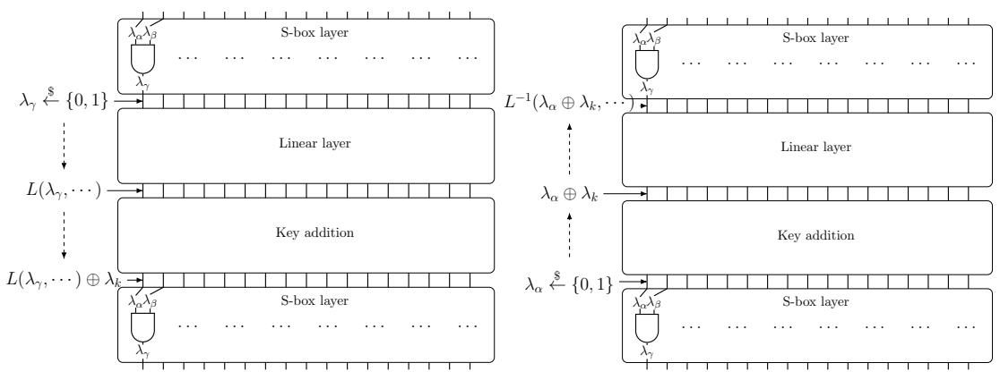
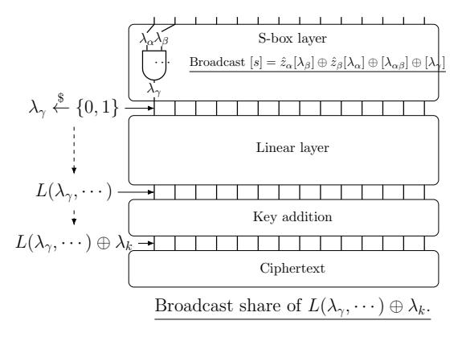
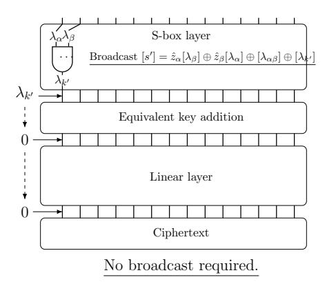

# Improving the Performance of the Picnic Signature Scheme

Daniel Kales Graz University of Technology daniel.kales@iaik.tugraz.at

Greg Zaverucha Microsoft Research gregz@microsoft.com

April 14, 2020

#### Abstract

Picnic is a digital signature algorithm designed to provide security against attacks by quantum computers. The design uses only symmetric-key primitives, and is an efficient instantiation of the MPC-in-the-head paradigm. In this work, we explore the Picnic design in great detail. We investigate and benchmark different parameter choices and show that there exist better parameter choices than those in the current specification. We also present improvements to the MPC protocol that shorten signatures and reduce signing time. The proposed MPC changes tailor the protocol to the circuit of interest in Picnic, but may also be of independent interest. Taken together, these changes give a new instantiation of Picnic that signs messages 7.9 to 13.9 times faster, and verifies signatures 4.5 to 5.5 times faster than the existing "Picnic2" design, while having nearly the same signature sizes.

## 1 Introduction

Digital signatures are a fundamental cryptographic primitive. Potential advances in quantum computing threaten to break the security of signature algorithms in wide use today. Due to this risk, NIST has solicited the design of new public-key signature algorithms with post-quantum security, i.e., security against attacks that use quantum computers [\[AASA](#page-26-0)+19].

One of the second-round candidate signature algorithms in the NIST post-quantum standardization project is Picnic. The Picnic signature scheme is based on non-interactive zero-knowledge proofs of knowledge, where the proof of knowledge is instantiated using the MPC-in-the-head approach of Ishai et al. [\[IKOS07\]](#page-29-0). The signature is a proof of knowledge of a secret key for a block cipher that encrypts a public plaintext block to a public ciphertext block, which together form the public key of the signature scheme. All of the cryptographic building blocks can be instantiated using symmetric-key primitives (block ciphers and hash functions), whereas the MPC protocol can be instantiated with information-theoretic security, which results in a construction with post-quantum security that does not require number theoretic or structured hardness assumptions.

One of the advantages of the Picnic design framework is its high flexibility. All of the internal building blocks can be chosen individually, and the MPC step has multiple parameters and design options, allowing for many concrete instantiations. However, this also means that selecting optimal primitives is quite a challenge. Different choices of primitives or parameters affect several characteristics of the resulting signature scheme, such as the time to create a signature, the time to verify a signature, the size of the signature, the size of the secret/public key, the security level and the code size. The effect of these choices is often not easy to predict, as their cost often depends on the implementation optimizations (e.g., proper use of vector instructions).

Contributions. In this work, we explore the flexibility of the Picnic design paradigm. We choose several different and (mostly) independent design, parameter, and primitive choices and implement and benchmark them. Our implementations are highly optimized to give a realistic understanding of the performance. Specifically, we investigate the following aspects of Picnic's design, with the goal of improving performance.

- 1. We investigate parameters of the MPC protocol, the number of parties (denoted N) and the number of MPC instances, M, of which τ instances are opened during verification, to obtain a given security level κ. For a given κ, there is a huge range of choices for (N, M, τ ) with different performance characteristics. For example, increasing N makes each MPC instance more expensive; but we require fewer. Similarly, increasing τ means that M can be smaller, at the expense of larger signatures. We implement and benchmark multiple options, and find that N = 16 gives the best balance between signature size and run time, rather than the choice N = 64 currently used by Picnic.
- 2. We also re-visit the choice of the instance of the block cipher LowMC. Since LowMC is parameterizable, for κ-bit security we can have a LowMC instance with more S-boxes and fewer rounds, or vice versa. We find that using a full S-box layer (i.e., each bit in the state is input to an S-box in every round) performs better than the current instances. This option was missed in the original Picnic design since it requires the state to be a multiple of three, which is not the case when κ is 128 or 256. With a full S-box layer, the number of rounds decreases significantly (improving CPU performance), and the number of AND gates is similar to the existing Picnic parameters (meaning that the signature size is also similar).
- 3. Importantly, using a full S-box layer lets us optimize the MPC computations further. By shifting the expensive matrix multiplication in the linear layer to the preprocessing phase, the prover can use their knowledge of the state of all parties to compute the result of the N matrix multiplications at the cost of a single matrix multiplication. During the online phase, the linear layer computation is free – the results are "baked in" to the correlated randomness distributed to all parties during preprocessing. Our techniques do not only apply to LowMC in particular but can be applied to a large class of functions, including most other block ciphers.
- 4. After these optimizations, we find that a significant fraction of the time for singing

and verification is spent computing SHA-3. We also benchmark Picnic with alternative hash functions such as Haraka [\[KLMR16\]](#page-29-1) and KangarooTwelve [\[BDP](#page-27-0)+18].

- 5. We combine several changes and optimizations to present a new parameter set for Picnic, called Picnic3. At NIST's L1 security level, sign and verify times are about 5ms and 4ms, respectively (on a 3.6GHz workstation), and signatures are 12.6KB.
- 6. We also give parameters and benchmarks for the interactive identification scheme associated with Picnic3. Protocols using this ID scheme will save about a factor of three in communicated data and CPU costs over Picnic3 signatures.

We compare Picnic3 to the Picnic parameters proposed in the current specification [\[Tea19a\]](#page-30-0), using the Picnic2 parameter sets as a baseline. Picnic3 has 7.9x to 13.9x faster signing, and 4.5x to 5.5x faster verification. Signature sizes are about 1-6% larger than Picnic2 (depending on the security level).

When compared to the other group of parameters from [\[Tea19a\]](#page-30-0) which we refer to as Picnic1 (in the spec they are denoted Picnic-FS), Picnic3 is still slower for signing and verification, but the signatures are about 2.6 times shorter. The LowMC parameters with a full S-box layer can also be used with Picnic1, we benchmark this variant and find that it improves signing and verification times by 1.4x to 1.8x, and reduces signature size slightly.

We also compare Picnic3 to SPHINCS+, a hash-based signature scheme, also a NIST second-round candidate. We find that for the first two NIST security levels (L1 and L3), Picnic3 has faster signing and slower verification, and signatures are shorter than the fast SPHINCS<sup>+</sup> parameters. At the L5 security, level the picture is less clear; the currently published SPHINCS<sup>+</sup> signatures are shorter, have slower signing, and faster verification. However, we expect one could choose parameters for SPHINCS<sup>+</sup> to match the signature size of Picnic3-L5 and improve signing time (but we decided that searching for, implementing, and benchmarking this parameter set is beyond the scope of this paper).

A goal of this work was to optimize Picnic so that the exisiting security analysis of the overall design still applies, as well as the analysis for the LowMC parameter changes. So while these optimizations require changes to the specification, they optimizations could be applied to Picnic as tweaks, should be it selected for the third round of NIST's project.

# 2 Preliminaries and Related Work

Signature schemes designed to provide post-quantum security exist for multiple classes of assumptions. Here we review some of the Round 2 candidates of the NIST process, falling into three categories. First, there are the lattice-based schemes, DILITHIUM [\[LDK](#page-29-2)+19], Falcon [\[PFH](#page-30-1)+19] and qTesla [\[BAA](#page-27-1)+19]. These schemes generally have small keys and fast performance. Then there are the MQ-based schemes (multivariate quadratic polynomials) which also have fast signing and verification, and either the signature or public key is large. Finally, there are two candidates that use only symmetric-key primitives, SPHINCS<sup>+</sup> [\[HBD](#page-29-3)+19] uses only a hash function and Picnic [\[ZCD](#page-30-2)+19], uses a hash function and a block cipher. While the designs in the third category make the most conservative assumptions, the performance is considerably worse than the previous two categories. As the designs in different categories are quite different, performance optimizations for one category rarely improve a signature scheme in another category.

In the category of symmetric-key primitives, one can ask whether any improvements to the SPHINCS family of schemes carry over to Picnic. Since both schemes spend a nontrivial amount of time hashing, the idea of using a specialized hash function will also improve Picnic. Haraka [\[KLMR16\]](#page-29-1) is a hash function optimized for short inputs and uses the AES-NI hardware instructions. It is about two times faster than SHA-256 in the context of hash-based signatures. We benchmark Picnic using Haraka in §[4.3.](#page-14-0)

We refer to three security levels, L1, L3, and L5 as defined by NIST in their call for post-quantum algorithms [\[fST16\]](#page-28-0), having security equivalent to AES-128, 192 and 256 (respectively). Roughly speaking, L1 security provides 128 bits of security against classical attacks and 64 bits of security against quantum attacks.

MPC-in-the-Head The MPC-in-the-head approach to zero-knowledge proofs lets a single prover create proofs for an arbitrary circuit (Boolean or arithmetic), by simulating the execution of an MPC protocol, committing to the execution, and allowing the verifier to (partially) check correctness of the execution by seeing the state of a subset of the parties. The idea originates in a paper by Ishai et al. [\[IKOS07,](#page-29-0) [IKOS09\]](#page-29-4), focused on the asymptotic performance, and proofs for any problem in NP. Later work by Giacomelli et al. [\[GMO16\]](#page-29-5) investigated the concrete performance of the approach, chose parameters and a concrete MPC protocol, and implemented a non-interactive proof of a SHA preimage, demonstrating that the MPC-in-the-head paradigm can be practical. Further efficiency improvements, mainly aimed at reducing the proof size, led to the ZKB++ protocol used by Picnic [\[CDG](#page-27-2)+17]. The KKW protocol [\[KKW18\]](#page-29-6) further improves efficiency by using an MPC protocol in the pre-processing model. In this model, the parties obtain or jointly compute, values independent of their inputs that will be used in the online computation. The protocol also uses a broadcast channel, a primitive that is expensive in interactive MPC, but efficient in the simulation required for MPC-inthe-head. Since we discuss some of the internals of the KKW protocol in the context of optimizing Picnic, we review it in [Appendix A.](#page-31-0)

The Fiat-Shamir Transform The two variants of Picnic of interest to this paper are signatures schemes constructed from the Fiat-Shamir (FS) transform. The FS transform takes an interactive three-move honest-verifier zero-knowledge proof, and makes it noninteractive. The MPC-in-the-head proof protocols ZKB++ and KKW both have the same protocol flow in three messages: the prover first sends a commitment to the verifier, the verifier responds with a random challenge, and then the prover sends a response. The FS transform replaces the verifier's message with a hash of the commitment; the prover computes the commitment, challenge and response, and then outputs the challenge and response. Verification will re-compute some parts of the commitment, and some parts may be included in the response. There is a rich literature about the FS transform, but in this work only the high-level idea is relevant.

#### 2.1 Picnic

Figure 1 shows Picnic2 signing and Figure 2 shows verification. There are a few differences with respect to the Picnic specification [Tea19a], made here for simplicity.

In particular, the specification includes a per-signature, 256-bit salt value, chosen by the signer, and included in all hash computations. The specification also derives the per-instance seeds  $\{seed_i^*\}_{j=1}^M$ , from a single root seed, using a tree construction. Similarly, the per-party, per-instance seeds  $\{seed_{i,j}\}$  are derived from  $seed_j^*$  using the same tree construction. Since most of the seeds are revealed, the signer can reduce the signature size by revealing intermediate nodes in the tree. Another optimization omitted here is that the commitments to the views  $h'_j$  are formed using a Merkle-tree, and the root of the tree is input to G. For the values  $h'_j$  not recomputed by the verifier, the signer includes the path from  $h'_j$  to the root. Again this reduces the signature size significantly.

In Figures 1 and 2, the key pair is (pk, sk) = (C, w), a circuit C and an input w such that C(w) = 1. Concretely, the circuit is  $E_w(p) \stackrel{?}{=} c$ , where E is the LowMC block cipher with  $\lambda$ -bit key and block size, p is a random  $\lambda$ -bit plaintext and c is a ciphertext. If the input w is a block cipher key that maps p to c, the circuit outputs 1.

#### 2.2 LowMC

LowMC [ARS<sup>+</sup>15] is a parameterizable block cipher with low multiplicative complexity (low AND depth). For a chosen block size, number of S-boxes per round, and data complexity (the number of plaintext-ciphertext pairs available to an attacker), the LowMC design finds a number of rounds to provide the required security.

We can describe LowMC independently of the choice of parameters using a partial specification of the S-box and arithmetic in vector spaces over  $\mathbb{F}_2$ . In particular, let n be the block size and key size, s be the number of S-boxes, and r the number of rounds. We then choose random and independent round constants  $C_i \stackrel{R}{\leftarrow} \mathbb{F}_2^n$  for  $i \in [1, r]$ , full rank matrices  $L_i \stackrel{R}{\leftarrow} \mathbb{F}_2^{n \times n}$  and  $K_i \stackrel{R}{\leftarrow} \mathbb{F}_2^{n \times n}$ . These are fixed for the LowMC instance. Keys for LowMC are generated by sampling from  $\mathbb{F}_2^n$  uniformly at random.

LowMC encryption starts with key whitening, which is followed by several rounds of encryption. A single round of LowMC is composed of an S-box layer, a linear layer, addition with constants, and addition of the round key, i.e.,

```
\begin{aligned} \text{LowMCRound}(i) &= \text{KeyAddition}(i) \\ & \circ \ \text{ConstantAddition}(i) \\ & \circ \ \text{LinearLayer}(i) \circ \text{SboxLayer}. \end{aligned}
```

SBOXLAYER is an s-fold parallel application of the same 3-bit S-box on the first  $3 \cdot s$  bits of the state. The S-box is defined as  $S(a,b,c) = (a \oplus bc, a \oplus b \oplus ac, a \oplus b \oplus c \oplus ab)$ .

#### Picnic2 Sign(w, m)

<span id="page-5-0"></span>Values  $(M, n, \tau)$  are parameters of the protocol.

Choose uniform random values ( $\mathsf{seed}_1^*, \ldots, \mathsf{seed}_M^*$ ), each  $\lambda$  bits long.

Commit(w) For each  $j \in [M]$ :

- 1. Use  $\mathsf{seed}_j^*$  to generate values  $\mathsf{seed}_{j,1}, \ldots, \mathsf{seed}_{j,N}$  with a PRG. Also compute  $\mathsf{aux}_j \in \{0,1\}^{|C|}$  as described in the text. For  $i=1,\ldots,N-1$ , let  $\mathsf{state}_{j,i} := \mathsf{seed}_{j,i}$ ; let  $\mathsf{state}_{j,N} := \mathsf{seed}_{j,N} \| \mathsf{aux}_j$ .
- 2. For  $i \in [N]$ , compute  $com_{j,i} := H_0(state_{j,i})$ .
- 3. The signer runs the online phase of the N-party protocol  $\Pi$  (as described in the text) using  $\{\mathsf{state}_{j,i}\}_i$ , beginning by computing the masked inputs  $\{\hat{z}_{j,\alpha}\}$  (based on w and the  $\{\lambda_{j,\alpha}\}$  defined by the preprocessing). Let  $\mathsf{msgs}_{j,i}$  denote the messages broadcast by  $S_i$  in this protocol execution.
- 4. Let  $h_j := H_1(\mathsf{com}_{j,1}, \ldots, \mathsf{com}_{j,N})$  and let  $h'_j := H_2(\{\hat{z}_{j,\alpha}\}, \mathsf{msgs}_{j,1}, \ldots, \mathsf{msgs}_{j,N}).$

```
Let a := (h_1, h'_1, \dots, h_M, h'_M).
Let St := \{\text{seed}_j^*\}, \{\text{com}_{j,i}\}, \{\text{state}_{j,i}\}, \{h_j\}, \{h'_j\} \text{ for } j \in [M], i \in [N].
```

**Challenge** Compute  $(\mathcal{C}, \mathcal{P}) := G(a, m)$ , where  $\mathcal{C} \subset [M]$  is a set of size  $\tau$ , and  $\mathcal{P}$  is a list  $\{p_j\}_{j\in\mathcal{C}}$  with  $p_j \in [N]$ . Let  $e := (\mathcal{C}, \mathcal{P})$ .

**Respond**(w, e, St) Initialize the output list z. For each  $j \in [M] \setminus \mathcal{C}$ , add  $\mathsf{seed}_j^*, h_j'$  to z. Also, for each  $j \in \mathcal{C}$ , add  $\{\mathsf{state}_{j,i}\}_{i \neq p_j}, \mathsf{com}_{j,p_j}, \{\hat{z}_{j,\alpha}\}, \text{ and } \mathsf{msgs}_{j,p_j} \text{ to } z$ .

Serialize Output (e, z).

Figure 1: The signing algorithm in the Picnic2 signature scheme.

#### Picnic2 Verification $Verify(\sigma, m)$

<span id="page-6-0"></span>Parse the signature  $\sigma=(e,z)$  as  $(\mathcal{C},\mathcal{P},\{\mathsf{seed}_j^*,h_j'\}_{j\notin\mathcal{C}},\{\{\mathsf{state}_{j,i}\}_{i\neq p_j},\mathsf{com}_{j,p_j},\{\hat{z}_{j,\alpha}\},\mathsf{msgs}_{j,p_i}\}_{j\in\mathcal{C}})$ . Verify the signature as follows:

- 1. For every  $j \in \mathcal{C}$  and  $i \neq p_j$ , set  $\mathsf{com}_{j,i} := H_0(\mathsf{state}_{j,i})$ ; then compute the value  $h_j := H_1(\mathsf{com}_{j,1}, \ldots, \mathsf{com}_{j,N})$ .
- 2. For  $j \notin \mathcal{C}$ , use  $\mathsf{seed}_i^*$  to compute  $h_j$  as the signer would.
- 3. For each  $j \in \mathcal{C}$ , run an execution of  $\Pi$  among the parties  $\{S_i\}_{i \neq p_j}$  using  $\{\mathsf{state}_{j,i}\}_{i \neq p_j}$ ,  $\{\hat{z}_{\alpha}\}$ , and  $\mathsf{msgs}_{j,p_j}$ ; this yields  $\{\mathsf{msgs}_i\}_{i \neq p_j}$  and an output bit b. Check that  $b \stackrel{?}{=} 1$ . Then compute  $h'_j := H_2(\{\hat{z}_{j,\alpha}\} \ \mathsf{msgs}_{j,1}, \ldots, \mathsf{msgs}_{j,N})$ .
- 4. Output 1 (valid) if  $(\mathcal{C}, \mathcal{P}) \stackrel{?}{=} G(m, h_1, h'_1, \dots, h_M, h'_M)$ , otherwise output 0 (invalid).

Figure 2: The verification algorithm in the Picnic2 signature scheme.

The other layers only consist of  $\mathbb{F}_2$ -vector space arithmetic. A round key is generated by multiplying the master key with the key matrix  $K_i$ . LINEARLAYER(i) multiplies the state and the linear layer matrix  $L_i$ , Constantaddition(i) adds the round constant  $C_i$  to the state, and KeyAddition(i) adds the round key to the state.

Algorithm 1 gives a full description of the encryption algorithm. LowMC is very flexible in the choice of parameters, all of n, s, d can be independently chosen. While the LowMC design supports distinct key and block lengths, we choose to keep them equal for simplicity. Since each S-box maps three bits to three bits, we must have  $3s \le n$ . To reduce the multiplicative complexity, an instance may use a partial S-box layer, where not all bits of the state are modified by the substitution layer. The number of rounds necessary for security is determined as a function of all these parameters.

<span id="page-6-1"></span>**Algorithm 1** LowMC encryption. Parameters: key matrices  $K_i \in \mathbb{F}_2^{n \times n}$  for  $i \in [0, r]$ , linear layer matrices  $L_i \in \mathbb{F}_2^{n \times n}$  and round constants  $C_i \in \mathbb{F}_2^n$  for  $i \in [1, r]$ .

```
Input: plaintext p \in \mathbb{F}_2^n and key k \in \mathbb{F}_2^n
state \leftarrow K_0 \cdot k + p
for i \in [1, r] do
state \leftarrow \text{SboxLayer}(state)
state \leftarrow L_i \cdot state
state \leftarrow C_i + state
state \leftarrow K_i \cdot k + state\nend for
return \ state
```

<span id="page-7-0"></span>

| Sec. level | Block, key size | S-boxes | Rounds |  |
|------------|-----------------|---------|--------|--|
|            | n               | s       | r      |  |
| L1         | 128             | 10      | 20     |  |
| L3         | 192             | 10      | 30     |  |
| L5         | 256             | 10      | 38     |  |

Table 1: Parameters for LowMC targeting security levels L1, L3 and L5, as used in Picnic [\[CDG](#page-27-2)+17]. All parameters are computed for data complexity d = 1.

The LowMC parameters used in the current specification of Picnic are given in [Table 1.](#page-7-0) Choosing s = 1 minimizes the total number of AND gates (and reduces the Picnic signature size), but also requires a large number of rounds, each having a large number of XOR gates (and increase the Picnic sign and verify times). In Chase et al. [\[CDG](#page-27-2)+17] it was shown that the increasing the number of S-boxes slightly produces a large drop in the number of rounds, and the choices in [Table 1](#page-7-0) strike a balance between speed and size.

# 3 Exploring Parameter Choices for Picnic Signatures

In this section, we review the parameters and symmetric-key primitives that must be chosen to implement the Picnic signature schemes, and give microbenchmarks to show the relative costs of different parts of the algorithm. We then explore the one speed-size tradeoff involving the number of parties in the MPC simulation, and show that much faster signing and verification times are possible, with only a slight increase in signature size.

Block cipher The block cipher is used to generate Picnic keys. Since signing requires proving knowledge of a key for the block cipher, the cost of sign and verify, as well as the proof size, depends strongly on the block cipher. In this paper, we consider alternate instances of LowMC. Other choices are possible, but are less efficient than LowMC, for a survey and comparison see [\[CDG](#page-27-2)+17].

LowMC Parameters (n, s, r) To determine an instance of LowMC, we must choose a block length and key length n, the number of rounds r, and the number of S-boxes per round s. [Table 5](#page-15-0) gives the parameters currently in use by Picnic, we will use these as a baseline when considering alternatives.

Hash function A hash function is required in Picnic to create commitments and to create the challenge. In Picnic2, the hash function is also used to expand a random value into many values using a tree construction and to create a Merkle-tree of the committed values. The Picnic spec uses the SHA-3 function SHAKE for all hashing. In this paper, we consider the alternative hash functions Haraka and KangarooTwelve and report on their performance.

Pseudorandom Generator (PRG) Each party in each MPC instance requires a random tape. To reduce signature sizes, these tapes are computed as the output of an expansion of shorter random seeds. We require a PRG for this, and the Picnic spec uses SHAKE, which is well suited for this since it has variable output length. We benchmark alternatives as part of our investigation of other hash functions. Another option is to use an AES-based PRG.

KKW Parameters (N, M, τ ) For Picnic2, the KKW proof protocol has three parameters to choose: M is the number of MPC instances used in the preprocessing phase, N is the number of parties in each MPC instance and τ is the number of instances that are used in the online phase. All three parameters determine the soundness (N, M, τ ) of the proof, according to the formula

<span id="page-8-0"></span>
$$\epsilon(N, M, \tau) = \max_{M - \tau \le k \le M} \left\{ \frac{\binom{k}{M - \tau}}{\binom{M}{M - \tau} N^{k - M + \tau}} \right\}. \tag{1}$$

### 3.1 Our Picnic Implementation

To validate and benchmark different parameterizations of the Picnic signature scheme, we implement each as a change to the optimized Picnic implementation available on GitHub [\[DGK](#page-28-1)+19]. This implementation is written in C, and uses compiler intrinsics for AVX2 vector operations. However, the implementation [\[DGK](#page-28-1)+19] provides limited flexibility in terms of parameter choices, as only different numbers of total and opened repetitions may be changed without substantial modifications to the source code. We extend the implementation according to our experiments and use it to produce reproducible benchmarks for comparison. For each of the benchmarks we present, the accompanying source code includes a fork of [\[DGK](#page-28-1)+19] that implements the change(s)/optimization(s) that produce the benchmark.

A fast implementation is a vital tool for choosing concrete parameter sets. While some performance characteristics of the final signature scheme can be estimated, like the signature size, others can only be accurately determined by benchmarking an implementation that makes use of all known implementation techniques. One example is the preprocessing phase. From the protocol specification, it looks like the preprocessing phase and the online phase of the KKW protocol have the same run time since the circuit needs to be evaluated for both. However, using the observation of [Section 5.1,](#page-17-0) the preprocessing phase of the KKW protocol is 10 times cheaper than the cost of the online simulation. Another example is the cost of the online simulation. LowMC has an expensive linear layer when compared to other ciphers. Therefore KKW parameters that try to minimize the number of circuit evaluations provide a good balance of performance and size. However, if we look at a cipher that has a much cheaper circuit, we should

<span id="page-9-0"></span>

| Parameters    | Sign   | Verify | Size (stddev) |
|---------------|--------|--------|---------------|
| Picnic-L1-FS  | 1.37   | 1.10   | 32,862 (109)  |
| Picnic-L3-FS  | 3.18   | 2.61   | 74,148 (203)  |
| Picnic-L5-FS  | 5.54   | 4.62   | 128,201 (306) |
| Picnic2-L1-FS | 40.95  | 18.20  | 12,341 (228)  |
| Picnic2-L3-FS | 122.54 | 41.29  | 27,173 (448)  |
| Picnic2-L5-FS | 251.55 | 71.01  | 46,177 (654)  |

Table 2: Baseline benchmarks of the optimized Picnic implementation used in this work. Sign and verify times are in milliseconds and signature sizes are in bytes. The average signature size of 1000 signatures is given along with the standard deviation.

then focus minimizing the number of hash function calls, since they now have a much larger impact on the total runtime.

Benchmark platform and methodology In [Table 2](#page-9-0) we give baseline benchmarks of [\[DGK](#page-28-1)+19] before applying any of the proposed changes and optimizations presented here. We note that the baseline benchmarks on our system are consistent with the benchmarks on the public SUPERCOP platform[1](#page-9-1) . Throughout the paper, we omit benchmarks for key generation, which is always very fast anyway as it is a a single block cipher encryption operation. Similarly, the public and private key sizes are small (e.g., at L5 64 bytes public, 32 bytes private), and are not affected by our optimizations, so we omit benchmarks for them as well.

All benchmarks presented in this paper were computed on a workstation with an Intel Xeon W-2133 CPU clocked at 3.60GHz. Since signature sizes are variable (based on the challenge, see §[D.2\)](#page-42-0), so we include the average signature size of 1000 signatures. Sign and verify times are also computed as the average time of 1000 operations. The variance of sign and verify is quite low, on the order of 0.1%, and we therefore omit it.

### 3.2 Detailed Cost of Signing and Verification

We give microbenchmarks showing the cost breakdown of the current Picnic2 parameter sets in [Table 3,](#page-10-0) to motivate our targets for optimization. We give the runtime of each of the main operations in the signing and verification procedure as a percentage of the total runtime for the optimized implementation of the Picnic2-L1-FS and Picnic2-L5-FS parameter sets.

From the breakdown in [Table 3,](#page-10-0) we observe a few points. First, all of the main operations fall into two categories: during signing, 34% of time is spent on operations that are primarily hashing (commitments, seed and random tape expansion), and 63% is spent on and LowMC circuit evaluation (computation of auxiliary tape and online

<span id="page-9-1"></span><sup>1</sup>See the set of benchmarks titled: "amd64; CascadeLake (50657); 2019 Intel Xeon Gold 6248; 20 x 2500MHz; pmnod076, supercop-20191017".

<span id="page-10-0"></span>

|                       | Picnic-L1-FS |        | Picnic2-L1-FS |        | Picnic2-L5-FS |        |
|-----------------------|--------------|--------|---------------|--------|---------------|--------|
|                       | sign         | verify | sign          | verify | sign          | verify |
| seed tree expansion   | -            | -      | 9.94          | 24.36  | 3.49          | 14.11  |
| random tape expansion | 17.46        | 13.77  | 9.79          | 24.10  | 8.07          | 32.79  |
| auxiliary tape        | -            | -      | 5.00          | 11.32  | 3.34          | 12.71  |
| online simulation     | 55.57        | 63.11  | 58.61         | 11.68  | 76.28         | 19.50  |
| commitments           | 20.34        | 17.96  | 14.22         | 26.62  | 7.52          | 19.26  |
| other                 | 6.63         | 5.16   | 2.44          | 1.92   | 1.30          | 1.63   |
| LowMC circuit         | 55.57        | 63.11  | 63.61         | 23.00  | 79.62         | 32.21  |
| Hashing (SHAKE)       | 37.80        | 31.73  | 33.95         | 75.08  | 19.08         | 66.16  |

Table 3: Cost breakdown of signing and verification of a subset of Picnic parameter sets (as percentages).

simulation). Second, signing and verification have essentially opposite proportions for these two categories. Whereas for signing, the simulation of the circuit takes the most time by far, a verifier only needs to simulate a small subset of the circuits, therefore the hashing cost (whose absolute value is almost equal for sign and verify) takes up a larger proportion of the total time. In [Section 4,](#page-12-0) we will look into alternative choices for both the hash function and the block cipher encryption circuit that is evaluated in the MPC protocol.

#### <span id="page-10-1"></span>3.3 Exploring Speed-Size Trade-offs

The specification of Picnic includes different instantiations. The original submission to NIST used ZKB++ [\[CDG](#page-27-2)+17], as the underlying proof system. We refer to this version as Picnic1. In Round 2, Picnic was extended with new instances that use a different proof system called KKW [\[KKW18\]](#page-29-6); these new instances are called Picnic2.

Picnic1 vs. Picnic2 When comparing benchmarks for the baseline Picnic1 and Picnic2 parameter sets [\(Table 2\)](#page-9-0), clearly Picnic1 has much faster signing and verification than Picnic2 (e.g., at L1, signing is 30x faster and verification is 16x faster). On the other hand, Picnic2 has shorter signatures (about 2.6x times shorter at L1). We try to explain this here. First, the number of parallel repetitions (or MPC instances) is lower in Picnic1 (at L1, 219 vs. 343). Then, since the number of parties in each MPC instance is smaller (3 vs. 64), the number of seeds, random tapes and commitments is smaller, making each of the instances cheaper to compute. The MPC simulation is also cheaper and the ZKB++ protocol does not have a preprocessing step. The use of seed tree derivation and Merkle-tree commitments also increases the cost of hashing in Picnic2.

Number of MPC Parties In [Table 4](#page-11-0) we present benchmarks for multiple parameter choices for the KKW proof system (N, M, τ ) that provide L1 security. Instances with

<span id="page-11-0"></span>

| Sec. level | N  | M   | τ  | Sign   | Verify | Size   |
|------------|----|-----|----|--------|--------|--------|
|            | 64 | 113 | 60 | 13.61  | 9.99   | 20,696 |
|            | 64 | 343 | 27 | 41.16  | 18.21  | 12,347 |
|            | 64 | 631 | 23 | 75.22  | 31.38  | 11,680 |
|            | 32 | 204 | 36 | 14.8   | 7.11   | 14,024 |
|            | 32 | 258 | 32 | 18.69  | 8.37   | 13,162 |
|            | 32 | 390 | 28 | 28.15  | 11.62  | 12,488 |
| L1         | 16 | 160 | 48 | 6.65   | 3.82   | 16,332 |
|            | 16 | 172 | 44 | 7.16   | 3.92   | 15,379 |
|            | 16 | 200 | 40 | 8.44   | 4.32   | 14,553 |
|            | 16 | 252 | 36 | 10.42  | 5.00   | 13,831 |
|            | 8  | 160 | 56 | 4.20   | 2.60   | 17,415 |
|            | 8  | 200 | 48 | 5.24   | 2.95   | 15,995 |
| L3         | 64 | 570 | 39 | 123.21 | 41.25  | 27,173 |
|            | 16 | 420 | 52 | 29.85  | 11.77  | 30,542 |
| L5         | 64 | 803 | 50 | 253.17 | 71.32  | 46,162 |
|            | 16 | 604 | 68 | 61.09  | 21.19  | 52,863 |

Table 4: Benchmarks for various choices of MPC parameters (N, M, τ ) grouped by N, the number of parties. Time required for Sign and Verify are given in milliseconds on the reference platform, and the signature size is given in bytes. The current 64-party instances and new 16 party instances are given in bold, and the other L1 instances are examples of other possible choices.

fewer parties generally have faster sign and verify times but larger signatures. However, the increase in signature size is slower than the decrease in signing time – for instance, the current Picnic2-L1 parameters (64, 343, 27) use 64 parties, and our proposed new instance (16, 252, 36) uses 16 parties. Making this change causes an increase in signature size of 1484 bytes (a 1.12x increase) while signing time decreases by 30.74 ms (a 3.95x speedup).

This can be explained in large part by the amount of hashing: for each additional party we must derive M additional seeds, expand M random tapes, and compute M additional commitments. At the same time, the contribution of each additional party to the soundness of the protocol is small (see Equation [\(1\)](#page-8-0)), so the number of MPC instances is not reduced much. When using smaller N, the proof size per MPC instance decreases, but we must increase τ to improve soundness, leading to a small net increase in signature size.

We repeated the same benchmarks at the L3 and L5 security levels and found similar improvements; at the bottom of [Table 4](#page-11-0) we show the existing parameters for L3 and L5 with N = 64 and our new proposed parameter sets with N = 16.

Cut-and-choose parameters (M, τ ) Another way to tradeoff size and speed is to change the number of MPC instances M and the number that are checked by the verifier τ . This tradeoff is also described in the Picnic design document [\[Tea19b\]](#page-30-3). It is possible to use a smaller M, provided τ is increased to maintain the soundness error according to Equation [\(1\)](#page-8-0). This can be seen in [Table 4,](#page-11-0) where we provide benchmarks for a parameter set close to the option in [\[Tea19b\]](#page-30-3). We see that signing in the (64, 113, 60) parameter set is about 3x faster than the baseline, but has signatures that are 1.6x larger. Since signature sizes in Picnic are already larger than traditional signatures, and increase quickly when using this tradeoff, we decided to instead recommended KKW parameters having larger M so that τ can be small. Furthermore, instances that use a lower number of parties in the MPC protocol provide strictly better results than this tradeoff, as can be seen in [Table 4](#page-11-0) (compare, for example, the (64, 113, 60) instance to the new (16, 252, 36) instance).

A five-round variant The KKW proof protocol can be executed as an interactive five-round protocol (see [\[KKW18,](#page-29-6) Figure 1]). In the first round, the prover commits to preprocessing of many MPC instances, the verifier selects a subset (round 2), then the prover commits to the online simulations of the subset (round 3), the then verifier chooses one party from each instance (round 4) and the prover reveals the state of the n − 1 other parties (round 5). Note that the prover needs to perform the online MPC simulation for τ instances instead of M. This is significant, since it means less work for the signer, but also because the online simulation is expensive; about 60% of signing time [\(Table 3\)](#page-10-0). However, in a five-round non-interactive protocol, M must be very large to maintain soundness, since both challenges must be sufficiently large. Although the number of online simulations is reduced, the large number of offline simulations offsets this benefit.

# <span id="page-12-0"></span>4 Evaluation of Alternative Cryptographic Primitives

In this section, we review the symmetric-key primitives used to implement Picnic. We consider alternative choices for the block cipher, and after arguing that LowMC remains a good choice, we explore alternative parameters for it. We also explore and benchmark alternative hash functions and discuss alternative PRGs.

#### 4.1 Choice of Block Cipher

A survey of block ciphers and their relative merits for use in the context of Picnic is given in [\[CDG](#page-27-2)+17], and LowMC was identified as the best choice. The primary metric was the number of AND gates, which is important for the size of Picnic signatures. Since [\[CDG](#page-27-2)+17], there have been two developments that might affect this analysis. First is the improved MPC-in-the-head protocol for AES presented by de Saint Guilhem et al. [\[dSGMOS19\]](#page-28-2). When compared to the direct implementation of AES as a binary circuit, the signature sizes of [\[dSGMOS19\]](#page-28-2) are many times smaller. However, they are still at least as large as Picnic1 signatures, and the runtime is unknown, as no implementation exists at the time of writing. The other limitation is that AES does not support block sizes larger than 128, as required by Picnic at L3 and L5. One must either call AES twice (using different plaintext blocks) or use Rijndael, and in both cases signature size is no longer competitive with Picnic-L3-FS and Picnic-L5-FS, and if using Rijndael, some of the security analysis of AES does not apply. That said, this is a promising new line of research and we expect a Picnic variant using AES to become more competitive with time.

Another development is the new block cipher Hades [\[GLR](#page-28-3)+19]. Like LowMC, Hades is designed to use a small number of AND gates. However, the linear layer of Hades is not as expensive as LowMC, since the matrices are not random, but can be chosen to have a special form. Our experimental implementation of Picnic2-L1 with Hades showed that the MPC simulation costs are almost nonexistent, and the signing and verification times are very close to the standalone hashing costs of the baseline parameters. However, as we found a way to reduce the linear layer costs of LowMC, and LowMC has a longer track record of cryptanalysis, we consider it preferable to Hades. One area where Hades remains better than LowMC is the size of the precomputed constants; the size of all Hades constants of the L1 security level is 8 times smaller than the current LowMC constants. Furthermore, due to their special form, the linear layer matrices in Hades can be efficiently computed from a few bytes of information only.

### <span id="page-13-2"></span>4.2 Choice of LowMC Parameters

The original search for LowMC instances in Picnic [\[CDG](#page-27-2)+17] used the two following constraints: 1) the key and block size must be 128, 192, and 256 bits, and 2) the S-box layer should be small, since each S-box increases the number of AND gates, directly increasing the signature size. For these reasons, the search started with a single S-box per round, which gives the smallest signatures, and then increased the number of S-boxes until a good balance between signature size and runtime was found. Instances with a full S-box layer were overlooked.

We observe that when LowMC has a full S-box layer, while each round has a large number of AND gates, far fewer rounds are required to provide equivalent security[2](#page-13-0) . For example, at L1, four rounds are the minimum necessary according to the analysis of [\[ARS](#page-27-3)+15] (and third-party cryptanalysis [\[DLMW15,](#page-28-4) [DEM16,](#page-27-4) [RST18\]](#page-30-4))[3](#page-13-1) and even when using five rounds (adding a full round of security margin), the total number of ANDs is about the same as the baseline instances (see [Table 5,](#page-15-0) 7-18% more with 5 rounds, and about 17% less with 4 rounds). About 40-50% of the data in a signature size grows with the number of AND gates (see Tables [11](#page-40-0) and [12\)](#page-41-0), so a small change in the number of AND gates will not have a large impact on signature size.

<span id="page-13-0"></span><sup>2</sup>For an intuition of why, consider attacks that can utilize the identity part of the S-box to skip the first and last round of the cipher.

<span id="page-13-1"></span><sup>3</sup>To determine the number of rounds for a given n, s and d, use determine rounds.py from the LowMC source package [\[Tie17\]](#page-30-5), which is updated to include all known cryptanalysis.

Of course it is also not possible to have a full S-box layer when n = 128; since each S-box operates on three bits of state, the state size must be a multiple of three bits. Therefore, at L1, we choose to use a 129-bit state. At L3, since 192 is divisible by three, no special accommodations are required, and at L5, we propose using a 255-bit state and key.

Using a full S-box layer impacts implementations in two other ways. First, the optimization technique of Dinur et al. [\[DKP](#page-28-5)+19] no longer applies, since it requires s n, and as the number of S-boxes increases, the performance improvement decreases. This means that each round in a full S-box instance is considerably more expensive, but also much simpler to implement. The second impact is the size of precomputed constants required to implement LowMC decreases; recall from [Algorithm 1](#page-6-1) that each additional round requires a linear layer matrix (n <sup>2</sup> bits), a round constant (n bits) and a key matrix (n <sup>2</sup> bits). When using the optimizations of [\[DKP](#page-28-5)+19], the amount of pre-computed data is also reduced, so we compare to the amount of precomputed constants actually used by the baseline implementation in [Table 5.](#page-15-0)

Security of LowMC instances with full S-Box layer In addition to the existing cryptanalysis, we consider the security of these new LowMC instances in the setting of Picnic. Here, an attacker only ever gets to see a single plaintext-ciphertext pair for a given secret key. This restriction significantly limits the possible attacks on block ciphers (e.g., differential, linear and interpolation attacks all require more than one plaintext/ciphertext pair), leaving algebraic attacks that rely on solving a system of equations in the key variables (e.g., Gr¨obner basis attacks [\[Fau02\]](#page-28-6) or attacks using SAT solvers [\[BCJ07\]](#page-27-5)). However, using both of these attacks, we can attack a maximum of two rounds of LowMC with less than brute-force complexity.

We also used a general tool for finding meet-in-the-middle attacks [\[DF16\]](#page-28-7) to evaluate full S-box layer instances of LowMC. The tool reported attacks on an instance with 2 rounds, but could not find any attacks for instances with 3 or more rounds.

A general approach to attack ciphers with low multiplicative complexity is given by Zajac [\[Zaj17\]](#page-30-6). There, the cipher is transformed into a multiple right-hand sides equation system and subsequently transformed into a syndrome decoding problem. Zajac argues that the complexity of decoding of random linear codes can be used to calculate the complexity of such an attack. For a three-round version of LowMC with a 129 bit state, this would result in an attack with time complexity of 2<sup>118</sup> and high memory complexity of 289. However, for instances with 4 or more rounds, the time (and memory) complexity is expected to exceed brute-force complexity.

#### <span id="page-14-0"></span>4.3 Choice of Hash Function

The current parameter sets for Picnic use the SHA-3 based SHAKE-128 (for L1) and SHAKE-256 (for L3, L5) functions. The steps containting a significant amount of hashing are expanding the initial seed to many seeds, expanding each seed to a tape, and computing commitments. Taken together, hashing accounts for about 34% of L1 signing

<span id="page-15-0"></span>

| Sec. level | n   | s  | r  | #ANDs | Constants |
|------------|-----|----|----|-------|-----------|
|            | 128 | 10 | 20 | 600   | 34 752    |
|            | 129 | 43 | 4  | 516   | 18 786    |
| L1         | 129 | 43 | 5  | 645   | 22 962    |
|            | 192 | 10 | 30 | 900   | 92 704    |
| L3         | 192 | 64 | 4  | 768   | 41 568    |
|            | 192 | 64 | 5  | 960   | 50 808    |
|            | 255 | 10 | 38 | 1140  | 128 576   |
| L5         | 255 | 85 | 4  | 1020  | 73 281    |
|            | 255 | 85 | 5  | 1275  | 89 568    |

Table 5: Parameters for LowMC. Parameter n is the key and block size, s is the number of S-boxes per round, and r is the number of rounds. The baseline LowMC parameters are given in the first row of each security level, and the new alternative parameter sets follow. All parameters were chosen with data complexity d = 1. The last column shows the size in bytes of the constants required to implement each LowMC instance.

runtime and 19% of L5 signing runtime (as presented in [Table 3\)](#page-10-0). A convenience of the SHAKE function is that it is an XOF (extendable output function), so supporting the varying output lengths required in the hashing operations is with this single function (e.g., at L1, commitments have 256-bit digests and random tapes are 1328 bits in size).

In this section, we present benchmarks for two alternative hash functions that can reduce hashing costs. KangarooTwelve [\[VWA](#page-30-7)+19, [BDP](#page-27-0)+18] is an XOF with a nearly identical design as SHAKE-128 for our purposes. The difference is that the Keccak-f permutation in KangarooTwelve has half the number of rounds of the one used in SHA3, so it is roughly twice as fast. At this point KangarooTwelve is only defined at the L1 security level (as a replacement to SHAKE-128); however, there is a related proposal called MarsupilamiFourteen, which is a variant of KangarooTwelve for higher security levels.

Haraka [\[KLMR16\]](#page-29-1) is a hash function optimized for short inputs, as is common in hash-based signature schemes like SPHINCS. The inputs of most hashing operations in Picnic are also short, and Haraka improves performance significantly. Because the Haraka design is meant to use the same instructions as AES, it is only defined for the 128-bit security level. We follow the approach of SPHINCS<sup>+</sup> to create an XOF from Haraka [\[HBD](#page-29-3)+19, §7.2.3] by using the Haraka permutation in a sponge construction with a 512-bit state size, 256-bit capacity and 256-bit rate.

The baseline implementation of SHAKE also uses the 4-way parallel hashing feature of the extended Keccak Code Package [\[BDH](#page-27-6)+19]. This code uses AVX2 instructions to compute the hash of four messages in parallel, faster than individually. This is natural since we must compute independent commitments for each simulated party in the MPC. On our benchmark platform, using 4-way parallel hashing is roughly 2.1x faster when compared to serial hashing using AVX2. We also experimented with the 8-way parallel

<span id="page-16-0"></span>

| Hash Function        | Parameter set | Sign  | Verify |
|----------------------|---------------|-------|--------|
| SHAKE-128 (baseline) | Picnic-L1-FS  | 1.37  | 1.10   |
|                      | Picnic2-L1-FS | 40.95 | 18.20  |
| KangarooTwelve       | Picnic-L1-FS  | 1.16  | 0.96   |
|                      | Picnic2-L1-FS | 35.51 | 13.26  |
| Haraka               | Picnic-L1-FS  | 1.01  | 0.84   |
|                      | Picnic2-L1-FS | 32.34 | 10.20  |

Table 6: Benchmarks with different hash function choices.

implementation that uses AVX-512, and observed no major improvement, but suspect that AVX-512 will become faster in future CPUs and 8-way hashing will become useful for Picnic implementations. Our benchmarks given here for KangarooTwelve also use 4 way hashing. The Haraka benchmarks also utilize the fact that we can improve the CPU pipelining by executing multiple AES-NI instructions for different blocks in parallel.

We also experimented with SHA-256, using an AVX2 4-way parallel implementation (based on the 8-way implementation from SPHINCS+). While this did improve the performance of hashing with short inputs (for commitments and seed tree hashes) compared to SHA-3, overall performance was about the same. This is because the cost of expanding seeds to random tapes (the PRG functionality) increases, since each call to the Keccak permutation produces 136 bytes of output in SHAKE128, while each SHA-256 call only produces 32 bytes, we need 4.25 more SHA-256 calls to compute random tapes. It is possible to use SHAKE for expanding seeds, and SHA-2 for all other hash function calls and expect about 10% faster signing (by our experiments), at the expense of increased code size and complexity. At this time, we recommend using a single hash function for simplicity.

[Table 6](#page-16-0) shows that using either KangarooTwelve or Haraka would improve signing times by 1.15x to 1.53x and verify by 1.3x to 1.78x. The biggest improvement is in Picnic2 verification; since the verifier's work is about 75% hashing (see [Table 3\)](#page-10-0). Also notable is that both functions reduce Picnic1 verification times to below 1ms.

Given that the performance of Haraka and KangarooTwelve are similar, we prefer KangarooTwelve. It is an XOF, it scales to all three security levels, and the design is (arguably) more conservative and well-analyzed, being an instance of SHA-3.

#### 4.4 Choice of PRG

One additional consideration is the expansion of the seeds, where a master seed is expanded into one master seed per iteration, that are subsequently expanded into seeds for each party. This is done using a GGM tree construction. Finally, the per-party seeds are expanded into a random tape of the required length. In the current Picnic2 parameter sets, this is also done by using SHAKE as a PRG. Here we do not actually require a collision-resistant hash function, a PRG is sufficient. Since this is about 20% of total signing time (see [Table 3\)](#page-10-0), we investigated using an AES-based function in the tree and PRG in order to leverage AES hardware instructions. However, we found it difficult to (efficiently) achieve multi-target security[4](#page-17-1) because of AES's limited block size and key size. This is an interesting open question.

Referring back to our discussion of using SHAKE to compute random tapes from seeds in [Section 4.3](#page-14-0) we recall that the large output of the Keccak permutation (136 bytes at L1) makes it an efficient PRG. At L1, a single Keccak call must be replaced with 8.5 AES-256 calls, so the potential upside is limited.

# <span id="page-17-2"></span>5 Improvements to the MPC protocol

The protocol used in Picnic2 is based on the malicious-secure garbling protocol by Wang et al. [\[WRK17\]](#page-30-8), however, it is reduced to semi-honest security, which is sufficient for the MPC-in-the-head approach. Like many similar MPC protocols, linear operations can be computed without any interaction between the parties. This is great for interactive MPC, but for MPC-in-the-head these linear operations contribute a nontrivial amount to the overall runtime. In the following, we give optimizations for evaluation of functions that have an expensive linear component, such as the block cipher used in Picnic, LowMC. These optimizations are not only restricted to the circuit of LowMC but can be applied to other circuits as well. The optimizations of §5.[1](#page-17-0) and §5.[3](#page-19-0) can be applied to all circuits, while the optimization presented in §5.[2](#page-18-0) can be applied to many invertible functions, in particular, other block cipher designs. However, due to its expensive linear layer, the impact of these optimizations is much more significant in the case of LowMC.

In the next sections, it may be helpful to have the structure of LowMC in mind. Referring to [Figure 3,](#page-20-0) note that each round of LowMC consists of the S-box layer, which consist of all AND operations, followed by the linear layer and key addition layers, which contain no AND operations (on secret shared inputs). We assume the LowMC instance has a full S-box layer; in [Appendix E](#page-43-0) we discuss applying these improvements in the case of a partial S-box layer.

#### <span id="page-17-0"></span>5.1 Improved Preprocessing in KKW

First, we recall the preprocessing phase in KKW and how its output is used in the online phase. For each wire α in the circuit, each party i holds a share of the masking value λα, which is used to hide the plain value of z<sup>α</sup> as ˆz<sup>α</sup> = α ⊕ λα. Due to this representation, XOR gates can be computed locally; however, for AND gates, we need to set up correction values in the form of correlated random values during the preprocessing phase. Specifically, for an AND gate with input wires α, β and output wire γ the preprocessing phase calculates the value of λαβ = λαλβ, and shares this value between all parties. This is done by picking a random share for the first n − 1 parties from their random tape, and the last party's share is chosen so that the sum of all shares is equal to λαβ. The last party's shares are then stored on the auxiliary tape, which is an output

<span id="page-17-1"></span><sup>4</sup>For example, to prevent attacks like those given by Dinur and Nadler, see [\[DN19\]](#page-28-8).

of the preprocessing phase together with the random seeds for all parties. The value λ<sup>γ</sup> is a fresh random value masking the output of an AND gate and is chosen by picking a random share for each party from their random tape. These preprocessing values are then used in the calculation of the online phase to compute the share of the broadcasted values. In detail, each party computes and broadcasts [s] = ˆzα[λβ]⊕zˆβ[λα]⊕[λαβ]⊕[λγ], which can then be combined by all parties to calculate s which is used to fix the masked value ˆz<sup>γ</sup> = ˆzαzˆ<sup>β</sup> ⊕ s.

A direct implementation of the KKW preprocessing phase expands the seeds for each player and then executes the circuit for all of them, fixing wrong values of λαβ for each AND gate. However, observe that this correction value corr (correcting the last party's share [λαβ]) does not actually depend on the information of the masks of a single party, but only on their sum (corr = λαβ ⊕ λαλβ). Because this sum is a linear operation, instead of computing the linear layer (which for some ciphers such as LowMC is quite expensive) for each party and then computing the sum of the resulting mask shares to get the combined input mask for each AND gate, we make use of the linearity and exchange the order of these two operations. This results in an n-fold reduction of the linear layer costs for the preprocessing, where n is the number of parties in the MPC protocol. For the Picnic2-L1-FS parameter sets, this optimization speeds up the signing process by a factor of about 1.5, and the verification process by more than a factor of 2 when compared to the direct implementation. Similar techniques have been used in other MPC applications, such as the inner product optimizations used by, e.g., SecureML [\[MZ17\]](#page-29-7) or ABY3 [\[MR18\]](#page-29-8).

### <span id="page-18-0"></span>5.2 Optimized Sampling of Masks

Notice how the previous optimization in [Section 5.1](#page-17-0) allows the prover to calculate the linear layer only once during the preprocessing phase, regardless of the number of parties. However, for the online phase, since each party needs to broadcast their share of s, the prover needs to calculate the input masks to the AND gate [λα], [λβ], which are a linear combination of the output shares [λγ] of the previous S-box layer. The prover needs to compute the linear layer once for each party to get its input masks to the AND gates based on the previous round's output masks. This calculation of N LowMC linear layers accounts for about 75% of the runtime of the online simulation in Picnic2. In a similar fashion to the preprocessing phase, we also want to avoid the per-party computation of these masks in the online phase. We will now introduce a variant of the preprocessing phase that is still secure, but allows us to skip the computation of the expensive linear layer in the online phase.

The basic idea is that instead of having to compute the inputs to the S-box layer, which are a linear combination of the output masks of the previous S-box layer, we want to be able to read them from the parties' random tapes instead. In the original preprocessing phase, the shares of the output masks λ<sup>γ</sup> are sampled from the respective party's random tape. Instead of selecting the shares of the masks of the S-box output in this way, we now sample the shares of the input to the next S-box layer from the random tape instead. A visual representation of this change is given in [Figure 3.](#page-20-0)

This change can be iteratively repeated starting from the last round, where during preprocessing, we first choose the output masks and calculate back up to the S-box layer using the invertibility of the linear layer. Then, random masks are sampled from the random tape for the inputs to the S-box layer, and based on these random masks, the correction values for all AND gates are calculated. This process is repeated for the next rounds until we arrive at the first round. There, in contrast to the other rounds, the input masks are not chosen randomly from the tape, but instead, the input masks for the plaintext are set to zero since it is a public input. This means that the input masks for the first S-box layer are only based on the first round key addition. Since the key-matrices of LowMC are also invertible, we can apply this technique here as well and sample masks for the first roundkey k<sup>0</sup> from the tapes instead of sampling masks for the master key k. Note that even with these changes, we can still use the optimization from [Section 5.1,](#page-17-0) as the correction values still only depend on the sum of the masks.

The main improvement manifests in the online phase, where, instead of having to read the output masks from the random tape and calculating the linear layer for each party to get the input masks for the next S-box layer, we can simply read the input masks for each party from the random tape. The impact of this optimization is dependent on the specific linear layer that is used and is especially noticeable for the case of LowMC and its large, random linear matrices. Our experiments showed a speedup by a factor of ≈ 1.63 for signing. In general, this improvement reduces the cost of the linear parts of the online phase from N + 1 evaluations to 1. While this reduces the impact of N, the number of MPC parties, on the runtime, there are still other parts of the signature algorithm that depend on N, like the expansion of random tapes and the non-linear gates. Therefore, the runtime improvement by choosing parameter sets with a reduced number of parties, as described in §[3.3](#page-10-1) is still substantial when applied to this modified MPC protocol.

Security implications of this change. Due to the linear layer in LowMC (and many other block cipher designs) being invertible, this new location for choosing the random masks is equivalent in terms of security. First, observe that when selecting λ<sup>α</sup> uniformly at random, after adding the key masks λk, the value λ<sup>α</sup> ⊕ λ<sup>k</sup> is still uniformly random. Second, since the linear transformation is invertible, the application of the linear matrix to the state is a bijection. Therefore, if we apply this (inverse) linear layer transformation to a uniformly random n-bit state, it again results in a uniformly random n-bit state. This argument shows that moving the random variables which are sampled from the tape from the output of the S-box layer to the input of the following S-box layer has no impact on security since the masks at the output of the S-box layer are still uniformly random, like in the original protocol.

#### <span id="page-19-0"></span>5.3 Removing the Final Broadcast

At the end of the simulation of the MPC protocol, all parties hold a share of the masking value λ<sup>α</sup> for the masked output ˆzα. To reconstruct the output, all parties broadcast

<span id="page-20-0"></span>

(a) Original sampling of random output masks. (b) Sampling masks at the input of the S-box layer.

Figure 3: Changes for the sampling of random masks  $\lambda_{\gamma}$ .

 $[\lambda_{\alpha}]$ , which is then combined and used to unmask the output  $\alpha$ . We will now detail a modification to the MPC protocol that removes the need to broadcast these output masks while not leaking any more information than the original protocol.

As detailed in Figure 4a, the last round of the evaluation of the block cipher involves the S-box layer, where some correction bits [s] are broadcast, and then, after the final linear layer and key addition, the shares of the output masks are broadcast. Since we reveal the value of the output shares anyway, we now define the value of the shares of the output mask  $[\lambda_{\alpha}]$  as 0. Calculating backwards from this definition, we need to choose  $[\lambda_{\gamma}]$ , the share of the output mask for the S-box layer, in a way that it is canceled with the key mask  $[\lambda_k]$ . In Figure 4b, we show a simpler way to visualize this change by using an equivalent last round key  $k' = L_r^{-1} \cdot k$ , making it more obvious that these changes result in an output mask of 0. For a function with n bits of output, this reduces the size of the signature by  $\tau n$  bits.

Security implications of this change. After this change, parties now broadcast the value  $[s'] = \hat{z}_{\alpha}[\lambda_{\beta}] \oplus \hat{z}_{\beta}[\lambda_{\alpha}] \oplus [\lambda_{\alpha\beta}] \oplus [\lambda_{k'}]$ , compared to the two previous values of  $[s] = \hat{z}_{\alpha}[\lambda_{\beta}] \oplus \hat{z}_{\beta}[\lambda_{\alpha}] \oplus [\lambda_{\alpha\beta}] \oplus [\lambda_{\gamma}]$  and  $[\lambda_{\alpha}] = [\lambda_{k}] \oplus [L(\lambda_{\gamma}, \cdots)]$ , where  $[L(\lambda_{\gamma}, \cdots)]$  is some linear combination of the n mask values at the output of the S-box layer. From this information an outside observer can exactly calculate the new broadcast value [s'] by simply applying the inverse linear layer to the output mask shares  $[\lambda_{\alpha}]$  and adding these masks to the broadcasted values [s]. Therefore, this new variant of revealing the output does not leak any more information than before.

#### 6 Picnic3: New Parameter Sets

In this section, we benchmark some interesting combinations of the alternatives presented above (we call a combination a *parameter set*). The parameter set with the most promise

<span id="page-21-0"></span>



- (a) Calculation and broadcasting of output masks in the original protocol.
- (b) Calculation and broadcasting of output masks after the modifications.

Figure 4: Changes to output phase of MPC protocol.

is named Picnic3. We show that Picnic3 results in a 6.8x to 10.2x improvement in signing time, and about a 3.7x improvement in verification time, while at the same time holding the signature size constant at L1, and increasing it only slightly at L3 and L5 when compared to Picnic2. We also benchmark a more conservative variant of LowMC, that has an additional fifth round (which amounts to a 20% increase in rounds) for security margin and show that this is still faster than the currently proposed parameter sets for Picnic2, while theoretically having higher security. We refer to this parameter set as Picnic3-5. Additionally, the new parameter sets have a simpler implementation when compared to the LowMC optimizations of [DKP<sup>+</sup>19].

**Picnic3 parameter sets** For the best combination of signing and verification speed and signature size, we propose to combine the following improvements into a new parameter set.

- Using N = 16 parties in the KKW MPC protocol (§3.3)
- Switching to a LowMC instance with full S-box layer (§4.2)
- Using the alternative MPC preprocessing/online phase (§5.2)
- Using the improved output phase (§5.3)

We do not change the choice of the underlying hash function or block cipher from the original specification, since the faster alternatives are newer and less well-analyzed. Picnic3 is close enough to Picnic2 that the security analysis (in both the ROM and QROM) of Picnic2 in [Tea19b] is still applicable. The specific choices of  $(M, \tau, N, n, r, s)$  made in Picnic3 are given in Table 7 along with benchmarks, and comparison to the Picnic2 parameter sets.

We now discuss the results in Table 7. For signing times, at L1, Picnic3 outperforms Picnic2 by a factor of 7.9 in signing time, and at L3 and L5, signing time is 11.7 and

<span id="page-22-0"></span>

| Parameter set   | M   | τ   | N  | n   | s  | r  | Sign   | Verify | Size (stddev) |
|-----------------|-----|-----|----|-----|----|----|--------|--------|---------------|
| Picnic-L1-FS    | 219 | 219 | 3  | 128 | 10 | 20 | 1.37   | 1.10   | 32 862 (109)  |
| Picnic2-L1-FS   | 343 | 27  | 64 | 128 | 10 | 20 | 40.95  | 18.20  | 12 341 (228)  |
| Picnic3-L1      | 252 | 36  | 16 | 129 | 43 | 4  | 5.17   | 3.96   | 12 595 (223)  |
| Picnic3-L1-K12  | 252 | 36  | 16 | 129 | 43 | 4  | 3.98   | 2.87   | 12 595 (223)  |
| Picnic3-L1-64   | 343 | 27  | 64 | 129 | 43 | 4  | 23.25  | 17.21  | 11 407 (226)  |
| Picnic3-5-L1    | 252 | 36  | 16 | 129 | 43 | 5  | 5.59   | 4.63   | 13 703 (254)  |
| Picnic1-L1-full | 219 | 219 | 3  | 129 | 43 | 4  | 1.00   | 0.80   | 30 821 (119)  |
| Picnic-L3-FS    | 329 | 329 | 3  | 192 | 10 | 30 | 3.18   | 2.61   | 74 148 (203)  |
| Picnic2-L3-FS   | 570 | 39  | 64 | 192 | 10 | 30 | 122.54 | 41.29  | 27 173 (448)  |
| Picnic3-L3      | 420 | 52  | 16 | 192 | 64 | 4  | 10.44  | 8.11   | 27 551 (455)  |
| Picnic3-5-L3    | 420 | 52  | 16 | 192 | 64 | 5  | 11.41  | 8.58   | 29 988 (479)  |
| Picnic1-L3-full | 329 | 329 | 3  | 192 | 64 | 4  | 1.93   | 1.55   | 68 557 (201)  |
| Picnic-L5-FS    | 438 | 438 | 3  | 256 | 10 | 38 | 5.54   | 4.62   | 128 201 (306) |
| Picnic2-L5-FS   | 803 | 50  | 64 | 256 | 10 | 38 | 251.55 | 71.01  | 46 177 (654)  |
| Picnic3-L5      | 604 | 68  | 16 | 255 | 85 | 4  | 18.15  | 13.02  | 48 716 (703)  |
| Picnic3-5-L5    | 604 | 68  | 16 | 255 | 85 | 5  | 21.44  | 15.20  | 52 940 (720)  |
| Picnic1-L5-full | 438 | 438 | 3  | 255 | 85 | 4  | 3.15   | 2.55   | 121 594 (323) |

Table 7: Benchmarks of Picnic parameter sets, grouped by security level. Picnic-\* and Picnic2-\* refer to the existing parameter sets, while Picnic3-\* are the new recommended sets and Picnic3- 5-\* is a variant of Picnic3 with one additional LowMC round (i.e., r = 5). The parameter set Picnic3-L1-K12 is Picnic3, but with the KangarooTwelve hash function. The parameter set Picnic3-L1-64 is Picnic3, but with parameters for 64 parties to show the tradeoff between signature size and speed. The parameter sets Picnic1-\*-full are the original Picnic design using ZKB++, but with the LowMC instance using a full Sbox layer instead. Sign and verify times are in milliseconds and signature sizes are in bytes. The average signature size of 1000 signatures is given along with the standard deviation. All software was compiled using architecture dependent optimizations (such as AVX2).

13.9 times faster, respectively. By comparing to [Table 4](#page-11-0) and the Picnic3-L1-64 row, we can see how much of the improvement is due to the switch from N = 64 parties to N = 16 parties. Changing N provides a 4x speedup (at all three security levels). The remaining part of the speedup comes from the other three changes (alternate LowMC instances and MPC improvements). As the security level increases, the relative cost of the MPC simulation increases, which explains why Picnic3 has even faster signing than Picnic2 at the higher security levels.

For verify times, Picnic3 outperforms Picnic2 by a factor of about 4.5-5.5 at all three security levels. Again comparing to [Table 4,](#page-11-0) we see that nearly all of the performance gain is due to changing the number of parties to N = 16. This is explained by the relatively few MPC simulations done in verify (τ is always much smaller than M), so the other three optimizations have little effect on the runtime of verification.

<span id="page-23-0"></span>The signature sizes for Picnic3 are less than 2% larger at L1, and 1% and 5% larger at L3 and L5, respectively. The new LowMC instances have slightly fewer AND gates (c.f. [Table 5\)](#page-15-0), but our new choices of (N, M, τ ) increase the size of the seed tree and Merkle tree data included as part of the signature.

|                       | Picnic3-L1 |        | Picnic3-L5 |        |  |
|-----------------------|------------|--------|------------|--------|--|
|                       | sign       | verify | sign       | verify |  |
| seed tree expansion   | 17.23      | 22.94  | 11.41      | 16.23  |  |
| random tape expansion | 15.40      | 21.22  | 17.01      | 24.92  |  |
| auxiliary tape        | 16.87      | 19.77  | 20.84      | 26.84  |  |
| online simulation     | 21.78      | 4.15   | 24.73      | 3.95   |  |
| commitments           | 24.37      | 27.72  | 22.93      | 24.08  |  |
| other                 | 4.35       | 4.20   | 3.08       | 3.98   |  |

Table 8: Cost breakdown of signing and verification of the Picnic3 parameter sets (as percentages).

In [Table 8](#page-23-0) we show the cost breakdown for Picnic3 (as we did for Picnic2 in [Table 3\)](#page-10-0). At L1, signing for Picnic3 the MPC phase accounts for about 39% of the total, down from 63% in Picnic2 and is much more evenly divided between the online and offline phases. In verification, the relative costs of the MPC phase stays at about 23% of the total.

Finally, we mention that signing (and verifying) with KangarooTwelve (Picnic3-L1-K12) is about 1.3x faster than SHAKE128. This is different from our experiments with Picnic2 in [Section 4.3](#page-14-0) due to the new cost breakdown of Picnic3: the improvement is more for signing and less for verify, due to the relative cost of hashing.

### 6.1 Performance Comparison with SPHINCS<sup>+</sup>

We compare to SPHINCS+, the currently best performing algorithm in the stateless hashbased signature category (considering SPHINCS, SPHINCS<sup>+</sup> and Gravity-SPHINCS).

[Table 9](#page-25-0) compares the sign and verify times, as well as signature sizes. The SPHINCS<sup>+</sup> NIST submission contains 36 parameter sets. We chose to compare to the parameters sets using SHA-256 and the "simple" instantiation of the tweakable hash function construction, since it has the best performance (except for the parameters using Haraka, which we decided against for Picnic3). This leaves the "fast" and "small" variants: fast optimizes for speed and small optimizes for signature size. There exist size-speed tradeoffs in between, and a recent paper [\[BHK](#page-27-7)+19] gives one such option at the L5 security level. That is, one can think of the "fast" and "small" parameters sets as endpoints of a curve relating signature size and signing speed, and one can have larger and faster or smaller and slower signatures by choosing a parameter set along the curve. In [\[BHK](#page-27-7)+19, §7] the curve is informally described as exponential (i.e., a linear decrease in signature size comes with an exponential decrease is singing speed).

From [Table 9,](#page-25-0) at the same security level, the signing times of Picnic3 are always faster than SPHINCS+. It's also clear at L1 and L3, that no better SPHINCS<sup>+</sup> parameters exist, as Picnic3 signing is faster than the "fast" SPHINCS<sup>+</sup> variant, and has smaller signatures, so any variant of SPHINCS<sup>+</sup> with faster signing would have even larger signatures. At L5 the situation is less clear; Picnic3 is 6.5x faster than the CCS2019 parameter set, but signatures are 1.45x larger, so it is possible that a SPHINCS<sup>+</sup> instance exists with equal sized signatures and the same or faster signing times.

When it comes to verification times, SPHINCS<sup>+</sup> is 2.3 to 9 times faster than Picnic3. It is unlikely that Picnic can ever outperform a hash-based signature scheme on verification times since verification of the latter seems to require far fewer operations. When comparing Picnic3 to the "fast" variants of SPHINCS<sup>+</sup> the gap in verification times is smaller.

In the context of protocols where signatures are used for authentication (e.g., TLS and SSH), signatures are created once and verified once, so it is important to optimize the sum of the sign and verify times. Comparing Picnic3 to the "fast" SPHINCS<sup>+</sup> instances under this metric, we find CPU costs to be 1.8x lower with Picnic3 at L1, and about 1.2x lower at L3 and 1.3x lower L5, and Picnic3 has shorter signatures (at all three levels).

In [Table 9](#page-25-0) we omitted key generation for simplicity. We note that because key generation in all Picnic instances first generates a random key and plaintext for the block cipher, then performs a single encryption, key generation is extremely fast; among all NIST candidates benchmarked on x64 machines in SUPERCOP all Picnic instances are faster than all other instances of other algorithms (as of October 2019). For SPHINCS<sup>+</sup> the cost ranges from 1.6M–88.4M cycles for the SHA-256-simple variants (see [\[BL\]](#page-27-8)). Key sizes were also omitted from this comparison, as both algorithms have among the smallest public and private keys.

We note that while Picnic can provide a good tradeoff between signature size and signing/verification speed for most scenarios, SPHINCS<sup>+</sup> can be instantiated to provide smaller signatures at the expense of very large signing times (e.g., see the "small" instances in [Table 9\)](#page-25-0). However, in Picnic signatures, increasing the number of parties N to reduce the signature size has diminishing returns, since other parts of the signature grow with the number of parties N. For L1, the smallest signatures are about 10KB with

<span id="page-25-0"></span>

| Parameter set                            | Sign    | Verify | Size (stddev) |
|------------------------------------------|---------|--------|---------------|
| Picnic3-L1                               | 18.59   | 14.26  | 12 595 (223)  |
| Picnic3-L3                               | 37.56   | 29.20  | 27 551 (455)  |
| Picnic3-L5                               | 65.35   | 46.87  | 48 716 (703)  |
| SPHINCS+ SHA-256 "simple" parameter sets |         |        |               |
| fast L1 (f128sha256simple)               | 52.90   | 6.26   | 16 976        |
| small L1 (s128sha256simple)              | 861.62  | 2.61   | 8 080         |
| fast L3 (f192sha256simple)               | 68.59   | 10.14  | 35 664        |
| small L3 (s192sha256simple)              | 1775.41 | 4.03   | 17 064        |
| fast L5 (f256sha256simple)               | 139.37  | 10.40  | 49 216        |
| small L5 (s256sha256simple)              | 1117.32 | 5.26   | 29 792        |
| L5 (Not sub. to NIST, [BHK+19])          | 427.41  | 5.46   | 33 408        |

Table 9: Benchmarks of Picnic3 compared to SPHINCS+. Sign and verify times are reported in millions of CPU cycles. Size in bytes. The SPHINCS<sup>+</sup> instances from the NIST submission are from SUPERCOP (amd64; Skylake (506e3); 2015 Intel Xeon E3-1220 v5; 4 x 3000MHz; samba, supercop-20191017). The SPHINCS<sup>+</sup> instance from CCS [\[BHK](#page-27-7)<sup>+</sup>19] are from a 3.5GHz Intel Xeon E3-1275 V3 (Haswell). The Picnic3 instances were run on a 3.6GHz Intel Xeon W-2133 (Skylake).

the parameter set (M, τ, N) = (9945, 12, 3060); increasing N further results in strictly larger signatures. Therefore, for applications focusing only on signature size, SPHINCS<sup>+</sup> has the advantage.

# 7 Interactive Identification

Picnic is a signature scheme constructed from a three-move zero-knowledge proof, and as such may be used as an interactive identification scheme. In this section, we provide parameters to use Picnic3 as an identification scheme and benchmarks.

In an interactive identification (ID) scheme, a prover authenticates themselves to a verifier, relative to a public key. In the context of a protocol, three-move ID schemes generally require an extra message when compared to signatures, where the verifier can send the prover a challenge, then get a signed response to authenticate the prover in two messages (i.e., one round-trip).

For example, in a typical TLS use case, the client initiates the protocol and the server is authenticated, meaning that signatures are a better fit than ID schemes. However, if the initiator (client) is the party authenticating to the responder (server), then authentication with an ID scheme requires no additional protocol messages. Unfortunately for ID schemes in the TLS case, usually the first scenario (server auth only) is far more common. However, in some countries like Estonia, TLS client authentication is a widespread functionality due to the prevalence of client certificates on state-issued smart cards for every citizen above the age of 15 [\[Par14\]](#page-30-9), and more than 80 public web services support client authentication. Mutual authentication with public keys is also common in the SSH protocol [\[YE06\]](#page-30-10).

Authentication by a smart card to a reader is another scenario where the extra message of an ID scheme may be acceptable if the prover's work is significantly reduced. As conservative post-quantum signatures generally have high signing costs, interactive Picnic3 is an attractive option.

In scenarios where a three-move protocol is a good fit, the performance improvement from using an ID scheme is remarkable, and a soundness parameter of 2−<sup>40</sup> provides reasonable security. In [Table 10](#page-26-1) we give recommended parameters, and benchmark the computational costs as well as the size of the data exchanged. The first group of parameters is for ID schemes based on Picnic3, and the second group is based on Picnic1.

<span id="page-26-1"></span>

| Parameter set   | M  | τ   | Prover | Verifier | Size (stddev) | (M, n, τ<br>) |
|-----------------|----|-----|--------|----------|---------------|---------------|
| Picnic3-iL1     | 72 | 12  | 1.47   | 1.12     | 4 128 (124)   | 2−40.5        |
| Picnic3-iL1     | 48 | 16  | 0.99   | 0.79     | 4 837 (114)   | 2−39.9        |
| Picnic3-iL1-K12 | 48 | 16  | 0.77   | 0.59     | 4 835 (114)   | 2−39.9        |
| Picnic3-iL1     | 36 | 16  | 0.75   | 0.62     | 4 574 (101)   | 2−32.4        |
| Picnic-iL1      | 69 | n/a | 0.43   | 0.35     | 10 414 (61)   | 2−40.4        |
| Picnic-iL1-full | 69 | n/a | 0.32   | 0.25     | 9 769 (64)    | 2−40.4        |
| Picnic-iL1      | 55 | n/a | 0.35   | 0.28     | 8 317 (55)    | 2−32.2        |
| Picnic-iL1-full | 55 | n/a | 0.26   | 0.20     | 7 802 (61)    | 2−32.2        |

Table 10: Parameter sets and benchmarks for the interactive Picnic3 and Picnic ID schemes. All parameters have N = 16. Picnic3-iL1-K12 uses the KangarooTwelve hash function, and the -full Picnic1 instances use the same LowMC paramters (with a full S-box layer) as Picnic3.

Acknowledgments We are grateful to Melissa Chase for helpful discussions and other members of the Picnic design team for helpful comments. We also thank Lorenzo Grassi, Markus Schofnegger, and Christian Rechberger for helpful discussions about details of LowMC. Thanks also to Sebastian Ramacher for his help implementing Picnic1 with alternate LowMC parameters. Part of this work was done while the first author was an intern at Microsoft Research. D. Kales was supported by iov42 Ltd.

## References

<span id="page-26-0"></span>[AASA+19] Gorjan Alagic, Jacob Alperin-Sheriff, Daniel Apon, David Cooper, Quynh Dang, Yi-Kai Liu, Carl Miller, Dustin Moody, Rene Peralta, et al. Status report on the first round of the NIST post-quantum cryptography standardization process. NIST, 2019. [http://csrc.nist.gov/groups/ST/](http://csrc.nist.gov/groups/ST/post-quantum-crypto/index.html) [post-quantum-crypto/index.html](http://csrc.nist.gov/groups/ST/post-quantum-crypto/index.html).

- <span id="page-27-3"></span>[ARS+15] Martin R. Albrecht, Christian Rechberger, Thomas Schneider, Tyge Tiessen, and Michael Zohner. Ciphers for MPC and FHE. In Elisabeth Oswald and Marc Fischlin, editors, EUROCRYPT 2015, Part I, volume 9056 of LNCS, pages 430–454. Springer, Heidelberg, April 2015.
- <span id="page-27-1"></span>[BAA+19] Nina Bindel, Sedat Akleylek, Erdem Alkim, Paulo S. L. M. Barreto, Johannes Buchmann, Edward Eaton, Gus Gutoski, Juliane Kramer, Patrick Longa, Harun Polat, Jefferson E. Ricardini, and Gustavo Zanon. qTESLA. Technical report, National Institute of Standards and Technology, 2019. available at [https://csrc.nist.gov/projects/](https://csrc.nist.gov/projects/post-quantum-cryptography/round-2-submissions) [post-quantum-cryptography/round-2-submissions](https://csrc.nist.gov/projects/post-quantum-cryptography/round-2-submissions).
- <span id="page-27-5"></span>[BCJ07] Gregory V. Bard, Nicolas T. Courtois, and Chris Jefferson. Efficient methods for conversion and solution of sparse systems of low-degree multivariate polynomials over gf(2) via sat-solvers. Cryptology ePrint Archive, Report 2007/024, 2007. <https://eprint.iacr.org/2007/024>.
- <span id="page-27-6"></span>[BDH+19] Guido Bertoni, Joan Daemen, Seth Hoffert, Micha¨el Peeters, Gilles Van Assche, and Ronny Van Keer. eXtended Keccak Code Package , 2019. <https://github.com/XKCP/XKCP>.
- <span id="page-27-0"></span>[BDP+18] Guido Bertoni, Joan Daemen, Micha¨el Peeters, Gilles Van Assche, Ronny Van Keer, and Benoˆıt Viguier. KangarooTwelve: Fast hashing based on Keccak-p. In Bart Preneel and Frederik Vercauteren, editors, ACNS 18, volume 10892 of LNCS, pages 400–418. Springer, Heidelberg, July 2018.
- <span id="page-27-7"></span>[BHK+19] Daniel J. Bernstein, Andreas H¨ulsing, Stefan K¨olbl, Ruben Niederhagen, Joost Rijneveld, and Peter Schwabe. The SPHINCS<sup>+</sup> signature framework. In Lorenzo Cavallaro, Johannes Kinder, XiaoFeng Wang, and Jonathan Katz, editors, ACM CCS 2019, pages 2129–2146. ACM Press, November 2019.
- <span id="page-27-8"></span>[BL] Daniel J. Bernstein and Tanja Lange. SUPERCOP. Measurements of public-key signature systems, indexed by machine. (amd64; Skylake (506e3); 2015 Intel Xeon E3-1220 v5; 4 x 3000MHz; samba, supercop-20191017).
- <span id="page-27-2"></span>[CDG+17] Melissa Chase, David Derler, Steven Goldfeder, Claudio Orlandi, Sebastian Ramacher, Christian Rechberger, Daniel Slamanig, and Greg Zaverucha. Post-quantum zero-knowledge and signatures from symmetrickey primitives. In Bhavani M. Thuraisingham, David Evans, Tal Malkin, and Dongyan Xu, editors, ACM CCS 2017, pages 1825–1842. ACM Press, October / November 2017.
- <span id="page-27-4"></span>[DEM16] Christoph Dobraunig, Maria Eichlseder, and Florian Mendel. Higher-order cryptanalysis of LowMC. In Soonhak Kwon and Aaram Yun, editors,

- ICISC 15, volume 9558 of LNCS, pages 87–101. Springer, Heidelberg, November 2016.
- <span id="page-28-7"></span>[DF16] Patrick Derbez and Pierre-Alain Fouque. Automatic search of meet-inthe-middle and impossible differential attacks. In Matthew Robshaw and Jonathan Katz, editors, CRYPTO 2016, Part II, volume 9815 of LNCS, pages 157–184. Springer, Heidelberg, August 2016.
- <span id="page-28-1"></span>[DGK+19] David Derler, Alexander Grass, Daniel Kales, Angela Promitzer, and Sebastian Ramacher. Optimized implementation of the Picnic signature scheme, 2019. <https://github.com/IAIK/Picnic/>.
- <span id="page-28-5"></span>[DKP+19] Itai Dinur, Daniel Kales, Angela Promitzer, Sebastian Ramacher, and Christian Rechberger. Linear equivalence of block ciphers with partial non-linear layers: Application to LowMC. In Yuval Ishai and Vincent Rijmen, editors, EUROCRYPT 2019, Part I, volume 11476 of LNCS, pages 343–372. Springer, Heidelberg, May 2019.
- <span id="page-28-4"></span>[DLMW15] Itai Dinur, Yunwen Liu, Willi Meier, and Qingju Wang. Optimized interpolation attacks on LowMC. In Tetsu Iwata and Jung Hee Cheon, editors, ASIACRYPT 2015, Part II, volume 9453 of LNCS, pages 535– 560. Springer, Heidelberg, November / December 2015.
- <span id="page-28-8"></span>[DN19] Itai Dinur and Niv Nadler. Multi-target attacks on the Picnic signature scheme and related protocols. In Yuval Ishai and Vincent Rijmen, editors, EUROCRYPT 2019, Part III, volume 11478 of LNCS, pages 699–727. Springer, Heidelberg, May 2019.
- <span id="page-28-2"></span>[dSGMOS19] Cyprien Delpech de Saint Guilhem, Lauren De Meyer, Emmanuela Orsini, and Nigel Smart. BBQ: Using AES in Picnic signatures. 2019. Presented at Selected Areas in Cryptography (SAC) 2019.
- <span id="page-28-6"></span>[Fau02] Jean Charles Faug`ere. A new efficient algorithm for computing gr¨obner bases without reduction to zero (f5). In ISSAC 2002, pages 75–83. ACM, 2002.
- <span id="page-28-0"></span>[fST16] National Institute for Standards and Technology. Post-quantum cryptography: Call for proposals, 2016. [https://csrc.nist.gov/](https://csrc.nist.gov/CSRC/media/Projects/Post-Quantum-Cryptography/documents/call-for-proposals-final-dec-2016.pdf) [CSRC/media/Projects/Post-Quantum-Cryptography/documents/](https://csrc.nist.gov/CSRC/media/Projects/Post-Quantum-Cryptography/documents/call-for-proposals-final-dec-2016.pdf) [call-for-proposals-final-dec-2016.pdf](https://csrc.nist.gov/CSRC/media/Projects/Post-Quantum-Cryptography/documents/call-for-proposals-final-dec-2016.pdf).
- <span id="page-28-3"></span>[GLR+19] Lorenzo Grassi, Reinhard L¨uftenegger, Christian Rechberger, Dragos Rotaru, and Markus Schofnegger. On a generalization of substitutionpermutation networks: The hades design strategy. Cryptology ePrint Archive, Report 2019/1107, 2019. [https://eprint.iacr.org/2019/](https://eprint.iacr.org/2019/1107) [1107](https://eprint.iacr.org/2019/1107).

- <span id="page-29-5"></span>[GMO16] Irene Giacomelli, Jesper Madsen, and Claudio Orlandi. ZKBoo: Faster zero-knowledge for Boolean circuits. In Thorsten Holz and Stefan Savage, editors, USENIX Security 2016, pages 1069–1083. USENIX Association, August 2016.
- <span id="page-29-3"></span>[HBD+19] Andreas Hulsing, Daniel J. Bernstein, Christoph Dobraunig, Maria Eichlseder, Scott Fluhrer, Stefan-Lukas Gazdag, Panos Kampanakis, Stefan Kolbl, Tanja Lange, Martin M Lauridsen, Florian Mendel, Ruben Niederhagen, Christian Rechberger, Joost Rijneveld, Peter Schwabe, and Jean-Philippe Aumasson. SPHINCS+. Technical report, National Institute of Standards and Technology, 2019. available at [https://csrc.nist.](https://csrc.nist.gov/projects/post-quantum-cryptography/round-2-submissions) [gov/projects/post-quantum-cryptography/round-2-submissions](https://csrc.nist.gov/projects/post-quantum-cryptography/round-2-submissions).
- <span id="page-29-0"></span>[IKOS07] Yuval Ishai, Eyal Kushilevitz, Rafail Ostrovsky, and Amit Sahai. Zeroknowledge from secure multiparty computation. In David S. Johnson and Uriel Feige, editors, 39th ACM STOC, pages 21–30. ACM Press, June 2007.
- <span id="page-29-4"></span>[IKOS09] Yuval Ishai, Eyal Kushilevitz, Rafail Ostrovsky, and Amit Sahai. Zeroknowledge proofs from secure multiparty computation. SIAM Journal on Computing, 39(3):1121–1152, 2009.
- <span id="page-29-6"></span>[KKW18] Jonathan Katz, Vladimir Kolesnikov, and Xiao Wang. Improved noninteractive zero knowledge with applications to post-quantum signatures. In David Lie, Mohammad Mannan, Michael Backes, and XiaoFeng Wang, editors, ACM CCS 2018, pages 525–537. ACM Press, October 2018.
- <span id="page-29-1"></span>[KLMR16] Stefan K¨olbl, Martin M. Lauridsen, Florian Mendel, and Christian Rechberger. Haraka v2 - Efficient short-input hashing for post-quantum applications. IACR Trans. Symm. Cryptol., 2016(2):1–29, 2016. [http:](http://tosc.iacr.org/index.php/ToSC/article/view/563) [//tosc.iacr.org/index.php/ToSC/article/view/563](http://tosc.iacr.org/index.php/ToSC/article/view/563).
- <span id="page-29-2"></span>[LDK+19] Vadim Lyubashevsky, L´eo Ducas, Eike Kiltz, Tancr`ede Lepoint, Peter Schwabe, Gregor Seiler, and Damien Stehl´e. CRYSTALS-DILITHIUM. Technical report, National Institute of Standards and Technology, 2019. available at [https://csrc.nist.gov/projects/](https://csrc.nist.gov/projects/post-quantum-cryptography/round-2-submissions) [post-quantum-cryptography/round-2-submissions](https://csrc.nist.gov/projects/post-quantum-cryptography/round-2-submissions).
- <span id="page-29-8"></span>[MR18] Payman Mohassel and Peter Rindal. ABY<sup>3</sup> : A mixed protocol framework for machine learning. In David Lie, Mohammad Mannan, Michael Backes, and XiaoFeng Wang, editors, ACM CCS 2018, pages 35–52. ACM Press, October 2018.
- <span id="page-29-7"></span>[MZ17] Payman Mohassel and Yupeng Zhang. SecureML: A system for scalable privacy-preserving machine learning. In 2017 IEEE Symposium on Security and Privacy, pages 19–38. IEEE Computer Society Press, May 2017.

- <span id="page-30-9"></span>[Par14] Arnis Parsovs. Practical issues with TLS client certificate authentication. In NDSS 2014. The Internet Society, February 2014.
- <span id="page-30-1"></span>[PFH+19] Thomas Prest, Pierre-Alain Fouque, Jeffrey Hoffstein, Paul Kirchner, Vadim Lyubashevsky, Thomas Pornin, Thomas Ricosset, Gregor Seiler, William Whyte, and Zhenfei Zhang. FALCON. Technical report, National Institute of Standards and Technology, 2019. available at [https://csrc.nist.gov/projects/post-quantum-cryptography/](https://csrc.nist.gov/projects/post-quantum-cryptography/round-2-submissions) [round-2-submissions](https://csrc.nist.gov/projects/post-quantum-cryptography/round-2-submissions).
- <span id="page-30-4"></span>[RST18] Christian Rechberger, Hadi Soleimany, and Tyge Tiessen. Cryptanalysis of low-data instances of full LowMCv2. IACR Trans. Symm. Cryptol., 2018(3):163–181, 2018.
- <span id="page-30-0"></span>[Tea19a] The Picnic Design Team. The Picnic signature algorithm specification, March 2019. Version 2.1, Available at [https://microsoft.github.io/](https://microsoft.github.io/Picnic/) [Picnic/](https://microsoft.github.io/Picnic/).
- <span id="page-30-3"></span>[Tea19b] The Picnic Design Team. The Picnic signature scheme design document, March 2019. Version 2.0, Available at [https://microsoft.github.io/](https://microsoft.github.io/Picnic/) [Picnic/](https://microsoft.github.io/Picnic/).
- <span id="page-30-5"></span>[Tie17] Tyge Tiessen. An implementation of the LowMC block cipher family, 2017. <https://github.com/LowMC/lowmc>.
- <span id="page-30-7"></span>[VWA+19] B. Viguier, D. Wong, G. Van Assche, Q. Dang, and J. Daemen. KangarooTwelve, 2019. [https://tools.ietf.org/html/](https://tools.ietf.org/html/draft-irtf-cfrg-kangarootwelve-00) [draft-irtf-cfrg-kangarootwelve-00](https://tools.ietf.org/html/draft-irtf-cfrg-kangarootwelve-00).
- <span id="page-30-8"></span>[WRK17] Xiao Wang, Samuel Ranellucci, and Jonathan Katz. Authenticated garbling and efficient maliciously secure two-party computation. In Bhavani M. Thuraisingham, David Evans, Tal Malkin, and Dongyan Xu, editors, ACM CCS 2017, pages 21–37. ACM Press, October / November 2017.
- <span id="page-30-10"></span>[YE06] T. Ylonen and C. Lonvick (Ed.). The secure shell (ssh) transport layer protocol, 2006. <https://tools.ietf.org/html/rfc4253>.
- <span id="page-30-6"></span>[Zaj17] Pavol Zajac. Upper bounds on the complexity of algebraic cryptanalysis of ciphers with a low multiplicative complexity. Des. Codes Cryptogr., 82(1-2):43–56, 2017.
- <span id="page-30-2"></span>[ZCD+19] Greg Zaverucha, Melissa Chase, David Derler, Steven Goldfeder, Claudio Orlandi, Sebastian Ramacher, Christian Rechberger, Daniel Slamanig, Jonathan Katz, Xiao Wang, and Vladmir Kolesnikov. Picnic. Technical report, National Institute of Standards and Technology, 2019. available at [https://csrc.nist.gov/projects/](https://csrc.nist.gov/projects/post-quantum-cryptography/round-2-submissions) [post-quantum-cryptography/round-2-submissions](https://csrc.nist.gov/projects/post-quantum-cryptography/round-2-submissions).

## <span id="page-31-0"></span>A The KKW MPC protocol

The underlying MPC protocol used in the KKW proof system [\[KKW18\]](#page-29-6) is a semihonest variant of an MPC protocol with malicious security by Wang et al. [\[WRK17\]](#page-30-8). The protocol provides privacy against n − 1 colluding semi-honest parties and is defined for binary circuits using AND and XOR gates (denoted by · and ⊕). The protocol maintains the invariant that parties hold an n-out-of-n secret sharing of a random mask λ<sup>a</sup> (where the share held by a party is denoted as [λa]) together with the (public) masked value ˆza, so that the real value of the wire, za, is equal to ˆz<sup>a</sup> ⊕ λa, (i.e., ˆz<sup>a</sup> def <sup>=</sup> <sup>z</sup><sup>a</sup> <sup>⊕</sup> <sup>λ</sup>a).

Preprocessing phase. During the preprocessing phase, we generate the mask values [λ] for each party by expanding a κ-bit seed to produce as many uniformly random masks as required for the circuit to be executed. For each addition gate with input wires α, β and output wire γ, we define λ<sup>γ</sup> def <sup>=</sup> <sup>λ</sup><sup>α</sup> <sup>⊕</sup> <sup>λ</sup>β, so that each party can compute [λγ] locally from [λα], [λβ]. For each multiplication gate with input wires α, β and output wire γ, we compute correction values [λαβ], so that λαβ def <sup>=</sup> <sup>λ</sup><sup>α</sup> · <sup>λ</sup>β. Again, all but one shares of λαβ can be chosen by expanding a random seed, however, it is unlikely that a random mask λαβ would fulfill the desired property. Therefore we compute the share of the last party n directly from the randomly chosen values λα, λβ, λαβ and set its share [λαβ] to a correction value so the desired property holds. We store these correction values on the "auxiliary" tape auxn. Additions of public values are ignored during the preprocessing phase as they are added to the masked value ˆzα, whereas multiplications by publicly known values c are done by multiplying the shares of each party [λγ] def <sup>=</sup> <sup>c</sup> · [λα] in the preprocessing phase and later multiplying the masked value z<sup>α</sup> in the online phase.

Online execution. The parties are semi-honest, so reconstruction of a shared value x is simply done by each party broadcasting its share [x]. The parties hold a masked value ˆz<sup>α</sup> as their input for wire α, in the zero-knowledge proof they are given this value by the prover. The parties then calculate the circuit C in a gate-by-gate fashion.

- 1. If the gate is an XOR gate, the parties locally compute ˆz<sup>γ</sup> def = ˆz<sup>α</sup> <sup>⊕</sup> <sup>z</sup>ˆβ.
- 2. If the gate is a AND gate, the parties locally compute [s] def = ˆzα[λβ] <sup>⊕</sup> <sup>z</sup>ˆβ[λα] <sup>⊕</sup> [λαβ] ⊕ [λγ], then publicly reconstruct s and finally compute ˆz<sup>γ</sup> def = ˆzαzˆ<sup>β</sup> <sup>⊕</sup> <sup>s</sup>. One can verify the correctness of this multiplication.
- 3. If the gate is an XOR with a constant value c, calculate ˆz<sup>γ</sup> def = ˆz<sup>α</sup> <sup>⊕</sup> <sup>c</sup>.
- 4. If the gate is a AND with a constant value c, calculate ˆz<sup>γ</sup> def = ˆz<sup>α</sup> · <sup>c</sup>.

A final output wire is revealed by each party broadcasting its share of the wire. The online phase is deterministic and all communication is due to share reconstruction.

# B Algorithmic Description of Optimizations to the MPC Simulation in Picnic

In this section, we first give an algorithmic description of the MPC simulation in the KKW-based Picnic protocol. We then show how the optimizations of Sections [5.1,](#page-17-0) [5.2](#page-18-0) and [5.3](#page-19-0) reflect in this algorithmic description. The original algorithmic description is aligned to the orignial Picnic2 specification [\[Tea19a\]](#page-30-0). Let ⊕ be the XOR of two bits, XOR of two N-bit words or the elementwise XOR of two vectors, by context and let ∧ be the AND of two bits or elementwise AND of two N-bit vectors, by context. Let parity be a function returning the parity of a bitvector; if called on a vector of bitvectors, return a vector of the parity of each element. Let extend(x) be a function taking a single bit x and returning an N-bit word with each bit set to x. Let matMul(x, M) be a function performing the matrix multiplication between an n-bit vector x and a n × n matrix M. Let matMulN(X, M) be a function performing a bitsliced matrix multiplication, where X is a vector of n N-bit values and M is a n × n matrix; it can be implemented by calling matMul(x<sup>i</sup> , M) a total of N times, where x<sup>i</sup> is a n-bit vector consisting of the i-th bit of each entry of X. Let broadcast(x) be a function that simulates the broadcast in the original MPC protocol by appending the i-th bit of its N-bit input x to the global message tape msgs[i]; if its argument is a length-n vector of N-bit values, repeat this procedure for each element in the vector.

#### <span id="page-32-0"></span>Algorithm 2 Simulation of Preprocessing phase in Picnic2

```
Input: tapes, a vector of N random tapes, one for each party
```

Output: the auxiliary tape aux, with its changes applied to the N-th party's random tape

```
Read n bits from each tape, store it as a length-n vector of N-bit words called key
state ← matMulN(key, K0)
for i in 1, . . . , r do
   state ← sboxaux(state,tapes)
   state ← matMulN(state, Li−1)
   roundkeyi ← matMulN(key, Ki)
   state ← state ⊕ roundkeyi
end for
```

Rewind each tape to position 0

#### <span id="page-33-0"></span>Algorithm 3 $sbox_{aux}$

Input: state, a vector of n N-bit words; tapes, a vector of N random tapes

Output: updated state after the sbox layer, updated tapes, with corrected multiplication triples and updated global aux tape

```
\begin{aligned} & \textbf{for } i \text{ in } 0,3,6,\ldots,3 \cdot s \textbf{ do} \\ & (a,b,c) \leftarrow (\mathsf{state}[i+2],\mathsf{state}[i+1],\mathsf{state}[i]) \\ & AB \leftarrow \mathsf{AND}_{\mathsf{aux}}(a,b,\mathsf{tapes}) \\ & BC \leftarrow \mathsf{AND}_{\mathsf{aux}}(b,c,\mathsf{tapes}) \\ & CA \leftarrow \mathsf{AND}_{\mathsf{aux}}(c,a,\mathsf{tapes}) \\ & (\mathsf{state}[i+2],\mathsf{state}[i+1],\mathsf{state}[i]) \leftarrow (a \oplus BC, a \oplus b \oplus CA, a \oplus b \oplus c \oplus AB) \\ & \textbf{end for} \end{aligned}
```

#### <span id="page-33-1"></span>Algorithm 4 AND<sub>aux</sub>

**Input:** two N-bit words a, b; tapes, a vector of N random tapes

Output: AB, the fresh output masks of the AND gate, updated tapes, with corrected multiplication triples and updated global aux tape

```
(p_a, p_b) \leftarrow (\mathsf{parity}(a), \mathsf{parity}(b))
```

Read 1 bit from each tape, store them in an N-bit vector called AB

Read 1 bit from each tape, store them in an N-bit vector called and\_helper

Set bit N of and\_helper to 0

 $aux\_bit \leftarrow (p_a \land p_b) \oplus parity(and\_helper)$ 

 $roundkey_i \leftarrow matMulN(key_i, K_i)$ 

Store  $aux\_bit$  on aux, set the last read bit of tape N to  $aux\_bit$ 

#### Algorithm 5 Simulation of Online phase in Picnic2

**Input:** tapes, a vector of N random tapes, sk, the Picnic secret key, (p, c), the Picnic public key

Output: msgs, the messages broadcast from each party

```
Read n bits from each tape, store it as a length-n vector of N-bit words called key \hat{sk} \leftarrow sk \oplus \text{parity}(\text{key}) state \leftarrow \text{matMulN}(\text{key}, K_0) \hat{st} \leftarrow p \oplus \text{matMul}(\hat{sk}, K_0) for i in 1, \ldots, r do (\hat{st}, \text{state}) \leftarrow \text{sbox}_{\text{online}}(\hat{st}, \text{state}, \text{tapes}) \hat{st} \leftarrow \text{matMul}(\hat{sk}, K_i) \hat{st} \leftarrow \text{matMul}(\hat{sk}, K_i) \hat{st} \leftarrow \hat{st} \oplus \hat{rk}_i \oplus C_{i-1} state \leftarrow \text{matMulN}(\text{state}, L_{i-1})
```

 $\mathsf{state} \leftarrow \mathsf{state} \oplus \mathsf{roundkey}_i$   $\mathbf{end} \ \mathbf{for}$ 

broadcast(state)

 $c' \leftarrow \hat{st} \oplus \mathsf{parity}(\mathsf{state})$ 

 $\triangleright$  check that c' = c

#### Algorithm 6 sbox<sub>online</sub>

**Input:**  $\hat{st}$ , a N-bit word; state, a vector of n N-bit words; tapes, a vector of N random tapes

```
Output: updated \hat{st}, state after the Sbox layer; updated global msgs tape for i in 0,3,6,\ldots,3\cdot s do  (\hat{a},\hat{b},\hat{c}) \leftarrow (\hat{st}[i+2],\hat{st}[i+1],\hat{st}[i]) \\ (a,b,c) \leftarrow (\operatorname{state}[i+2],\operatorname{state}[i+1],\operatorname{state}[i]) \\ (\hat{AB},AB) \leftarrow \operatorname{AND}_{\operatorname{online}}(\hat{a},\hat{b},a,b,\operatorname{tapes}) \\ (\hat{BC},BC) \leftarrow \operatorname{AND}_{\operatorname{online}}(\hat{b},\hat{c},b,c,\operatorname{tapes}) \\ (\hat{CA},CA) \leftarrow \operatorname{AND}_{\operatorname{online}}(\hat{c},\hat{a},c,a,\operatorname{tapes}) \\ (\hat{st}[i+2],\hat{st}[i+1],\hat{st}[i]) \leftarrow (\hat{a} \oplus \hat{BC},\hat{a} \oplus \hat{b} \oplus \hat{CA},\hat{a} \oplus \hat{b} \oplus \hat{c} \oplus \hat{AB}) \\ (\operatorname{state}[i+2],\operatorname{state}[i+1],\operatorname{state}[i]) \leftarrow (a \oplus BC,a \oplus b \oplus CA,a \oplus b \oplus c \oplus AB) \\ \operatorname{end} \text{ for }
```

#### Algorithm 7 AND<sub>online</sub>

```
Input: two bits \hat{a}, \hat{b}, two N-bit words a, b; tapes, a vector of N random tapes

Output: \hat{AB}, the masked output of the AND gate; AB, the fresh output masks of the AND gate; updated global msgs tape

Read 1 bit from each tape, store them in an N-bit vector called AB

Read 1 bit from each tape, store them in an N-bit vector called and_helper s_shares \leftarrow (extend(\hat{a}) \wedge a) \oplus (extend(\hat{b}) \wedge b) \oplus AB \oplus and_helper broadcast(s_shares)

\hat{AB} \leftarrow parity(s_shares) \oplus (\hat{a} \wedge \hat{b})
```

#### B.1 Applying Optimization from [Section 5.1](#page-17-0)

Now we show the modifications after applying the optimization of [Section 5.1.](#page-17-0) The changes to the preprocessing algorithms [2,](#page-32-0) [3](#page-33-0) and [4](#page-33-1) are given in Algorithms [8,](#page-35-0) [9](#page-35-1) and [10,](#page-36-0) respectively. The algorithms for the online phase remain unchanged. The biggest change in terms of performance is the replacement of the calls to matMulN with calls to matMul, saving a factor of N matrix multiplications.

#### <span id="page-35-0"></span>Algorithm 8 Simulation of Preprocessing phase in Picnic2 (after [Section 5.1\)](#page-17-0)

Input: tapes, a vector of N random tapes, one for each party

Output: the auxiliary tape aux, with its changes applied to the N-th party's random tape

```
Read n bits from each tape, store it as a length-n vector of N-bit words called key
key ← parity(key)
state ← matMul(key, K0)
for i in 1, . . . , r do
   state ← sboxaux(state,tapes)
   state ← matMul(state, Li−1)
   roundkeyi ← matMul(key, Ki)
   state ← state ⊕ roundkeyi
end for
Rewind each tape to position 0
```

### <span id="page-35-1"></span>Algorithm 9 sboxaux(after [Section 5.1\)](#page-17-0)

Input: state, an N-bit word; tapes, a vector of N random tapes

Output: updated state after the Sbox layer, updated tapes, with corrected multiplication triples and updated global aux tape

```
for i in 0, 3, 6, . . . , 3 · s do
   (a, b, c) ← (state[i + 2],state[i + 1],state[i])
   AB ← ANDaux(a, b,tapes)
   BC ← ANDaux(b, c,tapes)
   CA ← ANDaux(c, a,tapes)
   (state[i + 2],state[i + 1],state[i]) ← (a ⊕ BC, a ⊕ b ⊕ CA, a ⊕ b ⊕ c ⊕ AB)
end for
```

#### <span id="page-36-0"></span>Algorithm 10 AND<sub>aux</sub>(after Section 5.1)

```
Input: two bits a, b; tapes, a vector of N random tapes
Output: AB, the fresh output masks of the AND gate, updated tapes, with corrected multiplication triples and updated global aux tape
Read 1 bit from each tape, store them in an N-bit vector called AB
AB \leftarrow \operatorname{parity}(AB)
Read 1 bit from each tape, store them in an N-bit vector called and_helper
Set bit N of and_helper to 0
aux_bit \leftarrow (a \land b) \oplus \operatorname{parity}(and\_helper)
Append aux_bit to aux, set the last read bit of tape N to aux_bit
```

#### B.2 Applying Optimization from Section 5.2

We now additionally apply the opimizations from Section 5.2. The changes to the preprocessing phase are given in Algorithms 11, 12 and 13, wheras changes to the online simulation are shown in Algorithms 14, 15 and 16. Here we see the biggest change with regards to performance being the removal of the calls to matMulN in the online phase.

#### <span id="page-36-1"></span>Algorithm 11 Simulation of Preprocessing phase in Picnic2 (after Section 5.2)

```
Input: tapes, a vector of N random tapes, one for each party
```

end for

Rewind each tape to position 0

**Output:** the auxiliary tape  $\mathsf{aux}$ , with its changes applied to the N-th party's random tape

```
\begin{aligned} \operatorname{Read} n & \text{ bits from each tape, store it as a length-} n \text{ vector of } N\text{-bit words called roundkey}_0 \\ & \operatorname{key} \leftarrow \operatorname{matMul}(\operatorname{roundkey}_0, K_0^{-1}) \\ & \operatorname{state}_0 \leftarrow \operatorname{roundkey}_0 \\ & \text{ for } i & \text{ in } 1, \dots, r & \mathbf{do} \\ & \operatorname{Read} n & \text{ bits from each tape, store it as a length-} n & \operatorname{vector of } N\text{-bit words called state}_i \\ & \operatorname{state}_i \leftarrow \operatorname{parity}(\operatorname{state}_i) \\ & \mathbf{end for} \\ & \text{ for } i & \text{ in } 1, \dots, r & \mathbf{do} \\ & \operatorname{roundkey}_i \leftarrow \operatorname{matMul}(\operatorname{key}, K_i) \\ & \operatorname{state} \leftarrow \operatorname{state}_i \oplus \operatorname{roundkey}_i \\ & \operatorname{state} \leftarrow \operatorname{matMul}(\operatorname{state}, L_{i-1}^{-1}) \\ & \operatorname{sbox}_{\operatorname{aux}}(\operatorname{state}_{i-1}, \operatorname{state, tapes}) \end{aligned}
```

#### <span id="page-37-0"></span>Algorithm 12 sboxaux(after [Section 5.2\)](#page-18-0)

Input: statein, an N-bit word denoting the input of the Sbox layer, stateout an N-bit word denoting the output of the Sbox layer; tapes, a vector of N random tapes

Output: updated tapes, with corrected multiplication triples and updated global aux tape

```
for i in 0, 3, 6, . . . , 3 · s do
   (a, b, c) ← (statein[i + 2],statein[i + 1],statein[i])
   (d, e, f) ← (stateout[i + 2],stateout[i + 1],stateout[i])
   (AB, BC, CA) ← (a ⊕ b ⊕ c ⊕ f, a ⊕ d, a ⊕ b ⊕ e)
   ANDaux(a, b, AB,tapes)
   ANDaux(b, c, BC,tapes)
   ANDaux(c, a, CA,tapes)
end for
```

#### <span id="page-37-1"></span>Algorithm 13 ANDaux(after [Section 5.2\)](#page-18-0)

Input: two input bits a, b; output bit AB, tapes, a vector of N random tapes

Output: updated tapes, with corrected multiplication triples and updated global aux tape

Read 1 bit from each tape, store them in an N-bit vector called and helper

Set bit N of and helper to 0

aux bit ← (a ∧ b) ⊕ AB ⊕ parity(and helper)

Append aux bit to aux, set the last read bit of tape N to aux bit

```
Algorithm 14 Simulation of Online phase in Picnic2 (after Section 5.2)
```

**Input:** tapes, a vector of N random tapes, sk, the Picnic secret key, (p, c), the Picnic public key

Output: msgs, the messages broadcast from each party

```
Read n bits from each tape, store it as a length-n vector of N-bit words called \mathsf{roundkey}_0 state \leftarrow \mathsf{roundkey}_0
```

```
\begin{aligned} & \mathsf{roundkey}_0 \leftarrow \mathsf{parity}(\mathsf{roundkey}_0) \\ & \mathsf{key} \leftarrow \mathsf{matMul}(\mathsf{roundkey}_0, K_0^{-1}) \\ & \hat{sk} \leftarrow sk \oplus \mathsf{key} \\ & \hat{st} \leftarrow p \oplus \mathsf{matMul}(\hat{sk}, K_0) \\ & \mathsf{for} \ i \ \text{in} \ 1, \dots, r \ \mathsf{do} \\ & \hat{st} \leftarrow \mathsf{sbox}_{\mathsf{online}}(\hat{st}, \mathsf{state}, \mathsf{tapes}) \\ & \hat{st} \leftarrow \mathsf{matMul}(\hat{sk}, L_{i-1}) \\ & \hat{rk} \leftarrow \mathsf{matMul}(\hat{sk}, K_i) \\ & \hat{st} \leftarrow \hat{st} \oplus \hat{rk} \oplus C_{i-1} \end{aligned}
```

Read n bits from each tape, store it as a length-n vector of N-bit words called state

```
end for
```

```
broadcast(state)
```

$$c' \leftarrow \hat{st} \oplus \mathsf{parity}(\mathsf{state})$$

 $\triangleright$  check that c' = c

#### <span id="page-38-1"></span>Algorithm 15 sbox<sub>online</sub>(after Section 5.2)

**Input:**  $\hat{st}$ , a N-bit word; state, a vector of n N-bit words; tapes, a vector of N random tapes

```
Output: updated \hat{st} after the Sbox layer; updated global msgs tape
```

```
\begin{split} & \textbf{for } i \text{ in } 0,3,6,\ldots,3 \cdot s \textbf{ do} \\ & (\hat{a},\hat{b},\hat{c}) \leftarrow (\hat{st}[i+2],\hat{st}[i+1],\hat{st}[i]) \\ & (a,b,c) \leftarrow (\mathsf{state}[i+2],\mathsf{state}[i+1],\mathsf{state}[i]) \\ & \hat{AB} \leftarrow \mathsf{AND}_{\mathsf{online}}(\hat{a},\hat{b},a,b,\mathsf{tapes}) \\ & \hat{BC} \leftarrow \mathsf{AND}_{\mathsf{online}}(\hat{b},\hat{c},b,c,\mathsf{tapes}) \\ & \hat{CA} \leftarrow \mathsf{AND}_{\mathsf{online}}(\hat{c},\hat{a},c,a,\mathsf{tapes}) \\ & (\hat{st}[i+2],\hat{st}[i+1],\hat{st}[i]) \leftarrow (\hat{a} \oplus \hat{BC},\hat{a} \oplus \hat{b} \oplus \hat{CA},\hat{a} \oplus \hat{b} \oplus \hat{c} \oplus \hat{AB}) \\ & \textbf{end for} \end{split}
```

#### <span id="page-38-2"></span>Algorithm 16 AND<sub>online</sub> (after Section 5.2)

```
Input: two bits \hat{a}, \hat{b}, two N-bit words a, b; tapes, a vector of N random tapes Output: \hat{AB}, the masked output of the AND gate; updated global msgs tape Read 1 bit from each tape, store them in an N-bit vector called and_helper s_shares \leftarrow (extend(\hat{a}) \wedge a) \oplus (extend(\hat{b}) \wedge b) \oplus and_helper broadcast(s_shares) \hat{AB} \leftarrow parity(s_shares) \oplus (\hat{a} \wedge \hat{b})
```

#### **B.3** Applying Optimization from Section 5.3

Rewind each tape to position 0

Finally, we apply the optimization to the output phase in Algorithms 17 and 18. We see the impact of the optimizations in the removal of the final call to broadcast. The remaining algorithms remain unchanged from the previous section.

#### <span id="page-39-0"></span>Algorithm 17 Simulation of Preprocessing phase in Picnic2 (after Section 5.3)

**Input:** tapes, a vector of N random tapes, one for each party Output: the auxiliary tape aux, with its changes applied to the N-th parties random tape Read n bits from each tape, store it as a length-n vector of N-bit words called roundkey<sub>0</sub>  $\mathsf{roundkey}_0 \leftarrow \mathsf{parity}(\mathsf{roundkey}_0)$  $\mathsf{key} \leftarrow \mathsf{matMul}(\mathsf{roundkey}_0, K_0^{-1})$  $\mathsf{state}_0 \leftarrow \mathsf{roundkey}_0$ for i in  $1, \ldots, r$  do if  $i \neq r$  then Read n bits from each tape, store as a length-n vector of N-bit words called  $state_i$  $state_i \leftarrow parity(state_i)$ else  $\mathsf{state}_i \leftarrow \mathsf{extend}(0)$ end if end for for i in  $1, \ldots, r$  do  $roundkey_i \leftarrow matMul(key, K_i)$  $\begin{aligned} \mathsf{state} \leftarrow \mathsf{state}_i \oplus \mathsf{roundkey}_i \\ \mathsf{state} \leftarrow \mathsf{matMul}(\mathsf{state}, L_{i-1}^{-1}) \end{aligned}$  $sbox_{aux}(state_{i-1}, state, tapes)$ 

```
Algorithm 18 Simulation of Online phase in Picnic (after Section 5.3)
Input: tapes, a vector of N random tapes, sk, the Picnic secret key, (p,c), the Picnic
   public key
Output: msgs, the messages broadcast from each party
   Read n bits from each tape, store it as a length-n vector of N-bit words called roundkey<sub>0</sub>
   state \leftarrow roundkey_0
   \mathsf{roundkey}_0 \leftarrow \mathsf{parity}(\mathsf{roundkey}_0)
   \mathsf{key} \leftarrow \mathsf{matMul}(\mathsf{roundkey}_0, K_0^{-1})
   sk \leftarrow sk \oplus \mathsf{key}
   \hat{st} \leftarrow p \oplus \mathsf{matMul}(\hat{sk}, K_0)
   for i in 1, \ldots, r do
        \hat{st} \leftarrow \mathsf{sbox}_{\mathsf{online}}(\hat{st}, \mathsf{state}, \mathsf{tapes})
        \hat{st} \leftarrow \mathsf{matMul}(\hat{st}, L_{i-1})
        \hat{rk} \leftarrow \mathsf{matMul}(\hat{sk}, K_i)
        \hat{st} \leftarrow \hat{st} \oplus \hat{rk} \oplus C_{i-1}
        if i \neq r then
             Read n bits from each tape, store as a length-n vector of N-bit words called
   state
        end if
```

# C Detailed Breakdown of Signature Sizes

end for

 $c' \leftarrow \hat{st}$ 

In Table 11 and Table 12, we report a detailed breakdown of the different parts of the Picnic signature and their absolute and relative sizes for both Picnic1 and Picnic2 signatures.

 $\triangleright$  check that c' = c

<span id="page-40-0"></span>

|             | L1                  | L3                  | L5                 |
|-------------|---------------------|---------------------|--------------------|
| Challenge   | 438 (0.13%)         | 658 (0.00%)         | 876 (0.00%)        |
| Salt        | 32~(0.00%)          | 32~(0.00%)          | 32~(0.00%)         |
| Commitments | 7008~(21.05%)       | $15792\ (21.09\%)$  | $28032\ (21.81\%)$ |
| Seeds       | 7008~(21.05%)       | $15792\ (21.09\%)$  | $28032\ (21.81\%)$ |
| Views       | $16425 \ (49.33\%)$ | $37177 \ (49.65\%)$ | $62634\ (48.73\%)$ |
| MPC inputs  | $2384\ (7.16\%)$    | $5424 \ (7.24\%)$   | $8928 \ (6.95\%)$  |
| Total       | 33295               | 74875               | 128534             |

Table 11: Size breakdown of Picnic1 signatures, in bytes.

<span id="page-41-0"></span>

|                 | L1            | L3            | L5             |
|-----------------|---------------|---------------|----------------|
| Challenge       | 108 (0.13%)   | 156 (0.00%)   | 200 (0.00%)    |
| Salt            | 32 (0.00%)    | 32 (0.00%)    | 32 (0.00%)     |
| Initial seeds   | 1328 (10.63%) | 3144 (11.31%) | 5312 (11.47%)  |
| Merkle opening  | 2656 (21.26%) | 6288 (22.62%) | 10624 (22.93%) |
| per-party seeds | 2592 (20.75%) | 5616 (20.21%) | 9600 (20.72%)  |
| aux<br>tapes    | 2025 (16.21%) | 4407 (15.86%) | 7007 (15.13%)  |
| MPC inputs      | 432 (3.46%)   | 936 (3.37%)   | 1600 (3.45%)   |
| {msgs}          | 2457 (19.67%) | 5343 (19.22%) | 8750 (18.89%)  |
| Commitments     | 864 (6.92%)   | 1872 (6.74%)  | 3200 (6.91%)   |
| Total           | 12494         | 27794         | 128534         |

Table 12: Size breakdown of Picnic2 signatures, in bytes.

### D Implementation Optimizations

### D.1 Memory Usage and Possible Tradeoffs

The commit-and-open structure of the signing process results in large memory usage, using multiple Megabytes of RAM. This is inherent to a fast implementation of any commit-and-open signature, since the prover first computes all of the values that are committed to, then computes the challenge by hashing the commitments and finally reveals a subset of the committed values. For maximum performance, a prover would naturally store all of the values in memory so he can later copy a subset of them to the signature.

A memory-efficient implementation can, however, do better by computing the values for the commitments and immediately deleting the values from memory. Then, after computing the challenge, the required subset of the values to be included in the signature is recomputed. This method can reduce the memory usage significantly, but comes with an increase in runtime. However, for Picnic2, this overhead is not that large, as demonstrated in the following. By far the largest contributor to the memory consumption of the reference Picnic2 implementation is storing the random tapes and the views of the parties during the simulation of the MPC protocol; for Picnic2-L1-FS, these are 3.5 MB and 2.2MB respectively. For a Picnic2-L1-FS signature, we have 343 repetitions in total; for 316, we open the preprocessing phase, which is done by just sending the master seed for this repetition, so no random tapes or views are needed by the signer. For the remaining 27 rounds, we need to recompute the random tapes and views, to be able to include the unopened party's view in the signature. However, recomputing this only increases the total runtime by less than 15%, which is an acceptable tradeoff for lowmemory targets like a board using an ARM-Cortex-M4 CPU, which often have less than 200KB of RAM. We give the relative performance and memory usage of Picnic2-L1-FS for the optimized-C version (not using vector instructions) and a version implementing

<span id="page-42-1"></span>

|                  | Runtime (ms) |        | Memory usage (KB) |        |
|------------------|--------------|--------|-------------------|--------|
| Implementation   | sign         | verify | sign              | verify |
| optimized-C      | 105.42       | 42.81  | 8336              | 8341   |
| memory optimized | 120.84       | 43.21  | 178               | 170    |

Table 13: Performance Impact of Memory Usage Tradeoffs for Picnic2-L1-FS.

the memory savings described above in [Table 13.](#page-42-1) Memory usage was recorded using the Valgrind tool Massif[5](#page-42-2) , which tracks the combined heap and stack allocations for a given program.

### <span id="page-42-0"></span>D.2 Variance of Signature Size

In the Picnic2 signature scheme, for each AND gate, the parties each hold a share of a correlated value, established during preprocessing. Since the shares are uniform, N −1 of the N shares can be expanded from a seed, and the last share must be set to ensure the shares reconstruct the correct value. These last shares are called the aux tape. During signing there are now two possible cases: (i) the last party is one of the revealed parties, therefore we need to include both its seed and aux tape in the signature or (ii) the last party is not opened and we do not include the aux tape. This leads to variations in the signature size. A second source of variance is the opening information for the seed derivation and Merkle-trees. Depending on the subset of MPC instances and parties that are selected for verification, the amount of information that is revealed in the signature varies.

Because the number of instances and parties is quite high and we repeat the proof several times to boost soundness, the variance is not that large in practice (e.g., for the Picnic2-L1-FS parameter set, a signature is 12343 bytes on average, with a standard deviation of 222 bytes). However, constrained implementations must budget enough memory to store a worst-case signature, which is often more than 10% larger than the final signature size.

One method to reduce variance is to share the aux tape between all parties, i.e., give the first correction value to the first party, the second correction value to the second party, etc. This can reduce the variance even further, and has negligible impact on runtime; however, it does add some complexity to the implementation and signatures produced using this method are not compatible with standard signatures.

In the Picnic1 signature scheme, there is a similar variance among parties. The MPC input is shared among the three parties, where the first two parties use random bits derived from their tape as shares, while the third share is set so that reconstruction outputs the correct value. Then, depending on the challenge, two parties are opened, meaning that for an individual parallel repetition 2/3 of the time, the signature includes an additional share. Since there are between 219 and 438 parallel repetitions, the vari-

<span id="page-42-2"></span><sup>5</sup>http://valgrind.org/docs/manual/ms-manual.html

ance is small. It is possible to use a bitwise sharing of the MPC inputs, and distribute the non-random parts of the share evenly among the three parties to reduce variance. After this change, only a tiny amount of variance remains since the number of key bits shared is not always a multiple of three. This final variance could be eliminated with a couple of bits of padding (per parallel repetition).

In both cases, we feel that reducing (or removing) variable size signatures does not justify the added complexity.

# <span id="page-43-0"></span>E Application to Block Ciphers with Partial S-box Layers

In [Section 5,](#page-17-2) we assumed a block cipher with a full non-linear layer. However, the instance of LowMC currently used in Picnic has a partial S-Box layer (only 3s of the bits of the n bit state go through an S-box, the rest are not changed). We will now show some problems with applying these changes to a block cipher with partial non-linear layer and how to potentially overcome them.

When moving the sampling of the fresh masks from the output of the S-box to the input of the following S-box layer, we hit a problem with a partial S-box layer. Since the 3s × 3s sub-matrix of the linear layer matrix L (mapping the output bits of the S-box layer to the input bits of the next S-box layer) is not guaranteed to have full rank, we cannot apply the same argument as in §[5.2,](#page-18-0) since this linear transformation is not a bijection. To overcome this problem, we can start at the last round with a full state of fresh randomness and just use 3s bits of it for the S-box layer. The remaining n − 3s bits go through the identity function and are then combined with 3s fresh random bits from the partial S-box layer. This can then be applied iteratively until we arrive at the first round. In the first round, the plaintext is a public input, and therefore, the input masks of the first S-box layer are only determined by the first roundkey. Here we can use the technique from §[5.2](#page-18-0) and select the masks for the first roundkey masks from the tape instead of selecting the masks for the master key from the tapes.

However, assuming starting with a full state of randomness at the output to fix this first problem with a partial S-box layer means we cannot apply the savings for the output phase. Furthermore, the savings in the output phase only apply to the non-linear part of the state, which reduces the effect on the signature size when using a partial S-box layer.

Overall, this supports our conclusion of §[4.2,](#page-13-2) where we suggest using a LowMC instance with a full S-box layer.