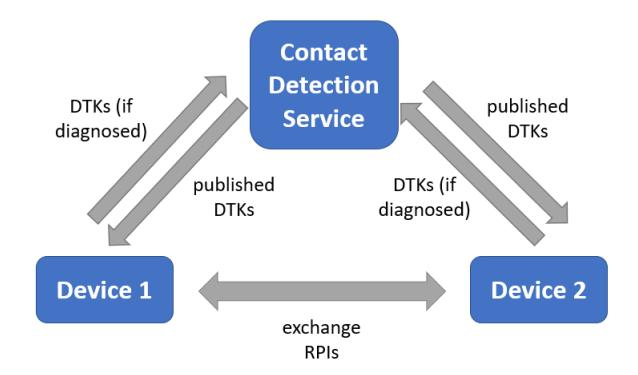
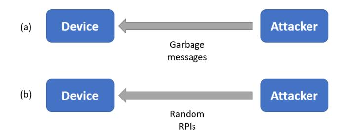
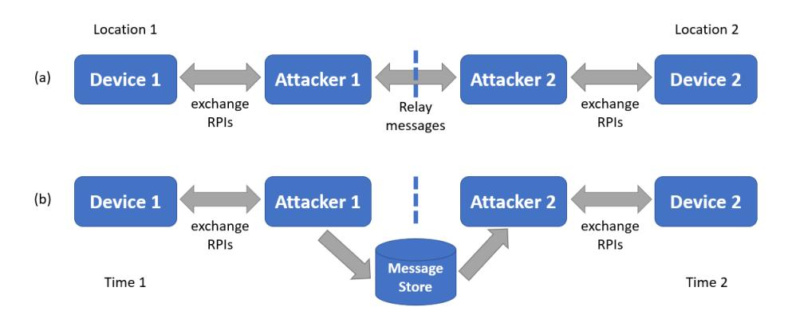
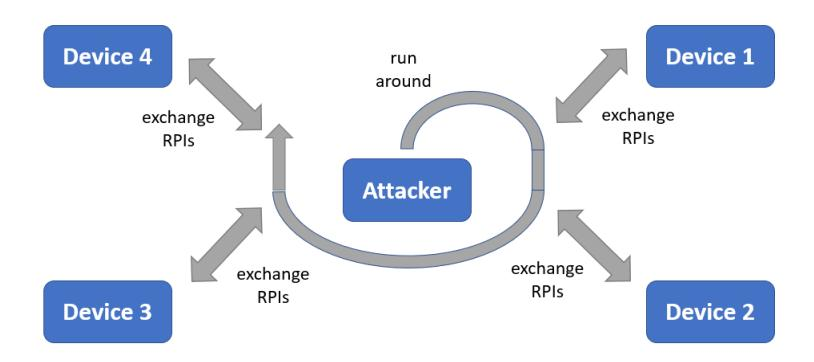
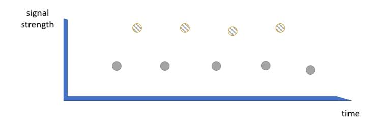
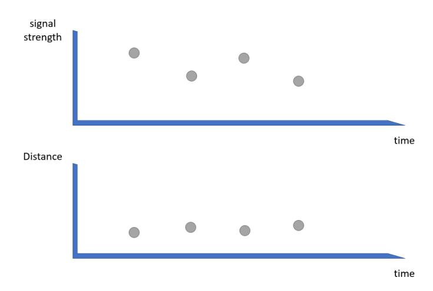
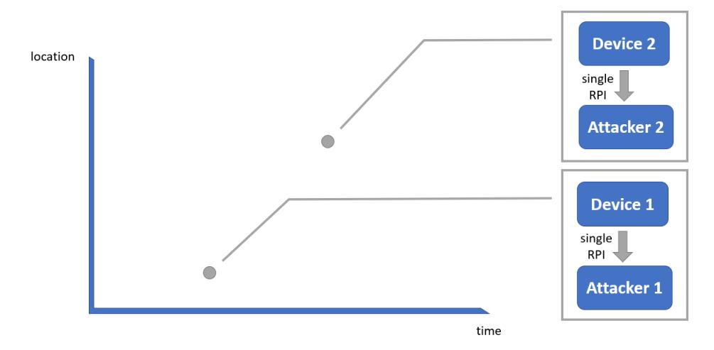
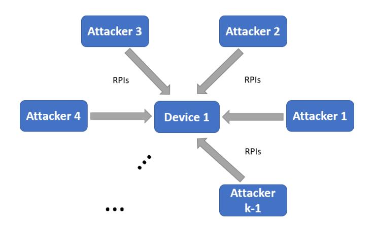

# SECURITY ANALYSIS OF THE COVID-19 CONTACT TRACING SPECIFICATIONS BY APPLE INC. AND GOOGLE INC.

A PREPRINT

#### Yaron Gvili

Cryptomnium LLC cryptomniumllc@gmail.com

September 26, 2020

## ABSTRACT

In a joint effort to fight the COVID-19 pandemic, Apple Inc. and Google Inc. recently partnered to develop a contact tracing technology, inspired by the DP-3T and TCN protocols, to help governments and health agencies reduce the spread of the virus, with user privacy and security central to the design. The partnership announcement included technical specifications of the planned technology, which has great potential for widespread adoption due to the global reach of the two companies. At the same time, the anonymous distributed setting for contact tracing as well as other aspects of the specifications create opportunities for attackers to mount common attacks on the technology.

In this work, we provide a security analysis of these specifications, the initial version of which was communicated early on to Apple Inc. in April this year, soon after announcement of the specifications. We show that the current specifications may introduce significant risks to society due to the common attacks and propose novel mitigation strategies for these risks that do not require major changes to the technology and are easy to adopt. To the best of our knowledge, ours is the first contact tracing proposal to mitigate the risks of all these common attacks in the anonymous distributed setting without introducing architectural changes. Our analysis focuses mostly on system security considerations, which have not been well covered previously, yet also includes novel information security considerations. We leave out of scope a discussion on how important or effective the technology is in fighting the pandemic.

*K*eywords Security analysis · COVID-19 · Contact Tracing · System Security · Information Security

## 1 Introduction

The COVID-19 pandemic, spread by the SARS-CoV-2 virus, has transformed the world in the last few months. It has forced strong confinement measures in most countries in the world that drastically changed the global economy. The resulting global economic impact is yet to be determined but it is likely this pandemic is one of the worst economic events from a historical perspective.

As part of the response to the pandemic, governments introduced technology tools to monitor the spread of the virus in order to better control and reduce it. These tools aim to introduce automation to epidemiological investigations and to help in limiting the confinement measures to small areas instead of entire cities or countries. However, these tools often rely on tracking the locations of virtually all citizens over a significant period of time, in violation of individual privacy rights. Consequently, researchers proposed solutions for contact tracing based on proximity of mobile devices of individuals while preserving their privacy. We describe some of these proposals in Section [1.1.](#page-1-0)

Recently, a notable initiative known as the Privacy-Preserving Contact Tracing Project was launched by Apple Inc. and Google Inc. The two companies announced a partnership to build an interoperable COVID-19 contact tracing technology into their mobile platforms [\[2,](#page-13-0) [18\]](#page-14-0). They published a first version of the specifications for the technology [\[8,](#page-13-1) [3,](#page-13-2) [4\]](#page-13-3), labeled v1.0, and later published additional versions under the name Exposure Notifications [\[7,](#page-13-4) [5,](#page-13-5) [6\]](#page-13-6), labeled v1.1 and v1.2. This is a promising initiative that has the potential to succeed at a global scale due to the global reach of the two

companies as well as their ability to build the technology directly into the operating system layer of their platform for better security.

While the specifications proposed by Apple Inc. and Google Inc. have desirable privacy and security properties, they also open the door to various types of attacks that could pose significant risks to society. In this work, we analyze the specifications, focusing mostly on system security consideration yet also include novel information security considerations. It is our hope that our analysis will help improve the security of future systems that would be built along the lines of the specifications.

#### 1.1 Related Work

Vaudenay [\[31\]](#page-14-1) provided a security analysis of a similar proposal, the Decentralized Privacy-Preserving Proximity Tracing (DP-3T) system [\[15\]](#page-14-2), formerly endorsed by the Pan-European Privacy-Preserving Proximity Tracing (PEPP-PT) project [\[24\]](#page-14-3).

An international group of researchers proposed the Private Automated Contact Tracing (PACT) protocol [\[26\]](#page-14-4) in an effort to see technical convergence of various similar proposals:

- The Covid-Watch proposal [\[14\]](#page-14-5) and the related TCN protocol [\[29\]](#page-14-6).
- The Canetti et al. protocol [\[11\]](#page-13-7).
- The DP-3T protocol [\[15,](#page-14-2) [16\]](#page-14-7).
- A different protocol that goes by the same PACT acronym [\[12\]](#page-13-8).

The specifications by Apple Inc. and Google Inc. that we consider in this work are inspired by the above proposals. Our analysis is relevant to many of them, however this paper focuses on the specifications for concreteness and applicability purposes.

Ali and Dyo [\[1\]](#page-13-9) introduce a technique for k-anonymity comparable to a k-anonymity technique we present in Section [4.2.](#page-10-0) Their technique protects the privacy of positively diagnosed users, who publish information enabling their contacts to learn they were exposed, whereas ours protects the privacy of all users prior to such publishing.

The Crypto Group at IST Austria [\[30\]](#page-14-8) discuss a kind of Sybil attack comparable to two attacks we discuss. They introduce protocols designed to thwart an attack they call inverse-Sybil, in which the attacker deploys many active devices that pretend to be a single user, in order to lead many people to believe they were exposed, once the user publishes as positively diagnosed. Their protocols rely on the assumption that these devices cannot constantly communicate, which may not hold against a capable attacker. In comparison, in Section [3.3](#page-8-0) we discuss a similar attack that uses one device and offer mitigation strategies for this attack that are effective also against the inverse-Sybil attack; in Section [4.2](#page-10-0) we discuss a Sybil attack, in which the attacker deploys many passive devices in order to deanonymize a user, and introduce a mitigation strategy for it that does not rely on such an assumption.

Beskorovajnov et al [\[32\]](#page-14-9) argue any contact tracing protocol which is strictly based on non-interactive sending and receiving of local broadcasts without considering the actual time and location will be vulnerable to relay and replay attacks. In Section [3.2,](#page-6-0) we discuss such attacks and offer mitigation strategies for them.

## 1.2 Security Assumptions

This work makes the following security assumptions:

- 1. Communication between contact tracing devices occurs only in short-range anonymous broadcasts.
- 2. A contact tracing device may open an encrypted-authenticated or anonymous channel to the cloud.
- 3. A passive (resp. active) attacker can capture broadcasts from (resp. capture broadcasts from and inject to) contact tracing devices only in areas where the attacker is physically located.
- 4. Communications jamming is not allowed.
- 5. The attacker has medium-level resources, much more than a typical user yet much less than the contact tracing network as a whole. In particular, the attacker can be at multiple physical locations but cannot cover major portions of the network.

## 1.3 Our Contributions

Our analysis in this work focuses mostly on systems security yet also includes novel information security considerations. The aspect of systems security has received relatively less attention in related work. The proposals cited in Section [1.1](#page-1-0) emphasize information security and we refer to them for more details beyond our information security analysis.

Our analysis targets the specifications by Apple Inc. and Google Inc. and avoids architectural (including hardware) changes. We identify common attacks and their consequences, and offer novel mitigation strategies relevant to the specifications by considering both systems and information security. We indicate in our analysis where we included known mitigation strategies not adopted in the specifications. We consider an anonymous distributed setting for contact tracing where only anonymous unidirectional messages between devices are used.

In more detail, our main contributions are:

- 1. An analysis of power and storage drain attacks (Section [3.1\)](#page-5-0), along with novel mitigation strategies for them based on proof-of-work and handling at the operating system level. These denial-of-service attacks are not trivial to mitigate in an anonymous distributed setting[1](#page-2-0) .
- 2. An analysis of relay and replay attacks (Section [3.2\)](#page-6-0) along with mitigation strategies based on location cells with a privacy trade-off. We show that fake contact events can be effectively mitigated without introducing architectural changes, such as public key infrastructure for authentication or bidirectional communication for challenge-response protocols, as has been proposed in previous proposals[2](#page-2-1) .
- 3. An analysis of trolling attacks (Section [3.3\)](#page-8-0), in which devices of positively diagnosed persons are used to cause others to wrongly believe they were in proximity to such persons, along with mitigation strategies based on anomaly detection and without relying on a trusted platform module.
- 4. An analysis of linking attacks (Section [4.1\)](#page-9-0) based on timing and signal-strength along with novel mitigation strategies for them based on rejection sampling.
- 5. An analysis of tracking and deanonymization attacks (Section [4.2\)](#page-10-0), in particular signal-locating and singlingout attacks, along with novel mitigation strategies for them based on rejection sampling and a notion of k-anonymity. We also consider an active Sybil attack, in which the attacker assumes many identities in an attempt to overcome mitigation strategies. This type of attack is not trivial to mitigate in an anonymous distributed setting[3](#page-2-2) . We show that, surprisingly, the risks of this attack can be mitigated without introducing architectural changes.

We propose to apply this set of mitigation strategies to the specifications and to similar proposals. While the above attacks have all been previously considered, our proposal provides practical mitigation strategies for all these attacks together. To the best of our knowledge, our proposal is the first to mitigate the risks of all of the above attacks in an anonymous distributed setting without introducing architectural changes, making it easier to adopt than proposals that do introduce such changes.

## 1.4 Organization

This paper is organized as follows. Section [2](#page-2-3) provides an overview of the specifications by Apple Inc. and Google Inc. A systems security analysis of the specification is given in Section [3](#page-4-0) while an information security one is given in Section [4.](#page-9-1) The analyses describe a number of attacks, their consequences, and mitigation strategies for them. Section [5](#page-13-10) concludes.

## 2 Overview of the Specifications

We first discuss the v1.0 specifications in detail and then describe the incremental changes in v1.1 and v1.2 more generally, since the security analysis will be similar for all these versions.

The main scenario described in the v1.0 specifications considers two users, Alice and Bob, each having a mobile device that runs the specified system [\[8,](#page-13-1) [3,](#page-13-2) [4\]](#page-13-3). Each mobile device uses BLE to exchange (i.e. advertise and receive) anonymous identifier beacons with other unknown mobile devices in proximity. The generated anonymous identifier,

1 For example, Vaudeney [\[31\]](#page-14-1) proposed peer (app-to-app) authentication, which is an architectural change.

For example, for relay attacks, bidirectional communication was proposed in [\[31\]](#page-14-1) and [\[11\]](#page-13-7) while [\[12\]](#page-13-8) does not protect against them. For replay attacks, the PACT proposal [\[26\]](#page-14-4) argues that GPS is not accurate enough and doesn't work well indoors.

3 In [\[17\]](#page-14-10) this type of Sybil attack is considered an inherent risk even in centralized designs that share observed identifiers.

Figure 1: Overview of the contact tracing system. A pair of devices exchange rolling proximity identifiers (RPIs) while they are in proximity using Bluetooth Low-Energy (BLE) advertising. Each device anonymously publishes to the Contact Detection Service its daily tracing keys (DTKs) in the last 14 days if its owner was diagnosed to have been infected. Each device anonymously downloads published DTKs from the Contact Detection Service and compares the RPIs derived from them to the ones it received via advertising. In case the device finds matches covering a sufficient duration of time, the device notifies its owner that they have been exposed without identifying to whom.

called rolling proximity identifier, has a size of < 40 bytes, is advertised about every 250 milliseconds, and changes about every 15 minutes. It is derived from a private daily tracing key, which changes daily, that in turn is derived from a private tracing key which is generated once per device. The mobile device keeps for 14 days (or any period determined by public health authorities) any anonymous identifiers received during this period.

In the scenario, Alice and Bob meet and have a 10-minute conversation. During this time, Alice's mobile device collects anonymous identifiers from Bob's proximate mobile device and vise versa, and possibly other anonymous identifiers from other mobile devices that happen to have been proximate at the time. This is performed by a Contact Detection Service in the mobile device. Later on, Bob is positively diagnosed for COVID-19 and reports this result to a public health authority. With Bob's consent, his mobile device uploads to the cloud the daily tracing keys used to generate his anonymous identifiers in the last 14 days. The uploaded keys are called diagnosis keys. Alice's mobile device periodically downloads the diagnosis keys uploaded to the cloud by anyone in the last 14 days, without knowing who the keys belong to, and finds a match between some of the identifiers it collected in the last 14 days and those derived from a diagnosis key generated in the last 14 days. Alice's mobile device raises an alert of this find to Alice.

Figure [1](#page-3-0) shows an overview of the system.

The v1.0 Bluetooth specification [\[3\]](#page-13-2) adds a few definitions of interest.

- 1. The Bluetooth configuration is defined to prevent connections to the mobile device and to use a random address.
- 2. The rolling proximity identifier is changed synchronously with this address so as to prevent linking of rolling proximity identifiers.
- 3. Scanned advertisements, i.e. events received from the Contact Detection Service, are timestamped but not located.
- 4. The scanning interval and window may be opportunistic and must be sufficient for discovering nearby advertisements, i.e. events sent from nearby Contact Detection Services, within 5 minutes.

The v1.0 cryptography specification [\[4\]](#page-13-3) adds the following definitions of interest. The external functions defined are:

- HKDF(Key, Salt,Info, OutputLength) designates a key derivation function.
- HMAC(Key, Data) designates an HMAC function.
- Truncate(Data, L) designates a function that returns the first L bytes of Data.
- DayNumber designates the number of 24-hour periods that passed since Unix Epoch Time.
- TimeIntervalNumber designates the number of 10-minute periods that passed since a 24-hour period started.
- CRNG(L) designates a function that returns the next L bytes from a cryptographic random number generator.

Figure 2: Power and storage drain attacks. (a) In a power drain attack, the attacker advertises using Bluetooth Low-Energy (BLE) garbage messages intended to wake up the device to drain its power. (b) In a storage drain attack, the attacker advertises meaningful messages that contain random rolling proximity identifiers (RPIs) intended to drain the storage of the contact tracing application running on the device, which is led to store them.

The key schedule for contact tracing is defined as follows:

- The notation || stands for string concatenation.
- The tracing key is defined as tk ← CRNG(32).
- The daily tracing key is defined for day number Di as

$$dtk_i \leftarrow HKDF(tk, null, (UTF8("CT-DTK")||D_i), 16).$$

• The rolling proximity identifier for time interval number TINj is defined for day number Di as

$$RPI_{i,j} \leftarrow Truncate(HMAC(dtk_i, (UTF8("CT-RPI")||TIN_j)), 16).$$

The v1.1 and v1.2 Bluetooth specifications includes one change important for our security analysis, namely the transmit power level field within the metadata structure in the advertising payload[4](#page-4-1) .

The v1.1 and v1.2 Cryptography specifications include a number of changes of interest[5](#page-4-2) . It defines:

- a Temporary Exposure Key that is generated daily and replaces the daily tracing key;
- a Rolling Proximity Identifier Key derived from the Temporary Exposure Key and replaces the daily tracing key;
- a Rolling Proximity Identifier derived from the Rolling Proximity Identifier Key and from the interval number;
- an Associated Encrypted Metadata Key derived from the Temporary Exposure Key;
- an Associated Encrypted Metadata derived from the Associated Encrypted Metadata Key and the metadata structure.

## 3 Systems Security Analysis

This section provides a systems security analysis of the specifications by considering attacks, their consequences, and mitigation strategies for them. We use the v1.0 specification terminology, since it most cases the implications to the v1.1 and v1.2 specifications are straightforward due to the closeness of the versions from a security standpoint; where there are notable differences, we discuss them explicitly. In some of the mitigation strategies, we rely on (authenticated[6](#page-4-3) ) encryption using a private key assumed to be securely managed at the platform level, like the tracing key is.

4We will later see this field used in a proposed mitigation strategy.

5Except for the transmission power in the metadata structure, these changes do not materially affect our security analysis.

6 If the threat model allows an attacker to modify the system's storage, except for the private key which is stored securely (e.g. in a SIM card), then authenticated encryption is used. Our mitigation strategies only store entries of encrypted proximity identifier along with associated information. A storage modification attack cannot add fake entries, which would fail to authenticate, and so false positives (incorrectly flagging a match) are prevented. On the other hand, the attack can destroy some or all entries in the system's storage by overwriting them with garbage entries. The attack could later lead to false negatives (incorrectly flagging no match) but would be immediately detectable since the garbage entries would fail to authenticate. We note that the PACT protocol [\[26\]](#page-14-4) recommended using encryption, but not authenticated encryption, for metadata storage.

## 3.1 Power and Storage Drain Attacks

Power and storage drain are denial-of-service attacks involving a large volume of messages. While the Bluetooth specification [\[3\]](#page-13-2) mentions the requirement to deal with large volumes of advertisers, it does not specify how.

Attack: The adversary attacks a nearby device by advertising a large volume of messages from a source. The device is forced to wake up the contact tracing application to process each such message. If the message is invalid, the device discards it but has paid a power cost; this is a power drain attack. If the message is valid, the contact tracing application running on the device stores the proximity identifier contained in the message; this is a storage drain attack. These attacks are effective when carried out persistently against a target over time, but not necessarily at a high rate. Figure [2](#page-4-4) illustrates these attacks. Possible extra effects of these attacks may include keeping the attacked device busy, slowing down or preventing its own advertising or other useful work. The attacks are especially efficient in a crowded area where the attacker advertises to a significant radius, since each message impacts many mobile devices in the crowd. In particular, BLE messages can be successfully received in a range of 350 meters in Bluetooth 4, and in Bluetooth 5 this range has quadrupled for the same power consumption rate [\[21\]](#page-14-11). Thus an attacker can target persons in the crowd at different distances by varying the signal strength (along with the transmit power level field for v1.1 and v1.2). This will also make it harder to determine the messages are originating from a common source.

The power and storage drain attacks are briefly mentioned by Vaudenay [\[31\]](#page-14-1), along with a proposal to use device-todevice channel authentication, which requires an architectural change we aim to avoid. Vaudenay [\[31\]](#page-14-1) also notes that protection measures against denial-of-service attacks exist, however without specifying these measures. In fact, it is not straightforward to counter these attacks in the specifications' anonymous distributed setting. The standard mitigation strategy of recognizing a misbehaving party and banning them by their networking address is infeasible here because of anonymity (e.g. random addresses). For the same reason, the device cannot recognize a common source of multiple valid but rogue messages. Moreover, the power cost is incurred as soon as the mobile device is woken up to process a message.

The Bluetooth specification [\[3\]](#page-13-2) briefly discusses scan power considerations. It specifies that whenever possible the hardware or operating system should filter out duplicate messages to prevent excessive power drain. However, this strategy does not mitigate the power drain attack describe here because most, if not all, of the garbage messages are distinct. Moreover, this strategy clearly does not mitigate the storage drain attack.

Consequences: At first, the power drain attack does not appear to be a serious threat because it does not directly impact the services provided by the system. The same is true for the storage drain attack, provided the storage space has not been depleted. However, a user who notices the power drain may decide to opt out of using the system. In particular, this is the case for on-the-go users as well as for users who are sensitive to the cost of recharging their mobile device, who tend to be from a low socioeconomic background. Similarly, a user noticing a storage drain may choose to opt out. An attacker may well be motivated to attack specific persons or events. Publicity of such attacks could convince many users to opt out of the system, and its effectiveness would be significantly diminished; this is a serious threat that could be executed in any target region. Hinch et al [\[19\]](#page-14-12) describes simulation results suggesting that effectiveness of the system is diminished when the opt-in rate falls below 56%. However, this does not mean that the attacker must implement the attack against at least 44% of the users in a target region. Instead, the attacker may only need to attack a much smaller portion of the user population in order to undermine confidence of the general public in the system, and to lead many other users who have not been directly attacked to opt out as well.

Mitigation: We propose that when the rate of messages is high the device requires that a valid message include a low-power (and small-sized to fit within a BLE message) proof-of-work that can be checked by a low-level handler without waking up the device. We will see the overhead of this can be kept fairly low. A BLE packet already includes a 48-bits randomized MAC address; we propose using it as nonce in a proof-of-work, which also inputs a random beacon to prevent attackers from precomputing proofs. The device will require a proof-of-work only when the rate of messages exceeds a threshold indicating a rare event of > n advertisers being nearby. An advertising device, which generally measures a bit different rate in the same area, will include a proof-of-work starting from a bit lower threshold, to allow the messages to be accepted. A choice of n = 100 seems reasonable and would require < 1 MB per day to store (deduplicated) proximity identifiers[7](#page-5-1) under normal conditions; this will keep far away from draining storage even in low-end devices. This strategy takes advantage of the specifics of contact tracing technology to mitigate an attack inherent in an anonymous distributed setting (and more generally in wireless communication), allowing the attacked device to filter out garbage messages at a minimal power cost while imposing a computational cost sufficient to deter an attacker who advertises a large number of valid but rogue messages. Any proof-of-work consuming little power to validate and configurable for the amount of resources required to generate will do. For example, assuming a wake-up requires k 1 times more power than to process a message, a proof-of-work requiring k times more power to generate

7Recall that a proximity identifier takes < 40 bytes and changes about every 15 minutes.

Figure 3: Relay and replay attacks. (a) In a relay attack, the attacker operates at two locations and relays messages between them, leading devices at the two locations to falsely believe they have been in proximity; the vertical dashed line marks the boundary between the two locations. (b) In a replay attack, the attacker operates at two different times, replicating messages from an earlier time to a later time using a message store, leading devices at two different time points to falsely believe they have been in proximity; the vertical dashed line marks the boundary between the two time points.

than to process would only about double the power required to wake up and generate a message, but would multiply by k the power required from the attacker to generate a valid message. If many invalid messages are advertised, the attack is easily detected. It is well-known that an attack in which a message is duplicated, to avoid the cost of producing a fresh proof-of-work, is easily thwarted by filtering out duplicate messages.

We note some known mitigation strategies that are not considered in the specifications. The device can detect the attack by observing a higher than reasonable rate of messages, or by observing the power or storage draining faster than normal. The device may then alert the user, advise the user on appropriate actions such as leaving the area, or report the attack to the cloud. The latter report may include information on the timing and signal strength, along with the transmit power level field for v1.1 and v1.2, of the messages received during the attack. While these mitigation strategies do not require architectural changes, they either bother the user or loosen up user privacy.

#### 3.2 Relay and Replay Attacks

In a relay or replay attack, the attacker advertises a message it received from an honest user. In a relay (resp. replay) attack, the message is advertised immediately (resp. some time) after receiving it. Vaudenay [\[31\]](#page-14-1) classifies these attacks as false alert injection attacks, and notes that an attacker who owns a contact tracing app could use them to get an advantage in disturbing competitors.

Attack: In a relay attack, the attacker uses two devices at two disparate locations and advertises from one device any message relayed from the other. In a replay attack, the attacker uses one or two devices at different times and advertises at the later time a message recorded at the earlier time. Figure [3](#page-6-1) illustrates these attacks. In a related replay-of-released-cases attack, the attacker advertises a proximity identifier derived from a diagnosis key before the victim observes the publication of this key. The victim of any of these attacks, who is nearby the advertising device of the attacker, receives a proximity identifier with a fake location or time. If one of the proximity identifiers so received is later matched to a diagnosis key, the victim is falsely led to believe they have been in contact with a diagnosed person due to this match.

The relay and replay attacks are analyzed in the PACT protocol paper [\[26\]](#page-14-4) and other proposals it builds on. The paper offers an effective mitigation strategy that involves storing the timestamp of a received proximity identifier and later matching the timestamp to the time interval number found for the proximity identifier (as discussed below). However, the specifications only include the storing of the timestamp but do not use it in the matching procedure, and so remain exposed to these attacks. Moreover, the PACT protocol and related proposals do not include the stored location for the received proximity identifier in the matching procedure, which allows the relay attack. To the best of our knowledge, the same is true in all previous proposals[8](#page-6-2) . We therefore believe it is worthwhile discussing these attacks and their mitigation strategies here in more detail.

8 For example, the DP-3T white paper [\[16\]](#page-14-7), which refers to this attack as fake contact events, concludes it is unavoidable in location tracing systems based on connectionless Bluetooth broadcasts.

The relay and replay attacks are also analyzed by Vaudenay [\[31\]](#page-14-1) along with mitigation strategies for them. However, these mitigation strategies require bidirectional communication between the advertising and receiving devices in order to implement a challenge-response protocol. This has the disadvantage of qualitatively changing the communication architecture of the system, leading to various other issues, such as a more complex system that consumes more power and is exposed to accidental or rogue communication drops. We show below mitigation strategies that do not require changing the communication architecture and are easy to adopt.

Consequences: A relay or replay attack against specific persons could lead them to falsely believe that they have been exposed to a positively diagnosed person. This happens when a relayed or replayed rolling proximity identifier was derived from a daily tracing key that has been published by a positively diagnosed person. The victim, and possibly also their families and additional people they have been in contact with, will go into quarantine and get tested for the virus in vein. To the victims of the attack, this can be frustrating at best but could also lead to adverse economic impacts.

If the relay or replay attacks are allowed to be executed at scale, many victims will falsely believe they have been in contact with a diagnosed person. Besides the anxiety of the victims and their close ones, the victims will go get tested for the virus for no good reason. This will not only waste precious diagnosis resources but could also lead to a loss of trust in either the system, the diagnosis procedure, or both.

Mitigation: We first consider the relay and replay attacks. The system is modified to require that the Data argument to the HMAC function in the construction of the rolling proximity identifier also include the current location cell number LCNk of the advertising device:

$$RPI_{i,j,k} \leftarrow Truncate(HMAC(dtk_i, (UTF8("CT-RPI")||TIN_j||LCN_k)), 16)$$
(1)

where the possible location cells are predefined in the system and form a partitioning of the space. The choice of partitioning is left open. It involves a basic trade-off: a finer granularity leads to a stronger limitation on the range of a relay attack, yet too fine a granularity would lead to reduced privacy of owners of published keys against nearby attackers. Similar techniques have been presented in concurrent works [\[25,](#page-14-13) [9,](#page-13-11) [17\]](#page-14-10). However, these techniques incorporate GPS coordinates into the proximity identifier whereas our technique uses a location cell which provides a privacy trade-off. As compared to strategies that do not rely on location and are exposed to a relay attack, this strategy has the overhead of performing self-locating, though this overhead is competitive with that of other strategies that rely on GPS. We stress that *the location is not stored*; instead the operating system determines the location cell when generating the proximity identifier. Moreover, the location need not be provided to the contact tracing app, which could raise security concerns, but can be used at the level of the operating system, which is trusted. Note that coarse-grained self-locating is sufficient here, and this allows for a trade-off between location privacy and the level of risk of relay and replay attacks. We view this trade-off a matter of personal or societal choice. We further argue that self-locating can be done more efficiently and accurately that using GPS alone, as suggested in other works. We defer the discussion of various methods for improving the efficiency and accuracy of self-location to Appendix [A.](#page-15-0)

Now, the modification limits the scope of the attack to within the location cell. Moreover, it has no bearing on privacy: since an attacker who receives such a proximity identifier already knows his or her current location (to some granularity) just like they know the current time, while non-contacting parties do not learn the location as they don't the time, and infected persons who reported already allow determining their location and time regardless of this attack. The device associates a private encryption of the location cell with the received proximity identifier it stores. The matching procedure is modified to generate from a diagnosis key a larger set of proximity identifiers, by enumerating not only all possible time interval numbers but also all possible location cells, and accept a matching identifier if it is also associated with the location cell used to generate it. It may be desirable to optimize this procedure by limiting the enumerated set of location cells given some (privately encrypted) extra information, e.g. the cities visited during the day in question. This is more likely to be desired by users who are less sensitive to privacy, while privacy-sensitive users may prefer such information not be automatically sensed and stored but manually input to the procedure. In both cases, we expect that the increased computational work required by the modified matching procedure would not be a problem since it is not invoked frequently.

We now consider a mitigation strategy for the replay-of-released-cases attack. The device associates a private encryption of the current day number and current time interval number with the received proximity identifier it stores. The cloud publishes the diagnosis key in the beginning of the next time interval number after it is reported along with the publishing time t. The matching procedure ignores any proximity identifier associated with a time (calculated from the associated day number and time interval number) at or beyond t. To further strengthen security, the matching procedure is modified to accept a matching identifier only if it is also associated with the location cell number (rather than just the day number and time interval number) used to generate it. This modification limits the scope of the attack to within the area defined by the location cell number, and offers the same privacy trade-off discussed above. Similar modification has been proposed in concurrent works (e.g. [\[9\]](#page-13-11)) but based on GPS coordinates which do not offer a privacy trade-off.

Figure 4: Trolling attack. The attacker, who is diagnosed or expects to be diagnosed, attaches its device to a carrier that runs around and exchange rolling proximity identifiers (RPIs) with devices at multiple times and locations. When the attacker publishes his daily tracing keys (DTKs), the owners of the devices are falsely led to believe they have been exposed.

Taking the above modifications together, the matching procedure Match(dtki ,t, RPI) defined for a diagnosis key dtki of the ith day, for publishing time t, and for a proximity identifier RPI to match, becomes equivalent to

$$\exists j, k : RPI = RPI_{i,j,k} \land Time(i,j) \ge t$$
(2)

where RPIi,j,k is defined as in Equation [1](#page-7-0) and Time(i, j) is the beginning time of the jth interval of the ith day.

Finally, we note that the availability of time and location information does not adversely impact security because an adversary already has this information given the specifications, as has also been demonstrated in a concurrent work [\[13\]](#page-14-14), in which geographic paths of diagnosed individuals are simulated and then reconstructed from simulated sniffing of their contract tracing messages.

#### 3.3 Trolling Attacks

Trolling attacks are intended to cause false positives, i.e. to falsely lead people to believe they have been in contact with a positively diagnosed person, by generating messages. We discussed other attacks that can cause false positives, by reusing existing messages, in Section [3.2.](#page-6-0)

Vaudenay [\[31\]](#page-14-1) discusses trolling attacks as part of an analysis of false alert injection attacks, with similar consequences as noted in Section [3.2.](#page-6-0) However, this work does not discuss the particular attack described here, which is similar to a demonstrated attack that led to fake traffic jams on Google Maps [\[10\]](#page-13-12). Anderson [\[27\]](#page-14-15) briefly discussed this attack but did not offer a mitigation strategy for it.

We note that the Crypto Group at IST Austria [\[30\]](#page-14-8) discuss a different kind of trolling attack; see Section [1.1](#page-1-0) for details.

Attack: The adversary is a person who is diagnosed or expects to be diagnosed soon, and is interested in causing unsuspecting people to fear they have been exposed to the virus. The adversary attaches his mobile device to a carrier (such as a dog, car, or drone), that runs around and advertises proximity identifiers to devices of unsuspecting people, either before or after the adversary's tracing keys are published. The adversary may also choose to target specific unsuspecting persons. Figure [4](#page-8-1) illustrates these attacks.

Consequences: The unsuspecting people will fear they have been exposed to the virus and will go get diagnosed for no good reason. If done at sufficient scale, this attack could not only waste precious diagnosis resources but could also lead to a loss of trust (at least locally) in either the system, the diagnosis procedure, or both.

Mitigation: We propose that when unsuspecting people approach public health authorities for diagnosis, which is a normal procedure, the system allows the public health authorities to gather the proximity identifiers collected by the unsuspecting people's mobile devices that match the adversary's diagnosis key. The overhead of this is minimal. From these identifiers and key, the health authorities can reconstruct time intervals and location cells (collected as described in Section [3.2\)](#page-6-0) to pinpoint the adversary. While this has an impact on privacy of users, we note that public health authorities already conduct epidemiological investigations that gather this information, which is limited to exposed persons (rather than all users, like in a centralized solution), manually and using automated contact tracing tools. If the attack is done at sufficient scale, the public health authorities will notice a concentration of matches due to a specific diagnosis key, at various times and locations that would appear as an abnormal trace, regardless of whether the adversary published tracing keys before or after the attack. Thus, the public health authorities will recognize the attack as well as

Figure 5: Linking attack. The attacker observes the signal strength and timing of messages, shown as circles. The attacker then links observations, i.e. determine that they originate from the same source by clustering the observations based on similarity of signal strength and of time difference of consecutive observations. In the example shown, two clusters are determined. The cluster of each observation is fill-pattern-coded.

the attacker and will take appropriate action. The system also allows the public health authorities to securely publish (e.g. using digital signatures and authentication) revocations of times and locations for a diagnosis key that would be ignored by the matching procedure. If the attack is targeted at specific unsuspecting persons, it may still produce an abnormal trace (e.g. a drone's trace would look very different from a person's) or a trace that appears to deliberately target the unsuspecting persons.

# 4 Information Security Analysis

While this is not explicit in the specifications, we assume that the channel between the mobile device and the cloud is authenticated. This is also recommended by Vaudenay [\[31\]](#page-14-1). Section [3](#page-4-0) discussed mitigation strategies for attacks that exploit the non-authenticated channel between mobile devices. We also assume that false reports to public health authorities, discussed by Vaudenay [\[31\]](#page-14-1), are mitigated, e.g. using permission numbers as discussed by Rivest et al. [\[26\]](#page-14-4).

We assume that the system, being implemented at the operating system level, does not allow custom applications to access the information it gathers except through interfaces to very specific use cases. This security measure mitigates the risk of rogue applications building a database of proximity events that can be enriched with external information and analyzed. It also mitigates the risk of coercion, in which the attacker (possibly physically) forces targeted persons to disclose proximity events collected in their mobile devices. Vaudenay [\[31\]](#page-14-1) discussed these risks (as nerd and coercion attacks) and concluded that a Trusted Platform Module (TPM) is required. Our view is that operating-system level security is sufficient mitigation for these risks, given that the operating system is trusted.

#### 4.1 Linking Attacks

Linking attacks are intended to reduce privacy by exposing messages as linked even though they were intended to appear unlinked. [\[13\]](#page-14-14) produced simulation results showing that this type of attack is feasible and can be quite effective. Existing proposals have considered some forms of linkage attacks based on the content of the messages, i.e. the proximity identifiers; here we consider other forms of linkage attack based on timing of messages and on the signal strength, as well as the transmit power level field for v1.1 and v1.2. To the best of our knowledge, satisfactory mitigation strategies for these attacks have not been proposed in previous proposals. The PACT proposal [\[26\]](#page-14-4) states that timing of broadcasts does not need to be precise or regular; we will show that the timing of advertising is actually important in mitigating the timing-based linkage attack.

Attack: The attacker is interested in exposing two messages as originating from the same target device. We assume that the target device uses a regular frequency of messaging and a regular Bluetooth signal strength, as well as a regular transmit power level field for v1.1 and v1.2, since the specifications do not define otherwise. Here regular doesn't mean constant but rather as defined in the specifications, which allows some range of frequency and transmit power level. The attacker stays in a fixed location[9](#page-9-2) for a duration sufficient for receiving a number of messages from any nearby device. In a timing (resp. signal-strength) based linkage attack, the attacker may infer that two messages are more likely to be linked when their time (resp. signal strength) difference is consistent with the regular frequency of messaging (resp. with the regular signal strength or transmit power level field for v1.1 and v1.2 for some distance, or simply with a steady signal strength). The two attacks are even stronger when mounted together. Figure [5](#page-9-3) illustrates these attacks.

9A variation of this attack involves maintaining a fixed distance from a target device.

Figure 6: Tracking and deanonymization signal-locating attack. The attacker observes the signal strength and timing of messages, shown as circles in the top chart, and infers their distances, shown as circles in the bottom chart.

Consequences: The privacy of nearby persons is reduced due to the linkage of messages. If this attack is done at scale, then the privacy of many persons is reduced. This could have a chilling effect and lead people to opt out of the system, diminishing its effectiveness.

Mitigation: To deter the signal-strength-based attack, the mobile device varies the signal strength and clears (or randomizes) the transmit power level field[10](#page-10-1) for v1.1 and v1.2 in a way that makes it hard to determine with good accuracy the location of the device from the few samples that the attacker may collect over the period of time in which a proximity identifier is advertised (about 15 minutes). To this end, we propose adding noise to the signal strength using rejection sampling techniques [\[20\]](#page-14-16) to provably obtain a distribution that is statistically close to a non-informative one. Since a more proximate device can pick up lower signal-strength messages, this distribution can be set so that a proximate device would receive enough observations for distinguishing the distribution as originating from a proximate source; thus, exposure measurement using time and distance is not broken. We believe the overhead of this mitigation strategy, involving rejection sampling and proximity detection, is reasonable given the goal of avoiding architectural changes.

This mitigation strategy may be enhanced using secret sharing of proximity identifiers, as discussed in other works (e.g. [\[17\]](#page-14-10)), in order to require collecting a minimum number of shares of a proximity identifier to reconstruct it. Thus, a determined attacker would be forced to stalk the targeted person, in order to collect a sufficient number of samples, and risk getting discovered. To thwart the timing-based attack, the mobile device uses a random waiting time until advertising the next message that is drawn from an exponential distribution with mean common to all devices; this distribution makes it hard to link between messages when additional devices are nearby. We enhance this mitigation strategy below; see the discussion on the singling-out attack in Section [4.2.](#page-10-0)

#### 4.2 Tracking and Deanonymization Attacks

Tracking and deanonymization attacks are intended to violate privacy. Such attacks are already generally well motivated, e.g. in adtech, where moreover there are benefits to knowing proximity or or COVID-19 information. Vaudenay [\[31\]](#page-14-1) considered such attacks, in one case relying on false alert injections, and offered other mitigation strategies, in some cases relying on a TPM. Our analysis in Section [3](#page-4-0) showed how to mitigate false alert injections, and we have argued that a TPM is not required. In this section, we present additional mitigation strategies to tracking and deanonymization attacks.

We first consider a signal-locating attack.

Attack: The attacker is interested in exposing the identity of a person, or several persons in a meeting, whose mobile device advertised messages including particular proximity identifiers. To this end, the attacker tracks the Bluetooth signal strength, along with the transmit power level field for v1.1 and v1.2, and the location of the attacker's mobile device when each message was received, and uses this information to infer locations over time of the targeted person's

10Recall that the specifications already define other Bluetooth metadata, such as the random address, as anonymized.

Figure 7: Tracking and deanonymization singling-out attack. The attacker employs this attack at different time-andlocation pairs, shows as circles. The attacker uses a separate recording account for each device it targets, and records a single rolling proximity identifier (RPI) in each account; the recording operation is shown inside a box connected to a circle, which represent the time-and-location of recording.

mobile device to good accuracy. The attacker can then identify the targeted person by physically observing who is present at the inferred locations over time. Figure [6](#page-10-2) illustrates this attack.

Consequences: The privacy of the targeted person is violated if his diagnosis key is published. This could allow the attacker to harm, e.g. shame or extort, the targeted person. If this attack is done at scale, then the privacy of many diagnosed people would be violated. This could lead people to avoid publishing daily tracing keys or to opt out of the system, both diminishing its effectiveness.

Mitigation: The mobile device varies the signal strength, along with the transmit power level field for v1.1 and v1.2, as described in Section [4.1.](#page-9-0)

Next, we consider a singling-out attack.

Attack: The attacker brings a device to close proximity with a target person, records the proximity identifier received along with when and where, and stops recording on this device. If the target person is positively diagnosed for COVID-19 around that time, then the diagnosis keys published for the target person will allow the attacker to match one of them to the proximity identifiers recorded on the device and therefore single out the target person. This attack can be deployed at scale if the attacker can deploy many devices or can modify devices to manage a separate recording account for each target person. Figure [7](#page-11-0) illustrates this passive attack; we discuss an active variation of it later.

This attack has been not been satisfactorily mitigated in previous proposals. The PACT protocol paper [\[26\]](#page-14-4) acknowledged the attack, noting that the diagnosed person retains full privacy against non-contacts. The Canetti et al. proposal [\[11\]](#page-13-7) referred to it as a re-identification attack and offered mitigation strategies intended to detect, rather than limit, the attack and that involve a significant architectural change (extra server) as well as relatively complex cryptographic machinery (private information retrieval or private set intersection), making them less likely to be adopted. The DP-3T proposal [\[16\]](#page-14-7) described this attack but did not offer a mitigation strategy for it.

Consequences: Same as in the signal-locating attack.

Mitigation: We propose the system be modified to create an impression that at least k devices are nearby as follows. As we will see shortly, this enables a certain kind of k-anonymity, possibly at a power cost which is incurred only when needed. The system is globally configured with an advertising rate r and k-anonymity parameters, which are common to all devices and also affect the overhead of this strategy. Besides the original tracing key, the system can potentially use additional random tracing keys, whose derived daily tracing keys are never published. Each tracing key (original of random) is used to generate messages for advertising at rate r, i.e. the waiting time between two messages advertised for a common tracing key is drawn from an exponential distribution with mean 1/r. The device waits for a next measurement time, e.g. when the next waiting time of one of the tracing keys elapses. At each such time, the device measures the current advertising rate m nearby based on the timing of recent messages, received or advertised, and implements the following rules:

Figure 8: Tracking and deanonymization Sybil attack. To attack k-anonymity, the attacker uses k − 1 tracing keys for advertising, each shown as used by a separate attacker. This leads the device to believe there are k − 1 devices nearby and to use only one tracing key, believing this will achieve k-anonymity. However due to the attack, the attacker sees an anonymity set size is 1, i.e. the device has no anonymity against the attacker.

- 1. If m < rk then add a fresh random tracing key;
- 2. Otherwise, if m ≥ (r + u)k then with probability p remove a random tracing key, where u ≥ 1 and p are chosen to make it highly unlikely that m < rk after the removal[11](#page-12-0) .

Thus, it is hard for a passive attacker near the device to distinguish whether or not there are less than k devices nearby; we will see this is true *even if a diagnosis key derived from the original tracing key would be published*. Note that if there are at least k devices (not controlled by the attacker) nearby that are behaving according to this scheme, then none of them would advertise more nor expend any noticeable amount of power more than in the original scheme. Now, suppose the owner of a targeted device is positively diagnosed and a diagnosis key derived from its original tracing key is published. While the attacker can match this diagnosis key to a proximity identifier collected when near the targeted device, the attacker is unable to tell[12](#page-12-1) whether the diagnosis key belongs to the targeted device or potentially to a (nearby at the time) different device, which could be the owner of one of (at least) k − 1 other daily tracing keys; this is our notion of k-anonymity. Thus, the attacker cannot tell whether a person other than the target was nearby at the same time. The attacker might tell that the target person was absent (but not present) at a time and place if the attacker knows the target person has reported as being infected, which requires a further attack since identities of reporters are not disclosed, and if the attacker collected no proximity identifier at the same time and place that matches. While a determined attacker can reduce the anonymity set by making sure few other parties are physically nearby[13](#page-12-2), this could also put the attacker at risk of getting spotted as one of few parties nearby that could have carried out the attack.

We note that Ali and Dyo [\[1\]](#page-13-9) treated a different notion of k-anonymity; see Section [1.1](#page-1-0) for details.

In an active variation of the attack, the attacker uses k − 1 tracing keys for advertising, in order to reduce the size of the anonymity set of the target device to 1. This variation can be viewed as a Sybil attack, in which the attacker assumes many identities; it is illustrated in Figure [8.](#page-12-3) To counter this, the device uses a minimum of k0 − 1 random tracing keys, where k0 > 1, regaining k0-anonymity at a power cost. k0 may be randomly chosen as well as refreshed at random times (averaging few minutes, say) to enhance security. Interestingly, this countering does not require introducing an architectural change for peer authentication (e.g. based on a public key infrastructure), which is often used to thwart a Sybil attack by making it costly to assume identities, and instead takes advantage of the ease of assuming identities.

We note that the Crypto Group at IST Austria [\[30\]](#page-14-8) discusses a different kind of Sybil attack that is similar to the trolling attacks we consider in Section [3.3;](#page-8-0) see Section [1.1](#page-1-0) for details.

11This is intended to avoid the case of concurrent removals by multiple devices that observe m < rk.

12For this, we assume the signal varying mitigation strategy, described in Section [3.1,](#page-5-0) is used as well.

13If the attacker is not physically present, this implies the target device is physically isolated, a challenging condition to arrange or find.

# 5 Conclusions

We provided a security analysis of the COVID-19 Contact Tracing Specifications by Apple Inc. and Google Inc. that is also relevant to similar proposals, such as the DP-3T and TCN protocols. The specified system, framed in an anonymous distributed setting, is intended to help fight the COVID-19 pandemic while keeping user privacy and security central to its design. Our analysis focused on system security considerations yet also included information security considerations. We showed that the current specifications may introduce significant risks to society, such as privacy violations as well as loss of trust in the system, in COVID-19 diagnosis tests, or both. We analyzed power and storage drain attacks, relay and replay attacks, trolling attacks, linking attacks, and tracking and deanonymization attacks, as well as their consequences and novel mitigation strategies for them. The mitigation strategies we proposed do not require architectural changes to the specifications and are easy to adopt. To the best of our knowledge, ours is the first contact tracing proposal to mitigate the risks of these attacks in the anonymous distributed setting without introducing architectural changes, such as using peer authentication or bidirectional communication, as suggested in previous proposals.

## Acknowledgements

The author would like to thank Mayank Varia for insightful comments that helped improve this work.

# References

- [1] Junade Ali and Vladimir Dyo. Cross Hashing: Anonymizing encounters in Decentralised Contact Tracing Protocols. <https://arxiv.org/pdf/2005.12884.pdf>, 2020.
- [2] Apple Inc. Apple and Google partner on COVID-19 contact tracing technology. [https://www.apple.com/](https://www.apple.com/newsroom/2020/04/apple-and-google-partner-on-covid-19-contact-tracing-technology/) [newsroom/2020/04/apple-and-google-partner-on-covid-19-contact-tracing-technology/](https://www.apple.com/newsroom/2020/04/apple-and-google-partner-on-covid-19-contact-tracing-technology/), 2020. Retrieved April 12th, 2020.
- [3] Apple Inc. and Google Inc. Contact Tracing Bluetooth Specification, v1.1. [https://www.blog.google/](https://www.blog.google/documents/58/Contact_Tracing_-_Bluetooth_Specification_v1.1_RYGZbKW.pdf) [documents/58/Contact\\_Tracing\\_-\\_Bluetooth\\_Specification\\_v1.1\\_RYGZbKW.pdf](https://www.blog.google/documents/58/Contact_Tracing_-_Bluetooth_Specification_v1.1_RYGZbKW.pdf), 2020. Retrieved April 12th, 2020.
- [4] Apple Inc. and Google Inc. Contact Tracing Cryptography Specification. [https://www.blog.google/](https://www.blog.google/documents/56/Contact_Tracing_-_Cryptography_Specification.pdf) [documents/56/Contact\\_Tracing\\_-\\_Cryptography\\_Specification.pdf](https://www.blog.google/documents/56/Contact_Tracing_-_Cryptography_Specification.pdf), 2020. Retrieved April 12th, 2020.
- [5] Apple Inc. and Google Inc. Exposure Notifications Bluetooth Specification. [https://blog.google/](https://blog.google/documents/70/Exposure_Notification_-_Bluetooth_Specification_v1.2.2.pdf) [documents/70/Exposure\\_Notification\\_-\\_Bluetooth\\_Specification\\_v1.2.2.pdf](https://blog.google/documents/70/Exposure_Notification_-_Bluetooth_Specification_v1.2.2.pdf), 2020. Retrieved June 12th, 2020.
- [6] Apple Inc. and Google Inc. Exposure Notifications Cryptography Specification. [https://blog.google/](https://blog.google/documents/69/Exposure_Notification_-_Cryptography_Specification_v1.2.1.pdf) [documents/69/Exposure\\_Notification\\_-\\_Cryptography\\_Specification\\_v1.2.1.pdf](https://blog.google/documents/69/Exposure_Notification_-_Cryptography_Specification_v1.2.1.pdf), 2020. Retrieved June 12th, 2020.
- [7] Apple Inc. and Google Inc. Exposure Notifications: Using technology to help public health authorities fight COVID-19. <https://www.google.com/covid19/exposurenotifications/>, 2020. Retrieved June 12th, 2020.
- [8] Apple Inc. and Google Inc. Privacy-safe contact tracing using Bluetooth Low Energy. [https://www.blog.](https://www.blog.google/documents/57/Overview_of_COVID-19_Contact_Tracing_Using_BLE.pdf) [google/documents/57/Overview\\_of\\_COVID-19\\_Contact\\_Tracing\\_Using\\_BLE.pdf](https://www.blog.google/documents/57/Overview_of_COVID-19_Contact_Tracing_Using_BLE.pdf), 2020. Retrieved April 12th, 2020.
- [9] Benny Pinkas and Eyal Ronen. Hashomer – A Proposal for Privacy-Preserving Bluetooth Based Contact Tracing Scheme for Hamagen. [https://www.blog.google/inside-google/company-announcements/](https://www.blog.google/inside-google/company-announcements/apple-and-google-partner-covid-19-contact-tracing-technology/) [apple-and-google-partner-covid-19-contact-tracing-technology/](https://www.blog.google/inside-google/company-announcements/apple-and-google-partner-covid-19-contact-tracing-technology/), 2020. Retrieved April 12th, 2020.
- [10] Brian Barrett. An Artist Used 99 Phones to Fake a Google Maps Traffic Jam. [https://www.wired.com/story/](https://www.wired.com/story/99-phones-fake-google-maps-traffic-jam/) [99-phones-fake-google-maps-traffic-jam/](https://www.wired.com/story/99-phones-fake-google-maps-traffic-jam/), 2020. Retrieved June 12th, 2020.
- [11] Ran Canetti, Ari Trachtenberg, and Mayank Varia. Anonymous Collocation Discovery: Harnessing Privacy to Tame the Coronavirus. <https://arxiv.org/pdf/2003.13670.pdf>, 2020.
- [12] Justin Chan, Dean Foster, Shyam Gollakota, Eric Horvitz, Joseph Jaeger, Sham Kakade, Tadayoshi Kohno, Jogn Langford, Jonathan Larson, Puneet Sharma, Sudheesh Singanamalla, Jacob Sunshine, and Stefano Tessaro. PACT: Privacy Sensitive Protocols And Mechanisms for Mobile Contact Tracing. [https://arxiv.org/pdf/2004.](https://arxiv.org/pdf/2004.03544.pdf) [03544.pdf](https://arxiv.org/pdf/2004.03544.pdf), 2020.

- [13] Corona-sniffer. <https://github.com/oseiskar/corona-sniffer>, 2020. Retrieved August 30th, 2020.
- [14] Covid Watch. <http://www.covid-watch.org>, 2020. Retrieved April 12th, 2020.
- [15] Decentralized Privacy-Preserving Proximity Tracing. <https://github.com/DP-3T/documents>, 2020. Retrieved April 12th, 2020.
- [16] Decentralized Privacy-Preserving Proximity Tracing. [https://github.com/DP-3T/documents/blob/](https://github.com/DP-3T/documents/blob/master/DP3T%20White%20Paper.pdf) [master/DP3T%20White%20Paper.pdf](https://github.com/DP-3T/documents/blob/master/DP3T%20White%20Paper.pdf), 2020. Retrieved April 17th, 2020.
- [17] Privacy and Security Risk Evaluation of Digital Proximity Tracing Systems. [https://github.com/DP-](https://github.com/DP-3T/documents/blob/master/Security%20analysis/Privacy%20and%20Security%20Attacks%20on%20Digital%20Proximity%20Tracing%20Systems.pdf)[3T/documents/blob/master/Security%20analysis/Privacy%20and%20Security%20Attacks%20on%](https://github.com/DP-3T/documents/blob/master/Security%20analysis/Privacy%20and%20Security%20Attacks%20on%20Digital%20Proximity%20Tracing%20Systems.pdf) [20Digital%20Proximity%20Tracing%20Systems.pdf](https://github.com/DP-3T/documents/blob/master/Security%20analysis/Privacy%20and%20Security%20Attacks%20on%20Digital%20Proximity%20Tracing%20Systems.pdf), 2020. Retrieved July 30th, 2020.
- [18] Google Inc. Apple and Google partner on COVID-19 contact tracing technology. [https:](https://www.blog.google/inside-google/company-announcements/apple-and-google-partner-covid-19-contact-tracing-technology/) [//www.blog.google/inside-google/company-announcements/apple-and-google-partner-covid-](https://www.blog.google/inside-google/company-announcements/apple-and-google-partner-covid-19-contact-tracing-technology/)[19-contact-tracing-technology/](https://www.blog.google/inside-google/company-announcements/apple-and-google-partner-covid-19-contact-tracing-technology/), 2020. Retrieved April 12th, 2020.
- [19] Robert Hinch, Will Probert, Anel Nurtay, Michelle Kendall, Chris Wymant, Matthew Hall, Katrina Lythgoe, Ana Bulas Cruz, Lele Zhao, Andrea Stewart, Luca Ferretti, Michael Parker, Ares Meroueh, Bryn Mathias, Scott Stevenson, Daniel Montero, James Warren, Nicole K Mather, Anthony Finkelstein, Lucie Abeler-Dörner, David Bonsall, and Christophe Fraser. Effective Configurations of a Digital Contact Tracing App: A report to NHSX. [https://cdn.theconversation.com/static\\_files/files/1009/Report\\_-\\_Effective\\_App\\_](https://cdn.theconversation.com/static_files/files/1009/Report_-_Effective_App_Configurations.pdf?1587531217) [Configurations.pdf?1587531217](https://cdn.theconversation.com/static_files/files/1009/Report_-_Effective_App_Configurations.pdf?1587531217), 2020. Retrieved June 14th, 2020.
- [20] Vadim Lyubashevsky. Lattice signatures without trapdoors. In David Pointcheval and Thomas Johansson, editors, *Advances in Cryptology - EUROCRYPT 2012 - 31st Annual International Conference on the Theory and Applications of Cryptographic Techniques, Cambridge, UK, April 15-19, 2012. Proceedings*, volume 7237 of *Lecture Notes in Computer Science*, pages 738–755. Springer, 2012.
- [21] Martin Woolley. Exploring Bluetooth 5 – Going the Distance. [https://www.bluetooth.com/blog/](https://www.bluetooth.com/blog/exploring-bluetooth-5-going-the-distance/) [exploring-bluetooth-5-going-the-distance/](https://www.bluetooth.com/blog/exploring-bluetooth-5-going-the-distance/), 2020. Retrieved April 12th, 2020.
- [22] Yongshik Moon, Soonhyun Noh, Daedong Park, Chen Luo, Anshumali Shrivastava, Seongsoo Hong, and Krishna Palem. CaPSuLe: A camera-based positioning system using learning. pages 235–240, 09 2016.
- [23] Sashank Narain, Triet Vo-Huu, Ken Block, and Guevara Noubir. Inferring User Routes and Locations Using Zero-Permission Mobile Sensors. pages 397–413, 05 2016.
- [24] Pan-European Privacy-Preserving Proximity Tracing. <https://www.pepp-pt.org/>, 2020. Retrieved April 17th, 2020.
- [25] Krzysztof Pietrzak. Delayed Authentication: Preventing Replay and Relay Attacks in Private Contact Tracing. <https://eprint.iacr.org/2020/418>, 2020.
- [26] Ronald Rivest, Jon Callas, Ran Canetti, Kevin Esvelt, Daniel Kahn Gillmor, Yael Tauman Kalai, Anna Lysyanskaya, Adam Norige, Ramesh Raskar, Adi Shamir, Emily Shen, Israel Soibelman, Michael Specter, Vanessa Teague, Ari Trachtenberg, Mayank Varia, Marc Viera, Daniel Weitzner, John Wilkinson, and Marc Zissman. The PACT protocol specification. [https://pact.mit.edu/wp-content/uploads/2020/04/The-PACT](https://pact.mit.edu/wp-content/uploads/2020/04/The-PACT-protocol-specification-ver-0.1.pdf)[protocol-specification-ver-0.1.pdf](https://pact.mit.edu/wp-content/uploads/2020/04/The-PACT-protocol-specification-ver-0.1.pdf), 2020. Retrieved April 17th, 2020.
- [27] Ross Anderson. Contact Tracing in the Real World. [https://www.lightbluetouchpaper.org/2020/04/](https://www.lightbluetouchpaper.org/2020/04/12/contact-tracing-in-the-real-world/) [12/contact-tracing-in-the-real-world/](https://www.lightbluetouchpaper.org/2020/04/12/contact-tracing-in-the-real-world/), 2020. Retrieved April 17th, 2020.
- [28] Pedro Silva, Ville Kaseva, and Elena Simona Lohan. Wireless Positioning in IoT: A Look at Current and Future Trends. *Sensors*, 18:2470, 07 2018.
- [29] TCN Protocol. <https://github.com/TCNCoalition/TCN>, 2020. Retrieved April 12th, 2020.
- [30] The Crypto Group at IST Austria. Inverse-Sybil Attacks in Automated Contact Tracing, 2020.
- [31] Serge Vaudenay. Analysis of DP3T Between Scylla and Charybdis. <https://eprint.iacr.org/2020/399>, 2020.
- [32] Wasilij Beskorovajnov and Felix Dörre2 and Gunnar Hartung and Alexander Koch2 and Jörn Müller-Quade and Thorsten Strufe. ConTra Corona: Contact Tracing against the Coronavirus by Bridging the Centralized–Decentralized Divide for Stronger Privacy. <https://eprint.iacr.org/2020/505.pdf>, 2020.
- [33] Wikipedia. Wikipedia - Mobile Phone Tracking. [https://en.wikipedia.org/wiki/Mobile\\_phone\\_](https://en.wikipedia.org/wiki/Mobile_phone_tracking) [tracking](https://en.wikipedia.org/wiki/Mobile_phone_tracking), 2020. Retrieved April 12th, 2020.

# A Self-Locating

In this section, we briefly discuss a number of methods for self-locating a mobile device relevant to contact tracing. A complete list of such methods is out of scope for this paper. Instead, our goal in this section is to demonstrate that there is a wide variety of existing techniques that can be employed to enable efficient location cell determination. We note that the operating system is in an excellent position to decide on the self-locating methods to employ. It can use its awareness of the hardware to optimize the selected combination subject to the available hardware. Using its complete access to the mobile device, it can make very informed trade-off decisions, such as between accuracy and power consumption. We leave this research direction to future work.

A number of factors make self-locating easier for the purpose of contact tracing:

- 1. It is sufficient to find a location cell, rather than accurate coordinates, that can be checked for in the matching procedure, as described in Section [3.2.](#page-6-0) In fact, it is also sufficient to find a small number of possible location cells that each can be checked. We will see below that this tolerance for location ambiguity can be useful for efficient self-locating. It is also useful for introducing location ambiguity for privacy purposes. In particular, the system can use a random permutation of the assignment of location cell numbers to location cells within a location area. This is similar to the DP-3T protocol's [\[16\]](#page-14-7) mitigation strategy against an attack they refer to as reidentification based on linkage. Their time- (resp. our location-) ambiguity technique makes it harder for the attacker to narrow down the time window (resp. location cell) of encounters with positively diagnosed persons.
- 2. It is also sufficient to determine the location cell some time after sensory information is collected and associated (in private encryption form) with a proximity identifier received, rather than immediately after. This is because the matching procedure, which is the only function in the system that uses location cell determinations, is not invoked immediately upon receiving the proximity identifier. Thus, the location cell can be determined on-demand, and for many (non-matching) collected proximity identifiers such determination will never be needed; this saves power. Moreover, the mobile device will often have ample time for executing sophisticated location cell determination algorithms, even ones that utilize (secure) cloud services.
- 3. Because the specifications involve the operating system layer, the space of possible self-locating methods is generally larger than if they only involved the app layer. In particular, the operating system has unconditional direct access to all sensors on the mobile device whereas apps may have to obtain multiple user permissions to gain (possibly non-direct) access to required sensors. Of course, the operating system is trusted with this access, in particular for privacy purposes. Consequently, it is easy to employ a method that integrates multiple ones where each utilizes some of the available sensors.
- 4. Since only sensory information need be associated with a proximity identifier (all in private encrypted form) upon its reception, the operating system can perform this task automatically and with low power consumption, without waking up any app.

With these factors in mind, we proceed to discuss methods for self-locating.

A natural and well-known method for self-locating is using the Global Positioning System (GPS). While GPS selflocating is quite accurate, to about 5-15 meter radius (depending on reception conditions and quality of the GPS receiver), it has its disadvantages. GPS consumes a fair amount of power when turned on, and if turned off it takes a significant amount of time to reinitialize, enough for a person walking with the mobile device to change location by significantly more than the accuracy radius. Moreover, GPS is less useful for our purposes in urban areas because it is noticeably less accurate inside buildings and the 2-dimensional location it provides may not be enough for contact proximity purposes. Arguably, additional methods besides GPS should be considered.

Other well-known methods for self-locating include [\[33\]](#page-14-17):

- Network-based methods which utilize the service provider's network infrastructure.
- Handset-based methods which use client software.
- SIM-based methods which use raw radio measurements.
- Wi-Fi methods which use the characteristics of nearby Wi-Fi hotspots.
- Hybrid methods which utilize multiple approaches to locating by Wi-Fi, WiMAX, GSM, LTE, IP addresses, and network environment data.

More recently proposed methods for self-locating include:

• Power-efficient wireless positioning for Internet-of-Things (IoT) [\[28\]](#page-14-18).

- Camera-based positioning [\[22\]](#page-14-19) employing a locally-executed approximate image matching algorithm[14](#page-16-0) .
- Positioning using readings from the gyroscope, accelerometer, and magnetometer sensors14 [\[23\]](#page-14-20).

These method may result in some reasonable level of location ambiguity, which is not a problem for our purposes, as discussed above.

14While this method was presented as an attack, and access to sensors has been tightened since, the operating system has unconditional access to sensors and can employ the method as a desirable service, rather than as an attack.