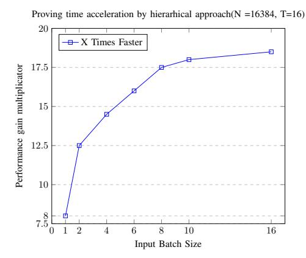
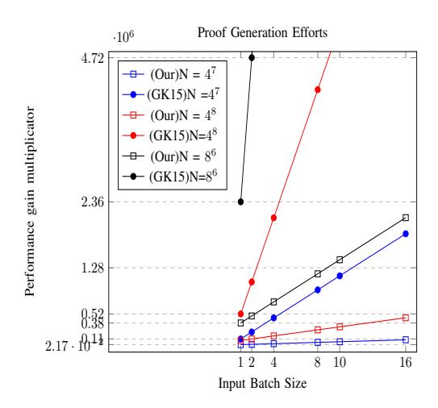

# Hierarchical One-out-of-Many Proofs With Applications to Blockchain Privacy and Ring Signatures

Aram Jivanyan Zcoin www.zcoin.io aram@zcoin.io

Tigran Mamikonyan Zcoin www.zcoin.io tigran@zcoin.io

*Abstract*—The one-out-of-many proof is a cryptographic zeroknowledge construction enabling the prover to demonstrate knowledge of a secret element among the given public list of cryptographic commitments opening to zero. This method is relying on standard Deci-sional Diffie-Hellman security assumptions and can result in efficient accountable ring signature schemes [4] and proofs of set memberships [5] with a signature size smaller than all existing alternative schemes relying on standard assumptions. This construction also serves as a fundamental building block for numerous recent blockchain privacy protocols including Anonymous Zether [1], [2], Zerocoin [3], Lelantus [11], Lelantus-MW [9], Triptych [14] and Triptych-2 [15]. One-out-of-many proofs require O(logN)-sized communication and can be implemented in O(N) time for the verifier and O(NlogN) time for the prover. In this work, we introduce anew method of instantiating one-out-ofmany proofs which reduces the proof generation time by an order of magnitude and in certain practical applications also helps to fasten the verification process of multiple proofs two or more times. Our approach still results in shorter proofs comprised of only a logarithmic number of commitments and does not compromise the highly efficient batch verification properties endemic to the original construction. We believe this work can also foster further research towards building more efficient oneout-of-many proofs which are extremely useful constructions in the blockchain privacy space and beyond.

*Index Terms*—group signatures, ring signatures, confidential transactions, blockchain privacy, Zerocoin, Lelantus, one-out-ofmany proofs, zero-knowledge proofs

# I. INTRODUCTION

The one-out-of-many proof is a zero-knowledge proof of knowledge for a list of cryptographic commitments having at least one commitment that opens to zero. Being introduced by Groth and Kohlweiss [3] and further optimized by Bootle et al [4], these proofs are particularly attractive from the communication point of view requiring only the transmission of a logarithmic number of commitments. From the computational efficiency standpoint, the most efficient one-out-of-many protocol construction [4] requires O(NlogN) group exponentiation operations for the proof generation and O(N) group exponentiation operations for each proof verification. This important primitive has been used to construct ring signatures, group signatures, Zerocoin, and proofs of set membership in [3], accountable ring signatures [4], Lelantus, a privacy cryptocurrency scheme enabling anonymous and confidential blockchain transactions. It has been further extended to support many-to-many proofs [2] which efficiently prove statements about many messages among the given list. These techniques have been used to build a protocol for Anonymous Zether, a confidential payment system in the account based model. Oneout-of-many proofs has also been re-instantiated in the setting of lattices [28] which in turn can further lead to the design of quantum-secure ring signatures and blockchain privacy schemes. Optimizing the proof generation and verification processes is important in all use cases where a support of larger sets is desirable and the cardinality of the referred set of commitment has an immediate business impact. For example in the blockchain privacy payment applications the size of the referred set of commitments defines the anonymity level of the conducted transactions. With bigger anonymity sets, the speed of transaction generation is downgrading which has a direct impact on the end user experience. The efficiency of the proof verification in turn defines the network's bandwidth ( how many transactions can be processed per second) and should be kept low enough to support practical high-bandwidth applications. With current methods, the proof generation of 1-out-of-262144 proof takes 15s according to the benchmarks ˜ from [11]. This practicality issue forces to limit the anonymity set size to smaller numbers which in turn decreases the provided anonymity.

# *A. Applications to Blockchain Privacy*

Recently multiple blockchain privacy protocols have emerged designed for both public cryptocurrency and enterprise settings which are based upon one-out-of-many proofs or its extensions.

Zerocoin: Zerocoin, designed as an extension to Bitcoin and similar cryptocurrencies [6], was the first anonymous cryptocurrency proposal to ensure high anonymity for the blockchain transactions. It enables users to transform their base layer coins(e.g. Bitcoin) into shielded coins and later spend the shielded coins without revealing their origins. When spent, a zero-knowledge proof is generated convincing that the spent coin was not already spent before and it is one of the previously minted shielded coins. The list of all shielded coins that the spent coin belongs to is referred to as an anonymity set. Intuitively, the size of the anonymity set defines how strong is the guaranteed anonymity. The bigger is the anonymity set size, the stronger anonymity is archived for each transaction. In [3] authors presented an efficient Zerocoin protocol design based on their one-out-of-many proof system, which does not require any trusted setup operations, supports much smaller proof sizes and efficient computations compared to the original Zerocoin construction [6]. Zerocoin protocol consists of four algorithms (*Setup, Mint, Spend, Verify*) which can be implemented with help of one-out-of-many proofs over the homomorphic Pedersen commitments [5]

- 1) Setup: Generates the commitment scheme parameters by specifying the group G and fixing two generators g and h with no known discrete logarithm relation.
- 2) Mint: For minting a new coin, the user generates a unique coin serial number secret S, and then commits to S using the Pedersen commitment scheme and a fresh randomness r: The resulted coin C = g Sh r is published to the blockchain and is added to the list of all previously minted coins C0, C1, ...CN−1. The coin serial number S and the opening r are used later to spend the coin.
- 3) Spend: The user parses the set of all previously minted coins C0, C1, ...CN−1 and homomorphically substracts the serial number value S from all these coins. This results in a new set of commitments where one will obviously be opening to 0. Next the user generates a oneout-of-N proof of knowledge of this secret commitment opening to 0 without revealing its index in the referred set. The proof transcript and the serial number S are published to the blockchain.
- 4) Verify: All network participants can take the revealed serial number S and homomorphically substracts it from all coins resulting to a new set of commitments. Next network participants can check the validity of the provided one-out-of-N proof against the new composed set.

Zerocoin is powering several decentralized privacy focused cryptocurrency projects [7], [8].

Lelantus: Zerocoin provides strong anonymity for blockchain transactions but it works with fixed denominated coins and also does not support direct confidential payments. These drawbacks are significant user experience issues and also creates privacy risks. Lelantus [11] is a new protocol which extends the Zerocoin functionality to support confidential transactions of arbitrary amounts and enable direct anonymous payments. It is based on a modified version of one-out-of-many proofs which work with generalized Pedersen commitments. In Lelantus coins are represented through generalized Pedersen commitments and each coin is associated with the recipient's shielded address, a unique coin serial number and a coin value which can be an arbitrary number from the specified range. All ideas of implementing hierarchical one-out-of-many proofs discussed in this paper can be immediately applied to the modified one-out-of-many proof scheme used in Lelantus.

Lelantus-MW MimbleWimble is another popular blockchain privacy protocol which powers few cryptocurrency projects including Beam [9] and Grin [17]. The transaction inputs and outputs are introduced through Pedersen commitments and this protocol uses the commitment blinding factors of transaction inputs and outputs as private keys. Sender and receiver must interact to construct a joint signature to authorize a transfer of funds. This construction enables to aggregate all transaction within the block into one giant transaction resulting to significantly smaller ledgers. Mimblewimble also enables benefits from cut-through, in which all spent outputs cancel against corresponding inputs which erases most of the blockchain history. Although this property enhances property but it does not fully break the linkability of transactions which remains a major privacy issue of the protocol. Recently Beam designed a hybrid scheme of Lelantus and MimbleWimble [10] which provides further anonymity to MimbleWimble by enabling anonymous spends in the MimbleWimble transaction. This hybrid scheme is planned to be launched on Beam' main network in 2020 [10].

Anonymous Zether Zether [1] remains a primary blockchain privacy technique designed for the account based setup for addressing enterprise blockchain payment use cases. In Zether, each user account is associated with an El-Gamal ciphertext which encrypts the account balance. The private balance can be updated confidentially through dedicated incoming and/or outgoing transactions using the homomorphic properties of the El-Gamal cryptosystem. In order to make the Zether transfer anonymous, the sender can select a ring of accounts containing himself and the recipient, and next encrypt the transfer amount under the ring's respective keys. Next each transaction should provide a zero-knowledge proof that it preserves all required monetary invariants including the fact that the value is preserved and is flowing from the authenticated sender account without creating any overdraft risks. This proof relation for anonymous Zether is defined in [1] and its practical instantiation is powered by one-out-ofmany proofs [1] and a recent extension of this method called many-to-many proofs [2].

### *B. Our Contribution*

In this paper, we show how to scale one-out-of-many proofs through a hierarchical approach which enables to efficiently prove the knowledge of opening of one commitment among the given list of N commitments through a cascade of smaller one-out-of-many proofs. Assuming that N = M · T, the two-layer cascade's intuition is first dividing the set of N commitments into T small ordered subsets of size M. Next, the user takes the subset containing the actual secret commitment opening to zero and privately blinds all subset elements with extra blinding factors without changing the ordering of the set elements. The resulted set of extra-blinded commitments is published and the user provides a proof that these new M elements form a valid masking of one out of T subsets of size M. The user finishes the proof by proving the knowledge of opening of one out of M new commitments to M.

Following to this intuition and assuming that N=262144, M=16, and T=16384, the 1-out-of-262144 proof generation boils down to the generation of separate 1-out-of-16 and 1-out-of-16384 proof. These two proofs jointly requires significantly less computational efforts than a single 1-out-of-262144 proof. We provide the design and formal security proofs of this new method, which significantly optimizes the proof generation complexity and also helps to optimize the verification for proofs generated in batch.

- Assuming the number of commitments is  $N = T \cdot M$ , the proving time for the proof generation will require only  $O(N+T\log T+M\log M)$  group exponentiation operations compared to the  $O(N\log N)$  exponentiation operations required by the previous work [3], [4]
- A typical blockchain transactions in the UTXO model usually spend two or more inputs simultaneously. For example, the typical Monero transaction has two inputs but there are special type transactions that can have dozens or even hundreds of inputs [19]. With our construction the generation of K simultaneous proofs by the same user will require only  $O(N+K\cdot (TlogT+MlogM))$  exponentiation operations instead of  $O(K\cdot N\cdot logN)$  operations.
- Verifying simultaneously generated K proofs will require
   O(N+K·(T+M)) exponentiation operations instead of
   O(kN) operations. We also show how independently generated proofs with multiple inputs could be batched and
   verified requiring only O(N) exponentiation operations.

The diagram below shows how much the proof generation process differs in the hierarchical and original setups in case of multiple inputs.

### C. Related Works

Privacy remains one of the most important issues for blockchain [31] and there is a significant amount of active research on efficient zero-knowledge proofs. Currently numerous constructions achieve different tradeoffs between transaction proof sizes, proving and verification times, but also under different trust models as well as cryptographic assumptions. The most efficient proof systems to date are zk-SNARKs [16] which require a trusted setup processing [?]. Recently, there have been designed powerful transparent systems such are zk-STARKS [22] and Supersonic [26], which are zeroknowledge proofs for Rank-1 Constraint Satisfaction (R1CS). When applied to the private blockchain transactions use case, their proving time and proof sizes still seems to be beyond the practicality limit for large-scale payment applications [31]. Relatively shorter proofs compared to STARKs are produced by Aurora

which uses a transparent setup and is plausibly post-quantum secure. Bulletproofs [23] are another powerful zeroknowledge proof technology based on standard cryptographic assumptions and not requiring any trusted setup procedures. They are particularly efficient for providing zero-knowledge range-proofs over committed values and are ubiquitously used in private digital currency systems [7], [9], [17], [18]. Halo [30] is another recent scientific breakthroughs which enables recursive proof composition without a trusted setup and using the discrete log security assumption. Sonic [25] is another zero-knowledge SNARK system which supports a universal and continually updateable trusted setup process. There is also ongoing active research toward improving the RingCT construction which is powering the biggest privacy cryptocurrency Monero [29]. RingCT does not require any trusted setup and is based on standard cryptographic assumptions but the existing constructions support relatively small anonymity sets [29].

The recent growing interest towards one-out-of-many proofs [1]–[3], [11], [14], [15] and the emergence of novel blockchain privacy cryptocurrencies [7] [9] based on this paradigm highlights the importance of novel designs and/or optimization of existing schemes for one-out-of-many proofs. This mechanisms are particularly well suited to build anonymous and confidential cryptocurrencies with a minimal trust required, fast proving times, efficient batch verification mechanisms and small proof sizes. We hope our work will inspire broader scientific research towards the improvements of 1-out-of-N schemes.

### II. PRELIMINARIES

Let G be a cyclic group of prime order p where the discrete logarithm problem is hard, and let  $Z_p$  be its scalar field. Let g and h be random generators whose discrete logarithm relationship is unknown. A Pedersen commitment scheme [5] enables to commit to  $m \in Z_P$  by picking a random blinding

factor r ∈ Zp and computing Com(m, r) = g mh r . It possess homomorphic properties as

$$Com(m_1, r_1) \cdot Com(m_2, r_2) = Com(m_1 + m_2, r_1 + r_2)$$

This Pedersen commitment scheme is perfectly hiding and computationally strongly binding under the discrete logarithm assumption as defined below.

Definition 1 (Hiding). A commitment scheme is perfectly hiding if the commitment does not leak any information about the committed value. More formally for all probabilistic polynomial time stateful adversaries A and the given commitment key ck = (G, p, g, h)

$$\Pr[(m_0, r_0, m_1, r_1) \leftarrow \mathcal{A}(ck); b \leftarrow \{0, 1\}; \\ c_b = Com(m_b, r_b) : A(c) = b] = \frac{1}{2}$$

Definition 2 (Binding). A commitment scheme is computationally strongly binding if the commitment can only be opened in one way. More formally for all probabilistic polynomial time stateful adversaries A and the given commitment key ck = (G, p, g, h)

$$\Pr[(m_0, r_0, m_1, r_1) \leftarrow \mathcal{A}(ck); (m_0, r_0) \neq (m_1, r_1) : \\ Com(m_0, r_0) = Com(m_1, r_1)] \approx 0$$

We consider zero-knowledge proofs of knowledge consisting of a common reference string generator algorithm Setup, the prover P and the verifier V. All three (Setup,P, V) are probabilistic polynomial time algorithms and this proof of knowledge allows the computationally bounded prover to convince a verifier that a statement is true. For the given inputs s and t, we denote the proof execution result as hP(s), V(t)i = b where b = 1 in case the verifier accepts the proof transcript produced by the prover and b = 0 otherwise. Let R ⊂ {0, 1} ∗ × {0, 1} ∗ × {0, 1} ∗ be polynomial-timedecidable ternary relation. Given σ, the w is the witness for the statement x if (σ, u, w) ∈ R Let's define

$$L_{\sigma} = \{x \mid \exists w : (\sigma, u, w) \in \mathcal{R}\}$$

as the set of all u, which have a witness w satisfying to the relation R.

Definition 3 (Perfect completeness). The completeness property of the proof of knowledge implies that if the prover knows a witness w for the given statement u then he can convince the honest verifier. More formally, the proof of knowledge (Setup,P, V) has perfect completeness if for all polynomialtime adversaries A

$$\Pr[\ \sigma \leftarrow Setup(1^{\lambda}), (u, w) \leftarrow \mathcal{A}, (\sigma, u, w) \in \mathcal{R} \\ land(\mathcal{P}(\sigma, u, w), \mathcal{V}(\sigma, u)) = 1] = 1$$

Definition 4 (Computational Witness-Extended Emulation). We use witness-extended emulation to define the soundness property of the proof of knowledge as is defined in [13] [21] and used for example in [12]. Informally witnessextended emulation implies that whenever an adversary produces an proof which satisfies the verifier with some probability, then there exists an emulator producing an identically distributed proof with the same probability of acceptance, but also the corresponding witness. Let's denote s the internal state of P including the verifier challenge . The emulator is permitted to rewind the interaction between the prover and verifier to any move, and resume with the same internal state s for the prover, but with fresh randomness for the verifier. So, whenever the prover makes a convincing argument for some statement u, the emulator E can extract the corresponding witness w such that (σ, u, w) ∈ R, and therefore, we have an argument of knowledge of w. Following to the notations from [23], we can formally define if the (Setup,P, V) has witnessextended emulation if for any deterministic polynomial time prover P and for all pairs of interactive adversaries A1, A2 there exists an expected polynomial time emulator E and a negligible function µ(λ) so that

$$\begin{split} \Pr \big[ \ \sigma \leftarrow Setup(1^{\lambda}), (u,s) \leftarrow \mathcal{A}_{2}(\sigma), \\ tr \leftarrow \langle \mathcal{P}^{*}(\sigma,u,s), \mathcal{V}(\sigma,u) \rangle; \mathcal{A}_{1}(tr) = 1 \big] \\ -\Pr \big[ \ \sigma \leftarrow Setup(1^{\lambda}), (u,s) \leftarrow \mathcal{A}_{2}(\sigma), \\ (tr,w) \leftarrow \mathcal{E}^{\langle \mathcal{P}^{*}(\sigma,u,s), \mathcal{V}(\sigma,u) \rangle}(\sigma,u); \mathcal{A}_{1}(tr) = 1 \land \\ (tr \ \text{is accepting} \implies (\sigma,u,w) \in \mathcal{R}) \big] \ \leq \mu(\lambda) \end{split}$$

Definition 5 (Perfect Special Honest-Verifier Zero-Knowledge). A proof of knowledge is honest-verifier zero knowledge if given the verifier challenge z it is possible to efficiently simulate the entire proof without knowing the witness w. Obviously, honest-verifier zero-knowledge proof does not leak any information about the witness w except what can be learned from the fact that (σ, u, w) ∈ R. Formally, a proof of knowledge (Setup,P, V) is a perfect special honest verifier zero knowledge (SHVZK) argument of knowledge for R if there exists a probabilistic polynomial time simulator S such that for any polynomial-time adversary A

$$\begin{split} \Pr \big[ \ \sigma \leftarrow Setup(1^{\lambda}), (u, w, z) \leftarrow \mathcal{A}(\sigma), \\ tr \leftarrow \langle \mathcal{P}^*(\sigma, u, w), \mathcal{V}(\sigma, u, z) \rangle; \\ (\sigma, u, w) \in \mathcal{R} \wedge \mathcal{A}(tr) = 1 \big] \\ = \Pr \big[ \ \sigma \leftarrow Setup(1^{\lambda}), (u, w, z) \leftarrow \mathcal{A}(\sigma), \\ tr \leftarrow \mathcal{S}(u, z); \\ (\sigma, u, w) \in \mathcal{R} \wedge \mathcal{A}(tr) = 1 \big] \end{split}$$

This definition implies that the adversary will not be able to distinguish between the real and simulated proofs even after choosing the distribution of statements and witnesses. A proof of knowledge is called a public coin if all messages sent from the verifier to the prover are chosen uniformly at random.

# *A. Overview on One-out-of-Many Proofs*

One-out-of-many proof is a 3-move public coin special honest verifier zero-knowledge proof of knowledge (also called as Sigma protocol) of one out of N public Pedersen commitments  $C_0, \ldots, C_{N-1}$  is opening to 0. More formally, it is a  $\Sigma$ -protocol for the following relation

$$R = \{(ck; (C_0; \dots; C_{N-1}); (l, r) \mid \forall i : C_i \in C_{ck} \land l \in \{0, \dots, N-1\} \land r \in Z_p \land C_l = Com_{ck}(0, r)\}\}$$

In the first move the prover sends an initial message to the verifier, then the verifier picks a random public coin challenge z and next, the prover responds to the verifier challenge. Finally, the verifier takes the initial message, the challenge, and the challenge response to check the transcript of the interaction and decide whether the proof should be accepted or rejected.

The fundamental technique of one-out-of-many proofs is the special prover method of building certain polynomials  $P_i(x)$  of degree  $log N, i \in \{0,1,\ldots,N-1\}$  and the efficient transmission (requiring only log(N) communication) of these polynomial's evaluation  $p_i = P_i(x)$  at the verifier challenge point x to the verifier. The polynomial  $P_i(x)$  has high degree if and only if i=l. It is worth to mention that the proof verification requires a multi-exponentiation operation of  $C_0^{p_0} \cdot C_1^{p_1} \cdot \cdots \cdot C_{N-1}^{p_{N-1}}$  of size N, which although requires N group exponentiation operations but can be significantly optimized through efficient multi-exponentiation and batch verification techniques.

This proof system satisfies to the **completeness, special** honest verifier zero-knowledge and n-soundness security properties. The completeness and special honest verifier zero-knowledge properties are defined above, and the n-soundness property implies that for any statement u, one can extract the witness w having n different accepting transcripts corresponding to unique verifier challenges. Assuming  $N=n^m$ , the one-out-of-many construction proposed in [4] is providing (m+1)-soundness. We will leverage the soundness property and efficient zero-knowledge simulation of the original one-out-of-many proofs for proving the security of our proposed construction.

# III. CONSTRUCTION OF HIERARCHICAL ONE-OUT-OF-MANY PROOF

We describe an efficient non-interactive zero-knowledge proof system for the one-out-of-many relation defined in Section 2.1. Our construction requires more interaction rounds between the prover and verifier than the original 3-move constructions.

Note, that due to the homomorphic properties of Pedersen commitments [5], any commitment  $C=g^sh^r$  can be masked by an extra blinding element r' so the resulted new commitment  $C'=C\cdot h^{r'}$  still will be opening to the original message s. Given the public canonical set of N Pedersen commitments  $(C_0,C_1,\ldots,C_{N-1})$ , we assume  $N=T\cdot M$  where  $T=n_1^{m_1}$  and  $M=n_2^{m_2}$ . Without loss of generality, let's assume the secret commitment  $C_L=Com(0,r)$  has

the index  $L \in \{0,\dots,N-1\}$  and a blinding factor r where L=kM+l. The commitment  $C_L$  belongs to the k-th subset of size M referred as:  $S_k=(C_{kM},\dots,C_{kM+M-1})$ . Our construction is based on the following observation that if the prover could reveal M fresh elements  $(d_0,d_1,\dots,d_{M-1})$  and convince that these elements are actually the masked elements of some ordered subset  $S_k$  of size M of the original set of commitments without revealing any other information about the subset index k, then he could simply finish the proof by demonstrating the knowledge of one out of  $(d_0,d_1,\dots,d_M)$  commitments opening to zero.

Further in this section we assume that an original 1-out-of-N proof construction is given as a black box and we will describe our hierarchical approach by using this given proof system [4] as the main building block.

We need a helper function for computing unique fingerprints for any given set of size M. Given n scalars  $x_1, \ldots, x_n$ , we compute the digest of any set of n group elements  $S = (s_1, s_2, \ldots, s_n)$  as

$$Hash_{x_1...x_n}(S) = s_1^{x_1} \cdot s_2^{x_2} \cdot \ldots \cdot s_n^{x_n}$$

This hash function is homomorphic in the sense that given two different sets  $S_1=(s_1^1,\ldots,s_n^1)$  and  $S_2=(s_1^2,\ldots,s_n^2)$  of n group elements, where  $s_i^1=s_i^2\cdot h^{r_i}$  for all  $i\in\{1,2,\ldots,n\}$ , then we will have  $Hash_{x_1\ldots x_n}(S_1)=Hash_{x_1\ldots x_n}(S_2)\cdot h^{r_1x_1+\ldots+r_nx_n}$ , or alternatively,

$$\frac{Hash_{x_1...x_n}(S_1)}{Hash_{x_1...x_n}(S_2)} = Com(0, \sum_{i=1}^n r_i x_i)$$

Now we describe the two-layer one-out-of-many proof construction in details.

### Hierarchical One-out-of-Many Proof

1) Given the public parameters T and M, both Prover and Verifier split the commitment set  $\{C_0, \ldots, C_{N-1}\}$  into T ordered subsets of size M as follows:

$$S_0 = \{C_0, C_1, \dots, C_{M-1}\},$$

$$\dots$$

$$S_{T-1} = \{C_{N-1-M}, C_{N-M}, \dots, C_{N-1}\}$$

As the index of the subject secret commitment is L = kM + l, it belongs to the subset  $S_k$ .

- 2) Prover generates M random elements  $(r_0, \ldots, r_{M-1}) \leftarrow_R Z_P^M$
- 3) Prover blinds all elements of the subset  $S_k$  as follows.

$$d_0 = C_{kM} h^{r_0},$$
 
$$\vdots$$
 
$$d_{M-1} = C_{kM+M-1} h^{r_{M-1}}$$

Obviously all elements  $d_0, \ldots, d_{M-1}$  will be valid Pedersen commitments and in particular, the element

$$d_l = C_{kM+l}h^{r_l} = g^0h^{r+r_l}$$
 will be opening to 0.

- 4) Prover proves the knowledge of one out of M commitments  $(d_0, d_1, \dots, d_{M-1})$  being a commitment to zero via an interactive 1-out-of-M proof method described in [3] or [4]. We denote this proof statement as  $P_1$  and the verifier challenge used in this proof as y.
- 5) All elements  $(d_0, d_1, \dots, d_{M-1})$  and the proof transcript  $P_1$  are sent to the Verifier.

Next the prover engages into another public coin protocol to convince that all elements  $(d_0, d_1, \dots, d_{M-1})$  are indeed the blindings of the corresponding elements of some subset  $S_k \in$  $(S_0,\ldots,S_{T-1})$  without revealing any information about the subset index k or the random factors  $(r_0, \ldots, r_{M-1})$ .

- 6) Verifier sends a randomly generated challenge vector  $\vec{\mathbf{x}} = (x_0, x_1, \dots, x_{M-1}) \leftarrow_R Z_n^M$
- 7) Prover computes the digest of the set  $(d_0, d_1, \dots, d_{M-1})$ as

$$D = Hash_{\vec{x}}(d_0, d_1, \dots, d_{M-1})$$

- 8) Prover computes the digests of all subsets  $S_0, \ldots, S_{T-1}$  as follows

  - $D_0 = Hash_{\vec{x}}(C_0, C_1, \dots, C_{M-1})$   $D_1 = Hash_{\vec{x}}(C_M, \dots, C_{2M-1})$
  - $D_{T-1} = Hash_{\vec{x}}(C_{N-1-M}, \dots, C_{N-1})$

If the elements  $d_0, d_1, \ldots, d_{M-1}$  are generated properly by following to the protocol description, then obviously  $\frac{D}{D_k} = Com(0, \sum_{i=0}^{M-1} r_i x_i)$  will be a commitment to 0 blinded by the randomness  $\sum_{i=0}^{M-1} r_i x_i$ .

9) The prover computes the values  $\frac{D}{D_0}, \dots, \frac{D}{D_{T-1}}$ 10) The prover engages into an interactive 1-out-of-T pro-

- tocol of proof of knowledge of one out of these T commitments is opening to 0 without revealing the index k. Let's denote the verifier challenge used at this step by z and let's denote the final transcript of this 1-out-of-T proof as  $P_2$ .

So far we presented the proof as an interactive protocol with several rounds. But as the verifier is a public coin verifier and all the honest verifier's messages are random elements from  $Z_p$ , we can therefore convert the protocol into a non-interactive protocol that is secure and full zero-knowledge in the random oracle model using the Fiat-Shamir heuristic [?]. All random challenges are replaced by hashes of the transcript up to that point. The final transcript of the non-interactive 2-layer oneout-of-many proof is comprised of the following data

$$\pi_{H1ooN} = \{(d_0, d_1, \dots, d_{M-1}), P_1, P_2\}$$

that as the initial of set commitments  $(C_0, C_1, \ldots, C_{N-1})$ is public and the elements  $(d_0, d_1, \dots, d_{M-1})$  are published to the blockchain as part of the proof transcript, all network participants will be able to independently perform the following verification computations.

- 11) Compute the digest  $D=d_0^{x_1},d_1^{x_2},\ldots,d_{M-1}^{x_M}$ .

  12) Compute the set  $\frac{D_0}{D},\ldots,\frac{D_{T-1}}{D}$  which is the referred public list of commitments for the proof  $P_2$ .
- 13) Validate the proof  $P_1$  against the public list of commitments  $(d_0, d_1, \dots, d_{M-1})$ . If the validation fails, the verifier rejects to accept the proof.
- 14) Validate the proof  $P_2$  against the public list of commitments  $\frac{D_0}{D}, \dots, \frac{D_{T-1}}{D}$ . If the validation fails, the verifier rejects to accept the proof. Otherwise the verifier accepts the proof.

**Theorem 1.** This  $\Sigma$  protocol for knowledge of one out of  $N = T \cdot M$  commitments opening to 0 is perfectly complete. It is special honest verifier zero-knowledge if the commitment scheme is perfectly hiding and has a statistical witness-extended emulation.

We will sketch the formal proof for this theorem in Chapter V.

### IV. EFFICIENCY ANALYSIS

For a commitment set of  $N = n^m$  coins, the original 1-outof-N proof design requires respectively (mN+3mn+2m+4)and (N+2mn+2m+7) group exponentiation operations for the proof generation and verification processes. We select N = $T \cdot M$  where  $M = n_1^{m_1}$  and  $T = n_2^{m_2}$ , and our construction requires the following computational efforts.

- Both Prover and Verifier perform N exponentiation operations for computing the helper elements  $D_0, D_1, ..., D_{T-1}$
- Prover computes two separate 1-out-of-T and 1-out-of-M proofs by performing respectively  $(m_1T + 3m_1n_1 +$  $2m_1 + 4$ ) and  $(m_2 \cdot M + 3m_2n_2 + 2m_2 + 4)$  operations. Prover also performs extra 2M operations for computing the values  $d_0, \ldots, d_{M-1}$  and next computing the digest D of these elements.
- The Verifier next performs  $T + 2m_1n_1 + 2m_1 + 2M +$  $2m_2n_2 + 2m_2 + 14$  group exponentiation to check the provided two proofs.

When k different proofs are generated by the prover within the scope of a single transaction, our scheme allows to re-use the verifier challenge variables  $x_1, x_2, \ldots, x_M$  and compute common digests  $D_1, D_2, \dots, D_T$  for all k different proofs. As the computation of  $D_1, D_2, \dots, D_T$  requires O(N) computational efforts for both prover and verifier, re-using the digests will result to significant performance gains. Obviously, the generation of k simultaneous proofs will require only  $N + k(m_1T + 3m_1n_1 + 2m_1 + 4) + k((m_2 + 3)M +$  $3m_2n_2+2m_2+4$ ) group exponentiation. The verification of k proofs which reuse the same subset digests, will require only  $N + k(T + 2m_1n_1 + 2m_1 + 2M + 2m_2n_2 + 2m_2 + 14)$  group exponentiation operations instead of  $O(K \cdot N)$  operations. The provided graphic compares proof generation performances for three different anonymity sets of sizes 16384, 65536 and 262144(N) and different batch sizes (k). In all cases we fix M=16 and divide the full set into small ordered subsets of 16 elements. The first diagram at right shows that 2-Layer 1-out-of-N scheme improves a single proof generation time almost 5x in all cases while making only an insignificant increase in the verification time. For N = 65536 and k=2, we get 1048808 and 115088 group exponentiation operations for proof generation respectively through the original and our 2-layered protocols. Referring to the benchmark data from [11], this takes approximately 10s to submit a blockchain transaction with 2 inputs on an Intel I7-4870HQ system with a 2.50 GHz processor, while our method fastens this time to 1.1s. For N = 262144 and a single proof generation, our method results to a factor of 6.25 faster generation process than the method in [?]. For two simultaneous proof generation it results to a factor 9.6 faster generation process. Referring to the implementation data from [11], the original 1-out-of-262144 proof generation takes approximately 14s on an Intel I7-4870HQ system with a 2.50 GHz processor with proof sizes of 2016bytes. With the original proof method, the generation of a blockchain transaction with two inputs would take up 30s while our method will accelerate the transaction submission process up to 3 seconds.

The verification process for proofs generated with our method is a bit slower compared to the original proof verification process, but on the same time it becomes significantly faster for proofs generated in batches. For the anonymity set of size 16384, the verification of a single proof generated via our method requires 17524 group exponentiation operations while the original method would require only 16461 which is smaller by 6%. But the verification of two simultaneously generated 2-layer proofs requires only 18671 exponentiation. At the same time the verification of two proofs generated with the original method would require 32922 operations, which would result to a slower verification process by a factor of 1.75. In blockchain applications where transactions are usually comprised of two or more inputs and all proofs for all inputs are generated in batches, this will help to increase the overall network bandwidth with a factor 1.75 and more in case the transactions are verified individually.

Our construction results in lower overall verification and proof generation complexity at the expense of overall size scaling.

The proof sizes of the Growth-Kohlweiss method are comprised of  $(4log_2N)G + (3log_2N+1)Z_P$  elements and the proofs from [4] are comprised of  $(m+4)G + (m*(n-1)+3)Z_P$  elements where  $N=n^m$ . With our approach, a single 2-layer proof will be comprised of separate 1-out-of-T and a 1-out-of-M [4] proofs and an extra M group elements. For the anonymity set of size  $2^{16}$  the size of a single proof generated through the [4] method is 1412 bytes while the 2-layer proof size will be 1887 bytes.

## A. Batch Verification of Independently Generated Proofs

In blockchain applications the network nodes receiving a block of transactions have to verify all transactions and their corresponding proofs in parallel. The 2-layer proof generation method significantly optimizes the verification of simultaneously generated proofs, but the verification of all batch proofs still will require O(N) group exponentiation operations. Here we discuss how all independently generated proofs can be efficiently batched and verified together.

Let us assume the verifier has to verify L different 2-layer 1-out-of-N proofs all referring to the same anonymity set  $C=(C_0,C_1,\ldots,C_{N-1})$ . Each proof description contains two associated 1-out-of-M and 1-out-of-T proofs (P1 and P2) along with other transaction specific data. As discussed in Section 2, the verification of original 1-out-of-N proof boils down to a multi-exponentiation of size N. For the joint verification of P1 proofs, which are 1-out-of-M proofs with P1 being a small integer (16 in our experiments), all 1-out-of-M proofs can be concatenated together and verified through a single big multi-exponentiation operation in order to leverage the fast multi-exponentiation techniques [27]. The verification of the t-th t-1 proof boils down to multi-exponentiation of the following form [4]

$$\prod_{i=0}^{T-1} \left(\frac{D_{i+1}^t}{D^t}\right)^{f_i^t} \equiv K_t$$

where

$$D_{i+1}^{t} = \left(C_{iM}^{x_1^t} \cdot C_{iM+1}^{x_2^t} \cdot \dots \cdot C_{iM+M-1}^{x_M^t}\right)$$

and all the values  $D^t$ ,  $D_i^t$  and  $K_t$  are unique per proof. Obviously, the alternative verification operation will be

$$\prod_{i=0}^{T-1} \left( C_{iM+1}^{x_1^t} C_{iM+2}^{x_2^t} \dots C_{iM+M}^{x_M^t} \right)^{f_i^t} = K_t \cdot (D^t)^{\sum_{i=0}^{T-1} f_i^t}$$

The left size of this equation requires computation of N exponentiation operations. But the verifier can batch the proof

verification of L different proofs together by generating L random values  $y_1, \ldots, y_L$  and compute the following equation.

$$\prod_{t=1}^{L} \left( \prod_{i=0}^{T-1} \left( C_{iM+1}^{x_1^t} C_{iM+2}^{x_2^t} \dots C_{iM+M}^{x_M^t} \right)^{f_i^t} \right)^{y_t} = \prod_{i=0}^{T-1} \left( C_{iM+1}^{\sum_{t=1}^{L} (x_1^t f_i^t y_t)} C_{iM+2}^{\sum_{t=1}^{L} (x_2^t f_i^t y_t)} \dots C_{iM+M}^{\sum_{t=1}^{L} (x_M^t f_i^t y_t)} \right)$$

$$= \prod_{t=1}^{L} \left( K_t \cdot (D^t)^{\sum_{i=0}^{T-1} f_i^t} \right)^{y_t}$$

With this approach the verification of L different proofs will still require only O(N) exponentiation operations instead of  $O(N \cdot L)$ . This technique helps to save approximately N exponentiation operations for each extra proof verification resulting to highly efficient batch verification process.

### V. SECURITY ANALYSIS

In this section we provide the high level details of the security proof of the proposed scheme while leaving the fully detailed formal description to the full paper.

Perfect Completeness: The perfect completeness of our 2-layer protocol basically follows from the perfect completeness of the original construction. As the prover possesses the witness L and r, where  $C_L = Com(0, r)$ and L = kM + l, and he generates the random values  $(r_0,\ldots,r_{M-1})\leftarrow_R Z_P^M$  to compute the elements  $(C_{kM}h^{r_0},\ldots,C_{kM+l}h^{r_l},\ldots,C_{kM+M-1}h^{r_{M-1}}),$  then obviously he knows the secret index l and the blinding factor  $r + r_l$  of the commitment  $d_l = C_{kM+l}h^{r_l}$  as well as the secret index  $k \in \{1,\ldots,T\}$  and the blinding factor  $\sum_{i=0}^{M-1} r_i x_i$  of the commitment  $\frac{D}{D_k}$  both are opening to 0. Consequently the perfect completeness of our scheme will follow from the perfect completeness of the original 1-out-of-N proof construction which is used to generate the corresponding  $P_1$  and  $P_2$  one-out-of-many proofs referring to set of commitments  $(d_0, d_1, \ldots, d_{M-1})$  and  $\frac{D}{D_1}, \frac{D}{D_2}, \ldots, \frac{D}{D_T}$ respectively.

**SHVZK**: It is easy to build a SHVZK simulator using the the SHVZK simulator of the original 1-out-of-N proof construction which can simulate both proofs P1 and P2.

- 1) The simulator generates the elements  $d_0, d_1, \ldots, d_{M-1}$  at random. Note that as random values  $r_0, r_1, \ldots, r_M$  are used to compute the elements  $d_0, d_2, \ldots, d_{M-1}$  during the real proof generation, this makes them indistinguishable from the simulated elements.
- 2) Our simulator uses the SHVZK simulator pf the original 1-out-of-N proof as an oracle to simulate the proofs P1 and P2 which both will be indistinguishable from real proofs based on the special honest verifier zeroknowledge property of the original construction.

Noting that  $D_1, D_2, \dots, D_T$  and D are uniquely determined both in the real proof and in the simulation we see that the

simulation and the real proof will be indistinguishable in all steps and variables which means the protocol is SHVZK.

Witness-Extended Emulation For witness extended emulation we leverage the (m+1) soundness of the original 1-out-of-N construction to build an efficient extractor. It uses polynomial number of valid proof transcripts to extract the prover witness. The extractor is allowed to rewind the interaction between the prover and verifier to any move and resume the interaction with a fresh verifier challenge. Assuming  $N=n^m$ , the m+1-special soundness means the adversary can recover the witness being provided (m+1) accepting transcripts for (m+1) different verifier challenge values. In our scenario  $N=T\cdot M$  and without loss of generality we can assume  $M=n_1^{m_1}$  and  $T=n_2^{m_2}$ .

The emulation process is described as follows:

- The extractor first runs the prover  $(m_1+1)$  times and gets  $(m_1+1)$  accepting transcripts for the proof of knowledge of one commitment out of  $(d_0,\ldots,d_{M-1})$  opening to 0. Having different accepting transcripts  $P_1^{(1)},\ldots,P_1^{(m_1+1)}$  and using the  $(m_1+1)$ -special soundness of the 1-out-of-M protocol the emulator recovers the secret index  $l\in\{0,\ldots,M-1\}$  and the random value  $R_0$  such that  $d_l=g^0h_0^R$ . Note that  $R_0=r+r_l$  where r is the random blinding factor of the commitment  $C_L$  and  $r_l$  is generated by the prover at the Step 2 to further blind  $C_L$ .
- After extracting the values l and  $R_0$  the emulator continues to run the prover. At the protocol Step 6 he gets the verifier challenge vector  $x_0^1, x_1^1, \ldots, x_{M-1}^1$ . He continues to run the prover up to the Step 10 and gets an accepting proof transcript  $P_2^{(1)(1)}$ . Next it continues to rewind the prover to the point of Step 10 before the verifier sends his challenge value  $z_1$ , and asks the verifier to send a new random challenge. The emulator keeps rewinding until it gets  $(m_2+1)$  different accepting proof transcripts  $P_2^{(1)(1)}, P_2^{(1)(2)}, \ldots, P_2^{(1)(m_2+1)}$  for the 1-out-of-T commitments opening to 0 all for different verifier challenge values  $(z_1, \ldots, z_{m_2+1})$ .
- The emulator uses the  $(m_2+1)$ -special soundness of the 1-out-of-T proof and the valid proof transcripts  $P_2^{(1)(1)}, P_2^{(1)(2)}, \ldots, P_2^{(1)(m_2+1)}$  to recover the index k and the blinding factor  $R_1$  of the commitment  $\frac{D}{D_k} = Com(0,R_1)$ . According to the protocol description  $R_1 = \sum_{i=0}^{M-1} r_i \cdot x_i^{(1)}$  where  $(x_0^{(1)},\ldots,x_{M-1}^{(1)})$  was the verifier challenge sent at Step 6.
- After recovering both indexes l and k, the emulator computes the secret index  $L = k \cdot M + l$  and identify the secret commitment  $C_L = Com(0,r)$  which is opening to 0.
- Note that the value  $R_0 = r + r_l$  is already known to the extractor and for recovering the value r it is only required to extract the value  $r_l$ , the secret random blinding factor generated by the prover during the protocol execution Step 2.
- After recovering the value  $R_1$ , the emulator rewinds

the prover to the protocol Step 6 where verifier sends the challenge vector and resumes with fresh randomness  $(x_1^{(2)},\ldots,x_M^{(2)})$ . After new challenge vector  $(x_0^{(2)},\ldots,x_{M-1}^{(2)})$  is provided, the emulator keeps running the prover till the Step 10 when he gets an accepting proof transcript  $P_2^{(2)(1)}$ . It continuous to rewind the prover to the point of Step 10 when the verifier sends the challenge variable z and then proceeds with the proof generation. Eventually the emulator gets another  $m_2+1$  accepting transcripts for the 1-out-of-T proof which help to recover a value  $R_2=\sum_{i=0}^{M-1}r_i\cdot x_i^{(2)}$ .

• The emulator keeps iterating over the last two steps jointly M times and at the end it gets M different values  $(R_1,R_2,\ldots,R_M)$  each corresponding to a unique challenge vector  $(x_1^{(i)},\ldots,x_M^{(i)})$ . This gives the emulator M linear equations defined as

$$\begin{bmatrix} x_0^{(1)} & x_1^{(1)} & \dots & x_{M-1}^{(1)} \\ x_0^{(2)} & x_1^{(2)} & \dots & x_{M-1}^{(2)} \\ \dots & \dots & \dots & \dots \\ x_0^{(M)} & x_1^{(M)} & \dots & x_{M-1}^{(M)} \end{bmatrix} * \begin{bmatrix} r_0 \\ r_1 \\ \dots \\ r_{M-1} \end{bmatrix} = \begin{bmatrix} R_1 \\ R_2 \\ \dots \\ R_M \end{bmatrix}$$

As all the  $x_j^{(i)}$  elements are generated randomly, with an overwhelming probability we will have an invertible matrix of coefficients. Therefore, the emulator can solve the linear equation system to find the unknowns  $(r_0, r_1, \ldots, r_{M-1})$ . The yielded value  $r_l$  will help to finalize the extraction of the witness by computing the random blinding factor of the commitment  $C_L$   $r = R_0 - r_l$ . Thus the emulator successfully extracts the witness (l, r) so that  $C_l = Com(0, r)$ .

In order to assess the computational efforts of the emulator, note that it first rewinds the prover  $m_1+1$  times to get all  $m_1+1$  accepting transcripts for the  $P_1$  relation. After the emulator rewinds the prover  $M*(m_2+1)$  times to get enough accepting transcripts for recovering the values  $R_1, R_2, \ldots, R_M$ . At last, the solution of the linear equation system of size M can be found in a polynomial time which overall makes the emulator work in expected polynomial time.

### REFERENCES

- B. Bunz, S. Agrawal, M. Zamani, and D. Boneh, "Zether: Towards privacy in a smart contract world." IACR Cryptology ePrint Archive, vol. 2019, p. 191, 2019
- [2] Benjiamin Diamong. Many-out-of-many proofs with Applications to Anonymous Zether. https://github.com/jpmorganchase/anonymous-zether/blob/master/docs/AnonZether.pdf
- [3] J. Groth and M. Kohlweiss. One-out-of-many proofs: Or how to leak a secret and spend a coin. In EUROCRYPT,vol. 9057 of LNCS. Springer, 2015.
- [4] Bootle, J., Cerulli, A., Chaidos, P., Ghadafi, E., Groth, J., Petit, C.: "Short accountable ring signatures based on DDH". In: Pernul, G., et al. (eds.) ESORICS. LNCS, vol. 9326, pp. 243–265. Springer, Heidelberg (2015).
- [5] Torben P. Pedersen. Non-interactive and information-theoretic secure verifiable secret sharing. In CRYPTO, volume 576 of Lecture Notes in Computer Science, pages 129 -140,1991.
- [6] Ian Miers, Christina Garman, Matthew Green, and Aviel D. Rubin. Zerocoin: Anonymous distributed e-cash from bitcoin. In IEEE Symposium on Security and Privacy, 2013.
- [7] Zcoin's upcoming privacy protocols: https://zcoin.io/lelantus-zcoin/

- [8] "PIVX," https://pivx.org/.
- [9] MimbleWimble-based Privacy Coin. https://beam.mw/
- [10] Lelantus-MW: The symbiosis: https://docs.beam.mw/2019-11-22-Vladislav-Gelfer-at-grincon1.pdf
- [11] Aram Jivanyan. Lelantus: Towards Confidentiality and Anonymity of Blockchain Transactions From Standard Assumptions www.lelantus.io/lelantus/pdf, 2019.
- [12] Jonathan Bootle, Andrea Cerulli, Pyrros Chaidos, Jens Groth, and Christophe Petit. Efficient zero-knowledge arguments for arithmetic circuits in the discrete log setting. In Annual International Conference on the Theory and Applications of Cryptographic Techniques, pages 327-357. Springer, 2016.
- [13] Jens Groth and Yuval Ishai. Sub-linear zero-knowledge argument for correctness of a shuffle. In Advances in Cryptology - EUROCRYPT 2008, pages 379-396, 2008.
- [14] Sarang Noether and Brandon Goodell. Triptych: logarithmic-sized linkable ring signatures with applications. https://eprint.iacr.org/2020/018.pdf
- [15] Sarang Noether. Triptych-2: efficient proofs for confidential transactions. https://eprint.iacr.org/2020/312.pdf
- [16] Eli Ben-Sasson, Alessandro Chiesa, Christina Garman, Matthew Green, Ian Miers, Eran Tromer, and Madars Virza. Zerocash: Decentralized anonymous payments from Bitcoin. In IEEE Symposium on Security and Privacy. IEEE, 2014.
- [17] Grin: The private and lightweight mimblewimble blockchain. https://grin-tech.org/
- [18] Monero: A Reasonably Private Digital Currency. https://web.getmonero.org/
- [19] Analysis of Monero transaction inputs and outputs. https://github.com/noncesense-research-lab/monero\_transaction\_io
- [20] Eli Ben-Sasson, Alessandro Chiesa, Daniel Genkin, Eran Tromer, and Madars Virza. SNARKs for C: Verifying program executions succinctly and in zero knowledge. In CRYPTO, 2013.
- [21] Yehuda Lindell. Parallel coin-tossing and constant-round secure twoparty computation. J. Cryptology, 16(3):143–184, 2003.
- [22] Eli Ben-Sasson, Iddo Ben-Tov, Yinon Horesh, and Michael Riabzev. Scalable, transparent, and post-quantum secure computational integrity. https://eprint.iacr.org/2018/046.pdf, 2018.
- [23] Benedikt Bünz, Jonathan Bootle, Dan Boneh, Andrew Poelstra, and Greg Maxwell. "Bulletproofs: Short proofs for confidential transactions and more. Cryptology ePrint Archive, Report 2017/1066, 2017. https://eprint.iacr. org/2017/1066"
- [24] E. Ben-Sasson, A. Chiesa, M. Riabzev, N. Spooner, M. Virza, N. Ward. Aurora: Transparent Succinct Arguments for R1CS. https://eprint.iacr.org/2018/828.pdf
- [25] M. Maller, S. Bowe, M. Kohlweiss, S. Meiklejohn. Sonic: Zero-Knowledge SNARKs from Linear-Size Universal and Updatable Structured Reference Strings:https://eprint.iacr.org/2019/099.pdf
- [26] Benedikt Bünz, Ben Fisch, and Alan Szepieniec. Transparent snarks from dark compilers. https://eprint.iacr.org/2019/1229, 2019.
- [27] Bodo Moller. Algorithms for Multi-exponentiation https://www.bmoeller.de/pdf/multiexp-sac2001.pdf
- [28] Muhammed F. Esgin, Ron Steinfeld, Amin Sakzad, Joseph K. Liu, and Dongxi Liu. Short lattice-based one-out-of-many proofs and applications to ring signatures. In Robert H. Deng, Valerie Gauthier-Uma na, Martin Ochoa, and Moti Yung, editors, Applied Cryptography and Network Security, pages 67-88. Springer International Publishing, 2019.
- [29] Tsz Hon Yuen, Shi-feng Sun, Joseph K. Liu, Man Ho Au, Muhammed F. Esgin, Qingzhao Zhang, and Dawu Gu. 2019. RingCT 3.0 for blockchain confidential transaction: shorter size and stronger security. https://eprint.iacr.org/2019/508.
- [30] S. Bowe, J. Grigg, and D. Hopwood. Halo: Recursive Proof Composition without a Trusted Setup. Cryptology ePrint Archive, Report 2019/1021. 2019. URL: https://github.com/zcash/zips/blob/master/protocol/protocol.pdf.
- [31] Vitalik Buterin. Hard Problems in Cryptocurrency: Five Years Later. https://vitalik.ca/general/2019/11/22/progress.html