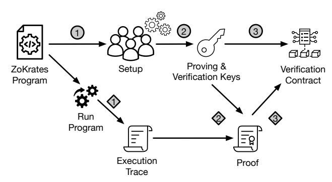
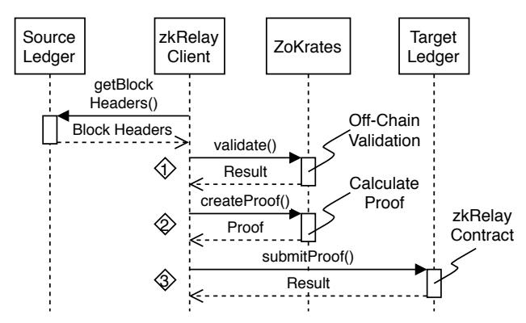
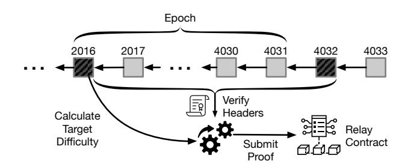
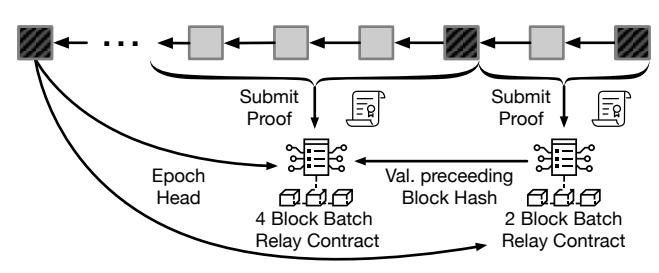
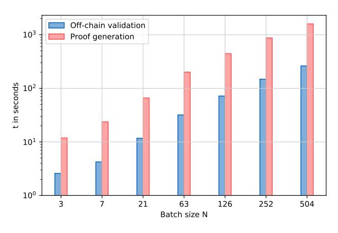
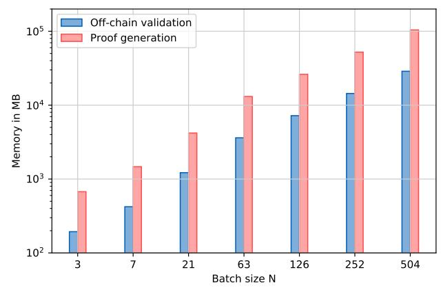

# zkRelay: Facilitating Sidechains using zkSNARK-based Chain-Relays

Martin Westerkamp *Service-centric Networking Technische Universitat Berlin ¨ Berlin, Germany westerkamp@tu-berlin.de*

Jacob Eberhardt *Information Systems Engineering Technische Universitat Berlin ¨ Berlin, Germany jacob.eberhardt@tu-berlin.de*

*Abstract*—We facilitate trusted cross-blockchain state proofs by implementing a chain-relay that validates block headers from proof-of-work blockchains. While current approaches require proof sizes linear to the amount of blocks the state was built on, trusted intermediaries, or economic assumptions, we propose the utilization of off-chain computations through zkSNARKs to provide a cryptographically secure and highly scalable sidechain mechanism. Multiple block headers are included in batches and verified off-chain, while preserving light client support. Only the validity of the offchain computation is verified on-chain, creating a sidechain mechanism that requires constant verification costs and releases the target ledger from processing and storing every single block header of the source blockchain. We provide a prototypical implementation that facilitates the verification of 504 Bitcoin headers in a single proof on Ethereum using the ZoKrates framework. Hereby, the verification costs are reduced by a factor of 187 compared to current approaches such as BTC Relay.

*Index Terms*—DLTs, Blockchain interoperability, Sidechains, Chain-Relays, Zero-Knowledge Proofs

### 1. Introduction

With the advent of blockchains, a plethora of decentralized applications (DApps) has evolved that require different guarantees with regards to key properties like security, throughput, and privacy. Consequently, multiple new blockchain platforms and networks have emerged, targeting application-specific needs.

Bitcoin, for example, pursues a conservative strategy for attaining high-security financial transactions in a distributed setting by restricting its instruction set [\[1\]](#page-7-0), whereas, Ethereum provides a Turing complete virtual machine executing (almost) arbitrarily complex transaction logic [\[2\]](#page-7-1). Yet, these blockchains exist in isolation and transactions are bound to a single ledger. For instance, smart contracts in an Ethereum network interact with each other for executing logic in libraries, retrieving state information, or modifying their state, but never interact with components outside the hosting ledger [\[3\]](#page-8-0).

To enable this kind of interoperability, different approaches have been proposed [\[4\]](#page-8-1): The most simple approach is to introduce a trusted intermediary that facilitates information exchange and mediates between blockchains. Such trusted intermediaries are commonly referred to as Oracles and multiple forms with different properties have been proposed [\[5\]](#page-8-2). However, they usually rely on strong economic assumptions or trusted entities. These trust assumptions can be weakened for specific scenarios, e.g., atomic cross-chain currency exchange through hashlocks. Yet, such techniques are not capable of establishing a generic link between blockchains.

As a third approach, which neither relies on trusted intermediaries nor use-case specific techniques, relays have been proposed to incorporate another blockchain's state or events [\[6\]](#page-8-3). Here, the consensus rules of the source blockchain are validated on the target ledger. Concretely, a source chain's block headers are submitted to the target blockchain, which independently verifies the headerchain's correctness. Due to this on-chain verification, arbitrary parties can submit headers without requiring any trust.

External users, as well as other smart contracts, can utilize the thereby established header-chain to perform Simplified Payment Verifications (SPVs), i.e., prove inclusion of transactions in a block through Merkle-proofs [\[7\]](#page-8-4). Initially introduced as the foundation of light clients, which only store block headers instead of maintaining all past transactions [\[1\]](#page-7-0), the concept is utilized to prove that a transaction occurred in a source ledger to a target ledger.

Current implementations of chain relays such as BTC relay [\[8\]](#page-8-5) permit submitting single blocks of Proof-of-Work (PoW) blockchains to a smart contract, which in turn validates its compliance to the defined consensus rules of the source chain.

BTC relay incentivizes participants to submit Bitcoin headers to an Ethereum smart contract by permitting them to set a fee that has to be paid every time proofs are constructed from the submitted header. However, the overhead for submitting an up-to-date block header grows continuously with the gap to the latest submitted block, as all intermediate blocks have to be submitted first to enable header-chain verification. Due to this fact, the BTC relay contract has stalled for more than one million blocks at the time of writing, corresponding to more than 20 months since the last block has been submitted. Catching up to the head of the Bitcoin blockchain would require more than one million transactions accounting to about 194,000 gas each[1](#page-0-0) , a burden economically rational participants are not

1. Exemplary transaction ID of a Bitcoin header submission in BTC relay: 0xe21099d8fd1252281389fc888f23f98e60db22ecb5c149ad 6fda6dccdf110b50

willing to take.

We address this issue by proposing and implementing a batch-aggregating zero-knowledge proof–based relay system for [PoW](#page-0-1) blockchains. Instead of having to verify each header of a source ledger, our system allows a target ledger to validate a chain of block-headers in batch. Crucially, our design upholds the ability for [SPV](#page-0-1) for blocks in such batches. Only a single block header of a batch is persisted on the target ledger, minimizing the storage costs. As the consensus validation is performed completely offchain, only the verification of a zero-knowledge proof has to be performed on the target ledger which leads to a further cost reduction.

To demonstrate viability of our proposed system design, we provide and evaluate a prototypical implementation which establishes a bridge from Bitcoin to Ethereum. We use the ZoKrates framework [\[9\]](#page-8-6) to prove validity of batches of Bitcoin block headers in an off-chain computation through zkSNARKs. An Ethereum smart contract confirms the correctness of the resulting proof and stores the target block header. Light clients can utilize [SPV](#page-0-1) on verified block-header batches. While the prototypical implementation targets the realization of a bridge from Bitcoin to Ethereum, our design is applicable to any source blockchain that utilizes [PoW](#page-0-1) consensus and any target blockchain that supports zkSNARK verification.

## 2. Background

In this section, we first present the general principals of sidechains and their applications. Thereafter, the concept of off-chain computations using zkSNARKs is introduced, as it lays the foundation for zkRelay.

## 2.1. Sidechains

The term sidechain was first coined by Back et al. [\[6\]](#page-8-3) in 2014 and refers to the transfer of assets between distinct distributed ledgers without requiring any trusted third party, according to their definition. Today, the term is used for various forms of interoperability between distributed ledgers [\[10\]](#page-8-7). The most prominent technique to enable sidechains is chain relays [\[4\]](#page-8-1). Here, the target ledger replicates the consensus mechanism of the source blockchain in order to incorporate events that took place on the source ledger. Similar to light clients that participate in the source blockchain's network, the target blockchain validates the adherence of submitted block headers to consensus rules. Generally, this comprises the hash-chain of block-headers and their timely order. In addition, proofof-work blockchains verify that the submitted block hash fulfills an invariant that directly depends on the current difficulty.

With XCLAIM [\[11\]](#page-8-8), a mechanism for exchanging assets based on chain-relays has been proposed. The protocol permits creating assets on a target ledger that are backed by a cryptocurrency that is hosted on another ledger. XCLAIM utilizes an enhanced version of BTC Relay. Yet, it does not provide any batching mechanisms and therefore suffers from similar scalability and availability issues like the original BTC Relay implementation. As the underlying relay mechanism is exchangeable, the protocol benefits from the concepts proposed in this paper.

Sidechain mechanisms do not only facilitate token exchanges but permit accessing the state and events of other blockchains. For instance, it enables the migration of smart contracts in case a better-suited host blockchain emerges for the given use case [\[3\]](#page-8-0). Chain-relays permit proving the validity of migrated smart contracts by submitting a Merkle proof attesting the state's validity.

## 2.2. Verifiable Off-chain Computations

Verifiable off-chain computations were introduced in [\[12\]](#page-8-9) as an approach to address blockchain's scalability and privacy limitations by executing computations on blockchain-external resources and verifying that execution's correctness on the blockchain in zero-knowledge. Verifiable computation schemes [\[13\]](#page-8-10)—and in particular zero-knowledge succinct arguments of knowledge (zk-SNARKs) [\[14\]](#page-8-11)—are a particularly efficient and secure option to implement this idea, but inherently complex in their programming abstraction and application.

ZoKrates [\[9\]](#page-8-6) addresses this problem by providing a high-level programming language for off-chain computations and a set of tools for off-chain execution and onchain verification. When specifying a ZoKrates program, the developer explicitly decides which inputs should later become public or remain hidden. Hiding inputs becomes possible due to the employed proving scheme's zeroknowledge property.

Figure [1](#page-1-0) shows ZoKrates' two core processes, initialization and off-chain computation:

Figure 1: ZoKrates Initialization and Off-chain Computation Processes.

2.2.1. Initialization. Before off-chain computations can be executed, the initialization process needs to be completed. For a compiled ZoKrates program 1 , an initial setup is performed to generate a program-specific key pair, which consists of proving- and verification key 2 . This process can either be executed by one trusted party or as a multi-party computation (MPC) within a group of mutually distrusting peers. The MPC-based approach relaxes the trust assumption to the existence of at least one honest participant [\[15\]](#page-8-12). In step 3 , a Verification Smart Contract is derived from the verification key, which is deployed to a blockchain.

2.2.2. Off-chain Computation. After the successful completion of the initialization, off-chain computations can be run and verified: In a first step 1 , a compiled program is executed for a given set of inputs, which generates an execution trace, also referred to as *witness*. A proof that attests the correct execution of the program for the given set of inputs is generated in step ② by combining the witness with the proving key generated in the initialization process. This proof is then submitted to the blockchain to verify the off-chain computation's correctness by checking the proof in step ③.

Due to the use of state-of-the-art zkSNARK schemes, this proof is of small constant size. Its verification complexity is independent of the complexity of the off-chain program and linear in the number of public inputs and outputs.

#### 3. SNARK-based Chain-Relay

The objective of chain-relays is to enable the target ledger  $(L_T)$  to interpret events that have occurred on the source ledger  $(L_S)$  in a verifiable manner without requiring any intermediaries or strong trust assumptions. Current solutions such as BTC Relay incur costs linear in the number of blocks contained in  $L_S$ . Implemented incentive mechanisms have shown to be inadequate, as the required investment for keeping the relay up-to-date exceeded the expected profits.

We propose the utilization of off-chain computations using zkSNARKs to facilitate the submission of validated batches of block headers. As a result, the relay's costs do not grow linearly with the number of block headers but are constant for any batch size.

In the following, we first present how off-chain computations can be used to construct a zkSNARK-based chain relay that permits submitting proofs for single block headers. Thereafter, the concept is extended to permit batching multiple block headers and submitting only a subset of headers to  $L_T$ . Then, we introduce a mechanism to ensure that SPVs can be performed for all block headers.

#### 3.1. Single Block Header Validation

In order to decrease the on-chain complexity of validating a block header's correctness according to the consensus rules of  $L_S$ , we construct a provable off-chain program that takes a block header as input and returns a boolean value indicating its validity. Conceptually, zkRelay acts as a light client; it does not validate transactions included in blocks, but relies on the assumption, that forging valid header-chains is economically infeasible [1]. Due to the probabilistic PoW consensus, zkRelay has to cope with missing finality and fork handling. Furthermore, each block header has to satisfy a PoW requirement, which is defined through its computed target difficulty. In the following, we tackle each of the tasks of a light client through off-chain computations based on zkSNARKs.

zkRelay enables any user to perform off-chain validations of block headers without requiring any trust or permissions.

At the beginning of the process, a  $L_S$  client is queried to retrieve the header chain up to the target header  $H_S^X$ , where X corresponds to the header's block height, as illustrated in Figure 2. The off-chain validation program

Figure 2: zkRelay Workflow.

checks the PoW of the header and returns a boolean value that indicates the validity of the block header. Based on the outcome, a proof is generated attesting the correctness of the off-chain computation. The proof size is linear in the number of public input parameters and outputs and constant otherwise.

Fork handling. The generated proof is submitted to a relay contract on  $L_T$  that first validates the proof's correctness using the formerly computed verification key. In addition, it verifies the correctness of the hash chain. The relay contract stores the genesis block  $\mathcal{G}$  of  $L_S$ . Only blocks that build on top of  $\mathcal{G}$  sequentially are considered valid. As valid blocks are not necessarily part of  $L_S$  but could depict a fork, block headers that build on top of the most recent valid block header are accepted but may be challenged. We underline that every accepted block header is valid by the consensus rules of  $L_S$ , as it has been validated during the off-chain computation, which in turn has been verified within the relay contract. However, the currently accepted main chain can be challenged and replaced in case there is a header chain that contains more cumulative PoW in  $L_S$ . Multiple challenging forks may exist simultaneously, and a fork replaces the main chain iff it contains more cumulative work than the current main chain.

Difficulty adjustment. Most PoW-based blockchains adjust the target difficulty after a fixed amount of blocks to achieve relatively constant mining rates, depending on the total hash power in the network. The hash value of a block header has to be smaller than a target value that is inferred from the calculated difficulty. An epoch E is defined through the number of blocks L for which a calculated difficulty is valid. While zkRelay validates the PoW of headers within the off-chain program, the computation is isolated and has no information about the difficulty that is applied in its epoch. However, the target is encoded within the block header in Proof-of-Work blockchains. The offchain-program extracts the target value and utilizes it during the validation process. To prevent attackers from submitting block headers that encode invalid target values which cannot be detected within the off-chain computation, the relay contract verifies its correctness before accepting a proof in step  $\langle 3 \rangle$ , Figure 2. If  $H_S^X$  lies within the epoch (i.e.  $X \mod L \neq 0$ ), the target must be equal to the encoded target in  $H_S^{X-1}$ . Otherwise, it is calculated from the former target and the time delta between the first and the last block of the preceding epoch.

Finality. After a block header has been appended to the stored main chain in the relay contract, it becomes the basis for validation of successively submitted headers and can also be used for SPVs. In order to prevent constructing SPV-proofs from a fork of  $L_S$ , we define a security parameter n that indicates the amount of blocks that have to be appended to a given block before it is considered final. Only block headers considered final may be used for SPVs. The parameter is defined by external smart contracts that reference the relay contract and depends on the balance between up-to-date cross-chain references and security for the given use case. SPV-proofs are either validated on-chain within a smart contract that references  $H_S^X$ in the relay contract or by a zero-knowledge proof verifying a Merkle-proof. While the latter provides constant proof sizes for a given Merkle tree height, the tree size is fixed, which stems from the fact that zkSNARKs require constant input sizes. As the amount of transactions stored in a block highly fluctuates, the corresponding Merkle tree is adjusted accordingly. To cope with this limitation, multiple distinct off-chain programs are required, each validating a single Merkle tree depth.

### 3.2. Epoch-based Block Header Validation

Performing off-chain validations of single blockchain headers is particularly helpful in case it requires instructions which are not natively supported by the target chain. In case of Bitcoin, the SHA-256 hash function is applied to the header twice to verify it contains sufficient PoW. As the SHA-256 hash function is a native opcode in the Ethereum Virtual Machine (EVM), it requires relatively small amounts of gas to execute [16]. Nonetheless, other PoW-based blockchains like Litecoin or Ethereum require more complex operations to verify block headers and therefore constitute candidates for future implementations of a zkSNARK-based chain-relay.

As chain-relays mimic the same mechanisms as the source blockchain, block headers have to reference a formerly submitted block. As a result, potentially large amounts of intermediary headers need to be verified and stored on the target ledger before the intended header can be submitted. In Ethereum, storing data is the second most expensive operation (after creating accounts) within smart contracts to prevent bloating the state [16]. Chain-relays—and smart contracts in general—should therefore avoid storing intermediary data that is not required on-chain.

Off-chain programs that are verifiable through zk-SNARKs offer functions that provide public and private parameters. Private parameters are only needed during off-chain computations and remain invisible during the proof validation process. While this characteristic poses promising privacy-related opportunities, we utilize it to hide complexity to the target ledger in the proof validation process by submitting batches of headers. We differentiate between block headers that are passed as public parameters and private intermediary block headers. While all block headers of a batch are validated off-chain to ensure only valid hash chains that include sufficient PoW are submitted, only the last block header of a batch is stored in the relay contract, as illustrated in Figure 3. The relay contract remains unaware of private intermediary block headers and neither stores them, nor requires any

Figure 3: The first block of an epoch is the last block of a zkRelay batch (N=L=2016). Block headers shaded in dark grey are public and visible and passed to the relay contract. The last block of an epoch is persisted in the relay contract. Block headers shaded in light grey are intermediary blocks and initially not stored on the target ledger.

information about them to validate the correctness of a batch.

We define a batch  $B_N$  as an ordered list of N block headers  $H_S^{X..(X+N-1)}$ . For demonstration purposes, we first choose a batch size equal to the epoch length (N=L) and thereafter abstract to arbitrary sizes of N. This ensures that all necessary information is available to compute the target difficulty within the off-chain program. When validating single block headers, the difficulty computation is performed within the relay contract, as the required time stamps and target values are encoded in the headers that are stored in the contract. However, this is not the case when batching block headers off-chain, as only the last header of a batch is stored in the relay contract. Due to this fact, the target calculation is shifted to the off-chain program, providing information about the given epoch and further reducing overhead in the relay contract.

Intuitively, one may assume that a batch contains exactly those block headers that belong to one epoch in case their size is equal. Yet, as the off-chain program performs an isolated computation, such a composition does not comprise sufficient information to calculate the target difficulty of an epoch. The target difficulty is computed from the time delta  $\Delta t$  between the first and last block of an epoch, the prior difficulty and the target mining time  $\theta$ :

$$target_n = \frac{\Delta t}{\theta \times L} \times target_{n-1}$$

A naive construction of headers that lie within a batch would, therefore, miss the timestamps required to calculate  $\Delta t$ . Shifting the batch with an offset of one block to the epoch permits to construct a proof that holds all required information to calculate the correct target difficulty, as depicted in Figure 3. To do so, in addition to the headers that need to be validated, the last block of the previous batch is submitted publicly. As it is public, it is utilized by the relay contract to ensure the batch builds on top of the current main chain. Furthermore, the timestamp is extracted and used for the calculation of  $\Delta t$  during the off-chain validation process. In contrast to the single block header validation, not only the PoW is verified off-chain, but also the correctness of the previous block-header hash as well as a constant difficulty up until the last block of the batch.

## 3.3. Simplified Payment Verification for Intermediary Headers

The aggregation of block headers into batches facilitates efficient off-chain validations to release LT from storing every single header of LS in the relay contract. While intermediary headers are initially not stored on LS, users may intend to create [SPVs](#page-0-1) from them to proof the occurrence of transactions, states or events. zkRelay enables users to submit intermediary blocks to the relay contract retrospectively by utilizing a Merkle tree that is built over all headers included in a batch. For this purpose, the off-chain program does not only verify the correctness of the headers within a batch but also includes them in a unique Merkle tree. Each leaf node in the tree corresponds to a block header's hash. The root of the resulting Merkle tree is returned by the off-chain program together with the results from the header and difficulty validation and stored in the corresponding relay contract. While the intermediary block headers of a batch are not stored in the relay contract, the Merkle root enables participants to submit a Merkle proof for any intermediary header of a batch. As the header has already been validated off-chain and the Merkle proof ensures its inclusion in a stored batch, no further proofs or batch submissions are required to include intermediary headers. We underline that the computed Merkle tree is independent of any Merkle tree natively used by LS or LT and only responsible for facilitating the trusted submission of intermediary blocks from validated batches.

Constructing a binary tree for N = 2016 results in a tree height of dlog2 2016e = 11. Thus, a respective Merkle proof requires eleven nodes in addition to the target block header. In order to minimize the computational overhead on-chain, the proof is computed off-chain within a dedicated ZoKrates program. The Merkle tree is calculated based on Pedersen hashes that employ embedded elliptic curves and can be proven efficiently within ZoKrates programs. In contrast, the application of SHA-256 is computationally expensive using zkSNARKs, as modulus operations require a large number of constraints in the underlying constraint system.

### 3.4. Flexible Batch Sizes for Block Header Validation

The header validation concept introduced in Section [3.2](#page-3-1) facilitates the submission of batches with equal size to the epoch length of LS. After a batch has been submitted, users are enabled to submit Merkle-proofs to the relay contract in order to include intermediary blocks from which [SPVs](#page-0-1) can be performed. However, two important challenges remain:

- Large batch sizes prevent the submission of [SPVs](#page-0-1) from recent block headers. For instance, Bitcoin's current mining time of 10 minutes per block and an epoch size of 2016 results in an epoch duration of 14 days. Therefore, users would have to wait for two weeks before being able to utilize zkRelay.
- Compiling an off-chain program, constructing a witness, and particularly computing a respective

Figure 4: Different batch sizes require distinct verification methods. Relay contracts verifying specific sizes may reference relay contracts of higher order. Block headers shaded in dark gray indicate public parameters.

proof requires large amounts of RAM, as demonstrated in Section [5.](#page-5-0) Thus, the complexity of the off-chain computation needs to be reduced to ensure practicality of zkRelay on end-user hardware.

To mitigate the obstacles introduced by large batch sizes, we introduce a concept for flexible batch sizes in addition to Merkle-proof submissions. The mechanisms are interoperable and may thus be applied in conjunction.

As single off-chain programs are not capable of handling variable batch sizes, we introduce multiple offchain programs, each handling a distinct batch size. The ZoKrates setup phase is executed for each batch size, resulting in distinct proving and verification keys for each size. There are two options to verify the correctness of batches of different size. (i) A distinct verification method is embedded into a single contract for each batch size. Hereby, the complexity is kept low, as all batches are submitted to a single contract that handles references between distinct batch sizes. This approach, however, implies a fixed set of batch sizes that cannot be modified once the relay contract has been deployed to the target ledger. (ii) Deploying a single relay contract for each batch size provides more flexibility to participants, as novel contracts can be added retrospectively. Therefore, we utilize the second approach in the following, enabling users to utilize batch sizes according to their requirements, as illustrated in Figure [4.](#page-4-0) Every relay contract maintains a set of other relay contracts that may be referenced during a batch submission. Assuming, for example, that a batch of two block headers is submitted, it could build on top of a batch four headers that is stored in a separate contract. Hereby, the computational complexity is decreased for smaller batch sizes, which facilitates cheap submission of recent block headers.

However, applying smaller batch sizes prevents the off-chain computation from calculating a correct target difficulty in case a new epoch is entered. Therefore, the first block header of the corresponding epoch (H X−(X mod N) S ) is passed as a public parameter to the off-chain program. Furthermore, an additional output variable is introduced that indicates the validity of the encoded target difficulty. As short-circuit evaluation is not supported in off-chain programs, the target value is computed for every submitted batch. Thus, the target value is computed even if the batch does not include a transition between epochs. In this case, the value is invalid as the elapsed time within an epoch is smaller than expected in most cases. To tackle this issue, the relay contract first calculates whether the submitted batch exceeds the current epoch and only in that case utilizes the program's corresponding output. Each batch size should be constructed in a form that satisfies the requirement of storing the first block of an epoch as the last block of a batch. The relay contract is verifies that the correct first block of an epoch has been submitted to the off-chain program.

Every relay contract references relay contracts of higher order to prevent offsets resulting in batch submissions surpassing an epoch boundary. For example, a participant may submit a batch of size four starting from genesis block  $\mathcal{G}$ . Based on this batch, any participant could submit a batch of size N=L=2016. As a result, the latter batch would store  $H_S^{2020}$  instead of the required  $H_S^{2016}$  that corresponds to the first block of the subsequent epoch. Enforcing a top-down approach prevents such threats while maintaining sufficient flexibility to participants.

## 4. Implementation

The implementation of zkRelay is separated into three components. While the off-chain program is implemented using the ZoKrates framework, the relay contract is a Solidity smart contract that targets the Ethereum blockchain. Lastly, a Python pipeline enables retrieving block headers from a Bitcoin client, computing corresponding witnesses and proofs using ZoKrates, and submitting proofs to the relay contract. zkRelay is available on GitHub2 under an open-source license.

Before submitting block headers to the off-chain program, the raw input has to be preprocessed, as variables in ZoKrates are restricted to a field size of 16 bytes [9]. Because the size of Bitcoin headers is 80 bytes [17], each header is split into five 16 byte long integer values before being passed as a parameter. The off-chain program applies two SHA-256 hashes to the header and compares the result to the encoded target value. The target value must remain constant within an epoch. Otherwise, the correct calculation of the target value is validated by computing it from the timestamps of the first and last block of an epoch. Due to Bitcoin's encoding of the target to four bytes, some precision is lost in comparison to its former 32-byte value. In ZoKrates programs, floor functions that permit compensating for imprecision are computationally inefficient. Therefore, a target is considered valid if it is equal up to the last digit of its encoded value. Furthermore, the standard encoding for Bitcoin headers is little-endian. Therefore, headers are passed in little-endian to calculate valid hashes during PoW calculations, while static functions convert header contents to big-endian for further processing.

Based on the verification keys that are generated during the setup-phase, ZoKrates generates a Solidity smart contract that verifies the correct program execution for submitted proofs. To maintain a clear separation between zkSNARK verification and relay logic, a second smart contract is implemented that stores all successfully submitted Bitcoin headers. Every time a batch of block headers is submitted, the zkSNARK verification contract is

called. Only if the program execution is deemed valid, further processing takes place in the relay contract. Regular batch submissions have to build on top of the current main chain stored in the contract. Any former submission can be challenged by any participant. After a challenging fork has been successfully submitted, either further batches are submitted that build on top of the fork, or a settlement function is called that compares the cumulative difficulty of the current main chain and the target fork. In case the fork comprises more cumulative difficulty than the main chain, all parallel headers are deleted and substituted by the fork.

The relay contract is equivalent for each batch size in all but two aspects: First, the batch size is stored in a constant value and used for guaranteeing the correct calculation of an epoch's target difficulty. Second, each relay contract maintains a distinct zkSNARK verification contract to ensure submitted proofs have been computed correctly for the given batch size.

#### 5. Evaluation

We evaluate the implementation of zkRelay based on three categories: performance, memory requirements, and on-chain execution costs. We show that the computation time and memory requirements depend on the program's batch size, while the on-chain execution costs remain constant for any batch size. Seven programs have been created to evaluate the scalability of the presented approach, each serving a distinct batch size. The number of block headers in a batch is selected so that it satisfies the requirements specified in Section 3.2, i.e.,  $L \mod N = 0$ .

The off-chain benchmarks were performed on a Dell PowerEdge R540 server equipped with an Intel Xeon Silver 4112 CPU clocked at 2.60 GHZ on four cores, 128 GB RAM clocked at 2666 MHz and an SSD. In the workflow of zkRelay, we distinguish between those steps performed to submit batches and the one-time setup for a given batch size.

#### 5.1. Batch Verification and Submission

Every time a batch is submitted to zkRelay, the corresponding off-chain program is executed and a proof is generated. We observe that time and memory required for computing the program's result and proof scale linearly to the number of block headers in the respective batch, as illustrated in Figures 5a and 5b. While the off-chain computation takes about 4.38 minutes for a batch of 504 blocks, the respective proof generation requires about 26.61 minutes. The most memory intensive operation in the entire workflow of zkRelay is proof generation. For instance, computing the proof for a batch size of 504 block headers requires about 104.33 GB of RAM. The relatively large memory requirements constitute a potential obstacle for end-users during proof generation. However, in case user hardware provides insufficient memory for computing large batch proofs, the batch size can be reduced to adjust memory requirements. For example, a single 504 header batch is substitutable by eight batches of size 63. In this case, the proof generation reserves only 13.10 GB of RAM. As every proof submission implies gas costs on the target ledger, users should choose the largest possible

- (a) Average runtime of many-time steps
- (b) Average RAM required for many-time steps

Figure 5: Runtime measurements of Batch Verification and Proof Generation.

batch size that is supported by their hardware and smaller than the target block header.

After a batch has been validated off-chain and a respective proof has been generated, the proof is submitted to the zkRelay contract. We measure the gas costs for proof validation and header storage based on the Ethereum blockchain with the Istanbul fork enabled. This fork reduced the gas costs for elliptic curve operations and, therefore, also reduces the validation costs for zkRelay. The submission of a Batch requires 522,865 gas including proof validation and storage of the target block's header and hash. The proof validation accounts for 351,226 gas of the total transaction costs. We underline that the transaction costs remain constant for any batch size, as they only depend on the number of public parameters in the offchain program. As outlined in Section 1, the submission of a single block header requires about 194,000 gas using BTC Relay. Therefore, zkRelay is more efficient than BTC Relay for any batch of size  $N \geq 3$ . The submission of 504 single headers accounts for 97,776,000 gas when using BTC Relay and is thus more expensive a factor of 187 compared to zkRelay.

### 5.2. One-time Setup

Compilation, setup and contract generation are performed only once for each batch size. We observe that the compilation and setup time scale linearly with the number of headers in the corresponding batch. For instance, the compilation of the zkRelay program verifying 504 Bitcoin headers takes about 30.39 minutes, while the setup-phased needs about 99.21 minutes. In addition, we observe that the number of constraints generated from the ZoKrates program scales equivalently and adds up to 43,331,225 constraints in case of the 504 Bitcoin header program (not illustrated for clarity reasons).

Our measurements show that the required memory constitutes a potential obstacle for average devices. While the reserved RAM also scales linearly with the number of block headers in a batch, compiling the program verifying 504 headers calls for about 80.50 GB of RAM. However, as the compilation is required only once, participants do not need to perform the compilation. Furthermore, compiling the respective program verifying 63 blocks reserves

only 10.13 GB of RAM, constituting a feasible task for consumer hardware.

#### 6. Related Work

Multiple sidechaining approaches have been proposed, performing the validation process in smart contracts, in off-chain computations, or by constructing proofs that are included in the source ledger. In the following, we discuss three prominent mechanisms for Sidechains and provide a brief overview of their characteristics in Table 1.

### 6.1. BTC Relay

In order to enable a one-way peg from Bitcoin towards Ethereum, participants upload Bitcoin block headers to a smart contract that validates the compliance with Bitcoin's consensus rules [8]. Therefore, the submitted block header is only accepted and stored within the contract if it references a block header that has been successfully submitted before. BTC relay utilizes an incentive mechanism to compensate participants' gas costs for submitting block headers. However, the requirement of submitting every single intermediary header implies high overhead that is not compensated adequately. Consequently, utilizing BTC Relay becomes increasingly infeasible as gaps develop over time.

#### 6.2. Dogethereum

In contrast to Bitcoin, the Dogecoin blockchain does not rely on SHA-256 for creating PoW [1], but on the memory-hard Scrypt algorithm to prevent the utilization of Application-Specific Integrated Circuits (ASICs) [18]. As executing Scrypt within a smart contract is infeasible, Teutsch et al. [19] have proposed Dogethereum, which enables off-chain validation of Dogecoin's PoW using Bulletproofs.

While the implemented mechanism facilitates batching multiple blocks for validation, the proof size of bulletproofs scales logarithmically with the computation's complexity [20] (cf. Section 2.2). Therefore, instead of verifying the proof on-chain, Truebit [21] is used to

|                                   | BTC Relay      | Dogethereum | NIPoPoW                | zkRelay                |
|-----------------------------------|----------------|-------------|------------------------|------------------------|
| Source Ledger                     | Bitcoin        | Dogecoin    | No Implementation      | Bitcoin                |
| On-chain Computational Complexity | O(n)           | O(1)        | O(log n)               | O(1)                   |
| Block Validation                  | On-Chain       | Bulletpoof  | NIPoPoW                | zkSNARK                |
| Computation Validation            | Smart Contract | Truebit     | Smart Contract (Proof) | Smart Contract (Proof) |
| Economic Rationality Assumptions  | No             | Yes         | Yes                    | No                     |
| Fork required                     | No             | No          | Velvet Fork            | No                     |

TABLE 1: Comparison of different Sidechain mechanisms

minimize verification costs. Truebit permits advertising off-chain computations that are conducted by participants to retrieve bounties. Challengers are incentivized to find incorrect submissions and claim them on-chain. The challenged section of the computation is then validated onchain and the honest entity earns the escrowed reward. Therefore, Truebit requires depositing a sufficient amount of collateral to incentivize participants. The correct execution requires constant monitoring of multiple distinct entities. While Dogethereum also proposes a mechanism of locking and unlocking assets to exchange them between ledgers, we refer to [\[19\]](#page-8-16) for further reading, as it exceeds the focus of this work.

### 6.3. NIPoPoWs

Kiayias and Zindros [\[22\]](#page-8-19) have proposed a sidechaining mechanism that is based on [Non-Interactive Proofs](#page-0-1) [of Proof-of-Works \(NIPoPoWs\)](#page-0-1) [\[23\]](#page-8-20). [NIPoPoWs](#page-0-1) permit constructing succinct proofs about predicates – or events – from regular blockchains. The proof size scales polylogarithmically to the number of blocks that have been mined at the time the event occurred [\[23\]](#page-8-20). However, the source blockchain must support [NIPoPoWs.](#page-0-1) In case no native support exists, it can be added to a ledger through a velvet fork [\[24\]](#page-8-21). Thus, miners do not have to be aware of the fork and [NIPoPoWs](#page-0-1) are implementable retrospectively. However, the source blockchain must support the proof mechanism. Furthermore, [NIPoPoWs](#page-0-1) expect constant [PoW](#page-0-1) difficulty and are therefore not applicable to blockchains like Bitcoin that adjust the difficulty to achieve relatively constant block mining rates [\[25\]](#page-8-22). Nevertheless, [NIPoPoWs](#page-0-1) provide promising sidechain mechanisms for [Proof-of-](#page-0-1)[Stake \(PoS\)-](#page-0-1)based blockchains, as demonstrated by Gaziˇ et al. [\[26\]](#page-8-23).

# 7. Discussion & Outlook

zkRelay enables the off-chain validation of batches without requiring any economic assumptions or knowledge about the relay on the source ledger. The proposed approach is unique in its scalability and provably correct execution, compared to current approaches, as outlined in Table [1.](#page-7-2)

While the prototypical implementation of zkRelay facilitates a chain-relay from Bitcoin to Ethereum, the proposed concept is not limited to these blockchains. In order to apply the approach to other ledgers, the consensus mechanism of the source blockchain has to be reproduced by the off-chain program. In contrast to Bitcoin, blockchain implementations such as Ethereum, Litecoin, or Dogecoin implement a memory-hard [PoW](#page-0-1) algorithm to prevent the utilization of [ASICs.](#page-0-1) The generation of pseudo-random data sets implies novel challenges towards off-chain computations using zkSNARKs. Future implementations of such algorithms may precompute expected data sets and store their respective Merkle root within the off-chain program. As a result, the proposed concept is applicable to memory-hard algorithms, as only Merkle proofs are required to verify the validity of a [PoW](#page-0-1) solution.

As a prerequisite for zkRelay, we assume a trusted setup to be given. For a use case that leverages a public blockchain, the setup should be performed by multiple distinct entities and is safe as long as at least one honest entity participated [\[15\]](#page-8-12). If a fixed set of users intends to utilize zkRelay for a given use case, a specific instance can be deployed by performing a trusted setup between all these participants. While zero-knowledge proof methods exist that do not require a trusted setup, e.g., Bulletproofs [\[20\]](#page-8-17) or zkSTARKS [\[27\]](#page-8-24), these approaches suffer from larger proof sizes and higher verification complexity which renders them impractical for our use case [\[14\]](#page-8-11).

### 8. Conclusion

In this paper, we proposed zkRelay, a zkSNARKbased chain-relay that facilitates sidechains in a verifiable and scalable manner. The target blockchain is released from validating and storing every single block header of the source chain by shifting the validation process to an off-chain program that is verifiable on-chain. A batching mechanism enables users to submit a subset of block headers to the target ledger, while intermediary headers are processed and validated off-chain. This validation process is cryptographically secure and does not require any economic assumptions or game-theoretic considerations.

The prototypical implementation of zkRelay facilitates a chain-relay between Bitcoin and Ethereum based on the ZoKrates framework. Our evaluation shows that the gas costs for submitting batches are constant for any batch size. Users are enabled to flexibly choose the batch size that best fits their requirements. In comparison to BTC Relay, the presented approach requires only a fraction of gas when submitting a batch of block headers. Thus, zkRelay constitutes a promising solution to the liveness issues of current blockchain relays.

## References

- [1] S. Nakamoto, "Bitcoin: A Peer-to-Peer Electronic Cash System," 2008, [http://www.bitcoin.org/bitcoin.pdf.](http://www.bitcoin.org/bitcoin.pdf) Accessed: 23.9.2018.
- [2] V. Buterin, "A Next-Generation Smart Contract and Decentralized Application Platform," *Ethereum Project White Paper*, 2014, [https://github.com/ethereum/wiki/wiki/White-Paper.](https://github.com/ethereum/wiki/wiki/White-Paper) Accessed: 28.9.2018.

- [3] M. Westerkamp, "Verifiable Smart Contract Portability," in *2019 IEEE International Conference on Blockchain and Cryptocurrency (ICBC)*, May 2019, pp. 1–9.
- [4] V. Buterin, "Chain Interoperability," 2016, [http://www.r3cev.com/](http://www.r3cev.com/s/Chain-Interoperability-8g6f.pdf) [s/Chain-Interoperability-8g6f.pdf](http://www.r3cev.com/s/Chain-Interoperability-8g6f.pdf) Accessed: 5.12.2018.
- [5] J. Heiss, J. Eberhardt, and S. Tai, "From Oracles to Trustworthy Data On-chaining Systems," in *2019 IEEE International Conference on Blockchain*. IEEE, 2019.
- [6] A. Back, M. Corallo, L. Dashjr, M. Friedenbach, G. Maxwell, A. Miller, A. Poelstra, J. Timon, and ´ P. Wuille, "Enabling Blockchain Innovations with Pegged Sidechains," [http://www.opensciencereview.com/papers/123/](http://www. opensciencereview.com/papers/123/enablingblockchain-innovations-with-pegged-sidechains) [enablingblockchain-innovations-with-pegged-sidechains,](http://www. opensciencereview.com/papers/123/enablingblockchain-innovations-with-pegged-sidechains) 2014, Accessed: 2019-10-16.
- [7] R. C. Merkle, "Protocols for Public Key Cryptosystems," in *1980 IEEE Symposium on Security and Privacy*, April 1980, pp. 122– 134.
- [8] "BTC Relay," [https://github.com/ethereum/btcrelay,](https://github.com/ethereum/btcrelay) Accessed: 2019-10-30.
- [9] J. Eberhardt and S. Tai, "ZoKrates - Scalable Privacy-Preserving Off-Chain Computations," in *2018 IEEE International Conference on Blockchain*, July 2018, pp. 1084–1091.
- [10] A. Zamyatin, M. Al-Bassam, D. Zindros, E. Kokoris-Kogias, P. Moreno-Sanchez, A. Kiayias, and W. J. Knottenbelt, "SoK: Communication Across Distributed Ledgers," Cryptology ePrint Archive, Report 2019/1128, Tech. Rep., 2019.
- [11] A. Zamyatin, D. Harz, J. Lind, P. Panayiotou, A. Gervais, and W. Knottenbelt, "XCLAIM: Trustless, Interoperable, Cryptocurrency-Backed Assets," in *2019 IEEE Symposium on Security and Privacy (SP)*, May 2019, pp. 193–210.
- [12] J. Eberhardt and S. Tai, "On or Off the Blockchain? Insights on Off-Chaining Computation and Data," in *Service-Oriented and Cloud Computing*, F. De Paoli, S. Schulte, and E. Broch Johnsen, Eds. Cham: Springer International Publishing, 2017, pp. 3–15.
- [13] M. Walfish and A. J. Blumberg, "Verifying Computations Without Reexecuting Them," *Commun. ACM*, vol. 58, no. 2, pp. 74–84, Jan. 2015.
- [14] J. Eberhardt and J. Heiss, "Off-chaining Models and Approaches to Off-chain Computations," in *Proceedings of the 2Nd Workshop on Scalable and Resilient Infrastructures for Distributed Ledgers*, ser. SERIAL'18. New York, NY, USA: ACM, 2018, pp. 7–12.

- [15] E. Ben-Sasson, A. Chiesa, M. Green, E. Tromer, and M. Virza, "Secure Sampling of Public Parameters for Succinct Zero Knowledge Proofs," in *2015 IEEE Symposium on Security and Privacy*, May 2015, pp. 287–304.
- [16] G. Wood, "Ethereum: a secure decentralised generalised transaction ledger," *Ethereum Project Yellow Paper*, 2014, [https://ethereum.](https://ethereum.github.io/yellowpaper/paper.pdf) [github.io/yellowpaper/paper.pdf.](https://ethereum.github.io/yellowpaper/paper.pdf) Accessed: 28.9.2018.
- [17] "Bitcoin protocol documentation," [https://en.bitcoin.it/wiki/](https://en.bitcoin.it/wiki/Protocol_documentation) Protocol [documentation,](https://en.bitcoin.it/wiki/Protocol_documentation) Accessed: 2019-11-13.
- [18] J. Alwen, B. Chen, K. Pietrzak, L. Reyzin, and S. Tessaro, "Scrypt Is Maximally Memory-Hard," in *Advances in Cryptology – EURO-CRYPT 2017*. Springer International Publishing, 2017, pp. 33–62.
- [19] J. Teutsch, M. Straka, and D. Boneh, "Retrofitting a two-way peg between blockchains," *arXiv preprint arXiv:1908.03999*, 2019.
- [20] B. Bunz, J. Bootle, D. Boneh, A. Poelstra, P. Wuille, and ¨ G. Maxwell, "Bulletproofs: Short Proofs for Confidential Transactions and More," in *2018 IEEE Symposium on Security and Privacy (SP)*, May 2018, pp. 315–334.
- [21] J. Teutsch and C. Reitwießner, "A scalable verification solution for blockchains," *arXiv preprint arXiv:1908.04756*, 2019.
- [22] A. Kiayias and D. Zindros, "Proof-of-Work Sidechains," in *International Conference on Financial Cryptography and Data Security*, in press.
- [23] A. Kiayias, A. Miller, and D. Zindros, "Non-Interactive Proofs of Proof-of-Work," *IACR Cryptology ePrint Archive*, vol. 2017, no. 963, 2017.
- [24] A. Zamyatin, N. Stifter, A. Judmayer, P. Schindler, E. Weippl, and W. J. Knottenbelt, "A Wild Velvet Fork Appears! Inclusive Blockchain Protocol Changes in Practice," in *Financial Cryptography and Data Security*. Springer Berlin Heidelberg, 2019, pp. 31–42.
- [25] B. Bunz, L. Kiffer, L. Luu, and M. Zamani, "Flyclient: Super-Light ¨ Clients for Cryptocurrencies," *IACR Cryptology ePrint Archive*, vol. 2019, p. 226, 2019.
- [26] P. Gazi, A. Kiayias, and D. Zindros, "Proof-of-Stake Sidechains," ˇ in *2019 2019 IEEE Symposium on Security and Privacy (SP)*. Los Alamitos, CA, USA: IEEE Computer Society, may 2019, pp. 677– 694.
- [27] E. Ben-Sasson, I. Bentov, Y. Horesh, and M. Riabzev, "Scalable, transparent, and post-quantum secure computational integrity," Cryptology ePrint Archive, Report 2018/046, 2018.