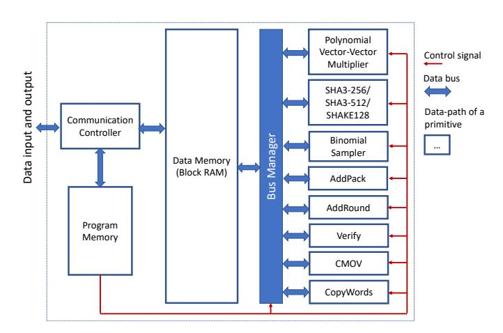
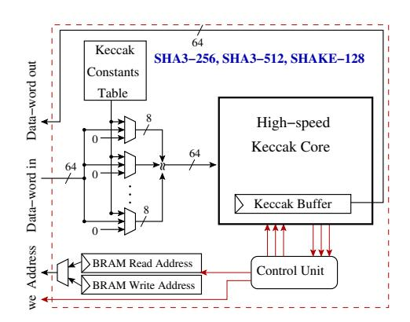
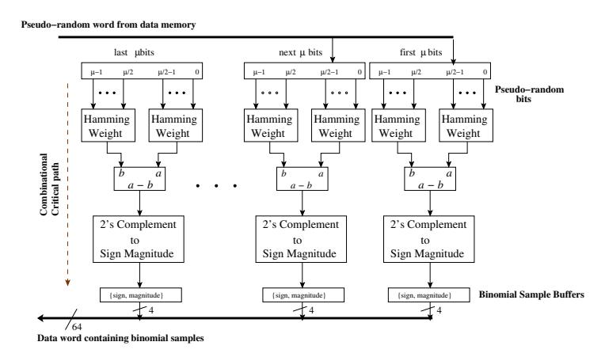
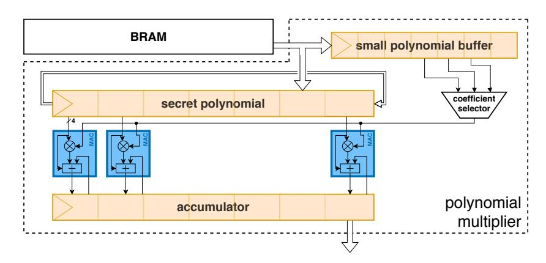
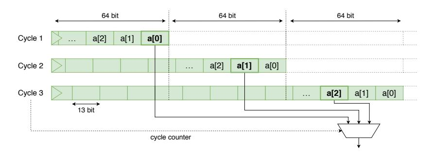
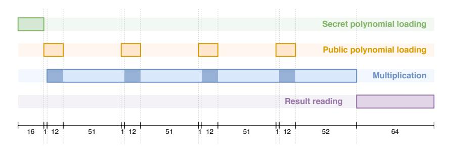
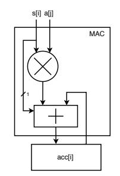
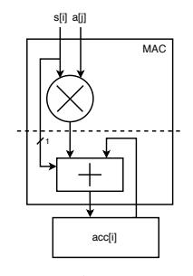
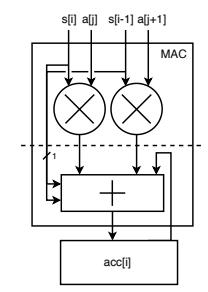

# **High-speed Instruction-set Coprocessor for Lattice-based Key Encapsulation Mechanism: Saber in Hardware**

Sujoy Sinha Roy and Andrea Basso

University of Birmingham Edgbaston B15 2TT, United Kingdom [s.sinharoy@cs.bham.ac.uk,a.basso@cs.bham.ac.uk](mailto:s.sinharoy@cs.bham.ac.uk, a.basso@cs.bham.ac.uk)

**Abstract.** In this paper, we present an instruction set coprocessor architecture for lattice-based cryptography and implement the module lattice-based post-quantum key encapsulation mechanism (KEM) Saber as a case study. To achieve fast computation time, the architecture is fully implemented in hardware, including CCA transformations. Since polynomial multiplication plays a performance-critical role in the module and ideal lattice-based public-key cryptography, a parallel polynomial multiplier architecture is proposed that overcomes memory access bottlenecks and results in a highly parallel yet simple and easy-to-scale design. Such multipliers can compute a full multiplication in 256 cycles, but are designed to target any area/performance trade-offs. Besides optimizing polynomial multiplication, we make important design decisions and perform architectural optimizations to reduce the overall cycle counts as well as improve resource utilization.

For the module dimension 3 (security comparable to AES-192), the coprocessor computes CCA key generation, encapsulation, and decapsulation in only 5,453, 6,618 and 8,034 cycles respectively, making it the fastest hardware implementation of Saber to our knowledge. On a Xilinx UltraScale+ XCZU9EG-2FFVB1156 FPGA, the entire instruction set coprocessor architecture runs at 250 MHz clock frequency and consumes 23,686 LUTs, 9,805 FFs, and 2 BRAM tiles (including 5,113 LUTs and 3,068 FFs for the Keccak core).

**Keywords:** Lattice-based Cryptography · Post-Quantum Cryptography · Hardware Implementation · Saber KEM · High-speed Instruction-set Architecture

# **1 Introduction**

In October 2019, Google's 54-qubit quantum processor 'Sycamore' completed a task in 200 seconds, the equivalent of which can only be computed in 10,000 years using a state-of-the-art supercomputer [\[AAB](#page-20-0)<sup>+</sup>19]. To break present-day public-key cryptographic primitives, namely RSA and Elliptic Curve cryptosystems, Shor's algorithm [\[Sho97\]](#page-23-0) needs a significantly more powerful quantum computer. However, several quantum computing scientists anticipate that quantum computers powerful enough to break these cryptosystems will be feasible in the next 15 to 20 years [\[20120\]](#page-20-1). Post-quantum cryptography is a branch of cryptography that focuses on designing quantum-attack resistant public-key primitives and analyzing their security. Existing post-quantum public-key cryptographic primitives have been built based on different problems that are presumed to be computationally infeasible for both present-day computers as well as quantum ones. In 2017, the American National Institute of Standards and Technology (NIST) called for the standardization of post-quantum public-key algorithms. The majority of the candidate submissions are based

on *presumed* computationally infeasible lattice-problems. One such candidate scheme is Saber [\[DKRV19\]](#page-21-0), which is a Chosen-Ciphertext Attack (CCA) resistant key encapsulation mechanism (KEM) based on module lattices. It is one of the nine lattice-based public-key encryption or encapsulation schemes that have proceeded to the second round of NIST's standardization project. Saber is based on the Module Learning With Rounding (MLWR) problem [\[BPR12\]](#page-21-1), and it uses power-of-two moduli to achieve flexibility, simplicity, high security, and efficiency [\[DKRV19\]](#page-21-0).

There have been several efficient hardware or software/hardware implementations of lattice-based public-key cryptosystems. It is well-known that in ideal or module latticebased public-key cryptography, the performance of polynomial multiplication plays a big role [\[KRSS19\]](#page-22-0) in the overall performance of the cryptographic primitive. The Number Theoretic Transform (NTT), which is a generalization of Fast Fourier Transform (FFT), has the asymptotically-fastest time-complexity *O*(*n* log *n*). However, the NTT requires the ciphertext modulus to be a prime. In 2012, Göttert et al. [\[GFS](#page-22-1)<sup>+</sup>12] reported the first hardware implementation of the ideal lattice-based LPR [\[LPR10\]](#page-22-2) public-key encryption scheme. Their implementation used a massively parallel and unrolled NTT-based polynomial multiplier architecture that consumed millions of LUTs and flip-flops. In the few years that followed, several hardware and software implementation papers [\[PG14b,](#page-23-1) [RVM](#page-23-2)<sup>+</sup>14, [dCRVV15,](#page-21-2) [PDG14,](#page-23-3) [PG14a,](#page-23-4) [LN16,](#page-22-3) [AJS16,](#page-21-3) [DKSRV18,](#page-21-4) [KBMRV18,](#page-22-4) [BKS19,](#page-21-5) [BUC19,](#page-21-6) [ZYC](#page-23-5)<sup>+</sup>20] improved the performance of lattice-based public-key cryptography on hardware and software platforms by orders of magnitude.

Efficient implementations of lattice-based public-key cryptographic algorithms gained significant interest in the context of NIST's post-quantum cryptography standardization project. A comparison of most round 2 submissions, including Saber, can be found in [\[DFA](#page-21-7)<sup>+</sup>20]. Since several research papers showed that the use of an NTT-based polynomial multiplier results in lower computation cost for ideal lattice-based cryptosystems, several NIST candidates [\[ADPS16,](#page-20-2) [BDK](#page-21-8)<sup>+</sup>18, [ABB](#page-20-3)<sup>+</sup>19] use NTT-friendly parameter sets, and some of them (e.g., Kyber [\[BDK](#page-21-8)<sup>+</sup>18]) even require the use of NTT in their protocol.

On the contrary, Saber [\[DKRV19\]](#page-21-0) uses power-of-two moduli, thus making it inconvenient to use the asymptotically fastest NTT-based polynomial multiplication. This non-typical parameter set in Saber makes its implementation an interesting problem as well as a challenging research topic. In [\[DKSRV18\]](#page-21-4) the authors of Saber proposed a fast polynomial multiplier based on the Toom-Cook algorithm [\[Knu97\]](#page-22-5) and showed that a non-NTT parameter set does not make their implementation slow. At CHES 2018, Karmakar et al. [\[KBMRV18\]](#page-22-4) proposed software optimization techniques to implement Saber on resource-constrained microcontrollers. The latest software optimization techniques for Saber were proposed by Bermudo Mera et al. [\[BMKV20\]](#page-21-9) at CHES 2020. All of these works targeted improving the computational efficiency of Saber, mostly by improving the Toom-Cook polynomial multiplier. However, their efforts to improve matrix generation on software platforms faced a major obstacle by the SHAKE128 pseudo-random number generator, which is executed serially in Saber [\[DKRV19\]](#page-21-0). In practice, more than 50% of the computation time is spent on generating pseudo-random numbers using SHAKE128, thus making it the performance bottleneck. It is known that the Keccak [\[20115\]](#page-20-4) function, which is at the core of SHAKE128, is very efficient on hardware platforms. This motivated us to investigate the implementation aspects of Saber on hardware platforms.

The only reported hardware implementations of Saber are by Dang et al. [\[DFAG19\]](#page-21-10) (also reported in [\[FDAG\]](#page-22-6) and [\[DFA](#page-21-7)<sup>+</sup>20]) and Bermudo Mera et al. [\[BMTK](#page-21-11)<sup>+</sup>20]. Both of them use hardware/software (HW/SW) codesign approaches to accelerate Saber. Bermudo Mera et al. [\[BMTK](#page-21-11)<sup>+</sup>20] report that their HW/SW codesign achieves 5 to 7-times speed-up compared to software-only implementation on the same platform. Dang et al. [\[DFAG19\]](#page-21-10) compare seven lattice-based key encapsulation methods on HW/SW codesign platforms. They report that out of the seven tested protocols (FrodoKEM, Round5, Saber, NTRU- HPS, NTRU-HRSS, Streamlined NTRU Prime and NTRULPRime), Saber is the fastest protocol in the encapsulation operation and second fastest in the decapsulation operation.

While HW/SW codesign has its benefits, such as flexibility and a shorter design cycle, a full-hardware (i.e., including all building blocks) implementation of Saber can offer better latency and throughput. At the same time, implementing such an accelerator is a challenging research topic because it requires making careful design decisions that take into account both algorithmic and architectural alternatives for the internal building blocks and their interactions at the protocol level. Hence, it is important to investigate design methodologies that will result in the best performance for Saber.

**Contributions** In this paper, we present an instruction-set coprocessor architecture for lattice-based post-quantum key encapsulation mechanism (KEM) and implement the architecture for Saber KEM [\[DKRV19\]](#page-21-0). The architecture implements all the building blocks in the hardware, thus making it the fastest implementation of Saber to our knowledge. In particular, we make the following contributions:

- 1. Since polynomial multiplication plays a central role in Saber, we analyze different algorithmic alternatives for implementing high-speed polynomial multiplication in hardware. By taking into account both computation and memory access overheads, we use a simple yet parallel and hardware-friendly polynomial multiplication algorithm targeting the parameter set of Saber.
- 2. We take advantage of the power-of-two moduli and small secret in Saber and implement a custom architecture for the polynomial multiplication algorithm. Additionally, we perform architectural optimizations to reduce cycle, logic, and register counts. The designed polynomial multiplier architecture is massively parallel and does not suffer from memory-access bottlenecks. With this multiplier, one polynomial multiplication operation requires only 256 cycles (excluding the overhead of operand loading).
- 3. The polynomial architecture is easy to scale to meet different performance-area trade-offs. We further show how to pipeline the polynomial multiplier architecture and achieve higher clock frequency with a negligible increase in the latency.
- 4. Several operations in Saber use non-multiples of 8-bit operands, making their resourceshared and optimized hardware implementation challenging. We analyze these building blocks and perform optimizations to reduce both cycle and area counts.
- 5. The optimized building blocks are integrated to realize an instruction-set coprocessor architecture that computes all KEM operations, namely key generation, encapsulation and decapsulation, in the hardware. Since several existing software implementations [\[KRSS19,](#page-22-0) [Roy19\]](#page-23-6) of lattice-based KEMs reported that Keccakbased pseudo-random number generation takes a share of about 50% of the overall computation time, we used the high-performance Keccak core that was developed by the Keccak team [\[Tea19\]](#page-23-7). The unified architecture computes CCA-secure Saber key generation, encapsulation and decapsulation in only 5*,*453, 6*,*618 and 8*,*034 cycles respectively for the parameter set with security comparable to AES-192.
- 6. We further extend the instruction-set architecture to support the other two variants of Saber, namely LightSaber and FireSaber [\[DKRV19\]](#page-21-0), which correspond to security levels comparable to AES-128 and AES-256 respectively.
- 7. Our design methodology is generic and hence can be followed to design instruction-set coprocessors for other lattice-based schemes. The Vivado project and all HDL source codes are available at [https://github.com/sujoyetc/SABER\\_HW](https://github.com/sujoyetc/SABER_HW).

**Paper organization** In Sec. 2, we introduce the relevant mathematical background, including a summary of the Saber KEM protocol. Sec. 3 discusses the optimization techniques and the design decisions that lead to our proposed high-speed instruction-set architecture. Sec. 4 presents the implementation results and compares them with state-of-the-art solutions. The final section includes concluding remarks.

### <span id="page-3-0"></span>2 Preliminaries

#### 2.1 Notation

In this section, we introduce the notation used throughout the paper. Let p and q be two powers of 2, i.e.  $p=2^{\varepsilon_p}$  and  $q=2^{\varepsilon_q}$ . We denote with  $\mathbb{Z}_q$  the ring of integers modulo q. We then define the ring of polynomials  $\mathcal{R}_p=\mathbb{Z}_p[x]/\langle x^N+1\rangle$ , for some integer N. Similarly for q, we have  $\mathcal{R}_q=\mathbb{Z}_q[x]/\langle x^N+1\rangle$ . A vector is represented in bold, such as  $\mathbf{a}$ , and we identify polynomials in  $\mathcal{R}$  with a N-vector where the i-th entry is the i-th coefficient of a(x). Let the operator  $\lfloor \cdot \rfloor$  denote rounding, i.e.  $\lfloor a \rfloor = \lfloor a + \frac{1}{2} \rfloor$ . This can be extended to polynomials coefficient-wise.

Let  $\beta_{\mu}$  denote a centered binomial distribution with even parameter  $\mu$ . The distribution takes on values in the range  $[-\mu/2, \mu/2]$  with probability  $p(x) = \frac{\mu!}{(\mu/2+x)!(\mu/2-x)!}2^{-\mu}$ . We write  $x \leftarrow \beta_{\mu}$  to denote x randomly sampled from a  $\beta_{\mu}$  distribution and  $\mathbf{x} \leftarrow \beta_{\mu}$  for a polynomial whose coefficients are independently sampled from  $\beta_{\mu}$ . Given a set S, we write  $x \leftarrow \mathcal{U}(S)$  for x uniformly randomly selected from S.

#### <span id="page-3-2"></span>2.2 Saber

Saber [DKRV19] is a IND-CCA secure Key Encapsulation Mechanism (KEM). Its security relies on the hardness of the module variant of the Learning With Rounding (Mod-LWR) problem [BPR12]. A Mod-LWR sample is given by  $\left(\boldsymbol{a},b=\left\lfloor\frac{p}{q}(\boldsymbol{a}^T\boldsymbol{s})\right\rfloor\right)\in\mathcal{R}_q^{l\times 1}\times\mathcal{R}_p$ , where  $\boldsymbol{a}$  is a vector of randomly generated polynomials in  $\mathcal{R}_q$ ,  $\boldsymbol{s}$  is a secret vector of polynomials in  $\mathcal{R}_q$  whose coefficients are sampled from a centered binomial distribution, and the modulus p is less than q. The decisional variant of the problem asks to distinguish between Mod-LWR samples and uniformly random samples in  $\mathcal{R}_q^{l\times 1}\times\mathcal{R}_p$ . This Mod-LWR problem is presumed to be computationally infeasible, both on classical and quantum computers. It is thus a good candidate for developing quantum-resistant cryptosystems.

Saber [DKRV19] uses the Mod-LWR problem with both p and q power-of-two to construct a Chosen Plaintext Attack (CPA) secure public-key encryption scheme. Following that, a CCA-secure Saber KEM is realized using a post-quantum variant of the Fujisaki-Okamoto transformation [HHK17]. In this section, we describe the algorithms used in CPA-secure 'Saber Public Key Encryption' (Alg. 1, 2, 3) and CCA-secure 'Saber Key Encapsulation' (Alg. 4, 5, 6). We refer to the original paper [DKRV19] for further information.

```
Algorithm 1 Saber.PKE.KeyGen() [DKRV19]
```

```
\begin{aligned} & seed_{\boldsymbol{A}} \leftarrow \mathcal{U}(\{0,1\}^{256}) \\ & \boldsymbol{A} = \mathtt{gen}(\mathtt{seed}_{\boldsymbol{A}}) \in \mathcal{R}_q^{l \times l} \\ & \boldsymbol{r} = \mathcal{U}(\{0,1\}^{256}) \\ & \boldsymbol{s} = \beta_{\mu}(\mathcal{R}_q^{l \times 1}; \boldsymbol{r}) \\ & \boldsymbol{b} = ((\boldsymbol{A}^T \boldsymbol{s} + \boldsymbol{h}) \bmod q) \gg (\varepsilon_q - \varepsilon_p) \in \mathcal{R}_p^{l \times 1} \\ & \mathbf{return} \ (pk := (seed_{\boldsymbol{A}}, \boldsymbol{b}), sk := (\boldsymbol{s})) \end{aligned}
```

Key generation starts by randomly generating a seed that determines an  $l \times l$  matrix  $\boldsymbol{A}$ 

consisting of  $l^2$  polynomials in  $\mathcal{R}_q$ . The function gen that is used to obtain the matrix from the seed is a pseudo-random number generator based on SHAKE-128 [20115]. A secret vector  $\mathbf{s}$  of polynomials whose entries are sampled from a centered binomial distribution with parameter  $\mu$  is also generated. The public key then consists of the matrix seed and the rounded product  $\mathbf{A}^T \mathbf{s}$ , while the secret key consists of the secret vector  $\mathbf{s}$ . The constants  $\mathbf{h}$ , and  $h_2$  in the following algorithms are used to replace rounding operations by a simple bit shift [DKRV19].

# <span id="page-4-0"></span>Algorithm 2 Saber.PKE.Enc $(pk = (seed_{A}, b), m \in R_2; r)$ [DKRV19]

```
\begin{aligned} & \boldsymbol{A} = \operatorname{gen}(\operatorname{seed}_{\boldsymbol{A}}) \in \mathcal{R}_q^{l \times l} \\ & \text{if } r \ is \ not \ specified \ \mathbf{then} \\ &
```

Encryption consists of generating a new 'secret' s' and adding the message to the inner product between the public key and the new secret s'. This forms the first part of the ciphertext, while the second is used to hide the encrypting secret and contains the rounded product As'.

```
Algorithm 3 Saber.PKE.Dec(sk = s, c = (c_m, b')) [DKRV19] v = b'^T(s \bmod p) \in R_p m' = ((v - 2^{\varepsilon_p - \varepsilon_T} c_m + h_2) \bmod p) \gg (\varepsilon_p - 1) \in R_2 return m'
```

Decryption uses the secret key to compute v, which is approximately the same as the v' computed during encryption. This allows extracting the message from the ciphertext.

The CPA-secure components are used to build a CCA-secure KEM via a post-quantum variant of the Fujisaki-Okamoto transformation. The functions  $\mathcal{F}: \{0,1\}^* \to \{0,1\}^n$  and  $\mathcal{G}: \{0,1\}^* \to \{0,1\}^{l \times n}$  are hash functions SHA3-256 and SHA3-512 respectively, standardized in FIPS 202 [20115].

```
\begin{aligned} &\textbf{Algorithm 4 Saber.KEM.KeyGen()} & [DKRV19] \\ \hline & (seed_{\pmb{A}}, \pmb{b}, \pmb{s}) = Saber.PKE.KeyGen() \\ & pk = (seed_{\pmb{A}}, \pmb{b}) \\ & pkh = \mathcal{F}(pk) \\ & z = \mathcal{U}(\{0,1\}^{256}) \\ & \textbf{return } & (pk := (seed_{\pmb{A}}, \pmb{b}), sk := (\pmb{s}, z, pkh)) \end{aligned}
```

The KEM key generation does not differ significantly from the CPA key generation algorithm but appends to the secret key both a hash of the public key and a randomly generated string that is returned if decapsulation fails.

Encapsulation starts by randomly generating a message m and obtaining from that and the public key the source of randomness used during encryption. The ciphertext then consists of the encrypted message and a value obtained from the message and public key.

Decapsulation decrypts the ciphertext via Saber.PKE.Dec and ensures that the ciphertext was honestly generated. To do so, it re-encrypts the obtained message with the

#### <span id="page-5-1"></span>**Algorithm 5** Saber.KEM.Encaps $(pk = (seed_{\mathbf{A}}, \mathbf{b}))$ [DKRV19]

```
m \leftarrow \mathcal{U}(\{0,1\}^{256})
(\hat{K},r) = \mathcal{G}(\mathcal{F}(pk),m)
c = \text{Saber.PKE.Enc}(pk,m;r)
K = \mathcal{F}(\hat{K},c)
\mathbf{return}\ (c,K)
```

```
Algorithm 6 Saber.KEM.Decaps(sk = (s, z, pkh), \overline{pk = (seed_A, b), c}) [DKRV19]
```

```
\begin{split} m' &= \texttt{Saber.PKE.Dec}(\boldsymbol{s}, c) \\ (\hat{K}', r') &= \mathcal{G}(pkh, m') \\ c' &= \texttt{Saber.PKE.Enc}(pk, m'; r') \\ \text{if } c &= c' \text{ then return } K = \mathcal{H}(\hat{K}', c) \text{ ;} \\ \text{else return } K = \mathcal{H}(z, c) \text{ ;} \end{split}
```

randomness associated with it and checks whether the ciphertext corresponds to the one received.

**Parameters** Saber defines three sets of parameters called LightSaber, Saber and FireSaber, which match NIST security levels 1, 3 and 5 respectively. All three levels use polynomial degree N=256, and moduli  $q=2^{13}$  and  $p=2^{10}$ . The three variants differ in the module dimension, the binomial distribution parameter, and the message space. Namely, LightSaber uses module dimension 2, secrets sampled from [-5,5], and  $t=2^2$ ; Saber uses module dimension 3, secrets sampled from [-4,4], and  $t=2^3$ ; and FireSaber upgrades the parameters to module dimension 4, secrets sampled from [-3,3], and  $t=2^5$ .

# <span id="page-5-0"></span>3 Design Decisions

In the previous section, we outlined the operations that are computed during key generation, encapsulation, and decapsulation. These computations are composed of several elementary operations, including hashing, pseudo-random number generation, polynomial addition and multiplication, and rounding.

Since Saber uses power-of-two moduli p and q, all modulus reductions are free in hardware. Additionally, the rounding operation is cheap as it comprises only of additions, modulo reductions, and bit selection. In the following subsections, we describe various design alternatives and the design decisions that we made while implementing Saber on hardware platforms. Our aim was to achieve both high speed and flexibility for the KEM operations and to support multiple parameter sets.

### 3.1 High-level Architecture

There are two general methodologies to implement computationally intensive cryptographic algorithms in hardware, namely HW/SW codesign and full-HW design. While a HW/SW codesign strategy offers a shorter design cycle and higher flexibility, it may not result in the best performance. On the other hand, a full-HW architecture, i.e., with all the building blocks in hardware, can offer significant speedup over a HW/SW codesign architecture. However, the HW-only design methodology demands significant implementation efforts (hence a longer design cycle), and may result in diminished flexibility. In this paper, we prioritize speed, and thus opt for a full-hardware implementation with all building blocks residing in hardware. At the same time, we aim to make design decisions such that

<span id="page-6-0"></span>

**Figure 1:** Block diagram: Instruction-set architecture for Saber

the hardware remains flexible to a great extent (e.g., can fully compute key generation, encapsulation, and decapsulation for multiple Saber parameter sets).

When a HW-only implementation is considered, one design option is to cascade different building blocks in the data-path following the standard data-flow model, if the blocks are required in multiple parallel instances. However, this approach results in a large area consumption and demands customized data-paths for different protocol-level operations, namely key-generation, encapsulation, and decapsulation. Additionally, such an architecture becomes more inflexible to different parameter sets [\[GFS](#page-22-1)<sup>+</sup>12]. Hence, we do not follow this design methodology in this work.

To achieve programmability and flexibility, we realize an *instruction-set coprocessor architecture* for Saber. The advantages of this design strategy are: instruction-level flexibility and modularity, ease to add or modify new instructions, and most importantly a unified architecture that can be used for multiple tasks. We analyzed the SW implementation of Saber [\[DKRV19\]](#page-21-0) and identified the high-level instructions that are needed to support all the CCA-secure KEM routines, namely key generation, encapsulation, and decapsulation. A high-level architecture diagram of the instruction-set coprocessor architecture (ISA) is shown in Fig. [1.](#page-6-0)

We followed standard design practices to make the implementation constant-time. There is no conditional branching in the algorithms used and all the building blocks have been designed to be constant-time. Thus, all KEM operations take a fixed amount of time.

We would like to remark that, although we only implement the architecture targeting Saber KEM as a case study, the implementation strategy is quite generic in nature. Hence, our strategy can be followed to implement other lattice-based public-key schemes in hardware. The following sections describe the building blocks.

# **3.2 SHA3-256/SHA3-512/SHAKE-128**

As shown in Alg. [4,](#page-4-2) [5,](#page-5-1) and [6,](#page-5-2) Saber uses the hash functions SHA3-256 and SHA3-512 that were standardized in FIPS 202 [\[20115\]](#page-20-4). Moreover, to generate pseudorandom numbers, the extendable output function SHAKE-128, also standardized in FIPS 202, is used. Since all of these functions use the Keccak sponge function [\[20115\]](#page-20-4), we implement the SHA3-256/SHA3-512/SHAKE-128 block as a wrapper around a *single* Keccak core (Fig. [2\)](#page-7-0).

We chose to use a single Keccak core for several reasons. Software benchmarking [\[KRSS19\]](#page-22-0) of many lattice-based KEM schemes have reported that 50-70% of the overall computation time is spent on executing the Keccak function, thus making it the

<span id="page-7-0"></span>

**Figure 2:** Unified architecture for SHA3-256, SHA3-512, and SHAKE-128. Control signals are shown in red.

most performance-critical component. On software platforms with Single Instruction Multiple Data (SIMD) processors, such as Intel AVX2, the overhead of pseudo-random number generation is reduced in Kyber KEM [\[BDK](#page-21-8)<sup>+</sup>18] (which is also based on module lattices) by using a vectorized implementation (factor 4) of Keccak. However, the Saber algorithm [\[DKRV19\]](#page-21-0) calls the Keccak operations in a serial manner and thus a single call to a Saber KEM operation cannot leverage a vectorized implementation of Keccak on software platforms with SIMD. A batched implementation of Saber, such as SaberX4 [\[Roy19\]](#page-23-6), is needed to improve the throughput of KEM operations on platforms with SIMD.

This serial execution of Keccak in the Saber algorithm does not cause issues since Keccak is very efficient [\[20115\]](#page-20-4) on hardware platforms. In this work, we use the opensource high-speed implementation of the Keccak core that was designed by the Keccak Team [\[Tea19\]](#page-23-7). This high-speed implementation of Keccak computes 'state-permutations' at a gap of only 28 cycles, thus generating 1,344 bits of pseudo-random string every 28 cycles during the extraction-phase. Furthermore, we observed that one instance of the Keccak core consumes around 5K LUTs and 3K registers, which are respectively nearly 21% and 31% of the overall area in our implementation. The area consumption results indicate that instantiating multiple high-speed Keccak cores in the hardware would make the implementation area-expensive. Additionally, as the Keccak core is already very fast, the use of multiple such cores in parallel would be of little help in improving the speed. Due to these reasons, we instantiate only one high-speed Keccak core in the hardware. As an added benefit, the serial use of the Keccak core makes our implementation simpler.

## **3.3 Data Memory**

In the instruction-set architecture (Fig. [1\)](#page-6-0), the building blocks read their operand-data from the data memory and write their results back to the data memory. The data memory is of size 8KB such that all the parameter sets of Saber can be computed, and it is implemented using Block RAM tiles. An important design parameter is the word-size of the memory. We set the word-size to 64-bit as the high-speed Keccak core reads/writes data in 64-bit words. Additionally, when we consider integration of the instruction-set coprocessor architecture with a host computer (32-bit or 64-bit), the use of a 64-bit data-memory simplifies the data transfer protocol between the two sides. All the remaining blocks in Fig. [1](#page-6-0) have been optimized to use 64-bit data read/write operations efficiently.

<span id="page-8-0"></span>

**Figure 3:** Binomial samplers in parallel. Output samples are stored as 4-bit signmagnitude values

### **3.4 Program Memory**

Our instruction-set coprocessor architecture offers programmability and thus the flexibility to execute multiple KEM operations. Fig. [1](#page-6-0) shows a program memory that is loaded with the microcode of a protocol. For example, to compute key generation, the microcode of key generation is loaded into the program memory. The instruction words are 35-bit wide: 5-bits for the instruction code, 2 × 10-bits for two input operand addresses, and the remaining 10-bits for the result address. However, for SHA and SHAKE operations, the instructions are two words long as the operations also require input/output lengths. The program memory is small and is thus implemented using LUTs.

### <span id="page-8-1"></span>**3.5 Binomial Sampling**

A binomial sampler with parameter *µ* computes a sample from a *µ*-bit pseudo-random input string, say *r*[*µ* − 1 : 0], by subtracting the Hamming weight of the most-significant *µ/*2 bits from the Hamming weight of the least-significant *µ/*2 bits, i.e., by computing HW(*r*[*µ/*2 − 1 : 0]) − HW(*r*[*µ* − 1 : *µ/*2]), where HW() stands for the Hamming weight. In Saber, the secret coefficients are drawn from a centered binomial distribution with the parameter *µ* = 10, 8, and 6 for LightSaber, Saber, and FireSaber respectively [\[DKRV19\]](#page-21-0). Hence, the secret coefficients are in [−5*,* 5] for LightSaber, [−4*,* 4] for Saber, and [−3*,* 3] for FireSaber. As *µ* is small in all the variants of Saber, the sampler can be implemented with simple bit manipulations. In our architecture, the sampler is a combinational block (Fig. [3\)](#page-8-0) that directly maps pseudo-random bits from an input buffer to a sample value.

For all the variants of Saber, a sample is represented as a 4-bit signed-magnitude number (pair of sign and an absolute value) in our implementation. Note that existing software implementations of Saber [\[DKRV19,](#page-21-0) [KBMRV18,](#page-22-4) [Roy19\]](#page-23-6) use the two's complement number system to represent the samples in the C data type uint16\_t. The use of '4-bit signed-magnitude' representation simplifies the hardware architecture because we can store 16 such samples easily in a 64-bit word of the data memory. Thus, no sample is split across two words. Additionally, in Sec. [3.6.1](#page-10-0) we show that this representation simplifies the polynomial multiplier.

The data-path of the sampler is shown in Fig. [3.](#page-8-0) For Saber, since *µ* = 8 divides the word-length of the data memory, two 64-bit pseudo-random words are read from the memory and stored in a 128-bit buffer register. Then, 16 samples are generated in parallel and stored in an output buffer register of length 64-bit. Finally, the output buffer is written to the data memory. However, for LightSaber and FireSaber, *µ* = 10 and *µ* = 6 are not

divisors of 64. Hence, the reading of pseudo-random bits is relatively more complicated for these two variants of Saber. The operand loading problem is solved by using a 320-bit input buffer register since lcm(10*,* 64) = 320.

For LightSaber, five consecutive pseudo-random words (hence 320 bits) are read from the memory and stored in the buffer register. Then 320*/*10 = 32 samples are generated by consuming the pseudo-random buffer, and finally they are stored in two words of data memory. For FireSaber, three consecutive pseudo-random words are read from the memory, then 192*/*6 = 32 samples are generated, and finally the samples are stored in two data memory words. As each secret-polynomial consists of 256 coefficients, the sample generation process is repeated in a loop.

## **3.6 Polynomial Multiplication**

In ideal and module lattice-based cryptosystems, the performance of polynomial multiplication plays a critical role. Since Saber uses power-of-two moduli *p* = 2<sup>10</sup> and *q* = 2<sup>13</sup>, it cannot trivially use the asymptotically fastest Number Theoretic Transform (NTT)-based polynomial multiplication. Software implementations [\[DKSRV18\]](#page-21-4) of Saber have used the Toom-Cook polynomial multiplication algorithm [\[Knu97\]](#page-22-5), which is a generic algorithm and asymptotically the second fastest after the NTT-based polynomial multiplication. However, the Toom-Cook algorithm has a recursive structure and it is hard to transform it into an iterative algorithm. The hardware implementation of the Toom-Cook polynomial multiplication by Bermudo Mera et al. [\[BMTK](#page-21-11)<sup>+</sup>20] describes the challenges in implementing the recursive function calls in hardware and proposes efficient architectures. The high-speed HW/SW codesign implementation by Dang et al. [\[DFAG19\]](#page-21-10) uses a polynomial multiplier consisting of 256 DSPs, each taking 13-bit inputs.

In this work, we follow a principled design approach and realize a simple, yet parallel and fast polynomial multiplier architecture by using the quadratic-complexity schoolbook polynomial multiplication algorithm. Additionally, we optimize the multiplier architecture for Saber. Since the polynomials in Saber are only of degree 256, the asymptotic inferiority of the quadratic-complexity algorithm is outweighed by its simplicity and amiability to parallelization. The schoolbook multiplication algorithm for polynomials of degree *N* is described in Alg. [7.](#page-9-0)

#### <span id="page-9-0"></span>**Algorithm 7** Schoolbook polynomial multiplication.

```
Input: Two polynomials a(x) and b(x) in Rq of degree N.
Output: The product a(x) · b(x) of degree N.
 1: acc(x) ← 0.
 2: for i = 0; i < N; i = i + 1 do
 3: for j = 0; j < N; j = j + 1 do
 4: acc[j] = acc[j] + b[j] · a[i] mod Zq
 5: end for
 6: b = b · x mod Rq.
 7: end for
 8: return acc.
```

In line 1, an accumulator which consists of *N* registers is initialized to zero. This accumulator is used to store the results of the polynomial multiplication. Then, inside the nested loops (line 4), the *i*-th coefficient of *a*(*x*) is multiplied with the *j*-th coefficient of *b*(*x*) and the result of the multiplication is accumulated in the *j*-th register of the accumulator *acc*. This operation consists of an integer multiplication, followed by modular reduction and modular addition. During a schoolbook multiplication, one polynomial needs to be rotated inside the outermost loop. In Alg. [7,](#page-9-0) *b*(*x*) is rotated by multiplying it by *x* in R*q*.

Although the schoolbook polynomial multiplication algorithm looks rather simple, its efficient implementation on a hardware platform requires wise design decisions as well as design-space exploration. In the remaining part of this section, we describe our optimizations and implementation strategies, along with their advantages (and some minor drawbacks) over alternative design strategies.

#### <span id="page-10-0"></span>**3.6.1 Optimization of coefficient-wise modular multiplier**

In Saber [\[DKRV19\]](#page-21-0), polynomial multiplications are computed of public polynomials in R*<sup>q</sup>* or R*<sup>p</sup>* and secret polynomials. For simplicity, we will denote the former by *a*(*x*) and the latter by *s*(*x*). As mentioned in Sec. [2.2,](#page-3-2) the coefficients of the secret polynomial *s* are randomly generated from a binomial distribution and—depending on the version of Saber—they are contained in the small intervals [−3*,* 3], [−4*,* 4] or [−5*,* 5]. Additionally, since both *p* and *q* are power-of-two in Saber, modular reduction by *p* or *q* is free.

We exploit 'short' secret-size and reduction-free modular multiplication to optimize the coefficient-wise multiplications in Alg. [7.](#page-9-0) A coefficient-wise multiplier is implemented using simple shift and add operations, as shown in Algorithm [8,](#page-10-1) instead of requiring a true integer multiplier. We compute up to times-five multiplication to fully support all variants of Saber. Implementations exclusively targeting the regular version of Saber or FireSaber can obtain slight gains in area consumption by avoiding unnecessary computations at this stage. Note that we represent the coefficients of *s* with a sign-magnitude system (Sec. [3.5\)](#page-8-1) and perform multiplications only with their absolute values. The accumulator is then updated by adding or subtracting the results depending on the sign-bit of the coefficient of *s*. Furthermore, since the modulus *q* is a power of 2 and the coefficients of *a* are represented as 13-bit numbers, modulus reduction is implicit and requires no additional operation. In hardware, a bit-parallel combinatorial circuit is used to implement Alg. [8](#page-10-1) and hence the multiplier is constant-time.

#### <span id="page-10-1"></span>**Algorithm 8** Coeffient-wise shift-and-add multiplier.

```
Input: ai
          : 13-bit number, sj : 3-bit number with 0 ≤ sj ≤ 5.
Output: ai
            · sj modulo q = 213
                                .
  r0 ← 0
  r1 ← ai
         ,
  r2 ← ai  1,
  r3 ← ai + (ai  1),
  r4 ← ai  2,
  r5 ← ai + (ai  2),
  return rk, where k = sj .
```

#### **3.6.2 Parallel polynomial multiplier architecture**

Fig. [4](#page-11-0) shows the polynomial multiplier architecture that implements a parallelized version of the schoolbook multiplication described in Algorithm [7.](#page-9-0) Since the coefficient-wise modular multiplication has a small area (Sec. [3.6.1\)](#page-10-0), the schoolbook polynomial multiplier architecture instantiates multiply-and-accumulate (MAC) units in parallel to compute line 4 of Alg. [7.](#page-9-0) For example, by instantiating 256 MAC units in parallel, the innermost loop in Alg. [7](#page-9-0) can be computed in one cycle, thus requiring only 256 cycles to compute one polynomial multiplication for *N* = 256.

The overhead of memory access during polynomial multiplication plays a critical role in lattice-based cryptography (e.g., [\[RVM](#page-23-2)<sup>+</sup>14], [\[BMTK](#page-21-11)<sup>+</sup>20]) and could hinder or complicate logic-level parallel processing. For example, in NTT-based multiplication, the pattern of memory access changes with each iteration. Hence, a special memory management

<span id="page-11-0"></span>

**Figure 4:** The polynomial multiplier architecture. Blue blocks denote multiply-andaccumulate (MAC) units, orange blocks are registers and wide arrows represent 64-bit input/output to the multiplier.

technique is required to reduce the overhead of memory access [\[RVM](#page-23-2)<sup>+</sup>14]. Additionally, the varying memory access pattern of NTT makes its parallel implementation rather challenging since care must be taken to eliminate memory access conflicts [\[RJV](#page-23-8)<sup>+</sup>18, [RTJ](#page-23-9)<sup>+</sup>19].

The schoolbook multiplication algorithm has a regular and simple data read/write pattern. To attain maximum parallelism in data read/write, and to avoid the abovementioned memory-access bottlenecks, we store the entire secret polynomial *s*(*x*) in a shift register (composed of flip-flops) (Fig. [4\)](#page-11-0). At the beginning of a polynomial multiplication, *s*(*x*) is read from the data memory (block RAM) and then loaded into the shift register. This allows the architecture to access all the coefficients of *s*(*x*) simultaneously.

As shown in Alg. [7,](#page-9-0) only one coefficient of the other polynomial *a*(*x*) is required at a time to compute the scalar multiplication *s*(*x*) · *a*[*i*]. Hence, it is not necessary to store the entire polynomial *a*(*x*). The 'coefficient selector' block in Fig. [4](#page-11-0) provides the required coefficient of *a*(*x*) during the multiplication *s*(*x*) · *a*[*i*] by the parallel MAC cores. In the next subsection we describe how the 'coefficient selector' block is designed for this purpose.

After the multiplication of *s*(*x*) and *a*[*i*], *s*(*x*) needs to be multiplied by *x*. This operation is a simple nega-cyclic left-shift operation that moves each coefficient from position *i* to position *i*+ 1 and sends the last coefficient to the first position after a modular subtraction from zero. This nega-cyclic rotation happens since the reduction-polynomial is *x* <sup>256</sup>+1. In our implementation, the binomial distributed coefficients of *s*(*x*) are represented in the signed magnitude system. Hence, the sign of the 256-th coefficient is simply flipped, and does not require a true subtraction operation.

#### <span id="page-11-1"></span>**3.6.3 Data loading**

In the previous subsection, we described a fast polynomial multiplier core for Saber. In practice, we can leverage its speed if we can both load the operands and read the result of a polynomial multiplication in minimum cycle count. In this section, we describe how we design a fast data exchange interface between the data-memory (block RAM in Fig. [1\)](#page-6-0) and the polynomial multiplication core (Fig. [4\)](#page-11-0).

The public polynomial *a*(*x*) lives in the field R*`* = Z*`*[*x*]*/*(*x <sup>n</sup>* + 1), where either *`* = *q* = 2<sup>13</sup> or *`* = *p* = 2<sup>10</sup>. In the former case, the coefficients of *a*(*x*) are 13-bits long and they are outputted by the SHAKE-128 block by expanding a seed. The output of the SHAKE-128 implementation that we use is a continuous stream of 64-bit words. Hence, an entire polynomial in R*<sup>q</sup>* is stored in data-memory (block RAM) as a continuous string of length 256 · 13 = 3328 bits, divided into 64-bit words. Since the coefficient length (13-bit) does not divide the block size, the information of a single coefficient may be split across different words.

In the latter case, coefficients of polynomials in R*<sup>p</sup>* are 10-bit wide and are not generated by the SHAKE-128 block. To simplify the read/write of polynomials in R*p*, the coefficients are zero-padded up to 16-bit long, so that exactly four coefficients are contained in one data-memory word and no coefficient is split across different blocks. Our multiplier accommodates both situations while reusing most of its architecture, thus requiring only a few *ad hoc* modifications.

There are different possible approaches to solve the issue of coefficients being split over different blocks. The simplest approach involves a two-words (i.e., 128-bit) long buffer. Whenever at least 64 bits are empty, a new word is written; also, 13 bits are consumed at the end during each cycle. However, this solution, the most software-like, requires incoming data to be written at different indices (to ensure that coefficients are packed continuously). This approach can be problematic from a hardware-implementation point of view, as it requires a variable bit-shifter for each possible index, thus increasing the area consumption as well as the critical path delay.

Another possible solution that achieves lower area consumption relies on a long buffer, namely an 832-bit long buffer, since that is the least common multiplier of 13 and 64. After 13 cycles of loading, the buffer is filled with exactly 64 coefficients (each 13-bit long), which can then be consumed. This approach avoids writing at different indices, but requires a long buffer and a delay of 13 cycles to load 64 coefficients. When we consider a polynomial of degree 256, this data-load overhead is around 20% of the pure computation time.

We developed a solution that improves on the second strategy (i.e., use of a long buffer) and reduces both the buffer-size and the cycle overheads. We do not wait for the entire buffer to get filled; instead, we start processing as soon as the first few coefficients (from the first word) are available in the buffer. This strategy requires a small multiplexer circuit. This multiplexer reads data from the positions where the first coefficient is on the first cycle, the second coefficient is on the second cycle, etc. In more detail, after the first cycle, the first coefficient *a*[0] is at the location buffer[624 : 612], because 612 = len(buffer) − 64. After the second cycle, the second coefficient *a*[1] is at the location buffer[573 : 561] because the first block has been shifted and we have 561 = len(buffer)−2×64 + 13. More generally, the multiplexer reads the data for the *i*th coefficient, for 1 ≤ *i* ≤ 12, starting at index len(buffer) − 64*i* + 13(*i* − 1). Fig. [5](#page-13-0) shows the first three cycles of data loading and where the multiplexer receives the input from. Furthermore, since we are reading one coefficient per cycle while loading, we can thus shorten the buffer as we do not need to store the coefficients that have already been used. Twelve coefficients are read during loading since there is a one-cycle delay between writing to the buffer and reading from it. Also, our architecture uses a buffer that is 676-bit long, since 676 = 64 × 13 − 12 × 13. This means that at the cost of a 13 to 1 multiplexer, our solution — compared to the longer buffer solution — requires almost 20% fewer registers for the buffer and adds a one-cycle delay, compared to 13.

The loading of 10-bit coefficients follows a similar but simplified pattern. Since each coefficient is zero-padded to 16 bits of length, we need to store only two blocks at a time. The loading phase consists of only two cycles. In the first cycle, the first block is loaded; in the second cycle, we read the first coefficient, shift the first block, and load the second. Just before the buffer is emptied, we repeat the loading process. We only require a 112-bit buffer because two blocks require 128 bits, and we consume one coefficient while loading.

Lastly, since the multiplier reads the coefficient values from the least significant part of the buffer, it is possible to load the next 64-bit block of data in the most significant part of the buffer before the buffer is completely emptied out. In this way, multiplication can continue uninterrupted, and the overhead due to loading the polynomial *a*(*x*) is thus only one cycle—the cycle needed to load the initial block into the buffer. The overall timeline

<span id="page-13-0"></span>

**Figure 5:** Buffer loading of polynomial data for the first three cycles. Each row represents the buffer at different cycles, and green indicates the polynomial data that has been loaded.

<span id="page-13-1"></span>of a polynomial multiplication is represented in Fig. [6.](#page-13-1)



**Figure 6:** Timeline of polynomial multiplication when the public polynomial has 13 bit coefficients, from input loading to output reading. Darker blue areas denote when the multiplier reads coefficients from the loading data instead of the end of the buffer.

#### **3.6.4 Alternative design decisions**

Our multiplier loads the secret polynomial *s*(*x*) into a register at the start, then progressively reads the coefficients of the polynomial *a*(*x*). An alternative to this design decision would be to interchange the positions of *a*(*x*) and *s*(*x*), i.e., load *a*(*x*) entirely into a register and then progressively read the coefficients of *s*(*x*). The former design choice has several advantages over the latter, with some minor drawbacks.

Firstly, if the polynomial *a*(*x*) was stored in a register, we would be doing operations that involve only one coefficient of *s*(*x*) at a time. Considering that a potential attacker has control over the values of *a*(*x*), such an architecture would increase the chances of mounting a successful simple side-channel attack. For instance, if *a*(*x*) was set to be *a*(*x*) = 1, it could be possible to retrieve the secret *s*(*x*) by retrieving the Hamming distance of the different states of the accumulator. By storing the secret into a register, any coefficient of *a*(*x*) is simultaneously multiplied by *all* the coefficients of *s*(*x*) in parallel, which makes the traces of such operations much noisier, thus making it harder for a side-channel attacker.

Secondly, the decision to store the entire *s*(*x*) in the register simplifies the overall architecture, as the data exchange interface with the data-memory (block RAM) and the register do not have to deal with different sizes of coefficients. Note that the coefficients of *s*(*x*) are always 4-bits wide (a divisor of 64) and each load stores 16 coefficients into the buffer for *s*(*x*). This architecture requires less overhead for data loading: loading *s*(*x*) into the register takes only 16 cycles, whereas loading the entire *a*(*x*) would require 52 cycles.

Finally, our design optimizes the number of flip-flops and logic elements for the shift register. To store *s*(*x*), we need only 4·256 = 1*,* 024 flip-flops as opposed to 13·256 = 3*,* 328 flip-flops in the other strategy.

This comes at the cost of a more complicated loading process, since the coefficients of *a*(*x*) are stored over multiple RAM blocks, unlike the coefficients of *s*(*x*). However, the loading techniques described in Section [3.6.3](#page-11-1) mitigates the problem and the advantages detailed so far greatly outweigh the drawbacks.

#### **3.6.5 Pipelining the multiplier**

It is possible to reduce the length of the critical path in the multiplier by pipelining the MAC units. A MAC unit receives a 13-bit coefficient of *a*(*x*) and a 4-bit coefficient of *s*(*x*). A pipelined implementation of the MAC computes at one cycle the product between the coefficient of *a*(*x*) and the magnitude of the coefficient of *s*(*x*), then buffers the result, together with the sign of the secret coefficient. At the next cycle, the accumulator is updated by adding or subtracting the stored result, depending on the buffered sign. Figure [7b](#page-15-0) contains a representation of the pipelined architecture.

This design allows new inputs to be processed continuously. Thus, an entire polynomial multiplication now takes 257 cycles, which is virtually the same as the non-pipelined architecture (there is only a one-cycle overhead due to pipelining). These changes allow shortening of the critical path but come at the cost of an additional 14-bit register per MAC unit, which means an added 3384-bit register for the entire polynomial multiplier.

The same changes can also be applied to the MAC units with parallel multipliers as described in the next subsection. The number of registers will increase depending on the placement of the pipeline registers.

#### **3.6.6 Scalability**

The current polynomial multiplier architecture with 256 MACs achieves high performance with a moderate area consumption. This architecture can be extended to scale up or down to achieve different performance/area trade-offs. Reducing the area consumption can be achieved by decreasing the number of MACs used. For instance, it is possible to use 128 or 64 MACs and only multiply as many coefficients per cycle, which respectively doubles or quadruples the number of cycles.

Increasing performance, on the other hand, requires more involved modifications. In order to reduce the multiplication cycle count to 256*/d*, the multiplier must be changed to compute the multiplication of *s*(*x*) with *d* coefficients of *a*(*x*) in one cycle, i.e. compute *s*(*x*)·(*a<sup>i</sup>* +*ai*+1*x*+*. . .*+*ai*+*d*−1*x d*−1 ). Since the current architecture round-shifts the secret polynomial at each cycle (equivalent to multiplying it by *x*), the new architecture needs to cycle-shift the secret by *d* increments (equivalent to multiplying it by *x d* ) and the MAC units need to simulate the in-between shifts. In the regular architecture, if we update the accumulator at position *i* with *s*[*i*] · *a*[*j*] at one cycle, we shift *s* and use the next coefficient of *a* at the next cycle, and thus we increase the accumulator by *s*[*i* − 1] · *a*[*j* + 1]. The following cycle will compute *s*[*i* − 2] · *a*[*j* + 2], the one after that *s*[*i* − 3] · *a*[*j* + 3], and so on. Thus, each MAC unit now needs to compute *d* such operations in one cycle. Namely, the MAC associated to position *i* in the accumulator needs to update the accumulator by *s*[*i*] · *a*[*j*] + *s*[*i* − 1] · *a*[*j* + 1] + *. . .* + *s*[*i* − (*d* − 1)] · *a*[*j* + *d* − 1]. This means that each MAC unit should receive in input *s*[*i*]*, . . . , s*[*i* − (*d* − 1)] and *a*[*j*]*, . . . , a*[*j* + *d* − 1] and be equipped with *d* multipliers (see Figure [7c](#page-15-1) for the MAC architecture when *d* = 2). Note that the indexing of the coefficients of *s*(*x*) must be interpreted in a round way, e.g. if *j* = 0, then *s*[*j* − 1] denotes the 256th coefficient with its sign flipped.

These changes have a positive impact on the number of registers required. Since we are now consuming *d* coefficients per cycle, the polynomial buffer length should be decreased. If *d* = 2, the buffer can be 520-bit long, since 24 coefficients can be read during loading and 520 = lcm(64*,* 13) − 24 × 13. This means we can reduce the buffers needed by 23%.







**(a)** The MAC architecture.

<span id="page-15-0"></span>**(b)** The MAC architecture, pipelined with two stages.

<span id="page-15-1"></span>**(c)** The pipelined MAC architecture for *d* = 2, i.e. when it accomodates two multipliers.

**Figure 7:** Different architectures of MAC units.

More generally, the number of coefficients that can be consumed while loading is 12*d*, and thus the buffer should be (lcm(64*,* 13) − 13 · 12*d*)-bit long.

However, increasing the performance comes at an expensive cost in terms of area consumption. For *d* = 2, each MAC unit needs to be equipped with two multipliers and twice as many buffers, thus its area requirements are almost exactly doubled. More generally, we can achieve polynomial multiplication in 256*/d* cycles by multiplying *d* times the area consumption of each MAC unit.

# <span id="page-15-2"></span>**3.7 Adaptation to prime modulus and application to other schemes**

The schoolbook polynomial multiplication is a generic algorithm and hence there is no restriction on the modulus choice. However, when the modulus is not a power-of-two (e.g., a prime), the modular reduction operation is not free. Hence, dedicated reduction circuits are required after the integer multiplier and adder circuits inside the MAC units.

Let us consider the 13-bit prime *qprime* = 7681 that is a popular modulus for efficient NTT-based polynomial multiplications in some lattice-based schemes [\[BUC19,](#page-21-6) [dCRVV15,](#page-21-2) [PG14b,](#page-23-1) [RVM](#page-23-2)<sup>+</sup>14]. Assuming that both the operand polynomials are modulo *qprime*, we implemented the coefficient multipliers using DSP-slices to avoid explosion in the LUT consumption. In Section [4,](#page-16-0) we present its resource requirements.

With minor modifications, it is possible to use this generic polynomial multiplier architecture in other lattice-based schemes that perform arithmetic in a polynomial ring. For example, the CPA-secure LPR public-key encryption scheme [\[LPR10\]](#page-22-2) performs simple polynomial arithmetic in a ring. Hence, the LPR scheme [\[LPR10\]](#page-22-2) can use the parallel multiplier architecture. Note that several recent-generation lattice-based public-key schemes [\[ADPS16,](#page-20-2) [BDK](#page-21-8)<sup>+</sup>18] use NTT-specific optimizations in the high-level protocols. These optimizations make NTT-based polynomial multiplication an integral part in these schemes, thus leaving no room for a parallel schoolbook multiplier.

#### **3.8 Remaining building blocks**

The remaining building blocks, namely AddPack, AddRound, Verify, CMOV, and Copy-Words, have low O(*n*) computational complexity. The 'Verify' block is a word-to-word comparison between the received ciphertext and re-encrypted ciphertext during a decapsulation operation. The result of 'Verify' is stored in a flag register that is used by 'CMOV' (constant-time move) to either copy the decrypted session key or a pseudo-random string at a specified location.

<span id="page-16-1"></span>**Table 1:** Total cycles spent in low-level operations for Saber (module dimension 3). The polynomial multiplier uses 256 MAC units in parallel, with each MAC equipped with one multiplier.

| Instruction                | Cycle Count |               |               |
|----------------------------|-------------|---------------|---------------|
|                            | Keygen      | Encapsulation | Decapsulation |
| SHA3-256                   | 339         | 585           | 303           |
| SHA3-512                   | 0           | 62            | 62            |
| SHAKE-128                  | 1,461       | 1,403         | 1,403         |
| Vector sampling            | 176         | 176           | 176           |
| Polynomial multiplications | 2,685       | 3,592         | 4,484         |
| Remaining operations       | 792         | 800           | 1,606         |
| Total cycles               | 5,453       | 6,618         | 8,034         |
| Total time at 250 MHz      | 21.8 µs     | 26.5 µs       | 32.1 µs       |

The 'AddRound' block performs coefficient-wise addition of the constant *h* (Sec. [2.2\)](#page-3-2) followed by coefficient-wise rounding. Similarly, 'AddPack' is used for coefficient-wise addition of a constant followed by the message (Sec. [2.2\)](#page-3-2) and finally packing of the result bits into a byte string. Although these small operations are computationally cheap, their hardware implementation required fine-tuned bit manipulation as the data types are not always multiples of 8 and different Saber variants use different packing width. With low-level bit manipulation and careful resource sharing, we implemented these blocks in a small area.

# <span id="page-16-0"></span>**4 Results**

The instruction-set coprocessor architecture is described in mixed Verilog and VHDL and is compiled using Xilinx Vivado for the target platform Xilinx ZCU102 board that has an UltraScale+ XCZU9EG-2FFVB1156 FPGA. The implemented hardware architecture contains all the building blocks that are required to compute Saber, LightSaber, and FireSaber. During a KEM operation (e.g., key generation, encapsulation or decapsulation), the operand data is transferred to the coprocessor at once from a host processor, then all the computations are performed in the FPGA, and finally the result is read by the host processor.

## **4.1 Timing results**

Table [1](#page-16-1) shows the cycle counts for the individual low-level operations that are computed during the execution of Saber (module dimension 3 and security comparable to AES-192) as well as the total cycle counts. The polynomial multiplier here uses 256 MAC units in parallel, where each MAC contains one modulo multiplier. Although a polynomial multiplication requires around 256 cycles, the KEM operations compute polynomial vector-vector and matrix-vector multiplications. Hence, the time spent on polynomial multiplications is 47%, 54%, and 56% of key generation, encapsulation, and decapsulation respectively. The total time spent on Keccak-based [\[PA11\]](#page-22-8) functions, namely SHA3-256, SHA3-512, and SHAKE-128, is 33%, 31%, and 22% of key generation, encapsulation, and decapsulation respectively. The results show that, despite having a fast polynomial multiplier architecture, it is the most time-consuming primitive, requiring more than half of the overall time. We tested the functional correctness of the coprocessor on the ZCU102 board and at 250 MHz clock frequency, the CCA-secure key generation, encapsulation and decapsulation operations take 21.8, 26.5, and 32.1 *µ*s respectively.

<span id="page-17-0"></span>**Table 2:** Area results for the instruction-set coprocessor architecture for Saber (module dimension 3). The clock frequency constraint was set to 250 MHz in Vivado.

| Block                             | LUTs   | Flip-flops | DSPs | BRAM Tiles |
|-----------------------------------|--------|------------|------|------------|
| SHA/SHAKE                         | 5,113  | 3,068      | 0    | 0          |
| b Keccak                          | 4,990  | 2,964      | 0    | 0          |
| Binomial sampler                  | 92     | 88         | 0    | 0          |
| Poly-vector multiplier (256 MACs) | 17,429 | 5,083      | 0    | 0          |
| b Polynomial multiplier           | 17,406 | 5,069      | 0    | 0          |
| Other blocks                      | 1,052  | 1,566      | 0    | 0          |
| Saber Coprocessor (256 MACs)      | 23,686 | 9,805      | 0    | 2          |
| (% of overall FPGA)               | 8.6%   | 1.8%       | 0%   | 0.2%       |

<span id="page-17-1"></span>**Table 3:** Execution times for different variants of Saber using Vivado simulation. Time is calculated at 150 MHz. The polynomial multiplier uses 256 MAC units in parallel.

| Instruction | Cycles/Time (µs) |               |               |  |
|-------------|------------------|---------------|---------------|--|
|             | KeyGen           | Encapsulation | Decapsulation |  |
| LightSaber  | 2,761/18.41      | 4,033/26.89   | 5,037/33.58   |  |
| Saber       | 5,453/36.35      | 6,618/44.12   | 8,034/53.56   |  |
| FireSaber   | 9,029/60.19      | 10,262/68.41  | 12,301/82.01  |  |

## **4.2 Area consumption**

The area results for our coprocessor architecture are shown in Table [2](#page-17-0) along with a breakdown of the internal building blocks. The data-memory consists of 1,024 words of width 64-bit and it consumes 2 Block RAM tiles on the FPGA platform. The programmemory (Fig. [1\)](#page-6-0) is a small memory and is implemented using LUTs. Despite the high performance, our proposed architecture manages to achieve a moderate area consumption: only 8.6% of LUTs, 1.8% of flip-flops, 0% of DSP slices, and 0.2% of block RAMs on the target FPGA. The Keccak-based SHA3/SHAKE block occupies nearly 21 to 31% of the entire coprocessor.

**Results for unified Saber, LightSaber, and FireSaber architecture** We also implemented the unified architecture that supports all variants of Saber, in the same coprocessor. Table [3](#page-17-1) shows the cycle counts for the Saber variants. When the unified architecture is compiled at 150 MHz clock frequency, as per Vivado simulation, the unified architecture occupies 24,950 LUTs, 10,720 flip-flops and 2 BRAMs.

**Area/performance trade-offs** As the polynomial multiplier architecture is scalable, we implemented a variant of it with MAC units fitting two multipliers. With this higherperforming architecture, the cycle counts for polynomial multiplications nearly halves, thus balancing the time between Keccak-based functions and polynomial multiplications. The overall cycle count for Saber (module dimension 3) is 4*,*320, 5*,*231 and 6*,*461 for key generation, encapsulation, and decapsulation respectively. Thus, the cycle count is reduced by 21%, 21%, and 20% respectively. The increased speed comes with increased area consumption of 1*.*83× for LUTs and 1*.*74× for flip-flops (this is both due to the increased area consumption of the MAC units with two multipliers and due to the pipelining). Table [4](#page-18-0) contains the execution times of the different versions of Saber when the polynomial multiplier uses 512 parallel multipliers.

<span id="page-18-0"></span>**Table 4:** Cycle counts for different variants of Saber when each MAC unit fits two multipliers.

| Instruction | Cycles |               |               |  |
|-------------|--------|---------------|---------------|--|
|             | KeyGen | Encapsulation | Decapsulation |  |
| LightSaber  | 2,253  | 3,135         | 4,012         |  |
| Saber       | 4,320  | 5,231         | 6,461         |  |
| FireSaber   | 6,997  | 7,722         | 9,262         |  |

**Polynomial multiplier for prime modulus 7681** We synthesized the polynomial multiplier (Sec. [3.7\)](#page-15-2) for the 13-bit prime modulus 7,681. The multiplier consumes 256 DSP slices, 31,298 LUTs, and 25,088 flip-flops. The increased LUT consumption is due to the full integer multiplier in Z<sup>7681</sup> and modular reduction circuits. The increased flip-flop count is mostly due to the presence of pipeline registers in the modular multipliers.

### **4.3 Comparisons with existing implementations**

In Table [5](#page-19-0) we compare our flexible architecture with some of the recent hardware implementations of post-quantum KEM schemes. We remark that a fair comparison between the listed hardware implementations is not always possible since the implementations target different schemes and security levels, use different platforms, follow different design methodologies, and sometimes report simulation results. Nevertheless, our coprocessor has been tested in the hardware and the timing results in Table [5](#page-19-0) show that our architecture has a very fast computation time for Saber KEM while consuming a modest area.

The fairest comparisons are with the existing implementations of Saber by [\[BMTK](#page-21-11)<sup>+</sup>20] and [\[DFAG19\]](#page-21-10). Both implementations follow HW/SW codesign to split the computation of a Saber operation among the hardware and software platforms. Naturally, the speed of their implementations greatly depends on the speed of the HW/SW data transfer interface. For example, [\[BMTK](#page-21-11)<sup>+</sup>20] accelerates Saber by computing only the Toom-Cook polynomial multiplications in hardware and achieves 5 to 7-times speed-up compared to softwareonly implementation on the same platform. The high-speed implementation [\[DFAG19\]](#page-21-10) implements matrix-vector multiplication, inner product architecture, matrix and secret generation, and hashing in hardware. A significant portion of the overall time is spent on the HW/SW data exchanges. On the other hand, our instruction-set coprocessor architecture is able to compute all protocol-operations and the speed does not depend on the speed of the data transfer interface. Additionally, our architecture does not use FPGA-specific DSP multipliers and hence the source HDL code can be implemented on other technologies. The results in Table [5](#page-19-0) show that our full-hardware architecture is faster than the other two HW/SW codesign implementations [\[BMTK](#page-21-11)<sup>+</sup>20, [DFAG19\]](#page-21-10) of Saber.

As Keccak is slower compared to the polynomial multiplier on SW platforms, HW/SW codesigns that use SW-based Keccak (e.g., [\[BMTK](#page-21-11)<sup>+</sup>20]) spend a large amount of time on Keccak. In our implementation with 256 MAC units (thus 256 cycles), the ratio of cycles of polynomial multiplications to the one of Keccak is 2:1. With each MAC having 2 multipliers, the ratio goes down to 1:1.

Banerjee et al. [\[BUC19\]](#page-21-6) implemented a unified architecture that can be used for multiple lattice-based schemes including Kyber [\[BDK](#page-21-8)<sup>+</sup>18], which is also a module lattice-based KEM scheme. Their design strategy aims at reducing power consumption. In the TSMC 40nm technology, their cryptoprocessor occupies 0.28 mm<sup>2</sup> area and runs at 72 MHz. For Kyber-768 (module dimension 3), their architecture is around 100 times slower compared to our architecture.

The hardware implementation of Frodo KEM by Howe et al. [\[HOKG18\]](#page-22-9) uses dedicated data paths for the key generation, encapsulation, and decapsulation. Since Frodo is

| Implementation        | Platform            | Time in µs<br>(KeyGen./Encaps./<br>Decaps.) | Frequency<br>(MHz) | Area<br>(LUT/FF/DSP/BRAM)<br>(or mm2<br>for ASIC) |
|-----------------------|---------------------|---------------------------------------------|--------------------|---------------------------------------------------|
| Kyber-768 [BUC19]     | ASIC                | 1.5K/2.4K/2.6K                              | 72                 | 0.28 mm2                                          |
| NewHope-1024 [BUC19]  | ASIC                | 1.3K/3.2K/3.6K                              | 72                 | 0.28 mm2                                          |
| FrodoKEM-976 [HOKG18] | Artix-7             | 45K/45K/47K                                 | 167                | ≈7.7K/3.5K/1/24                                   |
| SIKEp503 [MLRB20]     | Virtex-7 (HW/SW)    | 8.2K/13.9K/14.8K                            | 142                | 21.2K/13.6K/162/38                                |
| Saber [BMTK+20]       | Artix-7 (HW/SW)     | 3.2K/4.1K/3.8K                              | 125                | 7.4K/7.3K/28/2                                    |
| Saber [DFAG19]        | UltraScale+ (HW/SW) | -/60/65                                     | 322                | ≈12.5K/11.6K/256/4                                |
| Saber [this work]     | UltraScale+         | 21.8/26.5/32.1                              | 250                | 23.6K/9.8K/0/2                                    |

<span id="page-19-0"></span>**Table 5:** Comparisons with existing implementations of CCA-secure KEM schemes. All results for Saber use module dimension 3.

based on the standard learning with errors (LWE) problem, computationally expensive matrix-vector multiplications are computed several times, thus making Frodo significantly slower than other ring or module lattice-based schemes.

We also compare our results with non-lattice-based KEM schemes. The SIKE [\[JF11\]](#page-22-11) scheme relies on the computational hardness of the supersingular isogeny problem. Its most recent hardware implementation by Massolino et al. [\[MLRB20\]](#page-22-10) targets high speed and even beats Frodo KEM. Our hardware implementation of Saber is around 500 to 600 times faster than their implementation.

Recently, Wang et al. [\[WTJ](#page-23-10)<sup>+</sup>20] proposed a parametrized hardware accelerator for the lattice-based signature scheme qTesla. While a direct comparison is not possible between KEMs and signature schemes, the HW/SW implementation targetting NIST security level 3 (the same as Saber) takes 2*,*305*,*000, 7*,*745*,*000 and 2*,*316*,*000 cycles for key generation, signing and verifying, respectively. Their in-hardware implementation for NTT-based polynomial multiplier requires 11*,*455 cycles. However, a direct comparison is not possible, since they use polynomials of degree 1*,*024 and reductions modulo 65*,*537. While our polynomial multiplier has not been tested with those parameters, we expect the modulus to have little impact on the cycle count, whereas the higher degree would increase our cycle count approximately fourfold. Thus, we expect our multiplier to require about only 10% of their computation time. However, this comes at a considerably far larger area consumption, given the moderate resource utilization of qTesla.

The experimental evidence shows that implementing lattice-based KEM schemes as full-hardware instruction-set architecture results in high-speed, reusability and flexibility. For the module-lattice based Saber KEM, the use of a parallel schoolbook polynomial multiplier that exploits the short secret size and power-of-two modulus resulted in very high speeds that outperformed all the reported implementations in Table [5.](#page-19-0)

# **5 Conclusions**

In this work, we proposed a high-performance and flexible instruction-set coprocessor architecture for lattice-based public-key cryptography with Saber KEM as a case study. We optimized the implementation targeting the parameter set of Saber and showcased the flexibility of our design by creating a unified architecture that can perform all KEM operations for LightSaber, Saber, and FireSaber.

Our design for a polynomial multiplier lies at the core of the architecture. It uses the schoolbook multiplication algorithm and achieves high speeds, while remaining simple and highly scalable. The default implementation computes a multiplication of two 256 degree polynomials in only 256 cycles. To demonstrate the flexibility of the design, we introduced a variant that halves the cycle count and proposed a method to achieve any area/performance trade-off. We also demonstrated an adaption of our polynomial multiplier to prime moduli.

Overall, for a security level comparable to AES-192, the architecture achieves very high speeds. It performs Saber key generation, encapsulation, and decapsulation in 21.8, 26.5, and 32.1 *µ*s respectively and achieves modest area requirements by consuming only 9% of LUTs and 2% of flip-flops on an UltraScale+ FPGA. These results show that the modular structure of Saber and the use of power-of-two moduli greatly simplify the architecture and result in better performance.

In the future, we will investigate how to integrate and ensure resistance against sidechannel attacks, while continuing to prioritize high-performance and flexibility.

# **6 Acknowledgements**

We thank Frederik Vercauteren for discussions during this work. We also thank Joanna Chang for proofreading the article.

# **References**

- <span id="page-20-4"></span>[20115] National Institute of Standards and Technology. 2015. SHA-3 standard: Permutation-Based Hash and Extendable-Output Functions. FIPS PUB 202, 2015.
- <span id="page-20-1"></span>[20120] National Institute of Standards and Technology. 2015. Post-quantum cryptography, Created January 03, 2017, Updated June 24, 2020. [https:](https://csrc.nist.gov/Projects/Post-Quantum-Cryptography) [//csrc.nist.gov/Projects/Post-Quantum-Cryptography](https://csrc.nist.gov/Projects/Post-Quantum-Cryptography).
- <span id="page-20-0"></span>[AAB<sup>+</sup>19] Frank Arute, Kunal Arya, Ryan Babbush, Dave Bacon, Joseph Bardin, Rami Barends, Rupak Biswas, Sergio Boixo, Fernando Brandao, David Buell, Brian Burkett, Yu Chen, Jimmy Chen, Ben Chiaro, Roberto Collins, William Courtney, Andrew Dunsworth, Edward Farhi, Brooks Foxen, Austin Fowler, Craig Michael Gidney, Marissa Giustina, Rob Graff, Keith Guerin, Steve Habegger, Matthew Harrigan, Michael Hartmann, Alan Ho, Markus Rudolf Hoffmann, Trent Huang, Travis Humble, Sergei Isakov, Evan Jeffrey, Zhang Jiang, Dvir Kafri, Kostyantyn Kechedzhi, Julian Kelly, Paul Klimov, Sergey Knysh, Alexander Korotkov, Fedor Kostritsa, Dave Landhuis, Mike Lindmark, Erik Lucero, Dmitry Lyakh, Salvatore Mandrà, Jarrod Ryan McClean, Matthew McEwen, Anthony Megrant, Xiao Mi, Kristel Michielsen, Masoud Mohseni, Josh Mutus, Ofer Naaman, Matthew Neeley, Charles Neill, Murphy Yuezhen Niu, Eric Ostby, Andre Petukhov, John Platt, Chris Quintana, Eleanor G. Rieffel, Pedram Roushan, Nicholas Rubin, Daniel Sank, Kevin J. Satzinger, Vadim Smelyanskiy, Kevin Jeffery Sung, Matt Trevithick, Amit Vainsencher, Benjamin Villalonga, Ted White, Z. Jamie Yao, Ping Yeh, Adam Zalcman, Hartmut Neven, and John Martinis. Quantum Supremacy using a Programmable Superconducting Processor. *Nature*, 574:505–510, 2019.
- <span id="page-20-3"></span>[ABB<sup>+</sup>19] Erdem Alkim, Paulo S. L. M. Barreto, Nina Bindel, Juliane Kramer, Patrick Longa, and Jefferson E. Ricardini. The Lattice-Based Digital Signature Scheme qTESLA. Cryptology ePrint Archive, Report 2019/085, 2019. [https:](https://eprint.iacr.org/2019/085) [//eprint.iacr.org/2019/085](https://eprint.iacr.org/2019/085).
- <span id="page-20-2"></span>[ADPS16] Erdem Alkim, Léo Ducas, Thomas Pöppelmann, and Peter Schwabe. Postquantum Key Exchange - A New Hope. In *25th USENIX Security Symposium, USENIX Security 16, Austin, TX, USA, August 10-12, 2016*, pages 327–343. USENIX Association, 2016.

<span id="page-21-3"></span>[AJS16] Erdem Alkim, Philipp Jakubeit, and Peter Schwabe. NewHope on ARM Cortex-M. volume 10076 of *Lecture Notes in Computer Science*, pages 332–349. Springer, 2016.

- <span id="page-21-8"></span>[BDK<sup>+</sup>18] J. Bos, L. Ducas, E. Kiltz, T. Lepoint, V. Lyubashevsky, J. M. Schanck, P. Schwabe, G. Seiler, and D. Stehle. CRYSTALS - Kyber: A CCA-Secure Module-Lattice-Based KEM. In *2018 IEEE European Symposium on Security and Privacy (EuroS P)*, pages 353–367, 2018.
- <span id="page-21-5"></span>[BKS19] Leon Botros, Matthias J. Kannwischer, and Peter Schwabe. Memory-Efficient High-Speed Implementation of Kyber on Cortex-M4. volume 11627 of *Lecture Notes in Computer Science*, pages 209–228. Springer, 2019.
- <span id="page-21-9"></span>[BMKV20] Jose Maria Bermudo Mera, Angshuman Karmakar, and Ingrid Verbauwhede. Time-memory trade-off in Toom-Cook multiplication: an Application to Module-lattice based Cryptography. *IACR Transactions on Cryptographic Hardware and Embedded Systems*, 2020(2):222–244, Mar. 2020.
- <span id="page-21-11"></span>[BMTK<sup>+</sup>20] Jose Maria Bermudo Mera, Furkan Turan, Angshuman Karmakar, Sujoy Sinha Roy, and Ingrid Verbauwhede. Compact Domain-specific Coprocessor for Accelerating Module Lattice-based Key Encapsulation Mechanism. *Accepted in DAC*, 2020:321, 2020.
- <span id="page-21-1"></span>[BPR12] Abhishek Banerjee, Chris Peikert, and Alon Rosen. Pseudorandom Functions and Lattices. In *EUROCRYPT 2012*, pages 719–737, 2012.
- <span id="page-21-6"></span>[BUC19] Utsav Banerjee, Tenzin S. Ukyab, and Anantha P. Chandrakasan. Sapphire: A Configurable Crypto-Processor for Post-Quantum Lattice-based Protocols. *IACR Trans. Cryptogr. Hardw. Embed. Syst.*, 2019(4):17–61, 2019.
- <span id="page-21-2"></span>[dCRVV15] Ruan de Clercq, Sujoy Sinha Roy, Frederik Vercauteren, and Ingrid Verbauwhede. Efficient Software Implementation of Ring-LWE Encryption. In *Proceedings of the 2015 Design, Automation & Test in Europe Conference & Exhibition*, DATE '15, pages 339–344, 2015.
- <span id="page-21-7"></span>[DFA<sup>+</sup>20] Viet Ba Dang, Farnoud Farahmand, Michal Andrzejczak, Kamyar Mohajerani, Duc Tri Nguyen, and Kris Gaj. Implementation and Benchmarking of Round 2 Candidates in the NIST Post-Quantum Cryptography Standardization Process Using Hardware and Software/Hardware Co-design Approaches. Cryptology ePrint Archive, Report 2020/795, 2020. [https://eprint.iacr.](https://eprint.iacr.org/2020/795) [org/2020/795](https://eprint.iacr.org/2020/795).
- <span id="page-21-10"></span>[DFAG19] Viet B. Dang, Farnoud Farahmand, Michal Andrzejczak, and Kris Gaj. Implementing and Benchmarking Three Lattice-Based Post-Quantum Cryptography Algorithms Using Software/Hardware Codesign. In *International Conference on Field-Programmable Technology, FPT 2019, Tianjin, China, December 9-13, 2019*, pages 206–214. IEEE, 2019.
- <span id="page-21-0"></span>[DKRV19] Jan-Pieter D'Anvers, Angshuman Karmakar, Sujoy Sinha Roy, and Frederik Vercauteren. SABER. Proposal to NIST PQC Standardization, Round2, 2019. [https://csrc.nist.gov/Projects/Post-Quantum-Cryptography/](https://csrc.nist.gov/Projects/Post-Quantum-Cryptography/round-2-submissions) [round-2-submissions](https://csrc.nist.gov/Projects/Post-Quantum-Cryptography/round-2-submissions).
- <span id="page-21-4"></span>[DKSRV18] Jan-Pieter D'Anvers, Angshuman Karmakar, Sujoy Sinha Roy, and Frederik Vercauteren. *Saber: Module-LWR Based Key Exchange, CPA-Secure Encryption and CCA-Secure KEM*, volume 10831, page 282–305. Springer International Publishing, 2018.

- <span id="page-22-6"></span>[FDAG] Farnoud Farahmand, Viet Ba Dang, Michal Andrzejczak, and Kris Gaj. Implementing and Benchmarking Seven Round 2 Lattice-Based Key Encapsulation Mechanisms Using a Software/Hardware Codesign Approach.
- <span id="page-22-1"></span>[GFS<sup>+</sup>12] Norman Göttert, Thomas Feller, Michael Schneider, Johannes Buchmann, and Sorin Huss. On the design of hardware building blocks for modern lattice-based encryption schemes. In *Cryptographic Hardware and Embedded Systems – CHES 2012*, pages 512–529, Berlin, Heidelberg, 2012. Springer Berlin Heidelberg.
- <span id="page-22-7"></span>[HHK17] Dennis Hofheinz, Kathrin Hövelmanns, and Eike Kiltz. A Modular Analysis of the Fujisaki-Okamoto Transformation. In Yael Kalai and Leonid Reyzin, editors, *Theory of Cryptography - 15th International Conference, TCC 2017, Baltimore, MD, USA, November 12-15, 2017, Proceedings, Part I*, volume 10677 of *Lecture Notes in Computer Science*, pages 341–371. Springer, 2017.
- <span id="page-22-9"></span>[HOKG18] James Howe, Tobias Oder, Markus Krausz, and Tim Güneysu. Standard Lattice-Based Key Encapsulation on Embedded Devices. *IACR Trans. Cryptogr. Hardw. Embed. Syst.*, 2018(3):372–393, 2018.
- <span id="page-22-11"></span>[JF11] David Jao and Luca De Feo. Towards Quantum-Resistant Cryptosystems from Supersingular Elliptic Curve Isogenies. In Bo-Yin Yang, editor, *Post-Quantum Cryptography - 4th International Workshop, PQCrypto 2011, Taipei, Taiwan, November 29 - December 2, 2011. Proceedings*, volume 7071 of *Lecture Notes in Computer Science*, pages 19–34. Springer, 2011.
- <span id="page-22-4"></span>[KBMRV18] Angshuman Karmakar, Jose Maria Bermudo Mera, Sujoy Sinha Roy, and Ingrid Verbauwhede. Saber on ARM CCA-secure module lattice-based key encapsulation on ARM. *IACR Cryptology ePrint Archive*, 2018:682, 2018.
- <span id="page-22-5"></span>[Knu97] Donald Knuth. *The Art of Computer Programming, Volume 2. Third Edition*. Addison-Wesley, 1997.
- <span id="page-22-0"></span>[KRSS19] Matthias J. Kannwischer, Joost Rijneveld, Peter Schwabe, and Ko Stoffelen. pqm4: Testing and Benchmarking NIST PQC on ARM Cortex-M4. Second PQC Standardization Conference, 2019. [https://eprint.iacr.org/2019/](https://eprint.iacr.org/2019/844) [844](https://eprint.iacr.org/2019/844).
- <span id="page-22-3"></span>[LN16] Patrick Longa and Michael Naehrig. Speeding up the Number Theoretic Transform for Faster Ideal Lattice-Based Cryptography. In *Cryptology and Network Security - 15th International Conference, CANS 2016, Milan, Italy, November 14-16, 2016, Proceedings*, pages 124–139, 2016.
- <span id="page-22-2"></span>[LPR10] Vadim Lyubashevsky, Chris Peikert, and Oded Regev. On Ideal Lattices and Learning with Errors over Rings. In *Advances in Cryptology – EUROCRYPT 2010*, volume 6110 of *Lecture Notes in Computer Science*, pages 1–23. Springer Berlin Heidelberg, 2010.
- <span id="page-22-10"></span>[MLRB20] Pedro Maat C. Massolino, Patrick Longa, Joost Renes, and Lejla Batina. A Compact and Scalable Hardware/Software Co-design of SIKE. *IACR Trans. Cryptogr. Hardw. Embed. Syst.*, 2020(2):245–271, 2020.
- <span id="page-22-8"></span>[PA11] G. Bertoni, J. Daemen, M. Peeters and G. Van Assche. The Keccak reference. Round 3 submission to NIST SHA-3, 2011.

<span id="page-23-3"></span>[PDG14] Thomas Pöppelmann, Léo Ducas, and Tim Güneysu. *Enhanced Lattice-Based Signatures on Reconfigurable Hardware*, pages 353–370. Cryptographic Hardware and Embedded Systems – CHES 2014: 16th International Workshop, Busan, South Korea, September 23-26, 2014. Proceedings, Springer Berlin Heidelberg, Berlin, Heidelberg, 2014.

- <span id="page-23-4"></span>[PG14a] Thomas Pöppelmann and Tim Güneysu. Area Optimization of Lightweight Lattice-based Encryption on Reconfigurable Hardware. In *2014 IEEE International Symposium on Circuits and Systems (ISCAS)*, pages 2796–2799, June 2014.
- <span id="page-23-1"></span>[PG14b] Thomas Pöppelmann and Tim Güneysu. Towards Practical Lattice-Based Public-Key Encryption on Reconfigurable Hardware. In *Selected Areas in Cryptography – SAC 2013*, Lecture Notes in Computer Science, pages 68–85. Springer Berlin Heidelberg, 2014.
- <span id="page-23-8"></span>[RJV<sup>+</sup>18] Sujoy Sinha Roy, Kimmo Järvinen, Jo Vliegen, Frederik Vercauteren, and Ingrid Verbauwhede. HEPCloud: An FPGA-Based Multicore Processor for FV Somewhat Homomorphic Function Evaluation. *IEEE Trans. Computers*, 67(11):1637–1650, 2018.
- <span id="page-23-6"></span>[Roy19] Sujoy Sinha Roy. SaberX4: High-Throughput Software Implementation of Saber Key Encapsulation Mechanism. In *37th IEEE International Conference on Computer Design, ICCD 2019, Abu Dhabi, United Arab Emirates, November 17-20, 2019*, pages 321–324. IEEE, 2019.
- <span id="page-23-9"></span>[RTJ<sup>+</sup>19] Sujoy Sinha Roy, Furkan Turan, Kimmo Järvinen, Frederik Vercauteren, and Ingrid Verbauwhede. FPGA-Based High-Performance Parallel Architecture for Homomorphic Computing on Encrypted Data. In *25th IEEE International Symposium on High Performance Computer Architecture, HPCA 2019, Washington, DC, USA, February 16-20, 2019*, pages 387–398. IEEE, 2019.
- <span id="page-23-2"></span>[RVM<sup>+</sup>14] Sujoy Sinha Roy, Frederik Vercauteren, Nele Mentens, Donald Donglong Chen, and Ingrid Verbauwhede. Compact Ring-LWE Cryptoprocessor. In *Cryptographic Hardware and Embedded Systems – CHES 2014*, pages 371–391, Berlin, Heidelberg, 2014. Springer Berlin Heidelberg.
- <span id="page-23-0"></span>[Sho97] Peter W. Shor. Polynomial-Time Algorithms for Prime Factorization and Discrete Logarithms on a Quantum Computer. *SIAM Journal on Computing*, 26(5):1484–1509, Oct 1997.
- <span id="page-23-7"></span>[Tea19] Keccak Team. Keccak in VHDL: High-speed core. [https://keccak.team/](https://keccak.team/hardware.html) [hardware.html](https://keccak.team/hardware.html), Accessed on November 2019.
- <span id="page-23-10"></span>[WTJ<sup>+</sup>20] Wen Wang, Shanquan Tian, Bernhard Jungk, Nina Bindel, Patrick Longa, and Jakub Szefer. Parameterized Hardware Accelerators for Lattice-Based Cryptography and Their Application to the HW/SW Co-Design of qTESLA. Cryptology ePrint Archive, Report 2020/054, 2020. [https://eprint.iacr.](https://eprint.iacr.org/2020/054) [org/2020/054](https://eprint.iacr.org/2020/054).
- <span id="page-23-5"></span>[ZYC<sup>+</sup>20] Neng Zhang, Bohan Yang, Chen Chen, Shouyi Yin, Shaojun Wei, and Leibo Liu. Highly Efficient Architecture of NewHope-NIST on FPGA using Low-Complexity NTT/INTT. *IACR Transactions on Cryptographic Hardware and Embedded Systems*, 2020(2):49–72, Mar. 2020.