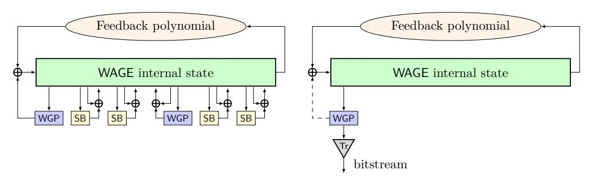
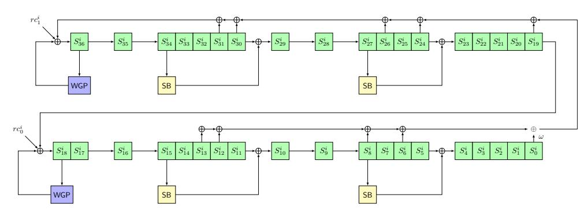
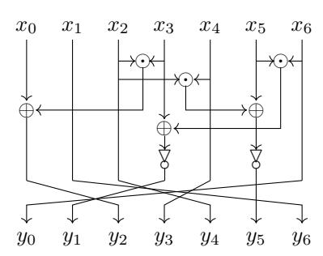
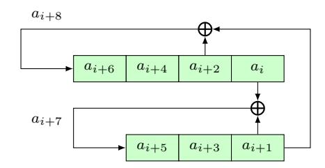
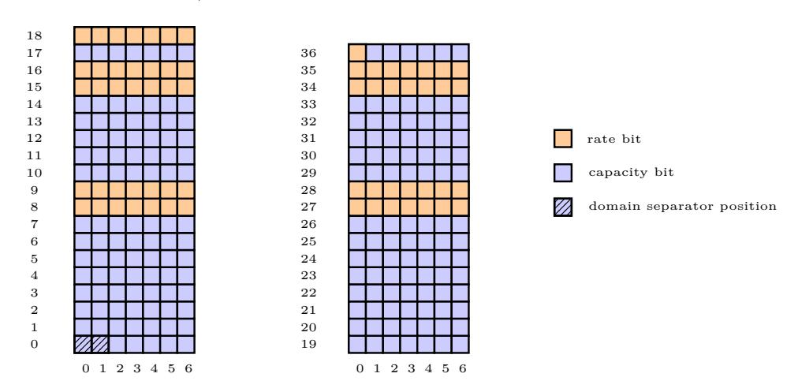
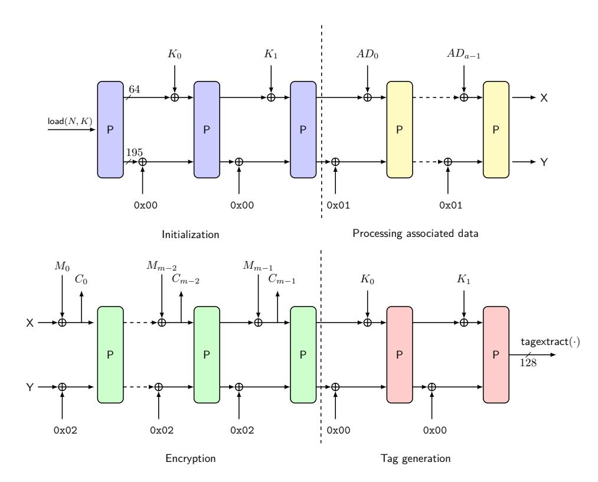

# **WAGE: An Authenticated Encryption with a Twist**

Riham AlTawy<sup>1</sup> , Guang Gong<sup>2</sup> , Kalikinkar Mandal<sup>2</sup> and Raghvendra Rohit<sup>2</sup>

**Abstract.** This paper presents WAGE, a new lightweight sponge-based authenticated cipher whose underlying permutation is based on a 37-stage Galois NLFSR over F2<sup>7</sup> . At its core, the round function of the permutation consists of the well-analyzed Welch-Gong permutation (WGP), primitive feedback polynomial, a newly designed 7-bit SB sbox and partial word-wise XORs. The construction of the permutation is carried out such that the design of individual components is highly coupled with cryptanalysis and hardware efficiency. As such, we analyze the security of WAGE against differential, linear, algebraic and meet/miss-in-the-middle attacks. For 128-bit authenticated encryption security, WAGE achieves a throughput of 535 Mbps with hardware area of 2540 GE in ASIC ST Micro 90 nm standard cell library. Additionally, WAGE is designed with a twist where its underlying permutation can be efficiently turned into a pseudorandom bit generator based on the WG transformation (WG-PRBG) whose output bits have theoretically proved randomness properties.

**Keywords:** Authenticated encryption · Pseudorandom bit generators · Welch-Gong permutation · Lightweight cryptography

## **1 Introduction**

Designing a lightweight cryptographic primitive requires a comprehensive holistic approach. With the promising ability of providing multiple cryptographic functionalities by the sponge-based constructions, there has been a growing interest in designing cryptographic permutations and sponge-variant modes. Permutation-based cryptographic primitives gave a new turn in the field of lightweight cryptography, which has motivated the design of lightweight permutations. In the last decade, starting from the Keccak family of permutations [\[BDPVA09\]](#page-19-0), there have been a number of lightweight permutations developed for use in the sponge mode to construct hash and authenticated encryption (AE) algorithms, namely permutation-based hash (e.g., SPONGENT [\[BKL](#page-20-0)<sup>+</sup>11], QUARK [\[AHMNP13\]](#page-18-0), and PHOTON [\[GPP11\]](#page-21-0)), permutation-based AE (e.g., APE [\[ABB](#page-18-1)<sup>+</sup>15], PRI-MATEs [\[ABB](#page-18-2)<sup>+</sup>14], NORX [\[AJN14\]](#page-18-3), Keyak [\[BDP](#page-19-1)<sup>+</sup>14], and Ketje [\[BDPA14\]](#page-19-2) from the CAE-SAR competition [\[CAE\]](#page-20-1)), and recently permutation-based both AE and hash functions (e.g., ASCON [\[DEMS16\]](#page-21-1), Gimli [\[BKL](#page-20-2)<sup>+</sup>17], sLiSCP [\[ARH](#page-18-4)<sup>+</sup>17], sLiSCP-light [\[ARH](#page-19-3)<sup>+</sup>18], and FRIT [\[SBD](#page-22-0)<sup>+</sup>18]). Several constructions of lightweight sponge variant modes have also been proposed, e.g., the Beetle [\[CDNY18\]](#page-20-3) and ISAP [\[DEM](#page-21-2)<sup>+</sup>17] modes.

The general design philosophy of constructing an iterative lightweight permutation is efficiently designing the round function to achieve the goals of low area, low power, high performance across heterogeneous platforms, and high security. However, in resourceconstrained environments, designers work with limited hardware area, computation, and power where the designed algorithm is essentially an underlying enabling block for various

<sup>1</sup> Department of Electrical and Computer Engineering, University of Victoria, Victoria, Canada [raltawy@uvic.ca](mailto:raltawy@uvic.ca)

<sup>2</sup> Department of Electrical and Computer Engineering, University of Waterloo, Waterloo, Canada [{ggong,kmandal,rsrohit}@uwaterloo.ca](mailto:ggong@uwaterloo.ca, kmandal@uwaterloo.ca, rsrohit@uwaterloo.ca)

security protocols. This fact calls for a design that satisfies several cryptographic functionalities within the same hardware footprint. A realization of such a fact is highlighted by the National Institute of Standards and Technology (NIST) call for Lightweight Cryptography (LWC) standardization submissions where a dedicated category for both authenticated encryption and hash algorithms has been laid out [MBSTM17].

In this work, we propose a new lightweight authenticated encryption algorithm, called WAGE, which is a round 2 candidate of the NIST LWC competition. The round function of the WAGE permutation is a Galois Nonlinear Feedback Shift Register (NLFSR) defined over  $\mathbb{F}_{2^7}$  to achieve a balance between hardware efficiency and security. We use the WAGE permutation in the unified sponge-duplex mode [ARH+17] to achieve the authenticated encryption functionality that provides 128-bit security with at most  $2^{64}$  bits of allowed data per key. As a feature, a simple tweak in the control circuit of WAGE enables an additional pseudorandom bit generator (PRBG) with proven randomness properties. Moreover, such a tweak may be leveraged to make WAGE self-sufficient in generating its own random nonces. An abstract pictorial representation of the WAGE round function is shown on the left side of Figure 1 along with the WG-PRBG feature where the output of some sboxes is disabled (right side of Figure 1).

<span id="page-1-0"></span>

Figure 1: An abstract diagram of WAGE round function (left), and random bit generation feature WG-PRBG (right). Tr denotes the Trace function

Performance of WAGE and NIST LWC round 2 candidates. In addition to WAGE, there are 31 NIST LWC round 2 candidates [BCC<sup>+</sup>19]. Each one of them adopts a design paradigm based on either a permutation, block cipher, tweakable block cipher or stream cipher. Accordingly, they have varying state sizes and performances. WAGE is implemented in ASIC ST Micro 65 nm, ST Micro 90 nm and IBM 130 nm standard cell libraries. The hardware implementation offers various degrees of parallelism for higher throughput [ASZ19]. The smallest degree 1 implementation costs 2540 GE with a throughput of 535.8 Mbit/s, and a degree 8 unrolled implementation costs 9330 GE with a throughput of 627.1 Mbit/s.

Table 1 lists the details of the ASIC implementations, throughput, and energy for WAGE and other comparable NIST LWC round 2 candidates that offer an independent authenticated encryption functionality. Bearing in mind that a fair comparison is a difficult task, we only include candidates which have provided actual ASIC implementations (not estimates) in one of the standard cell libraries in which WAGE is implemented. Moreover, we only list the smallest reported implementations as performance vary with degrees of parallelism. Furthermore, throughput is directly proportional to clock frequency, however, the circuit depth affects the clock frequency and its maximum value based on the design components. Thus, it is difficult to compare throughput at a fixed clock frequency (unless we have actual implementations). The numbers reported in Table 1 are taken from SKINNY-AEAD [BJK<sup>+</sup>19], ASCON [DEMS19], GIFT-COFB [BCI<sup>+</sup>19], Grain-128AEAD [HJM<sup>+</sup>19], Isap-A-128a [DEM<sup>+</sup>19], SPIX [AGH<sup>+</sup>19b], SpoC-64 [AGH<sup>+</sup>19a], SUNDAE-GIFT [BBP<sup>+</sup>19], and TinyJAMBU-128 [WH19].

|                      | ST Micro 65 nm |       |                   |      | ST Micro 90 nm |     |                |            | IBM 130 nm |       |                        |      |
|----------------------|----------------|-------|-------------------|------|----------------|-----|----------------|------------|------------|-------|------------------------|------|
| Algorithm‡‡          | A              | F     | Tput              | E    | A              | F   | Tput           | E          | A          | F     | Tput                   | E    |
|                      | [GE]           | [MHz] | [Mbit/s]          | [nJ] | [GE]           |     | [MHz] [Mbit/s] | [nJ]       | [GE]       | [MHz] | [Mbit/s]               | [nJ] |
| WAGE                 | 2900           | 907   | 517               | 20.0 | 2540           | 940 | 535            | 39.2       | 2960       | 153   | 87.21                  | 30.4 |
| SKINNY-AEAD          | -              | -     | -                 | -    | 7179           | 422 | 53             | -          | 7456       | 267   | 34                     | -    |
| ASCON                | -              | -     | -                 | -    | 2570           | 672 | 14             | 5,706 µJ/B | -          | -     | -                      | -    |
| GIFT-COFB            | -              | -     | -                 | -    | 3927           | 10  | 22.3 †         | 2.69 †     | -          | -     | -                      | -    |
| Grain-128AEAD 3638.5 |                | 1120  | 560               | -    | -              | -   | -              | -          | -          | -     | -                      | -    |
| Isap-A-128a          | -              | -     | -                 | -    | ≤12780 ≥169    |     | 2.9 bpc        | -          | -          | -     | -                      | -    |
| SPIX‡                | 2611           |       | 100 kHz 81.8 Kbps | -    | -              | -   | -              | -          |            |       | 2742 100 kHz 81.8 Kbps | -    |
| SpoC-64‡             | 2329           |       | 100 kHz 58.3 Kbps | -    | -              | -   | -              | -          |            |       | 2389 100 kHz 58.3 Kbps | -    |
| SUNDAE-GIFT          | -              | -     | -                 | -    | 3494           | 10  | 15.9 ††        | 4.2 †      | -          | -     | -                      | -    |
| TinyJAMBU-128        | -              | -     | -                 | -    | 1352           | -   | 24.6           | -          | -          | -     | -                      | -    |

<span id="page-2-0"></span>Table 1: Comparison of the different ASIC implementation results of WAGE with other NIST LWC round 2 candidates. Tput, A, F, and E denote throughput, area, maximum frequency, and energy, respectively.

**Our contributions.** We propose WAGE, a new authenticated cipher whose internal 259-bit permutation is based on a Galois NLFSR to offer an authenticated encryption with associated data functionality in a sponge mode as well as a pseudorandom bit generation feature. Our contributions are summarized as follows.

- Permutation design: We construct a hardware-friendly permutation of size 259 bits based on a 37-stage Galois NLFSR over F<sup>2</sup> <sup>7</sup> with a simple state update function consisting of a primitive polynomial and two distinct sboxes (WGP (Welch-Gong permutation) and a newly designed SB). In the state update function, the six 7-bit sboxes provide the nonlinearity, and the primitive feedback polynomial and a partial mixing among state words along with the shift operation provide the diffusion. We show how to use the permutation to construct the AE functionality.
- Security analysis: We analyze the diffusion, algebraic, differential, and linear properties of the WAGE permutation. Our analysis suggests that WAGE with full 111 rounds offers strong resistance against attacks exploiting such properties. We also show that when the WAGE permutation is used in a mode, the positions for the feedback taps and sboxes along with the rate positions provide tighter bounds on the probabilities for differential and linear trails.
- Performance: We provide a comparison of WAGE authenticated cipher with other NIST LWC round 2 candidates (Table [1\)](#page-2-0). WAGE has the second[1](#page-2-1) lowest area and achieves the highest throughput and clock frequency in ST Micro 90 nm. The performances on three different microcontrollers are also reported.
- PRBG: We show the construction of WG-PRBG with guaranteed randomness properties from WAGE. We analyze its security by considering distinguishing and state recovery attacks on stream ciphers. Since both primitives are independent, the security of WG-PRBG does not affect the security of WAGE.

**Outline of the paper.** The rest of the paper is organized as follows. In Section [2,](#page-3-0) we provide the specifications of the WAGE permutation and the authenticated cipher WAGE-AE-128. Sections [3](#page-9-0) and [4](#page-11-0) present their detailed security analysis and rationale of our design choices, respectively. In Section [5,](#page-14-0) we show the construction of PRBG based on the WG transformation from the WAGE permutation. A short description on the performance of WAGE in hardware and microcontrollers is given in Section [6.](#page-16-0) Finally, we conclude the paper in Section [7.](#page-17-0)

<sup>‡‡</sup> Numbers in the table are taken from the implementations provided in the references in the above paragraph.

Entire cipher including encryption, decryption and control logic

<sup>†</sup> For 16 B and 32 B of associated data and plaintext, respectively

<sup>‡</sup> Encryption circuit only. †† #cycles = 242

<span id="page-2-1"></span><sup>1</sup>After TinyJAMBU-128 which only offers 112-bit confidentiality and 64-bit authentication security

**Notation.** The following notations will be used throughout the paper.

- $\mathbb{F}_2$  denotes the finite field consisting of  $\{0,1\}$ . For a positive integer n,  $\mathbb{F}_{2^n}$  denotes an extension field defined using an irreducible polynomial over  $\mathbb{F}_2$  of degree n. For  $x,y\in\mathbb{F}_{2^n},\,x\otimes y$  represents the finite field multiplication. Further,  $\operatorname{Tr}:\mathbb{F}_{2^n}\to\mathbb{F}_2$  denotes the trace function defined by  $\operatorname{Tr}(x)=x+x^2+\cdots+x^{2^{n-1}}$ .
- $\{0,1\}^n$  and  $\{0,1\}^*$  denote the set of all length n, variable length and empty bitstrings, respectively. For any string  $X \in \{0,1\}^*$ , |X| denotes the length of X in bits and by  $(X_0, \dots, X_{l-1}) \stackrel{n}{\leftarrow} X$  we refer to the n-bit block parsing of X where  $|X_i| = n$  for  $0 \le i \le l-2$  and  $1 \le |X_{l-1}| \le n$ . For strings X and Y, the operations  $X \odot Y, X \oplus Y, X ||Y|$  denote the bitwise AND, bitwise XOR and concatenation of X and Y, respectively.
- We denote by  $S^i = (S^i_{36}, \dots, S^i_0)$  the internal state of the WAGE permutation at the *i*-th iteration. The symbols K, N, AD, M, C and T denote the secret key, public nonce, associated data, message, ciphertext and tag respectively.

## <span id="page-3-0"></span>2 Specification

In this section, we first give a brief overview of the design of WAGE. Next, we present the specifications of the WAGE permutation and the authenticated cipher WAGE- $\mathcal{AE}$ -128.

#### 2.1 Overview of WAGE

At the core of the authenticated cipher WAGE- $\mathcal{AE}$ -128 is a hardware-friendly and lightweight WAGE permutation. The design of the WAGE permutation adopts the structure of the (nonlinear) initialization phase of the WG stream cipher family [NG05, NG08]. More specifically, the initialization phase is built on an NLFSR based state update function where the nonlinear feedback is composed of a primitive feedback polynomial and a WG permutation over a finite field  $\mathbb{F}_{2^m}$ . In the feedback function, the WG permutation provides confusion and the linear feedback polynomial along with shift operations provides the diffusion. Note that the state update function of the NLFSR is a one-to-one mapping. We tweak the design of the WG cipher's structure to construct the authenticated encryption functionality as follows.

- Shift register length: Our goal is to design a permutation with a state size that can provide 128-bit AE security in the sponge duplex mode. Considering the best known security bound of the sponge duplex mode in [JLM14], the state size of the permutation should be at least 256 when restricting the data limit of  $2^{64}$  bits per key. Thus, we choose the length of the shift register to be 37 over  $\mathbb{F}_{2^7}$  which results in an internal state of size 259 bits.
- Strengthening confusion and diffusion: To achieve faster confusion and diffusion, we add one more WG permutation and four lighter sboxes (SB) in the state update function and update five words in total (namely  $S_5$ ,  $S_{11}$ ,  $S_{19}$ ,  $S_{24}$ , and  $S_{30}$ ) in the state. Each word is updated by taking its current content and XORing it with the sbox output of a different word so that the state update function is a permutation.
- Round constants: We XOR a pair of distinct round constants  $(rc_1, rc_0)$  at two cells  $(S_{36}, S_{18})$  to avoid using the identical state update function in each iteration. The round constants are generated using a 7-stage parallel LFSR so that a pair of 7-bit round constants at each iteration can be produced simultaneously, with a minimal hardware cost.
- **Hardware consideration:** We opted for a design that can provide a tradeoff between the security and hardware efficiency. We chose the register length, feedback

taps, shoxes and the round constant generation technique based on the aforementioned criteria.

Figure 2 presents a high-level overview of the round function<sup>2</sup> of the WAGE permutation. The round function can be viewed as a Galois NLFSR, consisting of a Fibonacci NLFSR and a partial mixing among state words, with a round constant as an input.

<span id="page-4-0"></span>

Figure 2: A block diagram of the WAGE\_STATEUPDATE function

#### 2.2 The WAGE Permutation

WAGE is an iterative permutation with a state size of 259 bits over the extension field  $\mathbb{F}_{2^7}$ . The core components of the permutation include two different sboxes (WGP and SB) defined over  $\mathbb{F}_{2^7}$ , a nonlinear feedback, five word-wise XORs, and a pair of 7-bit round constant  $(rc_1^i, rc_0^i)$  (see Figure 2). Below we provide the mathematical details of each individual component.

#### <span id="page-4-2"></span>2.2.1 Nonlinear components

WAGE employs two distinct 7-bit sboxes, namely WGP and SB as its nonlinear components. The former preserves the structure of the WG cipher while the latter is added to achieve faster confusion and diffusion in the state. A detailed justification of our choice of sboxes is given in Section 4.1.

Welch-Gong permutation (WGP). For a positive integer m with m mod  $3 \neq 0$ , the Welch-Gong permutation, denoted by WGPerm over  $\mathbb{F}_{2^m}$  is defined as WGPerm(x) = t(x+1)+1 where  $t(x) = x+x^{q_1}+x^{q_2}+x^{q_3}+x^{q_4}$ . The exponents are given by  $q_1=2^k+1$ ,  $q_2=2^{2k}+2^k+1$ ,  $q_3=2^{2k}-2^k+1$  and  $q_4=2^{2k}+2^k-1$  where  $3k\equiv 1 \mod m$  [GY02, MGFA14]. Since the finite field is  $\mathbb{F}_{2^7}$ , we have m=7 and k=5. The WGPerm over  $\mathbb{F}_{2^7}$  denoted by WGP7 is given by

WGP7
$$(x) = x + (x+1)^{33} + (x+1)^{39} + (x+1)^{41} + (x+1)^{104}, \ x \in \mathbb{F}_{2^7}.$$

To achieve low differential uniformity and high nonlinearity, we use a decimated WGP7 with decimation d=13. Accordingly, we define the utilized WGP sbox of WAGE as  $WGP(x) = WGP7(x^{13})$ .

 ${\sf SB\ sbox.}$  We construct the lightweight 7-bit sbox  ${\sf SB\ in}$  an iterative way using the nonlinear transformation Q and the bit permutation layer P which are given by

$$Q(x_0, x_1, x_2, x_3, x_4, x_5, x_6) = (x_0 \oplus (x_2 \odot x_3), x_1, x_2, \overline{x}_3 \oplus (x_5 \odot x_6), x_4, \overline{x}_5 \oplus (x_2 \odot x_4), x_6)$$

$$P(x_0, x_1, x_2, x_3, x_4, x_5, x_6) = (x_6, x_3, x_0, x_4, x_2, x_5, x_1).$$

<span id="page-4-1"></span> $<sup>^{2}</sup>$ We use round function and state update function interchangeably throughout the paper.

One-round R (see Figure 3) of SB is computed by composing Q and P, i.e.,  $R = P \circ Q$ . The final output of SB is obtained by iterating R five times (denoted by  $R^5$ ), followed by applying Q once, and then complementing the 0th and 2nd components. Mathematically,

<span id="page-5-0"></span>
$$(x_0, x_1, x_2, x_3, x_4, x_5, x_6) \leftarrow R^5(x_0, x_1, x_2, x_3, x_4, x_5, x_6)$$
$$(x_0, x_1, x_2, x_3, x_4, x_5, x_6) \leftarrow Q(x_0, x_1, x_2, x_3, x_4, x_5, x_6)$$
$$x_0 \leftarrow x_0 \oplus 1$$
$$x_2 \leftarrow x_2 \oplus 1.$$



Figure 3: A block diagram of R

Note that our approach of SB's construction is similar to Skinny's sboxes [BJK<sup>+</sup>16], however we have aimed for cryptographic properties close to that of WGP sbox with a lower hardware cost. Table 2 summarizes the cryptographic properties of both sboxes while the hexadecimal values are provided in Tables 10 and 11 in Appendix A.

Table 2: Cryptographic properties of WGP and SB

<span id="page-5-1"></span>

| Sbox | Differential uniformity | Nonlinearity | Minimum<br>algebraic degree | Maximum<br>algebraic degree | Fixed point |
|------|-------------------------|--------------|-----------------------------|-----------------------------|-------------|
| WGP  | 6                       | 42           | 6                           | 6                           | Yes         |
| SB   | 8                       | 44           | 3                           | 6                           | No          |

#### 2.2.2 Round constants

An LFSR of length 7 with feedback polynomial  $x^7 + x + 1$  is used to generate the round constants. To construct these constants, the same LFSR is run in a 2-way parallel configuration as shown in Figure 4. Let  $\mathbf{a} = \{a_i\}$  denote the sequence generated with the initial state  $(a_0, a_1, \ldots, a_6)$  of the LFSR without parallelization. The parallel version of this LFSR outputs two sequences, both of them using decimation 2. The eight consecutive sequence elements  $(a_i, a_{i+1}, \cdots, a_{i+7})$  are used to generate the tuple  $(rc_1^i, rc_0^i)$  as follows.

$$\overbrace{a_{i+7},\underbrace{a_{i+6},a_{i+5},a_{i+4},a_{i+3},a_{i+2},a_{i+1},a_{i}}_{rc_{0}^{i}}}^{rc_{1}^{i}}$$

In terms of sequence,  $rc_0^i$  corresponds to the sequence **a** with decimation 2 and  $rc_1^i$  corresponds to the sequence **a** shifted by 1, then decimated by 2. The round constants are listed in Table 12 in Appendix A.

<span id="page-6-0"></span>

Figure 4: The LFSR generating WAGE round constants

#### <span id="page-6-1"></span>2.2.3 State update function of WAGE

The state consists of 37 7-bit words and is denoted by  $S^i = (S^i_{36}, \dots, S^i_0)$  at the beginning of *i*-th round. The state update function of WAGE, denoted by WAGE\_STATEUPDATE (see Figure 2), takes as inputs the current state  $S^i$  and the round constant tuple  $(rc^i_1, rc^i_0)$ , and updates the state in a Galois NLFSR fashion with the following three steps:

Step 1: Computing nonlinear feedback. The nonlinear feedback function consists of the following primitive polynomial of degree 37 over  $\mathbb{F}_{2^7}$  and WGP

$$\ell(y) = y^{37} + y^{31} + y^{30} + y^{26} + y^{24} + y^{19} + y^{13} + y^{12} + y^{8} + y^{6} + \omega$$

where  $\omega$  is a root  $x^7 + x^3 + x^2 + x + 1$ , which is a primitive polynomial defining  $\mathbb{F}_{2^7}$ . The feedback computation is given by

$$fb = \mathsf{WGP}(S^i_{36}) \oplus S^i_{31} \oplus S^i_{30} \oplus S^i_{26} \oplus S^i_{24} \oplus S^i_{19} \oplus S^i_{13} \oplus S^i_{12} \oplus S^i_8 \oplus S^i_6 \oplus (\omega \otimes S^i_0).$$

Step 2: Updating intermediate words and adding round constants.

$$\begin{split} S_5^i &\leftarrow S_5^i \ \oplus \mathsf{SB}(S_8^i) \\ S_{11}^i &\leftarrow S_{11}^i \oplus \mathsf{SB}(S_{15}^i) \\ S_{19}^i &\leftarrow S_{19}^i \oplus \mathsf{WGP}(S_{18}^i) \oplus rc_0^i \\ S_{24}^i &\leftarrow S_{24}^i \oplus \mathsf{SB}(S_{27}^i) \\ S_{30}^i &\leftarrow S_{30}^i \oplus \mathsf{SB}(S_{34}^i) \\ fb &\leftarrow fb \oplus rc_1^i. \end{split}$$

Step 3: Shifting the register contents and update the last word.

$$S_j^{i+1} \leftarrow S_{j+1}^i, 0 \le j \le 35$$
  
 $S_{36}^{i+1} \leftarrow fb.$ 

On an input state  $S^0$ , the output of the WAGE permutation,  $S^{111}$ , is obtained by applying WAGE\_STATEUPDATE, 111 times. The justifications behind the choice of the state update function and the number of rounds are provided in Sections 4.2 and 4.3.

### 2.3 The Authenticated Cipher WAGE- $\mathcal{AE}$ -128

WAGE operates in the unified sponge duplex mode [ARH $^+$ 17] to offer an authenticated encryption with associated data functionality. The authenticated cipher WAGE- $\mathcal{AE}$ -128 supports key, nonce and tag sizes of 128 bits, and processes 64 bits per call of the WAGE permutation. In what follows, we describe the state representation (rate, capacity, domain separator positions), padding rule and the individual phases of WAGE- $\mathcal{AE}$ -128 in detail.

#### **2.3.1 Internal state**

The 259-bit internal state is represented as (X*,* Y) string where X and Y denote the 64-bit rate and 195-bit capacity part of the state, respectively. A 2-bit domain separator 0x01 and 0x02 is XORed with Y to distinguish between associated data and message processing phases, respectively. Figure [5](#page-7-0) illustrates the one-to-one correspondence between 7-bit words of WAGE and X*,* Y.

<span id="page-7-0"></span>

Figure 5: Visualization of internal state of WAGE-AE-128

### **2.3.2 Padding**

The padding rule consists of appending "1" followed by adding as many 0's as required to reach the next 64-bit block boundary. In the case where no associated data is present, no processing is necessary. The padding procedure for message *M* and associated data *AD* is explained below.

$$\begin{array}{lll} \operatorname{pad}_{64}(M) & \leftarrow & M \|1\|0^{63-(|M| \bmod 64)} \\ \operatorname{pad}_{64}(AD) & \leftarrow & \begin{cases} AD \|1\|0^{63-(|AD| \bmod 64)} & \text{if } |AD| > 0 \\ \phi & \text{otherwise.} \end{cases} \end{array}$$

The padded message and associated data are then divided into chunks of 64-bit blocks, i.e., (*M*0*, M*1*, . . . , Mm*−1) 64 ←− pad64(*M*) and (*AD*0*, AD*1*, . . . , ADa*−1) 64 ←− pad64(*AD*).

### **2.3.3 Phases of WAGE-AE-128**

The WAGE-AE-128 algorithm consists of 4 phases, namely 1) Initialization, 2) Processing associated data, 3) Encryption or decryption, and 4) Tag generation. Figure [6](#page-8-0) shows a high-level overview of the WAGE-AE-128 encryption algorithm. We now describe each phase in detail.

**Initialization.** The state is first loaded with a 128-bit nonce *N* = (*n*0*, . . . , n*127) and a 128-bit key *K* = (*k*0*, . . . , k*127). This procedure is denoted by load(*N, K*) and explicitly specified in Appendix [B.](#page-25-0) Afterwards the two key blocks *K*<sup>0</sup> = *k*0*, . . . , k*<sup>63</sup> and *K*<sup>1</sup> = *k*64*, . . . , k*<sup>127</sup> are absorbed into the state, with the WAGE permutation applied each time. The steps of the initialization are described as follows.

$$\begin{split} (\mathsf{X},\mathsf{Y}) \;\; \leftarrow \;\; \mathsf{WAGE}(\mathsf{load}(N,K)) \\ (\mathsf{X},\mathsf{Y}) \;\; \leftarrow \;\; \mathsf{WAGE}(\mathsf{X} \oplus K_i,\mathsf{Y}), \;\; i = 0,1, \end{split}$$

<span id="page-8-0"></span>

Figure 6: The WAGE-AE-128 encryption algorithm where P = WAGE permutation

where WAGE(·) denotes the WAGE permutation.

**Processing associated data.** For *i* = 0 to *a* − 1, the associated data blocks *AD*0, *AD*1*,* · · · *, ADa*−<sup>1</sup> are processed as follows.

$$(X,Y) \leftarrow WAGE(X \oplus AD_i, Y \oplus 0x01).$$

**Encryption/Decryption.** For *i* = 0 to *m* − 1, each message block *M<sup>i</sup>* is XORed with *X* which gives the corresponding ciphertext *C<sup>i</sup>* . The ciphertext is then used for the state update. More precisely,

$$\begin{array}{lll} C_i & \leftarrow & M_i \oplus \mathsf{X} \\ (\mathsf{X},\mathsf{Y}) & \leftarrow & \mathsf{WAGE}(C_i,\mathsf{Y} \oplus \mathsf{0x02}). \end{array}$$

The last ciphertext block is truncated so that its length is equal to that of the last unpadded message block. The decryption procedure is symmetrical to the encryption algorithm and hence the details are omitted.

**Tag generation.** After the extraction of the last ciphertext block, the domain separator is reset to zero. First, the two 64-bit key blocks *K*<sup>0</sup> and *K*<sup>1</sup> are absorbed into the state, with the WAGE permutation applied each time. Then, the tag is extracted from the positions of state which are used for loading the nonce with load(*N, K*) procedure. The tag generation steps are mentioned below.

$$\begin{array}{rcl} (\mathsf{X},\mathsf{Y}) & \leftarrow & \mathsf{WAGE}((\mathsf{X} \oplus K_i),\mathsf{Y}), \ i=0,1 \\ T & \leftarrow & \mathsf{tagextract}(\mathsf{X},\mathsf{Y}). \end{array}$$

The tagextract function is explicitly given in Appendix [B.](#page-25-0)

## <span id="page-9-0"></span>3 Security Analysis

In this section, we first present the security properties of the WAGE permutation such as diffusion, expected upper bounds on the probabilities of differential and linear trails<sup>3</sup>, growth on the algebraic degree and non-symmetric behavior. Next, we give the concrete security bounds of the authenticated encryption algorithm WAGE- $\mathcal{AE}$ -128.

## 3.1 Security of WAGE Permutation

#### <span id="page-9-2"></span>3.1.1 Diffusion behavior

We model the diffusion behavior of WAGE to show its resistance against meet/miss-in-the middle distinguishers. Let  $S^i_{j,k}$  denote the algebraic normal form (ANF) of the k-th bit of word j after the i-th round. We say WAGE achieves full bit diffusion at i-th round if  $S^i_{j,k}$  is a function of  $S^0_{j,k}$ , for all  $j \in \{0,1,\ldots,36\}$  and for all  $k \in \{0,1,\ldots,6\}$ . Note that both WGP and SB sboxes have the full bit diffusion property but the multiplication by  $\omega$  mixes only two bits at a time, which can be seen from the explicit representation of  $x \otimes \omega$  given by

$$(x_0, x_1, x_2, x_3, x_4, x_5, x_6) \otimes \omega \rightarrow (x_6, x_0 \oplus x_6, x_1 \oplus x_6, x_2 \oplus x_6, x_3, x_4, x_5).$$

Since WAGE adopts an NLFSR based design, the word at position 0 is mixed at a slower rate than others. Thus, it is sufficient to find i for which  $S_{0,k}^i$  achieves full bit diffusion for all  $k \in \{0,1,\ldots,6\}$ . Table 3 depicts such behavior for word 0 while for other words the details are provided in Table 14 in Appendix D.

Table 3: Diffusion behavior of 0-th word

<span id="page-9-1"></span>

| Round            | 1 | 4 | 7 | 11 | 15 | 19 | 23  | 27  | 28  |
|------------------|---|---|---|----|----|----|-----|-----|-----|
| # dependent bits | 1 | 1 | 8 | 22 | 36 | 84 | 168 | 252 | 259 |

From Table 3, we observe that WAGE achieves full bit diffusion in 28 rounds. Thus, WAGE (with 111 rounds) provides a huge security margin against meet/miss-in-the middle distinguishers as 56 (= 28+28) rounds guarantee full bit diffusion in both the forward and backward directions.

#### 3.1.2 Differential and linear cryptanalysis

We now analyze the strength of the WAGE permutation against differential and linear attacks. In WAGE, we use two distinct 7-bit sboxes, namely WGP and SB as the nonlinear components. The differential probabilities of the sboxes are  $2^{-4.42}$  and  $2^{-4}$ , while the corresponding linear squared correlation are  $2^{-5.08}$  and  $2^{-5.35}$ , respectively. To provide upper bounds on the maximum expected differential characteristic probability (MEDCP) and maximum expected linear characteristic squared correlation (MELCSC), we bound the minimum number of differential/linear active sboxes using a Mixed Integer Linear Programming (MILP) model<sup>4</sup>. In Table 4, we list these values for two cases which are described below:

- Case I: No constraints on the positions of input and output differences. This case considers the differential and linear distinguishers of the permutation only.
- Case II: Input and output differences are restricted to only rate positions, i.e., differences are allowed at words 8, 9, 15, 16, 18, 27, 28, 34, 35 and 36 (Figure 5). This case analyzes the resistance of WAGE against differential and linear attacks in a sponge mode.

| u | inds of WAGE. A means no solution |        |         |           |        |         |  |  |  |  |
|---|-----------------------------------|--------|---------|-----------|--------|---------|--|--|--|--|
|   | Round $i$                         | Case I | Case II | Round $i$ | Case I | Case II |  |  |  |  |
|   | 1                                 | 0      | 0       | 42        | 27     | 41      |  |  |  |  |
|   | 7                                 | 0      | *       | 49        | 37     | 48      |  |  |  |  |
|   | 14                                | 2      | *       | 56        | 42     | 55      |  |  |  |  |
|   | 21                                | 8      | *       | 63        | 48     | 63      |  |  |  |  |
|   | 28                                | 15     | 34      | 74        | 59     | 72      |  |  |  |  |
|   | 35                                | 21     | 32      | -         | -      | -       |  |  |  |  |

<span id="page-10-2"></span>Table 4: Lower bounds on the minimum number of differentially/linearly active sboxes for up to 74 rounds of WAGE. " $\star$ " means no solution

The upper bounds of MEDCP and MELCSC values of WAGE for both cases are given in Table 5. Note that the MILP solver [Gur] is unable to finish for i > 74. Thus, we expect that for 111 rounds the minimum number of active sboxes for Case I is at least 65. This is because for each 7 rounds, the number of active sboxes increases by at least 6, which implies MEDCP  $\leq 2^{-260} < 2^{-259}$ .

<span id="page-10-3"></span>Table 5: Upper bounds of MEDCP and MELCSC values of WAGE in  $log_2(\cdot)$  scale

|         | Rounds | Minimum         | MEDCP                 | MELSC                            |
|---------|--------|-----------------|-----------------------|----------------------------------|
|         |        | # active sboxes | 1                     | $og_2(\cdot)$                    |
| Case I  | 74     | 59              | $-59 \times 4 = -236$ | $-59 \times 5.08 \approx -299.7$ |
| Case II | 74     | 72              | $-72 \times 4 = -288$ | $-72 \times 5.08 \approx -365.7$ |

### 3.1.3 Algebraic degree growth

Knowing the algebraic degree of WAGE is crucial for its resistance against integral and cube attacks. The WGP and SB sboxes have an algebraic degree of 6. Note that if we only have WGP sbox at position 36 along with the feedback polynomial and exclude all other sboxes and intermediate XORs, then we get the original WG stream cipher. Such a stream cipher is resistant to attacks exploiting the algebraic degree if the nonlinear feedback used in the initialization phase is also used in the key generation phase [Røn17, RAG17]. Given that WAGE has 6 sboxes with continuous nonlinear feedback and it achieves full bit diffusion (see Section 3.1.1) in 28 rounds, the algebraic degree in WAGE grows at a larger rate. Thus, the full-round WAGE provides a large security margin against the integral and cube attacks.

### <span id="page-10-4"></span>3.1.4 Self-symmetry based distinguishers

WAGE utilizes two 7-bit round constants,  $rc_0$  and  $rc_1$ , which are XORed to  $S_{18}$  and  $S_{36}$ , respectively. The round constant tuple is distinct for each round, i.e.,  $(rc_0^i, rc_1^i) \neq (rc_0^j, rc_1^j)$  for  $0 \leq i, j \leq 110$  and  $i \neq j$ . This property ensures that all the rounds of WAGE are distinct and thwart attacks such as slide attacks [BW99] and invariant subspace attacks [LAAZ11] which exploit the symmetric properties of the round function.

### 3.2 Security of WAGE- $A\mathcal{E}$ -128

The security proofs of sponge-duplex modes rely on the indistinguishability of the underlying permutation from a random one [BDPVA07, BDPVA12, BDPVA11, JLM14]. In the previous subsection, we have shown that WAGE is indistinguishable from a random permutation (based on our security analysis). Accordingly, WAGE- $\mathcal{AE}$ -128 adopts its

<span id="page-10-0"></span><sup>&</sup>lt;sup>3</sup>We use trail and characteristic interchangebly throughout the paper.

<span id="page-10-1"></span> $<sup>^4\</sup>mathrm{The}\ \mathrm{exact}\ \mathrm{model}\ \mathrm{is}\ \mathrm{available}\ \mathrm{at}\ \mathrm{https://uwaterloo.ca/communications-security-lab/lwc/wage}$ 

security claims from the security bounds of well-analyzed sponge-duplex modes. We now present the concrete security claims of WAGE-AE-128.

### <span id="page-11-3"></span>**3.2.1 On the data limit and security goals**

WAGE relies on the uniqueness of nonce for its security, meaning the nonce is never repeated for an encryption query. While for decryption, if the verification procedure fails, i.e., the tag does not match, then the decrypted ciphertext is not released. To achieve *κ*-bit security with allowed data of 2 *<sup>d</sup>* bits, the capacity should satisfy *c* ≥ *κ* + *d* + 1 and *d c/*2 [\[BDPVA11\]](#page-19-11). Note that the actual effective capacity is *c* − 2 as 2 bits are used for domain separation. For WAGE-AE-128, the parameters are *c* = 195−2 = 193*, r* = 64*,* and *κ* = 128, which implies *d* ≤ 64. Our choice of parameters also satisy the bound of Jovanic et al. [\[JLM14\]](#page-22-4) for sponge-duplex modes given by O( *DT* 2 *<sup>c</sup>* ). In our case, we have *D* = 2<sup>64</sup> bits, *T* = 2<sup>128</sup> and *c* = 193.

<span id="page-11-1"></span>The security claims of WAGE-AE-128 are summarized in Table [6](#page-11-1) where the security for integrity includes the integrity of nonce, plaintext and associated data. Moreover, our claims are for the full round WAGE permutation, and as such we do not claim any security for WAGE-AE-128 with reduced-round versions of WAGE.

Table 6: Security claims of WAGE-AE-128 (in bits)

| Confidentiality | Integrity | Authenticity | Data limit   |
|-----------------|-----------|--------------|--------------|
| 128             | 128       | 128          | 64 bits<br>2 |

### **3.2.2 On the forgery attacks against improper domain separation**

The choice of domain separators is crucial to resist forgery attacks against improper domain separation techniques [\[STMÇ](#page-23-1)<sup>+</sup>19]. WAGE-AE-128 uses 2-bit domain separators 0x01 and 0x02 while processing associated data and message blocks, respectively. In Table [7,](#page-11-2) we show that 2-bits are enough to distinguish all cases including empty, partial and complete *AD* and/or *M* blocks.

<span id="page-11-2"></span>Table 7: Domain separators for different processed blocks (current last block) where *r* = 64

| AD       | M                                  | Domain separators sequence | Processed blocks                                             |  |  |  |  |  |
|----------|------------------------------------|----------------------------|--------------------------------------------------------------|--|--|--|--|--|
|          | Empty                              | 0x02                       | 10r−1                                                        |  |  |  |  |  |
| Empty    | Partial                            | 0x02                       | Partial M with padding                                       |  |  |  |  |  |
|          | Complete                           | 0x02, 0x02                 | complete M block and 10r−1                                   |  |  |  |  |  |
|          | Empty                              | 0x01, 0x02                 | Partial AD block with padding and 10r−1                      |  |  |  |  |  |
| Partial  | Partial                            | 0x01, 0x02                 | Partial AD and M blocks with padding                         |  |  |  |  |  |
|          | Complete                           | 0x01, 0x02, 0x02           | Partial AD block with padding, complete<br>M block and 10r−1 |  |  |  |  |  |
|          | Empty                              | 0x01, 0x01, 0x02           | complete AD block, 10r−1 and 10r−1                           |  |  |  |  |  |
| Complete | Partial                            | 0x01, 0x01, 0x02           | complete AD block, 10r−1 and partial M<br>block with padding |  |  |  |  |  |
|          | Complete<br>0x01, 0x01, 0x02, 0x02 |                            | complete AD block, 10r−1<br>, complete M<br>block and 10r−1  |  |  |  |  |  |

# <span id="page-11-0"></span>**4 Design Rationale**

Our design philosophy for the WAGE permutation is to reuse and adopt the initialization phase of the well-studied WG stream cipher. We choose to design a hardware-friendly and lightweight cryptographic permutation based on a word-oriented shift register and sboxes that can have a simple security analysis and offer good security bounds. Below we provide the rationale of our design choices.

## <span id="page-12-0"></span>4.1 Choice of Underlying Components

**Finite field.** For an efficient hardware implementation of WGP and the shift register, a natural choice of the finite field is  $\mathbb{F}_{2^t}$  where  $t \in \{4, 5, 7, 8\}$ . We choose  $\mathbb{F}_{2^7}$  and discard other choices based on the following two reasons.

- For decimation d=1, the choice for t=4 is discarded due to the fact that the WGP over  $\mathbb{F}_{2^4}$  is a linear function. Moreover, for other decimations, the WG-PRBG utilizing WGP generates sequences with weak cryptographic properties.
- For  $\mathbb{F}_{2^5}$ , the state will consist of many 5-bit words. Thus, it is not feasible to provide the bounds for the differential and linear distinguishers as the MILP model does not converge (especially for word-based shift-register designs).
- The ASIC 65 nm synthesis results showed that the cost of WGPerm module over  $\mathbb{F}_{2^8}$  is at least twice the cost of the WGPerm module over  $\mathbb{F}_{2^7}$ .

Once the field  $\mathbb{F}_{2^7}$  is set, different field defining polynomials were explored for a minimum area of WGP. Note that the cryptographic properties of WGP under different polynomial bases are invariant. However, there is a connection between the hardware areas for WGP, the constant multiplier  $\omega$  and the field defining polynomial. We chose the field defining polynomial  $x^7 + x^3 + x^2 + x + 1$  for which the total area of WGP is minimum.

**State size.** Our goal was to select the state size (multiple of 7) which can offer a security level of 128 bits for the authenticated encryption. We emphasize that we targeted the overall 128-bit security, i.e., the time complexity of attacks equals that of an exhaustive key search, when restricting at most  $2^{64}$  bits of processed data per key. We followed the bounds in [BDPVA11, JLM14], and accordingly chose the state size of WAGE as  $37 \times 7 = 259$  bits (see Section 3.2.1 for further details).

Two distinct (WGP and SB) sboxes. We use WGP to maintain compatibility with the WG cipher which enables leveraging its extensive analysis, but mainly we benefit from the properties of the generated sequences in an efficient PRBG mode (see Section 5.3 for further details). However, such properties come with an expensive hardware cost, i.e., one WGP module costs around 250 GE in ASIC 65 nm, so in order to provide fast confusion in the WAGE permutation round function, we search for a 7-bit lightweight sbox whose cryptographic properties are close to that of WGP and have a pre-PAR implementation area in the range of 55-65 GE. While exploring the 7-bit sboxes, we chose the nonlinear transformations Q that have efficient hardware implementation and varied all 5040 (= 7!) bit permutations (P). The 7-bit sbox SB we found is given in Section 2.2.1.

Our search shows that WGP is better in terms of differential uniformity (6 in WGP vs 8 for SB), minimum algebraic degree (6 for WGP vs 3 for SB), and nonlinearity of each component. It only falls back slightly in the nonlinearity which is defined by the linear combinations of the components of a permutation (42 in WGP vs 44 for SB).

**Number of sboxes.** The single WGP nonlinear feedback state update results in a slower confusion and diffusion and it is not good from the point of view of efficiency. Further, guaranteeing security bounds using automated tools for a large number of rounds is not an easy task. Accordingly, we opt for multiple sboxes (2 WGP and 4 SB) to achieve a reasonable hardware footprint.

**Round constants.** The round constants are added to avoid the identical state update function in each iteration (Section [3.1.4\)](#page-10-4). We use a single 7-stage LFSR to generate a pair of constants at each round. The utilized LFSR with a primitive polynomial ensures that each pair of such constants does not repeat, due to the periodicity of the 8-tuple sequence constructed from the decimated *m*-sequence of period 127.

## <span id="page-13-0"></span>**4.2 Choice of State Update Function**

The state update function of WAGE is composed of 1) L<sup>1</sup> : a primitive polynomial of degree 37 over F<sup>2</sup> <sup>7</sup> and 2) L<sup>2</sup> : the input and output tap positions of WGP and SB sboxes. There exist many choices for L<sup>1</sup> and L2, which result in a tradeoff between (especially) security and implementations. Note that we cannot have only L<sup>1</sup> or L2, because

- having only L<sup>1</sup> results in a slower diffusion.
- having only L<sup>2</sup> means there are many words which are not mixed among themselves. Thus, the entire state can be divided into multiple independent sub-states leading to meet-in-the-middle attacks.

The required criteria for L<sup>1</sup> and L<sup>2</sup> are listed as follows.

1. To have a lightweight L<sup>1</sup> we searched for a primitive polynomial of the form

$$\ell(y) = y^{37} + \sum_{j=1}^{36} c_j y^j + \omega, \qquad c_j \in \mathbb{F}_2$$

where *ω* is the root of the chosen field defining polynomial, which is also a primitive element of F<sup>2</sup> <sup>7</sup> . Including *ω*, we choose symmetric feedback polynomials with few non-zero tap positions (*c<sup>j</sup>* = 1).

- 2. A combination of L<sup>1</sup> and L<sup>2</sup> for which computing the minimum number of active sboxes is feasible and enables us to provide the bounds for differential and linear distinguishers.
- 3. An even number of WGP and SB sboxes to keep the overall structure symmetric and have efficient implementations with different degrees of parallelism for higher throughput [\[AAG](#page-18-7)<sup>+</sup>19].

We followed the aforementioned criteria and analyzed the polynomials with 10 non-zero taps and 6 sboxes: 2 WGP and 4 SB. For a combination of 8 sboxes, the hardware cost increases. Thus, we restrict ourselves to 6 sboxes and search for a combination of L<sup>1</sup> and L<sup>2</sup> which offers good security bounds against differential/linear distinguishers. More precisely, we found

$$\mathcal{L}_1: y^{37} + y^{31} + y^{30} + y^{26} + y^{24} + y^{19} + y^{13} + y^{12} + y^8 + y^6 + \omega,$$
  
 $\mathcal{L}_2: \{(36, 36), (34, 30), (27, 24), (18, 19), (15, 11), (8, 5)\}$ 

where (*a, b*) ∈ L<sup>2</sup> denotes the (input, output) position of an sbox (see Figure [2\)](#page-4-0).

## <span id="page-13-1"></span>**4.3 Number of Rounds**

Our rationale for choosing the number of rounds (say *nr*) is based on the property that the WAGE permutation is indistinguishable from a random permutation. We justify our choice for *n<sup>r</sup>* = 111 as follows.

**Diffusion behavior.** WAGE adopts an NLFSR structure with 37 7-bit words and hence  $n_r \geq 37$ , otherwise there is no proper mixing among the words, which may lead to meet/miss-in-the-middle distinguishers. Our choice of the state update function ensures that WAGE achieves full bit diffusion in 28 rounds (Section 3.1.1), and hence resists such attacks.

Upper bounds of differential trails. For  $n_r=74$ , the MEDCP value equals  $2^{-4\times59}=2^{-236}>2^{-259}$ . To push this value lower than  $2^{-259}$ , the number of rounds  $n_r$  should be greater than 74. However, it is infeasible to compute the value when  $n_r>74$ . Thus, we expect that for  $n_r=111$ , the MEDCP  $\ll 2^{-259}$  (Case I in Table 5). However, when the WAGE permutation is used in the mode, an adversary can only inject and cancel the differences at the rate positions. For our choice of rate positions, MEDCP  $\ll 2^{-259}$  for 74 rounds (Case II in Table 5).

## <span id="page-14-0"></span>5 Pseudorandom Bit Generators using WAGE

One natural choice to construct a pseudorandom bit/number generator (PRBG/PRNG) from a permutation is based on the sponge construction, which was introduced by Bertoni et al. [BDPVA10], we call it Sponge-PRBG. In such a construction, to generate a pseudorandom sequence of longer length, reseeding is required, meaning after outputting a certain number of bits the generator needs to reseed to further produce output bits using the current internal state, for which an external source for reseeding is required. However, it is hard to guarantee the randomness properties of the produced bits or sequences mathematically. In this section, we provide two alternatives on how to configure WAGE and generate pseudorandom bits with minimal overheads. In addition to Sponge-PRBG, our second alternative is the construction of a PRBG based on the WG transformation, called WG-PRBG, by reusing certain circuitry of WAGE where we can mathematically ensure certain randomness properties. We start by describing the WG-PRBG.

## 5.1 Constructing WG-PRBG: Guaranteed Properties, but Limited Bits

We construct a pseudorandom bit generator by tweaking the round function of the WAGE permutation to obtain the original state update function of the WG cipher. Note that the sponge mode is not used while generating pseudorandom bits in this case. The WAGE STATEUPDATE function is modified as follows.

- Nullifying five sboxes: The outputs of sboxes at positions 8, 15, 18, 27 and 34 connected to the XORs with  $S_5, S_{11}, S_{19}, S_{24}$  and  $S_{30}$  (resp.) are not used. In particular, we remove Step 2 of WAGE state update function (see Section 2.2.3).
- Adding a trace function: In the pseudorandom bit generation phase, we add the trace function over WGP which becomes the WG transformation.

The WG-PRBG has two phases, namely an initialization phase and a running phase where the output is produced only in the running phase. Below we describe both phases in detail.

**Initialization phase.** Let  $S = (S_{36}, S_{35}, \dots, S_1, S_0)$  denote the initial state. A random seed is loaded into the internal state and then the following state update function is applied 74 times.

$$S_{37+i} = \mathsf{WGP}(S_{36+i}) \oplus S_{31+i} \oplus S_{30+i} \oplus S_{26+i} \oplus S_{24+i} \oplus S_{19+i} \oplus S_{13+i} \oplus S_{12+i} \oplus S_{8+i} \oplus S_{6+i} \oplus (\omega \otimes S_i).$$

**Running phase.** In this phase, the internal state is updated according to the following LFSR feedback function:

$$S_{37+i} = S_{31+i} \oplus S_{30+i} \oplus S_{26+i} \oplus S_{24+i} \oplus S_{19+i}$$

$$\oplus S_{13+i} \oplus S_{12+i} \oplus S_{8+i} \oplus S_{6+i} \oplus (\omega \otimes S_i).$$

In each clock cycle, a pseudorandom bit is output by applying the WG transformation on the last word of the register (i.e., *S*36). In other words, the pseudorandom bits are obtained by applying WGP, followed by the trace function Tr(*x*) = *x*<sup>0</sup> + *x*5, becoming the WG transformation, on {*Si*}. A pseudorandom bit sequence **b** = {*bi*} is produced by WG-PRBG as

$$b_i = \mathsf{WGT}(S_{i+110}), \ i \ge 0$$

where WGT(*x*) = Tr(WGP(*x*))*.*

**Randomness properties of sequence.** The sequence **b** generated by WG-PRBG has the following randomness properties [\[NG08\]](#page-22-3):

- The sequence has a period of 2 <sup>259</sup> − 1.
- The output sequence is balanced, i.e., the number of 0's is one less than the number of 1's in one period of the sequence.
- The sequence has an ideal 2-level autocorrelation property.
- The sequence has an ideal *`*-tuple (1 ≤ *`* ≤ 37) distribution.
- The linear span of the sequence is 2 34*.*11 .

## **5.2 Sponge-based PRBG from WAGE**

Sponge-based PRNG (Sponge-PRBG) constructions offer a great flexibility due to their simplicity, security relying on indifferentiability of the underlying permutation, and efficient hardware/software implementations, which can be flexibly configured to a PRBG. After the sponge-based construction by Bertoni et al. [\[BDPVA10\]](#page-19-12), several variants of spongebased PRBG have been proposed, with improved security and robustness under different security models, e.g., [\[GT16,](#page-21-8) [ST17,](#page-23-2) [Hut17,](#page-21-9) [CDKT19\]](#page-20-6). The construction of the seeded PRBG proposed by Gazi and Tessaro [\[GT16\]](#page-21-8) provides robustness and forward secrecy guarantees, however, this construction incurs an extra hardware cost of *r* XOR gates, needs an additional source of weak randomness and an extra call to the underlying permutation. For the lightweight applications, obtaining an additional source of weak randomness may be critical. In a follow-up work, an improved construction by Hutchinson [\[Hut17\]](#page-21-9) can provide forward secrecy and robustness guarantees, which reduces addition calls to the permutation. This construction incurs an overhead of (*r* + *c*) XOR gates in hardware over the construction of [\[BDPVA10\]](#page-19-12), but reduces one permutation call over the construction of [\[GT16\]](#page-21-8). Depending upon the security requirement of PRBGs from the lightweight applications, WAGE can be flexibly configured as a PRBG using the same circuitry with some extra hardware costs of XORs and control logic.

### <span id="page-15-0"></span>**5.3 WG-PRBG vs Sponge-based PRBG**

One may argue that up to computational complexity, similar random properties of WG-PRBG are expected from Sponge-PRBG, and then wonder if the overhead in hardware cost associated with WGP when compared to SB is justified. Although the hardware footprint of WGP is larger than SB, by using it to construct WG-PRBG, we can generate provably random bits very efficiently when compared to Sponge-PRBG. This is certainly advantageous for chips with limited energy or power (e.g., NFC, EPC and battery-powered devices). For example, generating 64 128-bit random nonces (using a single seed) require 2

x 64 calls (128 x 111 cycles) for WAGE permutation with sponge-based approach. On the other hand, WG-PRBG requires 74 + 64 x 128 cycles where only one WGP is evaluated at each cycle. The main applications for such a scenario are protected implementations on low end devices which require random bits for masking [\[Sug19,](#page-23-3) [Pap18\]](#page-22-9). For generating a limited amount of random bits, the energy consumption for WG-PRBG is lower than Sponge-PRBG because WG-PRBG needs one execution of WGP, instead of six sboxes. The 2-level autocorrelation and ideal *l*-tuple distribution properties are additional measures of randomness that are ensured by WG-PRBG. On the other hand, Sponge-PRBG does not provide such randomness guarantees.

## **5.4 Security of WG-PRBG**

We analyze the security of WG-PRBG against stream cipher based attacks, namely algebraic attack [\[Cou03\]](#page-20-7), correlation attack [\[Sie85,](#page-23-4) [MS89,](#page-22-10) [CJS01\]](#page-20-8), discrete fourier transform (DFT) attack [\[GRHH11\]](#page-21-10), distinguishing attack [\[RSOP19\]](#page-22-11), time-memory-data tradeoff attack [\[BS00\]](#page-20-9), and an attack by Rønjon [\[Røn17\]](#page-22-6). We present a summary on the time complexity and data complexity of building distinguishers or seed recovery techniques based on these attacks in Table [8.](#page-16-1) We provide the detailed analysis and reasoning behind the time and data complexities of these attacks in Appendix [E.](#page-26-1) Note that the WG-PRBG instance completely differs in functionality and security from the WAGE authenticated cipher.

| Distinguisher type    | Time complexity | Data complexity |  |  |  |  |  |  |  |  |
|-----------------------|-----------------|-----------------|--|--|--|--|--|--|--|--|
| Algebraic             | O(257.02)       | O(221.45)       |  |  |  |  |  |  |  |  |
| Correlation           | O(2144.71)      | O(252.10)       |  |  |  |  |  |  |  |  |
| TMD                   | O(2129.5<br>)   | O(2129.5<br>)   |  |  |  |  |  |  |  |  |
| DFT                   | O(234.1<br>)    | O(234.1<br>)    |  |  |  |  |  |  |  |  |
| Rønjon's attack†      | O(247.88)       | O(226)          |  |  |  |  |  |  |  |  |
| Distinguishing attack | O(240.81)       | O(240.81)       |  |  |  |  |  |  |  |  |

<span id="page-16-1"></span>Table 8: Summary of the data and time complexities of different attacks

**Limit on output bits.** Similar to the key usage data limit for an authenticated encryption scheme, we also impose a limit on generating pseudorandom bits using WG-PRBG given the attack complexities in Table [8.](#page-16-1) Thus, we restrict the number of consecutive output bits up to 2 <sup>18</sup> (which is *<* 2 <sup>21</sup>*.*<sup>45</sup>) per seed.

# <span id="page-16-0"></span>**6 Performance of WAGE**

In this section, we give a brief description of performance of the WAGE in hardware and microcontrollers. We highlight the implementation results from [\[ASZ19,](#page-19-5) [YG19,](#page-23-5) [AAG](#page-18-7)<sup>+</sup>19] and discuss the comparisons with other round two candidates.

**Hardware efficiency.** WAGE has been synthesized using four different ASIC libraries, namely STM 65 nm, TSMC 65 nm, STM 90 nm and IBM 130 nm as well as on three different FPGA libraries. The hardware implementation cost of WAGE on these four ASIC libraries are 2900, 3290, 2540 and 2960 GE, respectively, without any parallelization. In Xilinx Spartan 6 FPGA, WAGE consumes 144 slices, 232 flip flops and 367 look up tables. For the details about the parallel architectures, energy consumption and other FPGA results of WAGE, the reader is referred to [\[ASZ19,](#page-19-5) [AAG](#page-18-7)<sup>+</sup>19].

Table [1](#page-2-0) provides a comparison of the smallest hardware implementation costs and throughput with other LWC candidates in round 2 that offer independent authenticated encryption and have ASIC implementation using one of the standard cell libraries which

<sup>†</sup> Combining the DFT attack and algebraic attack, the data complexity of Rønjon's attack can be reduced up to that of the original algebraic attack at a cost of an increased time complexity.

WAGE is implemented in. Our comparison results show that the smallest area of WAGE, i.e., 2540 GE is smaller than the implementations of all other comparable ciphers, except TinyJAMBU-128. However, TinyJAMBU-128 offers 112 (resp. 64) bit security for confidentiality (resp. authenticity) which are lower than WAGE. The area of WAGE is comparable to the low-area implementation of ASCON, and its throughput is about  $38 \times$  higher than that of ASCON.

Efficiency in microcontrollers. The WAGE permutation and WAGE- $\mathcal{AE}$ -128 are implemented on the following three microcontrollers: 1) the low-power 8-bit microcontroller ATmega128 [Cor19], with 128 Kbytes of programmable flash memory, 4.448 Kbytes of RAM, and 32 general purpose registers of 8 bits, 2) the 16-bit microcontroller MSP430F2370 from Texas Instruments [Ins19b] with 2.3 Kbytes of programmable flash memory, 128 Bytes of RAM, and 12 general purpose registers of 16 bits, and 3) the 32-bit microcontroller ARM Cortex M3 LM3S9D96 [Ins19a], with 524.3 Kbytes of programmable flash memory, 131 Kbytes of RAM, and 13 general purpose registers of size 32 bits. We focus on four key performance measures, namely speed (Cycles/Byte), flash/code size (Bytes), energy (nJ), and RAM (Bytes) consumption. Only the encryption module is implemented as the decryption module is the same as encryption except updating the state with ciphertext. The codes were written in the assembly language to achieve an optimal performance. Table 9 presents the performance of the WAGE permutation and WAGE- $\mathcal{AE}$ -128 for two different combinations of AD and M blocks.

| Table 9: Performance of | WAGE on microcontro | ollers at clock frequency | $16~\mathrm{MHz}$ |
|-------------------------|---------------------|---------------------------|-------------------|
|-------------------------|---------------------|---------------------------|-------------------|

<span id="page-17-1"></span>

| Cryptographic                                 | Platform    |          | Memor | y usage [Bytes] | Setup            | Cycles/Byte | Energy/bit  |  |
|-----------------------------------------------|-------------|----------|-------|-----------------|------------------|-------------|-------------|--|
| primitive                                     | Device      | Bit      | SRAM  | Flash           | [Cycles]         |             | [nJ]        |  |
| WAGE permutation                              | ATmega128   | 8        | 802   | 4,132           | 19,011           | 587.21      | 568         |  |
| WAGE permutation                              | MSP430F2370 | 16<br>32 | 4     | 5,031           | 23,524<br>14,450 | 726.61      | 135 $1,162$ |  |
| WAGE permutation                              | LM3S9D96    |          | 3076  | 5,902           |                  | 446.33      |             |  |
| WAGE- $AE$ -128 $(a = 0, m = 16)$             | ATmega128   | 8        | 808   | 4,416           | 362,888          | 2,835.06    | 2,741       |  |
| WAGE- $\mathcal{AE}$ -128 ( $a = 0, m = 16$ ) | MSP430F2370 | 16       | 46    | 5,289           | 433,105          | 3,383.63    | 628         |  |
| WAGE- $\mathcal{AE}$ -128 ( $a = 0, m = 16$ ) | LM3S9D96    | 32       | 3084  | 6,230           | 278,848          | 2,178.50    | 5,673       |  |
| WAGE- $AE$ -128 $(a = 2, m = 16)$             | ATmega128   | 8        | 808   | 4,502           | 397,260          | 2,758.75    | 3,001       |  |
| WAGE- $\mathcal{AE}$ -128 ( $a = 2, m = 16$ ) | MSP430F2370 | 16       | 46    | 5,339           | 47,4067          | 3,292.13    | 687         |  |
| WAGE- $\mathcal{AE}$ -128 $(a = 2, m = 16)$   | LM3S9D96    | 32       | 3084  | 6,354           | $305,\!284$      | 2,120.02    | 6,210       |  |

A note on the masking cost of WGP. For WAGE, the masking costs for side channel protections highly depends on the WGP sbox. Although its boolean representation has high algebraic degree and nonlinearity, one could utilize its compact representation (sum of power maps, Section 2.2.1) to investigate the masking costs using the techniques mentioned in [DMRB18]. Note that we do not provide any estimates for such costs in the current work as the estimated and actual costs vary with the implementation platform. In future work, we plan to investigate side channel protected implementation of WAGE.

# <span id="page-17-0"></span>7 Concluding Remarks

In this work, we have proposed WAGE, a sponge-based authenticated encryption algorithm, tailored for resource-constrained environments. The construction of the WAGE permutation is based on a simple Galois NLFSR consisting of two sboxes WGP and SB, a primitive feedback polynomial, and partial word-wise XORs to balance the tension between the hardware efficiency and a good security guarantee. Our security analysis shows that WAGE is resistant to diffusion, algebraic, differential, linear, and meet-in-the-middle distinguishers. Moreover, WAGE is designed so that its state update function can be easily tweaked, with a minimal overhead, to generate pseudorandom bit streams with proven randomness properties for generating nonces or for the protocols that require randomness guarantees. Compared to other NIST LWC candidates, WAGE is a competitive candidate in terms of security, throughput and hardware efficiency.

## **Acknowledgment**

This research is financially supported by the award 60NANB16D289 from the U.S. Department of Commerce, National Institute of Standards and Technology and NSERC-SPG program, Canada. The first author was supported by NSERC Canada PDF fellowship during her tenure as a postdoctoral fellow at the University of Waterloo. The authors would like to thank the anonymous reviewers of ToSC 2020 and Brice Minaud for providing us with insightful comments to improve the quality of the paper.

# **References**

- <span id="page-18-7"></span>[AAG<sup>+</sup>19] Mark D. Aagaard, Riham AlTawy, Guang Gong, Kalikinkar Mandal, Raghvendra Rohit, and Nusa Zidaric. Wage: An authenticated cipher, 2019. [https://csrc.nist.gov/CSRC/media/Projects/](https://csrc.nist.gov/CSRC/media/Projects/lightweight-cryptography/documents/round-2/spec-doc-rnd2/wage-spec-round2.pdf) [lightweight-cryptography/documents/round-2/spec-doc-rnd2/](https://csrc.nist.gov/CSRC/media/Projects/lightweight-cryptography/documents/round-2/spec-doc-rnd2/wage-spec-round2.pdf) [wage-spec-round2.pdf](https://csrc.nist.gov/CSRC/media/Projects/lightweight-cryptography/documents/round-2/spec-doc-rnd2/wage-spec-round2.pdf).
- <span id="page-18-2"></span>[ABB<sup>+</sup>14] Elena Andreeva, Begül Bilgin, Andrey Bogdanov, Atul Luykx, Florian Mendel, Bart Mennink, Nicky Mouha, Qingju Wang, and Kan Yasuda. Primates v1.1. [http://primates.ae/wp-content/uploads/primatesv1.](http://primates.ae/wp-content/uploads/primatesv1.1.pdf) [1.pdf](http://primates.ae/wp-content/uploads/primatesv1.1.pdf), 2014.
- <span id="page-18-1"></span>[ABB<sup>+</sup>15] Elena Andreeva, Begül Bilgin, Andrey Bogdanov, Atul Luykx, Bart Mennink, Nicky Mouha, and Kan Yasuda. Ape: Authenticated permutation-based encryption for lightweight cryptography. In Carlos Cid and Christian Rechberger, editors, *Fast Software Encryption*, pages 168–186, Berlin, Heidelberg, 2015. Springer Berlin Heidelberg.
- <span id="page-18-6"></span>[AGH<sup>+</sup>19a] Riham AlTawy, Guang Gong, Morgan He, Ashwin Jha, Kalikinkar Mandal, Mridul Nandi, and Raghvendra Rohit. SpoC: An authenticated cipher submission to the NIST LWC competition. [https:](https://csrc.nist.gov/CSRC/media/Projects/lightweight-cryptography/documents/round-2/spec-doc-rnd2/spoc-spec-round2.pdf) [//csrc.nist.gov/CSRC/media/Projects/lightweight-cryptography/](https://csrc.nist.gov/CSRC/media/Projects/lightweight-cryptography/documents/round-2/spec-doc-rnd2/spoc-spec-round2.pdf) [documents/round-2/spec-doc-rnd2/spoc-spec-round2.pdf](https://csrc.nist.gov/CSRC/media/Projects/lightweight-cryptography/documents/round-2/spec-doc-rnd2/spoc-spec-round2.pdf), 2019.
- <span id="page-18-5"></span>[AGH<sup>+</sup>19b] Riham AlTawy, Guang Gong, Morgan He, Kalikinkar Mandal, and Raghvendra Rohit. Spix: An authenticated cipher submission to the NIST LWC competition. [https://csrc.nist.gov/CSRC/media/Projects/](https://csrc.nist.gov/CSRC/media/Projects/lightweight-cryptography/documents/round-2/spec-doc-rnd2/spix-spec-round2.pdf) [lightweight-cryptography/documents/round-2/spec-doc-rnd2/](https://csrc.nist.gov/CSRC/media/Projects/lightweight-cryptography/documents/round-2/spec-doc-rnd2/spix-spec-round2.pdf) [spix-spec-round2.pdf](https://csrc.nist.gov/CSRC/media/Projects/lightweight-cryptography/documents/round-2/spec-doc-rnd2/spix-spec-round2.pdf), 2019.
- <span id="page-18-0"></span>[AHMNP13] Jean-Philippe Aumasson, Luca Henzen, Willi Meier, and María Naya-Plasencia. Quark: A lightweight hash. *Journal of Cryptology*, 26(2):313–339, 2013.
- <span id="page-18-3"></span>[AJN14] Jean-Philippe Aumasson, Philipp Jovanovic, and Samuel Neves. NORX: Parallel and scalable AEAD. In Mirosław Kutyłowski and Jaideep Vaidya, editors, *19th European Symposium on Research in Computer Security, Part II*, pages 19–36. Springer, 2014.
- <span id="page-18-4"></span>[ARH<sup>+</sup>17] Riham AlTawy, Raghvendra Rohit, Morgan He, Kalikinkar Mandal, Gangqiang Yang, and Guang Gong. sLiSCP: Simeck-based permutations for lightweight sponge cryptographic primitives. In Carlisle Adams and Jan Camenisch, editors, *SAC*, pages 129–150. Springer, 2017.

- <span id="page-19-3"></span>[ARH<sup>+</sup>18] Riham Altawy, Raghvendra Rohit, Morgan He, Kalikinkar Mandal, Gangqiang Yang, and Guang Gong. Sliscp-light: Towards hardware optimized sponge-specific cryptographic permutations. *ACM Trans. Embed. Comput. Syst.*, 17(4):81:1–81:26, August 2018.
- <span id="page-19-5"></span>[ASZ19] Mark D. Aagaard, Marat Sattarov, and Nusa Zidaric. Hardware design and analysis of the ace and wage ciphers, 2019.
- <span id="page-19-7"></span>[BBP<sup>+</sup>19] Subhadeep Banik, Andrey Bogdanov, Thomas Peyrin, Yu Sasaki, Siang Meng Sim, Elmar Tischhauser, and Yosuke Todo. SUNDAE-GIFT v1.0. [https:](https://csrc.nist.gov/CSRC/media/Projects/lightweight-cryptography/documents/round-2/spec-doc-rnd2/SUNDAE-GIFT-spec-round2.pdf) [//csrc.nist.gov/CSRC/media/Projects/lightweight-cryptography/](https://csrc.nist.gov/CSRC/media/Projects/lightweight-cryptography/documents/round-2/spec-doc-rnd2/SUNDAE-GIFT-spec-round2.pdf) [documents/round-2/spec-doc-rnd2/SUNDAE-GIFT-spec-round2.pdf](https://csrc.nist.gov/CSRC/media/Projects/lightweight-cryptography/documents/round-2/spec-doc-rnd2/SUNDAE-GIFT-spec-round2.pdf), 2019.
- <span id="page-19-4"></span>[BCC<sup>+</sup>19] Lawrence Bassham, Cagdas Calik, Donghoon Chang, Jinkeon Kang, Kerry McKay, and Meltem Sonmez Turan. Lightweight cryptography: Round 2 candidates, 2019. [https://csrc.nist.gov/Projects/](https://csrc.nist.gov/Projects/lightweight-cryptography/round-2-candidates) [lightweight-cryptography/round-2-candidates](https://csrc.nist.gov/Projects/lightweight-cryptography/round-2-candidates).
- <span id="page-19-6"></span>[BCI<sup>+</sup>19] Subhadeep Banik, Avik Chakraborti, Tetsu Iwata, Kazuhiko Minematsu, Mridul Nandi, Thomas Peyrin, Yu Sasaki, Siang Meng Sim, and Yosuke Todo. GIFT-COFB v1.0. [https://csrc.nist.gov/CSRC/](https://csrc.nist.gov/CSRC/media/Projects/lightweight-cryptography/documents/round-2/spec-doc-rnd2/gift-cofb-spec-round2.pdf) [media/Projects/lightweight-cryptography/documents/round-2/](https://csrc.nist.gov/CSRC/media/Projects/lightweight-cryptography/documents/round-2/spec-doc-rnd2/gift-cofb-spec-round2.pdf) [spec-doc-rnd2/gift-cofb-spec-round2.pdf](https://csrc.nist.gov/CSRC/media/Projects/lightweight-cryptography/documents/round-2/spec-doc-rnd2/gift-cofb-spec-round2.pdf), 2019.
- <span id="page-19-1"></span>[BDP<sup>+</sup>14] G Bertoni, J Daemen, M Peeters, G Van Assche, and R Van Keer. Caesar submission: Kayak v2, 2014.
- <span id="page-19-2"></span>[BDPA14] G Bertoni, J Daemen, M Peeters, and GV Assche. Caesar submission: Ketje v2, 2014. <http://ketje.noekeon.org/Ketjev2-doc2.0.pdf>.
- <span id="page-19-9"></span>[BDPVA07] Guido Bertoni, Joan Daemen, Michaël Peeters, and Gilles Van Assche. Sponge functions. In *ECRYPT hash workshop*, 2007.
- <span id="page-19-0"></span>[BDPVA09] Guido Bertoni, Joan Daemen, Michaël Peeters, and Gilles Van Assche. Keccak sponge function family main document. *Submission to NIST (Round 2)*, 3(30), 2009.
- <span id="page-19-12"></span>[BDPVA10] Guido Bertoni, Joan Daemen, Michaël Peeters, and Gilles Van Assche. Sponge-based pseudo-random number generators. In Stefan Mangard and François-Xavier Standaert, editors, *CHES*, pages 33–47. Springer, 2010.
- <span id="page-19-11"></span>[BDPVA11] Guido Bertoni, Joan Daemen, Michael Peeters, and Gilles Van Assche. On the security of the keyed sponge construction. In *Symmetric Key Encryption Workshop*, 2011.
- <span id="page-19-10"></span>[BDPVA12] Guido Bertoni, Joan Daemen, Michaël Peeters, and Gilles Van Assche. Duplexing the sponge: Single-pass authenticated encryption and other applications. In Ali Miri and Serge Vaudenay, editors, *SAC*, pages 320–337. Springer, 2012.
- <span id="page-19-8"></span>[BJK<sup>+</sup>16] Christof Beierle, Jérémy Jean, Stefan Kölbl, Gregor Leander, Amir Moradi, Thomas Peyrin, Yu Sasaki, Pascal Sasdrich, and Siang Meng Sim. The SKINNY family of block ciphers and its low-latency variant MANTIS. In Matthew Robshaw and Jonathan Katz, editors, *CRYPTO*, pages 123–153. Springer, 2016.

- <span id="page-20-4"></span>[BJK<sup>+</sup>19] Christof Beierle, Jérémy Jean, Stefan Kölbl, Gregor Leander, Amir Moradi, Thomas Peyrin, Yu Sasaki, Pascal Sasdrich, and Siang Meng Sim. SKINNY-AEAD and SKINNY-Hash v1.1. [https:](https://csrc.nist.gov/CSRC/media/Projects/lightweight-cryptography/documents/round-2/spec-doc-rnd2/SKINNY-spec-round2.pdf) [//csrc.nist.gov/CSRC/media/Projects/lightweight-cryptography/](https://csrc.nist.gov/CSRC/media/Projects/lightweight-cryptography/documents/round-2/spec-doc-rnd2/SKINNY-spec-round2.pdf) [documents/round-2/spec-doc-rnd2/SKINNY-spec-round2.pdf](https://csrc.nist.gov/CSRC/media/Projects/lightweight-cryptography/documents/round-2/spec-doc-rnd2/SKINNY-spec-round2.pdf), 2019.
- <span id="page-20-0"></span>[BKL<sup>+</sup>11] Andrey Bogdanov, Miroslav Knežević, Gregor Leander, Deniz Toz, Kerem Varıcı, and Ingrid Verbauwhede. spongent: A lightweight hash function. In Bart Preneel and Tsuyoshi Takagi, editors, *CHES*, pages 312–325. Springer, 2011.
- <span id="page-20-2"></span>[BKL<sup>+</sup>17] Daniel J. Bernstein, Stefan Kölbl, Stefan Lucks, Pedro Maat Costa Massolino, Florian Mendel, Kashif Nawaz, Tobias Schneider, Peter Schwabe, FranÃğois-Xavier Standaert, Yosuke Todo, and BenoÃőt Viguier. Gimli: a cross-platform permutation, 2017.
- <span id="page-20-9"></span>[BS00] Alex Biryukov and Adi Shamir. Cryptanalytic time/memory/data tradeoffs for stream ciphers. In *Proceedings of the 6th International Conference on the Theory and Application of Cryptology and Information Security: Advances in Cryptology*, ASIACRYPT '00, pages 1–13, Berlin, Heidelberg, 2000. Springer-Verlag.
- <span id="page-20-5"></span>[BW99] Alex Biryukov and David Wagner. Slide attacks. In Lars Knudsen, editor, *FSE*, pages 245–259. Springer, 1999.
- <span id="page-20-1"></span>[CAE] CAESAR: Competition for Authenticated Encryption: Security, Applicability, and Robustness. <https://competitions.cr.yp.to/caesar.html>.
- <span id="page-20-6"></span>[CDKT19] Sandro Coretti, Yevgeniy Dodis, Harish Karthikeyan, and Stefano Tessaro. Seedless fruit is the sweetest: Random number generation, revisited. In Alexandra Boldyreva and Daniele Micciancio, editors, *Advances in Cryptology – CRYPTO 2019*, pages 205–234, Cham, 2019. Springer International Publishing.
- <span id="page-20-3"></span>[CDNY18] Avik Chakraborti, Nilanjan Datta, Mridul Nandi, and Kan Yasuda. Beetle family of lightweight and secure authenticated encryption ciphers. *IACR Trans. Cryptogr. Hardw. Embed. Syst.*, 2018(2):218–241, 2018.
- <span id="page-20-8"></span>[CJS01] Vladimor V. Chepyzhov, Thomas Johansson, and Ben Smeets. A simple algorithm for fast correlation attacks on stream ciphers. In Gerhard Goos, Juris Hartmanis, Jan van Leeuwen, and Bruce Schneier, editors, *Fast Software Encryption*, pages 181–195, Berlin, Heidelberg, 2001. Springer Berlin Heidelberg.
- <span id="page-20-11"></span>[CM03] Nicolas T. Courtois and Willi Meier. Algebraic attacks on stream ciphers with linear feedback. In Eli Biham, editor, *Advances in Cryptology — EU-ROCRYPT 2003*, pages 345–359, Berlin, Heidelberg, 2003. Springer Berlin Heidelberg.
- <span id="page-20-10"></span>[Cor19] Atmel Corporation. Atmega128(l): 8-bit atmel microcontroller with 128 kbytesin-system programmable flash, 2019. Available at [http://www.atmel.](http://www.atmel.com/Images/doc2467.pdf) [com/Images/doc2467.pdf](http://www.atmel.com/Images/doc2467.pdf).
- <span id="page-20-7"></span>[Cou03] Nicolas T. Courtois. Fast algebraic attacks on stream ciphers with linear feedback. In Dan Boneh, editor, *Advances in Cryptology - CRYPTO 2003*, pages 176–194, Berlin, Heidelberg, 2003. Springer Berlin Heidelberg.

- <span id="page-21-2"></span>[DEM<sup>+</sup>17] Christoph Dobraunig, Maria Eichlseder, Stefan Mangard, Florian Mendel, and Thomas Unterluggauer. Isap–towards side-channel secure authenticated encryption. *IACR Transactions on Symmetric Cryptology*, pages 80–105, 2017.
- <span id="page-21-5"></span>[DEM<sup>+</sup>19] Christoph Dobraunig, Maria Eichlseder, Stefan Mangard, Florian Mendel, Bart Mennink Robert Primas, and Thomas Unterluggauer. ISAP v2.0 submission to NIST. [https://csrc.nist.gov/CSRC/media/Projects/](https://csrc.nist.gov/CSRC/media/Projects/lightweight-cryptography/documents/round-2/spec-doc-rnd2/isap-spec-round2.pdf) [lightweight-cryptography/documents/round-2/spec-doc-rnd2/](https://csrc.nist.gov/CSRC/media/Projects/lightweight-cryptography/documents/round-2/spec-doc-rnd2/isap-spec-round2.pdf) [isap-spec-round2.pdf](https://csrc.nist.gov/CSRC/media/Projects/lightweight-cryptography/documents/round-2/spec-doc-rnd2/isap-spec-round2.pdf), 2019.
- <span id="page-21-1"></span>[DEMS16] Christoph Dobraunig, Maria Eichlseder, Florian Mendel, and Martin Schläffer. Ascon v1.2. Submission to the CAESAR competition: [http:](http://competitions.cr.yp.to/round3/asconv12.pdf) [//competitions.cr.yp.to/round3/asconv12.pdf](http://competitions.cr.yp.to/round3/asconv12.pdf) ( [http://ascon.iaik.](http://ascon.iaik.tugraz.at/implementation.html) [tugraz.at/implementation.html](http://ascon.iaik.tugraz.at/implementation.html)), 2016.
- <span id="page-21-3"></span>[DEMS19] Christoph Dobraunig, Maria Eichlseder, Florian Mendel, and Martin Schläffer. Ascon v1.2 submission to NIST. [https:](https://csrc.nist.gov/CSRC/media/Projects/lightweight-cryptography/documents/round-2/spec-doc-rnd2/ascon-spec-round2.pdf) [//csrc.nist.gov/CSRC/media/Projects/lightweight-cryptography/](https://csrc.nist.gov/CSRC/media/Projects/lightweight-cryptography/documents/round-2/spec-doc-rnd2/ascon-spec-round2.pdf) [documents/round-2/spec-doc-rnd2/ascon-spec-round2.pdf](https://csrc.nist.gov/CSRC/media/Projects/lightweight-cryptography/documents/round-2/spec-doc-rnd2/ascon-spec-round2.pdf), 2019.
- <span id="page-21-12"></span>[DMRB18] Lauren De Meyer, Oscar Reparaz, and Begül Bilgin. Multiplicative masking for aes in hardware. *IACR Transactions on Cryptographic Hardware and Embedded Systems*, pages 431–468, 2018.
- <span id="page-21-0"></span>[GPP11] Jian Guo, Thomas Peyrin, and Axel Poschmann. The photon family of lightweight hash functions. In Phillip Rogaway, editor, *CRYPTO*, pages 222–239. Springer, 2011.
- <span id="page-21-10"></span>[GRHH11] Guang Gong, S. Ronjom, T. Helleseth, and Honggang Hu. Fast discrete fourier spectra attacks on stream ciphers. *IEEE Trans. Inf. Theor.*, 57(8):5555–5565, August 2011.
- <span id="page-21-8"></span>[GT16] Peter Gaži and Stefano Tessaro. Provably robust sponge-based prngs and kdfs. In Marc Fischlin and Jean-Sébastien Coron, editors, *Advances in Cryptology – EUROCRYPT 2016*, pages 87–116, Berlin, Heidelberg, 2016. Springer Berlin Heidelberg.
- <span id="page-21-7"></span>[Gur] Gurobi. The Gurobi MILP optimizer. <http://www.gurobi.com/>.
- <span id="page-21-6"></span>[GY02] G. Gong and A. M. Youssef. Cryptographic properties of the Welch-Gong transformation sequence generators. *IEEE Transactions on Information Theory*, 48(11):2837–2846, Nov 2002.
- <span id="page-21-4"></span>[HJM<sup>+</sup>19] Martin Hell, Thomas Johansson, Willi Meier, Jonathan Sönnerup, and Hirotaka Yoshida and. Grain-128AEAD - a lightweight AEAD stream cipher. [https://csrc.nist.gov/CSRC/media/Projects/](https://csrc.nist.gov/CSRC/media/Projects/lightweight-cryptography/documents/round-2/spec-doc-rnd2/grain-128aead-spec-round2.pdf) [lightweight-cryptography/documents/round-2/spec-doc-rnd2/](https://csrc.nist.gov/CSRC/media/Projects/lightweight-cryptography/documents/round-2/spec-doc-rnd2/grain-128aead-spec-round2.pdf) [grain-128aead-spec-round2.pdf](https://csrc.nist.gov/CSRC/media/Projects/lightweight-cryptography/documents/round-2/spec-doc-rnd2/grain-128aead-spec-round2.pdf), 2019.
- <span id="page-21-9"></span>[Hut17] Daniel Hutchinson. A robust and sponge-like prng with improved efficiency. In Roberto Avanzi and Howard Heys, editors, *Selected Areas in Cryptography – SAC 2016*, pages 381–398, Cham, 2017. Springer International Publishing.
- <span id="page-21-11"></span>[Ins19a] Texas Instuments. Lm3s9d96 development kit, 2019. Available at [https://www.digikey.ca/product-detail/en/texas-instruments/](https://www.digikey.ca/product-detail/en/texas-instruments/LM3S9D96-IQC80-A2/296-37713-ND/2749592) [LM3S9D96-IQC80-A2/296-37713-ND/2749592](https://www.digikey.ca/product-detail/en/texas-instruments/LM3S9D96-IQC80-A2/296-37713-ND/2749592).

- <span id="page-22-12"></span>[Ins19b] Texas Instuments. Msp430f2370: 16-bit ultra-low-power microcontroller, 32kb flash, 2048b ram, comparator, 2019. Available at [http://www.ti.com/](http://www.ti.com/product/MSP430F2370) [product/MSP430F2370](http://www.ti.com/product/MSP430F2370).
- <span id="page-22-4"></span>[JLM14] Philipp Jovanovic, Atul Luykx, and Bart Mennink. Beyond 2 *c/*2 security in sponge-based authenticated encryption modes. In Palash Sarkar and Tetsu Iwata, editors, *ASIACRYPT*, pages 85–104. Springe, 2014.
- <span id="page-22-8"></span>[LAAZ11] Gregor Leander, Mohamed Ahmed Abdelraheem, Hoda AlKhzaimi, and Erik Zenner. A cryptanalysis of printcipher: The invariant subspace attack. In Phillip Rogaway, editor, *CRYPTO*, pages 206–221. Springer, 2011.
- <span id="page-22-1"></span>[MBSTM17] Kerry McKay, Larry Bassham, Meltem Sönmez Turan, and Nicky Mouha. Report on lightweight cryptography (NISTIR8114), 2017.
- <span id="page-22-5"></span>[MGFA14] Kalikinkar Mandal, Guang Gong, Xinxin Fan, and Mark Aagaard. Optimal parameters for the WG stream cipher family. *Cryptography Commun.*, 6(2):117–135, June 2014.
- <span id="page-22-10"></span>[MS89] Willi Meier and Othmar Staffelbach. Fast correlation attacks on certain stream ciphers. *J. Cryptol.*, 1(3):159–176, January 1989.
- <span id="page-22-2"></span>[NG05] Yassir Nawaz and Guang Gong. The WG stream cipher. *ECRYPT Stream Cipher Project Report 2005*, 33, 2005.
- <span id="page-22-3"></span>[NG08] Yassir Nawaz and Guang Gong. WG: A family of stream ciphers with designed randomness properties. *Inf. Sci.*, 178(7):1903–1916, April 2008.
- <span id="page-22-13"></span>[OPS12] Mohammad Ali Orumiehchiha, Josef Pieprzyk, and Ron Steinfeld. Cryptanalysis of wg-7: A lightweight stream cipher. *Cryptography Commun.*, 4(3âĂŞ4):277âĂŞ285, December 2012.
- <span id="page-22-9"></span>[Pap18] Kostas Papagiannopoulos. Low randomness masking and shuffling: An evaluation using mutual information. *IACR Transactions on Cryptographic Hardware and Embedded Systems*, pages 524–546, 2018.
- <span id="page-22-7"></span>[RAG17] Raghvendra Rohit, Riham AlTawy, and Guang Gong. MILP-based cube attack on the reduced-round WG-5 lightweight stream cipher. In Máire O'Neill, editor, *Cryptography and Coding*, pages 333–351, Cham, 2017. Springer International Publishing.
- <span id="page-22-14"></span>[RH07] S. Rønjom and T. Helleseth. A new attack on the filter generator. *IEEE Transactions on Information Theory*, 53(5):1752–1758, May 2007.
- <span id="page-22-6"></span>[Røn17] Sondre Rønjom. Improving algebraic attacks on stream ciphers based on linear feedback shift register over *f*<sup>2</sup> *<sup>k</sup>* . *Des. Codes Cryptography*, 82(1-2):27– 41, 2017.
- <span id="page-22-11"></span>[RSOP19] Saeed Rostami, Elham Shakour, Mohammad Ali Orumiehchiha, and Josef Pieprzyk. Cryptanalysis of wg-8 and wg-16 stream ciphers. *Cryptography and Communications*, 11(2):351–362, Mar 2019.
- <span id="page-22-0"></span>[SBD<sup>+</sup>18] Thierry Simon, Lejla Batina, Joan Daemen, Vincent Grosso, Pedro Maat Costa Massolino, Kostas Papagiannopoulos, Francesco Regazzoni, and Niels Samwel. Towards lightweight cryptographic primitives with builtin fault-detection. Cryptology ePrint Archive, Report 2018/729, 2018. <https://eprint.iacr.org/2018/729>.

- <span id="page-23-4"></span>[Sie85] T. Siegenthaler. Decrypting a class of stream ciphers using ciphertext only. *IEEE Trans. Comput.*, 34(1):81–85, January 1985.
- <span id="page-23-2"></span>[ST17] Pratik Soni and Stefano Tessaro. Public-seed pseudorandom permutations. In Jean-Sébastien Coron and Jesper Buus Nielsen, editors, *Advances in Cryptology – EUROCRYPT 2017*, pages 412–441, Cham, 2017. Springer International Publishing.
- <span id="page-23-1"></span>[STMÇ<sup>+</sup>19] Meltem Sönmez Turan, Kerry McKay, Çağdaş Çalık, Donghoon Chang, and Lawrence Bassham. Status report on the first round of the nist lightweight cryptography standardization process. Technical report, National Institute of Standards and Technology, 2019.
- <span id="page-23-3"></span>[Sug19] Takeshi Sugawara. 3-share threshold implementation of aes s-box without fresh randomness. *IACR Transactions on Cryptographic Hardware and Embedded Systems*, pages 123–145, 2019.
- <span id="page-23-0"></span>[WH19] Hongjun Wu and Tao Huang. TinyJAMBU: A family of lightweight authenticated encryption algorithms. [https://csrc.nist.gov/CSRC/](https://csrc.nist.gov/CSRC/media/Projects/lightweight-cryptography/documents/round-2/spec-doc-rnd2/TinyJAMBU-spec-round2.pdf) [media/Projects/lightweight-cryptography/documents/round-2/](https://csrc.nist.gov/CSRC/media/Projects/lightweight-cryptography/documents/round-2/spec-doc-rnd2/TinyJAMBU-spec-round2.pdf) [spec-doc-rnd2/TinyJAMBU-spec-round2.pdf](https://csrc.nist.gov/CSRC/media/Projects/lightweight-cryptography/documents/round-2/spec-doc-rnd2/TinyJAMBU-spec-round2.pdf), 2019.
- <span id="page-23-6"></span>[WP06] Hongjun Wu and Bart Preneel. Resynchronization attacks on wg and lex. In Matthew Robshaw, editor, *Fast Software Encryption*, pages 422–432, Berlin, Heidelberg, 2006. Springer Berlin Heidelberg.
- <span id="page-23-5"></span>[YG19] Yunjie Yi and Guang Gong. Implementation of three lwc schemes in the wifi 4-way handshake with software defined radio, 2019.

## <span id="page-24-2"></span>A Hexadecimal Representation of Sboxes in WAGE

For the sake of completeness, we provide the hexadecimal representation of WGP and SB and round constants in Tables 10, 11 and 12, respectively. The 7-bit finite field elements are represented in hex. For SB, although it is defined bit-wise, the interpretation of the 7 bits is identical to the interpretation of the coefficients of the finite field element represented in polynomial basis.

| Table 10: Hex repre | esentation of WC | jΡ |
|---------------------|------------------|----|
|---------------------|------------------|----|

<span id="page-24-0"></span>

| 00 | 12 | 0a | 4b | 66 | 0с | 48 | 73 | 79 | 3e | 61 | 51 | 01 | 15 | 17 | 0e |
|----|----|----|----|----|----|----|----|----|----|----|----|----|----|----|----|
| 7e | 33 | 68 | 36 | 42 | 35 | 37 | 5e | 53 | 4c | 3f | 54 | 58 | 6e | 56 | 2a |
| 1d | 25 | 6d | 65 | 5b | 71 | 2f | 20 | 06 | 18 | 29 | 3a | 0d | 7a | 6c | 1b |
| 19 | 43 | 70 | 41 | 49 | 22 | 77 | 60 | 4f | 45 | 55 | 02 | 63 | 47 | 75 | 2d |
| 40 | 46 | 7d | 5c | 7c | 59 | 26 | 0b | 09 | 03 | 57 | 5d | 27 | 78 | 30 | 2e |
| 44 | 52 | 3b | 80 | 67 | 2c | 05 | 6b | 2b | 1a | 21 | 38 | 07 | Of | 4a | 11 |
| 50 | 6a | 28 | 31 | 10 | 4d | 5f | 72 | 39 | 16 | 5a | 13 | 04 | 3с | 34 | 1f |
| 76 | 1e | 14 | 23 | 1c | 32 | 4e | 7b | 24 | 74 | 7f | 3d | 69 | 64 | 62 | 6f |
|    |    |    |    |    |    |    |    |    |    |    |    |    |    |    |    |

Table 11: Hex representation of  $\mathsf{SB}$ 

<span id="page-24-1"></span>

|    |      |    |    |    |    |    | -  |    |    |    |    |    |    |    |    |
|----|------|----|----|----|----|----|----|----|----|----|----|----|----|----|----|
| 2  | e 1c | 6d | 2b | 35 | 07 | 7f | 3b | 28 | 80 | 0b | 5f | 31 | 11 | 1b | 4d |
| 6  | e 54 | 0d | 09 | 1f | 45 | 75 | 53 | 6a | 5d | 61 | 00 | 04 | 78 | 06 | 1e |
| 3, | 7 6f | 2f | 49 | 64 | 34 | 7d | 19 | 39 | 33 | 43 | 57 | 60 | 62 | 13 | 05 |
| 7  | 7 47 | 4f | 4b | 1d | 2d | 24 | 48 | 74 | 58 | 25 | 5e | 5a | 76 | 41 | 42 |
| 2  | 7 3e | 6c | 01 | 2c | Зс | 4e | 1a | 21 | 2a | 0a | 55 | 3a | 38 | 18 | 7e |
| 0  | 63   | 67 | 56 | 50 | 7c | 32 | 7a | 68 | 02 | 6b | 17 | 7b | 59 | 71 | 0f |
| 30 | 0 10 | 22 | 3d | 40 | 69 | 52 | 14 | 36 | 44 | 46 | 03 | 16 | 65 | 66 | 72 |
| 1: | 2 0e | 29 | 4a | 4c | 70 | 15 | 26 | 79 | 51 | 23 | 3f | 73 | 5b | 20 | 5c |

Table 12: Round constants of the WAGE permutation

<span id="page-24-3"></span>

| Round i |   |     |          |          | R        | ound cons | tant $(rc_1^i, r$ | $c_0^i$  |          |          |          |          |
|---------|---|-----|----------|----------|----------|-----------|-------------------|----------|----------|----------|----------|----------|
| 0       | - | 9   | (3f, 7f) | (Of, 1f) | (03, 07) | (40, 01)  | (10, 20)          | (04, 08) | (41, 02) | (30, 60) | (0c, 18) | (43, 06) |
| 10      | - | 19  | (50, 21) | (14, 28) | (45, 0a) | (71, 62)  | (3c, 78)          | (4f, 1e) | (13, 27) | (44, 09) | (51, 22) | (34, 68) |
| 20      | - | 29  | (4d, 1a) | (66, 73) | (5c, 39) | (57, 2e)  | (15, 2b)          | (65, 4a) | (79, 72) | (3e, 7c) | (2f, 5f) | (0b, 17) |
| 30      | - | 39  | (42, 05) | (70, 61) | (1c, 38) | (47, 0e)  | (11, 23)          | (24, 48) | (49, 12) | (32, 64) | (6c, 59) | (5b, 36) |
| 40      | - | 49  | (56, 2d) | (35, 6b) | (6d, 5a) | (7b, 76)  | (5e, 3d)          | (37, 6f) | (0d, 1b) | (63, 46) | (58, 31) | (16, 2c) |
| 50      | - | 59  | (25, 4b) | (69, 52) | (74, 3a) | (6e, 5d)  | (3b, 77)          | (4e, 1d) | (33, 67) | (4c, 19) | (53, 26) | (54, 29) |
| 60      | - | 69  | (55, 2a) | (75, 6a) | (7d, 7a) | (7f, 7e)  | (1f, 3f)          | (07, Of) | (01, 03) | (20, 40) | (08, 10) | (02, 04) |
| 70      | - | 79  | (60, 41) | (18, 30) | (06, 0c) | (21, 43)  | (28, 50)          | (0a, 14) | (62, 45) | (78, 71) | (1e, 3c) | (27, 4f) |
| 80      | - | 89  | (09, 13) | (22, 44) | (68, 51) | (1a, 34)  | (66, 4d)          | (39, 73) | (2e, 5c) | (2b, 57) | (4a, 15) | (72, 65) |
| 90      | - | 99  | (7c, 79) | (5f, 3e) | (17, 2f) | (05, 0b)  | (61, 42)          | (38, 70) | (0e, 1c) | (23, 47) | (48, 11) | (12, 24) |
| 100     | - | 109 | (64, 49) | (59, 32) | (36, 6c) | (2d, 5b)  | (6b, 56)          | (5a, 35) | (76, 6d) | (3d, 7b) | (6f, 5e) | (1b, 37) |
| 110     |   |     | (46, 0d) |          |          |           |                   |          |          |          |          |          |

# <span id="page-25-0"></span>**B Key and Nonce loading positions and tag extraction for WAGE-AE-128**

In Table [13,](#page-25-2) we show the exact positions of the internal state where the 128-bit key *K* = *k*0*, k*1*,* · · · *, k*<sup>127</sup> and 128-bit nonce *N* = *n*0*, n*1*,* · · · *, n*<sup>127</sup> are loaded.

Table 13: The load(*N, K*) procedure of WAGE-AE-128

<span id="page-25-2"></span>

| Word | Loaded bits        | Word | Loaded bits                   | Word | Loaded bits        |
|------|--------------------|------|-------------------------------|------|--------------------|
| 0    | k0, · · · , k6     | 13   | n64, · · · , n70              | 25   | k92, · · · , k98   |
| 1    | k14, · · · , k20   | 14   | n78, · · · , n84              | 26   | k106, · · · , k112 |
| 2    | k28, · · · , k34   | 15   | n92, · · · , n98              | 27   | k120, · · · , k126 |
| 3    | k42, · · · , k48   | 16   | n120, · · · , n126            | 28   | n0, · · · , n6     |
| 4    | k56, · · · , k62   | 17   | n106, · · · , n112            | 29   | n14, · · · , n20   |
| 5    | k71, · · · , k77   | 18   | k63, k127, n63, n127, 0, 0, 0 | 30   | n28, · · · , n34   |
| 6    | k85, · · · , k91   | 19   | k7, · · · , k13               | 31   | n42, · · · , n48   |
| 7    | k99, · · · , k105  | 20   | k21, · · · , k27              | 32   | n56, · · · , n62   |
| 8    | k113, · · · , k119 | 21   | k35, · · · , k41              | 33   | n71, · · · , n77   |
| 9    | n7, · · · , n13    | 22   | k49, · · · , k55              | 34   | n85, · · · , n91   |
| 10   | n21, · · · , n27   | 23   | k64, · · · , k70              | 35   | n99, · · · , n105  |
| 11   | n35, · · · , n41   | 24   | k78, · · · , k84              | 36   | n113, · · · , n119 |
| 12   | n49, · · · , n55   | -    | -                             | -    | -                  |

The tagextract function extracts the 128 bit tag from the positions where the nonce was loaded.

# **C Test Vectors**

Below we provide a test vector for the WAGE permutation and WAGE-AE-128.

wage permutation

Input : 00000000000000000000000000000000000000000000000000000000000000000 Output : 0FA82908FEA670F1B8609F00420FC3376A52DCA922061FED7C568F785C22B4A4C

wage authenticated encryption

Key : 00111122335588DD 00111122335588DD Nonce : 111122335588DD00 111122335588DD00 Associated data : 1122335588DD0011 1122335588DD00 Plaintext : 335588DD00111122 335588DD001111 Ciphertext : 4B7CD23D07D75575 5EA2ADEC4FEFF3 Tag : D03CF7894D6D3697 C2B1758D41E78344

## <span id="page-25-1"></span>**D Diffusion behavior of WAGE**

Table [14](#page-26-0) depicts the diffusion behavior of WAGE whose values can be interpreted as follows. Consider the word 36 after one round, then *S* 1 36*,*0 *, S*<sup>1</sup> 36*,*1 *, S*<sup>1</sup> 36*,*2 *, S*<sup>1</sup> 36*,*3 *, S*<sup>1</sup> 36*,*4 *, S*<sup>1</sup> 36*,*5 , and *S* 1 36*,*6 depends on 17, 18, 18, 18, 17, 17, and 17 input bits, respectively. Accordingly, we list the minimum value 17 for *S* 1 36.

<span id="page-26-0"></span>

| Word |    | 1401 | .0 14. D | iii usioii | Round i | ~- · |     |     |     |
|------|----|------|----------|------------|---------|------|-----|-----|-----|
| j    | 1  | 2    | 3        | 4          |         | 25   | 26  | 27  | 28  |
| 0    | 1  | 1    | 1        | 1          |         | 217  | 238 | 252 | 259 |
| 1    | 1  | 1    | 1        | 8          |         | 238  | 252 | 259 | 259 |
| 2    | 1  | 1    | 8        | 8          |         | 252  | 259 | 259 | 259 |
| 3    | 1  | 8    | 8        | 8          |         | 259  | 259 | 259 | 259 |
| 4    | 8  | 8    | 8        | 15         |         | 259  | 259 | 259 | 259 |
| 5    | 1  | 1    | 1        | 1          |         | 252  | 259 | 259 | 259 |
| 6    | 1  | 1    | 1        | 1          |         | 259  | 259 | 259 | 259 |
| 7    | 1  | 1    | 1        | 8          |         | 259  | 259 | 259 | 259 |
| 8    | 1  | 1    | 8        | 8          |         | 259  | 259 | 259 | 259 |
| 9    | 1  | 8    | 8        | 8          |         | 259  | 259 | 259 | 259 |
| 10   | 8  | 8    | 8        | 8          |         | 259  | 259 | 259 | 259 |
| 11   | 1  | 1    | 1        | 1          |         | 259  | 259 | 259 | 259 |
| 12   | 1  | 1    | 1        | 1          |         | 259  | 259 | 259 | 259 |
| 13   | 1  | 1    | 1        | 1          |         | 259  | 259 | 259 | 259 |
| 14   | 1  | 1    | 1        | 1          |         | 259  | 259 | 259 | 259 |
| 15   | 1  | 1    | 1        | 8          |         | 259  | 259 | 259 | 259 |
| 16   | 1  | 1    | 8        | 15         |         | 259  | 259 | 259 | 259 |
| 17   | 1  | 8    | 15       | 22         |         | 259  | 259 | 259 | 259 |
| 18   | 8  | 15   | 22       | 29         |         | 259  | 259 | 259 | 259 |
| 19   | 1  | 1    | 1        | 1          |         | 259  | 259 | 259 | 259 |
| 20   | 1  | 1    | 1        | 8          |         | 259  | 259 | 259 | 259 |
| 21   | 1  | 1    | 8        | 8          |         | 259  | 259 | 259 | 259 |
| 22   | 1  | 8    | 8        | 8          |         | 259  | 259 | 259 | 259 |
| 23   | 8  | 8    | 8        | 15         |         | 259  | 259 | 259 | 259 |
| 24   | 1  | 1    | 1        | 1          |         | 259  | 259 | 259 | 259 |
| 25   | 1  | 1    | 1        | 1          |         | 259  | 259 | 259 | 259 |
| 26   | 1  | 1    | 1        | 8          |         | 259  | 259 | 259 | 259 |
| 27   | 1  | 1    | 8        | 8          |         | 259  | 259 | 259 | 259 |
| 28   | 1  | 8    | 8        | 8          |         | 259  | 259 | 259 | 259 |
| 29   | 8  | 8    | 8        | 78         |         | 259  | 259 | 259 | 259 |
| 30   | 1  | 1    | 1        | 1          |         | 259  | 259 | 259 | 259 |
| 31   | 1  | 1    | 1        | 1          |         | 259  | 259 | 259 | 259 |
| 32   | 1  | 1    | 1        | 1          |         | 259  | 259 | 259 | 259 |
| 33   | 1  | 1    | 1        | 17         |         | 259  | 259 | 259 | 259 |
| 34   | 1  | 1    | 17       | 85         |         | 259  | 259 | 259 | 259 |
| 35   | 1  | 17   | 85       | 139        |         | 259  | 259 | 259 | 259 |
| 36   | 17 | 85   | 139      | 181        |         | 259  | 259 | 259 | 259 |

Table 14: Diffusion behavior of WAGE

# <span id="page-26-1"></span>E Detailed Security Analysis of WG-PRBG

In this section, we provide the security analysis of WG-PRBG against known attacks on stream ciphers.

Algebraic attack. The goal of an attacker in an algebraic attack [Cou03, CM03] is to form a system of lower degree multivariate equations by multiplying the filtering function by a low-degree multivariate polynomial. This constitutes a overdefined system of nonlinear equations for sufficiently many keystreams, which can be solved to recover the internal state of the WG-PRBG. The algebraic immunity of the WG transformation WGT(x) is equal to 3. According to the algebraic attack, the time complexity and the data complexity for recovering the internal state of the WG-PRBG are about  $\frac{7}{64} \cdot \binom{259}{3}^{\log_2 7} = 2^{57.02}$  and  $\binom{259}{3} = 2^{21.45}$ , respectively. Moreover, an attacker needs to obtain more pseudorandom bits to execute a fast algebraic attack. As there is a restriction on generating the amount of pseudorandom bits per seed, an attacker is be unable to obtain about  $2^{21.45}$  pseudorandom bits to execute an algebraic attack.

**Correlation attack.** As a fast correlation attack is a powerful one among different correlation attacks [Sie85, MS89, CJS01], we consider this attack where the pseudorandom bits of WG-PRBG is viewed as a distorted version of the LFSR output of WG-PRBG. In the fast correlation attack, the linear approximation of the WG transformation WGT(x) can be used to derive a generator matrix of a linear code that can be decoded by a maximum

likelihood decoding (MLD) algorithm. As the nonlinearity of WGT(x) is 42, the probability of approximating it by a linear function f(x) in 7 variables is  $\Pr(\text{WGT}(x) = f(x)) = \frac{(2^7-42)}{2^7} = 0.671875$ . Using the results of [CJS01], the amount of pseudorandom bits required for a successful attack is given by  $N \approx (k \cdot 12 \cdot \ln 2)^{\frac{1}{3}} \cdot \epsilon^{-2} \cdot 2^{\frac{259-k}{3}}$  and the decoding complexity is given by  $C_{dec} = 2^k \cdot k \cdot \frac{2\ln 2}{(2\epsilon)^6}$ , where  $\epsilon = \Pr(\text{WGT}(x) = f(x)) = 0.171875$  and k is the number of WG-PRBG's LFSR internal state bits recovered. If an attacker wishes to recover k = 128 bits from the internal state, the data complexity to launch the attack is about  $2^{52.10}$  and its decoding complexity is approximately  $2^{144.71}$ , which is not better than an exhaustive search attack.

**Time-memory-data (TMD) tradeoff attack.** The TMD tradeoff attack [BS00] is a generic cryptanalytic attack whose complexity is directly related to the length of the internal state, which is  $O(2^{\frac{n}{2}})$  where n is the length of the internal state. For WG-PRBG, the complexity for a TMD attack is at least  $2^{129.5}$  as the length of WG-PRBG's state is 259.

**Differential attack.** A differential attack on the initialization phase of the original WG cipher was proposed in [WP06] and that weakness has been fixed in the later variant by placing the WG permutation module at the last position of the LFSR [NG08]. The differential distribution of WGP(x) is 6-uniform, which provides a maximum probability of  $2^{-4.415}$  for differential characteristics. As WGP(x) is applied for 74 times in the initialization phase of WG-PRBG, it is hard for an attacker to distinguish the output bits of WG-PRBG from a truly random one.

**Distinguishing attack.** A distinguishing attack was proposed against the WG-7 stream cipher in [OPS12], which was successful due to a small number of tap positions in the characteristic polynomial of the LFSR of WG-7. Applying a similar distinguishing attack of [RSOP19, OPS12], a distinguisher of WG-PRBG can be written as

```
\begin{split} F(S_i, S_{i+6}, ..., S_{i+31}) &= \mathsf{WGT}(S_{31+i} \oplus S_{30+i} \oplus S_{26+i} \oplus S_{24+i} \oplus S_{19+i} \oplus S_{13+i} \oplus S_{12+i} \\ \oplus S_{8+i} \oplus S_{6+i} \oplus (\omega \otimes S_i)) \oplus \mathsf{WGT}(S_{31+i}) \oplus \mathsf{WGT}(S_{30+i}) \oplus \mathsf{WGT}(S_{26+i}) \oplus \mathsf{WGT}(S_{24+i}) \\ \oplus \mathsf{WGT}(S_{19+i}) \oplus \mathsf{WGT}(S_{13+i}) \oplus \mathsf{WGT}(S_{12+i}) \oplus \mathsf{WGT}(S_{8+i}) \oplus \mathsf{WGT}(S_{6+i}) \oplus \mathsf{WGT}(S_i). \end{split}
```

which is a Boolean function in 70 variables. For the distinguisher F, the probability of F(x)=0 can be written as  $\Pr(F(x)=0)=\frac{1}{2}\pm\epsilon$  for some  $\epsilon$ . Using the counting algorithm in [RSOP19], the value of  $\epsilon$  is  $2^{-20.405}$ . Therefore, the time and data complexities of the distinguishing attack is  $O(2^{40.81})$  for distinguishing the outputs of WG-PRBG from a truly random one.

**Discrete fourier transform (DFT) attack.** The goal of an attacker in a DFT attack is to recover the internal state of a filtering generator. The DFT attack was first proposed by Rønjom and Helleseth in [RH07] and extended to attacking filtering generators over  $\mathbb{F}_{2^n}$  by Gong *et al.* in [GRHH11]. Recently, Rønjon [Røn17] developed an attack on word-oriented filtering generators combining the algebraic attack and DFT attack. To launch Rønjon's attack against the WG-PRBG, an attacker needs to obtain  $2^{26}$  consecutive keystream bits, and the online time complexity to recover the state of WG-PRBG is  $2^{47.88}$ . As WG-PRBG does not generate more than  $2^{18}$  bits per seed, an attacker is unable to collect enough consecutive bits to launch a DFT attack.