# **Deep Learning based Side-Channel Attack: a New Profiling Methodology based on Multi-Label Classification**

Houssem Maghrebi

houssem.mag@gmail.com

**Abstract.** Deep Learning based Side-Channel Attacks (DL-SCA) are an emerging security assessment method increasingly being adopted by the majority of certification schemes and certification bodies to assess the resistance of cryptographic implementations. The related published investigations have demonstrated that DL-SCA are very efficient when targeting cryptographic designs protected with the common side-channel countermeasures. Furthermore, these attacks allow to streamline the evaluation process as the pre-processing of the traces (*e.g.* alignment, dimensionality reduction, . . . ) is no longer mandatory. In practice, the DL-SCA are applied following the divide-and-conquer strategy such that the target, for the training and the attack phases, only depends on 8 key bits at most (to avoid high time complexity especially during the training). Then, the same process is repeated to recover the remaining bits of the key. To mitigate this practical issue, we propose in this work a new profiling methodology for DL-SCA based on the so-called multi-label classification. We argue that our new profiling methodology allows applying DL-SCA to target a bigger chunk of the key (typically 16 bits) without introducing a learning time overhead and while guaranteeing a similar attack efficiency compared to the commonly used training strategy. As a side benefit, we demonstrate that our leaning strategy can be applied as well to train several intermediate operations at once. Interestingly, we show that, in this context, our methodology is even faster than the classical training and leads to a more efficient key recovery phase. We validated the soundness of our proposal on simulated traces and experimental data-sets; amongst them, some are publicly available side-channel databases. The obtained results have proven that our profiling methodology is of great practical interest especially in the context of performing penetration tests with high attack potential (*e.g.* Common Criteria, EMVCO) where the time required to perform the attack has an impact on its final rating.

**Keywords:** Deep Learning based Side-Channel Attacks · Multi-label training · Side-Channel Countermeasures.

## **1 Introduction**

### **1.1 Profiling Side-Channel Attacks**

Side Channel Attacks (SCA) are nowadays well known and most designers of secure embedded systems are aware of them. Among the SCA, profiling attacks play a fundamental role in the context of the security evaluation of cryptographic implementations. Indeed, the profiling attacks provide a security assessment in the worst-case scenario. That is, the adversary has full-knowledge access to a copy of the target device and uses it to characterize the physical leakage. Besides, the profiling attacks consist of two steps: (1) a profiling step (*a.k.a.* learning or training) during which the adversary estimates and

characterizes the distribution of the leakage function and (2) an attack step during which he performs a key recovery attack on the target device.

Several profiling approaches have been introduced in the literature. A common profiling side channel attack is the template attack proposed in [CRR02] which is based on the Gaussian assumption<sup>1</sup>. It is known as the most powerful type of profiling in SCA context when (1) the Gaussian assumption is verified and (2) the size of the leakage observations is small (typically smaller than 1,000).

When the Gaussian assumption is relaxed, several profiling side-channel attacks have been suggested including techniques based on Machine Learning (ML). Actually, ML models make no assumption on the probability density function of the data. For example, random forest model builds a set of decision trees that classifies the data-set based on a voting system [LPB+15] and Support Vector Machine (SVM)-based attack discriminates data-set using hyper-plane clustering [HZ12]. Besides, one of the main drawbacks of the template attacks is their high data complexity [CK14] as opposed to the ML-based attacks which are generally useful when dealing with high-dimensional data [LPB+15].

Following the current trend in ML area, recent works have investigated the use of Deep Learning (DL) models as an alternative to the existing profiling SCA [CDP17, CCC<sup>+</sup>19, MPP16, PSB<sup>+</sup>18]. The related practical results have demonstrated that these techniques are very efficient to conduct security evaluations of embedded systems even when some well-known countermeasures are involved to ensure protection against SCA. In the following, we provide an overview of deep learning techniques and then we describe the results derived from the recent investigations on the use of DL in side-channel context.

### 1.2 Classification of Deep Learning Techniques

Among DL models, three classes may be distinguished:

- The fully connected networks: are the basic type of neural networks. The major advantage of fully connected networks is that they are "structure-agnostic". That is, no special assumptions need to be made about the input data. A fully connected network can be described as a function  $f: \mathbb{R}^n \to \mathbb{R}^m$  such that each output depends on the n inputs. The simplest fully connected neural network is the perceptron [Bis95]. It is a linear classifier that uses a learning algorithm to tune its weights and minimize a so-called loss function. It is possible to connect several perceptrons between each other to build a classifier for more complex data-sets. The resulting fully connected network is called MultiLayer Perceptron (MLP) [Bis95].
- The features extractor networks: are often used in image recognition and classification. The goal is to learn higher-level and deep features in data that are the most useful for the classification and/or target detection. This can be done via computing a convolution between the data and some filters followed by a down-sampling operation to keep only the most informative features. A typical example of features extractor networks is the Convolutional Neural Network (CNN) [LB98, ON15]. Typically, a CNN is composed of alternating layers of (1) locally connected convolutional filters and (2) down-sampling, followed by a fully connected layer that works as a classifier (a.k.a. SoftMax layer).
- The *time dependency networks*: are a set of neural networks that differs from the other ones in their ability to process information shared over several time-steps. Indeed, in a traditional neural network, we assume that all inputs (and outputs) are

<span id="page-1-0"></span> $<sup>^{1}</sup>$ The Gaussian assumption stipulates that the distribution of the leakage when the algorithm inputs are fixed is well estimated by a Gaussian Law.

mutually independent. However, for some applications, this assumption is unrealistic[2](#page-2-0) . So, the core idea of this type of networks is that each neuron will infer its output from both the current input and the output of previous neurons. This feature is quite interesting in side-channel context since the leakage is spread over several time samples. The Recurrent Neural Networks (RNN) [\[HS13\]](#page-22-4) and especially the Long-and-Short-Term-Memory units (LSTM) [\[HS97\]](#page-22-5) are the most suitable time dependency neural networks.

## **1.3 Existing Works on Deep Learning based Side-Channel Attacks**

Several works have investigated the application of DL techniques to conduct security evaluations of cryptographic implementations. These contributions have focused mainly on:

- **Defeating both unprotected and protected symmetric cryptographic implementations.** In the seminal work on the use of DL techniques in SCA context [\[MPP16\]](#page-23-0), Maghrebi *et al.* demonstrated that the Deep Learning based SCA (DL-SCA) are very efficient to break both unprotected and masked AES implementations. The authors experienced several types of DL models (MLP, CNN, LSTM and stacked Auto-Encoders [\[MMCS11\]](#page-23-3)) and the obtained results highlighted the overwhelming advantage of this profiling technique compared to the well-known template attack. Later, Cagli *et al.* proposed an end-to-end profiling approach based on CNN that is efficient in the presence of trace misalignment [\[CDP17\]](#page-21-1). This property is of a great practical interest since it helps to streamline the evaluation process as no pre-processing of the traces is needed. Recently, Prouff *et al.* revisited different methodologies to select the most suitable *hyper-parameters*, *i.e.* the parameters that define a DL architecture (*e.g.* number of layers, number of epochs, *etc*.), for the CNN and MLP DL models [\[PSB](#page-23-1)<sup>+</sup>18]. More interestingly, the authors published an open database, named ASCAD, that contains electromagnetic traces of a masked AES implementation along with the source code of the used neural network architectures. Nowadays, this database is serving as a common basis for the side-channel community to progress on this DL-SCA topic.
- **Defeating secure asymmetric cryptographic implementations.** In [\[CCC](#page-21-2)<sup>+</sup>19], authors presented several profiling SCA against a secure implementation of the RSA algorithm. Indeed, the targeted implementation relies on a certified EAL4+ arithmetic co-processor and is protected with the classical side-channel countermeasures (blinding of the message, blinding of the exponent and blinding of the modulus). Through their practical experiments, the authors pinpointed the high potential of deep learning attacks (and in particular the CNN models) against secure RSA implementations. Besides, Weissbart *et al.* have proposed in [\[WPB19\]](#page-24-0) a CNN based side-channel attack on the EdDSA signature scheme. The attack requires one single measurement to successfully break the Ed25519 implementation in WolfSSL.
- **Using the DL-SCA in non-profiling context.** Timon suggested in [\[Tim19\]](#page-24-1) a methodology to apply DL as a partition based SCA [\[SGV08\]](#page-23-4). The core idea consists in partitioning the collected traces along with their labels according to a selection function that depends on the key hypotheses. Then, for each key hypothesis, a DL training (based on CNN or MLP models) is performed to evaluate the consistency of the obtained partitions. Finally, to recover the good key value, the author proposed several kinds of metrics that are based either on the used DL network input layers (*i.e.* the obtained weights on the first layer) or the DL training outcomes (*i.e.* the

<span id="page-2-0"></span><sup>2</sup>For instance, if we want to predict the next word in a sentence then the previous words are required and hence there is a need to remember them.

*accuracy* and the *loss*). The different reported experiments have shown the efficiency of this approach against higher-order masking implementations compared to the classical non-profiling SCA (*i.e.* higher-order Correlation Power Analysis [\[PRB09\]](#page-23-5)).

- **Using DL as a Points of Interest (PoI) detection method.** In several works [\[HGG19a,](#page-22-6) [MDP19,](#page-23-6) [Tim19\]](#page-24-1), researchers tried to answer the question of whether the DL can be used as a leakage assessment method? Indeed, the question was answered positively and several methodologies based on different strategies were suggested: the analysis of the gradient of the loss function used during the training [\[MDP19\]](#page-23-6), the application of the well-known *attribution methods* as suggested in [\[HGG19a\]](#page-22-6) and the exploitation of the *sensitivity analysis* techniques [\[Tim19\]](#page-24-1). The different obtained results have shown that DL based PoI detection method is at least as good as the state-of-the-art leakage assessment methods,*e.g.* the Signal to Noise Ratio (SNR).
- **Enhancing the training and the key recovery outcomes.** For instance, Zaid *et al.* have proposed in [\[ZBHV19\]](#page-24-2) a methodology for building efficient CNN architectures. Indeed, they suggested to select the hyperparameters based on the outcomes of some well-known visualization techniques (*e.g.* Weight Visualization, Gradient Visualization and Heatmaps). In other works, researchers have emphasized the usage of regularization layers [\[PEC19\]](#page-23-7) or the addition of artificial noise [\[KPH](#page-22-7)<sup>+</sup>19] to not only enhance the training of DL-SCA but also to improve the efficiency of the key recovery phase.

## **1.4 Contributions**

The aforementioned investigations have shown that DL-SCA have significantly improved the profiled side-channel attacks against embedded systems. However, to the best of our knowledge, all the related works on DL-SCA (as well as those related to template attacks) have focused on:

- Performing the profiling when targeting a small subset of the key (commonly a subset of 8 key bits) following a divide-and-conquer strategy. In theory, one can target up to 32 key bits at once [\[GGS18\]](#page-22-8). However, adopting this approach in practice leads to an unrealistic time complexity (during the learning phase) and heavy computation complexity (during the attack phase). Then, the security evaluator has to repeat the same process when targeting the remaining subsets of the key (*e.g.* in total 16 profiling/attack steps must be performed to recover the master key of an AES implementation). As the profiling step is known to be time-consuming, the arising question is whether it is possible to perform a DL profiling for a bigger key subset (*e.g.* 16 bits) within an acceptable time-frame?
- Performing the profiling when targeting a single sensitive operation. To select this operation, the security evaluator commonly runs a leakage detection method (by targeting several intermediate ones) and then he selects the most leaky one for his DL-SCA evaluation. The most leaky operation is often defined as the one for which we obtain the highest peak of leakage. However, there is no published work so far that demonstrates (theoretically and/or experimentally) that the most leaky operation will provide the most successful key recovery. Yet, one wonders if it is possible to run the DL profiling when targeting more than one operation while preserving a reasonable computation time?

To answer the above questions, we propose in this work a new profiling methodology for the DL-SCA based on the so-called *multi-label classification*. The core idea consists in building the profiling for two subsets of the sensitive key (*e.g.* the first and the second

bytes of an AES key) or two distinct sensitive operations sharing the same subset of the key (*e.g.* an AES Sbox input and an AES Sbox output) at once[3](#page-4-0) . Through several simulations and practical experimentation, we demonstrated that the time required to run our new profiling method is similar to the time needed to profile a single key subset (or a single operation). Furthermore, the obtained key recovery results based on our proposed learning are comparable, in terms of efficiency, to the ones resulting from classical learning. More interestingly, for some DL architectures, using our methodology, the profiling step is even less time-consuming and the resulting key recovery is more efficient compared to the state-of-the-art learning methodology.

That is, our proposal can be considered as a twofer as it allows the profiling on two variables such that (1) the corresponding learning time is equivalent to the learning time cost needed to run a straightforward profiling on a single variable and (2) the attack efficiency remains similar. From a security analyst's perceptive, our profiling methodology is of great practical interest, especially in the context of a Common Criteria (CC) security evaluation, as it reduces (by at least half) the time required to perform DL-SCA.

# **2 Evaluation Methodology**

## **2.1 Attacker Profile**

Since we are dealing with profiling attacks, we assume an attacker who has full control of a training device during the profiling phase and is able to measure the physical leakage during the execution of a cryptographic algorithm (*a.k.a.* the training data-set). Then, during the attack phase, the adversary aims at recovering the unknown secret key, processed by the same device, by collecting a new set of the physical leakage (*a.k.a.* the attack data-set). In addition, the adversary collects an extra data-set called *validation* data-set (different from the attack data-set). Indeed, it is worthy to highlight that having a validation data-set is essential when dealing with DL [\[Guy97\]](#page-22-9) as it allows the user to detect if there is an over-fitting effect.

Furthermore, for all the experiments that we consider in the present work, the three data-sets (training, attack, and validation) were scaled by removing the median and applying the well-known *min-max* method[4](#page-4-1) , that is, having data-sets whose values are within the range of [0; 1].

### <span id="page-4-2"></span>**2.2 Deep Learning Architectures Used**

For our experiments, we target the CNN and the MLP models which are the most often used DL models by the SCA community. For the sake of comparison, we consider the LSTM model as well due to its ability to process information shared over several time-steps which is very suitable in the SCA context [\[MPP16\]](#page-23-0).

Regarding the targted DL architectures, we study the same ones from the seminal work on the use of DL in the SCA context [\[MPP16\]](#page-23-0). This choice is motivated by their simplicity (learning time) and their efficiency (key recovery results obtained on several data-sets). Namely, we study:

- A CNN that is composed of 2 convolutional layers, one dense layer, and a SoftMax layer, denoted cnn.
- An MLP that consists of 2 dense layers and one SoftMax layer, denoted mlp.
- <span id="page-4-0"></span>• An LSTM that contains 2 LSTM layers and a SoftMax layer, denoted lstm.

<sup>3</sup>Please note that another option, not considered in this work for clarity reasons, is to the build the profiling for two distinct sensitive operations using two different subsets of the key.

<span id="page-4-1"></span><sup>4</sup>This method was used as it provides the best results for the targeted data-sets.

In the sequel, depending on the targeted implementation, we tuned some of hyperparameters of these DL architectures (*e.g.* size of filters, number of neurons, . . . ) or we added some regularization layers to avoid the over-fitting issue. However, the main architecture (*i.e.* the number of layers) remains unchanged. To enable the reproducibility of our results, we provide in Appendix [A](#page-25-0) a detailed description of each DL architecture used for the assessment of the targeted implementations in this work.

Regarding the *gradient descent optimization* method (also called *optimizer*), we use the *adam* approach for all the experiments performed in this work. This choice is motivated by the fact that this function provides good results in terms of classification and matching. It is worthy to highlight that for each targeted database, we check the efficiency of each DL architecture using the well-known *t-fold cross-validation estimator* (with *t* = 10) to reduce the uncertainty on the evaluation metrics (*i.e.* accuracy and loss).

Finally, our implementations of DL models have been developed with the Keras library [\[ker\]](#page-22-10) (version 2*.*2*.*4) and we run the training using a PC equipped with 128*GB* of RAM and a gamer market GPUs Nvidia RTX 2080 Ti.

## <span id="page-5-0"></span>**2.3 Training Time and Attack Evaluation Metrics**

To estimate the training time for each used DL architecture, we repeat the profiling step 50 times when considering a new randomly shuffled training data-set at each iteration. Then, the average learning time over the 50 iterations is provided. We stress the fact that we only compute the time needed for learning; *i.e.* the execution time of the *fit* function of the *Model* class in Keras library following the method described in Appendix [D.](#page-31-0)

Similarly, for our attacks, we consider a fixed attack setup. In fact, each attack is repeated 50 times on different sets of traces (randomly shuffled from the attack dataset at each iteration). Then, we compute the average rank of the correct key among all key hypotheses and over all experiment repetitions (*a.k.a.* the *guessing entropy metric* [\[SMY09\]](#page-23-8)).

# **3 Towards a new Profiling Methodology**

## **3.1 Overview of Multi-Label Classification**

Deep learning classification is the process of approximating the function that maps the input data samples to target a predefined label/class. Mainly, two types of classification can be distinguished:

- **The single-label classification**. For this type of classification, we assume that the input samples correspond to only one target label. Under this type of classification, two subcategories can be emphasized:
  - **– The binary classification**. In traditional classification problems, the input samples belong to either of the two classes 0 or 1. Hence, the number of disjoint labels is 2 for this type of classification. Disease diagnosis and quality control are some of the major application areas of this method. In side-channel context, this classification is often used to classify the bits of a secret key involved in a modular exponentiation computation during the execution of an RSA signature for instance.
  - **– The multi-class classification**. This subcategory involves classifying the input samples into more than two classes with the main assumption that each input sample must correspond to only one target class. Said differently, the labels are mutually exclusive and form a disjoint set. Image recognition and biometric identification are some of the typical application areas of multi-class

classification. In side-channel area, all the related works on DL-SCA are based on this classification method [\[CDP17,](#page-21-1) [CCC](#page-21-2)<sup>+</sup>19, [MPP16,](#page-23-0) [PSB](#page-23-1)<sup>+</sup>18]. For instance, 256 classes are used to run the training on an AES Sbox output operation.

• **The multi-label classification**. In this category, we assume that the input samples can belong to multiple target labels (that are not mutually exclusive) [\[TKV10\]](#page-24-3). For instance, the Leptograpsus crabs data-set [\[Rip96\]](#page-23-9) contains some images of males and females of two color forms (blue and orange) of crab. Hence, in a multi-label classification, each image can belong to two different labels such that one label would be male/female (to characterize the sex) and the other blue/orange (to characterize the color). The multi-label context is receiving increased attention due to the wide range of application domains including audio and video recognition and bio-informatic.

To perform the learning following a multi-label classification fashion, one has to pay attention regarding the choice of some hyperparameters of the DL architecture to use [\[NKM](#page-23-10)<sup>+</sup>14]:

- **The activation function**. In a multi-label context, the final score of each class should be independent of the score obtained for the other classes. Thus, we can not apply the SoftMax activation function as it converts each score into a probability such that all label probabilities will sum up to one. So, it is recommended for the multi-label classification to rather use the *sigmoid* activation function on the final layer [\[LK17a,](#page-22-11) [LK17b\]](#page-22-12). Indeed, the sigmoid function converts each score of the final layer into a probability independently of what the other scores are[5](#page-6-0) .
- **The loss function**. It has been demonstrated in [\[NKM](#page-23-10)<sup>+</sup>14] that the *binary crossentropy* is the most suitable loss function to consider (for a multi-label classification) instead of the *categorical cross-entropy* usually used for a single-label classification.
- **The label binarization function**. To binarize a set of several labels, for multi-label classification, it is often recommended to use the scikit-learn library's *MultiLabelBinarizer* class. In fact, this *transform* function of this class allows the encoding of multiple labels into a binary matrix indicating the presence of a class label. We recall that for the single-label classification, the *to-categorical* function from the Keras library or the *LabelBinarizer* class from the scikit-learn library are often used.

To the best of our knowledge, the multi-label classification has never been used to classify data in the side-channel context. In the following section, we describe how we can take advantage of this classification strategy to propose a new profiling methodology that allows us profiling side-channel traces for more than one subset of the key and for several targeted operations at once.

#### <span id="page-6-1"></span>**3.2 New Profiling Methodology Description**

A side-channel trace contains typically the processing of several intermediate operations which involve the manipulation of different subsets of the key. Hence, a side-channel trace can belong to different non-mutually exclusive labels. For example, to characterize this data one set of label can include: the value of the first subset of the key, the value of the second subset of the key, the output of the first executed intermediate operation, . . .

<span id="page-6-0"></span><sup>5</sup>Based on the aforementioned Leptograpsus crabs data-set, we provide here a toy example: let's consider an image of female orange crap. After the training, let's assume that the output value for the labels (male, female, blue, orange) on the last layer is (−0*.*5*,* 1*.*2*,* −0*.*1*,* 2*.*4). The SoftMax function converts this result to (0*.*04*,* 0*.*21*,* 0*.*05*,* 0*.*70) while with the sigmoid activation function we get (0*.*37*,* 0*.*77*,* 0*.*48*,* 0*.*91).

So, it is obvious from this example that profiling side-channel data can be seen as a multi-label classification problem. So far, the published works on DL-SCA have only considered the multi-class classification, *i.e.* building the profiling for only one operation or only one subset of the key. In this work, we extend this profiling approach, by relying on the multi-label classification method, to enable the learning on more than one subset of the key (denoted as the first-case scenario) and more than one operation sharing the same key (denoted as the second-case scenario).

Traditionally, it is common to label the traces by a function  $\phi(P, K)$  where P and K are respectively a subset of the plaintext and the key. In our new profiling methodology, we propose to label each side-channel observation by a set of different labels defined as:

- First-case scenario:  $(\phi(P_i, K_i))_{1 < i \le N}$  when considering N subsets of the key and the plaintext at once.
- Second-case scenario:  $(\phi_j(P,K))_{1 < j \le N}$  when considering N intermediate operations at once

However, one can notice that for some indexes  $i_1$  and  $i_2$  (respectively  $j_1$  and  $j_2$ ) in [1;N] the outputs of  $\phi(P_{i_1},K_{i_1})$  and  $\phi(P_{i_2},K_{i_2})$  (respectively  $\phi_{j_1}(P,K)$  and  $\phi_{j_2}(P,K)$ ) may collude. This implies that the  $i_1^{\text{th}}$  and  $i_2^{\text{th}}$  (respectively the  $j_1^{\text{th}}$  and  $j_2^{\text{th}}$ ) labels may have some common values. To avoid this issue, we suggest the following strategy for labeling our side-channel observations:

- First-case scenario:  $(\phi(P_i, K_i) + (i-1) \times 2^{n_\phi})_{1 < i \le N}$  where  $n_\phi$  denotes the size (in bits) of the outputs of  $\phi$ .
- Second-case scenario:  $(\phi_j(P,K) + (j-1) \times 2^{n_{\phi_{j-1}}})_{1 < j \le N}$  where  $n_{\phi_j}$  denotes the size (in bits) of the outputs of  $\phi_j$ .

The complexity of our new profiling methodology depends on the size of the set of labels N to use for the learning. Indeed, to efficiently run the training, the used DL architecture should process data that are labeled with every possible combination of the labels. This implies that the minimum number of side-channel observations that should be provided during the training phase is  $2^{n_{\phi} \times N}$  for the first-case scenario and  $2^{\sum_{j=1}^{N} n_{\phi_j}}$  for the second-case scenario such that these data are tagged with all possible combination of labels. The size of the training data set has a significant effect on the learning time and the memory usage. Therefore, the size of the set of labels should be carefully chosen.

Regarding the AES algorithm, a typical size of the labels set should be equal to N=2. In such context, the training the data are labeled as follows:

- First-case scenario:  $(AES-Sbox(P_1, K_1), 256 + AES-Sbox(P_2, K_2))$  such that  $P_i$  and  $K_i$  are receptively the  $i^{th}$  bytes of the plaintext and the key and the AES-Sbox is the AES Sbox function.
- Second-case scenario:  $(P \oplus K, 256 + AES-Sbox(P, K))$ .

Doing so, at least  $2^{16}$  side-channel traces are needed for the training step in both case scenarios. Please note that setting N=3 for the AES implies that at least  $2^{24}$  side-channel observations should be collected for the learning step which is very time-consuming. Without loss of generality, we consider the AES block cipher as a practical use-case for our study. We stress the fact that our learning approach could be applied to run DL-SCA evaluation of any symmetric or asymmetric cryptographic algorithm.

In the following sections, we apply our methodology on different simulations and some publicly available data-sets. The targeted AES implementations are unprotected and protected (using some common SCA countermeasures) and designed in either hardware

or software fashion. Besides, we compare the performance of our training methodology with the common training approach in terms of learning time and key recovery efficiency following the evaluation metrics described in Sec. [2.3.](#page-5-0) For our comparison, we didn't focus on the time to classify the data (*i.e.* the time needed to predict the data after the training). The reasons are basically that (1) the prediction time is negligible compared to the learning time (of the order of milliseconds) and (2) when running our experiments we checked that both training approaches require similar time to predict the data.

# **4 Training and Recovering Two AES Key bytes**

## **4.1 Context and Motivations**

To assess the security of an AES implementation with respect to DL-SCA, in the context of an EMVCO/CC certification process, an evaluator usually applies a divide-and-conquer approach. That is, he targets commonly byte by byte the secret key: (1) select one sensitive operation manipulating a byte of the key, (2) run the training for this specific subset and (3) perform a key recovery. Then, the adversary repeats, ideally, the same process 15 times to recover the complete key. It is well-known that the most time-consuming step in this described process is the training phase. To mitigate this issue, we propose to apply our new profiling methodology to run the training for two AES key bytes at once. Our goal is to verify if our propsal allows us to obtain an acceptable learning time while keeping an efficient key recovery outcome. To do so, we consider three data-sets: simulated traces with different levels of side-channel protection, a software masked AES implementation on the ChipWhisperer (CW) board [\[OC14\]](#page-23-11) and a hardware AES implementation from DPA contest V2 [\[TEL10\]](#page-23-12). For each data-set, we run the profiling of two different Sbox output operations. The results of our experimentation are provided in the following sections.

## <span id="page-8-1"></span>**4.2 Training Methodology Validation on Simulated Traces**

For our simulation set-up, we generate *L* simulated traces (**Ti**)1≤*i*≤*L*, of 8 time samples each, corresponding to the computation of two AES Sbox outputs, denoted as *Z*<sup>0</sup> and *Z*1, generated respectively using two key-bytes *K*<sup>0</sup> and *K*1. For comparison purposes, we consider several levels of protections: unprotected version, first-order masking (*s.t. Z*<sup>0</sup> and *Z*<sup>1</sup> are protected with two different masks *M*<sup>0</sup> and *M*1), a combination of first-order masking and jitter and a combination of first-order masking and shuffling. The pseudo-code used to generate the respective simulated traces is described in Appendix [B.](#page-28-0)

Following the above-mentioned simulation set-up, we generate *L* = 80*,* 000 traces for the profiling phase, *L* = 10*,* 000 traces for the validation phase and *L* = 10*,* 000 traces for the attack phase[6](#page-8-0) . For the training data-set, we make sure that all possible combinations of the pair (*Z*0*, Z*1) are available for the learning.

Then, we run the training phase when considering the three DL models described in Sec. [2.2.](#page-4-2) For each DL model, we adopt three strategies for the training: (1) a straightforward profiling when only targeting *Z*0, (2) a straightforward profiling when only targeting *Z*<sup>1</sup> and (3) our new profiling methodology based on the multi-label classification when targeting the pair (*Z*0*, Z*1) as described in the first-case scenario in Sec. [3.2.](#page-6-1) The different hyperparameters of the considered DL architectures are provided in Tab. [7](#page-26-0) in Appendix [A.](#page-25-0) The evolution of the training and validation loss functions according to an increasing number of epochs is provided in Fig. [10](#page-32-0) in Appendix [E.](#page-31-1) These training outcomes have demonstrated that the multi-label classification allows to achieve a *good fit* (*i.e.* both

<span id="page-8-0"></span><sup>6</sup>Said differently, the generated data-set is split into training, validation and test sets using a 80−10−10 ratio (which provide an efficient performance in terms of accuracy and loss).

<span id="page-9-0"></span>

| Countermeasure      | DL model | $K_0$  | $K_1$  | multi-label |
|---------------------|----------|--------|--------|-------------|
|                     | CNN      | 264.09 | 260.55 | 230.54      |
| Unprotected         | LSTM     | 500.84 | 505.06 | 525.58      |
|                     | MLP      | 205.71 | 210.24 | 188.18      |
| Masking             | CNN      | 266.68 | 260.78 | 235.39      |
|                     | LSTM     | 527.57 | 496.59 | 496.54      |
|                     | MLP      | 214.60 | 210.98 | 177.56      |
| Masking & jitter    | CNN      | 263.09 | 271.83 | 224.30      |
|                     | LSTM     | 513.70 | 508.90 | 493.42      |
|                     | MLP      | 213.27 | 211.79 | 166.93      |
| Masking & shuffling | CNN      | 267.19 | 268.56 | 234.56      |
|                     | LSTM     | 510.43 | 504.40 | 483.26      |
|                     | MLP      | 220.46 | 215.21 | 175.74      |

Table 1: Comparison of the average training time (in seconds).

training and validation loss functions decrease to a point of stability with a minimal gap between their values).

To estimate the time of learning for each DL architecture, we follow the metric described in 2.3. That is, the time of learning is the average time over 50 training iterations each performed on a new randomly shuffled training data-set. The obtained results are summarized in Tab. 1.

Our simulation results demonstrate that the average learning time of our training methodology based on the multi-label is similar (and even lower in some cases, e.g. for the MLP architecture) than the classical training strategy based on the multi-class classification. This observation is valid for all the used DL models and all the targeted implementations. So, running the training on a pair of data requires almost the same time as running it for a single sensitive data. However, the arising question is whether the attack step based on our methodology is as efficient as the one based on classical training?

To answer this question, we run the key recovery phase for each targeted implementation following the methodology described in 2.3. For the sake of comparison, the attack phase was performed for both training strategies (*i.e.* to recover  $K_0$  and  $k_1$  separately and the pair of key bytes  $(K_0, K_1)$  at once). We plot the evolution of the correct key rank according to an increasing number of traces in Fig. 1.

From Fig. 1, it is obvious that the efficiency of the key recovery based on our training methodology is similar to the one based on the classical training on a single sensitive operation. The same conclusion holds for all the targeted implementations that we consider for our simulation set-up. Finally, we argue that our proposal is a "Two for the Price of One" approach, i.e. train two sensitive data at once for the time-cost of one while guaranteeing similar key recovery results.

# <span id="page-9-1"></span>4.3 Training Methodology Validation on a Software AES Implementation

To confirm the simulation results, we conduct some practical experiments on the Chip-Whisperer platform. Mainly, we implement a first-order masked AES implementation on an 8-bit AVR microprocessor ATxmega128d3 and we acquire the power-consumption traces thanks to the ChipWhisperer-Lite (CW1173) basic board. We collect a similar amount of traces as for the simulation set-up: 80,000 traces for the profiling phase, 10,000 traces for the validation phase and 10,000. For the sake of comparison, we generate from this initial database a new set of desynchronized traces. The desynchronization (a.k.a. jitter effect) is

<span id="page-10-0"></span>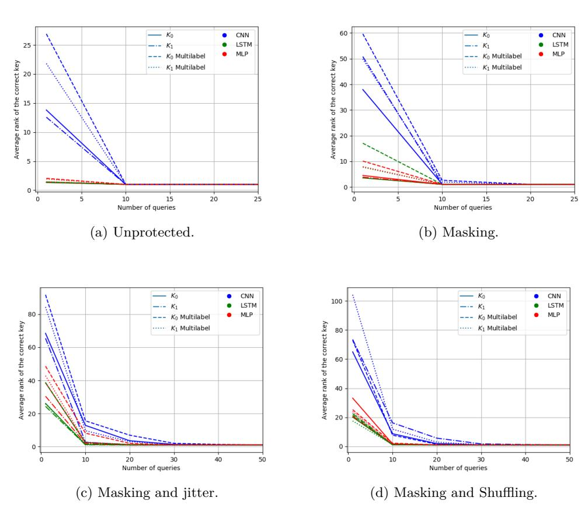

Figure 1: Simulation results: evolution of the correct key rank (y-axis) according to an increasing number of traces (x-axis).

<span id="page-11-0"></span>

| rable 2. comparison of the average training time (in seconds). |          |        |        |             |  |
|----------------------------------------------------------------|----------|--------|--------|-------------|--|
| Countermeasure                                                 | DL model | $K_0$  | $K_1$  | multi-label |  |
| Masking                                                        | CNN      | 278.43 | 275.07 | 245.37      |  |
|                                                                | LSTM     | 549.54 | 512.56 | 493.62      |  |
|                                                                | MLP      | 225.09 | 211.33 | 175.26      |  |
| Masking & jitter                                               | CNN      | 281.83 | 286.23 | 249.789     |  |
|                                                                | LSTM     | 512.24 | 519.15 | 508.44      |  |
|                                                                | MLP      | 220.07 | 224.99 | 187.93      |  |

Table 2: Comparison of the average training time (in seconds).

<span id="page-11-1"></span>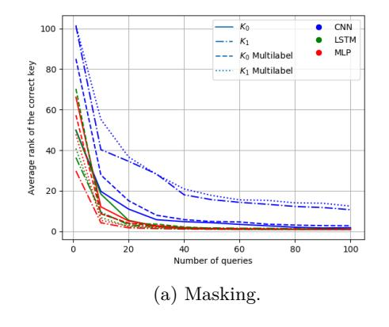

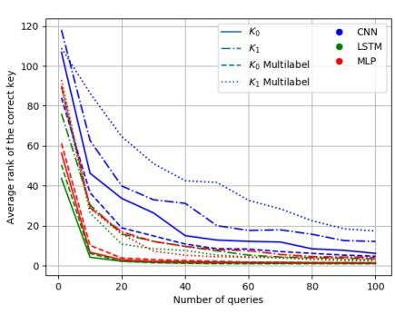

(b) Masking and jitter.

Figure 2: CW results: evolution of the correct key rank (y-axis) according to an increasing number of traces (x-axis).

simulated by generating for each trace a random number  $\delta$  in [0; 20] and by shifting the original trace of  $\delta$  points to the right. The idea is to validate the efficiency of our training methodology on misaligned traces in practice. Then, we run the training using the DL architectures described in Tab. 7 in Appendix A and estimate the average learning time when targeting the first two Sbox outputs of the first AES round. The resulting timings are given in Tab. 2.

The obtained results on the CW data-set are in-line with the simulation outcomes and even better. Indeed, independently of the targeted implementation and the DL model used, our training methodology is faster than the traditional learning approach. For instance, when the implementation is protected with masking and jitter, training two sensitive data using the multi-label approach is almost 18% faster than training each data separately.

To compare both approaches from an attack efficiency perspective, we perform the key recovery phase. The outcomes of our practical attacks are depicted in Fig. 2. As expected, the obtained results for DL-SCA with real traces are in-line with those obtained with the simulation. In fact, our training methodology ensures good learning which turns into an efficient key recovery phase. Again, when comparing the attack results obtained for both training approaches, we observe that the curves of the evolution of the correct key rank follow the same pattern of decreasing when increasing the number of traces.

#### <span id="page-11-2"></span>4.4 Training Methodology Validation on the DPA contest V2 Database

To further validate the advantages of our proposal, we carry out some experiments on the DPA contest V2 data-set. It is an FPGA-based unprotected AES implementation [TEL10]. Each trace contains 3, 253 samples measuring the power consumption of an AES execution. Our target for the training and the attack phases is the hardware register update during

| DL model | K0     | K1      | multi-label |  |  |
|----------|--------|---------|-------------|--|--|
| cnn      | 187.69 | 192.372 | 162.56      |  |  |
| lstm     | 349.81 | 347.41  | 324.93      |  |  |
| mlp      | 149.90 | 155.61  | 123.18      |  |  |

<span id="page-12-1"></span>Table 3: Comparison of the average training time (in seconds).

the last AES round, *i.e.* the Hamming distance between the ciphertext and the result of the intermediate output value of the 9 th round. More practically, we focus on the interval of time samples [2*,* 300; 2*,* 500] where this register update occurs[7](#page-12-0) and we select the register updates related to the manipulation of the first and the fourth bytes (denoted repetitively *K*<sup>0</sup> and *K*<sup>1</sup> in the sequel) of the last AES key round for our profiling and key recovery. From the available data-set, we select 200*,* 000 traces for the training, 20*,* 000 traces for the validation and 20*,* 000 traces for the attack. Then, we run the learning using the DL architectures described in Tab. [7](#page-26-0) in Appendix [A](#page-25-0) and estimate the average learning time for both studied classification approaches. The evolution of the training and validation loss functions according to an increasing number of epochs is provided in Fig. [12](#page-33-0) in Appendix [F.](#page-31-2)

The experimental results from Tab. [3](#page-12-1) demonstrate again that our profiling methodology is faster than performing the learning when targeting a single sensitive operation. This observation is consistent with all the DL architectures we used.

The question now being asked is whether both profiling approaches can detect the same PoI during the learning?

In answering this query, we apply the Gradient Visualization (GV) method suggested in [\[MDP19\]](#page-23-6) when only considering the profiling outcomes of the cnn architecture for clarity reasons[8](#page-12-2) . So, the GV analysis is applied when training the data based on our multi-label approach as well as when training the register updates related to the manipulation of key bytes *K*<sup>0</sup> and *K*<sup>1</sup> individually. For the sake of comparison, we process the SNR computation to detect respectively the leakage of the key bytes *K*<sup>0</sup> and *K*<sup>1</sup> denoted SNR<sup>0</sup> and SNR<sup>1</sup> respectively. In the interests of transparency, the GV and the SNR computation results are normalized following the min-max method.

The results reported in Fig. [3](#page-13-0) show that both computations succeed to reveal the leakage related to the manipulation of the two targeted key bytes. This result is in-line with the investigations from [\[MDP19\]](#page-23-6) performed on the ASCAD database. Meanwhile, one can notice that the leakage area detected by the GV processing (approx 200 time samples) is bigger than the one detected by the SNR computation (approx 150 time samples). This observation proves that the leakage detection based on DL techniques can reveal more leaky points compared to the SNR analysis[9](#page-12-3) . Another side observation is that the leakages of the two key bytes are located in the same area. This result is quite expected as we are targeting a hardware implementation, *i.e.* the processing of the different key bytes of a round is done in parallel.

More interestingly, we observe that the GV analysis results for both profiling approaches are pretty similar. This demonstrates that our profiling methodology based on the multilabel classification is as efficient as the classical profiling in detecting the leakage of the sensitive data. This observation is of great interest as it further proves that it is more advantageous to apply our proposal to save learning time while keeping good performance in terms of leakage detection capabilities.

Finally, we run the key recovery on the attack data-set and we provide the results in

<span id="page-12-2"></span><span id="page-12-0"></span><sup>7</sup>To reveal this interval, we run an SNR computation whose results are shown in Fig. [3.](#page-13-0)

<sup>8</sup>We stress the fact that other DL-based leakage detection techniques [\[HGG19a,](#page-22-6) [Tim19\]](#page-24-1) were applied and similar results were obtained.

<span id="page-12-3"></span><sup>9</sup>For the sake of completeness, we run a DL-SCA on the interval of time samples [0; 50], *i.e.* where the GV methods detect some leakage while the SNR does not, and we succeed to recover the two key bytes.

<span id="page-13-0"></span>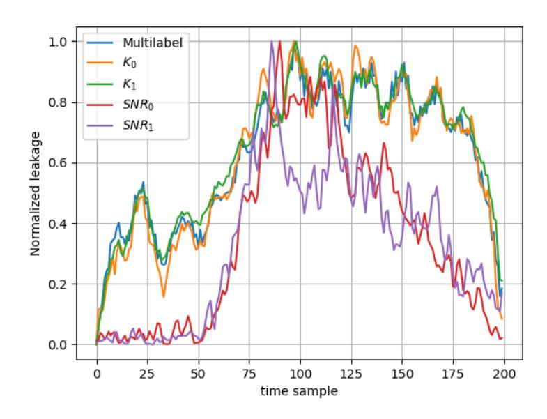

Figure 3: Leakage detection results on the DPA contest V2 data-set.

<span id="page-13-1"></span>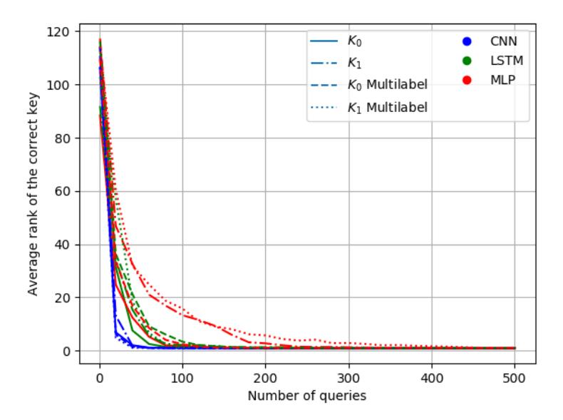

Figure 4: DPA contest V2 results: evolution of the correct key rank (y-axis) according to an increasing number of traces (x-axis).

Fig. 4. The obtained curves follow the same pathway which is coherent and consistent with the outcomes of our investigations based on simulation and the CW. Besides, we observe that for CNN architecture the guessing entropy curves overlap. This observation is in-line with the result of the GV analysis reported in Fig. 3 where the standardized leakage curves overlap as well. This result highlights again that the training based on our methodology is as efficient as the classical training to detect and exploit the leakage. It is worthy to notice that for the MLP architecture, the key recovery results obtained for  $K_1$  for both training methods are not efficient compared to other DL architectures and even compared to the results obtained for  $K_0$  based on MLP. This could be explained by the fact that the MLP architecture is not optimal to run efficiently the training on this key byte. To overcome this issue, one can design a more appropriate MLP architecture to enhance the training and hence the key recovery results. We kindly recall that our goal is not to find the most optimal DL architectures for a specific data-set nor to compare the studied DL architectures (MLP, CNN and LSTM) from a training/key recovery efficiency point of view. Our objective is to compare two training approaches, for a predefined DL architecture, from a learning time-cost and attack efficiency perspectives.

# 5 Training Two AES Intermediate Operations

#### 5.1 Context and Motivations

When performing a leakage assessment of a cryptographic implementation, it may happen that several intermediate operations leak information about the same subset of the master key (e.g. the AddRounKey and the SubByte operations in the case of an AES). To choose the targeted operation for the attack, the evaluator often selects the most leaky one (i.e. the operation for which we obtain the highest leakage). Nevertheless, no published work has demonstrated (theoretically and/or experimentally) that the most leaky operation will provide the most successful key recovery, to the best of our knowledge. Furthermore, the evaluator's choice becomes even tough to make in the case where he obtains for two intermediate operations a similar amount of leakage. Ideally, an evaluator has to run the attack on every leaky operation. However, due to the evaluation's time constraints, this process is rarely applied.

Based on the conclusions reached in the previous section, one wonders if the multilabel classification may solve this issue? Indeed, we have seen that, with our learning methodology, the time needed to train two operations that use two different subsets of the key is similar to the time needed to train one single operation based on the classical training method. So, intuitively, our training approach can be easily applied for this studied use-case to perform the training on two different operations sharing the same subset of the key without introducing additional run-time overhead.

More interestingly, since the two operations used for the training share the same subset of the key, this multi-label learning can be equivalently represented as a classification of this subset of the key based on the knowledge of the values of these two operations. Said differently, when reusing the notations from Sec. 3.2, the training done on the pair  $(Y_1 = \phi_1(P, K), Y_2 = \phi_2(P, K))$  is equivalent to the training on  $(K = \zeta_1(Y_1, P), K = \zeta_2(Y_2, P))$ , for some pair of functions  $(\zeta_1, \zeta_2)$ , and thus equivalent to the training on the subset K of the key<sup>10</sup>. As such, this training can be seen as a classification of one variable (*i.e.* K) when exploiting the information provided by two different operations (instead of one as it is the case for the classical training).

It is worth mentioning that our proposal differs from the work proposed by Hettwer et al. in [HGG19b] in two aspects: (1) the labeling in [HGG19b] is done directly using the

<span id="page-14-0"></span><sup>10</sup> For the AES, when considering respectively that  $\phi_1(P, K) = P \oplus K$  and  $\phi_2(P, K) = Sbox(P \oplus K)$  then  $\zeta_1(Y_1, P) = Y_1 \oplus P$  and  $\zeta_2(Y_2, P) = Sbox^{-1}(Y_2) \oplus P$ .

<span id="page-15-1"></span>

| Countermeasure        | DL model | Sbox in | Sbox out | multi-label |
|-----------------------|----------|---------|----------|-------------|
|                       | CNN      | 202.12  | 203.38   | 182.38      |
| Unprotected           | LSTM     | 392.93  | 393.52   | 392.82      |
|                       | MLP      | 155.44  | 163.23   | 147.73      |
|                       | CNN      | 200.32  | 232.71   | 185.89      |
| Masking               | LSTM     | 389.36  | 400.07   | 378.00      |
|                       | MLP      | 161.27  | 169.04   | 138.64      |
| Masking & jitter      | CNN      | 210.02  | 207.03   | 181.28      |
|                       | LSTM     | 396.28  | 385.98   | 386.32      |
|                       | MLP      | 169.17  | 166.15   | 134.94      |
|                       | CNN      | 202.02  | 214.30   | 184.07      |
| Masking & 1-amongst-2 | LSTM     | 396.56  | 410.05   | 378.68      |
|                       | MLP      | 163.49  | 179.88   | 138.06      |

Table 4: Comparison of the average training time (in seconds).

key (to not stick to a particular operation or a leakage model) while our labeling is done based on two intermediate operations and (2) a classical multi-class apporach is applied in [HGG19b] while we suggest in this work a multi-label training approach. We keep the comparison of both approaches as a future work<sup>11</sup>.

It is well-known in DL that the more information you provide on the targeted data, the more accurate the training you get and the more efficient the matching you obtain. Thus, one expects that the key recovery (matching phase) would be enhanced in such a situation.

To verify these exceptions, we perform several experimentations by targeting three data-sets: simulated traces with different levels of side-channel protection, a software masked AES implementation on the CW board and the traces from the new ASCAD database [ANSb]. For the multi-label classification, we follow our proposed training methodology described in Sec. 3.2 (second-case scenario). In following sections, our targeted operations are the AddRounKey and the SubByte of the first AES round denoted respectively as "Sbox in" and "Sbox out".

#### 5.2 Training Methodology Validation on Simulated Traces

For our simulation, we apply the same setup used in Sec. 4.2. So, we study an unprotected implementation of the AddRounKey and the SubByte operations, a first-order masked version (such that each operation is protected with an independent mask), a combination of first-order masking and jitter and a combination of first-order masking and a 1-amongst-2 countermeasure. The pseudo-code used to generate the different simulated traces is described in Appendix B when considering  $Z_0$  and  $Z_1$  as the AddRounKey and the SubByte operations of the first AES round.

Then, we generate 80,000 traces for the profiling phase (of 8 time samples each), 10,000 traces for the validation phase and 10,000 traces for the attack phase and we make sure that all possible combinations of the pair  $(Z_0, Z_1)$  are available for the learning. We run the training, following our multi-label based methodology, for the same DL architectures studied in Sec. 4.2. For the sake of comparison, the training is performed for each targeted operation ("Sbox in" and "Sbox out") independently. The evolution of the loss function according to an increasing number of epochs is provided in Fig. 11 in Appendix E. The average leaning time is summarized in Tab. 4.

<span id="page-15-0"></span> $<sup>^{11}</sup>$ It is worthy to highlight that the used DL architectures in both works are different and the data-sets used in [HGG19b] are not publicly available.

<span id="page-16-0"></span>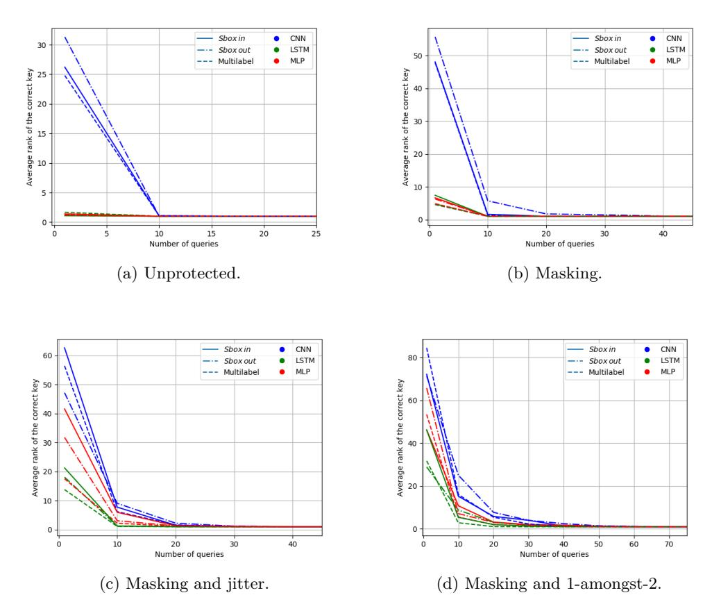

Figure 5: Simulation results: evolution of the correct key rank (y-axis) according to an increasing number of traces (x-axis).

As expected, the time needed to train two sensitive operations is similar (and even shorter) than the time required to train one single operation. This result is of great interest as the security evaluator can run the training based on our methodology on two different operations sharing the same key without introducing a time overhead. Now, to assess the efficiency of the key recovery step related to this multi-label training, we run the DL-SCA. The attack results corresponding to each used DL architecture are plotted in Fig. [5.](#page-16-0)

The obtained results show that, independently of the targeted implementation and the used DL architecture, the attack based on the multi-label training performs better. Indeed, fewer traces are needed to recover the correct value of the key involved in the execution of the "Sbox in" and the "Sbox out" operations. This observation confirms our expectations and highlights an additional advantage of our profiling methodology. Based on this result, we argue that applying our proposal will not only avoid increasing the cost-time during the profiling but also enhances the key recovery results. Thus, when a security evaluator identifies several leaky operations depending the same chunk of the key, it is more advantageous for him to apply our training approach (instead of only targeting the "most leaky operation").

At this stage, one may think that the obtained attack results are quite expected as there is an obvious link (*i.e.* a bijective function) between the two targeted operations in our experiments: the "Sbox in" and the "Sbox out" of an AES. For the sake of completeness, we run a similar assessment (*i.e.* training and key recovery) on some simulated traces of a first-order masked DES implementation when targeting the "Sbox in" and the "Sbox out"

<span id="page-17-1"></span>

| resident of the everage training time (in seconds). |          |         |          |             |
|-----------------------------------------------------|----------|---------|----------|-------------|
| Countermeasure                                      | DL model | Sbox in | Sbox out | multi-label |
| Masking                                             | CNN      | 227.68  | 215.57   | 193.67      |
|                                                     | LSTM     | 430.64  | 400.32   | 396.81      |
|                                                     | MLP      | 195.19  | 184.65   | 146.97      |
| Masking & jitter                                    | CNN      | 218.38  | 229.81   | 198.83      |
|                                                     | LSTM     | 411.69  | 429.59   | 387.86      |
|                                                     | MLP      | 170.51  | 169.19   | 149.73      |

Table 5: Comparison of the average training time (in seconds).

<span id="page-17-2"></span>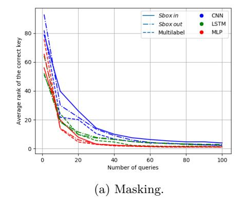

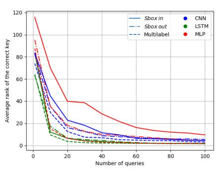

(b) Masking and jitter.

Figure 6: CW results: evolution of the correct key rank (y-axis) according to an increasing number of traces (x-axis).

operations of the first round<sup>12</sup>. The outcomes of our investigation, provided in Appendix C, demonstrate that the same conclusions hold. That is, our training methodology enhances the key recovery without introducing an extra time overhead during the learning phase.

# 5.3 Training Methodology Validation on a Software AES Implementation

To validate the simulation results in practice, we run some experiments on the same masked AES implementation on the CW board targeted in Sec. 4.3. We consider the same collected database as well as the derived set of traces obtained by introducing the jitter effect. The main difference is that our targets for the training and the key recovery steps are the first "Sbox in" and "Sbox out" operations of the first AES round. To estimate the average learning time, we perform the training based on the different DL architectures listed in Tab. 7 and follow the procedure defined in Sec. 2.3. The obtained timing results are provided in Tab. 5.

The experimental results obtained on the CW board are in-line with the simulation outcomes. The multi-label training is faster than the classical training on a single operation. For instance, when running the MLP architecture on the AES implementation protected with masking and jitter, the learning time is reduced by about 14%. Finally, to validate the consequent advantage of our training methodology in terms of attack efficiency, we perform the key recovery and plot the obtained results in Fig. 6.

From Fig. 6, one can conclude that applying our profiling methodology enhances the results of the key recovery compared to the classical training approach. This observation

<span id="page-17-0"></span> $<sup>^{12}</sup>$ Different masks are applied to protect both operations.

| DL model | Sbox in            | Sbox out | multi-label |  |  |
|----------|--------------------|----------|-------------|--|--|
|          | 2682.86            | 2598.16  | 2059.58     |  |  |
|          | 3259.89            | 3173.50  | 2955.83     |  |  |
|          | 1960.50            | 2131.96  | 1723.15     |  |  |
|          | cnn<br>lstm<br>mlp |          |             |  |  |

<span id="page-18-0"></span>Table 6: Comparison of the average training time (in seconds).

is quite noticeable when focusing on the attack results obtained for the mlp architecture on the AES implementation protected with masking and jitter. Indeed, roughly 50 traces are needed to recover the correct value of the key when applying the multi-label training while 100 traces are not enough to recover this value when running the classical training on one sensitive operation (either the "Sbox in" or the "Sbox out"). The same conclusion holds for the other used DL architectures with different level of improvement on the attack efficiency.

## **5.4 Training Methodology Validation on the new ASCAD Database**

The last targeted data-set to validate our new training methodology is the ASCAD database. Indeed, this database was made publicly available by Prouff *et al.* to serve as a common basis for the side-channel community to progress on DL-SCA topic [\[PSB](#page-23-1)<sup>+</sup>18]. It contains some electromagnetic traces of a masked AES implementation running on ATMega8515 device. The first version of ASCAD consists of 60*,* 000 traces collected for a fixed encryption key [\[ANSa\]](#page-21-5). Recently, a new version of ASCAD was published [\[ANSb\]](#page-21-4). It contains 300*,* 000 traces in total (200*,* 000 for the training and 100*,* 000 for the attack phase) collected while encrypting data with a set of random keys. Each trace consists of 1*,* 400 points and represents the EM leakage captured during the execution of the third "Sbox in" and "Sbox out" operations of the first AES round. For the present experiment, we focus on the new version of the ASCAD database and we split the 100*,* 000 traces, initially provided for the attack phase, such that the first half is used for the validation and the second half for our attack phase. The whole 200*,* 000 available training traces are used for our profiling phase. As for the previous experiments, we first compare the learning time of the different training methods when targeting the third "Sbox in" and "Sbox out" operations of the first AES round. The learning time-cost is summarized in Tab. [6.](#page-18-0)

Yet again, the obtained timing results show that our training is faster than the commonly applied multi-class training. For instance, the training time is speeding up by 13% when running the mlp architecture. Moreover, these results show that the gain in time is more significant when targeting high-dimensional traces (*e.g.* a gain of one hour for lstm) compared to the previously targeted data-sets (*e.g.* a gain of few minutes when targeting the DPA contest V2 traces). In fact, it is obvious that the training time increases when the size of the manipulated data increases and therefore the gain in time using our training methodology will increase as well. This observation is of great practical interest for real-world security evaluation where the typical size of traces is roughly tens of thousands of time samples[13](#page-18-1) .

Similarly to the experiments performed on the DPA contest V2 data-set, we run a DL-based leakage detection method on the ASCAD database for both training approaches. The purpose is to verify if the multi-label training can detect the leakages of both targeted operations. For the sake of completeness, we select another DL-based PoI selection method compared to the GV analysis done in Sec. [4.4.](#page-11-2) Namely, we apply the sensitivity analysis method suggested in [\[Tim19\]](#page-24-1) when considering the training outcomes of the mlp architecture obtained for both learning approaches[14](#page-18-2). For the sake of comparison, we

<span id="page-18-1"></span><sup>13</sup>The estimated gain in time is about several hours in such context.

<span id="page-18-2"></span><sup>14</sup>We stress the fact that other DL-based PoI methods were applied and similar results were obtained.

<span id="page-19-0"></span>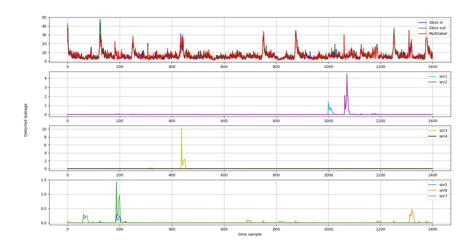

Figure 7: Leakage detection results on the ASCAD data-set.

process as well the SNR for several intermediate operations and values described hereafter using the same notations as in [\[PSB](#page-23-1)<sup>+</sup>18]:

- Masked Sbox output Sbox(*p*[3] ⊕ *k*[3]) ⊕ *r*out, denoted snr1.
- Masked Sbox output Sbox(*p*[3] ⊕ *k*[3]) ⊕ *r*[3], denoted snr2.
- Masked Sbox input *p*[3] ⊕ *k*[3] ⊕ *r*in, denoted snr3.
- Masked Sbox input *p*[3] ⊕ *k*[3] ⊕ *r*[3], denoted snr4.
- Mask *r*out, denoted snr5.
- Mask *r*in, denoted snr6.
- Mask *r*[3], denoted snr7.

The leakage detection results obtained for the ASCAD database are shown in Fig. [7.](#page-19-0) It is worthy to highlight that our training methodology (as well as the classical training method) detects the same leakages revealed by the SNR method and that are related to all the above-listed intermediate operations expecting the one denoted snr1. This result can be justified by the fact that the SNR level obtained for snr1 is quite low compared to snr2. For this reason, we believe that the mlp architecture has focused on the time samples around the snr2 peak to do the training for the masked Sbox output operation. Still in the comparison with the SNR results, we observe that DL based detection techniques reveal some "ghost" peaks of leakage (*e.g.* around the time samples 250, 300, 750). The same observation was noticed in [\[MDP19\]](#page-23-6) where the authors claim that these extra peaks are non-informative and more related to an over-fitting issue[15](#page-19-1). We run some key recovery when selecting these time samples but we fail to recover the key. We recall that the same observation was highlighted in Sec. [4.4.](#page-11-2) The main difference is that the conducted attack, on the area where the mismatch is noticed between both PoI methods, was successful. Furthermore, we check that our training is not overfitting. So, we conclude that even these extra leakage peaks are not directly related to the leakage, they are very

<span id="page-19-1"></span><sup>15</sup>To avoid the detection of these peaks, authors in [\[MDP19\]](#page-23-6) suggested to apply an early-stopping as a regularization technique.

<span id="page-20-0"></span>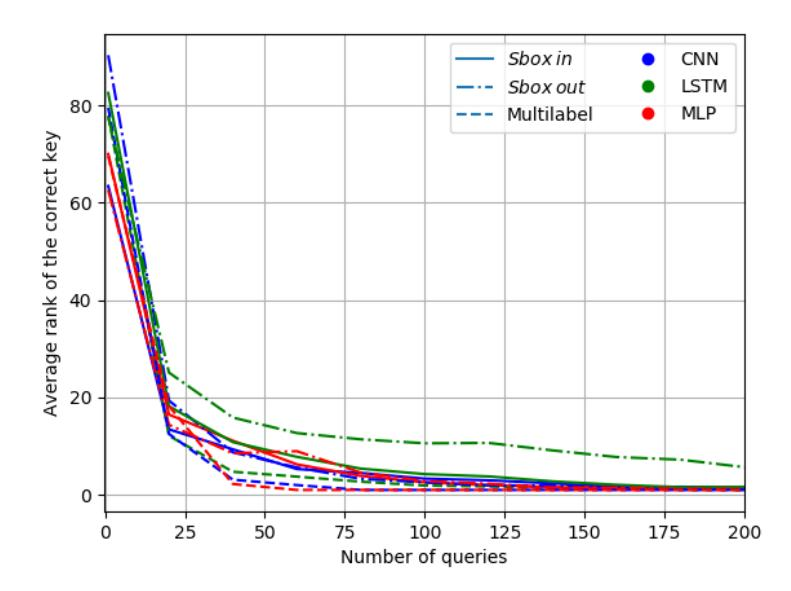

Figure 8: ASCAD results: evolution of the correct key rank (y-axis) according to an increasing number of traces (x-axis).

useful for the training and the classification. This observation pinpoints the fact that the relationship between the classical leakage detection methods and those based on the DL techniques needs to be further investigated despite the several published papers on this topic [\[HGG19a,](#page-22-6) [MDP19,](#page-23-6) [Tim19\]](#page-24-1). We keep this study as future work.

Now, when comparing the obtained results for both training methodologies (multi-class and multi-label), one can see that the leakage detection curves are very similar. Indeed, the same PoI were detected (including the ghost peaks) and only the leakage level (*i.e.* the amplitude) differs. This result is quite surprising as it pinpoints that by running the classical training on the Sbox output operation, we can detect the PoI related to the Sbox input (and vice versa). Certainly, not all the PoI are contributing at the same level (which explains the difference in amplitude) for each training target. This implies that by restricting the training to a single operation, we are not exploiting all the available information. Regarding the multi-label leakage detection result, one can see that the PoI have (almost) the sample amplitude which implies that our training methodology is equivalently exploiting the PoI (related to the Sbox input and output operations). Thus, one would expect that this will lead to a more efficient key recovery. To validate this expectation, we run the key recovery for each training approach and provide the outcomes in Fig. [8.](#page-20-0)

The reported results in Fig. [8](#page-20-0) prove that, as expected, our training methodology enhances the key recovery results. Indeed, fewer traces are needed to recover the third key byte of the AES implementation. For instance, when considering the mlp architecture and the mutli-label classification, about 50 traces are sufficient to recover the targeted key byte value. However, when the training is performed for a single leaking operation, more traces are needed (about 150). This observation is valid for all considered DL architectures.

## **6 Conclusion**

In this paper, we proposed a new training methodology for the DL-SCA based on the multi-label classification. Our proposal can be applied to mitigate two practical issues related to the application of DL-SCA. On one hand, it extends the ability of DL-SCA to target a bigger subset of the key bits. For the AES use-case, we have shown that our new training methodology allows efficient profiling on two bytes of the key at once while the needed learning time is equivalent to the learning time required to run the profiling on one byte of the key using the classical training approach. Our validation results obtained on simulated traces and experimental data-sets have proven that the key recovery phase related to our training methodology is as efficient as the one based on the commonly used training approach. On the other hand, our proposal extends the ability of DL-SCA to target two operations, at once, sharing the same chunk of the key. This feature is of great interest especially when the security evaluator hesitates on the choice of the most appropriate operation to target for this attack. The outcomes of our investigations have shown that not only our methodology will not introduce a learning time overhead but also enhances the key recovery results. This claim was verified through several experiments based on simulation data and real traces data-set. At the end, we argue that our proposal is a twofer: as it allows the profiling on two variables such that (1) the corresponding learning time is equivalent (and even shorter compared) to the computation cost of a straightforward profiling on a single variable and (2) the attack efficiency remains similar (and even better).

As future work, we plan to apply our training methodology on the evaluation of asymmetric cryptographic implementations. Another research avenue will consist in revisiting the relationship between the classical side-channel PoI methods and the DLbased ones when the multi-class and the multi-label classifications are applied. Indeed, we noticed, during this work, that there is a mismatch when comparing the outputted results of both strategies. We believe that this observation is worth pursuing a bit further.

# **References**

- <span id="page-21-5"></span>[ANSa] ANSSI. ASCAD database V1 fixed key. [https://github.com/ANSSI-FR/](https://github.com/ANSSI-FR/ASCAD/tree/master/ATMEGA_AES_v1/ATM_AES_v1_fixed_key) [ASCAD/tree/master/ATMEGA\\_AES\\_v1/ATM\\_AES\\_v1\\_fixed\\_key](https://github.com/ANSSI-FR/ASCAD/tree/master/ATMEGA_AES_v1/ATM_AES_v1_fixed_key).
- <span id="page-21-4"></span>[ANSb] ANSSI. ASCAD database V1 variable key. [https://github.com/ANSSI-FR/](https://github.com/ANSSI-FR/ASCAD/tree/master/ATMEGA_AES_v1/ATM_AES_v1_variable_key) [ASCAD/tree/master/ATMEGA\\_AES\\_v1/ATM\\_AES\\_v1\\_variable\\_key](https://github.com/ANSSI-FR/ASCAD/tree/master/ATMEGA_AES_v1/ATM_AES_v1_variable_key).
- <span id="page-21-3"></span>[Bis95] Christopher M. Bishop. *Neural Networks for Pattern Recognition*. Oxford University Press, Inc., New York, NY, USA, 1995.
- <span id="page-21-2"></span>[CCC<sup>+</sup>19] Mathieu Carbone, Vincent Conin, Marie-Angela Cornélie, François Dassance, Guillaume Dufresne, Cécile Dumas, Emmanuel Prouff, and Alexandre Venelli. Deep learning to evaluate secure rsa implementations. *IACR Transactions on Cryptographic Hardware and Embedded Systems*, 2019(2):132–161, Feb. 2019.
- <span id="page-21-1"></span>[CDP17] Eleonora Cagli, Cécile Dumas, and Emmanuel Prouff. Convolutional neural networks with data augmentation against jitter-based countermeasures profiling attacks without pre-processing. In *CHES 2017 - 19th International Conference, Taipei, Taiwan, September 25-28, 2017, Proceedings*, pages 45–68, 2017.
- <span id="page-21-0"></span>[CK14] Omar Choudary and Markus G. Kuhn. Efficient template attacks. In Aurélien Francillon and Pankaj Rohatgi, editors, *Smart Card Research and Advanced Applications*, pages 253–270, Cham, 2014. Springer International Publishing.

<span id="page-22-0"></span>[CRR02] Suresh Chari, Josyula R. Rao, and Pankaj Rohatgi. Template Attacks. In *CHES*, volume 2523 of *LNCS*, pages 13–28. Springer, August 2002. San Francisco Bay (Redwood City), USA.

- <span id="page-22-8"></span>[GGS18] Qian Guo, Vincent Grosso, and François-Xavier Standaert. Modeling soft analytical side-channel attacks from a coding theory viewpoint. *IACR Cryptology ePrint Archive*, 2018:498, 2018.
- <span id="page-22-9"></span>[Guy97] Isabelle Guyon. A scaling law for the validation-set training-set size ratio. In *AT & T Bell Laboratories*, 1997.
- <span id="page-22-6"></span>[HGG19a] Benjamin Hettwer, Stefan Gehrer, and Tim Güneysu. Deep neural network attribution methods for leakage analysis and symmetric key recovery. Cryptology ePrint Archive, Report 2019/143, 2019. [https://eprint.iacr.org/](https://eprint.iacr.org/2019/143) [2019/143](https://eprint.iacr.org/2019/143).
- <span id="page-22-13"></span>[HGG19b] Benjamin Hettwer, Stefan Gehrer, and Tim Güneysu. Profiled power analysis attacks using convolutional neural networks with domain knowledge. In Carlos Cid and Michael J. Jacobson Jr., editors, *Selected Areas in Cryptography – SAC 2018*, pages 479–498, Cham, 2019. Springer International Publishing.
- <span id="page-22-5"></span>[HS97] Sepp Hochreiter and Jürgen Schmidhuber. Long short-term memory. *Neural Comput.*, 9(8):1735–1780, November 1997.
- <span id="page-22-4"></span>[HS13] Michiel Hermans and Benjamin Schrauwen. Training and analysing deep recurrent neural networks. In C. J. C. Burges, L. Bottou, M. Welling, Z. Ghahramani, and K. Q. Weinberger, editors, *Advances in Neural Information Processing Systems 26*, pages 190–198. Curran Associates, Inc., 2013.
- <span id="page-22-2"></span>[HZ12] Annelie Heuser and Michael Zohner. Intelligent Machine Homicide - Breaking Cryptographic Devices Using Support Vector Machines. In *COSADE*, pages 249–264, 2012.
- <span id="page-22-10"></span>[ker] Keras Library. <https://keras.io/>.
- <span id="page-22-7"></span>[KPH<sup>+</sup>19] Jaehun Kim, Stjepan Picek, Annelie Heuser, Shivam Bhasin, and Alan Hanjalic. Make some noise. unleashing the power of convolutional neural networks for profiled side-channel analysis. *IACR Transactions on Cryptographic Hardware and Embedded Systems*, 2019(3):148–179, May 2019.
- <span id="page-22-3"></span>[LB98] Yann LeCun and Yoshua Bengio. The handbook of brain theory and neural networks. chapter Convolutional Networks for Images, Speech, and Time Series, pages 255–258. MIT Press, Cambridge, MA, USA, 1998.
- <span id="page-22-11"></span>[LK17a] Ladislav Lenc and Pavel Král. Ensemble of neural networks for multi-label document classification. In *ITAT*, 2017.
- <span id="page-22-12"></span>[LK17b] Ladislav Lenc and Pavel Král. Two-level neural network for multi-label document classification. In Alessandra Lintas, Stefano Rovetta, Paul F.M.J. Verschure, and Alessandro E.P. Villa, editors, *Artificial Neural Networks and Machine Learning – ICANN 2017*, pages 368–375, Cham, 2017. Springer International Publishing.
- <span id="page-22-1"></span>[LPB<sup>+</sup>15] Liran Lerman, Romain Poussier, Gianluca Bontempi, Olivier Markowitch, and François-Xavier Standaert. Template attacks vs. machine learning revisited (and the curse of dimensionality in side-channel analysis). In Stefan Mangard and Axel Y. Poschmann, editors, *Constructive Side-Channel Analysis and*

- *Secure Design 6th International Workshop, COSADE 2015, Berlin, Germany, April 13-14, 2015. Revised Selected Papers*, volume 9064 of *Lecture Notes in Computer Science*, pages 20–33. Springer, 2015.
- <span id="page-23-6"></span>[MDP19] Loïc Masure, Cécile Dumas, and Emmanuel Prouff. Gradient visualization for general characterization in profiling attacks. In *Constructive Side-Channel Analysis and Secure Design - 10th International Workshop, COSADE 2019, Darmstadt, Germany, April 3-5, 2019, Proceedings*, pages 145–167, 2019.
- <span id="page-23-3"></span>[MMCS11] Jonathan Masci, Ueli Meier, Dan Cireşan, and Jürgen Schmidhuber. Stacked convolutional auto-encoders for hierarchical feature extraction. In *Proceedings of the 21th International Conference on Artificial Neural Networks - Volume Part I*, ICANN'11, pages 52–59, Berlin, Heidelberg, 2011. Springer-Verlag.
- <span id="page-23-0"></span>[MPP16] Houssem Maghrebi, Thibault Portigliatti, and Emmanuel Prouff. Breaking cryptographic implementations using deep learning techniques. In *SPACE 2016, Hyderabad, India, December 14-18, 2016, Proceedings*, pages 3–26, 2016.
- <span id="page-23-10"></span>[NKM<sup>+</sup>14] Jinseok Nam, Jungi Kim, Eneldo Loza Mencía, Iryna Gurevych, and Johannes Fürnkranz. Large-scale multi-label text classification — revisiting neural networks. In *Proceedings of the 2014th European Conference on Machine Learning and Knowledge Discovery in Databases - Volume Part II*, ECMLPKDD'14, pages 437–452, Berlin, Heidelberg, 2014. Springer-Verlag.
- <span id="page-23-11"></span>[OC14] Colin O'Flynn and Zhizhang (David) Chen. Chipwhisperer: An open-source platform for hardware embedded security research. Cryptology ePrint Archive, Report 2014/204, 2014. <http://eprint.iacr.org/2014/204>.
- <span id="page-23-2"></span>[ON15] Keiron O'Shea and Ryan Nash. An introduction to convolutional neural networks. *CoRR*, abs/1511.08458, 2015.
- <span id="page-23-7"></span>[PEC19] Guilherme Perin, Baris Ege, and Lukasz Chmielewski. Neural network model assessment for side-channel analysis. *IACR Cryptology ePrint Archive*, 2019:722, 2019.
- <span id="page-23-5"></span>[PRB09] Emmanuel Prouff, Matthieu Rivain, and Régis Bevan. Statistical Analysis of Second Order Differential Power Analysis. *IEEE Trans. Computers*, 58(6):799– 811, 2009.
- <span id="page-23-1"></span>[PSB<sup>+</sup>18] Emmanuel Prouff, Remi Strullu, Ryad Benadjila, Eleonora Cagli, and Cécile Dumas. Study of deep learning techniques for side-channel analysis and introduction to ASCAD database. *IACR Cryptology ePrint Archive*, 2018:53, 2018.
- <span id="page-23-9"></span>[Rip96] Brian D. Ripley. *Pattern Recognition and Neural Networks*. Cambridge University Press, 1996.
- <span id="page-23-4"></span>[SGV08] François-Xavier Standaert, Benedikt Gierlichs, and Ingrid Verbauwhede. Partition vs. Comparison Side-Channel Distinguishers. In *ICISC*, volume 5461 of *LNCS*, pages 253–267. Springer, December 3-5 2008. Seoul, Korea.
- <span id="page-23-8"></span>[SMY09] François-Xavier Standaert, Tal Malkin, and Moti Yung. A Unified Framework for the Analysis of Side-Channel Key Recovery Attacks. In *EUROCRYPT*, volume 5479 of *LNCS*, pages 443–461. Springer, April 26-30 2009. Cologne, Germany.
- <span id="page-23-12"></span>[TEL10] TELECOM ParisTech SEN research group. DPA Contest (2 nd edition), 2009– 2010. <http://www.DPAcontest.org/v2/>.

<span id="page-24-1"></span>[Tim19] Benjamin Timon. Non-profiled deep learning-based side-channel attacks with sensitivity analysis. *IACR Transactions on Cryptographic Hardware and Embedded Systems*, 2019(2):107–131, Feb. 2019.

- <span id="page-24-3"></span>[TKV10] Grigorios Tsoumakas, Ioannis Katakis, and Ioannis Vlahavas. *Mining Multilabel Data*, pages 667–685. Springer US, Boston, MA, 2010.
- <span id="page-24-0"></span>[WPB19] Léo Weissbart, Stjepan Picek, and Lejla Batina. One trace is all it takes: Machine learning-based side-channel attack on eddsa. In Shivam Bhasin, Avi Mendelson, and Mridul Nandi, editors, *Security, Privacy, and Applied Cryptography Engineering*, pages 86–105, Cham, 2019. Springer International Publishing.
- <span id="page-24-2"></span>[ZBHV19] Gabriel Zaid, Lilian Bossuet, Amaury Habrard, and Alexandre Venelli. Methodology for efficient cnn architectures in profiling attacks. *IACR Transactions on Cryptographic Hardware and Embedded Systems*, 2020(1):1–36, Nov. 2019.

# <span id="page-25-0"></span>**A Hyper-Parameters of the Used DL Architectures to Target AES implementation**

We provide in this section a detailed description of the DL architectures used in our work to ease the reproducibility of our results by the SCA community. The DL architectures used to target the simulated AES traces, the observations acquired on the CW board and the ones from the DPA contest V2 are described in Tab. [7.](#page-26-0) The DL architectures designed to train the traces from the ASCAD database are depicted in Tab. [8.](#page-27-0) The specific configuration for the multi-label training is highlighted in blue while the one specific to the classical multi-class training is highlighted in red.

It is worthy to highlight that for each DL model we used the same architecture for the multi-class classification and the multi-label classification (*i.e.* number of layers, number of neurons, . . . ). Our main goal is to provide a fair comparison of both approaches in terms of learning time. In this work, we are not claiming that the described DL architectures are the optimal ones to break the targeted database. Indeed, one can select other DL designs (for the multi-label classification) that lead to a more efficient key recovery.

<span id="page-26-0"></span>Table 7: Hyper-parameters of the basic DL architectures used to train the simulated AES traces, the observations acquired on the CW board and the ones from the DPA contest V2.

```
cnn
nb_epoch = 100
batch_size_training = 128
Convolution1D(8, 16, padding='same', input_shape=(nb_samples,1), activation="relu")
Dropout(0.2)
MaxPooling1D(pool_size=2)
Convolution1D(8, 8, padding='same', activation="tanh")
Flatten()
Dropout(0.4)
Dense(256, activation="softmax")
compile(loss='categorical-crossentropy', optimizer='adam', metrics=['accuracy'])
Dense(512, activation="sigmoid")
compile(loss='binary-crossentropy', optimizer='adam', metrics=['accuracy'])
                                          mlp
nb_epoch = 100
batch_size_training = 128
Dense(20, activation="relu", input_shape=(nb_samples,))
Dense(50, activation="relu")
Dense(256, activation="softmax")
compile(loss='categorical-crossentropy', optimizer='adam', metrics=['accuracy'])
Dense(512, activation="sigmoid")
compile(loss='binary-crossentropy', optimizer='adam', metrics=['accuracy'])
                                         lstm
nb_epoch = 100
batch_size_training = 128
LSTM(26, input_shape=(nb_samples,1), return_sequences=True)
LSTM(26)
Dense(256, activation="softmax")
compile(loss='categorical-crossentropy', optimizer='adam', metrics=['accuracy'])
Dense(512, activation="sigmoid")
compile(loss='binary-crossentropy', optimizer='adam', metrics=['accuracy'])
```

<span id="page-27-0"></span>Table 8: Hyper-parameters of the basic DL architectures used to target the ASCAD database.

```
cnn
nb_epoch = 200
batch_size_training = 128
Convolution1D(8, 128, padding='same', input_shape=(nb_samples,1), activation="relu")
Dropout(0.5)
MaxPooling1D(pool_size=2)
Convolution1D(8, 64, padding='same', activation="tanh")
Flatten()
Dropout(0.4)
Dense(100, activation="relu")
BatchNormalization()
Dense(256, activation="softmax")
compile(loss='categorical-crossentropy', optimizer='adam', metrics=['accuracy'])
Dense(512, activation="sigmoid")
compile(loss='binary-crossentropy', optimizer='adam', metrics=['accuracy'])
                                          mlp
nb_epoch = 200
batch_size_training = 128
Dense(50, activation="relu", input_shape=(nb_samples,))
BatchNormalization()
Dense(100, activation="relu")
BatchNormalization()
Dense(256, activation="softmax")
compile(loss='categorical-crossentropy', optimizer='adam', metrics=['accuracy'])
Dense(512, activation="sigmoid")
compile(loss='binary-crossentropy', optimizer='adam', metrics=['accuracy'])
                                         lstm
nb_epoch = 200
batch_size_training = 128
LSTM(26, input_shape=(nb_samples,1), return_sequences=True)
LSTM(26)
Dense(256, activation="softmax")
compile(loss='categorical-crossentropy', optimizer='adam', metrics=['accuracy'])
Dense(512, activation="sigmoid")
compile(loss='binary-crossentropy', optimizer='adam', metrics=['accuracy'])
```

<span id="page-28-1"></span>Table 9: The set-up used to generate the unprotected and protected simulated traces where *R* denotes a random integer in [0*,* 255] and N (0*, σ*) denotes a white Gaussian noise of null mean and standard deviation *σ* = 0*.*5.

| Unprotected                                                                                                                                                                                                                                                     | Masking                                                                                                                                                                                                                                          |  |
|-----------------------------------------------------------------------------------------------------------------------------------------------------------------------------------------------------------------------------------------------------------------|--------------------------------------------------------------------------------------------------------------------------------------------------------------------------------------------------------------------------------------------------|--|
| <br>Z0<br>+ N (0, σ)<br>if s = 2,<br><br>+ N (0, σ)<br>Ti<br>[s] =<br>Z1<br>if s = 5,<br>R + N (0, σ)<br>otherwise,<br>                                                                                                                                      | <br>M0<br>+ N (0, σ)<br>if s = 1,<br><br>⊕ M0<br>+ N (0, σ)<br>Z0<br>if s = 2,<br><br>[s] =<br>M1<br>+ N (0, σ)<br>if s = 4,<br>Ti<br>Z1<br>⊕ M1<br>+ N (0, σ)<br>if s = 5,<br><br><br>R + N (0, σ)<br>otherwise,                     |  |
| Masking and Jitter                                                                                                                                                                                                                                              | Masking and Shuffling                                                                                                                                                                                                                            |  |
|                                                                                                                                                                                                                                                                 | 0 = (s<br>+ 3 × r)%8<br>pick r in [0, 1] and compute s                                                                                                                                                                                           |  |
| <br>M0<br>+ N (0, σ)<br>if s = 1,<br><br>Z0<br>⊕ M0<br>+ N (0, σ)<br>if s = 2,<br><br>Ti<br>[s] =<br>M1<br>+ N (0, σ)<br>if s = 4,<br>Z1<br>⊕ M1<br>+ N (0, σ)<br>if s = 5,<br><br><br>R + N (0, σ)<br>otherwise,<br>pick r in [0, 2] and do Ti<br>p | 0 = 1,<br><br>M0<br>+ N (0, σ)<br>if s<br><br>0 = 2,<br>⊕ M0<br>+ N (0, σ)<br>Z0<br>if s<br><br>0 = 4,<br>Ti<br>[s] =<br>M1<br>+ N (0, σ)<br>if s<br>0 = 5,<br>⊕ M1<br>+ N (0, σ)<br>Z1<br>if s<br><br><br>R + N (0, σ)<br>otherwise, |  |
| Masking and 1-amongst-2                                                                                                                                                                                                                                         |                                                                                                                                                                                                                                                  |  |
| pick r1<br>and r2<br>in [2, 3] and [5, 6] respectively                                                                                                                                                                                                          |                                                                                                                                                                                                                                                  |  |
| <br>+ N (0, σ)<br>M0<br>if s = 1,<br><br>Z0<br>⊕ M0<br>+ N (0, σ)<br>if s = r1,<br><br>+ N (0, σ)<br>Ti<br>[s] =<br>M1<br>if s = 4,<br>Z1<br>⊕ M1<br>+ N (0, σ)<br>if s = r2,<br><br><br>R + N (0, σ)<br>otherwise,                                  |                                                                                                                                                                                                                                                  |  |

# <span id="page-28-0"></span>**B Simulation Set-Up**

The simulation set-up is described in Tab. [9.](#page-28-1)

| DL model | Sbox in | Sbox out | multi-label |
|----------|---------|----------|-------------|
| cnn      | 53.02   | 49.02    | 52.52       |
| lstm     | 58.27   | 54.40    | 57.17       |
| mlp      | 23.37   | 17.60    | 22.82       |

<span id="page-29-1"></span>Table 10: Comparison of the average training time (in seconds).

<span id="page-29-2"></span>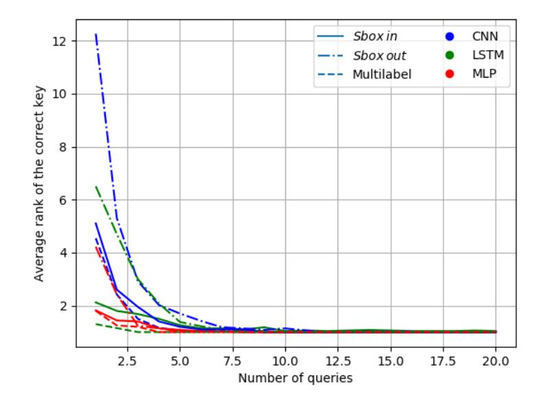

Figure 9: Experimental results: evolution of the correct key rank (y-axis) according to an increasing number of traces (x-axis).

# <span id="page-29-0"></span>**C Results when Targeting the DES**

For this experiment, we consider a first-order masked DES implementation and we target the first "Sbox in" and "Sbox out" of the first round. Then, we generate 8*,* 000 traces for the profiling phase, 1*,* 000 traces for the validation phase and 1*,* 000 traces for the attack phase

The training phase is performed when considering the three DL models described in Tab. [11.](#page-30-0) The specific configuration for the multi-label training is highlighted in blue while the ones related to the classical multi-class training on the "Sbox in" and the "Sbox out" operations are highlighted respectively in green and red.

The estimated leaning time for each training methodology is summarized in Tab. [10.](#page-29-1) As expected, the profiling time required for our multi-label training strategy is similar to the one required to train the "Sbox in" and the "Sbox out" operations independently.

The results of the key recovery phase are shown in Fig. [9.](#page-29-2) Similarly to the AES case, the attack results based on our profiling methodology are more efficient as fewer traces are needed to recover the good value of the key independently of the used DL architecture.

<span id="page-30-0"></span>Table 11: Hyper-parameters of the basic DL architectures used to target a DES implementation.

```
cnn
nb_epoch = 100
batch_size_training = 128
Convolution1D(8, 16, padding='same', input_shape=(nb_samples,1), activation="relu")
Dropout(0.2)
MaxPooling1D(pool_size=2)
Convolution1D(8, 8, padding='same', activation="tanh")
Flatten()
Dropout(0.4)
Dense(16, activation="softmax")
compile(loss='categorical-crossentropy', optimizer='adam', metrics=['accuracy'])
Dense(64, activation="softmax")
compile(loss='categorical-crossentropy', optimizer='adam', metrics=['accuracy'])
Dense(80, activation="sigmoid")
compile(loss='binary-crossentropy', optimizer='adam', metrics=['accuracy'])
                                          mlp
nb_epoch = 100
batch_size_training = 128
Dense(20, activation="relu", input_shape=(nb_samples,))
Dense(50, activation="relu")
Dense(16, activation="softmax")
compile(loss='categorical-crossentropy', optimizer='adam', metrics=['accuracy'])
Dense(64, activation="softmax")
compile(loss='categorical-crossentropy', optimizer='adam', metrics=['accuracy'])
Dense(80, activation="sigmoid")
compile(loss='binary-crossentropy', optimizer='adam', metrics=['accuracy'])
                                         lstm
nb_epoch = 100
batch_size_training = 128
LSTM(26, input_shape=(nb_samples,1), return_sequences=True)
LSTM(26)
Dense(16, activation="softmax")
compile(loss='categorical-crossentropy', optimizer='adam', metrics=['accuracy'])
Dense(64, activation="softmax")
compile(loss='categorical-crossentropy', optimizer='adam', metrics=['accuracy'])
Dense(80, activation="sigmoid")
compile(loss='binary-crossentropy', optimizer='adam', metrics=['accuracy'])
```

## <span id="page-31-0"></span>**D Estimation of the Learning Time**

We provide hereafter a procedure to estimate the learning time.

1. Add the following class in your python script:

```
class TimeHistory(keras.callbacks.Callback):
    def on_train_begin(self, logs={}):
        self.times = []
    def on_epoch_begin(self, batch, logs={}):
        self.epoch_time_start = time.time()
    def on_epoch_end(self, batch, logs={}):
        self.times.append(time.time() − self.epoch_time_start)
```

2. perform the following to recover the learning time spent for each epoch:

```
time_callback = TimeHistory()
model.fit(..., callbacks=[..., time_callback],...)
times = time_callback.times
```

# <span id="page-31-1"></span>**E Simulation Training Outcomes**

We provide the evolution of the training loss and the validation loss values according to an increasing number of epochs in Fig. [10](#page-32-0) (training of two AES key-bytes) and Fig. [11](#page-33-1) (training of two AES intermediate operations). For the sake of clarity, we reported only these training metrics for the mlp architecture but we stress the fact that similar behaviors were observed for the other studied DL architectures.

The obtained results prove that for all the considered DL architectures we obtain a *good fit*. That is, we obtain a training and a validation loss that decreases to a point of stability with a minimal gap between the two loss values. This result is especially valid when the multi-label classification is applied. Indeed, for all targeted implementations, the gap between the training loss and the validation loss curves is too small; the curves are overlapping with few number of epochs. This observation demonstrates again that the multi-label classification will lead to a better training (and hence a better matching) compared to the classical multi-class classification.

# <span id="page-31-2"></span>**F DPA Contest V2 Training Outcomes**

From Fig. [12,](#page-33-0) one can see that the training and validation loss curves obtained for the multi-label classification (using the the mlp architecture) overlap when the number of epochs increases. This result demonstrates again that for the DPA contest v2 data-set we get a good fit.

<span id="page-32-0"></span>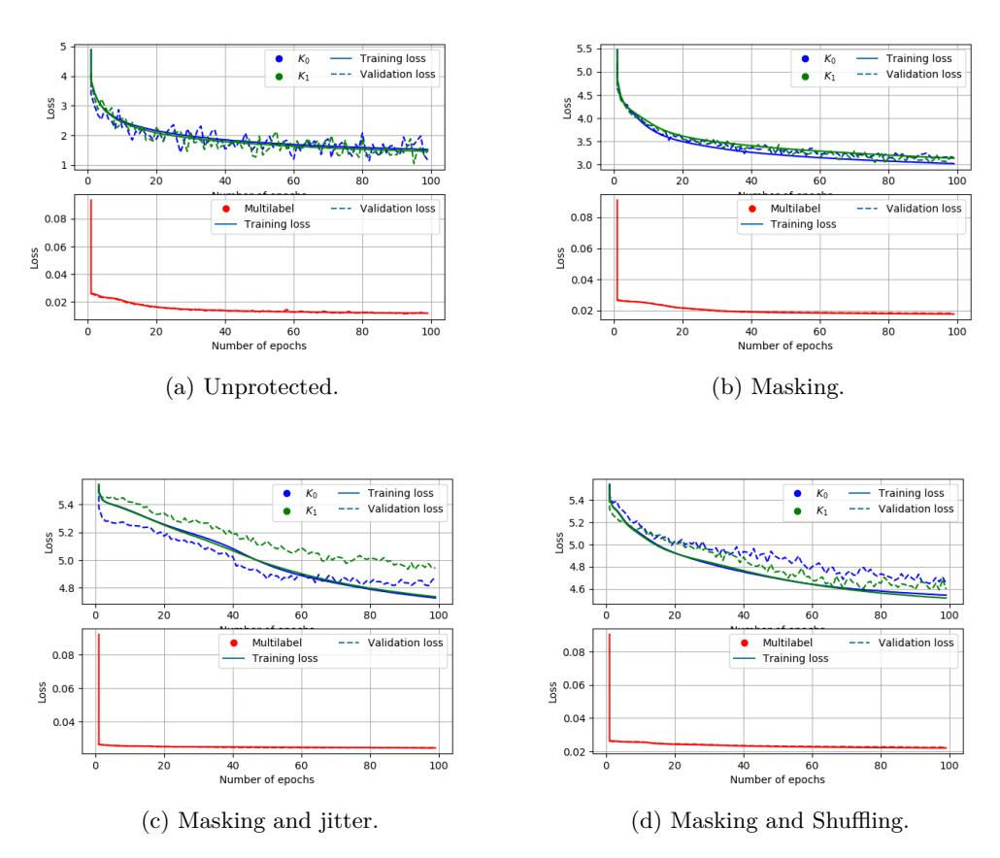

Figure 10: Simulation results (two AES sub-keys): evolution of the training loss and the validation loss (y-axis) according to an increasing number of epochs (x-axis).

<span id="page-33-1"></span>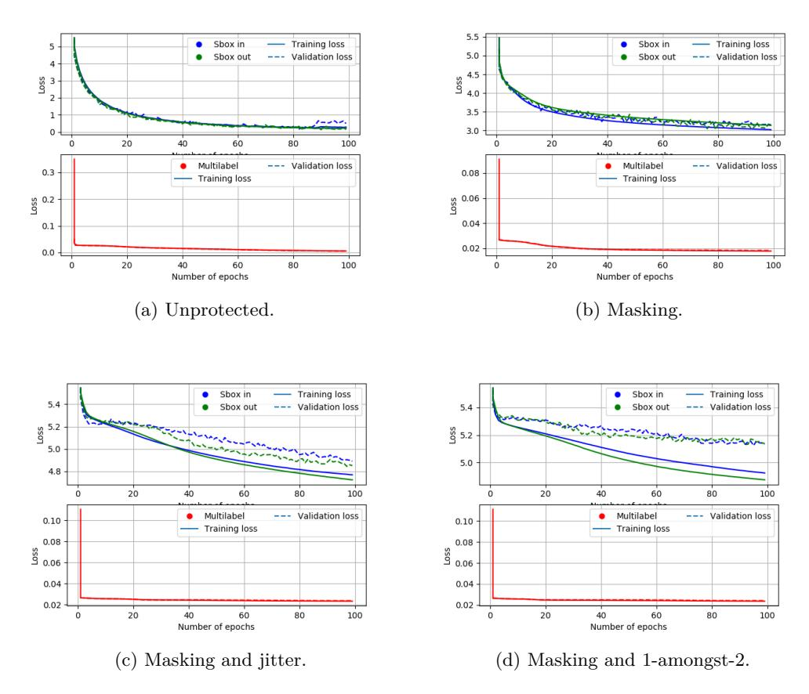

<span id="page-33-0"></span>Figure 11: Simulation results (two AES intermediate operations): evolution of the training loss and the validation loss (y-axis) according to an increasing number of epochs (x-axis).

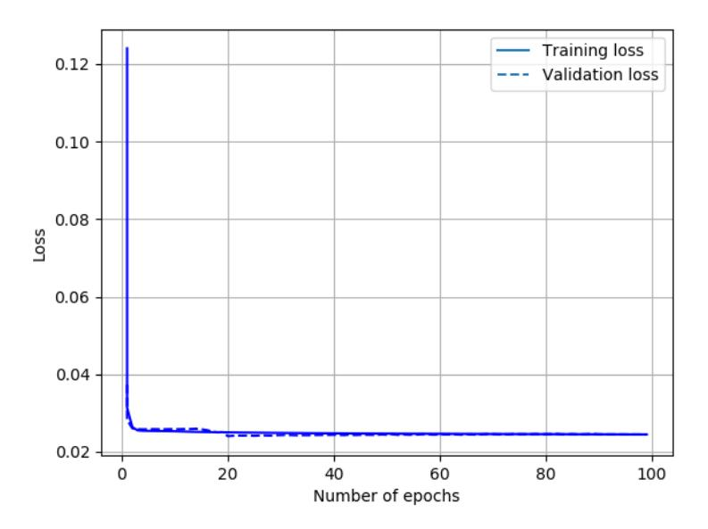

Figure 12: DPA contest V2 results: evolution of the training loss and the validation loss (y-axis) according to an increasing number of epochs (x-axis).