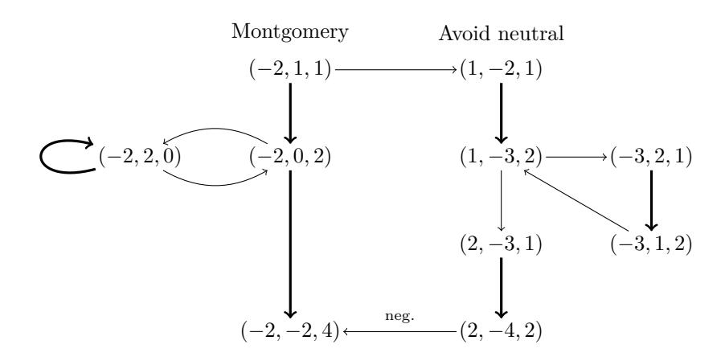
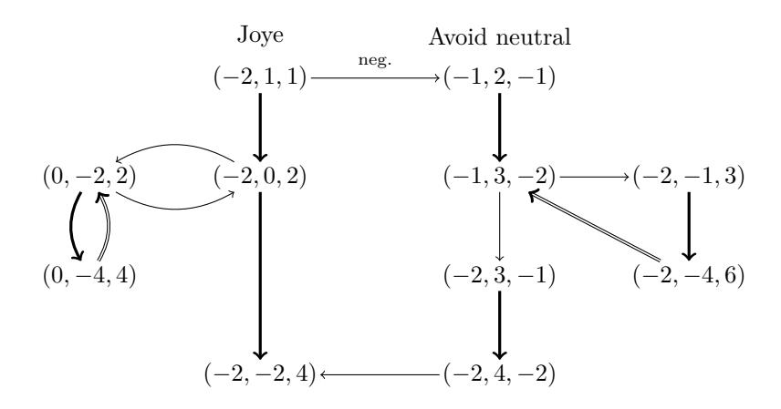

# **Faster Montgomery and double-add ladders for short Weierstrass curves**

Mike Hamburg

Rambus [mhamburg@rambus.com](mailto:mhamburg@rambus.com)

**Abstract.** The Montgomery ladder and Joye ladder are well-known algorithms for elliptic curve scalar multiplication with a regular structure. The Montgomery ladder is best known for its implementation on Montgomery curves, which requires 5**M**+ 4**S** + 1**m** + 8**A** per scalar bit, and 6 field registers. Here (**M***,* **S***,* **m***,* **A**) represent respectively field **M**ultiplications, **S**quarings, **m**ultiplications by a curve constant, and **A**dditions or subtractions. This ladder is also *complete*, meaning that it works on all input points and all scalars.

Many protocols do not use Montgomery curves, but instead use prime-order curves in short Weierstrass form. These have historically been much slower, with ladders costing at least 14 multiplications or squarings per bit: 8**M** + 6**S** + 27**A** for the Montgomery ladder and 8**M** + 6**S** + 30**A** for the Joye ladder. In 2017, Kim et al. improved the Montgomery ladder to 8**M** + 4**S** + 12**A** + 1**H** per bit using 9 registers, where the **H** represents a halving. Hamburg simplified Kim et al.'s formulas to 8**M** + 4**S** + 8**A** + 1**H** per bit using 6 registers.

Here we present improved formulas which compute the Montgomery ladder on short Weierstrass curves using 8**M** + 3**S** + 7**A** per bit, and requiring 6 registers. We also give formulas for the Joye ladder that use 9**M**+ 3**S** + 7**A** per bit, requiring 5 registers. One of our new formulas supports very efficient 4-way vectorization.

We also discuss curve invariants, exceptional points, side-channel protection and how to set up and finish these ladder operations. Finally, we show a novel technique to make these ladders complete when the curve order is not divisible by 2 or 3, at a modest increase in cost.

A sample implementation of these techniques is given in the supplementary material, also posted at [https://github.com/bitwiseshiftleft/ladder\\_formulas](https://github.com/bitwiseshiftleft/ladder_formulas).

**Keywords:** Elliptic Curve Cryptography, Montgomery Ladder, Joye Ladder, Short Weierstrass Curve, Scalar Multiplication

## **1 Introduction and related work**

The core operation of most elliptic curve cryptography algorithms is *scalar multiplication*, in which an element *P*0 of an elliptic curve group is multiplied by an integer ("scalar") *k*. Considerable study has been devoted to optimizing scalar multiplication algorithms.

This paper is mainly concerned with *variable-base* scalar multiplication algorithms, meaning that *P*0 is not known ahead of time, so no precomputation has been done on it. Typically *k* is secret. To avoid side-channel attacks, the algorithm should be *regular*, meaning that its timing and control flow should not depend on *k*.

## **1.1 The Montgomery and Joye ladders**

The Montgomery ladder [\[Mon87\]](#page-17-0) is a general algorithm for computing a power or scalar multiple of a group element. This algorithm's regular structure is conducive to implementations that resist side-channel attack. This technique is fastest on elliptic curves in the

| Montgomery ladder |                                               | Joye ladder                                      |  |
|-------------------|-----------------------------------------------|--------------------------------------------------|--|
| 1                 | n Requires: curve order q ≤ 2              | Requires: curve order q is odd 1              |  |
| 2                 | n + (k n mod Rewrite k ← 2 − 2 q) | k−1 Rewrite k ← 2 · ( mod q) + 1 2 2 |  |
| 3                 | (Q, R) ← (P0, 2P0)                            | (P, Q) ← (P0, P0) 3                           |  |
| 4                 | For i = n − 1 down to 0:                      | For i = 1 to n: 4                             |  |
| 5                 | = 0: (Q, R) ← (2Q, Q + R) If ki            | = 0: Q ← 2Q + P If ki 5                    |  |
| 6                 | (Q, R) ← (Q + R, 2R) Else:                 | P ← 2P + Q Else: 6                         |  |
| 7                 | Output Q = k · P0                             | Output P = k · P0 7                           |  |

**Figure 1:** The Montgomery and Joye ladders, modified for nonzero initial state.

*Montgomery form*

$$y^2 = x^3 + Ax^2 + x.$$

But it can be efficiently applied on any elliptic curve, in particular those in the *short Weierstrass form*

$$y^2 = x^3 + ax + b.$$

Joye's double-add ladder [\[Joy07\]](#page-17-1) — hereafter called the *Joye ladder* — is a similar algorithm, which is also used in efficient implementations of elliptic curve scalar multiplication.

The Joye ladder can be viewed as the dual of the Montgomery ladder [\[Wal17\]](#page-17-2). Both ladders apply a sequence of linear transformations over the group. The transformations applied by the Joye ladder are adjoint to those in the Montgomery ladder, and are applied in the opposite order.

Each algorithm takes as input a group element *P*0 and a scalar *k*, and computes *k* · *P*0*.* Let *k* have a binary representation

$$k := \sum_{i=0}^{n} 2^{i} k_{i}$$
 where each  $k_{i} \in \{0, 1\}$ .

The two ladder algorithms are typically presented as starting with the state (*O, P*0), where *O* is the identity element (or *neutral point*) of the curve. However, the neutral point is at infinity, which causes problems for some formulas. So in this paper we use a variant which rewrites *k* into an equivalent scalar, such that the first bit (the most- or least-significant bit for the Montgomery or Joye ladder, respectively) is 1. For the Joye ladder, this requires that the order *q* of the curve (or at least the order of *P*0) is odd. The ladder then starts after the first step, when the state no longer contains the neutral point. These algorithms are shown in Figure [1.](#page-1-0)

While the Montgomery ladder can be implemented using only *Q* and *R*, many implementations also use the base point *P* := *R* − *Q* = *P*0. Likewise, implementations of the Joye ladder often track a third point

$$R := P + Q = 2^i \cdot P_0$$

in the *i*th iteration. In these cases, the Montgomery and Joye ladder update steps are rearrangements of each other: both map triples of points (*P, Q, R*) to (*P, Q* + *R,* 2 · *R*) in some order. This often makes it possible to convert between formulas for the Montgomery ladder and those for the Joye ladder.

However, the converted formulas aren't always equally performant or side-channel resistant. They also may need adjustment if the three points don't use the same representation in the ladder state. For example, the base point never changes in the Montgomery ladder, so it might be stored in affine coordinates; or the ladder might track the *y*-coordinates of some points but not others.

For most ladder formulas, the fastest version has a state containing enough information to recover the *x*-coordinate of each point, but not the *y*-coordinate. As a consequence, the formulas work in *x*-only protocols such as elliptic curve Diffie-Hellman, where only the *x*-coordinate of *P* is given and only the *x*-coordinate of the output is required.

Additional work is required to recover *y*. For the Montgomery ladder, the state contains points (*Q, R*) such that *R* − *Q* = *P*0, and possibly a representation of *P*0 itself. If *P*0 is given as (*x, y*) then enough information is present to efficiently solve for the output *y*-coordinate as well [\[LD99\]](#page-17-3). For an *n*-iteration Joye ladder, the final state instead contains *R* = 2*n*+1*P*0. If *R* is known (e.g. if *P*0 is a fixed generator of the curve and *R* has been precomputed) then *y* can be recovered in the same way. Otherwise, in order to recover *y*, the ladder must track additional information such as a *Z*-coordinate, typically at a cost of 1-2 registers and 1**M** per bit.

This pattern holds for the ladder formulas we present here. For the Montgomery ladder, minimal additional work is required to recover *y*; only the *y*-coordinate of *P*0 must be remembered. For the Joye ladder, if *y* is needed and *R* hasn't been precomputed, then additional work is required to track the *Z*-coordinate.

## **1.2 Co-***Z* **coordinates**

Elliptic curve implementations typically calculate using a projective version of the elliptic curve for efficiency. Instead of storing (*x, y*), points are represented in either *projective coordinates* as (*xZ* : *yZ* : *Z*) or in *Jacobian coordinates* as (*xZ*2 : *yZ*3 : *Z*), where *Z* is an arbitrary scaling factor. This avoids costly finite-field divisions except at the end of the computation. When storing multiple points in a ladder, the straightforward way is to use a separate *Z*-coordinate for each point.

Co-*Z* formulas [\[Mel07,](#page-17-4) [GJM10,](#page-16-0) [GJM](#page-16-1)+11] instead use the same *Z*-coordinate for all points in the ladder state. This reduces memory usage. It can also improve performance, because often the first step in a point addition is to rescale both points to have the same *Z*-coordinate, and that step is not needed for co-*Z* representations. In some cases, the common *Z*-coordinate doesn't need to be calculated or stored, since having the scaled *X* and *Y* coordinates for multiple points is enough information to solve for *Z*.

Most formulas on short Weierstrass curves need special cases around the curve's neutral point *O*, which is written with *Z* = 0. This is especially true for co-*Z* formulas, because if one point has *Z* = 0 then they all do; the finite points would then be represented as (0 : 0 : 0), which is indeterminate. Thus, co-*Z* ladders always start with a nonzero state, as shown in Figure [1.](#page-1-0)

## **1.3 The Kim et al. formulas**

In 2017, Kim et al. published a variant of the Montgomery ladder with "on-the-fly adaptive coordinates" [\[KCK](#page-17-5)+17] defined by (*X*1*, X*2*, K, L, A, S, T*) and a bit *b*, where:

$$(X_1, X_2, L, S, T) = (Z^2x_1, Z^2x_2, -2Z^6y_1y_2, Z^2x_0, Z^3y_0)$$
  
$$(K, A) = (2Z^6y_1^2, 2Z^5y_1(x_1 - x_2)) \text{ if } b = 0$$
  
$$(K, A) = (2Z^6y_2^2, 2Z^5y_1(x_2 - x_1)) \text{ if } b = 1$$

Note that these coordinates are scaled by powers of a *Z*-coordinate, but do not include *Z* itself. The Kim et al. formulas improved the previous state of the art of 9**M** + 5**S** + 18**A** per bit [\[GJM](#page-16-1)+11] to 8**M** + 4**S** + 12**A** + 1**H** per bit, using 9 registers which each hold one field element. The formulas are quite complex, with each operation depending on two bits of the key instead of one.

Hamburg presented a simplified and optimized version of Kim et al.'s main ladder formula at the CHES 2017 rump session [\[Ham17\]](#page-16-2). These formulas use the fact that the points in a ladder state or their negations lie on a line  $y = m(x - x_0) + y_0$ . They use modified Jacobian co-Z coordinates of the form  $(3X_0, 2Y_0, X_1 - X_0, X_2 - X_0, 2M)$  where

$$X_i = x_i \cdot Z^2, \qquad Y_i = y_i \cdot Z^3, \qquad M = m \cdot Z.$$

Hamburg's formulas require 8M + 4S + 8A + 1H per bit, and 6 field registers.

#### 1.4 Our contribution

In Section 2.1 we give two new formulas for the Montgomery ladder. Both use  $8\mathbf{M} + 3\mathbf{S} + 7\mathbf{A}$  and 6 field registers. The formula in Figure 3 is closely related to Hamburg's rump session formula. It keeps a ladder state of  $(X_{QP}, X_{RP}, Y_P, M)$  where  $X_{QP} = (x_Q - x_P) \cdot Z^2$  and likewise for  $X_{RP}$ . Thus, it drops the the  $X_P$  coordinate from [Ham17], which is called  $X_0$  in that presentation. In addition to improving performance, this change gives an improvement in resistance to side-channel attacks, as discussed in Section 4.

An alternative formula1 in Figure 4 instead tracks  $(X_{QP}, X_{RP}, X_{RQ}^2, Y_Q, Y_R)$ . This formula has the same performance as the one in Figure 3 except that it requires an extra conditional swap for  $Y_Q$  and  $Y_R$ . It can be parallelized efficiently over four multiplication units instead of three, making it comparable to recent vectorized implementations of the Montgomery ladder on Montgomery curves [HEY20, NS20].

In Section 2.2 we show a Joye ladder formula, based on our first Montgomery ladder formula, using  $9\mathbf{M} + 3\mathbf{S} + 7\mathbf{A}$  and 5 registers. We are not aware of any previous Montgomery or Joye ladder formula that requires only 5 field registers.

Counting registers is somewhat tricky. Our register counts are given for x-only scalar multiplication; recovering the y-coordinate requires one more register, and for the Joye ladder, also additional computation. They do not count the scalar itself, the curve constants, or small constants such as 2 and 3. They also assume that the processor supports "multiplication in place"  $(X \leftarrow X \cdot Y)$  and for the complete Joye formulas, "reverse subtraction in place"  $(X \leftarrow Y - X)$ . If it does not support these operations, an additional register is required.

In Sections 2.3 and 2.4 we show how to set up and finalize the ladder state for either x-only or (x,y) calculations. For the Joye ladder, (x,y) calculations generally require an extra  $\mathbf M$  per bit to track the Z coordinate. We also give invariants on the ladder state and a discussion of side-channel protection.

See Figure 2 for a comparison of our new formulas to past work. They are still not as fast as the Montgomery ladder on Montgomery curves [Mon87]: approximating  $^2$   $1\mathbf{S} \approx 0.75\mathbf{M}, 1\mathbf{m} \approx 0.25\mathbf{M}, 1\mathbf{A} \approx 1\mathbf{H} \approx 0.1\mathbf{M}$  gives an estimate of 21% more compute time per scalar bit, excluding the final division. This is an improvement from [Ham17] and [Riv11], which use respectively 31% and 61% more compute time per bit than [Mon87]. Our new formulas also support the usual  $\mathbf{S} - \mathbf{M}$  tradeoffs at the cost of extra additions and registers, but we present them in their simplest and most compact form.

Our new Montgomery ladder is faster even than a variable-time non-adjacent form (NAF) algorithm with a=-3 [HMV06], by about 4% using the above estimates. More  $\mathbf{S}-\mathbf{M}$  tradeoffs are known for Jacobian operations, so NAF would still be faster with sufficiently high  $\mathbf{M}:\mathbf{S}:\mathbf{A}$  ratios.

 $^1$ A preprint of this paper presents the formulas in Figure 4 as tracking  $(X_{QP}, X_{RP}, M, \bar{M})$  where  $\bar{M}$  is an additional slope variable. The present version performs the same calculations, but has a different boundary between the end of one iteration and the beginning of the next. We have chosen to use the present version because it is more similar to the calculations in the rest of the paper.

&lt;sup>2More or less arbitrarily, but this is typical of an IOT implementation, such as a 256-bit curve on a 32-bit processor. This is where the  $\mathbf{M}:\mathbf{S}:\mathbf{A}$  ratio is most relevant: for lightweight implementations, memory usage is more important, and for high-performance implementations, parallelism is more important. Note that with these cost estimates, the typical tradeoff  $xy = \frac{1}{2}((x+y)^2 - x^2 - y^2)$  doesn't help performance if xy is needed, but it does help if instead 2xy is needed.

| Curve                            | Ladder                    | Ref                   | Cost per scalar bit                                                           | Swap | Regs |  |
|----------------------------------|---------------------------|-----------------------|-------------------------------------------------------------------------------|------|------|--|
| Prior serial formulas            |                           |                       |                                                                               |      |      |  |
| Mont                             | $\mathrm{Mont}^\dagger$   | [Mon87]               | $5\mathbf{M} + 4\mathbf{S} + 1\mathbf{m} + 8\mathbf{A}$                       | 2    | 6    |  |
| Weier                            | Mont                      | [Riv11]               | $9\mathbf{M} + 5\mathbf{S} + 18\mathbf{A}$                                    | 2    | 9    |  |
| Weier                            | Mont                      | [GJM+11]              | $8\mathbf{M} + 6\mathbf{S} + 27\mathbf{A}$                                    | 2    | 8    |  |
| Weier                            | Joye                      | $[GJM^{+}11]$         | $9\mathbf{M} + 7\mathbf{S} + 27\mathbf{A}$                                    | 2    | 8    |  |
| Weier                            | Joye                      | [GJ16]                | $8\mathbf{M} + 6\mathbf{S} + 30\mathbf{A}$                                    | 2    | 7    |  |
| Weier                            | Mont                      | [HJS11]               | $9\mathbf{M} + 5\mathbf{S} + 2\mathbf{m} + 14\mathbf{A}$                      | 1    | 9    |  |
| Weier                            | $\mathrm{Mont}^\dagger$   | [SM16]                | $10\mathbf{M} + 5\mathbf{S} + 2\mathbf{m} + 17\mathbf{A}$                     | 2    | 9    |  |
| Weier                            | Mont                      | [KCK + 17] | $8\mathbf{M} + 4\mathbf{S} + 12\mathbf{A} + 1\mathbf{H}$                      | *    | 9    |  |
| Weier                            | Mont                      | [Ham17]               | $8\mathbf{M} + 4\mathbf{S} + 8\mathbf{A} + 1\mathbf{H}$                       | 1    | 6    |  |
|                                  |                           | New                   | serial formulas                                                               |      |      |  |
| Weier                            | Mont                      | Figure 3              | $8\mathbf{M} + 3\mathbf{S} + 7\mathbf{A}$                                     | 1    | 6    |  |
| Weier                            | Mont                      | Figure 3              | $7\mathbf{M} + 4\mathbf{S} + 10\mathbf{A} + 1\mathbf{H}$                      | 1    | 6    |  |
| Weier                            | Mont                      | Figure 4              | $8\mathbf{M} + 3\mathbf{S} + 7\mathbf{A}$                                     | 2    | 6    |  |
| Weier                            | $\mathrm{Mont}^\dagger$   | Suppl.                | $9\mathbf{M} + 3\mathbf{S} + 8\mathbf{A} + 1\mathbf{C}$                       | 6    | 6    |  |
| Weier                            | Joye                      | Figure 5              | $9\mathbf{M} + 3\mathbf{S} + 7\mathbf{A}$                                     | 2    | 5    |  |
| Weier                            | Joye                      | Figure 5              | $8\mathbf{M} + 4\mathbf{S} + 10\mathbf{A} + 1\mathbf{H}$                      | 2    | 6    |  |
| Weier                            | $\mathrm{Joye}^{\dagger}$ | Suppl.                | $9\mathbf{M} + 3\mathbf{S} + 9\mathbf{A} + 1\mathbf{C}$                       | 6    | 5    |  |
| Prior parallel formulas          |                           |                       |                                                                               |      |      |  |
| Mont                             | Mont                      | [HEY20]               | $2\mathbf{M}_4 + 1\mathbf{S}_4 + 4\mathbf{A}_4$                               | 2    | 8    |  |
| Mont                             | Mont                      | [NS20]                | $3\mathbf{M}_4 + 3\mathbf{A}_4$                                               | 2    | 7    |  |
| Mont                             | Mont                      | [NS20]                | $2\mathbf{M}_4 + 1\mathbf{S}_2 + 1\mathbf{m} + 3\mathbf{A}_4$                 | 2    | 7    |  |
| Weier                            | Mont                      | [FGKS02]              | $10\mathbf{M}_2 + 8\mathbf{A}_2$                                              | 2    | 8    |  |
| New parallel formulas            |                           |                       |                                                                               |      |      |  |
| Weier                            | Mont                      | Figure 4              | $3M_4 + 3A_3$                                                                 | 2    | 7    |  |
| Prior non-constant-time formulas |                           |                       |                                                                               |      |      |  |
| Weier                            | $\mathrm{NAF}^{\ddagger}$ | [HMV06]               | $6\frac{2}{3}\mathbf{M} + 5\mathbf{S} + 9\frac{1}{3}\mathbf{A} + 1\mathbf{H}$ | 0    | 8    |  |

#### Notes:

- $\bullet~^\dagger$  These ladders are complete, at least for a subset of curves.
- \* The Kim et al. ladder is not written using conditional swaps, and we did not attempt to convert it.
- $^{\ddagger}$  Binary NAF is included for comparison purposes only, since unlike the other algorithms in the table it isn't regular or constant-time. The expected costs per bit are listed. Here we assume that the curve constant a=-3, and that the doubling formula is improved beyond [HMV06] to  $4\mathbf{M}+4\mathbf{S}+7\mathbf{A}+1\mathbf{H}$  using the identity  $\frac{3}{2}x=x+\frac{1}{2}x$ .
- The costs are given in Multiplications, Squarings, Additions or subtractions, multiplications by a curve constant, Halvings and Comparisons. Multiplication by numbers ≤ 4 is decomposed into additions.
- $\mathbf{M}_n$ ,  $\mathbf{S}_n$  and  $\mathbf{A}_n$  mean the cost of at most n multiplications, squarings or additions in parallel. Parallel register counts assume that these operations can be done in place.
- The costs do not include setup or finalization. Setup may include an on-curve check and finalization always includes a division. Division typically costs between 1S/bit and (1S+1M)/bit, depending on the modulus and on memory constraints.
- The register counts for our new formulas are also sufficient for setup and finalization, using the technique from Section 2.4.2.
- [Riv11] is superseded by [GJM+11], but we believe the former's Montgomery ladder formulas are actually faster, because usually 1S + 9A > 1M.
- These costs are for x-only ladders; recovering y requires extra storage. It also costs an extra 1M/bit for our Joye ladders but not our Montgomery ladders.

Figure 2: Comparison to selected previous work.

The formulas in Section [2.1](#page-5-0) and Section [2.2](#page-6-0) are not complete: they break down if the neutral point appears in the ladder state, but not in any other case. In Section [3](#page-10-0) we give an analysis of this problem and a novel solution, which is not specific to our formulas: it potentially allows other ladders to implement complete scalar multiplication at a modest performance cost. These formulas are given in the [supplementary material.](https://github.com/bitwiseshiftleft/ladder_formulas)

# **2 Ladder Formulas**

Our ladder works on short Weierstrass curves over large-characteristic fields. They are derived from the following theorem:

**Theorem 1** (Ladder formulas with differences of *x*-coordinates)**.** *Let*

$$P = (x_P, y_P), \quad Q := (x_Q, y_Q), \quad R := P + Q := (x_R, y_R)$$

*be the state of the Montgomery ladder on an elliptic curve y* 2 = *x* 3 + *ax* + *b defined over a field of characteristic other than 2. The three points* (*P, Q,* −*R*) *lie on a line with slope m* := (*yQ* + *yR*)*/*(*xQ* − *xR*)*. Let*

$$P = (x_P, y_P), \quad S := Q + R = (x_S, y_S), \quad T := 2R = (x_T, y_T)$$

*be the state after a ladder operation, where* (*P, S,* −*T*) *lie on a line of slope m*0 *. Let*

$$r:=\frac{x_Q-x_R}{2y_R}, \qquad s:=(x_{\scriptscriptstyle R}-x_{\scriptscriptstyle P})\cdot r, \qquad t:=\frac{2y_{\scriptscriptstyle R}}{x_Q-x_{\scriptscriptstyle R}}, \qquad u:=\frac{2y_Q}{x_Q-x_{\scriptscriptstyle R}}.$$

*Then*

$$x_S - x_P = -t \cdot u = t \cdot (t - 2m)$$
  
 $x_T - x_P = s^2 - 2y_P \cdot r$   
 $m' = t - m - s$ .

*Proof.* Deferred to Appendix [A.](#page-17-11)

Theorem [1](#page-17-12) may seem somewhat unintuitive, and in fact was reverse engineered from the new formulas, rather than being the motivation for them. The formulas are improvements of [\[Ham17\]](#page-16-2), which are derived from [\[KCK](#page-17-5)+17]. However, the new formulas are quite different from [\[KCK](#page-17-5)+17], so the motivation for that work likely does not apply here.

These formulas in Theorem [1](#page-17-12) are compatible with Jacobian coordinates: if (*m, x, y*) are replaced by (*mZ, xZ*2 *, yZ*3 ) then the outputs will also be in that form, with the same *Z*. Note that to avoid extra additions and subtractions, in some cases it is more efficient to calculate with the variables *m* and *y* multiplied by a small constant, such as −1, 2 or −2.

## **2.1 Formulas for the Montgomery ladder**

Theorem [1](#page-17-12) gives a straightforward strategy to implement the Montgomery ladder. We begin with Jacobian versions of *xQ* − *xP , xR* − *xP , yP* and *m*. We can calculate *yR* = *yP* + *m* · (*xR* − *xP* ), and then follow Theorem [1](#page-17-12) to get *xS* − *xP , xT* − *xP* and *m*0 . Finally, *yP* stays the same, but with a new Jacobian denominator *Z*.

In Jacobian coordinates, the state variables will be

$$X_{QP} := (x_Q - x_P) \cdot Z^2$$

$$X_{RP} := (x_R - x_P) \cdot Z^2,$$

$$M := m \cdot Z$$

$$Y_P := 2y_P \cdot Z^3$$

For most curves, the value of Z need not be represented; see Section 2.4. On each step, we calculate the negated y-coordinate  $\bar{Y}_R := -2y_R Z^3 = Y_P + 2MX_{RP}$ . Then Z will be multiplied by a local denominator  $z := \bar{Y}_R \cdot (X_{QP} - X_{RP})$ . We can then easily compute rz, sz, tz and mz, from which the rest of the terms follow homogeneously. An optimized implementation is shown in Figure 3.

It is also possible to perform a Montgomery ladder whose state incorporates  $Y_Q$  and  $Y_R$ , instead of  $Y_P$  and M. The ladder state comprises

$$X_{QP} := (x_{Q} - x_{P}) \cdot Z^{2}$$

$$X_{RP} := (x_{R} - x_{P}) \cdot Z^{2}$$

$$G := (x_{R} - x_{Q})^{2} \cdot Z^{4}$$

$$Y_{Q} := 2y_{Q} \cdot Z^{3}$$

$$Y_{R} := 2y_{R} \cdot Z^{3}$$

Here G is included in the ladder state just to avoid an extra subtraction from recomputing  $X_{RP} - X_{QP}$  at the beginning of the ladder step. This formula also requires  $8\mathbf{M} + 3\mathbf{S} + 7\mathbf{A}$  per bit, and is shown in Figure 4.

This ladder's multiplications can be parallelized 4 ways, which improves performance on vector processors. With the minor changes shown in Figure 4's notes, the cost rises to  $9\mathbf{M} + 2\mathbf{S} + 8\mathbf{A}$ , but the additions can also be parallelized. Therefore on a parallel machine it can be implemented in  $3\mathbf{M}_4 + 3\mathbf{A}_3$  per bit, where  $\mathbf{M}_4$  and  $\mathbf{A}_3$  are the cost of 4 parallel multiplications and 3 parallel additions, respectively.

## 2.2 Formulas for the Joye ladder

For the Joye ladder, the same outline works, but we are conditionally swapping  $(x_P, y_P) \leftrightarrow (x_Q, y_Q)$  instead of  $(x_Q, y_Q) \leftrightarrow (x_R, y_R)$ . The x-coordinates are easily rearranged to support this by tracking  $X_{RP} := X_R - X_P$  and  $X_{RQ} := X_R - X_Q$ . For y-coordinates, we now need to track both  $y_P$  and  $y_Q$ . Conveniently, we can use both coordinates to compute  $x_S - x_P = -tu$  from Theorem 1. The Joye ladder state is:

$$\begin{array}{rcl} X_{{\scriptscriptstyle RP}} & := & (x_{{\scriptscriptstyle R}} - x_{{\scriptscriptstyle P}}) \cdot Z^2 \\ X_{{\scriptscriptstyle RQ}} & := & (x_{{\scriptscriptstyle R}} - x_{{\scriptscriptstyle Q}}) \cdot Z^2 \\ \bar{M} & := & -2m \cdot Z \\ Y_{{\scriptscriptstyle P}} & := & 2y_{{\scriptscriptstyle P}} \cdot Z^3 \\ Y_{{\scriptscriptstyle Q}} & := & 2y_{{\scriptscriptstyle Q}} \cdot Z^3 \end{array}$$

An optimized Joye ladder is shown in Figure 5.

#### 2.3 Ladder setup

The initial state of the ladder encodes the points  $P = (x_P, y_P)$  and  $R = 2P = (x_R, y_R)$ . Let (x, y) lie on the elliptic curve  $y^2 = x^3 + ax + b$ . We need to compute  $(x_R - x_P)Z^2, 2y_PZ^3$  and mZ, where  $m = (3x_P^2 + a)/(2y_P)$  is the slope of the tangent at P.

Since  $x_R + 2x_P = m^2$ , we have  $(x_R - x_P)Z^2 = (mZ)^2 - 3x_PZ^2$ . Setting  $Z = 2y_P$ , we get

$$Z^{2} = 4y_{P}^{2} = 4(x_{P}^{3} + ax_{P} + b)$$

$$mZ = 3x_{P}^{2} + a$$

$$X_{RP} = (mZ)^{2} - 3x_{P}Z^{2}$$

$$2y_{P}Z^{3} = (Z^{2})^{2}.$$

#  $\begin{array}{|c|c|c|c|}\hline \text{Montgomery ladder. Input: ladder state } (X_{QP}, X_{RP}, M, Y_P) \\ \hline \\ 1 & \bar{Y}_R = Y_P + 2 \cdot M \cdot X_{RP} & 8 & Y_P' = Y_P \cdot F \cdot G \\ 2 & E = X_{QP} - X_{RP} & 9 & K = H + M' \\ 3 & F = \bar{Y}_R \cdot E & 10 & L = K + M' \\ 4 & G = E^2 & 11 & M'' = X_{RP}' - K \\ 5 & X_{RP}' = X_{RP} \cdot G & 12 & X_{SP} = H \cdot L \\ 6 & H = \bar{Y}_R^2 & 13 & X_{TP} = X_{RP}'^2 + Y_P' \\ 7 & M' = M \cdot F & 14 & Y_P'' = Y_P' \cdot H \\ \hline \end{array}$

Output: ladder state  $(X_{SP}, X_{TP}, M'', Y_P'')$ 

#### Notes:

- This formula uses  $8\mathbf{M} + 3\mathbf{S} + 7\mathbf{A}$  and two temporary registers for a total of 6. Here  $\mathbf{M}, \mathbf{S}, \mathbf{A}$  represent the costs of field multiplication, squaring, and addition or subtraction, respectively.
- An  $\mathbf{S} \mathbf{M}$  tradeoff is available by computing  $F = \frac{1}{2} \cdot ((\bar{Y}_R + E)^2 G H)$  instead of  $F = \bar{Y}_R \cdot E$ . This yields  $7\mathbf{M} + 4\mathbf{S} + 10\mathbf{A} + 1\mathbf{H}$ , where  $\mathbf{H}$  is the cost of a halving, and costs no extra registers.
- The multiplications can easily be parallelized over 2 or 3 units.
- If Z is to be tracked, it should be multiplied by F.

Figure 3: Improved  $(X_{QP}, X_{RP}, M, Y_P)$  Montgomery ladder.

| Montgomery ladder. Input: ladder state $(X_{QP}, X_{RP}, G, Y_Q, Y_R)$ |                                                                                                         |  |  |  |  |
|------------------------------------------------------------------------|---------------------------------------------------------------------------------------------------------|--|--|--|--|
| 1 $X'_{QP} = X_{QP} \cdot G$                                           | 8 $K=J^2$                                                                                               |  |  |  |  |
| 2 $X_{\scriptscriptstyle RP}' = X_{\scriptscriptstyle RP} \cdot G$     | 9 $X_{\scriptscriptstyle TP} = X'_{\scriptscriptstyle RP} \cdot J + X'_{\scriptscriptstyle OP} \cdot H$ |  |  |  |  |
| 3 $L=Y_Q\cdot Y_R$                                                     | 10 $X_{TS} = X_{TP} - X_{SP}$                                                                           |  |  |  |  |
| $4  H = Y_R^2$                                                         | 11 $Y_S = (X_{TS} - K) \cdot H$                                                                         |  |  |  |  |
| $5  J = X'_{RP} - L$                                                   | ,                                                                                                       |  |  |  |  |
| 6 $M=J+X_{\scriptscriptstyle RP}^{\prime}-H$                           | 12 $Y_T = M \cdot X_{TS} + Y_S$                                                                         |  |  |  |  |
| $7  X_{SP} = H \cdot L$                                                | 13 $G' = X_{TS}^2$                                                                                      |  |  |  |  |

Output: ladder state  $(X_{SP}, X_{TP}, G', Y_S, Y_T)$ 

#### Notes:

- This formula uses 8M + 3S + 7A and 6 field registers. Here M, S, A represent the costs of field multiplication, squaring, and addition or subtraction, respectively.
- The formula can be parallelized over 2, 3 or 4 multiplication units.
- This formula may be rearranged to compute

$$V = H \cdot (X_{QP}' - L); \quad X_{TS} = X_{RP}' \cdot J + V; \quad Y_S = (J \cdot L + V) \cdot H; \quad X_{TP} = X_{TS} + X_{SP} + X_{SP} + X_{SP} + X_{SP} + X_{SP} + X_{SP} + X_{SP} + X_{SP} + X_{SP} + X_{SP} + X_{SP} + X_{SP} + X_{SP} + X_{SP} + X_{SP} + X_{SP} + X_{SP} + X_{SP} + X_{SP} + X_{SP} + X_{SP} + X_{SP} + X_{SP} + X_{SP} + X_{SP} + X_{SP} + X_{SP} + X_{SP} + X_{SP} + X_{SP} + X_{SP} + X_{SP} + X_{SP} + X_{SP} + X_{SP} + X_{SP} + X_{SP} + X_{SP} + X_{SP} + X_{SP} + X_{SP} + X_{SP} + X_{SP} + X_{SP} + X_{SP} + X_{SP} + X_{SP} + X_{SP} + X_{SP} + X_{SP} + X_{SP} + X_{SP} + X_{SP} + X_{SP} + X_{SP} + X_{SP} + X_{SP} + X_{SP} + X_{SP} + X_{SP} + X_{SP} + X_{SP} + X_{SP} + X_{SP} + X_{SP} + X_{SP} + X_{SP} + X_{SP} + X_{SP} + X_{SP} + X_{SP} + X_{SP} + X_{SP} + X_{SP} + X_{SP} + X_{SP} + X_{SP} + X_{SP} + X_{SP} + X_{SP} + X_{SP} + X_{SP} + X_{SP} + X_{SP} + X_{SP} + X_{SP} + X_{SP} + X_{SP} + X_{SP} + X_{SP} + X_{SP} + X_{SP} + X_{SP} + X_{SP} + X_{SP} + X_{SP} + X_{SP} + X_{SP} + X_{SP} + X_{SP} + X_{SP} + X_{SP} + X_{SP} + X_{SP} + X_{SP} + X_{SP} + X_{SP} + X_{SP} + X_{SP} + X_{SP} + X_{SP} + X_{SP} + X_{SP} + X_{SP} + X_{SP} + X_{SP} + X_{SP} + X_{SP} + X_{SP} + X_{SP} + X_{SP} + X_{SP} + X_{SP} + X_{SP} + X_{SP} + X_{SP} + X_{SP} + X_{SP} + X_{SP} + X_{SP} + X_{SP} + X_{SP} + X_{SP} + X_{SP} + X_{SP} + X_{SP} + X_{SP} + X_{SP} + X_{SP} + X_{SP} + X_{SP} + X_{SP} + X_{SP} + X_{SP} + X_{SP} + X_{SP} + X_{SP} + X_{SP} + X_{SP} + X_{SP} + X_{SP} + X_{SP} + X_{SP} + X_{SP} + X_{SP} + X_{SP} + X_{SP} + X_{SP} + X_{SP} + X_{SP} + X_{SP} + X_{SP} + X_{SP} + X_{SP} + X_{SP} + X_{SP} + X_{SP} + X_{SP} + X_{SP} + X_{SP} + X_{SP} + X_{SP} + X_{SP} + X_{SP} + X_{SP} + X_{SP} + X_{SP} + X_{SP} + X_{SP} + X_{SP} + X_{SP} + X_{SP} + X_{SP} + X_{SP} + X_{SP} + X_{SP} + X_{SP} + X_{SP} + X_{SP} + X_{SP} + X_{SP} + X_{SP} + X_{SP} + X_{SP} + X_{SP} + X_{SP} + X_{SP} + X_{SP} + X_{SP} + X_{SP} + X_{SP} + X_{SP} + X_{SP} + X_{SP} + X_{SP} + X_{SP} + X_{SP} + X_{SP} + X_{SP} + X_{SP} + X_{SP} + X_{SP} + X_{SP} + X_{SP} + X_{SP} + X_{SP} + X_{S$$

instead of lines 8-11. This uses  $9\mathbf{M} + 2\mathbf{S} + 8\mathbf{A}$ , and allows the multiplications to be parallelized 4 ways and the additions 3 ways, for a total latency of  $3\mathbf{M}_4 + 3\mathbf{A}_3$  per bit.

• The Z value is multiplied by  $X_{TS} \cdot Y_R$  in each iteration, so the value of  $Z^2$  is multiplied by  $G \cdot H$ . Thus  $Z^2$  can be tracked with only 1M extra per iteration by rewriting  $X'_{QP} \cdot H = X_{QP} \cdot (G \cdot H)$ , but the resulting formula does not appear to parallelize 4 ways.

**Figure 4:** Parallelizable  $(X_{OP}, X_{RO}, Y_O, Y_R)$  Montgomery ladder.

| Joye | ladder. Input: ladder state $(X_{RP},X_{RQ},Y_P,Y_Q,\bar{M})$                                   | )  |                                                                                                     |
|------|-------------------------------------------------------------------------------------------------|----|-----------------------------------------------------------------------------------------------------|
| 1    | $Y_{\scriptscriptstyle R} = \bar{M} \cdot X_{\scriptscriptstyle RP} - Y_{\scriptscriptstyle P}$ | 7  | $\bar{M}' = H - Y_Q' - 2 \cdot X_{RP}'$                                                             |
| 2    | $G = X_{RQ}^2$                                                                                  | 8  | $X_{TP} = X'_{RP}^{2} + Y'_{P}$                                                                     |
| 3    | $X'_{RP} = X_{RP} \cdot G$                                                                      | 9  | $Y_Q'' = Y_Q' \cdot H$                                                                              |
| 4    | $Y_P' = Y_P \cdot X_{RQ} \cdot Y_R \cdot G$                                                     | 10 | $Y_P''' = Y_P' \cdot H$                                                                             |
| 5    | $Y_Q' = Y_Q \cdot Y_R$                                                                          | 11 | $X_{\scriptscriptstyle TS} = X_{\scriptscriptstyle TP} + Y_{\scriptscriptstyle Q}^{\prime\prime}$   |
| 6    | $H = Y_{\scriptscriptstyle R}^2$                                                                | 12 | $Y_{\scriptscriptstyle S} = \bar{M}' \cdot Y_{\scriptscriptstyle Q}'' + Y_{\scriptscriptstyle P}''$ |

Output: ladder state  $(X_{TP}, X_{TS}, Y_P'', Y_S, \bar{M}')$ 

#### Notes:

- This formula uses 9M + 3S + 7A, and no temporary registers for a total of 5. Here M, S, A represent the costs of field multiplication, squaring, and addition or subtraction, respectively.
- An  $\mathbf{S} \mathbf{M}$  tradeoff is available by computing  $X_{RQ} \cdot Y_R = \frac{1}{2} \cdot ((Y_R + X_{RQ})^2 G H)$ , thus replacing line 4 with  $Y_P' = \frac{1}{2} \cdot Y_P \cdot ((Y_R + X_{RQ})^2 G H) \cdot G$ . This changes the cost to  $8\mathbf{M} + 4\mathbf{S} + 10\mathbf{A} + 1\mathbf{H}$ , and requires one extra register for a total of 6.
- If Z is to be tracked, it should be multiplied by  $X_{RQ} \cdot Y_R$ .
- The calculation of  $Y_R$  can be moved to the end of the round, so that  $Y_R$  is a state variable instead of  $\bar{M}$ .
- The multiplications can easily be parallelized over 2 or 3 units.

**Figure 5:** Improved Jove ladder.

Since these formulas depend on  $y_P^2$  rather than  $y_P$ , they still work if  $y_P$  is not given, which is common for elliptic curve Diffie-Hellman protocols. However, if the elliptic curve is not twist-secure, then the implementation must check that the putative  $Z^2$  is actually square. Otherwise the ladder will still work, but with arithmetic on the curve's quadratic twist. If power analysis is not a concern, or if the twist has no small subgroups, then the check can be implemented in a batch with the final division [Ham12].

The ladder setup can easily be accomplished in 5 registers, including the check that  $\mathbb{Z}^2$  is actually square. So the setup routine doesn't increase the memory footprint of either implementation.

#### 2.4 Finalization

#### 2.4.1 Simple technique

To complete the ladder, we must recover the final  $x_Q$ , and possibly also  $y_Q$ , from the ladder state. In the Montgomery ladder, if the original coordinates  $(x_P, y_P)$  are retained and nonzero, this is easy. We have both  $y_P Z^3 = Y_P/2$  and  $x_P Z^2 = (M^2 - X_{QP} - X_{RP})/3$ , so we can calculate3

$$\frac{1}{Z} = \frac{y_P \cdot x_P Z^2}{x_P \cdot y_P Z^3}.$$

We can then recover the final point

$$(x_Q, y_Q) = \left(\frac{X_P + X_{QP}}{Z^2}, \frac{Y_P + 2MX_{QP}}{2Z^3}\right).$$

Likewise, if only the original  $x_P$  is retained, we can calculate  $x_Q$  using  $1/Z^2 = x_P/(x_PZ^2)$ . This technique naturally works for the Montgomery ladder, but not the Joye ladder because the initial point  $P_0$  isn't part of the ladder state. However, it can be applied to the Joye ladder if the final point  $R = 2^{n+1}P_0$  is precomputed, where n is the number of ladder

 $\overline{^3}$ These calculations require trivial modifications if the constants 1/2 and 1/3 are not available.

steps. This is convenient to do if  $P_0$  is a standard generator on the curve, or perhaps a frequently-used static public key.

However, the simple finalization technique requires remembering  $x_P$ . It also doesn't work if  $x_P = 0$ , which can happen on certain curves [AT03], so we will propose an improved technique. The improved technique doesn't work with curves of j-invariant 0 or 1728. The most popular curve with j-invariant 0, NIST's secp256k1, has no points with x = 0 or y = 0, so the simple technique can be used for the Montgomery ladder on that curve.

#### 2.4.2 Improved technique

We want to avoid incompleteness when the starting point has xy = 0. We also need an alternative technique for the Joye ladder: the point P in the ladder isn't the base point  $P_0$ , but instead on the nth step the ladder has  $R = 2^{n+1}P_0$ . Unless that point has been precomputed, we cannot take advantage of a known point to determine Z. Likewise, low-memory implementations of the Montgomery ladder may wish to discard the base point.

If the curve doesn't have j-invariant 0 (meaning that a=0) or 1728 (meaning that b=0), then we have an improved technique to recover  $Z^2$ , which allows us to recover  $x_Q$  but not  $y_Q$ . Let  $c:=y_P-mx_P$  be the y-intercept of the line connecting (P,Q,-R). Then  $(x_P,x_Q,x_R)$  are the roots of

$$y^2 = (mx + c)^2 = x^3 + ax + b,$$

meaning that

$$x^{3} - m^{2}x^{2} + (a - 2mc)x + (b - c^{2}) = (x - x_{P}) \cdot (x - x_{Q}) \cdot (x - x_{R}).$$

Rearranging, we get

$$a = 2mc + x_P x_Q + x_Q x_R + x_R x_P$$
  
$$b = c^2 - x_P x_Q x_R.$$

Note that in the ladder state, the values of  $m, x_i$  and c are scaled by  $Z, Z^2$  and  $Z^3$  respectively, so these formulas compute  $A := aZ^4$  and  $B := bZ^6$  instead. This allows us to calculate  $1/Z^2 = Ab/(aB)$ , which is enough to calculate  $x_Q$  but not  $y_Q$ . The division will be 0/0 if and only if a = 0, b = 0 or Z = 0.

For the Montgomery ladder, if  $y_P$  is available we can compute  $1/Z = aBy_P/(Aby_PZ^3)$  and thus recover the y-coordinate of the output. This would fail if  $y_P = 0$ , but in that case even the starting state of the ladder contains the point at infinity.

If only the x-coordinate of the input point is given, it is possible that the initial y isn't in the base field  $\mathbb F$  but instead in a quadratic extension. In this case, y and Z are in the extension, but the values actually computed by the setup routine  $-y^2, Z^2$  and  $yZ^3$ — are still in  $\mathbb F$ . Because  $Y=2yZ^3$ , the true value of y is in  $\mathbb F$  if and only if this putative  $Z^2$  is actually square. Its Jacobi symbol can be checked during the inversion at little extra cost using the batching technique in [Ham12]. This means that if power analysis is not a concern, or if the curve is twist-secure, then the initial on-curve check can be deferred until finalization.

With careful use of the identity  $x_P + x_Q + x_R = m^2$ , the improved finalization step can also be calculated in 5 registers, including the invariant and Jacobi symbol checks. This is shown in the supplementary material. As a result, using our Joye ladder formulas it is possible to calculate an entire x-only variable-base scalar multiplication using only 5 mutable field registers, plus the scalar and the curve constants a and b.

#### 2.4.3 Tracking Z

It is also possible to track the Z coordinate through the ladder steps, and then to invert it in the finalization step. The starting Z-coordinate is  $2y_P$ , which is known if the initial point is given with a y-coordinate.

This is simplest for the Montgomery ladder formula in Figure 3. In each ladder step Z is multiplied by the intermediate value F, so this technique costs 1M per bit and one register to store Z.

Likewise, for the Joye ladder formulas in Section 2.2, in each ladder step Z is multiplied by  $X_{RQ} \cdot Y_R$ . This can be computed as an intermediate value, but doing so requires 6 registers instead of 5, plus one register to hold Z for a total of 7. So tracking Z costs either 1M and 2 registers, or 2M and one register.

For the parallel Montgomery ladder formulas in Figure 4, Z is multiplied by  $X_{TS} \cdot Y_R$ , which does not appear as an intermediate. Therefore tracking Z would cost  $2\mathbf{M}$  and one register. However, the formulas can be rewritten to track  $Z^2$  instead at a cost of  $1\mathbf{M}$  and one register; see the notes in that figure.

If the initial y-coordinate is not given, then in the starting state Z is not known, so we could instead use two registers to track  $\hat{Z} := Z/y_P$  (which begins at 2), and to remember the starting  $y_P^2$ . At the end, we can calculate  $Z^2 = \hat{Z}^2 \cdot y_P^2$ ; this suffices to recover  $x_Q$  but not  $y_Q$ . Or, we could track  $Z^2$  directly. This saves a register but costs an additional 1S per bit, except for the parallel Montgomery ladder where tracking  $Z^2$  is cheaper.

Overall, tracking Z is more expensive, but it should not be necessary for the Montgomery ladder unless the curve has  $j \in \{0,1728\}$  and also has a point with x=0. Tracking Z is necessary for the Joye ladder if the y-coordinate of the output is required, or if  $j \in \{0,1728\}$ , unless  $x_R$  and/or  $y_R$  have been precomputed.

#### 2.5 Ladder state invariants

The improved technique's formulas for  $A=aZ^4$  and  $B=bZ^6$  also serve as a ladder state invariant: we must have

$$A^3b^2 = a^3B^2$$

This equation can be checked during finalization, or periodically between ladder steps, as a fault attack countermeasure. If Z or  $Z^2$  is tracked, then the stronger conditions  $A = aZ^4$  and  $B = bZ^6$  can be checked instead.

# 3 Completeness

## 3.1 Completeness of the Montgomery and Joye formulas

Our new ladder formulas are complete unless they encounter the curve's neutral point O. Recall that the ladder operation computes

$$(P,Q,R) \rightarrow (P,Q+R,2R).$$

The Montgomery and Joye ladders will resolve to 0/0 if the (possibly untracked) Z-coordinate ever becomes 0. In each iteration, Z is scaled by  $2Y_R(X_R - X_Q)$ . This is zero if and only if either  $Y_R = 0$  (meaning that 2R = 0), or  $X_R = X_Q$  (meaning that  $Q = \pm R$ ). This condition cannot begin with Q = R, because then P = R - Q would already be the neutral point and we would already have Z = 0.

If the curve has odd prime order q and  $P_0 \neq 0$ , and if the minimum number of steps ( $\lceil \log_2 q \rceil$ ) is used, then the neutral point cannot be reached until the last two ladder steps. This is because in the Montgomery ladder, the ladder state is

$$(P,Q,R) = (P_0, k_i P_0, (k_i + 1)P_0)$$

for  $k_i$  an initial segment of k, which has i + 1 bits after i iterations. Likewise in the Joye ladder, the ladder state is

$$(P,Q,R) = (k_i P_0, (2^{i+1} - k_i) P_0, 2^{i+1} P_0),$$

where  $k_i$  and  $2^{i+1}-k_i$  also have i+1 bits after i iterations. So for any of these values to be a multiple of q, at least  $\lceil \log_2 q \rceil - 1$  iterations (i.e. the last or second-last iteration) must have passed. A trivial case analysis on  $k_i$  shows that the dangerous scalars for the Montgomery ladder are  $\{-2, -1, 0, 1\}$  mod q, and for the Joye ladder they are  $\{-2^n, 0, 2^n, 2^{n+1}\}$  mod q. So a complete implementation in this case can focus on either the last two ladder steps, or on avoiding those 4 problematic scalars.

Overall, the entire operation will be correct when the ladder never reaches the neutral point, and one of the following finalization techniques is used:

- The simple technique in Section 2.4.1 for the Montgomery ladder on curves with no point of the form (0, y).
- The improved technique in Section 2.4.2 on curves with j-invariant neither 0 nor 1728.
- The Z-tracking technique in Section 2.4.3.

In turn, the probability that the neutral point is reached is negligible if all the following conditions are all met:

- The curve's order q is a large prime.
- The initial point  $P_0$  isn't the neutral point.
- The scalar is uniformly random mod q, or at least has sufficiently high min-entropy.
- If the scalar is represented using more bits than the curve order, then the representation's initial segments of length at least  $\geq \lceil \log_2 q \rceil 2$  must also have high min-entropy.
- Either the twist also has prime order, or the calculation begins with an on-curve check.

If power analysis isn't a concern, then reaching the neutral point on the twist may not matter, so long as the result is rejected by a timing-invariant check at the end of the calculation.

#### 3.2 Avoiding the neutral point

Some applications do not meet the above criteria. For example, the scalar might not be random, or the curve's order might not be prime. In this section, we will show a technique which avoids the neutral point when the curve's order (and its twist's order, if there is no on-curve check) is not divisible by 2 or 3. This technique is generally applicable, and for some ladders (e.g. our Joye ladder) it adds no extra multiplications. However, it does require extra adds and conditional swaps, and it doesn't prevent an attacker from using power analysis to determine whether the neutral point was reached.

#### 3.2.1 Notation change: ladder state sums to O

For both the Joye and Montgomery ladder, the state (P,Q,R) normally satisfies R=P+Q. However, the state is typically permuted between ladder steps, and we will further permute it here. To ensure that the ladder state satisfies a consistent invariant without introducing additional cases, we will write it as  $(P,Q,\bar{R})$  where  $\bar{R}=-R$ , so that no matter how the state is permuted,  $P+Q+\bar{R}=O$ . This changes the ladder operation to  $(P,Q,\bar{R})\to (P,Q-\bar{R},2\bar{R})$ .

#### **3.2.2 Entering and leaving the neutral zone**

We call the set of states where *O* ∈ {*P, Q, R*¯} the "neutral zone".

Our key observation is that there are only a few, highly constrained paths for the ladder state to pass through the neutral zone. We can recognize whether the ladder state is on one of these paths, and in what state *S* it will exit the neutral zone. In that case, we can reach *S* by a different sequence of ladder steps, of the same length, which doesn't pass through the neutral zone.

This idea might work on curves of any order. But for simplicity, we will only consider curves of order not divisible by 2 or by 3. Even-order curves are less interesting anyway, because most cryptographic examples are Montgomery curves, and the Montgomery ladder on these curves is already complete [\[BL17\]](#page-16-8).

On odd-order curves, if the ladder does not start in the neutral zone (i.e. if *P*0 6= *O*) then the only way to enter it is by the ladder step

$$(-2Q, Q, Q) \rightarrow (-2Q, O, 2Q).$$

On the next step, the Montgomery ladder either stays in this state or exits the neutral zone to (−2*Q,* −2*Q,* 4*Q*). Likewise, the Joye ladder either doubles to (−4*Q, O,* 4*Q*) or exits to (−2*Q,* −2*Q,* 4*Q*).

#### **3.2.3 The shadow state**

We propose to avoid this set of transitions by recognizing that *Q* = *R*¯ and instead using an equivalent, equally long sequence of transitions that avoids the neutral zone. Specifically, we permute the state (−2*Q, Q, Q*) to (*Q,* −2*Q, Q*), so that the ladder operation moves it to the state (*Q,* −3*Q,* 2*Q*). Since we intend to follow the correct ladder state at a distance ("shadow" it), we will call this state, and others which are proportional to permutations of (1 : 2 : −3), a "shadow state". The shadow state is outside the neutral zone if *Q* 6= *O* and the curve's order is not divisible by 2 or 3.

Via a permutation and a ladder step, a shadow state can transition to (2*Q,* −4*Q,* 2*Q*), which can be negated and permuted into the state (−2*Q,* −2*Q,* 4*Q*) at which the ordinary Montgomery or Joye ladder would leave the neutral zone. Via different permutations and ladder steps, the shadow step can remain the same (as the Montgomery ladder does in the neutral zone) or double (as the Joye ladder does). States proportional to permutations of (1*,* 2*,* −3) are the only states outside the neutral zone with either of these properties. If the ladder should end in the neutral zone, then the final output is either the neutral point or ±2*Q*, which can also be extracted from the shadow state.

Our full technique can be described at a high level as follows:

- Before each ladder step, check whether *Q* = *R*¯. If not, then perform the ladder step (*P, Q, R*¯) → (*P, Q* − *R,* ¯ 2*R*¯) as normal. It won't go to the neutral zone if *q* is odd.
- If *Q* = *R*¯, then a ladder step would move the state into the neutral zone. Instead permute the state to (*Q,* −2*Q, Q*). Then apply the ladder step, which moves to the shadow state (*Q,* −3*Q,* 2*Q*) instead of the neutral zone.
- On the next step, determine from the key bits whether the ladder state will exit the neutral zone, which it does to (−2*Q,* −2*Q,* 4*Q*). If so, permute the shadow state to (2*Q,* −3*Q, Q*) and then apply a ladder step to reach (2*Q,* −4*Q,* 2*Q*). Permute and negate this result into the correct exit state.
- If instead the Montgomery ladder would remain in the neutral zone, permute the shadow state to (−3*Q,* 2*Q, Q*); after the ladder step it will be (−3*Q, Q,* 2*Q*).

- If the Joye ladder would remain in the neutral zone, permute the shadow state to (2*Q, Q,* −3*Q*); after the ladder step it will be the doubled shadow state (2*Q,* 4*Q,* −6*Q*).
- If the ladder completes while in the neutral zone, the correct answer is either *O* or ±2*Q*, which may be extracted from the shadow state.

For the Joye ladder, is is slightly preferable to negate the state on entering the shadow state instead of leaving, so that the shadow state contains the correct output −2*Q* instead of +2*Q*. State diagrams of the ladder avoidance technique is shown in Figure [6.](#page-14-0)

The diagrams in Figure [6](#page-14-0) show paths that pass through the neutral zone on the left, and on the right they show equivalent paths that do not pass through the neutral zone. Each thick arrow denotes a ladder step, and the state is permuted between ladder steps. For example, consider the following sequence of Montgomery ladder steps, which passes through the neutral zone:

$$(-2Q,Q,Q) \longrightarrow (-2Q,O,2Q); \quad (-2Q,2Q,O) \longrightarrow (-2Q,2Q,O); \quad (-2Q,O,2Q) \longrightarrow (-2Q,-2Q,4Q).$$

This sequence can be traced out on the left side of the Montgomery ladder state diagram. We can avoid the neutral point by using different permutations between the steps, as shown on the right side of the upper state diagram:

$$(Q, -2Q, Q) \longrightarrow (Q, -3Q, 2Q); (-3Q, 2Q, Q) \longrightarrow (-3Q, Q, 2Q); (2Q, -3Q, Q) \longrightarrow (2Q, -4Q, 2Q).$$

This ending state on the second path can then be permuted and negated to reach the same ending state from the first path.

#### **3.2.4 Implementation**

The detailed algorithm requires a large number of conditional swaps, and is given in the [supplementary material.](https://github.com/bitwiseshiftleft/ladder_formulas) This technique is simplest to implement using our Joye ladder formulas with a state of

$$X_{PR} = (x_P - x_R) \cdot Z^2$$

$$X_{QR} = (x_Q - x_R) \cdot Z^2$$

$$Y_P = 2y_P \cdot Z^3$$

$$Y_Q = 2y_Q \cdot Z^3$$

$$Y_R = 2y_R \cdot Z^3$$

and optionally *Z*. This allows permutations of the *Y* -coordinates to be done directly. Negating the state requires only negating *Z*, if it is present, and is free if *Z* is not present. The only tricky part is how to permute the *X*-coordinates. The simple case is condswap(*P, Q*), which is equivalent to

$$\operatorname{condswap}(X_{PR}, X_{QR}); \operatorname{condswap}(Y_P, Y_Q).$$

The other swaps require arithmetic on the *X*-coordinates, and it is preferable not to perform that conditionally. But we can build these swaps using only unconditional arithmetic and conditional swaps. For example, we can implement condswap(*P, R*) as

$$\operatorname{swap}(Q, R)$$
;  $\operatorname{condswap}(P, Q)$ ;  $\operatorname{swap}(Q, R)$ .

Though they are described as Joye ladder formulas, these formulas could also be used for the Montgomery ladder, except that we would track the *x*-coordinates *XQP* and *XRP* . These complete formulas do not require any extra registers, at least if a "reverse subtraction" operation *X* ← *Y* − *X* is available.

#### Notes:

- The left sides show the transitions into, within and out of the neutral zone. The right sides show the corresponding transitions using our neutral-point avoidance technique.
- All ladder states are given multiples of *Q*, with the last point *R* negated to *R*¯.
- Thick arrows denote the ladder operation (*P, Q, R*¯) (*P, Q* − *R,* 2*R*¯)*.*
- Thin arrows denote permutations, and with the marking "neg", negations.
- Double arrows mean that one state is a permutation of another, except with all points doubled. So the state transitions are the same from there, but with *Q* replaced by 2*Q*.

**Figure 6:** Avoiding the neutral point.

# **4 Side-Channel Protections**

The present work is not primarily focused on side-channel attacks or defenses. However, we can offer a few brief observations.

**Simple power analysis:** In a straightforward implementation of the Montgomery or Joye ladder, the ladder steps and states depend deterministically on the initial point *P*0, and on the initial segment of the scalar which has been processed to that point. This leads to simple power analysis (SPA) attacks [\[KJJ99\]](#page-17-13). These attacks can be mitigated in part by projectively blinding the starting state. That is, we can choose a random nonzero *r* from the field and multiply (*X, Y, Z, M*) by (*r* 2 *, r*3 *, r, r*) respectively, so that they are a different, random representation of the same points. This defense is included in the [supplementary](https://github.com/bitwiseshiftleft/ladder_formulas) [material.](https://github.com/bitwiseshiftleft/ladder_formulas)

**Horizontal attacks:** Horizontal attacks are power analysis attacks which look for correlations between power consumption at different steps in the algorithm. This enables the attacker to determine whether the points have been swapped between rounds or not, which determines the key bit. These attacks are easiest if a single value is used in two different ladder steps with a conditional swap in between, because the two instances of that value being read from memory or operated on may have highly-correlated power traces [\[BJPW14\]](#page-16-9). Otherwise, correlations may occur between reading and writing a value, but these correlations are typically smaller, which makes the attack more difficult.

The new Montgomery ladder in Figure [3](#page-7-0) should resist horizontal attack better than our other new formulas, because it does not use any of the round output variables within the round. If the signal-to-noise ratio is low enough, then this attack might thwart a horizontal collision attack. Otherwise, additional countermeasures might be required, such as re-randomizing the projective blinding between rounds, or blinding the secret scalar.

**Fault attacks:** Fault attacks work by causing computation errors in a device that is computing using some secret value. Comprehensive defenses against fault attacks are very complex, and far beyond the scope of this work. However, one possible component of these defenses is to check invariants of the algorithm's state. The integrity of the ladder state can be checked using the invariants in Section [2.5.](#page-10-2)

# **5 Conclusions and Future Work**

We have presented new, optimized formulas for the Montgomery and Joye ladders on short Weierstrass curves. Our Montgomery ladder formulas are faster and slightly more side-channel-resistant than our Joye ladder formula, and we hope that future work can improve the Joye formula to match. We have not attempted a computer search for more optimal formulas with this representation or similar representations, which might well be fruitful. It may also be interesting to search for further **S** − **M** tradeoffs.

For typical applications such as the NIST and Brainpool curves, our ladders are complete except with negligible probability, and even that negligible probability can be avoided at a reasonable additional cost. However, the avoidance technique would be more useful if it could be simplified.

Our new formulas are amenable to parallel implementations, which would be an interesting line of future work. It is not immediately clear whether we can combine the full benefits of parallelism with zero avoidance and/or *Z*-coordinate tracking.

## **5.1 Acknowledgments**

Thanks to Mark Marson, Cyril Hugounenq, Ruggero Susella and the anonymous reviewers for feedback on this work.

## **5.2 Intellectual property disclosure**

Some of these techniques may be covered by US and/or international patents.

# **References**

- [AT03] Toru Akishita and Tsuyoshi Takagi. Zero-value point attacks on elliptic curve cryptosystem. In Colin Boyd and Wenbo Mao, editors, *ISC 2003*, volume 2851 of *LNCS*, pages 218–233. Springer, Heidelberg, October 2003.
- [BJPW14] Aurélie Bauer, Éliane Jaulmes, Emmanuel Prouff, and Justine Wild. Horizontal collision correlation attack on elliptic curves. In Tanja Lange, Kristin Lauter, and Petr Lisonek, editors, *SAC 2013*, volume 8282 of *LNCS*, pages 553–570. Springer, Heidelberg, August 2014.
- [BL17] Daniel J. Bernstein and Tanja Lange. Montgomery curves and the Montgomery ladder. In Joppe W. Bos and Arjen K. Lenstra, editors, *Topics in Computational Number Theory Inspired by Peter L. Montgomery*, page 82–115. Cambridge University Press, 2017.
- [FGKS02] Wieland Fischer, Christophe Giraud, Erik Woodward Knudsen, and Jean-Pierre Seifert. Parallel scalar multiplication on general elliptic curves over F*p* hedged against non-differential side-channel attacks. Cryptology ePrint Archive, Report 2002/007, 2002. <http://eprint.iacr.org/2002/007>.
- [GJ16] Raveen R. Goundar and Marc Joye. Inversion-free arithmetic on elliptic curves through isomorphisms. *Journal of Cryptographic Engineering*, 6(3):187–199, September 2016.
- [GJM10] Raveen R. Goundar, Marc Joye, and Atsuko Miyaji. Co-*Z* addition formulae and binary ladders on elliptic curves. In S. Mangard and F.-X. Standaert, editors, *Cryptographic Hardware and Embedded Systems – CHES 2010, vol. 6225 of Lecture Notes in Computer Science*, pages 65–79. Springer, 2010.
- [GJM+11] Raveen R. Goundar, Marc Joye, Atsuko Miyaji, Matthieu Rivain, and Alexandre Venelli. Scalar multiplication on Weierstraß elliptic curves from co-Z arithmetic. *Journal of Cryptographic Engineering*, 1(2):161–176, August 2011.
- [Ham12] Mike Hamburg. Fast and compact elliptic-curve cryptography. Cryptology ePrint Archive, Report 2012/309, 2012. <http://eprint.iacr.org/2012/309>.
- [Ham17] Mike Hamburg. Speeding up elliptic curve scalar multiplication without either precomputation or adaptive coordinates, 2017. [https://ches.2017.rump.cr.](https://ches.2017.rump.cr.yp.to/a1933e522beb16591d9dc8e373ad7079.pdf) [yp.to/a1933e522beb16591d9dc8e373ad7079.pdf](https://ches.2017.rump.cr.yp.to/a1933e522beb16591d9dc8e373ad7079.pdf).
- [HEY20] Huseyin Hisil, Berkan Egrice, and Mert Yassi. Fast 4 way vectorized ladder for the complete set of montgomery curves. Cryptology ePrint Archive, Report 2020/388, 2020. <https://eprint.iacr.org/2020/388>.

- [HJS11] Michael Hutter, Marc Joye, and Yannick Sierra. Memory-constrained implementations of elliptic curve cryptography in co-Z coordinate representation. In Abderrahmane Nitaj and David Pointcheval, editors, *AFRICACRYPT 11*, volume 6737 of *LNCS*, pages 170–187. Springer, Heidelberg, July 2011.
- [HMV06] Darrel Hankerson, Alfred J Menezes, and Scott Vanstone. *Guide to elliptic curve cryptography*. Springer Science & Business Media, 2006.
- [Joy07] Marc Joye. Highly regular right-to-left algorithms for scalar multiplication. In Pascal Paillier and Ingrid Verbauwhede, editors, *CHES 2007*, volume 4727 of *LNCS*, pages 135–147. Springer, Heidelberg, September 2007.
- [KCK+17] Kwang Ho Kim, Junyop Choe, Song Yun Kim, Namsu Kim, and Sekung Hong. Speeding up elliptic curve scalar multiplication without precomputation. Cryptology ePrint Archive, Report 2017/669, 2017. [http://eprint.iacr.](http://eprint.iacr.org/2017/669) [org/2017/669](http://eprint.iacr.org/2017/669).
- [KJJ99] Paul C. Kocher, Joshua Jaffe, and Benjamin Jun. Differential power analysis. In Michael J. Wiener, editor, *CRYPTO'99*, volume 1666 of *LNCS*, pages 388–397. Springer, Heidelberg, August 1999.
- [LD99] Julio Cesar López-Hernández and Ricardo Dahab. Fast multiplication on elliptic curves over GF(2*m*) without precomputation. In Çetin Kaya Koç and Christof Paar, editors, *CHES'99*, volume 1717 of *LNCS*, pages 316–327. Springer, Heidelberg, August 1999.
- [Mel07] Nicolas Meloni. New point addition formulae for ECC applications. In *International Workshop on the Arithmetic of Finite Fields*, pages 189–201. Springer, 2007.
- [Mon87] Peter L Montgomery. Speeding the Pollard and elliptic curve methods of factorization. *Mathematics of computation*, 48(177):243–264, 1987.
- [NS20] Kaushik Nath and Palash Sarkar. Efficient 4-way vectorizations of the montgomery ladder. Cryptology ePrint Archive, Report 2020/378, 2020. <https://eprint.iacr.org/2020/378>.
- [Riv11] Matthieu Rivain. Fast and regular algorithms for scalar multiplication over elliptic curves. Cryptology ePrint Archive, Report 2011/338, 2011. [http:](http://eprint.iacr.org/2011/338) [//eprint.iacr.org/2011/338](http://eprint.iacr.org/2011/338).
- [SM16] Ruggero Susella and Sofia Montrasio. A compact and exception-free ladder for all short Weierstrass elliptic curves. In *International Conference on Smart Card Research and Advanced Applications*, pages 156–173. Springer, 2016.
- [Wal17] Colin D. Walter. The Montgomery and Joye powering ladders are dual. Cryptology ePrint Archive, Report 2017/1081, 2017. [https://eprint.iacr.org/](https://eprint.iacr.org/2017/1081) [2017/1081](https://eprint.iacr.org/2017/1081).

# **A Proof of ladder formulas**

**Theorem 1** (Ladder formulas with differences of *x*-coordinates)**.** *Let*

$$P = (x_P, y_P), \quad Q := (x_Q, y_Q), \quad R := P + Q := (x_R, y_R)$$

be the state of the Montgomery ladder on an elliptic curve  $y^2 = x^3 + ax + b$  defined over a field of characteristic other than 2. The three points (P, Q, -R) lie on a line with slope  $m := (y_Q + y_R)/(x_Q - x_R)$ . Let

$$P = (x_P, y_P), \quad S := Q + R = (x_S, y_S), \quad T := 2R = (x_T, y_T)$$

be the state after a ladder operation, where (P, S, -T) lie on a line of slope m'. Let

$$r:=\frac{x_Q-x_{\scriptscriptstyle R}}{2y_{\scriptscriptstyle R}}, \qquad s:=(x_{\scriptscriptstyle R}-x_{\scriptscriptstyle P})\cdot r, \qquad t:=\frac{2y_{\scriptscriptstyle R}}{x_Q-x_{\scriptscriptstyle R}}, \qquad u:=\frac{2y_Q}{x_Q-x_{\scriptscriptstyle R}}.$$

Then

$$x_S - x_P = -t \cdot u = t \cdot (t - 2m)$$

$$x_T - x_P = s^2 - 2y_P \cdot r$$

$$m' = t - m - s.$$

*Proof.* The three points P, Q, -P - Q lie on the intersection

$$y^2 = (mx + c)^2 = x^3 + ax + b.$$

for some c. The solutions to this equation are roots of a polynomial of the form  $x^3 - m^2x^2 + O(x)$ , so that

$$x_P + x_Q + x_R = m^2.$$

Let  $\bar{m} := (y_Q - y_R)/(x_Q - x_R)$  be the slope of the line connecting Q, R and  $-(Q + R) = (x_S, -y_S)$ . We have

$$\bar{m}^2 = x_Q + x_R + x_S;$$
  $\bar{m} - m = -t;$   $\bar{m} + m = u.$ 

Therefore

$$x_S - x_P = \bar{m}^2 - x_Q - x_R - x_P$$

$$= \bar{m}^2 - m^2$$

$$= (\bar{m} + m) \cdot (\bar{m} - m)$$

$$= -tu.$$

We also have  $-u = -(\bar{m} + m) = (m - \bar{m}) - 2m = t - 2m$ . Next, we have

$$y_{S} - y_{P} = -(-y_{S} - y_{R}) + (-y_{R} - y_{P})$$

$$= -\bar{m} \cdot (x_{S} - x_{R}) + m \cdot (x_{R} - x_{P})$$

$$= -\bar{m} \cdot (x_{S} - x_{P}) + (\bar{m} + m) \cdot (x_{R} - x_{P})$$

$$= -\bar{m} \cdot (x_{S} - x_{P}) + u \cdot (x_{R} - x_{P})$$

whence the output slope from P to Q + R is

$$m_{\text{out}} := \frac{y_S - y_P}{x_S - x_P} = -\bar{m} + \frac{u(x_R - x_P)}{-tu}$$
$$= -\bar{m} - s$$
$$= t - m - s$$

Finally, let's calculate  $x_T - x_P$ . We have  $m_{\text{out}} = -\bar{m} - s$ . In calculating  $x_T - x_P = m_{\text{out}}^2 - 2x_P - x_S$ , we may expand

$$m_{\rm out}^2 = \bar{m}^2 + 2\bar{m}s + s^2 = x_{\scriptscriptstyle Q} + x_{\scriptscriptstyle R} + x_{\scriptscriptstyle S} + 2\bar{m}s + s^2$$

wherein

$$2\bar{m}s = 2\frac{y_Q - y_R}{x_Q - x_R} \frac{(x_R - x_P)(x_Q - x_R)}{2y_R} = \frac{(y_Q - y_R)(x_R - x_P)}{y_R}.$$

We also have the cross product identity

$$(x_{Q} - x_{P})y_{R} + (x_{R} - x_{P})y_{Q} = (x_{Q} - x_{P})(-y_{P} - m(x_{R} - x_{P})) + (x_{R} - x_{P})(y_{P} + m(x_{Q} - x_{P}))$$
$$= (x_{R} - x_{Q})y_{P}.$$

Combining these,

$$\begin{array}{rcl} x_T - x_P & = & m_{\mathrm{out}}^2 - 2x_P - x_S \\ & = & x_Q + x_R + x_S + 2\bar{m}r + s^2 - 2x_P - x_S \\ & = & (x_Q - x_P) + (x_R - x_P) + \frac{(y_Q - y_R)(x_R - x_P)}{y_R} + s^2 \\ & = & \frac{(x_Q - x_P)y_R + (x_R - x_P)y_R + (y_Q - y_R)(x_R - x_P)}{y_R} + s^2 \\ & = & \frac{(x_Q - x_P)y_R + (x_R - x_P)y_Q}{y_R} + s^2 \\ & = & \frac{(x_R - x_Q)y_P}{y_R} + s^2 \\ & = & s^2 - 2 \cdot y_P \cdot r \end{array}$$

This completes the proof.