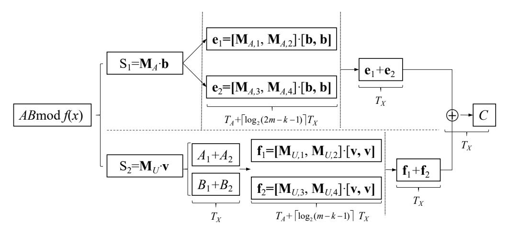

# Fast hybrid Karatsuba multiplier for Type II pentanomials

Yin Li Yu Zhang, and Wei He

**Abstract**—We continue the study of Mastrovito form of Karatsuba multipliers under the shifted polynomial basis (SPB), recently introduced by Li et al. (IEEE TC (2017)). A Mastrovito-Karatsuba (MK) multiplier utilizes the Karatsuba algorithm (KA) to optimize polynomial multiplication and the Mastrovito approach to combine it with the modular reduction. The authors developed a MK multiplier for all trinomials, which obtain a better space and time trade-off compared with previous non-recursive Karatsuba counterparts. Based on this work, we make two types of contributions in our paper.

FORMULATION. We derive a new modular reduction formulation for constructing Mastrovito matrix associated with Type II pentanomial. This formula can also be applied to other special type of pentanomials, e.g. Type I pentanomial and Type C.1 pentanomial. Through related formulations, we demonstrate that Type I pentanomial is less efficient than Type II one because of a more complicated modular reduction under the same SPB; conversely, Type C.1 pentanomial is as good as Type II pentanomial under an alternative generalized polynomial basis (GPB).

EXTENSION. We introduce a new MK multiplier for Type II pentanomial. It is shown that our proposal is only one TX slower than the fastest bit-parallel multipliers for Type II pentanomial, but its space complexity is roughly 3/4 of those schemes, where TX is the delay of one 2-input XOR gate. To the best of our knowledge, it is the first time for hybrid multiplier to achieve such a time delay bound.

✦

**Index Terms**—Karatsuba algorithm, hybrid multiplier, Mastrovito, Shifted polynomial basis, Type II pentanomial.

## **1 INTRODUCTION**

The finite field GF(2m) is a number system that consists of 2 m elements, where every element is represented in a m-bits binary form. Efficient VLSI implementation of GF(2m) multiplication is one of the most important concerns in many applications, such as coding theory and public key cryptography [1], [2]. To this end, a number of bit-parallel GF(2m) multipliers have been proposed. These schemes are based on various field basis representations, generating polynomials and architectures, some of which are presented in [3], [5], [7], [8], [14], [23]. Under polynomial basis (PB) representation and its variations, i.e., shifted polynomial basis (SPB) [8] or generalized polynomial basis (GPB) [20], the GF(2m) multiplication consists of a polynomial multiplication with a modular reduction. For some special forms of irreducible polynomials, the field multiplications under SPB or GPB are advantageous over those under PB representation as they have simpler modular reductions [8], [20].

Generally speaking, there are three types of bit-parallel multipliers according to different space complexity concerns, i.e., quadratic [3], [5], [6], [8], [14], [19], subquadratic [9], [11], [21], [35], [36] and hybrid bit-parallel multipliers [4], [10], [13], [15], [17], each of which has different time complexity. Quadratic multipliers normally have the fastest implementation at the cost of O(n 2 ) logic gates, while subquadratic ones cost O(n δ ) (1 < δ < 2)

• *Yin Li is with Dongguan University of Technology, P.R.China. Yu Zhang, and Wei He are with Xinyang Normal University, P.R.China. email: yunfeiyangli@gmail.com (Yin Li). This work is supported by the National Natural Science Foundation of China (Grant no. 61402393, 61601396).*

logic gates with more time delay. Hybrid multipliers can obtain a trade-off between space and time complexity. These schemes are usually developed upon a divideand-conquer algorithm, which is utilized to optimize the polynomial multiplication or the matrix-vector multiplication. The Winograd short convolution algorithm, Chinese Reminder Theorem (CRT) and TMVP (Toeplitz matrix-vector product) approach are well-known divideand-conquer algorithms, and widely applied to develop subquadratic space complexity multipliers [24], [34], [35], [36]. Specifically, the Karatsuba algorithm (KA) is one of the most frequently used divide-and-conquer algorithm. However, despite exciting progress in the past few years, the hybrid Karatsuba multipliers still have one or two more TX delay compared with the fast quadratic multipliers [4], where TX is the delay of one 2-input XOR gate. This is due in part to the independent implementation of the polynomial multiplication based on KA and the modular reduction.

**Mastrovito-Karatsuba (MK) multiplier.** To obtain a better space and time complexity trade-off, Li et al. [26] introduce an alternative hybrid multiplier for trinomials that can optimize polynomial multiplication and modular reduction simultaneously. The high level idea is that splitting one big polynomial multiplication into three smaller ones using KA and constructing Mastrovito matrix for every sub-polynomial multiplication under SPB representation. As a result, the gate delay of this multiplier is only one TX more than the fastest bitparallel multiplier for trinomials, but can roughly save 1/4 logic gates. One interesting vantage of above approach is that both Mastrovito and Karatsuba algorithms

1

are frequently used techniques and already be studied extensively. Applying improved KA or Mastrovito approach can probably lead to a certain improvement of MK multipliers. In fact, there are already several extensions for this scheme using *n*-term KA for special trinomials [28] and general trinomials [29], [30].

In addition, Fan [24] used the Chinese Remainder Theorem to develop an even faster hybrid multiplier for trinomials, which can match the fastest bit-parallel multipliers for some m values. Meanwhile, the space complexity of his proposal is reduced by 8.4% on average. This proposal was further improved in [25] by reducing the space complexity to 14.3%. The key idea of their scheme is based on a fact that a trinomial f(x) = $x^m + x^k + 1$  has an equation  $f + 1 = x^{m-k}(x^k + 1)$ . For other types of irreducible polynomial, the non-constant part f + 1 does not have such a simple factorization and Fan's method is no longer efficient. Unfortunately, an irreducible trinomial does not always exist for every value of m. For example, there are 468 m values for  $0 < m \le 1024$ , where an irreducible trinomial does not exist [27]. Therefore, it has been suggested that an irreducible pentanomial can be an alternative choice whenever the irreducible trinomial does not exist.

Motivated by the MK schemes, we continue the study of hybrid multiplier for some other frequently used irreducible pentanomials, including Type I, Type II and Type C.1 pentanomials. We improve and extend previous results from [26], that can be summarized in two main contributions.

**Formulation.** We derive a new modular reduction formulation for constructing Mastrovito matrix associated with Type II pentanomial, i.e.,  $f(x) = x^m + x^{k+1} + x^k + x^{k-1} + 1, 1 < k < m-1$ . This formula can also be applied to Type I pentanomial  $x^m + x^{k+1} + x^k + x + 1, 1 < k < m-1$  [8] and Type C.1 pentanomials  $x^m + x^{m-1} + x^k + x + 1$  [20], respectively. We demonstrate that Type I pentanomial is less efficient because of more complicated modular reduction under the SPB representation; meanwhile, Type C.1 pentanomial is as good as Type II pentanomial under the GPB representation.

**Extension.** We introduce a new MK multiplier for Type II pentanomial and give rigorous analyses of this multiplier in terms of the space and time complexity. It is shown that our proposal is only one  $T_X$  slower than the fastest bit-parallel multiplier for Type II pentanomial, but its space complexity is roughly 3/4 of those counterparts, where  $T_X$  is the delay of one 2-input XOR gate. To the best of our knowledge, it is the first time that the hybrid multiplier to achieve such a time delay bound.

**Outline of the paper.** The remainder of paper is organized as follows: in section 2, we first briefly introduce some basic concepts and review the MK multiplier. Then, based on combination of the Karatsuba and Mastrovito approaches, the new MK multiplier architecture for Type II pentanomial is proposed in the following section. Section 4 presents the comparison between the proposed

multiplier and some others. The last section summarizes the results and draws some conclusions.

## 2 PRELIMINARY AND NOTATIONS

In this section, we review some related notations and algorithms utilized throughout this paper.

Assume that f(x) is an irreducible polynomial of degree m over  $\mathbb{F}_2$ , and a finite field  $GF(2^m)$  is defined by f(x), where  $GF(2^m) \cong \mathbb{F}_2[x]/(f(x))$ . The SPB of such a field is defined as follows:

**Definition 1** [8] Let v be an integer and the ordered set  $M = \{x^{m-1}, \cdots, x, 1\}$  be a polynomial basis of  $GF(2^m)$  over  $\mathbb{F}_2$ . The ordered set  $x^{-v}M := \{x^{i-v}|0 \le i \le m-1\}$  is called the shifted polynomial basis (SPB) with respect to M.

Compared with PB, the greatest advantage of SPB is that it can simplify the modular reduction for all trinomials and some special pentanomials if the SPB parameter v is properly selected. The optimal choice of v has already been studied in [8]. More explicitly, for an irreducible trinomial  $x^m + x^k + 1$  or Type II pentanomial  $x^m + x^{k+1} + x^k + x^{k-1} + 1$ , the optimal vs are both k. Combined with Mastrovito approach, the SPB multiplier can achieve to the fastest implementation for trinomials and Type II pentanomials [8], [14]. We choose the same value and use this denotation thereafter. Let  $A, B \in GF(2^m)$  be two arbitrary elements under SPB representation, namely,

$$Ax^{-k} = x^{-k} \sum_{i=0}^{m-1} a_i x^i, \ Bx^{-k} = x^{-k} \sum_{i=0}^{m-1} b_i x^i.$$

Then the SPB multiplication is

$$Cx^{-k} = Ax^{-k} \cdot Bx^{-k} \bmod f(x).$$

Please note that the modular reduction here is slightly different with the classic PB reduction, where the rational term degree range is [-k,m-k-1], not [0,m-1]. As a matter of fact, if we divided both sides of the above equation by  $x^{-k}$ , such an equation is equivalent to the Montgomery multiplication  $C=A\cdot B\cdot x^{-k} \mod f(x)$  with the Montgomery factor  $x^{-k}$ . Therefore, to distinguish with PB reduction, we call this modular reduction as SPB reduction. In the rest of this paper, we utilize the notions of both SPB and PB reduction, and the default modular reduction refers the SPB one without specification.

Based on above observation, a Mastrovito-Karatsuba multiplier using SPB was introduced in [26]. The main idea is multiplying two SPB polynomials using KA and reducing each part using the Mastrovito approach. Recall that A,B are two field elements defined beforehand. The KA can optimized the multiplication  $Ax^{-k} \cdot Bx^{-k}$  by partitioning each polynomial into two halves. For

example, if m is even, let  $n = \frac{m}{2}$ ,

$$Cx^{-k} = Ax^{-k} \cdot Bx^{-k} \mod f(x)$$

$$= (A_H x^n + A_L)x^{-k} \cdot (B_H x^n + B_L)x^{-k} \mod f(x)$$

$$= (A_H B_H x^{2n} + (A_H B_L + A_L B_H)x^n + A_L B_L)x^{-2k} \mod f(x)$$

$$= [A_H B_H x^{2n} + A_L B_L + (A_H B_H + A_L B_L)x^n + (A_L + A_H)(B_L + B_H)x^n]x^{-2k} \mod f(x)$$

$$= [(A_H x^n + A_H)B_H x^n + (A_L x^n + A_L)B_L + UVx^n]x^{-2k} \mod f(x),$$

where  $A_L$ ,  $A_H$  and  $B_L$ ,  $B_H$  are two halves of A and B, and  $U = A_L + A_H$ ,  $V = B_L + B_H$ . If m is odd, the expansion formula is almost the same as (1). Li et al. [26] rewrite above expressions as two independent matrix-vector multiplications, which will be further reduced using Mastrovito approach. Let  $S_1$  denote  $(A_H x^n + A_H) B_H x^n + (A_L x^n + A_L) B_L$  and  $S_2$  denote  $UVx^n$ , we have

$$S_{1}x^{-2k} = \mathbf{A} \cdot \mathbf{b}$$

$$= \begin{array}{c} -2k \\ \vdots \\ 2m - 2k - 1 \end{array} \begin{bmatrix} \mathbf{A}_{L1}, & \mathbf{0}_{n \times n} \\ \mathbf{A}_{L1} + \mathbf{A}_{L2}, & \mathbf{A}_{H1} \\ \mathbf{A}_{L2}, & \mathbf{A}_{H1} + \mathbf{A}_{H2} \\ \mathbf{0}_{n \times n}, & \mathbf{A}_{H2} \end{bmatrix} \cdot \begin{bmatrix} \mathbf{b}_{L} \\ \mathbf{b}_{H} \end{bmatrix},$$
(2

and

$$S_{2}x^{-2k} = \mathbf{U} \cdot \mathbf{v}$$

$$= \begin{array}{c} n - 2k \\ \vdots \\ 3n - 2k \end{array} \begin{bmatrix} \mathbf{U}_{L} \\ \mathbf{U}_{H} \end{array} \right] \cdot \begin{bmatrix} \mathbf{v}_{L} \\ \mathbf{v}_{H} \end{bmatrix}, \tag{3}$$

where **A** and **U** are multiplicative matrices with respect to  $S_1$  and  $S_2$ , and their submatrices correspond to the subexpressions of  $S_1$  and  $S_2$ . The explicit formulae are the same as [26]. Particularly, the labels on the left side indicate the exponents of indeterminate x for  $S_1$  and  $S_2$ .

After that, Mastrovito approach is applied to reduce these multiplicative matrices  $\bf A$  and  $\bf U$  according to the generating polynomials. If the field  $GF(2^m)$  is defined by an irreducible trinomial, Mastrovito matrices for (2) and (3) are easy to obtain under SPB representation. Consequently, this scheme can achieve a better space and time complexities trade-off than other proposal known to date. In the following, we apply this idea to irreducible Type II pentanomial and develop a new Mastrovito-Karatsuba multiplier.

Throughout this paper, some notations pertaining to matrices and vectors operations in [26], [28] are also utilized here. For example, an uppercase letter **Z** denotes a matrix while a lowercase letter **z** denotes a column vector.

- $\mathbf{Z}(i,:), \mathbf{Z}(:,j)$  and  $\mathbf{Z}(i,j)$  represent the ith row vector, jth column vector, and the entry with position (i,j) in  $\mathbf{Z}$ , respectively;
- **Z**[↑ *i*] and **Z**[↓ *i*] represent up or down shift of matrix
   **Z** by *i* rows and feeding the vacancies with zero;
- $\mathbf{Z}[\circlearrowleft i]$  represents cyclic shift of  $\mathbf{Z}$  by upper i rows;

•  $\mathbf{Z}[\uparrow\uparrow i]$  and  $\mathbf{Z}[\downarrow\downarrow i]$  represent appending i zero vectors to the bottom or top of  $\mathbf{Z}$ .

Besides, some extra notations are used as well:

- Z \* b denotes the matrix-vector bitwise multiplications;
- $\mathbf{z}(i \sim j)$  represents a truncated vector whose coordinates equal the  $i \sim j$ -th coordinates of  $\mathbf{z}$ .

## 3 MASTROVITO-KARATSUBA MULTIPLIER FOR TYPE II PENTANOMIAL

In this section, we first investigate the matrix form of polynomial multiplication using KA. Then, we construct Mastrovito matrices for each subexpression with respect to Type II pentanomials. Finally, a fast MK multiplier architecture is proposed accordingly.

## 3.1 Matrix form of polynomial multipliation using KA

Provide that a Type II pentanomial  $f(x) = x^m + x^{k+1} + x^k + x^{k-1} + 1, 1 < k < m-1$  is irreducible over  $\mathbb{F}_2$  and defines the finite field  $GF(2^m) \cong \mathbb{F}_2[x]/(f(x))$ . Given two arbitrary elements  $Ax^{-k}, Bx^{-k} \in GF(2^m)$  in SPB representation as stated in previous section. We partition them into two halves and multiply these subexpressions using the KA. Note that we have already given the polynomial multiplication expansion under KA and their matrix-vector forms for even m, which were presented in (1)-(3). Hence, we only study the formulation of odd m here.

If m is odd. Let m = 2n+1 and

$$\begin{array}{ll} Ax^{-k} = (A_Hx^n + A_L)x^{-k}, \ Bx^{-k} = (B_Hx^{n+1} + B_L)x^{-k}, \\ \text{where} \ A_L &= \sum_{i=0}^{n-1} a_ix^i, A_H &= \sum_{i=0}^n a_{i+n}x^i, B_L &= \sum_{i=0}^n b_ix^i, B_H = \sum_{i=0}^{n-1} b_{i+n+1}x^i. \end{array}$$

Then, the SPB multiplication can be performed as:

$$Cx^{-k} = Ax^{-k} \cdot Bx^{-k} \mod f(x)$$

$$= (A_H x^n + A_L) \cdot (B_H x^{n+1} + B_L) x^{-2k} \mod f(x)$$

$$= [A_H B_H x^{2n+1} + A_L B_L + (A_H B_H x + A_L B_L) x^n + (A_L + A_H) (B_L + B_H x) x^n] x^{-2k} \mod f(x)$$

$$= [(A_H x^n + A_H) B_H x^{n+1} + (A_L x^n + A_L) B_L + UV x^n] x^{-2k} \mod f(x)$$
(4)

where  $U=A_L+A_H, V=B_L+B_Hx$ . Also let  $S_1$  denote  $(A_Hx^n+A_H)B_Hx^{n+1}+(A_Lx^n+A_L)B_L$  and  $S_2$  denote  $UVx^n$ . The matrix-vector forms of  $S_1x^{-2k}$  and  $S_2x^{-2k}$  are written by

$$S_{1}x^{-2k} = \mathbf{A} \cdot \mathbf{b}$$

$$= 2k \begin{bmatrix} \mathbf{A}_{L1}, & \mathbf{0}_{(n+1)\times n} \\ \mathbf{A}_{L1} + \mathbf{A}_{L2}, & \mathbf{A}_{H1} \\ \mathbf{A}_{L2}, & \mathbf{A}_{H1} + \mathbf{A}_{H2} \\ \mathbf{0}_{(n+1)\times (n+1)}, & \mathbf{A}_{H2} \end{bmatrix} \cdot \begin{bmatrix} \mathbf{b}_{1} \\ \mathbf{b}_{2} \end{bmatrix},$$
(5)

1. The original Type II pentanomial stipulate that  $k<\lfloor m/2\rfloor$ . This is a slight generalization definition.

$$S_{2}x^{-2k} = \mathbf{U} \cdot \mathbf{v}$$

$$= \begin{array}{c} n - 2k \\ \vdots \\ 3n - 2k \end{array} \begin{bmatrix} \mathbf{U}_{L} \\ \mathbf{U}_{H} \end{bmatrix} \cdot \begin{bmatrix} \mathbf{v}_{L} \\ \mathbf{v}_{H} \end{bmatrix}. \tag{6}$$

The explicit formulations of  $\mathbf{A}_{Li}$ ,  $\mathbf{A}_{Hi}$ , (i=1,2) and  $\mathbf{U}_L$ ,  $\mathbf{U}_H$  have already been given in [26]. For the sake of simplicity, we do not present their formulations here. Next, we study the modular reduction with respect to these multiplicative matrices in (5) and (6).

## 3.2 SPB reduction of $S_1x^{-2k}$

According to the Mastrovito approach [3], the reduction of  $S_1 x^{-2k}$  modulo f(x) is equivalent to constructing the Mastrovito matrix  $M_A$  from its multiplicative matrix A, using the reduction rule pertaining to f(x). We stress that pentanomials usually have more complicated modular reductions than trinomials. It follows that the construction of related Mastrovito matrix for Type II pentanomial is also harder. Before continuing, we shall study the explicit formula for  $S_1 x^{-2k} \mod f(x)$ . In [8], the authors classified the coefficients formulations of the modular result for Type II pentanomial into ten cases and analyzed their computations, independently. However, their approach cannot be directly applied to construct the corresponding Mastrovito matrix. Thus, we partition  $S_1$ into several segments and describe a relatively simpler formulation for modular reduction. This formulation can help us construct Mastrovito matrix associated with  $S_1 x^{-2k}$ , directly.

Notice that  $\deg(S_1) \leq 2m-2$ . We rewrite  $S_1$  as  $C_1x^m+C_0$ , where  $\deg(C_1), \deg(C_0) \leq m-1$ . As stated before, the SPB reduction of  $S_1x^{-2k} \mod f(x)$  is equivalent to the ordinary reduction  $S_1x^{-k} \mod f(x)$ . Then,

$$S_1 x^{-k} \mod f(x) = (C_1 x^m + C_0) x^{-k} \mod f(x)$$

$$= C_1 (x + 1 + x^{-1} + x^{-k}) + C_0 x^{-k} \mod f(x)$$

$$= (C_1 + C_0) x^{-k} + C_1 (x + 1 + x^{-1}) \mod f(x).$$
(7)

If we consider the degrees of  $C_0, C_1$ , it is clear that only partial terms of above subexpressions need further reduction. So we partition  $C_1 + C_0$  into two parts, i.e.,  $(C_1 + C_0)_H x^k + (C_1 + C_0)_L$ , and plug this expression into (7), then we obtain:

$$S_{1}x^{-k} \mod f(x)$$

$$= ((C_{1} + C_{0})_{H}x^{k} + (C_{1} + C_{0})_{L})x^{-k} + C_{1}(x + 1 + x^{-1}) \mod f(x)$$

$$= (C_{1} + C_{0})_{H} + (C_{1} + C_{0})_{L}(x^{m-k} + x + 1 + x^{-1}) \quad (8)$$

$$+ C_{1}(x + 1 + x^{-1}) \mod f(x)$$

$$= ((C_{1} + C_{0})_{H} + (C_{1} + C_{0})_{L}x^{m-k}) + ((C_{1} + C_{0})_{L} + C_{1})(x + 1 + x^{-1}) \mod f(x).$$

Based on above expression, we then show how to construct  $M_A$ . Denoted by  $c_0$ ,  $c_1$  the m-dimension coefficient vectors of  $C_0$  and  $C_1$ . Please notice that  $C_1$  consists of

at most m-1 nonzero coefficients, while  $C_0$  consists of m ones. In order to operate these coefficient vectors easily, we stipulate that  $\mathbf{c}_0$  and  $\mathbf{c}_1$  contains m entries, by padding the vacant bits with zeros. Accordingly, we also extend  $\mathbf{A}$  to a  $2m \times m$  matrix by appending a zero vector in the last row. Now we use these vectors instead of the subexpressions in (8) and figure out their corresponding linear transformations.

Firstly, one can easily see that the expression  $(C_1 + C_0)_H + (C_1 + C_0)_L x^{m-k}$  corresponds to  $(\mathbf{c}_0 + \mathbf{c}_1)[\circlearrowleft k]$ . Then, we note that  $(C_1 + C_0)_L$  overlaps with  $C_1$ . If we combine the overlapped terms (in  $GF(2^m)$ , the addition is equivalent to subtraction), it is clear that  $(C_1 + C_0)_L + C_1$  corresponds to the vector  $[\mathbf{c}_0(1 \sim k), \mathbf{c}_1(k+1 \sim m)]^T$ . Moreover, we note that  $\mathbf{c}_0, \mathbf{c}_1$  actually represent the lower m bits and upper m bits of  $[\mathbf{S}_1, \mathbf{0}]^T = \mathbf{A} \cdot \mathbf{b}$ , respectively, Therefore, through the linear conversion of  $\mathbf{c}_0, \mathbf{c}_1$  as stated above, we can perform the same operations to  $\mathbf{A}$ , in order to obtain  $\mathbf{M}_A$ . We have a following proposition:

**Proposition 1** The Mastrovito matrix related to  $S_1x^{-2k}$ , denoted by  $\mathbf{M}_A$ , is given by

$$\mathbf{M}_A = \mathbf{M}_{A,1} + \mathbf{M}_{A,2} + \mathbf{M}_{A,3} + \mathbf{M}_{A,4},$$

where

$$\begin{split} \mathbf{M}_{A,1} &= \left[ \mathbf{A}(1 \sim m,:) + \mathbf{A}(m+1 \sim 2m,:) \right] [\circlearrowleft k], \\ \mathbf{M}_{A,2} &= \left[ \mathbf{A}(1 \sim k,:), \mathbf{A}(m+k+1 \sim 2m,:) \right]^T, \\ \mathbf{M}_{A,3} &= \mathbf{M}_{A,2} [\downarrow 1], \\ \mathbf{M}_{A,4} &= \mathbf{M}_{A,2} [\uparrow 1] + \mathbf{Z}_a. \end{split}$$

Here,  $\mathbf{Z}_a$  is a  $m \times m$  "almost" zero matrix, except  $\mathbf{Z}_a(i,1) = a_0$  for i = k - 1, k, k + 1, m.

The proof of this proposition can be found in the appendix A. From Proposition 1, it is clear that both  $\mathbf{M}_{A,3}$  and  $\mathbf{M}_{A,4}$  are shifts of  $\mathbf{M}_{A,2}$ . So they have a similar structure. But  $\mathbf{M}_{A,1}$  is totally different. We now analyze its explicit formulation. Since

$$\mathbf{M}_{A.1} = (\mathbf{A}(1 \sim m, :) + \mathbf{A}(m+1 \sim 2m, :)) [\circlearrowleft k],$$

the structure of  $\mathbf{M}_{A,1}$  is determined by the result of adding the last m rows of  $\mathbf{A}$  to its top m rows. Based on the formula of  $\mathbf{A}$ , we immediately know that if m is even.

$$\mathbf{M}_{A,1} = \begin{bmatrix} \mathbf{A}_{L1} + \mathbf{A}_{L2}, & \mathbf{A}_{H1} + \mathbf{A}_{H2} \\ \mathbf{A}_{L1} + \mathbf{A}_{L2}, & \mathbf{A}_{H1} + \mathbf{A}_{H2} \end{bmatrix} [\circlearrowleft k].$$
(9)

if m is odd,

$$\mathbf{M}_{A,1} = \begin{bmatrix} \mathbf{A}'_{L1} + \mathbf{A}'_{L2} \\ \mathbf{A}_{L1} + \mathbf{A}_{L2} \end{bmatrix} [\circlearrowleft 1], \quad \mathbf{A}_{H1} + \mathbf{A}_{H2} \\ \mathbf{A}'_{H1} + \mathbf{A}'_{H2} \end{bmatrix} [\circlearrowleft k].$$
(10)

where  $\mathbf{A}'_{L1} = \mathbf{A}_{L1}[\downarrow\downarrow 1]$ ,  $\mathbf{A}'_{H1} = \mathbf{A}_{H1}[\downarrow\downarrow 1]$  and  $\mathbf{A}'_{L2} = \mathbf{A}_{L2}[\uparrow\uparrow 1]$ ,  $\mathbf{A}'_{H2} = \mathbf{A}_{H2}[\uparrow\uparrow 1]$ . These formulae coincide with the result of [26]. For simplicity, we do not present the deduction of these formulation, one can find related analysis in section 3.2.1, [26].

## 3.3 SPB reduction of $S_2x^{-2k}$

Now we consider the SPB reduction of  $S_2x^{-2k}$ . Recall that  $S_2x^{-2k} = UVx^{n-2k} = \mathbf{U}\cdot\mathbf{v}$ . Since the degrees of U,V are both at most n,  $\deg(UV) = 2n \leq m-1$ , the dimension of the matrix  $\mathbf{U}$  is at most  $m \times n$ . Without loss of generality, we stipulate that  $\deg(UV) = m-1$  and  $\mathbf{U}$  contains m rows as we can append zero vectors to  $\mathbf{U}$  if its dimension is less than m. Before constructing the Mastrovito matrix for  $S_2x^{-2k}$  modulo f(x) under SPB, we can use a similar approach stated in previous subsection to study its equivalent PB reduction formula  $S_2x^{-k} \mod f(x)$ . Here, we need to consider two cases according to the magnitude relations between n and k.

**Case 1:**  $n \ge k$ . Let  $UV = D_1 x^{m-n+k} + D_0$ . It is clear that  $\deg(D_1) = n - k - 1, \deg(D_0) = m - n + k - 1$ . We have

$$S_{2}x^{-k} \mod f(x) = UVx^{n-k} \mod f(x)$$

$$= (D_{1}x^{m-n+k} + D_{0})x^{n-k} \mod f(x)$$

$$= D_{1}x^{m} + D_{0}x^{n-k} \mod f(x)$$

$$= D_{1}(x^{k+1} + x^{k} + x^{k-1} + 1) + D_{0}x^{n-k}$$

$$= (D_{1} + D_{0}x^{n-k}) + D_{1}(x^{k+1} + x^{k} + x^{k-1}).$$
(11)

Particularly, if k=n or k=n-1, it is obvious that  $\deg(D_1)\leq 0$ , which indicates that  $D_1$  does not exist. No modular reduction is needed here. But this subcase can be combined into (11) by choosing  $D_1$  as zero. For the sake of simplicity, we do not distinguish these sub-cases, as this distinction only has a trivial impact on our whole scheme.

**Case 2:** 
$$n < k$$
. Let  $UV = D_1 x^{k-n} + D_0$ , with  $\deg(D_1) = m + n - k - 1$ ,  $\deg(D_0) = k - n - 1$ . We have

$$S_{2}x^{-k} \mod f(x)$$

$$= (D_{1}x^{k-n} + D_{0})x^{n-k} \mod f(x)$$

$$= D_{1} + D_{0}x^{n-k}$$

$$= D_{1} + D_{0}(x^{m+n-k} + x^{n+1} + x^{n} + x^{n-1})$$

$$= (D_{1} + D_{0}x^{m+n-k}) + D_{0}(x^{n+1} + x^{n} + x^{n-1}).$$
(12)

One can easily check that all the term degrees in (11) and (12) are now in the range of [0, m-1] and no further reduction is needed.

Based on above two expressions, we then investigate the structure of the Mastrovito matrix pertaining to  $S_2x^{-2k}$ . Denoted by  $\mathbf{d}_0$ ,  $\mathbf{d}_1$  the coefficient vectors of  $D_0$  and  $D_1$ . One can check that both  $(D_1+D_0x^{n-k})$  and  $(D_1+D_0x^{m+n-k})$  correspond to the vector  $[\mathbf{d}_1,\mathbf{d}_0]^T$ . Apparently, such a vector can be obtained by performing matrix-vector multiplication  $\mathbf{U}'\cdot\mathbf{v}$ , where  $\mathbf{U}'$  is cyclic shift of  $\mathbf{U}$  by its upper m-n+k (or k-n) rows. We then have a proposition as follows:

**Proposition 2** The Mastrovito matrix related to  $S_2x^{-2k}$ , denoted by  $\mathbf{M}_U$ , is given by

$$\mathbf{M}_{U} = \mathbf{M}_{U,1} + \mathbf{M}_{U,2} + \mathbf{M}_{U,3} + \mathbf{M}_{U,4},$$

where

$$\begin{split} \mathbf{M}_{U,1} &= \mathbf{U}[\circlearrowleft (m-n+k)],\\ \mathbf{M}_{U,2} &= (\mathbf{U}[\uparrow (m-n+k)])[\downarrow (k-1)],\\ \mathbf{M}_{U,3} &= \mathbf{M}_{U,2}[\downarrow 1], \ \mathbf{M}_{U,4} &= \mathbf{M}_{U,2}[\downarrow 2],\\ \textit{if } n \geq k; \textit{ or }\\ \mathbf{M}_{U,1} &= \mathbf{U}[\circlearrowleft (k-n)],\\ \mathbf{M}_{U,2} &= (\mathbf{U}[\downarrow (m+n-k)])[\uparrow (m-k-1)],\\ \mathbf{M}_{U,3} &= \mathbf{M}_{U,2}[\uparrow 1], \ \mathbf{M}_{U,4} &= \mathbf{M}_{U,2}[\uparrow 2], \end{split}$$

if n < k.

The proof of this proposition is similar with that of Proposition 1, which is available in Appendix A.2.

## **3.4** Computation analysis for $S_1x^{-2k}$ and $S_2x^{-2k}$

After obtaining the explicit formulations of  $\mathbf{M}_A$  and  $\mathbf{M}_U$ , it is obvious that both  $S_1x^{-2k}$  and  $S_2x^{-2k}$  can be implemented by matrix-vector multiplications, i.e.,  $\mathbf{M}_A \cdot \mathbf{b}$  and  $\mathbf{M}_U \cdot \mathbf{v}$ . Notice that both of these matrices, as presented in Propositions 1 and 2, can be expressed as a plus of four submatrices, respectively. Taking into account logic gates reuse, we utilize a modified computation strategy similar with the ones stated in [12], [26], [28]. More explicitly,

$$S_{1}x^{-2k} = \mathbf{M}_{A} \cdot \mathbf{b}$$

$$= (\mathbf{M}_{A,1} + \mathbf{M}_{A,2} + \mathbf{M}_{A,3} + \mathbf{M}_{A,4}) \cdot \mathbf{b}$$

$$= [\mathbf{M}_{A,1}, \mathbf{M}_{A,2}] \cdot [\mathbf{b}, \mathbf{b}]^{T} + [\mathbf{M}_{A,3}, \mathbf{M}_{A,4}] \cdot [\mathbf{b}, \mathbf{b}]^{T}.$$

$$S_{2}x^{-2k} = \mathbf{M}_{U} \cdot \mathbf{v}$$

$$= (\mathbf{M}_{U,1} + \mathbf{M}_{U,2} + \mathbf{M}_{U,3} + \mathbf{M}_{U,4}) \cdot \mathbf{v}$$

$$= [\mathbf{M}_{U,1}, \mathbf{M}_{U,2}] \cdot [\mathbf{v}, \mathbf{v}]^{T} + [\mathbf{M}_{U,3}, \mathbf{M}_{U,4}] \cdot [\mathbf{v}, \mathbf{v}]^{T}.$$

$$(14)$$

Accordingly, above expressions are implemented by following three steps. Here, without loss of generality, we take the computation of (13) as an example, and the computation of (14) follows the same line.

• Perform matrix-vector bitwise products

$$M_{A,1} * b, M_{A,2} * b, M_{A,3} * b, M_{A,4} * b.$$

- Combine every two submatrices together and sum up all the 2m entries of each row using binary XOR tree and binary *sub-expression sharing* approach [22], [26], i.e., compute  $\mathbf{e}_1 = [\mathbf{M}_{A,1}, \mathbf{M}_{A,2}] \cdot [\mathbf{b}, \mathbf{b}]^T$  and  $\mathbf{e}_2 = [\mathbf{M}_{A,3}, \mathbf{M}_{A,4}] \cdot [\mathbf{b}, \mathbf{b}]^T$  in parallel.
- Add two vectors  $e_1, e_2$  to get the final result.

In figure 1, we demonstrate the flow diagram of our scheme for  $x^m + x^{k+1} + x^k + x^{k-1} + 1, m > 2k$ . The explicit space and time complexity analysis can be found in Section 4.

## 3.5 A small example

As a small example, we consider the SPB field multiplication over  $GF(2^5)$  generated with the underlying irreducible pentanomial  $x^5 + x^3 + x^2 + x + 1$ . It is clear that k=2 be the optimal SPB parameter. Accordingly,

Fig. 1. Flow diagram of the MK multiplier for  $x^m + x^{k+1} + x^k + x^{k-1} + 1$ , m > 2k.

let  $Ax^{-2}=\sum_{i=0}^4a_ix^{i-2}$  and  $Bx^{-2}=\sum_{i=0}^4b_ix^{i-2}$  be two elements in  $GF(2^5)$ . We partition A,B as  $A=A_2x^2+A_1,B=B_2x^3+B_1$ , where

$$A_1 = a_1 x + a_0, \ A_2 = a_4 x^2 + a_3 x + a_2,$$
  
 $B_1 = b_2 x^2 + b_1 x + b_0, \ B_2 = b_4 x + b_3.$ 

According to equation (4), then

$$A \cdot B \cdot x^{-4} = [(A_2 x^2 + A_2) B_2 x^3 + (A_1 x^2 + A_1) B_1] x^{-4} + (A_2 + A_1) (B_2 x + B_1) x^{2-4} = S_1 x^{-4} + S_2 x^{-4}.$$

Based on (5) and (6) , we have  $S_1x^{-4} = \mathbf{A} \cdot \mathbf{b}, S_2x^{-4} = \mathbf{U} \cdot \mathbf{v}$ . Meanwhile, the mulitplicative matrices  $\mathbf{A}$  and  $\mathbf{U}$  are given by

$$\mathbf{A} = \begin{bmatrix} a_0 & 0 & 0 & 0 & 0 & 0 \\ a_1 & a_0 & 0 & 0 & 0 & 0 \\ a_1 & a_0 & 0 & 0 & 0 & 0 \\ a_0 & a_1 & a_0 & 0 & 0 & 0 \\ a_1 & a_0 & a_1 & a_0 & a_2 & 0 \\ \hline 0 & a_1 & a_0 & a_2 & a_3 & -a_2 & -a_3 \\ \hline 0 & 0 & 0 & a_1 & a_2 + a_4 & a_3 \\ \hline 0 & 0 & 0 & a_4 & a_3 & a_2 + a_4 \\ \hline 3 & 0 & 0 & 0 & 0 & 0 & a_4 \\ \hline 5 & 0 & 0 & 0 & 0 & 0 & 0 \end{bmatrix}, \quad (15)$$

and

$$\mathbf{U} = \begin{bmatrix} -2 & \begin{bmatrix} u_0 & 0 & 0 \\ -1 & u_1 & u_0 & 0 \\ 0 & \frac{u_2}{0} - \frac{u_1}{u_2} - \frac{u_0}{u_1} \\ 2 & 0 & 0 & u_2 \end{bmatrix},$$
(16)

where  $u_2 = a_4, u_1 = a_3 + a_1, u_0 = a_0 + a_2$ .

Applying Proposition 1 and 2, the Mastrovito matrices

related to  $S_1x^{-4}$  and  $S_2x^{-4}$  are given by:

$$\begin{aligned} \mathbf{M}_A &= \mathbf{M}_{A,1} + \mathbf{M}_{A,2} + \mathbf{M}_{A,3} + \mathbf{M}_{A,4} = \\ \begin{bmatrix} a_0 & a_1 & a_0 & a_4 & a_3 \\ a_1 & a_0 & a_1 & a_2 & a_4 \\ 0 & a_1 & a_0 & a_3 & a_2 \\ a_0 & 0 & a_1 & a_2 + a_4 & a_3 \\ a_1 & a_0 & 0 & a_3 & a_2 + a_4 \end{bmatrix} + \begin{bmatrix} a_0 & 0 & 0 & 0 & 0 \\ a_1 & a_0 & 0 & 0 & 0 & 0 \\ 0 & 0 & 0 & a_4 & a_3 \\ 0 & 0 & 0 & 0 & a_4 \\ 0 & 0 & 0 & 0 & 0 \end{bmatrix}$$

$$+ \begin{bmatrix} 0 & 0 & 0 & 0 & 0 \\ a_0 & 0 & 0 & 0 & 0 \\ a_1 & a_0 & 0 & 0 & 0 \\ 0 & 0 & 0 & a_4 & a_3 \\ 0 & 0 & 0 & 0 & a_4 \end{bmatrix} + \begin{bmatrix} a_1 + a_0 & a_0 & 0 & 0 & 0 \\ a_0 & 0 & 0 & a_4 & a_3 \\ a_0 & 0 & 0 & 0 & 0 \\ a_0 & 0 & 0 & 0 & 0 \end{bmatrix},$$

and

$$\mathbf{M}_U = \mathbf{U}[\circlearrowleft 5] = \mathbf{U}.$$

In fact, one can check that all the term degrees of  $S_2x^{-4}$  are in the range of [-2,2]. So there is no reduction needed here, that is to say,  $\mathbf{M}_U = \mathbf{U}$ , which coincides with Proposition 2. One can easily check that the result of  $\mathbf{M}_A \cdot \mathbf{b}$  and  $\mathbf{M}_U \cdot \mathbf{v}$  are equal to  $S_1x^{-2k}, S_2x^{-2k}$  modulo  $x^5 + x^3 + x^2 + x + 1$ .

## 4 COMPLEXITY ANALYSIS

Based on Proposition 1 and 2, we can evaluate the space and time complexity of (13), (14). Explicit analyses are given steps by steps according to related statement in Section 3.4.

## 4.1 Complexity analysis for $S_1x^{-2k}$

Firstly, it is noteworthy that the bitwise products in  $\mathbf{M}_{A,1}*\mathbf{b}$  contain all the possible results in other three matrices-vector bitwise multiplications. Therefore, we only need to count the number of AND gates required in  $\mathbf{M}_{A,1}*\mathbf{b}$ . As shown in (9) and (10), this operation can be reduced to its submatrix-vector bitwise multiplication of half size, which is the same as Theorem 1 of [26]. As a result, such operation totally requires  $\frac{m^2}{2}$  AND gates for even m and  $\frac{m^2-1}{2}$  AND gates for odd m.

TABLE 1 The space and time complexity of  $S_1x^{-2k} \bmod f(x)$ 

| case                    | #AND              | #XOR                                                                          | Delay                                                                        |                                          |
|-------------------------|-------------------|-------------------------------------------------------------------------------|------------------------------------------------------------------------------|------------------------------------------|
| m even, $m>2k$          | $\frac{m^2}{2}$   | $\frac{m^2-m}{2} + 3\sum_{i=1}^k W(i) + 3\sum_{i=1}^{m-k-1} W(i) + mW(m) + 3$ | $T_A + (1 + \lceil \log_2(2m - k - 1) \rceil)T_X$                            |                                          |
| m even, $m < 2k$        |                   | $\frac{m}{2} + 3 \sum_{i=1}^{m} W(i) + 3 \sum_{i=1}^{m} W(i) + mW(m) + 3$     | $T_A + (1 + \lceil \log_2(m+k) \rceil)T_X$                                   |                                          |
| $m$ odd, $m \ge 2k + 1$ | $\frac{m^2-1}{2}$ | $\frac{m^2-1}{2} + (n+1)W(m) + nW(n+1) + (2m-3k-5)W(n)$                       | $T_A + (1 + \lceil \log_2(2m - k - 1) \rceil)T_X$                            |                                          |
| $n = \frac{m-1}{2}$     |                   | 2                                                                             | $ +3\sum_{i=1}^{k} W(i) + 3\sum_{i=1}^{n} W(i) + 3\sum_{i=1}^{n-k} W(i) + 3$ | $I_A + (1 + \log_2(2m - \kappa - 1))I_X$ |
| m odd, $m < 2k + 1$     | $\frac{m^2-1}{2}$ | $\frac{m^2-1}{2} + (n+1)W(m) + nW(n+1) + (3k-m+1)W(n)$                        | $T_A + (1 + \lceil \log_2(m+k) \rceil)T_X$                                   |                                          |
| $n = \frac{m-1}{2}$     |                   | $+3\sum_{i=1}^{m-k-1}W(i)+3\sum_{i=1}^{n}W(i)+3\sum_{i=1}^{k-n}W(i)+3$        | $I_A + (I +  \log_2(m + \kappa) )I_X$                                        |                                          |

TABLE 2 The space and time complexity of  $S_2 x^{-2k} \bmod f(x)$ 

| case                                                                                                                                                                                                       | #AND                     | #XOR                                                         | Delay                                          |  |  |
|------------------------------------------------------------------------------------------------------------------------------------------------------------------------------------------------------------|--------------------------|--------------------------------------------------------------|------------------------------------------------|--|--|
| $m$ even, $m \geq 2k$                                                                                                                                                                                      | $\frac{m^2}{4}$          | $\leq \frac{m^2}{4} + 3\sum_{i=1}^{n-k-1} W(i) + 1^{\sharp}$ | $< T_A + (2 + \lceil \log_2(m-k-1) \rceil)T_X$ |  |  |
| m even, $m < 2k$                                                                                                                                                                                           | $\frac{m^2}{4}$          | $\frac{m^2}{4} + 3\sum_{i=1}^{k-n} W(i) + 1$                 | $< T_A + (2 + \lceil \log_2 k \rceil) T_X$     |  |  |
| $m \text{ odd, } m \geq 2k+1$ $\left  \begin{array}{c} \frac{m^2+2m+1}{4} \end{array} \right  \leq \frac{m^2+2m-3}{4} + 3\sum_{i=1}^{n-k} W(i)^{\sharp} \right  < T_A + (2+\lceil \log_2(m-k-1)\rceil)T_A$ |                          |                                                              |                                                |  |  |
| m  odd, m < 2k + 1                                                                                                                                                                                         | $\frac{m^2 + 2m + 1}{4}$ | $\frac{m^2+2m-3}{4} + 3\sum_{i=1}^{k-n} W(i)$                | $< T_A + (2 + \lceil \log_2 k \rceil) T_X$     |  |  |
| $\sharp$ : including the case of $k=n, k=n-1$ ( $n=\frac{m}{2}$ or $n=\frac{m-1}{2}$ ), where $\mathbf{M}_U=\mathbf{U}$ and $W(*)$ are not needed.                                                         |                          |                                                              |                                                |  |  |

Then, we consider the number of XOR gates needed in (13). Note that  $\mathbf{M}_{A,2}$ ,  $\mathbf{M}_{A,3}$  and  $\mathbf{M}_{A,4}$  share some common entries with  $\mathbf{M}_{A,1}$ . Thus, after bitwise multiplication with  $\mathbf{b}$ , these common entries remain. When adding the entries in the same rows of  $[\mathbf{M}_{A,1}*\mathbf{b}, \mathbf{M}_{A,2}*\mathbf{b}]$  and  $[\mathbf{M}_{A,3}*\mathbf{b}, \mathbf{M}_{A,4}*\mathbf{b}]$ , one can use the same binary tree based *sub-expression sharing* techniques [22], [26] to save logic gates. To be more specific, n intermediate values  $P_0, P_1, \cdots, P_{n-1}$  (n+1 values for odd m) are utilized for sub-expression sharing, where

$$[P_0, \cdots, P_{n-1}]^T = [\mathbf{A}_{L1} + \mathbf{A}_{L2}, \mathbf{A}_{H1} + \mathbf{A}_{H2}] \cdot \mathbf{b},$$

if m is even, or

$$[P_0, \cdots, P_n]^T = \begin{bmatrix} \mathbf{A}_{L1} + \mathbf{A}_{L2} \\ (\mathbf{A'}_{L1} + \mathbf{A'}_{L2})[1,:] \end{bmatrix}, \mathbf{A'}_{H1} + \mathbf{A'}_{H2} \end{bmatrix} \cdot \mathbf{b},$$

if m is odd. The details for sharing common entries among the n intermediate values and  $[\mathbf{M}_{A,1}*\mathbf{b}, \mathbf{M}_{A,2}*\mathbf{b}]$ ,  $[\mathbf{M}_{A,3}*\mathbf{b}, \mathbf{M}_{A,4}*\mathbf{b}]$  are available in the appendix. The circuit delay for the computation of  $\mathbf{e}_1$  and  $\mathbf{e}_2$  is equal to the longest path delay in these submatrix-vector multiplications. Moreover, another  $T_X$  is required for adding these two results  $\mathbf{e}_1 + \mathbf{e}_2$ .

As a result, the computation of the intermediate values  $P_0, P_1, \cdots P_{n-1}$  (or  $P_n$ ) totally requires  $(m-1)n = \frac{m^2-m}{2}$  (or  $\frac{m^2-1}{2}$ ) XOR gates. When adding the number of XOR gates presented in Tables 5-8, which are available in the Appendix B, and m more XOR gates for  $\mathbf{e}_1 + \mathbf{e}_2$ , we can obtain the explicit number of XOR gates required by  $S_1x^{-2k} \mod f(x)$ .

We then analyze the time complexity of  $S_1x^{-2k}$ . According to previous description, the bitwise multiplication are performed in parallel and one  $T_A$  delay is

needed. The XOR delays for the summation of each row in  $[\mathbf{M}_{A,1}*\mathbf{b},\mathbf{M}_{A,2}*\mathbf{b}]$  and  $[\mathbf{M}_{A,3}*\mathbf{b},\mathbf{M}_{A,4}*\mathbf{b}]$  rely on the depth of the biggest XOR tree among all these rows. Also, we note that the number of nonzero entries in  $[\mathbf{M}_{A,3}*\mathbf{b},\mathbf{M}_{A,4}*\mathbf{b}]$  is much smaller than those of  $[\mathbf{M}_{A,1}*\mathbf{b},\mathbf{M}_{A,2}*\mathbf{b}]$ . Thus, the XOR delay for the summations of each row requires  $T_A + \lceil \log_2(2m-k-1) \rceil T_X, (m \geq 2k)$  (or  $T_A + \lceil \log_2(m+k) \rceil T_X, (m < 2k)$ ) due to parallelism. Finally, one  $T_X$  delay is needed to add  $\mathbf{e}_1$  and  $\mathbf{e}_2$ . The summation about the space and time complexity of  $S_1x^{-2k}$  of different cases can be found in Table 1.

## **4.2** Complexity analysis for $S_2x^{-2k}$

The computation of  $S_2x^{-2k} \mod f(x)$  consists of the precomputation of U,V and a matrix-vector multiplication presented in (14). At the very begining, 2n XOR gates are needed for precomputation of U,V, which cost one  $T_X$  in parallel. We note that matrix  $\mathbf{M}_{U,1}$  contains all the nonzero entries of  $\mathbf{M}_{U,i}$ , for i=2,3,4. Thus, we can use binary tree based sub-expression sharing technique as well to save certain number of XOR gates. The rest of computation for (14) follows the same line of (13) and the complexity analysis is similar. The space and time complexity of  $S_2x^{-2k} \mod f(x)$  is summarized in Table 2.

Furthermore, based on the delays presented in Tables 1 and 2, we immediately know that the circuit delay of  $S_2x^{-2k}$  is less than that of  $S_1x^{-2k}$ . Thus, they can be implemented in parallel and the overall circuit is equal to the delay of  $S_1x^{-2k}$ . Finally, m additional XOR gates are required to add  $S_1x^{-2k}$  and  $S_2x^{-2k}$  to obtain the ultimate

result, which cost one  $T_X$  as well. In consequence, we obtain the total space complexity of the proposed multiplier by summing up all these related expressions. Since any expression  $\sum_{i=1}^{\sigma} W(i), (\sigma \geq 1)$  can be roughly rewritten as  $\frac{\sigma}{2} \log_2 \sigma$  [22], for sake of simplicity, we use the notation  $O(m \log m)$  instead of the expressions associated with the sum of hamming weight. We finally have

#### If m is even:

#AND: 
$$\frac{3m^2}{4}$$
,  
#XOR:  $\frac{3m^2}{4} + \frac{m}{2} + O(m \log_2 m)$ ,  
Delay: 
$$\begin{cases} T_A + (2 + \lceil \log_2(2m - k - 1) \rceil) T_X, (m \ge 2k), \\ T_A + (2 + \lceil \log_2(m + k) \rceil) T_X, (m < 2k). \end{cases}$$
(17)

#### If m is odd:

#AND: 
$$\frac{3m^2+2m-1}{4}$$
,  
#XOR:  $\frac{3m^2}{4} + \frac{3m}{2} + O(m\log_2 m)$ ,  
Delay: 
$$\begin{cases} T_A + (2 + \lceil \log_2(2m-k-1) \rceil) T_X, (m \ge 2k+1), \\ T_A + (2 + \lceil \log_2(m+k) \rceil) T_X, (m < 2k+1). \end{cases}$$
(18)

## 5 COMPARISON AND DISCUSSION

## 5.1 Complexity comparison

We now compare the space and time complexities of our proposal with some former multipliers for Type II pentanomials. More details can be found in Table 3. It is obvious that our scheme only requires one more  $T_X$  compared with the fastest bit-parallel multipliers [8], [14] known to date, but it has a lower space complexity with roughly 1/4 logic gates gain. Specifically, compared with another hybrid multiplier scheme [15], which is built on a varied KA, our proposal has a slightly higher space complexity. But for the time complexity, we have

$$\lceil \log_2(2m-k-1) \rceil \le 1 + \lceil \log_2(m-1) \rceil$$
, if  $m \ge 2k$ ,  $\lceil \log_2(m+k) \rceil \le 1 + \lceil \log_2(m-1) \rceil$ , if  $m < 2k$ .

It is indicated that our proposal is at least as fast as that of [15]. Moreover, if  $\lceil \log_2(2m-k-1) \rceil = \lceil \log_2(m-1) \rceil$  (or  $\lceil \log_2(m+k) \rceil = \lceil \log_2(m-1) \rceil$ ), our scheme is even faster, which has the delay  $T_A + (2 + \lceil \log_2 m \rceil) T_X$ . In [8], the author has given some irreducible Type II pentanomials of degree 2 < m < 1001 that satisfy previous equations. In order to illustrate the improvement of our proposal, we give the explicit space and time complexities of some available multiplier schemes for fields  $GF(2^{163})$ ,  $GF(2^{283})$ ,  $GF(2^{571})$  in Table 4. Obviously, one can check that our proposed approach is faster than [15] and requires fewer logic gates compared with [8].

#### 5.2 Further discussion

In [8] and [14], the authors have developed the fastest bit-parallel SPB/Montgomery multipliers for all trinomials  $x^m+x^k+1$  and Type II pentanomials  $x^m+x^{k+1}+x^k+x^{k-1}+1$  know to date. The main reason

TABLE 4 Complexity comparison of different multipliers for some Type II pentanomials  $x^m+x^{k+1}+x^k+x^{k-1}+1$ .

| m, k     | Multiplier | #AND   | #XOR   | Delay         |
|----------|------------|--------|--------|---------------|
|          | [8]        | 26569  | 27051  | $T_A + 9T_X$  |
| 163,71   | [15]       | 20008  | 21162  | $T_A + 11T_X$ |
|          | Proposal   | 20008  | 22704  | $T_A + 10T_X$ |
|          | [8]        | 80089  | 80931  | $T_A + 10T_X$ |
| 283, 133 | [15]       | 60208  | 62239  | $T_A + 12T_X$ |
|          | Proposal   | 60208  | 65620  | $T_A + 11T_X$ |
|          | [8]        | 326041 | 327747 | $T_A + 11T_X$ |
| 571,230  | [15]       | 244816 | 248773 | $T_A + 13T_X$ |
|          | Proposal   | 244816 | 258281 | $T_A + 12T_X$ |

is the optimal SPB parameters (or Montgomery factors) for these types of polynomials are found, i.e.,  $x^{-k}$ , to simplify the associated SPB/Montgomery reductions, which are easier than original PB reduction. Interestingly, some natural questions arise: can  $x^{-k}$  be the optimal SPB/Montgomery parameter for other specifical irreducible polynomials, e.g. Type I pentanomial? If there is a parameter simplifying the modular reduction with respect to some polynomials, can we construct a similar efficient MK multiplier for them?

In the following, we use similar reduction formulations, as presented in (8), to briefly demonstrate that

- 1)  $x^{-k}$  can not simplify the SPB reduction for  $x^m+x^{k+1}+x^k+x+1$  as much as that of  $x^m+x^{k+1}+x^k+x^{k-1}+1$ ;
- 2) Type C.1 pentanomial  $x^m + x^{m-1} + x^k + x + 1$ , with GPB parameter  $x^{m-k} + x^{m-k-1} + 1$  [20], can also develop an efficient MK multiplier.

**Type I pentanomial.** Provide that a Type I pentanomial  $f(x) = x^m + x^{k+1} + x^k + x + 1, 2 < k < \lfloor m/2 \rfloor$  is irreducible, and A, B are two arbitrary elements in  $GF(2^m)$  defined by f(x). The SPB reduction associated with the field multiplication is equivalent to

$$ABx^{-k} \mod x^m + x^{k+1} + x^k + x + 1$$

$$= (C_1x^m + C_0)x^{-k} \mod f(x)$$

$$= C_1(x+1+x^{1-k}+x^{-k}) + C_0x^{-k} \mod f(x)$$

$$= (C_1 + C_0)x^{-k} + C_1(x+1+x^{1-k}) \mod f(x)$$

$$= ((C_1 + C_0)_H + (C_1 + C_0)_L x^{m-k}) + ((C_1 + C_0)_L x^{m-k}) + (C_1 + C_0)_L x^{m-k})$$

$$+ C_1(x+1+x^{1-k}) \mod f(x),$$

where  $C_1, C_0, (C_1 + C_0)_H, (C_1 + C_0)_L$  are the same as the ones defined in Section 3.2. One can check that the term degrees of  $((C_1 + C_0)_L + C_1)x^{1-k}$  are still out of the range [0, m-1]. So that it needs further reduction, which make corresponding Mastrovito matrix more complicate than that of Type II pentanomial. That is to say, related SPB/Montgomery multiplier under the parameter  $x^{-k}$  for Type I pentanomial is not as efficient as the Type II pentanomial in [8], [14].

| Ref.         | Method/Bases                                                                                                                                                                     | # AND                                                                                                                                                                                                                                                                                                                                                                                                                                                                                                                                                                                                                                                                                                                                                                                                                                                                                                                                                                                                                                                                                                                                                                                                                                                                                                                                                                                                                                                                                                                                                                                                                                                                                                                                                                                                                                                                                                                                                                                                                                                                                                                          | # XOR                                                            | XOR delay $(T_X)$                                 |  |  |
|--------------|----------------------------------------------------------------------------------------------------------------------------------------------------------------------------------|--------------------------------------------------------------------------------------------------------------------------------------------------------------------------------------------------------------------------------------------------------------------------------------------------------------------------------------------------------------------------------------------------------------------------------------------------------------------------------------------------------------------------------------------------------------------------------------------------------------------------------------------------------------------------------------------------------------------------------------------------------------------------------------------------------------------------------------------------------------------------------------------------------------------------------------------------------------------------------------------------------------------------------------------------------------------------------------------------------------------------------------------------------------------------------------------------------------------------------------------------------------------------------------------------------------------------------------------------------------------------------------------------------------------------------------------------------------------------------------------------------------------------------------------------------------------------------------------------------------------------------------------------------------------------------------------------------------------------------------------------------------------------------------------------------------------------------------------------------------------------------------------------------------------------------------------------------------------------------------------------------------------------------------------------------------------------------------------------------------------------------|------------------------------------------------------------------|---------------------------------------------------|--|--|
| [6]          | PB                                                                                                                                                                               | $m^2$                                                                                                                                                                                                                                                                                                                                                                                                                                                                                                                                                                                                                                                                                                                                                                                                                                                                                                                                                                                                                                                                                                                                                                                                                                                                                                                                                                                                                                                                                                                                                                                                                                                                                                                                                                                                                                                                                                                                                                                                                                                                                                                          | $m^2 + 2m - 3$                                                   | $6 + \lceil \log_2 m \rceil$                      |  |  |
| [32]         | PB                                                                                                                                                                               | $m^2$                                                                                                                                                                                                                                                                                                                                                                                                                                                                                                                                                                                                                                                                                                                                                                                                                                                                                                                                                                                                                                                                                                                                                                                                                                                                                                                                                                                                                                                                                                                                                                                                                                                                                                                                                                                                                                                                                                                                                                                                                                                                                                                          | $m^2 + 2m - 3$                                                   | $4 + \lceil \log_2(m-1) \rceil$                   |  |  |
| [16], [33]   | SPB                                                                                                                                                                              | $m^2$                                                                                                                                                                                                                                                                                                                                                                                                                                                                                                                                                                                                                                                                                                                                                                                                                                                                                                                                                                                                                                                                                                                                                                                                                                                                                                                                                                                                                                                                                                                                                                                                                                                                                                                                                                                                                                                                                                                                                                                                                                                                                                                          | $m^2 + 2m - 3$                                                   | $3 + \lceil \log_2(m-1) \rceil$                   |  |  |
| [8], [14]    | SPB                                                                                                                                                                              | $m^2$                                                                                                                                                                                                                                                                                                                                                                                                                                                                                                                                                                                                                                                                                                                                                                                                                                                                                                                                                                                                                                                                                                                                                                                                                                                                                                                                                                                                                                                                                                                                                                                                                                                                                                                                                                                                                                                                                                                                                                                                                                                                                                                          | $m^2 + 2m - 7$                                                   | $1 + \lceil \log_2(2m - k - 1) \rceil (m \ge 2k)$ |  |  |
| [0], [14]    | /Montgomery                                                                                                                                                                      | THE STATE OF THE STATE OF THE STATE OF THE STATE OF THE STATE OF THE STATE OF THE STATE OF THE STATE OF THE STATE OF THE STATE OF THE STATE OF THE STATE OF THE STATE OF THE STATE OF THE STATE OF THE STATE OF THE STATE OF THE STATE OF THE STATE OF THE STATE OF THE STATE OF THE STATE OF THE STATE OF THE STATE OF THE STATE OF THE STATE OF THE STATE OF THE STATE OF THE STATE OF THE STATE OF THE STATE OF THE STATE OF THE STATE OF THE STATE OF THE STATE OF THE STATE OF THE STATE OF THE STATE OF THE STATE OF THE STATE OF THE STATE OF THE STATE OF THE STATE OF THE STATE OF THE STATE OF THE STATE OF THE STATE OF THE STATE OF THE STATE OF THE STATE OF THE STATE OF THE STATE OF THE STATE OF THE STATE OF THE STATE OF THE STATE OF THE STATE OF THE STATE OF THE STATE OF THE STATE OF THE STATE OF THE STATE OF THE STATE OF THE STATE OF THE STATE OF THE STATE OF THE STATE OF THE STATE OF THE STATE OF THE STATE OF THE STATE OF THE STATE OF THE STATE OF THE STATE OF THE STATE OF THE STATE OF THE STATE OF THE STATE OF THE STATE OF THE STATE OF THE STATE OF THE STATE OF THE STATE OF THE STATE OF THE STATE OF THE STATE OF THE STATE OF THE STATE OF THE STATE OF THE STATE OF THE STATE OF THE STATE OF THE STATE OF THE STATE OF THE STATE OF THE STATE OF THE STATE OF THE STATE OF THE STATE OF THE STATE OF THE STATE OF THE STATE OF THE STATE OF THE STATE OF THE STATE OF THE STATE OF THE STATE OF THE STATE OF THE STATE OF THE STATE OF THE STATE OF THE STATE OF THE STATE OF THE STATE OF THE STATE OF THE STATE OF THE STATE OF THE STATE OF THE STATE OF THE STATE OF THE STATE OF THE STATE OF THE STATE OF THE STATE OF THE STATE OF THE STATE OF THE STATE OF THE STATE OF THE STATE OF THE STATE OF THE STATE OF THE STATE OF THE STATE OF THE STATE OF THE STATE OF THE STATE OF THE STATE OF THE STATE OF THE STATE OF THE STATE OF THE STATE OF THE STATE OF THE STATE OF THE STATE OF THE STATE OF THE STATE OF THE STATE OF THE STATE OF THE STATE OF THE STATE OF THE STATE OF THE STATE OF THE STATE OF THE STATE OF THE STATE OF THE STATE OF THE STATE OF THE S | m + 2m - 1                                                       | $1 + \lceil \log_2(m+k) \rceil (m < 2k)$          |  |  |
| [18]         | PB                                                                                                                                                                               | $m^2$                                                                                                                                                                                                                                                                                                                                                                                                                                                                                                                                                                                                                                                                                                                                                                                                                                                                                                                                                                                                                                                                                                                                                                                                                                                                                                                                                                                                                                                                                                                                                                                                                                                                                                                                                                                                                                                                                                                                                                                                                                                                                                                          | $m^2 + \frac{3m+6k}{2}$                                          | $3 + \lceil \log_2(m-2) \rceil$                   |  |  |
| [19]         | PB                                                                                                                                                                               | $m^2$                                                                                                                                                                                                                                                                                                                                                                                                                                                                                                                                                                                                                                                                                                                                                                                                                                                                                                                                                                                                                                                                                                                                                                                                                                                                                                                                                                                                                                                                                                                                                                                                                                                                                                                                                                                                                                                                                                                                                                                                                                                                                                                          | $m^2 + 2m + 3k + \alpha - \beta$                                 |                                                   |  |  |
| [15]         | PB                                                                                                                                                                               | $\frac{3m^2}{4} + \frac{m}{2} - \frac{1}{4}$                                                                                                                                                                                                                                                                                                                                                                                                                                                                                                                                                                                                                                                                                                                                                                                                                                                                                                                                                                                                                                                                                                                                                                                                                                                                                                                                                                                                                                                                                                                                                                                                                                                                                                                                                                                                                                                                                                                                                                                                                                                                                   | $\frac{3m^2}{4} + 6m + \frac{7k}{2} + \frac{35}{4}$              | $3 + \lceil \log_2(m+1) \rceil$                   |  |  |
| This paper   | SPB                                                                                                                                                                              | $\frac{3m^2+2m-1}{4}$                                                                                                                                                                                                                                                                                                                                                                                                                                                                                                                                                                                                                                                                                                                                                                                                                                                                                                                                                                                                                                                                                                                                                                                                                                                                                                                                                                                                                                                                                                                                                                                                                                                                                                                                                                                                                                                                                                                                                                                                                                                                                                          | $\frac{3m^2}{4} + \frac{3m}{2} + O(m\log_2 m) \ (m \text{ odd})$ | $2+\lceil\log_2(2m-k-1)\rceil(m\geq 2k)$          |  |  |
|              | 31 b                                                                                                                                                                             | $\frac{3m^2}{4}$                                                                                                                                                                                                                                                                                                                                                                                                                                                                                                                                                                                                                                                                                                                                                                                                                                                                                                                                                                                                                                                                                                                                                                                                                                                                                                                                                                                                                                                                                                                                                                                                                                                                                                                                                                                                                                                                                                                                                                                                                                                                                                               | $\frac{3m^2}{4} + \frac{m}{2} + O(m \log_2 m)$ ( <i>m</i> even)  | $2+\lceil\log_2(m+k)\rceil(m<2k)$                 |  |  |
| Description: | Description: $\alpha = 3(\Upsilon_{m-1} + \Upsilon_{k+1}), \ \beta = H_k + \Sigma_m + H_\theta \ (\theta = k \text{ for even } k \text{ and } \theta = k-1 \text{ for odd } k).$ |                                                                                                                                                                                                                                                                                                                                                                                                                                                                                                                                                                                                                                                                                                                                                                                                                                                                                                                                                                                                                                                                                                                                                                                                                                                                                                                                                                                                                                                                                                                                                                                                                                                                                                                                                                                                                                                                                                                                                                                                                                                                                                                                |                                                                  |                                                   |  |  |

TABLE 3 Comparison of Some Bit-Parallel Multipliers for  $x^m + x^{k+1} + x^k + x^{k-1} + 1$ 

 $H_i$  represents the hamming weight of integer i, function  $\Upsilon_h = \sum_{i=1}^h (H_i - 1)$ ,  $\Sigma_m = \sum_{i=2,4,\dots} H_i$ .

**Type C.1 pentanomial.** In [20], Cilardo introduced a generalization of SPB, so-called generalized polynomial basis (GPB), and developed efficient bit-parallel GPB multipliers for two types of pentanomials, i.e.,  $x^m$  +  $x^{m-1} + x^k + x + 1, (m-1 > k > 1)$  and  $x^m + x^{m-k_1} + 1$  $x^{k_2} + x^{k_1} + 1, (m - k_1 > k_2 > k_1 > 1),$  which are referred as Type C.1 and C.2 pentanomials. He proposed alternative GPB parameters for these pentanomials other than  $x^{-k}$ . Without loss of generality, we only analyze the GPB reduction for  $f(x) = x^m + x^{m-1} + x^k + x + 1$  with underlying parameter  $x^{m-k} + x^{m-k-1} + 1$ . Analogous with previous description, we have

$$AB(x^{m-k} + x^{m-k-1} + 1) \bmod x^m + x^{m-1} + x^k + x + 1$$

$$= (C_1 x^m + C_0)(1 + x)x^{-k} \bmod f(x)$$

$$= (C_1(x^{m-1} + x^k + x + 1) + C_0)(1 + x)x^{-k} \bmod f(x)$$

$$= C_1 x(x^k + x + 1)x^{-k} + C_0(x + 1)x^{-k} \bmod f(x)$$

$$= (C_1 x + C_0)(x + 1)x^{-k} + C_1 x \bmod f(x)$$

$$= (C_1 x + C_0)_H (1 + x) + C_1 x + (C_1 + C_0)_L (x^{m-k} + x^{m-k-1} + 1) \bmod f(x),$$

The definitions of  $C_1, C_0, (C_1 + C_0)_H, (C_1 + C_0)_L$  are also the same as those defined in Section 3.2. During above derivation, we mainly utilize the equation  $x^{m-k} + x^{m-k-1} + 1 = (1+x) \cdot x^{-k}$ . Since  $\deg(C_1) =$  $m-2, \deg((C_1+C_0)_H)=m-k-1, \deg((C_1+C_0)_L)=$ k-1, the term degrees of above subexpressions are all in the range [0, m-1], no further reduction is needed. When comparing with (8), we can see that this reduction is at least as good as the SPB reduction for Type II pentanomial. Accordingly, we can also develop efficient MK multipliers for these polynomials, through replacing ordinary GPB polynomial multiplication with a recombination of the sub-polynomials and constructing Mastrovito matrices, separately.

To summarize, if there exist a parameter that can simplify the corresponding modular reduction for certain type of polynomials, it is possible to construct efficient MK multiplier for the same polynomials also. To find an alternative parameter that can simplify the modular reduction with respect to Type I pentanomials, is possible the future work.

#### 6 CONCLUSION

In this paper, we have proposed an efficient MK bitparallel multiplier for irreducible Type II pentanomial. This scheme is a natural generalization of the MK multiplier for trinomials. Our proposal requires only one more  $T_X$  delay compared with the fastest bit-parallel multiplier of the same type know to data, but saves about 1/4 logic gates. Meanwhile, we also present new formulae for modular reductions, which can be utilized to construct associated Mastrovito matrices directly. Applying a similar formula, we demonstrate that Type I pentanomials have more complicated modular reduction under a same SPB/Montgomery parameter. Thus, associated SPB bit-parallel multipliers would be less efficient. Finally, we note that, fast modular reduction is crucial to developing efficient multipliers. We next work on MK multiplier for Type C.1 and C.2 pentanomials using GPB representation.

## APPENDIX A **PROOFS**

#### A.1 Proof of Proposition 1

Proof According to equation (8) and previous description, the modular result of  $S_1x^{-k} \mod f(x)$  can be obtained by adding  $(\mathbf{c}_1 + \mathbf{c}_0)[\circlearrowleft k]$  with some shifts of  $[\mathbf{c}_0(1 \sim k), \mathbf{c}_1(k+1 \sim m)]$ . In fact, it is easily seen that

$$(\mathbf{c}_1 + \mathbf{c}_0)[\circlearrowleft k] = \mathbf{M}_{A,1} \cdot \mathbf{b}$$

$$= (\mathbf{A}(1 \sim m,:) + \mathbf{A}(m+1 \sim 2m,:))[\circlearrowleft k] \cdot \mathbf{b},$$

$$[\mathbf{c}_0(1 \sim k), \mathbf{c}_1(k+1 \sim m)]^T = \mathbf{M}_{A,2} \cdot \mathbf{b}$$

$$= [\mathbf{A}(1 \sim k,:), \mathbf{A}(m+k+1 \sim 2m,:)]^T \cdot \mathbf{b}.$$

In addition, multiplying  $((C_1 + C_0)_L + C_1)$  with x or  $x^{-1}$  correspond to down or up shifts of  $\mathbf{M}_{A,2}$ . One can use the matrix operations  $\mathbf{M}_{A,2}[\downarrow 1]$  and  $\mathbf{M}_{A,2}[\uparrow 1]$  to represent these results. Nevertheless, according to the modular rule, we still have to consider the feedback of the first (or the last) row vector after down (or up) shift. We first note that A(2m,:) = 0.  $M_{A,2} =$  $[\mathbf{A}(1 \sim k,:), \mathbf{A}(m+k+1 \sim 2m,:)]^T$  has its m-th row being a zero vector, too. Therefore, there is no feedback for  $M_{A,2}[\downarrow 1]$ , which is denoted by  $M_{A,3}$ . Whereas,  $\mathbf{A}(1,:) = (a_0, 0, \cdots, 0)$  is a nonzero vector. According to the modular formula  $x^{-1} = x^{m-1} + x^k + x^{k-1} + x^{k-2}$ , we have to add A(1,:) to the m, k+1, k-1, k-th rows of  $\mathbf{M}_{A,2}[\uparrow 1]$ . Fortunately,  $\mathbf{A}(1,:)$  has only one nonzero entry, that only affect the first column of  $M_{A,2}[\uparrow 1]$ . Then we obtain the final Mastrovito matrix related to  $((C_1+C_0)_L+C_1)x^{-1}$ , i.e.,

$$\mathbf{M}_{A,4} = \mathbf{M}_{A,2} [\uparrow 1] + \mathbf{Z}_a,$$

where  $\mathbf{Z}_a$  is a  $m \times m$  "almost" zero matrix except the entries  $\mathbf{Z}_a(m,1) = \mathbf{Z}_a(k,1) = \mathbf{Z}_a(k-1,1) = \mathbf{Z}_a(k+1,1) = a_0$ . We then conclude the proposition directly.

## A.2 Proof of Proposition 2

**Proof** According to (11) and (12), the reduction of  $S_2x^{-k}$  modulo f(x) can be obtained by  $[\mathbf{d}_1, \mathbf{d}_0]^T$  adding some shifts of  $\mathbf{d}_1$  (or  $\mathbf{d}_0$ ). It is easily seen that

$$[\mathbf{d}_1, \mathbf{d}_0]^T = \begin{cases} \mathbf{U}[\circlearrowleft (m-n+k)] \cdot \mathbf{v}, & \text{if } n \geq k, \\ \mathbf{U}[\circlearrowleft (k-n)] \cdot \mathbf{v}, & \text{if } n < k. \end{cases}$$

In addition, if  $n \geq k$ ,  $D_1 x^i$ , i = k-1, k, k+1 correspond to the vector  $[\mathbf{d}_1, \mathbf{0}_{m-n+k}]^T[\downarrow i]$ , where  $\mathbf{0}_{m-n+k}$  is a  $(m-n+k) \times 1$  zero vector. Obviously, we have  $[\mathbf{d}_1, \mathbf{0}_{m-n+k}]^T[\downarrow i] = \mathbf{U}[\uparrow (m-n+k)][\downarrow i] \cdot \mathbf{v}$ . Likewise, if n < k,  $D_0 x^i$ , i = n-1, n, n+1 correspond to the vector  $[\mathbf{d}_0, \mathbf{0}_{m+n-k}]^T[\downarrow i]$ . We then have

$$[\mathbf{d}_0,\mathbf{0}_{m+n-k}]^T[\downarrow(n+1)] = (\mathbf{U}[\downarrow(m+n-k)])[\uparrow(m-k-1)]\cdot\mathbf{v}.$$

One can immediately obtain the explicit formulations of  $\mathbf{M}_{U,2}, \mathbf{M}_{U,3}, \mathbf{M}_{U,4}$ . Then we conclude the proposition.  $\square$ 

## APPENDIX B

# THE NUMBER OF REQUIRED XOR GATES USING BINARY SUBEXPRESSION SHARING

The following tables indicate the number of XOR gates needed in the summation of all the entries in  $\mathbf{M}_{A,1} \cdot \mathbf{b} + \mathbf{M}_{A,2} \cdot \mathbf{b}$  and  $\mathbf{M}_{A,3} \cdot \mathbf{b} + \mathbf{M}_{A,4} \cdot \mathbf{b}$ . Specifically, as  $\mathbf{M}_{A,4} = \mathbf{M}_{A,2} [\uparrow 1] + \mathbf{Z}_a$ , three more XOR gates are needed according to the form of  $\mathbf{Z}_a$ .

### REFERENCES

- R. Lidl and H. Niederreiter. Finite Fields. Cambridge University Press, New York, NY, USA, 1996.
- [2] J. Gathen and J. Gerhard. Modern Computer Algebra (2 ed.). Cambridge University Press, New York, NY, USA. 2003.

- [3] B. Sunar and Ç.K. Koç, "Mastrovito multiplier for all trinomials," *IEEE Trans. Comput.*, vol. 48, no. 5, pp. 522–527, May 1999.
- [4] M. Elia, M. Leone, and C. Visentin. "Low complexity bit-parallel multipliers for  $GF(2^m)$  with generator polynomial  $x^m+x^k+1$ ," *Electronic Letters*, vol. 35, no. 7, pp. 551–552, Apr. 1999.
- [5] A. Halbutogullari and Ç.K. Koç, "Mastrovito multiplier for general irreducible polynomials," *IEEE Trans. Comput.*, vol. 49, no. 5, pp. 503–518, May 2000.
- [6] T. Zhang and K.K. Parhi, "Systematic design of original and modified mastrovito multipliers for general irreducible polynomials," IEEE Trans. Comput., vol. 50, no. 7, pp. 734–749, Jul. 2001.
- [7] H. Wu, "Bit-parallel finite field multiplier and squarer using polynomial basis," *IEEE Trans. Comput.*, vol. 51, no. 7, pp. 750–758, Aug. 2002.
- [8] H. Fan and M.A. Hasan. "Fast bit parallel-shifted polynomial basis multipliers in  $GF(2^n)$ ," *IEEE Trans. Circuits Syst. I, Reg. Papers*, vol. 53, no. 12, pp. 2606–2615, Dec. 2006.
- [9] H. Fan and M.A. Hasan, "A New Approach to Subquadratic Space Complexity Parallel Multipliers for Extended Binary Fields," *IEEE Trans. Comput.* vol. 56, no. 2, pp. 224–233, Feb. 2007.
- [10] K. Chang, D. Hong and H. Cho. "Low complexity bit-parallel multiplier for  $GF(2^m)$  defined by all-one polynomials using redundant representation," *IEEE Trans. Comput.*, vol. 54, no. 12, pp. 1628–1630, Oct. 2005.
- [11] A. Weimerskirch and C. Paar, "Generalizations of the Karatsuba Algorithm for Efficient Implementations," Cryptology ePrint Archive, Report 2006/224, http://eprint.iacr.org/
- [12] C. Negre. "Efficient parallel multiplier in shifted polynomial basis," J. Syst. Archit., vol. 53, no. 2-3, pp. 109–116, Feb. 2007.
- [13] H. Shen and Y. Jin. "Low complexity bit parallel multiplier for  $GF(2^m)$  generated by equally-spaced trinomials," *Inf. Process. Lett.*, vol. 107, no. 6, pp. 211–215, Aug. 2008.
- Lett., vol. 107, no. 6, pp. 211–215, Aug. 2008.
  [14] A. Hariri and A. Reyhani-Masoleh, "Bit-serial and bit-parallel montgomery multiplication and squaring over GF(2m)," IEEE Trans. Comput., vol. 58, no. 10, pp. 1332–1345, May 2009.
- [15] S. Park, K. Chang, D. Hong, and C. Seo, "New efficient bit-parallel polynomial basis multiplier for special pentanomials," *Integration*, the VLSI Journal, vol. 47, no. 1, pp. 130–139, Jan. 2014.
- [16] A. Cilardo, "Efficient Bit-Parallel GF(2m) Multiplier for a Large Class of Irreducible Pentanomials," *IEEE Trans. Comput.*, vol. 58, no. 7, pp. 1001–1008, Jul. 2009.
- [17] Y. Cho, N. Chang, C. Kim, Y. Park and S. Hong. "New bit parallel multiplier with low space complexity for all irreducible trinomials over  $GF(2^n)$ ," *IEEE Trans. VLSI Syst.*, vol. 20, no. 10, pp. 1903–1908, Oct. 2012.
- [18] J.L. Imaña, "Efficient Polynomial Basis Multipliers for Type-II Irreducible Pentanomials," IEEE Trans. Circuits Syst. II, Exp. Briefs, vol. 59, no. 11, pp. 795-799, Nov. 2012.
- [19] J.L. Imaña. "High-speed polynomial basis multipliers over  $GF(2^m)$  for special pentanomials," *IEEE Trans. Circuits Syst. I, Reg. Papers*, vol. 63, no. 1, pp. 58–69, Jan. 2016.
- [20] A. Cilardo, "Fast Parallel  $\widehat{GF}(2^m)$  Polynomial Multiplication for All Degrees," *IEEE Trans. Comput.*, vol. 62, no. 5, pp. 929–943, May 2013.
- [21] M. Cenk, M.A. Hasan and C. Negre, "Efficient Subquadratic Space Complexity Binary Polynomial Multipliers Based on Block Recombination," *IEEE Trans. Comput.*, vol. 63, no. 9, pp. 2273–2287, Sept. 2014.
- [22] Y. Li, Y. Chen. "New bit-parallel Montgomery multiplier for trinomials using squaring operation," *Integration, the VLSI Journal*, vol. 52, pp. 142–155, Jan. 2016.
- [23] H. Fan and M.A. Hasan, "A survey of some recent bit-parallel multipliers," Finite Fields and Their Applications, vol. 32, pp. 5–43, 2015.
- [24] H. Fan, "A Chinese Remainder Theorem Approach to Bit-Parallel  $GF(2^n)$  Polynomial Basis Multipliers for Irreducible Trinomials," *IEEE Trans. Comput.*, vol. 65, no. 2, pp. 343–352, Feb. 2016.
- [25] J. Zhang, H. Fan, "Low space complexity CRT-based bit-parallel GF(2n) polynomial basis multipliers for irreducible trinomials," *Integration, the VLSI Journal*, vol. 58, pp. 55–63, Feb. 2017.
- [26] Y. Li, X. Ma, Y. Zhang and C. Qi, "Mastrovito Form of Non-recursive Karatsuba Multiplier for All Trinomials," *IEEE Trans. Comput.*, vol. 66, no. 9, pp. 1573–1584, Mar. 2017.
- [27] G. Seroussi. "Table of low-weight binary irreducible polynomials," Hewlett-Packard, HPL-98- 135, August 1998.

 $\label{eq:table 5} \mbox{TABLE 5}$  The overlapped values and saved #XOR, if m even, 0 < k < n

| $\mathbf{M}_{A,1}\cdot\mathbf{b}$            | Overlapped | #XOR     | $\mathbf{M}_{A,2}\cdot\mathbf{b}$        | Overlapped | #XOR     |
|----------------------------------------------|------------|----------|------------------------------------------|------------|----------|
| $\mathbf{M}_{A,1}(1,:)\cdot\mathbf{b}$       | $P_k$      | W(m) - 1 | $\mathbf{M}_{A,2}(1,:)\cdot\mathbf{b}$   | $P_0$      | W(1)     |
| <u>:</u>                                     |            | :        | :                                        | :          | :        |
| $\mathbf{M}_{A,1}(n-k,:)\cdot\mathbf{b}$     | $P_{n-1}$  | W(m) - 1 | $\mathbf{M}_{A,2}(k,:)\cdot\mathbf{b}$   | $P_{k-1}$  | W(k)     |
| $\mathbf{M}_{A,1}(n-k+1,:)\cdot\mathbf{b}$   | $P_0$      | W(m) - 1 | $\mathbf{M}_{A,2}(k+1,:)\cdot\mathbf{b}$ | $P_k$      | W(m-k-1) |
| <u>:</u>                                     |            | :        | ÷                                        | :          | :        |
| $\mathbf{M}_{A,1}(m-k,:)\cdot\mathbf{b}$     | $P_{n-1}$  | W(m) - 1 | $\mathbf{M}_{A,2}(n-1,:)\cdot\mathbf{b}$ | $P_{n-1}$  | W(n+1)   |
| $\mathbf{M}_{A,1}(m-k+1,:) \cdot \mathbf{b}$ | $P_0$      | W(m) - 1 | $\mathbf{M}_{A,2}(n,:)\cdot\mathbf{b}$   | $P_0$      | W(n)     |
| <u>:</u>                                     |            | :        | i :                                      | •          | i i      |
| $\mathbf{M}_{A,1}(m,:)\cdot\mathbf{b}$       | $P_{k-1}$  | W(m) - 1 | ${\bf M}_{A,2}(m-1,:)\cdot {\bf b}$      | $P_{n-2}$  | W(1)     |
| $\mathbf{M}_{A,3}\cdot\mathbf{b}$            | Overlapped | #XOR     | $\mathbf{M}_{A,4}\cdot\mathbf{b}$        | Overlapped | #XOR     |
| $\mathbf{M}_{A,3}(2,:)\cdot\mathbf{b}$       | $P_0$      | W(1)     | $\mathbf{M}_{A,4}(1,:) \cdot \mathbf{b}$ | $P_1$      | W(2)     |
| i i                                          | :          | :        | i :                                      | :          | :        |
| ${\bf M}_{A,3}(k+1,:)\cdot {\bf b}$          | $P_{k-1}$  | W(k)     | $\mathbf{M}_{A,4}(k,:)\cdot\mathbf{b}$   | $P_k$      | W(k)     |
| $\mathbf{M}_{A,3}(k+2,:)\cdot\mathbf{b}$     | $P_k$      | W(m-k-1) | $\mathbf{M}_{A,4}(k+1,:)\cdot\mathbf{b}$ | $P_{k+1}$  | W(m-k-1) |
| i :                                          |            | :        | i :                                      | :          | :        |
| $\mathbf{M}_{A,3}(n,:)\cdot\mathbf{b}$       | $P_{n-1}$  | W(n+1)   | $\mathbf{M}_{A,4}(n-1,:)\cdot\mathbf{b}$ | $P_0$      | W(n+1)   |
| $\mathbf{M}_{A,3}(n+1,:)\cdot\mathbf{b}$     | $P_0$      | W(n)     | $\mathbf{M}_{A,4}(n,:)\cdot\mathbf{b}$   | $P_1$      | W(n)     |
| <u>:</u>                                     |            | :        | <u>:</u>                                 | ÷          | :        |
| $\mathbf{M}_{A,3}(m,:)\cdot\mathbf{b}$       | $P_{n-2}$  | W(1)     | $\mathbf{M}_{A,4}(m-1,:)\cdot\mathbf{b}$ | $P_0$      | W(1)     |

 $\label{eq:table 6}$ 

| $\mathbf{M}_{A,1}\cdot\mathbf{b}$              | Overlapped  | #XOR     | $\mathbf{M}_{A,2}\cdot\mathbf{b}$        | Overlapped  | #XOR     |
|------------------------------------------------|-------------|----------|------------------------------------------|-------------|----------|
| $\mathbf{M}_{A,1}(1,:)\cdot\mathbf{b}$         | $P_{k-n}$   | W(m)-1   | $\mathbf{M}_{A,2}(1,:) \cdot \mathbf{b}$ | $P_0$       | W(1)     |
| <u>:</u>                                       |             | :        | i i                                      | :           | :        |
| $\mathbf{M}_{A,1}(m-k,:)\cdot\mathbf{b}$       | $P_{n-1}$   | W(m) - 1 | $\mathbf{M}_{A,2}(n,:)\cdot\mathbf{b}$   | $P_{n-1}$   | W(n)     |
| $\mathbf{M}_{A,1}(m-k+1,:)\cdot\mathbf{b}$     | $P_0$       | W(m)-1   | ${\bf M}_{A,2}(n+1,:)\cdot {\bf b}$      | $P_0$       | W(n+1)   |
| i i                                            | :           | :        | i :                                      | :           | :        |
| $\mathbf{M}_{A,1}(m+n-k,:)\cdot\mathbf{b}$     | $P_{n-1}$   | W(m)-1   | $\mathbf{M}_{A,2}(k,:)\cdot\mathbf{b}$   | $P_{k-n-1}$ | W(k)     |
| $\mathbf{M}_{A,1}(m+n-k+1,:) \cdot \mathbf{b}$ | $P_0$       | W(m)-1   | $\mathbf{M}_{A,2}(k+1,:)\cdot\mathbf{b}$ | $P_{k-n+1}$ | W(m-k-1) |
| i i                                            | :           | :        | i :                                      | :           | :        |
| $\mathbf{M}_{A,1}(m,:)\cdot\mathbf{b}$         | $P_{k-n-1}$ | W(m) - 1 | ${\bf M}_{A,2}(m-1,:)\cdot {\bf b}$      | $P_{n-1}$   | W(1)     |
| $\mathbf{M}_{A,3}\cdot\mathbf{b}$              | Overlapped  | #XOR     | $\mathbf{M}_{A,4}\cdot\mathbf{b}$        | Overlapped  | #XOR     |
| $\mathbf{M}_{A,3}(2,:)\cdot\mathbf{b}$         | $P_0$       | W(1)     | $\mathbf{M}_{A,4}(1,:)\cdot\mathbf{b}$   | $P_1$       | W(2)     |
| <u>:</u>                                       |             | :        | i i                                      | :           | :        |
| $\mathbf{M}_{A,3}(n+1,:) \cdot \mathbf{b}$     | $P_{n-1}$   | W(n)     | ${\bf M}_{A,4}(n-1,:)\cdot {\bf b}$      | $P_{n-1}$   | W(n)     |
| $\mathbf{M}_{A,3}(n+2,:)\cdot\mathbf{b}$       | $P_0$       | W(n+1)   | $\mathbf{M}_{A,4}(n,:)\cdot\mathbf{b}$   | $P_0$       | W(n+1)   |
| <u>:</u>                                       |             | •        | :                                        |             |          |
| $\mathbf{M}_{A,3}(k+1,:) \cdot \mathbf{b}$     | $P_{k-n-1}$ | W(k)     | $\mathbf{M}_{A,4}(k-1,:)\cdot\mathbf{b}$ | $P_{k-n-1}$ | W(k)     |
| $\mathbf{M}_{A,3}(k+2,:)\cdot\mathbf{b}$       | $P_{k-n+1}$ | W(m-k-1) | $\mathbf{M}_{A,4}(k,:)\cdot\mathbf{b}$   | $P_{k-n+1}$ | W(m-k-1) |
| <u>:</u>                                       | :           | :        | <u>:</u>                                 | :           | :        |
| $\mathbf{M}_{A,3}(m,:)\cdot\mathbf{b}$         | $P_{n-1}$   | W(1)     | ${\bf M}_{A,4}(m-1,:)\cdot {\bf b}$      | $P_0$       | W(1)     |

 $\label{eq:table 7} \mbox{TABLE 7}$  The overlapped values, m odd,  $0 < k \leq n$ 

| $\mathbf{M}_{A,1}\cdot\mathbf{b}$          | Overlapped     | #XOR              | $\mathbf{M}_{A,2}\cdot\mathbf{b}$        | Overlapped     | #XOR          |
|--------------------------------------------|----------------|-------------------|------------------------------------------|----------------|---------------|
| $\mathbf{M}_{A,1}(1,:)\cdot\mathbf{b}$     | $P_k, P_{k+1}$ | W(n+1) + W(n) - 1 | $\mathbf{M}_{A,2}(1,:)\cdot\mathbf{b}$   | $P_0$          | W(1)          |
| <u>:</u>                                   | :              | : :            | :                                        | :              | i :           |
| $\mathbf{M}_{A,1}(n-k,:)\cdot\mathbf{b}$   | $P_{n-1}, P_n$ | W(n+1) + W(n) - 1 | $\mathbf{M}_{A,2}(k,:)\cdot\mathbf{b}$   | $P_{k-1}$      | W(k)          |
| $\mathbf{M}_{A,1}(n-k+1,:)\cdot\mathbf{b}$ | $P_0$          | W(m)-1            | $\mathbf{M}_{A,2}(k+1,:)\cdot\mathbf{b}$ | $P_k, P_{k+1}$ | W(n-k)+W(n)   |
| <u>:</u>                                   | :              | i:                | <u>:</u>                                 | :              | i :           |
| $\mathbf{M}_{A,1}(m-k,:)\cdot\mathbf{b}$   | $P_{n-1}$      | W(m)-1            | ${\bf M}_{A,2}(n-1,:)\cdot {\bf b}$      | $P_{n-1}, P_n$ | W(1) + W(n)   |
| ${\bf M}_{A,1}(m-k+1,:)\cdot {\bf b}$      | $P_0, P_1$     | W(n+1) + W(n) - 1 | $\mathbf{M}_{A,2}(n) \cdot \mathbf{b}$   | $P_0$          | W(n)          |
| :                                          | :              | :                 | i :                                      | :              | :             |
| $\mathbf{M}_{A,1}(m,:)\cdot\mathbf{b}$     | $P_{k-1}, P_k$ | W(n+1) + W(n) - 1 | ${\bf M}_{A,2}(m-1,:)\cdot {\bf b}$      | $P_{n-1}$      | W(1)          |
| $\mathbf{M}_{A,3}\cdot\mathbf{b}$          | Overlapped     | #XOR              | $\mathbf{M}_{A,4}\cdot\mathbf{b}$        | Overlapped     | #XOR          |
| $\mathbf{M}_{A,3}(2,:)\cdot\mathbf{b}$     | $P_0$          | W(1)              | $\mathbf{M}_{A,4}(1,:) \cdot \mathbf{b}$ | $P_1$          | W(2)          |
| <u>:</u>                                   | ÷              | i:                | :                                        | i i            | :             |
| ${\bf M}_{A,3}(k+1,:) \cdot {\bf b}$       | $P_{k-1}$      | W(k)              | ${\bf M}_{A,4}(k-1,:)\cdot {\bf b}$      | $P_k$          | W(k)          |
| $\mathbf{M}_{A,3}(k+2,:)\cdot\mathbf{b}$   | $P_k, P_{k+1}$ | W(n-k)+W(n)       | $\mathbf{M}_{A,4}(k,:)\cdot\mathbf{b}$   | $P_k, P_{k+1}$ | W(n-k) + W(n) |
| i :                                        | :              | i :               | <u> </u>                                 | :              | <u>:</u>      |
| $\mathbf{M}_{A,3}(n,:)\cdot\mathbf{b}$     | $P_{n-1}, P_n$ | W(1) + W(n)       | ${\bf M}_{A,4}(n-2,:)\cdot {\bf b}$      | $P_{n-1}, P_n$ | W(1) + W(n)   |
| $\mathbf{M}_{A,3}(n+1) \cdot \mathbf{b}$   | $P_0$          | W(n)              | $\mathbf{M}_{A,4}(n-1)\cdot\mathbf{b}$   | $P_0$          | W(n)          |
| :                                          | :              | <u>:</u>          | :                                        | :              | <u>:</u>      |
| $\mathbf{M}_{A,3}(m,:)\cdot\mathbf{b}$     | $P_{n-1}$      | W(1)              | ${\bf M}_{A,4}(m-1,:)\cdot {\bf b}$      | $P_0$          | W(1)          |

 $\label{eq:table 8} \mbox{The overlapped values, } m \mbox{ odd, } n < k \leq m-1$ 

|                                                                                                                                                                                             | 1                                                   |                                                               |                                                                                                                                                                                           | 1                                                   | I                                                             |
|---------------------------------------------------------------------------------------------------------------------------------------------------------------------------------------------|-----------------------------------------------------|---------------------------------------------------------------|-------------------------------------------------------------------------------------------------------------------------------------------------------------------------------------------|-----------------------------------------------------|---------------------------------------------------------------|
| $\mathbf{M}_{A,1}\cdot\mathbf{b}$                                                                                                                                                           | Overlapped                                          | #XOR                                                          | $\mathbf{M}_{A,2}\cdot\mathbf{b}$                                                                                                                                                         | Overlapped                                          | #XOR                                                          |
| $\mathbf{M}_{A,1}(1,:)\cdot\mathbf{b}$                                                                                                                                                      | $P_{k-n}$                                           | W(m)-1                                                        | $\mathbf{M}_{A,2}(1,:)\cdot\mathbf{b}$                                                                                                                                                    | $P_0$                                               | W(1)                                                          |
| <u>:</u>                                                                                                                                                                                    | :                                                   | :                                                             | :                                                                                                                                                                                         | :                                                   | :                                                             |
| $\mathbf{M}_{A,1}(m-k,:)\cdot\mathbf{b}$                                                                                                                                                    | $P_n$                                               | W(m)-1                                                        | $\mathbf{M}_{A,2}(n,:)\cdot\mathbf{b}$                                                                                                                                                    | $P_{n-1}$                                           | W(n)                                                          |
| $\mathbf{M}_{A,1}(m-k+1,:)\cdot\mathbf{b}$                                                                                                                                                  | $P_0, P_1$                                          | W(n+1) + W(n) - 1                                             | $\mathbf{M}_{A,2}(n+1,:)\cdot\mathbf{b}$                                                                                                                                                  | $P_0$                                               | W(n) + W(1)                                                   |
| <u>:</u>                                                                                                                                                                                    |                                                     | :                                                             | i i                                                                                                                                                                                       | •                                                   | i :                                                           |
| $\mathbf{M}_{A,1}(m+n-k,:)\cdot\mathbf{b}$                                                                                                                                                  | $P_{n-1}, P_n$                                      | W(n+1) + W(n) - 1                                             | $\mathbf{M}_{A,2}(k,:)\cdot\mathbf{b}$                                                                                                                                                    | $P_{k-n-1}$                                         | W(n) + W(k-n)                                                 |
| $\mathbf{M}_{A,1}(m+n-k+1,:)\cdot\mathbf{b}$                                                                                                                                                | $P_0$                                               | W(m)-1                                                        | $\mathbf{M}_{A,2}(k+1)\cdot\mathbf{b}$                                                                                                                                                    | $P_{k-n+1}$                                         | W(m-k-1)                                                      |
| i :                                                                                                                                                                                         | · •                                              | :                                                             | i i                                                                                                                                                                                       | •                                                   | i i                                                           |
| $\mathbf{M}_{A,1}(m,:)\cdot\mathbf{b}$                                                                                                                                                      | $P_{k-n-1}$                                         | W(m) - 1                                                      | ${\bf M}_{A,2}(m-1,:)\cdot {\bf b}$                                                                                                                                                       | $P_{n-1}$                                           | W(1)                                                          |
| N/L                                                                                                                                                                                         |                                                     | WYOD.                                                         | 2.5                                                                                                                                                                                       | 0 1 1                                               | #P/OD                                                         |
| $\mathbf{M}_{A,3}\cdot\mathbf{b}$                                                                                                                                                           | Overlapped                                          | #XOR                                                          | $\mathbf{M}_{A,4}\cdot\mathbf{b}$                                                                                                                                                         | Overlapped                                          | #XOR                                                          |
| $\mathbf{M}_{A,3} \cdot \mathbf{b}$ $\mathbf{M}_{A,3}(2,:) \cdot \mathbf{b}$                                                                                                                | Overlapped $P_0$                                    | W(1)                                                          | $\mathbf{M}_{A,4} \cdot \mathbf{b}$ $\mathbf{M}_{A,4}(1,:) \cdot \mathbf{b}$                                                                                                              | $P_1$                                               | #XOR W(2)                                                  |
|                                                                                                                                                                                             |                                                     |                                                               | · · · · · · · · · · · · · · · · · · ·                                                                                                                                                     |                                                     |                                                               |
|                                                                                                                                                                                             |                                                     |                                                               | · · · · · · · · · · · · · · · · · · ·                                                                                                                                                     |                                                     |                                                               |
| $\mathbf{M}_{A,3}(2,:)\cdot\mathbf{b}$ :                                                                                                                                                    | P 0 :                                    | W(1) :                                                     | $\mathbf{M}_{A,4}(1,:) \cdot \mathbf{b}$                                                                                                                                                  | P 1 :                                    | W(2) :                                                        |
| $\mathbf{M}_{A,3}(2,:) \cdot \mathbf{b}$ $\vdots$ $\mathbf{M}_{A,3}(n+1,:) \cdot \mathbf{b}$                                                                                                | $P_0$ $\vdots$ $P_{n-1}$                            | $W(1)$ $\vdots$ $W(n)$                                        | $\mathbf{M}_{A,4}(1,:)\cdot\mathbf{b}$ $\vdots$ $\mathbf{M}_{A,4}(n-1,:)\cdot\mathbf{b}$                                                                                                  | $P_1$ $\vdots$ $P_{n-1}$                            | $W(2)$ $\vdots$ $W(n)$                                        |
| $\mathbf{M}_{A,3}(2,:)\cdot\mathbf{b}$ $\vdots$ $\mathbf{M}_{A,3}(n+1,:)\cdot\mathbf{b}$                                                                                                    | $P_0$ $\vdots$ $P_{n-1}$                            | $W(1)$ $\vdots$ $W(n)$                                        | $\mathbf{M}_{A,4}(1,:)\cdot\mathbf{b}$ $\vdots$ $\mathbf{M}_{A,4}(n-1,:)\cdot\mathbf{b}$                                                                                                  | $P_1$ $\vdots$ $P_{n-1}$                            | $W(2)$ $\vdots$ $W(n)$                                        |
| $\mathbf{M}_{A,3}(2,:)\cdot\mathbf{b}$ $\vdots$ $\mathbf{M}_{A,3}(n+1,:)\cdot\mathbf{b}$ $\mathbf{M}_{A,3}(n+2,:)\cdot\mathbf{b}$ $\vdots$                                                  | $P_0$ $\vdots$ $P_{n-1}$ $P_0$ $\vdots$             | $W(1)$ $\vdots$ $W(n)$ $W(n) + W(1)$ $\vdots$                 | $\begin{array}{c} \mathbf{M}_{A,4}(1,:) \cdot \mathbf{b} \\ \vdots \\ \mathbf{M}_{A,4}(n-1,:) \cdot \mathbf{b} \\ \mathbf{M}_{A,4}(n,:) \cdot \mathbf{b} \\ \vdots \end{array}$           | $P_1$ $\vdots$ $P_{n-1}$ $P_0$ $\vdots$             | $W(2)$ $\vdots$ $W(n)$ $W(n) + W(1)$ $\vdots$                 |
| $\mathbf{M}_{A,3}(2,:) \cdot \mathbf{b}$ $\vdots$ $\mathbf{M}_{A,3}(n+1,:) \cdot \mathbf{b}$ $\mathbf{M}_{A,3}(n+2,:) \cdot \mathbf{b}$ $\vdots$ $\mathbf{M}_{A,3}(k+1,:) \cdot \mathbf{b}$ | $P_0$ $\vdots$ $P_{n-1}$ $P_0$ $\vdots$ $P_{k-n-1}$ | $W(1)$ $\vdots$ $W(n)$ $W(n) + W(1)$ $\vdots$ $W(n) + W(k-n)$ | $\mathbf{M}_{A,4}(1,:) \cdot \mathbf{b}$ $\vdots$ $\mathbf{M}_{A,4}(n-1,:) \cdot \mathbf{b}$ $\mathbf{M}_{A,4}(n,:) \cdot \mathbf{b}$ $\vdots$ $\mathbf{M}_{A,4}(k-1,:) \cdot \mathbf{b}$ | $P_1$ $\vdots$ $P_{n-1}$ $P_0$ $\vdots$ $P_{k-n-1}$ | $W(2)$ $\vdots$ $W(n)$ $W(n) + W(1)$ $\vdots$ $W(n) + W(k-n)$ |

- [28] Y. Li, Y. Zhang, X. Guo and C. Qi, "N-Term Karatsuba Algorithm and Its Application to Multiplier Designs for Special Trinomials," *IEEE Access*, vol. 6, pp.43056–43069, Jul. 2018.
- [29] S. Park, K. Chang, D. Hong and C. Seo, "Low Space Complexity GF(2m) Multiplier for Trinomials Using n-Term Karatsuba Algorithm," *IEEE Access*, vol. 7, pp. 27047–27064, 2019. doi: 10.1109/ACCESS.2019.2901242
- [30] Y. Li, S. Sharma, Y Zhang, X. Ma and C. Qi, "On the Complexity of non-recursive n-term Karatsuba Multiplier for Trinomials," *IEEE Trans. Circuits Syst. I, Reg. Papers*, vol. 67, no. 3, pp. 852–865, 2020.
- [31] Recommended Elliptic Curves for Federal Government Use, http://csrc.nist.gov/groups/ST/toolkit/documents/dss/ NISTReCur.pdf, Jul. 1999.
- [32] A. Reyhani-Masoleh and M.A. Hasan, Low complexity bit parallel architectures for polynomial basis multiplication over GF(2 m ) . *IEEE Trans. Comput.*, vol. 53, no. 8, pp. 945–959, Aug. 2004.
- [33] S. Park, K. Chang and D. Hong, "Efficient Bit-Parallel Multiplier for Irreducible Pentanomials Using a Shifted Polynomial Basis," *IEEE Trans. Comput.*, vol. 55, no. 9, pp. 1211-1215, Sept. 2006.
- [34] B. Sunar, "A generalized method for constructing subquadratic complexity GF(2 k ) multipliers," *IEEE Trans. Comput.*, vol. 53, no. 9, pp. 1097–1105, Sept. 2004
- [35] C. Lee and J. Xie, "Digit-Serial Versatile Multiplier Based on a Novel Block Recombination of the Modified Overlap-Free Karatsuba Algorithm," *IEEE Trans. Circuits Syst. I, Reg. Papers*, vol. 66, no. 1, pp. 203–214, Jan. 2019.
- [36] S. Dong, J. Pan, C. Yang and C. Lee, "Hardware implementation of double basis multiplier using TMVP approach over GF(2 m )," IEEE 8th International Conference on Awareness Science and Technology (iCAST), Taichung, pp. 486-493, 2017.