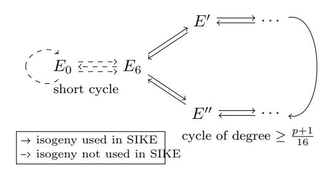

# THE EXISTENCE OF CYCLES IN THE SUPERSINGULAR ISOGENY GRAPHS USED IN SIKE

HIROSHI ONUKI, YUSUKE AIKAWA, AND TSUYOSHI TAKAGI

ABSTRACT. In this paper, we consider the structure of isogeny graphs in SIDH, that is an isogeny-based key-exchange protocol. SIDH is the underlying protocol of SIKE, which is one of the candidates for NIST post quantum cryptography standardization. Since the security of SIDH is based on the hardness of the path-finding problem in isogeny graphs, it is important to study those structure. The existence of cycles in isogeny graph is related to the path-finding problem, so we investigate cycles in the graphs used in SIKE. In particular, we focus on SIKEp434 and SIKEp503, which are the parameter sets of SIKE claimed to satisfy the NIST security level 1 and 2, respectively. We show that there are two cycles in the 3-isogeny graph in SIKEp434, and there is no cycles in the other graphs in SIKEp434 and SIKEp503.

#### 1. Introduction

- 1.1. **Isogeny-based Cryptography.** Isogeny-based cryptography is attracting the interest of researchers due to the standardization of post quantum cryptography (PQC) sponsored by NIST [1]. The security of isogeny-based cryptography is based on the hardness of computing an isogeny between given two isogenous elliptic curves. Initial studies of such cryptography are hash functions by Charles, Goren, and Lauter (CGL hash functions) [4], and cryptosystems by J. M. Couveignes [8] and A. Rostovtsev and A. Stolbunov (CRS schemes) [18]. While CGL hash functions use supersingular elliptic curves, CRS schemes use ordinary elliptic curves. CRS schemes lack efficiency significantly since it is hard to choose ordinary elliptic curves that are suitable for the isogeny computation. Although there is an attempt to speed these up [9], the schemes are far from practical at this time. In contrast, by using supersingular elliptic curves, D. Jao and L. De Feo [12] developed an efficient Diffie-Hellman style key exchange based on isogeny, called Supersingular Isogeny Diffie Hellman (SIDH). The key encapsulation mechanism SIKE [11] based on SIDH was submitted to NIST's competition for the standardization for PQC. Now, SIKE is one of the promising candidates for PQC.
- 1.2. **Problems Related to SIDH.** In SIDH, Alice (resp. Bob) executes a random walk without backtracking in  $\ell_A$ -(resp.  $\ell_B$ -)isogeny graph according to her (resp. his) secret key, where  $\ell_A$  and  $\ell_B$  are distinct small prime numbers. These random walks represent isogenies  $E \to E_A$  of degree  $\ell_A^{e_A}$  and  $E \to E_B$  of degree  $\ell_B^{e_B}$ , respectively. The security of SIDH relies on the hardness of the path-finding problem in this graph. Therefore, studying the structure of isogeny graphs in SIDH is important. For this, it is natural to ask whether the path corresponding to Alice's

1

 $Key\ words$  and phrases. Supersingular isogeny graphs, post quantum cryptography, SIDH, SIKE.

TABLE 1. The existence of cycles in the isogeny graphs used in SIKE.

|          | $\ell$ | Problem 1. | Problem 2.                           |
|----------|--------|------------|--------------------------------------|
| SIKEp434 | 2      | No         | No                                   |
|          | 3      | No         | Two curves have two different paths. |
| SIKEp503 | 2      | No         | No                                   |
|          | 3      | No         | No                                   |

Problem 1. Is there a shorter path than the secret path?

Problem 2. Is there another path of the same degree as the secret path?

secret key is the unique path to  $E_A$ . In other words, we ask whether there is a cycle containing  $E_A$  in the graph Alice uses. This can be separated into the following two problems:

#### Problem 1:

Is there a shorter path to  $E_A$  than the secret path? I.e., is there an isogeny  $\varphi: E \to E_A$  whose degree is a power of  $\ell_A$  and less than  $\ell_A^{e_A}$ ?

#### Problem 2:

Is there another path to  $E_A$  of the same degree as the secret path?

Our motivation for studying these problems is as follows.

**Problem 1.** Assume that the answer of the problem 1 is yes, i.e., there is a shorter path, and that we could find a shorter path. Note that a short path is easier to find than the path corresponding to a secret key. Let  $\varphi_A : E \to E_A$  be the isogeny corresponding to Alice's secret key,  $\varphi : E \to E_A$  a shorter path, and  $\ell_A^f$  the degree of  $\varphi$ . Then  $\varphi_A \circ \hat{\varphi}$  is an endomorphism on  $E_A$  of degree  $\ell^{e_A+f}$ . The security of SIDH is reduced to finding this endomorphism. We can know the structure of the endomorphism ring  $\operatorname{End}(E_A)$  of  $E_A$ , since we know that of  $\operatorname{End}(E)$ . Therefore, we can find  $\varphi_A \circ \hat{\varphi}$  by solving a Diophantine equation. See the discussion in §4. This reduction could weaken the security of SIDH.

**Problem 2.** One of the most efficient classical attacks to SIDH currently known is Meet-In-The-Middle (MITM) attack (see [3]). MITM returns all the paths to  $E_A$  of degree  $\ell_A^{e_A}$ , successively. If there is the only one path, i.e., the answer of Problem 2 is no, one can stop MITH immediately after it returns the first path without checking whether the returned path is the secret path (One can determine whether a path is the secret path by checking the images of the auxiliary points under the isogenies corresponding to the path. See §2.4 for the details.)

- 1.3. Our Contributions. We (partially) answer these problems on the parameters in SIKE. Our results include theoretical and computational ones. Theoretically, we show that there is no path to the curve of a public key whose length is shorter than a certain bound. Our computational results show that there is no shorter path than the paths corresponding to secret keys in the graphs in SIKEp434 and SIKEp503, which are the parameter sets of SIKE satisfying the NIST security level 1 and 2, respectively, and that there are exactly two curves which have two paths corresponding to distinct secret keys in the 3-isogeny graph in SIKEp434 and there is no such a curve in the graphs in SIKEp503. These are summarized in Table 1.
- 1.4. **Related Work.** Charles, Goren, and Lauter [4, 5] studied cycles in the  $\ell$ -isogeny graph of supersingular elliptic curves over  $\overline{\mathbb{F}}_p$ , where  $\ell \neq p$  is a prime number. In particular, they gave congruence conditions on p for no short cycles

in the graph. Furthermore, for a fixed p and a certain supersingular elliptic curve E over  $\mathbb{F}_p$  whose endomorphism ring has a specific structure, they obtained bound on the lengths of cycles containing E in the graph. On the other hand, there are series of recent researches on this topic [2, 16, 14, 13]. These researches studied the neighborhoods of certain special supersingular elliptic curves over  $\mathbb{F}_p$  in the  $\ell$ -isogeny graph. In terms of cycles, these researches gave conditions on p for no cycles of lengths 1 or 2.

Our study is based on these previous researches and looks into cycles in the graphs used in SIKE whose length is shorter or equal to twice that of the public key in SIKE.

#### 2. Preliminaries

As a general reference for this section, we refer [19] or [21].

2.1. Elliptic Curves. Let  $p \geq 5$  be a prime number. An elliptic curve E over a field k of characteristic p is a curve defined by the equation  $y^2 = x^3 + Ax + B$  for some  $A, B \in k$  with  $4A^3 + 27B^2 \neq 0$ . For a field extension  $k \subset k'$ , E(k') denotes the set of solutions  $(x, y) \in k'^2$  of the equation defining E together with the point at infinity  $\infty$ . This set carries an abelian group with the identity element  $\infty$ . For a positive integer  $n \in \mathbb{Z}$ , we define the n-torsion subgroup  $E[n] = \{P \in E(\overline{k}) | nP = \infty\}$ . If ch k = p does not divide n, we have  $E[n] \simeq \mathbb{Z}/n\mathbb{Z} \oplus \mathbb{Z}/n\mathbb{Z}$ . In particular, for a prime number  $\ell$  which is distinct from p,  $E[\ell]$  is a two-dimensional vector space over  $\mathbb{F}_{\ell}$ .

For two elliptic curves E and E' over k, we define an **isogeny** between E and E' as a non-constant group homomorphism  $\varphi: E(\overline{k}) \to E'(\overline{k})$  that is given by a rational map, where  $\overline{k}$  is a fixed algebraic closure of k. If  $\varphi$  is given a rational map defined over k', we say  $\varphi$  is defined over k'. We can show that such morphisms are surjective.

Let E and E' be elliptic curves over k. We say that E and E' are **isomorphic** over k' if there exists an isogenies  $\varphi: E \to E'$  and  $\psi: E' \to E$  over k' such that  $\psi \circ \varphi = \mathrm{id}_E$  and  $\varphi \circ \psi = \mathrm{id}_{E'}$ , where  $\mathrm{id}_E$  and  $\mathrm{id}_{E_A}$  are the identity maps on E and  $E_A$ , respectively. The j-invariant of E, which is defined to be  $j(E) \coloneqq 1728 \frac{4A^3}{4A^4 + 27B^2}$ , is an invariant with respect to the isomorphic relation. More strongly, two elliptic curves defined over E is isomorphic over E if and only if they have the same E-invariant.

Let  $\varphi: E_1(\overline{k}) \to E_2(\overline{k})$  be an isogeny between elliptic curves  $E_1$  and  $E_2$ . Then, we can always write  $\varphi$  in the form  $\varphi(x,y) = (r_1(x),y\cdot r_2(x))$ , where  $r_1$  and  $r_2$  are rational functions. When we write  $r_1(x) = \frac{p(x)}{q(x)}$  with polynomials p and q whose greatest common divisor is 1, we define the **degree** of the isogeny  $\varphi$  to be  $\deg(\varphi) = \operatorname{Max}\{\deg p(x), \deg q(x)\}$ . An isogeny of degree n are called a n-isogeny. If there is a n-isogeny of degree n between two elliptic curves, we say that these curves are n-isogenous. In this paper, we mainly focus on isogenies with degree  $\ell^e$  for some small prime  $\ell \neq p$ . Moreover, we say that  $\varphi$  is **separable** (resp. **inseparable**) if the derivative  $r'_1(x)$  is not identically zero (resp. otherwise). If  $\varphi$  is separable, we have  $\deg \varphi = \#\operatorname{Ker}(\varphi)$ . Conversely, for an elliptic curve E and its  $\ell$  torsion point  $P \in E[\ell]$ , there are the unique elliptic curve E' up to isomorphism, and an isogeny  $\varphi_G: E \to E'$  with  $\operatorname{Ker}(\varphi_G) = G := \langle P \rangle$ . We say that two isogenies  $\varphi, \psi: E \to E'$ 

are **equivalent** if we have  $Ker(\varphi) = Ker(\psi)$ . Note that this is equivalent to the condition: there is  $\iota \in Aut(E')$  such that  $\varphi = \iota \circ \psi$ .

Now, on input E and P, we can efficiently compute E' and  $\varphi_G$  by using a Vélutype formula [20, 7]. However, in general, it is believed that computing an isogeny between two given elliptic curves is a hard problem, even for quantum computers.

2.2. Supersingular Elliptic Curves and Endomorphism Rings. Let E be an elliptic curve over a finite field  $\mathbb{F}_q$ , where q is a power of a prime  $p \geq 5$ . We say that E is supersingular if  $\#E(\mathbb{F}_q) \equiv 1 \mod p$  and E is ordinary otherwise. In this paper, we focus on only supersingular curves. So, from now on, we assume that every elliptic curves in this paper are supersingular.

An **endomorphism** of E is an isogeny from E to itself. The set  $\operatorname{End}(E)$  of endomorphisms of E over  $\overline{\mathbb{F}}_q$  together with zero map carries a ring by the addition derived from the group  $E(\overline{\mathbb{F}}_q)$  and the multiplication defined by the composition of maps. For  $\alpha \in \operatorname{End}(E)$ , we denote the kernel of  $\alpha$  by  $E[\alpha]$ .

As is well known, for supersingular curve E,  $\operatorname{End}(E)$  is isomorphic to a maximal order in a quaternion algebra. The Deuring correspondence states that there is one-to-one correspondence between endomorphism rings of supersingular curves and maximal orders of the quaternion algebra  $B_{p,\infty}$  ramified at p and  $\infty$ . Note that  $B_{p,\infty}$  is unique up to isomorphism. For example, if  $p\equiv 3 \mod 4$ , we have

$$B_{p,\infty} = \mathbb{Q} + \mathbb{Q}\mathbf{i} + \mathbb{Q}\mathbf{j} + \mathbb{Q}\mathbf{k}$$

where  $\mathbf{i}^2 = -1$ ,  $\mathbf{j}^2 = -p$ ,  $\mathbf{k} = \mathbf{i}\mathbf{j} = -\mathbf{j}\mathbf{i}$ . Indeed, in this paper, we only consider the quaternion algebra having this structure.

- 2.3. Isogeny Graphs. Let  $\ell \neq p$  be a prime number. We define an supersingular  $\ell$ -isogeny graph  $G_{\ell}(p)$  as follows: The vertex set of  $G_{\ell}(p)$  is the set of the isomorphism classes of supersingular elliptic curves. For supersingular elliptic curves E and E', an edge from the isomorphism class of E to that of E' is the equivalence class of an  $\ell$ -isogeny  $E \to E'$ . Hereafter, we use the same symbols for a class and its representative for brevity. A path from E to E' of length n in  $G_{\ell}(p)$  is a sequence of edges  $(\varphi_1, \ldots, \varphi_n)$  such that the domain of  $\varphi_1$  is E, the codomain of  $\varphi_n$  is E', and the composition  $\varphi_n \circ \cdots \circ \varphi_1$  can be defined. If  $\hat{\varphi}_i \neq \varphi_{i+1}$  for  $i = 1, \ldots, n-1$ , we say the path  $(\varphi_1, \ldots, \varphi_n)$  is without backtracking. A cycle containing E is a path from E to E without backtracking.
- 2.4. Supersingular Isogeny Diffie-Hellman(SIDH). SIDH, proposed by D. Jao and L. De Feo in [12], is a key-exchange protocol based on isogenies of supersingular elliptic curves. It is modeled as a random walk in the graphs  $G_{\ell_A}(p)$  and  $G_{\ell_B}(p)$  for distinct small primes  $\ell_A$ ,  $\ell_B$ . In this subsection, we briefly recall this protocol.

Let p be a prime of the form  $p = \ell_A^{eA} \ell_B^{eB} - 1$  for some small primes  $\ell_A, \ell_B$  and positive integers  $e_A, e_B$  such that  $\ell_A^{eA} \approx \ell_B^{eB} \approx 2^{2\lambda}$  ( $\lambda$ : a security parameter). Let E be a supersingular curve and  $\{P_A, Q_A\}$  (resp.  $\{P_B, Q_B\}$ ) a generator of  $E[\ell_A^{eA}]$  (resp.  $E[\ell_B^{eB}]$ ). On the public parameter  $p, e_A, e_B, \ell_A, \ell_B$  and  $(E, P_A, Q_A, P_B, Q_B)$ , Alice and Bob execute key exchange in the following procedure (we describe Alice's side only since Bob's execution is similar without index):

(1) Alice chooses  $n_A, m_A \in \mathbb{Z}/\ell_A^{e_A}\mathbb{Z}$  as a secret key.

- (2) Alice computes the  $\ell_A^e$ -isogeny  $\varphi_A: E \to E_A$  such that its kernel is the subgroup of  $E[\ell_A^{e_A}]$  generated by  $n_A P_A + m_A Q_A$ . Then, Alice publishes  $(E_A, \varphi_A(P_B), \varphi_A(Q_B)).$
- (3) By using Bob's public key, Alice computes the isogeny  $\varphi_{BA}: E_B \to E_{BA}$ such that its kernel is the subgroup of  $E_A[\ell_B]$  generated by  $n_A\varphi_B(P_A), m_A\varphi_B(P_B)$ . (Note that  $n_A \varphi_B(P_A) + m_A \varphi_B(P_B) = \varphi_B(n_A P_A + m_A Q_A)$  owing to the homomorphic property of isogenies.)
- (4) Alice and Bob share the key, the *j*-invariant of  $E_{BA} \simeq E_{AB}$ .

The secret information  $n_A, m_A \in \mathbb{Z}/\ell_A^{e_A}\mathbb{Z}$  corresponds to the path of random walk from the starting curve E to the public information  $E_A$ .

2.5. Setting on SIKE. In SIKE, we use  $\ell_A = 2$  and  $\ell_B = 3$ . The starting curve of SIKE is the elliptic curve

$$E_6: y^2 = x^3 + 6x^2 + x.$$

This is the unique 2-isogenous curve to the elliptic curve

$$E_0: y^2 = x^3 + x,$$

that was the starting curve in the initial proposal in SIKE. The elliptic curves 2isogenous to  $E_0$  are  $E_0$  itself and  $E_6$ . If one starts a random walk in  $G_2(p)$  from  $E_0$ , the first step is always to  $E_6$ . This slightly reduces the security of SIKE. Therefore, the starting curve was changed from  $E_0$  to  $E_6$ , and the 2-isogeny to  $E_0$  is not chosen in the first step in SIKE. Fig. 1 shows this situation. For more detail, see the document in [11] or  $[6, \S 3.1]$ .

In this paper, we say a path from  $E_6$  in  $G_{\ell}(p)$  is a **SIKE path** if its first step is not the one prohibited in SIKE. Note that if  $\ell \neq 2$  then all paths are SIKE paths.

# 3. Theoretical Result

In this section, we consider Problem 1 and 2 defined in §1.2, i.e., we try to find two distinct paths without backtracking with the same initial and terminal in  $G_{\ell}(p)$ . To find such paths was studied by Eisenträger et. al. [10] in the context of finding a collision in the CGL hash functions. Their method is based on the fact that a collision in the CGL hash function corresponds to a cycle in  $G_{\ell}(p)$ , which corresponds to a non-integer endomorphism on the initial cure. We apply this method to the setting in SIKE. In particular, we take  $E_6$  as the starting curve and restrict our attention to the case  $p \equiv 15 \pmod{16}$ . We show that all cycles which come from paths in SIKE have degree greater than or equal to  $\frac{p+1}{16}$ . Fig. 1 illustrates our result for the 2-isogeny graph. More precisely, we prove the following theorem.

**Theorem 1.** Let  $\ell$  be a prime number that does not split in  $\mathbb{Z}[\sqrt{-1}]$ , and  $\varphi =$  $(\varphi_1, \dots, \varphi_n)$  and  $\psi = (\psi_1, \dots, \psi_m)$  distinct paths from  $E_6$  to E in  $G_{\ell}(p)$  without  $backtracking\ of\ length\ n\ and\ m,\ respectively.\ Then\ one\ of\ the\ followings\ holds:$ 

- $\begin{array}{l} \bullet \ \ell^{n+m} \geq \frac{p+1}{16}, \\ \bullet \ \ell = 2 \ and \ either \ \varphi \ or \ \psi \ is \ not \ a \ SIKE \ path. \end{array}$

Before we prove this theorem, we prepare some lemmas. First, we need to know the structure of  $\operatorname{End}(E_6)$ . It is well-known that  $\operatorname{End}(E_0)$  is isomorphism to the maximal order

$$\mathfrak{O}_0 = \mathbb{Z} + \mathbb{Z}(2\mathbf{i}) + \mathbb{Z}\frac{1+\mathbf{j}}{2} + \mathbb{Z}\frac{\mathbf{i} + \mathbf{k}}{2}$$



FIGURE 1. 2-isogeny graph in SIKE

in  $B_{p,\infty}$ , where  $\mathbf{i}^2 = -1$ ,  $\mathbf{j}^2 = -p$ ,  $\mathbf{k} = \mathbf{i}\mathbf{j} = -\mathbf{j}\mathbf{i}$  as in §2.2. This and the fact that  $E_0$  and  $E_6$  is 2-isogenous lead the structure of  $\operatorname{End}(E_6)$ .

**Lemma 1.** If  $p \equiv 15 \mod 16$ , then we have

(1) 
$$\operatorname{End}(E_6) \simeq \mathbb{Z} + \mathbb{Z}(2\mathbf{i}) + \mathbb{Z}\frac{1+\mathbf{j}}{2} + \mathbb{Z}\frac{\mathbf{i}+\mathbf{k}}{4}.$$

Proof. We denote the right hand side of (1) by  $\mathfrak{O}_6$ . It is easy to check that  $\mathfrak{O}_6$  is an order in  $B_{p,\infty}$  since  $p \equiv 15 \pmod{16}$ . Furthermore, by calculating the discriminant of  $\mathfrak{O}_6$ , we have  $\mathfrak{O}_6$  is maximal. Therefore, the Deuring correspondence shows that there is a supersingular elliptic curve E over  $\mathbb{F}_{p^2}$  whose endomorphism ring is isomorphic to  $\mathfrak{O}_6$ . Since  $[\mathfrak{O}_0:\mathfrak{O}_0\cap\mathfrak{O}_6]=2$ , the curve E is 2-isogenous to  $E_0$  (see [15], §4.1). We have  $\mathfrak{O}_0\not\cong\mathfrak{O}_6$  since only the former has a square root of -1. Therefore, we have  $E_0\not\cong E$ . As we stated in §2.5, A 2-isogenous curve to  $E_0$  that is not isomorphic to  $E_0$  can only be  $E_0$ . Therefore, we obtain the isomorphism in the statement.

Hereafter, we identify  $\operatorname{End}(E_6)$  as  $\mathfrak{O}_6$  by an isomorphism.

The second lemma shows a relation between paths in  $G_{\ell}(p)$  and endomorphisms.

**Lemma 2.** Let E and E' be supersingular elliptic curves, and  $(\varphi_1, \ldots, \varphi_n)$  and  $(\psi_1, \ldots, \psi_m)$  distinct paths from E to E' without backtracking in  $G_{\ell}(p)$ . Then the composition

$$\hat{\psi}_1 \circ \cdots \circ \hat{\psi}_m \circ \varphi_n \circ \cdots \circ \varphi_1$$

is a non-integer endomorphism on E. Furthermore, if  $m \le n$  there exist integers  $0 \le m' \le m$  and  $1 \le n' \le n$  such that

$$\hat{\psi}_0 \circ \cdots \circ \hat{\psi}_{m'} \circ \varphi_{n'} \circ \cdots \circ \varphi_1$$

is in  $\operatorname{End}(E) \setminus \ell \operatorname{End}(E)$ , where  $\psi_0$  is the identity map on E.

*Proof.* Without loss of generality, we may assume  $m \leq n$ . We define  $\xi_i = \varphi_i$  for i = 1, dots, n and  $\xi_i = \hat{\psi}_{m+n+1-i}$  for  $i = n+1, \ldots, n+m$ , and denote the domain and the codomain of  $\xi_i$  by  $E_{i-0}$  and  $E_i$ , respectively.

Assume that the composition  $\xi := \xi_{n+m} \circ \cdots \circ \xi_1$  is in  $\ell \operatorname{End}(E)$ , i.e.,  $\ker \xi$  contains  $E[\ell]$ . Then there exists an integer j such that  $\ker \xi_j \circ \cdots \circ \xi_1$  does not contain  $E[\ell]$  and  $\ker \xi_{j+1} \circ \cdots \circ \xi_1$  contains  $E[\ell]$ . Let  $P \in E$  be a generator of  $\ker \xi_j \circ \cdots \circ \xi_1$  and Q a point on  $E[\ell]$  such that  $Q \notin \ker \xi_j \circ \cdots \circ \xi_1$ . Then  $\xi_{j-1} \circ \cdots \circ \xi_1(P)$  and  $\xi_{j-1} \circ \cdots \circ \xi_1(Q)$  generate  $E_{j-1}[\ell]$ . By our assumption that  $\ker \xi_{j+1} \circ \cdots \circ \xi_1$  contains  $E[\ell]$ , we have  $\xi_{j+1} \circ \cdots \circ \xi_1(P) = \xi_{j+1} \circ \cdots \circ \xi_1(Q) = 0_{E_{j+1}}$ . This means  $\ker \xi_{j+1} \circ \xi_j = E_{j-1}[\ell]$ . Therefore,  $\xi_{j+1}$  and  $\xi_j$  are equivalent. Since the paths

 $(\varphi_1, \ldots, \varphi_n)$  and  $(\psi_1, \ldots, \psi_m)$  are without backtracking, the integer j must be n, i.e.,  $\varphi_n$  and  $\psi_m$  is equivalent. Consequently, we obtain an endomorphism

$$\hat{\psi}_1 \circ \cdots \circ \hat{\psi}_{m-1} \circ \varphi_{n-1} \circ \cdots \circ \varphi_1.$$

If this endomorphism is in  $\ell \operatorname{End}(E)$  then we repeat the above process. Finally, we obtain an endomorphism

$$\alpha := \hat{\psi}_0 \circ \cdots \circ \hat{\psi}_{m'} \circ \varphi_{n'} \circ \cdots \circ \varphi_1 \in \operatorname{End}(E) \setminus \ell \operatorname{End}(E),$$

where m', n' are integers satisfying  $0 \le m' \le m$  and  $1 \le n' \le n$ . Here,  $\varphi_1$  cannot vanish since the paths  $(\varphi_1, \ldots, \varphi_n)$  and  $(\psi_1, \ldots, \psi_m)$  are distinct. Therefore,  $\alpha$  is not equivalent to the identity map. In particular,  $\alpha$  is a non-integer endomorphism on E. Therefore, the composition

$$\hat{\psi}_1 \circ \cdots \circ \hat{\psi}_m \circ \varphi_n \circ \cdots \circ \varphi_1 = \ell^{\frac{n-n'+m-m'}{2}} \alpha$$

is also a non-integer endomorphism. This completes the proof.

*Proof of Theorem1.* Without loss of generality we may assume  $n \ge m$ . By Lemma 2, there exist integers  $0 \le m' \le m$ ,  $1 \le n' \le n$  such that

$$\alpha = \hat{\psi}_0 \circ \cdots \circ \hat{\psi}_{m'} \circ \varphi_{n'} \circ \cdots \circ \varphi_1$$

is in  $\operatorname{End}(E)\backslash\ell\operatorname{End}(E)$ . In particular, the kernel of  $\alpha$  is a cyclic subgroup in  $E_6$ . By Lemma 1, we can write

$$\alpha = a + 2b\mathbf{i} + c\frac{1+\mathbf{j}}{2} + d\frac{\mathbf{i} + \mathbf{k}}{4},$$

where  $a,b,c,d\in\mathbb{Z}$  and at least one of a,b,c and d is not divisible by  $\ell$ . The degree of  $\alpha$  is equal to the reduced norm of the corresponding quaternion. Therefore, we have

(2) 
$$\deg \alpha = \frac{1}{16}((4a+2c)^2 + (8b+d)^2 + (4c^2+d^2)p).$$

If either c or d is non-zero then we have

(3) 
$$\ell^{n+m} \ge \deg \alpha \ge \frac{p+1}{16}.$$

In the case  $\ell \neq 2$ , we have  $\alpha \notin \mathbb{Z} + 2i\mathbb{Z}$  since  $\ell$  remains prime in  $\mathbb{Z} + 2i\mathbb{Z}$ . Therefore, the inequality (3) holds.

Assume that  $\ell = 2$  and c = d = 0. Since  $\alpha \notin 2\text{End}(E_6)$ , we have

$$\alpha = 2\mathbf{i} \text{ or } 2 + 2\mathbf{i}.$$

In the both cases, the kernel of  $\alpha$  contains  $E[2] \cap E[2\mathbf{i}]$ , which is the kernel of the unique 2-isogeny from  $E_6$  to  $E_0$ . Therefore, the codomain of  $\varphi_1$  is  $E_0$ , i.e., the path  $\varphi$  is not a SIKE path. This completes the proof.

# 4. Application to SIKE parameters

By the definition of p in SIDH, we have  $\ell_A^{e_A} \approx \ell_B^{e_B} \approx \sqrt{p}$ . Therefore, the bound in Theorem 1 is slightly short to claim that there are no distinct paths to the same curve in SIDH. To study whether such paths exist, it remains to check existence of  $\alpha \in \operatorname{End}(E_6) \backslash \mathbb{Z} + 2i\mathbb{Z}$  and  $n \in \mathbb{Z}$  such that

(4) 
$$\deg \alpha = \ell^n$$

(5) 
$$\frac{p+1}{16} < \ell^n \le \ell^{2e}$$

## **Algorithm 1:** Finding all the solution to (6)

```
Input: Distinct primes p, \ell, an integer e, and a list Q of primes q s.t.
                 q \equiv 3 \pmod{4}.
    Output: A set S = \{(n, a, b, c, d) \in \mathbb{Z}^4 \mid \ell^n = \frac{1}{16}((4a+2c)^2 + (8b+d)^2 + (4c^2+d^2)p), \ell^n \le \ell^{2e}\}.
 1 Set S = \emptyset.
 2 for n s.t. \frac{p+1}{16} < \ell^n \le \ell^{2e} do
        for c, d s.t. (4c^2 + d^2)p \le 16\ell^n do
             Set N = 16\ell^n - (4c^2 + d^2)p. for q \in Q do
 4
                 Set v the q-adic valuation of N.
                  if v is odd then
                   Skip this (c,d).
             Factorize N and compute the set T = \{(A, B) \in \mathbb{Z}^2 \mid A^2 + B^2 = N\}
              by the Cornacchia-Smith algorithm.
             for (A, B) \in T do
 9
                 if a = \frac{A-2c}{4} and b = \frac{B-d}{8} are integers then | Add (n, a, b, c, d) to S.
10
12 return S.
```

for  $(\ell, e) = (\ell_A, e_A)$ ,  $(\ell_B, e_B)$ . By the equation (2), the equation (4) is equivalent to finding  $a, b \in \mathbb{Z}$  and  $(c, d) \in \mathbb{Z}^2 \setminus \{(0, 0)\}$  such that

(6) 
$$\ell^n = \frac{1}{16}((4a+2c)^2 + (8b+d)^2 + (4c^2+d^2)p).$$

In the following, we will give all solution in (6) for SIKEp434 and SIKEp503, which are parameter sets of SIKE. Our strategy is as follows: For all n, c and d which could be the solution to (5) and (6), we solve the Diophantine equation (6) for a, b. This can be done by finding A,  $B \in \mathbb{Z}$  such that

(7) 
$$16\ell^n - (4c^2 + d^2)p = A^2 + B^2$$

and  $a=\frac{A-2c}{4}$  and  $b=\frac{B-d}{8}$  are integers. It is well-known that the solution to (7) exists if and only if the q-adic valuation of the left hand side of (7) is even for all primes q remaining prime in  $\mathbb{Z}[\sqrt{-1}]$ . Furthermore, if we know the prime factorization of the left hand side of (7), all the solutions can be found by using the Cornacchia-Smith algorithm [17, Algorithm 2.3.12]. For reducing the factorizations, we first compute the q-adic valuations of the left hand side of (7) for  $q\equiv 3\pmod 4$  and q is in the smallest 1,000,000 primes, and discard the number if it has odd valuation. Algorithm 1 describe the procedure for solving (7).

4.1. **SIKEp434.** In SIKEp434, we use  $e_A = 216$ ,  $e_B = 137$  and so  $p = 2^{216}3^{137} - 1$ . Then integers n which satisfy (5) are  $2e_A - 2$ ,  $2e_A - 1$ ,  $2e_A$  for  $\ell = 2$ , and  $2e_B - 3$ ,  $2e_B - 2$ ,  $2e_B - 1$ ,  $2e_B$  for  $\ell = 3$ . We define the following set

$$D = \{2^{2e_A - 2}, 2^{2e_A - 1}, 2^{2e_A}, 3^{2e_B - 3}, 3^{2e_B - 2}, 3^{2e_B - 1}, 3^{2e_B}\}.$$

If |c| > 3 or |d| > 5,  $16\delta - (4c^2 + d^2)p$  is negative for all  $\delta \in D$ . Therefore, it is sufficient to check whether  $16\delta - (4c^2 + d^2)p$  can be written as the sum of tow squares for  $\delta \in D$ ,  $|c| \le 3$  and  $|d| \le 5$ .

Computation shows that the solutions to (7) exist only in the case  $\ell=3$ ,  $n=2e_B$ , |c|=1 and |d|=5, and there are eight solutions, which correspond to the signs of c, d and A (the sign of B is determined by that of d since  $b=\frac{B-d}{8}$  should be integer).

One of the solutions is

a = 86095358379437737008152507618957588921903767572342310732370550822,

 $\texttt{b} = 23161695071899373897438284757405634901190535811498303421361280383},$ 

c = 1, d = 5.

Let  $\alpha_0 \in \operatorname{End}(E_6)$  be an endomorphism defined by the above solution. Then all solutions to (2) in SIKEp434 are

$$\pm \alpha_0, \ \pm \hat{\alpha_0}, \ \pm \mathbf{j}^{-1} \alpha_0 \mathbf{j}, \ \pm \mathbf{j}^{-1} \hat{\alpha}_0 \mathbf{j}.$$

Since  $\pm \alpha$  are equivalent for  $\alpha \in \operatorname{End}(E_6)$ , there are four cycles containing  $E_6$  of length  $2e_B$  in the 3-isogeny graph in SIKEp434. The cycles corresponding to  $\alpha_0$  (resp.  $\mathbf{j}^{-1}\alpha_0\mathbf{j}$ ) and  $\hat{\alpha_0}$  (resp.  $\mathbf{j}^{-1}\alpha_0\mathbf{j}$ ) have opposite directions from each other. Therefore, there are two pairs of distinct paths to the same curve.

One pair is the paths determined by the isogenies of kernels

$$G_1 = E_6[\alpha_0] \cap E_0[3^{e_B}],$$
  
 $H_1 = E_6[\hat{\alpha}_0] \cap E_0[3^{e_B}].$ 

Another is those determined by

$$G_2 = E_6[\mathbf{j}^{-1}\alpha_0\mathbf{j}] \cap E_6[3^{e_B}],$$
  
 $H_2 = E_6[\mathbf{j}^{-1}\hat{\alpha}_0\mathbf{j}] \cap E_6[3^{e_B}].$ 

In the following, we let i be a square root of -1 in  $\mathbb{F}_{p^2}$ . As in the implementation of SIKE, we represent  $E_6$  by  $y^2 = x^3 + 6x^2 + x$  and  $E_0$  by  $y^2 = x^3 + x$ . Then **j** corresponds to the p-the power Frobenius endomorphism on  $E_6$ . Since  $2\mathbf{i}$  corresponds to the composition

$$E_6 \xrightarrow{\varphi} E_0 \xrightarrow{\mathbf{i}} E_0 \xrightarrow{\hat{\varphi}} E_6,$$

where  $\varphi$  is the unique 2-isogeny from  $E_6$  to  $E_0$  and  $\mathbf{i}: E_0 \to E_0$  is defined by  $(x,y) \mapsto (-x,iy)$ . Consequently, we can calculate the image of a point in  $E_6[3^{e_B}]$  under  $\alpha_0$ . Note that the multiplication by 1/2 can be defined in  $E_6[3^{e_B}]$ . Calculation shows that the x-coordinate of a generator of  $G_1$  is

 $247510906961255012521415460735595650789863971389378292189704671078086462 \\ 6389540132637576254827151243472556716289868683948423319094i$ 

+  $6465370123914116075280362428255881847557050804032025367433195295461282 \ 057217363996258420682259126166212322357224110388448352889079$ ,

and that of  $H_1$  is

 $239843225842163838734551516177194112118234586137471439155457624055459761 \\01518943061255909630654113845689621292653750974612883074283i$ 

 $+\ 1795780806850376524567331115325136962381793470219438144295265818013678 \setminus 5952551983797829767879426692489573885769716438404688627927121 \,.$ 

By using a Vélu-type formula, we have  $j(E_6/G_1) = j(E_6/H_1)$  is

288526702502246183196878277739927015361451466742402489708826310959053709\ 7187212337150488056235773563419114432165652691793316905242i

+ 7874784311329099556469404797848432049989996975226748559452018606060724\ 987117692585806286106877298233631895129350751906113208522008.

Since G<sup>2</sup> is the image of G<sup>1</sup> under the p-the power Frobenius endomorphism, we have j(E6/G2) = j(E6/H2) = j(E6/G1) p .

Consequently, we conclude that, in SIKEp434, the answer of Problem 1 in §1 is "no", and that of Problem 2 is "yes, there is two curves which have two distinct paths from E6."

- 4.2. SIKEp503. In SIKEp503, we use e<sup>A</sup> = 250, e<sup>B</sup> = 159 and so p = 22503 <sup>159</sup>−1. A similar argument as for SIKEp434 can be applied to SIKEp503. Computation shows that (4) and (5) have no solution in this case. Therefore, the answers of Problem 1 and Problem 2 in §1 are both "no."
- 4.3. Other parameter sets. SIKE has two other parameter sets SIKEp610 and SIKEp751. Our method in this section can be applied to these parameter sets. However, the computation require factorizations for integers as large as p. Our computational resource could not complete the factorizations. We leave it as an open problem.

# 5. Conclusion

In this paper, we considered the isogeny graphs in SIKE. We showed that there is no shorter path to a curve of a public key in SIKE than a certain bound. Furthermore, we determined the structure of the isogeny graphs in SIKEp434 and SIKEp503. Our result shows that there is no shorter path to a curve of a public key than the path corresponds to the secret key, and that, only in the case ` = 3 in SIKEp434, there are two curves to which have two distinct paths from the starting curve.

# References

- [1] National Institute of Standards and Technology (NIST) "NIST Post-Quantum Cryptography Standardization", https://csrc.nist.gov/Projects/Post-Quantum-Cryptography.
- [2] Gora Adj, Omran Ahmadi, and Alfred Menezes. On isogeny graphs of supersingular elliptic curves over finite fields. Finite Fields and Their Applications, 55:268–283, 2019.
- [3] Gora Adj, Daniel Cervantes-V´azquez, Jes´us-Javier Chi-Dom´ınguez, Alfred Menezes, and Francisco Rodr´ıguez-Henr´ıquez. On the cost of computing isogenies between supersingular elliptic curves. In Carlos Cid and Michael J. Jacobson Jr., editors, Selected Areas in Cryptography – SAC 2018, pages 322–343, Cham, 2019. Springer International Publishing.
- [4] Denis Charles, Eyal Goren, and Kristin Lauter. Cryptographic hash functions from expander graphs. IACR Cryptology ePrint Archive 2006/021; https://eprint.iacr.org/2006/021.
- [5] Denis X. Charles, Kristin E. Lauter, and Eyal Z. Goren. Cryptographic hash functions from expander graphs. Journal of Cryptology, 22(1):93–113, 2009.
- [6] Craig Costello, Patrick Longa, Michael Naehrig, Joost Renes, and Fernando Virdia. Improved classical cryptanalysis of the computational supersingular isogeny problem. IACR Cryptology ePrint Archive 2006/145; https://eprint.iacr.org/2006/145, 2019.
- [7] Craig Costello and Benjamin Smith. Montgomery curves and their arithmetic. Journal of Cryptographic Engineering, 8(3):227–240, 2018.
- [8] Jean-Marc Couveignes. Hard homogeneous spaces. IACR Cryptology ePrint Archive 2006/291; https://eprint.iacr.org/2006/291.
- [9] Luca De Feo, Jean Kieffer, and Benjamin Smith. Towards practical key exchange from ordinary isogeny graphs. In Thomas Peyrin and Steven Galbraith, editors, Advances in Cryptology – ASIACRYPT 2018, pages 365–394, Cham, 2018. Springer International Publishing.

- [10] Kirsten Eisentr¨ager, Sean Hallgren, Kristin Lauter, Travis Morrison, and Christophe Petit. Supersingular isogeny graphs and endomorphism rings: Reductions and solutions. In Jesper Buus Nielsen and Vincent Rijmen, editors, Advances in Cryptology – EUROCRYPT 2018, pages 329–368, Cham, 2018. Springer International Publishing.
- [11] David Jao, Reza Azarderakhsh, Matthew Campagna, Craig Costello, Luca De Feo, Basil Hess, Amir Jalali, Brian Koziel, Brian LaMacchia, Patrick Longa, Michael Naehrig, Geovandro Pereira, Joost Renes, Vladimir Soukharev, and David Urbanik. "SIKE - Supersingular isogeny key encapsulation", Submission to the NIST Post-Quantum Cryptography Standardization project; https://sike.org.
- [12] David Jao and Luca De Feo. Towards quantum-resistant cryptosystems from supersingular elliptic curve isogenies. In Bo-Yin Yang, editor, Post-Quantum Cryptography, pages 19–34, Berlin, Heidelberg, 2011. Springer Berlin Heidelberg.
- [13] Songsong Li, Yi Ouyang, and Zheng Xu. Endomorphism rings of supersingular elliptic curves over fp. Finite Fields and Their Applications, 62:101619, 2020.
- [14] Songsong Li, Yi Ouyang, and Zheng Xu. Neighborhood of the supersingular elliptic curve isogeny graph at j = 0 and 1728. Finite Fields and Their Applications, 61:101600, 2020.
- [15] Jonathan Love and Dan Boneh. Supersingular curves with small non-integer endomorphisms, 2019.
- [16] Yi Ouyang and Zheng Xu. Loops of isogeny graphs of supersingular elliptic curves at j = 0. Finite Fields and Their Applications, 58:174 – 176, 2019.
- [17] R.C.C. Pomerance, R. Crandall, and C. Pomerance. Prime Numbers: A Computational Perspective. Lecture notes in statistics. Springer, 2005.
- [18] Alexander Rostovtsev and Anton Stolbunov. Public-key cryptosystem based on isogenies. IACR Cryptology ePrint Archive 2006/145; https://eprint.iacr.org/2006/145.
- [19] Joseph H. Silverman. The Arithmetic of Elliptic Curves. Graduate Texts in Mathematics. Springer New York, 2nd edition, 2009.
- [20] J. V´elu. Isog´enies entre courbes elliptques. Comptes-Rendes de l'Acad´emie des Sciences, 273:238–241, 1971.
- [21] L.C. Washington. Elliptic Curves: Number Theory and Cryptography. Discrete Mathematics and Its Applications. CRC Press, 2003.

Derparment of Mathematical Informatics, The University of Tokyo, Tokyo, Japan Email address: onuki@mist.i.u-tokyo.ac.jp

Information Technology R&D Center, Mistubishi Electric Corporation, Kanagawa, Japan

Email address: Aikawa.Yusuke@bc.MitsubishiElectric.co.jp

Derparment of Mathematical Informatics, The University of Tokyo, Tokyo, Japan Email address: takagi@mist.i.u-tokyo.ac.jp