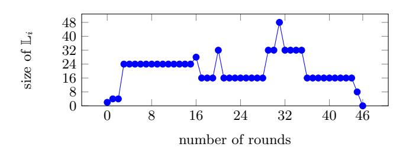
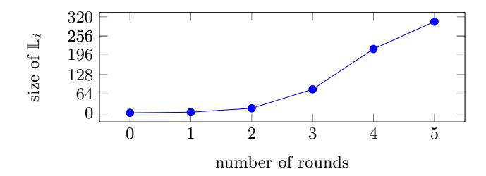
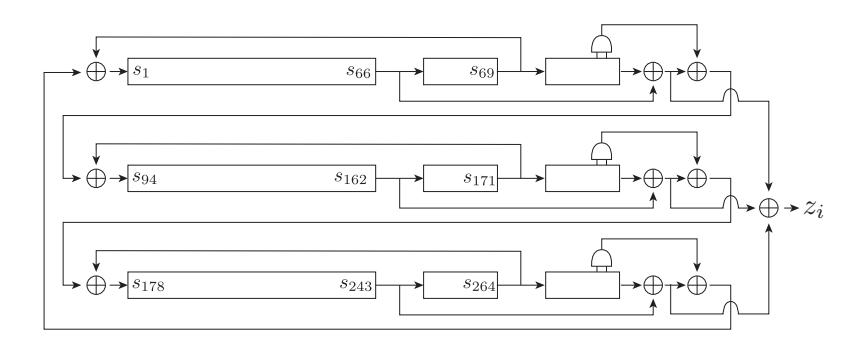
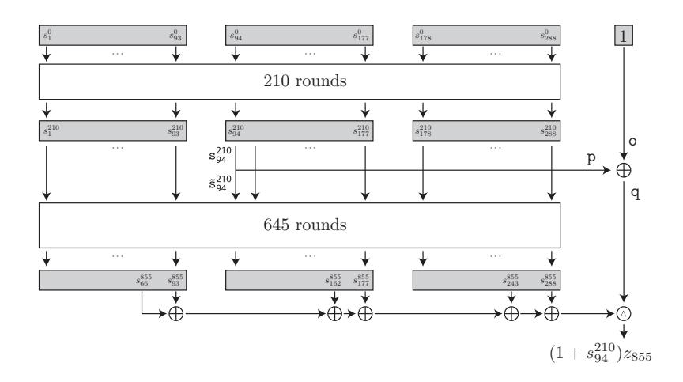
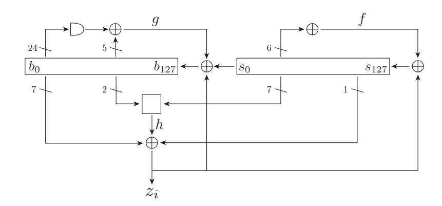
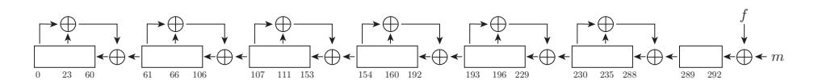
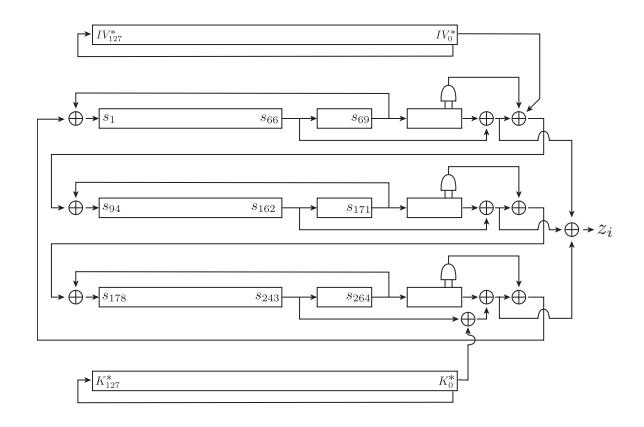

# Modeling for Three-Subset Division Property without Unknown Subset

Yonglin Hao<sup>1</sup>, Gregor Leander<sup>2</sup>, Willi Meier<sup>3</sup>, Yosuke Todo<sup>4</sup>, and Qingju Wang<sup>5</sup>

State Key Laboratory of Cryptology, P.O. Box 5159, Beijing 100878, China, haoyonglin@yeah.net Horst Görtz Institute for IT Security, Ruhr University Bochum, Bochum, Germany, gregor.leander@rub.de

<sup>3</sup> FHNW, Windisch, Switzerland, willimeier48@gmail.com

**Abstract.** A division property is a generic tool to search for integral distinguishers, and automatic tools such as MILP or SAT/SMT allow us to evaluate the propagation efficiently. In the application to stream ciphers, it enables us to estimate the security of cube attacks theoretically, and it leads to the best key-recovery attacks against well-known stream ciphers. However, it was reported that some of the key-recovery attacks based on the division property degenerate to distinguishing attacks due to the inaccuracy of the division property. Three-subset division property (without unknown subset) is a promising method to solve this inaccuracy problem, and a new algorithm using automatic tools for the three-subset division property was recently proposed at Asiacrypt2019. In this paper, we first show that this state-of-the-art algorithm is not always efficient and we cannot improve the existing key-recovery attacks. Then, we focus on the feature of the three-subset division property without unknown subset and propose another new efficient algorithm using automatic tools. Our algorithm is more efficient than existing algorithms, and it can improve existing key-recovery attacks. In the application to Trivium, we show an 842-round key-recovery attack. We also show that an 855-round keyrecovery attack, which was proposed at CRYPTO2018, has a critical flaw and does not work. As a result, our 842-round attack becomes the best key-recovery attack. In the application to Grain-128AEAD, we show that the known 184-round key-recovery attack degenerates to distinguishing attacks. Then, the distinguishing attacks are improved up to 189 rounds, and we also show the best key-recovery attack against 190 rounds. In the application to ACORN, we prove that the 772-round key-recovery attack at ISC2019 is in fact a constant-sum distinguisher. We then give new key-recovery attacks mounting to 773- and 774-round ACORN. We also verify the current best key-recovery attack on 892-round Kreyvium and recover the exact superpoly.

**Keywords:** stream ciphers, cube attack, division property, three-subset division property, MILP, TRIVIUM, Grain-128AEAD, ACORN, Kreyvium

#### 1 Introduction

**Division Property.** Integral cryptanalysis [KW02], a.k.a. Square attacks [DKR97] or higher-order differential attacks [Lai94], are one of the most powerful cryptanalysis techniques. Let  $C_I$  be the set of chosen plaintexts. The integral distinguisher for a cipher  $E_k$  is defined as the property  $\bigoplus_{p \in C_I} E_k(p) = 0$  for any secret key k. Since the probability that such a zero-sum property holds is low for ideal ciphers, we can distinguish  $E_k$  from an ideal one.

The division property, as originated in [Tod15b], is the most accurate and generic tool to search for integral distinguishers. Ever since its proposal, it has been widely applied to many block ciphers ([Tod15a,ST16,TM16,SIKH16] etc). For a set of texts  $\mathbb{X} \subseteq \mathbb{F}_2^n$ , its division property is defined by dividing a set of  $\boldsymbol{u}$ 's into two subsets: vectors  $\boldsymbol{u} \in \mathbb{F}_2^n$  of the 1st subset satisfy  $\bigoplus_{\boldsymbol{x} \in \mathbb{X}} \boldsymbol{x}^{\boldsymbol{u}} = 0$  (referred as  $\theta$ -subset hereafter), and those of the 2nd subset make  $\bigoplus_{\boldsymbol{x} \in \mathbb{X}} \boldsymbol{x}^{\boldsymbol{u}}$  undetermined (referred as unknown subset hereafter). The initial division property is defined according to a set of chosen plaintexts, and those of the intermediate states are deduced round by round according to propagation rules. Finally,

<sup>&</sup>lt;sup>4</sup> NTT Secure Platform Laboratories, Tokyo 180-8585, Japan, yosuke.todo.xt@hco.ntt.co.jp
<sup>5</sup> SnT, University of Luxembourg, Esch-sur-Alzette, Luxembourg, qingju.wang@uni.lu

the division property for the set of corresponding ciphertexts is evaluated, and the integral distinguisher can be derived accordingly. The propagation of the division property was evaluated with the breadth-first search algorithm in [Tod15b,Tod15a,TM16], but it is computationally impractical for ciphers with large block size. Then, Xiang et al. introduced the useful concept called *division trail* and propose an MILP-based algorithm [XZBL16], enabling us to apply the division property to various ciphers ([SWW17,TIHM17,WHT<sup>+</sup>18] etc). Nowadays, the division property is often used not only for third-party crypanalysis but also for the design of new ciphers ([BKL<sup>+</sup>17,BPP<sup>+</sup>17] etc).

Although the division property can find more accurate integral distinguishers than other methods, the accuracy is never perfect. As is pointed out by Todo and Morii [TM16], the practically verified 15-round integral distinguisher for Simon32 [WLV<sup>+</sup>14] cannot be proved with the conventional division property. To find more accurate distinguishers, the three-subset division property was proposed in [TM16]. A set of  $\boldsymbol{u}$ 's is divided into three subsets rather than two ones: the first one is the  $\theta$ -subset, another one is the unknown subset, and the third one is the subset satisfying  $\bigoplus_{\boldsymbol{x} \in \mathbb{X}} \boldsymbol{x}^{\boldsymbol{u}} = 1$  (referred as 1-subset hereafter). The three-subset division property enables us to prove the 15-round integral distinguisher of Simon32 [TM16].

Despite of its successful combination of the MILP and the conventional division property, the MILP modeling technique does not work quite well with the three-subset version. Very recently, two methods were proposed to tackle this problem. The first method is a variant of the three-subset division property [HW19]. Although it sacrifices quite some accuracy of the three-subset division property, this method has MILP-model-friendly propagation rules and improves some integral distinguishers. The latter, proposed by Wang et al. [WHG<sup>+</sup>19], models the propagation for the three-subset division property accurately. Wang et al.'s idea is to combine the MILP with the original breadth-first search algorithm [TM16]. In their algorithm, each node on the breadth-first search algorithm is regarded as the starting point of division trails, and the MILP evaluates whether there is a feasible solution from every node. When there is no feasible solution, we can prune these nodes from the breadth-first search algorithm as redundant ones.

**Cube Attack.** The cube attack was proposed by Dinur and Shamir in [DS09]. For a cipher with public variables  $\boldsymbol{v} \in \mathbb{F}_2^m$  and secret variables  $\boldsymbol{x} \in \mathbb{F}_2^n$ , the cipher can be regarded as a polynomial of  $\boldsymbol{v}, \boldsymbol{x}$  denoted as  $f(\boldsymbol{x}, \boldsymbol{v})$ . A set of indices, referred as the *cube indices*, is selected as  $I = \{i_1, i_2, \ldots, i_{|I|}\} \subset \{1, 2, \ldots, m\}$ . Such an I determines a specific structure called *cube*, denoted as  $C_I$ , containing  $2^{|I|}$  values where variables in  $\{v_{i_1}, v_{i_2}, \ldots, v_{i_{|I|}}\}$  take all possible combinations of values and all remaining (key and non-cube IV) variables are static. Then the sum of f over all values of the cube  $C_I$  is

$$\bigoplus_{C_I} f(\boldsymbol{x}, \boldsymbol{v}) = \bigoplus_{C_I} (t_I \cdot p(\boldsymbol{x}, \boldsymbol{v}) + q(\boldsymbol{x}, \boldsymbol{v})) = p(\boldsymbol{x}, \boldsymbol{v}),$$

where  $t_I$  denotes a monomial as  $t_I = v_{i_1} \cdot v_{i_2} \cdots v_{i_{|I|}}$ , and each term of  $q(\boldsymbol{x}, \boldsymbol{v})$  misses at least one variable from  $\{v_{i_1}, v_{i_2}, \dots, v_{i_{|I|}}\}$ . Then,  $p(\boldsymbol{x}, \boldsymbol{v})$  is called the *superpoly* of the cube  $C_I$ . The cube attack consists of two steps. First, attackers recover the superpoly in the offline phase. Then, attackers query the cube to the encryption oracle, compute the summation, and get the value of the superpoly. The secret key can be recovered when the polynomial  $p(\boldsymbol{x}, \boldsymbol{v})$  is simple. Therefore, the superpoly recovery plays the critical role in the cube attack.

Previously, superpolies could only be recovered experimentally. Therefore, the size of cube indices |I| had to be limited within practical reach. In [TIHM17], the division property was first introduced to cube attacks, and it enables us to identify the secret variables **NOT** involved in the superpoly efficiently. After removing such secret variables, the remaining variables are stored into the set J as the secret variables that might be involved. It enables the attackers to recover the truth table of the superpoly with a time complexity  $2^{|I|+|J|}$ . Then, Wang et al. improved it by introducing flag and term enumeration technique that can lower the complexities for the superpoly recoveries [WHT<sup>+</sup>18]. It is noticeable that neither [TIHM17] nor [WHT<sup>+</sup>18] recovers the superpoly directly, and it only guarantees the time complexity to recover the superpoly p(x, v). They only identify the key variables (or monomials [WHT<sup>+</sup>18]) and make the assumption that such variables (monomials) might be

| cipher     | # rounds | ref.          | note                                   | where discovered           |
|------------|----------|---------------|----------------------------------------|----------------------------|
| TRIVIUM    |          |               |                                        | [YT19,WHG <sup>+</sup> 19] |
| Trivium    | 855      | [FWDM18]      | attack does not work because of a flaw | this paper                 |
|            |          |               | in the degree estimation               |                            |
| Grain-128a | 184      | $[WHT^{+}18]$ | degeneration to distinguisher          | this paper                 |
| ACORN      | 772      | [YLL19]       | degeneration to distinguisher          | this paper                 |

<span id="page-2-0"></span>Table 1. Summary of flaws or issues in some of the previous best key-recovery attacks

involved in the superpoly. If such an assumption does not hold, the superpoly can be much simpler than estimated, or even in the extreme case:  $p \equiv 0$  degenerates key-recovery attacks to distinguishing attacks. Such degeneration issues are reported in [YT19] and [WHG<sup>+</sup>19], where Wang et al.'s attack on 839-round Trivium in [WHT<sup>+</sup>18] cannot recover secret keys because  $p \equiv 0$ .

**Motivation.** Our work is motivated by the latest three-subset division property model with pruning technique [WHG<sup>+</sup>19]. In its application to the cube attack, they claim that the three-subset division property without unknown subset can recover the actual superpoly because it deterministically divides the set of  $\boldsymbol{u} \in \mathbb{F}_2^n$  into two subsets whose summations are either 0 or 1. We do not need to assume the accuracy of the division property, and the recovered superpolies are always accurate. In spite of such a powerful tool, it was used to degenerate the key-recovery attack against 839-round Trivium in [WHT<sup>+</sup>18]. Such a degeneration from key-recovery to distinguisher implies unexpectedly simpler superpolies. Therefore, we can expect that the superpolies for 840-round Trivium are also simpler than previous estimations, and the key-recovery attacks can be carried out to 840 or more rounds. Thus, we implemented and executed the algorithm based on the pruning technique, and we find that the algorithm is not always efficient: we cannot recover the superpoly of 840-round Trivium in reasonable time. To recover the more complicated superpoly, a more efficient algorithm for the three-subset division property is required.

Our Contribution. We propose a new modeling method for the three-subset division property without unknown subset. Here, we first introduce a modified three-subset division property that is completely equivalent with the three-subset division property without unknown subset. While the original three-subset division property without unknown subset is defined by using the set  $\mathbb{L}$ , the modified one is defined by using the multiset  $\tilde{\mathbb{L}}$  instead of the set  $\mathbb{L}$ , and it is suited to modeling with MILP or SAT/SMT solvers. The previous algorithm focuses on the feasibility of the model, but our algorithm focuses on all feasible solutions that are enumerated by using the solver.

To demonstrate the efficiency of our new algorithm, we apply it to cube and cube-like attacks against Trivium and Grain-128AEAD. We have two types of contributions. The first one is to show flaws or issues in some of the best previous key-recovery attacks, and these results are summarized in Table 1. The second one is the best key-recovery attacks against Trivium and Grain-128AEAD, and these results are summarized in Table 2.

We first apply our algorithm to the superpoly recovery for 840-round Trivium, which was impossible in the previous algorithm. As a result, we can recover the exact superpoly for not only 840-round Trivium but also for 841-, and 842-round Trivium. Moreover, the recovered superpolies are simple balanced Boolean functions. In other words, we can recover 1-bit of information on the secret key against 840-, 841-, and 842-round Trivium, and exhaustive search with the recovered superpoly allows us to recover the entire secret key with the time complexity  $2^{79}$ . Note that the recovered superpoly is accurate and there is no assumption like in the theoretical superpoly recoveries [TIHM17,WHT<sup>+</sup>18]. We next use our algorithm to verify a new-type of cube attack [FWDM18] shown by Fu et al. In the new-type of cube attack, the part of secret key bits is first guessed, one bit of the intermediate state (denoted by  $P_1$ ) is computed, and the sum of  $(1 + P_1) \cdot z$  over the cube is evaluated, where z denotes the key stream bit. The authors claimed that the sum of  $(1 + P_1) \cdot z$  can be simpler than the sum of z by choosing z0 appropriately. As a result, they claimed that the

| Cipher        | # rounds                | type of attacks | Time complexity |
|---------------|-------------------------|-----------------|-----------------|
| Trivium       | 840                     | key recovery    | $2^{79}$        |
| Trivium       | 841                     | key recovery    | $2^{79}$        |
| Trivium       | 842                     | key recovery    | $2^{79}$        |
| Grain-128AEAD | 184,185,186,187,188,189 | distinguisher   | $2^{96}$        |
| Grain-128AEAD | 190                     | key recovery    | $2^{123}$       |
| ACORN         | 773                     | key recovery    | $2^{127}$       |
| ACORN         | 774                     | key recovery    | $2^{127}$       |
| Kreyvium      | 892                     | key recovery    | $2^{127}$       |

<span id="page-3-0"></span>Table 2. Summary of our results

algebraic degree of  $(1+P_1) \cdot z$  is at most 70. Unfortunately, this claim was based on their algorithm including some man-made work that is not written in the paper, and a cluster of 600-2400 cores is necessary to run their code. Thus, no one can verify their algorithm. Our algorithm is very simple, can run on a normal PC, and recovers the exact superpoly. As we recover the superpoly of  $(1+P_1)\cdot z$ over the cube, we find that the algebraic degree of  $(1 + P_1) \cdot z$  is not bounded by 70, and there is a monomial whose degree is 75 + 26 = 101. In other words, even if we guess the correct  $P_1$ , the sum of  $(1 + P_1) \cdot z$  over the cube is not 0. It implies that we cannot attack 855-round Trivium by using their method.

Another application is to Grain-128AEAD, which was previously referred to as Grain-128a. Grain-128AEAD is one of the 2nd round candidates of the NIST LWC standardization process. and the specification is slightly revised from Grain-128a according to [HK18,TIM<sup>+</sup>18]. Assuming that the first pre-output key stream can be observed, there is no difference between Grain-128AEAD and Grain-128a in the context of the cube attack. As a result, we show that the key-recovery attack against 184-round Grain-128AEAD shown in [WHT<sup>+</sup>18] is a distinguisher rather than a key recovery. Moreover, we show that the distinguishing attack can be improved up to 189 rounds. From 190 rounds onwards, the superpoly involves some secret key bits, and it can be used in a key-recovery attack. However, since the recovered superpoly is highly biased toward 0, using one superpoly is not sufficient to recover any secret key bit. Therefore, we recover 15 different superpolies for 190-round Grain-128AEAD, and show an attack procedure to recover the secret key by using their superpolies. As a result, we can recover the secret key of 190-round Grain-128AEAD with  $2^{123}$  time complexity.

We further apply our method to ACORN: the underlying stream cipher of a winner portfolio of the CAESAR competition [Wu16]. The previous best key-recovery attack is given by Yang et al. in [YLL19] mounting to 772 rounds. We are able to prove that the superpoly of their cube does not contain any key bits so it is degenerated to a constant-sum distinguisher. As a remedy, we propose new key-recovery attacks on 773- and 774-round ACORN using new cubes of sizes 125 and 126 respectively. The non-zero superpolies of our attacks are explicitly recovered.

Another application is on Kreyvium, which is a stream cipher specifically suitable for homomorphic [CCF<sup>+</sup>16]. We verify and improve the current best key-recovery attack given by Hao et al. in  $[\mathrm{HJL}^{+}20].$  In order to recover the superpoly, the previous method requires  $2^{121.19}$  time but our new technique allows us to recover it with practical time.

### Brief Introduction of Division Property

We first introduce some notations for bitvectors. For any bitvector  $\boldsymbol{x} \in \mathbb{F}_2^m$ , x[i] denotes the *i*th bit of  $\boldsymbol{x}$ . Given two bitvectors  $\boldsymbol{x} \in \mathbb{F}_2^m$  and  $\boldsymbol{u} \in \mathbb{F}_2^m$ ,  $\boldsymbol{x}^{\boldsymbol{u}} = \prod_{i=1}^m x[i]^{u[i]}$ . Moreover,  $\boldsymbol{x} \succeq \boldsymbol{u}$  denotes  $x[i] \ge u[i] \text{ for all } i \in \{1, 2, \dots, m\}.$ 

#### Conventional Division Property

The (conventional) division property was proposed at Eurocrypt 2015, and it is regarded as the generalization of the integral property.

**Definition 1** ((Bit-based) division property). Let X be a multiset whose elements take a value of  $\mathbb{F}_2^m$ , and  $\mathbf{k} \in \mathbb{F}_2^m$ . When the multiset X has the division property  $\mathcal{D}_{\mathbb{K}}^{1^m}$ , it fulfills the following conditions:

$$\bigoplus_{x \in \mathbb{X}} \boldsymbol{x}^{\boldsymbol{u}} = \begin{cases} \text{unknown} & \textit{if there are } \boldsymbol{k} \in \mathbb{K} \textit{ s.t. } \boldsymbol{u} \succeq \boldsymbol{k}, \\ 0 & \textit{otherwise}. \end{cases}$$

For example, when a multiset  $\mathbb{X} \subset \mathbb{F}_2^4$  has the division property  $\mathcal{D}_{\{1100,1010,0011\}}^{1^4}$ , it guarantees that  $\bigoplus_{x \in \mathbb{X}} x^u = 0$  for any  $u \in \{0000, 1000, 0100, 0010, 0001, 1001, 0110, 0101\}$ .

### 2.2 Three-Subset Division Property

The set of u is divided into two subsets in the conventional division property, where one is the subset such that  $\bigoplus_{x \in \mathbb{X}} x^u$  is unknown and the other is the subset such that the sum is 0. Three-subset division property was proposed in [TM16], where the number of divided subsets is extended from two to three.

**Definition 2 (Three-subset division property).** Let  $\mathbb{X}$  be a multiset whose elements take a value of  $\mathbb{F}_2^m$ , and  $\mathbf{k} \in \mathbb{F}_2^m$ . When the multiset  $\mathbb{X}$  has the three-subset division property  $\mathcal{D}_{\mathbb{K},\mathbb{L}}^{1^m}$ , it fulfills the following conditions:

$$\bigoplus_{\boldsymbol{x} \in \mathbb{X}} \boldsymbol{x}^{\boldsymbol{u}} = \begin{cases} \text{unknown} & \text{if there are } \boldsymbol{k} \in \mathbb{K} \text{ s.t. } \boldsymbol{u} \succeq \boldsymbol{k}, \\ 1 & \text{else if there is } \boldsymbol{\ell} \in \mathbb{L} \text{ s.t. } \boldsymbol{u} = \boldsymbol{\ell}, \\ 0 & \text{otherwise.} \end{cases}$$

For example, when a multiset  $\mathbb{X} \subset \mathbb{F}_2^4$  has the three-subset division property  $\mathcal{D}_{\mathbb{K},\mathbb{L}}^{1^4}$ , where  $\mathbb{K} = \{1100, 1010, 0011\}$  and  $\mathbb{L} = \{1000, 0010, 0110\}$ , it guarantees that  $\bigoplus_{\boldsymbol{x} \in \mathbb{X}} \boldsymbol{x}^{\boldsymbol{u}}$  is 0 for any  $\boldsymbol{u} \in \{0000, 0100, 0001, 1001, 0101\}$  and 1 for any  $\boldsymbol{u} \in \{1000, 0010, 0110\}$ .

#### 2.3 Propagation Rules for Division Property

The propagation rule of the division property is shown for three basic operations: "copy," "and," and "xor" in [TM16].

**Rule 1** (copy). Let F be a copy function, where the input  $\boldsymbol{x} \in \mathbb{F}_2^m$  and the output is calculated as  $(x[1],x[1],x[2],x[3],\ldots,x[m])$ . Let  $\mathbb{X}$  and  $\mathbb{Y}$  be the input and output multisets, respectively. Assuming that  $\mathbb{X}$  has  $\mathcal{D}^{1^m}_{\mathbb{K},\mathbb{L}}$ ,  $\mathbb{Y}$  has  $\mathcal{D}^{1^{m+1}}_{\mathbb{K}',\mathbb{L}'}$ , where  $\mathbb{K}'$  and  $\mathbb{L}'$  are computed as

$$\mathbb{K}' \leftarrow \begin{cases} (0,0,k[2],\dots,k[m]), & \text{if } k[1] = 0\\ (1,0,k[2],\dots,k[m]), (0,1,k[2],\dots,k[m]), & \text{if } k[1] = 1 \end{cases}$$

$$\mathbb{L}' \leftarrow \begin{cases} (0,0,\ell[2],\dots,\ell[m]), & \text{if } \ell[1] = 0\\ (1,0,\ell[2],\dots,\ell[m]), (0,1,\ell[2],\dots,\ell[m]), (1,1,\ell[2],\dots,\ell[m]) & \text{if } \ell[1] = 1 \end{cases}$$

from all  $k \in \mathbb{K}$  and all  $\ell \in \mathbb{L}$ , respectively. Here,  $\mathbb{K}' \leftarrow k$  (resp.  $\mathbb{L}' \leftarrow \ell$ ) denotes that k (resp.  $\ell$ ) is inserted into  $\mathbb{K}'$  (resp.  $\mathbb{L}'$ ).

Rule 2 (and). Let F be a function compressed by an AND, where the input  $\boldsymbol{x} \in \mathbb{F}_2^m$  and the output is calculated as  $(x[1] \wedge x[2], x[3], \ldots, x[m])$ . Let  $\mathbb{X}$  and  $\mathbb{Y}$  be the input and output multisets, respectively. Assuming that  $\mathbb{X}$  has  $\mathcal{D}_{\mathbb{K},\mathbb{L}}^{1^m}$ ,  $\mathbb{Y}$  has  $\mathcal{D}_{\mathbb{K}',\mathbb{L}'}^{1^{m-1}}$ , where  $\mathbb{K}'$  is computed from all  $\boldsymbol{k} \in \mathbb{K}$  as

$$\mathbb{K}' \leftarrow \left( \left\lceil \frac{k[1] + k[2]}{2} \right\rceil, k[3], k[4], \dots, k[m] \right).$$

Moreover,  $\mathbb{L}'$  is computed from all  $\ell \in \mathbb{L}$  s.t.  $(\ell_1, \ell_2) = (0, 0)$  or (1, 1) as

$$\mathbb{L}' \leftarrow \left( \left\lceil \frac{\ell[1] + \ell[2]}{2} \right\rceil, \ell[3], \ell[4], \dots, \ell[m] \right).$$

**Rule 3** (xor). Let F be a function compressed by an XOR, where the input  $\boldsymbol{x} \in \mathbb{F}_2^m$ , and the output is calculated as  $(x[1] \oplus x[2], x[3], \dots, x[m])$ . Let  $\mathbb{X}$  and  $\mathbb{Y}$  be the input and output multisets, respectively. Assuming that  $\mathbb{X}$  has  $\mathcal{D}_{\mathbb{K}}^{1^m}$ ,  $\mathbb{Y}$  has  $\mathcal{D}_{\mathbb{K}',\mathbb{L}'}^{1^{m-1}}$ , where  $\mathbb{K}'$  is computed from all  $\boldsymbol{k} \in \mathbb{K}$  s.t. (k[1], k[2]) = (0, 0), (1, 0), or (0, 1) as

$$\mathbb{K}' \leftarrow (k[1] + k[2], k[3], k[4], \dots, k[m]).$$

Moreover,  $\mathbb{L}'$  is computed from all  $\ell \in \mathbb{L}$  s.t.  $(\ell[1], \ell[2]) = (0, 0), (1, 0), \text{ or } (0, 1)$  as

$$\mathbb{L}' \stackrel{\mathbf{x}}{\leftarrow} (\ell[1] + \ell[2], \ell[3], \ell[4], \dots, \ell[m]).$$

Here,  $\mathbb{L}' \stackrel{\mathsf{x}}{\leftarrow} \boldsymbol{\ell}$  denotes that  $\boldsymbol{\ell}$  is inserted if it is not included in  $\mathbb{L}'$ . If it is already included in  $\mathbb{L}'$ ,  $\boldsymbol{\ell}$  is removed from  $\mathbb{L}'$ . Hereinafter, we call this property the *cancellation property*.

Another important rule is that bitvectors in  $\mathbb{L}$  influence  $\mathbb{K}$ . Assuming that a state has  $\mathcal{D}^{1^m}_{\mathbb{K},\mathbb{L}}$ , the secret key is XORed with the first bit in the state. Then, for all  $\ell \in \mathbb{L}$  satisfying  $\ell[1] = 0$ , a new bitvector  $(1, \ell[2], \dots, \ell[m])$  is generated and stored into  $\mathbb{K}$ . Hereinafter, we call this property the unknown-producing property.

## 2.4 Various Algorithms to Evaluate Propagation of Division Property and Three-Subset Division Property

Breadth-First Search Algorithm. Evaluating the propagation of the division property is not easy. The first few papers [Tod15b,Tod15a,TM16] use the so-called breadth-first search algorithm, where  $\mathbb{K}_{i+1}$  (resp.  $\mathbb{L}_{i+1}$ ) is computed from  $\mathbb{K}_i$  (resp.  $\mathbb{L}_i$ ) from i=0 to i=R-1 step by step to evaluate R-round ciphers. Each node in the depth level i corresponds to each bitvector in  $\mathbb{K}_i$  and  $\mathbb{L}_i$ . When the block length is large, the sizes of  $\mathbb{K}_i$  and  $\mathbb{L}_i$  increase explosively. Therefore, we cannot manage all nodes, and the in breadth-first search algorithm becomes impractical.

MILP Modeling for Conventional Division Property. Xiang et al. showed that a mixed integer linear programming (MILP) can efficiently evaluate the propagation of the conventional division property [XZBL16]. First, they introduced the *division trail* as follows.

**Definition 3 (Division Trail).** Let  $\mathcal{D}_{\mathbb{K}_i}$  be the division property of the input for the ith round function. Let us consider the propagation of the division property  $\{\mathbf{k}\} \stackrel{\text{def}}{=} \mathbb{K}_0 \to \mathbb{K}_1 \to \mathbb{K}_2 \to \cdots \to \mathbb{K}_r$ . Moreover, for any bitvector  $\mathbf{k}_{i+1}^* \in \mathbb{K}_{i+1}$ , there must exist a bitvector  $\mathbf{k}_i^* \in \mathbb{K}_i$  such that  $\mathbf{k}_i^*$  can propagate to  $\mathbf{k}_{i+1}^*$  by the propagation rule of the division property. Furthermore, for  $(\mathbf{k}_0, \mathbf{k}_1, \ldots, \mathbf{k}_r) \in (\mathbb{K}_0 \times \mathbb{K}_1 \times \cdots \times \mathbb{K}_r)$  if  $\mathbf{k}_i$  can propagate to  $\mathbf{k}_{i+1}$  for all  $i \in \{0, 1, \ldots, r-1\}$ , we call  $(\mathbf{k}_0 \to \mathbf{k}_1 \to \cdots \to \mathbf{k}_r)$  an r-round division trail.

Let  $E_k$  be the target r-round iterated cipher. If we can prove that there is no division trail  $\mathbf{k}_0 \xrightarrow{E_k} \mathbf{e}_i$ , which is an unit vector whose *i*th element is 1, the *i*th bit of r-round ciphertexts is always balanced.

Using MILP we can efficiently solve this problem. Three fundamental operations, i.e., copy, xor, and and, can be modeled by using MILP. We generate an MILP model that covers all division trails, and the MILP solver evaluates the feasibility whether there are division trails from the input division property to the output one or not. If the solver guarantees that there is no division trail, we can prove that the target bit is balanced.

MILP Modeling for Variant Three-Subset Division Property. Unlike the conventional division property, evaluating the propagation of the three-subset division property is difficult. The main difficulty comes from the cancellation property in Rule 3 (xor) and the unknown-producing property. The cancellation property implies that just focusing on the single trail is not enough, and the unknown-producing property implies that we need to know  $\mathbb{L}_i$  when the secret key is XORed.

Hu and Wang tackled this problem [HW19], and they built the so-called variant three-subset division property, where only the cancellation property is neglected from the original one. The accuracy of the variant three-subset division property is worse than the original three-subset division property because of this neglect. However, they showed that such a variant is still useful and it is at least more accurate than the conventional division property.

**Pruning Technique for Three-Subset Division Property.** The technique for the accurate modeling for three-subset division property was proposed by Wang et al [WHG<sup>+</sup>19]. The new idea is the combination between the breadth-first search algorithm and an intelligent MILP-based pruning technique. The first step of their algorithm is the same as the breadth-first search algorithm. The pruning technique is applied to  $\mathbb{K}_i$  and  $\mathbb{L}_i$  for every i. For all  $\ell \in \mathbb{L}_i$ , we create an MILP model of the conventional division property for the (R-i)-round cipher, and evaluate the feasibility of the division trail from  $\ell$  to the observed bit. Then, the bitvector  $\ell$  can be removed from  $\mathbb{L}_i$  if it is infeasible. We also apply the similar pruning technique to  $\mathbb{K}_i$ . As a result, this pruning technique allows the sizes of  $\mathbb{K}_i$  and  $\mathbb{L}_i$  to decrease dramatically, and the evaluation of the three-subset division property becomes possible.

They applied this new modeling technique to Simon, Simeck, PRESENT, RECTANGLE, LBlock, and TWINE. Moreover, they also applied this algorithm to the cube attack against Trivium. As a result, they showed that the 839-round key recovery attack proposed in [WHT<sup>+</sup>18] degenerates into a zero-sum distinguisher.

### 3 Cube Attack and Division Property

#### 3.1 Cube Attack

The cube attack was proposed by Dinur and Shamir in [DS09]. A cipher is regarded as a public Boolean function whose input is divided into two parts: secret variables x and public ones v. Then, the algebraic normal form of the Boolean function is represented as

$$f(\boldsymbol{x}, \boldsymbol{v}) = \bigoplus_{\boldsymbol{u} \in \mathbb{F}_2^{n+m}} a_{\boldsymbol{u}}^f(\boldsymbol{x} \| \boldsymbol{v})^{\boldsymbol{u}}.$$

For a set of indices  $I=i_1,i_2,\ldots,i_{|I|}\subset\{1,2,\ldots,m\}$ , which is referred as cube indices,  $t_I$  denotes a monomial as  $t_I=v_{i_1}\cdot v_{i_2}\cdots v_{i_{|I|}}$ . The Boolean function  $f(\boldsymbol{x},\boldsymbol{v})$  can also be decomposed as

$$f(\boldsymbol{x}, \boldsymbol{v}) = t_I \cdot p(\boldsymbol{x}, \boldsymbol{v}) + q(\boldsymbol{x}, \boldsymbol{v}).$$

Let  $C_I$ , which is referred as a cube (defined by I), be a set of  $2^{|I|}$  values where variables in  $\{v_{i_1}, v_{i_2}, \ldots, v_{i_{|I|}}\}$  are taking all possible combinations of values, and all remaining variables are fixed to any value. The sum of f over all values of the cube  $C_I$  is

$$\bigoplus_{C_I} f(\boldsymbol{x}, \boldsymbol{v}) = \bigoplus_{C_I} t_I \cdot p(\boldsymbol{x}, \boldsymbol{v}) + \bigoplus_{C_I} q(\boldsymbol{x}, \boldsymbol{v}) = p(\boldsymbol{x}, \boldsymbol{v})$$

because  $t_I = 1$  for only one case in  $C_I$  and each term in  $q(\boldsymbol{x}, \boldsymbol{v})$  misses at least one variable from  $\{v_{i_1}, v_{i_2}, \dots, v_{i_{|I|}}\}$ . Then,  $p(\boldsymbol{x}, \boldsymbol{v})$  is called the superpoly of the cube  $C_I$ , and the goal of the cube attack is to recover the superpoly.

#### 3.2 Division Property and Cube Attack

The division property is formally developed as the generalization of the integral property, and it has been initially used to evaluate the integral distinguisher. When the division property is applied to the cube attack [TIHM17], the authors showed the relationship between the division property and the algebraic normal form of public functions.

**Lemma 1** ([TIHM17]). Let f(x) be a polynomial from  $\mathbb{F}_2^n$  to  $\mathbb{F}_2$  and  $a_{\boldsymbol{u}}^f \in \mathbb{F}_2$  ( $u \in \mathbb{F}_2^n$ ) be the ANF coefficients. Let k be an n-dimensional bitvector. Then, assuming that the initial division property  $\mathcal{D}^{1^n}_{\{\boldsymbol{k}\}}$  cannot propagate to  $\mathcal{D}^1_1$  after evaluating the function f,  $a_{\boldsymbol{u}}^f$  is always 0 for  $\boldsymbol{u} \succeq \boldsymbol{k}$ .

Even if the function f is complicated and practically impossible to describe the algebraic normal form, the partial information can be recovered by using the division property. The division property based cube attack first evaluates secret variables that are not involved in the superpoly. Let  $\bar{J}$  be the

set of such secret variables, and the set  $J := \{1, 2, \dots, n\} \setminus \bar{J}$  denotes secret variables that could be involved in the superpoly. Then, we can recover the superpoly with the time complexity of  $2^{|I|+|J|}$ .

In the ANF of the superpoly recovered by the division property, if certain coefficients are 0, it is guaranteed that these coefficients are 0. However, if certain coefficients are 1, they cannot be guaranteed to be 1. Therefore, only using the division property does not allow us to recover the exact algebraic normal form. This limitation of the division property causes the so-called strong and weak assumptions in [TIHM17], i.e., they assume  $a_{\boldsymbol{u}}^f = 1$  when the division property  $\mathcal{D}_{\boldsymbol{u}}^{1^n}$  can propagate to  $\mathcal{D}_1^1$ . When these assumptions do not hold, the superpoly can be much simpler than estimated, and in the extreme case, the superpoly becomes a constant function. Then, the key-recovery attack degenerates into the distinguishing attack. Such degeneration is reported in [YT19] and [WHG+19], where the key-recovery attack against 839-round Trivium in [WHT+18] degenerates into the distinguishing attack.

### 3.3 Three-Subset Division Property and Cube Attack

The authors in  $[WHG^+19]$  showed that these assumptions can be removed by using three-subset division property. Proposition 4 in  $[WHG^+19]$  addresses this problem, but a more simple formula is enough for our application.

**Lemma 2** (Simple case of [WHG<sup>+</sup>19]). Let f(x) be a polynomial from  $\mathbb{F}_2^n$  to  $\mathbb{F}_2$  and  $a_{\boldsymbol{u}}^f \in \mathbb{F}_2$  ( $\boldsymbol{u} \in \mathbb{F}_2^n$ ) be the ANF coefficients. Let  $\boldsymbol{\ell}$  be an n-dimensional bitvector. Then, assuming that the initial division property  $\mathcal{D}_{\phi,\{\boldsymbol{\ell}\}}^{1^n}$  propagates to  $\mathcal{D}_{\phi,1}^1$  after evaluating the function f,  $a_{\boldsymbol{\ell}}^f = 1$ .

Note that we only consider the case that the function f is a public function. Then, since the function f is not key-dependent, the propagation for  $\mathbb{K}$  and that for  $\mathbb{L}$  are perfectly independent. In other words, we no longer consider the propagation for  $\mathbb{K}$  because the initial division property is empty  $\phi$ .

### 4 Three-Subset Division Property w/o Unknown Subset

#### <span id="page-7-1"></span>4.1 Motivation and Limitation of Pruning Technique

Our initial motivation is to verify the potential of the state-of-the-art modeling technique with the pruning technique [WHG<sup>+</sup>19]. They claimed that the exact superpoly can be recovered, but the application for the largest number of rounds was the degeneration from the key-recovery attack to a zero-sum distinguisher.<sup>6</sup> The natural question is why they did not show improved key-recovery attacks. Since such a degeneration implies unexpectedly simpler superpoly, we can expect that the cube described in [WHT<sup>+</sup>18] leads to a key-recovery attack for 840-round Trivium. If we can recover the superpoly of such a cube, we can directly improve the key-recovery attack against Trivium. Therefore, we implemented their algorithm by ourselves and verified whether or not we can recover the actual superpoly of 840-round Trivium. As a result, in order to make the breadth-first search algorithm with pruning technique feasible, it requires an assumption that almost all elements in  $\mathbb{L}_i$  must be pruned.

We first verify that the breadth-first search algorithm with pruning technique is feasible to prove that the 839-round cube attack shown in [WHT<sup>+</sup>18] cannot recover any secret key bit. In this attack, the number of cube bits is 78, where all IV bits except for IV[34] and IV[47] are active and these constant bits are fixed as (IV[34], IV[47]) = (0, 1). Then, the conventional division property shows that a secret key bit K[61] could be involved in the superpoly [WHT<sup>+</sup>18]. We now evaluate the same cube by using the three-subset division property. According to [WHG<sup>+</sup>19], the corresponding initial property  $\mathbb{L}_0$  consists of sixteen 288-bit bitvectors, where 1 is assigned for cube bits and involved-key

<span id="page-7-0"></span><sup>&</sup>lt;sup>6</sup> They showed that the superpoly of 842-round TRIVIUM can be recovered with the complexity 2<sup>32</sup>, but the unit of the complexity is the breadth-first search algorithm with pruning technique. Even one unit requires to solve many MILPs, and the complexity of the algorithm is not bounded. Therefore, unlike the previous theoretical cube attack [TIHM17,WHT<sup>+</sup>18], we cannot guarantee that it is faster than the exhaustive search.



<span id="page-8-0"></span>**Fig. 1.** Size of  $\mathbb{L}_i$  after applying the pruning technique. Check if the superpoly involves K[61] in the cube shown in [WHT<sup>+</sup>18].



<span id="page-8-1"></span>Fig. 2. Size of  $\mathbb{L}_i$  after applying the pruning technique. Check if the superpoly for 840-round Trivium has constant-1 term.

bit, any value is assigned for four constant-1 bits  $(s_{93+47}, s_{286}, s_{287}, s_{288})$ , and 0 is assigned for other bits. We applied the pruning technique to sixteen bitvectors, and only two bitvectors are remaining and the other fourteen bitvectors can be removed. We applied the pruning technique in every round, and Fig. 1 summarizes the size of  $\mathbb{L}_i$  for the *i*th round. The size of  $\mathbb{L}_i$  is bounded by a reasonable range and all bitvectors are removed in 46 rounds. It implies that the actual superpoly does not involve K[61].

We next try whether or not the breadth-first search algorithm with pruning technique is available to attack 840-round Trivium. We use a cube similar to the one above, but non-cube bits (IV[34], IV[47]) are fixed to 0 in order for the superpoly to be more simplified. Before we recover all monomials in the superpoly, as the first step, we aim to identify if the superpoly has the constant-1 term. In other words, we evaluate whether or not 840-round Trivium has a monomial  $\prod_{i \in \{1,2,\dots,80\}\setminus\{34,47\}} s_{93+i}$ . Figure 2 shows the increase of  $\mathbb{L}_i$ . The more the size of  $\mathbb{L}_i$  increases, the more MILP instances we need to solve. We used Gurobi Optimizer on a server (Intel Xeon CPU E5-2699 v3, 18 cores, 128GB RAM), and we spent almost two weeks to even draw Fig. 2, where only five rounds are evaluated. To recover the superpoly for 841-round Trivium, we need to finish this algorithm and apply the same algorithm to all other monomials that could be involved. Therefore, we conclude that the breadth-first search algorithm with pruning technique cannot recover the superpoly for 841-round Trivium in reasonable time. It is inefficient unless the size of  $\mathbb{L}_i$  is bounded by reasonable size, e.g., 100, for all i.

#### 4.2 Three-Subset Division Property without Unknown Subset

The pruning technique is not always efficient to evaluate the cube attack, and we cannot improve the key-recovery attack against Trivium due to the explosive increase of  $|\mathbb{L}_i|$ . To address this problem, we need to develop a new modeling technique. Two properties, i.e., the unknown-producing property and the cancellation property, make it difficult to model the three-subset division property directly. Thus, we first explain how to overcome these properties.

**Unknown-Producing Property.** Due to the unknown-producing property, we need to evaluate the accurate  $\mathbb{L}$  when the secret key is XORed. Otherwise, we cannot generate accurate bitvectors

that are newly inserted to  $\mathbb{K}$ . Unfortunately, no efficient model is known to handle the accurate intermediate  $\mathbb{L}$  by using automatic tools.

The simplest solution to address this property is the use of three-subset division property without unknown subset. Recall the definition of the division property. The unknown subset is defined as the set of u in which a parity  $\bigoplus_{x\in\mathbb{X}} x^u$  is unknown, where "unknown" means that the parity depends on the secret key. The unknown subset is used to evaluate the key-dependent function such as in block ciphers. On the other hand, when we evaluate the ANF coefficients of the public function, we do not need to use the unknown subset. At first glance, it looks like the application is restricted to public functions, but it does not matter in the application to the cube attack. Besides, if the key-schedule function is also included into the evaluated function, we can regard the block cipher as the public function.

Cancellation Property. Another property that we need to address is the cancellation property. Our idea to overcome this property is to count the number of solutions by using an MILP instead of evaluating the feasibility<sup>7</sup>. To understand our modeling, we introduce the following slightly modified definition. Note that this definition is equivalent to the definition of the three-subset division property without unknown subset. It is introduced only for ease of understanding of our modeling, and by itself does not yield new insight.

**Definition 4 (Modified three-subset division property).** Let  $\mathbb{X}$  be a multiset whose elements take a value of  $\mathbb{F}_2^m$ . Let  $\tilde{\mathbb{L}}$  be also a **multiset** whose elements take a value of  $\mathbb{F}_2^m$ . When the multiset  $\mathbb{X}$  has the modified three-subset division property (shortly  $\mathcal{T}_{\tilde{\mathbb{L}}}^{1^m}$ ), it fulfils the following conditions:

$$\bigoplus_{\boldsymbol{x} \in \mathbb{X}} \boldsymbol{x}^{\boldsymbol{u}} = \begin{cases} 1 & \text{if there are odd-number of } \boldsymbol{u} \text{ 's in } \tilde{\mathbb{L}}, \\ 0 & \text{otherwise.} \end{cases}$$

Note that  $\mathbf{x}^{\mathbf{u}} = \prod_{i=1}^{m} x[i]^{u[i]}$ .

Instead of considering the cancellation property, we count the number of appearances in each bitvector in the multiset  $\tilde{\mathbb{L}}$  and check its parity. Since we do not need to consider the cancellation property, the modeling for xor is simplified as follows:

**Rule 3'** (xor) Let F be a function compressed by an XOR, where the input  $\boldsymbol{x} \in \mathbb{F}_2^m$ , and the output is calculated as  $(x[1] \oplus x[2], x[3], \dots, x[m])$ . Let  $\mathbb{X}$  and  $\mathbb{Y}$  be the input and output multisets, respectively. Assuming that  $\mathbb{X}$  has  $\mathcal{T}_{\mathbb{L}}^{1^m}$ ,  $\mathbb{Y}$  has  $\mathcal{T}_{\mathbb{L}'}^{1^{m-1}}$ , where  $\tilde{\mathbb{L}}'$  is computed from all  $\boldsymbol{\ell} \in \mathbb{L}$  s.t.  $(\ell[1], \ell[2]) = (0, 0), (1, 0), \text{ or } (0, 1)$  as

$$\tilde{\mathbb{L}}' \leftarrow (\ell[1] + \ell[2], \ell[3], \ell[4], \dots, \ell[m]).$$

Here,  $\tilde{\mathbb{L}}$  and  $\tilde{\mathbb{L}}'$  are multisets, and  $\tilde{\mathbb{L}}' \leftarrow \ell$  allows the same  $\ell$  is stored into  $\tilde{\mathbb{L}}'$  several times.

We no longer use insertions with the cancellation property, and the produced bitvector is always inserted to a multiset. We introduce a *three-subset division trail*, which is similar to the division trail.

**Definition 5** (Three-Subset Division Trail). Let  $\mathcal{T}_{\tilde{\mathbb{L}}_i}$  be the three-subset division property of the input for the ith round function. Let us consider the propagation of the three-subset division property  $\{\ell\} \stackrel{\text{def}}{=} \tilde{\mathbb{L}}_0 \to \tilde{\mathbb{L}}_1 \to \tilde{\mathbb{L}}_2 \to \cdots \to \tilde{\mathbb{L}}_r$ . Moreover, for any bitvector  $\ell_{i+1}^* \in \tilde{\mathbb{L}}_{i+1}$ , there must exist a bitvector  $\ell_i^* \in \tilde{\mathbb{L}}_i$  such that  $\ell_i^*$  can propagate to  $\ell_{i+1}^*$  by the propagation rule of the modified three-subset division property. Furthermore, for  $(\ell_0, \ell_1, \ldots, \ell_r) \in (\tilde{\mathbb{L}}_0 \times \tilde{\mathbb{L}}_1 \times \cdots \times \tilde{\mathbb{L}}_r)$  if  $\ell_i$  can propagate to  $\ell_{i+1}$  for all  $i \in \{0, 1, \ldots, r-1\}$ , we call  $(\ell_0 \to \ell_1 \to \cdots \to \ell_r)$  an r-round three-subset division trail.

<span id="page-9-0"></span> $<sup>^{7}</sup>$  The same idea was already described in [WHG $^{+}$ 19] although the authors did not use the idea in their model.

The modified three-subset division property implies that we do not need to consider the cancellation property in every round. We just enumerate the number of three-subset division trails  $\ell \xrightarrow{f} e_i$ . When the number of trails is odd, the algebraic normal form of f contains  $x^{\ell}$ . Otherwise, it does not contain  $x^{\ell}$ .

In summary, removing the unknown subset allows us to skip recovering the accurate  $\mathbb{L}$  when the secret key is XORed. Using multisets instead of sets allows us to handle the cancellation property by automatic tools such as MILP easily.

### 4.3 New Modeling Method

Unlike the pruning technique in [WHG<sup>+</sup>19], our method no longer uses the breadth-first search algorithm and it just uses an MILP model. The previous algorithm uses the MILP model for the conventional division property. On the other hand, we use the MILP model for the modified three-subset division property, and all feasible solutions are enumerated by using an off-the-shelf MILP solver<sup>8</sup>.

**Proposition 1 (MILP Model for copy).** Let a  $\xrightarrow{\text{copy}}$  (b<sub>1</sub>, b<sub>2</sub>) be a three-subset division trail of copy. The following inequalities are sufficient to describe the propagation of the modified three-subset division property for copy.

$$\begin{cases} \mathcal{M}.var \leftarrow \mathtt{a},\mathtt{b}_1,\mathtt{b}_2 \ \textit{as binary}. \\ \mathcal{M}.con \leftarrow \mathtt{b}_1 + \mathtt{b}_2 \geq \mathtt{a} \\ \mathcal{M}.con \leftarrow \mathtt{a} \geq \mathtt{b}_1 \\ \mathcal{M}.con \leftarrow \mathtt{a} \geq \mathtt{b}_2 \end{cases}$$

When the or operation is supported in the MILP solver, e.g., Gurobi optimizer supports the or operation, we can simply write  $\mathcal{M}.con \leftarrow a = b_1 \vee b_2$ . Unlike the conventional division property, we need to allow the following propagation  $1 \xrightarrow{\text{copy}} (1,1)$ . Otherwise, we miss any feasible solutions.

**Proposition 2 (MILP Model for and).** Let  $(a_1, a_2, \ldots, a_m) \xrightarrow{and} b$  be a three-subset division trail of and. The following inequalities are sufficient to describe the propagation of the modified three-subset division property for and.

$$\begin{cases} \mathcal{M}.\mathit{var} \leftarrow \mathtt{a_1}, \mathtt{a_2}, \dots, \mathtt{a_m}, \mathtt{b} \ \mathit{as binary}. \\ \mathcal{M}.\mathit{con} \leftarrow \mathtt{b} = \mathtt{a_i} \ \mathit{for all} \ \mathtt{i} \in \{1, 2, \dots, \mathtt{m}\} \end{cases}$$

Some feasible propagation on the conventional division property becomes infeasible. For example,  $(1,1,0) \xrightarrow{\mathrm{and}} 1$  is feasible for the conventional division property, but it is not so in the modified three-subset division property.

**Proposition 3 (MILP Model for** xor). Let  $(a_1, a_2, \ldots, a_m) \xrightarrow{xor} b$  be a three-subset division trail of xor. The following inequalities are sufficient to describe the propagation of the modified three-subset division property for xor.

$$\begin{cases} \mathcal{M}.\mathit{var} \leftarrow \mathtt{a_1}, \mathtt{a_2}, \ldots, \mathtt{a_m}, \mathtt{b} \ \mathit{as binary}. \\ \mathcal{M}.\mathit{con} \leftarrow \mathtt{a_1} + \mathtt{a_2} + \cdots + \mathtt{a_m} = \mathtt{b} \end{cases}$$

Note that this is the same as the one for the conventional division property.

While the goal of the previous method is to find one feasible solution or to prove its infeasibility, the goal of our method is to enumerate all feasible solutions. Three Propositions are enough to represent any cipher, but such a straightforward model sometimes increases the number of feasible solutions explosively. A more clever model is sometimes required to avoid the explosive increase of feasible (but redundant) solutions, and we discuss this in Sect. 6 in detail.

<span id="page-10-0"></span><sup>&</sup>lt;sup>8</sup> Our model is very similar to the model for variant three-subset division property proposed in [HW19], but there are two differences. First, we do not treat the unknown subset. Second, the goal of our model is to enumerate all feasible solutions, but the goal in [HW19] is to evaluate the feasibility of the model.

#### <span id="page-11-0"></span>**Algorithm 1** Algorithm to recover an ANF coefficient $a_n^f$

```
1: procedure attackFramework(\mathcal{M}, u)
         Let \mathbf{x_i} be an MILP variable of \mathcal{M} corresponding to the ith input of f.
 3:
         \mathcal{M}.con \leftarrow \mathbf{x}_i = 1 \text{ for all } i \text{ s.t. } u[i] = 1.
 4:
         \mathcal{M}.con \leftarrow \mathbf{x_i} = 0 for all i s.t. u[i] = 0.
 5:
         solve MILP model \mathcal M and enumerate all feasible solutions
         if the number of solutions is odd then
 6:
 7:
              a_{\boldsymbol{u}}^f = 1
 8:
         else
              a_{\mathbf{u}}^f = 0
 9:
          end if
10:
11: end procedure
```

#### 4.4 Algorithm to Recover ANF Coefficients of Public Function

Let f be a public Boolean function whose input denotes an n-bit string  $\mathbf{x} = (x[1], x[2], \dots, x[n])$ , and let it consist of the iteration of simple public functions. Then, the algebraic normal form of f is represented as

$$f(\boldsymbol{x}) = \bigoplus_{\boldsymbol{u} \in \mathbb{F}_2^n} a_{\boldsymbol{u}}^f \boldsymbol{x}^{\boldsymbol{u}}.$$

Our goal is to recover the value of  $a_{\boldsymbol{u}}^f$  for some  $\boldsymbol{u}$ . We first prepare an MILP model  $\mathcal{M}$  that represents the modified three-subset division property of the function f. Algorithm 1 shows the algorithm to recover an ANF coefficient  $a_{\boldsymbol{u}}^f$ . The initial modified three-subset division property is defined by  $\boldsymbol{u}$ , and the number of feasible solutions is enumerated by using the MILP solver. Note that the efficiency of Algorithm 1 depends on the number of feasible solutions. When there are too many solutions, it is practically impossible to enumerate all feasible solutions. In other words, the necessary condition that Algorithm 1 stops by reasonable time is that the number of feasible solutions is bounded by reasonable size, e.g., at most  $2^{16}$ .

While Algorithm 1 is very simple, it is less efficient for the application to the cube attack because we need to recover all monomials in the superpoly. The number of monomials that Algorithm 1 can evaluate is only one. Therefore, we need to repeat Algorithm 1 many times while changing the input u until all monomials are recovered exactly. One of the advantages of our modeling method is that we can simply extend the algorithm to recover the superpoly, and the extended algorithm uses only one MILP model. Algorithm 2 shows the dedicated algorithm to recover the superpoly. Unlike Algorithm 1, the initial division property is not determined and only the part corresponding to the cube bits is fixed to 1. When we enumerate all feasible solutions under such constraints, all monomials that could be involved in the superpoly can be found as the feasible solutions. The third input  $C_0$  is an option to declare that some public variables are fixed to 0. Specific attention should be paid to the situation that  $C_0 = \phi$ . In this case, Algorithm 2 gives the ANF of p(x, v) consisting of all secret and non-cube public variables. In other words, we do not need to specify the assignment of non-cube public variables in advance. This is an obvious advantage of our method over the existing breadth-first search algorithm with pruning technique. On the other hand, when the assignment of non-cube public variables is determined in advance,  $C_0$  should be set because it decreases the number of three-subset division trails and increases the efficiency of the algorithm.

As far as we applied these algorithms to the cube attack against Trivium or Grain-128AEAD, Algorithm 2 is not only simpler but also more efficient than the iteration of Algorithm 1. Unfortunately, we cannot say the explicit reason because it depends on the inside of MILP solvers. As one observation, many three-subset division trails with different initial division property share the same trail in the last several rounds. Therefore, we expect that their trails are efficiently enumerated in Algorithm 2. On the other hand, the iteration of Algorithm 1 needs to find the shared part of trails every time.

#### <span id="page-12-0"></span>Algorithm 2 Algorithm to recover the superpoly

```
1: procedure attackFramework(M, I, (C0))
2: Let xi be an MILP variable of M corresponding to the ith secret variable.
3: Let vi be an MILP variable of M corresponding to the ith public variable.
4: M.con ← vi = 1 for all i ∈ I
5: M.con ← vi = 0 for all i ∈ C0
6: prepare a hash table J whose key is (n + m)-bit string and value is counter.
7: solve MILP model M and enumerate all feasible solutions
8: for all feasible solutions do
9: get u = (x1, x2, . . . , xn, v1, v2, . . . , vm) in every found solution
10: increase J[u] by 1
11: end for
12: prepare a polynomial p = 0
13: for all u whose J[u] is an odd number do
14: p = p + (xkv)
                      u.
15: end for
16: return p/tI
17: end procedure
```

### 5 Improved Cube Attacks against Trivium

### 5.1 Specification of Trivium and Its MILP Model



<span id="page-12-1"></span>Fig. 3. Structure of Trivium

Trivium [\[CP06\]](#page-27-4) is an NFSR-based stream cipher, and the internal state is represented by a 288 bit state (s1, s2, . . . , s288). Figure [3](#page-12-1) shows the state update function of Trivium. The 80-bit secret key K is loaded to the first register, and the 80-bit initialization vector IV is loaded to the second register. The other state bits are set to 0 except the last three bits in the third register. Namely, the initial state bits are represented as

$$(s_1, s_2, \dots, s_{93}) = (K[1], K[2], \dots, K[80], 0, \dots, 0),$$
  

$$(s_{94}, s_{95}, \dots, s_{177}) = (IV[1], IV[2], \dots, IV[80], 0, \dots, 0),$$
  

$$(s_{178}, s_{279}, \dots, s_{288}) = (0, 0, \dots, 0, 1, 1, 1).$$

The pseudo code of the update function is given as follows.

```
t1 ← s66 ⊕ s93, t2 ← s162 ⊕ s177, t3 ← s243 ⊕ s288,
z ← t1 ⊕ t2 ⊕ t3,
t1 ← t1 ⊕ s91s92 ⊕ s171, t2 ← t2 ⊕ s175s176 ⊕ s264, t3 ← t3 ⊕ s286s287 ⊕ s69,
```

#### <span id="page-13-0"></span>Algorithm 3 Model for modified three-subset division property for Trivium

```
1: procedure TriviumCore(\mathcal{M}, x_1, \ldots, x_{288}, i_1, i_2, i_3, i_4, i_5)
              \mathcal{M}.var \leftarrow y_{i_1}, y_{i_2}, y_{i_3}, y_{i_4}, y_{i_5}, z_1, z_2, z_3, z_4, a \text{ as binary}
 3:
              \mathcal{M}.\mathit{con} \leftarrow \mathtt{x_{i_j}} = \mathtt{y_{i_j}} \lor \mathtt{z_j} \text{ for all } \mathtt{j} \in \{1,2,3,4\}
 4:
              \mathcal{M}.con \leftarrow \mathbf{a} = \mathbf{z}_3
  5:
              \mathcal{M}.con \leftarrow a = z_4
 6:
              \mathcal{M}.con \leftarrow \mathtt{y}_{\mathtt{i}_{5}} = \mathtt{x}_{\mathtt{i}_{5}} + \mathtt{a} + \mathtt{z}_{1} + \mathtt{z}_{2}
  7:
              for all i \in \{1, 2, ..., 288\} w/o i_1, i_2, i_3, i_4, i_5 do
 8:
                    y_i = x_i
 9:
              end for
              \mathbf{return}\ (\mathcal{M}, \mathtt{y}_1, \dots, \mathtt{y}_{288})
10:
11: end procedure
 1: procedure TriviumEval(round R)
              Prepare empty MILP Model \mathcal{M}
              \mathcal{M}.var \leftarrow \mathbf{s_i^0} \text{ for } \mathbf{i} \in \{1, 2, \dots, 288\}
 3:
 4:
              for i = 81 to 93 and i = 93 + 80 to 285 do
                    \mathcal{M}.con \leftarrow s_i^0 = 0
 5:
 6:
              end for
 7:
              for r = 1 to R do
                    (\mathcal{M}, \mathbf{x}_1, \dots, \mathbf{x}_{288}) = \mathtt{TriviumCore}(\mathcal{M}, \mathbf{s}_1^{r-1}, \dots, \mathbf{s}_{288}^{r-1}, 66, 171, 91, 92, 93)
 8:
 9:
                    (\mathcal{M}, y_1, \dots, y_{288}) = \texttt{TriviumCore}(\mathcal{M}, x_1, \dots, x_{288}, 162, 264, 175, 176, 177)
10:
                     (\mathcal{M}, z_1, \dots, z_{288}) = \texttt{TriviumCore}(\mathcal{M}, y_1, \dots, y_{288}, 243, 69, 286, 287, 288)
11:
                     (\mathbf{s}_1^{\mathbf{r}}, \dots, \mathbf{s}_{288}^{\mathbf{r}}) = (\mathbf{z}_{288}, \mathbf{z}_1, \dots, \mathbf{z}_{287})
12:
              for all i \in \{1, 2, ..., 288\} w/o 66, 93, 162, 177, 243, 288 do
13:
14:
                     \mathcal{M}.\mathtt{con} \leftarrow \mathtt{s}^\mathtt{R}_\mathtt{i} = \mathtt{0}
15:
              end for
              \mathcal{M}.con \leftarrow (\mathbf{s}_{66}^{R} + \mathbf{s}_{93}^{R} + \mathbf{s}_{162}^{R} + \mathbf{s}_{177}^{R} + \mathbf{s}_{243}^{R} + \mathbf{s}_{288}^{R}) = 1
16:
17:
              return \mathcal{M}
18: end procedure
```

where z denotes the key stream. The state of the next round is computed as

$$(s_1, s_2, \dots, s_{93}) \leftarrow (t_3, s_1, \dots, s_{92}),$$
  
 $(s_{94}, s_{95}, \dots, s_{177}) \leftarrow (t_1, s_{94}, \dots, s_{176}),$   
 $(s_{178}, s_{279}, \dots, s_{288}) \leftarrow (t_2, s_{178}, \dots, s_{287}).$ 

In the initialization, the state is updated 1152 times without producing an output. After the initialization, one bit key stream is produced by every update function.

MILP Model. TriviumEval in Algorithm 3 generates a model  $\mathcal{M}$  as the input of Algorithm 1 or 2, and all three-subset division trails are included as feasible solutions of this model  $\mathcal{M}$ . TriviumCore in Algorithm 3 generates MILP variables and constraints of the update function for each register.

#### 5.2 Practical Verification

To verify our new algorithm, we select the same parameters as the one in the previous works [TIHM17,WHT<sup>+</sup>18]. Example 1 takes parameters from [TIHM17] and set the empty set  $\phi$  for  $C_0$ . Then, Algorithm 2 recovers the algebraic normal form of  $p(\boldsymbol{x}, \boldsymbol{v})$  involving all key and non-cube IV bits.

<span id="page-13-1"></span>Example 1. (Parameters from [TIHM17]) We let  $I = \{1, 11, 21, 31, 41, 51, 61, 71\}$  and evaluate  $z_{590}$ . We first run Algorithm 3 as  $\mathcal{M} \leftarrow \texttt{TriviumEval}(590)$  and get the MILP model based three-subset division property. Then, we set  $C_0 = \phi$  and acquire  $p(\boldsymbol{x}, \boldsymbol{v})$  by running Algorithm 2 as  $p(\boldsymbol{x}, \boldsymbol{v}) \leftarrow \texttt{attackFramework}(I, \mathcal{M}, \phi)$ . The monomial  $(\boldsymbol{x} || \boldsymbol{v})^{\boldsymbol{u}}/t_I$ 's along with their  $J[\boldsymbol{u}]$ 's are listed

<span id="page-14-0"></span>

| parity | J[u] | $(\boldsymbol{x}\ \boldsymbol{v})^{\boldsymbol{u}}/t_I$ | parity | $J[\boldsymbol{u}]$ | $(\boldsymbol{x}\ \boldsymbol{v})^{\boldsymbol{u}}/t_I$ |
|--------|------|---------------------------------------------------------|--------|---------------------|---------------------------------------------------------|
| 0      | 2    | $x_{60}v_{22}$                                          | 1      | 1                   | $v_9v_{20}$                                             |
| 1      | 1    | $x_{60}v_{19}v_{20}$                                    | 1      | 1                   | $v_6v_7v_8v_{20}$                                       |
| 1      | 1    | $x_{60}v_{20}$                                          | 0      | 2                   | $v_{22}v_{72}$                                          |
| 1      | 1    | $x_{60}v_6v_{20}$                                       | 1      | 1                   | $v_7v_8$                                                |
| 1      | 1    | $x_{60}v_{7}$                                           | 1      | 1                   | $v_6v_9v_{20}$                                          |
| 1      | 1    | $v_7v_8v_{19}v_{20}$                                    | 1      | 1                   | $v_{19}v_{20}v_{72}$                                    |
| 0      | 2    | $v_7v_8v_{22}$                                          | 1      | 1                   | $v_7 v_9$                                               |
| 1      | 1    | $v_9v_{19}v_{20}$                                       | 1      | 1                   | $v_{20}v_{72}$                                          |
| 0      | 2    | $v_9v_{22}$                                             | 1      | 1                   | $v_6v_{20}v_{72}$                                       |
| 1      | 1    | $v_7v_8v_{20}$                                          | 1      | 1                   | $v_7v_{72}$                                             |

**Table 3.** The monomial  $(\boldsymbol{x} \| \boldsymbol{v})^{\boldsymbol{u}} / t_I$ 's and their  $J[\boldsymbol{u}]$ 's corresponding to Example 1

in Table 3. The ANF of  $p(\boldsymbol{x},\boldsymbol{v})$  can therefore be determined as

$$p(x) = x_{60}(v_{19}v_{20} + v_{20} + v_6v_{20} + v_7)$$

$$+ (v_7v_8v_{19}v_{20} + v_9v_{19}v_{20} + v_7v_8v_{20} + v_9v_{20} + v_6v_7v_8v_{20} + v_7v_8$$

$$+ v_6v_9v_{20} + v_{19}v_{20}v_{72} + v_7v_9v_{20}v_{72} + v_6v_{20}v_{72} + v_7v_{72})$$

Example 2 selects a specific non-cube IV assignment to compare our method with Wang et al.'s method by using the conventional division property and flag technique. The inaccuracy problem reported by Wang et al. in [WHT<sup>+</sup>18] is completely eliminated due to the tightness of our algorithm.

<span id="page-14-1"></span>Example 2. (Parameters from [WHT<sup>+</sup>18]) We let  $I = \{1, 11, 21, 31, 41, 51, 61, 71\}$ , where  $IV[80, \ldots, 1] = 0$ xe7b658e15b6cefe379b5 is used as non-cube IV, and evaluate  $z_{591}$ . According to the specified non-cube IV,  $C_0$  is defined such that  $C_0 = \{i \in \{1, \ldots, 80\} \mid i \not\in I, IV[i] = 0\}$ . Algorithm 3 is then called as  $\mathcal{M} \leftarrow \text{TriviumEval}(591)$  to get the MILP model. Algorithm 2 is called afterwards to acquire the superpoly  $p(x) \leftarrow \text{attackFramework}(I, \mathcal{M}, C_0)$ . As can be seen in Table 4, with all J[u]'s being EVEN, the superpoly p(x) is constant 0. On the contrary, if we use Wang et al.'s term enumeration technique in [WHT<sup>+</sup>18], all 8 key-monomial terms in Table 4 are to be detected.

| nonitre | \ \ I[a_t]               | torm                 | T[a,]               | $(\boldsymbol{x}\ \boldsymbol{v})^{\boldsymbol{u}}/t_I$ | nonitre | \ \ I[a_t]               | tonn     | 7[0.]               | $(\boldsymbol{x}\ \boldsymbol{v})^{\boldsymbol{u}}/t_I$ |
|---------|--------------------------|----------------------|---------------------|---------------------------------------------------------|---------|--------------------------|----------|---------------------|---------------------------------------------------------|
| parity  | $\sum J[\boldsymbol{u}]$ | term                 | $J[\boldsymbol{u}]$ | $(\boldsymbol{x}  \boldsymbol{v}) / \iota_I$            | parity  | $\sum J[\boldsymbol{u}]$ | term     | $J[\boldsymbol{u}]$ | $(\boldsymbol{x}  \boldsymbol{v}) / \iota_I$            |
|         |                          |                      | 4                   | $x_{23}x_{24}x_{66}v_{22}v_{32}v_{70}$                  |         |                          |          | 4                   | $x_{25}v_{22}v_{32}v_{70}v_{78}$                        |
| 0       | 8                        | $x_{23}x_{24}x_{66}$ | 2                   | $x_{23}x_{24}x_{66}v_{22}v_{30}v_{70}$                  | 0       | 8                        | $x_{25}$ | 2                   | $x_{25}v_{22}v_{30}v_{70}v_{78}$                        |
|         |                          |                      | 2                   | $x_{23}x_{24}x_{66}v_{17}v_{22}v_{70}$                  |         |                          |          | 2                   | $x_{25}v_{17}v_{22}v_{70}v_{78}$                        |
|         |                          |                      | 4                   | $x_{23}x_{24}v_{22}v_{32}v_{70}v_{78}$                  |         |                          |          | 4                   | $x_{67}v_{22}v_{32}v_{70}v_{78}$                        |
| 0       | 8                        | $x_{23}x_{24}$       | 2                   | $x_{23}x_{24}v_{22}v_{30}v_{70}v_{78}$                  | 0       | 8                        | $x_{67}$ | 2                   | $x_{67}v_{22}v_{30}v_{70}v_{78}$                        |
|         |                          |                      | 2                   | $x_{23}x_{24}v_{17}v_{22}v_{70}v_{78}$                  |         |                          |          | 2                   | $x_{67}v_{17}v_{22}v_{70}v_{78}$                        |
|         |                          |                      | 4                   | $x_{66}x_{67}v_{22}v_{32}v_{70}$                        |         |                          |          | 4                   | $x_{66}v_{22}v_{32}v_{70}$                              |
| 0       | 8                        | $x_{66}x_{67}$       | 2                   | $x_{66}x_{67}v_{22}v_{30}v_{70}$                        | 0       | 8                        | $x_{66}$ | 2                   | $x_{66}v_{22}v_{30}v_{70}$                              |
|         |                          |                      | 2                   | $x_{66}x_{67}v_{17}v_{22}v_{70}$                        |         |                          |          | 2                   | $x_{66}v_{17}v_{22}v_{70}$                              |
|         |                          |                      | 4                   | $x_{25}x_{66}v_{22}v_{32}v_{70}$                        |         |                          |          | 4                   | $v_{22}v_{32}v_{70}v_{78}$                              |
| 0       | 8                        | $x_{25}x_{66}$       | 2                   | $x_{25}x_{66}v_{22}v_{30}v_{70}$                        | 0       | 8                        | 1        | 2                   | $v_{22}v_{30}v_{70}v_{78}$                              |
|         |                          |                      | 2                   | $x_{25}x_{66}v_{17}v_{22}v_{70}$                        | ]       |                          |          | 2                   | $v_{17}v_{22}v_{70}v_{78}$                              |

<span id="page-14-2"></span>**Table 4.** The monomials and their J[u]'s with Example 2 parameters

#### 5.3 Cube Attacks against 840-round, 841-round and 842-round Trivium

To demonstrate that our modeling method is more efficient than the previous method, we applied it to Trivium. For R-round Trivium, the model  $\mathcal{M}$  is generated as  $\mathcal{M} \leftarrow \texttt{TriviumEval}(R)$  by calling Algorithm 3. Then, we set all non-cube IV bits to constant 0, i.e., for arbitrary cube I, the corresponding parameter  $C_0$  is defined as the complement of  $I: C_0 \leftarrow \{0, \ldots, 80\} \setminus I$ . With such  $\mathcal{M}, I$ 

and  $C_0$ , the superpoly is defined as  $p(x) \leftarrow \mathtt{attackFramework}(\mathcal{M}, I, C_0)$  by calling Algorithm 2. As a result, we can successfully recover the superpoly of 840-round, 841-round and 842-round Trivium. In other words, we show key-recover attacks against 840-, 841 and 842-round Trivium without any assumption. The detailed parameters of the two attacks are as follows:

**Superpoly of 840-Round Trivium.** We used the same cube as the one shown in Sect. 4.1, i.e., the cube indices are

$$I = \{1, 2, \dots, 33, 35, 36, \dots, 46, 48, 49, \dots, 80\},\$$

and IV[34] = IV[47] = 0. Note that the previous algorithm cannot recover the corresponding superpoly as we already showed in Sect. 4.1. As a result, 12,909 feasible three-subset division trails are enumerated, and  $J[\boldsymbol{u}]$  in Algorithm 2 is non zero for 228 different  $\boldsymbol{u}$ 's. All  $\boldsymbol{u}$ 's whose  $J[\boldsymbol{u}]$  is non zero are summarized in Table 9 in Supplementary Material C. Out of 228  $\boldsymbol{u}$ 's, there are 67  $\boldsymbol{u}$ 's whose  $J[\boldsymbol{u}]$  is an odd number. In other words, the superpoly is represented as the sum of 67 monomials, and the following

```
p(\boldsymbol{x}) = 1 + x_{80} + x_{79} + x_{79}x_{80} + x_{78}x_{79} + x_{76}x_{77} + x_{75}x_{76}x_{78} + x_{75}x_{76}x_{77} + x_{70} + x_{68} + x_{68}x_{80} + x_{68}x_{79}x_{80} + x_{68}x_{78}x_{79} + x_{68}x_{69} + x_{66}x_{67} + x_{66}x_{67}x_{80} + x_{66}x_{67}x_{79}x_{80} + x_{66}x_{67}x_{78}x_{79} + x_{65} + x_{64}x_{66} + x_{64}x_{65} + x_{63}x_{64} + x_{59}x_{63} + x_{54}x_{68} + x_{54}x_{66}x_{67} + x_{53}x_{68} + x_{53}x_{66}x_{67} + x_{52} + x_{52}x_{53} + x_{51}x_{77} + x_{51}x_{75}x_{76} + x_{51}x_{52} + x_{50}x_{78} + x_{50}x_{76}x_{77} + x_{50}x_{51} + x_{43} + x_{41} + x_{41}x_{80} + x_{41}x_{79}x_{80} + x_{41}x_{78}x_{79} + x_{41}x_{54} + x_{41}x_{53} + x_{39} + x_{39}x_{64} + x_{38} + x_{37}x_{38} + x_{35}x_{55} + x_{33}x_{34}x_{55} + x_{27} + x_{26} + x_{22}x_{66} + x_{22}x_{64}x_{65} + x_{22}x_{39} + x_{20}x_{21}x_{66} + x_{20}x_{21}x_{64}x_{65} + x_{20}x_{21}x_{39} + x_{12} + x_{8}x_{78} + x_{8}x_{77} + x_{8}x_{76}x_{77} + x_{8}x_{75}x_{76} + x_{8}x_{55} + x_{8}x_{51} + x_{8}x_{50} + x_{1}x_{35} + x_{1}x_{33}x_{34} + x_{1}x_{8}
```

is the recovered superpoly, where  $\mathbf{x} = (x_1, x_2, \dots, x_{80})$  denotes the secret key, i.e.,  $x_i = K[i]$ . This superpoly is a balanced Boolean function because there is a monomial  $x_{12}$  that is independent of other monomials. Therefore, we can recover 1 bit of information by using  $2^{78}$  data and time complexities. The dominant part of the whole key recovery attack is the exhaustive search after 1-bit key recovery, which is  $2^{79}$  time complexity.

**Superpoly of 841-Round Trivium.** We next aim to recover the superpoly of 841-round TRIVIUM, but it has too many trails to enumerate all of them. Therefore, we heuristically change cube indices such that the number of trails is not large. As a result, the following cube is considered:

$$I = \{1, 2, \dots, 8, 10, 11, \dots, 78, 80\},\$$

and IV[9] = IV[79] = 0. As a result, 30, 177 feasible three-subset division trails are enumerated, and J[u] in Algorithm 2 is non zero for 216 different u's. All u's whose J[u] is non zero are summarized in Table 10 in Appendix C. Out of 216 u's, there are 53 u's whose J[u] is an odd number. In other words, the superpoly p(x) is represented as the sum of 53 monomials, and the following

```
p(\boldsymbol{x}) = x_{78} + x_{76} + x_{75}x_{76} + x_{74} + x_{74}x_{75} + x_{74}x_{75}x_{77} + x_{74}x_{75}x_{76} + x_{72}x_{73} + \\ x_{68} + x_{67} + x_{63} + x_{61}x_{62} + x_{59} + x_{59}x_{72} + x_{59}x_{70}x_{71} + x_{59}x_{61} + x_{58} + \\ x_{58}x_{80} + x_{58}x_{78}x_{79} + x_{58}x_{66} + x_{58}x_{59} + x_{53}x_{58} + x_{51}x_{74} + x_{51}x_{73} + \\ x_{51}x_{72}x_{73} + x_{51}x_{71}x_{72} + x_{50}x_{76} + x_{50}x_{74}x_{75} + x_{49} + x_{49}x_{77} + \\ x_{49}x_{75}x_{76} + x_{49}x_{50}x_{74} + x_{49}x_{50}x_{73} + x_{49}x_{50}x_{72}x_{73} + x_{49}x_{50}x_{71}x_{72} + \\ x_{47} + x_{47}x_{51} + x_{47}x_{49}x_{50} + x_{46}x_{51} + x_{46}x_{49}x_{50} + x_{45}x_{59} + x_{36} + x_{32} + \\ x_{30}x_{31} + x_{24} + x_{24}x_{74} + x_{24}x_{73} + x_{24}x_{72}x_{73} + x_{24}x_{71}x_{72} + x_{24}x_{47} + x_{24}x_{46} + x_{9} + x_{5} + x_{5} + x_{5} + x_{5} + x_{5} + x_{5} + x_{5} + x_{5} + x_{5} + x_{5} + x_{5} + x_{5} + x_{5} + x_{5} + x_{5} + x_{5} + x_{5} + x_{5} + x_{5} + x_{5} + x_{5} + x_{5} + x_{5} + x_{5} + x_{5} + x_{5} + x_{5} + x_{5} + x_{5} + x_{5} + x_{5} + x_{5} + x_{5} + x_{5} + x_{5} + x_{5} + x_{5} + x_{5} + x_{5} + x_{5} + x_{5} + x_{5} + x_{5} + x_{5} + x_{5} + x_{5} + x_{5} + x_{5} + x_{5} + x_{5} + x_{5} + x_{5} + x_{5} + x_{5} + x_{5} + x_{5} + x_{5} + x_{5} + x_{5} + x_{5} + x_{5} + x_{5} + x_{5} + x_{5} + x_{5} + x_{5} + x_{5} + x_{5} + x_{5} + x_{5} + x_{5} + x_{5} + x_{5} + x_{5} + x_{5} + x_{5} + x_{5} + x_{5} + x_{5} + x_{5} + x_{5} + x_{5} + x_{5} + x_{5} + x_{5} + x_{5} + x_{5} + x_{5} + x_{5} + x_{5} + x_{5} + x_{5} + x_{5} + x_{5} + x_{5} + x_{5} + x_{5} + x_{5} + x_{5} + x_{5} + x_{5} + x_{5} + x_{5} + x_{5} + x_{5} + x_{5} + x_{5} + x_{5} + x_{5} + x_{5} + x_{5} + x_{5} + x_{5} + x_{5} + x_{5} + x_{5} + x_{5} + x_{5} + x_{5} + x_{5} + x_{5} + x_{5} + x_{5} + x_{5} + x_{5} + x_{5} + x_{5} + x_{5} + x_{5} + x_{5} + x_{5} + x_{5} + x_{5} + x_{5} + x_{5} + x_{5} + x_{5} + x_{5} + x_{5} + x_{5} + x_{5} + x_{5} + x_{5} + x_{5} + x_{5} + x_{5} + x_{5} + x_{5} + x_{5} + x_{5} + x_{5} + x_{5} + x_{
```

is the recovered superpoly. This superpoly is also a balanced Boolean function because there is a monomial  $x_5$  that is independent of other monomials. Therefore, we can recover 1 bit of information by using  $2^{78}$  data and time complexities. The dominant part of the whole key recovery attack is the exhaustive search after 1-bit key recovery, which is  $2^{79}$  time complexity.

**Superpoly of 842-Round Trivium.** Similarly, for 842-round of Trivium, we heuristically try cubes so that the total number of trails are reasonably large. Therefore, the following cube is considered:

<span id="page-16-0"></span>
$$I = \{1, 2, \dots, 18, 20, \dots, 34, 36, \dots, 80\}$$

and IV[19] = IV[35] = 0. As a result, 3,188,835 feasible three-subset division trails are enumerated, and J[u] in Algorithm 2 is non zero for 5075 different u's. All u's having non-zero J[u] are summarized at https://github.com/ysktodo/milp-three-subset-wo-unknown. There are 975 out of the 5075 u's having odd J[u]. In other words, the superpoly p(x) is represented as the sum of 975 monomials, and is given in Appendix C. Note this superpoly is also a balanced Boolean function because there is a monomial  $x_8$  that is independent of other monomials. Therefore, we can recover 1 bit of information with  $2^{78}$  data and time complexities. The dominant part of the whole key recovery attack is the exhaustive search after 1-bit key recovery, which is  $2^{79}$  time complexity.

### $5.4 \quad \mbox{Verification of 855-Round Attack from CRYPTO2018} \, [\mbox{FWDM18}]$

In CRYPTO2018, a new type of cube attacks was proposed, where a key recovery attack against 855-round Trivium was shown. The authors claimed the following statement.

**Statement 1** ([FWDM18]) When IV[31] = IV[49] = IV[61] = IV[75] = IV[76] = 0, the degree of  $(1 + s_{94}^{210})z_{855}$  is bounded by 70.

Attackers first guess the part of a secret key involved in  $s_{94}^{210}$  and compute the sum of  $(1 + s_{94}^{210})z_{855}$  over cubes whose dimension is larger than 70. When the correct key is guessed, the sum must be 0. In other words, if the sum is 1, we can discard the guessed key.

To prove Statement 1, the authors developed a new algorithm to evaluate the upper bound of the degree. However, their algorithm includes some man-made work that is not written in their paper, and a cluster of 600-2400 cores is necessary to run their code. As a result, no one can verify their algorithm and the correctness of Statement 1. The only supportive material is the practical example by using 721-round Trivium<sup>9</sup>. Later, Hao et al. reviewed Statement 1 by using the conventional bit-based division property [HJL<sup>+</sup>18]. They showed that the sum of  $(1 + s_{94}^{210})z_{855}$  over 75-dimensional cube could involve all 80 key bits with degree bound 27. According to this result, Hao et al. pointed out that Statement 1 unlikely holds. However, as we already pointed out, the conventional bit-based division property is not always accurate. Therefore, the correctness of Statement 1 becomes an open question.

In comparison with Fu et al.'s algorithm, our algorithm using three-subset division property has three advantages:

- Cheap implementation cost. Our task is to generate an MILP model, and the complicated part is solved by using off-the-shelf MILP solvers. Our verification code using Gurobi C++ API contains about 300 lines.
- Run on the normal PC. We do not need to prepare many clusters.
- Tight bound is proven. Our algorithm can recover the ANF coefficient  $a_{\boldsymbol{u}}^f$  for some  $\boldsymbol{u}$  accurately.

With such a method, we inspect Statement 1.

<span id="page-16-1"></span><sup>&</sup>lt;sup>9</sup> In [FWDM18], the authors showed that the degree of  $(1+s_{94}^{290})z_{721}$  is bounded by 32 when the correct  $s_{94}^{290}$  is guessed. However, Hao et al. pointed out that the degree is bounded by 32 even if we guess  $s_{94}^{290}$  with incorrect secret key, as a consequence we cannot distinguish the correct key from the wrong keys [HJL<sup>+</sup>18]. Response to this error, Fu et al. reproduced the practical example for 721-round TRIVIUM [FWD<sup>+</sup>18].



<span id="page-17-1"></span>Fig. 4. Overview of new type of cube attack for 855-round Trivium

MILP Model to Verify 855-Round Attack. To verify Statement 1, we consider a circuit shown in Fig. 4 and generate the corresponding MILP model by calling Algorithm 4 as  $\mathcal{M} \leftarrow \texttt{TriviumSecEval}(855, 210)$ . Corresponding to the setting of [FWDM18], we set I as the largest possible cube, i.e.,  $I = \{1, \ldots, 80\} \setminus \{31, 49, 61, 75, 76\}$ , and all non-cube IVs are set to 0, i.e.,  $C_0 = \{31, 49, 61, 75, 76\}$ . Then, with such  $\mathcal{M}, I, C_0$ , we run Algorithm 2 as  $p(x) \leftarrow \texttt{attackFramework}(\mathcal{M}, I, C_0)$  to check whether p(x) is constant 0. According to the result by Hao et al. by using the conventional bit-based division property, we first evaluated whether or not p(x) has monomials whose degree is 27. Then, the number of appearance J[u] is non-zero for the following two 27-degree monomials

$$\prod_{i \in \{29,30,41,42,44,45,46,47,49,54,55,56,57,59,60,63,66,67,68,69,70,71,72,73,74,75,76\}} x_i, \\ i \in \{29,30,41,42,43,44,45,46,47,49,54,55,56,57,59,60,63,66,67,69,70,71,72,73,74,75,76\}$$

but J[u] = 2 for the two monomials above. Therefore, these monomials do not appear in p(x). We next evaluated whether or not p(x) has monomials whose degree is 26. Since there are quite many candidates of u whose J[u] is non zero, we randomly picked one from these candidates and evaluated the number of trails. As a result, J[u] = 1 in the following monomial

$$\prod_{i \in \{40,41,42,53,54,55,56,57,58,61,62,63,65,66,67,68,69,70,71,72,73,74,75,76,78,79\}} x_i.$$

Note that finding one u such that J[u] is an odd number is enough to disprove Statement 1. We also apply our algorithm to Fu et al.'s practical refinements in [FWD<sup>+</sup>18]. As a result, there are several issues in this small example, and we discuss the issues in Appendix B.

#### <span id="page-17-0"></span>6 Improved Cube Attacks against Grain-128AEAD

#### 6.1 Specification of Grain-128AEAD and Its MILP Model

Grain-128AEAD [HJM<sup>+</sup>19] is a member of Grain family and also one of the 2nd-round candidates of the NIST LWC standardization process. Grain-128AEAD inherits many specifications from Grain-128a, which was proposed in 2011 [ÅHJM11]. There are four differences between Grain-128AEAD and Grain-128a: 1) larger MACs, 2) no encryption-only mode, 3) initialization hardening, and 4) keystream limitation. These differences do not come only from the requirement for

<span id="page-18-0"></span>**Algorithm 4** Model for modified three-subset division property of TRIVIUM corresponding to the Fu et al.'s method in [FWDM18]

```
1: procedure TriviumSecEval(round R, sector round R')
              Prepare empty MILP Model \mathcal{M}
 3:
              \mathcal{M}.var \leftarrow \mathbf{s_i^0} \text{ for } \mathbf{i} \in \{1, 2, \dots, 288\} \text{ and } \mathcal{M}.var \leftarrow \mathbf{o}
              for i = 81 to 93 and i = 93 + 80 to 285 do
  4:
 5:
                     \mathcal{M}.con \leftarrow s_i^0 = 0
              end for
 6:
              \mathcal{M}.var \leftarrow o
 7:
 8:
              for i = 81 to 93 and i = 93 + 80 to 285 do
                     \mathcal{M}.con \leftarrow s_i^0 = 0
 9:
10:
               for r = 1 to R do
11:
                     (\mathcal{M}, \mathtt{x}_1, \dots, \mathtt{x}_{\texttt{288}}) = \mathtt{TriviumCore}(\mathcal{M}, \mathtt{s}_1^{r-1}, \dots, \mathtt{s}_{\texttt{288}}^{r-1}, 66, 171, 91, 92, 93)
12.
                      (\mathcal{M}, \mathtt{y}_1, \dots, \mathtt{y}_{288}) = \mathtt{TriviumCore}(\mathcal{M}, \mathtt{x}_1, \dots, \mathtt{x}_{288}, 162, 264, 175, 176, 177)
13:
                      (\mathcal{M}, z_1, \dots, z_{288}) = TriviumCore(\mathcal{M}, y_1, \dots, y_{288}, 243, 69, 286, 287, 288)
14:
                      (s_1^r, \ldots, s_{288}^r) = (z_{288}, z_1, \ldots, z_{287})
15:
                      if r = R' then
16:
                            \mathcal{M}.var \leftarrow \mathbf{\tilde{s}}_{94}^{R'}, \mathbf{p}, \mathbf{q}
17:
                             \mathcal{M}.con \leftarrow \mathbf{s}_{94}^{R'} = \mathbf{\tilde{s}}_{94}^{R'} \bigvee \mathbf{p} 
 \mathcal{M}.con \leftarrow \mathbf{q} = \mathbf{o} + \mathbf{p} 
18.
19:
                            \mathtt{s}_{94}^{\mathtt{R}'}=\mathtt{\tilde{s}}_{94}^{\mathtt{R}'}
20:
21:
                     end if
22:
               end for
23:
               for all i \in \{1, 2, ..., 288\} w/o 66, 93, 162, 177, 243, 288 do
24:
                     \mathcal{M}.\mathtt{con} \leftarrow \mathtt{s}_{i}^{\mathtt{R}} = \mathtt{0}
25:
               \mathcal{M}.con \leftarrow (\mathbf{s}_{66}^{R} + \mathbf{s}_{93}^{R} + \mathbf{s}_{162}^{R} + \mathbf{s}_{177}^{R} + \mathbf{s}_{243}^{R} + \mathbf{s}_{288}^{R}) = q
26:
27:
               \mathcal{M}.con \leftarrow q = 1
               return \mathcal{M}
28:
29: end procedure
```

the NIST LWC standardization process but also from recent cryptanalysis result against Grain- $128a\,[\mathrm{HK}18,\mathrm{TIM}^{+}18].$ 

The internal state is represented by two 128-bit states,  $(b_0, b_1, \ldots, b_{127})$  and  $(s_0, s_1, \ldots, s_{127})$ . The 128-bit key is loaded to the first register  $\boldsymbol{b}$ , and the 96-bit initialization vector is loaded to the second register  $\boldsymbol{s}$ . The other state bits are set to 1 except the least one bit in the second register. Namely, the initial state bits are represented as

<span id="page-18-4"></span><span id="page-18-3"></span><span id="page-18-2"></span><span id="page-18-1"></span>
$$(b_0, b_1, \dots, b_{127}) = (K_1, K_2, \dots, K_{128}),$$
  
 $(s_0, s_1, \dots, s_{127}) = (IV_1, IV_2, \dots, IV_{96}, 1, \dots, 1, 0).$ 

The pseudo code of the update function in the initialization is given as follows.

$$g \leftarrow b_{0} + b_{26} + b_{56} + b_{91} + b_{96} + b_{3}b_{67} + b_{11}b_{13} + b_{17}b_{18} + b_{27}b_{59} + b_{40}b_{48} + b_{61}b_{65} + b_{68}b_{84} + b_{88}b_{92}b_{93}b_{95} + b_{22}b_{24}b_{25} + b_{70}b_{78}b_{82},$$
(1)  

$$f \leftarrow s_{0} + s_{7} + s_{38} + s_{70} + s_{81} + s_{96},$$
(2)  

$$h \leftarrow b_{12}s_{8} + s_{13}s_{20} + b_{95}s_{42} + s_{60}s_{79} + b_{12}b_{95}s_{94},$$
(3)  

$$z \leftarrow h + s_{93} + b_{2} + b_{15} + b_{36} + b_{45} + b_{64} + b_{73} + b_{89},$$
(4)  

$$(b_{0}, b_{1}, \dots, b_{127}) \leftarrow (b_{1}, \dots, b_{127}, g + s_{0} + z),$$
(5)  

$$(s_{0}, s_{1}, \dots, s_{127}) \leftarrow (s_{1}, \dots, s_{127}, f + z).$$

In the initialization, the state is updated 256 times without producing an output. After the initialization, the update function is tweaked such that z is not fed to the state, and z is used as a



<span id="page-19-0"></span>Fig. 5. Structure of Grain-128AEAD

Table 5. Detailed results for superpoly against 184-round Grain-128AEAD.

<span id="page-19-2"></span>

| Parity | # trails | monomial                                                                                                |
|--------|----------|---------------------------------------------------------------------------------------------------------|
| 0      | 4096     | $x_{34}x_{39}x_{53}x_{62}x_{64}x_{81}x_{83}x_{84}x_{95}x_{125}$                                         |
| 0      | 4096     | $x_{34}x_{39}x_{49}x_{53}x_{62}x_{64}x_{81}x_{83}x_{84}x_{95}x_{123}x_{127}x_{128}$                     |
| 0      | 8192     | $\left  x_{23}x_{39}x_{48}x_{49}x_{53}x_{58}x_{59}x_{62}x_{64}x_{83}x_{84}x_{98}x_{118}x_{120} \right $ |

pre-output key stream. Figure 5 shows the state update function of Grain-128AEAD. Hereinafter, we assume that the first bit of the pre-output key stream can be observed. Note that there is no difference between Grain-128a and Grain-128AEAD under this assumption.

MILP Model. Grain128aEval in Algorithm 5 generates MILP model  $\mathcal{M}$  as the input of Algorithm 1 and 2, and the model  $\mathcal{M}$  can evaluate all three-subset division trails for Grain-128AEAD whose initialization rounds are reduced to R. funcZ generates MILP variables and constraints for Eq. (3) and Eq. (4), funcG generates MILP variables and constraints for Eq. (1), and funcF generates MILP variables and constraints for Eq. (2). MILP models for these three functions are represented in Algorithm 9 in Appendix D.

### 6.2 Verification of 184-Round Attack from [WHT<sup>+</sup>18]

In [WHT $^+$ 18], the cube attack against 184-round Grain-128AEAD (Grain-128a) was shown. Here, the following cube indices

$$I = \{1, 2, \dots, 46, 48, 49, \dots, 96\},\$$

where IV[47] = 0 are used.<sup>10</sup> The conventional bit-based division property with flag technique reveals that the algebraic degree of the corresponding superpoly is at most 14 and the number of monomials is at most  $2^{14.61}$ . It implies that the corresponding superpoly can be recovered with  $2^{95+14.61}$  time complexity.

We run Algorithm 2 with the model generated by Algorithm 5. Surprisingly, the superpoly does not involve the secret key. There are 16,384 three-subset division trails, but only three initial properties can be feasible (see Table 5, where  $\mathbf{x} = (x_1, x_2, \dots, x_{128})$  denotes the secret key). Moreover, all of them have even-number of trails, i.e., the superpoly shown in [WHT<sup>+</sup>18] is constant-0. Therefore, the cube attack against 184-round Grain-128AEAD is a zero-sum distinguisher.

<span id="page-19-1"></span>The first bit of IV is included in the cube index. When the target is Grain-128a, this attack requires queries to both authentication and encryption-only modes. Note that the first bit of IV can also be active in Grain-128AEAD.

#### <span id="page-20-0"></span>Algorithm 5 Model for Grain-128AEAD

```
1: procedure Grain128aEval(round R)
               Prepare empty MILP Model \mathcal{M}
 3:
               \mathcal{M}.var \leftarrow b_i^0 \text{ for } i \in \{0, 1, \dots, 127\} \text{ as binary}
               \mathcal{M}.var \leftarrow \mathbf{s}_{\mathtt{i}}^{\mathtt{0}} \text{ for } \mathtt{i} \in \{0, 1, \dots, 127\} \text{ as binary }
  4:
  5:
               \mathcal{M}.con \leftarrow \mathbf{s}_{127}^0 = \mathbf{0}
 6:
               for r = 1 to R do
                      (\mathcal{M},b_0',\dots,b_{127}',s_0',\dots,s_{127}',z^r) = \mathtt{funcZ}(\mathcal{M},b_0^{r-1},\dots,b_{127}^{r-1},s_0^{r-1},\dots,s_{127}^{r-1})
 7:
 8:
                      \mathcal{M}.var \leftarrow \mathsf{zg}, \mathsf{zf} as binary
 9:
                      \mathcal{M}.con \leftarrow z^r = zg \lor zf
                      \begin{array}{l} (\mathcal{M},b_0'',\ldots,b_{127}'',g) = \mathtt{funcG}(\mathcal{M},b_0',\ldots,b_{127}') \\ (\mathcal{M},s_0'',\ldots,s_{127}'',f) = \mathtt{funcF}(\mathcal{M},s_0',\ldots,s_{127}') \end{array}
10:
11:
                      for i = 0 to 126 do
12:
13:
                             b_i^r = b_{i+1}''
                             s_i^r = s_{i+1}''
14.
15:
                      \mathcal{M}.var \leftarrow b_{127}^r, s_{127}^r as binary
16:
                      \mathcal{M}.con \leftarrow b_0'' = 0
17:
                      \begin{split} \mathcal{M}.\mathit{con} \leftarrow b_{127}^{r} &= g + s_{0}'' + zg \\ \mathcal{M}.\mathit{con} \leftarrow s_{127}^{r} &= f + zf \end{split}
18:
19:
20:
               end for
               (\mathcal{M},b_0',\ldots,b_{127}',s_0',\ldots,s_{127}',z) = \mathtt{funcZ}(\mathcal{M},b_0^R,\ldots,b_{127}^R,s_0^R,\ldots,s_{127}^R)
21:
22:
               for all i \in \{0, 1, ..., 127\} do
23:
                      \mathcal{M}.con \leftarrow b_i' = 0
                      \mathcal{M}.con \leftarrow s_i' = 0
24:
25:
               end for
26:
               \mathcal{M}.con \leftarrow z = 1
27:
               return \mathcal{M}
28: end procedure
```

#### 6.3 Additional Constraints and Superpoly for 190 Rounds

Algorithm 5 evaluates funcZ, funcG, and funcF independently, and combines them. While this algorithm can enumerate all three-subset division trails, it includes many redundant trails. For example, let us consider that there are two propagations for one round from the fixed bitvector to fixed one. Then, considering such propagations is redundant because the number of three-subset division trails including such propagations in its inside is always even number. Therefore, we should remove such propagations from the model in advance to reduce the number of feasible three-subset division trails. We carefully checked three-subset division trails found in the attack against 184-round Grain-128AEAD. As a result, we find a frequently used (but redundant) propagation.

Property 1. In any round r, either  $s_0^r$  or  $z^r$  must be 0.

*Proof.* In round r, we assume that  $\mathbf{s_0^r} = 1$  and  $\mathbf{z^r} = 1$ . The keystream bit  $(\mathbf{z^r} = 1)$  can propagate to the rightmost bit of NFSR  $(\mathbf{b_{127}^{r+1}})$  and the rightmost bit of LFSR  $(\mathbf{s_{127}^{r+1}})$ . The leftmost bit of the LFSR  $(\mathbf{s_0^r})$  can also propagate to the same two bits. Therefore, unless either of  $s_{127}^{r+1}$ ,  $b_{127}^{r+1}$ , or  $s_{127}^{r+1} \cdot b_{127}^{r+1}$  has monomial  $s_0^r \cdot z^r$ , such a propagation is infeasible. Clearly,  $s_{127}^{r+1}$  and  $b_{127}^{r+1}$  do not have such a monomial. Moreover, the monomial  $s_0^r \cdot z^r$  is always canceled out in

$$\begin{split} s_{127}^{r+1} \cdot b_{127}^{r+1} &= (f^r + z^r) \cdot (g^r + z^r + s_0^r) \\ &= f^r \cdot g^r + f^r \cdot s_0^r + (f^r + g^r + 1 + s_0^r) \cdot z^r \\ &= f^r \cdot g^r + f^r \cdot s_0^r + (s_7^r + s_{38}^r + s_{70}^r + s_{81}^r + s_{96}^r + g^r + 1) \cdot z^r. \end{split}$$

Property 1 is very simple and powerful. We just add the following constraint

 $\mathcal{M}.con \leftarrow s_0^r + z^r \leq 1$ 

<span id="page-20-1"></span>

between the line 6 and 7 in Algorithm 5. We re-run Algorithm 2 by using the model generated by Algorithm 5 with the modification above. Then, 16,384 trails become impossible, and there is no feasible solution.

Superpoly from 185 to 189 rounds. We showed that the 184-round attack is a zero-sum distinguisher and cannot recover any secret key bit. Similarly to the case of TRIVIUM, we expect that the number of rounds that we can attack can be improved. To attack more rounds, we use cube indices  $I = \{1, 2, \ldots, 96\}$ , where all IV bits are active. As a result, there is no feasible solution up to 189 rounds. In other words, we find zero-sum distinguishers from 185 to 189 rounds.

Superpoly for 190 rounds. From 190 rounds onwards, secret key bits can be involved. As a result, 7,621 feasible three-subset division trails are enumerated, and J[u] in Algorithm 2 is non zero for 3,006 different u's. Out of 3,006 u's, there are 1,097 u's whose J[u] is an odd number. In other words, the superpoly is represented as the sum of 1,097 monomials. We provide the exact superpoly in fullbits.txt in https://github.com/ysktodo/milp-three-subset-wo-unknown in detail. Interestingly, the recovered superpoly has completely different features of the one of Trivium. While the superpoly of Trivium is a very low-degree and simple Boolean function, the recovered superpoly for Grain128-AEAD has algebraic degree 21 and is a complicated Boolean function with no monomials of degree lower than 6. Since the Boolean function is too complicated to evaluate its weight theoretically, we experimentally evaluated the balancedness. We picked  $2^{15}$  secret keys randomly and compute the output of the Boolean function. As a result, it is highly biased, and the fraction of keys that output 1 is about 0.032. Therefore, the information recovered from this superpoly is very small. Indeed, if the superpoly in the online phase evaluates to one, we gain almost 5 bit (i.e.  $-\log_2(0.032)$ ) in an attack when filtering wrong keys. However, in the case where the superpoly evaluates to zero, we gain less than 0.04 bits (i.e.  $-\log_2(1-0.032)$ ) in an attack. The average gain, given by the entropy, is only

$$-0.032\log_2(0.032) - (1 - 0.032)\log_2(1 - 0.032) \approx 0.2$$

which limits the interest in this approach.

#### 6.4 Towards Efficient Key-Recovery Attacks

To recover more bits of information, we use multiple cubes whose size decreases from 96 to 95. However, if the cube index misses one IV bit, the number of three-subset division trails increases. We need to pick appropriate non-cube indices, where the number of three-subset division trails does not expand to much. We were able to compute the representation of 15 superpolys  $p_j$  where the cube index set was  $\{1...96\} \setminus j$  with

$$j \in J = \{27, 30, 31, 32, 34, 41, 44, 45, 46, 48, 58, 59, 64, 70, 72\}.$$

Those polynomials vary significantly in size (between 176 and 19,925 monomials) but also share interesting properties. We provide 15 superpolies in consXX.txt in https://github.com/ysktodo/milp-three-subset-wo-unknown, where XX represents each constant bit.

Again, due to their size, some of the properties can only be estimated experimentally.

Interestingly, all polynomials are highly biased toward zero and none of the polynomials involves all key bits. In particular none of the polynomials depends on the key bits

$$K_1, K_2, K_3, K_6$$
 and  $K_9$ .

Moreover, all polynomials can be evaluated rather efficiently on average. The details are given in Table 6. Note that the average total cost of evaluating the polynomials is an upper bound on the number of XORs and ANDs needed. This bound was derived using a time-memory tradeoff for the evaluation process, by fixing 14 key bits that appear frequently in all 15 polynomials. Fixing to all

Poly p<sup>27</sup> p<sup>30</sup> p<sup>31</sup> p<sup>32</sup> p<sup>34</sup> p<sup>41</sup> p<sup>44</sup> p<sup>45</sup> p<sup>46</sup> p<sup>48</sup> p<sup>58</sup> p<sup>59</sup> p<sup>64</sup> p<sup>70</sup> p<sup>72</sup> Nb. of ind. K<sup>i</sup> 7 6 12 8 6 13 14 47 6 16 6 10 12 11 8 Pr(p<sup>j</sup> = 0) 0.077 0.116 0.055 0.089 0.090 0.099 0.019 0.012 0.081 0.055 0.123 0.196 0.097 0.156 0.083 Av. cost 544 408 107 196 452 148 19 10 199 213 406 497 432 336 205

<span id="page-22-0"></span>Table 6. Properties of the superpolys for Grain128-AEAD.

2 <sup>14</sup> possible values resulted in 15 · <sup>2</sup> <sup>14</sup> polynomials. Those polynomials are significantly simpler and simply counting the number of required AND and XOR operations in a trivial evaluation process resulted in the numbers in Table [6](#page-22-0) that are sufficient for our attack. In particular, the average cost of evaluating all 15 polynomials together is smaller than 212, which is smaller than producing a single key stream bit with Grain128-AEAD reduced to 190 rounds.

Besides being highly unbalanced, the polynomials are also not independent when evaluated on random keys. In order to estimate how many wrong keys are filtered on average, we estimated the entropy of (p27, . . . , p72) when evaluated at uniformly random chosen keys. That is, for v<sup>j</sup> ∈ {0, 1} we estimated

$$\Pr((P_{27},\ldots,P_{72})=(v_{27},\ldots,v_{72}))$$

for all 2<sup>15</sup> possible outcomes. The distribution is still highly biased, in particular Pr(0, . . . , 0) <sup>≈</sup> <sup>0</sup>.57. However, the entropy, which was estimated using 2<sup>25</sup> samples, increased to 5.03 which now makes the following attack possible.

- 1. The attacker evaluates in the online phase the values of the 15 superpolys for the given secret key.
- 2. The attacker guesses all key-bits except the bits K1, K2, K3, K6, K<sup>9</sup> and for each guess filters with the correct values of the superpolys given from the online phase.
- 3. For each guess that passes the filtering, the attacker runs through all possible values of K1, K2, K3, K6, K<sup>9</sup> and verifies the key against given key-stream.

The cost of the online phase is 15 × 2 <sup>95</sup> time and 2<sup>96</sup> data, i.e. using all possible IV values for the given secret key.

In the second step, the number of guesses is 2<sup>128</sup>−<sup>5</sup> and, due to the entropy, the average amount of not filtered guesses is 2<sup>128</sup>−5−5.<sup>03</sup>. As evaulating the polynomials is cheaper than evaluating Grain128-AEAD, the cost for this step is less than 2<sup>123</sup> evaluations of Grain128-AEAD.

In the third step, the average cost is 2<sup>5</sup> · 2 <sup>128</sup>−5−5.<sup>03</sup>, i.e. less than 2<sup>123</sup> evaluations of Grain128- AEAD as well. To conclude, the attack has an average time complexity of less than 2<sup>123</sup> evaluations of Grain128-AEAD and a data complexity of 2<sup>96</sup>. Note that this complexity is averaged over the given secret key. In particular, after the first step of the attack, the attacker already knows how efficient filtering will be in her particular case. For some keys filtering is significantly stronger. This observation might be further elaborated into a stronger attack for a smaller fraction of keys, i.e. a weak-key attack.

### 7 Improved Cube Attacks against ACORN

#### 7.1 Specification of ACORN and Its MILP Model

ACORN is an authenticated encryption algorithm and is one of the finalists in CAESAR competition [\[cae14\]](#page-27-6). The structure is based on NLFSR, and the internal state is represented by a 293-bit state s = (s0, . . . , s292). There are two component functions, ks = KSG128(s, ca, cb) and f = F BK128(s), in the update function, and each is defined as

$$\begin{split} ks &= s_{12} \oplus s_{154} \oplus maj(s_{235}, s_{61}, s_{193}) \oplus ch(s_{230}, s_{111}, s_{66}), \\ f &= s_0 \oplus (s_{107} \oplus 1) \oplus maj(s_{244}, s_{23}, s_{160}) \oplus (ca \wedge s_{196}) \oplus (cb \wedge ks), \end{split}$$

where ks is used as the key stream, and maj and ch are defined as

<span id="page-23-3"></span><span id="page-23-1"></span><span id="page-23-0"></span>
$$maj(x, y, z) = xy + xz + yz,$$
  

$$ch(x, y, z) = xy + xz + z.$$

Initialized as s <sup>0</sup> = 0, the following updating function is called for round number r = 1, . . . , R:

$$s_{289}^{r-1} \leftarrow s_{289}^{r-1} \oplus s_{235}^{r-1} \oplus s_{230}^{r-1} \tag{5}$$

$$s_{230}^{r-1} \leftarrow s_{230}^{r-1} \oplus s_{196}^{r-1} \oplus s_{193}^{r-1}$$
 (6)

$$s_{193}^{r-1} \leftarrow s_{193}^{r-1} \oplus s_{160}^{r-1} \oplus s_{154}^{r-1}$$
 (7)

$$s_{154}^{r-1} \leftarrow s_{154}^{r-1} \oplus s_{111}^{r-1} \oplus s_{107}^{r-1} \tag{8}$$

$$s_{107}^{r-1} \leftarrow s_{107}^{r-1} \oplus s_{66}^{r-1} \oplus s_{61}^{r-1} \tag{9}$$

$$s_{61}^{r-1} \leftarrow s_{61}^{r-1} \oplus s_{23}^{r-1} \oplus s_0^{r-1} \tag{10}$$

$$ks^{r-1} = KSG128(s^{r-1}) (11)$$

$$f^{r-1} = FBK128(\mathbf{s}^{r-1}, 1, 1) \tag{12}$$

$$\mathbf{s}^r = (s_0^r, s_1^r, \dots, s_{292}^r) \leftarrow (s_1^{r-1}, s_2^{r-1}, \dots, s_{292}^{r-1}, f^{r-1} \oplus \mathbf{m}[r-1])$$
(13)

The full ACORN requires R = 1792. The vector m is of length R:

- The first 256 entries are assigned as m[j] = x<sup>j</sup> and m[128 + j] = v<sup>j</sup> for j = 0, . . . , 127.
- For r ≥ 256: if 128|r, m[r] = x<sup>r</sup> mod 128 + 1; otherwise, m[r] = x<sup>r</sup> mod 128.

After R initialization rounds, the 1st output keystream bit is simply ks<sup>r</sup> generated by the process from [\(5\)](#page-23-0) to [\(11\)](#page-23-1). The associated data is always loaded before the output of the key stream. In our attack, the initialization round number R is smaller than 1792. Therefore, we do not consider the associate data, and this is the same setting with [\[TIHM17,](#page-28-8)[WHT](#page-29-1)<sup>+</sup>18]. Figure [6](#page-23-2) shows the structure of ACORN and more detailed specification of ACORN can be found in [\[Wu16\]](#page-29-5).



<span id="page-23-2"></span>Fig. 6. Structure of ACORN

MILP Model. The MILP model describing the division property propagation of ACORN updating function can be constructed as Algorithm [6.](#page-24-0) The subroutines are described in detail: as Algorithm [12,](#page-41-0) [13](#page-41-1) and [14.](#page-42-0) xorFB is called for the LFSR updating [\(5\)](#page-23-0) (Algorithm [13\)](#page-41-1); ksg128 and fbk128 corresponds to KSG128 and F BK128 respectively (Algorithm [14\)](#page-42-0); maj and ch are also handled (Algorithm [12\)](#page-41-0). It is noticeable that the F BK128 function requires in [\(12\)](#page-23-3) requires 3 parameters but the 2nd and 3rd are constantly 1 during our targeted initialization phase. So our model in Algorithm [14](#page-42-0) only considers the situation of F BK128(ks, 1, 1).

#### 7.2 Verification of 772-Round Attack from [\[YLL19\]](#page-29-4)

In [\[YLL19\]](#page-29-4), Yang et al. use a 123 dimensional cube I for attacking 772-round ACORN. Using the method in [\[WHT](#page-29-1)<sup>+</sup>18], they find that the superpoly is of degree-1-polynomial that may involve a set of key indices denoted as J, where I and J can be represented as

<span id="page-23-4"></span>
$$I = \{0, \dots, 127\} \setminus \{1, 2, 11, 26, 27\}$$
  

$$J = \{0, 1, 2, 4, 5, 6, 7, 8, 10, 11, 12, 19, 24, 31, 33, 35, 39, 41, 44, 45, 78\}$$
(14)

#### <span id="page-24-0"></span>**Algorithm 6** Model for ACORN.

```
1: procedure AcornEval(round R)
             Prepare empty MILP Model \mathcal{M}
 3:
             \mathcal{M}.var \leftarrow s_i^0 \text{ for } i \in \{0, 1, \dots, 292\} \text{ as binary}
             \mathcal{M}.con \leftarrow s_i^0 = 0 \text{ for } i \in \{0, 1, \dots, 292\} \text{ as binary}
 4:
             \mathcal{M}.var \leftarrow x_i, v_i \text{ for } i \in \{0, 1, \dots, 127\} \text{ as binary }
 5:
             Initialize the key and IV vectors as \mathbf{x}^0 = (x_0, \dots, x_{127}) and \mathbf{v}^0 = (v_0, \dots, v_{127})
 6:
             Initialize s^0 = (s_0^0, \dots, s_{292}^0)
 7:
 8:
             for r = 1 to R do
 9:
                    (\mathcal{M}, \boldsymbol{x}^r, \boldsymbol{v}^r, m_{r-1}) \leftarrow \mathtt{getM}(\mathcal{M}, \boldsymbol{x}^{r-1}, \boldsymbol{v}^{r-1}, r-1)
10:
                     (\mathcal{M}, \boldsymbol{s}^r) \leftarrow \mathtt{update}(\mathcal{M}, \boldsymbol{s}^{r-1}, m_{r-1})
11:
              end for
              (\mathcal{M}, \boldsymbol{s}, z) \leftarrow \texttt{ksg128}(\mathcal{M}, \boldsymbol{s}^R)
12:
              \mathcal{M}.con \leftarrow \boldsymbol{x}^R = \boldsymbol{0}, \boldsymbol{v}^R = \boldsymbol{0}, \boldsymbol{s} = \boldsymbol{0}, z = 1
13:
14.
              return \mathcal{M}
15: end procedure
```

<span id="page-24-1"></span>Table 7. Detailed results for Yang et al.'s superpoly against 772-round ACORN.

| Parit | y # trails | monomial |
|-------|------------|----------|
| 0     | 288        | $x_0$    |
| 0     | 144        | $x_1$    |
| 0     | 288        | $x_2$    |
| 0     | 144        | $x_4$    |
| 0     | 144        | $x_5$    |
| 0     | 288        | $x_6$    |
| 0     | 288        | $x_7$    |

| Parity | # trails | monomial |
|--------|----------|----------|
| 0      | 144      | $x_8$    |
| 0      | 144      | $x_{10}$ |
| 0      | 144      | $x_{11}$ |
| 0      | 144      | $x_{12}$ |
| 0      | 144      | $x_{19}$ |
| 0      | 144      | $x_{24}$ |
| 0      | 144      | $x_{31}$ |

| Parity | # trails | monomial |
|--------|----------|----------|
| 0      | 144      | $x_{35}$ |
| 0      | 144      | $x_{39}$ |
| 0      | 144      | $x_{41}$ |
| 0      | 144      | $x_{44}$ |
| 0      | 144      | $x_{45}$ |
| 0      | 144      | $x_{78}$ |

Since |J| = 21, Yang et al. conclude that the superpoly can be a linear polynomial involving at most 21 key bits.

With I in (14),  $C_0 = \phi$  and  $\mathcal{M}$  generated by Algorithm 6, we run Algorithm 2 only to find that all key bits in J are cancelled due to the EVEN number of J[u]'s. The J[u]'s corresponding to each of the 21 monomials are listed in Table 7 by calling Algorithm 1, indicating none of them can appear in the superpoly. So Yang et al.'s attack in [YLL19] is degenerated from a key-recovery attack to a constant-sum distinguisher.

#### 7.3 Cube Attacks on 773- and 774-Round ACORN

The cubes we use for attacking 773- and 774-round ACORN are of dimensions 125 and 126 respectively. The non-cube IVs are all set to constant 0.

Superpoly of 773-round ACORN . For 773-round attack, we use  $I = \{0, \ldots, 127\} \setminus \{7, 12, 79\}$ . As a result, 10, 473 feasible three-subset division trails are enumerated, and all  $\boldsymbol{u}$ 's whose  $J[\boldsymbol{u}]$  is non zero are summarized in Table 11. There are 65 different  $\boldsymbol{u}$ 's having non-zero  $J[\boldsymbol{u}]$  and 43 of which are odd. So the superpoly can be represented as a sum of 43 monomials as follows:

```
p(\mathbf{x}) = x_7 x_{49} + x_{19} + x_{14} + x_{74} + x_{16} + x_3 + x_{33} + x_{11} + x_{34} + x_{107} + x_8 + x_2 + x_{36} + x_{70} + x_{48} 
+ x_{35} + x_{37} + x_{41} + x_1 + x_4 + x_{20} + x_{25} + x_{27} x_{69} + x_{15} x_{27} + x_{10} x_{27} + x_{27} + x_{88} + x_{12} 
+ x_{127} + x_{26} + x_{94} + x_{24} + x_{60} + x_{49} + x_{61} + x_{54} + x_{30} + x_{28} + x_{90} + x_{59} + x_{93} + x_{57} + x_{51}
```

**Superpoly of 774-round ACORN** . For 774-round attack, we use  $I = \{0, \dots, 127\} \setminus \{19, 36\}$ . We enumerate 2732 three-subset division trails. We find 95  $\boldsymbol{u}$ 's having non-zero  $J[\boldsymbol{u}]$  and 72 of the  $J[\boldsymbol{u}]$ 's are odd, and all  $\boldsymbol{u}$ 's whose  $J[\boldsymbol{u}]$  is non zero are summarized in Table 12. So the superpoly is

a summation of 72 monomials as follows.

```
p(\mathbf{x}) = x_8x_{50} + x_{10}x_{52} + x_{108} + x_{14}x_{56} + x_{74} + x_{11} + x_2x_{14} + x_{13}x_{55} + x_1x_{13} + x_{14}x_{35} + x_{14}x_{89} + x_{10}x_{89} + x_{14}x_{30} + x_{13}x_{35} + x_{14}x_{98} + x_{13}x_{89} + x_{10}x_{30} + x_{10}x_{35} + x_{47}x_{89} + x_{14}x_{39} + x_{14}x_{44} + x_1x_{14} + x_{35}x_{47} + x_{13} + x_8x_{89} + x_{88} + x_{13}x_{30} + x_{30}x_{47} + x_{93} + x_8x_{35} + x_{34} + x_{110} + x_8x_{30} + x_{21} + x_7 + x_8 + x_1 + x_{35} + x_{32} + x_{15} + x_9 + x_{69} + x_{44} + x_{48} + x_{47} + x_{46} + x_{81} + x_{27} + x_{55} + x_{45} + x_{18} + x_{23} + x_{60} + x_{80} + x_{49} + x_{71} + x_{77} + x_6 + x_{26} + x_{25} + x_{79} + x_{30} + x_{114} + x_{19} + x_{50} + x_{59} + x_{113} + x_{22} + x_{73} + x_{51} + x_{56} + x_{29}
```

### 8 Improved Cube Attacks against Kreyvium

### 8.1 Specification of Kreyvium and Its MILP Model

Kreyvium is designed for the use of fully Homomorphic encryption [CCF+16]. It claims 128-bit security and accepts 128-bit IV. Kreyvium consists of 5 registers. Two of them are LFSRs denoted as  $\boldsymbol{K}$  and  $\boldsymbol{V}$  respectively. The remaining is three concatenated NFSRs making up a 288-bit state  $\boldsymbol{s}$  identical to that of Trivium. The registers are initialized as

$$(s_1, s_2, \dots, s_{93}) = (K[1], K[2], \dots, K[93]),$$

$$(s_{94}, s_{95}, \dots, s_{177}) = (IV[1], IV[2], \dots, IV[84]),$$

$$(s_{178}, s_{279}, \dots, s_{288}) = (IV[85], \dots, IV[128], 1, \dots, 1, 0),$$

$$\mathbf{V}^0 = (V_1^0, \dots, V_{128}^0) \leftarrow (IV[128], \dots, IV[1]),$$

$$\mathbf{K}^0 = (K_1^0, \dots, K_{128}^0) \leftarrow (K[128], \dots, K[1]),$$

For initialization round R, the updating function is called as  $(s^r, V^r, K^r) \leftarrow \text{Upd}(s^{r-1}, V^{r-1}, K^{r-1})$  for r = 1, ... R. The procedure of Upd can be depicted as Fig. 7 defined as follows:

$$\begin{split} t_1^{r-1} &\leftarrow s_{66}^{r-1} \oplus s_{93}^{r-1} \\ t_2^{r-1} &\leftarrow s_{162}^{r-1} \oplus s_{177}^{r-1} \\ t_3^{r-1} &\leftarrow s_{243}^{r-1} \oplus s_{288}^{r-1} \oplus K_0^{r-1} \\ z^{r-1} &\leftarrow t_1^{r-1} \oplus t_2^{r-1} \oplus t_3^{r-1} \\ t_1^{r-1} &\leftarrow t_1^{r-1} \oplus t_2^{r-1} \oplus t_3^{r-1} \\ t_1^{r-1} &\leftarrow t_1^{r-1} \oplus s_{91}^{r-1} \cdot s_{92}^{r-1} \oplus s_{171}^{r-1} \oplus IV_0^{r-1} \\ t_2^{r-1} &\leftarrow t_2^{r-1} \oplus s_{175}^{r-1} \cdot s_{176}^{r-1} \oplus s_{264}^{r-1} \\ t_3^{r-1} &\leftarrow t_3^{r-1} \oplus s_{286}^{r-1} \cdot s_{287}^{r-1} \oplus s_{69}^{r-1} \\ s^r[1,\dots,93] &= (s_1^r,\dots,s_{93}^r) \leftarrow (t_3^{r-1},s_2^{r-1},\dots,s_{92}^{r-1}) \\ s^r[94,\dots,177] &= (s_{94}^r,\dots,s_{177}^r) \leftarrow (t_1^{r-1},s_{94}^{r-1},\dots,s_{176}^{r-1}) \\ s^r[178,\dots,288] &= (s_{177}^r,\dots,s_{287}^r) \leftarrow (t_2^{r-1},s_{178}^{r-1},\dots,s_{287}^{r-1}) \\ K^r &= (K_1^r,\dots,K_{128}^r) \leftarrow (K_1^{r-1},K_{128}^{r-1},K_{127}^{r-1},\dots,K_2^{r-1}) \\ V^r &= (V_1^r,\dots,V_{128}^r) \leftarrow (V_1^{r-1},V_{128}^{r-1},V_{127}^{r-1},\dots,V_2^{r-1}) \end{split}$$

After R initialization rounds, the output keystream is output as  $z^R, z^{R+1}, \ldots$  According to [CCF+16], full Kreyvium requires R = 1152 initialization rounds.

**MILP Model.** The MILP model describing the division property propagation of Kreyvium updating function can be constructed as Algorithm 7. The subroutine TrivimCore is identical to that in Algorithm 3. As can be seen in Algorithm 7  $K_0^R$  is ignored in the output bit because it is constant during cube summations and cannot affect the evaluation.



<span id="page-26-1"></span><span id="page-26-0"></span>Fig. 7. Structure of Kreyvium

### 8.2 Verified and Improved Key-Recovery Attack on 892-Round Kreyvium

We use a 115-dimensional cube I as [\(15\)](#page-26-1).

I = {1, 2, 3, 4, 5, 6, 8, 9, 10, 11, 12, 13, 14, 15, 16, 17, 18, 19, 20, 21, 22, 24, 25, 26, 27, 28, 29, 30, 31, 32, 33, , 35, 36, 37, 38, 40, 41, 42, 43, 45, 46, 47, 48, 49, 50, 51, 52, 53, 54, 55, 56, 57, 58, 59, 60, 61, 63, 64, , 66, 68, 69, 70, 71, 72, 75, 76, 77, 78, 80, 81, 82, 83, 84, 85, 86, 87, 88, 89, 90, 91, 92, 93, 94, 95, 96, , 98, 99, 100, 101, 103, 104, 105, 106, 108, 109, 112, 113, 114, 115, 116, 117, 118, 119, 120, 121, , 123, 124, 125, 126, 127, 128} (15)

This is the cube used in [\[HJL](#page-28-15)<sup>+</sup>20] where the superpoly is claimed to be a 2-degree polynomial involving at most 33 key bits and a complexity of 2<sup>121</sup>.<sup>19</sup> is required to recover the superpoly. Our method can recover this superpoly with practical time. When the non-cube IVs are all set to 0 (IV = 0), there are only 6 different u's having non-zero J[u]'s and all of them are odd. So the superpoly can be represented as a sum of 6 monomials as follows:

$$p(\mathbf{x}) = x_{27} + x_{41} + x_{51} + x_{86} + x_{110} + 1$$

To be more specific, J[u] = 31 for the monomial 1 and J[u] = 3 for the others.

### 9 Conclusion

In this paper, we proposed a new modeling technique for the three-subset division property without unknown subset. Our technique is significant for the application to the cube attack. Unlike the previous experimental or theoretical cube attacks, our method does not need any assumption and can recover the actual superpoly in practical time. Our method leads to the best key-recovery attack on some of the most important stream ciphers.

Acknowledgement. The authors thank the anonymous Eurocrypt 2020 reviewers for careful reading and many helpful comments. Yonglin Hao is supported by National Key Research and Development Program of China (No. 2018YFA0306404). Gregor Leander is supported by the Deutsche Forschungsgemeinschaft (DFG, German Research Foundation) under Germany's Excellence Strategy - EXC 2092 CASA - 390781972. Qingju Wang is funded by the University of Luxembourg Internal Research Project (IRP) FDISC.

#### <span id="page-27-7"></span>Algorithm 7 Model for Kreyvium.

```
1: procedure LFSR(\mathcal{M}, x)
              \mathcal{M}.var \leftarrow a, b as binary
 3:
              \mathcal{M}.con \leftarrow x_1 = a \vee b
  4:
              Initialize a new vector \boldsymbol{y} as \boldsymbol{y} = (x_2, \dots, x_{127}, a)
  5:
              return (\mathcal{M}, \boldsymbol{y}, b)
 6: end procedure
  1: procedure KreyviumEval(round R)
 2:
              Prepare empty MILP Model \mathcal{M}
              \mathcal{M}.var \leftarrow s_i^0 for i \in \{1, \dots, 288\} as binary
 3:
              \mathcal{M}.var \leftarrow x_i, v_i \text{ for } i \in \{1, \dots, 128\} \text{ as binary}
  4:
              \mathcal{M}.var \leftarrow K_i^0, V_i^0 \text{ for } i \in \{1, \dots, 128\} \text{ as binary}
  5:
              Initialize the two LFSRs as \mathbf{K}^0 = (K_1^0, \dots, K_{128}^0) and \mathbf{V}^0 = (V_1^0, \dots, V_{128}^0)
 6:
 7:
              \mathcal{M}.con \leftarrow x_i = K_{129-i}^0 \lor s_i^0 \text{ for } i = 1, \dots, 93
              \mathcal{M}.con \leftarrow x_i = K_{129-i}^{0} \text{ for } i = 94, \dots, 128

\mathcal{M}.con \leftarrow v_i = V_{129-i}^{0} \vee s_{93+i}^{0} \text{ for } i = 1, \dots, 128
 8:
 9:
10:
               for r = 1 to R do
                       \begin{split} &(\mathcal{M}, \boldsymbol{K}^r, a^r) \leftarrow \mathtt{LFSR}(\mathcal{M}, \boldsymbol{K}^{r-1}) \\ &(\mathcal{M}, \boldsymbol{V}^r, b^r) \leftarrow \mathtt{LFSR}(\mathcal{M}, \boldsymbol{V}^{r-1}) \end{split} 
11:
12:
                      (\mathcal{M}, x_1, \dots, x_{288}) = \mathtt{TriviumCore}(\mathcal{M}, s_1^{r-1}, \dots, s_{288}^{r-1}, 66, 171, 91, 92, 93)
13:
14:
                      (\mathcal{M}, y_1, \dots, y_{288}) = \text{TriviumCore}(\mathcal{M}, x_1, \dots, x_{288}, 162, 264, 175, 176, 177)
                      (\mathcal{M}, z_1, \dots, z_{288}) = \texttt{TriviumCore}(\mathcal{M}, y_1, \dots, y_{288}, 243, 69, 286, 287, 288)
15:
16:
                     \mathcal{M}.var \leftarrow t_1^r, t_3^r as binary
17:
                     \mathcal{M}.con \leftarrow t_1^r = z_{93} + b^r
                     \mathcal{M}.con \leftarrow t_3^r = z_{288} + a^r
18:
                      \mathbf{s}^r = (s_1^r, \dots, s_{288}^r) = (t_3^r, z_1, \dots, z_{92}, t_1^r, z_{94}z_{287})
19:
20:
               end for
21:
               for all \mathtt{i} \in \{1, 2, \dots, 288\} \ \mathrm{w/o} \ 66, 93, 162, 177, 243, 288 \ \mathbf{do}
                     \mathcal{M}.\texttt{con} \leftarrow \texttt{s}_{i}^{\texttt{R}} = 0
22:
23:
               \mathcal{M}.con \leftarrow (\mathbf{s}_{66}^{\mathtt{R}} + \mathbf{s}_{93}^{\mathtt{R}} + \mathbf{s}_{162}^{\mathtt{R}} + \mathbf{s}_{177}^{\mathtt{R}} + \mathbf{s}_{243}^{\mathtt{R}} + \mathbf{s}_{288}^{\mathtt{R}}) = 1
24:
25:
               return \mathcal{M}
26: end procedure
```

### References

- <span id="page-27-5"></span>ÅHJM11. Martin Ågren, Martin Hell, Thomas Johansson, and Willi Meier. Grain-128a: a new version of Grain-128 with optional authentication. *IJWMC*, 5(1):48–59, 2011.
- <span id="page-27-1"></span>BKL<sup>+</sup>17. Daniel J. Bernstein, Stefan Kölbl, Stefan Lucks, Pedro Maat Costa Massolino, Florian Mendel, Kashif Nawaz, Tobias Schneider, Peter Schwabe, François-Xavier Standaert, Yosuke Todo, and Benoît Viguier. Gimli: A cross-platform permutation. In Wieland Fischer and Naofumi Homma, editors, CHES 2017, volume 10529 of LNCS, pages 299–320. Springer, Heidelberg, September 2017.
- <span id="page-27-2"></span>BPP<sup>+</sup>17. Subhadeep Banik, Sumit Kumar Pandey, Thomas Peyrin, Yu Sasaki, Siang Meng Sim, and Yosuke Todo. GIFT: A small present - towards reaching the limit of lightweight encryption. In Wieland Fischer and Naofumi Homma, editors, CHES 2017, volume 10529 of LNCS, pages 321–345. Springer, Heidelberg, September 2017.
- <span id="page-27-6"></span>cae14. CAESAR: Competition for authenticated encryption: Security, applicability, and robustness, 2014.
- <span id="page-27-3"></span>CCF<sup>+</sup>16. Anne Canteaut, Sergiu Carpov, Caroline Fontaine, Tancrède Lepoint, María Naya-Plasencia, Pascal Paillier, and Renaud Sirdey. Stream ciphers: A practical solution for efficient homomorphic-ciphertext compression. In Thomas Peyrin, editor, FSE 2016, volume 9783 of LNCS, pages 313–333. Springer, Heidelberg, March 2016.
- <span id="page-27-4"></span>CP06. Christophe De Cannière and Bart Preneel. TRIVIUM specifications, 2006. eSTREAM portfolio, Profile 2 (HW).
- <span id="page-27-0"></span>DKR97. Joan Daemen, Lars R. Knudsen, and Vincent Rijmen. The block cipher Square. In Eli Biham, editor, FSE'97, volume 1267 of LNCS, pages 149–165. Springer, Heidelberg, January 1997.

- <span id="page-28-11"></span>DS09. Itai Dinur and Adi Shamir. Cube attacks on tweakable black box polynomials. In Antoine Joux, editor, EUROCRYPT 2009, volume 5479 of LNCS, pages 278–299. Springer, Heidelberg, April 2009.
- <span id="page-28-17"></span>FWD<sup>+</sup>18. Ximing Fu, Xiaoyun Wang, Xiaoyang Dong, Willi Meier, Yonglin Hao, and Boxin Zhao. A refinement of "a key-recovery attack on 855-round Trivium" from crypto 2018. Cryptology ePrint Archive, Report 2018/999, 2018. <https://eprint.iacr.org/2018/999>.
- <span id="page-28-12"></span>FWDM18. Ximing Fu, Xiaoyun Wang, Xiaoyang Dong, and Willi Meier. A key-recovery attack on 855 round Trivium. In Hovav Shacham and Alexandra Boldyreva, editors, CRYPTO 2018, Part II, volume 10992 of LNCS, pages 160–184. Springer, Heidelberg, August 2018.
- <span id="page-28-16"></span>HJL<sup>+</sup>18. Yonglin Hao, Lin Jiao, Chaoyun Li, Willi Meier, Yosuke Todo, and Qingju Wang. Observations on the dynamic cube attack of 855-round TRIVIUM from Crypto'18. Cryptology ePrint Archive, Report 2018/972, 2018. <https://eprint.iacr.org/2018/972>.
- <span id="page-28-15"></span>HJL<sup>+</sup>20. Yonglin Hao, Lin Jiao, Chaoyun Li, Willi Meier, Yosuke Todo, and Qingju Wang. Links between division property and other cube attack variants. IACR Trans. Symm. Cryptol., 2020(1):(accepted to appear), 2020.
- <span id="page-28-18"></span>HJM<sup>+</sup>19. Martin Hell, Thomas Johansson, Willi Meier, Jonathan S¨onnerup, and Hirotaka Yoshida. Grain-128AEAD: A lightweight AEAD stream cipher, 2019. Lightweight Cryptography (LWC) Standardization.
- <span id="page-28-13"></span>HK18. Matthias Hamann and Matthias Krause. On stream ciphers with provable beyond-the-birthdaybound security against time-memory-data tradeoff attacks. Cryptography and Communications, 10(5):959–1012, 2018.
- <span id="page-28-9"></span>HW19. Kai Hu and Meiqin Wang. Automatic search for a variant of division property using three subsets. In Mitsuru Matsui, editor, CT-RSA 2019, volume 11405 of LNCS, pages 412–432. Springer, Heidelberg, March 2019.
- <span id="page-28-0"></span>KW02. Lars R. Knudsen and David Wagner. Integral cryptanalysis. In Joan Daemen and Vincent Rijmen, editors, FSE 2002, volume 2365 of LNCS, pages 112–127. Springer, Heidelberg, February 2002.
- <span id="page-28-1"></span>Lai94. Xuejia Lai. Higher order derivatives and differential cryptanalysis. In Communications and Cryptography, volume 276 of The Springer International Series in Engineering and Computer Science, pages 227–233. Springer, 1994.
- <span id="page-28-6"></span>SIKH16. Nobuyuki Sugio, Yasutaka Igarashi, Toshinobu Kaneko, and Kenichi Higuchi. New integral characteristics of KASUMI derived by division property. In Dooho Choi and Sylvain Guilley, editors, WISA 16, volume 10144 of LNCS, pages 267–279. Springer, Heidelberg, August 2016.
- <span id="page-28-4"></span>ST16. Yu Sasaki and Yosuke Todo. New differential bounds and division property of Lilliput: Block cipher with extended generalized Feistel network. In Roberto Avanzi and Howard M. Heys, editors, SAC 2016, volume 10532 of LNCS, pages 264–283. Springer, Heidelberg, August 2016.
- <span id="page-28-7"></span>SWW17. Ling Sun, Wei Wang, and Meiqin Wang. Automatic search of bit-based division property for ARX ciphers and word-based division property. In Tsuyoshi Takagi and Thomas Peyrin, editors, ASIACRYPT 2017, Part I, volume 10624 of LNCS, pages 128–157. Springer, Heidelberg, December 2017.
- <span id="page-28-8"></span>TIHM17. Yosuke Todo, Takanori Isobe, Yonglin Hao, and Willi Meier. Cube attacks on non-blackbox polynomials based on division property. In Jonathan Katz and Hovav Shacham, editors, CRYPTO 2017, Part III, volume 10403 of LNCS, pages 250–279. Springer, Heidelberg, August 2017.
- <span id="page-28-14"></span>TIM<sup>+</sup>18. Yosuke Todo, Takanori Isobe, Willi Meier, Kazumaro Aoki, and Bin Zhang. Fast correlation attack revisited - cryptanalysis on full Grain-128a, Grain-128, and Grain-v1. In Hovav Shacham and Alexandra Boldyreva, editors, CRYPTO 2018, Part II, volume 10992 of LNCS, pages 129– 159. Springer, Heidelberg, August 2018.
- <span id="page-28-5"></span>TM16. Yosuke Todo and Masakatu Morii. Bit-based division property and application to simon family. In Thomas Peyrin, editor, FSE 2016, volume 9783 of LNCS, pages 357–377. Springer, Heidelberg, March 2016.
- <span id="page-28-3"></span>Tod15a. Yosuke Todo. Integral cryptanalysis on full MISTY1. In Rosario Gennaro and Matthew J. B. Robshaw, editors, CRYPTO 2015, Part I, volume 9215 of LNCS, pages 413–432. Springer, Heidelberg, August 2015.
- <span id="page-28-2"></span>Tod15b. Yosuke Todo. Structural evaluation by generalized integral property. In Elisabeth Oswald and Marc Fischlin, editors, EUROCRYPT 2015, Part I, volume 9056 of LNCS, pages 287–314. Springer, Heidelberg, April 2015.
- <span id="page-28-10"></span>WHG<sup>+</sup>19. SenPeng Wang, Bin Hu, Jie Guan, Kai Zhang, and Tairong Shi. MILP-aided method of searching division property using three subsets and applications. In Steven D. Galbraith and Shiho

- Moriai, editors, ASIACRYPT 2019, Part III, volume 11923 of LNCS, pages 398–427. Springer, Heidelberg, December 2019.
- <span id="page-29-1"></span>WHT<sup>+</sup>18. Qingju Wang, Yonglin Hao, Yosuke Todo, Chaoyun Li, Takanori Isobe, and Willi Meier. Improved division property based cube attacks exploiting algebraic properties of superpoly. In Hovav Shacham and Alexandra Boldyreva, editors, CRYPTO 2018, Part I, volume 10991 of LNCS, pages 275–305. Springer, Heidelberg, August 2018.
- <span id="page-29-2"></span>WLV<sup>+</sup>14. Qingju Wang, Zhiqiang Liu, Kerem Varici, Yu Sasaki, Vincent Rijmen, and Yosuke Todo. Cryptanalysis of reduced-round SIMON32 and SIMON48. In Willi Meier and Debdeep Mukhopadhyay, editors, INDOCRYPT 2014, volume 8885 of LNCS, pages 143–160. Springer, Heidelberg, December 2014.
- <span id="page-29-5"></span>Wu16. Hongjun Wu. Acorn v3, 2016. Submission to CAESAR competition.
- <span id="page-29-0"></span>XZBL16. Zejun Xiang, Wentao Zhang, Zhenzhen Bao, and Dongdai Lin. Applying MILP method to searching integral distinguishers based on division property for 6 lightweight block ciphers. In Jung Hee Cheon and Tsuyoshi Takagi, editors, ASIACRYPT 2016, Part I, volume 10031 of LNCS, pages 648–678. Springer, Heidelberg, December 2016.
- <span id="page-29-4"></span>YLL19. Jingchun Yang, Meicheng Liu, and Dongdai Lin. Cube cryptanalysis of round-reduced ACORN. In ISC 2019, LNCS, pages 44–64. Springer, Heidelberg, 2019.
- <span id="page-29-3"></span>YT19. Chen-Dong Ye and Tian Tian. Revisit division property based cube attacks: Key-recovery or distinguishing attacks? IACR Transactions on Symmetric Cryptology, 2019(3):81–102, Sep. 2019.

### A On Attached Source Code

We provide two source codes to well understand our algorithm in [https://github.com/ysktodo/](https://github.com/ysktodo/milp-three-subset-wo-unknown) [milp-three-subset-wo-unknown](https://github.com/ysktodo/milp-three-subset-wo-unknown).

#### <span id="page-30-0"></span>A.1 Code for Superpoly Recovery on Trivium and Grain-128AEAD

Under code/recovery, there is a source code to recover the superpoly for Trivium and Grain-128AEAD. This code is written by C++ with Gurobi API. Therefore, to compile and run this code, you need to install Gurobi Optimizer in advance. If you already install the Gurobi Optimizer version 8.1, you just run

make

If your Gurobi Optimizer is not version 8.1, please change LIB option in makefile. If you want to try the superpoly recovery for 840- or 841-round Trivium, you just run

```
./a.out -r [840 or 841] -trivium -t [option : thread number]
```

Note that this code does not return the answer quickly. It depends on the performance of your computer, and if you execute this code in a cheap computer, you need to wait a few days. We highly recommend that this code is executed on the computer with good performance.

If you want to try the superpoly recovery for 190-round Grain-128AEAD, you just run

```
./a.out -r 190 -grain -t [option : thread number]
```

Moreover, you want to try 15 superpolies that are used in the key-recovery attack against Grain-128AEAD, you just run

```
./a.out -r 190 -grain -subcube -t [option : thread number]
```

Similarly to the case of Trivium, this code does not return the answer quickly. Therefore, we highly recommend that this code is executed on the computer with good performance.

This source code also provides the practical verification, where the superpoly is recovered under the randomly chosen cube whose size is at most several bits and the correctness of the recovered superpoly is experimentally verified by using 100 randomly generated secret key bits and non-cube IV bits. If you want to try this verification, you just run

```
./a.out -trivium -practical
```

for Trivium and

./a.out -grain -practical

for Grain-128AEAD.

### A.2 Code for Verification of Statement [1](#page-16-0)

Under code/855disproof, there is a source code to verify Statement [1.](#page-16-0) Similarly to the source code for the superpoly recovery, this code is written by C++ with Gurobi API. Therefore, to compile and run this code, you need to install Gurobi Optimizer in advance. If you already install the Gurobi Optimizer version 8.1, you just run

make

If your Gurobi Optimizer is not version 8.1, please change LIB option in makefile.

For easy verification, we wrote this source code as simple as possible, and the code length is about 300 lines. Therefore, this verification code is more suited to understand our algorithm than another source code described in [A.1.](#page-30-0) You just run

```
./a.out -r 855 -t [option : thread number]
```

Then, you can find only one three-subset division trail.

#### <span id="page-31-0"></span> $\mathbf{B}$ The Practical Verification using Parameters from Fu et al.'s Refinements in [FWD<sup>+</sup>18]

Example 3. (Parameters from [FWD+18]) In [FWD+18], Fu et al. provide 17 29-dimensional cubes as Table 8. For the correct key guess, the  $p(\mathbf{x})$  of  $(1 + s_{94}^{221})z_{721}$  over  $I_j$  (j = 0, ..., 16) is constantly 0. [FWD<sup>+</sup>18] also shows the  $p(\mathbf{x}) \neq 0$  for pure  $z_{721}$  with sufficiently many random keys. Both situations are perfectly evaluated with our method. We have  $I = I_j$  (j = 0, ..., 16) and  $C_0 = \{1, \dots, 80\} \setminus I$ . The only difference appears in model construction:

- 1. For  $(1+s_{94}^{221})z_{721}$ , we call Algorithm 4 as  $\mathcal{M} \leftarrow \texttt{TriviumSecEval}(721,221)$ 2. For  $z_{721}$ , we call Algorithm 3 as  $\mathcal{M} \leftarrow \texttt{TriviumEval}(721)$

Then, we simply call Algorithm 2 to acquire p(x) for both situations. All 17 p(x)'s are 0 for (1 + $s_{94}^{221}$ )  $z_{721}$  and those for  $z_{721}$  are listed in Table 8. Since all the p(x)'s for  $z_{721}$  are quite simple, the keyrecovery can already be carried out without using Fu et al.'s method in [FWDM18]. Furthermore, as can be seen, all p(x) in Table 8 have a common divisor  $x_{62}$ . Therefore, when the key bit  $x_{62}$  is constant 0, the 17 cube summations for  $z_{721}$  will be 0. For all the 17 cubes, the ANF of  $s_{94}^{221}$  can be represented as

$$s_{94}^{221} = g_1 + g_2 v_{67} + g_3 (v_{21} + v_{51}) + v_{21} v_{67} + v_{25} v_{39} + v_{41} + v_{53}$$

$$\tag{16}$$

where  $g_1, g_2, g_3$  are the 3 secret-key related bits need to be guessed. Such to-be-guessed bits are in fact polynomials of key bits represented as:

$$\begin{cases}
g_1 = x_2 + x_9 x_{10} + x_{11} + x_{18} x_{19} + x_{20} + x_{27} x_{28} + x_{29} \\
+ x_{47} + x_{53} + x_{60} x_{61} + x_{72} x_{73} + x_{74} \\
g_2 = x_9 \\
g_3 = x_{10}
\end{cases}$$
(17)

Since there is a wrong key guess  $(g_1 \text{ is wrongly guessed as } g_1 + 1 \text{ while } g_2, g_3 \text{ are guessed correctly})$ that can make the assignment of  $s_{94}^{221}$  become  $1 + s_{94}^{221}$  so the corresponding transformation and summation become:

<span id="page-31-1"></span>
$$g_1 + 1, g_2, g_3 \Rightarrow \hat{z}_{721} = (1 + 1 + s_{94}^{221}) z_{721} = (1 + s_{94}^{221}) z_{721} + z_{721}$$

$$\Rightarrow \sum_{C_I} \hat{z}_{721} = \sum_{C_I} \left[ (1 + s_{94}^{221}) z_{721} \right] + \sum_{C_I} z_{721} = 0 + \sum_{C_I} z_{721}$$
(18)

As can be seen, such a wrong key guess summation equals to that of plain  $z_{721}$  and all 17 cube summations are 0 as long as  $x_{62} = 0$ . This phenomenon can also be verified experimentally. In other words, Fu et al.'s attacks in [FWD+18] on 721-round Trivium can only work under the weak-key setting  $(x_{62} = 1)$  while the ordinary cube attack on plain  $z_{721}$  recovers key bits directly for arbitrary key settings. Therefore, Fu et al.'s method is no better than the ordinary cube attack. Such analysis has not only proved the accuracy of our method but the ineffectiveness of Fu et al.'s refinements in  $[FWD^{+}18]$  as well.

Table 8. The 17 29-dimensional cubes in [\[FWD](#page-28-17)<sup>+</sup>18] and their superpoly p(x)'s for z<sup>721</sup> (as well as ˆz<sup>721</sup> in [\(18\)](#page-31-1)).

<span id="page-32-0"></span>

| j | Ij                                                                                                                    | p(x)         |
|---|-----------------------------------------------------------------------------------------------------------------------|--------------|
|   | 0 1, 5, 11, 17, 21, 25, 27, 29, 31, 33, 35, 37, 39, 41, 43, 45, 47, 49, 51, 53,                                       | x55x62 + x62 |
|   | 55, 57, 61, 63, 67, 69, 71, 75, 77,                                                                                   |              |
|   | 1 1, 3, 5, 9, 15, 17, 21, 25, 29, 31, 33, 35, 37, 39, 43, 45, 47, 49, 51, 53, 55,                                     | x62          |
|   | 57, 61, 63, 67, 69, 71, 75, 77,                                                                                       |              |
|   | 2 1, 5, 7, 11, 15, 17, 21, 25, 29, 31, 33, 35, 37, 39, 43, 45, 47, 49, 51, 53,                                        | x62          |
|   | 55, 57, 61, 63, 67, 69, 71, 75, 77,                                                                                   |              |
|   | 3 1, 5, 9, 11, 15, 17, 21, 25, 29, 31, 33, 35, 37, 39, 43, 45, 47, 49, 51, 53,                                        | x62          |
|   | 55, 57, 61, 63, 67, 69, 71, 75, 77,                                                                                   |              |
|   | 4 1, 5, 11, 17, 21, 23, 25, 27, 29, 31, 33, 35, 37, 39, 41, 43, 45, 47, 49, 53,                                       | x62          |
|   | 55, 57, 61, 63, 67, 69, 71, 75, 77,                                                                                   |              |
|   | 5 1, 3, 5, 9, 17, 21, 23, 25, 29, 31, 33, 35, 37, 39, 41, 43, 45, 47, 49, 51, 55,                                     | x62          |
|   | 57, 61, 63, 67, 69, 71, 75, 77,<br>6 1, 5, 9, 15, 17, 21, 23, 25, 29, 31, 33, 35, 37, 39, 41, 43, 45, 47, 49, 53,     |              |
|   | 55, 57, 61, 63, 67, 69, 71, 75, 77,                                                                                   | x62          |
|   | 7 1, 5, 9, 11, 15, 21, 25, 29, 31, 33, 35, 37, 39, 41, 43, 45, 47, 49, 51, 53,                                        | x62          |
|   | 55, 57, 61, 63, 67, 69, 71, 75, 77,                                                                                   |              |
|   | 8 1, 5, 11, 15, 21, 23, 25, 27, 29, 31, 33, 35, 37, 39, 43, 45, 47, 49, 51, 53,                                       | x62          |
|   | 55, 57, 61, 63, 67, 69, 71, 75, 77,                                                                                   |              |
|   | 9 1, 3, 5, 9, 15, 17, 21, 23, 25, 29, 31, 33, 35, 37, 39, 43, 45, 47, 49, 51, 55,                                     | x62          |
|   | 57, 61, 63, 67, 69, 71, 75, 77,                                                                                       |              |
|   | 10 1, 5, 11, 15, 17, 21, 25, 27, 29, 31, 33, 35, 37, 39, 41, 43, 45, 47, 49, 53,                                      | x62          |
|   | 55, 57, 61, 63, 67, 69, 71, 75, 77,                                                                                   |              |
|   | 11 11, 17, 19, 21, 23, 25, 27, 29, 31, 33, 35, 37, 39, 41, 43, 45, 47, 49, 51,                                        | x59x60x62    |
|   | 53, 55, 57, 61, 63, 67, 69, 71, 75, 77,                                                                               |              |
|   | 12 5, 11, 17, 19, 21, 23, 25, 27, 29, 31, 33, 37, 39, 41, 43, 45, 47, 49, 51, 53,                                     | x59x60x62    |
|   | 55, 57, 61, 63, 67, 69, 71, 75, 77,                                                                                   |              |
|   | 13 1, 3, 5, 9, 15, 17, 21, 25, 29, 31, 33, 35, 37, 39, 41, 43, 45, 47, 49, 51, 55,                                    | x62          |
|   | 57, 61, 63, 67, 69, 71, 75, 77,                                                                                       |              |
|   | 14 1, 5, 11, 15, 17, 25, 27, 29, 31, 33, 35, 37, 39, 41, 43, 45, 47, 49, 51, 53,                                      | x62          |
|   | 55, 57, 61, 63, 67, 69, 71, 75, 77,                                                                                   |              |
|   | 15 1, 3, 5, 17, 21, 23, 25, 29, 31, 33, 35, 37, 39, 41, 43, 45, 47, 49, 51, 53,                                       | x62          |
|   | 55, 57, 61, 63, 67, 69, 71, 75, 77,                                                                                   |              |
|   | 16 1, 3, 5, 9, 17, 21, 25, 29, 31, 33, 35, 37, 39, 41, 43, 45, 47, 49, 51, 53, 55,<br>57, 61, 63, 67, 69, 71, 75, 77, | x62          |
|   |                                                                                                                       |              |

### <span id="page-33-0"></span>C Detailed Result for Cube Attacks against Trivium

The superpoly recovered for 842-Round Trivium is give as the following

```
p(x) = x80 + x79 + x78 + x78x80 + x78x79 + x77 + x77x80 + x77x78x80 + x76 + x76x80 + x76x79+
       x76x78x80 + x76x78x79 + x76x77x80 + x76x77x78 + x76x77x78x80 + x75 + x75x79 + x75x77x78+
       x75x76x78 + x75x76x77 + x74 + x74x75x80 + x74x75x79 + x74x75x78x80 + x74x75x78x79+
       x74x75x77x80 + x74x75x77x78 + x74x75x77x78x80 + x74x75x76x80 + x74x75x76x78x79+
       x74x75x76x77x80 + x74x75x76x77x78x79 + x73x80 + x73x78x79 + x73x75 + x73x74x79 + x73x74x77x78+
       x73x74x76 + x73x74x75 + x72x73 + x71x76 + x71x75 + x71x74x75 + x71x73x74 + x71x72x80+
       x71x72x78x79 + x71x72x75 + x71x72x73x74 + x70 + x70x75 + x70x73x74 + x69 + x69x70x76+
       x69x70x75 + x69x70x74x75 + x69x70x73x74 + x68 + x68x69 + x68x69x75 + x68x69x73x74 + x67x78+
       x67x76x77 + x67x68 + x66x80 + x66x78x79 + x66x77 + x66x76 + x66x75 + x66x75x76 + x66x74x75+
       x66x73 + x66x73x74 + x66x71x72 + x66x67 + x65x80 + x65x78x79 + x65x76 + x65x76x80+
       x65x76x78x79 + x65x75 + x65x74x75 + x65x74x75x80 + x65x74x75x78x79 + x65x73x74 + x65x66x78+
       x65x66x76x77 + x64x76x80 + x64x76x78x79 + x64x74x75x80 + x64x74x75x78x79 + x64x65x80+
       x64x65x78x79 + x63 + x63x78x80 + x63x78x79 + x63x77x80 + x63x77x78x79 + x63x76 + x63x76x77x80+
       x63x76x77x78x79 + x63x75x76x80 + x63x75x76x78x79 + x63x74x75 + x63x70 + x63x68x69 + x63x65x80+
       x63x65x78x79 + x62x79 + x62x77x78 + x62x76 + x62x74x75 + x62x65 + x62x63 + x62x63x76x80+
       x62x63x76x78x79 + x62x63x74x75x80 + x62x63x74x75x78x79 + x61 + x61x80 + x61x79 + x61x78x79+
       x61x77 + x61x77x78 + x61x76x79 + x61x76x77x78 + x61x75x76 + x61x74x75x79 + x61x74x75x77x78+
       x61x73 + x61x72 + x61x71 + x61x71x72 + x61x70x71 + x61x69 + x61x69x70 + x61x67x78+
       x61x67x76x77 + x61x67x68 + x61x66 + x61x65 + x61x65x76 + x61x65x74x75 + x61x65x66x78+
       x61x65x66x76x77 + x61x62x78x80 + x61x62x78x79 + x61x62x77x80 + x61x62x77x78x79+
       x61x62x76x77x80 + x61x62x76x77x78x79 + x61x62x75x76x80 + x61x62x75x76x78x79 + x61x62x65x80+
       x61x62x65x78x79 + x60 + x60x80 + x60x78x79 + x60x74 + x60x73 + x60x72 + x60x72x73 + x60x71x72+
       x60x70x71 + x60x66 + x60x62 + x60x61x79 + x60x61x77x78 + x60x61x74 + x60x61x72x73 + x60x61x65+
       x59x80 + x59x78x79 + x59x76 + x59x75 + x59x74 + x59x74x75 + x59x73x74 + x59x72x73 + x59x66+
       x59x62 + x59x61 + x59x61x70 + x59x61x68x69 + x59x60x80 + x59x60x79 + x59x60x78x79 + x59x60x77+
       x59x60x77x78 + x59x60x76x79 + x59x60x76x77x78 + x59x60x75x76 + x59x60x74 + x59x60x74x75x79+
       x59x60x74x75x77x78 + x59x60x73 + x59x60x72 + x59x60x72x73 + x59x60x71x72 + x59x60x70x71+
       x59x60x66 + x59x60x65 + x59x60x65x76 + x59x60x65x74x75 + x59x60x62 + x58x80 + x58x78x79+
       x58x77 + x58x75 + x58x74 + x58x74x75 + x58x73x74 + x58x73x74x76 + x58x73x74x75 + x58x72x73+
       x58x70 + x58x68 + x58x68x69 + x58x66 + x58x62x74 + x58x62x72x73 + x58x61x74 + x58x61x72x73+
       x58x60 + x58x60x61 + x58x60x61x74 + x58x60x61x72x73 + x58x59 + x58x59x74 + x58x59x72+
       x58x59x72x73 + x58x59x70x71 + x58x59x61 + x58x59x61x74 + x58x59x61x72x73 + x57x75x77 + x57x74+
       x57x74x75 + x57x73x74x77 + x57x73x74x76 + x57x73x74x75 + x57x73x74x75x76 + x57x72x73 + x57x66+
       x57x62 + x57x62x75 + x57x62x73x74 + x57x62x63 + x57x61x75 + x57x61x73x74 + x57x61x65+
       x57x60x61 + x57x60x61x75 + x57x60x61x73x74 + x57x59 + x57x59x61 + x57x59x60 + x57x59x60x75+
       x57x59x60x73x74 + x57x59x60x65 + x57x58x76 + x57x58x75 + x57x58x74 + x57x58x74x75+
       x57x58x73x74 + x57x58x72x73 + x57x58x60 + x57x58x59x61 + x57x58x59x60 + x56x60 + x56x57x61+
       x55 + x55x61 + x55x56x61 + x55x56x57x61 + x54 + x54x76 + x54x74x75 + x54x55x61 + x53 + x53x79+
       x53x78 + x53x77 + x53x77x78 + x53x76 + x53x76x79 + x53x76x78 + x53x76x77 + x53x76x77x78+
       x53x74x75 + x53x74x75x79 + x53x74x75x78 + x53x74x75x77 + x53x74x75x77x78 + x53x74x75x76+
       x53x74x75x76x77 + x53x73 + x53x71x72 + x53x66 + x53x65 + x53x65x76 + x53x65x74x75 + x53x64x76+
       x53x64x74x75 + x53x64x65 + x53x63x78 + x53x63x77 + x53x63x76x77 + x53x63x75x76 + x53x63x65+
       x53x62x63x76 + x53x62x63x74x75 + x53x61 + x53x61x62x78 + x53x61x62x77 + x53x61x62x76x77+
       x53x61x62x75x76 + x53x61x62x65 + x53x60 + x53x59 + x53x59x60 + x53x58+
```

x<sup>52</sup> + x52x<sup>80</sup> + x52x78x<sup>79</sup> + x52x<sup>76</sup> + x52x76x<sup>80</sup> + x52x76x78x<sup>79</sup> + x52x<sup>75</sup> + x52x74x<sup>75</sup> + x52x74x75x80+ x52x74x75x78x<sup>79</sup> + x52x73x<sup>74</sup> + x52x<sup>62</sup> + x52x<sup>61</sup> + x52x61x<sup>76</sup> + x52x61x74x<sup>75</sup> + x52x60x61+ x52x59x<sup>60</sup> + x52x59x60x<sup>76</sup> + x52x59x60x74x<sup>75</sup> + x52x<sup>53</sup> + x52x53x<sup>76</sup> + x52x53x74x<sup>75</sup> + x<sup>51</sup> + x51x80+ x51x78x<sup>79</sup> + x51x<sup>77</sup> + x51x<sup>76</sup> + x51x76x<sup>80</sup> + x51x76x78x<sup>79</sup> + x51x75x<sup>76</sup> + x51x<sup>74</sup> + x51x74x75+ x51x74x75x<sup>80</sup> + x51x74x75x78x<sup>79</sup> + x51x72x<sup>73</sup> + x51x<sup>67</sup> + x51x65x<sup>66</sup> + x51x<sup>63</sup> + x51x63x80+ x51x63x78x<sup>79</sup> + x51x<sup>62</sup> + x51x<sup>61</sup> + x51x61x<sup>67</sup> + x51x61x65x<sup>66</sup> + x51x61x62x<sup>80</sup> + x51x61x62x78x79+ x51x59x<sup>60</sup> + x51x59x60x<sup>62</sup> + x51x59x60x<sup>61</sup> + x51x<sup>58</sup> + x51x<sup>53</sup> + x51x53x<sup>76</sup> + x51x53x74x75+ x51x53x<sup>63</sup> + x51x53x61x<sup>62</sup> + x<sup>50</sup> + x50x<sup>80</sup> + x50x<sup>78</sup> + x50x78x<sup>79</sup> + x50x<sup>76</sup> + x50x76x80+ x50x76x78x<sup>79</sup> + x50x76x<sup>77</sup> + x50x<sup>75</sup> + x50x74x<sup>75</sup> + x50x74x75x<sup>80</sup> + x50x74x75x78x<sup>79</sup> + x50x73x74+ x50x63x<sup>80</sup> + x50x63x78x<sup>79</sup> + x50x<sup>61</sup> + x50x61x62x<sup>80</sup> + x50x61x62x78x<sup>79</sup> + x50x<sup>60</sup> + x50x59x60+ x50x58x<sup>59</sup> + x50x57x<sup>75</sup> + x50x57x73x<sup>74</sup> + x50x<sup>53</sup> + x50x53x<sup>76</sup> + x50x53x74x<sup>75</sup> + x50x53x63+ x50x53x61x<sup>62</sup> + x50x<sup>51</sup> + x<sup>49</sup> + x49x<sup>80</sup> + x49x<sup>79</sup> + x49x78x<sup>80</sup> + x49x78x<sup>79</sup> + x49x77x<sup>80</sup> + x49x77x78+ x49x77x78x<sup>80</sup> + x49x76x77x<sup>80</sup> + x49x76x77x78x<sup>79</sup> + x49x<sup>75</sup> + x49x75x76x<sup>80</sup> + x49x75x76x78x79+ x49x73x<sup>74</sup> + x49x<sup>71</sup> + x49x69x<sup>70</sup> + x49x<sup>66</sup> + x49x<sup>65</sup> + x49x65x<sup>80</sup> + x49x65x78x<sup>79</sup> + x49x64x80+ x49x64x78x<sup>79</sup> + x49x<sup>63</sup> + x49x<sup>62</sup> + x49x62x63x<sup>80</sup> + x49x62x63x78x<sup>79</sup> + x49x61x<sup>79</sup> + x49x61x77x78+ x49x61x<sup>65</sup> + x49x<sup>59</sup> + x49x59x60x<sup>79</sup> + x49x59x60x77x<sup>78</sup> + x49x59x60x<sup>65</sup> + x49x<sup>58</sup> + x49x58x75+ x49x58x73x<sup>74</sup> + x49x<sup>57</sup> + x49x57x<sup>75</sup> + x49x57x73x<sup>74</sup> + x49x57x<sup>58</sup> + x49x<sup>54</sup> + x49x<sup>53</sup> + x49x53x79+ x49x53x<sup>78</sup> + x49x53x<sup>77</sup> + x49x53x77x<sup>78</sup> + x49x53x76x<sup>77</sup> + x49x53x75x<sup>76</sup> + x49x53x<sup>65</sup> + x49x53x64+ x49x53x62x<sup>63</sup> + x49x<sup>52</sup> + x49x52x<sup>80</sup> + x49x52x78x<sup>79</sup> + x49x52x<sup>61</sup> + x49x52x59x<sup>60</sup> + x49x52x53+ x49x51x<sup>80</sup> + x49x51x78x<sup>79</sup> + x49x51x<sup>53</sup> + x49x<sup>50</sup> + x49x50x<sup>80</sup> + x49x50x78x<sup>79</sup> + x49x50x76+ x49x50x<sup>74</sup> + x49x50x74x<sup>75</sup> + x49x50x72x<sup>73</sup> + x49x50x<sup>63</sup> + x49x50x<sup>62</sup> + x49x50x<sup>61</sup> + x49x50x59x60+ x49x50x59x60x<sup>62</sup> + x49x50x59x60x<sup>61</sup> + x49x50x<sup>58</sup> + x49x50x<sup>53</sup> + x<sup>48</sup> + x48x<sup>79</sup> + x48x77x<sup>78</sup> + x48x73+ x48x<sup>71</sup> + x48x71x<sup>72</sup> + x48x<sup>70</sup> + x48x69x<sup>70</sup> + x48x68x<sup>69</sup> + x48x<sup>65</sup> + x48x<sup>62</sup> + x48x<sup>61</sup> + x48x60x61+ x48x<sup>59</sup> + x48x59x<sup>60</sup> + x48x58x<sup>76</sup> + x48x58x74x<sup>75</sup> + x48x57x<sup>77</sup> + x48x57x<sup>76</sup> + x48x57x75x76+ x48x57x74x<sup>75</sup> + x48x57x<sup>62</sup> + x48x57x<sup>61</sup> + x48x57x60x<sup>61</sup> + x48x57x59x<sup>60</sup> + x48x57x<sup>58</sup> + x48x52+ x48x<sup>51</sup> + x48x<sup>50</sup> + x48x50x<sup>57</sup> + x48x<sup>49</sup> + x48x49x<sup>76</sup> + x48x49x<sup>75</sup> + x48x49x74x<sup>75</sup> + x48x49x73x74+ x48x49x<sup>66</sup> + x48x49x<sup>60</sup> + x48x49x58x<sup>59</sup> + x48x49x<sup>57</sup> + x48x49x<sup>50</sup> + x<sup>47</sup> + x47x<sup>61</sup> + x47x60+ x47x60x<sup>61</sup> + x47x<sup>59</sup> + x47x<sup>58</sup> + x47x58x<sup>62</sup> + x47x58x<sup>61</sup> + x47x58x60x<sup>61</sup> + x47x58x<sup>59</sup> + x47x58x59x61+ x47x57x<sup>58</sup> + x47x<sup>51</sup> + x47x49x<sup>50</sup> + x47x48x<sup>58</sup> + x47x48x<sup>51</sup> + x47x48x49x<sup>50</sup> + x46x<sup>80</sup> + x46x78x79+ x46x<sup>75</sup> + x46x73x<sup>74</sup> + x46x<sup>66</sup> + x46x<sup>61</sup> + x46x<sup>60</sup> + x46x59x<sup>60</sup> + x46x<sup>53</sup> + x46x<sup>48</sup> + x46x47x76+ x46x47x74x<sup>75</sup> + x46x47x<sup>66</sup> + x46x47x<sup>62</sup> + x46x47x<sup>61</sup> + x46x47x60x<sup>61</sup> + x46x47x59x<sup>60</sup> + x46x47x58+ x46x47x<sup>51</sup> + x46x47x49x<sup>50</sup> + x46x47x<sup>48</sup> + x45x<sup>70</sup> + x45x68x<sup>69</sup> + x45x<sup>61</sup> + x45x<sup>60</sup> + x45x59x60+ x45x58x<sup>59</sup> + x45x46x<sup>61</sup> + x45x46x59x<sup>60</sup> + x45x46x<sup>57</sup> + x44x<sup>76</sup> + x44x<sup>75</sup> + x44x74x<sup>75</sup> + x44x73x74+ x44x<sup>61</sup> + x44x57x<sup>61</sup> + x44x<sup>49</sup> + x44x<sup>48</sup> + x<sup>43</sup> + x43x<sup>75</sup> + x43x73x<sup>74</sup> + x43x<sup>63</sup> + x43x59x<sup>61</sup> + x43x58+ x43x<sup>48</sup> + x43x<sup>45</sup> + x43x44x<sup>70</sup> + x43x44x68x<sup>69</sup> + x<sup>42</sup> + x42x<sup>61</sup> + x42x43x57x<sup>61</sup> + x<sup>41</sup> + x41x66x80+ x41x66x78x<sup>79</sup> + x41x64x65x<sup>80</sup> + x41x64x65x78x<sup>79</sup> + x41x53x<sup>66</sup> + x41x53x64x<sup>65</sup> + x40x<sup>78</sup> + x40x76x77+ x40x61x<sup>78</sup> + x40x61x76x<sup>77</sup> + x40x<sup>57</sup> + x40x<sup>51</sup> + x40x51x<sup>61</sup> + x39x<sup>80</sup> + x39x78x<sup>79</sup> + x39x<sup>61</sup> + x39x53+ x39x41x<sup>80</sup> + x39x41x78x<sup>79</sup> + x39x41x<sup>53</sup> + x39x<sup>40</sup> + x39x40x<sup>80</sup> + x39x40x78x<sup>79</sup> + x39x40x66x80+ x39x40x66x78x<sup>79</sup> + x39x40x64x65x<sup>80</sup> + x39x40x64x65x78x<sup>79</sup> + x39x40x<sup>53</sup> + x39x40x53x66+ x39x40x53x64x<sup>65</sup> + x37x76x<sup>80</sup> + x37x76x78x<sup>79</sup> + x37x74x75x<sup>80</sup> + x37x74x75x78x<sup>79</sup> + x37x53x76+ x37x53x74x<sup>75</sup> + x37x49x<sup>80</sup> + x37x49x78x<sup>79</sup> + x37x49x<sup>53</sup> + x37x38x<sup>61</sup> + x36x78x<sup>80</sup> + x36x78x79+ x36x77x<sup>80</sup> + x36x77x78x<sup>79</sup> + x36x<sup>76</sup> + x36x76x77x<sup>80</sup> + x36x76x77x78x<sup>79</sup> + x36x75x76x80+ x36x75x76x78x<sup>79</sup> + x36x<sup>74</sup> + x36x74x<sup>75</sup> + x36x72x<sup>73</sup> + x36x65x<sup>80</sup> + x36x65x78x<sup>79</sup> + x36x<sup>63</sup> + x36x62+ x36x<sup>61</sup> + x36x59x<sup>60</sup> + x36x59x60x<sup>62</sup> + x36x59x60x<sup>61</sup> + x36x<sup>58</sup> + x36x53x<sup>78</sup> + x36x53x77+ x36x53x76x<sup>77</sup> + x36x53x75x<sup>76</sup> + x36x53x<sup>65</sup> + x36x<sup>51</sup> + x36x51x<sup>80</sup> + x36x51x78x<sup>79</sup> + x36x51x53+ x36x50x<sup>80</sup> + x36x50x78x<sup>79</sup> + x36x50x<sup>53</sup> + x36x49x<sup>50</sup> + x36x<sup>48</sup> + x36x<sup>47</sup> + x36x47x<sup>48</sup> + x36x46x47+

x35x<sup>79</sup> + x35x77x<sup>78</sup> + x35x<sup>65</sup> + x35x<sup>61</sup> + x35x<sup>59</sup> + x35x59x<sup>60</sup> + x35x<sup>58</sup> + x35x58x<sup>74</sup> + x35x58x72x73+ x35x57x<sup>75</sup> + x35x57x73x<sup>74</sup> + x35x<sup>52</sup> + x35x<sup>51</sup> + x35x51x<sup>61</sup> + x35x51x59x<sup>60</sup> + x35x49x50+ x35x49x50x<sup>61</sup> + x35x49x50x59x<sup>60</sup> + x35x<sup>48</sup> + x35x48x<sup>57</sup> + x35x47x<sup>58</sup> + x35x46x<sup>47</sup> + x35x36+ x35x36x<sup>61</sup> + x35x36x59x<sup>60</sup> + x<sup>34</sup> + x34x<sup>79</sup> + x34x<sup>77</sup> + x34x77x<sup>78</sup> + x34x76x<sup>79</sup> + x34x76x77x78+ x34x75x<sup>76</sup> + x34x74x75x<sup>79</sup> + x34x74x75x77x<sup>78</sup> + x34x<sup>73</sup> + x34x<sup>72</sup> + x34x71x<sup>72</sup> + x34x70x71+ x34x<sup>65</sup> + x34x65x<sup>76</sup> + x34x65x74x<sup>75</sup> + x34x<sup>62</sup> + x34x<sup>60</sup> + x34x60x<sup>74</sup> + x34x60x72x<sup>73</sup> + x34x60x61+ x34x<sup>58</sup> + x34x58x<sup>74</sup> + x34x58x72x<sup>73</sup> + x34x58x<sup>59</sup> + x34x58x59x<sup>74</sup> + x34x58x59x72x<sup>73</sup> + x34x57x75+ x34x57x73x<sup>74</sup> + x34x57x<sup>65</sup> + x34x57x<sup>60</sup> + x34x57x58x<sup>59</sup> + x34x<sup>52</sup> + x34x52x<sup>76</sup> + x34x52x74x75+ x34x<sup>51</sup> + x34x51x<sup>62</sup> + x34x51x60x<sup>61</sup> + x34x<sup>50</sup> + x34x49x<sup>79</sup> + x34x49x77x<sup>78</sup> + x34x49x65+ x34x49x<sup>52</sup> + x34x49x<sup>50</sup> + x34x49x50x<sup>62</sup> + x34x49x50x60x<sup>61</sup> + x34x<sup>48</sup> + x34x48x<sup>57</sup> + x34x47+ x34x47x<sup>60</sup> + x34x47x<sup>58</sup> + x34x47x58x<sup>59</sup> + x34x<sup>46</sup> + x34x46x<sup>47</sup> + x34x<sup>45</sup> + x34x45x<sup>46</sup> + x34x36+ x34x36x<sup>62</sup> + x34x36x60x<sup>61</sup> + x34x35x<sup>76</sup> + x34x35x<sup>74</sup> + x34x35x74x<sup>75</sup> + x34x35x72x<sup>73</sup> + x34x35x63+ x34x35x60x<sup>61</sup> + x34x35x59x60x<sup>62</sup> + x34x35x59x60x<sup>61</sup> + x34x35x<sup>58</sup> + x34x35x<sup>51</sup> + x34x35x49x50+ x34x35x<sup>48</sup> + x34x35x<sup>47</sup> + x34x35x47x<sup>48</sup> + x34x35x46x<sup>47</sup> + x<sup>33</sup> + x33x<sup>74</sup> + x33x<sup>72</sup> + x33x72x73+ x33x70x<sup>71</sup> + x33x<sup>61</sup> + x33x61x<sup>74</sup> + x33x61x72x<sup>73</sup> + x33x<sup>59</sup> + x33x59x<sup>60</sup> + x33x59x60x74+ x33x59x60x72x<sup>73</sup> + x33x<sup>58</sup> + x33x57x<sup>61</sup> + x33x57x59x<sup>60</sup> + x33x<sup>50</sup> + x33x48x<sup>49</sup> + x33x47+ x33x47x<sup>61</sup> + x33x47x59x<sup>60</sup> + x33x<sup>45</sup> + x33x34x<sup>74</sup> + x33x34x72x<sup>73</sup> + x33x34x<sup>57</sup> + x33x34x<sup>47</sup> + x32+ x32x<sup>74</sup> + x32x72x<sup>73</sup> + x32x<sup>60</sup> + x32x<sup>57</sup> + x32x57x<sup>61</sup> + x32x<sup>47</sup> + x<sup>31</sup> + x31x<sup>73</sup> + x31x71x72+ x31x<sup>67</sup> + x31x65x<sup>66</sup> + x31x57x<sup>61</sup> + x31x<sup>46</sup> + x31x<sup>40</sup> + x31x<sup>32</sup> + x<sup>30</sup> + x30x<sup>61</sup> + x30x57+ x30x57x<sup>61</sup> + x30x<sup>31</sup> + x29x<sup>61</sup> + x29x30x<sup>73</sup> + x29x30x71x<sup>72</sup> + x29x30x<sup>67</sup> + x29x30x65x66+ x29x30x<sup>57</sup> + x29x30x<sup>46</sup> + x29x30x<sup>40</sup> + x28x29x<sup>57</sup> + x28x29x31x<sup>57</sup> + x28x29x30x<sup>57</sup> + x27x61+ x26x<sup>75</sup> + x26x73x<sup>74</sup> + x26x<sup>63</sup> + x26x<sup>62</sup> + x26x<sup>59</sup> + x26x<sup>48</sup> + x<sup>24</sup> + x24x<sup>76</sup> + x24x<sup>75</sup> + x24x74+ x24x74x<sup>75</sup> + x24x73x<sup>74</sup> + x24x72x<sup>73</sup> + x24x<sup>61</sup> + x24x<sup>59</sup> + x24x59x<sup>60</sup> + x24x59x60x62+ x24x59x60x<sup>61</sup> + x24x<sup>58</sup> + x24x57x<sup>61</sup> + x24x<sup>47</sup> + x24x47x<sup>48</sup> + x24x46x<sup>47</sup> + x24x<sup>36</sup> + x24x35+ x24x35x<sup>61</sup> + x24x35x59x<sup>60</sup> + x24x<sup>34</sup> + x24x34x<sup>62</sup> + x24x34x60x<sup>61</sup> + x24x34x<sup>35</sup> + x23x<sup>76</sup> + x23x75+ x23x74x<sup>75</sup> + x23x73x<sup>74</sup> + x23x<sup>66</sup> + x23x<sup>61</sup> + x23x<sup>60</sup> + x23x<sup>58</sup> + x23x58x<sup>59</sup> + x23x<sup>49</sup> + x23x48+ x23x<sup>33</sup> + x<sup>22</sup> + x22x<sup>58</sup> + x22x<sup>51</sup> + x22x49x<sup>50</sup> + x22x<sup>48</sup> + x22x46x<sup>47</sup> + x22x<sup>36</sup> + x22x34x35+ x22x<sup>24</sup> + x21x<sup>76</sup> + x21x74x<sup>75</sup> + x21x<sup>66</sup> + x21x<sup>62</sup> + x21x<sup>61</sup> + x21x60x<sup>61</sup> + x21x59x<sup>60</sup> + x21x58+ x21x<sup>51</sup> + x21x49x<sup>50</sup> + x21x47x<sup>48</sup> + x21x<sup>36</sup> + x21x<sup>35</sup> + x21x<sup>34</sup> + x21x34x<sup>35</sup> + x21x<sup>24</sup> + x21x22+ x20x<sup>61</sup> + x20x59x<sup>60</sup> + x20x<sup>57</sup> + x20x<sup>34</sup> + x<sup>18</sup> + x18x<sup>70</sup> + x18x68x<sup>69</sup> + x18x<sup>43</sup> + x17x57+ x17x57x<sup>61</sup> + x16x<sup>57</sup> + x15x16x<sup>57</sup> + x<sup>14</sup> + x14x66x<sup>80</sup> + x14x66x78x<sup>79</sup> + x14x64x65x80+ x14x64x65x78x<sup>79</sup> + x14x53x<sup>66</sup> + x14x53x64x<sup>65</sup> + x14x39x<sup>80</sup> + x14x39x78x<sup>79</sup> + x14x39x53+ x14x15x<sup>57</sup> + x11x<sup>61</sup> + x11x58x<sup>61</sup> + x11x57x<sup>61</sup> + x11x24x<sup>61</sup> + x<sup>10</sup> + x10x<sup>61</sup> + x<sup>9</sup> + x9x<sup>77</sup> + x9x76+ x9x<sup>75</sup> + x9x75x<sup>76</sup> + x9x<sup>74</sup> + x9x74x<sup>75</sup> + x9x73x<sup>74</sup> + x9x72x<sup>73</sup> + x9x<sup>68</sup> + x9x<sup>66</sup> + x9x66x67+ x9x<sup>61</sup> + x9x59x<sup>60</sup> + x9x59x60x<sup>62</sup> + x9x59x60x<sup>61</sup> + x9x<sup>58</sup> + x9x<sup>57</sup> + x9x<sup>50</sup> + x9x<sup>47</sup> + x9x47x48+ x9x46x<sup>47</sup> + x9x<sup>41</sup> + x9x<sup>36</sup> + x9x<sup>35</sup> + x9x35x<sup>61</sup> + x9x35x59x<sup>60</sup> + x9x<sup>34</sup> + x9x34x<sup>62</sup> + x9x34x60x61+ x9x34x<sup>35</sup> + x9x<sup>32</sup> + x9x<sup>22</sup> + x9x<sup>21</sup> + x<sup>8</sup> + x<sup>7</sup> + x7x<sup>57</sup> + x6x<sup>57</sup> + x5x<sup>6</sup> + x5x6x<sup>57</sup> + x4x73+ x4x71x<sup>72</sup> + x4x<sup>67</sup> + x4x65x<sup>66</sup> + x4x<sup>46</sup> + x4x<sup>40</sup> + x4x30x<sup>57</sup> + x4x28x29x<sup>57</sup> + x3x<sup>57</sup> + x3x31x57+ x3x29x30x<sup>57</sup> + x3x4x<sup>57</sup>

<span id="page-36-0"></span>Table 9. Detailed results for superpoly against 840-round Trivium.

| u/tI<br>parity J[u] (xkv) |      |                |   | u/tI<br>parity J[u] (xkv) |                |   | u/tI<br>parity J[u] (xkv) |                |   | u/tI<br>parity J[u] (xkv) |                |   |    |                           |
|---------------------------|------|----------------|---|---------------------------|----------------|---|---------------------------|----------------|---|---------------------------|----------------|---|----|---------------------------|
| 1                         | 7117 |                | 1 | 9                         | x63x64         | 0 | 4                         | x52x53x65      | 1 | 1                         | x39x64         |   |    | u/tI<br>parity J[u] (xkv) |
| 1                         | 7    | x80            | 0 | 30                        | x62            | 0 |                           | 4 x52x53x63x64 | 0 | 2                         | x39x49         | 0 | 8  | x22                       |
| 1                         | 21   | x79            | 0 | 42                        | x62x63         | 0 | 16                        | x51            | 1 | 9                         | x38            | 0 | 2  | x22x79                    |
| 1                         | 7    | x79x80         | 0 | 38                        | x61            | 1 | 3                         | x51x77         | 0 | 4                         | x38x54         | 0 | 2  | x22x77x78                 |
| 0                         | 16   | x78            | 0 | 14                        | x61x62         | 1 | 3                         | x51x75x76      | 0 | 4                         | x38x52x53      | 1 | 1  | x22x66                    |
| 1                         | 7    | x78x79         | 0 | 704                       | x60            | 1 | 5                         | x51x52         | 0 | 42                        | x37            | 1 | 1  | x22x64x65                 |
| 0                         | 62   | x77            | 0 | 2                         | x60x77         | 0 | 2                         | x51x52x76      | 1 | 5                         | x37x38         | 0 | 2  | x22x52                    |
| 0                         | 24   | x77x78         | 0 | 2                         | x60x75x76      | 0 |                           | 2 x51x52x74x75 | 0 | 2                         | x37x38x76      | 1 | 1  | x22x39                    |
| 0                         | 22   | x76            | 0 | 4                         | x60x74         | 0 | 62                        | x50            | 0 |                           | 2 x37x38x74x75 | 0 | 8  | x20x21                    |
| 1                         | 19   | x76x77         | 0 | 4                         | x60x72x73      | 1 | 3                         | x50x78         | 0 | 2                         | x37x38x49      | 0 | 2  | x20x21x79                 |
| 0                         | 62   | x75x76         | 0 | 14                        | x60x71         | 1 | 3                         | x50x76x77      | 0 | 14                        | x36            | 0 |    | 2 x20x21x77x78            |
| 1                         | 3    | x75x76x78      | 0 | 14                        | x60x69x70      | 0 | 2                         | x50x60         | 0 | 2                         | x35            | 1 | 1  | x20x21x66                 |
| 1                         | 3    | x75x76x77      | 0 | 8                         | x60x63         | 1 | 9                         | x50x51         | 1 | 1                         | x35x55         | 1 |    | 1 x20x21x64x65            |
| 0                         | 26   | x74            | 0 | 4                         | x60x62         | 0 | 2                         | x50x51x76      | 0 | 24                        | x33            | 0 | 2  | x20x21x52                 |
| 0                         | 22   | x74x75         | 0 | 1514                      | x59            | 0 |                           | 2 x50x51x74x75 | 0 | 8                         | x33x77         | 1 | 1  | x20x21x39                 |
| 0                         | 26   | x72x73         | 0 | 4                         | x59x74         | 0 | 22                        | x49            | 0 | 8                         | x33x75x76      | 0 | 2  | x16                       |
| 0                         | 252  | x71            | 0 | 4                         | x59x72x73      | 0 | 2                         | x49x54         | 0 | 8                         | x33x50         | 0 | 28 | x15                       |
| 1                         | 3    | x70            | 0 | 206                       | x59x71         | 0 | 2                         | x49x53         | 0 | 2                         | x33x34         | 1 | 85 | x12                       |
| 0                         | 8    | x69            | 0 | 206                       | x59x69x70      | 0 | 2                         | x49x52         | 1 | 1                         | x33x34x55      | 0 | 2  | x12x76                    |
| 0                         | 2    | x69x79         | 1 | 25                        | x59x63         | 0 | 2                         | x49x52x53      | 0 | 56                        | x32            | 0 | 2  | x12x74x75                 |
| 0                         | 2    | x69x77x78      | 0 | 4                         | x59x63x71      | 0 | 2                         | x49x51x52      | 0 | 24                        | x31x32         | 0 | 8  | x12x71                    |
| 0                         | 252  | x69x70         | 0 |                           | 4 x59x63x69x70 | 0 | 2                         | x49x50x51      | 0 | 8                         | x31x32x77      | 0 | 8  | x12x69x70                 |
| 1                         | 11   | x68            | 0 | 8                         | x57            | 0 | 26                        | x47            | 0 |                           | 8 x31x32x75x76 | 0 | 16 | x12x60                    |
| 1                         | 1    | x68x80         | 0 | 56                        | x57x58         | 0 | 4                         | x47x60         | 0 | 8                         | x31x32x50      | 0 | 48 | x12x59                    |
| 1                         | 1    | x68x79x80      | 0 | 8                         | x55            | 0 | 4                         | x47x59         | 0 | 16                        | x28            | 0 | 8  | x12x59x71                 |
| 1                         | 1    | x68x78x79      | 0 | 16                        | x54            | 0 | 252                       | x44            | 0 | 8                         | x28x60         | 0 |    | 8 x12x59x69x70            |
| 1                         | 3    | x68x69         | 0 | 2                         | x54x76         | 0 | 4                         | x44x63         | 0 | 8                         | x28x59         | 0 | 2  | x12x49                    |
| 0                         | 8    | x67            | 0 | 2                         | x54x74x75      | 0 | 14                        | x44x60         | 1 | 57                        | x27            | 0 | 8  | x12x44                    |
| 0                         | 8    | x67x68         | 1 | 1                         | x54x68         | 0 | 206                       | x44x59         | 0 | 2                         | x27x76         | 0 | 8  | x12x44x59                 |
| 0                         | 2    | x67x68x79      | 1 | 1                         | x54x66x67      | 0 | 4                         | x44x59x63      | 0 | 2                         | x27x74x75      | 0 | 8  | x8                        |
| 0                         |      | 2 x67x68x77x78 | 0 | 4                         | x54x65         | 1 | 5                         | x43            | 0 | 4                         | x27x65         | 1 | 1  | x8x78                     |
| 0                         | 2    | x66            | 0 | 4                         | x54x63x64      | 0 | 8                         | x42            | 0 | 4                         | x27x63x64      | 1 | 1  | x8x77                     |
| 1                         | 11   | x66x67         | 0 | 12                        | x53            | 0 | 2                         | x42x79         | 0 | 2                         | x27x49         | 1 | 1  | x8x76x77                  |
| 1                         | 1    | x66x67x80      | 0 | 2                         | x53x76         | 0 | 2                         | x42x77x78      | 0 | 4                         | x27x38         | 1 | 1  | x8x75x76                  |
| 1                         |      | 1 x66x67x79x80 | 0 | 2                         | x53x74x75      | 0 | 2                         | x42x52         | 1 | 17                        | x26            | 1 | 1  | x8x55                     |
| 1                         |      | 1 x66x67x78x79 | 1 | 1                         | x53x68         | 1 | 11                        | x41            | 0 | 2                         | x26x76         | 1 | 1  | x8x51                     |
| 1                         | 171  | x65            | 1 | 1                         | x53x66x67      | 1 | 1                         | x41x80         | 0 | 2                         | x26x74x75      | 1 | 1  | x8x50                     |
| 0                         | 8    | x65x66         | 1 | 27                        | x52            | 1 | 1                         | x41x79x80      | 0 | 2                         | x26x49         | 0 | 24 | x6                        |
| 0                         | 64   | x64            | 0 | 2                         | x52x76         | 1 | 1                         | x41x78x79      | 0 | 14                        | x25            | 0 | 8  | x6x77                     |
| 0                         | 2    | x64x79         | 0 | 2                         | x52x74x75      | 1 | 1                         | x41x54         | 0 | 2                         | x25x76         | 0 | 8  | x6x75x76                  |
| 0                         | 2    | x64x77x78      | 0 | 2                         | x52x69         | 1 | 1                         | x41x53         | 0 | 2                         | x25x74x75      | 0 | 8  | x6x50                     |
| 1                         | 1    | x64x66         | 0 | 2                         | x52x67x68      | 0 | 2                         | x41x42         | 0 | 4                         | x25x59         | 0 | 8  | x1                        |
| 1                         | 3    | x64x65         | 0 | 2                         | x52x64         | 0 | 8                         | x40            | 0 | 4                         | x25x57x58      | 1 | 1  | x1x35                     |
| 0                         | 98   | x63            | 1 | 9                         | x52x53         | 1 | 7                         | x39            | 0 | 2                         | x25x49         | 1 | 1  | x1x33x34                  |
| 0                         | 4    | x63x71         | 0 | 2                         | x52x53x76      | 0 | 2                         | x39x76         | 0 | 4                         | x25x32         | 1 | 1  | x1x8                      |
| 0                         | 4    | x63x69x70      | 0 |                           | 2 x52x53x74x75 | 0 | 2                         | x39x74x75      | 0 | 36                        | x24            |   |    |                           |
|                           |      |                |   |                           |                |   |                           |                |   |                           |                |   |    |                           |

<span id="page-37-0"></span>Table 10. Detailed results for superpoly against 841-round Trivium.

| parity J[u] |       | u/tI<br>(xkv) | parity J[u] |     | u/tI<br>(xkv) | parity J[u] |     | u/tI<br>(xkv) |   |     | u/tI<br>parity J[u] (xkv) |
|-------------|-------|---------------|-------------|-----|---------------|-------------|-----|---------------|---|-----|---------------------------|
| 0           | 17820 |               | 0           | 2   | x63x66x67     | 1           | 1   | x51x74        | 0 | 2   | x41x53                    |
| 0           | 6     | x80           | 0           | 4   | x63x64        | 1           | 1   | x51x73        | 0 | 2   | x41x52                    |
| 0           | 14    | x79           | 0           | 2   | x63x64x68     | 1           | 1   | x51x72x73     | 0 | 4   | x41x51                    |
| 0           | 24    | x79x80        | 0           | 2   | x63x64x66x67  | 1           | 1   | x51x71x72     | 0 | 12  | x41x42                    |
| 1           | 23    | x78           | 0           | 216 | x62           | 0           | 4   | x51x68        | 0 | 16  | x40                       |
| 0           | 6     | x78x79        | 0           | 2   | x62x63        | 0           | 4   | x51x66x67     | 0 | 4   | x38                       |
| 0           | 134   | x77           | 0           | 200 | x61           | 0           | 134 | x50           | 0 | 2   | x38x68                    |
| 0           | 16    | x77x78        | 0           | 8   | x61x70        | 0           | 2   | x50x78        | 0 | 2   | x38x66x67                 |
| 1           | 505   | x76           | 0           | 8   | x61x69        | 1           | 7   | x50x76        | 0 | 2   | x38x41                    |
| 0           | 32    | x76x77        | 0           | 8   | x61x68x69     | 0           | 2   | x50x76x77     | 0 | 16  | x38x39                    |
| 0           | 118   | x75           | 0           | 8   | x61x67x68     | 1           | 7   | x50x74x75     | 0 | 2   | x37                       |
| 1           | 253   | x75x76        | 1           | 19  | x61x62        | 0           | 2   | x50x59        | 1 | 19  | x36                       |
| 0           | 2     | x75x76x78     | 0           | 2   | x61x62x68     | 0           | 2   | x50x51        | 0 | 2   | x36x68                    |
| 0           | 2     | x75x76x77     | 0           | 2   | x61x62x66x67  | 1           | 523 | x49           | 0 | 2   | x36x66x67                 |
| 1           | 1     | x74           | 0           | 542 | x60           | 1           | 7   | x49x77        | 0 | 2   | x36x41                    |
| 1           | 617   | x74x75        | 0           | 12  | x60x66        | 0           | 112 | x49x75        | 0 | 118 | x35                       |
| 1           | 7     | x74x75x77     | 0           | 8   | x60x63        | 1           | 7   | x49x75x76     | 0 | 32  | x34                       |
| 1           | 7     | x74x75x76     | 0           | 114 | x60x61        | 0           | 112 | x49x73x74     | 0 | 462 | x33                       |
| 0           | 4     | x73           | 1           | 859 | x59           | 0           | 12  | x49x50        | 0 | 8   | x33x63                    |
| 0           | 118   | x73x74        | 0           | 2   | x59x77        | 1           | 1   | x49x50x74     | 0 | 20  | x33x59                    |
| 0           | 112   | x73x74x76     | 0           | 2   | x59x75x76     | 1           | 1   | x49x50x73     | 0 | 4   | x33x34                    |
| 0           | 112   | x73x74x75     | 1           | 1   | x59x72        | 1           | 1   | x49x50x72x73  | 1 | 1   | x32                       |
| 0           | 120   | x72           | 1           | 1   | x59x70x71     | 1           | 1   | x49x50x71x72  | 0 | 12  | x32x33                    |
| 1           | 1     | x72x73        | 0           | 36  | x59x62        | 0           | 118 | x48           | 0 | 426 | x31                       |
| 0           | 332   | x71           | 1           | 1   | x59x61        | 0           | 112 | x48x76        | 0 | 12  | x31x59                    |
| 0           | 4     | x71x72        | 0           | 32  | x59x60        | 0           | 112 | x48x74x75     | 0 | 42  | x31x57                    |
| 0           | 28    | x70           | 1           | 735 | x58           | 0           | 2   | x48x58        | 0 | 48  | x31x56                    |
| 0           | 120   | x70x71        | 1           | 1   | x58x80        | 0           | 112 | x48x49        | 1 | 1   | x30x31                    |
| 0           | 116   | x69           | 1           | 1   | x58x78x79     | 1           | 1   | x47           | 0 | 74  | x26                       |
| 0           | 332   | x69x70        | 0           | 2   | x58x75        | 1           | 1   | x47x51        | 0 | 24  | x26x66                    |
| 1           | 115   | x68           | 0           | 2   | x58x73x74     | 1           | 1   | x47x49x50     | 0 | 18  | x25                       |
| 0           | 2     | x68x80        | 1           | 1   | x58x66        | 0           | 6   | x47x48        | 1 | 15  | x24                       |
| 0           | 2     | x68x79        | 1           | 505 | x58x59        | 0           | 4   | x46           | 1 | 1   | x24x74                    |
| 0           | 4     | x68x78        | 0           | 8   | x58x59x63     | 1           | 1   | x46x51        | 1 | 1   | x24x73                    |
| 0           | 2     | x68x78x79     | 0           | 200 | x57           | 1           | 1   | x46x49x50     | 1 | 1   | x24x72x73                 |
| 0           | 2     | x68x77x78     | 0           | 54  | x57x58        | 0           | 136 | x45           | 1 | 1   | x24x71x72                 |
| 0           | 4     | x68x76x77     | 0           | 382 | x56           | 1           | 1   | x45x59        | 1 | 1   | x24x47                    |
| 0           | 36    | x68x69        | 0           | 24  | x56x69        | 0           | 332 | x44           | 1 | 1   | x24x46                    |
| 1           | 21    | x67           | 0           | 72  | x56x58        | 0           | 50  | x43           | 0 | 4   | x24x25                    |
| 0           | 8     | x67x68        | 0           | 536 | x56x57        | 0           | 8   | x43x61        | 0 | 6   | x22                       |
| 0           | 510   | x66           | 0           | 12  | x56x57x59     | 0           | 6   | x43x44        | 0 | 10  | x19                       |
| 0           | 52    | x66x67        | 0           | 4   | x55           | 0           | 8   | x42           | 0 | 6   | x18                       |
| 0           | 2     | x66x67x80     | 0           | 2   | x55x58        | 0           | 8   | x42x61        | 0 | 10  | x17x18                    |
| 0           | 2     | x66x67x79     | 0           | 24  | x54           | 0           | 52  | x41           | 0 | 12  | x16                       |
| 0           | 4     | x66x67x78     | 0           | 6   | x53           | 0           | 2   | x41x80        | 0 | 18  | x13                       |
| 0           | 2     | x66x67x78x79  | 0           | 2   | x53x68        | 0           | 2   | x41x79        | 0 | 12  | x12                       |
| 0           | 2     | x66x67x77x78  | 0           | 2   | x53x66x67     | 0           | 4   | x41x78        | 0 | 48  | x11                       |
| 0           | 4     | x66x67x76x77  | 1           | 1   | x53x58        | 0           | 2   | x41x78x79     | 0 | 16  | x11x66                    |
| 0           | 4     | x65           | 0           | 14  | x52           | 0           | 2   | x41x77x78     | 0 | 8   | x10                       |
| 0           | 2     | x65x68        | 0           | 2   | x52x68        | 0           | 4   | x41x76x77     | 1 | 1   | x9                        |
| 0           | 2     | x65x66x67     | 0           | 2   | x52x66x67     | 0           | 2   | x41x65        | 0 | 4   | x8                        |
| 0           | 2     | x64           | 0           | 28  | x51           | 0           | 2   | x41x63        | 0 | 26  | x7                        |
| 1           | 43    | x63           | 0           | 2   | x51x77        | 0           | 2   | x41x63x64     | 1 | 1   | x5                        |
|             |       |               |             |     |               |             |     |               |   |     |                           |
| 0           | 2     | x63x68        | 0           | 2   | x51x75x76     | 0           | 2   | x41x61x62     | 0 | 8   | x1                        |

## <span id="page-38-0"></span>D Model for Modified Three-Subset Division Property for Components of Grain-128AEAD

### Algorithm 8 MILP model for XOR and AND in Grain-128AEAD

```
1: procedure AND(\mathcal{M}, b_0, ..., b_{127}, s_0, ..., s_{127}, I, J)
                \mathcal{M}.var \leftarrow b'_{i}, x_{i} \text{ for all } i \in I \text{ as binary}
                \mathcal{M}.var \leftarrow \mathbf{s}_{j}', \mathbf{y}_{j} for all j \in J as binary
  3:
                \mathcal{M}.var \leftarrow \mathbf{z} as binary
  4:
                \mathcal{M}.con \leftarrow b_i = b'_i \vee x_i \text{ for all } i \in I
  5:
               \mathcal{M}.con \leftarrow \mathbf{s}_{\mathbf{j}} = \mathbf{s}_{\mathbf{j}}' \vee \mathbf{y}_{\mathbf{j}} \text{ for all } \mathbf{j} \in J
  6:
  7:
                \mathcal{M}.con \leftarrow \mathbf{z} = \mathbf{x}_{\mathtt{i}} \text{ for all } \mathbf{i} \in I
  8:
                \mathcal{M}.con \leftarrow \mathbf{z} = \mathbf{y}_{\mathbf{j}} \text{ for all } \mathbf{j} \in J
                for all i \in \{0, 1, \dots, 127\} \setminus I do
 9:
10:
                       b_{\mathtt{i}}' = b_{\mathtt{i}}
                end for
11:
                for all j \in \{0, 1, ..., 127\} \setminus J do
12:
                       s_i' = s_i
13:
14:
                end for
                return (M, b'_0, \dots, b'_{127}, s'_0, \dots, s'_{127}, z)
15:
16: end procedure
  1: procedure XOR(\mathcal{M}, b_0, \dots, b_{127}, s_0, \dots, s_{127}, I, J)
               \mathcal{M}.var \leftarrow \mathbf{b}_{\mathtt{i}}', \mathbf{x}_{\mathtt{i}} \text{ for all } \mathbf{i} \in I \text{ as binary}
  2:
                \mathcal{M}.var \leftarrow \mathbf{s}_{\mathtt{j}}', \mathbf{y}_{\mathtt{j}} \text{ for all } \mathtt{j} \in J \text{ as binary}
  3:
  4:
                \mathcal{M}.var \leftarrow \mathbf{z} as binary
                \mathcal{M}.con \leftarrow b_i = b'_i \vee x_i \text{ for all } i \in I
  5:
                \mathcal{M}.con \leftarrow \mathbf{s}_{j} = \mathbf{s}'_{j} \vee \mathbf{y}_{j} \text{ for all } \mathbf{j} \in J
  6:
               \mathcal{M}.con \leftarrow \mathbf{z} = \sum_{\mathbf{i} \in I} \mathbf{x}_{\mathbf{i}} + \sum_{\mathbf{j} \in J} \mathbf{y}_{\mathbf{j}} for all \mathbf{i} \in \{0, 1, \dots, 127\} \setminus I do
  7:
  8:
  9:
                       \mathtt{b}_\mathtt{i}'=\mathtt{b}_\mathtt{i}
                end for
10:
                for all j \in \{0, 1, \dots, 127\} \setminus J do
11:
12:
                       s_i' = s_i
13:
                end for
                \mathbf{return}\ (\mathcal{M},b_0',\dots,b_{127}',s_0',\dots,s_{127}',z)
14:
15: end procedure
```

#### <span id="page-39-0"></span>Algorithm 9 MILP model for NFSR and LFSR in Grain-128AEAD

```
1: procedure funcZ(\mathcal{M}, b_0, ..., b_{127}, s_0, ..., s_{127})
             (\mathcal{M}, b_0, \dots, b_{127}, s_0, \dots, s_{127}, a_1) = \mathtt{AND}(\mathcal{M}, b_0, \dots, b_{127}, s_0, \dots, s_{127}, \{12\}, \{8\})
             (\mathcal{M}, b_0, \dots, b_{127}, s_0, \dots, s_{127}, a_2) = \mathtt{AND}(\mathcal{M}, b_0, \dots, b_{127}, s_0, \dots, s_{127}, \phi, \{13, 20\})
 3:
 4:
            (\mathcal{M}, b_0, \dots, b_{127}, s_0, \dots, s_{127}, a_3) = AND(\mathcal{M}, b_0, \dots, b_{127}, s_0, \dots, s_{127}, \{95\}, \{42\})
            (\mathcal{M}, b_0, \dots, b_{127}, s_0, \dots, s_{127}, a_4) = AND(\mathcal{M}, b_0, \dots, b_{127}, s_0, \dots, s_{127}, \phi, \{60, 79\})
 5:
 6:
             (\mathcal{M}, b_0, \dots, b_{127}, s_0, \dots, s_{127}, a_5) = AND(\mathcal{M}, b_0, \dots, b_{127}, s_0, \dots, s_{127}, \{12, 95\}, \{94\})
 7:
            (\mathcal{M}, b_0, \dots, b_{127}, \phi, x_1) = XOR(\mathcal{M}, b_0, \dots, b_{127}, \phi, \{2, 15, 36, 45, 64, 73, 89\}, \phi)
 8:
             (\mathcal{M}, \phi, s_0, \dots, s_{127}, x_2) = XOR(\mathcal{M}, \phi, s_0, \dots, s_{127}, \phi, \{93\})
 9:
            \mathcal{M}.var \leftarrow \mathbf{z} as binary
10:
             \mathcal{M}.con \leftarrow \mathbf{z} = \mathbf{x}_1 + \mathbf{x}_2 + \sum_{i=1}^{5} \mathbf{a}_i
             return (\mathcal{M}, b_0, \dots, b_{127}, s_0, \dots, s_{127}, z)
12: end procedure
 1: procedure funcF(\mathcal{M}, s)
             (\mathcal{M}, \phi, s_0, \dots, s_{127}, f) = XOR(\mathcal{M}, \phi, s_0, \dots, s_{127}, \phi, \{0, 7, 38, 70, 81, 96\})
 3:
            return (\mathcal{M}, s_0, \ldots, s_{127}, f)
 4: end procedure
 1: procedure funcG(\mathcal{M}, b)
             (\mathcal{M}, b_0, \dots, b_{127}, \phi, a_1) = AND(\mathcal{M}, b_0, \dots, b_{127}, \phi, \{3, 67\}, \phi)
 3:
             (\mathcal{M}, b_0, \dots, b_{127}, \phi, a_2) = AND(\mathcal{M}, b_0, \dots, b_{127}, \phi, \{11, 13\}, \phi)
 4:
            (\mathcal{M}, b_0, \dots, b_{127}, \phi, a_3) = AND(\mathcal{M}, b_0, \dots, b_{127}, \phi, \{17, 18\}, \phi)
 5:
             (\mathcal{M}, b_0, \dots, b_{127}, \phi, a_4) = AND(\mathcal{M}, b_0, \dots, b_{127}, \phi, \{27, 59\}, \phi)
 6:
            (\mathcal{M}, b_0, \dots, b_{127}, \phi, a_5) = AND(\mathcal{M}, b_0, \dots, b_{127}, \phi, \{40, 48\}, \phi)
 7:
             (\mathcal{M}, b_0, \dots, b_{127}, \phi, a_6) = AND(\mathcal{M}, b_0, \dots, b_{127}, \phi, \{61, 65\}, \phi)
 8:
             (\mathcal{M}, b_0, \dots, b_{127}, \phi, a_7) = AND(\mathcal{M}, b_0, \dots, b_{127}, \phi, \{68, 84\}, \phi)
 9:
             (\mathcal{M}, b_0, \dots, b_{127}, \phi, a_8) = AND(\mathcal{M}, b_0, \dots, b_{127}, \phi, \{88, 92, 93, 95\}, \phi)
10:
             (\mathcal{M}, b_0, \dots, b_{127}, \phi, a_9) = AND(\mathcal{M}, b_0, \dots, b_{127}, \phi, \{22, 24, 25\}, \phi)
11:
             (\mathcal{M}, b_0, \dots, b_{127}, \phi, a_{10}) = AND(\mathcal{M}, b_0, \dots, b_{127}, \phi, \{70, 78, 82\}, \phi)
             (\mathcal{M}, b_0, \dots, b_{127}, \phi, x) = XOR(\mathcal{M}, b_0, \dots, b_{127}, \phi, \{0, 26, 56, 91, 96\}, \phi)
12:
             \mathcal{M}.var \leftarrow g as binary \mathcal{M}.con \leftarrow g = x + \sum_{i=1}^{10} a_i
13:
14:
             \mathbf{return}\ (\mathcal{M},b_0,\dots,b_{127},g)
16: end procedure
```

### E Model for Modified Three-Subset Division Property for Components of ACORN

### Algorithm 10 MILP model for ACORN updating function

```
1: procedure update(M, s, m )
2: (M, U) ← xorFB(M, T , 230, 196, 193)
3: (M,V ) ← xorFB(M, U, 193, 160, 154)
4: (M,W) ← xorFB(M,V , 154, 111, 107)
5: (M, X) ← xorFB(M,W, 107, 66, 61)
6: (M,Y ) ← xorFB(M, X, 61, 23, 0)
7: (M, Z, ks) ← ksg128(M,Y )
8: (M, A, f) ← fbk128(M, Z, ks)
9: M.var ← o292 as binary
10: M.con ← o292 = ks + f + m
11: Construct the rest of the vector o as oi ← Ai+1 for i ∈ {0, . . . , 291}
12: return (M, o).
13: end procedure
1: procedure genM(M, x, v, r )
2: M.var ← a, b as binary
3: if r < 128 then
4: M.con ← xr = a ∨ b
5: Update x by replacing the r-th entry: x[r] ← a
6: return (M, x, v, b).
7: else if 128 ≤ r < 256 then
8: M.con ← vr = a ∨ b
9: Update v by replacing the (r − 128)-th entry: v[r − 128] ← a
10: return (M, x, v, b).
11: else
12: M.con ← xr mod 128 = a ∨ b
13: Update x by replacing the (r mod 128)-th entry: x[r mod 128] ← a
14: if 128|r then
15: M.var ← m, c as binary . c corresponds to constant 1
16: M.var ← m = b + c
17: return (M, x, v, m).
18: else
19: return (M, x, v, b).
20: end if
21: end if
22: end procedure
```

### Algorithm 11 Modeling the COPY+AND ((a, b) → (a, b, ab)) and COPY+XOR ((a, b) → (a, b, a+ b)) operations

```
1: procedure copy and(M, a, b)
2: M.var ← a0, a1, b0, b1, c as binary.
3: M.con ← a = a0 ∨ a1
4: M.con ← b = b0 ∨ b1
5: M.con ← c = a0
6: M.con ← c = b0
7: return (M, a1, b1, c)
8: end procedure
1: procedure copy xor(M, a, b)
2: M.var ← a0, a1, b0, b1, c as binary.
3: M.con ← a = a0 ∨ a1
4: M.con ← b = b0 ∨ b1
5: M.con ← c = a0 + b0
6: return (M, a1, b1, o)
7: end procedure
```

### <span id="page-41-0"></span>Algorithm 12 MILP model for maj and ch in ACORN

```
1: procedure maj(M, X, i, j, k)
2: (M, Ai, Aj , o0) ← copy and(M, Xi, Xj )
3: (M, Yi, Ak, o1) ← copy and(M, Ai, Xk)
4: (M, Yj , Yk, o2) ← copy and(M, Aj , Ak)
5: M.var ← o as binary
6: M.con ← o = o0 + o1 + o2
7: Construct the rest part of Y as Ys = Xs for s ∈ {0, . . . , 292}\{i, j, k}
8: return (M,Y , o)
9: end procedure
1: procedure ch(M, X, i, j, k)
2: (M, Ai, Yj , o0) ← copy and(M, Xi, Xj )
3: (M, Yi, Ak, o1) ← copy and(M, Ai, Xk)
4: M.var ← Yk, Bk, o as binary
5: M.con ← Ak = Yk ∨ Bk
6: M.con ← o = o0 + o1 + Bk
7: Construct the rest part of Y as Ys = Xs for s ∈ {0, . . . , 292}\{i, j, k}
8: return (M,Y , o)
9: end procedure
```

### <span id="page-41-1"></span>Algorithm 13 MILP model for LFSR in ACORN

```
1: procedure xorFB(M, X, i, j, k)
2: (M, Yj , Yk, o0) ← copy xor(M, Xj , Xk)
3: M.var ← Yi as binary
4: M.con ← Yi = o0 + Xi
5: Construct the rest of Y as Ys = Xs for all s ∈ {0, . . . , 292} − {i, j, k}
6: return (M,Y )
7: end procedure
```

### <span id="page-42-0"></span>Algorithm 14 MILP model for ksg128 and fbk128 in ACORN

```
1: procedure ksg128(M, X)
2: (M, A, x0) ← maj(M, X, 235, 61, 193)
3: (M, B, x1) ← ch(M, A, 230, 111, 66)
4: M.var ← Y12, x2, Y154, x3, z are binary
5: M.con ← B12 = Y12 ∨ x2
6: M.con ← B154 = Y154 ∨ x3
7: M.con ← z = x0 + x1 + x2 + x3
8: Construct the rest of Y as Ys = Bs for all s ∈ {0, . . . , 292}\{12, 154}
9: return (M,Y , z)
10: end procedure
1: procedure fbk128(M, X, ks)
2: (M, A, x0) ← maj(M, X, 244, 23, 160)
3: M.var ← x1, x2, x3, Y0, Y107, Y196, z as binary
4: M.con ← A0 = x1 ∨ Y0
5: M.con ← A107 = x2 ∨ Y107
6: M.con ← A196 = x3 ∨ Y196
7: Construct the rest of Y as Ys = As for s ∈ {0, . . . , 292}\{0, 107, 196}
8: M.var ← o as binary . Represent a constant 1 bit
9: M.con ← z = o + ks + x0 + x1 + x2 + x3
10: return (M,Y , z)
11: end procedure
```

### F Detailed Result for Cube Attacks against ACORN

Table 11. Detailed result for superpoly for 773-round ACORN.

| parity J[u] (xkv) |      | u/tI  |
|-------------------|------|-------|
| 0                 | 1154 |       |
| 1                 | 185  | x7x49 |
| 0                 | 194  | x10   |
| 1                 | 221  | x19   |
| 0                 | 194  | x53   |
| 1                 | 397  | x14   |
| 1                 | 185  | x74   |
| 1                 | 221  | x16   |
| 1                 | 379  | x3    |
| 0                 | 194  | x68   |
| 0                 | 194  | x9    |
| 1                 | 185  | x33   |
| 1                 | 185  | x11   |
| 0                 | 194  | x5    |
| 1                 | 227  | x34   |
| 0                 | 412  | x0    |
| 1                 | 185  | x107  |
| 0                 | 194  | x39   |
| 1                 | 185  | x8    |
| 0                 | 194  | x31   |
| 0                 | 218  | x29   |
| 1                 | 1137 | x2    |

<span id="page-43-0"></span>

| parity J[u] (xkv) |     | u/tI   |
|-------------------|-----|--------|
| 1                 | 379 | x36    |
| 1                 | 185 | x70    |
| 1                 | 185 | x48    |
| 1                 | 379 | x35    |
| 0                 | 194 | x40    |
| 1                 | 185 | x37    |
| 1                 | 185 | x41    |
| 0                 | 194 | x73    |
| 0                 | 194 | x15    |
| 0                 | 194 | x7     |
| 1                 | 421 | x1     |
| 0                 | 194 | x6     |
| 1                 | 185 | x4     |
| 1                 | 203 | x20    |
| 1                 | 11  | x25    |
| 1                 | 9   | x27x69 |
| 1                 | 9   | x15x27 |
| 1                 | 9   | x10x27 |
| 1                 | 9   | x27    |
| 1                 | 9   | x88    |
| 0                 | 18  | x21    |
| 1                 | 9   | x12    |

| parity J[u] (xkv) |    | u/tI |
|-------------------|----|------|
| 0                 | 18 | x23  |
| 1                 | 9  | x127 |
| 0                 | 18 | x18  |
| 0                 | 18 | x56  |
| 0                 | 54 | x22  |
| 1                 | 9  | x26  |
| 1                 | 9  | x94  |
| 1                 | 9  | x24  |
| 1                 | 9  | x60  |
| 1                 | 9  | x49  |
| 1                 | 9  | x61  |
| 1                 | 9  | x54  |
| 0                 | 18 | x17  |
| 1                 | 9  | x30  |
| 0                 | 18 | x55  |
| 1                 | 9  | x28  |
| 1                 | 9  | x90  |
| 1                 | 9  | x59  |
| 1                 | 9  | x93  |
| 1                 | 9  | x57  |
| 1                 | 9  | x51  |

Table 12. Detailed result for superpoly for 774-round ACORN.

|   |      | u/tI<br>parity J[u] (xkv) |
|---|------|---------------------------|
| 0 | 1004 |                           |
| 1 | 9    | x8x50                     |
| 1 | 9    | x10x52                    |
| 1 | 9    | x108                      |
| 1 | 9    | x14x56                    |
| 1 | 9    | x74                       |
| 0 | 18   | x20                       |
| 1 | 27   | x11                       |
| 0 | 18   | x54                       |
| 1 | 9    | x2x14                     |
| 1 | 9    | x13x55                    |
| 1 | 9    | x1x13                     |
| 1 | 9    | x14x35                    |
| 1 | 9    | x14x89                    |
| 1 | 9    | x10x89                    |
| 1 | 9    | x14x30                    |
| 1 | 9    | x13x35                    |
| 1 | 9    | x14x98                    |
| 1 | 9    | x13x89                    |
| 1 | 9    | x10x30                    |
| 1 | 9    | x10x35                    |
| 0 | 36   | x10                       |
| 0 | 18   | x75                       |
| 1 | 9    | x47x89                    |
| 0 | 36   | x36                       |
| 1 | 9    | x14x39                    |
| 1 | 9    | x14x44                    |
| 1 | 9    | x1x14                     |
| 1 | 9    | x35x47                    |
| 1 | 27   | x13                       |
| 1 | 9    | x8x89                     |
| 1 | 9    | x88                       |

<span id="page-44-0"></span>

|   |    | u/tI<br>parity J[u] (xkv) |
|---|----|---------------------------|
| 1 | 9  | x13x30                    |
| 1 | 9  | x30x47                    |
| 1 | 9  | x93                       |
| 0 | 36 | x16                       |
| 1 | 9  | x8x35                     |
| 0 | 36 | x39                       |
| 1 | 27 | x34                       |
| 1 | 9  | x110                      |
| 1 | 9  | x8x30                     |
| 1 | 27 | x21                       |
| 0 | 18 | x41                       |
| 1 | 27 | x7                        |
| 0 | 36 | x4                        |
| 0 | 90 | x5                        |
| 1 | 63 | x8                        |
| 0 | 18 | x38                       |
| 1 | 45 | x1                        |
| 1 | 9  | x35                       |
| 1 | 9  | x32                       |
| 1 | 27 | x15                       |
| 1 | 63 | x9                        |
| 0 | 90 | x3                        |
| 0 | 54 | x42                       |
| 0 | 54 | x0                        |
| 1 | 9  | x69                       |
| 1 | 9  | x44                       |
| 1 | 9  | x48                       |
| 1 | 9  | x47                       |
| 1 | 9  | x46                       |
| 1 | 9  | x81                       |
| 1 | 9  | x27                       |
| 1 | 9  | x55                       |

| parity J[u] (xkv) |    | u/tI |
|-------------------|----|------|
| 1                 | 9  | x45  |
| 0                 | 18 | x43  |
| 1                 | 9  | x18  |
| 1                 | 9  | x23  |
| 1                 | 9  | x60  |
| 1                 | 9  | x80  |
| 0                 | 18 | x12  |
| 0                 | 18 | x37  |
| 0                 | 18 | x40  |
| 1                 | 9  | x49  |
| 1                 | 9  | x71  |
| 1                 | 9  | x77  |
| 1                 | 45 | x6   |
| 1                 | 9  | x26  |
| 1                 | 9  | x25  |
| 1                 | 9  | x79  |
| 1                 | 9  | x30  |
| 0                 | 72 | x2   |
| 1                 | 9  | x114 |
| 1                 | 9  | x19  |
| 0                 | 36 | x17  |
| 1                 | 9  | x50  |
| 1                 | 9  | x59  |
| 1                 | 9  | x113 |
| 1                 | 27 | x22  |
| 0                 | 18 | x76  |
| 0                 | 18 | x14  |
| 1                 | 9  | x73  |
| 1                 | 9  | x51  |
| 1                 | 9  | x56  |
| 1                 | 9  | x29  |