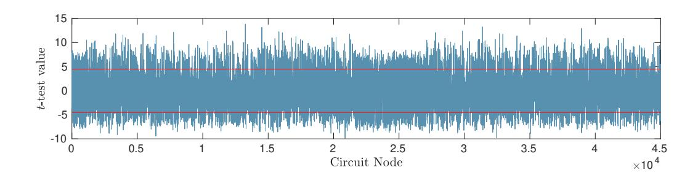
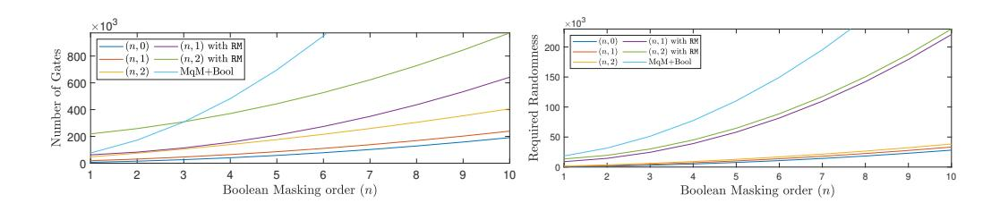
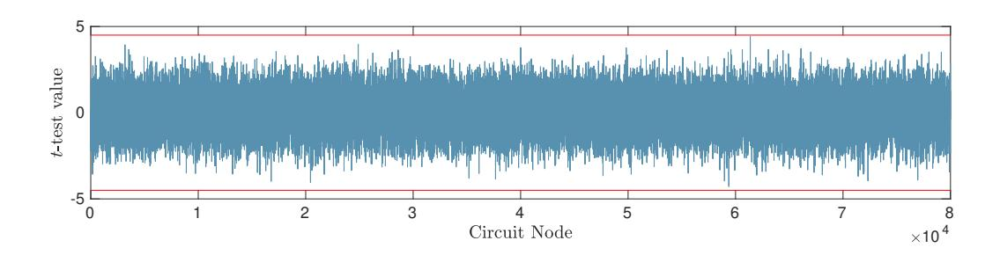

# **A White-Box Masking Scheme Resisting Computational and Algebraic Attacks**

Okan Seker, Thomas Eisenbarth and Maciej Liśkiewicz

University of Lübeck, Germany [{okan.seker,thomas.eisenbarth}@uni-luebeck.de](mailto:{okan.seker, thomas.eisenbarth}@uni-luebeck.de ) [liskiewi@tcs.uni-luebeck.de](mailto:liskiewi@tcs.uni-luebeck.de)

**Abstract.** White-box cryptography attempts to protect cryptographic secrets in pure software implementations. Due to their high utility, white-box cryptosystems (WBC) are deployed by the industry even though the security of these constructions is not well defined. A major breakthrough in generic cryptanalysis of WBC was Differential Computation Analysis (DCA), which requires minimal knowledge of the underlying white-box protection and also thwarts many obfuscation methods. To avert DCA, classic masking countermeasures originally intended to protect against highly related side-channel attacks have been proposed for use in WBC. However, due to the controlled environment of WBCs, new algebraic attacks against classic masking schemes have quickly been found. These algebraic DCA attacks break all classic masking countermeasures efficiently, as they are independent of the masking order.

In this work, we propose a novel generic masking scheme that can resist both DCA and algebraic DCA attacks. The proposed scheme extends the seminal work by Ishai et al. which is probing secure and thus resists DCA, to also resist algebraic attacks. To prove the security of our scheme, we demonstrate the connection between two main security notions in white-box cryptography: *probing security* and *prediction security*. Resistance of our masking scheme to DCA is proven for an arbitrary order of protection, using the well-known strong non-interference notion by Barthe et al. Our masking scheme also resists algebraic attacks, which we show concretely for first and second-order algebraic protection. Moreover, we present an extensive performance analysis and quantify the overhead of our scheme, for a proof-of-concept protection of an AES implementation.

**Keywords:** White-box Cryptography · Boolean Masking · Non-linear Masking · Probing Security · Prediction Security · Differential Computation Analysis · Algebraic Attacks

### **1 Introduction**

Protecting secrets purely in software is a great challenge, especially if a full system compromise is not simply declared out-of-scope of the security model. With fully homomorphic encryption still complex and computationally expensive [\[MOO](#page-34-0)<sup>+</sup>14] and secure enclaves being notoriously buggy at this time [\[VBPS17,](#page-35-0)[MIE17,](#page-34-1)[BMW](#page-32-0)<sup>+</sup>18], industry may opt for white-box cryptosystems (WBC) or even be required to do so by industry standards like EMVCo [\[Pay,](#page-34-2)[BBF](#page-31-0)<sup>+</sup>19]. White-box cryptography promises implementation security of cryptographic services in pure software solutions, mainly by protecting keys and intermediate cipher states through layers of obfuscation. While white-box cryptography is successfully sold by several companies as one ingredient of secure software solutions

(e.g. [\[Gem\]](#page-33-0)), analysis of deployed solutions is lacking, as is a sound framework to analyze white-box implementations. The white-box model assumes the cryptographic primitive to run in an untrusted environment where the white-box adversary has complete control over the implementation. The adversary can read and modify every memory access or intermediate state and can interrupt the implementation at will. White-box cryptography was introduced in 2002 by Chow et al. [\[CEJVO03b,](#page-32-1)[CEJvO03a\]](#page-32-2). The main idea of their scheme is to represent a cryptographic algorithm as a network of look-up tables and key-dependent tables. In order to protect the key dependent tables, Chow et al. proposed to use *input and output encodings*. Although the method provides security guarantees for individual tables, the combinations of protected tables still leaks information [\[BGEC05\]](#page-31-1). In fact, all published academic proposals for WBC [\[Kar10,](#page-34-3)[BCD06,](#page-31-2)[LN05,](#page-34-4)[XL09\]](#page-35-1) have been practically broken [\[BGEC05,](#page-31-1)[DMWP10,](#page-33-1)[LRDM](#page-34-5)<sup>+</sup>14,[WMGP07\]](#page-35-2).

Cryptanalysis of WBCs usually requires a time-consuming reverse engineering step to surpass included obfuscation layers [\[GPRW19\]](#page-33-2). To overcome this, *computational analysis* of white-box cryptosystems has been proposed. Computational analysis is inspired by physical grey box attacks, mainly *side-channel attacks* (SCA). Computational analysis attacks, like side-channel attacks, perform a statistical analysis of observable intermediate states of a cryptographic implementation, e.g. via a physical side-channel [\[KJJ99,](#page-34-6)[GST14,](#page-33-3)[GMO01\]](#page-33-4); if the implementation is not protected against this kind of attack, the side-channel may reveal critical information, usually the secret key material used. At CHES 2016, Bos et al. [\[BHMT16\]](#page-31-3) proposed *Differential Computation Analysis* (DCA) and showed that DCA can extract keys from a wide range of different white-box implementations very efficiently, without requiring a detailed reverse engineering of the implementation. Following this work, further generic computational analysis techniques have been proposed for whitebox implementations, such as Zero Difference Enumeration [\[BBIJ17\]](#page-31-4), Collision Attacks, and Mutual Information Analysis [\[RW19\]](#page-35-3). Alpirez Bock et al. [\[BBMT18\]](#page-31-5) analyzed the ineffectiveness of internal encodings and explained why DCA works so well in the white-box setting. Even fault attacks [\[BDL97,](#page-31-6)[BECN](#page-31-7)<sup>+</sup>06] have been shown to be an effective method for state and key recovery attacks on white-box implementations [\[BHMT16,](#page-31-3) [BBB](#page-31-8)<sup>+</sup>19]. Biryukov et al. [\[BU18\]](#page-32-3) introduced two new types of fault attacks to reveal the structure of a white-box implementation, an important step of overcoming obfuscation in WBC.

To meet the threat of DCA and other computational analysis, *masking schemes* provide a natural protection mechanism. Masking splits a sensitive variable *x* into *n* shares, such that *x* can be recovered from *d* + 1 (*n* ≥ *d* + 1) shares, while no information can be recovered from fewer than *d* + 1 shares [\[CJRR99b\]](#page-32-4). It is a popular and effective countermeasure in the SCA literature. Most important examples are *Boolean masking* introduced by Ishai et al. [\[ISW03\]](#page-33-5) which has been generalized by Rivain and Prouff [\[RP10\]](#page-34-7), *Threshold Implementations* defined by Nikova et al. [\[NRS09\]](#page-34-8), and *polynomial masking* as defined in [\[RP12\]](#page-35-4) based on Shamir's secret sharing [\[Sha79\]](#page-35-5). Recently the idea of *combined countermeasures* to resist both side-channel and fault attacks were introduced in the literature [\[SMG16,](#page-35-6)[RMB](#page-34-9)<sup>+</sup>17[,SFRES18\]](#page-35-7).

As an example for this methodology, we can consider the dedicated masked whitebox implementation introduced in [\[LKK18\]](#page-34-10). However, the implementation was broken in [\[RW19\]](#page-35-3). In addition, for secure WBC, other countermeasures such as fault protection and obfuscation layers need to be added [\[BU18\]](#page-32-3) and additional randomness should be included in the input [\[BRVW19\]](#page-32-5), as internal randomness generators could be disabled by the white-box adversary. Furthermore, higher order variants of DCA have been shown to be effective when applied to masked white-box implementations due to the adversary's ability to observe shares without noise [\[BRVW19\]](#page-32-5). Although the noise-free environment makes the attack easier, techniques like control flow obfuscation, input/output encodings and shuffling [\[VCMKS12\]](#page-35-8) create artificial noise in white-box environments [\[BBIJ17,](#page-31-4)[BRVW19\]](#page-32-5), effectively increasing the complexity of higher order DCA significantly. More *devastatingly*, a new class of generic *algebraic DCA* (or in short *algebraic attacks*) has been proposed recently [\[BU18,](#page-32-3)[GPRW19\]](#page-33-2). Algebraic attacks are able to break masked WBC independently of *the masking orders if the masking is linear*. Thus, all current masking proposals resisting DCA (or in more general sense *computational attacks*) are vulnerable to algebraic attacks. Only the scheme defined by [\[BU18\]](#page-32-3) resists first-order algebraic attacks due to its *non-linear* structure, but as we will show, does not resist computational attacks.

To sum up, although there exist informal ideas on how to create a secure white-box design that can resist both computational and algebraic attacks, formal and generic constructions with a security analysis are missing.

**Our contribution:** In this paper, we provide the first generic and combined masking scheme that resists state-of-the-art white-box attacks: computational and algebraic attacks. Classic masking schemes can be applied to WBC, however none of them can *individually* achieve security against both attacks. To fill this gap, we examine the ISW transformation introduced by Ishai et al. [\[ISW03\]](#page-33-5) and extend it to the white-box context.

We improve the ISW transformation by adding a multiplicatively shared nonlinear share. This additional nonlinear share provides security against algebraic attacks. The secret sharing of our masking scheme then consists of two components: linear and non-linear shares: Linear shares to resist computational attacks and non-linear shares to increase the degree of the decoding function and therefore to prevent algebraic attacks. We present the structure of generic masking that resists an arbitrary order computational and first or second-order algebraic attacks in Section [3.](#page-5-0) To analyze the security of our construction in Section [4,](#page-11-0) we focus on two security notions in cryptography: *probing security* addresses security against computational attacks, while *prediction security* addresses security against algebraic attacks. The *probing model* was introduced by Ishai et al. [\[ISW03\]](#page-33-5). Later it was revised by Rivain et al. [\[RP10\]](#page-34-7) to a new model called SCA security. The model states that every tuple of *n* or less intermediate variables must be independent of any sensitive variable. It was shown that an *n th*-order Boolean masking scheme provides security against *n th*-order SCA. The complexity of computational attacks grows with the masking order. However, the notion is not sufficient to secure a complete block cipher, as stated in [\[CPRR14\]](#page-33-6), thus a new and stronger notion called *t*-strong non-interference (*t*-SNI) was defined in [\[BBD](#page-31-9)<sup>+</sup>16]. The stronger *t*-SNI notion enables the composability of small secure gadgets to generate complex secure constructions. As stated in [\[BRVW19\]](#page-32-5), an *n th*-order masking provides security against *n th*-order probing attacks and *n th*-order computational attacks with additional obfuscation layers.

To cover algebraic attacks, a new security notion called *Prediction Security* was defined in [\[BU18\]](#page-32-3). The prediction security of a circuit *C* (with an encoding function *E*), is based on the probability of an adversary (A) to accurately predict values of any single function (of *d th* order) over intermediate values computed in the circuit *C* (composed with encoding *E*). The aim of such a prediction is to distinguish two sequences of plaintexts (chosen by the adversary) by analyzing the corresponding software trace. For example, an *n th*-order Boolean masking that is inherently protected against computational attacks is vulnerable against first-order algebraic attacks, since the adversary can utilize a linear function (i.e. a first-order function) and combine a subset of intermediate variables to recover the secret value.

In this work, we further show that the probing security and prediction security notions *are incomparable*. First, we prove that our masking scheme is indeed secure against computational attacks by showing that it is secure in the probing model with the given order using the non-interference notions by Barthe et al. [\[BBD](#page-31-9)<sup>+</sup>16]. We give a concrete construction for first and second-order prediction security and prove their security. We extend the security definitions given in [\[BU18\]](#page-32-3) and give a novel composability proof for the second-order prediction secure constructions. Besides the formal proofs, we verify the

probing security of our masking scheme using the tool MaskVerif  $[BBC^+19]$  for specific orders. Furthermore, we update and use the tool produced by [BU18] to experimentally verify the first-order prediction security of our scheme. The implementation that can be used with MaskVerif and the updated version of the tool produced by [BU18] is available as open source  $^1$ .

In Section 5 we introduce a proof-of-concept AES implementation to analyze the overhead and experimentally verify the security properties of our scheme using a simple leakage test. The analysis includes the number of needed gates and number of required randomness for different orders of protection. We show that our combined approach outperforms the previous approaches which required to combine two different masking schemes to resist both attacks.

### 2 Preliminaries

In this section, we provide the notation and definitions used throughout this paper. We also identify the challenges that need to be addressed for secure white-box designs.

First, we summarize the notation used throughout the paper. In the following, we use some finite ring  $(\mathbb{K}, \oplus, \otimes)$  with an addition operation  $\oplus$  and a multiplication operation  $\otimes$ . We often omit the multiplication symbol  $\otimes$  and thus write xy instead of  $x \otimes y$ . Although we introduce the notations using  $\mathbb{K}$ , we fix  $\mathbb{K} = \mathrm{GF}(2)$  throughout the paper. A vector space over  $\mathbb{K}$  of dimension  $\ell$  is denoted by  $\mathbb{K}^{\ell}$ . For  $a,b \in \mathbb{Z}$  with a < b, we define  $[a,b] := \{a,a+1,\ldots,b-1,b\}$ . The letters  $x,y,z,\ldots$  represent the sensitive variables. Random variables are represented by the letter r, with an index as  $r_i$  or  $r^i$ . To denote a random selection of a variable r from the field  $\mathbb{K}$ , we use  $r \in_R \mathbb{K}$ .

A sensitive variable x is split into n+1 linear shares  $x_0, \ldots, x_n$  such that  $x = \bigoplus_{i=0}^n x_i$  and a single share (e.g.  $x_0$ ) split into d+1 non-linear shares  $\tilde{x}_0, \ldots, \tilde{x}_d$  such that  $x_0 = \prod_{j=0}^d \tilde{x}_j$ . A vector of elements  $(x_1, \ldots, x_n)$  is denoted by  $\overline{x}$ . For a subset  $I \subseteq [0, n]$  of indices, we denote by  $x_{|I|} = (x_i)_{i \in I}$  the sub-vector of shares indexed by I.

A gadget G for a function  $f: \mathbb{K}^a \to \mathbb{K}^b$  (with regard to a masking order) is an arithmetic circuit with  $a\cdot (n+d+1)$  inputs and  $b\cdot (n+d+1)$  outputs grouped into a vectors of shares  $\overline{x}^{(1)},\ldots,\overline{x}^{(a)}$ , resp. b vectors of shares  $\overline{y}^{(1)},\ldots,\overline{y}^{(b)}$ . The gadget needs to be correct, i. e.  $G(\overline{x}^{(1)},\ldots,\overline{x}^{(a)})=(\overline{y}^{(1)},\ldots,\overline{y}^{(b)})$  iff  $f(x^{(1)},\ldots,x^{(a)})=(y^{(1)},\ldots,y^{(b)})$  for all possible inputs and for all values generated by the random gates. The values assigned to wires that are not output wires are called *intermediate variables*.

As usual, we model the white-box implementations as Boolean circuits (C) represented by directed acyclic graphs. Each node in a circuit C, with k>0 inputs, corresponds to a k-ary Boolean function. Nodes with the indegree equal to zero are called inputs of C and nodes with the outdegree equal to zero are called outputs of C.

Let z be an input of  $C: \mathbb{F}_2^N \to \mathbb{F}_2^M$  and  $\overline{\mathsf{x}} = (\mathsf{x}_1, \dots, \mathsf{x}_N)$  be a vector of input nodes in some fixed order. For each node v in C, we say that it computes a Boolean function  $f_v: \mathbb{F}_2^N \to \mathbb{F}_2$  defined as follows:

- for all  $1 \le i \le N$  set  $f_{x_i}(z) = z_i$ ,
- for all non-input nodes v in C set  $f_v(z) = g_v(f_{c_1}(z), \ldots, f_{c_k}(z))$ , where  $c_1, \ldots, c_k$  are nodes having an outgoing edge to v and  $g_v : \mathbb{F}_2^k \to \mathbb{F}_2$ .

The set of  $f_v$  for all nodes v in C is denoted  $\mathcal{F}(C)$ , the set of  $f_{\mathsf{x}_i}$  for all input nodes  $\mathsf{x}_i$  is denoted  $\mathcal{X}(C)$ , and the set of  $f_v$  for all non-input nodes v in C is denoted  $\mathcal{F}(C \setminus \mathcal{X})$ .

Recall, that any Boolean function  $f: \mathbb{F}_2^n \to \mathbb{F}_2$  has a unique representation of the form  $f(x) = \bigoplus_{b \in \mathbb{F}^n} a_b \ x_1^{b_1} \dots x_n^{b_n}$ , with  $a_b \in \mathbb{F}_2$ . The (algebraic) degree of f, denoted  $\deg(f)$ ,

<span id="page-3-0"></span><sup>1</sup>https://github.com/UzL-ITS/white-box-masking

is the maximum degree of a monomial  $x_1^{b_1} \dots x_n^{b_n}$ , with  $a_b = 1$ . The bias of a Boolean function  $g: \mathbb{F}_2^{\ell} \to \mathbb{F}_2$  is represented by  $\mathcal{E}(\cdot)$  i.e.,  $\mathcal{E}(g) = |1/2 - wt(g)/2^{\ell}|$  and wt(g) is the weight of g, i.e., the number of nonzero entries of its truth table. Bold numbers  $\mathbf{0}$  and  $\mathbf{1}$  are used to denote constant functions.

If  $\mathcal{V} = \{g_1, \dots, g_{|\mathcal{V}|}\}$  is a set of Boolean functions with the same domain  $\mathbb{F}_2^n$  then the d-th order closure of  $\mathcal{V}$  (denoted  $\mathcal{V}^{(d)}$ ) we call the vector space of all functions obtained by composing any function of degree at most d with functions from  $\mathcal{V}$ , i.e.,  $\mathcal{V}^{(d)}$  contains functions of the form  $f \circ (g_1(x), \dots, g_{|\mathcal{V}|}(x))$  for all  $f : \mathbb{F}_2^{|\mathcal{V}|} \to \mathbb{F}_2$ , with  $\deg(f) \leq d$ . For example,  $\mathcal{F}^{(1)}(C)$  is spanned by  $\{1\} \cup \mathcal{F}(C)$  and  $\mathcal{F}^{(2)}(C)$  is spanned by  $\{1\} \cup \{g_ig_j \mid g_i, g_j \in \mathcal{F}(C)\}$ .

**Differential Computational Analysis (DCA):** The idea of using *side-channel attacks* to recover critical secrets in WBC has been introduced by Bos et al. [BHMT16]. Differential computational analysis utilizes internal states of the software execution (such as memory accesses) to generate software traces. DCA is regarded as one of the most efficient attacks against white-box implementations, since it does not require full knowledge of the white-box design and thus avoids the time-consuming reverse engineering process. The first step of DCA consists of collecting software traces consisting of memory addresses, intermediate values, or values written/read by the implementation. The second step consists of a statistical analysis of the software traces collected during the first step.

As before we use the term *computational attacks* to indicate DCA and higher order variants of DCA. To resist computational attacks, a natural approach is to use the well-known side-channel analysis countermeasure masking [CJRR99b]. Masking is carried out in two steps as defined in the seminal work by Ishai, Sahai, and Wagner in 2003 [ISW03]. First, input data is transformed by representing each input x by n+1 shares in such a way that

$$x = x_0 \oplus \cdots \oplus x_n,$$

where  $x \in \mathbb{F}_2$  and n of the shares are distributed uniformly and independently. Additionally, the circuit is adapted by replacing all AND and XOR gates with gadgets processing the shares of the inputs. Throughout the paper, the data and gate transformation will be defined as ISW transformation.

Masking schemes rely on the availability of good randomness, which is usually provided by secure RNGs, e.g. in the form of a secure and efficient Pseudorandom Generator [IKL+13, CGZ19]. Similarly, randomness generation for white-box implementations has been analyzed in the literature. Due to the adversarial ability to control the execution environment in the white-box model, the attacker can simply disable any external randomness sources. Therefore, white-box implementations have to rely on internal randomness sources in combination with additional obfuscation countermeasures [BBIJ17, BU18, BRVW19].

The effectiveness of computational attacks comes from its universality and its ability to avoid reverse-engineering, which can be extremely costly [GPRW19]. By combining masking with an obfuscation layer, the adversary is thus again forced to do a time-consuming reverse engineering step to bypass the obfuscation, while the masking prevents obfuscation-oblivious attacks such as DCA.

Algebraic Attacks: Algebraic attacks have been introduced during the WhibOx contest of CHES2017 [Con]. Although the majority of the implementations in the contest were broken in less than one day, even the strongest design (by means of the surviving time: 28 days) was broken by algebraic analysis [BU18, GPRW19]. Algebraic attacks try to find a set of circuit nodes whose  $d^{th}$ -order of combination equals to a predictable vector. Observe that if an implementation is protected by a linear masking, there exists a set of circuit nodes (corresponding to the secret shares) such that a linear combination (i.e. the

first-order combination) is always equal to a predictable secret value. This means that linear masking is inherently vulnerable to first-order algebraic attacks *independently of the masking order* [BU18, GPRW19]. Like computational attacks, algebraic attacks do not require complex reverse engineering and are thus a generic threat that any white-box implementation needs to address.

Another challenge for secure white-box implementation is the adversaries' ability to collect noise-free measurements. The security of masking schemes against side-channel attacks or computational attacks requires noisy observations [CJRR99a]. To deal with this problem, artificial noise sources such as control flow obfuscation [BBIJ17], shuffling [BRVW19], and input and output encodings [BBMT18] have been analyzed in the literature. The artificial noise introduced by these methods increases the complexity of computational attacks dramatically. It has been shown in [BRVW19] that the complexity of attacks increases with the order of the masking and the order of the obfuscation layers. Therefore, the probing model is a valid approach to analyze the security of masking schemes of white-box implementations against computational attacks. Due to the artificial noise sources, it becomes infeasible for an attacker to combine the required number of shares to recover the sensitive information. Throughout the paper we assume a reliable randomness source is provided as part of the implementation, in other words, randomness can be provided via pseudorandom values derived from the input and protected by obfuscation layers, as done in [BBIJ17, BU18, RW19]. Therefore, the attacks on randomness sources and the adversaries' ability to disable randomness are out-of-scope in this work. For a full white-box implementation, other techniques (fault protection, randomness generation, obscurity layers) need to be added [BU18, BRVW19] in addition to a secure masking scheme, which we introduce throughout this work.

In the next section, we introduce our masking scheme, which resists both computational and algebraic attacks by using an adapted version of the ISW transformation.

## <span id="page-5-0"></span>3 Secure Masking Construction

The proposed masking scheme is based on two ideas: an ISW-like masking to increase the number of shares required to eliminate computation attacks and using a multiplicative sharing to increase the degree of the decoding function. We call the first part linear sharing of order n and the second part non-linear sharing of degree d. The resulting construction is named (n,d)-masking. We start with the data transformation and define our masking function as:

Encode
$$(x, \tilde{x}_0, \dots, \tilde{x}_d, x_1, \dots, x_{n-1}) = (\tilde{x}_0, \dots, \tilde{x}_d, x_1, \dots, x_n)$$

where  $\tilde{x}_0, \dots, \tilde{x}_d, x_1, \dots, x_{n-1} \in_R \mathbb{F}_2$  are chosen randomly and independently from  $\mathbb{F}_2$ , and

$$x_n = x \oplus \prod_{j=0}^d \tilde{x}_j \oplus \bigoplus_{i=1}^{n-1} x_i$$
.

Observe that our masking scheme is obtained from the ISW transformation by replacing the first share  $x_0$  in ISW by a non-linear sharing  $x_0 = \prod_{j=0}^d \tilde{x}_j$ . The unmasking function is defined as follows:

$$\operatorname{Decode}(\tilde{x}_0,\ldots,\tilde{x}_d,x_1,\ldots,x_n)=\prod_{j=0}^d \tilde{x}_j\oplus \bigoplus_{i=1}^n x_i.$$

The data transformation is followed by the transformations of each AND and XOR gate. Throughout the paper, we define the transformed gates as And and Xor (or And[n,d]) and Xor[n,d]) gadgets respectively.

#### <span id="page-6-1"></span>3.1 Gate Transformations

In this section the generic constructions for the Xor and And gadgets are presented. Additionally, we provide definition of the RefreshMask gadget, which is needed to protect against algebraic attacks. The scheme can be used for an arbitrary order n of linear masking and any degree d of the non-linear component. Though the constructions are general, the algebraic security depends on the variable structure (details can be found in Section 4). Depending on the non-linear degree d, the following intermediate variables need a special structure:

- The intermediate variable  $\mathcal{U}$  used in Xor and specified in Equation (1),
- The intermediate variables  $r_{j,0}$  in Equation (2), used in And,
- The intermediate variables W and R used in RefreshMask, Equation (3).

In the following descriptions we first introduce the *functionalities* of these variables which can be defined for arbitrary orders of n and d. Afterwards, we will show the *computational structure* of these variables for d = 1 and d = 2.

Let x and y be two bits and consider an (n,d)-masking scheme, i.e. x and y have been split into (n+d+1) shares such that  $\prod_{j=0}^d \tilde{x}_j \oplus \bigoplus_{i=1}^n x_i = x$  and  $\prod_{j=0}^d \tilde{y}_j \oplus \bigoplus_{i=1}^n y_i = y$ .

**Xor**[n,d] **Gadget:** A masked representation of  $z=x\oplus y$  with n+d+1 shares such that  $\prod_{j=0}^{d} \tilde{z}_{j} \oplus \bigoplus_{i=1}^{n} z_{i} = z$  can be calculated as follows:

**Step 0:** The input shares are processed by RefreshMask gadgets;

$$\overline{x} \leftarrow \texttt{RefreshMask}(\overline{x}) \text{ and } \overline{y} \leftarrow \texttt{RefreshMask}(\overline{y}).$$

**Step 1:** The values of the non-linear shares are processed:

$$\tilde{z}_i = \tilde{x}_i \oplus \tilde{y}_i \text{ for } 0 < i < d.$$

**Step 2:** Computation of linear shares:

$$z_i = \begin{cases} x_i \oplus y_i, & \text{for } 1 \le i < n \\ x_i \oplus y_i \oplus \mathcal{U}, & \text{for } i = n. \end{cases}$$

where the functionality of  $\mathcal{U}$  is defined as follows:

<span id="page-6-0"></span>
$$\mathcal{U} = \bigoplus_{\substack{I \subseteq \{0, \dots, d\}\\ I \neq \emptyset}} \prod_{i \in I} \tilde{x}_i \prod_{j \notin I} \tilde{y}_j \tag{1}$$

Moreover, we can introduce the computational structure of  $\mathcal U$  for a secure masking scheme as follows:

- $\operatorname{Xor}[n,1]$ :  $\mathcal{U} = \tilde{x}_0 \tilde{y}_1 \oplus \tilde{x}_1 \tilde{y}_0$
- $\operatorname{Xor}[n,2]$ :  $\mathcal{U} = \tilde{x}_1(\tilde{x}_2\tilde{y}_0 \oplus \tilde{y}_2(\tilde{x}_0 \oplus \tilde{y}_0)) \oplus \tilde{y}_1(\tilde{x}_2\tilde{y}_0 \oplus \tilde{x}_0(\tilde{x}_2 \oplus \tilde{y}_2))$
- Xor[n, d] for  $d \geq 3$ , the functionality of  $\mathcal{U}$  can be defined as in Equation (1). However the computational structure should be described carefully in order not to create vulnerabilities in algebraic security.

### <span id="page-7-1"></span>**Algorithm 1** Xor(*x, y*)

```
Input: The shares x = ((˜xj )j∈[0,d]
                                    ,(xi)i∈[1,n]) and y = ((˜yj )j∈[0,d]
                                                                      ,(yi)i∈[1,n]).
Output: The shares of x ⊕ y as z = ((˜zj )j∈[0,d]
                                                  ,(zi)i∈[1,n]).
 1: x ← RefreshMask(x)
 2: y ← RefreshMask(y)
 3: for 0 ≤ j ≤ d do
 4: z˜j ← x˜j ⊕ y˜j
 5: for 1 ≤ i < n do
 6: zi ← xi ⊕ yi
 7: zn ← xn ⊕ yn ⊕ U
 8: return z¯ = ((˜zj )j∈[0,d]
                            ,(zi)i∈[1,n])
```

**And[***n, d***] Gadget:** A masked representation of *z* = *xy* with *n* + *d* + 1 shares such that Q*<sup>d</sup> <sup>j</sup>*=0 *z*˜*<sup>j</sup>* ⊕ L*<sup>n</sup> <sup>i</sup>*=1 *z<sup>i</sup>* = *z* can be calculated as follows:

**Step 0:** The input shares are processed by RefreshMask gadgets;

$$\overline{x} \leftarrow \texttt{RefreshMask}(\overline{x}) \text{ and } \overline{y} \leftarrow \texttt{RefreshMask}(\overline{y}).$$

**Step 1:** The calculations of the values with multiplicative representation are processed. Additional random bits *r i,j* are generated in order to attain algebraic security in the second step.

$$\tilde{z}_i = \tilde{x}_i \tilde{y}_{i'} \oplus r^{i,1} \oplus \cdots \oplus r^{i,n} \text{ for } 0 \leq i \leq d \text{ where } i' = i+1 \mod(d+1).$$

**Step 2:** The variables *rj,i* for 0 ≤ *i < j* ≤ *n* are generated as follows:

$$r_{j,i} = \begin{cases} (r_{i,j} \oplus (\tilde{x}_0 \cdots \tilde{x}_d) y_j) \oplus x_j (\tilde{y}_0 \cdots \tilde{y}_d), & \text{for } i = 0 \\ (r_{i,j} \oplus x_i y_j) \oplus x_j y_i, & \text{for } 1 \leq i \leq n \text{ where } r_{i,j} \in_R \mathbb{F}_2 \text{ (b) }, \end{cases}$$

The calculations for 1 ≤ *i* ≤ *n* are processed as identical to the ISW-And gadget. However, for *i* = 0 the calculations require a special computational structure:

<span id="page-7-0"></span>
$$r_{j,0} = [r_{0,j} \oplus (\tilde{x}_0 \cdots \tilde{x}_d)y_j] \oplus x_j(\tilde{y}_0 \cdots \tilde{y}_d) \text{ for } 1 \le j \le n.$$
 (2)

Observe that *ri,j* for 1 ≤ *i < j* ≤ *n* is assigned a uniformly random value. However, *r*0*,j* cannot be assigned as random. Instead, *r*0*,j* should be defined in such a way that the following equation holds:

$$\bigoplus_{j=1}^n r_{0,j} = \bigoplus_{\substack{I \subset \{0,\dots,d\}\\I \neq \emptyset}} \prod_{i \in I} \tilde{x}_i \tilde{y}_{i'} \prod_{j \notin I} (r^{j,1} \oplus \dots \oplus r^{j,n}) \text{ where } i' = i+1 \mod(d+1).$$

Throughout the paper we denote the right-hand side of the above equation as V. Note that the above functionality for *rj,*<sup>0</sup> (given on the right-hand side of Equation [\(2\)](#page-7-0)) is not secure against an algebraic attack, even if it is only a first-order one. Below we provide a secure computational structure for the case of an (*n,* 1) and (*n,* 2)-masking.

• And 
$$[n,1]: r_{j,0} = \tilde{x}_1(\tilde{x}_0y_j \oplus r^{0,j}\tilde{y}_0) \oplus \tilde{y}_1(\tilde{y}_0x_j \oplus r^{1,j}\tilde{x}_0) \oplus r^{1,j}(r^{0,1} \oplus \ldots \oplus r^{0,n}).$$

#### <span id="page-8-0"></span>Algorithm 2 And $(\overline{x}, \overline{y})$

```
Input: The shares \overline{x} = ((\tilde{x}_j)_{j \in [0,d]}, (x_i)_{i \in [1,n]}) and \overline{y} = ((\tilde{y}_j)_{j \in [0,d]}, (y_i)_{i \in [1,n]}). Output: The vector of shares of xy as \overline{z} = ((\tilde{z}_j)_{j \in [0,d]}, (z_i)_{i \in [1,n]}).
  1: \overline{x} \leftarrow \text{RefreshMask}(\overline{x})
  2: \overline{y} \leftarrow \text{RefreshMask}(\overline{y})
  3: for 0 \le i \le d do
                                                                                                                                       \triangleright i' = i + 1 \mod(d+1)
              \tilde{z}_i = \tilde{x}_i \tilde{y}_{i'}
               for 1 \le j \le n do
                      r^{i,j} \leftarrow \mathtt{rand}(0,1)
  6:
                      \tilde{z}_i = \tilde{z}_i \oplus r^{i,j}
  7:
  8: for 0 < i < n do
               for i < j \le n do
  9:
                      if i = 0 then
 10:
                             r_{i,0} \leftarrow as described in the text.
 11:
 12:
                             r_{i,j} \leftarrow \mathtt{rand}(0,1)
 13.
                            r_{j,i} \leftarrow (r_{i,j} \oplus x_i y_j) \oplus x_j y_i
 14:
 15: for 1 \le i \le n do
               z_i \leftarrow x_i y_i
 16:
               for 0 \le j \le n and j \ne i do
 17:
                                                                                                                                                  \triangleright Denoted by z_{i,j}
                      z_i \leftarrow z_i \oplus r_{i,j}
 19: return \overline{z} = ((\tilde{z}_j)_{j \in [0,d]}, (z_i)_{i \in [1,n]})
```

```
 \begin{split} \bullet \ \ \operatorname{And}[n,2]: r_{j,0} &= \tilde{x}_0 \left[ \tilde{x}_2 (\tilde{x}_1 y_j \oplus r^{0,j} \tilde{y}_0) \oplus r^{1,j} v \tilde{y}_1 \right] \oplus \\ & \tilde{y}_0 \left[ \tilde{y}_1 (\tilde{y}_2 x_j \oplus r^{1,j} \tilde{x}_2) \oplus r^{0,j} u \tilde{x}_2 \right] \oplus \\ & \tilde{x}_0 \tilde{y}_1 (r^{1,j} \tilde{x}_2 \tilde{y}_0 \oplus r^{2,j} \tilde{x}_1 \tilde{y}_2) \oplus r^{0,j} \tilde{x}_1 \tilde{y}_2 (v \oplus \tilde{x}_2 \tilde{y}_0) \oplus \\ & \tilde{x}_2 \tilde{y}_0 (r^{0,j} \tilde{x}_0 \oplus r^{1,j} \tilde{y}_1) \oplus uvr^{0,j}. \end{split}  where u = r^{1,1} \oplus \cdots \oplus r^{1,n} and v = r^{2,1} \oplus \cdots \oplus r^{2,n}.
```

• And [n, d] for  $d \ge 3$  the circuit nodes that calculates  $r_{j,0}$  should be structured in such a way that algebraic security properties are satisfied.

**Step 3:** The final step can be performed identical to an ISW-And gadget: For every  $1 \le i \le n$ , compute  $z_i = x_i y_i \oplus \bigoplus_{i \ne j} r_{i,j}$ .

RefreshMask[n,d] Gadget: This operation has a crucial importance for generating an algebraically secure implementation. In fact, it has to be combined with each Xor and And gadget in order to obtain a fully secure masking scheme. The security details can be found in Section 4.

**Step 1:** For  $0 \le i \le d$ , calculate  $\tilde{x}'_i = \tilde{x}_i \oplus \tilde{r}_i$  where  $\tilde{r}_i \in_R \mathbb{F}_2$ .

**Step 2:** First initialize  $x_i' \leftarrow x_i$  for all  $i \in [1, n]$  and for  $1 \le i < j \le n$ , calculate  $x_i' = x_i' \oplus r_{i,j}$  and  $x_j' = x_j' \oplus r_{i,j}$  where  $r_{i,j} \in_R \mathbb{F}_2$ .

**Step 3:** In the last step we sample  $r_0 \in_R \mathbb{F}_2$  and define two intermediate variables as follows:

$$\mathcal{W}' = \bigoplus_{I \subsetneq \{0, \dots, d\}} \prod_{i \in I} \tilde{x}_i \prod_{j \notin I} \tilde{r}_j \text{ and } \mathcal{W} = \bigoplus_{\substack{I \subsetneq \{0, \dots, d\}\\I \neq \emptyset}} \prod_{i \in I} (\tilde{x}_i \oplus r_0) \prod_{j \notin I} \tilde{r}_j,$$

#### <span id="page-9-1"></span> $\overline{\mathbf{Algorithm}}$ 3 RefreshMask $(\overline{x})$

```
Input: The shares \overline{x} = ((\tilde{x}_j)_{j \in [0,d]}, (x_i)_{i \in [1,n]})
Output: The shares \overline{x} = ((\tilde{x}_j')_{j \in [0,d]}, (x_i')_{i \in [1,n]})
1: for 0 \le j \le d do
2: \tilde{r}_j \leftarrow \text{rand}(0,1)
3: \tilde{x}_j' \leftarrow \tilde{x}_j \oplus \tilde{r}_j
4: for 1 \le i \le n do x_i' \leftarrow x_i
5: for 1 \le i \le n do
6: for i+1 \le j \le n do
7: r_{i,j} \leftarrow \text{rand}(0,1)
8: x_i' \leftarrow x_i' \oplus r_{i,j} \triangleright Denoted by a_{i,j}
9: x_j' \leftarrow x_j' \oplus r_{i,j} \triangleright Denoted by b_{j,i}
10: r_0 \leftarrow \text{rand}(0,1) \triangleright r_0 is used to compute \mathcal{W} and \mathcal{R}
11: x_n' \leftarrow x_n' \oplus \mathcal{W} \oplus \mathcal{R}
12: \text{return} (((\tilde{x}_j')_{j \in [0,d]}, (x_i')_{i \in [1,n]})
```

Here, as usual, a product over the empty set I is evaluated as 1. Using the above equations we define the variable  $\mathcal{R} = \mathcal{W} \oplus \mathcal{W}'$ . Now, we can introduce the variables that need to be added to the final share  $x_n$  as:

<span id="page-9-0"></span>
$$x'_n \leftarrow x'_n \oplus \mathcal{W} \oplus \mathcal{R} \text{ where } \mathcal{R} = \mathcal{W}' \oplus \mathcal{W}.$$
 (3)

Remark that we cannot directly add  $\mathcal{W}'$  to the final share  $x_n$  due to algebraic security properties. Therefore, the variables  $\mathcal{W}$  and  $\mathcal{R}$  should be added to the final share in order to define an algebraically secure mask refreshing gadget. The computational structure of the circuit nodes to calculate  $\mathcal{W}$  and  $\mathcal{R}$  for RefreshMask[n,1] and RefreshMask[n,2] can be found below.

- RefreshMask $[n,1]: \mathcal{W} = \tilde{r}_0(\tilde{x}_1 \oplus r_0) \oplus \tilde{r}_1(\tilde{x}_0 \oplus r_0) \text{ and } \mathcal{R} = (\tilde{r}_0 \oplus r_0)(\tilde{r}_1 \oplus r_0) \oplus r_0.$
- $$\begin{split} \bullet \ \operatorname{RefreshMask}[n,2] : \mathcal{W} &= [\tilde{r}_2(\tilde{x}_0 \oplus r_0)] [\tilde{r}_1 \oplus (\tilde{x}_1 \oplus r_0)] \oplus [\tilde{r}_1(\tilde{x}_2 \oplus r_0)] [\tilde{r}_0 \oplus (\tilde{x}_0 \oplus r_0)] \oplus \\ & [\tilde{r}_0(\tilde{x}_1 \oplus r_0)] [\tilde{r}_2 \oplus (\tilde{x}_2 \oplus r_0)] \\ \mathcal{R} &= (\tilde{r}_0 \oplus r_0) (\tilde{r}_1 \oplus r_0) (\tilde{r}_2 \oplus r_0) \oplus \\ & r_0 \left[\tilde{r}_2(\tilde{x}_0 \oplus r_0) \oplus \tilde{r}_1(\tilde{x}_0 \oplus r_0) \oplus \tilde{r}_0(\tilde{x}_1 \oplus r_0)\right] \oplus \\ & r_0 \left[\tilde{r}_2(\tilde{x}_1 \oplus r_0) \oplus \tilde{r}_1(\tilde{x}_2 \oplus r_0) \oplus \tilde{r}_0(\tilde{x}_2 \oplus r_0)\right]. \end{split}$$
- RefreshMask[n,d] for  $d \geq 3$  the circuit nodes that calculate W and R should be constructed in such a way that algebraic security properties are satisfied.

#### 3.2 Correctness and Performance Analysis

Next, we introduce the transformation  $T^{(n,d)}$  to generate a Boolean circuit that is protected by an (n,d)-masking scheme by using the gadgets described in Section 3.1. The following lemma summarizes the correctness of the transformation  $T^{(n,d)}$ .

<span id="page-9-2"></span>**Lemma 1.** Let us denote the Boolean circuit C initialized with data D by C[D]. The transformation  $T^{(n,d)}:C[D]\mapsto C'[D']$  where C' uses And, Xor, RefreshMask gadgets and Encoding, Decoding functions described in Section 3 with randomness gates is a functionality preserving transformation, i.e. C[D] and C'[D'] have the same input-output behavior.

<span id="page-10-0"></span>**Table 1:** The number of bitwise operations in a masked Xor, And and RefreshMask (or RefM in short) gadget. Remark that (*n,* 0)-masking scheme corresponds to ISW gadgets. The last part of the table corresponds to the overhead of (*n, d*)-masking scheme compared to the ISW transformation.

|            | Xor                           | And                    | Randomness           |
|------------|-------------------------------|------------------------|----------------------|
| Xor[n, 0]  | n + 1                         | -                      | -                    |
| And[n, 0]  | 2n(n + 1)                     | (n + 1)2               | n(n + 1)/2           |
| RefM[n, 0] | n(n − 1)                      | -                      | n(n − 1)/2           |
| Xor[n, 1]  | n + 4                         | 2                      | -                    |
| And[n, 1]  | 2 + 5n<br>2n<br>− 1           | 2 + 7n<br>n<br>+ 2     | n(n + 3)/2           |
| RefM[n, 1] | n(n − 1) + 8                  | 3                      | (n(n − 1)/2) + 2     |
| Xor[n, 2]  | n + 9                         | 6                      | -                    |
| And[n, 2]  | 2 + 15n<br>2n<br>− 2          | 2 + 27n<br>n<br>+ 3    | n(n + 5)/2           |
| RefM[n, 2] | n(n − 1) + 26                 | 16                     | (n(n − 1)/2) + 3     |
| Xor[n, d]  | n + d + 2 + Ux                | Ua                     | -                    |
| And[n, d]  | n(2n + d − 1) + Vx            | 2 +<br>n<br>d + 1 + Va | n(n + 2d + 1)/2      |
| RefM[n, d] | n(n − 1) + d + 1 + Wx<br>+ Rx | Wa<br>+ Ra             | (n(n − 1)/2) + d + 1 |
|            | Overhead                      |                        |                      |
| Xor[n, d]  | d + 1 + Ux                    | Ua                     | -                    |
| And[n, d]  | n(2n + d − 3) + Vx<br>− 1     | d + Va<br>− n          | nd                   |
| RefM[n, d] | d + 1 + Wx<br>+ Rx            | Wa<br>+ Ra             | d + 1                |

The proof for this lemma can be found in Appendix [A.](#page-35-9) In conclusion, the transformation T (*n,d*) can be used to transform any circuit to an (*n, d*)-masked circuit in a functionality preserving manner. Although we are using an *n th* order linear masking, the scheme only provides an (*n* − 1)*th* probing security. Due to the non-linear sharing, the masking loses one share to increase the decoding order. The algebraic security depends on the structure of Equations [\(1\)](#page-6-0), [\(2\)](#page-7-0), and [\(3\)](#page-9-0) in each gadget as discussed above. Further details can be found in Section [4.2.](#page-14-0)

**Performance Analysis:** In order to compare our construction with the previous schemes, we analyze the performance of our scheme in terms of bitwise operations and randomness requirements. An analytical comparison of different orders and a comparison between the ISW transformation and (*n, d*)-masking scheme can be found in Table [1.](#page-10-0)

In the following analysis, for simplicity, we use the symbol vertical bar (|) to separate the number of Xor, And operations respectively. We exclude the RefreshMask gadgets inside the Xor and And gadgets to analyze the constructions straightforwardly. Since the structure of the special variables depends on the non-linear degree *d*, we use a symbolic approach to analyze the performance numbers for the higher orders (i.e. for *d* ≥ 3). We use subscripts to denote the number of operations within U, V, W, and R, e.g., U*<sup>x</sup>* and U*<sup>a</sup>* represent the number of bitwise Xor, And operations within U respectively.

As seen in Table [1,](#page-10-0) the Xor gadget can be transformed efficiently. The cost of the gadget in the ISW transformation is *n* + 1 bitwise Xor operations while an (*n, d*)-masking requires *n* + *d* + 2 bitwise Xor operations and the additional cost of the variables U. Therefore, the cost of the Xor gadget can be calculated as; (*n* + *d* + 2 + U*x*)|U*a*.

The cost of an And gadget can be analyzed easily by comparing it step-by-step with the ISW transformation. As seen in the construction in Section [3,](#page-5-0) the gadget can be divided into three stages.

- Step 1 requires n(d+1) random bits; the cost of processing these values can be calculated as n(d+1)|d+1.
- Step 2(a) includes the calculations of  $r_{j,0}$  for  $1 \leq j \leq n$ . For the (n,1) masking,  $\mathcal{V}_x = 4n$  and  $\mathcal{V}_a = 7n$ . Additionally, the calculations of  $r^{0,1} \oplus \ldots \oplus r^{0,n}$  require n-1 Xor operations. Similarly, for the (n,2) masking, we get  $\mathcal{V}_x = 12n$  and  $\mathcal{V}_a = 27n$ . The intermediate variables u, v, and uv are calculated only once and they require 2(n-1)|1 gates.
- Step 2(b) & Step 3 involve the calculations of  $r_{j,i}$  for  $1 \le i < j \le n$ ,  $i \ne 0$  and Step 3. These parts can be processed identical to the ISW transformation and cost  $2n(n-1)|n^2$  gates, while the required number of random bits is n(n-1)/2. Observe that the cost of these parts are exactly the cost of an ISW-AND gadget with n shares.

To sum up, we express the cost of And[n,d] gadget as  $(n(2n+d-1)+\mathcal{V}_x)|(n^2+d+1+\mathcal{V}_a)$  gates, and the required randomness as n(n+2d+1)/2.

We analyze the performance of the RefreshMask gadget using a similar methodology. The total amount of required randomness and the number of required bitwise Xor operations can be calculated as (n(n-1)/2) + d + 1 and n(n-1) + d + 1 respectively. As in the previous gadgets, the calculations of  $\mathcal{W}$  and  $\mathcal{R}$  add more calculations to the structure. The numbers for RefreshMask[n, 1] and RefreshMask[n, 2] are given in Table 1.

Using the performance analysis, we show the exact overhead of our scheme. The numbers in the overhead section of Table 1 can be calculated by comparing the cost of the  $n^{th}$ -order ISW transformation with an (n,d)-masking scheme. As seen in the table, the cost principally depends on the calculation of the values  $\mathcal{U}$ ,  $\mathcal{V}$ ,  $\mathcal{W}$ , and  $\mathcal{R}$ , while the randomness is affected by the masking degrees n and d.

## <span id="page-11-0"></span>4 Security Against Computational and Algebraic Attacks

In this section, we prove that our proposed [n,d] masking scheme resists both computational and algebraic attacks, up to  $(n-1)^{th}$  order and  $d^{th}$  order, respectively. We use the definition of non-interference as defined in [BBD<sup>+</sup>16], which guarantees security against t probes for  $t \leq n$  as proposed by Ishai et al. [ISW03], and the definition of security against algebraic attacks of order d as proposed in [BU18]. First, we recall briefly both security notions and then we prove that our (n,d) construction is secure against probing up to order n-1 and against algebraic attacks for d=1 and d=2. Remark that probing security implies security against computational attacks of the same order, since computational attacks correspond to side-channel attacks of the same order [BRVW19].

### 4.1 Security Notions

We first cover the security notions that we used to prove our security properties, starting with probing security. Roughly speaking, in the setting of the probing model, an adversary may invoke the (randomized) construction multiple times and adaptively choose the inputs. Prior to each invocation, the adversary may fix an arbitrary set of  $t \leq n$  wires of the circuit values which can be observed during that invocation.

The security against t probes requires the existence of a *simulator* [ISW03]. The simulator attempts to simulate the view of the adversary using only black-box access (i.e., without having access to any internal wires) to the transformed circuit C'. The presence of a simulator (or simulatability) implies that t probes are indeed independent of the processed data and therefore t probes will not provide any information to the adversary. In this paper we use a more refined security model, t-non-interference (t-NI) and t-strong non-interference (t-SNI), as defined in [BBD<sup>+</sup>16]. We use the restatements of the definitions by Coron et al. [CGPZ16].

<span id="page-12-0"></span>**Definition 1** (t-NI Security). Let G be a gadget which takes as input n+1 shares  $(x_i)_{0 \le i \le n}$  and outputs n+1 shares  $(y_i)_{0 \le i \le n}$ . The gadget G is said to be t-NI secure if for any set of  $t_1$  probed intermediate variables and any subset  $\mathcal{O} \subset [0,n]$  of output indices, such that  $t_1 + |\mathcal{O}| \le t$ , there exists a subset  $I \subset [0,n]$  of input indices which satisfies  $|I| \le t_1 + |\mathcal{O}|$ , such that the  $t_1$  intermediate variables and the output variables  $y_{|\mathcal{O}}$  can be perfectly simulated from  $x_{|I|}$ .

<span id="page-12-1"></span>**Definition 2** (t-SNI Security). Let G be a gadget which takes as input n+1 shares  $(x_i)_{0 \le i \le n}$  and outputs n+1 shares  $(y_i)_{0 \le i \le n}$ . The gadget G is said to be t-SNI secure if for any set of  $t_1$  probed intermediate variables and any subset  $\mathcal{O} \subset [0,n]$  of output indices, such that  $t_1 + |\mathcal{O}| \le t$ , there exists a subset  $I \subset [0,n]$  of input indices which satisfies  $|I| \le t_1$ , such that the  $t_1$  intermediate variables and the output variables  $y_{|\mathcal{O}}$  can be perfectly simulated from  $x_{|I|}$ .

The main difference between the t-NI and t-SNI security notions is that in the latter notion the size of the input subsets I does not depend on the size of the set of probed output shares  $\mathcal{O}$ . Thus, the t-SNI security notion ensures input-output separation, which is an essential component for composability of the gadgets.

Note that security in the probing model is a necessary but not a *sufficient* condition for a secure white-box implementation, as probing secure implementations may still be vulnerable to algebraic attacks. To prevent algebraic attacks, *prediction security* is also necessary.

<span id="page-12-2"></span>**Definition 3** (Prediction Security (d-PS), [BU18]). Let  $C: \mathbb{F}_2^{N'} \times \mathbb{F}_2^{R_C} \to \mathbb{F}_2^M$  be a Boolean circuit that takes N'-bit inputs, uses  $R_C$  random bits, and produces an M-bit output. Let  $E: \mathbb{F}_2^N \times \mathbb{F}_2^{R_E} \to \mathbb{F}_2^{N'}$  be an arbitrary function that takes N-bit input, uses  $R_E$  random bits, and produces an N'-bit output. Consider the following security experiment with an adversary  $\mathcal{A}$ , an integer  $d \geq 1$ , and a predetermined variable  $b \in \{0,1\}$ :

```
Algorithm 4 PS^{C,E,d}(A,b)
```

```
1: (\tilde{f}, \overline{x}^{[0]}, \overline{x}^{[1]}, \tilde{y}, b) \leftarrow \mathcal{A}(C, E, d) where
\tilde{f} \in \mathcal{F}^{(d)}(C), (\overline{x}^{[l]} = (x_1^{[l]}, \dots, x_Q^{[l]}))_{l \in \{0,1\}}, x_i^{[l]} \in \mathbb{F}_2^N, \ \tilde{y} \in \mathbb{F}_2^Q \text{ and } l \in \{0,1\}
2: (r_1, \dots, r_Q) \in_R (\mathbb{F}_2^{R_E})^Q
3: (\tilde{r}_1, \dots, \tilde{r}_Q) \in_R (\mathbb{F}_2^{R_C})^Q
4: for f \in \mathcal{F}^{(d)}(C) do
5: y(f) = (f(E(x_1^{[b]}, r_1), \tilde{r}_1), \dots, f(E(x_Q^{[b]}, r_Q), \tilde{r}_Q))
6: F \leftarrow \{f \in \mathcal{F}^{(d)}(C) \mid y(f) = \tilde{y}\}
7: if F = \{\tilde{f}\} then return 1 else return 0
```

Finally, we define the advantage of an adversary A as

$$\mathrm{Adv}_{C,E,d}^{\mathrm{PS}}[\mathcal{A}] \ = \ \left| \Pr[\mathrm{PS}^{C,E,d}(\mathcal{A},0) = 1] - \Pr[\mathrm{PS}^{C,E,d}(\mathcal{A},1) = 1] \right|.$$

The pair (C, E) is said to be  $d^{th}$  order prediction-secure (d-PS) if for any adversary  $\mathcal A$  the advantage is negligible.

In summary, prediction security analyzes the behavior of functions from  $\mathcal{F}^{(d)}(C)$  composed with an encoding function E. Consider two elements  $x, x' \in \mathbb{F}_2^N$ , if an adversary is able to find a function  $f \in \mathcal{F}^{(d)}(C) \setminus \{\mathbf{0}, \mathbf{1}\}$  such that  $f(E(x, \cdot), \cdot)$  is constant (or highbias) but  $f(E(x', \cdot), \cdot)$  is non-constant (or low-bias) then the adversary can distinguish these inputs and therefore the pair (C, E) is considered insecure. Thus, prediction security requires every function from the set  $\mathcal{F}^{(d)}(C)$  to have low-bias.

The outline of the security analysis can be summarized as follows. First our gadgets and encoding function have been proven to satisfy  $\epsilon$ -1-AS, i.e. Definition 6 and Definition 7 (resp.  $\epsilon$ -2-AS Definition 8 and Definition 9). To show that a gadget (or an encoding function) satisfies the corresponding definition, we analyze the bias of functions  $f \in \mathcal{F}^{(d)}(C) \setminus \{0,1\}$  where d=1 or 2. The  $\epsilon$ -1-AS definition implies that f is either an affine function of inputs or f has low bias when the input is fixed, i.e. when f is a function of random values with a constant input. Similarly,  $\epsilon$ -2-AS implies that f is either a second-order combination of affine functions of input and circuit nodes or f has low bias when the input is fixed, i.e. when f is a function of random values with a constant input.

The proofs of individual gadgets and encoding functions are followed by the composability results. The composability of 1-AS gadgets is proven as in [BU18]. On the other hand the composability of 2-AS gadgets are extended in a non-trivial way and the composability of 2-AS gadgets are given in two fold; an arbitrary combination of two gadgets operated in parallel order (Proposition 10) and in sequential order (Proposition 11). Since the former analysis includes the linear combination of the nodes, a straightforward approach is enough to prove the composability. In our approach, we need to check the non-linear combinations of circuit nodes within the different gadgets.

Using the above steps, an arbitrary circuit, generated by  $\mathtt{And}[n,d]$ ,  $\mathtt{Xor}[n,d]$  and  $\mathtt{RefreshMask}[n,d]$  gadgets for d=1 and d=2 are shown to satisfy algebraic security definitions respectively.

Next we prove the composability of an arbitrary circuit C with an encoding function E in Propositions 7 and 12 and show that  $C(E(\cdot))$  satisfies algebraic security definitions respectively. This implies that every function from the set  $\mathcal{F}^d(C(E(\cdot)))$  has bias  $\leq \epsilon$ .

However to achieve prediction security we need a better security bound than  $\epsilon$ . To prove that a circuit is prediction secure we need to show that  $\operatorname{Adv}_{C,E,d}^{\operatorname{PS}}[\mathcal{A}] \leq 2^{-\kappa}$  depending on a security parameter  $\kappa$  and this can be achieved by adding dummy random nodes to the circuit. Using the maximum bias bound  $\epsilon$ , the required number dummy random bits to achieve a security bound  $\kappa$  is restated in Proposition 1.

In [BU18], it is shown that a circuit C achieves d-PS, if there are enough random bits used in the circuit depending on the bias bound. Before giving the relation between random bits and d-PS, we first remark the set of functions that is needed for the analysis.

<span id="page-13-1"></span>**Definition 4** ([BU18]). Let  $C(\overline{x}', \overline{r}_c) : \mathbb{F}_2^{N'} \times \mathbb{F}_2^{R_C} \to \mathbb{F}_2^M$  be a Boolean circuit,  $E(\overline{x}, \overline{r}_e) : \mathbb{F}_2^N \times \mathbb{F}_2^{R_E} \to \mathbb{F}_2^{N'}$  an arbitrary function and  $d \geq 1$  an integer. For any function  $f \in \mathcal{F}^{(d)}(C) \setminus \{\mathbf{0}, \mathbf{1}\}$  and for any  $\overline{x} \in \mathbb{F}_2^N$  define  $f_{\overline{x}} : \mathbb{F}_2^{R_E} \times \mathbb{F}_2^{R_C} \to \mathbb{F}_2$  given by  $f_{\overline{x}}(\overline{r}_e, \overline{r}_c) = f(E(\overline{x}, \cdot), \cdot)$  and denote the set of all such functions as  $\mathcal{R}_d$ :

$$\mathcal{R}_d = \{ f_{\overline{x}}(\overline{r}_e, \overline{r}_c) \mid f \in \mathcal{F}^{(d)}(C) \setminus \{\mathbf{0}, \mathbf{1}\}, \overline{x} \in \mathbb{F}_2^N \}.$$

Using the above definition, a bound for the d-PS is given as in the following proposition which indicates the required number of random bits.

<span id="page-13-0"></span>**Proposition 1** (Corollary 1 in [BU18]). Let  $\epsilon$  be the maximum bias among all functions from  $\mathcal{R}_d$ , i.e.,  $\epsilon = \max_{f_{\overline{x}} \in \mathcal{R}_d} \mathcal{E}(f_{\overline{x}})$ . Let  $e = -\log_2(1/2 + \epsilon)$  and  $\kappa$  be a security parameter. Then for any adversary  $\mathcal{A}$  choosing vector size of Q:

$$Adv_{C,E,d}^{PS}[\mathcal{A}] \le 2^{-\kappa}$$

if 
$$e > 0$$
 and  $R_C \ge \kappa \cdot (1 + 1/e)$ .

Although it may seem that prediction security covers probing security (or vice versa), both notions are in fact incomparable. Therefore, both notions are needed to analyze a secure white-box implementation. To illustrate the incomparability of the two notions, let us consider two examples; a white-box implementation protected with an  $n^{th}$ -order Boolean masking and minimalist quadratic masking defined in [BU18].

<span id="page-14-1"></span>

**Figure 1:** A first-order leakage detection on a circuit that simulates AES-128 with the masking defined in [\[BU18\]](#page-32-3). Clearly, the t-test value exceeds the threshold values shown by red lines.

<span id="page-14-2"></span>**Example 1** (Probing Secure Masking Vulnerable to Algebraic Attacks)**.** Applying an ISW transformation to the circuit and the data results in an *n th*-order probing secure implementation. However, a first-order algebraic attack can exploit a first-order (linear) combination of intermediate values which is equal to a predictable value. Therefore, an *n th*-order Boolean masking is secure in the probing model, but not secure in prediction security, as shown in [\[BU18\]](#page-32-3).

<span id="page-14-3"></span>**Example 2** (Algebraically secure masking vulnerable to probing)**.** As the second example, we use the encoding function Encode(*x, x*0*, x*1) = (*x*0*, x*1*, x*0*x*<sup>1</sup> ⊕ *x*). As given in [\[BU18\]](#page-32-3), the masking scheme satisfies first-order algebraic security. However, it is not probing secure, not even first-order probing secure. A leakage is caused by the *unbalanced* sharing where the third share *x*0*x*<sup>1</sup> ⊕ *x* statistically depends on the sensitive variable *x*. For any value *x* we have Pr*<sup>x</sup>*0*,x*1∈*R*F<sup>2</sup> [(*x*0*x*<sup>1</sup> ⊕ *x*) = *x*] = 3*/*4. Thus, there exists no first-order function that is equal to a predictable vector, but there exists one node (the last share) that is highly correlated with a predictable vector.

To practically verify this leakage, we implement a basic bitwise AES-128 circuit using the Sbox designed by Boyar and Peralta [\[BP09\]](#page-32-10) and implement a basic leakage detection test using 500 traces with 45000 nodes (*N* = 500 and *M* = 45000). As seen in Figure [1,](#page-14-1) the test shows intense leakage. The details of the experimental setup regarding the leakage detection, trace collection and the variable selection can be found Section [5.1.](#page-29-0)

As illustrated in Example [1,](#page-14-2) prediction security is based on finding a degree-*d* function whose output equals to a predictable value. However, in probing we only need to find a set of variables which depends on a predictable value, as shown in Example [2.](#page-14-3) Thus, we need to prove the security of our scheme in two steps:

- 1. Prove probing security using Definitions [1](#page-12-0) and [2](#page-12-1) for an arbitrary (*n, d*) scheme,
- 2. Prove prediction security using Definition [3](#page-12-2) for (*n,* 1) and (*n,* 2) schemes.

### <span id="page-14-0"></span>**4.2 Security Against Computational Attacks in the Probing Model**

We first provide some auxiliary definitions that form the basis of our security proofs.

<span id="page-14-4"></span>**Definition 5** ((*n, d*)-family of shares)**.** A vector *x* = (*x*˜0*, . . . , x*˜*d, x*1*, . . . , xn*) of *n* + *d* + 1 intermediate variables is called an (*n, d*)*-family of shares* if every tuple of the form ((*x*˜*i*)*i*∈*I*˜*,*(*xi*)*i*∈*<sup>I</sup>* ) such that | ˜*I*| ≤ *d* + 1 and |*I*| ≤ *n* − 1 of *x*˜0*, . . . , x*˜*d, x*1*, . . . , x<sup>n</sup>* is uniformly distributed and independent of any sensitive variable where *x* = Q*<sup>d</sup> <sup>j</sup>*=0 *x*˜*<sup>j</sup>* ⊕ L*<sup>n</sup> <sup>i</sup>*=1 *x<sup>i</sup>* is a sensitive variable.

We can extend the definition as: two (n,d)-families of shares  $\overline{x} = (\tilde{x}_0 \dots, \tilde{x}_d, x_1, \dots, x_n)$  and  $\overline{y} = (\tilde{y}_0 \dots, \tilde{y}_d, y_1, \dots, y_n)$  are called to be (n-1)-independent of one another if every tuple composed of  $((\tilde{x}_i)_{i \in \overline{I}}, (x_i)_{i \in I})$  and  $((\tilde{y}_j)_{j \in \overline{J}}, (y_j)_{j \in J})$  with  $|\tilde{I}|, |\tilde{J}| \leq d+1$  and  $|I|, |J| \leq n-1$  is uniformly distributed and independent of any sensitive variable. Two (n,d)-families are (n-1)-dependent of one another if they are not (n-1)-independent.

To prove security of our scheme in the t-SNI notion, we decompose C into basic components, which we call randomized elementary transformations (or gadgets). Such a component gets as input two (n-1)-independent (n,d)-families of shares, resp. one (n,d)-family of shares, and it returns a (n,d)-family of shares.

In this section, we first prove that the randomized elementary transformations specified as in Algorithms 1, 2, and 3 satisfy non-interference notions. One challenge for proving t-SNI security results from the fact that in the proposed sharing only a subset of shares is uniformly distributed. The product of non-linear shares  $x_0$  (as expressed by  $x_0 = \prod_{j=0}^d \tilde{x}_j$ ) is non-uniformly distributed or biased. Hence,  $x_0$  can be predicted correctly by an adversary with high probability. Thus, the non-linear shares do not contribute to probing security. To address this fact, we consider the non-linear shares as public values accessible by the adversary or as free probes, due to the bias of their product. We use the following fact in our proofs.

<span id="page-15-1"></span>**Fact 1.** Let G be a masked operation that operates on an (n,d)-family of shares  $\overline{x} = (\tilde{x}_0, \ldots, \tilde{x}_d, x_1, \ldots, x_n)$  (or two (n,d)-families of shares  $\overline{x} = (\tilde{x}_0, \ldots, \tilde{x}_d, x_1, \ldots, x_n)$  and  $\overline{y} = (\tilde{y}_0, \ldots, \tilde{y}_d, y_1, \ldots, y_n)$ ) as defined in Definition 5. A simulator can access non-linear shares  $(\tilde{x}_0, \ldots, \tilde{x}_d)$  (or  $(\tilde{x}_0, \ldots, \tilde{x}_d)$  and  $(\tilde{y}_0, \ldots, \tilde{y}_d)$ ) as free probes or public inputs to the gadgets.

Now we are ready to prove the security of our basic constructions. We start with the t-SNI property of the RefreshMask and And gadgets. Then, we continue with the t-NI property of the Xor gadget. The proofs can be found in Appendix A.

<span id="page-15-0"></span>**Proposition 2.** (t-SNI of RefreshMask) Let  $\overline{x}=(\tilde{x}_0,\ldots,\tilde{x}_d,x_1,\ldots,x_n)$  be an (n,d)-family of shares, with  $n\geq 2$ , as input of Algorithm 3 to refresh masking. Then every tuple of  $t_1$  intermediate variables and  $t_2$  output variables in Algorithm 3 such that  $t_1+t_2\leq t$  can be simulated by at most  $t_1$  linear shares taken from  $\overline{x}$ .

<span id="page-15-2"></span>**Proposition 3.** (t-SNI of And) Let  $\overline{x} = (\tilde{x}_0, \dots, \tilde{x}_d, x_1, \dots, x_n)$  and  $\overline{y} = (\tilde{y}_0, \dots, \tilde{y}_d, y_1, \dots, y_n)$  be two (n-1)-independent (n,d)-families of shares, with  $n \geq 2$ , inputs of Algorithm 2 for And. Then every tuple of  $t_1$  intermediate variables and  $t_2$  output variables such that  $t_1 + t_2 \leq t$  can be simulated by at most  $t_1$  linear shares taken from  $\overline{x}$  and  $\overline{y}$ .

<span id="page-15-3"></span>**Proposition 4.** (t-NI of Xor) Let  $\overline{x} = (\tilde{x}_0, \dots, \tilde{x}_d, x_1, \dots, x_n)$  and  $\overline{y} = (\tilde{y}_0, \dots, \tilde{y}_d, y_1, \dots, y_n)$  be two (n-1)-independent (n,d)-families of shares, with  $n \geq 2$ , as input of Algorithm 1 to compute Xor. Then every tuple of  $t_1$  intermediate variables and  $t_2$  output variables such that  $t_1 + t_2 \leq t$  can be simulated by at most  $t_1 + t_2$  linear shares taken from  $\overline{x}$  and  $\overline{y}$ .

In conclusion, we prove the security against t probes of our individual gadgets such that t < n. Next, we analyze an arbitrary circuit C as a combination of our gadgets. As stated in [BBD+16], an algorithm is said to be t-NI if all gadgets are t-NI and every non-linear usage of a secret state is guarded by t-SNI refreshing gadgets. Moreover, it is sufficient to make the algorithm t-SNI, if every input or the output of a t-NI gadget is processed by a t-SNI gadget. Since the RefreshMask operation is proven to be secure in the t-SNI notion, we can use the operation defined in Section 3.1 to generate an arbitrary circuit that is secure against  $(n-1)^{th}$ -order probing attacks and therefore secure against  $(n-1)^{th}$ -order computational attacks.

<span id="page-16-1"></span>**Table 2:** A summary of SNI/NI/Probing security verification of our gadgets. The inputs of an (n,d) gadget are two (n-1)-independent families of shares  $\bar{x}$  and  $\bar{y}$  (resp. one (n-1)-independent families of shares  $\bar{x}$  for RefreshMask or RefM in short). The number of observations (#Obs.) represents the total number of (intermediate and output) variables within the specified gadget. The timing corresponds to the total time for MaskVerif to verify the SNI, NI and probing security notions, respectively.

|                      | Free Probes                                                                        | # Obs. | SNI    | NI       | Probing  |
|----------------------|------------------------------------------------------------------------------------|--------|--------|----------|----------|
| $\mathtt{RefM}[2,1]$ | $[\tilde{x}_0,\tilde{x}_1]$                                                        | 23     | 0.01s  | 0.01s    | 0.01s    |
| $\mathtt{Xor}[2,1]$  | $[\tilde{x}_0, \tilde{x}_1], [\tilde{y}_0, \tilde{y}_1]$                           | 16     | -      | 0.01s    | 0.05s    |
| $\mathtt{And}[2,1]$  | $[\tilde{x}_0, \tilde{x}_1], [\tilde{y}_0, \tilde{y}_1]$                           | 52     | 0.01s  | 0.01s    | < 0.01 s |
| $\mathtt{RefM}[3,1]$ | $[\tilde{x}_0, \tilde{x}_1]$                                                       | 30     | 0.01s  | 0.01s    | 0.01s    |
| $\mathtt{Xor}[3,1]$  | $[\tilde{x}_0, \tilde{x}_1], [\tilde{y}_0, \tilde{y}_1]$                           | 19     | -      | 0.01s    | 0.01s    |
| $\mathtt{And}[3,1]$  | $[\tilde{x}_0, \tilde{x}_1], [\tilde{y}_0, \tilde{y}_1]$                           | 86     | 0.02s  | 0.02s    | 0.02s    |
| $\mathtt{RefM}[4,1]$ | $[\tilde{x}_0,\tilde{x}_1]$                                                        | 40     | 0.02s  | 0.01s    | <0.01s   |
| $\mathtt{Xor}[4,1]$  | $[\tilde{x}_0, \tilde{x}_1], [\tilde{y}_0, \tilde{y}_1]$                           | 22     | -      | 0.01s    | 0.01s    |
| $\mathtt{And}[4,1]$  | $[\tilde{x}_0, \tilde{x}_1], [\tilde{y}_0, \tilde{y}_1]$                           | 123    | 0.06s  | 0.05s    | 0.05s    |
| RefM[5,1]            | $[\tilde{x}_0, \tilde{x}_1]$                                                       | 53     | 0.05s  | 0.01s    | 0.01s    |
| $\mathtt{Xor}[5,1]$  | $[\tilde{x}_0, \tilde{x}_1], [\tilde{y}_0, \tilde{y}_1]$                           | 48     | -      | 0.01s    | 0.01s    |
| $\mathtt{And}[5,1]$  | $[\tilde{x}_0, \tilde{x}_1], [\tilde{y}_0, \tilde{y}_1]$                           | 170    | 2.25s  | 0.59s    | 0.45s    |
| $\mathtt{RefM}[2,2]$ | $[\tilde{x}_0, \tilde{x}_1, \tilde{x}_2]$                                          | 49     | 0.01s  | 0.01s    | 0.01s    |
| $\mathtt{Xor}[2,2]$  | $[\tilde{x}_0, \tilde{x}_1, \tilde{x}_2], [\tilde{y}_0, \tilde{y}_1, \tilde{y}_2]$ | 24     | -      | < 0.01 s | 0.01s    |
| $\mathtt{And}[2,2]$  | $[\tilde{x}_0, \tilde{x}_1, \tilde{x}_2], [\tilde{y}_0, \tilde{y}_1, \tilde{y}_2]$ | 98     | 0.02s  | 0.01s    | 0.01s    |
| $\mathtt{RefM}[3,2]$ | $[\tilde{x}_0, \tilde{x}_1, \tilde{x}_2]$                                          | 56     | 0.01s  | 0.01s    | 0.01s    |
| $\mathtt{Xor}[3,2]$  | $[\tilde{x}_0, \tilde{x}_1, \tilde{x}_2], [\tilde{y}_0, \tilde{y}_1, \tilde{y}_2]$ | 27     | -      | 0.01s    | 0.01s    |
| $\mathtt{And}[3,2]$  | $[\tilde{x}_0, \tilde{x}_1, \tilde{x}_2], [\tilde{y}_0, \tilde{y}_1, \tilde{y}_2]$ | 154    | 0.03s  | 0.01s    | 0.02s    |
| RefM[4,2]            | $[\tilde{x}_0, \tilde{x}_1, \tilde{x}_2]$                                          | 66     | 0.02s  | 0.01s    | 0.01s    |
| $\mathtt{Xor}[4,2]$  | $[\tilde{x}_0, \tilde{x}_1, \tilde{x}_2], [\tilde{y}_0, \tilde{y}_1, \tilde{y}_2]$ | 30     | -      | 0.01s    | 0.01s    |
| $\mathtt{And}[4,2]$  | $[\tilde{x}_0, \tilde{x}_1, \tilde{x}_2], [\tilde{y}_0, \tilde{y}_1, \tilde{y}_2]$ | 215    | 0.61s  | 0.08s    | 0.07s    |
| RefM[5,2]            | $[\tilde{x}_0, \tilde{x}_1, \tilde{x}_2]$                                          | 79     | 0.04s  | 0.01s    | 0.01s    |
| $\mathtt{Xor}[5,2]$  | $[\tilde{x}_0, \tilde{x}_1, \tilde{x}_2], [\tilde{y}_0, \tilde{y}_1, \tilde{y}_2]$ | 33     | -      | 0.01s    | 0.01s    |
| ${\tt And}[5,2]$     | $[\tilde{x}_0, \tilde{x}_1, \tilde{x}_2], [\tilde{y}_0, \tilde{y}_1, \tilde{y}_2]$ | 284    | 10.47s | 1.06s    | 1.11s    |

**Experimental Verification:** To support the results, we provide an experimental verification of the gadgets And[n,d], Xor[n,d] and RefreshMask[n,d] for d=1 and 2 and for n=1,2,3,4 and 5 using MaskVerif [BBC<sup>+</sup>19]. We implement our masking scheme (with the given orders n and d) inside the tool and experimentally verify the security features of our gadgets. The implementation of our scheme that can be used with MaskVerif is available as open source  $^2$ . The experiments are run on an Intel Core i5-6400 CPU@ 2.70 GHz. A summary of the experimental results is given in Table 2.

### <span id="page-16-2"></span>4.3 Algebraic Security of the (n, 1)-Masking Scheme

In this section, we analyze the first order prediction security (Def. 3) of our (n,1)-masking scheme using the gadgets from Section 3.1. We proceed as follows. For our encoding function E and any Boolean circuit C constructed from our gadgets, we estimate  $\epsilon = \max_{f_{\overline{x}} \in \mathcal{R}_1} \mathcal{E}(f_{\overline{x}})$  – the maximum bias over all functions in the set  $\mathcal{R}_1$  specified in Definition 4, with d=1. We show that  $\epsilon$  is small. The bound on the prediction security of the (n,1)-masking, we get combining this bias with the upper bound on 1-PS shown in Proposition 1:  $\operatorname{Adv}_{C,E,d}^{\operatorname{PS}}[\mathcal{A}] \leq 2^{-\kappa}$ , assuming  $e=-\log_2(1/2+\epsilon)>0$  and the number of random bits of the circuit C is  $\geq \kappa \cdot (1+1/e)$ .

<span id="page-16-0"></span> $<sup>^2 \</sup>verb|https://github.com/UzL-ITS/white-box-masking|$ 

To estimate the maximum bias  $\epsilon$  we use two auxiliary notions: algebraic encoding security which addresses the security of the encoding function E and algebraic circuit security which addresses the security of any Boolean function C:

<span id="page-17-0"></span>**Definition 6** (Algebraic Encoding Security  $(\epsilon\text{-1-AS})$ ). Let  $E(\overline{x}, \overline{r}) : \mathbb{F}_2^N \times \mathbb{F}_2^{R_E} \to \mathbb{F}_2^{N'}$  be an arbitrary encoding function. Let  $\mathcal{Y}$  be the set of functions given by the output bits of E. The function E is called  $1^{st}$ -order algebraically  $\epsilon$ -secure  $(\epsilon\text{-1-AS})$  if for any  $f \in \mathcal{Y}^{(1)} \setminus \{\mathbf{0}, \mathbf{1}\}$  and for any  $\overline{x} \in \mathbb{F}_2^N$  the bias of the function  $f(\overline{x}, \cdot) : \mathbb{F}_2^{R_E} \to \mathbb{F}_2$  is not greater than  $\epsilon$ :

$$\max_{f \in \mathcal{Y}^{(1)} \setminus \{\mathbf{0}, \mathbf{1}\}, \overline{x} \in \mathbb{F}_2^N} \mathcal{E}(f(\overline{x}, \cdot)) \leq \epsilon$$

<span id="page-17-1"></span>**Definition 7** (Algebraic Circuit Security  $(\epsilon\text{-1-AS})$ ). Let  $C(\overline{x}, \overline{r}) : \mathbb{F}_2^{N'} \times \mathbb{F}_2^{R_C} \to \mathbb{F}_2^M$  be a Boolean circuit and let  $\epsilon$  be a real number, with  $0 \le \epsilon < 1/2$ . Then C is called first-order algebraically  $\epsilon$ -secure  $(\epsilon\text{-1-AS})$  if for any  $f \in \mathcal{F}^{(1)}(C) \setminus \{\mathbf{0}, \mathbf{1}\}$  one of the following conditions holds:

- (a) f is an affine function of  $\overline{x}$ ,
- (b) for any  $\overline{x} \in \mathbb{F}_2^N$ ,  $\mathcal{E}(f(\overline{x},\cdot)) \leq \epsilon$  where  $f(\overline{x},\cdot) : \mathbb{F}_2^{R_C} \to \mathbb{F}_2$ .

In the rest of this section we show that our basic gadgets are  $\epsilon$ -1-AS, for some  $\epsilon < 1/2$  (Sec. 4.3.1). Using the fact that composition of two  $\epsilon$ -1-AS circuits remains  $\epsilon$ -1-AS [BU18] we get that the whole circuit C is  $\epsilon$ -1-AS. In Section 4.3.2 we show that our encoding function E is  $\epsilon$ -1-AS, for some  $\epsilon < 1/2$ , and finally we conclude that  $\max_{f_{\pi} \in \mathcal{R}_d} \mathcal{E}(f_{\overline{x}}) \leq \epsilon$ .

#### <span id="page-17-2"></span>4.3.1 $\epsilon$ -1-AS of the Gadgets

Using the above definitions, we employ the following methodology to prove the 1-PS of our scheme. We first divide the circuit into smaller circuits (namely And, Xor and RefreshMask gadgets as defined in Section 3.1) and show that the gadgets satisfy Definition 6. This gives us a bias bound for the individual gadgets. Using the 1-AS composability result in [BU18] we make sure that any composition of our gadgets (C) is also 1-AS. Finally, we combine C with the encoding function E and complete the 1-PS security proof of our scheme by using Proposition 1 .

While proving algebraic encoding security is quite straightforward, proving algebraic circuit security needs significant attention. The methodology to prove algebraic circuit security in [BU18] can be divided into two steps. The first step consists of showing  $\mathcal{E}(f(\overline{x},\overline{r})) \neq 1/2$  for all  $f \in \mathcal{F}^{(1)}(C)$  and for all  $\overline{x} \in \mathbb{F}_2^N$  except for constant functions and affine functions of  $\overline{x}$ . A verification algorithm is provided in [BU18]. The algorithm generates a truth table by evaluating the circuit on all possible inputs and records each node in the circuit. Another truth table is formed by selecting the values where the input is fixed  $\overline{x} = \overline{c}$ . That is, the second truth table corresponds to the values of the circuit nodes where the input  $\overline{x}$  is fixed to a value  $\overline{c}$  while  $\overline{r}$  takes all possible values. Observe that the latter truth table is a subset of the former one. Finally, the algorithm compares the dimensions of the basis of the truth tables for each restriction, to check if there is a constant function f when the input is fixed to a value  $\overline{c}$ .

The second step is to find the maximum degree term (i.e. node in the circuit) and calculate the corresponding bias bound. As proven in [MS77], the degree of any nonzero Boolean function  $g: \mathbb{F}_2^N \to \mathbb{F}_2$  gives us the following lower bound for the weight of the function:  $wt(g) \geq 2^{N-\deg(g)}$ , where N is the number of inputs of the function g. Symmetrically<sup>3</sup>, we get that for any function  $g \neq 1$  it is true that  $wt(g) \leq 2^N - 2^{N-\deg(g)}$ .

<span id="page-17-3"></span><sup>3</sup>Consider the function  $g' = g \oplus 1$  which implies  $wt(g') = 2^N - wt(g)$ . The lower bound for wt(g) implies the upper bound for wt(g').

Thus, for any non-constant function g we have:

$$2^{N-\deg(g)} < wt(q) < 2^N - 2^{N-\deg(g)}$$
.

Using these inequalities we can analyze the bias bound of any non-constant function  $f \in \mathcal{F}^{(1)}(C)$  as follows. First, we bound  $\epsilon$  as:

$$\epsilon = \left| \frac{1}{2} - \frac{wt(f)}{2^N} \right| \le \frac{1}{2} - \frac{2^{N - \deg(f)}}{2^N} = \frac{1}{2} - \frac{1}{2^{\deg(f)}}.$$
(4)

Next, observe that the maximum degree of f is equal to the maximum degree node in C, since f contains only linear combinations of the nodes. That is, for all  $f \in \mathcal{F}^{(1)}(C)$ ,  $\deg(f) \leq \max(\deg(c_i)_{c_i \in C})$ . Thus, the linear-bias bound of the gadget can be estimated as:

$$\epsilon \leq \frac{1}{2} - 1/2^{\max(\deg(c_i)_{c_i \in C})}.$$

Due to the first part of the proof, we know that there are no constant functions and therefore the bias cannot grow. Using the discussion above, we will prove the security of our gadgets by showing that there exists no constant function  $f(\overline{x},\cdot)\in\mathcal{F}^{(1)}(C)$  for all  $\overline{x}\in\mathbb{F}_2^N$  and by calculating the corresponding bias bound of the gadgets. We start with the first-order algebraic security proof for a RefreshMask[n,1] gadget that uses the construction given in Section 3.1.

<span id="page-18-0"></span>**Proposition 5.** Let  $C(\overline{x},\overline{r}):\mathbb{F}_2^{n+2}\times\mathbb{F}_2^{R_C}\to\mathbb{F}_2^{n+2}$  be the circuit representation of the RefreshMask gadget using a masking scheme with an arbitrary order n and a fixed degree d=1. C takes as input n+2 shares  $(\tilde{x}_0,\tilde{x}_1,(x_i)_{1\leq i\leq n})$  and outputs n+2 shares  $(\tilde{x}_0,\tilde{x}_1,(x_i)_{1\leq i\leq n})$ . The gadget RefreshMask[n,1] is  $\epsilon$ -1-AS with  $\epsilon:=1/4$ .

*Proof.* In the first part of the proof, we show that, except of affine functions of inputs, there exists no function  $f \in \mathcal{F}^{(1)}(C) \setminus \{\mathbf{0},\mathbf{1}\}$  such that f is constant when inputs are fixed. Assume  $(\tilde{x}_0,\tilde{x}_1,(x_i)_{1\leq i\leq n})$  are some fixed but arbitrary inputs and let  $f\in \mathcal{F}^{(1)}(C)\setminus \{\mathbf{0},\mathbf{1}\}$  be a function of random bits for the fixed input. As seen in Algorithm 3, all nodes used in RefreshMask gadget, behind the nodes for computing the values  $\mathcal{W}$  and  $\mathcal{R}$  in line 11, are xor-gates. Thus, if f involves only those nodes it is either an affine function of inputs or it is non-constant.

Next, by the definition of W each input bit  $\tilde{x}_0$  and  $\tilde{x}_1$  in W is accompanied additively by a random value. And  $\mathcal{R}$  contains only random values. To compute the expressions, behind xor-gates, there are used three and-gates which output the values:

- $\tilde{r}_0\tilde{x}_1 \oplus \tilde{r}_0r_0$ .
- $\tilde{r}_1\tilde{x}_0 \oplus \tilde{r}_1r_0$ , resp.
- $\tilde{r}_0\tilde{r}_1 \oplus \tilde{r}_0r_0 \oplus r_0\tilde{r}_1 \oplus r_0\tilde{r}_0$ .

Thus, the only way to obtain a constant function f which involves the nodes used to compute the expression in line 11, is to xor the first or the second value above with  $\tilde{r}_0 r_0$ , resp. with  $\tilde{r}_1 r_0$ . But, as one can easily check, no node used in Algorithm 3, computes the corresponding values. Hence we can conclude that there exists no constant function  $f \in \mathcal{F}^{(1)}(C)$  such that inputs are fixed expect of affine functions of inputs.

In the second part, we examine the highest degree term in the gadget. The maximum degree term can be found in  $\mathcal{R}$  with degree 2. Therefore the corresponding bias and the bias bound of the gadget can be calculated as  $\epsilon \leq 1/2-1/2^2=1/4$ . Thus the RefreshMask gadget is  $\epsilon$ -1-AS with  $\epsilon := 1/4$ .

<span id="page-19-4"></span>**Table 3:** First-order algebraic security verification of individual gadgets. Input corresponds to the number of shares for both inputs (i.e. 2(n+2)). Random states the number of random values  $(R_C)$  within the circuit and it is calculated by the randomness requirement of two RefreshMask gadgets and additional randomness in the gadget. The number of intermediate variables represents the number of nodes in the gadget.

|                     | Max degree | Bias Bound | Input | Random | Intermediate | Time                       |
|---------------------|------------|------------|-------|--------|--------------|----------------------------|
| $\mathtt{Xor}[1,1]$ | 2          | 1/4        | 6     | 6      | 8            | $3.5\mathrm{s}$            |
| $\mathtt{And}[1,1]$ | 4          | 7/16       | 6     | 6      | 12           | 4s.                        |
| $\mathtt{Xor}[2,1]$ | 2          | 1/4        | 8     | 8      | 8            | 45.7s                      |
| $\mathtt{And}[2,1]$ | 4          | 7/16       | 8     | 13     | 24           | $\approx 114 \mathrm{min}$ |
| $\mathtt{Xor}[3,1]$ | 2          | 1/4        | 10    | 10     | 8            | $\approx 17 \mathrm{min}$  |
| $\mathtt{And}[3,1]$ | 4          | 7/16       | 10    | 19     | 36           | $\approx 5 \text{ days}$   |

We proceed with the first-order algebraic security proof for an And[n, 1] gadget that uses the construction given in Section 3.1.

<span id="page-19-1"></span>**Proposition 6.** Let  $C((\overline{x},\overline{y}),\overline{r}):\mathbb{F}_2^{n+2}\times\mathbb{F}_2^{R_C}\to\mathbb{F}_2^{n+2}$  be the circuit representation of the And gadget using a masking scheme with an arbitrary order n and a fixed degree d=1. C takes as input n+2 shares  $(\tilde{x}_0,\tilde{x}_1,(x_i)_{1\leq i\leq n})$  and  $(\tilde{y}_0,\tilde{y}_1,(y_i)_{1\leq i\leq n})$  and outputs n+2 shares  $(\tilde{z}_0,\tilde{z}_1,(z_i)_{1\leq i\leq n})$ . The gadget  $\operatorname{And}[n,1]$  is  $\epsilon$ -1-AS with  $\epsilon:=7/16$ .

The proof of Proposition 6 can be found in Appendix A. Although we are not giving a proof for the Xor gadget, the same discussion can be carried out and it can be shown that the Xor[n,1] gadget is  $\epsilon$ -1-AS with  $\epsilon:=1/4$ . We provide experimental verification of the first-order gadgets, including the Xor gadget next.

**Experimental Verification:** To support the results, we provide experimental verification of the first-order gadgets  $\mathtt{And}[n,1]$  and  $\mathtt{Xor}[n,1]$  (and inherently  $\mathtt{RefreshMask}[n,1]$ ) for n=1,2 and 3 using the tool given in  $[\mathtt{BU18}]^4$ . First we adapt our scheme to work with the tool, i.e. we implement our masking scheme (with the given orders n and d) as a class inside the tool. We then run the verification algorithm as explained above. The updated version of the tool including our scheme is available as open source  $^5$ .

We confirm the first-order algebraic security of our scheme for different orders of probing security. Details are shown in Table 3. The algorithm is run on an Intel Xeon Silver 4114 CPU@2.20GHz and, as shown in the table, the time that algorithm takes increases exponentially with the increasing number of nodes within the gadgets. The bias bound does not depend on the linear degree n, since the maximum degree term is found within the terms that depend on the non-linear degree d.

#### <span id="page-19-0"></span>4.3.2 Encoding-Circuit Composability

In the last part of the security analysis, we use the composability result of  $\epsilon$ -1-AS given in [BU18]. Since the gadgets (Xor[n,1], And[n,1], RefreshMask[n,1], as defined in Section 3.1) are  $\epsilon$ -1-AS, an arbitrary combination of these gadgets is also  $\epsilon$ -1-AS by Proposition 4 in [BU18]. Moreover, we observe that  $\operatorname{Encode}[n,1]$  is  $\epsilon$ -1-AS with  $\epsilon:=1/2^2$  according to Definition 6. Recall that for an (n,1) scheme, the highest degree term is found in the last share:  $x_n = x \oplus \tilde{x}_0 \tilde{x}_1 \oplus \bigoplus_{i=1}^{n-1} x_i$  and clearly no linear combination of  $(\tilde{x}_0, \tilde{x}_1, x_1, \ldots, x_n)$  is constant. Thus, for  $\operatorname{Encode}[n,1] \ \forall f \in \mathcal{Y}^{(1)} \setminus \{\mathbf{0},\mathbf{1}\}$  and  $\forall \overline{x} \in \mathbb{F}_2^N$  the

<span id="page-19-2"></span><sup>&</sup>lt;sup>4</sup>https://github.com/cryptolu/whitebox

<span id="page-19-3"></span> $<sup>^5 {\</sup>tt https://github.com/UzL-ITS/white-box-masking}$ 

bias of  $f(\overline{x},\cdot): \mathbb{F}_2^{R_E} \to \mathbb{F}_2$  is not greater than  $\epsilon$ :

$$\max_{f \in \mathcal{Y}^{(1)} \setminus \{\mathbf{0}, \mathbf{1}\}, \overline{x} \in \mathbb{F}_2^N} \mathcal{E}(f(\overline{x}, \cdot)) \le 1/4.$$

Finally, we can combine our construction with the encoding-circuit linear-composability result from [BU18].

<span id="page-20-2"></span>**Proposition 7.** Let  $C(\overline{x}', \overline{r}_c) : \mathbb{F}_2^{N'} \times \mathbb{F}_2^{R_C} \to \mathbb{F}_2^M$  be a Boolean circuit, and let  $E(\overline{x}, \overline{r}_e) : \mathbb{F}_2^N \times \mathbb{F}_2^{R_E} \to \mathbb{F}_2^{N'}$  be a function. If E is encoding  $\epsilon$ -1-AS and C is circuit  $\epsilon$ -1-AS then, for d=1, it is true:

$$\max_{f_{\overline{x}} \in \mathcal{R}_d} \mathcal{E}(f_{\overline{x}}) \leq \epsilon,$$

where  $\mathcal{R}_d$  is defined in Definition 4

### 4.4 Algebraic Security of the (n, 2)-Masking Scheme

To prove the second-order prediction security (2-PS) of the (n,2)-masking scheme we proceed, similarly as in Section 4.3, as follows. For our encoding function E and any Boolean circuit C constructed from gadgets as defined in Section 3.1 we will analyze  $\epsilon = \max_{f_{\overline{x}} \in \mathcal{R}_2} \mathcal{E}(f_{\overline{x}})$  – the maximum bias over all functions in the set  $\mathcal{R}_2$  defined in Definition 4, for d=2. The main result of this section is that the maximum bias over all such functions is small. To obtain a bound on the prediction security of the (n,2)-masking, we combine this bias with the upper bound on 2-PS from Proposition 1:  $\operatorname{Adv}_{C,E,d}^{\operatorname{PS}}[\mathcal{A}] \leq 2^{-\kappa}$ , assuming  $e=-\log_2(1/2+\epsilon)>0$  and the number of random bits of the circuit C is  $\geq \kappa \cdot (1+1/e)$ . To prove that for all  $f_{\overline{x}}$  in  $\mathcal{R}_2$  the bias  $\mathcal{E}(f_{\overline{x}})$  is small, we use auxiliary definitions which extend the notion of the first-order algebraic security defined in [BU18] in a non-trivial way.

<span id="page-20-0"></span>**Definition 8** (Algebraic Encoding Security  $(\epsilon\text{-2-AS})$ ). Let  $E(\overline{x}, \overline{r}) : \mathbb{F}_2^N \times \mathbb{F}_2^{R_E} \to \mathbb{F}_2^{N'}$  be an arbitrary encoding function. Let  $\mathcal{Y}$  be the set of functions given by the output bits of E and let  $\epsilon$  be a real number, with  $1/4 \le \epsilon < 1/2$ . The function E is called second-order algebraically  $\epsilon$ -secure  $(\epsilon\text{-2-AS})$  if, for  $\epsilon' = \frac{1}{2} - \sqrt{\frac{1}{2} - \epsilon}$ , it is true that:

1.  $\forall f \in \mathcal{Y}^{(1)} \setminus \{\mathbf{0}, \mathbf{1}\}\$ and  $\forall \overline{x} \in \mathbb{F}_2^N$  the bias of  $f(\overline{x}, \cdot) : \mathbb{F}_2^{R_E} \to \mathbb{F}_2$  is not greater than  $\epsilon'$ :

$$\max_{f \in \mathcal{Y}^{(1)} \setminus \{\mathbf{0}, \mathbf{1}\}, \overline{x} \in \mathbb{F}_2^N} \mathcal{E}(f(\overline{x}, \cdot)) \leq \epsilon'.$$

2.  $\forall f \in \mathcal{Y}^{(2)} \setminus \{\mathbf{0}, \mathbf{1}\}\$ and  $\forall \overline{x} \in \mathbb{F}_2^N$  the bias of  $f(\overline{x}, \cdot) : \mathbb{F}_2^{R_E} \to \mathbb{F}_2$  is not greater than  $\epsilon$ :

$$\max_{f \in \mathcal{Y}^{(2)} \setminus \{\mathbf{0}, \mathbf{1}\}, \overline{x} \in \mathbb{F}_2^N} \mathcal{E}(f(\overline{x}, \cdot)) \le \epsilon.$$

<span id="page-20-1"></span>**Definition 9** (Algebraic Circuit Security ( $\epsilon$ -2-AS)). Let  $C(\overline{x}, \overline{r}) : \mathbb{F}_2^{N'} \times \mathbb{F}_2^{R_C} \to \mathbb{F}_2^M$  be a Boolean circuit and let  $\epsilon$  be a real number, with  $1/4 \le \epsilon < 1/2$ . Then C is called second-order algebraically  $\epsilon$ -secure ( $\epsilon$ -2-AS) if

- 1. C is  $\epsilon'$ -1-AS, with  $\epsilon' = \frac{1}{2} \sqrt{\frac{1}{2} \epsilon}$ , and
- 2. for any function  $f \in \mathcal{F}^{(2)}(C) \setminus \{0,1\}$  one of the following conditions holds:
  - (a) f has a form  $f = g_0 \oplus \sum_{i=1}^t g_i h_i$ , where  $g_0, g_1, \dots g_t$  are affine functions of  $\overline{x}$  and  $h_1, \dots, h_t \in \mathcal{F}^{(1)}(C) \setminus \{\mathbf{0}, \mathbf{1}\},$
  - (b) for all  $\overline{x} \in \mathbb{F}_2^N$  it holds:  $\mathcal{E}(f(\overline{x},\cdot)) \leq \epsilon$ , where  $f(\overline{x},\cdot) : \mathbb{F}_2^{R_C} \to \mathbb{F}_2$ .

The idea behind Definition 8 is quite intuitive: similarly as in Definition 6 we require that the bias for all functions of degree 2 over the output nodes of the encoding E, is bounded by  $\epsilon$ . However, since a function  $f_{\overline{x}}$  in  $\mathcal{R}_2$  can be, e.g., a product of two functions g and h of degree one, such that g is over the output nodes of E and h is over the nodes of the circuit C, we need to require additionally that the bias of the 1st order functions is much smaller than  $\epsilon$  to guarantee that the bias  $\mathcal{E}(gh) \leq \epsilon$ . As we will see, the value  $\epsilon'$  as defined above, is chosen appropriately. Similarly, to guarantee that a composition of two  $\epsilon$ -2-AS circuits remains  $\epsilon$ -2-AS, we require in condition 1 in Definition 9 that the circuits are  $\epsilon'$ -1-AS since, e.g., f can be a product of a function over the nodes of the first circuit and a function over the second circuits, both functions of degree one. From similar composability reasons, the condition 2.(a) in Definition 9 is needed.

The rest of this section is organised as follows. First, we estimate the values  $\epsilon$  for  $\epsilon$ -2-AS of the basic gadgets RefreshMask, And, and Xor (Sec. 4.4.1). Then we prove the composability result, i.e., that combining  $\epsilon$ -2-AS circuits leads to the  $\epsilon$ -2-AS composed circuit (Sec. 4.4.2). Finally, we show that our encoding scheme E is  $\epsilon$ -2-AS, with  $\epsilon$  := 31/64, and that from the  $\epsilon$ -2-AS property of C we get an estimation on  $\max_{f_{\overline{x}} \in \mathcal{R}_d} \mathcal{E}(f_{\overline{x}})$ , for d=2 (Sec. 4.4.3).

#### <span id="page-21-0"></span>4.4.1 $\epsilon$ -2-AS of the Gadgets

Using the new definition we will prove the second-order prediction security of our (n,2) basic gadgets. We first show that there exists no constant function  $f(\overline{c},\cdot) \in \mathcal{F}^{(2)}(C)$  for all  $\overline{c} \in \mathbb{F}_2^N$ . In the second step, we calculate the corresponding *first-order* and *second-order* bias bounds. We start with the  $\epsilon$ -2-AS of the RefreshMask[n,2] gadget.

<span id="page-21-1"></span>**Proposition 8.** Let  $C(\overline{x},\overline{r}):\mathbb{F}_2^{n+3}\times\mathbb{F}_2^{R_C}\to\mathbb{F}_2^{n+3}$  be the circuit representation of the RefreshMask gadget using a masking scheme with an arbitrary order n and a fixed degree d=2. C takes as input n+3 shares  $(\tilde{x}_0,\tilde{x}_1,\tilde{x}_2,(x_i)_{1\leq i\leq n})$  and outputs n+3 shares  $(\tilde{x}_0,\tilde{x}_1,\tilde{x}_2,(x_i)_{1\leq i\leq n})$ . The gadget RefreshMask[n,2] is  $\epsilon$ -2-AS with  $\epsilon:=31/64$ .

*Proof.* First let us consider a function  $f \in \mathcal{F}^{(2)}(C) \setminus \{\mathbf{0}, \mathbf{1}\}$ . As before we denote the function f with a constant input  $\overline{c} \in \mathbb{F}_2^{n+3}$  as  $f_{\overline{c}}(\overline{r}_1)$ . If  $f_{\overline{c}}$  can be written of the form  $f_{\overline{c}} = g_0 \oplus \sum_{i=1}^t g_i h_i$ , where  $g_0, g_1, \ldots, g_t$  are affine functions of  $\overline{c}$  and  $h_1, \ldots, h_t \in \mathcal{F}^{(1)}(C) \setminus \{\mathbf{0}, \mathbf{1}\}$  then there exists  $\overline{c} \in \mathbb{F}_2^{n+3}$  such that  $f_{\overline{c}}$  is constant. However, in this case  $f_{\overline{c}}$  satisfies condition 2.(a).

Assume  $f_{\overline{c}}$  does not reside in condition 2.(a). As seen in Algorithm 3, all nodes, except of those used to compute the values  $\mathcal{W}$  and  $\mathcal{R}$  in line 11, are xor-gates and all of them contain as input a random variable (i.e. not fixed). Next, due to the computational structure of  $\mathcal{W}$  and  $\mathcal{R}$  given in RefreshMask[n,2], the input nodes  $\tilde{x}_0, \tilde{x}_1$ , and  $\tilde{x}_2$  used in the expressions are accompanied by a random value. Note that over the nodes used to compute the expression  $x_n \oplus \mathcal{W} \oplus \mathcal{R}$  in line 11, one can construct a constant function f of degree 2, but this yields a function satisfying condition 2.(a). In particular, to compute the term  $[\tilde{r}_2(\tilde{x}_0 \oplus r_0)][\tilde{r}_1 \oplus (\tilde{x}_1 \oplus r_0)]$  in  $\mathcal{W}$  we use five nodes:

- $u_1 = \tilde{x}_0 \oplus r_0$ ,
- $\bullet \ u_2 = u_1 \tilde{r}_2 = \tilde{r}_2 \tilde{x}_0 \oplus \tilde{r}_2 r_0,$
- $u_3 = \tilde{x}_1 \oplus r_0$ ,
- $u_4 = u_3 \oplus \tilde{r}_1 = (\tilde{x}_1 \oplus r_0 \oplus \tilde{r}_1),$
- $u_5 = u_4 u_2 = \tilde{x}_0 \tilde{r}_2 r_0 \oplus \tilde{x}_1 \tilde{r}_2 r_0 \oplus \tilde{x}_0 \tilde{x}_1 \tilde{r}_2 \oplus \tilde{x}_0 \tilde{r}_1 \tilde{r}_2 \oplus \tilde{r}_2 \tilde{r}_0 \oplus \tilde{r}_1 \tilde{r}_2 r_0$ .

Then, the function f over the nodes  $u_1, \ldots, u_5$  is either non-constant, an affine function of inputs, or has the form as in condition 2.(a). For example,  $f = u_2 \oplus \tilde{r}_2 r_0 = \tilde{r}_2 \tilde{x}_0 \oplus \tilde{r}_2 r_0$ 

 $\tilde{r}_2r_0 \oplus \tilde{r}_2r_0 = \tilde{r}_2\tilde{x}_0$  is constant, if  $\tilde{x}_0 = 0$ , but it satisfies the condition 2.(a). Moreover, observe that one cannot obtain a constant function using  $u_5$  due to the term  $\tilde{r}_1\tilde{r}_2r_0$  which cannot be removed by a third-order combination of the nodes. The same arguments can be used for functions over the nodes for computing the remaining terms of  $\mathcal{W}$ , i.e.,  $[\tilde{r}_1(\tilde{x}_2 \oplus r_0)][\tilde{r}_0 \oplus (\tilde{x}_0 \oplus r_0)]$  and  $[\tilde{r}_0(\tilde{x}_1 \oplus r_0)][\tilde{r}_2 \oplus (\tilde{x}_2 \oplus r_0)]$ .

Finally, each node contains only one non-linear share, thus any first or second-order combination cannot contain all three non-linear shares such that the variable  $\tilde{x}_0\tilde{x}_1\tilde{x}_2$  is formed without a random value accompanying it. For example, a second order combination of the nodes  $u_5 = [\tilde{r}_2(\tilde{x}_0 \oplus r_0)][\tilde{r}_1 \oplus (\tilde{x}_1 \oplus r_0)]$  and  $u_5' = [\tilde{r}_1(\tilde{x}_2 \oplus r_0)][\tilde{r}_0 \oplus (\tilde{x}_0 \oplus r_0)]$  equals to:  $u_5u_5' = \cdots \oplus \tilde{r}_0\tilde{r}_1\tilde{r}_2r_0$  and we cannot remove  $\tilde{r}_0\tilde{r}_1\tilde{r}_2r_0$ , thus the combination cannot be constant. Hence  $f_{\overline{c}}$  cannot be a constant for all  $\overline{c} \in \mathbb{F}_2^{n+3}$ .

In the second part of the proof we analyze value m such that  $m = \max(\deg(c_i)_{c_i \in C})$ . Observe that the highest degree term in the gadget can be found in  $\mathcal{R}$  with degree 3. Thus the linear bias bound of the gadget can be seen as follows:

$$\epsilon' = \mathcal{E}(f') \le \frac{1}{2} - \frac{1}{2^3} \text{ where } f' \in \mathcal{F}^{(1)}(C) \setminus \{\mathbf{0}, \mathbf{1}\}.$$

This result implies that RefreshMask[n,2] is  $\epsilon'$ -1-AS gadget. Moreover, the highest degree term of  $f \in \mathcal{F}^{(2)}(C)$  is less than or equal to 6 which implies:

$$\epsilon = \mathcal{E}(f) \le \frac{1}{2} - \frac{1}{2^6} \text{ where } f \in \mathcal{F}^{(2)}(C) \setminus \{\mathbf{0}, \mathbf{1}\}.$$

Observe that, in the first part of the proof we showed that there exists no function  $f \in \mathcal{F}^{(2)}(C)$  such that  $f(\overline{c},\cdot)$  is constant (expect of functions of the form condition 2.(a)), which implies both linear and second-order biases cannot grow. Thus the RefreshMask gadget is  $\epsilon$ -2-AS with  $\epsilon := 31/64$ .

Next, we prove the second-order algebraic security of the And[n, 2] gadget.

<span id="page-22-1"></span>**Proposition 9.** Let  $C((\overline{x},\overline{y}),\overline{r}):\mathbb{F}_2^{n+3}\times\mathbb{F}_2^{R_C}\to\mathbb{F}_2^{n+3}$  be the circuit representation of the And gadget using a masking scheme with an arbitrary order n and a fixed degree d=2. C takes as input n+3 shares  $(\tilde{x}_0,\tilde{x}_1,\tilde{x}_2,(x_i)_{1\leq i\leq n})$ ,  $(\tilde{y}_0,\tilde{y}_1,\tilde{y}_2,(y_i)_{1\leq i\leq n})$  and outputs n+3 shares  $(\tilde{z}_0,\tilde{z}_1,\tilde{z}_2,(z_i)_{1\leq i\leq n})$ . The gadget  $\operatorname{And}[n,2]$  is  $\epsilon$ -2-AS with  $\epsilon:=(1/2-1/2^{12})$ .

The proof of Proposition 9 can be found in Appendix A. Using the same idea we can prove that the Xor[n, 2] gadget is a  $\epsilon$ -2-AS circuit with  $\epsilon := 1/2 - 1/2^6$ .

#### <span id="page-22-0"></span>4.4.2 Circuit Composability

In the previous subsection, we have shown that our basic gadgets RefreshMask, And, and Xor are  $\epsilon$ -2-AS, for some specific values  $\epsilon$ . Now, we prove that any circuit obtained by the composition of such gadgets remains  $\epsilon$ -2-AS. To cover all cases, we consider separately the parallel (Proposition 10) and the sequential (Proposition 11) composability of two circuits. In particular, from Proposition 10 we can deduce, that if one applies, e.g.,  $\operatorname{And}(\overline{x}, \overline{y})$  for inputs  $\overline{x} = \operatorname{And}(\overline{x}_1, \overline{y}_1)$  and  $\overline{y} = \operatorname{Xor}(\overline{x}_2, \overline{y}_2)$  then, from Proposition 10, the parallel composition:

$$And(\overline{x}_1, \overline{y}_1); Xor(\overline{x}_2, \overline{y}_2)$$

with input  $\overline{x}_1, \overline{y}_1, \overline{x}_2, \overline{y}_2$  and output  $\overline{x}, \overline{y}$  is an  $\epsilon$ -2-AS circuit. Moreover, due to Proposition 11, we get that

$$\operatorname{And}(\operatorname{And}(\overline{x}_1,\overline{y}_1),\operatorname{Xor}(\overline{x}_2,\overline{y}_2))$$

remains  $\epsilon$ -2-AS.

<span id="page-23-0"></span>**Proposition 10** ( $\epsilon$ -2-AS-Circuit-Parallel-Composability). Assume  $C_1(\overline{x}_1, \overline{r}_1)$  and  $C_2(\overline{x}_2, \overline{r}_2)$  are two (disjoint  $^6$ )  $\epsilon$ -2-AS circuits. Let C be the circuit obtained by parallel composition of  $C_1$  and  $C_2$ , i.e. by considering the input of  $C_1$  and the input of  $C_2$  as the input of C and, analogously, the output of  $C_1$  and the output of  $C_2$  as the output of C. Moreover let  $\overline{r}_1$  and  $\overline{r}_2$  be the extra random input of C:

$$C(\overline{x}_1,\overline{x}_2,(\overline{r}_1,\overline{r}_2))=(C_1(\overline{x}_1,\overline{r}_1),C(\overline{x}_2,\overline{r}_2)).$$

Then  $C(\overline{x}_1, \overline{x}_2, (\overline{r}_1, \overline{r}_2))$  is also an  $\epsilon$ -2-AS circuit.

*Proof.* Assume  $C_1$  and  $C_2$  are  $\epsilon$ -2-AS and let  $\epsilon' = \frac{1}{2} - \sqrt{\frac{1}{2} - \epsilon}$ . From [BU18] we know that the composition C is  $\epsilon'$ -1-AS. Thus, C satisfies the condition 1 in Definition 9.

To see that the condition 2 is true as well, let us consider a function  $f(\overline{x}_1, \overline{x}_2, (\overline{r}_1, \overline{r}_2)) \in \mathcal{F}^{(2)}(C) \setminus \{\mathbf{0}, \mathbf{1}\}$ . If f has a form as defined in condition 2.(a), i.e.,  $f = g_0 \oplus \sum_{i=1}^t g_i h_i$ , where  $g_0, g_1, \ldots g_t$  are affine functions of  $\overline{x}_1$  and  $\overline{x}_2$  and  $h_1, \ldots h_t \in \mathcal{F}^{(1)}(C) \setminus \{\mathbf{0}, \mathbf{1}\}$ , then we are done. So, let as assume this is not the case. We will show that for any  $\overline{x}_1, \overline{x}_2$ , the bias is bounded as follows

$$\mathcal{E}(f(\overline{x}_1, \overline{x}_2, \cdot, \cdot)) \leq \epsilon.$$

Assume  $\overline{x}_1$  and  $\overline{x}_2$  are arbitrary, but fixed inputs. To simplify the notation, let  $\tilde{f}$  denote the function  $\tilde{f}(\overline{r}_1, \overline{r}_2) = f(\overline{x}_1, \overline{x}_2, (\overline{r}_1, \overline{r}_2))$ .

For example, if x denotes the first element of the input vector  $\overline{x}_1$ , x' – the first element of  $\overline{x}_2$ , bits r,r' – the first two elements of random vector  $\overline{r}_1$ , and w is an internal node in  $C_2$  then, for  $\tilde{f}(\overline{r}_1,\overline{r}_2)=xr\oplus x'f_w\oplus rr'$  we have  $\tilde{f}(\overline{r}_1,\overline{r}_2)=rr'$ , if x=x'=0,  $\tilde{f}(\overline{r}_1,\overline{r}_2)=f_w\oplus rr'$ , if x=0 and x'=1, etc.

In the most general case,  $\tilde{f}$  has the form

<span id="page-23-2"></span>
$$\tilde{f}(\bar{r}_1, \bar{r}_2) = c \oplus u_2(\bar{r}_1) \oplus v_2(\bar{r}_2) \oplus \sum_{i=1}^{\tau} u_1^i(\bar{r}_1) v_1^i(\bar{r}_2),$$
 (5)

where  $c \in \{0,1\}$  is a constant and  $u_2, v_2, u_1^i$ , and  $v_1^i$  are functions such that:

$$u_2 \in \mathcal{F}^{(2)}(C_1) \setminus \{\mathbf{0}, \mathbf{1}\}, \quad v_2 \in \mathcal{F}^{(2)}(C_2) \setminus \{\mathbf{0}, \mathbf{1}\}, \text{ and } u_1^i \in \mathcal{F}^{(1)}(C_1) \setminus \{\mathbf{0}, \mathbf{1}\}, \quad v_1^i \in \mathcal{F}^{(1)}(C_2) \setminus \{\mathbf{0}, \mathbf{1}\} \text{ for } i = 1, \dots \tau.$$

To prove that the bias of  $\tilde{f}$  is bounded by  $\epsilon$ , we consider two cases.

Case 1: Function  $u_2$  or  $v_2$  in Eq. (5) is non-trivial, i.e., that  $u_2$  or  $v_2$  contains at least one term. Let, w.l.o.g.,  $v_2$  be non-trivial. For every fixed (but arbitrary)  $\overline{r}_1$ , function (5) can be represented as a function in  $\mathcal{F}^{(2)}(C_2)$  as follows:

$$\tilde{f}_{\overline{r}_1}(\overline{r}_2) = c \oplus c_0 \oplus v_2(\overline{r}_2) \oplus \sum_{i=1}^{\tau} c_i \ v_1^i(\overline{r}_2),$$

where  $c_0 = v_2(\overline{r}_1)$  and, in case  $\tau \geq 1$ ,  $c_i = v_1^i(\overline{r}_1)$ , for  $i = 1, \ldots, \tau$ . By assumption that  $C_2$  is  $\epsilon$ -2-AS, from condition 2.(b) of Definition 9, we get that  $\mathcal{E}(\tilde{f}_{\overline{r}_1}(\overline{r}_2)) \leq \epsilon$  and since this bound is true for every  $\overline{r}_1$ , we can conclude that the function  $\tilde{f}$ , as defined in (5), has the bias bounded by  $\epsilon$ , too.

Case 2: Function  $\tilde{f}$  in Eq. (5) has the form  $\tilde{f}(\overline{r}_1, \overline{r}_2) = c \oplus \sum_{i=1}^{\tau} u_1^i(\overline{r}_1) v_1^i(\overline{r}_2)$ , with  $\tau \geq 1$ . Now, for every fixed  $\overline{r}_1$ , function (5) can be represented as a function in  $\mathcal{F}^{(1)}(C_2)$  as follows:

$$\tilde{f}_{\overline{r}_1}(\overline{r}_2) = c \oplus \sum_{i=1}^{\tau} c_i \ v_1^i(\overline{r}_2),$$

<span id="page-23-1"></span><sup>&</sup>lt;sup>6</sup>Remark that, the two disjoint circuits implies that the random nodes of the circuits  $C_1$  and  $C_2$  are disjoint. Particularly,  $C_1$  and  $C_2$  can have the same input.

where  $c_i = u_1^i(\bar{r}_1)$ , for  $i = 1, ..., \tau$ . If for every  $\bar{r}_1$  it would be true that some  $c_i \neq 0$ , then we could deduce immediately that the bias of  $\tilde{f}$  is bounded by  $\epsilon' \leq \epsilon$ . Unfortunately, it can happen that for some vectors  $\bar{r}_1$ , all coefficients  $c_i$  vanish implying that  $\tilde{f}_{\bar{r}_1}(\cdot)$  has bias 1/2. Below, we argue that there are sufficiently many values for  $\bar{r}_1$  such that at least one coefficient  $c_i$  is nonzero. In consequence we will be able to bound the bias of  $\tilde{f}$  in this case.

Consider the coefficient  $c_1$ . Recall that it is defined as a function  $c_1 = u_1^1(\overline{r}_1)$  in  $\mathcal{F}^{(1)}(C_1)$ . From the assumption, the bias of  $u_1^1(\cdot)$  is bounded as follows

$$\mathcal{E}(u_1^1(\overline{r}_1)) = |1/2 - wt(u_1^1)/2^{|\overline{r}_1|}| \le \epsilon'.$$

From this inequality, one can deduce that the number  $wt(u_1^1)$  of values for  $\overline{r}_1$ , for which  $c_1=u_1^1(\overline{r}_1)=1$ , is at least  $wt(u_1^1)\geq 2^{|\overline{r}_1|}(1/2-\epsilon')$ . Let, for short,  $R_1:=\{\overline{r}_1\mid c_1=u_1^1(\overline{r}_1)=1\}$  denote the set of all such vectors  $\overline{r}_1$ . Its cardinality is

$$|R_1| \ge 2^{|\overline{r}_1|} (1/2 - \epsilon').$$

Now, we consider the functions  $\tilde{f}_{\bar{r}_1}(\cdot)$  restricting  $\bar{r}_1$  to random strings from  $R_1$ , i.e. we consider

$$\tilde{f}_{\overline{r}_1}(\overline{r}_2) = c \oplus \sum_{i=1}^{\tau} c_i \ v_1^i(\overline{r}_2), \text{ with } \overline{r}_1 \in R_1.$$

From the assumptions we know that every such  $\tilde{f}_{\overline{r}_1}$  has bias bounded by  $\epsilon'$ :

$$\mathcal{E}(\tilde{f}_{\overline{r}_1}) = |1/2 - wt(\tilde{f}_{\overline{r}_1})/2^{|\overline{r}_2|}| \le \epsilon', \text{ for all } \overline{r}_1 \in R_1.$$

This means that for every  $\bar{r}_1 \in R_1$  it is true:

$$2^{|\overline{r}_2|} \left(1/2 - \epsilon'\right) \ \leq \ \operatorname{wt}(\tilde{f}_{\overline{r}_1}) \ \leq \ 2^{|\overline{r}_2|} \left(1/2 + \epsilon'\right).$$

Combining this inequality with the bound on  $|R_1|$ , one can conclude that

$$2^{|\overline{r}_1| + |\overline{r}_2|} \left( 1/2 - \epsilon' \right)^2 \ \leq \ |\{ (\overline{r}_1, \overline{r}_2) \mid \tilde{f}(\overline{r}_1, \overline{r}_2) = 1 \}| \ \leq \ 2^{|\overline{r}_1| + |\overline{r}_2|} \left( 1/2 + \epsilon' \right).$$

Now, using our definition for  $\epsilon'=\frac{1}{2}-\sqrt{\frac{1}{2}-\epsilon}$ , the left-hand side can be written as  $2^{|\overline{r}_1|+|\overline{r}_2|}(1/2-\epsilon)$  and  $(1/2+\epsilon')$  on the right-hand side can be bounded by  $(1/2+\epsilon)$ . Thus we get

$$2^{|\overline{r}_1|+|\overline{r}_2|} \left(1/2-\epsilon\right) \ \leq \ |\{(\overline{r}_1,\overline{r}_2) \mid \tilde{f}(\overline{r}_1,\overline{r}_2)=1\}| \ \leq \ 2^{|\overline{r}_1|+|\overline{r}_2|} \left(1/2+\epsilon\right).$$

This completes the proof that in Case 2 the bias bound  $\mathcal{E}(\tilde{f}) \leq \epsilon$  holds.

<span id="page-24-0"></span>**Proposition 11** ( $\epsilon$ -2-AS-Circuit-Sequential-Composability). Consider  $\epsilon$ -2-AS circuits  $C_1(\overline{x}_1,\overline{r}_1)$  and  $C_2(\overline{x}_2,\overline{r}_2)$ . Let C be the circuit obtained by connecting the output of  $C_1$  to the input  $\overline{x}_2$  of  $C_2$  and letting the input  $\overline{r}_2$  of  $C_2$  be the extra input of C:

$$C(\overline{x}_1,(\overline{r}_1,\overline{r}_2)) = C_2(C_1(\overline{x}_1,\overline{r}_1),\overline{r}_2).$$

Then  $C(\overline{x}_1, (\overline{r}_1, \overline{r}_2))$  is also an  $\epsilon$ -2-AS circuit.

*Proof.* We will proceed analogously to the proof of Proposition 10. Assume  $C_1$  and  $C_2$  are  $\epsilon$ -2-AS and let  $\epsilon' = \frac{1}{2} - \sqrt{\frac{1}{2} - \epsilon}$ . Due to [BU18] the composition C is  $\epsilon'$ -1-AS and thus, the first condition in Definition 9 is satisfied.

To see that also the second condition is true, let us consider a function  $f(\overline{x}_1, \overline{r}_1, \overline{r}_2) \in \mathcal{F}^{(2)}(C) \setminus \{\mathbf{0}, \mathbf{1}\}$ . If f has a form as defined in condition 2.(a), i.e.,  $f = g_0 \oplus \sum_{i=1}^t g_i h_i$ ,

where  $g_0, g_1, \ldots g_t$  are affine functions of  $\overline{x}_1$  and  $h_1, \ldots h_t \in \mathcal{F}^{(1)}(C) \setminus \{0, 1\}$ , then we are done. If this is not the case, we need to show that for any  $\overline{x}_1$  the bias

$$\mathcal{E}(f(\overline{x}_1,\cdot,\cdot)) \leq \epsilon.$$

Before we start our analysis, note that in our construction, the input nodes of  $C_2$  coincide with the output nodes of  $C_1$ . Now assume  $\overline{x}_1$  is an arbitrary, but fixed input vector and let  $\tilde{f}$  denote the function  $\tilde{f}(\overline{r}_1,\overline{r}_2) = f(\overline{x}_1,\overline{r}_1,\overline{r}_2)$ . In the most general case it has the form

<span id="page-25-0"></span>
$$\tilde{f}(\overline{r}_1, \overline{r}_2) = c \oplus u_2(\overline{r}_1) \oplus v_2(y(\overline{r}_1), \overline{r}_2) \oplus \sum_{i=1}^{\tau} u_1^i(\overline{r}_1) v_1^i(y(\overline{r}_1), \overline{r}_2),$$
 (6)

where  $c \in \{\mathbf{0}, \mathbf{1}\}$  is a constant,  $y(\overline{r}_1) = C_1(\overline{x}_1, \overline{r}_1)$  denotes the output of  $C_1$  on  $(\overline{x}_1, \overline{r}_1)$ , and  $u_2, v_2, u_1^i$ , and  $v_1^i$  are functions such that:

$$u_2 \in \mathcal{F}^{(2)}(C_1) \setminus \{\mathbf{0}, \mathbf{1}\}, \quad v_2 \in \mathcal{F}^{(2)}(C_2) \setminus \{\mathbf{0}, \mathbf{1}\}, \text{ and } u_1^i \in \mathcal{F}^{(1)}(C_1) \setminus \{\mathbf{0}, \mathbf{1}\}, \quad v_1^i \in \mathcal{F}^{(1)}(C_2) \setminus \{\mathbf{0}, \mathbf{1}\}, \text{ for } i = 1, \dots \tau.$$

To prove that the bias of  $\tilde{f}$  is bounded by  $\epsilon$ , we consider three cases.

Case 1: Function  $v_2$  in Eq. (6) is non-trivial, i.e., assume that  $v_2$  has at least one term. For every fixed (but arbitrary)  $\overline{r}_1$ , function  $\tilde{f}$  can be expressed as a function in  $\mathcal{F}^{(2)}(C_2)$  as follows:

$$\tilde{f}_{\overline{r}_1}(\overline{r}_2) = c \oplus c_0 \oplus v_2(\hat{y}, \overline{r}_2) \oplus \sum_{i=1}^{\tau} c_i \ v_1^i(\hat{y}, \overline{r}_2),$$

where  $\hat{y} := y(\overline{r}_1) = C_1(\overline{x}_1, \overline{r}_1)$ ,  $c_0 := u_2(\overline{r}_1)$ , and  $c_i := u_1^i(\overline{r}_1)$ , for  $i = 1, ..., \tau$  (note, that in this case  $\tau$  can be 0 or for  $\tau \ge 1$ , all coefficient values  $c_i$  can be 0). We may assume that  $\tilde{f}$  does not involve input nodes  $\overline{x}_2$  of  $C_2$ ; Indeed if the input nodes are used then we represent them as the corresponding output nodes of  $C_1$ . This means that, in particular, we may assume that  $v_2$  is not of the form  $g_0 \oplus \sum_{i=1}^t g_i h_i$ , where  $g_0, g_1, ..., g_t$  are affine functions of  $\overline{x}_2 = \hat{y}$  and  $h_1, ..., h_t \in \mathcal{F}^{(1)}(C_2) \setminus \{\mathbf{0}, \mathbf{1}\}$ ; If  $v_2$  has such a form, then one can consider  $g_0$  as a function in  $\mathcal{F}^{(2)}(C_1) \setminus \{\mathbf{0}, \mathbf{1}\}$  and  $g_1, ..., g_t$  as functions in  $\mathcal{F}^{(1)}(C_1) \setminus \{\mathbf{0}, \mathbf{1}\}$  and, as a consequence,  $v_2$  would vanish.

Thus, by the assumption that  $C_2$  is  $\epsilon$ -2-AS, we get that  $\mathcal{E}(\tilde{f}_{\bar{r}_1}(\bar{r}_2)) \leq \epsilon$  and since this bound is true for every  $\bar{r}_1$ , we can conclude that the function  $\tilde{f}$ , as defined in (6), has the bias bounded by  $\epsilon$ , too.

Case 2:  $\tilde{f}$  in Eq. (6) has the form  $\tilde{f}(\overline{r}_1, \overline{r}_2) = c \oplus u_2(\overline{r}_1) \oplus \sum_{i=1}^{\tau} u_1^i(\overline{r}_1) v_1^i(y(\overline{r}_1), \overline{r}_2)$ , with  $\tau \geq 1$ . In this case, for every fixed  $\overline{r}_1$ , we can represent  $\tilde{f}$  a function in  $\mathcal{F}^{(1)}(C_2)$  as follows:

$$\tilde{f}_{\overline{r}_1}(\overline{r}_2) = c \oplus c_0 \oplus \sum_{i=1}^{\tau} c_i \ v_1^i(\hat{y}, \overline{r}_2),$$

where, as in Case 1,  $\hat{y} := C_1(\overline{x}_1, \overline{r}_1)$ ,  $c_0 := u_2(\overline{r}_1)$ , and  $c_i := u_1^i(\overline{r}_1)$ , for  $i = 1, \ldots, \tau \geq 1$ . Note, that for some strings  $\overline{r}_1$  it can happen that all coefficients  $c_i = 0$ , what means that for such  $\overline{r}_1$  function  $\tilde{f}_{\overline{r}_1}$  has bias 1/2. Below, we argue that there are sufficiently many  $\overline{r}_1$  such that at least one coefficient  $c_i$  is non-zero. This will suffice to bound the bias of  $\tilde{f}$ .

We consider the coefficient  $c_1$  that, recall, is defined as  $c_1 := u_1^1(\overline{r}_1)$  for the function  $u_1^1(\cdot)$  in  $\mathcal{F}^{(1)}(C_1)$ . From the assumption, its bias is bounded as follows

$$\mathcal{E}(u_1^1(\overline{r}_1)) = |1/2 - wt(u_1^1)/2^{|\overline{r}_1|}| \le \epsilon'.$$

It follows that  $wt(u_1^1) \geq 2^{|\overline{r}_1|} (1/2 - \epsilon')$ . Let  $R_1 := \{\overline{r}_1 \mid c_1 = u_1^1(\overline{r}_1) = 1\}$  denote the set of all such vectors  $\overline{r}_1$ . Its cardinality is at least  $2^{|\overline{r}_1|} (1/2 - \epsilon')$ . Consider  $\tilde{f}_{\overline{r}_1}(\cdot)$  restricting  $\overline{r}_1$  to vectors from  $R_1$  only:

$$\tilde{f}_{\overline{r}_1}(\overline{r}_2) = c \oplus \sum_{i=1}^{\tau} c_i \ v_1^i(\overline{r}_2), \text{ with } \overline{r}_1 \in R_1.$$

From the assumptions, we know that every such  $\tilde{f}_{\bar{r}_1}$  has its bias bounded by  $\epsilon'$ :

$$\mathcal{E}(\tilde{f}_{\overline{r}_1}) = |1/2 - wt(\tilde{f}_{\overline{r}_1})/2^{|\overline{r}_2|}| \le \epsilon', \text{ for all } \overline{r}_1 \in R_1.$$

This means that:  $2^{|\overline{r}_2|}(1/2-\epsilon') \leq wt(\tilde{f}_{\overline{r}_1}) \leq 2^{|\overline{r}_2|}(1/2+\epsilon')$ , for all  $\overline{r}_1 \in R_1$ , and combining this with the bound on  $|R_1|$ , we get

$$2^{|\overline{r}_1| + |\overline{r}_2|} \left( 1/2 - \epsilon' \right)^2 \ \leq \ |\{(\overline{r}_1, \overline{r}_2) \mid \tilde{f}(\overline{r}_1, \overline{r}_2) = 1\}| \ \leq \ 2^{|\overline{r}_1| + |\overline{r}_2|} \left( 1/2 + \epsilon' \right).$$

Using our definition for  $\epsilon' = \frac{1}{2} - \sqrt{\frac{1}{2} - \epsilon}$  we can conclude that

$$2^{|\overline{r}_1|+|\overline{r}_2|} \left(1/2-\epsilon\right) \leq |\{(\overline{r}_1,\overline{r}_2) \mid \tilde{f}(\overline{r}_1,\overline{r}_2) = 1\}| \leq 2^{|\overline{r}_1|+|\overline{r}_2|} \left(1/2+\epsilon\right).$$

This completes the proof that in Case 2 the bias  $\mathcal{E}(\tilde{f}) \leq \epsilon$ , too.

Case 3: Function  $\tilde{f}$  in Eq. (6) has the form  $\tilde{f}(\bar{r}_1, \bar{r}_2) = c \oplus u_2(\bar{r}_1)$ . In this case the bound on the bias of  $\tilde{f}$  follows directly from the assumption that  $C_1$  is  $\epsilon$ -2-AS.

#### <span id="page-26-1"></span>4.4.3 Encoding-Circuit Composability

Finally, we prove that a composition of an  $\epsilon$ -2-AS encoding function E with an  $\epsilon$ -2-AS circuit C leads to a construction for which the second-order closure of  $\mathcal{F}(C(E))$  contains functions of bias  $\leq \epsilon$ . Similarly to the security analysis of  $\mathsf{Encode}[n,1]$ , the highest degree term of  $\mathsf{Encode}[n,2]$  is found in the last share :  $x_n = x \oplus \tilde{x}_0 \tilde{x}_1 \tilde{x}_2 \oplus \bigoplus_{i=1}^{n-1} x_i$  and clearly no first or second-order combination of  $(\tilde{x}_0, \tilde{x}_1, \tilde{x}_2, x_1, \dots, x_n)$  is constant. Thus, the following holds for  $\mathsf{Encode}[n,2]$ :

1.  $\forall f \in \mathcal{Y}^{(1)} \setminus \{\mathbf{0}, \mathbf{1}\}\$ and  $\forall \overline{x} \in \mathbb{F}_2^N$  the bias of  $f(\overline{x}, \cdot) : \mathbb{F}_2^{R_E} \to \mathbb{F}_2$  is not greater than  $\epsilon'$ :

$$\max_{f \in \mathcal{Y}^{(1)} \setminus \{\mathbf{0}, \mathbf{1}\}, \overline{x} \in \mathbb{F}_2^N} \mathcal{E}(f(\overline{x}, \cdot)) \le 3/8.$$

2.  $\forall f \in \mathcal{Y}^{(2)} \setminus \{\mathbf{0}, \mathbf{1}\}\$ and  $\forall \overline{x} \in \mathbb{F}_2^N$  the bias of  $f(\overline{x}, \cdot) : \mathbb{F}_2^{R_E} \to \mathbb{F}_2$  is not greater than  $\epsilon$ :

$$\max_{f \in \mathcal{Y}^{(2)} \setminus \{\mathbf{0}, \mathbf{1}\}, \overline{x} \in \mathbb{F}_2^N} \mathcal{E}(f(\overline{x}, \cdot)) \le 31/64.$$

The composability of our  $\epsilon$ -2-AS encoding function E with the  $\epsilon$ -2-AS circuit C is formulated in the proposition below, which can be proven analogously to Proposition 11.

<span id="page-26-0"></span>**Proposition 12.** Let  $C(\overline{x}', \overline{r}_c) : \mathbb{F}_2^{N'} \times \mathbb{F}_2^{R_C} \to \mathbb{F}_2^M$  be a Boolean circuit, and let  $E(\overline{x}, \overline{r}_e) : \mathbb{F}_2^N \times \mathbb{F}_2^{R_E} \to \mathbb{F}_2^{N'}$  be a function. If E is encoding  $\epsilon$ -2-AS and C is circuit  $\epsilon$ -2-AS then, for d=2, it is true:

$$\max_{f_{\overline{x}} \in \mathcal{R}_d} \mathcal{E}(f_{\overline{x}}) \leq \epsilon,$$

where  $\mathcal{R}_d$  is defined in Definition 4.

<span id="page-27-0"></span>**Table 4:** Summary of the -1-AS and -2-AS bounds for the And, Xor and RefreshMask gadgets and encoding function. The variable *e* = − log<sup>2</sup> (1*/*2+) where = max*fx*∈R*<sup>d</sup>* E(*fx*) as in Proposition [1](#page-13-0) and *R<sup>c</sup>* denotes the minimum number of randomness to achieve 128-bit security.

|       | And       | Xor   | RefreshMask | Encode | e ≈        | Rc<br>≥   |
|-------|-----------|-------|-------------|--------|------------|-----------|
| -1-AS | 7/16      | 1/4   | 1/4         | 1/4    | 9.3 × 10−2 | 1.503     |
| -2-AS | 2047/4096 | 31/64 | 31/64       | 31 /64 | 3.5 × 10−4 | 3.6 × 105 |

### **4.5 Prediction Security – a Summary**

In the previous sections, we have shown the algebraic circuit security of our gadgets and algebraic encoding security of our encoding functions. In this section, we give the quantitative bounds on prediction security. We work with a security bound *κ* = 128 which implies *AdvP S C,E,*<sup>1</sup> ≤ 2 <sup>−</sup><sup>128</sup> as defined in Definition [3.](#page-12-2)

We first consider the first-order prediction security bound of an (*n,* 1) scheme. According to Proposition [1,](#page-13-0) *e* = − log<sup>2</sup> (1*/*2 + ) = − log<sup>2</sup> (1*/*2 + 7*/*16) ≈ 0*.*093. The number of required random bits to achieve 128-bit security can be calculated as: *R<sup>c</sup>* ≥ *κ* · (1 + 1*/e*) = 128 · (1 + 1*/*0*.*093) ≈ 1503. In conclusion, a circuit *C* composed with (*n,* 1) gadgets and Encode[*n,* 1] is 1-PS (*AdvP S C,E,*<sup>1</sup> ≤ 2 <sup>−</sup><sup>128</sup>) if the circuit contains *R<sup>c</sup>* ≥ 1503 random bits.

Next, we compute the second-order prediction bound for an (*n,* 2) scheme. According to Proposition [1,](#page-13-0) *e* = − log<sup>2</sup> (1*/*2 + ) = − log<sup>2</sup> (1*/*2 + 2047*/*4096) ≈ 3*.*5 × 10−<sup>4</sup> . As a result the number of required random bits to achieve 128-bit security is drastically increased to: *R<sup>c</sup>* ≥ *κ* · (1 + 1*/e*) = 128 · (1 + 1*/*3*.*5 × 10<sup>−</sup><sup>4</sup> ) ≈ 3*.*6 × 10<sup>5</sup> . A summary of first and second-order algebraic security properties is given in Table [4.](#page-27-0)

**Comparison with other masking schemes:** An (*n, d*) scheme as defined in Section [3](#page-5-0) is a combination of linear and multiplicative components. The allocation of these components results in different orders of protections and thus the scheme has two corner cases: **(1)** *d* = 0 with *n* ≥ 1 and **(2)** *d* ≥ 1 with *n* = 0. The first case **(1)** acts as an additive masking. Such schemes are widely used in the literature, e.g. for Boolean masking [\[RP10\]](#page-34-7), Threshold Implementations [\[NRS09\]](#page-34-8), polynomial masking [\[RP12\]](#page-35-4) and domain oriented masking [\[GMK16\]](#page-33-8). The common point of these schemes is that the degree of their encoding function is one, thus they are vulnerable to algebraic attacks, i.e. not prediction secure. On the other hand, the latter case **(2)** corresponds to a multiplicative masking scheme. A straightforward implementation of multiplicative masking is vulnerable to side-channel attacks [\[GT03,](#page-33-9)[FMPR11\]](#page-33-10), i.e. is not probing secure. However, the scheme can become secure if it is implemented with a solution that deals with the zero value, as given in [\[MQ18\]](#page-34-12). Although the scheme in [\[MQ18\]](#page-34-12) is secure against side-channel attacks, the additive masking phase of the scheme is still vulnerable to algebraic attacks. Therefore, previously proposed masking schemes in the literature need to be combined with other masking schemes to accomplish both *prediction* and *probing* security notions.

A straightforward approach is to employ both linear and multiplicative components, as done in the *affine masking* by Fumaroli et al. [\[FMPR11\]](#page-33-10). The scheme processes a sensitive value *x* in the form of *r*1*x* ⊕ *r*<sup>0</sup> such that *r*1*, r*<sup>0</sup> ∈*<sup>R</sup>* F *n* <sup>2</sup> and *fixed* for each execution of the algorithm. As stated by the authors, affine masking is not *perfectly* secure against higherorder SCA but provides *practical* security. Indeed, some pairs of intermediate variables of the scheme depend on sensitive variables. A second-order side-channel attack can break the affine masking. Also, it is not clear how to generalize the scheme to higher orders. Another approach to combine linear and multiplicative components is given in [\[BU18\]](#page-32-3). However, the scheme alone does not provide security against computation attacks as described in Example [2.](#page-14-3) As a result, our scheme can be seen as a generalization of affine

<span id="page-28-1"></span>**Table 5:** The security properties of masking schemes. The mark  $\bigcirc$  (resp.  $\bullet$ ) means the scheme is vulnerable (resp. resistant against) both to computational and algebraic attacks. Mark  $\bullet$  (resp.  $\bullet$ ) stands for vulnerability to computational but resistant against algebraic attacks (resp. resistant against computational but vulnerability to algebraic attacks). Remark that a masking scheme with (n,0) is the ISW transformation [ISW03] while a masking scheme with (1,1) is the scheme in [BU18]. The example structures for the masking schemes with (2,1) and (3,1) can be found in Appendix B.

| d | 0 | 1         | 2         | n                   |
|---|---|-----------|-----------|---------------------|
| 0 | 0 | ● [ISW03] | ● [ISW03] | ● [ISW03]           |
| 1 |   | ● [BU18]  | ● Ex. 3   | $\bullet$ [ $n,1$ ] |
| 2 |   | •         | • Ex. 4   | $\bullet[n,2]$      |
| d | • | •         | •         | ● Sec. 3.1          |

**Table 6:** The number of gadgets in one round of AES.

<span id="page-28-2"></span>

|     | SubBytes       | MixColumns | AddRoundKey | ShiftRows |
|-----|----------------|------------|-------------|-----------|
| And | $16 \times 32$ | -          | -           | -         |
| Xor | $16 \times 83$ | 27         | 128         | -         |

masking and the scheme by [BU18] in the sense of employing both linear and multiplicative components while providing *provable* security in both *prediction* and *probing* security notions. A summary of the security properties of the our scheme with different security orders is presented in Table 5.

## <span id="page-28-0"></span>5 A Proof-of-Concept AES Implementation

In this section we introduce a white-box AES design based on the masking scheme defined in Section 3. The AES block cipher consists of multiple rounds of operations on its state. The operations include three linear layers: MixColumns, ShiftRows, and AddRoundKey, as well as the non-linear SubBytes layer. The bitwise implementation for the linear operations are straightforward. For the AES-Sbox we use the bitwise AES-Sbox design by Boyar and Peralta [BP09]. The resulting exact number of And and Xor gadgets within one round of AES-128 is given in Table 6. The resulting total number of bitwise operations  $^7$  can be derived by combining the basic circuit size Table 6 and the performance analysis of the protected gadgets from Table 1. A visual representation of the AES-128 implementations with (n,0) (i.e. ISW-transformation), (n,1)-masking scheme and (n,2)-masking scheme is shown in Figure 2. As a base line, we also provide numbers for the reference masking proposed in [BU18], where algebraically secure gadgets and a probing secure masking were combined (each input is associated with a RefreshMask gadget, and the proposed minimalist quadratic Masking is combined with a second order Boolean masking).

As shown in Figure 2, our hybrid construction outperforms the idea of using a first-order linear masking on top of a non-linear masking. As stated in [BU18], using a combination of two masking schemes even with the first-order protections requires roughly 200.000 gates per AES round. Since the foundation of our scheme is the ISW transformation, we can increase the probing security property of our scheme efficiently. However, increasing the non-linear order is the bottleneck of our scheme. When we compare the smallest possible implementations, we see that one round of AES-128 with (2,0), (2,1) and (2,2)-masking

<span id="page-28-3"></span><sup>&</sup>lt;sup>7</sup>The bitwise SubBytes design by Boyar and Peralta [BP09] also requires Not gates. Although we didn't give the explicit description of a Not gadget in our masking scheme, it can be easily defined as identical to the Not gadget in the ISW transformation i.e. by flipping the  $n^{th}$  (linear) share.

<span id="page-29-1"></span>

**Figure 2:** Total number of bitwise operations and required randomness for one round of AES-128 with different (n,0), (n,1) and (n,2) masking schemes with and without initial RefreshMask gadgets

schemes requires 15201, 30808(82678) and 74875(258415)gates respectively. The values in parentheses correspond to the gadgets where the inputs are first processed by RefreshMask gadgets. Clearly, RefreshMask gadgets impose a heavy overhead on our scheme. Therefore, a significant performance advantage can be achieved by further optimizing the RefreshMask gadget. While the first-order algebraically secure implementation requires a small overhead over an unprotected implementation, the second-order algebraically secure implementation comes at substantial cost. One round of AES-128 with (2,1), (3,1) and (4,1)-masking schemes requires 30808(82678), 46115(113945) and 64494(156264) gates, respectively. Hence, the security against computational attacks can be increased with comparably moderate overhead when compared with the overhead of increasing the security against algebraic attacks. Furthermore, the randomness requirements of our scheme increases similarly to the ISW-transformation, as seen in Figure 2.

### <span id="page-29-0"></span>5.1 Experimental Evaluation

To experimentally verify the security properties of our scheme we used the proof-of-concept AES-128 implementation. The implementations using (n,0), (n,1) and (n,2) masking schemes including the analysis are available as open source <sup>8</sup>.

Software traces are simulated by encrypting N random plaintext and collecting the output of each node. We denote the  $i^{th}$  trace (corresponding to the encryption of  $i^{th}$  plaintext) by  $t_i = \{v_1^i, \ldots, v_M^i\}$  where  $v_j^i$  denotes the output of  $j^{th}$  node and M denotes the number of the nodes in the circuit. Using the software traces we demonstrate a simple leakage detection test by the test vector leakage assessment (TVLA) as proposed by Goodwill et al. [GGJR<sup>+</sup>11]. In the first part of the test, two different sets of side-channel traces are collected by processing either a fixed input or a random input under the same conditions in a random pattern. After collecting the traces, we calculate the means  $(\mu_f, \mu_r)$  and standard deviations  $(\sigma_f, \sigma_r)$  for the two sets. Welch's t-test is executed as in Equation (7) where  $n_f$  and  $n_r$  denote the number of traces for fixed and random sets respectively.

<span id="page-29-3"></span>
$$t = \frac{\mu_f - \mu_r}{\sqrt{(\sigma_f^2/n_f) + (\sigma_r^2/n_r)}}. (7)$$

Using the experimental setup we implement a first-order leakage detection test using 10000 traces (i.e.  $n_f + n_r = 10000$ ) and M = 80000 (corresponds to the two round of AES-128). As expected the test shows no observable leakage. The illustration of the test can be seen in Figure 3.

<span id="page-29-2"></span><sup>8</sup>https://github.com/UzL-ITS/white-box-masking

<span id="page-30-0"></span>

**Figure 3:** A first-order leakage test on a circuit that simulates the AES-128 with (2*,* 1) masking defined in Section [3.1.](#page-6-1) Clearly, *t*-test value lie in threshold values as drawn by red lines ([−4*.*5*,* 4*.*5]).

## **6 Conclusion**

White-box cryptography has become a popular method to protect cryptographic keys in an insecure software realm potentially controlled by the adversary. All white-box cryptosystems in the literature have been practically broken due to differential computation analysis. Algebraic attacks have shown the inefficacy of classic side-channel countermeasures when they are applied in the white-box setting. Therefore, the need for a secure and reliable method to protect white-box implementations against both attacks has become evident.

We have proposed the first masking scheme that combines linear and non-linear components to achieve resistance against both computational and algebraic attacks. The new scheme extends the ISW transformation to resist algebraic attacks by increasing the order of the decoding function. We have analyzed the two prevalent security notions in the white-box model, *probing security* and *prediction security*, and underlined the incompatibility of the notions, which reveals that a scheme should satisfy both notions. We have used the well-known SNI setting to prove (*n* − 1)*th* order probing security of an (*n, d*)-masking scheme and thus we showed that our scheme can resist (*n* − 1)*th*-order computation attacks. We proved first and second-order prediction security for the concrete construction of the (*n,* 1) and (*n,* 2) masking scheme, respectively. We have defined the scheme generically such that it be extended to any orders of *n* and *d*, as long as the computational structure satisfies the algebraic properties. We have examined the implementation cost of our scheme for arbitrary orders of protection and compare it with the ISW transformation. We have extended the algebraic verification tool to support our scheme and to validate our results. The updated code has been made publicly available. Finally, a proof-of-concept bit-wise AES-128 implementation was provided to perform leakage detection and extensive performance analysis. The analysis showed that the new combined masking scheme outperforms the previous approaches which require to combine two different masking schemes to resist both attacks.

## **Acknowledgments**

We are grateful to Marc Gourjon for the helpful discussions on MaskVerif. Moreover, we thank the anonymous TCHES 2020/2021 reviewers for their valuable comments and feedback.

## **References**

- <span id="page-31-8"></span>[BBB<sup>+</sup>19] Estuardo Alpirez Bock, Joppe W Bos, Chris Brzuska, Charles Hubain, Wil Michiels, Cristofaro Mune, Eloi Sanfelix Gonzalez, Philippe Teuwen, and Alexander Treff. White-box cryptography: don't forget about grey-box attacks. *Journal of Cryptology*, 32(4):1095–1143, 2019.
- <span id="page-31-10"></span>[BBC<sup>+</sup>19] Gilles Barthe, Sonia Belaïd, Gaëtan Cassiers, Pierre-Alain Fouque, Benjamin Grégoire, and François-Xavier Standaert. maskverif: Automated verification of higher-order masking in presence of physical defaults. In Kazue Sako, Steve A. Schneider, and Peter Y. A. Ryan, editors, *Computer Security - ESORICS 2019 - 24th European Symposium on Research in Computer Security, Luxembourg, September 23-27, 2019, Proceedings, Part I*, volume 11735 of *Lecture Notes in Computer Science*, pages 300–318. Springer, 2019.
- <span id="page-31-9"></span>[BBD<sup>+</sup>16] Gilles Barthe, Sonia Belaïd, Franćois Dupressoir, Pierre-Alain Fouque, Benjamin Grégoire, Pierre-Yves Strub, and Rébecca Zucchini. Strong Non-Interference and Type-Directed Higher-Order Masking. In *Proceedings of the 2016 ACM SIGSAC Conference on Computer and Communications Security*, CCS '16, pages 116–129, New York, NY, USA, 2016. ACM.
- <span id="page-31-0"></span>[BBF<sup>+</sup>19] Estuardo Alpirez Bock, Chris Brzuska, Marc Fischlin, Christian Janson, and Wil Michiels. Security reductions for white-box key-storage in mobile payments. Cryptology ePrint Archive, Report 2019/1014, 2019. [https:](https://eprint.iacr.org/2019/1014) [//eprint.iacr.org/2019/1014](https://eprint.iacr.org/2019/1014).
- <span id="page-31-4"></span>[BBIJ17] Subhadeep Banik, Andrey Bogdanov, Takanori Isobe, and Martin Bjerregaard Jepsen. Analysis of Software Countermeasures for Whitebox Encryption. *IACR Trans. Symmetric Cryptol.*, 2017(1):307–328, 2017.
- <span id="page-31-5"></span>[BBMT18] Estuardo Alpirez Bock, Chris Brzuska, Wil Michiels, and Alexander Treff. On the Ineffectiveness of Internal Encodings-Revisiting the DCA Attack on White-Box Cryptography. In *International Conference on Applied Cryptography and Network Security*, pages 103–120. Springer, 2018.
- <span id="page-31-2"></span>[BCD06] Julien Bringer, Hervé Chabanne, and Emmanuelle Dottax. White box cryptography: Another attempt. *IACR Cryptology ePrint Archive*, 2006:468, 2006.
- <span id="page-31-6"></span>[BDL97] Dan Boneh, Richard A. DeMillo, and Richard J. Lipton. On the Importance of Checking Cryptographic Protocols for Faults. In Walter Fumy, editor, *Advances in Cryptology EUROCRYPT'97*, volume 1233 of *Lecture Notes in Computer Science*, pages 37–51. Springer, 1997.
- <span id="page-31-7"></span>[BECN<sup>+</sup>06] H. Bar-El, H. Choukri, D. Naccache, M. Tunstall, and C. Whelan. The Sorcerer's Apprentice Guide to Fault Attacks. *Proceedings of the IEEE*, 94(2):370–382, 2006.
- <span id="page-31-1"></span>[BGEC05] Olivier Billet, Henri Gilbert, and Charaf Ech-Chatbi. Cryptanalysis of a White Box AES Implementation. In Helena Handschuh and M. Anwar Hasan, editors, *Selected Areas in Cryptography*, pages 227–240. Springer, 2005.
- <span id="page-31-3"></span>[BHMT16] Joppe W. Bos, Charles Hubain, Wil Michiels, and Philippe Teuwen. Differential Computation Analysis: Hiding Your White-Box Designs is Not Enough. In Benedikt Gierlichs and Axel Y. Poschmann, editors, *Cryptographic Hardware and Embedded Systems – CHES 2016: 18th International Conference,*

- *Santa Barbara, CA, USA, August 17-19, 2016, Proceedings*, pages 215–236. Springer, 2016.
- <span id="page-32-0"></span>[BMW<sup>+</sup>18] Jo Van Bulck, Marina Minkin, Ofir Weisse, Daniel Genkin, Baris Kasikci, Frank Piessens, Mark Silberstein, Thomas F. Wenisch, Yuval Yarom, and Raoul Strackx. Foreshadow: Extracting the Keys to the Intel SGX Kingdom with Transient Out-of-Order Execution. In *27th USENIX Security Symposium (USENIX Security 18)*, page 991–1008, August 2018.
- <span id="page-32-10"></span>[BP09] Joan Boyar and Rene Peralta. New logic minimization techniques with applications to cryptology. Cryptology ePrint Archive, Report 2009/191, 2009.
- <span id="page-32-5"></span>[BRVW19] Andrey Bogdanov, Matthieu Rivain, Philip S Vejre, and Junwei Wang. Higher-order DCA against standard side-channel countermeasures. In *International Workshop on Constructive Side-Channel Analysis and Secure Design*, pages 118–141. Springer, 2019.
- <span id="page-32-3"></span>[BU18] Alex Biryukov and Aleksei Udovenko. Attacks and Countermeasures for White-box Designs. In Thomas Peyrin and Steven Galbraith, editors, *Advances in Cryptology – ASIACRYPT 2018*, pages 373–402, Cham, 2018. Springer International Publishing.
- <span id="page-32-2"></span>[CEJvO03a] Stanley Chow, Philip Eisen, Harold Johnson, and Paul C. van Oorschot. A White-Box DES Implementation for DRM Applications. In Joan Feigenbaum, editor, *Digital Rights Management*, pages 1–15. Springer, 2003.
- <span id="page-32-1"></span>[CEJVO03b] Stanley Chow, Philip Eisen, Harold Johnson, and Paul C. Van Oorschot. White-Box Cryptography and an AES Implementation. In Kaisa Nyberg and Howard Heys, editors, *Selected Areas in Cryptography*, pages 250–270. Springer, 2003.
- <span id="page-32-9"></span>[CGPZ16] Jean-Sébastien Coron, Aurélien Greuet, Emmanuel Prouff, and Rina Zeitoun. Faster Evaluation of SBoxes via Common Shares. In Benedikt Gierlichs and Axel Y. Poschmann, editors, *Cryptographic Hardware and Embedded Systems – CHES 2016: 18th International Conference, Santa Barbara, CA, USA, August 17-19, 2016, Proceedings*, pages 498–514. Springer, 2016.
- <span id="page-32-6"></span>[CGZ19] Jean-Sébastien Coron, Aurélien Greuet, and Rina Zeitoun. Side-channel Masking with Pseudo-Random Generator. Cryptology ePrint Archive, Report 2019/1106, 2019. <https://eprint.iacr.org/2019/1106>.
- <span id="page-32-8"></span>[CJRR99a] Suresh Chari, Charanjit Jutla, Josyula R Rao, and Pankaj Rohatgi. A cautionary note regarding evaluation of AES candidates on smart-cards. In *Second Advanced Encryption Standard Candidate Conference*, pages 133–147. Citeseer, 1999.
- <span id="page-32-4"></span>[CJRR99b] Suresh Chari, Charanjit S. Jutla, Josyula R. Rao, and Pankaj Rohatgi. Towards Sound Approaches to Counteract Power-Analysis Attacks. In Michael Wiener, editor, *Advances in Cryptology – CRYPTO 99*, volume 1666 of *Lecture Notes in Computer Science*, pages 398–412. Springer, 1999.
- <span id="page-32-7"></span>[Con] The WhibOx Contest. CHES 2017 Capture the Flag Challenge The WhibOx Contest, An ECRYPT White-Box Cryptography Competition. [https://](https://whibox-contest.github.io/) [whibox-contest.github.io/](https://whibox-contest.github.io/).

- <span id="page-33-6"></span>[CPRR14] Jean-Sébastien Coron, Emmanuel Prouff, Matthieu Rivain, and Thomas Roche. Higher-order side channel security and mask refreshing. In Shiho Moriai, editor, *Fast Software Encryption*, pages 410–424, Berlin, Heidelberg, 2014. Springer Berlin Heidelberg.
- <span id="page-33-1"></span>[DMWP10] Yoni De Mulder, Brecht Wyseur, and Bart Preneel. Cryptanalysis of a Perturbated White-Box AES Implementation. In Guang Gong and Kishan Chand Gupta, editors, *Progress in Cryptology - INDOCRYPT 2010*, pages 292–310. Springer, 2010.
- <span id="page-33-10"></span>[FMPR11] Guillaume Fumaroli, Ange Martinelli, Emmanuel Prouff, and Matthieu Rivain. *Affine Masking against Higher-Order Side Channel Analysis*, pages 262–280. Springer, 2011.
- <span id="page-33-0"></span>[Gem] Gemalto. Sentinel <sup>R</sup> LDK product brief. [https://sentinel.gemalto.com/](https://sentinel.gemalto.com/resources/software/sentinel-ldk-feature-brief/) [resources/software/sentinel-ldk-feature-brief/](https://sentinel.gemalto.com/resources/software/sentinel-ldk-feature-brief/).
- <span id="page-33-11"></span>[GGJR<sup>+</sup>11] Benjamin Jun Gilbert Goodwill, Josh Jaffe, Pankaj Rohatgi, et al. A testing methodology for side-channel resistance validation. In *NIST non-invasive attack testing workshop*, 2011.
- <span id="page-33-8"></span>[GMK16] Hannes Gross, Stefan Mangard, and Thomas Korak. Domain-oriented masking: Compact masked hardware implementations with arbitrary protection order. In *Proceedings of the 2016 ACM Workshop on Theory of Implementation Security*, TIS '16, page 3, New York, NY, USA, 2016. Association for Computing Machinery.
- <span id="page-33-4"></span>[GMO01] Karine Gandolfi, Christophe Mourtel, and Francis Olivier. Electromagnetic analysis: Concrete results. In *Cryptographic Hardware and Embedded Systems CHES 2001*, pages 251–261. Springer, 2001.
- <span id="page-33-2"></span>[GPRW19] Louis Goubin, Pascal Paillier, Matthieu Rivain, and Junwei Wang. How to reveal the secrets of an obscure white-box implementation. *Journal of Cryptographic Engineering*, Apr 2019.
- <span id="page-33-3"></span>[GST14] Daniel Genkin, Adi Shamir, and Eran Tromer. RSA key extraction via low-bandwidth acoustic cryptanalysis. In *Advances in Cryptology–CRYPTO 2014*, pages 444–461. Springer, 2014.
- <span id="page-33-9"></span>[GT03] Jovan D. Golić and Christophe Tymen. Multiplicative masking and power analysis of aes. In Burton S. Kaliski, çetin K. Koç, and Christof Paar, editors, *Cryptographic Hardware and Embedded Systems - CHES 2002*, pages 198–212, Berlin, Heidelberg, 2003. Springer Berlin Heidelberg.
- <span id="page-33-7"></span>[IKL<sup>+</sup>13] Yuval Ishai, Eyal Kushilevitz, Xin Li, Rafail Ostrovsky, Manoj Prabhakaran, Amit Sahai, and David Zuckerman. Robust Pseudorandom Generators. In Fedor V. Fomin, R¯usin, š Freivalds, Marta Kwiatkowska, and David Peleg, editors, *Automata, Languages, and Programming*, pages 576–588, Berlin, Heidelberg, 2013. Springer Berlin Heidelberg.
- <span id="page-33-5"></span>[ISW03] Yuval Ishai, Amit Sahai, and David Wagner. Private Circuits: Securing Hardware against Probing Attacks. In Dan Boneh, editor, *Advances in Cryptology - CRYPTO 2003: 23rd Annual International Cryptology Conference, Santa Barbara, California, USA, August 17-21, 2003. Proceedings*, pages 463–481. Springer, 2003.

- <span id="page-34-3"></span>[Kar10] Mohamed Karroumi. Protecting White-Box AES with Dual Ciphers. In Kyung-Hyune Rhee and DaeHun Nyang, editors, *Information Security and Cryptology - ICISC 2010*, pages 278–291. Springer, 2010.
- <span id="page-34-6"></span>[KJJ99] Paul Kocher, Joshua Jaffe, and Benjamin Jun. Differential Power Analysis. In Michael Wiener, editor, *Advances in Cryptology — CRYPTO' 99*, pages 388–397. Springer, 1999.
- <span id="page-34-10"></span>[LKK18] S. Lee, T. Kim, and Y. Kang. A Masked White-Box Cryptographic Implementation for Protecting Against Differential Computation Analysis. *IEEE Transactions on Information Forensics and Security*, 13(10):2602–2615, 2018.
- <span id="page-34-4"></span>[LN05] Hamilton E. Link and William D. Neumann. Clarifying obfuscation: improving the security of white-box DES. *International Conference on Information Technology: Coding and Computing (ITCC'05) - Volume II*, 1:679–684 Vol. 1, 2005.
- <span id="page-34-5"></span>[LRDM<sup>+</sup>14] Tancrède Lepoint, Matthieu Rivain, Yoni De Mulder, Peter Roelse, and Bart Preneel. Two Attacks on a White-Box AES Implementation. In Tanja Lange, Kristin Lauter, and Petr Lisoněk, editors, *Selected Areas in Cryptography – SAC 2013*, pages 265–285. Springer, 2014.
- <span id="page-34-1"></span>[MIE17] Ahmad Moghimi, Gorka Irazoqui, and Thomas Eisenbarth. CacheZoom: How SGX Amplifies the Power of Cache Attacks. In Wieland Fischer and Naofumi Homma, editors, *Cryptographic Hardware and Embedded Systems – CHES 2017*, pages 69–90. Springer, 2017.
- <span id="page-34-0"></span>[MOO<sup>+</sup>14] Ciara Moore, Máire O'Neill, Elizabeth O'Sullivan, Yarkın Doröz, and Berk Sunar. Practical homomorphic encryption: A survey. In *2014 IEEE International Symposium on Circuits and Systems (ISCAS)*, pages 2792–2795. IEEE, 2014.
- <span id="page-34-12"></span>[MQ18] Axel Mathieu-Mahias and Michaël Quisquater. Mixing additive and multiplicative masking for probing secure polynomial evaluation methods. *IACR Trans. Cryptogr. Hardw. Embed. Syst.*, 2018(1):175–208, 2018.
- <span id="page-34-11"></span>[MS77] Florence Jessie MacWilliams and Neil James Alexander Sloane. *The theory of error-correcting codes*, volume 16. Elsevier, 1977.
- <span id="page-34-8"></span>[NRS09] Svetla Nikova, Vincent Rijmen, and Martin Schläffer. Secure hardware implementation of non-linear functions in the presence of glitches. In *Information Security and Cryptology–ICISC 2008*, pages 218–234. Springer, 2009.
- <span id="page-34-2"></span>[Pay] EMV-Mobile Payment. Software-based Mobile Payment Security Requirements. [https://www.emvco.com/terms-of-use/?u=wp-content/](https://www.emvco.com/terms-of-use/?u=wp-content/uploads/documents/EMVCo-SBMP-16-G01-V1.4_SBMP_Security_Requirements.pdf) [uploads/documents/EMVCo-SBMP-16-G01-V1.4\\_SBMP\\_Security\\_](https://www.emvco.com/terms-of-use/?u=wp-content/uploads/documents/EMVCo-SBMP-16-G01-V1.4_SBMP_Security_Requirements.pdf) [Requirements.pdf](https://www.emvco.com/terms-of-use/?u=wp-content/uploads/documents/EMVCo-SBMP-16-G01-V1.4_SBMP_Security_Requirements.pdf).
- <span id="page-34-9"></span>[RMB<sup>+</sup>17] Oscar Reparaz, Lauren De Meyer, Begül Bilgin, Victor Arribas, Svetla Nikova, Ventzislav Nikov, and Nigel Smart. CAPA: The Spirit of Beaver against Physical Attacks. Cryptology ePrint Archive, Report 2017/1195, 2017.
- <span id="page-34-7"></span>[RP10] Matthieu Rivain and Emmanuel Prouff. Provably Secure Higher-Order Masking of AES. In Stefan Mangard and François-Xavier Standaert, editors, *Cryptographic Hardware and Embedded Systems, CHES 2010: 12th International Workshop, Santa Barbara, USA, August 17-20, 2010. Proceedings*, pages 413–427. Springer, 2010.

- <span id="page-35-4"></span>[RP12] Thomas Roche and Emmanuel Prouff. Higher-order glitch free implementation of the AES using secure multi-party computation protocols. *Journal of Cryptographic Engineering*, 2(2):111–127, 2012.
- <span id="page-35-3"></span>[RW19] Matthieu Rivain and Junwei Wang. Analysis and Improvement of Differential Computation Attacks against Internally-Encoded White-Box Implementations. *IACR Transactions on Cryptographic Hardware and Embedded Systems*, 2019(2):225–255, Feb. 2019.
- <span id="page-35-7"></span>[SFRES18] Okan Seker, Abraham Fernandez-Rubio, Thomas Eisenbarth, and Rainer Steinwandt. Extending Glitch-Free Multiparty Protocols to Resist Fault Injection Attacks. *IACR Transactions on Cryptographic Hardware and Embedded Systems*, 2018(3):394–430, Aug. 2018.
- <span id="page-35-5"></span>[Sha79] Adi Shamir. How to share a secret. *Communications of the ACM*, 22(11):612– 613, 1979.
- <span id="page-35-6"></span>[SMG16] Tobias Schneider, Amir Moradi, and Tim Güneysu. ParTI – Towards Combined Hardware Countermeasures Against Side-Channel and Fault-Injection Attacks. In Matthew Robshaw and Jonathan Katz, editors, *Advances in Cryptology – CRYPTO 2016: 36th Annual International Cryptology Conference, Santa Barbara, CA, USA, August 14-18, 2016, Proceedings, Part II*, pages 302–332. Springer, 2016.
- <span id="page-35-0"></span>[VBPS17] Jo Van Bulck, Frank Piessens, and Raoul Strackx. SGX-Step: A Practical Attack Framework for Precise Enclave Execution Control. In *Proceedings of the 2nd Workshop on System Software for Trusted Execution*, SysTEX'17, New York, NY, USA, 2017. Association for Computing Machinery.
- <span id="page-35-8"></span>[VCMKS12] Nicolas Veyrat-Charvillon, Marcel Medwed, Stéphanie Kerckhof, and François-Xavier Standaert. Shuffling against Side-Channel Attacks: A Comprehensive Study with Cautionary Note. In Xiaoyun Wang and Kazue Sako, editors, *Advances in Cryptology – ASIACRYPT 2012*. Springer, 2012.
- <span id="page-35-2"></span>[WMGP07] Brecht Wyseur, Wil Michiels, Paul Gorissen, and Bart Preneel. Cryptanalysis of White-Box DES Implementations with Arbitrary External Encodings. In Carlisle Adams, Ali Miri, and Michael Wiener, editors, *Selected Areas in Cryptography*, pages 264–277. Springer, 2007.
- <span id="page-35-1"></span>[XL09] Y. Xiao and X. Lai. A Secure Implementation of White-Box AES. In *2009 2nd International Conference on Computer Science and its Applications*, pages 1–6, 2009.

## <span id="page-35-9"></span>**A Additional Proofs**

In this Appendix, we give the proofs for Lemma [1,](#page-9-2) the correctness of our scheme and for the Propositions that concern the security features of the gadgets whose proof is not given in the paper.

#### **Lemma [1:](#page-9-2) Correctness of Circuit Transformation T (***n,d***)**

*Proof.* For simplicity, let us denote Encode as:

$$\mathtt{Encode}(x,\tilde{x}_0,\ldots,\tilde{x}_d,x_1,\ldots,x_{n-1})=\mathtt{Encode}(x).$$

Next we prove the functionality preserving property of each gadget.

$$\begin{split} \bullet & \ x = \mathsf{Decode}(\mathsf{RefreshMask}(\mathsf{Encode}(x)) \\ & = \mathsf{Decode}(\mathsf{RefreshMask}((\tilde{x}_0, \dots, \tilde{x}_d, x_1, \dots, x_n)) \\ & = \mathsf{Decode}((\tilde{x}_0 \oplus \tilde{r}_0), \dots, (\tilde{x}_d \oplus \tilde{r}_d), (x_1 \oplus \bigoplus_{j=2}^n r_{1,j}), (r_{1,2} \oplus x_2 \bigoplus_{j=3}^n r_{2,j}), \\ & \ \dots, (\bigoplus_{i=1}^{n-1} r_{i,n} \oplus x_n \oplus \mathcal{W} \oplus \mathcal{R})) \\ & = (\tilde{x}_0 \oplus \tilde{r}_0) \cdots (\tilde{x}_d \oplus \tilde{r}_d) \oplus x_1 \oplus \cdots \oplus x_n \oplus \mathcal{W} \oplus \mathcal{R} \\ & = \tilde{x}_0 \cdots \tilde{x}_d \oplus \mathcal{W}' \oplus x_1 \oplus \cdots \oplus x_n \oplus \mathcal{W} \oplus \mathcal{R} \\ & = \tilde{x}_0 \cdots \tilde{x}_d \oplus x_1 \oplus \cdots \oplus x_n \\ & = x \end{split}$$

- Decode(Xor(Encode(*x*)*,* Encode(*y*))) = Decode(˜*x*<sup>0</sup> ⊕ *y*˜0*, . . . , x*˜*<sup>d</sup>* ⊕ *y*˜*d, x*<sup>1</sup> ⊕ *y*1*, . . . , xn*−<sup>1</sup> ⊕ *yn*−1*, x<sup>n</sup>* ⊕ *y<sup>n</sup>* ⊕ U) where (˜*x*0*, . . . , x*˜*d, x*1*, . . . , xn*) = RefreshMask(Encode(*x*)) and (˜*y*0*, . . . , y*˜*d, y*1*, . . . , yn*) = RefreshMask(Encode(*y*)). = [(˜*x*<sup>0</sup> ⊕ *y*˜0)· · ·(˜*x<sup>d</sup>* ⊕ *y*˜*d*)] ⊕ [(*x*<sup>1</sup> ⊕ *y*1) ⊕ · · · ⊕ (*xn*−<sup>1</sup> ⊕ *yn*−1) ⊕ (*x<sup>n</sup>* ⊕ *y<sup>n</sup>* ⊕ U)] = [˜*x*<sup>0</sup> · · · *x*˜*<sup>d</sup>* ⊕ U ⊕ *y*˜<sup>0</sup> · · · *y*˜*d*] ⊕ [(*x*<sup>1</sup> ⊕ *y*1) ⊕ · · · ⊕ (*xn*−<sup>1</sup> ⊕ *yn*−1) ⊕ (*x<sup>n</sup>* ⊕ *y<sup>n</sup>* ⊕ U)] = (˜*x*<sup>0</sup> · · · *x*˜*<sup>d</sup>* ⊕ *x*<sup>1</sup> ⊕ · · · *xn*) ⊕ (˜*y*<sup>0</sup> · · · *y*˜*<sup>d</sup>* ⊕ *y*<sup>1</sup> ⊕ · · · *yn*) = *x* ⊕ *y.*
- *xy* = Decode(And(Encode(*x*)*,* Encode(y))) = Decode(And((˜*x*0*, . . . , x*˜*d, x*1*, . . . , xn*)*,*(˜*y*0*, . . . y*˜*d, y*1*, . . . , yn*))) where (˜*x*0*, . . . , x*˜*d, x*1*, . . . , xn*) = RefreshMask(Encode(*x*)) and (˜*y*0*, . . . , y*˜*d, y*1*, . . . , yn*) = RefreshMask(Encode(*y*)). = Decode(˜*z*0*, . . . , z*˜*d, z*1*, . . . , zn*)

where the output shares can be listed as follows:

$$\tilde{z}_i = \tilde{x}_i \tilde{y}_{i'} \oplus r^{i,1} \oplus \cdots \oplus r^{i,n} \text{ for } 0 \leq i \leq d,$$

$$z_i = x_i y_i \oplus \bigoplus_{\substack{j=1 \ j \neq i}}^n r_{i,j} \text{ for } 1 \leq i \leq n.$$

Also, the values *ri,j* can be listed as:

$$r_{0,j} = \mathcal{F}(x_j, y_j) = [r_{0,j} \oplus (\tilde{x}_0 \dots \tilde{x}_d)y_j] \oplus x_j(\tilde{y}_0 \dots \tilde{y}_d) \text{ for } 1 \leq j \leq n,$$
  
$$r_{i,j} = (r_{i,j} \oplus x_i y_j) \oplus x_j y_i \text{ for } 1 \leq i < j \leq n.$$

Therefore.

$$\begin{split} \operatorname{Decode}(\bar{z}) &= \bar{z}_0 \cdots \bar{z}_d \oplus z_1 \oplus \ldots \oplus z_n \\ &= \prod_{i=0}^d \left[ \tilde{x}_i \tilde{y}_{i'} \oplus r^{i,1} \oplus \cdots \oplus r^{i,n} \right] \oplus \bigoplus_{i=1}^n \left[ x_i y_i \oplus \bigoplus_{\substack{j=0 \\ j \neq i}}^n r_{i,j} \right] \\ &= \left[ (\tilde{x}_0 \cdots \tilde{x}_d) (\tilde{y}_0 \cdots \tilde{y}_d) \oplus \mathcal{V} \right] \oplus \left[ \bigoplus_{i=1}^n (x_i y_i \oplus \bigoplus_{\substack{j=1 \\ j \neq i}}^n r_{i,j}) \right] \oplus \\ &\left[ \bigoplus_{j=1}^n \left( (r_{0,j} \oplus (\tilde{x}_0 \ldots \tilde{x}_d) y_i) \oplus x_i (\tilde{y}_0 \ldots \tilde{y}_d) \right) \right] \\ &= \left[ (\tilde{x}_0 \cdots \tilde{x}_d) (\tilde{y}_0 \cdots \tilde{y}_d) \oplus \mathcal{V} \right] \oplus \left[ \bigoplus_{1 \leq i,j \leq n}^n x_i y_j \right] \oplus \\ &\left[ \mathcal{V} \oplus \bigoplus_{i=1}^n (\tilde{x}_0 \ldots \tilde{x}_d) y_i \oplus x_i (\tilde{y}_0 \ldots \tilde{y}_d) \right] \\ &= (\tilde{x}_0 \cdots \tilde{x}_d) (\tilde{y}_0 \cdots \tilde{y}_d) \oplus \bigoplus_{1 \leq i,j \leq n}^n x_i y_j \oplus \bigoplus_{i=1}^n \left( (\tilde{x}_0 \ldots \tilde{x}_d) y_i \oplus x_i (\tilde{y}_0 \ldots \tilde{y}_d) \right) \\ &= (\tilde{x}_0 \cdots \tilde{x}_d) (\tilde{y}_0 \cdots \tilde{y}_d) \oplus \bigoplus_{1 \leq i,j \leq n}^n x_i y_j \oplus \bigoplus_{i=1}^n \left( (\tilde{x}_0 \ldots \tilde{x}_d) y_i \oplus x_i (\tilde{y}_0 \ldots \tilde{y}_d) \right) \\ &= (\tilde{x}_0 \cdots \tilde{x}_d \oplus x_1 \oplus \cdots x_n) (\tilde{y}_0 \cdots \tilde{y}_d \oplus y_1 \oplus \cdots y_n) \\ &= xy. \end{split}$$

Hence we showed that the gadgets introduced in Section 3 are functionally preserving gadgets. Therefore, the transformation that generates an (n, d)-masked circuit is a functionally preserving transformation.

#### Proposition 2: t-SNI of RefreshMask[n,d] gadget

*Proof.* In order to prove the proposition, we first assume that the simulator can access the values  $(\tilde{x}_i)_{i\in[0,d]}$  by Fact 1 and we show that every set of intermediate variables with  $t_1$  elements and every set of output variables with  $t_2$  such that  $t_1 + t_2 \leq t$  can be simulated from a set of input shares  $U = ((\tilde{x}_i)_{i\in[0,d]}, (x_i)_{i\in I})$  such that  $|I| \leq t_1$ .

Let us first classify the variables. The intermediate variables are  $x_i$ ,  $r_{i,j}$ ,  $\tilde{x}_i$ ,  $\tilde{r}_j$ ,  $a_{i,j}$ ,  $b_{j,i}$  (where  $a_{i,j}$ ,  $b_{j,i}$  as defined in Algorithm 3) and the intermediate variables within W,  $\mathcal{R}$  and the outputs are  $\tilde{x}'_i$ ,  $x'_i$ .

Next, we can define I as follows:

- For each selected variable  $x_i$ ,  $r_{i,j}$  and  $a_{i,j}$  add i to I and  $b_{j,i}$  add j to I.
- For each selected  $\tilde{r}_j$ ,  $\tilde{x}_j$  and  $\tilde{x}_j \oplus \tilde{r}_j$ , we don't need to add any value since  $\tilde{x}_j$  is accessible by the simulator.
- Line 11, W and  $\mathcal{R}$ : If one of the variables of form  $\prod_{i \in J} (\tilde{x}_i \oplus r_0) \prod_{i \notin J} \tilde{r}_i$  where  $J \subsetneq \{0, \ldots, d\}$  is selected, no values need to be added due to Fact 1. If one of the variables inside  $\mathcal{R}$  is selected, no values need to be added since in the expression only shares  $\tilde{x}_i$  and random variables are used.

It is clear that I contains at most  $t_1$  elements since each selected value adds at most one index to I.

Now we can define the simulator. For all  $i \in I$  the simulator can sample all  $r_{i,j}$  for  $j \in [i+1,n]$  and compute all partials sums  $a_{i,j}$  and  $b_{j,i}$  and thus the output  $x_i'$ . For all  $i \in [0,d]$  the simulator can sample  $\tilde{r}_i$  and compute the output  $\tilde{x}_i'$ . Moreover the simulator can compute  $\mathcal{W}$  and  $\mathcal{R}$  by sampling random variables and computing  $(\tilde{x}_i)_{i \in [0,d]}$ .

Finally, we need to consider the simulation of the output shares  $x_i'$  such that  $i \notin I$ . Observe that  $i \notin I$  means that any random value in the partial sum of  $x_i'$  is not probed and is not involved in a partial sum of it. Hence we can simulate  $x_i'$  by an uniformly random value. Also, by Fact 1 any output variable  $\tilde{x}_i'$  can be simulated. As a result any set of  $t_1$  selected intermediate variables and any set of  $t_2$  output variables can simulated by  $U = ((\tilde{x}_i)_{i \in [0,d]}, (x_i)_{i \in I})$  such that  $|I| \leq t_1$ .

### Proposition 3: t-SNI of And[n,d] gadget

*Proof.* In order to prove the proposition, we first assume that the simulator can access the values  $(\tilde{x}_i)_{i \in [0,d]}$  and  $(\tilde{y}_i)_{i \in [0,d]}$  by Fact 1. Then we show that every set of  $t_1$  intermediate variables and every set of  $t_2$  output variables such that  $t_1 + t_2 \leq t$  can be simulated by two sets of input shares  $(\tilde{x}_i)_{i \in [0,d]}$  and  $(x_i)_{i \in I}$  such that  $|I| \leq t_1$ , resp.  $(\tilde{y}_j)_{j \in [0,d]}$  and  $(y_j)_{j \in J}$  such that  $|J| \leq t_1$ .

We first need to construct the sets of indices I and J corresponding to the shares of x and y. The following two cases cover every variable in **Step 2(b)** and **Step 3**:

**Group 1:** For all  $x_i$ ,  $y_i$ ,  $x_iy_i$ , add i to I and J.

**Group 2:** For all  $r_{i,j}$  or  $z_{i,j}$  add, i to I and J where  $z_{i,j}$  denotes the j<sup>th</sup> partial sum of  $z_i$ .

Note that after thees steps, we have I = J and we denote this common set as U.

**Group 3:** For all  $x_iy_j \oplus r_{i,j}$ , if  $i \in U$  or  $j \in U$ , add both i, j to I and J.

**Group 4:** For all  $x_iy_j$  add, i to I and j to J.

To cover **Step 1** and **Step 2(a)** we need to use the following classification:

**Group 5:** : For all  $\tilde{x}_i$ ,  $\tilde{y}_i$ ,  $r^{i,j}$  and combination of these, no values are needed to be added due to Fact 1.

**Group 6:** For all  $\tilde{x}_i y_j$  (resp.  $\tilde{y}_j x_i$ ), add j to J (resp. i to I).

**Group 7:** For all values of the form  $\prod_{i \in K} \tilde{x}_i \prod_{j \in L} \tilde{y}_j$  where  $K, L \subseteq \{0, \dots, d\}$ , no values are needed to be added due to Fact 1.

Clearly, I and J have at most one index per selected variable, and therefore  $|I| \le t_1$  and  $|J| \le t_1$ .

We now define the simulator for the intermediate variables. The simulation of the variables in Group 1 and Group 4 can be performed easily.

**Group 1:** To simulate  $x_i$ ,  $y_i$ , or  $x_iy_i$ , we can simply use the input variables, as both  $x_i$  and  $y_i$  are known from I and J.

**Group 4:** To simulate  $x_iy_j$  we can simply use the input variables, as both  $x_i$  and  $y_j$  are known from I and J.

For the remaining groups **Group 1** and **Group 4** (i. e. probed variables  $r_{j,i}$ ,  $z_{i,j}$  or  $x_iy_j \oplus r_{i,j}$ ), we use the following claim.

<span id="page-39-0"></span>Claim 1. If  $i \notin U$ , then  $r_{i,j}$  is not selected and does not enter in the computation of any probed  $z_{i,k}$ . Similarly, if  $j \notin U$ , then  $r_{j,i}$  is not selected and does not enter in the computation of any selected  $c_{j,k}$ .

*Proof.* For i < j, the variable  $r_{i,j}$  is used in all partial sums  $c_{i,k}$  for k > j. Also  $r_{i,j}$  is used in  $r_{i,j} \oplus x_i y_j$ , which is a part of  $r_{j,i}$ . Note that  $r_{j,i}$  is used in all partial sums  $c_{i,k}$  for k > i.

For 1 < i < j let us consider the following cases:

**Case 1:**  $\{i, j\} \in U$  means that all the variables  $r_{i,j}$ ,  $x_i y_j$ ,  $x_i y_j \oplus r_{i,j}$ ,  $x_j y_i$  and  $r_{j,i}$  can be perfectly simulated while simulating  $r_{i,j}$  by a uniformly random value.

**Case 2:**  $i \in U$  and  $j \notin U$  implies that we can simulate  $r_{i,j}$  as a uniformly random value and if  $x_i y_j \oplus r_{i,j}$  is also selected we can perfectly simulate it since  $i \in U$  and  $j \in J$  by Claim 1.

**Case 3:**  $i \notin U$  and  $j \in U$  indicates that any variable of the form  $r_{i,j}$  and  $z_{i,j}$  is not selected by Claim 1. More importantly  $r_{i,j}$  is not used in any other selected value. Thus, we can simulate  $r_{j,i}$  with a uniformly random value. Also we can simulate  $x_iy_j \oplus r_{i,j}$  (observe that  $x_iy_j \oplus r_{i,j} = x_jy_i \oplus r_{j,i}$ ) since  $j \in U$  and  $i \in J$ .

**Case 4:**  $i \notin U$  and  $j \notin U$  means that if  $x_i y_j \oplus r_{i,j}$  is selected we can simply simulate it with a uniformly random value, since  $r_{i,j}$  is not selected and does not enter any calculation.

From the above analysis we can see that any variable  $r_{i,j}$  can be simulated if  $i \in U$  including all partial sums  $z_{i,k}$  and  $z_i$ . Now, we need to consider the variables from **Step 1** and **Step 2(a)**.

- Every variable  $\tilde{x}_i$ ,  $\tilde{y}_i$ ,  $\tilde{x}_i\tilde{y}_{i'}$ ,  $\tilde{x}_iy_j$ ,  $\tilde{y}_jx_i$   $r^{i,j}$  or xor of these values can be simulated according to Fact 1.
- Every variable in **Step 2(a)** can be simulated since the simulator accesses  $\tilde{x}_{i \in [0,d]}$  and  $\tilde{y}_{j \in [0,d]}$ .

Hence, we show that any set of intermediate variables, with  $t_1$  elements can be simulated by the sets  $((\tilde{x}_i)_{i\in[0,d]},(x_i)_{i\in I})$  and  $((\tilde{y}_j)_{j\in[0,d]},(y_j)_{j\in J})$  which are uniformly random and independent of any sensitive variable.

In the last part of the proof, we focus on the simulation of an arbitrary set of output variables  $((\tilde{z}_i)_{i\in\tilde{\mathcal{O}}},(z_i)_{i\in\mathcal{O}})$  where  $\tilde{\mathcal{O}}\subset[0,d]$  and  $\mathcal{O}\subset[1,n]$  with  $t_2$  elements such that  $t_1+t_2\leq t$ . Let us first analyze the non-linear output shares  $(\tilde{z}_i)_{i\in\tilde{\mathcal{O}}}$ . Observe that we can simulate  $r^{i,j}$  as uniformly random values and perfectly simulate  $\tilde{z}_i$  by Fact 1.

Next, we focus on the output shares  $(z_i)_{i\in\mathcal{O}}$ . From the discussion above, we can see that we can simulate outputs  $z_i$  with  $i\in U$  perfectly. Now, consider  $z_i$  with  $i\notin U$ . A set of indices V is constructed as follows: For each variable  $x_iy_j\oplus r_{i,j}$  in Group 3 with  $i\notin U$  and  $j\notin U$  (corresponding to Case 4 described above), we add j to V if  $i\in\mathcal{O}$  or i to V if  $i\notin\mathcal{O}$ . Note that we only considered variables in Group 3, where we increased I and J by two elements. As V was only increased by one element, we have  $|U|+|V|\leq t_1$  and thus  $|U|+|V|+|\tilde{\mathcal{O}}|+|\mathcal{O}|< n$ . Hence, there is an index  $j^*\in[0,n]$  such that  $j^*\notin(U\cup V\cup\mathcal{O})$ . By definition, we have

$$z_i = x_i y_i \oplus \bigoplus_{j=0; j \neq i}^n r_{i,j} = r_{i,j^*} \oplus \left( x_i y_i \oplus \bigoplus_{j=0; j \neq i; j \neq j^*}^n r_{i,j} \right).$$

We will now show that  $r_{i,j^*}$  and  $r_{j^*,i}$  are not processed in the computation of any selected intermediate variable or another output variable  $z_{i'}$  with  $i' \in \mathcal{O}$ . Observe that, if  $i \notin U$  (resp.  $j^* \notin U$ ) neither  $r_{i,j^*}$  (resp.  $r_{j^*,i}$ ) nor any partial sum  $z_{i,k}$  (resp.  $z_{j^*,k}$ ) was selected. Therefore,  $j^* \notin \mathcal{O}$  and  $z_{j^*}$  were also not selected. Hence,  $r_{i,j^*}$  and  $r_{j^*,i}$  are not used in the computation of a selected intermediate variable.

In the last part of the proof, we need to show that  $r_{i,j^*}$  and  $r_{j^*,i}$  are not needed for other output variables  $z_{i'}$ .

If  $i < j^*$ , then  $x_i y_{j'} \oplus r_{i,j^*}$  was not selected (since  $j^* \notin V$  and  $i \in \mathcal{O}$ ). If  $j^* < i$ , then  $x_{j*} y_i \oplus r_{j^*,i}$  was not selected (since  $j^* \notin (V \cup \mathcal{O})$ ). Hence,  $r_{i,j^*}$  and  $r_{j^*,i}$  are not used in the computation of any output variable  $z_{i'}$  and we simulate  $z_i$  by sampling a random value.

### Proposition 4: t-NI of Xor[n,d] gadget

*Proof.* In order to prove the proposition, we first assume that the simulator can access the values  $(\tilde{x}_i)_{i\in[0,d]}$  and  $(\tilde{y}_i)_{i\in[0,d]}$  and show that every set of intermediate variables including the output shares with  $\leq t$  elements can be simulated by two sets of input shares  $(\tilde{x}_i)_{i\in[0,d]}$  and  $(x_i)_{i\in I}$  such that  $|I| \leq t$  (resp.  $(\tilde{y}_j)_{j\in[0,d]}$  and  $(y_j)_{j\in J}$  such that  $|J| \leq t$ ). We denote the concatenations of these tuples by  $U = ((\tilde{x}_i)_{i\in[0,d]}, (x_i)_{i\in I})$  and  $V = ((\tilde{y}_j)_{j\in[0,d]}, (y_j)_{j\in J})$ .

We can define I and J as follows: for each selected  $x_i$ ,  $y_i$ ,  $x_i \oplus y_i$  add i to I and J. Due to Fact 1, all selected variables  $\tilde{x}_i$ ,  $\tilde{y}_i$ ,  $\tilde{x}_i \oplus \tilde{y}_i$ ,  $\tilde{x}_i \tilde{y}_j$  and  $\prod_{i \in K} \tilde{x}_i \prod_{j \notin K} \tilde{y}_j$ , doe not increase the size of the sets I and J.

It is clear that I and J contains at most t elements since each selected variable adds at most one index to I and/or J. Remark that the above classification also covers the output shares.

Now we can define the simulator. Every variable of the form  $x_i, y_i, x_i \oplus y_i$  (resp.  $\tilde{x}_i, \tilde{y}_i, \tilde{x}_i \oplus \tilde{y}_i$ ) can be simulated by the sets U and V. Moreover every variable of the form  $\prod_{i \in K} \tilde{x}_i \prod_{j \notin K} \tilde{y}_j$  where  $K \subsetneq \{0, \ldots, d\}$  can be simulated by Fact 1.

#### Proposition 6: $\epsilon$ -1-AS of And[n, 1] Gadget

*Proof.* In the first part of the proof we show that, except of affine functions of the inputs, there exists no function  $f \in \mathcal{F}^{(1)}(C)$  which is constant when inputs are fixed. From Proposition 5 and the fact that the refreshing and the main phase use different random bits, it follows that we need to consider functions involving only the nodes of the main part of the And gadget, i.e., the RefreshMask phase can be excluded.

First, let us reformulate the circuit C as follows:

$$C \colon ((\mathbb{F}_2^{n+2} \times \mathbb{F}_2^{n+2}), \mathbb{F}_2^{R_C}) \to \mathbb{F}_2^{n+2} ((\tilde{x}_0, \tilde{x}_1, (x_i)_{1 \le i \le n}), (\tilde{y}_0, \tilde{y}_1, (y_i)_{1 \le i \le n}), \bar{r}) \mapsto (\tilde{z}_0, \tilde{z}_1, (z_i)_{1 \le i \le n}).$$

where  $\bar{r}$  denotes the set of randomness that is used in the circuit. Next, we define three classes of edges within the circuit:

- R: The set of random bits,
- B: The set of linear shares, i.e.  $x_i$  and  $y_j$  for all  $1 \le i, j \le n$ ,
- M: The set of non-linear shares, i.e.  $\tilde{x}_0$ ,  $\tilde{x}_1$ ,  $\tilde{y}_0$  and  $\tilde{y}_1$ .

Using the above classification we can analyze the nodes  $c_i \in C$  with respect to their input edges in the main part of the And gadget (i.e. starting in line 3 in Algorithm 2). We define the nodes as  $c_i : (u_i^1, u_i^2) \mapsto v_i$  where  $u_i^1, u_i^2 \in \mathbb{F}_2$  represent the input bits of the

node and  $v_i \in \mathbb{F}_2$  represents the output bit of the node. Depending on the edges of the nodes we classify them as follows

- 1.  $u_i^1 \in \mathbb{R}$  or  $u_i^2 \in \mathbb{R}$ ,
- 2.  $u_i^1 \in \mathsf{B} \text{ or } u_i^2 \in \mathsf{B},$
- 3.  $u_i^1 \in M$  and  $u_i^2 \in M$ .

Each  $c_i \in C$  is either one of the forms above or a combination of them e.g.  $c_i : (v_j, v_k) \mapsto v_i$  or  $c_i : (u_j^1, v_k) \mapsto v_i$  where  $u_i^1 \in (\mathsf{R} \cup \mathsf{B} \cup \mathsf{M})$  and  $v_j, v_k$  are the output bits of the nodes  $c_j, c_k$ .

Assume that there exists a function  $f \in \mathcal{F}^{(1)}(C)$  such that f is constant when the inputs  $\overline{x}$  and  $\overline{y}$  are fixed. Remark that for a fixed  $\overline{c}_1, \overline{c}_2 \in \mathbb{F}_2^{n+2}$ , the gadget calculates  $\operatorname{And}((\operatorname{RefreshMask}(\overline{c}_1),\operatorname{RefreshMask}(\overline{c}_2)),\overline{r})$ , which equals to  $\operatorname{And}((\overline{c}'_1,\overline{c}'_2)),\overline{r})$  where  $\overline{c}'_1$  and  $\overline{c}'_2$  are the non-fixed outputs of  $\operatorname{RefreshMask}(\overline{c}_1)$  and  $\operatorname{RefreshMask}(\overline{c}_2)$ , where by  $\operatorname{And}$  we mean here the main phase of the gadget. Due to Proposition 5 we know that there exist no constant linear combinations of nodes inside  $\operatorname{RefreshMask}$  with fixed input. Thus, it is not possible to calculate a single bit input of the whole  $\operatorname{And}$  gadget, since there exists no common node or no common random node between main part of the  $\operatorname{And}$  gadget and the  $\operatorname{RefreshMask}$  phase. Therefore, the only way of generating a constant function is to have a node that calculates  $\tilde{x}_0\tilde{x}_1 \oplus x_1 \oplus \cdots \oplus x_n = x$  (resp.  $\tilde{y}_0\tilde{y}_1 \oplus y_1 \oplus \cdots \oplus y_n$ ).

Any linear combination of the nodes of 1 and 2 cannot be constant due to the RefreshMask gadgets, since either a node is random (non-fixed by definition) or the node corresponds to linear masking (randomized by RefreshMask). Therefore, f should include at least one node from the  $3^{rd}$  class or a combination of nodes that include multiplicative shares (M) to form the reconstructed multiplicative representation:  $x_0$  or  $y_0$ . Clearly, such a combination can be found in **Step 1** and **Step 2(a)** where the following computations are processed:

- $\tilde{z}_0$  and  $\tilde{z}_1$ ,
- $\tilde{x}_1(\tilde{x}_0y_j \oplus r^{0,j}\tilde{y}_0) = \tilde{x}_1\tilde{x}_0y_j \oplus r^{0,j}\tilde{x}_1\tilde{y}_0$  for  $1 \leq j \leq n$ ,
- $\tilde{y}_1(\tilde{y}_0x_j \oplus r^{1,j}\tilde{x}_0) = \tilde{y}_1\tilde{y}_0x_j \oplus r^{1,j}\tilde{y}_1\tilde{x}_0 \text{ for } 1 \leq j \leq n.$

The use of parentheses indicates the order in which the nodes are used in the above equations. The resulting order eliminates the generation of an affine function of  $x_0$  or  $y_0$  (the shares represented by  $\tilde{x}_0, \tilde{x}_1$  and  $\tilde{y}_0, \tilde{y}_1$  respectively), although these nodes calculate the correct function  $(r_{j,0})$  as seen in Equation (2)). Any linear combination of these nodes cannot be constant and thus there exists no constant function  $f \in \mathcal{F}^{(1)}(C)$  when the inputs are fixed, besides the affine functions of input nodes.

In the second part, we examine the highest degree term in the gadget and find the corresponding bias. For  $\mathtt{And}[n,1]$  the maximum degree term can be found in line 16 of Algorithm 2. Specifically,  $x_ny_n$  which contains a node of the form  $\tilde{r}_0^x\tilde{r}_1^x\tilde{r}_0^y\tilde{r}_1^y$  where  $\tilde{r}_0^x,\tilde{r}_1^x$  (resp.  $\tilde{r}_0^y,\tilde{r}_1^y$ ) are the randomness used in  $\mathtt{RefreshMask}(\overline{x})$  (resp.  $\mathtt{RefreshMask}(\overline{y})$ ). Clearly the corresponding bias and the bias bound of the gadget can be calculated as  $2^{-4}$  and  $\epsilon \leq 1/2 - 1/2^4 = 7/16$  respectively. Thus the And gadget is  $\epsilon$ -1-AS with  $\epsilon := 7/16$ .

#### Proposition 9: $\epsilon$ -2-AS of And[n,2] Gadget

*Proof.* Similar to the proof of Proposition 6, we reformulate the circuit C as follows:

$$C \colon ((\mathbb{F}_2^{n+3} \times \mathbb{F}_2^{n+3}), \mathbb{F}_2^{R_C}) \to \mathbb{F}_2^{n+3} ((\tilde{x}_0, \tilde{x}_1, \tilde{x}_2, (x_i)_{1 \le i \le n}), (\tilde{y}_0, \tilde{y}_1, \tilde{y}_2, (y_i)_{1 \le i \le n}), \bar{r}) \mapsto (\tilde{z}_0, \tilde{z}_1, \tilde{z}_2, (z_i)_{1 \le i \le n}).$$

Next we use the classification of the nodes that we used in the proof of Proposition 6:

- R: The set of random bits,
- B: The set of linear shares, i.e.  $x_i$  and  $y_j$  for all  $1 \le i, j \le n$ ,
- M: The set of non-linear shares, i.e.  $\tilde{x}_0$ ,  $\tilde{x}_1$ ,  $\tilde{x}_2$ ,  $\tilde{y}_0$ ,  $\tilde{y}_1$ , and  $\tilde{y}_2$ .

Using the above classification we can analyze the nodes  $c_i \in C$  with respect to its input edges. We define the nodes as  $c_i : (u_i^1, u_i^2) \mapsto v_i$  where  $u_i^1, u_i^2 \in \mathbb{F}_2$  represent the input bits of the node and  $v_i \in \mathbb{F}_2$  represents the output bit of the node. The base classification of the depending nodes is as follows, (1)  $u_i^1 \in \mathbb{R}$  or  $u_i^2 \in \mathbb{R}$ , (2)  $u_i^1 \in \mathbb{R}$  or  $u_i^2 \in \mathbb{R}$ , (3)  $u_i^1 \in \mathbb{R}$  and  $u_i^2 \in \mathbb{R}$ . Each  $c_i \in C$  is either one of the forms above or a combination of them, e.g.,  $c_i : (v_j, v_k) \mapsto v_i$  or  $c_i : (u_j^1, v_k) \mapsto v_i$  where  $u_i^1 \in (\mathbb{R} \cup \mathbb{B} \cup \mathbb{M})$  and  $v_j, v_k$  are the output bits of the nodes  $c_j, c_k$ .

First let us consider a function  $f \in \mathcal{F}^{(2)}(C) \setminus \{\mathbf{0}, \mathbf{1}\}$ . As before we denote the function f with a constant inputs  $\overline{c}_1, \overline{c}_2 \in \mathbb{F}_2^{n+3}$  as  $f_{\overline{c}_1, \overline{c}_2}(\overline{r}_1)$ . If  $f_{\overline{c}_1, \overline{c}_2}$  can be written of the form  $f_{\overline{c}_1, \overline{c}_2} = g_0 \oplus \sum_{i=1}^t g_i h_i$ , where  $g_0, g_1, \dots g_t$  are affine functions of  $\overline{c}_1, \overline{c}_2$  and  $h_1, \dots h_t \in \mathcal{F}^{(1)}(C) \setminus \{\mathbf{0}, \mathbf{1}\}$ , then there exists  $\overline{c}_1, \overline{c}_2 \in \mathbb{F}_2^{n+3}$  such that  $f_{\overline{c}_1, \overline{c}_2}$  is constant and  $f_{\overline{c}_1, \overline{c}_2}$  lies in condition 2.(a) of Definition 9.

Assume  $f_{\overline{c}_1,\overline{c}_2}$  does not reside in condition 2.(a) of Definition 9. As in the proof of Proposition 6 we can state that for a fixed  $\overline{c}_1,\overline{c}_2\in\mathbb{F}_2^{n+3}$ , the gadget calculates  $\operatorname{And}((\operatorname{RefreshMask}(\overline{c}_1),\operatorname{RefreshMask}(\overline{c}_2)),\overline{r})$ , which equals to  $\operatorname{And}((\overline{c}_1',\overline{c}_2')),\overline{r})$  where  $\overline{c}_1'$  and  $\overline{c}_2'$  are the non-fixed outputs of  $\operatorname{RefreshMask}(\overline{c}_1)$  and  $\operatorname{RefreshMask}(\overline{c}_2)$ ; Here, by And we mean the main phase of the gadget. Due to Proposition 8 we know that there exists no constant second-order combinations of nodes inside  $\operatorname{RefreshMask}$  with fixed input. Thus it is not possible to calculate a single bit input of the whole And gadget, since there exists no common node or no common random node between the main part of the And gadget and the  $\operatorname{RefreshMask}$  phase. Therefore, the only way of generating a constant function is to have a node that calculates  $\tilde{x}_0\tilde{x}_1\tilde{x}_2 \oplus x_1 \oplus \cdots \oplus x_n = x$  (resp.  $\tilde{y}_0\tilde{y}_1\tilde{y}_2 \oplus y_1 \oplus \cdots \oplus y_n$ ).

This observation indicates that f should include nodes from the third class or a combination of nodes that include multiplicative shares (M) which can be found in **Step 1** and **Step 2(a)**. However, the nodes  $c_i \in C$  contain at most one value from each multiplicative representation, i.e., each node contains only one non-linear share. Thus, any first or second-order combination cannot contain all three non-linear shares and  $f(\overline{x}, \overline{y}, \cdot)$  cannot be fixed for all  $\overline{x}, \overline{y} \in \mathbb{F}_2^{n+3}$ .

In the second part of the proof we examine the highest degree term in the circuit. The maximum degree term can be found in line 16 of Algorithm 2 for And[n, 2]. We can see that the maximum degree term for this case is 6. The linear bias bound of the gadget is:

$$\mathcal{E}(f') < \epsilon' := \frac{1}{2} - \frac{1}{2^6}$$
, where  $f' \in \mathcal{F}^{(1)}(C) \setminus \{\mathbf{0}, \mathbf{1}\}$ 

Thus, And[n, 2] is  $\epsilon'$ -1-AS. Using the same argument, we can see that the maximum degree term  $f \in \mathcal{F}^{(2)}(C)$  is less than or equal to 12. This result is followed by:

$$\mathcal{E}(f) \leq \epsilon := \frac{1}{2} - \frac{1}{2^{12}} \text{ , where } f \in \mathcal{F}^{(2)}(C) \setminus \{\mathbf{0}, \mathbf{1}\}.$$

Observe that in the first part of the proof we showed that there exists no function  $f \in \mathcal{F}^{(2)}(C)$  such that  $f_{\overline{c}_1,\overline{c}_2}$  is constant, which implies both linear and second-order biases cannot grow. Thus, the  $\mathtt{And}[n,2]$  gadget is  $\epsilon$ -2-AS circuit where  $\epsilon:=1/2-1/2^{12}$ .

## <span id="page-42-0"></span>**B** Example Constructions

<span id="page-42-1"></span>**Example 3.** n = 2, d = 1

Here is an example construction for the (2,1)-masking scheme:

- Encode(*x, x*1*, x*˜0*, x*˜1) = (˜*x*0*, x*˜1*, x*1*, x*2) where *x*<sup>2</sup> = ˜*x*0*x*˜<sup>1</sup> ⊕ *x*<sup>1</sup> ⊕ *x.*
- Decode(*x*) = ˜*x*0*x*˜<sup>1</sup> ⊕ *x*<sup>1</sup> ⊕ *x*2.
- Xor(*x, y*) = (˜*z*0*, z*˜1*, z*1*, z*2) such that *z* = *x* ⊕ *y*:
  - **–** *z*˜<sup>0</sup> = ˜*x*<sup>0</sup> ⊕ *y*˜0*,*
  - **–** *z*˜<sup>1</sup> = ˜*x*<sup>1</sup> ⊕ *y*˜1*,*
  - **–** *z*<sup>1</sup> = *x*<sup>1</sup> ⊕ *y*1*,*
  - **–** *z*<sup>2</sup> = *x*<sup>2</sup> ⊕ *y*<sup>2</sup> ⊕ *x*˜1*y*˜<sup>0</sup> ⊕ *x*˜0*y*˜1*.*
- And(*x, y*) = (˜*z*0*, z*˜1*, z*1*, z*2) such that *z* = *xy*;
  - **Step 1:** First, calculate the multiplicative representations of the output share *z*0:
    - **–** *z*˜<sup>0</sup> = ˜*x*0*y*˜<sup>1</sup> ⊕ *r* <sup>0</sup>*,*<sup>1</sup> ⊕ *r* 0*,*2 *,*
    - **–** *z*˜<sup>1</sup> = ˜*x*1*y*˜<sup>0</sup> ⊕ *r* <sup>1</sup>*,*<sup>1</sup> ⊕ *r* <sup>1</sup>*,*<sup>2</sup> where (*r* 0*,*1 *, r*<sup>0</sup>*,*<sup>2</sup> *, r*<sup>1</sup>*,*<sup>1</sup> *, r*<sup>1</sup>*,*<sup>2</sup> ) ← rand(0*,* 1)
  - **Step 2(a):** Calculate the intermediate values *rj,*<sup>0</sup> which include the reconstruction of the values *x*<sup>0</sup> and *y*0:
    - **–** *r*1*,*<sup>0</sup> = ˜*x*1(˜*x*0*y*<sup>1</sup> ⊕ *r* <sup>0</sup>*,*<sup>1</sup>*y*˜0) ⊕ *y*˜1(˜*y*0*x*<sup>1</sup> ⊕ *r* <sup>1</sup>*,*<sup>1</sup>*x*˜0) ⊕ *r* 1*,*1 (*r* <sup>0</sup>*,*<sup>1</sup> ⊕ *r* 0*,*2 )*,*
    - **–** *r*2*,*<sup>0</sup> = ˜*x*1(˜*x*0*y*<sup>2</sup> ⊕ *r* <sup>0</sup>*,*2*y*˜0) ⊕ *y*˜1(˜*y*0*x*<sup>2</sup> ⊕ *r* <sup>1</sup>*,*2*x*˜0) ⊕ *r* 1*,*2 (*r* <sup>0</sup>*,*<sup>1</sup> ⊕ *r* 0*,*2 )*.*
  - **Step 2(b):** Calculate the intermediate values *rj,*<sup>0</sup> which do not include the reconstruction of the values *x*<sup>0</sup> and *y*0:
    - **–** *r*1*,*<sup>2</sup> ← rand(0*,* 1)*,*
    - **–** *r*2*,*<sup>1</sup> = (*r*1*,*<sup>2</sup> ⊕ *x*1*y*2) ⊕ *x*2*y*1.
  - **Step 3:** Finally, calculate the rest of the shares:
    - **–** *z*<sup>1</sup> = *x*1*y*<sup>1</sup> ⊕ *r*1*,*<sup>0</sup> ⊕ *r*1*,*2*,*
    - **–** *z*<sup>2</sup> = *x*2*y*<sup>2</sup> ⊕ *r*2*,*<sup>0</sup> ⊕ *r*2*,*1*.*
- RefreshMask(*x*) = (˜*x*0*, x*˜1*, x*1*, x*2)
  - 1. First, calculate the non-linear components of the output share *x*0:
    - **–** *x*˜<sup>0</sup> = ˜*x*<sup>0</sup> ⊕ *r*˜0*,*
    - **–** *x*˜<sup>1</sup> = ˜*x*<sup>1</sup> ⊕ *r*˜<sup>1</sup> where (˜*r*0*, r*˜1) ← rand(0*,* 1)
  - 2. Calculate the rest the linear masks:
    - **–** *x*<sup>1</sup> = *x*<sup>1</sup> ⊕ *r*1*,*
    - **–** *x*<sup>2</sup> = *x*<sup>2</sup> ⊕ *r*<sup>1</sup> where *r*<sup>1</sup> ← rand(0*,* 1)
  - 3. Select a random bit *r*<sup>0</sup> ← rand(0*,* 1) and calculate the intermediate variable with W and R :
    - **–** W = ˜*r*0(˜*x*<sup>1</sup> ⊕ *r*0) ⊕ *r*˜1(˜*x*<sup>0</sup> ⊕ *r*0) and R = (˜*r*<sup>0</sup> ⊕ *r*0)(˜*r*<sup>1</sup> ⊕ *r*0) ⊕ *r*<sup>0</sup> where
    - **–** *x*<sup>2</sup> = *x*<sup>2</sup> ⊕ W ⊕ R

<span id="page-43-0"></span>**Example 4.** Example: *n* = 2, *d* = 2

Here is an example construction for the (2*,* 2)-masking scheme:

- Encode(*x, x*1*, x*˜0*, x*˜1*, x*˜2) = (˜*x*0*, x*˜1*, x*˜2*, x*1*, x*2) where *x*<sup>2</sup> = ˜*x*0*x*˜1*x*˜<sup>2</sup> ⊕ *x*<sup>1</sup> ⊕ *x.*
- Decode(*x*) = ˜*x*0*x*˜1*x*˜<sup>2</sup> ⊕ *x*<sup>1</sup> ⊕ *x*2*.*
- Xor(*x, y*) = (˜*z*0*, z*˜1*, z*˜2*, z*1*, z*2) such that *z* = *x* ⊕ *y*
  - **–** *z*˜*<sup>i</sup>* = ˜*x<sup>i</sup>* ⊕ *y*˜*<sup>i</sup>* for *i* = {0*,* 1*,* 2}

$$-z_1 = x_1 \oplus y_1$$
  
$$-z_2 = x_2 \oplus y_2 \oplus \tilde{x}_1(\tilde{x}_2 \tilde{y}_0 \oplus \tilde{y}_2(\tilde{x}_0 \oplus \tilde{y}_0)) \oplus \tilde{y}_1(\tilde{x}_2 \tilde{y}_0 \oplus \tilde{x}_0(\tilde{x}_2 \oplus \tilde{y}_2))$$

• And  $(\overline{x},\overline{y})=(\tilde{z}_0,\tilde{z}_1,\tilde{z}_2,z_1,z_2)$  such that z=xy

**Step 1:** First, calculate the multiplicative representations of the output share  $z_0$ :

$$\begin{split} & - \ \tilde{z}_0 = \tilde{x}_0 \tilde{y}_1 \oplus r^{0,1} \oplus r^{0,2}, \\ & - \ \tilde{z}_1 = \tilde{x}_1 \tilde{y}_2 \oplus r^{1,1} \oplus r^{1,2}, \\ & - \ \tilde{z}_2 = \tilde{x}_2 \tilde{y}_0 \oplus r^{2,1} \oplus r^{2,2} \ \text{where} \ r^{i,j} \leftarrow \mathtt{rand}(0,1) \ \text{for} \ i = \{0,1,2\} \ , \ j = \{1,2\}. \end{split}$$

**Step 2(a):** Calculate the intermediate values  $r_{j,0}$  where the combination of random nodes are defined as;  $u = (r^{1,1} \oplus r^{1,2})$  and  $v = (r^{2,1} \oplus r^{2,2})$ .

$$- r_{1,0} = \mathcal{F}(x_{1}, y_{1}) = \tilde{x}_{0} \left[ \tilde{x}_{2}(\tilde{x}_{1}y_{1} \oplus r^{0,1}\tilde{y}_{0}) \oplus r^{1,1}v\tilde{y}_{1} \right] \oplus \\ \tilde{y}_{0} \left[ \tilde{y}_{1}(\tilde{y}_{2}x_{1} \oplus r^{1,1}\tilde{x}_{2}) \oplus r^{0,1}u\tilde{x}_{2} \right] \oplus \\ \tilde{x}_{0}\tilde{y}_{1}(r^{1,1}\tilde{x}_{2}\tilde{y}_{0} \oplus r^{2,1}\tilde{x}_{1}\tilde{y}_{2}) \oplus r^{0,1}\tilde{x}_{1}\tilde{y}_{2}(v \oplus \tilde{x}_{2}\tilde{y}_{0}) \oplus \\ \tilde{x}_{2}\tilde{y}_{0}(r^{0,1}\tilde{x}_{0} \oplus r^{1,1}\tilde{y}_{1}) \oplus uvr^{0,1}. \\ - r_{2,0} = \mathcal{F}(x_{2}, y_{2}) = \tilde{x}_{0} \left[ \tilde{x}_{2}(\tilde{x}_{1}y_{2} \oplus r^{0,2}\tilde{y}_{0}) \oplus r^{1,2}v\tilde{y}_{1} \right] \oplus \\ \tilde{y}_{0} \left[ \tilde{y}_{1}(\tilde{y}_{2}x_{2} \oplus r^{1,2}\tilde{x}_{2}) \oplus r^{0,2}u\tilde{x}_{2} \right] \oplus \\ \tilde{x}_{0}\tilde{y}_{1}(r^{1,2}\tilde{x}_{2}\tilde{y}_{0} \oplus r^{2,2}\tilde{x}_{1}\tilde{y}_{2}) \oplus r^{0,2}\tilde{x}_{1}\tilde{y}_{2}(v \oplus \tilde{x}_{2}\tilde{y}_{0}) \oplus \\ \tilde{x}_{2}\tilde{y}_{0}(r^{0,2}\tilde{x}_{0} \oplus r^{1,2}\tilde{y}_{1}) \oplus uvr^{0,2}.$$

**Step 2(b):** Calculate the intermediate values  $r_{j,0}$  which do not include the reconstruction of the values  $x_0$  and  $y_0$ :

$$-r_{1,2} \leftarrow \mathtt{rand}(0,1),$$
  
 $-r_{2,1} = (r_{1,2} \oplus x_1 y_2) \oplus x_2 y_1.$ 

**Step 3:** Finally, calculate the rest of the shares:

$$- z_1 = x_1 y_1 \oplus r_{1,0} \oplus r_{1,2},$$
  
$$- z_2 = x_2 y_2 \oplus r_{2,0} \oplus r_{2,1}.$$

- RefreshMask $(\overline{x}) = (\tilde{x}_0, \tilde{x}_1, \tilde{x}_2, x_1, x_2)$ 
  - 1. First, calculate the multiplicative representations of the output share  $x_0$ :

$$\begin{split} &-\tilde{x}_0 = \tilde{x}_0 \oplus \tilde{r}_0, \\ &-\tilde{x}_1 = \tilde{x}_1 \oplus \tilde{r}_1, \\ &-\tilde{x}_2 = \tilde{x}_2 \oplus \tilde{r}_2, \text{ where } (\tilde{r}_0, \tilde{r}_1, \tilde{r}_2) \leftarrow \mathtt{rand}(0, 1) \end{split}$$

2. Calculate the rest the linear shares:

$$-x_1 = x_1 \oplus r_1,$$
  
-  $x_2 = x_2 \oplus r_1$  where  $r_1 \leftarrow \mathtt{rand}(0,1)$ 

3. Select a random bit  $r_0 \leftarrow \mathtt{rand}(0,1)$  and calculate the intermediate variable with  $\mathcal{W}$  and  $\mathcal{R}$ :

$$- \mathcal{W} = [\tilde{r}_{2}(\tilde{x}_{0} \oplus r_{0})][\tilde{r}_{1} \oplus (\tilde{x}_{1} \oplus r_{0})] \oplus [\tilde{r}_{1}(\tilde{x}_{2} \oplus r_{0})][\tilde{r}_{0} \oplus (\tilde{x}_{0} \oplus r_{0})] \oplus$$

$$[\tilde{r}_{0}(\tilde{x}_{1} \oplus r_{0})][\tilde{r}_{2} \oplus (\tilde{x}_{2} \oplus r_{0})]$$

$$\mathcal{R} = (\tilde{r}_{0} \oplus r_{0})(\tilde{r}_{1} \oplus r_{0})(\tilde{r}_{2} \oplus r_{0}) \oplus$$

$$r_{0}\tilde{r}_{2}(\tilde{x}_{0} \oplus r_{0}) \oplus r_{0}\tilde{r}_{1}(\tilde{x}_{0} \oplus r_{0}) \oplus r_{0}\tilde{r}_{0}(\tilde{x}_{1} \oplus r_{0}) \oplus$$

$$r_{0}\tilde{r}_{2}(\tilde{x}_{1} \oplus r_{0}) \oplus r_{0}\tilde{r}_{1}(\tilde{x}_{2} \oplus r_{0}) \oplus r_{0}\tilde{r}_{0}(\tilde{x}_{2} \oplus r_{0}).$$

$$- x_{2} = x_{2} \oplus \mathcal{W} \oplus \mathcal{R}$$