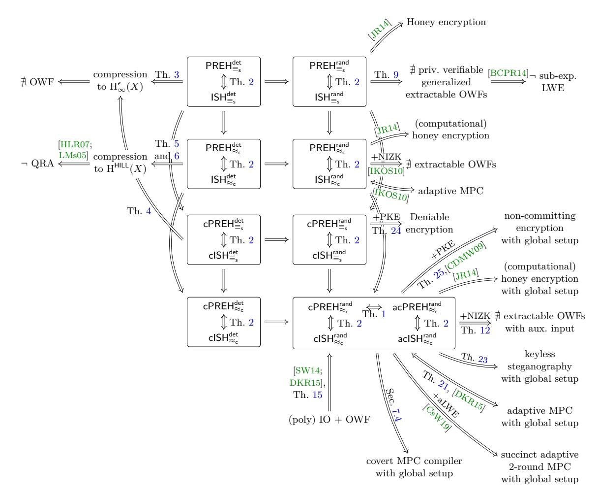

# **On Pseudorandom Encodings**

<span id="page-0-0"></span>Thomas Agrikola<sup>∗</sup> Karlsruhe Institute of Technology

[thomas.agrikola](mailto:thomas.agrikola@kit.edu)@kit.edu

Geoffroy Couteau† IRIF, Paris-Diderot University, CNRS [couteau](mailto:couteau@irif.fr)@irif.fr

Yuval Ishai‡ Technion yuvali@[cs.technion.ac.il](mailto:yuvali@cs.technion.ac.il)

Stanisław Jarecki§ UC Irvine stasio@[ics.uci.edu](mailto:stasio@ics.uci.edu)

Amit Sahai¶ UCLA sahai@[cs.ucla.edu](mailto:sahai@cs.ucla.edu)

October 6, 2020

# **Abstract.**

We initiate a study of *pseudorandom encodings*: efficiently computable and decodable encoding functions that map messages from a given distribution to a random-looking distribution. For instance, every distribution that can be perfectly and efficiently compressed admits such a pseudorandom encoding. Pseudorandom encodings are motivated by a variety of cryptographic applications, including password-authenticated key exchange, "honey encryption" and steganography.

The main question we ask is whether *every* efficiently samplable distribution admits a pseudorandom encoding. Under different cryptographic assumptions, we obtain positive and negative answers for different flavors of pseudorandom encodings, and relate this question to problems in other areas of cryptography. In particular, by establishing a twoway relation between pseudorandom encoding schemes and efficient invertible sampling algorithms, we reveal a connection between adaptively secure multiparty computation for randomized functionalities and questions in the domain of steganography.

<sup>∗</sup>Supported by ERC Project PREP-CRYPTO 724307 and by the German Federal Ministry of Education and Research within the framework of the project KASTEL\_SKI in the Competence Center for Applied Security Technology (KASTEL).

<sup>†</sup>Supported by ERC Projects PREP-CRYPTO 724307 and CryptoCloud 339563. Work done in part while visiting UCLA and the Technion.

<sup>‡</sup>Supported by ERC Project NTSC (742754), NSF-BSF grant 2015782, BSF grant 2018393, ISF grant 2774/20, and a grant from the Ministry of Science and Technology, Israel and Department of Science and Technology, Government of India. Work done in part while visiting UCLA.

<sup>§</sup>Supported by the NSF SaTC award 1817143.

<sup>¶</sup>Supported in part by DARPA SAFEWARE and SIEVE awards, NTT Research, NSF Frontier Award 1413955, and NSF grant 1619348, BSF grant 2012378, a Xerox Faculty Research Award, a Google Faculty Research Award, an equipment grant from Intel, and an Okawa Foundation Research Grant. This material is based upon work supported by the Defense Advanced Research Projects Agency through the ARL under Contract W911NF-15- C-0205. The views expressed are those of the authors and do not reflect the official policy or position of the Department of Defense, the National Science Foundation, NTT Research, or the U.S. Government.

# **Table of Contents**

<span id="page-1-0"></span>

| 1 |                                                                   | Introduction                                                                                                                                             |  |  |  |
|---|-------------------------------------------------------------------|----------------------------------------------------------------------------------------------------------------------------------------------------------|--|--|--|
|   | 1.1                                                               | Flavors of pseudorandom encoding<br>                                                                                                                     |  |  |  |
|   | 1.2                                                               | Implications and applications of our results                                                                                                             |  |  |  |
|   | 1.3                                                               | Negative results for stronger notions of pseudorandom encodings<br>                                                                                      |  |  |  |
|   | 1.4                                                               | Open questions and subsequent work<br>                                                                                                                   |  |  |  |
| 2 | Overview of techniques                                            |                                                                                                                                                          |  |  |  |
| 3 |                                                                   | Preliminaries                                                                                                                                            |  |  |  |
| 4 |                                                                   | The pseudorandom encoding hypothesis                                                                                                                     |  |  |  |
|   | 4.1                                                               | The pseudorandom encoding hypothesis with setup<br>                                                                                                      |  |  |  |
|   | 4.2                                                               | Static-to-adaptive transformation<br>                                                                                                                    |  |  |  |
| 5 |                                                                   | Pseudorandom encodings and invertible sampling                                                                                                           |  |  |  |
|   | 5.1                                                               | The invertible sampling hypothesis<br>                                                                                                                   |  |  |  |
|   | 5.2                                                               | The invertible sampling hypothesis with setup<br>                                                                                                        |  |  |  |
|   | 5.3                                                               | Equivalence of pseudorandom encodings and invertible sampling<br>                                                                                        |  |  |  |
|   |                                                                   | 5.3.1 Every inverse samplable distribution can be pseudorandomly encoded<br>                                                                             |  |  |  |
|   |                                                                   | 5.3.2 Every pseudorandomly encodable distribution can be inversely sampled<br>                                                                           |  |  |  |
| 6 | Classification of the different flavors of pseudorandom encodings |                                                                                                                                                          |  |  |  |
|   | 6.1                                                               | Deterministic encoding<br>                                                                                                                               |  |  |  |
|   |                                                                   | 6.1.1 Information theoretic guarantees and compression<br>                                                                                               |  |  |  |
|   |                                                                   | 6.1.2 Computational guarantees and pseudoentropy<br>                                                                                                     |  |  |  |
|   | 6.2                                                               | Randomized encoding<br>                                                                                                                                  |  |  |  |
|   |                                                                   | 6.2.1 (Generalized) extractable one-way functions<br>                                                                                                    |  |  |  |
|   |                                                                   | 6.2.2 Information theoretic guarantees and privately verifiable GEOWFs<br><br>6.2.3 Computational guarantees and EOWFs with common auxiliary information |  |  |  |
|   | 6.3                                                               | Static pseudorandom encodings with universal setup from IO<br>                                                                                           |  |  |  |
|   | 6.4                                                               | Bootstrapping pseudorandom encodings with a common random string<br>                                                                                     |  |  |  |
| 7 | Relations and applications of pseudorandom encodings              |                                                                                                                                                          |  |  |  |
|   | 7.1                                                               | Fully adaptively secure multi-party computation in the CRS model<br>                                                                                     |  |  |  |
|   |                                                                   | 7.1.1 Pseudorandom encodings imply UC-secure AMPC in the plain model<br>                                                                                 |  |  |  |
|   |                                                                   | 7.1.2<br>AMPC with global setup implies adaptive pseudorandom encodings with                                                                             |  |  |  |
|   |                                                                   | setup<br>                                                                                                                                                |  |  |  |
|   | 7.2                                                               | Honey encryption<br>                                                                                                                                     |  |  |  |
|   | 7.3                                                               | Keyless steganography<br>                                                                                                                                |  |  |  |
|   | 7.4                                                               | Covert multi-party computation<br>                                                                                                                       |  |  |  |
|   |                                                                   | 7.4.1 A compiler for covert oblivious transfer<br>                                                                                                       |  |  |  |
|   |                                                                   | 7.4.2 A general compiler for covert protocols<br>                                                                                                        |  |  |  |
|   | 7.5                                                               | Deniable encryption<br>                                                                                                                                  |  |  |  |
|   | 7.6                                                               | Non-committing encryption<br>                                                                                                                            |  |  |  |
|   | 7.7                                                               | Super-polynomial encoding<br>                                                                                                                            |  |  |  |

# <span id="page-2-0"></span>**1 Introduction**

The problem of *compression* has been extensively studied in the field of information theory and, more recently, in computational complexity and cryptography [\[GS85;](#page-71-0) [Wee04;](#page-74-0) [TVZ05;](#page-73-0) [HLR07\]](#page-72-0). Informally, given a distribution *X*, compression aims to efficiently encode samples from *X* as short strings while at the same time being able to efficiently recover these samples. While the typical information-theoretic study of compression considers the case of compressing multiple independent samples from the same source *X*, its study in computer science, and in particular in this work, considers the "single-shot" case. Compression in this setting is closely related to *randomness condensers* [\[RR99;](#page-73-1) [TV00;](#page-73-2) [TUZ01;](#page-73-3) [DRV12\]](#page-71-1) and *resource-bounded Kolmogorov complexity* [\[LV90;](#page-73-4) [LV19\]](#page-73-5) – two well-studied problems in computational complexity. Randomness condensers, which relax randomness extractors, are functions that efficiently map an input distribution into an output distribution with a higher entropy rate. A randomness condenser can be viewed as an efficient compression algorithm, without a corresponding efficient decompression algorithm. The resource-bounded Kolmogorov complexity of a string is the smallest description length of an efficient program that outputs this string. This program description can be viewed as a compressed string, such that decoding is efficiently possible, while finding the compressed string may be inefficient.

An important property of efficient compression algorithms, which combines the efficiency features of randomness condensers and resource-bounded Kolmogorov complexity, is their ability to efficiently produce "random-looking" outputs while allowing the original input to be efficiently recovered. Despite the large body of work on compression and its computational variants, this fundamental property has, to our knowledge, never been the subject of a dedicated study. In this work, we fill this gap by initiating such a study. Before formalizing the problem, we give a simple motivating example.

Consider the goal of encrypting a sample *x* from a distribution *X* (say, a random 5-letter English word from the Merriam-Webster Dictionary) using a low-entropy secret key *k*. Applying a standard symmetric-key encryption scheme with a key derived from *k* gives rise to the following brute-force attack: Try to decrypt with different keys until obtaining *x* 0 in the support of *X*. In the typical case that wrong keys always lead to *x* <sup>0</sup> outside the support of *X*, this attack successfully recovers *x*. Variants of this attack arise in different scenarios, including passwordauthenticated key exchange [\[BM92\]](#page-69-0), honey encryption [\[JR14\]](#page-72-1), subliminal communication and steganography [\[HPRV19\]](#page-72-2), and more. A natural solution is to use perfect compression: if *x* can be compressed to a *uniformly random* string *x*ˆ ∈ {0*,* 1} *<sup>n</sup>* before being encrypted, it cannot be distinguished from another random string *x*ˆ <sup>0</sup> ∈ {0*,* 1} *<sup>n</sup>* obtained by trying the wrong key. Note, however, that compression may be an overkill for this application. Instead, it suffices to efficiently encode *x* into a (possibly longer) *pseudorandom* string from which *x* can be efficiently decoded. This more general solution motivates the question we consider in this work.

*Encoding into the uniform distribution.* We initiate the study of encoding distributions into a random-looking distribution. Informally, we say that a distribution ensemble *X<sup>λ</sup>* admits a *pseudorandom encoding* if there exist efficient encoding and decoding algorithms (E*X,* D*X*), where D*<sup>X</sup>* is deterministic, such that

$$\Pr\left[y \leftarrow X_{\lambda} \colon \mathsf{D}_{X}(\mathsf{E}_{X}(y)) = y\right] \text{ is overwhelming and}$$
 (1)

<span id="page-2-2"></span><span id="page-2-1"></span>
$$\{y \leftarrow X_{\lambda} \colon \mathsf{E}_{X}(y)\} \approx U_{n(\lambda)}.$$
 (2)

Here, "≈" denotes some notion of indistinguishability (we will consider both computational and statistical indistinguishability), and the probability is over the randomness of both E*<sup>X</sup>* and *Xλ*. The polynomial *n*(*λ*) denotes the output length of the encoding algorithm E*X*. We refer to Equation [\(1\)](#page-2-1) as *correctness* and to Equation [\(2\)](#page-2-2) as *pseudorandomness*. It will also be useful to consider distribution ensembles parameterized by an input *m* from a language *L*. We say that such a distribution ensemble (*Xm*)*m*∈*<sup>L</sup>* admits a pseudorandom encoding if there exist efficient algorithms (E*X,* D*X*) as above satisfying correctness and pseudorandomness for all *m* ∈ *L*, where E*<sup>X</sup>* and D*<sup>X</sup>* both additionally receive *m* as input. Note that we insist on the decoding algorithm being efficient. This is required for our motivating applications.[1](#page-3-1) Note also that encoding and decoding above are *keyless*; that is, we want encoded samples to be close to uniform *even though anyone can decode them*. This is a crucial distinction from, for instance, encryption schemes with pseudorandom ciphertexts, which look uniformly distributed to everyone except the owner of the decryption key, and cannot be efficiently decrypted except by the owner of the decryption key. Here, we seek to simultaneously achieve pseudorandomness and correctness for all parties.

Our motivation for studying pseudorandom encodings stems from the fact that this very natural problem appears in a wide variety of – sometimes seemingly unrelated – problems in cryptography. We already mentioned steganography, honey encryption, and password-authenticated key exchange; we will cover more such connections in this work. Yet, this notion of encoding has to our knowledge never been studied systematically. In this work we study several natural flavors of this notion, obtain positive and negative results about realizing them, and map their connections with other problems in cryptography.

The main focus of this work is on the hypothesis that *all* efficiently samplable distributions admit a pseudorandom encoding. Henceforth, we refer to this hypothesis the *pseudorandom encoding hypothesis* (PREH).

For describing our results, it will be convenient to use the following general notion of efficiently samplable distributions. A distribution family ensemble (*Xm*)*m*∈*<sup>L</sup>* (for some language *L* ⊆ {0*,* 1} ∗ ) is efficiently samplable if there exists a probabilistic polynomial time (PPT) algorithm *S* such that *S*(*m*) is distributed according to *X<sup>m</sup>* for every *m* ∈ *L*. In case the distribution does not depend on additional inputs, *L* can be considered equal to N.

*Overview of contributions.* Following is a brief summary of our main contributions along with pointers to the relevant technical sections. We will give an expanded overview of the contributions and the underlying techniques in the rest of this section.

- **–** We provide a unified study of different flavors of pseudorandom encodings (PRE) and identify computational, randomized PRE in the CRS model as a useful and achievable notion(Section [6](#page-30-0) and Theorem [15\)](#page-47-1).
- **–** We establish a two-way relation between PRE and the previously studied notion of invertible sampling(Theorem [2\)](#page-26-1). This reveals unexpected connections between seemingly unrelated problems in cryptography (e.g., between adaptively secure computation for general functionalities and "honey encryption").
- **–** We bootstrap "adaptive PRE" from "static PRE"(Theorem [1\)](#page-21-1). As a consequence, one can base succinct adaptively secure computation on standard iO as opposed to subexponential iO [\[CsW19\]](#page-70-0)(Corollary [3\)](#page-30-2).
- **–** We use PRE to obtain a compiler from standard secure multiparty computation (MPC) protocols to *covert* MPC protocols(Section [7.4\)](#page-60-0).

# <span id="page-3-0"></span>**1.1 Flavors of pseudorandom encoding**

The notion of pseudorandom encoding has several natural flavors, depending on whether the encoding algorithm is allowed to use randomness or not, and whether the pseudorandomness property satisfies a computational or information-theoretic notion of indistinguishability. We denote the corresponding hypotheses that every efficiently samplable distribution can be pseu-

<span id="page-3-1"></span><sup>1</sup> Without this requirement, the problem can be solved using non-interactive commitment schemes with the additional property that commitments are pseudorandom (which exist under standard cryptographic assumptions).

<span id="page-4-2"></span>dorandomly encoded according to the above variants as  $\mathsf{PREH}^{\mathsf{rand}}_{\approx_c}$ ,  $\mathsf{PREH}^{\mathsf{det}}_{\equiv_s}$ ,  $\mathsf{PREH}^{\mathsf{det}}_{\approx_c}$  and  $\mathsf{PREH}^{\mathsf{det}}_{\equiv_s}$ .

Further, we explore relaxations which rely on a trusted setup assumption: we consider the pseudorandom encoding hypothesis in the common reference string model, in which a common string sampled in a trusted way from some distribution is made available to the parties. This is the most common setup assumption in cryptography and it is standard to consider the feasibility of cryptographic primitives in this model to overcome limitations in the plain model. That is, we ask whether for every efficiently samplable distribution X, there exists an efficiently samplable CRS distribution and efficient encoding and decoding algorithms ( $E_X$ ,  $D_X$ ) as above, such that correctness and pseudorandomness hold, where the encoding and decoding algorithm as well as the distinguisher receive the CRS as input, and the distributions in Equations (1) and (2) are additionally over the choice of the CRS.

Considering distributions which may depend on an input  $m \in L$  further entails two different flavors. On the one hand, we consider the notion where inputs m are chosen adversarially but statically (that is, independent of the CRS) and, on the other hand, we consider the stronger notion where inputs m are chosen adversarially and adaptively depending on the CRS. We henceforth denote these variants by the prefix "c" and "ac", respectively.

Static-to-adaptive transformation. The adaptive notion, where inputs may be chosen depending on the CRS, is clearly stronger than the static notion. However, surprisingly, the very nature of pseudorandom encodings allows one to apply an indirection argument similar to the one used in [HJKSWZ16; CPR17; CPV17], which yields a static-to-adaptive transformation.

**Theorem (informal).** If all efficiently samplable distributions can be pseudorandomly encoded in the CRS model with a static choice of inputs, then all efficiently samplable distributions can be pseudorandomly encoded in the CRS model with an adaptive choice of inputs.

Static-to-adaptive transformations in cryptography are generally non-trivial, and often come at a big cost in security when they rely on a "complexity leveraging" technique. This connection and its application we will discuss below are a good demonstration of the usefulness of the notion of pseudorandom encodings.

Relaxing compression. The notion of statistical deterministic pseudorandom encodings recovers the notion of optimal compression. Hence, this conflicts with the existence of one-way functions.<sup>3</sup> In our systematic study of pseudorandom encodings, we gradually relax perfect compression in several dimensions, while maintaining one crucial property – the indistinguishability of the encoded distribution from true randomness.

Example. To illustrate the importance of this property, we elaborate on the example we outline at the beginning of the introduction, focusing more specifically on password-authenticated key exchange (PAKE). A PAKE protocol allows two parties holding a (low entropy) common password to jointly and confidentially generate a (high entropy) secret key, such that the protocol is resilient against offline dictionary attacks, and no adversary can establish a shared key with a party if he does not know the matching password. A widely used PAKE protocol due to Bellovin and Merritt [BM92] has a very simple structure: the parties use their low-entropy password to encrypt the flows of a key-exchange protocol using a block cipher. When the block cipher is modeled as a random cipher, it has the property that decrypting a ciphertext (of an arbitrary

<span id="page-4-0"></span><sup>&</sup>lt;sup>2</sup> We note that not all efficiently samplable distributions can be pseudorandomly encoded with a deterministic encoding algorithm. For instance, a distribution which has one very likely event and many less likely ones requires one specific encoding to appear with high probability. Thus, we formally restrict the deterministic variants of the pseudorandom encoding hypothesis to only hold for "compatible" samplers, which still results in interesting connections. In this overview, however, we ignore this restriction.

<span id="page-4-1"></span><sup>&</sup>lt;sup>3</sup> If perfect compression exists, pseudorandom generators cannot exist (observation attributed to Levin in [GS85]).

<span id="page-5-0"></span>plaintext) under an incorrect secret key yields a fresh random plaintext. Thus, Bellovin and Merritt point out that the security of their PAKE protocol requires that "the message to be encrypted by the password must be indistinguishable from a random number." This is easy to achieve for Diffie-Hellman key exchange over the multiplicative group of integers modulo a prime *p*. However, for elliptic curve groups this is no longer the case, and one needs to resort to alternative techniques including nontrivial *point compression* algorithms that compress the representation of a random group element into a nearly uniform bitstring [\[BMN01\]](#page-69-1).

Clearly, our relaxation of compression does not preserve the useful property of obtaining outputs that are *shorter* than the inputs. However, the remaining pseudorandomness property is good enough for many applications.

In the following, we elaborate on our weakest notion of pseudorandom encodings, that is, pseudorandom encodings allowing the encoding algorithm to be randomized and providing a computational pseudorandomness guarantee. We defer the discussion on the stronger statistical or deterministic variants to Section [1.3,](#page-9-0) where we derive negative results for most of these stronger notions, which leaves computational randomized pseudorandom encodings as the "best possible" notion that can be realized for general distributions.

**1.1.1 Randomized, computational pseudorandom encodings.** Computational randomized pseudorandom encodings allow the encoding algorithm to be randomized and require only computational pseudorandomness.

*Relation to invertible sampling.* We show a simple but unexpected connection with the notion of *invertible sampling* [\[CFGN96;](#page-70-3) [DN00;](#page-71-3) [GKMRV00\]](#page-71-4). Informally, invertible sampling refers to the task of finding, given samples from a distribution, random coins that *explain* the sample. Invertible sampling allows to *obliviously* sample from distributions, that is, sampling from distributions *without knowing the corresponding secrets*. This can be useful for, e.g., sampling common reference strings without knowing the random coins or public keys without knowing the corresponding secret keys. A natural relaxation of this notion was systematically studied by Ishai, Kumarasubramanian, Orlandi and Sahai [\[IKOS10\]](#page-72-3). Concretely, a PPT sampler *S* is *inverse samplable* if there exists an alternative PPT sampler *S* and a PPT inverse sampler *S* −1 such that

$$\begin{split} \big\{ y \leftarrow S(1^{\lambda}) \colon y \big\} \approx_{\mathbf{c}} \big\{ y \leftarrow \overline{S}(1^{\lambda}) \colon y \big\}, \\ \big\{ y \leftarrow \overline{S}(1^{\lambda}; r) \colon (r, y) \big\} \approx_{\mathbf{c}} \big\{ y \leftarrow \overline{S}(1^{\lambda}) \colon (\overline{S}^{-1}(1^{\lambda}, y), y) \big\}. \end{split}$$

Note that the inverse sampling algorithm is only required to efficiently inverse-sample from another distribution *S*, but this distribution must be computationally close to the distribution induced by *S*. The main question studied in [\[IKOS10\]](#page-72-3) is whether *every* efficient sampler admits such an invertible sampler. They refer to this hypothesis as the *invertible sampling hypothesis* (ISH), and show that ISH is equivalent to adaptive MPC for general randomized functionalities that may hide their internal randomness. In this work, we show the following two-way relation with pseudorandom encoding.

**Theorem (informal).** *A distribution admits a pseudorandom encoding* if and only if *it admits invertible sampling.*

Intuitively, the efficient encoding algorithm corresponds to the inverse sampling algorithm, and decoding an encoded string corresponds to sampling with the de-randomized alternative sampler *S*. This equivalence immediately extends to all variants of pseudorandom encodings and corresponding variants of invertible sampling we introduce in this work. Invertible sampling is itself connected to other useful cryptographic notions, such as oblivious sampling, trusted common reference string generations, and adaptively secure computation (which we will elaborate upon below).

<span id="page-6-1"></span>Building on this connection, the impossibility result of [IKOS10] translates to our setting. On a high level, extractable one-way functions (EOWFs) conflict with invertible sampling because they allow to extract a "secret" (in this case a pre-image) from an image, independently of how it was computed. This conflicts with invertible sampling because invertible sampling is about sampling without knowing the secrets.

**Theorem (informal, [IKOS10]).** Assuming the existence of extractable one-way functions (EOWF) and a non-interactive zero-knowledge proof system,  $PREH_{\infty}^{rand}$  does not hold.

This suggests that towards a realizable notion of pseudorandom encodings, a further relaxation is due. Thus, we ask whether the above impossibility result extends to the CRS model. In the CRS model, the above intuition why ISH conflicts with EOWFs fails, because the CRS can contain an obfuscated program that samples an image using some secret, but does not output this secret.

Dachman-Soled, Katz, and Rao [DKR15] (building on the universal deniable encryption construction of Sahai and Waters [SW14]) construct a so-called "explainability compiler" that implies  $\mathsf{cISH}^\mathsf{rand}_{\approx_\mathsf{c}}$  based on indistinguishability obfuscation<sup>4</sup> (iO). By our equivalence theorem above, this implies pseudorandom encodings for all efficiently samplable distributions in the CRS model, with static choice of inputs, from iO. Invoking the static-to-adaptive transformation detailed above, this also applies to the adaptive variant.

**Theorem (informal).** Assuming the existence of (polynomially secure) indistinguishability obfuscation and one-way functions,  $acPREH_{sc}^{rand}$  holds.

Note that [IKOS10] claim that their impossibility result extends to the CRS model, whereas the above theorem seems to suggest the opposite. We show that technically the result of [IKOS10] does extend to the CRS model at the cost of assuming *unbounded auxiliary-input* extractable one-way functions, a strong flavor of EOWFs that seems very unlikely to exist but cannot be unconditionally ruled out.

**Theorem (informal).** Assuming the existence of extractable one-way functions with unbounded common auxiliary input and a non-interactive zero-knowledge proof system,  $\mathsf{cPREH}^\mathsf{rand}_{\approx_\mathsf{c}}$  does not hold.

In fact, this apparent contradiction has been the source of some confusion in previous works: the work of [IKOS10] makes an informal claim that their impossibility result for ISH extends to the CRS model. However, due to the connection between ISH and adaptively secure MPC (which we will discuss in more details later on), this claim was challenged in [DKR15]: the authors achieve a construction of adaptively secure MPC for all functionalities assuming iO, which seemingly contradicts the claim of [IKOS10]. The authors of [DKR15] therefore stated that the "impossibility result of Ishai et al. [...] does not hold in the CRS model." Our extension clarifies that the distinction is in fact more subtle: the result of [IKOS10] does extend to the CRS model, but at the cost of assuming EOWF with unbounded auxiliary inputs. This does not contradict the constructions based on iO, because iO and EOWF with unbounded auxiliary inputs are known to be contradictory [BCPR14].

Overview. In Figure 1, we provide a general summary of the many flavors of the pseudorandom encoding hypothesis, and how they relate to a wide variety of other primitives.

<span id="page-6-0"></span><sup>&</sup>lt;sup>4</sup> Informally, an iO scheme is a PPT algorithm that takes as input a circuit C and produces another circuit iO(C) such that C and iO(C) compute the same function, but iO(C) is unintelligible in the following sense. If two circuits  $C_1$  and  $C_2$  compute the same function, then  $iO(C_1)$  and  $iO(C_2)$  are computationally indistinguishable. The notion of  $iO(C_1)$  was introduced in [BGIRSVY01] and first instantiated in [GGHRSW13].

<span id="page-7-2"></span>

<span id="page-7-1"></span>Fig. 1. An overview of the relations between the pseudorandom encoding hypothesis and other fields of cryptography and computational complexity theory. For simplicity, our static-to-adaptive transformation only appears in the computational, randomized setting in this overview, but also applies to the other settings. (Since the deterministic variants of the pseudorandom encoding hypothesis are impossible for some pathologic samplers, the arrows between deterministic and randomized variants of the pseudorandom encoding hypothesis are to be read as if the deterministic variant is true for some sampler, then the corresponding randomized variant is true for that sampler.)

Further relaxation. We further study an additional relaxation of pseudorandom encodings, where we allow the encoding algorithm to run in super-polynomial time. We show that this relaxed variant can be achieved from cryptographic primitives similar to extremely lossy functions [Zha16], which can be based on the exponential hardness of the decisional Diffie-Hellman problem – a strong assumption, but (still) more standard than indistinguishability obfuscation. However, the applicability of the resulting notion turns out to be rather restricted.

#### <span id="page-7-0"></span>1.2 Implications and applications of our results

In this section, we elaborate on the implications of the techniques we develop and the results we obtain for a variety of other cryptographic primitives.

1.2.1 New results for adaptively secure computation. As mentioned above, a sampler admits invertible sampling if and only if it can be pseudorandomly encoded. A two-way connection between invertible sampling and adaptively secure MPC for general randomized functionalities was established in [IKOS10]. An MPC protocol allows two or more parties to jointly evaluate a (possibly randomized) functionality  $\mathcal{F}$  on their inputs without revealing anything to each other except what follows from their inputs and outputs. This should hold even in the presence of an

<span id="page-8-2"></span>adversary who can corrupt *any* number of parties in an adaptive (sequential) fashion. When we write "adaptive MPC", we mean adaptive MPC for *all* randomized functionalities. This should be contrasted with weaker notions of adaptive MPC for strict subsets of corrupted parties [\[BH92;](#page-69-4) [CFGN96;](#page-70-3) [GS12\]](#page-71-6) or for adaptively well-formed functionalities[5](#page-8-0) [\[CLOS02\]](#page-70-6) which can both be done from mild assumptions. The connection from [\[IKOS10\]](#page-72-3) shows that adaptive MPC for all randomized functions is possible if and only if every PPT sampler admits invertible sampling, i.e., the invertible sampling hypothesis is true.

We show that this result generalizes to the global CRS model. More precisely, we prove the adaptive variant of the pseudorandom encoding hypothesis in the CRS model acPREHrand ≈<sup>c</sup> is equivalent to adaptive MPC in the global CRS model.[6](#page-8-1)

As detailed above, the static pseudorandom encoding hypothesis cPREHrand ≈<sup>c</sup> in the CRS model follows from iO (and one-way functions). Applying our static-to-adaptive transformation, the same holds for the adaptive variant. Thus, we obtain the first instantiation of an adaptive explainability compiler [\[DKR15\]](#page-70-4) without complexity leveraging and, hence, based only on polynomial hardness assumptions. The recent work of Cohen, shelat, and Wichs [\[CsW19\]](#page-70-0) uses such an adaptive explainability compiler to obtain succinct adaptive MPC, where "succinct" means that the communication complexity is sublinear in the complexity of the evaluated function. Due to our instantiation of acPREHrand ≈<sup>c</sup> from polynomial iO, we improve the results of [\[CsW19\]](#page-70-0) by relaxing the requirement for subexponentially secure iO to polynomially secure iO in a black-box way.

**Corollary (informal).** *Assuming the existence of polynomially secure indistinguishability obfuscation and the adaptive hardness of the learning with errors problem, then malicious, tworound, UC-secure adaptive MPC and sublinear communication complexity is possible (in the local CRS model, for all deterministic functionalities).*

**1.2.2 Steganography and covert multi-party computation.** We explore the connection of the pseudorandom encoding hypothesis to various flavors of steganography. The goal of steganography, informally, is to embed secret messages in distributions of natural-looking messages, in order to hide them from external observers. While the standard setting for steganography relies on shared secret keys to encode the messages, we show that pseudorandom encodings naturally give rise to a strong form of *keyless steganography*. Namely, one can rely on pseudorandom encodings to encode any message into an innocent-looking distribution, without truly hiding the message (since anyone can decode the stream), but providing *plausible deniability*, in the sense that, even with the decoded message, it is impossible to tell apart whether this message was indeed encoded by the sender, or whether it is simply the result of decoding the innocent distribution.

**Corollary (informal).** *Assuming pseudorandom encodings, then there exists a keyless steganographic protocol which provides plausible deniability.*

Plausible deniability is an important security notion; in particular, an important cryptographic primitive in this area is the notion of (sender-)deniable encryption [\[CDNO97\]](#page-70-7), which is known to exist assuming indistinguishability obfuscation [\[SW14\]](#page-73-6). Deniable encryption enables to "explain" ciphertexts produced for some message to any arbitrary other message by providing corresponding random coins for a faked encryption process. We view it as an interesting open problem to build deniable encryption under the pseudorandom encoding hypothesis together with more standard cryptographic primitives; we make a first step in this direction and show the following:

<span id="page-8-0"></span><sup>5</sup> Adaptively well-formed functionalities do not hide internal randomness.

<span id="page-8-1"></span><sup>6</sup> Together with the conflict between cPREHrand ≈c and EOWFs with unbounded auxiliary input, this corrects a claim made in [\[DKR15\]](#page-70-4) that the impossibility result of adaptive MPC from [\[IKOS10\]](#page-72-3) would not extend to the CRS model.

<span id="page-9-1"></span>the *statistical* variant of pseudorandom encodings, together with the existence of public-key encryption, implies deniable encryption. Interestingly, we also show that the computational randomized pseudorandom encoding hypothesis suffices to imply non-committing encryption, a weaker form of deniable encryption allowing to explain only *simulated* ciphertexts to arbitrary messages [CFGN96].

Covert secure computation. Covert MPC [vHL05; CGOS07] is an intriguing flavor of MPC that aims at achieving the following strong security guarantee: if the output of the protocol is not "favorable," the transcript of the interaction should not leak any information to the parties parties, including whether any given party was actually taking part in the protocol. This strong form of MPC aims at providing security guarantees when the very act of starting a computation with other parties should remain hidden. As an example [vHL05], suppose that a CIA agent who infiltrated a terrorist group wants to make a handshake with another individual to find out whether she is also a CIA agent. Here, we show that pseudorandom encodings give rise to a general compiler transforming a standard MPC protocol into a covert one, in a round-preserving way. The idea is to encode each round of the protocol such that encoded messages look random. Together with the equivalence between adaptively secure MPC and pseudorandom encodings, this gives a connection between two seemingly unrelated notions of secure computation.

Corollary (informal). Assuming adaptively secure MPC for all functionalities, there exists a round-preserving compiler that transforms a large class of "natural" MPC protocols into covert MPC protocols (in the static, semi-honest setting).

1.2.3 Other results. Due to our infeasibility results of  $\mathsf{PREH}^{\mathsf{rand}}_{\equiv_s}$ , distribution transforming encoders (DTEs) for all efficiently samplable distributions are infeasible. Even the computational relaxation of DTEs is infeasible assuming extractable one-way functions. Since all currently known constructions of honey encryption rely on DTEs, we conditionally refute the existence of honey encryption based on the DTE-then-encrypt framework from [JR14]. On the positive side, due to our feasibility result of  $\mathsf{acPREH}^{\mathsf{rand}}_{\approx_c}$ , computational honey encryption is feasible in the CRS model.

**Theorem (informal).** Assuming acPREH $_{\approx_c}^{\mathsf{rand}}$  and a suitable symmetric-key encryption scheme (modeled as a random cipher), computational honey encryption for all efficiently samplable distributions exists in the CRS model.

#### <span id="page-9-0"></span>1.3 Negative results for stronger notions of pseudorandom encodings

Below we describe how we gradually relax optimal compression via different notions of pseudorandom encodings and derive infeasibility results for all variants of pseudorandom encodings which restrict the encoding algorithm to be deterministic or require an information-theoretic pseudorandomness guarantee. This leaves computational randomized pseudorandom encodings as the best possible achievable notion.

1.3.1 Deterministic, statistical pseudorandom encodings. The notion of pseudorandom encodings with a deterministic encoding algorithm and information-theoretic indistinguishability is perhaps the simplest notion one can consider. As we will prove in this paper, this notion recovers the notion of optimal compression: since the encoding algorithm for some source X is deterministic, it can be seen with an entropy argument that the output size of  $\mathsf{E}_X$  must be at most  $\mathsf{H}_\infty(X)$ , the min-entropy of X; otherwise, the distribution  $\{\mathsf{E}_X(X)\}$  can necessarily be distinguished from random with some statistically non-negligible advantage. Therefore,  $\mathsf{E}_X$  is an optimal and efficient compression algorithm for X, with decompression algorithm  $\mathsf{D}_X$ ; this is true even for the relaxation in the CRS model. The existence of efficient compression algorithms

<span id="page-10-0"></span>for various categories of samplers was thoroughly studied [TVZ05]. In particular, the existence of compression algorithms for all efficiently samplable sources implies the inexistence of one-way functions (this is an observation attributed to Levin in [GS85]) since compressing the output of a pseudorandom generator to its entropy would distinguish it from a random string, and the existence of one-way functions implies the existence of pseudorandom generators [HILL99]).

**Theorem (informal).** Assuming the existence of one-way functions, neither  $\mathsf{PREH}^\mathsf{det}_{\equiv_\mathsf{s}}$  nor  $\mathsf{cPREH}^\mathsf{det}_{\equiv_\mathsf{s}}$  hold.

This is a strong impossibility result, as one-way functions dwell among the weakest assumptions in cryptography, [Imp95]. One can circumvent this impossibility by studying whether compression can be achieved for more restricted classes of distributions, as was done e.g. in [TVZ05]. Our work can be seen as pursuing an orthogonal direction. We seek to determine whether a relaxed notion of compression can be achieved for all efficiently samplable distributions. The relaxations we consider comprise the possibility to use randomness in the encoding algorithm, and weakening the requirement on the encoded distribution to being only computationally indistinguishable from random. Clearly, these relaxations remove one of the most important features of compression algorithms, which is that their outputs are smaller than their inputs (i.e., they compress). Nevertheless, the indistinguishability of the encoded distribution from the uniform distribution is another crucial feature of optimal compression algorithms, which has independent applications.

Deterministic, computational pseudorandom encodings. We now turn towards a relaxation where the encoded distribution is only required to be computationally indistinguishable from random, but the encoding algorithm is still required to be deterministic. This flavor is strongly connected to an important problem in cryptography: the problem of separating HILL entropy [HILL99] from Yao entropy [Yao82]. HILL and Yao entropy are different approaches of formalizing computational entropy, i.e., the amount of entropy a distribution appears to have from the viewpoint of a computationally bounded entity. Informally, a distribution has high HILL entropy if it is computationally close to a distribution with high min-entropy; a distribution has high Yao entropy if it cannot be compressed efficiently. Finding a distribution which, under standard cryptographic assumptions, has high Yao entropy, but low HILL entropy constitutes a long standing open problem in cryptography. Currently, only an oracle separation [Wee04] and a separation for conditional distributions [HLR07] are known. To establish the connection between  $\mathsf{PREH}^{\mathsf{det}}_{\approx_{\mathsf{c}}}$  and this problem, we proceed as follows: informally, a deterministic pseudorandom encoding must necessarily compress its input to the HILL entropy of the distribution. That is, the output size of the encoding cannot be much larger than the HILL entropy of the distribution. This, in turn, implies that a distribution which admits such a pseudorandom encoding cannot have high Yao entropy.

In this work, we formalize the above argument, and show that the *conditional* separation of HILL and Yao entropy from [HLR07] suffices to refute  $PREH^{det}_{\approx_c}$ . This separation holds under the assumption that non-interactive zero-knowledge proofs with some appropriate structural properties exist (which in turn can be based on standard assumptions such as the quadratic residuosity assumption). Thus, we obtain the following infeasibility result:

**Theorem (informal).** If the quadratic residuosity assumption holds, then  $PREH_{\approx_c}^{det}$  does not hold.

Hence, we may conclude that towards a feasible variant of pseudorandom encodings for all efficiently samplable distributions, requiring the encoding algorithm to be deterministic poses a strong restriction.

<span id="page-11-1"></span>1.3.3 Randomized, statistical pseudorandom encodings. We now consider the relaxation of perfect compression by allowing the encoding algorithm to be randomized while still requiring information-theoretic indistinguishability from randomness. This flavor of pseudorandom encoding was used in the context of honey encryption [JR14]. Honey encryption is a cryptographic primitive which has been introduced to mitigate attacks on encryption schemes resulting from the use of low-entropy passwords. Honey encryption has the property that decrypting a ciphertext with an incorrect key always yields a valid-looking plaintext which seems to come from the expected distribution, thereby mitigating brute-force attacks. This is the same property that was useful in the previous PAKE example.

The study of honey encryption was initiated in [JR14], where it was shown that honey encryption can naturally be constructed by composing a block cipher (modeled as a random cipher) with a distribution transforming encoder (DTE), a notion which is equivalent to our notion of pseudorandom encoding with randomized encoding and statistical pseudorandomness. The focus of [JR14] was on obtaining such DTEs for simple and useful distributions. In contrast, we seek to understand the feasibility of this notion for arbitrary distributions. Intuitively, it is not straightforward to encode any efficient distribution into the uniform distribution; consider for example the distribution over RSA moduli, i.e., products of two random n-bit primes. Since no efficient algorithm is known to test membership in the support of this distribution, natural approaches seem to break down. In fact, we show in this work that this difficulty is inherent: building on techniques from [BCPR14; IKOS10], we demonstrate the impossibility of (randomized, statistical) pseudorandom encodings for all efficiently samplable distributions, under a relatively standard cryptographic assumption.

**Theorem (informal).** Assuming the sub-exponential hardness of the learning with errors (LWE) problem,  $PREH_{\equiv_s}^{rand}$  does not hold.

This result directly implies that under the same assumption, there exist efficiently samplable distributions (with input) for which no distribution transforming encoder exists. We view it as an interesting open problem whether this result can be extended to rule out the existence of honey encryption for arbitrary distributions under the same assumption.

#### <span id="page-11-0"></span>1.4 Open questions and subsequent work

The most intriguing question left open by our work is whether the weakest variant of the pseudorandom encoding hypothesis cPREH $_{\approx_c}^{\rm rand}$ , which is implied by iO, also implies iO. Very recently, this question was settled in the affirmative by Wee and Wichs [WW20] under the LWE assumption. More concretely, by modifying a heuristic iO construction of Brakerski et al. [BDGM20], they show that iO is implied by LWE if one is additionally given an oblivious LWE-sampler in the CRS model. Such a sampler, given a matrix  $\mathbf{A} \in \mathbb{Z}_q^{m \times n}$ , generates outputs that are indistinguishable from LWE samples  $\mathbf{A} \cdot \mathbf{s} + \mathbf{e}$  without knowing the secrets  $\mathbf{s}$  or the noise  $\mathbf{e}$ . The existence of an oblivious LWE sampler is nontrivial even under the LWE assumption, because  $\mathbf{A}$  can be such that  $\mathbf{A} \cdot \mathbf{s} + \mathbf{e}$  is not pseudorandom; however, such a sampler still follows from the invertible sampling hypothesis [IKOS10], which we show to be equivalent to the pseudorandom encoding hypothesis. By proposing an explicit heuristic construction of (a relaxed flavor of) an oblivious LWE sampler, the end result of [WW20] is a construction of iO from a new "falsifiable" assumption.

Whether  $\mathsf{cPREH}^\mathsf{rand}_{\approx_\mathsf{c}}$  implies iO under weaker or different assumptions than LWE remains open. A potentially easier goal is using  $\mathsf{cPREH}^\mathsf{rand}_{\approx_\mathsf{c}}$  to construct public-key encryption from one-way functions. This is related to the possibility of constructing oblivious transfer from any public-key encryption in which public keys and ciphertexts are obliviously samplable [EGL85; GKMRV00], which is implied by public-key encryption and  $\mathsf{cPREH}^\mathsf{rand}_{\approx_\mathsf{c}}$ . Here  $\mathsf{cPREH}^\mathsf{rand}_{\approx_\mathsf{c}}$  is used to bypass the black-box separation between public-key encryption and oblivious transfer [GKMRV00].

<span id="page-12-3"></span>Finally, there is a lot of room for relaxing the intractability assumptions we use to rule out the statistical (cPREHrand ≡<sup>s</sup> ) and deterministic (cPREHdet ≈<sup>c</sup> ) flavors of pseudorandom encodings.

### <span id="page-12-0"></span>**2 Overview of techniques**

In this section, we elaborate on some of our technical results in more detail. In the following, we identify a PPT sampler *S* with the distribution (family) ensemble it induces.

*The relation to invertible sampling.* A PPT sampler *S* is *inverse samplable* [\[DN00;](#page-71-3) [IKOS10\]](#page-72-3), if there exists an alternative sampler *S* inducing a distribution which is computationally indistinguishable to the distribution induced by *S* such that the computations of *S* can be efficiently inverted. Efficiently inverting the computation of *S* means that there exists an efficient inverse sampler *S* −1 which, given an output of *S*, recovers a well-distributed random tape for *S* to compute the given output in the following sense. The inverse sampled random tape is required to be computationally indistinguishable from the actually used random tape. More formally, a PPT sampler *S* is inverse samplable if there exists an efficient alternative sampler *S* and an efficient inverse sampler *S* −1 such that

<span id="page-12-2"></span><span id="page-12-1"></span>
$$\{y \leftarrow S(1^{\lambda}): y\} \approx_{\mathsf{c}} \{y \leftarrow \overline{S}(1^{\lambda}): y\},$$
 (3)

$$\{y \leftarrow \overline{S}(1^{\lambda}; r) \colon (r, y)\} \approx_{\mathsf{c}} \{y \leftarrow \overline{S}(1^{\lambda}) \colon (\overline{S}^{-1}(1^{\lambda}, y), y)\}. \tag{4}$$

We refer to Equation [\(3\)](#page-12-1) as *closeness* and to Equation [\(4\)](#page-12-2) as *invertibility*. If the sampler *S* admits an input *m*, the above is required to hold for all inputs *m* in the input space *L*, where *S* and *S* −1 both additionally receive *m* as input. In accordance with [\[IKOS10\]](#page-72-3), we refer to the hypothesis that all PPT algorithms with input are inverse samplable as the *invertible sampling hypothesis*. Restricting the invertible sampling hypothesis to algorithms which do not admit inputs is denoted the *weak* invertible sampling hypothesis.

The concepts of inverse samplability and pseudorandom encodings are tightly connected. Suppose a PPT algorithm *S* is inverse samplable. Then, there exists an alternative and an inverse sampler (*S, S* −1 ) satisfying closeness and invertibility. Invertibility guarantees that the inverse sampler *S* −1 on input of a sample *y* from *S*(1*<sup>λ</sup>* ), outputs a computationally welldistributed random tape *r*. Hence, with overwhelming probability over the choice of *y* ← *S*(1*<sup>λ</sup>* ) and *r* ← *S* −1 (*y*), the alternative sampler on input of *r*, recovers *y*. In other words, the inverse sampler *S* −1 can be seen as encoding a given sample *y*, whereas the *de-randomized* alternative sampler *S* given this encoding *as random tape*, is able to recover *y*. Looking through the lens of pseudorandom encoding, this almost proves correctness except that *y* is sampled according to *S*(1*<sup>λ</sup>* ) instead of *S*(1*<sup>λ</sup>* ). This difference can be bridged due to closeness. We now turn towards showing pseudorandomness of the encoded distribution. Due to closeness, the distributions {*y* ← *S*(1*<sup>λ</sup>* ): (*S* −1 (1*<sup>λ</sup> , y*)*, y*)} and {*y* ← *S*(1*<sup>λ</sup>* ): (*S* −1 (1*<sup>λ</sup> , y*)*, y*)} are computationally indistinguishable. Invertibility guarantees that, given a sample *y* from *S*(1*<sup>λ</sup>* ), an encoding of *y* is indistinguishable to uniformly chosen randomness conditioned on the fact that decoding yields *y*. Removing *y* from this distribution, almost corresponds to pseudorandomness, except that *y* is sampled according to *S*(1*<sup>λ</sup>* ) instead of *S*(1*<sup>λ</sup>* ). Again, we are able to bridge this gap due to closeness. Note that we crucially use the fact that the initial randomness used by *S* resides outside of the view of an adversary. Summing up, if a PPT sampler *S* is inverse samplable, then it can be pseudorandomly encoded.

Interestingly, this connection turns out to be bidirectional. Suppose a PPT algorithm *S* can be pseudorandomly encoded. Then, there exists an efficient encoding algorithm E*<sup>S</sup>* and an efficient deterministic decoding algorithm D*<sup>S</sup>* satisfying correctness and pseudorandomness. Looking through the lens of invertible sampling, we identify the decoding algorithm to correspond to the alternative sampler (viewing the random tape of the alternative sampler as explicit input

<span id="page-13-0"></span>to  $D_S$ ) and the encoding algorithm to correspond to the inverse sampler. Pseudorandomness guarantees that  $E_S(S(1^{\lambda}))$  is indistinguishable from uniform randomness. Hence, applying the decode algorithm  $D_S$  on uniform randomness is indistinguishable from applying  $D_S$  to outputs of  $E_S(S(1^{\lambda}))$ . Correctness guarantees that  $D_S(E_S(y))$  for y sampled according to  $S(1^{\lambda})$  recovers y with overwhelming probability. Thus, the distribution induced by applying  $D_S$  on uniform randomness is computationally close to the distribution induced by  $S(1^{\lambda})$ . This shows closeness. For the purpose of arguing about invertibility, consider the distribution  $A := \{y \leftarrow D_S(r) : (r, y)\}$ . Due to pseudorandomness r can be considered an encoded sample from  $S(1^{\lambda})$ . Hence, A is indistinguishable to the distribution, where r is produced by  $E_S(y')$  for some independent  $y' \leftarrow S(1^{\lambda})$ , i.e.

$$\{y \leftarrow \mathsf{D}_S(r) \colon (r,y)\} \approx_{\mathsf{c}} \{y' \leftarrow S(1^{\lambda}), r \leftarrow \mathsf{E}_S(y'), y \leftarrow \mathsf{D}_S(r) \colon (r,y)\}.$$

Note that by correctness, y and y' are identical with overwhelming probability. Therefore, A is indistinguishable to  $\{y' \leftarrow S(1^{\lambda}), r \leftarrow \mathsf{E}_S(y') \colon (r,y')\}$ . Since sampling y' via  $\mathsf{D}_S$  applied on uniform randomness is computationally close to the above distribution due to closeness, invertibility follows. Summing up, a sampler S can be pseudorandomly encoded if and only if it is inverse samplable.

Likewise to the variations and relaxations described for pseudorandom encodings, we vary and relax the notion of invertible sampling. The inverse sampler can be required to be deterministic or allowed to be randomized. Further, closeness and invertibility can be required to hold information theoretically or computationally. We denote these variants as  $\mathsf{ISH}^{\mathsf{rand}}_{\approx_\mathsf{c}}$ ,  $\mathsf{ISH}^{\mathsf{rand}}_{\approx_\mathsf{c}}$ ,  $\mathsf{ISH}^{\mathsf{det}}_{\approx_\mathsf{c}}$  and  $\mathsf{ISH}^{\mathsf{det}}_{\approx_\mathsf{c}}$ . To circumvent impossibilities in the plain model, we also define the relaxations in the common reference string model in static and adaptive flavors, denoted the prefix "c" and "ac", respectively. The above equivalence extends to all introduced variations of the pseudorandom encoding and invertible sampling hypotheses.

The static-to-adaptive transformation. The static variant of pseudorandom encodings in the CRS model only guarantees correctness and pseudorandomness as long as the input m for the sampler S is chosen independently of the CRS. The adaptive variant, on the other hand, provides correctness and pseudorandomness even for adaptive choices of inputs. Adaptive notions always imply their static analogues. Interestingly, for pseudorandom encodings, the opposite direction is true as well. The core idea is to use an *indirection* argument (similar to [HJKSWZ16; CPR17; CPV17]) to delay CRS generation until during the actual encoding process. Thus, the advantage stemming from adaptively choosing the input is eliminated.

Suppose that the static variant of the pseudorandom encoding hypothesis in the CRS model is true and let S be some PPT sampler. Since S can be pseudorandomly encoded in the CRS model with static choice of inputs, there exist algorithms ( $\mathsf{Setup'}, \mathsf{E'}, \mathsf{D'}$ ) such that static correctness and pseudorandomness hold. Further, the algorithm  $\mathsf{Setup'}$  can also be pseudorandomly encoded as above. Let ( $\mathsf{Setup''}, \mathsf{E''}, \mathsf{D''}$ ) be the corresponding algorithms such that static correctness and pseudorandomness hold. Note that since the sampler  $\mathsf{Setup'}$  does not expect an input, static and adaptive guarantees are equivalent.

Then, the sampler S can be pseudorandomly encoded in the CRS model with adaptive choice of inputs as follows. Initially, we sample a common reference string crs'' via  $\mathsf{Setup}''(1^\lambda)$  and make it available to the parties. Given crs'' and a sample y from S(m), adaptive encoding works in two phases. First, a fresh CRS crs' is sampled via  $\mathsf{Setup}'(1^\lambda)$  and pseudorandomly encoded via  $r_1 \leftarrow \mathsf{E}''(crs'', crs')$ . Second, the given sample y is pseudorandomly encoded via  $r_2 \leftarrow \mathsf{E}'(crs', m, y)$ . The encoding of y then consists of  $(r_1, r_2)$ . To decode, the CRS crs' is restored via  $\mathsf{D}''(crs'', r_1)$ . Then, using crs', the original sample y is recovered via  $\mathsf{D}''(crs'', m, r_2)$ .

Since crs' is chosen freshly during the encoding process, the input m which may depend on crs'', cannot depend on crs'. Further, the distribution  $\mathsf{Setup}''$  does not expect an input. Hence, static guarantees suffice.

<span id="page-14-0"></span>To realize that adaptive pseudorandomness holds, consider the encoding of *S*(*m*) for some adaptively chosen message *m*. Since the view of A when choosing the message *m* is independent of *crs*<sup>0</sup> , static pseudorandomness can be applied to replace the distribution E 0 (*crs*<sup>0</sup> *, m, S*(*m*)) with uniform randomness. Further, since the sampler Setup<sup>0</sup> does not expect any input, static pseudorandomness suffices to replace the distribution E <sup>00</sup>(*crs*<sup>00</sup> *,* Setup<sup>0</sup> (1*<sup>λ</sup>* )) with uniform randomness. This proves adaptive pseudorandomness.

The adaptive variant of correctness follows similarly from the static variant of correctness. Consider the distribution of decoding an encoded sample of *S*(*m*), where *m* is adaptively chosen. Since the sampler Setup<sup>0</sup> does not expect an input, static correctness can be applied to replace decoding D <sup>00</sup>(*crs*00*, r*1) with the *crs*<sup>0</sup> sampled during encoding. Again, since *crs*<sup>0</sup> does not lie in the view of the adversary when choosing the message *m*, static correctness guarantees that decoding succeeds with overwhelming probability. This proves adaptive correctness.

*On deterministic pseudorandom encoding and compression.* The notion of pseudorandom encoding is inspired by the notion of compression. A tuple of deterministic functions (E*X,* D*X*) is said to compress a source *X<sup>λ</sup>* to length *m*(*λ*) with decoding error (*λ*), if (i) Pr[D*X*(E*X*(*Xλ*)) 6= *Xλ*] ≤ (*λ*) and (ii) E[|E*X*(*Xλ*)|] ≤ *m*(*λ*), see [\[Wee04;](#page-74-0) [TVZ05\]](#page-73-0). Pseudorandom encoding partially recovers the notion of compression if we require the encoding algorithm to be deterministic. If a source *X<sup>λ</sup>* can be pseudorandomly encoded with a deterministic encoding algorithm having output length *n*(*λ*), then *X<sup>λ</sup>* is compressible to length *n*(*λ*). Note, however, that the converse direction is not true. Compression and decompression algorithms for a compressible source do not necessarily encode that source pseudorandomly. The output of a compression algorithm is not required to look pseudorandom and, in some cases, admits a specific structure which makes it easily distinguishable from uniform randomness, e.g. instances using Levin search, [\[TVZ05\]](#page-73-0).

Clearly, the requirement for correctness, poses a lower bound on the encoding length *n*(*λ*), [\[Sha48\]](#page-73-8). Conversely, requiring the encoding algorithm E*<sup>X</sup>* to be deterministic means that the only source of entropy in the distribution E*X*(*Xλ*) originates from the source *X<sup>λ</sup>* itself. Hence, for the distributions E*X*(*Xλ*) and the uniform distribution over {0*,* 1} *n*(*λ*) to be indistinguishable, the encoding length *n*(*λ*) must be "sufficiently small". We observe that correctness together with the fact that E*<sup>X</sup>* is deterministic implies that the event E*X*(D*X*(E*X*(*Xλ*))) = E*X*(*Xλ*) occurs with overwhelming probability. Applying pseudorandomness yields that E*X*(D*X*(*Un*(*λ*) )) = *Un*(*λ*) holds with overwhelming probability, wherefore we can conclude that D*<sup>X</sup>* operates almost injectively on the set {0*,* 1} *n*(*λ*) . Hence, the (smooth) min-entropy of D*X*(*Un*(*λ*) ) is at least *n*(*λ*).

Considering information theoretical pseudorandomness, the distributions D*X*(*Un*(*λ*) ) and *X<sup>λ</sup>* are statistically close. Hence, by the reasoning above, the encoding length *n*(*λ*) is upper bounded by the (smooth) min-entropy of the source *Xλ*. In conclusion, if a distribution can be pseudorandomly encoded such that the encoding algorithm is deterministic satisfying statistical pseudorandomness, then this distribution is compressible to its (smooth) min-entropy. Using a technical "Splitting Lemma", this extends to the relaxed variant of the pseudorandom encoding hypothesis in the CRS model.

Considering computational pseudorandomness, by a similar argument as above, we obtain that *X<sup>λ</sup>* is computationally close to a distribution with min-entropy *n*(*λ*). This does not yield a relation between the encoding length and the min-entropy of the source. However, we do obtain relations to computational analogues of entropy. Computational entropy is the amount of entropy a distribution appears to have from the perspective of a computationally bounded entity. The notion of HILL entropy [\[HILL99\]](#page-71-7) is defined via the computational indistinguishability from a truly random distribution. More formally, a distribution *X<sup>λ</sup>* has HILL entropy at least *k*, if there exists a distribution with min-entropy *k* which is computationally indistinguishable from *Xλ*. Hence, the encoding length *n*(*λ*) is upper bounded by the HILL entropy of the source *Xλ*. Another important notion of computational entropy is the notion of Yao entropy [\[Yao82\]](#page-74-3). Yao entropy is defined via the incompressibility of a distribution. More precisely, a distribution *X<sup>λ</sup>* has Yao entropy at least *k* if *X<sup>λ</sup>* cannot be efficiently compressed to length less than *k* (and

<span id="page-15-2"></span>successfully decompressed). If a distribution can be pseudorandomly encoded with deterministic encoding, then it can be compressed to the encoding length  $n(\lambda)$ . This poses an upper bound on the Yao entropy of the source. In summary, this yields

<span id="page-15-1"></span>
$$n(\lambda) \le \mathrm{H}^{\mathsf{HILL}}(X_{\lambda}) \quad \text{and} \quad \mathrm{H}^{\mathsf{Yao}}(X_{\lambda}) \le n(\lambda).$$
 (5)

However, due to [HLR07; LMs05], if the Quadratic Residuosity Assumption (QRA) is true, then there exist distributions which have low *conditional* HILL entropy while being *conditionally* incompressible, i.e. have high conditional Yao entropy. The above observations, particularly Equation (5), can be extended to conditional HILL and conditional Yao entropy, by considering  $PREH_{\approx_c}^{det}$  for PPT algorithms with input. Therefore, if the Quadratic Residuosity Assumption is true,  $PREH_{\approx_c}^{det}$  cannot be true for those distributions.

Unfortunately, we do not know whether this extends to the relaxed variants of the pseudorandom encoding hypothesis admitting access to a CRS. On a high level, the problem is that the HILL entropy, in contrast to the min-entropy, does not remain untouched when additionally conditioning on some common reference string distribution, even though the initial distribution is independent of the CRS. Hence, the splitting technique can not be applied here.

<span id="page-15-0"></span>The Let (X, Z) be a joint distribution. The conditional computational entropy is the entropy X appears to have to a bounded adversary when additionally given Z.

#### <span id="page-16-0"></span>3 Preliminaries

We denote by [n] the set  $\{1,\ldots,n\}$ . Throughout this paper,  $\lambda$  denotes a security parameter which is given as input to all algorithms. A probabilistic polynomial time (PPT) algorithm (also referred to as an *efficient* algorithm) runs in time polynomial in the (implicit) security parameter  $\lambda$ . In this paper, we consider non-uniform polynomial time adversaries, i.e. polynomial time adversaries receiving a polynomially bounded auxiliary input (or advice) depending only on the security parameter. A function  $f(\lambda)$  is negligible if for any polynomial p there exists a bound  $B \in \mathbb{N}$  such that, for any integer  $k \geq B$ ,  $|f(k)| \leq \frac{1}{|p(k)|}$ . A function p is overwhelming if p is a negligible function.

Given a finite set A, the notation  $x \leftarrow A$  means a uniformly random assignment of an element of A to the variable x. Given a probability distribution D, the notation  $x \leftarrow D$  means sampling an element according to the distribution D and assigning that element to x. We denote the uniform distribution over bitstrings of length n by  $U_n$ . Let X, Y be two distributions over a set A. Then, the statistical distance between X and Y is defined as  $\Delta(X, Y) := \sum_{a \in A} |\Pr[X = a] - \Pr[Y = a]|$ . We say that two distributions are statistically close if their statistical distance is negligible.

A source X is a probability distribution on strings. A family of sources is a probability ensemble  $(X_{\lambda})_{\lambda \in \mathbb{N}}$ , where  $X_{\lambda}$  is distributed on  $\{0,1\}^{p(\lambda)}$  for some polynomial p. A family of sources  $(X_m)_{m \in L}$  can also be indexed by strings from some language  $L \subseteq \{0,1\}^+$ , where  $X_m$  is distributed on  $\{0,1\}^{p(|m|)}$  for some polynomial p. We say that a source  $X_{\lambda}$  is efficiently samplable if there is a PPT algorithm S such that  $S(1^{\lambda})$  is distributed according to  $X_{\lambda}$  for all  $\lambda \in \mathbb{N}$ . We say that a source  $X_m$  indexed by strings is efficiently samplable if there exists a PPT algorithm S such that S(m) is distributed according to  $X_m$  for all  $m \in L$ .

In game based proofs, it will be useful to let  $out_i$  denote the output of game  $\mathbf{G}_i$ . If we want to make the adversary  $\mathcal{A}$  playing  $\mathbf{G}_i$  explicit, we write  $out_{i,\mathcal{A}}$ . Unless stated otherwise, we consider stateful adversaries.

The hypotheses stated in the following are formulated for the class of all PPT algorithms S, possibly excluding pathological cases. In some cases it is sufficient to consider a weaker variant of these hypotheses which is only required to be true for a specific class of PPT algorithms S. In this case we say that the respective hypothesis holds for the class S.

#### <span id="page-16-1"></span>4 The pseudorandom encoding hypothesis

We the study the ability to encode efficiently samplable distributions into the uniform distribution. In the following, an efficiently samplable distribution will be defined by the corresponding sampler S with input space L. A distribution defined via S can be pseudorandomly encoded if there exists an efficient potentially randomized encoding algorithm  $\mathsf{E}_S$  and an efficient deterministic decoding algorithm  $\mathsf{D}_S$  such that for all  $m \in L$ , the probability for the event  $\mathsf{D}_S(\mathsf{E}_S(S(m))) = S(m)$  is overwhelming and the distribution  $\mathsf{E}_S(S(m))$  is indistinguishable from the uniform distribution  $U_{n(\lambda)}$ . We work with the hypothesis that every efficiently samplable distribution can be pseudorandomly encoded. In this section, we formally define the pseudorandom encoding hypothesis and its variations.

<span id="page-16-3"></span>**Definition 1 (Pseudorandom encoding hypothesis,** PREH $_{\approx_c}^{rand}$ ). For every PPT algorithm S, there exist efficient algorithms  $E_S$  (the encoding algorithm) with output length  $n(\lambda)$  and  $D_S$  (the decoding algorithm), where  $D_S$  is deterministic and  $E_S$  is randomized satisfying the following two properties.

Correctness. For all inputs  $m \in L$ ,  $\epsilon_{\mathsf{dec-error}}(\lambda) := \Pr\left[y \leftarrow S(m) \colon \mathsf{D}_S(m,\mathsf{E}_S(m,y)) \neq y\right]$  is negligible.

<span id="page-16-2"></span><sup>&</sup>lt;sup>8</sup> Note that by a coin-fixing argument, it is sufficient to consider non-uniform deterministic adversaries. Most of our results apply for uniform PPT adversaries as well. In case we make explicit use of the non-uniformity of the adversary, we remark this explicitly.

Pseudorandomness. For all PPT adversaries A and all inputs  $m \in L$ ,

$$Adv_{\mathcal{A},m}^{\mathsf{pre}}(\lambda) := \left| \Pr[\mathit{Exp}_{\mathcal{A},m,0}^{\mathsf{pre}}(\lambda) = 1] - \Pr[\mathit{Exp}_{\mathcal{A},m,1}^{\mathsf{pre}}(\lambda) = 1] \right| \leq \mathsf{negl}(\lambda),$$

where  $Exp_{\mathcal{A},m,0}^{\mathsf{pre}}$  and  $Exp_{\mathcal{A},m,1}^{\mathsf{pre}}$  are defined in Figure 2.

$$\frac{Exp_{\mathcal{A},m,0}^{\mathsf{pre}}(\lambda)}{r \leftarrow \{0,1\}^{p(\lambda)}} \qquad \frac{Exp_{\mathcal{A},m,1}^{\mathsf{pre}}(\lambda)}{u \leftarrow \{0,1\}^{n(\lambda)}}$$

$$y := S(m;r) \qquad \qquad \mathbf{return} \ \mathcal{A}(m,u)$$

$$\mathbf{return} \ \mathcal{A}(m,\mathsf{E}_S(m,y))$$

<span id="page-17-0"></span>Fig. 2. The pseudorandomness experiments.

Remark 1. Definition 1 formulated for PPT algorithms S which do not admit an input m is called the weak  $\mathsf{PREH}^\mathsf{rand}_{\approx c}$ .

Remark 2 (PREH $_{\approx_c}^{\text{det}}$ , PREH $_{\equiv_s}^{\text{rand}}$ , PREH $_{\equiv_s}^{\text{det}}$ ). Definition 1 can be tuned in two dimensions: the encode algorithm can be required to be deterministic or allowed to be randomized, and the pseudorandomness property can be required to hold statistically or computationally. We denote these variants as PREH $_{\alpha}^{\beta}$ , where  $\alpha \in \{\approx_c, \equiv_s\}$  and  $\beta \in \{\text{rand}, \text{det}\}$ .

<span id="page-17-1"></span>Remark 3. Definition 1 demands indistinguishability between encoded samples and the uniform distribution over all bitstrings of some length  $n(\lambda)$ . This requirement can be relaxed to indistinguishability from the uniform distribution over some efficiently samplable and efficiently recognizable set  $\mathcal{R}$  of size N, where elements in  $\mathcal{R}$  can be represented with  $O(\log N)$  bits.

#### Deterministic encoding and compatible samplers

Requiring the encoding algorithm  $\mathsf{E}_S$  to be deterministic entails the existence of what we call "incompatible samplers" for which  $\mathsf{PREH}^{\mathsf{det}}_{\equiv_{\mathsf{s}}}$  and even  $\mathsf{PREH}^{\mathsf{det}}_{\approx_{\mathsf{c}}}$  are unconditionally false. For instance, consider the sampler  $S^*$  which on input of  $1^{\lambda}$  uniformly chooses an element from the set  $\{00,01,10\} \subset \{0,1\}^2$ . Assume  $\mathsf{PREH}^{\mathsf{det}}_{\approx_{\mathsf{c}}}$  is true for  $S^*$ . Then, correctness requires that with overwhelming probability over the sampling process  $y \leftarrow S^*(1^{\lambda})$ ,  $\mathsf{D}_{S^*}(\mathsf{E}_{S^*}(y)) = y$ . Hence,  $\mathsf{E}_{S^*}$  must map into the set  $\{0,1\}^k$  for  $k \geq 2$  (otherwise there is an correctness error of at least  $\frac{1}{3}$ ). Pseudorandomness, on the other hand, requires that  $\mathsf{E}_{S^*}(S^*(1^{\lambda}))$  is computationally indistinguishable from uniform distribution over  $\{0,1\}^k$ . However, since  $\mathsf{E}_{S^*}$  is a deterministic algorithm,  $|\mathsf{supp}(\mathsf{E}_{S^*}(S^*(1^{\lambda})))| = 3$ . Therefore, there exists at least an element in  $\{0,1\}^k \setminus \mathsf{supp}(\mathsf{E}_{S^*}(S^*(1^{\lambda})))$ . An adversary can easily determine this element by evaluating  $\mathsf{E}_{S^*}$  on each element in the support of  $S^*$  (if the support of the sampler was super-polynomial, this would not be possible for a PPT adversary, but very well possible for an unbounded one).

Another example of such an incompatible sampler is a sampler with large support but low min-entropy (i.e. a sampler that has (at least one) very likely output and many much less likely outputs). For instance, consider the sampler S' with probability distribution

$$\Pr[S'(1^{\lambda}) = 0^{\lambda}] = \frac{1}{2}$$

$$\Pr[S'(1^{\lambda}) = 1 \parallel x] = \frac{1}{2^{\lambda}} \text{ for each } x \in \{0, 1\}^{\lambda - 1}$$

Assume  $\mathsf{PREH}^{\mathsf{det}}_{\approx_c}$  is true for S'. Then, correctness requires that an overwhelming fraction of the elements of the form  $1 \parallel x$  for  $x \in \{0,1\}^{\lambda-1}$  are correctly decodable. Furthermore, since the element  $0^{\lambda}$  has a non-negligible probability to occur, it needs to be correctly decodable. Let the support of  $\mathsf{E}_{S'}(S'(1^{\lambda}))$  be (a subset of)  $\{0,1\}^{\lambda-1}$ . Pseudorandomness requires that  $\mathsf{E}_{S'}(S'(1^{\lambda}))$  is indistinguishable from uniform distribution over  $\{0,1\}^{\lambda-1}$ . However, since  $\mathsf{E}_{S'}$  is deterministic,

the value  $\mathsf{E}_{S'}(0^{\lambda})$  occurs with probability at least  $\frac{1}{2}$  and, due to correctness, all other values  $\mathsf{E}_{S'}(1 \parallel x)$  occur with far lower probability.

In order to obtain a meaningful definition of  $\mathsf{PREH}^{\mathsf{det}}_{\approx_c}$  and  $\mathsf{PREH}^{\mathsf{det}}_{\equiv_s}$ , we restrict these hypotheses to only hold for specific classes of what we refer to as "compatible samplers"  $\mathcal{S}^{\mathsf{comp}}$  and  $\mathcal{S}^{\mathsf{stat}}$ , respectively.

**Definition 2 (Compatibility with deterministic encodings).** A sampler S is statistically compatible with deterministic encodings if there exists a set A whose cardinality is a power of S, such that  $\Pr[S(1^{\lambda}) \in A]$  is overwhelming, and S is S-flat on S, i.e. for all S we have  $|\Pr[S(1^{\lambda}) = a] - \frac{1}{|A|}| \leq \epsilon(\lambda)$ , for some negligible function S-flat contains all samplers which statistically compatible with deterministic encodings.

A sampler S is computationally compatible with deterministic encodings if  $S \in \mathcal{S}^{\mathsf{stat}}$  or if  $|\mathsf{supp}(S(1^{\lambda}))|$  is super-polynomial and the min-entropy  $H_{\infty}(S(1^{\lambda})) \in \omega(\log(\lambda))$  (i.e. the most likely event occurs with negligible probability). The class  $\mathcal{S}^{\mathsf{comp}}$  contains all samplers which are computationally compatible with deterministic encodings.

If S admits an input  $z \in L$ , S is statistically or computationally compatible with deterministic encodings if the corresponding criterion is met for all  $z \in L$ .

The above criterion for  $\mathcal{S}^{\mathsf{stat}}$  may seem unnatural. We note that by relaxing Definition 1 as noted in Remark 3, requiring high min-entropy suffices for a sampler to be statistically compatible with deterministic encodings.

We note that  $\epsilon$ -flatness is a weaker criterion than statistical closeness to the uniform distribution over A.  $\epsilon$ -flatness on A corresponds to closeness to the uniform distribution over A with respect to the infinity norm. Statistical closeness, however, is formalized with respect to the Manhatten norm. The deterministic pseudorandom encodings restricted to compatible samplers still has interesting connections.

Let iPRG be an injective PRG with stretch  $\ell$ . Let S be the sampler which on input of  $1^{\lambda}$  draws a uniform seed  $s \in \{0,1\}^{\lambda}$  and outputs iPRG $(s) \in \{0,1\}^{\ell(\lambda)}$ . Clearly, S is statistically compatible with deterministic encodings.

<span id="page-18-0"></span>**Lemma 1.** Let PRG be a PRG with stretch  $\ell$  and let S be the sampler which on input of  $1^{\lambda}$  produces the distribution PRG $(U_{\lambda})$ . Then,  $S \in S^{\text{stat}}$ .

*Proof.* Let  $A' := \mathsf{PRG}(\{0,1\}^{\lambda})$  and let  $A'' \subseteq \{0,1\}^{\ell(\lambda)} \setminus A'$  such that for  $A := A' \cup A''$  we have  $|A| = 2^{\lambda}$ . We have  $\mathsf{Pr}[S(1^{\lambda}) \in A] = 1$ .

For flatness on A, we upper bound the probability of the most likely event in A. Due to pseudorandomness of PRG, all (non-uniform) PPT adversary distinguishing the distributions  $S(1^{\lambda})$  and  $U_{\ell(\lambda)}$  have a negligible advantage. Assume there exists an  $a \in A'$ , such that  $\Pr[S(1^{\lambda}) = a] \geq \delta(\lambda)$ , for a non-negligible function  $\delta$ . Then, the most likely value in A' could be used as polynomial advice string allowing a non-uniform adversary to recognize the distribution  $S(1^{\lambda})$  with non-negligible probability  $\delta(\lambda)$ . (A uniform adversary can sample a random seed and evaluate the PRG. The thereby obtained output equals the most likely event a with probability  $\delta(\lambda)$ . Hence, a uniform adversary has advantage at least  $\delta(\lambda)^2$  in distinguishing.) Therefore, for all  $a \in A'$ ,  $\Pr[S(1^{\lambda}) = a] \leq \epsilon(\lambda)$  for some negligible function  $\epsilon$ . Hence, for all  $a \in A$ , we have  $|\Pr[S(1^{\lambda}) = a] - \frac{1}{|A|}| \leq \epsilon(\lambda) + 2^{-\lambda}$  which is negligible.

<span id="page-18-1"></span>**Lemma 2.** Let PRG be a PRG with stretch  $\ell$ . Let S be the sampler which on input of  $x \in L$  produces the distribution  $\{y_1 \leftarrow \mathsf{PRG}(U_{|x|}), y_2 \leftarrow D_{x,y_1} \colon (y_1,y_2)\}$  for any distribution D. Then,  $S \in \mathcal{S}^{\mathsf{comp}}$ .

*Proof.* Let  $\lambda := |x|$ . Using the argument of Lemma 1, all images in  $\mathsf{PRG}(\{0,1\}^\lambda)$  have only a negligible probability to occur. Therefore, for all  $x \in L$  and all  $(y_1, y_2) \in \mathsf{supp}(S(x))$ , we have  $\Pr[S(1^\lambda, x) = (y_1, y_2)]$  is negligible. Therefore,  $S \in \mathcal{S}^\mathsf{comp}$ .

#### <span id="page-19-1"></span>Impossibility of universal encoding

It is essential that the decoding algorithm  $\mathsf{D}_S$  depends on the sampler S, since due to pseudorandomness,  $\mathsf{D}_S$  on input of a random string needs to produce a sample that is in some sense close to the distribution produced by S. This argument does not hold necessarily for the encode algorithm. In [TVZ05], universal compression was studied. This translates to the following definition of PREH with universal encoding.

**Definition 3** (PREH $_{\alpha}^{\beta}$  with universal encoding). Let S be a class of sampling algorithms. We say PREH $_{\alpha}^{\beta}$  with universal sampling is true for the class S, if there exists a universal encoding algorithm E, such that for every PPT algorithm  $S \in S$ , there exists an efficient deterministic decoding algorithm  $D_S$ , such that correctness and pseudorandomness are satisfied.

In contrast to universal compression, pseudorandom encoding with universal encoding is impossible.

Lemma 3. PREH with universal encoding is not possible for arbitrary classes of samplers.

Proof. Consider the class of sampling algorithms  $S = \{S_1, S_2, S_3\}$  over  $\{0, 1\}^{p(\lambda)}$  with support  $Y_{i,\lambda} := \mathsf{supp}(S_i(1^{\lambda}))$ . We require that for  $i \in \{1, 2\}$ ,  $|Y_{i,\lambda}| = 2^{k+1}$ ,  $|Y_{1,\lambda} \cap Y_{2,\lambda}| = 2^k$ ,  $Y_{1,\lambda} \cap Y_{2,\lambda} = Y_{3,\lambda}$  for  $k \in O(\log \lambda)$ , and that  $S_1$ ,  $S_2$  and  $S_3$  produce uniform samples over their support (i.e. correspond to flat distributions). We note that  $S_1, S_2, S_3 \in \mathcal{S}^{\mathsf{stat}}$ . For notational convenience we omit the dependency on  $\lambda$  in the following.

Let  $\alpha \in \{\approx_{\mathsf{c}}, \equiv_{\mathsf{s}}\}$  and  $\beta \in \{\mathsf{rand}, \mathsf{det}\}$ . Assume toward a contradiction, that  $\mathsf{PREH}_{\alpha}^{\beta}$  with universal encoding is true for the class  $\mathcal{S}$  of sampling algorithms above. Let  $\{0,1\}^{n(\lambda)}$  be the range of  $\mathsf{E}$ . Due to correctness, for  $i \in \{1,2\}$ , there is a negligible function  $\epsilon$ , such that

$$\begin{split} \Pr_{y \leftarrow Y_i}[\mathsf{D}_{S_i}(\mathsf{E}(y)) \neq y] &= \sum_{y' \in Y_i} \Pr_{y \leftarrow Y_i}[\mathsf{D}_{S_i}(\mathsf{E}(y)) \neq y \land y = y'] \\ &= \frac{1}{|Y_i|} \sum_{y' \in Y_i} \Pr_{y \leftarrow Y_i}[\mathsf{D}_{S_i}(\mathsf{E}(y)) \neq y \mid y = y'] \leq \epsilon(\lambda) \end{split}$$

Since  $|Y_i|$  is polynomial, for each  $y \in Y_i$ ,  $\Pr[\mathsf{D}_{S_i}(\mathsf{E}(y)) = y] \ge 1 - \epsilon'(\lambda)$  for some negligible function  $\epsilon'$ , where the probability is solely over the randomness of  $\mathsf{E}$ . Hence, for all  $y \in Y_3 = Y_1 \cap Y_2$ ,

$$\Pr[u \leftarrow \mathsf{E}(y) \colon y = \mathsf{D}_{S_1}(u) = \mathsf{D}_{S_2}(u) = \mathsf{D}_{S_3}(u)] \ge 1 - \epsilon''(\lambda)$$

for some negligible function  $\epsilon''$ .

Due to Theorem 2 (see Section 5.3), for  $i \in \{1, 2, 3\}$ , the distribution  $\{u \leftarrow U_{n(\lambda)} : \mathsf{D}_{S_i}(u)\}$  is computationally (statistically) close to the distribution produced by  $S_i(1^{\lambda})$ . Hence, (up to some negligible fraction  $\epsilon'''$ ) the algorithms  $\mathsf{D}_{S_1}$  and  $\mathsf{D}_{S_2}$  map at most half of the strings in  $\{0, 1\}^{n(\lambda)}$  into the same set  $Y_1 \cap Y_2 = Y_3$ .

We build an adversary  $\mathcal{A}$  on pseudorandomness with respect to sampler  $S_3$  as follows. On input of u,  $\mathcal{A}$  outputs 1 if and only if  $\mathsf{D}_{S_1}(u) = \mathsf{D}_{S_2}(u)$ .

$$\begin{split} &\Pr[\mathit{Exp}^{\mathsf{pre}}_{\mathcal{A},0}(\lambda) = 1] \geq 1 - \epsilon''(\lambda) \\ &\Pr[\mathit{Exp}^{\mathsf{pre}}_{\mathcal{A},1}(\lambda) = 1] \leq \frac{1}{2} - \epsilon'''(\lambda) \end{split}$$

Therefore,  $\mathcal{A}$  has a non-negligible advantage  $Adv_{\mathcal{A}}^{\mathsf{pre}}(\lambda)$ .

#### <span id="page-19-0"></span>4.1 The pseudorandom encoding hypothesis with setup

We obtain a natural relaxation of the pseudorandom encoding hypothesis by introducing public parameters. We refer to these public parameters as global or non-programmable common reference

string. That is, a distribution defined via S can be pseudorandomly encoded in this relaxed sense, if there exists a probabilistic setup algorithm  $\mathsf{Setup}_S$  and encode and decode algorithms as before such that for all  $m \in L$ , the event  $\mathsf{D}_S(crs, \mathsf{E}_S(crs, S(m))) = S(m)$  is overwhelming, where the probability is also over the choice of crs, and the distribution  $(\mathsf{Setup}_S(1^\lambda), \mathsf{E}_S(\mathsf{Setup}_S(1^\lambda), S(m)))$  is indistinguishable from the distribution  $(\mathsf{Setup}_S(1^\lambda), U_{n(\lambda)})$ .

<span id="page-20-1"></span>**Definition 4 (Pseudorandom encoding hypothesis with setup,** cPREH<sup>rand</sup><sub> $\approx$ c</sub>). cPREH<sup>rand</sup><sub> $\approx$ c</sup> holds if for every PPT algorithm S, there exists a PPT algorithm Setup<sub>S</sub>, efficient algorithms (E<sub>S</sub>, D<sub>S</sub>), where D<sub>S</sub> is deterministic and E<sub>S</sub> is randomized (with output length  $n(\lambda)$ ) satisfying the following two requirements.</sub>

Correctness. For all PPT adversaries A,

$$\epsilon_{\mathcal{A}}^{\text{c-dec-error}}(\lambda) := \Pr \begin{bmatrix} m \leftarrow \mathcal{A}(1^{\lambda}) \\ crs \leftarrow \mathsf{Setup}_S(1^{\lambda}) : \mathsf{D}_S(crs, m, \mathsf{E}_S(crs, m, y)) \neq y \\ y \leftarrow S(m) \end{bmatrix}$$

is negligible.

Pseudorandomness. For all PPT adversaries A,

$$Adv_{\mathcal{A}}^{\mathsf{crs-pre}}(\lambda) := \left| \Pr[Exp_{\mathcal{A},0}^{\mathsf{crs-pre}}(\lambda) = 1] - \Pr[Exp_{\mathcal{A},1}^{\mathsf{crs-pre}}(\lambda) = 1] \right|$$

is negligible, where  $Exp_{\mathcal{A},0}^{\mathsf{crs-pre}}$  and  $Exp_{\mathcal{A},1}^{\mathsf{crs-pre}}$  are defined in Figure 3.

$$Exp_{\mathcal{A},0}^{crs-pre}(\lambda) \qquad Exp_{\mathcal{A},1}^{crs-pre}(\lambda)$$

$$m \leftarrow \mathcal{A}(1^{\lambda}) \qquad m \leftarrow \mathcal{A}(1^{\lambda})$$

$$crs \leftarrow \mathsf{Setup}_{S}(1^{\lambda}) \qquad crs \leftarrow \mathsf{Setup}_{S}(1^{\lambda})$$

$$r \leftarrow \{0,1\}^{p(\lambda)} \qquad u \leftarrow \{0,1\}^{n(\lambda)}$$

$$y := S(m;r) \qquad \mathbf{return} \ \mathcal{A}(crs,m,u)$$

$$\mathbf{return} \ \mathcal{A}(crs,m,E_{S}(crs,m,y))$$

<span id="page-20-0"></span>Fig. 3. The static pseudorandomness experiments with setup.

We note that assuming non-uniform adversaries, correctness and pseudorandomness defined in Definition 4 can be equivalently defined by quantifying over all messages  $m \in L$ . Definition 4 is static in the sense that the inputs  $m \in L$  are required to be chosen statically, i.e. independently of crs. In the following, we define the corresponding adaptive variant.

<span id="page-20-2"></span>**Definition 5 (Adaptive pseudorandom encoding hypothesis with setup,** acPREH $_{\approx_c}^{\text{rand}}$ ). For every PPT algorithm S, there exists a PPT algorithm Setup<sub>S</sub>, efficient algorithms (E<sub>S</sub>, D<sub>S</sub>), where D<sub>S</sub> is deterministic and E<sub>S</sub> is randomized (with output length  $n(\lambda)$ ) satisfying the following two requirements.

Correctness. For all PPT adversaries A,

$$\epsilon_{\mathcal{A}}^{\text{ac-dec-error}}(\lambda) := \Pr \left[ \begin{array}{l} crs \leftarrow \mathsf{Setup}_S(1^\lambda) \\ m \leftarrow \mathcal{A}(crs) \\ y \leftarrow S(m) \end{array} \right. : \mathsf{D}_S(crs, m, \mathsf{E}_S(crs, m, y)) \neq y \right]$$

is negligible.

Pseudorandomness. For all PPT adversaries  $\mathcal{A}$ ,

$$Adv_{\mathcal{A}}^{\text{a-crs-pre}}(\lambda) := \left| \Pr[\mathit{Exp}_{\mathcal{A},0}^{\text{a-crs-pre}}(\lambda) = 1] - \Pr[\mathit{Exp}_{\mathcal{A},1}^{\text{a-crs-pre}}(\lambda) = 1] \right|$$

is negligible, where  $Exp_{\mathcal{A},0}^{\text{a-crs-pre}}$  and  $Exp_{\mathcal{A},1}^{\text{a-crs-pre}}$  are defined in Figure 4.

<span id="page-21-4"></span>

| $Exp_{\mathcal{A},0}^{\text{a-crs-pre}}(\lambda)$ | $Exp_{\mathcal{A},1}^{a-crs-pre}(\lambda)$ |
|---------------------------------------------------|--------------------------------------------|
| $crs \leftarrow Setup_S(1^\lambda)$               | $crs \leftarrow Setup_S(1^{\lambda})$      |
| $m \leftarrow \mathcal{A}(\mathit{crs})$          | $m \leftarrow \mathcal{A}(\mathit{crs})$   |
| $r \leftarrow \{0,1\}^{p(\lambda)}$               | $u \leftarrow \{0,1\}^{n(\lambda)}$        |
| y := S(m;r)                                       | <b>return</b> $A(crs, m, u)$               |
| return $\mathcal{A}(crs, m, E_S(crs, m, y))$      |                                            |

<span id="page-21-2"></span>Fig. 4. The adaptive pseudorandomness experiments with setup.

**Definition 6** (cPREH $^{\text{det}}_{\approx_c}$ , cPREH $^{\text{rand}}_{\equiv_s}$ , cPREH $^{\text{det}}_{\equiv_s}$ , acPREH $^{\text{det}}_{\approx_c}$ , acPREH $^{\text{rand}}_{\approx_c}$ , acPREH $^{\text{rand}}_{\equiv_s}$ ). Definitions 4 and 5 can be tuned in two dimensions: the encoding algorithm can be required to be deterministic or allowed to be randomized, and the closeness and invertibility properties can be required to hold statistically or computationally. We denote these variants as cPREH $^{\beta}_{\alpha}$  and acPREH $^{\beta}_{\alpha}$ , respectively, where  $\alpha \in \{\approx_c, \equiv_s\}$  and  $\beta \in \{\text{rand}, \text{det}\}$ .

Remark 4 (Universal setup). In Definitions 4 and 5, we allow the algorithm  $\mathsf{Setup}_S$  to depend on the sampler S. A somewhat incomparable variant of this definition is to require the existence of a universal setup algorithm  $\mathsf{Setup}(1^\lambda, B)$  for  $B \in \mathbb{N}$  which provides the above guarantees for all samplers which can be represented with B bits. We refer to this variant as universal  $\mathsf{cPREH}_\alpha^\beta$  and universal  $\mathsf{acPREH}_\alpha^\beta$ , respectively.

Remark 5 (Common random string). We will denote the strengthening of the pseudorandom encoding hypothesis as in Definitions 4 and 5, where the setup algorithm  $\mathsf{Setup}_S$  is required to sample uniform random strings, as the pseudorandom encoding hypothesis with a common random string.

Note that in Definitions 4 and 5, we implicitly only consider *legitimate* adversaries which guarantee that  $m \in L$ . For the sake of avoiding notational overhead, we do not make this explicit.

#### <span id="page-21-0"></span>4.2 Static-to-adaptive transformation

Clearly, Definition 5 implies Definition 4. Interestingly, the opposite direction is true as well by an "indirection" argument similar as in [HJKSWZ16]. Similar techniques where also used in the context of non-committing encryption [CPR17] and adaptive multi-party computation [CPV17].

<span id="page-21-1"></span>**Theorem 1.** Let  $\alpha \in \{\approx_{\mathsf{c}}, \equiv_{\mathsf{s}}\}$  and  $\beta \in \{\mathsf{rand}, \mathsf{det}\}$ . If  $\mathsf{cPREH}_{\alpha}^{\beta}$  is true, then  $\mathsf{acPREH}_{\alpha}^{\beta}$  is true.

*Proof.* We prove the statement for the computational randomized case. The proof directly extends to the remaining cases.

Let S be a PPT sampler with input space L. Since  $\mathsf{cPREH}^{\mathsf{rand}}_{\approx_\mathsf{c}}$  is true, for the PPT sampler S, there exist  $(\mathsf{Setup}'_S, \mathsf{E}'_S, \mathsf{D}'_S)$  with output length  $n'(\lambda)$  such that correctness and pseudorandomness hold (statically) as in Definition 4. Again, since  $\mathsf{cPREH}^{\mathsf{rand}}_{\approx_\mathsf{c}}$  is true, for the PPT sampler  $\mathsf{Setup}'_S$ , there exist  $(\mathsf{Setup}'', \mathsf{E}'', \mathsf{D}'')$  with output length  $n''(\lambda)$  such that correctness and pseudorandomness hold (statically). Note that  $\mathsf{Setup}'_S$  does not expect an input.

In Figure 5, we define algorithms ( $\mathsf{Setup}_S, \mathsf{E}_S, \mathsf{D}_S$ ) satisfying *adaptive* correctness and pseudorandomness, as in Definition 5.

On a high level, since crs' is chosen freshly and independently after the adversary fixes the message m, selective security suffices. Furthermore, since the distribution of crs' has no input, selective security is sufficient.

#### Adaptive correctness

We define a series of hybrid games to prove correctness, see Figure 6. The game hop from  $\mathbf{G}_0$  to  $\mathbf{G}_1$  only conceptional and  $\Pr[out_0 = 1] = \Pr[out_1 = 1]$ .

<span id="page-21-3"></span> $<sup>\</sup>overline{\ }^9$  For notational convenience, we do not write the sampler  $\mathsf{Setup}'_S$  as index.

<span id="page-22-2"></span>
$$\begin{array}{lll} \underline{\mathsf{Setup}}_S(1^\lambda) & \underline{\mathsf{E}}_S(crs,m,y) & \underline{\mathsf{D}}_S(crs,m,r) \\ crs'' \leftarrow \mathsf{Setup}''(1^\lambda) & crs' \leftarrow \mathsf{Setup}'_S(1^\lambda) & \mathbf{parse} \ r =: r_1 \parallel r_2 \\ crs := crs'' & r_1 \leftarrow \mathsf{E}''(crs'', crs') & crs' := \mathsf{D}''(crs'', r_1) \\ \mathbf{return} \ crs & r_2 \leftarrow \mathsf{E}'_S(crs',m,y) & y := \mathsf{D}'_S(crs',m,r_2) \\ \mathbf{return} \ r_1 \parallel r_2 & \mathbf{return} \ y \end{array}$$

<span id="page-22-0"></span>Fig. 5. Adaptive pseudorandom encodings.

| $\mathbf{G}_0$                                     | $\mathbf{G}_1$                                     | $\mathbf{G}_2$                                     | $\mathbf{G}_3$                                   |
|----------------------------------------------------|----------------------------------------------------|----------------------------------------------------|--------------------------------------------------|
| $\mathit{crs}'' \leftarrow Setup''(1^{\lambda})$   | $crs'' \leftarrow Setup''(1^{\lambda})$            | $crs'' \leftarrow Setup''(1^{\lambda})$            | $\mathit{crs}'' \leftarrow Setup''(1^{\lambda})$ |
| $m \leftarrow \mathcal{A}(\mathit{crs}'')$         | $crs' \leftarrow Setup_S'(1^\lambda)$              | $crs' \leftarrow Setup_S'(1^{\lambda})$            | $m \leftarrow \mathcal{A}(\mathit{crs}'')$       |
| $y \leftarrow S(m)$                                | $r_1 \leftarrow E''(\mathit{crs}'',\mathit{crs}')$ | $r_1 \leftarrow E''(\mathit{crs}'',\mathit{crs}')$ | $crs' \leftarrow Setup_S'(1^\lambda)$            |
| # encode                                           | $crs'_D := D''(crs'', r_1)$                        | $\mathit{crs}'_D := D''(\mathit{crs}'', r_1)$      | $y \leftarrow S(m)$                              |
| $\mathit{crs}' \leftarrow Setup_S'(1^{\lambda})$   | $m \leftarrow \mathcal{A}(\mathit{crs}'')$         | $m \leftarrow \mathcal{A}(\mathit{crs}'')$         | $r_2 \leftarrow E_S'(\mathit{crs}', m, y)$       |
| $r_1 \leftarrow E''(\mathit{crs}'',\mathit{crs}')$ | $y \leftarrow S(m)$                                | $y \leftarrow S(m)$                                | $y_D := D_S'(\mathit{crs}', m, r_2)$             |
| $r_2 \leftarrow E_S'(\mathit{crs}', m, y)$         | $r_2 \leftarrow E_S'(\mathit{crs}', m, y)$         | $r_2 \leftarrow E_S'(\mathit{crs}', m, y)$         | $\mathbf{return}\ y_D = y$                       |
| // decode                                          | $y_D := D_S'(\mathit{crs}_D', m, r_2)$             | $y_D := D_S'(\overline{crs'}, m, r_2)$             |                                                  |
| $\mathit{crs}'_D := D''(\mathit{crs}'', r_1)$      | $\mathbf{return}\ y_D = y$                         | $\mathbf{return}\ y_D = y$                         |                                                  |
| $y_D := D_S'(\mathit{crs}_D', m, r_2)$             |                                                    |                                                    |                                                  |
| $\mathbf{return}\ y_D = y$                         |                                                    |                                                    |                                                  |

<span id="page-22-1"></span>Fig. 6. Hybrid games for the proof of adaptive correctness.

Claim. For all PPT adversaries  $\mathcal{A}$ , there exists a PPT adversary  $\overline{\mathcal{A}}$ , such that  $|\Pr[out_2 = 1] - \Pr[out_1 = 1]| \le \epsilon_{(\mathsf{Setup''}, \mathsf{E''}, \mathsf{D''}), \overline{\mathcal{A}}}^{\mathsf{c-dec-error}}(\lambda)$ .

*Proof.* The games  $G_1$  and  $G_2$  proceed exactly identically if  $crs'_D = crs'$ . Let E be the event that  $crs' \neq crs'_D$ . We have that  $out_1 = 1 \land \neg E \Leftrightarrow out_2 \land \neg E$ . Due to correctness of (Setup", E", D"),

$$\Pr \begin{bmatrix} \mathit{crs''} \leftarrow \mathsf{Setup}(1^{\lambda}) \\ \mathit{crs'} \leftarrow \mathsf{Setup'}_S(1^{\lambda}) \\ r_1 \leftarrow \mathsf{E''}(\mathit{crs''}, \mathit{crs'}) : \mathit{crs'}_D \neq \mathit{crs'} \\ \mathit{crs'}_D := \mathsf{D''}(\mathit{crs''}, r_1) \end{bmatrix}$$

is negligible. Hence, the Difference Lemma (due to Shoup, [Sho04]) upper bounds

$$|\Pr[out_2 = 1] - \Pr[out_1 = 1]| \le \Pr[E].$$

П

The game hop from  $G_2$  to  $G_3$  only conceptional and  $Pr[out_2 = 1] = Pr[out_3 = 1]$ .

Claim. For all PPT adversaries  $\mathcal{A}$ , there exists a PPT adversary  $\overline{\mathcal{A}}$ , such that  $\Pr[out_3 = 1] \ge 1 - \epsilon_{(\mathsf{Setup}'_S, \mathsf{E}'_S, \mathsf{D}'_S), \overline{\mathcal{A}}}^{\mathsf{c-dec-error}}(\lambda)$ .

*Proof.* Due to correctness of (Setup'<sub>S</sub>, E'<sub>S</sub>, D'<sub>S</sub>), we have that for all PPT adversaries  $\overline{\mathcal{A}}$ ,

$$\Pr \begin{bmatrix} m \leftarrow \overline{\mathcal{A}}(1^{\lambda}) \\ crs' \leftarrow \mathsf{Setup}_S'(1^{\lambda}) \\ y \leftarrow S(m) : y = y_D \\ r \leftarrow \mathsf{E}_S'(crs', m, y) \\ y_D := \mathsf{D}_S'(crs', m, r) \end{bmatrix}$$

is overwhelming. Consider the PPT adversary  $\overline{\mathcal{A}}$  which proceeds as follows.

$$\overline{\mathcal{A}}(1^{\lambda}) \\ \overline{crs'' \leftarrow \mathsf{Setup''}(1^{\lambda})} \\ m \leftarrow \mathcal{A}(crs'') \\ \mathbf{return} \ m$$

Therefore, for all PPT adversaries  $\mathcal{A}$ ,  $\Pr[out_3 = 1]$  is overwhelming.

Thus, we have

$$\epsilon_{(\mathsf{Setup}_S,\mathsf{E}_S,\mathsf{D}_S),\mathcal{A}}^{\mathsf{ac-dec-error}}(\lambda) \leq \epsilon_{(\mathsf{Setup}'',\mathsf{E}'',\mathsf{D}''),\overline{\mathcal{A}}}^{\mathsf{c-dec-error}}(\lambda) + \epsilon_{(\mathsf{Setup}_S',\mathsf{E}_S',\mathsf{D}_S'),\overline{\mathcal{A}}'}^{\mathsf{c-dec-error}}(\lambda)$$

for some PPT adversaries  $\overline{\mathcal{A}}$  and  $\overline{\mathcal{A}}'$ .

#### Adaptive pseudorandomness

We define a series of hybrid games to prove pseudorandomness, see Figure 7.

| $\mathbf{G}_0$                                             | $\mathbf{G}_1$                                                       | $\mathbf{G}_2$                                                       | $\mathbf{G}_3$                                                       |
|------------------------------------------------------------|----------------------------------------------------------------------|----------------------------------------------------------------------|----------------------------------------------------------------------|
| $\mathit{crs}'' \leftarrow Setup''(1^\lambda)$             | $\mathit{crs}'' \leftarrow Setup''(1^\lambda)$                       | $\mathit{crs}'' \leftarrow Setup''(1^\lambda)$                       | $\mathit{crs}'' \leftarrow Setup''(1^\lambda)$                       |
| $m \leftarrow \mathcal{A}(\mathit{crs}'')$                 | $m \leftarrow \mathcal{A}(\mathit{crs}'')$                           | $crs' \leftarrow Setup_S'(1^{\lambda})$                              | $r_1 \leftarrow \{0,1\}^{n''(\lambda)}$                              |
| $y \leftarrow S(m)$                                        | $y \leftarrow S(m)$                                                  | $r_1 \leftarrow E''(\mathit{crs}'',\mathit{crs}')$                   | $m \leftarrow \mathcal{A}(crs'')$                                    |
| $\mathit{crs}' \leftarrow Setup_S'(1^\lambda)$             | $\mathit{crs}' \leftarrow Setup_S'(1^\lambda)$                       | $m \leftarrow \mathcal{A}(\mathit{crs}'')$                           | $r_2 \leftarrow \{0,1\}^{n'(\lambda)}$                               |
| $r_1 \leftarrow E''(\mathit{crs}'',\mathit{crs}')$         | $r_1 \leftarrow E''(\mathit{crs}'',\mathit{crs}')$                   | $r_2 \leftarrow \{0,1\}^{n'(\lambda)}$                               | $\mathbf{return}  \mathcal{A}(\mathit{crs}'', m, r_1 \parallel r_2)$ |
| $r_2 \leftarrow E_S'(\mathit{crs}', m, y)$                 | $r_2 \leftarrow \{0,1\}^{n'(\lambda)}$                               | $\textbf{return}  \mathcal{A}(\textit{crs}'', m, r_1 \parallel r_2)$ |                                                                      |
| return $\mathcal{A}(\mathit{crs}'', m, r_1 \parallel r_2)$ | $\textbf{return}  \mathcal{A}(\textit{crs}'', m, r_1 \parallel r_2)$ |                                                                      |                                                                      |

<span id="page-23-0"></span>Fig. 7. Hybrid games for the proof of adaptive pseudorandomness.

Claim. For all PPT adversaries  $\mathcal{A}$ , there exists a PPT adversary  $\overline{\mathcal{A}}$ , such that  $|\Pr[out_1 = 1] - \Pr[out_0 = 1]| \leq Adv_{(\mathsf{Setup}'_S, \mathsf{E}'_S, \mathsf{D}'_S), \overline{\mathcal{A}}}^{\mathsf{crs-pre}}(\lambda)$ .

Proof. Construct an adversary  $\overline{\mathcal{A}}$  on static pseudorandomness relative to  $(\mathsf{Setup}_S', \mathsf{E}_S', \mathsf{D}_S')$  as follows. On input of  $1^\lambda$ ,  $\overline{\mathcal{A}}$  samples  $crs'' \leftarrow \mathsf{Setup}''(1^\lambda)$  calls  $\mathcal{A}$  on input of crs'', and outputs the message m produced by  $\mathcal{A}$ . In return,  $\overline{\mathcal{A}}$  receives  $crs' \leftarrow \mathsf{Setup}_S'(1^\lambda)$  and either  $u := \mathsf{E}_S'(crs', m, S(m))$  or a uniform random string  $u \leftarrow \{0, 1\}^{n'(\lambda)}$  from  $Exp_{(\mathsf{Setup}_S', \mathsf{E}_S', \mathsf{D}_S'), \mathcal{A}, b}^{\mathsf{crs-pre}}(\lambda)$ . Computes  $r_1 \leftarrow \mathsf{E}''(crs'', crs')$ , calls  $\mathcal{A}$  on input of  $(crs'', m, r_1 \parallel u)$  and returns  $\mathcal{A}$ 's output. See Figure 8 for a description of  $\overline{\mathcal{A}}$ .

<span id="page-23-1"></span>**Fig. 8.** Adversary used for the game hop from  $G_0$  to  $G_1$ .

If  $\overline{\mathcal{A}}$  plays  $Exp^{\mathsf{crs-pre}}_{(\mathsf{Setup}'_S, \mathsf{E}'_S, \mathsf{D}'_S), \overline{\mathcal{A}}, 0}(\lambda)$ , then it perfectly simulates  $\mathbf{G}_0$ . On the other hand, if  $\overline{\mathcal{A}}$  plays  $Exp^{\mathsf{crs-pre}}_{(\mathsf{Setup}'_S, \mathsf{E}'_S, \mathsf{D}'_S), \overline{\mathcal{A}}, 1}(\lambda)$ , then it perfectly simulates  $\mathbf{G}_1$ . Hence, we have

$$|\Pr[out_1 = 1] - \Pr[out_0 = 1]| \le Adv_{(\mathsf{Setup}'_S, \mathsf{E}'_S, \mathsf{D}'_S), \overline{\mathcal{A}}}^{\mathsf{crs-pre}}(\lambda).$$

The game hop from  $G_1$  to  $G_2$  is only conceptional and  $Pr[out_2 = 1] = Pr[out_1 = 1]$ .

Claim. For all PPT adversaries  $\mathcal{A}$ , there exists a PPT adversary  $\overline{\mathcal{A}}$ , such that  $|\Pr[out_3 = 1] - \Pr[out_2 = 1]| \leq Adv_{(\mathsf{Setup''}, \mathsf{E''}, \mathsf{D''}), \overline{\mathcal{A}}}^{\mathsf{crs-pre}}(\lambda)$ .

*Proof.* Construct an adversary  $\overline{A}$  on *static* pseudorandomness relative to (Setup", E", D") as follows. On input of  $1^{\lambda}$ ,  $\overline{A}$  returns  $\bot$  since the input space L of the sampler Setup'<sub>S</sub> $(1^{\lambda})$  is

<span id="page-24-4"></span>
$$\overline{\underline{A}}(1^{\lambda}) \qquad \overline{\underline{A}}(crs'', u)$$

$$\mathbf{return} \perp \qquad$$

<span id="page-24-2"></span>**Fig. 9.** Adversary used for the game hop from  $G_2$  to  $G_3$ .

empty. In return,  $\overline{\mathcal{A}}$  receives crs'' sampled via  $\mathsf{Setup}''(1^\lambda)$  and u which is either produced via  $\mathsf{E}''(crs'',\mathsf{Setup}'(1^\lambda))$  or via uniform sampling from  $\{0,1\}^{n''(\lambda)}$ .  $\overline{\mathcal{A}}$  calls  $\mathcal{A}$  on input of crs'' and receives a message m from  $\mathcal{A}$ . Finally,  $\overline{\mathcal{A}}$  samples  $r_2 \leftarrow \{0,1\}^{n'(\lambda)}$ , calls  $\mathcal{A}$  on input of  $(crs'', m, u \parallel r_2)$  and outputs his output. See Figure 9 for a description of  $\overline{\mathcal{A}}$ .

If  $\overline{\mathcal{A}}$  plays  $Exp^{\mathsf{crs-pre}}_{(\mathsf{Setup''},\mathsf{E''},\mathsf{D''}),\overline{\mathcal{A}},1}(\lambda)$ , then it perfectly simulates  $\mathbf{G}_2$ . On the other hand, if  $\overline{\mathcal{A}}$  plays  $Exp^{\mathsf{crs-pre}}_{(\mathsf{Setup''},\mathsf{E''},\mathsf{D''}),\overline{\mathcal{A}},1}(\lambda)$ , then it perfectly simulates  $\mathbf{G}_3$ . Hence, we have

$$|\Pr[out_3=1] - \Pr[out_2=1]| \leq Adv_{(\mathsf{Setup''},\mathsf{E''},\mathsf{D''}),\overline{\mathcal{A}}}^{\mathsf{crs-pre}}(\lambda).$$

Therefore, we have

$$\begin{split} Adv_{(\mathsf{Setup}_S,\mathsf{E}_S,\mathsf{D}_S),\mathcal{A}}^{\mathsf{a-crs-pre}}(\lambda) &= |\Pr[out_3 = 1] - \Pr[out_0 = 1]| \\ &\leq Adv_{(\mathsf{Setup}'',\mathsf{E''},\mathsf{D''}),\overline{\mathcal{A}}}^{\mathsf{crs-pre}}(\lambda) + Adv_{(\mathsf{Setup}'_S,\mathsf{E}'_S,\mathsf{D}'_S),\overline{\mathcal{A}}'}^{\mathsf{crs-pre}}(\lambda) \end{split}$$

for some PPT adversaries  $\overline{\mathcal{A}}$  and  $\overline{\mathcal{A}}'$ .

# <span id="page-24-0"></span>5 Pseudorandom encodings and invertible sampling

In this section we explain relation between pseudorandom encodings and invertible sampling, [DN00]. In Sections 5.1 and 5.2, we restate the invertible sampling hypothesis of [IKOS10] and define several variants thereof. In Section 5.3, we prove that a distribution can be pseudorandomly encoded if and only if it is inverse samplable. This extends to all of the introduced variations of the pseudorandom encoding hypothesis and the invertible sampling hypothesis.

#### <span id="page-24-1"></span>5.1 The invertible sampling hypothesis

A PPT algorithm S is inverse samplable according to [DN00; IKOS10] if there exists an alternative PPT algorithm  $\overline{S}$  and a corresponding inverse sampler  $\overline{S}^{-1}$  such that  $\overline{S}$  (on every input) induces a distribution which is computationally indistinguishable from the distribution induced by S (on identical inputs) and  $\overline{S}^{-1}$  inverses the computation of  $\overline{S}$ . That is,  $\overline{S}^{-1}$  on input of an output produced by  $\overline{S}$  produces computationally well-distributed random coins for  $\overline{S}$  to produce the given output.

<span id="page-24-3"></span>**Definition 7 (Invertible sampling hypothesis,** ISH $_{\approx_c}^{\text{rand}}$ , [IKOS10]). For every PPT algorithm S, there exists a PPT algorithm  $\overline{S}$  (the alternate sampler) with randomness space  $\{0,1\}^{n(\lambda)}$  and an efficient randomized algorithm  $\overline{S}^{-1}$  (the inverse sampler), satisfying the following two properties.

Closeness. For all PPT adversaries A and all inputs  $m \in L$ ,

$$Adv_{\mathcal{A},m}^{\mathsf{close}}(\lambda) := \left| \Pr[\mathit{Exp}_{\mathcal{A},m,0}^{\mathsf{close}}(\lambda) = 1] - \Pr[\mathit{Exp}_{\mathcal{A},m,1}^{\mathsf{close}}(\lambda) = 1] \right| \leq \mathsf{negl}(\lambda),$$

where  $Exp_{\mathcal{A},m,0}^{\mathsf{close}}$  and  $Exp_{\mathcal{A},m,1}^{\mathsf{close}}$  are defined in Figure 10.

Invertibility. For all PPT adversaries A and all inputs  $m \in L$ ,

$$Adv_{\mathcal{A},m}^{\mathsf{inv}}(\lambda) := \left| \Pr[\mathit{Exp}_{\mathcal{A},m,0}^{\mathsf{inv}}(\lambda) = 1] - \Pr[\mathit{Exp}_{\mathcal{A},m,1}^{\mathsf{inv}}(\lambda) = 1] \right| \leq \mathsf{negl}(\lambda),$$

where  $Exp_{A,m,0}^{inv}$  and  $Exp_{A,m,1}^{inv}$  are defined in Figure 10.

| $Exp^{close}_{\mathcal{A},m,0}(\lambda)$ | $Exp^{close}_{\mathcal{A},m,1}(\lambda)$ | $Exp^{inv}_{\mathcal{A},m,0}(\lambda)$ | $\mathit{Exp}^{inv}_{\mathcal{A},m,1}(\lambda)$   |
|------------------------------------------|------------------------------------------|----------------------------------------|---------------------------------------------------|
| $r \leftarrow \{0,1\}^{p(\lambda)}$      | $r \leftarrow \{0,1\}^{n(\lambda)}$      | $r \leftarrow \{0,1\}^{n(\lambda)}$    | $r \leftarrow \{0,1\}^{n(\lambda)}$               |
| y := S(m; r)                             | $y := \overline{S}(m;r)$                 | $y := \overline{S}(m;r)$               | $y := \overline{S}(m;r)$                          |
| $\textbf{return}~\mathcal{A}(m,y)$       | $\textbf{return}~\mathcal{A}(m,y)$       | <b>return</b> $A(m,r,y)$               | $\overline{r} \leftarrow \overline{S}^{-1}(m, y)$ |
|                                          |                                          |                                        | return $\mathcal{A}(m, \overline{r}, y)$          |

<span id="page-25-1"></span>Fig. 10. The closeness and invertibility experiments.

**Definition 8** (ISH $_{\approx_c}^{\text{det}}$ , ISH $_{\equiv_s}^{\text{rand}}$ , ISH $_{\equiv_s}^{\text{det}}$ ). Definition 7 can be tuned in two dimensions: the inverse sampler can be required to be deterministic or allowed to be randomized, and the closeness and invertibility properties can be required to hold statistically or computationally. We denote these variants as ISH $_{\alpha}^{\beta}$ , where  $\alpha \in \{\approx_c, \equiv_s\}$  and  $\beta \in \{\text{rand}, \text{det}\}$ .

# <span id="page-25-0"></span>5.2 The invertible sampling hypothesis with setup

The invertible sampling hypothesis can be naturally relaxed by introducing public parameters (or global CRS), henceforth denoted crs. This allows the alternative sampler and the inverse sampler to use crs. Closeness and invertibility are defined against adversaries knowing the crs but choosing the inputs statically.

<span id="page-25-3"></span>**Definition 9 (Invertible sampling hypothesis with setup,** cISH $_{\approx_c}^{\text{rand}}$ ). For every PPT algorithm S there exists a PPT algorithm Setup<sub>S</sub>, a PPT algorithm  $\overline{S}$  (with randomness space  $\{0,1\}^{n(\lambda)}$ ) and an efficient randomized  $\overline{S}^{-1}$  satisfying the following two properties.

Closeness. For all PPT adversaries  $\mathcal{A}$ ,

$$Adv_{\mathcal{A}}^{\mathsf{crs\text{-}close}}(\lambda) := \left| \Pr[Exp_{\mathcal{A},0}^{\mathsf{crs\text{-}close}}(\lambda) = 1] - \Pr[Exp_{\mathcal{A},1}^{\mathsf{crs\text{-}close}}(\lambda) = 1] \right| \leq \mathsf{negl}(\lambda),$$

where  $Exp_{\mathcal{A},0}^{\mathsf{crs-close}}$  and  $Exp_{\mathcal{A},1}^{\mathsf{crs-close}}$  are defined in Figure 11. Invertibility. For all PPT adversaries  $\mathcal{A}$ ,

$$Adv_{\mathcal{A}}^{\mathsf{crs-inv}}(\lambda) := \left| \Pr[Exp_{\mathcal{A},0}^{\mathsf{crs-inv}}(\lambda) = 1] - \Pr[Exp_{\mathcal{A},1}^{\mathsf{crs-inv}}(\lambda) = 1] \right| \leq \mathsf{negl}(\lambda),$$

where  $Exp_{A,0}^{crs-inv}$  and  $Exp_{A,1}^{crs-inv}$  are defined in Figure 11.

| $Exp_{\mathcal{A},0}^{crs-close}(\lambda)$    | $Exp_{\mathcal{A},1}^{crs-close}(\lambda)$    | $Exp_{\mathcal{A},0}^{crs-inv}(\lambda)$        | $Exp_{\mathcal{A},1}^{crs-inv}(\lambda)$                        |
|-----------------------------------------------|-----------------------------------------------|-------------------------------------------------|-----------------------------------------------------------------|
| $m \leftarrow \mathcal{A}(1^{\lambda})$       | $m \leftarrow \mathcal{A}(1^{\lambda})$       | $m \leftarrow \mathcal{A}(1^{\lambda})$         | $m \leftarrow \mathcal{A}(1^{\lambda})$                         |
| $crs \leftarrow Setup_S(1^{\lambda})$         | $crs \leftarrow Setup_S(1^{\lambda})$         | $\mathit{crs} \leftarrow Setup_S(1^\lambda)$    | $crs \leftarrow Setup_S(1^\lambda)$                             |
| $r \leftarrow \{0,1\}^{p(\lambda)}$           | $r \leftarrow \{0,1\}^{n(\lambda)}$           | $r \leftarrow \{0,1\}^{n(\lambda)}$             | $r \leftarrow \{0,1\}^{n(\lambda)}$                             |
| y := S(m; r)                                  | $y:=\overline{S}(\mathit{crs},m;r)$           | $y:=\overline{S}(\mathit{crs},m;r)$             | $y:=\overline{S}(\mathit{crs},m;r)$                             |
| $\textbf{return}~\mathcal{A}(\mathit{crs},y)$ | $\textbf{return}~\mathcal{A}(\mathit{crs},y)$ | $\textbf{return}~\mathcal{A}(\mathit{crs},r,y)$ | $\overline{r} \leftarrow \overline{S}^{-1}(\mathit{crs}, m, y)$ |
|                                               |                                               |                                                 | return $\mathcal{A}(crs, \overline{r}, y)$                      |

<span id="page-25-2"></span>Fig. 11. The static closeness and invertibility experiments with setup.

<span id="page-25-4"></span>Definition 9 is static in the sense that closeness and invertibility adversaries are required to statically choose the challenge input  $m \in L$ . In the following, we define the corresponding adaptive version, where adversaries are allowed to choose the challenge input  $m \in L$  depending on crs.

Definition 10 (Adaptive invertible sampling hypothesis with setup,  $\operatorname{aclSH}_{\approx_c}^{\mathsf{rand}}$ ). For every PPT algorithm S, there exists a PPT algorithm  $\operatorname{Setup}_S$ , a PPT algorithm  $\overline{S}$  (with randomness space  $\{0,1\}^{n(\lambda)}$ ) and an efficient randomized  $\overline{S}^{-1}$  satisfying the following two properties.

(Adaptive) closeness. For all PPT adversaries A.

$$Adv_{\mathcal{A}}^{\text{a-crs-close}}(\lambda) := \left| \Pr[Exp_{\mathcal{A},0}^{\text{a-crs-close}}(\lambda) = 1] - \Pr[Exp_{\mathcal{A},1}^{\text{a-crs-close}}(\lambda) = 1] \right| \leq \mathsf{negl}(\lambda),$$

where  $Exp_{\mathcal{A},0}^{\text{a-crs-close}}$  and  $Exp_{\mathcal{A},1}^{\text{a-crs-close}}$  are defined in Figure 12. (Adaptive) invertibility. For all PPT adversaries  $\mathcal{A}$ ,

$$Adv_{\mathcal{A}}^{\text{a-crs-inv}}(\lambda) := \left|\Pr[Exp_{\mathcal{A},0}^{\text{a-crs-inv}}(\lambda) = 1] - \Pr[Exp_{\mathcal{A},1}^{\text{a-crs-inv}}(\lambda) = 1]\right| \leq \mathsf{negl}(\lambda),$$

where  $Exp_{\mathcal{A},0}^{\mathsf{a-crs-inv}}$  and  $Exp_{\mathcal{A},1}^{\mathsf{a-crs-inv}}$  are defined in Figure 12.

| $Exp_{\mathcal{A},0}^{\text{a-crs-close}}(\lambda)$ | $Exp_{\mathcal{A},1}^{\text{a-crs-close}}(\lambda)$ | $\underline{Exp_{\mathcal{A},0}^{\text{a-crs-inv}}(\lambda)}$ | $\underline{Exp_{\mathcal{A},1}^{\text{a-crs-inv}}(\lambda)}$ |
|-----------------------------------------------------|-----------------------------------------------------|---------------------------------------------------------------|---------------------------------------------------------------|
| $crs \leftarrow Setup_S(1^{\lambda})$               | $crs \leftarrow Setup_S(1^{\lambda})$               | $crs \leftarrow Setup_S(1^{\lambda})$                         | $crs \leftarrow Setup_S(1^{\lambda})$                         |
| $m \leftarrow \mathcal{A}(\mathit{crs})$            | $m \leftarrow \mathcal{A}(\mathit{crs})$            | $m \leftarrow \mathcal{A}(\mathit{crs})$                      | $m \leftarrow \mathcal{A}(\mathit{crs})$                      |
| $r \leftarrow \{0,1\}^{p(\lambda)}$                 | $r \leftarrow \{0,1\}^{n(\lambda)}$                 | $r \leftarrow \{0,1\}^{n(\lambda)}$                           | $r \leftarrow \{0,1\}^{n(\lambda)}$                           |
| y := S(m;r)                                         | $y := \overline{S}(crs, m; r)$                      | $y:=\overline{S}(\mathit{crs},m;r)$                           | $y:=\overline{S}(\mathit{crs},m;r)$                           |
| $\mathbf{return}\ \mathcal{A}(y)$                   | $\textbf{return}\ \mathcal{A}(y)$                   | $\textbf{return}~\mathcal{A}(r,y)$                            | $\overline{r} \leftarrow \overline{S}^{-1}(crs, m, y)$        |
|                                                     |                                                     |                                                               | return $\mathcal{A}(\overline{r},y)$                          |

<span id="page-26-2"></span>Fig. 12. The adaptive closeness and invertibility experiments with setup.

**Definition 11** (cISH $_{\approx_c}^{\text{det}}$ , cISH $_{\equiv_s}^{\text{rand}}$ , cISH $_{\approx_c}^{\text{det}}$ , acISH $_{\approx_c}^{\text{det}}$ , acISH $_{\equiv_s}^{\text{det}}$ ). Definitions 9 and 10 can be tuned in two dimensions: the inverse sampler can be required to be deterministic or allowed to be randomized, and the closeness and invertibility properties can be required to hold statistically or computationally. We denote these variants as cISH $_{\alpha}^{\beta}$  and acISH $_{\alpha}^{\beta}$ , respectively, where  $\alpha \in \{\approx_c, \equiv_s\}$  and  $\beta \in \{\text{rand}, \text{det}\}$ .

Remark 6 (Universal setup). In Definitions 9 and 10, we allow the algorithm  $\mathsf{Setup}_S$  to depend on the sampler S. A somewhat incomparable variant of this definition is to require the existence of a universal setup algorithm  $\mathsf{Setup}(1^\lambda, B)$  for  $B \in \mathbb{N}$  which provides the above guarantees for all samplers which can be represented with B bits. We refer to this variant as universal  $\mathsf{clSH}_\alpha^\beta$  and universal  $\mathsf{aclSH}_\alpha^\beta$ , respectively.

Remark 7 (Common random string). We will denote the strengthening of the invertible sampling hypothesis as in Definitions 9 and 10, where the setup algorithm  $\mathsf{Setup}_S$  is required to sample uniform random strings, as the invertible sampling hypothesis with a common random string.

Again, we note that in Definitions 9 and 10, we implicitly only consider *legitimate* adversaries which guarantee that  $m \in L$ .

#### <span id="page-26-0"></span>5.3 Equivalence of pseudorandom encodings and invertible sampling

We prove the following theorem.

<span id="page-26-1"></span>**Theorem 2.** Let  $\alpha \in \{\approx_{\mathsf{c}}, \equiv_{\mathsf{s}}\}$  and  $\beta \in \{\mathsf{rand}, \mathsf{det}\}$ .  $\mathsf{PREH}^{\beta}_{\alpha}$  is true if and only if  $\mathsf{ISH}^{\beta}_{\alpha}$  is true.

It is straight forward to extend Theorem 2 to the non-adaptive and adaptive variants with setup.

#### <span id="page-27-0"></span>Every inverse samplable distribution can be pseudorandomly encoded

<span id="page-27-2"></span>**Lemma 4.** Let  $\alpha \in \{\approx_{\mathsf{c}}, \equiv_{\mathsf{s}}\}$  and  $\beta \in \{\mathsf{rand}, \mathsf{det}\}$ . If  $\mathsf{ISH}_{\alpha}^{\beta}$  holds, then  $\mathsf{PREH}_{\alpha}^{\beta}$  holds.

*Proof.* We prove this for the computational randomized case. The remaining cases are similar.

Assume  $\mathsf{ISH}^{\mathsf{rand}}_{\approx_{\mathsf{c}}}$  holds. Let S be a PPT algorithm.  $\mathsf{ISH}^{\mathsf{rand}}_{\approx_{\mathsf{c}}}$  implies that there exists an alternative sampler  $\overline{S}$  (with randomness space  $\{0,1\}^{n(\lambda)}$ ) and a corresponding inverse sampler  $\overline{S}^{-1}$  satisfying closeness and invertibility.

For  $m \in L, y \in \{0,1\}^*, r \in \{0,1\}^{n(\lambda)}$ , we define the algorithms  $\mathsf{E}_S(m,y) := \overline{S}^{-1}(m,y)$  (potentially randomized) and  $\mathsf{D}_S(m,r) := \overline{S}(m;r)$  (deterministic).

#### Correctness

We consider a series of hybrids, see Figure 13.

$$\begin{array}{lll} & \mathbf{G}_0 & \mathbf{G}_1 & \mathbf{G}_2 \\ \hline r \leftarrow \{0,1\}^{n(\lambda)} & r \leftarrow \{0,1\}^{n(\lambda)} & r \leftarrow \{0,1\}^{p(\lambda)} \\ y := \overline{S}(m;r) & y := \overline{S}(m;r) & y := S(m;r) \\ \hline \mathbf{return} \ \mathcal{A}(m,r,y) & \overline{r} \leftarrow \overline{S}^{-1}(m,y) & \overline{r} \leftarrow \overline{S}^{-1}(m,y) \\ \hline \mathbf{return} \ \mathcal{A}(m,\overline{r},y) & \mathbf{return} \ \mathcal{A}(m,\overline{r},y) \end{array}$$

<span id="page-27-1"></span>Fig. 13. Hybrids used in the proof of correctness of Lemma 4.

Game  $G_0$  is identical to  $Exp_{A,m,0}^{\mathsf{inv}}$  and game  $G_1$  is identical to  $Exp_{A,m,1}^{\mathsf{inv}}$ . Hence,  $|\Pr[out_1 =$  $|1| - \Pr[out_0 = 1]| \le Adv_{A,m}^{\mathsf{inv}}(\lambda).$ 

Claim. For all PPT adversaries  $\mathcal{A}$ , for all  $m \in L$ , there exists a PPT adversary  $\overline{\mathcal{A}}$ , such that  $|\Pr[out_2 = 1] - \Pr[out_1 = 1]| \le Adv_{\overline{\mathcal{A}},m}^{\mathsf{close}}(\lambda).$ 

*Proof.* Construct an adversary  $\overline{\mathcal{A}}$  on closeness. On input of (m, y),  $\overline{\mathcal{A}}$  computes  $\overline{r} \leftarrow \overline{S}^{-1}(m, y)$ , calls  $\mathcal{A}$  on input of  $(m, \overline{r}, y)$  and outputs the resulting output. If y is sampled using  $\overline{S}(m; r)$  (for  $r \leftarrow \{0,1\}^{n(\lambda)}$ ,  $\overline{\mathcal{A}}$  perfectly simulates game  $\mathbf{G}_1$  for  $\mathcal{A}$ . If y is sampled using S(m;r) (for  $f \leftarrow$  $\{0,1\}^{p(\lambda)}$ ,  $\overline{\mathcal{A}}$  perfectly simulates game  $\mathbf{G}_2$  for  $\mathcal{A}$ . Therefore,  $\Pr[out_1=1]=\Pr[Exp_{\overline{\mathcal{A}},m,1}^{\mathsf{close}}(\lambda)=1]$ and  $\Pr[out_2 = 1] = \Pr[Exp_{\overline{A},m,0}^{\mathsf{close}}(\lambda) = 1].$ 

Thus, we have that  $|\Pr[out_2 = 1] - \Pr[out_0 = 1]| \le Adv_{\overline{A}, m}^{\mathsf{close}}(\lambda) + Adv_{\overline{A}, m}^{\mathsf{inv}}(\lambda)$  for some PPT adversaries  $\overline{\mathcal{A}}, \overline{\mathcal{A}}'$ .

Consider the adversary A distinguishing between game  $G_0$  and game  $G_2$  that on input of (m,r,y), outputs 0 if  $\overline{S}(m;r)=y$  and outputs 1 otherwise. By definition,  $\mathcal A$  always outputs 0 in  $G_0$ . Hence,  $\epsilon_{\mathsf{dec\text{-}error}}(\lambda) = \Pr[y \leftarrow S(m) : \overline{S}(m, \overline{S}^{-1}(m, y)) \neq y] = \Pr[out_{2,\mathcal{A}} = 1] = |\Pr[out_{2,\mathcal{A}} = 1]|$  $1] - \Pr[out_{0,A} = 1]|.$ 

#### Pseudorandomness

We consider a sequence of hybrids starting from  $Exp_{A m,0}^{\mathsf{pre}}$  and concluding in  $Exp_{A m,1}^{\mathsf{pre}}$ , see Figure 14.

$$\begin{array}{lll} \mathbf{G}_0 & \mathbf{G}_1 & \mathbf{G}_2 \\ \hline r \leftarrow \{0,1\}^{p(\lambda)} & r \leftarrow \{0,1\}^{n(\lambda)} & r \leftarrow \{0,1\}^{n(\lambda)} \\ y := S(m;r) & y := \overline{S}(m;r) & \mathbf{return} \ \mathcal{A}(m,\overline{r}) \\ u \leftarrow \overline{S}^{-1}(m,y) & u \leftarrow \overline{S}^{-1}(m,y) \\ \mathbf{return} \ \mathcal{A}(m,u) & \mathbf{return} \ \mathcal{A}(m,u) \end{array}$$

<span id="page-27-3"></span>Fig. 14. Hybrids used in the proof of pseudorandomness of Lemma 4.

<span id="page-28-3"></span>Claim. For all PPT adversaries  $\mathcal{A}$ , for all  $m \in L$ , there exists a PPT adversary  $\overline{\mathcal{A}}$ , such that  $|\Pr[out_1 = 1] - \Pr[out_0 = 1]| \le Adv_{\overline{\mathcal{A}},m}^{\mathsf{close}}(\lambda)$ .

*Proof.* Construct a PPT adversary  $\overline{\mathcal{A}}$  on the closeness property as follows. On input of (m, y),  $\overline{\mathcal{A}}$  calls  $\mathcal{A}$  on input of  $(m, \overline{S}^{-1}(m, y))$  and outputs the resulting output. If  $y \leftarrow S(m)$ ,  $\overline{\mathcal{A}}$  simulates game  $\mathbf{G}_0$  for  $\mathcal{A}$ , and if  $y \leftarrow \overline{S}(m)$ ,  $\overline{\mathcal{A}}$  simulates game  $\mathbf{G}_1$  for  $\mathcal{A}$ . Hence,  $\Pr[out_0 = 1] = \Pr[Exp_{\overline{\mathcal{A}},m,0}^{\mathsf{close}}(\lambda) = 1]$  and  $\Pr[out_1 = 1] = \Pr[Exp_{\overline{\mathcal{A}},m,1}^{\mathsf{close}}(\lambda) = 1]$ .

Claim. For all PPT adversaries  $\mathcal{A}$ , for all  $m \in L$ , there exists a PPT adversary  $\overline{\mathcal{A}}$ , such that  $|\Pr[out_2 = 1] - \Pr[out_1 = 1]| \le Adv_{\overline{A}_m}^{\mathsf{inv}}(\lambda)$ .

Proof. We construct a PPT adversary  $\overline{\mathcal{A}}$  on the invertibility property. On input of (m,r,y),  $\overline{\mathcal{A}}$  calls  $\mathcal{A}$  on input of (m,r) and outputs its output. If  $r \leftarrow \overline{S}^{-1}(m,y)$  for  $y \leftarrow \overline{S}(m)$ ,  $\overline{\mathcal{A}}$  simulates game  $\mathbf{G}_1$  for  $\mathcal{A}$ . If  $r \leftarrow \{0,1\}^{n(\lambda)}$ ,  $\overline{\mathcal{A}}$  simulates game  $\mathbf{G}_2$  for  $\mathcal{A}$ . Therefore,  $\Pr[out_1 = 1] = \Pr[Exp_{\overline{\mathcal{A}},m,0}^{inv}(\lambda) = 1]$  and  $\Pr[out_2 = 1] = \Pr[Exp_{\overline{\mathcal{A}},m,1}^{inv}(\lambda) = 1]$ .

Hence,  $Adv_{\mathcal{A},m}^{\mathsf{pre}}(\lambda) = |\Pr[out_2 = 1] - \Pr[out_0 = 1]| \leq Adv_{\overline{\mathcal{A}},m}^{\mathsf{close}}(\lambda) + Adv_{\overline{\mathcal{A}}',m}^{\mathsf{inv}}(\lambda) \text{ for some PPT adversaries } \overline{\mathcal{A}} \text{ and } \overline{\mathcal{A}}'.$ 

# <span id="page-28-0"></span>5.3.2 Every pseudorandomly encodable distribution can be inversely sampled

<span id="page-28-2"></span>**Lemma 5.** Let  $\alpha \in \{\approx_{\mathsf{c}}, \equiv_{\mathsf{s}}\}$  and  $\beta \in \{\mathsf{rand}, \mathsf{det}\}$ . If  $\mathsf{PREH}^{\beta}_{\alpha}$  holds, then  $\mathsf{ISH}^{\beta}_{\alpha}$  holds.

Proof. We prove the statement for the computational randomized case. The remaining cases are similar.

Assume  $\mathsf{PREH}^\mathsf{rand}_{\approx_\mathsf{c}}$  holds. Let S be a PPT algorithm.  $\mathsf{PREH}^\mathsf{rand}_{\approx_\mathsf{c}}$  implies that for S there exist efficient algorithms  $\mathsf{E}_S$  (potentially randomized) with output length  $n(\lambda)$  and  $\mathsf{D}_S$  (deterministic) satisfying correctness and pseudorandomness.

For  $m \in L, r \in \{0,1\}^{n(\lambda)}, y \in \{0,1\}^*$ , we define the alternative sampler as  $\overline{S}(m;r) := \mathsf{D}_S(m,r)$  (randomized) and the corresponding inverse sampler  $\overline{S}^{-1}(m,y) := \mathsf{E}_S(m,y)$  (potentially randomized).

#### Closeness

Let  $\mathcal{A}$  be an adversary on closeness. We consider a sequence of games starting from  $Exp_{\mathcal{A},m,0}^{\mathsf{close}}$  and concluding in  $Exp_{\mathcal{A},m,1}^{\mathsf{close}}$ , see Figure 15.

| $\mathbf{G}_0$                        | $\mathbf{G}_1$                        | $\mathbf{G}_2$                        | $\mathbf{G}_3$                        | $\mathbf{G}_4$                        |
|---------------------------------------|---------------------------------------|---------------------------------------|---------------------------------------|---------------------------------------|
| $r_S \leftarrow \{0,1\}^{p(\lambda)}$ | $r_S \leftarrow \{0,1\}^{p(\lambda)}$ | $r_S \leftarrow \{0,1\}^{p(\lambda)}$ | $r_S \leftarrow \{0,1\}^{p(\lambda)}$ | $r_D \leftarrow \{0,1\}^{n(\lambda)}$ |
| $y_S := S(m; r_S)$                    | $y_S := S(m; r_S)$                    | $y_S := S(m; r_S)$                    | $y_S := S(m; r_S)$                    | $y_D := D_S(m,r_D)$                   |
| <b>return</b> $A(m, y_S)$             | $r_D \leftarrow E_S(m,y_S)$           | $r_D \leftarrow E_S(m,y_S)$           | $r_D \leftarrow \{0,1\}^{n(\lambda)}$ | $\textbf{return}~\mathcal{A}(m,y_D)$  |
|                                       | $y_D := D_S(m,r_D)$                   | $y_D:=D_S(m,r_D)$                     | $y_D := D_S(m,r_D)$                   |                                       |
|                                       | $\textbf{return}~\mathcal{A}(m,y_S)$  | $\textbf{return}~\mathcal{A}(m,y_D)$  | <b>return</b> $A(m, y_D)$             |                                       |

<span id="page-28-1"></span>Fig. 15. Hybrids used in the proof of closeness of Lemma 5.

The difference between game  $\mathbf{G}_0$  and game  $\mathbf{G}_1$  is only conceptional, hence,  $\Pr[out_0 = 1] = \Pr[out_1 = 1]$ .

 $\mathbf{G}_1$  and  $\mathbf{G}_2$  proceed exactly identical if  $y_S = y_D$ . More formally, let F be the event that  $y_S \neq y_D$ . We have that  $out_1 = 1 \land \neg F \Leftrightarrow out_2 \land \neg F$ . Hence, the Difference Lemma (due to Shoup, [Sho04]) bounds  $|\Pr[out_2 = 1] - \Pr[out_1 = 1]| \leq \Pr[F]$ . Correctness guarantees that for all  $m \in L$ ,  $\Pr[F] = \Pr[y_S \leftarrow S(m) \colon \mathsf{D}_S(m, \mathsf{E}_S(m, y_S)) \neq y_S] = \epsilon_{\mathsf{dec-error}}(\lambda)$  is negligible.

Claim. For all PPT adversaries  $\mathcal{A}$ , for all  $m \in L$ , there exists a PPT adversary  $\overline{\mathcal{A}}$ , such that  $|\Pr[out_3 = 1] - \Pr[out_2 = 1]| \le Adv_{\overline{\mathcal{A}},m}^{\mathsf{pre}}(\lambda)$ .

<span id="page-29-1"></span>Proof. Construct an adversary  $\overline{\mathcal{A}}$  on pseudorandomness as follows. On input of  $(m, u =: r_D)$ ,  $\overline{\mathcal{A}}$  calls  $\mathcal{A}$  on input  $(m, \mathsf{D}_S(m, r_D))$  and outputs the resulting output. If  $u \leftarrow \mathsf{E}_S(m, y)$  for  $y \leftarrow S(m)$ ,  $\overline{\mathcal{A}}$  perfectly simulates game  $\mathbf{G}_2$  for  $\mathcal{A}$ . Otherwise, if u is uniformly random over  $\{0,1\}^{n(\lambda)}$ ,  $\overline{\mathcal{A}}$  perfectly simulates game  $\mathbf{G}_3$  for  $\mathcal{A}$ . Hence,  $\Pr[out_3=1]=\Pr[Exp_{\overline{\mathcal{A}},m,1}^{\mathsf{pre}}(\lambda)=1]$  and  $\Pr[out_2=1]=\Pr[Exp_{\overline{\mathcal{A}},m,0}^{\mathsf{pre}}(\lambda)=1]$ .

Finally, the difference between  $\mathbf{G}_3$  and  $\mathbf{G}_4$  is only conceptional and  $\Pr[out_3 = 1] = \Pr[out_4 = 1]$ . Hence,  $Adv_{\mathcal{A},m}^{\mathsf{close}}(\lambda) = |\Pr[out_4 = 1] - \Pr[out_0 = 1]| \leq Adv_{\overline{\mathcal{A}},m}^{\mathsf{pre}}(\lambda) + \epsilon_{\mathsf{dec-error}}(\lambda)$  for some PPT adversary  $\overline{\mathcal{A}}$ .

# Invertibility

We consider a sequence of hybrids, see Figure 16.

| $\mathbf{G}_0$                                             | $\mathbf{G}_1$                                             | $\mathbf{G}_2$                                             |
|------------------------------------------------------------|------------------------------------------------------------|------------------------------------------------------------|
| $r \leftarrow \{0,1\}^{n(\lambda)}$                        | $r_S \leftarrow \{0,1\}^{p(\lambda)}$                      | $r_S \leftarrow \{0,1\}^{p(\lambda)}$                      |
| $y := D_S(m,r)$                                            | $y_S := S(m; r_S)$                                         | $y_S := S(m; r_S)$                                         |
| $\overline{r} \leftarrow E_S(m,y)$                         | $r_D \leftarrow E_S(m,y_S)$                                | $r_D \leftarrow E_S(m,y_S)$                                |
| <b>return</b> $A(m, \overline{r}, y)$                      | $\textbf{return}~\mathcal{A}(m,r_D,y_S)$                   | $y_D := D_S(m,r_D)$                                        |
|                                                            |                                                            | $\textbf{return}~\mathcal{A}(m,r_D,y_S)$                   |
|                                                            |                                                            |                                                            |
| $G_3$                                                      | $\mathbf{G}_4$                                             | $\mathbf{G}_5$                                             |
| $\frac{\mathbf{G}_3}{r_S \leftarrow \{0,1\}^{p(\lambda)}}$ | $\frac{\mathbf{G}_4}{r_S \leftarrow \{0,1\}^{p(\lambda)}}$ | $\frac{\mathbf{G}_5}{r_D \leftarrow \{0,1\}^{n(\lambda)}}$ |
|                                                            |                                                            |                                                            |
| $r_S \leftarrow \{0,1\}^{p(\lambda)}$                      | $r_S \leftarrow \{0,1\}^{p(\lambda)}$                      | $r_D \leftarrow \{0,1\}^{n(\lambda)}$                      |
| $r_S \leftarrow \{0, 1\}^{p(\lambda)}$ $y_S := S(m; r_S)$  | $r_S \leftarrow \{0, 1\}^{p(\lambda)}$ $y_S := S(m; r_S)$  | $r_D \leftarrow \{0,1\}^{n(\lambda)}$ $y_D := D_S(m,r)$    |

<span id="page-29-0"></span>Fig. 16. Hybrids used in the proof of invertibility of Lemma 5.

Claim. For all PPT adversaries  $\mathcal{A}$ , for all  $m \in L$ , there exists a PPT adversary  $\overline{\mathcal{A}}$ , such that  $|\Pr[out_1 = 1] - \Pr[out_0 = 1]| \leq Adv_{\overline{\mathcal{A}},m}^{\mathsf{pre}}(\lambda) + \epsilon_{\mathsf{dec-error}}(\lambda)$ .

Proof. Let  $\mathcal{A}$  be an adversary distinguishing  $\mathbf{G}_0$  and  $\mathbf{G}_1$ . Construct an adversary  $\overline{\mathcal{A}}$  on the closeness property. On input of (m, y),  $\overline{\mathcal{A}}$  computes  $\overline{r} \leftarrow \mathsf{E}_S(m, y)$  and calls  $\mathcal{A}$  on input  $(m, \overline{r}, y)$ . If  $y \leftarrow \overline{S}(m)$ ,  $\overline{\mathcal{A}}$  simulates game  $\mathbf{G}_0$  for  $\mathcal{A}$ . Else, if  $y \leftarrow S(m)$ ,  $\overline{\mathcal{A}}$  simulates game  $\mathbf{G}_1$  for  $\mathcal{A}$ . Hence,  $|\Pr[out_1 = 1] - \Pr[out_0 = 1]| = Adv_{\overline{\mathcal{A}},m}^{\mathsf{close}}(\lambda)$ .

The difference between  $\mathbf{G}_1$  and  $\mathbf{G}_2$  is purely conceptional. Hence,  $\Pr[out_1 = 1] = \Pr[out_2 = 1]$ .  $\mathbf{G}_2$  and  $\mathbf{G}_3$  behave identical if  $y_D = y_S$ . Let F denote the failure event  $y_D \neq y_S$ . We have that  $out_2 = 1 \land \neg \Leftrightarrow out_3 \land \neg F$ . The Difference Lemma (due to Shoup, [Sho04]) bounds  $|\Pr[out_3 = 1] - \Pr[out_2 = 1]| \leq \Pr[F]$ . Due to correctness, for all  $m \in L$ ,  $\Pr[F] = \Pr[y_S \leftarrow S(m) : \mathsf{D}_S(m, \mathsf{E}_S(m, y_S)) \neq y_S] = \epsilon_{\mathsf{dec-error}}(\lambda)$  is negligible.

Claim. For all PPT adversaries  $\mathcal{A}$ , for all  $m \in L$ , there exists a PPT adversary  $\overline{\mathcal{A}}$ , such that  $|\Pr[out_4 = 1] - \Pr[out_3 = 1]| \le Adv_{\overline{\mathcal{A}},m}^{\mathsf{pre}}(\lambda)$ .

Proof. Construct a PPT adversary  $\overline{\mathcal{A}}$  on the pseudorandomness property. On input of (m, u),  $\overline{\mathcal{A}}$  calls  $\mathcal{A}$  on input  $(m, u =: r_D, \mathsf{D}_S(m, u) =: y_D)$  and outputs the resulting output. If  $u \leftarrow \mathsf{E}_S(m, y)$  for  $y \leftarrow S(m)$ ,  $\overline{\mathcal{A}}$  perfectly simulates game  $\mathbf{G}_3$  for  $\mathcal{A}$ . Otherwise, if u is uniformly random over  $\{0, 1\}^{n(\lambda)}$ ,  $\overline{\mathcal{A}}$  perfectly simulates game  $\mathbf{G}_4$  for  $\mathcal{A}$ . Hence,  $\Pr[out_3 = 1] = \Pr[Exp_{\overline{\mathcal{A}},m,0}^{\mathsf{pre}}(\lambda) = 1]$  and  $\Pr[out_4 = 1] = \Pr[Exp_{\overline{\mathcal{A}},m,1}^{\mathsf{pre}}(\lambda) = 1]$ .

<span id="page-30-5"></span>The difference between  $\mathbf{G}_4$  and  $\mathbf{G}_5$  is again only conceptional and  $\Pr[out_4 = 1] = \Pr[out_5 = 1]$ . Hence,  $|\Pr[out_5 = 1] - \Pr[out_0 = 1]| \leq 2 \cdot Adv_{\overline{\mathcal{A}},m}^{\mathsf{pre}}(\lambda) + 2 \cdot \epsilon_{\mathsf{dec-error}}(\lambda)$  for some PPT adversary  $\overline{\mathcal{A}}$ .

The above proof directly generalizes to the non-adaptive and adaptive variants of pseudorandom encodings and invertible sampling with public parameters. As a demonstration, consider the proof of closeness of Lemma 5. More specifically, consider the game hop from  $\mathbf{G}_1$  to  $\mathbf{G}_2$ . In these games, the (stateful) adversary  $\mathcal{A}$  picks m (either statically or adaptively after seeing crs). The error event F occurs if  $y_S \neq y_D$ , where  $y_S \leftarrow S(m)$  and  $y_D \leftarrow \mathsf{D}_S(crs, m, \mathsf{E}_S(crs, m, y_S))$ . We can hence construct an adversary  $\overline{\mathcal{A}}$  against correctness which chooses m (non-)adaptively like  $\mathcal{A}$ . Hence, the probability that F occurs can be upper bounded by  $\epsilon_{\overline{\mathcal{A}}}^{\text{c-dec-error}}(\lambda)$  or  $\epsilon_{\overline{\mathcal{A}}}^{\text{ac-dec-error}}(\lambda)$ , respectively, which are both negligible by correctness.

Theorem 2 together with Theorem 1 yields the following corollaries.

<span id="page-30-4"></span>Corollary 1. Let  $\alpha \in \{\approx_{\mathsf{c}}, \equiv_{\mathsf{s}}\}$  and  $\beta \in \{\mathsf{rand}, \mathsf{det}\}$ .  $\mathsf{cPREH}_{\alpha}^{\beta}$  is true, then  $\mathsf{aclSH}_{\alpha}^{\beta}$  is true.

<span id="page-30-3"></span>Corollary 2. Let  $\alpha \in \{\approx_{\mathsf{c}}, \equiv_{\mathsf{s}}\}$  and  $\beta \in \{\mathsf{rand}, \mathsf{det}\}$ .  $\mathsf{cISH}_{\alpha}^{\beta}$  is true, then  $\mathsf{acISH}_{\alpha}^{\beta}$  is true.

This is an excellent example of the potential pseudorandom encodings offer. Looking through the lens of invertible sampling, it is rather unclear how the static and adaptive notions relate, whereas pseudorandom encodings directly provide a static-to-adaptive transformation.

Particularly, Corollary 2 together with [DKR15] yields the first instantiation of an *adaptive* explainability compiler without complexity leveraging and, hence, based only on polynomial hardness assumptions. The recent paper [CsW19] uses such an adaptive explainability compiler to obtain adaptive MPC with communication complexity which is sub-linear in the circuit size. Their construction relies on complexity leveraging which entails a sub-exponential loss relative to IO and one-way functions. Hence, we obtain the following corollary improving on Theorem 7 in the proceedings version of [CsW19] in a black-box way.

<span id="page-30-2"></span>Corollary 3. Assuming polynomially secure IO and the adaptive hardness of LWE, then succinct adaptive two-round MPC in the malicious setting is possible (for all deterministic n-party functionalities  $f: (\{0,1\}^{\ell_{in}})^n \to \{0,1\}^{\ell_{out}}$  with circuit depth d) in the (local) CRS model such that the size of the CRS, the communication complexity, and online-computational complexity of the protocol are polynomial in  $\lambda$ ,  $\ell_{in}$ ,  $\ell_{out}$ , d and n.

#### <span id="page-30-0"></span>6 Classification of the different flavors of pseudorandom encodings

In this section we classify the different variants of the pseudorandom encoding hypothesis. In Section 6.1, we study the pseudorandom encoding hypothesis with deterministic encoding algorithm and identify a relation to compression. In Section 6.2, we study the pseudorandom encoding hypothesis with randomized encoding and its conflicts with extractable one-way functions. In Section 6.3, we describe an instantiation of  $\mathsf{cPREH}^{\mathsf{rand}}_{\approx_\mathsf{c}}$  (with universal setup) based on indistinguishability obfuscation and one-way functions due to [SW14; DKR15]. Finally, in Section 6.4, we bootstrap  $\mathsf{cPREH}^{\mathsf{rand}}_{\approx_\mathsf{c}}$  with a common random string from the construction in Section 6.3 additionally assuming weak  $\mathsf{cPREH}^{\mathsf{rand}}_{\approx_\mathsf{c}}$  with a common random string.

#### <span id="page-30-1"></span>6.1 Deterministic encoding

For the purpose of classifying pseudorandom encodings with a deterministic encoding algorithm, we first introduce some notions of entropy and computational analogues thereof.

**Definition 12 (Min-entropy,** [Rey11]). The min-entropy of a distribution X is defined as  $H_{\infty}(X) = -\log \max_{x \in \text{supp}(X)} \Pr[X = x]$ .

<span id="page-31-3"></span>(By log we always mean the logarithm to base 2.) Intuitively, this captures the ability to guess the value of a distribution in a single attempt. However, this is a very pessimistic view. For many purposes, it suffices to work with a distribution with is statistically close (i.e. has negligible statistical distance) to a distribution with high min-entropy.<sup>10</sup>

**Definition 13** ( $\epsilon$ -smooth min-entropy, [Rey11]). A source X has  $\epsilon$ -smooth min-entropy at least k, denoted as  $H^{\epsilon}_{\infty}(X) \geq k$ , if there exists a distribution Y with  $\Delta(X,Y) \leq \epsilon$  such that  $H_{\infty}(Y) \geq k$ .

In many cases, some information Z that is correlated to the actual source X is known. Since for our purposes, the conditional part Z is not under adversarial control, we use the notion of average conditional min-entropy as used in [HLR07; DORS08].

**Definition 14 (Average min-entropy, [HLR07; DORS08; Rey11]).** Let (Y, Z) be a joint distribution. The average min-entropy of X conditioned on Z is

$$\widetilde{\mathrm{H}}_{\infty}(X \mid Z) := -\log(\underset{z \leftarrow Z}{\mathbb{E}}[\max_{x} \Pr[X_z = x]]).$$

**Definition 15 (Average**  $\epsilon$ -smooth min-entropy, [DORS08; Rey11]). Let (Y, Z) be a joint distribution. The distribution Y has average  $\epsilon$ -smooth min-entropy at least k conditioned on Z, denoted as  $\widetilde{H}^{\epsilon}_{\infty}(Y \mid Z) \geq k$ , if there exists a joint distribution (Y', Z') with  $\Delta((Y, Z), (Y', Z')) \leq \epsilon$  such that  $\widetilde{H}_{\infty}(Y' \mid Z') \geq k$ .

Let X be an efficiently samplable distribution. In the literature, there are several computational notions of entropy. HILL entropy [HILL99] constitutes a natural computational variant of min-entropy. A source has high HILL entropy, if it is computationally indistinguishable from a source that has high min-entropy.

**Definition 16 (HILL entropy, [HILL99; BSW03]).** A distribution X has HILL entropy at least k, denoted by  $H_{\epsilon,s}^{\mathsf{HILL}}(X) \geq k$ , if there exists a distribution Y such that  $H_{\infty}(Y) \geq k$  and  $|\Pr[x \leftarrow X : \mathcal{A}(x) = 1] - \Pr[y \leftarrow Y : \mathcal{A}(y) = 1]| \leq \epsilon$  for all  $\mathcal{A}$  of size at most s.

Shannon's theorem [Sha48] states that the minimum compression length (over all compression and decompression algorithms) of a distribution equals its average entropy (up to small additive terms). Yao entropy [Yao82] constitutes the corresponding computational counterpart. Intuitively, a source has high Yao entropy, if it can not be *efficiently* compressed.

<span id="page-31-1"></span>**Definition 17 (Yao entropy,** [Yao82; BSW03]). A distribution X has Yao entropy at least k, denoted by  $H_{\epsilon,s}^{\mathsf{Yao}}(X) \geq k$ , if for every pair of circuits  $(\mathsf{E},\mathsf{D})$  of total size s with outputs of  $\mathsf{E}$  having length  $\ell$ ,  $\Pr_{x \leftarrow X}[\mathsf{D}(\mathsf{E}(x)) = x] \leq 2^{\ell-k} + \epsilon$ .

When we omit the subscripts for  $H^{\mathsf{HILL}}$  and  $H^{\mathsf{Yao}}$ , we mean  $H^{\mathsf{HILL}}_{\epsilon,s}$  and  $H^{\mathsf{Yao}}_{\epsilon,s}$  for any negligible  $\epsilon$  and polynomial s, respectively. Since compressibility implies distinguishability, HILL entropy implies Yao entropy. The converse, however, is believed to be false, [Wee04; HLR07].

**Definition 18 (Conditional HILL entropy, [HLR07]).** For a distribution (X, Z), we say that X has HILL entropy at least k conditioned on Z, denoted by  $H_{\epsilon,s}^{\mathsf{HILL}}(X \mid Z) \geq k$ , if there exists a collection of distributions  $Y_z$  giving rise to a joint distribution (Y, Z), such that  $\widetilde{H}_{\infty}(Y \mid Z) \geq k$  and  $|\Pr[(x, z) \leftarrow (X, Z) \colon \mathcal{A}(x, z) = 1] - \Pr[(y, z) \leftarrow (Y, Z) \colon \mathcal{A}(y, z) = 1]| \leq \epsilon$  for all circuits  $\mathcal{A}$  of size at most s.

Conditional Yao entropy is defined by simply giving the compressor and decompressor algorithm the value z as input.

<span id="page-31-2"></span><span id="page-31-0"></span>We note that if some distribution Y is  $\epsilon$ -close to a distribution Z,  $H_{\infty}(Y) \ge -\log(2^{-H_{\infty}(Z)} + \epsilon(\lambda)) = H_{\infty}(Z) - \log(1 + \epsilon(\lambda)2^{H_{\infty}(Z)})$ .

<span id="page-32-3"></span>**Definition 19 (Conditional Yao entropy,** [HLR07]). For a distribution (X, Z), we say that X has Yao entropy at least k conditioned on Z, denoted by  $H^{\mathsf{Yao}}_{\epsilon,s}(X \mid Z) \geq k$ , if for every pair of circuits  $(\mathsf{E},\mathsf{D})$  of total size at most s with outputs of  $\mathsf{E}$  having length  $\ell$ ,  $\Pr_{(x,z)\leftarrow(X,Z)}[\mathsf{D}(z,\mathsf{E}(z,x)) = x] \leq 2^{\ell-k} + \epsilon$ .

# <span id="page-32-0"></span>6.1.1 Information theoretic guarantees and compression

Traditionally, the theory of compression mostly considers family of sources that are not indexed by strings. Let  $\Sigma$  be some alphabet. In this work, we always consider  $\Sigma := \{0, 1\}$ .

**Definition 20 ([Wee04; TVZ05]).** For functions  $\mathsf{E}_X \colon \varSigma^* \to \varSigma^*$  and  $\mathsf{D}_X \colon \varSigma^* \to \varSigma^*$ , we say  $(\mathsf{E}_X, \mathsf{D}_X)$  compresses source X to length m with decoding error  $\epsilon$  if

1. 
$$\Pr[x \leftarrow X : \mathsf{D}_X(\mathsf{E}_X(x)) \neq x] \leq \epsilon$$
, and 2.  $\mathbb{E}[|\mathsf{E}_X(X)|] \leq m$ .

**Definition 21 ([Wee04; TVZ05]).** We say source X is compressible to length (exactly) m if there exist functions  $\mathsf{E}_X$  and  $\mathsf{D}_X$  such that  $(\mathsf{E}_X, \mathsf{D}_X)$  compresses X to length (exactly) m.

<span id="page-32-2"></span>**Lemma 6** ([TVZ05]). Let  $X_{\lambda}$  be a source on  $\{0,1\}^{\lambda}$  which is compressible to length m with decoding error  $\epsilon$  by algorithms  $(\mathsf{E}_X,\mathsf{D}_X)$ . Further, let  $m_0 \in \mathbb{N}$  be a lower bound on the output length of  $\mathsf{E}_X$ , i.e. such that for all  $x \in \mathsf{supp}(X_{\lambda})$ ,  $|\mathsf{E}_X(x)| \geq m_0$ . Then,  $X_{\lambda}$  is compressible to length  $m + \epsilon(\lambda - m_0) + 1$  with decoding error 0.

*Proof* (sketch). To show this, [TVZ05] construct an encoding algorithm  $\mathsf{E}_X'$  which on input of x tests if the  $\mathsf{D}_X(\mathsf{E}_X(x)) = x$ . If this is the case,  $\mathsf{E}_X'$  outputs  $0 \parallel \mathsf{E}_X(x)$ . Else,  $\mathsf{E}_X'$  outputs  $1 \parallel x$ .

The statistical deterministic variant of the pseudorandom encoding hypothesis is strongly related to compression.

<span id="page-32-1"></span>**Theorem 3.** If (weak) PREH $^{\det}_{\equiv_s}$  is true for X, i.e. there exist deterministic algorithms  $(\mathsf{E}_X,\mathsf{D}_X)$  with  $\mathsf{E}_X$  having output length n satisfying correctness and pseudorandomness. Then, the  $\epsilon$ -smooth min-entropy  $\mathsf{H}^{\epsilon}_{\infty}(X) \geq n$  for some negligible function  $\epsilon$ .

*Proof.* Consider the distribution  $Y' := \mathsf{D}_X(U_n)$ . As already seen in the proof of Theorem 2, Y' and X are statistically indistinguishable due to correctness and pseudorandomness. Hence, the statistical distance  $\Delta(X, Y') \leq \delta(\lambda)$  for some negligible  $\delta$ .

Due to correctness and since  $\mathsf{E}_X$  is deterministic,  $\Pr[x \leftarrow X : \mathsf{D}_X(\mathsf{E}_X(x)) = x] = \Pr[x \leftarrow X : \mathsf{E}_X(\mathsf{D}_X(\mathsf{E}_X(x))) = \mathsf{E}_X(x)] \ge 1 - \nu(\lambda)$  for some negligible function  $\nu$ . Applying pseudorandomness, we get that the probability

$$\Pr\left[u \leftarrow U_n \colon \mathsf{E}_X(\mathsf{D}_X(u)) = u\right] \ge 1 - \nu'(\lambda)$$

for some negligible function  $\nu'$ , where the probability is only over the choice of u. Therefore,  $\mathsf{D}_X$  operates almost injectively on the set  $\{0,1\}^n$ . More formally, let  $V_0 \subset \{0,1\}^n$  denote the set of all u such that  $\mathsf{E}_X(\mathsf{D}_X(u)) = u$  and let  $V_1 := \{0,1\}^n \setminus V_0$ . We have that,  $|V_1|/|\{0,1\}^n| \leq \nu'(\lambda)$ . Let  $\overline{V_1}$  be some arbitrary subset of  $\{0,1\}^{p(\lambda)} \setminus \mathsf{D}_X(V_0)$  such that  $|\overline{V_1}| = |V_1|$  (for some polynomial p). Let Y'' be the uniform distribution over  $\mathsf{D}_X(V_0) \cup \overline{V_1}$ . Note that  $|\mathsf{D}_X(V_0) \cup \overline{V_1}| = 2^n$  and  $\mathsf{Pr}[Y' \in \overline{V_1}] \leq \mathsf{Pr}[Y' \not\in \mathsf{D}_X(V_0)] \leq \nu'(\lambda)$ . The statistical distance between Y' and Y'' is negligible.

$$\Delta(Y', Y'') = \sum_{a \in \mathsf{D}_X(V_0) \cup \overline{V_1}} |\Pr[Y' = a] - \Pr[Y'' = a]|$$

$$= \underbrace{\sum_{a \in \mathsf{D}_X(V_0)} |\Pr[Y' = a] - \Pr[Y'' = a]|}_{\leq 1 - |V_0| \cdot 2^{-n} \leq 1 - (1 - \nu'(\lambda))} + \underbrace{\sum_{a \in \overline{V_1}} |\Pr[Y' = a] - \Pr[Y'' = a]|}_{\leq \sum_{a \in \overline{V_1}} (\Pr[Y' = a] + \Pr[Y'' = a]) \leq 2 \cdot \nu'(\lambda)} \leq \underbrace{\sum_{a \in \overline{V_1}} (\Pr[Y' = a] + \Pr[Y'' = a]) \leq 2 \cdot \nu'(\lambda)}_{\leq 1 - |V_0| \cdot 2^{-n} \leq 1 - (1 - \nu'(\lambda))}$$

Furthermore, since Y'' is the uniform distribution over a set of size  $2^n$ , its min-entropy equals n. Since  $\Delta(X,Y') \leq \delta(\lambda)$  and  $\Delta(Y',Y'') \leq 3\nu'(\lambda)$  for negligible functions  $\delta$  and  $\nu'$ , we have  $H_{\infty}^{\delta+3\nu'}(X) \geq H_{\infty}(Y'') = n$ .

Corollary 4. If  $\mathsf{PREH}^\mathsf{det}_{\equiv_s}$  is true for some source X, there exists an  $n \leq \mathsf{H}^\epsilon_\infty(X)$  (for some negligible function  $\epsilon$ ), such that X is compressible to length exactly n. The decoding error can then be eliminated applying Lemma  $\delta$ .

Hence, for  $\mathsf{PREH}^\mathsf{det}_{\equiv_\mathsf{s}}$  to be true for a source X, it is necessary that X is efficiently compressible. However, this is not a sufficient criterion since a compression algorithm can have some structure which makes it easily distinguishable from uniform randomness (e.g. the compression algorithm used in the proof of Lemma 6).

The distribution induced by pseudorandom generators can provably not be compressed. However, those distributions have low  $\epsilon$ -smooth min-entropy.

<span id="page-33-0"></span>**Lemma 7.** Let iPRG be an injective pseudorandom generator with polynomial stretch  $\operatorname{poly}(\cdot)$  and let  $\epsilon$  be a negligible function. Then,  $\operatorname{H}^{\epsilon}_{\infty}(\operatorname{iPRG}(U_{\lambda})) \leq \lambda + \delta(\lambda)$  for some negligible function  $\delta$ .

*Proof.* Since  $\mathsf{iPRG}(U_\lambda)$  is a uniform distribution over  $\mathsf{iPRG}(\{0,1\}^\lambda)$ , it suffices to consider all  $\epsilon$ -close flat distributions over  $\{0,1\}^{\mathsf{poly}(\lambda)}$  to obtain an upper bound on  $\mathsf{H}^{\epsilon}_{\infty}(\mathsf{iPRG}(U_\lambda))$ . Let D the uniform distribution on  $\mathsf{supp}(\mathsf{iPRG}(U_\lambda)) \cup A$ , where  $\mathsf{supp}(\mathsf{iPRG}(U_\lambda)) \cap A = \emptyset$ . Let |A| := k. Then,

$$\begin{split} \varDelta(\mathsf{iPRG}(U_\lambda),D) &= \sum_{a \in \mathsf{supp}(\mathsf{iPRG}(U_\lambda))} \left| \frac{1}{2^\lambda} - \frac{1}{2^\lambda + k} \right| + \sum_{a \in A} \left| \frac{1}{2^\lambda + k} \right| \\ &= 1 - \frac{2^\lambda}{2^\lambda + k} + \frac{k}{2^\lambda + k} = \frac{2k}{2^\lambda + k}. \end{split}$$

Hence, for  $\Delta(\mathsf{iPRG}(U_{\lambda}), D) \leq \epsilon(\lambda)$ , k is upper bounded by

$$k \le k(\underbrace{2 - \epsilon(\lambda)}_{\ge 1}) \le 2^{\lambda} \cdot \epsilon(\lambda).$$

Therefore, the min-entropy of D is at most  $H_{\infty}(D) = \log(2^{\lambda} + k) \leq \log(2^{\lambda} + 2^{\lambda} \epsilon) = \lambda + \log(1 + \epsilon)$ , which is negligibly close to  $\lambda$ . Hence,  $H_{\infty}^{\epsilon}(\mathsf{iPRG}(U_{\lambda})) \leq \lambda + \delta(\lambda)$  for some negligible function  $\delta$ .

<span id="page-33-1"></span>**Lemma 8.** Let PRG be a pseudorandom generator with polynomial stretch  $\operatorname{poly}(\cdot)$  and let  $\epsilon$  be a negligible function. Then,  $\operatorname{H}^{\epsilon}_{\infty}(\operatorname{PRG}(U_{\lambda})) \leq \lambda + \delta(\lambda)$  for some negligible function  $\delta$ .

*Proof.* Due to Lemma 1, there exists a uniform distribution D over a set of size  $2^{\lambda}$  such that  $\mathsf{PRG}(U_{\lambda})$  and D are statistically close. By a similar argument as in Lemma 7, in order to upper bound the  $\epsilon$ -smooth min-entropy of  $\mathsf{PRG}(U_{\lambda})$ , it suffices to consider all  $\epsilon$ -close flat distributions. Then, due to the computations already made in the proof of Lemma 7, Lemma 8 follows.  $\square$ 

Therefore, we obtain the following corollary.

Corollary 5. If one-way functions exist,  $PREH_{\equiv_e}^{det}$  is false.

<span id="page-33-2"></span>Intuitively, a common reference string can not add additional entropy to  $\mathsf{E}_X(crs,X)$ . I.e. if  $\mathsf{cPREH}^\mathsf{det}_{\equiv \mathsf{s}}$  is true for some source X, the algorithms  $(\mathsf{E}_X,\mathsf{D}_X)$  implied by  $\mathsf{cPREH}^\mathsf{det}_{\equiv \mathsf{s}}$  compress that source to its  $\epsilon$ -smooth min-entropy. To prove this, we introduce the following technical lemma.

**Lemma 9 (Splitting lemma).** Let X and  $Y_x$  be distributions giving rise to a joint distribution (Y,X). Let  $A \subset \text{supp}(Y,X)$  such that  $\Pr_{(y,x)\leftarrow (Y,X)}[(y,x)\in A]\geq 1-\mu(\lambda)$  for some negligible function  $\mu$ . Further, for all x, let  $p_x:=\Pr_{y\leftarrow Y_x}[(y,x)\in A]$ . Then, there exists negligible functions  $\nu,\nu'$  and a set  $G\subseteq \text{supp}(X)$ , such that for all  $x\in G$ ,  $p_x\geq 1-\nu(\lambda)$  and  $\Pr_{x\leftarrow X}[x\in G]\geq 1-\nu'(\lambda)$ .

*Proof.* Define  $G_n := \{x \in \text{supp}(X) : p_x \ge 1 - n \cdot \mu(\lambda)\}.$ 

$$\begin{aligned} 1 - \mu(\lambda) &\leq \Pr_{(y,x) \leftarrow (Y,X)}[(y,x) \in A] \\ &= \sum_{x \in G_n} \Pr[X = x] \cdot \underbrace{p_x}_{\leq 1} + \sum_{x \notin G_n} \Pr[X = x] \cdot \underbrace{p_x}_{<1 - n \cdot \mu(\lambda)} \\ &< \Pr_{x \leftarrow X}[x \in G_n] + (1 - n \cdot \mu(\lambda)) \cdot \sum_{x \notin G_n} \Pr[X = x] \\ &\underbrace{\qquad \qquad \qquad \qquad \qquad \qquad \qquad \qquad \qquad \qquad \qquad \qquad \qquad \qquad \qquad \qquad \qquad \qquad \qquad$$

Hence,

$$\Pr_{x \leftarrow X}[x \in G_n] \ge 1 - \frac{1}{n}.$$

Without loss of generality, we assume  $\mu(\lambda) > 0$  for all  $\lambda \in \mathbb{N}$ . (If  $\mu(\lambda) = 0$  for some  $\lambda$ , then for G := supp(X),  $p_x = 1$  for all  $x \in G$ , and  $\Pr_{x \leftarrow X}[x \in G] = 1$ .) Then,  $\sqrt{\mu(\lambda)}$  is well defined and negligible. Let  $n := \sqrt{\mu(\lambda)}^{-1}$ . Then, by definition of  $G_n$ , for all  $x \in G_n$ ,  $p_x \ge 1 - n \cdot \mu(\lambda) = 1 - \sqrt{\mu(\lambda)}$ . Furthermore,  $\Pr_{x \leftarrow X}[x \in G_n] \ge 1 - \frac{1}{n} = 1 - \sqrt{\mu(\lambda)}$ .

<span id="page-34-0"></span>**Theorem 4.** If (weak)  $\mathsf{cPREH}^{\mathsf{det}}_{\equiv_s}$  is true for X, i.e. there exist a setup algorithm  $\mathsf{Setup}_X$  and deterministic algorithms  $(\mathsf{E}_X, \mathsf{D}_X)$  with  $\mathsf{E}_X$  having output length n satisfying correctness and pseudorandomness. Then, the  $\epsilon$ -smooth min-entropy  $\mathsf{H}^{\epsilon}_{\infty}(X) \geq n$  for some negligible function  $\epsilon$ .

*Proof.* Note that  $\mathrm{H}^{\epsilon}_{\infty}(X) = \widetilde{\mathrm{H}}^{\epsilon}_{\infty}(X \mid \mathsf{Setup}_X(1^{\lambda}))$  as the distribution X is independent of the CRS. Hence, it suffices to upper bound the average  $\epsilon$ -smooth min-entropy  $\widetilde{\mathrm{H}}^{\epsilon}_{\infty}(X \mid \mathsf{Setup}_X(1^{\lambda}))$ . The proof is similar to the proof of Theorem 3. We consider the distribution  $Y'_{crs} :=$ 

D<sub>X</sub>(crs, U<sub>n</sub>). Due to Theorem 2, the distributions {crs  $\leftarrow$  Setup<sub>X</sub>(1<sup>\lambda</sup>),  $u \leftarrow U_n$ : (crs, D<sub>X</sub>(crs, u))} and {crs  $\leftarrow$  Setup<sub>X</sub>(1<sup>\lambda</sup>),  $y \leftarrow X$ : (crs, y)} are statistically indistinguishable. Hence,

$$\Delta\big((X\mid \mathsf{Setup}_X(1^\lambda), (Y'\mid \mathsf{Setup}_X(1^\lambda)\big) \leq \delta(\lambda)$$

for some negligible function  $\delta$ .

By a similar argument as in Theorem 3, due to correctness and pseudorandomness we have

$$\Pr\left[\operatorname{crs} \leftarrow \mathsf{Setup}_X(1^{\lambda}), u \leftarrow U_n \colon \mathsf{E}_X(\operatorname{crs}, \mathsf{D}_X(\operatorname{crs}, u)) = u\right] \ge 1 - \nu'(\lambda)$$

for some negligible function  $\nu'$ , where the probability is over the choice of crs and u.

The Splitting lemma (Lemma 9) implies that there is exists  $G \subseteq \operatorname{supp}(\operatorname{Setup}_X(1^{\lambda}))$  such that  $\Pr[crs \leftarrow \operatorname{Setup}_X(1^{\lambda}) \colon crs \in G] \ge 1 - \nu''(\lambda)$  and for all  $crs \in G$ ,  $\Pr[u \leftarrow U_n \colon \operatorname{E}_X(crs, \operatorname{D}_X(crs, u)) = u] \ge 1 - \nu'''(\lambda)$  for some negligible functions  $\nu'', \nu'''$ . Hence, conditioned on  $crs \in G$ ,  $\operatorname{D}_X(crs, \cdot)$  operates almost injectively on the set  $\{0,1\}^n$ . More formally, let  $V_0^{crs} \subset \{0,1\}^n$  denote the set of all u such that  $\operatorname{E}_X(crs,\operatorname{D}_X(crs,u)) = u$  and let  $V_1^{crs} := \{0,1\}^n \setminus V_0^{crs}$ . For  $crs \in G$ , we have  $|V_1^{crs}|/|\{0,1\}^n| \le \nu'''(\lambda)$ . Let  $\overline{V_1^{crs}}$  be some arbitrary subset of  $\{0,1\}^{p(\lambda)} \setminus \operatorname{D}_X(crs,V_0^{crs})$  such that  $|\overline{V_1^{crs}}| = |V_1^{crs}|$  (for some polynomial p). Let Y'' be the uniform distribution over  $\operatorname{D}_X(V_0^{crs}) \cup \overline{V_1^{crs}}$ . Note that  $|\operatorname{D}_X(crs,V_0^{crs}) \cup \overline{V_1^{crs}}| = 2^n$  and for  $crs \in G$ , we have  $\operatorname{Pr}[Y'_{crs} \in \overline{V_1^{crs}}] \le \operatorname{Pr}[Y'_{crs} \notin \overline{V_1^{crs}}]$ 

 $D_X(crs, V_0^{crs}) \le \nu'(\lambda)$ . Hence,

$$\sum_{crs \in G} \Pr[\mathsf{Setup}_X = crs] \cdot \begin{pmatrix} \sum_{a \in \mathsf{D}_X(crs, V_0^{crs})} |\Pr[Y'_{crs} = a] - \Pr[Y''_{crs} = a]| \\ + \sum_{a \in \overline{V_1^{crs}}} |\Pr[Y'_{crs} = a] - \Pr[Y''_{crs} = a]| \end{pmatrix}$$

$$\leq \sum_{crs \in G} \Pr[\mathsf{Setup}_X = crs] \cdot \left(1 - \frac{|V_0^{crs}|}{2^n} + \Pr[Y'_{crs} \in \overline{V_1^{crs}}] + \Pr[Y''_{crs} \in \overline{V_1^{crs}}]\right)$$

$$\leq \sum_{crs \in G} \Pr[\mathsf{Setup}_X = crs] \cdot \left(\frac{|V_1^{crs}|}{2^n} + \Pr[Y'_{crs} \notin \mathsf{D}_X(crs, V_0^{crs})] + \frac{|\overline{V_1^{crs}}|}{2^n}\right)$$

$$\leq 3 \cdot \nu'''(\lambda)$$

$$\sum_{crs \notin G} \Pr[\mathsf{Setup}_X = crs] \cdot \left(\sum_{a \in \mathsf{supp}(Y''_{crs})} |\Pr[Y'_{crs} = a] - \Pr[Y''_{crs} = a]|\right)$$

$$\leq \sum_{crs \notin G} \Pr[\mathsf{Setup}_X = crs] \cdot 2 \quad \leq \quad 2 \cdot \nu''(\lambda)$$

$$(7)$$

Due to Equations (6) and (7) we have that  $\Delta((Y',\mathsf{Setup}_X),(Y'',\mathsf{Setup}_X)) \leq 2 \cdot \nu''(\lambda) + 3 \cdot \nu'''(\lambda)$ . Furthermore, since for all  $crs \in \mathsf{supp}(\mathsf{Setup}_X(1^{\lambda})), Y''_{crs}$  is the uniform distribution over a set of  $2^n$  elements,

<span id="page-35-3"></span><span id="page-35-2"></span>
$$\widetilde{\mathrm{H}}_{\infty}\big(Y''\mid\mathsf{Setup}_{X}(1^{\lambda})\big)=-\log\Big(\underset{crs\leftarrow\mathsf{Setup}_{Y}(1^{\lambda})}{\mathbb{E}}\max_{a}\Pr[Y''_{crs}=a]\Big)=n.$$

Therefore, we have  $H_{\infty}^{\delta+2\nu''+3\nu'''}(X) = \widetilde{H}_{\infty}^{\delta+2\nu''+3\nu'''}(X \mid \mathsf{Setup}_X(1^{\lambda})) \geq n$ , where  $\delta, \nu'', \nu'''$  are negligible functions.

Corollary 6. If one-way functions exist,  $cPREH_{\equiv_s}^{det}$  is false.

#### <span id="page-35-0"></span>6.1.2 Computational guarantees and pseudoentropy

We study the relation of the pseudorandom encoding hypothesis with deterministic encoding algorithm to HILL and Yao entropy. Interestingly,  $\mathsf{PREH}^{\mathsf{det}}_{\approx_{\mathsf{c}}}$  poses a lower bound on the HILL entropy of a source and an upper bound on its Yao entropy.

*HILL entropy.* Intuitively, the algorithms  $(\mathsf{E}_X,\mathsf{D}_X)$  implied by  $\mathsf{PREH}^\mathsf{det}_{\approx_\mathsf{c}}$  compress a source X to its HILL entropy.

<span id="page-35-1"></span>**Theorem 5.** If (weak)  $\mathsf{PREH}^{\mathsf{det}}_{\approx_c}$  is true for X, i.e. there exist deterministic algorithms  $(\mathsf{E}_X, \mathsf{D}_X)$  with  $\mathsf{E}_X$  having output length n satisfying correctness and pseudorandomness. Then,  $\mathsf{H}^{\mathsf{HILL}}(X) \geq n$ .

*Proof.* We employ a similar strategy as in the proof of Theorem 3. Let  $Y' := \mathsf{D}_X(U_n)$ . As already seen in the proof of Theorem 2, Y' and X are computationally indistinguishable due to correctness and pseudorandomness.

Due to correctness,  $\Pr[x \leftarrow X : \mathsf{D}_X(\mathsf{E}_X(x)) = x] \ge 1 - \nu(\lambda)$  for some negligible function  $\nu$ . Since  $\mathsf{E}_X$  is required to be deterministic, we get  $\Pr[x \leftarrow X : \mathsf{E}_X(\mathsf{D}_X(\mathsf{E}_X(x))) = \mathsf{E}_X(x)] \ge 1 - \nu(\lambda)$ . Applying pseudorandomness, we get that the probability

$$\Pr\left[u \leftarrow U_n \colon \mathsf{E}_X(\mathsf{D}_X(u)) = u\right] \ge 1 - \nu'(\lambda)$$

for some negligible function  $\nu'$ , where the probability is only over the choice of u. Let  $V_0 \subset \{0,1\}^n$  denote the set of all u such that  $\mathsf{E}_X(\mathsf{D}_X(u)) = u$  and let  $V_1 := \{0,1\}^n \setminus V_0$ . We have that,  $|V_1|/|\{0,1\}^n| \leq \nu'(\lambda)$ .

Let  $\overline{V_1}$  be some arbitrary subset of  $\{0,1\}^{p(\lambda)} \setminus \mathsf{D}_X(V_0)$  such that  $|\overline{V_1}| = |V_1|$  (for some polynomial p). Let Y'' be the uniform distribution over  $\mathsf{D}_X(V_0) \cup \overline{V_1}$ . The min-entropy of Y'' equals n. By an argument already made in Theorem 3, the statistical distance between Y' and Y'' is negligible.

Therefore, the distributions X and Y'' are computationally indistinguishable and, hence,  $\mathrm{H}^{\mathsf{HILL}}(X) \geq n$ .

This result can be generalized to conditional HILL entropy using strong PREH det.

<span id="page-36-0"></span>**Theorem 6.** Let (X,Z) be a joint distribution. More precisely, let Z be a distribution over words of length  $\lambda$ . For  $z \in \text{supp}(Z)$ , let  $X_z$  denote the conditional distribution when Z = z. If  $(strong) \ \mathsf{PREH}^\mathsf{det}_{\approx_\mathsf{c}}$  is true for X, i.e. there exist two deterministic polynomial time algorithms  $(\mathsf{E}_X, \mathsf{D}_X)$  with  $\mathsf{E}_X$  having output length n satisfying correctness and pseudorandomness. Then,  $\mathsf{H}^\mathsf{HILL}(X \mid Z) \geq n$ .

*Proof.* For each  $z \in \mathsf{supp}(Z)$ , consider the distribution  $Y_z' := \mathsf{D}_X(z, U_n)$ . Due to Theorem 2, for all adversarially chosen z, the distributions  $\{(Y_z', z)\}$  and  $\{(X_z, z)\}$  are computationally indistinguishable due to correctness and pseudorandomness.

Due to correctness, for all adversarially chosen z,  $\Pr[x \leftarrow X_z \colon \mathsf{D}_X(z,\mathsf{E}_X(z,x)) = x] \ge 1 - \nu(\lambda)$  for some negligible function  $\nu$ . Since  $\mathsf{E}_X$  is required to be deterministic, we have that for all adversarially chosen z,  $\Pr[x \leftarrow X_z \colon \mathsf{E}_X(z,\mathsf{D}_X(z,\mathsf{E}_X(z,x))) = \mathsf{E}_X(z,x)] \ge 1 - \nu(\lambda)$ . Applying pseudorandomness, we get that there exists a negligible function  $\nu'$  such that for all adversarially chosen z,

$$\Pr\left[u \leftarrow U_n \colon \mathsf{E}_X(z, \mathsf{D}_X(z, u)) = u\right] \ge 1 - \nu'(\lambda),$$

where the probability is only over the choice of u. Let  $V_{0,z} \subseteq \{0,1\}^n$  denote the set of all  $u \in \{0,1\}^n$  such that  $\mathsf{E}_X(z,\mathsf{D}_X(z,u)) = u$  holds and let  $V_{1,z} := \{0,1\}^n \setminus V_{0,z}$ . We have that,  $|V_{1,z}|/|\{0,1\}^n| \le \nu'(\lambda)$ .

Let  $\overline{V_{1,z}}$  be some arbitrary subset of  $\{0,1\}^{p(\lambda)}\setminus \mathsf{D}_X(z,V_{0,z})$  such that  $|\overline{V_{1,z}}|=|V_{1,z}|$  (for some polynomial p). Let  $Y_z''$  be the uniform distribution over  $\mathsf{D}_X(z,V_{0,z})\cup\overline{V_{1,z}}$ .

$$\widetilde{\mathbf{H}}_{\infty}(Y''\mid Z) = -\log\left(\mathop{\mathbb{E}}_{z\leftarrow Z}\left[\max_{y\in \mathsf{supp}(Y''_z)}\Pr[Y''_z=y]\right]\right) = n.$$

By a similar argument as in Theorem 3, for all adversarially chosen z, the statistical distance between  $Y'_z$  and  $Y''_z$  is negligible.

$$\Delta(Y_z', Y_z'') = \underbrace{\sum_{a \in D_X(z, V_{z,0})} |\Pr[Y_z' = a] - \Pr[Y_z'' = a]|}_{\leq 1 - |V_{0,z}| \cdot 2^{-n} \leq 1 - (1 - \nu'(\lambda))} + \underbrace{\sum_{a \in \overline{V_{1,z}}} |\Pr[Y' = a] - \Pr[Y'' = a]|}_{\leq \sum_{a \in \overline{V_{1,z}}} (\Pr[Y' = a] + \Pr[Y'' = a]) \leq 2 \cdot \nu'(\lambda)}$$

$$\leq 3 \cdot \nu'(\lambda)$$

Hence, the (joint) distributions (X, Z) and (Y'', Z) are computationally indistinguishable. Therefore,  $\mathcal{H}^{\mathsf{HILL}}(X \mid Z) \geq n$ .

<span id="page-36-1"></span>We recall that in the proof of Theorem 4, we used the observation that independent random variables A and B satisfy  $H_{\infty}(A) = H_{\infty}(A \mid B)$ . However, this does not necessarily extend to the computational case, meaning that in our case  $H^{\mathsf{HILL}}(X \mid \mathsf{Setup}_X(1^{\lambda}), Z)$  and  $H^{\mathsf{HILL}}(X \mid Z)$  are not equal even though the random variables X and  $\mathsf{Setup}_X$  are independent. Hence, in order to extend Theorem 6 to  $\mathsf{cPREH}^{\mathsf{det}}_{\approx_c}$ , we need that there exists a "good" CRS  $\mathit{crs}$  such that  $Y'_{\mathit{crs},z}$  is almost injective on  $\{0,1\}^n$  and such that  $\{(\mathit{crs},y)\}$  and  $\{(\mathit{crs},\mathsf{D}_X(\mathit{crs},z,u))\}$  are computationally indistinguishable for this fixed  $\mathit{crs}$ . However, since the adversary is quantified after the  $\mathit{crs}$ , a non-uniform adversary could know the randomness which was used to generate  $\mathit{crs}$  compromising all security guarantees. Therefore, we can only hope to obtain an upper bound on n depending on the conditional HILL entropy  $H^{\mathsf{HILL}}(X \mid \mathsf{Setup}_X(1^{\lambda}), Z)$ .

**Theorem 7.** Let (X,Z) be a joint distribution. More precisely, let Z be a distribution over words of length  $\lambda$ . For  $z \in \text{supp}(Z)$ , let  $X_z$  denote the conditional distribution when Z = z. If  $(strong) \ \mathsf{cPREH}^{\mathsf{det}}_{\approx_{\mathsf{c}}}$  is true for X, i.e. there exists a PPT algorithm  $\mathsf{Setup}_X$  and two deterministic polynomial time algorithms  $(\mathsf{E}_X, \mathsf{D}_X)$  with  $\mathsf{E}_X$  having output length n satisfying correctness and pseudorandomness. Then,  $\mathsf{H}^{\mathsf{HILL}}(X \mid \mathsf{Setup}_X(1^{\lambda}), Z) \geq n$ .

*Proof.* The proof is similar to the proof of Theorem 6. We consider the distribution  $Y'_{crs,z} := \mathsf{D}_X(crs,z,U_n)$ .

Due to Theorem 2, we have that for all adversarially chosen z, the distributions  $\{crs \leftarrow \mathsf{Setup}_X(1^{\lambda}), y \leftarrow X_z \colon (crs, z, y)\}$  and  $\{crs \leftarrow \mathsf{Setup}_X(1^{\lambda}), u \leftarrow U_n \colon (crs, z, \mathsf{D}_X(crs, z, u))\}$  are computationally indistinguishable.

Due to correctness and pseudorandomness we have that there exists a negligible function  $\nu'$ , such that for all adversarially chosen z,

$$\Pr\left[\operatorname{crs} \leftarrow \mathsf{Setup}_X(1^{\lambda}), u \leftarrow U_n \colon \mathsf{E}_X(\operatorname{crs}, z, \mathsf{D}_X(\operatorname{crs}, z, u)) = u\right] \ge 1 - \nu'(\lambda),$$

where the probability is over the choice of crs and u. The Splitting lemma (Lemma 9) implies that for all  $z^{11}$ , there is exists  $G_z \subseteq \operatorname{supp}(\operatorname{Setup}_X(1^{\lambda}))$  such that  $\Pr[crs \leftarrow \operatorname{Setup}_X(1^{\lambda}) : crs \in G_z] \ge 1 - \nu_z''(\lambda)$  and for all  $crs \in G_z$ ,  $\Pr[u \leftarrow U_n : \operatorname{E}_X(crs, z, \operatorname{D}_X(crs, z, u)) = u] \ge 1 - \nu_z'''(\lambda)$  for some negligible functions  $\nu_z'', \nu_z'''$ . Hence, conditioned on  $crs \in G_z$ ,  $\operatorname{D}_X(crs, z, \cdot)$  operates almost injectively on the set  $\{0, 1\}^n$ .

Let  $V_{0,z}^{crs} \subseteq \{0,1\}^n$  denote the set of all  $u \in \{0,1\}^n$  such that  $\mathsf{E}_X(crs,z,\mathsf{D}_X(crs,z,u)) = u$  holds and let  $V_{1,z}^{crs} := \{0,1\}^n \setminus V_{0,z}^{crs}$ . For  $crs \in G_z$ , we have  $|V_{1,z}^{crs}|/|\{0,1\}^n| \le \nu_z'''(\lambda)$ .

Let  $\overline{V_{1,z}^{crs}}$  be some arbitrary subset of  $\{0,1\}^{p(\lambda)} \setminus \mathsf{D}_X(crs,z,V_{0,z}^{crs})$  such that  $|\overline{V_{1,z}^{crs}}| = |V_{1,z}^{crs}|$  (for some polynomial p). Let  $Y_{crs,z}''$  be the uniform distribution over  $\mathsf{D}_X(crs,z,V_{0,z}^{crs}) \cup \overline{V_{1,z}^{crs}}$ .

$$\widetilde{\mathbf{H}}_{\infty}(Y'' \mid \mathsf{Setup}_X(1^{\lambda}), Z) = -\log \Big( \mathop{\mathbb{E}}_{crs \leftarrow \mathsf{Setup}_X(1^{\lambda}), z \leftarrow Z} \big[ \mathop{\max}_{y \in \mathsf{supp}(Y''_{crs,z})} \Pr[Y''_{crs,z} = y] \big] \Big) = n.$$

Furthermore, a similar computation as in Theorem 4, for all adversarially chosen z, the statistical distance between  $(Y_z',\mathsf{Setup}_X(1^\lambda))$  and  $(Y_z'',\mathsf{Setup}_X(1^\lambda))$  is negligible. Hence, the (joint) distributions  $(X,\mathsf{Setup}_X(1^\lambda),Z)$  and  $(Y'',\mathsf{Setup}_X(1^\lambda),Z)$  are computationally indistinguishable. Therefore,  $\mathsf{H}^\mathsf{HILL}(X\mid\mathsf{Setup}_X(1^\lambda),Z)\geq n$ .

Yao entropy. Furthermore, the existence of algorithms  $(E_X, D_X)$  as implied by  $\mathsf{PREH}^\mathsf{det}_{\approx_\mathsf{c}}$  give an upper bound for the Yao entropy of a source.

**Lemma 10.** If (weak)  $\mathsf{PREH}^\mathsf{det}_{\approx_\mathsf{c}}$  is true for X, i.e. there exist deterministic algorithms  $(\mathsf{E}_X, \mathsf{D}_X)$  with  $\mathsf{E}_X$  having output length n satisfying correctness and pseudorandomness. Then,  $\mathsf{H}^\mathsf{Yao}(X) < n + \delta(\lambda)$  for some negligible  $\delta$ .

*Proof.* Due to correctness, there exists a pair of efficient algorithms  $(\mathsf{E}_X, \mathsf{D}_X)$  (with  $\mathsf{E}_X$  having output length n) such that  $\Pr_{x \leftarrow X}[\mathsf{D}_X(\mathsf{E}_X(x)) = x] \ge 1 - \nu(\lambda)$  for some negligible function  $\nu$ . Hence, by Definition 17,  $\mathsf{H}^{\mathsf{Yao}}(X) < k$ , for all k satisfying

$$1 - \nu(\lambda) \ge 2^{n-k} + \epsilon(\lambda)$$

$$\iff 2^k \cdot (1 - \nu(\lambda) - \epsilon(\lambda)) \ge 2^n$$

$$\iff k \ge n - \log(1 - \nu(\lambda) - \epsilon(\lambda)).$$

<span id="page-37-0"></span><sup>11</sup> Note that here we use that the adversary is non-uniform.

<span id="page-38-1"></span>This result can be generalized to conditional Yao entropy as follows.

**Lemma 11.** Let (X,Z) be a joint distribution. More precisely, let Z be a distribution over words of length  $\lambda$ . For  $z \in \text{supp}(Z)$ , let  $X_z$  denote the conditional distribution when Z = z. If  $(strong) \ \mathsf{PREH}^\mathsf{det}_{\approx_c}$  is true for X, i.e. there exist two deterministic polynomial time algorithms  $(\mathsf{E}_X, \mathsf{D}_X)$  with  $\mathsf{E}_X$  having output length n satisfying correctness and pseudorandomness. Then,  $\mathsf{H}^\mathsf{Yao}(X \mid Z) < n + \delta(\lambda)$  for some negligible  $\delta$ .

*Proof.* Due to correctness, for all adversarially chosen z,  $\Pr_{x \leftarrow X_z}[\mathsf{D}_X(z,\mathsf{E}_X(z,x)) = x] \ge 1 - \nu(\lambda)$  for some negligible function  $\nu$ . Hence, by Definition 19,  $\mathsf{H}^{\mathsf{Yao}}(X \mid Z) < k$ , for all k satisfying  $k \ge n - \log(1 - \nu(\lambda) - \epsilon(\lambda))$ .

**Lemma 12.** Let (X,Z) be a joint distribution. More precisely, let Z be a distribution over words of length  $\lambda$ . For  $z \in \text{supp}(Z)$ , let  $X_z$  denote the conditional distribution when Z = z. If  $(strong) \text{ cPREH}_{\approx_c}^{\text{det}}$  is true for X, i.e. there exists a setup algorithm Setup and two deterministic polynomial time algorithms  $(\mathsf{E}_X, \mathsf{D}_X)$  with  $\mathsf{E}_X$  having output length n satisfying correctness and pseudorandomness. Then,  $\mathsf{H}^{\mathsf{Yao}}(X \mid Z) < n + \delta(\lambda)$  for some negligible  $\delta$ .

Proof. The Splitting lemma (Lemma 9) implies that for all z,  $^{12}$  there is exists  $G_z \subseteq \mathsf{supp}(\mathsf{Setup}_X(1^\lambda))$  such that  $\Pr[crs \leftarrow \mathsf{Setup}_X(1^\lambda) \colon crs \in G_z] \ge 1 - \nu_z''(\lambda)$  and for all  $crs \in G_z$ ,  $\Pr[u \leftarrow U_n \colon \mathsf{E}_X(crs,z,\mathsf{D}_X(crs,z,u)) = u] \ge 1 - \nu_z'''(\lambda)$  for some negligible functions  $\nu_z'',\nu_z'''$ .

We exploit the non-uniformity of the definition. In particular, we define the compression and decompression algorithms  $\mathsf{E}_X'(y,z;\mathsf{aux}_\lambda) := \mathsf{E}_X(\mathsf{aux}_\lambda,z,y)$  and  $\mathsf{D}_X'(u,z;\mathsf{aux}_\lambda) := \mathsf{D}_X(\mathsf{aux}_\lambda,z,u)$ , where  $\mathsf{aux}_\lambda$  denotes the non-uniform auxiliary input.

Due to [HLR07], assuming suitable non-interactive zero-knowledge proof systems and pseudorandom generators, there exists a joint distribution (X, Z) with high conditional Yao entropy but low conditional HILL entropy. The sampler S from [HLR07] takes as input a NIZK common random string  $\sigma$ , samples a seed from  $U_{\lambda}$  and outputs  $y_1 := \mathsf{PRG}(s)$  together with a proof  $y_2$  that  $y_1$  is in the image of  $\mathsf{PRG}$ . Due to Lemma 2,  $S \in \mathcal{S}^{\mathsf{comp}}$ . This yields the following corollary.

**Corollary 7.** If there exist a pseudorandom generator and a (single-theorem) NIZK proof system such that (i) for an overwhelming fraction of common random strings, the number of accepting proofs for each statement are limited, and (ii) the simulated random string is independent of the statement as in [HLR07]. Then PREH $_{\approx c}^{\text{det}}$  is false.

Together with the results of [HLR07; LMs05], we obtain the following corollary.

**Corollary 8.** A Blum integer is a natural number  $N=p\cdot q$  such that p,q are primes with  $p\equiv q\equiv 3 \mod 4$ . Assume that for a randomly chosen Blum integer  $N=p\cdot q$ , the distributions  $\{y\leftarrow \mathbb{Z}_N^\times \ s.t. \ \left(\frac{y}{p}\right)=\left(\frac{y}{q}\right)=1\colon (N,y)\}$  and  $\{y\leftarrow \mathbb{Z}_N^\times \ s.t. \ \left(\frac{y}{N}\right)=1\colon (N,y)\}$  are computationally indistinguishable. Then,  $\mathsf{PREH}_{\approx_\mathsf{c}}^\mathsf{det}$  is false.

On refuting cPREH<sup>det</sup><sub> $\approx_c$ </sub>. Theorem 7 only yields an upper bound on the encoding length n depending on  $\mathrm{H}^{\mathsf{HILL}}(X \mid \mathsf{Setup}_X(1^\lambda), Z)$ . Since the Yao entropy of any source  $\mathrm{H}^{\mathsf{Yao}}(X \mid \mathsf{Setup}_X(1^\lambda), Z)$  is upper bounded by  $n + \mathsf{negl}(\lambda)$ , we can not apply the result from [HLR07] to refute  $\mathsf{cPREH}^{\mathsf{det}}_{\approx_c}$ .

On refuting weak  $\mathsf{PREH}^{\mathsf{det}}_{\approx_{\mathsf{c}}}$ . It is currently not known if plain HILL and plain Yao entropy can be separated as in [HLR07]. Such a separation would refute weak  $\mathsf{PREH}^{\mathsf{det}}_{\approx_{\mathsf{c}}}$ .

<span id="page-38-0"></span><sup>12</sup> Note that here we use that the adversary is non-uniform.

#### <span id="page-39-5"></span><span id="page-39-0"></span>6.2 Randomized encoding

In the following we prove positive and negative results on the validity of the pseudorandom encoding hypothesis with a randomized encoding algorithm. In particular, in Section 6.2.2 we refute  $\mathsf{PREH}^{\mathsf{rand}}_{\equiv_s}$  based on sub-exponential LWE, in Section 6.2.3 we refute  $\mathsf{cPREH}^{\mathsf{rand}}_{\approx_c}$  based on extractable one-way functions with *unbounded* auxiliary input. On the positive side, in Section 6.3, give a construction of perfectly correct  $\mathsf{cPREH}^{\mathsf{rand}}_{\approx_c}$  with universal setup based on indistinguishability obfuscation and one-way functions following [SW14; DKR15] together with Theorem 2. In Section 6.4, we bootstrap  $\mathsf{cPREH}^{\mathsf{rand}}_{\approx_c}$  with a common random string from the construction in Section 6.3 additionally assuming weak  $\mathsf{cPREH}^{\mathsf{rand}}_{\approx_c}$  with a common random string. Since  $\mathsf{cPREH}^{\mathsf{rand}}_{\approx_c}$  with a common random string in conjunction with NIZK proof systems contradicts EOWFs with common but benign auxiliary information, this refutes even weak  $\mathsf{cPREH}^{\mathsf{rand}}_{\approx_c}$  with common random string.

# <span id="page-39-1"></span>6.2.1 (Generalized) extractable one-way functions

In this section, we define (generalized) extractable one-way functions (with respect to common auxiliary input) as in [BCPR14].

**Definition 22 (Function family ensemble).** A function family, indexed by a key space  $K_{\lambda}$ , is a set of functions  $f^{\lambda} = \{f_k\}_{k \in K_{\lambda}}$  where each function has the same domain and range. A function family ensemble  $\mathcal{F} = \{f^{\lambda}\}_{\lambda \in \mathbb{N}}$  is an ensemble of function families with key spaces  $\{K_{\lambda}\}_{{\lambda} \in \mathbb{N}}$ .

<span id="page-39-3"></span>Definition 23 (Extractable one-way function family ensembles (EOWFs) without auxiliary information, [BCPR14]). A function family ensemble is called a extractable one-way function family ensemble without auxiliary information if the following two properties are satisfied.

One-wayness. For every PPT adversary  $\mathcal{A}$ ,  $\Pr[Exp_{\mathcal{A}}^{\mathsf{ow}}(\lambda) = 1]$  is negligible, where  $Exp_{\mathcal{A}}^{\mathsf{ow}}$  is defined in Figure 17.

Extractability. For every PPT adversary X (using a random tape of length  $m(\lambda)$ ), there exists a PPT algorithm  $K_X$  such that  $\Pr[Exp_{X,K_X}^{\mathsf{ext}}(\lambda) = 1]$  is overwhelming, where  $Exp_{X,K_X}^{\mathsf{ext}}$  is defined in Figure 17.

```
\begin{array}{ll} Exp_{\mathcal{A}}^{\mathsf{ow}}(\lambda) & Exp_{X,K_X}^{\mathsf{ext}}(\lambda) \\ k \leftarrow \mathcal{K}_{\lambda} & k \leftarrow \mathcal{K}_{\lambda} \\ x \leftarrow \mathsf{domain}(f_k) & r_X \leftarrow \{0,1\}^{m(\lambda)} \\ y := f_k(x) & y = X(k;r_X) \\ x' \leftarrow \mathcal{A}(k,y) & x \leftarrow K_X(k,r_X) \\ \mathbf{return} \ f_k(x') = y & \mathbf{return} \ \left(f_k(x) = y\right) \lor \left(\forall x' \colon f_k(x') \neq y\right) \end{array}
```

<span id="page-39-2"></span>Fig. 17. One-way and extraction game.

<span id="page-39-4"></span>Definition 24 (Extractable one-way function family ensembles (EOWFs) with common auxiliary information, [BCPR14]). A function family ensemble is called a one-way extractable function family ensemble with common auxiliary information if the following properties are satisfied.

One-wayness. As in Definition 23.

One-wayness (stronger). For every PPT adversary  $\mathcal{A}$ , for every polynomial b and for every  $z \in \{0,1\}^{b(\lambda)}$ ,  $\Pr[Exp_{\mathcal{A},z}^{\mathsf{ow-aux}}(\lambda) = 1]$  is negligible, where  $Exp_{\mathcal{A},z}^{\mathsf{ow-aux}}$  is defined in Figure 18. Extractability. For every PPT adversary X, there exists a PPT algorithm  $K_X$  such that for every polynomial b and every  $z \in \{0,1\}^{b(\lambda)}$ ,  $\Pr[Exp_{X,K_X,z}^{\mathsf{ext-aux}}(\lambda) = 1]$  is overwhelming, where  $Exp_{X,K_X,z}^{\mathsf{ext-aux}}$  is defined in Figure 18.

<span id="page-40-6"></span>

| $\underline{Exp_{\mathcal{A},z}^{\mathrm{ow-aux}}(\lambda)}$ | $\mathit{Exp}^{ext-aux}_{X,K_X,z}(\lambda)$                     |
|--------------------------------------------------------------|-----------------------------------------------------------------|
| $k \leftarrow \mathcal{K}_{\lambda}$                         | $k \leftarrow \mathcal{K}_{\lambda}$                            |
| $x \leftarrow domain(f_k)$                                   | $r_X \leftarrow \left\{0, 1\right\}^{m(\lambda)}$               |
| $y := f_k(x)$                                                | $y = X(k, z; r_X)$                                              |
| $x' \leftarrow \mathcal{A}(k, y, z)$                         | $x \leftarrow K_X(k, z, r_X)$                                   |
| <b>return</b> $f_k(x') = y$                                  | <b>return</b> $(f_k(x) = y) \lor (\forall x' : f_k(x') \neq y)$ |

<span id="page-40-0"></span>Fig. 18. One-way and extraction game with common auxiliary input.

We note that the weaker notion of one-wayness without auxiliary input is sufficient for us. Assuming non-uniform adversaries, one-wayness without auxiliary input and one-wayness with auxiliary input are equivalent.

<span id="page-40-4"></span>Definition 25 (Extractable one-way function family ensembles (EOWFs) with bbounded common auxiliary information, [BCPR14]). Like Definition 24 but with a fixed polynomial b determining the length of the common auxiliary information.

<span id="page-40-2"></span>Definition 26 (Generalized extractable one-way function family ensembles (GE-OWFs) with common auxiliary information, [BCPR14]). A function family ensemble  $\mathcal{F}$ is called a generalized one-way extractable function family ensemble with common auxiliary information, with respect to a relation  $R_k^{\mathcal{F}}$  over triplets  $(k, y, x) \in \mathcal{K}_{\lambda} \times \{0, 1\}^{n(\lambda)} \times \{0, 1\}^{m(\lambda)}$ , if the following properties are satisfied.

- $R^{\mathcal{F}}$ -Hardness. For every PPT adversary  $\mathcal{A}$ , for every polynomial b and every  $z \in \{0,1\}^{b(\lambda)}$ ,
- Pr[ $Exp_{\mathcal{A},z}^{\mathsf{g-hard-aux}}(\lambda) = 1$ ] is negligible, where  $Exp_{\mathcal{A},z}^{\mathsf{g-hard-aux}}$  is defined in Figure 19.  $R^{\mathcal{F}}$ -Extractability. For every PPT adversary X, there exists a PPT algorithm  $K_X$  such that for every polynomial b and every  $z \in \{0,1\}^{b(\lambda)}$ ,  $\Pr[Exp_{X,K_X,z}^{\mathsf{g-ext-aux}}(\lambda) = 1]$  is overwhelming, where  $Exp_{X,K_X,z}^{\mathsf{g-ext-aux}}$  is defined in Figure 19.

We call  $\mathcal{F}$ 

- publicly verifiable if there exists a PPT algorithm T such that

$$T(k, f_k(x), x') = 1 \Leftrightarrow R_k^{\mathcal{F}}(f_k(x), x') = 1.$$

- privately verifiable if there exists a PPT algorithm T such that

$$T(k, x, x') = 1 \Leftrightarrow R_k^{\mathcal{F}}(f_k(x), x') = 1.$$

| $Exp_{\mathcal{A},z}^{g-hard-aux}(\lambda)$ | $Exp_{X,K_X,z}^{\text{g-ext-aux}}(\lambda)$                                 |
|---------------------------------------------|-----------------------------------------------------------------------------|
| $k \leftarrow \mathcal{K}_{\lambda}$        | $k \leftarrow \mathcal{K}_{\lambda}$                                        |
| $x \leftarrow domain(f_k)$                  | $r_X \leftarrow \left\{0, 1\right\}^{m(\lambda)}$                           |
| $y := f_k(x)$                               | $y = X(k, z; r_X)$                                                          |
| $x' \leftarrow \mathcal{A}(k, y, z)$        | $x \leftarrow K_X(k, z, r_X)$                                               |
| <b>return</b> $R_k^{\mathcal{F}}(y,x')$     | <b>return</b> $(R_k^{\mathcal{F}}(y,x)) \vee (\forall x' : f_k(x') \neq y)$ |

<span id="page-40-1"></span>Fig. 19.  $R^{\mathcal{F}}$ -hardness and  $R^{\mathcal{F}}$ -extraction game with common auxiliary input.

<span id="page-40-5"></span>Definition 27 (Generalized extractable one-way function family ensembles (GE-OWFs) with b-bounded common auxiliary information, [BCPR14]). Like Definition 26 but with a fixed polynomial b determining the length of the common auxiliary information.

Privately verifiable generalized extractable one-way functions with bounded auxiliary input can be instantiated based on falsifiable assumptions due to [BCPR14].

<span id="page-40-3"></span>**Theorem 8** ([BCPR14]). Assuming the learning with errors problem is sub-exponentially hard, there exists a  $(b(\lambda) - \omega(1))$ -bounded privately verifiable GEOWF family ensemble.

#### <span id="page-41-5"></span><span id="page-41-0"></span>6.2.2 Information theoretic guarantees and privately verifiable GEOWFs

Assuming information theoretic indistinguishability, adversaries are unbounded and, hence, private verifiability is not a restriction.

<span id="page-41-1"></span>**Theorem 9.** If privately verifiable generalized extractable one-way function family ensembles without auxiliary information exist, then PREH<sub>=</sub><sup>rand</sup> is false.

*Proof.* The proof strategy follows the ideas of [IKOS10]. Let  $\mathcal{F}$  be a privately verifiable GEOWF family ensemble (without auxiliary input) with respect to relation  $R^{\mathcal{F}}$ .

PREH $_{\overline{=}s}^{\text{rand}}$  implies that for the algorithm S (given in Figure 20) there exists an alternative sampler  $\overline{S}$  and a corresponding inverse sampler  $\overline{S}^{-1}$  satisfying closeness and invertibility of Definition 7 against unbounded adversaries. Since  $\mathcal{F}$  is a GEOWF family ensemble, for the algorithm  $\overline{S}$ , there exists an extractor  $K_{\overline{S}}$  satisfying extractability from Definition 26 (without auxiliary information).

$$\begin{array}{ll} \underline{S(k)} & \underline{ \mathcal{A}(1^{\lambda},k,y)} \\ x \leftarrow \mathsf{domain}(f_k) & \underline{r'_{\overline{S}} \leftarrow \overline{S}^{-1}(k,y)} \\ y := f_k(x) & \underline{x'} \leftarrow K_{\overline{S}}(k,r'_X) \\ \mathbf{return} \ y & \mathbf{return} \ x' \end{array}$$

<span id="page-41-2"></span>Fig. 20. Description of the sampler S and of the adversary A on one-wayness of the privately verifiable GEOWF.

We prove that for  $\mathcal{A}$  given in Figure 20,  $\Pr[Exp_{\mathcal{A}}^{\mathsf{g-hard}}(\lambda)=1]$  is overwhelming. Let  $\widetilde{T}$  be an unbounded algorithm that given (k,y,x), computes the relation  $R_k^{\mathcal{F}}(y,x)$ .<sup>13</sup> We proceed over a series of hybrids, see Figure 21.

$$\begin{array}{cccccccccccccccccccccccccccccccccccc$$

<span id="page-41-4"></span>Fig. 21. Hybrids used in the proof of Theorem 9.

The individual game hops are justified as follows. The difference between games  $\mathbf{G}_0$  and  $\mathbf{G}_1$ , and games  $\mathbf{G}_1$  and  $\mathbf{G}_2$  are both only conceptual, hence,  $\Pr[out_0 = 1] = \Pr[out_1 = 1] = \Pr[out_2 = 1]$ .

Claim. There exists an unbounded adversary  $\overline{\mathcal{A}}$  such that  $|\Pr[out_3 = 1] - \Pr[out_2 = 1]| \le Adv_{\overline{\mathcal{A}},\overline{k}}^{\mathsf{close}}(\lambda)$  (for some  $\overline{k} \in \mathcal{K}_{\lambda}$ ).

*Proof.* Construct an adversary  $\overline{A}$  on statistical closeness.  $\overline{A}$  receives as input a key  $\overline{k}$  and some y that has either been sampled via  $S(\overline{k})$  or via  $\overline{S}(\overline{k})$ .  $\overline{A}$  computes  $r'_{\overline{S}}$  and x' as in game  $\mathbf{G}_2$ , calls

<span id="page-41-3"></span> $<sup>\</sup>overline{}^{13}$  Since  $\mathcal{F}$  is privately verifiable, an efficient algorithm computing the relation  $R_k^{\mathcal{F}}$  additionally requires the preimage of y as an input. For our purpose, it suffices to consider an inefficient testing algorithm  $\widetilde{T}$ .

the (inefficient) testing algorithm  $\widetilde{T}$  on input of  $(\overline{k}, y, x')$  and outputs the resulting output. Hence,  $\Pr[Exp_{\overline{\mathcal{A}}, \overline{k}, 0}^{\text{close}}(\lambda) = 1] = \Pr[out_2 = 1 \mid k = \overline{k}]$  and  $\Pr[Exp_{\overline{\mathcal{A}}, k, 1}^{\text{close}}(\lambda) = 1] = \Pr[out_3 = 1 \mid k = \overline{k}]$ . Since  $|\Pr[out_3 = 1] - \Pr[out_2 = 1]| = |\sum_{\overline{k} \in \mathcal{K}_{\lambda}} \Pr_{k \leftarrow \mathcal{K}_{\lambda}}[k = \overline{k}] \cdot (\Pr[out_3 = 1 \mid k = \overline{k}] - \Pr[out_2 = 1 \mid k = \overline{k}])| = |\sum_{\overline{k} \in \mathcal{K}_{\lambda}} \Pr_{k \leftarrow \mathcal{K}_{\lambda}}[k = \overline{k}] \cdot Adv_{\overline{\mathcal{A}}, \overline{k}}^{\text{close}}(\lambda)|$ ,  $|\Pr[out_3 = 1] - \Pr[out_2 = 1]|$  is negligible.

The difference between the games  $G_3$  and  $G_4$  is again only conceptual and  $Pr[out_3 = 1] = Pr[out_4 = 1]$ .

Claim. There exists an unbounded adversary  $\overline{\mathcal{A}}$  such that  $|\Pr[out_5 = 1] - \Pr[out_4 = 1]| \le Adv_{\overline{A}\overline{k}}^{\text{inv}}(\lambda)$  (for some  $\overline{k} \in \mathcal{K}_{\lambda}$ ).

Proof. Construct an unbounded adversary  $\overline{\mathcal{A}}$  on statistical invertibility. On input of  $(\overline{k},r,y)$ ,  $\overline{\mathcal{A}}$  calls  $K_{\overline{S}}$  on input of  $(\overline{k},r)$  and obtains x'. Finally,  $\overline{\mathcal{A}}$  calls the inefficient testing algorithm T on input of  $(\overline{k},y,x')$  and outputs the resulting output. If  $\overline{\mathcal{A}}$  plays the experiment  $Exp_{\overline{\mathcal{A},k},0}^{\text{inv}}$ , r is the randomness used to produce y as  $\overline{S}(\overline{k};r)$ . Hence, in this case,  $\overline{\mathcal{A}}$  perfectly simulates game  $\mathbf{G}_5$  and  $\Pr[Exp_{\overline{\mathcal{A},k},1}^{\text{inv}}, r \text{ is some inverse sampled randomness (i.e. the output of } \overline{S}^{-1}(\overline{k},y))$ . Hence, in this case,  $\overline{\mathcal{A}}$  perfectly simulates game  $\mathbf{G}_4$  and  $\Pr[Exp_{\overline{\mathcal{A},k},1}^{\text{inv}}(\lambda)=1]=\Pr[out_4=1\mid k=\overline{k}]$ . Thus, by the same computations made in the reduction to closeness, the claim follows.

Summing up, we have that  $|\Pr[out_5 = 1] - \Pr[out_0 = 1]|$  is negligible.

<span id="page-42-1"></span>**Lemma 13.**  $Pr[out_5 = 1]$  is overwhelming.

Proof (of Lemma 13). Since  $\mathcal{F}$  is a GEOWF family ensemble, we have that  $\Pr_{\mathbf{G}_5}[R_k^{\mathcal{F}}(y,x')=1 \vee y \not\in \mathsf{image}(f_k)]$  is overwhelming. Using a union bound, we get  $\Pr_{\mathbf{G}_5}[R_k^{\mathcal{F}}(y,x')=1 \vee y \not\in \mathsf{image}(f_k)] \leq \Pr_{\mathbf{G}_5}[R_k^{\mathcal{F}}(y,x')=1] + \Pr_{\mathbf{G}_5}[y \not\in \mathsf{image}(f_k)].$ 

In the following, we prove that  $\Pr_{\mathbf{G}_5}[y \not\in \mathsf{image}(f_k)]$  is negligible. By construction, S on input k always produces values  $y \in \mathsf{image}(f_k)$ . Intuitively, if  $\Pr_{\mathbf{G}_5}[y \not\in \mathsf{image}(f_k)] = \Pr[k \leftarrow \mathcal{K}_\lambda, y \leftarrow \overline{S}(k) \colon y \not\in \mathsf{image}(f_k)]$  is non-negligible, an unbounded adversary can distinguish between outputs of S(k) and outputs of  $\overline{S}(k)$  simply by testing all possible preimages. Let  $\overline{\mathcal{A}}$  be the adversary on closeness which outputs 1 if and only if  $y \not\in \mathsf{image}(f_k)$ . Hence,  $\Pr_{\mathbf{G}_5}[y \not\in \mathsf{image}(f_k)] = \sum_{\overline{k} \in \mathcal{K}_\lambda} \Pr[k = \overline{k}] \cdot Adv_{\overline{\mathcal{A},\overline{k}}}^{\mathsf{close}}(\lambda)$ . Since for all  $k \in \mathcal{K}_\lambda$ ,  $Adv_{\overline{\mathcal{A},\overline{k}}}^{\mathsf{close}}(\lambda)$  is negligible,  $\Pr_{\mathbf{G}_5}[y \not\in \mathsf{image}(f_k)]$  is negligible.

From Theorem 9 together with Theorem 8, we obtain the following corollary.

**Corollary 9.** Assuming the learning with errors problem is sub-exponentially hard,  $PREH_{\equiv_s}^{rand}$  is false.

**Theorem 10.** If privately verifiable generalized extractable one-way function family ensembles with unbounded auxiliary information exist, then  $\mathsf{cPREH}^\mathsf{rand}_{=}$  is false.

The proof is an easy modification of the proof of Theorem 9.

#### <span id="page-42-0"></span>6.2.3 Computational guarantees and EOWFs with common auxiliary information

Assuming computational indistinguishability, the above proof strategy must be adapted since the adversary actually uses the alternative sampler of a sampler which outputs an image in the range of the EOWF. Computational indistinguishability does not suffice to force the alternative sampler to output an image in the range of the EOWF. Hence, for the purpose to force the alternative sampler to output an image of a given extractable one-way function, we follow the lines of [IKOS10] and require the original sampler to additionally provide a non-interactive zero-knowledge proof certifying that the provided image is in the range of the given EOWF.

<span id="page-43-3"></span>**Definition 28 (Non-interactive zero-knowledge proof system).** A non-interactive zero-knowledge (NIZK) proof system for the NP-language L with witness relation  $R_L$  is a tuple of PPT algorithms (P, V) satisfying the following conditions for all sufficiently large  $\lambda$  (for some polynomial  $\ell$ ).

Correctness. For all  $(x, w) \in R_L$ , for all  $\sigma \in \{0, 1\}^{\ell(\lambda)}$ ,  $\Pr[V(\sigma, x, P(\sigma, x, w)) = 1] = 1$ . Statistical soundness. For all unbounded adversaries  $\mathcal{A}$ ,

$$Adv_{\mathcal{A}}^{\mathsf{soundness}}(\lambda) := \Pr[\sigma \leftarrow \{0,1\}^{\ell(\lambda)}, (x,\pi) \leftarrow \mathcal{A}(\sigma) \colon V(\sigma,x,\pi) = 1 \land x \not\in L]$$

is negligible.

Computational zero-knowledge. There exists a tuple of PPT algorithms  $Sim = (Sim_1, Sim_2)$  such that for all non-uniform PPT algorithms A,

$$\mathit{Adv}^{\mathsf{zk}}_{\mathcal{A}}(\lambda) := |\Pr[\mathit{Exp}^{\mathsf{zk}}_{\mathcal{A},0}(\lambda) = 1] - \Pr[\mathit{Exp}^{\mathsf{zk}}_{\mathcal{A},1}(\lambda) = 1]|$$

is negligible, where  $Exp_{\mathcal{A},0}^{\mathsf{zk}}$  and  $Exp_{\mathcal{A},1}^{\mathsf{zk}}$  are defined in Figure 22.

$$\begin{array}{ll} & Exp_{\mathcal{A},0}^{\mathsf{zk}}(\lambda) & & Exp_{\mathcal{A},1}^{\mathsf{zk}}(\lambda) \\ & \sigma \leftarrow \{0,1\}^{\ell(\lambda)} & & (\sigma,\tau) \leftarrow \mathsf{Sim}_1(1^{\lambda}) \\ & (x,w) \leftarrow \mathcal{A}(\sigma) \text{ s.t. } (x,w) \in R_L & & (x,w) \leftarrow \mathcal{A}(\sigma) \text{ s.t. } (x,w) \in R_L \\ & \pi \leftarrow P(\sigma,x,w) & & \pi \leftarrow \mathsf{Sim}_2(\tau,x) \\ & \mathbf{return} \ \mathcal{A}(\pi) & & \mathbf{return} \ \mathcal{A}(\pi) \end{array}$$

<span id="page-43-1"></span>Fig. 22. Zero-knowledge games.

As already observed in [IKOS10],  $\mathsf{PREH}^\mathsf{rand}_{\approx_\mathsf{c}}$  in conjunction with NIZK proof systems conflicts with EOWFs.

<span id="page-43-2"></span>**Theorem 11** ([IKOS10]). If extractable one-way function family ensembles without auxiliary information and NIZK proof systems for  $\mathcal{NP}$  exist, then  $\mathsf{PREH}^\mathsf{rand}_{\approx c}$  is false.

This result extends to  $\mathsf{cPREH}^\mathsf{rand}_{\approx_\mathsf{c}}$  at the cost of assuming unbounded common auxiliary inputs.

<span id="page-43-0"></span>**Theorem 12.** If there exist extractable one-way function family ensembles with unbounded common auxiliary information and NIZK proof systems for  $\mathcal{NP}$ , then  $\mathsf{cPREH}^\mathsf{rand}_{\approx}$  is false.

*Proof.* We adapt the proof from [IKOS10]. Let  $\mathcal{F}$  be an extractable one-way function family ensemble with common auxiliary information. Let  $L_{\lambda} := \{(k,y) \in \mathcal{K}_{\lambda} \times \{0,1\}^{m(\lambda)} \mid \exists x \in \mathsf{domain}(f_k) \colon f_k(x) = y\}$ . Let (P,V) be a NIZK proof system for  $L_{\lambda}$ .

 $\mathsf{cPREH}^{\mathsf{rand}}_{\approx_{\mathsf{c}}}$  implies that for the PPT algorithm S (see Figure 23), there exists a PPT algorithm  $\mathsf{Setup}_S$ , an alternative sampler  $\overline{S}$  and a corresponding inverse sampler  $\overline{S}^{-1}$  satisfying closeness and invertibility as in Definition 9.

The common auxiliary input is necessary to give the adversary X and the extractor  $K_X$  access to the same common reference string. Further, it is crucial to assume *unbounded* auxiliary input since the adversary X can be considered to be a universal adversary which simply executes the code which is contained in the auxiliary input. Since the size of the adversary can not be bounded in advance, neither can the size of the auxiliary input.

Since  $\mathcal{F}$  is an extractable one-way function family ensemble with common auxiliary information, we have that for the algorithm X, there exists an extractor  $K_X$  such that for every polynomial b and every  $crs \in \{0,1\}^{b(\lambda)}$  (hence, in particular, for every z := crs produced by  $\mathsf{Setup}_S(1^\lambda)$ ),  $\mathsf{Pr}[\mathit{Exp}^{\mathsf{ext-aux}}_{X,K_X,z}(\lambda) = 1]$  is overwhelming.

We prove that adversary  $\mathcal{A}$  given in Figure 23 has an overwhelming probability to break the one-wayness of  $\mathcal{F}$ . We proceed over a sequence of hybrids, see Figures 24 and 25.

The individual game hops are justified as follows. The difference between the games  $\mathbf{G}_0$  and  $\mathbf{G}_1$  is only conceptual, hence,  $\Pr[out_0 = 1] = \Pr[out_1 = 1]$ .

$$\begin{array}{lll} S(k,\sigma) & X(k,z=:\mathit{crs};\sigma \parallel r_{\overline{S}}) & \mathcal{A}(1^{\lambda},k,y) \\ \hline x \leftarrow \mathsf{domain}(f_k) & (y,\pi) \leftarrow \overline{S}(\mathit{crs},(k,\sigma);r_{\overline{S}}) & \mathit{crs} \leftarrow \mathsf{Setup}_S(1^{\lambda}) \\ y := f_k(x) & \mathsf{return} \ y & (\sigma,\tau) \leftarrow \mathsf{Sim}_1(1^{\lambda}) \\ \pi \leftarrow P(\sigma,(k,y),x) & \pi \leftarrow \mathsf{Sim}_2(\tau,(k,y)) \\ \mathsf{return} \ (y,\pi) & r'_{\overline{S}} \leftarrow \overline{S}^{-1}(\mathit{crs},(k,\sigma),(y,\pi)) \\ & r'_X := \sigma \parallel r'_{\overline{S}} \\ & x' \leftarrow K_X(k,\mathit{crs},r'_X) \\ & \mathsf{return} \ x' \end{array}$$

<span id="page-44-0"></span>**Fig. 23.** Description of the sampler S, of the adversary X on extractability of the EOWF and of the adversary A on one-wayness of the EOWF. Note that depending on definition of one-wayness, the CRS crs could also be auxiliary input to A.

| $\mathbf{G}_0$                       | $\mathbf{G}_1$                                                               | ${\bf G}_2$                                                                  | $\mathbf{G}_3$                                                               |
|--------------------------------------|------------------------------------------------------------------------------|------------------------------------------------------------------------------|------------------------------------------------------------------------------|
| $k \leftarrow \mathcal{K}_{\lambda}$ | $k \leftarrow \mathcal{K}_{\lambda}$                                         | $k \leftarrow \mathcal{K}_{\lambda}$                                         | $k \leftarrow \mathcal{K}_{\lambda}$                                         |
| $x \leftarrow domain(f_k)$           | $x \leftarrow domain(f_k)$                                                   | $x \leftarrow domain(f_k)$                                                   | $\sigma \leftarrow \{0,1\}^{\ell(\lambda)}$                                  |
| $y := f_k(x)$                        | $y := f_k(x)$                                                                | $y := f_k(x)$                                                                | $crs \leftarrow Setup_S(1^{\lambda})$                                        |
| $x' \leftarrow \mathcal{A}(k, y)$    | $crs \leftarrow Setup_S(1^\lambda)$                                          | $crs \leftarrow Setup_S(1^{\lambda})$                                        | $(y,\pi) \leftarrow S(k,\sigma)$                                             |
| $return f_k(x') = y$                 | $(\sigma,\tau) \leftarrow Sim_1(1^\lambda)$                                  | $\sigma \leftarrow \{0,1\}^{\ell(\lambda)}$                                  | $r'_{\overline{S}} \leftarrow \overline{S}^{-1}(crs, (k, \sigma), (y, \pi))$ |
|                                      | $\pi \leftarrow Sim_2(\tau,(k,y))$                                           | $\pi \leftarrow P(crs, (k, y), x)$                                           | $r_X' := \sigma \parallel r_{\overline{S}}'$                                 |
|                                      | $r'_{\overline{S}} \leftarrow \overline{S}^{-1}(crs, (k, \sigma), (y, \pi))$ | $r'_{\overline{S}} \leftarrow \overline{S}^{-1}(crs, (k, \sigma), (y, \pi))$ | $x' \leftarrow K_X(k, crs, r_X')$                                            |
|                                      | $r_X' := \sigma \parallel r_{\overline{S}}'$                                 | $r_X' := \sigma \parallel r_{\overline{S}}'$                                 | $\mathbf{return}\ f_k(x') = y$                                               |
|                                      | $x' \leftarrow K_X(k, crs, r_X')$                                            | $x' \leftarrow K_X(k, crs, r_X')$                                            |                                                                              |
|                                      | <b>return</b> $f_k(x') = y$                                                  | $\mathbf{return}\ f_k(x') = y$                                               |                                                                              |

<span id="page-44-1"></span>Fig. 24. Hybrids used in the proof of Theorem 12.

Claim. There exists a PPT adversary  $\overline{\mathcal{A}}$ , such that  $|\Pr[out_2 = 1] - \Pr[out_1 = 1]| \leq Adv_{\overline{\mathcal{A}}}^{\mathsf{zk}}(\lambda)$ .

Proof. Construct adversary  $\overline{\mathcal{A}}$ . Initially,  $\overline{\mathcal{A}}$  receives  $\sigma$  as input and produces k, x, y, crs as in game  $\mathbf{G}_1$  and outputs the statement (k,y) together with a witness x to the experiment. In return,  $\overline{\mathcal{A}}$  receives a proof  $\pi$  and proceeds as in  $\mathbf{G}_1$  to produce  $r'_{\overline{S}}, r'_{X}, x'$ . Finally,  $\overline{\mathcal{A}}$  outputs 1 if  $f_k(x') = y$  and 0 otherwise. If  $\overline{\mathcal{A}}$  plays experiment  $Exp^{\mathsf{zk}}_{\overline{\mathcal{A}},1}$ ,  $\sigma$  was sampled along with some trapdoor  $\tau$  and the proof  $\pi$  is simulated, hence,  $\Pr[out_1 = 1] = \Pr[Exp^{\mathsf{zk}}_{\overline{\mathcal{A}},1}(\lambda) = 1]$ . If, on the other hand,  $\overline{\mathcal{A}}$  plays experiment  $Exp^{\mathsf{zk}}_{\overline{\mathcal{A}},0}$ ,  $\sigma$  is uniformly random from  $\{0,1\}^{\ell(\lambda)}$  and the proof  $\pi$  is produced by P using the given witness, hence,  $\Pr[out_2 = 1] = \Pr[Exp^{\mathsf{zk}}_{\overline{\mathcal{A}},0}(\lambda) = 1]$ .

The difference between  $\mathbf{G}_2$  and  $\mathbf{G}_3$  is again only conceptual and  $\Pr[out_2 = 1] = \Pr[out_3 = 1]$ .

Claim. There exists a PPT adversary  $\overline{\mathcal{A}}$ , such that  $|\Pr[out_4 = 1] - \Pr[out_3 = 1]| \leq Adv_{\overline{\mathcal{A}}}^{\mathsf{crs-close}}(\lambda)$ .

| $\mathbf{G}_4$                                                               | $\mathbf{G}_{5}$                                                             | $\mathbf{G}_{6}$                                                            | $\mathbf{G}_7$                              |
|------------------------------------------------------------------------------|------------------------------------------------------------------------------|-----------------------------------------------------------------------------|---------------------------------------------|
| $k \leftarrow \mathcal{K}_{\lambda}$                                         | $k \leftarrow \mathcal{K}_{\lambda}$                                         | $k \leftarrow \mathcal{K}_{\lambda}$                                        | $k \leftarrow \mathcal{K}_{\lambda}$        |
| $\sigma \leftarrow \{0,1\}^{\ell(\lambda)}$                                  | $\sigma \leftarrow \{0,1\}^{\ell(\lambda)}$                                  | $\sigma \leftarrow \{0,1\}^{\ell(\lambda)}$                                 | $\sigma \leftarrow \{0,1\}^{\ell(\lambda)}$ |
| $crs \leftarrow Setup_S(1^{\lambda})$                                        | $crs \leftarrow Setup_S(1^{\lambda})$                                        | $crs \leftarrow Setup_S(1^\lambda)$                                         | $crs \leftarrow Setup_S(1^\lambda)$         |
| $(y,\pi) \leftarrow \overline{S}(crs,(k,\sigma))$                            | $r_{\overline{S}} \leftarrow \{0,1\}^*$                                      | $r_{\overline{S}} \leftarrow \{0,1\}^*$                                     | $r_{\overline{S}} \leftarrow \{0,1\}^*$     |
| $r'_{\overline{S}} \leftarrow \overline{S}^{-1}(crs, (k, \sigma), (y, \pi))$ | $(y,\pi) \leftarrow \overline{S}(\mathit{crs},(k,\sigma);r_{\overline{S}})$  | $(y,\pi) \leftarrow \overline{S}(\mathit{crs},(k,\sigma);r_{\overline{S}})$ | $r_X' := \sigma \parallel r_{\overline{S}}$ |
| $r_X' := \sigma \parallel r_{\overline{S}}'$                                 | $r'_{\overline{S}} \leftarrow \overline{S}^{-1}(crs, (k, \sigma), (y, \pi))$ |                                                                             | $y \leftarrow X(k, crs; r_X')$              |
| $x' \leftarrow K_X(k, crs, r_X')$                                            | $r_X' := \sigma \parallel r_{\overline{S}}'$                                 | $r_X' := \sigma \parallel r_{\overline{S}}$                                 | $x' \leftarrow K_X(k, crs, r_X')$           |
| $\mathbf{return}\ f_k(x') = y$                                               | $x' \leftarrow K_X(k, crs, r_X')$                                            | $x' \leftarrow K_X(k, crs, r_X')$                                           | $return f_k(x') = y$                        |
|                                                                              | $\mathbf{return}\ f_k(x') = y$                                               | <b>return</b> $f_k(x') = y$                                                 |                                             |

<span id="page-44-2"></span>Fig. 25. Hybrids used in the proof of Theorem 12.

Proof. Construct a PPT adversary  $\overline{\mathcal{A}}$  on (static) closeness. Initially,  $\overline{\mathcal{A}}$  produces  $(k, \sigma)$  as in game  $\mathbf{G}_3$  and outputs them to the experiment. In the second phase,  $\overline{\mathcal{A}}$  receives crs and  $(y, \pi)$ , where  $(y, \pi)$  has either been sampled using  $S(k, \sigma)$  or using  $\overline{S}(crs, (k, \sigma))$ . Further,  $\overline{\mathcal{A}}$  proceeds as in  $\mathbf{G}_3$  producing  $r'_{\overline{S}}, r'_{X}, x'$ . Finally,  $\overline{\mathcal{A}}$  outputs  $f_k(x') = y$ . Hence,  $\Pr[out_3 = 1] = \Pr[Exp_{\overline{\mathcal{A}},0}^{\mathsf{crs-close}}(\lambda) = 1]$  and  $\Pr[out_4 = 1] = \Pr[Exp_{\overline{\mathcal{A}},1}^{\mathsf{crs-close}}(\lambda) = 1]$ .

The difference between games  $\mathbf{G}_4$  and  $\mathbf{G}_5$  is again only conceptual, hence,  $\Pr[out_4 = 1] = \Pr[out_5 = 1]$ .

Claim. There exists a PPT adversary  $\overline{\mathcal{A}}$ , such that  $|\Pr[out_6=1] - \Pr[out_5=1]| \leq Adv_{\overline{\mathcal{A}}}^{\mathsf{crs-inv}}(\lambda)$ .

Proof. Construct a PPT adversary  $\overline{\mathcal{A}}$  on (static) invertibility. Initially,  $\overline{\mathcal{A}}$  (statically) produces  $(k,\sigma)$  as in  $\mathbf{G}_5$  and outputs them to the experiment. In the second phase,  $\overline{\mathcal{A}}$  receives  $(crs,r^*,(y,\pi))$ , where  $(y,\pi)$  has been sampled using  $\overline{S}(crs,(k,\sigma))$  and  $r^*$  either is the actual randomness used for that or the inverse sampled randomness produced via  $\overline{S}^{-1}(crs,(k,\sigma),(y,\pi))$ . Afterwards,  $\overline{\mathcal{A}}$  proceeds as in  $\mathbf{G}_5$  producing  $r_X' := \sigma \parallel r^*$  and x'. Finally,  $\overline{\mathcal{A}}$  outputs  $f_k(x') = y$ . Hence,  $\Pr[out_5 = 1] = \Pr[Exp_{\overline{\mathcal{A}},1}^{crs-inv}(\lambda) = 1]$  and  $\Pr[out_6 = 1] = \Pr[Exp_{\overline{\mathcal{A}},0}^{crs-inv}(\lambda) = 1]$ .

The difference between games  $G_6$  and  $G_7$  is again only conceptual, hence,  $Pr[out_6 = 1] = Pr[out_7 = 1]$ .

Thus, we have that  $|\Pr[out_0 = 1] - \Pr[out_7 = 1]|$  is negligible.

**Lemma 14.**  $Pr[out_7 = 1]$  is overwhelming.

Proof (of Lemma 14). Since  $\mathcal{F}$  is an extractable one-way function, we have that  $\Pr_{\mathbf{G}_7}[f_k(x') = y \lor (k,y) \not\in L_{\lambda}] \le \Pr_{\mathbf{G}_7}[f_k(x') = y] + \Pr_{\mathbf{G}_7}[(k,y) \not\in L_{\lambda}]$  is overwhelming. In the following, we prove that  $\Pr_{\mathbf{G}_7}[(k,y) \not\in L_{\lambda}]$  is negligible. We proceed over a series of hybrids, see Figures 26 and 27.

| $\mathbf{H}_0$                                                                | $\mathbf{H}_1$                              | $\mathbf{H}_2$                                                  |
|-------------------------------------------------------------------------------|---------------------------------------------|-----------------------------------------------------------------|
| $k \leftarrow \mathcal{K}_{\lambda}$                                          | $k \leftarrow \mathcal{K}_{\lambda}$        | $k \leftarrow \mathcal{K}_{\lambda}$                            |
| $\sigma \parallel r_{\overline{S}} = r_X \leftarrow \{0, 1\}^{\ell(\lambda)}$ | $\sigma \leftarrow \{0,1\}^{\ell(\lambda)}$ | $\sigma \leftarrow \{0,1\}^{\ell(\lambda)}$                     |
| $crs \leftarrow Setup_S(1^\lambda)$                                           | $crs \leftarrow Setup_S(1^\lambda)$         | $crs \leftarrow Setup_S(1^\lambda)$                             |
| $y = X(k, crs; r_X)$                                                          | $(y,\pi) = \overline{S}(crs,(k,\sigma))$    | $(y,\pi) = \overline{S}(crs,(k,\sigma))$                        |
| <b>return</b> $(k,y) \notin L_{\lambda}$                                      | <b>return</b> $(k, y) \not\in L_{\lambda}$  | return $(k,y) \notin L_{\lambda} \land V(\sigma,(k,y),\pi) = 0$ |

<span id="page-45-1"></span><span id="page-45-0"></span>Fig. 26. Hybrids used in the proof of Lemma 14.

| $\mathbf{H}_3$                              | $\mathbf{H}_4$                              |
|---------------------------------------------|---------------------------------------------|
| $k \leftarrow \mathcal{K}_{\lambda}$        | $k \leftarrow \mathcal{K}_{\lambda}$        |
| $\sigma \leftarrow \{0,1\}^{\ell(\lambda)}$ | $\sigma \leftarrow \{0,1\}^{\ell(\lambda)}$ |
| $crs \leftarrow Setup_S(1^\lambda)$         | $crs \leftarrow Setup_S(1^\lambda)$         |
| $(y,\pi) = \overline{S}(crs,(k,\sigma))$    | $(y,\pi) = S((k,\sigma))$                   |
| return $V(\sigma,(k,y),\pi)=0$              | <b>return</b> $V(\sigma,(k,y),\pi)=0$       |

<span id="page-45-2"></span>Fig. 27. Hybrids used in the proof of Lemma 14.

The individual game hops are justified as follows. The difference between  $\mathbf{H}_0$  and  $\mathbf{H}_1$  is only conceptual and  $\Pr[out_{\mathbf{H}_0} = 1] = \Pr[out_{\mathbf{H}_1} = 1]$ .

 ${\it Claim.} \ \ {\rm There\ exists\ a\ PPT\ adversary\ } \overline{\mathcal{A}}\ {\rm such\ that\ } |\Pr[out_{\mathbf{H}_2}=1] - \Pr[out_{\mathbf{H}_1}=1]| \leq Adv_{\overline{\mathcal{A}}}^{\mathsf{soundness}}(\lambda).$ 

*Proof.* The only possibility that the output of  $\mathbf{H}_1$  and  $\mathbf{H}_2$  differ is the case that  $(k,y) \notin L_{\lambda}$  but  $V(\sigma,(k,y),\pi)=1$  (assuming, that the output of V is binary). Hence,  $|\Pr[out_{\mathbf{H}_2}=1]-\Pr[out_{\mathbf{H}_1}=1]| \leq \Pr_{\mathbf{H}_1}[(k,y) \notin L_{\lambda} \wedge V(\sigma,(k,y),\pi)=1]$ .

<span id="page-46-2"></span>Construct adversary  $\overline{\mathcal{A}}$  on soundness of the NIZK proof system. On input of  $\sigma$ ,  $\overline{\mathcal{A}}$  produces  $k, crs, (y, \pi)$  as in  $\mathbf{H}_1$  and outputs the statement (k, y) and the proof  $\pi$ . Thus,  $\Pr_{\mathbf{H}_1}[(k, y) \not\in L_{\lambda} \wedge V(\sigma, (k, y), \pi) = 1] \leq Adv_{\overline{\mathcal{A}}}^{\mathsf{soundness}}(\lambda)$ .

The distribution underlying  $\mathbf{H}_2$  and  $\mathbf{H}_3$  is identical. The only difference between these games is that the condition that  $\mathbf{H}_3$  outputs 1 is less restrictive than the one of  $\mathbf{H}_2$ , hence,  $\Pr[out_{\mathbf{H}_2} = 1] \leq \Pr[out_{\mathbf{H}_3} = 1]$ .

In contrast to the preceding games, the simulation of game  $\mathbf{H}_3$  is efficient.

 ${\it Claim.} \ \ {\rm There\ exists\ a\ PPT\ adversary\ } \overline{\mathcal{A}}\ {\rm such\ that\ } |\Pr[out_{\mathbf{H}_4}=1] - \Pr[out_{\mathbf{H}_3}=1]| \leq Adv_{\overline{\mathcal{A}}}^{\sf crs-close}(\lambda).$ 

Proof. Construct a PPT adversary  $\overline{\mathcal{A}}$  on static closeness. Initially,  $\overline{\mathcal{A}}$  produces  $(k, \sigma)$  as in  $\mathbf{H}_3$  and outputs it to the experiment. On input of  $(crs, \overline{y} := (y, \pi))$ , where  $\overline{y}$  is either sampled via  $S(k, \sigma)$  or via  $\overline{S}(crs, (k, \sigma))$ . Finally,  $\overline{\mathcal{A}}$  outputs  $V(\sigma, (k, y), \pi) = 0$ . We have that  $\Pr[out_{\mathbf{H}_3} = 1] = \Pr[Exp_{\overline{\mathcal{A}}, 1}^{\mathsf{crs-close}}(\lambda) = 1]$  and  $\Pr[out_{\mathbf{H}_4} = 1] = \Pr[Exp_{\overline{\mathcal{A}}, 0}^{\mathsf{crs-close}}(\lambda) = 1]$ .

Finally, due to the definition of S and the correctness of the NIZK proof system (P, V),  $\Pr[out_{\mathbf{H}_4} = 1] = 0$ . This proves that  $\Pr[out_{\mathbf{H}_0} = 1]$  is negligible.

This concludes the proof.

By an easy modification of the above proof, we can refute  $\mathsf{cPREH}^\mathsf{rand}_{\approx_\mathsf{c}}$  with universal setup.

**Theorem 13.** If there exist extractable one-way function family ensembles with unbounded common auxiliary information and NIZK proof systems for  $\mathcal{NP}$ , then  $\mathsf{cPREH}^\mathsf{rand}_{\approx_\mathsf{c}}$  with universal setup is false.

We stress that assuming unbounded common auxiliary input is necessary since the adversary X can be considered the universal adversary. On a technical level, the common auxiliary input which leads to a contradiction is an output of the universal setup algorithm Setup on input of a sufficiently large bound B on the supported circuit size. This bound B depends on the adversary size.

Discussion. We stress that we are able to prove that EOWFs with unbounded common auxiliary input (in conjunction with NIZK proof systems) implies that  $\mathsf{cPREH}^\mathsf{rand}_{\approx_\mathsf{c}}$  is false. Furthermore, due to Theorems 15 and 16 in Section 6.3,  $\mathsf{cPREH}^\mathsf{rand}_{\approx_\mathsf{c}}$  can be instantiated from indistinguishability obfuscation and one-way functions. We restate a theorem from [BCPR14].

<span id="page-46-0"></span>**Theorem 14** ([BCPR14]). Assuming indistinguishability obfuscation for all circuits, neither EOWFs nor GEOWFs exist with respect to unbounded common auxiliary information.

Thus, the above is not a contradiction because due to Theorem 14, indistinguishability obfuscation for all polynomial sized circuits does not exist assuming EOWFs with unbounded common auxiliary input.

Common but benign auxiliary information. The definition due to [BCPR14] of (G)EOWFs with common auxiliary input requires that extractability holds for all common auxiliary inputs and hence also for a worst-case choice of common auxiliary input. This requirement can be weakened such that the common auxiliary input is drawn from some specific distribution. This distribution is called benign if it is unlikely that a common auxiliary input sampled according to this distribution encodes a malicious obfuscation<sup>14</sup>. In particular, the uniform distribution over  $\{0,1\}^{b(\lambda)}$  is conjectured to be benign. This notion of (G)EOWFs with common but benign auxiliary information does not contradict IO.

<span id="page-46-1"></span><sup>&</sup>lt;sup>14</sup> By malicious obfuscation we mean an obfuscated circuit which renders extraction from an adversary which simply executes the obfuscated circuit on the given key infeasible, see [BCPR14].

<span id="page-47-4"></span>However, by an easy modification of the proof of Theorem 12, the existence (G)EOWFs with common but benign auxiliary input (drawn uniformly at random from  $\{0,1\}^{b(\lambda)}$ ) contradicts cPREH<sup>rand</sup> with common random string.

<span id="page-47-3"></span>Corollary 10. If there exist extractable one-way function family ensembles with common but benign auxiliary information, particularly for auxiliary inputs drawn uniformly at random from  $\{0,1\}^{b(\lambda)}$ , and NIZK proof systems for  $\mathcal{NP}$ , then  $\mathsf{cPREH}^\mathsf{rand}_{\approx_\mathsf{c}}$ , where the setup algorithm produces uniform random strings, is false.

Key-less extractable one-way function ensembles. Definitions 23, 25 and 27 can be defined for key-less function ensembles, where the key space  $\mathcal{K}_{\lambda}$  contains exactly one element (for every  $\lambda$ ). This poses much stronger requirements on one-wayness and extractability since these properties are bound to be met for one fixed key as opposed to the keyed variants.

As observed in [IKOS10], Theorems 9 and 11 can be adapted to the weak variants of PREH $^{\mathsf{rand}}_{\approx_{\mathsf{c}}}$  and PREH $^{\mathsf{rand}}_{\equiv_{\mathsf{s}}}$ , respectively. However, key-less (G)EOWFs with unbounded auxiliary input are impossible since the adversary might get a random image of the (fixed) (G)EOWF as auxiliary input. An extractor given the output of the adversary together with its random tape and the same auxiliary input must break one-wayness in order to produce a pre-image. Hence, Theorem 12 can not be adapted to refute weak cPREH $^{\mathsf{rand}}_{\approx_{\mathsf{c}}}$ .

# <span id="page-47-0"></span>6.3 Static pseudorandom encodings with universal setup from IO

 $\mathsf{clSH}^\mathsf{rand}_{\approx_\mathsf{c}}$  (and hence  $\mathsf{cPREH}^\mathsf{rand}_{\approx_\mathsf{c}}$ ) is implied by the existence of an explainability compiler [DKR15] which can be built from indistinguishability obfuscation and one-way functions. Using the ideas from [SW14; DKR15], we obtain perfectly correct  $\mathsf{cPREH}^\mathsf{rand}_{\approx_\mathsf{c}}$  with universal setup. Let S be a PPT algorithm and let  $U_B(C,x;r)$  be the universal circuit that accepts any circuit C which can be represented with B bits and evaluates C on input x and randomness r.

| $\overline{Setup(1^\lambda,B)}$                                                                                                                                                         | $E_S(crs, m, y; r)$                 | •)                   | $D_S(crs, m, u)$                         |
|-----------------------------------------------------------------------------------------------------------------------------------------------------------------------------------------|-------------------------------------|----------------------|------------------------------------------|
| $\begin{aligned} & \varLambda_E \leftarrow iO(C_E[k_2,k_2]) \ & \varLambda_D \leftarrow iO(C_D[k_1,k_2,k_2]) \ & \mathbf{return} \ \ crs := (\varLambda_E, \varLambda_D) \end{aligned}$ | $\textbf{return} \ \varLambda_E(S,$ | (m,y,r)              | $\textbf{return}\ \varLambda_{D}(S,m,u)$ |
| $C_E[k_2,k_3](S,m,y,r)$                                                                                                                                                                 |                                     | $C_D[k_1, k_2, k_3]$ | $[\kappa_3](S,m,u)$                      |
| $e_1 := F_2(S, m, y, PRG(r))$                                                                                                                                                           |                                     | (S', m', y', y')     | $r') := F_2(u_1) \oplus u_2$             |
| $e_2:=F_3(e_1)\oplus (S,m,y,PRC)$                                                                                                                                                       | G(r)                                | if $(S', m')$        | $=(S,m)\wedge$                           |
| $\mathbf{return}\ (e_1,e_2)$                                                                                                                                                            |                                     | $u_1 = F_2$          | 2(S',m',y',r') then                      |
|                                                                                                                                                                                         |                                     | return y             | <i>j</i> ′                               |
|                                                                                                                                                                                         |                                     | $x := F_1(S, \cdot)$ | m, u)                                    |
|                                                                                                                                                                                         |                                     | return $U_B$         | (S, m; x)                                |

Fig. 28. Instantiation of perfectly correct cPREH<sup>rand</sup><sub>≈</sub> due to [SW14; DKR15].

Let B be an upper bound on the bitlength which is necessary to describe a sampler. Let  $\ell_{in} = |m|$  be an upper bound on the bitlength of the inputs,  $\ell_{out}$  be an upper bound on bitlength of the outputs and  $\ell_r$  be an upper bound on the bitlength of random tape of such samplers. Let PRG be a PRG that maps  $\{0,1\}^{\lambda}$  to  $\{0,1\}^{2\lambda}$ . Let  $|u_1| = \ell_1 = 2B + 2\ell_{in} + 2\ell_{out} + 5\lambda, |u_2| = \ell_2 = B + \ell_{in} + \ell_{out} + 2\lambda$ .

<span id="page-47-1"></span>**Theorem 15.** Let iO be a perfectly correct indistinguishability obfuscator,  $F_1, F_2, F_3$  be puncturable PRFs satisfying the following additional properties

<span id="page-47-2"></span> $<sup>\</sup>overline{^{15}}$  For weak PREH<sup>rand</sup><sub> $\approx c$ </sub>, the NIZK proof system must be replaced by a NIWI proof system (without CRS) and therefore the sampler S samples two images of the EOWF and a NIWI proof using one of the preimages as witness.

- $F_1$  is extracting when the input min-entropy is greater than  $\ell_r + 2(\lambda + 1) + 2$  with error less than  $2^{-(\lambda+1)}$  and has input length  $\ell_1 + \ell_2 + \ell_{in} + B$  and output length  $\ell_r$  (such a PRF exists from one-way functions since  $\ell_1 + \ell_2 + \ell_{in} + B \ge \ell_r + 2(\lambda + 1) + 2$ ),
- $F_2$  is statistically injective and has input length  $B + \ell_{in} + \ell_{out} + 2\lambda$  and output length  $\ell_1$  (such a PRF exists from one-way functions since  $\ell_1 \geq 2(B + \ell_{in} + \ell_{out} + 2\lambda) + \lambda$ ),
- $F_3$  has input length  $\ell_1$  and output length  $\ell_2$ .

Then, perfectly correct cPREH $_{\approx_c}^{\text{rand}}$  with universal setup is true.

*Proof.* **Perfect correctness.** Let  $crs =: (\Lambda_E, \Lambda_D)$  be parameters in the support of  $\mathsf{Setup}(1^\lambda, B)$ . Let S be a PPT algorithm represented as a polynomial sized circuit,  $m \in L$  be an input for S and let  $y \in \mathsf{supp}(S(m))$ . Due to perfect correctness of iO we have

$$\begin{split} &\mathsf{D}_{S}(crs,m,\mathsf{E}_{S}(crs,m,y;r))\\ &=C_{D}(S,m,C_{E}(S,m,y,r))\\ &=C_{D}(S,m,\underbrace{(F_{2}(S,m,y,\mathsf{PRG}(r))}_{=e_{1}},\underbrace{F_{3}(e_{1})\oplus(S,m,y,\mathsf{PRG}(r))}_{=e_{2}}))=y. \end{split}$$

Pseudorandomness. The proof can be divided into two main steps, see Figure 29.

| $\mathbf{G}_0$                                         | $G_1$                                                  | $\mathbf{G}_2$                                         |
|--------------------------------------------------------|--------------------------------------------------------|--------------------------------------------------------|
| $m^* \leftarrow \mathcal{A}(1^{\lambda})$              | $m^* \leftarrow \mathcal{A}(1^{\lambda})$              | $m^* \leftarrow \mathcal{A}(1^{\lambda})$              |
| sample $k_1, k_2, k_3$                                 | sample $k_1, k_2, k_3$                                 | sample $k_1, k_2, k_3$                                 |
| $r^* \leftarrow \{0, 1\}^*$                            | $r^*, u^* \leftarrow \{0, 1\}^*$                       | $r^*, u^* \leftarrow \{0, 1\}^*$                       |
| $x^* \leftarrow \{0,1\}^{p(\lambda)}$                  | $x^* := F_1(S^*, m^*, u^*)$                            | $x^* := F_1(S^*, m^*, u^*)$                            |
| $y^* := S^*(m^*; x^*)$                                 | $y^* := S^*(m^*; x^*)$                                 | $y^* := S^*(m^*; x^*)$                                 |
| $e_1^* := F_2(S^*, m^*, y^*, PRG(r^*))$                | $e_1^* := F_2(S^*, m^*, y^*, PRG(r^*))$                | $e_1^* := F_2(S^*, m^*, y^*, PRG(r^*))$                |
| $e_2^* := F_3(e_1^*) \oplus (S^*, m^*, y^*, PRG(r^*))$ | $e_2^* := F_3(e_1^*) \oplus (S^*, m^*, y^*, PRG(r^*))$ | $e_2^* := F_3(e_1^*) \oplus (S^*, m^*, y^*, PRG(r^*))$ |
| $\Lambda_E \leftarrow iO(C_E[k_2,k_3])$                | $\Lambda_E \leftarrow iO(C_E[k_2,k_3])$                | $\Lambda_E \leftarrow iO(C_E[k_2,k_3])$                |
| $\Lambda_D \leftarrow iO(C_D[k_1, k_2, k_3])$          | $\Lambda_D \leftarrow iO(C_D[k_1,k_2,k_3])$            | $\Lambda_D \leftarrow iO(C_D[k_1,k_2,k_3])$            |
| $crs := (\Lambda_E, \Lambda_D)$                        | $crs := (\Lambda_E, \Lambda_D)$                        | $crs := (\Lambda_E, \Lambda_D)$                        |
| $\textbf{return}  \mathcal{A}(\textit{crs}, e^*)$      | $\textbf{return}  \mathcal{A}(\textit{crs}, e^*)$      | $\textbf{return}  \mathcal{A}(\textit{crs}, u^*)$      |

<span id="page-48-1"></span>Fig. 29. Hybrids used in the proof of pseudorandomness for Theorem 15.

**Lemma 15.** For all (potentially unbounded) adversaries A,  $|\Pr[out_1 = 1] - \Pr[out_0 = 1]|$  is negligible.

The proof works as the proof of IND-CPA security of the deniable encryption scheme from [SW14] or the proof of statistical functional equivalence from [DKR15].

**Lemma 16.** For all PPT adversaries A,  $|Pr[out_2 = 1] - Pr[out_1 = 1]|$  is negligible.

The proof is similarly as the proof of explainability of the deniable encryption scheme from [SW14] or the proof of explainability from [DKR15].

By allowing the setup algorithm  $\mathsf{Setup}_S$  to depend on S and replacing the universal circuit in  $C_D$  with S, we obtain  $\mathsf{cPREH}^\mathsf{rand}_{\approx_\mathsf{c}}$  without universal setup.

Let S be a PPT sampler. Let  $\ell_{in} = |m|$  be an upper bound on the bitlength of the inputs,  $\ell_{out}$  be an upper bound on bitlength of the outputs and  $\ell_r$  be an upper bound on the bitlength of random tape of S. Let PRG be a PRG that maps  $\{0,1\}^{\lambda}$  to  $\{0,1\}^{2\lambda}$ . Let  $|u_1| = \ell_1 = 2\ell_{in} + 2\ell_{out} + 5\lambda + \ell_r$  and  $|u_2| = \ell_2 = \ell_{in} + \ell_{out} + 2\lambda$ .

<span id="page-48-0"></span>**Theorem 16.** Let iO be a perfectly correct indistinguishability obfuscator, PRF<sub>1</sub>, PRF<sub>2</sub>, PRF<sub>3</sub> be puncturable PRFs satisfying the following additional properties

```
 \begin{array}{lll} \underline{\mathsf{Setup}}_S'(1^\lambda) & \underline{\mathsf{E}}_S'(crs,m,y;r) & \underline{\mathsf{D}}_S'(crs,m,u) \\ \Lambda_E \leftarrow \mathsf{iO}(C_E'[S,k_2,k_2]) & \mathbf{return} \ \Lambda_E(m,y,r) & \mathbf{return} \ \Lambda_D(m,u) \\ \Lambda_D \leftarrow \mathsf{iO}(C_D'[S,k_1,k_2,k_2]) & \\ \mathbf{return} \ crs \coloneqq (\Lambda_E,\Lambda_D) & \\ \underline{C_E'[S,k_2,k_3](m,y,r)} & \underline{C_D'[S,k_1,k_2,k_3](m,u)} \\ e_1 \coloneqq \mathsf{PRF}_2(m,y,\mathsf{PRG}(r)) & (m',y',r') \coloneqq \mathsf{PRF}_2(u_1) \oplus u_2 \\ e_2 \coloneqq \mathsf{PRF}_3(e_1) \oplus (m,y,\mathsf{PRG}(r)) & \mathbf{if} \ \left(m' = m \land \\ \mathbf{return} \ y' & \\ x \coloneqq \mathsf{PRF}_1(m,u) & \\ \mathbf{return} \ S(m;x) & \\ \end{array}
```

Fig. 30. Instantiation of perfectly correct cPREH<sup>rand</sup> due to [SW14; DKR15] without universal setup.

- PRF<sub>1</sub> is extracting when the input min-entropy is greater than  $\ell_r + 2(\lambda + 1) + 2$  with error less than  $2^{-(\lambda+1)}$  and has input length  $\ell_1 + \ell_2 + \ell_{in}$  and output length  $\ell_r$  (such a PRF exists from one-way functions since  $\ell_1 + \ell_2 + \ell_{in} + \ell_r \ge \ell_r + 2(\lambda + 1) + 2$ ),
- PRF<sub>2</sub> is statistically injective and has input length  $\ell_{in} + \ell_{out} + 2\lambda$  and output length  $\ell_1$  (such a PRF exists from one-way functions since  $\ell_1 \geq 2(\ell_{in} + \ell_{out} + 2\lambda) + \lambda$ ),
- PRF<sub>3</sub> has input length  $\ell_1$  and output length  $\ell_2$ . Then, perfectly correct cPREH<sup>rand</sup><sub> $\approx c$ </sub> is true.

The proof of Theorem 16 proceeds identically to Theorem 15. The only differences are changed input and output lengths for the pseudorandom functions.

Theorems 15 and 16 together with Theorem 1 yield the following corollary.

Corollary 11. Assuming polynomially secure IO for all circuits and one-way functions, then  $\operatorname{acPREH}_{\approx_c}^{\mathsf{rand}}$  (with or without universal setup) is true.

#### <span id="page-49-0"></span>6.4 Bootstrapping pseudorandom encodings with a common random string

Recall that  $\mathsf{cPREH}^\mathsf{rand}_{\approx_\mathsf{c}}$  where the setup algorithm produces uniform random strings (i.e., in the common random string model) conflicts with EOWFs with common but benign auxiliary input – an assumptions which we believe to be true. However, the very nature of pseudorandom encodings allows to bootstrap pseudorandom encodings in the common random string model from pseudorandom encodings with arbitrary setup if this setup algorithm – interpreted as a sampler – can be pseudorandomly encoded such that the corresponding setup algorithm produces common random strings. Note that this sampler does not expect an input. Via this bootstrapping, we are able to refute that even the *weak* pseudorandom encoding hypothesis with common random string.

<span id="page-49-3"></span><span id="page-49-2"></span><span id="page-49-1"></span>**Theorem 17.** Assume (i)  $\mathsf{cPREH}^\mathsf{rand}_{\approx_\mathsf{c}}$  is true for all PPT samplers, i.e., for all PPT algorithms S, there exists a pseudorandom encoding scheme  $(\mathsf{Setup}'_S, \mathsf{E}'_S, \mathsf{D}'_S)$ , and (ii) weak  $\mathsf{cPREH}^\mathsf{rand}_{\approx_\mathsf{c}}$  is true for the class of PPT algorithms  $\mathsf{Setup}'_S$  such that the corresponding setup algorithm  $\mathsf{Setup}''_{\mathsf{Setup}'_S}$  produces uniform random strings. Then,  $\mathsf{cPREH}^\mathsf{rand}_{\approx_\mathsf{c}}$  with common random strings is true for all PPT samplers.

*Proof.* (i) implies that for all PPT algorithms S, there exists a pseudorandom encoding scheme (Setup'<sub>S</sub>, E'<sub>S</sub>, D'<sub>S</sub>). Further, (ii) guarantees the existence of a pseudorandom encoding scheme (Setup''<sub>Setup'<sub>S</sub></sub>, E''<sub>Setup'<sub>S</sub></sub>, D''<sub>Setup'<sub>S</sub></sub>) such that Setup''<sub>Setup'<sub>S</sub></sub> produces uniform random strings. Let  $\{0,1\}^{n''(\lambda)}$  be the range of  $E''_{Setup'<sub>S</sub>}$  (note that  $\{0,1\}^{n''(\lambda)}$  is allowed to depend on the sampler Setup'<sub>S</sub>. For notational convenience, we henceforth omit the dependency on the sampler Setup'<sub>S</sub>.

Let S be some PPT algorithm. We define ( $\mathsf{Setup}_S, \mathsf{E}_S, \mathsf{D}_S$ ) corresponding to S as in Figure 31.

| $\underline{Setup_S(1^\lambda)}$               | $E_S(crs,m,y)$                                                 | $D_S(crs, m, u)$                                               |
|------------------------------------------------|----------------------------------------------------------------|----------------------------------------------------------------|
| $\mathit{crs}'' \leftarrow Setup''(1^\lambda)$ | $\mathbf{parse}\ \mathit{crs} =: \mathit{crs}'' \parallel u''$ | $\mathbf{parse}\ \mathit{crs} =: \mathit{crs}'' \parallel u''$ |
| $u'' \leftarrow \{0,1\}^{n''(\lambda)}$        | $\mathit{crs}' := D''(\mathit{crs}'', u'')$                    | $\mathit{crs}' := D''(\mathit{crs}'', u'')$                    |
| $crs \coloneqq crs'' \parallel u''$            | $u \leftarrow E_S'(crs', m, y)$                                | $y \leftarrow D_S'(crs, m, u)$                                 |
| return crs                                     | $\mathbf{return}\ u$                                           | $\mathbf{return}\ y$                                           |

<span id="page-50-0"></span>**Fig. 31.** Algorithms for cPREH<sup>rand</sup> with common *random* string.

Correctness. We use a sequence of hybrids, see Figure 32.

| $\mathbf{G}_0$                          | $\mathbf{G}_1$                             | $\mathbf{G}_2$                             |
|-----------------------------------------|--------------------------------------------|--------------------------------------------|
| $m \leftarrow \mathcal{A}(1^{\lambda})$ | $m \leftarrow \mathcal{A}(1^{\lambda})$    | $m \leftarrow \mathcal{A}(1^{\lambda})$    |
| $crs \leftarrow Setup_S(1^\lambda)$     | $crs'' \leftarrow Setup''(1^{\lambda})$    | $y \leftarrow S(m)$                        |
| $y \leftarrow S(m)$                     | $u'' \leftarrow \{0,1\}^{n''(\lambda)}$    | $crs' \leftarrow Setup_S'(1^{\lambda})$    |
| $u \leftarrow E_S(\mathit{crs}, m, y)$  | $y \leftarrow S(m)$                        | $u \leftarrow E_S'(\mathit{crs}', m, y)$   |
| $y_D := D_S(\mathit{crs}, m, u)$        | crs' := D''(crs'', u'')                    | $y_D \leftarrow D_S'(\mathit{crs}', m, u)$ |
| $\mathbf{return}\ y = y_D$              | $u \leftarrow E_S'(\mathit{crs}', m, y)$   | $\mathbf{return}\ y = y_D$                 |
|                                         | $y_D \leftarrow D_S'(\mathit{crs}', m, u)$ |                                            |
|                                         | $\mathbf{return}\ y = y_D$                 |                                            |

<span id="page-50-1"></span>Fig. 32. Hybrids used in the proof of correctness of Theorem 17.

 $\mathbf{G}_0$  encodes and decodes a sample y (using a statically chosen input m) using ( $\mathsf{Setup}_S, \mathsf{E}_S, \mathsf{D}_S$ ).  $\mathbf{G}_1$  is identical to  $\mathbf{G}_0$  except that  $\mathbf{G}_1$  uses the implementations of  $\mathsf{Setup}_S$ ,  $\mathsf{E}_S$  and  $\mathsf{D}_S$  explicitly. This difference is only conceptual.

 $G_2$  is identical to  $G_1$  except for crs' being sampled using  $\mathsf{Setup}_S'(1^\lambda)$  instead of decoding u'' using  $\mathsf{D}''(crs'', u'')$ .

Due to Lemma 5, by correctness and pseudorandomness (ii), the two distributions

$$\begin{split} \left\{ \mathit{crs''} \leftarrow \mathsf{Setup''}(1^\lambda), \mathit{crs'} \leftarrow \mathsf{Setup'}_S(1^\lambda) \colon (\mathit{crs''}, \mathit{crs'}) \right\} \\ \left\{ \mathit{crs''} \leftarrow \mathsf{Setup''}(1^\lambda), \mathit{crs'} \leftarrow \mathsf{D''}(\mathit{crs''}, U_{n''(\lambda)}) \colon (\mathit{crs''}, \mathit{crs'}) \right\} \end{split}$$

are computationally indistinguishable. Hence,  $|\Pr[out_2 = 1] - \Pr[out_1 = 1]|$  is negligible. Due to correctness (i), for all PPT adversaries  $\mathcal{A}$ ,

<span id="page-50-2"></span>
$$\Pr \begin{bmatrix} m \leftarrow \mathcal{A}(1^{\lambda}) \\ crs' \leftarrow \mathsf{Setup}_S'(1^{\lambda}) : \mathsf{D}_S'(crs', m, \mathsf{E}_S'(crs', m, y)) = y \\ y \leftarrow S(m) \end{bmatrix}$$

and, hence,  $Pr[out_2 = 1]$  are overwhelming.

Before we prove pseudorandomness, we introduce a technical lemma.

**Lemma 17.** Let S be a PPT sampler such that  $\mathsf{cPREH}^{\mathsf{rand}}_{\approx_{\mathsf{c}}}$  is true for S and let  $(\mathsf{Setup}_S, \mathsf{E}_S, \mathsf{D}_S)$  be the corresponding algorithms (such that  $\mathsf{E}_S$  has output length  $n(\lambda)$ ). Then, for all PPT

adversaries A,

$$\begin{vmatrix} \Pr \begin{bmatrix} m \leftarrow \mathcal{A}(1^{\lambda}) \\ crs \leftarrow \mathsf{Setup}_{S}(1^{\lambda}) \\ y \leftarrow S(m) \\ u \leftarrow \mathsf{E}_{S}(crs, m, y) \end{vmatrix} : \mathcal{A}(crs, m, y, u) = 1$$

$$-\Pr \begin{bmatrix} m \leftarrow \mathcal{A}(1^{\lambda}) \\ crs \leftarrow \mathsf{Setup}_{S}(1^{\lambda}) \\ u \leftarrow \{0, 1\}^{n(\lambda)} \\ y \leftarrow \mathsf{D}_{S}(crs, m, u) \end{vmatrix} : \mathcal{A}(crs, m, y, u) = 1$$

is negligible.

Proof (Proof of Lemma 17). We proceed over a series of hybrids, see Figure 33.

 $\mathbf{H}_0$  corresponds to the left-hand-side of the difference, where  $\mathcal{A}$  receives a sample y from S(m) and the corresponding encoded sample  $u \leftarrow \mathsf{E}_S(crs, m, y)$ .

 $\mathbf{H}_1$  is identical to  $\mathbf{H}_0$  except that  $\mathcal{A}$  receives the decoded sample  $y_D$  instead of the actual sample  $y_S$ . If  $y_S = y_D$  both games behave identically, hence, by correctness,  $|\Pr[out_1 = 1] - \Pr[out_0 = 1]| \le \epsilon_{\mathcal{A}}^{\text{c-dec-error}}(\lambda)|$ .

 $\mathbf{H}_2$  is identical to  $\mathbf{H}_1$  except that u is not produced as an encoding of y, but sampled uniformly at random from  $\{0,1\}^{n(\lambda)}$ . This game hop is justified by pseudorandomness  $|\Pr[out_2 = 1] - \Pr[out_1 = 1]| \le Adv_a^{\mathsf{crs-pre}}(\lambda)|$ .

| $\mathbf{H}_0$                          | $\mathbf{H}_1$                              | $\mathbf{H}_2$                                         |
|-----------------------------------------|---------------------------------------------|--------------------------------------------------------|
| $m \leftarrow \mathcal{A}(1^{\lambda})$ | $m \leftarrow \mathcal{A}(1^{\lambda})$     | $m \leftarrow \mathcal{A}(1^{\lambda})$                |
| $crs \leftarrow Setup_S(1^\lambda)$     | $crs \leftarrow Setup_S(1^\lambda)$         | $crs \leftarrow Setup_S(1^\lambda)$                    |
| $y_S \leftarrow S(m)$                   | $y_S \leftarrow S(m)$                       | $u \leftarrow \{0,1\}^{n(\lambda)}$                    |
| $u \leftarrow E_S(\mathit{crs}, m, y)$  | $u \leftarrow E_S(\mathit{crs}, m, y)$      | $y_D \leftarrow D_S(\mathit{crs}, m, u)$               |
| <b>return</b> $A(crs, m, y_S, u)$       | $y_D \leftarrow D_S(\mathit{crs}, m, u)$    | $\textbf{return}~\mathcal{A}(\mathit{crs}, m, y_D, u)$ |
|                                         | <b>return</b> $\mathcal{A}(crs, m, y_D, u)$ |                                                        |

<span id="page-51-0"></span>Fig. 33. Hybrids used in the proof of Lemma 17.

This concludes the proof of Lemma 17.

*Pseudorandomness.* To prove pseudorandomness, we proceed over a sequence of hybrids, see Figure 34.

| $\mathbf{G}_0$                                        | $\mathbf{G}_1$                                        | $\mathbf{G}_2$                                        |
|-------------------------------------------------------|-------------------------------------------------------|-------------------------------------------------------|
| $m \leftarrow \mathcal{A}(1^{\lambda})$               | $m \leftarrow \mathcal{A}(1^{\lambda})$               | $m \leftarrow \mathcal{A}(1^{\lambda})$               |
| $\mathit{crs}'' \leftarrow Setup''(1^\lambda)$        | $\mathit{crs}'' \leftarrow Setup''(1^\lambda)$        | $\mathit{crs}'' \leftarrow Setup''(1^{\lambda})$      |
| $u'' \leftarrow \{0,1\}^{n''(\lambda)}$               | $crs' \leftarrow Setup_S'(1^\lambda)$                 | $crs' \leftarrow Setup_S'(1^\lambda)$                 |
| $\mathit{crs}' := D''(\mathit{crs}'', u'')$           | $u'' \leftarrow E''(\mathit{crs}'',\mathit{crs}')$    | $u'' \leftarrow E''(\mathit{crs}'',\mathit{crs}')$    |
| $\mathit{crs} \coloneqq \mathit{crs}'' \parallel u''$ | $\mathit{crs} \coloneqq \mathit{crs}'' \parallel u''$ | $\mathit{crs} \coloneqq \mathit{crs}'' \parallel u''$ |
| $y \leftarrow S(m)$                                   | $y \leftarrow S(m)$                                   | $y \leftarrow S(m)$                                   |
| $u \leftarrow E_S'(\mathit{crs}', m, y)$              | $u \leftarrow E_S'(\mathit{crs}', m, y)$              | $u \leftarrow \{0,1\}^{n'(\lambda)}$                  |
| <b>return</b> $A(crs, u)$                             | <b>return</b> $A(crs, u)$                             | return $\mathcal{A}(crs, u)$                          |

<span id="page-51-1"></span>Fig. 34. Hybrids used in the proof of pseudorandomness of Theorem 17.

 $\mathbf{G}_0$  corresponds to  $Exp_{\mathcal{A},0}^{\mathsf{crs-pre}}(\lambda)$ .  $\mathbf{G}_1$  is identical to  $\mathbf{G}_0$  except for the following difference.  $\mathbf{G}_1$  produces crs' directly via  $\mathsf{Setup}_S'(1^\lambda)$  and produces u'' via encoding crs' with  $\mathsf{E}''(crs'', crs')$ .  $\mathbf{G}_0$ , on the other hand, samples u'' uniformly at random from  $\{0,1\}^{n''(\lambda)}$  and produces crs'' via decoding u'' as  $\mathsf{D}''(crs'', u'')$ . Due to Lemma 17,  $|\Pr[out_1 = 1] - \Pr[out_0 = 1]|$  is negligible.

<span id="page-52-3"></span> $\mathbf{G}_2$  is identical to  $\mathbf{G}_1$  except that  $\mathbf{G}_2$  samples u uniformly at random from  $\{0,1\}^{n'(\lambda)}$ , whereas  $\mathbf{G}_1$  produces u as  $\mathsf{E}'_S(\mathit{crs'},m,y)$ . For all PPT adversaries  $\mathcal{A}$ ,  $|\Pr[\mathit{out}_2=1] - \Pr[\mathit{out}_1=1]|$  is negligible due to pseudorandomness (i).

Combining Theorem 17 and Corollary 10, we obtain the following corollary refuting weak  $\mathsf{cPREH}^\mathsf{rand}_{\approx}$  with common random string.

<span id="page-52-2"></span>Corollary 12. If there exist extractable one-way function family ensembles with common but benign auxiliary information and indistinguishability obfuscation for all circuits, then weak cpressed with common random string is false.

Remark 8. If weak cPREH $_{\approx_c}^{\mathsf{rand}}$  was true such that the setup algorithms always produce uniform random strings, then the global common reference string model could be replaced with the global common random string model (or the non-programmable random oracle model) in every setting in cryptography.

# <span id="page-52-0"></span>7 Relations and applications of pseudorandom encodings

In this section we describe further applications of pseudorandom encodings. This unifies several areas in cryptography. In Section 7.1, we show that adaptively secure pseudorandom encodings with setup are equivalent to fully adaptive multi-party computation in the global CRS model for all PPT functionalities. This extends the results from [IKOS10]. In Section 7.2, we show that pseudorandom encodings yields honey encryption due to [JR14] for arbitrary message distributions, even such which admit inputs. In Section 7.3, we define a keyless version of steganography. That is, in contrast to symmetric-key or public-key steganography, parties do not need any secret information in order to covertly communicate with each other. In Section 7.4, we define the notion of covert secure computation and give a general compiler which transforms secure computation protocol into a covert MPC protocol. In Section 7.5, we analyze the relation of pseudorandom encodings and certain PKE variants which are known to imply (fully) adaptive MPC.

#### <span id="page-52-1"></span>7.1 Fully adaptively secure multi-party computation in the CRS model

Due to the equivalence of pseudorandom encodings and invertible sampling, we obtain an equivalence between pseudorandom encodings and fully adaptively secure multi-party computation. Due to [IKOS10],  $\mathsf{PREH}^\mathsf{rand}_{\approx_\mathsf{c}}$  in conjunction with some adaptively secure oblivious transfer protocol implies fully adaptively secure multi-party computation for all randomized functionalities in the plain model.

In this section we first introduce some preliminaries on adaptive multi-party computation, henceforth denoted AMPC. In Sections 7.1.1 and 7.1.2, we extend the results on the relation between ISH and AMPC from [IKOS10] to the global CRS model. This is directly possible since, due to Theorem 1 and Corollary 1, we have an instantiation of  $\operatorname{aclSH}_{\approx c}^{\operatorname{rand}}$ .

### Adaptive MPC

The definition of security of multi-party protocols follows the real/ideal model paradigm, [Can00]. A protocol  $\Pi$  is said to be secure if the output of the real execution of the protocol is indistinguishable from the output of an ideal computation, where a trusted third party exists.

Let  $\mathcal{F}$  be a PPT functionality. Let  $x_i$  be the input to party  $P_i$ . We only consider semi-honest adversaries. Semi-honest adversaries are bound to follow the protocol specification while trying to obtain as much information as possible. There are general techniques to transform protocols which are secure with respect to semi-honest adversaries to protocols which are secure with respect to malicious adversaries at the cost of a local CRS which is inherent for malicious security, [CLOS02]. In the following, we describe the stand-alone model for adaptive MPC on a very high level. We refer the reader to [Can00; Lin09] for more details.

<span id="page-53-1"></span>The ideal execution, [Can00]. The ideal execution involves an ideal PPT adversary Sim (also called the simulator), a PPT environment  $\mathcal{Z}$  and a trusted third party T. The ideal execution proceeds through several stages. In the first corruption stage, Sim adaptively decides to corrupt a party. When Sim corrupts a party, Sim learns that party's input and  $\mathcal{Z}$  learns the identity of the corrupted party. In the computation stage, the uncorrupted and the corrupted parties send their inputs to T. The trusted party T evaluates the (possibly randomized) function  $(z_1,\ldots,z_n)\leftarrow\mathcal{F}(x_1,\ldots,x_n)$  and sends the output to the respective parties. In the second corruption stage, Sim learns the outputs of the corrupted parties and again adaptively decides to corrupt a party. Upon corruption of a party, Sim learns that party's input and output and  $\mathcal{Z}$  learns the corrupted party's identity. In the output stage, the uncorrupted parties output what they received from T to  $\mathcal{Z}$ , the corrupted parties output  $\bot$  to  $\mathcal{Z}$  and Sim outputs an arbitrary string to  $\mathcal{Z}$ . Finally, in the post-execution corruption stage, as long as the environment  $\mathcal{Z}$  did not halt,  $\mathcal{Z}$  sends corruption requests to Sim. Sim generates an arbitrary answer based on its view so far. Furthermore, Sim may additionally corrupt parties as in the second corruption stage.

Let  $\mathcal{Z}^{\mathsf{Sim},\mathcal{F}}(1^{\lambda})$  denote the output distribution of the environment  $\mathcal{Z}$  when interacting as described above with the simulator  $\mathsf{Sim}$  and parties  $P_1,\ldots,P_n$  on inputs  $x_1,\ldots,x_n$  chosen by  $\mathcal{Z}$ .

The real execution, [Can00]. Initially, the environment  $\mathcal{Z}$  (adaptively) chooses inputs  $x_1, \ldots, x_n$  and sends each party  $P_i$  its input. Before the communication rounds start, the adversary  $\mathcal{A}$  receives an initial message from  $\mathcal{Z}$ . While there exist uncorrupted parties which did not halt,  $\mathcal{A}$  may adaptively decide to corrupt new parties. Upon corruption of  $P_i$ ,  $\mathcal{Z}$  learns the identity of  $P_i$ ,  $\mathcal{A}$  learns the input  $x_i$ ,  $P_i$ 's internal state (i.e. the random tape) and all messages received so far. From that time on,  $\mathcal{A}$  is in control of the messages this party sends. Furthermore, if a corrupted party receives a message,  $\mathcal{A}$  also learns that message. Additionally,  $\mathcal{A}$  determines the order in which the uncorrupted parties are activated. If all parties are corrupted or all uncorrupted parties halted, each uncorrupted party and  $\mathcal{A}$  produce outputs. The environment  $\mathcal{Z}$  learns all of these outputs. Similarly to the post-execution corruption stage in the ideal execution, while  $\mathcal{Z}$  did not halt,  $\mathcal{Z}$  may instruct  $\mathcal{A}$  to corrupt more parties or  $\mathcal{A}$  may decide himself to corrupt more parties. Upon corruption,  $\mathcal{A}$  learns  $P_i$ 's input, randomness and all messages received so far and  $\mathcal{Z}$  learns the corrupted party's identity. Additionally,  $\mathcal{A}$  sends  $P_i$ 's internal state to  $\mathcal{Z}$ .

Let  $\mathcal{Z}^{\mathcal{A},\Pi}(1^{\lambda})$  denote the output of the environment  $\mathcal{Z}$  when interacting with the adversary  $\mathcal{A}$  and parties  $P_1, \ldots, P_n$  running the protocol  $\Pi$  on inputs  $x_1, \ldots, x_n$  chosen by  $\mathcal{Z}$ .

<span id="page-53-0"></span>**Definition 29 (Adaptive security in the stand-alone model, [Can00]).** We say a protocol  $\Pi$  computes functionality  $\mathcal{F}$  in the adaptive semi-honest model if for every PPT adversary  $\mathcal{A}$ , there exists a PPT simulator Sim, such that for all PPT environments  $\mathcal{Z}$ ,

$$\left|\Pr[\mathcal{Z}^{\mathcal{A},\boldsymbol{\Pi}}(1^{\lambda})=1]-\Pr[\mathcal{Z}^{\mathsf{Sim},\mathcal{F}}(1^{\lambda})=1]\right|$$

is negligible.

Common reference string model. In the common reference string (CRS) model, all parties have access to a string which is honestly generated by a trusted third non-participating party. There are two widely used variants of the CRS model. In the programmable or local CRS model, the simulator may generate the CRS. This enables the simulator to sample the CRS along with corresponding trapdoors which results in an asymmetry between the simulator and the adversary facilitating simulation. However, as soon as two different protocols use the same programmable CRS, all security guarantees related to that CRS break down, see [CDPW07]. In the non-programmable or global CRS model, the simulator receives the CRS as input and, hence, has no additional power compared to the adversary. A global CRS can be made public and used by any number of protocols without compromising security.

Adaptive security in the global CRS model (with respect to some efficiently samplable CRS distribution Setup) is defined as Definition 29 with the difference that all parties including the

<span id="page-54-5"></span>environment, the adversary and the simulator receive the CRS as input. We stress that the environment may decide on the inputs for the parties adaptively after seeing the CRS.

The universal composability (UC) framework, [Can01]. The following paragraph describes the UC framework on a very high level. We refer the reader to [Can01] for more details on the model.

In contrast to the stand-alone model for secure computation, the UC model allows the environment to be interactive. In particular, every message that is transmitted between parties is sent to the environment which can arbitrarily decide how to deal with it. Hence, the strongest possible adversary in this model is the so called dummy adversary who simply forwards all instructions he receives from the environment. The UC framework offers a set of security-preserving composition theorems which allow for a modular analysis. If a protocol  $\Pi$  UC-realizes a functionality  $\mathcal{F}$ , a protocol  $\Pi'$  which uses protocol  $\Pi$  as a subroutine can be proven to securely realize a functionality  $\mathcal{F}'$  in the  $\mathcal{F}$ -hybrid model, that is having access to the ideal functionality  $\mathcal{F}$ .

<span id="page-54-1"></span>**Definition 30 (Adaptive UC-security,** [Can01]). Let  $\mathcal{A}$  be the dummy adversary and let  $\theta$  denote the dummy protocol. We say a protocol  $\Pi$  UC-realizes a functionality  $\mathcal{F}$  in the  $\mathcal{G}$ -hybrid model in the presence of semi-honest adaptive adversaries if for all PPT environments  $\mathcal{Z}$ , there exists a simulator Sim, such that

$$\left|\Pr[\mathsf{real}[\mathcal{Z},\mathcal{A},\pi^{\mathcal{G}}]=1] - \Pr[\mathsf{ideal}[\mathcal{Z},\mathsf{Sim},\theta^{\mathcal{F}}]=1]\right|$$

is negligible, where  $\operatorname{real}[\mathcal{Z}, \mathcal{A}, \pi^{\mathcal{G}}]$  denotes the output distribution of  $\mathcal{Z}$  when interacting in the real world with  $\mathcal{A}$  and  $\pi^{\mathcal{G}}$  and  $\operatorname{ideal}[\mathcal{Z}, \operatorname{Sim}, \theta^{\mathcal{F}}]$  denotes the output distribution of  $\mathcal{Z}$  when interacting in the ideal world with  $\operatorname{Sim}$  and  $\theta^{\mathcal{F}}$ .

UC-security is a stronger notion than stand-alone security. More precisely, if there exists a protocol which UC-realizes a functionality according to Definition 30, then there exists a protocol which securely computes that functionality according to Definition 29.

In the UC framework, the global CRS model corresponds to the  $\mathcal{F}_{\mathsf{Setup}}^{\mathsf{crs}}$ -hybrid model. The ideal functionality  $\mathcal{F}_{\mathsf{Setup}}^{\mathsf{crs}}$  can be queried by any party and the adversary. Upon receiving such a query,  $\mathcal{F}_{\mathsf{Setup}}^{\mathsf{crs}}$  gives the CRS  $\mathit{crs}$  to the querying party. If  $\mathit{crs}$  is not initialized,  $\mathcal{F}_{\mathsf{Setup}}^{\mathsf{crs}}$  samples  $\mathit{crs}$  according to  $\mathsf{Setup}(1^{\lambda})$ .

#### <span id="page-54-0"></span>7.1.1 Pseudorandom encodings imply UC-secure AMPC in the plain model

[IKOS10] already observed that adaptively secure oblivious transfer in conjunction with  $\mathsf{PREH}^\mathsf{rand}_{\approx_\mathsf{c}}$  yields AMPC for all randomized functionalities in the plain model.

<span id="page-54-2"></span>**Theorem 18 (informal, [Kil88; IPS08]).** Any deterministic functionality can be UC-realized in the OT-hybrid model in the presence of semi-honest adversaries adaptively corrupting any number of parties.

<span id="page-54-4"></span>**Theorem 19** ([IKOS10]). Assume PREH<sup>rand</sup><sub> $\approx_c$ </sub> holds, then any functionality  $\mathcal{F}$  can be UC-realized, in the  $\mathcal{F}_{\mathsf{OT}}$ -hybrid-model, in the presence of semi-honest adaptive adversaries corrupting any number of parties.

Assuming acPREH<sup>rand</sup><sub> $\approx_c$ </sub>, the above strategy of [IKOS10] can be applied to show that every randomized functionality can be UC-realized in the (global CRS, OT)-hybrid model in the presence of semi-honest adversaries adaptively corrupting any number of parties.

<span id="page-54-3"></span>**Theorem 20.** Assume acPREH $_{\approx_c}^{\mathsf{rand}}$  holds, then any functionality  $\mathcal{F}$  can be UC-realized, in the (global CRS,  $\mathcal{F}_{\mathsf{OT}}$ )-hybrid-model, in the presence of semi-honest adaptive adversaries corrupting any number of parties.

<span id="page-55-1"></span>*Proof.* The proof follows the strategy from [IKOS10]. We consider functionalities  $\mathcal{F}$  giving the same output to all parties. (This is without loss of generality since evaluating the function  $\mathcal{F}'((x_1, k_1), (x_2, k_2)) := \mathcal{F}_1(x_1, x_2) \oplus k_1 \parallel \mathcal{F}_2(x_1, x_2) \oplus k_2$  yields the general case, see [GL91].) I.e. the functionality  $\mathcal{F}$  takes as input  $x_1, x_2$  (the inputs of the parties  $P_1, P_2$ , respectively) and internal randomness  $\rho$ , and outputs z to both parties. We consider the case of two parties (the proof easily extends to the case of many parties).

We view  $\mathcal{F}$  as a PPT algorithm S. Due to acPREH<sup>rand</sup><sub> $\approx_c$ </sub>, there exist Setup<sub>S</sub>,  $\overline{S}$ ,  $\overline{S}^{-1}$  satisfying adaptive closeness and invertibility. Define a deterministic functionality  $\mathcal{G}$  which takes inputs  $(x_1, \rho_1)$  from party  $P_1$  and  $(x_2, \rho_2)$  from party  $P_2$ , and evaluates  $\overline{S}(crs, (x_1, x_2); \rho_1 \oplus \rho_2)$ , where crs comes from  $\mathcal{F}^{\mathsf{Setup}_S}_{\mathsf{crs}}$ . Due to Theorem 18,  $\mathcal{G}$  can be UC-realized in the OT-hybrid model in the presence of semi-honest adversaries adaptively corrupting any number of parties.

Now we turn to realize  $\mathcal{F}$  in the  $\mathcal{G}$ -hybrid model. Party  $P_i$  chooses randomness  $\rho_i$ , feeds  $(x_i, \rho_i)$  into  $\mathcal{G}$  and waits for the output. We assume that  $\mathcal{Z}$  first observes the entire protocol before corrupting parties. The simulator Sim works as follows. Sim initially only receives the output z of the ideal functionality  $\mathcal{F}$  as input and calls  $\mathcal{F}_{\mathsf{crs}}^{\mathsf{Setup}_S}$  to obtain  $\mathit{crs}$ . If both parties are corrupted (first  $P_1$ , then  $P_2$ ), Sim outputs a uniformly random string  $\rho_1$  to explain the internal randomness of party  $P_1$ , computes  $\rho \leftarrow \overline{\mathcal{F}}^{-1}(\mathit{crs},(x_1,x_2),z)$  and outputs  $\rho_2 := \rho \oplus \rho_1$  to explain the internal randomness of party  $P_2$  (note that Sim learns the inputs  $x_1, x_2$  at the time of corrupting  $P_1, P_2$ , respectively). Due to invertibility and closeness, for all environments  $\mathcal{F}$ ,  $|\Pr[\mathsf{real}[\mathcal{F}, \mathcal{A}, \pi^{\mathcal{G}}] = 1] - \Pr[\mathsf{ideal}[\mathcal{F}, \mathsf{Sim}, \theta^{\mathcal{F}}] = 1]|$  is negligible. More precisely, consider the hybrids in Figure 35. Note that  $\Pr[\mathit{out}_0 = 1] = \Pr[\mathsf{real}[\mathcal{F}, \mathcal{A}, \pi^{\mathcal{G}}] = 1]$  and  $\Pr[\mathit{out}_3 = 1] = \Pr[\mathsf{ideal}[\mathcal{F}, \mathsf{Sim}, \theta^{\mathcal{F}}] = 1]$ . The difference between  $\mathbf{G}_0$  and  $\mathbf{G}_1$  is only conceptional. Furthermore,  $|\Pr[\mathit{out}_2 = 1] - \Pr[\mathit{out}_1 = 1]| \leq \mathit{Adv}_{\mathcal{A}'}^{\mathsf{a-crs-inv}}(\lambda)$  and  $|\Pr[\mathit{out}_3 = 1] - \Pr[\mathit{out}_2 = 1]| \leq \mathit{Adv}_{\mathcal{A}'}^{\mathsf{a-crs-close}}(\lambda)$ .

```
crs \leftarrow \mathsf{Setup}_{S}(1^{\lambda})
                                                                    crs \leftarrow \mathsf{Setup}_{S}(1^{\lambda})
       (x_1, x_2) \leftarrow \mathcal{Z}(crs)
                                                                    (x_1, x_2) \leftarrow \mathcal{Z}(crs)
       \rho_1, \rho_2 \leftarrow \{0, 1\}^{n(\lambda)}
                                                                    \rho_1, \rho_2 \leftarrow \{0,1\}^{n(\lambda)}
       z := \mathcal{G}(x_1, \rho_1, x_2, \rho_2)
                                                                    z := \overline{S}(crs, (x_1, x_2); \rho_1 \oplus \rho_2)
       upon corruption of P_1 do
                                                                    upon corruption of P_1 do
           give (x_1, \rho_1, z) to \mathcal{Z}
                                                                        give (x_1, \rho_1, z) to \mathcal{Z}
       upon corruption of P_2 do
                                                                    upon corruption of P_2 do
           give (x_2, \rho_2) to \mathcal{Z}
                                                                         \rho_2' := \rho_2
                                                                        give (x_2, \overline{\rho_2}) to \mathcal{Z}
crs \leftarrow \mathsf{Setup}_S(1^{\lambda})
                                                                    crs \leftarrow \mathsf{Setup}_S(1^{\lambda})
(x_1, x_2) \leftarrow \mathcal{Z}(crs)
                                                                    (x_1, x_2) \leftarrow \mathcal{Z}(crs)
\rho_1, \rho_2 \leftarrow \{0,1\}^{n(\lambda)}
                                                                    \rho_1 \leftarrow \{0,1\}^{n(\lambda)}
z := \overline{S}(crs, x_1, x_2; \rho_1 \oplus \rho_2)
                                                                    z \leftarrow S(x_1, x_2)
                                                                    upon corruption of P_1 do
upon corruption of P_1 do
                                                                        give (x_1, \rho_1, z) to \mathcal{Z}
    give (x_1, \rho_1, z) to \mathcal{Z}
                                                                    upon corruption of P_2 do
upon corruption of P_2 do
                                                                        \rho'_2 \leftarrow \rho_1 \oplus \overline{S}^{-1}(crs, (x_1, x_2), z)
give (x_2, \rho'_2) to \mathcal{Z}
    \rho_2' \leftarrow \rho_1 \oplus \overline{S}^{-1}(crs, (x_1, x_2), z)
    give (x_2, \rho_2') to \mathcal{Z}
```

<span id="page-55-0"></span>Fig. 35. Hybrids used in proof of Theorem 20.

Note that due to [DKR15], it is possible to realize UC-AMPC for every functionality only assuming the static version  $\mathsf{cPREH}^\mathsf{rand}_{\approx_\mathsf{c}}$  at the cost of additionally assuming the existence of adaptively secure two-round oblivious transfer protocol. This can be avoided due to Corollary 1.

# <span id="page-56-3"></span><span id="page-56-0"></span>7.1.2 AMPC with global setup implies adaptive pseudorandom encodings with setup

In the following we consider the standalone model [Can00]. Note that in the standalone model, the environment is strictly weaker than in the UC-framework.

<span id="page-56-1"></span>**Theorem 21.** If for all (two party) PPT functionalities  $\mathcal{F}$ , there exists a protocol  $\Pi$  that securely implements  $\mathcal{F}$  in the global CRS model in the presence of adaptive semi-honest adversaries with post-execution corruption corrupting any number of parties, then  $\operatorname{\mathsf{aclSH}}^{\mathsf{rand}}_{\approx_{\mathsf{c}}}$  (without universal setup) is true.

*Proof.* The proof follows the ideas of [IKOS10]. Let S be an arbitrary PPT algorithm. Let  $x_1$  denote the input of party  $P_1$  and  $x_2$  denote the input of party  $P_2$ .

Consider the randomized functionality  $\mathcal{F}$  which computes  $z:=S(x_1,x_2;\rho)$  and outputs z to  $P_1$  and  $\bot$  to  $P_2$ , where  $\rho$  is the internal random coins of the functionality. We denote the message space of S by L. Let  $\Pi$  be a protocol which securely realizes  $\mathcal{F}$  in the global CRS model (where the common reference string is drawn according some distribution Setup<sub> $\mathcal{F}$ </sub> possibly depending on the functionality  $\mathcal{F}$ ) in the presence of adaptive semi-honest adversaries (with post-execution corruption). Further, let  $p_1$  and  $p_2$  be stateful PPT algorithms modeling the protocol messages exchanged between the parties  $P_1$  and  $P_2$ . More formally,  $(m_{2i+1}, z_i) \leftarrow p_1(crs, x_1, m_{2i}; r_1)$  and  $m_{2j} \leftarrow p_2(crs, x_2, m_{2j-1}; r_2)$  for  $i \geq 0, j \geq 1$  and  $r_1, r_2 \leftarrow \{0, 1\}^{\mathsf{poly}(\lambda)}$  (for some sufficiently large polynomial poly). (Without loss of generality, we let  $p_1$  additionally output  $z_i$  which equals  $\bot$  during the protocol execution and contains the output of party  $P_1$  after the execution.)

<span id="page-56-2"></span>**Fig. 36.** Definition of the alternative sampler  $\overline{S}$  (left) and the corresponding inverse sampler  $\overline{S}^{-1}$  (right).

**Lemma 18.** The setup algorithm  $\mathsf{Setup}_S := \mathsf{Setup}_{\mathcal{F}}$  together with the alternative sampler  $\overline{S}$  defined in Figure 36 satisfy adaptive closeness.

*Proof.* Since we only consider protocols  $\Pi$  with at most polynomially many rounds,  $\overline{S}$  is a PPT algorithm.

Intuitively, the output distributions of S and  $\overline{S}$  are computationally close because of "correctness" of the protocol  $\Pi$ .

Let  $\mathcal{B}$  be the adversary on the protocol  $\Pi$  which only observes the protocol and does not interfere at all. By Definition 29, there exists a simulator Sim such that for all environments  $\mathcal{Z}$ ,  $|\Pr[crs \leftarrow \mathsf{Setup}_{\mathcal{F}}(1^{\lambda}) \colon \mathcal{Z}^{\mathcal{A},\Pi}(crs) = 1] - \Pr[crs \leftarrow \mathsf{Setup}_{\mathcal{F}}(1^{\lambda}) \colon \mathcal{Z}^{\mathsf{Sim},\mathcal{F}}(crs) = 1]|$  is negligible. Note that since  $\mathcal{B}$  corrupts no parties, Sim also corrupts no parties.

Let  $\mathcal{A}$  be an adversary on closeness. We construct an environment  $\mathcal{Z}$  which distinguishes between the real and the ideal world as follows. Initially,  $\mathcal{Z}$  receives crs as input, calls  $\mathcal{A}$  on input of crs and obtains  $(x_1, x_2) \in L$ .  $\mathcal{Z}$  uses  $x_1$  as input for party  $P_1$  and  $x_2$  as input for  $P_2$ . Then,  $\mathcal{Z}$  executes the protocol (without any interference) and finally receives the output  $(z, \bot)$ .  $\mathcal{Z}$  calls  $\mathcal{A}$  on input z and outputs the  $\mathcal{A}$ 's output.

In the ideal world,  $\mathcal{Z}$  receives the outputs z and  $\bot$  for  $P_1$  and  $P_2$  from the trusted third party T (since no party is corrupted) which are computed by  $\mathcal{F}$ . Hence, if  $\mathcal{Z}$  is in the ideal world, it simulates  $Exp_{\mathcal{A},0}^{\mathtt{a-crs-close}}$ . In the real world,  $\mathcal{Z}$  interacts with the actual parties running protocol  $\Pi$  and, hence, simulates  $Exp_{\mathcal{A},1}^{\mathtt{a-crs-close}}$ . Therefore,  $Adv_{\mathcal{A}}^{\mathtt{a-crs-close}}(\lambda) \le |\Pr[crs \leftarrow \mathsf{Setup}_{\mathcal{F}}(1^{\lambda}) \colon \mathcal{Z}^{\mathcal{A},\Pi}(crs) = 1] - \Pr[crs \leftarrow \mathsf{Setup}_{\mathcal{F}}(1^{\lambda}) \colon \mathcal{Z}^{\mathsf{Sim},\mathcal{F}}(crs) = 1]|$  for the environment  $\mathcal{Z}$  and the adversary  $\mathcal{B}$  which do not interfere with the protocol execution.

Let  $\mathcal{B}$  be an adversary that operates as follows. During the protocol,  $\mathcal{B}$  records the transcripts  $\{m_i\}_{i\in[\mathsf{poly'}(\lambda)]}$  and outputs them. At the end of the protocol,  $\mathcal{B}$  corrupts  $P_1$  obtaining the input  $x_1$ , output z and random tape  $r_1$ .  $\mathcal{B}$  directly outputs  $(z, r_1)$ . Afterwards,  $\mathcal{B}$  (post-execution) corrupts  $P_2$  and obtains the input  $x_2$  and the random tape  $r_2$  and outputs  $r_2$ .

Since we assume  $\Pi$  securely realizes  $\mathcal{F}$  (in particular in the presence of  $\mathcal{B}$ ), there exists a (stateful) simulator  $\mathsf{Sim} := (\mathsf{Sim}_1, \mathsf{Sim}_2, \mathsf{Sim}_3)$  producing outputs that are computationally indistinguishable from the outputs  $\mathcal{B}$  produces.  $\mathsf{Sim}_1$  simulates the execution before a corruption occurs. On input of crs and a random tape  $r_S$ ,  $\mathsf{Sim}_1$  produces  $\{m_i'\}_{i \in [\mathsf{poly}'(\lambda)]}$ . On corruption of  $P_1$  (in the post-execution corruption stage),  $\mathsf{Sim}_2$  obtains  $x_1, z$  and outputs a string  $r_1'$  corresponding to the randomness that  $P_1$  used to produce its messages in the protocol (using input  $x_1$ ) and outputs  $(z, r_1')$ . On corruption of  $P_2$  (in the post-execution corruption stage),  $\mathsf{Sim}_3$  obtains  $x_2$  and outputs a string  $r_2'$  corresponding to the randomness that  $P_2$  used to produce its messages (using input  $x_2$ ).

**Lemma 19.** The setup algorithm  $\mathsf{Setup}_S := \mathsf{Setup}_{\mathcal{F}}$  together with the alternative sampler  $\overline{S}$  and the inverse sampler  $\overline{S}^{-1}$  defined in Figure 36 satisfy adaptive invertibility.

*Proof.* Since  $\mathsf{Sim}_1, \mathsf{Sim}_2, \mathsf{Sim}_3$  are PPT algorithms,  $\overline{S}^{-1}$  is a PPT algorithm.

Recall that  $\mathcal{F}(x_1, x_2; \rho) := S(x_1, x_2; \rho)$ . Let  $\mathcal{F}'(x_1, x_2; \rho') := \overline{\tilde{S}}(x_1, x_2; \rho')$ . Intuitively, we consider an intermediate game, where  $\mathcal{Z}$  interacts with the simulator Sim and the modified ideal functionality  $\mathcal{F}'$ .

Claim. For all PPT environments  $\mathcal{Z}$ ,

<span id="page-57-0"></span>
$$\left|\Pr[crs \leftarrow \mathsf{Setup}_{\mathcal{F}}(1^{\lambda}) \colon \mathcal{Z}^{\mathsf{Sim},\mathcal{F}}(crs) = 1] - \Pr[crs \leftarrow \mathsf{Setup}_{\mathcal{F}}(1^{\lambda}) \colon \mathcal{Z}^{\mathsf{Sim},\mathcal{F}'}(crs) = 1]\right| \leq \mathsf{negl}(\lambda). \tag{8}$$

Proof. Let  $\mathcal{Z}$  be a PPT environment. We construct an adversary  $\mathcal{B}$  on adaptive closeness.  $\mathcal{B}$  simulates the entire interaction between the  $\mathcal{Z}$ , the simulator Sim and the trusted party T, which evaluates the functionality  $\mathcal{F}$  (or  $\mathcal{F}'$ ). In particular,  $\mathcal{B}$  takes control of the party T. On input of crs,  $\mathcal{B}$  simulates the interaction between  $\mathcal{Z}$  and Sim (given crs) until the computation stage. In the computation stage, the parties  $P_1$  and  $P_2$  send their inputs (which may have been adaptively chosen based on crs) to  $\mathcal{B}$ .  $\mathcal{B}$  outputs  $(x_1, x_2) \in L$  to  $Exp_{\mathcal{A}, b}^{\text{a-crs-close}}$  and receives an output  $z := y_b$ , where  $y_0 \leftarrow S(x_1, x_2)$  and  $y_1 \leftarrow \overline{S}(x_1, x_2)$ .  $\mathcal{B}$  sends z to  $P_1$  and  $P_2$  and continues to simulate the interaction between  $\mathcal{Z}$  and Sim. This is possible, because the randomness which is actually used by T is not never needs to be known. Finally,  $\mathcal{Z}$  halts and outputs a bit b'.  $\mathcal{B}$  outputs b'.

Let  $\mathcal{A}$  be an adversary on adaptive invertibility. We construct an environment  $\mathcal{Z}$  that distinguishes between the real execution of  $\Pi$  with adversary  $\mathcal{B}$  and the ideal execution with Sim and the ideal functionality  $\mathcal{F}'$ . Initially,  $\mathcal{Z}$  receives crs and calls  $\mathcal{A}$  on input of crs to obtain  $(x_1, x_2) \in L$ .  $\mathcal{Z}$  uses  $x_1$  as input for  $P_1$  and  $x_2$  as input for  $P_2$ . After the execution of the protocol and the post-execution corruptions,  $\mathcal{Z}$  receives  $(r_1, r_2), z$  (either by the adversary  $\mathcal{B}$  or the simulator Sim). Finally,  $\mathcal{Z}$  calls  $\mathcal{A}$  on input of  $((r_1, r_2), z)$  and outputs  $\mathcal{A}'s$  output.

In the real world, z is the output of the real protocol and  $r_1, r_2$  is the actual randomness used by the parties. Hence, by definition of  $\overline{S}$ ,  $(r_1, r_2)$  is the randomness actually used by  $\overline{S}$  to produce the output z. Therefore,  $\Pr[Exp_{A,0}^{\text{a-crs-inv}}(\lambda) = 1] = \Pr[crs \leftarrow \mathsf{Setup}_{\mathcal{F}}(1^{\lambda}) \colon \mathcal{Z}^{\mathcal{B},\Pi}(crs) = 1]$ .

In the ideal world, z is produced by the functionality  $\mathcal{F}'$  (hence, by  $\overline{S}$ ) and  $(r_1, r_2) := (r'_1, r'_2)$  is produced by  $\overline{S}^{-1}((x_1, x_2), z)$ . Hence,  $\Pr[Exp_{\mathcal{A}, 1}^{\mathsf{a-crs-inv}}(\lambda) = 1] = \Pr[crs \leftarrow \mathsf{Setup}_{\mathcal{F}} \colon \mathcal{Z}^{\mathsf{Sim}, \mathcal{F}'}(crs) = 1]$ . Hence,

$$\begin{split} Adv_{\mathcal{A}}^{\mathsf{a-crs-inv}}(\lambda) &= \left| \Pr_{crs}[\mathcal{Z}^{\mathcal{B},\Pi}(\mathit{crs}) = 1] - \Pr_{crs}[\mathcal{Z}^{\mathsf{Sim},\mathcal{F}'}(\mathit{crs}) = 1] \right| \\ &\leq \left| \Pr_{crs}[\mathcal{Z}^{\mathcal{B},\Pi}(\mathit{crs}) = 1] - \Pr_{crs}[\mathcal{Z}^{\mathsf{Sim},\mathcal{F}}(\mathit{crs}) = 1] \right| \\ &+ \left| \Pr_{crs}[\mathcal{Z}^{\mathsf{Sim},\mathcal{F}}(\mathit{crs}) = 1] - \Pr_{crs}[\mathcal{Z}^{\mathsf{Sim},\mathcal{F}'}(\mathit{crs}) = 1] \right| \end{split}$$

<span id="page-58-3"></span>which is negligible by assumption and Equation (8).

Therefore, for every PPT algorithm S, there exists an algorithm  $\mathsf{Setup}_S$ , an alternative sampler  $\overline{S}$  and an inverse sampler  $\overline{S}^{-1}$  such that adaptive closeness and adaptive invertibility hold. This concludes the proof.

Combining Theorems 20 and 21 and since semi-honest adaptive MPC in the non-programmable common random string model implies semi-honest adaptive MPC in the plain model, we obtain the following corollary improving Corollary 12.

**Corollary 13.** If there exist extractable one-way function family ensembles (without auxiliary information) and indistinguishability obfuscation for all circuits, then weak  $\mathsf{cPREH}^\mathsf{rand}_{\approx_\mathsf{c}}$  with common random string is false.

# <span id="page-58-0"></span>7.2 Honey encryption

Honey encryption schemes [JR14] are symmetric key encryption schemes which offer security even against unbounded adversaries, i.e. even against adversaries which are able find the used symmetric key. This is a particularly useful notion when the key comes from a distribution with low min-entropy like passwords. On decryption with a wrong key, a honey encryption scheme behaves indistinguishably from decryption with the actually used key.

Let  $D_1$  be an efficiently samplable key distribution over the key space  $\mathcal{K}_{\lambda}$  and let  $D_2$  be an efficiently samplable message distribution over the message space  $\mathcal{M}_{\lambda}$ .

**Definition 31 (Honey encryption, [JR14]).** A symmetric encryption scheme (Enc, Dec) is called honey encryption scheme for key distribution  $D_1$  and plaintext distribution  $D_2$  if it satisfies the following property.

Security against message recovery (with respect to  $D_1, D_2$ ). For all unbounded adversaries A, the advantage

$$Adv_{\mathcal{A},D_1,D_2}^{\mathsf{mr}}(\lambda) = \Pr[\mathit{Exp}_{\mathcal{A},D_1,D_2}^{\mathsf{mr}}(\lambda) = 1]$$

is negligibly close to  $2^{-\mu_1}$ , where  $\mu_1 = H_{\infty}(D_1)$  and  $Exp_{A,D_1,D_2}^{\sf mr}$  is defined as in Figure 37.

$$\begin{array}{lll} & Exp_{\mathcal{A},D_1,D_2}^{\mathrm{mr}}(\lambda) & Exp_{\mathcal{A},0}^{\mathrm{dte}}(\lambda) & \frac{Exp_{\mathcal{A},1}^{\mathrm{dte}}(\lambda)}{u^* \leftarrow D_1(1^{\lambda})} & y^* \leftarrow S(1^{\lambda}) & u^* \leftarrow \{0,1\}^{n(\lambda)} \\ & m^* \leftarrow D_2(1^{\lambda}) & u^* \leftarrow \mathsf{E}_S(m^*) & y^* := \mathsf{D}_S(u^*) \\ & c^* \leftarrow \mathsf{Enc}(k,m^*) & \mathbf{return} \ \mathcal{A}(u^*,y^*) & \mathbf{return} \ \mathcal{A}(u^*,y^*) \\ & m \leftarrow \mathcal{A}(c^*) & \mathbf{return} \ m = m^* \end{array}$$

<span id="page-58-1"></span>Fig. 37. Message recovery experiment and DTE security experiment.

<span id="page-58-2"></span>**Definition 32 (Distribution-transforming encoder, [JR14; JRT16]).** A distribution-transforming encoder (DTE) for a distribution sampled by a sampler S over  $\mathcal{Y}_{S,\lambda}$  is a tuple of efficient algorithms ( $\mathsf{E}_S, \mathsf{D}_S$ ), where  $\mathsf{D}_S$  is deterministic, such that the following properties are satisfied.

Perfect correctness. For all  $y \in \mathcal{Y}_{S,\lambda}$ ,  $\Pr[\mathsf{D}_S(\mathsf{E}_S(m)) = m] = 1$ , where the probability is over the randomness of  $\mathsf{E}_S$ .

DTE security. For all unbounded adversaries,  $Adv_{\mathcal{A}}^{\mathsf{dte}}(\lambda) := |\Pr[Exp_{\mathcal{A},0}^{\mathsf{dte}}(\lambda) = 1] - \Pr[Exp_{\mathcal{A},1}^{\mathsf{dte}}(\lambda) = 1]|$  is negligible, where  $Exp_{\mathcal{A},0}^{\mathsf{dte}}$  and  $Exp_{\mathcal{A},1}^{\mathsf{dte}}$  are defined in Figure 37.

<span id="page-59-1"></span>The above notions are defined with respect to unbounded adversaries. This is a simplification meant to capture the fact that an adversary is able to perform work proportional to  $2^{-\mu_1}$ . For low-entropic key distributions, a computational variant of the above definition suffices. We refer to this as *computational* honey encryption.

Relaxing the perfect correctness requirement from Definition 32 recovers the definition of (weak)  $\mathsf{PREH}^{\mathsf{rand}}_{\equiv_{\mathsf{s}}}$  (or weak  $\mathsf{PREH}^{\mathsf{rand}}_{\approx_{\mathsf{c}}}$  in the computational case) by Lemma 17 and still suffices to imply honey encryption via the DTE-then-Encrypt framework due to [JR14] given a secret-key encryption scheme (with message space matching the range of  $\mathsf{E}_S$ ). Applying the DTE-then-Encrypt framework on  $\mathsf{acPREH}^{\mathsf{rand}}_{\equiv_{\mathsf{s}}}$  and  $\mathsf{acPREH}^{\mathsf{rand}}_{\approx_{\mathsf{c}}}$  yields honey encryption in a CRS model for high-entropic and low-entropic key distributions, respectively. Note that the adaptive versions are only necessary when considering message distributions  $D_2$  with input.

**Theorem 22.** If  $\operatorname{acPREH}_{\equiv_s}^{\operatorname{rand}}$  (or  $\operatorname{acPREH}_{\approx_c}^{\operatorname{rand}}$ ) is true an a suitable secret-key encryption scheme (modeled as random cipher) exists, then (computational) honey encryption exists for all efficiently samplable message distributions in the CRS model.

The proof directly follows from [JR14]. Together with Theorems 15 and 16, we obtain the following corollary.

Corollary 14. If polynomially secure IO exists and a (suitable) secret-key encryption scheme (modeled as random cipher) exists, then computational honey encryption exists for all efficiently samplable message distributions in the CRS model.

# <span id="page-59-0"></span>7.3 Keyless steganography

Pseudorandom encodings yield a notion of keyless steganography. In the case of acPREH<sup>rand</sup><sub> $\approx$ c</sub> all parties need access to some public parameters, but none of the parties needs access to a secret key. We adopt the notation from [BL18]. Since decoding does not involve any secret information, any attack corresponds to an equivalent of SS-CCA-security for public-key stegosystems (PKStS), where the decoding may even be applied on the challenge. Hence, the definition of SS-CCA-security must be adapted such that the message to be hidden is not chosen by the adversary but sampled according to a predefined message distribution. Let  $dl(\lambda)$  be the document length and  $ol(\lambda)$  be the output length.

**Definition 33 (Keyless stegosystem (KIStS) for distribution** S**).** A keyless stegosystem for message distribution S is a triple of PPT algorithms (KIStS.Setup, KIStS.E $_S$ , KIStS.D $_S$ ), where

- KIStS.Setup $(1^{\lambda})$  produces public parameters pp (without corresponding secret information),
- KIStS.E<sub>S</sub> on input of pp, a message y sampled from S, a history hist  $\in (\Sigma^{dl(\lambda)})^*$  and some state information  $s \in \{0,1\}^*$ , produces a document  $d \in \Sigma^{dl}$  (by being able to sample from  $C_{\lambda,dl(\lambda)}$ ). KIStS.E<sup>C</sup><sub>S</sub>(pp, m, hist) denotes sampling  $ol(\lambda)$  documents using KIStS.E<sub>S</sub> one-by-one.
- KIStS.D<sub>S</sub> on input of pp, and a sequence of documents  $d_1, \ldots, d_{ol(\lambda)}$ , and outputs a message m'.

We require KIStS to meet the following properties.

Universality. KIStS works on any channel without prior knowledge of the distribution of the channel.

Reliability. The probability

$$\Pr\left[\mathsf{KIStS.D}_S(pp,\mathsf{KIStS.E}_S(pp,m,\mathit{hist}),\mathit{hist}) \neq m\right]$$

that decoding fails is negligible, where the probability is over the choice of pp, m and the random coins of  $\mathsf{KIStS}.\mathsf{E}_S.$ 

<span id="page-60-3"></span>
$$\begin{array}{c} \underline{Exp}_{\mathcal{A},C,b}^{\mathsf{klsts-sec}}(\lambda) \\ pp \leftarrow \mathsf{KIStS.Setup}(1^{\lambda}) \\ m \leftarrow \mathcal{A}(pp) \\ m^* \leftarrow S(m) \\ \mathsf{hist}^* \leftarrow \mathcal{A}(1^{\lambda}, pp, m^*) \\ d_0^* \leftarrow \mathsf{KIStS.E}_S(pp, m^*, \mathsf{hist}^*) \\ d_1^* \leftarrow C_{\lambda,dl(\lambda),\mathsf{hist}^*}^{ol(\lambda)} \\ \mathsf{return} \ \mathcal{A}(d_b^*) \\ \\ \hline \\ \mathbf{KIStS.D}_S((crs, H), (d_1, \dots, d_\ell)) \\ \hline \\ \mathbf{for} \ i \in [\ell] \ \mathbf{do} \\ u_i := prefix_m(H(d_i)) \\ u_i := u_1 \parallel \dots \parallel u_\ell \\ \mathbf{return} \ \mathcal{D}_S(crs, u) \\ \\ \mathbf{KIStS.D}_S(crs, H), (d_1, \dots, d_\ell) \\ \\ \mathbf{KIStS.D}_S(crs, u) \\ \\ \hline \end{array}$$

<span id="page-60-2"></span>**Fig. 38.** Definition of  $Exp_{A,C,0}^{\text{klsts-sec}}(\lambda)$  and description of a keyless stegosystem from pseudorandom encodings inspired by [vH04; Hop05].

Security. KIStS is secure (on channel C), if for all PPT adversaries A,

$$Adv_{\mathcal{A}}^{\mathsf{klsts-sec}}(\lambda) := |\Pr[Exp_{\mathcal{A},C,0}^{\mathsf{klsts-sec}}(\lambda) = 1] - \Pr[Exp_{\mathcal{A},C,1}^{\mathsf{klsts-sec}}(\lambda) = 1]|$$

is negligible.

Applying a similar strategy as in [vH04; Hop05], we obtain the following theorem.

<span id="page-60-1"></span>**Theorem 23.** Let S be an efficiently samplable message distribution and let  $\mathcal{H}$  be a family of pairwise independent hash functions. If  $\operatorname{acPREH}^{\mathsf{rand}}_{\approx_{\mathsf{c}}}$  is true for S, then (KIStS.Setup<sub>S</sub>, KIStS.E<sub>S</sub>, KIStS.D<sub>S</sub>) defined above and in Figure 38 is a keyless stegosystem for the message distribution S.

The result basically follows from the Leftover Hash Lemma [HILL99] and the ability to embed the message distribution into the uniform distribution due to  $\operatorname{acPREH}^{\operatorname{rand}}_{\approx_{\operatorname{c}}}$ . Note that since in  $\operatorname{Exp}^{\operatorname{klsts-sec}}_{A,C,b}(\lambda)$ , the adversary does not know the challenge message  $m^*$ , it is not necessary that each encoding of a message corresponds to exactly one stegotext, see [Hop05].

#### <span id="page-60-0"></span>7.4 Covert multi-party computation

The notion of covert secure computation was first introduced in [vHL05] as a collection of desirable properties, such as strong internal covertness, strong fairness and final covertness. Later in [CGOS07], Chandran et al. proposed a more unified, simulation-based definition. We start by recalling the model of [CGOS07].

Ideal Model. We consider n parties, each party  $P_i$  holding an input  $x_i$ . Let  $\boldsymbol{x}$  be the vector  $(x_1, \dots, x_n)$ . All the participating parties send their input to the functionality, while the non-participating parties are assumed to send  $\bot$ . Then, if any of the parties had input a  $\bot$ , the functionality sets  $\bot$  to be the output of the protocol. Else, let  $g:(\{0,1\}^*)^n \mapsto \{0,1\}$  be the function which determines whether on input  $\boldsymbol{x}$ , the output is favorable  $(g(\boldsymbol{x})=1)$  or non-favorable  $(g(\boldsymbol{x})=0)$ . In the latter case, the functionality sets  $\bot$  to be the output of the protocol. In the former case, the functionality computes the output  $f(\boldsymbol{x})$ . The output is sent to any subset of players, chosen by the adversary. The functionality is represented on Figure 39. For an adversary  $\mathcal{A}$ , an execution of  $\mathcal{F}_{\mathsf{CMPC}}(f,g)$  with participation data  $\boldsymbol{p}$  (indicating which players are taking part to the protocol) and input  $\boldsymbol{x}$  (where the input of non-participating parties is  $\bot$ ) is defined as the output of the parties together with the output of the adversary. It is denoted IDEAL $_{f,g,\mathcal{A}}(\boldsymbol{p},\boldsymbol{x})$ .

#### **Functionality** FCMPC(*f, g*)

<span id="page-61-2"></span>FCMPC runs with an adversary A and a set of *n* parties (*Pi*)*i*≤*n*, some of whome might not be actually taking part to the protocol, and knows the description of two *n*-entry functions *f* and *g* (the latter is the admissibility function). Before the protocol, A can *corrupt* a subset of the parties; the remaining parties are denoted *honest parties*. Honest non-participating parties are assumed to automatically send ⊥ to the trusted party. The trusted party ignores all messages that are not correctly formatted.

Input. The trusted party waits until it received an input *x<sup>i</sup>* from each party *Pi*.

Send output to adversary. Let *x* = (*xi*)*i*≤*n*. If any entry of *x* is ⊥, FCMPC sets the output *y* to ⊥. Else, it checks that *g*(*x*) = 1, and sets *y* to ⊥ if this check fails. If the check passes, it sets *y* ← *f*(*x*). The trusted party sends *y* to A.

Send output to honest parties. The trusted party waits until it receives from A a list of honest parties that should get the output. It sends *y* to those parties, and ⊥ to the remaining honest parties.

The honest participating parties output whatever output they received from the functionality. Nonparticipating and corrupted parties output ⊥ by convention. The adversary outputs its entire view.

<span id="page-61-1"></span>**Fig. 39.** Ideal Functionality for Covert Multi-Party Computation.

*Real Model.* Honest participating parties follow the specifications of the protocol. Honest nonparticipating parties are assumed to send uniformly random messages. We consider *static semi-honest corruption* of players, in which the corrupted players are chosen once-for-all by the adversary before the start of the protocol, and follow the specifications of the protocol. Honest participating parties compute their output as specified, non-participating and corrupted parties output ⊥ by convention, and the adversary outputs its entire view of the execution of the protocol. For an adversary A, an execution of a protocol *Π*(*f, g*) in the real model with participation data *p* and input *x* is defined as the output of the parties together with the output of the adversary. It is denoted REAL*Π*(*f,g*)*,*A(*p, x*).

**Definition 34 (Covert security [\[CGOS07\]](#page-70-8)).** *A protocol Π*(*f, g*) *securely implements* FCMPC(*f, g*) *if for every probabilistic polynomial-time adversary* A *statically corrupting up to n* − 1 *players in the real model, there is an expected polynomial-time adversary S corrupting at most n* − 1 *players in the ideal model, such that for any* (*p, x*) ∈ {0*,* 1} *<sup>n</sup>* × ({0*,* 1} ∗ ) *n ,*

$$\{\mathsf{IDEAL}_{f,g,S}(\boldsymbol{p},\boldsymbol{x})\} \approx_{\mathsf{c}} \{\mathsf{REAL}_{\varPi(f,g),\mathcal{A}}(\boldsymbol{p},\boldsymbol{x})\}$$

We now show that pseudorandom encodings enable to convert a large class of secure computation protocols (satisfying the standard static semi-honest security notion) into protocols secure in the covert model of [\[CGOS07\]](#page-70-8). Covertness is a very strong security notion, protecting the participants from even leaking the information that they took part to the protocol. Interestingly, since the pseudorandom encoding hypothesis is equivalent to the existence of adaptive MPC for all functionalities, our result create a link between two extreme but seemingly unrelated notions of secure computation: adaptive multi-party computation for all functionalities implies the existence of a generic compiler for covert multi-party computation. We find this link to be intriguing.

#### <span id="page-61-0"></span>**7.4.1 A compiler for covert oblivious transfer**

As a warm-up, we start from a static, semi-honest oblivious transfer protocol, and show how to compile it into a covert OT using pseudorandom encodings. Consider a two-round OT, as follows:

ROT(1*<sup>λ</sup> , b*; *rR*) takes as input a bit *b* and randomness *r<sup>R</sup>* and outputs the first protocol message OT1.

SOT(OT1*,*(*y*0*, y*1); *rS*) takes as input the first message OT1, a tuple (*y*0*, y*1) ∈ ({0*,* 1} *λ* ) <sup>2</sup> and randomness *r<sup>S</sup>* and outputs the second protocol message OT2.

<span id="page-62-1"></span> $\mathsf{E}_{\mathsf{OT}}(\mathsf{OT}_2,b,r_R)$  takes as input  $\mathsf{OT}_2$  the bit b and the randomness  $r_R$  and outputs  $y \in \{0,1\}^{\lambda}$ .

Covert oblivious transfer was defined in [vHL05]; a covert OT protocol realizes the standard OT functionality, and satisfies two additional properties:

- (receiver indistinguishability) For any b, the distribution induced by  $R_{OT}(1^{\lambda}, b)$  is indistinguishable from the uniform distribution (over bistrings of an appropriate size);
- (sender indistinguishability) For any  $\mathsf{OT}_1$ , the distribution

$$\{\mathsf{OT}_2 \leftarrow \mathsf{S}_{\mathsf{OT}}(\mathsf{OT}_1, (y_0, y_1)) : (y_0, y_1) \leftarrow (\{0, 1\}^n)^2\}$$

is indistinguishable from the uniform distribution (over bistrings of an appropriate size).

Now, let  $(E_1, D_1)$  be a pseudorandom encoding for the sampler  $R_{OT}(1^{\lambda}, b)$  which takes as input  $(1^{\lambda}, b)$ , and let  $(E_2, D_2)$  be a pseudorandom encoding for the sampler  $S_{OT}(OT_1, (y_0, y_1))$  which takes as input a string  $OT_1$  and samples  $(y_0, y_1)$  at random. Consider the following covert OT protocol, built from an arbitrary two-round OT:

```
\mathsf{covR}_{\mathsf{OT}}(1^\lambda, b; r_R) compute a_1 \leftarrow \mathsf{R}_{\mathsf{OT}}(1^\lambda, b; r_R^0) and output \mathsf{OT}_1 \leftarrow \mathsf{E}_1(a_1, 0; r_R^1).

\mathsf{covS}_{\mathsf{OT}}(\mathsf{OT}_1, (y_0, y_1)) compute a_1' \leftarrow \mathsf{D}_1(\mathsf{OT}_1, 0), \ a_2 \leftarrow \mathsf{S}_{\mathsf{OT}}(a_1', (y_0, y_1)), \ \text{and output } \mathsf{OT}_2 \leftarrow \mathsf{E}_2(a_2, a_1').

\mathsf{covE}_{\mathsf{OT}}(\mathsf{OT}_2, b, r_R) reconstruct (a_1, \mathsf{OT}_1) from r_R = (r_R^0, r_R^1). compute a_2' \leftarrow \mathsf{D}_2(\mathsf{OT}_2, a_1) and output \mathsf{E}_{\mathsf{OT}}(a_2', b, r_R^0).
```

We now prove that the above protocol realizes the OT functionality and satisfies receiver and sender indistinguishability.

- (receiver indistinguishability)  $\mathsf{E}_1(\mathsf{R}_{\mathsf{OT}}(1^\lambda,b),0) \approx_{\mathsf{c}} \mathsf{E}_1(\mathsf{R}_{\mathsf{OT}}(1^\lambda,0),0) \approx_{\mathsf{c}} U$ , where U denotes the uniform distribution (over bitstrings of some appropriate length). The first indistinguishability follows from the receiver security of the underlying semi-honest OT protocol, and the second follows from the pseudorandomness of  $\mathsf{E}_1$ .
- (sender indistinguishability) follows directly from the pseudorandomness of  $E_2$ .
- (OT functionality) sender security and receiver security are trivially inherited from the underlying semi-honest OT: neither  $\mathsf{E}_1$  nor  $\mathsf{E}_2$  use any of the private inputs of the parties. It remains to verify that correctness is preserved. This follows from the receiver security of the underlying OT and the correctness of the encoding: it must hold for any b that  $\mathsf{D}_1(\mathsf{E}_1(m,0),0)=m$  when  $m\leftarrow \mathsf{R}_{\mathsf{OT}}(1^\lambda,b)$ , since correctness of encoding guarantees that this holds when  $m\leftarrow \mathsf{R}_{\mathsf{OT}}(1^\lambda,0)$ ; but then, it must hold as well when b=1, otherwise  $(\mathsf{E}_1,\mathsf{D}_1)$  would allow to break the receiver security of the underlying OT. The correctness of  $\mathsf{covE}_{\mathsf{OT}}$  follows directly from the correctness of the encoding, which concludes the proof.

#### <span id="page-62-0"></span>7.4.2 A general compiler for covert protocols

Compiling a secure computation protocol into a covert MPC protocol requires some care, since both models have syntactic differences: a covert MPC protocol must, by design, have an admissibility function g defining whether the inputs of the parties are admissible, in addition to the target function f to be computed. We therefore focus on compiling secure protocols which already satisfy this syntactic requirement.

Consider an arbitrary two-party protocol  $\Pi_{f,g}$ , where A has input x and B has input y, which implements the following functionality  $\mathcal{F}_{f,g}$ : it first computes an admissibility function g(x,y) on the inputs. If g(x,y)=1, it outputs random shares of the target function f(x,y) to the parties; else, it outputs random values to all parties. We assimilate A (resp. B) to a sampler that take as input x (resp. y) together with the transcript T of the protocol so far, and outputs the next message of A (resp. B). Eventually, we only assume from  $\Pi$  a weak indistinguishability-style security guarantee, namely that for any inputs x, y, no adversary passively corrupting B (resp.

<span id="page-63-2"></span>A) can distinguish the transcript of an interaction with A on input x (resp. B on input y) from the transcript of an interaction with A on input 0 (resp. B on input 0). Note that the protocol outputs random shares, so the output distribution of B is independent of A's input.

Let  $(\mathsf{E}_A, \mathsf{D}_A)$  be a pseudorandom encoding associated to the sampler A, and  $(\mathsf{E}_B, \mathsf{D}_B)$  be a pseudorandom encoding associated to the sampler B. The compiled protocol  $\mathsf{cov}\Pi_{f,g}$  is constructed as follows: at round i, given a transcript T up to round i-2, the message  $m_B$  received from Bob at round i-1, and an input x, Alice computes  $m \leftarrow \mathsf{D}_B(||0)$ , appends m to T, samples  $m' \leftarrow A(T||x)$ , and sends  $m_A \leftarrow \mathsf{E}_A(m,T||0)$ . Bob proceeds symmetrically.

Proof Sketch. A straightforward generalization of the argument for the covert OT protocol shows that  $\text{cov}\Pi_{f,g}$  satisfies an indistinguishability-style notion of covertness: at each round, it holds that

$$\mathsf{E}_A(A(T||x), T||0) \approx_{\mathsf{c}} \mathsf{E}_A(A(T||0), T||0) \approx_{\mathsf{c}} U,$$

where U denotes the uniform distribution over strings of appropriate length; the first indistinguishability follows from the security of  $\Pi_{f,g}$ , and the second from the pseudorandomness of  $\mathsf{E}_A$ . Similarly, security of  $\Pi_{f,g}$  and correctness of the pseudorandom encodings guarantee the correctness of  $\mathsf{cov}\Pi_{f,g}$ . If the protocol  $\Pi_{f,g}$  further satisfies a simulation-style security notion and securely implements the functionality  $\mathcal{F}_{f,g}$ , the protocol  $\mathsf{cov}\Pi_{f,g}$  can be shown to covertly implement the functionality  $\mathcal{F}_{\mathsf{CMPC}}(f,g)$ .

# <span id="page-63-0"></span>7.5 Deniable encryption

As noted in [CDNO97], sender deniable encryption is related to adaptively secure MPC (for adaptively well-formed functionalities). In this section, we analyze if  $\mathsf{cPREH}^\mathsf{rand}_{\approx \mathsf{c}}$  together with the existence of a PKE scheme suffices to obtain deniable encryption.

Recall, that the explainability compiler of [DKR15] which is based on the deniable encryption scheme of [SW14] corresponds to  $\mathsf{cISH}^\mathsf{rand}_{\approx_\mathsf{c}}$ , where closeness actually holds information theoretically. Let  $\mathsf{cISH}'$  denote this variant of  $\mathsf{cISH}^\mathsf{rand}_{\approx_\mathsf{c}}$ , where closeness holds information theoretically.

**Definition 35 (Publicly deniable encryption,** [SW14]). A publicly deniable encryption scheme for message space  $\mathcal{M}$  is a tuple (Gen, Enc, Dec, Explain) such that (Gen, Enc, Dec) is an IND-CPA secure encryption scheme and the following property is satisfied.

Indistinguishability of explanation. For all PPT adversaries A,

$$Adv_{\mathcal{A}}^{\mathsf{ind-expl}}(\lambda) := \left| \Pr[Exp_{\mathcal{A},0}^{\mathsf{ind-expl}}(\lambda) = 1] - \Pr[Exp_{\mathcal{A},1}^{\mathsf{ind-expl}}(\lambda) = 1] \right|$$

is negligible, where  $Exp_{\mathcal{A},0}^{\mathsf{ind-expl}}$  and  $Exp_{\mathcal{A},1}^{\mathsf{ind-expl}}$  are defined in Figure 40.

| $\mathit{Exp}^{ind-expl}_{\mathcal{A},0}(\lambda)$ | $Exp_{\mathcal{A},1}^{ind-expl}(\lambda)$ | $Exp_{\mathcal{A},0}^{ind-expl'}(\lambda)$           | $\mathit{Exp}_{\mathcal{A},1}^{ind-expl'}(\lambda)$  |
|----------------------------------------------------|-------------------------------------------|------------------------------------------------------|------------------------------------------------------|
| $(pk,sk) \leftarrow Gen(1^{\lambda})$              | $(pk,sk) \leftarrow Gen(1^{\lambda})$     | $m^* \leftarrow \mathcal{A}(1^{\lambda})$            | $m^* \leftarrow \mathcal{A}(1^{\lambda})$            |
| $m^* \leftarrow \mathcal{A}(pk)$                   | $m^* \leftarrow \mathcal{A}(pk)$          | $(pk,sk) \leftarrow Gen(1^{\lambda})$                | $(pk,sk) \leftarrow Gen(1^{\lambda})$                |
| $u^* \leftarrow \{0,1\}^*$                         | $u^* \leftarrow \{0,1\}^*$                | $u^* \leftarrow \{0,1\}^*$                           | $u^* \leftarrow \{0,1\}^*$                           |
| $c^* \leftarrow Enc(pk, m^*; u^*)$                 | $c^* \leftarrow Enc(pk, m^*; u^*)$        | $c^* \leftarrow Enc(\mathit{pk}, m^*; u^*)$          | $c^* \leftarrow Enc(pk, m^*; u^*)$                   |
| <b>return</b> $\mathcal{A}(c^*, u^*)$              | $r^* \leftarrow \{0,1\}^*$                | $\textbf{return}~\mathcal{A}(\mathit{pk}, c^*, u^*)$ | $r^* \leftarrow \{0,1\}^*$                           |
|                                                    | $e^* \leftarrow Explain(pk, c^*; r^*)$    |                                                      | $e^* \leftarrow Explain(pk, c^*; r^*)$               |
|                                                    | $\textbf{return}~\mathcal{A}(c^*,e^*)$    |                                                      | $\textbf{return}~\mathcal{A}(\mathit{pk}, c^*, e^*)$ |

<span id="page-63-1"></span>Fig. 40. Indistinguishability of explanation experiments in its adaptive variant (left) and static variant (right).

We only consider publicly deniable encryption schemes with message space  $\{0,1\}$ , since a deniable encryption scheme with message space  $\{0,1\}$  implies a publicly deniable encryption scheme for message space  $\{0,1\}^n$  (for a polynomial n in  $\lambda$ ).

For message space  $\{0,1\}$ , indistinguishability of explanation is equivalent to the indistinguishability of  $Exp_{\mathcal{A},0}^{\mathsf{ind-expl'}}$  and  $Exp_{\mathcal{A},1}^{\mathsf{ind-expl'}}$  as defined in Figure 40.

clSH' in conjunction with a PKE scheme yields (publicly) sender deniable encryption.

<span id="page-64-0"></span>**Theorem 24.** Let (Gen, Enc, Dec) be a public-key encryption scheme for message space  $\{0,1\}$ . If cISH' holds, then there exists a publicly deniable encryption scheme for message space  $\{0,1\}$ .

*Proof.* cISH' implies that for the PPT algorithm Enc there is a setup algorithm  $Setup_{Enc}$ , an alternative sampler  $\overline{Enc}$  and an inverse sampler  $\overline{Enc}^{-1}$  satisfying statistical closeness and computational invertibility. We define a publicly deniable encryption scheme (Gen', Enc', Dec', Explain') in Figure 41.

| $\overline{Gen'(1^\lambda)}$                                               | Enc'(pk',m)                                                   | $\underline{Dec'(sk,c)}$           | $\overline{Explain'(pk',m)}$                                 |
|----------------------------------------------------------------------------|---------------------------------------------------------------|------------------------------------|--------------------------------------------------------------|
| $\mathit{crs} \leftarrow Setup_{Enc}(1^{\lambda})$                         | $\mathbf{parse}\ (\mathit{crs},\mathit{pk}) =: \mathit{pk}'$  | $m \leftarrow Dec(\mathit{sk}, c)$ | $\mathbf{parse}\ (\mathit{crs},\mathit{pk}) =: \mathit{pk}'$ |
| $(pk,sk) \leftarrow Gen(1^{\lambda})$                                      | $c \leftarrow \overline{Enc}(\mathit{crs}, (\mathit{pk}, m))$ | $\mathbf{return}\ m$               | $u \leftarrow \overline{Enc}^{-1}(crs, (pk, m), c)$          |
| $\mathit{pk}' := (\mathit{crs}, \mathit{pk}), \mathit{sk}' := \mathit{sk}$ | $\mathbf{return}\ c$                                          |                                    | return $u$                                                   |
| return $(pk', sk')$                                                        |                                                               |                                    |                                                              |

<span id="page-64-1"></span>Fig. 41. Publicly deniable encryption scheme from cISH'.

Correctness. Let  $m \in \{0,1\}^*$  be a plaintext.

```
\epsilon_1 := \Pr[((crs, pk), sk) = (pk', sk') \leftarrow \mathsf{Gen'}(1^{\lambda}), c \leftarrow \mathsf{Enc}(pk, m) \colon \mathsf{Dec}(sk, c) \neq m]
\epsilon_2 := \Pr[((crs, pk), sk) = (pk', sk') \leftarrow \mathsf{Gen'}(1^{\lambda}), c \leftarrow \overline{\mathsf{Enc}}(pk, m) \colon \mathsf{Dec}(sk, c) \neq m]
```

Consider an *unbounded* adversary  $\mathcal{A}$  on closeness which on input of (crs, pk, c), computes sk (using exhaustive search) and outputs 1 if  $\mathsf{Dec}(sk, c) \neq m$  and 0 otherwise. The advantage of this adversary is  $Adv_{\mathcal{A},m}^{\mathsf{crs-close}}(\lambda) = |\epsilon_1 - \epsilon_2|$ . Hence,  $\epsilon_2 \leq Adv_{\mathcal{A},m}^{\mathsf{crs-close}}(\lambda) + \epsilon_1$  and therefore negligible due to statistical closeness and correctness of (Gen, Enc, Dec).

**IND-CPA security.** For message space  $\{0,1\}$ , IND-CPA security of  $(\mathsf{Gen'}, \mathsf{Enc'}, \mathsf{Dec'})$  is equivalent to the indistinguishability between the games  $\mathbf{G}_0$  and  $\mathbf{G}_3$  of Figure 42.

| $\mathbf{G}_0$                                                   | $G_1$                                                                  | $\mathbf{G}_2$                                                | $\mathbf{G}_3$                                                                       |
|------------------------------------------------------------------|------------------------------------------------------------------------|---------------------------------------------------------------|--------------------------------------------------------------------------------------|
| $crs \leftarrow Setup_{Enc}(1^{\lambda})$                        | $\mathit{crs} \leftarrow Setup_{Enc}(1^{\lambda})$                     | $\mathit{crs} \leftarrow Setup_{Enc}(1^{\lambda})$            | $\mathit{crs} \leftarrow Setup_{Enc}(1^{\lambda})$                                   |
| $(pk,sk) \leftarrow Gen(1^{\lambda})$                            | $(pk,sk) \leftarrow Gen(1^{\lambda})$                                  | $(pk,sk) \leftarrow Gen(1^{\lambda})$                         | $(pk,sk) \leftarrow Gen(1^{\lambda})$                                                |
| $c^* \leftarrow \overline{Enc}(pk, 0)$                           | $c^* \leftarrow Enc(pk,0)$                                             | $c^* \leftarrow Enc(\mathit{pk}, 1)$                          | $c^* \leftarrow \overline{Enc}(pk,1)$                                                |
| $\textbf{return}  \mathcal{A}((\mathit{crs}, \mathit{pk}), c^*)$ | $\textbf{return}~\mathcal{A}((\mathit{crs},\mathit{pk}),\mathit{c}^*)$ | $\textbf{return}~\mathcal{A}((\mathit{crs},\mathit{pk}),c^*)$ | $\overline{\mathbf{return}}\ \overline{\mathcal{A}((\mathit{crs},\mathit{pk}),c^*)}$ |

<span id="page-64-2"></span>Fig. 42. Hybrids used in the proof of IND-CPA security for Theorem 24.

Claim. For all (unbounded) adversaries  $\mathcal{A}$  there exists an (unbounded) adversary  $\overline{\mathcal{A}}$  such that  $|\Pr[out_1 = 1] - \Pr[out_0 = 1]| \leq Adv_{\overline{\mathcal{A}}}^{\mathsf{crs-close}}(\lambda)$ .

Proof. Let  $\mathcal{A}$  be an unbounded adversary distinguishing  $\mathbf{G}_0$  and  $\mathbf{G}_1$ . Construct an adversary  $\overline{\mathcal{A}}$  on closeness. Initially,  $\overline{\mathcal{A}}$  samples  $(pk, sk) \leftarrow \mathsf{Gen}(1^{\lambda})$  and outputs m := (pk, 0) to the experiment. In return,  $\overline{\mathcal{A}}$  receives (crs, y), where y is either sampled using  $\mathsf{Enc}(m)$  or  $\overline{\mathsf{Enc}}(m)$ .  $\overline{\mathcal{A}}$  calls  $\mathcal{A}$  on input of ((crs, pk), y). Hence,  $\mathsf{Pr}[out_b = 1] = \mathsf{Pr}[Exp^{\mathsf{crs-close}}_{\overline{\mathcal{A}}, 1-b}(\lambda) = 1]$  for  $b \in \{0, 1\}$ .

The game hop from  $G_1$  to  $G_2$  is justified by the IND-CPA security of (Gen, Enc, Dec). The game hop from  $G_2$  to  $G_3$  is justified by statistical closeness.

**Indistinguishability of explanation.** We need to prove indistinguishability between the games described in Figure 43.

Claim. For all PPT adversaries  $\mathcal{A}$ ,  $Adv_{\mathcal{A}}^{\mathsf{ind-expl'}}(\lambda)$  is negligible.

<span id="page-65-3"></span>

| $\mathit{Exp}^{ind-expl'}_{\mathcal{A},0}(\lambda)$               | $Exp_{\mathcal{A},1}^{ind-expl'}(\lambda)$         |
|-------------------------------------------------------------------|----------------------------------------------------|
| $m^* \leftarrow \mathcal{A}(1^{\lambda})$                         | $m^* \leftarrow \mathcal{A}(1^{\lambda})$          |
| $crs \leftarrow Setup_{Enc}(1^\lambda)$                           | $crs \leftarrow Setup_{Enc}(1^{\lambda})$          |
| $(pk,sk) \leftarrow Gen(1^{\lambda})$                             | $(pk,sk) \leftarrow Gen(1^{\lambda})$              |
| $u^* \leftarrow \{0,1\}^*$                                        | $u^* \leftarrow \{0,1\}^*$                         |
| $c^* \leftarrow \overline{Enc}(pk, m^*; u^*)$                     | $c^* \leftarrow \overline{Enc}(pk, m^*; u^*)$      |
| $\textbf{return}~\mathcal{A}((\mathit{crs},\mathit{pk}),c^*,u^*)$ | $r^* \leftarrow \{0,1\}^*$                         |
|                                                                   | $e^* \leftarrow \overline{Enc}^{-1}(pk, c^*; r^*)$ |
|                                                                   | <b>return</b> $\mathcal{A}((crs, pk), c^*, e^*)$   |

<span id="page-65-2"></span>Fig. 43. Unwrapped indistinguishability of explanation games used in the proof of Theorem 24.

Proof. Let  $\mathcal{A}$  be an adversary distinguishing  $Exp_{\mathcal{A},0}^{\mathsf{ind-expl'}}$  and  $Exp_{\mathcal{A},1}^{\mathsf{ind-expl'}}$  above. Construct an adversary  $\overline{\mathcal{A}}$  on invertibility. Initially,  $\overline{\mathcal{A}}$  calls  $\mathcal{A}$ , obtains  $m^*$ , samples  $(pk, sk) \leftarrow \mathsf{Gen}(1^{\lambda})$  and outputs  $m := (pk, m^*)$  to the experiment. In return,  $\overline{\mathcal{A}}$  receives (crs, r, y) from the experiment, where y is sampled using  $\overline{\mathsf{Enc}}(pk, m^*)$  and r either is the randomness used or itself sampled from  $\overline{\mathsf{Enc}}^{-1}(pk, m^*, y)$ .  $\overline{\mathcal{A}}$  calls  $\mathcal{A}$  on input of ((crs, pk), y, r). Hence,  $\Pr[Exp_{\mathcal{A},b}^{\mathsf{ind-expl'}}(\lambda) = 1] = \Pr[Exp_{\overline{\mathcal{A}},b}^{\mathsf{crs-inv}}(\lambda) = 1]$  for  $b \in \{0,1\}$ .

Whether  $\mathsf{cISH}^\mathsf{rand}_{\approx_c}$  (without statistical closeness) implies deniable encryption remains open.

# <span id="page-65-0"></span>7.6 Non-committing encryption

Non-committing encryption is a powerful notion which is known to imply adaptive MPC for well-formed functionalities [CFGN96; CLOS02].

On a high level, if acPREH<sup>rand</sup> is true, then any IND-CPA secure PKE scheme is a simulatable PKE scheme [DN00] (in the CRS model). The strategy of [CDMW09] translates to the CRS model (where inputs may be chosen depending on the CRS) directly.

Definition 36 (Non-committing bit encryption encryption in the global CRS model). A non-committing bit encryption scheme in the global CRS model is a tuple of PPT algorithms (Setup, Gen, Enc, Dec, Sim), such that (Gen, Enc, Dec) is a PKE scheme and the following distributions are computationally indistinguishable.

$$\begin{aligned} \{\mathit{crs} \leftarrow \mathsf{Setup}(1^\lambda), (\mathit{pk}, \mathit{sk}) := \mathsf{Gen}(1^\lambda, \mathit{crs}; r_{\mathsf{Gen}}), c := \mathsf{Enc}(\mathit{crs}, \mathit{pk}, b; r_{\mathsf{Enc}}) \colon (\mathit{crs}, \mathit{pk}, c, r_{\mathsf{Gen}}, r_{\mathsf{Enc}}) \} \\ \{\mathit{crs} \leftarrow \mathsf{Setup}(1^\lambda), (\mathit{pk}, c, r_{\mathsf{Gen}}^0, r_{\mathsf{Gen}}^1, r_{\mathsf{Enc}}^0, r_{\mathsf{Enc}}^1) \leftarrow \mathsf{Sim}(1^\lambda; \mathit{crs}) \colon (\mathit{crs}, \mathit{pk}, c, r_{\mathsf{Gen}}^b, r_{\mathsf{Enc}}^b) \} \end{aligned}$$

Following the lines of [CDMW09], if  $acPREH_{\approx_c}^{rand}$  is true and there exists an IND-CPA secure PKE scheme, then there exists a non-committing encryption scheme.

<span id="page-65-1"></span>**Theorem 25.** Let  $(\mathsf{Gen'}, \mathsf{Enc'}, \mathsf{Dec'})$  be an IND-CPA secure PKE scheme for message space  $\{0,1\}^{\lambda}$ . If  $\mathsf{acPREH}^\mathsf{rand}_{\approx_\mathsf{c}}$  holds, then there exists a non-committing encryption scheme.

Proof (sketch). Let OGen be the algorithm which on input of  $1^{\lambda}$  calls  $\mathsf{Gen}'(1^{\lambda})$  and outputs only  $(pk, \bot)$ . Further let OEnc be the algorithm which on input of  $(1^{\lambda}, pk)$  samples  $m \leftarrow \{0, 1\}^{\lambda}$  and outputs  $c \leftarrow \mathsf{Enc}'(1^{\lambda}, pk, m)$ . If  $\mathsf{acPREH}^{\mathsf{rand}}_{\approx_{\mathsf{c}}}$  is true, then there exists alternative and inverse sampler for OGen and OEnc, denoted by  $(\overline{\mathsf{OGen}}, \overline{\mathsf{OGen}}^{-1})$  and  $(\overline{\mathsf{OEnc}}, \overline{\mathsf{OEnc}}^{-1})$ , respectively. Note that the alternative sampler and the inverse sampler need access to the CRS. If the setup algorithm Setup is trivial, this corresponds to the notion of simulatable encryption due to [DN00] and yields non-committing encryption directly due to [CDMW09]. Figures 44 and 45 shows the construction of non-committing encryption in the global CRS model. Note that assuming

```
 \begin{array}{llllllllllllllllllllllllllllllllllll
```

Fig. 44. Non-committing encryption scheme in the global CRS model based on [CDMW09].

<span id="page-66-1"></span>
$$\begin{split} &\frac{\mathsf{Sim}(crs)}{M_0, M_1 \leftarrow \{0, 1\}^{\lambda}} \\ &S_0, T_0 \leftarrow [4\lambda] \text{ s.t. } |S_0| = |T_0| = \lambda \\ &S_1, T_1 \leftarrow [4\lambda] \setminus (S_0 \cup T_0) \text{ s.t. } |S_0 \cap T_0| = |S_1 \cap T_1| \\ &(pk_i, sk_i) \leftarrow \begin{cases} \mathsf{Gen}'(1^{\lambda}; r_{\mathsf{Gen}'}^{(i)}) & \text{if } i \in T_0 \cup S_0 \cup T_1 \cup S_1 \\ \hline{\mathsf{OGen}}(crs; r_{\mathsf{OGen}}^{(i)}) & \text{otherwise} \end{cases} \\ &c_i \leftarrow \begin{cases} \mathsf{Enc}'(pk_i, M_0; r_{\mathsf{Enc}'}^{(i)}) & \text{if } i \in S_0 \\ \mathsf{Enc}'(pk_i, M_1; r_{\mathsf{Enc}'}^{(i)}) & \text{if } i \in S_1 \\ \hline{\mathsf{OEnc}}(crs, pk_i; r_{\mathsf{OEnc}}^{(i)}) & \text{otherwise} \end{cases} \\ &\text{define } r_{\mathsf{Gen}}^b := (T_b, (u_{\mathsf{Gen}'}^{(b,i)})_{i \in [4\lambda]}) \text{ and } r_{\mathsf{Enc}}^b := (S_b, (u_{\mathsf{Enc}'}^{(b,i)})_{i \in [4\lambda]}) \\ &u_{\mathsf{Gen}'}^{(b,i)} \leftarrow \begin{cases} r_{\mathsf{Gen}'}^{(i)} & \text{if } i \in T_b \\ \hline{\mathsf{OGen}} & \text{otherwise} \end{cases} \\ &u_{\mathsf{Enc}'}^{(b,i)} \leftarrow \begin{cases} r_{\mathsf{Enc}'}^{(i)} & \text{if } i \in (T_0 \cup T_1 \cup S_0 \cup S_1) \setminus T_b \\ r_{\mathsf{OGen}}^{(i)} & \text{otherwise} \end{cases} \\ &u_{\mathsf{Enc}'}^{(b,i)} \leftarrow \begin{cases} r_{\mathsf{Enc}'}^{(i)} & \text{if } i \in S_b \\ \hline{\mathsf{OEnc}}^{-1}(crs, (pk_i, M_{1-b}), c_i) & \text{if } i \in S_{1-b} \\ r_{\mathsf{OEnc}}^{(i)} & \text{otherwise} \end{cases} \\ &\mathbf{return} \left( pk := (M_0, M_1, (pk_i)_{i \in [4\lambda]}), c := (c_i)_{i \in [4\lambda]}, r_{\mathsf{Gen}}^0, r_{\mathsf{Gen}}^1, r_{\mathsf{Enc}}^0, r_{\mathsf{Enc}}^1 \right) \end{cases} \end{aligned}$$

<span id="page-66-2"></span>Fig. 45. The simulator Sim for the non-committing encryption scheme in the global CRS model described in Figure 44. Sim is based on the simulator given in [CDMW09].

adaptive acPREH $_{\approx_c}^{\rm rand}$  is necessary since the inputs to the sampler OEnc are sampled via OGen(crs) during the simulation and, hence, depend on the CRS. The indistinguishability between the real and the simulated distribution follows the same ideas as in [CDMW09].

#### <span id="page-66-0"></span>7.7 Super-polynomial encoding

Extremely lossy functions due to [Zha16] are functions which can be set up in two computationally indistinguishable modes – an injective mode and a extremely lossy mode, where the range of the function is merely polynomial. A slight relaxation of this notion is what we call very lossy functions (VLFs). The difference to ELFs is that we require indistinguishability between functions with exponential range and super-polynomial range. The existence of these functions implies a relaxation of cPREH $_{\approx_c}^{\rm rand}$ .

<span id="page-66-3"></span>**Definition 37 (Very lossy function).** A Very lossy function consists of an algorithm VLF.Gen' and a computable function N(M) such that  $\log N$  is polynomial in  $\log M$ . VLF.Gen' takes as input natural numbers M,  $r \in [M]$  and a flag  $b \in \{\text{inj}, \text{lossy}\}$ , and outputs the description of a function  $f: [M] \to [N]$  such that

- f is computable in time polynomial in  $\log M$ ,
- -if b = inj, f is injective with overwhelming probability (in log M),
- for all  $r \in [M]$ , if b = lossy,  $|f([M])| \le r$  with overwhelming probability (in log M),

<span id="page-67-2"></span>**–** *there exists a super-polynomial function q such that for all PPT adversaries* A *and any r* ∈ [*q*(log *M*)*, M*]*,*

$$|\Pr[\mathcal{A}(\mathsf{VLF}.\mathsf{Gen}'(M,r,\mathsf{inj})) = 1] - \Pr[\mathcal{A}(\mathsf{VLF}.\mathsf{Gen}'(M,r,\mathsf{lossy})) = 1]|$$

*is negligible.*

<span id="page-67-0"></span>**Definition 38 (Strong regularity, [\[Zha16\]](#page-74-1)).** *A VLF* VLF *is* strongly regular *if for all r* ∈ [*M*]*, with overwhelming probability over the choice of f* ← VLF*.*Gen(*M, r*) *we have that the distribution* {*x* ← [*M*]: *f*(*x*)} *is statistically close to uniform distribution over f*([*M*])*.*

A VLF is called strongly efficiently enumerable, if there exists a (potentially randomized) algorithm running in polynomial time in log *M* and *r* which given *f* ← VLF*.*Gen(*M, r,* lossy) and *r* outputs a set *S* ⊆ [*N*] such that with overwhelming probability (over the choice of *f* and the randomness of the algorithm), *S* = *f*([*M*]). If VLF is strongly regular, then it also is strongly efficiently enumerable, [\[Zha16\]](#page-74-1). [\[Zha16\]](#page-74-1) shows that strongly regular ELFs are implied by the exponential decisional Diffie-Hellman (DDH) assumption.

We note that in contrast to ELFs, an adversary learning *r* does not harm security.

Assuming the sub-exponential hardness of the decisional Diffie-Hellman (DDH) problem, the bounded adversary extremely lossy function instantiation from [\[Zha16\]](#page-74-1) is a strongly regular very lossy function according to Definitions [37](#page-66-3) and [38.](#page-67-0)

**Theorem 26.** *If strongly regular very lossy functions exist, then* acPREHrand ≈<sup>c</sup> *with super-polynomial encoding is true.*

*Proof.* Let *S* be a PPT sampler with input space *L*. For *m* ∈ *L*, let *`r*(|*m*|) denote the polynomial which upper bounds the number of random bits *S*(*m*) takes, i.e. the random tape of *S* is uniform over {0*,* 1} *`<sup>r</sup>* = [2*`<sup>r</sup>* ]. Further, let *ξ* be a super-polynomial function. The setup algorithm, the encoding and decoding algorithms are defined in Figure [46.](#page-67-1) We prove the equivalent properties

$$\begin{array}{lll} & \underline{\mathsf{Setup}}(1^\lambda, 2^{\ell_r}) & \underline{\mathsf{E}}_S(crs, m, y) & \underline{\mathsf{D}}_S(crs, m, r) \\ f \leftarrow \mathsf{ELF}.\mathsf{Gen}(2^{\ell_r}, \xi, \mathsf{lossy}) & \mathcal{R} := \varnothing & y := S(m; f(r)) \\ \mathbf{return} \ crs := f & \mathbf{for} \ r' \in \mathsf{image}(f) \ \mathbf{do} & \mathbf{return} \ y \\ & \mathbf{if} \ S(m; f(r')) = y \ \mathbf{then} \\ & \mathcal{R} \ += r' \\ & r \leftarrow \mathcal{R} \\ & \mathbf{return} \ r & \end{array}$$

<span id="page-67-1"></span>**Fig. 46.** Description of the universal setup algorithm, the super-polynomial time encoding algorithm and the polynomial time decoding algorithm.

closeness and invertibility.

**Invertibility.** The encoding algorithm produces perfectly distributed inverse sampled random tapes. Hence, adaptive invertibility follows.

**Closeness.** We start from the game *Exp*a-crs-close <sup>A</sup> and switch the VLF to injective mode *f* ← VLF*.*Gen(2*`<sup>r</sup> , ξ,* inj). This is computationally indistinguishable for the adversary. The inverse sampler will not work anymore, but since the adversary is polynomially bounded, he can not call the inverse sampler anyway. Strong regularity implies that for *f* ← VLF*.*Gen(2*`<sup>r</sup> , ξ,* inj) the distribution {*x* ← [2*`<sup>r</sup>* ]: *f*(*x*)} is statistically close to uniform distribution over *f*([2*`<sup>r</sup>* ]). Hence, *S*(*m*; *f*(*r*)) and *S*(*m*; *r*) for uniform *r* from [2*`<sup>r</sup>* ] are statistically close. ut

Unfortunately, acPREHrand <sup>≈</sup><sup>c</sup> with super-polynomial encoding algorithm (or, equivalently acISHrand <sup>≈</sup><sup>c</sup> with super-polynomial inverse sampler) does not suffice to imply adaptive MPC even if the simulator is allowed to run in super-polynomial time, [\[Pas03\]](#page-73-11). This is because plugging cPREHrand <sup>≈</sup><sup>c</sup> with super-polynomial encoding algorithm into the proof of Theorem [19,](#page-54-4) the game hop from **G**<sup>2</sup> to **G**<sup>3</sup> can not be made, since the simulation of these games requires superpolynomial time and, hence, a reduction to closeness against PPT adversaries is not possible. We do, however, obtain a non-standard notion of adaptive MPC with super-polynomial simulation, namely for any functionality F we are able to adaptively realize a functionality F which produces a computationally (against PPT adversaries) indistinguishable output distribution to the original functionality. We view it as an interesting problem to further study this notion of adaptive MPC.

**Acknowledgments.** We thank Daniel Wichs for suggesting the unconditional static-to-adaptive transformation, as well as anonymous reviewers for extremely useful feedback.

# **Bibliography**

- <span id="page-69-5"></span><span id="page-69-3"></span><span id="page-69-2"></span>[BCPR14] Nir Bitansky, Ran Canetti, Omer Paneth, and Alon Rosen. "On the existence of extractable one-way functions". In: *46th Annual ACM Symposium on Theory of Computing*. Ed. by David B. Shmoys. New York, NY, USA: ACM Press, 2014, pp. 505–514. doi: [10.1145/2591796.2591859](https://doi.org/10.1145/2591796.2591859) (cit. on pp. [5,](#page-6-1) [6,](#page-7-2) [10,](#page-11-1) [38,](#page-39-5) [39,](#page-40-6) [45\)](#page-46-2). [BDGM20] Zvika Brakerski, Nico Döttling, Sanjam Garg, and Giulio Malavolta. "Candidate iO from Homomorphic Encryption Schemes". In: *EUROCRYPT 2020, Part I*. Springer, 2020, pp. 79–109. doi: [10.1007/978-3-030-45721-1\\_4](https://doi.org/10.1007/978-3-030-45721-1_4) (cit. on p. [10\)](#page-11-1). [BGIRSVY01] Boaz Barak, Oded Goldreich, Russell Impagliazzo, Steven Rudich, Amit Sahai, Salil P. Vadhan, and Ke Yang. "On the (Im)possibility of Obfuscating Programs". In: *Advances in Cryptology – CRYPTO 2001*. Ed. by Joe Kilian. Vol. 2139. Lecture Notes in Computer Science. Santa Barbara, CA, USA: Springer, Heidelberg, Germany, 2001, pp. 1–18. doi: [10.1007/3-540-44647-8\\_1](https://doi.org/10.1007/3-540-44647-8_1) (cit. on p. [5\)](#page-6-1). [BH92] Donald Beaver and Stuart Haber. "Cryptographic Protocols Provably Secure Against Dynamic Adversaries". In: *EUROCRYPT 1992*. 1992, pp. 307–323 (cit. on p. [7\)](#page-8-2). [BL18] Sebastian Berndt and Maciej Liskiewicz. "On the Gold Standard for Security of Universal Steganography". In: *Advances in Cryptology – EUROCRYPT 2018, Part I*. Ed. by Jesper Buus Nielsen and Vincent Rijmen. Vol. 10820. Lecture Notes in Computer Science. Tel Aviv, Israel: Springer, Heidelberg, Germany, 2018, pp. 29–60. doi: [10.1007/978-3-319-78381-9\\_2](https://doi.org/10.1007/978-3-319-78381-9_2) (cit. on p. [58\)](#page-59-1). [BM92] Steven M. Bellovin and Michael Merritt. "Encrypted Key Exchange: Password-Based Protocols Secure against Dictionary Attacks". In: *1992 IEEE Symposium on Security and Privacy*. IEEE Computer Society Press, May 1992, pp. 72–84. doi: [10.1109/RISP.1992.213269](https://doi.org/10.1109/RISP.1992.213269) (cit. on pp. [1,](#page-0-0) [3\)](#page-4-2). [BMN01] Colin Boyd, Paul Montague, and Khanh Quoc Nguyen. "Elliptic Curve Based Password Authenticated Key Exchange Protocols". In: *Information Security and Privacy, 6th Australasian Conference, ACISP 2001, Sydney, Australia, July 11- 13, 2001, Proceedings*. Ed. by Vijay Varadharajan and Yi Mu. Vol. 2119. Lecture Notes in Computer Science. Springer, 2001, pp. 487–501. doi: [10.1007/3-540-](https://doi.org/10.1007/3-540-47719-5\_38)
- <span id="page-69-9"></span><span id="page-69-4"></span><span id="page-69-1"></span><span id="page-69-0"></span>[47719-5\\\_38](https://doi.org/10.1007/3-540-47719-5\_38) (cit. on p. [4\)](#page-5-0).
- <span id="page-69-6"></span>[BSW03] Boaz Barak, Ronen Shaltiel, and Avi Wigderson. "Computational Analogues of Entropy". In: *Approximation, Randomization, and Combinatorial Optimization: Algorithms and Techniques, 6th International Workshop on Approximation Algorithms for Combinatorial Optimization Problems, APPROX 2003 and 7th International Workshop on Randomization and Approximation Techniques in Computer Science, RANDOM 2003, Princeton, NJ, USA, August 24-26, 2003, Proceedings*. Ed. by Sanjeev Arora, Klaus Jansen, José D. P. Rolim, and Amit Sahai. Vol. 2764. Lecture Notes in Computer Science. Springer, 2003, pp. 200–215. isbn: 3-540-40770-7. doi: [10.1007/978-3-540-45198-3\\_18](https://doi.org/10.1007/978-3-540-45198-3_18). url: [https://doi.org/10.1007/978-3-540-45198-3\\_18](https://doi.org/10.1007/978-3-540-45198-3_18) (cit. on p. [30\)](#page-31-3).
- <span id="page-69-7"></span>[Can00] Ran Canetti. "Security and Composition of Multiparty Cryptographic Protocols". In: *Journal of Cryptology* 13.1 (Jan. 2000), pp. 143–202. doi: [10.1007/](https://doi.org/10.1007/s001459910006) [s001459910006](https://doi.org/10.1007/s001459910006) (cit. on pp. [51,](#page-52-3) [52,](#page-53-1) [55\)](#page-56-3).
- <span id="page-69-8"></span>[Can01] Ran Canetti. "Universally Composable Security: A New Paradigm for Cryptographic Protocols". In: *42nd Annual Symposium on Foundations of Computer*

- *Science*. Las Vegas, NV, USA: IEEE Computer Society Press, 2001, pp. 136–145. doi: [10.1109/SFCS.2001.959888](https://doi.org/10.1109/SFCS.2001.959888) (cit. on p. [53\)](#page-54-5).
- <span id="page-70-5"></span>[CDMW09] Seung Geol Choi, Dana Dachman-Soled, Tal Malkin, and Hoeteck Wee. "Improved Non-committing Encryption with Applications to Adaptively Secure Protocols". In: *Advances in Cryptology – ASIACRYPT 2009*. Ed. by Mitsuru Matsui. Vol. 5912. Lecture Notes in Computer Science. Tokyo, Japan: Springer, Heidelberg, Germany, 2009, pp. 287–302. doi: [10.1007/978-3-642-10366-](https://doi.org/10.1007/978-3-642-10366-7_17) [7\\_17](https://doi.org/10.1007/978-3-642-10366-7_17) (cit. on pp. [6,](#page-7-2) [64,](#page-65-3) [65\)](#page-66-4).
- <span id="page-70-7"></span>[CDNO97] Ran Canetti, Cynthia Dwork, Moni Naor, and Rafail Ostrovsky. "Deniable Encryption". In: *Advances in Cryptology – CRYPTO'97*. Ed. by Burton S. Kaliski Jr. Vol. 1294. Lecture Notes in Computer Science. Santa Barbara, CA, USA: Springer, Heidelberg, Germany, 1997, pp. 90–104. doi: [10.1007/](https://doi.org/10.1007/BFb0052229) [BFb0052229](https://doi.org/10.1007/BFb0052229) (cit. on pp. [7,](#page-8-2) [62\)](#page-63-2).
- <span id="page-70-9"></span>[CDPW07] Ran Canetti, Yevgeniy Dodis, Rafael Pass, and Shabsi Walfish. "Universally Composable Security with Global Setup". In: *TCC 2007: 4th Theory of Cryptography Conference*. Ed. by Salil P. Vadhan. Vol. 4392. Lecture Notes in Computer Science. Amsterdam, The Netherlands: Springer, Heidelberg, Germany, 2007, pp. 61–85. doi: [10.1007/978-3-540-70936-7\\_4](https://doi.org/10.1007/978-3-540-70936-7_4) (cit. on p. [52\)](#page-53-1).
- <span id="page-70-3"></span>[CFGN96] Ran Canetti, Uriel Feige, Oded Goldreich, and Moni Naor. "Adaptively Secure Multi-Party Computation". In: *28th Annual ACM Symposium on Theory of Computing*. Philadephia, PA, USA: ACM Press, 1996, pp. 639–648. doi: [10.](https://doi.org/10.1145/237814.238015) [1145/237814.238015](https://doi.org/10.1145/237814.238015) (cit. on pp. [4,](#page-5-0) [7,](#page-8-2) [8,](#page-9-1) [64\)](#page-65-3).
- <span id="page-70-8"></span>[CGOS07] Nishanth Chandran, Vipul Goyal, Rafail Ostrovsky, and Amit Sahai. "Covert Multi-Party Computation". In: *48th Annual Symposium on Foundations of Computer Science*. Providence, RI, USA: IEEE Computer Society Press, 2007, pp. 238–248. doi: [10.1109/FOCS.2007.21](https://doi.org/10.1109/FOCS.2007.21) (cit. on pp. [8,](#page-9-1) [59,](#page-60-3) [60\)](#page-61-2).
- <span id="page-70-6"></span>[CLOS02] Ran Canetti, Yehuda Lindell, Rafail Ostrovsky, and Amit Sahai. "Universally composable two-party and multi-party secure computation". In: *34th Annual ACM Symposium on Theory of Computing*. Montréal, Québec, Canada: ACM Press, 2002, pp. 494–503. doi: [10.1145/509907.509980](https://doi.org/10.1145/509907.509980) (cit. on pp. [7,](#page-8-2) [51,](#page-52-3) [64\)](#page-65-3).
- <span id="page-70-1"></span>[CPR17] Ran Canetti, Oxana Poburinnaya, and Mariana Raykova. "Optimal-Rate Non-Committing Encryption". In: *Advances in Cryptology – ASIACRYPT 2017, Part III*. Ed. by Tsuyoshi Takagi and Thomas Peyrin. Vol. 10626. Lecture Notes in Computer Science. Hong Kong, China: Springer, Heidelberg, Germany, 2017, pp. 212–241. doi: [10.1007/978-3-319-70700-6\\_8](https://doi.org/10.1007/978-3-319-70700-6_8) (cit. on pp. [3,](#page-4-2) [12,](#page-13-0) [20\)](#page-21-4).
- <span id="page-70-2"></span>[CPV17] Ran Canetti, Oxana Poburinnaya, and Muthuramakrishnan Venkitasubramaniam. "Better Two-Round Adaptive Multi-party Computation". In: *PKC 2017: 20th International Conference on Theory and Practice of Public Key Cryptography, Part II*. Ed. by Serge Fehr. Vol. 10175. Lecture Notes in Computer Science. Amsterdam, The Netherlands: Springer, Heidelberg, Germany, 2017, pp. 396–427. doi: [10.1007/978-3-662-54388-7\\_14](https://doi.org/10.1007/978-3-662-54388-7_14) (cit. on pp. [3,](#page-4-2) [12,](#page-13-0) [20\)](#page-21-4).
- <span id="page-70-0"></span>[CsW19] Ran Cohen, abhi shelat, and Daniel Wichs. "Adaptively Secure MPC with Sublinear Communication Complexity". In: *Advances in Cryptology – CRYPTO 2019, Part II*. Ed. by Alexandra Boldyreva and Daniele Micciancio. Vol. 11693. Lecture Notes in Computer Science. Santa Barbara, CA, USA: Springer, Heidelberg, Germany, 2019, pp. 30–60. doi: [10.1007/978-3-030-26951-7\\_2](https://doi.org/10.1007/978-3-030-26951-7_2) (cit. on pp. [2,](#page-1-0) [6,](#page-7-2) [7,](#page-8-2) [29\)](#page-30-5).
- <span id="page-70-4"></span>[DKR15] Dana Dachman-Soled, Jonathan Katz, and Vanishree Rao. "Adaptively Secure, Universally Composable, Multiparty Computation in Constant Rounds". In: *TCC 2015: 12th Theory of Cryptography Conference, Part II*. Ed. by Yevgeniy Dodis and Jesper Buus Nielsen. Vol. 9015. Lecture Notes in Computer Science.

- Warsaw, Poland: Springer, Heidelberg, Germany, 2015, pp. 586–613. doi: [10.](https://doi.org/10.1007/978-3-662-46497-7_23) [1007/978-3-662-46497-7\\_23](https://doi.org/10.1007/978-3-662-46497-7_23) (cit. on pp. [5–](#page-6-1)[7,](#page-8-2) [29,](#page-30-5) [38,](#page-39-5) [46–](#page-47-4)[48,](#page-49-4) [54,](#page-55-1) [62\)](#page-63-2).
- <span id="page-71-3"></span>[DN00] Ivan Damgård and Jesper Buus Nielsen. "Improved Non-committing Encryption Schemes Based on a General Complexity Assumption". In: *Advances in Cryptology – CRYPTO 2000*. Ed. by Mihir Bellare. Vol. 1880. Lecture Notes in Computer Science. Santa Barbara, CA, USA: Springer, Heidelberg, Germany, 2000, pp. 432–450. doi: [10.1007/3-540-44598-6\\_27](https://doi.org/10.1007/3-540-44598-6_27) (cit. on pp. [4,](#page-5-0) [11,](#page-12-3) [23,](#page-24-4) [64\)](#page-65-3).
- <span id="page-71-9"></span>[DORS08] Yevgeniy Dodis, Rafail Ostrovsky, Leonid Reyzin, and Adam D. Smith. "Fuzzy Extractors: How to Generate Strong Keys from Biometrics and Other Noisy Data". In: *SIAM J. Comput.* 38.1 (2008), pp. 97–139. doi: [10.1137/060651380](https://doi.org/10.1137/060651380). url: <https://doi.org/10.1137/060651380> (cit. on p. [30\)](#page-31-3).
- <span id="page-71-1"></span>[DRV12] Yevgeniy Dodis, Thomas Ristenpart, and Salil P. Vadhan. "Randomness Condensers for Efficiently Samplable, Seed-Dependent Sources". In: *TCC 2012: 9th Theory of Cryptography Conference*. Ed. by Ronald Cramer. Vol. 7194. Lecture Notes in Computer Science. Taormina, Sicily, Italy: Springer, Heidelberg, Germany, 2012, pp. 618–635. doi: [10.1007/978-3-642-28914-9\\_35](https://doi.org/10.1007/978-3-642-28914-9_35) (cit. on p. [1\)](#page-0-0).
- <span id="page-71-8"></span>[EGL85] Shimon Even, Oded Goldreich, and Abraham Lempel. "A Randomized Protocol for Signing Contracts". In: *Commun. ACM* 28.6 (1985), pp. 637–647. doi: [10.1145/3812.3818](https://doi.org/10.1145/3812.3818) (cit. on p. [10\)](#page-11-1).
- <span id="page-71-5"></span>[GGHRSW13] Sanjam Garg, Craig Gentry, Shai Halevi, Mariana Raykova, Amit Sahai, and Brent Waters. "Candidate Indistinguishability Obfuscation and Functional Encryption for all Circuits". In: *54th Annual Symposium on Foundations of Computer Science*. Berkeley, CA, USA: IEEE Computer Society Press, 2013, pp. 40–49. doi: [10.1109/FOCS.2013.13](https://doi.org/10.1109/FOCS.2013.13) (cit. on p. [5\)](#page-6-1).
- <span id="page-71-4"></span>[GKMRV00] Yael Gertner, Sampath Kannan, Tal Malkin, Omer Reingold, and Mahesh Viswanathan. "The Relationship between Public Key Encryption and Oblivious Transfer". In: *FOCS 2000*. 2000, pp. 325–335. doi: [10.1109/SFCS.2000.892121](https://doi.org/10.1109/SFCS.2000.892121) (cit. on pp. [4,](#page-5-0) [10\)](#page-11-1).
- <span id="page-71-10"></span>[GL91] Shafi Goldwasser and Leonid A. Levin. "Fair Computation of General Functions in Presence of Immoral Majority". In: *Advances in Cryptology – CRYPTO'90*. Ed. by Alfred J. Menezes and Scott A. Vanstone. Vol. 537. Lecture Notes in Computer Science. Santa Barbara, CA, USA: Springer, Heidelberg, Germany, 1991, pp. 77–93. doi: [10.1007/3-540-38424-3\\_6](https://doi.org/10.1007/3-540-38424-3_6) (cit. on p. [54\)](#page-55-1).
- <span id="page-71-6"></span>[GS12] Sanjam Garg and Amit Sahai. "Adaptively Secure Multi-Party Computation with Dishonest Majority". In: *Advances in Cryptology – CRYPTO 2012*. Ed. by Reihaneh Safavi-Naini and Ran Canetti. Vol. 7417. Lecture Notes in Computer Science. Santa Barbara, CA, USA: Springer, Heidelberg, Germany, 2012, pp. 105– 123. doi: [10.1007/978-3-642-32009-5\\_8](https://doi.org/10.1007/978-3-642-32009-5_8) (cit. on p. [7\)](#page-8-2).
- <span id="page-71-0"></span>[GS85] Andrew V. Goldberg and Michael Sipser. "Compression and Ranking". In: *17th Annual ACM Symposium on Theory of Computing*. Providence, RI, USA: ACM Press, 1985, pp. 440–448. doi: [10.1145/22145.22194](https://doi.org/10.1145/22145.22194) (cit. on pp. [1,](#page-0-0) [3,](#page-4-2) [9\)](#page-10-0).
- <span id="page-71-7"></span>[HILL99] Johan Håstad, Russell Impagliazzo, Leonid A. Levin, and Michael Luby. "A Pseudorandom Generator from any One-way Function". In: *SIAM J. Comput.* 28.4 (1999), pp. 1364–1396. doi: [10.1137/S0097539793244708](https://doi.org/10.1137/S0097539793244708). url: [https:](https://doi.org/10.1137/S0097539793244708) [//doi.org/10.1137/S0097539793244708](https://doi.org/10.1137/S0097539793244708) (cit. on pp. [9,](#page-10-0) [13,](#page-14-0) [30,](#page-31-3) [59\)](#page-60-3).
- <span id="page-71-2"></span>[HJKSWZ16] Dennis Hofheinz, Tibor Jager, Dakshita Khurana, Amit Sahai, Brent Waters, and Mark Zhandry. "How to Generate and Use Universal Samplers". In: *Advances in Cryptology – ASIACRYPT 2016, Part II*. Ed. by Jung Hee Cheon and Tsuyoshi Takagi. Vol. 10032. Lecture Notes in Computer Science. Hanoi,

- Vietnam: Springer, Heidelberg, Germany, 2016, pp. 715–744. DOI: 10.1007/978-3-662-53890-6\_24 (cit. on pp. 3, 12, 20).
- <span id="page-72-0"></span>[HLR07] Chun-Yuan Hsiao, Chi-Jen Lu, and Leonid Reyzin. "Conditional Computational Entropy, or Toward Separating Pseudoentropy from Compressibility". In: Advances in Cryptology – EUROCRYPT 2007. Ed. by Moni Naor. Vol. 4515. Lecture Notes in Computer Science. Barcelona, Spain: Springer, Heidelberg, Germany, 2007, pp. 169–186. DOI: 10.1007/978-3-540-72540-4\_10 (cit. on pp. 1, 6, 9, 14, 30, 31, 37).
- <span id="page-72-9"></span>[Hop05] Nicholas Hopper. "On Steganographic Chosen Covertext Security". In: Automata, Languages and Programming, 32nd International Colloquium, ICALP 2005, Lisbon, Portugal, July 11-15, 2005, Proceedings. 2005, pp. 311–323. DOI: 10.1007/11523468\_26. URL: https://doi.org/10.1007/11523468\_26 (cit. on p. 59).
- <span id="page-72-2"></span>[HPRV19] Thibaut Horel, Sunoo Park, Silas Richelson, and Vinod Vaikuntanathan. "How to Subvert Backdoored Encryption: Security Against Adversaries that Decrypt All Ciphertexts". In: ITCS 2019: 10th Innovations in Theoretical Computer Science Conference. Ed. by Avrim Blum. Vol. 124. San Diego, CA, USA: LIPIcs, 2019, 42:1–42:20. DOI: 10.4230/LIPIcs.ITCS.2019.42 (cit. on p. 1).
- <span id="page-72-3"></span>[IKOS10] Yuval Ishai, Abishek Kumarasubramanian, Claudio Orlandi, and Amit Sahai. "On Invertible Sampling and Adaptive Security". In: Advances in Cryptology – ASIACRYPT 2010. Ed. by Masayuki Abe. Vol. 6477. Lecture Notes in Computer Science. Singapore: Springer, Heidelberg, Germany, 2010, pp. 466–482. DOI: 10.1007/978-3-642-17373-8\_27 (cit. on pp. 4–7, 10, 11, 23, 40–42, 46, 51, 53–55).
- <span id="page-72-4"></span>[Imp95] Russell Impagliazzo. "A Personal View of Average-Case Complexity". In: Proceedings of the Tenth Annual Structure in Complexity Theory Conference, Minneapolis, Minnesota, USA, June 19-22, 1995. 1995, pp. 134–147. DOI: 10.1109/SCT.1995.514853. URL: https://doi.org/10.1109/SCT.1995.514853 (cit. on p. 9).
- <span id="page-72-7"></span>[IPS08] Yuval Ishai, Manoj Prabhakaran, and Amit Sahai. "Founding Cryptography on Oblivious Transfer - Efficiently". In: *Advances in Cryptology - CRYPTO 2008*. Ed. by David Wagner. Vol. 5157. Lecture Notes in Computer Science. Santa Barbara, CA, USA: Springer, Heidelberg, Germany, 2008, pp. 572–591. DOI: 10.1007/978-3-540-85174-5\_32 (cit. on p. 53).
- <span id="page-72-1"></span>[JR14] Ari Juels and Thomas Ristenpart. "Honey Encryption: Security Beyond the Brute-Force Bound". In: Advances in Cryptology – EUROCRYPT 2014. Ed. by Phong Q. Nguyen and Elisabeth Oswald. Vol. 8441. Lecture Notes in Computer Science. Copenhagen, Denmark: Springer, Heidelberg, Germany, 2014, pp. 293–310. DOI: 10.1007/978-3-642-55220-5\_17 (cit. on pp. 1, 6, 8, 10, 51, 57, 58).
- <span id="page-72-8"></span>[JRT16] Joseph Jaeger, Thomas Ristenpart, and Qiang Tang. "Honey Encryption Beyond Message Recovery Security". In: Advances in Cryptology – EUROCRYPT 2016, Part I. Ed. by Marc Fischlin and Jean-Sébastien Coron. Vol. 9665. Lecture Notes in Computer Science. Vienna, Austria: Springer, Heidelberg, Germany, 2016, pp. 758–788. DOI: 10.1007/978-3-662-49890-3\_29 (cit. on p. 57).
- <span id="page-72-6"></span>[Kil88] Joe Kilian. "Founding Cryptography on Oblivious Transfer". In: 20th Annual ACM Symposium on Theory of Computing. Chicago, IL, USA: ACM Press, 1988, pp. 20–31. DOI: 10.1145/62212.62215 (cit. on p. 53).
- <span id="page-72-5"></span>[Lin09] Andrew Y. Lindell. "Adaptively Secure Two-Party Computation with Erasures". In: *Topics in Cryptology - CT-RSA 2009*. Ed. by Marc Fischlin. Vol. 5473. Lecture Notes in Computer Science. San Francisco, CA, USA: Springer, Heidelberg,

- Germany, 2009, pp. 117–132. doi: [10.1007/978-3-642-00862-7\\_8](https://doi.org/10.1007/978-3-642-00862-7_8) (cit. on p. [51\)](#page-52-3).
- <span id="page-73-7"></span>[LMs05] Matt Lepinski, Silvio Micali, and abhi shelat. "Fair-Zero Knowledge". In: *TCC 2005: 2nd Theory of Cryptography Conference*. Ed. by Joe Kilian. Vol. 3378. Lecture Notes in Computer Science. Cambridge, MA, USA: Springer, Heidelberg, Germany, 2005, pp. 245–263. doi: [10.1007/978-3-540-30576-7\\_14](https://doi.org/10.1007/978-3-540-30576-7_14) (cit. on pp. [6,](#page-7-2) [14,](#page-15-2) [37\)](#page-38-1).
- <span id="page-73-5"></span>[LV19] Ming Li and Paul M. B. Vitányi. *An Introduction to Kolmogorov Complexity and Its Applications, 4th Edition*. Texts in Computer Science. Springer, 2019. isbn: 978-3-030-11297-4. doi: [10.1007/978-3-030-11298-1](https://doi.org/10.1007/978-3-030-11298-1) (cit. on p. [1\)](#page-0-0).
- <span id="page-73-4"></span>[LV90] Ming Li and Paul M. B. Vitányi. "Handbook of Theoretical Computer Science (Vol. A)". In: ed. by Jan van Leeuwen. Cambridge, MA, USA: MIT Press, 1990. Chap. Kolmogorov Complexity and Its Applications, pp. 187–254. isbn: 0-444-88071-2. url: <http://dl.acm.org/citation.cfm?id=114872.114876> (cit. on p. [1\)](#page-0-0).
- <span id="page-73-11"></span>[Pas03] Rafael Pass. "Simulation in Quasi-Polynomial Time, and Its Application to Protocol Composition". In: *Advances in Cryptology – EUROCRYPT 2003*. Ed. by Eli Biham. Vol. 2656. Lecture Notes in Computer Science. Warsaw, Poland: Springer, Heidelberg, Germany, 2003, pp. 160–176. doi: [10.1007/3-](https://doi.org/10.1007/3-540-39200-9_10) [540-39200-9\\_10](https://doi.org/10.1007/3-540-39200-9_10) (cit. on p. [66\)](#page-67-2).
- <span id="page-73-10"></span>[Rey11] Leonid Reyzin. "Some Notions of Entropy for Cryptography - (Invited Talk)". In: *ICITS 11: 5th International Conference on Information Theoretic Security*. Ed. by Serge Fehr. Vol. 6673. Lecture Notes in Computer Science. Amsterdam, The Netherlands: Springer, Heidelberg, Germany, 2011, pp. 138–142. doi: [10.](https://doi.org/10.1007/978-3-642-20728-0_13) [1007/978-3-642-20728-0\\_13](https://doi.org/10.1007/978-3-642-20728-0_13) (cit. on pp. [29,](#page-30-5) [30\)](#page-31-3).
- <span id="page-73-1"></span>[RR99] Ran Raz and Omer Reingold. "On Recycling the Randomness of States in Space Bounded Computation". In: *31st Annual ACM Symposium on Theory of Computing*. Atlanta, GA, USA: ACM Press, 1999, pp. 159–168. doi: [10.1145/](https://doi.org/10.1145/301250.301294) [301250.301294](https://doi.org/10.1145/301250.301294) (cit. on p. [1\)](#page-0-0).
- <span id="page-73-8"></span>[Sha48] Claude Elwood Shannon. "A mathematical theory of communication". In: *Bell system technical journal* 27.3 (1948), pp. 379–423 (cit. on pp. [13,](#page-14-0) [30\)](#page-31-3).
- <span id="page-73-9"></span>[Sho04] Victor Shoup. *Sequences of games: a tool for taming complexity in security proofs*. Cryptology ePrint Archive, Report 2004/332. [http://eprint.iacr.](http://eprint.iacr.org/2004/332) [org/2004/332](http://eprint.iacr.org/2004/332). 2004 (cit. on pp. [21,](#page-22-2) [27,](#page-28-3) [28\)](#page-29-1).
- <span id="page-73-6"></span>[SW14] Amit Sahai and Brent Waters. "How to use indistinguishability obfuscation: deniable encryption, and more". In: *46th Annual ACM Symposium on Theory of Computing*. Ed. by David B. Shmoys. New York, NY, USA: ACM Press, 2014, pp. 475–484. doi: [10.1145/2591796.2591825](https://doi.org/10.1145/2591796.2591825) (cit. on pp. [5](#page-6-1)[–7,](#page-8-2) [29,](#page-30-5) [38,](#page-39-5) [46–](#page-47-4)[48,](#page-49-4) [62\)](#page-63-2).
- <span id="page-73-3"></span>[TUZ01] Amnon Ta-Shma, Christopher Umans, and David Zuckerman. "Loss-less condensers, unbalanced expanders, and extractors". In: *33rd Annual ACM Symposium on Theory of Computing*. Crete, Greece: ACM Press, 2001, pp. 143–152. doi: [10.1145/380752.380790](https://doi.org/10.1145/380752.380790) (cit. on p. [1\)](#page-0-0).
- <span id="page-73-2"></span>[TV00] Luca Trevisan and Salil P. Vadhan. "Extracting Randomness from Samplable Distributions". In: *41st Annual Symposium on Foundations of Computer Science*. Redondo Beach, CA, USA: IEEE Computer Society Press, 2000, pp. 32–42. doi: [10.1109/SFCS.2000.892063](https://doi.org/10.1109/SFCS.2000.892063) (cit. on p. [1\)](#page-0-0).
- <span id="page-73-0"></span>[TVZ05] Luca Trevisan, Salil P. Vadhan, and David Zuckerman. "Compression of Samplable Sources". In: *Computational Complexity* 14.3 (2005), pp. 186–227. doi: [10.1007/s00037- 005- 0198- 6](https://doi.org/10.1007/s00037-005-0198-6). url: [https://doi.org/10.1007/s00037-](https://doi.org/10.1007/s00037-005-0198-6) [005-0198-6](https://doi.org/10.1007/s00037-005-0198-6) (cit. on pp. [1,](#page-0-0) [9,](#page-10-0) [13,](#page-14-0) [18,](#page-19-1) [31\)](#page-32-3).

- <span id="page-74-5"></span>[vH04] Luis von Ahn and Nicholas J. Hopper. "Public-Key Steganography". In: *Advances in Cryptology – EUROCRYPT 2004*. Ed. by Christian Cachin and Jan Camenisch. Vol. 3027. Lecture Notes in Computer Science. Interlaken, Switzerland: Springer, Heidelberg, Germany, 2004, pp. 323–341. doi: [10.1007/978-3-](https://doi.org/10.1007/978-3-540-24676-3_20) [540-24676-3\\_20](https://doi.org/10.1007/978-3-540-24676-3_20) (cit. on p. [59\)](#page-60-3).
- <span id="page-74-2"></span>[vHL05] Luis von Ahn, Nicholas J. Hopper, and John Langford. "Covert two-party computation". In: *37th Annual ACM Symposium on Theory of Computing*. Ed. by Harold N. Gabow and Ronald Fagin. Baltimore, MA, USA: ACM Press, 2005, pp. 513–522. doi: [10.1145/1060590.1060668](https://doi.org/10.1145/1060590.1060668) (cit. on pp. [8,](#page-9-1) [59,](#page-60-3) [61\)](#page-62-1).
- <span id="page-74-0"></span>[Wee04] Hoeteck Wee. "On Pseudoentropy versus Compressibility". In: *19th Annual IEEE Conference on Computational Complexity (CCC 2004), 21-24 June 2004, Amherst, MA, USA*. IEEE Computer Society, 2004, pp. 29–41. isbn: 0-7695- 2120-7. doi: [10.1109/CCC.2004.1313782](https://doi.org/10.1109/CCC.2004.1313782). url: [https://doi.org/10.1109/](https://doi.org/10.1109/CCC.2004.1313782) [CCC.2004.1313782](https://doi.org/10.1109/CCC.2004.1313782) (cit. on pp. [1,](#page-0-0) [9,](#page-10-0) [13,](#page-14-0) [30,](#page-31-3) [31\)](#page-32-3).
- <span id="page-74-4"></span>[WW20] Hoeteck Wee and Daniel Wichs. *Candidate Obfuscation via Oblivious LWE Sampling*. Cryptology ePrint Archive, Report 2020/1042. [https://eprint.](https://eprint.iacr.org/2020/1042) [iacr.org/2020/1042](https://eprint.iacr.org/2020/1042). 2020 (cit. on p. [10\)](#page-11-1).
- <span id="page-74-3"></span>[Yao82] Andrew Chi-Chih Yao. "Theory and Applications of Trapdoor Functions (Extended Abstract)". In: *23rd Annual Symposium on Foundations of Computer Science, Chicago, Illinois, USA, 3-5 November 1982*. IEEE Computer Society, 1982, pp. 80–91. doi: [10.1109/SFCS.1982.45](https://doi.org/10.1109/SFCS.1982.45). url: [https://doi.org/10.](https://doi.org/10.1109/SFCS.1982.45) [1109/SFCS.1982.45](https://doi.org/10.1109/SFCS.1982.45) (cit. on pp. [9,](#page-10-0) [13,](#page-14-0) [30\)](#page-31-3).
- <span id="page-74-1"></span>[Zha16] Mark Zhandry. "The Magic of ELFs". In: *Advances in Cryptology – CRYPTO 2016, Part I*. Ed. by Matthew Robshaw and Jonathan Katz. Vol. 9814. Lecture Notes in Computer Science. Santa Barbara, CA, USA: Springer, Heidelberg, Germany, 2016, pp. 479–508. doi: [10.1007/978-3-662-53018-4\\_18](https://doi.org/10.1007/978-3-662-53018-4_18) (cit. on pp. [6,](#page-7-2) [65,](#page-66-4) [66\)](#page-67-2).