# **RISQ-V: Tightly Coupled RISC-V Accelerators for Post-Quantum Cryptography**

Tim Fritzmann<sup>1</sup> , Georg Sigl<sup>1</sup> and Johanna Sepúlveda<sup>2</sup>

<sup>1</sup> Technical University of Munich, TUM Department of Electrical and Computer Engineering, Chair of Security in Information Technology, Munich, Germany, {tim*.*[fritzmann](mailto:{tim.fritzmann,sigl}@tum.de)*,*sigl}@tum*.*de <sup>2</sup> AIRBUS Defence and Space GmbH, Taufkirchen, Germany, johanna*.*[sepulveda@airbus](mailto:johanna.sepulveda@airbus.com)*.*com

**Abstract.** Empowering electronic devices to support Post-Quantum Cryptography (PQC) is a challenging task. PQC introduces new mathematical elements and operations which are usually not easy to implement on standard processors. Especially for low cost and resource constraint devices, hardware acceleration is usually required. In addition, as the standardization process of PQC is still ongoing, a focus on maintaining flexibility is mandatory. To cope with such requirements, hardware/software co-design techniques have been recently used for developing complex and highly customized PQC solutions. However, while most of the previous works have developed loosely coupled PQC accelerators, the design of tightly coupled accelerators and Instruction Set Architecture (ISA) extensions for PQC have been barely explored. To this end, we present RISQ-V, an enhanced RISC-V architecture that integrates a set of powerful tightly coupled accelerators to speed up lattice-based PQC. RISQ-V efficiently reuses processor resources and reduces the amount of memory accesses. This significantly increases the performance while keeping the silicon area overhead low. We present three contributions. First, we propose a set of powerful hardware accelerators deeply integrated into the RISC-V pipeline. Second, we extended the RISC-V ISA with 29 new instructions to efficiently perform operations for lattice-based cryptography. Third, we implemented our RISQ-V in ASIC technology and on FPGA. We evaluated the performance of NewHope, Kyber, and Saber on RISQ-V. Compared to the pure software implementation on RISC-V, our co-design implementations show a speedup factor of up to 11*.*4 for NewHope, 9*.*6 for Kyber, and 2*.*7 for Saber. For the ASIC implementation, the energy consumption was reduced by factors of up to 9*.*5 for NewHope, 7*.*7 for Kyber, and 2*.*1 for Saber. The cell count of the CPU was increased by a factor of 1*.*6 compared to the original RISC-V design, which can be considered as a moderate increase for the achieved performance gain.

**Keywords:** Post-quantum cryptography · RISC-V · instruction set extension · latticebased cryptography

# **1 Introduction**

Public-Key Cryptography (PKC) provides the basis for establishing secured communication channels between multiple parties. The security of the PKC in use today is mainly based on the hardness of two mathematical problems, the factorization of large numbers (e.g., RSA) and the calculation of discrete logarithms (e.g., ECC). However, both problems can be solved in polynomial time when a large-scale quantum computer is built. The foreseeable breakthrough of quantum computers therefore represents a risk for all communication systems. In order to ensure PKC security, cryptographic algorithms based on new hard mathematical problems are required. Post-quantum cryptography refers to a set of algorithms based on different hard mathematical problems that are considered secure against traditional and quantum computer attacks. It can be deployed on both classical

computers and today's communication infrastructures. Among the different post-quantum algorithms, proposals based on the hardness of lattice problems are one of the main alternatives for practical implementations of post-quantum PKC as they offer a good trade-off between security and efficiency [\[LPR10\]](#page-36-0). Among the 26 candidates of the NIST second round post-quantum standardization process, 12 algorithms (9 KEM/encryption and 3 signature algorithms) belong to the category of lattice-based cryptography [\[Nat19\]](#page-36-1). As a standard for post-quantum cryptography is not ready yet, a focus on maintaining flexibility is mandatory in order to meet possible future developments.

Empowering electronic devices with strong security poses several design challenges due to limited resources, strict performance and flexibility requirements, the vulnerability to implementation attacks, and short time-to-market pressure. To cope with such challenges, hardware/software co-design strategies are usually employed. For a given application, their goal is to find an optimal assignment of tasks between software running on microprocessors and hardware implemented on an ASIC or an FPGA. By splitting the tasks of an algorithm into hardware and software elements, high speed and flexible implementations can be developed.

Co-design is further fueled by the early success of open-source hardware initiatives (e.g., Sun OpenSPARC [\[Ora19\]](#page-36-2), IBM OpenPOWER [\[Ope19\]](#page-36-3), RISC-V [\[RIS19\]](#page-37-0), Linux Foundation CHIPS Alliance Project [\[Lin19\]](#page-36-4)), allowing to shorten the design cycle for complex and highly customized embedded systems. As a result, the final hardware architecture may include a single or multiple processors, communication structure (bus or network-onchip), memory, peripherals, and application-specific hardware components, also known as hardware accelerators. Two main models of hardware accelerators can be identified: i) *loosely coupled accelerators*, which are implemented outside the processor cores. In order to reduce the communication overhead, these coprocessors usually run the complete cryptographic operation in hardware; and ii) *tightly coupled accelerators*, which are deeply embedded within the processor architecture as application-specific functional units. While the loosely coupled alternative is easy to integrate into the system, usually it involves poor flexibility and high communication overhead. In contrast, the tightly alternative reduces the communication overhead and presents a low silicon area overhead. However, the Instruction Set Architecture (ISA) of the processor must be extended.

RISC-V is a free and open ISA, which enables a new era of processor innovation. An ISA defines a hardware/software interface as a collection of basic operations the processor must support, enabling software portability between different implementations of a particular ISA. RISC-V allows the development of open-source hardware with hardware security extensions and secure coprocessors.

Extending the ISA for post-quantum cryptography is recognized as an important task by the cryptographic extensions task group of the RISC-V security standing committee [\[Hel20\]](#page-36-5). However, up to now this committee has not addressed an ISA extension for post-quantum cryptography. Overall, while many efforts towards the design and implementation of post-quantum loosely coupled accelerators for RISC-V architectures have gathered great attention, tightly coupled accelerators through RISC-V ISA extensions have been barely explored.

**Related Work.** Hardware/software co-design for accelerating post-quantum cryptography has been the target of an increasing research effort. Loosely coupled post-quantum accelerators are proposed in [\[FSF](#page-35-0)<sup>+</sup>18, [FDNG19,](#page-35-1) [FSMG](#page-35-2)<sup>+</sup>19, [BUC19,](#page-34-0) [WTJ](#page-37-1)<sup>+</sup>20, [MTK](#page-36-6)<sup>+</sup>20]. The work of [\[FSF](#page-35-0)<sup>+</sup>18] was one of the first initiatives of post-quantum acceleration through co-design. The authors implemented the IEEE-1363.1 standardized version of NTRUEncrypt. The software tasks were executed on an ARM Cortex-A53 and a loosely coupled coprocessor was used to accelerate the polynomial multiplication. A similar approach and platform was used in [\[FDNG19\]](#page-35-1) for implementing several NTRU variants

submitted to the NIST standardization process. In [\[MTK](#page-36-6)<sup>+</sup>20], Saber was implemented. The software tasks were executed on an ARM Cortex-A9 and the polynomial multiplication, based on Toom-Cook, was accelerated through a hardware coprocessor.

Several post-quantum implementations based on RISC-V and loosely coupled hardware accelerators have been proposed. In [\[WJW](#page-37-2)<sup>+</sup>18], XMSS was accelerated through the integration of a SHA-256 hardware core. Almost simultaneously in [\[FSMG](#page-35-2)<sup>+</sup>19], the authors implemented the CPA version of NewHope accelerated through an NTT and Keccak coprocessor. In [\[BUC19\]](#page-34-0), a flexible crypto-processor, able to support several latticebased algorithms, was proposed. This work supports Frodo, NewHope, qTESLA and CRYSTALS-Kyber/Dilithium. Low-power modular arithmetic, NTT, and Keccak cores were used to accelerate lattice-based cryptography. In [\[WTJ](#page-37-1)<sup>+</sup>20], the authors developed hardware accelerators for cSHAKE, Gaussian sampling, NTT, and sparse polynomial multiplication to accelerate qTESLA.

These previous RISC-V implementations that use loosely coupled accelerators for post-quantum cryptography present three disadvantages:

- **High data transfer overhead:** caused by the intense communication among cores. Most designs use memory-mapped accelerators, which are connected through a bus, e.g., an AXI bus, to the processing element. Data that is sent to the accelerator has to be first loaded from the main memory into the processing element, i.e., into the register file, from where it is forwarded to the memory of the accelerator. When the accelerator finished the execution, the processed data has to be sent from the processing element back to the main memory. A Direct Memory Access (DMA) controller could speed up the data transfer as done in [\[FSF](#page-35-0)<sup>+</sup>18], but will also increase the complexity and the area of the design.
- **High amount of hardware resources:** they require large buffers to store the input and output data of the accelerator. In particular, the NTT module usually requires a huge amount of memory for storing input data, output data, and LUTs for the Twiddle factors of the forward and inverse NTT. Previously proposed works use up to four separate memory blocks to execute the NTT transform. While this excessive use of resources might be acceptable for high performance devices, it is questionable if it is suitable for small embedded devices. The usage of multiple memories unnecessarily increases the design complexity and cost.
- **Low flexibility:** since standalone hardware accelerators usually run a complete cryptographic algorithm, they are inflexible and hard to update.

The transition from loosely to tightly coupled accelerators for post-quantum cryptography was shown in the work of [\[FSS20\]](#page-35-3). The authors integrated hardware accelerators already into a RISC-V core but still use large accelerators with input and output buffers. Their approach is a highly customized solution for a single scheme (LAC [\[LLJ](#page-36-7)<sup>+</sup>19]). The accelerators described in [\[FSS20\]](#page-35-3) include a SHA-256 core and cores able to perform the ternary polynomial multiplications as well as the error correction in LAC. For the best of our knowledge, only a single work has exploited the full potential of tightly coupled accelerators for post-quantum cryptography [\[AEL](#page-34-1)<sup>+</sup>20]. In [\[AEL](#page-34-1)<sup>+</sup>20], the authors integrated a finite field multiplier into the RISC-V processor to accelerate polynomial multiplications in NewHope and Kyber. Their proposed finite field multiplier already leads to a good performance improvement. In contrast to the work of [\[AEL](#page-34-1)<sup>+</sup>20], in this work we present a set of more powerful hardware accelerators capable of performing vectorized modular arithmetic, NTT computations, and efficient generation of random polynomials. Polynomial generation has been pointed by several previous works [\[KRSS19,](#page-36-8) [AEL](#page-34-1)<sup>+</sup>20, [ABCG20\]](#page-34-2) as one of the main reasons for performance degradation. This bottleneck is usually even more critical than the polynomial arithmetic.

Contributions. In this work, we propose RISQ-V, an enhanced RISC-V architecture that embeds a set of powerful tightly coupled accelerators to speed up lattice-based post-quantum cryptography. Their implementation nature, directly integrated into the RISC-V processing element, eliminates the drawbacks of loosely coupled accelerators by sharing the existing processor resources. Our results show that our proposal combines a good performance with flexibility and has a small silicon footprint. Thus, our solution is suitable for a wide range of applications, from constrained devices, such as smartcards or IoT platforms, to a powerful Multi-Processor System-on-Chip (MPSoC). In summary, this paper presents three contributions:

First, we propose a set of tightly coupled hardware accelerators capable of performing: i) two butterfly operations in parallel; ii) on-the-fly Twiddle factor generation; iii) vectorized modular arithmetic; and iv) efficient generation of random polynomials. These accelerators are deeply integrated into the RISC-V pipeline.

Second, we create 29 new instructions for performing packed modular arithmetic (addition, subtraction, multiplication, multiply-accumulate), butterfly operations, update of Twiddle factors, update/multiplication with scaling factors, bit-reversal, hash computations, and binomial sampling.

Third, we developed a RISQ-V FPGA prototype and an ASIC implementation to evaluate its performance and cost. We exploit the RISQ-V capabilities to implement the post-quantum algorithms NewHope, Kyber and Saber with different security levels.

The implementation of this work with simulation environment is publicly available at <a href="https://gitlab.lrz.de/tueisec/post-quantum-crypto">https://gitlab.lrz.de/tueisec/post-quantum-crypto</a>.

Organization. The remainder of this article is structured as follows: In Section 2, lattice-based cryptography and its performance bottlenecks are described. In Section 3, we present the design decisions and hardware architectures of the developed post-quantum accelerators. In Section 4, the integration of these accelerators into the RISC-V platform and the new ISA extension are discussed. In Section 5, evaluation results of RISQ-V for an FPGA prototype and an ASIC implementation are presented. A conclusion and further discussions are given in Section 6 and Section 7.

# <span id="page-3-0"></span>2 Background

### 2.1 Lattice-based Cryptography

Most lattice-based cryptosystems are built upon the Learning With Errors (LWE) problem. Among the different alternatives, the algebraically structured variants Ring-LWE (R-LWE) and Module-LWE (M-LWE), and the deterministic variant Module-Learning With Rounding (M-LWR) are very attractive since they offer performance advantages and smaller key sizes over the plain LWE problem [AD17, BPR12].

The R-LWE problem was introduced in [LPR10]. In contrast to the plain LWE problem, R-LWE replaces n-dimensional vectors by polynomials of degree smaller than n. These polynomials are an element of the ring  $\mathcal{R} = \mathbb{Z}_q/\langle \phi(x) \rangle$ , with integers n and q, and the cyclotomic polynomial  $\phi(x)$  that is usually chosen to be  $x^n + 1$ . This substitution allows to increase the computational performance and to decrease key and ciphertext sizes. The basic R-LWE instance can be written as in Eq. (1), where  $\boldsymbol{a}$  is a public polynomial,  $\boldsymbol{s}$  a secret polynomial and  $\boldsymbol{e}$  an error polynomial.

<span id="page-3-1"></span>
$$b = a \cdot s + e \tag{1}$$

All arithmetic operations are performed in the ring  $\mathcal{R}$ . The hardness of the R-LWE problem is based on the difficulty to recover s when a and the result b are given (search problem). Moreover, it is known to be a hard problem to distinguish between the pair (a, b) and a truly uniform and independent sample pair (decision problem). Usually, a

is sampled from a uniform distribution *U<sup>q</sup>* whose outcome ranges between 0 and *q* − 1. The polynomials *s* and *e* are sampled from an error distribution Ψ*k*, which is usually a binomial or Gaussian distribution. NewHope [\[AAB](#page-34-5)<sup>+</sup>19] is a second round post-quantum NIST candidate built upon the R-LWE problem.

The M-LWE problem was introduced in [\[LS15\]](#page-36-9). In contrast to R-LWE, the M-LWE problem replaces the single ring elements with module elements over the same ring. Instead of using a single large ring element, it uses matrices of smaller ring elements for constructing the public element, and vectors of smaller ring elements for the secret and error elements. R-LWE can be considered to be a special case of the M-LWE problem where the width of the matrix *A* over the ring R is always 1 [\[ABD](#page-34-6)<sup>+</sup>19]. To increase the security level, it is sufficient to increase the dimension of the matrices and vectors while the ring is always the same. That is, the underlying ring operations do not change, instead the amount that these operations are performed changes (more or fewer). One of the main advantages of M-LWE is that the concrete security/efficiency trade-off is highly tunable [\[AD17\]](#page-34-3). Kyber [\[ABD](#page-34-6)<sup>+</sup>19] is a second round post-quantum NIST candidate built upon M-LWE.

The LWR problem was introduced in [\[BPR12\]](#page-34-4) as a derandomized version of the LWE problem. It uses the rounding operator b*x*e*<sup>p</sup>* with respect to some modulus *p < q*, which scales *x* by *p/q* and then rounds the result to the nearest integer modulus *p*. Therefore, in contrast to the LWE problem, the noise in the LWR problem is generated deterministically. LWR replaces *a*·*s*+*e* (given in Eq. [1\)](#page-3-1) by the rounding function b*a*·*s*e*<sup>p</sup>* with respect to some modulus *p*. The module version M-LWR is a straightforward generalization of M-LWE. As a result, the schemes based on M-LWR are characterized by reduced bandwidth for keys and ciphertexts. Saber [\[DKRV19\]](#page-35-4) is a second round NIST candidate based on M-LWR.

The tightly coupled hardware accelerators developed in this work were used for enhancing the performance of the three promising NIST post-quantum candidates: NewHope (R-LWE), Kyber (M-LWE), and Saber (M-LWR). The developed hardware accelerators are able to support multiple security levels (from I to V). For the performance evaluation, the following instances were evaluated: NewHope-512 (Level I), NewHope-1024 (Level V), Kyber-512 (Level I), Kyber-768 (Level III), Kyber-1024 (Level V), Lightsaber (Level I), Saber (Level III), and Firesaber (Level V). The following chapters describe the performance bottlenecks of these schemes and the proposed hardware accelerators.

### <span id="page-4-0"></span>**2.2 Performance Bottlenecks**

The matrix/polynomial generation, addition, subtraction, and multiplication are the basic operations required to encrypt, decrypt, sign, and verify information in lattice-based cryptosystems.

**Polynomial generation.** Structured LWE-based cryptography requires the sampling of large random polynomials. The standard way to create the public, secret and error polynomials is to use uniformly distributed random numbers and model each coefficient according to the desired distribution. The coefficients of the public polynomial can be obtained through the rejection sampling process. This technique selects (accepts) the uniform samples that fit to the target distribution (desired range), otherwise the sample is rejected. The coefficients of the secret and error polynomials must be binomially distributed. Although turning uniform random numbers into binomial samples just requires few computational cycles for a single polynomial coefficient, this operation does not scale well. Usually, to achieve the amount of randomness required to implement these two types of sampling processes, a Pseudo Random Number Generator (PRNG), e.g., a hash function, is included. This PRNG expands a small random seed extracted from a physical source of entropy in an electronic device. In [\[KRSS19\]](#page-36-8), the authors report that the cycles spent for hash computations are for the optimized NewHope and Kyber implementations on ARM Cortex-M4 between 60 % and 73 % of the total cycle count and for the Saber implementations between  $40\,\%$  and  $57\,\%$ . In [BKS19], the authors report that for their Kyber implementations even between  $64\,\%$  and  $81\,\%$  of the total cycle count is required for hash computations.

**Polynomial multiplication using the NTT.** Besides the generation of random polynomials, polynomial multiplication has been identified as the other most computationally intensive operation [PG12, DB16]. While polynomial addition can be performed with  $\mathcal{O}(n)$  operations, a naive polynomial multiplication requires  $\mathcal{O}(n^2)$  operations [FS19]. Thus, it becomes specially prohibitive for high dimensional polynomials (larger values of n). However, when polynomials are expressed in the spectral domain, the multiplication operation between a pair of polynomials can be performed coefficient-wise.

The Discrete Fourier Transform (DFT) is a general method to transform a polynomial  $\boldsymbol{a}$  into the spectral domain. The coefficients of  $\boldsymbol{a}$  are transformed as in Eq. 2, where n-1 is the degree of the polynomial and  $\omega_n$  the n-th root of unity.

<span id="page-5-0"></span>
$$\hat{a}_i = \sum_{j=0}^{n-1} \omega_n^{ij} \cdot a_j \tag{2}$$

To transform the result vector from the spectral domain into the normal domain, the inverse must be applied as in Eq. 3.

<span id="page-5-1"></span>
$$a_i = \frac{1}{n} \sum_{j=0}^{n-1} \omega_n^{-ij} \cdot \hat{a}_j \tag{3}$$

The Number Theoretic Transform (NTT) is a specialized version of the DFT where  $\omega_n$  is an element of the finite ring  $\mathbb{Z}_q$  instead of a complex number. For the NTT computation, the coefficient ring must contain primitive roots of unity. The n-th root of unity  $\omega_n \in \mathbb{Z}_q$ , while  $\omega_n^n = 1 \mod q$  and  $\omega_n^i \neq 1 \mod q$  for  $\forall i \in [0, n-1]$ . The polynomial multiplication c between a pair of polynomials a and s through the NTT is calculated as in Eq. 4

<span id="page-5-2"></span>
$$c = NTT^{-1}(NTT(a) \odot NTT(s)) , \qquad (4)$$

where  $\odot$  denotes a coefficient-wise multiplication and NTT<sup>-1</sup> is the inverse NTT.

The product polynomial is reduced after the polynomial multiplication by the cyclotomic polynomial  $\phi(x)=x^n+1$ . In this way, the 2n-length product polynomial is reduced to a n-length polynomial. When the 2n-th root of unity  $\gamma_n=\sqrt{\omega_n}$  exists, the reduction in the spectral domain simply corresponds to scaling the i-th coefficient of the polynomials with the factor  $\gamma_n^i$  before the NTT and with  $\gamma_n^{-i}$  after the NTT<sup>-1</sup>. Thus, padding the polynomials a and s in Eq. 4 with zeros can be avoided. The 2n-th root of unity exits when  $q\equiv 1 \mod 2n$  holds. The NTT (forward) and NTT<sup>-1</sup> (inverse) reduced by  $\phi(x)$  can be written as in Eq. 5 and Eq. 6, respectively.

<span id="page-5-3"></span>
$$\hat{a}_i = \sum_{j=0}^{n-1} \gamma_n^j \cdot \omega_n^{ij} \cdot a_j \tag{5}$$

<span id="page-5-4"></span>
$$a_i = \frac{1}{n} \cdot \gamma_n^{-i} \sum_{j=0}^{n-1} \omega_n^{-ij} \cdot \hat{a}_j \tag{6}$$

To speed up the DFT from a complexity of  $\mathcal{O}(n^2)$  to  $\mathcal{O}(n \cdot log(n))$ , the Fast Fourier Transform (FFT) can be used. This is also true for the NTT, while the name remains in this case. The FFT exploits the symmetric structure of the Fourier transform by splitting one DFT into smaller DFTs. The computation that breaks a larger DFT into smaller DFTs (subtransforms) is called butterfly operation. The butterfly operation is also used

to combine the smaller DFTs into a larger DFT. Two of the most used algorithms to realize the fast NTT and NTT<sup>-1</sup> operations are the Cooley-Tukey (CT) [CT65] and the Gentleman-Sande (GS) [GS66] algorithms. While the arithmetic of both algorithms is similar, they mainly differ in the way they store and access data and in the way how the butterfly operation is performed. The butterfly operation consists of a multiplication by a power of  $\omega_n$ , an addition, and a subtraction in  $\mathbb{Z}_q$ . The powers of  $\omega_n$  are called *Twiddle factors*. While the Cooley-Tukey algorithm follows the decimation-in-time approach, i.e.,  $x' \leftarrow x + y\omega_n$  and  $y' \leftarrow x - y\omega_n$  with  $\omega_n, x, y \in \mathbb{Z}_q$ , the Gentleman-Sande algorithm follows the decimation-in-frequency approach, i.e.,  $x' \leftarrow x + y$  and  $y' \leftarrow (x - y)\omega_n$ .

**NTT** with general modulus. Polynomial multiplications using the NTT are very efficient. However, not all lattice-based algorithms have 'NTT-friendly' primes, such that  $x^n-1$  can be expressed as a product of linear factors. For example, Saber does not use a prime at all for its modular reductions and sets  $q=2^{13}$ . This leads to an efficient modular arithmetic but prevents the possibility of a direct application of the NTT.

The original modulus of a lattice-based algorithm does not necessarily have to be a prime in order to allow the application of the NTT as the NTT can be calculated with any prime  $q' > n \cdot q^2$ , where q is the original modulus. Choosing the prime q' sufficiently large can avoid precision errors caused by the modular arithmetic [PNPM15]. It has to be noted that the resulting coefficients of the polynomial multiplication are not larger than  $n \cdot q^2$ . For the parameter set of Saber  $(n = 256 \text{ and } q = 2^{13})$ , the prime for the NTT should be q' > 17179869184 when both polynomials have coefficients in the range [0, q-1]. While the moduli of NewHope and Kyber fit in one halfword (16 bit), the new modulus for Saber would require more than 34 bits. To use for Saber the same hardware architecture as for NewHope and Kyber, we calculate the polynomial multiplication using several smaller moduli and retrieve the final result using the Chinese Remainder Theorem (CRT). The large value of q' could be reduced when considering that for each polynomial multiplication one polynomial is sampled from the error distribution. Therefore, one polynomial has coefficients in the range of [-5, 5] (Lightsaber), [-4, 4] (Saber) or [-3, 3] (Firesaber). There are different ways to represent negative numbers in hardware. One approach is to reduce the negative value directly by q, which does not lead to a decrease of q'. An alternative is to represent the numbers as a combination of one sign bit and three bits for the absolute value. When considering the latter approach  $q' > 256 \cdot 5 \cdot 2^{13} = 10485760$  for Saber. However, the signed representation must be supported by the hardware circuit or special treatment in software is required.

At least three primes (with direct reduction of negative numbers) or two primes (with signed representation) smaller than 16 bits are required to compose q' such that overflows are avoided. The NTT with composed primes should be calculated without reductions by the cyclotomic polynomial  $\phi(x) = x^n + 1$ . Therefore, the polynomial length is set to  $n' = 2 \cdot n$  and polynomials are padded with zeros.

In the remainder of this article, we choose for the NTT in Saber, n'=512,  $q'=q'_1\cdot q'_2\cdot q'_3$  with  $q'_1=12289$ ,  $q'_2=13313$ , and  $q'_3=15361$  ( $q'_3$  is not required for signed representation). These primes are the smallest value fulfilling  $q\equiv 1\mod 2n$  such that the corresponding n-th root of unity exists (e.g., 3 for  $q'_1$ , 15 for  $q'_2$ , and 98 for  $q'_3$ ).

**Chinese Remainder Theorem.** Let  $q'_1, q'_2, \ldots, q'_k$  be pairwise coprime,  $q' = \prod_{i=1}^k q'_i$ , and  $c_1, c_2, \ldots, c_k$  integers with  $0 \le c_i < q'_i$ . Then, the system of linear congruences

$$x \equiv c_1 \mod q'_1$$
  
 $x \equiv c_2 \mod q'_2$   
 $\dots$   
 $x \equiv c_k \mod q'_k$ 

has a unique solution solving all congruences simultaneously. The CRT problem can be solved using Gauss's algorithm with

<span id="page-7-1"></span>
$$x \equiv c_1 d_1 + c_2 d_2 + \dots + c_k d_k \mod q' , \qquad (7)$$

where *d<sup>i</sup>* = (*<sup>q</sup>* 0 */q* 0 ) <sup>−</sup><sup>1</sup> mod *q* 0 *i* . As *d<sup>i</sup>* can be precomputed, the results of the polynomial multiplication with smaller primes can be combined by multiplications, additions, and one reduction by *q* <sup>0</sup> as in Eq. [7.](#page-7-1)

**Polynomial multiplication using Karatsuba and Toom-Cook.** There are other alternatives to efficiently multiply polynomials. Two of the most used algorithms for performing flexible and efficient multiplications are Karatsuba and Toom-Cook. These algorithms iteratively split a large polynomial multiplication into several smaller polynomial multiplications. Karatsuba outperforms Toom-Cook for low to medium degree polynomials. Otherwise, Toom-Cook performs more efficiently.

*Karatsuba multiplication:* The Karatsuba algorithm reduces the quadratic runtime of the polynomial multiplication to a complexity of O(*n log*2(3)) ≈ O(*n* <sup>1</sup>*.*<sup>58</sup>). The length-*m* polynomials *a* and *s* are split into two length-*m/*2 polynomials: i) lower part (*a l* , *s l* ); and ii) higher part (*a h* , *s h* ). Instead of four polynomial multiplications of these length-half polynomials, Karatsuba's tweak requires only three different multiplications

<span id="page-7-3"></span>
$$c = as = a^{l}s^{l} + ((a^{h} + a^{l})(s^{h} + s^{l}) - a^{h}s^{h} - a^{l}s^{l})x^{m/2} + a^{h}s^{h}x^{m} .$$
(8)

*Toom-Cook multiplication:* The Toom-Cook multiplication is a generalization of the Karatsuba algorithm. Instead of splitting polynomials into two smaller polynomials, the polynomial is split into *k* parts. For the case *k* = 2, the *k*-way Toom-Cook algorithm is identical to the Karatsuba algorithm.

# <span id="page-7-0"></span>**3 Hardware Accelerators**

In order to enhance the performance of lattice-based cryptography, in this work the following hardware accelerators were designed: i) an NTT and modular arithmetic accelerator; ii) an accelerator used for Karatsuba/Toom-Cook multiplications; iii) a Keccak accelerator for the pseudo random number generation; and iv) a binomial sampling accelerator. These modules reduce the performance bottlenecks discussed in Section [2](#page-3-0) and speed up the overall performance.

### <span id="page-7-2"></span>**3.1 Number Theoretic Transform (NTT) Design**

In this subsection, the optimization techniques and design choices for our NTT architecture are presented. The performance and size of the architecture for the NTT described in Section [2](#page-3-0) are highly influenced by: i) the calculation of Twiddle factors; ii) the bit-reversal computation; and iii) the memory access strategy.

Our NTT architecture is mainly designed for the NewHope instances NewHope-512 and NewHope-1024, but also supports the Kyber instances Kyber-512, Kyber-768, and Kyber-1024. For the NTT calculations in Saber, we use the same design as for NewHope-512. Therefore, all optimizations and design choices for NewHope-512 hold also for the NTT design of Saber. Since the use of the NTT in Saber is a special case, the following description does not explicitly mention Saber. While NewHope-512 and NewHope-1024 have a polynomial length of *n* = 512 and *n* = 1024, respectively, Kyber has the same polynomial length of *n* = 256 for all instances. As the polynomial length highly affects the NTT costs, different design decisions were made for NewHope and Kyber.

Calculation of Twiddle factors (powers of  $\omega_n$ ). Most of the optimized software implementations for performing the NTT precompute the Twiddle factors and store them into separate memory. As the generated tables for storing these Twiddle factors are very large for high-degree polynomials, previous hardware architectures devised an approach to compute these values (powers of  $\omega_n$ ) on-the-fly [RVM<sup>+</sup>14, FS19]. Due to the high memory access latency of large tables, calculating the Twiddle factors on-the-fly can be even faster than loading them from memory. In order to combine the advantages of precomputation and on-the-fly Twiddle factors computation, in this work we propose a hybrid approach. For larger polynomials, such as in NewHope-512 and NewHope-1024, on-the-fly computation is used. Otherwise, precomputed tables are used, i.e., for all Kyber instances.

**Bit-reversal computation.** Performing a reorder or bit-reversal step before or after the NTT computation can be an expensive operation. There are several in-place variants of the Cooley-Tukey and Gentleman-Sande algorithms, in the following referred to as  $NTT_{br\to no}^{CT}$ ,  $NTT_{no\to br}^{CT}$ ,  $NTT_{br\to no}^{GS}$ , and  $NTT_{no\to br}^{GS}$ . The difference between these variants is the order of the input and output data. At the bit-reversed to normal order  $(br\to no)$ variant, the input coefficients must be loaded in bit-reversed order and the output is given in normal order. For the  $(no \rightarrow br)$  variant, the input is in normal order and the output in bit-reversed order. Previous works avoid the bit-reversal step by using a combination of different algorithms for the forward and inverse transform, e.g.,  $NTT_{no\rightarrow br}^{CT}$ and  $INV-NTT_{br\to no}^{GS}$  [POG15]. However, this combination requires that the Twiddle factors are loaded during the NTT computation in bit-reversed order, which increases the complexity of the on-the-fly computation. In order to avoid large memories, we decided to use the basic  $NTT_{br\to no}^{CT}$  algorithm for the forward as well as the inverse transform of NewHope. The input coefficients of the forward transform are randomly sampled from the error distribution, consequently no bit-reversal is required for the forward transform. As for Kyber, the precomputation of the Twiddle factors is due to the smaller polynomial length less expensive, we use the combination of  $NTT_{no\to br}^{CT}$  and  $INV-NTT_{br\to no}^{GS}$  to completely avoid the bit-reversal step. This approach follows the reference implementation of Kyber, which uses these two NTT variants.

Memory access strategy. The main performance bottlenecks of the NTT are the load and store operations to transfer the coefficients between the main memory and the processing element. A non-optimized NTT architecture always loads two coefficients from the memory into the register file, performs the butterfly operation, and stores the result. The NTT can be divided into  $log_2(n)$  layers, with n being the polynomial length. A naive approach requires to load and store all n coefficients in each layer, resulting in total in  $n \cdot log_2(n)$  load and store operations, respectively. To decrease the memory access overhead two methods can be used: merging of NTT layers and storing two coefficients in one memory word. While both techniques were already used in previous works, to the best of our knowledge, the combination of them without restricting on-the-fly computations has not been applied for hardware designs.

Merging the NTT layers was already discussed in [GOPS13, AJS16, BKS19, ABCG20]. The goal is to keep a certain amount of coefficients as long as possible within the register file. Let l denote the total amount of coefficients that can be stored within the register file. After computing the butterfly operations for the l coefficients within the first layer, the results are not written back to the main memory. Instead of completing the first layer, the next layer is already processed. This method saves the memory accesses for the next layer. When l coefficients can be loaded into the registers, up to  $log_2(l)$  layers can be merged. Previous works loaded up to 16 coefficients into the registers to process up to four NTT levels without reloading coefficients between the layers. In [ABCG20], for NewHope-512

3+3+3 layers of in total 9 layers and for Kyber 3+3+1 layers of in total 7 layers were merged. In this work, we use the complete floating point register set of the RISC-V core  $(32\times32\text{ bit})$  to store  $l=2\times32=64$  coefficients (each 16 bit) for NewHope. An address controller loads the coefficients directly from the floating point register set into two butterfly units such that the calculation of multiple NTT levels can be performed. As Kyber requires different algorithms for the forward and inverse transforms, no dedicated address controllers are developed. This means, for Kyber, the general purpose register set was used to store l=16 coefficients (each 16 bit) allowing to merge 3+3+1 layers.

To further reduce the amount of load and store operations, multiple coefficients can be stored in a single memory word (32 bit). As the polynomial coefficients of NewHope and Kyber can be expressed with at most 16 bit, two coefficients are stored in a single word. After performing the butterfly operation, the intermediate results of the coefficients are swapped in order to prepare them for the next layer. Note that precalculated Twiddle factors can be stored in any desired order. Such particularity enhances the traverse possibilities through the NTT structure and allows to avoid the swapping operation.

Figure 1 illustrates an example of the applied NTT layer merging and swapping techniques for the  $NTT_{br \leftarrow no}^{CT}$  variant that we use for NewHope. In the small example for n=16, eight coefficients can be loaded from the main memory into the registers (l = 8). Moreover, two butterfly operations can be processed in parallel within the units BF0 and BF1. The red rectangles show the order in which the coefficient pairs are processed by the two butterfly units. At the beginning, the first eight coefficients  $a_0, a_8, a_4, a_{12}, a_2, a_{10}, a_6, a_{14}$  are loaded pairwise into the register file. In the following, we use the term distance to describe the difference between the positions of two coefficients in an array. In the first layer, the distance between the coefficients that are processed together is equal to one, i.e., they are located in the same register. The coefficient pairs  $(a_0, a_8)$ ,  $(a_4, a_{12})$  are processed first using the two butterfly units and  $(a_2, a_{10})$ ,  $(a_6, a_{14})$ are processed next. Instead of storing the result back to the main memory, the second layer is already processed. In the second layer, the distance between the coefficients that are processed together is equal to two. It requires the results of the first layer for the coefficient pairs  $(a_0, a_4), (a_2, a_6)$  and  $(a_{8}, a_{12}), (a_{10}, a_{14})$ . As these coefficient pairs are not next to each other, i.e., they are not within the same register, a swap is performed by the butterfly units indicated in Figure 1 by the blue arrows. This swapping operation, which is an exchange of 16 bit values in two registers, can be performed in hardware almost for free. In the third layer, the distance between the coefficients that are processed together is four, which means that some required coefficients would still be within the register set. However, not all coefficients required for the swapping operation to prepare the content of the registers for the next layer are located in the register set. Therefore, the amount of layers that can be merged is  $log_2(l) - 1$  and in the example shown in Figure 1 two. However, the swapping technique allows to have always the right coefficients in the same memory word, which significantly decreases the access to the main memory. Table 1 illustrates the register content and the input values for the butterfly units BF0 and BF1 for the small example in Figure 1. An unoptimized version of the NTT diagram is shown in Figure 9 (Appendix A). This unoptimized version only loads two coefficients at the same time, has only one butterfly unit, and processes layer after layer. While in this small example the unoptimized version shown in Figure 9 requires  $n \cdot log_2(n) = 16 \cdot 4 = 64$ memory accesses, the optimized version shown in Figure 1 (n = 16, l = 8) requires  $n/2 \cdot (log_2(n) + 1 - (log_2(l) - 1)) = 24$  memory accesses.

Algorithm 1 shows the  $NTT_{br\leftarrow no}^{CT}$  algorithm with the discussed optimizations: on-the-fly Twiddle factor calculation, storing two coefficients in one memory word, and the swapping operation. The merging technique is not directly included in this algorithm, but will be discussed as well. The algorithm can be divided into three steps: input preparation, calculation of the first NTT layers, and calculations of the last NTT layer.

<span id="page-10-0"></span>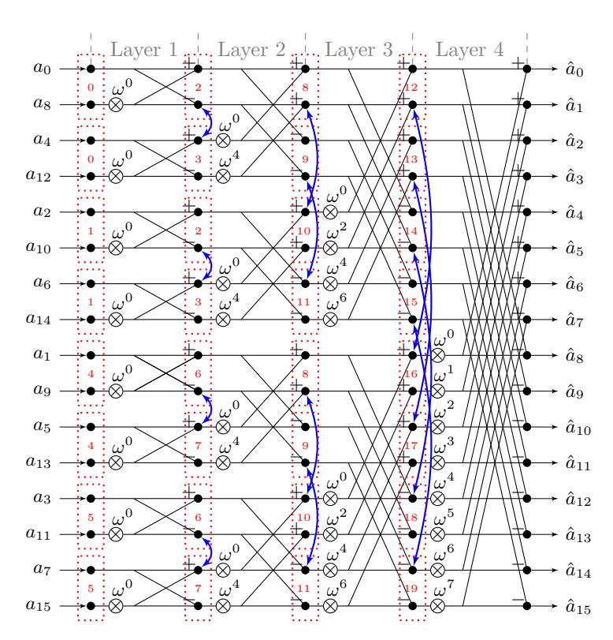

**Figure 1:** Example  $NTT_{br \leftarrow no}^{CT}$  with n=16. In this case, two coefficients are stored in a single word, eight coefficients can be loaded to the register file (l=8), and two pairs of coefficients can be executed in parallel. The red boxes indicate which coefficients are stored together in one word and in which order the coefficients are processed by the two butterfly units. The blue arrows show the coefficients which are swapped after the butterfly operations. For l=8,  $log_2(l)-1=2$  layers were merged.

<span id="page-10-1"></span>**Table 1:** Register content and input for the two butterfly units BF0 and BF1 for the example n = 16, l = 8.

| Register |               | Step 0     |               | Step 1        |               | Step 2     |            | Step 3        |                  | Store Coeffs./ |   |
|----------|---------------|------------|---------------|---------------|---------------|------------|------------|---------------|------------------|----------------|---|
| Content  | Load coeffs.  | BF0        | BF1           | BF0           | BF1           | BF0        | BF1        | BF0           | BF1              | Load Coeffs.   |   |
| R0       | $a_0, a_8$    | $a_0, a_8$ |               |               |               | $a_0, a_4$ |            |               |                  | $a_1, a_9$     |   |
| R1       | $a_4, a_{12}$ |            | $a_4, a_{12}$ |               |               |            |            | $a_8, a_{12}$ |                  | $a_5, a_{13}$  | ] |
| R2       | $a_2, a_{10}$ |            |               | $a_2, a_{10}$ |               |            | $a_2, a_6$ |               |                  | $a_3, a_{11}$  |   |
| R3       | $a_6, a_{14}$ |            |               |               | $a_6, a_{14}$ |            |            |               | $a_{10}, a_{14}$ | $a_7, a_{15}$  |   |

#### **Algorithm 1:** NTT transform

```
Input: Coefficients ai, with i = 0, 1, . . . , n − 1, precalculated values of ωm
  Result: Coefficients aˆi, with i = 0, 1, . . . , n − 1
1 a ← BitReversal(a)
2 for m = 2 to n/2 by m = 2m do
3 ωm ← ω
            n/m
            n
4 ω ← ω
           n/(2m)
           n or 1 for NTT−1
5 for j = 0 to m/2 − 1 by 1 do
 6 for k = 0 to n/2 − 1 by m do
 7 ak+j+m/2, ak+j ← MEMk+j // Load first coefficient pair
 8 H1, L1 ← ak+j+m/2, ak+j
 9 ak+j+3m/2, ak+m+j ← MEMk+j+m/2 // Load second coefficient pair
10 H2, L2 ← ak+j+3m/2, ak+m+j
11 H1, H2 ← (H1 · ω) mod q, (H2 · ω) mod q
12 ak+j+m/2, ak+j ← (L1 − H1) mod q, (L1 + H1) mod q
13 ak+j+3m/2, ak+m+j ← (L2 − H2) mod q, (L2 + H2) mod q
14 MEMk+j ← ak+j+m, ak+j // Store and swap coefficients
15 MEMk+j+m/2 ← ak+j+3m/2, ak+j+m/2 // Store and swap coefficients
16 end
17 ω ← (ω · ωm) mod q
18 end
19 end
20 m ← n // Prepare last round
21 ωm ← ω
         n/m
         n
22 ω ← ω
        n/(2m)
        n or 1 for NTT−1
23 for j = 0 to m/2 − 1 by 1 do
24 aj+m/2, aj ← MEMj // Load coefficient pair
25 H1, L1 ← aj+m/2, aj
26 H1 ← (H1 · ω) mod q
27 aj+m/2, aj ← (L1 − H1) mod q, (L1 + H1) mod q
28 MEMj ← aj+m/2, aj // Store without swap
29 ω ← (ω · ωm) mod q
30 end
```

In the first step, the coefficients of polynomial a are stored in a bit-reversed order in the main memory (line 1). The input coefficients are stored in a way that two coefficients are always stored in a single word.

In the second step (line 2-19), the first  $log_2(n)-1$  NTT layers are calculated. The Twiddle factor  $\omega$  is initialized in line 4, and always updated during runtime by a modular multiplication with  $\omega_m$  (line 17). The value of  $\omega_m$  depends on the current NTT layer indicated by the variable m. In practice, the values for  $\omega_m$  still need to be precomputed. However, only one entry for each layer is required, resulting in  $log_2(n)$  precomputations. To merge the multiplication by powers of  $\gamma$ ,  $\omega$  is initialized with the square root of  $\omega_m$  (line 4). The same precomputations as for  $\omega_m$  can be used because  $\omega_m^{1/2}$  and  $\omega_m$  from the previous layer have the same value. Only for the first layer (m=2), the value  $\omega_m^{1/2}$  has to be computed.

The most important part of Algorithm 1 are the butterfly operations, described in the inner loop (line 7-15). At the beginning, two coefficient pairs are loaded from the main memory locations  $MEM_{k+j}$  and  $MEM_{k+j+m/2}$  and are assigned to two temporary variables each consisting of a lower halfword  $L_1/L_2$  and a higher halfword  $H_1/H_2$  (line 7-10). Then, two butterfly operations are performed (line 11-13). Finally, the result is swapped and stored in the respective memory location (line 14-15).

The third and last step is the computation of the last NTT layer (line 20-30). The operations of the last layer are similar to the operations of the other layers. The main difference is that no swapping operation is required.

The algorithmic modifications required for the merging technique include the manipulation of the start and end values of the outer and inner loop (lines 2 and 6). For the hardware architecture, we consider 32 registers available from the floating point register set for storing l=64 coefficients. In this way, five layers can be merged. The nested loops can be split into n/64 parts. The outer loop, which indicates the current layer, starts for each part from  $2^1$  and terminates at the value  $2^5$ , i.e.,  $m=\{2,4,8,16,32\}$ . The inner loop iterates for the i-th part from k=32i to k=32i+31, where  $i\in[0,\ldots,n/64-1]$ . Instead of loading and storing the coefficients from the main memory, the coefficients are kept within the register set and are only refreshed between the n/64 parts.

### 3.2 Number Theoretic Transform (NTT) Architecture

Our proposed hardware architecture for the NTT and Modular Arithmetic Unit is shown in Figure 2. It is composed of three main modules: Address Unit, Twiddle Update Unit, and Modular Arithmetic Unit. The architecture is optimized for the  $NTT_{br\leftarrow no}^{CT}$  algorithm, which is used in NewHope. However, it also supports different NTT algorithms. The input of the NTT and Modular Arithmetic Unit is the content of two registers from the processor's register bank (with lower halfwords  $L_1/L_2$  and higher halfwords  $H_1/H_2$ ), and the control signals from the instruction decoder. The output consists of the processed input values and the control signals for the register bank.

Address Unit. This module controls the merging operation by setting the two read and write addresses for the register bank according to Algorithm 1 (with the modified loop start and end values) in order to merge five NTT layers. In this work, the automatic address calculation is only supported for  $NTT_{br\leftarrow no}^{CT}$  and therefore only for NewHope. Supporting different NTT variants would be possible but would also lead to a non-negligible increase of area. The address calculation is triggered by the multiple\_bf signal. At each clock cycle three sets of signals are updated: the read addresses raddr, the write addresses waddr, and the write enable signal wen. The Address Unit is also responsible for selecting the correct index for the small LUT of the precalculated values of  $\omega_m$  and for triggering the Twiddle factor update. When the NTT and Modular Arithmetic Unit is in single operation

<span id="page-13-0"></span>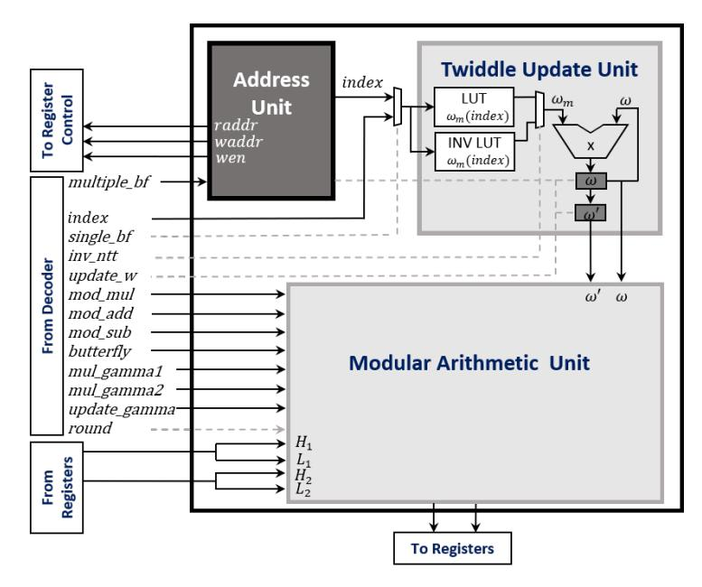

**Figure 2:** NTT and Modular Arithmetic Unit

mode, the *Address Unit* remains in idle state.

**Twiddle Update Unit.** This module calculates the Twiddle factors *ω* on-the-fly. The update of *ω* is always triggered by the update\_w signal, which is either set by the *Address Unit* or by the corresponding signal from the instruction decoder. The current Twiddle factor *ω* = *ω* · *ω<sup>m</sup>* mod *q* is updated as described in lines 17 and 29 of Algorithm [1.](#page-11-0) The value of *ω* is initialized according to lines 4 and 22. The value for *ω<sup>m</sup>* is determined through the current NTT layer. All *log*2(*n*) possible values for *ω<sup>m</sup>* are precalculated and stored in a LUT within the hardware accelerator. The index signal is used to select the correct value from the LUT. Depending on the value of the inv\_ntt signal, either the LUT for the forward NTT or the inverse NTT is selected.

**Modular Arithmetic Unit.** This module performs the arithmetic for the following operations: *Butterfly Operation* (decimation-in-time and decimation-in-frequency), *Post-Processing Operation* (mul\_gamma1, mul\_gamma2, update\_gamma), and *Vectorized Modular Arithmetic* (mod\_mul, mod\_add, mod\_sub). It is composed of a set of arithmetic elements, registers, and a *Reordering MUX*. A detailed microarchitecture of the *Modular Arithmetic Unit* in the *Butterfly Operation* mode is shown in Figure [3.](#page-14-0) The architectures of the *Modular Arithmetic Unit* in the *Post-Processing Operation* and *Vectorized Modular Arithmetic* operation mode look very similar and are shown in Figure [10](#page-40-0) and Figure [11](#page-40-1) (Appendix [B\)](#page-39-0). The only difference between these figures are the signals which are forwarded by the multiplexers.

The *Butterfly Operation* calculates two butterfly operations {*L*<sup>1</sup> − *H*<sup>1</sup> · *ω*, *L*<sup>1</sup> + *H*<sup>1</sup> · *ω*} and {*L*<sup>2</sup> − *H*<sup>2</sup> · *ω*, *L*<sup>2</sup> + *H*<sup>2</sup> · *ω*} in parallel. The calculation is triggered by the butterfly signal. In order to calculate two butterfly operations in parallel within the last NTT layer (Algorithm [1,](#page-11-0) line 23-30), the previous Twiddle factor *ω* 0 is also forwarded to the *Modular Arithmetic Unit*. As a result, the utilization of the *Modular Arithmetic Unit* can be increased and the execution time of the inverse NTT can be decreased. The *Reordering*

<span id="page-14-0"></span>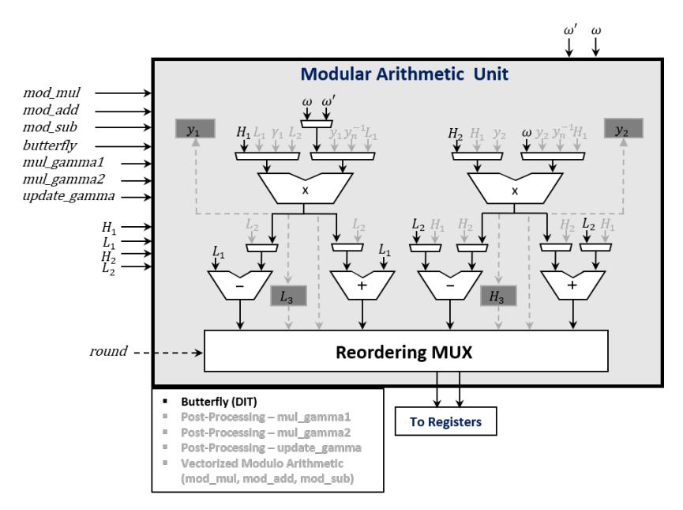

Figure 3: Modular Arithmetic Unit – Butterfly Operation decimation-in-time (DIT)

MUX is responsible for preparing the coefficients to the next round (layer) by swapping the coefficients after the butterfly operation for all rounds, except for the last one. The architecture was extended in order to support the calculation of the decimation-in-frequency butterfly operation, i.e., the calculation of  $\{(L_1-H_1)\cdot\omega,\,L_1+H_1\}$  and  $\{(L_2-H_2)\cdot\omega,\,L_2+H_2\}$ . For reasons of better visibility, this extension is not shown in Figure 3. The calculation of  $L_1+H_1$  and  $L_2+H_2$  can be done by the existing modular adders. To avoid any combinatorial loop in the circuit, either two additional modular multipliers or modular subtractors are required. As the modular subtractors are more compact (less area consuming) than the modular multipliers, they were used in this work to enhance the design. These subtractors were placed on top of the existing multipliers. The input of the additional subtractors are  $(L_1,H_1)$  and  $(L_2,H_2)$ . The output is connected to the multiplexers of the left input of the existing multipliers.

The Post-Processing Operation (mul\_gamma1, mul\_gamma2, update\_gamma) is used to calculate the multiplications with  $n^{-1}$  and  $\gamma^{-i}$  at the inverse NTT operation. These multiplications can be merged with the last layer of the inverse NTT. Therefore, first the control signal mul\_gamma1 ensures that the coefficients  $a_i$  and  $a_{i+n/2}$  of the first input  $(L_1, H_1)$  are multiplied with  $\gamma_1 = n^{-1} \gamma^{-i}$  and  $\gamma_2 = n^{-1} \gamma^{-i-n/2}$ , respectively. Before the multiplication with the first coefficients  $a_0$  and  $a_{n/2}$  starts,  $\gamma_1$  is initialized with  $n^{-1} \gamma_n^{-1} \mod q$  and  $\gamma_2$  with  $n^{-1} \gamma_n^{-n/2} \mod q$ . The mul\_gamma2 control signal is used to perform the multiplications with the next coefficient pair  $a_{i+1}$  and  $a_{i+1+n/2}$ . The Reordering MUX brings the results of the mul\_gamma1 and mul\_gamma2 operation in the desired order  $\{a_{i+1}, a_i\}$  and  $\{a_{i+1+n/2}, a_{i+n/2}\}$  and assigns the result to the output. The update\_gamma signal is used to update  $\gamma_1 = \gamma_1 \gamma_n^{-1}$  and  $\gamma_2 = \gamma_2 \gamma_n^{-1}$  after each mul\_gamma1 and mul\_gamma2 operation.

The Vectorized Modular Arithmetic (mod\_mul, mod\_add, mod\_sub) operation uses the Modular Arithmetic Unit to calculate vectorized modular multiplications  $(L_1 \cdot L_2 \mod q)$  and  $H_1 \cdot H_2 \mod q$ ; additions  $(L_1 + L_2 \mod q)$  and  $H_1 + H_2 \mod q$ ; and subtractions  $(L_1 - L_2 \mod q)$  and  $H_1 - H_2 \mod q$ , where  $L_1$  and  $L_2$  are the lower 16 bit of the two forwarded registers from the register set and  $H_1$  and  $H_2$  are the higher 16 bit. The two results from the modular multipliers, adders, or subtractors are combined in the Reordering

*MUX* and are assigned to the output signal. The corresponding control signals mod\_mul, mod\_add, and mod\_sub are used to perform the vectorized modular arithmetic and to output the desired result. Similar to the *Butterfly Operation*, the *Vectorized Modular Arithmetic* belongs to the category of packed (vectorized) arithmetic and follows the Single Instruction Multiple Data (SIMD) principle. This means a single instruction is used to process multiple data elements in parallel.

### **3.3 Bit-Reversal**

The bit-reversal operation is a particular permutation of a sequence of elements. As discussed in Section [3.1,](#page-7-2) it is a key part of the NTT. Consider an array of *n* elements, the index of the *i*-th element *a<sup>i</sup>* can also be represented in binary notation *i* = {*b*0*, b*1*, . . . , blog*2(*n*)−1}. The bit-reversal operation swaps the *i*-th element with the *j*-th element which has the bit-reversed index *j* = {*blog*2(*n*)−1*, blog*2(*n*)−2*, . . . , b*0}. Reversing the bits is an expensive software task. A straightforward approach with a runtime of O(*m*) is looping through all *m* = *log*2(*n*) bits of an integer. The fastest solution is to use a LUT. This LUT requires *n* entries, each consisting of *m* bits. In particular, for large arrays, i.e., for large polynomial lengths, this approach will lead to a high memory footprint (large LUT). In order to have a better trade-off between memory footprint and performance, we extend the RISC-V ISA and develop special instructions for the bit-reversal operation. These instructions are derived from the store word/halfword operations *sw, sh*. In addition to the value to be stored and the destination address, the new instructions also take an offset. This offset is added in a bit-reversed order to the destination address. The functionality of the new instructions can be expressed as *MEMrs*1+*bitrev*(*rs*2) ← *rd*, where *rs*1 contains the destination address, *rs*2 the offset, and *rd* the value that is stored. Reversing the offset in hardware can be efficiently solved through a rewiring process. The bit-reversal of a whole polynomial can be performed by loading in a loop each coefficient, and storing the coefficient with the new instruction. In this case, the offset simply corresponds to the loop counter.

## <span id="page-15-1"></span>**3.4 Results for the NTT Accelerator**

In this paper, we use the PULP RISC-V Toolchain[1](#page-15-0) (version 7.1.1) with the optimization flag 'O3' (optimization for speed) to compile the code. A description of the used RISC-V platform is given in Section [4.](#page-22-0) Table [2](#page-16-0) summarizes the clock cycle count required for performing the NTT, inverse NTT, and bit-reversal step in NewHope and Kyber. While in NewHope different polynomial lengths are used for different security levels (*n* = 512 and 1024), Kyber uses the same polynomial length for all security levels (*n* = 256). In all implementations mentioned in Table [2,](#page-16-0) the bit-reversal step was eliminated for Kyber by using two different NTT variants. The baseline implementations for our optimized implementations are the clean C-code versions of the PQ-M4 project in [\[KRSS19\]](#page-36-8), which are based on the reference implementations in [\[AAB](#page-34-5)<sup>+</sup>19] and [\[ABD](#page-34-6)<sup>+</sup>19].

In comparison to the baseline implementation on RISC-V, the optimized NewHope implementation achieves a speedup factor of 13*.*18/12*.*40 (NTT/NTT<sup>−</sup><sup>1</sup> ) for length-512 polynomials and a speed up factor of 13*.*01/11*.*95 (NTT/NTT<sup>−</sup><sup>1</sup> ) for length-1024 polynomials. The integrated optimization techniques (on-the-fly Twiddle factor calculation, merge of five NTT layers with direct access of the *NTT and Modular Arithmetic Unit* to the processor's floating point register set, and the storage of two coefficients in one word) result in a significant performance improvement when compared to the baseline implementation. The new bit-reversal instruction does not only eliminate the LUT for this step (1024 bytes for NewHope-512 and 2048 bytes for NewHope-1024), but also leads to an

<span id="page-15-0"></span><sup>1</sup>https://github*.*[com/pulp-platform/pulp-riscv-gnu-toolchain](https://github.com/pulp-platform/pulp-riscv-gnu-toolchain)

improvement in speed. Although the architecture of the NTT and Modular Arithmetic Unit is not optimized for the  $NTT_{no\rightarrow br}^{CT}$  and  $INV-NTT_{br\rightarrow no}^{GS}$  variants, Kyber also achieves a considerable speedup factor of 17.93/27.79 (NTT/NTT $^{-1}$ ) when compared to the baseline implementation. In fact, only the parallel decimation-in-frequency butterfly operations and the vectorized modular multiplication of the NTT and Modular Arithmetic Unit are used.

Our results show that our architecture beats the clock cycle count of the latest assembler optimized ARM Cortex-M4 implementations in [ABCG20], the RISC-V implementation in [AEL $^+$ 20], which uses a finite field multiplier to accelerate the NTT, and the hardware/software co-design architecture of NewHope in [FSMG $^+$ 19], which uses a loosely coupled NTT accelerator. In [AEL $^+$ 20], the bit-reversal step was also eliminated for NewHope. However, two different NTT variants have to be used, which might lead to an increase of code size. In [FSMG $^+$ 19], the bit-reversal costs were hidden by a re-wiring during the transfer of the coefficients to the memory of the NTT accelerator.

In addition, in contrast to the NewHope baseline implementation and the implementations presented in [ABCG20], our proposed architecture does not require large LUTs. While the NewHope reference implementation in [AAB+19] requires 7n-bytes (n denotes the polynomial length) for storing LUTs for the bit-reversal step, Twiddle factors and pre-/post processing, our implementation only requires  $4 \cdot log_2(n) + 4$  bytes. In concrete numbers, the LUTs were reduced from 7168 to 44 bytes for NewHope-1024 and from 3584 to 40 bytes for NewHope-512. In contrast to the design in [FSMG+19], no additional data memory is required for the accelerator. A summary of the required hardware costs for the NTT as well as the whole NewHope and Kyber implementations is presented in Section 5.

<span id="page-16-0"></span>

|                                     | Device            | NTT     | $\mathbf{N}\mathbf{T}\mathbf{T}^{-1}$ | $\mathbf{BR}$ |
|-------------------------------------|-------------------|---------|---------------------------------------|---------------|
| NewHope-512 [ABCG20]                | ARM Cortex-M4     | 31,217  | 23,439                                | _             |
| NewHope-512 [ $AEL^+20$ ]           | RISC-V (VexRiscv) | 14,787  | 14,893                                | 0             |
| NewHope-512 baseline                | RISC-V (PULPino)  | 107,666 | 107,668                               | 6,623         |
| NewHope-512 opt.                    | RISC-V (PULPino)  | 8,169   | 8,684                                 | 2,056         |
| NewHope-1024 [FSMG <sup>+</sup> 19] | RISC-V (PULPino)  | 24,609  | 24,609                                | 0             |
| NewHope-1024 [ABCG20]               | ARM Cortex-M4     | 68,131  | 51,231                                | _             |
| NewHope-1024 [AEL <sup>+</sup> 20]  | RISC-V (VexRiscv) | 31,295  | 31,735                                | 0             |
| NewHope-1024 baseline               | RISC-V (PULPino)  | 241,121 | 241,123                               | 13,279        |
| NewHope-1024 opt.                   | RISC-V (PULPino)  | 18,537  | 20,171                                | 4,105         |
| Kyber [ABCG20]                      | ARM Cortex-M4     | 6,855   | 6,983                                 | 0             |
| Kyber [AEL <sup>+</sup> 20]         | RISC-V (VexRiscv) | 6,868   | 6,367                                 | 0             |
| Kyber baseline                      | RISC-V (PULPino)  | 34,703  | 53,636                                | 0             |
| Kyber opt.                          | RISC-V (PULPino)  | 1,935   | 1,930                                 | 0             |

**Table 2:** Clock cycle count for the NTT

### 3.5 Results for Polynomial Multiplication using NTT and CRT

As discussed in Section 2.2, the polynomial multiplication for a large modulus can be calculated with polynomial multiplications of several smaller moduli and a recombination using the CRT. Since the NTT with signed representation would require larger hardware changes to the proposed NTT architecture, the input of the NTT is in the following cycle count analysis supposed to be in the range [0, q-1], i.e., negative numbers are directly reduced by q. For calculating the NTT for Saber, we use a similar approach as for NewHope-512. The differences are: i) each share uses a different modulus and a different n-th root of unity; ii) zero-padding is applied; and iii) scaling by  $\gamma_n^i$  and  $\gamma_n^{-i}$  is not performed.

Table 3 summarizes the results for the polynomial multiplication in Saber using the optimized  $NTT_{br \leftarrow no}^{CT}$  algorithm. The complete polynomial multiplication of one share with zero-padding requires 36, 102 cycles. Since the polynomial multiplication is computed for the three shares with  $q'_1 = 12289$ ,  $q'_2 = 13313$ , and  $q'_3 = 15361$ , a total of six NTT, three NTT<sup>-1</sup>, and three point-wise multiplication operations is required. The results show that 108, 306 cycles are necessary for calculating the three polynomial multiplications. The recombination of the intermediate results using the CRT and the reduction by  $x^n + 1$  turns out to be costly in software. A dedicated hardware accelerator for Eq. 7 with the modular reduction by the large prime q' (42 bits) would improve the performance. However, as shown in the next section, the approach using Toom-Cook/Karatsuba turns out to be more efficient for our setting. This might change when the NTTs are computed in parallel and hardware support for larger moduli is provided. It seems to be not sufficient to use the signed representation, which reduces the number of complete polynomial multiplications from three to two. When assuming that supporting the signed representation has a negligible overhead compared to the current NTT design, the amount of cycles required to perform the two polynomial multiplications is 2.36, 102 = 72, 204. As described in the next section, the complete polynomial multiplication using Karatsuba/Toom-Cook requires only 71,349 cycles when using our proposed modular arithmetic hardware accelerator. It has to be noted that schemes like NewHope and Kyber reduce the amount of NTT operations by transmitting polynomials in the NTT domain and by avoiding the NTT transformation for the uniformly distributed public polynomials. These optimizations cannot be applied to Saber without changing the protocol and test vectors.

<span id="page-17-0"></span>Device Cycles Complete mul. Saber with NTT/CRT RISC-V (PULPino) 226,081 - NTT (512) with bit reversal RISC-V (PULPino) 10.452 -  $NTT^{-1}$  (512) with bit reversal RISC-V (PULPino) 11.053 - NTT multiplication (one share) RISC-V (PULPino) 36, 102 CRT with reduction by  $x^n + 1$  (no HW support) RISC-V (PULPino) 117,836

**Table 3:** Clock cycle count for the NTT with CRT

# <span id="page-17-2"></span>3.6 Hardware Accelerator for Karatsuba/Toom-Cook Polynomial Multiplication

Recent works propose a combination of the Karatsuba and Toom-Cook methods to perform the polynomial multiplication in Saber [DKRV18, DKRV19, MKV20]. Using the four-way Toom-Cook method, the product of a pair of 256-coefficient polynomials is split into seven polynomial multiplications with polynomials of length 64. These  $64 \times 64$ -coefficient multiplications are then further split into  $16 \times 16$ -coefficient multiplications using two levels of Karatsuba. After performing the recursive splittings, the polynomial length is small enough to efficiently perform the schoolbook multiplication. At a certain point, further splitting the polynomials does not bring any performance advantage since the savings derived from the multiplication do not outweigh the increasing number of additions. Similar to [DKRV18] and the reference implementation provided to NIST, in this work we stop the recursive splitting at a polynomial length of 16.

Since the coefficients in Saber are, similar to NewHope and Kyber, smaller than 16 bit, they are suitable for packed (vectorized) arithmetic. Although the ISA extension of the RISC-V specification<sup>2</sup> for packed arithmetic is still in draft mode, the RISC-V core used in this work already supports some packed operations [TGS19]. In the following, useful instructions for the polynomial multiplication in Saber are listed:

<span id="page-17-1"></span><sup>&</sup>lt;sup>2</sup>Document Version 20191213: https://riscv.org/specifications/isa-spec-pdf/

```
pv.add.h: rd[15:0] = (rs1[15:0] + rs2[15:0]) mod 216
             rd[31:16] = (rs1[31:16] + rs2[31:16]) mod 216
p.mulu: rd[31:0] = rs1[15:0] · rs2[15:0]
p.mulhhu: rd[31:0] = rs1[31:15] · rs2[31:15]
p.macuN: rd[31:0] = (rs1[15:0] · rs2[15:0] + rd) >> Is3
p.machhuN: rd[31:0] = (rs1[31:16] · rs2[31:16] + rd) >> Is3
```

These instructions are comparable to the ARM Cortex-M4. Saber and also other postquantum NIST candidates, such as some NTRU variants, use a modulus that is a power of two and *q* ≤ 2 <sup>16</sup>. For this reason, it is possible to calculate and store two multiplications in parallel. Moreover, the schoolbook multiplication as well as the Karatsuba step in Eq. [8](#page-7-3) can benefit from a Multiply Accumulate (MAC) function. Therefore, we develop a vectorized modular multiply accumulate function, in the following denoted as *pq.mac*. The functionality of *pq.mac* can be expressed with:

```
pq.mac: rd[15:0] = (rs1[15:0] · rs2[15:0] + rd[15:0]) mod q
                                                                0
              rd[31:16] = (rs1[31:16] · rs2[31:16] + rd[31:16]) mod q
                                                                     0
```

In this work, the parameter *q* 0 in *pq.mac* was set to 2 <sup>16</sup>. In this way, it is suitable for all schemes that use a power of two modulus smaller or equal to 2 <sup>16</sup>. After performing the polynomial multiplication, the result can be reduced with the original modulus *q* (simple masking operation) because (*a* mod *q* 0 ) mod *q* ≡ *a* mod *q* as long as both moduli are a power of two and *q* <sup>0</sup> ≥ *q*. The hardware architecture for the *pq.mac* operation is shown in Figure [4.](#page-18-0) Using the *pq.mac* operation, the amount of clock cycles for the polynomial multiplication in Saber was reduced from 104*,* 074 to 71*,* 349. In our setting, this result clearly beats the multiplication approach using multiple NTTs and CRT recombination. For the remainder of this article, we use the *pq.mac* operation for the performance optimizations of the polynomial multiplication in Saber.

<span id="page-18-0"></span>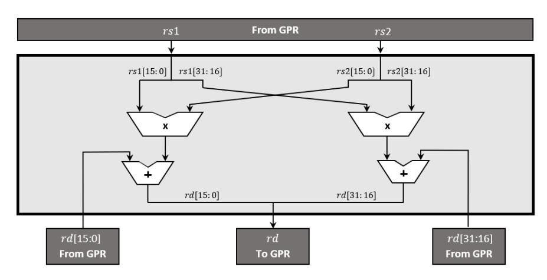

**Figure 4:** Vectorized Modular Multiply Accumulate (*pq.mac*)

### **3.7 Pseudo Random Number Generation**

Most post-quantum cryptosystems require a huge amount of randomness. This is particularly true for the generation of random polynomials in lattice-based cryptography. To produce this large amount of randomness, usually a small seed is expanded using a PRNG. Three primitives are especially suitable for this task: SHA-3, AES and ChaCha20. Among these three alternatives, SHA-3 is the most energy-efficient option because it generates the highest amount of pseudo-random bits per round [\[BUC19\]](#page-34-0). SHA-3 is a subset of the

Keccak family standardized by NIST. The standard lists four specific instances of SHA-3 and two extendable-output functions (SHAKE128 and SHAKE256). While the SHA-3 functions have a specified output length, the two SHAKE variants permit extracting a variable length of output data, which makes it a suitable candidate for the pseudorandom bit generation. All instances are based on a 1600-bit state. This state can be represented in a three-dimensional array containing 25 words, each with a length of 64 bits. These words can be structured in a cube with *x* and *y* coordinates that are indexed from 0 ≤ *x <* 5 and 0 ≤ *y <* 5. Each bit of this cube can be addressed with *A*[*x, y, z*]. In order to facilitate the description of the applied functions, the following conventions are used: the part of the state which presents the word is also called lane, a two-dimensional part of the state with fixed *z* is called a slice, and all lanes with the same *x*-coordinate form a sheet.

The most important part of the SHA-3 and SHAKE primitives is the Keccak permutation function, which calls in each of in total 24 rounds the *f-1600* function. Each round is characterized by the five consecutive steps *θ, ρ, π, χ* and *ι*. These steps have a state array *A* as input and output *B*, a processed new state array.

**Theta Step (***θ***).** This step first computes the parity of each sheet of the state *C*[*x*] = *A*[*x,* 0] ⊕ *A*[*x,* 1] ⊕ *A*[*x,* 2] ⊕ *A*[*x,* 3] ⊕ *A*[*x,* 4] for *x* in [0*,* 4]. The output of the *θ* step can then be computed with *B*[*x, y*] = *A*[*x, y*] ⊕ (*C*[*x* − 1] ⊕ *rot*(*C*[*x* + 1]*,* 1)) for *x* and *y* in [0*,* 4], where *rot* defines the rotation.

**Rho/Pi Step (***ρ/π***).** The *ρ* and *π* steps work on the lanes of the state *A*[*x, y*]. That is, they are usually processed together. The *ρ* step rotates the lane by a constant offset *r*[*x, y*] which depends on the *x* and *y* positions. This can be formulated as *B*[*x, y*] = *rot*(*A*[*x, y*]*, r*[*x, y*]) for x and y in [0*,* 4]. The *π* step swaps the complete lanes of the state according to *B*[*y,* 2*x* + 3*y*] = *A*[*x, y*] for *x* and *y* in [0,4].

**Chi/Iota Step (***χ/ι***).** The non-linear *χ* step can be computed according to *B*[*x, y*] = *A*[*x, y*] ⊕ (*A*[*x* + 1*, y*] & *A*[*x* + 2*, y*]) for *x* and *y* in [0,4]. At the *ι* step, a round constant *R<sup>c</sup>* is XORed to the lane *A*[0*,* 0], i.e., *B*[0*,* 0] = *A*[0*,* 0] ⊕ *Rc*[*i*]. This round constant depends on the current round *i*. Also the *χ* and *ι* step can be combined.

### <span id="page-19-1"></span>**3.8 Hardware Accelerator – Pseudo Random Number Generation**

The *Keccak team* presented three different optimized hardware implementations of Keccak: a high speed core, a mid-range core (trade-off between speed and area), and a low area coprocessor [\[BDH](#page-34-9)<sup>+</sup>20]. A description of these implementations can be found on their website[3](#page-19-0) . The *high speed core* operates in a standalone fashion and requires no further resources for the Keccak calculations. Chunks of a message can be sent to the accelerator and the core will output the hash value. This approach was also used in [\[FSMG](#page-35-2)<sup>+</sup>19]. The authors connected a loosely coupled high performance Keccak accelerator to the AHB in order to accelerate the Keccak operations in NewHope. The *low area* solution (of the Keccak team) is a coprocessor which uses the system memory as data storage instead of storing the Keccak state internally. Only temporary results are kept internally in registers. As a trade-off between the high speed and low area solution, the Keccak team presented the *mid-range core* which is based on some of the ideas presented in [\[JA11\]](#page-36-12). This core rearranges the order of the permutation function such that the two slice oriented steps *χ* and *θ* are processed closer together. In order to reduce the required area, the core only

<span id="page-19-0"></span><sup>3</sup>https://keccak*.*[team/files/Keccak-implementation-3](https://keccak.team/files/Keccak-implementation-3.2.pdf)*.*2*.*pdf

works on a subset of the slices that compose the state. This approach requires a different initial and final round. However, as the *ρ*, *π* and *ι* steps work on lanes and the *χ* and *θ* steps on slices, it is not the optimal solution to split the state as the state must be loaded multiple times from the memory.

In this work, we develop an alternative solution for Keccak which presents a trade-off between performance and area. It can be classified between the high speed and low area Keccak solutions of the *Keccak team*. To avoid a high access rate to the main memory, the state is not split into multiple parts. However, instead of a standalone loosely coupled Keccak accelerator, we design a hardware accelerator for a single round of the Keccak permutation. To reuse existing resources from the RISC-V core, the complete Floating Point Register Set (FPR) with 32 × 32 bit registers and a part of the General Purpose Register Set (GPR) with 18 × 32 bits are used. In the following, this combination of FPR and GPR is denoted as Post-Quantum Register Set (PQR). To be precise, the temporary registers *t*0 to *t*6 and the saved registers *s*1 to *s*11 are used from the GPR. In this way, enough remaining registers exist in the GPR to guarantee a normal operation of the RISC-V core and also enough registers are used to store the complete Keccak state in the PQR. The saved registers have to be stored on the stack before the Keccak function starts. Similar to the *NTT and Modular Arithmetic Unit*, the registers can be accessed in parallel.

Figure [5](#page-20-0) illustrates our Keccak hardware accelerator. The input of this accelerator is the content of the PQR, the current round constant (rnd), a start signal (keccak\_wen) and a reset signal (keccak\_rst). Triggered by the start signal, the accelerator will perform one round of the *f-1600* function, where the round signal selects the corresponding round constant. The result of the processed state is written back to the PQR. This step can be repeated for all 24 rounds. The permuted state can then be stored from the PQR to the main memory.

To reduce the memory access during the generation of random polynomials, we keep the state in the registers as long as possible. The following steps are used for the generation of random polynomials. First, the state is set to zero with the keccak\_rst signal and written into the PQR, which also resets the related registers. After setting all registers to zero, the Keccak absorption phase begins. During this phase, the input message or a message block is written into a subset of the state. The state permutation will then transform this state. Depending on the rate, a certain number of bits is squeezed out while a part of the state, the capacity, remains untouched. The squeezed output is then processed in order to generate the desired random polynomials. Thereby, the state registers must remain untouched when the state is not written back to the memory. To obtain fresh randomness, the state is permuted and squeezed again. Keeping the state for the whole polynomial sampling process within the PQR leads to a significant performance improvement as the access to the main memory for saving the state is eliminated in this case.

<span id="page-20-0"></span>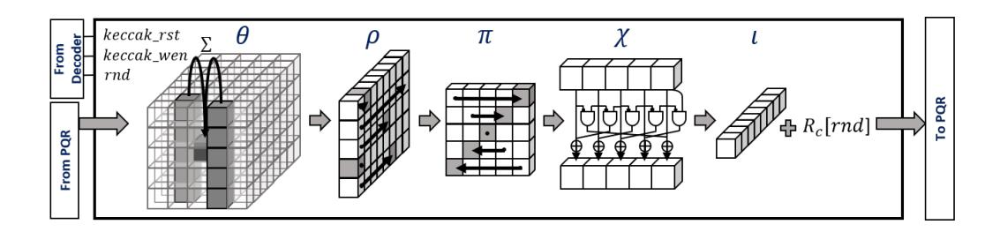

**Figure 5:** Keccak Accelerator

### <span id="page-21-1"></span>3.9 Binomial Sampling

Many LWE-based schemes, such as NewHope, Kyber and Saber, replaced the discrete Gaussian error distribution by a centered binomial distribution. This significantly increases the efficiency, avoids complex arithmetic or large LUTs, and offers better protection against Side-Channel Attacks (SCA). Let  $\Psi_k$  be a binomial distribution which is centered at zero and has a standard deviation of  $\sigma = \sqrt{k/2}$ . The distribution is determined by  $\Psi_k = \sum_{i=0}^{k-1} (b_i - b_i') \mod q$ , where  $b_i, b_i' \in \{0, 1\}$  are uniform independent bits. This is similar to taking two k-bit integers b and b', calculating the respective Hamming weight and subtracting one Hamming weight from the other (modular subtraction).

Figure 6 shows the developed hardware architecture of the Binomial Sampling Unit, which turns uniformly distributed samples into binomially distributed ones. The Binomial Sampling Unit reads the uniform samples contained in the two registers rs1 and rs2 from the GPR and calculates the result rd. As the modulus is smaller than 16 bit for the considered schemes, the output register can concatenate two samples. The Binomial Sampling Unit supports different parameters of k: for NewHope k=8 [AAB+19], for Kyber k=2 [ABD+19], for Lightsaber k=5, for Saber k=4, and for Firesaber k=3 [DKRV19]. Depending on the mode signal, the multiplexers forward two sums of k bits to the modular subtractors. The two output samples of the subtractors will be combined and written back to the GPR.

<span id="page-21-0"></span>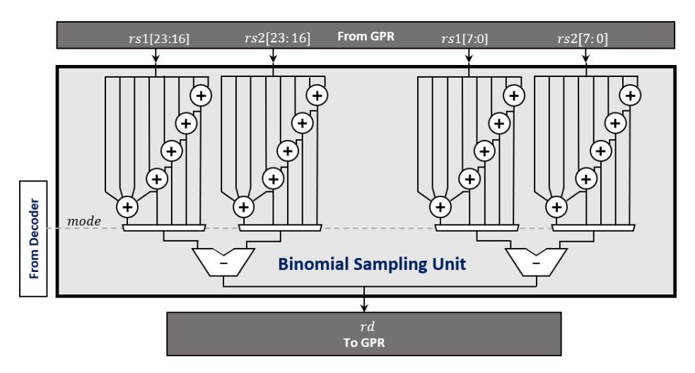

Figure 6: Binomial Sampling Unit

### 3.10 Results for Keccak and Polynomial Sampling

Table 4 summarizes the clock cycle count of the SHAKE256 implementation, the uniform sampling, and the binomial sampling. While the uniform rejection sampling is used in LWE-based schemes to generate the random public polynomial, the binomial sampling is used to generate the secret and error polynomials for R-LWE/M-LWE schemes. For M-LWR schemes, the binomial sampling is only used for generating the secret polynomials. The results show that the SHAKE256 function was accelerated by a factor of 103.59 in comparison to the software baseline implementation. Also compared to the baseline implementation, the uniform sampling was accelerated by a factor of 26.90 for NewHope-512 (n=512), 27.12 for NewHope-1024 (n=1024), 22.37 for Kyber-512 (n=256 for all Kyber security levels), and 31.74 for Lightsaber (n=256 for all Saber security levels). The optimized binomial sampling makes use of the fast Keccak Accelerator described in Section 3.8 as well as the Binomial Sampling Unit described in Section 3.9. With

these optimizations, we achieve a speedup factor of 35.69, 35.80, 14.27, and 40.15 for NewHope-512, NewHope-1024, Kyber-512, and Lightsaber, respectively. The speedup factor for Kyber is smaller when compared to NewHope or Lightsaber due to the low variance of the error distribution.

Although, we aimed for a mid-range Keccak solution, the results show that our design outperforms the uniform and binomial sampling of [FSMG<sup>+</sup>19], which uses a loosely coupled standalone high performance Keccak implementation. Their architecture is able to calculate two Keccak rounds in one clock cycle. However, the large communication overhead poses a substantial drawback of their architecture. In this work, the communication overhead was nearly eliminated. During the Keccak absorption phase the message initializes the state. Afterwards, the Keccak state is hold in the registers for the complete sampling process. The required hardware costs are summarized in Section 5.

<span id="page-22-1"></span>**Table 4:** Cycle count of SHAKE256 (32 byte input/output length), uniform sampling, and binomial sampling. Kyber and Saber have for all security strengths the same polynomial length. The results for *Poly Uniform* and *Poly Binomial* are given with respect to generating one polynomial.

|                                         | SHAKE256 | Poly Uniform | Poly Binomial |
|-----------------------------------------|----------|--------------|---------------|
| NewHope-512 CCA baseline                | 31,907   | 272,615      | 280,079       |
| NewHope-512 CCA opt.                    | 308      | 10,136       | 7,847         |
| NewHope-1024 CPA [FSMG <sup>+</sup> 19] | -        | 42,050       | 75,682        |
| NewHope-1024 CCA baseline               | 31,907   | 548,019      | 560,058       |
| NewHope-1024 CCA opt.                   | 308      | 20,205       | 15,643        |
| Kyber-512 CCA baseline $(n = 256)$      | 31,907   | 501, 300     | 33,902        |
| Kyber-512 CCA opt. $(n = 256)$          | 308      | 22,414       | 2,375         |
| Lightsaber CCA baseline $(n = 256)$     | =        | 306,387      | 130,896       |
| Lightsaber CCA opt. $(n = 256)$         | _        | 9,652        | 3,260         |

# <span id="page-22-0"></span>4 Integration of Accelerators into RISC-V Platform and ISA Extension

RISC-V is an open Instruction Set Architecture (ISA) based on the concepts of the Reduced Instruction Set Computer (RISC) principles. The RISC-V initiative started in 2010 by the University of California, Berkley and has meanwhile grown to a large non-profit corporation. RISC-V provides a free, open, flexible, and extensible ISA usable for embedded systems as well as high performance computers. Several open-source hardware implementations supporting the RISC-V ISA exist. Implementations which have drawn particular attention are Rocket Chip<sup>4</sup>, VexRiscv<sup>5</sup>, and the RISC-V cores from PULP<sup>6</sup>.

Rocket Chip was constructed using the hardware construction language Chisel<sup>7</sup>. The implementation offers a dedicated interface, called Rocket Custom Coprocessor (RCC), to extend the system with hardware accelerators. However, the presented design does not allow to easily change the pipeline stage and is therefore less suitable for the development of tightly coupled accelerators. VexRiscv was developed using another high level hardware description language called SpinalHDL<sup>8</sup>. The VexRiscv project allows modifications of the pipeline stage. This platform was used in [AEL<sup>+</sup>20] to integrate a tightly coupled finite field multiplier and in [WTJ<sup>+</sup>20] for developing loosely coupled qTESLA accelerators. The PULP project features three different RISC-V cores designed using the hardware

<span id="page-22-2"></span><sup>&</sup>lt;sup>4</sup>https://github.com/chipsalliance/rocket-chip

<span id="page-22-3"></span><sup>5</sup>https://github.com/SpinalHDL/VexRiscv

<span id="page-22-4"></span><sup>6</sup>https://github.com/pulp-platform

<span id="page-22-5"></span><sup>7</sup>https://www.chisel-lang.org

<span id="page-22-6"></span><sup>8</sup>https://github.com/SpinalHDL

description language SystemVerilog. The Ariane core is a 6-stages 64-bit solution. For smaller embedded devices, the PULP team offers the 2-stages 32-bit solution Ibex (formerly Zero-riscy) and the 4-stages 32-bit solution CV32E40P (formerly RI5CY). The RISC-V cores CV32E40P and Ibex can be integrated into the single-core microcontroller platform PULPino[9](#page-23-0) offering a rich set of peripherals such as I2C, SPI, UART, and GPIO.

Similar to [\[FSMG](#page-35-2)<sup>+</sup>19], we decided to use the CV32E40P core and integrated this core into the PULPino platform. As the core and platform are written in SytemVerilog, we have the full control over the whole architecture, which makes it ideally suitable for our modifications of the core and pipeline stage. The CV32E40P core has a comparable performance to the widely deployed ARM Cortex-M4, but a less advanced compiler and instruction set.

### **4.1 Integration of PQ Hardware Accelerators**

Figure [7](#page-24-0) shows the architecture of the CV32E40P core with post-quantum extensions, which we name RISQ-V. The CV32E40P processor has a four stages in-order pipeline. The main components are a prefetch buffer, an instruction decoder, a General Purpose Register Bank (GPR), a Floating Point Register Bank (FPR), an Arithmetic Logic Unit (ALU), a Multiplication Unit (MULT), a Control and Status Register Unit (CSR), and a Load-Store Unit (LSU). The core is extended by two completely new components: the *PQR-ALU* and the *PQ-ALU*.

The *PQR-ALU* consists of the *NTT and Modular Arithmetic Unit* and the *Keccak Accelerator*. These two modules require parallel access to the register banks. Therefore, the *PQR-ALU* is directly located within the *Decoding Stage*. This avoids to route the register signals to the *Execution Stage*. The *PQ-ALU* contains the *Binomial Sampling Unit*. This accelerator requires only two input and one output register and has a similar construction like the *MULT* unit and the *ALU*. To reuse existing hardware resources, we integrate the *pq.mac* operation, described in Section [3.6,](#page-17-2) directly into the *MULT* unit. The hardware resources for performing the multiplications are already available in the *MULT* unit and an extension for the *pq.mac* support comes with a negligible overhead of multiplexers and two additions. Enhancing or downsizing our developed *PQR-ALU* and *PQ-ALU* is straightforward. All accelerators are added as modules and can be selected using dedicated define directives. Thus the accelerators can be selected according to the application requirements.

### **4.2 RISC-V ISA Extension**

To enhance the basic integer instruction set (**I**), RISC-V defines several standard extensions, including the extensions for multiplication/division (**M**); single, double, and quad precision floating point operations (**F**, **D**, **Q**); atomic operations (**A**); and compressed instructions (**C**).

The CV32E40P core fully supports the **I** instruction set and the extensions **M**, **F**, and **C**. In addition, this core provides the PULP specific extension **Xpulp**, which includes hardware loops, SIMD extensions, bit manipulation and post-increment instructions. In this work, we develop the **PQ** extension. Figure [8](#page-24-1) shows the RISC-V base instruction format types *R*, *I*, *S*, and *U*. Depending on the instruction type, the instruction structure consists of an *opcode*, function fields, immediate values, the source registers *rs*1 and *rs*2, and the destination register *rd*. We decided to use the *R-type* for all post-quantum instructions. This allows the use of multiple operations with only a single opcode. The *opcode* chosen in this work is the unused value 0*x*77.

<span id="page-23-0"></span><sup>9</sup>https://github*.*[com/pulp-platform/pulpino](https://github.com/pulp-platform/pulpino)

<span id="page-24-0"></span>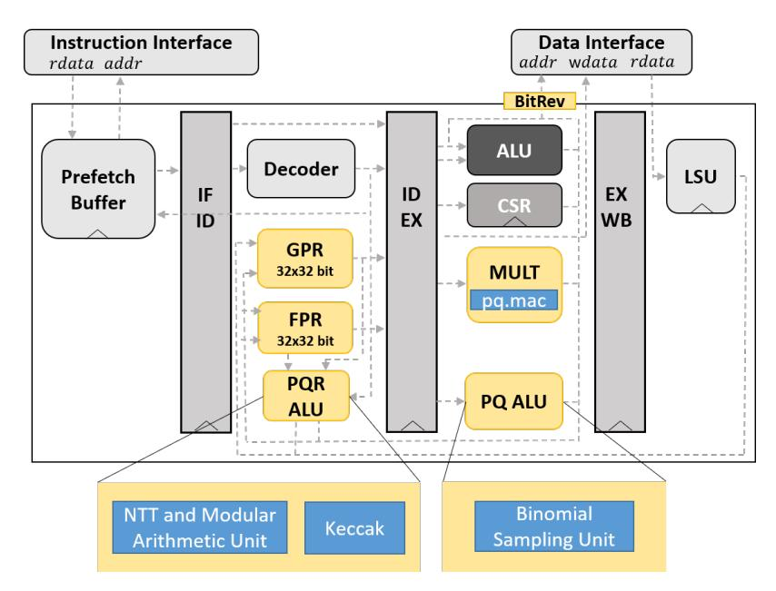

**Figure 7:** RISQ-V

<span id="page-24-1"></span>

|   | 7 6<br>0 | 12 11    | 15 14  | 20 19 | 25 24      | 31        |
|---|----------|----------|--------|-------|------------|-----------|
| R | opcode   | rd       | funct3 | rs1   | rs2        | funct7    |
| I | opcode   | rd       | funct3 | rs1   |            | imm[11:0] |
|   |          |          |        |       |            |           |
| S | opcode   | imm[4:0] | funct3 | rs1   | rs2        | imm[11:5] |
|   |          |          |        |       |            |           |
| U | opcode   | rd       |        |       | imm[31:12] |           |

**Figure 8:** Base RISC-V instruction formats

The developed post-quantum instructions can be divided into seven main classes: NTT Configuration, NTT Operation, Modular Arithmetic Unit, Bit-Reversal, PQ-MAC, Keccak Operation, and Binomial Sampling. All instructions which do not require rs1, rs2, or rd can use the value zero for the unused position. A full list of all post-quantum instructions is provided in Table 10 (Appendix C). It also has to be noted that except of the pq.ntt\_multiple\_bf function, all operations are single cycled. The pq.ntt\_multiple\_bf function requires 83 clock cycles (80 cycles for the functionality and 3 cycles delay in the Address Unit) to complete the automized NTT operations for the merged layers. This value does not dependent on the chosen scheme (NewHope-512 or NewHope-1024) but would change with the size of the applied register set. While the pq.ntt\_multiple\_bf writes the last results to the registers, the processing element can already read the first results after 68 cycles.

NTT Configuration Class. This class performs the following functionalities: i) setting the selected scheme: NewHope-512, NewHope-1024, or Kyber (all security categories); ii) setting the forward or inverse NTT; and iii) setting either the first rounds or the last round of the NTT. When NewHope-512 or NewHope-1024 is selected, the parameters for the optimized  $NTT_{br\leftarrow no}^{CT}$  calculation will be set accordingly. Moreover, selecting one of the NewHope variants configures the modulus to q=12289 and the Montgomery parameter for the modular multipliers to  $-q^{-1} \mod R = 12287$  with  $R=2^{18}$  for all schemes. When Kyber is selected the modular parameters are configured to q=3329 and  $-q^{-1} \mod R = 199935$ . Setting the forward or inverse NTT will select the corresponding precomputed values for  $\omega_m$  of the Twiddle Update Unit. Finally, the selection of the first rounds or last round will affect the Reordering MUX of the Modular Arithmetic Unit, more specifically, the swapping of the coefficients.

NTT Operation Class. This class contains all instructions for the optimized  $NTT_{br\leftarrow no}^{CT}$  calculation. The  $pq.ntt\_multiple\_bf$  instruction triggers the automatic calculation of the first five merged NTT rounds. The  $pq.ntt\_single\_bf$  instruction is used to calculate two parallel decimation-in-time butterfly operations. The instructions  $pq.update\_m$  (rs1 is used for the index signal) and  $pq.update\_omega$  are used to control the  $Twiddle\ Update\ Unit$ . The  $pq.mul\_gamma1$ ,  $pq.mul\_gamma2$ , and  $pq.update\_gamma$  instructions are used for calculating the scaling by  $n^{-1}$  and  $\gamma^{-i}$  within the inverse NTT.

**Modular Arithmetic Operation Class.** This class is used for the vectorized modular multiplication, addition, subtraction, and the butterfly operations decimation-in-time and decimation-in-frequency. In this context, rs1 and rs2 are used as source registers and rd as destination register (for the butterfly instructions rs1 is also used for the second output). In contrast to the  $pq.ntt\_single\_bf$  operation, which is used for the optimized  $NTT_{br\leftarrow no}^{CT}$ , the  $pq.bf\_dit$  operation does not use the registers from the FPR but from the GPR.

**Bit-Reversal Class.** This class contains the bit-reversal instructions for the polynomial lengths n=256, n=512, and n=1024. The register rd contains the value that has to be stored, rs1 the base address of the store location, and rs2 the value of the offset. The offset value will be added to the base address in bit-reversed order. The *Load Store Unit* will then store the coefficient to the desired location.

**PQ MAC Class.** This class contains the vectorized modular multiply accumulate function described in Section 3.6.

**Keccak Operation Class.** This class is used to perform one round of the Keccak permutation. The keccak\_wen signal, described in Section [3.8](#page-19-1) is set to one when the *keccak.f1600* instruction is executed. In this context, *rs*1 selects the current Keccak round and *rs*2 is used to reset the state.

**Binomial Sampling Class.** This class is used to turn uniform samples in *rs*1 and *rs*2 into binomially distributed coefficients in *rd*.

# <span id="page-26-0"></span>**5 Experimental Results**

This section presents our experimental results for NewHope, Kyber and Saber. The evaluation was performed for the Chosen Ciphertext Attacks (CCA) variants with different security levels. The software baseline measurements use the clean C-code versions of the PQ-M4 project in [\[KRSS19\]](#page-36-8), which are based on the reference implementations in [\[AAB](#page-34-5)<sup>+</sup>19], [\[ABD](#page-34-6)<sup>+</sup>19], and [\[DKRV19\]](#page-35-4).

## **5.1 Cycle Count and Code Size**

This subsection provides a cycle count and code size comparison for NewHope, Kyber, and Saber. The results of our clock cycle benchmarks are summarized in Table [5.](#page-29-0) To analyze the influence of our accelerators on the two performance bottlenecks, we provide for each scheme and parameter set four implementations: i) baseline implementation; ii) implementation with optimized modular arithmetic and NTT computations (using *NTT and Modular Arithmetic Unit*, bit reversal, and *pq.mac*); iii) implementation with optimized polynomial sampling (using *Keccak* and *Binomial Sampling Unit*); and iv) implementation with all optimizations presented in this work.

**Comparison with baseline implementations.** In comparison to the software baseline implementation, a cycle count speedup factor of 10*.*75 (NewHope-512), 11*.*39 (NewHope-1024), 7*.*68 (Kyber-512), 7*.*77 (Kyber-768), 9*.*62 (Kyber-1024), 2*.*65 (Lightsaber), 2*.*58 (Saber), and 2*.*48 (Firesaber) for a complete algorithm run was achieved. Despite the baseline implementations already include several optimizations, they have not the primary goal to achieve the highest performance. Therefore, it has to be noted that with careful assembler optimizations improvements can be achieved also without ISA extensions and dedicated hardware support.

Although the *NTT and Modular Arithmetic Unit* was not particularly designed for the NTT types used in Kyber, a significant performance improvement was measured. The second round Kyber submission chooses a prime *q* for which the condition *q* ≡ 1 mod 2*n* does not hold and an early termination of the NTT is required. This reduces the cost for the NTT, but a so called basecase multiplication consisting of 128 products is necessary. For this basecase multiplication, the vectorized modular arithmetic of the *Modular Arithmetic Unit* was exploited.

For the Saber instances, the polynomial multiplication remains the performance bottleneck although the *pq.mac* operation already brings a considerable improvement. Just recently, the authors in [\[MKV20\]](#page-36-11) proposed a technique called lazy interpolation in order to accelerate the evaluation and interpolation phase during the Toom-Cook multiplication. The integration of this optimization technique into our approach would probably result in a further performance improvement but also to a larger memory utilization. An analysis about this optimization technique has been left as future work.

**Comparison with ARM Cortex-M4 implementations.** Our work beats the cycle count of the latest assembler optimized ARM Cortex-M4 implementations of NewHope and Kyber in [\[ABCG20,](#page-34-2) [KRSS19\]](#page-36-8). In comparison to [\[ABCG20\]](#page-34-2), a clock cycle speedup factor of 4*.*30 (NewHope-512), 4*.*46 (NewHope-1024), 2*.*89 (Kyber-512), 3*.*05 (Kyber-768), and 3*.*84 (Kyber-1024) was achieved. When comparing our implementation with the latest Saber implementations on ARM Cortex-M4 [\[MKV20\]](#page-36-11), the achieved speedup factors are lower: 1*.*16 (Lightsaber), 1*.*04 (Saber), 0*.*97 (Firesaber). For this comparison it has to be considered that the applied RISC-V compiler is less advanced than commercial ARM compilers and assembler optimizations for RISC-V are still largely unexplored.

**Comparison with RISC-V implementations.** In comparison to the RISC-V implementation of Kyber in [\[Gre20\]](#page-35-10), a cycle count speedup factor of 8*.*90 (Kyber-512), 8*.*21 (Kyber-768), and 10*.*25 (Kyber-1024) was achieved. To use accelerators and ISA extensions for RISC-V has shown good performance improvements as demonstrated in [\[AEL](#page-34-1)<sup>+</sup>20] with the integration of a finite field multiplier. In our work, we show that more powerful accelerators can be integrated into RISC-V platforms in order to further speed up several lattice-based algorithms. In comparison to their RISC-V work, our results show that we achieve a cycle count speedup factor of 6*.*95 (NewHope-512), 7*.*11 (NewHope-1024), 4*.*65 (Kyber-512), and 6*.*15 (Kyber-1024). The authors in [\[AEL](#page-34-1)<sup>+</sup>20] use a Barrett multiplier to accelerate the modular arithmetic. We use the Montgomery algorithm for performing the modular multiplications. The multiplication through the Montgomery algorithm is very common in most of the available software and hardware implementations of lattice-based cryptography. While the Montgomery multiplication turns out to be more efficient in most settings when compared to the Barrett multiplication, it requires the conversion into the Montgomery domain [\[AEL](#page-34-1)<sup>+</sup>20]. In contrast to the work in [\[AEL](#page-34-1)<sup>+</sup>20], which can calculate one modular multiplication at a time, our solution is more powerful and flexible. Our approach is able to calculate complete vectorized butterfly operations and vectorized modular additions, subtractions, and multiplications. Unfortunately, a fair comparison between the modular and NTT arithmetic used in our work and the one used in [\[AEL](#page-34-1)<sup>+</sup>20] was not possible for the complete algorithm runs. The authors use an optimized unrolled assembler implementation of Keccak. This implementation was not publicly available at the time of finalizing this paper. In our work, the Keccak software implementation is based on an unoptimized reference implementation in [\[KRSS19\]](#page-36-8) [10](#page-27-0). As the Keccak implementation has a high influence on the performance, we can only refer to the results in Section [3.4](#page-15-1) for a comparison between both approaches.

Optimizing the modular and NTT arithmetic turns out to be not sufficient to alleviate all performance bottlenecks. For all schemes and security levels, the ISA extensions for accelerating the polynomial sampling have shown a larger impact on the performance when compared to the extensions for the modular and NTT arithmetic. Using the sampling extensions alone will already beat the cycle count of the latest ARM Cortex-M4 implementations for NewHope and Kyber.

Furthermore, our design is faster than the CPA version of the NewHope-1024 implementation in [\[FSMG](#page-35-2)<sup>+</sup>19], which uses loosely coupled accelerators, although the CPA version has no costly re-encryption step (991*,* 469 vs. 1*,* 113*,* 984 cycles). The better performance can be explained by the reduced communication overhead due to the tight coupling of the NTT and Keccak accelerators to the register banks and by the additional usage the new accelerators developed in this work (*Modular Arithmetic Unit* and *Binomial Sampling Unit*).

<span id="page-27-0"></span><sup>10</sup>https://github*.*[com/mupq/mupq/tree/master/common](https://github.com/mupq/mupq/tree/master/common)

**Update of NewHope specification.** Just recently, the authors of NewHope announced in the NIST PQC Forum[11](#page-28-0) that a new reference code is available. This new version appeared as a response of the work presented in [\[BDG20\]](#page-34-10), which exploits the incorrect oracle cloning of some NIST KEM PQC candidates to perform key-recovery attacks. The new version of NewHope includes a domain separation for the SHAKE calls in order to make each hash call independent. That is, all hash calls with the same input size use a domain separator label (e.g., a nonce). It is estimated by the *NewHope team* that this modification will have a negligible influence on the performance results of NewHope. RISQ-V is able to support efficiently the new version of NewHope. The absorption of the input message is completely controlled by software and can be easily modified. The integration of a complete domain separation has been left as future work.

**Code size.** Table [6](#page-30-0) summarizes the measured code size for both the baseline and the optimized implementations. In particular for the optimized NewHope implementations, the code size was significantly decreased compared to the baseline implementation. This is mainly due to the fact that the large LUTs for the Twiddle factors and bit-reversal were eliminated. Moreover, the ISA extensions have the side effect that fewer instructions for complex operations are required. It should also be noted that the Saber implementations in [\[KRSS19\]](#page-36-8) have a significantly larger memory consumption. This is caused by the fact that the authors developed a tool for the automatic generation of an optimized assembler code for the polynomial multiplication in Saber. While the optimized assembler code leads to a very fast polynomial multiplication, the code size is large (nearly 10,000 lines[12](#page-28-1)).

### **5.2 FPGA Results**

RISQ-V can be synthesized for FPGAs as well as ASICs. For the FPGA evaluation, the Xilinx Zynq-7000 programmable SoC was chosen. The resource utilization of the complete RISQ-V implementation and the costs for the single accelerators are provided in Table [7.](#page-31-0) Since the design hierarchy was not completely preserved during synthesis, the single accelerators were synthesized separately for the resource utilization reports. For the complete cores with default synthesis settings, the circuit size of RISQ-V is 9,058 LUTs and 1,268 registers larger than the circuit size of the original PULPino platform. For this comparison, we omitted the *FPU* of the original PULPino platform as it is not necessarily required for the considered post-quantum algorithms. When setting at the synthesis step the optimization target to low area, the amount of LUTs was reduced in both designs but at a cost of an increased number of DSP instances.

Compared to the loosely coupled NTT accelerator in [\[FSMG](#page-35-2)<sup>+</sup>19], our accelerator has a higher number of LUTs, but a lower number of registers. The higher number of LUTs can be explained by the higher flexibility of the *NTT and Modular Arithmetic Unit*. Instead of only being capable of calculating the decimation-in-time butterfly operation, the proposed architecture also supports parallel calculations of the decimation-in-frequency butterfly operation and packed modular arithmetic. It also has to be noted that our design does not need any further BRAM block for storing the input and output data as well as storing the Twiddle factors. Instead of hiding the post-processing step (scaling by *n* <sup>−</sup><sup>1</sup>*γ* −*i* ) by using extra multipliers, we use the same multipliers for this operation as for the butterfly calculation.

The tightly coupled Keccak implementation only uses combinatorial logic. No further registers are used in this design as the state is stored in the *FPR* and *GPR*. The tight coupling saves all logic and registers that are used for buffering the input/output data, and the Keccak absorption and squeezing phase. In contrast to the Keccak implementation

<span id="page-28-0"></span><sup>11</sup>https://groups*.*google*.*com/a/list*.*nist*.*[gov/forum/#!forum/pqc-forum](https://groups.google.com/a/list.nist.gov/forum/#!forum/pqc-forum)

<span id="page-28-1"></span><sup>12</sup>https://github*.*[com/mupq/pqm4/blob/master/crypto\\_kem/lightsaber/m4](https://github.com/mupq/pqm4/blob/master/crypto_kem/lightsaber/m4)

Table 5: Cycle count (O3, riscv32-unknown-elf-gcc 7.1.1 20170509, PULPino)

<span id="page-29-0"></span>

| Algorithm                               | Device            | Key gen.    | Encaps.     | Decaps.        |
|-----------------------------------------|-------------------|-------------|-------------|----------------|
| NewHope-512 CCA [ABCG20]                | ARM Cortex-M4     | 578,890     | 858, 982    | 806,300        |
| NewHope-512 CCA [AEL <sup>+</sup> 20]   | RISC-V (VexRiscv) | 904,000     | 1,424,000   | 1,302,000      |
| NewHope-512 CCA baseline                | RISC-V (PULPino)  | 1,370,735   | 2, 153, 075 | 2,091,823      |
| NewHope-512 CCA opt. arithmetic         | RISC-V (PULPino)  | 1,144,997   | 1,781,652   | 1,585,400      |
| NewHope-512 CCA opt. sampling           | RISC-V (PULPino)  | 350, 939    | 569, 945    | 719,027        |
| NewHope-512 CCA opt. (all)              | RISC-V (PULPino)  | 116, 991    | 195, 449    | 209, 915       |
| NewHope-1024 CPA [FSMG <sup>+</sup> 19] | RISC-V (PULPino)  | 357,052 a   | ,           |                |
| NewHope-1024 CCA [KRSS19]               | ARM Cortex-M4     | 1,219,908   | 1,903,231   | 1,927,505      |
| NewHope-1024 CCA [ABCG20]               | ARM Cortex-M4     | 1, 157, 222 | 1,674,899   | 1,587,107      |
| NewHope-1024 CCA [AEL+20]               | RISC-V (VexRiscv) | 1,776,000   | 2,742,000   | 2,528,000      |
| NewHope-1024 CCA baseline               | RISC-V (PULPino)  | 2,767,270   | 4, 282, 504 | 4, 239, 534    |
| NewHope-1024 CCA opt. arithmetic        | RISC-V (PULPino)  | 2,238,982   | 3, 425, 458 | 3,076,761      |
| NewHope-1024 CCA opt. sampling          | RISC-V (PULPino)  | 751,826     | 1, 220, 705 | 1,572,218      |
| NewHope-1024 CCA opt. (all)             | RISC-V (PULPino)  | 218,367     | 363,658     | 409, 444       |
| Kyber-512 CCA [KRSS19]                  | ARM Cortex-M4     | 514, 291    | 652,769     | 621, 245       |
| Kyber-512 CCA [ABCG20]                  | ARM Cortex-M4     | 455, 191    | 586, 334    | 543,500        |
| Kyber-512 CCA [Gre20]                   | RISC-V (VexRiscv) | 1,218,557   | 1,592,689   | 1,515,876      |
| Kyber-512 CCA [AEL <sup>+</sup> 20]     | RISC-V (VexRiscv) | 710,000     | 971,000     | 870,000        |
| Kyber-512 CCA baseline                  | RISC-V (PULPino)  | 1,137,052   | 1,547,789   | 1,525,621      |
| Kyber-512 CCA opt. arithmetic           | RISC-V (PULPino)  | 939,932     | 1,223,887   | 1,051,003      |
| Kyber-512 CCA opt. sampling             | RISC-V (PULPino)  | 356,758     | 514,652     | 678,938        |
| Kyber-512 CCA opt. (all)                | RISC-V (PULPino)  | 150, 106    | 193,076     | 204,843        |
| Kyber-768 CCA [KRSS19]                  | ARM Cortex-M4     | 976,757     | 1,146,556   | 1,094,849      |
| Kyber-768 CCA [ABCG20]                  | ARM Cortex-M4     | 864,008     | 1,032,540   | 969,867        |
| Kyber-768 CCA [Gre20]                   | RISC-V (VexRiscv) | 2,288,109   | 2,771,517   | 2,653,584      |
| Kyber-768 CCA baseline                  | RISC-V (PULPino)  | 2,102,505   | 2,625,824   | 2,573,963      |
| Kyber-768 CCA opt. arithmetic           | RISC-V (PULPino)  | 1,768,400   | 2, 138, 810 | 1,889,930      |
| Kyber-768 CCA opt. sampling             | RISC-V (PULPino)  | 625,943     | 832, 137    | 1,048,473      |
| Kyber-768 CCA opt. (all)                | RISC-V (PULPino)  | 273,370     | 325,888     | 340,418        |
| Kyber-1024 CCA [KRSS19]                 | ARM Cortex-M4     | 1,575,052   | 1,779,848   | 1,709,348      |
| Kyber-1024 CCA [ABCG20]                 | ARM Cortex-M4     | 1,404,695   | 1,605,707   | 1,525,805      |
| Kyber-1024 CCA [Gre20]                  | RISC-V (VexRiscv) | 3,686,344   | 4, 280, 420 | 4, 123, 722    |
| Kyber-1024 CCA [AEL+20]                 | RISC-V (VexRiscv) | 2, 203, 000 | 2,619,000   | 2,429,000      |
| Kyber-1024 CCA baseline                 | RISC-V (PULPino)  | 3, 378, 603 | 4,024,887   | 3,949,039      |
| Kyber-1024 CCA opt. arithmetic          | RISC-V (PULPino)  | 2,856,302   | 3,312,957   | 2,989,896      |
| Kyber-1024 CCA opt. sampling            | RISC-V (PULPino)  | 872,686     | 1,118,704   | 1,385,263      |
| Kyber-1024 CCA opt. (all)               | RISC-V (PULPino)  | 349,673     | 405, 477    | 424, 682       |
| Lightsaber CCA [MKV20]                  | ARM Cortex-M4     | 466,000     | 653,000     | 678,000        |
| Lightsaber CCA [KRSS19]                 | ARM Cortex-M4     | 459, 965    | 651, 273    | 678,810        |
| Lightsaber CCA baseline                 | RISC-V (PULPino)  | 1,071,836   | 1,503,594   | 1,537,939      |
| Lightsaber CCA opt. arithmetic          | RISC-V (PULPino)  | 947,777     | 1,317,503   | 1,289,533      |
| Lightsaber CCA opt. sampling            | RISC-V (PULPino)  | 495, 211    | 719,084     | 914,072        |
| Lightsaber CCA opt. (all)               | RISC-V (PULPino)  | 366, 837    | 526, 496    | 657, 583       |
| Saber CCA [MKV20]                       | ARM Cortex-M4     | 853,000     | 1,103,000   | 1,127,000      |
| Saber CCA [KRSS19]                      | ARM Cortex-M4     | 896, 035    | 1,161,849   | 1,204,633      |
| Saber CCA baseline                      | RISC-V (PULPino)  | 2,110,283   | 2,737,181   | 2,797,400      |
| Saber CCA opt. arithmetic               | RISC-V (PULPino)  | 1,824,799   | 2,354,078   | 2,317,110      |
| Saber CCA opt. sampling                 | RISC-V (PULPino)  | 1,036,707   | 1,367,795   | 1,661,214      |
| Saber CCA opt. (all)                    | RISC-V (PULPino)  | 760, 893    | 1,000,043   | 1,201,524      |
| Firesaber CCA [MKV20]                   | ARM Cortex-M4     | 1,340,000   | 1,642,000   | 1,679,000      |
| Firesaber CCA [KRSS19]                  | ARM Cortex-M4     | 1,448,776   | 1,786,930   | 1,853,339      |
| Firesaber CCA baseline                  | RISC-V (PULPino)  | 3,427,099   | 4,215,630   | 4,328,885      |
| Firesaber CCA opt. arithmetic           | RISC-V (PULPino)  | 2,918,509   | 3,576,818   | 3,560,557      |
| Firesaber CCA opt. sampling             | RISC-V (PULPino)  | 1,790,609   | 2,235,737   | 2,633,554      |
| Firesaber CCA opt. (all)                | RISC-V (PULPino)  | 1,300,272   | 1,622,818   | $ \ 1,898,051$ |

a) Cycle count was only reported for the CPA-secure version. Due to the missing re-encryption step, the CPA version is significantly faster during the decapsulation compared to the CCA-secure versions.

**Table 6:** Code size in bytes

<span id="page-30-0"></span>

| Algorithm                 | Device           | Code Size |
|---------------------------|------------------|-----------|
| NewHope-512 CCA [KRSS19]  | ARM Cortex-M4    | 11, 000   |
| NewHope-512 CCA baseline  | RISC-V (PULPino) | 17, 658   |
| NewHope-512 CCA opt.      | RISC-V (PULPino) | 9, 998    |
| NewHope-1024 CCA [KRSS19] | ARM Cortex-M4    | 12, 176   |
| NewHope-1024 CCA baseline | RISC-V (PULPino) | 21, 548   |
| NewHope-1024 CCA opt      | RISC-V (PULPino) | 11, 688   |
| Kyber-512 CCA [KRSS19]    | ARM Cortex-M4    | 11, 000   |
| Kyber-512 CCA baseline    | RISC-V (PULPino) | 16, 928   |
| Kyber-512 CCA opt.        | RISC-V (PULPino) | 12, 532   |
| Kyber-768 CCA [KRSS19]    | ARM Cortex-M4    | 11, 400   |
| Kyber-768 CCA baseline    | RISC-V (PULPino) | 17, 266   |
| Kyber-768 CCA opt.        | RISC-V (PULPino) | 11, 658   |
| Kyber-1024 CCA [KRSS19]   | ARM Cortex-M4    | 12, 424   |
| Kyber-1024 CCA baseline   | RISC-V (PULPino) | 17, 670   |
| Kyber-1024 CCA opt.       | RISC-V (PULPino) | 12, 874   |
| Lightsaber CCA [KRSS19]   | ARM Cortex-M4    | 44, 916   |
| Lightsaber CCA baseline   | RISC-V (PULPino) | 18, 772   |
| Lightsaber CCA opt.       | RISC-V (PULPino) | 12, 544   |
| Saber CCA [KRSS19]        | ARM Cortex-M4    | 44, 468   |
| Saber CCA baseline        | RISC-V (PULPino) | 17, 912   |
| Saber CCA opt.            | RISC-V (PULPino) | 11, 802   |
| Firesaber CCA [KRSS19]    | ARM Cortex-M4    | 44, 184   |
| Firesaber CCA baseline    | RISC-V (PULPino) | 17, 794   |
| Firesaber CCA opt.        | RISC-V (PULPino) | 11, 680   |

in [FSMG $^+$ 19], we decided to use a variant which calculates one round of the permutation function per clock cycle instead of two. This is significantly faster than the low-area solution of the  $Keccak\ Team$  and is comparable to their high speed solution [BDH $^+$ 20].

The two hardware accelerators of the  $Execution\ Stage$  have a negligible hardware overhead. While the  $Binomial\ Sampling\ Unit$  only requires 124 LUTs, the overhead for supporting the pq.mac operation was nearly eliminated by reusing the resources of the MULT unit.

<span id="page-31-0"></span>**Table 7:** Resource utilization FPGA (synthesis optimization settings default if not otherwise noted)

| Complete Cores                                        |         |           |                  |      |  |
|-------------------------------------------------------|---------|-----------|------------------|------|--|
|                                                       | LUTs    | Registers | $\mathbf{BRAMs}$ | DSPs |  |
| PULPino orig. (w/o FPU)                               | 15, 248 | 9,569     | 32               | 6    |  |
| PULPino orig. (w/o FPU, optimization target low area) | 14,715  | 9,583     | 32               | 8    |  |
| RISQ-V                                                | 24,306  | 10,837    | 32               | 18   |  |
| RISQ-V (optimization target low area)                 | 23,947  | 10,847    | 32               | 21   |  |

| Single Accelerators                                                  |        |           |       |      |  |
|----------------------------------------------------------------------|--------|-----------|-------|------|--|
|                                                                      | LUTs   | Registers | BRAMs | DSPs |  |
| NTT accelerator [FSMG <sup>+</sup> 19]                               | 886    | 618       | 1     | 26   |  |
| NTT and Modular Arithmetic Unit (PQR-ALU)                            | 2,908  | 170       | 0     | 9    |  |
| Keccak accelerator [FSMG <sup>+</sup> 19], 0.5 cycle/round           | 10,435 | 4,225     | 0     | 0    |  |
| Keccak low area <sup>a)</sup> [BDH <sup>+</sup> 20], 375 cycle/round | 1,159  | 236       | 0     | 0    |  |
| Keccak high speed <sup>a)</sup> [BDH <sup>+</sup> 20], 1 cycle/round | 4, 189 | 2,641     | 0     | 0    |  |
| Keccak (PQR-ALU), 1 cycle/round                                      | 3,847  | 0         | 0     | 0    |  |
| Binom. Sampling Unit (PQ-ALU)                                        | 124    | 0         | 0     | 0    |  |
| Mult. Unit with PQ-MAC                                               | 304    | 4         | 0     | 5    |  |

 $<sup>^{\</sup>rm a)}$  VHDL-Design of [BDH+20] was synthesized for the same FPGA (Xilinx Zynq-7000). Resources do not include the costs for the connection to the system bus.

### 5.3 ASIC Results

We synthesized the ASIC design with the UMC 65 nm technology. The main objective of this work was to achieve a low energy design. Therefore, a low leakage standard cell library with high threshold voltage was chosen. Table 8 shows the amount of logic cells and the area consumption of the original PULPino and RISQ-V. When both designs are compared, an increase of logic cells for RISQ-V can be observed. The cell area was increased by  $64,522\,\mu m^2$  for the combinatorial logic and by  $9,969\,\mu m^2$  for the sequential logic. However, this increase does not have a large impact on the overall area because the memory is by far the largest part for both designs. The maximum clock frequency was reduced from 79.66 MHz to  $45.47\,\mathrm{MHz}$  as the Modular Arithmetic Unit has a relatively long critical path. A solution to break this critical path could be to add pipeline registers within the modular multipliers. However, this would increase the latency by one cycle. As the achieved frequency is acceptable for most embedded applications, we omit these registers.

Table 8: Area ASIC synthesis (UMC 65 nm)

<span id="page-31-1"></span>

|                         | Cell Count | Cell Area Combinatorial $[\mu m^2]$ | Cell Area Sequential $[\mu m^2]$ | Cell Area Memory $[\mu m^2]$ |
|-------------------------|------------|-------------------------------------|----------------------------------|------------------------------|
| PULPino orig. (w/o FPU) | 36, 173    | 78,676                              | 92,304                           | 669, 346                     |
| RISQ-V                  | 57,413     | 143, 198                            | 102, 273                         | 669,346                      |

Our simulated measurements for the power and energy consumption were performed at a frequency of  $10\,\mathrm{MHz}$ , a nominal supply voltage of  $1.2\,\mathrm{V}$ , and a temperature of  $25^\circ\mathrm{C}$ . To obtain realistic results, we extracted the dynamic post-synthesis power consumption by

means of gate level switching activity files. The Switching Activity Interchange Format (SAIF) file for the dynamic power calculation was generated using Cadence's Incisive Enterprise Simulator and the power consumption was calculated using the Cadence power analyzer Joules. The results regarding the power measurements of the original PULPino and our developed RISQ-V implementation are summarized in Table 9. The leakage power belongs to the category of static power consumption. Due to the higher area consumption, the leakage power is marginally higher for RISQ-V compared to the original PULPino. An interesting aspect is that the total power consumption is mainly dependent on the applied scheme but not on the security level. For instance, the optimized NewHope-512 implementation has a power consumption of  $2.43\,mW$  whereas the optimized NewHope-1024 implementation has a power consumption of  $2.42\,mW$ . This can be explained by the fact that both instances basically use the same operations and only the execution time differs. Due to the shorter execution time, the energy consumption is significantly lower when using our tightly coupled accelerators.

<span id="page-32-1"></span>Leackage Internal Switching Tot. Power Cycles Energy  $[\mu J]$ NewHope-512 CCA (baseline 3.00e-04 W 1.35e-03 W 3.87e-04 W 2.04e-03 W5, 615, 725 1.145.61 NewHope-512 CCA (opt.) 3.07e-04 W $1.51 e-03 \, W$  $6.07 e\text{-}04\,W$ 2.43e-03 W522,687 127.01 NewHope-1024 CCA (baseline 3.00e-04 W1 34e-03 W 3 85e-04 W 2.02e-03 M11, 289, 402 2 280 46 6.06e-04 W 2.42e-03WNewHope-1024 CCA (opt.) 3.09e-04 W1.51e-03 W 991.801 240.02 KYBER-512 CCA (baseline 2.96e-04 W 1.38e-03 W3.96e-04 W2.07e-03 W4,210,556 871.59 Kyber-512 CCA (opt.)  $2.98\mathrm{e}\text{-}04\,W$  $1.59 \mathrm{e}\text{-}03\,W$  $6.89 \text{e-} 04 \, W$ 2.57e-03 W548,119140.87 KYBER-768 CCA (baseline) 2.92e-04 W 1.39e-03 W3.96e-04 W2.08e-03 W7, 302, 385 1,518.90 Kyber-768 CCA (opt.) 2.94e-04 W1.60e-03 W $6.97 \mathrm{e}\text{-}04\,W$ 2.59e-03 W940,008 243.46 KYBER-1024 CCA (baseline 2.90e-04 W 1.39 e-03 W $3.95e-04 \, W$ 2.08e-03 W11, 352, 622 2,361.35 Kyber-1024 CCA (opt.) 2.93 e-04 W1.60e-03 W $7.04 e\text{-}04\,W$ 2.60e-03 W1, 183, 372 307.68 Lightsaber CCA (baseline) 2.98e-04 W 1.48e-03 W3.85e-04 W2.16e-03 W 4, 113, 463 888.51 Lightsaber CCA (opt.) 2.77e-03 W 429.63 3.09e-04 W1.78e-03 W 6.85e-04 W 1.551.010 Saher cca (baseline) 2 95e-04 W 1 48e-03 W 3 83e-04 W 2.16e-03 M 7 645 196 1 651 36 Saber CCA (opt.) 2 77e-03 W 2 962 792 3 04e-04 W 1 78e-03 W 6 84e-04 W 820.69 Firesaber CCA (baseline) 2 94e-04 W 1.48e-03 W 3 83e-04 W 2.16e-03 W 11,971,708 2 585 80 Firesaber CCA (opt.)  $3.01e-04 \, W$ 1.79e-03 W $6.80 e\text{-}04\,W$  $2.77\mathrm{e}\text{-}03\,W$ 4,821,233 1,335.48

**Table 9:** Power and energy results for the ASIC synthesis (UMC 65 nm)

### <span id="page-32-0"></span>6 Discussion and Future Work

In the next two subsections, the applicability of our approach to other post-quantum algorithms and the vulnerability against SCA are discussed.

### 6.1 Applicability to other Post-Quantum Algorithms

We have shown in this work that the performance of NewHope, Kyber, and Saber can be significantly improved. Although the developed ISA extensions are optimized for these three schemes, they can also be partially applied to other lattice-based candidates. The Keccak extension is designed in a flexible fashion and can be applied to all other lattice-based schemes as well. In particular, LWE based schemes, which require a high amount of randomness, profit from fast hash computations. The pq.mac operation might also be suited for the Karatsuba-based schemes NTRU-HPS/NTRU-HRSS as well as Round5. The  $Binomial\ Sampling\ Unit$  is particularly efficient for schemes with larger error distribution, but is less suitable for schemes with ternary distributions. The modular arithmetic is optimized for 16-bit coefficients in this work. This limits the applicability for computations with 32-bit coefficients (e.g., as required for Dilithium and qTESLA). Nevertheless, the same vectorized methodologies of this work can be applied for 32-bit coefficients when a 64-bit processor architecture is used. Also setting arbitrary values for q is not supported on purpose to keep the area overhead small. The ideas of this article may be used to design a more general (but larger) solution.

### **6.2 Side-Channel Attacks**

SCA exploit physical leakages to retrieve information about a secret element of an algorithm. A thorough analysis of our design with respect to SCA is left as future work. However, a small discussion is provided in the following paragraphs.

The polynomial multiplication and NTT has been the target for recent attacks [\[ATT](#page-34-11)<sup>+</sup>18, [PPM17\]](#page-37-8). For example, in [\[PPM17\]](#page-37-8) the authors gain information about the secret polynomial of LWE based schemes through the execution time of the modular arithmetic within the NTT. The authors exploit the fact that the execution time of the integrated ARM Cortex-M4 hardware divider depends on the bit size of the dividend. To prevent such kinds of attacks, constant-time implementations and ISA extensions are essential. Therefore, in this article all instructions have a constant runtime. Cache attacks, which has shown to be a major concern for post-quantum cryptography in [\[FGL](#page-35-11)<sup>+</sup>18], are completely circumvented in this work as the deployed platform has a deterministic on-chip memory access.

Typical countermeasures to harden implementations against SCA are masking and hiding [\[RRdC](#page-37-9)<sup>+</sup>16, [OSPG18\]](#page-37-10). An approach to mask the NTT is to split the secret polynomial into two shares and perform the NTT computations on each share individually [\[RRdC](#page-37-9)<sup>+</sup>16]. For instance in [\[OSPG18\]](#page-37-10), the authors suggested to randomize the execution order of the point-wise multiplication. The advantage of our co-design is that such countermeasures can also be integrated on SW level. Most countermeasures on SW level will already lead to a good improvement against SCA. The costs for countermeasures and the identification of hardening methods that are more effective in HW have to be evaluated in future work.

# <span id="page-33-0"></span>**7 Conclusion**

The generation of uniformly and binomially distributed random polynomials and the polynomial arithmetic are the performance bottlenecks of lattice-based cryptography. Previous works developed loosely coupled accelerators to improve the performance characteristics of several lattice-based schemes. However, loosely coupled accelerators usually have a high data transfer overhead, require a high amount of hardware resources, and suffer from a low flexibility. In this work we developed RISQ-V, an enhanced RISC-V architecture that integrates powerful tightly coupled accelerators directly into the processing pipeline to speed up lattice-based cryptography. The accelerators include an arithmetic unit for vectorized modular arithmetic and NTT operations, a vectorized modular multiply accumulate unit, a Keccak accelerator for the pseudo-random bit generation, and a binomial sampling unit for the generation of binomially distributed samples. To control the tightly coupled accelerators, we extended the RISC-V ISA and developed 29 post-quantum instructions. The design strategy of this work was to reuse existing hardware resources of the system processor, such as the register banks and multipliers, in order to keep the area footprint small. Moreover, we developed design strategies to decrease the access rates to the system memory during the NTT and Keccak computations. Holding data as long as possible within the processor's registers resulted in a significant performance improvement. RISQ-V was synthesized for an FPGA prototype and an ASIC. Compared to the baseline software implementation, the performance evaluation has shown that the developed tightly coupled accelerators lead to a significant reduction of the clock cycle count and energy consumption for NewHope, Kyber, and Saber.

**Acknowledgments.** The authors want to thank the anonymous reviewers for their helpful comments and Paul Kohl who gave valuable input for the evaluation of the *pq.mac* function. This work was partly funded by the German Ministry of Education, Research and Technology in the context of the project Aquorypt (grant number 16KIS1017K).

# **References**

- <span id="page-34-5"></span>[AAB<sup>+</sup>19] Erdem Alkim, Roberto Avanzi, Joppe Bos, Léo Ducas, Antonio de la Piedra, Thomas Pöppelmann, Peter Schwabe, and Douglas Stebila. NewHope: Algorithm Specifications and Supporting Documentation, 2019. [https:](https://newhopecrypto.org/data/NewHope_2019_07_10.pdf) //newhopecrypto*.*[org/data/NewHope\\_2019\\_07\\_10](https://newhopecrypto.org/data/NewHope_2019_07_10.pdf)*.*pdf.
- <span id="page-34-2"></span>[ABCG20] Erdem Alkim, Yusuf Alper Bilgin, Murat Cenk, and François Gérard. Cortex-M4 Optimizations for {R,M}LWE Schemes. Cryptology ePrint Archive, Report 2020/012, 2020. [https://eprint](https://eprint.iacr.org/2020/012)*.*iacr*.*org/2020/012.
- <span id="page-34-6"></span>[ABD<sup>+</sup>19] Roberto Avanzi, Joppe Bos, Léo Ducas, Eike Kiltz, Tancrède Lepoint, Vadim Lyubashevsky, John M. Schanck, Peter Schwabe, Gregor Seiler, and Damien Stehlé. CRYSTALS-Kyber: Algorithm Specifications and Supporting Documentation (v2), 2019. https://pq-crystals*.*[org/kyber/data/kyber](https://pq-crystals.org/kyber/data/kyber-specification-round2.pdf)[specification-round2](https://pq-crystals.org/kyber/data/kyber-specification-round2.pdf)*.*pdf.
- <span id="page-34-3"></span>[AD17] Martin R. Albrecht and Amit Deo. Large Modulus Ring-LWE ≥ Module-LWE. Cryptology ePrint Archive, Report 2017/612, 2017. [https://](https://eprint.iacr.org/2017/612) eprint*.*iacr*.*[org/2017/612](https://eprint.iacr.org/2017/612).
- <span id="page-34-1"></span>[AEL<sup>+</sup>20] Erdem Alkim, Hülya Evkan, Norman Lahr, Ruben Niederhagen, and Richard Petri. ISA Extensions for Finite Field Arithmetic - Accelerating Kyber and NewHope on RISC-V. Cryptology ePrint Archive, Report 2020/049, 2020. [https://eprint](https://eprint.iacr.org/2020/049)*.*iacr*.*org/2020/049.
- <span id="page-34-8"></span>[AJS16] Erdem Alkim, Philipp Jakubeit, and Peter Schwabe. NewHope on ARM Cortex-M. In *International Conference on Security, Privacy, and Applied Cryptography Engineering*, pages 332–349. Springer, 2016.
- <span id="page-34-11"></span>[ATT<sup>+</sup>18] Aydin Aysu, Youssef Tobah, Mohit Tiwari, Andreas Gerstlauer, and Michael Orshansky. Horizontal side-channel vulnerabilities of post-quantum key exchange protocols. In *2018 IEEE International Symposium on Hardware Oriented Security and Trust (HOST)*, pages 81–88. IEEE, 2018.
- <span id="page-34-10"></span>[BDG20] Mihir Bellare, Hannah Davis, and Felix Günther. Separate Your Domains: NIST PQC KEMs, Oracle Cloning and Read-Only Indifferentiability. Cryptology ePrint Archive, Report 2020/241, 2020. [https://eprint](https://eprint.iacr.org/2020/241)*.*iacr*.*org/ [2020/241](https://eprint.iacr.org/2020/241).
- <span id="page-34-9"></span>[BDH<sup>+</sup>20] Guido Bertoni, Joan Daemen, Seth Hoffert, Michaël Peeters, and Gilles Van Assche. Keccak in VHDL, 2020. [https://keccak](https://keccak.team/hardware.html)*.*team/hardware*.*html.
- <span id="page-34-7"></span>[BKS19] Leon Botros, Matthias J Kannwischer, and Peter Schwabe. Memory-efficient high-speed implementation of Kyber on Cortex-M4. In *International Conference on Cryptology in Africa*, pages 209–228. Springer, 2019.
- <span id="page-34-4"></span>[BPR12] Abhishek Banerjee, Chris Peikert, and Alon Rosen. Pseudorandom functions and lattices. In David Pointcheval and Thomas Johansson, editors, *Advances in Cryptology – EUROCRYPT 2012*, pages 719–737, Berlin, Heidelberg, 2012. Springer Berlin Heidelberg.
- <span id="page-34-0"></span>[BUC19] Utsav Banerjee, Tenzin Ukyab, and Anantha Chandrakasan. Sapphire: A Configurable Crypto-Processor for Post-Quantum Lattice-based Protocols. *IACR Transactions on Cryptographic Hardware and Embedded Systems*, 2019(4):17– 61, Aug. 2019.

- <span id="page-35-7"></span>[CT65] James Cooley and John Tukey. An algorithm for the machine calculation of complex Fourier series. *Mathematics of computation*, 19(90):297–301, 1965.
- <span id="page-35-5"></span>[DB16] Chaohui Du and Guoqiang Bai. Towards efficient polynomial multiplication for lattice-based cryptography. In *2016 IEEE International Symposium on Circuits and Systems (ISCAS)*, pages 1178–1181. IEEE, 2016.
- <span id="page-35-9"></span>[DKRV18] Jan-Pieter D'Anvers, Angshuman Karmakar, Sujoy Sinha Roy, and Frederik Vercauteren. Saber: Module-LWR based key exchange, CPA-secure encryption and CCA-secure KEM. In *International Conference on Cryptology in Africa*, pages 282–305. Springer, 2018.
- <span id="page-35-4"></span>[DKRV19] Jan-Pieter D'Anvers, Angshuman Karmakar, Sujoy Sinha Roy, and Frederik Vercauteren. SABER: Mod-LWR based KEM (Round 2 Submission), 2019. https://csrc*.*nist*.*[gov/projects/post-quantum-cryptography/](https://csrc.nist.gov/projects/post-quantum-cryptography/round-2-submissions) [round-2-submissions](https://csrc.nist.gov/projects/post-quantum-cryptography/round-2-submissions).
- <span id="page-35-1"></span>[FDNG19] Farnoud Farahmand, Viet B. Dang, Duc Tri Nguyen, and Kris Gaj. Evaluating the Potential for Hardware Acceleration of Four NTRU-Based Key Encapsulation Mechanisms Using Software/Hardware Codesign. In *PQCrypto*, volume 11505 of *Lecture Notes in Computer Science*, pages 23–43. Springer, 2019.
- <span id="page-35-11"></span>[FGL<sup>+</sup>18] Adrien Facon, Sylvain Guilley, Matthieu Lec'Hvien, Alexander Schaub, and Youssef Souissi. Detecting cache-timing vulnerabilities in post-quantum cryptography algorithms. In *2018 IEEE 3rd International Verification and Security Workshop (IVSW)*, pages 7–12. IEEE, 2018.
- <span id="page-35-6"></span>[FS19] Tim Fritzmann and Johanna Sepúlveda. Efficient and Flexible Low-Power NTT for Lattice-Based Cryptography. In *2019 IEEE International Symposium on Hardware Oriented Security and Trust (HOST)*, 2019.
- <span id="page-35-0"></span>[FSF<sup>+</sup>18] Tim Fritzmann, Thomas Schamberger, Christoph Frisch, Konstantin Braun, Georg Maringer, and Johanna Sepúlveda. Efficient Hardware/Software Codesign for NTRU. In *IFIP/IEEE International Conference on Very Large Scale Integration-System on a Chip*, pages 257–280. Springer, 2018.
- <span id="page-35-2"></span>[FSMG<sup>+</sup>19] Tim Fritzmann, Uzair Sharif, Daniel Müller-Gritschneder, Cezar Reinbrecht, Ulf Schlichtmann, and Johanna Sepulveda. Towards Reliable and Secure Post-Quantum Co-Processors based on RISC-V. In *2019 Design, Automation & Test in Europe Conference & Exhibition (DATE)*, pages 1148–1153. IEEE, 2019.
- <span id="page-35-3"></span>[FSS20] Tim Fritzmann, Georg Sigl, and Johanna Sepúlveda. Extending the RISC-V instruction set for hardware acceleration of the post-quantum scheme LAC. In *2020 Design, Automation & Test in Europe Conference & Exhibition (DATE)*, pages 1420–1425. IEEE, 2020.
- <span id="page-35-8"></span>[GOPS13] Tim Güneysu, Tobias Oder, Thomas Pöppelmann, and Peter Schwabe. Software speed records for lattice-based signatures. In *International Workshop on Post-Quantum Cryptography*, pages 67–82. Springer, 2013.
- <span id="page-35-10"></span>[Gre20] Denisa Greconici. KYBER on RISC-V, 2020. [https://www](https://www.ru.nl/publish/pages/769526/denisa_greconici.pdf)*.*ru*.*nl/publish/ [pages/769526/denisa\\_greconici](https://www.ru.nl/publish/pages/769526/denisa_greconici.pdf)*.*pdf.

- <span id="page-36-10"></span>[GS66] W. M. Gentleman and G. Sande. Fast Fourier Transforms: For Fun and Profit. In *Proceedings of the November 7-10, 1966, Fall Joint Computer Conference*, AFIPS '66 (Fall), page 563–578, New York, NY, USA, 1966. Association for Computing Machinery.
- <span id="page-36-5"></span>[Hel20] Helena Handschuh. RISC-V: An Open Approach to System Security, 2020. https://riscv*.*[org/2020/03/risc-v-an-open-approach-to](https://riscv.org/2020/03/risc-v-an-open-approach-to-system-security/)[system-security/](https://riscv.org/2020/03/risc-v-an-open-approach-to-system-security/).
- <span id="page-36-12"></span>[JA11] B. Jungk and J. Apfelbeck. Area-Efficient FPGA Implementations of the SHA-3 Finalists. In *2011 International Conference on Reconfigurable Computing and FPGAs*, pages 235–241, Nov 2011.
- <span id="page-36-8"></span>[KRSS19] Matthias J. Kannwischer, Joost Rijneveld, Peter Schwabe, and Ko Stoffelen. pqm4: Testing and Benchmarking NIST PQC on ARM Cortex-M4. Cryptology ePrint Archive, Report 2019/844, 2019. [https://eprint](https://eprint.iacr.org/2019/844)*.*iacr*.*org/ [2019/844](https://eprint.iacr.org/2019/844).
- <span id="page-36-4"></span>[Lin19] Linux Foundation. CHIPS: Common Hardware for Interfaces, Processors and Systems, 2019. [https://chipsalliance](https://chipsalliance.org/)*.*org/.
- <span id="page-36-7"></span>[LLJ<sup>+</sup>19] Xianhui Lu, Yamin Liu, Dingding Jia, Haiyang Xue, Jingnan He, and Zhenfei Zhang. 2nd Round - Supporting documentation: LAC, 2019. https://csrc*.*nist*.*[gov/Projects/Post-Quantum-Cryptography/](https://csrc.nist.gov/Projects/Post-Quantum-Cryptography/Round-2-Submissions) [Round-2-Submissions](https://csrc.nist.gov/Projects/Post-Quantum-Cryptography/Round-2-Submissions).
- <span id="page-36-0"></span>[LPR10] Vadim Lyubashevsky, Chris Peikert, and Oded Regev. On Ideal Lattices and Learning with Errors over Rings. In *Advances in Cryptology - EUROCRYPT 2010, 29th Annual International Conference on the Theory and Applications of Cryptographic Techniques*, pages 1–23, 2010.
- <span id="page-36-9"></span>[LS15] Adeline Langlois and Damien Stehlé. Worst-case to average-case reductions for module lattices. *Designs, Codes and Cryptography*, 75(3):565–599, 2015.
- <span id="page-36-11"></span>[MKV20] Jose Maria Bermudo Mera, Angshuman Karmakar, and Ingrid Verbauwhede. Time-memory trade-off in Toom-Cook multiplication: an application to module-lattice based cryptography. *IACR Transactions on Cryptographic Hardware and Embedded Systems*, pages 222–244, 2020.
- <span id="page-36-6"></span>[MTK<sup>+</sup>20] Jose Maria Bermudo Mera, Furkan Turan, Angshuman Karmakar, Sujoy Sinha Roy, and Ingrid Verbauwhede. Compact domain-specific co-processor for accelerating module lattice-based key encapsulation mechanism. Cryptology ePrint Archive, Report 2020/321, 2020. [https://eprint](https://eprint.iacr.org/2020/321)*.*iacr*.*org/2020/ [321](https://eprint.iacr.org/2020/321).
- <span id="page-36-1"></span>[Nat19] National Institute of Standards and Technology. Status Report on the First Round of the NIST Post-Quantum Cryptography Standardization Process, 2019. https://nvlpubs*.*nist*.*[gov/nistpubs/ir/2019/NIST](https://nvlpubs.nist.gov/nistpubs/ir/2019/NIST.IR.8240.pdf)*.*IR*.*8240*.*pdf.
- <span id="page-36-3"></span>[Ope19] OpenPower Foundation. OpenPower, 2019. [https://](https://openpowerfoundation.org) [openpowerfoundation](https://openpowerfoundation.org)*.*org.
- <span id="page-36-2"></span>[Ora19] Oracle and Sun Microsystems. OpenSPARC Overview, 2019. [https://](https://www.oracle.com/technetwork/systems/opensparc/index.html) www*.*oracle*.*[com/technetwork/systems/opensparc/index](https://www.oracle.com/technetwork/systems/opensparc/index.html)*.*html.

- <span id="page-37-10"></span>[OSPG18] Tobias Oder, Tobias Schneider, Thomas Pöppelmann, and Tim Güneysu. Practical CCA2-secure and masked ring-LWE implementation. *IACR Transactions on Cryptographic Hardware and Embedded Systems*, pages 142–174, 2018.
- <span id="page-37-3"></span>[PG12] Thomas Pöppelmann and Tim Güneysu. Towards efficient arithmetic for lattice-based cryptography on reconfigurable hardware. In *International Conference on Cryptology and Information Security in Latin America*, pages 139–158. Springer, 2012.
- <span id="page-37-4"></span>[PNPM15] Thomas Pöppelmann, Michael Naehrig, Andrew Putnam, and Adrian Macias. Accelerating homomorphic evaluation on reconfigurable hardware (extended version). In *International Workshop on Cryptographic Hardware and Embedded Systems*, pages 143–163. Springer, 2015.
- <span id="page-37-6"></span>[POG15] Thomas Pöppelmann, Tobias Oder, and Tim Güneysu. High-performance ideal lattice-based cryptography on 8-bit ATxmega microcontrollers. In *International Conference on Cryptology and Information Security in Latin America*, pages 346–365. Springer, 2015.
- <span id="page-37-8"></span>[PPM17] Robert Primas, Peter Pessl, and Stefan Mangard. Single-trace side-channel attacks on masked lattice-based encryption. In *International Conference on Cryptographic Hardware and Embedded Systems*, pages 513–533. Springer, 2017.
- <span id="page-37-0"></span>[RIS19] RISC-V Foundation. RISC-V Cores and SoC overview, 2019. [https://](https://riscv.org) [riscv](https://riscv.org)*.*org.
- <span id="page-37-9"></span>[RRdC<sup>+</sup>16] Oscar Reparaz, Sujoy Sinha Roy, Ruan de Clercq, Frederik Vercauteren, and Ingrid Verbauwhede. Masking ring-LWE. *J. Cryptographic Engineering*, 6(2):139–153, 2016.
- <span id="page-37-5"></span>[RVM<sup>+</sup>14] Sujoy Sinha Roy, Frederik Vercauteren, Nele Mentens, Donald Donglong Chen, and Ingrid Verbauwhede. Compact ring-LWE cryptoprocessor. In *International Workshop on Cryptographic Hardware and Embedded Systems*, pages 371–391. Springer, 2014.
- <span id="page-37-7"></span>[TGS19] A. Traber, M. Gautschi, and P. D. Schiavone. PULP RI5CY: User Manual. Apr. 2019., 2019. https://www*.*[pulp-platform](https://www.pulp-platform.org/docs/ri5cy_user_manual.pdf)*.*org/docs/ [ri5cy\\_user\\_manual](https://www.pulp-platform.org/docs/ri5cy_user_manual.pdf)*.*pdf.
- <span id="page-37-2"></span>[WJW<sup>+</sup>18] Wen Wang, Bernhard Jungk, Julian Wälde, Shuwen Deng, Naina Gupta, Jakub Szefer, and Ruben Niederhagen. XMSS and Embedded Systems - XMSS Hardware Accelerators for RISC-V. *IACR Cryptology ePrint Archive*, 2018:1225, 2018.
- <span id="page-37-1"></span>[WTJ<sup>+</sup>20] Wen Wang, Shanquan Tian, Bernhard Jungk, Nina Bindel, Patrick Longa, and Jakub Szefer. Parameterized Hardware Accelerators for Lattice-Based Cryptography and Their Application to the HW/SW Co-Design of qTESLA. Cryptology ePrint Archive, Report 2020/054, 2020. [https://eprint](https://eprint.iacr.org/2020/054)*.*iacr*.*org/ [2020/054](https://eprint.iacr.org/2020/054).

# <span id="page-38-1"></span><span id="page-38-0"></span>A NTT Design

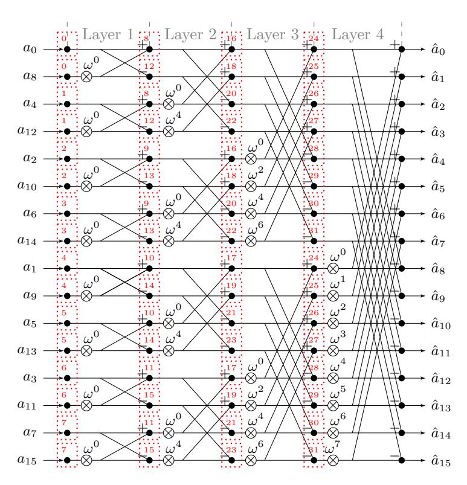

**Figure 9:** Example  $NTT_{br\leftarrow no}^{CT}$  with n=16 (unoptimized). In this case, one coefficient is stored in a single memory word, two coefficients can be loaded to the register file (l=2), and one pair of coefficients can be executed in parallel. The red boxes indicate which coefficients are stored together in one word (in this case they are not stored together) and in which order the coefficients are processed by a single butterfly unit.

## <span id="page-39-0"></span>**B Hardware Accelerator – Modular Arithmetic Unit**

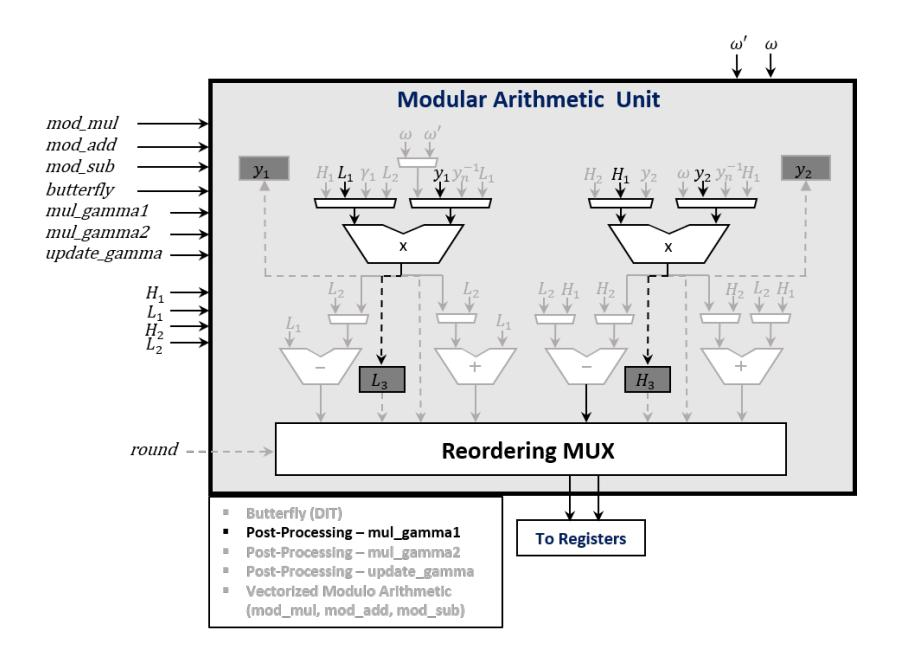

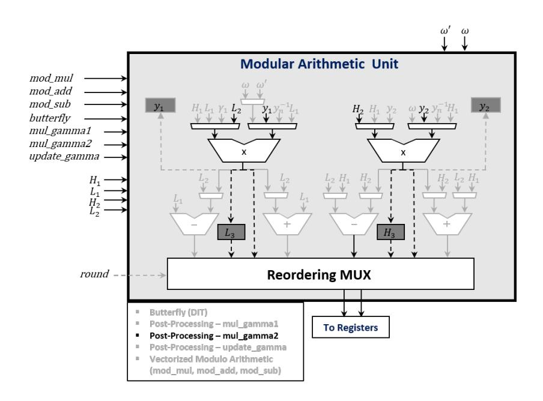

<span id="page-40-0"></span>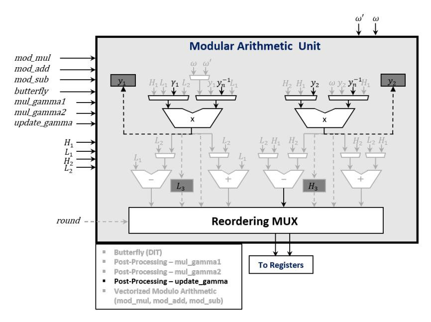

**Figure 10:** Modular Arithmetic Unit – Post-Processing Operation (*mul*\_*gamma*1, *mul*\_*gamma*2, *update*\_*gamma*)

<span id="page-40-1"></span>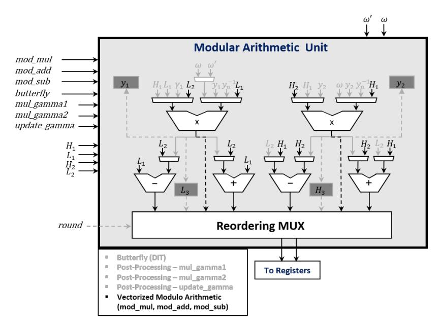

**Figure 11:** Modular Arithmetic Unit – Vectorized Modular Arithmetic

## <span id="page-41-1"></span>**C ISA Extension**

**Table 10:** PQ ISA extension.

<span id="page-41-0"></span>

| Opcode   | Funct3 | Funct7  | Operation Name                                 | Cycles |
|----------|--------|---------|------------------------------------------------|--------|
| 111 0111 | 000    | 0000000 | NTT Configuration: pq.set_kyber                | 1      |
| 111 0111 | 001    | 0000000 | NTT Configuration: pq.set_newhope512           | 1      |
| 111 0111 | 010    | 0000000 | NTT Configuration: pq.set_newhope1024          | 1      |
| 111 0111 | 011    | 0000000 | NTT Configuration: pq.set_fwd_ntt              | 1      |
| 111 0111 | 100    | 0000000 | NTT Configuration: pq.set_inv_ntt              | 1      |
| 111 0111 | 101    | 0000000 | NTT Configuration: pq.set_first_rounds         | 1      |
| 111 0111 | 110    | 0000000 | NTT Configuration: pq.set_last_round           | 1      |
| 111 0111 | 000    | 0000001 | NTT Operation: pq.ntt_multiple_bf              | 83     |
| 111 0111 | 001    | 0000001 | NTT Operation: pq.ntt_single_bf                | 1      |
| 111 0111 | 010    | 0000001 | NTT Operation: pq.update_m                     | 1      |
| 111 0111 | 011    | 0000001 | NTT Operation: pq.update_omega                 | 1      |
| 111 0111 | 100    | 0000001 | NTT Operation: pq.mul_gamma1                   | 1      |
| 111 0111 | 101    | 0000001 | NTT Operation: pq.mul_gamma2                   | 1      |
| 111 0111 | 110    | 0000001 | NTT Operation: pq.update_gamma                 | 1      |
| 111 0111 | 000    | 0000010 | Modular Arithmetic Operation: pq.mod_mul       | 1      |
| 111 0111 | 001    | 0000010 | Modular Arithmetic Operation: pq.mod_add       | 1      |
| 111 0111 | 010    | 0000010 | Modular Arithmetic Operation: pq.mod_sub       | 1      |
| 111 0111 | 011    | 0000010 | Modular Arithmetic Operation: pq.bf_dit        | 1      |
| 111 0111 | 100    | 0000010 | Modular Arithmetic Operation: pq.bf_dif        | 1      |
| 111 0111 | 000    | 0000011 | Bit-reversal: pq.br256                         | 1      |
| 111 0111 | 001    | 0000011 | Bit-reversal: pq.br512                         | 1      |
| 111 0111 | 010    | 0000011 | Bit-reversal: pq.br1024                        | 1      |
| 111 0111 | 000    | 0000100 | Keccak Operation: keccak.f1600                 | 1      |
| 111 0111 | 000    | 0000101 | Binomial Sampling: pq.bs_k2                    | 1      |
| 111 0111 | 001    | 0000101 | Binomial Sampling: pq.bs_k3                    | 1      |
| 111 0111 | 010    | 0000101 | Binomial Sampling: pq.bs_k4                    | 1      |
| 111 0111 | 011    | 0000101 | Binomial Sampling: pq.bs_k5                    | 1      |
| 111 0111 | 100    | 0000101 | Binomial Sampling: pq.bs_k8                    | 1      |
| 111 0111 | 000    | 0000110 | Vectorized Modular Multiply Accumulate: pq.mac | 1      |