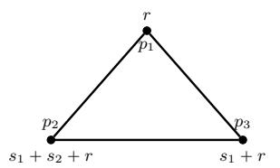
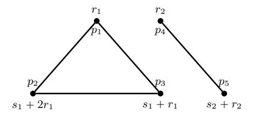
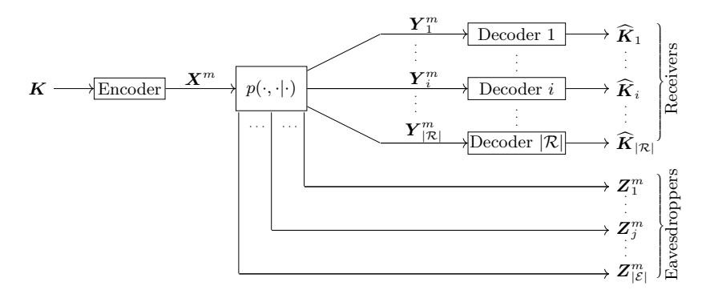

# Partial Secret Sharing Schemes

Amir Jafari and Shahram Khazaei

Sharif University of Technology, Tehran, Iran <{amirjafa,shahram.khazaei}@gmail.com>

July 24, 2022

Abstract. The information ratio of an access structure is an impor-

tant parameter for quantifying the efficiency of the best secret sharing scheme (SSS) realizing it. The most common security notion is perfect security. The following relaxations, in increasing level of security, have been presented in the literature: quasi-perfect, almost-perfect and statistical. Understanding the power of relaxing the correctness and privacy requirements in the efficiency of SSSs is a long-standing open problem. In this article, we introduce and study an extremely relaxed security notion, called partial security, for which it is only required that any qualified set gains strictly more information about the secret than any unqualified one. We refer to this gap as the nominal capacity. We quantify the efficiency of such schemes using a parameter called partial information ratio. It is defined to be the same as the (standard) information ratio, except that we divide the largest share entropy by nominal capacity instead

of the secret entropy. Despite this modification, partial security turns out weaker than the weakest mentioned non-perfect security notion, i.e.,

quasi-perfect security.

We present three main results in this paper. First, we prove that partial and perfect information ratios coincide for the class of linear SSSs. Consequently, for this class, information ratio is invariant with respect to all security notions. Second, by viewing a partial SSS as a wiretap channel, we prove that for the general (i.e., non-linear) class of SSSs, partial and statistical information ratios are equal. Consequently, for this class, information ratio is invariant with respect to all non-perfect security notions. Third, we show that partial and almost-perfect information ratios do not coincide for the class of mixed-linear schemes (i.e., schemes constructed by combining linear schemes with different underlying finite fields).

Our first result strengthens the previous decomposition theorems for constructing perfect linear schemes. Our second result leads to a very strong decomposition theorem for constructing general (i.e., non-linear) statistical schemes. Our third result provides a rare example of the effect of imperfection on the efficiency of SSSs for a certain class of schemes.

Keywords: Information theoretic cryptography · Secret sharing · Perfect and non-perfect security · Wiretap channel · Decomposition methods.

#### 1 Introduction

A secret sharing scheme (SSS) [16,62] is a cryptographic tool that allows a dealer to share a secret among a set of participants such that only certain qualified subsets of them are able to reconstruct the secret. The secret must remain hidden from the remaining subsets, called unqualified. The collection of all qualified subsets is called an access structure [42], which is supposed to be monotone, i.e., closed under the superset operation.

The information ratio [18, 20, 54] of a participant in a SSS is defined as the ratio of the size (entropy) of his share to the size of the secret. The information ratio of a SSS is the maximum of all participants' information ratios. The information ratio of an access structure is defined as the infimum of the information ratios of all SSSs that realize it. Realization is defined with respect to some security notion, e.g., perfect or any variants of non-perfect security to be discussed in the next subsection. It is a difficult problem to compute the information ratio of access structures in general.

The most common types of SSS fall in the class of *multi-linear* schemes. In these schemes, the secret is composed of some finite field elements and sharing is performed by applying a fixed linear mapping on the secret elements and some randomly chosen elements from the finite field. When the secret is a single field element, the scheme is called linear. In this paper we do not make such a distinction and simply call all of them *linear*.

#### 1.1 Perfect and non-perfect security notions

Some closely related security notions for realization of an access structure by SSSs are given below, in decreasing order of security level. Here we provide some succinct definitions for which we need some notations.

The Shannon entropy function and mutual information function are denoted by  $H(\cdot)$  and  $I(\cdot : \cdot)$ , respectively. The statistical distance (or total variation) between random variable  $\boldsymbol{X}$  and  $\boldsymbol{Y}$ , with respective probability mass functions  $p_{\boldsymbol{X}}$  and  $p_{\boldsymbol{Y}}$ , is denoted by  $SD(p_{\boldsymbol{X}}, p_{\boldsymbol{Y}})$ ; it is essentially the norm-one distance between the two probability mass functions divided by two.

For a set of participants  $P = \{0, 1, \ldots, n\}$ , the non-perfect security notions are defined by considering a family  $\{(\boldsymbol{S}_i^m)_{i \in P}\}_{m \in \mathbb{N}}$  of SSSs, where  $\boldsymbol{S}_0^m$  and  $\boldsymbol{S}_i^m$ ,  $i \in \{1, \ldots, n\}$ , respectively stand for the secret and the ith participant random variables. The perfect security can be defined for a single scheme or for a family of schemes. In the following,  $\boldsymbol{S}_A^m$  and  $\boldsymbol{S}_B^m$  are random variables representing the shares of a qualified set A and the shares of an unqualified set B, in the mth scheme, respectively. The random variable  $\widehat{\boldsymbol{S}_{0,A}^m}$  is the estimation of the qualified set A of the secret. For a SSS, we require that the secret entropy is positive. For technical reasons, we assume that for a family of schemes the sequence of secret entropies does not tend to zero (i.e.,  $H(\boldsymbol{S}_0^m) = \omega(1)$ ).

A function  $\varepsilon : \mathbb{N} \to \mathbb{R}^{\geqslant 0}$  is called *negligible* if it is smaller than the inverse of any polynomial (i.e.,  $\varepsilon(m) = m^{-\omega(1)}$ ). We call  $\varepsilon$  tiny if tends to zero (i.e.,  $\varepsilon(m) = o(1)$ ).

- **Perfect:** The qualified sets must recover the secret with probability one (i.e.,  $\Pr[\widehat{\boldsymbol{S}}_{0,A}^m \neq \boldsymbol{S}_0^m] = 0$  or equivalently  $\operatorname{H}(\boldsymbol{S}_0^m | \boldsymbol{S}_A^m) = 0$ ) and it must remain information-theoretically hidden from unqualified sets (i.e.,  $\operatorname{I}(\boldsymbol{S}_0^m : \boldsymbol{S}_B^m) = 0$ ). These requirements are respectively called the *perfect correctness* and *perfect privacy* conditions.
- Statistical: The qualified sets may fail to recover the secret with some negligible probability of error (i.e.,  $f_A(s) = \Pr[\widehat{S_{0,A}^m} \neq S_0^m | S_0^m = s] = m^{-\omega(1)}$  for every secret s); and some negligible amount of information about the secret can be leaked to unqualified sets which is quantified using the notion of statistical distance (i.e.,  $f_B(s) = \operatorname{SD}(p_{S_B^m | S_0^m = s}, p_{S_0^m}) = m^{-\omega(1)}$ , for every secret s). Additionally, we require that the secret length grows at most polynomially; that is,  $\log |\operatorname{supp}(S_0^m)| = O(m^c)$  for some c > 0, where  $\operatorname{supp}(\cdot)$  stands for the support of a random variable.
- **Expected-statistical:** This notion is a non-standard variant of statistical security which we introduce in this paper for the first time for ease of reference and comparison. It requires that the reconstruction error probability and statistical distance be negligible on *average*, over a random choice of the secret, rather than for the *worst* choice of the secret as in the statistical security. That is, for correctness we require  $\Pr[\widehat{S}_{0,A}^m \neq S_0^m] = m^{-\omega(1)}$  or equivalently  $\mathbb{E}[f_A(S_0)] = m^{-\omega(1)}$ ; for privacy we require that  $\mathbb{E}[f_B(S_0)] = \mathrm{SD}(p_{S_B^m} S_0^m, p_{S_B^m} p_{S_0^m}) = m^{-\omega(1)}$ , where  $f_A, f_B$  are as in the previous item and  $\mathbb{E}[\cdot]$  denotes the expectation of random variables. Here, we also require that the secret length grows at most polynomially in m.
- Almost-perfect [24, 49]: Some tiny amount of information (in terms of entropy) about the secret is allowed to be missed by qualified sets and to be leaked to unqualified ones (i.e.,  $H(S_0^m|S_A^m) = o(1)$  and  $I(S_0^m:S_B^m) = o(1)$ ).
- Quasi-perfect [48, Chapater 5]: Some tiny percentage of information in terms of entropy, after normalization to the secret entropy, about the secret is allowed to be missed by qualified sets and to be leaked to unqualified ones (i.e.,  $H(S_0^m|S_A^m)/H(S_0^m) = o(1)$  and  $I(S_0^m:S_B^m)/H(S_0^m) = o(1)$ ).

For the last two definitions, there are some defensible reasons for not requiring that the secret length grows at most polynomially in m or the quantities be negligible. We refer to the main body of the paper for further discussion (see Remarks 3.1 and 3.2).

Similar definitions in other contexts. The root of these definitions can be found in the context of *capacity* in network information theory, starting from the seminal works of Shannon (1944). The capacity of transmission channels is usually defined by requiring the average error probability to be negligible (i.e., similar to the correctness requirement for expected-statistical security). However, the capacity of a single-sender multi-receiver channel remains unchanged if one requires negligible maximum error probability (i.e., similar to the correctness requirement for statistical security). In contrast, for multi-sender channels, a well-known old result by Dueck [32] shows that the capacity region with maximal

probability of error is smaller than with average probability of error. On the other hand, it is well-known that requiring zero-error probability leads to zero capacity for many point-to-point channels.

In the context of information-theoretic security, the privacy requirement for Wyner's wiretap channel [\[68\]](#page-47-1) (1975) and Maurer's secret key agreement [\[57\]](#page-46-3) (1991), were initially defined with respect to a definition similar to the quasiperfect privacy requirement. Later, Maurer introduced a stronger privacy requirement in [\[58\]](#page-46-4) (1994) which corresponds to almost-perfect security. Csiszar introduced an even stronger definition in [\[25\]](#page-44-4) (1996) which corresponds to the expected-statistical definition mentioned above. These three notions have been studied extensively in subsequent works (e.g., see [\[27,](#page-44-5)[59,](#page-46-5)[70\]](#page-47-2)) and it is known that the secrecy capacity is invariant with respect to these security requirements. It is known that the secrecy capacity remains unchanged even if we impose stronger reliability and privacy requirements, similar to those for statistical SSSs.

#### <span id="page-3-0"></span>1.2 Motivations for studying non-perfect security notions

It is worth mentioning that the only security notions which are suitable for practical applications are perfect and statistical security notions; because, in adversarial settings, the reconstruction error probability and information leak are taken into account for the worst choice of the message (secret). It is folklore that the weaker security requirements, even at the level of expected-statistical security, are problematic for most cryptographic applications. Nevertheless, not only is studying weaker security notions interesting from a theoretical point of view (e.g., to understand the power of imperfection), but it also helps us to gain insight and new results about stronger security notions. In the following, we provide two specific motivations for studying non-perfect security notions.

- 1. Uperbounds on information ratio. It is generally easier to construct schemes with weaker security guarantee for an access structure. As we will see, in some situations, a scheme can be used to construct a scheme satisfying stronger security requirements (even perfect for some particular classes of schemes such as the linear ones). In particular, in some situations, e.g., in the so-called weighted decomposition methods [\[38,](#page-45-2) [65\]](#page-47-3), a collection of perfect or non-perfect schemes for a collection of access structures are used for constructing a perfect scheme for a specific targeted access structure. We will elaborate more on this in Section [1.6.](#page-9-0)
- 2. Understanding duality. There is a natural definition for the dual of an access structure [\[43\]](#page-45-3) and it is a long-standing open problem if the information ratios of dual access structures are equal. Since this problem has been resolved for the case of almost-perfect security [\[24,](#page-44-3) [49\]](#page-46-1), our understanding of the relation between the information ratios for different security notions might help us to understand the situation for stronger security notions. We will discuss this point further in Appendix [B.](#page-48-0)

#### 1.3 Known results and some questions

We are not aware of any extensive study of the non-perfect security notions in the setting of secret sharing. In this setting, special classes of SSSs (e.g., linear, abelian, homomorphic, etc) are also of particular interest. In particular, for a given class of SSSs, it is an open problem if the information ratio of an access structure is invariant with respect to different security notions, and very few results are known in this regard, which are reviewed next.

Equivalence. We say that two security notions N1, N<sup>2</sup> are equivalent for a class C of SSSs and write "N<sup>1</sup> " N<sup>2</sup> (for class C)" if the following holds: if a family of SSSs in the class C realizes an access structure with respect to the security notion N1, so does it with respect to the security notion N2.

Recently, Kaboli, Khazaei and Parviz proved in [\[47\]](#page-46-6) that the almost-perfect (and consequently statistical and expected-statistical) security is equivalent to the perfect security for a large subclass of SSSs. It is a subclass of the so-called group-characterizable (GC) SSSs[1](#page-4-0) [\[22\]](#page-44-6) for which the secret subgroup is normal in the main group; i.e.,

<span id="page-4-3"></span>almost-perfect 
$$\equiv$$
 expected-statistical  $\equiv$  statistical  $\equiv$  perfect (for GC schemes with normal secret subgroup). (1.1)

This class includes well-known classes of SSSs including the homomorphic schemes[2](#page-4-1) . The equivalence for linear schemes is quite trivial and had already been realized by Beimel and Ishai in [\[11\]](#page-43-0).

On the other hand, it is easy to see that the quasi-perfect and almost-perfect security notions are not equivalent for the linear class; i.e.,

```
quasi-perfect ı almost-perfect (for linear schemes) .
```

To see this, consider a family of schemes for the 2-out-of-2 threshold access structure as follows. The secret of the m'th scheme is an m-bit-long string ps1, . . . , smq. The share of the first participant is an pm ´ 1q-bit-long random string pr1, . . . , rm´1q. The share of the second party is pr1's1, . . . , rm´1'sm´1q. Clearly the family is quasi-perfect, but none of the schemes is perfect.

Regarding the inequivalence of quasi-perfect and almost-perfect security notions, it is natural to ask if the two notions coincide with respect to information ratio; that is:

<span id="page-4-2"></span><span id="page-4-0"></span><sup>1</sup> Given a finite group G and a collection G0, G1, . . . , G<sup>n</sup> of its subgroups, a SSS can be constructed as follows which is called group-characterizable. The secret space is G{G0, i.e., the set of all left cosets of G<sup>0</sup> in G, and the share space of participant i is G{Gi. To share a secret s P G{G0, a random g P G is chosen such that s " gG<sup>0</sup> and gG<sup>i</sup> is given as a share to participant i.

<span id="page-4-1"></span><sup>2</sup> The class of homomorphic schemes was introduced by Benaloh in 1986 [\[14\]](#page-43-1) and it was recently proved in [\[46\]](#page-45-4) to be a more powerful generalization of the class of linear schemes. For a homomorphic SSS, it holds that by multiplying the corresponding shares of two secrets we get valid shares for the product of the secrets.

Question I Does the following equlity hold?

```
quasi-perfect ?" almost-perfect (for linear schemes) .
```

Here, for security notions N1, N<sup>2</sup> and a class C of schemes, the equality "N<sup>1</sup> " N<sup>2</sup> (for class C)" is understood as follows: when restricted to the class C of SSSs, the information ratio of every access structure with respect to the security notion N<sup>1</sup> is the same as its information ratio with respect to the security notion N2.

A trivial inequality. It can be shown (see Section [3.4\)](#page-17-1) that the following relation holds for the information ratios of an access structure with respect to the mentioned security notions and for every class of SSSs:

<span id="page-5-1"></span>quasi-perfect 
$$\leq$$
 almost-perfect  $\leq$  expected-statistical  $\leq$  statistical  $\leq$  perfect (for any class of schemes).

Csirmaz's observation. In Appendix [A,](#page-47-4) we quote a proof, suggested by Laszlo Csirmaz in a private communication, for the equality of quasi-perfect and almostperfect information ratios, for the general class of SSSs; that is,

<span id="page-5-2"></span>quasi-perfect = almost-perfect (for general schemes) . 
$$(1.3)$$

Csirmaz uses the properties of the so-called entropy region [\[71\]](#page-47-5) to prove this equality using a very simple and elegant argument. Unfortunately, his argument does not extend to stronger security notions and it is open if this equality can be extended to stronger security notions.

<span id="page-5-0"></span>Question II Do the following equlities hold?

$$almost\text{-}perfect \stackrel{?}{=} expected\text{-}statistical \stackrel{?}{=} statistical \stackrel{?}{=} perfect$$
 (for any class of schemes) .

In this paper, we will fully resolve Question [I](#page-4-2) and partially resolve Question [II.](#page-5-0) Additionally, we resolve the following rather natural question.

<span id="page-5-3"></span>Question III Let N1, N<sup>2</sup> be two security notions and C<sup>1</sup> Ď C<sup>2</sup> be two classes of SSSs such that "N<sup>1</sup> " N<sup>2</sup> (for Ciq", for i " 1, 2. Is it true that for evey class C of SSSs such that C<sup>1</sup> Ď C Ď C2, it holds that "N1"N<sup>2</sup> (for Cq"?

We attack the above three questions via introducing a new non-perfect security notion. We will describe our new security notion in Section [1.4](#page-6-0) and use it in Section [1.5](#page-6-1) to present our results on the mentioned questions. Regarding the first motivation for studying non-perfect SSSs, mentioned in Section [1.2,](#page-3-0) an applications of our new notion in the construction of efficient SSSs is also discussed in Section [1.6.](#page-9-0)

We additionally provides some discussion in Section [1.7](#page-10-0) about imperfection in other information-theoretic contexts (and in particular CDS, a cryptographic primitive closely related to SSS) and study their implications in the secret sharing setting.

#### <span id="page-6-0"></span>1.4 Partial security: a new non-perfect notion

We introduce an extremely relaxed security notion, called partial security. We say that a SSS partially realizes an access structure if the amount of information gained about the secret by any qualified set is strictly greater than that of any unqualified one. In other words, the qualified sets have a positive advantage δ over the unqualified ones with regard to the fraction of secret entropy that they gain. Thus, a perfect scheme is also partial with δ " 1, because qualified and unqualified sets recover 100% and 0% of the secret, respectively. We refer to Section [4.4](#page-21-0) for some examples.

Related security notions. Partial security is related to the so-called probabilistic/weak security notions [\[10,](#page-43-2) [29\]](#page-44-7), but has much weaker requirements in both correctness and privacy. Probabilistic SSSs can be divided into two categories. The weakly-private [\[10\]](#page-43-2) schemes require perfect correctness whereas for privacy, it suffices that every secret be probable for an unqualified set. The weakly-correct [\[29\]](#page-44-7) schemes require perfect privacy whereas for correctness, it suffices that qualified subsets recover the secret with non-zero probability. What makes partial security non-trivial and more interesting is a new parameter that we introduce to quantify their efficiency, to be defined next. We will discuss the effect of this choice for the case of weakly-private SSSs in the paper (Section [4.3](#page-21-1) and Example [4.4\)](#page-22-0).

Partial information ratio. For all previous security notions, the standard notion of information ratio (i.e., the ratio between the largest share size and the secret size) is used to quantify the efficiency of SSSs. However, to compensate the extreme imperfection that partial SSSs bear by our definition, we quantify the efficiency of such schemes using a parameter called partial information ratio. It is defined to be the (standard) information ratio scaled by the factor 1{δ, where δ is the advantage mentioned above. The intuition behind this choice stems from two concepts: (i) the capacity of wiretap channel [\[26,](#page-44-8)[68\]](#page-47-1) and (ii) a similar factor in decomposition constructions [\[30,](#page-44-9) [38,](#page-45-2) [64,](#page-47-6) [65\]](#page-47-3). These subjects will be studied in detail in the paper in Section [6](#page-29-0) and Section [8,](#page-37-0) respectively.

#### <span id="page-6-1"></span>1.5 Main results

The notion of partial information ratio makes it fair to compare the efficiency of partial security with other security notions. Recall that by [\(1.2\)](#page-5-1), quasi-perfect security is weaker than all mentioned non-perfect security notions, for every arbitrary class of SSSs. It is easy to observe that, despite our compensation factor, the partial security is still weaker than all previously mentioned notions; that is:

partial ď quasi-perfect (for any class of schemes) .

In this paper, we present the following three main results about partial SSSs:

(I) Linear/Perfect/Coincidence. We prove that the partial information ratio of an access structure is equal to its perfect information ratio for the class of linear schemes; i.e.,

<span id="page-7-1"></span>
$$partial = perfect$$
 (for linear schemes), (1.4)

from which a postive answer to Question I follows; i.e.,

$$quasi-perfect = perfect$$
 (for linear schemes).

This result is not entirely trivial. Consider a simple linear scheme such that the secret consists of  $m \geq 3$  field elements. Consider a simple case where every qualified set learns exactly m-1 independent linear relations about the secret and every unqualified set learns exactly one linear relation. We need to find a way to transform such schemes into a perfect one, by increasing the information ratio only by a factor of  $\frac{1}{\delta} = \frac{m}{m-2}$ . This may seem easy at first but notice that in the original scheme different sets of qualified/unqualified participants might gain different information on the secret. Some may learn certain coordinates while others learn different coordinates; some may not learn coordinates but rather linear combinations of the secret. So our construction needs to find a way that works no matter what the learned linear combinations are.

For the case where we allow at least  $\lambda$  coordinates to be learned by qualified sets and at most  $\omega$  coordinate to be learned by unqualified sets<sup>3</sup>, there exists a simple solution using the so-called ramp [17] SSSs (e.g., see [38, Theorem 3.2]). However, the general case needs more effort as we explain next.

Let  $\Pi$  be a partial linear SSS whose secret is composed of m field elements, every qualified subset learns at least  $\lambda$  independent linear combinations of the secret elements, and every unqualified subset learns at most  $\omega$  independent linear combinations of the secret elements  $(0 \le \omega < \lambda \le m)$ . We turn  $\Pi$  into a perfect one (for the same access structure) while the information ratio is only increased by a factor of  $\frac{1}{\delta} = \frac{m}{\lambda - \omega}$ . We present a "universal" transformation that works for "every" linear partial scheme. The main idea is to share carefully-chosen linear functions of the secret using the partial scheme independently. More precisely, the secret of the perfect scheme, s, consists of  $\lambda m$  field elements. We use m instances of the partial scheme with independent randomnesses. The secret of the i'th instance is  $L_i s$ , where  $L_1, \ldots, L_m$  are suitably chosen  $m \times \lambda m$  matrices (all secrets are viewed as column vectors) that ensure the perfect correctness and perfect privacy of the constructed scheme. We refer to Section 5 for further details.

(II) General/Statistical/Coincidence. We prove that the partial and statistical information ratios of an access structure coincide for general schemes; that is,

<span id="page-7-0"></span><sup>&</sup>lt;sup>3</sup> More precisely, for a secret  $(s_i)_{i \in [m]}$ , a qualified (resp. an unqualified) set learns  $(s_i)_{i \in I}$  for some  $I \subseteq [m]$  of size at least  $\lambda$  (resp. at most  $\omega$ ), which might depend on the (un)qualified set itself

<span id="page-8-1"></span>
$$partial = statistical$$
 (for general schemes), (1.5)

from which we partially resolve Question [II](#page-5-0) and provide the following generalization of Csirmaz's observation (recall relation [\(1.3\)](#page-5-2)):

```
quasi-perfect " almost-perfect " expected-statistical " statistical
                      (for general schemes) .
```

The proof is achieved by viewing a partial SSS as a multi-receiver multieavesdropper wiretap channel [\[68\]](#page-47-1) and providing a sharp analysis for the nearcapacity behavior of such channels.

A wiretap channel models a point-to-point communication system between a sender, a set of legitimate receivers and a set of eavesdroppers. When the sender transmits a message through the channel, every receiver and eavesdropper obtains a message. The obtained messages are correlated and their joint distribution is determined by sender's input and channel's parameters. This is essentially what happens when a dealer shares a secret among a set of participants. The qualified sets can be considered as legitimate receivers and the unqualified ones can be treated as eavesdroppers. In a wiretap channel, the goal is to reliably transmit a message to the receivers while keeping it secret from the eavesdroppers. This is achieved by employing multiple instances of the same channel independently. To this end, a well-designed encoder is used to map the message into several inputs for the channel. Each receiver then collects all the received instances and recovers the message using a proper decoder. The same approach can be used here to transform a partial SSS into a scheme with statistical security. Further details will be given in the main body of the paper (Section [6\)](#page-29-0).

We remark that the connection between SSSs and wiretap channels has already been realized in [\[52,](#page-46-7) [72\]](#page-47-7), however, the motivations of those works are different from ours.

(III) Mixed-linear/Almost-perfect/Separation. We provide an example of an access structure such that its partial information ratio is smaller than its almost-perfect information ratio, for the class of mixed-linear [4](#page-8-0) schemes. That is:

```
partial š almost-perfect
(for mixed-linear schemes) .
```

This inequality is proved for an access structure on 12 participants, introduced in [\[12\]](#page-43-3) and further studied in [\[46\]](#page-45-4), which has both Fano and non-Fano access

<span id="page-8-0"></span><sup>4</sup> The class of mixed-linear schemes was recently introduced in [\[46\]](#page-45-4) by the present authors. These schemes are constructed by combining linear schemes whose underlying finite fields could be different. Mixed-linear schemes are superior to linear ones; but, it is an open problem if they are as powerful as the larger class of abelian schemes, or even its superclass, homomorphic schemes.

structures as minors. The proof relies on the fact that these access structures behave differently with respect to the characteristic of the underlying finite field. We refer to the main body of the paper in Section [7](#page-36-0) for further details.

Since linear schemes are special cases of mixed-linear schemes, by virtue of equalities [\(1.4\)](#page-7-1) and [\(1.5\)](#page-8-1), it follows that the answer to Question [III](#page-5-3) is negative.

On the secret length blow-up. We provide three constructions in the paper: one for result (I) with perfect privacy (i.e., when ω " 0) in Section [5.3,](#page-26-0) one for the general case of result (I) in Section [5.4,](#page-28-0) and one for result (II) in Section [6.](#page-29-0) Fortunately, all of them increase the secret length polynomially. Given a partial scheme with `-bit secrets, the first and second constructions provide perfect schemes with Op` 2 q and Opn`<sup>2</sup> q bit secrets, respectively, where n is the number of participants. For the third construction, we will have a statistical family of SSSs in which the secret length of the m'th scheme is Opm<sup>2</sup> `q bits (m is the security parameter).

### <span id="page-9-0"></span>1.6 General decomposition theorems

Given an access structure, in some situations, it is easier to first construct partial schemes for it. For example, in the so-called weighted decomposition methods [\[38,](#page-45-2) [65\]](#page-47-3)—which are generalizations of non-weighted decompositions [\[31,](#page-45-5) [64,](#page-47-6) [67\]](#page-47-8)—several perfect or non-perfect linear subschemes are combined to construct a partial linear scheme. The subschemes realize access structures which are usually much simpler than the given one. Our result (I) can be used to transform the obtained partial scheme for the initial access structure into a perfect one. These methods have been very effective in finding the optimal perfect linear SSSs for small access structures (e.g., see [\[7,](#page-43-4) [31,](#page-45-5) [36–](#page-45-6)[39\]](#page-45-7)). The project of finding optimal SSSs for small access structures was initiated in [\[44,](#page-45-8) [66\]](#page-47-9) and is not finalized yet; because the optimal perfect non-linear schemes for some access structures on five participants and several graph-based access structures on six participants are still unknown.

Our first result strengthens the decomposition theorem in [\[38,](#page-45-2) [65\]](#page-47-3) for constructing perfect linear schemes (the theorems in [\[38,](#page-45-2) [65\]](#page-47-3) are only applicable to special linear partial schemes and now this requirement is relaxed). More interestingly, our second result leads to a very strong decomposition theorem for the construction of general (i.e., non-linear) schemes with statistical security (Theorem [8.6\)](#page-41-0). We believe that our decomposition theorem will turn out useful for constructing almost-optimal statistical SSSs for small access structures, advancing the project initiated in [\[44,](#page-45-8)[66\]](#page-47-9) one step forward. We would not be surprised if it also finds applications in designing efficient general statistical SSSs (e.g., by using non-perfect CDS [\[6\]](#page-43-5)). Currently, the best achieved upper-bound for perfect security is 1.5 <sup>n</sup> [\[5\]](#page-43-6) (building on the breakthrough result of [\[53\]](#page-46-8) and follow-ups [\[3,](#page-43-7) [4\]](#page-43-8)).

#### <span id="page-10-0"></span>1.7 Imperfection in other contexts and implications on secret sharing

As we mentioned earlier, there is no proof that requiring weaker correctness and/or privacy conditions in the context of secret sharing leads to more efficient schemes as long as we use information ratio as as a measure of efficiency. In contrast, for several primitives in the context of network information theory (e.g., the wiretap channel), it is well-known that requiring perfect reliability and/or perfect privacy may lead to zero capacity.

On the other hand, in the context of secret key agreement with public discussion [\[1,](#page-42-0) [57\]](#page-46-3) or more generally the multi-receiver multi-eavesdropper setting of Wyner's wiretap channel, it was long known that requiring perfect correctness does not lead to a stronger security notion; indeed, perfect decoding becomes possible but with the price of increasing the information leakage linearly in the number of eavesdroppers (but still negligible on the block length).

A similar situation arises in the context of non-perfect secret sharing as it was also noticed by Kaced in [\[48,](#page-46-2) Theorem 33]; here, it is also possible to achieve perfect correctness, but the information leakage will increase exponentially in the number of participants (linear in the number of minimal unqualified sets).

These observations may justify the recent result of Applebaum and Vasudevan [\[6\]](#page-43-5) who showed that in the context of CDS [\[35\]](#page-45-9) (which corresponds to the class of 2-uniform access structures), relaxing correctness requirements in CDS with one-bit secrets improves the communication complexity. In particular, they achieved a Θpnq separation for the non-equality predicate which takes two n-bit long strings and outputs one iff they are distinct. However, it was left open if such a separation can be achieved by only relaxing the privacy requirement.

Applebaum and Vasudevan's result on non-perfect CDS shows that for onebit secrets, partial schemes with perfect privacy outperform partial schemes with perfect correctness (and hence perfect schemes too) and a Θplog nq separation for share size can be achieved. However, in terms of information ratio (i.e., when the secret can be arbitrarily-long), it remains open if such a separation holds. Indeed, for the case of 2-uniform access structures, it does not because such access structures are known to have constant information ratio (which is achieved for exponentially-long secrets [\[2\]](#page-42-1)). It also remains open if Applebaum and Vasudevan's Θplog nq separation holds for polynomially-long secrets. See Example [4.6](#page-23-1) for further details.

#### 1.8 Paper organization

In Section [2,](#page-11-0) we present the required preliminaries and introduce our notation. In Section [4](#page-18-0) the notions of partial security and partial information ratio are introduced. Sections [5,](#page-23-0) [6](#page-29-0) and [7](#page-36-0) are devoted to proving results (I), (II) and (III) respectively. In Section [8,](#page-37-0) we revisit decomposition techniques and strengthen previous results. Section [9](#page-41-1) concludes the paper.

# <span id="page-11-0"></span>2 Preliminaries

In this section, we provide the basic background along with some notations. We refer the reader to Beimel's survey [\[8\]](#page-43-9) on secret sharing.

### 2.1 General notations

All random variables are discrete in this paper. The Shannon entropy of a random variable X is denoted by HpXq and the mutual information of random variables X,Y is denoted by IpX : Y q. The support of a random variable X is denoted by supppXq. For a positive integer m, we use rms to represent the set t1, . . . , mu. Throughout the paper, P " tp1, . . . , pnu stands for a finite set of participants. A distinguished participant p<sup>0</sup> R P is called the dealer. Unless otherwise stated, we identify the participant p<sup>i</sup> with its index i; i.e., P Ytp0u " P Yt0u " t0, 1, . . . , nu. We use 2<sup>X</sup> to denote the power set of a set X.

#### 2.2 Perfect secret sharing

A secret sharing scheme is used by a dealer to share a secret among a set of participants. To this end, the dealer chooses a randomness according to a prespecified distribution and applies a fixed and known mapping on the secret and randomness to compute the share of each participant. This definition does not assume a priori a distribution on the secret space. In this paper, we use the following definition for secret sharing.

Definition 2.1 (Secret sharing scheme) A tuple Π " Si iPP Yt0u of jointly distributed random variables with finite supports is called a secret sharing scheme on participants set P when HpS0q ą 0. The random variable S<sup>0</sup> is called the secret random variable and its support is called the secret space. The random variable Si, i P P, is called the share random variable of participant i and its support is called his share space.

When we say that a secret s<sup>0</sup> is shared using Π, we mean that a tuple si ˘ iPP Yt0u is sampled according to the distribution Π conditioned on the event tS<sup>0</sup> " s0u. The share s<sup>i</sup> , i P P, is then privately transmitted to the participant i.

The above definition of secret sharing does not convey any notion of security. In the most common type of secret sharing, called perfect secret sharing, the goal of the dealer is to allow pre-specified subsets of participants to recover the secret. The secret must remain information-theoretically hidden from all other subsets of participants. This intuition is formally captured by the following definitions.

Definition 2.2 (Access structure) A non-empty subset Γ Ď 2 <sup>P</sup> , with H R Γ, is called an access structure on P if it is monotone; that is, A Ď B Ď P and A P Γ imply that B P Γ. A subset A Ď P is called qualified if A P Γ; otherwise, it is called unqualified. A qualified subset is called minimal if none of its proper subsets are qualified. An unqualified subset is called maximal if none of its proper supersets are unqualified.

**Definition 2.3 (Perfect realization)** We say that a secret sharing scheme  $\Pi = (S_i)_{i \in P \cup \{0\}}$  is a (perfect) scheme for  $\Gamma$ , or it (perfectly) realizes  $\Gamma$ , if the following two hold, where  $S_A = (S_i)_{i \in A}$ , for a subset  $A \subseteq P$ :

- (Correctness)  $H(S_0|S_A) = 0$  for every qualified set  $A \in \Gamma$  and,
- (Privacy)  $I(S_0: S_B) = 0$  for every unqualified set  $B \in \Gamma^c$ .

#### 2.3 Access function

Non-perfect secret sharing schemes have been studied in several works including [17, 51, 65]. The notion of access function, introduced in [33], is a generalization of the definition of access structures that facilitates study of non-perfect schemes.

**Definition 2.4 (Access function [33])** A mapping  $\Phi: 2^P \to [0,1]$  is called an access function if  $\Phi(\emptyset) = 0$  and it is monotone; i.e.,  $A \subseteq B \subseteq P$  implies that  $\Phi(A) \leq \Phi(B)$ .

The access function of a secret sharing scheme is then naturally defined as a function that quantifies the percentage of information about the secret gained by every subset of participants.

<span id="page-12-0"></span>**Definition 2.5 (Access function of a scheme)** The access function of a secret sharing scheme  $\Pi = (S_i)_{i \in P \cup \{0\}}$  is a function  $\Phi_{\Pi} : 2^P \to [0,1]$  defined by:

$$\Phi_{II}(A) = \frac{\mathrm{I}(\boldsymbol{S}_0:\boldsymbol{S}_A)}{\mathrm{H}(\boldsymbol{S}_0)} \ .$$

We say that a SSS  $\Pi$  realizes an access function  $\Phi$  if  $\Phi = \Phi_{\Pi}$ . It is known [33] that every access function is realizable by some SSS. It is also worth mentioning that *all-or-nothing* (i.e., 0-1-valued) access functions correspond to access structures.

#### 2.4 Convec and information ratio

Convec is short for contribution vector [44] and a norm on it can be used as an indication of efficiency of a secret sharing scheme.

<span id="page-12-1"></span>**Definition 2.6 (Convec of a scheme)** The (standard) convec of a secret sharing scheme  $\Pi = (S_i)_{i \in P \cup \{0\}}$  is denoted by  $\operatorname{cv}(\Pi)$  and defined as follows:

$$\operatorname{cv}(\boldsymbol{\varPi}) = \big(\frac{\operatorname{H}(\boldsymbol{S}_i)}{\operatorname{H}(\boldsymbol{S}_0)}\big)_{i \in P} \ .$$

The maximum and average information ratios of a secret sharing scheme on n participants with convec  $(\sigma_1, \ldots, \sigma_n)$  are defined to be  $\max\{\sigma_1, \ldots, \sigma_n\}$  and  $(\sigma_1 + \ldots + \sigma_n)/n$ , respectively. The maximum/average information ratio of an access structure is defined to be the infimum of the maximum/average information ratios of all secret sharing schemes that realize it. In this paper, we restrict our attention to maximum information ratios, unless otherwise stated.

#### 2.5 Linear schemes

The most common definition of a linear scheme is based on linear maps. A secret sharing scheme  $(S_i)_{i \in P \cup \{0\}}$  is said to be *linear* if there are finite dimensional vector spaces E and  $(E_i)_{i \in P \cup \{0\}}$ , and linear maps  $\mu_i : E \to E_i$ ,  $i \in P \cup \{0\}$  such that  $S_i = \mu_i(E)$ , where E is the uniform distribution on E. The following equivalent definition turns out convenient for the purpose of this paper.

<span id="page-13-0"></span>**Definition 2.7 (Linear scheme)** A tuple  $\Pi = (T; T_0, T_1, \ldots, T_n)$  is called an  $\mathbb{F}$ -linear (or simply a linear) secret sharing scheme if T is a finite dimensional vector space over the finite field  $\mathbb{F}$  and all  $T_i$ 's are subspaces of T with dim  $T_0 \geqslant 1$ . When there is no confusion, we omit T and simply write  $\Pi = (T_i)_{i \in P \cup \{0\}}$ .

In the following we describe the connection between Definition 2.7 and the description preceding it. One can think of a linear secret sharing scheme as being represented by a matrix, where each row is associated with either a participant or the secret. Sharing is performed by multiplying this matrix by a random vector. Then the vector space  $T_i$  is the vector space generated by the rows that correspond to participant i and  $T_0$  is the vector space generated by the rows corresponding to the secret. This is similar to the well-known definition of a linear secret sharing scheme in terms of monotone span programs [50], by Karchmer and Wigderson (or multi-target span programs [9]).

The above description essentially tells us how to associate a collection of random variables  $(S_i)_{i \in P \cup \{0\}}$  to a collection  $(T_i)_{i \in P \cup \{0\}}$  of subspaces of a common vector space T on a finite field  $\mathbb{F}$ . The induced random variable, however, depends on the selected bases for  $T_i$ 's. In the following, we describe a method, introduced in [40], to define an induced random variable which does not depend on the chosen bases. First, we pick a linear function  $\alpha: T \to \mathbb{F}$  uniformly at random from the set of all such possible linear functions. The random variable associated to the subspace  $T_i$  is defined by  $S_i = \alpha|_{T_i}$ , i.e., the restriction<sup>5</sup> of the map  $\alpha$  to the domain  $T_i$ . It is easy to see that for every  $i, j \in P \cup \{0\}$ , the joint random variable  $(S_i, S_j)$  is "isomorphic" with the random variable  $\alpha|_{T_i+T_i}$ ; that is, they have the same distribution up to renaming the elements of their supports. More generally, for any subset  $A \subseteq P \cup \{0\}$ , the joint random variable  $S_A = (S_i)_{i \in A}$  is isomorphic with the random variable  $\alpha|_{T_A}$ , where  $T_A = \sum_{i \in A} T_i$ . Here,  $T_A = \sum_{i \in A} T_i$  denotes the sum of vector subspaces, for a subset  $A \subseteq [n]$ , i.e.,  $T_A$  is the set of all possible sums  $\sum_{i \in A} t_i$  where  $t_i \in T_i$ . Finally, notice that we have  $H(S_A) = \dim T_A \log |\mathbb{F}|$ . Also, using the relation  $\dim(V \cap W) = \dim V + \dim W - \dim(V + W)$  for vector spaces, it easily follows that  $I(S_A : S_B) = \dim(T_A \cap T_B) \log |\mathbb{F}|$ , for every pair of subsets  $A, B \subseteq P \cup \{0\}$ .

Access function and convec of a linear scheme. Based on our previous discussion, it easily follows that the access function and convec of a linear secret sharing scheme  $\Pi = (T_i)_{i \in P \cup \{0\}}$  are given by the following relations

<span id="page-13-1"></span><sup>&</sup>lt;sup>5</sup> For a function  $f: D \to R$  and sub-domain  $A \subseteq D$ , the restriction map  $f|_A$  is the restriction of the map f to the subdomain A. That is,  $f|_A: A \to R$  is defined by  $f|_A(x) = f(x)$  for every  $x \in A$ .

$$\Phi_{\Pi}(A) = \frac{\dim(T_0 \cap T_A)}{\dim(T_0)}, \qquad \operatorname{cv}(\Pi) = \left(\frac{\dim(T_i)}{\dim(T_0)}\right)_{i \in P},$$

where  $T_A = \sum_{i \in A} T_i$ .

Linear and mixed-linear information ratios. If, in the computation of information ratio, we restrict ourselves to the class of linear schemes, we refer to it as the linear information ratio. In the following subsection, we define the class of mixed-linear schemes, where the corresponding parameter is referred to as the mixed-linear information ratio.

#### 2.6 Mixed-linear schemes

The class of mixed-linear SSSs was recently introduced in [46] and it was proved to be superior to the linear class (i.e., there exists an access structure whose linear information ratio is larger than its mixed-linear information ratio). Mixed-linear schemes are a subclass of homomorphic schemes and it is an open problem if homomorphic schemes can outperform mixed-linear ones [46, Problem 6.4].

Informally, a mixed-linear scheme is constructed by combining different linear schemes with possibly different underlying finite fields. We now present the formal definition.

**Definition 2.8** Mixed-linear schemes are recursively defined as follows. A linear scheme is mixed-linear. If  $\Pi = (S_i)_{i \in P \cup \{0\}}$  and  $\Pi' = (S'_i)_{i \in P \cup \{0\}}$  are mixed-linear schemes, their mix, defined and denoted by  $\Pi \oplus \Pi' = (S''_i)_{i \in P \cup \{0\}}$ , is also mixed-linear, where  $S''_i = (S_i, S'_i)$ .

Informally, to share a secret (s, s') using  $\Pi \oplus \Pi'$ , where s and s' are in the secret spaces of  $\Pi$  and  $\Pi'$ , respectively, we independently share s using  $\Pi$  and s' using  $\Pi'$ . Hence, each participant in  $\Pi \oplus \Pi'$  receives a share from  $\Pi$  and one from  $\Pi'$ .

#### 3 Non-perfect security notions

In this section, we present formal definitions of the non-perfect security notions for SSSs, mentioned in the introduction.

Family of SSSs. Non-perfect security notions are defined with respect to a family  $\{\Pi_m\}_{m\in\mathbb{N}}$  of SSSs, where m can be considered a security parameter. We assume that, first, the sequence of secret entropies does not tend to zero and, sec-ond, the sequence of information ratios of the SSSs in our families is converging. We, refer to the converged value as the  $information\ ratio\ of\ the\ family$ .

#### <span id="page-14-0"></span>3.1 Statistical and expected-statistical security notions

Statistical SSS is a standard relaxation of perfect security, probably first mentioned in [15]. Here, we present a definition similar to the one in [11].

**Notation.** A function  $\varepsilon: \mathbb{N} \to \mathbb{R}^{\geqslant 0}$  is called *negligible* if  $\varepsilon(m) = m^{-\omega(1)}$ . Also the *statistical distance* (or total variation) between two (discrete) random variables X and Y, with respective probability mass functions  $p_X$  and  $p_Y$ , is defined as:

$$\mathrm{SD}(p_{\boldsymbol{X}},p_{\boldsymbol{Y}}) := \frac{1}{2} \sum_{x} |\Pr[\boldsymbol{X} = x] - \Pr[\boldsymbol{Y} = x]| \ .$$

Statistical security. Let  $\{\Pi_m\}_{m\in\mathbb{N}}$  be a family of secret sharing schemes, where  $\Pi_m = (S_0^m, S_1^m, \dots, S_n^m)$ , and  $\Gamma$  is an access structure on n participants. We say that  $\{\Pi_m\}$  is a statistical family for  $\Gamma$  (or  $\{\Pi_m\}$  statistically realizes  $\Gamma$ ) if:

- (Polynomial secret length growth) The secret length grows at most polynomially in m; that is,  $\log |\operatorname{supp}(S_0^m)| = \operatorname{O}(m^c)$  for some c > 0.
- (Statistical-correctness) For every qualified set  $A \in \Gamma$ , there exists a reconstruction function Recon such that for every secret s in support of  $S_0^m$ , the reconstruction probability of error  $\Pr[\text{Recon}_A(S_A^m) \neq s | S_0^m = s]$  is negligible in m;
- (Statistical-privacy) For every unqualified set  $B \notin \Gamma$  and for every secret s in the support of  $\mathbf{S}_0^m$ , the statistical distance  $\mathrm{SD}(p_{\mathbf{S}_B^m|\mathbf{S}_0^m=s},p_{\mathbf{S}_B^m})$  is negligible in m.

The statistical privacy condition requires that for every unqualified set B, the statistical distance between the conditional RV  $[\mathbf{S}_B^m|\mathbf{S}_0^m=s]$  and RV  $\mathbf{S}_B^m$  be negligible for the worst choice of the secret s. Notice that, by the triangle inequality, the privacy condition implies that for every pair of secrets s, s' the statistical distance between the conditional RVs  $[\mathbf{S}_B^m|\mathbf{S}_0^m=s]$  and  $[\mathbf{S}_B^m|\mathbf{S}_0^m=s']$  is negligible too.

<span id="page-15-0"></span>Remark 3.1 (On the secret length growth) We remark that the condition on the polynomial secret length growth for statistical and expected-statistical security notions makes sure that the error probability of reconstruction and the statistical distance are negligible not only in the security parameter m but also in the secret length. Indeed, the condition on the polynomial secret length growth is not a limit on the family of the SSSs because given any family, we can construct a new family (with the same information ratio) that satisfies this condition. The schemes  $\Pi_m$  and  $\Pi_{m+1}$  of the old family appear in the new family too but at positions  $\tau(m)$  and  $\tau(m+1)$ , respectively, where  $\tau: \mathbb{N} \to \mathbb{N}$  is some mapping for which the distance  $\tau(m+1) - \tau(m)$  is chosen large enough such that the polynomial secret length growth condition is satisfied in the new family. The schemes at positions  $\tau(m) + 1, \ldots, \tau(m+1) - 1$  are considered to be  $\Pi_m$ .

**Expected-statistical security.** The definition for expected-statistical security is identical to the previous definition except that we require the following correctness and privacy conditions hold instead:

- (Expected-statistical-correctness) For every qualified set  $A \in \Gamma$ , there exists a reconstruction function RECON<sub>A</sub> such that  $\Pr[\text{RECON}_A(\boldsymbol{S}_A^m) \neq \boldsymbol{S}_0^m]$  is negligible in m;
- (Expected-statistical-privacy) For every unqualified set  $B \notin \Gamma$ , the statistical distance  $SD(p_{S_R^m S_0^m}, p_{S_R^m} p_{S_0^m})$  is negligible in m.

The statistical-correctness requirement takes the worst probability of reconstruction error into account whereas the expected-statistical-correctness condition considers the average probability of error; because:

<span id="page-16-0"></span>
$$\Pr[\operatorname{RECON}_{A}(\boldsymbol{S}_{A}^{m}) \neq \boldsymbol{S}_{0}^{m}] = \sum_{s \in \operatorname{supp}(\boldsymbol{S}_{0}^{m})} \Pr[\boldsymbol{S}_{0}^{m} = s] \Pr[\operatorname{RECON}_{A}(\boldsymbol{S}_{A}^{m}) \neq s \mid \boldsymbol{S}_{0}^{m} = s] .$$
(3.1)

Similarly, the expected-statistical-privacy condition requires that an unqualified set B is not able to (statistically) distinguish the joint distributions  $(\mathbf{S}_B^m, \mathbf{S}_0^m)$  and  $(\mathbf{S}_B^m, \mathbf{S}')$ , where  $\mathbf{S}'$  is independent of  $\mathbf{S}_B^m$  and identically distributed as  $\mathbf{S}_0^m$ . The statistical privacy condition requires that the statistical distance between the conditional RV  $[\mathbf{S}_B^m|\mathbf{S}_0^m=s]$  and RV  $\mathbf{S}_B^m$  be negligible for the worst choice of the secret s. However, the expected-statistical privacy condition requires this to happen on average; because for every pair of jointly distributed RVs  $(\mathbf{X}, \mathbf{Y})$  we have:

<span id="page-16-1"></span>
$$SD(p_{XY}, p_X p_Y) = \sum_{y \in supp(Y)} Pr[Y = y] SD(p_{X|Y=y}, p_X) . \qquad (3.2)$$

#### <span id="page-16-2"></span>3.2 Almost-perfect and quasi-perfect security notions

In [24], almost-perfect security has been defined in terms of the so-called *almost* entropic polymatroids. Here, we present an equivalent definition in terms of a family of SSSs.

**Notation.** We call a function  $\varepsilon: \mathbb{N} \to \mathbb{R}^{\geqslant 0}$  tiny if  $\varepsilon(m) = o(1)$ , or equivalently,  $\lim_{m \to \infty} \varepsilon(m) = 0$ .

**Almost-perfect security.** Let  $\{\Pi_m\}_{m\in\mathbb{N}}$  be a family of SSSs, where  $\Pi_m = (S_0^m, S_1^m, \dots, S_n^m)$ , and  $\Gamma$  be an access structure on n participants. We say that  $\{\Pi_m\}$  is an almost-perfect family for  $\Gamma$  if:

- (Almost-correctness)  $H(S_0^m|S_A^m)$  is tiny for every qualified set  $A \in \Gamma$ ,
- (Almost-privacy)  $I(S_0^m : S_B^m)$  is tiny for every unqualified set  $B \notin \Gamma$ .

Quasi-perfect security. In quasi-perfect security it is required that the percentage of information missed/leaked in the correctness and privacy conditions are negligible. That is:

- (Quasi-correctness) H(S<sub>0</sub><sup>m</sup>|S<sub>A</sub><sup>m</sup>)/H(S<sub>0</sub><sup>m</sup>) is tiny for every qualified set A ∈ Γ,
   (Quasi-privacy) H(S<sub>0</sub><sup>m</sup>:S<sub>A</sub><sup>m</sup>)/H(S<sub>0</sub><sup>m</sup>) is tiny for every unqualified set B ∈ Γ<sup>c</sup>.

Using the notion of the access function of a SSS (Definition 2.5), we can equivalently say that a family  $\{\Pi_m\}_{m\in\mathbb{N}}$  of SSSs quasi-perfectly realizes an access structure  $\Gamma$  if  $\lim_{m\to\infty} \Phi_{\Pi_m}(A)$  equals one when  $A\in\Gamma$  and zero when  $A\notin\Gamma$ . The definition straightforwardly extends to access functions (see Section 8.3).

<span id="page-17-0"></span>Remark 3.2 (Tiny vs. negligible) In the definitions of almost-perfect and quasi-perfect security notions, we can equivalently require that the quantities be negligible instead of being tiny. Because, given a family for which these quantities are tiny, we can construct a new family (with the same information ratio) for which these quantities are negligible (by choosing a suitable subsequence of the schemes in which consecutive schemes are far enough in the original family).

Moreover, still requiring the quantities to be tiny, we could have also imposed the additional requirement that the secret length grows at most polynomially in m. However, it would be redundant; because, as we described in Remark 3.1, we can construct a new family, by repeating each scheme a suitable number of times, such that the secret length grows slow enough.

#### Non-perfect information ratios 3.3

With respect to each security notion, a variant of information ratio for an access structure can be defined. For example, the quasi-perfect information ratio of an access structure is defined to be the infimum (or equivalently, the *minimum*) of the information ratios of all families of SSSs that quasi-perfectly realize it. Statistical, expected-statistical and almost-perfect information ratios are defined similarly.

#### <span id="page-17-1"></span>Relations between non-perfect information ratios 3.4

In this section we show that the following relation holds for the information ratios of an access structure with respect to the mentioned security notions and for every class of SSSs:

quasi-perfect 
$$\leq$$
 almost-perfect  $\leq$  expected-statistical  $\leq$  statistical (for any class of SSSs). (3.3)

The left-most inequality is trivial. The right-most inequality follows by relations (3.1) and (3.2). We prove the middle one. As we will see the condition on polynomial secret length growth turns out crucial.

• Correctness implication. The expected-statistical-correctness condition implies the almost-correct condition. This follows by Fano's inequality [23] which is stated as follows. Suppose that we wish to estimate the random variable X, with support  $\mathcal{X}$ , by an estimator  $\widehat{X}$ , and furthermore, assume that  $\varepsilon = \Pr[X \neq \widehat{X}]$ . Then,  $\operatorname{H}(X|\widehat{X}) \leq \operatorname{H}(\varepsilon) + \varepsilon \log(|\mathcal{X}| - 1)$ , where  $\operatorname{H}(\varepsilon)$  is the entropy of a Bernoulli random variable with parameter  $\varepsilon$ . Let A be a qualified set and  $\widehat{S}_0^m = \operatorname{RECON}_A(S_A^m)$ . By statistical-correctness, for every secret s, the error probability  $\varepsilon(m) := \Pr[\widehat{S}_0^m \neq s | S_0^m = s]$  is negligible in m. By polynomial secret length growth and Fano's inequality  $\operatorname{H}(S_0^m | S_A^m)$  is negligible too.

• **Privacy implication.** The expected-statistical-privacy condition implies the almost-privacy condition. This follows by a lemma probably first mentioned in [28, Lemma 1], with the following statement. Let (X, Y) be a pair of jointly distributed RVs and let  $\varepsilon_1 = I(X : Y)$  and  $\varepsilon_2 = SD(p_{XY}, p_X p_Y)$ . Let  $\mathcal{X}$  denote the support of X and  $\mathcal{X} \geq 4$ . Then we have the following inequality, where e is the Euler's number and the logarithms are in base two:

$$\frac{\log e}{2}\varepsilon_2^2 \leqslant \varepsilon_1 \leqslant \varepsilon_2 \log \frac{|\mathcal{X}|}{\varepsilon_2} \ . \tag{3.4}$$

## <span id="page-18-0"></span>4 Partial secret sharing

In this section, we introduce a relaxed security notion for SSSs, called *partial* security. In addition, we provide some examples and discuss a slightly relevant security notion for SSSs called *weakly-private*, which has already been studied in the literature. Further properties and applications of our new security notion will be studied in later sections.

#### 4.1 Security definition

A scheme is said to partially realize an access structure if the amount of information gained on the secret by every qualified set is strictly larger than that of any unqualified one. Below, we give a formal definition. The reader may first recall the definition of the access function of a SSS (Definition 2.5).

**Definition 4.1 (Partial realization)** We say that a SSS  $\Pi = (S_i)_{i \in P \cup \{0\}}$  is a partial scheme for  $\Gamma$ , or it partially realizes  $\Gamma$ , if:

<span id="page-18-1"></span>
$$\delta = \min_{A \in \Gamma} \Phi_{\Pi}(A) - \max_{B \in \Gamma^c} \Phi_{\Pi}(B) > 0 . \tag{4.1}$$

The parameter  $\delta$  is a normalized value for quantifying the advantage of the qualified sets over the unqualified ones with respect to the amount of information that they gain on the secret. In Section 6, we will see that the unnormalized parameter

<span id="page-18-2"></span>
$$C_{\Pi} := \mathbf{H}(\boldsymbol{S}_0)\delta = \min_{A \in \Gamma} \mathbf{I}(\boldsymbol{S}_0 : \boldsymbol{S}_A) - \max_{B \in \Gamma^c} \mathbf{I}(\boldsymbol{S}_0 : \boldsymbol{S}_B)$$
(4.2)

is related to the capacity of Wyner's wiretap channel [68], which we refer to as the *nominal capacity* of the SSS  $\Pi$  (with respect to  $\Gamma$ ). The inverse of  $\delta$  is an important factor that will be taken into account in the next subsection to quantify the efficiency of partial schemes.

Partially-correct and partially-private SSSs. One can define two more restricted (i.e., less relaxed) versions of partial security by requiring either the correctness or privacy condition of perfect security to hold. Let  $\Pi$  be a partial SSS for an access structure  $\Gamma$ . We say that  $\Pi$  is a partially-correct scheme for  $\Gamma$  if  $\Phi_{\Pi}(B) = 0$ , for every unqualified set  $B \in \Gamma^c$ ; that is, unqualified sets gain no information about the secret. Similarly, we say that  $\Pi$  is a partially-private scheme for  $\Gamma$  if  $\Phi_{\Pi}(A) = 1$ , for every qualified set  $A \in \Gamma$ ; that is, qualified sets fully recover the secret.

Another view on partial secret sharing. In perfect SSSs, one requires every subset of participants to be either qualified (i.e., entirely recover the secret) or unqualified (i.e., gain no information on the secret). If a SSS is not perfect, it does not define an access structure. A partially-correct (resp. partially-private) SSS allows us to associate a unique access structure to the scheme, even if it is not perfect: qualified sets are those that gain a positive (resp. full) amount of information about the secret. On the other hand, it might be possible to associate more than one access structure to a partial scheme, because the same scheme can be a partial SSS for different access structures. Therefore, partial security allows us to define the notion of access structure for a non-perfect SSS too.

#### 4.2 Partial convec and partial information ratio

We quantify the efficiency of a partial scheme via a scaled version of its standard convec (Definition 2.6), that we call *partial convec*. Clearly, unlike the standard convec of a scheme, which is defined on its own, the partial convec depends on the access structure that it partially realizes.

<span id="page-19-0"></span>**Definition 4.2 (Partial convec)** Let  $\Pi$  be a partial scheme for  $\Gamma$ . The partial convec of  $\Pi$  (with respect to  $\Gamma$ ) is defined and denoted by

$$pcv(\Pi, \Gamma) = \frac{1}{\delta}cv(\Pi),$$

where  $\delta$ , the (normalized) advantage, is defined as in Equation (4.1). When there is no confusion, we simply use the notation  $pcv(\Pi)$ .

The intuition behind the choice of factor  $\frac{1}{\delta}$  stems from two concepts: (i) the capacity of Wyner's wiretap channel and (ii) a similar compensating factor in decomposition constructions. We will revisit these concepts in in Section 6 and Section 8, respectively.

Another motivation for this definition (i.e., adding the factor of  $\frac{1}{\delta}$ ) is that one can take any perfect SSS  $\Pi$  with secret random variable  $S_0$  and transform it into

a partial secret sharing whose secret is pS0,S 1 0 q (for any S 1 0 independent from Π), where given a secret ps0, s<sup>1</sup> 0 q the partial scheme shares s<sup>0</sup> using the original scheme; we do not want such transformations to improve the information ratio of a scheme.

Partial information ratio. The partial information ratio of a SSS is defined to be the maximum coordinate of its partial convec. The partial information ratio of an access structure is the infimum of the partial information ratio of all SSSs that partially realize it. The partially-correct and partially-private information ratios are defined similarly. Additionally, one can discuss the linear and mixed-linear partial information ratios.

Relations between different information ratios. It is easy to observe that the partial security is weaker than all previously mentioned notions (see Appendix [C](#page-49-0) for the proof); that is:

```
partial ď quasi-perfect (for any class of schemes) . (4.3)
```

In Sections [5,](#page-23-0) [6](#page-29-0) and [7,](#page-36-0) we will prove the following three results about partial information ratio:

```
partial " perfect (for linear schemes),
         partial " statisticial (for general schemes),
partially-correct š almost-perfect (for mixed-linear schemes).
```

Notice the last relation holds for some access structure (we present one in Section [7\)](#page-36-0) but the other ones hold for every access structure. This is a rare example on the power of imperfection in the efficiency of SSSs. It remains open to prove separation/coincidence between "partial and quasi-perfect" and "quasi-perfect and almost-perfect" information ratios for the class of mixed-linear schemes. However, the last relation shows that at least one of them are separated.

The first result shows that partial, partially-correct and partially-private information ratios are all equal for the linear class. Also, a lemma by Kaced [\[48,](#page-46-2) Lemma 17] can be used to show that requiring perfect correctness does not lead to a stronger variant of partial security (for general schemes). However, it remains open if the following equalities hold for other classes of schemes such as mixed-linear, abelian or homomorphic schemes.

```
partial " partially-private (for linear and general schemes),
partial " partially-correct (for linear schemes).
```

In Example [4.6,](#page-23-1) using the known results on non-perfect CDS, we achieve a Θplog nq separation between the the partially-correct and partially-private information ratios for the case where the secret is a single bit; that is:

```
partially-correct š partially-private (for schemes with one-bit secrets).
```

However, for one-bit secrets, the separation between partially-private and perfect information ratios and also between partial and partially-correct information ratios is left open.

#### <span id="page-21-1"></span>4.3 On choosing a fair criterion for efficiency

We remark that, the scale factor  $\frac{1}{\delta}$  in the definition of partial information ratio enables us to fairly compare the efficiency of an access structure with respect to partial and perfect security notions. In the following, we recall a non-trivial result, due to Beimel and Franklin [10], which shows that without the compensation factor  $\frac{1}{\delta}$ , it is possible to have very efficient partially-private schemes.

There is a somewhat relevant security notion to partially-private security called weakly-private. In a weakly-private SSS, the qualified sets are required to recover the secret with probability one, but for every unqualified set, it is only required that all secrets are probable; that is, an unqualified set can never rule out any secret. Weakly-private SSSs were first introduced in [19] and it was shown that weakly-ideal and (perfectly) ideal SSSs are equivalent. The notion was then studied in other works [10,12,45,61]. In particular, Beimel and Franklin showed in [10] that for every access structure with n participants, it is possible to construct a weakly-private SSS with an  $\ell$ -bit-long secret and  $(\ell + n2^n)$ -bit-long shares. We will describe their construction in Example 4.4. Since a weakly-private SSS is partially-private too<sup>6</sup>, it follows that if we did not include the scale factor  $\frac{1}{\delta}$  in the definition of partial information ratio, then the partial information ratio of every access structure would turn out to be one (since by choosing an arbitrarily large value for  $\ell$ , the ratio  $(\ell + n2^n)/\ell$  can be made arbitrarily close to one).

Recall that the best upper-bound on the information ratio of access structures with respect to perfect security is exponential. Therefore, the fact that the (standard) information ratio of weakly-private SSSs is so small may seem surprising (as it also surprised Beimel and Franklin in [10]). However, we will show in Example 4.4 that the partial information ratio of their construction is still exponential for almost all access structures.

We remark that partial and weakly-private security notions are dissimilar to a great extent. For example, they behave substantially different with respect to the so-called *strongly-uniform* SSSs. We refer to Appendix D for some discussion.

#### <span id="page-21-0"></span>4.4 Some examples

In this subsection, we present some examples of linear, mixed-linear and non-linear partial SSSs.

<span id="page-21-3"></span>Example 4.3 (Toy examples) Consider the following two access structures:

 $\Gamma_1$  on 3 participants with minimal qualified sets  $\{p_1,p_2\},\{p_2,p_3\},\{p_1,p_3\},$ 

<span id="page-21-2"></span> $<sup>^6</sup>$  Semantically, it would be better if partially-private SSSs turned out stronger than weakly-private schemes.

 $\Gamma_2$  on 5 participants with minimal qualified sets  $\{p_1, p_2\}, \{p_2, p_3\}, \{p_1, p_3\}, \{p_4, p_5\}.$ 

<span id="page-22-1"></span>

(a) A linear partial scheme for  $\Gamma_1$ . The secret is  $(s_1, s_2) \in \mathbb{F}_2 \times \mathbb{F}_2$  and  $r \in \mathbb{F}_2$  is the randomness.



(b) A mixed-linear partial scheme for  $\Gamma_2$ . The secret is  $(s_1, s_2) \in \mathbb{F}_3 \times F_2$  and the randomness is  $(r_1, r_2) \in \mathbb{F}_3 \times \mathbb{F}_2$ 

Fig. 1: Partial schemes for  $\Gamma_1$  and  $\Gamma_2$ . All random variables are independent and uniform on their supports.

An access structure whose minimal qualified sets are all of size two can be represented by a graph. Figure 1 shows a partial scheme for each of these access structures. The scheme for  $\Gamma_1$  is linear, its secret contains two bits of information and every participant receives one bit of information as his share. The scheme for  $\Gamma_2$  is mixed-linear and its secret contains  $\log 6 \approx 2.58$  bits of information. The share of participants  $p_4, p_5$  are one bit each, and those of participants  $p_1, p_2, p_3$  are  $\log 3 \approx 1.58$  bits. The scheme for  $\Gamma_1$  is partially-correct with advantage  $\delta_1 = \frac{1}{2}$  (every minimal qualified set gains 50% information about the secret and unqualified sets gain no information). The scheme for  $\Gamma_2$  is also partially-correct with advantage  $\delta_2 = \frac{\log 2}{\log 6} \approx 0.387$ .

Therefore, the partial information ratios of all participants in  $\Gamma_1$  are  $\frac{1}{\delta_1}\frac{1}{2}=1$ . The partial information ratios of participants  $p_1, p_2, p_3$  in  $\Gamma_2$  are all  $\frac{1}{\delta_2}\frac{\log 3}{\log 6}=\log 3\approx 1.58$ . The partial information ratios of participants  $p_4, p_5$  in  $\Gamma_2$  are both  $\frac{1}{\delta_2}\frac{\log 2}{\log 6}=1$ .

<span id="page-22-0"></span>**Example 4.4 (A partially-private scheme)** Let  $\Gamma$  be an access structure on the participants set  $\{p_1, \ldots, p_n\}$ . Beimel and Franklin [10] proposed the following weakly-private SSS for  $\Gamma$ , which by our discussion in Section 4.3 is also partially-private.

Given a uniformly chosen secret  $s \in \{0,1\}^k$ , do the following:

- 1. Choose a maximal unqualified subset  $C \in \Gamma^c$  at random.
- 2. For every participant  $p_i \in C$ , choose a random string  $r_i \in \{0,1\}^k$  and send it to him as a part of his share.
- 3. Send the secret s to every participant  $p_i \in P \backslash C$  as a part of his share.
- 4. Encode the selected subset C as an n-bit string and then share it among the participants using a trivial perfect scheme with share size  $n2^n$ .

The share size of every participant is  $k+n2^n$  and therefore, the standard information ratio of the scheme is  $1+\frac{n2^n}{k}$ , which can be arbitrarily close to one if k is chosen to be sufficiently large. However, the following claim, proved in Appendix E, shows that for almost all access structures, in particular for every n/2-uniform access structure, the partial information ratio of this scheme is exponential in n. An access structure is called t-uniform if every set of size t-1 or smaller is unqualified and every set of size t+1 or larger is qualified; the size-t subsets can be either qualified or unqualified. These access structures are known to have perfect SSSs with information ratio  $O(t^2)$  [3], only known to be achieved via exponentially-long secrets. But, the partial information ratio of the above scheme is  $O(n^{-3/4}2^{n/2})$  by this claim.

<span id="page-23-2"></span>Claim 4.5 For  $k \ge n$ , the advantage of the above scheme is  $\delta = O(n^{3/4}2^{-n/2})$  for  $2^{\binom{n}{n/2}}$  out of the total  $2^{\binom{n}{n/2}(1+O(\frac{\log n}{n}))}$  access structures on n participants.

For  $1 \leq k < n$ , the advantage seems intuitively even worse, but it is harder to analyze.

<span id="page-23-1"></span>**Example 4.6 (Non-perfect CDS and secret sharing)** Applebaum and Vasudevan [6] presented a partially-correct (called perfectly-private in [6]) CDS for k-bit secrets for the predicate NEQ:  $\{0,1\}^n \times \{0,1\}^n \mapsto \{0,1\}$  defined by NEQ(x,y) = 1 iff  $x \neq y$ . The communication complexity of their protocol is  $\Theta(k)$  whereas that of the perfect CDS for one-bit secrets is known to be  $\Theta(n)$ . Here, we explain their results in terms of SSS terminology.

Let  $P = \{1, ..., n\}$  be a set of participants (n even) and define the following 2-uniform access structure (also called forbidden graph access structure) and denote it by  $\Gamma_{\text{NEQ}}$ . A size-two subset  $\{x,y\}$  is unqualified iff y-x=n/2. All singleton subsets are unqualified and all size-3 subset are qualified.

Now consider the following SSS with k-bit secret s, interpreted as an element of the finite filed  $\mathbb{F}_{2^k}$ : the share of every participant  $x \in P$  is (h(x), h(x)s + r), where r is a random element of  $\mathbb{F}_{2^k}$  and  $h : [n] \mapsto \mathbb{F}_{2^k}$  is chosen uniformly from a family of pair-wise independent hash functions (i.e., for evey  $x \neq y$  it holds that (h(x), h(y)) is uniform over  $\mathbb{F}_{2^k} \times \mathbb{F}_{2^k}$  for the random choice of h).

It is easy to verify that this scheme is a partially-correct scheme for  $\Gamma_{\rm NEQ}$  with advantage  $\delta=(1-2^{-k})$  and, hence, partial information ratio  $2/\delta$ . For one-bit secrets (i.e., when k=1), we have a partially-correct scheme with partial information ratio 4 whereas the best achievable information ratio for perfect schemes is  $\Theta(\log n)$ . Nevertheless, for exponentially long secrets, both partial and perfect information ratios are  $\Theta(1)$ ; because, as we already mentioned, t-uniform access structures have polynomial information ratio in t. For polynomial-length secrets (i.e., when  $k=\operatorname{poly}(n)$ ), it remains open whether partial schemes outperform perfect schemes for  $\Gamma_{\rm NEO}$ .

#### <span id="page-23-0"></span>5 Equality of perfect and partial linear information ratios

In this section, we prove that the partial linear information ratio of an access structure is equal to its perfect linear information ratio. We warm up by a

simple example in Section 5.1, that highlights our main idea. Two linear algebraic lemmas lie at the core of our proof which are presented in Section 5.2. The first one is used in Section 5.3 for transforming a partially-correct linear secret sharing scheme into a perfect one without changing its convec. The second lemma is needed to handle the partial case, which is discussed in Section 5.4.

#### <span id="page-24-0"></span>5.1 Warm-up

Given a partial linear scheme for an access structure, we turn it into a perfect one for the same access structure while the information ratio is only increased by a factor of  $\frac{1}{\delta}$ . For example, consider the partial linear scheme for access structure  $\Gamma_1$ , mentioned in Example 4.3, whose (standard) information ratio is  $\frac{1}{2}$ ; but since its advantage is  $\delta = \frac{1}{2}$ , its partial information ratio is equal to one. This scheme of Figure 1a can be used to construct a perfect linear scheme for  $\Gamma_1$  with information ratio one as follows. Use two instances of the partial scheme with independent randomnesses, one with secret  $(s_1, s_2)$  and one with secret  $(s_1 + s_2, s_1)$ . The privacy of the scheme is immediate and its correctness can easily be verified. For example, participants  $p_1$  and  $p_2$  recover  $s_1 + s_2$  and  $s_2$  from the first and second schemes, respectively, and since these relations are linearly independent, the secret can be fully recovered. The constructed scheme is linear with (perfect) information ratio equal to one.

The above example was easy to handle because the partial scheme was already known to us. For the general case, we need to seek a "universal" transformation that works for "every" linear partial scheme.

Here we describe the construction for the simplest case where we are given a partially-correct  $\mathbb{F}$ -linear SSS whose secret is composed of m field elements and there exists at least one minimal qualified set that learns exactly one linear combination of the secret elements. As we will see later, this corresponds to  $\lambda=1$  and  $\omega=0$  in the general case. The universal construction shares each secret  $L_i(s), i \in [m]$ , independently using the partial scheme, where  $L_i: \mathbb{F}^m \to \mathbb{F}^m$  is some properly chosen linear mapping. The construction can be proved perfect if the linear mappings  $L_1, \ldots, L_m$  have the property stated in the following lemma. The proof of the lemma shows how to construct such mappings.

**Lemma 5.1 (Linear mappings (\lambda = 1))** Let m be some positive integer and  $\mathbb{F}$  be a finite field. Then, there exist linear mappings  $L_1, \ldots, L_m : \mathbb{F}^m \to \mathbb{F}^m$  such that for every non-zero vector  $x \in \mathbb{F}^m$ , the vectors  $L_1(x), \ldots, L_m(x)$  are linearly independent.

Proof. Let  $\mathbb{K}$  be an extension field of  $\mathbb{F}$  with degree m (i.e., if  $\mathbb{F}$  has q elements,  $\mathbb{K}$  has  $q^m$  elements). Let  $\{\alpha_1,\ldots,\alpha_m\}$  be a basis for  $\mathbb{K}$  on  $\mathbb{F}$ . For every  $i\in [m]$ , the mapping  $L_i:\mathbb{F}^m\to\mathbb{F}^m$ , defined by  $L_i(x)=\alpha_i x$ , is linear on  $\mathbb{F}$ , where elements of  $\mathbb{F}^m$  are identified by elements of  $\mathbb{K}$ , and the multiplication is performed in the field  $\mathbb{K}$ . For any nonzero  $x\in\mathbb{K}$  we show that the vectors  $L_1(x),\ldots,L_m(x)$  are linearly independent. If there exist coefficients  $c_1,\ldots,c_m\in\mathbb{F}$  such that  $\sum_{i=1}^m c_i L_i(x)=0$ , then we have  $\sum_{i=1}^m c_i \alpha_i x=0$  hence  $(\sum_{i=1}^m c_i \alpha_i)x=0$ 

0. The element  $x \in \mathbb{K}$  is nonzero; thus  $\sum_{i=1}^{m} c_i \alpha_i = 0$ . Independency of the vectors  $\alpha_1, \ldots, \alpha_m$  concludes that  $c_i = 0$  for all  $i \in [m]$ . Therefore, the vectors  $L_1(x), \ldots L_m(x)$  are linearly independent on  $\mathbb{F}$ .

We remark that the lemma does not hold in general if the base field is not finite. So the claim is truly a property of finite fields.

In the next subsection, we present a generalization of the above lemma to handle the case where the minimum number of learned linear relations by qualified sets is greater than one  $(\lambda \ge 1)$ . Another lemma is presented to tackle the case where unqualified sets may learn up to some certain number of linear combination of the secret elements  $(\omega \ge 0)$ .

#### <span id="page-25-0"></span>5.2 Two linear algebraic lemmas

Let  $\mathbb{F}$  be a finite field and  $x_1, \ldots, x_{\lambda} \in \mathbb{F}^m$  be linearly independent vectors. The following lemma essentially states that there exist linear mappings  $L_1, \ldots, L_m : \mathbb{F}^m \to \mathbb{F}^{\lambda m}$  such that the collection  $\{L_j(x_i) : i \in [\lambda], j \in [m]\}$  of vectors in  $\mathbb{F}^{\lambda m}$  is linearly independent.

<span id="page-25-1"></span>**Lemma 5.2 (Linear mappings (** $\lambda \geq 1$ **))** Let  $1 \leq \lambda \leq m$  be integers. Let  $T_0$  be a vector space over some finite field with dimension m. Then, there exist m linear maps  $L_1, \ldots, L_m : T_0 \to T_0^{\lambda}$  such that for any subspace  $E \subseteq T_0$  of dimension dim  $E \geq \lambda$ , the following holds

$$\sum_{i=1}^{m} L_i(E) = T_0^{\lambda} .$$

*Proof.* Without loss of generality we can assume that  $T_0 = \mathbb{F}^m$ , where  $\mathbb{F}$  is the underlying finite field. We show that there exist m linear maps  $L_1, \ldots, L_m : \mathbb{F}^m \to \mathbb{F}^{\lambda m}$ , such that for any  $\lambda$  linearly independent vectors  $x_1, \ldots, x_{\lambda} \in \mathbb{F}^m$ , the  $\lambda m$  vectors  $L_i(x_j) \in \mathbb{F}^{\lambda m}$ ,  $i \in [m]$  and  $j \in [\lambda]$ , are linearly independent. The construction is explicit and is as follows.

Let  $|\mathbb{F}| = q$  and identify  $\mathbb{F}^m$  with a finite field  $\mathbb{K}$  with  $q^m$  elements that is an extension of  $\mathbb{F}$  with degree m. Choose a basis  $w_1, ..., w_m$  for  $\mathbb{K}$  over  $\mathbb{F}$  and identify  $\mathbb{F}^{\lambda m}$  with  $\mathbb{K}^{\lambda}$ .

Define  $L_i$  by sending  $x \in \mathbb{K}$  to  $(w_i x, w_i x^q, ..., w_i x^{q^{\lambda-1}}) \in \mathbb{K}^{\lambda}$ . Note that the mapping  $x \longmapsto x^q$  is an  $\mathbb{F}$ -linear map from  $\mathbb{K}$  to  $\mathbb{K}$ ; this is the famous Frobenius map and the key is the following two properties:  $(x+y)^q = x^q + y^q$  and  $a^q = a$  for  $x, y \in \mathbb{K}$  and  $a \in \mathbb{F}$ . Also,  $x \longmapsto x^{q^i}$  is the composition of this map with itself i times. Therefore, the mapping  $L_i$  is  $\mathbb{F}$ -linear too, for every  $i \in [m]$ . If there exist coefficients  $c_{i,j}$ ,  $i \in [m]$  and  $j \in [\lambda]$ , such that  $\sum_{j=1}^{\lambda} \sum_{i=1}^{m} c_{i,j} L_i(x_j) = 0$ , then  $\sum_{j=1}^{\lambda} (\sum_{i=1}^{m} c_{i,j} w_i) x_j^{q^{k-1}} = 0$  for every  $k \in [\lambda]$ . Since the  $\lambda \times \lambda$  matrix  $M = \left(x_i^{q^{k-1}}\right)_{i \in [\lambda], k \in [\lambda]}$  is invertible (to be proved at the end), we have  $\sum_{i=1}^{m} c_{i,j} w_i = 0$  for all  $j \in [\lambda]$  and thus  $c_{i,j} = 0$ , for every  $i \in [m]$  and  $j \in [\lambda]$ , as the vectors  $w_1, ..., w_m$  are linearly independent over  $\mathbb{F}$ . Therefore, the vectors  $L_i(x_j)$ ,  $i \in [m]$  and  $j \in [\lambda]$ , are linearly independent over  $\mathbb{F}$ .

We complete the proof by showing that the matrix  $M = \left(x_i^{q^{k-1}}\right)_{i \in [\lambda], k \in [\lambda]}$  is invertible. Assume for a row vector  $y = (y_1, \ldots, y_{\lambda})$ , we have yM = 0, hence  $y_1x + y_2x^q + \ldots + y_{\lambda}x^{q^{\lambda-1}} = 0$  for every  $x = x_1, \ldots, x_{\lambda}$ . Since this polynomial is linear over the field  $\mathbb{F}$ , it vanishes on the span of these independent vectors over  $\mathbb{F}$ , a space with  $q^{\lambda}$  elements. However, as the polynomial is of degree  $q^{\lambda-1}$ , it is identically zero; i.e., y = 0. This shows that M is invertible.

When turning a partial linear scheme into a perfect one, as we will see, the above lemma is needed to argue about correctness of the constructed scheme. To argue about its privacy, we need the following lemma. The second lemma is true for finite fields that are sufficiently large and, unlike the first lemma, it holds for infinite fields.

<span id="page-26-2"></span>**Lemma 5.3 (Non-intersecting subspace lemma)** Let  $T_0$  be a vector space of dimension m over a finite field with q elements and let  $E_1, \ldots, E_N$  be subspaces of  $T_0$  of dimension at most  $\omega$ ,  $1 \le \omega < m$ . If  $N < \frac{q^m-1}{q^{m-1}-1}$ , then there exists a subspace  $S \subset T_0$  of dimension  $m - \omega$  such that  $S \cap E_i = 0$ , for every  $i \in [N]$ .

Proof. Without loss of generality we can assume that  $\dim E_i = \omega$ . Let  $\mathbb F$  be the underlying finite field with q elements. We show that if  $N < \frac{q^m-1}{q^m-1-1}$ , then the required subspace S of dimension m-w with zero intersection with  $E_i$ 's exists. We prove this by induction on m-w. If m-w=1, then each  $E_i$  has  $q^{m-1}-1$  non-zero elements so there are at most  $N(q^{m-1}-1)$  non-zero elements in their union. If  $N < \frac{q^m-1}{q^{m-1}-1}$  then there is a non-zero element outside this union that generates the required subspace S. If  $E_i$ 's are of dimension w, then since  $N < \frac{q^m-1}{q^w-1}$  the above proof shows that there is a non-zero vector u outside their union. If we add this vector to each  $E_i$  we get subspace  $E_i'$  of dimension w+1. Therefore, by induction, we have a subspace S' of dimension m-w-1 that has zero intersection with each  $E_i'$ . Now the space generated by S and u is the required subspace of dimension m-w and zero intersection with each  $E_i$ .  $\square$ 

# <span id="page-26-0"></span>5.3 Constructing a convec-preserving perfect linear scheme from a partially-correct linear scheme

The following proposition will be generalized in the next subsection. However, we present it separately in this subsection since we will extend its proof in the course of the proof of Proposition 5.5. We recall that the standard and partial convecs of a secret sharing scheme  $\Pi$  are denoted by  $cv(\Pi)$  and  $pcv(\Pi)$ , respectively; see Definitions 2.6 and 4.2.

<span id="page-26-1"></span>**Proposition 5.4 (Partially-correct**  $\Longrightarrow$  **Perfect)** Let  $\Gamma$  be an access structure and  $\Pi'$  be a partially-correct  $\mathbb{F}$ -linear secret sharing scheme for it. Then, there exists a perfect  $\mathbb{F}$ -linear secret sharing scheme  $\Pi$  for  $\Gamma$  such that  $\operatorname{cv}(\Pi) = \operatorname{pcv}(\Pi')$ .

Construction. We now show how to construct  $\Pi$  from  $\Pi'$ . Identify the secret space of  $\Pi'$  by  $\mathbb{F}^m$ . Since  $\Pi'$  is a partially-correct scheme for  $\Gamma$ , there exists an integer  $\lambda$ , with  $1 \leq \lambda \leq m$ , such that every qualified set of participants discovers at least  $\lambda$  independent linear relations on the secret, and there exists a qualified set that recovers exactly  $\lambda$  such relations. Our construction is a generalization of the one described in Section 5.1 for the case where  $\lambda = 1$ . In that case, the secret space of the constructed scheme  $\Pi$  was  $\mathbb{F}^m$ . For the general case, we let the secret space of  $\Pi$  be  $\mathbb{F}^{\lambda m}$ . To share a secret  $s \in \mathbb{F}^{\lambda m}$  (viewed as a column vector), we share each of the m secrets  $L_1s, \ldots, L_ms \in \mathbb{F}^m$  using an independent instance of  $\Pi'$ , where  $L_i$ 's are  $m \times m\lambda$  matrices representing the linear mappings in Lemma 5.2. Each participant in  $\Pi$  receives a share from each instance of  $\Pi'$ . Hence, while the secret length has been multiplied by  $\lambda$ , the share of each participant has increased by a factor of m. Therefore, the standard convec of  $\Pi$ and partial convec of  $\Pi'$  are equal. Note that since the m instances of  $\Pi'$  use independent randomnesses, the secret remains hidden from every unqualified set. By Lemma 5.2, each qualified set gets  $\lambda m$  independent linear relations on s. We conclude that the scheme  $\Pi$  is perfect.

In the following, we prove Proposition 5.4 more formally.

Proof (of Proposition 5.4). Let  $\Pi' = (T'; T'_0, T'_1, \dots, T'_n)$  be the  $\mathbb{F}$ -linear partiallycorrect scheme that satisfies  $\lambda = \min_{A \in \Gamma} \{\dim(T'_A \cap T'_0)\} \ge 1$  and  $\dim(T'_A \cap T'_0) = 1$ 0 for all  $A \in \Gamma^c$ . Let  $m = \dim(T'_0) \ge 1$ .

Our goal is to build a perfect  $\mathbb{F}$ -linear scheme  $\Pi = (T; T_0, T_1, \dots, T_n)$  such that  $\dim(T_i) \leq m \dim(T'_i)$  for every  $i \in [n]$  and  $\dim(T_0) = \lambda m$ .

Find an orthogonal complement R' for  $T'_0$  inside T'; hence,  $T' = T'_0 \oplus R'$ . Let

Let  $L_1, \ldots, L_m: T_0' \to {T'}_0^{\lambda}$  be the linear maps of Lemma 5.2 and define  $\phi: {T'}^m \to T$  by

$$\phi(s_1, \ldots, s_m, r_1, \ldots, r_m) = \left(\sum_{i=1}^m L_i(s_i), r_1, \ldots, r_m\right),$$

where  $s_1, \ldots, s_m \in T_0'$  and  $r_1, \ldots, r_m \in R'$ . We let  $T_0 = T_0'$  and  $T_i = \phi(T_i'^m)$ . Then, the conditions on dimensions are clear and consequently  $cv(\Pi) \leq pcv(\Pi')$ . It is straightforward to tweak the scheme such that the claimed vector equality holds. It remains to prove that  $\Pi$ perfectly realizes  $\Gamma$ .

For  $A \subseteq [n]$ , by linearity of  $\phi$ , we have  $T_A = \phi(T'^m_A)$ . Also, we have:

$$T_{A} \cap T_{0} = \phi(T'_{A}^{m}) \cap T'_{0}^{\lambda}$$

$$= \phi(T'_{A}^{m} \cap T'_{0}^{m})$$

$$= \phi((T'_{A} \cap T'_{0})^{m})$$

$$= \sum_{i=1}^{m} L_{i}(T'_{A} \cap T'_{0}),$$

where the second equality follows from the following fact:  $\phi(x) \in T'_0^{\lambda}$  if and only if  $x \in T'_0^m$ .

If  $A \in \Gamma$ , then  $\dim(T'_A \cap T'_0) \ge \lambda$ . Therefore, by Lemma 5.2, we have  $T_A \cap T_0 = T_0$ . Also, if  $B \in \Gamma^c$ , then  $T'_B \cap T'_0 = 0$  and hence  $T_B \cap T_0 = 0$ . This shows that  $\Pi$  is a perfect scheme for  $\Gamma$ .

# <span id="page-28-0"></span>5.4 Constructing a convec-preserving perfect linear scheme from a partial linear scheme

The following proposition is a generalization of Proposition 5.4. The proof essentially follows the same lines as that of Proposition 5.4. We will need Lemma 5.3 to argue about the privacy of the constructed scheme, which is "almost" the same as the previous one. The difference is due to the fact that Lemma 5.3 holds for sufficiently large finite fields; therefore, we first need to "lift" the scheme into a larger field and then apply the construction described in Section 5.3.

<span id="page-28-1"></span>**Proposition 5.5 (Partial**  $\Longrightarrow$  **Perfect)** Let  $\Gamma$  be an access structure and  $\Pi'$  be a partial  $\mathbb{F}$ -linear secret sharing scheme for it. Then, there exists a finite extension  $\mathbb{K}$  of  $\mathbb{F}$  and a perfect  $\mathbb{K}$ -linear secret sharing scheme  $\Pi$  for  $\Gamma$  such that  $\operatorname{cv}(\Pi) = \operatorname{pcv}(\Pi')$ . Consequently, for every access structure, the partial and perfect information ratios are the same if we restrict ourselves to the class of linear schemes.

*Proof.* Let  $\Pi'=(T'_0,\ldots,T'_n)$  and denote  $\lambda=\min_{A\in \varGamma}\{\dim(T_n)\}$ 

$$\begin{array}{l} \lambda = \min_{A \in \varGamma} \{ \dim(T_A' \cap T_0') \} \\ \omega = \max_{A \in \varGamma^c} \{ \dim(T_A' \cap T_0') \} \\ m = \dim T_0' \end{array}$$

where  $1 \leq \lambda - \omega \leq m$ .

Let N be the number of maximal unqualified subsets in  $\Gamma^c$  and  $\mathbb{K}$  be an extension of  $\mathbb{F}$  that satisfies  $|\mathbb{K}| \geq N$ . By the process of extending scalars, we can turn  $\Pi'$  into a  $\mathbb{K}$ -linear scheme with the same convec, access function and dimensions. For simplicity, we use the same notation for the new scheme; i.e., from now on  $\Pi'$  is considered to be a  $\mathbb{K}$ -linear scheme. In particular, the relations for  $\lambda, \omega, m$  are still valid.

Construct  $(T_0, \ldots, T_n)$  from  $\Pi'$  the same way as in the proof of Proposition 5.4 and recall that  $\dim T_0 = \lambda m$  and  $\dim T_i \leq m \dim T_i'$ . The same argument, which was used in the proof of Proposition 5.4, shows that for any  $A \in \Gamma$ , we have  $T_A \cap T_0 = T_0$ . It is also trivial that for every  $B \in \Gamma$ , we have  $\dim (T_B \cap T_0) \leq m\omega$ .

By Lemma 5.3 ( $E_i$  is  $T_B \cap T_0$  for some maximal unqualified set B, dim  $E_i \leq m\omega$  and dim  $T_0 = \lambda m$ ), one can choose  $S \subseteq T_0$  of dimension  $(\lambda - \omega)m$  such that  $T_B \cap S = 0$ , for every  $B \in \Gamma^c$ . Also, it is trivial that  $T_A \cap S = S$ , for every  $A \in \Gamma$ . Now, it is clear that  $\Pi = (S, T_1, \ldots, T_n)$  is a perfect secret sharing scheme for  $\Gamma$  such that dim  $S = (\lambda - \omega)m$ . Therefore,  $\operatorname{cv}(\Pi) \leq \operatorname{pcv}(\Pi')$ . Again, it is straightforward to tweak the scheme such that the convec equality holds.

Given a partial linear scheme whose secret length is  $m \log |\mathbb{F}|$  bits, the construction of Section 5.3 results in a perfect scheme with secret length  $\lambda m \log |\mathbb{F}|$ 

 $O(m^2 \log |\mathbb{F}|)$ . The construction of this section, however, results in a perfect scheme with secret length  $(\lambda - \omega)m \log |\mathbb{K}| = O(m^2 \max(\log N, \log |\mathbb{F}|))$ , where N is the number of minimal unqualified sets.

# <span id="page-29-0"></span>6 Equality of statistical and partial information ratios

<span id="page-29-2"></span>In this section, we prove the following theorem.

Theorem 6.1 (partial=statistical) Let  $\Gamma$  be an access structure.

- (I) If there exists a partial SSS for  $\Gamma$  with partial information ratio  $\sigma$ , then there exists a family of statistical SSSs for  $\Gamma$  with information ratio  $\sigma$  and linear secret length growth.
- (II) If there exists a family of partial SSS for  $\Gamma$  such that the sequence of their partial information ratios converges to  $\sigma$ , then there exists a family of statistical SSSs for  $\Gamma$  with information ratio  $\sigma$  and quadratic secret length growth.

The proof of (I) is achieved by viewing a partial SSS as a wiretap channel and a careful analysis of its near-capacity behavior. We remark that (I) does not immediately imply (II) and its proof has more subtleties that may not be clear at a first glance (e.g., see Remark 6.4).

In Section 6.1, we review the definition of Wyner's wiretap channel and study its near-capacity behavior in Section 6.2. The proof of the theorem will be given in Section 6.3.

#### <span id="page-29-1"></span>6.1 The wiretap channel

In this subsection, we recall the notion of wiretap channel, first introduced by Wyner [68] in 1975 and further developed by Csiszár and Körner [26] in 1978. A wiretap channel is defined in terms of a conditional probability distribution function. Here, we start from a joint distribution and study its associated wiretap channel. The original description was given for a single receiver and single eavesdropper. Below, we present the description for the multi-receiver multi-eavesdropper channel.

Let  $\Sigma = (\boldsymbol{X}, (\boldsymbol{Y}_i)_{i \in \mathcal{R}}, (\boldsymbol{Z}_j)_{j \in \mathcal{E}})$  be a tuple of random variables. We refer to the tuple  $\mathrm{WTC}_{\Sigma} = (p, \mathcal{X}, (\mathcal{Y}_i)_{i \in \mathcal{R}}, (\mathcal{Z}_j)_{j \in \mathcal{E}})$  as the wiretap channel associated to  $\Sigma$  where  $p(\cdot, \cdot|\cdot)$  is the (conditional) probability distribution of the random variable  $((\boldsymbol{Y}_i)_{i \in \mathcal{R}}, (\boldsymbol{Z}_j)_{j \in \mathcal{E}})$  when conditioned on  $\boldsymbol{X}$ . That is,

$$\begin{cases} p(\cdot,\cdot|\cdot): \prod_{i\in\mathcal{R}} \mathcal{Y}_i \times \prod_{j\in\mathcal{E}} \mathcal{Z}_j \times \mathcal{X} \to [0,1] ,\\ p((y_i)_{i\in\mathcal{R}},(z_j)_{j\in\mathcal{E}}|x) := \Pr[(\boldsymbol{Y}_i)_{i\in\mathcal{R}} = (y_i)_{i\in\mathcal{R}} \wedge (\boldsymbol{Z}_j)_{j\in\mathcal{E}} = (z_j)_{j\in\mathcal{E}}|\boldsymbol{X} = x] . \end{cases}$$

<span id="page-30-0"></span>

Fig. 2: A schematic of a wiretap channel with receivers  $\mathcal{R} = \{1, \dots, |\mathcal{R}|\}$  and eavesdroppers  $\mathcal{E} = \{1, \dots, |\mathcal{E}|\}$ .

A wiretap channel models a point-to-point communication system between a sender, a set of (legitimate) receivers with index set  $\mathcal{R}$  and a set of eavesdroppers with index set  $\mathcal{E}$ . When the sender transmits a message  $x \in \mathcal{X}$  through the channel, according to the conditional distribution p, each receiver  $i \in \mathcal{R}$  obtains a message  $y_i \in \mathcal{Y}_i$  and each eavesdropper  $j \in \mathcal{E}$  gets a message  $z_j \in \mathcal{Z}_j$ .

The goal of the sender is to reliably transmit a long message to the receivers (i.e., at high rate) by using m independent instances of the channel, while keeping it secret from the eavesdroppers. To this end, the sender uses a well-designed encoder and receivers use their own decoders to obtain the message (see Figure 2).

Formally, an encoder is a publicly-known probabilistic algorithm

$$\operatorname{Enc}:\mathcal{K}\to\mathcal{X}^m$$
.

and the ith decoder is a deterministic algorithm

$$\mathrm{Dec}_i:\mathcal{Y}_i^m\to\mathcal{K}$$
,

where  $\mathcal{K}$  stands for the set of messages. To transmit a uniformly chosen message  $k \in \mathcal{K}$ , the sender first encodes it to obtain a tuple  $x^m = (x_1, \ldots, x_m) \leftarrow \operatorname{Enc}(k)$ . Then each symbol  $x_k \in \mathcal{X}$  is independently transmitted through the channel. The receiver i and eavesdropper j then accordingly receive a tuple  $y_i^m = (y_{i1}, \ldots, y_{im})$  and  $z_j^m = (z_{j1}, \ldots, z_{jm})$ , respectively. Each receiver i then uses his/her own decoder to compute a message  $\hat{k}_i \in \mathcal{K}$ .

Let  $K, X^m, Y_i^m, Z_j^m$  denote the random variables for the encoder's input, the encoder's output (i.e., channel's input), the *i*th receiver's input and the *j*th eavesdropper's input, respectively. In Figure 2, the *i*th decoder's output is denoted by  $K_i$ .

We say that a  $rate\ R\geqslant 0$  is achievable if for every m there exist an encoder and decoders such that:

- (i) **Rate.** The RV K is uniformly distributed on  $\mathcal{K} = \{1, \dots, e^{mR}\}$ .
- <span id="page-31-0"></span>(ii) **Reliability.** For every receiver  $i \in \mathcal{R}$ , the (average) decoding error probability  $\Pr[\operatorname{Dec}_i(K) \neq K]$  is negligible in m.
- <span id="page-31-1"></span>(iii) **Privacy.** For every eavesdropper  $j \in \mathcal{E}$ , the (average) statistical distance  $\mathrm{SD}(p_{\mathbf{Z}_i^m\mathbf{K}}, p_{\mathbf{Z}_i^m}p_{\mathbf{K}})$  is negligible in m.

The secrecy capacity of the wiretap channel WTC<sub> $\Sigma$ </sub>, associated to the distribution  $\Sigma = (X, (Y_i)_{i \in \mathcal{R}}, (Z_j)_{j \in \mathcal{E}})$ , is defined to be the supremum of all achievable rates. Except for the case of single-receiver single-eavesdropper [26], the secrecy capacity of the wiretap channel is an open problem. However, the following lower-bound on the secrecy capacity of the wiretap channel associated to  $\Sigma$  is known and enough for our purpose:

<span id="page-31-5"></span>
$$C_{\Sigma} = \min_{i \in \mathcal{R}} I(\boldsymbol{X} : \boldsymbol{Y}_i) - \max_{j \in \mathcal{E}} I(\boldsymbol{X} : \boldsymbol{Z}_j) .$$
 (6.1)

Assuming  $C_{\Sigma} > 0$ , it can be proved that every (fixed) rate  $R < C_{\Sigma}$  is achievable (e.g., see [70]). However, to prove the main result of this section (Theorem 6.1), we need a careful analysis of the near-capacity behavior of the wiretap channel, to be studied in Section 6.2.

Stronger reliability and privacy requirements. Notice that, similar to the definition of expected-statistical security for secret sharing (Section 3.1), the reliability and privacy conditions in items (ii) and (iii) require that the error probability  $\Pr[\operatorname{Dec}_i(K) \neq K]$  and statistical distance  $\operatorname{SD}(p_{Z_j^m K}, p_{Z_j^m} p_K)$  be negligible on the average (see relations (3.1) and (3.2)).

Simailar to the definition of statistical secret sharing, we can consider the following stronger requirements:

- <span id="page-31-2"></span>(ii') **Strong reliability.** For every receiver  $i \in \mathcal{R}$  and every message  $k \in \mathcal{K}$ , the decoding error probability  $\Pr[\operatorname{Dec}_i(K) \neq K | K = k]$  is negligible in m.
- <span id="page-31-3"></span>(iii') **Strong privacy.** For every eavesdropper  $j \in \mathcal{E}$  and every message  $k \in \mathcal{K}$ , the statistical distance  $\mathrm{SD}(p_{\boldsymbol{Z}_i^m|\boldsymbol{K}=k},p_{\boldsymbol{Z}_i^m})$  is negligible in m.

It is folklore that the capacity remains invariant with respect to both definitions. Here, we present a proof for completeness. Let R>0 be a fixed achievable rate with respect to requirements (ii) and (iii). We show that it is also achievable by requirements (ii') and (iii'). This can be shown by discarding the worst messages and keeping only the best  $\frac{1}{e}$  fraction, for each receiver (in terms of the probability of error) and each eavesdropper (in terms of the statistical distance); hence, reducing the message size by a factor of at most  $e^{-(|\mathcal{R}|+|\mathcal{E}|)}$ . By using the union-bound and Markov inequality, it follows that there exists a subset  $\mathcal{K}' \subseteq \{1,\ldots,e^{mR}\}$  of size at least  $e^{mR-(|\mathcal{R}|+|\mathcal{E}|)}$  such that for every  $k \in \mathcal{K}'$ , for every receiver  $i \in \mathcal{R}$ , and for every eavesdropper  $j \in \mathcal{E}$ , we have:

<span id="page-31-4"></span>
$$\Pr[\operatorname{Dec}_{i}(\boldsymbol{K}) \neq \boldsymbol{K} | \boldsymbol{K} = k] \leq 2 \Pr[\operatorname{Dec}_{i}(\boldsymbol{K}) \neq \boldsymbol{K}], \operatorname{SD}(p_{\boldsymbol{Z}_{i}^{m} | \boldsymbol{K} = k}, p_{\boldsymbol{Z}_{i}^{m}}) \leq 2 \operatorname{SD}(p_{\boldsymbol{Z}_{i}^{m} \boldsymbol{K}}, p_{\boldsymbol{Z}_{i}^{m}} p_{\boldsymbol{K}}).$$

$$(6.2)$$

Consequently, the rate  $\lim_{m\to\infty} (mR - (|\mathcal{R}| + |\mathcal{E}|))/m = R$  is also achievable with requirements (ii') and (iii'). When R may depend on m, if the rate R is achievable for the weaker definition, so is the rate  $R - O(\frac{1}{m})$  for the stronger definition.

#### <span id="page-32-0"></span>6.2 Near-capacity behavior of the wiretap channel

In this subsection, we show that the rate  $R = C_{\Sigma} - \Theta(\frac{1}{m^{1/4}})$  is achievable; i.e., the reliability and privacy errors are (exponentially) negligible. We remark that there is nothing special about the exponent  $\frac{1}{4}$  and any positive exponent (strictly) smaller than  $\frac{1}{2}$  works fine.

Let us first describe how the encoder of the wiretap channel works. To encode a message  $k \in \mathcal{K} = \{1, \dots, e^{mR}\}$ , with  $R < C_{\Sigma}$ , the encoder chooses a uniform random index  $\ell \in \mathcal{L} = \{1, \dots, e^{m\tilde{R}}\}$  and outputs h(k, l), where

$$h: \mathcal{K} \times \mathcal{L} \to \mathcal{X}^m$$

is a randomly chosen hash function, known to every party and  $\tilde{R}$ , satisfying

$$\max_{j \in \mathcal{E}} \mathrm{I}(\boldsymbol{X}:\boldsymbol{Z}_j) < \tilde{R} < \min_{i \in \mathcal{R}} \mathrm{I}(\boldsymbol{X}:\boldsymbol{Y}_i) - R \;,$$

is some parameter which will be set at the end. Every receiver decodes using the maximum-likelihood criterion.

• Reliability analysis. Using [41, Theorem 13], for every receiver  $i \in \mathcal{R}$ , we have:

$$\Pr[\operatorname{Dec}_{i}(\boldsymbol{K}) \neq \boldsymbol{K}] \leq \exp\left(-m\rho\left(\operatorname{I}_{\frac{1}{1+\rho}}(\boldsymbol{X}:\boldsymbol{Y}_{i}) - R - \tilde{R}\right)\right)$$

for every  $\rho \in (0,1)$ , which may be considered as a function of m too. Here,  $I_{\alpha}$  is the  $\alpha$ -Rényi mutual information according to Csiszár's proposal (see [41, Eq. 29]). The following taylor expansion holds

$$I_{\frac{1}{1+\rho}}(\boldsymbol{X}:\boldsymbol{Y}_i) = I(\boldsymbol{X}:\boldsymbol{Y}_i) - \rho I_1'(\boldsymbol{X}:\boldsymbol{Y}_i) + O(\rho^2) \ ,$$

where  $I_1'$  is the derivative of  $I_{\alpha}$  at  $\alpha=1$  whose value is irrelevant for us. It can be shown that  $I_{\alpha}$  is non-decreasing and differentiable for discrete random variables with finite supports.

If we let  $R + \tilde{R} = \min_{i \in \mathcal{R}} I_{\frac{1}{1+\rho}}(\boldsymbol{X} : \boldsymbol{Y}_i) - \rho$ , for every receiver  $i \in \mathcal{R}$ , we get  $\Pr[\operatorname{Dec}_i(\boldsymbol{K}) \neq \boldsymbol{K}] \leq \exp(-m\rho^2)$ . In particular, letting  $\rho = m^{-\frac{1}{4}}$ , we have  $\Pr[\operatorname{Dec}_i(\boldsymbol{K}) \neq \boldsymbol{K}] \leq \exp(-\sqrt{m})$ , for

<span id="page-32-1"></span>
$$R + \tilde{R} = \min_{i \in \mathcal{R}} I(\boldsymbol{X} : \boldsymbol{Y}_i) - \Theta(m^{-\frac{1}{4}}) .$$
 (6.3)

• Privacy analysis. By [69, Theorem 1], for every eavesdropper  $j \in \mathcal{E}$ , we have

$$SD(p_{\mathbf{Z}_{j}^{m}\mathbf{K}}, p_{\mathbf{Z}_{j}^{m}}p_{\mathbf{K}}) \leq \frac{3}{2} \exp\left(-m\rho\left(\tilde{R} - I_{\frac{1}{1-\rho}}(\mathbf{X}:\mathbf{Z}_{j})\right)\right),$$

for every  $\rho \in (0, \frac{1}{2})$ , which may be considered as a function of m too. Since

$$I_{\frac{1}{1-\rho}}(\boldsymbol{X}:\boldsymbol{Z}_j) = I(\boldsymbol{X}:\boldsymbol{Z}_j) + \rho I_1'(\boldsymbol{X}:\boldsymbol{Z}_j) + O(\rho^2) ,$$

by letting  $\tilde{R} = \max_{j \in \mathcal{E}} I_{\frac{1}{1-\rho}}(\boldsymbol{X} : \boldsymbol{Z}_j) + \rho$ , for every eavesdropper  $j \in \mathcal{E}$ , we get  $SD(p_{\boldsymbol{Z}_j^m \boldsymbol{K}}, p_{\boldsymbol{Z}_j^m} p_{\boldsymbol{K}}) \leq \frac{3}{2} \exp(-m\rho^2)$ . In particular, letting  $\rho = m^{-\frac{1}{4}}$ , we have  $SD(p_{\boldsymbol{Z}_j^m \boldsymbol{K}}, p_{\boldsymbol{Z}_j^m} p_{\boldsymbol{K}}) \leq \frac{3}{2} \exp(-\sqrt{m})$ , for

<span id="page-33-1"></span>
$$\tilde{R} = \max_{j \in \mathcal{R}} I(\boldsymbol{X} : \boldsymbol{Z}_j) + \Theta(m^{-\frac{1}{4}}) .$$
(6.4)

We remark that in the analysis, we assumed that the hash function is random and known to every party. Indeed, it can be shown that there is a fixed choice for the hash function with exponentially negligible reliability and privacy errors.

To summarize, by relations (6.3) and (6.4) and our discussion at the end of Section 6.1 (see relation 6.2), we have the following result.

<span id="page-33-2"></span>**Theorem 6.2** For every wiretap channel with strong reliability and privacy requirements (i.e., requirements (ii') and (iii')), the rate  $R = C_{\Sigma} - \Theta(\frac{1}{m^{1/4}})$  is achievable with the upperbound  $3 \exp(-\sqrt{m})$  for both the reliability and privacy errors.

Notice that our upper bound on the reliability and privacy errors is independent of the channel parameters. This turns out crucial in next subsection (see Remark 6.4).

#### <span id="page-33-0"></span>6.3 Proof of Theorem 6.1

We first present an overview of the proof of part (I). Given the partial SSS  $\Pi$  for  $\Gamma$ , we construct a statistical family for it as follows. When a secret is shared using  $\Pi$  among the participants, it can be viewed as transmitting the secret through a wiretap channel in which, each qualified subset of participants is considered a receiver and each unqualified subset of participants can be treated as an eavesdropper. The sender (dealer) can use this channel to send reliably a secret that can be recovered by the receivers (i.e., qualified sets) and remains hidden from the eavesdroppers (i.e., unqualified sets). It is then easy to verify that all the requirements for statistical realization are satisfied.

Proof (of part (I): from a partial scheme to a statistical family). Given a partial SSS  $\Pi = (S_0, S_1, \ldots, S_n)$  with nominal capacity  $C_{\Pi}$ , we construct a statistical family  $\{\Pi^m\}_{m\in\mathbb{N}}$  for  $\Gamma$  with convex  $\operatorname{pcv}(\Pi) = \frac{\operatorname{cv}(\Pi)}{C_{\Pi}}$ , where  $\Pi^m = (T_0^m, T_1^m, \ldots, T_n^m)$ . Let

$$\Sigma = \left( \boldsymbol{X}, (\boldsymbol{Y}_i)_{i \in \Gamma}, (\boldsymbol{Z}_j)_{j \in \Gamma^c} \right) := \left( \boldsymbol{S}_0, (\boldsymbol{S}_A)_{A \in \Gamma}, (\boldsymbol{S}_B)_{B \in \Gamma^c} \right),$$

and consider the associated wiretap channel. By (4.2) and (6.1),  $C_{\Sigma}=C_{\Pi}$  and therefore, by Theorem 6.2, the rate  $R=C_{\Pi}-\Theta(m^{-\frac{1}{4}})$ , is achievable. Let  $\boldsymbol{K}$  be a uniform random variable on  $\{1,\ldots,e^{mR}\}$  and

Enc: 
$$\mathcal{K} \to \mathcal{X}^m = \left( \text{supp}(\mathbf{S}_0) \right)^m$$
,

be the encoder mentioned in Section 6.1.

The secret random variable of the scheme  $\Pi^m$  is  $\mathbf{T}_0^m = \mathbf{K}$ . To share a secret  $s \in \operatorname{supp}(\mathbf{K})$ , we first compute a random encoding  $(s_1, \ldots, s_m) \leftarrow \operatorname{Enc}(s)$  and then share every secret  $s_k \in \operatorname{supp}(\mathbf{S}_0)$ ,  $k \in [m]$ , independently using  $\Pi$ . The share of the *i*th participant is the collection of all shares that he receives from each scheme, which we denote by the random variable  $\mathbf{T}_i^m$ . It is easy to verify that all the requirements for statistical security holds (see Section 3.1). In particular, the linear secret length growth holds because:

<span id="page-34-0"></span>
$$\log|\operatorname{supp}(\boldsymbol{T}_0^m)| \leqslant C_{\Pi}m \ . \tag{6.5}$$

The proof of the claim on the information ratio follows by the following relations, where  $i \in [n]$  is some participant such that  $\{i\}$  is a qualified set (the unqualified case is similar):

$$\lim_{m \to \infty} \frac{\mathrm{H}(\boldsymbol{T}_{i}^{m})}{\mathrm{H}(\boldsymbol{T}_{0}^{m})} = \lim_{m \to \infty} \frac{\mathrm{H}(\boldsymbol{Y}_{i}^{m})}{\mathrm{H}(\boldsymbol{K})} = \lim_{m \to \infty} \frac{\mathrm{H}(\boldsymbol{Y}_{i}^{m})}{m\left(C_{\Pi} - \Theta(m^{-\frac{1}{4}})\right)} = \frac{\mathrm{H}(\boldsymbol{Y}_{i})}{C_{\Pi}} = \frac{\mathrm{H}(\boldsymbol{S}_{i})}{C_{\Pi}}.$$
(6.6)

Here we have used the relation  $\lim_{m\to\infty}\frac{1}{m}\mathrm{H}(\boldsymbol{Y}_i^m)=\mathrm{H}(\boldsymbol{Y}_i)$ , which is known to hold for a wiretap channel.

Finlay, by Theorem 6.2,

<span id="page-34-1"></span>
$$\delta(m) = 3\exp(-\sqrt{m}) , \qquad (6.7)$$

is an upper bound on both the reconstruction probability of error and the statistical distance of the constructed family  $\{\Pi^m\}_{m\in\mathbb{N}}$ .

*Proof* (of part (II): from a partial family to a statistical family). The following lemma is useful for proving the second part.

<span id="page-34-2"></span>**Lemma 6.3** Let  $\{\sigma_k\}_{k\in\mathbb{N}}$  and  $\{c_k\}_{k\in\mathbb{N}}$  be a sequences of non-negative real numbers such that  $\lim_{k\to\infty} \sigma_k = \sigma$ . Let  $\{\sigma_{k,m}\}_{m\in\mathbb{N}}$ ,  $\{\ell_{k,m}\}_{m\in\mathbb{N}}$ ,  $\{\varepsilon_{k,m}\}_{m\in\mathbb{N}}$  be sequences and  $\delta(m)$  be a negligible function such that for each k we have

$$\lim_{m \to \infty} \sigma_{k,m} = \sigma_k ,$$

$$\ell_{k,m} \leqslant c_k m ,$$

$$\varepsilon_{k,m} \leqslant \delta(m) .$$

Then, there exists  $\mu : \mathbb{N} \to \mathbb{N}$  such that:

$$\lim_{m\to\infty}\sigma_{\mu(m),m}=\sigma\;,$$

$$\ell_{\mu(m),m} < m^2 \; ,$$

and  $\varepsilon_{\mu(m),m}$  is negligible.

*Proof.* Since  $\lim_{m\to\infty} \sigma_{k,m} = \sigma_k$ , there exists  $M_k$  such that for all  $m \ge M_k$  it holds that  $|\sigma_{k,m} - \sigma_k| < \frac{1}{k}$ . Let

$$d_k = \max\{c_1, \dots, c_k, M_1, \dots, M_k\} + k$$
.

Then  $\{d_k\}_{k\in\mathbb{N}}$  is increasing and it goes to infinity as  $k\to\infty$ . Define

$$\mu(m) = i \text{ if } d_i \leqslant m < d_{i+1}$$

and define  $\mu(m)=1$  if  $m< d_1$ . Then,  $\{\mu(m)\}_{m\in\mathbb{N}}$  is non-decreasing and it goes to infinity as  $m\to\infty$ . Note that  $m\geqslant d_{\mu(m)}>c_{\mu(m)}$  and, therefore,  $\ell_{\mu(m),m}< m^2$ . Also, for every  $m\geqslant d_{\mu(m)}>M_{\mu(m)}$ , we have  $|\sigma_{\mu(m),m}-\sigma_{\mu(m)}|<\frac{1}{\mu(m)}$ . This implies that  $\lim_{m\to\infty}\sigma_{\mu(m),m}=\lim_{m\to\infty}\sigma_{\mu(m)}=\sigma$  since  $\mu(m)\to\infty$  as  $m\to\infty$ . It is trivial that  $\varepsilon_{\mu(m),m}$  is negligible.

Now let us prove part (II). Let  $\{\Pi_k\}_{k\in\mathbb{N}}$  be a family of partial schemes for  $\Gamma$ . Denote the partial information ratio of  $\Pi_k$  by  $\sigma_k$  and let  $\lim_{k\to\infty}\sigma_k=\sigma$ .

Let  $\{\Pi_k^m\}_{m\in\mathbb{N}}$  be the statistical family which by part (I) is promised to exist for the partial scheme  $\Pi_k$ . Denote the information ratio of  $\Pi_k^m$  by  $\sigma_{k,m}$ , and thus  $\lim_{k \to \infty} \sigma_{k,m} = \sigma_k$ .

Let  $c_k = C_{\Pi_k}$  and denote the secret length of  $\Pi_k^m$  by  $\ell_{k,m}$ . Thus by relation (6.5), we have  $\ell_{k,m} \leq c_k m$ .

Let  $\varepsilon_{k,m}$  be the maximum of these two values: the reconstruction probability of error and the statistical distance of the family  $\{\Pi_k^m\}_{m\in\mathbb{N}}$ . Notice that by relation (6.7),  $\varepsilon_{k,m} \leq \delta(m) = 3\exp(-\sqrt{m})$ .

Now, the conditions of Lemma 6.3 (with the same notations) is satisfied. Let  $\mu$  be the function whose existence is guaranteed by the lemma. It then follows that  $\{\Pi^m_{\mu(m)}\}_{m\in\mathbb{N}}$  is a statistical family for  $\Gamma$  with quadratic secret length growth and information ratio  $\sigma$ .

<span id="page-35-0"></span>Remark 6.4 (On the subtleties of proving part II) We were lucky to achieve an exponentially negligible upperbound for the reliability and privacy errors of a wiretap channel, which is independent of the parameters of the channel (Theorem 6.2). If this would not be the case, then we could have been in trouble proving part (II) of the theorem. The reason is that Lemma 6.3 does not hold if we replace  $\delta(m)$  with  $\delta_k(m)$ , where  $\{\delta_k(m)\}_{k\in\mathbb{N}}$  is a family of negligible functions.

# <span id="page-36-0"></span>7 Separating almost-perfect and partial mixed-linear information ratios

Equality of perfect and partial linear information ratios was proved in Section [5.](#page-23-0) In this section, we show that for the F ` N access structure, introduced in [\[13\]](#page-43-11) and further studied in [\[46\]](#page-45-4), the partial and perfect information ratios do not necessarily match for the class of mixed-linear schemes. By relation [\(1.1\)](#page-4-3), it then follows that the almost-perfect and partial information ratios are separated for this class.

# 7.1 The access structure F ` N

We study F ` N , a well-known access structure [\[13,](#page-43-11) page 2641] with 12 participants which has both Fano (F) and non-Fano (N ) access structures as minors. Both F and N have six participants with the following minimal qualified sets:

```
F : tp1, p4u, tp2, p5u, tp3, p6u, tp1, p2, p3u, tp1, p5, p6u, tp2, p4, p6u, tp3, p4, p5u,
N : tp1, p4u, tp2, p5u, tp3, p6u, tp1, p2, p3u, tp1, p5, p6u, tp2, p4, p6u, tp3, p4, p5u, tp4, p5, p6u.
```

The access structure F (resp. N ) is the port of the Fano (resp. non-Fano) matroid and it is known [\[55\]](#page-46-11) to be ideal only on finite fields with even (resp. odd) characteristic. Recall that a secret sharing scheme is called ideal if the share size of every participant is the same as the secret size and an access structure is called ideal if it admits an ideal (perfect) scheme. Consider the following ideal linear secret sharing scheme:

```
p1 : r1 p4 : r1 ` s
p2 : r2 p5 : r2 ` s
p3 : r1 ` r2 ` s p6 : r1 ` r2
```

where s, r1, r<sup>2</sup> are all uniformly and independently chosen from a finite field F<sup>q</sup> of order q. It is easy to check that if q is a power of two, the scheme realizes F and if q is an odd prime-power, the scheme realizes N .

The minimal qualified sets of the access structure F ` N , with 12 participants, is the union of the minimal qualified sets of F and N (the parties in N are renamed from p1, . . . , p<sup>6</sup> to p7, . . . , p<sup>12</sup> respectively). It is known that F ` N is not ideal but its information ratio is one; hence, it is called nearly-ideal [\[13\]](#page-43-11). Recently, in [\[46\]](#page-45-4), the exact value of its linear information ratio has been determined (max" 4{3 and average" 41{36). Also, its mixed-linear information ratio has been determined exactly (max" 7{6 and average" 41{36), proving that mixed-linear schemes are superior to linear ones.

Below, we construct a family of partially-correct mixed-linear schemes for this access structure with partial information ratio one. Table [1](#page-37-1) summarizes the known results about the F ` N access structure. For completeness, we also include the result for other non-perfect security notions.

#### <span id="page-37-2"></span>7.2 A nearly-ideal partially-correct mixed-linear scheme for $\mathcal{F} + \mathcal{N}$

Let m be a positive integer and let  $2^m + 1 = q_1 \times \cdots \times q_\ell$ , where  $q_i$ 's are pairwise co-prime prime-powers. We construct a family of partially-correct schemes for  $\mathcal{F} + \mathcal{N}$  whose information ratio approaches one as  $m \to \infty$ .

The secret space of the m'th scheme is  $\mathbb{F}_{2^m} \times \mathbb{F}_{q_1} \times \cdots \times \mathbb{F}_{q_\ell}$ . We share a secret  $(s', s_1, \cdots, s_\ell)$ , where  $s' \in \mathbb{F}_{2^m}$  and  $s_i \in \mathbb{F}_{q_i}$ , as follows. We share s' using the ideal linear scheme for Fano such that each participant in the set  $\{p_1, \ldots, p_6\}$  receives a share. For each  $i=1,\ldots,\ell$ , we share  $s_i$  using the ideal linear scheme for non-Fano such that each participant in the set  $\{p_7,\ldots,p_{12}\}$  receives a share for each i. Clearly, all participants  $p_1,\ldots,p_6$  recover s' and gain no information about  $(s_1,\cdots,s_\ell)$ . Similarly, all participants  $p_7,\ldots,p_{12}$  recover  $(s_1,\cdots,s_\ell)$  and gain no information about s'. Therefore, the scheme is partially-correct with advantage  $\delta = \frac{\log 2^m}{\log 2^m + \log(2^m + 1)}$ . The partial information ratios of participants  $p_1,\ldots,p_6$  are all one and those of participants  $p_7,\ldots,p_{12}$  are all  $\frac{\log(2^m+1)}{\log 2^m}$ . That is, the m'th scheme is partially-correct for  $\mathcal{F} + \mathcal{N}$  and its partial information ratio approaches one as  $m \to \infty$ .

<span id="page-37-1"></span>

|              |         | (almost/stat)<br>perfect | quasi-<br>perfect                   | partial | reference               |
|--------------|---------|--------------------------|-------------------------------------|---------|-------------------------|
| general      | max     | 1                        |                                     |         | [13]                    |
|              | average |                          |                                     |         | [10]                    |
| mixed-linear | max     | 7/6                      | $1 \leqslant \cdot \leqslant 7/6$   | 1       | [46]                    |
|              | average | 41/36                    | $1 \leqslant \cdot \leqslant 41/36$ | 1       | Eq. (1.1) & Sect. 7.2   |
| linear       | max     | 4/3<br>41/36             |                                     |         | Eq. (1.1), (1.4) & [46] |
|              | average |                          |                                     |         | Eq. (1.1), (1.4) & [40] |

Table 1: Known results on the max/average information ratios of the access structure  $\mathcal{F} + \mathcal{N}$  w.r.t. different security notions and different classes of schemes.

It remains open to prove the separation or coincidence of "partial and quasi-perfect" or "quasi-perfect and almost-perfect" information ratios for the class of mixed-linear schemes. However, the result of this section shows that there is at least one case of separation.

#### <span id="page-37-0"></span>8 On decomposition techniques

Decomposition techniques are useful to construct SSSs for a given access structure by combining several (usually simple) schemes. For example, the optimal linear schemes for several graph access structures on six participants, which had remained an open problem for a long time, were constructed using these methods in [38]. Suitable decompositions can be found using *linear programming techniques* (see [64,67]). In [7], a recursive method has been used to systemically find all optimal linear schemes for all access structures on five participants and all graph access structures on six participants.

Decomposition techniques have two varieties. Weighted decompositions [38, 65] allow non-perfect subschemes but require them to be linear. In fact, the constructions in [38, 65] need the linear subschemes to satisfy an additional requirement but, in Section 8.1, we will show that it can be relaxed. Non-weighted-decompositions [30, 64] allow non-linear subschemes but require them to be perfect

In Section 8.2, we present a unified decomposition theorem, that we refer to as the  $\delta$ -decomposition, which incorporates both weighted and non-weighted decompositions.

The existence of a more general decomposition theorem for perfect security that allows general subschemes (i.e., linear or non-linear, perfect or non-perfect) remains an open problem. However, we will present a general decomposition theorem for statistical security in Section 8.3.

#### <span id="page-38-0"></span>8.1 Weighted- $(\lambda, \omega)$ -decomposition revisited

The following definition is a restatement of Definition 3.4 in [38].

**Definition 8.1 ((\lambda, \omega)-weighted decomposition)** Let  $\lambda$ ,  $\omega$ , N,  $m_1, \dots, m_N$ , be non-negative integers, with  $0 \leq \omega < \lambda$ . Let  $\Gamma$  be an access structure and  $\Phi_1, \dots, \Phi_N$  be (rational-valued) access functions all defined on the same set of participants and further assume that  $m_j \Phi_j$  is an integer-valued function for every  $j \in [N]$ . We call  $(m_1, \Phi_1), \dots, (m_N, \Phi_N)$  a weighted- $(\lambda, \omega)$ -decomposition for  $\Gamma$  if the following two hold:

```
-\sum_{j=1}^{N} m_j \Phi_j(A) \geqslant \lambda, \text{ for every qualified set } A \in \Gamma, \\ -\sum_{j=1}^{N} m_j \Phi_j(B) \leqslant \omega, \text{ for every unqualified set } B \in \Gamma^c.
```

The weighted- $(\lambda, \omega)$ -decomposition theorem of [38, Theorem 3.2] (as well as its predecessor [65]) has the following limitation. It requires that in the linear subschemes every subset of participants fully recovers a certain subset of the secret elements and nothing more; in other words, recovering a linear combination such as  $s_1 + s_3 + s_7$  of the secret elements is allowed only if  $s_1, s_3, s_7$  are all recovered. The proof in this case is easily achieved using a ramp SSS. In the following theorem, we remove this strong requirement. Its proof uses the notion of partial secret sharing and the result of Section 5 on the equality of partial and perfect linear information ratios.

Theorem 8.2 (Strong  $(\lambda, \omega)$ -weighted-decomposition theorem) Let  $\Gamma$  be an access structure and  $(m_1, \Phi_1), \ldots, (m_N, \Phi_N)$  be a weighted- $(\lambda, \omega)$ -decomposition for it. If for each  $j \in [N]$ , the access function  $\Phi_j$  has a linear SSS with convec  $\sigma_j$ , such that their field characteristics are all the same, then  $\Gamma$  has a linear scheme with convec  $\frac{1}{\lambda-\omega}\sum_{j=1}^N m_j\sigma_j$ .

*Proof.* Let  $\Pi_j = (T_{i,j})_{i \in P \cup \{0\}}$  be a linear SSS for  $\Phi_j$  with convec  $\sigma_j$ , for  $j \in [N]$ . Without loss of generality, we assume that all schemes are  $\mathbb{F}$ -linear for a common

finite field  $\mathbb{F}$  (due to the common characteristic). Let  $T_i' = \bigoplus_{j \in [N]} T_{i,j}$  and denote  $\Pi' = (T_i')_{i \in P \cup \{0\}}$ . We have dim  $T_i' = \sum_{j \in [N]} \dim T_{i,j}$  which implies that

$$\dim T_i' = \sum_{j=1}^N m_j \sigma_j \ .$$

Also, for every subset A of participants, it holds that:

$$\begin{aligned} \dim(T_A' \cap T_0') &= \sum_{j \in [N]} \dim(T_A \cap T_0) \\ &= \sum_{j \in [N]} m_j \Phi_{\Pi_j}(A) \\ &= \sum_{j \in [N]} m_j \Phi_j(A) \;. \end{aligned}$$

By definition of the  $(\lambda, \omega)$ -weighted decomposition, we have

$$\Delta = \min_{A \in \Gamma} \dim(T_A' \cap T_0') - \max_{B \in \Gamma^c} \dim(T_B' \cap T_0') \geqslant \lambda - \omega .$$

Consequently,  $\varPi'$  is an  $\mathbb F\text{-linear}$  partial SSS for  $\varGamma$  with the following partial convec:

$$pcv(\Pi') = \frac{1}{\Delta} \sum_{j=1}^{N} m_j \sigma_j .$$

Then, by Proposition 5.5, there exists a finite extension  $\mathbb{K}$  of  $\mathbb{F}$ , such that  $\Gamma$  has a perfect  $\mathbb{K}$ -linear scheme  $\Pi$  with the above convec. It is straightforward to modify the scheme, by adding dummy shares, to have a scheme with convec  $\frac{1}{\lambda-\omega}\sum_{j=1}^{N}m_j\sigma_j$ .

#### <span id="page-39-0"></span>8.2 $\delta$ -decomposition for perfect security

We present the notion of  $\delta$ -decomposition, which incorporates all weighted and non-weighted decompositions [30,38,64,65], simultaneously (even in a more general form since we allow the coefficients to be real numbers).

**Definition 8.3 (\delta-decomposition)** Let N be an integer and  $h_1, \ldots, h_N$  be non-negative real numbers. Let  $\Gamma$  be an access structure and  $\Phi_1, \ldots, \Phi_N$  be access functions all on the same set of participants. We say that  $(h_1, \Phi_1), \ldots, (h_N, \Phi_N)$  is a  $\delta$ -decomposition for  $\Gamma$  if

$$\delta = \min_{A \in \Gamma} \sum_{j=1}^{N} h_j \Phi_j(A) - \max_{B \in \Gamma^c} \sum_{j=1}^{N} h_j \Phi_j(B) > 0.$$

As we saw in the previous subsection, the subschemes in  $(\lambda,\omega)$ -weighted decomposition need to be linear and, consequently, the subaccess functions  $\Phi_j$ 's must be rational-valued. In the (non-weighted)  $(\lambda,\omega)$ -decomposition [30], however, the subschemes can be linear or non-linear but they must be perfect. Consequently, the subaccess functions must be all-or-nothing (that is, they must be 0-1-valued functions to represent access structures).

The following theorem captures the strengths and limitations of both weighted and non-weighted decompositions, collectively. The proof is easy and straightforward and, hence, omitted.

Theorem 8.4 ( $\delta$ -decomposition for perfect security) Let  $\Gamma$  be an access structure and  $(h_1, \Phi_1), \ldots, (h_N, \Phi_N)$  be a  $\delta$ -decomposition for it. Then:

- (i) (Rational/Linear) If each Φ<sub>j</sub> is a rational-valued access function and realizable by a linear SSSs with convec σ<sub>j</sub>, such that all the underlying finite fields have the same characteristic, then Γ is realizable by a family of linear schemes with convec <sup>1</sup>/<sub>δ</sub> Σ<sup>N</sup><sub>j=1</sub> h<sub>j</sub>σ<sub>j</sub>.
  (ii) (All-or-nothing/Non-linear) If each Φ<sub>j</sub> is all-or-nothing (i.e., 0-1-valued)
- (ii) (All-or-nothing/Non-linear) If each  $\Phi_j$  is all-or-nothing (i.e., 0-1-valued) and realizable by a (linear or non-linear) SSSs with convec  $\sigma_j$ , then  $\Gamma$  is realizable by a family of SSSs with convec  $\frac{1}{\delta} \sum_{j=1}^{N} h_j \sigma_j$ .

It remains unknown if there exists a general decomposition theorem with the advantages of both weighted and non-weighted decompositions. In the next subsection, we present such a decomposition for all non-perfect security notions.

#### <span id="page-40-0"></span>8.3 $\delta$ -decomposition for non-perfect security notions

The  $\delta$ -decomposition for perfect security only allows two restricted classes of subschemes. The following decomposition theorem for partial security does not impose any restriction on the subschemes (i.e., they can be linear or non-linear, perfect or non-perfect).

Theorem 8.5 ( $\delta$ -decomposition for partial security) Let  $\Gamma$  be an access structure and  $(h_1, \Phi_1), \ldots, (h_N, \Phi_N)$  be a  $\delta$ -decomposition for it. If each  $\Phi_j$  is realizable by a SSS with convec  $\sigma_j$ , then  $\Gamma$  is realizable by a family of partial SSSs with partial convec  $\frac{1}{\delta} \sum_{j=1}^{N} h_j \sigma_j$ .

Proof. Let  $\Pi_j = (S_i^j)_{i \in Q}$  be a SSS for  $\Phi_j$ . We first prove the theorem under the assumption that  $h_j/\mathrm{H}(S_0^j)$  is a rational number for every  $j \in [N]$ . The general case then follows by standard techniques (i.e., considering a converging sequence of rational numbers to each value). Let L be an integer such that for every  $j \in [N]$ , the number  $M_j := \frac{Lh_j}{\mathrm{H}(S_0^j)}$  is an integer.

For every  $j \in [N]$  and every  $k \in [M_j]$ , let  $\Pi_{j,k} = (S_i^{j,k})_{i \in Q}$  be an independent instance of  $\Pi_j$ . Consider the SSS

$$\Pi = (\mathbf{S}_i)_{i \in Q}$$
 with  $\mathbf{S}_i = (\mathbf{S}_i^{j,k})_{j \in [N], k \in [M_i]}$ .

By independence of different instances of SSSs, for every  $i \in Q$  we have

$$\mathbf{H}(\boldsymbol{S}_i) = \sum_{j=1}^N M_j \mathbf{H}(\boldsymbol{S}_i^j) = \sum_{j=1}^N \frac{Lh_j}{\mathbf{H}(\boldsymbol{S}_i^j)} \mathbf{H}(\boldsymbol{S}_i^j)$$
.

In particular,  $H(\mathbf{S}_0) = L \sum_{j=1}^{N} h_j$ . It then follows that

$$cv(\Pi) = \frac{1}{\sum_{j=1}^{N} h_j} \sum_{j=1}^{N} h_j cv(\Pi_j) .$$

and

$$\begin{split} \mathbf{I}(\boldsymbol{S}_{0}:\boldsymbol{S}_{A}) &= \sum_{j=1}^{N} M_{j} \mathbf{I}(\boldsymbol{S}_{0}^{j}:\boldsymbol{S}_{A}^{j}) \\ &= \sum_{j=1}^{N} \frac{L h_{j}}{\mathbf{H}(\boldsymbol{S}_{0}^{j})} \mathbf{I}(\boldsymbol{S}_{0}^{j}:\boldsymbol{S}_{A}^{j}) \\ &= L \sum_{j=1}^{N} h_{j} \Phi_{\Pi_{j}}(A) \\ &= L \sum_{j=1}^{N} h_{j} \Phi_{j}(A) \; . \end{split}$$

Consequently,

$$\Phi_{\Pi}(A) = \frac{1}{\sum_{j=1}^{N} h_j} \sum_{j=1}^{N} h_j \Phi_j(A) .$$

Since  $(h_1, \Phi_1), \ldots, (h_N, \Phi_N)$  is a  $\delta$ -decomposition for  $\Gamma$ , by definition, it then follows that  $\Pi$  is a partial scheme for it with advantage  $\delta' = \frac{\delta}{\sum_{i=1}^{N} h_j}$ . Therefore,

we have 
$$\text{pcv}(\Pi) = \frac{1}{\delta'}\text{cv}(\Pi) = \frac{1}{\delta}\sum_{j=1}^{N}h_{j}\text{cv}(\Pi_{j})$$

When  $h_j/\mathrm{H}(S_0^j)$  is not a rational number for every  $j \in [N]$ , by considering a converging sequence of rational numbers to each value, a family of partial schemes can be constructed whose partial information ratio converges to  $\frac{1}{\delta} \sum_{j=1}^N h_j \mathrm{cv}(\Pi_j)$ .

The above decomposition theorem together with Theorem 6.1, leads to a general decomposition theorem for all non-perfect (i.e., quasi-perfect, almost-perfect and statistical) security notions. Below, we present the statement for the strongest, i.e., statistical security. On the other hand, we consider the weakest security notion for the subschemes<sup>7</sup>, i.e., quasi-perfect security which is equivalent to almost-perfect security (see Appendix A).

In Section 3.2, we defined the notion of quasi-perfect realization for an access structure by a family of schemes. The definition straightforwardly extends to access functions. We say that a family  $\{\Pi_m\}_{m\in\mathbb{N}}$  of SSSs quasi-perfectly realizes an access function  $\Phi$  if  $\lim_{m\to\infty} \Phi_{\Pi_m} = \Phi$  (this definition is equivalent to realization by almost-entropic polymatroid; see [24, 49] and also Appendix A).

<span id="page-41-0"></span>Theorem 8.6 ( $\delta$ -decomposition for statistical security) Let  $\Gamma$  be an access structure and  $(h_1, \Phi_1), \ldots, (h_N, \Phi_N)$  be a  $\delta$ -decomposition for it. If each  $\Phi_j$  is quasi-perfectly realizable by a family of SSSs with convec  $\sigma_j$ , then  $\Gamma$  is statistically realizable by a family of SSSs with convec  $\frac{1}{\delta} \sum_{j=1}^{N} h_j \sigma_j$ .

#### <span id="page-41-1"></span>9 Conclusion

In this paper, we introduced a new relaxed security notion for SSSs, called partial security. The partially-private and partially-correct variants are more relaxed than weakly-private [10] and weakly-correct security [29] notions, respectively. However, unlike the latter two security notions, which consider the standard

<span id="page-41-2"></span><sup>&</sup>lt;sup>7</sup> In it not clear how one can extend the notion of partial and statistical security to access functions.

information ratio as a criterion for efficiency, we introduced a new parameter called partial information ratio. We proved that, in terms of partial information ratio, partial security coincides with perfect security for linear schemes and with statistical security for general schemes. The first result helped us remove a strong requirement for linear subschemes in weighted decompositions [\[38,](#page-45-2) [65\]](#page-47-3). More interestingly, the second result leads to a very strong decomposition theorem for statistical security.

Our third result was a rare example demonstrating the superiority of partial schemes to perfect schemes for the particular class of mixed-linear schemes (recently introduced in [\[46\]](#page-45-4)). Nevertheless, currently there is no proof for the superiority of non-perfect SSSs to perfect ones for general schemes (however, some evidence was presented by Beimel and Ishai in [\[11\]](#page-43-0) for short secrets). Beimel and Franklin made an attempt in [\[10\]](#page-43-2), by presenting a weakly-private SSS with standard information ratio equal to one for every access structure. However, we showed that the partial information ratio of their construction is exponential for almost all access structures. Nevertheless, the existence of partial schemes with sub-exponential partial information ratio is not ruled out (unless Beimel's conjecture [\[8\]](#page-43-9) turns out to be true for both perfect and statistical security notions).

Applebaum and Vasudevan's result [\[6\]](#page-43-5) on non-perfect CDS shows that for one-bit secrets, partially-correct schemes outperform partially-private (and hence perfect) schemes and they achieved a Θplog nq separation for share size. It remains open if such a result holds for information ratio too (i.e., for arbitrarilylong secrets including exponentially-long ones). It is also an interesting question to see if a super-logarithmic separation can be achieved for one-bit secrets.

Finally, it is also an interesting question to see if a super-constant separation can be achieved for one-bit secrets between partially-private and perfect schemes. Again, Beimel and Ishai's result on statistical secret sharing with perfect correctness [\[11,](#page-43-0) Section 4.1.] provides some support that it might even be possible to achieve an exponential separation.

Acknowledgment. The authors would like to thank anonymous reviewers for their constructive feedbacks which substantially helped shape our work. We are also grateful to Amin A. Gohari and Laszlo Csirmaz for useful discussions. The second author has been supported by Iran National Science Foundation (INSF) Grant No. 99025148.

# References

- <span id="page-42-0"></span>1. Ahlswede, R., Csisz´ar, I.: Common randomness in information theory and cryptography - I: secret sharing. IEEE Trans. Inf. Theory 39(4), 1121–1132 (1993). [https://doi.org/10.1109/18.243431,](https://doi.org/10.1109/18.243431) <https://doi.org/10.1109/18.243431>
- <span id="page-42-1"></span>2. Applebaum, B., Arkis, B.: On the power of amortization in secret sharing: duniform secret sharing and CDS with constant information rate. In: Theory of Cryptography - 16th International Conference, TCC 2018, Panaji, India, November 11-14, 2018, Proceedings, Part I. pp. 317–344 (2018). [https://doi.org/10.1007/978-](https://doi.org/10.1007/978-3-030-03807-6_12) [3-030-03807-6](https://doi.org/10.1007/978-3-030-03807-6_12) 12, [https://doi.org/10.1007/978-3-030-03807-6\\_12](https://doi.org/10.1007/978-3-030-03807-6_12)

- <span id="page-43-7"></span>3. Applebaum, B., Beimel, A., Farr`as, O., Nir, O., Peter, N.: Secret-sharing schemes for general and uniform access structures. In: Ishai, Y., Rijmen, V. (eds.) Advances in Cryptology - EUROCRYPT 2019 - 38th Annual International Conference on the Theory and Applications of Cryptographic Techniques, Darmstadt, Germany, May 19-23, 2019, Proceedings, Part III. Lecture Notes in Computer Science, vol. 11478, pp. 441–471. Springer (2019). [https://doi.org/10.1007/978-3-](https://doi.org/10.1007/978-3-030-17659-4_15) [030-17659-4](https://doi.org/10.1007/978-3-030-17659-4_15) 15, [https://doi.org/10.1007/978-3-030-17659-4\\_15](https://doi.org/10.1007/978-3-030-17659-4_15)
- <span id="page-43-8"></span>4. Applebaum, B., Beimel, A., Nir, O., Peter, N.: Better secret-sharing via robust conditional disclosure of secrets. Electronic Colloquium on Computational Complexity (ECCC) 27, 8 (2020), <https://eccc.weizmann.ac.il/report/2020/008>
- <span id="page-43-6"></span>5. Applebaum, B., Nir, O.: Upslices, downslices, and secret-sharing with complexity of 1.5n. In: Malkin, T., Peikert, C. (eds.) Advances in Cryptology - CRYPTO 2021 - 41st Annual International Cryptology Conference, CRYPTO 2021, Virtual Event, August 16-20, 2021, Proceedings, Part III. Lecture Notes in Computer Science, vol. 12827, pp. 627–655. Springer (2021). [https://doi.org/10.1007/978-3-030-84252-](https://doi.org/10.1007/978-3-030-84252-9_21) 9 [21,](https://doi.org/10.1007/978-3-030-84252-9_21) [https://doi.org/10.1007/978-3-030-84252-9\\_21](https://doi.org/10.1007/978-3-030-84252-9_21)
- <span id="page-43-5"></span>6. Applebaum, B., Vasudevan, P.N.: Placing conditional disclosure of secrets in the communication complexity universe. In: Blum, A. (ed.) 10th Innovations in Theoretical Computer Science Conference, ITCS 2019, January 10-12, 2019, San Diego, California, USA. LIPIcs, vol. 124, pp. 4:1–4:14. Schloss Dagstuhl - Leibniz-Zentrum f¨ur Informatik (2019). [https://doi.org/10.4230/LIPIcs.ITCS.2019.4,](https://doi.org/10.4230/LIPIcs.ITCS.2019.4) [https://doi.](https://doi.org/10.4230/LIPIcs.ITCS.2019.4) [org/10.4230/LIPIcs.ITCS.2019.4](https://doi.org/10.4230/LIPIcs.ITCS.2019.4)
- <span id="page-43-4"></span>7. Bahariyan, S.: A Systematic Approach for Determining the Linear Convec Set of Small Access Structures (in Persian). Master's thesis, Sharif University of Technology (2019)
- <span id="page-43-9"></span>8. Beimel, A.: Secret-sharing schemes: A survey. In: Coding and Cryptology - Third International Workshop, IWCC 2011, Qingdao, China, May 30-June 3, 2011. Proceedings. pp. 11–46 (2011), [http://dx.doi.org/10.1007/978-3-642-20901-7\\_2](http://dx.doi.org/10.1007/978-3-642-20901-7_2)
- <span id="page-43-10"></span>9. Beimel, A., Ben-Efraim, A., Padr´o, C., Tyomkin, I.: Multi-linear secret-sharing schemes. In: Theory of Cryptography - 11th Theory of Cryptography Conference, TCC 2014, San Diego, CA, USA, February 24-26, 2014. Proceedings. pp. 394– 418 (2014). [https://doi.org/10.1007/978-3-642-54242-8](https://doi.org/10.1007/978-3-642-54242-8_17) 17, [https://doi.org/10.](https://doi.org/10.1007/978-3-642-54242-8_17) [1007/978-3-642-54242-8\\_17](https://doi.org/10.1007/978-3-642-54242-8_17)
- <span id="page-43-2"></span>10. Beimel, A., Franklin, M.K.: Weakly-private secret sharing schemes. In: Theory of Cryptography, 4th Theory of Cryptography Conference, TCC 2007, Amsterdam, The Netherlands, February 21-24, 2007, Proceedings. pp. 253–272 (2007), [https:](https://doi.org/10.1007/978-3-540-70936-7_14) [//doi.org/10.1007/978-3-540-70936-7\\_14](https://doi.org/10.1007/978-3-540-70936-7_14)
- <span id="page-43-0"></span>11. Beimel, A., Ishai, Y.: On the power of nonlinear secret-sharing. In: Proceedings of the 16th Annual IEEE Conference on Computational Complexity, Chicago, Illinois, USA, June 18-21, 2001. pp. 188–202 (2001), [https://doi.org/10.1109/CCC.2001.](https://doi.org/10.1109/CCC.2001.933886) [933886](https://doi.org/10.1109/CCC.2001.933886)
- <span id="page-43-3"></span>12. Beimel, A., Livne, N.: On matroids and non-ideal secret sharing. In: Theory of Cryptography, Third Theory of Cryptography Conference, TCC 2006, New York, NY, USA, March 4-7, 2006, Proceedings. pp. 482–501 (2006), [https://doi.org/](https://doi.org/10.1007/11681878_25) [10.1007/11681878\\_25](https://doi.org/10.1007/11681878_25)
- <span id="page-43-11"></span>13. Beimel, A., Livne, N.: On matroids and nonideal secret sharing. IEEE Trans. Information Theory 54(6), 2626–2643 (2008), [https://doi.org/10.1109/TIT.2008.](https://doi.org/10.1109/TIT.2008.921708) [921708](https://doi.org/10.1109/TIT.2008.921708)
- <span id="page-43-1"></span>14. Benaloh, J.C.: Secret sharing homomorphisms: Keeping shares of A secret sharing. In: Advances in Cryptology - CRYPTO '86, Santa Barbara, California, USA,

- 1986, Proceedings. pp. 251–260 (1986). [https://doi.org/10.1007/3-540-47721-7](https://doi.org/10.1007/3-540-47721-7_19) 19, [https://doi.org/10.1007/3-540-47721-7\\_19](https://doi.org/10.1007/3-540-47721-7_19)
- <span id="page-44-11"></span>15. Bertilsson, M., Ingemarsson, I.: A construction of practical secret sharing schemes using linear block codes. In: Advances in Cryptology - AUSCRYPT '92, Workshop on the Theory and Application of Cryptographic Techniques, Gold Coast, Queensland, Australia, December 13-16, 1992, Proceedings. pp. 67–79 (1992), [https://doi.org/10.1007/3-540-57220-1\\_53](https://doi.org/10.1007/3-540-57220-1_53)
- <span id="page-44-0"></span>16. Blakley, G.R.: Safeguarding cryptographic keys. Proc. of the National Computer Conference1979 48, 313–317 (1979)
- <span id="page-44-10"></span>17. Blakley, G.R., Meadows, C.: Security of ramp schemes. In: Workshop on the Theory and Application of Cryptographic Techniques. pp. 242–268. Springer (1984)
- <span id="page-44-1"></span>18. Blundo, C., Santis, A.D., Stinson, D.R., Vaccaro, U.: Graph decompositions and secret sharing schemes. In: Advances in Cryptology - EUROCRYPT '92, Workshop on the Theory and Application of of Cryptographic Techniques, Balatonf¨ured, Hungary, May 24-28, 1992, Proceedings. pp. 1–24 (1992), [http://dx.doi.org/10.](http://dx.doi.org/10.1007/3-540-47555-9_1) [1007/3-540-47555-9\\_1](http://dx.doi.org/10.1007/3-540-47555-9_1)
- <span id="page-44-14"></span>19. Brickell, E.F., Davenport, D.M.: On the classification of ideal secret sharing schemes. J. Cryptology 4(2), 123–134 (1991), [https://doi.org/10.1007/](https://doi.org/10.1007/BF00196772) [BF00196772](https://doi.org/10.1007/BF00196772)
- <span id="page-44-2"></span>20. Brickell, E.F., Stinson, D.R.: Some improved bounds on the information rate of perfect secret sharing schemes. J. Cryptology 5(3), 153–166 (1992), [http://dx.](http://dx.doi.org/10.1007/BF02451112) [doi.org/10.1007/BF02451112](http://dx.doi.org/10.1007/BF02451112)
- <span id="page-44-15"></span>21. Chan, H.L., Yeung, R.W.: A combinatorial approach to information inequalities. In: 1999 Information Theory and Networking Workshop (Cat. No. 99EX371). p. 63. IEEE (1999)
- <span id="page-44-6"></span>22. Chan, T.H., Yeung, R.W.: On a relation between information inequalities and group theory. IEEE Trans. Information Theory 48(7), 1992–1995 (2002), [https:](https://doi.org/10.1109/TIT.2002.1013138) [//doi.org/10.1109/TIT.2002.1013138](https://doi.org/10.1109/TIT.2002.1013138)
- <span id="page-44-12"></span>23. Cover, T.M., Thomas, J.A.: Elements of information theory (2. ed.). Wiley (2006)
- <span id="page-44-3"></span>24. Csirmaz, L.: Secret sharing and duality. CoRR abs/1909.13663 (2019), [http:](http://arxiv.org/abs/1909.13663) [//arxiv.org/abs/1909.13663](http://arxiv.org/abs/1909.13663)
- <span id="page-44-4"></span>25. Csisz´ar, I.: Almost independence and secrecy capacity. Problemy Peredachi Informatsii 32(1), 48–57 (1996)
- <span id="page-44-8"></span>26. Csisz´ar, I., K¨orner, J.: Broadcast channels with confidential messages. IEEE Trans. Inf. Theory 24(3), 339–348 (1978). [https://doi.org/10.1109/TIT.1978.1055892,](https://doi.org/10.1109/TIT.1978.1055892) <https://doi.org/10.1109/TIT.1978.1055892>
- <span id="page-44-5"></span>27. Csisz´ar, I., Narayan, P.: Common randomness and secret key generation with a helper. IEEE Trans. Inf. Theory 46(2), 344–366 (2000). [https://doi.org/10.1109/18.825796,](https://doi.org/10.1109/18.825796) <https://doi.org/10.1109/18.825796>
- <span id="page-44-13"></span>28. Csisz´ar, I., Narayan, P.: Secrecy capacities for multiple terminals. IEEE Trans. Inf. Theory 50(12), 3047–3061 (2004). [https://doi.org/10.1109/TIT.2004.838380,](https://doi.org/10.1109/TIT.2004.838380) <https://doi.org/10.1109/TIT.2004.838380>
- <span id="page-44-7"></span>29. D'Arco, P., Prisco, R.D., Santis, A.D., del Pozo, A.L.P., Vaccaro, U.: Probabilistic secret sharing. In: 43rd International Symposium on Mathematical Foundations of Computer Science, MFCS 2018, August 27-31, 2018, Liverpool, UK. pp. 64:1–64:16 (2018). [https://doi.org/10.4230/LIPIcs.MFCS.2018.64,](https://doi.org/10.4230/LIPIcs.MFCS.2018.64) [https://doi.](https://doi.org/10.4230/LIPIcs.MFCS.2018.64) [org/10.4230/LIPIcs.MFCS.2018.64](https://doi.org/10.4230/LIPIcs.MFCS.2018.64)
- <span id="page-44-9"></span>30. van Dijk, M., Jackson, W., Martin, K.M.: A general decomposition construction for incomplete secret sharing schemes. Des. Codes Cryptography 15(3), 301–321 (1998), <https://doi.org/10.1023/A:1008381427667>

- <span id="page-45-5"></span>31. van Dijk, M., Kevenaar, T.A.M., Schrijen, G.J., Tuyls, P.: Improved constructions of secret sharing schemes by applying (lambda, omega)-decompositions. Inf. Process. Lett. 99(4), 154–157 (2006). [https://doi.org/10.1016/j.ipl.2006.01.016,](https://doi.org/10.1016/j.ipl.2006.01.016) <https://doi.org/10.1016/j.ipl.2006.01.016>
- <span id="page-45-1"></span>32. Dueck, G.: Maximal error capacity regions are smaller than average error capacity regions for multi-user channels. Problems of Control and Information Theory 7(1), 11–19 (1978)
- <span id="page-45-10"></span>33. Farr`as, O., Hansen, T.B., Kaced, T., Padr´o, C.: On the information ratio of non-perfect secret sharing schemes. Algorithmica 79(4), 987–1013 (2017). [https://doi.org/10.1007/s00453-016-0217-9,](https://doi.org/10.1007/s00453-016-0217-9) [https://doi.org/10.1007/](https://doi.org/10.1007/s00453-016-0217-9) [s00453-016-0217-9](https://doi.org/10.1007/s00453-016-0217-9)
- 34. Gallager, R.G.: Information theory and reliable communication. New York: John Wiley & Sons, Inc. (1968)
- <span id="page-45-9"></span>35. Gertner, Y., Ishai, Y., Kushilevitz, E., Malkin, T.: Protecting data privacy in private information retrieval schemes. J. Comput. Syst. Sci. 60(3), 592–629 (2000). [https://doi.org/10.1006/jcss.1999.1689,](https://doi.org/10.1006/jcss.1999.1689) [https://doi.org/10.1006/jcss.](https://doi.org/10.1006/jcss.1999.1689) [1999.1689](https://doi.org/10.1006/jcss.1999.1689)
- <span id="page-45-6"></span>36. Gharahi, M.: On the complexity of perfect secret sharing schemes. Ph. D. Thesis (in Persian) (2013)
- 37. Gharahi, M., Hadian Dehkordi, M.: Perfect secret sharing schemes for graph access structures on six participants. Journal of Mathematical Cryptology 7(2), 143–146 (2013)
- <span id="page-45-2"></span>38. Gharahi, M., Khazaei, S.: Optimal linear secret sharing schemes for graph access structures on six participants. Theoretical Computer Science (2018), [https://doi.](https://doi.org/10.1016/j.tcs.2018.11.007) [org/10.1016/j.tcs.2018.11.007](https://doi.org/10.1016/j.tcs.2018.11.007)
- <span id="page-45-7"></span>39. Gharahi, M., Khazaei, S.: Reduced access structures with four minimal qualified subsets on six participants. Advances in Mathematics of Communications 12(1), 199–214 (2018)
- <span id="page-45-11"></span>40. Hammer, D., Romashchenko, A.E., Shen, A., Vereshchagin, N.K.: Inequalities for shannon entropy and kolmogorov complexity. J. Comput. Syst. Sci. 60(2), 442–464 (2000). [https://doi.org/10.1006/jcss.1999.1677,](https://doi.org/10.1006/jcss.1999.1677) [https://doi.org/10.1006/jcss.](https://doi.org/10.1006/jcss.1999.1677) [1999.1677](https://doi.org/10.1006/jcss.1999.1677)
- <span id="page-45-13"></span>41. Ho, S., Verd´u, S.: Convexity/concavity of renyi entropy and α-mutual information. In: IEEE International Symposium on Information Theory, ISIT 2015, Hong Kong, China, June 14-19, 2015. pp. 745–749. IEEE (2015). [https://doi.org/10.1109/ISIT.2015.7282554,](https://doi.org/10.1109/ISIT.2015.7282554) [https://doi.org/10.1109/](https://doi.org/10.1109/ISIT.2015.7282554) [ISIT.2015.7282554](https://doi.org/10.1109/ISIT.2015.7282554)
- <span id="page-45-0"></span>42. Ito, M., Saito, A., Nishizeki, T.: Secret sharing scheme realizing general access structure. Electronics and Communications in Japan (Part III: Fundamental Electronic Science) 72(9), 56–64 (1989)
- <span id="page-45-3"></span>43. Jackson, W., Martin, K.M.: Geometric secret sharing schemes and their duals. Des. Codes Cryptography 4(1), 83–95 (1994). [https://doi.org/10.1007/BF01388562,](https://doi.org/10.1007/BF01388562) <https://doi.org/10.1007/BF01388562>
- <span id="page-45-8"></span>44. Jackson, W.A., Martin, K.M.: Perfect secret sharing schemes on five participants. Designs, Codes and Cryptography 9(3), 267–286 (1996)
- <span id="page-45-12"></span>45. Jackson, W.A., Martin, K.M.: Combinatorial models for perfect secret sharing schemes. Journal of Combinatorial Mathematics and Combinatorial Computing 28, 249–266 (1998)
- <span id="page-45-4"></span>46. Jafari, A., Khazaei, S.: On abelian and homomorphic secret sharing schemes. J. Cryptol. 34(4), 43 (2021). [https://doi.org/10.1007/s00145-021-09410-2,](https://doi.org/10.1007/s00145-021-09410-2) [https:](https://doi.org/10.1007/s00145-021-09410-2) [//doi.org/10.1007/s00145-021-09410-2](https://doi.org/10.1007/s00145-021-09410-2)

- <span id="page-46-6"></span>47. Kaboli, R., Khazaei, S., Parviz, M.: On group-characterizability of homomorphic secret sharing schemes. Theor. Comput. Sci. 891, 116–130 (2021). [https://doi.org/10.1016/j.tcs.2021.08.032,](https://doi.org/10.1016/j.tcs.2021.08.032) [https://doi.org/10.1016/j.](https://doi.org/10.1016/j.tcs.2021.08.032) [tcs.2021.08.032](https://doi.org/10.1016/j.tcs.2021.08.032)
- <span id="page-46-2"></span>48. Kaced, T.: Secret Sharing and Algorithmic Information Theory. (Partage de secret et the'orie algorithmique de l'information). Ph.D. thesis, Montpellier 2 University, France (2012), <https://tel.archives-ouvertes.fr/tel-00763117>
- <span id="page-46-1"></span>49. Kaced, T.: Information inequalities are not closed under polymatroid duality. IEEE Trans. Information Theory 64(6), 4379–4381 (2018). [https://doi.org/10.1109/TIT.2018.2823328,](https://doi.org/10.1109/TIT.2018.2823328) [https://doi.org/10.1109/TIT.](https://doi.org/10.1109/TIT.2018.2823328) [2018.2823328](https://doi.org/10.1109/TIT.2018.2823328)
- <span id="page-46-10"></span>50. Karchmer, M., Wigderson, A.: On span programs. In: Proceedings of the Eigth Annual Structure in Complexity Theory Conference, San Diego, CA, USA, May 18- 21, 1993. pp. 102–111 (1993). [https://doi.org/10.1109/SCT.1993.336536,](https://doi.org/10.1109/SCT.1993.336536) [https:](https://doi.org/10.1109/SCT.1993.336536) [//doi.org/10.1109/SCT.1993.336536](https://doi.org/10.1109/SCT.1993.336536)
- <span id="page-46-9"></span>51. Kurosawa, K., Okada, K., Sakano, K., Ogata, W., Tsujii, S.: Nonperfect secret sharing schemes and matroids. In: Advances in Cryptology - EUROCRYPT '93, Workshop on the Theory and Application of of Cryptographic Techniques, Lofthus, Norway, May 23-27, 1993, Proceedings. pp. 126–141 (1993), [https://doi.org/10.](https://doi.org/10.1007/3-540-48285-7_11) [1007/3-540-48285-7\\_11](https://doi.org/10.1007/3-540-48285-7_11)
- <span id="page-46-7"></span>52. Lai, L., Liang, Y., Du, W., Shamai, S.: Secret sharing via noisy broadcast channels. In: 2011 IEEE International Symposium on Information Theory Proceedings, ISIT 2011, St. Petersburg, Russia, July 31 - August 5, 2011. pp. 1955– 1959 (2011). [https://doi.org/10.1109/ISIT.2011.6033894,](https://doi.org/10.1109/ISIT.2011.6033894) [https://doi.org/10.](https://doi.org/10.1109/ISIT.2011.6033894) [1109/ISIT.2011.6033894](https://doi.org/10.1109/ISIT.2011.6033894)
- <span id="page-46-8"></span>53. Liu, T., Vaikuntanathan, V., Wee, H.: Towards breaking the exponential barrier for general secret sharing. In: Nielsen, J.B., Rijmen, V. (eds.) Advances in Cryptology - EUROCRYPT 2018 - 37th Annual International Conference on the Theory and Applications of Cryptographic Techniques, Tel Aviv, Israel, April 29 - May 3, 2018 Proceedings, Part I. Lecture Notes in Computer Science, vol. 10820, pp. 567–596. Springer (2018). [https://doi.org/10.1007/978-3-319-78381-9](https://doi.org/10.1007/978-3-319-78381-9_21) 21, [https:](https://doi.org/10.1007/978-3-319-78381-9_21) [//doi.org/10.1007/978-3-319-78381-9\\_21](https://doi.org/10.1007/978-3-319-78381-9_21)
- <span id="page-46-0"></span>54. Martin, K.M.: New secret sharing schemes from old. J. Combin. Math. Combin. Comput 14, 65–77 (1993)
- <span id="page-46-11"></span>55. Mat´us, F.: Matroid representations by partitions. Discrete Mathematics 203(1-3), 169–194 (1999), [https://doi.org/10.1016/S0012-365X\(99\)00004-7](https://doi.org/10.1016/S0012-365X(99)00004-7)
- <span id="page-46-12"></span>56. Mat´us, F.: Two constructions on limits of entropy functions. IEEE Trans. Information Theory 53(1), 320–330 (2007), <https://doi.org/10.1109/TIT.2006.887090>
- <span id="page-46-3"></span>57. Maurer, U.M.: Secret key agreement by public discussion from common information. IEEE Trans. Inf. Theory 39(3), 733–742 (1993). [https://doi.org/10.1109/18.256484,](https://doi.org/10.1109/18.256484) <https://doi.org/10.1109/18.256484>
- <span id="page-46-4"></span>58. Maurer, U.M.: The strong secret key rate of discrete random triples. In: Communications and Cryptography, pp. 271–285. Springer (1994)
- <span id="page-46-5"></span>59. Maurer, U.M., Wolf, S.: Information-theoretic key agreement: From weak to strong secrecy for free. In: Advances in Cryptology - EUROCRYPT 2000, International Conference on the Theory and Application of Cryptographic Techniques, Bruges, Belgium, May 14-18, 2000, Proceeding. pp. 351–368 (2000). [https://doi.org/10.1007/3-540-45539-6](https://doi.org/10.1007/3-540-45539-6_24) 24, [https://doi.org/10.](https://doi.org/10.1007/3-540-45539-6_24) [1007/3-540-45539-6\\_24](https://doi.org/10.1007/3-540-45539-6_24)

- 60. Mojahedian, M.M., Beigi, S., Gohari, A., Yassaee, M.H., Aref, M.R.: A correlation measure based on vector-valued lp-norms. IEEE Trans. Inf. Theory 65(12), 7985–8004 (2019). [https://doi.org/10.1109/TIT.2019.2937099,](https://doi.org/10.1109/TIT.2019.2937099) [https://doi.org/](https://doi.org/10.1109/TIT.2019.2937099) [10.1109/TIT.2019.2937099](https://doi.org/10.1109/TIT.2019.2937099)
- <span id="page-47-10"></span>61. Seymour, P.D.: On secret-sharing matroids. J. Comb. Theory, Ser. B 56(1), 69– 73 (1992). [https://doi.org/10.1016/0095-8956\(92\)90007-K,](https://doi.org/10.1016/0095-8956(92)90007-K) [https://doi.org/10.](https://doi.org/10.1016/0095-8956(92)90007-K) [1016/0095-8956\(92\)90007-K](https://doi.org/10.1016/0095-8956(92)90007-K)
- <span id="page-47-0"></span>62. Shamir, A.: How to share a secret. Commun. ACM 22(11), 612–613 (1979), [http:](http://doi.acm.org/10.1145/359168.359176) [//doi.acm.org/10.1145/359168.359176](http://doi.acm.org/10.1145/359168.359176)
- 63. Shannon, C.E., Gallager, R.G., Berlekamp, E.R.: Lower bounds to error probability for coding on discrete memorylless channels. I. Inf. Control. 10(1), 65– 103 (1967). [https://doi.org/10.1016/S0019-9958\(67\)90052-6,](https://doi.org/10.1016/S0019-9958(67)90052-6) [https://doi.org/](https://doi.org/10.1016/S0019-9958(67)90052-6) [10.1016/S0019-9958\(67\)90052-6](https://doi.org/10.1016/S0019-9958(67)90052-6)
- <span id="page-47-6"></span>64. Stinson, D.R.: Decomposition constructions for secret-sharing schemes. IEEE Transactions on Information Theory 40(1), 118–125 (1994)
- <span id="page-47-3"></span>65. Sun, H.M., Chen, B.L.: Weighted decomposition construction for perfect secret sharing schemes. Computers & Mathematics with Applications 43(6), 877–887 (2002)
- <span id="page-47-9"></span>66. Van Dijk, M.: On the information rate of perfect secret sharing schemes. Designs, Codes and Cryptography 6(2), 143–169 (1995)
- <span id="page-47-8"></span>67. Van Dijk, M., Jackson, W.A., Martin, K.M.: A general decomposition construction for incomplete secret sharing schemes. Designs, Codes and Cryptography 15(3), 301–321 (1998)
- <span id="page-47-1"></span>68. Wyner, A.D.: The wire-tap channel. Bell Syst. Tech. J. 54(8), 1355–1387 (1975). [https://doi.org/10.1002/j.1538-7305.1975.tb02040.x,](https://doi.org/10.1002/j.1538-7305.1975.tb02040.x) [https://doi.org/10.1002/](https://doi.org/10.1002/j.1538-7305.1975.tb02040.x) [j.1538-7305.1975.tb02040.x](https://doi.org/10.1002/j.1538-7305.1975.tb02040.x)
- <span id="page-47-11"></span>69. Yassaee, M.H.: Almost exact analysis of soft covering lemma via large deviation. In: IEEE International Symposium on Information Theory, ISIT 2019, Paris, France, July 7-12, 2019. pp. 1387–1391. IEEE (2019). [https://doi.org/10.1109/ISIT.2019.8849341,](https://doi.org/10.1109/ISIT.2019.8849341) [https://doi.org/10.1109/ISIT.](https://doi.org/10.1109/ISIT.2019.8849341) [2019.8849341](https://doi.org/10.1109/ISIT.2019.8849341)
- <span id="page-47-2"></span>70. Yassaee, M.H., Aref, M.R., Gohari, A.: Achievability proof via output statistics of random binning. IEEE Trans. Inf. Theory 60(11), 6760–6786 (2014). [https://doi.org/10.1109/TIT.2014.2351812,](https://doi.org/10.1109/TIT.2014.2351812) [https://doi.org/10.1109/](https://doi.org/10.1109/TIT.2014.2351812) [TIT.2014.2351812](https://doi.org/10.1109/TIT.2014.2351812)
- <span id="page-47-5"></span>71. Zhang, Z., Yeung, R.W.: A non-shannon-type conditional inequality of information quantities. IEEE Trans. Information Theory 43(6), 1982–1986 (1997), [https://](https://doi.org/10.1109/18.641561) [doi.org/10.1109/18.641561](https://doi.org/10.1109/18.641561)
- <span id="page-47-7"></span>72. Zou, S., Liang, Y., Lai, L., Shamai, S.: An information theoretic approach to secret sharing. IEEE Trans. Inf. Theory 61(6), 3121–3136 (2015). [https://doi.org/10.1109/TIT.2015.2421905,](https://doi.org/10.1109/TIT.2015.2421905) [https://doi.org/10.1109/](https://doi.org/10.1109/TIT.2015.2421905) [TIT.2015.2421905](https://doi.org/10.1109/TIT.2015.2421905)

# <span id="page-47-4"></span>A Csirmaz's proof for "quasi-perfect " almost-perfect"

As we mentioned in the introduction, in the context of secret key agreement, advanced concepts (such as privacy amplification) are used to attain strong security from weak security (the counterparts of almost-perfect and quasi-perfect security in secret sharing). Here, we present a simple argument, suggested by Laszlo Csirmaz, for the equality of quasi-perfect and almost-perfect information ratios.

Let Q be a finite set called the *ground set*. A *polymatroid* on the ground set Q is a mapping  $f: 2^Q \to \mathbb{R}$  that satisfies: i)  $f(\emptyset) = 0$ , ii) monotonicity, i.e.,  $f(A) \leq f(B)$  for every  $A \subseteq B \subseteq Q$  and iii) submodularity; i.e.,  $f(A \cup B) \leq f(A) + f(B) - f(A \cap B)$ , for every  $A, B \subseteq Q$ .

A polymatroid is called *entropic* if there exists a vector of random variables  $(\mathbf{S}_i)_{i \in Q}$  such that  $f(A) = \mathrm{H}(\mathbf{S}_A)$  for every subset  $A \subseteq Q$ . Ignoring the emptyset, a polymatroid can be identified by a  $(2^{|Q|} - 1)$ -dimensional point in the Euclidean space.

The set of all entropic polymatroids is called the *entropy region* [71]. The following facts are known about this set. First, its closure (in the usual Euclidean topology) is convex. Second, the interior points of the closure are entropic, meaning that the closure adds only boundary points (in other words there is no "holes" inside the entropy region). Third, the closure is a cone: one can multiply all coordinates by any positive number and remain in the closure; in other words, a multiple of an interior point is also an interior point. The first result was proved by Zhang and Yeung [71] and the latter two by Matús [56].

A SSS on participants set P can be identified with an entropic polymatroid on the ground set  $Q = P \cup \{0\}$ . The notion of realization of an access structure, or more generally an access function, by SSSs extends to polymatroids in a straightforward way [33]. A polymatroid f with ground set  $P \cup \{0\}$  is said to realize an access function  $\Phi$  on participants set P if  $\Phi(A) = (f(\{0\}) + f(A) - f(A \cup \{0\}))/f(\{0\})$ , for every  $A \subseteq P$ . The information ratio of f is defined to be  $\max_{i \in P} f(\{i\})/f(\{0\})$ .

Here we informally explain why almost-perfect and quasi-perfect information ratios are equal. For almost-perfect realization, we require realization by a point (polymatroid) inside or on the boundary of the entropy region. Such points are called almost-entropic. By the second property of the entropy region, in every neighborhood of an almost-entropic polymatroid, there is an entropic point (i.e., a genuine SSS). If the distance (in the usual Euclidean  $L_2$  norm) between an almost-entropic and an entropic polymatroid is sufficiently small, they realize almost the same access function and have almost equal information ratios. For quasi-perfect security, we consider normalization of the point by the secret entropy and we require that a normalized point lies inside or on the boundary. By the third property of the entropy region (i.e. the closure is a cone), normalization does not matter; thus, this notion is equivalent to almost-perfect security with respect to information ratio.

#### <span id="page-48-0"></span>B On duality

The notion of *duality* is a prevalent concept in different areas of mathematics such as coding and matroid theory, and there is a natural definition for the dual of an access structure [43] too. It is a long-standing open problem if the perfect information ratios of dual access structures are equal. For the case of

perfect security, the equality was proved for linear schemes in [\[33,](#page-45-10) [43\]](#page-45-3) and has recently been extended to the class of abelian schemes in [\[46\]](#page-45-4). These results also apply to quasi-perfect, almost-perfect, expected-statistical and statistical security notions. However, while the former result (i.e., linear duality) holds for partial security by [\(1.4\)](#page-7-1), we conjecture that the latter result (i.e., abelian duality) does not apply to partial security, and in particular the access structure F ` N , studied in Section [7,](#page-36-0) is a counterexample.

Even though the original problem has resisted all efforts for more than 25 years, in a remarkable work, Kaced [\[49\]](#page-46-1) recently showed that the information ratios of dual access structures are not necessarily equal with respect to the weaker notion of almost-perfect security (which extends to quasi-perfect, expected-statistical, statistical and partial security too by the results of this paper). An explicit construction was then exhibited by Csirmaz in [\[24\]](#page-44-3). But the answer remains unknown for perfect security.

If statistical information ratio ever turns out to coincide with perfect information ratio, the recent result also extends to perfect security and hence, the original problem is resolved too. However, as we mentioned in the introduction, a result of Beimel and Ishai [\[11\]](#page-43-0) suggests that this is not probably the case.

# <span id="page-49-0"></span>C Proof of "partial ď quasi-perfect" (Inequality [\(4.3\)](#page-20-0))

The reader needs to recall the definitions of Section [2,](#page-11-0) Section [4](#page-18-0) and Section [3.2.](#page-16-2) We want to show that, for every class of SSSs, the partial information ratio of an access structure Γ is not larger than its quasi-perfect information ratio. To prove this claim, let tΠmumP<sup>N</sup> be a family of SSSs that quasi-perfectly realizes Γ. We show that tΠmumP<sup>N</sup> is also a family of partial SSSs for Γ such that

$$\lim_{m \to \infty} \operatorname{pcv}(\Pi_m) = \lim_{k \to \infty} \operatorname{cv}(\Pi_m) ,$$

where cvpΠq and pcvpΠq stand for the standard and partial convecs of a SSS Π, as defined in Definitions [2.6](#page-12-1) and [4.2,](#page-19-0) respectively.

Recall the definition of the access function of a SSS (Definition [2.5\)](#page-12-0) and let

– λ<sup>m</sup> " minAP<sup>Γ</sup> tΦΠmpAqu and, – ω<sup>m</sup> " max<sup>B</sup>R<sup>Γ</sup> tΦ<sup>Π</sup>mpBqu.

Since tΠmu<sup>m</sup>P<sup>N</sup> quasi-perfectly realizes Γ, the sequences tλmu and tωmu respectively converge to 1 and 0. Therefore, we have δ<sup>k</sup> " λ<sup>m</sup> ´ ω<sup>m</sup> ą 0 for sufficiently large m. This shows that Π<sup>m</sup> is a partial SSS for Γ with partial convec pcvpΠmq " cvpΠmq{δm. The claim then follows since δ<sup>k</sup> Ñ 1 as m Ñ 8.

## <span id="page-49-1"></span>D Strongly-uniform schemes: partial vs. weakly-private

A SSS pSiq<sup>i</sup>P<sup>P</sup> Yt0<sup>u</sup> is called strongly-uniform if, for all A Ď P Yt0u, the marginal distribution S<sup>A</sup> is uniformly distributed on its support. Such schemes (random variables) have been studied in [21, 47, 48] (in [21, 48], it has been called quasiuniform). A large class of SSSs, including linear, mixed-linear, abelian, homomorphic and more generally the so-called group-characterizable SSSs (see Footnote 1) are strongly-uniform. It is an open problem if strongly-uniform SSSs are "complete" for perfect security. That is, if the perfect information ratio of an access structure can be computed by merely considering strongly-uniform SSSs. The group-characterizable SSSs are strongly-uniform and also complete for quasi-perfect security; e.g., see [48, Theorem 34]. This result extends to partial security but it remains an interesting open problem if group-characterizable schemes, and more generally strongly-uniform schemes, are complete for any security notion stronger than quasi-perfect security (i.e., almost-perfect, expectedstatistical, statistical, or perfect security). It also remain open if strongly-uniform schemes are complete for partially-private security.

On the other hand, it is easy to show that for the class of strongly-uniform SSSs, the weakly-private and perfect security notions are equivalent. That is, every weakly-private strongly-uniform SSS is perfect.

# <span id="page-50-0"></span>E Proof of Claim 4.5

Let  $\Pi = (\mathbf{S}_i) \in_{P \cup \{0\}}$  denote the SSS in Example 4.4 and let  $B \in \Gamma^c$  be an arbitrary unqualified set. We need to find an upper-bound on  $H(\mathbf{S}_0 \mid \mathbf{S}_B)/H(\mathbf{S}_0)$ .

Define the following events, where C is the unqualified set chosen in the sharing phase:

- $B_0: B = C.$
- $-B_1$ :  $|B \setminus C| = 1$ .
- $-B_2: |B\backslash C| \geqslant 2.$
- D: All the elements of the vector  $S_{C\cup\{0\}}$  are distinct.

Let  $p_i = \Pr[B_i]$  and  $q = \Pr[\overline{D}]$ . Denote the number of maximal unqualified sets of  $\Gamma$  by M and notice that  $M = \Omega(2^n/\sqrt{n})$ . Clearly, we have  $p_0 = \frac{1}{M}$  and  $p_1 \leqslant \frac{n/2}{M}$ . Also, by the birthday paradox, we have  $q = \Pr[\overline{D}] \leqslant \frac{n/2(n/2+1)}{2^k} \leqslant \frac{n^2/2}{2^k}$  (assuming  $n \geqslant 2$ ).

Let D denote the indicator random variable of event D. That is, D = 1 if D occurs and otherwise D = 0. Let B be a random variable which is equal to i if  $B_i$  occurs.

It is easy to verify that for every  $0 \le p \le 1$ , we have  $-p \log_2 p \le 2\sqrt{p}$  and  $-(1-p) \log_2 (1-p) \le 2p$ . Therefore,

$$H(\boldsymbol{B}) + H(\boldsymbol{D}) \leqslant \frac{2(1+\sqrt{n/2})}{\sqrt{M}} + \frac{2(n/2+1)}{2^{k/2}} + \frac{2(1+n/2)}{M} + \frac{n^2}{2^k}$$
.

$$\begin{split} \mathrm{H}(\boldsymbol{S}_0 \mid \boldsymbol{S}_A) &\leqslant \mathrm{H}(\boldsymbol{S}_0 \mid \boldsymbol{S}_A \boldsymbol{B} \boldsymbol{D}) + \mathrm{H}(\boldsymbol{B}) + \mathrm{H}(\boldsymbol{D}) \\ &= \mathrm{H}(\boldsymbol{S}_0 \mid \boldsymbol{S}_A \boldsymbol{B}_0) p_0 \\ &+ \mathrm{H}(\boldsymbol{S}_0 \mid \boldsymbol{S}_A \boldsymbol{B}_1) p_1 \\ &+ \mathrm{H}(\boldsymbol{S}_0 \mid \boldsymbol{S}_A \boldsymbol{B}_2 \boldsymbol{D}) p_2 (1-q) \\ &+ \mathrm{H}(\boldsymbol{S}_0 \mid \boldsymbol{S}_A \boldsymbol{B}_2 \overline{\boldsymbol{D}}) p_2 q \\ &+ \mathrm{H}(\boldsymbol{B}) + \mathrm{H}(\boldsymbol{D}) \\ &\leqslant k p_0 + (\log n) p_1 + 0 + k p_2 q + \mathrm{H}(\boldsymbol{B}) + \mathrm{H}(\boldsymbol{D}) \\ &\leqslant k \frac{1}{M} + (\log n) \frac{n}{2M} + k \frac{n^2}{2^k} + \frac{2 + \sqrt{2n}}{\sqrt{M}} + \frac{n + 2}{2^{k/2}} + \frac{2 + n}{M} + \frac{n^2}{2^k} \;. \end{split}$$

When  $k \ge n$ ,  $H(S_0 \mid S_B)/H(S_0) = O(n^{3/4}2^{-n/2})$ .