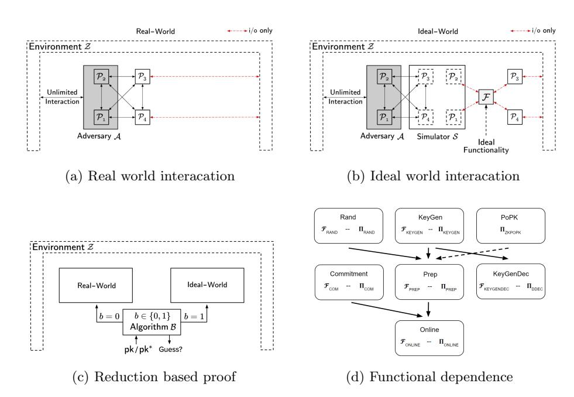

# Maliciously Secure Matrix Multiplication with Applications to Private Deep Learning?

Hao Chen1 , Miran Kim2 , Ilya Razenshteyn3 , Dragos Rotaru4,5 , Yongsoo Song3 , and Sameer Wagh6,7

1 Facebook 2 Ulsan National Institute of Science and Technology 3 Microsoft Research, Redmond 4 imec-COSIC, KU Leuven, Belgium 5 Cape Privacy 6 Princeton University, NJ 7 University of California, Berkeley haoche@fb.com, mirankim@unist.ac.kr, {ilyaraz,yongsoo.song}@microsoft.com, dragos@capeprivacy.com, swagh@alumni.princeton.edu

Abstract. Computing on data in a manner that preserve the privacy is of growing importance. Multi-Party Computation (MPC) and Homomorphic Encryption (HE) are two cryptographic techniques for privacypreserving computations. In this work, we have developed efficient UCsecure multiparty protocols for matrix multiplications and two-dimensional convolutions. We built upon the SPDZ framework and integrated the state-of-the-art HE algorithms for matrix multiplication. Our protocol achieved communication cost linear only in the input and output dimensions and not on the number of multiplication operations. We eliminate the "triple sacrifice" step of SPDZ to improve efficiency and simplify the zero-knowledge proofs. We implemented our protocols and benchmarked them against the SPDZ LowGear variant (Keller et al. Eurocrypt'18). For multiplying two square matrices of size 128, we reduced the communication cost from 1.54 GB to 12.46 MB, an improvement of over two orders of magnitude that only improves with larger matrix sizes. For evaluating all convolution layers of the ResNet-50 neural network, the communication reduces cost from 5 TB to 41 GB.

Keywords: Multi-party computation · Dishonest majority · Homomorphic encryption

# 1 Introduction

Secure Multiparty Computation (MPC) allows a set of parties to compute over their inputs while keeping them private. Over the span of few decades this field turned theoretical ideas into practical implementations that allow to compute

? Work done while Sameer, Dragos, and Hao were at Microsoft Research, Redmond.

even one billion Boolean gates per second [\[2\]](#page-23-0) with an honest majority of parties. The growth of computing on encrypted data has sparked interest in combining MPC with Machine Learning (ML), which allows distrusting parties to perform ML tasks such as evaluating private decision trees and support vector machines [\[36\]](#page-25-0) or evaluating and training neural networks, on their joint data [\[35](#page-25-1)[,31](#page-25-2)[,34,](#page-25-3)[38](#page-25-4)[,4\]](#page-23-1).

One important building block in all these works is secure matrix multiplication, which is often achieved by computing many dot products ~a · ~b. In the case of honest majority this problem has a straightforward solution: parties multiply locally each entry ai ·bi and then re-randomize the sum P i ai ·bi to the other parties. Hence, the cost of a dot product is a single opening which is independent of the vector sizes. However, in the case of dishonest majority the dot product protocol must use some correlated randomness (e.g. Beaver triples) for each multiplication since the secret sharing scheme is no longer multiplicative. Such a triple requires expensive public key operations and a lot of research focused on computing triples more efficiently via somewhat homomorphic encryption (HE) or oblivious transfer [\[6](#page-23-2)[,19,](#page-24-0)[26,](#page-25-5)[27\]](#page-25-6).

The SPDZ framework [\[19](#page-24-0)[,18,](#page-24-1)[27,](#page-25-6)[5\]](#page-23-3) is a state-of-the-art protocol for dishonestmajority MPC under one of the strongest adversarial settings – it assumes allbut-one corruption and malicious security, meaning that all parties except one can be controlled by the adversary, and can arbitrarily deviate from the protocol description. Moreover, SPDZ is proven secure under the Universal Composability (UC) framework of Cannetti [\[11\]](#page-24-2), which means in particular that it is still secure when composed arbitrarily with other MPC protocols. Under this framework, even if a fast matrix multiplication algorithm such as Strassen's algorithm is used, securely multiplying two n × n matrices in SPDZ uses at least O(n 2.8 ) authenticated Beaver triples. This is prohibitively expensive when targeting applications with a large number and sizes of matrix multiplications. For instance, the deep convolutional neural network (CNN) ResNet50 [\[24\]](#page-24-3) requires more than 4 billion multiplications of plaintext values[8](#page-1-0) . Currently, the best two-party triple generation algorithm over a 128-bit prime field produces 30, 000 triples per second on modest hardware and requires a communication of 15 kbits per party [\[27\]](#page-25-6). Using such an approach, the preprocessing phase for evaluating convolution layers of ResNet50 will require each party to send 5 TB of data. Our work reduces the communication by a factor of about 121×, while keeping the same adversarial setting.

# 1.1 Our Contributions

We summarize our contributions below:

1. We integrate the idea of classical Beaver triples to multiple matrices into the dishonest majority SPDZ framework (this idea has been explored previously

8 This is considering the scenario that both the model (i.e., ResNet weights) and inference inputs are secret shared.

in the semi-honest setting in works such as [\[15](#page-24-4)[,35,](#page-25-1)[38\]](#page-25-4)). This enables computing any bilinear operation efficiently in a dishonest majority MPC setting. We focus on two types of bilinear operations, matrix multiplications and twodimensional convolutions. We call the correlated randomness 'matrix triple' and 'convolution triple', respectively. We then applied the state-of-the-art algorithm for HE matrix multiplication [\[25\]](#page-24-5) to efficiently generate authenticated matrix triples with low communication complexity. Such algorithms allow us to have a communication cost linear in the size of the input and output, and independent of the complexity of the operation itself, in both offline and online phases. For example, in terms of matrix multiplication of n-by-n matrices, our method reduced the communication from O(n 3 ) to O(n 2 ) required by SPDZ, with similar computational overhead.

- 2. We introduced some further optimizations to the offline phase of SPDZ:
  - We avoid the "sacrifice" procedure in SPDZ via switching to slightly larger HE parameters which supports circuits of one more depth. By doing this, we saved a factor of (almost) two in overall communication and computation.
  - We optimized the zero-knowledge proof of plaintext knowledge in the offline phase of SPDZ, reducing the amortized communication overhead for proving each ciphertext from 2.5 to roughly 1.5.
- 3. We demonstrated the concrete efficiency of our protocols for (1) private matrix multiplications and (2) private neural network inference in the two-party case. In the former case, we benchmarked the private matrix multiplications over various matrix sizes while in the latter, we benchmarked evaluation of all convolution layers of ResNet-50, a massive, state-of-the-art neural network for image classification with 52 layers. The preprocessing phase improves by a factor of at least 121 compared to SPDZ. We integrated the convolution triples in MP-SPDZ [\[20\]](#page-24-6) to evaluate the online phase ResNet-50 convolutions. Our approach reduces the online communication overhead from 86.9 GB to only 0.54 GB (for a plaintext modulus p ≈ 2 128), which amounts to a factor of at least 150× improvement over the existing matrix multiplication in SPDZ using Strassen's algorithm.

# 1.2 Related Works

To the best of our knowledge, our work is the first to consider efficient linear algebra in the context of dishonest majority MPC. Previous research works primarily focused on evaluating relatively small ML models such as support vector machines or decision trees [\[32,](#page-25-7)[16\]](#page-24-7). However, for deep convolutional neural networks (CNN) the linear operations occupy a significant part of the computation. We give a brief overview on some recent protocols for combining MPC with ML:

1. In ABY3 [\[34\]](#page-25-3), Mohassel and Rindal mix secret sharing with garbled circuits for the three party case with honest majority. While their work introduces many clever techniques to perform share conversions, it is hard to estimate

- its performance on deep neural networks such as ResNet50 since their optimizations are circuit dependent and precision sensitive. It is also unclear how to extend their techniques to support an arbitrary number of parties with a dishonest majority.
- 2. SecureNN [\[38\]](#page-25-4) operates under the same trust assumption as ABY3: three party protocols with honest majority. While they also introduced some clever techniques to compute the sign function in MPC over rings, these only work for their specific setting.
- 3. Barak et al. [\[4\]](#page-23-1) used quantized datatypes instead of fixed point arithmetic to realize secure inference on Google's MobileNets. They have implemented secure quantized dot products to perform the convolutions in MobileNets for various adversary structures (semi-honest, honest majority, and dishonest majority). If the convolutions are done by evaluating dot products, they incur an O(n 3 ) communication cost for convolving two n×n matrices in the dishonest majority case. Our work would cut down a factor of n from their communication cost.
- 4. Helen [\[39\]](#page-26-0) proposed a protocol for distributed convex optimization by converting between SPDZ and the Paillier additively homomorphic encryption (AHE) scheme. They use zero-knowledge proofs on top of Paillier for secure matrix-vector multiplication in the dishonest majority setting. Instead, our work does not need costly conversions, utilizes more efficient lattice-based AHE scheme, and is fully compatible with the SPDZ framework.
- 5. Jiang et al. [\[25\]](#page-24-5) is a more recent protocol and strictly outperforms [\[33\]](#page-25-8) the latter takes 19 seconds to multiply two 128x128 matrices whereas the former only takes 5 seconds. Our work outperforms that of Jiang et al. [\[25\]](#page-24-5).

# 1.3 Roadmap

We present preliminary materials in Section [2.](#page-3-0) In Section [3,](#page-7-0) we introduce our changes to the SPDZ framework to better support bilinear operations, including an algorithm to generate authenticated matrix triples, an optimization which removes the sacrifice procedure, and optimizations on the ZKPoPK. We go on to present the experimental results for private matrix multiplication, private nearest neighbor search, and pirvate evaluation of ResNet-50 in Section [4.](#page-15-0) Finally, we conclude in Section [5.](#page-22-0)

# 2 Preliminaries

### 2.1 Notation

We use ~x to denote vectors i.e., ~x = (x1, . . . , xk) for some k specified in the context. We also use the notation [k] to denote the set {1, 2, . . . , k}. For a positive integer q, we identify Zq = Z ∩ (−q/2, q/2]. For a finite set S, U(S) denotes a uniform distribution over S.

Adversarial setting. Our protocols in this work follow the same adversarial setting as SPDZ, meaning that they are secure under all-but-one corruption and malicious security (we will refer to this setting as dishonest majority for short). Also, our protocol is proven secure under the UC framework [10], a property inherited from SPDZ.

#### 2.2 Authenticated Shares in SPDZ

Let n be the number of parties involved in the multi-party computation. In the SPDZ framework, all computations are performed over the finite field  $\mathbb{Z}_p$  with prime p. We use  $[\![x]\!]_{\alpha}$  to denote "authenticated shares", i.e., the i-th party holds  $(x_i, m_i)$  such that  $x \equiv x_0 + \ldots + x_{n-1} \pmod{p}$  and  $\alpha \cdot x \equiv m_0 + \ldots + m_{n-1} \pmod{p}$ . The parties also hold shares  $\alpha_i$  of the global MAC key  $\alpha \equiv \alpha_0 + \ldots + \alpha_{n-1} \pmod{p}$ . In other words,

$$[x]_{\alpha} := \{(x_i, m_i, \alpha_i)\}_{i=1}^n \text{ such that}$$

$$\sum_i m_i \equiv \left(\sum_i \alpha_i\right) \cdot \left(\sum_i x_i\right) \pmod{p}$$
(1)

# 2.3 Bilinear Triples

Beaver's multiplication triple technique is widely used in secure computation in both semi-honest and malicious settings. [6,19,35,38]. Let  $\mathbb F$  be a finite field. Recall that a multiplication triple is a tuple ([a],[b],[c]) where  $a,b\in\mathbb F$  are random elements such that  $c=a\cdot b$ . Here [x] represents an additive sharing of x where each party has a share  $x_i$  such that  $\sum_{i=1}^n x_i = x$ . These multiplication triples can be utilized to perform private multiplication: in order to multiply secret-shared values x and y. The parties reveal x-a and y-b, and compute  $[x\cdot y]=(x-a)\cdot(y-b)+[a]\cdot(y-b)+(x-a)\cdot[b]+[c]$ . In the dishonest majority malicious adversarial setting, SPDZ enhances the above to authenticated triples ([a],[b],[c]).

Mohassel and Zhang [35] generalized the above notion to "matrix triples" and applied it to secure training of machine learning models in the semi-honest setting. We take this idea further and consider triples for any bilinear operation. Then, we integrate them with the SPDZ preprocessing framework to provide security in the dishonest majority malicious adversarial setting.

**Bilinear triples.** Let l, m, k be positive integers and let  $\circledast : \mathbb{F}^l \times \mathbb{F}^m \to \mathbb{F}^k$  be a bilinear function9. Then, we define a  $\circledast$ -triple as a tuple of secret sharings  $[a], [b], [a \circledast b]$  where a, b are uniformly random. Given such a triple, it is simple to securely compute a secret sharing of  $x \circledast y$  given secret sharings of x and y

&lt;sup>9 A function  $\circledast$  is called *bilinear* if it satisfies the relations  $(\alpha x_1 + x_2) \circledast y = \alpha(x_1 \circledast y) + x_2 \circledast y$  and  $x \circledast (\alpha y_1 + y_2) = \alpha(x \circledast y_1) + x \circledast y_2$  for arbitrary  $\alpha \in \mathbb{F}$ ,  $x_1, x_2, x \in \mathbb{F}^l$  and  $y_1, y_2, y \in \mathbb{F}^k$ .

following Beaver's method verbatim. Note that when  $\circledast$  is scalar multiplication, we get back Beaver's multiplication triple; when  $\circledast$  is matrix multiplication, we get the matrix triple in [35]. Another example is convolution, described in more detail below.

Using  $\circledast$ -triples instead of Beaver triples for securely computing bilinear operations has an advantage of lower communication cost in the triple consumption phase. For example, multiplying two n-by-n matrices with Beaver triples would cost  $O(n^3)$  field elements being communicated, or  $O(n^{\log 7 + o(1)})$  using Strassen's algorithm, whereas using matrix triple only amounts to  $O(n^2)$  communication cost. Importantly, we will see that using  $\circledast$ -triples could also reduce the communication cost in the *triple generation phase*, via homomorphic encryption.

Convolutions. Convolution is a bilinear operation between tensors widely used by deep neural networks [30,28]. Here we will define and discuss two-dimensional convolutions, since they are used by a ResNet network [24] we use for benchmarking, but our approach can be easily generalized to all dimensions.

Let  $A_{ijk}$  be an input tensor, where  $1 \leq i \leq h$  and  $1 \leq j \leq w$  are spatial coordinates, and  $1 \leq k \leq s$  is the channel. Suppose we would like to compute an  $(2l+1) \times (2l+1)$ -convolution for some  $l \geq 0$ , given by a tensor  $B_{\Delta i, \Delta j, k, k'}$ , where  $-l \leq \Delta i, \Delta j \leq l$  are shifts of the spatial coordinates, and  $1 \leq k \leq s$  and  $1 \leq k' \leq s'$  are the channels. The resulting tensor  $C_{ijk'} = \operatorname{conv}(A, B)$  has  $h \times w$  spatial coordinates and s' channels and is defined via the formula:

$$C_{ijk'} = \sum_{\Delta i, \Delta j, k} A_{i+\Delta i, j+\Delta j, k} \cdot B_{\Delta i, \Delta j, k, k'},$$

where in the right-hand side, we set the entries of A to be zero if  $i + \Delta i$  or  $j + \Delta j$  are outside of the ranges [1;h] and [1;w], respectively. Since convolution is bilinear, we can consider *convolution triples*, that is secret shares of uniformly random tensors A, B and secret shares of  $\mathsf{conv}(A, B)$ .

We can reduce convolution to matrix multiplication as follows: we create an  $wh \times (2l+1)^2 \cdot s$  matrix  $\mathcal{A}$  with  $\mathcal{A}_{(i,j)(\Delta i,\Delta j,k)} = A_{i+\Delta i,j+\Delta j,k}$ , as well as an  $(2l+1)^2 \cdot s \times s'$  matrix  $\mathcal{B}$  defined as:  $\mathcal{B}_{(\Delta i,\Delta j,k)k'} = B_{\Delta i,\Delta j,k,k'}$ . Then one can extract C from the product  $\mathcal{C} = \mathcal{A}\mathcal{B}$  (which is of size  $wh \times s'$ ) as follows:  $C_{ijk'} = \mathcal{C}_{(i,j)k'}$ . Note that  $1 \times 1$  convolution (l=0) is exactly matrix multiplication. When l>0, one of the matrices  $\mathcal{A}$  is obtained from  $(2l+1)^2$  stacked permuted instances of the flattening of A. Overall, using this reduction, we can compute the convolution in  $O((2l+1)^2 \cdot whss')$  operations10. Thus, evaluating the convolution using the authenticated Beaver triples in SPDZ requires  $O((2l+1)^2 \cdot whss')$  communication. In contrast, using our convolution triples yields a communication cost of merely  $O((wh+s') \cdot s \cdot (2l+1)^2)$ . Sometimes, one is willing to stride the convolution. This simply corresponds to the regular sampling of the i,j coordinates of the answer. In terms of matrix multiplications, this corresponds to sampling a subset of rows of  $\mathcal{A}$ .

&lt;sup>10 In principle, one can speed it up using Fourier or Winograd transforms [29], but we leave the study of these algorithms in the secure setting for the future work.

#### 2.4 The BFV Scheme

We use the Fan-Vercauteren variant of Brakerski's scale-invariant HE scheme [8,21], which we shall refer to as the BFV scheme. For a power-of-two integer N, we denote by  $R = \mathbb{Z}[X]/(X^N+1)$  and  $R_q = \mathbb{Z}_q[X]/(X^N+1)$  the ring of integers of (2N)-th cyclotomic field and its residue ring modulo q. We define  $\|a\|_{\infty}$  of an element  $a \in R_q$  as the infinite norm of its coefficient vector in  $\mathbb{Z}_q^N$ . A secret key  $\mathsf{sk} = s \in R$  is sampled uniformly from the set  $R_3$  of ternary polynomials with coefficients in  $\{0, \pm 1\}$ . A public key of BFV is generated by

$$\mathsf{pk} = (-a \cdot s + e, a) \in R_q^2, \tag{2}$$

for  $a \leftarrow U(R_q)$  and  $e \leftarrow \chi$  from the error distribution  $\chi$  over R. We set  $\chi$  to be a discrete Gaussian with a small variance and let  $\rho$  be an upper bound of  $\chi$ , i.e.,  $|e| \leq \rho$  holds with an overwhelming probability where  $e \leftarrow \chi$ . The BFV encryption and decryption procedures are given by the following formulas:

Enc: 
$$m \mapsto \mathfrak{c}_m = u \cdot \mathsf{pk} + (\Delta \cdot m + e_0, e_1) \pmod{q},$$
  
Dec:  $\mathfrak{c}_m \mapsto m = |\Delta^{-1} \cdot (\mathfrak{c}_0 + \mathfrak{c}_1 \cdot s)| \pmod{p},$ 

where  $\mathfrak{c}_m = (\mathfrak{c}_0, \mathfrak{c}_1)$ ,  $m \in R_p$  is the message to be encrypted,  $\Delta = \lfloor q/p \rfloor$ ,  $u \leftarrow U(R_3)$ ,  $e_0, e_1 \leftarrow \chi$ , and  $\lfloor \cdot \rfloor$  denotes the nearest integer function. For the remainder of the paper, we use the shorthand  $r_m = (u, e_0, e_1) \in R^3$  to denote the randomness used for encrypting a plaintext m. We write  $\mathfrak{c}_m = \operatorname{Enc}(m, r_m)$  when the randomness is taken as input of encryption.

We define the normalized norm of randomness  $r_m$  by  $||r_m|| = \max\{||u||_{\infty}, \rho^{-1} \cdot ||e_0||_{\infty}, \rho^{-1} \cdot ||e_1||_{\infty}\}$ . For B > 0, we call  $\mathfrak c$  a B-ciphertext if there exists  $m \in R_p$  and  $r_m = (u, e_0, e_1) \in R^3$  such that  $||r_m|| \leq B$  and  $\mathfrak c = \mathsf{Enc}_{\mathsf{pk}}(m, r_m)$ . We also use  $U_B$  to denote a uniform distribution over the set of triples  $r = (u, e_0, e_1) \in R^3$  such that  $||r|| \leq B$ .

The native plaintext space of BFV is  $R_p$ , but we can exploit the Discrete Fourier Transform (DFT) over  $\mathbb{Z}_p$  to pack multiple values in a single ciphertext and support parallel computation in a single instruction multiple data (SIMD) manner. We choose a plaintext modulus satisfying  $p=1\pmod{2N}$  so that  $X^N+1=\prod_{i\in\mathbb{Z}_{2N}^\times}(X-\zeta^i)$  for a primitive 2N-th root of unity  $\zeta$  of the finite field  $\mathbb{Z}_p$ . Hence, we can use the packing technique via the ring isomorphism  $R_p\to\mathbb{Z}_p^N$ ,  $m(X)\mapsto (m(\zeta^i))_{i\in\mathbb{Z}_{2N}^\times}$ .

Recall that the multiplicative group  $\mathbb{Z}_{2N}^{\times}$  is isomorphic to  $\mathbb{Z}_2 \times \mathbb{Z}_{N/2}$ . In our implementation, we encode two vectors of length N/2 into a single element of  $R_p$  using this algebraic structure. The BFV scheme support the simultaneous rotation of these two based on the homomorphic evaluation of automorphism  $X \mapsto X^5$ . More generally, we can perform an arbitrary linear transformation on these two vectors by combining homomorphic rotation and plaintext-ciphertext multiplication in BFV. The complexity of a linear transformation is mainly dominated by k rotations where  $k \leq N/2$  is the number of nonzero diagonals  $(A_{0,i}, A_{1,i+1} \dots, A_{N/2-1,i-1})$  of its matrix representation  $A \in \mathbb{Z}_p^{N/2 \times N/2}$ . We refer the reader to [22] for details.

#### 2.5 Matrix Multiplication Using HE

We recall the protocol from [25] which transforms square matrix multiplications into HE-friendly operations. For a  $d \times d$  square matrix  $A = (a_{i,j})_{0 \le i,j < d}$ , we first define useful permutations  $\sigma$ ,  $\tau$ ,  $\phi$ , and  $\psi$  on the set  $\mathbb{Z}_p^{d \times d}$ . For simplicity, we assume that  $N/2 = d^2$ . All the indices will be considered as integers modulo d. Let  $\sigma(A)_{i,j} = a_{i,i+j}$ ,  $\tau(A)_{i,j} = a_{i+j,j}$ ,  $\phi(A)_{i,j} = a_{i,j+1}$ , and  $\psi(A)_{i,j} = a_{i+1,j}$ . Then for two square matrices A, B of order d, we can express the matrix product  $A \times B$  as follows:

$$A \times B = \sum_{k=0}^{d-1} \left( \phi^k \circ \sigma(A) \right) \odot \left( \psi^k \circ \tau(B) \right), \tag{4}$$

where  $\odot$  denotes the component-wise multiplication between matrices (see Section 3.1 of [25] for more detail).

We can identify a matrix of order  $d \times d$  with a vector of length  $d^2$  via the encoding map  $\mathbb{Z}_p^{d^2} \to \mathbb{Z}_p^{d \times d}$ ,  $\vec{a} = (a_0, \dots, a_{d^2-1}) \mapsto A = (a_{d \cdot i+j})_{0 \leq i,j < d}$ . A ciphertext will be called an encryption of A if it is an encryption of the plaintext vector  $\vec{a}$ . Suppose that we are given two ciphertexts  $\mathfrak{c}_A$  and  $\mathfrak{c}_B$  that encrypt  $\sigma(A)$  and  $\tau(B)$ , respectively. Then we define the homomorphic matrix product by

$$\mathfrak{c}_A \circledast \mathfrak{c}_B = \sum_{k=0}^{d-1} \left( \phi^k(\mathfrak{c}_A) \boxtimes \psi^k(\mathfrak{c}_B) \right), \tag{5}$$

where  $\mathfrak{c} \boxtimes \mathfrak{c}'$  denotes the homomorphic multiplication between two ciphertexts  $\mathfrak{c}$  and  $\mathfrak{c}'$ . The permutations  $\phi^k$  and  $\psi^k$  are fixed linear transformations over  $\mathbb{Z}_p^{d^2}$ , which can be evaluated as described above. The evaluation of a permutation includes only two homomorphic rotations since the matrix representation of  $\phi^k$  or  $\psi^k$  has two nonzero diagonals. It follows from Eq. (4) that  $\mathfrak{c}_A \circledast \mathfrak{c}_B$  is an encryption of  $A \times B$ .

The authors of [25] implemented the matrix multiplication algorithm over the CKKS scheme [14], while we apply the same algorithm to the BFV scheme encrypting two vectors of dimension (N/2) with entries in  $\mathbb{Z}_p$ . We will encrypt two square matrices A and B of size  $d = \sqrt{N/2}$  in a single ciphertext. As noted in Section 2.4, the BFV scheme supports parallel arithmetic operations and permutations on two vectors. Hence, we can perform two homomorphic matrix multiplications simultaneously by fully utilizing the slots.

# 3 Protocol Specification

We describe our major contributions in this section. First, we propose our algorithm for generating authenticated matrix triples. Then, we introduce two other optimizations. The first one improves the triple generation phase, by carefully choosing the HE parameters to avoid the sacrifice stage. The second one improves the zero-knowledge proof of knowledge in SPDZ.

#### $\Pi_{\mathsf{Prep}}$

**Usage:** We execute  $\Pi_{PoPK}$  by batching u ciphertexts together. At the same time, we use the SIMD properties of HE to optimally compute on N plaintext elements at the same time (cf. Sec 4.1). Calls to  $\Pi_{PoPK}$  are amortized in batches of u, a detail omitted for simplicity. Also, randomness used in the encryption is implicit and is the randomness used for a fresh ciphertext (cf. Sec 2)

**Initialize:** All parties first invoke  $\mathcal{F}_{\mathsf{KeyGenDec}}$  to obtain the public key  $\mathsf{pk}$ . Then, each party does the following:

- 1. Each party generates  $\alpha^i \leftarrow \mathbb{Z}_p$ . Let  $\alpha := \sum_i \alpha^i \pmod{p}$ .
- 2. Each party computes and broadcasts a fresh encryption  $\mathfrak{c}^i_{\alpha} \leftarrow \mathsf{Enc}_{\mathsf{pk}}(\alpha^i)$ (Note that this ciphertext has  $\alpha^i$  in all the N slots. Refer Sec. 2).
- 3. The parties invoke protocol  $\Pi_{\mathsf{PoPK}}$  on ciphertexts  $\mathfrak{c}_{\alpha_i}$  for  $i \in [n]$ .
- 4. All parties compute  $\mathfrak{c}_{\alpha} \leftarrow \sum_{i} \mathfrak{c}_{\alpha}^{i}$ .

**Authenticated Singles:** Parties run this protocol to generate  $u \cdot N$  random authenticated shares in  $\mathbb{Z}_p$  in one invocation. Let  $i \in [n]$  and  $k \in [u]$ .

- 1. All parties sample random  $r_k^i \leftarrow U(R_p)$ . Each party computes and broadcasts  $\mathfrak{c}_{r_k}^i = \mathsf{Enc}_{\mathsf{pk}}(r_k^i)$ . Let  $\mathfrak{c}_{r_k} \leftarrow \sum_i \mathfrak{c}_{r_k}^i$ .
- 2. The parties invoke protocol  $\Pi_{PoPK}$  on the u ciphertexts  $\mathfrak{c}_{r_k}^i$
- 3. Parties run  $\Pi_{\mathsf{AddMacs}}$  to generate  $(\gamma(r_k)^1, \ldots, \gamma(r_k)^n) \leftarrow \mathsf{AddMacs}(\mathfrak{c}_{r_k})$ .
- 4. Parties output  $[r_k]_{\alpha} = ((r_k^1, \gamma(r_k)^1), \dots, (r_k^n, \gamma(r_k)^n)).$

Matrix Triples: For the ease of exposition, we encode one matrix in one ciphertext. Refer to Section 4.1 for more details on how to optimally use all the ciphertext slots. Let ® refer to the HE ciphertext-ciphertext matrix multiplication relation defined in Section 2.5. Let  $j \in [d_1], k \in [d_2], \text{ and } l \in [d_3].$  Steps 1-10 are done for all j, k, l in their respective ranges. Set  $v = (\sec_s + 2)/\log_2(2N+1)$ 

- 1. Each party generates random  $A^i_{jk} \leftarrow U(R_p)$  and  $B^i_{kl} \leftarrow U(R_p)$ .
- 2. Compute and broadcast  $\mathfrak{c}_{A_{jk}}^i \leftarrow \mathsf{Enc}(\sigma(A_{jk}^i))$  and  $\mathfrak{c}_{B_{kl}}^i \leftarrow \mathsf{Enc}(\tau(B_{kl}^i))$ .
- 3. All parties invoke  $\Pi_{PoPK}$  for  $\mathfrak{c}_{A_{jk}}^i$  and  $\mathfrak{c}_{B_{kl}}^i$  for each  $i \in [n]$ .
- 4. All parties set  $\mathfrak{c}_{A_{jk}} \leftarrow 2 \cdot \sum_{i} \mathfrak{c}_{A_{jk}}^{i}$  and  $\mathfrak{c}_{B_{kl}} \leftarrow 2 \cdot \sum_{i} \mathfrak{c}_{B_{kl}}^{i}$ . 5. All parties compute  $\mathfrak{c}_{C_{jl}} \leftarrow \sum_{k} \mathfrak{c}_{A_{jk}} \circledast \mathfrak{c}_{B_{kl}}$ .
- 6. Parties run  $\Pi_{\mathsf{AddMacs}}$  to generate  $(\gamma(A_{jk})^1, \dots, \gamma(A_{jk})^n) \leftarrow \mathsf{AddMacs}(\mathfrak{c}_{A_{jk}})$ and  $(\gamma(B_{kl})^1, \dots, \gamma(B_{kl})^n) \leftarrow \mathsf{AddMacs}(\mathfrak{c}_{B_{kl}}).$
- 7. Parties run  $\Pi_{\mathsf{DDec}}$  to generate  $\left(C_{jl}^1, \dots C_{jl}^n\right) \leftarrow \mathsf{DDec}(\mathfrak{c}_{C_{jl}})$ .
- 8. Parties run  $\Pi_{\mathsf{AddMacs}}$  to generate  $\left(\gamma(C_{jl})^1, \dots \gamma(C_{jl})^n\right) \leftarrow \mathsf{AddMacs}(\mathfrak{c}_{C_{jl}})$ .
- 9. Set  $A_{jk}^i \leftarrow 2 \cdot A_{jk}^i$  and  $B_{kl}^i \leftarrow 2 \cdot B_{kl}^i$ .
- 10. Generate a large matrix by using  $A_{jk}^i$  as sub-matrix blocks – k blocks per row and j blocks per column. This forms a matrix of dimensions  $(d_m)$ block size) where  $m \in \{1, 2\}$  Similarly, rearrange the  $\gamma(A_{jk})^i$  and call this group of 2 matrices as  $[\![A]\!]$ . Similarly, set  $[\![B]\!]$  and  $[\![C]\!]$  (except without scaling by factor of 2 for C).

Convolution Triples: This uses matrix triples to generate convolution triples.

- 1. Parties call Authenticated Singles to generate 2D tensors [X], [Y].
- 2. Parties call Matrix Triples (cf. Sec 2.3 for dimensions of the matrices) to get a matrix multiplication triple  $[\![A]\!]$ ,  $[\![B]\!]$ ,  $[\![C]\!]$ .
- 3. All parties open  $\epsilon = [X' A]$  and  $\delta = [Y' B]$ , where X', Y' are matrices generated by converting convolutions into matrix multiplications.
- 4. Compute  $[\![Z]\!] = [\![C]\!] + \epsilon \times [\![B]\!] + [\![A]\!] \times \delta + \epsilon \times \delta$ . Output  $[\![X]\!], [\![Y]\!], [\![Z]\!]$ .

Fig. 1: Protocol for generating various preprocessing material

ΠDDec

Distributed Decryption: Parties run the following protocol:

- 1. Parties generate r i ← U(Rp). Let cm := (c0,c1).
- 2. Compute v i as follows:

$$v^{i} = \begin{cases} \mathfrak{c}_{0} + \mathfrak{c}_{1} \cdot s^{i} & \text{if } i = 1\\ \mathfrak{c}_{1} \cdot s^{i} & \text{if } i \neq 1 \end{cases}$$

- 3. Broadcast t i ← ∆ · r i + v i + e i (mod q) where e i ← U(RB·2 secdd )
- 4. Party i = 1 outputs m1 = b∆−1 · ( P i t i )e − r 1 (mod p) while all other parties (i 6= 1) output mi = −r i (mod p)
- 5. Finally, Decode(mi ) to obtain of vector of plaintexts encoded in each mi .

Fig. 2: Protocol for distributed decryption.

# 3.1 Generation of Bilinear Triples

In this section we present our main contribution, which can be thought of as an improvement to the SPDZ framework to support efficient bilinear operations, in particular matrix multiplications and convolutions. Recall that the offline phase of the SPDZ framework generates Beaver triples, which means that to multiply two square matrices of size d we need to consume M(d) triples, where M(d) is the complexity of the matrix multiplication algorithm of choice. In order to minimize the communication overhead, we designed new offline phases for generating matrix and convolution triples. We use HE algorithms to generate these triples in the offline phase. In the online phase, they are consumed in essentially the same way as Beaver triples. Such triples allow us to have communication linear in the size of the input and output, and independent of the number of multiplications, in both offline and online phases.

On a high level, our protocol for generating authenticated matrix triples works as follows. First, each party Pi select uniformly random matrices Ai , Bi and send an encryption of these matrix. Then, the parties engage in the n-party zero-knowledge proof, and obtain encryptions of A = PAi and B = PBi with bounded noise. Next, parties use the homomorphic matrix multiplication algorithm recalled in Section [2.5](#page-7-2) to compute an encryption of C = AB. Finally, the parties use homomorphic multiplication to compute encryptions of αA, αB, αC, and perform distributed decryption on the resulting ciphertexts. In this way, the parties end up with a valid authenticated triples (JAKα, JBKα, JCKα). We provide the formal description of our pre-processing protocol in Figure [1,](#page-8-2) with the distributed decryption protocol in Figure [2.](#page-9-0) Our functional dependence is presented in Figure [5d](#page-29-0) and our main results presented below.

Theorem 1. In the (FPrep, FCommit)-hybrid model, the protocol ΠOnline (Figure [12\)](#page-37-0)implements FOnline with statistical security against any static, active adversary corrupting up to n − 1 parties.

**Theorem 2.** If the underlying cryptosystem is somewhat homomorphic and IND-CPA secure, then  $\Pi_{\mathsf{Prep}}$  (Figure 1) implements  $\mathcal{F}_{\mathsf{Prep}}$  with computational security against any static, active adversary corrupting up to n-1 parties, in the  $(\mathcal{F}_{\mathsf{KeyGen}}, \mathcal{F}_{\mathsf{Rand}})$ -hybrid model.

**Theorem 3.** The protocol  $\Pi_{\mathsf{DDec}}$  securely implements  $\mathcal{F}_{\mathsf{KeyGenDec}}$  in the  $\mathcal{F}_{\mathsf{KeyGen-hybrid}}$  model with statistical security against any static adversary corrupting upto n-1 parties if B' is an upper bound on the noise of the input ciphertext, and  $B' \cdot 2n \cdot 2^{\mathsf{sec}_{\mathsf{dd}}} < \Delta$ .

Proof of Theorems 1, 2, and 3 are presented in Appendix B.

# 3.2 Authenticating Triples Without Sacrifice

To introduce this optimization, we first recall the technique of authenticated multiplication triples as proposed by the SPDZ line of work [19,18]. In the framework, there is a global MAC key  $\alpha \in \mathbb{F}_p$  and parties have access to a ciphertext  $\mathfrak{c}_{\alpha}$  encrypting  $\alpha$ , here the ciphertext is generated via an HE scheme, whose public key is known to all parties and the secret key is secret-shared among the parties11. During the triple generation phase, parties obtain ciphertexts  $\mathfrak{c}_x, \mathfrak{c}_y, \mathfrak{c}_z$ where supposedly the relation z = xy holds. In order to authenticate the secret values x, y and z, the parties engage in an AddMacs subroutine (this is a common procedure to prevent malicious behavior for dishonest majority protocols, cf [19,18]), in which parties compute and then jointly decrypt  $\mathfrak{c}_{\alpha} \boxtimes \mathfrak{c}_t$  to obtain secret shares of  $\alpha \cdot t$  for  $t \in \{x, y, z\}$ . However, a malicious adversary can inject an error term  $\epsilon$  into z such that  $z = xy + \epsilon$ , and the AddMacs subroutine could authenticate such an incorrect triple, which corrupts the final computation result. In order to resolve this issue, a step called *sacrifice* was introduced, where one triple is consumed to check the correctness of the other. Sacrificing brings a two times overhead to the complexity of the triple generation phase.

We begin by noting that SPDZ only uses a depth-1 HE, i.e., the underlying HE scheme could support one multiplication. Recall that in the SPDZ triple generation, after computing a ciphertext  $\mathfrak{c}_z = \mathfrak{c}_x \boxtimes \mathfrak{c}_y$ , the Reshare procedure is called which outputs secret shares of z' and a new ciphertext  $\mathfrak{c}_{z'}$  with smaller noise than  $\mathfrak{c}_z$ . Then, the AddMacs procedure is called, which produces authenticated share  $[\![z']\!]_\alpha$ . In particular, to generate shares of the MAC on z, prior work requires that the distributed decryption subroutine to be called on z to get a level-1 ciphertext (z') that enables adding the MAC on it. This way, an additive error introduced in z can be "authenticated" using the AddMacs procedure by the adversary. To prevent against such an attack, prior work required a sacrifice of one triple with other which was proved to ensure that the triples do not have an error. The MacCheck ensures that any such additive error introduced is caught with high probability.

&lt;sup>11 The initialize phase in  $\Pi_{\mathsf{Prep}}$  will require Diag flag similar to [19,18] to ensure that the ciphertext encodes the same MAC key in the same slots.

In our work, we modify the HE parameters to support larger depth, in particular depth-2 computation. The homomorphic encryption product (z = xy) is done over public ciphertexts and hence z is guaranteed to equal xy. However, to add MACs to the product z, we do not need to run a distributed decryption protocol (we only need it for generating the shares of z but not for the MAC generation). In our work, we directly call the AddMacs routine on the public ciphertext for z, i.e., cαz = cz cα, and perform distributed decryption on cαz to obtain the MAC shares. This ensure that the additive error introduced by the adversary when running DDec on cz to get shares of z is independent of α from the additive error introduced in the DDec of cαz. This way, we eliminate the need for a sacrifice and simply rely on the MacCheck subroutine to catch malicious behavior.

Thus, we save the computation and communication by a factor of two, with a less-than-two additional overhead due to the need to increase underlying HE parameters to support larger depth computations. This optimization is particularly useful in our bilinear triple generation protocol, since in this case we already need to increase the HE parameters in order to run the homomorphic matrix multiplication algorithm, and the overhead of supporting just one more depth is small.

# 3.3 Improved ZKPoPK Based on BFV Scheme

In the SPDZ offline phase, parties need to use a homomorphic encryption scheme (the BGV scheme of Brakerski, Gentry, and Vaikuntanathan [\[9\]](#page-23-5)) to encrypt random values, and broadcast these encryptions. Then, they run homomorphic evaluation and distributed decryption to generate the multiplication triples. Since parties could be malicious, each party needs to prove that it is providing a valid ciphertext. In the context of BGV, this means the coefficients of the message and randomness used in the encryption method must be bounded in size. This zeroknowledge proof of plaintext knowledge (ZKPoPK) follows a 3-move Schnorr protocol pattern. The goal is to prove knowledge of message x and encryption randomness r with bounded size, such that cx,r = b. The prover chooses some random mask values yx, yr and sends cyx,yr to the verifier. After the verifier selects a challenge e the prover sends back the masked values zx = yx + e · x and zr = yr + e · r. Finally, the verifier checks whether czx,zr = cyx,yr + e · b and whether the noise and plaintext bounds are correct on producing cx by checking the norm of zx and zr. The state-of-the-art ZKPoPK in [\[5\]](#page-23-3) enhances the above approach by designing an n-prover protocol which adds the ability to prove the validity of sum of n ciphertexts instead of proving each individual ones.

Our modification. We note that the BFV homomorphic encryption scheme of Brakerski/Fan-Vercauteren [\[8,](#page-23-4)[21\]](#page-24-9) provides the same functionalities as the BGV scheme, while the two schemes have some subtle differences, which we will exploit for our improved zero-knowledge proof. In particular, BFV allows selecting the plaintext modulus p to divide the ciphertext modulus q, which is not allowed in BGV[12](#page-12-0). We will use this fact to simplify and reduce the complexity of the zero-knowledge proof of plaintext knowledge (ZKPoPK) component in SPDZ.

Recall that the BGV encryption of a message m with public key pk and randomness (u, e0, e1) is

$$\mathbf{c} = u \cdot \mathsf{pk} + (m + pe_0, pe_1) \pmod{q}. \tag{6}$$

Although an honest party would encrypt a message m ∈ Rp with kmk∞ ≤ p/2, a malicious party can use any m ∈ R, and the excess part m−[m]p goes into the noise of the ciphertext. Hence the prover needs to prove that kmk∞ is not too large. This is done by having the prover send encryptions of random messages y with log kyk∞ ≈ seczk + log p and later reveal a linear combination of y and m. On the other hand, in the BFV scheme, an encryption of m is the form of

$$c = u \cdot pk + (\Delta \cdot m + e_0, e_1) \pmod{q}, \text{ where } \Delta = \lfloor q/p \rceil.$$
 (7)

Suppose p divides q, then ∆ = q/p exactly, and using a message m ∈ R in the encryption algorithm is equivalent to using [m]p due to the automatic reduction modulo q on the ciphertexts. Therefore, the prover in our ZKPoPK only needs to prove upper bounds on the encryption randomness, and it suffices to sample the "masking elements" y as random elements in Rp. This reduces the size of the proof, since we reduce the coefficients of the masked plaintexts sent by the prover (the terms zi in [\[5,](#page-23-3) Figure 1]) from log p+log seczk bits down to log p bits.

ZKPoPK. The zero-knowledge proof of knowledge we describe next (Figure [3\)](#page-14-0) is a n-party ZKP used in the preprocessing phase. The n players all simultaneously act as the provers and the verifiers. Sampling is an algorithm that describes the behavior of honest parties to generate their ciphertexts and broadcast them to the other parties. This algorithm satisfies the relation given in Eq. [8.](#page-13-0) However, ΠPoPK provides weaker guarantees as given in Eq. [9](#page-13-1) which will be sufficient for the preprocessing phase[13](#page-12-1). In particular, the protocol introduces a soundness slack in the bounds that can be proven on the witness. The protocol works in the standard 3-move Schnorr protocol pattern as described below:

- 1. Each party Pi independently runs the "commitment" algorithm on (xi , wi) to get (commi ,statei) ← Commit(xi , wi) and broadcasts commi to all the other parties.
- 2. The n parties jointly generate a challenge w (produced via a call to an ideal functionality FRand)
- 3. Each party Pi independently runs the "response" algorithm to get respi ← Response(statei , w)
- 4. Each party Pi independently runs the "verification" algorithm and accept if the output is true: Verify({commi ,respi}i∈[n] , w) == True.

12 gcd(p, q) = 1 is required for security of BGV

13 This is the worst case gaurantee when all provers are dishonest while at least one verifier is honest, which in the case when provers and verifiers are the same entities is the dishonest majority model.

$$\begin{split} \mathcal{R}_{\mathsf{PoPK}}^{u,\mathsf{Honest}} &= \left\{ \left. \left( (x^1, \dots, x^n) \,,\, (w^1, \dots, w^n) \right) \,, \right. \\ &$$

$$\mathcal{R}_{\mathsf{PoPK}}^{u,2} = \left\{ \left( (x^{1}, \dots, x^{n}), (w^{1}, \dots, w^{n}) \right), \\ x^{i} = \left( \mathbf{c}_{1}^{i}, \dots, \mathbf{c}_{u}^{i} \right), w^{i} = \left( (a_{1}^{i}, r_{a_{1}}^{i}), \dots (a_{u}^{i}, r_{a_{u}}^{i}) \right) : \\ 2 \cdot \mathbf{c}_{a_{k}} = \mathsf{Enc}_{\mathsf{pk}} (2 \cdot a_{k}, 2 \cdot r_{a_{k}}) \text{ and } \\ \|2r_{a_{k}}\| \leq Nnu \cdot 2^{\mathsf{sec}_{\mathsf{zk}} + 1} \text{ where} \\ \mathbf{c}_{a_{k}} = \sum_{i} \mathbf{c}_{a_{k}}^{i} \text{ and } r_{a_{k}} = \sum_{i} r_{a_{k}}^{i} \right\}$$

$$(9)$$

Before we describe the protocol, we reiterate some key notation. The normalized norm of randomness  $r_m$  by  $||r_m|| = \max\{||u||_{\infty}, \rho^{-1} \cdot ||e_0||_{\infty}, \rho^{-1} \cdot ||e_1||_{\infty}\}$ . For B > 0, we call  $\mathfrak{c}$  a B-ciphertext if there exists  $m \in R_p$  and  $r_m = (u, e_0, e_1) \in R^3$  such that  $||r_m|| \leq B$  and  $\mathfrak{c} = \mathsf{Enc}_{\mathsf{pk}}(m, r_m)$ . We also use  $U_B$  to denote a uniform distribution over the set of triples  $r = (u, e_0, e_1) \in R^3$  such that  $||r|| \leq B$ . We set  $\rho = 20$  following [5] to ensure the randomness r from an honest party satisfies  $||r|| \leq 1$  with overwhelming probability. Furthermore, we also use the following distributions (specifically the third) in the description of the protocol:

- 1.  $\mathcal{ZO}(0.5,k)$ : This distribution generates a vector of size k with elements  $\{x_i\}_{i=1}^k$  chosen from  $\{-1,0,+1\}$  such that the  $\Pr(x_i=-1)=0.25, \Pr(x_i=+1)=0.25,$  and  $\Pr(x_i=0)=0.5$  for all  $i\in[k]$ .
- 2.  $\mathcal{DN}(\sigma^2, k)$ : This distribution generates a vector of size k with elements drawn according to an approximation to the discrete Gaussian distribution with variance  $\sigma^2$ .
- 3.  $\mathcal{RG}(0.5, \sigma^2, k)$ : This distribution generates a triple of elements  $(u, e_0, e_1)$  where  $u \leftarrow \mathcal{ZO}(0.5, k)$  and  $e_0, e_1 \leftarrow \mathcal{DN}(\sigma^2, k)$ .

Improvements compared to prior work. In our protocol, the hiding on the message  $(z_l^i)$  is information-theoretic (as opposed to statistical hiding in TopGear) and hence does not need any check during the verification phase. This is due choosing  $p \mid q$  in underlying BFV scheme. In addition, the ZKPoPK in [5] sends the polynomials  $z_l^i$  and  $r_{z_l}^i$  as elements in  $R_q$ , which is more than necessary since q is typically large but these polynomials are supposed to have bounded norm. We can reduce this cost by sending  $z_l^i$  and  $r_{z_l}^i$  in bounded size

#### $\Pi_{\mathsf{PoPK}}$

Proof of Plaintext Knowledge (PoPK): This protocol is run between n parties – each acting as a prover and verifier simultaneously. The protocol flow is a standard three-move structure (commitment, challenge, and response) called  $\Sigma$ -protocol with a single challenge produced using an ideal functionality  $\mathcal{F}_{\mathsf{Rand}}$ . Let u, v be two proof parameters,  $\mathsf{Flag} \in \{\mathsf{Diag}, \bot\}$ . We use i to denote party index and k, l for variables iterating across ciphertexts  $(k \in [u], l \in [v])$ . Let n denote the number of parties and N denote the degree of the cyclotimic polynomial used for HE. Ensure that  $v \ge (\sec_s + 2)/\log_2(2N + 1)$ .

# Sampling (Sampling phase)

- 1. On input  $i \in [n]$ , if  $\mathsf{Flag} = \bot \mathsf{sample}\ a_k^i \leftarrow U(R_p)$  for each  $k \in [u]$ . If  $\mathsf{Flag} = \mathsf{Diag}$ , sample  $a_k^i$  as a random diagonal element in  $U(R_p)$  for each  $k \in [u]$ .
- 2. Generate  $r_{a_k}^i \leftarrow \mathcal{RG}(0.5, \sigma^2, N)$ .
- 3. Compute ciphertexts  $\mathbf{c}_{a_k}^i = \mathsf{Enc}_{\mathsf{pk}}(a_k^i, r_{a_k}^i)$ .

  4. Define vectors  $\vec{\mathfrak{c}}_a = (\mathbf{c}_{a_1}^i, \dots, \mathbf{c}_{a_u}^i)$ ,  $\vec{a}^i = (a_1^i, \dots a_u^i)$  and  $\vec{r}_a^i = (r_{a_1}^i, \dots r_{a_u}^i)$ . Output  $(x^i, w^i) = (\vec{\mathfrak{c}}_a^i, (\vec{a}^i, \vec{r}_a^i))$ .

# Commit (Commitment phase)

- 1. Party  $P_i$  generates v ciphertexts  $\mathfrak{c}^i_{y_l} = \mathsf{Enc}_{\mathsf{pk}}(y^i_l, r^i_{y_l})$  where  $l \in [v], y^i_l \leftarrow U(R_p)$ , and  $r_{y_l}^i \leftarrow U_{u \cdot 2^{\text{sec}_{zk}}}$ .
- 2. Party  $P_i$  broadcasts a commitment  $\mathsf{comm}_i \leftarrow \{\mathfrak{c}_{y_i}^i\}_{\forall l}$ .

# Challenge (Challenge phase)

1. Parties call  $\mathcal{F}_{\mathsf{Rand}}$  to obtain a  $v \times u$  challenge matrix w with random entries. If Flag =  $\perp$ , entries of w come from  $\{\pm X^j\}_{0 \le j \le N} \cup \{0\}$ . If Flag = Diag, entries of w come from  $\{0,1\}$ .

# Response (Response phase)

- 1. Party  $P_i$  computes  $z_l^i = y_l^i + (w \cdot \vec{a}^i)_l$  and  $r_{z_l}^i = r_{y_l}^i + (w \cdot \vec{r}_a^i)_l$ . 2. Party  $P_i$  sets  $\mathsf{resp}_i \leftarrow \{z_l^i, r_{z_l}^i\}_{\forall l}$  and broadcasts  $\mathsf{resp}_i$ .

#### Verify (Verification phase)

Each party then performs the following computations and verifications:

- 1. Compute  $\mathbf{c}_{z_l}^i = \mathsf{Enc_{pk}}(z_l^i, r_{z_l}^i)$ . 2. Compute  $\vec{\mathbf{c}}_a \leftarrow \sum_i \vec{\mathbf{c}}_a^i$ ,  $\mathbf{c}_{y_l} \leftarrow \sum_i \mathbf{c}_{y_l}^i$ ,  $\mathbf{c}_{z_l} \leftarrow \sum_i \mathbf{c}_{z_l}^i$ ,  $\mathbf{c}_{z_l} \leftarrow \sum_i \mathbf{c}_{z_l}^i$ , and  $r_{z_l} \leftarrow \sum_i \mathbf{c}_{z_l}^i$
- 3. Verify  $\mathfrak{c}_{z_l} = \mathfrak{c}_{y_l} + (w \cdot \vec{\mathfrak{c}}_a)_l$  and  $||r_{z_l}|| \le n \cdot u \cdot 2^{\mathsf{sec}_{\mathsf{zk}}}$ .
- 4. If  $\mathsf{Flag} = \mathsf{Diag}$  then additionally verify that  $z_l$  is a diagonal plaintext element.
- 5. If all checks pass, parties accept otherwise they reject.

Fig. 3: Protocol for proof of plaintext knowledge.

(since  $z_l^i \in U(R_p)$  and all the coefficients of  $r_{z_l}^i$  should be bounded by  $u \cdot 2^{\sec_{z_k}}$  or  $\rho \cdot u \cdot 2^{\sec_{z_k}}$ ). In this way, we can also omit the check on size of  $r_{z_l}$  in Step 3 of Verify phase.

Note that the "slack" in the ZKP provides looser bounds on the norms of values as well as multiplied the values themselves by a factor of 2. This is a consequence of the zero-knowledge proof. Figure 1 shows how to account for this by modifying the preprocessing protocol to takes these slacks into consideration. The above describes the zero-knowledge proof protocol. We define the security of the ZKPoPK similar to prior work [5] and present it below for completeness.

**Theorem 4.** The n-party ZKPoPK-protocol defined by  $\Pi_{PoPK}$  satisfies the following three properties:

- 1. Correctness: If all parties  $P_i$ , with inputs sampled using the Sampling algorithm (in  $\Pi_{PoPK}$ , Figure 3), follow the protocol honestly, then an honest verifier will accept with probability one.
- 2. **Soundness:** Let  $A = (A_1, A_2, A_3)$  be a tuple of PPT algorithms and let  $\epsilon \in [0, 1)$ . Consider the following game:
  - (1a)  $A_1$  takes no input and outputs  $I \subset [n], \{x_i\}_{i \in I}$  and  $\mathsf{state}_{A_1}$ .
  - (1b) Choose  $(x_i, w_i) \leftarrow \mathsf{Sampling}(j)$  for each  $P_i, j \notin I$ .
  - (1c) Compute  $(\mathsf{comm}_j, \mathsf{state}_j) \leftarrow \mathsf{Commit}(x_j, w_j)$  for  $j \notin I$ .
  - $(2a) \ \mathcal{A}_2 \ on \ input \ \mathsf{state}_{A_1}, \{x_j, \mathsf{comm}_j\}_{j \notin I} \ output \ \mathsf{state}_{A_2}, \{\mathsf{comm}_i\}_{i \in I}.$
  - (3a) Choose a uniformly random w and compute  $\operatorname{resp}_j \leftarrow \operatorname{Response}(\operatorname{state}_j, w)$  for  $j \notin I$ .
  - (4a)  $A_3$  on input stateA2, w, {respi}j\neq I outputs {respi}i\in I.
  - (4b) A wins the game if  $Verify(\{comm_i, resp_i\}_{i \in [n]}, w) = True$ .

Suppose  $\mathcal{A}$  wins the game with probability  $\delta > \epsilon$ . Then there exists a PPT algorithm Extract which for any fixed output of  $\mathcal{A}_1$ , honestly generated inputs given by  $\{x_j, w_j, \mathsf{comm}_j, \mathsf{state}_j\}_{j \notin I}$ , and black-box access to  $\mathcal{A}_2, \mathcal{A}_3$  outputs  $\{w_i\}_{i \in I}$  such that  $\mathcal{R}^{u,2}_{\mathsf{PoPK}}$  (Eq. 9) holds in at most  $f(\mathsf{sec}_s)/(\delta - \epsilon)$  steps, where  $f(\cdot)$  is a positive polynomial and  $\epsilon = 2^{-\mathsf{sec}_s}$  ( $\mathsf{sec}_s$  is the soundness security parameter).

3. Honest-verifier zero knowledge: There exists a PPT algorithm  $S_I$  indexed by a set  $I \subset [n]$ , which takes as input an element in the language given by relation  $\mathcal{R}^{u,\mathsf{Honest}}_{\mathsf{PoPK}}$  (Eq. 8) and a challenge w, and outputs tuples  $\{\mathsf{comm}_i, \mathsf{resp}_i\}_{i \in I}$  such that this output is statistically indistinguishable from a valid execution of the protocol (the statistical indistinguishability parameter is denoted by  $\mathsf{sec}_{\mathsf{zk}}$ ).

Proof of Theorem 4 is presented in Appendix A.

# 4 Experimental Results

We present our experimental results for the applications of our protocols to private matrix multiplication and neural network inference. We start with describing some further optimizations. Then, we present noise growth estimates for the homomorphic matrix multiplication algorithms, followed by our concrete parameter instantiation, before proceeding to present our experimental results. The main results are presented over 3 application scenarios (1) private matrix multiplications (2) private nearest neighbor search and (3) private inference of ResNet-50.

# 4.1 Evaluation Set-up and Parameter Estimation

Next, we describe the optimization used for the homomorphic matrix multiplication, the general noise estimation bounds, and lastly, describe a choice of parameters that satisfy all these constraints which we use in the following evaluations.

Further Optimizations. On top of the baseline implementation, we apply the following optimization techniques for the homomorphic matrix multiplication.

- A lazy key-switching technique can be applied to the last multiplication step of Eq. [\(5\)](#page-7-3). To be precise, we compute tensor products between φ k (cA) and ψ k (cB) and aggregate all the resulting ciphertexts. In the end, the keyswitching operation is performed only once to relinearize the output ciphertext.
- The hoisting technique of [\[23\]](#page-24-12) can be applied to our case to reduce the complexity of rotations in the generation of φ k ◦ σ(A) and ψ k ◦ τ (B). Since there are many rotations done on the same input ciphertext, one can compute the common part of computation that only depend on the input, and therefore it can be significantly faster than applying each rotation separately.
- As described in [\[25\]](#page-24-5), homomorphic matrix multiplication can be extended to matrices of an arbitrary size. Given the packing structure of BFV (presented in Sec. [2\)](#page-3-0), the two rows of BFV encoding operate identically and without interference, so it is easy to pack two matrices in a single ciphertext. Additionally, we can use the interlacing technique of [\[25\]](#page-24-5) to encrypt multiple matrices in each plaintext row and carry out matrix operations in parallel, thereby amortizing it over many operations. On the other hand, when an input matrix is too large to be encrypted in a single ciphertext, we split it into block-size matrices and encrypt them separately in different ciphertexts. A large matrix operation can be expressed as a composition of several block-size matrix operations. Instead of computing block-wise multiplications separately, we precompute and store the permutations of block matrices not to repeat the same computation in individual products.

Noise Estimation of Homomorphic Matrix Multiplication. In order to optimally choose the parameters of the HE scheme, we perform a noise analysis of our algorithms. The noise bounds of ciphertexts are updated during the computation with respect to the following analysis.

- Encryption: Suppose that  $\mathfrak{c} = \mathsf{Enc}_{\mathsf{pk}}(m, r_m)$  for a message m and randomness  $r_m = (u, e_0, e_1)$  such that  $||r_m|| \leq B$ . Then, we have

$$\mathfrak{c}[0] + \mathfrak{c}[1] \cdot s = \Delta \cdot m + (u \cdot e + e_0 + e_1 \cdot s) \pmod{q}$$

and the encryption noise  $e_{enc} = u \cdot e + e_0 + e_1 \cdot s$  is bounded by  $\|e_{enc}\|_{\infty} \leq B\rho(1+2N)$ . If a ciphertext is honestly generated, then we derive the bound  $B_{\mathsf{clean}} = \rho(1+2N)$  since  $\|r_m\| \leq 1$ . However, our ZKPoPK only guarantees that  $2\mathfrak{c}_m = Enc_{\mathsf{pk}}(2m, 2r_m)$  for some  $\|2r_m\| \leq Nnu \cdot 2^{\mathsf{sec}_{\mathsf{zk}}+1}$  and so the noise of  $2\mathfrak{c}_m$  is bounded by  $B_{\mathsf{clean}}^{\mathsf{dishonest}} = Nnu \cdot 2^{\mathsf{sec}_{\mathsf{zk}}+1} \cdot \rho(1+2N)$ .

- Plaintext-ciphertext product: The noise of resulting ciphertext is the product of an initial noise  $e \in R$  and a plaintext  $\mathfrak{p}$  such that  $\|\mathfrak{p}\|_{\infty} \leq p$ . Hence a new noise bound is  $\|\mathfrak{p} \cdot e\|_{\infty} \leq N \cdot \|\mathfrak{p}\|_{\infty} \|e\|_{\infty} \leq Np \cdot \|e\|_{\infty}$ .
- Rotation: In our protocols, all ciphertexts are generated with PoPKs which provide an upper bound  $Nnu \cdot 2^{\mathsf{sec}_{\mathsf{zk}}}$  of the size of encryption randomness  $r = (u, e_0, e_1)$ . Hence the noise of a ciphertext  $u \cdot (\mathsf{pk}[0] + \mathsf{pk}[1] \cdot s) + (e_0 + e_1 \cdot s)$  also has an exponential bound in  $\mathsf{sec}_{\mathsf{zk}}$ . Since we introduce a special modulus to use the modulus-raising technique in our key-switching algorithm, the noise from homomorphic rotation is  $\tilde{O}(N)$  which is negligible compared to the noise parameter of ciphertexts. Hence the homomorphic rotation does not change the upper bound of noise.
- Multiplication: Given two ciphertexts  $\mathfrak{c}_1, \mathfrak{c}_2$ , we have  $\mathfrak{c}_i[0] + \mathfrak{c}_i[1] \cdot s = qI_i + \Delta \cdot m_i + e_i$  over R for some  $I_i \in R$ , plaintext  $m_i \in R_p$  and noise  $e_i \in R$ . Their product scaled by  $\Delta$  is  $\Delta \cdot m_1 m_2 + e'$  modulo q for some noise  $e' \approx p(I_1 e_2 + I_2 e_1)$  (other terms exponentially small compared to this dominating one). We note that  $||I_i||_{\infty} \leq N$  and so  $||e'||_{\infty} \leq 2N^2 p \cdot \max\{||e_1||_{\infty}, ||e_2||_{\infty}\}$ . In certain cases, multiplication is followed by a key-switching procedure, which introduces a negligible noise, similar to the case of rotation.
- Matrix product: The permutation  $\psi^k(\cdot)$  is not simply a rotation but the composition of two *maskings* and rotations, where a masking refers a specific scalar multiplication which zeros out some values in plaintext slots. It increases the noise bound of input ciphertext by a factor of Np. To sum up, for input ciphertexts  $\mathfrak{c}_A$ ,  $\mathfrak{c}_B$  of noise  $e_A$  and  $e_B$ , respectively, the noise of each term  $\sigma^k(\mathfrak{c}_A) \boxtimes \tau^k(\mathfrak{c}_B)$  is bounded by  $2N^2p \cdot 2Np \cdot \max\{\|e_A\|_{\infty}, \|e_B\|_{\infty}\}$  and their sum  $\mathfrak{c}_A \circledast \mathfrak{c}_B$  has a noise with the upper bound  $4dN^3p^2 \cdot \max\{\|e_A\|_{\infty}, \|e_B\|_{\infty}\}$ .

Concrete Parameter Choices. In our experiments, we set  $\sec_{\mathsf{zk}} = 128$ ,  $\sec_{\mathsf{dd}} = 80$ , and  $\log p = 128$ . For the BFV scheme, we chose  $N = 2^{15}$ ,  $\log q = 720$  and the standard deviation  $\sigma = 8/\sqrt{2\pi}$ , same as in [5] and [27]. This parameter set enjoys computational security of more than 128 bits [12]. In the ZKPoPK protocol (Figure 3), we use u = 2v and similar to TopGear [5] set v = 16. For notational convenience, we let  $|R_m|$  denote the set of polynomials of degree N with non-negative integer coefficients bounded above by m, and let  $|R_m|$  denote the number of bits needed to represent an element of  $R_m$ . Hence  $|R_m| = N \log m$ .

### 4.2 Private Matrix Multiplication

Communcation cost. We calculate the communication cost of our private matrix multiplication protocol for 128 × 128 matrices, noting that the communication cost scales linearly with the number of entries in the matrix [14](#page-18-0). In the online phase, the parties open two matrices (say of size d × d), so the communication is 2d 2 log p bits per matrix multiplication. The dominating cost occurs in the offline phase, which we break down further into three parts: the ciphertexts, the ZKPoPK procedure, and the distributed decryption (i.e. DDec) procedure. Each ciphertext takes 2|Rq| bits; the ZKPoPK can be used to prove u ciphertexts while it sends v = u/2 additional ciphertexts together with v "openings". Here, as seen in Figure [3,](#page-14-0) each opening consists of one element in in Rp, one element in Ru·2 seczk and two elements in Rρ·u·2 seczk ; finally, the protocol requires 4 invocations to DDec, which requires each party to send 4|Rq| bits.

Note that one invocation of the protocol generates two matrix triples, due to the fact that we optimally use the 215 = 1282 · 2 slots in our HE scheme. Hence, the amortized communication cost sent by each party in the offline phase is

$$\begin{split} &\frac{1}{2} \left( 6|R_q| + \frac{1}{u} v(2|R_q| + u \cdot \log_2 N + (1 + 2\log_2 \rho) |R_{u \cdot 2^{\text{sec}_{\text{zk}}}}| + |R_p|) \right) \\ &\approx \frac{1}{2} \left( 6|R_q| + \frac{1}{u} v(2|R_q| + u \cdot \log_2 N + 9.64 |R_{u \cdot 2^{\text{sec}_{\text{zk}}}}| + |R_p|) \right) \end{split} \tag{10}$$

With our parameter settings, this amounts to around 12.46MB of data sent by each party.

Comparison with LowGear [\[27\]](#page-25-6). We compare our communication cost with the preprocessing required by the SPDZ protocol to multiply 128×128 matrices: the LowGear protocol takes 15 kbits per triple, and we assume that we need d 2.8 triples. Setting d = 128, this amounts to a 1.54GB communication cost of sent by each party. So we reduced the communication by roughly two orders of magnitude for 128-dimensional matrix multiplication.

Concrete efficiency. We now present the performance of our secure matrix multiplication protocol over various matrix sizes. Our source code was developed in C++ with Microsoft SEAL version 3.3 [\[37\]](#page-25-12). All the experiments were done on a machine with an Intel Xeon Platinum 8168 at 2.7 GHz featuring 16 cores. The compiler was GNU version 7.4.0 (-O3), and we used GMP version 6.1.2 and NTL version 11.3.3.

Table [1](#page-19-0) shows results for microbenchmarks on homomorphic matrix computation for a two party scenario and various components of the matrix triple generation process. We split the input matrices into 128×128 matrix blocks. We

14 Note that we did not include the cost of one-time set-up, which consists of generating all the required keys keys for the HE scheme and generating and proving the encryptions of shares of the MAC key.

found that key generation takes about 83 seconds and it takes about 191 milliseconds to encrypt two input square matrices of size 128 as a single ciphertext, yielding an amortized rate of 96 milliseconds per matrix. The second column gives the amortized encryption timing per matrix. We note that a one time setup cost is to prepare appropriate masking plaintext polynomials that will be used for performing permutation ψ k (·), which takes around 14.5 seconds. In the third and fourth columns labeled "Permutation", we give timings per matrix for generating the encrypted permutations of blocks of A and B, respectively. The fifth column labeled "Block comp." gives the amortized time taken for additions and multiplications on block matrices.

Theoretical complexity. Suppose the input matrix of size n is partitioned into k 2 blocks of size d (we have d = 128 in our experiments). Then the encryption cost is O(k 2 ). On the other hand, the computational costs of generating permutations of block matrices and performing block computation are O(k 2 ) and O(k 3 ), respectively. These trends can be seen in Table [1.](#page-19-0)

In Table [2](#page-20-0) we document the experimental latency associated with the communication cost of our protocol. In the LAN setting, two parties are deployed in the same geographic network (N. Virginia on Amazon EC2, bandwidth about 5Gbps, ping time 20 ms). In the WAN setting, they were deployed in different geographic settings (N. Virginia and N. California on Amazon EC2, bandwidth about 320 Mbps, ping time 70 ms). SPDZ uses a 25 Gbps link for LAN and 50 Mbps for WAN (WAN numbers are extrapolated from Overdrive [\[27\]](#page-25-6)).

| Matrix      | Encrypt | Permutation |      | Block | ZkPoPK |          | AddMacs | DDec |
|-------------|---------|-------------|------|-------|--------|----------|---------|------|
| size        | time    | of A        | of B | comp. | Prover | Verifier | time    | time |
| 128 × 128   | 0.10    | 1.8         | 0.9  | 1.4   | 0.047  | 0.09     | 0.6     | 1    |
| 256 × 256   | 0.38    | 5.6         | 2.3  | 10.1  | 0.188  | 0.35     | 2.4     | 4    |
| 384 × 384   | 0.86    | 12.8        | 4.9  | 34.0  | 0.79   | 0.81     | 5.4     | 9    |
| 512 × 512   | 1.52    | 21.8        | 8.0  | 79.6  | 1.41   | 1.44     | 9.6     | 16   |
| 1024 × 1024 | 6.08    | 79.6        | 32.9 | 648   | 3      | 5.63     | 38.4    | 64   |

Table 1: Microbenchmarks: All timings measured in seconds; 16 threads were used for columns labeled "Permutation" and "Block comp", and a single thread was used for other operations; the ZkPoPK time is amortized over u = 32 ciphertexts.

Finally, Tables [3](#page-21-0) provides total time estimates on matrix multiplications in the LAN and WAN settings respectively. Total-16, SPDZ-16 refer to timings using 16 threads and Total-1, SPDZ-1 refer to single-threaded implementations. As can be seen from the table, our approach is between 16×-40× faster than prior art and improves with larger matrix sizes.

### 4.3 Private Nearest Neighbors

In the batched version of the private nearest neighbor search (NNS) problem, one party holds a dataset X of n vectors in d-dimensional Euclidean space, and the other party holds several d-dimensional query vectors q1, q2, . . . , qb. The task is to compute securely for each query k nearest data vectors with respect to the Euclidean distance. There is a large body of work on this topic (see [\[13\]](#page-24-14) for an overview). However, we are not aware of any previous work that solves the problem in the dishonest majority malicious adversarial model. Most of the secure NNS algorithms first (securely) compute secret shares of distances between every query vector and every dataset vector and then perform top-k selection. Distance computation can easily be reduced to matrix multiplication for matrices of size n × d and d × b and thus in the dishonest majority security model, we can use our protocol to perform distance computation.

| Matrix      | Communication Time |            |  |
|-------------|--------------------|------------|--|
| Sizes       | LAN                | WAN        |  |
| 128 × 128   | 0.010 sec          | 2.05 sec   |  |
| 256 × 256   | 0.039 sec          | 8.19 sec   |  |
| 384 × 384   | 0.091 sec          | 18.44 sec  |  |
| 512 × 512   | 0.161 sec          | 32.78 sec  |  |
| 1024 × 1024 | 0.647 sec          | 131.15 sec |  |

Table 2: Communication overhead accounting for the round complexity and amount of data sent between parties.

As an example, we will consider the largest NNS instance that was solved securely to date [\[13\]](#page-24-14): the subset of the Deep1B dataset [\[3\]](#page-23-6) with n = 107 , d = 96. If we would like to compute distances between b = 128 queries and the whole dataset, we would need to multiply 78125 pairs of square matrices of size 128. Since each matrix multiplication requires 12.46 MB of communication per party in the offline phase, the overall distance computation requires 7.6 GB per party per query. On 16 threads, our protocols roughly require 30 minutes per query. LowGear equipped with the Strassen algorithm, on the other hand, requires at least 500 million Beavers triples per query. Running on 16 threads, this amounts to at least 80 minutes, and takes more than 1 TB of communication. Note that these performances numbers are obtained from our microbenchmarks rather than from running actual experiments.

### 4.4 Private Inference of ResNet-50

We can use our protocol to perform convolutions of a neural network securely. Here we discuss it in the context of the ResNet-50 network [\[24\]](#page-24-3). Note that for this discussion we ignore ReLUs, batch normalization, and pooling layers and focus on convolutions only.

|     | Matrix sizes | Total-16 time | Total-1 time | SPDZ-16    | SPDZ-1     |
|-----|--------------|------------------|-----------------|------------|------------|
|     | 128 × 128    | 5.9 sec          | 36.1 sec        | 8.41 sec   | 128 sec    |
|     | 256 × 256    | 25.5 sec         | 214.5 sec       | 58.9 sec   | 900 sec    |
| LAN | 384 × 384    | 68.3 sec         | 653.6 sec       | 3 min      | 46.8 min   |
|     | 512 × 512    | 2.3 min          | 24.5 min        | 6.87 min   | 105 min    |
|     | 1024 × 1024  | 14.5 min         | 173 min         | 52.02 min  | 735 min    |
|     | 128 × 128    | 7.95 sec         | 38.15 sec       | 1.61 min   | 24.6 min   |
| WAN | 256 × 256    | 33.5 sec         | 222.6 sec       | 11.32 min  | 2.88 hours |
|     | 384 × 384    | 68.34 sec        | 672.0 sec       | 34.6 min   | 9 hours    |
|     | 512 × 512    | 2.35 min         | 25.0 min        | 1.32 hours | 20.2 hours |
|     | 1024 × 1024  | 16.51 min        | 175.1 min       | 10 hours   | 5.88 days  |

Table 3: Benchmarks for private matrix multiplication over various sizes. Note that the timings for SPDZ are obtained by measuring the throughput of triple generation.

All the convolutions in the ResNet-50 network require 3298 multiplications of pairs of 128 × 128 matrices. We will now follow the benchmarks from Table [3](#page-21-0) to estimate the preprocessing cost of computing these products securely. Since each multiplication requires 12.46 MB of communication per party, the total communication would be 41 GB per party. Estimating the running time for preprocessing phase on 16 threads, we obtain 7.4 hours per query.

On the other hand doing Strassen multiplications with LowGear would require at least 2.7 billion Beavers triples, so when run with 16 triple generation threads, this amounts to at least 7.6 hours of running time and 5 TB of communication.

Adding RELUs into the costs. ResNet-50 architecture requires a total of 9,608,704 ReLUs. To compute a RELU in MPC, one needs to have access to a protocol for random shared bit generation JbK. Using existing techniques, the cost of such a RELU protocol is two-fold: in terms of preprocessing, it requires 122 triples and 105 random bits[15](#page-21-1) whereas the online cost of RELU is 8 rounds of communication and 1 extra openings. A more careful analysis of SCALE/MP-SPDZ implementation of RELU reveals that there are exactly 119 field elements sent per party in the online phase.

On top of the RELUs, each multiplication involving a Beaver triple requires two field elements opened per party hence some extra 256 bits. In Table [4](#page-22-1) we summarize the estimated costs using LowGear and SPDZ-online versus our implementation of the online phase which uses convolution triples. Note that our current implementation does not support RELUs so we estimate that part. In Table [4](#page-22-1) the "Conv" keyword denotes the evaluation of the convolution layers only. As can be seen from the table, our approach brings down the online cost of

15 This is assuming p ≈ 2 128 and a comparison with statistical security secs = 40 - see SCALE-MAMBA documentation for more details [\[1\]](#page-23-7).

| Protocol                                                    | Communication (GB)                                                                                              |                                                                                                                                                  |  |  |
|-------------------------------------------------------------|-----------------------------------------------------------------------------------------------------------------|--------------------------------------------------------------------------------------------------------------------------------------------------|--|--|
| -                                                           | Preprocessing                                                                                                   | Online                                                                                                                                           |  |  |
| Conv [27] Conv (ours) Conv + RELUs [27] Conv + RELUs (ours) | $ \begin{array}{c} 5,092 \\ 41 \end{array} \right} 124 \times \\ 9,225 \\ 4,133 \end{array} \right} 2.2 \times$ | $ \begin{array}{c} 86.91 \\ 0.54 \end{array} \right} 160 \times \\ 105.2 \\ 18.83 $ $ \begin{array}{c} 166 \times \\ 5.6 \times \\ \end{array} $ |  |  |

Table 4: Estimated communication costs for 2-party private inference in a dishonest majority malicious adversarial setting on ResNet-50 without the batch norm layers.

the convolution layers by at least two orders of magnitude compared with classic SPDZ Beaver triples.

#### 5 Conclusion

In this work, we reduced the overhead of computing linear operations in the SPDZ framework for dishonest-majority MPC. First, we demonstrate a novel way of generating pre-processing data for bilinear operations such as matrix multiplication and convolutions in the SPDZ framework, where the communication cost does not depend on the number of multiplications but only depends on the input and output size. We achieved this by leveraging state-of-the-art homomorphic encryption algorithms for linear operations into SPDZ. We generalized the notion of authenticated Beaver triples to arbitrary bilinear operations and adapted the state-of-the-art homomorphic matrix multiplication algorithm to generate authenticated "matrix triples" and "convolution triples." We also removed the sacrifice stage of SPDZ via increasing the parameters of the HE scheme to allow one more multiplication, and optimized the SPDZ zeroknowledge proof via the usage of BFV homomorphic encryption scheme, which further improved performance. Our protocol requires  $O(n^2)$  total communication to multiply two  $n \times n$  matrices, compared to  $O(n^{2.8})$  from SPDZ. In terms of concrete efficiency, to securely multiply two 128 × 128 matrices, our protocol is at least one order of magnitude faster in terms of latency and as much as two orders of magnitude more communication efficient compared to prior art. Furthermore, this improvement only increases as the dimensions of the matrices increase. We believe our protocols improves the state-of-the-art in dishonestmajority secure computation, particularly in tasks that require a large number of linear operations such as private machine learning inference and training.

Acknowledgements. The authors thank the anonymous reviewers for their valuable comments and suggestions. The work of Miran Kim was supported by Institute of Information & communications Technology Planning & Evaluation (IITP) grant funded by the Korea government (MSIT) (No.2020-0-01336, Artificial Intelligence graduate school support (UNIST)). Dragos Rotaru has been

supported in part by the Defense Advanced Research Projects Agency (DARPA) and Space and Naval Warfare Systems Center, Pacific (SSC Pacific) under contract No. N66001-15-C-4070, by the Office of the Director of National Intelligence (ODNI), Intelligence Advanced Research Projects Activity (IARPA) via Contract No. 2019-1902070006, by the CyberSecurity Research Flanders with reference number VR20192203 and by ERC Advanced Grant ERC-2015-AdG-IMPaCT. Any opinions, findings and conclusions or recommendations expressed in this material are those of the author(s) and do not necessarily reflect the views of the ODNI, United States Air Force, IARPA, DARPA, the US Government, FWO or ERC. The U.S. Government is authorized to reproduce and distribute reprints for governmental purposes notwithstanding any copyright annotation therein.

# References

- 1. Abdelrahaman Aly, Marcel Keller, Emmanuela Orsini, Dragos Rotaru, Peter Scholl, Nigel P. Smart, and Tim Wood. SCALE-MAMBA v1.2: Documentation, 2018.
- 2. Toshinori Araki, Assi Barak, Jun Furukawa, Tamar Lichter, Yehuda Lindell, Ariel Nof, Kazuma Ohara, Adi Watzman, and Or Weinstein. Optimized honest-majority MPC for malicious adversaries - breaking the 1 billion-gate per second barrier. In 2017 IEEE Symposium on Security and Privacy, pages 843–862, San Jose, CA, USA, May 22–26, 2017. IEEE Computer Society Press.
- 3. Artem Babenko and Victor Lempitsky. Efficient indexing of billion-scale datasets of deep descriptors. In Proceedings of the IEEE Conference on Computer Vision and Pattern Recognition, pages 2055–2063, 2016.
- 4. Assi Barak, Daniel Escudero, Anders Dalskov, and Marcel Keller. Secure evaluation of quantized neural networks. Cryptology ePrint Archive, Report 2019/131, 2019. <https://eprint.iacr.org/2019/131>.
- 5. Carsten Baum, Daniele Cozzo, and Nigel P. Smart. Using topgear in overdrive: A more efficient zkpok for spdz. Cryptology ePrint Archive, Report 2019/035, 2019. <https://eprint.iacr.org/2019/035>.
- 6. Rikke Bendlin, Ivan Damg˚ard, Claudio Orlandi, and Sarah Zakarias. Semihomomorphic encryption and multiparty computation. In Kenneth G. Paterson, editor, Advances in Cryptology – EUROCRYPT 2011, volume 6632 of Lecture Notes in Computer Science, pages 169–188, Tallinn, Estonia, May 15–19, 2011. Springer, Heidelberg, Germany.
- 7. Fabrice Benhamouda, Jan Camenisch, Stephan Krenn, Vadim Lyubashevsky, and Gregory Neven. Better zero-knowledge proofs for lattice encryption and their application to group signatures. In International Conference on the Theory and Application of Cryptology and Information Security, pages 551–572. Springer, 2014.
- 8. Zvika Brakerski. Fully homomorphic encryption without modulus switching from classical GapSVP. In Advances in Cryptology—CRYPTO, pages 868–886. Springer, 2012.
- 9. Zvika Brakerski, Craig Gentry, and Vinod Vaikuntanathan. (leveled) fully homomorphic encryption without bootstrapping. ACM Transactions on Computation Theory (TOCT), 6(3):13, 2014.

- 10. R. Canetti. Universally composable security: A new paradigm for cryptographic protocols. In Proceedings of the 42Nd IEEE Symposium on Foundations of Computer Science, FOCS '01, pages 136–, 2001.
- 11. Ran Canetti. Security and composition of multiparty cryptographic protocols. Journal of Cryptology, 13(1):143–202, January 2000.
- 12. Melissa Chase, Hao Chen, Jintai Ding, Shafi Goldwasser, Sergey Gorbunov, Jeffrey Hoffstein, Kristin Lauter, Satya Lokam, Dustin Moody, Travis Morrison, Amit Sahai, and Vinod Vaikuntanathan. Security of homomorphic encryption. Technical report, HomomorphicEncryption.org, Redmond WA, USA, July 2017.
- 13. Hao Chen, Ilaria Chillotti, Yihe Dong, Oxana Poburinnaya, Ilya Razenshteyn, and M Sadegh Riazi. Sanns: Scaling up secure approximate k-nearest neighbors search. arXiv preprint arXiv:1904.02033, 2019.
- 14. Jung Hee Cheon, Andrey Kim, Miran Kim, and Yongsoo Song. Homomorphic encryption for arithmetic of approximate numbers. In Advances in Cryptology– ASIACRYPT 2017: 23rd International Conference on the Theory and Application of Cryptology and Information Security, pages 409–437. Springer, 2017.
- 15. Martine de Cock, Rafael Dowsley, Anderson CA Nascimento, and Stacey C Newman. Fast, privacy preserving linear regression over distributed datasets based on pre-distributed data. In Proceedings of the 8th ACM Workshop on Artificial Intelligence and Security, pages 3–14, 2015.
- 16. I. Damg˚ard, D. Escudero, T. Frederiksen, M. Keller, P. Scholl, and N. Volgushev. New primitives for actively-secure mpc over rings with applications to private machine learning. In 2019 IEEE Symposium on Security and Privacy (SP), pages 1102–1120, May 2019.
- 17. Ivan Damg˚ard. On σ-protocols. Lecture Notes, University of Aarhus, Department for Computer Science, 2002.
- 18. Ivan Damg˚ard, Marcel Keller, Enrique Larraia, Valerio Pastro, Peter Scholl, and Nigel P Smart. Practical covertly secure mpc for dishonest majority–or: breaking the spdz limits. In European Symposium on Research in Computer Security, pages 1–18. Springer, 2013.
- 19. Ivan Damg˚ard, Valerio Pastro, Nigel P. Smart, and Sarah Zakarias. Multiparty computation from somewhat homomorphic encryption. In Reihaneh Safavi-Naini and Ran Canetti, editors, Advances in Cryptology – CRYPTO 2012, volume 7417 of Lecture Notes in Computer Science, pages 643–662, Santa Barbara, CA, USA, August 19–23, 2012. Springer, Heidelberg, Germany.
- 20. Data61. MP-SPDZ, 2019. <https://github.com/data61/MP-SPDZ>.
- 21. Junfeng Fan and Frederik Vercauteren. Somewhat practical fully homomorphic encryption. IACR Cryptology ePrint Archive, 2012:144, 2012.
- 22. Shai Halevi and Victor Shoup. Algorithms in helib. In Annual Cryptology Conference, pages 554–571. Springer, 2014.
- 23. Shai Halevi and Victor Shoup. Faster homomorphic linear transformations in HElib. In Annual International Cryptology Conference, pages 93–120. Springer, 2018.
- 24. Kaiming He, Xiangyu Zhang, Shaoqing Ren, and Jian Sun. Deep residual learning for image recognition. In Proceedings of the IEEE conference on computer vision and pattern recognition, pages 770–778, 2016.
- 25. Xiaoqian Jiang, Miran Kim, Kristin Lauter, and Yongsoo Song. Secure outsourced matrix computation and application to neural networks. In ACM Conference on Computer and Communications Security (CCS), pages 1209–1222, 2018.

- 26. Marcel Keller, Emmanuela Orsini, and Peter Scholl. MASCOT: Faster malicious arithmetic secure computation with oblivious transfer. In Edgar R. Weippl, Stefan Katzenbeisser, Christopher Kruegel, Andrew C. Myers, and Shai Halevi, editors, ACM CCS 2016: 23rd Conference on Computer and Communications Security, pages 830–842, Vienna, Austria, October 24–28, 2016. ACM Press.
- 27. Marcel Keller, Valerio Pastro, and Dragos Rotaru. Overdrive: Making SPDZ great again. In Jesper Buus Nielsen and Vincent Rijmen, editors, Advances in Cryptology – EUROCRYPT 2018, Part III, volume 10822 of Lecture Notes in Computer Science, pages 158–189, Tel Aviv, Israel, April 29 – May 3, 2018. Springer, Heidelberg, Germany.
- 28. Alex Krizhevsky, Ilya Sutskever, and Geoffrey E Hinton. Imagenet classification with deep convolutional neural networks. In Advances in neural information processing systems, pages 1097–1105, 2012.
- 29. Andrew Lavin and Scott Gray. Fast algorithms for convolutional neural networks. In Proceedings of the IEEE Conference on Computer Vision and Pattern Recognition, pages 4013–4021, 2016.
- 30. Steve Lawrence, C Lee Giles, Ah Chung Tsoi, and Andrew D Back. Face recognition: A convolutional neural-network approach. IEEE transactions on neural networks, 8(1):98–113, 1997.
- 31. Jian Liu, Mika Juuti, Yao Lu, and N. Asokan. Oblivious neural network predictions via MiniONN transformations. In Bhavani M. Thuraisingham, David Evans, Tal Malkin, and Dongyan Xu, editors, ACM CCS 2017: 24th Conference on Computer and Communications Security, pages 619–631, Dallas, TX, USA, October 31 – November 2, 2017. ACM Press.
- 32. Eleftheria Makri, Dragos Rotaru, Nigel P. Smart, and Frederik Vercauteren. EPIC: Efficient private image classification (or: Learning from the masters). In Mitsuru Matsui, editor, Topics in Cryptology – CT-RSA 2019, volume 11405 of Lecture Notes in Computer Science, pages 473–492, San Francisco, CA, USA, March 4–8, 2019. Springer, Heidelberg, Germany.
- 33. Pradeep Kumar Mishra, Deevashwer Rathee, Dung Hoang Duong, and Masaya Yasuda. Fast secure matrix multiplications over ring-based homomorphic encryption. IACR Cryptol. ePrint Arch., 2018:663, 2018.
- 34. Payman Mohassel and Peter Rindal. ABY3 : A mixed protocol framework for machine learning. In David Lie, Mohammad Mannan, Michael Backes, and XiaoFeng Wang, editors, ACM CCS 2018: 25th Conference on Computer and Communications Security, pages 35–52, Toronto, ON, Canada, October 15–19, 2018. ACM Press.
- 35. Payman Mohassel and Yupeng Zhang. SecureML: A system for scalable privacypreserving machine learning. In 2017 IEEE Symposium on Security and Privacy, pages 19–38, San Jose, CA, USA, May 22–26, 2017. IEEE Computer Society Press.
- 36. M. Sadegh Riazi, Christian Weinert, Oleksandr Tkachenko, Ebrahim M. Songhori, Thomas Schneider, and Farinaz Koushanfar. Chameleon: A hybrid secure computation framework for machine learning applications. In Jong Kim, Gail-Joon Ahn, Seungjoo Kim, Yongdae Kim, Javier L´opez, and Taesoo Kim, editors, ASI-ACCS 18: 13th ACM Symposium on Information, Computer and Communications Security, pages 707–721, Incheon, Republic of Korea, April 2–6, 2018. ACM Press.
- 37. Microsoft SEAL (release 3.3). <https://github.com/Microsoft/SEAL>, 2019. Microsoft Research, Redmond, WA.
- 38. Sameer Wagh, Divya Gupta, and Nishanth Chandran. SecureNN: 3-Party Secure Computation for Neural Network Training. Privacy Enhancing Technologies Symposium (PETS), 2019.

39. Wenting Zheng, Raluca Ada Popa, Joseph E Gonzalez, and Ion Stoica. Helen: Maliciously secure coopetitive learning for linear models. arXiv preprint arXiv:1907.07212, 2019.

# A Security proof of our Zero Knowledge protocol

We split the proof into the 3 components – completeness, soundness, and the zero-knowledge property.

Completeness For completeness, a true statement must be verified correctly when both the prover and verifier are honest. In this case, completeness follows directly from the construction as the relation  $\mathfrak{c}_{z_l} = \mathfrak{c}_{y_l} + (w \cdot \vec{\mathfrak{c}}_a)_l$  is linear in its arguments and works component-wise as well as from the fact that the BFV encryption procedure is linear in the message and the randomness. The noise bound (in Verify 3 of Fig. 3) is obtained by:

$$||r_{z_l}|| = \left\| \sum_i r_{z_l}^i \right\| \le \sum_i \left( \left\| r_{y_l}^i \right\| + \left\| (w \cdot \vec{r}_a^i)_l \right\| \right)$$

$$\le nu \cdot 2^{\mathsf{sec}_{\mathsf{zk}}}$$

$$(11)$$

where the last equality holds with an overwhelming probability since  $\|(w \cdot \vec{r}_a^i)_l\| \le u$  and  $r_{u_l}^i$  is a sample from  $U_{u \cdot 2^{\text{sec}_{2k}}}$ .

**Zero-Knowledge** To prove zero-knowledge, we need to show that for a true statement, the verifier learns nothing more than the fact that the statement is true. This is done by showing that the verifier (in this case all the parties), given access only to the statement to be proven  $(\mathfrak{c}_{a_k} = \mathsf{Enc}_{\mathsf{pk}}(a_k, r_{a_k}))$  but no access to prover, can produce a transcript that is statistically indistinguishable from the real transcript, in this case,  $\{\mathfrak{c}^i_{a_k}\}, \{\mathfrak{c}^i_{y_l}\}, w, \{z^i_l\}, \{r^i_{z_l}\}$  where  $k \in [u], l \in [v]$ , and  $i \in [n]$ .

Assuming a set of corrupt parties  $A \subset [n]$ , we simulate an accepting transcript for the set of honest parties, i.e.,  $P_i$  where  $i \notin A$  by first choosing the challenge matrix w. Once w is fixed, generate  $z_l^i \leftarrow R_p$  and  $r_{z_l}^i \leftarrow U_{u \cdot 2^{\text{sec}_{2k}}}$  for  $i \notin A$ . Finally, compute  $\mathfrak{c}_{y_l}^i \leftarrow \mathsf{Enc}_{\mathsf{pk}}(z_l^i, r_{z_l}^i) - (w \cdot \overline{\mathfrak{c}}_a^i)_l$ . Next, we argue that each of  $\{r_{z_l}^i\}, \{z_l^i\}$ , and  $\{\mathfrak{c}_{y_l}^i\}$  has the same distribution in the real and simulated transcripts (w is straightforward and  $\{\mathfrak{c}_{a_k}^i\}$  are in the proof statement).  $r_{z_l}^i$  has the same distribution in both the transcripts as it is generated from the same distribution except for an additive factor which is from an exponentially smaller distribution. The distributions of  $z_l^i$  are uniformly random elements from  $R_p$  and hence are exactly the same. Finally, the distribution of  $\mathfrak{c}_{y_l}^i$  is a uniformly random  $u \cdot 2^{\text{sec}_{2k}}$ -ciphertext in both the real and simulated transcript as  $(w \cdot \overline{\mathfrak{c}}_a^i)_l$  is a u-ciphertext.

**Soundness** To prove knowledge soundness, we follow the techniques of [7,5]. Informally, we show that if there exists a prover  $\mathcal{P}$  (as a function of the adversarial corruptions) that can succeed with probability  $\epsilon > 2^{-\sec_s}$ , then there exists

a knowledge extractor running in  $\operatorname{poly}(\operatorname{sec}_s) \cdot \epsilon^{-1}$  that can extract the witnesses  $\{(a_k^i, r_{a_k}^i)\}_{k \in [u]}$ . We effectively construct a polynomial time extractor  $\mathcal{E}_k$  for each witness  $(a_k^i, r_{a_k}^i)$  and  $k \in [u]$ . The extractor  $\mathcal{E}_k$ , which acts as the verifier, given access to such a prover P, performs the following steps:

- (i) Send random challenges w to the prover  $\mathcal{P}$  until it outputs an accepting transcript. Let us denote this accepting transcript by  $(z_l^i, r_{z_l}^i)$ . This runs in expected time  $1/\epsilon$ .
- (ii) Select a new random challenge  $\tilde{w}$  identical to w except the k-th column. This ensures that  $w \tilde{w}$  is a matrix with all zeros except in the k-th column, where the entries are elements of R of the form  $a b \neq 0$  where  $a, b \in \{0\} \cup \{\pm X^j\}_{0 \le j \le N}$ .
- (iii) Send challenge matrices to the prover  $\mathcal P$  until one of two things happen
  - (a) A successful transcript is generated with  $\tilde{w}$ .
  - (b) There are  $t = \lceil \sec_{s} \cdot \epsilon^{-1} \rceil$  unsuccessful challenges.
- (iv) The extractors aborts in case (iii)(b). In case (iii)(a), the extractor outputs the two successful transcripts along with the challenges.

If the extractor outputs two transcripts successfully, then we can use the resulting two conversations to compute the witness  $(a_k^i, r_{a_k}^i)$  efficiently. We describe this argument next. However, it is important to note here that the soundness argument is not complete until we show that (1) the above extractor runs in  $\operatorname{poly}(\sec_s)/\epsilon$  time and (2) aborts with low probability. We break down the proof into the above three steps.

Runtime. The runtime is easiest to argue and follows directly from the description of the extractor.

Probability of aborting. To bound the failure probability of the extractor, we follow the line of argument from [17]. Let  $w_k$  denote the k-th column of the challenge matrix w and  $w_{-k}$  the rest of the challenge matrix, i.e., w except the k-th column. We construct a binary matrix H such that each row corresponds to a choice of randomness  $\sigma$  used by the prover  $\mathcal{P}$  and a choice of challenge  $w_{-k}$  and each column corresponds to a choice of  $w_k$ . The entry  $H_{\sigma,w_{-k},w_k}$  is 1 if the verifier accepts the transcripts for this random choice  $\sigma$  and challenge w. When the extractor uses  $\mathcal{P}$  as a blackbox and submits a random challenge w, it is equivalent to probing an entry in the matrix H. By rewinding the prover  $\mathcal{P}$ , we can probe another entry in the matrix H in the same row (same internal randomness, i.e.,  $\tilde{w}$ ) and these two transcripts can be used to extract the witness  $(a_k^i, r_{a_k}^i)$  efficiently.

Now, we look at the number of ones in each row of H. We note that each row has  $(2N+1)^v$  entries (the size of the challenge space  $w_k$ ). A row is called heavy if it contains at least  $(\epsilon/2) \times (2N+1)^v$  ones. A simple application of Markov inequality implies that at least half of the ones are located in the heavy rows since  $\epsilon$  is the ratio of the number of ones to the size of entire matrix H. Setting  $v \geq (\sec_s + 2)/\log_2(2N+1)$ , we get at least  $(\epsilon/2) \cdot (2N+1)^v \geq 2$  ones in each of the heavy rows. Now, from the description, it is clear that the extractor aborts in the following two cases:

$$\begin{bmatrix} \mathfrak{c}_{d_1}^1 & \dots & \mathfrak{c}_{d_1}^n \\ \vdots & \ddots & \vdots \\ \mathfrak{c}_{d_v}^1 & \dots & \mathfrak{c}_{d_v}^n \end{bmatrix} = \begin{bmatrix} & e_{1k} & \\ \vec{0} & \vdots & \vec{0} \\ & e_{vk} & \end{bmatrix} \times \begin{bmatrix} \mathfrak{c}_{a_1}^1 & \dots & \mathfrak{c}_{a_1}^n \\ \vdots & \ddots & \vdots \\ \mathfrak{c}_{a_n}^1 & \dots & \mathfrak{c}_{a_n}^n \end{bmatrix}$$

Fig. 4: Visual aid to assist the exposition of the witness extraction. Here  $\mathfrak{c}^i_{d_l} = \mathfrak{c}^i_{z_l} - \tilde{\mathfrak{c}}^i_{z_l}$  and  $e = w - \tilde{w}$  is a matrix with zeros everywhere except the k-th column.

- 1. The first successful challenge is not in a heavy row.
- 2. The first successful challenge is in a heavy row but we do not hit another one in  $t = \lceil 4\sec_s/\epsilon \rceil$  tries.

The first probability as we just saw is  $\leq 1/2$ . For second probability, each successful attempt happens with probability  $\geq \epsilon/2 - (2N+1)^{-v} > \epsilon/4$ . Hence, the probability of aborting from the second case is at most

$$(1 - \epsilon/4)^t < \exp\left(-t \cdot \epsilon/4\right) < 2^{-\mathsf{sec_s}} \tag{12}$$

Adding these up, the probability that the extractor aborts is  $< 1/2 + 2^{-\mathsf{sec_s}}$ .

Witness extraction. The final piece of completing the soundness proof is the witness extraction and associated bounds. Given two accepting transcripts  $(w, \{z_l^i, r_{z_l}^i\})$  and  $(\tilde{w}, \{\tilde{z}_l^i, \tilde{r}_{z_l}^i\})$ , we set  $\mathfrak{c}_{z_l}^i = \mathsf{Enc}_{\mathsf{pk}}(z_l^i, r_{z_l}^i)$  and  $\tilde{\mathfrak{c}}_{z_l}^i = \mathsf{Enc}_{\mathsf{pk}}(\tilde{z}_l^i, \tilde{r}_{z_l}^i)$ . Let us consider the matrix with entries  $\mathfrak{c}_{d_l} = \mathfrak{c}_{z_l} - \tilde{\mathfrak{c}}_{z_l}$  and another matrix  $w - \tilde{w}$  with 0's everywhere except the k-th column.

We can see that this set of linear constraints allows us to find the witness, one index at a time. In particular, at least one of the  $e_{lk} \neq 0$  and consequently,  $z_l^i, r_{z_l}^i, \tilde{z}_l^i$ , and  $\tilde{r}_{z_l}^i$  along with  $e_{lk}$  can be used to extract, respectively, the plaintext and randomness  $a_k^i$  and  $r_{a_k}^i$  (which encrypts to  $C_k^i$ ). The exact relations can be written as follows:

$$a_k^i = e_{lk}^{-1} \cdot (z_l^i - \tilde{z}_l^i)$$

$$r_{a_k}^i = e_{lk}^{-1} \cdot (r_{z_l}^i - \tilde{r}_{z_l}^i)$$
(13)

Finally, to estimate the noise, we use the following result from [7]:

**Lemma 1.** The quantity  $2/(X^i - X^j)$  for  $0 \le i \ne j < N$  is a polynomial in R with coefficients in  $\{0, \pm 1\}$ .

As a consequence of the above,  $\|2/(X^i - X^j)\|_{\infty} \le 1$ . We use this to bound the norm of  $2 \cdot a_k^i$  and  $2 \cdot r_{a_k}^i$  from Eq. 13. In particular,

$$\left\|2\cdot r_{a_k}^i\right\| \le N\cdot \left\|2/e_{lk}\right\|_\infty \cdot \left\|r_{z_l}^i - \tilde{r}_{z_l}^i\right\| \le 2N\cdot u\cdot 2^{\mathsf{sec}_{\mathsf{zk}}}. \tag{14}$$

Therefore,  $2 \cdot \mathfrak{c}_{a_k}^i = \mathsf{Enc}(2 \cdot a_k, 2 \cdot r_{a_k}^i)$  and  $\|2 \cdot r_{a_k}\| \leq Nnu \cdot 2^{\mathsf{sec}_{\mathsf{zk}} + 1}$ . This completes the proof.

# B Simulation proofs for the preprocessing phase

Fig. 5: Fig [5a, 5b](#page-29-0) represent the real-world and ideal-world interaction respectively. Figure [5c](#page-29-0) assumes there exists an environment Z that can distinguish between Figure [5a](#page-29-0) and Figure [5b](#page-29-0) and shows the existence of an algorithm B that can use the distinguishing ability of such an environment to distinguish between a FKeyGen generated key and a meaningless one. Figure [5d](#page-29-0) shows the functional dependence of our framework.

The proof for online phase ΠOnline, i.e., Theorem [1](#page-9-1) is identical to that of [\[19\]](#page-24-0) and we omit its discussion here. We present proof of the distributed decryption protocols ΠDDec, i.e., Theorem [3](#page-10-0) later in this section with the simulator for ΠDDec described in Figure [9](#page-32-0) and functionality described in Figure [8.](#page-35-0) Finally, we begin by presenting the proof for the preprocessing phase (Theorem [2\)](#page-9-2) which is our central contribution. We prove the security of our framework in the universal composability (UC) framework [\[10\]](#page-24-8).

# B.1 Proof of Theorem [2](#page-9-2)

Figure [5](#page-29-0) presents the proof structure for proving security of ΠPrep. The simulator for ΠPrep is presented in Figure [7.](#page-34-0) The simulator runs a virtual copy of the protocol to simulate interactions with the adversary. The ability to run FKeyGen and FRand allows the simulator to decrypt the inputs of the corrupt parties (since it knows their secret keys). Finally, the simulator then uses these extracted inputs to query the ideal functionality and obtain outputs for all parties. To show that there exists no environment Z that can distinguish between the real-world and ideal-world, we use a contrapositive argument. In other words, if there exists such an environment that can distinguish between these two interactions with a nonnegligible advantage (let denote this advantage), then we show the existence of an algorithm B that can use the distinguishing ability of such an environment to distinguish between a FKeyGen generated key and a meaningless one (with advantage ≈ /2).

Such an algorithm B is given either a normal public key pk or a meaningless one pk∗ . It randomly decides to simulate either a real or an ideal world. To notationally distinguish these from the real-world and ideal-world interactions presented to the environment Z, we call the former realB, idealB and the latter realZ , idealZ . We next prove the following two statements:

- (a) (Claim 1) If the public key is meaningless, we show that the environment's view does not depend on whether B chooses realB or idealB.
- (b) (Claim 2) However, on the other hand, if the public key is normal, we show that realB simulated by B is statistically indistinguishable from realZ and idealB is statistically indistinguishable from idealZ . In this case, Z can correctly guess the random choice used by B, i.e., realB or idealB.

Combining these two observations, B can correctly guess whether it was given a meaningless key or meaningful key by estimating how well the environment Z can guess its own random choice realB or idealB. Since, B is given meaningful keys (with probability 1/2), the environment guesses the choice of B with advantage within this probability space. If that happens, B outputs a meaningful key otherwise it outputs a meaningless key. It is easy to see that B succeeds with advantage ≈ /2. Finally, note that Algorithm B works akin to Simulator S. However, such an Algorithm B has two additional challenges compared to Simulator S, we present each followed by a statistically indistinguishable workaround.

- (a) (Challenge 1) B does not have access to secret keys (since it is given a public key instead of being generated using FKeyGen).
  - Extractions of the adversarial inputs is done using the knowledge extractors of zero-knowledge proofs. Note that Simulator B internally runs copies of FRand and the distinguishing environment Z. This allows it to rewind the adversary and issue challenges of its choice. This enables us to run the extractors presented in the soundness argument in Sec. [3.](#page-7-0)
- (b) (Challenge 2) B does not have access to the inputs of the honest parties.
  - B simulates the proof using the honest verifier simulator presented in the zero-knowledge argument in Sec. [3.](#page-7-0) The challenge matrix w of the accepting transcript can be output from FRand (as B controls the copy of FRand).

Other than these differences, B works exactly as Simulator S described in Figure [7.](#page-34-0) Finally, to complete the proof, we prove Claim 1 and Claim 2 above.

Proving Claim 1. If the key is meaningless, the encryptions contain statistically no information about the encrypted values. Since the zero-knowledge proofs are simulated and the outputs of  $\Pi_{\mathsf{Reshare}}$  are secret shared, the honest parties inputs are not revealed to the environment.

Proving Claim 2. If the key is meaningful,  $\mathcal{B}$  chooses either real $\mathcal{B}$  or ideal $\mathcal{B}$ . In ideal $\mathcal{B}$ , the only differences between Simulator  $\mathcal{S}$  and  $\mathcal{B}$  are those presented in Challenge 1 and 2 above, the workarounds for which work with statistical indistinguishability from those of Simulator  $\mathcal{S}$ . Similarly, in real $\mathcal{B}$ ,  $\mathcal{B}$  generates a statistically indistinguishable view from the real protocol execution.

# B.2 Proof of Theorem 3

Simulator  $S_{DDec}$  for  $\Pi_{DDec}$  is described in Figure 9 and the ideal functionality is described in Figure 8. To prove the security result, we need to show the following:

- (a) (Part 1) The transcripts  $t^i$  generated by the simulator (in the "internal run") and sent to the adversary are indistinguishable from the real-world transcripts.
- (b) (Part 2) Extract  $\delta$  and the outputs of the adversary to be able to send them to the functionality  $\mathcal{F}_{\mathsf{KeyGenDec}}$ .
- (c) (Part 3) Finally, generate the correct distribution of the outputs.

Proving Part 1. To see this, note that the simulator behaves honestly in generating  $t^i$  for all parties except for one honest party  $P_j$ . Hence, we only need to show that the distribution of  $t^j$  when generated by the simulator is indistinguishable from an honest generation of  $t^j$ . Note that

$$t^{j} - \tilde{t}^{j} = (\Delta \cdot r^{j} + v^{j} + e^{j}) - (\Delta \cdot r^{j} + e^{j} - \sum_{i \neq j} v^{i}) \pmod{q}$$

$$= \sum_{i} v^{i} \pmod{q}$$

$$= \Delta \cdot m + e$$

$$(15)$$

We use a hybrid approach to show that these distributions are indistinguishable. Let  $t_{\mathsf{h}}^j = \tilde{t}^j + \Delta \cdot m$ . Since  $r^j$  is uniformly random in  $R_p$  and  $\Delta = q/p$ , the distributions of  $t_{\mathsf{h}}^j$  and  $\tilde{t}^j$  are statistically indistinguishable. Finally, since  $e \leq e^j \cdot 2^{\mathsf{sec}_{\mathsf{dd}}}$ , the distributions of  $t^j = t_{\mathsf{h}}^j + e$  and  $t_{\mathsf{h}}^j$  are statistically indistinguishable.

Proving Part 2. This is easy to see, the extraction is provided in Steps 6,7 of  $S_{\text{DDec}}$ .

Proving Part 3. In the ideal simulation, the outputs of all parties are random shares with the constraint that  $\sum \tilde{m}^i = m + \delta$  where  $\delta$  is as given in Step 7. On the other hand, in the real simulation, the output is as given by  $\Pi_{\mathsf{DDec}}$ , i.e., random shares of  $\lfloor \Delta^{-1} \cdot (\sum_i t^i) \rceil - \sum_i r^i \pmod{p}$ . From the real simulation, we

know that  $(\sum_i t^i) = \Delta \cdot (m + \sum_i r^i) + (e + \sum_i e^i)$  and from the ideal simulation, we know that

$$(\delta - 1/2) \cdot \Delta \le \sum_{i} e^{i} \le (\delta + 1/2) \cdot \Delta \tag{16}$$

Hence,  $\lfloor \Delta^{-1} \cdot (\sum_i t^i) \rceil - \sum_i r^i \pmod{p} = m + \delta$  when  $(e + \sum_i e^i) \leq (\delta + 1/2) \cdot \Delta$ . But since  $e << \sum_i e^i$ , this holds with overwhelming probability and that completes the proof.

#### $\mathcal{S}_{\mathsf{DDec}}$

Key Generation: Key distribution stage.

- 1. Simulator obtains  $\mathsf{pk}$  and  $\{\mathsf{sk}^i\}_{i \in \mathcal{A}}$  and internally sets random  $\{\mathsf{sk}^i\}_{i \notin \mathcal{A}}$  such that  $\mathsf{sk}$  is a full vector of 0's.
- 2. Send pk to the adversary.

Distributed Decryption: Simulates distributed decryption

- 1. Upon decrypt  $(\mathfrak{c}_m, B)$ , compute the value  $v^i$  for all players except one honest player  $P^j$
- 2. For each  $i \in A$ , on receiving the message  $t^i$  from malicious party  $P^i$ , it computes unique  $e^i = t^i v^i \pmod{\Delta}$  and  $r^i = \lfloor \Delta^{-1} \cdot (t^i v^i) \rfloor$  so that  $\Delta r^i + e^i = t^i v^i$ .
- 3. It samples  $r^j \leftarrow U(R_p)$  and  $e^j \leftarrow U(R_{B\cdot 2^{\mathsf{sec}_{\mathsf{dd}}}})$  and computes

$$\tilde{t}^j = \varDelta \cdot r^j + e^j - \sum_{i \neq j} v^i \pmod{q}.$$

- 4. For each honest player, it computes  $t^i$  honestly.
- 5. The simulator sends these  $t^i$  for all  $i \notin A$ ,  $i \neq j$ , and  $\tilde{t}^j$  to Adversary.
- 6. For all  $i \in A$ , the simulator sets  $\tilde{m}^i = -r^i$ .
- 7. The simulator sets

$$\delta := \left\lfloor \frac{\sum_i e^i}{\Delta} \right\rceil$$

8. The simulator sends  $\delta$ , and  $\tilde{m}^i$  to the functionality  $\mathcal{F}_{\mathsf{KeyGenDec}}$ .

Fig. 9: Simulator for distributed decryption.

#### $\Pi_{\mathsf{AddMacs}}$

**Usage:** On public input  $\mathfrak{c}_a$  (and  $\mathfrak{c}_\alpha$  generated during initialization phase), the protocol generates shares  $\gamma(a)^i$ .

AddMacs: All parties

- 1. All parties set  $\mathfrak{c}_{\alpha \cdot a} \leftarrow \mathfrak{c}_{\alpha} \boxtimes \mathfrak{c}_a$ .
- 2. Parties run  $\Pi_{\mathsf{DDec}}$  to generate  $\gamma(a)^1, \ldots \gamma(a)^n \leftarrow \mathsf{DDec}(\mathfrak{c}_{\alpha \cdot a})$ .
- 3. Output  $(\gamma(a)^1, \ldots \gamma(a)^n)$ .

Fig. 10: Sub-protocol for adding MACs.

### $\mathcal{F}_{\mathsf{Prep}}$

Let  $\mathcal{A}$  denote the set of indices corresponding to the corrupt parties. GenMAC is a macro called multiple times by the functionality.

 $\mathsf{GenMAC}(a, \Delta, \alpha)$ : This subroutine will be called multiple times by the functionality.

- 1. Receive MAC shares  $\{\gamma^i\}_{i\in\mathcal{A}}$  from the adversary.
- 2. Set  $\gamma(a) \leftarrow \alpha \cdot a$  and  $\gamma \leftarrow \gamma(a) + \Delta$ .
- 3. Sample random values for  $\gamma(a)^i \stackrel{r}{\leftarrow} \mathbb{Z}_p$  for  $i \notin \mathcal{A}$  subject to  $\gamma = \sum_{i=1}^n \gamma(a)^i$ .
- 4. Return  $\gamma(a)^i$  to party  $P_i$  for  $i \notin \mathcal{A}$ .

**Initialize:** On input (init,p) from all the parties, do the following:

- 1. Receive share  $\alpha^i$  from the adversary for  $i \in \mathcal{A}$  and sample  $\alpha^i \xleftarrow{r} \mathbb{Z}_p$  for each  $i \notin \mathcal{A}$ . Set  $\alpha \leftarrow \alpha^1 + \ldots + \alpha^n \pmod{p}$ .
- 2. Wait for Ok or Abort from the adversary. If the adversary sends Abort, send Abort to all parties and abort otherwise send  $\alpha^i$  to party  $P_i$ .

Authenticated Singles: On receiving input (Authenticated Singles) from all parties, do the following:

- 1. Wait for Ok or Abort from the adversary. If the adversary sends Abort, send Abort to all parties and abort. Otherwise choose random values  $r_k^i \in \mathbb{Z}_p$ for  $i \notin \mathcal{A}$  and send them to  $P_i$  for all  $i \notin \mathcal{A}$ .
- 2. For each corrupt party  $P_i$ ,  $i \in \mathcal{A}$ , the adversary specifies a share  $r^i$ .
- 3. The environment specifies MAC errors  $\Delta_k$ . Let  $r_k = \sum_i r_k^i$ .
- 4. Run the Macro GenMAC $(r_k, \Delta_k, \alpha)$ .

**Matrix Triples:** On receiving input (Matrix Triples,  $d_1, d_2, d_3$ ) from all parties, do the following:

- 1. Wait for Ok or Abort from the adversary. If the adversary sends Abort, send Abort to all parties and abort. Otherwise choose random matrices  $A^i \leftarrow U(R_p)^{d_1 \times d_2}$  and  $B^i \leftarrow U(R_p)^{d_2 \times d_3}$ .
- 2. For each corrupt party  $P_i$ ,  $i \in A$ , the environment specifies shares  $A^i \leftarrow$  $U(R_p)^{d_1 \times d_2}$ ,  $B^i \leftarrow U(R_p)^{d_2 \times d_3}$ , and  $C^i \leftarrow U(R_p)^{d_1 \times d_3}$ .
- 3. The environment specifies the MAC errors  $\Delta_A, \Delta_B$  and  $\Delta_C$ .
- 4. Set  $A = \sum_{i} A^{i}$ ,  $B = \sum_{i} B^{i}$  and  $C = A \times B + \delta_{AB}$ .
- 5. For each honest party  $P_i$ ,  $i \notin \mathcal{A}$  randomly choose  $C^i$  subject to  $C = \sum_i C^i$ .
- 6. Run Macros GenMAC $(A, \Delta_A, \alpha)$ , GenMAC $(B, \Delta_B, \alpha)$  and GenMAC $((A \times A_B, \alpha))$  $B), \Delta_C, \alpha).$

**Convolution Triples:** Let \* denote the 2D-convolution operation. On receiving input Convolution Triples along with the convolutions, do the following:

- 1. Wait for Ok or Abort from the adversary. If the adversary sends Abort, send Abort to all parties and abort. Otherwise choose random matrices  $X^i, Y^i$ of given dimensions.
- 2. Environment specifies shares  $X^i, Y^i, Z^i$  for  $i \in \mathcal{A}$ .
- 3. Compute  $Z=X \circledast Y$ , where  $X \leftarrow \sum_i X^i$  and  $Y \leftarrow \sum_i Y^i$ . 4. Generate shares for honest parties such that  $Z=\sum_i Z^i$ .
- 5. Run Macros GenMAC $(X, 0, \alpha)$ , GenMAC $(Y, 0, \alpha)$  and GenMAC $(Z, 0, \alpha)$ .

Fig. 6: Ideal functionality for  $\Pi_{\mathsf{Prep}}$ 

#### $\mathcal{S}_{\mathsf{Prep}}$

 $S_{\rm ext}(\mathfrak{c}_m)$ : This subroutine will be called multiple times by the simulator to extract the error  $\Delta$  introduced by  $\Pi_{\rm DDec}$ .

1. The simulator uses  $\mathcal{S}_{\mathsf{DDec}}$  as a sub-routine to extract  $\Delta$ . In particular, the simulator has access to m as well as the final output m' and sets  $\Delta = m' - m$  (as it runs its own  $\mathcal{F}_{\mathsf{KeyGenDec}}$ )

#### Initialize:

- 1. The simulator performs initialization steps of  $\Pi_{\mathsf{Prep}}$ . A call to simulated  $\mathcal{F}_{\mathsf{KeyGen}}$  is made and  $\mathsf{pk}, \mathsf{sk}$  are locally stored.
- 2. Simulator decrypts all encrypted ciphertexts and obtains  $\alpha^1, \dots, \alpha^n$ .

# **Authenticated Singles:**

- 1. Simulator performs step 1, 2 as per protocol and decrypts every broadcast ciphertext to obtain  $r_k^i$ .
- 2. Step 3 is performed as per the protocol setting  $\Delta_k \leftarrow \mathcal{S}_{\text{ext}}(\mathfrak{c}_{r_k \cdot \alpha})$ .
- 3. Call Authenticated Singles on  $\mathcal{F}_{\mathsf{Prep}}$  using  $r_k^i$  at step 2 and  $\Delta_k$  at step 3.

#### **Matrix Triples:**

- 1. Simulator performs step 1, 2 as per protocol and decrypts every broadcast ciphertext to obtain  $A_{ik}^i$  and  $B_{kl}^i$  (using  $\sigma^{-1}$  and  $\tau^{-1}$ ).
- 2. Steps 3, 4, 5 are performed as per protocol and generate  $\Delta_{A_{jk}} \leftarrow \mathcal{S}_{\mathsf{ext}}(\mathfrak{c}_{A_{jk}\cdot\alpha})$  and  $\Delta_{B_{jk}} \leftarrow \mathcal{S}_{\mathsf{ext}}(\mathfrak{c}_{B_{jk}\cdot\alpha})$ .
- 3. Compute steps 6, 7 as per the protocol and compute  $\delta_{C_{il}} \leftarrow \mathcal{S}_{\mathsf{ext}}(\mathfrak{c}_{C_{il}})$ .
- 4. Compute steps 8 as per the protocol and compute  $\Delta_{C_{il}} \leftarrow \mathcal{S}_{\text{ext}}(\mathfrak{c}_{C_{il} \cdot \alpha})$ .
- 5. Execute steps 9, 10 as per protocol.
- 6. Call Matrix Triples in  $\mathcal{F}_{\mathsf{Prep}}$  with inputs  $A^i, B^i$  where  $A^i$  is a matrix formed by padding blocks  $A^i_{jk}$  appropriately and  $B^i$  is a matrix formed by padding  $B^i_{kl}$  appropriately in step 2, inputs  $\Delta_A, \Delta_B$ , and  $\Delta_C$  in step 4, 7 and input  $\delta_C$  in step 5, where  $\Delta_A, \Delta_B, \Delta_C$ , and  $\delta_C$  are formed by appropriately padding  $\Delta_{A_{jk}}, \Delta_{B_{kl}}, \Delta_{C_{jl}}$ , and  $\delta_{C_{jl}}$  respectively.

#### Convolution Triples:

- 1. Perform step 1 along with steps 1-3 from Authenticated Singles from  $S_{Prep}$ .
- 2. Perform step 2 along with steps 1-6 from Matrix Triples from  $S_{Prep}$ .
- 3. Simulator runs steps 3 and 4 honestly. Finally, simulator uses the extracted inputs  $X^i, Y^i$  of the malicious party and calls Convolution Triples from  $\mathcal{F}_{\mathsf{Prep}}$

Fig. 7: Simulator for  $\mathcal{F}_{\mathsf{Prep}}$ 

#### FKeyGenDec

Upon receiving start, get (pk,sk) ← KeyGen(). Send pk to adversary and store sk.

### Key Generation:

- 1. Receive the shares of the secret key sj from the adversary.
- 2. Construct a complete set of shares {si} n i=1 consistent with the adversary's input and the secret key sk. Send pk to all the players and si to each honest party Pi.

# Decryption:

- 1. Receive from the adversary δ and shares ˜mi for i ∈ A.
- 2. Upon receiving decrypt(cm) decrypt m ← cm and store it.
- 3. Generate ˜mi for i /∈ A such that m + δ = P i m˜ i . Send ˜mi for i /∈ A to the honest parties.

Fig. 8: Functionality for distributed key generation and decryption

# C Additional protocols and functionalities

This section presents the following protocols and functionalities for the sake of completeness.

- 1. Protocol for MAC check ΠMACCheck (Figure [11\)](#page-36-0).
- 2. Protocol for online phase ΠOnline (Figure [12\)](#page-37-0).
- 3. Ideal functionality FOnline (Figure [13\)](#page-38-0).
- 4. Ideal functionality FRand (Figure [14\)](#page-39-0).

#### $\Pi_{\mathsf{MACCheck}}$

Each party has inputs  $\alpha_i$  and  $(\gamma(a)_j)_i$  for  $j \in \{1, 2, \dots, t\}$ . All players have a public set opened values  $\{a_1, a_2, \dots, a_t\}$ . The protocol either succeeds or aborts (if an inconsistent MAC value is found)

- 1. Parties call  $\mathcal{F}_{\mathsf{Rand}}$  to generate a random seed s.
- 2. Players sample a random set of values  $\{r_j\}_{j=1}^t$  using s as a seed.
- 3. Each player computes the following values
- (a) Public value a = ∑j=1t rj · aj
  (b) Share γi = ∑j=1t rj · (γ(a)j)i
  (c) Share σi = γi − αi · a
  4. Parties call Fcommit with (Commit, σi) for i ∈ {1, 2, ..., n}
- 5. Parties then call  $\mathcal{F}_{\mathsf{Commit}}$  with  $(\mathsf{Open}, \sigma_i)$  for  $i \in \{1, 2, \dots, n\}$  and all players obtain  $\{\sigma_i\}_{i=1}^n$
- 6. If  $\sigma_1 + \ldots + \sigma_n \neq 0$ , players abort the protocol.

Fig. 11: The MAC check protocol verifies the consistency of a list of opened values

#### $\Pi_{\text{Online}}$

**Initialize:** The parties first invoke the preprocessing  $\Pi_{\mathsf{Prep}}$  to get the shared secret key  $\llbracket \alpha \rrbracket$  and verified  $\mathfrak{c}_{\alpha} = \mathsf{Enc}(\alpha)$ , a sufficient number of the following correlated random objects of appropriate dimensions:

- 1. Matrix multiplication triples ([a], [b], [c])
- 2. Convolution triples ([x], [y], [z])
- 3. Multiplication triples ( $\llbracket a \rrbracket$ ,  $\llbracket b \rrbracket$ ,  $\llbracket c \rrbracket$ )

Then the steps below are performed according to the computation circuit.

**Input:** To share party  $P_i$ 's input, all parties pick a fresh Authenticated Single [a] from the set of available ones and then the following is performed:

- 1.  $\llbracket a \rrbracket$  is opened to  $P_i$
- 2.  $P_i$  broadcasts  $\delta = x_i a$
- 3. The parties compute  $\llbracket x \rrbracket = \llbracket a \rrbracket + \delta$  using local computation

**Add:** To add two shares  $[\![x]\!], [\![y]\!],$  parties locally compute  $[\![x+y]\!]$ 

**Matrix Multiply:** To multiply two matrices  $[\![X]\!]$  and  $[\![Y]\!]$ , with each dimension a multiple of ysl, the parties do the following:

- 1. Take a fresh matrix multiplication triple ( $[\![A]\!], [\![B]\!], [\![C]\!]$ ) from the available set of appropriate dimensions.
- 2.  $\epsilon = [X A]$  and  $\delta = [Y B]$  are opened.
- 3. Compute  $[\![Z]\!] = [\![C]\!] + \epsilon \times [\![B]\!] + [\![A]\!] \times \delta + \epsilon \times \delta$

**Convolution:** Let  $\circledast$  denote a 2D-convolution. To compute  $[\![X]\!] \circledast [\![Y]\!]$ , the parties do the following:

- 1. Take a matrix multiplication triple (  $[\![A]\!], [\![B]\!], [\![C]\!])$  from the available set of appropriate dimensions.
- 2.  $\epsilon = [X A]$  and  $\delta = [Y B]$  are opened.
- 3. Compute  $[\![Z]\!]=[\![C]\!]+\epsilon\circledast[\![B]\!]+[\![A]\!]\otimes\delta+\epsilon\otimes\delta$

**Output:** Parties perform MACCheck on all openings so far. If no party aborts, the players open the output value <code>[Out]</code> and if MACCheck goes through, each receives the output Out.

Fig. 12: The online phase for multi-party computation

- C.1 MAC-Check protocol
- C.2 Online phase protocol
- C.3 Online phase functionality

#### $\mathcal{F}_{\mathsf{Online}}$

**Initialize:** On receiving  $(\mathsf{init}, p)$  from all parties, the functionality stores the modulus p and initializes an empty array  $\mathsf{Value}[]$ . If the adversary sends abort, send abort to all parties and abort.

**Input:** On input (input, id, x) from  $P_i$  and (input, id, x) from all other parties, with fresh identifier id, set Value[id] = x

 $\begin{array}{llllllllllllllllllllllllllllllllllll$ 

 $\begin{array}{llll} \textbf{Matrix Multiply:} & \text{On} & \text{input} & (\text{Matrix Multiply}, \{id_{ij}^A\}, \{id_{jk}^B\}, \{id_{ik}^C\}) \\ & \text{with appropriate dimensions and OK from adversary, set} \\ & \text{Value}[id_{ik}^C] = \sum_j \text{Value}[id_{ji}^A] \cdot \text{Value}[id_{jk}^B]. & \text{If adversary sends Abort, send the message abort to all parties and abort.} \end{array}$ 

**Convolution:** On input (Convolution,  $\{id_{ij}^A\}$ ,  $\{id_{ik}^B\}$ ,  $\{id_{ik}^C\}$ ) with appropriate dimensions and OK from adversary, compute  $Value[id^C] = Value[id^A] \otimes Value[id^B]$  where  $id^A$ ,  $id^B$ ,  $id^C$  are taken as 2D-tensors. If adversary sends Abort, send the message abort to all parties and abort.

**Output:** On input (Output, id, i) from all the parties and Value[id] is defined, then

- 1. Public output: If i=0, send  $\mathsf{Value}[\mathsf{id}]$  to the adversary and wait for  $\mathsf{OK}$  or  $\mathsf{Abort}$ . If adversary sends  $\mathsf{Abort}$ , send  $\mathsf{Abort}$  to all parties and abort. If adversary sends  $\mathsf{OK}$ , send  $\mathsf{Value}[\mathsf{id}]$  to all the parties.
- 2. Private output (corrupt): If  $i \neq 0$  and  $P_i$  is corrupt, then send Value[id] to the adversary and wait for OK or Abort. If the adversary sends Abort, send Abort to all parties and abort.
- 3. Private output (honest): If  $i \neq 0$  and  $P_i$  is honest, wait for the adversary to send OK or Abort. If the adversary sends Abort, send Abort to all parties and abort otherwise send Value[id] to party  $P_i$ .

Fig. 13: Ideal functionality for  $\Pi_{Online}$ 

# C.4 $\mathcal{F}_{\mathsf{Rand}}$ functionality

### FRand

Init: On input (Init,sid, F) from all parties set the sampling field F and wait for incoming messages.

Random: On input (Random,sid) from all parties sample r ∈ F and send r to the Simulator S. If S replies with Abort then send Abort to all parties. If the reply is OK then output r to all parties.

Fig. 14: Functionality for jointly sampling a random public element in MPC