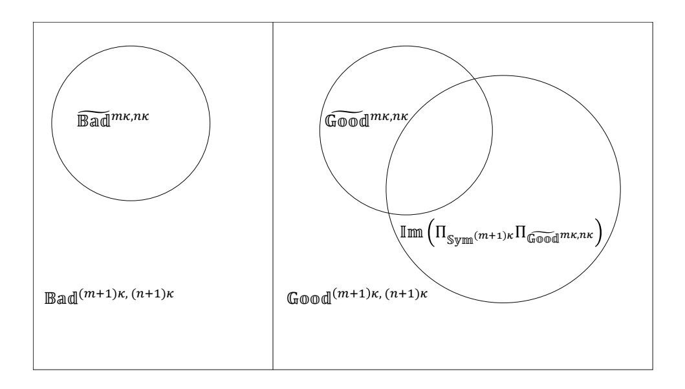

# <span id="page-0-0"></span>Almost Public Quantum Coins

Amit Behera<sup>1</sup> and Or Sattath<sup>2</sup>

1,2Computer Science Department, Ben-Gurion University Email ids: <sup>1</sup>behera@post.bgu.ac.il, <sup>2</sup> sattath@post.bgu.ac.il

April 18, 2020

#### **Abstract**

In a quantum money scheme, a bank can issue money that users cannot counterfeit. Similar to bills of paper money, most quantum money schemes assign a unique serial number to each money state, thus potentially compromising the privacy of the users of quantum money. However in a quantum coins scheme, just like the traditional currency coin scheme, all the money states are exact copies of each other, providing a better level of privacy for the users.

A quantum money scheme can be private, i.e., only the bank can verify the money states, or public, meaning anyone can verify. In this work, we propose a way to lift any private quantum coin scheme – which is known to exist based on the existence of one-way functions [\[JLS18\]](#page-48-0) – to a scheme that closely resembles a public quantum coin scheme. Verification of a new coin is done by comparing it to the coins the user already possesses, by using a projector on to the symmetric subspace. No public coin scheme was known prior to this work. It is also the first construction that is very close to a public quantum money scheme and is provably secure based on standard assumptions. The lifting technique when instantiated with the private quantum coins scheme [\[MS10\]](#page-49-0) gives rise to the first construction that is very close to an inefficient unconditionally secure public quantum money scheme.

# **1 Introduction**

An analogue of the traditional monetary system, quantum money comprises of quantum money states that are issued by the bank and that are used for transactions. A quantum money scheme can be *private* or *public*. In the private scenario, only the bank, the entity that issued the money, can verify its authenticity, whereas in the public scenario, the bank generates a public key that anyone can use to verify the quantum money. While public quantum money is suitable for use in a setting such as our current cash system, private quantum money is applicable in settings such as the purchase of travel tickets, wherein we do not expect users to transact with anyone other than the ticket issuer. The second characterization refers to whether quantum money users are given *bills* or *coins*. In a bill scheme, each quantum money state is unique and is usually associated, with a distinct classical serial number. On the other hand, in a coin scheme, all quantum states are exact copies, and therefore supposed to be indistinguishable from each other. In both variants, the quantum money scheme overall is said to be secure if the users cannot counterfeit the quantum money state. The quantum setting is well suited to prove such unforgeability property due to the quantum no-cloning theorem [\[WZ82,](#page-51-0) [Par70,](#page-50-0) [Die82\]](#page-47-0).

The current "gold standard" for detecting counterfeit cash bills is to use a banknote counter. Equipped with dedicated hardware, banknote counters can verify the built-in security features (e.g., ultraviolet ink, magnetic ink, etc.) of a given cash bill. This approach, however, depends on the target currency and requires tailor made technologies. There is an alternative approach. Suppose you travel to a foreign country and withdraw some cash from an ATM. Later you execute a monetary transaction in which you receive money from an untrusted source. How will you verify the authenticity of this money? You could compare it to the money that you withdrew from the bank's ATM, and therefore trust. If it does not look the same, you would not accept it, and you might even revert the transaction. We call this method *comparison-based verification*, and we use the money of a foreign country as an example to emphasize the fact that this approach works even when the specific security features of the money are not known to the verifier.

In this work, we propose a novel way to lift any quantum private coin scheme to a scheme which, up to some restrictions, is a public quantum coin scheme, by using an approach inspired from comparison-based verification. A user can verify a coin that she receives by comparing it to the coins she already has.

In this case, we do not need the bank to run the verification to authenticate money, thus rendering the scheme *public*. Since the comparison is to money the user already has, it is crucial that the money states of each denomination be exact copies, i.e., this approach only works for private quantum coinsand not for private quantum bills. Technically, in the quantum scenario, the comparison is achieved by testing whether the new money and the money that we already have are in the symmetric subspace. The verifier, therefore, must have at least one original coin to validate the authenticity of new coins. This is similar to the setting given in the example above, where we compare the money issued to us by a (trusted) bank to the new money.

**Main obstacles and our solution** As mentioned above, our approach to lift a private quantum coin scheme to a public scheme, is based on comparison-based verification. In the classical setting, comparison-based verification is achieved by testing whether two money bills are identical. The quantum analogue of this classical approach, which is also known as SWAP test is to project on to the symmetric subspace of two registers. As far as the authors are aware, this approach of using projective measurement into the symmetric subspace for verification, was never used in a cryptographic protocol. This is perhaps why it seems hard to construct public quantum coins using this approach:

- **(Naive** 0 **to** 1 **cloning)** The quantum SWAP test has slightly different properties [\[BCWdW01\]](#page-47-1), when compared to the classical approach. In particular, a state that is the tensor product of two orthogonal states, such as |0i ⊗ |1i, is rejected (only) with probability <sup>1</sup> 2 . As a result, an adversary without any coins can pass a single verification with probability at least <sup>1</sup> 2 , see the paragraph *Proof idea* on p. [7,](#page-6-0) for more details.
- **(Sabotage attacks)** Since the verification of a new coin is done using coins from the wallet, an honest user can lose or destroy his own coins due to a transaction with an adversarial merchant.
- **(Refund)** Even if money is not destroyed due to verification, we need a way to recover our own coins after a failed verification.
- **(Traceability attacks)** It is not clear if this approach would guarantee untraceability – the intuition is that an adversary could change a valid coin to some other state, and later use this for tracing.

In our work, we come up with a construction that manages to get around these issues. This is done by finding weaker variants of the existing security definitions, which are still meaningful, see the paragraph *Notions of security* on p. [6,](#page-5-0) for more details. For example, we show that our scheme *is* forgeable, but we manage to prove rational unforgeability, see the paragraph *Proof idea* on p. [7.](#page-6-0) We provide a user-manual (see Section [3.2\)](#page-24-0) which gives one way to use the money in a secure fashion. There are many limitations in the user manual – the main one is that money which was verified cannot be re-spent immediately. Making all these variations to the definitions, and proving them requires quite a bit of lengthy calculations; in few cases, it requires tweaking the analysis of known constructions and showing that they satisfy a related security notion needed for our purposes. The main effort is finding the right (and usually, weak) definitions to work with and the right way to stitch these together to a meaningful procedure (see the user-manual in Section [3.2\)](#page-24-0) – the proofs are mostly straightforward and use standard linear algebraic arguments and some basic combinatorics.

We find it interesting that despite the simplicity and how primitive our approach is, we can eventually guarantee meaningful notions of security, which are all based on very weak hardness assumptions. We leave several open questions, for which an affirmative answer could be used to lift some of the restrictions we currently have in the user-manual.

**Coins vs. bills: What difference does it make?** A currency bill, unlike a coin, is marked with a distinct serial number, which can be used to track the bill and may compromise the users' privacy. Indeed, one needs to look no further than the police, whose investigations sometimes use "marked bills", a technique that can also be easily exploited by others (e.g., a businessman may try to learn the identity of its competitor's customers, etc.). On the other hand, coins are supposed to be identical copies of each other, and hence, should be untraceable. Therefore, intuitively coins provide better privacy than bills. It should be noted that in reality even though coins are supposed to be identical copies of each other, still there can be attacks to violate the indistinguishability of coins and therefore violating the privacy of the users. For example, the attacker might use color ink to mark one of the coins and later identify the coin using the mark. In our work, we observe that an analogous attack is also possible for quantum coin scheme (see Algorithm [3](#page-59-0) in Appendix [C.1\)](#page-59-1) which is taken care of by imposing some restrictions on our construction – see Section [3.2](#page-24-0) and Appendix [C.](#page-57-0)

Similar notions of privacy have been extensively studied in the classical setting. For example, Chaum's ECash [\[Cha82\]](#page-47-2) provided anonymity using the notion of blind signatures. The Bitcoin [\[Nak08\]](#page-50-1) system stores all the transactions in a public ledger hence making it pseudonymous. Even though it provides pseudonymity, various studies have shown heuristics and approaches which can be used to reveal all the different addresses that belong to the same person [\[RS13,](#page-50-2) [RS14,](#page-51-1) [MPJ](#page-49-1)+16]. The raison d'être of several crypto-currencies and protocols, like CoinJoin [\[Max13\]](#page-49-2), Monero [\[vS13\]](#page-51-2), Zcoin [\[MGGR13\]](#page-49-3), Zcash [\[BCG](#page-46-0)+14] and Mimblewimble [\[Poe16\]](#page-50-3), is to provide better privacy.

In the quantum setting, quantum bills do not require transactions to be recorded like the block-chain based classical crypto-currencies and hence better in that sense. However, quantum bills rely on serial numbers and thereby prone to privacy threats, since these serial numbers could be recorded by the parties involved in the transactions. Indeed quantum bills do not satisfy the untraceability property for quantum money defined in a recent work [\[AMR19\]](#page-46-1) by Alagic et al. In contrast, quantum coins, just like their classical counterparts, are better for the same reason and might satisfy the untraceability definition. In terms of one's privacy, therefore, we view quantum coins as the preferred quantum money format.

From a theoretical perspective, quantum coins can be thought of as

no-cloning on steroids: the no-cloning theorem guarantees that copying a quantum state is impossible. More formally, given an arbitrary quantum state |*ψ*i, it is impossible to create a two register state |*φ*i such that the states |*φ*i and |*ψ*i ⊗ |*ψ*i have high fidelity. This property provides the motivation for quantum money, wherein the use of a variant of the no cloning theorem precludes counterfeiting quantum bills. Yet the "naive" no-cloning theorem cannot guarantee that, given *n* copies of the same state, one cannot generate *n*+1 copies with high fidelity. In other words, the unforgeability of quantum bills resembles, or extends results regarding, 1 → 2 optimal cloners while that of quantum coins requires that one understand the properties of *n* → *n* + 1 optimal cloners – see [\[BEM98\]](#page-47-3) and references therein. We stress that a quantum coin forger does not imply a universal cloner for three main reasons:[1](#page-4-0) (a) A coin forger only needs to succeed in cloning the set of coins generated by the scheme; as its name suggests, a *universal* cloner guarantees the fidelity for *all* quantum states. (b) In the unforgeability game, the forger who receives *n* coins can try to successfully verify many more states than it receives, whereas a universal cloner must succeed on exactly *n* + 1 states. (c) In the *adaptive* unforgeability game, the forger learns the outcomes of the verifications one by one and can exploit that knowledge.

**Related work** Quantum money has been studied extensively in investigations of private bills [\[Wie83,](#page-51-3) [BBBW83,](#page-46-2) [TOI03,](#page-51-4) [Gav12,](#page-48-1) [GK15\]](#page-48-2), public bills [\[Aar09,](#page-45-0) [FGH](#page-48-3)+12, [Zha19\]](#page-51-5), and private coins [\[MS10,](#page-49-0) [JLS18,](#page-48-0) [AMR19\]](#page-46-1).

The security of the private schemes is generally solid, and some of the schemes, such as that of Wiesner, are unconditionally secure [\[MVW12,](#page-50-4) [PYJ](#page-50-5)+12]. Mosca and Stebila constructed an *inefficient* (see Definition [3\)](#page-13-0) private coin scheme, in which the coin is an *n* qubit state sampled uniformly from the Haar measure [\[MS10\]](#page-49-0). The recent construction for private coins by Ji, Liu and Song is based on quantum secure one-way functions [\[JLS18\]](#page-48-0). The construction was later simplified by [\[BS19\]](#page-47-4). This is arguably one of the weakest computational assumption possible in quantum cryptography. Another recent work by Algaic, Majenz and Russell [\[AMR19\]](#page-46-1) provides a *stateful* construction for private quantum coins by simulating Haar random states. Their construction is unconditionally secure, shares many of the properties of the work by Mosca and Stebila, while still being efficient. Of course, the obvious disadvantage is the statefulness of this scheme.

In contrast to the private scenario, public money schemes are much more complicated to construct, and several such schemes were broken. Aaronson's scheme [\[Aar09\]](#page-45-0) was broken in Ref. [\[LAF](#page-49-4)+10]. Aaronson and Christiano's scheme [\[AC13\]](#page-46-3) was broken in Refs. [\[PFP15,](#page-50-6) [Aar16,](#page-46-4) [BS16,](#page-47-5) [PDF](#page-50-7)+18] and a fix using quantum-secure Indistinguishability Obfuscation (IO) was suggested

<span id="page-4-0"></span><sup>1</sup> In other words, an impossibility result regarding universal *n* → *n* + 1 cloning is not sufficient to prove unforgeability of quantum coins.

in [\[BS16\]](#page-47-5) and proved to be secure in [\[Zha19\]](#page-51-5). Unfortunately, various IO schemes have been broken, and the security of IO is still the focus of extensive research (see [https://malb.io/are-graded-encoding-schemes-broken-y](https://malb.io/are-graded-encoding-schemes-broken-yet.html)et. [html](https://malb.io/are-graded-encoding-schemes-broken-yet.html) for more detail). As the authors are not aware of IO schemes that explicitly claim to be quantum secure, this IO based construction cannot be instantiated at this point. Another construction by Zhandry [\[Zha19\]](#page-51-5), called quantum lightning, is based on a non-standard hardness assumption. Farhi et al. [\[FGH](#page-48-3)+12] constructed a quantum money scheme using elegant techniques from knot theory, but their construction only has a partial security reduction [\[Lut11\]](#page-49-5) to a non-standard hardness assumption. Recently, Daniel Kane [\[Kan18\]](#page-48-4), proposed a new technique to construct a class of public quantum money schemes and showed that a general sub-exponential attack (black-box attack) against such quantum money schemes is not possible. Further, he argues that instantiating such a technique with modular forms could yield a secure public money scheme, and provides arguments supporting his claim but it still lacks a security proof at this point. In a recent talk at the Simon's institute (see <https://youtu.be/8fzLByTn8Xk>), Peter Shor discussed his ongoing (unpublished) work regarding a new construction of public quantum money, based on lattices. In the talk, he argues that the scheme is secured based on post-quantum lattice based assumptions, namely the shortest vector problem. To summarize, even though several public quantum money schemes are known, none of the existing schemes have a security proof based on standard hardness assumptions.

<span id="page-5-0"></span>**Notions of security** Informally, a quantum money scheme is unforgeable if an adversary starting with *n* money states cannot pass more than *n* verifications (except with negligible probability). This notion seems too strong at times. Consider a money scheme where a forger can counterfeit a money state with probability <sup>1</sup> 2 , but only if he risks two of his own money states, i.e.,if he fails then he has to loose his two money states. Clearly, even if he has non-negligible probability of forging, on expectation he actually loses one money state while trying to forge. Therefore, a rational forger would not try to forge and would instead stick to the protocol. Such a scheme will be deemed forgeable although it is secure in some sense. This leads to the definition of rational unforgeability (see Definition [8\)](#page-16-0), where we only require that *on expectation* any forger can have at best negligible advantage due to forging. Our construction is rational unforgeable – and we argue that this provides a meaningful notion of security. Another line of work is called rational cryptography [\[GKM](#page-48-5)+13, [ACH11,](#page-46-5) [PH10,](#page-50-8) [FKN10,](#page-48-6) [KN08,](#page-49-6) [ADGH06,](#page-46-6) [HT04\]](#page-48-7), which discusses protocols consisting of multiple competing and potentially corrupt parties who might deviate from the protocol and use different strategies in order to maximize their gain. It should be noted that our work is different from the notion of rational cryptography. In the rational cryptography setting, the analysis is about the equilibrium arising out of the multiple competing parties, whereas here, the problem is to optimize the strategy of the (single) adversary trying to maximize his gain against an honest bank. Our work is similar to notion of rational prover discussed in [\[MN18\]](#page-49-7). In [\[MN18\]](#page-49-7), the authors discuss quantum delegation in the setting where the verifier also gives a reward to the prover, the value of which depends on how he cooperated. Hence, the prover's goal is to maximize his expected reward rather than cheating the honest verifier. The authors show that for a particular reward function they constructed, the optimal strategy for the prover is to cooperate honestly. Our construction also achieves two more notions of security other than unforgeability – a restricted form of untraceability (defined in [\[AMR19\]](#page-46-1)) and security against sabotage, (similar notion discussed in [\[BS16\]](#page-47-5)), which we discuss later in the appendix, see (Appendices [B](#page-54-0) and [C\)](#page-57-0). Our construction is secure against forging and sabotage attacks, even in a stronger thereat model, that we discuss elaborately in Appendix [D.](#page-60-0) The results regarding these stronger threat models, are proved in Appendix [E,](#page-67-0) but in the user manual given in Section [3.2,](#page-24-0) we demonstrate how these security notions could be used in practice, despite their limitations.

**Main result** Our main contribution is the lifting result, which can lift any private coin scheme to an almost public coin scheme– see Proposition [13.](#page-18-0) By lifting the result in Ref. [\[JLS18\]](#page-48-0) (or thesimplified version in [\[BS19\]](#page-47-4)), we get the following result:

<span id="page-6-1"></span>**Theorem 1** (Informal Main Result)**.** *Assuming quantum secure one-way functions exist, there is a public quantum coin scheme which is rationally secure against nonadaptive forgery attacks.*

Similarly, by lifting the results in Ref. [\[MS10\]](#page-49-0), we show an *inefficient* scheme with the same properties as in Theorem [1](#page-6-1) above, which is secure even against *computationally unbounded* adversaries. The formal result is provided in Theorem [11.](#page-17-0)

<span id="page-6-0"></span>**Proof idea** As discussed above, our construction is an analogical extension of the classical *comparison-based verification*. So the first attempt to lift a private quantum coin scheme is that we give users a private coin |¢i as a public coin, such as the private coin construction by Ji, Liu and Song [\[JLS18\]](#page-48-0) (later simplified by Brakerski and Shmueli [\[BS19\]](#page-47-4)). In order to verify a given coin, the verifier should compare it with a valid coin from his wallet, i.e., perform symmetric subspace verification on the two registers (the wallet coin and the new coin)[2](#page-6-2) . Unfortunately, the scheme that we just described is rationally forgeable. For example, suppose an adversary A who does not

<span id="page-6-2"></span><sup>2</sup>This special case when the number of registers is 2 is also known as the swap-test.

have a valid coin to start with, submits a coin  $|\psi\rangle$  to the verifier. Since the private quantum scheme is secure,  $|\psi\rangle$  and  $|\mathfrak{c}\rangle$  would be almost orthogonal, i.e.,  $|\psi\rangle\approx|\mathfrak{c}^{\perp}\rangle$  for some  $|\mathfrak{c}^{\perp}\rangle$  in the orthogonal space of  $|\mathfrak{c}\rangle$ . The combined state of the registers  $|\mathfrak{c}\rangle\otimes|\mathfrak{c}^{\perp}\rangle$  pass the symmetric subspace verification with probability  $\frac{1}{2}$ . So, the probability of successful forging (and the *expected utility* of the forger) is  $\frac{1}{2}$ . Hence, this scheme is forgeable.

In order to bypass this problem, we will use a form of amplification. A public coin will instead consist of multiple private coins, suppose  $\kappa$  many. The private coins cannot be transacted discretely of their own but only in sets of  $\kappa$  as a public coin; just like *cents* (denoted by  $\mathfrak{c}$ ) and *mills* (denoted by m) in the current world - cent coins, each of which is equivalent to ten mills, are used in transactions, but mill coins are not used even though as a unit they exist. Hence, we use  $|\mathfrak{c}\rangle$  to denote a public coin and  $|\mathfrak{m}\rangle$  to denote a private coin in order to show the resemblance to the analogy of coins and mills. Therefore, we define a public coin as  $|\mathfrak{c}\rangle := |\mathfrak{m}\rangle^{\otimes \kappa}$ , a collection of  $\kappa$ private coins  $(|\mathfrak{m}\rangle)$ . Again, to check the authenticity of the coin, the verifier uses the valid public coin in his wallet (which, for the sake of simplicity, contains only one public coin) and perform symmetric subspace verification on all the  $2\kappa$  registers. In this setting, if an adversary  $\mathcal{A}$  with 0 public coins, produces an alleged public coin  $|\psi\rangle$ , then since the private scheme is unforgeable, none of the  $\kappa$  registers should pass the verification of the private scheme. Hence,  $|\psi\rangle$  must have a large overlap with the span of the states, that can be written as a tensor product of states orthogonal to  $|m\rangle$  (since every state in the orthogonal space of the subspace mentioned above, will pass the private verification of at least one of its  $\kappa$  registers). The combined state of the registers hence, is

$$|\psi\rangle\otimes|\mathfrak{c}\rangle\approx(|\mathfrak{m}_1^{\perp}\rangle\otimes\ldots|\mathfrak{m}_{\kappa}^{\perp}\rangle)\otimes|\mathfrak{m}\rangle^{\otimes\kappa},$$

which has a squared overlap<sup>3</sup> of  $\frac{1}{\binom{2\kappa}{\kappa}}$  with the symmetric subspace of the  $2\kappa$  registers. Therefore, by choosing  $\kappa = \lambda$  or even  $\kappa = \log^{\alpha}(\lambda)$  for  $\alpha > 1$ ,  $\mathcal{A}$ 's forging probability in this attack, is  $\operatorname{negl}(\lambda)$  (where  $\lambda$  is the security parameter). A similar use of symmetric subspace operations was used in a recent work on private quantum coins [JLS18]. Unfortunately, when more number of coins are submitted, suppose an adversary having n coins tries to pass (n+1) coins, the optimal success probability becomes  $\frac{\binom{(n+1)\kappa}{n\kappa}}{\binom{(n+1)\kappa}{(n+1)\kappa}}$ , which is inverse polynomially close to 1, for n large enough. Hence, it is hard for any adversary to produce two coins from one coins but it is easy to produce (n+1) from n coins. However, a simple examination shows that when taking into account that the money is lost in case of a failed verification, the expected utility of any polynomial-time adversary is negligible if not negative.

<span id="page-7-0"></span><sup>&</sup>lt;sup>3</sup>squared overlap means the modulus square of the projection in to the subspace.

This is what motivated us to define rational unforgeability, where we want the expected gain of any adversary should be at best negligible.

**Comparison to previous works** In this work, we propose a construction (described in Algorithm [1\)](#page-19-0) of an almost public quantum coin scheme, which is *rationally secure* (see Theorem [11\)](#page-17-0) based on standard and generic assumptions, namely that quantum secure one-way functions exist. As discussed in the *Related work* paragraph, all public money schemes known so far, are either not provably secure or are based on non-standard assumptions. In fact, some of these non-standard assumptions do not have candidate constructions, for example - quantum secure indistinguishability obfuscation. The public money scheme (not yet published) described by Shor in his talk, might turn out to be secure, based on a standard assumption, namely the hardness of the shortest vector problem in lattices. Even if that is true, it should be noted that the hardness of the SVP problem in lattices is not a generic assumption, unlike the existence of quantum secure one-way functions, that we use in our work. In comparison to other public schemes, our scheme has two main advantages. In all the efficient public quantum money schemes that the authors are aware of, the number of qubits required in a money state, and the running time of all the algorithms (keygen, mint and verify) is polynomial in the security parameter. However, in our construction, by choosing the underlying constructions carefully, we can make the time and space complexity of our constructions to be polylogarithmic in the security parameter (see Section [3.1\)](#page-21-0).

Our construction includes the following drawbacks, compared to other schemes. The threat model that we consider in our work is nonadaptive, and can be strengthened in multiple directions: the adversary may learn the outcome of each verification, and attack in an adaptive fashion; the adversary can ask money that was verified back. The way we prevent adaptive attacks, is by putting the restriction, that the user can only pay coins received from the bank and not the ones received from other users–see Section [3.2.](#page-24-0) Moreover, in the nonadaptive setting, we either accept all coins or none, during any transaction. As a result, we use a slightly different utility function and loss function (see Eq. [\(4\)](#page-12-0) and Eq. [\(26\)](#page-55-0)), which is fairly non-standard and is relevant only in some specific settings, (see the discussion after Definition [9](#page-16-1) and the last paragraph in Section [3.2\)](#page-24-0). Moreover, since our construction is a comparison-based quantum money scheme, the user needs at least one fresh coin in his wallet to verify received coins. Unlike previous constructions of public coin scheme, we can only prove the security properties of a public quantum money (namely unforgeability and security against sabotage), under these restrictions. Moreover, these restrictions are necessary for the untraceability property, that we need in a coin scheme. However, a true public should satisfy the security properties (namely unforgeability, security against sabotage and untraceability), even without these restrictions. Hence, our construction is an *almost* public quantum coin scheme. Lastly, the unforgeability property holds only in expectation and our construction is indeed forgeable in the usual sense – see Section [4.](#page-27-0)

#### **Scientific contribution**

- 1. **(Weak and generic computational assumptions)** As far as the authors are aware, the construction comes closest to a provably secure quantum public money based on a standard and generic hardness assumption, namely that a quantum-secure one-way function exists. The existing public schemes use either stronger assumptions (to the point where we do not even have candidate constructions that satisfy these assumptions, for example, a quantum secure indistinguishability obfuscation), or non-generic, concrete assumptions (such as the lattice based assumptions in the public quantum money construction mentioned in Peter Shor's talk[4](#page-9-0) ), or that these constructions are not provably secure. Moreover, unlike most efficient money schemes, both running time for all algorithms and the number of qubits required for each coin, is only polylogarithmic (see Section [3.1](#page-21-0) and the discussion in the last paragraph in Section [3.2\)](#page-24-0) instead of being polynomial in the security parameter.
- 2. **(Almost public coin scheme)** Our construction comes very close to satisfy the features of both public verifications and coins. There is currently no other public coin scheme.
- 3. **(Quantum public key)** Our construction also closely resembles a *public quantum money scheme with a quantum public key*, a topic that has not been studied. By itself, such a scheme is quite interesting as it may evade the known impossibility result (see Remark [17\)](#page-21-1), that unconditionally secure public quantum money schemes (with a classical public key), cannot exist. In fact, we managed to partially circumvent the impossibility result (see Appendix Theorem [11\)](#page-17-0), by constructing an inefficient almost public quantum money scheme, based on a previous work [\[MS10\]](#page-49-0). This brings us closer to answering the open question: Can unconditionally secure public quantum money, with a quantum public key exist?
- 4. **(Rational unforgeability)** We also put forward a new notion of rational unforgeability, which is weaker than the usual notion of security

<span id="page-9-0"></span><sup>4</sup>The public money scheme discussed in Peter Shor's talk claims to be secure based on a standard assumption that finding a short vector in general lattices is hard, but the work has not yet been published. The hardness of finding a short vector in lattices, is a concrete assumption, and not a generic assumption like the existence of quantum secure one-way functions.

<span id="page-10-2"></span>but still has strong guarantees. This might open up new possibilities for new constructions, or as a way to circumvent impossibility results. This notion is relevant in most of the cases as in reality users are rational parties rather than adversarial madmen. The authors are not aware of any such notion in the context of quantum money.

5. **(Modularity)** The lifting technique used in our work lifts any private quantum coin to an almost public quantum coin, preserving the three main notions of security - security against forging, sabotage as well as untraceability. Our techniques are fairly general, and we hope that they could be used to lift other cryptographic protocols such as quantum copy-protection. We discuss this in detail in the future work section, see Section [6.](#page-44-0)

**Paper organization** Section [2](#page-10-0) contains notations (Section [2.1\)](#page-10-1), preliminaries (Section [2.2\)](#page-12-1), definitions (Section [2.3\)](#page-13-1) as well as the security notions (Section [2.4\)](#page-15-0). In Section [3,](#page-17-1) we describe our main result Theorem [11,](#page-17-0) our construction (Algorithm [1\)](#page-19-0) which on instantiating with previous works gives the main result, the complexity and possible implementation of our construction in Section [3.1,](#page-21-0) and then the restrictions (Section [3.2\)](#page-24-0) that we need to impose on our construction in order to assure security. In Section [4,](#page-27-0) we describe (Section [4.1\)](#page-27-1) and analyze (Section [4.2\)](#page-28-0) a candidate attack against our construction and also prove it is optimal in some sense (Section [4.3\)](#page-30-0). Then use the result regarding optimality to prove nonadaptive rational unforgeability of our construction (Section [5\)](#page-42-0). In Section [6,](#page-44-0) we discuss a few open questions relevant to our work and the scope of future work in order to further improve our construction. Nomenclature is given in Appendix [A.](#page-51-6) In Appendices [B](#page-54-0) and [C,](#page-57-0) we discuss the security against sabotage attacks for our scheme and the untraceability property in the context of our scheme, respectively. Appendix [D](#page-60-0) contains the discussion regarding multi-verifier forging and sabotage attacks against our scheme, and how they capture all possible efficient attacks on our scheme with respect to the user manual. The proofs of these results in the appendix, are given in Appendix [E,](#page-67-0) which also contains the proof of completeness for our construction.

# <span id="page-10-0"></span>**2 Notations, preliminaries and definitions**

### <span id="page-10-1"></span>**2.1 Notations**

This subsection contains some notations and conventions that will be required only in the proofs (Sections [4](#page-27-0) and [5](#page-42-0) and Appendix [E\)](#page-67-0).

1. We use **H** to represent **C** *d* . We fix the local dimension of each register to *d*, i.e., the state of each register is a unit vector (or an ensemble of unit vectors) in **H**.

- <span id="page-11-6"></span><span id="page-11-4"></span>2. We use  $\operatorname{Sym}^n$  to denote the symmetric subspace of  $\mathbb H$  over n registers. Let  $\Pi_{\operatorname{Sym}^n}$  to be the projection on to  $\operatorname{Sym}^n$ . The symmetric subspace over n registers is the set of all states on n register which remain the same under any permutation of the registers. For more information on the symmetric subspace, see [Har13].
- 3. For every vector  $\vec{j} = (j_0, j_1, \dots, j_{d-1}) \in \mathbb{N}^d$  such that  $\sum_{r=0}^{d-1} j_r = n$ , we denote  $\binom{n}{\vec{j}}$  as  $\binom{n}{j_0, j_1, \dots, j_{d-1}}$ .
- 4. Let  $\mathcal{I}_{d,n}$  be defined as  $\mathcal{I}_{d,n} := \{(j_0, j_1, \dots, j_{d-1}) \in \mathbb{N}^d \mid \sum_{k=0}^{d-1} j_k = n\}$  see also Ref. [Har13, Notations].
- 5. For every vector  $\vec{i} = (i_1, \dots, i_n)$  in  $\mathbb{Z}_d^n$  we define  $T(\vec{i})$  to be the vector in  $\mathcal{I}_{d,n}$  whose  $k^{th}$  entry (for  $k \in \mathbb{Z}_d$ ) is the number of times k appears in the vector  $\vec{i}$  see also Ref. [Har13, discussion before Theorem 3.]. Note that,  $|T^{-1}(\vec{j})| = \binom{n}{\vec{j}}$ . We shall represent the  $k^{th}$  entry (for  $k \in \mathbb{Z}_d$ ) of  $T(\vec{i})$  by  $(T(\vec{i}))_k$ .
- <span id="page-11-1"></span>6. We extend  $|\mathfrak{m}\rangle$  (a private coin) to an orthonormal basis of  $\mathbb{H}$  denoted by  $\{|\phi_j\rangle\}_{j\in\mathbb{Z}_d}$  such that  $|\phi_0\rangle=|\mathfrak{m}\rangle$  5. Hence,

<span id="page-11-3"></span>
$$|\mathfrak{c}\rangle = |\mathfrak{m}\rangle^{\otimes \kappa} = |\phi_0\rangle^{\otimes \kappa}.\tag{1}$$

Clearly, this can be extended to a basis for  $\mathbb{H}^{\otimes n}$  given by

<span id="page-11-2"></span>
$$\{\otimes_{k=1}^n |\phi_{i_k}\rangle\}_{\vec{i}\in\mathbb{Z}_d^n}.$$

7. Fix  $n, d \in \mathbb{N}$ . For all  $\vec{j} = (j_0, \dots, j_{d-1}) \in \mathcal{I}_{d,n}$  let, the states  $|Sym_{\vec{j}}^n\rangle$  and  $|\widetilde{Sym_{\vec{j}}^n}\rangle$  be defined as

$$|Sym_{\vec{j}}^{n}\rangle = |Sym_{(j_{0},j_{1},\dots,j_{d-1})}^{n}\rangle := \frac{1}{\sqrt{\binom{n}{j}}} \sum_{\vec{i}:T(\vec{i})=\vec{j}} |\phi_{i_{1}}\dots\phi_{i_{n}}\rangle, \qquad (2)$$
$$|\widetilde{Sym_{\vec{j}}}\rangle := |\mathfrak{c}\rangle \otimes |Sym_{\vec{j}}^{n}\rangle.$$

8. Let  $Sym^n$  and  $\widetilde{Sym}^n$  be sets defined as

<span id="page-11-5"></span>
$$Sym^{n} := \{ |Sym^{n}_{(j_{0},\dots,j_{d-1})} \rangle \}_{\vec{j} \in \mathcal{I}_{d,n}}.$$

$$\widetilde{Sym}^{n} := \{ |\widetilde{Sym}^{n}_{\vec{j}} \rangle \}_{\vec{j} \in \mathcal{I}_{d,n}}.$$
(3)

<span id="page-11-0"></span><sup>&</sup>lt;sup>5</sup>In Algorithm 2, we require that this basis is such that, the vector  $|1\rangle$  has non-zero overlap with only  $|\phi_0\rangle$  (same as  $|\mathfrak{M}\rangle$ ) and  $|\phi_1\rangle$ . In other words, the component of  $|1\rangle$  orthogonal to  $|\mathfrak{M}\rangle$  is proportional to  $|\phi_1\rangle$ . Such a basis exists and we fix such a basis for our analysis.

<span id="page-12-5"></span>It is easy to see that *Sym<sup>n</sup>* is an orthonormal set. Hence, the set *Sym*]*<sup>n</sup>* is also orthonormal. Moreover it can be shown that *Sym<sup>n</sup>* is an orthonormal basis for **Sym***<sup>n</sup>* – see also Ref. [\[Har13,](#page-48-8) Theorem 3]).

- 9. We will use bold letters to denote subspaces and use the same English letter to denote a particular basis for the subspace, for example - **Sym***<sup>n</sup>* and *Sym<sup>n</sup>* .
- 10. For any state |*ψ*i, we will use |*ψ*ei to denote the state |¢i⊗|*ψ*i. Similarly, for any subspace *A*, we will use *A*˜ to represent the subspace {|¢i ⊗ |*ψ*i | |*ψ*i ∈ *A*}. In a similar way for any basis *B* we will use *B*<sup>e</sup> to denote

<span id="page-12-0"></span>
$$\{|\mathfrak{c}\rangle\otimes|\psi\rangle\mid|\psi\rangle\in B\}.$$

11. For any hermitian operator *H*, we use *λ*max(*H*) to denote the largest eigenvalue of *H*.

## <span id="page-12-1"></span>**2.2 Preliminaries**

In this section we will recall some definitions regarding quantum money as well as some tools from linear algebra.

<span id="page-12-4"></span>**Definition 2** (Private quantum money (adapted from [\[Aar09\]](#page-45-0)))**.** *A private quantum money scheme consists of the three Quantum Polynomial Time (QPT) algorithms:* key*-*gen*,* mint *and* verify*.* [6](#page-12-2)

- *1.* key*-*gen *takes a security parameter* 1 *<sup>λ</sup> and outputs a classical secret key, sk.*
- *2.* mint *takes the secret key and prepares a quantum money state* |\$i*.* [7](#page-12-3)
- *3.* verify *receives the secret key and an (alleged) quantum money state ρ, which it either accepts or rejects. We emphasize that* verify *does not output the post measurement state.*

*Completeness: the quantum money scheme has perfect completeness if for all λ*

$$\Pr[sk \leftarrow \mathsf{key}\text{-gen}(1^{\lambda}); |\$\rangle \leftarrow \mathsf{mint}(\mathsf{sk}) : \mathsf{verify}(\mathsf{sk}, |\$\rangle) = \mathsf{accept}] = 1.$$

*Notice that repeated calls to* mint *could produce different money states, just like dollar bills, which have serial numbers, and therefore these are not exact*

<span id="page-12-2"></span><sup>6</sup>Note that we are implicitly assuming that the quantum money scheme is stateless. Indeed, for a stateful scheme this definition does not hold, for example - [\[AMR19\]](#page-46-1). We will be only concerned with stateless quantum money schemes in this work.

<span id="page-12-3"></span><sup>7</sup>Even though in most generality the quantum money state may be a mixed state, in all schemes we are aware of the money state is pure, and we use the pure state formalism for brevity.

<span id="page-13-2"></span>*copies of each other. Hence, we use* |\$i *to denote the potentially unique banknotes produced by* mint*, in order to show the resemblance to dollar bills.*

For any subspace *A*, we will use *A*<sup>⊥</sup> to denote the orthogonal subspace of *A* and Π*<sup>A</sup>* to denote the projection onto *A*. For any linear operator *T* we use ker(*T*) to denote the kernel of *T* and Im(*T*) to denote the image of *T*. We will use Tr(*ρ*) to denote the trace of the matrix *ρ*, for any matrix *ρ*. For any set *S*, we use *Span*(*S*) to denote the subspace spanned by *S*.

### <span id="page-13-1"></span>**2.3 Definitions**

In this section we will see some new definitions that would be relevant for our work.

<span id="page-13-0"></span>**Definition 3** (Inefficient Quantum Money)**.** *In a money scheme, if at least one of the three algorithms -* key*-*gen*,* mint *and* verify *is not QPT, then it is called an inefficient money scheme.*

We generalize the definition of public quantum money given in [\[Aar09\]](#page-45-0) by allowing the verification key or the public key to be a quantum state and not necessarily a classical string.

**Definition 4** (Public quantum money (generalized from [\[Aar09\]](#page-45-0)))**.** *A public quantum money scheme consists of four QPT algorithms:* private*-*key*-*gen*,* public*-*key*-*gen*,* mint *and* verify*. Usually public quantum money has one algorithm* key*-*gen *that produces a private-public key pair but we break this into two algorithms* private*-*key*-*gen *and* public*-*key*-*gen*. In our definition, the public key can be quantum, and hence cannot be published in a classical bulletin board; instead, users get access to it via* public*-*key*-*gen *oracle. Therefore, it is essential to break* key*-*gen *in to* private*-*key*-*gen *and* public*-*key*-*gen*.*

- *1.* key*-*gen *takes a security parameter* 1 *<sup>λ</sup> and outputs a secret key sk.*
- *2.* public*-*key*-*gen *takes the secret key, and prepares a quantum verification key, denoted* |*v*i*.*
- *3.* mint *takes the secret key and prepares a quantum money state* |\$i*.*
- *4.* verify *receives a quantum verification key* |*v*i *and an (alleged) quantum money state ρ, and either accepts or rejects but never returns the money. If money is returned after verification then it might lead to adaptive attacks which we do not discuss in our work. Therefore, we deviate from the definitions used in other constructions in order to prevent adaptive attacks.*

*Completeness: the quantum money scheme has perfect completeness if for all λ*

Pr[*sk* ← key*-*gen(1*<sup>λ</sup>* ); |*v*i ← public*-*key*-*gen(sk); |\$i ← mint(sk) : verify(|*v*i*,* |\$i) = accept] = 1*.* <span id="page-14-2"></span>*We require that even after repeated successful verifications of correct money states of the form* |\$i ← mint(sk) *using the same verification key* |*v*i*, for a new note* | e\$i ← mint(sk)*,*

$$\mathsf{verify}(|v\rangle, |\$\rangle) = \mathsf{accept}] = 1,$$

*, i.e., the completeness property holds even after repeated calls of* verify*. Note that the quantum public key might change due to both valid and invalid verifications. We use* |\$i *to denote money states for the same reason as discussed in Definition [2.](#page-12-4)*

In all the existing constructions of money schemes, the public key is a classical string and not a quantum state. Although the scheme we construct is similar to a quantum money scheme with a quantum public key, technically it is what we call a comparison-based definition – see Definition [5.](#page-14-0) It differs from the quantum money scheme mainly in that the verification key that it uses is the quantum money itself, and therefore, the security notion is slightly different.

When comparing a quantum public money scheme with a classical key and a quantum money scheme with a public quantum key, the main difference is that the verify algorithm of the latter could be thought of as a stateful rather than a stateless protocol. This is because the quantum state that is used as the key can change between different calls to verify. As is often the case in cryptographic protocols, the security definitions and analysis of stateful protocols require more care than for their stateless counterparts. A (private or public) quantum money scheme may output different quantum money states in response to consecutive calls of mint(sk). We call the money produced by such schemes *quantum bills*.

<span id="page-14-0"></span>**Definition 5** (Quantum Coins (adapted from [\[MS10\]](#page-49-0)))**.** *A (private or public) quantum coin scheme is a scheme in which repeated calls of* mint() *produce the same (pure)*[8](#page-14-1) *state. We will use* |*¢*i *to denote a public coin and* | i *to denote a private coin.*

*In a public coin scheme with comparison-based verification,* verify *uses one coin as its initial public key.*

<span id="page-14-3"></span>**Definition 6** (Public Quantum Coins with Private Verification)**.** *In a public coin scheme withe private verification, we have in addition to the public verification algorithm,* verifypk(·)*, a private verification algorithm* verifysk(·)*. These two algorithms may function differently. Note that this public key pk can potentially be a quantum state* |*v*i*.*

*In our construction, a public coin is a collection of private coins. Hence, we will use* |*¢*i *to denote a public coin and* | i *to denote a private coin.*

<span id="page-14-1"></span><sup>8</sup>May not be true for stateful constructions such as [\[AMR19\]](#page-46-1).

**Definition 7** (Count)**.** *In any quantum money scheme* M*,* Count *is a procedure that takes a* key *and a number of alleged quantum money states and runs the verification algorithm on them one by one and outputs the number of valid quantum states that passed verification.*

*In a private quantum money scheme,* Count *implicitly takes* sk *generated using* key*-*gen(1*<sup>λ</sup>* ) *as* key *whereas in a comparison-based public quantum money scheme instead,* Count *takes the wallet as* key *(where the wallet is initialized to a valid coin using* mint(sk)*). In case of all public quantum money schemes,* key *is the public key* |*v*i *generated by* public*-*key*-*gen(sk)*.*

*In case of public quantum coin with private verification there are two* Count *operations - one for the public verification and the other for the private verification.*

### <span id="page-15-0"></span>**2.4 Different notions of security**

In rational unforgeability, a forger has its own utility (or gain) and adopts the best strategy possible to optimize its expected utility. The scheme is secured if in expectation the utility for every forger is at best negligible. This is a relaxation of the usual notion of unforgeability where we want the utility to be greater than 0 with at most negligible probability. Next we define a general framework to analyze nonadaptive attacks in the rational sense. We also discuss nonadaptive unforgeability in the usual (strict) sense.

For any (private, public or comparison-based public money scheme) quantum money scheme M, we define the following security game. (Below, for a private or comparison-based verification scheme, we use the convention that public*-*key*-*gen outputs ⊥.)

```
nonadaptive-unforgeableA,M
                             λ
                                  :
 1 : sk ← key-gen(1λ
                         )
 2 : (ρ1, . . . , ρm)
                     ρi can be potentially entangled ←−−−−−−−−−−−−−−−−−−−− Amint(sk),public-key-gen(sk)
                                                                             (1λ
                                                                                 )
 3 : ρ ≡ (ρ1, . . . , ρm)
 4 : Denote by n the number of times that the mint(sk) oracle was called by A
 5 : m0 ← Count(ρ)
 6 : return m, m0
                      , n.
```

**Game 1:** Nonadaptive Unforgeability Game

With respect to Game [1,](#page-15-1) we define the following quantities.

<span id="page-15-1"></span>
$$U(\mathcal{A}) = \begin{cases} m - n, & \text{if } m = m', \\ -n, & \text{otherwise.} \end{cases}$$
 (4)

<span id="page-15-2"></span>
$$\widetilde{U}(\mathcal{A}) = m' - n. \tag{5}$$

<span id="page-16-5"></span>We shall refer to U(A) as the utility of the adversary A, in the context of nonadaptive rational unforgeability and  $\tilde{U}(A)$  as the utility of A, in the usual and stricter sense of nonadaptive unforgeability.

In the nonadaptive-unforgeable game (Game 1), the mint(sk) oracle<sup>9</sup> outputs a money state (no matter what the input is), thus providing a way for the forger to receive as much money as it wants to perform the forging.

Similarly, the public-key-gen(sk) outputs the verification key. Note that the adversary can use the public-key-gen(sk) oracle multiple times. In the classical case, that would not make any difference (there is no need for multiple keys), but in the quantum case, the adversary's actions could give it an advantage – e.g., perhaps the secret key could be extracted from multiple copies of the *quantum* verification key, but not from a single copy of the verification key.

<span id="page-16-0"></span>**Definition 8** (Nonadaptive rational unforgeability). A money scheme  $\mathcal{M}$  is nonadaptive-rationally-unforgeable if for every QPA (Quantum Poly-time Algorithm)  $\mathcal{A}$  in Game 1 there exists a negligible function  $negl(\lambda)$  such that.

<span id="page-16-4"></span>
$$\mathbb{E}(U(\mathcal{A})) \le \mathsf{negl}(\lambda)\,,\tag{6}$$

where U(A) is as defined in Eq. (4).

<span id="page-16-1"></span>**Definition 9** (Nonadaptive-Unforgeability [Aar09]). A money scheme  $\mathcal{M}$  is nonadaptive-unforgeable if for every QPA  $\mathcal{A}$  in Game 1 there exists a negligible function  $\operatorname{negl}(\lambda)$  such that,

<span id="page-16-3"></span>
$$\Pr[\tilde{U}(\mathcal{A}) > 0] \le \mathsf{negl}(\lambda). \tag{7}$$

where  $\widetilde{U}(A)$  is as defined in Eq. (5).

Note that,  $U(\mathcal{A}) > 0$  implies  $\widetilde{U}(\mathcal{A}) > 0$  and hence, if Eq. (7) holds, then Eq. (6) also holds. Therefore, a scheme is nonadaptive-unforgeable implies it is nonadaptive-rationally-unforgeable. The other way around however, is not true as we will see in case of our construction.

One would expect that U(A), the utility of the adversary A is instead defined to be the same as  $\tilde{U}(A)$ . Indeed the definition of U(A) should be  $\tilde{U}(A)$  in order to discuss most general settings, but unfortunately, for our construction, it is very hard to analyze with respect to such a definition

<span id="page-16-2"></span> $<sup>^9</sup>$ In older works [Aar09, Aar16, MS10, JLS18], the adversary is allowed to ask for money states only at the beginning while in Game 1, the adversary is given oracle access to minting. Giving oracle access to minting does not give the adversary  $\mathcal A$  more power in Game 1, because any adversary  $\mathcal A$  with oracle access to mint is nonadaptive and hence, can be simulated by an adversary, that takes the money states form the mint, all at the beginning. This can be done by taking the maximum number of money states that  $\mathcal A$  ever asks for and simulating  $\mathcal A$ using those money states. If some money states are unused by the end of the simulation, they can be submitted to the verifier at the end, and all such money state would pass verification due to the completeness of the scheme.

of *U*(A). Hence, we use a relaxed definition of *U*(A) (as given in Eq. [\(4\)](#page-12-0)) under which it is technically simpler and easier to analyze our construction. It is true that this definition of the utility *U*(A) is harsh on the adversary A. Indeed, according to the definition of utility *U*(A) given in Eq. [\(4\)](#page-12-0) with respect to Game [1,](#page-15-1) we either accept all the coins or no coins. This is quite relevant to the setting in which only one kind of coins are used for a particular item. Suppose a person goes to buy a TV from an honest seller but is allowed to buy only one TV. He puts all the money on the table according to the worth of the TV he plans to buy. The seller either approves the transaction and gives a TV or rejects and simply says no to the user but does not return the money back to the buyer. Even if one of the money states fail verification, the seller does not approve the transaction.

<span id="page-17-3"></span>**Definition 10** (Unconditional security)**.** *We call an adversary that can apply* poly(*λ*)*, and if queries to the oracles, but that is otherwise computationally unbounded an* unbounded *adversary.*

*For all the security notions above, we define an unconditional security flavor, in which the definition is with respect to unbounded adversaries.*

Note that, for a nonadaptive-unforgeable (stateless) private money scheme in Game [1,](#page-15-1) the parameters *m* and *n*, denoting the number of coins, the adversary submits and the number of correct coins, it takes from the mint, respectively, cannot be exponential[10](#page-17-2). If the adversary is allowed to get exponentially many copies of the coin, then it can use standard tomography to learn the unique quantum state of the coin. On the other hand, if it is allowed to submit exponentially many coins, then he can submit the maximally mixed state, exponentially many times, which would result in an non-negligible success probability in Game [1.](#page-15-1)

# <span id="page-17-1"></span>**3 Our construction and results**

<span id="page-17-0"></span>Our main result is the following

**Theorem 11.** *There exists a comparison-based public quantum coin scheme (see Definition [5\)](#page-14-0) which is* private-untraceable *(see Definition [38\)](#page-58-0) and* nonadaptive- -rationally-secure*, i.e., both* nonadaptive-rationally-unforgeable *and* nonadaptive- -rationally-secure-against-sabotage *(see Definitions [8](#page-16-0) and [32](#page-56-0) respectively), based on quantum secure one-way functions.*

*Furthermore, there exists an inefficient (see Definition [3\)](#page-13-0) comparisonbased public quantum money that is* private-untraceable *and unconditionally* nonadaptive-rationally-secure*.*

<span id="page-17-2"></span><sup>10</sup>For a stateful private money scheme, it is indeed possible to have both *m* and *n* arbitrary, for example - [\[AMR19\]](#page-46-1).

Notice that we have not yet discussed the definition of nonadaptive- -rationally-secure and private-untraceable money schemes. The definitions (Definition [33](#page-57-1) and Definition [38\)](#page-58-0) is given in Appendices [B](#page-54-0) and [C,](#page-57-0) respectively. We delay the discussion to the appendix for two reasons - unforgeability is the most important security notion, and the other two security notions, namely security against sabotage and untraceability, are not that interesting to discuss. The proof is given in Appendix [E](#page-67-0) on p. [78.](#page-77-0) We now discuss our construction that achieves it.

Suppose Pr*-*QC is a private coin scheme (with algorithms Pr*-*QC*.*key*-*gen, Pr*-*QC*.*mint and Pr*-*QC*.*verify). We define a public coin scheme as follows. Pk*-*QC*.*key*-*gen is the same as Pr*-*QC*.*key*-*gen, and Pk*-*QC*.*mint produces *κ* coins of the private quantum coin scheme instead of one using Pr*-*QC*.*mint (needs to be written in an algorithm). Hence, each public quantum coin is a collection of *κ* private quantum coins where *κ* ∈ log*<sup>c</sup>* (*λ*)*, c >* 1. We define a *wallet* where we keep the public coins. When the user receives a new coin for verification, it uses the public coins already in the wallet for verification. On successful verification, it adds the new coin to the wallet. Initially the wallet is instantiated with one valid coin Pk*-*QC*.*mint(sk) from the bank. If at any point the wallet has *m* public coins, then the running of Pk*-*QC*.*verify on the one new coin that was received executes a projective measurement into the symmetric subspace on the combined (*m*+1)*κ* registers of the wallet and the new coin. If the projective measurement succeeds, the verification algorithm accepts the new coin as authentic. The formal description of our construction is given in the algorithm (see Algorithm [1\)](#page-19-0). We denote Π**Sym***<sup>n</sup>* to denote the orthogonal projection onto the symmetric subspace of *n* registers. It is known that the measurement {Π**Sym***<sup>n</sup> ,*(*I* − Π**Sym***<sup>n</sup>* )} can be efficiently implemented [\[BBD](#page-46-7)+97]. From now onward, we will use the convention that for every algorithm *A*, we sometime use the pure state formalism and write *A*(|*ψ*i) instead of *A*(|*ψ*ih*ψ*|).

The construction Algorithm [1](#page-19-0) is an example of a comparison-based public quantum coin scheme with private verification where verify and verify*bank* are interpreted as verify*pk* and verify*sk* respectively and similarly for Count and Count*bank*.

It is easy to see that our construction is complete.

<span id="page-18-1"></span>**Proposition 12.** *The quantum public coin scheme* Pk*-*QC *is complete.*

The proof is given in Appendix [E](#page-67-0) on p. [68.](#page-67-0)

Our construction also satisfies nonadaptive rational unforgeability, defined in the previous section (Definition [8\)](#page-16-0).

<span id="page-18-0"></span>**Proposition 13.** *The scheme* Pk*-*QC *in Algorithm [1](#page-19-0) is* nonadaptive-rationally-unforgeable *(see Definition [8\)](#page-16-0) if the underlying private scheme* Pr*-*QC *is*

#### <span id="page-19-4"></span>Algorithm 1 Construction of Pk-QC: A public quantum coin scheme

```
1: procedure key-gen(1^{\lambda})
          (\emptyset, sk) \leftarrow \mathsf{Pr}\text{-}\mathsf{QC}.\mathsf{key}\text{-}\mathsf{gen}(\lambda)
                                                           ▶ Note that there is no public key.
          return (\emptyset, sk)
 3:
 4: end procedure
 5: procedure mint(sk)
          \kappa \equiv \log(\lambda)^c for some constant c > 1.
          |m\rangle^{\otimes \kappa} \leftarrow ((Pr\text{-QC.mint}(sk))^{\otimes \kappa})
          return |\mathfrak{C}\rangle = |\mathfrak{M}\rangle^{\otimes \kappa}
 8:
 9: end procedure
10: Init: \omega \leftarrow \mathsf{mint}(\mathsf{sk})
                                     ▶ Before running the first verification, we assume
     the user receives one valid public coin from the bank.
11: procedure verify(\rho)
          Denote by \tilde{\omega} the combined wallet state \omega and the new coin \rho.
     Note that \widetilde{\omega} is not necessarily \omega \otimes \rho since they might be entangled.
          Measure the state \widetilde{\omega} with respect to the two-outcome measurement
13:
     \{\Pi_{\operatorname{Sym}^{\kappa\cdot(1+m)}}, I-\Pi_{\operatorname{Sym}^{\kappa\cdot(1+m)}}\}.
          Denote the post measurement state the new wallet state \omega.
14:
          m \leftarrow m + 1
15:
          if Outcome is \Pi_{\mathbb{Sym}^{\kappa\cdot(1+m)}} then
16:
17:
               accept.
          else
18:
                                                ▷ Note that we do not return any register
19:
               reject.
     to the person submitting the coins for verification; We only notify them
     that the coins were rejected.
          end if
20:
21: end procedure
22: procedure Count<sub>|\mathbb{C}\rangle</sub>((\rho_1, \dots, \rho_m))
                                                            \triangleright Here, each \rho_i represents a state
     over \kappa registers
23:
          Set Counter \leftarrow 0.
          Run Init to initialize the wallet \omega \leftarrow |\mathfrak{c}\rangle = \mathsf{mint}(\mathsf{sk}).
24:
          for i = 1 to m do
25:
26:
               Run verify(\rho_i)
               if \operatorname{verify}(\rho_i) = \operatorname{accept} \mathbf{then}
27:
                    Counter = Counter + 1.
28.
               end if
29:
30:
          end for
          Output Counter.
31:
32: end procedure
```

```
33: procedure verifybank(sk, ρ). Here, ρ represents a state over κ registers.
34: k ← Pr-QC.Count(sk, ρ)
35: Accept with probability k
                              κ
                               , reject with probability 1 −
                                                          k
                                                          κ
                                                           .
36:
37: end procedure
38: procedure Countbank(sk, (ρ1, . . . , ρm)) . Here, ρi represents a state
   over κ registers
39: Set Counter ← 0.
40: for i = 1 to m do
41: Run verifybank(ρi)
42: if verifybank(ρi) = accept then
43: Counter = Counter + 1.
44: end if
45: end for
46: Output Counter.
47: end procedure
```

nonadaptive-unforgeable *(see Definition [9\)](#page-16-1) and* Pr*-*QC*.*verify *is a rank-*1 *projective measurement. Moreover if the* Pr*-*QC *is* nonadaptive-unconditionally- -unforgeable *(see Definition [9](#page-16-1) and Definition [10\)](#page-17-3) then the* Pk*-*QC *will be unconditionally* nonadaptive-rationally-unforgeable *(see Definition [8](#page-16-0) and Definition [10\)](#page-17-3). If the underlying* Pr*-*QC *scheme is inefficient then the* Pk*-*QC *will also be inefficient but still all the results will hold.*

The proof is given in Section [5](#page-42-0) on p. [43.](#page-42-0)

Later in Section [4](#page-27-0) (see Algorithm [2\)](#page-19-1), we show that the relaxation of the unforgeability notion to rational unforgeability is necessary, and that strict nonadaptive unforgeability does not hold for our construction, Pk*-*QC. In fact, the attack succeeds with probability, inverse polynomially close to 1 (see Section [4.2\)](#page-28-0).

Our construction also satisfies other security properties, namely, security against sabotage (see Appendix [B\)](#page-54-0) and untraceability (see Appendix [C\)](#page-57-0) but under some restrictions. We elaborately discuss these properties in Appendices [B](#page-54-0) and [C.](#page-57-0)

We instantiate our construction (see Algorithm [1\)](#page-19-0) Pk*-*QC with the private quantum coin scheme in [\[JLS18\]](#page-48-0) (or the simplified version in [\[BS19\]](#page-47-4) and [\[MS10\]](#page-49-0) (as the underlying Pr*-*QC scheme). The private coin schemes provide the following results

<span id="page-20-1"></span><span id="page-20-0"></span>**Theorem 14** (Restated from [\[JLS18,](#page-48-0) Theorem 6])**.** *If quantum-secure oneway functions exist, then there exists a private quantum coin scheme that is* nonadaptive-unforgeable *(see Definition [9\)](#page-16-1) such that the verification algorithm is a rank-*1 *projective measurement.*

**Theorem 15** (Restated from [\[MS10,](#page-49-0) Theorem 4.3])**.** *There exists an inefficient private quantum coin scheme that is black box unforgeable.*

Black-box unforgeability in private quantum coin schemes, essentially means any polynomial adversary, who is given polynomially many, suppose *m* many copies of the coin state, and also black-box access to a reflection oracle around the coin state, cannot pass more than *m* verifications. As a result, the adversary in this model, has access to multiple verification as well as the post verified state of the money, unlike the nonadaptive unforgeability model. Therefore, black-box unforgeability is a stronger definition than nonadaptive unforgeability (see Definition [9\)](#page-16-1). Hence, by Theorem [15,](#page-20-0) we get the following result.

<span id="page-21-2"></span>**Theorem 16.** *There exists an inefficient private quantum coin scheme that is* nonadaptive-unconditionally-unforgeable *(see Definition [9](#page-16-1) and Definition [10\)](#page-17-3) such that the verification algorithm is a rank-*1 *projective measurement.*

Combining the lifting result ( Proposition [13\)](#page-18-0) and completeness, Proposition [12](#page-18-1) with Theorem [14](#page-20-1) and Theorem [16](#page-21-2) along with Propositions [34](#page-57-2) and [39,](#page-58-1) that we will see later in Appendices [B](#page-54-0) and [C](#page-57-0) respectively, gives us the main result, Theorem [11.](#page-17-0)

<span id="page-21-1"></span>*Remark* 17*.* As noted by Aaronson and Christiano [\[AC13\]](#page-46-3):

It is easy to see that, if public-key quantum money is possible, then it must rely on some computational assumption, in addition to the No-Cloning Theorem. This is because a counterfeiter with unlimited time could simply search for a state |*ψ*i that the (publicly-known) verification procedure accepted.

Although this argument holds equally well for most public quantum money schemes, it breaks down when the public scheme uses a quantum state as the public key: As the exponential number of verifications could perturb the public quantum key, a state that passes verification by the perturbed quantum key may fail with a fresh quantum key. Note that by tweaking the definition of public quantum money, i.e., by adding the notion of a public quantum key, we managed to circumvent this impossibility result in Theorem [11.](#page-17-0)

### <span id="page-21-0"></span>**3.1 Complexity and efficient implementations of** Pk*-*QC

Note that in the scheme Pk*-*QC, each public coin is a quantum state over *κ* many registers (private coins) where *κ* is polylogarithmic in *λ* (wher *λ* is the security parameter), and the local dimension of each register is given by *d* (see notations in Section [2.1\)](#page-10-1). In other words, each public coin is a state over *κ* log(*d*) qubits, where *d* depends on the private money scheme, Pr*-*QC.

<span id="page-22-4"></span>The private coin scheme in [\[MS10\]](#page-49-0) is secure, even if the number of qubits for each private coin is set to log*<sup>c</sup>* (*λ*) for some *c >* 1. In fact, what they essentially show is that, as long as *n* is superlogarithmic in the security parameter, there exists an inefficient private quantum coin scheme on *n* qubits, that is black-box unfogeable. The security guarantees hold due to the *complexity-theoretic no-cloning theorem* ([\[Aar09,](#page-45-0) Theorem 2]), which asserts the following fact : Given polynomially many copies of a Haar random state on *n*-qubits, and an oracle access (with polynomially many queries) to the reflection around the state, the optimal cloning fidelity, is negligible, as long as *n* is superlogarithmic. Hence, on instantiating Pk*-*QC with the [\[MS10\]](#page-49-0) scheme on polylogarithmic qubits, we get a public coin construction on polylogarithmic qubits.

The private coin construction given in [\[JLS18\]](#page-48-0) is a modular construction using Pseudo-Random family of States (PRS, defined in [\[JLS18\]](#page-48-0)). We would not delve into the discussion about PRS, but the authors prove the following result.

<span id="page-22-1"></span>**Theorem 18** (Private coin construction from PRS, [\[JLS18\]](#page-48-0))**.** *Let n* ∈ *ω*(log(*λ*))*. Suppose, there exists a PRS* {|*φk*i}*k*∈K *on n-qubits, such that for every k* ∈ K*, the state* |*φk*i*, given the key k, can be constructed in time t*(*λ*) [11](#page-22-0)*. Then, there exists a private coin scheme such that each coin is a quantum state on n-qubits, such that* mint *and* verify *algorithm runs in time O*(*t*(*λ*))*. Moreover, the* key*-*gen *algorithm takes O*(log(|K|)) *time, where* K *is the key-space of the PRS.*

In [\[JLS18\]](#page-48-0), the authors also propose a PRS construction based on a quantum-secure Pseudo-Random Function family (PRF), in order to instantiate Theorem [18.](#page-22-1) More precisely, they prove the following:

<span id="page-22-3"></span>**Theorem 19** (PRS based on PRF, [\[JLS18\]](#page-48-0))**.** *Suppose, there exists a quantum secure PRF* {*fk*}*k*∈K *on n-bit inputs, such that n* ∈ *ω*(log(*λ*)) *and for every k* ∈ K*, f<sup>k</sup> can be implemented on a quantum computer, in time t* [12](#page-22-2) *. Then, there exists a PRS family* {|*φk*i}*k*∈K *on n-qubits, such that the keyspace is the same as the key-space of the PRF. Moreover, for every k* ∈ K*, given the key k, the state* |*φk*i*, can be constructed in time,* poly(*n*) + *t.*

It is known that by [\[Zha12\]](#page-51-7), PRFs on inputs of bit-size polynomial, exist assuming the existence of quantum-secure one-way functions. Hence, using Theorem [19,](#page-22-3) the authors construct a PRS over polynomially many qubits, and polynomial construction time, based on quantum-secure oneway function. By instantiating Theorem [18](#page-22-1) with such a PRS, they prove the main result, Theorem [14.](#page-20-1) However, in order to get close to optimal result using Theorem [18,](#page-22-1) we require a PRS over *n* qubits such that *n* = log*<sup>c</sup>* (*λ*),

<span id="page-22-0"></span><sup>11</sup>*t*(*λ*) ∈ *O*(poly(*λ*)) by the definition of PRS.

<span id="page-22-2"></span><sup>12</sup>*t* ∈ poly(*λ*) by definition of PRF.

for some *c >* 1. By Theorem [19,](#page-22-3) we can construct such a PRS, using a PRF on *n* bits such that *n* = log*<sup>c</sup>* (*λ*), for some *c >* 1. Moreover, in order to achieve polylogarithmic running time of the PRS, we would require that the PRF has polylogarithmic running time[13](#page-23-0). For such an optimal PRS, note that, the corresponding private quantum money scheme by Theorem [18,](#page-22-1) would have polylogarithmic time complexities and each coin would be on polylogarithmic qubits. Note that, on instantiating Pk*-*QC, with such a private scheme, would mean that each public coin is over *nκ* qubits, which is polylogarithmic for the choice of *κ* and *n*. Since, Pk*-*QC*.*mint is the same as running Pr*-*QC*.*mint *κ* many times, it can be done in polylogarithmic time. Moreover, the verification of a public coin, Pk*-*QC.verify, using a wallet with a fresh coin is a symmetric subspace measurement over 2*κ* private coins, and hence can also be done in polylogarithmic time. This is because the projective measurement into the symmetric subspace, can be implemented in time, quadratic in the number of registers and square logarithmic in the local dimension of registers [\[BBD](#page-46-7)+97]. However, we require a PRF with polylogarithmic input size and running time, which is a strong form of PRF. In practice, for such purposes, block ciphers are used (such as AES [\[DR11\]](#page-47-6)) instead of PRF, see [\[KL14,](#page-49-8) Chapter 3.5] for more details. Hence, we can use a block cipher with the same properties namely, polylogarithmic input size and running time. The main downside of using block ciphers is that they use a fixed block size and hence, do not fit the asymptotic analysis, which we use through out this work. At the same time though, block ciphers have the advantage that the best known quantum attack is slightly below 2 *z/*2 , where *z* is the key-size (which is expected due to Grover's search, see the post-quantum cryptanalysis of AES [\[BNS19\]](#page-47-7)).

Another way to implement the private coin scheme in [\[JLS18\]](#page-48-0) efficiently, is to use a *Scalable PRS* construction, a notion that was recently introduced in [\[BS20\]](#page-47-8). In [\[BS20\]](#page-47-8), the authors prove the following:

<span id="page-23-1"></span>**Corollary 20** (Restated from [\[BS20\]](#page-47-8))**.** *If post-quantum one-way functions exist, then for every n* ∈ **N** *(even constant), independent of the security parameter λ, there exists a PRS on n qubits.*

In particular, we can get a PRS by fixing *n* = log*<sup>c</sup>* (*λ*), for some *c >* 1, as required for the optimal PRS in Theorem [18.](#page-22-1) This would result in a private coin scheme on *n*-qubits by Theorem [18,](#page-22-1) where *n* is as above, and instantiate Pk*-*QC using such a private scheme. Thus, we get the following result.

<span id="page-23-0"></span><sup>13</sup>Note that the running time of the PRS determines the running time of mint and verify in the private coin scheme, and are hence crucial for the efficiency of the private coin scheme.

**Theorem 21** (Nonadaptive unforgeability for [\[JLS18\]](#page-48-0) with PRS over roughly logarithmic qubits)**.** *If quantum-secure one-way functions exist, then there exists a* nonadaptive-unforgeable[14](#page-24-1) *private coin scheme, with a rank-*1 *projective measurement and* log*<sup>c</sup>* (*λ*) *(with c >* 1*) qubits required for each coin.*

This way, we can avoid the use of the block cipher and their limitations, as discussed in the previous paragraph. However, using the PRS construction in Corollary [20,](#page-23-1) we lose out on the guarantee of polylogarithmic running time, that we had with block ciphers. The definition of PRS only ensures that the running time is polynomial. As a result, if we instantiate Pk*-*QC using a private scheme with such a PRS, then the minting algorithm would run in polynomial time and not polylogarithmic time. The verification time is still polylogarithmic, since it only depends on the number of qubits used for each private coin.

### <span id="page-24-0"></span>**3.2 How to use** Pk*-*QC**: User manual**

**Motivation** Our construction Pk*-*QC (see Algorithm [1\)](#page-19-0), is nonadaptive- -rationally-unforgeable (see Definition [8\)](#page-16-0), but we do not know if it is secure against adaptive attacks. One way to avoid adaptive attacks, is by forbidding the spending of received money from others, thereby preventing adaptive attacks. This also prevents privacy related attacks as discussed in Appendix [C,](#page-57-0) since money received from other users are never spent. Moreover, we require a non-standard definition of utility, in order to prove that our scheme is nonadaptive-rationally-unforgeable. This requires that in every transaction, the user either approves all the coins (if all of them pass verification) or approves none. The users are allowed to go to the bank to get a refund or valuation of the coins, they posses. There can be potential sabotage attacks where an honest user, after doing transaction with adversarial merchant, gets a refund less than what he should get. In order to avoid such attacks and provide a meaningful way of refund, we use the Pk*-*QC*.*Count*bank* or the private count, in order to compute bank's refund. We prove that this way, the scheme Pk*-*QC, is indeed secure against sabotage attacks, in the rational sense. Since, these notions are fairly technical, we skip the discussion on the results regarding sabotage attacks to the appendix (see Appendix [B\)](#page-54-0).

**Specification** Our construction Pk*-*QC, (see Algorithm [1\)](#page-19-0) should be used in the following way - the user starts with a wallet called the spending wallet which contains public coins from the bank. The user can simply pay the coins from his spending wallet to other users during transactions. The receiver also possesses multiple receiving wallets - one receiving wallet per received payment. In order to receive a payment, the user needs to have

<span id="page-24-1"></span><sup>14</sup>We can also show that the scheme is multiverifier-nonadaptive-unforgeable, similar to how we prove Theorem [49](#page-65-0) in Appendix [E,](#page-67-0) using Theorem [48.](#page-63-0)

at least one coin in his spending wallet.The receiver brings out one coin from his spending wallet and creates a separate receiving wallet with that coin. He uses this new wallet to receive and apply Pk*-*QC*.*verify() on the received sum from the payer. The transaction is approved if and only if the Pk*-*QC*.*verify() accepts all the coins of the submitted sum using the newly formed receiving wallet. If the transaction fails, the receiver doesn't return any state to the (cheating) payer. At any point, any user can go and get a refund of his receiving wallets. To refund any given receiving wallet, the bank applies Pk*-*QC*.*Count*bank* on the wallet coins.

**Analysis of the user manual** The user manual is well-suited for our construction, Pk*-*QC, described in Algorithm [1](#page-19-0) as well as for any comparison based public quantum coin scheme with private verification. In the user manual, we implicitly assume that the verification of the money scheme is done using wallets initialized by a fresh coin which is very similar to comparison based verification. We also require a separate private procedure for the bank's refund. Hence, the user manual implicitly assumes that the scheme in use is a public quantum coin scheme with private verification.

Note that, every received wallet is used only once to receive and verify a transaction, which is either successful, and all the coins are approved, or none of the coins are accepted. Hence, the user manual indeed ensures the non-standard utility definition that we use in Definition [8.](#page-16-0)

It can be shown that if the user manual is followed, any cheating forger can be viewed as an adversary in a multiple verifier version of Game [1](#page-15-1) (see Game [4\)](#page-62-0). The notions of multiverifier-nonadaptive-rational-unforgeable money schemes, and how it captures all attacks on the scheme Pk*-*QC, are discussed more precisely in Appendices [D.1](#page-61-0) and [D.4.](#page-66-0) The scheme Pk*-*QC, is indeed multiverifier-nonadaptive-rational-unforgeable. The proof is fairly easy but has some technicalities because of which, we skip the corresponding results and their proofs to the appendix (see Appendices [D.1](#page-61-0) and [E\)](#page-67-0). The proof goes via a couple of reductions. We first prove that if the underlying private scheme, Pr*-*QC, is multiverifier-nonadaptive-unforgeable, then in the nonadaptive setting, rational security against sabotage attacks against multiple verifiers implies multiverifier rational unforgeability for the scheme, Pk*-*QC. We then use the observation that in the rational sense, any nonadaptive multi-verifier sabotage attack for any general public money scheme can be reduced to a nonadaptive sabotage adversary against single verifier using a single payment. Then, we prove that the scheme, Pk*-*QC, is indeed rationally secure against sabotage against adversaries attacking a single verifier using a single payment, in the nonadaptive setting. Hence, as a side product, we also prove multiverifier security against sabotage for the scheme, Pk*-*QC.

The user manual also prevents untraceability attacks, such as the one

described in Algorithm [3](#page-59-0) (see Appendix [C](#page-57-0) for more details). Moreover, the user manual, just as in the case of unforgeability, ensures that any kind of sabotage attack against our scheme Pk*-*QC (with respect to the user manual), can be viewed as a multi-verifier nonadaptive sabotage attack, i.e., an adversary that tries to sabotage by submitting to multiple verifiers, one by one. The discussion about sabotage attacks and the multiverifier version are neither that interesting nor important, and hence we skip it to the appendix (Appendices [B](#page-54-0) and [D.2\)](#page-62-1). In Appendix [D.2,](#page-62-1) we deduce that the scheme, Pk*-*QC is rationally secure, even against multiverifier sabotage attacks, in the nonadaptive setting (see Corollary [45\)](#page-64-0). The proof goes through some intermediate results, the proofs of which are given in Appendix [E.](#page-67-0) All these results regarding unforgeability and security against sabotage in the multiverifier setting, as well as untraceability, is summarized in Corollary [36](#page-57-3) (see Appendix [D.3\)](#page-64-1), which is an analogous version of the main theorem, Theorem [11.](#page-17-0)

If we manage to prove the unforgeability of our construction against these adaptive attack models, and if untraceability is not an issue, then there is still hope that we can lift these restrictions mentioned above, for the scheme Pk*-*QC (described in Algorithm [1\)](#page-19-0), and allow only one wallet for both paying and receiving coins. If Pk*-*QC is used without the restrictions mentioned above, but the user uses more than one fresh coins to verify a given coin, the advantage for the untraceability attack, given in Algorithm [3](#page-59-0) is small. The success probability is <sup>1</sup> 2(*n*+1) , where *n* is the number of coins used by the honest user to verify a coin (see the analysis of the attack described in Algorithm [3\)](#page-59-0). We do not know if the attack given in Algorithm [3](#page-59-0) is optimal or not. If the attack is indeed optimal, then it might still be possible that users with high privacy concerns, can use our public coins scheme without the restrictions mentioned in the user manual, provided they verify every coin received, using a large number of fresh coins.

**Potential use case** Although the user manual seems too restrictive to use it is relevant and applicable in various cases. For example consider a shop selling electronic goods such as TV or computer, the vendor usually receives money from buyers and gives the item to the buyer only if it the transaction is successful. In general, the vendor never has to pay. In particular the credit card terminal machine, that are used in practice operate in a manner similar to the user manual, since they only receive money[15](#page-26-0). Similarly, the vendor can operate through quantum coins using the user manual - receiving the sum of money from buyers into separate receiving wallets (one for each transaction), and approving the transaction only if all the coins pass. She can go to the bank later to get a refund of her receiving wallets.

<span id="page-26-0"></span><sup>15</sup>A typical credit card terminal also allows refunds. In our setting, it is not so simple; the vendor needs to pay from his spending wallet in order to refund.

Since, the user manual allows either approve all coins or no coins in a transaction, in order to verify n coins in a transaction, it suffices to do just one symmetric subspace projective measurement on all the  $(n+1)\kappa$  registers of the new coins as well as the one fresh coin in the wallet. We accept all coins if the measurement outcome is into the symmetric subspace. This is the same as doing n verifications one by one, because the symmetric subspace of a bigger system is a subspace of the the symmetric subspace of a smaller subsystem. Therefore, the probability that all the coins pass verification subjected to Pk-QC.verify, one by one, is the same as the squared overlap of the  $(n+1)\kappa$  registers (wallet coin and new coins) with the symmetric subspace over  $(n+1)\kappa$  registers. As a result, the time required for verifying n coins in a single transaction, is equivalent to the time required to perform a projective measurement into the symmetric subspace over  $(n+1)\kappa$ registers, which requires time quadratic in the number of registers (which is  $O(n\kappa)$ ), see [BBD<sup>+</sup>97]. Note that, if the n coins are submitted in multiple transactions, then the total verification time can only decrease. Hence, ncoins can be verified using  $O(n^2\kappa^2)$  time.

# <span id="page-27-0"></span>4 Unforgeability

As mentioned earlier, our construction is not unforgeable according to the usual unforgeability notions, i.e., the scheme Pk-QC is not nonadaptive-unforgeable (see Definition 9). In the next two subsections, Sections 4.1 and 4.2, we discuss a class of nonadaptive attacks (see Algorithm 2) on our construction parameterized by  $n, m \in poly(\lambda)$ . In Section 4.3, we prove that for any nonadaptive QPT adversary which takes n coins from the mint and submits m alleged coins, the attack has the maximum probability (up to negligible corrections) for passing all the m verifications provided the underlying private scheme, Pr-QC (the private scheme that we lift to Pk-QC in Algorithm 1) is nonadaptive-unforgeable (see Definition 9). The analysis of this attack will be vital in the proof of nonadaptive rational unforgeability for our construction, given in Section 5.

#### <span id="page-27-1"></span>4.1 Candidate nonadaptive attack

A class of nonadaptive forgery attacks parameterized by  $m, n \in \mathbb{N}$  such that m > n, is described in Algorithm 2, in which the adversary gets n coins from the mint, and submits m alleged coins. Hence, for every n, the attack is successful if running  $\mathsf{Pk-QC.Count}_{|\mathfrak{C}\rangle}()$  (see Line 22) on the submitted coins reads m. The construction of the state  $|Sym^{m\kappa}_{(n\kappa,(m-n)\kappa,0...,0)}\rangle$  from  $|\mathfrak{C}\rangle^{\otimes n}$  can be done as follows: Add  $(m-n)\kappa$  registers each initialized to  $|1\rangle$ 

**Algorithm 2** A class of Nonadaptive attacks on the scheme Pk*-*QC, parameterized by *n*

Obtain *n* copies of public coins |¢i <sup>⊗</sup>*<sup>n</sup>* ← (Pk*-*QC*.*mint(sk))⊗*<sup>n</sup>* Construct the *mκ* register state |*Symmκ* (*nκ,*(*m*−*n*)*κ,*0*...,*0)i (see Notations in Section [2.1\)](#page-10-1) which is the same as

<span id="page-28-2"></span>
$$\frac{1}{\sqrt{\binom{m\kappa}{n\kappa}}} \sum_{\vec{i},T(\vec{i})=(n\kappa,(m-n)\kappa,0,\ldots)} |\phi_{i_1}\rangle \otimes \cdots |\phi_{i_{m\kappa}}\rangle.$$

Submit the state |*Symmκ* (*nκ,*(*m*−*n*)*κ,*0*...,*0)i to the verifier.

to the *nκ* registers and call these *mκ* registers the input registers.[16](#page-28-1) Note that the underlying private scheme Pr*-*QC is nonadaptive-unforgeable. In particular the state |1i, which can be prepared efficiently, must have very little fidelity with the correct coin state |¢i, otherwise the QPT algorithm which produces the state |1i can nonadaptively forge the scheme Pr*-*QC. Therefore the state has overwhelmingly high fidelity with a state of the form | i <sup>⊗</sup>*nκ* ⊗ | <sup>⊥</sup>i <sup>⊗</sup>(*m*−*n*)*<sup>κ</sup>* where | <sup>⊥</sup>i is some state orthogonal to | i. The fidelity of | <sup>⊥</sup>i with |1i is overwhelmingly large.

Add another *mκ* work registers initialized to

$$\frac{1}{\sqrt{\binom{m\kappa}{n\kappa}}} \sum_{\vec{i},T(\vec{i})=(n\kappa,(m-n)\kappa,0,\ldots)} |i_1\rangle \otimes \cdots |i_{m\kappa}\rangle.$$

Apply control swap operation controlled at the work registers to get the following intermediate state with high fidelity

$$\frac{1}{\sqrt{\binom{m\kappa}{n\kappa}}} \sum_{\vec{i},T(\vec{i})=(n\kappa,(m-n)\kappa,0,\ldots)} (|\phi_{i_1}\rangle \otimes \cdots |\phi_{i_{m\kappa}}\rangle) \otimes (|i_1\rangle \otimes \cdots |i_{m\kappa}\rangle).$$

Apply C-Swap operations again but this time controlled on the input registers. Since the state | <sup>⊥</sup>i is very close to |1i (fidelity wise) applying the C-Swap operation is almost the same as disentangling the work and the input registers such that we are left with a pure state in the input registers which has an overwhelmingly high fidelity with the state |*Symmκ* (*nκ,*(*m*−*n*)*κ,*0*...,*0)i.

#### <span id="page-28-0"></span>**4.2 Analysis of the attack**

Clearly, |*Symmκ* (*nκ,*(*m*−*n*)*κ,*0*...,*0)i is a symmetric state such that

$$\Pr[\mathsf{Pr}\text{-}\mathsf{QC}.\mathsf{Count}(|Sym^{m\kappa}_{(n\kappa,(m-n)\kappa,0\dots,0)}\rangle) = n\kappa] = 1,$$

<span id="page-28-1"></span><sup>16</sup>We use the fact that the basis for **H**, that we fixed in Item [6](#page-11-1) in Section [2.1,](#page-10-1) is such that the vector |1i has non-zero overlap with only |*φ*0i (same as | i and |*φ*1i. Hence, the component of |1i, orthogonal to | i (which is overwhelmingly large in our case), is proportional to |*φ*1i.

for every n and m > n. Hence, the attack does not violate the nonadaptive unforgeability (see Definition 9) of the underlying private scheme Pr-QC. Next, for every n and m > n, the success probability of the attack:

$$Pr[\mathsf{Pk-QC.Count}_{|\mathfrak{C}\rangle}(|Sym^{m\kappa}_{(n\kappa,(m-n)\kappa,0...,0)}\rangle) = m] = \frac{\binom{m\kappa}{n\kappa}}{\binom{(m+1)\kappa}{(n+1)\kappa}}. \tag{8}$$

This can be seen in the following way. Observe that the combined state of the new coins and the wallet (initialized to  $|\mathfrak{c}\rangle$ ) just before the Pk-QC.Count operation (see Line 22 in Algorithm 1) is  $|\widetilde{Sym}_{(n\kappa,(m-n)\kappa,0...,0)}^{m\kappa}\rangle$  (similar to  $\widetilde{\omega}$  in Line 12 in Algorithm 1). Recall,

$$|\widetilde{Sym}_{(n\kappa,(m-n)\kappa,0...,0)}^{m\kappa}\rangle = |\mathfrak{e}\rangle \otimes |Sym_{(n\kappa,(m-n)\kappa,0...,0)}^{m\kappa}\rangle$$
$$= |\phi_0\rangle^{\otimes \kappa} \otimes |Sym_{(n\kappa,(m-n)\kappa,0...,0)}^{m\kappa}\rangle.$$

For notations, see Eq. (2) and Eq. (1) in Section 2.1. Notice that,  $|\widetilde{Sym}_{(n\kappa,(m-n)\kappa,0...,0)}^{m\kappa}\rangle$  has a non-trivial overlap with only one vector in the basis  $Sym^{(m+1)\kappa}$ , which is  $|Sym_{((n+1)\kappa,(m-n)\kappa,0...,0)}^{(m+1)\kappa}\rangle$ . It is not hard to see that

<span id="page-29-0"></span>
$$\left| \langle Sym^{(m+1)\kappa}_{((n+1)\kappa,(m-n)\kappa...)} | \widetilde{Sym}^{m\kappa}_{(n\kappa,(m-n)\kappa,0...,0)} \rangle \right|^2 = \frac{\binom{m\kappa}{n\kappa}}{\binom{(m+1)\kappa}{(n+1)\kappa}}.$$

Hence, the squared overlap of  $|\widetilde{Sym}_{(n\kappa,(m-n)\kappa,0...,0)}^{m\kappa}\rangle$  with  $\operatorname{Sym}^{(m+1)\kappa}$  is  $\frac{\binom{m\kappa}{n\kappa}}{\binom{(m+1)\kappa}{(n+1)\kappa}}$ . This completes the derivation of Eq. (8).

Next we show that the attack described in Algorithm 2 also shows that our scheme Pk-QC is not nonadaptive-unforgeable in the traditional sense. Note that, the probability of passing at least (n+1) verifications out of m is

$$\begin{split} &\Pr[\mathsf{Pk\text{-}QC.Count}_{|\mathfrak{e}\rangle}(|Sym^{m\kappa}_{(n\kappa,(m-n)\kappa,0...,0)}\rangle) > n] \\ &\geq \Pr[\mathsf{Pk\text{-}QC.Count}_{|\mathfrak{e}\rangle}(|Sym^{m\kappa}_{(n\kappa,(m-n)\kappa,0...,0)}\rangle) = m] \\ &= \frac{\binom{m\kappa}{n\kappa}}{\binom{(m+1)\kappa}{(n+1)\kappa}}. \end{split}$$

Therefore, our scheme is not nonadaptive-unforgeable in the traditional sense.

For m=n+1, the term simplifies to  $\frac{\binom{((n+1)\kappa}{n\kappa}}{\binom{(n+2)\kappa}{(n+1)\kappa}}$ . It can be shown that the term  $\frac{\binom{((n+1)\kappa}{n\kappa}}{\binom{(n+2)\kappa}{(n+1)\kappa}}$  asymptotically converges to 1 when  $n\to\infty$ . Hence, the

<span id="page-30-2"></span>scheme Pk-QC is not nonadaptive-unforgeable. Moreover, a little analysis also shows that for  $n=c\cdot\kappa$  and taking the limit of large  $\kappa$ , the term goes to  $e^{-1/c}$ , although we do not use it in any our results. When n=1, the expression becomes  $\frac{\binom{2\kappa}{\kappa}}{\binom{3\kappa}{\kappa}}$  and for  $\kappa$  large enough  $(\log^c(\lambda),\ c>1)$ , the expression is negligible.

### <span id="page-30-0"></span>4.3 Optimal success probability for nonadaptive forgery

In this section we will prove the optimality (up to negligible corrections) of the attack given in Algorithm 2 in Section 4.1.

<span id="page-30-1"></span>**Proposition 22** (optimality of the attack). Suppose Pr-QC is nonadaptive-unforgeable (see Definition 9), and Pr-QC.verify is a rank-1 projective measurement. Consider a nonadaptive QPT adversary, which takes n coins from the mint and submits m registers such that  $m, n \in \mathsf{poly}(\lambda)$ , and m > n. For such an adversary, the attack described in Algorithm 2 is optimal (i.e., has the highest possible probability that all m are accepted), up to additive negligible corrections, against Pk-QC (see Algorithm 1). Moreover if the underlying Pr-QC scheme is nonadaptive-unconditionally-unforgeable (see Definition 9 and Definition 10), then the attack is optimal even for computationally unbounded adversaries. Note that even for such an adversary,  $m, n \in \mathsf{poly}(\lambda)$ , i.e., it can submit and receive polynomially many coins.

The full proof is given on p. 34. The proof follows by combining the security guarantees of the underlying Pr-QC scheme along with some algebraic results that we are going to see in the next lemmas.

For every  $m, n \in \mathbb{N}$  such that m > n, let  $\mathbb{G} \text{ood}^{m\kappa, n\kappa}$ ,  $\widetilde{\mathbb{G}} \text{ood}^{m\kappa, n\kappa}$ ,  $\mathbb{B} \text{od}^{m\kappa, n\kappa}$  and  $\widehat{\mathbb{B}} \text{od}$  and be subspaces defined as

$$\begin{split} &\mathbb{G} \text{ood}^{m\kappa,n\kappa} := \{ |\psi\rangle \in (\mathbb{H})^{m\kappa} | \Pr[\text{Pr-QC.Count}(\mathsf{sk},|\psi\rangle\langle\psi|) \leq n\kappa] = 1 \}, \\ &\widetilde{\mathbb{G} \text{ood}}^{m\kappa,n\kappa} := \{ |\mathfrak{e}\rangle \otimes |\psi\rangle| |\psi\rangle \in \mathbb{G} \text{ood}^{m\kappa,n\kappa} \}. \\ &\mathbb{B} \text{od}^{m\kappa,n\kappa} := (\mathbb{G} \text{ood}^{m\kappa,n\kappa})^{\perp}, \\ &\widetilde{\mathbb{B}} \text{od}^{m\kappa,n\kappa} := \{ |\mathfrak{e}\rangle \otimes |\psi\rangle \mid |\psi\rangle \in \mathbb{B} \text{od}^{m\kappa,n\kappa} \}. \end{split}$$

Since we assume that  $\Pr{-QC.\text{verify}}$  is a rank-1 projective measurement  $(|\mathfrak{m}\rangle\langle\mathfrak{m}|, I-|\mathfrak{m}\rangle\langle\mathfrak{m}|)$ ,  $\mathbb{G}ood^{m\kappa,n\kappa}$  is essentially the span of all the states with at least  $(m-n)\kappa$  out of the  $m\kappa$  registers having quantum state orthogonal to  $|\mathfrak{m}\rangle$  and  $\mathbb{G}ood^{m\kappa,n\kappa}$  is the subspace of all  $(\kappa+m\kappa)$  registers such that the quantum state of the first  $\kappa$  registers is  $|\mathfrak{c}\rangle$  and the state of the rest  $m\kappa$  register is a vector in  $\mathbb{G}ood^{m\kappa,n\kappa}$ . Similarly, the subspace  $\mathbb{G}od^{m\kappa,n\kappa}$  consists of all  $(\kappa+m\kappa)$  registers such that the quantum state of the first  $\kappa$  registers is  $|\mathfrak{c}\rangle$  and the state of the rest  $m\kappa$  register is a vector in  $\mathbb{G}ood^{m\kappa,n\kappa}$ . Since we assume that

<span id="page-31-4"></span>the underlying Pr-QC scheme is nonadaptive-unforgeable (see Definition 9), if any QPT adversary that in the unforgeability game (Game 1) against Pk-QC takes n public coins and submits m (which is greater than n) alleged coins, then the quantum state of the submitted coins must have an overwhelming overlap (squared) with  $\mathbb{G}ood^{m\kappa,n\kappa}$  and negligible overlap (squared) with  $\mathbb{G}ood^{m\kappa,n\kappa}$  (resp.  $\mathbb{G}ood^{m\kappa,n\kappa}$ ) represents the combined state of the verifier's wallet (initialized to  $|\mathfrak{c}\rangle$ ) and a  $\kappa m$  register state in  $\mathbb{G}ood^{m\kappa,n\kappa}$  (resp.  $\mathbb{B}od^{m\kappa,n\kappa}$ ) submitted by the adversary, just before the Pk-QC.Count $|\mathfrak{c}\rangle$ () operation (see Line 22 in Algorithm 1).

Clearly the subspaces  $\widetilde{\mathbb{Bod}}^{m\kappa,n\kappa}$  and  $\widetilde{\mathbb{Good}}^{m\kappa,n\kappa}$  are orthogonal spaces. It follows from the definition that for every  $m,n\in\mathbb{N}$  and m>n,

<span id="page-31-3"></span>
$$\widetilde{\mathbb{G}} = \widetilde{\mathbb{G}} = \widetilde{\mathbb{G}} = \widetilde{\mathbb{G}} = \widetilde{\mathbb{G}} = \widetilde{\mathbb{G}} = \widetilde{\mathbb{G}} = \widetilde{\mathbb{G}} = \widetilde{\mathbb{G}} = \widetilde{\mathbb{G}} = \widetilde{\mathbb{G}} = \widetilde{\mathbb{G}} = \widetilde{\mathbb{G}} = \widetilde{\mathbb{G}} = \widetilde{\mathbb{G}} = \widetilde{\mathbb{G}} = \widetilde{\mathbb{G}} = \widetilde{\mathbb{G}} = \widetilde{\mathbb{G}} = \widetilde{\mathbb{G}} = \widetilde{\mathbb{G}} = \widetilde{\mathbb{G}} = \widetilde{\mathbb{G}} = \widetilde{\mathbb{G}} = \widetilde{\mathbb{G}} = \widetilde{\mathbb{G}} = \widetilde{\mathbb{G}} = \widetilde{\mathbb{G}} = \widetilde{\mathbb{G}} = \widetilde{\mathbb{G}} = \widetilde{\mathbb{G}} = \widetilde{\mathbb{G}} = \widetilde{\mathbb{G}} = \widetilde{\mathbb{G}} = \widetilde{\mathbb{G}} = \widetilde{\mathbb{G}} = \widetilde{\mathbb{G}} = \widetilde{\mathbb{G}} = \widetilde{\mathbb{G}} = \widetilde{\mathbb{G}} = \widetilde{\mathbb{G}} = \widetilde{\mathbb{G}} = \widetilde{\mathbb{G}} = \widetilde{\mathbb{G}} = \widetilde{\mathbb{G}} = \widetilde{\mathbb{G}} = \widetilde{\mathbb{G}} = \widetilde{\mathbb{G}} = \widetilde{\mathbb{G}} = \widetilde{\mathbb{G}} = \widetilde{\mathbb{G}} = \widetilde{\mathbb{G}} = \widetilde{\mathbb{G}} = \widetilde{\mathbb{G}} = \widetilde{\mathbb{G}} = \widetilde{\mathbb{G}} = \widetilde{\mathbb{G}} = \widetilde{\mathbb{G}} = \widetilde{\mathbb{G}} = \widetilde{\mathbb{G}} = \widetilde{\mathbb{G}} = \widetilde{\mathbb{G}} = \widetilde{\mathbb{G}} = \widetilde{\mathbb{G}} = \widetilde{\mathbb{G}} = \widetilde{\mathbb{G}} = \widetilde{\mathbb{G}} = \widetilde{\mathbb{G}} = \widetilde{\mathbb{G}} = \widetilde{\mathbb{G}} = \widetilde{\mathbb{G}} = \widetilde{\mathbb{G}} = \widetilde{\mathbb{G}} = \widetilde{\mathbb{G}} = \widetilde{\mathbb{G}} = \widetilde{\mathbb{G}} = \widetilde{\mathbb{G}} = \widetilde{\mathbb{G}} = \widetilde{\mathbb{G}} = \widetilde{\mathbb{G}} = \widetilde{\mathbb{G}} = \widetilde{\mathbb{G}} = \widetilde{\mathbb{G}} = \widetilde{\mathbb{G}} = \widetilde{\mathbb{G}} = \widetilde{\mathbb{G}} = \widetilde{\mathbb{G}} = \widetilde{\mathbb{G}} = \widetilde{\mathbb{G}} = \widetilde{\mathbb{G}} = \widetilde{\mathbb{G}} = \widetilde{\mathbb{G}} = \widetilde{\mathbb{G}} = \widetilde{\mathbb{G}} = \widetilde{\mathbb{G}} = \widetilde{\mathbb{G}} = \widetilde{\mathbb{G}} = \widetilde{\mathbb{G}} = \widetilde{\mathbb{G}} = \widetilde{\mathbb{G}} = \widetilde{\mathbb{G}} = \widetilde{\mathbb{G}} = \widetilde{\mathbb{G}} = \widetilde{\mathbb{G}} = \widetilde{\mathbb{G}} = \widetilde{\mathbb{G}} = \widetilde{\mathbb{G}} = \widetilde{\mathbb{G}} = \widetilde{\mathbb{G}} = \widetilde{\mathbb{G}} = \widetilde{\mathbb{G}} = \widetilde{\mathbb{G}} = \widetilde{\mathbb{G}} = \widetilde{\mathbb{G}} = \widetilde{\mathbb{G}} = \widetilde{\mathbb{G}} = \widetilde{\mathbb{G}} = \widetilde{\mathbb{G}} = \widetilde{\mathbb{G}} = \widetilde{\mathbb{G}} = \widetilde{\mathbb{G}} = \widetilde{\mathbb{G}} = \widetilde{\mathbb{G}} = \widetilde{\mathbb{G}} = \widetilde{\mathbb{G}} = \widetilde{\mathbb{G}} = \widetilde{\mathbb{G}} = \widetilde{\mathbb{G}} = \widetilde{\mathbb{G}} = \widetilde{\mathbb{G}} = \widetilde{\mathbb{G}} = \widetilde{\mathbb{G}} = \widetilde{\mathbb{G}} = \widetilde{\mathbb{G}} = \widetilde{\mathbb{G}} = \widetilde{\mathbb{G}} = \widetilde{\mathbb{G}} = \widetilde{\mathbb{G}} = \widetilde{\mathbb{G}} = \widetilde{\mathbb{G}} = \widetilde{\mathbb{G}} = \widetilde{\mathbb{G}} = \widetilde{\mathbb{G}} = \widetilde{\mathbb{G}} = \widetilde{\mathbb{G}} = \widetilde{\mathbb{G}} = \widetilde{\mathbb{G}} = \widetilde{\mathbb{G}} = \widetilde{\mathbb{G}} = \widetilde{\mathbb{G}} = \widetilde{\mathbb{G}} = \widetilde{\mathbb{G}} = \widetilde{\mathbb{G}} = \widetilde{\mathbb{G}} = \widetilde{\mathbb{G}} = \widetilde{\mathbb{G}} = \widetilde{\mathbb{G}} = \widetilde{\mathbb{G}} = \widetilde{\mathbb{G}} = \widetilde{\mathbb{G}} = \widetilde{\mathbb{G}} = \widetilde{\mathbb{G}} = \widetilde{\mathbb{G}} = \widetilde{\mathbb{G}} = \widetilde{\mathbb{G}} = \widetilde{\mathbb{G}} = \widetilde{\mathbb{G}} = \widetilde{\mathbb{G}} = \widetilde{\mathbb{G}} = \widetilde{\mathbb{G}} = \widetilde{\mathbb{G}} = \widetilde{\mathbb{G}} = \widetilde{\mathbb{G}} = \widetilde{\mathbb{G}} = \widetilde{\mathbb{G}} = \widetilde{\mathbb{G}} = \widetilde{\mathbb{G}} = \widetilde{\mathbb{G}} = \widetilde{\mathbb{G}} = \widetilde{\mathbb{G}} = \widetilde{\mathbb{G}} = \widetilde{\mathbb{G}} = \widetilde{\mathbb{G}} = \widetilde{\mathbb{G}} = \widetilde{\mathbb{G}} = \widetilde{\mathbb{G}} = \widetilde{\mathbb{G}} = \widetilde{\mathbb{G}} = \widetilde{\mathbb{G}} = \widetilde{\mathbb{G}} = \widetilde{\mathbb{G}} = \widetilde{\mathbb{G}} = \widetilde{\mathbb{G}} = \widetilde{\mathbb{G}} = \widetilde{\mathbb{G}} = \widetilde{\mathbb{G}} = \widetilde{\mathbb{G}} = \widetilde{\mathbb{G}} = \widetilde{\mathbb{G}} = \widetilde{\mathbb{G}} = \widetilde{\mathbb{G}} = \widetilde{\mathbb{G}} = \widetilde{\mathbb{G}} = \widetilde{\mathbb{G}} = \widetilde{\mathbb{$$

The relation between the subspaces  $\mathbb{Good}^{(m+1)\kappa,(n+1)\kappa}$ ,  $\widetilde{\mathbb{Good}}^{m\kappa,n\kappa}$ ,  $\mathbb{Bod}^{(m+1)\kappa,(n+1)\kappa}$  and  $\widetilde{\mathbb{Bod}}^{m\kappa,n\kappa}$  is described in Fig. 1. The subspace  $\mathrm{Im}(\Pi_{\operatorname{Sym}^{(m+1)\kappa}}\cdot\Pi_{\widetilde{\mathbb{Good}}^{m\kappa,n\kappa}})$ , the image of  $\widetilde{\mathbb{Good}}^{m\kappa,n\kappa}$  under  $\Pi_{\operatorname{Sym}^{(m+1)\kappa}}$ , is also of great importance and its relation with the good and bad subspaces are also shown in the figure. The following few lemmas prove that this is indeed the case.

<span id="page-31-2"></span>**Lemma 23.**  $\mathbb{Bod}^{m\kappa,n\kappa}$  is the same as the subspace

<span id="page-31-1"></span>
$$\{|\psi\rangle \in (\mathbb{H})^{m\kappa} | \Pr[\mathsf{Pr}\text{-QC.Count}(\mathsf{sk}, |\psi\rangle\langle\psi|) > n\kappa] = 1\},$$

where  $\mathbb{G}ood^{m\kappa,n\kappa}$  is as defined in Eq. (9). Moreover, for any  $m\kappa$  register state  $|\alpha\rangle := a_1|\alpha_1\rangle + a_2|\alpha_2\rangle$  such that  $|\alpha_1\rangle \in \mathbb{G}ood^{m\kappa,n\kappa}$  and  $|\alpha_2\rangle \in \mathbb{B}od^{m\kappa,n\kappa}$ ,

$$\Pr[\mathsf{Pr}\text{-QC.Count}(\mathsf{sk},|\alpha\rangle) > n\kappa] = |a_2|^2.$$

The proof is given on p. 37.

Let  $\Pi_{\widetilde{\mathbb{B}od}}^{m\kappa,n\kappa}$  and  $\Pi_{\widetilde{\mathbb{G}ood}}^{m\kappa,n\kappa}$  denote the projection operators on to the subspaces  $\widetilde{\mathbb{B}od}$  and  $\widetilde{\mathbb{G}ood}$  respectively (see Eq. (9) for the definition of  $\widetilde{\mathbb{G}ood}$ ). The following holds:

<span id="page-31-0"></span>**Lemma 24.** For every  $m, n \in \mathbb{N}$  and m > n,

$$\Pi_{\widetilde{\mathbb{B}\mathrm{od}}}{}^{m\kappa,n\kappa}\Pi_{\operatorname{\mathsf{Sym}}^{(m+1)\kappa}}\Pi_{\widetilde{\mathbb{G}\mathrm{ood}}}{}^{m\kappa,n\kappa}=0,$$

where  $\Pi_{\operatorname{Sym}^{(m+1)\kappa}}$  is the projection on to the symmetric subspace  $\operatorname{Sym}^{m\kappa}$  (see Item 2 in Section 2.1).

<span id="page-32-2"></span>

Figure 1: In this figure, we see the relation between the different subspaces. The space  $\mathbb{H}^{(m+1)\kappa}$  represented by the entire large rectangle is decomposed as the direct sum of the spaces  $\mathbb{G} \text{ood}^{(m+1)\kappa,(n+1)\kappa}$  and  $\mathbb{B} \text{od}^{(m+1)\kappa,(n+1)\kappa}$  represented by the left and right rectangles respectively. The subspace labeled  $\text{Im}(\Pi_{\text{Sym}^{(m+1)\kappa}}\Pi_{\widetilde{\text{Good}}^{m\kappa,n\kappa}})$  in the figure, is the image of the operator  $\Pi_{\text{Sym}^{(m+1)\kappa}}\Pi_{\widetilde{\text{Good}}^{m\kappa,n\kappa}}$ .

<span id="page-32-0"></span>The proof is given on p. 38. It might seem that the operators  $\Pi_{\operatorname{Sym}^{(m+1)\kappa}}$  and  $\Pi_{\operatorname{Good}^{m\kappa,n\kappa}}$  commute and since  $\operatorname{Bod}^{m\kappa,n\kappa}$  and  $\operatorname{Good}^{m\kappa,n\kappa}$  are orthogonal spaces, Lemma 24 follows. It is not hard to show that this is not the case and as shown in Fig. 1,

$$\mathrm{Im}\big(\Pi_{\mathrm{Sym}^{(m+1)\kappa}}\Pi_{\widetilde{\mathrm{Good}}^{m\kappa,n\kappa}}\big)\not\subset\widetilde{\mathrm{Good}}^{m\kappa,n\kappa}.$$

Hence,

$$\left[\Pi_{\operatorname{Sym}^{(m+1)\kappa}}, \Pi_{\widetilde{\operatorname{Good}}^{m\kappa, n\kappa}}\right] \neq 0.$$

Therefore, in order to prove Lemma 24 we need a commutation property described in the next lemma.

Let  $\Pi_{\mathsf{Good}^{m\kappa,n\kappa}}$  be the projection operator on to  $\mathsf{Good}^{m\kappa,n\kappa}$ . The following holds.

<span id="page-32-1"></span>**Lemma 25.** For every  $m, n \in \mathbb{N}$  and m > n,

$$[\Pi_{\mathbb{G} \text{ood}^{m\kappa,n\kappa}}, \Pi_{\mathbb{S} \text{ym}^{m\kappa}}] = 0,$$

where  $\Pi_{\text{Sym}^{m\kappa}}$  is the projection onto the symmetric subspace over  $m\kappa$  registers (see notations in Section 2.1).

<span id="page-33-3"></span>The proof is given on p. 38.

From now onwards, we fix an arbitrary  $m, n \in \mathbb{N}$  and m > n. Recall  $\prod_{\widetilde{\mathbb{Good}}^{m\kappa,n\kappa}}$ , the projection operator on to  $\widetilde{\mathbb{Good}}$  (see Eq. (9) for the definition of  $\widetilde{\mathbb{Good}}^{m\kappa,n\kappa}$ ). Define, the operator  $P_{m,n}$  as follows:

$$P_{m,n} := \prod_{\widetilde{\mathsf{Good}}^{m\kappa,n\kappa}} \prod_{\mathsf{Sym}^{(m+1)\kappa}} \prod_{\widetilde{\mathsf{Good}}^{m\kappa,n\kappa}}, \tag{11}$$

where  $\Pi_{\text{Sym}^{(m+1)\kappa}}$  is the projection onto the symmetric subspace over  $(m+1)\kappa$  registers (see notations in Section 2.1).

<span id="page-33-2"></span>**Lemma 26.** For every  $m, n \in \mathbb{N}$  and m > n, and for every  $|\beta\rangle \in \mathbb{G}ood^{m\kappa, n\kappa}$ .

<span id="page-33-0"></span>
$$\Pr[\mathsf{Pk\text{-}QC.Count}_{|\mathfrak{e}\rangle}(|\beta\rangle) = m] \leq \lambda_{\mathit{max}}(P_{m,n}),$$

where  $P_{m,n}$  is as defined in Eq. (11).

The proof is given on p. 39. The next lemma estimates the largest eigenvalue of  $P_{m,n}$ .

<span id="page-33-1"></span>**Lemma 27.** For every  $m, n \in \mathbb{N}$  and m > n,

$$\lambda_{max}(P_{m,n}) = \frac{\binom{m\kappa}{n\kappa}}{\binom{(m+1)\kappa}{(n+1)\kappa}},$$

where  $P_{m,n}$  is as defined in Eq. (11).

Note the r.h.s in the lemma above is equal to the success probability of the attack described in Algorithm 2, see Eq. (8) and the discussion below it regarding how this term should be interpreted (essentially, it can be close to 1 even for m = n + 1 and polynomial n, and converges to 1 in the large n limit). The proof is given on p. 40.

Next, we will see a proof of Proposition 22 using Lemmas 23 to 27.

Proof of Proposition 22. We assume that a QPT adversary  $\mathcal{A}$  receives n public coins from the bank. Of course, the bank generates these coins using Pk-QC.mint in Algorithm 1 (recall that by construction, the state is the same as  $n\kappa$  private coins). It submits m alleged public coins, which is a  $\kappa m$ -register state which we denote be  $|\alpha\rangle$  (it would become clear that the assumption that the submitted state is a pure state is WLOG later). Since the verifier's wallet is initialized with one fresh public coin,  $|\mathfrak{c}\rangle$  (see Pk-QC.Count in Line 22 in Algorithm 1), the total state of the wallet and the m alleged new coins submitted by the adversary should be

$$|\widetilde{\alpha}\rangle := |\mathfrak{c}\rangle \otimes |\alpha\rangle.$$

Express  $|\alpha\rangle$  as  $(a_1|\alpha_1\rangle + a_2|\alpha_2\rangle)$  such that

$$|\alpha_1\rangle \in \mathbb{G} \text{ood}^{m\kappa,n\kappa}, |\alpha_2\rangle \in \mathbb{B} \text{od}^{m\kappa,n\kappa} \text{ and } \sum_{i=1}^2 |a_i|^2 = 1.$$

see Eq. (9) for the definition of  $\mathbb{G} \text{ood}^{m\kappa,n\kappa}$ . By Lemma 23,

$$\Pr[\mathsf{Pr}\text{-QC.Count}(\mathsf{sk},|\alpha\rangle) > n\kappa] = |a_2|^2.$$

Therefore by the nonadaptive unforgeability (see Definition 9) of the underlying Pr-QC scheme (the private coin scheme that we lift to Pk-QC in Algorithm 1), there exists a negligible function  $negl(\lambda)$  such that

$$\Pr[\mathsf{Pr}\text{-}\mathsf{QC}.\mathsf{Count}(\mathsf{sk},|\alpha\rangle) > n\kappa] = |a_2|^2 = \mathsf{negl}(\lambda). \tag{12}$$

Note that if the underlying Pr-QC scheme is nonadaptive-unconditionally-unforgeable (see Definition 9 and Definition 10), then Eq. (12) holds even if  $\mathcal{A}$  is computationally unbounded. Let  $|\tilde{\alpha}_1\rangle := |\mathfrak{c}\rangle \otimes |\alpha_1\rangle$  and similarly define  $|\tilde{\alpha}_2\rangle$ . Hence,

$$|\widetilde{\alpha}\rangle = |\mathfrak{c}\rangle \otimes |\alpha\rangle = |\mathfrak{c}\rangle \otimes (a_1|\alpha_1\rangle + a_2|\alpha_2\rangle) = a_1|\widetilde{\alpha}_1\rangle + a_2|\widetilde{\alpha}_2\rangle.$$

By definition,

<span id="page-34-0"></span>
$$|\widetilde{\alpha}_1\rangle \in \widetilde{\mathbb{G}ood}^{m\kappa,n\kappa}, |\widetilde{\alpha}_2\rangle \in \widetilde{\mathbb{B}od}^{m\kappa,n\kappa}.$$
 (13)

Therefore,

$$\begin{split} \Pi_{\widetilde{\mathbb{B}\mathrm{od}}^{m\kappa,n\kappa}}(\Pi_{\operatorname{Sym}^{m\kappa}}|\widetilde{\alpha}_{1}\rangle) \\ &= \Pi_{\widetilde{\mathbb{B}\mathrm{od}}^{m\kappa,n\kappa}}\Pi_{\operatorname{Sym}^{m\kappa}}\Pi_{\widetilde{\mathbb{G}\mathrm{ood}}^{m\kappa,n\kappa}}|\widetilde{\alpha}_{1}\rangle \\ &= 0. \end{split}$$
 By Lemma 24

Hence,

<span id="page-34-1"></span>
$$\Pi_{\operatorname{Sym}^{m\kappa}}|\widetilde{\alpha}_1\rangle \in (\widetilde{\operatorname{Bod}}^{m\kappa,n\kappa})^{\perp}.$$

Since  $|\widetilde{\alpha}_2\rangle \in \widetilde{\mathbb{B}od}^{m\kappa,n\kappa}$  (see Eq. (13)), the states  $\Pi_{\text{Sym}^{m\kappa}}|\widetilde{\alpha}_1\rangle$  and  $|\widetilde{\alpha}_2\rangle$  are mutually orthogonal and hence, the following holds:

$$\operatorname{Tr}(\Pi_{\operatorname{Sym}^{(m+1)\kappa}}|\widetilde{\alpha}_2\rangle\langle\widetilde{\alpha}_1|) = \overline{\operatorname{Tr}(\Pi_{\operatorname{Sym}^{(m+1)\kappa}}|\widetilde{\alpha}_1\rangle\langle\widetilde{\alpha}_2|)} = \overline{\langle\widetilde{\alpha}_2|\Pi_{\operatorname{Sym}^{(m+1)\kappa}}|\widetilde{\alpha}_1\rangle} = 0. \tag{14}$$

The symmetric subspace over  $(m+1)\kappa$  registers is the subspace over all  $(m+1)\kappa$ -register pure states which are invariant under any permutation of the registers. Clearly, any state in the symmetric subspace over  $(m+1)\kappa$  register must remain invariant under an arbitrary permutation of the last  $m\kappa$  registers (keeping the first  $\kappa$  registers intact) since any permutation on the last  $m\kappa$  registers is also a permutation of the entire  $(m+1)\kappa$  (which

does nothing to the first  $\kappa$  registers). Therefore, the symmetric subspace over  $(m+1)\kappa$  register is a subspace of the symmetric subspace over  $m\kappa$  registers, i.e.,

<span id="page-35-1"></span><span id="page-35-0"></span>
$$\operatorname{Sym}^{(m+1)\kappa} \subset \mathbb{H}^{\otimes \kappa} \otimes \operatorname{Sym}^{m\kappa}. \tag{15}$$

Hence, for any state  $|\psi\rangle$ ,

$$\begin{split} &\Pr[\mathsf{Pk\text{-}QC}.\mathsf{Count}_{|\mathfrak{C}\rangle}(|\psi\rangle)) = m] \\ &= \operatorname{Tr}\left(\Pi_{\operatorname{\mathsf{Sym}}^{(m+1)\kappa}}(\Pi_{\operatorname{\mathsf{Sym}}^{m\kappa}} \otimes I_{\kappa}) \cdots (\Pi_{\operatorname{\mathsf{Sym}}^{2\kappa}} \otimes I_{(m-1)\kappa}) |\mathfrak{C} \otimes \psi\rangle \langle \mathfrak{C} \otimes \psi|\right) \\ &= \operatorname{Tr}(\Pi_{\operatorname{\mathsf{Sym}}^{(m+1)\kappa}} |\mathfrak{C} \otimes \psi\rangle \langle \mathfrak{C} \otimes \psi|). \end{split}$$

Therefore, the success probability of A, i.e., the probability that all m coins pass verification is:

$$\begin{split} &\Pr[\mathsf{Pk-QC.Count}_{|\mathfrak{C}\rangle}(|\alpha\rangle)) = m] \\ &= \operatorname{Tr}(\Pi_{\operatorname{Sym}(m+1)\kappa}|\widetilde{\alpha}\rangle\langle\widetilde{\alpha}|) & \operatorname{By Eq. (16)} \\ &= \operatorname{Tr}(\Pi_{\operatorname{Sym}(m+1)\kappa}(|a_1|^2|\widetilde{\alpha}_1\rangle\langle\widetilde{\alpha}_1|) + |a_2|^2|\widetilde{\alpha}_2\rangle\langle\widetilde{\alpha}_2|) \\ &+ \Pi_{\operatorname{Sym}(m+1)\kappa}(a_1\bar{a}_2|\widetilde{\alpha}_1\rangle\langle\widetilde{\alpha}_2|) + a_2\bar{a}_1|\widetilde{\alpha}_2\rangle\langle\widetilde{\alpha}_2|)) \\ &= |a_1|^2 \operatorname{Tr}(\Pi_{\operatorname{Sym}(m+1)\kappa}(|\widetilde{\alpha}_1\rangle\langle\widetilde{\alpha}_1|) \\ &+ |a_2|^2 \operatorname{Tr}(\Pi_{\operatorname{Sym}(m+1)\kappa}(|\widetilde{\alpha}_1\rangle\langle\widetilde{\alpha}_1|) + |a_2|^2 \\ &= \operatorname{Pr}[\operatorname{Pk-QC.Count}_{|\mathfrak{C}\rangle}(|\alpha_1\rangle)) = m] + |a_2|^2 & \operatorname{By Eq. (16)} \\ &= \operatorname{Pr}[\operatorname{Pk-QC.Count}_{|\mathfrak{C}\rangle}(|\alpha_1\rangle)) = m] + \operatorname{negl}(\lambda) & \operatorname{By Lemma 26} \\ &\leq \lambda_{\max}(P_{m,n}) + \operatorname{negl}(\lambda) & \operatorname{By Lemma 26} \\ &\leq \frac{(m\kappa)}{(m+1)\kappa} + \operatorname{negl}(\lambda) & \operatorname{By Lemma 27} \\ &= \operatorname{Pr}[\operatorname{Pk-QC.Count}_{|\mathfrak{C}\rangle}(|Sym_{(n\kappa,(m-n)\kappa,0...,0)}^{m\kappa})) = m] \\ &+ \operatorname{negl}(\lambda) &, & \operatorname{By Eq. (8)} \end{split}$$

where  $negl(\lambda)$  is the negligible function, used in Eq. (12).

Note that  $|Sym_{(n\kappa,(m-n)\kappa,0...,0)}^{m\kappa}\rangle$  is the same as the state submitted in Algorithm 2 and hence, we are done with the proof for the case in which the adversary submits a pure state. The proof can be easily extended to the general case when  $\mathcal{A}$  submits a mixed state using a standard convexity argument. By the nonadaptive unforgeability (see Definition 9) of the underlying Pr-QC scheme (the private scheme that we lift to Pk-QC in Algorithm 1), the ensemble submitted by the adversary must have overwhelming overlap with  $\mathbb{Good}^{m\kappa,n\kappa}$ . Note that, every ensemble or a mixed state is a convex

<span id="page-36-2"></span>combination of pure states. Therefore, up to some negligible correction, the optimal success probability for the submitted mixed state to pass verification for all *m* coins, is bounded by bounded by *λ*max(*Pm,n*), by Lemma [26\)](#page-33-2). This along with Lemma [27](#page-33-1) concludes the proof for the first statement of the proposition.

We now prove the "Moreover" part of the proposition. The only place in the proof where we might need computational assumptions on A is Eq. [\(12\)](#page-33-0) depending on whether the underlying Pr*-*QC scheme is nonadaptive-unforgeable (see Definition [9\)](#page-16-1) only against QPT adversaries or computationally unbounded adversaries. Hence, if the underlying Pr*-*QC scheme is nonadaptiveunconditionally-unforgeable (see Definition [9](#page-16-1) and Definition [10\)](#page-17-3) then the attack described in Algorithm [2](#page-19-1) will be optimal even for computationally unbounded nonadaptive adversaries as well, who get *n* public coins from the mint and submit *m* alleged public coins (*m, n* ∈ poly(*λ*) and *m > n*). 

Finally, we will see proofs of Lemmas [23](#page-31-2) to [27](#page-33-1) which completes the proof of Proposition [22](#page-30-1) and our discussion regarding optimal *n* to *m* nonadaptive attacks (*m, n* ∈ poly(*λ*) and *m > n*) on the scheme described in Algorithm [1.](#page-19-0)

*Proof of Lemma [23.](#page-31-2)* Since Pr*-*QC*.*verify is a projective measurement

<span id="page-36-1"></span>
$$\{|\mathrm{m}\rangle\langle\mathrm{m}|,I-|\mathrm{m}\rangle\langle\mathrm{m}|\},$$

and **Good***mκ,nκ* is as defined in Eq. [\(9\)](#page-29-0),

$$\Pr[\mathsf{Pr}\text{-QC.Count}(\mathsf{sk},|\psi\rangle\langle\psi|) \leq n\kappa] = \langle\psi|\Pi_{\mathbb{G}\text{ood}^{m\kappa,n\kappa}}|\psi\rangle.$$

where Π**Good***mκ,nκ* is the projection on to the subspace **Good***mκ,nκ*. Hence,

$$\begin{split} \Pr[\mathsf{Pr}\text{-}\mathsf{QC}.\mathsf{Count}(sk,|\psi\rangle\langle\psi|) &> n\kappa] \\ &= 1 - \Pr[\mathsf{Pr}\text{-}\mathsf{QC}.\mathsf{Count}(\mathsf{sk},|\psi\rangle\langle\psi|) \leq n\kappa] \\ &= \langle \psi|(I - \Pi_{\mathbb{G} \text{ood}}{}^{m\kappa,n\kappa})|\psi\rangle \\ &= \langle \psi|\Pi_{(\mathbb{G} \text{ood}}{}^{m\kappa,n\kappa})^{\perp}|\psi\rangle \\ &= \langle \psi|\Pi_{\mathbb{B} \text{od}}{}^{m\kappa,n\kappa}|\psi\rangle. \end{split} \tag{17}$$

where Π**Bad***mκ,nκ* is the projection on to the subspace **Bad***mκ,nκ*. Hence, for any |*ψ*i ∈ (**H**) *mκ* ,

<span id="page-36-0"></span>
$$|\psi\rangle \in \mathbb{B}od^{m\kappa,n\kappa} \iff \Pr[\Pr{-QC.Count(sk,|\psi\rangle\langle\psi|) > n\kappa}] = 1.$$

Therefore,

$$\mathbb{Bod}^{m\kappa,n\kappa} = \{ |\psi\rangle \in (\mathbb{H})^{m\kappa} | \Pr[\mathsf{Pr}\text{-QC.Count}(\mathsf{sk},|\psi\rangle\langle\psi|) > n\kappa] = 1 \}.$$

Moreover, for any  $m\kappa$  register state  $|\alpha\rangle := a_1 |\alpha_1\rangle + a_2 |\alpha_2\rangle$  such that  $|\alpha_1\rangle \in \mathbb{G}$  and  $|\alpha_2\rangle \in \mathbb{B}$  od  $|\alpha_2\rangle \in \mathbb{G}$  od  $|\alpha_2\rangle \in \mathbb{G}$  od  $|\alpha_2\rangle \in \mathbb{G}$  od  $|\alpha_2\rangle \in \mathbb{G}$ 

$$\begin{split} \Pr[\mathsf{Pr}\text{-}\mathsf{QC}.\mathsf{Count}(\mathsf{sk},|\alpha\rangle) > n\kappa] &= \langle \alpha | \Pi_{\mathbb{Bod}^{m\kappa,n\kappa}} | \alpha \rangle \qquad \text{(By Eq. (17))} \\ &= |a_2|^2. \end{split}$$

Proof of Lemma 24. By Eq. (10) for every  $m, n \in \mathbb{N}$  and m > n,

$$\Pi_{\widetilde{\mathsf{Good}}^{m\kappa,n\kappa}} = \Pi_{\mathsf{Good}^{(m+1)\kappa,(n+1)\kappa}} \Pi_{\widetilde{\mathsf{Good}}^{m\kappa,n\kappa}}. \tag{18}$$

By Lemma 23, we know that

<span id="page-37-0"></span>
$$\mathbb{B}\mathrm{ad}^{m\kappa,n\kappa}=\{|\psi\rangle\in(\mathbb{H})^{m\kappa}|\Pr[\mathsf{Pr}\text{-QC.Count}(\mathsf{sk},|\psi\rangle\langle\psi|)>n\kappa]=1\}.$$

Therefore by the definition of  $\widetilde{\mathbb{Bod}}^{m\kappa,n\kappa}$ ,

$$\widetilde{\mathbb{Bod}}^{m\kappa,n\kappa}\subset\{|\psi\rangle\in(\mathbb{H})^{(m+1)\kappa}|\Pr[\mathsf{Pr}\text{-QC.Count}(\mathsf{sk},|\psi\rangle\langle\psi|)>(n+1)\kappa]=1\}.$$

Hence, by Lemma 23,

$$\widetilde{\mathbb{B}\mathrm{od}}^{m\kappa,n\kappa}\subset\mathbb{B}\mathrm{od}^{(m+1)\kappa,(n+1)\kappa}$$

Therefore,

$$\Pi_{\widetilde{\mathbb{B}\mathrm{od}}}^{m\kappa,n\kappa}\Pi_{\widetilde{\mathbb{G}\mathrm{ood}}^{(m+1)\kappa,(n+1)\kappa}} = \Pi_{\widetilde{\mathbb{B}\mathrm{od}}}^{m\kappa,n\kappa}\Pi_{(\widetilde{\mathbb{B}\mathrm{od}}^{(m+1)\kappa,(n+1)\kappa})^{\perp}} = 0. \tag{19}$$

The rest of the proof follows by combining Eqs. (18) and (19) with Lemma 25.

$$\begin{split} &\Pi_{\widetilde{\mathbb{B}\mathrm{od}}}{}^{m\kappa,n\kappa}\Pi_{\operatorname{\mathsf{Sym}}(m+1)\kappa}\Pi_{\widetilde{\mathbb{G}\mathrm{ood}}}{}^{m\kappa,n\kappa}\\ &=\Pi_{\widetilde{\mathbb{B}\mathrm{od}}}{}^{m\kappa,n\kappa}\Pi_{\operatorname{\mathsf{Sym}}(m+1)\kappa}\Pi_{\operatorname{\mathsf{Good}}(m+1)\kappa,(n+1)\kappa}\Pi_{\widetilde{\mathbb{G}\mathrm{ood}}}{}^{m\kappa,n\kappa} & \operatorname{By} \ \operatorname{Eq.} \ (18)\\ &=\Pi_{\widetilde{\mathbb{B}\mathrm{od}}}{}^{m\kappa,n\kappa}\Pi_{\operatorname{\mathsf{Good}}(m+1)\kappa,(n+1)\kappa}\Pi_{\operatorname{\mathsf{Sym}}(m+1)\kappa}\Pi_{\widetilde{\mathbb{G}\mathrm{ood}}}{}^{m\kappa,n\kappa} & \operatorname{By} \ \operatorname{Lemma} \ 25\\ &=0. & \operatorname{By} \ \operatorname{Eq.} \ (19) \end{split}$$

*Proof of Lemma 25.* For every m, recall the basis  $Sym^{m\kappa}$  (see Eq. (3) in Section 2.1) for the symmetric subspace  $Sym^{m\kappa}$ . Therefore,

<span id="page-37-1"></span>
$$\Pi_{\operatorname{Sym}^{m\kappa}} = \sum_{\vec{j} \in \mathcal{I}_{d,m\kappa}} |Sym_{\vec{j}}^{m\kappa}\rangle \langle Sym_{\vec{j}}^{m\kappa}|.$$

Recall Eq. (2),

$$|Sym^{m\kappa}\rangle_{\vec{j}} = \frac{1}{\sqrt{\binom{m\kappa}{\vec{j}}}} \sum_{\vec{i}:T(\vec{i})=\vec{j}} |\phi_{i_1}\dots\phi_{i_{m\kappa}}\rangle.$$

Moreover the set,

$$\{\bigotimes_{k=1}^{m\kappa} |\phi_{i_k}\rangle\}_{(i_1,\dots i_{m\kappa})\in (\mathbb{Z}_d)^{m\kappa}, (T(\vec{i}))_0\leq n\kappa},$$

forms as an orthonormal basis for **Good***mκ,nκ* for every *m, n***N** and *m > n* (see Item [6](#page-11-1) in Section [2.1\)](#page-10-1). Hence,

$$\Pi_{\mathbb{G}_{\mathbb{Q}\oplus\mathbb{Q}}^{m\kappa,n\kappa}} = \sum_{\substack{\vec{i}\in(\mathbb{Z}_d)^{m\kappa}\\ (T(\vec{i}))_0\leq n\kappa}} \bigotimes_{k=1}^{m\kappa} |\phi_{i_k}\rangle\langle\phi_{i_k}|.$$

Therefore,

$$\begin{split} &\Pi_{\operatorname{Sym}^{m\kappa}}\Pi_{\operatorname{Good}^{m\kappa,n\kappa}} \\ &= \Pi_{\operatorname{Sym}^{m\kappa}} \left( \sum_{\substack{i \in (\mathbb{Z}_d)^{m\kappa} \\ (T(i))_0 \leq n\kappa}} \bigotimes_{k=1}^{m\kappa} |\phi_{i_k}\rangle \langle \phi_{i_k}| \right) \\ &= \frac{1}{\sqrt{\binom{m\kappa}{(T(i))}}} \sum_{\substack{i \in (\mathbb{Z}_d)^{m\kappa} \\ (T(i))_0 \leq n\kappa}} |Sym_{T(i)}^{m\kappa}\rangle \langle \phi_{i_1} \dots \phi_{i_{m\kappa}}| \\ &= \sum_{\substack{i,\vec{r} \in (\mathbb{Z}_d)^{m\kappa} \\ (T(i))_0 = (r\vec{r}) \\ (T(i))_0 = (T(\vec{r}))_0 \leq n\kappa}} \frac{1}{\binom{m\kappa}{(T(i))}} |\phi_{r_1} \dots \phi_{r_{m\kappa}}\rangle \langle \phi_{i_1} \dots \phi_{i_{m\kappa}}| \\ &= \frac{1}{\sqrt{\binom{m\kappa}{(T(\vec{r}))}}} \sum_{\substack{\vec{r} \in (\mathbb{Z}_d)^{m\kappa} \\ (T(\vec{r}))_0 \leq n\kappa}} |\phi_{r_1} \dots \phi_{r_{m\kappa}}\rangle \langle Sym_{T(\vec{r})}^{m\kappa}| \\ &= \Pi_{\operatorname{Good}^{m\kappa,n\kappa}} \left( \sum_{\vec{j} \in \mathcal{I}_{d,m\kappa}} |Sym_{\vec{j}}^{m\kappa}\rangle \langle Sym_{\vec{j}}^{m\kappa}| \right) \\ &= \Pi_{\operatorname{Good}^{m\kappa,n\kappa}} \Pi_{\operatorname{Sym}^{m\kappa}}. \end{split}$$

This concludes the proof.

*Proof of Lemma [26.](#page-33-2)* Fix *m, n* ∈ **N** such that *m > n*. Let the state submitted for Pk*-*QC*.*Count|¢<sup>i</sup> () operation be |*β*i ∈ **Good***mκ,nκ*. The state of the verifier's wallet along with the new registers just before the Pk*-*QC*.*Count|¢<sup>i</sup> ()

<span id="page-39-4"></span>operation involving symmetric subspace measurement (see Line 22 in Algorithm 1) is  $|\widetilde{\beta}\rangle := |\mathfrak{c}\rangle \otimes |\beta\rangle \in \widetilde{\mathbb{G}} \otimes m^{\kappa, n\kappa}$ . Therefore,

$$\begin{split} \Pr[\mathsf{Pk}\text{-QC.Count}_{|\mathfrak{C}\rangle}(|\beta\rangle) &= m] = \big\langle \widetilde{\beta} \big| \Pi_{\operatorname{\mathbb{S}ym}(m+1)\kappa} \big| \widetilde{\beta} \big\rangle \\ &= \big\langle \widetilde{\beta} \big| \Pi_{\widetilde{\mathbb{G}ood}^{m\kappa,n\kappa}}^{\dagger} \Pi_{\operatorname{\mathbb{S}ym}(m+1)\kappa} \Pi_{\widetilde{\mathbb{G}ood}^{m\kappa,n\kappa}} \big| \widetilde{\beta} \big\rangle \quad \text{(since } |\beta\rangle \in \widetilde{\mathbb{G}ood}^{m\kappa,n\kappa} ) \\ &= \big\langle \widetilde{\beta} \big| \Pi_{\widetilde{\mathbb{G}ood}^{m\kappa,n\kappa}} \Pi_{\operatorname{\mathbb{S}ym}(m+1)\kappa} \Pi_{\widetilde{\mathbb{G}ood}^{m\kappa,n\kappa}} \big| \widetilde{\beta} \big\rangle \\ &\leq \lambda_{\max}(P_{m,n}). \quad \text{(see Eq. (11))} \end{split}$$

Proof of Lemma 27. Fix  $m, n \in \mathbb{N}$  such that m > n. In order to estimate  $\lambda_{\max}(P_{m,n})$  we will find a set of orthonormal eigenvectors with non-zero eigenvalues, such that the vectors span  $\ker(P_{m,n})^{\perp}$ , the subspace where  $P_{m,n}$ acts non-trivially (where  $P_{m,n}$  is as defined in Eq. (11)). Let the sets  $GoodSym^{m\kappa,n\kappa}$  and  $\widetilde{GoodSym}^{m\kappa,n\kappa}$  be defined as:

$$GoodSym^{m\kappa,n\kappa} := \{ |Sym_{\vec{j}}^{m\kappa} \rangle \}_{\vec{j} \in \mathcal{I}_{d,m\kappa}: j_0 \le n\kappa},$$

$$GoodSym^{m\kappa,n\kappa} := \{ |\widetilde{Sym_{\vec{j}}}^{m\kappa} \rangle \}_{\vec{j} \in \mathcal{I}_{d,m\kappa}: j_0 \le n\kappa}.$$

$$(20)$$

For the definitions of  $\mathcal{I}_{d,m\kappa}$ ,  $|Sym_{\vec{j}}^{m\kappa}\rangle$  and  $|\widetilde{Sym_{\vec{j}}}^{m\kappa}\rangle$ , see Notations Eq. (2) and Eq. (3) in Section 2.1. Clearly,  $GoodSym^{m\kappa,n\kappa}$  is a subset of the basis,  $Sym^{m\kappa}$  (see Section 2.1) and hence, is an orthogonal set. Therefore,  $\widetilde{GoodSym}^{m\kappa,n\kappa}$  is also an orthogonal set.

We will prove the lemma by proving these parts:

- <span id="page-39-1"></span>1.  $\widetilde{GoodSym}^{m\kappa,n\kappa}$  spans  $\ker(P_{m,n})^{\perp}$ . Hence,  $Span(\widetilde{GoodSym}^{m\kappa,n\kappa})^{\perp} \subset$  $\ker(P_{m,n}).$
- <span id="page-39-3"></span>is a set of orthogonal eigenvectors of  $P_{m,n}$  with positive 2. GoodSymeigenvalues.
- <span id="page-39-0"></span>3.  $|\widetilde{Sym}_{(n\kappa,(m-n)\kappa,0...,0)}^{m\kappa}\rangle \in \widetilde{GoodSym}^{n}$ has the largest eigenvalue,  $\lambda_{\max}(P_{m,n})$ , which is equal to  $\frac{\binom{m\kappa}{n\kappa}}{\binom{(m+1)\kappa}{n}}$ .

Note that Item 3 proves the lemma.

**Item 1:** Observe that, for every  $|Sym_{\vec{i}}^{m\kappa}\rangle \in Sym^{m\kappa}$ ,

<span id="page-39-2"></span>
$$\Pr[\mathsf{Pr}\text{-}\mathsf{QC}.\mathsf{Count}(\mathsf{sk},|Sym^{m\kappa}_{\vec{j}}\rangle) = j_0] = 1.$$

<span id="page-40-2"></span>Hence, by definition,  $GoodSym^{m\kappa,n\kappa}$  (see definition in Eq. (20)) is the subset of those vectors from the basis  $Sym^{m\kappa}$ , which are in  $\mathbb{G}ood^{m\kappa,n\kappa}$  (see definition of  $\mathbb{G}ood^{m\kappa,n\kappa}$  in Eq. (9) and  $GoodSym^{m\kappa,n\kappa}$  in Eq. (20)). Moreover, for every  $|Sym^{m\kappa}_{\vec{i}}\rangle \in Sym^{m\kappa} \setminus GoodSym^{m\kappa,n\kappa}$ ,

$$|Sym^{m\kappa}_{\vec{j}}\rangle \in \{|\psi\rangle \in \mathbb{H}^{\otimes m\kappa} \ | \ \Pr[\mathsf{Pr}\text{-QC.Count}(\mathsf{sk},|\psi\rangle) > n\kappa] = 1\}.$$

Therefore by Lemma 23,

$$|Sym_{\vec{j}}^{m\kappa}\rangle\in\mathbb{B}\mathrm{ad}^{m\kappa,n\kappa}=(\mathbb{G}\mathrm{ood}^{m\kappa,n\kappa})^{\perp}.$$

Therefore  $GoodSym^{m\kappa,n\kappa}$  forms an orthonormal basis for  $Good^{m\kappa,n\kappa} \cap Sym^{m\kappa} =: GoodSym^{m\kappa,n\kappa}$ . Hence,  $GoodSym^{m\kappa,n\kappa}$  forms an orthonormal basis for the subspace  $GoodSym^{m\kappa,n\kappa}$  defined as

$$\widetilde{\operatorname{GoodSym}}^{m\kappa,n\kappa} := \{ |\mathfrak{e}\rangle \otimes |\beta\rangle \mid |\beta\rangle \in \operatorname{GoodSym}^{m\kappa,n\kappa} \}$$

$$= \widetilde{\operatorname{Good}}^{m\kappa,n\kappa} \bigcap \left( \mathbb{H}^{\otimes \kappa} \otimes \operatorname{Sym}^{m\kappa} \right),$$

$$(21)$$

where  $\widetilde{\mathbb{Good}}^{m\kappa,n\kappa}$  is as defined in Eq. (9). Essentially,  $\mathbb{GoodSym}^{m\kappa,n\kappa}$  is the subspace of all symmetric states in  $\mathbb{Good}^{m\kappa,n\kappa}$  (see the discussion below Eq. (9) to interpret  $\mathbb{Good}^{m\kappa,n\kappa}$ ) and  $\mathbb{GoodSym}^{m\kappa,n\kappa}$  is the subspace consisting of all  $(m+1)\kappa$  states such that the quantum state of the first  $\kappa$  register is  $|\mathfrak{c}\rangle$  and the state of the rest  $m\kappa$  registers is a symmetric state in  $\mathbb{Good}^{m\kappa,n\kappa}$ . Therefore, it is enough (for Item 1) to show that,

<span id="page-40-0"></span>
$$\ker P_{m,n}^{\perp} \subset \widetilde{\operatorname{GoodSym}}^{m\kappa,n\kappa}.$$

As discussed earlier in the proof of Proposition 22 (see Eq. (15)), the symmetric subspace over  $(m+1)\kappa$  register is a subspace of the symmetric subspace over  $m\kappa$  registers, i.e.,

$$\operatorname{Sym}^{(m+1)\kappa} \subset \mathbb{H}^{\otimes \kappa} \otimes (\operatorname{Sym}^{m\kappa}.$$

Hence,

<span id="page-40-1"></span>
$$\Pi_{\operatorname{Sym}^{(m+1)\kappa}}\Pi_{\mathbb{H}^{\otimes\kappa}\otimes\operatorname{Sym}^{m\kappa}} = \Pi_{\operatorname{Sym}^{(m+1)\kappa}}, \tag{22}$$

where  $\Pi_{\mathbb{H}^{\otimes \kappa} \otimes \mathbb{S}_{ym}^{m\kappa}}$  is the projection on to the subspace,  $\mathbb{H}^{\otimes \kappa} \otimes \mathbb{S}_{ym}^{m\kappa}$ . Note that the following commutation property holds,

$$\Pi_{\mathbb{H}^{\otimes \kappa} \otimes \mathbb{S}_{\mathbb{y}\mathbb{m}}^{m\kappa}} \cdot \Pi_{\widetilde{\mathbb{G}ood}}^{m\kappa,n\kappa} \\
= \mathbb{I}_{\kappa} \otimes \Pi_{\mathbb{S}_{\mathbb{y}\mathbb{m}}^{m\kappa}} \cdot (|\mathfrak{e}\rangle\langle\mathfrak{e}| \otimes \Pi_{\mathbb{G}ood}^{m\kappa,n\kappa}) \quad \text{by definition of } \widetilde{\mathbb{G}ood}^{m\kappa,n\kappa}, \text{ see Eq. (9)} \\
= (\mathbb{I}_{\kappa} \cdot |\mathfrak{e}\rangle\langle\mathfrak{e}|) \otimes (\Pi_{\mathbb{S}_{\mathbb{y}\mathbb{m}}^{m\kappa}} \cdot \Pi_{\mathbb{G}ood}^{m\kappa,n\kappa}) \\
= (|\mathfrak{e}\rangle\langle\mathfrak{e}| \cdot \mathbb{I}_{\kappa}) \otimes (\Pi_{\mathbb{G}ood}^{m\kappa,n\kappa} \cdot \Pi_{\mathbb{S}_{\mathbb{y}\mathbb{m}}^{m\kappa}}) \quad \text{by Lemma 25} \\
= \Pi_{\widetilde{\mathbb{G}ood}}^{m\kappa,n\kappa} \cdot \Pi_{\mathbb{H}^{\otimes \kappa} \otimes \mathbb{S}_{\mathbb{y}\mathbb{m}}^{m\kappa}} \tag{23}$$

Therefore,

$$P_{m,n} = \prod_{\widehat{\mathbb{G}\text{ood}}} {}^{m\kappa,n\kappa} \Pi_{\operatorname{Sym}(m+1)\kappa} \Pi_{\widehat{\mathbb{G}\text{ood}}} {}^{m\kappa,n\kappa}$$

$$= \prod_{\widehat{\mathbb{G}\text{ood}}} {}^{m\kappa,n\kappa} \Pi_{\operatorname{Sym}(m+1)\kappa} \Pi_{\operatorname{H}\otimes^{\kappa}\otimes\operatorname{Sym}} {}^{m\kappa} \Pi_{\widehat{\mathbb{G}\text{ood}}} {}^{m\kappa,n\kappa} \qquad \text{by Eq. (22)}$$

$$= \prod_{\widehat{\mathbb{G}\text{nod}}} {}^{m\kappa,n\kappa} \Pi_{\operatorname{Sym}(m+1)\kappa} \Pi_{\widehat{\mathbb{G}\text{nod}}} {}^{m\kappa,n\kappa} \Pi_{\operatorname{H}\otimes^{\kappa}\otimes\operatorname{Sym}} {}^{m\kappa}. \qquad \text{by Eq. (23)}.$$

Hence,  $(\mathbb{H}^{\otimes \kappa} \otimes \mathbb{Sym}^{m\kappa})^{\perp} \subset \ker(P_{m,n})$  which is equivalent to

<span id="page-41-0"></span>
$$\ker(P_{m,n})^{\perp} \subset \mathbb{H}^{\otimes \kappa} \otimes \operatorname{Sym}^{m\kappa}$$
.

Similarly, since,  $P_{m,n} = \prod_{\widetilde{\mathbb{G}ood}^{m\kappa,n\kappa}} \prod_{\widetilde{\mathbb{G}ood}^{m\kappa,n\kappa}} \prod_{\widetilde{\mathbb{G}ood}^{m\kappa,n\kappa}}, \ker(P_{m,n})^{\perp} \subset \widetilde{\mathbb{G}ood}^{m\kappa,n\kappa}$ . Therefore, by the above two arguments,

$$\ker(P_{m,n})^{\perp} \subset \widetilde{\mathbb{Good}}^{m\kappa,n\kappa} \bigcap_{m\kappa,n\kappa} (\mathbb{H}^{\otimes \kappa} \otimes \mathbb{S}ym^{m\kappa})$$

$$= \widetilde{\mathbb{GoodSym}}^{m\kappa,n\kappa}. \qquad \text{by Eq. (21)}$$

Item 2: Now, we will show that  $\widetilde{GoodSym}^{m\kappa,n\kappa}$  is a set of orthogonal eigenvectors for  $P_{m,n}$  with positive eigenvalues.

$$\forall \vec{j} \in \mathcal{I}_{d,m\kappa} : j_0 \le n\kappa,$$

$$P_{m,n}|\widetilde{Sym}_{j}^{m\kappa}\rangle = \prod_{\widetilde{\mathbb{G}ood}^{m\kappa,n\kappa}} \prod_{\widetilde{\mathbb{S}ym}^{(m+1)\kappa}} \prod_{\widetilde{\mathbb{G}ood}^{m\kappa,n\kappa}} |\widetilde{Sym}_{j}^{m\kappa}\rangle$$

$$= \prod_{\widetilde{\mathbb{G}ood}^{m\kappa,n\kappa}} \prod_{\widetilde{\mathbb{S}ym}^{(m+1)\kappa}} |\widetilde{Sym}_{j}^{m\kappa}\rangle$$

$$= \sqrt{\frac{\binom{m\kappa}{j}}{\binom{(m+1)\kappa}{(j_0+\kappa,j_1,\ldots,j_{d-1})}}} \prod_{\widetilde{\mathbb{G}ood}^{m\kappa,n\kappa}} |Sym_{(j_0+\kappa,j_1\ldots j_{d-1})}^{(m+1)\kappa}\rangle$$

$$= \frac{\binom{m\kappa}{j}}{\binom{(m+1)\kappa}{(j_0+\kappa,j_1,\ldots,j_{d-1})}} |\widetilde{Sym}_{j}^{m\kappa}\rangle.$$

$$(24)$$

Therefore,  $|\widetilde{Sym}_{(j_0...j_{d-1})}^{m\kappa}\rangle$  is an eigenvector with eigenvalue

$$\frac{\binom{m\kappa}{\vec{j}}}{\binom{(m+1)\kappa}{(j_0+\kappa,j_1,\dots,j_{d-1})}} \quad \forall \vec{j} \in \mathcal{I}_{d,m\kappa} : j_0 \le n\kappa.$$

Item 3: Item 1 shows that all non-zero eigenvalues of  $P_{m,n}$  must be in  $Span(\widetilde{GoodSym}^{m\kappa,n\kappa})$ . Clearly,  $P_{m,n}$  is positive semidefinite by definition. Therefore,  $\lambda_{\max}(P_{m,n})$  is attained in  $\widetilde{GoodSym}^{m\kappa,n\kappa}$ , i.e.,  $\lambda_{\max}(P_{m,n})$  is the eigenvalue for some eigenvector in  $\widetilde{GoodSym}^{m\kappa,n\kappa}$ . By Item 2, for every  $\vec{j} \in \mathcal{I}_{d,m\kappa}$  the term for the corresponding eigenvalue is

$$= \frac{\binom{m\kappa}{j}}{\binom{(m+1)\kappa}{(j_0+\kappa,j_1,\ldots,j_{d-1})}}$$

$$= \frac{\binom{m\kappa}{j_0}\binom{m\kappa-j_0}{(j_1,j_2,\ldots,j_{d-1})}}{\binom{(m+1)\kappa}{(\kappa+j_0)}\binom{m\kappa-j_0}{(j_1,j_2,\ldots,j_{d-1})}}$$

$$= \frac{\binom{m\kappa}{m\kappa-j_0}}{\binom{(m+1)\kappa}{m\kappa-j_0}}$$

$$= \prod_{r=1}^{\kappa} \frac{j_0+r}{m\kappa+r}.$$

Hence, the term for the eigenvalue increases with increasing  $j_0$  and is independent of  $j_1, j_2, \ldots j_{d-1}$ . Since,  $j_0 \leq n\kappa$ , the maximum value is attained by all the vectors  $\vec{j}$  in  $\mathcal{I}_{d,m\kappa}$  such that  $j_0 = n\kappa$ . Therefore,  $|\widetilde{Sym}_{(n\kappa,(m-n)\kappa,0\ldots,0)}^{m\kappa}\rangle$  is one of the largest eigenvectors. Hence,

$$\lambda_{\max}(P_{m,n}) = \frac{\binom{m\kappa}{n\kappa}}{\binom{(m+1)\kappa}{(n+1)\kappa}}, \quad \text{the eigenvalue for } |\widetilde{Sym}_{(n\kappa,(m-n)\kappa,0...,0)}^{m\kappa}\rangle.$$

# <span id="page-42-0"></span>5 Security proofs

In this subsection we use Proposition 22 to prove our lifting result, Proposition 13.

Proof of Proposition 13. Let  $\mathcal{A}$  be an arbitrary adversary (QPT or computationally unbounded depending on the unforgeability guarantees of the underlying Pr-QC scheme). As discussed in the unforgeability game (see Game 1), we denote n to be the number of coins, the adversary  $\mathcal{A}$  receives and m be the number of coins it submits such that  $m, n \in \mathsf{poly}(\lambda)$  and m > n.

According to our definition of the utility function (see Eq. (4)) with respect to Game 1, either the verification is successful and the verifier accepts all the m coins, in which case the utility  $U(\mathcal{A})$  of the adversary  $\mathcal{A}$  is (m-n). Otherwise, the verifier rejects and  $\mathcal{A}$ 's utility is (-n).

Since the underlying Pr-QC scheme is nonadaptive-unforgeable (see Definition 9), by Proposition 22, the success probability of A, i.e., all the m

coins are accepted, is less than or equal to

<span id="page-43-0"></span>
$$\mathsf{negl}(\lambda) + \frac{\binom{m\kappa}{n\kappa}}{\binom{(m+1)\kappa}{(n+1)\kappa}},$$

for some negligible function negl(*λ*). As discussed before, if the underlying Pr*-*QC scheme is nonadaptive-unconditionally-unforgeable (see Definition [9](#page-16-1) and Definition [10\)](#page-17-3), then this holds for any computationally unbounded adversary. Therefore, the expected utility of the adversary A

$$\mathbb{E}(U(\mathcal{A})) \tag{25}$$

$$\leq \operatorname{negl}(\lambda) + \frac{\binom{m\kappa}{n\kappa}}{\binom{m+1}{(n+1)\kappa}} \cdot (m-n) + (1 - \frac{\binom{m\kappa}{n\kappa}}{\binom{m+1}{(n+1)\kappa}})(-n)$$

$$= m \frac{\binom{m\kappa}{n\kappa}}{\binom{m+1}{(n+1)\kappa}} - n + \operatorname{negl}(\lambda)$$

$$\leq m \left(\frac{n+1}{m+1}\right)^{\kappa} - n + \operatorname{negl}(\lambda)$$

$$= \frac{m(n+1)^{\kappa} - n(m+1)^{\kappa}}{(m+1)^{\kappa}} + \operatorname{negl}(\lambda)$$

$$\leq \frac{m-n}{(m+1)^{\kappa}} + \operatorname{negl}(\lambda)$$

$$\leq \frac{1}{(m+1)^{\kappa-1}} + \operatorname{negl}(\lambda)$$

$$\leq \frac{1}{2^{\kappa-1}} + \operatorname{negl}(\lambda)$$

$$\leq \frac{1}{2^{\kappa-1}} + \operatorname{negl}(\lambda)$$

$$= \frac{1}{2^{\log^{c}(\lambda)-1}} + \operatorname{negl}(\lambda)$$

$$= \frac{2}{\lambda^{\log^{c-1}(\lambda)}} + \operatorname{negl}(\lambda)$$

$$= \operatorname{negl}'(\lambda)$$

$$\leq \operatorname{negl}'(\lambda)$$

$$\leq \operatorname{negl}'(\lambda)$$

$$\leq \operatorname{negl}'(\lambda)$$

$$\leq \operatorname{negl}'(\lambda)$$

$$\leq \operatorname{negl}'(\lambda)$$

$$\leq \operatorname{negl}'(\lambda)$$

$$\leq \operatorname{negl}'(\lambda)$$

$$\leq \operatorname{negl}'(\lambda)$$

$$\leq \operatorname{negl}'(\lambda)$$

Hence, if the underlying Pr*-*QC scheme is nonadaptive-unforgeable (see Definition [9\)](#page-16-1) then the Pk*-*QC scheme is nonadaptive-rationally-unforgeable (see Definition [8\)](#page-16-0). Moreover, if the underlying Pr*-*QC scheme is nonadaptiveunconditionally-unforgeable (see Definition [9](#page-16-1) and Definition [10\)](#page-17-3), then Pk*-*QC is unconditionally nonadaptive-rationally-unforgeable (see Definition [8](#page-16-0) and Definition [10\)](#page-17-3). Note that this holds even if the underlying Pr*-*QC scheme is inefficient.

# <span id="page-44-0"></span>**6 Discussion and future Work**

The most pressing issue is to understand whether our scheme, or maybe others', achieves stronger security notion. In Proposition [13,](#page-18-0) we proved that our scheme is nonadaptive-rationally-unforgeable (see Definition [8\)](#page-16-0), provided that the underlying private money scheme is nonadaptive-unforgeable (see Definition [9\)](#page-16-1). However, we do not know if the scheme is secure in stronger adversarial models.

<span id="page-44-1"></span>**Open Problem 28.** Is there any public quantum coin scheme which is rationally-unforgeable in the adaptive attacks in which the adversary has oracle access to verification? Is our scheme Pk*-*QC (see Algorithm [1\)](#page-19-0) rationally unforgeable in the adaptive sense, provided the underlying private scheme, Pr*-*QC is unforgeable in the adaptive sense?

A positive answer to open problem [28](#page-44-1) would remove some of the restrictions in the user manual (see Section [3.2\)](#page-24-0), thereby reaching a step closer to constructing a truly public quantum coin scheme.

We know that Wiesner's scheme is nonadaptive-unforgeable (see Definition [9\)](#page-16-1). In the adaptive setting, it is secure only if the bank never returns the money state after verification [\[PYJ](#page-50-5)+12] but it is insecure otherwise – see [\[Lut10,](#page-49-9) [Aar09\]](#page-45-0) and [\[NSBU16\]](#page-50-9). Hence, adaptive unforgeability is strictly stronger than nonadaptive unforgeability, in the case of quantum bills. However in the context of quantum coins, we do not know whether adaptive unforgeability is strictly stronger, or it is equivalent to nonadaptive unforgeability.

**Open Problem 29.** Is every nonadaptive-unforgeable private coin scheme, adaptive-unforgeable?

It is known that the private coin scheme, given in [\[JLS18\]](#page-48-0) is nonadaptiveunforgeable, based on quantum secure one-way functions. It is not known if the [\[JLS18\]](#page-48-0) scheme is adaptive-unforgeable. However, in our work, we prove that the scheme is multiverifier-nonadaptive-unforgeable (see Theorem [49\)](#page-65-0), which is a weaker threat model than adaptive unforgeability, but still stronger than nonadaptive unforgeability.

In Theorem [11,](#page-17-0) we proved the existence of an inefficient public money scheme with comparison-based verification that achieves some sense of unforgeability against unbounded adversaries. This provides the motivation for the following research direction. Consider the following private coin scheme: key*-*gen(*λ*) generates the secret key, a random quantum circuit *C* with poly(*λ*) many qudits and depth. The mint prepares the quantum state |¢i = *C*|0 *. . .* 0i. An (alleged) coin | i is then run through the circuit *C* † by verify, which then measures all the qudits in the computational basis. The coin is accepted as valid if and only if all the measurement outcomes are 0. Clearly, the scheme has perfect completeness. It is known that |¢i in this construction is a *polynomial-design* [\[BHH16\]](#page-47-9) – which is a pseudorandom property which essentially guarantees that for some polynomial *P* (where *P* depends on the depends on the depth of the circuit *C*), the state |¢i *p* cannot be distinguished from |*ψ*i <sup>⊗</sup>*<sup>P</sup>* , where |*ψ*i is a Haar-uniform state. We briefly mention that this construction was used in a related context – namely, quantum copy protection [\[Aar09\]](#page-45-0). In [\[AMR19\]](#page-46-1), the authors show a stateful construction of an efficient private coin scheme which is nonadaptiveunconditionally-unforgeable (see Definition [9](#page-16-1) and Definition [10\)](#page-17-3) by a stateful approximation of polynomial-design. We are not aware of a stateless analogue of such a scheme.

<span id="page-45-1"></span>**Open Problem 30.** Is there an (stateless) efficient nonadaptive-unconditionally- -unforgeable (see Definition [9](#page-16-1) and Definition [10\)](#page-17-3) private quantum coin scheme? Is the scheme in the preceding paragraph such a scheme?

The proof of Proposition [13](#page-18-0) can be easily adapted so that a positive answer to Open Problem [30](#page-45-1) above implies that there exists a comparisonbased almost public coin scheme that is unconditionally nonadaptive-rationally-unforgeable (see Definition [8](#page-16-0) and Definition [10\)](#page-17-3).

The lifting technique used in our work, to lift a private coin scheme to an almost public coin scheme, is based on the general idea of comparison-based verification. Can such a lifting technique be used in related topics, such as quantum copy-protection [\[Aar09\]](#page-45-0)? E.g., suppose a software company issues several quantum states as replicas of a quantum copy-protected program, to its users. It might be possible to use comparison-based verification to avail second hand transaction of such programs, without going to the issuer for verification. However, in order to use comparison-based verification, it is crucial that the algorithm generating the copy-protected programs must always generate the same quantum state for a fixed program. This is an additional requirement which does not follow from the existing definition of quantum copy-protection [\[Aar09\]](#page-45-0).

Lastly, the added guarantees of untraceability that quantum coins provide could be relevant to other related notions in quantum cryptography, such as, quantum copy-protection [\[Aar09\]](#page-45-0), quantum tokens for digital signatures [\[BS16\]](#page-47-5), and disposable backdoors [\[CGLZ19\]](#page-47-10).

**Acknowledgments** We would like to thank Zhengfeng Ji for helpful discussions. O.S. and A.B. are supported by the Israel Science Foundation (ISF) grant No. 682/18 and 2137/19, and by the Cyber Security Research Center at Ben-Gurion University.

# **References**

<span id="page-45-0"></span>[Aar09] S. Aaronson. [Quantum Copy-Protection and Quantum](http://dx.doi.org/10.1109/CCC.2009.42) [Money.](http://dx.doi.org/10.1109/CCC.2009.42) In *Proceedings of the 24th Annual IEEE Conference*

- *on Computational Complexity, CCC 2009, Paris, France, 15- 18 July 2009*, pages 229–242, 2009, arXiv: [1110.5353](https://arxiv.org/abs/1110.5353).
- <span id="page-46-4"></span>[Aar16] S. Aaronson. The Complexity of Quantum States and Transformations: From Quantum Money to Black Holes, 2016, arXiv: [1607.05256](https://arxiv.org/abs/1607.05256).
- <span id="page-46-3"></span>[AC13] S. Aaronson and P. Christiano. [Quantum Money from Hid](http://dx.doi.org/10.4086/toc.2013.v009a009)[den Subspaces.](http://dx.doi.org/10.4086/toc.2013.v009a009) *Theory of Computing*, 9:349–401, 2013, arXiv: [1203.4740](https://arxiv.org/abs/1203.4740).
- <span id="page-46-5"></span>[ACH11] G. Asharov, R. Canetti, and C. Hazay. [Towards a Game The](http://dx.doi.org/10.1007/978-3-642-20465-4_24)[oretic View of Secure Computation.](http://dx.doi.org/10.1007/978-3-642-20465-4_24) In K. G. Paterson, editor, *Advances in Cryptology - EUROCRYPT 2011 - 30th Annual International Conference on the Theory and Applications of Cryptographic Techniques, Tallinn, Estonia, May 15-19, 2011. Proceedings*, volume 6632 of *Lecture Notes in Computer Science*, pages 426–445. Springer, 2011.
- <span id="page-46-6"></span>[ADGH06] I. Abraham, D. Dolev, R. Gonen, and J. Y. Halpern. [Dis](http://dx.doi.org/10.1145/1146381.1146393)[tributed computing meets game theory: robust mechanisms](http://dx.doi.org/10.1145/1146381.1146393) [for rational secret sharing and multiparty computation.](http://dx.doi.org/10.1145/1146381.1146393) In E. Ruppert and D. Malkhi, editors, *Proceedings of the Twenty-Fifth Annual ACM Symposium on Principles of Distributed Computing, PODC 2006, Denver, CO, USA, July 23-26, 2006*, pages 53–62. ACM, 2006.
- <span id="page-46-1"></span>[AMR19] G. Alagic, C. Majenz, and A. Russell. [Efficient simulation of](https://eprint.iacr.org/2019/1204) [random states and random unitaries.](https://eprint.iacr.org/2019/1204) *IACR Cryptology ePrint Archive*, 2019:1204, 2019, arXiv: [1910.05729](https://arxiv.org/abs/1910.05729).
- <span id="page-46-2"></span>[BBBW83] C. H. Bennett, G. Brassard, S. Breidbart, and S. Wiesner. [Quantum cryptography, or unforgeable subway tokens.](http://dx.doi.org/10.1007/978-1-4757-0602-4_26) In *Advances in Cryptology*, pages 267–275. Springer, 1983.
- <span id="page-46-7"></span>[BBD+97] A. Barenco, A. Berthiaume, D. Deutsch, A. Ekert, R. Jozsa, and C. Macchiavello. [Stabilization of Quantum Computations](http://dx.doi.org/10.1137/S0097539796302452) [by Symmetrization.](http://dx.doi.org/10.1137/S0097539796302452) *SIAM J. Comput.*, 26(5):1541–1557, 1997, arXiv: [quant-ph/9604028](https://arxiv.org/abs/quant-ph/9604028).
- <span id="page-46-0"></span>[BCG+14] E. Ben-Sasson, A. Chiesa, C. Garman, M. Green, I. Miers, E. Tromer, and M. Virza. [Zerocash: Decentralized Anony](http://dx.doi.org/10.1109/SP.2014.36)[mous Payments from Bitcoin.](http://dx.doi.org/10.1109/SP.2014.36) In *2014 IEEE Symposium on Security and Privacy, SP 2014, Berkeley, CA, USA, May 18- 21, 2014*, pages 459–474. IEEE Computer Society, 2014.

- <span id="page-47-1"></span>[BCWdW01] H. Buhrman, R. Cleve, J. Watrous, and R. de Wolf. [Quantum](http://dx.doi.org/10.1103/PhysRevLett.87.167902) [Fingerprinting.](http://dx.doi.org/10.1103/PhysRevLett.87.167902) *Phys. Rev. Lett.*, 87:167902, Sep 2001, arXiv: [quant-ph/0102001](https://arxiv.org/abs/quant-ph/0102001).
- <span id="page-47-3"></span>[BEM98] D. Bruss, A. Ekert, and C. Macchiavello. [Optimal Universal](http://dx.doi.org/10.1103/PhysRevLett.81.2598) [Quantum Cloning and State Estimation.](http://dx.doi.org/10.1103/PhysRevLett.81.2598) *Phys. Rev. Lett.*, 81:2598–2601, Sep 1998, arXiv: [quant-ph/9712019](https://arxiv.org/abs/quant-ph/9712019).
- <span id="page-47-9"></span>[BHH16] F. G. S. L. Brandão, A. W. Harrow, and M. Horodecki. [Lo](http://dx.doi.org/10.1007/s00220-016-2706-8)[cal random quantum circuits are approximate polynomial](http://dx.doi.org/10.1007/s00220-016-2706-8)[designs.](http://dx.doi.org/10.1007/s00220-016-2706-8) *Comm. Math. Phys.*, 346(2):397–434, 2016, arXiv: [1208.0692](https://arxiv.org/abs/1208.0692).
- <span id="page-47-7"></span>[BNS19] X. Bonnetain, M. Naya-Plasencia, and A. Schrottenloher. [Quantum Security Analysis of AES.](http://dx.doi.org/10.13154/tosc.v2019.i2.55-93) *IACR Trans. Symmetric Cryptol.*, 2019(2):55–93, 2019.
- <span id="page-47-5"></span>[BS16] S. Ben-David and O. Sattath. Quantum Tokens for Digital Signatures, 2016, arXiv: [1609.09047](https://arxiv.org/abs/1609.09047).
- <span id="page-47-4"></span>[BS19] Z. Brakerski and O. Shmueli. [\(Pseudo\) Random Quantum](http://dx.doi.org/10.1007/978-3-030-36030-6_10) [States with Binary Phase.](http://dx.doi.org/10.1007/978-3-030-36030-6_10) In D. Hofheinz and A. Rosen, editors, *Theory of Cryptography - 17th International Conference, TCC 2019, Nuremberg, Germany, December 1-5, 2019, Proceedings, Part I*, volume 11891 of *Lecture Notes in Computer Science*, pages 229–250. Springer, 2019, arXiv: [1906.10611](https://arxiv.org/abs/1906.10611).
- <span id="page-47-8"></span>[BS20] Z. Brakerski and O. Shmueli. [Scalable Pseudorandom Quan](https://arxiv.org/abs/2004.01976)[tum States.](https://arxiv.org/abs/2004.01976) *CoRR*, abs/2004.01976, 2020, 2004.01976.
- <span id="page-47-10"></span>[CGLZ19] K. Chung, M. Georgiou, C. Lai, and V. Zikas. [Cryptogra](http://dx.doi.org/10.3390/cryptography3030022)[phy with Disposable Backdoors.](http://dx.doi.org/10.3390/cryptography3030022) *Cryptography*, 3(3):22, 2019. <https://eprint.iacr.org/2018/352>.
- <span id="page-47-2"></span>[Cha82] D. Chaum. Blind Signatures for Untraceable Payments. In *Advances in Cryptology: Proceedings of CRYPTO '82, Santa Barbara, California, USA, August 23-25, 1982.*, pages 199– 203, 1982.
- <span id="page-47-0"></span>[Die82] D. Dieks. [Communication by EPR Devices.](http://dx.doi.org/https://doi.org/10.1016/0375-9601(82)90084-6) *Physics Letters A*, 92(6):271 – 272, 1982.
- <span id="page-47-6"></span>[DR11] J. Daemen and V. Rijmen. [Rijndael.](http://dx.doi.org/10.1007/978-1-4419-5906-5_611) In H. C. A. van Tilborg and S. Jajodia, editors, *Encyclopedia of Cryptography and Security, 2nd Ed*, pages 1046–1049. Springer, 2011.

- <span id="page-48-3"></span>[FGH+12] E. Farhi, D. Gosset, A. Hassidim, A. Lutomirski, and P. Shor. [Quantum money from knots.](http://dx.doi.org/10.1145/2090236.2090260) In *Proceedings of the 3rd Innovations in Theoretical Computer Science Conference*, pages 276–289. ACM, 2012, arXiv: [1004.5127](https://arxiv.org/abs/1004.5127).
- <span id="page-48-6"></span>[FKN10] G. Fuchsbauer, J. Katz, and D. Naccache. [Efficient Ratio](http://dx.doi.org/10.1007/978-3-642-11799-2_25)[nal Secret Sharing in Standard Communication Networks.](http://dx.doi.org/10.1007/978-3-642-11799-2_25) In D. Micciancio, editor, *Theory of Cryptography, 7th Theory of Cryptography Conference, TCC 2010, Zurich, Switzerland, February 9-11, 2010. Proceedings*, volume 5978 of *Lecture Notes in Computer Science*, pages 419–436. Springer, 2010.
- <span id="page-48-1"></span>[Gav12] D. Gavinsky. [Quantum Money with Classical Verification.](http://dx.doi.org/10.1109/CCC.2012.10) In *2012 IEEE 27th Conference on Computational Complexity*, pages 42–52, June 2012, arXiv: [1109.0372](https://arxiv.org/abs/1109.0372).
- <span id="page-48-2"></span>[GK15] M. Georgiou and I. Kerenidis. [New Constructions for Quan](http://dx.doi.org/10.4230/LIPIcs.TQC.2015.92)[tum Money.](http://dx.doi.org/10.4230/LIPIcs.TQC.2015.92) In *10th Conference on the Theory of Quantum Computation, Communication and Cryptography, TQC 2015, May 20-22, 2015, Brussels, Belgium*, pages 92–110, 2015.
- <span id="page-48-5"></span>[GKM+13] J. A. Garay, J. Katz, U. Maurer, B. Tackmann, and V. Zikas. [Rational Protocol Design: Cryptography against Incentive-](http://dx.doi.org/10.1109/FOCS.2013.75)[Driven Adversaries.](http://dx.doi.org/10.1109/FOCS.2013.75) In *54th Annual IEEE Symposium on Foundations of Computer Science, FOCS 2013, 26-29 October, 2013, Berkeley, CA, USA*, pages 648–657. IEEE Computer Society, 2013.
- <span id="page-48-8"></span>[Har13] A. W. Harrow. The Church of the Symmetric Subspace, 2013, arXiv: [1308.6595](https://arxiv.org/abs/1308.6595).
- <span id="page-48-7"></span>[HT04] J. Y. Halpern and V. Teague. [Rational secret sharing and mul](http://dx.doi.org/10.1145/1007352.1007447)[tiparty computation: extended abstract.](http://dx.doi.org/10.1145/1007352.1007447) In L. Babai, editor, *Proceedings of the 36th Annual ACM Symposium on Theory of Computing, Chicago, IL, USA, June 13-16, 2004*, pages 623–632. ACM, 2004.
- <span id="page-48-0"></span>[JLS18] Z. Ji, Y. Liu, and F. Song. [Pseudorandom Quantum States.](http://dx.doi.org/10.1007/978-3-319-96878-0_5) In H. Shacham and A. Boldyreva, editors, *Advances in Cryptology - CRYPTO 2018 - 38th Annual International Cryptology Conference, Santa Barbara, CA, USA, August 19-23, 2018, Proceedings, Part III*, volume 10993 of *Lecture Notes in Computer Science*, pages 126–152. Springer, 2018.
- <span id="page-48-4"></span>[Kan18] D. M. Kane. Quantum Money from Modular Forms. *arXiv preprint arXiv:1809.05925*, 2018.

- <span id="page-49-8"></span>[KL14] J. Katz and Y. Lindell. *Introduction to Modern Cryptography, Second Edition*. CRC Press, 2014.
- <span id="page-49-6"></span>[KN08] G. Kol and M. Naor. [Cryptography and Game Theory: De](http://dx.doi.org/10.1007/978-3-540-78524-8_18)[signing Protocols for Exchanging Information.](http://dx.doi.org/10.1007/978-3-540-78524-8_18) In R. Canetti, editor, *Theory of Cryptography, Fifth Theory of Cryptography Conference, TCC 2008, New York, USA, March 19-21, 2008*, volume 4948 of *Lecture Notes in Computer Science*, pages 320– 339. Springer, 2008.
- <span id="page-49-4"></span>[LAF+10] A. Lutomirski, S. Aaronson, E. Farhi, D. Gosset, J. A. Kelner, A. Hassidim, and P. W. Shor. [Breaking and Making Quan](http://conference.itcs.tsinghua.edu.cn/ICS2010/content/papers/2.html)[tum Money: Toward a New Quantum Cryptographic Proto](http://conference.itcs.tsinghua.edu.cn/ICS2010/content/papers/2.html)[col.](http://conference.itcs.tsinghua.edu.cn/ICS2010/content/papers/2.html) In A. C. Yao, editor, *Innovations in Computer Science - ICS 2010, Tsinghua University, Beijing, China, January 5- 7, 2010. Proceedings*, pages 20–31. Tsinghua University Press, 2010, arXiv: [0912.3825](https://arxiv.org/abs/0912.3825).
- <span id="page-49-9"></span>[Lut10] A. Lutomirski. An online attack against Wiesner's quantum money. *arXiv preprint arXiv:1010.0256*, 2010.
- <span id="page-49-5"></span>[Lut11] A. Lutomirski. Component mixers and a hardness result for counterfeiting quantum money, 2011, arXiv: [1107.0321](https://arxiv.org/abs/1107.0321).
- <span id="page-49-2"></span>[Max13] G. Maxwell. CoinJoin: Bitcoin privacy for the real world. Post on Bitcoin forum, [https://bitcointalk.org/index.](https://bitcointalk.org/index.php?topic=279249.0) [php?topic=279249.0](https://bitcointalk.org/index.php?topic=279249.0), 2013.
- <span id="page-49-3"></span>[MGGR13] I. Miers, C. Garman, M. Green, and A. D. Rubin. [Zerocoin:](http://dx.doi.org/10.1109/SP.2013.34) [Anonymous Distributed E-Cash from Bitcoin.](http://dx.doi.org/10.1109/SP.2013.34) In *2013 IEEE Symposium on Security and Privacy, SP 2013, Berkeley, CA, USA, May 19-22, 2013*, pages 397–411. IEEE Computer Society, 2013.
- <span id="page-49-7"></span>[MN18] T. Morimae and H. Nishimura. [Rational proofs for quantum](http://arxiv.org/abs/1804.08868) [computing.](http://arxiv.org/abs/1804.08868) *CoRR*, abs/1804.08868, 2018, arXiv: 1804.08868.
- <span id="page-49-1"></span>[MPJ+16] S. Meiklejohn, M. Pomarole, G. Jordan, K. Levchenko, D. Mc-Coy, G. M. Voelker, and S. Savage. [A fistful of Bitcoins: char](http://dx.doi.org/10.1145/2896384)[acterizing payments among men with no names.](http://dx.doi.org/10.1145/2896384) *Commun. ACM*, 59(4):86–93, 2016.
- <span id="page-49-0"></span>[MS10] M. Mosca and D. Stebila. *Quantum coins*, volume 523 of *Contemp. Math.*, pages 35–47. Amer. Math. Soc., 2010, arXiv: [0911.1295](https://arxiv.org/abs/0911.1295).

- <span id="page-50-4"></span>[MVW12] A. Molina, T. Vidick, and J. Watrous. [Optimal Counterfeiting](http://dx.doi.org/10.1007/978-3-642-35656-8_4) [Attacks and Generalizations for Wiesner's Quantum Money.](http://dx.doi.org/10.1007/978-3-642-35656-8_4) In K. Iwama, Y. Kawano, and M. Murao, editors, *Theory of Quantum Computation, Communication, and Cryptography, 7th Conference, TQC 2012, Tokyo, Japan, May 17-19, 2012, Revised Selected Papers*, volume 7582 of *Lecture Notes in Computer Science*, pages 45–64. Springer, 2012, arXiv: [1202.4010](https://arxiv.org/abs/1202.4010).
- <span id="page-50-1"></span>[Nak08] S. Nakamoto. [Bitcoin: A peer-to-peer electronic cash system,](http://www.bitcoin.org/bitcoin.pdf) 2008.
- <span id="page-50-9"></span>[NSBU16] D. Nagaj, O. Sattath, A. Brodutch, and D. Unruh. [An adap](http://www.rintonpress.com/xxqic16/qic-16-1112/1048-1070.pdf)[tive attack on Wiesner's quantum money.](http://www.rintonpress.com/xxqic16/qic-16-1112/1048-1070.pdf) *Quantum Information & Computation*, 16(11&12):1048–1070, 2016, arXiv: [1404.1507](https://arxiv.org/abs/1404.1507).
- <span id="page-50-0"></span>[Par70] J. L. Park. [The Concept of Transition in Quantum Mechanics.](http://dx.doi.org/10.1007/BF00708652) *Foundations of Physics*, 1(1):23–33, Mar 1970.
- <span id="page-50-7"></span>[PDF+18] M. C. Pena, R. D. Díaz, J.-C. Faugère, L. H. Encinas, and L. Perret. [Non-quantum cryptanalysis of the noisy version of](https://digital-library.theiet.org/content/journals/10.1049/iet-ifs.2018.5307) [Aaronson–Christiano's quantum money scheme.](https://digital-library.theiet.org/content/journals/10.1049/iet-ifs.2018.5307) *IET Information Security*, December 2018.
- <span id="page-50-6"></span>[PFP15] M. C. Pena, J. Faugère, and L. Perret. [Algebraic Cryptanal](http://dx.doi.org/10.1007/978-3-662-46447-2_9)[ysis of a Quantum Money Scheme The Noise-Free Case.](http://dx.doi.org/10.1007/978-3-662-46447-2_9) In *Public-Key Cryptography - PKC 2015 - 18th IACR International Conference on Practice and Theory in Public-Key Cryptography, Gaithersburg, MD, USA, March 30 - April 1, 2015, Proceedings*, pages 194–213, 2015.
- <span id="page-50-8"></span>[PH10] R. Pass and J. Halpern. [Game theory with costly compu](http://dx.doi.org/10.1145/1807406.1807495)[tation: formulation and application to protocol security.](http://dx.doi.org/10.1145/1807406.1807495) In M. Dror and G. Sosic, editors, *Proceedings of the Behavioral and Quantitative Game Theory - Conference on Future Directions, BQGT '10, Newport Beach, California, USA, May 14-16, 2010*, page 89:1. ACM, 2010.
- <span id="page-50-3"></span>[Poe16] A. Poelstra. [Mimblewimble,](https://download.wpsoftware.net/bitcoin/wizardry/mimblewimble.pdf) 2016.
- <span id="page-50-5"></span>[PYJ+12] F. Pastawski, N. Y. Yao, L. Jiang, M. D. Lukin, and J. I. Cirac. [Unforgeable noise-tolerant quantum tokens.](http://dx.doi.org/10.1073/pnas.1203552109) *Proceedings of the National Academy of Sciences*, 109(40):16079–16082, 2012, arXiv: [1112.5456](https://arxiv.org/abs/1112.5456).
- <span id="page-50-2"></span>[RS13] D. Ron and A. Shamir. [Quantitative Analysis of the Full](http://dx.doi.org/10.1007/978-3-642-39884-1_2) [Bitcoin Transaction Graph.](http://dx.doi.org/10.1007/978-3-642-39884-1_2) In *Financial Cryptography and*

*Data Security - 17th International Conference, Japan*, pages 6–24, 2013.

- <span id="page-51-1"></span>[RS14] D. Ron and A. Shamir. [How Did Dread Pirate Roberts Ac](http://dx.doi.org/10.1007/978-3-662-44774-1_1)[quire and Protect his Bitcoin Wealth?](http://dx.doi.org/10.1007/978-3-662-44774-1_1) In *Financial Cryptography and Data Security - FC 2014 Workshops, BITCOIN and WAHC 2014, Barbados*, pages 3–15, 2014.
- <span id="page-51-4"></span>[TOI03] Y. Tokunaga, T. Okamoto, and N. Imoto. [Anonymous quan](http://qci.is.s.u-tokyo.ac.jp/qci/eqis03/program/papers/O09-Tokunaga.ps.gz)[tum cash.](http://qci.is.s.u-tokyo.ac.jp/qci/eqis03/program/papers/O09-Tokunaga.ps.gz) In *ERATO Conference on Quantum Information Science*, 2003.
- <span id="page-51-2"></span>[vS13] N. van Saberhagen. [CryptoNote v 2.0,](https://cryptonote.org/whitepaper.pdf) 2013.
- <span id="page-51-3"></span>[Wie83] S. Wiesner. [Conjugate coding.](http://dx.doi.org/10.1145/1008908.1008920) *ACM Sigact News*, 15(1):78– 88, 1983.
- <span id="page-51-0"></span>[WZ82] W. K. Wootters and W. H. Zurek. A Single Quantum Cannot be Cloned. *Nature*, 299(5886):802–803, 1982.
- <span id="page-51-7"></span>[Zha12] M. Zhandry. [How to Construct Quantum Random Functions.](http://dx.doi.org/10.1109/FOCS.2012.37) In *53rd Annual IEEE Symposium on Foundations of Computer Science, FOCS 2012, New Brunswick, NJ, USA, October 20- 23, 2012*, pages 679–687. IEEE Computer Society, 2012.
- <span id="page-51-5"></span>[Zha19] M. Zhandry. [Quantum Lightning Never Strikes the Same State](http://dx.doi.org/10.1007/978-3-030-17659-4_14) [Twice.](http://dx.doi.org/10.1007/978-3-030-17659-4_14) In Y. Ishai and V. Rijmen, editors, *Advances in Cryptology - EUROCRYPT 2019 - 38th Annual International Conference on the Theory and Applications of Cryptographic Techniques, Darmstadt, Germany, May 19-23, 2019, Proceedings, Part III*, volume 11478 of *Lecture Notes in Computer Science*, pages 408–438. Springer, 2019, arXiv: [1711.02276](https://arxiv.org/abs/1711.02276).

# <span id="page-51-6"></span>**A Nomenclature**

*A*˜ Subspace of *n* + *κ* register states such that the state of first *κ* registers is |¢i and the state of the last *mκ* registers is some state in *A*, for any subspace *A* ⊂ **H** *n* , [page 13](#page-12-5)

*A*<sup>⊥</sup> the orthogonal subspace of *A*, for any subspace *A*, [page 14](#page-13-2)

**Bad***mκ,nκ* (**Good***mκ,nκ*) <sup>⊥</sup>, [page 31](#page-30-2)

**Bad** <sup>g</sup>*mκ,nκ* Subspace of *mκ* registers such that the state of the first *<sup>κ</sup>* registers is |¢i and the state of the last *mκ* registers is some state in **Bad***mκ,nκ*, [page 31](#page-30-2)

|¢i A public coin equivalent to *κ* private coins., [page 15](#page-14-2) Count(*j,n*) Hamiltonian counting whether the *j th* register is | i = |*φ*0i, [page 70](#page-69-0) Count*<sup>n</sup>* hamiltonian implementing Pr*-*QC*.*Count, P *<sup>j</sup>*∈[*n*] Count(*j,n*) , [page 70](#page-69-0) *GoodSymmκ,nκ* vectors in *Symmκ*, which are in the subspace **Good***mκ,nκ* , [page 40](#page-39-4) *GoodSym* ^ *mκ,nκ* set of (*m*+1)*κ* register states obtained by tensoring |¢i with every vector in *GoodSymmκ,nκ*, [page 40](#page-39-4) **Good***mκ,nκ* Subspace of *mκ* registers states on which Pr*-*QC*.*Count is ≤ *nκ* with probability 1, [page 31](#page-30-2) **GoodSym***mκ,nκ* intersection of the symmetric subspace **Sym***mκ* with **Good***mκ,nκ* [page 41](#page-40-2) **GoodSym** ^ *mκ,nκ* subspace of (*m* + 1)*κ* register states such that the quantum state of the first *κ* registers is |¢i and the state of the rest *mκ* register is a vector in **GoodSym***mκ,nκ*, [page 41](#page-40-2) **Good** ]*mκ,nκ* Subspace of (*κ*+*mκ*) register states such that the quantum state of the first *κ* registers is |¢i and the state of the rest *mκ* register is a vector in **Good***mκ,nκ*, [page 31](#page-30-2) **<sup>H</sup>**e*mκ* Subspace of (*<sup>m</sup>* + 1)*<sup>κ</sup>* register states such that the state of first *κ* registers is |¢i and the state of the last *mκ* registers is some state in **H** <sup>⊗</sup>*mκ*, [page 69](#page-68-0) **H C** *d* , [page 11](#page-10-2) Im(*T*) the image of *T*, for any linear operator *T*, [page 14](#page-13-2) I*d,n* Set of all vectors in (*j*0*, j*1*, . . . , jd*−1) such that <sup>P</sup>*d*−<sup>1</sup> *<sup>k</sup>*=0 *j<sup>k</sup>* = *n*, [page 12](#page-11-6) ker(*T*) kernel of *T*, for any linear operator *T*, [page 14](#page-13-2) *λ*max(*H*) largest eigenvalue of *H* for any Hermitian operator *H*, [page 13](#page-12-5) *L*(A) loss of the honest verifier due to A, in the context of nonadaptive security against sabotage, [page 57](#page-56-1) *L*multi-ver(A) combined loss of the verifiers due to the adversary, A, in the context of multiverifier nonadaptive rational security against sabotage, [page 64](#page-63-1)

,

loss of the  $i^{th}$  verifier due to  $\mathcal{A}$ , in the context of multiverifier  $L_i(\mathcal{A})$ 

nonadaptive rational security against sabotage, page 64

 $\binom{n}{j_0, j_1, \dots, j_{d-1}}$ , page 12  $\binom{n}{i}$ 

 $|m\rangle$ a private coin, page 15

state of wallet in general, possible after a verification involv- $\omega$ 

ing symmetric subspace measurement, page 20

combined state of the wallet and the new alleged coins re- $\tilde{\omega}$ 

ceived for verification using the wallet, page 20

 $\Pi_A$ projection onto A, for any subspace A, page 14

projection on to the subspace  $\mathbb{B}od^{m\kappa,n\kappa}$ , page 37  $\prod_{\mathbb{B} \cap \mathbb{D}^{m\kappa,n\kappa}}$ 

Projection on to  $\widetilde{\mathbb{Bod}}^{m\kappa,n\kappa}$ , page 32  $\prod_{\text{pad}} m\kappa, n\kappa$ 

projection on to  $\mathbb{G} \text{ood}^{m\kappa,n\kappa}$ , page 33  $\prod_{\bigcap n \cap d} m \kappa, n \kappa$ 

 $\prod_{\bigcap o \cap d^{m\kappa}, n\kappa}$ projection on to the subspace  $\mathbb{G} \text{ood}^{m\kappa,n\kappa}$ , page 37

projection on to  $\widetilde{\mathbb{Good}}^{m\kappa,n\kappa}$ , page 32  $\prod_{\bigcap \bigcap \bigcap m\kappa, n\kappa} m\kappa, n\kappa$ 

projection on to  $\widetilde{\mathbb{H}}^{m\kappa}$ , page 69  $\Pi_{\widetilde{\mathbb{H}}^{m\kappa}}$ 

projection on to  $\mathbb{H}^{\otimes \kappa} \otimes \mathbb{S}ym^{m\kappa}$ , page 41  $\Pi_{\mathbb{H}^{\otimes \kappa} \otimes \mathbb{S}_{\mathbb{V}\mathbb{M}}^{m\kappa}}$ 

projection operator on to  $Sym^n$ , page 12  $\prod_{\mathbb{S}vm^n}$ 

 $\Pi_{\widetilde{\mathbb{G}}_{0000}}^{m\kappa,n\kappa}\Pi_{\widetilde{\mathbb{S}}_{vm}^{(m+1)\kappa}}\Pi_{\widetilde{\mathbb{G}}_{0000}}^{m\kappa,n\kappa}$ , page 34  $P_{m,n}$ 

 $Perm_n(\pi)$ for every permutation  $\pi$  of n registers, it is the permutation

operator  $\sum_{\vec{i} \in \mathbb{Z}_d^n} |\phi_{\pi^{-1}(i_1)} \dots \phi_{\pi^{-1}(i_n)}\rangle \langle \phi_{i_1}, \dots \phi_{i_n}|$ , (same as

 $P_d(\pi)$  in the notation of [Har13]), page 70

PRF Pseudo-Random Function family, page 23

PRS Pseudo Random family of States, page 23

 $m\Pi_{\mathbb{Q}_{\text{vm}}(m+1)\kappa} - \frac{1}{\kappa} \mathsf{Count}_{(m+1)\kappa} + I_{(m+1)\kappa}, \text{ page } 71$ Q

QPA Quantum Poly-time Algorithm, page 17

QPT Quantum Polynomial Time, page 13

 $Sym^n$ orthonormal basis for  $\operatorname{Sym}^n$  denoted by  $\{|Sym_{(i_0, i_1, i_2)}^n\rangle\}_{i \in \mathcal{I}_{i_1}}$ ,

page 12

| $\widetilde{Sym}^n$                             | orthonormal basis for the subspace $\widetilde{\text{Sym}}^n$ denoted by $\{ Sym^n_{(j_0,\dots,j_{d-1})}\rangle\}_{\vec{j}\in\mathcal{I}_{d,n}}$ , page 12 |
|-------------------------------------------------|------------------------------------------------------------------------------------------------------------------------------------------------------------|
| $ Sym^n_{\vec{j}}\rangle$                       | $\frac{1}{\sqrt{\binom{n}{j}}} \sum_{\vec{i}:T(\vec{i})=\vec{j}}  \phi_{i_1} \dots \phi_{i_n}\rangle, \text{ page } 12$                                    |
| $ \widetilde{Sym}_{\vec{j}}^n\rangle$           | $ \mathfrak{c}\rangle\otimes Sym_{\vec{j}}^n\rangle$ , page 12                                                                                             |
| $\operatorname{Sym}^n$                          | the symmetric subspace of $\mathbb H$ over $n$ registers, page 12                                                                                          |
| $S_n$                                           | Symmetric group over $n$ objects, page 70                                                                                                                  |
| Span(S)                                         | the subspace spanned by $S$ , page 14                                                                                                                      |
| $\mathrm{Tr}(\rho)$                             | trace of the matrix $\rho$ , for any matrix $\rho$ , page 14                                                                                               |
| $T(\vec{i})$                                    | vector in $\mathcal{I}_{d,n}$ whose $k^{th}$ entry (for $k \in \mathbb{Z}_d$ ) is the number of times $k$ appears in the vector $\vec{i}$ , page 12        |
| $U(\mathcal{A})$                                | utility of the adversary $\mathcal{A}$ , in the context of nonadaptive rational unforgeability, page 17                                                    |
| $U_{\text{multi-ver}}(\mathcal{A})$             | combined utility of the adversary $\mathcal{A}$ , in the context of multiverifier nonadaptive rational unforgeability, page 63                             |
| $U_i(\mathcal{A})$                              | utility of $\mathcal{A}$ due to the $i^{th}$ verifier, in the context of multiverifier nonadaptive rational unforgeability, page 63                        |
| $\widetilde{U}(\mathcal{A})$                    | utility of the adversary $\mathcal{A}$ , in the context of nonadaptive unforgeability, page 17                                                             |
| $\widetilde{U}_{\text{multi-ver}}(\mathcal{A})$ | utility of $\mathcal{A}$ , in the context of multiverifier nonadaptive unforgeability, page 63                                                             |

# <span id="page-54-0"></span>B Security against sabotage

In the context of money, we should also consider attacks which are intended to hurt honest users rather than forging money. For example - suppose an adversary who starts with one fresh coin, gives you a coin which you accepted after successful verification, but later when you send this money to somebody else, it does not pass verification. Note that, the adversary did not manage to forge money, but was able to sabotage the honest user. Such attacks are called sabotage attacks (as discussed in [BS16]).

In public key quantum money schemes, usually unforgeability ensures that the users do not get cheated. However in case of quantum money scheme with comparison-based verification this implication is not very clear. Since the verification involves the quantum coins of the user's wallet, it is essential that the honest users (money receivers) do not end up having less valid money than what they should have had, due to transactions with adversarial merchants. For example - suppose an adversary starts with one fresh coin, and gives you a coin. You accept it after successful public verification using a wallet, which initially had one true coin. Later, you send both these money states (the one received and the one initially had) to somebody else, but only one of the two coins passes verification.

We first define the notion of security against sabotage for a standard public-key quantum money with a classical public key.

```
nonadaptive-secure-against-sabotageA,M
                                           λ
                                                :
 1 : sk ← key-gen(1λ
                        )
 2 : ρ1, . . . , ρm
                  ρi can be potentially entangled ←−−−−−−−−−−−−−−−−−−−− Amint(sk),public-key-gen(sk)
                                                                         (1λ
                                                                             )
 3 : ρ ≡ (ρ1, . . . , ρm)
 4 : m0 ← Count(ρ)
 5 : Denote ω be the post verification state of the received coins
 6 : refund ← Count(ω)
 7 : Game output is 1 if and only if m0 > refund.
```

**Game 2:** Nonadaptive Security against sabotage

**Definition 31.** *A (standard) public money scheme* M *is called* nonadaptivesecure-against-sabotage*, if for every QPT* A*, there exists a negligible function* negl(*λ*) *such that*

<span id="page-55-0"></span>
$$\Pr(\textit{nonadaptive-secure-against-sabotage}_{\lambda}^{\mathcal{A},\mathcal{M}} = 1) \leq \mathsf{negl}(\lambda) \,.$$

For a comparison-based public quantum money scheme or public quantum money with private verification (see Definitions [5](#page-14-0) and [6\)](#page-14-3), the definition mentioned above is not enough. Since the public count operation in a comparison based quantum money involves the previous coins of the verifier, the definition of security against sabotage should ensure that the honest verifiers do not lose their net worth (including the previous money). Note that in our construction Pk*-*QC (see Algorithm [1](#page-19-0) and Section [3.2\)](#page-24-0), Pk*-*QC*.*Count operation is performed using the wallet (see Line [22](#page-19-2) in Algorithm [1\)](#page-19-0), which is initialized with one fresh coin before every transaction. For a public-key comparison based quantum money with private verification, the refund can also be calculated using the private count, which might be able to determine the net worth of the users, in a meaningful way. In our context, it is indeed possible to define nonadaptive rational security against sabotage, using the private count for refund. Hence, we need to consider a somewhat different definition to address nonadaptive sabotage attacks for general public quantum money. Moreover, as in the non-adaptive rational unforgeability <span id="page-56-1"></span>definition (see Definition [8\)](#page-16-0), we consider a non-standard nonadaptive setting in our work. We either approve all the coins or no coins. We do not know if the strongest definition of nonadaptive security against sabotage holds for our scheme. Also, we require security against sabotage in the rational sense, since the usual and stricter sense of security against sabotage does not hold for our construction, Pk*-*QC. The attack described in Algorithm [2](#page-19-1) can also be seen as a sabotage attack. Our scheme is nonadaptive-rationally-secureagainst-sabotage with respect to such an altered definition.

This motivates us to define the nonadaptive rational security against sabotage for public quantum money schemes, which is also relevant for public quantum money with private verification or with comparison based verification.

In the next security game, Game [3,](#page-56-2) in case of public quantum money with private verification, verifysk represents the private verification, and Count*refund* refers to the private count. For all other public money schemes, we use the convention that, verifysk outputs ⊥, and Count*refund* refers to the public count, in Game [3.](#page-56-2) For all public money schemes, the Countpk algorithm used in Game [3,](#page-56-2) is the public count.

```
nonadaptive-rationally-secure-against-sabotageA,M
                                                     λ
                                                          :
 1 : sk ← key-gen(1λ
                        )
 2 : ρ1, . . . , ρm
                 ρi can be potentially entangled ←−−−−−−−−−−−−−−−−−−−− Amint(sk),public-key-gen(sk),verifysk()(1λ
                                                                                  )
 3 : ρ ≡ (ρ1, . . . , ρm)
 4 : Denote ω be the state of the wallet before receiving the coins, respectively
 5 : refund ← Countrefund(ω) . Refund of the wallet before accepting the coins.
 6 : m0 ← Countpk(ρ)
 7 : Denote ω
                0 be the state of the wallet after receiving the coins, respectively
 8 : refund0 ← Countrefund(ω
                                  0
                                   ) . Refund of the wallet after accepting the coins.
 9 : return m, m0
                     , refund, refund0
                                        .
```

<span id="page-56-2"></span>**Game 3:** Nonadaptive Rational Security against sabotage

With respect to Game [3,](#page-56-2) we define the following quantities.

$$L(\mathcal{A}) = \begin{cases} m + refund - refund', & \text{if } m = m', \\ refund - refund', & \text{otherwise.} \end{cases}$$
 (26)

We shall refer to *L*(A) as the loss of the honest verifier due to A.

<span id="page-56-0"></span>**Definition 32** (Rational Security against sabotage)**.** *A public money scheme* M *is* nonadaptive-rationally-secure-against-sabotage *if for every QPA* A *in Game [3,](#page-56-2) there exists a negligible function* negl(*λ*) *such that*

$$\mathbb{E}(L(\mathcal{A})) \le \mathsf{negl}(\lambda),$$

*where L*(A) *is the loss defined in Eq.* [\(26\)](#page-55-0)*.*

<span id="page-57-1"></span>**Definition 33** (Rational Security)**.** *A public money scheme* M *is* nonadaptive- -rationally-secure *if it is both* nonadaptive-rationally-secure-against-sabotage *and* nonadaptive-rationally-unforgeable*.*

<span id="page-57-2"></span>**Proposition 34.** *The scheme* Pk*-*QC *in Algorithm [1,](#page-19-0) is unconditionally* nonadaptive-rationally-secure-against-sabotage *(see Definition [32\)](#page-56-0), if the underlying* Pr*-*QC*.*verify(sk*, . . .*) *is a rank-*1 *projective measurement.*

The proof is given in Section [E](#page-67-0) on p. [68.](#page-67-0)

Combining Proposition [13](#page-18-0) and Proposition [34](#page-57-2) we get a lifting theorem.

<span id="page-57-5"></span>**Theorem 35.** *The public money scheme* Pk*-*QC *constructed in [1](#page-19-0) is* nonadaptive- -rationally-secure *(see Definition [33\)](#page-57-1) if the underlying private quantum money scheme* Pr*-*QC *is* nonadaptive-unforgeable *(see Definition [9\)](#page-16-1) and* Pr*-*QC*.*verify *is a rank-*1 *projective measurement. Moreover if* Pr*-*QC *is* nonadaptiveunconditionally-unforgeable *(see Definition [10\)](#page-17-3), then the scheme* Pk*-*QC *is also unconditionally (see Definition [10\)](#page-17-3)* nonadaptive-rationally-secure *(see Definition [33\)](#page-57-1).*

See the proof in Section [E](#page-67-0) on p. [73.](#page-71-0)

This also shows the main result without the private-untraceable property.

<span id="page-57-3"></span>**Corollary 36.** *If quantum secure one-way functions exist, then also a* nonadaptive- -rationally-secure *(see Definition [33\)](#page-57-1) public quantum coin with comparisonbased verification exists. Furthermore, there exists an inefficient public quantum money with a comparison-based verification scheme that is* nonadaptiverationally-secure *(see Definition [33\)](#page-57-1) unconditionally (see Definition [10\)](#page-17-3).*

The proof is given in Section [E](#page-67-0) on p. [73.](#page-71-0)

# <span id="page-57-0"></span>**C Untraceability**

In our discussion regarding Coins and Bills, we emphasized the fact that Coins are more secure than Bills in terms of privacy and untraceability. In Ref. [\[AMR19\]](#page-46-1), the authors formalized the notion of untraceability. They defined the following untraceability game.

**Definition 37** (Untraceability of quantum money [\[AMR19\]](#page-46-1))**.** *A money scheme* M *is called* untraceable*, if for every (even computationally unbounded)* A*, there exists a negligible function* negl(*λ*) *such that*

$$\underline{\Pr(\mathsf{Untrace}_{\lambda}^{\mathcal{A},\mathcal{M}}=1)-\frac{1}{2}} \leq \mathsf{negl}(\lambda) \,.$$

<span id="page-57-4"></span><sup>17</sup>In [\[AMR19\]](#page-46-1), they use M to denote the set. Since, we use M to denote the money scheme, we use S to denote this set instead.

<sup>18</sup>In [\[AMR19\]](#page-46-1), the A is given the entire state of the bank. Since, we only consider stateless money schemes, this is the same as giving the secret key sk.

## **Game 6** Untraceability game: Untrace*λ*[M*,* A]

**set up the trace:** A(1*<sup>λ</sup>* ) receives oracle access to mint(sk) and public*-*key*-*gensk, and outputs registers *M*0*, . . . , M<sup>n</sup>* and a permutation *π* ∈ *Sn*;

**permute and verify:** *b* ← {0*,* 1} is sampled at random, and if *b* = 1 the states *M*0*, . . . , M<sup>n</sup>* are permuted by *π*. verify is invoked on each *M<sup>j</sup>* , the approved registers are placed in a set S [17](#page-0-0) while the rest are discarded;

**complete the trace:** A receives S and the secret key sk, [18](#page-57-4) and outputs a guess *b* <sup>0</sup> ∈ {0*,* 1}.

<span id="page-58-2"></span>The output of the game, Untrace*λ*[M*,* A] is 1 if and only if *b* = *b* 0 .

Notice that a quantum coin scheme is not untraceable by definition. Indeed, our construction Pk*-*QC is not untraceable (see Algorithm [3](#page-59-0) in Appendix [C.1,](#page-59-1) if we simply use public verification in the second step of the untraceability game (Game [6\)](#page-58-2). On the positive side, if we use private verification, which is rank-1 in our construction (by assumption), the scheme would be untraceable. This motivates us to define a different untraceability notion which we call the private-untraceability. This also provides a motivation for not spending money received in the user manual, and only spending money received from the bank.

# **Game 7** Private-untraceability game: Priv*-*untrace*λ*[M*,* A]

**set up the trace:** Same as in Game [6;](#page-58-2)

**permute and verify:** Replace verify with verify*bank* in Game [6.](#page-58-2)

**complete the trace:** Same as in Game [6;](#page-58-2)

The output of the game, Priv*-*untrace*λ*[M*,* A] is 1 if and only if *b* = *b* 0 .

<span id="page-58-0"></span>**Definition 38** (Private-untraceability of quantum money [\[AMR19\]](#page-46-1))**.** *A money scheme* M *is called* private-untraceable*, if for every (even computationally unbounded)* A*, there exists a negligible function* negl(*λ*) *such that*

$$\Pr(\mathsf{Priv\text{-}untrace}^{\mathcal{M},\mathcal{A}}_{\lambda} = 1) - \frac{1}{2} \leq \mathsf{negl}(\lambda) \,.$$

Our scheme is indeed private-untraceable.

<span id="page-58-1"></span>**Proposition 39.** *The scheme* Pk*-*QC *is* private-untraceable *if the underlying* Pr*-*QC*.*verify(sk*, . . .*) *is a rank-*1 *projective measurement.*

The proof is given in Appendix [E](#page-67-0) on p. [78.](#page-77-0)

**Private-untraceable model for the user manual** In the user manual, only money received from the bank (which returns money after private verification), is allowed to be spent. Hence, if a money scheme is private- -untraceable, then the user manual ensures that traceability attack cannot succeed with non-negligible property.

## <span id="page-59-1"></span>**C.1 Traceability attack**

**end if**

The scheme, Pk*-*QC (see Algorithm [1\)](#page-19-0) is not untraceable. In this section, we describe an attack, described in Algorithm [3,](#page-59-0) which has a non-negligible success probability in the untraceability game, described in Game [6.](#page-58-2)

## **Algorithm 3** Traceable attack on the scheme Pk*-*QC

```
Obtain two public coins ¢
                          ⊗2 using the Pk-QC.mint(sk).
For one coin, replace one of the κ registers with |
                                                      ⊥i to get the state
| i
   ⊗2κ−1 ⊗ | ⊥i.
Symmetrize to get the state, |γi = √
                                         1
                                          κ
                                            P2κ
                                              i=1 | i · · · | ⊥i
                                                        | {z }
                                                          i
                                                             · · · | i where
|
  ⊥i = |φ1i (see Item 6 in Section 2.1.).
In Game 6, send (|¢i, |γi,(1, 2)) to the challenger where (1, 2) is the per-
mutation that switches the two registers.
if Both the coins are returned, then
On receiving coins (|α1i, |α2i) from the users, apply the two outcome
measurement {| ⊥ih ⊥|,(I − | ⊥ih ⊥|)} on each register of |α1i.
   if any one of the outcomes is |
                                    ⊥i, then
Output b = 1.
   else
Output b = 0.
   end if
else
Select b ∈ {0, 1} randomly and output.
```

**Analysis of the traceability attack** Since the underlying private scheme Pr*-*QC is nonadaptive-unforgeable (see Definition [9\)](#page-16-1), the state |1i, with very high probability, has negligible squared overlap with | i and has overwhelming squared overlap with | <sup>⊥</sup>i = |*φ*1i. The state |*γ*i can be constructed in a similar way as seen in Algorithm [2.](#page-19-1) The measurement {| <sup>⊥</sup>ih <sup>⊥</sup>|*,*(*I* − <sup>⊥</sup>ih <sup>⊥</sup>|)} can be approximately done by measuring in the basis {|1ih1|*,*(*I*− |1ih1|)} with the outcome |1i corresponding to | <sup>⊥</sup>i.

We assume that the challenger uses separate wallets each initialized to |¢i for verifying |¢i and |*γ*i. [19](#page-59-2) Hence as we see in the analysis of the attack described in Algorithm [2,](#page-19-1) with probability <sup>1</sup> 2 , the challenger will not discard

<span id="page-59-2"></span><sup>19</sup>If the challenger instead uses the same wallet to verify both the coins then the success probability of the attack can only increase.

the register of *γ*. Clearly |¢i will be accepted with certainty. Hence, the challenger will accept both the registers and not discard any of them with probability <sup>1</sup> 2 . If none of the coins are discarded, then the adversary wins with overwhelming probability. This is because the adversary will get a <sup>⊥</sup>i on measurement in exactly one of the coins received with overwhelming probability. Since initially one of the registers of the second coin would have given | <sup>⊥</sup>i, if on receiving the coins back from the challenger one of the registers of the first coin gives | <sup>⊥</sup>i, then the two coins must have exchanged position and hence *b* = 1. If the challenger discards one of the coins or both the coins (happens with probability <sup>1</sup> 2 ), the adversary wins with probability 1 2 . Therefore, the success probability of the adversary to win is roughly ( 1 2 · 1 <sup>2</sup> + 1 2 *.*1), i.e., <sup>3</sup> 4 and the advantage is roughly <sup>1</sup> 4 . A similar analysis shows that if the challenger uses *n* fresh coins instead of 1 fresh coin, then the advantage of this attack would be roughly <sup>1</sup> 2(*n*+1) which is a smaller advantage than <sup>1</sup> 2 .

Note that the attack does not even require or use the sk, that is received in the end in Game [6.](#page-58-2) Hence, the adversary can trace without the help of the bank and therefore, this is a strong attack. However, the attack described in Algorithm [3,](#page-59-0) has negligible success probability in the private untraceability game (Game [6\)](#page-58-2), i.e., traceable attacks can be prevented in our scheme if users only pay money, received from bank after private verification. This provides another motivation to have the restrictions mentioned in the user manual, see Section [3.2.](#page-24-0)

# <span id="page-60-0"></span>**D Multiverifier attacks**

The security definition that we discussed so far, portrays the model where an adversary tries to forge or sabotage an honest verifier's money. The verifiers can be the different bank branches, in case of private money schemes[20](#page-60-1), or public users, in case of public money schemes. However, the adversary need not be confined to such attacks, which essentially involve just one payment to a verifier. It might attack through multiple payments. This can be done by attacking one verifier with multiple small payments (for example, buying several items from the same merchant, perhaps using different identities to avoid being identified in case of failed attempt), or by attacking multiple victims. Note that, the user manual (see Section [3.2\)](#page-24-0) for the scheme, Pk*-*QC(described in Algorithm [1\)](#page-19-0), does not forbid the attacks mentioned above, i.e., nothing in the user manual stops the adversary from paying money multiple times to the same verifier or paying multiple verifiers, as a part of its strategy to cheat or sabotage. However, according to the user manual (see Section [3.2\)](#page-24-0) of the scheme Pk*-*QC(described in Algorithm [1\)](#page-19-0), a

<span id="page-60-1"></span><sup>20</sup>For private money schemes we only discuss forging attacks as sabotage attacks make sense only in the public setting.

fresh public coin is used for every new transaction. Hence, in the context of the scheme Pk*-*QC, attacks involving multiple small payment to one verifier, can be simply viewed as attacks involving payment to multiple verifiers. Therefore in the light of our work, we define a multi-verifier version of the unforgeability and the security against sabotage. The multiverifier versions are the respective generalizations of the two security notions, and capture any general forging or sabotage attack against the scheme Pk*-*QC, implemented according to the user manual discussed in Section [3.2.](#page-24-0) For general private money schemes, this security model is relevant in a nonadaptive setting with multiple bank branches, i.e, the adversary tries to cheat against multiple bank branches, none of which returns the post verification state of money submitted. For general public money schemes, the security model is relevant in the case where there are multiple honest users whom the adversary tries to cheat or sabotage, but the honest users never spend or return the money received, similar to the user manual that we describe in Section [3.2.](#page-24-0) In the scheme, Pk*-*QC, the user manual allows the adversaries to access the refund oracles, i.e., the adversary can at any point of time go to the bank for a refund of its wallet. We capture this in the multiverifier nonadaptive security against sabotage game and the multiverifier nonadaptive unforgeability game (Games [5](#page-63-2) and [4,](#page-62-0) respectively), by giving the adversary access to verifysk oracle, the private verification. Note that, this is relevant only in the case of public quantum money with private verification, and hence for public quantum money schemes without private verification, we use the convention that verifysk produces ⊥ (garbage).

## <span id="page-61-0"></span>**D.1 Multiverifier nonadaptive unforgeability**

First, we define the multiverifier nonadaptive unforgeability for any quantum money scheme. In the next security game, Game [4,](#page-62-0) verifysk refers to the private verification, in case of a public money scheme with private verification. The post verification state after each verifysk query is not returned to the adversary A in the next security game. For all other money schemes, we use the convention that verifysk returns ⊥. With respect to Game [4,](#page-62-0) we define the following quantities. For every *i* ∈ [*k*], we define

<span id="page-61-3"></span>
$$U_i(\mathcal{A}) = \begin{cases} m_i, & \text{if } m_i = m_i', \\ 0, & \text{otherwise.} \end{cases}$$
 (27)

<span id="page-61-1"></span>
$$U_{\text{multi-ver}}(\mathcal{A}) = \sum_{i=1}^{k} U_i(\mathcal{A}) + n' - n.$$
 (28)

<span id="page-61-2"></span>
$$\widetilde{U}_{\text{multi-ver}}(\mathcal{A}) = \sum_{i=1}^{k} m_i' + n' - n.$$
(29)

```
\begin{array}{lll} & \text{multiverifier-nonadaptive-rational-unforgeable}_{\lambda}^{\mathcal{A},\mathcal{M}} \colon \\ & 1: \quad sk \leftarrow \text{key-gen}(1^{\lambda}) \\ & 2: \quad \textbf{for } i \in [k] \quad \rhd k \in \text{poly}(\lambda), \text{ is the number of verifiers/bank branches.} \\ & 3: \quad (\rho_1^i, \ldots, \rho_{m_i}^i) \stackrel{\rho_i \text{ can be potentially entangled}}{\longleftarrow} \mathcal{A}^{\text{mint(sk),public-key-gen(sk),verify_{sk}()}}(1^{\lambda}) \\ & 4: \quad \rho_i \equiv (\rho_1^i, \ldots, \rho_{m_i}^i) \\ & 5: \quad m_i' \leftarrow \text{Count}(\rho_i) \rhd \text{The strategy of } \mathcal{A} \text{ can depend on } m_i'. \\ & 6: \quad \textbf{endfor} \\ & 7: \quad \text{Denote by } n \text{ the number of times that the mint(sk) oracle was called by } \mathcal{A} \\ & 8: \quad \text{Denote by } n' \text{ the number of times verify}_{\text{sk}}() \text{ output } 1 \text{ (accept)}. \\ & 9: \quad \textbf{return } m_1, m_1', m_2, m_2', \ldots m_k, m_k', n, n'. \end{array}
```

<span id="page-62-0"></span>Game 4: Multiverifier Nonadaptive Unforgeability Game

We shall refer  $U_{\text{multi-ver}}(\mathcal{A})$  as the multiverifier version of the single-verifier utility function defined in Eq. (4).  $U_i(\mathcal{A})$  is the utility the  $\mathcal{A}$  gained by submitting money to the  $i^{th}$  verifier, and  $U_{\text{multi-ver}}(\mathcal{A})$  is the combined utility of  $\mathcal{A}$ . The term  $\widetilde{U}_{\text{multi-ver}}(\mathcal{A})$  refers to the combined utility of the adversary,  $\mathcal{A}$ , in the usual and stricter sense of multiverifier nonadaptive unforgeability.

<span id="page-62-4"></span>**Definition 40** (Multiverifier nonadaptive rational unforgeability). A money scheme  $\mathcal{M}$  is multiverifier-nonadaptive-rational-unforgeable if for every QPA (Quantum Poly-time Algorithm)  $\mathcal{A}$  in Game 4 there exists a negligible function  $negl(\lambda)$  such that,

<span id="page-62-6"></span>
$$\mathbb{E}(U_{multi-ver}(\mathcal{A})) \leq \mathsf{negl}(\lambda)\,,$$

where  $U_{multi-ver}$  is as defined in Eq. (28).

<span id="page-62-5"></span>**Definition 41** (Multiverifier nonadaptive unforgeability). A money scheme  $\mathcal{M}$  is multiverifier-nonadaptive-unforgeable if for every QPA (Quantum Polytime Algorithm)  $\mathcal{A}$  in Game 4 there exists a negligible function  $\operatorname{negl}(\lambda)$  such that,

$$\Pr[U_{multi-ver}(A) > 0] = \operatorname{negl}(\lambda),$$

where  $\widetilde{U}_{multi-ver}$  is as defined in Eq. (29). <sup>21</sup>

#### <span id="page-62-1"></span>D.2 Multiverifier security against sabotage

Next we move to the multiverifier version of the security against sabotage, for public money schemes. In the next security game, Game 5, in case of public quantum money with private verification,  $\mathsf{verify}_{\mathsf{sk}}$  represents the

<span id="page-62-3"></span><sup>&</sup>lt;sup>21</sup>Clearly, multiverifier nonadaptive unforgeability implies multiverifier rational nonadaptive unforgeability.

<span id="page-63-1"></span>private verification, and Count*refund* refers to the private count. For all other public money schemes, we use the convention that, verifysk outputs ⊥, and Count*refund* refers to the public count, in Game [3.](#page-56-2) For all public money schemes, the Countpk algorithm used in Game [3,](#page-56-2) is the public count.

```
multiverifier-nonadaptive-rational-secure-against-sabotageA,M
                                                                  λ
                                                                      :
 1 : sk ← key-gen(1λ
                        )
 2 : for i ∈ [k] . k ∈ poly(λ), refers to the number of verifiers.
 3 : ρ
         i
         1
          , . . . , ρi
                 mi
                     ρi can be potentially entangled ←−−−−−−−−−−−−−−−−−−−− Amint(sk),public-key-gen(sk),verifysk()(1λ
                                                                                      )
 4 : ρi ≡ (ρ
                i
                1
                 , . . . , ρi
                        mi
                          )
 5 : Denote ωi be the state of the wallet after receiving the coins
 6 : refundi ← Countrefund(ωi) . This is not revealed to the adversary, A.
 7 : m0
          i ← Countpk(ρi)
 8 : Denote ω
                  0
                  i be the state of the wallet after receiving the coins
 9 : refund0
                i ← Countrefund(ω
                                     0
                                    i
                                     ) . This is not revealed to the adversary, A.
10 : endfor
11 : return m1, m0
                     1
                      , . . . mk, m0
                                 k
                                   , refund1, refund0
                                                      1
                                                        . . . , refundk, refund0
                                                                               k
                                                                                .
```

**Game 5:** Nonadaptive Rational Security against sabotage

With respect to Game [3,](#page-56-2) we define the following quantities. For every *i* ∈ [*k*],

$$L_i(\mathcal{A}) = \begin{cases} m_i + refund_i - refund_i', & \text{if } m_i = m_i', \\ refund_i - refund_i', & \text{otherwise.} \end{cases}$$
(30)

<span id="page-63-3"></span>
$$L_{\text{multi-ver}}(\mathcal{A}) = \sum_{i=1}^{k} L_i(\mathcal{A}).$$
 (31)

We shall refer to *Li*(A) as the loss of the *i th* verifier due to A, and *L*multi-ver(A) as the combined loss of the verifiers due to the adversary.

<span id="page-63-4"></span>**Definition 42** (Multiverifier rational security against sabotage)**.** *A money scheme* M *is* nonadaptive-rationally-secure-against-sabotage *if for every QPA* A *in Game [5,](#page-63-2) there exists a negligible function* negl(*λ*) *such that*

<span id="page-63-0"></span>
$$\mathbb{E}(L_{multi-ver}(\mathcal{A})) \le \mathsf{negl}(\lambda),$$

*where Lmulti-ver*(A) *is as defined in Eq.* [\(31\)](#page-63-3)*.*

<span id="page-63-5"></span>**Definition 43.** *A money scheme* M *is* multiverifier-nonadaptive-rationalsecure *if it is both* multiverifier-nonadaptive-rational-unforgeable *and* multiverifier- -nonadaptive-rational-secure-against-sabotage *(see Definitions [40](#page-62-4) and [42\)](#page-63-4).*

#### <span id="page-64-1"></span>**D.3 Results in the multiverifier setting**

Next, we prove that the scheme Pk*-*QC(discussed in Algorithm [1\)](#page-19-0), is multiverifier- -nonadaptive-rational-secure, if the underlying private scheme is multiverifier- -nonadaptive-unforgeable, see Corollary [47.](#page-64-2) The way we prove Corollary [47,](#page-64-2) is via the following steps. First, we prove that, the scheme Pk*-*QC is multiverifier-nonadaptive-rational-secure-against-sabotage, see Corollary [45.](#page-64-0) The way we prove it, is by first reducing multiverifier nonadaptive rational security against sabotage to the single verifier variant (for any public money scheme), see Proposition [44,](#page-64-3) and then using Proposition [34](#page-57-2) on top of it. Then, we prove that, if the underlying private scheme, Pr*-*QC, is multiverifiernonadaptive-unforgeable, then multiverifier nonadaptive rational unforgeability for the scheme Pk*-*QC, can be reduced to multiverifier nonadaptive rational security against sabotage. Hence, using Corollary [45,](#page-64-0) we conclude that, if the underlying private scheme, Pr*-*QC, is multiverifier-nonadaptive- -unforgeable, then, Pk*-*QCis multiverifier-nonadaptive-rational-unforgeable, see Proposition [46.](#page-64-4) Finally, by combining Proposition [46](#page-64-4) and Corollary [45,](#page-64-0) we conclude the proof of Corollary [47.](#page-64-2)

<span id="page-64-3"></span>**Proposition 44.** *If a public money scheme* M *is (unconditionally)* nonadaptive- -rationally-secure-against-sabotage*, then it is also (respectively, unconditionally)* multiverifier-nonadaptive-rational-secure-against-sabotage*.*

The proof is given on p. [73.](#page-71-0) Combining Propositions [34](#page-57-2) and [44,](#page-64-3) we get the following corollary.

<span id="page-64-0"></span>**Corollary 45.** *The scheme* Pk*-*QC *(see Algorithm [1\)](#page-19-0) is* multiverifier-nonadaptive- -rational-secure-against-sabotage*, unconditionally.*

Our scheme Pk*-*QC (see Algorithm [1\)](#page-19-0) also satisfies multiverifier nonadaptive rational unforgeability in the following sense.

<span id="page-64-4"></span>**Proposition 46.** *The scheme* Pk*-*QC *(described in Algorithm [1\)](#page-19-0) is* multiverifier- -nonadaptive-rational-unforgeable *(see Definition [40](#page-62-4) and Definition [10\)](#page-17-3), if the underlying private scheme* Pr*-*QC *is (resp., unconditionally)* multiverifiernonadaptive-unforgeable *(see Definition [41\)](#page-62-5).*

The proof is given on p. [74.](#page-71-0)

Combining Corollary [45](#page-64-0) and Propositions [39](#page-58-1) and [46,](#page-64-4) we get the following corollary.

<span id="page-64-2"></span>**Corollary 47.** *The scheme* Pk*-*QC *(described in Algorithm [1\)](#page-19-0) is (resp., unconditionally)* multiverifier-nonadaptive-rational-secure *(see Definition [43](#page-63-5) and Definition [10\)](#page-17-3), provided the underlying private scheme* Pr*-*QC *is (resp., unconditionally)* multiverifier-nonadaptive-unforgeable *(see Definition [41\)](#page-62-5).*

Recall that, we use the private coins scheme given in [\[JLS18\]](#page-48-0) (or the simplified version in [\[BS19\]](#page-47-4)) and [\[MS10\]](#page-49-0) to instantiate our construction, Pk*-*QC (see Algorithm [1\)](#page-19-0). In [\[JLS18\]](#page-48-0), the authors only discuss nonadapative unforgeability, but it can be shown that the scheme is indeed multiverifiernonadaptive-unforgeable. This follows from [\[JLS18,](#page-48-0) Theorem 5], that the authors prove. In [\[JLS18,](#page-48-0) Theorem 5], the authors show that every *PRS* family satisfies the *Cryptographic no-cloning Theorem with Oracle* (see [\[JLS18,](#page-48-0) Theorem 5]). This means given polynomially many, suppose *n* many copies, of a uniformly random state |*φk*i chosen from a PRS family, any QPT adversary, with access to the reflection oracle *I* − 2|*φk*ih*φk*|, cannot clone it to *n* + 1 copies, except with negligible fidelity.

**Theorem 48** (Restated from [\[JLS18,](#page-48-0) Theorem 5])**.** *For any PRS* {|*φk*i}*k*∈K*, m* ∈ poly(*λ*)*, m*<sup>0</sup> *> m, and any QPT algorithm* C*, there exists a negligible function,* negl(*λ*) *such that the m to m*<sup>0</sup> *, cloning fidelity of* C*,*

$$\mathbb{E}_{k \in \mathcal{K}} \left\langle (|\phi_k\rangle \langle \phi_k|)^{\otimes m'}, \mathcal{C}^{U_{\phi_k}}((|\phi_k\rangle \langle \phi_k|)^m) \right\rangle = \mathsf{negl}(\lambda)\,,$$

*where Uφ<sup>k</sup>* = *I* − 2|*φk*ih*φk*|*.*

Since the private coin is a uniformly random state from a PRS, Theorem [48](#page-63-0) can be used to prove that the private coin scheme described in [\[JLS18\]](#page-48-0), is in fact multiverifier-nonadaptive-unforgeable, using similar arguments as in the proof of [\[JLS18,](#page-48-0) Theorem 6]. More precisely, we show that,

<span id="page-65-0"></span>**Theorem 49.** *If quantum-secure one-way functions exist, then there exists a private quantum coin scheme that is* multiverifier-nonadaptive-unforgeable *(see Definition [41\)](#page-62-5) such that the verification algorithm is a rank-*1 *projective measurement.*

The proof is given in p. [77.](#page-0-0)

In [\[MS10\]](#page-49-0), the authors prove *black-box unforgeability* for their scheme, (see Theorem [16\)](#page-21-2), in which the adversary gets access to a reflection oracle around the coin state, as a black-box. As a result, the adversary has access to multiple verifications as well as the post verified state of the money. However, in the multiverifier nonadaptive model (see Game [4\)](#page-62-0), the adversary only has access to multiple verification, and not the post verified state. Therefore, black-box unforgeability is a stronger[22](#page-65-1) threat model than the multiverifier nonadaptive model. Hence, by Theorem [15,](#page-20-0) the private scheme in [\[MS10\]](#page-49-0) is also multiverifier-nonadaptive-unforgeable.

<span id="page-65-2"></span><span id="page-65-1"></span><sup>22</sup>In the black-box unforgeability in [\[MS10\]](#page-49-0), the adversary is allowed to take money states only at the beginning and unlike multiverifier nonadaptive unforgeability, not given oracle access to mint. However, an adversary A, which gets oracle access to mint, such as in the multiverifier nonadaptive unforgeability game (Game [4\)](#page-62-0), can be simulated by an adversary B, which receives all the money states in the beginning. B simulates A, by taking the maximum number of coins A takes in all possible runs. In the end if some coins remain unused, they can be submitted along with what A submits. The unused coins should pass verification due to completeness of the scheme.

**Theorem 50.** *There exists an inefficient private quantum coin scheme that is* multiverifier-nonadaptive-unforgeable *unconditionally (see Definition [41](#page-62-5) and Definition [10\)](#page-17-3) such that the verification algorithm is a rank-*1 *projective measurement.*

Combining Corollary [47](#page-64-2) and Proposition [39](#page-58-1) with Theorems [49](#page-65-0) and [50,](#page-65-2) immediately yields the following analogue of Theorem [11.](#page-17-0)

<span id="page-66-2"></span>**Corollary 51.** *If quantum secure one-way functions exist, then also a* private- -untraceable *(see Definition [38\)](#page-58-0) and* multiverifier-nonadaptive-rational-secure *(see Definition [43\)](#page-63-5) public quantum coin with comparison-based verification exists. Furthermore, there exists an inefficient public quantum money with a comparison-based verification scheme that is* private-untraceable *(see Definition [38\)](#page-58-0) and* multiverifier-nonadaptive-rational-secure *(see Definition [43\)](#page-63-5) unconditionally (see Definition [10\)](#page-17-3).*

The proof is almost the same as the proof of Theorem [11](#page-17-0) given on p. [78.](#page-77-0)

### <span id="page-66-0"></span>**D.4 Multiverifier attack model for the user manual**

The scheme, Pk*-*QC that we construct in Algorithm [1](#page-19-0) is a public comparison based quantum money scheme with private verification. Any forging or sabotage attack on Pk*-*QC, despite the user manual discussed in Section [3.2,](#page-24-0) can be viewed as a multiverifier nonadaptive attack. If the adversary tries to forge or sabotage, by submitting multiple times adaptively, to the same user, then the honest user will use separate receiving wallets according to the user manual discussed in Section [3.2.](#page-24-0) This is the same as the adversary submitting multiple honest verifiers one after another. The strategy of the adversary can only depend on what was the outcome of the previous honest users, to whom the adversary submitted. Any such attack is a multiverifier nonadaptive forging or sabotage attack, described in Games [4](#page-62-0) and [5,](#page-63-2) respectively. According to the user manual the adversary can go to the bank for refund at any point of the time. In Games [4](#page-62-0) and [5,](#page-63-2) the adversary can simulate the refund of the bank, using verifysk and the mint(sk) oracles [23](#page-66-1). Hence, in order to show that the scheme Pk*-*QC (described in Algorithm [1\)](#page-19-0) is secure against forging and sabotage attacks, when implemented using the user manual described in Section [3.2,](#page-24-0) it is enough to show that the scheme Pk*-*QC is a multiverifier-nonadaptive-rational-secure public quantum money with private verification. We show in Corollary [51,](#page-66-2) that Pk*-*QCon instantiating with some candidate private money schemes, is indeed multiverifier-nonadaptive- -rational-secure. In Games [4](#page-62-0) and [5,](#page-63-2) *k* denotes the number of verifiers the adversary attacks. We use the convention that *k* is at most polynomially large, even for a computationally unbounded adversary. This makes sense

<span id="page-66-1"></span><sup>23</sup>In order to simulate, the adversary should send the coin to be refund, to the verifysk oracle, and if and only if verifysk accepts, it takes a coin using the Pk*-*QC*.*mint oracle.

because even though the adversary is computationally unbounded, the number of verifiers or branches, it can attack, should be polynomially bounded.

# <span id="page-67-0"></span>**E Completeness and appendix proofs**

First we give proof for completeness Proposition [12.](#page-18-1)

*Proof of Proposition [12.](#page-18-1)* First, we show that every procedure in our construction (see Algorithm [1\)](#page-19-0) is a QPT. We assume that the underlying Pr*-*QC scheme is complete and hence Pr*-*QC*.*mint(sk*, . . .*) is a QPT. Therefore, since *κ* ∈ log*<sup>c</sup>* (*λ*) (*c >* 1), Pk*-*QC*.*mint is a QPT. Similarly Pk*-*QC*.*verify*bank*(sk*, . . .*) is a QPT since Pr*-*QC*.*verify(sk*, . . .*) is a QPT. It is known that {Π**Sym***<sup>n</sup> ,*(*I* − Π**Sym***<sup>n</sup>* )} can be implemented efficiently [\[BBD](#page-46-7)+97]. Therefore, Pk*-*QC*.*verify() is also a QPT.

We show by induction that (a) the wallet state before the *k th* verification of valid money states is |¢i <sup>⊗</sup>*<sup>k</sup>* and (b) in the *k th* repeated verification of valid money, Pr[Pk*-*QC*.*verify(|¢i) = 1] = 1*.*

Base case (*k* = 1): By the initialization of the wallet (see Line [10\)](#page-19-5), (a) is satisfied. Hence, the total state is |¢i <sup>⊗</sup><sup>2</sup> = | i ⊗2*κ* . Therefore,

$$\Pr[\mathsf{Pk}\text{-QC.verify}(|\mathfrak{c}\rangle) = 1] = \mathrm{Tr}(\Pi_{\mathbb{S}\mathsf{yrm}^{2\kappa}}|\mathsf{m}\rangle\langle\mathsf{m}|^{\otimes 2\kappa}) = 1.$$

Induction step (assume for *k* and prove for *k* + 1): (a) The wallet state before the *k th* verification is, by assumptions, |¢i ⊗*k* . In the *k th* verification, we verify the state |¢i, so the new wallet state immediately prior to the measurement is |¢i <sup>⊗</sup>*k*+1, and since the projection passes with probability 1 (by the induction hypothesis), we know that the wallet state does not change due to the projection.

(b) By assuming the result which we proved in (a), the new wallet state is |¢i <sup>⊗</sup>*k*+1, which is invariant under the permutation of its registers. As such, it lies in the symmetric subspace and will therefore pass verification. Note that, as per the user manual (see Section [2.1\)](#page-10-1), only one transaction can be done with a receiving wallet initialized with one fresh coin. The proof above shows that, if all the coins received in a single transaction are valid public coins (|¢i), then they all will be accepted, and the transaction will be approved with certainty. Since every transaction is verified independently, using a separate receiving wallet, this is enough to prove completeness.

Next we turn our attention towards proving rational security against sabotage of our construction Pk*-*QC.

*Proof of Proposition [34.](#page-57-2)* Let A be any computationally unbounded adversary (against single verifier) who submits *m* public coins in the security against sabotage game (Game [3\)](#page-56-2). WLOG, let the combined state of the *m* coins be a pure state |*β*i and let *ω* <sup>0</sup> be the post measurement state of the <span id="page-68-0"></span>wallet ((m+1) coins). For mixed states, the proposition easily follows since every mixed state is a probabilistic ensemble of pure states. Let X be a boolean random variable such that

<span id="page-68-2"></span>
$$X = \begin{cases} 1 & \text{if } \mathsf{Pk-QC.Count}_{|\mathfrak{C}\rangle}(|\beta\rangle\langle\beta|) = m \\ 0 & \text{otherwise.} \end{cases}$$
 (32)

Let Y, Y', Z be random variables such that

$$Y' := \frac{\mathsf{Pr\text{-}QC.Count}(\mathsf{sk}, \omega')}{\kappa},$$
 
$$Y := \frac{\mathsf{Pr\text{-}QC.Count}(\mathsf{sk}, |\mathfrak{e}\rangle\langle\mathfrak{e}| \otimes |\beta\rangle\langle\beta|)}{\kappa},$$
 
$$Z := \mathsf{Pk\text{-}QC.Count}_{bank}(\mathsf{sk}, \omega'),$$

where Pr-QC is the private scheme we lift to Pk-QC in Algorithm 1.

Note that, by the definition of  $Pk-QC.Count_{bank}$  (given in Algorithm 1),

<span id="page-68-1"></span>
$$\mathbb{E}(Z) = \mathbb{E}(Y'). \tag{33}$$

Let  $\widetilde{\mathbb{H}}^{m\kappa}$  be the subspace defined as  $\widetilde{\mathbb{H}}^{m\kappa} := \{ |\mathfrak{c}\rangle \otimes |\psi\rangle \mid |\psi\rangle \in \mathbb{H}^{\otimes m\kappa} \}$  and  $\Pi_{\widetilde{\mathbb{H}}^{m\kappa}}$  be the projection on to  $\widetilde{\mathbb{H}}^{m\kappa}$ .

By the definition of loss, L(A) (see Eq. (26) after Game 3), and since the receiving wallet is initialized with a fresh coin  $|\mathfrak{c}\rangle$ , before verifying the received money (see Section 3.2),

<span id="page-68-4"></span>
$$L(A) = mX + \mathsf{Pk}\text{-}\mathsf{QC}.\mathsf{Count}_{bank}(\mathsf{sk}, |\mathfrak{e}\rangle) - Z.$$

Since, Pk-QC.Count<sub>bank</sub>(sk,  $|\mathfrak{c}\rangle$ ) = 1 with certainty, it is equivalent to write

$$L(\mathcal{A}) = mX + 1 - Z.$$

$$\Longrightarrow \mathbb{E}(L(\mathcal{A}))$$

$$= m\mathbb{E}(X) + 1 - \mathbb{E}(Z)$$

$$= m\mathbb{E}(X) + 1 - \mathbb{E}(Y') \qquad \text{by Eq. (33)}$$

$$= m\Pr[\mathsf{Pk-QC.Count}_{|\mathfrak{C}\rangle}(|\mathfrak{C}\rangle\langle\mathfrak{C}|\otimes|\beta\rangle\langle\beta|) = m] - \mathbb{E}(Y') + 1 \quad \text{see definition in Eq. (32)}.$$

$$(34)$$

As it name suggests, Pr-QC.Count simply counts how many registers with quantum state,  $|\mathfrak{c}\rangle$  are present. This is indeed invariant under the permutation of the registers. We now prove that the symmetric subspace measurement (Pk-QC.verify) commutes with Pr-QC.Count(sk,...). Note that for any mixed state  $\rho$  of  $(m+1)\kappa$  registers,

<span id="page-68-3"></span>
$$\mathbb{E}(\mathsf{Pr}\text{-}\mathsf{QC}.\mathsf{Count}(\mathsf{sk},|\psi\rangle)) = \operatorname{Tr}\left(\mathsf{Count}_{(m+1)\kappa}\rho\right),\tag{35}$$

<span id="page-69-0"></span>and

<span id="page-69-1"></span>
$$\Pi_{\operatorname{Sym}^{(m+1)\kappa}} = \frac{1}{(m+1)\kappa!} \sum_{\pi \in S_{(m+1)\kappa}} Perm_{(m+1)\kappa}(\pi),$$

where for every *n* ∈ **N**, Count*<sup>n</sup>* is defined as

$$\mathsf{Count}_n := \sum_{j \in [n]} \mathsf{Count}_{(j,n)},$$

and for every *n* ∈ **N** and *j* ∈ [*n*], Count(*j,n*) is defined as

$$\mathsf{Count}_{(j,n)} := I \otimes \underbrace{|\mathsf{m}\rangle\langle\mathsf{m}|}_{j} \otimes I,$$

and for every *n* ∈ **N** and every permutation *π* ∈ *Sn*, the projector *P ermn*(*π*) is defined as

$$Perm_n(\pi) := \sum_{\vec{i} \in \mathbb{Z}_d^n} |\phi_{\pi^{-1}(i_1)} \dots \phi_{\pi^{-1}(i_n)}\rangle \langle \phi_{i_1}, \dots \phi_{i_n}|,$$

where {|*φ<sup>j</sup>* i} is the basis for **H** defined in Item [6](#page-11-1) in Section [2.1.](#page-10-1) Eq. [\(35\)](#page-68-3) follows from the observation that for any mixed state *ρ* of (*m* + 1)*κ* registers, the probability that the *j th* register of *ρ* pass Pr*-*QC*.*verify(*sk,*) is Tr(Count(*j,n*)*ρ*).

For 
$$\pi \in S_{(m+1)\kappa}$$
 and  $j \in [(m+1)\kappa]$ ,

$$Perm_{(m+1)\kappa}(\pi) \mathsf{Count}_{(j,(m+1)\kappa)} = \mathsf{Count}_{(\pi^{-1}(j),(m+1)\kappa)}(Perm_{(m+1)\kappa}(\pi)).$$

Hence, for *j* ∈ [(*m* + 1)*κ*],

$$\Pi_{\operatorname{Sym}^{(m+1)\kappa}}\operatorname{Count}_{(j,(m+1)\kappa)}=\operatorname{Count}_{(\pi^{-1}(j),(m+1)\kappa)}\Pi_{\operatorname{Sym}^{(m+1)\kappa}}.$$

Therefore,

$$\begin{split} &\Pi_{\operatorname{\mathbb{S}ym}(m+1)\kappa}\left(\operatorname{Count}_{(m+1)\kappa}\right)\\ &=\sum_{j\in[(m+1)\kappa]}\Pi_{\operatorname{\mathbb{S}ym}(m+1)\kappa}\operatorname{Count}_{(j,(m+1)\kappa)}\\ &=\sum_{j\in[(m+1)\kappa]}\operatorname{Count}_{(\pi^{-1}(j),(m+1)\kappa)}\Pi_{\operatorname{\mathbb{S}ym}(m+1)\kappa}\\ &=\left(\operatorname{Count}_{(m+1)\kappa}\right)\Pi_{\operatorname{\mathbb{S}ym}(m+1)\kappa}. \end{split}$$

Therefore, the operator commutes with the projection Π**Sym**(*m*+1)*<sup>κ</sup>* and hence with the *I* − Π**Sym**(*m*+1)*<sup>κ</sup>* . Using this commutation property, it can be shown <span id="page-70-0"></span>that in general, if  $\widetilde{\omega}$  and  $\omega'$  are the states of the wallet along with the m received coins, before and after symmetric subspace measurement, respectively,

<span id="page-70-1"></span>
$$\operatorname{Tr}\left(\mathsf{Count}_{(m+1)\kappa}\omega'\right)=\operatorname{Tr}\left(\mathsf{Count}_{(m+1)\kappa}\widetilde{\omega}\right).$$

Hence, in our case,

$$\operatorname{Tr}\left(\operatorname{\mathsf{Count}}_{(m+1)\kappa}\omega'\right) == \operatorname{Tr}\left(\operatorname{\mathsf{Count}}_{(m+1)\kappa}(|\mathfrak{e}\rangle\langle\mathfrak{e}|\otimes|\beta\rangle\langle\beta|)\right). \tag{36}$$

Hence, in our case,

$$\begin{split} \mathbb{E}(Y') &= \mathbb{E}(\mathsf{Pr}\text{-}\mathsf{QC}.\mathsf{Count}(\mathsf{sk},\omega')/\kappa) \\ &= \mathrm{Tr}\left(\mathsf{Count}_{(m+1)\kappa}\omega'\right) \\ &= \mathrm{Tr}\left(\mathsf{Count}_{(m+1)\kappa}(|\mathfrak{e}\rangle\langle\mathfrak{e}|\otimes|\beta\rangle\langle\beta|)\right) \qquad \text{By Eq. (36)} \\ &= \mathbb{E}(\mathsf{Pr}\text{-}\mathsf{QC}.\mathsf{Count}(\mathsf{sk},(|\mathfrak{e}\rangle\langle\mathfrak{e}|\otimes|\beta\rangle\langle\beta|))/\kappa) = \mathbb{E}(Y). \end{split}$$

The proof crucially uses the commutation property in Eq. (37) that the private Pr-QC.Count() commutes with the public verification (symmetric subspace measurement). This is a property of our construction and does not follow from the definition itself. Hence, the above proposition might fail to hold in other constructions.

Therefore by Eq. (34),

$$\begin{split} \mathbb{E}(L(\mathcal{A})) &= m \Pr[\mathsf{Pk-QC.Count}_{|\mathfrak{e}\rangle}(|\mathfrak{e}\rangle\langle\mathfrak{e}| \otimes |\beta\rangle\langle\beta|) = m] - \mathbb{E}(Y') + 1 \\ &= m \Pr[\mathsf{Pk-QC.Count}_{|\mathfrak{e}\rangle}(|\mathfrak{e}\rangle\langle\mathfrak{e}| \otimes |\beta\rangle\langle\beta|) = m] - \mathbb{E}(Y) + 1 \\ &= m(\langle\mathfrak{e}| \otimes \langle\beta|\Pi_{\operatorname{Sym}^{(m+1)\kappa}}|\mathfrak{e}\rangle \otimes |\beta\rangle) \\ &- \langle\mathfrak{e}| \otimes \langle\beta|\frac{1}{\kappa}\mathsf{Count}_{(m+1)\kappa}|\mathfrak{e}\rangle \otimes |\beta\rangle + 1 \\ &= \langle\mathfrak{e}| \otimes \langle\beta|(m\Pi_{\operatorname{Sym}^{(m+1)\kappa}} - \frac{1}{\kappa}\mathsf{Count}_{(m+1)\kappa} + I_{(m+1)\kappa})|\mathfrak{e}\rangle \otimes |\beta\rangle \\ &= \langle\mathfrak{e}| \otimes \langle\beta|Q|\mathfrak{e}\rangle \otimes |\beta\rangle \\ &= \langle\mathfrak{e}| \otimes \langle\beta|\Pi_{\widetilde{\mathbb{H}}^{m\kappa}}Q\Pi_{\widetilde{\mathbb{H}}^{m\kappa}}|\mathfrak{e}\rangle \otimes |\beta\rangle \qquad \qquad \text{since } |\mathfrak{e}\rangle \otimes |\beta\rangle \in \widetilde{\mathbb{H}}^{m\kappa} \\ &\leq \lambda_{\max}(\Pi_{\widetilde{\mathbb{H}}^{m\kappa}}Q\Pi_{\widetilde{\mathbb{H}}^{m\kappa}}), \end{split}$$

where Q is defined as  $Q:=m\Pi_{\operatorname{Sym}^{(m+1)\kappa}}-\frac{1}{\kappa}\mathsf{Count}_{(m+1)\kappa}+I_{(m+1)\kappa}.$ 

Hence, it is enough to show that the largest eigenvalue of  $\Pi_{\widetilde{\mathbb{H}}^{m\kappa}}Q\Pi_{\widetilde{\mathbb{H}}^{m\kappa}}$  is negligible. We now show that the largest eigenvalue of  $\Pi_{\widetilde{\mathbb{H}}^{m\kappa}}Q\Pi_{\widetilde{\mathbb{H}}^{m\kappa}}$  is indeed negligible.

Recall the orthogonal set  $\widetilde{Sym}^{m\kappa}$  defined as  $\widetilde{Sym}^{m\kappa} = \left\{ |\widetilde{Sym}_{\vec{j}}^{m\kappa} \rangle \right\}_{\vec{j} \in \mathcal{I}_{d,m\kappa}}$  (see Notations Eq. (3) and Eq. (3) in Section 2.1). By a similar argument

as in the proof of Lemma 27, we can show that

<span id="page-71-0"></span>
$$\left(Span\left(\widetilde{Sym}^{m\kappa}\right)\right)^{\perp} \subset \ker(\Pi_{\widetilde{\mathbb{H}}^{m\kappa}}\Pi_{\operatorname{Sym}^{(m+1)\kappa}}\Pi_{\widetilde{\mathbb{H}}^{m\kappa}}).$$

Note that  $\Pi_{\widetilde{\mathbb{H}}^{m\kappa}}\mathsf{Count}_{(m+1)\kappa}\Pi_{\widetilde{\mathbb{H}}^{m\kappa}}$  and  $\Pi_{\widetilde{\mathbb{H}}^{m\kappa}}$  have non-negative eigenvalues. Therefore  $\Pi_{\widetilde{\mathbb{H}}^{m\kappa}}Q\Pi_{\widetilde{\mathbb{H}}^{m\kappa}}$ , which can be written as

$$m(\Pi_{\widetilde{\mathbb{H}}^{m\kappa}}\Pi_{\operatorname{Sym}^{(m+1)\kappa}}\Pi_{\widetilde{\mathbb{H}}^{m\kappa}})-(\Pi_{\widetilde{\mathbb{H}}^{m\kappa}}+\Pi_{\widetilde{\mathbb{H}}^{m\kappa}}\operatorname{Count}_{(m+1)\kappa}\Pi_{\widetilde{\mathbb{H}}^{m\kappa}}),$$

has all its positive eigenvalues contained in the span of  $\widetilde{Sym}^{m\kappa}$ .

Moreover a simple calculation (similar to what wee did in Eq. (24) in the proof of Lemma 27) shows that  $\widetilde{Sym}^{m\kappa}$  is a set of eigenvectors of  $\Pi_{\widetilde{\mathbb{H}}^{m\kappa}}\Pi_{\operatorname{Sym}^{(m+1)\kappa}}\Pi_{\widetilde{\mathbb{H}}^{m\kappa}}$ . For every  $|\widetilde{Sym}^{m\kappa}_{\vec{j}}\rangle\in\widetilde{Sym}^{m\kappa}$ ,

$$\Pi_{\widetilde{\mathbb{H}}^{m\kappa}}\Pi_{\operatorname{Sym}^{(m+1)\kappa}}\Pi_{\widetilde{\mathbb{H}}^{m\kappa}}(|\widetilde{Sym}_{\vec{j}}^{m\kappa}\rangle) = \frac{\binom{m\kappa}{(j_0,j_1,\ldots,j_{d-1})}}{\binom{(m+1)\kappa}{(j_0+\kappa,j_1,\ldots,j_{d-1})}}(|\widetilde{Sym}_{\vec{j}}^{m\kappa}\rangle).$$

Clearly,  $\widetilde{Sym}^{m\kappa}$  forms a set of eigenvectors for  $\Pi_{\widetilde{\mathbb{H}}^{m\kappa}}$  as well as for  $\mathsf{Count}_{(m+1)\kappa}$ . Hence,  $\widetilde{Sym}^{m\kappa}$  is a set of eigenvectors of  $\Pi_{\widetilde{\mathbb{H}}^{m\kappa}}Q\Pi_{\widetilde{\mathbb{H}}^{m\kappa}}$ . Since  $\widetilde{Sym}^{m\kappa}$  spans the positive eigenvalues of  $\Pi_{\widetilde{\mathbb{H}}^{m\kappa}}Q\Pi_{\widetilde{\mathbb{H}}^{m\kappa}}$ , its maximum eigenvalue is contained in  $\widetilde{Sym}^{m\kappa}$  (We need not care about the negative eigenvalues). A further investigation shows that for every  $|\widetilde{Sym}_{\vec{j}}^{m\kappa}\rangle \in \widetilde{Sym}^{m\kappa}$ , the corresponding eigenvalue is

$$\begin{split} m \cdot \frac{\binom{m\kappa}{(j_0,j_1,\ldots,j_{d-1})}}{\binom{m+1)\kappa}{(j_0+\kappa,j_1,\ldots,j_{d-1})}} - \frac{j_0+\kappa}{\kappa} + 1 \\ &= m \cdot \frac{\binom{m\kappa}{(j_0,j_1,\ldots,j_{d-1})}}{\binom{m+1)\kappa}{(j_0+\kappa,j_1,\ldots,j_{d_1})}} - \frac{j_0}{\kappa} \\ &= m \cdot \frac{\binom{m\kappa}{(j_0,j_1,\ldots,j_{d_1})}}{\binom{m+1)\kappa}{(j_0+\kappa)}} - \frac{j_0}{\kappa} , \\ &\leq \frac{1}{(m+1)^{\kappa-1}} \qquad \qquad \text{by a similar argument, used in Eq. (25)} \\ &\leq \frac{1}{2^{\kappa-1}} \\ &\leq \frac{2}{\lambda^{\log^{c-1}(\lambda)}} \qquad \qquad \text{since } \kappa = (\log(\lambda))^c, \ c > 1. \\ &= \mathsf{negl}(\lambda) \qquad \qquad \qquad \text{since, } c > 1. \end{split}$$

Therefore, the largest eigenvalue of  $\Pi_{\widetilde{\mathbb{H}}^{m\kappa}}Q\Pi_{\widetilde{\mathbb{H}}^{m\kappa}}$ , which is attained by some eigenvector in  $\widetilde{Sym}^{m\kappa}$ , is also negligible. Observe that, the term for the

eigenvalue of  $\Pi_{\widetilde{\mathbb{H}}^{m\kappa}}Q\Pi_{\widetilde{\mathbb{H}}^{m\kappa}}$  (which is the same as the loss of the verifier) is very similar (up to a negligible factor) to the term for the expected utility in Eq. (25) of the adversary in the proof of Proposition 13 on page 5. We did not assume or require any computational assumptions on  $\mathcal{A}$ , and therefore, the scheme Pk-QC, is unconditionally nonadaptive-rationally-secure-against-sabotage.<sup>24</sup>

Proof of Theorem 35. Combining Propositions 13 and 34, we conclude that Pk-QC is nonadaptive-rationally-unforgeable (resp. unconditionally nonadaptive-rationally-unforgeable) (see Definitions 8 and 10) and hence nonadaptive-rationally-secure (see Definition 33) (resp. unconditionally nonadaptive-rationally-secure) if the underlying Pr-QC scheme is nonadaptive-unforgeable (resp. nonadaptive-unconditionally-unforgeable) (see Definition 9) such that Pr-QC.verify is a rank-1 projective measurement. □

Proof of Corollary 36. On instantiating Pk-QC (see Algorithm 1) with the private schemes in [JLS18] (or the simplified version in [BS19]) and [MS10], and using Theorem 35 with Theorems 14 and 16 we get the respective results.

Proof of Proposition 44. We show a reduction from the multiverifier rational security against sabotage to single verifier security against sabotage for any public money scheme,  $\mathcal{M}$ . The main intuition is that for every sabotage attack against multiple verifiers, suppose k many, we can construct a single verifier sabotage attack, by choosing one of the multiple verifiers, uniformly at random, and simulating the other k-1 verifiers and A. We can show that the single verifier attack would be QPT if the multiverifier attack is QPT. Moreover, the expected loss of such a single verifier attack is same as the multiverifier attack, up to a fraction of k. Recall that, k is polynomial even against computationally unbounded adversaries (see Game 5). If the scheme, M is nonadaptive-rationally-secure-against-sabotage, then for any QPT multiverifier attack, the expected loss of the corresponding single verifier attack, described above, must be negligible. Hence, the expected loss due to the multiverifier sabotage attack must also be negligible, since k is polynomial. Similarly if  $\mathcal{M}$  is unconditionally nonadaptive-rationally-secure-against-sabotage, then it is also multiverifier-nonadaptive-rational-secure-against-sabotage.

Let  $\mathcal{A}$  be any multiverifier sabotage adversary that targets k verifiers. Suppose, it submits the state  $\sigma_j$  to the  $j^{th}$  verifier. Let  $L_j(\mathcal{A})$  (see Eq. (30)) be the loss incurred on the  $j^{th}$  verifier due to  $\mathcal{A}$ . By Eq. (31), the combined loss due to  $\mathcal{A}$ ,

$$L_{\text{multi-ver}}(\mathcal{A}) = \sum_{j=1}^{k} L_j(\mathcal{A}).$$

<span id="page-72-0"></span> $<sup>^{24}\</sup>mathrm{We}$  do not even require any bound on m and n.

We construct a single-verifier adversary  $\widetilde{\mathcal{A}}$  as follows.  $\widetilde{\mathcal{A}}$  picks  $i \in_R [k]$ , uniformly at random. It simulates  $\mathcal{A}$  using the  $\mathsf{mint}(\mathsf{sk})$ , and  $\mathsf{verify}_{\mathsf{sk}}$  oracles. For all  $j \in [k] \setminus \{i\}$ , instead of submitting  $\sigma_j$  to the honest verifiers, it simulates the verifier's action or the public verification  $\mathsf{Pk-QC.Count}_{|\mathfrak{C}\rangle}$  on  $\sigma_j$ . This can be done by getting a fresh coin  $\mathfrak{C}$  from the  $\mathsf{Pk-QC.mint}$  oracle and then simulating  $\mathsf{Pk-QC.Count}_{|\mathfrak{C}\rangle}(\sigma_j)$  (comparison based verification) using it. It is essential to know the outcomes of the public verifications, the verifiers' actions, since  $\mathcal{A}$ 's strategy may depend on these outcomes. It submits  $\sigma_i$  to the verifier. Clearly, the loss of the verifier incurred due to  $\widetilde{\mathcal{A}}$  (see Eq. (26)),  $L(\widetilde{\mathcal{A}})$  should be the same as  $L_i(\mathcal{A})$ , the loss of the  $i^{th}$  verifier, incurred due to  $\mathcal{A}$ . Therefore,

$$\mathbb{E}(L(\widetilde{\mathcal{A}})) = \frac{1}{k} \sum_{i=1}^{k} i = 1^{k} \mathbb{E}(L_{i}(\mathcal{A}))$$
$$= \frac{1}{k} \mathbb{E}(\sum_{i=1}^{k} L_{i}(\mathcal{A}))$$
$$= \frac{1}{k} \mathbb{E}(L_{\text{multi-ver}}(\mathcal{A})).$$

Note that if  $\mathcal{A}$  is QPT, then  $\widetilde{\mathcal{A}}$  is also QPT. If the scheme  $\mathcal{M}$  is nonadaptive-rationally-secure-against-sabotage (resp. unconditionally nonadaptive-rationally-secure-against-sabotage), the it is also multiverifier-nonadaptive-rational-secure-against-sabotage.

Proof of Proposition 46. Let  $\mathcal{A}$  be any nonadaptive rational forger (QPT or not depending on whether the underlying private scheme Pr-QC, is unconditionally secure or not), which attacks k verifiers. Recall that, k is polynomial even against computationally unbounded adversaries (see Game 4). We will construct a sabotage adversary  $\widetilde{\mathcal{A}}$  which basically just simulates  $\mathcal{A}$  (hence, is a QPA if  $\mathcal{A}$  is a QPA), such that if the underlying private scheme Pr-QC, is multiverifier-nonadaptive-unforgeable (resp. unconditionally multiverifier-nonadaptive-unforgeable), then for all such QPA (resp. computationally unbounded)  $\mathcal{A}$ , there exists a negligible function  $\operatorname{negl}(\lambda)$ , such that the following holds,

$$\mathbb{E}(L_{\text{multi-ver}}(\widetilde{\mathcal{A}})) \ge \mathbb{E}(U_{\text{multi-ver}}(\mathcal{A})) + \widetilde{\mathsf{negl}(\lambda)}, \tag{38}$$

where  $L_{\text{multi-ver}}(\widetilde{\mathcal{A}})$  and  $U_{\text{multi-ver}}(\mathcal{A})$  is the corresponding multiverifier loss and multiverifier utility as defined in Eqs. (28) and (31) respectively. Since, Pk-QC is unconditionally multiverifier-nonadaptive-rational-secure-against-sabotage (see Corollary 45),  $\mathbb{E}(L_{\text{multi-ver}}(\widetilde{\mathcal{A}}))$  must be negligible. Hence, by Eq. (38), we conclude that  $\mathbb{E}(U_{\text{multi-ver}}(\mathcal{A}))$  must be negligible too. Therefore, if the scheme Pr-QC is multiverifier-nonadaptive-unforgeable (respectively, unconditionally multiverifier-nonadaptive-unforgeable), then the scheme Pk-QC (that we lift in Algorithm 1) is multiverifier-nonadaptive-rational-unforgeable.

Suppose,  $\mathcal{A}$  submits  $m_j$  alleged public coins to the  $j^{th}$  verifier, and the combined state of the coins submitted (over  $m_j \kappa$  registers) is  $\sigma_j$ . Let  $\widetilde{N}$  be the random variable, which denotes the number of times verify<sub>sk</sub> (same as verify<sub>bank</sub>) accepted the alleged coins submitted by  $\mathcal{A}$ . Let N denote the random variable which denotes the number of times Pk-QC.mint was queried by  $\mathcal{A}$ . Let the post verification state of the verifier's wallet, after the public verification of the  $m_j$  alleged coins, submitted by  $\mathcal{A}$ , be  $\omega'_j$ . Let  $N_j$  be the random variable denoting Pk-QC.Count<sub>bank</sub>(sk,  $\omega'_j$ ), for all  $j \in [k]$ . Note that by definition of Pk-QC.Count<sub>|e|</sub> in Algorithm 1,

<span id="page-74-0"></span>
$$\mathbb{E}(N_j) = \mathbb{E}(\mathsf{Pk-QC.Count}_{bank}(\mathsf{sk}, \omega_j')\kappa) = \mathbb{E}(\mathsf{Pr-QC.Count}(\mathsf{sk}, \omega_j')\kappa). \tag{39}$$

For every  $j \in [k]$ , let  $X_j$  be the random variable such that

<span id="page-74-1"></span>
$$X_j = \begin{cases} 1 & \text{if } \mathsf{Pk}\text{-}\mathsf{QC}.\mathsf{Count}_{|\mathfrak{C}\rangle}(\sigma_j) = m_j \\ 0 & \text{otherwise}. \end{cases}$$

We construct a sabotage adversary  $\widetilde{\mathcal{A}}$  which attacks k verifiers, as follows.  $\widetilde{\mathcal{A}}$  simulates  $\mathcal{A}$  and prepares the states  $\sigma_1, \ldots, \sigma_k$  to be submitted to the k verifiers in the same order as  $\mathcal{A}$  did. Note that,  $\widetilde{\mathcal{A}}$  has access to all the oracles as  $\mathcal{A}$  has, and hence can simulate  $\mathcal{A}$ .

According to Eq. (28), the utility of A is

$$U_{\text{multi-ver}}(\mathcal{A}) = \sum_{j=1}^{k} (m_j X_j + \tilde{N} - N).$$
(40)

By definition of multiverifier loss (see Eq. (31)) and since every receiving wallet is initialized to  $|\mathfrak{c}\rangle$  (see user manual in Section 3.2), the loss incurred by  $\widetilde{\mathcal{A}}$  is

$$L_{\text{multi-ver}}(\widetilde{\mathcal{A}}) = \sum_{j=1}^{k} (m_j X_j - N_j + 1).$$

Next, using multiverifier nonadaptive unforgeability of the underlying private scheme Pr-QC, we derive a relation between  $N_j$ 's (refunds obtained form  $\omega_j'$ ),  $\widetilde{N}$  (the number of coins accepted by Pk-QC.verify<sub>bank</sub>) and N (the number of times Pk-QC.mint was called).

For the derivation, we construct a multiverifier nonadaptive forger  $\mathcal{B}$  against the private scheme Pr-QC, which simulates  $\mathcal{A}$ , as follows. The mint oracle is simulated by taking  $\kappa$  private coins using Pr-QC.mint. The multiple verifiers targeted by  $\mathcal{A}$ , can be simulated by getting k additional public coins

or  $\kappa k$  private coins using the Pr-QC.mint oracle. In order to simulate every call to verify<sub>sk</sub> (same as verify<sub>bank</sub>)  $\mathcal{B}$ , submits the money to be queried, to a bank branch. The branch outputs Pr-QC.Count value on the submitted alleged coins, using which the  $\mathcal{B}$  simulates Pk-QC.Count<sub>bank</sub>, according to the definition of Pk-QC.Count<sub>bank</sub> in Algorithm 1. Finally, the combined state of  $\omega'_1, \ldots, \omega'_k$  is submitted to the last branch. Suppose, verify<sub>sk</sub> was called r many times by  $\mathcal{A}$ , then  $\mathcal{B}$  submits to r+1 bank branches. Note that if  $\mathcal{A}$  is QPA, then  $\mathcal{B}$  is also a QPA.

Let the money states queried by  $\mathcal{A}$ , same as the ones submitted to the bank branches by  $\mathcal{B}$ , be

<span id="page-75-0"></span>
$$\widetilde{\sigma_1},\ldots,\widetilde{\sigma_r}$$
.

For every  $i \in [r]$ , let  $Y_i$ 's be the random variable defined as

$$Y_i := \begin{cases} 1 & \text{if } \mathsf{Pk\text{-}QC.Count}_{bank}(\widetilde{\sigma_i}) = 1 \\ 0 & \text{otherwise.} \end{cases}$$

By definition,

$$\widetilde{N} = \sum_{i=1}^{r} Y_i. \tag{41}$$

The sum of the expected utilities  $U_i(\mathcal{B})$  (as defined in Eq. (27)), due to the first r submissions, is

$$\begin{split} \sum_{i=1}^r \mathbb{E}(U_i(\mathcal{B})) &= \sum_{i=1}^r \mathsf{Pr\text{-}QC.Count}(\mathsf{sk}, \widetilde{\sigma}_i) \\ &= \sum_{i=1}^r \kappa \cdot \mathsf{Pk\text{-}QC.Count}_{bank}(\mathsf{sk}, \widetilde{\sigma}_i) \quad \text{(by definition of } \mathsf{Count}_{bank} \text{ in Algorithm 1)} \\ &= \sum_{i=1}^r \kappa \cdot \mathbb{E}(Y_i) = \mathbb{E}(\kappa \widetilde{N}). \end{split}$$

The expected utility due to the last submission is clearly,

<span id="page-75-1"></span>
$$\mathbb{E}(\sum_{j=1}^k \mathsf{Pr}\text{-QC.Count}(\omega_j')).$$

The number of private coins that  $\mathcal{B}$  takes from Pr-QC.mint is clearly,  $\kappa(N+k)$ . Hence, the net expected utility of  $\mathcal{B}$ , against Pr-QC

$$U_{\text{multi-ver}}(\mathcal{B}) = \mathbb{E}(\sum_{j=1}^k \mathsf{Pr\text{-}QC.Count}(\omega_j') + \kappa \widetilde{N} - \kappa N - \kappa k).$$

Since Pr-QC is multiverifier-nonadaptive-unforgeable, there exists a negligible function  $negl(\lambda)$  such that

$$\begin{split} &U_{\text{multi-ver}}(\mathcal{B}) = \mathbb{E}(\sum_{j=1}^{k} \text{Pr-QC.Count}(\omega_{j}') + \kappa(\tilde{N} - N - k)) \leq \text{negl}(\lambda) \,. \\ &\implies \mathbb{E}(\sum_{j=1}^{k} \text{Pr-QC.Count}(\omega_{j}')) \leq \mathbb{E}(\kappa(N + k - \tilde{N})) + \text{negl}(\lambda) \\ &\implies \mathbb{E}(\sum_{j=1}^{k} N_{j}\kappa) \leq \kappa(\mathbb{E}(N - \tilde{N}) + k) + \text{negl}(\lambda) \qquad \text{by Eq. (39)}. \\ &\implies \mathbb{E}(\sum_{j=1}^{k} N_{j}) \leq \mathbb{E}(N - \tilde{N}) + k + \widetilde{\text{negl}(\lambda)}, \end{split}$$

where  $\widetilde{\mathsf{negl}}(\lambda) = \frac{\mathsf{negl}(\lambda)}{\kappa}$ . Note that, if Pr-QC is unconditionally multiverifier-nonadaptive-unforgeable, the above equation holds even if  $\mathcal{A}$  is computationally unbounded. Next, we use this relation to prove Eq. (38), which concludes the proof. The expected loss due to  $\widetilde{\mathcal{A}}$  is

$$\mathbb{E}(L_{\text{multi-ver}}(\widetilde{\mathcal{A}}))$$

$$= \mathbb{E}(\sum_{j=1}^{k} m_{j}X_{j}) - \mathbb{E}(\sum_{j=1}^{k} N_{j}) + k$$

$$\geq \mathbb{E}(\sum_{j=1}^{k} m_{j}X_{j}) - (\mathbb{E}(N - \widetilde{N}) + k) + \widetilde{\mathsf{negl}}(\lambda) + k \qquad \text{by Eq. (42)}$$

$$= \mathbb{E}(\sum_{j=1}^{k} m_{j}X_{j}) - \mathbb{E}(N - \widetilde{N}) + \widetilde{\mathsf{negl}}(\lambda)$$

$$= \mathbb{E}(U_{\text{multi-ver}}(\mathcal{A})) + \widetilde{\mathsf{negl}}(\lambda) \qquad \text{by Eq. (40)}.$$

Proof of Theorem 49. We will show that the private coin scheme described in [JLS18], is multiverifier-nonadaptive-unforgeable, using Theorem 48. Recall that in [JLS18], with respect to a PRS  $\{|\phi_k\rangle\}_{k\in\mathcal{K}}$ , key-gen randomly choses  $k\in\mathcal{K}$ , and k is fixed as the secret key. The mint oracle returns the state  $|\phi_k\rangle$ , i.e., the private coin is a uniformly random sample from the PRS. The verify algorithm performs a projective measurement  $\{|\phi_k\rangle\langle\phi_k|, I-|\phi_k\rangle\langle\phi_k|\}$ , and accepts iff the outcome is  $|\phi_k\rangle\langle\phi_k|$ . Suppose there exists a multiverifier QPT forger  $\mathcal{A}$ , in Game 4, against the scheme which attacks k many branches. Let n be the maximum number of coins it asks for in all possible runs. Since,  $\mathcal{A}$  is polynomial, n must be polynomial. We will construct an oracle-based cloner  $\mathcal{B}$ , which receives n copies of a uniformly random state  $|\phi_k\rangle$  chosen from the PRS family  $\{|\phi_k\rangle\}_{k\in\mathcal{K}}$ , has oracle access to  $U_{\phi_k} = I - 2|\phi_k\rangle\langle\phi_k|$ , and submits n+1 alleged copies. On receiving n copies of  $|\phi_k\rangle$ , a (uniform)

randomly chosen state from the PRS,  $\mathcal{B}$  simulates  $\mathcal{A}$  in Game 4. Every query to mint oracle, is simulated by giving a copy of  $|\phi_k\rangle$ . Every time,  $\mathcal{A}$  returns alleged coins to be submitted to a bank branch,  $\mathcal{B}$  simulates verify, using the reflection oracle,  $U_{\phi_k}$ .  $\mathcal{B}$  stores the coins which passed verification, and hence are in the state  $|\phi_k\rangle$ , and discards the coins that did not pass verification. Suppose,  $\mathcal{A}$  made j many queries to mint in the multiverifier game, Game 4, and j' be the number of coins that passed verification in total. Hence, the multiverifier utility of  $\mathcal{A}$  (see Definition 41),

<span id="page-77-0"></span>
$$\widetilde{U}_{\text{multi-ver}}(\mathcal{A}) = j' - j.$$

If j' > j, i.e.,  $\mathcal{A}$  succeeds in forging  $(\widetilde{U}_{\text{multi-ver}}(\mathcal{A}) > 0)$ ,  $\mathcal{B}$  submits the first n+1 registers out of the n-j+j' registers in its possession (n-j') unused registers and j' registers that passed verification), each of which are in the state  $|\phi_k\rangle$ . Else,  $\mathcal{B}$  aborts. Hence,  $\mathcal{B}$  clones with fidelity 1 if and only if  $\mathcal{A}$  succeeds in cloning. Therefore, the fidelity with which  $\mathcal{B}$  clones,

$$\mathbb{E}_{k \in \mathcal{K}} \left\langle (|\phi_k\rangle \langle \phi_k|)^{\otimes (n+1)}, \mathcal{C}^{U_{\phi_k}}((|\phi_k\rangle \langle \phi_k|)^n) \right\rangle = \Pr[\widetilde{U}_{\text{multi-ver}}(\mathcal{A}) > 0].$$

Hence, by Theorem 48, there must exist a negligible function  $\mathsf{negl}(\lambda)$ , such that

$$\Pr[\widetilde{U}_{\text{multi-ver}}(\mathcal{A}) > 0] = \mathsf{negl}(\lambda) \,.$$

Proof of Proposition 39. This follows trivially from the fact that the untraceable property holds for any quantum money scheme in which the verify procedure used in Game 6 is a rank-1 projective measurement.

*Proof of Theorem 11.* Combining Propositions 12, 13, 34 and 39 with Theorems 14 and 16, we get the result.

By Theorems 14 and 16, the private coin schemes constructed in [JLS18] (or the simplified version in [BS19]) and [MS10] have a rank-1 projective measurement as the private verification and are nonadaptive-unforgeable (or nonadaptive-unconditionally-unforgeable). Hence, our construction Pk-QC instantiated with any of these two schemes, will be nonadaptive-rationally-unforgeable (or unconditionally nonadaptive-rationally-unforgeable), nonadaptive-rationally-secure-against-sabotage as well as private-untraceable by Propositions 13, 34 and 39 respectively.