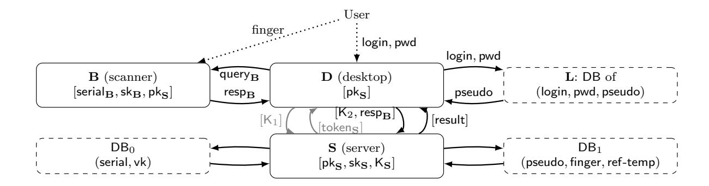
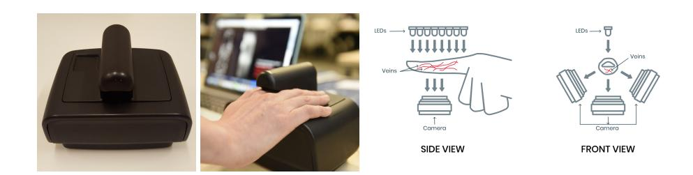
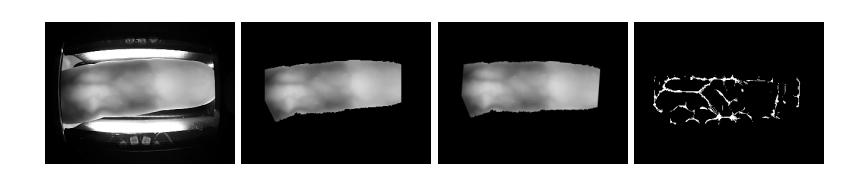
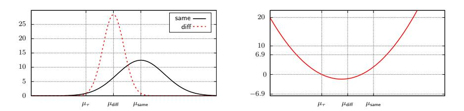

# BioLocker: A Practical Biometric Authentication Mechanism based on 3D Fingervein

F. Bet¨ul Durak1? , Lo¨ıs Huguenin-Dumittan<sup>2</sup> , and Serge Vaudenay<sup>2</sup>

> <sup>1</sup> Robert Bosch LLC - Research and Technology Center Pittsburgh PA, USA <sup>2</sup> Ecole Polytechnique F´ed´erale de Lausanne (EPFL) Lausanne, Switzerland

Abstract. We design a consecution of protocols which allows organizations to have secure strong access control of their users to their desktop machines based on biometry. It provides both strong secure authentication and privacy. Moreover, our mechanism allows the system admins to grant a various level of access to their end-users by fine tuning access control policy. Our system implements privacy-by-design. It separates biometric data from identity information. It is practical: we fully implemented our protocols as a proof of concept for a hospital. We use a 3D fingervein scanner to capture the biometric data of the user on a Raspberry Pi. For the biometry part, we developed an optimal way to aggregate scores using sequential distinguishers. It trades desired FAR and FRR against an average number of biometric captures.

# 1 Introduction

Biometric access control provides a mechanism to authenticate users. It has been an interesting research domain throughout the years. Several secure and privacy-preserving biometric protocols have been proposed with different techniques. We take a traditional approach to develop a biometric access control with strong security guarantees. By assuming a secured server storing a database of biometric templates, we develop a mechanism called BioLocker for strong access control (AC) using end-to-end encryption and fingervein recognition.

Motivated from the real-world use cases, we focus on users aiming to log in desktops/laptops D under a large network in an organization using a biometric scanner B. In such an organization, a directory L is used to identify them through passwords. In the present work, to add an extra layer of secure authentication, a server S which is responsible for the biometric recognition is introduced. For such a structure, we design two bodies: an enrollment station that lets admins enroll users with their biometric data and a laptop login control that lets the user authenticate themselves through biometric scanner before logging in to their devices. The high-level overview of BioLocker is given in Fig. 1.

As depicted in Fig. 1, D serves as an intermediate machine between the biometric scanner B and server S to make them communicate. The idea is to use this "intermediary" in a secure way by encrypting the exchange of messages between B and S in an authenticated manner.

The goal of our construction is to add strong AC to an existing password-based AC system deployed between D and L. We assume that the password-based protocol between D and L is already secure by default. And, we focus on adding a biometric AC following the existing password-based protocol. Our constraints are to add no software on L and to make as little changes as possible on D. More importantly, for privacy reasons, nobody but B and S sees biometric templates. The maintenance and security of the server S must be high. Nobody but

<sup>?</sup> The work was done when the author was in LASEC/EPFL.



Fig. 1: Full BioLocker mechanism. Enrollment is shown with fully black figures and Biometric AC Method is same as Enrollment in addition to added gray arrows/queries between D and S. Solid rectangles are the machines whereas dashed rectangles are the databases on the corresponding machines. Dashed arrow indicates the inputs from the user to the specified machines. Solid arrows indicate the exchanges between the machines over the network.

L and D sees the identity of the user. Hence, we only allow S to associate biometric data to a pseudo. Nobody but L, D, and S see the pseudo of the user. Unless there is any collusion with any of these participants, BioLocker offers privacy by design.

We make sure, in BioLocker, that the server S will only treat information coming from a legitimate scanner. We design the mechanism in a way that D only forwards messages and does two encryptions for S. Hence, the overhead on D is minimal. This makes our protocol feasible to deploy on already existing systems.

For our system, we adopted fingervein biometry. To defeat spoofing attacks [20], we use what we call 3D fingervein by capturing fingervein through several angles. In cooperation with Global ID, IDIAP, HES-SO Valais-Wallis, and EPFL, we built a biometric scanner to scan 3D fingerveins, algorithms, and security protocols.<sup>3</sup> It is shown in Fig. 2.



Fig. 2: Current version of the scanner.

Previous work. While not as widely deployed as fingerprint authentication, fingervein recognition has been a hot topic in recent years and many systems have been proposed [19, 17, 5].

https://www.epfl.ch

<sup>3</sup> https://www.global-id.ch https://www.idiap.ch https://www.hevs.ch

In 2015, Wang et al. [23] showed how hand-vein recognition can be used to build a practical physical access control system. In 2018, Yang et al. [24] presented a system providing authentication and encryption of healthcare data via a smartcard storing finger-vein biometric templates. Finally, Kang et al. [9] studied real 3D fingervein algorithms.

Multimodal biometric (or multi-biometric) systems combine several biometric sources (e.g. face, fingervein, and voice) or techniques (e.g. matching algorithms) to obtain a highly reliable authentication. The design of such systems has thus led to the study of biometric score aggregation (also called score fusion, i.e. how one can combine the different scores obtained to get the best performance). The NIST surveyed many proposals for biometric score fusion in 2006 [22] and another study was published by Lumini and Nanni [11] in 2017. A popular technique for score aggregation is the maximum likelihood ratio test [15]. Recently, Ni et al. [16] proposed a scheme based on the maximum decision reliability ratio and weighted voting. In 2018, Kabir et al. [8] introduced an algorithm that relies on normalization and a weighted sum of the different scores. Finally, another common approach for score fusion is the use of classifiers (e.g. based on random forests [12] and SVM [6]).

There exist few products deploying access control with biometry. However, to the best of our knowledge, there is no known publicly available protocol.

In BioID [3], a previous project, we developed a suite of protocols to design a privacypreserving identity document based on biometric recognition. Our scanners and protocols can host BioID.

Our contribution. We design a practical biometric authentication mechanism called BioLocker that is integrated into an already existing authentication system such as password-based systems. Our construction makes no changes to the existing system and only extends security integrating 3D fingervein recognition. Our algorithms optimally use biometry. Since the matching algorithm runs with three images of the same finger from different angles, we needed to come up with a way to aggregate the matching scores to grant access. We developed our aggregation of matching scores to reach a desired FAR and FRR. <sup>4</sup> To do this, we use the theory of sequential distinguishers: at every capture, our algorithm decides if the recognition succeeded, failed, or requires more biometric samples to conclude. Hence, a user may be required to be scanned several times, although in most cases, one capture is enough. To the best of our knowledge, such an AC mechanism with biometric algorithm is a novel design in many ways: 1. it is easy to integrate on existing weakly private systems where strong privacy is required; 2. its policy-based methods run AC in fine-grained iterative mode and can accommodate other modalities; 3. it uses 3D fingervein image recognition.

Designing a biometric mechanism in a secure manner may be very tedious and requires a lot of crafting. Nevertheless, we prove the security of our mechanism and support the practicality with implementation results.

Structure of the paper. We start with introducing our infrastructure in Section 2. Then, we detail the AC protocol and enrollment station in Sections 3.1 and 3.2 respectively. Then, we detail the biometric algorithms in Section 4. We analyze the security of our system in Section 5. Finally, we present implementation results from a proof-of-concept in Section 6.

<sup>4</sup> FAR is the false acceptance rate, i.e. the probability that a wrong finger is accepted, FRR is the false rejection rate, i.e. the probability that the right finger is rejected.

Notation. We will use a few cryptographic primitives for our protocols. In what follows, ⊥ denotes an error message or a dummy value (e.g. a null pointer, an empty string, or an empty list). We use a public-key cryptosystem PKC, a digital signature scheme DSS, an authenticated encryption with associated data AEAD, and a hash function H. Given a key pair (pk,sk), PKC encrypts a plaintext pt into a ciphertext ct using pk and decrypts it back using sk. Dec is a deterministic function. Given a key pair (vk,sk), DSS signs data data using sk and verify the signature using vk. Given a key K ∈ AEAD.K, AEAD encrypts a plaintext pt with associated data ad and a nonce N ∈ AEAD.N and decrypts it back with the same K. Given a bitstring x, H computes a digest with H(x). Typically, PKC provides INDCCA security, DSS is EFCMAsecure, AEAD is secure as a MAC and as an encryption against chosen plaintext/ciphertext attacks, and we consider a collision-resistant hash function H. These primitives work with the following notations:

| PKC.Gen→(pk,sk) | PKC.Encpk(pt)→ct      | PKC.Decsk(ct)→pt         |  |  |
|-----------------|-----------------------|--------------------------|--|--|
| DSS.Gen→(vk,sk) | DSS.Signsk(data)→σ    | DSS.Verifyvk(data,σ)→0/1 |  |  |
|                 | AEAD.EncK(N,ad,pt)→ct | AEAD.DecK(N,ad,ct)→pt    |  |  |

### 2 Infrastructure Specification

In this work, we focus on an organization which has its own network and file system. Most of the organizations offer a system to authenticate its users with passwords, such as Active Directory implemented with LDAP-like protocol. For instance, the organization could be a hospital with many different departments. Each department has a set of doctors who can access the files of their assigned patients and nothing else.

The mechanism BioLocker has an infrastructure with different entities: some machines and human users. The machines are of several types.

Biometric scanner: B. Scanners capture biometric information of users and do necessary computations by following the protocol honestly. In our settings, scanners take three images of a finger from different angles, which we call 3D fingervein. A malicious biometric scanner can clearly store and reuse some biometric templates as will. Hence, we assume that B is honest in AC. Scanners will be considered as malicious when studying the privacy of the user identity or pseudo.

Organization server: L. This server belongs to the organization and contains the directory of its users, their names and passwords (or their hash). We extend it with a pseudo for privacy reasons. The pseudo is not required to be remembered (or even known) by the user. The server L has a unique identifier serialL. A user name login is assumed to be unique to each L, meaning that the (serialL, login) pair is unique. In AC, the organization server is assumed to be honest. When studying the privacy of biometric templates, L can be malicious.

Desktops: D. These desktop computers belong to the information network of the organization. The goal is to control access of users to desktops. Each desktop is set up with the address of its server L and the address addr<sup>B</sup> of a close-by biometric scanner B. We assume that only D has access to B (e.g. B is connected to D by a USB cable). Since the purpose of AC is to grant access to D, we assume that D is honest. When studying the privacy of biometric templates, D can be malicious.

Enrollment station: E. It consists of a security-sensitive computer in order to enroll users with their biometric templates scanned through B. The sensitive computer communicates with B to capture templates and communicates with S to add, remove, or modify entries in the database on the server. The enroller is assumed to be honest in AC. When studying the privacy of biometric templates, E can be malicious.

Biometric server: S. There is only one biometric server. It contains two databases: one stores the reference biometric templates of users along with their associated pseudo and the other stores identifiers of the enrollment stations and biometric scanners. The former is used for matching the reference templates to the claimed users for the AC. The latter is used during the authentication of data coming through legitimate E and B. The server S can be outside of the organization, but high security is provided. As the server gives the final result of AC to D, S is assumed to be honest. Servers will be considered as malicious when studying the privacy of the user identity or pseudo.

Communication between D, E, and S is going through an insecure network. Communication between D and B is assumed to be authenticated. Communication between D and L is assumed to be fully secure, and outside of the scope of the present construction.

Since the organization may consist of many departments, all elements except S belong to a department. We identify each department with "domain" which is referred by a unique string domain. The server L is unique for each domain, that is L stores users data for this specific department. We assume that each pseudo is unique. The biometric server S is unique (cross-domain). We assume secure communication between D and L.

Setup. We give the list of parameters that each elements of the infrastructure hold in Table 1. More specifically, the server S generates its PKC key pair (pkS,skS) and a symmetric key K<sup>S</sup> ∈ AEAD.K. Each biometric scanner B is configured with its own DSS key pair (vkB,skB) and a unique serial number serialB. It keeps a copy of pkS, as well.

In each enrollment station, E is configured with its own DSS key pair (vkE,skE) and a unique serial number serialE. It stores pkS, as well. The server S maintains a directory DB<sup>0</sup> of the public keys vk (vk<sup>B</sup> or vkE) of each B and E by their serial numbers (serial<sup>B</sup> or serialE). The server S holds one database DB<sup>1</sup> of (pseudo, finger,ref-temp, policy) and (pseudo, policy) entries which is populated by enrollment station through a protocol which we will describe in Section 3.2.

We let each desktop D hold the public key pk<sup>S</sup> of the server S. The server L holds a database of (login, pwd, pseudo) entries for first layer authentication with passwords.

| D              | B                | L                           | E                | S                                              |
|----------------|------------------|-----------------------------|------------------|------------------------------------------------|
| pkS<br>serialL | pkS<br>(vkB,skB) |                             | pkS<br>(vkE,skE) | (pkS,skS)<br>KS                                |
| addrB          | serialB          | serialL                     | serialE          |                                                |
|                |                  | DB = {(login, pwd, pseudo)} |                  | DB0 = {(serial, vk)}                           |
|                |                  |                             |                  | DB1 = {(pseudo, fingeri<br>,ref-temp, policy)} |

Table 1: The elements of the infrastructure and their configuration parameters.

# 3 Protocols

## 3.1 Access Control Protocols

For this section, we will focus on the communication between devices in AC without giving the details about the biometric algorithms. We start defining a (straightforward) prior AC with login credentials and then continue with extended AC mechanisms. Prior AC is the password authentication between E and L. We assume that there is an already existing secure protocol for this. More precisely, the prior AC works as follows.

- 1. The user types his identifier login and his password pwd on D.
- 2. The desktop D queries the server L with query<sup>L</sup> = (login, pwd) and gets the response respL. Then, the server L computes the response by resp<sup>L</sup> = pseudo, where (login, pwd, pseudo) is a valid record in the database. Otherwise, resp<sup>L</sup> = ⊥.
- 3. If the response by L is ⊥, access is denied and the protocol ends. Otherwise, D proceeds with our protocol.

| fingerI,n | Represents a set I of fingers to be scanned n times. The access is granted<br>conditioned that the user's corresponding finger matches with the reference<br>template stored in the database. The method may include a message to display<br>on the scanner. |
|-----------|--------------------------------------------------------------------------------------------------------------------------------------------------------------------------------------------------------------------------------------------------------------|
| "always"  | The desktop D always grants access.                                                                                                                                                                                                                          |
| "never"   | The desktop D always denies access.                                                                                                                                                                                                                          |
| "sms"     | A verification code is sent by SMS to the user who types it on D.                                                                                                                                                                                            |
|           | "securitas" An alert is sent to the security officer who may call the user.                                                                                                                                                                                  |

Fig. 3: Various methods the protocol sets with method variable.

To be able to follow the description in the present section, we need some back story about the biometry. The AC heavily depends on the biometric matching. That is, upon inviting the user to the scanner to provide a fingervein image, it will be used to match it to the user's reference templates stored in DB<sup>0</sup> during enrollment (described in Section 3.2). The matching algorithm returns a score denoted by score which may be insufficient to decide to accept or reject. The decision in that case is to ask for another trial. The final decision is based on all collected trials. Therefore, the extended AC works in a succession of iterations which are defined by a method which we denote by method. The method can be to prompt the capture of one specific finger or any other mean/modality. Some special methods are used to terminate the iteration cycle: the method which accepts and the method which rejects. In Fig. 3, we give the list of methods for extended AC along with their descriptions. We need to define both the method of the first iteration and then the algorithm to decide on the next method based on the collected results (i.e. aggregated scores). These two elements form the policy: policy.initmethod and policy.method. More precisely, the initial method to be used is policy.initmethod and after having collected a list hist of scores, the next method is policy.method(hist). If hist is enough, we have policy.method(hist) = "always" (access granted) or policy.method(hist) = "never" (access denied). The method could repeatedly be finger{i},<sup>1</sup> (meaning to scan finger i once), change fingers, or try other modalities. We specify the policy for each user at enrollment, as one record of  $DB_1$ . We give the extended AC in three stages in Fig. 4, 5, and 6.

The first iteration of extended AC starts with a protocol called "Stage 1" with the server **S** who sets the initial method (line 4-6 on the right in Fig. 4). Then, it continues like in every other iteration. That is, it goes through a protocol called "Stage 2" using method (line 2-8 on the left and line 7 on the left in Fig. 5). In Stage 2, **D** may decide to end (by granting access or denying access) or interact with **B**. After that, it goes through a protocol with **S** called "Stage 3". In this stage, we determine the next method to use (line 24 in Fig. 6). Then, AC goes back to Stage 2. Note that whenever there is a failure in verification in a protocol, the protocol aborts immediately. Otherwise, they continue in the flow.

Our scanner is a stateless device. When it receives a request, it takes pictures, sends its response, then sleeps back.

As the server is stateless as well, state information is carried inside a *token* that  $\mathbf{S}$  encrypts for himself. The token works like a cookie in a browser:  $\mathbf{S}$  gives token in the response to  $\mathbf{D}$  and  $\mathbf{D}$  must provide it in the next query to  $\mathbf{S}$ . The token also contains method which is in clear and which can be parsed by  $\mathbf{D}$  and  $\mathbf{B}$ .

```
Desktop D (Stage 1)
                                                                                                                                 Biometric server S ("Request" query)
input: pseudo, addr<sub>B</sub>, serial<sub>B</sub>
                                                                                                                                 stored: sks. Ks
                                                                                                                                 1: receive query<sub>S</sub>
stored: pk_S
  1: \ \mathsf{K}_1 \leftarrow \bar{\$} \mathsf{AEAD}.\mathcal{K}
                                                                                                                                   2: if anything fails below then return resp<sub>S</sub> = \perp
 2 \colon \mathsf{query}_{\mathbf{S}} \leftarrow \mathsf{PKC}.\mathsf{Enc}_{\mathsf{pk}_{\mathbf{S}}}(\mathsf{``Request"},\mathsf{K}_1,\mathsf{pseudo},\mathsf{serial}_{\mathbf{B}})
                                                                                                                                  3 \colon \mathsf{PKC}.\mathsf{Dec}_{\mathsf{sk}_{\mathbf{S}}}(\mathsf{query}_{\mathbf{S}}) \to (\mathsf{``Request"},\mathsf{K}_1,\mathsf{pseudo},\mathsf{serial}_{\mathbf{B}})
 3: send query<sub>S</sub> to S
                                                                                                                                  4: retrieve policy with pseudo from DB<sub>1</sub>
  4: get resp<sub>S</sub> ←
                                                                                                                                   5: hist ← 1
 5: parse \mathsf{resp}_\mathbf{S} = [\mathsf{N}_{12}, \mathsf{ct}_1]
                                                                                                                                  6: method \leftarrow policy.method(hist)
 6: (\mathsf{token}_{\mathbf{S}}, \mathsf{K}) \leftarrow \mathsf{AEAD}.\mathsf{Dec}_{\mathsf{K}_1}(\mathsf{N}_{12}, \bot, \mathsf{ct}_1)
                                                                                                                                   7: set T as current time
 7: erase K<sub>1</sub>
                                                                                                                                  8: ad \leftarrow method
                                                                                                                                  9: \mathsf{K} \xleftarrow{\$} \mathsf{AEAD}.\mathcal{K}
 8: continue to Stage 2
                                                                                                                                 10: pt \leftarrow (T, pseudo, hist, serial_{\mathbf{B}}, K)
                                                                                                                                 11: N_{11}, N_{12} \leftarrow \text{\$ AEAD}.\mathcal{N}
                                                                                                                                12: \mathsf{token}_\mathbf{S} \leftarrow \left[\mathsf{N}_{11}, \mathsf{ad}, \mathsf{AEAD}.\mathsf{Enc}_\mathsf{K_\mathbf{S}}(\mathsf{N}_{11}, \mathsf{ad}, \mathsf{pt})\right]
                                                                                                                                13: \operatorname{resp}_{\mathbf{S}} \leftarrow [\tilde{\mathsf{N}}_{12}, \mathsf{AEAD}.\mathsf{Enc}_{\mathsf{K}_1}(\mathsf{N}_{12}, \bot, \mathsf{token}_{\mathbf{S}}, \bar{\mathsf{K}})]
                                                                                                                                -14: return resps
```

Fig. 4: Access control Stage 1 (between **D** and **S**).

#### 3.2 Enrollment Protocol

The enrollment protocol is given in Fig. 7. The input to the enrollment protocol (on **E**) is a string pseudo associated to a user to register, and the address addr<sub>B</sub> of the scanner **B**. In practice, operating the enrollment station **E** is restricted to an administrator or a security officer who checks the identity of the enrolling user and retrieves his/her pseudo securely before enrollment. Specifically, **E** goes through two stages: Stage 1 with **B** and Stage 2 with **S**. In Stage 2, **S** receives a query of type "Enroll". Both stages are defined in Fig. 7. In communication with **B**, only serial<sub>B</sub>, N, and ad = method are in clear. All the rest is end-to-end encrypted. More importantly, we design both the server **S** and the scanner **B** as stateless (both in enrollment and AC phase). **E** (and later **D**) acts as a master in the communication with **S** and **B**. Interestingly, the scanner **B** answers to queries in a unique way, so there in no difference between access control and enrollment for **B**.

```
Desktop D (Stage 2)
                                                                                         Biometric scanner B
1: parse token<sub>S</sub> = [N_{11}, ad, ct_2]
                                                                                         stored: sk<sub>B</sub>, pk<sub>S</sub>, serial<sub>B</sub>
2: parse ad = method
                                                                                         1: receive query<sub>B</sub>
3: if method \in {"sms", "securitas"} then
                                                                                          2: if anything fails below then return resp_{\mathbf{B}} = \bot
          method \leftarrow treat(method, hist, serial_B, login, host)
                                                                                          3: parse query<sub>B</sub> = (serial<sub>B</sub>, token)
5: end if
                                                                                          4: check that serial<sub>B</sub> is correct
6: if method = "always" then grant access
                                                                                          5: parse token = [N, ad, ct]
 7: if method = "never" then deny access
                                                                                          6: parse ad = method
                                                                                          7: parse method = (finger_{I,n}, message)
8: if method is not biometric then abort
9: display "scan finger in scanner serial<sub>B</sub>"
                                                                                          8: display message
                                                                                          9: extract I, n from finger_{I,n}
10: query_B \leftarrow (serial_B, token_S)
11: send \overline{\mathsf{query}}_{\mathbf{B}} to \mathbf{B} at \mathsf{addr}_{\mathbf{B}}
                                                                                         10: for i \in I, j = 1, ..., n do
12: get \operatorname{resp}_{\mathbf{B}} \leftarrow
                                                                                         11:
                                                                                                   invite finger,
13: continue to Stage 3
                                                                                         12:
                                                                                                    capture temp_{i,j}
                                                                                         13: end for
                                                                                         14: temp \leftarrow list of all (finger<sub>i</sub>, temp<sub>i,i</sub>)
                                                                                         15: data_0 \leftarrow (query_B, temp)
                                                                                         16: \ \mathsf{sign}_0 \leftarrow \mathsf{DSS}.\mathsf{Sign}_{\mathsf{sk}_{\mathbf{B}}}(\mathsf{data}_0)
                                                                                         17: \mathsf{resp}_{\mathbf{B}} \leftarrow \mathsf{PKC}.\mathsf{Enc}_{\mathsf{pk}_{\mathbf{S}}}(\mathsf{data}_0, \mathsf{sign}_0)
                                                                                        -18: return resp<sub>B</sub>
```

Fig. 5: Access control Stage 2 (between **D** and **B**).

```
Desktop D (Stage 3)
                                                                                                                Biometric server S ("Match" query)
1: K_2 \leftarrow \$AEAD.\mathcal{K}
                                                                                                                stored: sks, Ks
 2: \mathsf{query}_{\mathbf{S}} \leftarrow \mathsf{PKC}.\mathsf{Enc}_{\mathsf{pk}_{\mathbf{S}}}(\mathsf{``Match"},\mathsf{K}_2,\mathsf{K})
                                                                                                                  1: receive query_S and resp_B
 3: send query_S and resp_B to S
                                                                                                                  2: if anything fails below then return resp<sub>S</sub> = \perp
                                                                                                                  3: parse ("Match", K_2, \bar{K}) = PKC.Dec<sub>sk</sub> (query)
 4: get resp<sub>S</sub> ←
                                                                                                                  4: (\mathsf{data}, \mathsf{sign}) \leftarrow \mathsf{PKC}.\mathsf{Dec}_{\mathsf{sk}_{\mathbf{S}}}(\mathsf{resp}_{\mathbf{B}})
 5: parse resp_S \leftarrow (N_{12}, ct_2)
 6: (\mathsf{token}_{\mathbf{S}}, \mathsf{K}) \leftarrow \mathsf{AEAD}.\mathsf{Dec}_{\mathsf{K}_2}(\mathsf{N}, H(\mathsf{query}_{\mathbf{B}}), \mathsf{ct}_2)
                                                                                                                  5: parse data as (query<sub>B</sub>, temp)
                                                                                                                  6: parse query_{\mathbf{B}} as (serial_{\mathbf{B}}, token_{\mathbf{S}})
 7: erase K<sub>2</sub>
 8: continue to Stage 2
                                                                                                                  7: retrieve vk_{\mathbf{B}} form DB_0 with serial_{\mathbf{B}}
                                                                                                                  8: \; \mathsf{DSS.Verify}_{\mathsf{vk}_{\mathbf{B}}}(\mathsf{data}, \mathsf{sign})
                                                                                                                  9: parse tokens as (N, ad, ct)
                                                                                                                 10 \colon \mathsf{pt} \leftarrow \mathsf{AEAD}.\mathsf{Dec}_{\mathsf{K}_{\mathbf{S}}}(\mathsf{N},\mathsf{ad},\mathsf{ct})
                                                                                                                11: parse ad = finger_{I,n}
                                                                                                                12: parse pt = (T, pseudo, hist, serial_B, K)
                                                                                                                13: check K = \bar{K}
                                                                                                                14: check \mathsf{serial}_\mathbf{B} is \mathsf{correct}
                                                                                                                15: verify T not too early/late
                                                                                                                16: x \leftarrow \bot
                                                                                                                17: for all (finger_i, temp_{i,j}) \in temp do
                                                                                                                18:
                                                                                                                               retrieve ref-temp, from DB<sub>1</sub> with (pseudo, finger,)
                                                                                                                19:
                                                                                                                               compute score with the matching algorithm
                                                                                                                20 \cdot
                                                                                                                              x \leftarrow (x, (i, \mathsf{score}))
                                                                                                                21: end for
                                                                                                                22: \mathsf{hist}' \leftarrow (\mathsf{hist}, x)
                                                                                                                23: retrieve policy from \mathsf{DB}_1 with pseudo
                                                                                                                24: determine method = policy.method(hist')
                                                                                                                25: set T' as current time
                                                                                                                26 \colon \operatorname{\mathsf{ad}} \leftarrow \operatorname{\mathsf{method}}
                                                                                                                27: \mathsf{K}' \xleftarrow{\$} \mathsf{AEAD}.\mathcal{K}
                                                                                                                28 \colon \mathsf{pt} \gets (\mathsf{T}', \mathsf{pseudo}, \mathsf{hist}', \mathsf{serial}_{\mathbf{B}}, \mathsf{K}')
                                                                                                                29: N_{11}, N_{12} \leftarrow $ AEAD.\mathcal{N}
                                                                                                                30: \ \mathsf{token'_S} \leftarrow \left[ \mathsf{N}_{11}, \mathsf{ad}, \mathsf{AEAD}.\mathsf{Enc}_{\mathsf{K}_{\mathbf{S}}}(\mathsf{N}_{11}, \mathsf{ad}, \mathsf{pt}) \right]
                                                                                                                31: \operatorname{resp}_{\mathbf{S}} \leftarrow (N_{12}, AEAD.Enc_{K_2}(N_{12}, H(\operatorname{query}_{\mathbf{B}}), \operatorname{token}'_{\mathbf{S}}, \mathsf{K}'))
                                                                                                               -32: return resp<sub>S</sub>
```

Fig. 6: Access control Stage 3 (between **D** and **S**).

#### 4 Biometric Algorithms

*Image processing on fingervein images.* The image from the scanner is first cleaned up using image processing algorithms. After the contour of the finger is identified, the image is cropped.

```
Enrollment station on device E
                                                                                                             Biometric server S ("Enroll" query)
input: pseudo, policy, addr<sub>B</sub>, serial<sub>B</sub>
                                                                                                             stored: ske
                                                                                                             18: receive querys
stored: sk_{\mathbf{E}}, pk_{\mathbf{S}}, serial_{\mathbf{E}}
                                                                                                             19: if anything fails below then return resp<sub>S</sub> = \perp
Stage 1:
                                                                                                             20: \; (\mathsf{data}_1, \mathsf{sign}_1) \leftarrow \mathsf{PKC}.\mathsf{Dec}_{\mathsf{sk}_{\mathbf{S}}}(\mathsf{query}_{\mathbf{S}})
 1: set T as current time
2: K_0 \leftarrow AEAD.K, N \leftarrow AEAD.N
                                                                                                             21: parse data<sub>1</sub> = ("Enroll", K_0, serial<sub>E</sub>, h, resp<sub>B</sub>)
                                                                                                             22: retrieve vk_{\mathbf{E}} from DB_0 with serial_{\mathbf{E}}
 3: finger_{I,n} \leftarrow policy.initmethod
                                                                                                             23 \colon \operatorname{DSS.Verify}_{\mathsf{vk}_{\mathbf{E}}}(\mathsf{data}_1, \mathsf{sign}_1)
 4: \mathsf{ad} \leftarrow \mathsf{finger}_{I,n}
                                                                                                             24: (\mathsf{data}_0, \mathsf{sign}_0) \leftarrow \mathsf{PKC}.\mathsf{Dec}_{\mathsf{sk}_{\mathbf{S}}}(\mathsf{resp}_{\mathbf{B}})
 5: pt \leftarrow (T, pseudo, policy)
                                                                                                             25: parse data<sub>0</sub> = (query<sub>B</sub>, temp)
 6: \mathsf{token}_{\mathbf{E}} \leftarrow [\mathsf{N}, \mathsf{ad}, \mathsf{AEAD}.\mathsf{Enc}_{\mathsf{K}_0}(\mathsf{N}, \mathsf{ad}, \mathsf{pt})]
                                                                                                             26: check h = H(\mathsf{query}_{\mathbf{B}})
 7: query_{\mathbf{B}} \leftarrow (serial_{\mathbf{B}}, token_{\mathbf{E}})
                                                                                                             27: parse query<sub>B</sub> = (serial_B, token_E)
 8: send query<sub>B</sub> to B at addr_B
                                                                                                             28: retrieve vk<sub>B</sub> from DB<sub>0</sub> with serial<sub>B</sub>
 9: get resp<sub>B</sub>
                                                                                                             29: DSS.Verify<sub>vk<sub>B</sub></sub> (data<sub>0</sub>, sign<sub>0</sub>)
30: parse token<sub>E</sub> = (N, ad, ct)
Stage 2:
                                                                                                             31: pt \leftarrow AEAD.Dec_{K_0}(N, ad, ct)
10: data_1 \leftarrow ("Enroll", K_0, serial_E, H(query_B), resp_B)
11:\ \mathsf{sign}_1 \leftarrow \mathsf{DSS}.\mathsf{Sign}_{\mathsf{sk}_{\mathbf{E}}}(\mathsf{data}_1)
                                                                                                             32: parse ad = finger_{I,n}
                                                                                                             33: parse pt = (T, pseudo, policy)
12: \; \mathsf{query}_{\mathbf{S}} \leftarrow \mathsf{PKC}.\mathsf{Enc}_{\mathsf{pk}_{\mathbf{S}}}(\mathsf{data}_1, \mathsf{sign}_1)
                                                                                                             34: verify T not too early/late
13: send querys to S
                                                                                                             35: store (pseudo, policy) in \mathsf{DB}_1
14: get \operatorname{resp}_{\mathbf{S}}
                                                                                                             36: parse temp = (finger<sub>i</sub>, temp<sub>i,j</sub>)<sub>i∈I,j=1,...,n</sub>
15: parse resp_S = [N', ct']
                                                                                                             37: for each i \in I do
16: check "ok" = AEAD.Dec_{K_0}(N', \perp, ct')
                                                                                                             38:
                                                                                                                           decide which j defines ref-temp<sub>i</sub> = temp<sub>i</sub> i
17: erase K_0
                                                                                                             30.
                                                                                                                           store (pseudo, finger<sub>i</sub>, ref-temp<sub>i</sub>) in DB_1
                                                                                                             40: end for
                                                                                                             41: pick N' \in AEAD.\mathcal{N}
                                                                                                             42: \mathsf{resp}_{\mathbf{S}} \leftarrow [\mathsf{N}', \mathsf{AEAD}.\mathsf{Enc}_{\mathsf{K}_0}(\mathsf{N}', \bot, \text{``ok"})]
                                                                                                             -43: return resp<sub>S</sub>
```

Fig. 7: Enrollment protocol. The dashed square represents the steps run by  ${\bf B}$  same as in Fig. 5.

A linear regression is performed to determine the angle of the finger and to correct it. Finally, the biometric feature is extracted using the algorithm of Miura et al. [13, 14, 21] with Lee mask preprocessing [10]. The final feature extraction is a black-and-white image which takes about 2KB. This is the image which is stored in the database. Since we have three images, a record takes less than 10KB.



Fig. 8: Image processing: raw capture, background elimination, angle correction, and feature extraction.

Matching algorithm. We use the matching algorithm from Miura et al. [13, 14, 21]. Given two images, the biometric matching algorithm runs with the two images as input and returns a score between 0 and 0.5.

Score algorithms with aggregation. Since we have three pairs of images, we obtain three scores. We design an optimal way to aggregate the scores. Namely, we consider the following problem. After m iterations, we have a list  $\mathsf{hist} = (\mathsf{score}_1, \dots, \mathsf{score}_m)$  where each  $\mathsf{score}_i$  is a triplet of numbers. Hence,  $\mathsf{hist} = (s_1, \dots, s_n)$  with n = 3m. We model the  $s_i$  by independent

random variables. If the templates correspond to the same random finger, we assume that every  $s_i$  follows one distribution  $\mathsf{same}_c$ , depending on the used camera c (left, center, or right) to scan the templates. If they correspond to different random fingers, we assume that every  $s_i$  follows one distribution  $\mathsf{diff}_c$ . More precisely, we let  $\mathsf{ref-temp}(\mathsf{finger})$  be the reference template of a random finger and  $\mathsf{capture}_i(\mathsf{finger}_i)$  be a captured template of a finger finger. We let  $\mathsf{match}_{C(i)}(\mathsf{ref-temp}(\mathsf{finger}), \mathsf{capture}_i(\mathsf{finger}_i)) = \mathsf{score}_i$  be the score obtained by the matching algorithm based on  $\mathsf{Camera}\ C(i)$ . We define the events  $\mathsf{AUTH}\ (\mathsf{authentic})$  and  $\mathsf{IMP}\ (\mathsf{impersonation})$  by

AUTH : finger = finger<sub>1</sub> = 
$$\cdots$$
 = finger<sub>m</sub>  
IMP : finger  $\neq$  finger<sub>1</sub>,  $\cdots$ , finger  $\neq$  finger<sub>m</sub>

The distributions same and diff are defined by

$$\begin{aligned} &\Pr_{\mathsf{same}}[\mathsf{score}_1, \dots, \mathsf{score}_m] = \Pr[\mathsf{score}_1, \dots, \mathsf{score}_m | \mathsf{AUTH}] \\ &\Pr_{\mathsf{diff}}[\mathsf{score}_1, \dots, \mathsf{score}_m] = \Pr[\mathsf{score}_1, \dots, \mathsf{score}_m | \mathsf{IMP}] \end{aligned}$$

We design a sequential distinguisher such that given hist, the output is either "same", or "diff", or  $\bot$ , meaning that no decision is reached, hence more samples are needed. We define FAR =  $\Pr_{\mathsf{diff}}[\mathbf{output} = \mathsf{same}]$ , FRR =  $\Pr_{\mathsf{same}}[\mathbf{output} = \mathsf{diff}]$ . Our goal is to make a distinguisher reaching a target FAR<sub>target</sub> and FRR<sub>target</sub>, and requiring as few samples as possible.

We use the theory of sequential distinguishers. This theory is described in Siegmund [18]. It was first used in block cipher cryptanalysis [7], then in the side-channel attack against SSL [4]. Given a tuple of m scores ( $\mathsf{score}_1, \ldots, \mathsf{score}_m$ ), we compute the likelihood ratio

$$\text{Ir} = \frac{\Pr_{\text{same}}[\text{score}_1, \dots, \text{score}_m]}{\Pr_{\text{diff}}[\text{score}_1, \dots, \text{score}_m]}$$

The best sequential distinguisher accepts the hypothesis that the scores comes from same if  $\text{lr} \geq \tau_+$ , for some parameter  $\tau_+$ . It accepts the hypothesis that the score comes from diff if  $\text{lr} \leq \tau_-$ , for some parameter  $\tau_-$ . In between, the distinguisher waits for more samples. Using the Wald approximation, if we want to obtain FAR<sub>target</sub> and FRR<sub>target</sub>, we should use  $\tau_+ \approx 1/\text{FAR}_{\text{target}}$  and  $\tau_- \approx \text{FRR}_{\text{target}}$ .

We make the approximation that the scores are normally distributed, which is well supported by experiment. Namely, matching from the camera c follows either  $\mathcal{N}(\mu_c^{\mathsf{same}}, (\sigma_c^{\mathsf{same}})^2)$  or  $\mathcal{N}(\mu_c^{\mathsf{diff}}, (\sigma_c^{\mathsf{diff}})^2)$ . We let  $c_i$  be the camera used to compute  $s_i$ . Hence,  $\ln \operatorname{Ir}$  can be computed by summing all  $\ln \frac{\Pr_{\mathsf{same}}[s_i]}{\Pr_{\mathsf{diff}}[s_i]} = \Delta \operatorname{Ipdf}_{c_i}(s_i)$ . Using the probability density function of the normal distribution, we obtain

$$\Delta \mathsf{Ipdf}_c(s) = \frac{\left(s - \mu_c^{\mathsf{diff}}\right)^2}{2(\sigma_c^{\mathsf{diff}})^2} - \frac{\left(s - \mu_c^{\mathsf{same}}\right)^2}{2(\sigma_c^{\mathsf{same}})^2} + \ln\frac{\sigma_c^{\mathsf{diff}}}{\sigma_c^{\mathsf{same}}}$$

The expected value of ln lr with same distribution is

$$E_{\mathsf{same}}(\ln \mathsf{Ir}) = \sum_i \left( \frac{(\sigma_{c_i}^{\mathsf{same}})^2}{2(\sigma_{c_i}^{\mathsf{diff}})^2} + \frac{(\mu_{c_i}^{\mathsf{same}} - \mu_{c_i}^{\mathsf{diff}})^2}{2(\sigma_{c_i}^{\mathsf{diff}})^2} - \frac{1}{2} + \ln \frac{\sigma_{c_i}^{\mathsf{diff}}}{\sigma_{c_i}^{\mathsf{same}}} \right)$$

Given that we have m iterations for each camera c, we deduce that the complexity to reach a good decision with same is approximately

$$m_{\mathsf{same}} \approx \frac{\ln \tau_+}{\sum_c \left(\frac{(\sigma_c^{\mathsf{same}})^2}{2(\sigma_c^{\mathsf{diff}})^2} + \frac{(\mu_c^{\mathsf{same}} - \mu_c^{\mathsf{diff}})^2}{2(\sigma_c^{\mathsf{diff}})^2} - \frac{1}{2} + \ln \frac{\sigma_c^{\mathsf{diff}}}{\sigma_c^{\mathsf{same}}}\right)}$$

As an application, we assume that we have scores coming from three cameras with the following experimental parameters:

|          |       | center |       |          |       |       |       |
|----------|-------|--------|-------|----------|-------|-------|-------|
| $\mu$    | 0.141 | 0.148  | 0.151 | $\mu$    | 0.112 | 0.111 | 0.129 |
| $\sigma$ | 0.037 | 0.032  | 0.043 | $\sigma$ | 0.020 | 0.014 | 0.026 |

In Fig. 9, we plotted the pdf for the central camera. We obtain  $m_{\mathsf{same}} \approx \frac{-\ln \mathsf{FAR}_{\mathsf{target}}}{7.5}$ . For  $\mathsf{FAR}_{\mathsf{target}} = 0.1\%$ , this is  $m_{\mathsf{same}} \approx 0.9$ . In Fig. 9, we can see the curve of  $\Delta \mathsf{Ipdf}$  for the central camera. Cumulated with the two others, we easily reach  $-\ln 0.1\% \approx 6.9$ .



Fig. 9: Probability density (left) and  $\Delta lpdf$  (right) of the score from the central camera.

This theory has one limitation though: it assumes a bad distribution coming from taking the biometric features of two random different persons. If an adversary tries another distribution of pictures (like a totally white picture), he may have better chances than what our analysis shows. It is typically a problem when the score is very low. In Fig. 9, we can see that for very low scores, the same distribution becomes more likely than the diff one. We let  $\mu_{\tau}$  be the lower crossing point on the two probability density functions. We decide to skip score, whenever  $(\text{score}_i)_{\text{center}} < \mu_{\tau}$ . It does not deny access. It only declares this capture unusable. Hence, its effect is to divide  $m_{\text{same}}$  by  $\Pr_{\text{same}}[\mu > \mu_{\tau}]$ . In our case,  $\mu_t = 0.0739$  and this increases  $m_{\text{same}}$  by only 1.04%. Finally, our decision algorithm works as on Fig. 10.

Given n samples  $\mathsf{temp}_1, \ldots, \mathsf{temp}_n$  (typically, n = 3), we use the algorithm on Fig. 10 to select the best  $\mathsf{temp}_i$  as the reference one.

### 5 Security Analysis

The security model assumes that the adversary has full control on the network and can make participants launch protocols with adversarially chosen inputs. Desktops  $\mathbf{D}$ , scanner  $\mathbf{B}$ , the server  $\mathbf{S}$ , and enrollment desktop  $\mathbf{E}$  are supposed to be honest in  $\mathsf{AC}$ . The  $\mathbf{D} \leftrightarrow \mathbf{L}$  link is assumed to be secure and out of the scope of this security analysis. As discussed below,  $\mathbf{B}$  is accessible to only one  $\mathbf{D}$  but communication may leak. That is, in our security games, the adversary plays with every  $\mathbf{D}$ ,  $\mathbf{E}$ ,  $\mathbf{B}$ ,  $\mathbf{S}$  with chosen input and sits in the middle of

```
Decision Algorithm
                                                                                Reference Template Selection Algorithm
input: hist
                                                                                Input (temp_1, \ldots, temp_n):
1: acc \leftarrow 0
                                                                                 1:\ L=\{\mathsf{temp}_1,\ldots,\mathsf{temp}_n\}
2: for i = 1 to |hist| do
                                                                                 2: while \#L > 1 do
        if (score_i)_{center} \geq \mu_{\tau} then
                                                                                 3:
                                                                                        find x \in L such that \sum_{y \in L - \{x\}} \mathsf{score}(x, y) is mini-
             \mathbf{for}\ c \in \{\mathsf{left}, \mathsf{center}, \mathsf{right}\}\ \mathbf{do}
4.
                                                                                    _{\mathrm{mal}}
                  acc \leftarrow acc + \Delta lpdf_c((score_i)_c)
                                                                                     remove x from L
6:
             end for
                                                                                 5: end while
7.
         end if
                                                                                 6: output L
8: end for
9: if acc \ge -\ln \mathsf{FAR}_{\mathsf{target}} then \mathbf{return} "accept"
10: if acc \le \ln FRR_{target} then return "reject"
11: return "undecided"
```

Fig. 10: Decision and Reference Template Selection Algorithms.

communication between them. He can also require a chosen user to have his finger scanned on a chosen  ${\bf B}$ .

We list our security results. Due to lack of space, we only informally state our security results here. Formal models, results, and proofs are provided in Appendix A.

We assume that PKC is INDCCA-secure, DSS is EFCMA-secure, AEAD is indistinguishable from an ideal primitive against chosen plaintext and ciphertext attacks, and H is collision-resistant. We prove that

- (enrollment) if E says that pseudo was successfully enrolled with B, it must be the case that S did so, and if S enrolls pseudo from B, it must be because E asked for it and B followed (however, E may fail before announcing a success);
- (AC) if  $\mathbf{D}$  granted access to pseudo from  $\mathbf{B}$ , it is certainly the case that its policy in  $\mathsf{DB}_1$  validated a sequence of captures from  $\mathbf{B}$ ;
- (privacy of templates) the adversary cannot extract information about the biometric templates taken from  $\mathbf{B}$ , even if  $\mathbf{E}$  is malicious;
- (privacy of pseudo) a semi-passive adversary cannot distinguish the pseudo of a user from a random one (however, an active adversary could simulate **D** and test a pseudo for a user).

Note that even though the biometric template could be known by the adversary (for instance, from another organization who enrolled the same user and who is malicious), the security of  $\bf B$  prevents this template to be used.

One limitation of our model is that **D** does not authenticate to **B**. Hence, a user scanning on **B** is not sure it is in context of a request from **D**. We could have made it more secure, either by adding a PKI for **D** (which we did not want), or by using the help of the user to check that a random number selected by **D** displays the same on **D** and **B**. Eventually, **B** is connected to **D** by a unique (USB) cable so we concluded it was not worth making the protocol heavier.

#### 6 Implementation Results

We implemented the entire BioLocker mechanism from enrollment to the biometric AC for a hospital. The IT department of the hospital has run the proof of concept to test the reliability, performance, and security of BioLocker with its employees. Our implementation choices were

made to be compatible with the infrastructure of the hospital. They use Active Directory for password authentication on Windows 7/10 computers. We did not change any settings of their password authentication and integrated our protocols on top of the Windows password authentication. This means that in the login session to access the desktops, we implemented another layer of authentication through biometric scanners that run when password authentication succeeds.

The current prototype of our scanner (which is shown in Fig. 2) is based on a Raspberry Pi PI3.<sup>5</sup> The communication with the scanner happens through Ethernet, USB or WiFi. The scanning of the finger is made via infrared lights and three cameras placed with different angles. It happens when the user inserts her finger in a hole where the top is filled with a rack of infrared LEDs and the bottom has the cameras. The scanner interacts with its user through color LEDs and a small color display. The infrared LEDs illuminate a finger and three cameras take QVGA images of the finger from three different angles.

When prompted to scan a finger, the scanner waits until a presence sensor detects a finger. As each LED corresponds to a region of the picture, we dynamically adjust by software the power of each LED so that the histogram of the corresponding region is optimal. Then, the cameras take a picture. Images are in gray-scale of size 320 × 240. They are stored in png format with a file size of one image being around 70KB in total.

We implemented the enrollment station in pure python. For communications, we chose REST POST requests with JSON payload. We chose the Flask python framework to handle these requests on D, B, and S.

For the AC protocol, we implemented S in python and the code on B for enrollment was reusable. The choice we made for the authentication on D which is a Windows machine is a tool called pGina. It is a credential provider that supports custom plugins. The code is in C#. Alternatively, one could create a custom credential provider.

For PKC, we use 2048-bits RSA-OAEP and AES-GCM depending on the message length, as shown in Fig. 11. AES-GCM is implemented with 128-bit key size, 128-bit Mac/Tag size, and 128- bit IV/Nonce. The additional data is either empty, 6 bytes or a hash. For hash, we use SHA256. For DSS, we use 2048-bits RSA-PSS.

For the biometric algorithms, we use the Bob library [2, 1].

The performance of both enrollment station and AC is fairly fast. Except the time for users to type information and insert fingers, enrollment takes about 3 seconds when we take 3 fingervein images triplets. (Roughly, time is evenly split between Stage 1 and Stage 2.) AC is very fast running under 2 seconds after the user has inserted her finger. (Stage 1 is negligible as it takes 2ms. Stage 2 takes about 500ms. Stage 3 is the bottleneck part taking 1225ms.) Given that more optimization can be done, we find these figures very practical.

The correct fingers are always accepted, almost all the time at the very first capture. Hence, the experimental FRR is close to 0%, with good complexity. Incorrect fingers are always rejected, typically after 1, 2, or 3 captures (but it is reasonable if the complexity is high when we scan incorrect fingers). Hence, the experimental FAR is close to 0% as well.

<sup>5</sup> A new version is currently under development.

# 7 Conclusion

We designed a secure access control mechanism with biometry integration with privacy protection. We implemented a proof of concept with 3D fingervein biometry and demonstrated that this technique is ready for deployment. It was successfully tested in a hospital.

As future work we aim at making a systematic survey on a big scale to measure the effective FAR and FRR. We also want to study the evolution of biometry on a long time-scale. We should also revisit the spoofing attacks on fingervein [20] to see how effective is our 3D technique. Finally, we plan to strengthen privacy on the server side by having a distributed database and multiparty matching.

Acknowledgement. The authors are grateful to Lambert Sonna and the Global ID SA company for having sponsored this project.

# References

- 1. Andr´e Anjos, Manuel G¨unther, Tiago de Freitas Pereira, Pavel Korshunov, Amir Mohammadi, and S´ebastien Marcel. Continuously reproducing toolchains in pattern recognition and machine learning experiments. In International Conference on Machine Learning (ICML), August 2017.
- 2. Andr´e Anjos, Laurent El Shafey, Roy Wallace, Manuel G¨unther, Chris McCool, and S´ebastien Marcel. Bob: a free signal processing and machine learning toolbox for researchers. In 20th ACM Conference on Multimedia Systems (ACMMM), Nara, Japan, October 2012.
- 3. Fatih Balli, F. Bet¨ul Durak, and Serge Vaudenay. BioID: A privacy-friendly identity document. In Sjouke Mauw and Mauro Conti, editors, Security and Trust Management - 15th International Workshop, STM 2019, Luxembourg City, Luxembourg, September 26-27, 2019, Proceedings, volume 11738 of Lecture Notes in Computer Science, pages 53–70. Springer, 2019.
- 4. Brice Canvel, Alain P. Hiltgen, Serge Vaudenay, and Martin Vuagnoux. Password interception in a SSL/TLS channel. In Dan Boneh, editor, Advances in Cryptology - CRYPTO 2003, 23rd Annual International Cryptology Conference, Santa Barbara, California, USA, August 17-21, 2003, Proceedings, volume 2729 of Lecture Notes in Computer Science, pages 583–599. Springer, 2003.
- 5. Sara Daas, Mohamed Boughazi, Mouna Sedhane, and Badreddine Bouledjfane. A review of finger vein biometrics authentication system. In 2018 International Conference on Applied Smart Systems (ICASS), pages 1–6, Nov 2018.
- 6. Menrit S. Fahmy, Amir F. Atyia, and Raafat S. Elfouly. Biometric fusion using enhanced svm classification. In 2008 International Conference on Intelligent Information Hiding and Multimedia Signal Processing, pages 1043–1048, Aug 2008.
- 7. Pascal Junod. On the optimality of linear, differential, and sequential distinguishers. In Eli Biham, editor, Advances in Cryptology - EUROCRYPT 2003, International Conference on the Theory and Applications of Cryptographic Techniques, Warsaw, Poland, May 4-8, 2003, Proceedings, volume 2656 of Lecture Notes in Computer Science, pages 17–32. Springer, 2003.
- 8. Waziba Kabir, M. Omair Ahmad, and M.N.S. Swamy. Normalization and weighting techniques based on genuine-impostor score fusion in multi-biometric systems. IEEE Transactions on Information Forensics and Security, 13(8):1989–2000, Aug 2018.
- 9. Wenxiong Kang, Hongda Liu, Wei Luo, and Feiqi Deng. Study of a full-view 3D finger vein verification technique. IEEE Trans. Information Forensics and Security, 15:1175–1189, 2020.
- 10. Eui Chul Lee, Hyeon Chang Lee, and Kang Ryoung Park. Finger vein recognition using minutia-based alignment and local binary pattern-based feature extraction. Int. J. Imaging Systems and Technology, 19(3):179–186, 2009.
- 11. Alessandra Lumini and Loris Nanni. Overview of the combination of biometric matchers. Information Fusion, 33:71 – 85, 2017.
- 12. Yan Ma, Bojan Cukic, and Harshinder Singh. A classification approach to multi-biometric score fusion. In Takeo Kanade, Anil Jain, and Nalini K. Ratha, editors, Audio- and Video-Based Biometric Person Authentication, pages 484–493, Berlin, Heidelberg, 2005. Springer Berlin Heidelberg.

- 13. Naoto Miura, Akio Nagasaka, and Takafumi Miyatake. Feature Extraction of Finger-Vein Patterns Based on Repeated Line Tracking and Its Application to Personal Identification. *Machine Vision and Applications*, 15(4):194–203, 2004.
- 14. Naoto Miura, Akio Nagasaka, and Takafumi Miyatake. Extraction of finger-vein patterns using maximum curvature points in image profiles. *IEICE Transactions*, 90-D(8):1185–1194, 2007.
- 15. Karthik Nandakumar, Yi Chen, Sarat C. Dass, and Anil Jain. Likelihood ratio-based biometric score fusion. *IEEE Transactions on Pattern Analysis and Machine Intelligence*, 30(2):342–347, Feb 2008.
- 16. Liao Ni, Yi Zhang, Shilei Liu, Houjun Huang, and Wenxin Li. A decision reliability ratio based fusion scheme for biometric verification. In *Proceedings of the 9th International Conference on Bioinformatics and Biomedical Technology*, ICBBT '17, pages 16–21, New York, NY, USA, 2017. ACM.
- 17. Kashif Shaheed, Hangang Liu, Gongping Yang, Imran Qureshi, Jie Gou, and Yilong Yin. A systematic review of finger vein recognition techniques. *Information*, 9(9), 2018.
- 18. David Siegmund. Sequential Analysis: Tests and Confidence Intervals. Springer Series in Statistics. Springer New York, 1985.
- 19. K. Syazana-Itqan, A.R. Syafeeza, N.M. Saad, Norihan Abdul Hamid, and Wira Hidayat Bin Mohd Saad. A review of finger-vein biometrics identification approaches. *Indian J. Sci. Technol*, 9(32), 2016.
- 20. Pedro Tome, Matthias Vanoni, and Sébastien Marcel. On the vulnerability of finger vein recognition to spoofing. In Arslan Brömme and Christoph Busch, editors, BIOSIG 2014 Proceedings of the 13th International Conference of the Biometrics Special Interest Group, 10.-12. September 2014, Darmstadt, Germany, volume 230 of Lecture Notes in Informatics, pages 111–120. Gesellschaft für Informatik, 2014.
- 21. Bram T. Ton and Raymond N. J. Veldhuis. A high quality finger vascular pattern dataset collected using a custom designed capturing device. In Julian Fiérrez, Ajay Kumar, Mayank Vatsa, Raymond N. J. Veldhuis, and Javier Ortega-Garcia, editors, *International Conference on Biometrics, ICB 2013, 4-7 June, 2013, Madrid, Spain*, pages 1–5. IEEE, 2013.
- 22. Brad Ulery, Austin Hicklin, Craig Watson, William Fellner, and Peter Hallinan. Studies of biometric fusion. NIST Interagency Report, 7346, 2006.
- Yiding Wang, Wei Xie, Xiaojie Yu, and Lik-Kwan Shark. An automatic physical access control system based on hand vein biometric identification. *IEEE Transactions on Consumer Electronics*, 61(3):320–327, 2015.
- 24. Wencheng Yang, Song Wang, Jiankun Hu, Guanglou Zheng, Junaid Chaudhry, Erwin Adi, and Craig Valli. Securing mobile healthcare data: A smart card based cancelable finger-vein bio-cryptosystem. *IEEE Access*, 6:36939–36947, 2018.

#### A Security Proofs

In our security proofs, we assume a game in which a PPT adversary A can interact with a few oracles:

- Launch returns a fresh sid for a session of the access control protocol for **D** or **E**;
- Query $_{\mathbf{D}}^{1}(\operatorname{sid}, P, \operatorname{serial}_{\mathbf{B}})$  starts the Stage 1 sid protocol for  $\mathbf{D}$  with chosen inputs (P is mapped to its pseudo) and returns query $_{\mathbf{S}}$  that  $\mathbf{D}$  wants to send to  $\mathbf{S}$ ;
- Query $_{\mathbf{D}}^2(\operatorname{sid},\operatorname{resp}_{\mathbf{S}})$  continues the Stage 1 (with  $\perp$  as associated data for  $\operatorname{ct}_1$ ) or Stage 3 (with  $H(\operatorname{query}_{\mathbf{B}})$  as associated data for  $\operatorname{ct}_2$ ) sid protocol for  $\mathbf{D}$  with chosen response from  $\mathbf{S}$  and returns either  $\operatorname{query}_{\mathbf{B}}$  that  $\mathbf{D}$  wants to send to  $\mathbf{B}$  in Stage 2 or the final acceptance/rejection;
- $Query_{\mathbf{D}}^{3}(sid, resp_{\mathbf{B}})$  continues the Stage 2 sid protocol for  $\mathbf{D}$  with chosen response from  $\mathbf{B}$  and returns  $query_{\mathbf{S}}$  and  $resp_{\mathbf{B}}$  that  $\mathbf{D}$  wants to send to  $\mathbf{S}$  in Stage 3;
- Query<sub>S</sub>(query<sub>S</sub>) or Query<sub>S</sub>(query<sub>S</sub>, resp<sub>B</sub>) queries S with a chosen input and returns resp<sub>S</sub>;
- Query<sub>B</sub>(serial<sub>B</sub>, query<sub>B</sub>) queries B of serial<sub>B</sub> with a chosen query<sub>B</sub> and returns resp<sub>B</sub>;
- Query $_{\mathbf{E}}^{1}(\operatorname{sid}, P, \operatorname{policy}, \operatorname{serial}_{\mathbf{B}})$  starts the Stage 1 sid protocol for  $\mathbf{E}$  with chosen inputs (P is mapped to its pseudo) and returns query $_{\mathbf{B}}$  that  $\mathbf{E}$  wants to send to  $\mathbf{B}$ ;
- $Query_{\mathbf{E}}^2(sid, resp_{\mathbf{B}})$  continues the Stage 1 sid protocol for  $\mathbf{E}$  with chosen response from  $\mathbf{B}$  and returns  $query_{\mathbf{S}}$  that  $\mathbf{E}$  wants to send to  $\mathbf{S}$  in Stage 2;

- $Query_{\mathbf{E}}^{3}(sid, resp_{\mathbf{S}})$  continues the Stage 1 sid protocol for  $\mathbf{E}$  with chosen response from  $\mathbf{S}$  and terminate;
- Query(serial<sub>B</sub>, P, i) requests user P to insert his finger i in the scanner of serial<sub>B</sub>;
- $\mathsf{Scan}(P,i) \to \mathsf{temp}$  captures the template temp of a chosen user P with a chosen finger i.

The last oracle models that an adversary could steal the biometric information of a user by means outside of our system. As we can see, the stateless  $\bf B$  and  $\bf S$  make it easy to model the interface in the game. As for  $\bf D$  and  $\bf E$ , we need separate oracles to model the different stages of the protocol. We assume that a process with  $\bf D$  or  $\bf E$  does not respond if it is made with an incorrect sid or a wrong sequence of superscripts i in  ${\bf Query}_*^i$ , or if sid was already used with another participant. We say that, during the execution of the game, a series of queries made with sid match some queries with  $\bf B$  and  $\bf S$  if they are followed in sequence, with the output from one query being the input of the next one.

At the beginning of the game, the keys are set up. The pseudo unique values are randomly assigned to each participant. The adversary receives as input the public parameters (such as the public keys), the set of participants and the set of pseudo. Except in the game for pseudo privacy (Section A.4), the adversary receives the table  $P \leftrightarrow \text{pseudo}$ . Hence, we can use P or pseudo interchangeably.

Security Game  $\Gamma$ :

- 1: set up the keys of participants
- 2: make a random  $P \leftrightarrow \mathsf{pseudo}$  table
- 3: give the public parameters and the  $P \leftrightarrow \mathsf{pseudo}$  table to the adversary
- 4: let the adversary play with oracles in probabilistic polynomial time

The main task of the security proof is to show that there are matching queries and that involved participants see the same variables. To avoid ambiguities, to each variable we add a superscript under parenthesis to indicate whose view of the variable we are talking about. Once we know participants see the same value, the superscript disappears.

**Assumption 1.** PKC is INDCCA-secure, DSS is EFCMA-secure, AEAD is indistinguishable from an ideal primitive against chosen plaintext and ciphertext attacks, and H is collision-resistant.

In what follows, we state results assuming Assumption 1 and with statements using the verb "must". This verb has to be understood as "except with negligible probability". For instance, "R must be true" means that  $\Pr[\neg R]$  is negligible.

#### A.1 Proof of Enrollment Security

**Theorem 2.** We assume Assumption 1 and consider the game  $\Gamma$ .

If a Query<sup>3</sup><sub>E</sub> succeeds in an E protocol requiring to enroll P on  $serial_{\mathbf{B}}$ , there must be a Query<sub>S</sub> which inserted some biometric entries for the right pseudo coming from the right  $\mathbf{B}$ .

If  $Query_{\mathbf{S}}$  inserts biometric entries in the database, there must be a matching sequence  $(Query_{\mathbf{E}}^1, Query_{\mathbf{B}}, Query_{\mathbf{E}}^2, Query_{\mathbf{S}})$  which requested it, the right finger must have been invited on the right  $\mathbf{B}$ , and the result of its capture have resulted in the database entry. (Note that a matching  $Query_{\mathbf{E}}^3$  may be missing.)

Hence, if  $\mathbf{E}$  says that pseudo was successfully enrolled on  $\mathbf{B}$ , it is certainly the case, and if  $\mathbf{S}$  enrolls pseudo from  $\mathbf{B}$ , it must be because  $\mathbf{E}$  asked for it and  $\mathbf{B}$  followed. (However, if  $\mathbf{E}$  does not report a successful enrollment, we cannot deduce anything.)

*Proof.* For the first part of the result, we consider a successful query  $\mathsf{Query}_{\mathbf{E}}^3(\mathsf{sid},\mathsf{resp}_{\mathbf{S}}^{(\mathbf{E})})$ . Due to the definition of the  $\mathsf{Query}_{\mathbf{E}}^3$ , it must be the case that there are some matching

$$\mathsf{Query}_{\mathbf{E}}^1(\mathsf{sid},\mathsf{pseudo}^{(\mathbf{E})},\mathsf{policy}^{(\mathbf{E})},\mathsf{serial}_{\mathbf{B}}^{(\mathbf{E})}) \to \mathsf{query}_{\mathbf{B}}^{(\mathbf{E})}$$

and

$$\mathsf{Query}^2_{\mathbf{E}}(\mathsf{sid},\mathsf{resp}_{\mathbf{B}}^{(\mathbf{E})}) \to \mathsf{query}_{\mathbf{S}}^{(\mathbf{E})}$$

queries with the same sid. The  $Query_{\bf E}^1$  query defines  $K_0^{({\bf E})}.$  Clearly,  $\mathsf{resp}_{\bf S}^{({\bf E})}$  parses to some  $(N^{({\bf E})},\mathsf{ct}^{({\bf E})})$  such that

$$\mathsf{AEAD.Dec}_{\mathsf{K}_0^{(\mathbf{E})}}(\mathsf{N}^{(\mathbf{E})},\bot,\mathsf{ct}^{(\mathbf{E})})$$

decrypts. The key  $\mathsf{K}_0^{(\mathbf{E})}$  circulates in the game inside  $\mathsf{data}_1^{(\mathbf{E})}$ . Since the key  $\mathsf{sk}_\mathbf{S}$  does not circulate, we can transform the game into an INDCCA game in which the challenge plaintext is  $(\mathsf{data}_1^{(\mathbf{E})}, \mathsf{sign}_1^{(\mathbf{E})})$ . In this transformation, we replace

$$\mathsf{PKC}.\mathsf{Enc}_{\mathsf{pk}_{\mathbf{S}}}(\mathsf{data}_{1}^{(\mathbf{E})},\mathsf{sign}_{1}^{(\mathbf{E})}) \to \mathsf{query}_{\mathbf{S}}^{(\mathbf{E})}$$

by a challenge query and we replace

$$\mathsf{PKC}.\mathsf{Dec}_{\mathsf{sk}_{\mathbf{S}}}(\mathsf{query}_{\mathbf{S}}^{(\mathbf{S})}) \to (\mathsf{data}_{1}^{(\mathbf{S})},\mathsf{sign}_{1}^{(\mathbf{S})})$$

by either a decryption query if  $\mathsf{query}_\mathbf{S}^{(\mathbf{S})} \neq \mathsf{query}_\mathbf{S}^{(\mathbf{E})}$  or by

$$(\mathsf{data}_1^{(\mathbf{E})}, \mathsf{sign}_1^{(\mathbf{E})}) \to (\mathsf{data}_1^{(\mathbf{S})}, \mathsf{sign}_1^{(\mathbf{S})})$$

otherwise. This game does not make any decryption query with the challenge ciphertext. Hence, the outcome is indistinguishable when the challenge plaintext is replaced by a random string. Hence, we obtain a game in which  $K_0$  no longer circulates. We can then transform this obtained game into a MAC forgery game for AEAD. We obtain that, except with negligible probability,  $ct'^{(E)}$  must have been made by the only process which could use  $K_0$  to make ct', which is a successful enrolling Query<sub>S</sub> query with  $query_S^{(S)} = query_S^{(E)} = query_S$ . With the second part of the theorem (to be proven below), we obtain that E, S, and B saw the same pseudo,  $serial_E$ ,  $serial_B$ , and temp.

For the second part of the result, we consider a successful query

$$\mathsf{Query}_{\mathbf{S}}(\mathsf{query}_{\mathbf{S}}^{(\mathbf{S})}) \to \mathsf{resp}_{\mathbf{S}}^{(\mathbf{S})}$$

in which  $\mathsf{data}_1^{(\mathbf{S})}$  parses to

$$(\text{``Enroll''}, \mathsf{K}_0^{(\mathbf{S})}, \mathsf{serial}_{\mathbf{E}}^{(\mathbf{S})}, h^{(\mathbf{S})}, \mathsf{resp}_{\mathbf{B}}^{(\mathbf{S})})$$

where

$$\mathsf{PKC}.\mathsf{Dec}_{\mathsf{sk}_{\mathbf{S}}}(\mathsf{query}_{\mathbf{S}}^{(\mathbf{S})}) = (\mathsf{data}_{1}^{(\mathbf{S})}, \mathsf{sign}_{1}^{(\mathbf{S})})$$

Clearly,  $\mathsf{serial}_{\mathbf{E}}^{(\mathbf{S})}$  gives from  $\mathsf{DB}_0$  a verification key  $\mathsf{vk}_{\mathbf{E}}$  such that

$$\mathsf{DSS}.\mathsf{Verify}_{\mathsf{vk}_{\mathbf{E}}}(\mathsf{data}_1^{(\mathbf{S})},\mathsf{sign}_1^{(\mathbf{S})})$$

is true. Since ske never circulates, we transform the game into an EFCMA game with verification key  $vk_E$  by simulating the signatures by queries to a signing oracle. Due to EFCMAsecurity, we deduce that  $sign_1^{(S)}$  must (except with negligible probability) have been made by

$$\mathsf{Query}^2_{\mathbf{E}}(\mathsf{sid},\mathsf{resp}_{\mathbf{B}}^{(\mathbf{E})}) \to \mathsf{query}_{\mathbf{S}}^{(\mathbf{E})}$$

query from  $\mathbf{E}$  with  $\mathsf{serial}_{\mathbf{E}}^{(\mathbf{E})} = \mathsf{serial}_{\mathbf{E}}^{(\mathbf{S})} = \mathsf{serial}_{\mathbf{E}}$  such that

$$\mathsf{PKC}.\mathsf{Dec}_{\mathsf{sk}_{\mathbf{S}}}(\mathsf{query}_{\mathbf{S}}^{(\mathbf{E})}) = (\mathsf{data}_{1}^{(\mathbf{E})}, \mathsf{sign}_{1}^{(\mathbf{E})})$$

with  $\mathsf{data}_1^{(\mathbf{E})} = \mathsf{data}_1^{(\mathbf{S})} = \mathsf{data}_1$  and  $\mathsf{sign}_1^{(\mathbf{E})} = \mathsf{sign}_1^{(\mathbf{S})} = \mathsf{sign}_1$ . Since  $\mathsf{data}_1$  includes  $\mathsf{serial}_{\mathbf{E}}$ , h, and  $\mathsf{resp}_{\mathbf{B}}$ , we must have  $\mathsf{serial}_{\mathbf{E}}^{(\mathbf{E})} = \mathsf{serial}_{\mathbf{E}}^{(\mathbf{S})} = \mathsf{serial}_{\mathbf{E}}$ ,  $h^{(\mathbf{E})} = h^{(\mathbf{S})} = h$ , and  $\mathsf{resp}_{\mathbf{B}}^{(\mathbf{E})} = h$  $\mathsf{resp}_{\mathbf{B}}^{(\mathbf{S})} = \mathsf{resp}_{\mathbf{B}}^{(\mathbf{E},\mathbf{S})}.$ 

Since sks never circulates, we can (as above) transform the game into an INDCCA game where the encryption of  $(data_1, sign_1)$  is the challenge encryption which gives  $query_S^{(E)}$ . If  $\mathsf{query}_{\mathbf{S}}^{(\mathbf{E})} = \mathsf{query}_{\mathbf{S}}^{(\mathbf{S})}$ , we skip the decryption of  $\mathsf{query}_{\mathbf{S}}^{(\mathbf{S})}$  to get  $(\mathsf{data}_1, \mathsf{sign}_1)$  directly. Otherwise, after getting the decryption of  $query_S^{(S)}$ , we add a text which makes the game abort if the decryption does not give (data<sub>1</sub>, sign<sub>1</sub>). Clearly, this never aborts. Due to the INDCCA security, the game succeeds the same when we replace  $query_{S}^{(E)}$  by the encryption of something random. Hence, it does not abort either. This implies that  $query_{\mathbf{S}}^{(\mathbf{E})} = query_{\mathbf{S}}^{(\mathbf{S})}$ . However, this fact should remain equally verified, due to INDCCA security, when we do not replace  $query_{S}^{(E)}$  by the encryption of something random. Hence,  $\mathsf{query}_\mathbf{S}^{(\mathbf{E})} = \mathsf{query}_\mathbf{S}^{(\mathbf{S})} = \mathsf{query}_\mathbf{S}$ .

Due to the definition of the  $Query_E^2$ , it must be the case that there was a

$$\mathsf{Query}^1_{\mathbf{E}}(\mathsf{sid},\mathsf{pseudo}^{(\mathbf{E})},\mathsf{policy}^{(\mathbf{E})},\mathsf{serial}^{(\mathbf{E})}_{\mathbf{B}}) \to \mathsf{query}^{(\mathbf{E})}_{\mathbf{B}}$$

query before with the same sid, hence same serial<sub>E</sub>. We note that  $h = H(query_B)$ .

In Query<sub>S</sub>, let us parse

$$\mathsf{query}_{\mathbf{B}}^{(\mathbf{S})} = (\mathsf{serial}_{\mathbf{B}}^{(\mathbf{S})}, \mathsf{token}_{\mathbf{E}}^{(\mathbf{S})})$$

decrypt

$$\mathsf{PKC}.\mathsf{Dec}_{\mathsf{sk}_{\mathbf{S}}}(\mathsf{resp}_{\mathbf{B}}^{(\mathbf{S})}) = (\mathsf{data}_{0}^{(\mathbf{S})}, \mathsf{sign}_{0}^{(\mathbf{S})})$$

and parse

$$\mathsf{data}_0^{(\mathbf{S})} = (\mathsf{query}_{\mathbf{B}}^{(\mathbf{S})}, \mathsf{temp}^{(\mathbf{S})})$$

Since  $H(\mathsf{query}_{\mathbf{B}}^{(\mathbf{S})}) = h = H(\mathsf{query}_{\mathbf{B}}^{(\mathbf{E})})$ , by using the collision resistance of H, we obtain that, except with negligible probability, we have  $\mathsf{query}_{\mathbf{B}}^{(\mathbf{S})} = \mathsf{query}_{\mathbf{B}}^{(\mathbf{E},\mathbf{S})} = \mathsf{query}_{\mathbf{B}}^{(\mathbf{E},\mathbf{S})}$ .

 $\mathsf{serial}_{\mathbf{E}}$  gives from  $\mathsf{DB}_0$  a verification key  $\mathsf{vk}_{\mathbf{B}}$  such that

$$\mathsf{DSS.Verify}_{\mathsf{vk}_{\mathbf{B}}}(\mathsf{data}_0^{(\mathbf{S})},\mathsf{sign}_0^{(\mathbf{S})})$$

is true. By the same EFCMA argument as above, we obtain that there must be a

$$\mathsf{Query}_{\mathbf{B}}(\mathsf{serial}_{\mathbf{B}},\mathsf{query}_{\mathbf{B}}^{(\mathbf{B})}) \to \mathsf{resp}_{\mathbf{B}}^{(\mathbf{B})}$$

query with the same  $serial_{\mathbf{p}}^{(\mathbf{B})} = serial_{\mathbf{p}}^{(\mathbf{S})} = serial_{\mathbf{B}}$  such that

$$\mathsf{PKC}.\mathsf{Dec}_{\mathsf{sk}_{\mathbf{S}}}(\mathsf{resp}_{\mathbf{B}}^{(\mathbf{B})}) = (\mathsf{data}_{0}^{(\mathbf{B})}, \mathsf{sign}_{0}^{(\mathbf{B})})$$

with the same  $\mathsf{data}_0^{(\mathbf{B})} = \mathsf{data}_0^{(S)} = \mathsf{data}_0$  and  $\mathsf{sign}_0^{(\mathbf{B})} = \mathsf{sign}_0^{(S)} = \mathsf{sign}_0$ . By the same INDCCA argument as above, we obtain that  $\mathsf{resp}_{\mathbf{B}}^{(\mathbf{B})} = \mathsf{resp}_{\mathbf{B}}^{(\mathbf{S})} = \mathsf{resp}_{\mathbf{B}}$ , except with negligible probability.

Further note that  $\mathsf{data}_0$  includes  $\mathsf{query}_{\mathbf{B}}^{(\mathbf{B})}$  and that  $H(\mathsf{query}_{\mathbf{B}}^{(\mathbf{B})}) = h = H(\mathsf{query}_{\mathbf{B}}^{(\mathbf{E},\mathbf{S})})$ . Due to collision-resistance, we obtain  $\mathsf{query}_{\mathbf{B}}^{(\mathbf{E},\mathbf{S})} = \mathsf{query}_{\mathbf{B}}^{(\mathbf{B})} = \mathsf{query}_{\mathbf{B}}$ .

In the  $Query_B$  query, we can see that the right B has received the right finger, pseudo, policy information and captured  $temp^{(B)} = temp^{(S)} = temp$  which was processed by the  $Query_S$  query.

Finally, we reconstructed a matching sequence

- 1:  $\mathsf{Query}^1_{\mathbf{E}}(\mathsf{sid},\mathsf{pseudo},\mathsf{policy},\mathsf{serial}_{\mathbf{B}}) \to \mathsf{query}_{\mathbf{B}}$
- $\mathsf{2:}\ \mathsf{Query}_{\mathbf{B}}(\mathsf{serial}_{\mathbf{B}},\mathsf{query}_{\mathbf{B}}) \to \mathsf{resp}_{\mathbf{B}}$
- $3: \mathsf{Query}^2_{\mathbf{E}}(\mathsf{sid},\mathsf{resp}_{\mathbf{B}}) \to \mathsf{query}_{\mathbf{S}}$
- $4 \colon \operatorname{\mathsf{Query}}_{\mathbf{S}}(\operatorname{\mathsf{query}}_{\mathbf{S}}) \to \operatorname{\mathsf{resp}}_{\mathbf{S}}$

# A.2 Proof of Access Control Security

One difficulty with access control is that  $\mathbf{D}$  is not authenticated like  $\mathbf{E}$ . Hence, the adversary can fully simulate  $\mathbf{D}$ .

**Theorem 3.** We assume Assumption 1 and consider the game  $\Gamma$ .

If  $Query_{\mathbf{D}}^2$  with sid runs with method, pseudo, serial<sub>B</sub>, there must be a matching sequence of queries in the access control protocol starting with  $Query_{\mathbf{D}}^1(\operatorname{sid},\operatorname{pseudo},\operatorname{serial_B})$  and ending by this  $Query_{\mathbf{D}}^2$ , between  $\mathbf{D}$  with sid,  $\mathbf{B}$  with serial<sub>B</sub>, and  $\mathbf{S}$  such that each method indicated by the policy of pseudo was treated by  $\mathbf{B}$  and produced a temp which gave the score defining the next step.

For every  $\mathsf{Query}_{\mathbf{S}}(.,\mathsf{resp}_{\mathbf{B},n})$  of type "Match" succeeding to respond, there must exist some sequence

- 1: Query<sub>S</sub> of type "Request", making token<sub>1</sub>
- 2:  $Query_{\mathbf{B}}(query_{\mathbf{B},1}) \rightarrow resp_{\mathbf{B},1} \ seeing \ token_1$
- 3: Query<sub>S</sub> $(., resp_{B,1})$  of type "Match", receiving token<sub>1</sub>, making token<sub>2</sub>, and seeing query<sub>B,1</sub>
- $4: \mathsf{Query}_{\mathbf{B}}(\mathsf{query}_{\mathbf{B},2}) \to \mathsf{resp}_{\mathbf{B},2} \ \mathit{seeing} \ \mathsf{token}_2$
- *5:* · · ·
- 6:  $Query_{\mathbf{B}}(query_{\mathbf{B},n}) \to resp_{\mathbf{B},n} \ seeing \ token_n$
- 7:  $Query_{\mathbf{S}}(., resp_{\mathbf{B},n})$  of type "Match", receiving token, and seeing  $query_{\mathbf{B},n}$

such that all Query<sub>S</sub> see the same pseudo and T and all queries see the same serial<sub>B</sub>.

Furthermore, for every sequence as above, if the initial  $Query_S$  of type "Request" is fed with  $query_{S,0}$  returned by a prior  $Query_D^1$  query, the above sequence must complete as

- 1:  $Query_{\mathbf{D}}^{1}(sid, P, serial_{\mathbf{B}}) \rightarrow query_{\mathbf{S},0}$
- 2:  $\mathsf{Query}_{\mathbf{S}}(\mathsf{query}_{\mathbf{S},0}) \to \mathsf{resp}_{\mathbf{S},0}$  of type "Request", making token
- 3:  $Query_{\mathbf{D}}^2(sid, resp_{\mathbf{S},0}) \rightarrow query_{\mathbf{B},1}$
- $4: \mathsf{Query}_{\mathbf{B}}(\mathsf{query}_{\mathbf{B},1}) \to \mathsf{resp}_{\mathbf{B},1} \ seeing \ \mathsf{token}_1$
- 5:  $\mathsf{Query}_{\mathbf{D}}^{3}(\mathsf{sid},\mathsf{resp}_{\mathbf{B},1}) \to (\mathsf{query}_{\mathbf{S},1},\mathsf{resp}_{\mathbf{B},1})$
- $\textit{6:} \ \mathsf{Query}_{\mathbf{S}}(\mathsf{query}_{\mathbf{S},1},\mathsf{resp}_{\mathbf{B},1}) \to \mathsf{resp}_{\mathbf{S},1} \ \textit{of type "Match"}, \ \textit{receiving token}_1, \ \textit{making token}_2, \ \textit{and} \ \textit{seeing query}_{\mathbf{B},1}$
- 7:  $\mathsf{Query}^2_{\mathbf{D}}(\mathsf{sid},\mathsf{resp}_{\mathbf{S},1}) \to \mathsf{query}_{\mathbf{B},2}$

```
8: \mathsf{Query}_{\mathbf{B}}(\mathsf{query}_{\mathbf{B},2}) \to \mathsf{resp}_{\mathbf{B},2} \ \mathit{seeing} \ \mathsf{token}_2
9: ...
10: \mathsf{Query}_{\mathbf{B}}(\mathsf{query}_{\mathbf{B},n}) \to \mathsf{resp}_{\mathbf{B},n} \ \mathit{seeing} \ \mathsf{token}_n
11: \mathsf{Query}_{\mathbf{D}}^3(\mathsf{sid}, \mathsf{resp}_{\mathbf{B},n}) \to (\mathsf{query}_{\mathbf{S},n}, \mathsf{resp}_{\mathbf{B},n})
12: \mathsf{Query}_{\mathbf{S}}(\mathsf{query}_{\mathbf{S},n}, \mathsf{resp}_{\mathbf{B},n}) \ \mathit{of} \ \mathit{type} \ \text{"Match"}, \ \mathit{receiving} \ \mathsf{token}_n \ \mathit{and} \ \mathit{seeing} \ \mathsf{query}_{\mathbf{B},n}
\mathit{such} \ \mathit{that} \ P \ \mathit{uses} \ \mathsf{pseudo} \ \mathit{and} \ \mathsf{Query}_{\mathbf{D}}^1 \ \mathit{started} \ \mathit{at} \ \mathit{time} \ \mathsf{T}.
```

Hence, if  $\mathbf{D}$  granted access to pseudo from  $\mathbf{B}$ , it is certainly the case that its policy in  $\mathsf{DB}_1$  is compatible with a sequence of captures from  $\mathbf{B}$ .

The second part of the theorem means that queries to  $\mathbf{S}$  of type "Match" must follow a matching interleaved sequence of queries to  $\mathbf{S}$  and  $\mathbf{B}$  with the same pseudo and serial<sub>B</sub>. The first query to  $\mathbf{S}$  is of type "Request" and others are of type "Match".

The last part of the theorem means that if S started a the sequence upon the request from a honest D, then the entire chain must be matching with a discussion with this honest D. However, the adversary could impersonate D from the beginning as there is no secret attached to D.

*Proof.* We consider a successful query  $\mathsf{Query}^2_{\mathbf{D}}(\mathsf{sid},\mathsf{resp}^{(\mathbf{D})}_{\mathbf{S}})$ . Due to the definition of  $\mathsf{Query}^2_{\mathbf{D}}$ , there must be a matching sequence

$$\mathsf{Query}_{\mathbf{D}}^1, \mathsf{Query}_{\mathbf{D}}^2, \mathsf{Query}_{\mathbf{D}}^3, \mathsf{Query}_{\mathbf{D}}^2, \mathsf{Query}_{\mathbf{D}}^3, \dots, \mathsf{Query}_{\mathbf{D}}^2$$

of queries with the same sid.

By the same argument as in the first part of the proof of Th. 2 using the INDCCA-security of PKC and the security of AEAD, for every  $\mathsf{resp}_{\mathbf{S}}^{(\mathbf{D})}$  received as input to  $\mathsf{Query}_{\mathbf{D}}^2$ , there must exist a

$$\mathsf{Query}_{\mathbf{S}}(\mathsf{query}_{\mathbf{S}}^{(\mathbf{S})},\mathsf{resp}_{\mathbf{B}}^{(\mathbf{S})}) \to \mathsf{resp}_{\mathbf{S}}^{(\mathbf{S})}$$

with the same  $\mathsf{resp}_S^{(D)} = \mathsf{resp}_S^{(S)} = \mathsf{resp}_S$ ,  $\mathsf{query}_S^{(D)} = \mathsf{query}_S^{(S)} = \mathsf{query}_S$ , and  $\mathsf{query}_B^{(D)} = \mathsf{query}_B^{(D)} = \mathsf{query}_B^{(D)}$  in the previous  $\mathsf{Query}_D$ .

Each matching  $Query_{\mathbf{S}}$  verifies that a  $query_{\mathbf{B}}^{(\mathbf{D},\mathbf{S})}$  from  $Query_{\mathbf{D}}^2$  is actually responded from the right  $\mathbf{B}$  in a  $Query_{\mathbf{B}}$  (hence  $query_{\mathbf{B}}^{(\mathbf{D},\mathbf{S})} = query_{\mathbf{B}}^{(\mathbf{B})} = query_{\mathbf{B}}$  and  $resp_{\mathbf{B}}^{(\mathbf{B})} = resp_{\mathbf{B}}^{(\mathbf{S},\mathbf{S})}$ ), using the EFCMA-security of DSS like in the proof of Th. 2.

Hence, we have a matching sequence

- $1: \; \mathsf{Query}^1_{\mathbf{D}}(\mathsf{sid},\mathsf{pseudo},\mathsf{serial}_{\mathbf{B}}) \to \mathsf{query}_{\mathbf{S}.0}$
- 2:  $Query_{\mathbf{S}}(query_{\mathbf{S},0}) \rightarrow resp_{\mathbf{S},0}$
- 3:  $\mathsf{Query}^2_{\mathbf{D}}(\mathsf{sid},\mathsf{resp}_{\mathbf{S}}) \to \mathsf{query}_{\mathbf{B},1}$
- 4:  $Query_{\mathbf{B}}(serial_{\mathbf{B}}, query_{\mathbf{B},1}) \rightarrow resp_{\mathbf{B},1}$
- 5: Query $_{\mathbf{D}}^{3}(\mathsf{sid},.)) \rightarrow \mathsf{query}_{\mathbf{S},1}$
- 6:  $Query_{\mathbf{S}}(query_{\mathbf{S},1}, resp_{\mathbf{B},1}) \rightarrow resp_{\mathbf{S},1}$
- 7: Query $_{\mathbf{D}}^2(\mathsf{sid},\mathsf{resp}_{\mathbf{S},1}) \to \mathsf{query}_{\mathbf{B},2}$
- 8:  $Query_{\mathbf{B}}(serial_{\mathbf{B}}, query_{\mathbf{B},2}) \rightarrow resp_{\mathbf{B},2}$
- 9: Query $_{\mathbf{D}}^{3}(\mathsf{sid},.)) \rightarrow \mathsf{query}_{\mathbf{S},2}$
- 10:  $\mathsf{Query}_{\mathbf{S}}(\mathsf{query}_{\mathbf{S},2},\mathsf{resp}_{\mathbf{B},2}) \to \mathsf{resp}_{\mathbf{S},2}$
- 11:  $\mathsf{Query}^2_{\mathbf{D}}(\mathsf{sid}, \mathsf{resp}_{\mathbf{S},2}) \to \mathsf{query}_{\mathbf{B},3}$
- 12: •
- 13:  $\mathsf{Query}^2_{\mathbf{D}}(\mathsf{sid},\mathsf{resp}_{\mathbf{S},n})$

where the last query is the one we started with. We can then easily see that they are talking about the same values pseudo, serial<sub>B</sub>, temp, method. In addition to this, each new method is the result of applying policy.method to the history of scores obtained by matching a temp with the appropriate ref-temp.

Note that we do not prove that  $\mathsf{resp}_{\mathbf{B}}$  transits through  $\mathsf{Query}_{\mathbf{D}}^3$  but it does not matter as  $\mathbf{D}$  does not use it. Its role is only to relay it from  $\mathbf{B}$  to  $\mathbf{S}$ .

For the second part of the theorem, we use the unforgeability of AEAD: since  $K_{\mathbf{S}}$  does not circulate, an accepted tokens must have been made by  $\mathbf{S}$  before, hence either as tokens in "Request" or as tokens in "Match". Furthermore, the EFCMA security guarantees that  $\operatorname{resp}_{\mathbf{B}}$  comes from the right  $\mathbf{B}$ . Since  $\operatorname{resp}_{\mathbf{B}}$  includes  $\operatorname{query}_{\mathbf{B}}$  which itself includes  $\operatorname{token}_{\mathbf{S}}$ , the result follows.

For the third part of the theorem, we prove that a discussion between the honest  $\mathbf{D}$  and  $\mathbf{S}$  can only be continued with the honest  $\mathbf{D}$ . Indeed, only  $\mathbf{D}$  can decrypt with  $\mathsf{K}_2$  the response from  $\mathbf{S}$  and use the obtained  $\mathsf{K}$  to send the next query to  $\mathbf{S}$  and be accepted. (We need first to reduce to a game in which  $\mathsf{K}$  no longer circulates.)

### A.3 Proof of Privacy for the Template

Here, we use a variant  $\Gamma'$  of  $\Gamma$  in which the adversary gets as extra input the secret keys of every  $\mathbf{E}$  (to model that they are malicious). We assume that the format for the message temp to be treated allows a special form of same length which contains an integer. In what follows, we change the behavior of the oracle simulating  $\mathbf{B}$ : every time there is a template temp to encrypt, a counter c is increasing, temp is stored in some variable T[c] = temp, and temp is replaced by the special form containing the integer c. The oracle simulating  $\mathbf{S}$  is changed accordingly: each time decryption obtains a temp which is of the special form, the integer c inside is extracted and temp is replaced by T[c].

Security Game  $\Gamma'$ :

- 1: set up the keys of participants
- 2: make a random  $P \leftrightarrow \mathsf{pseudo}$  table
- 3: give the public parameters and the  $P \leftrightarrow \mathsf{pseudo}$  table to the adversary
- 4: give all  $sk_E$  to the adversary
- 5: let the adversary play with oracles in probabilistic polynomial time

**Theorem 4.** We assume Assumption 1 and consider the game  $\Gamma'$ .

We assume that PKC is INDCCA-secure and that DSS is EFCMA-secure. For every adversary in the game with malicious  $\mathbf{E}$ , changing the oracles  $\mathsf{Query}_\mathbf{B}$  and  $\mathsf{Query}_\mathbf{S}$  so that they encrypt/decrypt a reference counter to replace every temp does not affect the outcome of the game, except with negligible probability.

Hence, the adversary with malicious  $\mathbf{E}$  cannot extract any information about captured biometric templates from the protocol.

*Proof.* The sks key does not circulate. We use the INDCCA-security of PKC to replace the encryption of each temp by a message of the special form. When the ciphertext made by B is unchanged, we bypass decryption and replace the correct temp. Due to INDCCA security, this does not affect the outcome of the game.

Then, in the case decryption is bypassed, we restore decryption and do the necessary change in temp if we obtain something of the special form. Clearly, it does not change any message visible by the adversary in the game.

What remains to be done is to add the change in temp when it is of a special form, even when the ciphertext are not equal to those made by  $\mathbf{B}$ . For this, we observe that ciphertexts made by  $\mathbf{B}$  are all signed. Due to the EFCMA-security of DSS, there is no other ciphertext to process, except with negligible probability.

### A.4 Proof of Privacy for pseudo

We could have obtained a result similar than the privacy of templates, but for the pseudo, by letting **D** sign documents like **B**. However, we decided not to overload the existing infrastructure and not to add a key infrastructure on desktops. Consequently, an active adversary can simulate a desktop, try a **pseudo** of his choice, ask a designated user to have his finger scanned, and see if the server say that they match. This attack is unavoidable but requires an active attack with a human user. If users only log on trusted desktops, the attack is possible only if an adversary interfere with the protocol with a honest **D**, but this would make the user realize something is going wrong as his desktop would deny access to him, thanks to Th. 3. Thus, this attack is inherently hard to run. Our Th. 3 says that if **S** is talking with a honest **D**, then the adversary cannot interfere actively in this discussion. Hence, the only problem if when the adversary takes the opportunity that someone inserts his finger in a scanner **B** to start a fake protocol and hijacks the connection to **B**. However, the honest **D** waiting for **B** would see **B** not responding and would warn the user, who would realize that his finger was captured without **D** knowing.<sup>6</sup> We believe that appropriate security measures would make this attack too hard. Hence, we reduce to the case where the adversary is passive.

We use another variant  $\Gamma''$  of the game. For this game, the adversary no longer receives the table of pseudo any more. Hence, he can only specify users to the interface for  $Query_{\mathbf{D}}^1$  and  $Query_{\mathbf{E}}^1$ . At the beginning of the game, the adversary receives a random user P and either (if b=0) its pseudo or (if b=1) a random pseudo from the set. The adversary is also forced to be semi-passive in this game, in the sense that queries to  $\mathbf{S}$  must be the response from the last oracle query to  $\mathbf{D}$ .

```
Security Game \Gamma_h'':
```

```
1: set up the keys of participants
```

**Theorem 5.** We assume Assumption 1 and consider the game  $\Gamma''$  with a semi-passive adversary.

<sup>2:</sup> make a random  $P \leftrightarrow \mathsf{pseudo}$  table

<sup>3</sup>: pick a random P

<sup>4:</sup> **if** b = 0 **then** 

<sup>5:</sup> set pseudo corresponding to P

<sup>6:</sup> **else** 

<sup>7:</sup> set pseudo corresponding to a random user

<sup>8:</sup> end if

<sup>9:</sup> give the public parameters to the adversary

<sup>10:</sup> give P and pseudo to the adversary

<sup>11:</sup> let the adversary play with oracles in probabilistic polynomial time (each input to  $Query_S$  must be an output from a prior  $Query_D^1$  or  $Query_D^3$ )

<sup>&</sup>lt;sup>6</sup> To strengthen a bit the protocol, we could have made **S** select a random number to release inside ad in token, so that both **D** and **B** could extract it and display some function of it (e.g., an image from a database at the address specified by this number). The user would see that **D** and **B** display the same thing and would insert his finger.

b = 0 and b = 1 are indistinguishable, but with negligible advantage.

Hence, the adversary cannot distinguish the pseudo of a user from a random one.

*Proof.* As we can see from the protocol, pseudo is encrypted either by **D** for **S** using PKC, or by **E** for **S** using AEAD, or by **S** for himself using AEAD. Using both INDCCA and AEAD, we can change each pseudo into  $\pi$ (pseudo) before encryption and bypass the decryption of known ciphertexts, using a random permutation  $\pi$ , and reduce to a game in which pseudo does not circulate any more.

Due to our assumption that the adversary is semi-passive, each query to **S** must match queries with a honest **D** or **E**. Hence, we make sure that every decryption is actually bypassed. We can restore decryption and apply  $\pi^{-1}$  to retrieve pseudo. Finally, each DB<sub>1</sub> query would use the result of  $\pi^{-1}$  so we could suppress the application of  $\pi^{-1}$  and have  $\pi$ (pseudo) in the database as well.

We obtain a game in which every user is assign some new pseudo  $\pi(\mathsf{pseudo})$  internally, and the only  $\mathsf{pseudo}$  which is really used is the one given to the adversary at the beginning of the game. Hence, b=0 and b=1 are indistinguishable.

# B Example of PKC

In Fig. 11 we present a PKC based on RSA-OAEP and AES-GCM, which selects the best option based on the length of the message to encrypt.

```
PKC.Enc(pk, pt):
                                                                                                        PKC.Dec(sk, ct):
                                        ▷ resp. to the max size of an RSA-OAEP pt
                                                                                                        1: parse ct = (flag, ct')
1: if pt is small then
          \mathsf{ct'} = \mathsf{RSA}\text{-}\mathsf{OAEP}.\mathsf{Enc}(\mathsf{pk},0\|\mathsf{pt})
2:
                                                                                                        2: if flag = 0 then
3:
                                                                                                                 pt' = RSA-OAEP.Dec(sk, ct')
         return (0, ct')
                                                                                                         3:
                                                                                                                 parse pt' = 0 || pt \text{ (if not, } \mathbf{return} \perp)
4: else
                                                                                                        4:
          pick K at random
5:
                                                                                                        5:
                                                                                                                  return pt
6:
                                                               \triangleright the nonce can be set to 0
                                                                                                        6: else
                                                                                                                 \mathrm{parse}\ \mathsf{ct'} = (\mathsf{ct}_1, \mathsf{ct}_2)
7 \cdot
         ad = 1
                                                                                                        7 \cdot
8.
          \mathsf{ct}_1 = \mathsf{AES}\text{-}\mathsf{GCM}.\mathsf{Enc}(K,\mathsf{N},\mathsf{ad},\mathsf{pt})
                                                                                                        8.
                                                                                                                  pt' = RSA-OAEP.Dec(sk, ct_2)
          ct_2 = RSA-OAEP.Enc(pk, 1||K)
                                                                                                        9:
                                                                                                                  parse pt' = 1 || K \text{ (if not, } \mathbf{return } \perp \text{)}
                                                                                                       10:
10:
          return (1, \mathsf{ct}_1, \mathsf{ct}_2)
                                                                                                                  N = 0
11: end if
                                                                                                       11:
                                                                                                                  \mathsf{ad} = \bot
                                                                                                       12:
                                                                                                                  pt = AES-GCM.Dec(K, N, ad, ct_1)
                                                                                                       13:
                                                                                                                  return pt
                                                                                                       14: end if
```

Fig. 11: Hybrid PKC RSA-OAEP with AES-GCM.