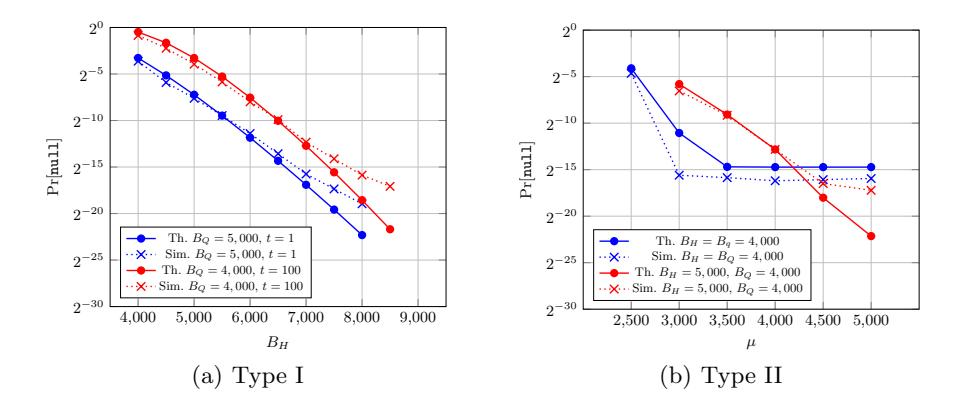

## Cryptanalysis of LEDAcrypt

Daniel Apon<sup>1</sup> , Ray Perlner<sup>1</sup> , Angela Robinson<sup>1</sup> , and Paolo Santini2,3

> <sup>1</sup> National Institute of Standards and Technology, USA <sup>2</sup> Universit`a Politecnica delle Marche, Italy <sup>3</sup> Florida Atlantic University, USA

{daniel.apon, ray.perlner, angela.robinson}@nist.gov p.santini@pm.univpm.it

Abstract. We report on the concrete cryptanalysis of LEDAcrypt, a 2nd Round candidate in NIST's Post-Quantum Cryptography standardization process and one of 17 encryption schemes that remain as candidates for near-term standardization. LEDAcrypt consists of a publickey encryption scheme built from the McEliece paradigm and a keyencapsulation mechanism (KEM) built from the Niederreiter paradigm, both using a quasi-cyclic low-density parity-check (QC-LDPC) code. In this work, we identify a large class of extremely weak keys and provide an algorithm to recover them. For example, we demonstrate how to recover 1 in 2<sup>47</sup>.<sup>72</sup> of LEDAcrypt's keys using only 2<sup>18</sup>.<sup>72</sup> guesses at the 256-bit security level. This is a major, practical break of LEDAcrypt. Further, we demonstrate a continuum of progressively less weak keys (from extremely weak keys up to all keys) that can be recovered in substantially less work than previously known. This demonstrates that the imperfection of LEDAcrypt is fundamental to the system's design.

Keywords: NIST PQC, LEDAcrypt, McEliece, QC-LDPC, Cryptanalysis

## 1 Introduction

Since Shor's discovery [\[28\]](#page-29-0) of a polynomial-time quantum algorithm for factoring integers and solving discrete logarithms, there has been a substantial amount of research on quantum computers. If large-scale quantum computers are ever built, they will be able to break many of the public-key cryptosystems currently in use. This would gravely undermine the integrity and confidentiality of our current communications infrastructure on the Internet and elsewhere.

In response, the National Institute of Standards and Technology (NIST) initiated a process [\[1\]](#page-27-0) to solicit, evaluate, and standardize one or more quantumresistant, public-key cryptographic algorithms. This process began in late 2017 with 69 submissions from around the world of post-quantum key-establishment mechanisms or KEMs (resp. public-key encryption schemes or PKEs), and digital signature algorithms. In early 2019, the list of candidates was cut from 69 to 26 (17 of which are PKEs or KEMs), and the 2nd Round of the competition began [\[2\]](#page-27-1). The conclusion of Round 2 is now rapidly approaching.

LEDAcrypt [3] is one of the 17 remaining candidates for standardization as a post-quantum PKE or KEM scheme. It is based on the seminal works of McEliece [21] in 1978 and Niederreiter [24] in 1986, which are based on the NP-complete problem of decoding an arbitrary linear binary code [5]. More precisely, LEDAcrypt is composed of a PKE scheme based on McEliece but instantiated with a particular type of codes (called QC-LDPC) and a KEM in the variant style of Niederreiter. The specific origins of LEDAcrypt – the idea of using QC-LDPC codes with the McEliece paradigm – dates back a dozen years to [17].

At a very high level, the private key of LEDAcrypt is a pair of binary matrices H and Q, where H is a sparse, quasi-cyclic, parity-check matrix of dimension  $p \times p \cdot n_0$  for a given QC-LDPC code and where Q is a random, sparse, quasi-cyclic matrix of dimension  $p \cdot n_0 \times p \cdot n_0$ . Here p is a moderately large prime and  $n_0$  is a small constant. The intermediate matrix  $L = [L_0|...|L_{n_0-1}] = H \cdot Q$  is formed by matrix multiplication. The public key M is then constructed from L by multiplying each of the  $L_i$  by  $L_{n_0-1}^{-1}$ . Given this key pair, information can be encoded into codeword vectors, then perturbed by random error-vectors of a low Hamming weight.<sup>1</sup>

Security essentially relies on the assumption that it is difficult to recover the originally-encoded information from the perturbed codeword unless a party possesses the factorization of the public key as H and Q. To recover such matrices (or, equivalently, their product) one must find low-weight codewords in the public code (or in its dual) which, again, is a well-known NP-complete problem [5]. State-of-the-art algorithms to solve this problem are known as Information Set Decoding (ISD), and their expected computational complexity is indeed used as a design criteria for LEDAcrypt parameters.

The LEDAcrypt submission package in the 2nd Round of NIST's PQC process provides a careful description of the algorithm's history and specific design, a variety of concrete parameters sets tailored to NIST's security levels (claiming approximately 128-bit, 192-bit, and 256-bit security, under either IND-CPA or IND-CCA attacks), and a reference implementation in-code.

#### 1.1 Our results

In this work, we provide a novel, concrete cryptanalysis of LEDAcrypt. Note that, in LEDAcrypt design procedure, the time complexity of ISD algorithms is derived by assuming that the searched codewords are uniformly distributed over the set of all n-uples of fixed weight. However, as we show in Section 3, for LEDAcrypt schemes this assumption does not hold, since it is possible to identify many families of secret keys, i.e., matrices H and Q, for which the rows of L = HQ (which represent low weight codewords in the dual code) are characterized by a strong bias in the distribution of set bits. We define such keys as weak since, intuitively, in such a case an ISD algorithm can be strongly improved by taking into account the precise structure of the searched codeword. As a direct evidence, in Section 4 we consider a moderately-sized, very weak class

<span id="page-1-0"></span><sup>&</sup>lt;sup>1</sup>We refer the reader to Section A.1 for further technical details of the construction.

of keys, which can be recovered with substantially less computational effort than expected. This is a major, practical break of the LEDAcrypt cryptosystem, which is encapsulated in the following theorem.

**Theorem 1.1 (Section 4).** There is an algorithm that costs the same as  $2^{49.22}$  AES-256 operations and recovers 1 in  $2^{47.72}$  of LEDAcrypt's Category 5 (i.e. claimed 256-bit-secure) ephemeral / IND-CPA keys.

Similarly, there is an algorithm that costs the same as  $2^{57.50}$  AES-256 operations and recovers 1 in  $2^{51.59}$  of LEDAcrypt's Category 5 (i.e. claimed 256-bit-secure) long-term / IND-CCA keys.

While most key-recovery algorithms can exchange computational time spent vs. fraction of the key space recovered, this trade-off will generally be 1-to-1 against a secure cryptosystem. (In particular this trade off is 1-to-1 for the AES cryptosystem which is used to define the NIST security strength categories for LEDAcrypt's parameter sets.) However, we note in the above that both  $49.22+47.72=96.94 \ll 256$  and  $57.49+51.59=109.08 \ll 256$ , making this attack quite significant. Additionally, we note that this class of very weak keys is present in every parameter set of LEDAcrypt.

While the existence of classes of imperfect keys is a serious concern, one might ask:

Is it possible to identify such keys during KeyGen, reject them, and thereby save the scheme's design?

We are able to answer this in the negative.

Indeed, as we demonstrate in Section 3, the bias in the distribution of set bits in L, which is at the basis of our attack, is intrinsic in the scheme's design. Our results clearly show that the existence of weaker-than-expected keys in LEDAcrypt is fundamental in the system's formulation and cannot be avoided without a major re-design of the cryptosystem.

Finally, we apply our new attack ideas to attempting key recovery without considering a weak key notion. Here we analyze the asymptotic complexity of attacking all LEDAcrypt keys.

**Theorem 1.2 (Section 5).** The asymptotic complexity of ISD using an appropriate choice of structured information sets, when attacking all LEDAcrypt keys in the worst case, is  $\exp(\tilde{O}(p^{\frac{1}{4}}))$ .

This gives a significant asymptotic speed-up over running ISD with uniformly random information sets, which costs  $\exp(\tilde{O}(p^{\frac{1}{2}}))$ . We note that simply enumerating H and Q actually leads to an attack running in time  $\exp(\tilde{O}(p^{\frac{1}{4}}))$ , and indeed similar attacks were considered in LEDAcrypt's submission documents for the NIST PQC process. However, this type of attack had worse concrete complexity than ordinary ISD with uniformly random information sets for all of the 2nd Round parameter sets.

#### 1.2 Technical Overview of Our New Attacks

Basic Approach: Exploiting the Product Structure. The typical approach to recovering keys for LEDAcrypt-like schemes is to use ordinary ISD algorithms, a class of techniques which can be used to search for low weight codewords in an arbitrary code. Generally speaking, these algorithms symbolically consider a row of an unknown binary matrix corresponding to the secret key of the scheme. From this row, they randomly choose a set of bit positions uniformly at random in the hope that these bits will (mostly) be zero. If the guess is correct and, additionally, the chosen set is an *information set* (i.e., a set in which all codewords differ at least in one position), then the key will be recovered with linear algebra computation. If (at least) one of the two requirements on the set is not met, then the procedure resets and guesses again.

For our attacks, intuitively, we will choose the information set in a non-uniform manner in order to increase the probability that the support of HQ, i.e. the non-zero coefficients of HQ, is (mostly) contained in the complement of the information set. At a high level, we will guess two sets of polynomials  $H'_0, ..., H'_{n_0-1}$  and  $Q'_{0,0}, ..., Q'_{n_0-1,n_0-1}$ , then (interpreting the polynomials as  $p \times p$  circulant matrices) group them into quasi-cyclic matrices H' and Q'. These matrices will be structured analogously to H and Q, but with non-negative coefficients defined over  $\mathbb{Z}[x]/\langle x^p-1\rangle$  rather than  $\mathbb{F}_2[x]/\langle x^p+1\rangle$ . The hope is that the support of H'Q' will (mostly) contain the support of HQ. It should be noted that a sufficient condition for this to be the case is that the support of H' contains the support of H' and the support of H' contains the support of H' and the support of H' contains the support of H' and the support of H' contains the support of H' and the support of H' contains the support of H' and the support of H' contains the support of H' and the support of H' contains the support of H' and the support of H' contains the support of H' and properly passed to an ISD subroutine in place of a uniform guess.

Observe that the probability that the supports of H' and Q' contain the supports of H and Q, respectively, is maximized by making the Hamming weight of H' and Q' as large as possible while still limiting the Hamming weight of H'Q' to W. An initial intuition is that this can be done by choosing the 1-coefficients of the polynomials  $H'_0, ..., H'_{n_0-1}$  and  $Q'_{0,0}, ..., Q'_{n_0-1,n_0-1}$  to be in a single, consecutive chunk. For example, by choosing the Hamming weight of the polynomials (before multiplication) as some value  $B \ll W$ , we can take  $H'_0 = x^a + x^{a+1} + ... + x^{a+B-1}$  and  $Q'_{0,0} = x^c + x^{c+1} + ... + x^{c+B-1}$ .

Note that the polynomials  $H'_0$  and  $Q'_{0,0}$  (chosen with consecutive 1-coefficients as above) have Hamming weight B, while their product only has Hamming weight 2B-1. In the most general case, uniformly chosen polynomials with Hamming weight B would be expected to have a product with Hamming weight much closer to  $\min(B^2,p)$ . That is, for a fixed weight W required of H'Q' by the ISD subroutine, we can guess around W/2 positions at once in H' and Q' respectively instead of something closer to  $\sqrt{W}$  as would be given by a truly uniform choice of information set. As a result, each individual guess of H' and Q' that's "close" to this outline of our intuition will be more rewarding for searching the keyspace than the "typical" case of uniformly guessing information sets.

This constitutes the core intuition for our attacks against LEDAcrypt, but additional considerations are required in order to make the attacks practically effective (particularly when concrete parameters are considered). We enumerate a few of these observations next.

Different ring representations. The idea of choosing the polynomials within H' and Q' with consecutive nonzero coefficients makes each iteration of an information set decoding algorithm using such an H' and Q' much more effective than an iteration with a random information set. However there is only a limited number of successful information sets with this form. We can vastly increase our range of options by observing that the ring  $\mathbb{F}_2[x]/\langle x^p+1\rangle$  has p-1 isomorphic representations which can be mapped to one another by the isomorphism  $f(x) \to f(x^{\alpha})$ . This allows us many more equally efficient choices of the information set, since rather than restricting our choices to have polynomials  $H'_0$  and  $Q'_{0,0}$  with consecutive ones in the standard ring representation, we have the freedom to choose them with consecutive ones in any ring representation (provided the same representation is used for  $H'_0$  and  $Q'_{0,0}$ .)

Equivalent keys. For each public key of LEDAcrypt, there exist many choices of private keys that produce the same public key. In particular, the same public key  $M = (L_{n_0-1})^{-1}L$  produced by the private key

$$H = [H_0, H_1, \cdots, H_{n_0-1}],$$

$$Q = \begin{bmatrix} Q_{0,0} & Q_{0,1} & \cdots & Q_{0,n_0-1} \\ Q_{1,0} & Q_{1,1} & \cdots & Q_{1,n_0-1} \\ \vdots & \vdots & \ddots & \vdots \\ Q_{n_0-1,0} & Q_{n_0-1,1} & \cdots & Q_{n_0-1,n_0-1} \end{bmatrix};$$

would also be produced by any private key of the form

$$H' = [x^{a_0}H_0, x^{a_1}H_1, \cdots, x^{a_{n_0-1}}H_{n_0-1}],$$

$$Q' = \begin{bmatrix} x^{b-a_0}Q_{0,0} & x^{b-a_0}Q_{0,1} & \cdots & x^{b-a_0}Q_{0,n_0-1} \\ x^{b-a_1}Q_{1,0} & x^{b-a_1}Q_{1,1} & \cdots & x^{b-a_1}Q_{1,n_0-1} \\ \vdots & \vdots & \ddots & \vdots \\ x^{b-a_{n_0}}Q_{n_0-1,0} & x^{b-a_{n_0}}Q_{n_0-1,1} & \cdots & x^{b-a_{n_0}}Q_{n_0-1,n_0-1} \end{bmatrix};$$

for any integers  $0 < a_i, b < p, i \in \{0, \dots, n_0 - 1\}$ . These  $p^{n_0 + 1}$  equivalent keys improve the success probability of key recovery attacks as detailed in the following sections.

Different degree constraints for H' and Q'. While we have so far described H' and Q' as having the same Hamming weight B, this does not necessarily need to be the case. In fact, there are many, equivalent choices of H' and Q' which

produce the same product  $H^\prime Q^\prime$  based on this observation. For example, the product of

$$\begin{split} H_0' &= x^a + x^{a+1} + \ldots + x^{a+B-1} \\ Q_{0,0}' &= x^c + x^{c+1} + \ldots + x^{c+B-1} \end{split}$$

is identical to the product of

$$H'_0 = x^a + x^{a+1} + \dots + x^{a+B-1-\delta}$$
  
 $Q'_{0,0} = x^c + x^{c+1} + \dots + x^{c+B-1+\delta}$ 

for any integer  $-B < \delta < B$ . More generally, this relationship (that if H' shrinks and Q' proportionally grows, or vice versa, then the product H'Q' is the same) is independently true for any set of  $\{H'_i, Q'_{i,0}, ..., Q'_{i,n_0-1}\}$  for  $i \in \{0, ..., n_0-1\}$ .

Attacks for  $n_0 = 2$  imply similar-cost attacks for  $n_0 > 2$ . Our attacks are more easily described (and more effective) in the case  $n_0 = 2$ . In this case, we apply ISD to find low-weight codewords in the row space of the public key  $[M_0 \mid M_1]$  to recover a viable secret key for the system. Naively extending this approach for the case  $n_0 > 2$  to the entire public key  $[M_0 \mid ... \mid M_{n_0}]$  requires constraints on the support of  $n_0 + n_0^2$  polynomials ( $n_0$  polynomials corresponding to H' and  $n_0^2$  polynomials corresponding to H', so the overall work in the attack would increase quadratically as  $n_0$  grows. However, even in the case that  $n_0 > 2$ , we observe that it is sufficient to find low weight codewords in the row space of only  $[M_0 \mid M_1]$  in order to recover a working key, implying that the attack only needs to consider  $3n_0$  polynomials  $H_i, Q_{j,0}, Q_{k,1}$ . So, increasing  $n_0$  will make all of our attacks less effective, but not substantially so. More importantly, any attack against  $n_0 = 2$  parameters immediately implies a similar-cost attack against parameters with  $n_0 > 2$ . Therefore, we focus on the case of  $n_0 = 2$  in the remainder of this work.

A Continuum of Progressively Less Weak Keys. The attacker can recover keys with the highest probability per iteration of ISD by using a very structured pattern for L'. As we will see in Section 4, in this pattern both  $L'_0$  and  $L'_1$  will have a single contiguous stretch of nonzero coefficients in some ring representation. The result is a practical attack, but one which is only capable of recovering weak keys representing something like 1 in  $2^{40}$  or 1 in  $2^{50}$  private keys.

However, if the attacker is willing to use a more complicated pattern for the information set, using different ring representations for different blocks of H' and Q', and possibly having multiple separate stretches of consecutive nonzero coefficients in each block, then the attacker will not recover keys with as high a probability per iteration, but the attack will extend to a broader class of slightly less weak keys. This may for example lead to a somewhat less practical attack that recovers 1 in  $2^{30}$  keys, but still much faster than would be expected given the claimed security strength of the parameter set in question.

We do not analyze the multitude of possible cases here, but we show they must necessarily exist in Section 3 by demonstrating that bias is intrinsically present throughout the LEDAcrypt key space.

Improvements to Average-case Key Recovery. In Section [5](#page-26-0) we will take the continuum of progressively weaker keys to its logical extreme. We show that the attacks in this paper are asymptotically stronger than the standard attacks not just for weak keys, but for all keys.

As we move away from the simpler information set patterns used on the weakest keys, the analysis becomes more difficult. To fully quantify the impact of our attack on average keys would require extensive case analysis of all scenarios that might lead to a successful key recovery given a particular distribution of information sets used by the attacker, which we leave for future work.

## <span id="page-6-0"></span>1.3 Related Work

The main attack strategies against cryptosystems based on QC-LDPC codes are known as information set decoding (ISD) algorithms. These algorithms are also applicable to a variety of other code-based cryptosystems including the NIST 2nd round candidates BIKE [\[23\]](#page-29-4), HQC [\[8\]](#page-28-2), Classic McEliece [\[9\]](#page-28-3), and NTS-KEM [\[18\]](#page-29-5). Initiated by Prange [\[26\]](#page-29-6) in 1962, these algorithms have since experienced substantial improvements during the years [\[4,](#page-28-4)[7,](#page-28-5)[14,](#page-28-6)[15,](#page-29-7)[19,](#page-29-8)[20,](#page-29-9)[29\]](#page-29-10). ISD algorithms can also be used to find low-weight codewords in a given, arbitrary code. ISD main approach is that of guessing a set of positions where such codewords contain a very low number of set symbols; when this set is actually an information set, then linear algebra computations yield the searched codeword (see [A.3\)](#page-33-0). ISD time complexity is estimated as the product between the expected number of required information set guesses and the cost of testing each set. Advanced ISD algorithms improve Prange's basic idea by reducing the average number of required guesses, at the cost of increasing the time complexity of the testing phase. Quantum ISD algorithms take into account Grover's algorithm [\[10\]](#page-28-7) to quadratically accelerate the guessing phase. A quantum version of Prange's algorithm [\[6\]](#page-28-8) was presented in 2010, while quantum versions of more advanced ISD algorithms were presented in 2017 [\[12\]](#page-28-9).

In the case of QC-MDPC and QC-LDPC codes, ISD key recovery attacks can get a speed-up which is polynomial in the size of the circulant blocks [\[27\]](#page-29-11). This gain is due to the fact that there are more than one sparse vector in the row space of the parity check matrix, and no modification to the standard ISD algorithms is required to obtain this speed-up. Another example of gains due to the QC structure is that of [\[16\]](#page-29-12) which, however, works only in the case of the circulant size having a power of 2 among its factors (which is not the case we consider here).

ISD can generally be described as a technique for finding low Hammingweight codewords in a linear code. Most ISD algorithms are designed to assume that the low-weight codewords are random aside from their sparsity. However, in some cryptosystems that can be cryptanalyzed using ISD, these short codewords are not random in this respect, and modified versions of ISD have been used to break these schemes [\[22,](#page-29-13) [25\]](#page-29-14). Our paper can be seen as a continuation of this line of work, since unlike the other 2nd Round NIST candidates where ISD is cryptanalytically relevant, the sparse codewords which lead to a key recovery of LEDAcrypt are not simply random sparse vectors, but have additional structure due to the product structure of LEDAcrypt's private key.

## 2 Preliminaries

#### 2.1 Notation

Throughout this work, we denote the finite field with 2 elements by  $\mathbb{F}_2$ . We denote the Hamming weight of a vector a (or a polynomial a, viewed in terms of its coefficient vector) as  $\operatorname{wt}(a)$ . For a polynomial a we use the representation  $a = \sum_{i=0}^{p-1} a_i x^i$ , and call  $a_i$  its i-th coefficient. We denote the support – i.e. the non-zero coordinates – of a vector (or polynomial) a by S(a). In similar way, we define the antisupport of a, and denote it as  $\overline{S}(a)$ , as the set of positions i such that  $a_i = 0$ . Given a polynomial a and a set a, we denote as  $a \mid_J$  the set of coefficients of a that are indexed by a.

Given  $\pi$ , a permutation of  $\{0, \dots, n-1\}$ , we represent it as the ordered set of integers  $\{\ell_0, \dots, \ell_{n-1}\}$ , such that  $\pi$  places  $\ell_i$  in position i. For a length-n vector  $a, \pi(a)$  denotes the action of  $\pi$  on a, i.e., the vector whose i-th entry is  $a_{\ell_i}$ . For a probability distribution  $\mathcal{D}$ , we write  $X \sim \mathcal{D}$  if X is distributed according to  $\mathcal{D}$ .

#### 2.2 Parameters

The parameter sets of LEDAcrypt that we explicitly consider in this work are shown in Table 1 (although similar forms of our results hold for all parameter sets). We refer the reader to Section A.1 for further technical details of the construction.

| NIST Category | Security Type | p       | $d_v$ | $m_0$ | $m_1$ | $n_0$ |
|---------------|---------------|---------|-------|-------|-------|-------|
| 1 (128-bit)   | IND-CPA       | 14,939  | 11    | 4     | 3     | 2     |
| 5 (256-bit)   | IND-CPA       | 36,877  | 11    | 7     | 6     | 2     |
| 5 (256-bit)   | IND-CCA       | 152,267 | 13    | 7     | 6     | 2     |

<span id="page-7-1"></span>Table 1. LEDAcrypt parameter sets that we consider in this paper.

## <span id="page-7-0"></span>3 Existence of Weak Keys in LEDAcrypt

As we have explained in Section 1.3, key recovery attacks against cryptosystems based on codes with sparse parity-check matrices can be performed by searching for low weight codewords, either in the code or in its dual. For instance, such codewords in the dual correspond, with overwhelming probability, to the rows of the secret parity-check matrix, of weight  $\omega \ll n$ , where n denotes the code

length. The most efficient way to solve this problem is to use ISD algorithms. To analyze the efficiency of such attacks, weight- $\omega$  codewords are normally modeled as independent random variables, sampled according to the uniform distribution of n-uples with weight  $\omega$ , which we denote as  $\mathcal{U}_{\omega}$ . At each ISD iteration, the algorithm succeeds if the intersection between the chosen set T and the support of (at least) one of such codewords satisfies some properties. Regardless of the considered ISD variant, this intersection has to be small.

Let  $\epsilon$  be the probability that a single ISD iteration can actually recover a specific codeword of the desired weight. When the code contains M codewords of weight  $\omega$ , then the probability that a single ISD iteration can recover any of these codewords is  $1-(1-\epsilon)^M$  which, if  $\epsilon M\ll 1$ , can be approximated as  $\epsilon M$ . This speed-up in ISD algorithm normally applies to the case of QC codes, where M corresponds to the number of rows in the parity-check matrix (that is, M=n-k).

In this section we show that the product structure in LEDAcrypt yields to a strong bias in the distribution of set symbols in the rows of the secret parity-check matrix L = HQ. As a consequence, the assumption on the uniform distribution of the searched codewords does not hold anymore, and this opens up for dramatic improvements in ISD algorithms. To provide evidence of this claim we analyze, without loss of generality, a simplified situation. We focus on the case  $n_0 = 2$ , and consider the success probability of ISD algorithms when applied on LEDAcrypt schemes, searching for a row of the secret L (say, the first row), with weight  $\omega = 2d_v(m_0 + m_1)$ .

In this case we expect to have the usual speed-up deriving from the presence of multiple low-weight codewords. However, quantifying this speed-up is not straightforward and requires cumbersome computations, since it also depends on the particular choice of the chosen set in ISD. Thus, to keep the description as general as possible and easy to follow, in this section we only focus on a single row of L. Exact computations for these quantities are performed in Sections 4 and 5. Furthermore, we only consider the probability that a chosen set T does not overlap with the support of the searched codeword. With this choice, we essentially capture the essence of all ISD algorithms. An analysis on a specific variant, with optimized parameters and requirements on the chosen set, might significantly improve the results of this section which, however, are already significant for the security of LEDAcrypt schemes.

Let  $T \subseteq \{0, \dots, n-1\}$  be a set of dimension k: for  $a \sim \mathcal{U}_{\omega}$ , we have

$$\Pr\left[T \cap \mathcal{S}(a) = \varnothing \mid a \sim \mathcal{U}_{\omega}\right] = \frac{\binom{n-\omega}{k}}{\binom{n}{k}}.$$

Note that this probability does not depend on the particular choice of T, but just on its size. When a purely random QC-MDPC code is used, as in BIKE [23], the first row of the secret parity-check matrix is well modeled as a random sample from  $\mathcal{U}_{\omega}$ . The previous probability can also be described as the ratio between the number of n-uples of weight  $\omega$  whose support is disjoint with T, and that of

all possible samples from  $\mathcal{U}_{\omega}$ ; in schemes such as BIKE, this also corresponds to the probability that a secret key satisfies the requirement on an arbitrary set T.

As we show in the remainder of this section, in LEDA crypt such a fraction can actually be made significantly larger, when T is properly chosen. To each choice, we can then associate a family of  $weak\ keys$ , that is, secret keys for which the corresponding first row of L does not overlap with T. We formally define the notion of weak keys in the following.

<span id="page-9-1"></span>**Definition 3.1.** Let K be the public key space of LEDAcrypt with parameters  $n_0, p, d_v, m_0, m_1$ . Let  $T \subseteq \{0, \dots, n_0p-1\}$  of cardinality n-k=p and  $\mathcal{W} \subseteq K$  be the set of all public keys corresponding to secret keys sk=(H,Q) such that the first row in the corresponding L=HQ has support that is disjoint with T. Finally, we define  $\omega=n_0(m_0+m_1)d_v$  and  $\mathcal{U}_\omega$  as the uniform distribution of  $(n_0p)$ -tuples with weight  $\omega$ . Then, we say that  $\mathcal{W}$  is a set of weak-keys if

$$\Pr\left[pk \in \mathcal{W} | (sk, pk) \leftarrow \textit{KeyGen}()\right] \gg \Pr\left[T \cap S(a) = \varnothing | a \sim \mathcal{U}_{\omega}\right] = \frac{\binom{n_0 p - \omega}{p}}{\binom{n_0 p}{p}}.$$

Roughly speaking, we have a family of weak keys when, for a specific set choice, the number of keys meeting the requirement on the support is significantly larger than the one that we would have for the uniform case. Indeed, for all such keys, we will have a strongly bias in the matrix L, since null positions can be guessed with high probability; as we describe in Sections 4 and 5, this fact opens up for strong attacks against very large portions of keys.

# 3.1 Preliminary considerations on sparse polynomials multiplications

We now recall some basic fact about polynomial multiplication in the rings  $\mathbb{F}_2[x]/\langle x^p+1\rangle$  and  $\mathbb{Z}[x]/\langle x^p-1\rangle$ , which will be useful for our treatment. Let  $a,b\in\mathbb{F}_2[x]/\langle x^p+1\rangle$  and c=ab; we then have

$$c_i = \bigoplus_{z=0}^{p-1} a_z b_{z'}, \ z' = i - z \mod p,$$

where the operator  $\bigoplus$  highlights the fact that the sum is performed over  $\mathbb{F}_2$ . Taking into account antisupports, we can rewrite the previous equation as

<span id="page-9-0"></span>
$$c_{i} = \bigoplus_{\substack{z \notin \bar{S}(a) \\ z' = i - z \mod p, \ z' \notin \bar{S}(b)}}^{p-1} a_{z}b_{z'}. \tag{1}$$

Let N(a, b, i) denote the set of terms that contribute to the sum in Eq. (1), i.e.

$$N(a,b,i) = \left\{z \text{ s.t. } z \not \in \bar{\mathcal{S}}(a) \text{ and } i-z \mod p \not \in \bar{\mathcal{S}}(b) \right\}.$$

We now denote with  $\tilde{a}$  and  $\tilde{b}$  the polynomials obtained by lifting a and b over  $\mathbb{Z}[x]/\langle x^p-1\rangle$  i.e., by mapping the coefficients of a and b into  $\{0,1\}\subset\mathbb{Z}$ . Let  $\tilde{c}=\tilde{a}\tilde{b}$ : we straightforwardly have that  $c\equiv\tilde{c}\mod 2$ ,  $|N(a,b,i)|=\tilde{c}_i$  and  $\sum_{i=0}^{p-1}\tilde{c}_i=\operatorname{wt}(a)\cdot\operatorname{wt}(b)$ . Let  $a'\in\mathbb{Z}[x]/\langle x^p+1\rangle$  with coefficients in  $\{0,1\}$ , such that  $S(a')\supseteq S(a)$ , i.e., such that its support contains that of a (or, in another words, such that its antisupport is contained in that of a); an analogous definition holds for b'. Indeed, we can write  $a'=\tilde{a}+s_a$ , where  $s_a\in\mathbb{Z}[x]/\langle x^p+1\rangle$  and whose i-th coefficient is equal to 0 if  $a'_i=a_i$ , and equal to 1 otherwise; with analogous notation, we can write  $b'=\tilde{b}+s_b$ . Then

$$c' = a'b' = (\tilde{a} + s_a)(\tilde{b} + s_b) = \tilde{a}\tilde{b} + s_a\tilde{b} + s_b\tilde{a} + s_as_b = \tilde{c} + s_a\tilde{b} + s_b\tilde{a} + s_as_b.$$

Since  $s_a\tilde{b}$ ,  $s_b\tilde{a}$  and  $s_as_b$  have all non-negative coefficients, we have

<span id="page-10-0"></span>
$$c_i' \ge \tilde{c}_i = |N(a, b, i)| \ge 0, \forall i \in \{0, \dots, p-1\}.$$
 (2)

We now derive some properties that link the coefficients of c' to those of c; as we show, knowing portions of the antisupports of a and b is enough to gather information about the coefficients in their product.

<span id="page-10-1"></span>**Lemma 3.2.** Let  $a, b \in \mathbb{F}_2[x]/\langle x^p + 1 \rangle$ , and  $J_a, J_b \subseteq \{0, \dots, p-1\}$  such that  $J_a \supseteq S(a)$  and  $J_b \supseteq S(b)$ . Let  $a', b' \in \mathbb{Z}[x]/\langle x^p - 1 \rangle$  be the polynomials whose coefficients are null, except for those indexed by  $J_a$  and  $J_b$ , respectively, which are set as 1. Let  $c = ab \in \mathbb{F}_2[x]/\langle x^p + 1 \rangle$  and  $c' = a'b' \in \mathbb{Z}[x]/\langle x^p - 1 \rangle$ ; then

$$c_i' = 0 \implies c_i = 0.$$

*Proof.* The result immediately follows from (2) by considering that if  $c'_i = 0$  then necessarily |N(a, b, i)| = 0 and, subsequently,  $c_i = 0$ .

When the weight of c=ab is maximum, i.e., equal to  $\operatorname{wt}(a)\cdot\operatorname{wt}(b)$ , the probability to have null coefficients in  $c_i$  can be related to the coefficients in  $c_i$ ; in analogous way, we can also derive the probability that several bits are simultaneously null. These relations are formalized in the following Lemma.

<span id="page-10-2"></span>**Lemma 3.3.** Let  $a, b \in \mathbb{F}_2[x]/\langle x^p+1 \rangle$ , with respective weights  $\omega_a$  and  $\omega_b$ , such that  $\omega = \omega_a \omega_b \leq p$ , and c = ab has weight  $\omega$ . Let  $J_a, J_b \subseteq \{0, \dots, p-1\}$  such that  $J_a \supseteq S(a)$  and  $J_b \supseteq S(b)$ . Let  $a', b' \in \mathbb{Z}[x]/\langle x^p-1 \rangle$  be the polynomials whose coefficients are null, except for those indexed by  $J_a$  and  $J_b$ , respectively, which are set as 1; finally, let  $M = |J_a| \cdot |J_b|$ .

i) Let  $c'_i$  be the i-th coefficient of c' = a'b'; then

$$\Pr\left[c_i = 0 | c_i'\right] = \gamma(M, \omega, c_i') = \left(1 + \omega \cdot \frac{c_i'}{M + 1 - \omega - c_i'}\right)^{-1}.$$

ii) For  $V = \{v_0, \dots, v_{t-1}\} \subseteq \{0, \dots, p-1\}$ , we have

$$\Pr\left[\text{wt}(c|_{V}) = 0 \mid c'\right] = \zeta(V, c', \omega) = \prod_{\ell=0}^{t-1} \gamma \left(M - \sum_{j=0}^{\ell-1} c'_{v_{j}}, \omega, c'_{v_{\ell}}\right).$$

*Proof.* The results follow from a combinatorial argument. See B.3 for details.  $\Box$ 

## 3.2 Identifying families of weak keys

We are now ready to use the results presented in the previous section to describe how, in LEDAcrypt, families of weak keys as in Def. 3.1 can be identified. We base our strategy on the results of Lemmas 3.2 and 3.3. Briefly, we guess "containers" for each polynomial in the secret key, i.e., polynomials over  $\mathbb{Z}[x]/\langle x^p-1\rangle$  whose support contains that of the corresponding polynomials in  $\mathbb{F}_2[x]/\langle x^p+1\rangle$ . We then combine such containers, to find positions that, with high probability, do not point at set coefficient in the polynomials in L = HQ. Assuming that the initial choice for the containers is right, we can then use the results of Lemmas 3.2 and 3.3 to determine such positions. For the sake of simplicity, and without loss of generality, we describe our ideas for the practical case of  $n_0 = 2$ .

Operatively, to build a set T defining an eventual set of weak keys, we rely on the following procedure.

- 1. Consider sets  $J_{H_i}$  such that  $J_{H_i} \supseteq S(H_i)$ , for i=0,1; the cardinality of  $J_{H_i}$  is denoted as  $B_{H_i}$ . In analogous way, define sets  $J_{Q_{i,j}}$ , for i=0,1 and j=0,1, with cardinalities  $B_{Q_{i,j}}$ .
- 2. To each set  $J_{H_i}$ , associate a polynomial  $H_i' \in \mathbb{Z}[x]/\langle x^p 1 \rangle$ , taking values in  $\{0,1\}$  and whose support corresponds to  $J_{H_i}$ ; in analogous way, construct polynomials  $J_{Q_{i,j}}$  from the sets  $J_{Q_{i,j}}$ . Compute

$$L'_{i,j} = H'_j Q'_{j,i} \in \mathbb{Z}[x]/\langle x^p - 1 \rangle, \ (i,j) \in \{0,1\}^2.$$

3. Compute

$$L_i' = L_{i,0}' + L_{i,1}' = H_0' Q_{0,i}' + H_1' Q_{1,i}' \in \mathbb{Z}[x] / \langle x^p - 1 \rangle.$$

Let  $\pi_i$ , with i=0,1, be a permutation such that the coefficients of  $\pi_i(L_i')$  are in non decreasing order. Group the first  $\lfloor \frac{p}{2} \rfloor$  entries of  $\pi_0$  in a set  $T_0$ , and the first  $\lceil \frac{p}{2} \rceil$  ones of  $\pi_1$  in a set  $T_1$ . Define T as  $T = T_0 \cup \{p + \ell | \ell \in T_1\}$ .

A visual representation of the above constructive method to search for weak keys is described in Appendix C.

Essentially, our proposed procedure to find families of weak keys starts from the sets  $J_{H_i}$  and  $J_{Q_{i,j}}$ , which we think of as "containers" for the secret key, i.e., sets containing the support of the corresponding polynomial in the secret key. Their products yield polynomials  $L'_{i,j}$ , which are containers for the products  $H_iQ_{j,i}$ . Because of the maximum weight requirement in LEDAcrypt key generation, each  $L'_{i,j}$  matches the hypothesis required by the Lemma 3.3: the lowest entries in  $L'_{i,j}$  correspond to the coefficients that, with the highest probability, are null in  $H'_iQ'_{j,i}$ . We remark that, because of Lemma 3.2, a null coefficient in  $L'_{i,j}$  means that the corresponding coefficients in  $H_jQ_{j,i}$  must be null. Finally, we need to combine the coefficients of the polynomials  $L'_{i,j}$ , to identify positions that are very likely to be null in each  $L_i$ . The approach we consider consists in choosing the positions that correspond to coefficients with minimum values in

the sums L 0 i,<sup>0</sup> + L 0 i,1 . This simple criterion is likely to be not optimal, but allows to avoid cumbersome notation and computations; furthermore, as we show next, it already detects significantly large families of weak keys.

The number of secret keys that meet the requirements on T, i.e., keys leading to polynomials L<sup>0</sup> and L<sup>1</sup> that do not overlap with the chosen sets T<sup>0</sup> and T1, respectively, clearly depends on the particular choice for the containers. In the remainder of this section, we describe how such a quantity can be estimated. For the sake of simplicity, we analyze the case in which the starting sets for the containers have constant size, i.e., BH<sup>i</sup> = B<sup>H</sup> and BQi,j = BQ, for all i and j; furthermore, we choose JH<sup>0</sup> = JH<sup>1</sup> , JQ0,<sup>0</sup> = JQ1,<sup>1</sup> and JQ1,<sup>0</sup> = JQ0,<sup>1</sup> .

First of all, let J be the set of secret keys whose polynomials are contained in the sets JH<sup>i</sup> and JQi,j ; the cardinality of this set can be estimated as

$$|\mathcal{J}| = \eta \bigg( \binom{B_H}{d_v} \binom{B_Q}{m_0} \binom{B_Q}{m_1} \bigg)^2,$$

where η is the acceptance ratio in key generation, i.e., the probability that a random choice of matrices H and Q leads to a matrix L with full weight.

We now estimate the number of keys in J that produce polynomials L<sup>0</sup> and L<sup>1</sup> corresponding to a correct choice for T<sup>0</sup> and T1, i.e., such that their supports are disjoint with T<sup>0</sup> and T1, respectively. For each product HiQi,j , we know i) that it has full weight, not larger than p, and ii) that sets JH<sup>i</sup> , JQi,j are containers for H<sup>i</sup> and Qi,j , respectively. Then, Lemma [3.3](#page-10-2) can be used to estimate the portion of valid keys. For instance, we consider the polynomial L<sup>0</sup> = H0Q0,<sup>0</sup> + H1Q1,0: the coefficients that are indexed by T<sup>0</sup> will be null when both the supports of H0Q0,<sup>0</sup> and H1Q1,<sup>0</sup> are disjoint with T0. If we neglect the fact that these two products are actually correlated (because of the full weight requirement on L0), then the probability that L<sup>0</sup> does not overlap with T0, which we denote as Pr [null(T0)], is obtained as

$$\Pr\left[\text{null}(T_0)\right] = \zeta(T_0, L'_{0,0}, m_0 d_v) \cdot \zeta(T_0, L'_{0,1}, m_1 d_v),$$

where ζ is defined in Lemma [3.3.](#page-10-2) The above quantity can then be used to estimate the fraction of keys in J for which the support of L<sup>0</sup> does not overlap with T0; we remark that, as highlighted by the above formula, this quantity strongly depends on the choices on J<sup>H</sup><sup>0</sup> , J<sup>H</sup><sup>1</sup> , J<sup>Q</sup>0,<sup>0</sup> , J<sup>Q</sup>1,<sup>0</sup> .

With the same reasoning, and with analogous notation, we compute Pr [null(T1)]; because of the simplifying restrictions on J<sup>Q</sup>i,j , this probability is equal to Pr [null(T0)].

Then, if we neglect the correlation between L<sup>0</sup> and L<sup>1</sup> (since H<sup>0</sup> and H<sup>1</sup> are involved in the computation of both polynomials), the probability that a random key from J is associated to a valid L, i.e., that it leads to polynomials L<sup>0</sup> and L<sup>1</sup> that respectively do not overlap with T<sup>0</sup> and T1, can be estimated as

$$\begin{split} \Pr\left[ \mathtt{null}(T) \right] &= \Pr\left[ \mathtt{null}(T_0) \right] \cdot \Pr\left[ \mathtt{null}(T_1) \right] \\ &= \left( \Pr\left[ \mathtt{null}(T_0) \right] \right)^2 \\ &= \left( \zeta \left( T_0, L'_{0,0}, m_0 d_v \right) \cdot \zeta \left( T_0, L'_{0,1}, m_1 d_v \right) \right)^2. \end{split}$$

Thus we conclude that the number of keys whose polynomials are contained by the chosen sets, and such that the corresponding L does not overlap with T, can be estimated as |J | · Pr[null(T)].

Then, for the set of secret keys where T does not intercept the first row of L, which we denote with W, we have

<span id="page-13-0"></span>
$$|\mathcal{W}| \ge |\mathcal{J}| \cdot \Pr[\mathtt{null}(T)]. \tag{3}$$

The inequality comes from the fact the right term in the above formula only counts keys with polynomials contained by the initially chosen sets; even if such property is not satisfied, it may still happen that the resulting L does not overlap with T (thus, we are underestimating the cardinality of W).

#### <span id="page-13-1"></span>3.3 Results

In this section we provide practical examples on choices for containing sets, leading to actual families of weak keys. To this end, we need to define clear criteria on how the sets JH<sup>i</sup> and JQi,j can be selected. For the sake of simplicity, we restrict our attention to the cases JH<sup>0</sup> = JH<sup>1</sup> = J<sup>H</sup> and JQ0,<sup>0</sup> = JQ0,<sup>1</sup> = JQ1,<sup>0</sup> = JQ1,<sup>1</sup> = JQ. We here consider two different strategies to pick these sets.

- Type I: for 
$$i = 0, 1, \delta \in \{0, \dots, p-1\}$$
 and  $t \in \{1, \dots, p-1\}$ , we choose 
$$J_H = \{\ell t \mod p \, | \, 0 \le \ell \le B_H - 1 \},$$
$$J_Q = \{\delta + \ell t \mod p \, | \, 0 \le \ell \le B_Q - 1 \}.$$

– Type II: for i = 0, 1, we choose JH<sup>0</sup> = JH<sup>1</sup> as the union of disjoint sets, formed by contiguous positions. Analogous choice is adopted for JQ.

To provide numerical evidences for our analysis, in Figure 1 we compare the simulated values of Pr[null(T)] with the ones obtained with theoretical expression, for parameters of practical interest and for some Types I and II choices. The simulated probabilities have been obtained by generating random secret keys from J and, as our results show, are well approximated by the theoretical expression. This shows that Eq. [3](#page-13-0) provides a good estimate for the fraction of keys in J that meet the requirement on the corresponding set T.

Tables [2,](#page-14-0) [3](#page-15-1) display results testing various weak key families of Type I and II, for two different LEDAcrypt parameters sets. According to the reasoning in the previous section, the values reported in the last column can be considered as a rough (and likely conservative) estimate for the probability that a random key belongs to the corresponding set W. Our results show that the identified families of keys meet Definition [1,](#page-36-0) so can actually be considered weak.



**Fig. 1.** Comparison between simulated and theoretical values for Pr[nu11], for  $p=14939,\ d_v=11,\ m_0=4,\ m_1=3$ . The values reported in Figure (a) are all referred to the case  $\delta=0$ . In Figure (b), the blue curves correspond to the choice  $J_H=J_Q=\{0,\cdots,1999\}\cup\{\mu,\cdots,\mu+1999\}$ , while the red curves correspond to  $J_H=\{0,\cdots,2499\}\cup\{\mu,\cdots,\mu+2499\}$  and  $J_Q=\{0,\cdots,3999\}$ .

| Type | Family Parameters                                                                                                    | $\frac{ \mathcal{J}  \cdot \Pr[\text{null}(T)]}{ \mathcal{K} }$ |
|------|----------------------------------------------------------------------------------------------------------------------|-----------------------------------------------------------------|
| I    | $B_H = B_Q = 7470$ $\delta = 0, t = 1$                                                                               | $2^{-99.88}$                                                    |
| I    | $B_H = 8000, B_Q = 4000$ $\delta = 2000, t = 1$                                                                      | $2^{-85.25}$                                                    |
| I    | $B_H = 8500, B_Q = 4000$ $\delta = 0, t = 127$                                                                       | $2^{-90.23}$                                                    |
| II   | $J_H = \{0, \cdots, 4499\} \cup \{7000, \cdots, 11499\}$<br>$J_Q = \{0, \cdots, 2499\} \cup \{8000, \cdots, 10499\}$ | $2^{-101.53}$                                                   |

<span id="page-14-0"></span>**Table 2.** Fraction of weak keys, for LEDAcrypt instances designed for 128-bit security, with parameters  $n_0=2,\ p=14939,\ d_v=11,\ m_0=4,\ m_1=3,$  for which  $\eta\approx 0.7090.$  For this parameter set, probability of randomly guessing a null set of dimension p, in a vector of length 2p and weight  $2(m_0+m_1)d_v$ , is  $2^{-154.57}$ .

Remark 1. The results we have shown in this section only represent a qualitative evidence of the existence of families of weak keys in LEDAcrypt. There may exist many more families of weak keys, having a complete different structure from the ones we have studied. Additionally, the parameters we have considered for types I and II may not be the optimal ones, but already identify families of weak keys. In the next sections we provide a detailed analysis for families of keys of type I and II, and furthermore specify the actual complexity of a full cryptanalysis exploiting such a key structure.

| Type | Family Parameters                                                                                                   | $\frac{ \mathcal{J}  \cdot \Pr[\mathtt{null}(T)]}{ \mathcal{K} }$ |
|------|---------------------------------------------------------------------------------------------------------------------|-------------------------------------------------------------------|
| I    | $B_H = 18000, B_Q = 9000$ $\delta = 9000, t = 1$                                                                    | $2^{-125.18}$                                                     |
| I    | $B_H = 24000, B_Q = 12000$<br>$\delta = 0, t = 1$                                                                   | $2^{-184.21}$                                                     |
| I    | $B_H = 18000, B_Q = 9000$<br>$\delta = 0, t = 5$                                                                    | $2^{-125.18}$                                                     |
| II   | $J_H = \{0, \dots, 20999\}$<br>$J_Q = \{0, \dots, 3999\} \cup \{10000, \dots, 13999\} \cup \{20000, \dots, 23999\}$ | $2^{-270.30}$                                                     |

<span id="page-15-1"></span>**Table 3.** Fraction of weak keys, for LEDAcrypt instances designed for 256-bit security, with parameters  $n_0=2,\ p=36877,\ d_v=11,\ m_0=7,\ m_1=6,$  for which  $\eta\approx 0.614.$  For this parameter set, probability of randomly guessing a null set of dimension p, in a vector of length 2p and weight  $2(m_0+m_1)d_v$ , is  $2^{-286.80}$ .

## <span id="page-15-0"></span>4 Explicit Attack on the Weakest Class of Keys

In the previous section we described how the product structure in LEDAcrypt leads to an highly biased distribution in set positions in L. As we have hinted, this property may be exploited to improve cryptanalysis techniques based on ISD algorithms. In this section, we present an attack against a class of weak keys in LEDAcrypt's design. We begin by identifying what appear to be the weakest class of keys (though large enough in number to constitute a serious, practical problem for LEDAcrypt). It is easily seen that the class of keys we consider in this section corresponds to a particular case of type I, introduced in Section 3.3. We proceed to provide a simple, single-iteration ISD algorithm to recover these keys, then analyze the fraction of all of LEDAcrypt's keys that would be recovered by this attack. Afterward, we show how to extend the ISD algorithm to more than one iteration, so as to enlarge the set of keys recovered by a similar enough of effort per key. We conclude by considering the effect of advanced ISD algorithms on the attack as well as the relationship between the rejection sampling step in LEDAcrypt's KeyGen and our restriction to attacking a subspace of the total key space.

## 4.1 Attacking an example (sub)class of ultra-weak keys

The simplest and, where it works, most powerful version of the attack dramatically speeds up ISD for a class of ultra-weak keys chosen under parameter sets where  $n_0 = 2$ . One example (sub)class of ultra-weak keys are those keys where the polynomials  $L_0$  and  $L_1$  are of degree at most  $\frac{p}{2}$ . Such keys can be found by a single iteration of a very simple ISD algorithm. We describe this simple attack as follows.

The attacker chooses the information set to consist of the last  $\frac{p-1}{2}$  columns of the first block of M and the last  $\frac{p+1}{2}$  columns of the second block. If the key being attacked is one of these weak keys, the attacker can correctly guess the top

row of L as being identically zero within the information set and linearly solve for the nonzero linear combination of the rows of M meeting this condition. The cost of the attack is one iteration of an ISD algorithm.

A sufficient condition for this class of weak key to occur is for the polynomials  $H_0$ ,  $H_1$ ,  $Q_{0,0}$ ,  $Q_{0,1}$ ,  $Q_{1,0}$ , and  $Q_{1,1}$  to have degree no more than  $\frac{p}{4}$ . Since each of the  $2m_0+2m_1+2d_v$  nonzero coefficients of these polynomials has a  $\frac{1}{4}$  probability of being chosen with degree less than  $\frac{p}{4}$ , these weak keys represent at least 1 part in  $4^{2m_0+2m_1+2d_v}$  of the key space.

## <span id="page-16-2"></span>4.2 Enumerating ultra-weak keys for a single information set

In fact, there are significantly more weak keys than this that can be recovered by the basic, one-iteration ISD algorithm using the information set described above. Intuitively, this is for two reasons:

- 1. **Equivalent keys:** There are  $p^2$  private keys, not of this same, basic form, which nonetheless produce the same public key.
- 2. **Different degree constraints:** The support of the top row of L will also fall entirely outside the information set if the degree of  $H_0$  is less than  $\frac{p}{4} \delta$  and the degrees of  $Q_{0,0}$  and  $Q_{0,1}$  are both less than  $\frac{p}{4} + \delta$  for any  $\delta \in \mathbb{Z}$  such that  $-\frac{p}{4} < \delta < \frac{p}{4}$ . Likewise for  $H_1$  and  $Q_{1,0}$  and  $Q_{1,1}$ , for a total of p keys.

Concretely, we derive the number of distinct private keys that are recovered by the one-iteration ISD algorithm in the following theorem.

Remark 2. There are p columns of each block of M. For the sake of simplicity, instead of referring to pairs of  $\frac{p-1}{2}$  and  $\frac{p+1}{2}$  columns, we instead use  $\frac{p}{2}$  for both cases. This has a negligible effect on our results.

<span id="page-16-1"></span>**Theorem 4.1.** The number of distinct private keys that can be found in a single iteration of the decoding algorithm described above (where the information set is chosen to consist of the last  $\frac{p}{2}$  columns of each block of M) is

<span id="page-16-0"></span>
$$p^{3} \cdot \sum_{A_{0}=d_{v}-1}^{\frac{p}{2}} \sum_{A_{1}=d_{v}-1}^{\frac{p}{2}} \left( \binom{A_{0}-1}{d_{v}-2} \binom{A_{1}-1}{d_{v}-2} \right) \\ \cdot \left( \binom{\frac{p}{2}-A_{0}-2}{m_{0}-1} \binom{\frac{p}{2}-A_{0}-1}{m_{1}} \binom{\frac{p}{2}-A_{1}-1}{m_{1}} \binom{\frac{p}{2}-A_{1}-1}{m_{0}} \right) \\ + \left( \binom{\frac{p}{2}-A_{0}-1}{m_{0}} \binom{\frac{p}{2}-A_{0}-2}{m_{1}-1} \binom{\frac{p}{2}-A_{1}-1}{m_{1}} \binom{\frac{p}{2}-A_{1}-1}{m_{0}} \right) \\ + \left( \binom{\frac{p}{2}-A_{0}-1}{m_{0}} \binom{\frac{p}{2}-A_{0}-1}{m_{1}} \binom{\frac{p}{2}-A_{1}-2}{m_{1}-1} \binom{\frac{p}{2}-A_{1}-1}{m_{0}} \right) \\ + \left( \binom{\frac{p}{2}-A_{0}-1}{m_{0}} \binom{\frac{p}{2}-A_{0}-1}{m_{1}} \binom{\frac{p}{2}-A_{1}-1}{m_{1}} \binom{\frac{p}{2}-A_{1}-2}{m_{0}-1} \right) \right) \\ \cdot \left( 1 - O\left(\frac{m}{p}\right) \right).$$

*Proof.* We count the number of ultra-weak keys as follows. By assumption, all nonzero bits in each block of an ultra-weak key are contained in some consecutive stretch of size  $\leq \frac{p}{2}$ . Thus these ultra-weak keys contain a stretch of at least  $\frac{p}{2}$  zero bits. This property applies directly to the polynomials  $H_0Q_{0,0} + H_1Q_{1,0}$  and  $H_0Q_{0,1} + H_1Q_{1,1}$ , and must also hold for  $H_0$  and  $H_1$ . We index the number of ultra-weak keys according to the first nonzero coefficient of these polynomials after the stretch of zero bits in cyclic ordering.

We begin by considering H,Q though not requiring HQ to have full weight. We are using an information set consisting of the same columns for both  $H_0Q_{0,0}+H_1Q_{1,0}$  and  $H_0Q_{0,1}+H_1Q_{1,1}$ . Therefore we count according the first nonzero bit of the sum  $H_0Q_{0,0}+H_1Q_{1,0}+H_0Q_{0,1}+H_1Q_{1,1}$ . Let l be the location of the first nonzero bit of this sum.

Let  $j_0, j_1$  be the locations of the first nonzero bit of  $H_0, H_1$ , respectively. Suppose that the nonzero bits of  $H_0, H_1$  are located within a block of length  $A_0, A_1$ , respectively.

By LEDAcrypt's design,  $d_v \leq A_i, i \in \{0,1\}$  and by assumption on the chosen information set,  $A_i \leq \frac{p}{2}, i \in \{0,1\}$ . Once  $j_0$  is fixed, there are  $\sum_{A_0=d_v-1}^{\frac{p}{2}} \binom{A_0-1}{d_v-2}$  ways to arrange the remaining bits of  $H_0$ . Thus there are

$$\sum_{j_0=1}^{p-1} \sum_{A_0=d_v-1}^{\frac{p}{2}} {A_0-1 \choose d_v-2} \sum_{j_1=1}^{p-1} \sum_{A_1=d_v-1}^{\frac{p}{2}} {A_1-1 \choose d_v-2}$$
 (5)

many bit arrangements of  $H_0, H_1$ .

Once  $j_0, j_1$  are fixed, there are four blocks of Q which may influence the location l. We compute the probability that only one block of Q may influence l at a time.

If l is influenced by  $Q_{0,0}$ , there are  $\binom{\frac{p}{2}-A_0-2}{m_0-1}$  ways the remaining bits of  $Q_{0,0}$  can fall,  $\binom{\frac{p}{2}-A_0-1}{m_1}$  arrangements of the bits of  $Q_{0,1}$ ,  $\binom{\frac{p}{2}-A_1-1}{m_1}$  arrangements of the bits of  $Q_{1,0}$ , and  $\binom{\frac{p}{2}-A_1-1}{m_0}$  arrangements of the bits of  $Q_{1,1}$ . If l is influenced by  $Q_{0,1}$ , there are  $\binom{\frac{p}{2}-A_0-2}{m_0}$  arrangements of the bits of  $Q_{0,0}$ ,  $\binom{\frac{p}{2}-A_0-1}{m_1-1}$  ways the remaining bits of  $Q_{0,1}$  can fall,  $\binom{\frac{p}{2}-A_1-1}{m_1}$  arrangements of the bits of  $Q_{1,0}$ , and  $\binom{\frac{p}{2}-A_1-1}{m_0}$  arrangements of the bits of  $Q_{1,1}$ . Similar estimates hold for  $Q_{1,0}$ , or  $Q_{1,1}$ .

We sum over the l locations considering each of the blocks of Q and their respective weights. Then the overall sum is

$$\sum_{j_{0}=0}^{p-1} \sum_{A_{0}=d_{v}-1}^{\frac{p}{2}} {A_{0}-1 \choose d_{v}-2} \sum_{j_{1}=0}^{p-1} \sum_{A_{1}=d_{v}-1}^{\frac{p}{2}} {A_{1}-1 \choose d_{v}-2} \\
\cdot \sum_{l=0}^{p-1} {\left( \frac{p}{2}-A_{0}-2 \choose m_{0}-1 \right) \left( \frac{p}{2}-A_{0}-1 \right) \left( \frac{p}{2}-A_{1}-1 \choose m_{1} \right) \left( \frac{p}{2}-A_{1}-1 \right) \choose m_{0}} \\
+ {\left( \frac{p}{2}-A_{0}-1 \right) \left( \frac{p}{2}-A_{0}-2 \right) \left( \frac{p}{2}-A_{1}-1 \right) \left( \frac{p}{2}-A_{1}-1 \right) \choose m_{1}} {\left( \frac{p}{2}-A_{1}-1 \right) \choose m_{0}} \\
+ {\left( \frac{p}{2}-A_{0}-1 \right) \left( \frac{p}{2}-A_{0}-1 \right) \left( \frac{p}{2}-A_{1}-2 \right) \left( \frac{p}{2}-A_{1}-1 \right) \choose m_{0}} \\
+ {\left( \frac{p}{2}-A_{0}-1 \right) \left( \frac{p}{2}-A_{0}-1 \right) \left( \frac{p}{2}-A_{1}-1 \right) \left( \frac{p}{2}-A_{1}-1 \right) \choose m_{0}} \\
+ {\left( \frac{p}{2}-A_{0}-1 \right) \left( \frac{p}{2}-A_{0}-1 \right) \left( \frac{p}{2}-A_{1}-1 \right) \left( \frac{p}{2}-A_{1}-1 \right) \choose m_{0}} \\
\cdot {\left( 1-O\left( \frac{m}{p} \right) \right)}.$$

Failure to impose full weight requirements on HQ introduces double-counting. This occurs when more than one block of Q influences l, though the probability of this event will not exceed  $O(\frac{m}{p})$ . The constant sums yield the factor of  $p^3$ .  $\square$ 

We can now estimate the percentage of these recovered, ultra-weak keys out of all possible keys.

<span id="page-18-3"></span>**Theorem 4.2.** Let  $m = m_0 + m_1, x = \frac{A_0}{p}, y = \frac{A_1}{p}$ . Out of  $\binom{p}{d_v}^2 \binom{p}{m_0}^2 \binom{p}{m_1}^2$  possible keys, we estimate the percentage of ultra-weak keys found in a single iteration of the decoding algorithm above as

$$d_v^2(d_v-1)^2 m \int_{x=0}^{\frac{1}{2}} \int_{y=0}^{\frac{1}{2}} (xy)^{d_v-2} \left( \left( \frac{1}{2} - x \right) \left( \frac{1}{2} - y \right) \right)^m \left( \frac{1}{\frac{1}{2} - x} + \frac{1}{\frac{1}{2} - y} \right) dy dx.$$

*Proof.* Note that the lines 2-5 of (4) are approximately

$$\binom{\frac{p}{2} - A_0}{m_0} \binom{\frac{p}{2} - A_0}{m_1} \binom{\frac{p}{2} - A_1}{m_1} \binom{\frac{p}{2} - A_1}{m_0} \left( \frac{m_0 + m_1}{\frac{p}{2} - A_1} + \frac{m_0 + m_1}{\frac{p}{2} - A_0} \right).$$
 (7)

For  $b, c \in \{0, 1\}$ ,

<span id="page-18-1"></span><span id="page-18-0"></span>
$$\binom{\frac{p}{2} - A_b}{m_c} \approx \binom{p}{m_c} \left(\frac{1}{2} - \frac{A_b}{p}\right)^{m_c}$$
 (8)

and

<span id="page-18-2"></span>
$$\begin{pmatrix} A_b - 1 \\ d_v - 2 \end{pmatrix} \approx \begin{pmatrix} p \\ d_v - 2 \end{pmatrix} \left( \frac{A_b}{p} \right)^{d_v - 2}$$

since p is much larger than  $m_0, m_1, d_v$ . We rewrite (4) using the approximations of expressions (7,8) as

$$p^{3} \sum_{A_{0}=d_{v}-1}^{\frac{p}{2}} {A_{0}-1 \choose d_{v}-2} \sum_{A_{1}=d_{v}-1}^{\frac{p}{2}} {A_{1}-1 \choose d_{v}-2} {p \choose m_{0}}^{2} \left(\frac{1}{2} - \frac{A_{0}}{p}\right)^{m_{0}+m_{1}}$$
(10)

<span id="page-19-0"></span>
$$\binom{p}{m_1}^2 \left(\frac{1}{2} - \frac{A_1}{p}\right)^{m_0 + m_1} \left(\frac{m_0 + m_1}{\frac{p}{2} - A_1} + \frac{m_0 + m_1}{\frac{p}{2} - A_0}\right).$$
 (11)

Applying approximation (9) further reduces expression (10) to

$$\begin{split} p^3 \binom{p}{m_0}^2 \binom{p}{m_1}^2 \binom{p}{d_v - 2}^2 \sum_{A_0 = d_v - 1}^{\frac{p}{2}} \left(\frac{A_0}{p}\right)^{d_v - 2} \sum_{A_1 = d_v - 1}^{\frac{p}{2}} \left(\frac{A_1}{p}\right)^{d_v - 2} \\ \left(\frac{1}{2} - \frac{A_0}{p}\right)^{m_0 + m_1} \left(\frac{1}{2} - \frac{A_1}{p}\right)^{m_0 + m_1} \left(\frac{m_0 + m_1}{\frac{p}{2} - A_1} + \frac{m_0 + m_1}{\frac{p}{2} - A_0}\right) \\ = p^2 \binom{p}{d_v - 2}^2 \binom{p}{m_0}^2 \binom{p}{m_1}^2 m \sum_{A_0 = d_v - 1}^{\frac{p}{2}} \sum_{A_1 = d_v - 1}^{\frac{p}{2}} \left(\frac{A_0}{p} \frac{A_1}{p}\right)^{d_v - 2} \left(\frac{1}{2} - \frac{A_0}{p}\right)^m \\ \left(\frac{1}{2} - \frac{A_1}{p}\right)^m \left(\frac{1}{\frac{1}{2} - \frac{A_0}{p}} + \frac{1}{\frac{1}{2} - \frac{A_1}{p}}\right). \end{split}$$

Letting  $x = \frac{A_0}{p}$ ,  $y = \frac{A_1}{p}$ , this is approximated by

$$p^{2} {p \choose d_{v}}^{2} {p \choose m_{0}}^{2} {p \choose m_{1}}^{2} m \frac{d_{v}^{2} (d_{v} - 1)^{2}}{(p - d_{v} + 2)^{2} (p - d_{v} + 1)^{2}}$$

$$\cdot p^{2} \int_{x=0}^{\frac{1}{2}} \int_{y=0}^{\frac{1}{2}} (xy)^{d_{v} - 2} \left(\frac{1}{2} - x\right)^{m} \left(\frac{1}{2} - y\right)^{m} \left(\frac{1}{\frac{1}{2} - x} + \frac{1}{\frac{1}{2} - y}\right) dy dx.$$

Dividing by 
$$\binom{p}{d_n}^2 \binom{p}{m_0}^2 \binom{p}{m_1}^2$$
, the result follows.

Evaluating this percentage with the claimed-256-bit ephemeral (CPA-secure) key parameters of LEDAcrypt —  $d_v=11, m=13$  — we determine that 1 in  $2^{72.8}$  ephemeral keys are broken by one iteration of ISD. Similarly for the long-term (CCA-secure) key setting, we evaluate with the claimed 256-bit parameters —  $d_v=13, m=13$  — and conclude the number of long-term keys broken is 1 in  $2^{80.6}$ .

This result merely determines the number of keys that can be recovered given that the information set of both blocks of M is chosen to be the last  $\frac{p}{2}$  columns.<sup>2</sup> In the following, we turn to demonstrating a class of additional information sets that are as effective as this one.

<span id="page-19-1"></span> $<sup>^2</sup>$ For the reader, we point out that if, hypothetically, we had a sufficiently large number of totally independent information sets that were equally "rewarding" in recovering keys, this would straightforwardly imply  $\approx 2^{72.8}$ -time and  $\approx 2^{80.6}$ -time "full" attacks against LEDAcrypt's claimed-256-bit parameters rather than weak-key attacks.

Remark 3. We remind the reader that instead of referring to the pairs of  $\frac{p-1}{2}$ ,  $\frac{p+1}{2}$  columns of blocks of M, we use  $\frac{p}{2}$  in both cases. This has a negligible effect on our results.

## 4.3 Enumerating ultra-weak keys for all information sets

Now we will demonstrate a multi-iteration ISD attack that is effective against the class of all ultra-weak keys. To set up the discussion, we begin by highlighting two, further "degrees of freedom," which will allow us to find additional, relevant information sets to guess:

1. Changing the ring representation: Contiguity of indices depends on the choice of ring representation. The large family of ring isomorphisms on  $\mathbb{Z}[x]/\langle x^p-1\rangle$  given by  $f(x)\to f(x^t)$  for  $t\in[0,p]$  preserves Hamming weight. For example, we can use the family of polynomials

$$H_i' = Q_{i,j}' = 1 + x^t + x^{2t} + \ldots + x^{\left \lfloor \frac{p}{4} \right \rfloor t}$$

in this attack, since there exists one t such that  $H_i'$  has consecutive nonzero coefficients. Choices of  $t \in \{1,\ldots,\frac{p-1}{2}\}$  yield independent information sets (noting that choices of t and  $-t \mod p$  yield equivalent information sets).

2. Changing the relative offset of the two consecutive blocks: We can also change the beginning index of the consecutive blocks produced within  $L'_0$  or  $L'_1$  (by modifying the beginning indices of  $H'_i$  and  $Q'_{i,j}$  to suit). Note that shifting both  $L'_0$  and  $L'_1$  by the same offset will recover equivalent keys. However, if we fix the beginning index of  $L'_0$  and allow the beginning index of  $L'_1$  to vary, we can find more, mostly independent information sets in order to recover more, distinct keys. The exact calculation of how far one should shift  $L'_1$ 's indices for a practically effective attack is somewhat complex; we perform this analysis below in the remainder of this subsection.

Recall that in the prior 1-iteration attack, we considered *one* example class of ultra-weak keys – namely, those keys where the polynomials  $L_0$  and  $L_1$  are of degree at most  $\frac{p}{2}$ . Here, we will now take a broader view on the weakest-possible keys.

**Definition 4.3.** We define the **class of ultra-weak keys** to be those where, in some ring representation, both  $H_0Q_{0,0} + H_1Q_{1,0}$  and  $H_0Q_{0,1} + H_1Q_{1,1}$  have nonzero coefficients that lie within a block of  $\frac{p-1}{2}$ -many consecutive (modulo p) degrees.

Our goal will be now to find a multi-iteration ISD algorithm — by estimating how far to shift the offset of  $L'_1$  per iteration — that recovers as much of the class of ultra-weak keys as possible without "overly wasting" the attacker's computational budget. Toward this end, recall that we have a good estimate in Theorem 4.2 of the fraction of keys  $(2^{-72.8}, \text{ resp. } 2^{-80.6})$  recovered by the

best-case, single iteration of our ISD algorithm. In what follows, we will first calculate the fraction of ultra-weak keys as a part of the total key space.

Let  $2^{-X}$  be the fraction of all keys recovered by the best-case, single iteration of our previous ISD algorithm. Let  $2^{-Y}$  be the fraction of ultra-weak keys among all keys. On the assumption that every ring representation leads to independent information sets (chosen uniformly for each invocation of ISD) and on the assumption that independence of ISD key-recovery is maximized by shifting "as far as possible," we will compute an estimate of the number of index-shifts that should be performed by the optimal ultra-weak-key attacker as  $2^Z = 2^{X-Y}$ . Beyond  $2^Z$  shifts per guess (but not until), the attacker should begin to experience diminishing returns in how many keys are recovered per shifted guess.

Therefore, given an index beginning at 1 out of p positions, the attacker will shift by  $\frac{p(\frac{p-1}{2})}{2^{\frac{p}{2}}}$  indices at each invocation (where the factor  $\frac{p-1}{2}$  accounts for the effect of the different possible ring representations). By assumption, each such guess will be sufficiently independent to recover as many keys in expectation as the initial, best-guess case described by the 1-iteration algorithm. We note that additional, ultra-weak keys will certainly be obtained by performing more work — specifically by shifting less than  $\frac{p(\frac{p-1}{2})}{2^{\frac{p}{2}}}$  per guess — but necessarily at a reduced rate of reward per guess.

Toward this end, we now calculate the number of ultra-weak keys then the fraction of ultra-weak keys among all keys following the format of the previous calculation.

<span id="page-21-1"></span>**Theorem 4.4.** The total number of ultra-weak keys is

$$\frac{p-1}{2}p^2 \sum_{A_0=d_v-1}^{\frac{p}{2}} \sum_{A_1=d_v-1}^{\frac{p}{2}} {A_0-1 \choose d_v-2} {A_1-1 \choose d_v-2}$$
(12)

$$\cdot \sum_{l_0=0}^{p-1} \left( \binom{\frac{p}{2} - A_0 - 1}{m_0 - 1} \binom{\frac{p}{2} - A_1 - 1}{m_1} + \binom{\frac{p}{2} - A_0 - 1}{m_0} \binom{\frac{p}{2} - A_1 - 1}{m_1 - 1} \right)$$
(13)

$$\cdot \sum_{l_1=0}^{p-1} \left( \binom{\frac{p}{2} - A_0 - 1}{m_0} \binom{\frac{p}{2} - A_1 - 1}{m_1 - 1} + \binom{\frac{p}{2} - A_0 - 1}{m_0 - 1} \binom{\frac{p}{2} - A_1 - 1}{m_0} \right). \quad (14)$$

*Proof.* The proof technique follows as in Theorem 4.1. Details are found in the appendix, B.1.  $\hfill\Box$ 

<span id="page-21-0"></span>**Theorem 4.5.** Let  $m=m_0+m_1, x=\frac{A_0}{p}, y=\frac{A_1}{p}$ . The fraction of ultra-weak keys out of all possible keys is

$$\begin{split} \frac{p-1}{2} d_v^2 (d_v - 1)^2 \int_{x=0}^{\frac{1}{2}} \int_{y=0}^{\frac{1}{2}} x^{d_v - 2} y^{d_v - 2} \left(\frac{1}{2} - x\right)^m \left(\frac{1}{2} - y\right)^m \\ \left(\frac{m_0^2 + m_1^2}{(\frac{1}{2} - x)(\frac{1}{2} - y)} + \frac{m_0 m_1}{(\frac{1}{2} - x)^2} + \frac{m_0 m_1}{(\frac{1}{2} - y)^2}\right) \mathrm{d}y \mathrm{d}x. \end{split}$$

*Proof.* Similar techniques apply. See appendix B.2 for details.

<span id="page-21-4"></span><span id="page-21-3"></span><span id="page-21-2"></span>

We evaluate the fraction of weak keys using the claimed CPA-secure parameters  $p=36877, m=13, d_v=11$  and determine that 1 in  $2^{54.1}$  ephemeral keys are broken. Evaluating with one of the CCA-secure parameter sets  $p=152267, m=13, d_v=13$ , approximately 1 in  $2^{59.7}$  long-term keys are broken.

Given the above, we can make an estimate as to the optimal shift-distance per ISD invocation as  $\frac{36,877(\frac{36,876}{2})}{2^{72.8-54.1}} \approx 1597 \approx 2^{10.6}$  for the ephemeral key parameters and  $\frac{152,267(\frac{152,266}{2})}{2^{80.6-59.7}} \approx 5925 \approx 2^{12.5}$  for the long-term key parameters.

The multi-iteration ISD algorithm against the class of ultra-weak keys, then, makes its first guess (except, one in each ring representation) as in the case of the 1-iteration ISD algorithm. It then shifts the relative offset of the two consecutive blocks by the values calculated above and repeats (again, in each ring representation).

This will not recover all ultra-weak keys, but it will recover a significant fraction of them. In particular, if the support of each block of L, rather than fitting in  $\frac{p}{2}$  consecutive bits fits in blocks that are smaller by at least  $\frac{1}{4}$  of the shift distance. We can therefore lower bound the fraction of recovered keys by replacing factors of  $\frac{1}{2}$  with factors of  $\frac{p}{2}$  minus half or a quarter of the offset, all divided by p, to find the sizes of sets of private keys of which we are guaranteed to recover all, or at least half of respectively.

The multi-iteration ISD algorithm attacking the ephemeral key parameters will make  $2^{72.8-54.1}\approx 2^{18.7}$  independent guesses and recover at least 1 in  $2^{56.0}$  of the total keys. The multi-iteration ISD algorithm attacking the long-term key parameters will make  $2^{80.6-59.7}\approx 2^{20.9}$  independent guesses and recover at least 1 in  $2^{61.6}$  of the total keys.

# <span id="page-22-0"></span>4.4 Estimating the effect of more advanced information-set decoding

Our attempts to enumerate all weak keys were based on the assumption that the adversary was using an ISD variant that required a row of L to be uniformly 0 on all columns of the information set. The state of the art in information set decoding still allows the adversary to decode provided that a row of L has weight no more than about 6 on the information set. For example, Stern's algorithm [29] with parameter 3 would attempt to find a low weight row of L as follows.

The information set is divided into two disjoint sets of  $\frac{p}{2}$  columns. The first row of L to be recovered should have weight at most 3 within each of the two sets. Further, the same row of L should have have  $\Omega(\log(p))$  many consecutive 0's in column-indices that are disjoint from those of the information set. If both of these conditions occur, then a matrix inversion is performed (even though 6 non-zero bits were contained in the information set).

Note that for reasonably large p, nearly a third of the sparse vectors having weight 6 in the information set will meet both conditions. The most expensive steps in the Stern's algorithm iteration are a matrix inversion of size p and a claw finding on functions with logarithmic cost in p and domain sizes of  $\left(\frac{p}{2}\right)$ . The claw finding step is similar in cost to the matrix inversion, both having computational

 $\cos t \approx p^3$ . The matrix inversion step is present in all ISD algorithms. Therefore with Stern's algorithm we can recover in a single iteration with similar cost to a single iteration of a simpler ISD algorithm, O(1) of the private keys where a row of L has weight no more than 6 on the information set columns.

Recall that we choose the information set to be of size  $\approx \frac{p}{2}$  in L'. The distribution of the non-zero coordinates within a successful guess of information set will be more heavily weighted toward the middle of the set and approximately triangular shaped (since these coordinates are produced by convolutions of polynomials). In particular, we will *heuristically* model both of the tails of the distribution as small triangles containing 3 bits on the left side and three bits on the right that are missed by the choice of information set.

Let  $W = 2d_v(m_0 + m_1)$  denote the number of non-zero bits in L'. Then the actual fraction  $\epsilon$  that the information set (in the context of advanced information set decoding) should target within L, rather than 1/2, can be estimated by geometric area as

$$\epsilon \cdot \left(1 - \sqrt{\frac{3}{W/2}}\right) = \frac{1}{2}$$

or, re-writing:

$$\epsilon = \frac{1}{2\left(1 - \sqrt{\frac{3}{W/2}}\right)}.$$

For the claimed-256-bit ephemeral key parameters, we have  $W_{\mathsf{CPA}} = 286$ . For the claimed-256-bit long-term key parameters, we have  $W_{\mathsf{CCA}} = 338$ . Therefore,

$$\begin{split} \epsilon_{\text{CPA}} &= \frac{1}{2\left(1-\sqrt{\frac{3}{286/2}}\right)} \approx 0.585.\\ \epsilon_{\text{CCA}} &= \frac{1}{2\left(1-\sqrt{\frac{3}{338/2}}\right)} \approx 0.577. \end{split}$$

So – heuristically – we can model the effect of using advanced information set decoding algorithms by replacing the  $\frac{1}{2}$ 's in the calculations of the theorems earlier in this section by  $\epsilon_{\mathsf{CPA}}$  or  $\epsilon_{\mathsf{CCA}}$  respectively.

#### <span id="page-23-0"></span>4.5 Rejection sampling considerations

We recall that LEDACrypt's KeyGen algorithm explicitly requires that the parity check matrix L be full weight. Intuitively full weight means that no cancellations occur in the additions or the multiplications that are used to generate L from H and Q. Formally, the full weight condition on L can be stated as:

$$\forall i \in \{0,\dots,n_0-1\}, \ \operatorname{weight}(L_i) = d_v \sum_{j=0}^{n_0-1} m_j.$$

When a weak key notion causes rejections to occur significantly more often for weak keys than non-weak keys, we will effectively reduce the probability of

weak key generation compared to our previous analysis. As an extreme example, if, for a given weak key notion, rejection sampling rejects all weak keys, then no weak keys will ever be sampled. We therefore seek to measure the probability of key rejection for both weak keys and keys in general in order to determine whether the effectiveness of this attack is reduced via rejection sampling.

Let  $\mathcal{K}$ ,  $\mathcal{W} \subset \mathcal{K}$ , and KeyGen be the public key space, the weak key space, and the key generation algorithm of LEDACrypt, respectively. Let  $\mathcal{K}'$ ,  $\mathcal{W}' \subset \mathcal{K}'$ , and KeyGen' be the associated objects if rejection sampling were omitted from LEDACrypt. We observe that since KeyGen samples uniformly from  $\mathcal{K}$ ,

$$\Pr\left[pk \in \mathcal{W} | (pk, sk) \leftarrow \mathsf{KeyGen()}\right] = \frac{|\mathcal{W}|}{|\mathcal{K}|}.$$

This equality additionally holds when rejection sampling does not occur. Since, until now, all of our analysis has ignored rejection sampling we have effectively been measuring  $|\mathcal{W}'|/|\mathcal{K}'|$ . We therefore seek to find a relation that allows us determine  $|\mathcal{W}|/|\mathcal{K}|$  from  $|\mathcal{K}'|$  and  $|\mathcal{W}'|$ . We observe that

$$\frac{|\mathcal{W}|}{|\mathcal{K}|} = \frac{|\mathcal{W}|}{|\mathcal{K}|} \frac{|\mathcal{W}'|}{|\mathcal{W}'|} \frac{|\mathcal{K}'|}{|\mathcal{K}'|} = \frac{|\mathcal{W}'|}{|\mathcal{K}'|} \frac{|\mathcal{W}|}{|\mathcal{W}'|} \frac{|\mathcal{K}'|}{|\mathcal{K}|}.$$

Therefore it holds that the probability of generating a weak key when we consider rejection sampling for the first time in our analysis changes by exactly a factor of  $(|\mathcal{W}|/|\mathcal{W}'|) \cdot (|\mathcal{K}'|/|\mathcal{K}|)$ . This is precisely the probability that a weak key will not be rejected due to weight concerns divided by the probability that key will not be rejected due to weight concerns.

We note that as long as the rejection probabilities for both keys and weak keys is not especially close to 0 or 1, then it is sufficient to sample many keys according to their distributions and observe the portion of these keys that would be rejected.

In order to practically measure the security gained by rejection sampling for the 1-iteration ISD attack against the ephemeral key parameters, we sample 10,000 keys according to KeyGen' and we sample 10,000 weak keys according to KeyGen' and we observe how many of them are rejected. We observe that approximately 39.2% of regular keys are rejected while approximately 67.4% of weak keys are rejected. We therefore conclude for this attack and this parameter set,  $\frac{|\mathcal{W}|}{|\mathcal{K}|} = 0.582 \frac{|\mathcal{W}'|}{|\mathcal{K}'|}$ . Therefore, rejection sampling grants less than 1 additional bit of security back to LEDACrypt.

This attack analysis can be efficiently reproduced for additional parameter sets and alternative notions of weak key with the same result.

#### 4.6 Putting it all together

Finally, we re-calculate the results of Section 4.2 using Theorems 4.2 and 4.5, but accounting for the attack improvement of using advanced information set decoding from Section 4.4 and accounting for the security improvement due

to rejection sampling issues in Section 4.5. We re-write the formulas with the substitutions of  $\epsilon_{CPA}$  (resp.  $\epsilon_{CPA}$ ) for the constant  $\frac{1}{2}$  for the reader, and note that the definition of ultra-weak keys has been implicitly modified to have more liberal degree constraints to suit the advanced ISD subroutine being used now.

Let x, y, m be defined as in Theorem 4.5. For the case of claimed-256-bit security for ephemeral key parameters, the fraction of ultra-weak keys recovered by a single iteration of the advanced ISD algorithm is

$$d_v^2(d_v-1)^2 m \int_{x=0}^{\epsilon} \int_{y=0}^{\epsilon} (xy)^{d_v-2} \left( (\epsilon-x) \left( \epsilon-y \right) \right)^m \left( \frac{1}{\epsilon-x} + \frac{1}{\epsilon-y} \right) \mathrm{d}y \mathrm{d}x,$$

and the fraction of these ultra-weak keys out of all possible keys is

$$(\epsilon p) d_v^2 (d_v - 1)^2 \int_{x=0}^{\epsilon} \int_{y=0}^{\epsilon} x^{d_v - 2} y^{d_v - 2} (\epsilon - x)^m (\epsilon - y)^m$$

$$\left( \frac{m_0^2 + m_1^2}{(\epsilon - x)(\epsilon - y)} + \frac{m_0 m_1}{(\epsilon - x)^2} + \frac{m_0 m_1}{(\epsilon - y)^2} \right) dy dx.$$

Evaluating these formulae with ephemeral key parameters  $d_v = 11, m_0 = 7, m_1 = 6, p = 36,877$  and substituting  $\epsilon_{\mathsf{CPA}} = .585$  yields 1 key recovered in  $2^{62.62}$  per single iteration, and 1 ultra-weak key in  $2^{43.90}$  of all possible keys. This yields an algorithm making  $2^{62.62-43.90} = 2^{18.72}$  guesses and recovering 1 in  $2^{47.72}$  of the ephemeral keys (accounting for the loss due to rejection sampling and the limited number of iterations).

Substituting  $\epsilon_{\text{CCA}} = .577$  similarly and evaluating with long-term key parameters  $d_v = 13, m_0 = 7, m_1 = 6, p = 152, 267$  yields 1 key recovered in  $2^{70.45}$  per single iteration and 1 ultra-weak key in  $2^{49.55}$  of all possible keys. This yields an algorithm making  $2^{70.45-49.55} = 2^{20.90}$  guesses and recovering 1 in  $2^{52.54}$  of the long-term keys (accounting for the loss due to rejection sampling and the limited number of iterations).

To conclude, we would like to compare this result against the claimed security level of NIST Category 5. Formally, these schemes should be as hard to break as breaking 256-bit AES. Each guess in the ISD algorithms leads to a cost of approximately  $p^3$  bit operations (due to linear algebra and claw finding operations combined). This is  $2^{45.5}$  bit operations for the ephemeral key parameters and  $2^{51.6}$  bit operations for the long-term key parameters. A single AES-256 operation costs approximately  $2^{15}$  bit operations. This yields the main result of this section.

**Theorem 4.6 (Main).** There is an advanced information set decoding algorithm that costs the same as  $2^{49.22}$  AES-256 operations and recovers 1 in  $2^{47.72}$  of LEDAcrypt's Category 5 ephemeral keys.

Similarly, there is an advanced information set decoding algorithm that costs the same as  $2^{57.50}$  AES-256 operations and recovers 1 in  $2^{52.54}$  of LEDAcrypt's Category 5 long-term keys.

Remark 4. Note that  $49.22+47.72 = 96.94 \ll 256, 57.50+52.54 = 110.03 \ll 256$ .

Remark 5. Finally, we recall that we used various heuristics to approximate the above numbers, concretely. However, these simplifying choices can only affect at most one or two bits of security compared to a fully formalized calculation (which would come at the expense of making the analysis significantly more burdensome to parse for the reader).

## <span id="page-26-0"></span>5 Attack on All Keys

To conclude, we briefly analyze the asymptotic complexity of our new attack strategy in the context of recovering keys in the average case. We first note that, assuming the LEDAcrypt approach is parameterized in a balanced way – that is, H and Q are similarly sparse, and further assuming that  $n_0$  is a constant – the ordinary ISD attack (with a randomly chosen information set) has a complexity of  $\exp(\tilde{O}(p^{\frac{1}{2}}))$ . To see this, observe that all known ISD variants using a random information set to find an asymptotically sparse secret parity check matrix constructed like the LEDAcrypt private key, have complexity  $O\left(\frac{n_0}{n_0-1}\right)^w$ , where  $w=n_0d_vm$  is the row weight of the secret parity check matrix. Efficient decoding requires  $w=O(p^{\frac{1}{2}})$ . By inspection this complexity is  $\exp(\tilde{O}(p^{\frac{1}{2}}))$ 

However, we obtain an improved asymptotic complexity when using structured information sets as follows.

**Theorem 5.1.** The asymptotic complexity of ISD using an appropriate choice of structured information sets, when attacking all LEDAcrypt keys in the worst case, is  $\exp(\tilde{O}(p^{\frac{1}{4}}))$ .

*Proof.* We analyze the situation with structured information sets. Imagine we are selecting the nonzero coefficients of H' and Q' completely at random, aside from a sparsity constraint. The sparsity constraint needs to be set in such a way that the row weight of the product H'Q' (restricted to two cyclic blocks) has row weight no more than p. This further constrains the row weight of each cyclic

block of 
$$H'$$
 and  $Q'$  to be approximately  $\left(\frac{p\ln(2)}{n_0}\right)^{\frac{1}{2}} = O(p^{\frac{1}{2}})$ . The probability of success per iteration is then at least  $O\left(\left(\frac{\ln(2)}{pn_0}\right)^{\frac{1}{2}\cdot\left(\sum_{i=0}^{n_0-1}m_i+n_0d_v\right)}\right)$ . With bal-

anced parameters,  $d_v$  and the  $m_i$  are  $O(p^{\frac{1}{4}})$ , thus the total complexity is indeed  $\exp(\tilde{O}(p^{\frac{1}{4}}))$ . Note that when H' and Q' are random aside from the sparsity constraint, the probability that the supports of H' and Q' contain the supports of H and Q respectively does not depend on H and Q, so the structured ISD algorithm is asymptotically better than the unstructured ISD algorithm, even when we ignore weak keys.

Remark 6. The fact that there exists an asymptotically better attack than standard information set decoding against keys structured like those of LEDAcrypt is not itself particularly surprising. Indeed, the very simple attack that proceeds by enumerating all the possible values of H and Q is also asymptotically

 $\exp(\tilde{O}(p^{\frac{1}{4}}))$ . However, this simple attack does not affect the concrete parameters presented in the Round 2 submission of LEDAcrypt.

In contrast, we strongly suspect, but have not rigorously proven, that our attack significantly improves on the complexity of standard information set decoding against typical keys randomly chosen for some of the submitted parameter sets of LEDAcrypt. In particular, our estimates suggest that the NIST category 5 parameters with  $n_0 = 2$  can be attacked with an appropriately chosen distribution for H' and Q' (e.g. with each polynomial block of H' and Q' chosen to have 5 or 6 consecutive chunks of nonzero coefficients in some ring representation) and that typical keys will be broken at least a few hundred times faster than with ordinary information set decoding.

If it were the case that we were attacking an "analogously-chosen" parameter set for LEDAcrypt targeting higher security levels (512-bit security, 1024-bit security, and so on), we believe a much larger computational advantage would be obtained and (importantly) be very easy to rigorously demonstrate.

#### 6 Conclusion

In this work, we demonstrated a novel, real-world attack against LEDAcrypt — one of 17 remaining 2nd Round candidates for standardization in NIST's Post-Quantum Cryptography competition. The attack involved a customized form of Information Set Decoding, which carefully guesses the information set in a non-uniform manner so as to exploit the unique product structure of the keys in LEDAcrypt's design. The attack was most effective against classes of weak keys in the proposed parameter sets asserted to have 256-bit security (demonstrating a trade-off between computational time and fraction of the key space recovered that was better than expected even of a 128-bit secure cryptosystem), but the attack also substantially reduced security of all parameter sets similarly.

Moreover, we demonstrated that these type of weak keys are present throughout the key space of LEDAcrypt, so that simple "patches" such as rejection sampling cannot repair the problem. This was done by demonstrating a continuum of progressively larger classes of less weak keys and by showing that the same style of attack reduces the average-case complexity of certain parameter sets.

**Acknowledgements.** We thank Corbin McNeill for his contributions to our analysis of rejection sampling on the weak key attack. We also thank the anonymous reviewers for very thorough editorial feedback. This work is funded in part by NSF grant award number 1906360.

## References

- <span id="page-27-0"></span>1. National Institute of Standards and Technology: Post-quantum cryptography project, 2016. https://csrc.nist.gov/projects/post-quantum-cryptography.
- <span id="page-27-1"></span>2. Gorjan Alagic, Jacob Alperin-Sheriff, Daniel Apon, David Cooper, Quynh Quynh Dang, Yi-Kai Liu, Carl Miller, Dustin Moody, Rene Peralta, Ray Perlner, Angela

- Robinson, and Daniel Smith-Tone. Status Report on the First Round of the NIST Post-Quantum Cryptography Standardization Process. 2019.
- <span id="page-28-0"></span>3. Marco Baldi, Alessandro Barenghi, Franco Chiaraluce, Gerardo Pelosi, and Paolo Santini. LEDAcrypt. Technical report, National Institute of Standards and Technology, 2019. available at [https://csrc.nist.gov/projects/](https://csrc.nist.gov/projects/post-quantum-cryptography/round-2-submissions) [post-quantum-cryptography/round-2-submissions](https://csrc.nist.gov/projects/post-quantum-cryptography/round-2-submissions).
- <span id="page-28-4"></span>4. Anja Becker, Antoine Joux, Alexander May, and Alexander Meurer. Decoding Random Binary Linear Codes in 2n/20: How 1 + 1 = 0 improves information set decoding. In David Pointcheval and Thomas Johansson, editors, Advances in Cryptology – EUROCRYPT 2012, pages 520–536, Berlin, Heidelberg, 2012. Springer Berlin Heidelberg.
- <span id="page-28-1"></span>5. Elwyn Berlekamp, Robert McEliece, and Henk Van Tilborg. On the inherent intractability of certain coding problems (corresp.). IEEE Transactions on Information Theory, 24(3):384–386, 1978.
- <span id="page-28-8"></span>6. Daniel J. Bernstein. Grover vs. McEliece. In Nicolas Sendrier, editor, Post-Quantum Cryptography, pages 73–80, Berlin, Heidelberg, 2010. Springer Berlin Heidelberg.
- <span id="page-28-5"></span>7. Daniel J. Bernstein, Tanja Lange, and Christiane Peters. Smaller Decoding Exponents: Ball-Collision Decoding. In Phillip Rogaway, editor, Advances in Cryptology – CRYPTO 2011, pages 743–760, Berlin, Heidelberg, 2011. Springer Berlin Heidelberg.
- <span id="page-28-2"></span>8. Carlos Aguilar Melchor, Nicolas Aragon, Slim Bettaieb, Lo¨ıc Bidoux, Olivier Blazy, Jean-Christophe Deneuville, Philippe Gaborit, Edoardo Persichetti, Gilles Z´emor, Jurjen Bos. HQC. available at [https://csrc.nist.gove/projects/](https://csrc.nist.gove/projects/post-quantum-cryptography/round-2-submission) [post-quantum-cryptography/round-2-submission](https://csrc.nist.gove/projects/post-quantum-cryptography/round-2-submission), 2019. Technical report, National Institute of Standards and Technology.
- <span id="page-28-3"></span>9. Daniel J. Bernstein, Tung Chou, Tanja Lange, Ingo von Maurich, Rafael Misoczki, Ruben Niederhagen, Edoardo Persichetti, Christiane Peters, Peter Schwabe, Nicolas Sendrier, Jakub Szefer, Wen Wang. Classic McEliece. available at [https://csrc.nist.gove/projects/post-quantum-cryptography/](https://csrc.nist.gove/projects/post-quantum-cryptography/round-2-submission) [round-2-submission](https://csrc.nist.gove/projects/post-quantum-cryptography/round-2-submission), 2019. Technical report, National Institute of Standards and Technology.
- <span id="page-28-7"></span>10. Lov K. Grover. A fast quantum mechanical algorithm for database search. In Proc. 28th Annual ACM Symposium on the Theory of Computing, pages 212–219, Philadephia, PA, May 1996.
- <span id="page-28-11"></span>11. Dennis Hofheinz, Kathrin H¨ovelmanns, and Eike Kiltz. A modular analysis of the Fujisaki-Okamoto transformation. In Yael Kalai and Leonid Reyzin, editors, TCC 2017: 15th Theory of Cryptography Conference, Part I, volume 10677 of Lecture Notes in Computer Science, pages 341–371, Baltimore, MD, USA, November 12–15, 2017. Springer, Heidelberg, Germany.
- <span id="page-28-9"></span>12. Ghazal Kachigar and Jean-Pierre Tillich. Quantum Information Set Decoding Algorithms. pages 69–89, 03 2017.
- <span id="page-28-10"></span>13. Kazukuni Kobara and Hideki Imai. Semantically secure McEliece public-key cryptosystems-conversions for McEliece PKC. In Kwangjo Kim, editor, PKC 2001: 4th International Workshop on Theory and Practice in Public Key Cryptography, volume 1992 of Lecture Notes in Computer Science, pages 19–35, Cheju Island, South Korea, February 13–15, 2001. Springer, Heidelberg, Germany.
- <span id="page-28-6"></span>14. Pil Joong Lee and Ernest F. Brickell. An observation on the security of McEliece's public-key cryptosystem. In Advances in Cryptology - EUROCRYPT 88, volume 330, pages 275–280. Springer Verlag, 1988.

- <span id="page-29-7"></span>15. Jeffrey S. Leon. A probabilistic algorithm for computing minimum weights of large error-correcting codes. IEEE Trans. Information Theory, 34(5):1354–1359, September 1988.
- <span id="page-29-12"></span>16. Carl L¨ondahl, Thomas Johansson, Masoumeh Koochak Shooshtari, Mahmoud Ahmadian-Attari, and Mohammad Reza Aref. Squaring Attacks on McEliece Public-Key Cryptosystems Using Quasi-Cyclic Codes of Even Dimension. Des. Codes Cryptography, 80(2):359–377, August 2016.
- <span id="page-29-3"></span>17. Baldi M., Bodrato M., and Chiaraluce F. A New Analysis of the McEliece Cryptosystem Based on QC-LDPC Codes. Ostrovsky R., De Prisco R., Visconti I. (eds) Security and Cryptography for Networks. SCN 2008., volume 5229, 2008.
- <span id="page-29-5"></span>18. Martin Albrecht, Carlos Cid, Kenneth G. Paterson, Cen Jung Tjhai, Martin Tomlinson. NTS-KEM. available at [https://csrc.nist.gove/projects/](https://csrc.nist.gove/projects/post-quantum-cryptography/round-2-submission) [post-quantum-cryptography/round-2-submission](https://csrc.nist.gove/projects/post-quantum-cryptography/round-2-submission), 2019. Technical report, National Institute of Standards and Technology.
- <span id="page-29-8"></span>19. Alexander May, Alexander Meurer, and Enrico Thomae. Decoding Random Linear Codes in O(2<sup>0</sup>.054<sup>n</sup> ). In Dong Hoon Lee and Xiaoyun Wang, editors, Advances in Cryptology – ASIACRYPT 2011, pages 107–124, Berlin, Heidelberg, 2011. Springer Berlin Heidelberg.
- <span id="page-29-9"></span>20. Alexander May and Ilya Ozerov. On Computing Nearest Neighbors with Applications to Decoding of Binary Linear Codes. In Elisabeth Oswald and Marc Fischlin, editors, Advances in Cryptology – EUROCRYPT 2015, pages 203–228, Berlin, Heidelberg, 2015. Springer Berlin Heidelberg.
- <span id="page-29-1"></span>21. Robert McEliece. A Public-Key Cryptosystem Based on Algebraic Coding Theory. The Deep Space Network (DSN) Progress Report, 44:114–116, 1978.
- <span id="page-29-13"></span>22. Dustin Moody and Ray Perlner. Vulnerabilities of "McEliece in the World of Escher". In Tsuyoshi Takagi, editor, Post-Quantum Cryptography, pages 104–117, Cham, 2016. Springer International Publishing.
- <span id="page-29-4"></span>23. Nicolas Aragon, Paulo Barreto, Slim Bettaieb, Loic Bidoux, Olivier Blazy, Jean-Christophe Deneuville, Phillipe Gaborit, Shay Gueron, Tim Guneysu, Carlos Aguilar Melchor, Rafael Misoczki, Edoardo Persichetti, Nicolas Sendrier, Jean-Pierre Tillich, Gilles Zemor. BIKE. available at [https://csrc.nist.gove/](https://csrc.nist.gove/projects/post-quantum-cryptography/round-2-submission) [projects/post-quantum-cryptography/round-2-submission](https://csrc.nist.gove/projects/post-quantum-cryptography/round-2-submission), 2019. Technical report, National Institute of Standards and Technology.
- <span id="page-29-2"></span>24. Harald Niederreiter. Knapsack-type cryptosystems and algebraic coding theory. Prob. Control and Inf. Theory, 15(2):159–166, 1986.
- <span id="page-29-14"></span>25. Ray Perlner. Optimizing Information Set Decoding Algorithms to Attack Cyclosymmetric MDPC Codes. In Michele Mosca, editor, Post-Quantum Cryptography, pages 220–228, Cham, 2014. Springer International Publishing.
- <span id="page-29-6"></span>26. Eugene Prange. The use of information sets in decoding cyclic codes. IRE Transactions on Information Theory, 8(5):5–9, 1962.
- <span id="page-29-11"></span>27. Nicolas Sendrier. Decoding One Out of Many. In Bo-Yin Yang, editor, Post-Quantum Cryptography, volume 7071 of Lecture Notes in Computer Science, pages 51–67. Springer Verlag, 2011.
- <span id="page-29-0"></span>28. Peter W. Shor. Algorithms for quantum computation: discrete logarithms and factoring. Proceedings 35th Annual Symposium on Foundations of Computer Science (FOCS), pages 124–134, 1994.
- <span id="page-29-10"></span>29. Jacques Stern. A method for finding codewords of small weight. In Coding Theory and Applications, 3rd International Colloquium, Toulon, France, November 2-4, 1988, Proceedings, pages 106–113, 1988.

## A Preliminaries

## <span id="page-30-0"></span>A.1 Overview of LEDAcrypt: QC-LDPC codes

The 2nd Round submission to NIST's PQC standardization process, LEDAcrypt, includes a key-encapsulation mechanism (KEM) built from the Niederreiter cryptosystem (LEDAcrypt KEM) and a public-key encryption (PKE) scheme built from the McEliece cryptosystem (LEDAcrypt PKC), both based on linear error-correcting codes. LEDAcrypt crucially is built on top of QC-LDPC codes, or Quasi-Cyclic Low-Density Parity-Check codes. We briefly survey the construction of such codes (with emphasis on the details of LEDAcrypt) for the reader.

A  $p \times p$  circulant matrix A is a matrix of the form

$$A = \begin{bmatrix} a_0 & a_1 & a_2 \cdots & a_{p-1} \\ a_{p-1} & a_0 & a_1 \cdots & a_{p-2} \\ a_{p-2} & a_{p-1} & a_0 \cdots & a_{p-3} \\ \vdots & \vdots & \vdots & \ddots & \vdots \\ a_1 & a_2 & a_3 \cdots & a_0 \end{bmatrix},$$

that is, all of the rows (resp. columns) are cyclic shifts of the first row (resp. column).

A Quasi-Cyclic (QC) matrix is a matrix of the form

$$B = \begin{bmatrix} B_{0,0} & B_{0,1} & \cdots & B_{0,w-1} \\ B_{1,0} & B_{1,1} & \cdots & B_{1,w-1} \\ \vdots & \vdots & \ddots & \vdots \\ B_{z-1,0} & B_{z-1,1} & \cdots & B_{z-1,w-1} \end{bmatrix}$$

for two positive integers w and z, where each  $B_{i,j}$  is a circulant matrix.

The set of  $p \times p$  binary circulant matrices forms a ring under matrix addition and multiplication modulo 2. The algebra of the polynomial ring  $\mathbb{F}_2[x]/\langle x^p+1\rangle$  is isomorphic to the ring of  $p \times p$  circulant matrices over  $\mathbb{F}_2$ .

Binary error correcting codes use a redundant representation of information primarily to detect and correct bit errors that occur during transmissions or storage. Let  $\mathbb{F}_2^k$  denote the k-dimensional vector space defined on  $\mathbb{F}_2$ . A binary code, denoted  $\mathcal{C}(n,k)$ , is defined as a bijective map  $\mathcal{C}(n,k): \mathbb{F}_2^k \to \mathbb{F}_2^n, n, k \in \mathbb{N}, 0 < k < n$  between any binary k-tuple (called an *information word*) and a binary n-tuple (called a *codeword*). We call n the length of the code and k the dimension of the code.

Encoding via  $\mathcal{C}(n,k)$  converts an information word  $u \in \mathbb{F}_2^k$  into a codeword  $c \in \mathbb{F}_2^n$ . Given a codeword  $\hat{c} = c + e$  corrupted by an error vector  $e \in \mathbb{F}_2^n$  with Hamming weight t > 0, decoding aims to recover the original information word u and the error vector e. A code is called t-error-correcting if, for any value of e of Hamming weight t, given  $\hat{c}$  there is an efficient decoding procedure that retrieves (u,e). Further, the code  $\mathcal{C}(n,k)$  is linear if and only if the set of its  $2^k$  codewords is a k-dimensional subspace of the vector space  $\mathbb{F}_2^n$ .

For any linear code, there are two equivalent descriptions of the code that are critical to its use: the generator matrix G and the parity-check matrix H.

Given a linear code C(n,k) and the vector subspace  $\Gamma \subset \mathbb{F}_2^n$  containing its  $2^k$  codewords, it is possible to choose k linearly independent codewords  $\{g_0,g_1,...,g_{k-1}\}\in \mathbb{F}_2^n$  to form a basis of  $\Gamma$ . That is, any codeword  $c=(c_0,c_1,...,c_{n-1})$  can be written as a linear combination of the basis vectors; i.e.

$$c = u_0 g_0 + u_1 g_1 + \dots + u_{k-1} g_{k-1}$$

where the  $u_i \in \{0,1\}$  are the representatives of  $u = (u_0, u_1, ..., u_{k-1})$  that the code maps into c. This can be re-written as c = uG, where G is a full row rank  $k \times n$  binary matrix; i.e.

$$G = \begin{bmatrix} g_0 \\ g_1 \\ \vdots \\ g_{k-1} \end{bmatrix}.$$

The set of all n-bit vectors in  $\mathbb{F}_2^n$  that are orthogonal to any codeword of the code subspace  $\Gamma$  is its orthogonal complement  $\Gamma^{\perp}$ . Its dimension is  $\dim(\Gamma^{\perp}) = n - \dim(\Gamma) = n - k = r$ . A basis of  $\Gamma^{\perp}$  is similarly obtained by sampling r linearly independent vectors in  $\Gamma^{\perp}$  and writing

$$H = \begin{bmatrix} h_0 \\ h_1 \\ \vdots \\ h_{r-1} \end{bmatrix}.$$

The  $r \times n$  matrix H is known as the parity-check matrix of the code  $\mathcal{C}(n,k)$ , and for any n-bit vector  $x \in \mathbb{F}_2^n$ , the  $r \times 1$  vector  $s = Hx^T$  is known as the syndrome of x through H. Note that every codeword  $c \in \Gamma$  satisfies the equality  $Hc^T = 0_{r \times 1}$ ; that is a codeword belonging to  $\mathcal{C}(n,k)$  has a null syndrome through H.

A QC code is defined as a linear (block) code C(n, k) with information word size  $k = p \cdot k_0$  and codeword size  $n = p \cdot n_0$ , where  $n_0$  is the basic block length of the code and each cyclic shift of a codeword by  $n_0$  symbols gives another valid codeword. LEDAcrypt relies on a QC code  $C(p \cdot n_0, p \cdot k_0)$  where the generator and party-check matrices are composed of  $p \times p$  circulant sub-matrices (i.e. blocks).

A Low-Density Parity-Check (LDPC) code  $\mathcal{C}(n,k)$  is a special type of linear block code characterized by a highly-sparse parity-check matrix H. In particular, the Hamming weight of a column of H, denoted  $d_v$ , is significantly smaller than its length r and in fact decreases sub-linearly with it. LEDAcrypt is based on a QC-LDPC code customized to the security levels targeted by NIST's PQC standardization process.

# A.2 Overview of LEDAcrypt's QC-LDPC code-based Niederreiter and McEliece cryptosystems

We briefly review the relevant portions of LEDAcrypt's QC-LDPC-based, public-key encryption algorithms, McEliece  $\Pi^{McE} = (KeyGen^{McE}, Enc^{McE}, Dec^{McE})$  and

Niederreiter  $\Pi^{\text{Nie}} = (\text{KeyGen}^{\text{Nie}}, \text{Enc}^{\text{Nie}}, \text{Dec}^{\text{Nie}})$ . In LEDAcrypt,  $\Pi^{\text{McE}}$  is used to construct an IND-CCA2 public-key encryption scheme via the KI- $\gamma$  transformation of Kobara-Imai [13] in the ROM, while  $\Pi^{\text{Nie}}$  is transformed via HHK [11] to produce an IND-CCA key-exchange mechanism in the ROM (and QROM).

However, our attacks will aim to recover the secret key of these cryptosystems from their public keys alone. That is, the form of encryption, decryption, encapsulation, and decapsulation will be immaterial here. Therefore, we will focus only on the underlying KeyGen algorithms, which are substantially similar (admitting the same form of attack). In particular, both key generation algorithms consider an appropriate QC-LDPC code  $\mathcal{C}(n,k)$ , have the same secret key material, but differ in whether they output a public key in the form of a parity-check matrix or a generator matrix systematic form.

Let  $\operatorname{\mathsf{perm}}(\cdot)$  denote the permanent of a matrix. Let  $w(\cdot)$  denote the number of nonzero coefficients of a polynomial (its weight). Note that if 2 is a primitive element of  $\mathbb{Z}_p$ , then its order  $\operatorname{ord}_p(2)$  is equal to the order of the multiplicative group of the field; i.e.  $\operatorname{ord}_p(2) = p - 1$ .

Both cryptosystems' key generation algorithms rely on the following fact.

**Fact A.1.** [3, cf. Theorem 1.1.14] Let p > 2 be a prime such that  $\operatorname{ord}_p(2) = p-1$  and Q is an  $n_0 \times n_0$  matrix of elements of  $\mathbb{F}_2[x]/\langle x^p+1\rangle$ . If  $\operatorname{perm}(w(Q))$  is odd and  $\operatorname{perm}(w(Q)) < p$ , then Q is non-singular.

 $Key\ Generation.$  Now we describe the KeyGen algorithm(s).

Fix a code C(n, k). Let the codeword length be  $n = p \cdot n_0$  and the information word length  $k = p(n_0 - 1)$ , where  $n_0 \in \{2, 3, 4\}$  and p is a prime number such that  $\operatorname{ord}_p(2) = p - 1$ .

- 1.  $(H,Q) \leftarrow \mathsf{GenHQ}(\mathsf{seed})$ : Find two random binary matrices corresponding to the secret quasi-cyclic  $p \times p \cdot n_0$  parity-check matrix H of a given QC-LDPC code and also a  $p \cdot n_0 \times p \cdot n_0$  quasi-cyclic sparse binary matrix Q.
  - Note that  $H = [H_0, ..., H_{n_0-1}]$ , where each  $H_i$  is a  $p \times p$  circulant block with  $w(H_i) = d_v$  for  $0 \le i < n_0$ .
  - Note that Q is an  $n_0 \times n_0$  block matrix with  $w([Q_{i,0},...,Q_{i,n_0-1}]) = m$  for  $0 \le i < n_0$ .
- 2. Compute  $L := H \cdot Q$ .
  - Writing  $L = [L_0, ..., L_{n_0-1}]$ , note that each  $L_j = \sum_i H_i Q_{i,j}$  is a  $p \times p$  circulant block.
- 3. If there is an index j so that  $w(L_j) \neq d_v \times m$ , start over.
- 4. For i = 0 to  $n_0 2$ , compute  $M_i := (L_{n_0-1})^{-1}L_i$ .
  - M is thus the parity-check matrix in systematic form and from this, the systematic generator matrix can easily be derived. Note that each  $M_i$  is a  $p \times p$  circulant block.
- 5. Output public key  $\mathsf{pk}^{\mathtt{Nie}} = [M_0|...|M_{n_0-2}|I_p]$  and secret key  $\mathsf{sk}^{\mathtt{Nie}} = (H,Q)$ .

In the case of McEliece style key generation, the final output is  $\mathsf{sk}^{\mathsf{McE}} = \mathsf{sk}^{\mathsf{Nie}}$  and  $\mathsf{pk}^{\mathsf{McE}} = [I_{p(n_0-1)}|[M_0|...|M_{n_0-2}]^T]$ , where  $I_t$  denotes the  $t \times t$  identity matrix.

#### <span id="page-33-0"></span>A.3 The standard attack: Information Set Decoding

Decoding an error-affected codeword for random codes is known to be an NP-complete problem. [5]. The best known decoding algorithms which do not exploit code structure are based on information-set decoding (ISD), an approach introduced by Eugene Prange in [26]. The technique requires finding a large set of error-free coordinates in a noisy codeword vector such that the corresponding columns of the generator matrix form an invertible submatrix. The indices of the error-free coordinates are known as the *information set I*.

Let G be a generator matrix of a code C. Let I be an information set such that G restricted to I, denoted  $G_I$ , forms an invertible submatrix. Let m be an information word and c = mG + e, a noisy codeword. Then  $c_I = (mG + e)_I = (mG)_I + e_I = (mG)_I$ , and m can be recovered by computing  $c_I \cdot G_I^{-1} = (mG)_I \cdot G_I^{-1}$ . This essentially outlines a message recovery attack.

The McEliece and Niederreiter cryptosystems use error-correcting codes such that the public key is a random-looking representation of a code, while the secret key is a representation of the same code that allows efficient decoding. In the case of LEDAcrypt, the dual of the public code contains low-weight codewords that coincide with the rows of the sparse parity-check matrix of the public code. Recovering a sparse parity-check matrix of the code allows for efficient decoding, and can thus be considered a *key recovery attack*.

A modified version of ISD can be used to to recover low-weight codewords from the dual of the public code. In the case where  $n_0=2$ , one must select a subset of half the columns of L so that the support of a row of L is outside of those columns. If successful, then the row of L can be recovered by simple linear algebra and recognized as the private key by having low hamming weight. Many improvements of Prange's ISD algorithm have been published, and in particular the series of improved ISD algorithms from [29] to [20] can be used to recover low-weight code words from the dual of the public code with little additional cost, when the subset of half the columns of L is instead chosen so that no more than 4–6 of the support columns of a row of L are within the chosen subset.

#### B Proofs

#### <span id="page-33-1"></span>B.1 Proof of Theorem 4.4

*Proof.* Let  $l_0$  be the location of the first nonzero bit of  $H_0Q_{0,0} + H_1Q_{1,0}$ ,  $l_1$  the location of the first nonzero bit of  $H_0Q_{0,1} + H_1Q_{1,1}$ . Let  $j_0, j_1$  be the first nonzero bit of  $H_0, H_1$ , respectively. Suppose that the nonzero bits of  $H_0, H_1$  are located within a block of length  $A_0, A_1$ , respectively.

Once  $j_0$  is fixed, there are two blocks of Q which may influence the location  $l_0$ . If  $l_0$  is influenced by  $Q_{0,0}$ , there are  $\binom{\frac{p}{2}-A_0-1}{m_0-1}$  arrangements of the bits of  $Q_{0,0}$  and  $\binom{\frac{p}{2}-A_1-1}{m_1}$  possible arrangements of the bits of  $Q_{1,0}$ . Otherwise, if  $l_0$  is influenced by  $Q_{1,0}$ , there are  $\binom{\frac{p}{2}-A_0-1}{m_0}$ ,  $\binom{\frac{p}{2}-A_1-1}{m_1-1}$  arrangements of  $Q_{0,0}$ ,  $Q_{1,0}$ , respectively. A similar calculation holds for the locations of  $l_1$  once  $j_1$  is fixed.

Summing over all  $j_0, A_0, j_1, A_1, l_0, l_1$  we obtain

$$\frac{p-1}{2} \sum_{j_0=0}^{p-1} \sum_{A_0=d_v}^{\frac{p}{2}} \binom{A_0-1}{d_v-2} \sum_{j_1=0}^{p-1} \sum_{A_1=d_v}^{\frac{p}{2}} \binom{A_1-1}{d_v-2}$$

$$\cdot \sum_{l_0=0}^{p-1} \binom{\frac{p}{2}-A_0-1}{m_0-1} \binom{\frac{p}{2}-A_1-1}{m_1} + \binom{\frac{p}{2}-A_0-1}{m_0} \binom{\frac{p}{2}-A_1-1}{m_1-1}$$

$$\cdot \sum_{l_1=0}^{p-1} \binom{\frac{p}{2}-A_0-1}{m_0} \binom{\frac{p}{2}-A_1-1}{m_1-1} + \binom{\frac{p}{2}-A_0-1}{m_0-1} \binom{\frac{p}{2}-A_1-1}{m_0}$$

Simplifying the expression, the result holds.

#### <span id="page-34-0"></span>B.2 Proof of Theorem 4.5

*Proof.* The expressions in (13,14) are approximately equal to

$$\begin{split} &\binom{\frac{p}{2}-A_0-1}{m_0}\binom{\frac{p}{2}-A_1-1}{m_1}\binom{\frac{p}{2}-A_0-1}{m_1}\binom{\frac{p}{2}-A_1-1}{m_0}\cdot\\ & \left(\frac{{m_0}^2+{m_1}^2}{(\frac{p}{2}-A_0)(\frac{p}{2}-A_1)}+\frac{m_0m_1}{(\frac{p}{2}-A_0)^2}+\frac{m_0m_1}{(\frac{p}{2}-A_1)^2}\right). \end{split}$$

Applying approximations (8,9) as in the proof of Theorem 4.2, we rewrite expressions (12,13,14) as

$$\frac{p-1}{2}p^{2}\binom{p}{m_{0}}^{2}\binom{p}{m_{1}}^{2}\binom{p}{d_{v}-2}^{2}$$

$$\sum_{A_{0}=d_{v}-1}^{\frac{p}{2}}\sum_{A_{1}=d_{v}-1}^{\frac{p}{2}}\left(\frac{A_{0}}{p}\frac{A_{1}}{p}\right)^{d_{v}-2}\left(\frac{1}{2}-\frac{A_{0}}{p}\right)^{m}\left(\frac{1}{2}-\frac{A_{1}}{p}\right)^{m}$$

$$\left(\frac{m_{0}^{2}+m_{1}^{2}}{(\frac{p}{2}-A_{0})(\frac{p}{2}-A_{1})}+\frac{m_{0}m_{1}}{(\frac{p}{2}-A_{0})^{2}}+\frac{m_{0}m_{1}}{(\frac{p}{2}-A_{1})^{2}}\right)$$

$$\approx\frac{p-1}{2}p^{2}\binom{p}{m_{0}}^{2}\binom{p}{m_{1}}^{2}\binom{p}{d_{v}}^{2}\frac{d_{v}^{2}(d_{v}-1)^{2}}{(p-d_{v}+2)^{2}(p-d_{v}+1)^{2}}$$

$$p^{2}\int_{x=0}^{\frac{1}{2}}\int_{y=0}^{\frac{1}{2}}(xy)^{d_{v}-2}\left(\frac{1}{2}-x\right)^{m}\left(\frac{1}{2}-y\right)^{m}$$

$$\left(\frac{m_{0}^{2}+m_{1}^{2}}{(\frac{1}{2}-x)(\frac{1}{2}-y)}+\frac{m_{0}m_{1}}{(\frac{1}{2}-x)^{2}}+\frac{m_{0}m_{1}}{(\frac{1}{2}-y)^{2}}\right)dydx.$$

Dividing by  $\binom{p}{d_v}^2 \binom{p}{m_0}^2 \binom{p}{m_1}^2$ , the result follows.

#### <span id="page-35-0"></span>B.3 Proof of Lemma 3.3

*Proof.* We first prove thesis i), and focus on a generic position i. Let  $\tilde{a}$  and  $\tilde{b}$  be the polynomials obtained by lifting a and b, respectively, from  $\mathbb{F}_2[x]/\langle x^p+1\rangle$  to  $\mathbb{Z}[x]/\langle x^p-1\rangle$ . Since  $c\equiv \tilde{c}\mod 2$ , we have

$$\operatorname{wt}(c) = \sum_{i=0}^{p-1} \tilde{c}_i - \sum_{j \text{ s.t. } \tilde{c}_j \text{ is odd}} (\tilde{c}_j - 1) - \sum_{\ell \text{ s.t. } \tilde{c}_\ell \text{ is even}} \tilde{c}_\ell.$$

We have  $\sum_{i=0}^{p-1} \tilde{c}_i = \text{wt}(a)\text{wt}(b) = \omega_a\omega_b = \omega$  and, by hypothesis, c has maximum weight, that is  $\text{wt}(c) = \omega$ . This means that

$$\sum_{j \text{ s.t. } \tilde{c}_j \text{ is odd}} (\tilde{c}_j - 1) + \sum_{\ell \text{ s.t. } \tilde{c}_\ell \text{ is even}} \tilde{c}_\ell = 0,$$

which implies that all odd coefficients in  $\tilde{c}$ , in number equal to  $\omega$ , have value equal to 1 and all even coefficients are equal to 0.

Let  $c' = a'b' \in \mathbb{Z}[x]/\langle x^p - 1 \rangle$ ; we define N(a',b',i) analogously to N(a,b,i), i.e., N(a',b',i) contains all indexes  $\ell$  such that  $\ell \in S(a')$  and  $\ell-i \mod p \in S(b')$ ; clearly,  $|N(a',b',i)| = c'_i$  and  $N(a,b,i) \subseteq N(a',b',i)$ . Then, each  $\tilde{c}_i$  can be seen as the sum of exactly  $c'_i$  products in the form  $a_\ell b_u$ , for proper indices  $\ell$  and u; because of the condition on the maximum weight, the products  $a_\ell b_u$  are either all null, or all null expect one.

With a combinatorial perspective, we can describe the computation of  $\tilde{c}_i$  through an urn experiment, containing M balls of two colors. Balls of the first color correspond to coefficients  $a_\ell b_u = 0$ , while balls of the second color correspond to coefficients  $a_\ell b_u = 1$ . For the i-th coefficient in  $\tilde{c}$ , we randomly extract  $c_i'$  balls, with the restriction that either zero or one ball of the second color can be selected. The number of balls in the urn, which we denote with M, equals the sum of coefficients in c', which is equal to  $|J_a| \cdot |J_b|$ . We have  $M - \omega$  balls of the first color and  $\omega$  of the second color. For the i-th coefficient in  $\tilde{c}$ , we extract  $c_i'$  balls: if all of them are of the first color, then  $\tilde{c}_i = 0$ , otherwise  $\tilde{c}_i = 1$ . The number of favourable events for having  $\tilde{c}_i = 0$  is then obtained as  $\binom{M-\omega}{c_i'}$ , while the number of possible extractions, taking into account that a maximum of one ball of the second color can be selected, is equal to  $\binom{M-\omega}{c_i'} + \omega \binom{M-\omega}{c_i'-1}$ . Dividing these two quantities and simple computations yield the formula of thesis i).

To prove thesis ii), we model again the computation of each coefficient  $c_i$  with the urn experiment. Then, the coefficients indexed by V are obtained through t=|V| extractions without replacement: this is due to the fact that each product  $a_\ell b_u$  contributes only to a single coefficient in  $\tilde{c}$ . At the first extraction, the urn contains  $M-\omega$  balls of the first color and  $\omega$  of the second color. We have  $c'_{v_0}=0$  if and only if all extracted balls are of the first color. Then, at the second extraction, the urn contains  $M-\omega-c'_{v_0}$  balls of the first color and  $\omega$  of the second one. Iteration of this reasoning easily returns the probability expressed by the Lemma.

## C Constructing information sets

For the sake of completeness, in this Appendix we provide a procedural description of the methodology that, in Section 3, is used to construct sets for a chosen family of weak keys. Such a procedure is depicted in Algorithm 1.

<span id="page-36-0"></span>**Algorithm 1** Constructing information sets for LEDAcrypt weak keys with  $n_0 = 2$ 

```
Input: sets J_{H_0}, J_{H_1}, J_{Q_{0,0}}, J_{Q_{0,1}}, J_{Q_{1,0}}, J_{Q_{1,1}} \subseteq \{0, 1, \dots, p-1\}, such that
             J_{H_i} and J_{Q_{i,j}} have respective cardinalities B_{H_i} and B_{Q_{i,j}}, for i=0,1
             and j = 0, 1.
Output: sets T_0, T_1 \subseteq \{0, \dots, p-1\}, with respective cardinalities \lfloor \frac{p}{2} \rfloor and \lceil \frac{p}{2} \rceil.
 1: for i \leftarrow 0 to 1 do
           H'_i \leftarrow \text{polynomial with support } J_{H_i} \text{ and coefficients over } \{0,1\} \subseteq \mathbb{Z}
           for j \leftarrow 0 to 1 do
 3:
                 Q_{i,j}' \leftarrow \text{polynomial} with support J_{Q_{i,j}} and coefficients over \{0,1\} \subseteq \mathbb{Z}
 4:
 5:
 6: end for
 7: for i \leftarrow 0 to 1 do
           for j \leftarrow 0 to 1 do
 8:
                 L'_{i,j} \leftarrow H'_j Q'_{j,i} \in \mathbb{Z}[x]/\langle x^p - 1 \rangle
 9:
10:
11: end for
12: for i \leftarrow 0 to 1 do
            L_i' = L_{0,i}' + L_{1,i}'
13:
            \pi_i \leftarrow permutation such that \pi_i(L_i') has non decreasing coefficients
14:
15: end for
16: T_0 \leftarrow \text{first} \left\lfloor \frac{p}{2} \right\rfloor \text{ terms of } \pi_0
17: T_1 \leftarrow \text{first} \left\lfloor \frac{p}{2} \right\rfloor \text{ terms of } \pi_1
18: return \{T_0, T_1\}
```