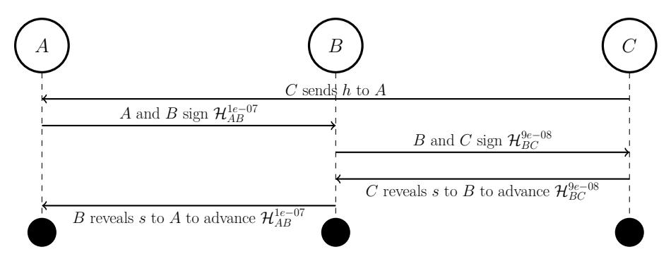
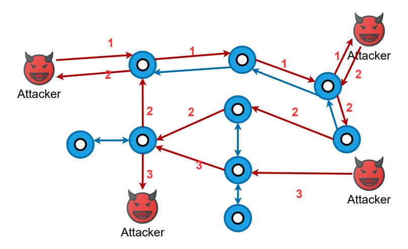
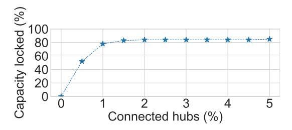
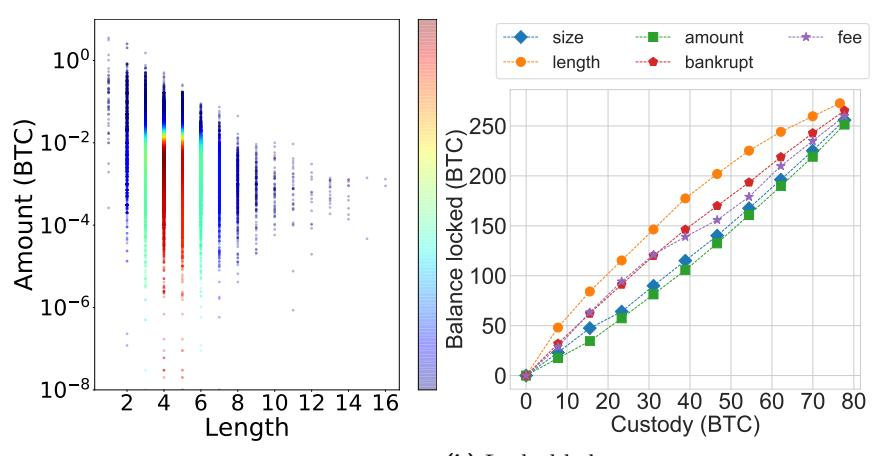
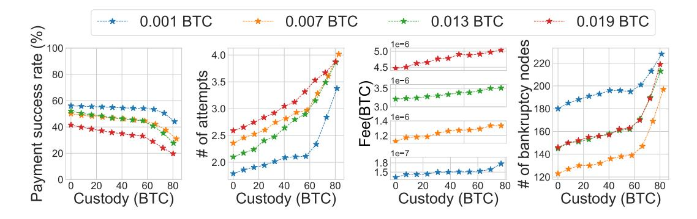
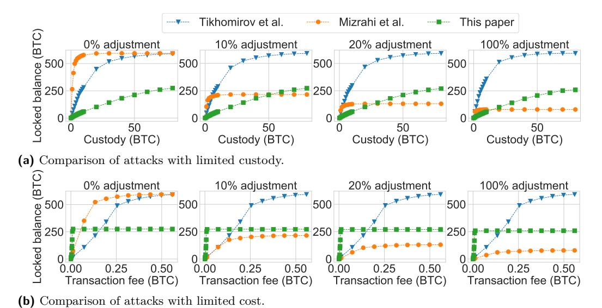
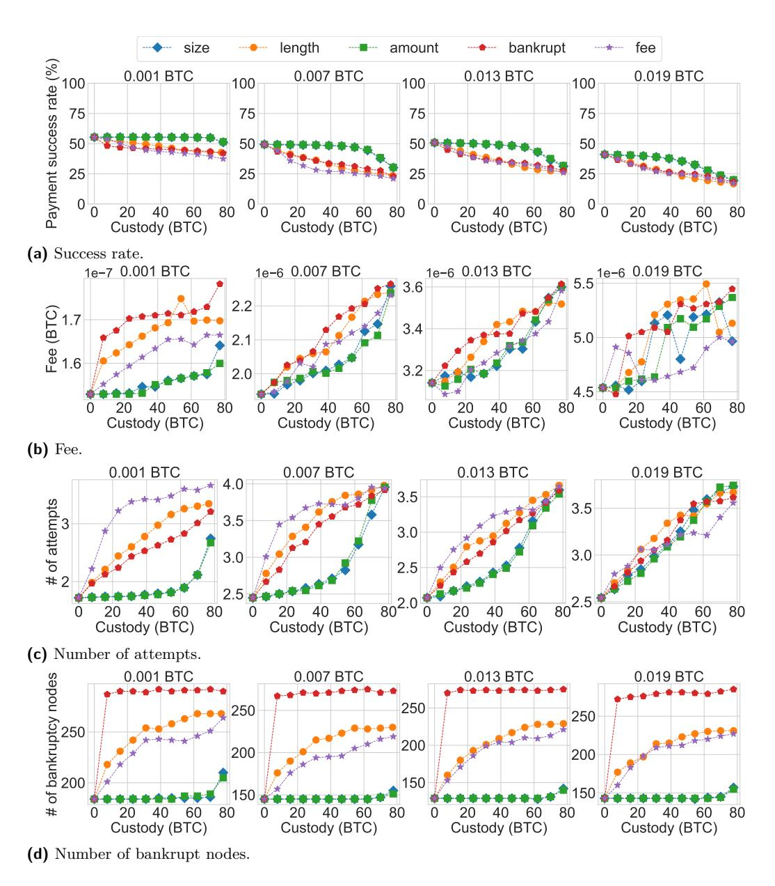
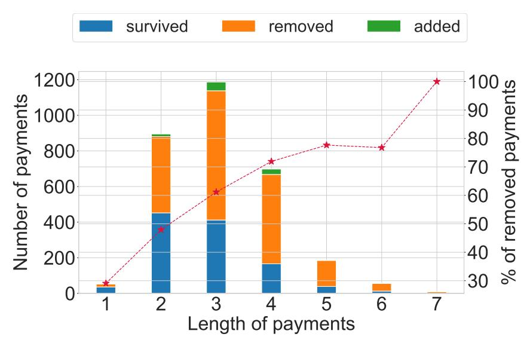

# **General Congestion Attack on HTLC-Based Payment Channel Networks**

**Zhichun Lu** [£](mailto:luzhic01@gmail.com)

Cryptape, China

**Runchao Han** [£](mailto:runchao.han@monash.edu)

Monash University & CSIRO-Data61, Australia

**Jiangshan Yu** [£](mailto:jiangshan.yu@monash.edu)

Monash University, Australia

### **Abstract**

Payment Channel Networks (PCNs) have been a promising approach to scale blockchains. However, PCNs have limited liquidity: large-amount or multi-hop payments may fail. The major threat of PCNs liquidity is *payment griefing*, where the adversary who acts as the payee keeps withholding the payment, so that coins involved in the payment cannot be used for routing other payments before the payment expires. Payment griefing gives adversaries a chance to launch the *congestion attack*, where the adversary griefs a large number of payments and paralyses the entire PCN. Understanding congestion attacks, including their strategies and impact, is crucial for designing PCNs with better liquidity guarantees. However, existing research has only focused on the specific attacking strategies and specific aspects of their impact on PCNs.

We fill this gap by studying the *general congestion attack*. Compared to existing attack strategies, in our framework each step serves an orthogonal purpose and is customisable, allowing the adversary to focus on different aspects of the liquidity. To evaluate the attack's impact, we propose a generic method of quantifying PCNs' liquidity and effectiveness of the congestion attacks. We evaluate our general congestion attacks on Bitcoin's Lightning Network, and show that with direct channels to 1.5% richest nodes, and ∼ 0.0096 BTC of cost, the adversary can launch a congestion attack that locks 47% (∼280 BTC) coins in the network; reduces success rate of payments by 16.0%∼60.0%; increases fee of payments by 4.5%∼16.0%; increases average attempts of payments by 42.0%∼115.3%; and increase the number of bankruptcy nodes (i.e., nodes with insufficient balance for making normal-size payments) by 26.6%∼109.4%, where the amounts of payments range from 0.001 to 0.019 BTC.

**2012 ACM Subject Classification** Security and privacy → Distributed systems security

**Keywords and phrases** Blockchain, PCN, Congestion

**Digital Object Identifier** [10.4230/OASIcs...](https://doi.org/10.4230/OASIcs...)

## **1 Introduction**

Public blockchains suffer from limited throughput. Payment Channel Network (PCN) – introduced by the Lightning Network (LN) [\[16\]](#page-14-0) – is one of the promising ways to scale blockchains. Payment channels enable *off-chain* payments, i.e. payments that do not need to be recorded on the blockchain. To open a payment channel, two nodes collateralise some coins in a joint address. They can make a payment by signing a new transaction that updates their balances. To close the channel, one of the two nodes commits the transaction recording the latest balance allocation to the blockchain. If two nodes do not have a direct channel, they can make payments to each other using *multi-hop payments*, i.e., payments going through one or more intermediate channels. In a multi-hop payment, the payer has to find a path that directs him to the payee. The payment is made by updating balances of these channels in an atomic way. The atomic update can be achieved by Hash Time Locked Contracts (HTLCs): the payment in each hop is locked by a hash value chosen by the payee, and all

payments proceed if the payee reveal a hash value's preimage before a timeout to redeem the payment from the payer, otherwise the payment will expire. In a HTLC-based multi-hop payment, the payee chooses a preimage, and nodes make HTLC payments on all involved channels with this preimage's hash value. Revealing this preimage activates these HTLC payments simultaneously.

**Payment griefing.** A well-known attack on HTLC-based multi-hop payments is *payment griefing* [\[18\]](#page-14-1), where the adversary makes a payment and withholds the preimage, so that coins involved in this payment are locked and cannot be used in other payments before the griefing payment expires. Thus, payment griefing can reduce the PCN's liquidity, i.e. the ability of routing payments. In addition, payment griefing is free, as the payer does not need to pay anything for failed payments. Moreover, payment griefing is also unaccountable, as 1) the victim cannot distinguish between a normal failed payment and a griefing payment, and 2) the intermediate nodes can not know the payer and payee's identity.

**Congestion attacks.** Griefing opens an important attack vector on HTLC-based PCN's liquidity, namely the *congestion attack* [\[1,](#page-14-2) [13\]](#page-14-3). In a congestion attack, the adversary initiates a large number of concurrent payments and griefs them. Consequently, some channels hit the limit of *max\_concurrent\_htlcs*, i.e., the number of concurrent unsettled payments allowed in the channel, and therefore cannot route payments before the adversary's payments expire. By launching a large-scale congestion attack, the entire PCN can be paralysed, i.e., the PCN cannot route further payments.

**PCNs' liquidity: what is the real limit?** Understanding congestion attacks is important for understanding PCNs' liquidity and therefore future PCN design. However, congestion attacks are still a new concept and haven't been well-studied yet. While existing research [\[1,](#page-14-2)[13\]](#page-14-3) only considers *max\_concurrent\_htlcs* as an exhaustible resource, it's unclear whether there exists other resources that can be exhausted to create congestion. In addition, existing congestion attacks apply a rather straightforward attack strategy, which will be analysed in detail in [§7.](#page-12-0) Moreover, we also observe that liquidity – the congestion attack's target – is not well-defined yet. Besides the amount of locked balance and the number of locked channels mentioned in Mizrahi et al. [\[13\]](#page-14-3), some other metrics such as success rate of payments, fee of payments, and number of attempts for making a payment have direct indications on the PCN's liquidity. Congestion attacks over these metrics are not explored before.

**This work: general congestion attacks.** In this paper, we fill this gap by introducing *general congestion attack*, which generalises the existing congestion attack in terms of attack strategies and targeted metrics. We introduce a framework for launching congestion attacks, where the adversary generates Sybil nodes connecting to a carefully chosen set of nodes, establishes channels with them, initiates numerous multi-hop payments between its nodes, and griefs these payments simultaneously. Compared to existing studies that put less effort on the order of payments to be griefed [\[13,](#page-14-3) [21\]](#page-14-4), we provide five strategies for ranking these payments, and each strategy focuses on some specific aspects of liquidity. To quantify the effectiveness of congestion attacks, we introduce a generic method of quantifying PCNs' liquidity. We evaluate the congestion attack on Bitcoin's LN – the first and most well-known PCN. Our results show that congestion attacks can significantly damage the liquidity of PCNs. In particular, with direct channels to 1.5% richest nodes, the adversary can launch a congestion attack that locks 47% (∼280 BTC) coins in the network; reduces success rate of payments by 16.0%∼60.0%; increases fee of payments by 4.5%∼16.0%; increases average attempts of payments by 42.0%∼115.3%; and increase the number of bankruptcy nodes by 26.6%∼109.4%, where the amounts of payments range from 0.001 to 0.019 BTC.

While being effective, our general congestion attacks are cheap to launch. The only cost

of general congestion attacks is the fee for establishing channels. Our evaluation shows that, a successful attack on LN requires channel fee of approximately 0.0096 BTC. The adversary does not lose its custody (i.e., coins in the channel) during the attack, as payments for griefing will expire.

**Roadmap.** Section 2 provides the background of PCNs and griefing. Section 3 describes the security model and the congestion attack. Section 4 describes the method of quantifying PCNs' liquidity. Section 5 evaluates congestion attacks on LN. Section 6 discusses the cost of congestion and strategy to utilise it for making a profit. Section 7 reviews relevant literature, and provides a quantitative comparison between the general congestion attack and the existing ones. Section 8 concludes this paper. Appendix A outlines detailed evaluation results.

## <span id="page-2-0"></span>2 Background

### <span id="page-2-2"></span>2.1 Payment Channel Networks

Lightning Network (LN) [16] introduces the idea of Payment Channel Networks. A payment channel allows two parties to pay each other without the need to publish every payment to the blockchain. Instead, they collateralise their coins into a 2-of-2 multi-signature address. They can make payments by mutually signing new transactions with updated balances. They can make payments with each other by mutually signing new transactions with updated amounts of their collateralised coins. To close the channel, one party commits the latest state of channel balance to the blockchain, and coins in the channel will be allocated to both parties accordingly.

<span id="page-2-1"></span>

**Figure 1** A multi-hop payment from A to C via an intermediate node B.

The system can be further extended to support multi-hop payments. Most multi-hop payment protocols are based on Hash Time Locked Contracts (HTLCs). HTLC is a contract between two parties which guarantees that a payment will be made if the payee shows the preimage of a hash value before a negotiated block height on the blockchain. If the payee does not show the preimage and the timeout expires, the payment is deemed invalid.

Figure 1 describes a multi-hop payment where A pays 9e-08 BTC to C via an intermediate node B in Bitcoin's LN. First, C chooses a random string s as preimage and sends its hash value h=H(s) to A, where  $H(\cdot)$  is a cryptographic hash function. A then signs a HTLC contract  $\mathcal{H}_{AB}^{1e-07}$  with B stating "A will pay 1e-07 BTC to B if B can show the value of s within (e.g.) 144 blocks". B also signs a HTLC contract  $\mathcal{H}_{BC}^{9e-08}$  with C saying that "B will pay 9e-08 BTC to C if C can show the value of s within (e.g.) 138 blocks". Then C shows s to B to redeem 9e-08 BTC in  $\mathcal{H}_{BC}^{9e-08}$  from B. Meanwhile, B can redeem 1e-07 BTC in

H 1*e*−07 *AB* from *A* by revealing *s* to *A*. *B* is incentivised to reveal *s*, as *B* does not want to lose money. The timelock of *AB* is set to be longer than *BC*, so *B* always has sufficient time to reveal *s* to *A*.

By routing this payment, *B* gets 1e-08 BTC from *A*. This is known as "fee", which is paid by the payer and is used for encouraging nodes to route multi-hop payments. In LN, fee consists of a fixed base fee and proportional fee that fluctuates according to the congestion level of the network. To minimise the cost, payers usually search for a path with the least fee when making payments.

## **2.2 Payment Griefing**

If the payee *C* reveals the preimage on time and the intermediate node *B* is rational, the multi-hop payment will happen. However, as we mentioned before, there exists an attack called *payment griefing* [\[4\]](#page-14-5), where the payee withholds the preimage until HTLCs expire. Before HTLC expires, coins involved in all channels of this payment are locked and cannot route other payments.

Payment griefing is a threat to PCNs' liquidity. If a big portion of coins in a PCN are locked, the PCN will no longer be able to route payments. Payment griefing is cheap, as the payment does not really happen and the payer does not pay for the fee to intermediate nodes. Identifying payment griefing can be hard, as nodes cannot distinguish whether the withholding is due to network delay, on purpose, or by accident. If the PCN's routing protocol is privacy-preserving, payment griefing can even be launched anonymously. For example, Bitcoin's LN adopts Sphinx [\[7\]](#page-14-6), where each intermediate node only has the knowledge of nodes who directly connect with him.

## <span id="page-3-0"></span>**2.3 Congestion attack**



**Figure 2** Congestion attack.

In a congestion attack, the adversary establishes payment channels with existing nodes in the PCN, and make numerous multi-hop payments between its nodes simultaneously. Then, the adversary withholds preimages until these payments expire. Before that, coins locked in these payments cannot be used in other payments. If the adversary has sufficient custody, it can lock a great portion of coins in the PCN so that the PCN may be paralysed. Figure [2](#page-3-0) shows the intuition of the congestion attack, where the adversary generates Sybil

nodes connecting to a carefully chosen set of nodes, establishes channels with them, initiates numerous multi-hop payments between its nodes, and griefs these payments simultaneously.

To reduce the custody required for an attack, Mizrahi et al. [\[13\]](#page-14-3) proposed to lock the channel by initiating numerous payments with small amounts to occupy all *max\_concurrent\_htlcs*, the maximum number of concurrent payments in a channel. In addition, they propose three strategies for enumerating payment paths. Tikhomirov et al. [\[21\]](#page-14-4) provided another strategy, where the adversary attacks a single channel rather than a path for each step.

We compare the strategies of our attack with those of Mizrahi et al. [\[13\]](#page-14-3) and Tikhomirov et al. [\[21\]](#page-14-4) in [§3.2,](#page-5-0) and compare the cost and effectiveness in [§7.](#page-12-0) The result show that. If the attacker is fee-sensitive, then our attack is preferred because our fees are 16% of and 5% of other two. Whereas, if the attacker has a restricted custody in hand, then the attack by person Mizrahi et al. is more preferred, as the custody required is only 1.5% of our attack (in case of locking 41% network's capacity).

## <span id="page-4-0"></span>**3 General congestion attack**

## **3.1 Model**

We consider a HTLC-based PCN that is identical to Bitcoin's Lightning Network as described in [§2.1.](#page-2-2) We model the PCN as a weighted directed graph G = (V*,* E). V is the set of nodes in the network, and all *v*<sup>∗</sup> in the remainder of the paper refer to a specific element (i.e. a node) in V. E is a set of tuples (*vs, vt, capacity*), which represents a channel with a capacity of *capacity* from *v<sup>s</sup>* to *vt*. Since channels in LN is bi-directional, a channel is represented in the graph as two opposite edges (*vs, vt, capacity*) and (*vt, vs, capacity*). A payment *P* is a dictionary {*amount* : *α, path* : *path*}, where *α* is the amount of coins that the payer wants to pay to the payee and *path* is the path of payment (a list of edges). Then, P denotes list of payments enumerated by the attacker. Meanwhile, we use *l* to refer the length of *path*. For simplicity, we do not consider the impact of timelocks on our attack. The payer also needs to pay some fee *f<sup>i</sup>* for each intermediate node *i* on the path. We can now get the size of a multi-hop payment *θ* as

$$\theta = \alpha \cdot l + \sum_{i=2}^{l} f_i$$

In addiciton, we use Γ*<sup>v</sup>* to refer the total capacity of all channels connecting to *v*. Therefore, the richest node we defined earlier is the node with the largest Γ*v*.

We consider nodes in the PCN are rational. Each honest node in a multi-hop payment will reveal the preimage of the hashlock to the upstream node once the node knows it. We assume a malicious adversary, who has sufficient coins and aims at paralysing the entire PCN with minimal cost. The adversary does not control any node in the beginning, but has the knowledge of the network topology and each channel's capacity and fee policy. The information can be retrieved from PCN's P2P protocol, evidenced by existing studies [\[5,](#page-14-7) [10\]](#page-14-8). When the adversary establishes a channel with a node, the node is willing to provide sufficient capacity. According to liquidity providers such as Bitrefill [\[3\]](#page-14-9), purchasing capacity from nodes is easy and costs negligible coins. Moreover, if an adversary just wants to attack PCN for a period of time, it can use the channel lease marketplace like lightning pool [\[14\]](#page-14-10) to get incoming liquidity at a much lower cost.

### <span id="page-5-0"></span>**3.2 Attack framework**

We generalise the congestion attack in terms of attack strategies and liquidity metrics. We propose a framework for launching congestion attacks. The framework consists of four steps as follows.

- **1. Node selection:** the adversary chooses a set of nodes and establishes channels with them.
- **2. Payment enumeration:** the adversary enumerates all payments between its nodes.
- **3. Path ranking:** the adversary orders these payments.
- **4. Launching attack:** the adversary starts to make and abort payments in this order.

**Comparison with existing attack strategies.** While existing congestion attacks [\[13,](#page-14-3)[21\]](#page-14-4) start by enumerating griefing paths or griefing channels, our attack chooses nodes in the beginning and enumerates paths within the given set of nodes. Such design allows us to divide the attack into multiple steps with orthogonal purposes, revealing the complete design space for congestion attacks. Specifically, the adversary decides resources (e.g., channel capacity or the max\_concurrent\_htlc parameter) to congest when enumerating payments, and decides its focus of liquidity metrics when ranking payments.

In addition, in existing congestion attacks [\[13,](#page-14-3) [21\]](#page-14-4), the adversary has to create new channels when attacking a new channel or path. Therefore, the adversary has to establish a large number of channels, which incurs additional transaction fees on the underlying blockchain. In contrast, our attack chooses nodes in the beginning and enumerates paths within the given set of nodes, and therefore requires much fewer channels.

## **3.3 Node selection**

The adversary's first step is to join the PCN by establishing channels with existing nodes. We analyse the adversary's strategy on the type of nodes and the number of nodes to establish channels with.

**Type of nodes to establish channels with.** We suggest establishing channels with the richest (w.r.t. total capacity of involved channels) nodes (which we call *hubs*) in the network, as they are likely to route more griefing payments than a normal node. If establishing channels with nodes with little capacity, the adversary has to establish channels with more nodes, leading to more fee on establishing channels.

**Number of nodes to establish channels with.** The number of nodes to establish channels with depends on how the adversary enumerates griefing payments (i.e., the second step). By establishing channels with sufficient nodes, the total size of enumerated payments will take the majority of the network capacity, and therefore the congestion attack will take effect. Later in [§5.1,](#page-9-1) we will show that for Bitcoin's Lightning Network, by establishing channels with the top 1.5% richest nodes the enumerated payments can occupy 81% of the network capacity ideally (47% in the experiment).

### **3.4 Enumerating payments**

After establishing payment channels, the adversary enumerates all possible payments between its nodes. To this end, the adversary has to find all paths between each pair of its nodes, and calculate the maximum amount that each path can afford. Our payment enumerating algorithm builds upon the Ford–Fulkerson algorithm [\[9\]](#page-14-11) - a maximum flow algorithm in graph theory. Maximum flow is a classic problem in graph theory, which aims at finding the

```
Input:
1: The entire network G = (V, E)
2: The adversary's node list N
Output:
3: The list of payments P
4: P ← []
5: for (v1, v2) in N .combination() do
6: path_list ← BFS(G, v1, v2)
7: for path ∈ path_list do
8: P ← {path : [], amount : 0}
9: P.path ← path
10: capacity_list ← [edge.capacity for edge in path]
11: α ← min(capacity_list) . Max viable amount
12: if α = 0 then continue . This path is not viable
13: P.amount ← α . P is a viable payment
14: Append P to P
15: Consume P in G
16: end for
17: end for
18: return P
```

maximum amount of flow that the network allows from a source to a sink. Ford–Fulkerson algorithm is one of the most effective algorithms to solve the maximum flow problem. Given a weighted directed graph and two vertices. The Ford-Fulkerson algorithm uses Breadth-First Search (BFS) [\[12\]](#page-14-12) to find all paths between these two vertices. For each path, the maximum viable amount is the minimum weight of edges. Algorithm [1](#page-6-0) describes the process of enumerating payments in Python syntax. First, it enumerates the binary combinations of nodes who the adversary establishes channels as the starting and ending points of the path. Second, it executes BFS to find all paths between each two adversary nodes similar Ford–Fulkerson. Third, we derive the most viable amount using the least channel capacity for each path. Last, it consumes this payment from the graph and adds this payment to our payment list, i.e., we subtract the amount of this payment from the capacity of all channels on the path.

## <span id="page-6-1"></span>**3.5 Ranking payments**

Different griefing payments have different impacts on the PCNs' liquidity. With limited balance, the adversary has to start from griefing important payments for maximising the attack's effect.

**Rank-by-length, -amount and -size.** We first consider three ranking criteria, namely the length, amount, and size *θ* of a payment. *Rank-by-length* aims at maximising the effect while minimising the cost, as long payments lock most capacity with the least amount. *Rank-by-amount* aims at attacking the channel with large capacity. Since real-time balance in LN cannot be seen, payer tends to prefer to go through channels with large capacities to reduce the number of attempts. *Rank-by-size* aims at maximising the attack effect without considering the custody, as payments with large sizes cost most collateral.

**Rank-by-fee.** Inspired by B'eres et al. [5], we consider rank-by-fee, where the adversary starts from attacking channels with lower fees. This aims at maximising the average channel fee of normal payments after the attack. The ranking criterium Score(P) for payment P is calculated as

$$Score(P) = -\frac{\sum_{i=2}^{l} f_i}{l}$$

Rank-by-bankrupt. In addition, we consider the bankruptcy rates presented by Dandekar et al. [6,17,20] as a ranking criterium. The adversary first attacks channels that make most nodes "bankrupt". Dandekar et al. introduced credit networks [6], where nodes are connected by edges with a limited resource called *credit*. We model the PCN as a credit network following Ramseyer et al. [17], where each channel's credit is its capacity. Liquidity in a credit network is quantified as the probability that nodes become bankrupt, i.e., loss of all credit. Dandekar et al. [6] proved that the probability that a node v goes bankrupt is upper-bounded by  $\frac{1}{\Gamma_v+1}$ , where  $\Gamma_v$  is the total capacity of all channels connecting to v. Griefing can be seen as "removing" the capacity of nodes, and therefore increases the probability of nodes becoming bankrupt. In rank-by-bankrupt, the adversary first attacks payments that reduce the most mathematical expectations of the probability of nodes becoming bankrupt.

The bankruptcy criterium is quantified as the total increased probability Score(P) of nodes in P becoming bankruptcy

$$Score(P) = Score_t(v_1, \alpha) + \sum_{i=1}^{l} Score_i(v_i, \alpha) + Score_t(v_{l+1}, \alpha)$$

where  $Score_t(v_1, \alpha)$  and  $Score_t(v_{l+1}, \alpha)$  are the increased probability of node  $v_1$  and  $v_{l+1}$ , respectively, and  $Score_i(v_i, \alpha)$  is the increased probability of intermediate nodes  $v_i$  where  $i \in [2, l]$ . For node  $v = v_1$  or  $v_{l+1}$ , the capacity is reduced by  $\alpha$ , so

$$Score_t(v, \alpha) = \frac{1}{\Gamma_v - \alpha + 1} - \frac{1}{\Gamma_v + 1}$$

Meanwhile, for intermediate nodes  $v = v_i$  where  $i \in [1, l-1]$ , the capacity is reduced by  $2\alpha$ , so

$$Score_i(v, \alpha) = \frac{1}{\Gamma_v - 2\alpha + 1} - \frac{1}{\Gamma_v + 1}$$

### 3.6 Launching attack

To obtain a list of griefing payments before launching the attack, we use channels' capacities rather than their balances for determining the amounts of payments. As balances are fluctuating in real-time, some of the enumerated payments may not succeed during the attack. In real-world PCNs, if a node cannot route a payment, the node will reply to the payer with an error message, e.g., LN calls this error *InsufficientFunds*. Thus, we introduce a retry mechanism that, when a griefing payment is rejected, the adversary reduces its amount by a parameter step, and retries the same path until it is successful or the amount reaches zero. Algorithm 2 describes the attack process. To avoid being detected due to the retry pattern, the adversary can obfuscate the payment pattern, e.g., by dividing payments into multiple ones with random amounts.

14: **continue** 15: **end if**

17: **break** 18: **end while** 19: **end for**

16: *B* = *B* − *P.amount*

```
Input:
```

```
1: The list of ranked payments Pranked
2: The dropping step ratio step_ratio
3: The custody of the adversary B
4: for P in Pranked do
5: if B ≤ 0 then
6: return ;
7: end if
8: step_amount ← step_ratio ∗ P.amount
9: while T rue do
10: response ← make_payment(P)
11: if response = InsufficientFunds then
12: P.amount = P.amount − step_amount
13: if P.amount ≤ 0 then break
```

## <span id="page-8-0"></span>**4 Quantifying PCNs' liquidity and congestion attacks' impact**

We propose a generic method of quantifying PCNs' liquidity and congestion attacks' impact. In our method, we generate a batch of payments, simulate them on the PCN, and calculate liquidity metrics. The liquidity metrics include the success rate, the average cost and the number of attempts of payments, and the number of bankruptcy nodes. A congestion attack's impact is quantified as the liquidity difference before and after the attack.

### <span id="page-8-2"></span>**4.1 Generating payments for simulation**

We follow the approach of Béres et al. [\[5\]](#page-14-7) to test PCNs' liquidity. Specifically, we generate a batch of *n* payments, of which payers and payees are random and the amount *x<sup>t</sup>* is fixed. We test multiple batches of payments with different amounts to cover regular payment scenarios, which will be discussed in [§5.](#page-9-0)

We simulate these payments in the PCN. Each payment is allowed to try *r* times to find a viable path. If it finds a path within *r* tries, we consider it successful, otherwise failed. Then the payments can be categorized into three states according to the status before and after the attack, namely *added*, *survived*, or *removed*. *Added* means the payment fails before the attack but is successful after the attack. *Survived* means the payment is successful both before and after the attack. *Removed* means the payment is successful before the attack but fails after the attack. Since our analysis is based on successful payments, payments that fail both before and after the attack are ignored here.

Interestingly, some payments are *added*. Assuming a payments *P*<sup>1</sup> = *A* → *B* → *C* → *D* fails before the attack since *BC* has insufficient balance. For example, if some successful payments that would have gone through *BC* failed after the attack, then channel *BC* would become available to *P*1. Another example is that the attack may cause some payments to change their paths. Suppose a successful payment *P*<sup>2</sup> originally went through *EF* and was forced to go through *CB* after the attack, then the balance of *BC* will increase and make it have enough balance to route *P*1.

### **4.2 Calculating liquidity metrics**

We derive the PCNs' liquidity from the execution results of the simulated payments. We consider the following five metrics: 1) amount of locked funds, 2) success rate of payments, 3) fee of payments, 4) average attempt times of payments and 5) the number of bankruptcy nodes. A congestion attack's impact is quantified by the difference of liquidity metrics before and after the attack.

## <span id="page-9-0"></span>**5 Evaluation of congestion attacks**

In this section, we evaluate congestion attacks on Bitcoin's Lightning Network (LN), the first and most well-known PCN. We analyse the impact of congestion attacks with different strategies in terms of the defined five liquidity metrics. Our results show that the adversary who adopts congestion can severely limit the functionality of the entire PCN. Specifically, the adversary can launch a congestion attack that locks 47% (∼280 BTC) coins in the network; reduces success rate of payments by 16.0%∼60.0%; increases fee of payments by 4.5%∼16.0%; increases average attempts of payments by 42.0%∼115.3%; and increase the number of bankruptcy nodes by 26.6%∼109.4%, where the amounts of payments range from 0.001 to 0.019 BTC.

## <span id="page-9-1"></span>**5.1 Experimental setting**

**Implementation and simulation setting.** We simulate and implement our attack using Python 3.7.4 and NetworkX. For simplicity, we implement all algorithms sequentially. Adversaries can use multi-threaded programming to speed up the algorithm if they prefer efficiency. The topology provided by B'eres et al. [\[5\]](#page-14-7) is the snapshot of the LN in 2019 (we checked the network snapshot for 2021 and found the topology to be similar to 2019, so we believe the results are similar of simulation on the 2021 snapshot). The snapshot also includes the fee policy for each channel as well as the capacity. Since the balance distribution characteristics of LN are not publicly available, we apply the random uniform distribution for initialising the channels' balances similar to existing studies [\[5\]](#page-14-7). To amortise the bias from randomness, we run each group of simulations with a certain strategy and custody level for ten times. Our results show that the coefficient of variation for the quantitative impact of the different balance distributions is only 1%.

**Payment routing mechanism.** In the real-world scenario, payments may sometimes fail, as nodes cannot know the real-time balances of channels they do not involve. LN introduces a *success probability* mechanism to optimise the routing. Specifically, if intermediate node A is unable to forward a payment because of insufficient balance, then it will return an error to the sender. The sender will temporarily reduce the success probability of this node. The path finding mechanism of LN is finding the shortest path on a weighted graph. For simplicity, we set the weight as channel fee. The routing algorithm is the plain Dijkstra [\[8\]](#page-14-16) algorithm. When an attempt fails, we temporarily remove the first node on the current path with insufficient balance and try again. A payment is allowed to try *r* times for finding a viable path. If it finds a path within *r* tries, it is successful, otherwise we consider it fails.

<span id="page-10-0"></span>

<span id="page-10-1"></span>Figure 3 The percentage of connected hubs v.s. locked capacity.



(a) Distribution of enumerated payments. (b) Locked balance.

**Figure 4** Characterisation of enumerated payments and the amount of locked balance.

**Parameters.** We test attacks with different levels of custody of the adversary, i.e.,  $\{7.7, 15.4, \ldots, 77\}$  BTC, all ranking criteria in Section 3.5, and  $step\_ratio = 0.1$  in Algorithm 2. When testing LN's liquidity, we pick batch size n = 7000 for testing liquidity(which is identical to to existing works [5]), payment amount  $x_t \in \{0.001, 0.007, 0.013, 0.019\}$  BTC, and payment retry times r = 10. In total, we ran 10 \* 4 \* 10 \* 5 = 2000 (retry times \* # of payment amounts \* # of different custody levels \* # of strategies) simulations. We consider the threshold of bankruptcy as 0.006 BTC, which is the average amount of payments in LN [5].

Choosing entry nodes. We test the percentage of the capacity that the adversary can lock by establishing channels with different numbers of richest nodes in LN. Figure 3 shows that, by establishing channels with the top 1.5% (42) richest nodes, the enumerated payments take  $\sim 83\%$  of the capacity of the entire network. In addition, the total amount of enumerated payments converges with the percentage of hubs increasing.

#### 5.2 Impact of congestion attacks

We simulate the general congestion attack with five strategies in §3.5, and evaluate their impact in terms of the five metrics defined in §4. Figure 4 summarises the results, and Figure 7 in Appendix A provides the results in more detail. For Figure 4(b) and Figure 5, the baseline (when x = 0) is the scenario without any attack.

Characterisation of enumerated payments. As mentioned before, we establish channels with the 42 richest nodes in the network. Algorithm 1 enumerates 35,402 payments in total. Figure 4(a) visualises the distribution of these payments w.r.t. their amounts and

<span id="page-11-1"></span>

Figure 5 Overview of impacts of rank-by-fee.

lengths. Red indicates there are many griefing paths under that path length and payment amount, while blue means the opposite. The amount ranges from zero to 0.1 BTC, while the length ranges from 1 to 13. On average, most payments have a length of  $3\sim 6$  and an amount of  $1e-05\sim 0.01$  BTC.

**Locked balance.** With a custody of 80 BTC (13% of the total capacity), an adversary can lock 280 BTC (47% of the total capacity) in LN, where rank-by-length is the most efficient strategy for locking balance. The average length of griefing payments is 3.8, which implies that there is room for optimisation of our path enumeration algorithm, since LN allows a maximum payment length of 20 hops.

Impact on different liquidity metrics. While Appendix A outlines the evaluation results of all attack strategies on all liquidity metrics, Figure 5 shows the result of the rank-by-fee strategy on LN as an example. With the rank-by-fee strategy and  $7 \sim 80$  BTC as custody, the attack can reduce the payments' success rates by  $21.4\% \sim 52.3\%$ , increase the fee by  $9.3\% \sim 27\%$ , increase the number of attempts by  $50\% \sim 88.7\%$ , and increase the number of bankrupt nodes by  $26.7\% \sim 60\%$ .

#### <span id="page-11-0"></span>6 Discussion

Budget analysis. The budget of launching congestion attacks is twofold: 1) channel fee for establishing channels and 2) custody deposited into channels. When preparing for a congestion attack, the adversary needs to pay the transaction fee for opening channels. Transaction fee is negligible as analysed in §5.1. After the congestion attack, the custody is refunded as payments are expired. For LN, the required custody is 77 BTC (13% of the network capacity). In Bitcoin, there are more than 10,000 addresses with more than 157 BTC [2], making them having sufficient capacity to launch a congestion attack.

**Profit from congestion attacks.** The adversary can apply griefing on other nodes' channels, so that more payments go through its controlled channels. To receive most fees following this approach, the adversary redirects as many payments to its channels as possible. Existing research [22] shows that the probability is proportional to the adversarial node's betweenness centrality, while maximising the betweenness centrality by removing channels can be formalised as the destructive betweenness improvement problem that is NP-hard [11]. To our knowledge, there exists no approximation algorithm to solve this problem, and we consider designing such algorism as future work.

## <span id="page-12-0"></span>**7 Related work and comparison**

### **7.1 Attacks on PCNs**

**Congestion attacks.** Congestion attack was informally discussed by Lightning Network community [\[1\]](#page-14-2). Mizrahi et al. [\[13\]](#page-14-3) first systematically studied the congestion attack on PCNs. In their proposed attack, the adversary makes a large number of small payments, in order to make channels hit *max\_concurrent\_htlcs*, the maximum number of concurrent payments. Tikhomirov et al. [\[21\]](#page-14-4) used the same idea to lock the balance of the channel, but they only grief a single channel at a time.

The two congestion attacks focus on a single attack liquidity metric, or put limitations on the attack strategy, and therefore can be seen as special cases of our general congestion attack. In addition, as their attacks focus on a single path or channel at a time, the adversary has to establish new channels when attacking a new path or channel. Establishing a large number of channels makes the adversary easier to be identified, and existing nodes may not be willing to establish too many channels in a short time period. Moreover, to occupy *max\_concurrent\_htlcs*, the adversary in their two attacks has to make a large number of concurrent payments compared to our attack. This also makes the adversary's behaviour easier to be identified.

**Other attacks on PCNs.** There have been attacks on PCNs with different goals. In the lockdown attack [\[15\]](#page-14-20), the adversary griefs the victim's channels to isolate it from the network. In the hijacking attack [\[22\]](#page-14-18), the adversary publishes channels with small fee to attract payments, and withhold all payments through its channels. Rohrer et al. [\[19\]](#page-14-21) discussed two attacks, namely channel exhaustion and node isolation. While congestion attacks aim at paralysing the entire PCN, these three attacks aim at exhausting individual channels or isolating individual nodes.

### **7.2 Quantitative comparison with existing congestion attacks**

We quantitatively compare existing congestion attacks [\[13,](#page-14-3) [21\]](#page-14-4) with ours w.r.t. different budget level of custody and channel fee and different *max\_concurrent\_htlcs* value distribution. For both attacks, we simulate the capacity-first strategy. The strategy iterates the following process: when a path is enumerated, calculate the total capacity of involved channels whose *max\_concurrent\_htlcs* values have been filled, then remove these channels from the network. Locking a channel by using *max\_concurrent\_htlcs* takes *max\_concurrent\_htlcs* \* 2 payments (as a channel has two directions). The smallest payment amount is 5.46e-06 BTC (i.e. the dust limit). Thus, the custody required for griefing a path is 2 \* *max\_concurrent\_htlcs* \* 5.46e-06 BTC. When enumerating a path, we check whether both ends have channels with the adversary. If not, the adversary has to establish channels with them, leading to a fee of 0.0002 BTC (∼ 18.89 USD at the time of writing).

To quantify the impact of *max\_concurrent\_htlcs*, we test the locked capacity when different portions of channels adjust *max\_concurrent\_htlcs*. Given the size limit of Bitcoin transactions, the maximum value of *max\_concurrent\_htlcs* in Bitcoin's LN is 483. Thus, we assume the adjusted value of *max\_concurrent\_htlcs* is uniformly distributed in interval [1*,* 483]. When the custody is limited, we assume the fee is unlimited, and vice versa.

Figure [6](#page-13-1) shows the experimental results. Each experiment is repeated 10 times, and the variation of experimental results is about 2.4%. As the results are similar after the 20% channel adjustment, we skipped the simulation in 30%-90% for brevity. Figure [6\(a\)](#page-13-1) shows the performance of the three attacks under different custody. When all channels share

<span id="page-13-1"></span>

**Figure 6** Comparison with congestion attack. x% adjustment means x% channels adjust their  $max\_concurrent\_htlcs$ .

the same  $max\_concurrent\_htlcs$ , Mizrahi et al.'s attack locks most capacity. When more channels adjust  $max\_concurrent\_htlcs$ , the locked capacity becomes less. This is because when channels in a path have different  $max\_concurrent\_htlcs$  values, the adversary can only congest the channel with the smallest  $max\_concurrent\_htlcs$  in this path by spamming this path only, making the strategy of Mizrahi et al. less effective. Meanwhile, Tikhomirov et al.'s attack and our attack are not affected by  $max\_concurrent\_htlcs$ . This is because our attack does not rely on  $max\_concurrent\_htlcs$  and the number of concurrent htlcs occupied by our attack averaged only 3.8 per channel, and Tikhomirov et al.'s attack focuses on a channel at a time. Figure 6(b) shows that, both Tikhomirov's and Mizrahi's attacks require more transaction fee compared to our attack. This is because, in their attacks, the adversary has to open a new channel when attacking a new path. With sufficient transaction fee, Tikhomirov's locks more money compared to our attack.

To lock in 250 BTC of liquidity. The attack by Mizrahi et al et al. requires 1 BTC of custody and pays a transaction fee of 0.05 BTC, the attack by person Tikhomirov et al. requires 8 BTC of custody and a fee of 0.15 BTC, while our attack requires 65 BTC of custody and a fee of 0.008 BTC. Therefore, if the attacker is fee-sensitive, then our attack is preferred because our fees are 16% of and 5% of other two. Whereas, if the attacker has a restricted custody in hand, then the attack by person Mizrahi et al. is more preferred, as the custody required is only 1.5% of our attack.

## <span id="page-13-0"></span>8 Conclusion

In this paper, we propose the general congestion attack on payment channel networks (PCNs). Our general congestion attack generalises the existing congestion attacks in terms of attack strategies, targeted metrics and optimisation techniques. We develop concrete steps for launching congestion attacks, and provide a generic method of quantifying PCNs' liquidity and effectiveness of congestion attacks. We evaluate our congestion attacks on Lightning Network – the first and most well-known PCN. Our evaluation results show that the congestion attack is cheap to launch and can greatly reduce the LN's liquidity.

### **References**

- <span id="page-14-2"></span>**1** Payment channel congestion via spam-attack. [https://github.com/lightningnetwork/](https://github.com/lightningnetwork/lightning-rfc/issues/182) [lightning-rfc/issues/182](https://github.com/lightningnetwork/lightning-rfc/issues/182). Github, 2017.
- <span id="page-14-17"></span>**2** BitInfoCharts. [https://bitinfocharts.com/top-100-richest-bitcoin-addresses-1.](https://bitinfocharts.com/top-100-richest-bitcoin-addresses-1.html) [html](https://bitinfocharts.com/top-100-richest-bitcoin-addresses-1.html), 2020. [Online; accessed 20-September-2020].
- <span id="page-14-9"></span>**3** Bitrefill. <https://www.bitrefill.com/>, 2020. [Online; accessed 20-September-2020].
- <span id="page-14-5"></span>**4** Evan Schwartz Akash Khosla and Adrian Hope-Bailie. Interledger rfcs, 0018 draft 3, connector risk mitigations. <http://j.mp/2m2OvfP>, Github, 2019.
- <span id="page-14-7"></span>**5** Ferenc Béres, Istvan Andras Seres, and András A Benczúr. A cryptoeconomic traffic analysis of bitcoins lightning network. *arXiv preprint arXiv:1911.09432*, 2019.
- <span id="page-14-13"></span>**6** Pranav Dandekar, Ashish Goel, Ramesh Govindan, and Ian Post. Liquidity in credit networks: A little trust goes a long way. In *Proceedings of the 12th ACM conference on Electronic commerce*, pages 147–156, 2011.
- <span id="page-14-6"></span>**7** George Danezis and Ian Goldberg. Sphinx: A compact and provably secure mix format. In *2009 30th IEEE Symposium on Security and Privacy*, pages 269–282. IEEE, 2009.
- <span id="page-14-16"></span>**8** Edsger W Dijkstra. A note on two problems in connexion with graphs. *Numerische mathematik*, 1(1):269–271, 1959.
- <span id="page-14-11"></span>**9** Lester Randolph Ford and Delbert R Fulkerson. Maximal flow through a network. *Canadian journal of Mathematics*, 8:399–404, 1956.
- <span id="page-14-8"></span>**10** Jordi Herrera-Joancomartí, Guillermo Navarro-Arribas, Alejandro Ranchal-Pedrosa, Cristina Pérez-Solà, and Joaquin Garcia-Alfaro. On the difficulty of hiding the balance of lightning network channels. In *Proceedings of the 2019 ACM Asia Conference on Computer and Communications Security*, pages 602–612, 2019.
- <span id="page-14-19"></span>**11** Clemens Hoffmann. Algorithms and complexity for centrality improvement in networks. 2017.
- <span id="page-14-12"></span>**12** Dexter C Kozen. Depth-first and breadth-first search. In *The design and analysis of algorithms*, pages 19–24. Springer, 1992.
- <span id="page-14-3"></span>**13** Ayelet Mizrahi and Aviv Zohar. Congestion attacks in payment channel networks. *arXiv preprint arXiv:2002.06564*, 2020.
- <span id="page-14-10"></span>**14** Olaoluwa Osuntokun, Conner Fromknecht, Wilmer Paulino, Oliver Gugger, and Johan Halseth. Lightning pool: A non-custodial channel lease marketplace. 2020.
- <span id="page-14-20"></span>**15** Cristina Pérez-Sola, Alejandro Ranchal-Pedrosa, J Herrera-Joancomartí, Guillermo Navarro-Arribas, and Joaquin Garcia-Alfaro. Lockdown: Balance availability attack against lightning network channels, 2019.
- <span id="page-14-0"></span>**16** Joseph Poon and Thaddeus Dryja. The bitcoin lightning network: Scalable off-chain instant payments, 2016.
- <span id="page-14-14"></span>**17** Geoffrey Ramseyer, Ashish Goel, and David Mazières. Liquidity in credit networks with constrained agents. In *Proceedings of The Web Conference 2020*, pages 2099–2108, 2020.
- <span id="page-14-1"></span>**18** Daniel Robinson. Htlcs considered harmful. In *Stanford Blockchain Conference*, 2019.
- <span id="page-14-21"></span>**19** Elias Rohrer, Julian Malliaris, and Florian Tschorsch. Discharged payment channels: Quantifying the lightning network's resilience to topology-based attacks. In *2019 IEEE European Symposium on Security and Privacy Workshops (EuroS&PW)*, pages 347–356. IEEE, 2019.
- <span id="page-14-15"></span>**20** Vibhaalakshmi Sivaraman, Weizhao Tang, Shaileshh Bojja Venkatakrishnan, Giulia Fanti, and Mohammad Alizadeh. The effect of network topology on credit network throughput. *arXiv preprint arXiv:2103.03288*, 2021.
- <span id="page-14-4"></span>**21** Sergei Tikhomirov, Pedro Moreno-Sanchez, and Matteo Maffei. A quantitative analysis of security, anonymity and scalability for the lightning network. In *2020 IEEE European Symposium on Security and Privacy Workshops (EuroS&PW)*, pages 387–396. IEEE, 2020.
- <span id="page-14-18"></span>**22** Saar Tochner, Aviv Zohar, and Stefan Schmid. Route hijacking and dos in off-chain networks. In *Proceedings of the 2nd ACM Conference on Advances in Financial Technologies*, pages 228–240, 2020.

### <span id="page-15-0"></span>A Detailed evaluation results and analysis

<span id="page-15-1"></span>

**Figure 7** Overview impact of all strategies.

Payment success rate (Figure 7(a)). Larger payments are less likely to succeed both before and after the attack. This is because if a payment's amount is bigger, fewer channels can route this payment. In addition, rank-by-fee is more effective than the other four strategies in terms of the success rate. We suspect the reason to be that the rank-by-fee strategy exhausts some channels that route a large number of payments by specifying a low fee rate.

Rank-by-amount does not perform well when custody is limited and the amount of payments is low. This is because the adversary starts from attacking channels with high

<span id="page-16-0"></span>

Figure 8 Status of payments. Red line indicates the percentage of removed payments. The bar shows the number of payments in different states at different lengths and the line chart shows the percentage of payments blocked at different lengths.

capacity, and therefore concerns less about payments with small amounts. As the amount of payment increases, the gap between rank-by-amount and other strategies begins to narrow, which confirms our thinking. In addition, rank-by-amount and rank-by-size have similar performance in success rate. This is because the distribution of payment lengths is centralised as shown in Figure 4(a), and the payment amount becomes the main factor determining the payment size.

Average fee of payments (Figure 7(b)). Note that we only count *survived* payments when calculating the fee. Payments with long paths are more likely to be blocked by the attack and removing them will decrease the average fee, offsetting the rise caused by the attack. Thus, the average fee of successful payments fail to reflect the increase in fees caused by the congestion.

We use the scenario where the payment amount is 0.013 BTC as an example. The result (in Figure 8) shows that, long payments are more likely to be influenced by our attack. Specifically, all 7-hop payments are blocked by the attack, while only about 30% of 1-hop payments are affected. This is because a long payment indicates that there are more channels in the path, so the payments are more likely to be attacked. These long path payments that fail as a result of the attack will result in a decrease in the average fee. Therefore, we only count *survived* payments to give a true evaluation of the effect of the attack.

The five strategies performed similarly in terms of fees, similar to payment success rates. The fee upward trend of the fee is because the attack will make channels with low fee unavailable, and payments will be re-directed to channels with high fee. However, sometimes the fee decreases as the custody increases. This is because the attack does not only block payments, but also add some payments, as we observe in  $\S4.1$ . Both *blocked* payments and *added* payments may make some channels with low fee to be available again.

Congestion attacks can be launched together with the route hijacking attacks [22]. In a route hijacking attack, the adversary uses channels with zero fee to attract and hijack payments. Congestion attacks can increase payment fee, and therefore make the adversary's channels more attractive to payments.

<span id="page-17-0"></span>**Table 1** The proportion *µ* of deceptive channels out of channels with capacities greater than the payment amount. Parameter *a*¯ is the number of attempts before the attack.

|    | 0.001 | 0.007 | 0.013 | 0.019 |
|----|-------|-------|-------|-------|
| µ  | 15.0% | 31.8% | 31.2% | 39.2% |
| a¯ | 1.76  | 2.59  | 2.66  | 3.11  |

**Average attempt times of payments (Figure [7\(c\)\)](#page-15-1).** When the amount of payments increased from 0.007 BTC to 0.013 BTC, the number of attempts does not rise significantly. In addition, the average number of attempts with 0.001 BTC is much lower than payments with a bigger amount. We observe that the average number of attempts is proportional to the number of "deceptive channels". We say a channel is deceptive for a payment with amount *x* when the capacity of the channel is greater than *x*, but the balance is less than *x*. The number of attempts depends on the ratio between the number of deceptive channels and the number of channels with balance greater than the payment amount. As aforementioned, we assume the balance of each channel is uniformly distributed. Under this assumption, given the amount of simulated payments *x*, this proportion *µ* is calculated as

$$\mu = \frac{\sum_{i=1}^{n} \frac{x}{c_i}}{n}$$

where *n* is the number of channels with capacities greater than *x*, and *c<sup>i</sup>* is the *i*-th channel's capacity. Table [1](#page-17-0) shows the trend of *µ* and *a*¯ is consistent, which confirms our suspicions.

**Number of bankruptcy nodes (Figure [7\(d\)\)](#page-15-1).** When it comes to bankruptcy rates, the rank-by-bankrupt strategy is particularly effective in the number of bankruptcy nodes and the success rate of small payments. Figure [7\(d\)](#page-15-1) compares their performance. The results show that when the attack custody is limited, rank-by-bankrupt outperforms all other strategies in terms of the number of bankruptcy nodes. The additional bankruptcy nodes caused by rank-by-bankrupt have the characteristic of poor capacity. Specifically, the average capacity of these victims is 0.02 BTC, while the average capacity of all nodes in the network is 0.42 BTC, which is consistent with the theory we cited in [§3.5.](#page-6-1)