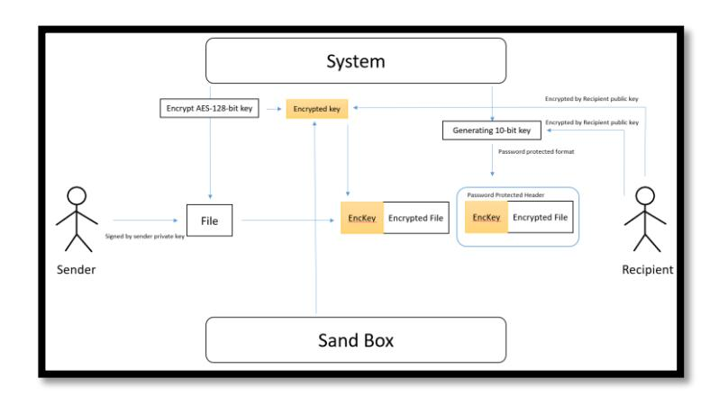
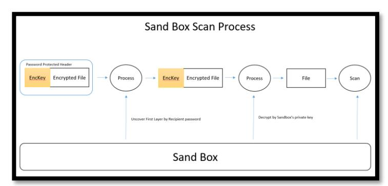
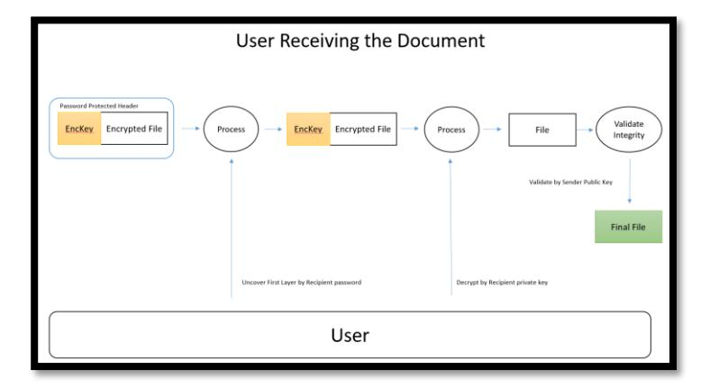
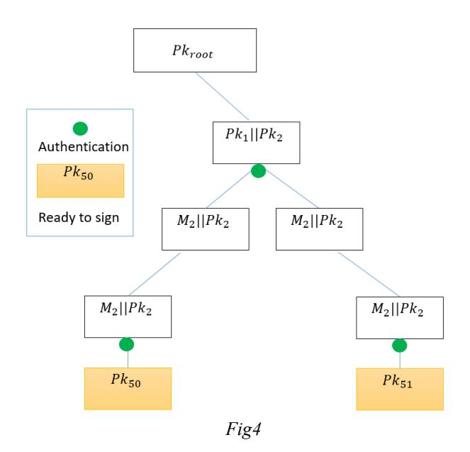
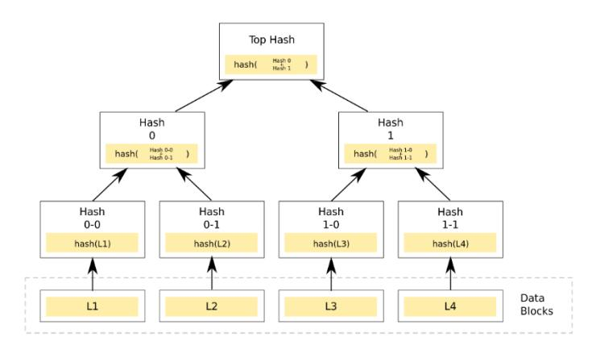
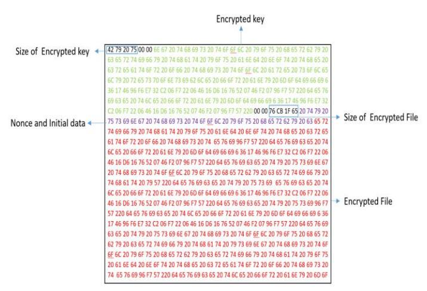

# **Cryptographic Scheme for analyzing protected files on Sandboxes and share them privately**

**Ahmad Almorabea – ahmad@almorabea.net**

*Abstract***-** Sharing a documents with a business partner is not always easy. since the sender often need to send sensitive information. and he want to ensure the integrity and the secrecy of the document. And in the same time. he wants to insure that only the specific individual or the recipients are the only one who can view it. So people tend to use some encryption software. or protecting the document with some sort of password. and then share the password with the recipient to make sure he is the only one who can view the document. But Unfortunately in many situations this method will not work. for a particular reason. and that is once the sender send an email. the email will start his journey into the company's network. and it will pass through many appliances. such Firewalls, Exchange servers and most likely Sandboxes. And there is one feature in sandboxes that we are interested in. once the sandbox sees an encrypted file or a protected file. it will immediately stop the email and quarantine it. because the sandbox couldn't scan it. or couldn't ensure if it's malicious or not. so it will stop it for further analysis or a manual analysis depending on the procedures there. And such an action could stop a valid business transaction. and it could cause some business interruption. In this paper we will introduce a scheme for allowing the share of protected files. and analyzing them through Sandboxes. and in the same time no one can view it except for the authorized people.

*Index Terms*- ECC, Sandbox, AES, Signatures, Authenticated Encryption, Public Key, GCM

#### I. INTRODUCTION

nternet and transactions are playing a big role on today's world. and most of the companies are relaying on emails to communicate. with their clients or other business associates. but sometimes people needs the security and privacy part. that's why people tend to share the files they want and protect it by some sort of password. and share that password with the intended recipient. and here where the problem occurs. most of the security appliances has an internal sandbox to scan the files. before releasing the emails to the users. it looks for hashes or some changes in the system to detect if it's malicious or not. but once the sandbox detects that there is a password the sandbox can't open the file to scan it. and most of the sandbox settings try to discard the email or quarantine it. and here where the problem comes. since this kind of behavior is not allowed in the organization. and at the same time the sender doesn't want to share the file without any protection. and in this paper. we will show a way to exchange the password with the sender and the recipient. and in the same time will make the file accessible to I

the sandbox. and then release it automatically without any business interruption.

## II. PROBLEM STATEMENT

Sharing a protected file will not be easy. if the security solution in the organization has the feature of a sandbox. or they have some rule. since the files can't be accessed and scanned. and sharing the files without a password is not an option in some cases. and without this feature will cause business interruption. sharing passwords between the sender and recipient is one thing, but sharing the password with the sandbox is the goal to have in this paper.

# III. LITERATURE REVIEW

In 2016 Facebook introduced a concept of Message Franking. and from this method. Facebook can have a cryptographic proof. and verify and if someone request a service or comment abuse. since they use end to end encryption, they don't have a way to formally verify the report abuse. By doing this method Facebook can easily read the reported comments. and can take action and verify the abuse request. And message franking schemes as they presented is about having and encryption scheme. plus, a verification algorithm added to it more formally:

$$Enc(K,M)=C_{(1)} + C_{(2)}$$

Where the Cipher text have two components (<sup>1</sup> , <sup>2</sup> ) which is the encryption of the message M and <sup>2</sup> is the commitment to the message M or the "Binding Tag" which will be used later in the verification algorithm. And the binding tag should reveal nothing about the message and if it decrypts correctly should verify the sent message and the sender can't deny sending the message. And the next point of how Facebook actually handle the attachments, since attachments size varies from file to file Facebook handles attachments differently, First the sender is choosing a one-time file encryption key and then they will encrypt it using AES-GCM, more formally:

# **C=AES\_GCM\_Enc(K\_file,M)**

But when Facebook try to authenticate the users. they can do it easily since both sender and recipient are using the same platform. but when it comes to handling attachments. researchers found that. a malicious attacker can send a crafted attachment, that will be received by the recipients. and It can be decrypted successfully. but after this even if the recipients tried to report it as abusive. the Facebook team will see an entirely different image that is clean. And the reason for that. they have a problem in binding the commitment tag with the AEAD scheme, another attack found that a single message can be decrypted using two keys the first key can decrypt the cipher text to the abusive attachment, while the other key will decrypt the cipher text to another unrelated clean attachment. Any Pseudo Random Function PRF that have the collision-resistant property meets our security goals for commitments and authenticity. In particular, Facebook designed the commitment scheme CS[F] = (Com, VerC) works from any sort of function F ∶ K × {0, 1} ∗ → {0, 1}n as follows. Commitment Com(M) chooses a new value that never used K ← \$ K, computes C ← F(K, M) and outputs (K, C). with the Verification VerC(K, C, M) results one if F(K, M) = C and zero otherwise if the conditions didn't apply. Such commitment scheme is good so far but it lacks of having multiple parties can't authenticate with their tags, unless we have the extra tag which is kind of a downside to this scheme.

# IV. METHODOLOGY

The main purpose of this scheme, is to make the sender and the recipients exchange messages easily. more precisely Attachments. The Idea is having a central system to handle the cryptographic processes. such key generation, key validation and file encryption and decryption. For starter the Sender will sign the document by his private key. and then wait for the system to generate the encryption key. in this case the key length will be determined by the user and the available requirement in this case is 256-key. The file will be encrypted by the encryption key. Then the encryption key will be encrypted depending on the recipients + 1. the one more encryption process is for the Sandbox's public key. more specifically n +1 key encryption process. and the reason for that to be able for the sandbox to decrypt the data without the user interaction. After this the encrypted key will be concatenated with the encrypted file. After this the system will generate a 10-bits key. and this key will be used to compress the file and make it "password protected". and this 10-bits key will be encrypted by the recipient's public key. and the reason for that to make the recipient in control of the decrypted file. and it needs his confirmation first. After this the sender will send the email with the attachments. the sandbox will need the password to decrypt the file. since it's password protected. then the user will decrypt the key (Decryption confirmation). and then pass it to the sandbox. after this the sandbox will be able to decrypt the actual content, since it's already encrypted by its public key. and if it's clean it will be passed otherwise it will be discarded. In case it passed the use will receive a copy of the email with the full two layers encryption. and then the user will do the same steps to decrypt except for one additional step. and that is validating the integrity of the file by using the sender public key. so the integrity part will be checked twice. the first time when it got decrypted. since we are using authenticated encryption using AES-GCM. And the diagram below will make it more clear.



*Fig1*



*Fig2*



*Fig3*

#### *A. Technical Details Overview*

In this section of the research, we will be talking about the technical details regarding this scheme. we are using AES in GCM mode. and the reason for this, we are trying to use Authenticated Encryption schemes "AEAD", to check for the integrity while we are decrypting the files. In this case the user can use the key length either 128 or 256 bits depending upon the requirements. This is regarding the file encryption method. But for the system key management. the user will first supply his passphrase to be his master password once. we obtain a valid and suitable passphrase we will pass it to TOHA key hardened function and pass the resulting 32 bytes to generate elliptic curve keys more precisely cuve25519 key. And TOHA will be invoked using the following parameters:

$$M = 2^{15}$$
  
 $N = 2^{10}$ 

The system will generate the final key to the user. but here is a glance of what we are doing under the hood. Cuve25519 is operating on the finite field , ℎ = 2 <sup>255</sup> − 19 and more specific is on the Montgomery curve <sup>2</sup> = <sup>3</sup> + 48662 <sup>2</sup> + , And we used curve25519 for many reasons. first it has very high speed volume. and the second reason, the number of points of this curve over the base field is 8 times. the prime 2 <sup>252</sup> + 227423177777 and the other point is 4 times the prime 2 <sup>253</sup> − 554846355547447 which is good from a speed point of you. And one other Important reason is the algorithm has been thoroughly vetted by the public cryptography community. After generating our keys, the system will generate another 10-bits, also this could be changed as per the system requirements. And the reasons we have it because this is will be used by the recipients to confirm the decryption, note here we didn't encrypt the file by this 10-bits key, it's used for sandboxes since they have an option for protected files and this will be made easy since it's built in function, and it will be more suitable for many sandboxes out there.

# *B. An overview on GCM mode:*

Why we used GCM in our scheme, GCM is one of the modes that provide randomized authenticated encryption mechanism for any block cipher − inputs, So GCM's MAC is built upon arithmetic that based on finite field (2 ), and this tag will be computed using the data supplied by the cipher text and the length of the data associated with it and to be coefficients of having a polynomial of (2 ), and the generated TAG it will be GCM MAC, Need to say that GCM is not a very robust mode of encryption, there are many attacks associated with it, but with that being said, GCM has a great job of doing the integrity check while decrypting the data.

### *C. Signing process using Elliptic curve:*

Since we are using Elliptic curve function, then it is more suitable to use Elliptic Curve Digital Signature Algorithm ECDSA. In our case the sender will generate his private key for the signing process. and store it let us denoted by **d**. where the equation will be like = and the receiver or the verifier will take the sender's public key, and put it in the same verification algorithm. over the same point base **G**, and all of this will be shared in advance not on the time of the signing process. All will be encoded using UTF-8 for compatibility issues. The following code in java will give you sample over what is the approach we are using. One thing we have to mention here that we are going for Sign-then-Encrypt strategy. And the reason for this as follows, Alice will share a message with Bob, Alice sign the message with her private key appended it to the message and then send the results or the cipher text Bob can decrypt the encryption first and then he can verify it' really came from Alice, or in our case it will come from two parties at least the sender and the sandbox it could be more! All of this steps used to prevent numbers of attacks such existential forgery.

In the sender section he will do the following steps. Note here that "**initSign**" will be responsible for doing the initialization for the point base and the calculation over the same Field.

```
Signature ecdsaSign = Signature.getInstance("SHA256withECDSA");
ecdsaSign.initSign(privateKey);
ecdsaSign.update(plaintext.getBytes("UTF-8"));
byte[] signature = ecdsaSign.sign();
String pub = Base64.getEncoder().encodeToString(publicKey.getEncoded());
String sig = Base64.getEncoder().encodeToString(signature);
```

Sample for the data before doing the AES-256 encryption. in the first step on the next code snippet, you can see it has three part (publicKey,Message,Algorithm).

```
{
 "publicKey": 
"MFYwEAYHKoZIzj0CAQYFK4EEAAoDQgAEMEV3EPREEDc0t4MPeuYgreLMHMVfD7iYJ2Cnkd0ucwf3GYVySvYT
ttMVMNMEKF554NYmdrOlqwo2s8J2tKt/oQ==",
 "message": "Hello",
 "signature":
"MEUCIQCsuI4OcBAyA163kiWji1lb7xAtC8S0znf62EpdA+U4zQIgBcLbXtcuxXHcwQ9/DmiVfoiigKnefeYg
pVXZzjIuYn8=",
 "algorithm": "SHA256withECDSA"
}
```

Now the recipient received the message and he want to apply the verification algorithm. he will do the following steps.

```
Signature ecdsaVerify = Signature.getInstance(obj.getString("algorithm"));
KeyFactory kf = KeyFactory.getInstance("EC");
EncodedKeySpec publicKeySpec = new
X509EncodedKeySpec(Base64.getDecoder().decode(obj.getString("publicKey")));
KeyFactory keyFactory = KeyFactory.getInstance("EC");
PublicKey publicKey = keyFactory.generatePublic(publicKeySpec);
ecdsaVerify.initVerify(publicKey);
ecdsaVerify.update(obj.getString("message").getBytes("UTF-8"));
boolean result =
ecdsaVerify.verify(Base64.getDecoder().decode(obj.getString("signature")));
```

# *D. Signature Generation process:*

in the previous step, we show how are we going to sign the message. and you can see that we used SHA-256 as our hash function, so this is how we complete the picture and give you in details how we generate the signature. the system will generate a random unassigned integer **K** where K is bigger than 1 and less than **n-1**, and **n** in this case **n** is the number of points available in the curve. Then we will compute kG using the coordinates (x,y), the sender will set two parameters **r** and **s,** where = and then compute = ℎ+ , where **h** is the hash value, then we can use the value of **r,s ,**the size of both **r** and **s** variables are 256-bits long so the total signature tag will be 512–bits long.

#### **1.1. Definition**

Normally every aspect on our scheme is private. yes, the scheme is publicly available. but in this context I mean with the private parameters, groups and generators, everything after this will be vague from an attacker point of you. But one thing that could be public for an adversary to check with some modification. and that is verifying the attachment integrity. if the attachment is coming really from the intended sender. because the sender's public key is already out there and anyone can find it and use it. So we have to emphasis on some points, that the reader can't be mistaken. When we say authenticate we actually mean **Sign** not just taking **MAC**, and the output will be **signature** not a **TAG.** 

#### *E. Chain Based Authentication:*

Since we have a public system that generate parameters and keys for the users. we have a big role of doing one mistake to make the system collapse, and one issue that we focused on. and that is the signing process. It is a huge drawback or disadvantage for the user to sign many messages with only one private key **d**. yes using an efficient hash function that is proven to be a collision resistant will help. but we went to another variant for achieving this goal. With the **Definition 1.1** we just mentioned. we can use such a scheme that will help the signer to keep track of used signatures. and maintain a state that is updated after every successful signing process obtained. So our scheme will be based on three main functions, Key Generation Algorithm **Gen**. a function for doing the signing process **Sign**. and a function for doing the verification mechanism **VrFy**. Going with this approach will keep it as a stateful scheme. which is immuned against existential forgery. which fall into the adaptive chosen message attack.

# *F. Tree Based Signature Management:*

The goal from taking this approach of having tree based scheme, is to keep track of used signatures and update the tree accordingly. A usual situation is to use a tree of degree 1 where the public key will be the root of the tree. but we took another solution is to use binary tree. where each node has a degree 2. and with this we can construct a path for the Signed messages throughout the leaf nodes to the root. and with this, it will make the tree have a polynomial depth. and with this even the search and the way of going to the leaf nodes will be achieved with a polynomial time. Since the input will be handled by the big O notion () . and once the key has been used we will append the message so it will not be used again and we will continue searching for leaf nodes to sign new messages. As shown on **Figure4**.



and for maintaining the tree integrity, we will use a Merkle tree for computing the hashes of each node and storing them in a similar graph as shown on **Figure5**.



*Fig5*

#### *G. Cyclic Group and Generators:*

### **Definition1.2:**

Let be our finite group of order m, for arbitrary , the order of g is the most smallest positive integer (unassigned integer) j with = 1.

So is cyclic group of order n and every element we have beside zero 0 < j < −1 is the generator, and with ∅ ′ℎ function. Then has exactly ∅() generator. So if <sup>2</sup> = 1 we have to test another number also if the = 1 we to try another number to satisfy the rule, we used **BigIntger** class in java so we can store the integer and achieve this test.

If(generator.modPow(BigInteger.valueOf(2),p).equals(BigIntege r.ONE)) continue;

# *H. Attachment analysis*

Let us make something clear. the scheme we are proposing will not encrypt the whole email. meaning it will not encrypt the email body and header. The purpose of this scheme is to encrypt the attachments associated with the email. So the attachments will be encrypted with AES in GCM mode. and all of the associated tags will be within the encrypted email file. and then we will append the encrypted key to the file. The anatomy of the full encrypted file as follows the first 4 bytes will be reserved for the encrypted key size. and then the full encrypted key will be after the size. after the key we put null bytes to indicate the end of the portion. after this we have 4 bytes for the encrypted file size. after this we put the nonce and initial data set, and lastly we put the encrypted file at end of the file, you can see the Fig6.



Fig6

#### **1.1. Integrity**

One of the security requirements is to ensure the document integrity and validity. from two points. first that it came from the sender. second the document has been never modified during transition or rest. in the decryption process the recipient can check by verifying the sender public key. And for the file integrity, we have two steps. first verifying the digital signature from the sender public key. and second step the GCM tag that got appended during the encryption process will verify that.

# *I. Handling Padding Properties:*

In this scheme we are using PKCS7 with the ANSI x.923 padding. and we used padding in case the block size is not complete, in other words it will make the input a multiple of the AES block size. and also while we decrypt the data it will verify the padded block. this is not to say that padding will verify the actual content. so it's not a checksum, but it will give an indication of the size of the plaintext. we used it since we don't want to pad the rest of the block with zeros.

## *J. Identification Scheme:*

In Many situations the user wants change his public/private key pairs. or the system want to authenticate the user, that he is really who claims to be. and this method is common and we see it almost daily in our life, when we authenticate for either a website or a service. And usually we authenticate using password which is good so far. So the second step a user authenticate himself into the system. and ready to perform some activities right? But all of the sadden there is an active attacker who is monitoring the traffic and he can do actions. either passively or actively. With that being said we have to ensure that the user is legit. we refer to him as the prover. and the system will take part in verifying the keys and it is legitimacy, we refer to it as the verifier. So a formal definition will be. an Identification Scheme is an interactive way to authenticate and prove authenticity between two parties. So the scheme will take place in three rounds checks. It is like the analogy of Challenge and Response. The analogy starts as following. the prover has two PRFs. P1 and this function will take one argument as input and that is the sender private key **P1(sk)**. and this function will output two things, an initial string . and a state **st**, the verifier or the system will receive only the initial string . and from the system side "Verifier" it will compute a challenge request let us denoted by using a PRF. with one argument and that is the sender "prover" public key, now the sender will have three parameters In hand **P2**(. . ) where **sk** is the prover private key, and then share the result to the verifier let us denoted by . Now the verifier will compute it by his verification algorithm with the following parameters (, , ) this should result the initial string we exchanged in the first round.

$$\begin{array}{cccc} \mathsf{Prover} & \mathsf{Verifier} \\ (I,st) \leftarrow \mathsf{P1}(\mathsf{sk}) & \to \mathbf{I} & \mathbf{I} \\ r \leftarrow & r \leftarrow V1(prover_{pk}) \\ s \leftarrow P2(sk,st,r) & \to s & V2(prover_{pk},r,s) \ should = \mathbf{I} \end{array}$$

# *K. Forward Secrecy:*

Usually one of the biggest concerns in cryptography, is when an adversary manages to break the encryption schemes. or when an adversary finds a way to compromise the encryptions keys. usually this means that the adversary can decrypt all of the previous file sent. and he can recover data that been dropped from a long time. since he has the decryption keys to the files. and this where the problem begins. usually crypto systems have great security. but it's normal that a crypto system that is nonbreakable today could be breakable tomorrow. So all of the data could be compromised. but for this proposed scheme we are offering forward secrecy property. and that means once the sender sent an email this email could be decrypted with one encryption key. and this key will be drooped and discarded. and this key can't decrypt previous messages or future message. which is good. simply because if the original key got compromised, the adversary can't recover the old messages. simply because he can't.

#### L. Possible Attacks Vectors:

#### 2.1. Document Brute Force

The document file will be having 2 portions. the first one will be reserved for the encrypted session key. and the next portion is for the actual file content. And on top of that the file will be protected by a password. normally is compressed in a zip file. and that by default also provide some sort of encryption while its locked. So for an attacker to break the file, he has first to break the first encrypted layer. and then he has to decrypt the first portion of the file to get to the actual key to decrypt the file. And this will take time to break, and if the attacker manages to brute force all of this. he will decrypt one message only. In the next section you will see the actual work load needed from an attacker to brute force one file.

# 2.2. Key Brute Force

We are using 256 bits of secret key so it will be like  $\sqrt{2} \cdot 2^{125}$  and the reason behind  $2^{125}$  is because curve25519,  $2^{128}$  is just an approximation not the exact one so the number of point additions needed by Pollard's rho is about  $\sqrt{2^{251}} \cong 2^{125}$ , the reason behind the  $\sqrt{2}$  factor instead of 2 is for the fact that Pollard's rho allows to compute batch discrete logarithms, So basically if you used a large prime factor  $2^{2k}$  then the best known attacks on keys is  $O(2^k)$  times, and that is in big Onotation, and Onotation hide a constant which is approximately larger than one, and it's almost the same for other curves as will. So it will not be feasible for an attacker to just brute force the key.

# 2.3. Existential Forgery

#### Definition1.2:

Before going to show how we prevent such an attack we have to define what is existential forgery. An adversary succeeds in forging the signature of one message. not necessarily of his choice. in other words, an adversary manages to compute a signature that is valid while verification.

In our scheme we went to the approach of Sign-then-Encrypt. so an adversary can't get to the signing process because It is already layered by an encryption layer. And he can't decrypt it and then resign it again. keep in mind every signing process happen with new public and private key pair.

#### M. Elliptic Curve 25519 vs RSA 4096:

After we explained how we are going to handle the attachments. from signing phase till the phase of delivering the attachment to the recipient. we have to give our point of you of why we didn't use RSA or the framework that related to it such PGP. Since we are dealing with data that will be consumed throughout the network, so it means more bandwidth and more and noisy traffic.

and we didn't mention the network controllers that could affect the performance or the utilization process. so we wanted to make it easier and lighter for the network/appliances to handle the amount of process. RSA tend to have heavy process starting from generating the long prime numbers. until making the full math behind it, and ending with a huge amount of data and huge block size associated with it. With that being said, ECC has a significantly low keys, cipher text and signature size. which is light on the network from processing and doing other functions as will. generating points on the curve is really easy in comparison of generating the long prime numbers for RSA.

#### V. CONCLUSION

In this scheme we offered a way for organizations to share secret attachments without the need of worrying about privacy. since everything can be configured automatically, and in the scheme we ensured confidentiality and integrity of the sender and the file content, and even if the sender sent a message and the recipient wasn't aware of the message, the Sandbox can't decrypt the document until the recipient agrees the decryption process, and the reason for this we wanted both parties agreeing that untrusted third party can't decrypt their messages.

#### ACKNOWLEDGMENT

I would like to thank my mother for her love and support during the writing of this paper, couldn't do this without you.

#### REFERENCES

- [1] Talk and paper by Jon Millican at RWC 2017
- [2] Fast Message Franking: From Invisible Salamanders to Encryptment, Yevgeniy Dodis, Paul Grubbs, Thomas Ristenpart2, Joanne Woodage
- [3] Toha Key Hardened Function, Ahmad Almorabea, IACR, 2019
- [4] Curve25519: new Diffie-Hellman speed records, Daniel J. Bernstein
- [5] Trust Networks on the Semantic Web, Jennifer Golbeck, Bijan Parsia, James Hendler Lecture Notes in Computer Science, January 2003
- [6] Efficient Elliptic-Curve Cryptography using Curve25519 on Reconfigurable Devices, Pascal Sasdrich, Tim G'uneysu, 10th International Symposium, ARC 2014, Vilamoura, Portugal, April 14-16, 2014
- [7] Serious Cryptography, Jean-Philippe Aumasson, No starch press, ISBN: 978-1-59327-826-7
- [8] The Elliptic Curve Digital Signature Algorithm (ECDSA), Don Johnson, Alfred Menezes 1999
- [9] Merkle Signature Schemes, Merkle Trees and Their Cryptanalysis, Georg Becker,2008
- [10] Introduction to modern cryptography, Jonathan Katz, Yehuda Lindell, ISBN 978-1-4665-7026-9